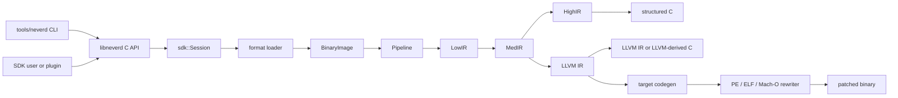

**اللغات**: [English](../architecture.md) | [简体中文](../zh-CN/architecture.md) | [繁體中文](../zh-TW/architecture.md) | [日本語](../ja/architecture.md) | [한국어](../ko/architecture.md) | [Français](../fr/architecture.md) | [Deutsch](../de/architecture.md) | [Español](../es/architecture.md) | [Italiano](../it/architecture.md) | [Русский](../ru/architecture.md) | [العربية](architecture.md)

[← فهرس التوثيق](README.md)

# عمارة NeverD

يصف هذا الدليل حدود الإنتاج التي يحتاج المساهم إلى فهمها لتعديل NeverD بأمان.
وهو يغطي عمدًا الشفرة المملوكة لـ NeverD فقط؛ وتحتفظ وحدات LLVM وCapstone
وUnicorn الفرعية بعمارتها الداخلية.

## حدود النظام

لدى NeverD أربعة تمثيلات IR، لكنها ليست سلسلة إلزامية من أربع قفزات.
`LowIR -> MedIR` مشترك. تستخدم إعادة التجميع المنظمة بعد ذلك
`MedIR -> HighIR -> C`، بينما تسلك `lift` و`decompile --llvm` و`patch` المسار
المباشر `MedIR -> LLVM IR`. تتجاوز وضعيّتا patch وlift ‏HighIR عمدًا.

تحلل CLI الأوامر في `tools/neverd`، وتنشئ `neverd_session_t`، وتستدعي API العامة
في `include/neverd/sdk/NeverDCAPI.h`. توجد حالة المحرك في
`lib/sdk/SessionImpl.h`؛ ويختار `neverd_session_load` loader ويبني
`BinaryImage`، بينما تشغّل العمليات المبنية على IR ‏`lib/pipeline/Pipeline.cpp`
عند الحاجة. يرتبط الملف التنفيذي `neverd` مع `neverd_shared`؛ وأرشيفات
المكونات وتبعيات LLVM/Capstone هي تفاصيل خاصة بالمكتبة المشتركة. تستخدم CLI ‏LLVM
Support لواجهة سطر الأوامر، لكنها لا تتجاوز C API لقيادة المحرك.

يمتلك تحليل HighIR ‏`HighSourceFlow` حواف تدفق العبارات الناتجة وهويات المتغيرات المحلية
وتحليل الإسناد المؤكد. يشترك التحقق من المصدر وحذف نسخ PHI غير المستخدمة في هذا الرسم.
تتبع تقسيمات محدودة لحالتي الصفر وغير الصفر الشروط العددية المتكررة؛ وتبطل الكتابة الحقائق،
وتظل المتغيرات التي خرج عنوانها مجهولة. عند بلوغ حد التقسيم يعود التحليل إلى الرسم المحافظ.
لا تُحذف نسخة PHI إلا إذا كانت قيمتها غير مستخدمة في جميع السياقات الممكنة.
تحتفظ الاستدعاءات والقراءات والكتابات وسميات المصدر بسلوكها القابل للملاحظة.

يستخدم تحليل هروب مؤشرات مستهلكي الكتل هذا الرسم أيضًا. ينقل حساب محدود للنقطة الثابتة هويات المؤشرات ومواضع المكدس الخاصة عبر الفروع والحلقات. تحتفظ نقاط الدمج بعناوين السياق المحتملة، ولا تمحوها إلا كتابة كاملة. تمنع الحواف المجهولة وتدفقات الاستثناءات ونفاد ميزانية الإثبات الربط.

تميّز معلومات مستقبل Objective-C بين self عند مدخل الطريقة ومرجع صنف محدد بدقة. يجب أن تتفق جميع سجلات البيانات الوصفية التي تشترك في المدخل قبل إثبات self. تنقل النسخ كاملة العرض والسجلات التي يحفظها ABI هذه المعلومات عبر تحليل النقطة الثابتة نفسه، بما في ذلك الحواف العائدة إلى المدخل. يراعي توافق التصريحات طرق الصنف والمثيل، والفئات المسجلة، والأصناف الأب، والبروتوكولات المتبناة؛ ويشمل self أيضًا تصريحات الأصناف الفرعية المعروفة. تحتفظ فهارس المترجم بالمالك والتسلسل الوراثي بشكل منفصل عن توافق المحددات العام. يعيد SDK التحقق من أصل المستقبل والتصريحات في الصورة الحالية قبل إصدار المصدر. لا تختار هذه المعلومات تنفيذ IMP محددًا ولا تسمح بإعادة كتابة الملف الثنائي.
عند غياب معلومات الوراثة الخارجية، يُشترط توافق المحددات العام بدل تضييق النطاق إلى المستقبل؛ وتظل التصريحات غير المدعومة أو المتعارضة صراحةً أدلة سلبية.

تمدّد متغيرات ivar ذات النوع الكائني الصريح إثبات المستقبل عبر ثماني قراءات كاملة العرض كحد أقصى. تسجّل كل خطوة خانة إزاحة وقت التشغيل وعرضها وأي إزاحة بايت ثابتة استخدمتها التعليمة. يجب أن تطابق الثوابت التخطيط الحالي، بينما يمكن لمرجع وقت التشغيل أن يتبع الحقل المنقول. يتحقق المحمّل من سلسلة الأصناف المسجلة وتصريح الحقل. لا توفر القراءات الجزئية أو id دون صنف أو الكتل أو أنواع البروتوكولات وحدها أو التخزين الملتبس أو المؤشرات الأساسية المجهولة معلومات صنف. يعاد التحقق من المسار كله وفق الصورة الحالية قبل إصدار المصدر. لا تثبت هذه المعلومات هوية الكائن ولا تسمح بحذف عمليات الذاكرة.

يتحقق المحمّل من رسوم بيانية محدودة وخالية من الدورات لسلاسل Darwin الثابتة وكائنات الأعداد الصحيحة والمصفوفات والقواميس المرتبة. يتطلب كل حقل وحافة ذاكرة معيّنة غير قابلة للتغيير ودليلاً واضحاً للاستيراد أو إعادة التموضع؛ وتُرفض الترميزات غير المدعومة والدورات والرسوم غير المكتملة صراحةً. تعيد روابط المصدر التحقق من الرسم ومن خانة المؤشر الوارد. تحافظ الدوال المولدة على بتات الأعداد وترتيب العناصر والعناوين المشتركة، وتعيد استخدام هوية السلاسل القائمة. تُهيّأ خانات الحاويات مرة واحدة مع النشر بأسلوب acquire/release، باستدعاء دوال العناصر المتحقق منها فقط. تحمل كل دالة تصريحات عناصرها كي تشترك الطرق المستعادة بصورة مستقلة في تعريف واحد. تغطي الاختبارات المحمولة المدخلات التالفة وحدود الإثبات، وتقارن أمثلة المترجم الأصلية المحتوى والأسماء المستعارة وهوية النسخ والتهيئة المتزامنة بالطرق الأصلية.

## تمثيلات IR ومساراتها

| التمثيل | الغرض | التعريفات والتحويلات الأساسية |
|---------|-------|-------------------------------|
| LowIR | عمليات `NdOp` مستقلة عن العمارة، وكتل أساسية، وCFG، وبيانات جداول القفز | `include/neverd/ir/low` و`lib/ir/low`، وينتجها `lib/decode` + `lib/lift` |
| MedIR | الأنواع، وABI/أعراف الاستدعاء، ونموذج الذاكرة/المكدس، والأعلام، والاستدعاءات، وتدفق شبيه بـ SSA | `include/neverd/ir/med` و`lib/ir/med` |
| HighIR | تعابير وتحكم منظم لإنتاج C مقروء | `include/neverd/ir/high` و`lib/ir/high`، يصدره `lib/backend/c/HighC` |
| LLVM IR | التحسين، وC مشتق من LLVM، وتوليد شفرة الهدف، ومدخل إعادة كتابة الثنائي | `lib/backend/llvm`، يحسّنه/ينسقه `lib/pipeline` |

تحتفظ الثوابت عبر LowIR وMedIR وHighIR بمصدر كل ظهور، سواء كان قيمة عددية أو عنوانًا، وبملكية العنوان. لا يؤدي تطابق البتات العددية إلى دمج مصادر مختلفة. يعامل التبسيط الرمزي في HighIR هويات العناوين كمدخلات معتمة؛ ويستخدم ربط المصدر التصنيف المشترك للمعاملات العددية، مع استمرار اشتراط ربط إعادة التمركز عند استخدامها للذاكرة أو كمؤشرات.

| مسار المستخدم | مسار التمثيلات | المخرج |
|---------------|----------------|--------|
| تفريغ Low/Med | Binary -> LowIR، واختياريًا -> MedIR | نص تشخيصي |
| تفريغ High أو `decompile` | Binary -> LowIR -> MedIR -> HighIR | HighIR أو C منظم |
| `lift` | Binary -> LowIR -> MedIR -> LLVM IR | `.ll` |
| `decompile --llvm` | Binary -> LowIR -> MedIR -> LLVM IR | C مشتق من LLVM |
| `patch` | Binary -> LowIR -> MedIR -> LLVM IR -> codegen | ثنائي معاد كتابته |

يمثل `lib/pipeline/Pipeline.cpp` مصدر الحقيقة لاختيار المسار. أبق المنطق الخاص
بالتمثيل في مكتبة IR أو backend المالكة له؛ وعلى pipeline تنسيق المكونات لا
ابتلاع خوارزمياتها.

## عقد الترجمة بين المعماريات

يعرّف `include/neverd/translate` طبقة عقد، لا backend للتنفيذ.
يمثل `GuestState` الحالة المرئية للآلة بصورة مستقلة عن العمارة لكل من
`x86_32` و`x86_64` و`AArch64` و`ARM32`. يستخدم تسلسله القانوني ذي الإصدار 1
حقول little-endian ثابتة العرض، ومعرّفات سجلات مستقرة، ومجموعات مرتبة، وتحققًا
fail-closed؛ لذلك لا تعتمد الحالة المستمرة على تخطيط C++ في المضيف.

خط الأساس wire v1 لـ`GuestState` مجمّد بصورة دائمة. يجب أن تستخدم أي حالة خارجه
معرّف extension-register من نطاق الامتدادات مع اسم قانوني بأحرف صغيرة، أو أن
تنتقل إلى إصدار wire جديد مع upgrader صريح؛ ويحظر تغيير خط أساس v1 في مكانه.

بالنسبة إلى ضيف `ARM32`، يكون `ExecutionMode` هو نمط فك الترميز المرجعي ويجب أن
يتوافق مع `CPSR.T`. ويكون PC المخزّن دائمًا عنوان التعليمة القانوني بعد تصفير
البت 0؛ كما يتطلب نمط ARM محاذاة على حدود الكلمة.

يعرّف عقد أزواج المعماريات `x86_64 -> AArch64` و
`AArch64 -> x86_64` و`x86_32 -> AArch64/ARM32` و
`ARM32 -> x86_32/x86_64`. تعني `ContractDefined` إمكان التحقق من الطلب وحفظه،
لا إمكان ترجمة الشفرة أو تنفيذها. تقبل سياسة JIT المضيف الأصلي للعملية الجارية
فقط، بينما تتطلب سياسة AOT تحديد عمارة المضيف وtarget triple صراحة؛ ويجب أيضًا
تحديد CPU أو مجموعة الميزات صراحة عند اختيارهما.

يحوّل `ResolvedHostTarget` هذا الاختيار إلى نتيجة محددة. يستمد تحليل `Native`
الـtriple والـCPU ومجموعة الميزات المفعّلة أو المعطّلة من العملية الحالية، بينما
يتحقق تحليل `Explicit` من العمارة والـtriple والـCPU والميزات التي يقدمها المستدعي
ويطبّعها ويرفض التعارضات. تُبنى هوية cache ذات إصدار من مدخلات الهدف المطبّعة
بترتيب بايتات حتمي، ولا تتضمن عناوين العملية أو نصًا يعتمد على locale.

يسجل `TranslationExit` ذو الإصدار سبب توقف مستقرًا والحمولة المنمطة الموافقة
لاستدعاءات النظام، والاستثناءات أو الإشارات، ونقاط التوقف، والتعليمات غير
المدعومة، والتعديل الذاتي، وميزانيات الموارد، والاستدعاءات الخارجية، وأعطال
الذاكرة، وشروط الانتهاء الأخرى. لذلك لا يحتاج المستهلك إلى إعادة تفسير عدد
صحيح غير منمط وفقًا لسبب التوقف.

باستثناء حالة `BudgetExhausted` المطابقة، يجب ألا تتجاوز عدادات التعليمات
وblocks والشفرة المولّدة الميزانية غير الصفرية المقابلة في الطلب. يتوقف استنفاد
التعليمات وblocks عند الـlimit تمامًا. لا يُعرف حجم object المولّد بدقة إلا بعد
codegen غير قابل للتجزئة، لذلك قد تبلغ نتيجة الاستنفاد `Observed > Limit`؛ ولا
يُربط ذلك الـobject المرفوض أو يُنشر أو يُنفّذ مطلقًا. تحدد كل حمولة
`BudgetExhausted` الـlimit المطلوب بدقة، لا عتبة مشتقة أو خاصة بالتنفيذ.

يبلغ عقد `RuntimeControlBlockV1` الداخلي للـbackend مقدار 128 بايت
بالضبط، بمحاذاة 8 بايت، وتضبطه قيم magic وversion وsize وإزاحات حقول ثابتة
للإصدار v1، وحقول محجوزة صفرية، ومخارج منمطة متسقة. لا يحتوي حاويات C++ ولا
مؤشرات للمضيف ولا أسماء بديلة لعناوين guest. وهو ليس تخطيط C++ ولا صيغة wire
الخاصة بـ`GuestState`؛ ويجب على backend يطبق هذا العقد تحويل الحالة إليه صراحة.

لا يحتوي سطح الاستدعاء الثابت للإصدار v1 للشفرة المولدة إلا ثمانية helpers:
`nvd_rt_v1_load8_le` و`nvd_rt_v1_load16_le` و`nvd_rt_v1_load32_le` و
`nvd_rt_v1_load64_le` و`nvd_rt_v1_store8_le` و`nvd_rt_v1_store16_le` و
`nvd_rt_v1_store32_le` و`nvd_rt_v1_store64_le`. يجب أن تتطابق الأسماء والتواقيع
ومصدر المؤشرات تمامًا؛ وعلى backend ربط هذا الجدول المحدود صراحة من دون الرجوع
إلى تحليل رموز البيئة المحيطة. التحقق من generation للذاكرة القابلة للتنفيذ
واستطلاع الميزانية/الإلغاء عمليتان خاصتان بالـdispatcher الموثوق؛ ولا يعد
`nvd_rt_v1_validate_generation` ولا `nvd_rt_v1_poll` helper للشفرة المولدة.
ويملك host dispatcher الموثوق أيضًا اختيار blocks ولا يمكن للـIR المولد استدعاؤه؛
بل تعيد translated blocks رمز خروج منمطًا. ولا يجوز للـIR المولد أن يقرأ مباشرة
إلا runtime slot المعلن للـscalar-result.

يحوّل `RuntimeSymbolRegistryV1` جدول helpers هذا إلى سجل مغلق في جانب المضيف.
يتحقق الإنشاء من مجموعة ABI-v1 الكاملة، والأسماء القياسية الدقيقة، وفئات helpers،
والتواقيع، ومن وجود مؤشر دالة وحيد غير صفري يطابق الفئة لكل مدخل. لا يقبل البحث
إلا الاسم المطابق تمامًا، ولا يستعلم أبدًا عن رموز بيئة العملية أو المحمّل الديناميكي،
ويقدم إلى verifier ملفات الهدف الأسماء المرتبة نفسها بوصفها allowlist. تغطي هويته
ذات الإصدار الأسماء وفئات helpers وشكل ABI، لكنها تستبعد العناوين الأصلية عمدًا،
فتبقى مستقرة مع ASLR.

يملك `RuntimeCodeMemory` مخزن شفرة مولدة معزولًا على مستوى الصفحات، ولا يسمح إلا
بنشر أحادي الاتجاه `RW -> RX`. لا تكون الذاكرة قابلة للكتابة والتنفيذ معًا أبدًا،
ولا يمكن إعادة فتحها للكتابة بعد النشر؛ كما تُفحص حدود الكتابة ونقاط الدخول وتُبطل
ذاكرة تعليمات المضيف المؤقتة عند النشر. لا ينفذ native smoke test سوى تسلسل قصير
من تعليمات المضيف بعد النشر؛ وهو يثبت حد ذاكرة W^X هذا فقط، لا محرك ترجمة.

يُعزل `GuestMemoryRuntime` عن `GuestState` المنطقي: يتحقق من الحالة عند الإنشاء
ثم ينسخ بايتات المناطق وبياناتها الوصفية إلى فهرس خاص مرتب. لا تعدو عناوين
guest الافتراضية كونها مفاتيح بحث، ولا تتحول أبدًا إلى مؤشرات للمضيف. تبلغ
عمليات الوصول القياسية المفحوصة عن أعطال منمطة للعرض والمحاذاة والفيض وعدم
التعيين وعبور المناطق والصلاحيات والكتابة إلى شفرة قابلة للتنفيذ وفيض أو عدم
تطابق generation ومخالفة policy. كما تنتج ميزانيات التعليمات/blocks والإلغاء
وتتبع generation وسياسات كتابة الشفرة `RejectExecutableWrites` و
`InvalidateOnExecutableWrite` و`ValidateBeforeDispatch` سجلات منمطة متسقة بدل
سلوك ضمني في المضيف.

يمثل `TranslationObjectCompilerV1` الحد المتحقق منه بين LLVM IR وملف الهدف. يتحقق
من input module من نوع const، ويستنسخه قبل أي تحويل، ويدمج التبسيط الدلالي المحكوم
بالإثبات مع تحسين LLVM من `O0` إلى `O3`، ثم يتحقق من IR النهائي مجددًا ويصدر ملفات
relocatable من ELF أو COFF أو Mach-O لمعماريات المضيف الأربع التي يغطيها العقد.
ويطبّع manifests الدقيقة ذات target mangling لرموز blocks وruntime، ويدقق كل ملف
ناتج، ويعيد identity لسجل runtime ومفاتيح cache ذات إصدار للطلب والأثر. عندما تكون
ميزانية البايتات المولدة غير صفرية، لا ينتقل إلى تحقق الأثر إلا object يلتزم بها.
يصدر LLVM أولًا إلى buffer خاص لإكمال emit غير قابل للتجزئة وقياس الحجم الدقيق؛
ويرفض object المتجاوز قبل النشر وتدقيق الأثر، مع احتفاظ telemetry المنمط بالحجم
الملاحظ والـlimit المطلوب بدقة. ويعني الصفر عدم وجود حد من سياسة المستدعي. يتوقف
compiler عند بايتات relocatable المدققة: فلا يربطها أو ينشرها أو يمررها إلى
dispatcher أو ينفذها، ولا يوفر lowering لتعليمات guest.

يدقق post-codegen verifier ملفات relocatable من ELF وCOFF وMach-O
بوصفها مجموعة مغلقة. يجب أن تتطابق الصيغة والعمارة تمامًا مع المضيف المختار؛
ويجب أن تنتمي الرموز غير المعرفة إلى helper allowlist المحدودة بالمطابقة
الدقيقة، بينما تحظر الرموز الديناميكية. تقتصر relocations على whitelists مباشرة
وصريحة مع التحقق من encoding والعرض والمحاذاة وoffset وقابلية تحميل قسم الوجهة
ومن أن الهدف تعريف non-preemptible محلي للملف أو helper مسموح به تمامًا. ويرفض
المدقق W+X وبيانات unwind/exception/initializer الوصفية وTLS وIFUNC وGOT
وindirection العادي عبر PLT وrelocations الديناميكية والتعريفات weak/preemptible
أو القابلة للاختيار والأقسام المحجوزة غير المعروفة وتوجيهات linker. لا تُقبل صيغة
`R_X86_64_PLT32` التي يستخدمها LLVM لاستدعاء x86-64 ELF من نوع hidden إلا إذا
أثبتت policy v1 أنها sealed direct branch إلى runtime helper المطابق؛ ولا تسمح
بمسار PLT أو GOT. يجب ألا تحتوي آثار ELF من نوع `ET_REL` أي program headers أو
segments. وتخضع load commands في Mach-O لقائمة سماح موجبة: segment واحد بالضبط
يطابق عرض الملف، وبحد أقصى symbol table وdynamic-symbol table وplatform-version
وأمر data-in-code واحد لكل منها، مع التحقق من علاقات الاعتماد. وترفض خيارات
linker وكل command آخر.

يمثل `TranslationObjectRequestV1` أول مرحلة عامة ومحددة عمدًا لتحويل بايتات guest
إلى ملف هدف فوق هذه العقود. لا يقبل الجزء المنشور من v1 ذي سلوك fail-closed
للسجلات العددية في x86-64 إلا الترميزات canonical الخالية من legacy prefixes:
تعليمات `MOV` و`ADD`/`SUB` و`AND`/`OR`/`XOR` على GPR كاملة العرض بترميز REX.W
عندما تطابق معاملاتها أشكال LowIR المدعومة للسجل/القيمة الفورية. تحتفظ الأشكال
الحسابية بحسابات flags العددية الخاصة بها، وتحسب الأشكال المنطقية و`TEST` flags
التي تحددها المعمارية مع الحفاظ على `AF` في نموذج حالة NeverD. تقبل schema 9 أيضًا
`CMP` كاملة العرض بين سجلين بترميزي `39/3B`، وبين سجل وقيمة فورية بترميزات
`81/7` و`83/7` و`3D`، و`TEST` كاملة العرض بين سجلين بترميز `85` وبين سجل وقيمة فورية
بترميزي `F7/0` و`A9`. تنهي ترميزات `C3` `RET` و`C2 iw`
`RET imm16` canonical كتل الرجوع، وتنهي ترميزات `JMP` النسبية المباشرة canonical
`EB cb` و`E9 cd` كتل الفرع المباشر. schema الـlowering المنشور هو 9. تقتصر فروع
Jcc التقليدية canonical والخالية من legacy prefix على: `JO`/`JNO` بالصيغة
القصيرة `70/71 cb` أو القريبة `0F 80/81 cd`؛ و`JB`/`JAE` مع `72/73 cb` أو
`0F 82/83 cd`؛ و`JE`/`JNE` مع `74/75 cb` أو `0F 84/85 cd`؛ و`JBE`/`JA` مع
`76/77 cb` أو `0F 86/87 cd`؛ و`JS`/`JNS` مع `78/79 cb` أو `0F 88/89 cd`؛
و`JP`/`JNP` مع `7A/7B cb` أو `0F 8A/8B cd`؛ و`JL`/`JGE` مع `7C/7D cb` أو
`0F 8C/8D cd`؛ و`JLE`/`JG` مع `7E/7F cb` أو `0F 8E/8F cd`.
تبقى `JRCXZ`/`JECXZ`/`JCXZ` و`LOOP`/`LOOPE`/`LOOPNE` غير منشورة وتُرفض
fail-closed. كذلك تُرفض fail-closed صيغة `F7 /1` المحجوزة، ومعاملات guest memory،
وأشكال السجلات الجزئية، وlegacy prefixes، وبتات امتداد REX الزائدة دلاليًا. ولا ينتج إلا ملف relocatable مدققًا من AArch64
ELF أو Mach-O بترتيب little-endian. تُرفض عمليات guest memory العادية، وأشكال
السجلات الجزئية، وأي تعليمة أو ترميز خارج هذه المجموعة الدقيقة، وأي control flow
عدا الرجوع وهذه القفزات المباشرة وفروع Jcc المنشورة أعلاه، وكل عملية
LowIR لم ينفذها lowerer قبل إصدار الملف. أما القراءة المفحوصة
لعنوان الرجوع التي
يتطلبها `RET` فهي جزء داخلي من عقد terminator ولا تنشر lowering عامًا لذاكرة
guest. يعيد الطلب بناء ويفحص
descriptor الخاص بالـblock، ويستخدم target machine المحللة نفسها في lowering
وإصدار الملف، ويدمج التبسيط الدلالي المحكوم بالإثبات مع pipeline التحسين
الافتراضية `O2` في LLVM. لا تغطي هذه المرحلة تعليمات x86-64 الأخرى، ولا أزواج
guest/host أخرى، ولا الاتجاه العكسي من AArch64 إلى x86-64.

تكشف نقطة الدخول العامة بلغة C
`neverd_translate_x86_64_block_to_aarch64_object_v1`، وPython ctypes wrapper
`translate_x86_64_block_to_aarch64_object`، والأمر `neverd translate-object`
الحد نفسه الذي يتوقف عند ملف الهدف. تستخدم Python القيمة
`TranslationObjectFormat.ELF` أو `.MACHO`. عند فشل الترجمة في المكتبة الأصلية
ترمي `TranslationError` منمطة تحمل `TranslationErrorCode`؛ أما التحقق المحلي
من المعاملات فيرمي `TypeError` أو `ValueError`. وتعيد عند النجاح نتيجة ثابتة
تملكها Python. تملك نتيجة C بايتات الملف وهويات cache المستقرة وبيانات telemetry
للتحسين؛ ولا تكتب CLI إلا ملف ELF أو Mach-O المختار. تتوقف الواجهات الثلاث قبل
الربط والتحميل وdispatch والتنفيذ والتصحيح؛ وليست واجهات session للتنفيذ.

يضيف `verifyTranslationLinkGraphV1` تدقيقًا ثانيًا مستقلًا قبل أي allocation. يبني LLVM
JITLink graph مؤقتًا من ملف AArch64 ELF أو Mach-O مقبول، ويفحص target وصلاحيات
الأقسام وmanifests رموز block/runtime وانغلاق الرموز الخارجية وأنواع edges
وأهدافها. يُتلف graph بعد إنتاج نتيجة تدقيق خالية من العناوين. لا يعني اجتياز هذا
التدقيق ربط الشفرة أو تخصيصها أو تحليل رموزها أو تحميلها أو نشرها أو dispatch لها
أو تنفيذها.

يمثل `linkTranslationObjectV1` حد الربط الأصلي المنفصل. يعيد تدقيق descriptor
الموثوق والملف الخام وJITLink graph قبل pruning وallocation وتحليل الرموز وfixup
وبعدها. لا تأتي رموز runtime إلا من السجل sealed. تربط credential الخاصة
بالـdispatcher إدخال manifest الوحيد بالـsession وهوية block وPC دخول guest
وcache generation وcode epoch الخاصة به؛ ويتطلب الاستدعاء أيضًا تطابق `RIP`
الخاص بـruntime guest مع ذلك الإدخال. تنشر finalization الناجحة ذاكرة قابلة للتنفيذ
بالصلاحيات النهائية، ويلغي unload الاستدعاءات الجديدة وينتظر استدعاءً نشطًا واحدًا
قبل تحرير allocation. تبقى overload الخالية من credential للتدقيق فقط ولا يمكنها
الاستدعاء.

يجمع `NativeTranslationSessionV1` هذه الأجزاء في حد تنفيذ C++ تجريبي من x86-64
إلى AArch64 أصلي. في process من AArch64 ELF أو Mach-O بترتيب little-endian، يحافظ
على runtime واحد مفحوص لذاكرة guest وعلى guest state ثابت عبر عدة blocks ضمن حلقة
dispatcher من compile-link-validate-invoke-unload. تتابع القفزة المباشرة canonical
عند هدفها الثابت الدقيق. ولا يتابع الفرع الشرطي canonical المنشور المعتمد على flag واحد إلا
عند successor من نوع taken أو fallthrough يعلنه manifest الخاص بالـblock؛ ويرفض
dispatcher أي PC محدد آخر. بينما ينهي الرجوع التنفيذ. تظل الميزانيات العالمية
لعدد التعليمات والblocks وبايتات الملفات المولدة دقيقة عبر blocks. عند توقف guest
ناجح تُعتمد الحالة المنفذة والذاكرة المرجعية معًا. وتُخطّى الإلغاء خطيًا بالنسبة
إلى ذلك الاعتماد النهائي.

هذه شريحة عمودية قابلة للتنفيذ وليست مترجمًا كاملًا. لا تدعم بعد تعليمات guest
memory العادية، ولا السجلات الجزئية، ولا control flow الشرطي خارج شريحة Jcc
التقليدية الدقيقة المنشورة في schema 9 أعلاه، بما يشمل `JRCXZ`/`JECXZ`/`JCXZ`
و`LOOP`/`LOOPE`/`LOOPNE`، ولا control flow غير المباشر، ولا calls أو floating-point أو SIMD
أو x87 أو atomics أو system instructions، ولا نشر الاستثناءات العام، ولا block
cache، ولا أزواج guest/host الأخرى، ولا الاتجاه العكسي من AArch64 إلى x86-64.
لا تملك session التنفيذ بعد واجهة C أو Python أو CLI
أو JSON، ويبقى التصحيح منفصلًا وغير مدعوم. تظل object APIs أعلاه مفيدة دون تفعيل
التنفيذ الأصلي.

يشترط عقد IR المولّد أن يكون كل translated block خاضع له hidden وnon-preemptible
وأن يستخدم C ABI `i32 (ptr state, ptr runtime)`. لا تُكتشف blocks إلا عبر سجل
خاص، ولا عبر بحث رموز العملية المحيطة؛ كما تُحظر الاستدعاءات المباشرة بين
blocks.

يقيّد IR verifier أيضًا عروض الأعداد الصحيحة بعرض السجل القياسي للمضيف لتجنب
compiler-runtime libcalls المعروفة التي قد تضيفها legalization. هذا شرط ضروري
لكنه غير كافٍ: يجب على أي backend تنفيذ يطبق هذا العقد تدقيق انتقالات التحكم
post-codegen و`MachineIR` وrelocations في ملف الهدف تدقيقًا دقيقًا مقابل قائمة
runtime-symbol allowlist المحدودة نفسها.

لا يجوز أن تحتوي عمليات load/store المباشرة في TranslationIR ولا قيم private
constants إلا على عدد صحيح قياسي واحد لا يتجاوز عرض السجل القياسي للمضيف. ويجب
تفكيك القيم المجمعة إلى قيم قياسية قبل حد verifier، حتى لا يتسبب IR مضغوط في
توسعة غير محدودة داخل backend.

يُعرّف generated-code ABI للأعداد الصحيحة القياسية فقط. أما floating point
وSIMD وx87 والعمليات الذرية وتعليمات النظام فهي خارج هذا العقد. يجب على أي
تنفيذ يختار `ProvenSemanticAndLLVM` تشغيل تبسيط NeverD الدلالي المحكوم بالإثبات
حتى نقطة ثبات مشتركة مع تحسين LLVM؛ ولا توفر السياسة نفسها backend ترجمة قابلًا
للتنفيذ.

## حدود إعادة كتابة الاستثناءات

يتوفر لـMach-O compact unwind parser صارم لـ`__unwind_info` الأصلي، وparser
مدرك للـfixups لسجلات `__LD,__compact_unwind` المولدة، وmerge دقيق للنطاقات
الأصلية والمولدة، وencoder حتمي للصفحات المنتظمة، وinstaller بمعاملة واحدة للـsection
النهائي. لا يعيد installer كتابة `__TEXT,__unwind_info` موجودة وfile-backed
in-place إلا إذا كان الجدول المرمّز يناسب سعتها المعلنة. وهو يعيد التحقق من
المعمارية وlayout وbyte preimage، ويصفّر الذيل غير المستخدم، ثم يعيد parse النتيجة
ويثبت تكافؤها الدلالي قبل commit الوحيد لمعاملة Mach-O الخارجية. عند غياب
الـsection النهائي لا تُثبَّت سجلات compact المولدة، ولا يجوز أن تنجح المعاملة إلا
عبر إغلاق DWARF-FDE الدقيق والموثّق أدناه؛ أما section موجود وقصير السعة أو malformed
فيظل fail-closed. تُوثَّق السجلات المولدة بربط دقيق
يسجله compiler بين IR source function وtarget MC owner symbol (بما في ذلك التعريفات
الخاصة، من دون تخمين prefix الصيغة أو mangling)، ومعرّفات range مبهمة وغير صفرية،
ونطاقات fragments نصف مفتوحة ودقيقة. يجب أن يطابق كل FDE مولد fragment موثقًا واحدًا
بالضبط، ويجب أن يطابق كل fragment مطلوب FDE واحدًا ثبّتته المعاملة نفسها، إلا إذا غطاه
سجل compact غير DWARF دقيق اجتاز تحقق encoding صارمًا. ويمكن للـfragments المتجاورة
أو المنفصلة التابعة للـowner نفسه إعادة استخدام source recipe واحد؛ بينما تفشل الهوية
المفقودة أو المكررة أو المعلّقة أو العابرة بين owners أو غير المطابقة للحدود قبل تعديل
الخرج. لا يتم commit للـRX segment الجديد إلا بعد إثبات أن `__LINKEDIT` وحيد وطرفي في
file/VM، وأن إزاحات offsets مفحوصة ضد overflow، وأن replay صارمًا للـlayout النهائي
نجح.

تُصنَّف المراجع الخارجية من عقد MC fixup الكامل. لا يجوز للـcall اختيار إلا target
قابل للاستدعاء وموثّق، ولا يجوز لحقل personality في compact unwind المولّد اختيار إلا
non-lazy pointer slot متحقق منه، من دون dereference لمحتواه في الملف. تفشل صيغ TLS
وauthenticated pointer والحدود المطروحة وحقول compact المشوهة وصيغ relocation غير
المعروفة بوضع fail-closed.

في ARM32 compact unwind تكون stack adjustment المشفرة وGPR layout بحالة `Complete`.
كما تكون محددات D-register pattern من 0 إلى 3 بحالة `Complete`؛ أما من 4 إلى 7 فهي
`Partial` لأن compact word وحده لا يثبت كل CFA-relative slot محاذى في runtime. يجوز
لإدخال `Partial` الاحتفاظ بهويات السجلات المثبتة للتحليل، لكن كل مسار rewrite يرفضه
fail-closed. تربط كل receipt لتثبيت EH-frame بدقة target architecture وpointer width
وbyte order؛ ويرفض compact-unwind DWARF binding أي عدم تطابق في receipt target
identity. ولا يزال إثبات native throw/catch على ملف مربوط قيد الإنجاز.

معاملة section العليا لـ ARM32 أضيق نطاقًا من decoder الخاص بـ compact unwind.
لا تُفعّل إلا عندما يساوي Mach-O header القيمة `CPU_SUBTYPE_ARM_V7K` بدقة،
وتثبت بتات `N_ARM_THUMB_DEF` في symbol table الأصلية إثباتًا إيجابيًا أن كل
function مطلوبة هي Thumb code. بعد ذلك يبقى كل من triple الدقيق
`thumbv7k-apple-watchos` وThumb mode مرتبطًا عبر code generation بالكامل، ولا
يجوز لمتطلبات input features أن تتجاوز حد Cortex-A7. تفشل قبل أي تعديل للخرج
وبأسلوب fail-closed كل من functions غير الموسومة أو مجهولة الوضع، وsubtypes
العامة غير v7k، وARM mode، وexternal-code targets المختلطة أو المجهولة، وARM
Mach-O in-place entry point، وARM Mach-O patching من C source. ولا تزال inputs
منزوعة الرموز التي لا يمكن اكتشاف functions فيها إلا عبر `LC_FUNCTION_STARTS`
غير مدعومة.

تملك PE وELF وMach-O مكونات استثناءات خاصة بكل صيغة، لكن NeverD لا ينشر حتى الآن
pipeline لإعادة الكتابة من طرف إلى طرف تغطي كل الصيغ وكل أنواع الاستثناءات. يجب
أن يفشل أي encoding غير مدعوم أو متطلبات registration/layout غير محلولة قبل
تعديل الخرج؛ ولا يجوز وصف الدعم الجزئي الحالي بأنه إغلاق كامل لمسار الاستثناءات.

التعرف على personality من نوع Itanium لـ Ada أو D ليس دعمًا لاستثناءات Ada أو
D. سجلات LSDA ذات شكل العنوان من GNAT وGDC وDMD وLDC قابلة للتحليل؛ وتبقى خانات
type-table غير شفافة (`Exception_Id` / `Exception_Data` في GNAT و`ClassInfo`
في D) ولا تُتبع أبدًا على أنها `std::type_info`. تعيد البناء الأصلي إصدار
`personality` في LLVM مع بنود `invoke`/`landingpad` ذات شكل العنوان. حالة
corpus-proven ادعاء منفصل ولا تُستنتج من التعرف على personality أو من lowering
الأصلي.

## خريطة المكونات

كل مكوّن أرشيف ثابت ينشئه `add_neverd_component_library`. يسرد الجدول تبعيات
NeverD المهمة، لا كل مكتبات LLVM وCapstone المشتركة التي يوفرها helper الخاص بـ
CMake.

| الدليل | المسؤولية | التبعيات المهمة |
|--------|-----------|-----------------|
| `lib/loader` | اكتشاف الصيغة، وتحميل PE/COFF وELF وMach-O، و`BinaryImage` موحدة، واكتشاف الدوال | LLVM Object API |
| `lib/lift` | دلالات تعليمات x86/i386 وAArch64 وARM32 المكتوبة يدويًا | أنواع بيانات IR |
| `lib/decode` | فك Capstone/native والتوزيع إلى lifter العمارة | `NeverDIR` و`NeverDLift` |
| `lib/ir` | الأنواع المشتركة وتعريفات/تحويلات LowIR وMedIR وHighIR وintrinsic | مكونات IR الفرعية الأربعة |
| `lib/pipeline` | اكتشاف الدوال وتنسيق مسارات Low/Med/High/LLVM | IR وdecode وlift وLLVM backend ومعلومات التصحيح وIR pass |
| `lib/backend/c` | عرض HighIR إلى C وLLVM IR إلى C | IR |
| `lib/backend/llvm` | خفض MedIR إلى LLVM | IR |
| `lib/backend/codegen` | توليد شفرة الهدف وpatch/إعادة الكتابة الموضعية لـ PE/ELF/Mach-O | IR وloader |
| `lib/sdk` | C ABI العامة، ودورة session، والاستعلامات، والاستمرارية، والإضافات، ومداخل lift/decompile/patch/audit/hunt | يجمع المحرك في `libneverd` |
| `lib/pass` | مسارات تشويش LLVM IR ومشغل مسارات MIR | IR |
| `lib/debug` | سياقات تصحيح DWARF وPDB وlinker-map | IR |
| `lib/sigs` | تحليل التواقيع وقواعدها ومطابقتها | Loader |
| `lib/libc` | أسماء libc المعروفة ودعم نموذج الاستدعاء | مكوّن مستقل |
| `lib/safety` | تدقيق عمر الكومة وصيد فيضان النسخ على IR المرفوع | Symbolic، Solver |
| `lib/support` | أدوات مشتركة لتحميل الثنائيات | Loader |
| `lib/translate` | عقود ذات إصدار لحالة guest/policy/exit وruntime ABI ثابت وguest memory مفحوصة وتدقيق IR/ملفات الهدف/LinkGraph المولدة وربط أصلي sealed وdispatcher C++ تجريبي من x86-64 إلى AArch64 | عقود IR وLLVM وLLVM Object وJITLink |

تعكس الرؤوس العامة هذه المناطق تحت `include/neverd`. تجنب جعل فئة C++ داخلية
جزءًا من SDK بالخطأ: تنتمي العمليات الخارجية المستقرة إلى رأس C الخالص وإلى
أحد ملفات `lib/sdk/NeverDCAPI*.cpp` المحددة.

## عقد الرفع الصارم

يبدأ `Decoder` وكل lifter للعمارة في الوضع الصارم. إذا استطاع Capstone فك تعليمة
لكن lifter المختار لا ينفذها، فإنه يرمي `UnliftedInstruction`. يسجل الاستثناء
العنوان والاسم المختصر والمعاملات؛ لذا يجب أن تفشل الدلالات غير المدعومة بوضوح
بدل حذفها أو تخمينها.

يصدر المسار الداخلي غير الصارم `NdOp::NOP`، لكنه مخرج تشخيصي وليس تنفيذًا
مقبولًا. يجب أن تبقي اختبارات المساهمين وCI الوضع الصارم. عند ظهور فشل صارم:

1. أعد إنتاجه بأصغر fixture خاص بالعمارة.
2. أضف الدلالات المفقودة في `lib/lift/<ISA>`.
3. تحقق من شكل LowIR المتوقع في `unittests/lift`.
4. أضف دورة Unicorn تفاضلية في `unittests/semantic` إذا كان للتعليمة سلوك ملحوظ.

لا تلتقط `UnliftedInstruction` لمجرد استمرار pipeline. يحتاج التقريب المتعمد
الجديد إلى عقد واختبارات صريحة؛ ولا يجوز أن يتنكر كرفع 1:1.

## ملكية الصيغ وISA

منطق صيغة الإدخال ومنطق إعادة كتابة الإخراج منفصلان عمدًا:

| الصيغة | التحميل والبيانات وrelocation الإدخال | Patch وrelocation الإخراج |
|--------|--------------------------------------|---------------------------|
| PE/COFF | `lib/loader/COFF` | `lib/backend/codegen/COFF` |
| ELF | `lib/loader/ELF` | `lib/backend/codegen/ELF` |
| Mach-O | `lib/loader/MachO` | `lib/backend/codegen/MachO` |

توجد lifter العمارة في `lib/lift/X86` و`lib/lift/AArch64` و`lib/lift/ARM`.
وتوجد تصريحات lifter/register العامة في `include/neverd/lift`. يقع إصدار LLVM
وتوليد الشفرة الخاصان بالهدف تحت `lib/backend/llvm/<ISA>` و
`lib/backend/codegen/CodeGen<ISA>.cpp`.

### الدعم وعمق الاختبار

تعني مصفوفة الدعم الرئيسية أن كل خلية منفذة. ولا تعني أن كل opcode أو حالة ABI
حدّية أو منتج ثنائي أو إصدار نظام اختُبر باستقصاء. يتوقف الوضع الصارم وفق
fail-closed عندما تكون دلالة التعليمة خارج التغطية المنفذة في lifter.

تملك الخلايا الاثنتا عشرة للصيغة×العمارة تغطية دلالية لـ backend إعادة الكتابة
في `unittests/semantic/PatchFullSubstRTTests.cpp`. وعمق التكامل أدق:

| الصيغة | x86-64 | i386 | AArch64 | ARM32 |
|--------|--------|------|---------|-------|
| PE/COFF | fixture مرتبطة | شبكة backend | fixture مرتبطة | fixture Thumb مرتبطة |
| ELF | fixture مرتبطة + دورة دلالية | pipeline كائن + دورة دلالية | fixture مرتبطة + دورة دلالية | fixture مرتبطة + دورة دلالية |
| Mach-O | fixture مرتبطة\* | pipeline كائن PIC/no-PIC\* | fixture مرتبطة\* | شبكة backend |

- تختبر **fixture المرتبطة** loader/pipeline وسلوك patch لملف تنفيذي مرتبط على
  برامج ممثلة.
- يختبر **pipeline الكائن** التحميل وكل مراحل IR وإعادة تجميع كائن قابل لإعادة
  التموضع، لكنه لا يشمل ربط المضيف أو تنفيذ الثنائي بعد patch.
- تجمع **شبكة backend** ‏IR ممثلًا عبر مسار توليد إعادة الكتابة الدقيق، وتقارن
  السلوك في Unicorn؛ ولا تختبر loader للصيغة على ملف تنفيذي مرتبط.
- `*` تعتمد fixtures ‏Mach-O المرتبطة على toolchain مضيف قادر على إنتاج الهدف.
  لا يستطيع macOS الحديث ربط ملفات i386 التنفيذية التاريخية؛ لذلك تُستخدم
  كائنات thin ‏PIC/no-PIC وشبكة إعادة الكتابة.

تمثل خلايا fixture المرتبطة أقوى دليل على تكامل الصيغة لهذه البرامج.
وتملك خلايا pipeline الكائن وشبكة backend تغطية تكامل جزئية فقط. لا توجد خلية
«مختبرة بالكامل» دون هذا التقييد، ولا تدّعي أي خلية تغطية ISA شاملة.

الأدلة الأساسية هي
[`PatchFormatTests.cpp`](../../unittests/lift/format/PatchFormatTests.cpp) لـ fixtures ‏ELF
وPE المرتبطة، و
[`COFFARMFormatTests.cpp`](../../unittests/lift/format/COFFARMFormatTests.cpp) لتحميل/
إعادة تجميع Windows ARM، و
[`MachOI386RelocationTests.cpp`](../../unittests/lift/format/MachOI386RelocationTests.cpp)
لكائنات i386 thin، و
[`X86_64_PipelineE2ETests.cpp`](../../unittests/lift/x86_64/X86_64_PipelineE2ETests.cpp)
و
[`AArch64_PipelineE2ETests.cpp`](../../unittests/lift/aarch64/AArch64_PipelineE2ETests.cpp)
لـ Mach-O المرتبط، و
[`PatchFullSubstRTTests.cpp`](../../unittests/semantic/probe/patchfull/PatchFullSubstRTTests.cpp)
لشبكة الخلايا الاثنتي عشرة. راجع [دليل الاختبارات](testing.md) للأوامر.

## أين تعدّل

| التغيير | نقطة البداية | الحد الأدنى للتحقق المحدد |
|---------|--------------|---------------------------|
| إضافة تعليمة أو إصلاحها | الملفات المناسبة في `lib/lift/X86` أو `AArch64` أو `ARM`؛ والرأس العام إذا تغير التوزيع | اختبار العمارة في `unittests/lift`؛ ودورة دلالية في `unittests/semantic` |
| إضافة `NdOp` | `include/neverd/ir/NdOps.h`، ثم تدقيق Low-to-Med وemitter/renderer وverifier/emulator والتفريغ | `NeverDLiftTests` + حالات `NeverDSemanticTests` ذات الصلة |
| تغيير CFG أو اكتشاف الدوال | `lib/ir/low` و`lib/loader/FunctionDiscovery*.cpp` و`lib/pipeline/PipelineFuncDetect.cpp` | اختبارات lift لـ CFG/جداول القفز ومجموعة تحويل دلالية محددة |
| إضافة relocation إدخال أو قاعدة unwind لـ PE | `lib/loader/COFF` | `COFFARMFormatTests` أو fixture loader محددة جديدة |
| إضافة relocation إخراج أو قاعدة patch لـ PE | `lib/backend/codegen/COFF` | `PatchFormatTests` و`RewriteCodegenRTTests` وشبكة PE backend |
| تغيير سلوك ELF أو Mach-O | أدلة `lib/loader/<Format>` و/أو `lib/backend/codegen/<Format>` المطابقة | اختبارات الصيغة مع شبكة إعادة الكتابة |
| تغيير استرداد MedIR/ABI | `lib/ir/med` | اختبارات lift لأعراف الاستدعاء + دورات دلالية عابرة لـ ISA |
| تغيير استرداد التحكم المنظم | `lib/ir/high` | `NeverDCFGLoopXformTests` واختبارات C المنظمة |
| إضافة تحويل LLVM | `lib/pass/ir`، والرأس العام في `include/neverd/pass/ir`، ومفتاح pipeline إن كُشف | مجموعة تحويل محددة + `NeverDPatchFullTests` عند تغير مخرج patch |
| إضافة عملية C API | `include/neverd/sdk/NeverDCAPI.h` و`lib/sdk/NeverDCAPI*.cpp` محدد، و`SessionImpl.h` للحالة فقط | اختبارات SDK/CLI الدلالية؛ الحفاظ على `neverd_last_error` وأعراف التخصيص |
| إضافة أمر CLI | `tools/neverd/NeverDCLIOptions.cpp` و`NeverDCLI.h` و`NeverDCmd*.cpp` محدد، والتوزيع في `neverd.cpp` | `unittests/semantic/CLIEndToEndTests.cpp` وCLI smoke test مباشر |
| تغيير تدقيق عمر الكومة أو صيد فيضان النسخ | `lib/safety` و`include/neverd/safety` و`include/neverd/sdk/NeverDCAPISafety.h` | `NeverDSafetyTests` و`NeverDSafetyIntegrationTests` |
| إضافة انحدار دلالي | ملف `unittests/semantic/*Tests.cpp` محدد؛ وتسجيل الملف الجديد في `unittests/semantic/CMakeLists.txt` | بناء ثنائي الاختبار ثم اختيار الحالة بـ `ctest -R` |

أبق التغييرات ضيقة. يمكن أن تتغير ملفات تعريف التمثيل مع تحويلاته، لكن لا ينبغي
تعديل loader أو lifter أو backend غير المتعلق لمجرد إظهار refactor واسع بمظهر موحد.

تحفظ تصريحات البنى تخطيط الحقول بصورة مستقلة عن تصنيف ABI. يدعم Darwin ARM64 البنى المتداخلة التي تضم من عضو واحد إلى أربعة أعضاء متجانسة من float أو double؛ وعند نفاد سجلات الفاصلة العائمة يُمرر المعامل كاملاً عبر المكدس. يربط MedIR المكونات المادية قبل SSA، ويعيد HighIR بناء معامل أو ناتج منطقي واحد، ويتحقق خرج C من التخطيط. يدعم Darwin ARM64 وx86_64 أيضاً البنى المتداخلة المكونة من عدد صحيح أو مؤشر واحد أو اثنين بعرض 64 بت. عند تمرير البنية كاملة عبر المكدس، يعتبر ARM64 بنك السجلات المعني مستنفداً، بينما يحتفظ x86_64 بالسجلات المتبقية للمعاملات التالية. تُرفض الحشوات والحقول المضغوطة وخلط الأعداد الصحيحة بالفاصلة العائمة والمكونات الناقصة، ولا تمنح هذه المعلومات صلاحية إعادة كتابة الملف الثنائي.

لا تعلن فهارس استدعاءات بيئة التشغيل عن `ReturnedArgument` إلا للدوال المستوردة المحددة بدقة التي تعيد مؤشر الوسيط الأصلي. يقرأ تحليل المستقبل الوسيط الفيزيائي المعلن قبل إبطال السجلات المعتاد وفق ABI، ثم يستعيد فقط نوع المستقبل المثبت على النتيجة. يعيد SDK التحقق من هذا الأثر؛ ولا يحذف الاستدعاء أو آثار الملكية أو عمليات الوصول إلى الذاكرة.

تستخدم فهارس الأطر والمستقبلات المولدة بالمترجم قائمة موحدة تضم Foundation وCoreData وCoreLocation وCoreSpotlight وQuartzCore وUniformTypeIdentifiers وUserNotifications. يستخدم QuartzCore الترويسة العامة `CoreAnimation.h`؛ ولا تضيف استيرادات التوافق لأطر أخرى تصريحات مملوكة له. يحافظ المولدان على ملفات المعالجة المسبقة الأربعة والهويات الدقيقة للأطر وأدلة التصريحات السلبية.

توسّع أنواع نتائج الكائنات برهان نوع المستقبِل المحدود نفسه عبر تصريحات طرق متوافقة. توفّر أنواع الكائنات المسماة وأنواع الإرجاع المرتبطة التي يصرّح بها المترجم معلومات عن الصنف؛ أما id وحده فلا يكفي. تشترك قراءات الحقول ونتائج الرسائل في حد من ثماني خطوات، ويعيد التحقق من المصدر فحص كل خطوة وفق التصريحات الحالية. تستخدم دوال التخصيص المستوردة ذات الهوية الدقيقة عقد نتيجة الرسالة المقابلة، مع الحفاظ على الاستدعاءات والتجاوزات المخصصة وآثار الملكية. يؤدي تعارض أصناف النتائج أو عدم اكتمال تسلسل المستقبِل إلى إيقاف الانتشار.

تحتفظ روابط استدعاءات التنسيق بقواعد لغتها. تُراجع سمات NSString ومداخل المسندات العامة مقابل تصريحات SDK وجميع تصريحات وقت التشغيل. لا تستبدل المسندات العناصر داخل علامات الاقتباس، ويستقبل `%K` كائناً يمثل اسم خاصية. تستخدم المعاملات قواعد الترقية العددية وواجهة Darwin للمعاملات المتغيرة المشتركة. تُرفض تسلسلات الهروب ومعدلات التنسيق غير المدعومة. يعاد التحقق من اللغة وهوية الكائن الثابت والمعاملات قبل نشر المصدر، ويظل الكود يستدعي محلل إطار العمل الأصلي.

تشترك واردات C ذات الوسائط الثابتة المعلنة بواسطة المترجم ورسائل Objective-C في قواعد توزيع ABI المصدر للبنى المدعومة. تشغل المعاملات المعلنة صراحةً فقط مواقع التمرير، وتوفر طبقة Objective-C معاملي المستقبل والمحدد المخفيين. يظل التطابق الدقيق لهوية صادرات SDK وتوقيعاتها مطلوبًا. وتبقى القيود الحالية على الاستدعاءات الراجعة العددية والوسائط المتغيرة قائمة.

تحتفظ إعلانات الدوال باتفاقية الاستدعاء ضمن هوية التوقيع. تدعم طبقة ABI المشتركة استدعاءات Swift محدودة بمعاملات أعداد صحيحة بعرض 1 أو 2 أو 4 أو 8 بايت ومعاملات مؤشرات؛ وتخصص بنك سجلات الأعداد الصحيحة أولًا ثم حوامل المكدس النسبية إلى SP عند الدخول. يسجل كل حامل ضيق قاعدة التوسيع الدقيقة، وتبقى النتيجة محدودة بكلمتين من الأعداد الصحيحة أو المؤشرات. وتحافظ HighC على `swiftcall` في الإعلانات والتعريفات. وقد تعلن جسور قيم Foundation المرصودة من المترجم مؤشر `swift_indirect_result` واحداً ومؤشر `swift_context` واحداً: يستخدم arm64 السجلين x8/x20 ويستخدم x86_64 السجلين RAX/R13، ولا يستهلك أي منهما بنك معاملات الأعداد الصحيحة العادي. وتحافظ HighC على خاصيتي المعاملين. تتطلب واردات بيانات Foundation الوصفية العامة اتفاق مخططات رموز المترجم وIR لاستعلامات فعلية وصادرات SDK الدقيقة عبر ARM64/x86-64 على macOS وMac Catalyst. لا تحدد لاحقة الرمز وحدها ABI. تظل المعاملات العامة أو المخفية غير المصرح بها وأنواع ردود النداء في Swift والحوامل المادية غير المدعومة مرفوضة. لا تثبت إعلانات Mac Catalyst التحقق من التنفيذ على أجهزة iOS.

تتولى MedIR نشر الثوابت غير المتغيرة بميزانية محدودة عبر نسخ SSA متساوية العرض وعُقد PHI المكتملة، بما في ذلك الحلقات. يجب أن تتقارب جميع القيم الواردة إلى البتات والعرض والمنشأ ومالك العنوان نفسها. تمنع التعريفات المجهولة والدورات بلا قيمة ابتدائية والحواف الناقصة والثوابت المتعارضة الاستبدال؛ وعند نفاد الميزانية تبقى الدالة دون تغيير. يستبدل التحليل المعاملات فقط ويحافظ على الاستدعاءات والتحميل والتخزين وآثارها. تستخدم HighIR وLLVM النتيجة نفسها.

يسجل فهرس ملكية الشيفرة الخاص بكل عملية أيضًا العلاقات الدقيقة بين الدوال الأساسية والمقاطع من بيانات وقت التشغيل. يشترك البحث المفهرس والمسح المباشر في آلية اجتياز العلاقات، ويحافظان على عناوين الدخول الأصلية ويرفضان المراجع اليتيمة أو المراجع إلى أصل غير أساسي. يستخدم التحقق من أهداف القفز وإثبات الحدود والتحليل المؤقت للمجموعات الفهرس الثابت نفسه وحساب تكلفة الاستعلام نفسه. يؤدي فهرس تابع لصورة أخرى إلى المسح المباشر؛ ويظل نفاد الميزانية سببًا لرفض الإثباتات غير المكتملة.

يسجل ABI المصدر صراحة تمديد الإشارة أو التمديد بالأصفار إلى 32 بت لمعاملات الأعداد الصحيحة الضيقة في سجلات Darwin ARM64 وx86_64. يحافظ HighIR على هذه البتات عبر النسخ المحفوظة مع إبقاء نوع المعامل الأصلي. تبقى القراءات بعد 32 بت وحشو المكدس والسجلات التي يغيرها الاستدعاء مجهولة. تتبع هذه القاعدة اتفاقيات استدعاء Apple لمعمارية ARM64 وIntel؛ ولا تكفي ملاحظة البايت الأدنى وحده لإثبات التمديد.

يحفظ محمّل Mach-O ضمان المقطع الصريح بأنه يصبح للقراءة فقط بعد إعادة التموضع، مع إبقاء صلاحياته الأولية. تشترك قراءة البايتات والمؤشرات عند استعادة المصدر في فحوص الربط الفريد بالملف؛ ولا تكفي أسماء الأقسام لإثبات عدم قابلية التغيير. يمكن لعملية تحميل عادية بعرض كامل ربط مؤشر بيانات محلي محلول بكائن سلسلة ثابتة جرى التحقق منه بشكل مستقل. يحتفظ الربط بموضع المؤشر الأصلي لإعادة التحقق، وتتشارك الأسماء البديلة هوية كائن الهدف المُنشأ. يظل التخزين القابل للتعديل، وإعادات التموضع المتعارضة، والتحميل الجزئي أو المرتب، وعنوان موضع المؤشر نفسه غير مدعوم.

ينشئ استرجاع جداول القفز انتقالات إلى كتل الخلف المعتادة بدلاً من إعادة بناء تعليماتها عبر مسار منفصل. لكل كتلة مسار تحويل واحد، بما في ذلك الحالات المشتركة والأهداف الافتراضية ومداخل الحلقات. تُنفّذ نسخ PHI على حافة التفرع قبل الانتقال المقابل، مع حفظ لقطات الإسناد المتوازي؛ وتظل روابط الحواف غير المكتملة حالات فشل صريحة.

تحافظ هيكلة الحلقات على الملكية الدقيقة لنقاط الدخول الأصلية. لا يكرر الغلاف ذو الشرط الصحيح دائماً تسمية أول تعليمة في الجسم. يصل الخروج من الحافة الخلفية المشروطة إلى المتابعة الأصلية، بما فيها نسخ الحواف التي لا تحمل عنواناً أصلياً. لا تتحول إلى break إلا الانتقالات المطابقة تماماً لنقطة المتابعة؛ وتحتفظ الانتقالات داخل الحلقات أو switch المتداخلة بنطاق التحكم الخاص بها.

تُطبّع إزالة القيم الميتة ملكية نقاط الدخول الأصلية قبل حذف نسخ PHI على الحواف. يميز التجميع المشترك بين مدخل الفرع وبادئة نسخ الحافة الاصطناعية المباشرة؛ وتبقى التسميات غير المتجاورة أو المتداخلة غير المرتبطة ملتبسة.

يجمع `scripts/collect_objc_sdk_declarations.py` الأصناف والبروتوكولات والفئات وبدائل ABI للطرق التابعة للأطر من إعدادات SDK الفعلية للأجهزة والمحاكيات وMac Catalyst وسطح المكتب. يحتفظ كل إعداد بأدلة الترويسات العامة والتصديرات والمترجم، بما فيها التصريحات غير المدعومة وأنواع الكائنات المعادة المرتبطة بها. يسجل الجمع الجزئي نطاقه الدقيق، ويترك فشل أي إعداد سجلاً غير مكتمل. توفر نتائج CI مدخلات للتحقق اللاحق من توافق فهارس التصريحات، ولا تفعّل بذاتها ارتباطات استدعاء جديدة للشيفرة المصدرية.

تتضمن حقائق استدعاءات Objective-C خانات مكدس خاصة ومحدودة بالنسبة إلى SP عند الدخول. عند التقاء مسارات CFG تُؤخذ القيم الدقيقة بالتقاطع والبايتات التي قد تكون مشتقة من إطار المكدس بالاتحاد، كي لا تخفي المسارات المتعارضة أو الكتابات الجزئية للسجلات تسرب العنوان. لا تحتفظ الاستدعاءات ذات ABI المعلن إلا بالتخزين الخاص المحجوز خارج معاملات الاستدعاء الصادرة. يؤدي التسرب والاستدعاء المجهول والكتابة المتداخلة أو الذرية وتحرير المكدس إلى إلغاء البرهان المعني. يجب أن تتقارب الحواف الخلفية قبل نشر الربط.

يمثل HighC الأعداد الصحيحة الجزئية حتى 128 بت بأنواع `_BitInt` ذات عرض دقيق. تنقل مساعدات الذاكرة العادية عدد بايتات IR بصرف النظر عن حشو كائن C؛ وتحافظ العمليات غير الموقعة على الالتفاف وحدود الإزاحة. تُرفض عمليات الوصول الذرية ذات العرض الجزئي بدلاً من توسيعها.

يتتبع التحقق من معاملات المصدر في MedIR البايتات المطلوبة عكسياً انطلاقاً من النتائج المعلنة وتدفق التحكم وتأثيرات الذاكرة والاستدعاءات. تحافظ COPY وPHI وCONCAT والاستخراج والتمديد على متطلبات البايتات، بينما تتطلب العمليات الأخرى جميع مدخلاتها تحفظياً. لا تنشئ الأجزاء العليا غير المستخدمة من سجلات الفاصلة العائمة معاملات إضافية. تبقى الأجزاء القابلة للملاحظة والرسوم غير المكتملة ونفاد ميزانية التحليل خاضعة للرفض الأصلي. لا يحذف هذا التحليل عمليات الآلة ولا يمنح ABI لإعادة الكتابة.

تحافظ هيكلة الشروط على نسخ PHI لمسار المتابعة في حافتها الأصلية. لا يجوز تحويل عنوان منشئها إلى هدف انتقال جديد؛ وإذا تطلب نقل تسلسل ذلك الهدف، تبقى المتابعة المشتركة في موضعها. تشارك الحلقة الاصطناعية غير المشروطة أيضاً نقطة متابعة أول تعليمة أصلية فيها عندما لا تسبق رأسها الدقيق أي عملية؛ أما الاختبار الشرطي أو التأثيرات السابقة فيمنعان هذا التكافؤ.

يثبت استنتاج توقيع المصدر للدوال الأصلية المساعدة وجود نتيجة صحيحة كاملة في كل مسار إرجاع آلي باستخدام تحليل CFG محدود. تتقاطع حقائق الأسلاف عند المخارج المشتركة، وتمنع مسارات الدخول الحلقات غير المهيأة من إثبات نفسها. تُبطل الاستدعاءات والكتابات الجزئية الإثبات حتى إجراء حساب كامل جديد. تظل الرسوم المشوهة والمسارات التي تعيد قيمة الإدخال فقط واستعادات خاتمة x86-64 مرفوضة. لا ينتج سوى توقيع مرشح؛ ويجب أن تتحقق الجولة الثانية من خط المعالجة من جسم الدالة وإغلاق تبعياتها، دون تغيير ABI إعادة الكتابة.

## حدود استعادة المصدر الحديثة

- لا يُستعاد موصل جدول الشهود الكسول في Swift إلا بعد إثبات نمط ذاكرة التخزين المؤقت `Wl`/`WL`، واستعلام وقت التشغيل الدقيق، وإعادة إنشاء ذاكرة التخزين المؤقت بدلاً من نسخ عنوانها.
- لا تصبح `Any.self` ثابتة إلا عندما يثبت عضو داخلي دقيق لحاوية الوجود الكاملة أو الرمز العام `$sypN` هوية بيانات النوع.
- تحتفظ خلية مرجع صنف Objective-C بمستوى عدم التوجيه الإضافي، ولا تُقبل إلا في تحميل أصلي مكتوب النوع دون استعمالات ملتبسة.
- يمكن دمج قيم إزاحة ivar عبر CFG فقط عند اتفاق الصنف والعرض ووجود تحميل واحد؛ كما يتطلب getter التهيئة الواحدة لسلسلة Swift ذات الكلمتين عقداً دقيقاً للحوامل الأربعة.
- يمكن تمرير تخزين أصلي مسمّى عبر سلسلة استدعاءات أصلية فقط عندما تثبت كل دالة توقيعها واستعمالها المحصور للتخزين.
- تُعاد مراجع وذاكرات التخزين المؤقت لبيانات النوع الملموسة في Swift فقط بعد تطابق الواصف والتصدير والمزوّد؛ ولا تُنسخ مؤشرات بيانات النوع المهيأة من الصورة.
- تقبل مراجع بيانات النوع الاسمية المتداخلة أو المحلية مسار سياق محدوداً وفك ترميز ناجحاً؛ ويؤدي الغموض إلى الرفض.
- تُعاد أسماء مراجع بيانات النوع القابلة للطباعة فقط عندما تكون البنية كاملة وغير رمزية وغير خاصة؛ الإدخالات المشوهة أو المتعارضة تبقى غير محلولة.
- يبقى block موجوداً على المكدس حياً خلال الاستعمالات العادية للإطار، ولا يبطله إلا مستهلك أو هروب أو كتابة يثبت أنها تمس هويته.
- تُقبل معاملات block الموسومة `noescape` في SDK الخاص بـ Objective-C فقط عند تطابق دقيق بين التصريح الأب والمستقبل وموضع callback.
- قد يرتبط stub دقيق خاص بـ selector بتنسيق ديناميكي فقط عندما ينتهي الاستدعاء عند بادئة المعاملات الثابتة. أي معامل فعلي إضافي، أو stub غير دقيق، أو تعارض في التصريح أو ABI مادي غير مطابق يبقى غير محلول.
