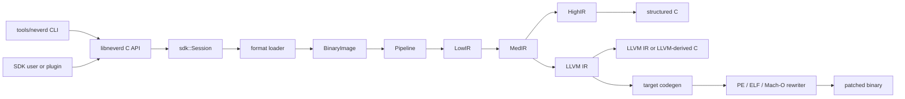

**اللغات**: [English](../architecture.md) | [简体中文](../zh-CN/architecture.md) | [繁體中文](../zh-TW/architecture.md) | [日本語](../ja/architecture.md) | [한국어](../ko/architecture.md) | [Français](../fr/architecture.md) | [Deutsch](../de/architecture.md) | [Español](../es/architecture.md) | [Italiano](../it/architecture.md) | [Русский](../ru/architecture.md) | [العربية](architecture.md)

[← فهرس التوثيق](README.md)

# عمارة NeverD

يصف هذا الدليل حدود الإنتاج التي يحتاج المساهم إلى فهمها لتعديل NeverD بأمان.
وهو يغطي عمدًا الشفرة المملوكة لـ NeverD فقط؛ وتحتفظ وحدات LLVM وCapstone
وUnicorn الفرعية بعمارتها الداخلية.

## حدود النظام

```mermaid
flowchart LR
  CLI["tools/neverd CLI"] --> CAPI["libneverd C API"]
  SDKUser["SDK user or plugin"] --> CAPI
  CAPI --> Session["sdk::Session"]
  Session --> Loader["format loader"]
  Loader --> Image["BinaryImage"]
  Image --> Pipeline["Pipeline"]
  Pipeline --> Low["LowIR"]
  Low --> Med["MedIR"]
  Med --> High["HighIR"]
  High --> HighC["structured C"]
  Med --> LLVM["LLVM IR"]
  LLVM --> LLVMOut["LLVM IR or LLVM-derived C"]
  LLVM --> Codegen["target codegen"]
  Codegen --> Rewriter["PE / ELF / Mach-O rewriter"]
  Rewriter --> Patched["patched binary"]
```

لدى NeverD أربعة تمثيلات IR، لكنها ليست سلسلة إلزامية من أربع قفزات.
`LowIR -> MedIR` مشترك. تستخدم إعادة التجميع المنظمة بعد ذلك
`MedIR -> HighIR -> C`، بينما تسلك `lift` و`decompile --llvm` و`patch` المسار
المباشر `MedIR -> LLVM IR`. تتجاوز وضعيّتا patch وlift ‏HighIR عمدًا.

تحلل CLI الأوامر في `tools/neverd`، وتنشئ `neverd_session_t`، وتستدعي API العامة
في `include/neverd/sdk/NeverDCAPI.h`. توجد حالة المحرك في
`lib/sdk/SessionImpl.h`؛ ويختار `neverd_session_load` loader ويبني
`BinaryImage`، بينما تشغّل العمليات المبنية على IR ‏`lib/pipeline/Pipeline.cpp`
عند الحاجة. يرتبط الملف التنفيذي `neverd` مع `neverd_shared`؛ وأرشيفات
المكونات وتبعيات LLVM/Capstone هي تفاصيل خاصة بالمكتبة المشتركة. تستخدم CLI ‏LLVM
Support لواجهة سطر الأوامر، لكنها لا تتجاوز C API لقيادة المحرك.

يمتلك تحليل HighIR ‏`HighSourceFlow` حواف تدفق العبارات الناتجة وهويات المتغيرات المحلية
وتحليل الإسناد المؤكد. يشترك التحقق من المصدر وحذف نسخ PHI غير المستخدمة في هذا الرسم.
تتبع تقسيمات محدودة لحالتي الصفر وغير الصفر الشروط العددية المتكررة؛ وتبطل الكتابة الحقائق،
وتظل المتغيرات التي خرج عنوانها مجهولة. عند بلوغ حد التقسيم يعود التحليل إلى الرسم المحافظ.
لا تُحذف نسخة PHI إلا إذا كانت قيمتها غير مستخدمة في جميع السياقات الممكنة.
تحتفظ الاستدعاءات والقراءات والكتابات وسميات المصدر بسلوكها القابل للملاحظة.

يستخدم تحليل هروب مؤشرات مستهلكي الكتل هذا الرسم أيضًا. ينقل حساب محدود للنقطة الثابتة هويات المؤشرات ومواضع المكدس الخاصة عبر الفروع والحلقات. تحتفظ نقاط الدمج بعناوين السياق المحتملة، ولا تمحوها إلا كتابة كاملة. تمنع الحواف المجهولة وتدفقات الاستثناءات ونفاد ميزانية الإثبات الربط.

تميّز معلومات مستقبل Objective-C بين self عند مدخل الطريقة ومرجع صنف محدد بدقة. يجب أن تتفق جميع سجلات البيانات الوصفية التي تشترك في المدخل قبل إثبات self. تنقل النسخ كاملة العرض والسجلات التي يحفظها ABI هذه المعلومات عبر تحليل النقطة الثابتة نفسه، بما في ذلك الحواف العائدة إلى المدخل. يراعي توافق التصريحات طرق الصنف والمثيل، والفئات المسجلة، والأصناف الأب، والبروتوكولات المتبناة؛ ويشمل self أيضًا تصريحات الأصناف الفرعية المعروفة. تحتفظ فهارس المترجم بالمالك والتسلسل الوراثي بشكل منفصل عن توافق المحددات العام. يعيد SDK التحقق من أصل المستقبل والتصريحات في الصورة الحالية قبل إصدار المصدر. لا تختار هذه المعلومات تنفيذ IMP محددًا ولا تسمح بإعادة كتابة الملف الثنائي.
عند غياب معلومات الوراثة الخارجية، يُشترط توافق المحددات العام بدل تضييق النطاق إلى المستقبل؛ وتظل التصريحات غير المدعومة أو المتعارضة صراحةً أدلة سلبية.

تمدّد متغيرات ivar ذات النوع الكائني الصريح إثبات المستقبل عبر ثماني قراءات كاملة العرض كحد أقصى. تسجّل كل خطوة خانة إزاحة وقت التشغيل وعرضها وأي إزاحة بايت ثابتة استخدمتها التعليمة. يجب أن تطابق الثوابت التخطيط الحالي، بينما يمكن لمرجع وقت التشغيل أن يتبع الحقل المنقول. يتحقق المحمّل من سلسلة الأصناف المسجلة وتصريح الحقل. لا توفر القراءات الجزئية أو id دون صنف أو الكتل أو أنواع البروتوكولات وحدها أو التخزين الملتبس أو المؤشرات الأساسية المجهولة معلومات صنف. يعاد التحقق من المسار كله وفق الصورة الحالية قبل إصدار المصدر. لا تثبت هذه المعلومات هوية الكائن ولا تسمح بحذف عمليات الذاكرة.

يتحقق المحمّل من رسوم بيانية محدودة وخالية من الدورات لسلاسل Darwin الثابتة وكائنات الأعداد الصحيحة والمصفوفات والقواميس المرتبة. يتطلب كل حقل وحافة ذاكرة معيّنة غير قابلة للتغيير ودليلاً واضحاً للاستيراد أو إعادة التموضع؛ وتُرفض الترميزات غير المدعومة والدورات والرسوم غير المكتملة صراحةً. تعيد روابط المصدر التحقق من الرسم ومن خانة المؤشر الوارد. تحافظ الدوال المولدة على بتات الأعداد وترتيب العناصر والعناوين المشتركة، وتعيد استخدام هوية السلاسل القائمة. تُهيّأ خانات الحاويات مرة واحدة مع النشر بأسلوب acquire/release، باستدعاء دوال العناصر المتحقق منها فقط. تحمل كل دالة تصريحات عناصرها كي تشترك الطرق المستعادة بصورة مستقلة في تعريف واحد. تغطي الاختبارات المحمولة المدخلات التالفة وحدود الإثبات، وتقارن أمثلة المترجم الأصلية المحتوى والأسماء المستعارة وهوية النسخ والتهيئة المتزامنة بالطرق الأصلية.

## تمثيلات IR ومساراتها

تخصص [مرحلة استعادة المفسّر التجريبية](interpreter-recovery.md) تمثيل LowIR
المرفوع بصرامة قبل الحد المشترك مع MedIR. يتولى المزوّد أدلة ثبات الصورة،
ويتولى `SymExec` دلالات التعليمات، ويعيد CFG المتبقي استخدام مساري SSA وإصدار
المصدر المعتادين. تبقى أدلة الاستعادة منفصلة عن شهادات المواضع الأصلية
للتعليمات وشهادات الترقيع الثنائي.

يتولى `InterpreterSpecialization` النشر العكسي المحدود لطلبات البتات بعد فشل المحاولة. ويعيد استخدام مقيّم القيم العددية المفردة دون تغيير حقائق الرسم أو إضافة حقول تحكم أو سياقات؛ ويظل كل العمل خاضعاً للميزانيات، ويتطلب النشر إثباتاً كاملاً جديداً.

يمكن لتنقيح السياق ترشيح حامل عنوان متتبع من ثمانية بايتات أيضاً عندما يستخدم طلب ذاكرة لاحق جزءاً من بايتاته فقط. تظل إحداثيات المنتج الضيقة الأصلية هي المرجع؛ ولا تُنشأ المفاتيح من الثوابت أو إزاحات الإطار المثبتة إلا عند الإدراج في الطابور.

يمكن لتعداد القيم المحدودة مراقبة صفوف قيم ممكنة دون تغيير استعلام الإثبات. يعيد رفض المراقب نتيجة غير مكتملة بلا صفوف. تحتفظ الذاكرة المؤقتة بالبراهين الرياضية للمجال فقط؛ وتظل شهادات القراءة غير القابلة للتغيير محلية حتى يكتمل التعداد.

يتولى `NeverDLoader` مسؤولية `PEFixedImageView` ويشارك محلل إعادة التموضع الأساسي الكامل مع تحميل PE العادي. يستخدم محوّل المفسر الثنائي هذا العرض المتحقق منه عند الأساس المفضل للاسترداد وبراهين الشيفرة الأصلية، دون تحليل جداول PE بنفسه. يتحقق التحضير من نطاقات كتابة الاستيراد وهوية التعيينات والحقول الأصلية الكاملة قبل اعتماد البايتات. يستعير العرض صورة ثابتة دون الادعاء بإثبات تكافؤ ASLR أو التهيئة.

يتولى `FrameOffsets` براهين الإزاحة الوحيدة النسبية للدخول ضمن ميزانية محددة. يطبّع الاسترداد وصول الذاكرة الرمزي الفعلي دون تغيير تعبيرات العناوين المتبقية، وتحتفظ الفحوص الأصلية بإثبات تساوي العناوين بين تنفيذين. يتولى الاسترداد التوزيع الشامل للمحاذاة وميزانيات المحاولات المشتركة. يظل تجميع براهين التقسيمات الأصلية وLLVM عملًا مستقلًا غير مكتمل. يتولى `NativeStackControl` تنظيف العودة الداخلي غير الموقّع بعرض 16 بت، ويتحقق مزوّد الثنائيات من الترميزات القياسية التي تسحب ثمانية بايتات.

عند توقف اكتشاف الاعتماديات المعتاد عن التقدم، يمكن تقسيم حقل سجل مستخدم فعلاً كمفتاح سياق لكل موضع أصلي ونمط تعليمات، باستثناء مدخل الدالة. يجب أن يكون مجاله الوارد كاملاً ومتعدد القيم ويغطي جميع البتات المعلنة. يثبت كل سلف فعلي مجاله الحالي الكامل بصورة مستقلة، ويقارن الحقل الفعلي الحي ثم يعيد إسقاط كل حالة. يُعاد فحص الأسلاف اللاحقين والعقد الموسعة، ويتوقف التسلسل عند المداخل المقترحة. للمقارنات منشأ اصطناعي وتشترك في ميزانيات العقد والعمليات والسياقات والاستعلامات والتحسينات. تُستبعد الأقنعة الجزئية والأعلام غير المعرفة والحقول الموجودة في الإطار فقط. لا تُضاف قراءات لذاكرة الضيف أو افتراضات على المستدعي. يحتفظ المجال غير المكتمل بالحافة المحافظة، ولا يُنشر المصدر حتى تكتمل جميع الحالات القابلة للوصول.

يسبق تحسين دقة التحكم وشروط الحراسة محاولات تقسيم الإطار الاختيارية، مع إبقاء التقسيمات الأدق اللازمة متاحة. تُستكمل النقطة الثابتة لكل باقي قبل التالي، لكن النشر يتطلب اكتمال جميع البواقي المسموحة. يتقاطع نطاق الاصطفاف الصريح مع نطاق التقسيم، وتقارن عملية التوجيه البواقي الفعلية. تبقى ميزانيات السياقات والعمليات والعقد والمحلل محدودة ومشتركة بين المحاولات. يقبل الاسترجاع بحالة الآلة الخيار `--vm-entry-alignment=A:R` لتحديد نطاق RSP عند الدخول والتحقق منه صراحةً. يجب أن تكون `A` قوة موجبة للعدد اثنين وأن يكون `R < A`. تعيد القيم الأخرى الحالة 2 قبل الوصول إلى ذاكرة الضيف أو كتابة الحالة. تبقى بتات العنوان العليا حرة، ولا يُفترض أي اصطفاف افتراضيًا. لا يمنح هذا الخيار شهادة تكافؤ أصلي.

يعيد الاستعلام المشترك `SymContext::constantWindow` قيمة نافذة من تعبير بتّي فقط إذا ثبت أن جميع بتات النتيجة ثابتة. يتتبع الاستخراج الموجود، والنوافذ المحصورة داخل مُعامل وصل واحد، والتوسيع بالأصفار والعمليات البتّية؛ وتبقى مدخلات XOR المجهولة وعمليات الحمل الحسابي معتمة. الحد الأقصى للنتيجة 64 بتًا، وللاستدعاء المتداخل 32 مستوى، وللعمل 256 وحدة. تُحتسب كل زيارة ورفض بسبب العمق ومُعامل وصل مفحوص، كما تُحتسب عند نسخ ثابت جميع كلماته ذات 64 بتًا. لا يعيد البرهان غير المكتمل أي ثابت. تستخدم `SymState` هذا الاستعلام للقراءة فقط لتصدير البايتات الثابتة في السجلات والقيم المؤقتة؛ وتحافظ التعبيرات المخزنة وإعادة بناء الكلمات الكاملة على هويتها الأصلية. تظل مناطق الذاكرة تصدّر الثوابت الحرفية فقط؛ فقد تؤدي إضافة الحقائق الجزئية المستنتجة مبكرًا إلى تجزئة مصادر المدخلات اللاحقة وزيادة عمل اكتشاف حالة التحكم.

يتولى `SymState` حفظ البايتات المتحققة سابقًا لكل STORE بعقد فصل صريح. تُنفذ STORE الحقيقية، وتبقى المناطق الأخرى وأجيال الإبطال والقيم الافتراضية المجهولة في حالتها بعد الكتابة. لا تُقرأ البايتات الناقصة أو تُهيّأ. يطبق `SymExec` العقد على STORE عادية واحدة فقط. يحتفظ الاسترجاع بالخانات الأفينية الكاملة وحقائق الأصل بصورة منفصلة، وتظل عمليات الدمج محافظة.

يتولى `StringTransfer` التحويل القياسي المحدود والمرتب. تتولى طبقة الاسترداد إثبات القيم والميزانيات المشتركة وإعادة اعتماد مؤشرات الإطار المنسوخة بالكامل؛ وتعيد عمليات الوصول المولّدة استخدام فحوص الذاكرة المعتادة.

لا يبلّغ اجتياز اعتماديات التحكم عن الاعتماد على بتات الجذر إلا بعد اكتمال التحليل. يمكن للاستعادة تخطي التعداد الاختياري لعناوين الصورة عندما يحتفظ عنوان نسبي مُثبت بما لا يقل عن 32 بتًا عليا حرة من الجذر؛ وهذا لا يثبت قابلية الوصول ولا يحذف الوصول إلى الذاكرة.

يحمي تحليل اعتماديات الجذر نفسه الإسقاط الأفيني لقيم التحكم بكامل عرضها. تقتصر نتيجته على شرط حافة واحدة؛ وتنتج مجالات القيم الكبيرة جدًا رفضًا غير مكتمل خارج ذاكرة البراهين الرياضية المؤقتة. تُعاد المحاولة بالأقنعة الضيقة. تظل معالجة قابلية التحقيق الحالية مستقلة؛ ولا يبرهن رفض مجال القيم إمكانية الوصول إلى الحافة أو استحالته.

تحتسب ذاكرة الاستعلامات المنتهية المفاتيح المتسلسلة والنتائج العددية وبيانات ترتيب الاستخدام ضمن حد تخزين واحد. تتحقق من المرشح كاملًا ومن إمكان استيعابه منفردًا قبل استبعاد أي سجل. تملك عقد ثابتة في الخريطة المفاتيح. يحدّث العثور الناجح ترتيب الاستخدام ويعيد نسخًا مستقلة الملكية من النتائج تظل صالحة بعد الاستبعاد. لا يمكن نسخ كائنات الذاكرة المؤقتة أو نقلها. يغيّر الاستبدال إعادة استخدام البراهين فقط، دون تغيير دلالات الاستعلامات أو شروط قبول النتائج.

تتولى `InterpreterSpecialization` العلاقات المشتركة ومجالات الحقول المنتهية المستقلة. لا يسجل إسقاط الحواف إلا براهين الأعمدة الكاملة؛ ويحسب الدمج تقاطع الأقنعة واتحاد القيم بعد تطبيق القناع من جديد. عند إعادة بناء العقدة، تُهيّأ الحالة الرمزية نفسها ثم تُجمع قيود المجالات مع المحمول المشترك، مع الحفاظ على هوية إطار المكدس والبتات غير المقيدة. لا يُحذف قيد انتماء إلا إذا أثبت فحص احتواء دقيق لجميع الصفوف أنه مستلزم. لا تغيّر سياسة الدقة هذه مفاتيح السياق أو التحقق من العودة الأصلية.

يملك `FrameEntryConstraints.h` شرط عدم الالتفاف المشترك بين الاستعادة والبرهان العلاقي. ويتولى `InterpreterSpecialization` الوصل المحدود للانتقالات الوحيدة وإعادة تشغيل التسلسل المعتمد. خيارات C++ هذه معطلة افتراضيًا؛ وتظل مطابقة عقد البرهان وربط البصمة مسؤولية محول الملف الثنائي.

تشترك `modelInterpreterMachineStateX64` وغلاف المصدر في مولد واحد لأجزاء سجلات الضيف والأعلام المجمعة وحالة ملف التنفيذ وتدفق التحكم. يستبدل النموذج فقط الوصول إلى كائن الحالة ببايتات سجلات صريحة ويفصل رمز الحالة عن RAX الضيف. لا يملك دلالات المترجم أو سياسة الإثبات؛ يبقى نطاق الدخول والملاحظات وعقد الإطار وفحص التنقيح الكامل مسؤولية المستدعي.

تتولى `NeverDLLVMInterpreterModel` استيراد LLVM القياسي المنفصل والمحدود إلى ABI الحالة الخام نفسها. تحافظ `modelLLVMInterpreterMachineStateX64` على حالة الإرجاع الفعلية وتولد شروط تعريف صريحة. يوفر `llvmInterpreterMachineStateContract` الملاحظات الكاملة وحفظ المراقب الصفري؛ ويتولى المستدعي النطاق والذاكرة والإثبات الكامل. لا يغير الاستيراد الرفع المعتاد أو نشر المصدر ولا يثبت المترجم.

يتحقق نموذج LLVM من عقود المعامل `initializes`. يعيد استخدام إسقاطات مؤشرات الحالة وينفذ تحليلاً محدوداً للتهيئة المضمونة على مستوى البايت قبل توليد العمليات العددية المعتادة، دون إضافة مقيّم ثانٍ للقيم.

يتولى `NeverDInterpreterLLVMRefinement` تركيب براهين الانتقال من الشيفرة الأصلية إلى LLVM. يعيد بناء النموذجين والعقود الإلزامية، ويسقط الأعلام عند الدخول فقط وفق ملف التنفيذ المرجعي، ثم يعيد فحص الفرضيتين. يمكن للعميل اقتراح خطط للحلقات دون استبدال النماذج أو المشاهدات أو إيصالات الإثبات. تنسخ نماذج التحليل الرسم التنفيذي والجذور المعلنة فقط، وترفض حواف الرجوع إلى المدخل لمنع تكرار تهيئة الحالة.

تمرر واجهة C v3 وCLI ميزانيات الحقول والتنقيح والاستعلامات إلى المخصص المشترك. يتحقق المحول من أحجام البنى وحقول reserved قبل قراءة الامتدادات؛ وتبقى تخطيطات v1/v2 والقيم الافتراضية ثابتة. زيادة الميزانية لا تغير عقد التنفيذ أو شروط النشر.

تتيح الاستعادة أيضًا `--vm-chain-transfers=N` (الافتراضي 0) و`--vm-no-control-discovery`. يحفظ التسلسل الارتباطات الرمزية عبر الانتقالات المثبت أن لها هدفًا واحدًا؛ وعند الحد يعود إلى حدود CFG العادية. يمكن لاستعادة حالة الآلة إعلان إزاحات RSP عند الدخول دون التفاف، غير مفحوصة أثناء التشغيل، عبر `--vm-entry-frame=begin:end`. ترافق الفرضية العددية الدقيقة شيفرة C والتقرير؛ ولا تمنح صلاحية ذاكرة أو برهان تكافؤ.

يمكن للدوال الكبيرة المستعادة التي تتجاوز حد بناء SSA استخدام `--llvm` عبر عقد محدود للتخزين العددي القابل للتغيير. يحتفظ التنفيذ بمعاني المدخلات وقيم الحلقات والقراءات السابقة. تفشل صراحةً الحالات الضمنية غير المدعومة ومعاملات سجلات المتجهات وإعادة تموضع الصورة والتخزين الملتبس وتدفق التحكم غير السليم؛ ويرفض HighC هذا المسار البديل. يظل المصدر خاضعًا لعقد حالة الآلة الحالي ولا يضيف شهادة تكافؤ.

يتولى `analyzeMedMutableSource` التحقق من CFG الموحّد وهويات التخزين والمتطلبات المحافظة لبايتات الإدخال. تمثل هذه المتطلبات حدودًا عليا للقراءات، وليست دليلًا إيجابيًا على قابلية الرصد. يتحقق LLVM قبل مسح الوحدة ويعيد استخدام الخطة لتهيئة المدخلات مرة واحدة. توجد حدود مستقلة لحاصل ضرب أعداد الكتل والقيم ولعمل الانتشار. يستخدم تمرير القيم في C كتابة سابقة دقيقة لكل قراءة، بنوع مطابق ومن دون تداخل جزئي؛ وتحتفظ نقاط التقاء الكتل بتخزين صريح.

في أجسام الدوال المعتمدة ذات المتغيرات القابلة للتغيير، يمرر LLVM القيم الدقيقة للخانات الخاصة داخل الكتلة الأساسية نفسها التي تضاف تعليماتها إلى النهاية، ويحتفظ بآخر عمليات الكتابة. تبقى تهيئة الدخول وحدود الكتل والدوال والوحدات منفصلة، وتبقى عمليات وصول البرنامج إلى الذاكرة صريحة. يحد إخراج C من توسيع التعابير العددية وعمل طي القيم الثابتة، مع الاحتفاظ بقيم وسيطة مسماة. تستخدم التعابير الثابتة القابلة للطي تخطيط هدف LLVM، وتُرفض التعابير غير المدعومة صراحةً. لا تتحول قيم الإرجاع المحددة للمتغيرات القابلة للتغيير، بما فيها الصفر، إلى إرجاع void.

تقبل المجموعة القابلة للتغيير تخزينًا عدديًا بعرض 8/16/32/64/128 بت؛ وتقتصر مدخلات عدّ البتات على 64 بت. تتطلب العروض غير القياسية أو الأكبر عقدًا مستقلًا للمصدر.

يتولى lifter الخاص بالمعمارية بيانات المخرجات غير المعرّفة الملحقة بأسلوب المعاملات: يمحو الأدلة السابقة قبل كل محاولة، ولا ينشر التأثيرات إلا للرفع الناجح المطابق بدقة. تعني `Missing` غياب الدليل، لا وصفًا فارغًا بحالة `Complete`. يحتفظ LowIR العادي بالقيم الحتمية المختارة. يتولى `LowIRUndefinedIndependence` البرهان العلاقي المحدود على رسم LowIR كامل وخالٍ من الدورات يُقدَّم إليه، مع مشاركة المدخلات العادية وحفظ ترابط القيم غير المعرّفة المنتجة حديثًا. يربط الدليل بحدود التعليمات الكاملة وبصمات العمليات ويرفض البراهين الناقصة. يبقى اعتماد الرسوم الأصلية العامة وثوابت الحلقات وتكافؤ الشيفرة الأصلية مع C أعمالًا منفصلة خارج نطاق المسارات الأصلية المحدودة الموضح أدناه.

توفر صيغ SHL/SAL وSHR وSAR العددية التقليدية أدلة مشروطة للبتات غير المحددة مع معاملات بعرض 8/16/32/64 بت. يحافظ العدد المقنّع صفر على كل الأعلام؛ ويصبح AF اعتباطياً عند العدد غير الصفري، وOF فوق الواحد، وCF في SHL/SHR عند بلوغ عرض المعامل. يبقى CF محدداً في SAR. تستخدم الشروط المنطقية العدد المحفوظ قبل الكتابات المتداخلة، وتُنتج العمليات نفسها بوجود البيانات الوصفية أو بدونها. لا تنشر الترميزات غير المدققة آثاراً جزئية.

تنتج ROL/ROR التقليدية بت OF اعتباطياً جديداً فقط عندما يتجاوز العدّ المقنّع معمارياً الواحد؛ ولا يغيّر باقي القسمة اللاحق بعرض البايت أو الكلمة هذا الشرط. يحافظ العدّ الصفري على الأعلام. تنتج BT/BTS/BTR/BTC ذات أساس السجل أربعة بتات مستقلة (OF/SF/AF/PF)، مع CF محدّد وبقاء ZF/DF. تُدقّق ترميزات السجل وimm8 الدقيقة؛ ولا يشمل هذا التوسّع سلاسل البتات في الذاكرة أو LOCK أو APX أو الدوران عبر الحمل. تقع التأثيرات بعد العملية الأساسية، ويبقى LowIR متطابقاً سواء طُلبت البيانات الوصفية أم لا. راجع مرجعي Intel لـ[اختبار البتات](https://cdrdv2-public.intel.com/929353/253666-093-sdm-vol-2a.pdf) و[الدوران](https://cdrdv2-public.intel.com/929354/253667-093-sdm-vol-2b.pdf).

يخضع XADD بين السجلات أيضًا لتدقيق دقيق لترميزات 8/16/32/64 بت التقليدية: يحدد CF/PF/AF/ZF/SF/OF ويحفظ DF ولا ينشئ بتات اعتباطية جديدة. يلتزم كلا السجلين المتبادلين بقواعد المعمارية للكتابة الجزئية والتمديد بالأصفار عند الكتابة بعرض 32 بت. تبقى صيغ الذاكرة/LOCK وAPX لـ XADD خارج التدقيق. تقبل [قاعدة التوافق من Intel](https://cdrdv2-public.intel.com/929360/253669-093-sdm-vol-3b.pdf) ترميز Group 2 `/6` للتعليمات C0/C1/D0/D1/D2/D3 بوصفه SAL/SHL `/4`، مع شروط العد والأعلام غير المعرّفة نفسها. راجع [مرجع XADD](https://cdrdv2-public.intel.com/929356/334569-093-sdm-vol-2d.pdf).

تقبل القراءات الأصلية الثابتة أيضاً مجموعات عناوين منتهية ثبت اكتمال تعدادها، ضمن `MaxImmutableLoadAddresses`. يجب إثبات تساوي العناوين بين التنفيذين قبل التعداد. يحتاج كل مرشح إلى بايتات ثابتة ودليل ربط وفصل عن الإطار القابل للتعديل، وتبقى القيمة المختارة معتمدة على المدخلات. تُرفض الشهادة عند غياب مرشح أو قابلية البيانات للكتابة أو إعادة التوطين أو نفاد ميزانية التعداد. ترتبط الشهادة بأدلة القراءة وحد العناوين. لا تزال إزاحات الإطار الديناميكية والذاكرة الخارجية الاعتباطية غير مدعومة.

يستخدم السلوك التالي عقد التدقيق الصارم الافتراضي. يتحقق `checkBinaryUndefinedIndependence` من مسارات تنفيذ x64 الأصلية الكاملة والمحدودة وفق الملاحظات المعلنة، ويجمع طرفي الفروع المباشرة قبل استبعاد المسارات غير القابلة للتنفيذ. يضع near CALL الفعلي عنوان المتابعة الحقيقي على المكدس، ويقرأ RET الداخلي كلمة المكدس الحالية، بما فيها أهداف الرجوع المعدلة. تتطلب الأهداف غير المباشرة تعدادًا محدودًا شاملًا وإثبات تساوي الهدف بين التنفيذين قبل تقييد المسار. تتطلب القراءات الثابتة الدقيقة أدلة وإثبات انفصالها عن الإطار القابل للتغيير. تحتاج كل تعليمة مجمعة، حتى في الفروع غير المسلوكة، إلى بايتات أصلية ثابتة؛ وتحتاج كل تعليمة أيضًا إلى بيانات معمارية كاملة، باستثناء الحدود النهائية لتعليمات `INT3`/`UD2` المرفوعة بصرامة وإسقاط RDSSP/INCSSP ذي الملف الصريح الموضحين أدناه. يمكن الاحتفاظ بتعليمات `INT3`/`UD2` المرفوعة بصرامة كحدود `Terminator` مع جميع بايتاتها الأصلية وبصمة عمليات LowIR، دون ترقية البيانات المرافقة للمخرجات غير المعرّفة من `Missing` إلى `Complete`. لا يجوز أن تحتفظ الشهادة بهذه المصائد إلا إذا أثبت التنفيذ الرمزي تعذّر الوصول إليها؛ وأي مسار قابل للتنفيذ يصل إليها يعيد `ContractViolation` دون شهادة أو شيفرة متبقية. لا تمثّل هذه القاعدة الاستمرار بعد المصيدة أو العودة من الاستثناءات، ولا تستخدم استدلال `codeFollowsTrap`، ولا توسّع دعم واجهة LowIR الثابتة. تربط الشهادات البايتات والخرائط والتأثيرات وشواهد القراءة وملف التنفيذ والميزانيات. يستبعد ملف التنفيذ الصريح العادي الخالي من الأعطال مع تعطيل CET جميع خرائط الصورة من إطار الدخول. يجب أن ينتهي كل مسار قابل للتنفيذ برجوع خارجي يحفظ RSP وخانة الرجوع الأصليين قبل pop؛ ولا يثبت جزء تنفيذ توقف بسبب الميزانية شيئًا. تتطلب الحلقات المباشرة وغير المباشرة بسطًا محدودًا كاملًا؛ تمنع المسارات غير المنتهية أو المتجاوزة للميزانية والتأثيرات الأخرى غير المدققة إصدار الشهادة. يجري `specializeBinaryInterpreterWithIndependence` البرهان قبل الاستعادة ولا يعيد شيفرة متبقية عند الفشل. لا تفعّل الاستعادة العادية هذا الشرط افتراضيًا؛ وتبقى ثوابت الحلقات والاستثناءات والتنفيذ مع CET وتكافؤ الشيفرة الأصلية مع C خارج الشهادة.

يضيف الخيار الصريح `RetainUnauditedNativeBoundaries` حدود رفض إلى براهين الاستقلال الأصلية المحدودة وبراهين التنقيح من الشيفرة الأصلية إلى LowIR. لا تُقبل إلا التعليمات المفكوكة والمرفوعة بصرامة ذات تغطية `Missing` وتأثيرات فارغة وبصمة عمليات غير فارغة ومتطابقة. تظل جميع فحوص البنية والتحكم والتداخل والملف والموارد إلزامية. يتوقف جمع خلفاء ذلك الحد فقط؛ وتُجمع بصورة مستقلة أي حافة أخرى تدخل البايتات اللاحقة. يُرفض كل وصول قابل للتنفيذ قبل التنفيذ؛ ولا تثبت النتيجة المجهولة أو الميزانية المستنفدة شيئًا. تربط الشهادات سجلات ذات نوع وإصدار بالحد الدقيق وبصمتي البايتات الأصلية والعمليات، دون تحويل `Missing` إلى `Complete`. لا يُدّعى تدقيق اللواحق غير المجمعة. يشمل الاستقلال جميع الخيارات الاعتباطية؛ أما تنقيح القيم المختارة فيثبت تعذّر الوصول فقط للشاهد المعلن. لا تفعّل واجهات LowIR الثابتة أو إثبات/استنتاج الحلقات أو LLVM الدقيقة هذا الخيار.

`AllowOverlappingNativeInstructions` خيار مستقل معطّل افتراضياً لإثبات الاستقلال الأصلي المحدود والتنقيح من التعليمات الأصلية إلى LowIR. تُفك وتُفحص كل نقطة دخول على حدة؛ ويجب أن تطابق بايتات التعليمات المتداخلة جميع أدلة التعليمات والقراءات الثابتة السابقة، بما فيها قراءات البرنامج المرشح. تبقى عناوين LowIR للمرشح تسميات وليست أدلة بايتات. القيمة الافتراضية لـ `MaxNativeInstructionBytes` هي 1048576، وتُحتسب قبل المقارنة كامل أحجام نقاط الدخول الجديدة، بما فيها البايتات المتكررة. نفاد الميزانية أو تناقض البايتات يمنع إصدار شهادة. يرتبط الخيار والحد ببصمة الإثبات. ترفض واجهات LowIR الساكنة وإثبات الحلقات بالاستقراء واستنتاجها هذا الخيار حتى مع خطة حلقة فارغة؛ وتحتفظ واجهة LLVM الدقيقة وCLI بالإعدادات الافتراضية الحالية.

يتطلب إثبات الأعلام المجمعة الأصلي تعيين `X64FlagsProfile = UserX64NoFaultV1` في الخيارات والعقد معًا؛ ولا تفعّله خيارات التنفيذ المنطقية السابقة. تستخدم أعلام الدخول المشتركة ذات الصيغة الصحيحة وأعلام النظام المستمرة انتقال PUSHFQ/POPFQ القياسي نفسه المستخدم في غلاف مصدر حالة الآلة، بما فيه أقنعة CPL3/IOPL0. يجب إثبات أن TF/AC يظلان صفرًا في كلا التنفيذين عند كل POPFQ، دون افتراض هذا الشرط. تُقارن أعلام النظام النهائية دائمًا حتى دون مراقبة السجلات أو الإطار المكتوب. تربط الشهادات إصدار الملف وبصمات الانتقالات الدقيقة. في هذا الملف الصريح مع تعطيل CET، يجوز إسقاط بايتات RDSSPD/RDSSPQ القياسية المدققة استقلالًا إلى NOP دقيق مع سجل ذي نوع محدد؛ تبقى البيانات الأصلية `Missing` ويحافظ الهدف بعرض 32 بت أيضًا على السجل كاملًا. تُحفظ تعليمات INCSSPD/INCSSPQ القياسية كحدود #UD تعتمد على الملف مع سجل للتعليمة الأصلية غير القابلة للوصول؛ تخالف أي زيارة ممكنة عقد التنفيذ دون أعطال حتى مع معامل صفري. تظل تعليمات CET الأخرى والتنفيذ مع CET واستخدام الملف عبر واجهة LowIR الثابتة غير مدعومة. تحفظ كل زيارة في الحلقة المحدودة الحالة وتنتج اختيارات غير محددة جديدة، لكنها لا تثبت ثابتًا للحلقة.

توفر `checkLowIRRefinement` و`checkBinaryLowIRRefinement` علاقة تنقيح بنائية مستقلة مع مرشح LowIR حتمي. تختار `LiftedBits` البتات التي حسبها الرافع الأصلي عند كل منتج غير محدد، وتختار `ZeroBits` الصفر فقط عندما ينشط الشرط المدقق. تُسجل كل واقعة ديناميكية وتحافظ النسخ وعمليات الحفظ في المكدس على الاختيار نفسه. يشترك البرنامجان في منفذ العمليات العددية والمكدس الفعلي والذاكرة والأعلام وفي لقطة الدخول. يجب أن تنتهي جميع المسارات الممكنة وتغطي كامل نطاق الدخول المسموح وتلتزم بقيود الحفظ. تُقارن معاملات RETURN والسجلات المطلوبة وأعلام النظام الأصلية الإلزامية واتحاد بايتات الإطار المكتوبة في الجانبين. ميزانيات التنفيذ والمقارنة مشتركة، مع حد إضافي `MaxTerminalPairs`. تربط الشهادات المرشح والأدلة الأصلية وسياسة الاختيار والحدود. فشل اختيار لا يستبعد اختيارات أخرى. لا يثبت الفك المحدود ثابت الحلقة أو المساواة الخاصة بمعالج معين أو تكافؤ واجهة C الخلفية، ولا يستبدل استقلال الحالة غير المحددة. ترفض الواجهتان المؤقتات الداخلة المتداخلة مع منطقة الذاكرة المؤقتة الخاصة بالبرهان. تتطلب واجهة التنقيح الثنائي ملف `UserX64NoFaultV1` متطابقاً في الخيارات وعقد المراقبة.

تضيف `checkLowIRLoopRefinement` و`checkBinaryLowIRLoopRefinement` شهادات استقرائية مستقلة. نقاط القطع المتناظرة وقوالب الحالة بلغة LowIR القياسية الخالصة مرشحات للإثبات: يتحقق المنفذ المشترك من التهيئة عند المدخل الحقيقي، وتغطية المقاطع كاملة، وكل انتقال ممكن، وحفظ الثابت، والمشاهدات النهائية. يجب أن يتناقص ترتيب معجمي محدود وغير موقّع تناقصًا صارمًا بين كل نقطتي قطع؛ ويمنع الإسقاط العكسي للمعاملات إعادة ضبط الترتيب دون تقدم فعلي للآلة. الأساس هو حالة الدخول المشتركة، أو بادئة متناظرة تم الوصول إليها فعلًا مع `UseEntryPrefix` (`GeneralizeEntryPrefix = false`)، مع إثبات حفظ شرطها أيضًا. تفحص نقاط القطع جميع السجلات المعدلة والإطار كاملًا، وتحفظ المشاهدات النهائية آثار الكتابة من الدورات السابقة. تتطلب كل نقطة حاليًا عنوانًا فريدًا في كل طرف. الاكتشاف التلقائي للثوابت والترتيب والمواءمة العامة لتدفق التحكم خارج نطاق هذه الواجهة. تمنع نقاط القطع المفقودة والثوابت الخاطئة والالتفاف الحسابي وعدم إثبات الانتهاء والدلالات غير المدعومة أو نفاد الميزانية المشتركة إصدار الشهادة. تربط البصمة الخطة وكل المقاطع الأصلية والأدلة. تحتفظ واجهات التنقيح المحدود والاستقلال الصارم بمعناها، ولا تُثبت صحة خلفية C أو اختيارات البتات غير المحددة لمعالج بعينه.

ينطبق شرط الحفاظ على مسند البادئة التالي عند `GeneralizeEntryPrefix = false`.

تقترح `inferLowIRLoopRefinementPlan` قوالب محدودة باستخدام المنفذ الرمزي المشترك. تغطي نقاط القطع كل دورات CFG؛ ويحافظ التوسيع على البتات الثابتة المثبتة ويحذف حدود البادئة غير الموقعة التي لا تستمر. تشكل العدادات المرصودة ذات الخطوة الواحدة والمراحل المستنتجة رتبًا معجمية للحلقات المتداخلة المتزايدة أو المتناقصة. يتطلب `OriginalPrefix` و`CandidatePrefix` الخيار `UseEntryPrefix`. يمكن لنقطة تقع بعد نقاط قطع أخرى الحصول على شاهد بادئة مزدوجة قابلة للوصول عبر إعادة تنفيذ محدودة منفصلة من المدخل الحقيقي. لا يغطي هذا الشاهد مجال المدخلات: يجب أن يستلزم كل وصول فعلي شرطه، وتظل التغطية الكاملة للمدخل والانتقالات إلزامية. تتطلب `inferAndCheckBinaryLowIRLoopRefinement` استعادة كاملة ومصادر أصلية فريدة، ثم تعيد فحص الأصل والمرشح بالكامل بصورة مستقلة. المقترحات وربط المصادر غير موثوقين؛ وحده `Refinement` قد يحتوي شهادة. يحتفظ الاستنتاج والإثبات بميزانيتين صريحتين منفصلتين. لا تعمل واجهة C++ هذه تلقائيًا مع `--devirtualize`. تظل البوادئ غير القابلة للوصول ومحاذاة التحكم العشوائية والرتب خارج البحث وتكافؤ خلفية C واختيارات المعالج الفعلي للبتات غير المعرفة غير مدعومة.

يتعرف اكتشاف العدادات ذات الخطوة الواحدة أيضاً على تحديث أجزاء الكلمة المحاذاة للبايت مع حفظ كل البتات خارجها، بعد تجربة صيغ الكلمة الكاملة والتوسيع بالأصفار القائمة. عند تعدد نقاط القطع، لا تُقترح شروط استبعاد القيم الحدية للجزء إلا بعد إثباتها على حالات الوصول الفعلية المحفوظة وكل الحالات الواردة الحالية. يزيل التوسيع الشروط الفاشلة دون إعادة اقتراحها، ويمكنه اكتشاف جزء آخر من كلمة عداد معروفة. تعيد الأقنعة استخدام معامل الكلمة الكاملة، مع حفظ الرتب ومراقبة الحالة كاملة. تبقى ميزانيات العقد والاستعلامات المشتركة والتحقق الكامل المستقل إلزامية.

عند تعدد نقاط القطع، تتبع كل محاولة فاشلة لصف عدادات مرصود نسخة ذات مرحلة ثابتة من 64 بت في البداية، قبل الانتقال إلى الصف التالي. تستهلك النسختان محاولتين منفصلتين من `MaxRankCandidates` وتشتركان في ميزانية الاستعلامات نفسها. يجب ألا تزيد المرحلة الأولى على أي انتقال ممكن؛ وإذا لم يثبت التناقص الصارم لبقية الصف، وجب أن يخفض الانتقال المرحلة نفسها بصورة صارمة. ترفض قيود الفروق غير السالبة الدورات ذات الوزن الموجب. يتيح ذلك للحلقات المتتابعة إعادة استخدام عداد بعد تهيئته، مع بقاء التزامات التقدم داخل الدورات. يمكن تركيب المراحل القائمة بين العدادات مع المرحلة الأولى. يُفحص كل صف كامل تحت محمولات الانتقال الأصلية الكاملة، ثم يعيد مدقق التنقيح النهائي فحص الرتبة المقترحة بصورة مستقلة. لا يضيف البحث ذو نقطة قطع واحدة هذه البادئة الثابتة غير المفيدة.

يجب أن يغطي كل مرشح ذي نقطة قطع واحدة جميع دورات الكتل التي كانت قابلة للوصول أصلاً، بما فيها الدورات التي تنفصل عن المدخل بعد إزالة نقطة القطع. يستهلك كل فحص تغطية من `MaxCutpointAttempts` قبل التنفيذ الرمزي. تبقى الأولوية للعدادات العددية التي تتقدم خطوة واحدة على كل حافة عودة. ثم تتناوب حتى ثمانية مقترحات لصفوف العدادات المرصودة ذات الخطوة الواحدة مع فرضيات الحراسة أو الحدود العددية الأوسع، واحدة تلو الأخرى. تُستكمل الفرضيات العددية المتبقية قبل استئناف بحث الصفوف دون تكرار. لا يعتمد هذا الترتيب على سقف الميزانية. تعيد كل محاولة صف القالب المستقر الكامل والانتقالات المحفوظة؛ وفشل فحص النطاق يعطّل عائلة المرشحات هذه فقط. ولا تضيّق شروط الحراسة العددية المرفوضة نطاقها. تظل `MaxRankCandidates` وميزانيات الاستعلامات والعمليات والمسارات تراكمية. ويظل الفاحص الكامل لعلاقة refinement مطلوباً. يمكن لفرع عودة ذي تكرار جمعي أن يفعّل التوسيع البنيوي حتى إن أبقت الفروع الأخرى القيمة ثابتة أو أعادت ضبطها؛ ويجب أن يجتاز القالب المقترح جميع فحوص الدخول والانتقال.

تبحث `inferAndCheckLowIRLoopRefinement` عن علاقة مثبتة بين حلقات LowIR. تجرّب بالترتيب الخطط الافتراضية وخطط جميع مداخل الفروع ثم الخطط المرشّحة. تقرن العائلات المتطابقة أولاً ثم جميع العائلات المختلفة، وبعدها نقاط القطع الدورية المفردة للمرشح. تختار العائلة الكاملة خلفاء كتلة تفرع داخل المكوّن الدوري ممن لهم حافة خارجة واحدة. لا يستبعد الترشيح فرعاً إلا إذا التقت كل مساراته في عقدة غير نهائية قبل بلوغ هدف حافة رجوع DFS. يشمل الفحص جميع الخلفاء والمخارج والحدود؛ والالتقاء عند الحد وحده لا يستبعد الفرع. تظل القطوع الجشعة تغطي كل دورة كانت قابلة للوصول أصلاً. تحافظ المقترحات على المراحل دون اشتراط نجاح الاستدلال الافتراضي. يحد `MaxCutSelectionWork` تحليل المسارات المشتركة منفصلاً، بما فيه إنشاء المجموعات ومقارنتها؛ ويسجل `CutSelectionWork` العمل حتى عند الفشل ويستهلك أيضاً ما تبقى من `MaxSearchWork` العام. لا يتغير المحددان الافتراضي والكامل. تُخزّن النجاحات والإخفاقات بحد أقصى ثلاث خطط لكل طرف، وتُعدّد التبديلات عند الحاجة. تتجاوز العائلات الإضافية مجموعات القطوع المحفوظة على الطرف نفسه حتى لو جاءت الخطة من عائلة ذات رقم لاحق. لا تستخدم العائلات الفارغة أو المكررة استعلامات رمزية لكنها تُحسب محاولات. تتشارك الخطط الست مخزون `MaxMetadata` واحداً؛ ويُحد كل بناء اقتران على حدة. لا تقترح المساواة إلا لمدخلات الإطار المتطابقة في العرض والإزاحة. تظل إعادة تسمية السجلات والعلاقات التآلفية ومجموعات التغذية الراجعة الاعتباطية مهام اقتران صريحة. يحتفظ مكوّن الاقتران المرجعي والفاحص الكامل بالسجلات الأصلية المدققة للمستدعي وwitness ونطاق الدخول وملاحظات الإطار والتزامات الانتهاء. يشترك كل استدلال وبرهان، بما في ذلك المحاولات الفاشلة، في `MaxSolverQueries` ضمن `LowIRLoopAlignmentLimits`؛ ولا تحصل كل دعوة على أكثر من الأصغر بين حد مرحلتها والمجموع المتبقي. تحدّ `MaxSearchWork` و`MaxMetadata` و`MaxCandidateAttempts` و`MaxPairingAttempts` و`MaxCuts` من بناء البحث وتعداده. يمكن إعادة المحاولة بعد نفاد ميزانية محاولة واحدة، لكن نفاد الميزانية العامة يوقف البحث. تعني `Unsupported` عدم العثور على علاقة، ولا تثبت اختلاف البرنامجين. لا يحتوي على شهادة إلا `Refinement` الذي نجح في فحص جديد. لا تتغير إعدادات CLI الافتراضية.

تكون `GeneralizeEntryPrefix` بقيمة `false` افتراضيًا وتتطلب `UseEntryPrefix`. يحافظ الوضع الافتراضي على شرط المسار الملتقط عند كل وصول. يعامل التعميم الصريح تعبيرات حالة البادئة خارج ذلك المسار كدوال قالب كلية غير موثوقة. تبقى الشهادة المقترنة القابلة للوصول، والتغطية الكاملة للمداخل والمقاطع، وتساوي جميع السجلات والإطار، وإسقاطات المعلمات، وشروط التنفيذ الأصلي، والتناقص الصارم للرتبة ضمن مجال الاستقراء الموسّع مطلوبة. يوسّع الاستدلال نقطة القطع فقط عندما تتجاوز حالة واردة مجال الشاهد، ثم يعيد بناء وفحص جميع الانتقالات العامة. لا يجوز لشاهد أول بلا تكرار إخفاء حلقة من مدخل آخر. تُربط السياسة ببصمة شهادة الاستقراء.

يمكن للاستدلال المتداخل اقتراح حدود غير موقعة صارمة أو غير صارمة بين عدّادات مرصودة بخطوة واحدة وقيم بادئة ثابتة تشير إليها شروط التحكم، بما فيها الخروج بالمساواة. يفحص الحالات الفعلية أولًا، ثم يحذف العلاقات غير الصحيحة بصورة رتيبة عند الانتقالات العامة الواردة. تستخدم زيارات الشروط واستعلامات المحلّل الحدود الصريحة الحالية، ويثبت فاحص الأصل/المرشح القوالب مستقلًا في النهاية.

يقترح استنتاج الحلقات المتداخلة أيضًا مساواة بين معامل مخزّن مؤقتًا وعدّاد أو مدخل تحكم لم يتغيّر عندما تتطابق تعبيرات البادئة. يفحص كل حالة دخول ملموسة، ويحتفظ بمرشحات للمخازن التي تُكتشف في التوسيع اللاحق، ويحذف أي علاقة تخالفها حالة دخول عامة. تحتفظ كل كلمة بمعامل مستقل قابل للاستعادة؛ وتبقى المساواة مسندًا يخضع للتحقق. قد تسرّع علاقات النسخ حذف البتات الثابتة العرضية، لكنها لا تفترض دلالات.

يبحث الاستدلال للحلقات المتداخلة أيضاً عن مقارنات المساواة وعدم المساواة المخزنة في حقول لا تزيد بتاتها المتغيرة عن 16. تستخدم كل علاقة القيم الحالية للعداد والحد، ويحتفظ الحقل بمعامل حالة مستقل قابل للاستعادة. قد يخفي شرط الدخول أو اختزال التهيئة إلى ثابت المقارنة حتى توسيع لاحق؛ يمكن عندئذ اقتراح مرشحين جدد، لكن لا يعاد إدراج المرشحين المرفوضين أو المحذوفين. يجب أن تصح العلاقات عند جميع الوصولات الملموسة المحفوظة والانتقالات الواردة الحالية. تخزن عمليات اجتياز متغيرات DAG لكل نقطة قطع وتحتسب ضمن ميزانية المحمولات المشتركة. تظل التغطية الأصلية الكاملة ومساواة الحالة كلها والتناقص الصارم للرتبة متطلبات مستقلة. يستمر اكتشاف العدادات بعد الانتقالات العامة: يمكن للعداد الخارجي الذي يخفيه الشاهد الأول للحلقة الداخلية أن يحصل لاحقاً على مرشحي حدود ونسخ معاملات متحقق منها. لا تستعاد العلاقات المرفوضة، وتلتزم اختبارات الخطوة الواحدة بميزانية العقد الرمزية.

تزور إعادة تنفيذ بادئات الدخول الفروع المنتظرة قبل توسيع حلقة سابقة مرة أخرى. يتيح ذلك العثور على شاهد قصير قابل للوصول حتى عندما يسمح فرع آخر بعدد اعتباطي من التكرارات. يشترك الاستدلال وفاحص الأصل/المرشح في ترتيب الزيارة هذا. يبقى كل العمل محسوبًا ضمن الميزانيات الحالية؛ ولا يحل شاهد البادئة محل تغطية الدخول الكاملة أو حفظ الثوابت أو فحوص الإنهاء.

| التمثيل | الغرض | التعريفات والتحويلات الأساسية |
|---------|-------|-------------------------------|
| LowIR | عمليات `NdOp` مستقلة عن العمارة، وكتل أساسية، وCFG، وبيانات جداول القفز | `include/neverd/ir/low` و`lib/ir/low`، وينتجها `lib/decode` + `lib/lift` |
| MedIR | الأنواع، وABI/أعراف الاستدعاء، ونموذج الذاكرة/المكدس، والأعلام، والاستدعاءات، وتدفق شبيه بـ SSA | `include/neverd/ir/med` و`lib/ir/med` |
| HighIR | تعابير وتحكم منظم لإنتاج C مقروء | `include/neverd/ir/high` و`lib/ir/high`، يصدره `lib/backend/c/HighC` |
| LLVM IR | التحسين، وC مشتق من LLVM، وتوليد شفرة الهدف، ومدخل إعادة كتابة الثنائي | `lib/backend/llvm`، يحسّنه/ينسقه `lib/pipeline` |

تحتفظ الثوابت عبر LowIR وMedIR وHighIR بمصدر كل ظهور، سواء كان قيمة عددية أو عنوانًا، وبملكية العنوان. لا يؤدي تطابق البتات العددية إلى دمج مصادر مختلفة. يعامل التبسيط الرمزي في HighIR هويات العناوين كمدخلات معتمة؛ ويستخدم ربط المصدر التصنيف المشترك للمعاملات العددية، مع استمرار اشتراط ربط إعادة التمركز عند استخدامها للذاكرة أو كمؤشرات.

| مسار المستخدم | مسار التمثيلات | المخرج |
|---------------|----------------|--------|
| تفريغ Low/Med | Binary -> LowIR، واختياريًا -> MedIR | نص تشخيصي |
| تفريغ High أو `decompile` | Binary -> LowIR -> MedIR -> HighIR | HighIR أو C منظم |
| `lift` | Binary -> LowIR -> MedIR -> LLVM IR | `.ll` |
| `decompile --llvm` | Binary -> LowIR -> MedIR -> LLVM IR | C مشتق من LLVM |
| `patch` | Binary -> LowIR -> MedIR -> LLVM IR -> codegen | ثنائي معاد كتابته |

يمثل `lib/pipeline/Pipeline.cpp` مصدر الحقيقة لاختيار المسار. أبق المنطق الخاص
بالتمثيل في مكتبة IR أو backend المالكة له؛ وعلى pipeline تنسيق المكونات لا
ابتلاع خوارزمياتها.

## عقد الترجمة بين المعماريات

يعرّف `include/neverd/translate` طبقة عقد، لا backend للتنفيذ.
يمثل `GuestState` الحالة المرئية للآلة بصورة مستقلة عن العمارة لكل من
`x86_32` و`x86_64` و`AArch64` و`ARM32`. يستخدم تسلسله القانوني ذي الإصدار 1
حقول little-endian ثابتة العرض، ومعرّفات سجلات مستقرة، ومجموعات مرتبة، وتحققًا
fail-closed؛ لذلك لا تعتمد الحالة المستمرة على تخطيط C++ في المضيف.

خط الأساس wire v1 لـ`GuestState` مجمّد بصورة دائمة. يجب أن تستخدم أي حالة خارجه
معرّف extension-register من نطاق الامتدادات مع اسم قانوني بأحرف صغيرة، أو أن
تنتقل إلى إصدار wire جديد مع upgrader صريح؛ ويحظر تغيير خط أساس v1 في مكانه.

بالنسبة إلى ضيف `ARM32`، يكون `ExecutionMode` هو نمط فك الترميز المرجعي ويجب أن
يتوافق مع `CPSR.T`. ويكون PC المخزّن دائمًا عنوان التعليمة القانوني بعد تصفير
البت 0؛ كما يتطلب نمط ARM محاذاة على حدود الكلمة.

يعرّف عقد أزواج المعماريات `x86_64 -> AArch64` و
`AArch64 -> x86_64` و`x86_32 -> AArch64/ARM32` و
`ARM32 -> x86_32/x86_64`. تعني `ContractDefined` إمكان التحقق من الطلب وحفظه،
لا إمكان ترجمة الشفرة أو تنفيذها. تقبل سياسة JIT المضيف الأصلي للعملية الجارية
فقط، بينما تتطلب سياسة AOT تحديد عمارة المضيف وtarget triple صراحة؛ ويجب أيضًا
تحديد CPU أو مجموعة الميزات صراحة عند اختيارهما.

يحوّل `ResolvedHostTarget` هذا الاختيار إلى نتيجة محددة. يستمد تحليل `Native`
الـtriple والـCPU ومجموعة الميزات المفعّلة أو المعطّلة من العملية الحالية، بينما
يتحقق تحليل `Explicit` من العمارة والـtriple والـCPU والميزات التي يقدمها المستدعي
ويطبّعها ويرفض التعارضات. تُبنى هوية cache ذات إصدار من مدخلات الهدف المطبّعة
بترتيب بايتات حتمي، ولا تتضمن عناوين العملية أو نصًا يعتمد على locale.

يسجل `TranslationExit` ذو الإصدار سبب توقف مستقرًا والحمولة المنمطة الموافقة
لاستدعاءات النظام، والاستثناءات أو الإشارات، ونقاط التوقف، والتعليمات غير
المدعومة، والتعديل الذاتي، وميزانيات الموارد، والاستدعاءات الخارجية، وأعطال
الذاكرة، وشروط الانتهاء الأخرى. لذلك لا يحتاج المستهلك إلى إعادة تفسير عدد
صحيح غير منمط وفقًا لسبب التوقف.

باستثناء حالة `BudgetExhausted` المطابقة، يجب ألا تتجاوز عدادات التعليمات
وblocks والشفرة المولّدة الميزانية غير الصفرية المقابلة في الطلب. يتوقف استنفاد
التعليمات وblocks عند الـlimit تمامًا. لا يُعرف حجم object المولّد بدقة إلا بعد
codegen غير قابل للتجزئة، لذلك قد تبلغ نتيجة الاستنفاد `Observed > Limit`؛ ولا
يُربط ذلك الـobject المرفوض أو يُنشر أو يُنفّذ مطلقًا. تحدد كل حمولة
`BudgetExhausted` الـlimit المطلوب بدقة، لا عتبة مشتقة أو خاصة بالتنفيذ.

يبلغ عقد `RuntimeControlBlockV1` الداخلي للـbackend مقدار 128 بايت
بالضبط، بمحاذاة 8 بايت، وتضبطه قيم magic وversion وsize وإزاحات حقول ثابتة
للإصدار v1، وحقول محجوزة صفرية، ومخارج منمطة متسقة. لا يحتوي حاويات C++ ولا
مؤشرات للمضيف ولا أسماء بديلة لعناوين guest. وهو ليس تخطيط C++ ولا صيغة wire
الخاصة بـ`GuestState`؛ ويجب على backend يطبق هذا العقد تحويل الحالة إليه صراحة.

لا يحتوي سطح الاستدعاء الثابت للإصدار v1 للشفرة المولدة إلا ثمانية helpers:
`nvd_rt_v1_load8_le` و`nvd_rt_v1_load16_le` و`nvd_rt_v1_load32_le` و
`nvd_rt_v1_load64_le` و`nvd_rt_v1_store8_le` و`nvd_rt_v1_store16_le` و
`nvd_rt_v1_store32_le` و`nvd_rt_v1_store64_le`. يجب أن تتطابق الأسماء والتواقيع
ومصدر المؤشرات تمامًا؛ وعلى backend ربط هذا الجدول المحدود صراحة من دون الرجوع
إلى تحليل رموز البيئة المحيطة. التحقق من generation للذاكرة القابلة للتنفيذ
واستطلاع الميزانية/الإلغاء عمليتان خاصتان بالـdispatcher الموثوق؛ ولا يعد
`nvd_rt_v1_validate_generation` ولا `nvd_rt_v1_poll` helper للشفرة المولدة.
ويملك host dispatcher الموثوق أيضًا اختيار blocks ولا يمكن للـIR المولد استدعاؤه؛
بل تعيد translated blocks رمز خروج منمطًا. ولا يجوز للـIR المولد أن يقرأ مباشرة
إلا runtime slot المعلن للـscalar-result.

يحوّل `RuntimeSymbolRegistryV1` جدول helpers هذا إلى سجل مغلق في جانب المضيف.
يتحقق الإنشاء من مجموعة ABI-v1 الكاملة، والأسماء القياسية الدقيقة، وفئات helpers،
والتواقيع، ومن وجود مؤشر دالة وحيد غير صفري يطابق الفئة لكل مدخل. لا يقبل البحث
إلا الاسم المطابق تمامًا، ولا يستعلم أبدًا عن رموز بيئة العملية أو المحمّل الديناميكي،
ويقدم إلى verifier ملفات الهدف الأسماء المرتبة نفسها بوصفها allowlist. تغطي هويته
ذات الإصدار الأسماء وفئات helpers وشكل ABI، لكنها تستبعد العناوين الأصلية عمدًا،
فتبقى مستقرة مع ASLR.

يملك `RuntimeCodeMemory` مخزن شفرة مولدة معزولًا على مستوى الصفحات، ولا يسمح إلا
بنشر أحادي الاتجاه `RW -> RX`. لا تكون الذاكرة قابلة للكتابة والتنفيذ معًا أبدًا،
ولا يمكن إعادة فتحها للكتابة بعد النشر؛ كما تُفحص حدود الكتابة ونقاط الدخول وتُبطل
ذاكرة تعليمات المضيف المؤقتة عند النشر. لا ينفذ native smoke test سوى تسلسل قصير
من تعليمات المضيف بعد النشر؛ وهو يثبت حد ذاكرة W^X هذا فقط، لا محرك ترجمة.

يُعزل `GuestMemoryRuntime` عن `GuestState` المنطقي: يتحقق من الحالة عند الإنشاء
ثم ينسخ بايتات المناطق وبياناتها الوصفية إلى فهرس خاص مرتب. لا تعدو عناوين
guest الافتراضية كونها مفاتيح بحث، ولا تتحول أبدًا إلى مؤشرات للمضيف. تبلغ
عمليات الوصول القياسية المفحوصة عن أعطال منمطة للعرض والمحاذاة والفيض وعدم
التعيين وعبور المناطق والصلاحيات والكتابة إلى شفرة قابلة للتنفيذ وفيض أو عدم
تطابق generation ومخالفة policy. كما تنتج ميزانيات التعليمات/blocks والإلغاء
وتتبع generation وسياسات كتابة الشفرة `RejectExecutableWrites` و
`InvalidateOnExecutableWrite` و`ValidateBeforeDispatch` سجلات منمطة متسقة بدل
سلوك ضمني في المضيف.

يمثل `TranslationObjectCompilerV1` الحد المتحقق منه بين LLVM IR وملف الهدف. يتحقق
من input module من نوع const، ويستنسخه قبل أي تحويل، ويدمج التبسيط الدلالي المحكوم
بالإثبات مع تحسين LLVM من `O0` إلى `O3`، ثم يتحقق من IR النهائي مجددًا ويصدر ملفات
relocatable من ELF أو COFF أو Mach-O لمعماريات المضيف الأربع التي يغطيها العقد.
ويطبّع manifests الدقيقة ذات target mangling لرموز blocks وruntime، ويدقق كل ملف
ناتج، ويعيد identity لسجل runtime ومفاتيح cache ذات إصدار للطلب والأثر. عندما تكون
ميزانية البايتات المولدة غير صفرية، لا ينتقل إلى تحقق الأثر إلا object يلتزم بها.
يصدر LLVM أولًا إلى buffer خاص لإكمال emit غير قابل للتجزئة وقياس الحجم الدقيق؛
ويرفض object المتجاوز قبل النشر وتدقيق الأثر، مع احتفاظ telemetry المنمط بالحجم
الملاحظ والـlimit المطلوب بدقة. ويعني الصفر عدم وجود حد من سياسة المستدعي. يتوقف
compiler عند بايتات relocatable المدققة: فلا يربطها أو ينشرها أو يمررها إلى
dispatcher أو ينفذها، ولا يوفر lowering لتعليمات guest.

يدقق post-codegen verifier ملفات relocatable من ELF وCOFF وMach-O
بوصفها مجموعة مغلقة. يجب أن تتطابق الصيغة والعمارة تمامًا مع المضيف المختار؛
ويجب أن تنتمي الرموز غير المعرفة إلى helper allowlist المحدودة بالمطابقة
الدقيقة، بينما تحظر الرموز الديناميكية. تقتصر relocations على whitelists مباشرة
وصريحة مع التحقق من encoding والعرض والمحاذاة وoffset وقابلية تحميل قسم الوجهة
ومن أن الهدف تعريف non-preemptible محلي للملف أو helper مسموح به تمامًا. ويرفض
المدقق W+X وبيانات unwind/exception/initializer الوصفية وTLS وIFUNC وGOT
وindirection العادي عبر PLT وrelocations الديناميكية والتعريفات weak/preemptible
أو القابلة للاختيار والأقسام المحجوزة غير المعروفة وتوجيهات linker. لا تُقبل صيغة
`R_X86_64_PLT32` التي يستخدمها LLVM لاستدعاء x86-64 ELF من نوع hidden إلا إذا
أثبتت policy v1 أنها sealed direct branch إلى runtime helper المطابق؛ ولا تسمح
بمسار PLT أو GOT. يجب ألا تحتوي آثار ELF من نوع `ET_REL` أي program headers أو
segments. وتخضع load commands في Mach-O لقائمة سماح موجبة: segment واحد بالضبط
يطابق عرض الملف، وبحد أقصى symbol table وdynamic-symbol table وplatform-version
وأمر data-in-code واحد لكل منها، مع التحقق من علاقات الاعتماد. وترفض خيارات
linker وكل command آخر.

يمثل `TranslationObjectRequestV1` أول مرحلة عامة ومحددة عمدًا لتحويل بايتات guest
إلى ملف هدف فوق هذه العقود. لا يقبل الجزء المنشور من v1 ذي سلوك fail-closed
للسجلات العددية في x86-64 إلا الترميزات canonical الخالية من legacy prefixes:
تعليمات `MOV` و`ADD`/`SUB` و`AND`/`OR`/`XOR` على GPR كاملة العرض بترميز REX.W
عندما تطابق معاملاتها أشكال LowIR المدعومة للسجل/القيمة الفورية. تحتفظ الأشكال
الحسابية بحسابات flags العددية الخاصة بها، وتحسب الأشكال المنطقية و`TEST` flags
التي تحددها المعمارية مع الحفاظ على `AF` في نموذج حالة NeverD. تقبل schema 9 أيضًا
`CMP` كاملة العرض بين سجلين بترميزي `39/3B`، وبين سجل وقيمة فورية بترميزات
`81/7` و`83/7` و`3D`، و`TEST` كاملة العرض بين سجلين بترميز `85` وبين سجل وقيمة فورية
بترميزي `F7/0` و`A9`. تنهي ترميزات `C3` `RET` و`C2 iw`
`RET imm16` canonical كتل الرجوع، وتنهي ترميزات `JMP` النسبية المباشرة canonical
`EB cb` و`E9 cd` كتل الفرع المباشر. schema الـlowering المنشور هو 9. تقتصر فروع
Jcc التقليدية canonical والخالية من legacy prefix على: `JO`/`JNO` بالصيغة
القصيرة `70/71 cb` أو القريبة `0F 80/81 cd`؛ و`JB`/`JAE` مع `72/73 cb` أو
`0F 82/83 cd`؛ و`JE`/`JNE` مع `74/75 cb` أو `0F 84/85 cd`؛ و`JBE`/`JA` مع
`76/77 cb` أو `0F 86/87 cd`؛ و`JS`/`JNS` مع `78/79 cb` أو `0F 88/89 cd`؛
و`JP`/`JNP` مع `7A/7B cb` أو `0F 8A/8B cd`؛ و`JL`/`JGE` مع `7C/7D cb` أو
`0F 8C/8D cd`؛ و`JLE`/`JG` مع `7E/7F cb` أو `0F 8E/8F cd`.
تبقى `JRCXZ`/`JECXZ`/`JCXZ` و`LOOP`/`LOOPE`/`LOOPNE` غير منشورة وتُرفض
fail-closed. كذلك تُرفض fail-closed صيغة `F7 /1` المحجوزة، ومعاملات guest memory،
وأشكال السجلات الجزئية، وlegacy prefixes، وبتات امتداد REX الزائدة دلاليًا. ولا ينتج إلا ملف relocatable مدققًا من AArch64
ELF أو Mach-O بترتيب little-endian. تُرفض عمليات guest memory العادية، وأشكال
السجلات الجزئية، وأي تعليمة أو ترميز خارج هذه المجموعة الدقيقة، وأي control flow
عدا الرجوع وهذه القفزات المباشرة وفروع Jcc المنشورة أعلاه، وكل عملية
LowIR لم ينفذها lowerer قبل إصدار الملف. أما القراءة المفحوصة
لعنوان الرجوع التي
يتطلبها `RET` فهي جزء داخلي من عقد terminator ولا تنشر lowering عامًا لذاكرة
guest. يعيد الطلب بناء ويفحص
descriptor الخاص بالـblock، ويستخدم target machine المحللة نفسها في lowering
وإصدار الملف، ويدمج التبسيط الدلالي المحكوم بالإثبات مع pipeline التحسين
الافتراضية `O2` في LLVM. لا تغطي هذه المرحلة تعليمات x86-64 الأخرى، ولا أزواج
guest/host أخرى، ولا الاتجاه العكسي من AArch64 إلى x86-64.

تكشف نقطة الدخول العامة بلغة C
`neverd_translate_x86_64_block_to_aarch64_object_v1`، وPython ctypes wrapper
`translate_x86_64_block_to_aarch64_object`، والأمر `neverd translate-object`
الحد نفسه الذي يتوقف عند ملف الهدف. تستخدم Python القيمة
`TranslationObjectFormat.ELF` أو `.MACHO`. عند فشل الترجمة في المكتبة الأصلية
ترمي `TranslationError` منمطة تحمل `TranslationErrorCode`؛ أما التحقق المحلي
من المعاملات فيرمي `TypeError` أو `ValueError`. وتعيد عند النجاح نتيجة ثابتة
تملكها Python. تملك نتيجة C بايتات الملف وهويات cache المستقرة وبيانات telemetry
للتحسين؛ ولا تكتب CLI إلا ملف ELF أو Mach-O المختار. تتوقف الواجهات الثلاث قبل
الربط والتحميل وdispatch والتنفيذ والتصحيح؛ وليست واجهات session للتنفيذ.

يضيف `verifyTranslationLinkGraphV1` تدقيقًا ثانيًا مستقلًا قبل أي allocation. يبني LLVM
JITLink graph مؤقتًا من ملف AArch64 ELF أو Mach-O مقبول، ويفحص target وصلاحيات
الأقسام وmanifests رموز block/runtime وانغلاق الرموز الخارجية وأنواع edges
وأهدافها. يُتلف graph بعد إنتاج نتيجة تدقيق خالية من العناوين. لا يعني اجتياز هذا
التدقيق ربط الشفرة أو تخصيصها أو تحليل رموزها أو تحميلها أو نشرها أو dispatch لها
أو تنفيذها.

يمثل `linkTranslationObjectV1` حد الربط الأصلي المنفصل. يعيد تدقيق descriptor
الموثوق والملف الخام وJITLink graph قبل pruning وallocation وتحليل الرموز وfixup
وبعدها. لا تأتي رموز runtime إلا من السجل sealed. تربط credential الخاصة
بالـdispatcher إدخال manifest الوحيد بالـsession وهوية block وPC دخول guest
وcache generation وcode epoch الخاصة به؛ ويتطلب الاستدعاء أيضًا تطابق `RIP`
الخاص بـruntime guest مع ذلك الإدخال. تنشر finalization الناجحة ذاكرة قابلة للتنفيذ
بالصلاحيات النهائية، ويلغي unload الاستدعاءات الجديدة وينتظر استدعاءً نشطًا واحدًا
قبل تحرير allocation. تبقى overload الخالية من credential للتدقيق فقط ولا يمكنها
الاستدعاء.

يجمع `NativeTranslationSessionV1` هذه الأجزاء في حد تنفيذ C++ تجريبي من x86-64
إلى AArch64 أصلي. في process من AArch64 ELF أو Mach-O بترتيب little-endian، يحافظ
على runtime واحد مفحوص لذاكرة guest وعلى guest state ثابت عبر عدة blocks ضمن حلقة
dispatcher من compile-link-validate-invoke-unload. تتابع القفزة المباشرة canonical
عند هدفها الثابت الدقيق. ولا يتابع الفرع الشرطي canonical المنشور المعتمد على flag واحد إلا
عند successor من نوع taken أو fallthrough يعلنه manifest الخاص بالـblock؛ ويرفض
dispatcher أي PC محدد آخر. بينما ينهي الرجوع التنفيذ. تظل الميزانيات العالمية
لعدد التعليمات والblocks وبايتات الملفات المولدة دقيقة عبر blocks. عند توقف guest
ناجح تُعتمد الحالة المنفذة والذاكرة المرجعية معًا. وتُخطّى الإلغاء خطيًا بالنسبة
إلى ذلك الاعتماد النهائي.

هذه شريحة عمودية قابلة للتنفيذ وليست مترجمًا كاملًا. لا تدعم بعد تعليمات guest
memory العادية، ولا السجلات الجزئية، ولا control flow الشرطي خارج شريحة Jcc
التقليدية الدقيقة المنشورة في schema 9 أعلاه، بما يشمل `JRCXZ`/`JECXZ`/`JCXZ`
و`LOOP`/`LOOPE`/`LOOPNE`، ولا control flow غير المباشر، ولا calls أو floating-point أو SIMD
أو x87 أو atomics أو system instructions، ولا نشر الاستثناءات العام، ولا block
cache، ولا أزواج guest/host الأخرى، ولا الاتجاه العكسي من AArch64 إلى x86-64.
لا تملك session التنفيذ بعد واجهة C أو Python أو CLI
أو JSON، ويبقى التصحيح منفصلًا وغير مدعوم. تظل object APIs أعلاه مفيدة دون تفعيل
التنفيذ الأصلي.

يشترط عقد IR المولّد أن يكون كل translated block خاضع له hidden وnon-preemptible
وأن يستخدم C ABI `i32 (ptr state, ptr runtime)`. لا تُكتشف blocks إلا عبر سجل
خاص، ولا عبر بحث رموز العملية المحيطة؛ كما تُحظر الاستدعاءات المباشرة بين
blocks.

يقيّد IR verifier أيضًا عروض الأعداد الصحيحة بعرض السجل القياسي للمضيف لتجنب
compiler-runtime libcalls المعروفة التي قد تضيفها legalization. هذا شرط ضروري
لكنه غير كافٍ: يجب على أي backend تنفيذ يطبق هذا العقد تدقيق انتقالات التحكم
post-codegen و`MachineIR` وrelocations في ملف الهدف تدقيقًا دقيقًا مقابل قائمة
runtime-symbol allowlist المحدودة نفسها.

لا يجوز أن تحتوي عمليات load/store المباشرة في TranslationIR ولا قيم private
constants إلا على عدد صحيح قياسي واحد لا يتجاوز عرض السجل القياسي للمضيف. ويجب
تفكيك القيم المجمعة إلى قيم قياسية قبل حد verifier، حتى لا يتسبب IR مضغوط في
توسعة غير محدودة داخل backend.

يُعرّف generated-code ABI للأعداد الصحيحة القياسية فقط. أما floating point
وSIMD وx87 والعمليات الذرية وتعليمات النظام فهي خارج هذا العقد. يجب على أي
تنفيذ يختار `ProvenSemanticAndLLVM` تشغيل تبسيط NeverD الدلالي المحكوم بالإثبات
حتى نقطة ثبات مشتركة مع تحسين LLVM؛ ولا توفر السياسة نفسها backend ترجمة قابلًا
للتنفيذ.

## محاكاة برامج تشغيل Windows

`lib/emulation` مكوّن تنفيذ اختياري يُفعّل عبر `NEVERD_ENABLE_DRIVER_EMULATION`. تصل إليه واجهة `emulate-driver` عبر API العامة بلغة C. يدير `DriverSession` تهيئة x64 WDM المحدودة واستدعاءات create/IOCTL/read/write/cleanup/close/unload التسلسلية الاختيارية؛ يستخدم ربط صورة Windows كائن `BinaryImage` الكامل من المحمّل الحالي، ويدير نموذج Windows كائنات الضيف ودلالات API. في `driver-strict` يستخدم محول Unicorn أو KVM أو WHP المختار المرجعية نفسها للذاكرة الفيزيائية المشتركة وفضاء العناوين. تميز قدرات كل خلفية بين استدعاءات المحرك القابل للنقل والتحقق المعماري الأصلي قبل الدخول. لا يستخدم هذا المسار خط الترجمة الأصلية التجريبي ولا يغير نطاق دعمه.

تُضبط Unicorn مرة واحدة عبر `cmake/NeverDUnicorn.cmake`، وتُشارك مع الاختبارات الدلالية وتتوفر عند `BUILD_TESTING=OFF`. تؤدي الواجهات المجهولة وسلوكيات بيئة المعالج غير المعروفة إلى توقف صريح؛ وتظل حالة الفشل المعادة من برنامج التشغيل متميزة عن المحاكاة غير المكتملة. راجع [محاكاة برامج التشغيل](driver-emulation.md) لمعرفة الحدود والتقارير وعمليات دورة الحياة غير المدعومة.

تظل واجهة C API الأصلية مقتصرة على التهيئة. يستخدم JSON السيناريو محلّلًا صارمًا واحدًا فوق خيارات التنفيذ نفسها، مع إعلان الحقول وأنواع الطلبات في قوائم `.def`. تقع إعادة ضبط العنوان الأساسي المطلوبة وتهيئة security cookie ضمن مسؤولية محمّل التنفيذ. يملك نموذج Windows كائنات IRP/موضع المكدس/الملف ويتحقق من الإكمال المتزامن أو المعلّق بعنصر عمل؛ وتنسّق الجلسة ترتيب الاستدعاءات الراجعة تحت ميزانيات تنفيذ مشتركة. الاستيرادات المجهولة غير المستخدمة روابط مؤجلة؛ وتنفيذها أو قراءة بيانات تصدير غير ممثلة يؤدي إلى توقف صريح.

يخصص سجل الصادرات عناوين ضيف مستقرة للاستيرادات الثابتة وللبحث الديناميكي عن الإجراءات معًا. توافر التصدير مستقل عن تنفيذه: يُحل الغياب الصريح إلى NULL، ويرتبط الإجراء الموجود غير الممثل بمصيدة، ويوقف التوافر الديناميكي غير المحدد التنفيذ. يمتلك نموذج الطلبات هويات ملفات مستقلة وقوائم MDL مملوكة للطلبات، بما فيها صلاحيات التعيين وانتهاء العمر. تقرأ بيئة التنفيذ وسائط الضيف المتغيرة عبر قارئ وسائط Win64 المتحقق منه في الجلسة. تحتفظ أعطال الواجهة الخلفية بسببها الأول بصيغة منظمة؛ ولا تستأنف المشاهدة والتقارير معالجًا متعطلًا ولا تعني معالجة استثناءات Windows.

يدير نموذج Windows أيضًا واصفات MDL مستقلة لمخزن الذاكرة غير القابل للترحيل؛ تحرير الواصف لا يحرر المخزن المؤقت الأصلي. تظل سلاسل MDL وربطها بـIRP غير ممثلة في النموذج. يدير نموذج سجل منفصل شجرة السيناريو الصريحة وصلاحيات المقابض وعمر المفاتيح والقيم، بصورة مستقلة عن قائمة التصدير. يشترك الفحص المسبق والتنفيذ في قواعد التحقق نفسها. يحتفظ التقرير بالقيم النهائية ويفحص التفريغ المقابض التي بقيت مفتوحة.

يدير `KernelScheduler` ترتيب الجاهزية وهوية الاستدعاءات ومواعيد المؤقتات؛ ويملك `KernelDispatcher` كائنات DPC والمؤقتات والأحداث المعتمة وإشاراتها. يدير `KernelModel` تسجيل الانتظار وأعمار العمل/الجهاز وإكمال IRP. يوقف `DriverSession` ويستأنف مكدسات منفصلة وسياقات CPU كاملة، بما فيها وسائط Win64 على المكدس، مع ذاكرة مشتركة. يتقدم الوقت الافتراضي عند حدود المؤقت/الانتظار/الإلغاء فقط عند غياب إطار جاهز؛ وينفذ CPU0 بصورة تعاونية حتمية DPC عند `DISPATCH_LEVEL` والعمل عند `PASSIVE_LEVEL`. لا يشمل ذلك الخيوط/APC/الأقفال الدورانية العامة أو إلغاء WDM/PnP خارج العقود الموصوفة أو تقديم السيناريوهات العامة المتزامن أو PnP/الطاقة الكامل أو العتاد. تأتي حدود IRQL من `KernelAPIIRQL.def` وتتحقق النماذج المسؤولة من الشروط المعتمدة على الوسائط.

يحتفظ `KernelModelDeviceStack` بمالك الجهاز وبرنامج التشغيل وتخصيصه وجيرانه وحالة انتظار الحذف ومراجعه الداخلية في سجل واحد. تختلف قائمة الضيف `NextDevice` عن رسم الإرفاق الذي يملكه النموذج. يحافظ حل الاسم على الجهاز الأدنى المسمى لـ`FILE_OBJECT` والتقارير، ويختار القمة الحالية للإرسال الأول وأعلام READ/WRITE، ويحتفظ بالمسار كله. لا يبطل الفصل أو الحذف جهازًا ما زال طلب أو استدعاء يحتفظ به؛ ويعد `ReferenceCount` المقابض المفتوحة فقط.

يدير `KernelModelIRPStack` المؤشرات المحدودة والإرسال إلى الهدف المحدد وفك الإكمال في الحزمة الأصلية. تبقى كتابات Copy/Skip/SetCompletion المضمنة المرجع المعتمد. تُفصل حالة الإرسال عن تحكم الإكمال و`IoStatus` النهائي، ويمكن نقل pending بعد عودة الإرسال. يحتفظ `STATUS_MORE_PROCESSING_REQUIRED` بـIRP/MDL/المخازن حتى استئناف الفك النهائي، بما فيه الإكمال المتداخل. يحمل `KernelGuestCall` مالك النظام الفرعي ورمزًا محليًا لمنع تصادم استمراريات WDM/WDF؛ ويحفظ `DriverSession` إطارات CPU وIRQL الموروث. يمكن لبرنامج تشغيل ضيف واحد الإرفاق فوق PDO تملكها جهة مستقلة في السيناريو؛ لا تزال IRP التي يخصصها برنامج التشغيل مباشرة غير مدعومة. لا يُدعم إرفاق/تمرير WDF أو توسيع مكدس نشط أو الفصل الوسطي أو تغيير الوظيفة الرئيسية أو الأهداف خارج المسار. يُصفّر كل موضع أدنى مستهلك قبل استدعاء دالة الإكمال العليا.

`DriverPnp.h` و`DeviceLifecycle.def` العام يحددان تعدادات دورة الحياة والعقود التي تتطلب حالة نجاح محددة؛ وتشترك مرحلة التحقق من السيناريو والإكمال النهائي للضيف في `devicePnpFinalStatusError`. يملك `KernelModelPnpDevices` هوية PDO الثابتة وقائمة برنامج تشغيل المزوّد المستقلة وملاحظات AddDevice الفعلية. يربط `KernelModelPnpRequests` معاملات دورة الحياة وهوية الجهاز والملف الثابتة بسجل IRP الموجود، دون اختلاق رفض لعمليات I/O بسبب التوقف أو انتظار الإزالة أو حالة الطاقة. تصل IRP العادية إلى الإرسال الفعلي للضيف، ويقرر برنامج التشغيل ما ينجح أو يفشل أو ينتظر. يدير `KernelModelPnpCompletion` استلام الناقل وإكماله الفعليين والمواعيد الافتراضية، مع إعادة استخدام `KernelModelIRPStack` والاستمراريات الموسومة بمالكها. يثبّت الإكمال العلوي النهائي حالة دورة الحياة؛ ويتطلب نجاح PnP إكمال التمرير إلى المزوّد، بينما قد يُبقي فشل Start/QueryStop/QueryRemove المبكر ملاحظات الناقل null. تتطلب Stop/CancelStop/SurpriseRemoval/CancelRemove/Remove الحالة STATUS_SUCCESS بالضبط. تُرفض STATUS_RESOURCE_REQUIREMENTS_CHANGED ‏(0x119) في QueryStop لأن إعادة الاستعلام عن الموارد غير ممثلة. يظل تقاعد المزوّد وفصل الضيف وحذفه عمليات مستقلة؛ ولا تُنظّف أجهزة الضيف المتسربة صامتًا. تدعم الوظائف الثانوية الثماني الشائعة عقود الناقل الصريحة الموصوفة هنا؛ ويبقى المشغّل العام تسلسليًا، وتتطلب Remove إغلاق الملفات وانتهاء الطلبات السابقة، مع السماح للاستدعاءات بتحرير أقفال الإزالة. لا يوفر ذلك عمليات PnP الأخرى أو العتاد والموارد العامة أو عقد KMDF PnP الأوسع من النطاق الموصوف.

يحدد `DriverPower.def` أسماء أنواع الطاقة وإجراءاتها ومصادر الطلبات، بينما يشترك `DriverPnp.h` في بنية `DriverPowerOperation` واحدة بين حزم السيناريو وطوابير استجابات FIFO الخاصة بكل PDO. يملك `KernelModelPowerRequests` حقائق الحزمة الصريحة والمسارات المحفوظة وحالة الإخطار المستقلة لكل DEVICE_OBJECT؛ ويعيد `PoSetPowerState` قيمة الإخطار الصريحة السابقة لذلك الكائن دون تغيير معاملة دورة الحياة. يملك `KernelModelPowerCompletion` الطلبات الفرعية الفعلية التي ينشئها `PoRequestPowerIrp(Query/Set)`، ولكل منها IRP وصف نتيجة وفهرس استجابة مستقل. لا يستهلك إلا رأس طابور PDO المطابق، ولا يستنتج طلبًا أبًا من سياق الاستدعاء ولا يستعير نتيجة الأب. يعيد الإرسال المتداخل واستدعاء الإكمال النهائي ذي المعاملات الخمسة والنتيجة void استخدام الاستمراريات الموسومة بمالكها والمسارات المحتفظ بها ومكدسات الاستدعاء المنفصلة؛ وتبقى لقطة حالة الاستدعاء صالحة أثناء الانتظار حتى عودته. قد يكتمل الطلب الفرعي تزامنيًا قبل أن تعيد الواجهة STATUS_PENDING، وقد يكتمل طلب النظام الأب S0 قبل طلب الجهاز الفرعي D0. يحدد الإكمال العلوي النهائي حالة دورة الحياة المرصودة، وتظل ملاحظات الناقل مستقلة. يتطلب هذا النطاق المحدود للناقل الاصطناعي DO_POWER_PAGABLE دون DO_POWER_INRUSH والإرسال عند PASSIVE_LEVEL، ويدعم Query/Set للحالات D0/D2/D3 وWorking/Sleeping3، ويحفظ SystemContext الصريح ذي 32 بت كقيمة معتمة. لا يوفر سياسة طاقة عامة أو إيقاف التشغيل/الإسبات أو العتاد العام أو التقديم المتوازي العشوائي لسيناريوهات عامة.

يرسل `KernelModelPowerCompletion` أيضاً WAIT_WAKE أصلياً دون FIFO. يملك `KernelModelPnpRequests` تذكرة START الناجحة، ويحتفظ `KernelModel::ProviderWakeIRPs` بطلب IRP دقيق واحد أصلي أو تابع للإطار لكل PDO. يعلن `KernelProviderCallbacks.def` إجراءات إلغاء المزود منفصلة عن الاستيرادات. يملك `KernelModelIRPStack` الإكمال وMPR والاستدعاء النهائي؛ ولا يُستثنى من الانتظار إلا الطلب المحتفظ به فعلاً وغير المكتمل. يلتقط `KernelModelPowerEvents` أهدافاً محددة النوع للإطار أو الأصلية `(PDO, START, IRP)` أو PoFx. لا ينتقل الحدث القديم إلى بديل؛ ويشترك النجاح والإلغاء في نفس الملكية. لا تُستنتج انتقالات طاقة أو نشر WDM للأب. يقبل WAIT_WAKE حالتي Working/Sleeping3 في D0 مستقر بعد START سفلي ناجح؛ ويتطلب WAIT_WAKE مستوى PASSIVE_LEVEL ويُرفض المسار الأصلي عبر WDF قبل التخصيص.

يفصل `PowerRequestDelivery` بين Inline/Queued. يتحقق `planPowerRequest` من المسار والعملية ودورة الحياة دون تعديل؛ وبعد فحص الذاكرة والسعة يحجز `commitPowerRequest` طلب IRP الحقيقي والتذكرة والمراجع. يشترك `DeviceLifecycle::validateSystemPowerRequest` مع begin في التحقق وحد التذاكر. لا يستدعي Query/Set المرتفع الضيف فوراً ولا يخفض IRQL. يضع `WDMDispatch` عنوان PC الحقيقي في FIFO عند PASSIVE؛ أما `WDMProviderDispatch` فمهمة داخلية محددة النوع دون PC تنفيذي تحوّل نفس الحيز عند الحاجة إلى `WDMCompletion`. يعيدان استخدام PowerDispatch و`ScheduledModelContinuations` دون work item ضيف أو حيز إضافي. يحتفظ المسار الملتقط بالكائنات بعد الفصل/الحذف المنطقي حتى نهاية الاستدعاءات.

يوحّد `DriverUsbIdle.def` الأسماء العامة و`KernelUsbIdleValues.def` ABI الخاص بـWDK. يملك `KernelUsbIdle` هويات IRP/START واستعارة info وسببية callback/D2 وأول سبب فقط؛ وتبقى سلطات IRP والطوبولوجيا ودورة الحياة مستقلة. يفحص `KernelModelUsbIdle` الطلب الحقيقي وكامل مجموعة الأعضاء والسعة قبل استدعاءات PASSIVE ذات `GuestCallOwner::UsbIdle`. يسحب الإلغاء المخصص الاستدعاءات المنتظرة أو ينتظر العودة الحقيقية. يستأنف `KernelModelUsbIdleReceipt` الاستقبال الأصلي بعد IoCompletion/MPR بما يشمل مهمة المزود وحده. يظل الاستقبال مستقلاً عن تأكيد العتاد؛ ويُزال التسجيل القديم قبل الإكمال لحماية إعادة التسجيل. تعتمد التقارير على وقائع بمرحلة `UsbIdleCallbackPhase`.

يملك `KernelModelFrameworkUsbIdle` تخزين الطلب/info الحقيقيين وتقاعدهما مع إعادة استخدام سلطة `KernelUsbIdle`. الاستدعاء الأصلي ربط مزود مُنمّط لا شيفرة ضيف قابلة للتنفيذ. تنتقل مهام `FrameworkUsbIdle` إلى استدعاءات WDF الحقيقية في الخانة نفسها؛ وتحافظ نهاية D2 وعودة الاستدعاء ونهاية IRP على هويات مستقلة. يستخدم Maximum حقيقة DeviceWake الصريحة؛ وتسبق المفاتيح/الأجيال الدقيقة وفحص المجموعة الكاملة أي تغيير. يلغي النشاط والتفكيك الطلب القديم، وتنتظر الطوابير المُدارة المباشرة أو المحوّلة تأكيد D0 الحقيقي وD0Entry.

يفصل `KernelFramework::Device` البوابة الفعلية `PowerQueuesHeld` عن `PoFxComponentHeld` ويجمع `queuesHeld()` شروط التسليم فقط. يتحقق Required من D0 دون انتظار دائري لتنشيط يتيحه هو. ينهي `CompletePowerNotRequired` مالك استدعاء PoFx الدقيق بعد الاحتفاظ بطلب USB أو رفضه صراحة في D0؛ وتبقى Dx الفعلية مطلوبة لغير USB. يحتفظ USB بهوية IRP/START. يتحقق `DispatchQueues` قبل النشر ويلتقط الطابور عند `WdfDeviceEnqueueRequest`. يحفظ الاستمرار المسار وينقل ملكية الأب الفعلية للكائن. لا تنقل تغييرات الربط مالكي IRP الموجودين. عند فشل D0/`RemovePending`، يجيز انتقال الضيف الفاشل الحقيقي في `PoFxQuiesce` ورمز Required الدقيق الذي عاد تنفيذ quiesce والتأكيد ذريًا. يحتفظ IRP بالفشل والتنظيف دون اختلاق F0/ActiveCondition أو الجاهزية.

`KernelRemoveLocks` هو المرجع الوحيد لتسجيل أقفال الإزالة وملكية DEVICE_OBJECT الدقيقة والحجم وتعدد قيم Tag وإشارة اكتمال التفريغ. وهو مستقل عن معاملات `DeviceLifecycle`؛ فلا تحدد حالة PDO أو هيئة Tag المشابهة لمؤشر IRP المالك. يتحقق `KernelModel` من احتواء التخزين كاملًا داخل امتداد الجهاز ومن حظر الوصول إلى البايتات المعتمة، ويوجه واجهات Ex الأربع ويسجل انتظار RemoveLock قابلًا للاستئناف بنوع محدد. يجعل التحرير الأخير المنتظر جاهزًا قبل عودة الاستدعاء، باستخدام استمراريات CPU القائمة دون اختلاق استدعاء. يتطلب فحص سياق AndWait المحدود مسار REMOVE مرتبطًا واستلام المزوّد الفعلي، ولا يتطلب إكمال الطبقة الأدنى أو بقاء حزمة Tag حية؛ وهو لا ينفذ Driver Verifier كاملًا. يحتفظ قبول REMOVE بقيود إغلاق الملفات وإنهاء الطلبات السابقة، مع السماح للاستدعاءات بتحرير الأقفال. تحتفظ الجلسة بمسار REMOVE خلال إطارات الاستدعاء المتبقية وتتحقق من التفكيك النهائي قبل التخلي عن الملكية. تُفحص حالات حيازة القفل والانتظار قبل تغيير حالة انتظار الحذف؛ ويلغي إنهاء العمر الفعلي لامتداد الجهاز تسجيل القفل. لا يستهلك تفريغ القفل مراجع عناصر العمل أو المسار.

تحدد `DriverResources.h` / `DriverResources.def` و`DriverInterrupts.h` / `DriverInterrupts.def` تخصيصات الذاكرة والمقاطعات الثابتة لـ`register_bank`. يتولى `DriverScenario` الفحص المسبق لـJSON وC++؛ ويسجل `DriverResult` التكوين الابتدائي دون تكرار حالة البنك المرصودة. يملك `KernelResources` وحده التخصيصات الخام والمترجمة المحزّمة وأجيال الموارد والحضور الفيزيائي والطاقة. يملك `KernelMMIO` قيم السجلات المستمرة والتعيينات البديلة المستقلة؛ ويملك `KernelInterrupts` الاتصالات المعتمة والأقفال والنبضات الصريحة. يبني `KernelModelResources` حزم START للقراءة فقط ويدمج إكمال المزوّد الفعلي: ينشر نجاح START الأدنى جيله قبل الاستدعاءات العليا، ويحدّث SET الجهاز الفعلي لدى المزوّد إمكانية الوصول في D0/D3. يُفحص التنظيف بعد فشل START أو STOP/REMOVE قبل الإكمال النهائي لـIRP، بعد إتاحة فك التعيين والاتصال للاستدعاءات العليا، دون تنظيف ضمني. تمنع الإزالة المفاجئة الوصول إلى العتاد فورًا. يتحقق `GuestMemory` و`UnicornBackend` من معاملات CPU/API كاملة قبل آثار MMIO ويحفظان أول خطأ. تحتفظ إعادة التشغيل بالتخصيص الثابت بقيم البنك. تظل RAM الاعتباطية وإعادة توزيع الموارد والمنافذ والمقاطعات المشتركة/المستوية/القائمة على الرسائل وواجهات DMA الأخرى غير مدعومة.

يمتلك `DriverDMA.h` / `DriverDMA.def` القدرات الصريحة لكل PDO والمعاملات الخارجية المستقلة. يسجل `KernelPhysicalMemory` تخصيصات RAM الحية الدقيقة، ويمنح هويات صفحات مشتركة ويثبت نطاقات بايتات؛ وMDL عروض لهذه المرجعية وليست مخازن منسوخة. يتيح `GuestMemory` / `UnicornBackend` الوصول إلى نطاق الذاكرة كاملًا متجاوزًا صلاحيات CPU دون تغييرها، ويرفض MMIO والوصول أثناء التنفيذ أو إعادة الدخول أو بعد خطأ، ويثبت أعطال الخلفية غير المتوقعة. يمتلك `KernelDMA` النطاقات المنطقية المستقلة وهويات الدوال المرتبطة بالمحوّل وتعيينات common/SG وقبول سجلات التعيين ومراجع الاستدعاءات؛ ويحل `KernelDMAEvents` جيل PDO الملتقط عند التسليم الفعلي. يصل `KernelModelPhysicalMemory` و`KernelModelDMA` و`KernelModelDMATransfers` ملكية التخصيص/MDL الأصلية باستدعاءات الضيف غير المباشرة الحقيقية. تتيح موارد SG المتاحة التسليم داخل الاستدعاء، بينما تحجز الاستدعاءات المصطفة الهوية والسعة حتى الترقية بترتيب FIFO. أعمار التعيين والاستدعاء منفصلة: يمكن لـPut تحرير تثبيت البيانات والواصف قبل عودة الاستدعاء، ولا يبقي الاحتفاظ بالاستدعاء IRP مكتملًا حيًا. يسجل `DmaWritable` قصد القفل مستقلًا عن صلاحيات CPU. في اللحظة نفسها، يسبق نشر المزوّد آثار RAM الخاصة بـDMA، ثم تُقيّم أهلية المقاطعات. تظل الأجيال والحضور والطاقة ملكًا حصريًا لـ`KernelResources`؛ ولا يخمّن DMA سجلات المورّد أو يطلق IRQ أو يكمل IRP أو يمتلك دورة حياة ثانية. لا تُعاد العناوين المنطقية، وتحفظ إخفاقات التحقق من المعاملة المشاهدات دون تغيير RAM. تشمل الواجهة المنمذجة common buffer متماسكًا وSG من الإصدار الأول وقنوات DMA لسيد ناقل مع ترجمة العناوين فوق RAM محدودة للنموذج؛ ولا تشمل العتاد العام أو المتحكمات التابعة أو واجهات DMA الأخرى.

يوسع `KernelDMAChannels` موزّع النطاقات نفسه بحجوزات قنوات وطابور FIFO ذي أنواع SG/قناة. يفصل حالة الاستدعاء الراجع عن سجلات التعيين المحتفظ بها وعن التعيين المجمع لكل عملية. تحجز العملية نافذتها المنطقية مرة واحدة وتوسّع تثبيتًا فعليًا واحدًا في موضعه؛ فلا تنسخ استدعاءات MapTransfer المتداخلة زمنيًا RAM أو تخصم السجلات مرتين أو تتراكب مع تعيين آخر. تتحقق خطط النقل والعودة والتفريغ والتحرير الخالية من الآثار من الهويات ودفعات الترقية الكاملة قبل النشر. يفك `KernelModelDMAChannels` ABI غير المباشر ولقطة CurrentIrp الفعلية عند التسجيل، ويتشارك مع SG مساعد عرض MDL. يشترك نوع الجدولة المستقل `DMAAdapterControl` في ترتيب DMA وسعته وحفظ المستدعي الأب أثناء التنفيذ المباشر؛ ولا يفسر إلا نموذج DMA البتات الـ32 الدنيا للإجراء المعاد. يُحمى IRP الملتقط في الطابور قبل فك المكدس النهائي؛ ويحرر دخول الاستدعاء الراجع مرجع الإدخال، فيجوز إكماله داخل جسمه. يزيل التفريغ المجمع البايتات المعيّنة، بينما يزيل FreeMapRegisters المطابق الحجز المستقل. لا يسقط عقد التخزين المتماسك في `KeFlushIoBuffers` أيًا من الالتزامين.

يربط `KernelInterrupts` كل نبضة صريحة برمز الاتصال وجيل الموارد الموجودين عند تقديم طلب المصدر بنجاح. يفحص `KernelModelInterruptEvents` مسبقًا سعة جميع منتجي الأحداث في اللحظة نفسها قبل تقديم الساعة أو تغيير المشاهدات، بما فيها العدد الدقيق لاستدعاءات إلغاء إطار العمل؛ فلا تستهلك المؤقتات أو إكمالات المزوّد أو الإلغاءات المساحة المحجوزة لـISR بصمت. يسبق نشر حالة عتاد المزوّد الفعلية التحقق من أهلية النبضة، وتسبق المقاطعات المقبولة DPC والاستدعاءات عند المستوى السلبي. تظل الجدولة تعاونية: لا يتقدم الوقت الافتراضي إلا عند الخمول، ولا يعني التأخير الصفري استباق التعليمات. يفك `KernelModelInterrupts` ترميز ABI التقليدي ذي الأحد عشر وسيطًا وحقول Ex المحددة، بينما يمنح `KernelGuestCall` استدعاءات المقاطعة مالكًا ورمزًا مستقلين. تمسك ISR واستدعاءات المزامنة القفل غير التكراري نفسه عند DIRQL المخصص؛ وتحفظ إطارات CPU المتداخلة IRQL/CR8 للمستدعي، وتستخدم BOOLEAN البايت AL فقط. تتطلب الأقفال اليدوية هوية التنفيذ نفسها وIRQL المحفوظ؛ ولا يجوز للاستدعاء الرجوع مع قفل لم يُحرر. تبقى النبضات المهيأة بعد انتهاء IRP المصدر؛ ويسجّل انقطاع الاتصال أو غياب جيل متاح أو D3 سببًا صريحًا لعدم التسليم ويوقف التنفيذ، دون إعادة ربط أو اختلاق سلوك سجلات التمكين/الإقرار. يحتوي `DriverResult.Interrupts` مشاهدات مستقلة، لا طلبات IRP اصطناعية ولا إكمالات NTSTATUS.

يتولى `KernelFramework` إدارة روابط KMDF 1.33 وهوية جدول الدوال وكائنات WDF وسياقاتها ومهيئات أجهزة التحكم والطوابير اليدوية والتسلسلية والمتوازية ذات الحد المحدد أو غير المحدود، الافتراضية وغير الافتراضية، ومقابض الطلبات. تفوّض واجهات الربط ذات الأنواع المحددة للأجهزة والطلبات مسؤولية نطاق أسماء WDM والتخزين وحالة الحزم وتعيين MDL والتحقق من الإكمال إلى `KernelModel`؛ ولا ينشئ أي طرف أجهزة أو حزم IRP مكررة. يحمل توجيه الطابور حالة إرسال يملكها إطار العمل، منفصلة عن عودة استدعاء الضيف ذي النوع `void`. تنفذ استمراريات الإكمال التنظيف بينما تبقى المخازن صالحة، ثم تكمل IRP الأصلي وتحرر تثبيت الصفحات وتبطل العناوين المستعارة للذاكرة، ثم تدمر الكائنات التابعة عندما تسمح المراجع بذلك. تحتفظ المراجع الخارجية بسياق WDF فقط. يُرفض حذف الطلبات المعلقة قبل تغيير الكائنات الأسلاف؛ ويظل الإلغاء التلقائي وتفريغ الطلبات أثناء الحذف غير مدعومين. ينفذ `DriverSession` الاستدعاءات المتداخلة ضمن ميزانيات مشتركة. يتحقق `DriverImage` من بيانات CFG؛ ويتولى `GuardControlFlow` الأهداف المعلنة للصورة وواجهات API، ويحفظ محوّل CPU حالة استدعاءات check/dispatch. يشمل نطاق PnP المدعوم أزواج FDO/PDO المباشرة للأجهزة بلا موارد أو ذات `register_bank` المحدد، مع callbacks الضيف لإضافة الجهاز والطاقة والعتاد والتنظيف. تبقى أنواع الموارد الأخرى وسياسة طاقة الطوابير الأوسع وامتدادات الفئات وUMDF خارج النطاق.

يحدد السيناريو مهلة إلغاء افتراضية لكل نقل عبر `cancel_after_100ns`. يملك سجل كل IRP في `KernelModel` المهلة والوقت المطلق الفعلي `cancel_requested_at_100ns`، وتبقى السيناريوهات العامة متسلسلة. يطبق `KernelModel` التأخير الصفري بعد التوجيه وقبل استدعاء الإدخال/الإخراج الراجع للضيف، ويحفظ نتيجة الإكمال السابق ويضم المهل الموجبة إلى تقدم الوقت عند الخمول. يدير `KernelFramework` العلامة وإزالتها وحالتي الاصطفاف والتسليم والمرجع الداخلي حتى عودة استدعاء الإلغاء. الاصطفاف وحده لا يسمح بالإكمال؛ وبعد التسليم يمكن لعنصر عمل تنسيق الإكمال مع الاستدعاء المنتظر. لا يعيد الاحتفاظ بـWDF صلاحية IRP المكتمل. يفصل `KernelScheduler` الإلغاء عن عناصر العمل، ويحفظ النوع عند الإيقاف والاستئناف مع مشاركة حدود السعة والإرسال. تسبق DPC استدعاءات الإلغاء بترتيب FIFO، ثم يأتي العمل العادي واستئناف الانتظارات الجاهزة ذات المستوى السلبي. تتبع استدعاءات الإلغاء مستوى التنفيذ المحدد للطابور أو الجهاز، ويمكن أن تعمل عند `PASSIVE_LEVEL` أو `DISPATCH_LEVEL`؛ وتظل قيود القفل ومستوى IRQL الفعلي سارية. لا يوفر عقد أجهزة التحكم هذا روتين إلغاء WDM أو مجدولًا عامًا للطوابير.

تستخدم `WdfRequestMarkCancelable` القديمة، عند وجود IRP ملغى مسبقًا، استدعاء `GuestCall` متداخلًا في استكمال الواجهة الحالية. يمكن للإلغاء والتنظيف والتدمير النهائي الانتظار؛ ولا يستأنف المستدعي إلا بعد انتهاء الاستكمال كله. يظل الإلغاء اللاحق للتسجيل عبر المجدول. يملك `KernelFramework` هوية WDF ونتائج getter المحايدة المحددة أثناء الإكمال وبعده. يفوض مضيف دوال الوصول IRP الأصلي وInformation ذي 64 بت وهوية MDL إلى `KernelModel`، الذي يرفض كذلك إكمال IRP يملكه الإطار عبر WDM الضيف. يُنشأ واصف SystemBuffer MDL واحد لكل طلب عند الحاجة؛ وتحتفظ المخازن المباشرة بواصفها ولا ينشئ الاسترجاع وحده تعيينًا. يبطل الإكمال النوعين مع IRP والمخازن، بصورة مستقلة عن مراجع سياق WDF المحتفظ بها.

يمثل `KernelGuestException` ناتج API محدد النوع يحمل حالة من 32 بت، وهو منفصل عن أخطاء النموذج وأعطال الواجهة الخلفية. يحتفظ `DriverImage` ببيانات الاستثناءات الوصفية الموجودة في المحمّل نسبةً إلى عنوان الأساس المفضل. يبني `X64SEH` منها خطة انتقال صرفة ومحدودة إلى معالج C شامل في x64 بالإصدار الأول، مع التحقق من ترجمة العناوين وقراءات المكدس. يستعيد السجلات العامة غير المتطايرة المحفوظة والمدعومة عبر إطارات الدوال المساعدة العادية، ويختار معالج الضيف الفعلي؛ ويرفض المرشحات/finally التي يصادفها وشخصيات GS/C++ والسلاسل والسجلات الناقصة والمقدمات واستعادة XMM. يطبق `DriverSession` خطة السجلات المتحقق منها فقط عند توقف API سليم، ويبقي نتائج تتبع API بقيمة null، ثم يستأنف المعالج ضمن التنفيذ نفسه. لا يمسح مطلقًا العطل المحتفظ به في الواجهة الخلفية، ولا يفك المكدس نحو مكدس callback آخر. يدعم هذا النطاق ExRaiseStatus/ExRaiseAccessViolation/ExRaiseDatatypeMisalignment؛ أما فحص عناوين المستخدم ومخازنه المثبتة والتعافي من أعطال CPU فتبقى أعمالًا منفصلة.

## حدود إعادة كتابة الاستثناءات

يتوفر لـMach-O compact unwind parser صارم لـ`__unwind_info` الأصلي، وparser
مدرك للـfixups لسجلات `__LD,__compact_unwind` المولدة، وmerge دقيق للنطاقات
الأصلية والمولدة، وencoder حتمي للصفحات المنتظمة، وinstaller بمعاملة واحدة للـsection
النهائي. لا يعيد installer كتابة `__TEXT,__unwind_info` موجودة وfile-backed
in-place إلا إذا كان الجدول المرمّز يناسب سعتها المعلنة. وهو يعيد التحقق من
المعمارية وlayout وbyte preimage، ويصفّر الذيل غير المستخدم، ثم يعيد parse النتيجة
ويثبت تكافؤها الدلالي قبل commit الوحيد لمعاملة Mach-O الخارجية. عند غياب
الـsection النهائي لا تُثبَّت سجلات compact المولدة، ولا يجوز أن تنجح المعاملة إلا
عبر إغلاق DWARF-FDE الدقيق والموثّق أدناه؛ أما section موجود وقصير السعة أو malformed
فيظل fail-closed. تُوثَّق السجلات المولدة بربط دقيق
يسجله compiler بين IR source function وtarget MC owner symbol (بما في ذلك التعريفات
الخاصة، من دون تخمين prefix الصيغة أو mangling)، ومعرّفات range مبهمة وغير صفرية،
ونطاقات fragments نصف مفتوحة ودقيقة. يجب أن يطابق كل FDE مولد fragment موثقًا واحدًا
بالضبط، ويجب أن يطابق كل fragment مطلوب FDE واحدًا ثبّتته المعاملة نفسها، إلا إذا غطاه
سجل compact غير DWARF دقيق اجتاز تحقق encoding صارمًا. ويمكن للـfragments المتجاورة
أو المنفصلة التابعة للـowner نفسه إعادة استخدام source recipe واحد؛ بينما تفشل الهوية
المفقودة أو المكررة أو المعلّقة أو العابرة بين owners أو غير المطابقة للحدود قبل تعديل
الخرج. لا يتم commit للـRX segment الجديد إلا بعد إثبات أن `__LINKEDIT` وحيد وطرفي في
file/VM، وأن إزاحات offsets مفحوصة ضد overflow، وأن replay صارمًا للـlayout النهائي
نجح.

تُصنَّف المراجع الخارجية من عقد MC fixup الكامل. لا يجوز للـcall اختيار إلا target
قابل للاستدعاء وموثّق، ولا يجوز لحقل personality في compact unwind المولّد اختيار إلا
non-lazy pointer slot متحقق منه، من دون dereference لمحتواه في الملف. تفشل صيغ TLS
وauthenticated pointer والحدود المطروحة وحقول compact المشوهة وصيغ relocation غير
المعروفة بوضع fail-closed.

في ARM32 compact unwind تكون stack adjustment المشفرة وGPR layout بحالة `Complete`.
كما تكون محددات D-register pattern من 0 إلى 3 بحالة `Complete`؛ أما من 4 إلى 7 فهي
`Partial` لأن compact word وحده لا يثبت كل CFA-relative slot محاذى في runtime. يجوز
لإدخال `Partial` الاحتفاظ بهويات السجلات المثبتة للتحليل، لكن كل مسار rewrite يرفضه
fail-closed. تربط كل receipt لتثبيت EH-frame بدقة target architecture وpointer width
وbyte order؛ ويرفض compact-unwind DWARF binding أي عدم تطابق في receipt target
identity. ولا يزال إثبات native throw/catch على ملف مربوط قيد الإنجاز.

معاملة section العليا لـ ARM32 أضيق نطاقًا من decoder الخاص بـ compact unwind.
لا تُفعّل إلا عندما يساوي Mach-O header القيمة `CPU_SUBTYPE_ARM_V7K` بدقة،
وتثبت بتات `N_ARM_THUMB_DEF` في symbol table الأصلية إثباتًا إيجابيًا أن كل
function مطلوبة هي Thumb code. بعد ذلك يبقى كل من triple الدقيق
`thumbv7k-apple-watchos` وThumb mode مرتبطًا عبر code generation بالكامل، ولا
يجوز لمتطلبات input features أن تتجاوز حد Cortex-A7. تفشل قبل أي تعديل للخرج
وبأسلوب fail-closed كل من functions غير الموسومة أو مجهولة الوضع، وsubtypes
العامة غير v7k، وARM mode، وexternal-code targets المختلطة أو المجهولة، وARM
Mach-O in-place entry point، وARM Mach-O patching من C source. ولا تزال inputs
منزوعة الرموز التي لا يمكن اكتشاف functions فيها إلا عبر `LC_FUNCTION_STARTS`
غير مدعومة.

تملك PE وELF وMach-O مكونات استثناءات خاصة بكل صيغة، لكن NeverD لا ينشر حتى الآن
pipeline لإعادة الكتابة من طرف إلى طرف تغطي كل الصيغ وكل أنواع الاستثناءات. يجب
أن يفشل أي encoding غير مدعوم أو متطلبات registration/layout غير محلولة قبل
تعديل الخرج؛ ولا يجوز وصف الدعم الجزئي الحالي بأنه إغلاق كامل لمسار الاستثناءات.

التعرف على personality من نوع Itanium لـ Ada أو D ليس دعمًا لاستثناءات Ada أو
D. سجلات LSDA ذات شكل العنوان من GNAT وGDC وDMD وLDC قابلة للتحليل؛ وتبقى خانات
type-table غير شفافة (`Exception_Id` / `Exception_Data` في GNAT و`ClassInfo`
في D) ولا تُتبع أبدًا على أنها `std::type_info`. تعيد البناء الأصلي إصدار
`personality` في LLVM مع بنود `invoke`/`landingpad` ذات شكل العنوان. حالة
corpus-proven ادعاء منفصل ولا تُستنتج من التعرف على personality أو من lowering
الأصلي.

## خريطة المكونات

تتولى واجهة CLI التجريبية للأجهزة المحمولة استعلامات جرد الفئات والمراجع في
شفرة APK/DEX ضمن `tools/neverd/mobile`. يستخدم كلاهما قارئ غلاف DEX/MUTF-8
ومتحقق بيانات ZIP الوصفية نفسيهما المستخدمين في الاستعادة. يُجسّد جرد الفئات
هويات الفئات فقط. تراقب استعلامات المراجع معاملات المجمعات في مفكك ترميز
التعليمات الموجود، وتشارك التحقق من انتماء الفئات والأعضاء وتدفق الشفرة؛ ولا
يوجد مفكك منفصل لعرض التعليمات. ينتج مفكك الترميز حقائق تدفق مضغوطة في كلا
الوضعين؛ وتنشئ الاستعادة أيضًا تعليمات تملك بياناتها. لا تحتفظ الاستعلامات إلا
بمعاملات المراجع المحددة بعد التحقق من كل معامل. تستعير مدخلات مجمعات الأعضاء
الداخلية جداول المعرّفات المكتملة وغير القابلة للتغيير؛ وتُجسّد نماذج الاستعادة
ونتائج المراجع صراحةً بيانات أعضاء مملوكة لها. تستعير مدخلات النماذج الأولية
أيضًا قوائم الأنواع المتحقق منها. يستخدم التمثيلان المنسّق الموحّد نفسه لهوية
الأسلوب ومتحقق أعلام الوصول المرمّزة نفسه. يحل مفكك الترميز حواف التفرع
الداخلية إلى أرقام ترتيبية للتعليمات مرةً واحدة؛ وتحتفظ أهداف الاستعادة العامة
بقيم PC بوحدات الشفرة. تعيد الاستعلامات استخدام جداول الفئات المتحقق منها
وتجمع نطاقات العناصر حسب القسم في الخريطة، وتفحص التداخلات قبل النشر حتى حين
تصل العناصر الفعلية خارج ترتيبها.
يبقى احتساب العمل فوريًا. تشترك قراءات القيم المفردة المحدودة والمقارنات القصيرة
وخطوات التعليمات في نقاط فحص المهلة؛ أما العمليات الأكبر فتفحص مباشرةً.
تُفحص تدفقات التنقيح لإطار كل عنصر شفرة ومداه دون تخزين علامة نجاح مستقلة عن
السياق. تُعاد معالجة مواضع المراجع المضغوطة لكل مالك لعنصر شفرة فعلي مشترك.
تتولى مطابقة الاستعلام اختيار الهدف حرفيًا، بينما تتولى وصلة الحاويات التجميع
عبر DEX والنشر بصيغة JSON، بما يشمل وحدات UTF-16 الدقيقة للسلاسل دون فقدان.
يتحقق `visitZipMembers` من البيانات الوصفية لجميع المدخلات ومن كامل محتويات
المدخلات المحددة قبل زيارتها في الذاكرة؛ ويحتفظ `extractZip` بالتحقق من محتويات
الأرشيف كله. تُجمع نتائج الاستعلامات قبل النشر وتستبعد صراحةً سلامة المحتويات
غير المحددة. يستبعد جرد الفئات أجسام الأساليب؛ وتتحقق استعلامات المراجع من كل
جسم معرّف، لكنها لا تدّعي التحقق من التعليقات التوضيحية أو استعادة Java. ولا
يوسّع أي من المسارين عقد صيغ الملفات الثنائية الأصلية في SDK.

كل مكوّن أرشيف ثابت ينشئه `add_neverd_component_library`. يسرد الجدول تبعيات
NeverD المهمة، لا كل مكتبات LLVM وCapstone المشتركة التي يوفرها helper الخاص بـ
CMake.

| الدليل | المسؤولية | التبعيات المهمة |
|--------|-----------|-----------------|
| `lib/loader` | اكتشاف الصيغة، وتحميل PE/COFF وELF وMach-O، و`BinaryImage` موحدة، واكتشاف الدوال | LLVM Object API |
| `lib/lift` | دلالات تعليمات x86/i386 وAArch64 وARM32 المكتوبة يدويًا | أنواع بيانات IR |
| `lib/decode` | فك Capstone/native والتوزيع إلى lifter العمارة | `NeverDIR` و`NeverDLift` |
| `lib/ir` | الأنواع المشتركة وتعريفات/تحويلات LowIR وMedIR وHighIR وintrinsic | مكونات IR الفرعية الأربعة |
| `lib/pipeline` | اكتشاف الدوال وتنسيق مسارات Low/Med/High/LLVM | IR وdecode وlift وLLVM backend ومعلومات التصحيح وIR pass |
| `lib/backend/c` | عرض HighIR إلى C وLLVM IR إلى C | IR |
| `lib/backend/llvm` | خفض MedIR إلى LLVM | IR |
| `lib/backend/codegen` | توليد شفرة الهدف وpatch/إعادة الكتابة الموضعية لـ PE/ELF/Mach-O | IR وloader |
| `lib/sdk` | C ABI العامة، ودورة session، والاستعلامات، والاستمرارية، والإضافات، ومداخل lift/decompile/patch/audit/hunt | يجمع المحرك في `libneverd` |
| `lib/pass` | مسارات تشويش LLVM IR ومشغل مسارات MIR | IR |
| `lib/debug` | سياقات تصحيح DWARF وPDB وlinker-map | IR |
| `lib/sigs` | تحليل التواقيع وقواعدها ومطابقتها | Loader |
| `lib/libc` | أسماء libc المعروفة ودعم نموذج الاستدعاء | مكوّن مستقل |
| `lib/safety` | تدقيق عمر الكومة وصيد فيضان النسخ على IR المرفوع | Symbolic، Solver |
| `lib/support` | أدوات مشتركة لتحميل الثنائيات | Loader |
| `lib/translate` | عقود ذات إصدار لحالة guest/policy/exit وruntime ABI ثابت وguest memory مفحوصة وتدقيق IR/ملفات الهدف/LinkGraph المولدة وربط أصلي sealed وdispatcher C++ تجريبي من x86-64 إلى AArch64 | عقود IR وLLVM وLLVM Object وJITLink |

تعيد `ByteMemoryForwardingPass` في `lib/pass/ir/simplify` بناء القراءات الصحيحة الكاملة من آخر كتابة لكل بايت في alloca ثابت داخل كتلة أساسية واحدة. تقبل عروضًا من 8 إلى 128 بت بمضاعفات البايت وGEP ثابتًا ودقيقًا داخل الكائن، وفق ترتيب بايتات الهدف. تمسح الاستدعاءات والكتابات المجهولة والوصولات المرتبة الحقائق. تعمل بين مرحلتي SROA بعد استرداد العناوين الخاصة القائم، مع إبقاء تعليمات store الأصلية. لمسح التعليمات والعناوين والبايتات المتتبعة والاستخدامات المستبدلة وIR الجديد ميزانيات منتهية. لا تضيف لقطات افتراضيًا؛ يجمّد `AllowStoreSnapshots` الصريح القيمة مرة واحدة عند store ويشاركها مع جميع الأجزاء. لا يثبت تنقيح LLVM الاختياري هذا تعريف القيم الأصلية أو توقيع الدالة.

تفعّل دورة التبسيط الدلالي حتى الاستقرار أيضًا `SimplifyNumericMemory`. داخل كل كتلة، تتطلب عناوين integral AS0 المحوّلة من أعداد صحيحة جذر SSA مطابقًا وإزاحات ثابتة حسابها معياري، وتطابق عرض المؤشر والفهرس والمعامل عند 32 أو 64 بت. تسمح كتابة أخيرة واحدة بتمرير قراءة كاملة أو جزء محتوى بإزاحة واقتطاع واحدين دون لقطة جديدة. لا يحذف المسح العكسي كتابة إلا إذا غطّت الكتابات اللاحقة جميع بايتاتها قبل ملاحظتها، ويمكن لعدة كتابات صغيرة تكوين التغطية. تبطل القراءة ذات الجذر المطابق فقط البايتات المتداخلة. تبقى القراءات المجهولة والجذور المختلفة والاستدعاءات والاستثناءات والعمليات المرتبة حواجز. قد تتطابق عناوين الجذور المختلفة؛ وتبقى الكتابات النهائية قابلة للملاحظة. تشترك عمليات الذاكرة المؤقتة في ميزانية `MaxMemorySteps` المحدودة. هذا لا يثبت خصوصية الذاكرة أو محتويات الذاكرة بين الكتل أو ABI عادية.

قد تثبت مساواة مقنّعة مهيمنة جميع البتات التي تغيّرها عمليات العنوان AND أو OR أو XOR، فتمنح التحليل نفسه إزاحة معيارية دقيقة. يجب أن تهيمن حافة الفرع المختارة على العملية ذاتها؛ ولا يمنح شرط لقيمة أخرى أو مسار يتجاوز الفحص أي دليل. يستهلك اكتشاف الرسم ومسح الأسلاف واستعلام الشروط ميزانية `MaxAddressSteps`. لا يُفترض اصطفاف ثابت أو ذاكرة خاصة.

قبل المرور داخل الكتلة، يستطيع تحليل محدود لنقطة ثابتة توحيد PHI/select للأعداد والمؤشرات بعرضها الكامل إلى قيمة واحدة عند مدخل الدالة مع إزاحة ثابتة بحساب معياري. يجب أن تتفق جميع الحواف الداخلة، بما فيها حواف رجوع الحلقة؛ وأي تعارض لاحق يلغي المرشحين التابعين قبل إعادة الكتابة. تُستنتج الإزاحات من IR الحالي، لا من توقيع للملف الثنائي. لا يتجاوز التحليل التحويلات التي تفقد بتات أو freeze، ولا تثبت حواف undef/poison أو الدورات بلا أساس عند المدخل أي مساواة. لا تنتقل محتويات الذاكرة بين الكتل. يُحتسب العمل ضمن `MaxAddressSteps` وتُحجز كلفة `MaxNewInstructions` كاملة لكل عنوان قبل تغييره. لا ينشر التحليل غير المكتمل حقائق جزئية. وتُبطل `CanonicalizedAddresses` التحليلات القديمة حتى دون حذف قراءة أو كتابة.

تعكس الرؤوس العامة هذه المناطق تحت `include/neverd`. تجنب جعل فئة C++ داخلية
جزءًا من SDK بالخطأ: تنتمي العمليات الخارجية المستقرة إلى رأس C الخالص وإلى
أحد ملفات `lib/sdk/NeverDCAPI*.cpp` المحددة.

## تنفيذ CPU وحدود أحمال العمل

تنفيذ CPU مستقل عن نظام الضيف والصورة، وتبقى سياسة نظام التشغيل وبدء العملية منفصلة عن النقل والمعمارية.

تكون `NEVERD_ENABLE_SEMANTIC_TESTS` بقيمة `ON` افتراضياً، وتتحكم في مجموعة `unittests/semantic` وأهداف تشغيلها المجمعة. لبناء اختبارات CPU الأصلية دون Unicorn، أبقِ `BUILD_TESTING=ON` واضبط `NEVERD_ENABLE_SEMANTIC_TESTS=OFF` و`NEVERD_EMULATION_BACKEND_UNICORN=OFF`. تظل اختبارات KVM/WHP الأصلية متاحة، بما فيها إعداد Windows ARM64/MSVC مع ترويسات SDK المناسبة. لا يزال تفعيل Unicorn على Windows ARM64 يتطلب سلسلة أدوات ARM64 LLVM-MinGW. فصل البناء هذا لا يثبت تنفيذ ARM64 على عتاد أصلي.

| المكوّن | المسؤولية |
|---|---|
| `NeverDEmulationCore` | الذاكرة والأعطال والسجلات وحلقة التنفيذ المشتركة |
| `NeverDEmulationNative` / `NeverDEmulationUnicorn` | نقل KVM/WHP/HVF الأصلي وتنفيذ Unicorn المحمول |
| `NeverDEmulationArch` | قبول ISA وحالة المعمارية وجداول الصفحات وتنسيق FP |
| `NeverDEmulationCPU` | تهيئة المعالج وتركيب المحركات |
| `NeverDEmulationABI` / `NeverDEmulationRuntime` | اتفاقيات الأعداد الصحيحة وجلسات CPU وميزانيات أحمال العمل |
| `NeverDEmulationImage` | خطط الربط لمقاطع المحمّل |
| `NeverDEmulationLinux` / `NeverDEmulationProcess` | بدء ELF وسياسة خدمات Linux وتقارير ملف العملية |
| `NeverDEmulation` | نموذج Windows ودورة حياة برنامج التشغيل |

على macOS تنتمي واجهة النقل الأصلية [HVF](macos-hvf.md) إلى `NeverDEmulationNative`: تستخدم ARM64 على Apple Silicon وx86-64 على Intel. تحدد ISA المضيف واجهة النقل، لا نظام الضيف. تعرّف [ملفات Darwin](darwin-emulation.md) بدء macOS وأجهزة iOS وiOS Simulator وخدماتها بصورة مستقلة. يختلف التحقق المتبقي لـ Linux ARM64 KVM وWindows ARM64 WHP عن نتائج macOS ARM64 HVF المسجلة بالفعل. يوضح دليل HVF التوفر وحالة القبول الكاملة.

يستخدم مصنع CPU واستعلام القدرات `ExecutionConfiguration` نفسه للتحقق من المعمارية والامتياز وحجم العنوان والميزات قبل التخصيص. تملك `ExecutionBudget` ميزانية تعليمات/أحداث واحدة وموعداً مطلقاً لكل حمل؛ الاستئناف لا يعيد الرصيد. تملك `ExecutionSession` CPU والخطافات وامتدادات طلبات الخدمة/الأعطال. قد تشترك الجلسات في الذاكرة والميزانية، لكن التنفيذ تعاوني وليس SMP متوازياً. يجب استهلاك الطلب المعلق مرة واحدة قبل الاستئناف؛ فشل CPU أعلى من توقف الموارد، والتوقف غير المفسر لا يعني نجاح الحمل.

تستهلك `ImageMappingPlan` مقاطع المحمّل الحالية ولا تعيد تحليل الترويسات أو حل الاستيرادات؛ تتحقق من كامل النطاق والتداخل قبل نشر فضاء العناوين. ملف `linux-elf64-v1` الصريح يشغّل ELF freestanding من نوع `ET_EXEC` وstatic PIE من نوع `ET_DYN` لـx64 وAArch64 مع مكدس ابتدائي وطلبات نظام صريحة ومخرجات محدودة. الربط الديناميكي وTLS الديناميكي والإشارات وخيوط OS والخدمات غير المدعومة تفشل؛ ويدعم النموذج TLS الساكن وبعض SSE/SSE2 المحدودة على x64؛ ولا يستنتج النموذج Linux من KVM أو Windows من WHP. راجع [تنفيذ CPU](cpu-execution.md) و[محاكاة عمليات الضيف](process-emulation.md).

يدعم `driver-strict` كلاً من KVM على مضيف Linux x64 المطابق وWHP على Windows x64 المطابق؛ يختار `auto` هذا النقل الأصلي، وتستخدم ISA المختلفة Unicorn. يحتفظ Unicorn الصريح وAPI V1 السابق بالملف البرمجي المحمول. يتحقق التنفيذ الأصلي من العناوين القانونية والآثار قبل الدخول؛ ويفشل العتاد غير المتاح دون تراجع. التعليمات وسلوك OS غير المدعومين أخطاء صريحة. تجتاز CI الأصلية على Windows x64 مع تعطيل Unicorn جميع الفحوص الإلزامية البالغ عددها 359:‏ 131 فحص CPU و224 نتيجة لبرامج التشغيل من 26 صورة مدمجة و46 صورة WDK و40 حالة سيناريو عند العناوين المفضلة والمعاد تموضعها، إضافة إلى أربعة فحوص لحدود SEH ([`9d4c130c`](https://github.com/NeverSight/NeverD/actions/runs/36981864458)). لا تزال أدلة التشغيل الأصلي ARM64 ناقصة، ولا تثبت هذه القدرة توافق أي برنامج تشغيل أو Android/Darwin.

يعلن `DriverImage.def` حدود الحجم والمحاذاة ونصوص التشخيص للتحقق الصارم من PE؛ وتأتي أحجام المؤشرات من `DriverProfile.def`. يتولى `DriverImage.cpp` التحقق وإعادة التموضع دون تغيير الصور المقبولة أو رسائل الخطأ.

يمكن الاستعلام عن الملف المحدد باستخدام `executionCapabilities(Contract, ISA, Backend)`. يصف `NativeLegacyX64` التنفيذ الأصلي لبرامج تشغيل x64. تتحقق اختبارات `NeverDNativeDriverTests` من المجموعة الحالية ويمكن تشغيلها أيضاً في بناء دون Unicorn.

تستخدم checked ARM64 حدّاً موحداً للحالة الكاملة. يحدد `Registers.def` عدد 39 حقلاً عددياً و32 متجهاً بعرض 128 بت؛ يجمع `captureAArch64State` جميع القراءات ويطبق العروض وتطبيع NZCV قبل نشر واحد. تنقل Unicorn وKVM وWHP وHVF المجموعة نفسها، بما فيها TPIDR_EL0 وTPIDRRO_EL0 وTPIDR_EL1 وFPCR وFPSR. تفعّل الواجهات الأصلية FP/SIMD عبر CPACR_EL1. فشل أي قراءة أو إلغاء الدخول يحفظ كامل حالة المستدعي.

ينفذ بدء ARM64 KVM/WHP/HVF البرنامج الخاص `AArch64MachineProbe.def`: NOP وجمع FP32 بتقريب نحو اللانهاية الموجبة وجمع SIMD بمسارين. تقارن كل خطوة جميع الحقول العددية الـ39 والمتجهات الـ32، بما فيها TLS وNZCV وتصفير البتات العليا للنتيجة وحالة FPCR/FPSR المحفوظة والمتراكمة. يستخدم الفحص ذاكرة مراقب المشرف فقط وموعداً نهائياً إجمالياً واحداً. تثبت هذه الفحوص التهيئة المحدودة فقط. لا يزال التحقق من أحمال Linux ARM64 KVM وWindows ARM64 WHP معلقاً؛ نتائج macOS الأصلية مسجلة في [دليل HVF](macos-hvf.md).

تنفذ تهيئة x64 الأصلية في KVM/WHP/HVF برنامج `X64MachineProbe.def` داخل صفحات supervisor خاصة. تشمل مهلة واحدة NOP وجمع FP32 بتقريب نحو اللانهاية الموجبة وجمع SIMD ذي مسارين وتحميل FS/GS وقراءة CS/SS/CR8؛ وتقارن كل خطوة الحالة الكاملة للقيم المفردة وXMM وسجلات x87 الفيزيائية وحقول التحكم. تتطلب اختبارات x64 وARM64 حق التنفيذ الحصري للذاكرة الفيزيائية. يملك `MemoryProjection` هوية التخزين المؤقت (ISA وفضاء العناوين وجيل التعيينات والامتياز ومتغير المراقب) وسجل الجذور المعتمدة لكل ISA. تبطل أدوات البناء التخزين المؤقت قبل إعادة الكتابة، فلا تعيد المحاولة الفاشلة استخدام جداول جزئية ولا يمرر المستدعي جذورًا قديمة. تثبت هذه الفحوص التهيئة المحدودة فقط. لا يزال التحقق من أحمال Linux ARM64 KVM وWindows ARM64 WHP معلقاً؛ نتائج macOS الأصلية مسجلة في [دليل HVF](macos-hvf.md).

يميّز مفكك XSAVE المشترك بين حالة SSE الابتدائية في التنسيق القياسي والمضغوط. عندما تكون XSTATE_BV[1] صفراً، يهيّئ كلاهما XMM؛ لكن القياسي يواصل قراءة MXCSR والتحقق منه، بينما يهيّئه المضغوط. يوفر `X64XsaveCases.def` تخطيطات مستقلة وبرامج XRSTOR أصلية للمضيف. يتحقق `X64XsaveTests.cpp` من ذرّية الرفض ويقارن التنسيقين بالتنفيذ الحقيقي مع حفظ حالة FP/SSE للجهة المستدعية. يُعلن صراحةً عن تخطي المقارنة عند غياب معمارية المضيف أو ميزة التعليمات المطلوبة.

يعلن `X64FPState.def` تخطيطات النقل المضغوطة لـ AVX وAVX-512 وCET_U/CET_S وAMX، بما فيها محاذاة المكونات إلى 64 بايت. يجب أن تمثل بيانات الامتداد الحاضرة الحالة الابتدائية المصفّرة؛ ولا تحدد المكونات الغائبة وحشو المحاذاة حالةً. تحدد بتات التخطيط الإزاحات، وتُرفض التخطيطات المجهولة والبيانات غير الابتدائية والأطوال الخاطئة قبل النشر. تغطي `CompactedOffsetsFollowLayoutRatherThanPresentBits` و`WideLayoutIgnoresAbsentComponentsAndAlignmentPadding` و`InitialCETComponentsDoNotHideFPState` و`InitialWideComponentsDoNotHideFPState` حزم WHP ذات 872 و10752 بايت. لا يتيح هذا النقل تنفيذ تعليمات هذه الامتدادات.

يكمل `WhpXsaveRegisters.def` حزم XSAVE الكاملة بسجلات تحكم x87/SSE المسماة. يكتب آخر رمز عملية ومؤشري التعليمة والبيانات صراحة ويقرؤها من المضيف. يمكن استكمال حقول الحزمة الصفرية، لكن تعارض البيانات غير الصفرية أو حقول التحكم المشتركة يفشل قبل نشر الحالة. يتحقق `NamedMetadataRestoresOmittedPacketFields` من الحقول المفقودة مع الاحتفاظ بكل بيانات FP.

تتبع الحقول الأصلية `FOP/FIP/FDP` قواعد حفظ واستعادة x87 للمضيف. قد يصفرها AMD عند غياب استثناء معلق غير مقنّع؛ وتحتفظ اللقطات بالقيم المرصودة. يهيئ `X64MachineProbe.def` واختبارات NOP والسياق الدقيقة استثناءً معلقاً متسقاً ليظل كل حقل صالحاً وتتم مقارنته دون إخفاء الفروق. يتحقق مرجع FXRSTOR64/FXSAVE64 في عملية المضيف من الحالتين؛ ولا تستبدل الخلفيات نتائج المضيف ببيانات الإدخال الوصفية.

يملك المرمز المشترك `encodeX64XsaveState` / `decodeX64XsaveState` حزم FP/SSE القياسية والمضغوطة ودوران TOP الفيزيائي والحالة الأولية للمكونات الغائبة والتحقق الذري. يستخدم WHP واجهات XSAVE الكاملة، مع تفضيل `WHvGetVirtualProcessorState` / `WHvSetVirtualProcessorState` وإبقاء واجهات XSAVE القديمة لمسار التوافق. لا تستبدل واجهة سجلات x87 الفردية القديمة الحزم الكاملة. تفشل صراحة المكونات الموسعة غير الابتدائية والرؤوس المشوهة وقيم التحكم غير الصالحة وقراءات الحالة المبتورة. تحفظ أخطاء تعيين WHP قيم HRESULT وGPA والحجم للتشخيص.

يقبل `CheckedX64Instructions.def` الضرب غير الموقّع `MUL` بعرض 8/16/32/64 بت والتعليمات `CBW/CWDE/CDQE/CWD/CDQ/CQO` عبر ناقل CPU الحالي. يستخدم `NeverDX64IntegerTests` ترميزات وقيماً متوقعة مستقلة من `X64IntegerCases.def` عند مستويَي الامتياز: حفظ أجزاء السجلات غير المتأثرة، والتمديد بالأصفار عند الكتابة بعرض 32 بت، ونصفي حاصل الضرب، ونتائج CF/OF المحددة، وثبات الأعلام عند تمديد الإشارة. يحتفظ الضرب في RAM العادية بفحص صلاحيات نطاق الوصول كاملاً ومراقبي القراءة؛ ويحفظ الخطأ أو توقف المراقب سجلات الخرج الضمنية وPC. تبقى معاملات الأجهزة غير مدعومة. تُنفّذ الحالات أيضاً على checked Unicorn، ويُعلن صراحةً عن تخطي النواقل الأصلية غير المتاحة.

يتيح `X64BitInstructions.def` تعليمات `BT/BTS/BTR/BTC` للسجلات وRAM العادية بعرض 16/32/64 بت. يُفسَّر فهرس السجل كقيمة موقَّعة بعرض المعامل ويختار كلمة كاملة؛ أما الفهرس الفوري فيبقى داخل الكلمة الأساسية. يحدث الاقتطاع إلى عرض العنوان قبل إضافة قاعدة FS/GS. يوفر المعالج CF والقيم المكتوبة، ويبقي `RAMTransaction` النتيجة خاصة حتى تقبلها دوال المراقبة. تُفحص الصلاحيات على النطاق الكامل، بما فيه الصفحات المخصصة منفصلًا والعناوين البديلة. يحافظ التوقف وفشل الاستدعاء الراجع ورفض الوصول على حالة CPU وRAM الأصلية. يقتصر LOCK على تعديل الذاكرة ذي المحاذاة الطبيعية؛ ولا يشمل الدعم MMIO أو SMP العتادي المتوازي. يقارن `X64BitStringTests.cpp` ترميزات مستقلة بالتنفيذ الفعلي على مضيف x64، ويفحص الفهارس السالبة واقتطاع العرض وعبور الصفحات والإلغاء وصيغ LOCK غير الصالحة. راجع [مرجع تعليمات Intel](https://www.intel.com/content/www/us/en/developer/articles/technical/intel-sdm.html).

يحدد `X64StringInstructions.def` تعليمات `MOVS/STOS/LODS` بعروض 8/16/32/64 بت على RAM العادية؛ ويغيّر `CLD/STD` علم الاتجاه وحده. يتحقق كل عنصر REP من كامل المعامل قبل المراقبة، ثم يثبت أثره عند حد يسمح بالاستئناف. يحافظ العطل اللاحق على العناصر المكتملة، بينما يترك الإيقاف أو استثناء المراقب العنصر الحالي دون تغيير. يضاف FS/GS إلى المصدر فقط بعد اختزال عرض العنوان. تحتفظ عمليات تحميل AL/AX بالبتات العليا، بينما يمدد EAX بالأصفار. تتطلب REP ذات العداد الصفري وعنونة 32 بت أن تكون بتات العداد العليا صفرًا، وكذلك بتات العناوين المشاركة في MOVS/STOS، لأن المعالجات الفعلية تختلف بخلاف ذلك. لا تزال REPNE مع MOVS/STOS/LODS ومعاملات الأجهزة لـ STOS/LODS غير مدعومة. يقارن `X64StringTransferTests.cpp` العروض والاتجاه والتداخل والعداد الصفري بتعليمات مضيف مستقلة، ويختبر الصلاحيات والأسماء البديلة والتفاف العنوان والأعطال والاستئناف. ينفذ برنامج تشغيل موارد WDK الأصلي عروض STOS/LODS الأربعة عبر `driver_resource_strings.def`.

يحدد `X64StringInstructions.def` أيضًا `CMPS/SCAS` على RAM العادية بعروض 8/16/32/64 بت مع `REPE/REPNE`. يتحقق كل عنصر من جميع القراءات قبل المراقبين، ويحدث أعلام الحساب الستة، وينتهي عند أول شرط توقف. يعيد عطل البيانات الأعلام إلى بداية REP المتصلة مع إبقاء تحديثات المؤشرات والعداد المكتملة؛ ويبدأ الاستئناف عبر الواجهة العامة من حالة CPU المنشورة. لا يغير الإيقاف أو استثناء المراقب العنصر الحالي، ولا تقرأ النهاية المبكرة العنصر التالي. يؤثر FS/GS في مصدر CMPS وحده، ويحافظ SCAS على المجمّع وسجل المصدر غير المستخدم. تبقى الأجهزة والبتات العليا الملتبسة عند عداد صفري بعرض 32 بت خارج النطاق. يقارن `X64StringComparisonTests.cpp` تعليمات المضيف المستقلة والأعلام والاتجاه والأسماء البديلة والتفاف العناوين والصلاحيات والاستئناف؛ ويلتقط اختبار إشارات Linux x64 السجلات عند العطل الحقيقي. ينفذ برنامج تشغيل WDK الأصلي شكلي التكرار الشرطي بكل العروض عبر `driver_resource_strings.def`. راجع [مرجع Intel](https://www.intel.com/content/www/us/en/developer/articles/technical/intel-sdm.html).

يفصل `WhpResourceCache.h` حالة وحدات CPU المنطقية عن أقسام WHP. تحتفظ بيئة التشغيل بقسم أصلي نشط واحد وتعيد استخدامه في الخطوات المتتالية لوحدة CPU نفسها. عند تبديل الوحدة، تحذف القسم السابق قبل إعادة إنشاء الخرائط والمعالج الافتراضي واستعادة الحالة الكاملة. تحتفظ الوحدات المنطقية بعروض `MemoryProjection` مستقلة وبذاكرة RAM المرجعية. يراعي الحصول على الحجز الإلغاء والموعد النهائي الحالي، ولا يؤدي حذف وحدة غير نشطة إلى حذف قسم وحدة أخرى. يحافظ x64 على مجموعة ميزات XSAVE الافتراضية للمضيف ويتحقق من إعدادات القسم الفعلية عبر `WHvGetPartitionProperty`، دون حذف الميزات التابعة لتقليص القناع. لا يوفر التبديل التعاوني بين الوحدات SMP عتادياً متوازياً.

يجيز `CheckedAArch64Instructions.def` و`AArch64InstructionEffects` في EL0/EL1 مجموعة محدودة من حساب FP32/FP64 الأساسي والمقارنة والنقل وSIMD ثابت العرض. يحفظ FPCR أنماط التقريب الأربعة وFZ وDN، ويحفظ FPSR الحالة المتراكمة وQC. تُرفض البتات غير المدعومة قبل التعديل. يفشل حساب FP16 وSVE/SME والاستثناء غير المقنّع والامتدادات الاختيارية والأشكال غير المدرجة صراحةً. لا يضيف ذلك تحميل برامج تشغيل Windows ARM64 أو بيئة نظام أخرى.

يمتلك `AArch64InstructionEffects` نطاقات RAM العددية وFP/SIMD الفردية والمزدوجة حتى 128 بت لكل معامل. يتحقق فضاء العناوين المشترك من كل صفحة قبل الدخول، ولا يثبت `RAMTransaction` إلا الكتابات الفيزيائية المعلنة كاملةً. يستقبل مراقب كتابة 128 بت كلمتين مرتبتين من 64 بت قبل الأثر. يحفظ التوقف والعطل RAM والمتجهات وتحديث العنوان. تساوي رقمي Xn/Vn مسموح؛ وتُرفض النطاقات المزدوجة التي تلتف عناوينها. يستخدم `NeverDAArch64MemoryTests` ترميزات مستقلة في `AArch64CrossPageCases.def` و`AArch64VectorMemoryCases.def`.

يقرأ KVM x64 السجلات الخاصة الفعلية قبل كل دخول، ويقارن فقط حقول البروتوكول المعرّفة في `KvmX64State.def`. يعيد كتابة الإسقاط عند تغير CR3 أو CPL أو TLS أو CR8 أو أي حقل آخر. لا يعاد استخدام حالة قابلية التشغيل إلا بعد خروج تصحيح بخطوة واحدة مع التقاط الحالة كاملة؛ وتُنشأ الحالة من جديد بعد الاستثناء أو الإلغاء أو فشل الدخول. يتحقق `X64StateTransition` بقراءات من CPU الفعلي من تغير TLS والامتيازات وCR8 والأخطاء المتكررة والإلغاء. يقارن KVM السجلات العامة وحالة FP/SSE الكاملة بآخر حالة تصحيح جرى تأكيد قراءتها وفق `X64HostRegisters.def` و`X64FPState.def`، ويعيد تثبيت المدخلات المتغيرة. تدخل كتابات المضيف واستعادة السياق في المقارنة؛ وتبطل الاستثناءات والإلغاء والفشل إعادة الاستخدام. يظل إعداد الخطوة الواحدة وقراءة الحالة العامة/FP الفعلية قائمين لكل تعليمة.

يستخدم KVM x64/ARM64 المتحكم `KvmRunControl` لتحضير الحالة والدخول إلى `KVM_RUN` وقراءتها على عامل vCPU خاص واحد. يحدث التحضير مرة واحدة حتى مع `EINTR`؛ يمنع الإلغاء وفشل القراءة نشر الحالة. ينفذ `KvmAArch64Machine.cpp` صيانة ترجمة العناوين ونقل الحالة العددية والمتجهية الكاملة بمهلة خطوة واحدة. ينشر المستدعي بعد تأكيد الانتهاء؛ ويبقى فك ISA ومعاملات RAM وسياسة النظام والمراقبون على خيط المستدعي. ما زال إثبات ARM64 الأصلي مطلوباً.

## عقد الرفع الصارم

يبدأ `Decoder` وكل lifter للعمارة في الوضع الصارم. إذا استطاع Capstone فك تعليمة
لكن lifter المختار لا ينفذها، فإنه يرمي `UnliftedInstruction`. يسجل الاستثناء
العنوان والاسم المختصر والمعاملات؛ لذا يجب أن تفشل الدلالات غير المدعومة بوضوح
بدل حذفها أو تخمينها.

يصدر المسار الداخلي غير الصارم `NdOp::NOP`، لكنه مخرج تشخيصي وليس تنفيذًا
مقبولًا. يجب أن تبقي اختبارات المساهمين وCI الوضع الصارم. عند ظهور فشل صارم:

1. أعد إنتاجه بأصغر fixture خاص بالعمارة.
2. أضف الدلالات المفقودة في `lib/lift/<ISA>`.
3. تحقق من شكل LowIR المتوقع في `unittests/lift`.
4. أضف دورة Unicorn تفاضلية في `unittests/semantic` إذا كان للتعليمة سلوك ملحوظ.

لا تلتقط `UnliftedInstruction` لمجرد استمرار pipeline. يحتاج التقريب المتعمد
الجديد إلى عقد واختبارات صريحة؛ ولا يجوز أن يتنكر كرفع 1:1.

## ملكية الصيغ وISA

منطق صيغة الإدخال ومنطق إعادة كتابة الإخراج منفصلان عمدًا:

| الصيغة | التحميل والبيانات وrelocation الإدخال | Patch وrelocation الإخراج |
|--------|--------------------------------------|---------------------------|
| PE/COFF | `lib/loader/COFF` | `lib/backend/codegen/COFF` |
| ELF | `lib/loader/ELF` | `lib/backend/codegen/ELF` |
| Mach-O | `lib/loader/MachO` | `lib/backend/codegen/MachO` |

توجد lifter العمارة في `lib/lift/X86` و`lib/lift/AArch64` و`lib/lift/ARM`.
وتوجد تصريحات lifter/register العامة في `include/neverd/lift`. يقع إصدار LLVM
وتوليد الشفرة الخاصان بالهدف تحت `lib/backend/llvm/<ISA>` و
`lib/backend/codegen/CodeGen<ISA>.cpp`.

### الدعم وعمق الاختبار

تعني مصفوفة الدعم الرئيسية أن كل خلية منفذة. ولا تعني أن كل opcode أو حالة ABI
حدّية أو منتج ثنائي أو إصدار نظام اختُبر باستقصاء. يتوقف الوضع الصارم وفق
fail-closed عندما تكون دلالة التعليمة خارج التغطية المنفذة في lifter.

تملك الخلايا الاثنتا عشرة للصيغة×العمارة تغطية دلالية لـ backend إعادة الكتابة
في `unittests/semantic/PatchFullSubstRTTests.cpp`. وعمق التكامل أدق:

| الصيغة | x86-64 | i386 | AArch64 | ARM32 |
|--------|--------|------|---------|-------|
| PE/COFF | fixture مرتبطة | شبكة backend | fixture مرتبطة | fixture Thumb مرتبطة |
| ELF | fixture مرتبطة + دورة دلالية | pipeline كائن + دورة دلالية | fixture مرتبطة + دورة دلالية | fixture مرتبطة + دورة دلالية |
| Mach-O | fixture مرتبطة\* | pipeline كائن PIC/no-PIC\* | fixture مرتبطة\* | شبكة backend |

- تختبر **fixture المرتبطة** loader/pipeline وسلوك patch لملف تنفيذي مرتبط على
  برامج ممثلة.
- يختبر **pipeline الكائن** التحميل وكل مراحل IR وإعادة تجميع كائن قابل لإعادة
  التموضع، لكنه لا يشمل ربط المضيف أو تنفيذ الثنائي بعد patch.
- تجمع **شبكة backend** ‏IR ممثلًا عبر مسار توليد إعادة الكتابة الدقيق، وتقارن
  السلوك في Unicorn؛ ولا تختبر loader للصيغة على ملف تنفيذي مرتبط.
- `*` تعتمد fixtures ‏Mach-O المرتبطة على toolchain مضيف قادر على إنتاج الهدف.
  لا يستطيع macOS الحديث ربط ملفات i386 التنفيذية التاريخية؛ لذلك تُستخدم
  كائنات thin ‏PIC/no-PIC وشبكة إعادة الكتابة.

تمثل خلايا fixture المرتبطة أقوى دليل على تكامل الصيغة لهذه البرامج.
وتملك خلايا pipeline الكائن وشبكة backend تغطية تكامل جزئية فقط. لا توجد خلية
«مختبرة بالكامل» دون هذا التقييد، ولا تدّعي أي خلية تغطية ISA شاملة.

الأدلة الأساسية هي
[`PatchFormatTests.cpp`](../../unittests/lift/format/PatchFormatTests.cpp) لـ fixtures ‏ELF
وPE المرتبطة، و
[`COFFARMFormatTests.cpp`](../../unittests/lift/format/COFFARMFormatTests.cpp) لتحميل/
إعادة تجميع Windows ARM، و
[`MachOI386RelocationTests.cpp`](../../unittests/lift/format/MachOI386RelocationTests.cpp)
لكائنات i386 thin، و
[`X86_64_PipelineE2ETests.cpp`](../../unittests/lift/x86_64/X86_64_PipelineE2ETests.cpp)
و
[`AArch64_PipelineE2ETests.cpp`](../../unittests/lift/aarch64/AArch64_PipelineE2ETests.cpp)
لـ Mach-O المرتبط، و
[`PatchFullSubstRTTests.cpp`](../../unittests/semantic/probe/patchfull/PatchFullSubstRTTests.cpp)
لشبكة الخلايا الاثنتي عشرة. راجع [دليل الاختبارات](testing.md) للأوامر.

## أين تعدّل

| التغيير | نقطة البداية | الحد الأدنى للتحقق المحدد |
|---------|--------------|---------------------------|
| إضافة تعليمة أو إصلاحها | الملفات المناسبة في `lib/lift/X86` أو `AArch64` أو `ARM`؛ والرأس العام إذا تغير التوزيع | اختبار العمارة في `unittests/lift`؛ ودورة دلالية في `unittests/semantic` |
| إضافة `NdOp` | `include/neverd/ir/NdOps.h`، ثم تدقيق Low-to-Med وemitter/renderer وverifier/emulator والتفريغ | `NeverDLiftTests` + حالات `NeverDSemanticTests` ذات الصلة |
| تغيير CFG أو اكتشاف الدوال | `lib/ir/low` و`lib/loader/FunctionDiscovery*.cpp` و`lib/pipeline/PipelineFuncDetect.cpp` | اختبارات lift لـ CFG/جداول القفز ومجموعة تحويل دلالية محددة |
| إضافة relocation إدخال أو قاعدة unwind لـ PE | `lib/loader/COFF` | `COFFARMFormatTests` أو fixture loader محددة جديدة |
| إضافة relocation إخراج أو قاعدة patch لـ PE | `lib/backend/codegen/COFF` | `PatchFormatTests` و`RewriteCodegenRTTests` وشبكة PE backend |
| تغيير سلوك ELF أو Mach-O | أدلة `lib/loader/<Format>` و/أو `lib/backend/codegen/<Format>` المطابقة | اختبارات الصيغة مع شبكة إعادة الكتابة |
| تغيير استرداد MedIR/ABI | `lib/ir/med` | اختبارات lift لأعراف الاستدعاء + دورات دلالية عابرة لـ ISA |
| تغيير استرداد التحكم المنظم | `lib/ir/high` | `NeverDCFGLoopXformTests` واختبارات C المنظمة |
| إضافة تحويل LLVM | `lib/pass/ir`، والرأس العام في `include/neverd/pass/ir`، ومفتاح pipeline إن كُشف | مجموعة تحويل محددة + `NeverDPatchFullTests` عند تغير مخرج patch |
| إضافة عملية C API | `include/neverd/sdk/NeverDCAPI.h` و`lib/sdk/NeverDCAPI*.cpp` محدد، و`SessionImpl.h` للحالة فقط | اختبارات SDK/CLI الدلالية؛ الحفاظ على `neverd_last_error` وأعراف التخصيص |
| إضافة أمر CLI | `tools/neverd/NeverDCLIOptions.cpp` و`NeverDCLI.h` و`NeverDCmd*.cpp` محدد، والتوزيع في `neverd.cpp` | `unittests/semantic/CLIEndToEndTests.cpp` وCLI smoke test مباشر |
| تغيير تدقيق عمر الكومة أو صيد فيضان النسخ | `lib/safety` و`include/neverd/safety` و`include/neverd/sdk/NeverDCAPISafety.h` | `NeverDSafetyTests` و`NeverDSafetyIntegrationTests` |
| إضافة انحدار دلالي | ملف `unittests/semantic/*Tests.cpp` محدد؛ وتسجيل الملف الجديد في `unittests/semantic/CMakeLists.txt` | بناء ثنائي الاختبار ثم اختيار الحالة بـ `ctest -R` |

أبق التغييرات ضيقة. يمكن أن تتغير ملفات تعريف التمثيل مع تحويلاته، لكن لا ينبغي
تعديل loader أو lifter أو backend غير المتعلق لمجرد إظهار refactor واسع بمظهر موحد.

تحفظ تصريحات البنى تخطيط الحقول بصورة مستقلة عن تصنيف ABI. يدعم Darwin ARM64 البنى المتداخلة التي تضم من عضو واحد إلى أربعة أعضاء متجانسة من float أو double؛ وعند نفاد سجلات الفاصلة العائمة يُمرر المعامل كاملاً عبر المكدس. يربط MedIR المكونات المادية قبل SSA، ويعيد HighIR بناء معامل أو ناتج منطقي واحد، ويتحقق خرج C من التخطيط. يدعم Darwin ARM64 وx86_64 أيضاً البنى المتداخلة المكونة من عدد صحيح أو مؤشر واحد أو اثنين بعرض 64 بت. عند تمرير البنية كاملة عبر المكدس، يعتبر ARM64 بنك السجلات المعني مستنفداً، بينما يحتفظ x86_64 بالسجلات المتبقية للمعاملات التالية. تُرفض الحشوات والحقول المضغوطة وخلط الأعداد الصحيحة بالفاصلة العائمة والمكونات الناقصة، ولا تمنح هذه المعلومات صلاحية إعادة كتابة الملف الثنائي.

تدعم استدعاءات C الثابتة على Darwin ARM64 أيضاً نتائج ذات تخطيط طبيعي تتكون من ثلاثة أعداد صحيحة موقّعة بعرض 64 بت عبر مؤشر النتيجة المخفي x8. تتولى طبقة ABI المصدر المشتركة التصنيف؛ ويحفظ Low→Med المؤشر قبل الاستدعاء ثم يكتب حقول نتيجة منطقية واحدة في ذاكرة المستدعي. تبقى سجلات المعاملات العادية في مواقعها ولا يحصل x0 على قيمة ناتجة. يُبطل تحليل الاستدعاءات المعلومات القديمة عن ذاكرة النتيجة. يظل إسقاط نقاط الدخول وإثبات حفظ الحالة الأصلية يرفضان هذه النتائج دون إثبات خاص بالذاكرة؛ ولا تُدعم بنى من ثلاث كلمات تحتوي حقولاً غير موقّعة أو مؤشرات، ولا معاملات من ثلاث كلمات أو نتائج بنى غير مباشرة على x86_64. تظل نتائج Objective-C غير المباشرة مرفوضة في البحث العام حسب المحدد وفي البحث العادي حسب المستقبِل، لأن إرسال رسالة إلى nil يترك مخزن النتيجة الأصلي دون تغيير. يمكن لاستدعاء ARM64 مؤهل بالمستقبِل استخدام ABI السجل الثابت فقط عندما يكون المستقبِل هو self غير الصفري للطريقة الحالية تماماً، ويشير x8 إلى كامل نطاق الإطار الخاص غير المتسرب. تعيد مرحلة نشر المصدر التحقق من نقطة دخول الطريقة ومعامل self وإعلان المستقبِل وحجم السجل وحدود الإطار؛ وأي دليل مفقود أو متغير يترك الرسالة دون حل.
تدعم استدعاءات C الثابتة على Darwin ARM64 أيضًا إرجاع بنية ذات تخطيط طبيعي تتكون من ست قيم double عبر المؤشر المخفي x8. لا تُعد هذه البنية تجميعًا عائمًا متجانسًا ضمن حد الأربعة أعضاء الممررة بالسجلات. تبقى معاملات البنية المكونة من ست قيم double والممررة بالقيمة غير مدعومة عمومًا. ويشكّل الاستيراد الدقيق للدالة `CGContextConcatCTM` من CoreGraphics على arm64 استثناءً محدودًا: يشير معاملها الفيزيائي الثاني إلى 48 بايت تنسخها دالة مساعدة مولدة إلى قيمة C من نوع `CGAffineTransform` قبل استدعاء الدالة الأصلية. يتطلب الربط المزوّد القوي الدقيق ويُعاد التحقق منه؛ ولا تُستنتج منه معاملات بنى غير مباشرة أخرى.

تدعم طبقة ABI المصدر نفسها إرجاع `CATransform3D` ذي التخطيط الطبيعي والمكوّن من ست عشرة قيمة double عبر x8 على arm64. تربط التصريحات المستخرجة بالمترجم وصادرات QuartzCore المطابقة الدوال `CATransform3DMakeTranslation` و`CATransform3DMakeScale` و`CATransform3DMakeRotation`، مع الحفاظ على جميع بايتات النتيجة البالغ عددها 128 أثناء التحويل. لا يشمل هذا العقد معاملات البنى غير المباشرة العامة، أو إرجاع المصفوفات وفق Swift أو x86_64، أو نتائج Objective-C غير المباشرة دون إثبات سلوك التخزين عند nil. تُختبر شيفرة C المولدة عند O0/O2 للتحقق من الحقول الستة عشر وأنماط البتات العائمة والمعاملات العددية الدقيقة وبايتات الحماية على جانبي مخزن النتيجة.

يستخدم الاستيراد القوي المطابق للدالة `CATransform3DScale` من QuartzCore على arm64 جسر التحويل المحدود نفسه. يحتل مؤشر الإدخال ذي 128 بايت السجل x0، وتستخدم ثلاث قيم double السجلات d0–d2، ويشير x8 إلى النتيجة. ينسخ HighC الإدخال كاملًا إلى بنية تُمرر فعليًا بالقيمة قبل استدعاء SDK، ثم يكتب حقول النتيجة الستة عشر بعد الاستدعاء. يغطي التنفيذ عند O0/O2 المخازن المنفصلة والمتداخلة وأنماط بتات جميع الحقول وحماية الحدود. تُرفض المزوّدات غير المطابقة والاستيرادات الضعيفة والأحجام القديمة وواجهات ABI الأخرى.

يعالج الاستيراد القوي المطابق للدالة `CGRectApplyAffineTransform` من CoreGraphics على arm64 مدخل التحويل غير المباشر ذي 48 بايت في x0 بصورة مستقلة عن المستطيل ذي 32 بايت الذي يُمرَّر ويُعاد في d0–d3. ينسخ الجسر حقول التحويل الستة كلها إلى وسيط SDK حقيقي يُمرَّر بالقيمة؛ ولا يُشتق حجم المدخل من حجم المستطيل الناتج. يتحقق التنفيذ عند O0/O2 من أنماط البتات العائمة وحقول النتيجة الأربعة والمخازن المتداخلة وحواجز الحدود. ويستمر رفض المزوّدين الآخرين والاستيرادات الضعيفة ومواضع النقل أو الأحجام المعدّلة وx86_64.

تحافظ روابط الهدف والإجراء في UIKit على كائن الهدف و`SEL` ومعامل `UIControlEvents` غير الموقّع ذي 64 بت وفق التصريح. تُرجع `addTarget:action:forControlEvents:` النوع void، بينما تُرجع `initWithTarget:action:` كائنًا. تتطلب هذه الحقائق الخاصة بـ arm64 مزوّد UIKit المطابق واتفاق التصريحات المضمّنة. لا يثبت ربط استدعاءات التسجيل توقيع دالة رد نداء أو مدة حياة Block. تتطلب دالتا القراءة `images` و`viewControllers` أيضًا تصريحات UIKit متوافقة تُرجع كائنًا؛ وتتطابق أشجار AST الكاملة للجهاز والمحاكي لدى جميع الأنواع التي تصرّح بهما.

لا تعلن فهارس استدعاءات بيئة التشغيل عن `ReturnedArgument` إلا للدوال المستوردة المحددة بدقة التي تعيد مؤشر الوسيط الأصلي. يقرأ تحليل المستقبل الوسيط الفيزيائي المعلن قبل إبطال السجلات المعتاد وفق ABI، ثم يستعيد فقط نوع المستقبل المثبت على النتيجة. يعيد SDK التحقق من هذا الأثر؛ ولا يحذف الاستدعاء أو آثار الملكية أو عمليات الوصول إلى الذاكرة.

تستخدم فهارس الأطر والمستقبلات المولدة بالمترجم قائمة موحدة تضم Foundation وCoreData وCoreLocation وCoreSpotlight وQuartzCore وUniformTypeIdentifiers وUserNotifications. يستخدم QuartzCore الترويسة العامة `CoreAnimation.h`؛ ولا تضيف استيرادات التوافق لأطر أخرى تصريحات مملوكة له. يحافظ المولدان على ملفات المعالجة المسبقة الأربعة والهويات الدقيقة للأطر وأدلة التصريحات السلبية.

توسّع أنواع نتائج الكائنات برهان نوع المستقبِل المحدود نفسه عبر تصريحات طرق متوافقة. توفّر أنواع الكائنات المسماة وأنواع الإرجاع المرتبطة التي يصرّح بها المترجم معلومات عن الصنف؛ أما id وحده فلا يكفي. تشترك قراءات الحقول ونتائج الرسائل في حد من ثماني خطوات، ويعيد التحقق من المصدر فحص كل خطوة وفق التصريحات الحالية. تستخدم دوال التخصيص المستوردة ذات الهوية الدقيقة عقد نتيجة الرسالة المقابلة، مع الحفاظ على الاستدعاءات والتجاوزات المخصصة وآثار الملكية. يؤدي تعارض أصناف النتائج أو عدم اكتمال تسلسل المستقبِل إلى إيقاف الانتشار.

تحتفظ روابط استدعاءات التنسيق بقواعد لغتها. تُراجع سمات NSString ومداخل المسندات العامة مقابل تصريحات SDK وجميع تصريحات وقت التشغيل. لا تستبدل المسندات العناصر داخل علامات الاقتباس، ويستقبل `%K` كائناً يمثل اسم خاصية. تستخدم المعاملات قواعد الترقية العددية وواجهة Darwin للمعاملات المتغيرة المشتركة. تُرفض تسلسلات الهروب ومعدلات التنسيق غير المدعومة. يعاد التحقق من اللغة وهوية الكائن الثابت والمعاملات قبل نشر المصدر، ويظل الكود يستدعي محلل إطار العمل الأصلي.

تشترك واردات C ذات الوسائط الثابتة المعلنة بواسطة المترجم ورسائل Objective-C في قواعد توزيع ABI المصدر للبنى المدعومة. تشغل المعاملات المعلنة صراحةً فقط مواقع التمرير، وتوفر طبقة Objective-C معاملي المستقبل والمحدد المخفيين. يظل التطابق الدقيق لهوية صادرات SDK وتوقيعاتها مطلوبًا. وتبقى القيود الحالية على الاستدعاءات الراجعة العددية والوسائط المتغيرة قائمة.

تحتفظ إعلانات الدوال باتفاقية الاستدعاء ضمن هوية التوقيع. تدعم طبقة ABI المشتركة استدعاءات Swift محدودة بمعاملات أعداد صحيحة بعرض 1 أو 2 أو 4 أو 8 بايت ومعاملات مؤشرات؛ وتخصص بنك سجلات الأعداد الصحيحة أولًا ثم حوامل المكدس النسبية إلى SP عند الدخول. يسجل كل حامل ضيق قاعدة التوسيع الدقيقة، وتدعم النتائج حتى كلمتين من الأعداد الصحيحة أو المؤشرات، أو أربع كلمات كاملة بالضبط تعود في x0–x3 على arm64. وتحافظ HighC على `swiftcall` في الإعلانات والتعريفات. على arm64، تستخدم معاملات ونتائج Swift من نوع float وdouble بنك سجلات الفاصلة العائمة المستقل؛ ولا تزال معاملات الفاصلة العائمة على المكدس وتواقيع Swift العائمة على x86_64 غير مدعومة. وقد تعلن جسور قيم Foundation المرصودة من المترجم مؤشر `swift_indirect_result` واحداً ومؤشر `swift_context` واحداً: يستخدم arm64 السجلين x8/x20 ويستخدم x86_64 السجلين RAX/R13، ولا يستهلك أي منهما بنك معاملات الأعداد الصحيحة العادي. وتحافظ HighC على خاصيتي المعاملين. تتطلب واردات بيانات Foundation الوصفية العامة اتفاق مخططات رموز المترجم وIR لاستعلامات فعلية وصادرات SDK الدقيقة عبر ARM64/x86-64 على macOS وMac Catalyst. لا تحدد لاحقة الرمز وحدها ABI. تظل المعاملات العامة أو المخفية غير المصرح بها وأنواع ردود النداء في Swift والحوامل المادية غير المدعومة مرفوضة. لا تثبت إعلانات Mac Catalyst التحقق من التنفيذ على أجهزة iOS.

يؤكد توليد الشيفرة arm64 في Swift 6.1 أيضًا اتفاقيتي ABI لخاصيتين مباشرتين من نوع الفاصلة العائمة: دالة قراءة امتداد `Double` التي تعيد `CGFloat` لها التوقيع `swiftcc double(double)`، ودالة تهيئة خاصية `Double` في نوع قيمة متداخل غير عام لها التوقيع `swiftcc double()`. يوجد مُدخل دالة القراءة ونتيجتا الدالتين في v0. لا تجيز هذه التصريحات إلا شجرة كاملة للاسم المفكك؛ ويظل النشر مشروطًا بالرفع الكامل والتحقق من متن المصدر وإغلاق التبعيات. قد يملك النوع الخارجي العام شجرة التهيئة نفسها مع حاجته إلى معامل بيانات وصفية مخفي، لذلك لا يُقبل إلا رمز دالة التهيئة الدقيق الذي جرى التحقق منه.

تتولى MedIR نشر الثوابت غير المتغيرة بميزانية محدودة عبر نسخ SSA متساوية العرض وعُقد PHI المكتملة، بما في ذلك الحلقات. يجب أن تتقارب جميع القيم الواردة إلى البتات والعرض والمنشأ ومالك العنوان نفسها. تمنع التعريفات المجهولة والدورات بلا قيمة ابتدائية والحواف الناقصة والثوابت المتعارضة الاستبدال؛ وعند نفاد الميزانية تبقى الدالة دون تغيير. يستبدل التحليل المعاملات فقط ويحافظ على الاستدعاءات والتحميل والتخزين وآثارها. تستخدم HighIR وLLVM النتيجة نفسها.

يسجل فهرس ملكية الشيفرة الخاص بكل عملية أيضًا العلاقات الدقيقة بين الدوال الأساسية والمقاطع من بيانات وقت التشغيل. يشترك البحث المفهرس والمسح المباشر في آلية اجتياز العلاقات، ويحافظان على عناوين الدخول الأصلية ويرفضان المراجع اليتيمة أو المراجع إلى أصل غير أساسي. يستخدم التحقق من أهداف القفز وإثبات الحدود والتحليل المؤقت للمجموعات الفهرس الثابت نفسه وحساب تكلفة الاستعلام نفسه. يؤدي فهرس تابع لصورة أخرى إلى المسح المباشر؛ ويظل نفاد الميزانية سببًا لرفض الإثباتات غير المكتملة.

يسجل ABI المصدر صراحة تمديد الإشارة أو التمديد بالأصفار إلى 32 بت لمعاملات الأعداد الصحيحة الضيقة في سجلات Darwin ARM64 وx86_64. يحافظ HighIR على هذه البتات عبر النسخ المحفوظة مع إبقاء نوع المعامل الأصلي. تبقى القراءات بعد 32 بت وحشو المكدس والسجلات التي يغيرها الاستدعاء مجهولة. تتبع هذه القاعدة اتفاقيات استدعاء Apple لمعمارية ARM64 وIntel؛ ولا تكفي ملاحظة البايت الأدنى وحده لإثبات التمديد.

يحفظ محمّل Mach-O ضمان المقطع الصريح بأنه يصبح للقراءة فقط بعد إعادة التموضع، مع إبقاء صلاحياته الأولية. تشترك قراءة البايتات والمؤشرات عند استعادة المصدر في فحوص الربط الفريد بالملف؛ ولا تكفي أسماء الأقسام لإثبات عدم قابلية التغيير. يمكن لعملية تحميل عادية بعرض كامل ربط مؤشر بيانات محلي محلول بكائن سلسلة ثابتة جرى التحقق منه بشكل مستقل. يحتفظ الربط بموضع المؤشر الأصلي لإعادة التحقق، وتتشارك الأسماء البديلة هوية كائن الهدف المُنشأ. يظل التخزين القابل للتعديل، وإعادات التموضع المتعارضة، والتحميل الجزئي أو المرتب، وعنوان موضع المؤشر نفسه غير مدعوم.

ينشئ استرجاع جداول القفز انتقالات إلى كتل الخلف المعتادة بدلاً من إعادة بناء تعليماتها عبر مسار منفصل. لكل كتلة مسار تحويل واحد، بما في ذلك الحالات المشتركة والأهداف الافتراضية ومداخل الحلقات. تُنفّذ نسخ PHI على حافة التفرع قبل الانتقال المقابل، مع حفظ لقطات الإسناد المتوازي؛ وتظل روابط الحواف غير المكتملة حالات فشل صريحة.

تحافظ هيكلة الحلقات على الملكية الدقيقة لنقاط الدخول الأصلية. لا يكرر الغلاف ذو الشرط الصحيح دائماً تسمية أول تعليمة في الجسم. يصل الخروج من الحافة الخلفية المشروطة إلى المتابعة الأصلية، بما فيها نسخ الحواف التي لا تحمل عنواناً أصلياً. لا تتحول إلى break إلا الانتقالات المطابقة تماماً لنقطة المتابعة؛ وتحتفظ الانتقالات داخل الحلقات أو switch المتداخلة بنطاق التحكم الخاص بها.

تُطبّع إزالة القيم الميتة ملكية نقاط الدخول الأصلية قبل حذف نسخ PHI على الحواف. يميز التجميع المشترك بين مدخل الفرع وبادئة نسخ الحافة الاصطناعية المباشرة؛ وتبقى التسميات غير المتجاورة أو المتداخلة غير المرتبطة ملتبسة.

يجمع `scripts/collect_objc_sdk_declarations.py` الأصناف والبروتوكولات والفئات وبدائل ABI للطرق التابعة للأطر من إعدادات SDK الفعلية للأجهزة والمحاكيات وMac Catalyst وسطح المكتب. يحتفظ كل إعداد بأدلة الترويسات العامة والتصديرات والمترجم، بما فيها التصريحات غير المدعومة وأنواع الكائنات المعادة المرتبطة بها. يسجل الجمع الجزئي نطاقه الدقيق، ويترك فشل أي إعداد سجلاً غير مكتمل. توفر نتائج CI مدخلات للتحقق اللاحق من توافق فهارس التصريحات، ولا تفعّل بذاتها ارتباطات استدعاء جديدة للشيفرة المصدرية.

تتضمن حقائق استدعاءات Objective-C خانات مكدس خاصة ومحدودة بالنسبة إلى SP عند الدخول. عند التقاء مسارات CFG تُؤخذ القيم الدقيقة بالتقاطع والبايتات التي قد تكون مشتقة من إطار المكدس بالاتحاد، كي لا تخفي المسارات المتعارضة أو الكتابات الجزئية للسجلات تسرب العنوان. لا تحتفظ الاستدعاءات ذات ABI المعلن إلا بالتخزين الخاص المحجوز خارج معاملات الاستدعاء الصادرة. يؤدي التسرب والاستدعاء المجهول والكتابة المتداخلة أو الذرية وتحرير المكدس إلى إلغاء البرهان المعني. يجب أن تتقارب الحواف الخلفية قبل نشر الربط.

يمثل HighC الأعداد الصحيحة الجزئية حتى 128 بت بأنواع `_BitInt` ذات عرض دقيق. تنقل مساعدات الذاكرة العادية عدد بايتات IR بصرف النظر عن حشو كائن C؛ وتحافظ العمليات غير الموقعة على الالتفاف وحدود الإزاحة. تُرفض عمليات الوصول الذرية ذات العرض الجزئي بدلاً من توسيعها.

يمكن لـ HighIR تضييق متغير محلي في المصدر من 64 بت إلى 32 بت وفق شروط الإثبات نفسها للقيم ذات 128 بت: يجب أن تتفق جميع التعريفات على العرض الكامل وعرض الجزء الأدنى، وأن تختار كل قراءة الجزء الأدنى صراحةً. تمنع عمليات التخزين بالعرض الكامل أو هروب القيمة أو قراءة البايتات العليا أو الآثار الجانبية في التعبير العلوي هذا التضييق. تبقى بتات حشو معاملات المصدر مجهولة.
يمكن لنسخ المتغيرات الكاملة الدقيقة مشاركة هذا الإثبات عبر رسم بياني محدود عندما يحدد تعريف بنائي عرض الجزء الأدنى. يجب أن تستوفي كل وجهة نسخ شروط التضييق؛ وأي استخدام بالعرض الكامل يبطل جميع الاستثناءات السابقة في السلسلة. تحافظ الدورات التي تفتقر إلى عرض مثبت وتعارضات العرض ونفاد ميزانية التحليل على القيم الأصلية.
يمكن للتحويلات الصحيحة والشرائح ذات الإزاحة الصفرية والتوسعات المحدودة نقل هذا الإثبات إذا حافظ كل عرض وسيط على الجزء الأدنى المطلوب. يُفحص كل استخدام ضمن جذر تعبير العبارة الخاصة به. تتيح جولتان محدودتان إثبات جزء أدنى أضيق بعد إزالة حشو المتجه.

يتتبع التحقق من معاملات المصدر في MedIR البايتات المطلوبة عكسياً انطلاقاً من النتائج المعلنة وتدفق التحكم وتأثيرات الذاكرة والاستدعاءات. تحافظ COPY وPHI وCONCAT والاستخراج والتمديد على متطلبات البايتات، بينما تتطلب العمليات الأخرى جميع مدخلاتها تحفظياً. لا تنشئ الأجزاء العليا غير المستخدمة من سجلات الفاصلة العائمة معاملات إضافية. تبقى الأجزاء القابلة للملاحظة والرسوم غير المكتملة ونفاد ميزانية التحليل خاضعة للرفض الأصلي. لا يحذف هذا التحليل عمليات الآلة ولا يمنح ABI لإعادة الكتابة.

تحافظ هيكلة الشروط على نسخ PHI لمسار المتابعة في حافتها الأصلية. لا يجوز تحويل عنوان منشئها إلى هدف انتقال جديد؛ وإذا تطلب نقل تسلسل ذلك الهدف، تبقى المتابعة المشتركة في موضعها. تشارك الحلقة الاصطناعية غير المشروطة أيضاً نقطة متابعة أول تعليمة أصلية فيها عندما لا تسبق رأسها الدقيق أي عملية؛ أما الاختبار الشرطي أو التأثيرات السابقة فيمنعان هذا التكافؤ.

يثبت استنتاج توقيع المصدر للدوال الأصلية المساعدة وجود نتيجة صحيحة كاملة في كل مسار إرجاع آلي باستخدام تحليل CFG محدود. تتقاطع حقائق الأسلاف عند المخارج المشتركة، وتمنع مسارات الدخول الحلقات غير المهيأة من إثبات نفسها. تُبطل الاستدعاءات والكتابات الجزئية الإثبات حتى إجراء حساب كامل جديد. تظل الرسوم المشوهة والمسارات التي تعيد قيمة الإدخال فقط واستعادات خاتمة x86-64 مرفوضة. لا ينتج سوى توقيع مرشح؛ ويجب أن تتحقق الجولة الثانية من خط المعالجة من جسم الدالة وإغلاق تبعياتها، دون تغيير ABI إعادة الكتابة.

## حدود استعادة المصدر الحديثة

- لا يُستعاد موصل جدول الشهود الكسول في Swift إلا بعد إثبات نمط ذاكرة التخزين المؤقت `Wl`/`WL`، واستعلام وقت التشغيل الدقيق، وإعادة إنشاء ذاكرة التخزين المؤقت بدلاً من نسخ عنوانها.
- عند استخدام واصف مطابقة Swift وبيانات نوع اسمي مرتبطين مباشرة، يجب تصدير كل هوية بصورة فريدة وأن يكون الواصف ثابتًا وأن يتطابق النوع الاسمي بعد فك ترميز الاسمين؛ ويُرفض خلط خانة استيراد بعنوان مباشر أو تعارض التصدير أو اختلاف النوع.
- عند استخدام عنوان واصف المطابقة مباشرة في المصدر، يُعاد ربط رمز `Mc` الثابت والمصدَّر بصورة فريدة باسمه ويُعاد التحقق منه قبل الإصدار؛ ولا يُنسخ عنوان الصورة الأصلية.
- إذا ضمّ تحليل الدالة شيفرة Swift مستقلة بعد رجوع accessor النهائي، يقتصر إثبات accessor على المسار الأول فقط عندما يثبت رجوع جميع مساراته وعدم وجود قفزة إلى الكتلة اللاحقة؛ وتبقى الشيفرة اللاحقة خاضعة لتشخيصها المعتاد.
- لا تصبح `Any.self` ثابتة إلا عندما يثبت عضو داخلي دقيق لحاوية الوجود الكاملة أو الرمز العام `$sypN` هوية بيانات النوع.
- تحتفظ خلية مرجع صنف Objective-C بمستوى عدم التوجيه الإضافي، ولا تُقبل إلا في تحميل أصلي مكتوب النوع دون استعمالات ملتبسة.
- يمكن دمج قيم إزاحة ivar عبر CFG فقط عند اتفاق الصنف والعرض ووجود تحميل واحد؛ كما يتطلب getter التهيئة الواحدة لسلسلة Swift ذات الكلمتين عقداً دقيقاً للحوامل الأربعة.
- لا يُعاد بناء addressor عام كسول في Swift بلا معاملات إلا إذا تطابقت عائلة الرموز الدقيقة `vau`/`vpZ`/`_Wz`/`_WZ` مع تحميل واحد، واختبار اكتمال واحد، واستدعاء `swift_once` موثّق، وإرجاع عنوان التخزين نفسه في المسارين. يمكن أن يكون التحميل تعليمة منفصلة أو مضمّنًا في الاختبار؛ ويجب أن يحافظ الشكلان على قراءة واحدة فقط للمحمول المنطقي نفسه. يجب أن يتجاهل initializer قيمة context العرضية وأن يكتمل كالمصدر العادي. ينشئ الإسقاط predicate وخلية قيمة مشتركتين جديدتين ولا يحتفظ بأي عنوان لهما أو للـ initializer من الصورة المحمّلة. لا تُطبّق ABI المصدرية بلا معاملات الخاصة بالمستدعى إلا في مواقع الاستدعاء؛ وتبقى ABI الأصلية لنقطة الدخول مستقلة كي تظل حوامل context العرضية متاحة لإثبات العقد.
- إذا استدعى هذا initializer مستدعي metadata لصنف Objective-C مستورد أنشأه المترجم، فلا يقبله الإسقاط إلا عند تطابق قالب cache الصفري ومرجع الصنف و`objc_opt_self` و`swift_getObjCClassMetadata` والنشر release بالكامل. يُصدر بحث runtime الموثّق مباشرة ولا يحتفظ بـ cache من الصورة.
- يمكن تمرير تخزين أصلي مسمّى عبر سلسلة استدعاءات أصلية فقط عندما تثبت كل دالة توقيعها واستعمالها المحصور للتخزين.
- تُعاد مراجع وذاكرات التخزين المؤقت لبيانات النوع الملموسة في Swift فقط بعد تطابق الواصف والتصدير والمزوّد؛ ولا تُنسخ مؤشرات بيانات النوع المهيأة من الصورة.
- تقبل مراجع بيانات النوع الاسمية المتداخلة أو المحلية مسار سياق محدوداً وفك ترميز ناجحاً؛ ويؤدي الغموض إلى الرفض.
- تُعاد أسماء مراجع بيانات النوع القابلة للطباعة فقط عندما تكون البنية كاملة وغير رمزية وغير خاصة؛ الإدخالات المشوهة أو المتعارضة تبقى غير محلولة.
- يبقى block موجوداً على المكدس حياً خلال الاستعمالات العادية للإطار، ولا يبطله إلا مستهلك أو هروب أو كتابة يثبت أنها تمس هويته.
- تُقبل معاملات block الموسومة `noescape` في SDK الخاص بـ Objective-C فقط عند تطابق دقيق بين التصريح الأب والمستقبل وموضع callback.
- يمكن أن يرتبط stub دقيق خاص بـ selector بتنسيق ديناميكي إذا كان الذيل فارغًا، أو كانت جميع قيمه مؤشرات مثبتة، أو استوفى عقد الأعداد الصحيحة الكاملة ذات 64 بت الموضح أدناه. تبقى الذيول الأخرى وstubs غير الدقيقة وتعارضات التصريح أو ABI المادي غير محلولة.

في استدعاءات وقت التشغيل المرتبطة بالمصدر، ينقل التحويل من Low إلى Med التصريح الخارجي الموثق بعدم العودة إلى أثر استدعاء MedIR. قد يظهر وسيط قفز لاستيراد دالة وقت التشغيل أيضًا ضمن قائمة الدوال الأصلية. يحافظ حساب النقطة الثابتة للاستدعاءات التي لا تعود على حقيقة انتهاء آلية موجودة فقط عندما يتوافق ربط وقت التشغيل المتحقق منه مع جميع معاملات الاستدعاء؛ ولا تنشئ تلميحة المصدر وحدها هذه الحقيقة. يشير الربط إلى خانة الاستيراد، بينما يشير الاستدعاء إلى وسيط القفز. تظل آثار الدوال الأصلية المستنتجة محسوبة من الرسم الحالي، ويُعاد التحقق من هوية الاستيراد عند نشر المصدر.

يمكن لمساعد ARM64 ذي مسار خطي واحد الاحتفاظ بسياق دخول لم يُستبدل ولوحظ بالكامل عندما يُعاد التحقق بصورة مستقلة من استيرادين من Swift كحد أقصى، ويكون الاستدعاء الأخير وحده مُنهياً. يخضع الاستدعاء السابق الذي يعود لقواعد تعديل السجلات العادية. يفحص إثبات هوية البايتات وعدم تسرّب إطار المكدس نفسه كل العمليات السابقة، ويشترط بايتات خاصة مكتوبة بالكامل لكل وسيط قياسي صادر عبر المكدس. تظل الفروع وعمليات العودة وحواف الاستثناء والاستدعاءات المجهولة غير مدعومة. يقبل تحليل بايتات الدخول المعتمد على التأثيرات فقط الرسوم النهائية المثبتة بصورة مستقلة؛ أما إثبات المدخلات غير المستخدمة الافتراضي فيظل يتطلب عودة ملحوظة. ينتج ذلك توقيعاً مرشحاً فقط، ويجب لاحقاً التحقق من جسم المصدر وإغلاق تبعياته.

لا يزوّد موصل العنوان العام المؤجل في Swift استعادة الحالة الأصلية بعقد ABI خاص بالاستدعاء إلا عبر عقد يعاد بناؤه والتحقق منه بصورة مستقلة من الصورة ونتيجة المسار الحاليتين. يعيد مدقق once المشترك فحص الجسم الدقيق وهويات التخزين والمهيئ وABI القياسي لدالة الاستدعاء الراجع، ويثبت أن المهيئ الحالي لا يستخدم سياقه. تلميحات MedIR أو الخيارات المحفوظة لا تصادق على هذا العقد. يطابق الاستدلال الهدف المباشر الدقيق وABI بلا معاملات يعيد مؤشراً، مع الإبقاء على إثبات تطابق استدعاءات Low/Med واستعادة البايتات وإطار المكدس كاملاً. تبقى آثار الاستدعاء المعتادة على السجلات وآثار التهيئة؛ ولا يعلن العقد أن الاستدعاء للقراءة فقط أو منهي للتنفيذ، ولا يثبت اكتمال الأجسام أو التبعيات.

لا يقبل استدعاء ARM64 العادي وسيط مكدس قياسياً محاذى من ثمانية بايتات إلا إذا كُتب كل بايت في الإطار الخاص المخصص ضمن كتلة LowIR نفسها ولم يُشتق أي بايت من عنوان إطار. يبقى ABI وكل موضع استدعاء أصلي خاضعاً للتحقق المستقل. يسمح AAPCS64 للدالة المستدعاة بالكتابة فوق منطقة الوسائط، ولذلك يبطل الإثبات سجل نطاق الوسائط الصادرة بالكامل، بما فيه الحشو، بعد الاستدعاء قبل فحص وسائط لاحقة أو استعادة السجلات المحفوظة. تتطلب إعادة الاستخدام كتابة كاملة جديدة. لا يشمل هذا التوسيع التعريفات بين الكتل أو الكلمات الجزئية أو الاستدعاءات الذيلية أو x64، وتظل جميع فحوص التأثير المعتاد على السجلات والاستعادة عند المخارج سارية.

في شيفرة Mach-O ARM64 المرتبطة، يمكن لـ LowIR اتباع تعليمة B الأصلية غير المشروطة إلى خاتمة مشتركة يقع نطاقها الكامل قبل مدخل الدالة الحالية. يقتصر الشكل المحدود على استعادة x19–x30 بتعليمات LDP كاملة العرض من SP، وتحرير موجب ومحاذى للمكدس مرة واحدة بالضبط، ثم فرع أخير إلى استيراد تنفيذي مسجل. يجري التحقق للحافة المحددة من بايتات ثابتة ذات تعيين فريد، ومن غياب التصحيحات ومداخل الدوال الداخلية. يستخدم حاجزا دخول CFG دليل الحافة نفسه؛ ولا يمكن لـ BL أو الفروع الشرطية أو الانتقال التسلسلي أن يجيز بمفرده فك التعليمات عبر مدخل آخر. وبعد فك الكتلة تبقى جميع حواف CFG السابقة الفعلية. تبقى عمليات التحميل الأصلية وتحديث المكدس والانتقال الخارجي في LowIR، وتظل الدالة المشتركة مرفوعة بشكل مستقل، ويستمر دليل الإطار القائم في تقرير استعادة المصدر. لا توسع الكتل المشتركة السابقة حجم الدالة الأساسية.

يسمح عقد إضافي للتنسيق الديناميكي على arm64 بذيل غير فارغ من أعداد صحيحة بعرض 64 بت فقط عندما تنتهي جميع التعريفات الواصلة بتصريح Objective-C معتمد حاليًا يعيد النوع الصحيح الكامل نفسه. تحافظ التحويلات الصحيحة متساوية العرض على الحامل؛ وتظل القراءات الخام والمعاملات المجردة والثوابت والدورات والقيم الوسيطة العائمة أو الضيقة وتعارض الإشارة غير مدعومة. يجب أن تتطابق واجهة ABI الأصلية الكاملة مع توزيع Darwin المشترك للمعاملات المتغيرة، ويعيد النشر التحقق من القيم والتصريحات. لا يستنتج ذلك نص التنسيق وقت التشغيل أو يغير محلله؛ تحتفظ الرسائل المولدة بالبادئة الثابتة والحذف الحقيقي وبتات المعاملات الأصلية.

تبدّل عمليات نقل تدفق مصدر كتل المكدس حقائق الخرج المملوكة مؤقتاً مع حالة عمل محلية، لتجنب نسخ جميع حقائق القيم المحلية والبايتات مرتين لكل عقدة، مع الحفاظ على قواعد الدمج وميزانيات العمل والتخزين وأدلة النجاح وتشخيصات الفشل نفسها.

يستخدم إثبات حفظ الحالة الأصلية تعيين ABI المشترك والمتحقق منه لكل مكوّن سجلي في وسيطة بنيوية، بما في ذلك التجمعات المتجانسة ذات الفاصلة العائمة على ARM64. تفحص الاستدعاءات ذات إطار المكدس والاستدعاءات الذيلية بلا إطار كل مكوّن بحثًا عن تسرّب عنوان الإطار. يظل استعارة الإطار مرتبطة بفهرس الوسيطة العددية الأصلية ولا تسمح بأي عضو في البنية؛ وتبقى البنى الممررة عبر المكدس وتخزين النتيجة غير المباشر بحاجة إلى إثباتات مستقلة. يكمل هذا التغيير دليل حفظ الحالة فقط، دون تغيير ABI للدالة المستدعاة أو متطلبات إغلاق تبعيات المصدر.

لمصنع أصناف Objective-C المحدود على ARM64، يثبت SDK تعليمات المستدعي الخمس كاملة وتعليمات الجسم المشترك التسع قبل إسقاط ذلك المستدعي. يحدد المستدعي عداد profiling وموصل البيانات الوصفية؛ يزيد الجسم المشترك العداد نفسه، ويستدعي الموصل بصورة غير مباشرة، ويستعيد إطار المكدس، ثم ينفذ استدعاء التحويل النهائي الموثق لصنف Swift. تتشارك getters الصنف الأب والمصانع إثبات موصل الصنف الحالي ذي التعليمات الثماني. يحتفظ موضع الاستدعاء غير المباشر الأصلي في LowIR بواجهة ABI المتحقق منها بصورة مستقلة وإثبات الإطار الكامل. تستخدم دوال المصدر المساعدة تخزين profiling القائم للقسم بأكمله، وتحافظ على الالتفاف غير الموقع بعرض 64 بت وترتيب الاستدعاءات وتبعيات الموصل، ويعاد التحقق منها عند النشر. لا تتغير المستدعيات الأخرى ولا واجهة native ABI المشتركة.

يمكن لاستعادة المصدر الأصلي على ARM64 تجربة مرشح Float64 فقط بعد فشل الإرجاع الصحيح الحالي في فحص حامل القيمة المعرّف. يشترط إثبات SSA الخاص بالمصدر كتابة محلية كاملة للبايتات الثمانية الدنيا للإرجاع عند كل خروج عادي، واستدعاء Float64 قابلًا للوصول ومرتبطًا حاليًا بالمصدر ضمن منشئها. يجب تعريف جميع فروع PHI، وأن تهيمن التعريفات على استخداماتها، وأن يستند كل مكوّن دوري إلى قيمة أولية حقيقية من خارجه. يرفض هذا النطاق الأول الحواف العائدة إلى كتلة الدخول. تتبع آثار الاستدعاء الجزئية CallSiteId الحالي وPreservedInput المسجل بدقة للبادئة ذات الثمانية بايتات التي يحفظها ABI الهدف؛ ولا تحل الأسماء البديلة الضيقة القديمة محل هذا السجل. لا تثبت الثوابت وحدها أو التحميلات أو العمليات الحسابية أو قيم الإرجاع المجهولة النوع Float64. تبقى فحوص الاستدعاء الحالي وdefinedReturnPaths والحالة الأصلية وإعادة الرفع والربط النهائي إلزامية، دون تغيير استدلال أنواع Med العام.

يمكن لبرهان إطار ARM64 العادي أن يتضمن أيضاً خروجاً دقيقاً عبر `__stack_chk_fail`، بعد التحقق من ربط الاستدعاء الحالي لدى المحمّل ومن الاستيراد القوي `___stack_chk_fail` من `/usr/lib/libSystem.B.dylib`. يجب أن يصف التصريح استدعاء `void` بلا معاملات ولا يعود. يمكن لهذا الاستدعاء الأخير وحده إنهاء كتلة بلا خلفاء أو استعادة للسجلات، مع بقاء جميع فحوص الذاكرة والمعاملات السابقة. يلزم وجود عودة عادية واحدة على الأقل يمكن الوصول إليها، ويجب أن تستعيد كل عودة عادية حالة الآلة المحفوظة بالكامل. يحتفظ برهان الدخول المنتهي المنفصل بقواعده الأصلية.

تملك LowIR الهوية الدقيقة لكل موضع استدعاء: عنوان التعليمة وتسلسل العملية ورمزها والهدف الثابت. تشترك براهين الحالة الأصلية ونتيجة المصدر في هذه الهوية مع بقاء الصلاحيات منفصلة. يفحص برهان نتيجة ARM64 ذات البت الواحد كل مسار قابل للوصول قبل اعتبار تصفير البتات 63:1 غير قابل للملاحظة؛ السماح للاستدعاء بإتلاف سجل لا يثبت أن الدالة المستدعاة كتبت تلك البتات. عندما يصل اختلاف إلى استدعاء، فقد تختلف بعده كل بايتات السجلات العامة والمتجهية والأعلام التي يسمح ABI بتغييرها؛ وتحتفظ البايتات المحفوظة بحقائقها السابقة. ما تزال الاستدعاءات العادية تتطلب عقود ABI كاملة مثبتة بصورة مستقلة. يسجل مرشح مقارنة Swift الموثق بصورة منفصلة نتيجة المترجم الخام ذات البت الواحد ومزوّد الاستيراد الدقيق؛ ولا ينشر تصريح إرجاع بايت أو يأذن بإسقاط مصدر بمفرده.

يُصدر HighC عمليات الكتابة العادية إلى الذاكرة عبر دوال نسخ بايتات بعرض القيمة الدقيق. لا تثبت عناوين الآلة محاذاة C أو النوع الفعلي. تستخدم تعليمات الكتابة وتعبيرات الكتابة والإسناد عبر الذاكرة المسار المساعد نفسه، الذي يقيّم كل عنوان وقيمة مرة واحدة ويعيد القيمة المكتوبة عند الحاجة إلى نتيجة التعبير.

يجمع تأهيل نتيجة Swift المنطقية بين ABI الحالي لمدخل Objective-C، وبايتات الاستدعاء المباشر غير القابلة للتغيير، والاستيراد القوي الدقيق وإثبات المستهلك الكامل في LowIR. تتطلب الاستدعاءات الأخرى ABI من الكتالوج الحالي، أو إثبات موصّل فئة كامل من ثماني تعليمات، أو استدعاء super مستوردًا بقوة يُعاد التحقق من ABI القياسي الكامل له عبر آلية التصريح المشتركة للمحدّد أو المستقبِل. تبقى فحوص التبعيات الأصلية ومستقبل super وإطاره إلزامية عند النشر. تُرفض الاستدعاءات الأصلية أو الديناميكية غير المثبتة والمواضع المكررة؛ وهذه الحقائق وحدها لا تنشر المصدر ولا تعلن ABI لنتيجة بايت.

يجوز لمدخل أصلي ذي رمز دالة عند عنوانه الدقيق في الصورة أن يفترض مؤقتًا أن كلمة x0 الكاملة وحدها قابلة للملاحظة. بعد أن يربط استنتاج المصدر ABI الكامل للمدخل، يعيد النشر إثبات LowIR نفسه باستخدام ذلك ABI؛ ولا يمنح هذا الافتراض المؤقت وحده ربطًا للمصدر أو ABI لإرجاع بايت. لا يستخدم استنتاج المعاملات من السجلات المحفوظة مثل هذا الاستدعاء المنطقي إلا بعد إعادة تأهيل موضعه الدقيق في LowIR وفق ABI الحالي للمدخل. ويبقى إثبات بايتات المدخل والاستعادة الكاملة للحالة هو الذي يحدد ما إذا كان السجل المحفوظ المرصود يصبح معاملاً. يمكن لنتيجة أصلية مربوطة من كلمتين توسيع الملاحظة إلى x0/x1 فقط إذا اجتاز الحاملان إثبات الزوج الأصلي؛ ويعيد النشر استنتاج الزوج الكامل قبل قبول الاستدعاء المنطقي.

يجوز لواردات libswiftCore الدقيقة الخاصة ببذرة Hasher وString.hash(into:) وHasher.finalize استعارة نطاق خاص من إطار ARM64 حجمه 72 بايت عبر وسيط Swift ABI المتحقق منه. يُبطل إثبات الحالة كل بايت مستعار بعد الاستدعاء ويرفض التداخل مع السجلات المحفوظة أو تسرّب الإطار؛ ولا يكفي الاسم المطابق دون إثبات الوارد وABI الحاليين.

يُظهر IR لعميل Swift 6.1.2 أيضاً أن وارد libswiftCore الدقيق `_DictionaryStorage.allocate(capacity:)` يعيد مؤشراً ويتلقى سعة صحيحة وبيانات وصفية للقاموس في `swiftself` على ARM64 وx64. تربط واجهة ABI الموثقة هذه الاستدعاء مع الحفاظ على آثار التخصيص؛ ولا تستعيد وحدها المستدعي أو تبعيات القاموس الأخرى.

يعرّف Swift 6.1.2 أيضاً واردَي libswiftCore الدقيقين `_DictionaryStorage.copy(original:)` و`resize(original:capacity:move:)` كاستدعاءين يعيدان مؤشراً مع بيانات القاموس الوصفية الملموسة في `swiftself`. يحمل resize كذلك سعة صحيحة وبايتاً منطقياً. يحافظ الإثبات على الاستدعاءين وآثار تخصيصهما، ويتحقق من الموفّر وABI الكامل، ولا ينشر المستدعين ذوي التبعيات الأخرى غير المحلولة.

يتلقى وارد libswiftCore الدقيق `KEY_TYPE_OF_DICTIONARY_VIOLATES_HASHABLE_REQUIREMENTS` مؤشراً واحداً لبيانات النوع الوصفية ولا يعود أبداً، وفق تصريح Swift 6.1.2. لا يُمنح عقد الإنهاء هذا إلا لموفره وABI الموثقين؛ ويظل الاستدعاء الأصلي والتعليمة الفخ في مسار المصدر. في دالة ARM64 تعود عادةً، يمكن لهذا الاستدعاء المحدد إنهاء فرع استثنائي بلا تابع، بما في ذلك الفرع الذي تتبعه مصيدة مباشرة. وتظل كل عودة عادية بحاجة إلى إثبات كامل للحالة.

أصبح لإثبات موصّل الفئة ARM64 ذي التعليمات الثماني مالك مشترك واحد. يتحقق من التعليمات غير القابلة للتغيير والاستيراد القوي `objc_opt_self`، ويثبت أن الوسائط الواردة غير مستخدمة وأن بايتات النتيجة الثمانية تأتي من هذا الاستدعاء. لا تثبت هذه الحقائق هوية كائن الفئة أو اكتمال المصدر. تحتفظ موصّلات الفئة الأصل ومصانع البيانات الوصفية بفحوص الفئة وخط المعالجة والإطار والتبعيات المستقلة. كما تشترك في قبول فك الإطار البنيوي؛ ويبقى فك الترميز الجزئي وإرسال الاستثناءات اللغوية غير مدعومين.

تعامل أدلة تطبيع النتائج المنطقية SP كمدخل ضمني لكل استدعاء، بما في ذلك الاستدعاءات بلا وسائط أو بوسائط في السجلات فقط. ترفض اختلاف SP قبل الاستدعاء؛ فاستعادته لاحقًا لا تلغي وصول الدالة المستدعاة إلى المكدس.

يتتبع إثبات النتيجة المنطقية بتات الاختلاف عبر الإزاحات الصحيحة الثابتة إلى اليسار واليمين المنطقي واليمين الحسابي ضمن عرض المعامل، وعبر نتائج العمليات البتية المقتطعة إلى وجهة أصغر. يغطي ذلك اختبارات البت في ARM64 دون اعتبار بتات الحشو غير المرصودة معرّفة. لا تُقبل الإزاحة المتغيرة أو SELECT إلا إذا كانت جميع المدخلات متماثلة في التنفيذين؛ وتظل الإزاحات المتغيرة ذات المدخلات المختلفة والإزاحات الثابتة الخارجة عن النطاق وبتات الحشو التي تصل إلى فرع أو وسيطة أو كتابة أو قيمة معادة سببًا لرفض التطبيع.

يمكن تضييق نتيجة صحيحة أصلية مستنتجة بعرض 64 بت إلى البتات الدنيا البالغ عددها 32 إذا دعمت جميع مسارات الإرجاع هذا الإسقاط واحتوى أحدها على الأقل صراحةً على حشو علوي غير معرّف. يجب أن يتوافق تدفق المصدر الكامل وجميع التعريفات المحلية. تُرفض البايتات الدنيا المجهولة والتعريفات الدورية والفروع المفقودة والتعبيرات العليا ذات الآثار الجانبية. يُعاد الرفع وفق ABI المصدر الجديد، وتحتفظ الجهات المستدعية التي تقرأ الكلمة العليا المحذوفة بقيم غير محلولة ولا يمكن نشرها كمصدر مستعاد.

يمكن لمصفوفات وقواميس Objective-C الثابتة الاحتفاظ بكائنات CoreFoundation المنطقية المفردة المستوردة بدقة كعناصر. تتطلب كل حافة ربط بيانات SDK قوياً بلا إضافة، في تخزين ملفي فريد غير قابل للتغيير ومن دون ترحيلات متداخلة. تعيد الدوال المولّدة عنوان الكائن المستورد وتحافظ على هوية العناصر المتكررة دون نسخ تمثيله. لا يساوي عنوان خانة الاستيراد الكائن المحمّل، ولا تصبح الاستيرادات المنطقية مفاتيح نصية للقاموس. يُعاد التحقق من الرسم الكامل عند النشر.

تقبل وصفات مراجع أنواع Swift على AArch64 أيضًا واصف النوع الاسمي الدقيق `_ContiguousArrayStorage` الذي تصدّره `libswiftCore`، استنادًا إلى أدلة تصدير SDK المحفوظة للجهاز والمحاكي. يلزم استيراد قوي بإضافة صفرية في تخزين فريد غير قابل للتغيير، مع براهين الذاكرة المخبئية والمرجع والاسم المشفّر الحالية. يحافظ C المولّد على هوية الواصف والمراجع النسبية والذاكرة المخبئية المشتركة القابلة للكتابة دون نسخ بايتات الواصف. يُقبل الواصف الدقيق `_DictionaryStorage` أيضًا فقط إذا أثبتت الصورة المرتبطة ربطًا قويًا إلى `libswiftCore` دون إضافة. تظل واصفات المكتبة القياسية الأخرى غير مدعومة.

تشارك عناوين البيانات الدقيقة للمؤشرات العامة الثابتة التي تشير إلى نفسها مساحة التخزين المعاد بناؤها بحجم المؤشر مع قراءات قيمها. يشير المؤشر الابتدائي إلى التخزين نفسه، محافظًا على هوية المفتاح المعتم ومحتوى المؤشر. يعيد نشر العنوان المباشر التحقق من فرادة التخزين وإعادة التموضع المحلية إلى الذات وثباته؛ ويظل التخزين القابل للتغيير أو المتداخل أو المبتور أو المتعارض دون حل.

يمكن لاستعادة المصدر إسقاط دالة ورقية محلية محدودة على AArch64 لا تحتوي إلا على نسخ سجلات بعرض كامل و`RET x30`. يتحقق المحمّل من بايتات Mach-O المرتبط غير القابلة للتغيير، والربط المحلي، وموضع استدعاء BL الأصلي الدقيق؛ ويرفض معاملات سجلات المنصة والإطار والربط والصفر، وتأثيرات الذاكرة والتعليمات الأخرى. تُطبّع النسخ المتتابعة إلى قيم دخول الدالة الورقية، ويقرأ كل مستهلك جميع المصادر قبل كتابة الوجهات. يشترك تحويل MedIR وحقائق مستقبل Objective-C وإطاره واستعادة الحالة الأصلية في هذا النقل مع الحفاظ على كتابة BL الفعلية في سجل الربط. يبقى LowIR الأصلي وسلوك الرفع والترقيع العام دون تغيير. يحتفظ MedIR وHighIR بسجلات إثبات متطابقة، ويُعاد التحقق من البايتات الحالية وحدود تعليمات المستدعي قبل نشر المصدر. تبقى الأدلة المفقودة أو المكررة أو المتعارضة أو القديمة غير محلولة؛ وتحتاج الدوال المساعدة المستخرجة ذات تأثيرات الذاكرة إلى إثبات منفصل. كما تمنع الكتابة في السجلات التي يجب على المستدعى حفظها إعلان الدالة الورقية كدالة C عادية.

يقبل إسقاط الدالة الورقية الخاص بالمصدر أيضًا `ADRP` متبوعًا بتعليمة `ADD` ذات 64 بت دون إزاحة لعناوين كائنات السلاسل الثابتة الكاملة. تميز قيم السجلات صراحة بين مدخلات الدخول وعناوين الكائنات. تبقى قيم الصفحات داخلية؛ وتؤدي صفحة متبقية عند العودة أو تجاوز حسابي أو كائن غير موثق إلى رفض الإسقاط كله. يستخدم الحساب PC لتعليمة الدالة المستدعاة. يتحقق `readObjCConstantString` من كل كائن ومحتواه ويحفظهما في دليل الإثبات لإعادة المقارنة. يضع MedIR علامة `DataAddress` على الكائن الكامل ويجعله مالك نفسه؛ ويظل النشر بحاجة إلى ربط المصدر المعتاد. تبطل الكتابة الثابتة حقائق المستقبل وسجل الدخول وبايتات الإطار المتداخلة، مع إبقاء بقية السجلات والذاكرة. تحكم التأثيرات نفسها استنتاج المدخلات الأصلية ورفض المخرجات الخاصة.

يغطي دليل منفصل للاستدعاء العادي جالب الفئة المحلي `ADRP x8; LDR x0,[x8,#imm]; RET x30`. يتحقق دليل المحمّل المشترك من BL الأصلي والدالة الورقية الكاملة وفتحة استيراد الفئة الثابتة والملكية الدقيقة للفئة ومكتبتها في SDK. يستخدم نقل حقائق Objective-C السلوك المثبت بلا مدخلات للحفاظ على خصوصية الإطار واستعادة مستقبل الفئة دون محو هروب سابق. يبقى CALL ويحتاج إلى توقيع أصلي مربوط مستقلًا واعتماديات مصدر مكتملة. يحتفظ MedIR وHighIR بدليلين متطابقين؛ ويعيد النشر فحص البايتات الحالية وهوية الاستيراد والاستدعاء العادي الوحيد. يسمح فحص استيراد الفئة المخصص فقط بالبيانات الوصفية المطابقة، وتحتفظ القراءات العادية بقواعدها.

يمكن للدالة الورقية المسقطة أيضاً تنفيذ تعليمة واحدة فقط `STR Xn,[SP,#0]` لعنوان سلسلة ثابتة تمت إعادة توثيقه. يحتفظ الدليل بالتعليمة الأصلية وبالقيمة وقت التخزين بصورة مستقلة عن قيم السجلات النهائية. يتطلب نقل الحقائق وحفظ البايتات قيمة SP حالية معروفة ومحاذاة إلى 16 بايت، ونطاقاً كاملاً من ثمانية بايتات داخل الإطار الخاص المخصص؛ وتُبطل الحقائق المستبدلة ومنطقة معاملات الاستدعاء الصادرة على المكدس. لا يستعيد الإطار المتسرب خصوصيته. يجب أن تجتاز كل دالة منشورة بهذا الأثر، بما فيها Objective-C والدوال الأصلية ذات الأنواع المعلنة مسبقاً، إثبات حالة الإطار الكامل مع ABI دخول صريح ومتطابق في Med/High. لا يُسمح بمسار بديل بلا إطار أو ABI مستقل عادي للدالة المساعدة.

يمكن للكتابة المفردة نفسها عبر SP تخزين قيمة سجل مطبّعة إلى دخول الدالة الورقية، مع أخذ نسخة منها قبل الكتابات النهائية للسجلات. يُرفض أي بايت مشتق من الإطار وتُستبدل جميع الحقائق المغطاة؛ ولا تعرّف الكتابة بتات دخل مجهولة. لا يثبت استخدام سجل الدخول إلا معامل صادر معلن يستهلك ثمانية بايتات دخول كاملة ومتجاورة؛ ولا ينشئ الحفظ غير المستهلك معاملاً. تحتفظ Objective-C فقط بحقائق القيم العددية أو المستقبلات أو المعاملات المثبتة، وترفض هويات الكتل المنسوخة المعروفة. تظل فحوص تعريف المدخلات وABI وحالة الإطار وإغلاق الاعتماديات كاملة إلزامية.

لا يمكن لاستدعاء أصلي مباشر معتم المشاركة في إثبات تطبيع القيمة المنطقية إلا إذا تطابقت بتات جميع السجلات الفعلية والأعلام في التنفيذين عند موضعه. يظل الإثبات يرفض اختلاف مشاهدات الذاكرة ويحافظ على فروق القيم المؤقتة ويكرر الفحص عند الحواف الراجعة للحلقات. لا يمنح ذلك الدالة المستدعاة واجهة ABI أو تعريفًا للنتيجة أو ربطًا بالمصدر؛ ويظل النشر يتطلب ربط الاستدعاء الأصلي واعتمادياته بصورة مستقلة. تُرفض أيضًا جسور الاستيراد المعروفة التي تفتقر إلى ABI حالية والروابط القائمة غير الصالحة.

تقبل دوال جلب كائنات Swift ذات التهيئة المؤجلة أيضًا استدعاء `swift_retain` موثّقًا بصورة مستقلة يتبعه `objc_autoreleaseReturnValue`. يُحفظ الاستدعاءان وسلسلة نتائجهما الفعلية. يجب ألا يحتوي الوسم الفارغ الاختياري قبل التهيئة على تعبيرات أو تعليمات متداخلة أو آثار في الذاكرة. تظل إزالة سياق once العرضي مشروطة بإثبات مستقل أن دالة التهيئة لا تستخدم السياق، مع إعادة التحقق عند النشر.

يستخدم مرشح مقارنة المساواة Swift `NSObject` واجهة ABI التالية، التي تم التحقق منها بشكل مستقل على الجهاز والمحاكي: `swiftcc i1(ptr, ptr, ptr swiftself)`. تمر الكائنات عبر x0/x1 والبيانات الوصفية عبر x20. يلزم استيراد قوي مطابق من `libswiftObjectiveC` وتخزين غير قابل للتغيير وإثبات التطبيع الكامل الحالي لدى المستدعي. يستمد HighC تصريح `_Bool` ومعامل `swift_context` من عقد الإدخال المعياري نفسه؛ ولا ينشر البحث وحده واجهة ABI تعيد بايتًا.

لا يجوز لمحصّل كائن Objective-C ثابت بلا معاملات أن يشارك في إثبات التطبيع هذا إلا بوصفه استدعاءً معتمًا ذا حالة متطابقة. يجب أن تتطابق البايتات العشرون غير القابلة للتغيير في selector stub الحالي ومرجع selector واستيراد `objc_msgSend` القوي وواجهة مؤشرات SDK الدقيقة؛ ولا يجوز لدليل `__objc_stubs` الفاشل الرجوع إلى استدعاء أصلي مجهول. لا يمنح ذلك أي حقيقة عن clobber أو النتيجة أو ربط المصدر، لذلك يجب أن تكون كل السجلات المادية والأعلام ومشاهدات الذاكرة متطابقة سلفًا عند الاستدعاء.

## تقييم مرشّحات MBA والتحقق بالعَيّنات

يستخدم تبسيط MBA درجة عرض مخزّنة مؤقتًا: يقارن أولًا عدد العوامل والأوراق بعد التوسيع، ثم عدد العمليات عند تساوي الحجم. تُحسب كل عملية ثنائية مطبوعة في السلاسل التجميعية. الثوابت ذات الإشارة أوراق؛ ولا يُحذف ثابت الآحاد كلها إلا عندما يكون معامل وحدة سالبًا ضمنيًا. يمتص الطرح إشارة الحد الأحادية، وتُطبع `Not(Eq)` كمتباينة واحدة. يشترك العارض والدرجة في قواعد الإشارة والحد الأول. تُحتسب الشجرة الفرعية المشتركة عند كل ظهور، فلا يبرر DAG أصغر شجرة مطبوعة أكبر، ولا يسمح الحجم المشبع بالنمو. تنمو الذاكرة المؤقتة هندسيًا وتزور كل عقدة وحافة جديدتين مرة واحدة، من دون توسيع الأشجار المشتركة إلى سلاسل. تُظهر عدادات الحجم العامة المكوّن الأول؛ وقد يحسّن تحويل بالحجم نفسه المكوّن الثاني. لا تجوز مقارنتها مباشرة بالإصدارات القديمة. عندما تتسع الخطتان وكل متغيرات السياق في 64 بت، تعيد عينات التحقق استخدام مسار حجم الكلمة في المقيّم المترجم. تبقى إسنادات الحدود وتسلسل العشوائية كما هما؛ وتستخدم المدخلات الأوسع تقييمًا بدقة غير محدودة.

## عقد نمط ARM32 وتمرير الإطار عبر المعماريات

يُستمد نمط تعليمات ARM32 في ELF من رموز الدوال التنفيذية ورموز ربط ARM/Thumb ونقطة دخول تنفيذية قبل إزالة علامات عناوين Thumb. تحتفظ BinaryImage حاليًا بنمط واحد للصورة كلها؛ وتُقبل صور ARM أو Thumb المتجانسة. أما اختلاف المناطق فينتج بيانات وصفية صريحة للنمط المختلط مع إبقاء الرموز وإعادة التموضع متاحة، ويُرفض الدليل المتعارض عند العنوان نفسه. تتطلب عمليات الفك والرفع وإعادة الكتابة نمطًا واحدًا مدعومًا، كما يمحو تحميل بيانات مختلطة في جلسة SDK قائمة مفكك التعليمات السابق. لا تختار رموز البيانات أو الأسماء غير المتعلقة نمطًا. يتطلب دعم الانتقال بين ARM وThumb عقد نمط لكل عنوان عبر الاكتشاف والفك وإعادة الكتابة.

قبل جبر HighIR، يستخدم تمرير مخازن الإطار الخاصة هوية المتغير المحلي بعد إعادة التسمية وبرهان عنوان الإطار المشترك بعرض الهدف. يمكن للقراءات الصحيحة الدقيقة في الدوال ذات المسار المستقيم إعادة استخدام القيمة المخزنة ما دامت المدخلات والبايتات ثابتة. تبطل الكتابات المجهولة أو المتداخلة الحقائق؛ وتمنع المكالمات والذاكرة المرتبة والرسوم المشوهة والتقاء مسارات التحكم البرهان. يجب أن تكون العمليات المعاد تنفيذها كلية ومحددة النوع، مع حفظ اقتطاع التخزين والتحميل واحتساب الحواف المتكررة في DAG ضمن الميزانية. يسري ذلك على أهداف 32 و64 بت. لا يستعيد حد MedIR إلى HighIR عرض العنوان غير الموقّع إلا من توسيع صفري صريح إلى حامل VA؛ وتبقى التعبيرات العريضة الأخرى والتوسعات الموقّعة كما هي. يحتفظ تمرير HighC النصي اللاحق بأسماء تعريفات قيم التخزين المخزنة مؤقتًا كي لا تُزيلها الحيوية أو تضمين القيم.

في AArch64، لا يُحوَّل المرجع الرمزي المباشر `0x01` إلى الاسم النصي العام للنوع إلا لوصف Darwin الخاص `os_unfair_lock_s`، وبعد التحقق من ثبات علامات الوصف والوحدة الأم والاسم ودالة الوصول والرموز المحلية الفريدة. تبقى المراجع المباشرة الأخرى والسياقات الخاصة غير المثبتة غير مدعومة.

في صور AArch64 وx64 ذات 64 بت، تبقى القيمة الصحيحة المخزنة مباشرة عددية إذا كانت أضيق من المؤشر وثبت أصلها العددي في موضع IR الدقيق، حتى لو طابقت بتاتها عنوانًا موجودًا في الصورة. القيم بعرض المؤشر، والمصدر المجهول أو العنواني، واستخدام العنوان، والقيم من نوع مؤشر تظل بحاجة إلى ربط قابل لإعادة التموضع.

يقبل برهان عنوان الإطار الخاص المشترك في HighIR كلا ترتيبي المعاملين في جمع الأعداد الصحيحة بعرض الهدف، بشرط أن يكون أحدهما قاعدة إطار مثبتة والآخر إزاحة ثابتة محدودة. يبقى الطرح معتمدًا على ترتيب المعاملين. يتيح ذلك إعادة التحقق من تخزين وسائط Objective-C المنتهية بـ nil دون قبول عنوان إطار غير مثبت.

في ربط المصدر على AArch64، تبقى قيمة تخزين بعرض المؤشر عددية رغم تطابق بتاتها مع عنوان في الصورة فقط إذا أنشأ تسلسل تعليمات محلي مطابق حمولة من سجل W موسَّعة بالأصفار وعلامة Swift String مضمنة قياسية، ثم خزّن الكلمتين المتجاورتين بتعليمة STP واحدة. يُعاد التحقق من بايتات التعليمات وغياب إعادة التموضع؛ أما الزوج الناقص أو الأصل غير المثبت فيبقى غير محلول.

تستخدم مساحة الوصول المؤقتة في Swift عقدًا مشتركًا وصريحًا لمدة الصلاحية. يتحقق المُحمِّل من BL ARM64 الأصلي واستيراد libswiftCore القوي وABI الحالي الكامل. يقبل البرهان لكل بايت علمي Read/Modify الدقيقين `0`/`1` وعلمي التتبّع `32`/`33`. يحتفظ التتبّع بالسجل ذي 24 بايتًا في TLS حتى استدعاء `swift_endAccess` المطابق. يجب أن تتفق جميع المسارات الواصلة على السجلات النشطة وأن تنهيها قبل العودة أو الاستدعاء الذيلي أو تحرير الإطار. تُرفض الكتابات المتداخلة والتهيئة المتكررة والنهايات المفقودة أو المكررة. يمكن إنهاء السجلات المتداخلة بأي ترتيب، لأن فك ارتباط سجل قد يغيّر سجلًا نشطًا آخر. لذلك يظل المحتوى معتمًا وقد يتضمن مؤشرات إلى الإطار الخاص. يبقى هذا المنشأ المحتمل بعد الإنهاء والكتابات الجزئية والاستدعاءات التي قد تكتب وإعادة استخدام الإطار، حتى تستبدل كتابات مؤكدة كل بايت. لا يجوز للاستعارات العادية استهلاك هذه المحتويات الملوّثة. يرفض استعلام بادئة الإطار السجلات المحتفظ بها دون افتراض نهاية مستقبلية. يظل `swift_beginAccess` غير المتتبّع استعارة متزامنة ويمكن حذف نهايته، لكن استدعاء النهاية يتطلب سجلًا مهيأً على جميع المسارات. يعيد استنتاج النتائج العددية هذه الفحوص، ويظل كشف تعارضات وقت التشغيل وإنهاؤه قابلين للملاحظة. ([وقت تشغيل Swift](https://github.com/swiftlang/swift/blob/swift-6.1.2-RELEASE/stdlib/public/runtime/Exclusivity.cpp), [أعلام الوصول](https://github.com/swiftlang/swift/blob/swift-6.1.2-RELEASE/include/swift/ABI/MetadataValues.h)).

تستخدم دالة ضبط `@objc` `CGFloat` المدمجة في Swift، بعد تحسين الوحدة كاملةً وإضافة قياس الأداء، واجهة C ABI بخمسة معاملات: self والمحدِّد وقيمة double ومؤشر إزاحة المتغير العضوي ومؤشر العداد. لا تُسنَد هذه الواجهة إلا عند تطابق الاسم المرمَّز تمامًا وإثبات قراءة العداد وزيادته وكتابته عبر x3 عند الدخول؛ أما الدالة غير المجهزة للقياس فلها أربعة معاملات. ويظل إثبات متن المصدر وربط البيانات وإغلاق الاعتماديات مطلوبًا.

يمكن لبيانات Swift الوصفية الخاصة ببنية أو تعداد، التي تستخدمها شيفرة شاهد القيمة، الحفاظ على هويتها في الصورة المرتبطة عبر دالة وصول إلى البيانات الوصفية مصدَّرة بصورة فريدة. لا يقبل ربط المصدر إلا واصف النوع الاسمي الخاص والثابت المطابق، ودالة AArch64 ورقية ثابتة من الشكل `ADRP x0; ADD x0, x0, #offset; MOV x1, #0; RET` تحسب عنوان البيانات الوصفية الخاصة بدقة. يستدعي المصدر الناتج دالة الوصول هذه، ويُعاد التحقق من البايتات وإعادات التمركز والرموز وسجلات التصدير عند النشر.

يمكن لدالة مساعدة أصلية على AArch64 ربط دخل كامل بحجم 16 بايت في `q0` أو سجل `q` لاحق بمتجه C يُمرَّر بالقيمة فقط عند إثبات رصد بايتات الدخل الستة عشر كلها، وشغل وسائط الفاصلة العائمة السابقة سجلات `q` الأسبق دون فجوات، واستيفاء براهين الاستدعاء والعودة وإطار المكدس المعتادة. يحوّل HighC البتات عند حدود المصدر؛ فالعدد الصحيح ذو 128 بت في `x0`/`x1` يتبع ABI مختلفًا. لا تُدعم المسارات الجزئية ولا الفجوات في تسلسل سجلات الفاصلة العائمة ولا التصريحات غير الأصلية.

لا ينتقل صنف مستقبل الطريقة إلى كتلة Objective-C مكدسية متداخلة إلا إذا أثبتت نتيجة خط المعالجة الحالية الالتقاط القوي في الكتلة الأم والنسخ الكامل المملوك للحقل نفسه في الكتلة الابنة. يصل الاكتشاف إلى نقطة ثبات محدودة ضمن تلك النتيجة؛ ويجب إعادة إثبات السلسلة في التشغيل التالي. لا يكفي المحدد أو `id` غير المقيّد بنوع أو مستهلك كتلة بلا مستقبل محدد لإثبات صنف المستقبل أو ABI الاستدعاء أو عمر الكتلة. ولا يحافظ نسخ 16 بايت من السياق على هذا البرهان إلا لمسار دقيق من ثمانية بايتات يقع بكامله داخل كل كتلة أصل موثّقة؛ ولا تحافظ عليه المسارات الجزئية أو المعاد ترتيبها.

لا يجوز لاستدعاء كتلة مرتبط بواصفها الكتابة إلى حقل مستقبل ملتقط بمرجع قوي إلا إذا أثبتت خطة الكتلة الحالية مصدره، وأعادت `objcReceiverIvarStorageSize` التحقق من تسلسل الأصناف وموضع الإزاحة الدقيق وعرض القراءة والترميز الكامل للحقل وحدود تخزينه المسجلة. يحتفظ تحليل تسرّب العناوين بهذه الحقائق عبر النسخ المطابقة والحفظ الخاص في المكدس ونقاط التقاء مسارات التحكم المتفقة. تبقى قراءة الإزاحة وقت التشغيل والكتابة الأصلية كما هما. لا تحصل التحويلات العددية للفاصلة العائمة أو المؤشرات الجزئية أو حسابات العناوين الاعتباطية أو الكتابات الأوسع من الحقل أو تخزين عناوين السياق والإطار الخاصين على إذن كتابة الحقل. تظل التخطيطات ذات الحجم المجهول وقت التشغيل غير مدعومة. تختبر `ObjCBlockSources` و`ObjCCallHints` الحقول العددية وحقول الفاصلة العائمة والبيانات الوصفية القديمة والتحويلات والمسارات المتعارضة.

لا يُربط جسر تحرير ARC محلي على ARM64 باسم `objc_release` إلا عندما تثبت بايتاته الثمانية غير القابلة للتغيير وجود `MOV x0, x19..x28` يتبعه `B` إلى جسر استيراد موثّق. يشترط `objcRuntimeSourceCallHint` ربطاً محلياً ومزوّد libobjc الدقيق باستيراد قوي، ويحافظ على موقع الوسيط الأصلي في السجل المحفوظ، ويعيد التحقق من الجسر عند نشر المصدر. ينفّذ C المُولّد عملية التحرير الفعلية مرة واحدة على ذلك الوسيط. تُرفض النسخ الجزئية أو المزاحة، والتأثيرات الإضافية، والاستيرادات الضعيفة أو المتعارضة، وإعادة التموضع، وتغييرات بايتات الآلة. تغطي اختبارات `SourceObjCRuntimeTail` هذه الحالات وتنفّذ C المُولّد بمستويي O0/O2.

يمكن لواصف Block موثّق أن يزوّد ABI الاستدعاء لدالة invoke قبل قبول متنها؛ وتستخدم استدعاءات المستهلك لقطات المستقبل من خطة Block الموثّقة نفسها، بينما يظل نشر المصدر مشروطًا بإثبات مستقل لمتن الدالة وعمر الكتلة.

## الاستثناءات المتزامنة الأصلية في x64

تستخدم تعليمات `DIV`/`IDIV` في checked x64 نتائج المعالج الحقيقية و`#DE`. يعتمد KVM على IDT/IST خاصة بالمشرف، ويستخدم WHP خريطة اعتراض صريحة؛ يُحتفظ بالسياق الأصلي وأكواد الخطأ المتاحة بصورة مستقلة عن أخطاء النقل. يستهلك نموذج نظام التشغيل الحدث القابل للاستعادة قبل تثبيت سياق المتابعة. يحوّل نموذج برامج تشغيل Windows القسمة على صفر وفيض خارج القسمة إلى `STATUS_INTEGER_DIVIDE_BY_ZERO` مع تنفيذ مرشحات SEH و`__finally` وإعادة المحاولة فعليًا. يُبنى `NeverDX64ExceptionTests` دون Unicorn، ويتحقق `DriverWDMCPUException` من أمثلة WDK الأصلية. تُتخطى مضيفات ARM64 غير المتاحة صراحةً.

## آثار RAM المرحلية

يحتفظ `RAMTransaction` فقط باتحاد نطاقات الكتابة الفيزيائية المعلنة للتعليمة وتحت قفل التنفيذ. تُستعاد الذاكرة الأصلية قبل مراقبي النتائج؛ الإلغاء وفشل النقل واستثناءات المراقب لا تنشر RAM أو سجلات جزئية. تحتفظ أخطاء المعالج بحالة الاستثناء المعمارية بعد تراجع RAM. تستخدم كتابات ARM64 المفردة والمزدوجة نفس السلطة. تنفذ x64 تعليمات `XCHG` و`XADD` و`CMPXCHG` بعروض 8/16/32/64 بت، مع محاذاة طبيعية للأشكال المقفلة أو ذات القفل الضمني. تقارن اختبارات `NeverDRAMTransactionTests` النتائج بمعالج المضيف وتختبر التراجع والمرادفات والصلاحيات؛ تُتخطى المنصات غير المتاحة صراحةً. تبقى الأجهزة وSMP المتوازي خارج هذا العقد، ولا تستعيد لقطات CPU ذاكرة سبق اعتمادها.

## حالة x87 الكاملة

تملك `NeverDEmulationArch` عقود ISA وجداول الصفحات وتنسيق FP المشترك بين النقل الأصلي وUnicorn. تحفظ سياقات x64 التحكم والحالة وTOP والوسوم الفيزيائية ورمز العملية ومؤشرات التعليمات/البيانات وثمانية سجلات بطول 80 بت. تستخدم `FP0`–`FP7` نوع `RegisterValue` ويرفض الوصول العددي الاقتطاع. يمثل `FPTag` قناع السجلات الفيزيائية غير الفارغة. تتحقق `NeverDX64FPTests` من كل قيم TOP والعمليات الدقيقة بمقارنتها مع FXSAVE/FXRSTOR للمضيف واستعادة السياق. لا يتيح ذلك تعليمات x87 ضمن checked ولا يثبت جميع حالات التقريب. يجري تجاوز المضيفات الأصلية غير المتاحة صراحةً.

يقبل x64 المفحوص أيضاً الأشكال القديمة المقنّعة `SS` و`SD` و`PS` و`PD` للتعليمات `ADD` و`SUB` و`MUL` و`DIV` و`SQRT` و`MIN` و`MAX`. يوحّد `X64SSEInstructions.def` عروض المعاملات والمحاذاة وقواعد القبول. يقارن `MaskedSSEArithmeticMatchesIndependentHostExecution` أشكال السجلات وRAM بمرجع مستقل على CPU المضيف، شاملاً أوضاع التقريب الأربعة وFTZ والأصفار الموقّعة والمدخلات دون الطبيعية وNaN. ويتحقق `SSEMemoryObserverStopsBeforeResultAndStatusChanges` من التوقف قبل الآثار. تبقى DAZ والاستثناءات غير المقنّعة وx87 وAVX غير مقبولة.

يستخدم Unicorn المتحقق منه `MachineRunControl`: يغطي سماح واحد صيانة ARM64 وتنفيذ الضيف والتقاط الحالة كاملةً. يتحقق `UC_HOOK_CODE` من رمز التوقف المستعار والمهلة عند دخول التعليمة. يحرر استدعاء المحرك المتزامن مرجع hook قبل العودة، لكن خطوة الآلة تحتفظ بالتحكم حتى النشر. يجمع Unicorn وWHP حالة CPU كاملةً بشكل خاص ويتحققان من التحكم نفسه قبل نشر خطوة ناجحة. ينشئ WHP السماح مرة واحدة قبل التحضير. يتقدم استثناء CPU x64 المؤكد على توقف يصل أثناء الالتقاط. تتخلى معاملة RAM المتحقق منها عن الكتابات المؤقتة عند إلغاء الالتقاط، ولا يتغير العقد البرمجي غير المقيد. يميز `MachineInterruptedError` الإلغاء المؤكد عن فشل المضيف أو الالتقاط. تعيد CPU المشتركة المتحقق منها `Stopped` أو `Deadline` وتحفظ CPU/RAM وتسمح بإعادة المحاولة؛ وتظل الأعطال الحقيقية `BackendFailure` حتى مع توقف متزامن.

يرفض `RunDeadline::invoke` دخول WHP المتوقف أو المنتهية مهلته قبل استدعاء المضيف، ويحفظ نتيجة المضيف الفعلية أثناء الإلغاء، ويؤكد انتهاء استدعاءات المقاطعة قبل تحرير رمز التوقف المستعار. يتحقق KVM وWHP من الحالة الخاصة المقروءة بالكامل على خيط الاستدعاء المالك لحق التنفيذ قبل تصنيف توقف أو انتهاء مهلة متزامن. تحتفظ أخطاء المضيف أو قراءة الحالة الفعلية واستثناءات CPU x64 الموثقة بالأولوية. تبقى الحالة الناجحة العادية خاصة حتى تنتهي فحوص الإلغاء؛ وتتخلص المقاطعة المؤكدة من آثار CPU/RAM التخمينية وتسمح بإعادة المحاولة. يشترك التحضير والتنفيذ الأصلي وقراءة الحالة في سماح واحد لكل خطوة. هذا التحكم تعاوني ولا يضمن حدًا صارمًا للوقت الفعلي.

يمكن الوصول إلى واصفات الأنواع الاسمية الخاصة في Swift ضمن وصفة بيانات وصفية محددة عبر بيانات حقول واصف فئة ذي تصدير فريد. يتتبع الإثبات ثلاثة مراجع نسبية موقعة وغير قابلة للتغيير: واصف حقول الفئة، ومرجع النوع في سجل الحقل المحدد ذي 12 بايت، ثم مرجعه الرمزي إلى الواصف، مباشرة أو عبر GOT محلي موثّق. ويتحقق من الحدود والأعلام وهوية الرموز والاسم المرمّز الكامل لزوج الذاكرة المخبئية والمرجع، بميزانيتين منفصلتين لفحص التصديرات والحقول. تتبع شيفرة C المولدة هذه المراجع انطلاقًا من التصدير المحمّل وتحتفظ بمؤشر الواصف الأصلي داخل الوصفة المعاد بناؤها، دون البحث باسم خاص أو نسخ تخزين الواصف. تُبطل تغييرات المراجع أو التصديرات أو التخزين الربط والتوليد. يتحقق مرجع Swift أصلي من هوية الواصف وبيانات النوع الاختياري عند O0/O2، إلى جانب اختبارات نماذج AArch64/x64.

قد يغلّف الحقل الواصف نفسه بوصفة عامة مختلفة. يتحقق مسح محدود من مرجع الحقل الكامل ويتبع فقط المسار إلى الواصف الأصلي المحدد؛ وإذا كانت الخطوة الأخيرة عبر GOT، فيلزم أيضًا تخزين مؤشر محلي غير قابل للتغيير ومحلول العنوان. تتطلب أغلفة C typedef المستوردة واصف بنية خارجية غير عامة بإصدار صفر، والوحدة `__C`، واسم ABI مطابقًا، ومعلومات مساحة أسماء الاستيراد `St` كاملة. يُسمح بواصفات مستوردة متعددة بالاسم نفسه فقط لأن مسار الحقل المثبت يختار العنوان الأصلي. تمنع المراجع أو هويات الاستيراد المتغيرة النشر. تُفحص هوية الواصف وبيانات قاموس Swift الأصلي عند O0/O2.

تطبق وصفات أنواع Swift المحددة التحقق نفسه من الهوية الثابتة على المراجع المباشرة للواصف والمراجع المحلية عبر GOT. يتطلب المرجع غير المباشر أولاً مؤشراً كاملاً من ثمانية بايتات في ذاكرة ثابتة ذات تعيين فريد، وإعادة تموضع متسلسلة محلولة بدقة مع المالك الصحيح لنطاق الهدف، دون استيراد متعارض أو عمليات نقل متداخلة. ويجب أن يجتاز الواصف الناتج أيضاً فحوص التسجيل والوحدة والسياق والاسم وفئة النوع القائمة، أو التحقق القائم من نوع القفل المستورد. تطابق الوصفة المنشأة وذاكرة التخزين المؤقت الجديدة الشكل المباشر، ولا تُنسخ بايتات الواصفات الخاصة. تغطي اختبارات AArch64 وx64 الأصناف والبنى والتعدادات والوصفات المتداخلة وتلميحات النشر القديمة و21 حالة غير صالحة للذاكرة أو الهوية.

تتحقق وصفات الأنواع المحددة في AArch64 من هوية واصفات مكتبة Swift القياسية عبر تصريح كامل مفكوك الاسم لنوع اسمي أو بروتوكول في المستوى الأعلى للوحدة `Swift`، مع ربط دقيق وقوي وبإضافة صفر إلى `/usr/lib/swift/libswiftCore.dylib` في ذاكرة استيراد فريدة وثابتة. تحل هذه القاعدة محل قائمة الأسماء الفردية وتشمل الأنواع العددية والتعدادات والأصناف والبروتوكولات والوصفات العامة المختلطة. يظل تطابق النوع الكامل بين التخزين المؤقت والمرجع وفحص إعادة التمركز والتحقق مجدداً عند النشر إلزامياً. تُرفض دوال الوصول وقيم البيانات الوصفية والتصريحات المتداخلة أو الأجنبية والاستيرادات الضعيفة والذاكرة المتعارضة. لا يُستنتج ABI الاستدعاء أو تخطيط المثيل من اسم الواصف.

في وصف النوع العام الكامل في Swift ذي 14 بايتًا، الذي يضم واصفين ويستخدم `String` حرفيًا بوصفه وسيط النوع الأول، تُقارَن أشجار الأنواع بعد فك ترميز الأسماء ضمن حدود محددة للتحقق من تطابق الذاكرة المؤقتة والمرجع عندما تختلف فهارس الاستبدال في الواصفات المستقلة عن فهارس النوع المحيط. يشمل التحقق صنف النوع العام ونوعي الوسيطين وكل وحدة وتصريح متداخل وجميع نصوص العقد وفهارسها مقابل الواصفات الموثقة. تحتفظ المراجع الرمزية الناتجة بهويتها الأصلية. وتظل الأنواع المختلفة والوسائط الإضافية والأوصاف المشوهة وأدلة الواصفات القديمة مرفوضة؛ ويتحقق التنفيذ الأصلي لـ Swift عند O0/O2 من هوية البيانات الوصفية الناتجة.

تدعم المقارنة المحدودة نفسها أيضًا أوصافًا كاملة من 12 بايتًا لصفّ يضم نوعين اسميين دون تسميات للعناصر. وهي تتحقق من هوية العنصرين وترتيبهما حتى عندما يستخدم اسم الذاكرة المؤقتة استبدالات للوحدات. تشترط هذه القاعدة عنصرين بالضبط دون تسميات؛ ولا تطابقها التسميات أو العناصر الإضافية أو أشجار الأنواع المختلفة. ويظل توثيق الواصفات والحفاظ على الهوية الأصلية وقت التشغيل وإنشاء ذاكرات مؤقتة مشتركة جديدة وإعادة التحقق عند النشر متطلبات إلزامية. وتدعم أيضًا الوصف الكامل ذي 19 بايتًا لحاوية اسمية تأخذ صفًّا واحدًا من هذا النوع بوصفه وسيطًا، مع توثيق الواصف الخارجي وواصفي العنصرين كلٍّ على حدة والتحقق من صنف الحاوية وعدد الوسائط وترتيب العناصر.

على AArch64، يمكن لدالة مساعدة أصلية ذات ثمانية معاملات سجل معلنة كحد أقصى تمرير عدة أزواج من بيانات الأنواع المحددة. يشترط فحص محدود لكامل جسم الدالة ذي الأنواع أن تبقى قيمة كل معامل للتخزين المؤقت أو مرجع النوع دون تغيير، وألا يُستخدم إلا في استدعاءات مباشرة لدالة إنشاء النوع الحالية، مع تطابق ABI وهوية الشيفرة بين المستدعي والهدف. تُرفض إعادة الإسناد والعمليات الحسابية وتسرب العناوين وتعارض الأدوار والأهداف غير المباشرة وتدفق التحكم غير المكتمل ونفاد ميزانية الفحص. يحتفظ الربط بزوج مستقل لكل موضع وسيطة ويطبق الإثبات نفسه على متغيرات المستدعي المحلية ذات التعريف الوحيد؛ ولا ترثه الوسائط العددية الأخرى حتى إن تطابقت بتاتها. تُنفذ دالة إنشاء النوع والمستدعون الذين يمررون المعاملات ودالة المصفوفة المساعدة، كما وُلّدت دون تعديل، باستخدام مخازن صفوف Swift الأصلية عند O0/O2.

لا يتضمن كتالوج بيانات Swift الخارجية المولد واصف التوافق `String: CVarArg` من Foundation إلا عند اتفاق ملفات تعريف المترجم وصادرات SDK الأربعة الخاصة بـ Darwin. يمنع مجس Foundation المنفصل دمج المترجم من استبدال الاستدعاء العام المباشر المطلوب بوسيط غير مباشر. ويظل الاستخراج مشروطًا بتصريح الواصف الدقيق خارج TLS وبيانات String الوصفية وموصل witness المؤجل وذاكرته المؤقتة المكتوبة بترتيب release. يحتفظ ربط المصدر بعنوان الواصف المستورد ويعيد التحقق من المزوّد والرمز والربط القوي ذي الإضافة الصفرية عند النشر؛ ولا يستنتج من ذلك ABI لأعضاء witness أو تخطيطًا للواصف.

يدعم مولّد بيانات Swift الخارجية أيضًا واصفات التوافق التي تُنشأ بيانات نوعها الوصفية من سجل عام. يقارن كامل دوال البيانات الوصفية الملموسة والمجرّدة، واستعلام النوع الفوقي، والاستدعاء العام المقيّد، ومساري ذاكرة الشواهد المؤجلة؛ ولا يسمح إلا بإعادة تسمية SSA والتسميات وتلميحات المترجم التي لا تغيّر الدلالة. يجب أن تشترك جميع الاستخدامات في سجل النوع المعتم نفسه وأن تتفق ملفات المترجم والتصدير الأربعة. يستخدم واصف Combine ‏`CurrentValueSubject: Publisher` هذا المسار. يعيد النشر التحقق من المزوّد القوي المطابق وعنوان الواصف، دون إضافة تخطيط للواصف أو ABI لأعضاء الشواهد أو استبدال وسيطات وقت التشغيل أو تأثيرات إطار المكدس.

يثبت اختبار ترجمة Swift عام ومستقل أن `CurrentValueSubject: Publisher` لا يستخدم الوسيط الثالث لـ `swift_getWitnessTable` لأي `Output` و`Failure: Error` صالحين. يجب أن تتفق إعدادات المترجم والتصدير الأربعة. لا يجوز لإسقاط المصدر اختيار الصفر إلا لقيمة `undef` منفردة بعرض ثمانية بايت، مع استيراد قوي ودقيق لوصف المطابقة وABI كامل لبيئة التشغيل بثلاثة مؤشرات. يجب أن يأتي الوصف من الاستيراد الحالي أو تعريف محلي وحيد مكتمل الإسناد لم يُكشف عنوانه. تُرفض الكتابات الجزئية والتعريفات الملتبسة والاستيرادات المعدلة، ويُعاد التحقق عند النشر. تبقى تعبيرات البيانات الوصفية واستدعاء بيئة التشغيل وعمليات الذاكرة المؤقتة والآثار كما هي، دون منح عقود للنقاء أو التخطيط أو إطار المكدس. قد تستخدم [بيئة تشغيل Swift](https://github.com/swiftlang/swift/blob/swift-6.1.2-RELEASE/stdlib/public/runtime/Metadata.cpp) هذا الوسيط للمتطلبات الشرطية ودوال الإنشاء المخصصة، لذلك لا تُعمم القاعدة.

يتطلب الاستيراد القوي الدقيق لـ `URL.path` و`String.count` أيضاً توافق ملفات المترجم Swift 6.1.2 الأربعة وصادرات SDK. يقرأ جالب المسار قيمة URL المعتمة عبر `swiftself` ويعيد كلمتي String؛ ويستقبل عدّ المحارف الكلمتين كوسيطين عاديين ويعيد كلمة عددية واحدة. يعاد التحقق من الاستيرادات الحالية وواجهات ABI الكاملة عند النشر، دون إضافة افتراضات لتخطيط القيمة أو النقاء أو استعارة إطار المكدس. تجري مقارنة C المولّد واستدعاءات ARM64 الأصلية عند O0/O2 بعمليات Foundation/Swift الحقيقية، بما يشمل وحدات Unicode الكتابية والسلاسل المجسّرة وعمر نتائج URL.

يتطلب الاستيراد القوي والدقيق `AnyHashable.init<T: Hashable>` أيضاً اتفاق أربعة ملفات تحقق للمترجم وصادرات SDK في Swift 6.1.2. تتضمن واجهة Swift ABI الكاملة عنوان نتيجة غير مباشرة معتمة، ثم عنوان القيمة المستهلكة، وبيانات النوع الوصفية، وجدول توافق Hashable؛ ولا يستخدم أي منها `swiftself`. يحتفظ المكوّن المشترك المسؤول عن تصريحات Swift بالوسائط المادية الأربعة، ويعيد النشر التحقق من المزوّد الحالي وواجهة ABI الكاملة. يضع المترجم `nocapture` على عنوان النتيجة فقط؛ ولا يمنح هذا التصريح عقداً لاستعارة المدخل أو تخطيط القيم أو تأثيرات إطار المكدس أو النقاء. تُقارن شيفرة C المولّدة عند O0/O2 باستدعاءات ARM64 الأصلية وعمليات Swift الفعلية للبناء والملكية والتجزئة.

يثبت SwiftConsumedInputEffects بصورة مستقلة عقد مدخل UInt الدقيق الذي يستهلكه إنشاء AnyHashable. تؤكد أربعة إعدادات فعلية للمترجم وصادرات SDK تخزيناً مؤقتاً لـ UInt بحجم ثمانية بايتات وتهيئة كاملة ووسيطَي بيانات النوع وجدول التوافق الدقيقين وانتهاء العمر مباشرة بعد الاستدعاء. تتحقق مصادقة ARM64/LowIR الحالية من الاستيراد القوي ومن عمليتي تحميل الاستيرادات غير القابلة للتغيير. يشترط تحليل إطار المكدس المشترك تهيئة البايتات الثمانية كلها، ويرفض تسرب العنوان السابق والقراءة اللاحقة قبل إعادة كتابة مؤكدة، ويحفظ جميع آثار الاستدعاء. تبقى ABI مكوّنة من أربعة مؤشرات معتمة. عند النشر يعيد المسار القياسي فك دالة محدودة مستقيمة ذات استدعاء واحد واستنتاج مدخلها، ثم يقارن MedIR الحالي وHighIR المحفوظ والمنشور بما يشمل كل تهيئة وأثر ذاكرة ووسيط وموضع تنفيذ وحيد. حذف الدليل أو تعديل التمثيلين المحفوظين لا يحل محل الإثبات الحالي. لا يمنح ذلك noescape عاماً للمدخلات أو تخطيطاً للنتيجة أو نقاءً. تجري مقارنة غلاف UInt الكامل ذي 17 تعليمة وشيفرة C المرتبطة دون تعديل مع Swift الحقيقي عند O0/O2، مع التحقق من التفاف العداد وإعادة استخدام المكدس ومناطق الحماية.

يقتصر فحص حالة مدخل UInt المستهلك على مواضع استدعاء UInt المثبتة حاليًا. اشتراك أنواع أخرى في منشئ AnyHashable العام لا يمنحها هذا التأثير ولا ينبغي أن يمنع استنتاج ABI الداخلي المعتاد لها. تُعاد جميع أدلة UInt من LowIR الحالي قبل الاستنتاج، ولذلك لا يسمح حذف الدليل أو تعريف نتيجة قياسية أو تغيير ABI بتجاوز فحوص التهيئة وعمر القيمة المستهلكة. وجود جسم داخلي ذي نوع لا يعني نجاح نشر المصدر.

يملك SwiftSDKDeclarations تعريف ABI الكامل للتجزئة الخام في AnyHashable: وسيطة seed عادية وSwift self معتمة. ويثبت مالك Boolean بصورة مستقلة المقارنة بمدخلين معتمين عاديين ونتيجة swiftcc i1 حقيقية، ولا يعلنها بايتًا محددًا بالكامل. تؤكد أربعة إعدادات للمترجم وصادرات SDK كلا التعريفين. عند النشر يُعاد تحويل MedIR الحالي لمقارنة كل وسيطة Boolean والحفاظ على موضع الاستدعاء الأصلي الوحيد، بما يشمل عمليات String وNSObject الحالية. لا يُستنتج تخطيط القيم أو استعارة المكدس الخاص أو noescape أو النقاء. تُقارن برامج استدعاء ABI الكاملة، بخمس تعليمات للتجزئة وست للمقارنة، مع C المرتبط دون تعديل وSwift الحقيقي عند O0/O2، مع فحص بتات seed وأنواع القيم والمراجع والمدخلات المتشاركة في العنوان ومناطق الحماية. لا تثبت هذه الاختبارات دوال قاموس WMF كاملة.

يفصل SourceFrameAnalysis بين قيمة سجل عام كاملة عند الدخول والحالة التي يجب استعادتها. يتتبع بايتات الدخول المتطايرة عبر الاستدعاءات والحفظ الدقيق في المكدس الخاص ودمج مسارات CFG، مع إبقاء التزامات استعادة السجلات المحفوظة والإطار وسجل العودة. تمحو تغييرات الاستدعاء والكتابات الجزئية وتعارض المسارات هوية القيمة، وتتطلب الحلقات حالات متقاربة. ويجب أن يرصد MedIR البايتات الثمانية كاملة بصورة مستقلة قبل إضافة معامل أصلي. وهكذا يُحفظ عنوان النتيجة في ARM64 x8 عند تمريره مباشرة إلى استدعاء، من دون افتراض ABI خارجي للدخول أو منح تأثيرات جديدة على الإطار. تُقارن دالة استدعاء كاملة من خمس تعليمات وكود C المستنتج دون تعديل مع بيئة Swift الحقيقية عند O0/O2.

يراعي استنتاج المدخلات الأصلية أيضًا الوسائط الصحيحة الضمنية بعرض كلمة كاملة في الاستدعاءات المرتبطة. يسرد LowIR هدف الاستدعاء دون وسائط ABI، ولذلك قد يفقد الاستدعاء الذّيلي المباشر سياقًا محفوظًا. يجب أن يطابق برهان الحالة الأصلية القائم كل موضع استدعاء، ويتتبع بايتات الدخول الثمانية عبر الكتابات والتغييرات الناتجة عن الاستدعاءات وتخزين الإطار، ويثبت استعادة الحالة؛ كما يجب أن يؤكد MedIR بصورة مستقلة ملاحظة كلمة الدخول الكاملة نفسها. لا تُنشئ القيم الجزئية أو المكتوبة فوقها أو الملتبسة أو غير المرتبطة معاملات. تتطلب اختبارات مساري ARM64 وx86_64 إعادة الرفع والتحقق الكامل من المصدر. تُقارن تعليمات القفز الذّيلي الأصلية لـ ARM64 مع كود C المولّد دون تعديل عند O0/O2 باستخدام دالة مستدعاة مجهزة للمراقبة تتحقق من المدخلين وكلمتي الإرجاع؛ يعزل هذا الاختبار التمرير ولا ينفذ تطبيق القاموس.

يتعرف ربط المصدر في ARM64 على اثني عشر متغيرًا عامًا لمفاتيح النص ذي السمات في UIKit، بعد أن تثبت تصريحات SDK الكاملة للجهاز والمحاكي وجود تخزين خارجي غير TLS من نوع `NSString *const` وتؤكد خريطتا تصدير UIKit هويات الرابط الدقيقة. يحتفظ الربط بعنوان التخزين الخارجي وجميع القراءات الأصلية، دون استبدال محتوى السلاسل أو قيم الكائنات. تظل الأطر غير الصحيحة والرموز المتغيرة والاستيرادات الضعيفة والإضافات غير الصفرية وأدلة النشر القديمة مرفوضة؛ ولا يفعّل هذا الكتالوج الإضافي ربط x86_64.

يمكن لجداول witness الخاصة في Swift استخدام بروتوكول داخلي ذي اسم مسجل ثابت. يتحقق إثبات هوية النوع المشترك من الواصف وسياق الوحدة الكامل وجميع سجلات `__swift5_protos` المباشرة؛ ويظل يرفض الهويات المكررة والتسجيلات المفقودة والأعلام غير المدعومة. تُقبل فقط البروتوكولات العادية التي لا تتضمن تواقيع متطلبات أو أنواعًا مرتبطة. تحل شيفرة C الناتجة بيانات النوع الوجودي البسيط، وتتحقق من نوعها وتخطيط البروتوكول الواحد، ثم تحصل على واصف البروتوكول الأصلي قبل الاستعلام عن مطابقة الصنف الأصلي. لا تعيد بناء إدخالات witness ولا تربط واصفات غير مصدرة. يعيد النشر وتوليد الشيفرة إثبات الهوية وفق الصورة الحالية.

تعيد أوصاف الأنواع المحددة استخدام إثبات هوية البروتوكول الداخلي المسجل نفسه للمراجع المباشرة ولمراجع GOT المحلية الموثقة. وهي تعيد بناء اسم التصريح الثابت مع الحفاظ على معاملات النوع الوجودي أو الاختياري أو المصفوفة الخاصة بالوصف، ثم تشترط التطابق مع نوع الذاكرة المؤقتة كاملًا. ولا تربط رمز بروتوكول خاصًا ولا تنسخ واصفه. وتظل التسجيلات المفقودة وتوقيعات المتطلبات والأنواع المرتبطة والسجلات غير المكتملة والهويات القديمة مرفوضة.

يحافظ إثبات استدعاء super على بتات الحشو غير المعرّفة للنتائج الضيقة ويتحقق من كل وسيط. تبقى التصريحات ذات القيم المجمّعة أو الوسائط المتغيرة أو القديمة أو الملتبسة غير مدعومة. تستخدم عناوين الفئات والفئات الوصفية الكاملة والدقيقة، الممثلة بقيم بعرض المؤشر، إثبات هوية الكائن نفسه المستخدم للمستقبِلات المباشرة، بما في ذلك التخزين في `objc_super`. لا تحصل خلايا مراجع الفئات والثوابت القياسية والعناوين الجزئية والبيانات الوصفية المتعارضة على هذا الربط. يعاد التحقق من هوية الفئة الأصلية عند النشر.

تحافظ دوال القراءة والكتابة للخصائص `contentEdgeInsets` و`imageEdgeInsets` و`titleEdgeInsets` في UIButton على سجل `UIEdgeInsets` الكامل بحجم 32 بايت: تمثل قيم double الهوامش العليا واليسرى والسفلى واليمنى وتُنقل عبر d0–d3 على arm64. تتطابق تصريحات SDK الكاملة للجهاز والمحاكي، ويعيد Apple Clang إنتاج الترميزات الستة بصورة مستقلة. يحتفظ البحث عن المستقبِل بفئة UIButton المجهولة وتسلسل الوراثة UIButton → UIControl → UIView. تظل تصريحات وقت التشغيل المتعارضة والمستقبِلات الأخرى ودوال الصنف والمكتبات المزوِّدة الخاطئة والمعماريات التي تفتقر إلى أدلة مطابقة غير مدعومة.

يدعم `windows-pe64-v1` عمليات طرفية محدودة لـWindows x64/ARM64 مع PEB/TEB وTLS ثابت وديناميكي و`DllMain` وواجهات Win32 مسماة ورسوم DLL صريحة بلا دورات. تدعم الوحدات استيراد الشيفرة والبيانات بالاسم أو الرقم وDIR64 والتصدير المحال وهويات قوائم المحمّل الفعلية. تستخدم `LoadLibraryA` / `LoadLibraryW` و`FreeLibrary` و`GetProcAddress` دليل الوحدات المضبوط. ما زالت CRT/GUI وSEH للمستخدم على ARM64 القائم على إطارات المكدس والخيوط والتوافق العام مع Windows غير مكتملة، وكذلك أدلة ARM64 الأصلية لـKVM/WHP.

يمتلك `readPEProgramExports` هويات التصدير الأصلية ونطاقات القراءة، ويمتلك `WindowsProcessModules` الرسم وبوابات API المشتركة للعملية لكل مزود/اسم. يحجز `VirtualMemory` كل الصور قبل ربطها ويملك `AddressSpace` الصفحات والصلاحيات. تضم PEB/LDR الصور الحقيقية وتحفظ قائمة التهيئة ترتيب التسجيل لدى المحمّل، منفصلاً عن ترتيب استدعاءات attach حسب الاعتماديات. يقبل `GetModuleHandleW` قيمة NULL أو اسماً أساسياً ASCII دون مراعاة حالة الأحرف ويضيف `.dll` عند غياب الامتداد. لا تُدعم المسارات والأسماء غير ASCII وقواعد النقطة النهائية. يعيد الاسم المفقود الخطأ 126 ويحفظ النجاح LastError. نماذج API ليست DLL نظام مثبتة.

ينفذ `WindowsProcessLifetime` استدعاءات TLS ثم `DllMain` لملفات DLL بترتيب الاعتماد ثم TLS ومدخل EXE، على CPU واحد وبميزانية مشتركة. لكل وحدة فهرس TLS وكتلة مستقلة محاذاة من الصورة المعاد تموضعها وربطها ضمن مساحة 64 KiB مشتركة. وسيط TLS المحجوز صفر؛ ويتلقى `DllMain` عند البدء/إنهاء العملية قيمة معتمة غير صفرية. يفصل الخروج الصريح DLL التي اكتملت تهيئتها بعكس ترتيب قائمة المحمّل ثم TLS EXE، حتى قبل تهيئة EXE. ينهي `DllMain(FALSE)` عند البدء العملية بالحالة `0xc0000142` دون إشعارات فصل. لا تختلق الأخطاء ونفاد الميزانية تنظيفاً. تتطلب عودة مدخل PE مع DLL ضيفة إنهاء خيط غير مدعوم فتتوقف صراحةً. لا يُدعم `SizeOfZeroFill` غير الصفري بعد؛ وتُدعم البايتات الصفرية في قالب TLS الفعلي. تتلقى DLL بلا مدخل إشعارات TLS attach دون إشعارات فصل العملية.

يوحّد `WindowsProcessExports` حل الأسماء والأرقام بين الاستيراد الثابت و`GetProcAddress`، بما يشمل الشيفرة والبيانات والأسماء البديلة وسلاسل الإحالة. تضيف إحالات البدء المستخدمة فقط وحدات الكتالوج واعتماديات التهيئة؛ ولا تحمّل الإحالات غير المستخدمة ملفات. تراعي الأسماء حالة الأحرف؛ يعيد الاسم المفقود NULL والخطأ 127، والرقم المفقود عند الاستعلام المباشر بما فيه الفجوات NULL والخطأ 182، ووسيط الاستعلام NULL الخطأ 87، ويحفظ النجاح LastError. تبقى مقابض الوحدات غير المعروفة غير مدعومة. تُحجز مداخل API الدقيقة حسب المزوّد والاسم مرة واحدة من السجل المحدود. يتحقق الحل من ترويسات PE وبيانات التصدير الحالية لكل صورة، ويرفض التغييرات والبايتات غير المقروءة، ويحد السلاسل إلى 64 عنصراً مع مشاركة رصيد بيانات الإعداد المتبقي والموعد النهائي للتنفيذ. تعيد الإحالة إلى فجوة عنوان قاعدة الصورة المستهدفة وتحفظ LastError، وتعيد الإحالة إلى الرقم صفر الخطأ 87. القاعدة عنوان بيانات ولا تمنح إذن تنفيذ ترويسات الصورة. يمكن لإحالات وقت التشغيل تحميل الوحدات المضبوطة وإكمال تهيئتها قبل إعادة نتيجة الاستعلام. لا يزال تعديل جداول التصدير النشطة غير مدعوم.

يحمّل `WindowsProcessLoader` أسماء DLL الأساسية بصيغة ASCII من `windows.modules` ويدير المراجع الصريحة والاعتماديات المشتركة والاحتفاظ بوحدات البدء. لا تضيف استعلامات الإحالة المتكررة مراجع إضافية. تمنح إعادة التحميل خانة الدليل جيلاً مقيماً جديداً. يعمل TLS و`DllMain` على CPU نفسه أسفل إطارات API المعلقة؛ تحافظ استعادة السجلات على كتابات الضيف وتستخدم عنوان العودة الحالي. مؤشرات attach/detach الديناميكية المحجوزة تساوي صفراً. يعيد فشل attach أثناء التحميل الصريح الخطأ 1114 بعد التنظيف مع الاحتفاظ بالتحميلات المتداخلة المستقلة الناجحة. يحرر الإلغاء الصورة وTLS وتستعيد إعادة التحميل البايتات الأصلية. تُرفض تغييرات قوائم المحمّل أو مؤشرات TLS خارج النموذج صراحةً. تبقى ميزانيات الملفات والصور والبيانات الوصفية تراكمية بعد الفشل وإعادة التحميل. يستخدم مزوّدو النظام قواعد PE المعيّنة كمقابض للوحدات. لا يدعم النموذج بحث الملفات أو المسارات غير ASCII أو خيارات `LoadLibraryEx` أو دورات الاستيراد أو انتقالات إعادة الدخول للوحدة نفسها أثناء تهيئتها أو إلغائها.

`GetEnvironmentVariableW`, `SetEnvironmentVariableW`, `GetEnvironmentStringsW`, `FreeEnvironmentStringsW`, `ExpandEnvironmentStringsW` تستخدم كتلة بيئة الضيف الحالية نفسها ضمن معاملات العملية في PEB. الأسماء ASCII دون تمييز حالة الأحرف، والقيم UTF-16. تتحقق التعديلات من المدخلات والسعة وصلاحية الكتابة قبل النشر. تبقى النسخ مستقلة عن التعديلات اللاحقة وتحرر ذاكرة الضيف عند إعتاقها. يحدد النموذج حجم الكتلة بـ 64 KiB؛ تخضع السلاسل والتوسعة لحدود وفحص مهلة التنفيذ. لا تدعم ملكية المؤشرات المجهولة أو الكتل المشوهة أو صفحات ترميز ANSI أو تداخل مخازن التوسعة. يقارن `WindowsEnvironmentTests.cpp` عينات x64/ARM64 أصلية عبر الخلفيات المتاحة، وتشترط CI مرجعاً مستقلاً يعمل على Windows أصلي.

يجمع `WindowsProcessHeap` تخصيص كومة العملية و`HeapReAlloc` والتحرير والاستعلام عن الحجم. يحفظ تغيير الحجم البايتات المحتفظ بها؛ يصفّر `HEAP_ZERO_MEMORY` البايتات المضافة ويمنع `HEAP_REALLOC_IN_PLACE_ONLY` نقل الكتلة. يحفظ فشل إعادة التخصيص الكتلة القديمة ويعيد NULL مع ضبط `ERROR_NOT_ENOUGH_MEMORY` (8)، وفقاً للمشاهدات الأصلية. تعيد الصفحات المستقلة السعة عند التقليص والتحرير، ويفحص التوسيع المرحلي والنسخ المحدود مهلة التنفيذ. تتوقف صراحةً الأكوام المخصصة وأعلام توليد الاستثناءات والملكية المجهولة ونطاقات النسخ أو التصفير غير القابلة للوصول. يغطي `WindowsHeapTests.cpp` المعماريتين والنقل الإجباري وإعادة استخدام الميزانية وذرية الفشل؛ وتشغّل CI ملف EXE الأصلي نفسه على Windows أصلي.

ينشئ `WindowsSystemModules` صور PE64 نموذجية محدودة لـ `ntdll.dll` و`kernelbase.dll` و`kernel32.dll` على المعماريتين. تتشارك استعلامات ASCII عبر `GetModuleHandleA` / `GetModuleHandleW` و`LoadLibraryA` / `LoadLibraryW` و`GetProcAddress` قواعد الصور المعيّنة؛ وتصف PEB/LDR و`MEM_IMAGE` الصور نفسها. تستخدم الاستيرادات الثابتة والاستعلامات بالاسم وإحالات الضيف بوابات API ومحلل صادرات موحدين. يبقى المزوّدون مثبتين في الذاكرة دون استدعاءات تهيئة للضيف، ولا يمنعون عودة نقطة الدخول بعد إلغاء تحميل DLL الضيف العادية. يوقف تغيير الترويسات أو بيانات التصدير الوصفية الاستعلام. تتوقف صراحةً أسماء صادرات النظام غير الممثلة والاستعلامات بأرقام ترتيب غير صفرية؛ يعيد اختلاف حالة الأحرف فقط لاسم ممثل أو الاسم الفارغ الخطأ 127، ويعيد استعلام NULL الخطأ 87. البايتات والعناوين المولدة سياسة للنموذج، ولا تعيد إنشاء تخطيطات إصدارات Windows أو أرقامها الأصلية أو الأسماء المستعارة بين المزوّدين. يقارن `WindowsSystemTests.cpp` ملفات EXE أصلية لـ x64/ARM64 مع Windows أصلي، بما فيها ثماني ملاحظات مستقلة لعودة الخيط الأول.

ينفذ `WindowsProcessExceptions` واجهات `AddVectoredExceptionHandler` و`RemoveVectoredExceptionHandler` و`RaiseException` على CPU واحد وبميزانية العملية نفسها. يمكن للمعالجات المرتبة تعديل التسجيلات وإثارة استثناءات متداخلة واستدعاء API الممثلة وتحميل DLL وإنهاء العملية. يمكن متابعة أخطاء الوصول إلى البيانات على x64/ARM64 والقسمة الصحيحة على x64 بعد التحقق من تعديلات الضيف على `CONTEXT`، مع حفظ السجلات العامة وSIMD وحالة FP المدعومة. تستأنف الاستثناءات البرمجية عبر تعليمة عودة فعلية داخل المزوّد الممثل. الحدود هي 128 تسجيلاً محتفظاً به و16 إطاراً متداخلاً. تفشل صراحةً نتائج المعالجة غير الصالحة والمؤشرات المعدلة والحقول غير المدعومة وتجاوز الحدود. ما زال SEH وفك المكدس القائمان على إطارات ARM64 والمصحح وأخطاء التنفيذ والحراسة غير مدعومة. يقارن `WindowsExceptionTests.cpp` سيناريوهات EXE/DLL أصلية مع Windows أصلي؛ وما زالت أدلة ARM64 KVM/WHP الأصلية مطلوبة. تحمل سجلات الاستثناءات البرمجية `EXCEPTION_SOFTWARE_ORIGINATE` (`0x80`) بصورة مستقلة عن علم عدم قابلية الاستمرار الذي يمرره المستدعي؛ ويتحقق ملف Windows التنفيذي الأصلي من القيم الدقيقة لأعلام الاستثناءات البرمجية والعتادية.

تدير `AddVectoredContinueHandler` و`RemoveVectoredContinueHandler` قائمة مرتبة مستقلة تتشارك مع معالجات الاستثناءات حد 128 تسجيلاً محتفظاً به. بعد قبول معالج استثناء متجهي استئناف التنفيذ، ترى معالجات المتابعة سجل الاستثناء و`CONTEXT` القابلين للتعديل نفسيهما. يجري التحقق النهائي من السياق بعد هذه الاستدعاءات، بما فيها الاستثناءات المتداخلة وإشعارات DLL. لا يمكن إزالة مقبض عبر عائلة المعالجات الأخرى. يقارن `WindowsContinuationTests.cpp` ملفات EXE أصلية مع Windows الأصلي للتحقق من الترتيب والإنهاء المبكر وتعديل التسجيلات وإصلاح السياق والتداخل واستدعاءات المحمّل وخروج العملية. يسمح المسار المتجهي المختبر على Windows x64 بالمتابعة مع `EXCEPTION_NONCONTINUABLE`؛ ولا يثبت ذلك سلوك SEH القائم على إطارات المكدس. لم يُتحقق بعد من التنفيذ الأصلي على ARM64.

يستخدم `WindowsProcessSEH` المكوّن المشترك `X64SEH` في `os/windows/exception/` ضمن `NeverDEmulationWindowsException` المتاح دون برامج التشغيل، لمعالجة x64 `__C_specific_handler` وUNWIND_INFO V1. بعد بحث VEH يدعم المرشحات وfinally والانتقال غير المحلي والتداخل وتعارض فك المكدس وإطارات EXE/DLL المعاد تموضعها، مع حفظ GPR/XMM غير المتطايرة. تشغّل متابعة المرشح VCH باستخدام `CONTEXT` نفسه. يقارن `WindowsSEHTests.cpp` عدد 14 سيناريو أصلياً مع Windows أصلي؛ وتتشارك KVM/WHP/Unicorn هذه الدلالات. تشمل ميزانية العملية إعادة فحص أجيال الصور والترويسات وبايتات فك المكدس والنطاقات ومناطق معالج اللغة وروابط IAT. تفشل صراحةً البيانات المعدلة أو الصور المحتفظ بها بعد إلغاء تحميلها. لا تزال SEH لإطارات ARM64 وC++ EH وجداول الدوال الديناميكية وRtlUnwind/NtContinue العامة ومتابعة استثناءات الإطار غير القابلة للاستمرار وفك المكدس عبر حدود استدعاءات المحمّل/VEH/VCH غير مدعومة. [Windows x64 CI](https://github.com/NeverSight/NeverD/actions/runs/37135388077).

تضيف الذاكرة الافتراضية في Windows دعم `VirtualAlloc` و`VirtualFree` و`VirtualProtect` و`VirtualQuery` و`FlushInstructionCache` للعملية الحالية. تدير طبقة OS الحجوزات، وتبقى `AddressSpace` المرجع للصفحات الملتزم بها والصلاحيات والتخزين الفعلي. تشمل الاختبارات تعديل الشيفرة وأخطاء الوصول وإعادة استخدام ميزانية الذاكرة.

`NeverDEmulationWindowsProcess` → `os/windows/process/`; `NeverDWindowsProcessTests` + `NeverDProcessPublicTests`: [windows-pe64-v1](process-emulation.md#windows-pe64-profile).

لا يتبع اكتشاف التبعيات الأصلية استدعاء ARM64 غير مباشر إلا عندما يثبت LowIR الحالي الكامل والتعليمات غير القابلة للتغيير خانة دقيقة لمؤشر شيفرة ضمن سلسلة جرى حلها. يتحقق قارئ مستقل لمؤشرات الشيفرة من تخزين فريد للقراءة فقط، ومن تعارض إصلاحات العناوين ونقطة دخول الدالة الحالية؛ وتحتفظ قارئات مؤشرات البيانات بحدودها السابقة. يظل التتبع المحدود داخل كتلة أساسية واحدة، ويتطلب ABI حالية لوقت التشغيل أو للدالة الأصلية قبل الاحتفاظ بقيمة سجل عبر استدعاء، بما في ذلك واردات ARC التي تستخدم سجلات محددة. تظل إعادة التحميل من إطار المكدس والاستدعاءات المجهولة والأدلة الناقصة غير محسومة. تحتفظ قائمة التبعيات بموضع الاستدعاء غير المباشر الأصلي، ولا تربط ABI الخاصة به أو تسمح بنشر المصدر بمجرد إضافته إليها.

يربط إثبات الاستدعاء الأصلي ذي الهدف غير القابل للتغيير الآن ABI قياسية كاملة وحديثة من نوع `NativeAnalysis` قبل SSA، مع الاحتفاظ بعملية الاستدعاء غير المباشر الأصلية وموضعها في LowIR/MedIR. يعيد استنتاج الحالة بناء الإثبات من LowIR الحالي، وتبقى قواعد تغيير السجلات المعتادة وفحوص إطار المكدس سارية. يحوّل HighIR فقط تقييم الهدف الثابت المثبت إلى تعريف المصدر المحدد. ويتطلب النشر، بصورة مستقلة، تطابق LowIR وMedIR وHighIR ونتائج التدقيق المقبولة الحالية للدالة المستدعية والمستدعاة، ويعيد التحقق من خانة المؤشر والتعليمات وABI، ويشترط تقييم كل استدعاء أصلي مرتبط مرة واحدة بالضبط. لا تسمح التلميحات المحفوظة أو قوائم التبعيات بالنشر. وتظل الأدلة المفقودة أو القديمة أو المكررة أو المتعارضة غير مدعومة، كما يجب التحقق من اكتمال جسم المصدر وجميع التبعيات لكل دالة مستدعاة.

يشترك المحمّل ومسار التحليل في `SourceFrameEffects` لوصف استعارات متزامنة محدودة من إطار المكدس، واسم بديل للقيمة المرجعة قد يشير إلى الإطار أو إلى تخزين خارجي. يتطلب إسقاط مخزن قيم Swift على ARM64 جسم الدالة الكامل غير القابل للتغيير، وموضع استدعاء BL/LowIR الأصلي، وواجهة ABI الأصلية الحالية ذات المعاملين، والاستيراد القوي لـ `swift_makeBoxUnique`. تُبطل معلومات كلمات المخزن الثلاث تحفظيًا. قد تشير النتيجة إلى بداية المخزن أو إلى ذاكرة خارجية، ولا تثبت هوية البايتات المحفوظة. تحتفظ عمليات النسخ ودمج المسارات باحتمال الأصل من الإطار. يجب أن تبقى الاستعارات التالية ضمن حدود سارية؛ وتُرفض المؤشرات الجزئية والتسرب والإطارات المنتهية واستعادة السجلات عبر النتيجة غير المؤكدة. يعيد استنتاج النتيجة العددية التحقق أيضًا. تظل عمليات التخصيص والنسخ عبر شواهد القيم والتحرير آثارًا قابلة للرصد وفق [عقد Swift 6.1.2](https://github.com/swiftlang/swift/blob/swift-6.1.2-RELEASE/stdlib/public/runtime/HeapObject.cpp)؛ ولا يثبت ذلك نقاء الدالة أو اكتمال سلسلة الاستدعاءات الوجودية.

توحّد `SourceFrameAnalysis` في مكوّن IR هوية بايتات LowIR وفحص تسرّب عناوين الإطار وتأثيرات الاستدعاءات ودمج CFG، مع إبقاء محوّلات MedIR في خط المعالجة. يعيد استعلام تحميل إطار ARM64 المحدود تعريف LowIR الأصلي الكامل ذي الثمانية بايتات وإزاحة الإطار. يجب أن تحافظ كل المسارات الواصلة على البايتات المرتبة نفسها. تتطلب الحلقات تقارب جميع حالات الدخول، بما فيها التأثيرات اللاحقة للتحميل إذا أمكن الرجوع إلى نقطة الاستعلام. يجب أن يكون مصدر التعريف ضمن بادئة الدخول الخالية من الدورات؛ فتكرار التعليمة لا يثبت تساوي القيم. يستمر رفض تجاوز التخزين والكتابات الجزئية والخانات المنتهية والتسرّب السابق ومناطق scratch المحتجزة التي لم تُغلق، مع إبقاء شروط وصول Swift. لا تحتاج الاستدعاءات التي لا تصل إلى الاستعلام إلى عقد. ويظل تخصيص المكدس الديناميكي بحاجة إلى إثبات منفصل. لا تمنح النتيجة صلاحية عنوان أو مؤشر شيفرة أو نشر؛ بل يعيد المستهلك التحقق من التعليمات الأصلية وCFG والخانات والدوال المستدعاة. تُقارن حلقات ARM64 الأصلية مع C المولّد دون تعديل عند O0/O2.

يستخدم تتبع شهود قيم Swift المحفوظة في مكدس ARM64 المكوّن نفسه في loader، وهو `AuthenticatedSourceFrameLoads`، المستخدم لأهداف الاستدعاء الأصلية غير القابلة للتغيير. تملك IR قواعد البايتات الواصلة وهروب العناوين وتأثيرات الاستدعاء، ويعيد loader التحقق من تعليمات الآلة وحواف CFG الحالية. يبقى المسح المستقل القديم محصورًا في x64 إلى حين توفر محوّل الآلة الخاص به. لا يحدد إثبات الإطار إلا موضع الاستدعاء غير المباشر الأصلي. يعيد الاستدلال الأصلي البرهان حتى مع النتائج القياسية؛ كما يعيد النشر تحويل Med-to-High القياسي ويتحقق من ABI الكاملة والهدف الديناميكي والبيانات الوصفية وبقية المعاملات ومن تنفيذ كل موضع مرة واحدة فقط. لا يجيز هذا الامتداد تخصيصًا ديناميكيًا للمكدس أو تأثيرات ذاكرة أو noescape جديدة للشهود. ينطبق اشتراط عودة جسم الدالة على الاستدعاءات المستمدة من إطار المكدس فقط. يمكن لشاهد مستمد من السجلات أن يسبق استدعاءً لا يعود أو تعليمة فخ؛ وتظل إعادة بناء ارتباطات LowIR الحالية قادرة على كشف حذف إثبات الإطار.

تستخدم دوال thunk لسياق Objective-C على ARM64 نموذج تأثيرات إطار المكدس المشترك. يجب أن تصل قراءة السياق الكاملة وغير القابلة للتغيير والقفزة النهائية إلى stub للمحدد ذي ربط قوي وتصريح حالي متفق عليه، وأن تطابق كل وسيطة فعلية مُمرّرة واجهة ABI الأصلية الكاملة. يقتصر تحديث العداد الاختياري على تخزين قابل للكتابة داخل الصورة بتعيين فريد. يسمح الإثبات باستعارة أول ثمانية بايتات تزامنيًا فقط دون الاحتفاظ بعنوانها. يظل المستدعي يرفض تخزين عناوين إطاره الخاص في هذه البايتات أو أي ذاكرة أخرى، مما يمنع تسربها عبر الكائن المستقبِل المقروء أيضًا. تبقى الرسائل وتأثيرات الكائنات وتحديثات العدادات قابلة للملاحظة. يُعاد التحقق من مواضع BL المباشرة والاستدعاءات غير المباشرة الثابتة من LowIR الحالي، حتى عند استنتاج النتائج القياسية؛ ولا يثبت ذلك إعادة تحميل الجداول اللاحقة أو تنظيف القيم الوجودية.

يستخدم `immutableNativeCallTargets` استعلام الإطار المشترك لإثبات إعادة التحميل الكاملة لعناوين أساس جداول ARM64. يعيد أولاً رفع التعليمات غير القابلة للتغيير باستخدام مفكك الترميز المعتمد، ويتحقق من LowIR الحالي وكل حافة لاحقة مشفرة في CFG، بما فيها معاملات STORE/LOAD. ثم يخضع التعريف الأصلي لبراهين ADRP/ADD وخانات مؤشرات الشفرة القائمة. تستخدم الجولات الرتيبة المحدودة الأهداف المثبتة سابقاً وواجهات ABI الكاملة الحالية فقط. تحتفظ التأثيرات المشتركة لوصول Swift ومخازن القيم وسياقات Objective-C بشروطها وقواعد الأسماء المستعارة والتزامات العمر. لا يشكل ترتيب الكتل دليلاً. تحتفظ الاستدعاءات بمواضعها غير المباشرة الأصلية؛ ولا يزال نشر المصدر يتطلب تدقيقات callee الحالية وبراهين مستقلة لعمليات التنظيف اللاحقة.

تملك عمليات LowIR للاستدعاء الذيلي المباشر تعريفًا واحدًا في طبقة IR هو `directTailCallOperations`، ويشترك فيه بناء CFG وإعادة التحقق من تعليمات الآلة غير القابلة للتغيير. على ARM64 لا تُقبل إلا تعليمة `B` الأصلية غير المشروطة، بشرط أن تكون وجهتها مدخل دالة موثقًا حاليًا وخارج جميع الكتل التابعة. ثم تُقارَن جميع عمليات `CALL + RETURN` القياسية وحدود التعليمات وخلفاء CFG ضمن ميزانية محدودة. تُرفض البايتات أو المعاملات أو معلومات التحكم المعدلة، والوجهات الداخلية، والانتقالات غير المباشرة، والتغطية غير المكتملة. يثبت ذلك تكافؤ الآلة فقط، ولا يمنح ABI للمعاملات المخفية أو وجهة ديناميكية أو تأثيرات إطار المكدس أو إذنًا بنشر المصدر. في تصريحات المصدر الثابتة التي لا تملك تصريح تصحيح مستقلًا، يمنح HighC كل معامل بلا اسم اسم عرض لا يتعارض مع غيره قبل تحليل الجسم. يشترك التعريف واستخدام المعامل واستبعاده من التصريحات المحلية في الخريطة نفسها، مع إبقاء ABI المصدر وأسماء HighIR الأصلية دون تغيير.

لا يُسقط setter المدمج من نوع Objective-C BOOL إلا ضمن مستدعٍ طرفي ثبت نوعه بصورة مستقلة. يجب أن تتفق التعليمات الكاملة غير القابلة للتغيير للمستدعي والدالة المساعدة ودالة الوصول إلى الصنف مع LowIR الحالي وتدقيق المسار وتصريحات selector وهوية الصنف والتخزين المشترك للعدادات. يأتي بايت BOOL المعرّف ومعاملا العنوان المخفيان من هذه الأدلة، لا من تخمين رمز Swift المدمج. يحافظ `ObjCMergedSetterSources` على الترتيب الأصلي لنتيجة دالة الوصول الفعلية وقراءة selector ونتيجة retain ورسالة الصنف الأب وتحديث العداد والاستدعاء الافتراضي masked-isa وقت التنفيذ ثم release. يملك `SwiftVirtualSlot` تصريح خانة void/swiftself الكامل المشترك بين المستدعين الأصليين وهذه الإسقاطات. يتحقق تحليل إطار IR الحالي من الاستعارة المتزامنة لسجل objc_super ذي 16 بايت واستعادة الحالة. يعيد النشر فحص الأدلة الحالية ومحتوى التخزين والمعاملات الدقيقة واعتماد دالة الوصول والتقييم الوحيد للدالة المساعدة، ويصدر HighC التصريح قبل الاستخدام. لا تُستنتج ABI عامة للدالة المساعدة أو وجهة افتراضية ثابتة أو صلاحية عامة للإطار أو noescape.

يميّز ربط شواهد القيم في Swift بين العناوين الحرفية للبيانات الوصفية ومؤشراتها المحمّلة من متغيرات الصورة العامة أو خانات الاستيراد. يظل العنوان الحرفي بحاجة إلى بادئة جدول الشواهد الدقيقة داخل الصورة. تُحدَّد هوية المؤشر المحمّل بالقيمة الناتجة عن عملية التحميل نفسها؛ ويجب أن يستخدم البحث عن الشاهد ووسيط البيانات الوصفية القيمة نفسها عبر جميع المسارات الواصلة. لا يُفترض ثبات محتوى المتغير العام. ولا تثبت عمليات التحميل المنفصلة أو القيم التي تتلفها الاستدعاءات أو الحوامل الجزئية أو القراءات المتكررة في الحلقات تساوي القيم. يمنح هذا البرهان واجهة ABI الحالية للاستدعاء فقط؛ وتظل تصريحات البيانات القابلة لإعادة التمركز والتأثيرات المحدودة على إطار المكدس بحاجة إلى براهين مستقلة.

تستخدم الاستدعاءات الافتراضية لفئات Swift الأصلية مصنّف ABI الكامل لأساليب الفئة في loader. يتحقق تحليل محدود لمصدر السجلات عبر جميع مسارات CFG الواصلة، مع إعادة الرفع بواسطة مفكك التعليمات المعتمد، من `swiftself` عند الدخول وisa المقنّع وموضع الاستدعاء غير المباشر الأصلي وتصريح خانة void المطابق. تُرفض الدورات ذات الصلة والقيم الجزئية والسجلات التي أتلفتها الاستدعاءات وتعارضات البيانات الوصفية والتعليمات القديمة. يعيد النشر فحص LowIR/MedIR/HighIR الحالية للجهة المستدعية وتدقيقاتها، ويحافظ على هدف SSA الديناميكي الدقيق ومعامل self الأصلي، ويشترط تقييماً واحداً لكل موضع استدعاء. يظل الجدول الافتراضي الفعلي هو الذي يختار التنفيذ. يعيد تطبيع القيم المنطقية استخدام عقود ABI هذه واتفاق تصريحات Objective-C الحالية لكل محدد، بما فيها رسائل void ذات المعاملات المؤشرية. يراقب إثبات IR المشترك كامل الهدف الديناميكي والمعاملات، مع الحفاظ على عقد Swift `i1` الحقيقي. ولا يضيف صلاحيات لاستعارة إطار المكدس أو noescape.

تستخدم دالتا CoreText ‏`CTFontGetSize` و`CTFramesetterCreateWithAttributedString` كتالوج تصريحات C الحالي المستمد من المترجم. يجب أن تتفق إعدادات المعالجة المسبقة الأربعة لنظامي macOS وiOS، وأن يصدّر مزوّد CoreText المحدد الرمز. تستقبل كل دالة مؤشراً معتماً واحداً؛ تعيد الأولى قيمة فاصلة عائمة بحجم ثمانية بايتات، وتعيد الثانية مؤشراً معتماً. يعيد الربط والنشر التحقق من ABI الكامل الخاص بالمعمارية وهوية الاستيراد؛ ولا تضيف هذه التصريحات تأثيرات على الذاكرة أو مدة الحياة أو عدم إفلات المؤشرات.

يستخدم الاستيراد القوي المطابق لباني التهيئة `CurrentValueSubject` في Combine واجهة ABI الخاصة بـ Swift 6.1.2 التي لوحظت على ARM64 وx86-64 في macOS وMac Catalyst. يُمرَّر عنوان القيمة المعتمة المستهلَكة عبر سجل وسيطة عادي، والمثيل المخصَّص عبر `swiftself`، ويُعاد مؤشر النتيجة عبر سجل الإرجاع الصحيح. يعيد النشر التحقق من المزوّد وABI الكامل. لا يستنتج هذا التصريح تخطيط القيمة العامة ولا يمنح تأثير استعارة لإطار المكدس الخاص.

يتلقى الاستيراد القوي المطابق للحمل الزائد `Publisher.sink(receiveValue:)` في Combine عندما يكون `Failure == Never` خمسة مؤشرات: شيفرة الإغلاق وسياقه، وبيانات Publisher الوصفية وجدول الشواهد الخاص به، وعنوان Publisher المعتم في `swiftself`؛ ويعيد مؤشر `AnyCancellable`. يتلقى `AnyCancellable.store(in: Set<AnyCancellable>)` عنوان Set القابل للتعديل والكائن في `swiftself` ويعيد void. يعتمد التصريحان على أدلة مترجم Swift 6.1.2 على ARM64 وx86-64 في macOS وMac Catalyst؛ ويعيد النشر التحقق من المزوّد الحالي وABI الكامل. لا تستنتج هذه التصريحات تخطيطات الأنواع العامة أو أعمار الإغلاقات أو تأثيرات استعارة إطار المكدس الخاص.

يمكن لكائن Swift عددي ثابت غير قابل للتغيير الاحتفاظ بهوية عنوان واحدة معاد بناؤها عندما يطابق تصريح التخزين البنيوي المحدود النطاق الكامل للكائن الحالي. تُقبل سياقات الأنواع الاسمية والامتدادات غير العامة. على Darwin arm64/x86_64 يثبت التصريح المجمد لـ `CoreGraphics.CGFloat` أن حجم الكائن ثمانية بايتات ([وصف Apple للـ ABI](https://developer.apple.com/documentation/corefoundation/cgfloat-swift.struct/nativetype))، وقد أكدته بصورة مستقلة أربعة أهداف ترجمة macOS/Mac Catalyst. تتولى `SwiftMetadata` إثبات التصريح والتخزين الوحيد غير القابل للتغيير، ويعيد ربط المصدر ونشره استخدام هذا الإثبات. تظل الكائنات القابلة للتغيير أو المتداخلة أو ذات إعادة التمركز أو الجزئية أو TLS أو العامة أو الملتبسة دون حل. يحفظ مساعد البايتات المحاذى جميع البتات والعنوان المشترك دون استنتاج ABI لدالة الوصول أو استعارة إطار أو صلاحية noescape.

تستخدم طرق أصناف Swift الأصلية التي لا تملك معاملات صريحة مالكًا واحدًا لتصريح ABI الكامل بين loader وواجهة C. تتطلب حقائق `NativeSwiftSelf` تصريح الدخول الحالي وبيانات صنف متطابقة وإعادة رفع معيارية لجميع تعليمات الآلة وحواف CFG؛ وتستخدم عمليات النسخ والكتابة والدمج تحليل السجلات والبايتات القائم. للحقل الكائني ذي ترميز ObjC الفارغ، يطابق `SwiftMetadata` بصورة مستقلة سجل الانعكاس المحدود kind-7 ونوع الحقل الكامل وواصفي الصنف والأصل وObjC ivar ومتجه الإزاحات ورمز إزاحة الحقل الدقيق. يظل الوصول المُولّد يقرأ إزاحة ivar وقت التشغيل؛ ولا تثبّت البايتات الابتدائية تخطيط الوراثة. تعيد مرحلة النشر بناء أدلة LowIR الحالية وتتحقق من ABI الكامل والتدقيق المقبول ومعاملات HighIR المعيارية ومسار self/الحقل الدقيق والتقييم مرة واحدة. تُرفض السجلات الملتبسة والقيم الجزئية والمسارات المتعارضة والتخزين المعدّل والأدلة القديمة. لا تمنح هوية الحقل إذنًا لذاكرة النسخة أو استعارة الإطار أو noescape أو النقاء؛ وتحتاج نسخة معامل `CALayer.setTransform:` بحجم 128 بايت إلى إثبات مستقل. تقارن اختبارات O0/O2 تعليمات ARM64 الأصلية بكود C المُولّد دون تعديل باستخدام استدعاءات ObjC/CALayer الحقيقية وإزاحة حقل متغيرة وقت التشغيل وقيم nil.

يحتفظ التوزيع غير المباشر متعدد الأهداف المحدودة أيضاً باعتماديات الشروط المؤجلة؛ فقد يبقى مجموع الأهداف محدوداً بعد الدمج لكنه يتضمن فروعاً غير قابلة للتنفيذ. بعد الفشل يتجاوز البحث العكسي الشروط التي لا تضيف حقلاً أو سياقاً أو بتاً مطلوباً من المنتج، ليصل إلى شروط خارجية مفيدة. يستخدم الاختيار والتفعيل قاعدة وميزانية بحث مشتركتين. لا تحذف هذه الترشيحات أي حافة، ويظل النشر مشروطاً بإثبات جديد لكل الرسم القابل للوصول. لا يبدأ تتبع تبعيات التوزيع محدود الأهداف إلا بعد توقف التحسينات الحالية للدقة عن التقدم. يستهلك تفعيله محاولة تحسين جديدة ضمن حدود العمل التراكمية نفسها، كي لا يسبق محدد غير ذي صلة تحسين منتج أو شرط أصلي مطروح بالفعل. لا يمنع استنفاد مرشحات الشروط معالجة المنتجين المؤجلين أو تحسينات الدقة الأخرى؛ ولا يُغلق الفشل إلا بإثبات جديد.

تتحقق عملية نسخ نهايات HighIR من `SourceCallTypeHint::requiresUniqueSourceOccurrence` قبل نسخ الاستدعاء. تشير أدلة النتيجة المنطقية ومعامل رد النداء والهدف الثابت وشاهد القيمة في إطار المكدس والإرسال الافتراضي ومستقبل Swift الأصلي إلى استدعاء آلة أصلي واحد. تحافظ تحويلات نهايات الإرجاع والقفز والمخارج المتداخلة على موضع التقييم المشترك حتى عندما تكون المسارات متنافية. تحتفظ تصريحات الاستدعاء العادية بقواعد النسخ الحالية. يعيد النشر التحقق من شيفرة الآلة الحالية وABI والمعاملات والهدف الديناميكي ووجود تقييم مصدري واحد. تغطي الاختبارات جميع أنواع الأدلة والتعبيرات المتداخلة والتحسينات العادية، وتقارن شيفرة ARM64 الكاملة ذات الكتابة ورد النداء المشتركين مع C المُولّدة عند O0/O2.

يميّز المالك المشترك `SourceABI` السجل المنطقي الممرر بالقيمة عن حامل عنوانه الفيزيائي. تحتفظ تصريحات C على Darwin ARM64 ذات ست أو ست عشرة قيمة double بالنوع الكامل، وتستخدم سجلًا صحيحًا بحجم ثمانية بايت أو خانة مكدس بمحاذاة طبيعية، مستقلة عن سجلات المعاملات العائمة ومؤشر النتيجة x8. تحتفظ مقارنة ABI وتجميع الإسقاطات بهذا التمييز واتفاقية الاستدعاء وأدوار المعاملات. تُرفض الحوامل الجزئية أو المتداخلة أو غير المتوافقة أو القديمة. لا يكفي التصريح وحده لربط استدعاءات LowIR أو إسقاط المداخل أو توليد استدعاءات HighC أو السماح باستعارة الإطار؛ يلزم إثبات مستقل لذاكرة النسخة. تغطي اختبارات المترجم وABI الأصلية نفاد السجلات وترتيب المكدس والبتات العائمة العشوائية وعزل تعديل النسخ والنتائج غير المباشرة المستقلة؛ وهي ليست اختبار استعادة كاملًا لـ `setTransform:`.

يمكن للمكوّن المشترك `SourceFrameAnalysis` التحقق من النسخ الخاصة المهيأة والممررة بالقيمة عند موضع الاستدعاء الأصلي، باستخدام شهادات تأثير مستقلة للمستهلك ولكل منتج لنتيجة غير مباشرة كاملة. يفحص جميع المسارات الواردة وحواف الرجوع في الحلقات، والنطاقات الفعالة الدقيقة، وتداخل عناوين الوسائط والاستخدامات اللاحقة. يؤدي استهلاك النسخة إلى إبطال معلومات تهيئتها وهوية البايتات المحفوظة؛ وتتطلب القراءة اللاحقة كتابة جديدة مؤكدة. كما تُبطل الكتابات المحتملة وتحرير إطار المكدس معلومات التهيئة، مع الحفاظ على التزامات عمر مساحة Swift scratch المحتفظ بها. لا يعيد الاستعلام نطاقات الوسائط إلا بعد إثبات استعادة الإطار بالكامل؛ ولا يمنح إثبات هوية الآلة أو تأثير SDK أو ربط الاستدعاء أو نشر المصدر. تشمل الاختبارات الفروع والحلقات والكتابات الجزئية وتداخل العناوين ومساحة scratch المحتفظ بها. ترفض حالات ARM64 التي تستخدم ObjC/CALayer الحقيقي قراءة النسخ المستهلكة، وتقبل النسخ المؤقتة التي ثبتت تهيئتها بصورة مستقلة.

لا يربط مستهلك Objective-C سجلًا غير مباشر ممررًا بالقيمة إلا بعد إثبات التحليل المشترك لكامل عمر النسخة المؤقتة عند الاستدعاء الأصلي. يبقى النوع المنطقي والمؤشر الفيزيائي منفصلين. يتطلب ذلك تعليمات آلة وLowIR قياسية حالية، وتصريحات مستقلة لمدخل Swift ومستقبِل الحقل، وجميع ABI للاستدعاءات الوسيطة، وتأثيرات معتمدة من مالكي `objc_msgSendSuper2` ونتائج المصفوفات الكاملة. لا تُضاف إعادة دخول ولا تُكرر قواعد الإطار. يعيد النشر هذه الفحوص ويقارن جسم HighIR الخطي كاملًا بإعادة البناء القياسية، بما يشمل التهيئة والاستخدام اللاحق؛ وتُرفض الأدلة القديمة أو المحذوفة والتقييمات المكررة. ينشئ HighC السجل المنطقي بلقطة memcpy واحدة. يدعم المستهلك الأول نسخ ARM64 الخاصة الثابتة، ولا يجيز مؤشرات عشوائية أو مكدسات ديناميكية أو عقد noescape عام. تقارن اختبارات O0/O2 الشفرة C المولدة دون تعديل بالمستدعي ARM64 الأصلي وObjC/CALayer الحقيقيين، مع nil وأنماط بتات الأعداد العائمة وإزاحات الحقول وقت التشغيل وتعديل المستدعى المسموح للنسخة المؤقتة.

تتحقق روابط بيانات Swift الوصفية من الصفوف المتداخلة ذات التسميات وأنواع تخزينها ذات معامل نوع واحد باستخدام واصفين أو ثلاثة واصفات رمزية لأنواع اسمية. يقارن محلل الوصفة المحدود شجرة الأنواع كاملة والتسميات الدقيقة وهوية استبدال النوع المتكرر؛ ولا يجوز أن يؤدي توسيع أسماء الواصفات إلى تغيير فهارس الاستبدال. يبقى الحرف `A` داخل التسمية حرفاً عادياً. تُوثَّق هوية الاستيراد القوي الدقيق لواصف `CoreGraphics.CGFloat` من `libswiftCoreFoundation` بأربعة أهداف ترجمة Swift 6.1.2 لنظامي macOS وMac Catalyst وبصادرات SDK. يعيد النشر فحص الواصفات والذاكرة المؤقتة والمراجع والبايتات الحالية. تحافظ الدوال المولدة على الوصفة الأصلية وهويات التخزين المشترك؛ وتميز استعلامات Swift الفعلية التسميات وأنواع التخزين عند O0/O2. لا يمنح ذلك صلاحية لاستنتاج تخطيط الأنواع العامة أو تنفيذ value witness أو ABI للاستدعاءات الراجعة أو تأثيرات إطار المكدس أو noescape.

يثبت مالك وصفات بيانات Swift الوصفية نفسه أيضًا تخزينًا بمعاملين عامين: نوع المفتاح وقيمة صف ذات تسميات. يقارن كل معامل على حدة بشجرة النوع المعلنة كاملة والتسميات الدقيقة وهويات الواصفات الرمزية الأصلية الثلاثة. يجب أن يظل الاستبدال الأصلي `AC` يشير إلى الواصف الثالث؛ ولا يحل تطابق اسم ناتج عن التوسيع النصي محل هذا الإثبات. ويظل ذلك مختلفًا عن معامل واحد هو صف متداخل. يعيد الربط والنشر فحص الوصفة والذاكرة المخبئية والمرجع دون تغيير. تؤكد أربعة أهداف للمترجم ومقارنات O0/O2 بين مساعد الإنشاء ARM64 الأصلي الكامل وC المولد هوية تخزين Dictionary الحقيقي في Swift، مع إصابات الذاكرة المخبئية وإخفاقاتها. لا يُستنتج تخطيط أو ABI للاستدعاء الراجع أو تأثير على إطار المكدس.

يميّز تحليل الإطار المشترك بين قيمة معتمة حية ومنطقة هُيئت جميع بايتاتها. تحمل تأثيرات التهيئة والقراءة والإتلاف المثبتة بصورة مستقلة هوية نوع ونطاقًا محدودين. يجب أن تتفق جميع المسارات الواصلة والحواف الراجعة للحلقات على القيم الحية، وأن تُتلف قبل تحرير الإطار. لا تسمح هذه الحقيقة بقراءة البايتات الخام أو الاستعارة غير المعرّفة بنوع أو الكتابة المتداخلة أو التهيئة المكررة أو إهمال الإتلاف أو الأسماء المستعارة غير المؤكدة. تحتفظ بايتات الحشو التي قد تُكتب بأي أثر سابق لمؤشرات الإطار؛ ولا تزيله إلا كتابة مؤكدة. تبقى براهين تهيئة البايتات والنسخ بالقيمة وحفظ السجلات مستقلة. تترك عمليات نسخ Swift AnyHashable الحقيقية بعض حشو الوجهة دون تغيير، وهو ما أكدته مقارنة helpers الأصلية لـ ARM64 مع C المولّد دون تعديل عند O0/O2. لا يحدد بروتوكول IR هذه helpers ولا يمنح تأثيرات الإطار أو صلاحية نشر المصدر؛ فلا يزال مستهلك loader يحتاج إلى إثبات مستقل للآلة الحالية والنوع وABI والعمر.
