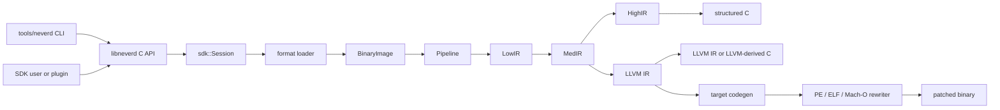

**اللغات**: [English](architecture.md) | [简体中文](architecture.zh-CN.md) | [繁體中文](architecture.zh-TW.md) | [日本語](architecture.ja.md) | [한국어](architecture.ko.md) | [Français](architecture.fr.md) | [Deutsch](architecture.de.md) | [Español](architecture.es.md) | [Italiano](architecture.it.md) | [Русский](architecture.ru.md) | [العربية](architecture.ar.md)

[← فهرس التوثيق](README.ar.md)

# عمارة NeverD

يصف هذا الدليل حدود الإنتاج التي يحتاج المساهم إلى فهمها لتعديل NeverD بأمان.
وهو يغطي عمدًا الشفرة المملوكة لـ NeverD فقط؛ وتحتفظ وحدات LLVM وCapstone
وUnicorn الفرعية بعمارتها الداخلية.

## حدود النظام

لدى NeverD أربعة تمثيلات IR، لكنها ليست سلسلة إلزامية من أربع قفزات.
`LowIR -> MedIR` مشترك. تستخدم إعادة التجميع المنظمة بعد ذلك
`MedIR -> HighIR -> C`، بينما تسلك `lift` و`decompile --llvm` و`patch` المسار
المباشر `MedIR -> LLVM IR`. تتجاوز وضعيّتا patch وlift ‏HighIR عمدًا.

تحلل CLI الأوامر في `tools/neverd`، وتنشئ `neverd_session_t`، وتستدعي API العامة
في `include/neverd/sdk/NeverDCAPI.h`. توجد حالة المحرك في
`lib/sdk/SessionImpl.h`؛ ويختار `neverd_session_load` loader ويبني
`BinaryImage`، بينما تشغّل العمليات المبنية على IR ‏`lib/pipeline/Pipeline.cpp`
عند الحاجة. يرتبط الملف التنفيذي `neverd` مع `neverd_shared`؛ وأرشيفات
المكونات وتبعيات LLVM/Capstone هي تفاصيل خاصة بالمكتبة المشتركة. تستخدم CLI ‏LLVM
Support لواجهة سطر الأوامر، لكنها لا تتجاوز C API لقيادة المحرك.

## تمثيلات IR ومساراتها

| التمثيل | الغرض | التعريفات والتحويلات الأساسية |
|---------|-------|-------------------------------|
| LowIR | عمليات `NdOp` مستقلة عن العمارة، وكتل أساسية، وCFG، وبيانات جداول القفز | `include/neverd/ir/low` و`lib/ir/low`، وينتجها `lib/decode` + `lib/lift` |
| MedIR | الأنواع، وABI/أعراف الاستدعاء، ونموذج الذاكرة/المكدس، والأعلام، والاستدعاءات، وتدفق شبيه بـ SSA | `include/neverd/ir/med` و`lib/ir/med` |
| HighIR | تعابير وتحكم منظم لإنتاج C مقروء | `include/neverd/ir/high` و`lib/ir/high`، يصدره `lib/backend/c/HighC` |
| LLVM IR | التحسين، وC مشتق من LLVM، وتوليد شفرة الهدف، ومدخل إعادة كتابة الثنائي | `lib/backend/llvm`، يحسّنه/ينسقه `lib/pipeline` |

| مسار المستخدم | مسار التمثيلات | المخرج |
|---------------|----------------|--------|
| تفريغ Low/Med | Binary -> LowIR، واختياريًا -> MedIR | نص تشخيصي |
| تفريغ High أو `decompile` | Binary -> LowIR -> MedIR -> HighIR | HighIR أو C منظم |
| `lift` | Binary -> LowIR -> MedIR -> LLVM IR | `.ll` |
| `decompile --llvm` | Binary -> LowIR -> MedIR -> LLVM IR | C مشتق من LLVM |
| `patch` | Binary -> LowIR -> MedIR -> LLVM IR -> codegen | ثنائي معاد كتابته |

يمثل `lib/pipeline/Pipeline.cpp` مصدر الحقيقة لاختيار المسار. أبق المنطق الخاص
بالتمثيل في مكتبة IR أو backend المالكة له؛ وعلى pipeline تنسيق المكونات لا
ابتلاع خوارزمياتها.

## عقد الترجمة بين المعماريات

يعرّف `include/neverd/translate` طبقة عقد، لا backend للتنفيذ.
يمثل `GuestState` الحالة المرئية للآلة بصورة مستقلة عن العمارة لكل من
`x86_32` و`x86_64` و`AArch64` و`ARM32`. يستخدم تسلسله القانوني ذي الإصدار 1
حقول little-endian ثابتة العرض، ومعرّفات سجلات مستقرة، ومجموعات مرتبة، وتحققًا
fail-closed؛ لذلك لا تعتمد الحالة المستمرة على تخطيط C++ في المضيف.

خط الأساس wire v1 لـ`GuestState` مجمّد بصورة دائمة. يجب أن تستخدم أي حالة خارجه
معرّف extension-register من نطاق الامتدادات مع اسم قانوني بأحرف صغيرة، أو أن
تنتقل إلى إصدار wire جديد مع upgrader صريح؛ ويحظر تغيير خط أساس v1 في مكانه.

بالنسبة إلى ضيف `ARM32`، يكون `ExecutionMode` هو نمط فك الترميز المرجعي ويجب أن
يتوافق مع `CPSR.T`. ويكون PC المخزّن دائمًا عنوان التعليمة القانوني بعد تصفير
البت 0؛ كما يتطلب نمط ARM محاذاة على حدود الكلمة.

يعرّف عقد أزواج المعماريات `x86_64 -> AArch64` و
`AArch64 -> x86_64` و`x86_32 -> AArch64/ARM32` و
`ARM32 -> x86_32/x86_64`. تعني `ContractDefined` إمكان التحقق من الطلب وحفظه،
لا إمكان ترجمة الشفرة أو تنفيذها. تقبل سياسة JIT المضيف الأصلي للعملية الجارية
فقط، بينما تتطلب سياسة AOT تحديد عمارة المضيف وtarget triple صراحة؛ ويجب أيضًا
تحديد CPU أو مجموعة الميزات صراحة عند اختيارهما.

يسجل `TranslationExit` ذو الإصدار سبب توقف مستقرًا والحمولة المنمطة الموافقة
لاستدعاءات النظام، والاستثناءات أو الإشارات، ونقاط التوقف، والتعليمات غير
المدعومة، والتعديل الذاتي، وميزانيات الموارد، والاستدعاءات الخارجية، وأعطال
الذاكرة، وشروط الانتهاء الأخرى. لذلك لا يحتاج المستهلك إلى إعادة تفسير عدد
صحيح غير منمط وفقًا لسبب التوقف.

مهما كان سبب التوقف، يجب ألا تتجاوز عدادات التعليمات وblocks والشفرة المولّدة
المبلّغ عنها في النتيجة الميزانية غير الصفرية المقابلة في الطلب. ويجب أيضًا أن
تحدد حمولة `BudgetExhausted` ذلك الـlimit المطلوب بدقة، لا عتبة مشتقة أو خاصة
بالتنفيذ.

يبلغ عقد `RuntimeControlBlockV1` الداخلي للـbackend مقدار 128 بايت
بالضبط، بمحاذاة 8 بايت، وتضبطه قيم magic وversion وsize وإزاحات حقول ثابتة
للإصدار v1، وحقول محجوزة صفرية، ومخارج منمطة متسقة. لا يحتوي حاويات C++ ولا
مؤشرات للمضيف ولا أسماء بديلة لعناوين guest. وهو ليس تخطيط C++ ولا صيغة wire
الخاصة بـ`GuestState`؛ ويجب على backend يطبق هذا العقد تحويل الحالة إليه صراحة.

لا يحتوي سطح الاستدعاء الثابت للإصدار v1 للشفرة المولدة إلا ثمانية helpers:
`nvd_rt_v1_load8_le` و`nvd_rt_v1_load16_le` و`nvd_rt_v1_load32_le` و
`nvd_rt_v1_load64_le` و`nvd_rt_v1_store8_le` و`nvd_rt_v1_store16_le` و
`nvd_rt_v1_store32_le` و`nvd_rt_v1_store64_le`. يجب أن تتطابق الأسماء والتواقيع
ومصدر المؤشرات تمامًا؛ وعلى backend ربط هذا الجدول المحدود صراحة من دون الرجوع
إلى تحليل رموز البيئة المحيطة. التحقق من generation للذاكرة القابلة للتنفيذ
واستطلاع الميزانية/الإلغاء عمليتان خاصتان بالـdispatcher الموثوق؛ ولا يعد
`nvd_rt_v1_validate_generation` ولا `nvd_rt_v1_poll` helper للشفرة المولدة.
ويملك host dispatcher الموثوق أيضًا اختيار blocks ولا يمكن للـIR المولد استدعاؤه؛
بل تعيد translated blocks رمز خروج منمطًا. ولا يجوز للـIR المولد أن يقرأ مباشرة
إلا runtime slot المعلن للـscalar-result.

يُعزل `GuestMemoryRuntime` عن `GuestState` المنطقي: يتحقق من الحالة عند الإنشاء
ثم ينسخ بايتات المناطق وبياناتها الوصفية إلى فهرس خاص مرتب. لا تعدو عناوين
guest الافتراضية كونها مفاتيح بحث، ولا تتحول أبدًا إلى مؤشرات للمضيف. تبلغ
عمليات الوصول القياسية المفحوصة عن أعطال منمطة للعرض والمحاذاة والفيض وعدم
التعيين وعبور المناطق والصلاحيات والكتابة إلى شفرة قابلة للتنفيذ وفيض أو عدم
تطابق generation ومخالفة policy. كما تنتج ميزانيات التعليمات/blocks والإلغاء
وتتبع generation وسياسات كتابة الشفرة `RejectExecutableWrites` و
`InvalidateOnExecutableWrite` و`ValidateBeforeDispatch` سجلات منمطة متسقة بدل
سلوك ضمني في المضيف.

يدقق post-codegen verifier ملفات relocatable من ELF وCOFF وMach-O
بوصفها مجموعة مغلقة. يجب أن تتطابق الصيغة والعمارة تمامًا مع المضيف المختار؛
ويجب أن تنتمي الرموز غير المعرفة إلى helper allowlist المحدودة بالمطابقة
الدقيقة، بينما تحظر الرموز الديناميكية. تقتصر relocations على whitelists مباشرة
وصريحة مع التحقق من encoding والعرض والمحاذاة وoffset وقابلية تحميل قسم الوجهة
ومن أن الهدف تعريف non-preemptible محلي للملف أو helper مسموح به تمامًا. ويرفض
المدقق W+X وبيانات unwind/exception/initializer الوصفية وTLS وIFUNC وGOT/PLT
وغيرها من أشكال indirection وrelocations الديناميكية والتعريفات
weak/preemptible أو القابلة للاختيار والأقسام المحجوزة غير المعروفة وتوجيهات
linker. يجب ألا تحتوي آثار ELF من نوع `ET_REL` أي program headers أو segments.
وتخضع load commands في Mach-O لقائمة سماح موجبة: segment واحد بالضبط يطابق عرض
الملف، وبحد أقصى symbol table وdynamic-symbol table وplatform-version وأمر
data-in-code واحد لكل منها، مع التحقق من علاقات الاعتماد. وترفض خيارات linker
وكل command آخر.

تعرّف تطبيقات runtime والذاكرة وIR وتدقيق ملفات الهدف هذه الحدود وتتحقق منها.
ولا تشكل backend ترجمة قابلًا للتنفيذ ومتكاملًا، ولا pipeline متكاملًا للترجمة
بين المعماريات، ولا إعادة كتابة متكاملة للاستثناءات من طرف إلى طرف. يحدد هذا
القسم نطاق العقد وverifier؛ ولا يدعي إتاحة التوليد أو الربط أو التحميل أو التنفيذ
أو JIT أو AOT أو إعادة كتابة الاستثناءات من طرف إلى طرف.

يشترط عقد IR المولّد أن يكون كل translated block خاضع له hidden وnon-preemptible
وأن يستخدم C ABI `i32 (ptr state, ptr runtime)`. لا تُكتشف blocks إلا عبر سجل
خاص، ولا عبر بحث رموز العملية المحيطة؛ كما تُحظر الاستدعاءات المباشرة بين
blocks.

يقيّد IR verifier أيضًا عروض الأعداد الصحيحة بعرض السجل القياسي للمضيف لتجنب
compiler-runtime libcalls المعروفة التي قد تضيفها legalization. هذا شرط ضروري
لكنه غير كافٍ: يجب على أي backend تنفيذ يطبق هذا العقد تدقيق انتقالات التحكم
post-codegen و`MachineIR` وrelocations في ملف الهدف تدقيقًا دقيقًا مقابل قائمة
runtime-symbol allowlist المحدودة نفسها.

لا يجوز أن تحتوي عمليات load/store المباشرة في TranslationIR ولا قيم private
constants إلا على عدد صحيح قياسي واحد لا يتجاوز عرض السجل القياسي للمضيف. ويجب
تفكيك القيم المجمعة إلى قيم قياسية قبل حد verifier، حتى لا يتسبب IR مضغوط في
توسعة غير محدودة داخل backend.

يُعرّف generated-code ABI للأعداد الصحيحة القياسية فقط. أما floating point
وSIMD وx87 والعمليات الذرية وتعليمات النظام فهي خارج هذا العقد. يجب على أي
تنفيذ يختار `ProvenSemanticAndLLVM` تشغيل تبسيط NeverD الدلالي المحكوم بالإثبات
حتى نقطة ثبات مشتركة مع تحسين LLVM؛ ولا توفر السياسة نفسها backend ترجمة قابلًا
للتنفيذ.

## خريطة المكونات

كل مكوّن أرشيف ثابت ينشئه `add_neverd_component_library`. يسرد الجدول تبعيات
NeverD المهمة، لا كل مكتبات LLVM وCapstone المشتركة التي يوفرها helper الخاص بـ
CMake.

| الدليل | المسؤولية | التبعيات المهمة |
|--------|-----------|-----------------|
| `lib/loader` | اكتشاف الصيغة، وتحميل PE/COFF وELF وMach-O، و`BinaryImage` موحدة، واكتشاف الدوال | LLVM Object API |
| `lib/lift` | دلالات تعليمات x86/i386 وAArch64 وARM32 المكتوبة يدويًا | أنواع بيانات IR |
| `lib/decode` | فك Capstone/native والتوزيع إلى lifter العمارة | `NeverDIR` و`NeverDLift` |
| `lib/ir` | الأنواع المشتركة وتعريفات/تحويلات LowIR وMedIR وHighIR وintrinsic | مكونات IR الفرعية الأربعة |
| `lib/pipeline` | اكتشاف الدوال وتنسيق مسارات Low/Med/High/LLVM | IR وdecode وlift وLLVM backend ومعلومات التصحيح وIR pass |
| `lib/backend/c` | عرض HighIR إلى C وLLVM IR إلى C | IR |
| `lib/backend/llvm` | خفض MedIR إلى LLVM | IR |
| `lib/backend/codegen` | توليد شفرة الهدف وpatch/إعادة الكتابة الموضعية لـ PE/ELF/Mach-O | IR وloader |
| `lib/sdk` | C ABI العامة، ودورة session، والاستعلامات، والاستمرارية، والإضافات، ومداخل lift/decompile/patch | يجمع المحرك في `libneverd` |
| `lib/pass` | مسارات تشويش LLVM IR ومشغل مسارات MIR | IR |
| `lib/debug` | سياقات تصحيح DWARF وPDB وlinker-map | IR |
| `lib/sigs` | تحليل التواقيع وقواعدها ومطابقتها | Loader |
| `lib/libc` | أسماء libc المعروفة ودعم نموذج الاستدعاء | مكوّن مستقل |
| `lib/support` | أدوات مشتركة لتحميل الثنائيات | Loader |
| `lib/translate` | عقود ذات إصدار لحالة guest/policy/exit وruntime ABI ثابت وguest memory مفحوصة وتدقيق IR/ملفات الهدف المولدة؛ يقع تنفيذ backend التنفيذ خارج هذا المكوّن | عقود IR وLLVM وLLVM Object |

تعكس الرؤوس العامة هذه المناطق تحت `include/neverd`. تجنب جعل فئة C++ داخلية
جزءًا من SDK بالخطأ: تنتمي العمليات الخارجية المستقرة إلى رأس C الخالص وإلى
أحد ملفات `lib/sdk/NeverDCAPI*.cpp` المحددة.

## عقد الرفع الصارم

يبدأ `Decoder` وكل lifter للعمارة في الوضع الصارم. إذا استطاع Capstone فك تعليمة
لكن lifter المختار لا ينفذها، فإنه يرمي `UnliftedInstruction`. يسجل الاستثناء
العنوان والاسم المختصر والمعاملات؛ لذا يجب أن تفشل الدلالات غير المدعومة بوضوح
بدل حذفها أو تخمينها.

يصدر المسار الداخلي غير الصارم `NdOp::NOP`، لكنه مخرج تشخيصي وليس تنفيذًا
مقبولًا. يجب أن تبقي اختبارات المساهمين وCI الوضع الصارم. عند ظهور فشل صارم:

1. أعد إنتاجه بأصغر fixture خاص بالعمارة.
2. أضف الدلالات المفقودة في `lib/lift/<ISA>`.
3. تحقق من شكل LowIR المتوقع في `unittests/lift`.
4. أضف دورة Unicorn تفاضلية في `unittests/semantic` إذا كان للتعليمة سلوك ملحوظ.

لا تلتقط `UnliftedInstruction` لمجرد استمرار pipeline. يحتاج التقريب المتعمد
الجديد إلى عقد واختبارات صريحة؛ ولا يجوز أن يتنكر كرفع 1:1.

## ملكية الصيغ وISA

منطق صيغة الإدخال ومنطق إعادة كتابة الإخراج منفصلان عمدًا:

| الصيغة | التحميل والبيانات وrelocation الإدخال | Patch وrelocation الإخراج |
|--------|--------------------------------------|---------------------------|
| PE/COFF | `lib/loader/COFF` | `lib/backend/codegen/COFF` |
| ELF | `lib/loader/ELF` | `lib/backend/codegen/ELF` |
| Mach-O | `lib/loader/MachO` | `lib/backend/codegen/MachO` |

توجد lifter العمارة في `lib/lift/X86` و`lib/lift/AArch64` و`lib/lift/ARM`.
وتوجد تصريحات lifter/register العامة في `include/neverd/lift`. يقع إصدار LLVM
وتوليد الشفرة الخاصان بالهدف تحت `lib/backend/llvm/<ISA>` و
`lib/backend/codegen/CodeGen<ISA>.cpp`.

### الدعم وعمق الاختبار

تعني مصفوفة الدعم الرئيسية أن كل خلية منفذة. ولا تعني أن كل opcode أو حالة ABI
حدّية أو منتج ثنائي أو إصدار نظام اختُبر باستقصاء. يتوقف الوضع الصارم وفق
fail-closed عندما تكون دلالة التعليمة خارج التغطية المنفذة في lifter.

تملك الخلايا الاثنتا عشرة للصيغة×العمارة تغطية دلالية لـ backend إعادة الكتابة
في `unittests/semantic/PatchFullSubstRTTests.cpp`. وعمق التكامل أدق:

| الصيغة | x86-64 | i386 | AArch64 | ARM32 |
|--------|--------|------|---------|-------|
| PE/COFF | fixture مرتبطة | شبكة backend | fixture مرتبطة | fixture Thumb مرتبطة |
| ELF | fixture مرتبطة + دورة دلالية | pipeline كائن + دورة دلالية | fixture مرتبطة + دورة دلالية | fixture مرتبطة + دورة دلالية |
| Mach-O | fixture مرتبطة\* | pipeline كائن PIC/no-PIC\* | fixture مرتبطة\* | شبكة backend |

- تختبر **fixture المرتبطة** loader/pipeline وسلوك patch لملف تنفيذي مرتبط على
  برامج ممثلة.
- يختبر **pipeline الكائن** التحميل وكل مراحل IR وإعادة تجميع كائن قابل لإعادة
  التموضع، لكنه لا يشمل ربط المضيف أو تنفيذ الثنائي بعد patch.
- تجمع **شبكة backend** ‏IR ممثلًا عبر مسار توليد إعادة الكتابة الدقيق، وتقارن
  السلوك في Unicorn؛ ولا تختبر loader للصيغة على ملف تنفيذي مرتبط.
- `*` تعتمد fixtures ‏Mach-O المرتبطة على toolchain مضيف قادر على إنتاج الهدف.
  لا يستطيع macOS الحديث ربط ملفات i386 التنفيذية التاريخية؛ لذلك تُستخدم
  كائنات thin ‏PIC/no-PIC وشبكة إعادة الكتابة.

تمثل خلايا fixture المرتبطة أقوى دليل على تكامل الصيغة لهذه البرامج.
وتملك خلايا pipeline الكائن وشبكة backend تغطية تكامل جزئية فقط. لا توجد خلية
«مختبرة بالكامل» دون هذا التقييد، ولا تدّعي أي خلية تغطية ISA شاملة.

الأدلة الأساسية هي
[`PatchFormatTests.cpp`](../unittests/lift/format/PatchFormatTests.cpp) لـ fixtures ‏ELF
وPE المرتبطة، و
[`COFFARMFormatTests.cpp`](../unittests/lift/format/COFFARMFormatTests.cpp) لتحميل/
إعادة تجميع Windows ARM، و
[`MachOI386RelocationTests.cpp`](../unittests/lift/format/MachOI386RelocationTests.cpp)
لكائنات i386 thin، و
[`X86_64_PipelineE2ETests.cpp`](../unittests/lift/x86_64/X86_64_PipelineE2ETests.cpp)
و
[`AArch64_PipelineE2ETests.cpp`](../unittests/lift/aarch64/AArch64_PipelineE2ETests.cpp)
لـ Mach-O المرتبط، و
[`PatchFullSubstRTTests.cpp`](../unittests/semantic/probe/patchfull/PatchFullSubstRTTests.cpp)
لشبكة الخلايا الاثنتي عشرة. راجع [دليل الاختبارات](testing.ar.md) للأوامر.

## أين تعدّل

| التغيير | نقطة البداية | الحد الأدنى للتحقق المحدد |
|---------|--------------|---------------------------|
| إضافة تعليمة أو إصلاحها | الملفات المناسبة في `lib/lift/X86` أو `AArch64` أو `ARM`؛ والرأس العام إذا تغير التوزيع | اختبار العمارة في `unittests/lift`؛ ودورة دلالية في `unittests/semantic` |
| إضافة `NdOp` | `include/neverd/ir/NdOps.h`، ثم تدقيق Low-to-Med وemitter/renderer وverifier/emulator والتفريغ | `NeverDLiftTests` + حالات `NeverDSemanticTests` ذات الصلة |
| تغيير CFG أو اكتشاف الدوال | `lib/ir/low` و`lib/loader/FunctionDiscovery*.cpp` و`lib/pipeline/PipelineFuncDetect.cpp` | اختبارات lift لـ CFG/جداول القفز ومجموعة تحويل دلالية محددة |
| إضافة relocation إدخال أو قاعدة unwind لـ PE | `lib/loader/COFF` | `COFFARMFormatTests` أو fixture loader محددة جديدة |
| إضافة relocation إخراج أو قاعدة patch لـ PE | `lib/backend/codegen/COFF` | `PatchFormatTests` و`RewriteCodegenRTTests` وشبكة PE backend |
| تغيير سلوك ELF أو Mach-O | أدلة `lib/loader/<Format>` و/أو `lib/backend/codegen/<Format>` المطابقة | اختبارات الصيغة مع شبكة إعادة الكتابة |
| تغيير استرداد MedIR/ABI | `lib/ir/med` | اختبارات lift لأعراف الاستدعاء + دورات دلالية عابرة لـ ISA |
| تغيير استرداد التحكم المنظم | `lib/ir/high` | `NeverDCFGLoopXformTests` واختبارات C المنظمة |
| إضافة تحويل LLVM | `lib/pass/ir`، والرأس العام في `include/neverd/pass/ir`، ومفتاح pipeline إن كُشف | مجموعة تحويل محددة + `NeverDPatchFullTests` عند تغير مخرج patch |
| إضافة عملية C API | `include/neverd/sdk/NeverDCAPI.h` و`lib/sdk/NeverDCAPI*.cpp` محدد، و`SessionImpl.h` للحالة فقط | اختبارات SDK/CLI الدلالية؛ الحفاظ على `neverd_last_error` وأعراف التخصيص |
| إضافة أمر CLI | `tools/neverd/NeverDCLIOptions.cpp` و`NeverDCLI.h` و`NeverDCmd*.cpp` محدد، والتوزيع في `neverd.cpp` | `unittests/semantic/CLIEndToEndTests.cpp` وCLI smoke test مباشر |
| إضافة انحدار دلالي | ملف `unittests/semantic/*Tests.cpp` محدد؛ وتسجيل الملف الجديد في `unittests/semantic/CMakeLists.txt` | بناء ثنائي الاختبار ثم اختيار الحالة بـ `ctest -R` |

أبق التغييرات ضيقة. يمكن أن تتغير ملفات تعريف التمثيل مع تحويلاته، لكن لا ينبغي
تعديل loader أو lifter أو backend غير المتعلق لمجرد إظهار refactor واسع بمظهر موحد.
