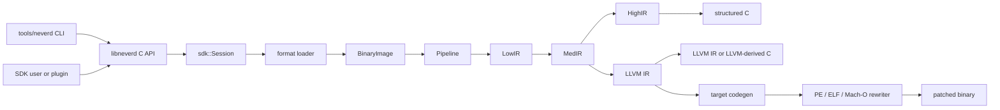

**اللغات**: [English](architecture.md) | [简体中文](architecture.zh-CN.md) | [繁體中文](architecture.zh-TW.md) | [日本語](architecture.ja.md) | [한국어](architecture.ko.md) | [Français](architecture.fr.md) | [Deutsch](architecture.de.md) | [Español](architecture.es.md) | [Italiano](architecture.it.md) | [Русский](architecture.ru.md) | [العربية](architecture.ar.md)

[← فهرس التوثيق](README.ar.md)

# عمارة NeverD

يصف هذا الدليل حدود الإنتاج التي يحتاج المساهم إلى فهمها لتعديل NeverD بأمان.
وهو يغطي عمدًا الشفرة المملوكة لـ NeverD فقط؛ وتحتفظ وحدات LLVM وCapstone
وUnicorn الفرعية بعمارتها الداخلية.

## حدود النظام

لدى NeverD أربعة تمثيلات IR، لكنها ليست سلسلة إلزامية من أربع قفزات.
`LowIR -> MedIR` مشترك. تستخدم إعادة التجميع المنظمة بعد ذلك
`MedIR -> HighIR -> C`، بينما تسلك `lift` و`decompile --llvm` و`patch` المسار
المباشر `MedIR -> LLVM IR`. تتجاوز وضعيّتا patch وlift ‏HighIR عمدًا.

تحلل CLI الأوامر في `tools/neverd`، وتنشئ `neverd_session_t`، وتستدعي API العامة
في `include/neverd/sdk/NeverDCAPI.h`. توجد حالة المحرك في
`lib/sdk/SessionImpl.h`؛ ويختار `neverd_session_load` loader ويبني
`BinaryImage`، بينما تشغّل العمليات المبنية على IR ‏`lib/pipeline/Pipeline.cpp`
عند الحاجة. يرتبط الملف التنفيذي `neverd` مع `neverd_shared`؛ وتبقى أرشيفات
المكونات وتبعيات LLVM/Capstone تفاصيل خاصة بالمكتبة المشتركة. تستخدم CLI ‏LLVM
Support لواجهة سطر الأوامر، لكنها لا تتجاوز C API لقيادة المحرك.

## تمثيلات IR ومساراتها

| التمثيل | الغرض | التعريفات والتحويلات الأساسية |
|---------|-------|-------------------------------|
| LowIR | عمليات `NdOp` مستقلة عن العمارة، وكتل أساسية، وCFG، وبيانات جداول القفز | `include/neverd/ir/low` و`lib/ir/low`، وينتجها `lib/decode` + `lib/lift` |
| MedIR | الأنواع، وABI/أعراف الاستدعاء، ونموذج الذاكرة/المكدس، والأعلام، والاستدعاءات، وتدفق شبيه بـ SSA | `include/neverd/ir/med` و`lib/ir/med` |
| HighIR | تعابير وتحكم منظم لإنتاج C مقروء | `include/neverd/ir/high` و`lib/ir/high`، يصدره `lib/backend/c/HighC` |
| LLVM IR | التحسين، وC مشتق من LLVM، وتوليد شفرة الهدف، ومدخل إعادة كتابة الثنائي | `lib/backend/llvm`، يحسّنه/ينسقه `lib/pipeline` |

| مسار المستخدم | مسار التمثيلات | المخرج |
|---------------|----------------|--------|
| تفريغ Low/Med | Binary -> LowIR، واختياريًا -> MedIR | نص تشخيصي |
| تفريغ High أو `decompile` | Binary -> LowIR -> MedIR -> HighIR | HighIR أو C منظم |
| `lift` | Binary -> LowIR -> MedIR -> LLVM IR | `.ll` |
| `decompile --llvm` | Binary -> LowIR -> MedIR -> LLVM IR | C مشتق من LLVM |
| `patch` | Binary -> LowIR -> MedIR -> LLVM IR -> codegen | ثنائي معاد كتابته |

يمثل `lib/pipeline/Pipeline.cpp` مصدر الحقيقة لاختيار المسار. أبق المنطق الخاص
بالتمثيل في مكتبة IR أو backend المالكة له؛ وعلى pipeline تنسيق المكونات لا
ابتلاع خوارزمياتها.

## خريطة المكونات

كل مكوّن أرشيف ثابت ينشئه `add_neverd_component_library`. يسرد الجدول تبعيات
NeverD المهمة، لا كل مكتبات LLVM وCapstone المشتركة التي يوفرها helper الخاص بـ
CMake.

| الدليل | المسؤولية | التبعيات المهمة |
|--------|-----------|-----------------|
| `lib/loader` | اكتشاف الصيغة، وتحميل PE/COFF وELF وMach-O، و`BinaryImage` موحدة، واكتشاف الدوال | LLVM Object API |
| `lib/lift` | دلالات تعليمات x86/i386 وAArch64 وARM32 المكتوبة يدويًا | أنواع بيانات IR |
| `lib/decode` | فك Capstone/native والتوزيع إلى lifter العمارة | `NeverDIR` و`NeverDLift` |
| `lib/ir` | الأنواع المشتركة وتعريفات/تحويلات LowIR وMedIR وHighIR وintrinsic | مكونات IR الفرعية الأربعة |
| `lib/pipeline` | اكتشاف الدوال وتنسيق مسارات Low/Med/High/LLVM | IR وdecode وlift وLLVM backend ومعلومات التصحيح وIR pass |
| `lib/backend/c` | عرض HighIR إلى C وLLVM IR إلى C | IR |
| `lib/backend/llvm` | خفض MedIR إلى LLVM | IR |
| `lib/backend/codegen` | توليد شفرة الهدف وpatch/إعادة الكتابة الموضعية لـ PE/ELF/Mach-O | IR وloader |
| `lib/sdk` | C ABI العامة، ودورة session، والاستعلامات، والاستمرارية، والإضافات، ومداخل lift/decompile/patch | يجمع المحرك في `libneverd` |
| `lib/pass` | مسارات تشويش LLVM IR ومشغل مسارات MIR | IR |
| `lib/debug` | سياقات تصحيح DWARF وPDB وlinker-map | IR |
| `lib/sigs` | تحليل التواقيع وقواعدها ومطابقتها | Loader |
| `lib/libc` | أسماء libc المعروفة ودعم نموذج الاستدعاء | مكوّن مستقل |
| `lib/Support` | أدوات مشتركة لتحميل الثنائيات | Loader |

تعكس الرؤوس العامة هذه المناطق تحت `include/neverd`. تجنب جعل فئة C++ داخلية
جزءًا من SDK بالخطأ: تنتمي العمليات الخارجية المستقرة إلى رأس C الخالص وإلى
أحد ملفات `lib/sdk/NeverDCAPI*.cpp` المحددة.

## عقد الرفع الصارم

يبدأ `Decoder` وكل lifter للعمارة في الوضع الصارم. إذا استطاع Capstone فك تعليمة
لكن lifter المختار لا ينفذها، فإنه يرمي `UnliftedInstruction`. يسجل الاستثناء
العنوان والاسم المختصر والمعاملات؛ لذا يجب أن تفشل الدلالات غير المدعومة بوضوح
بدل حذفها أو تخمينها.

يصدر المسار الداخلي غير الصارم `NdOp::NOP`، لكنه مخرج تشخيصي وليس تنفيذًا
مقبولًا. يجب أن تبقي اختبارات المساهمين وCI الوضع الصارم. عند ظهور فشل صارم:

1. أعد إنتاجه بأصغر fixture خاص بالعمارة.
2. أضف الدلالات المفقودة في `lib/lift/<ISA>`.
3. تحقق من شكل LowIR المتوقع في `unittests/lift`.
4. أضف دورة Unicorn تفاضلية في `unittests/semantic` إذا كان للتعليمة سلوك ملحوظ.

لا تلتقط `UnliftedInstruction` لمجرد استمرار pipeline. يحتاج التقريب المتعمد
الجديد إلى عقد واختبارات صريحة؛ ولا يجوز أن يتنكر كرفع 1:1.

## ملكية الصيغ وISA

منطق صيغة الإدخال ومنطق إعادة كتابة الإخراج منفصلان عمدًا:

| الصيغة | التحميل والبيانات وrelocation الإدخال | Patch وrelocation الإخراج |
|--------|--------------------------------------|---------------------------|
| PE/COFF | `lib/loader/COFF` | `lib/backend/codegen/COFF` |
| ELF | `lib/loader/ELF` | `lib/backend/codegen/ELF` |
| Mach-O | `lib/loader/MachO` | `lib/backend/codegen/MachO` |

توجد lifter العمارة في `lib/lift/X86` و`lib/lift/AArch64` و`lib/lift/ARM`.
وتوجد تصريحات lifter/register العامة في `include/neverd/lift`. يقع إصدار LLVM
وتوليد الشفرة الخاصان بالهدف تحت `lib/backend/llvm/<ISA>` و
`lib/backend/codegen/CodeGen<ISA>.cpp`.

### الدعم وعمق الاختبار

تعني مصفوفة الدعم الرئيسية أن كل خلية منفذة. ولا تعني أن كل opcode أو حالة ABI
حدّية أو منتج ثنائي أو إصدار نظام اختُبر باستقصاء. يمثل الوضع الصارم حاجزًا
لتغطية التعليمات التي لم تُضف بعد.

تملك الخلايا الاثنتا عشرة للصيغة×العمارة تغطية دلالية لـ backend إعادة الكتابة
في `unittests/semantic/PatchFullSubstRTTests.cpp`. وعمق التكامل أدق:

| الصيغة | x86-64 | i386 | AArch64 | ARM32 |
|--------|--------|------|---------|-------|
| PE/COFF | fixture مرتبطة | شبكة backend | fixture مرتبطة | fixture Thumb مرتبطة |
| ELF | fixture مرتبطة + دورة دلالية | pipeline كائن + دورة دلالية | fixture مرتبطة + دورة دلالية | fixture مرتبطة + دورة دلالية |
| Mach-O | fixture مرتبطة\* | pipeline كائن PIC/no-PIC\* | fixture مرتبطة\* | شبكة backend |

- تختبر **fixture المرتبطة** loader/pipeline وسلوك patch لملف تنفيذي مرتبط على
  برامج ممثلة.
- يختبر **pipeline الكائن** التحميل وكل مراحل IR وإعادة تجميع كائن قابل لإعادة
  التموضع، لكنه لا يشمل ربط المضيف أو تنفيذ الثنائي بعد patch.
- تجمع **شبكة backend** ‏IR ممثلًا عبر مسار توليد إعادة الكتابة الدقيق، وتقارن
  السلوك في Unicorn؛ ولا تختبر loader للصيغة على ملف تنفيذي مرتبط.
- `*` تعتمد fixtures ‏Mach-O المرتبطة على toolchain مضيف قادر على إنتاج الهدف.
  لا يستطيع macOS الحديث ربط ملفات i386 التنفيذية التاريخية؛ لذلك تُستخدم
  كائنات thin ‏PIC/no-PIC وشبكة إعادة الكتابة.

تمثل خلايا fixture المرتبطة أقوى دليل حالي على تكامل الصيغة لهذه البرامج.
وتملك خلايا pipeline الكائن وشبكة backend تغطية تكامل جزئية فقط. لا توجد خلية
«مختبرة بالكامل» دون هذا التقييد، ولا تدّعي أي خلية تغطية ISA شاملة.

الأدلة الأساسية هي
[`PatchFormatTests.cpp`](../unittests/lift/PatchFormatTests.cpp) لـ fixtures ‏ELF
وPE المرتبطة، و
[`COFFARMFormatTests.cpp`](../unittests/lift/COFFARMFormatTests.cpp) لتحميل/
إعادة تجميع Windows ARM، و
[`MachOI386RelocationTests.cpp`](../unittests/lift/MachOI386RelocationTests.cpp)
لكائنات i386 thin، و
[`X86_64_PipelineE2ETests.cpp`](../unittests/lift/X86_64_PipelineE2ETests.cpp)
و
[`AArch64_PipelineE2ETests.cpp`](../unittests/lift/AArch64_PipelineE2ETests.cpp)
لـ Mach-O المرتبط، و
[`PatchFullSubstRTTests.cpp`](../unittests/semantic/PatchFullSubstRTTests.cpp)
لشبكة الخلايا الاثنتي عشرة. راجع [دليل الاختبارات](testing.ar.md) للأوامر.

## أين تعدّل

| التغيير | نقطة البداية | الحد الأدنى للتحقق المحدد |
|---------|--------------|---------------------------|
| إضافة تعليمة أو إصلاحها | الملفات المناسبة في `lib/lift/X86` أو `AArch64` أو `ARM`؛ والرأس العام إذا تغير التوزيع | اختبار العمارة في `unittests/lift`؛ ودورة دلالية في `unittests/semantic` |
| إضافة `NdOp` | `include/neverd/ir/NdOps.h`، ثم تدقيق Low-to-Med وemitter/renderer وverifier/emulator والتفريغ | `NeverDLiftTests` + حالات `NeverDSemanticTests` ذات الصلة |
| تغيير CFG أو اكتشاف الدوال | `lib/ir/low` و`lib/loader/FunctionDiscovery*.cpp` و`lib/pipeline/PipelineFuncDetect.cpp` | اختبارات lift لـ CFG/جداول القفز ومجموعة تحويل دلالية محددة |
| إضافة relocation إدخال أو قاعدة unwind لـ PE | `lib/loader/COFF` | `COFFARMFormatTests` أو fixture loader محددة جديدة |
| إضافة relocation إخراج أو قاعدة patch لـ PE | `lib/backend/codegen/COFF` | `PatchFormatTests` و`RewriteCodegenRTTests` وشبكة PE backend |
| تغيير سلوك ELF أو Mach-O | أدلة `lib/loader/<Format>` و/أو `lib/backend/codegen/<Format>` المطابقة | اختبارات الصيغة مع شبكة إعادة الكتابة |
| تغيير استرداد MedIR/ABI | `lib/ir/med` | اختبارات lift لأعراف الاستدعاء + دورات دلالية عابرة لـ ISA |
| تغيير استرداد التحكم المنظم | `lib/ir/high` | `NeverDCFGLoopXformTests` واختبارات C المنظمة |
| إضافة تحويل LLVM | `lib/pass/ir`، والرأس العام في `include/neverd/pass/ir`، ومفتاح pipeline إن كُشف | مجموعة تحويل محددة + `NeverDPatchFullTests` عند تغير مخرج patch |
| إضافة عملية C API | `include/neverd/sdk/NeverDCAPI.h` و`lib/sdk/NeverDCAPI*.cpp` محدد، و`SessionImpl.h` للحالة فقط | اختبارات SDK/CLI الدلالية؛ الحفاظ على `neverd_last_error` وأعراف التخصيص |
| إضافة أمر CLI | `tools/neverd/NeverDCLIOptions.cpp` و`NeverDCLI.h` و`NeverDCmd*.cpp` محدد، والتوزيع في `neverd.cpp` | `unittests/semantic/CLIEndToEndTests.cpp` وCLI smoke test مباشر |
| إضافة انحدار دلالي | ملف `unittests/semantic/*Tests.cpp` محدد؛ وتسجيل الملف الجديد في `unittests/semantic/CMakeLists.txt` | بناء ثنائي الاختبار ثم اختيار الحالة بـ `ctest -R` |

أبق التغييرات ضيقة. يمكن أن تتغير ملفات تعريف التمثيل مع تحويلاته، لكن لا ينبغي
تعديل loader أو lifter أو backend غير المتعلق لمجرد إظهار refactor واسع بمظهر موحد.
