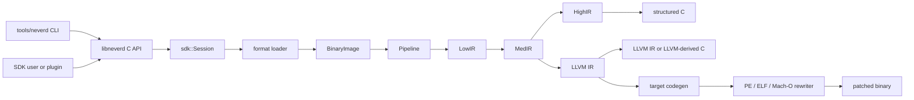

**Sprachen**: [English](architecture.md) | [简体中文](architecture.zh-CN.md) | [繁體中文](architecture.zh-TW.md) | [日本語](architecture.ja.md) | [한국어](architecture.ko.md) | [Français](architecture.fr.md) | [Deutsch](architecture.de.md) | [Español](architecture.es.md) | [Italiano](architecture.it.md) | [Русский](architecture.ru.md) | [العربية](architecture.ar.md)

[← Dokumentationsindex](README.de.md)

# NeverD-Architektur

Dieser Leitfaden beschreibt die Produktionsgrenzen, die Mitwirkende kennen
müssen, um NeverD sicher zu ändern. Er behandelt bewusst nur NeverD-eigenen
Code; die LLVM-, Capstone- und Unicorn-Submodule behalten ihre interne
Architektur.

## Systemgrenze

NeverD besitzt vier IR-Darstellungen, die aber keine zwingende Kette aus vier
Schritten bilden. `LowIR -> MedIR` ist gemeinsam. Strukturierte Dekompilierung
verwendet danach `MedIR -> HighIR -> C`; `lift`, `decompile --llvm` und `patch`
nehmen den direkten Weg `MedIR -> LLVM IR`. Patch- und Lift-Modus überspringen
HighIR bewusst.

Die CLI parst Befehle in `tools/neverd`, erzeugt ein `neverd_session_t` und ruft
die öffentliche API aus `include/neverd/sdk/NeverDCAPI.h` auf. Der
Enginezustand liegt in `lib/sdk/SessionImpl.h`; `neverd_session_load` wählt
einen Loader und erstellt ein `BinaryImage`, während IR-basierte Operationen
`lib/pipeline/Pipeline.cpp` bei Bedarf ausführen. Das Programm `neverd` linkt
`neverd_shared`; Komponentenarchive und deren LLVM-/Capstone-Abhängigkeiten
sind private Implementierungsdetails der Shared Library. Die CLI nutzt LLVM
Support für ihre Kommandozeilenoberfläche, umgeht beim Ansteuern der Engine
aber nicht die C-API.

## IR-Darstellungen und Pfade

| Darstellung | Zweck | Primäre Definitionen und Transformationen |
|-------------|-------|--------------------------------------------|
| LowIR | Architekturunabhängige `NdOp`-Operationen, Basisblöcke, CFG und Sprungtabellenmetadaten | `include/neverd/ir/low`, `lib/ir/low`, erzeugt durch `lib/decode` + `lib/lift` |
| MedIR | Typen, ABI/Aufrufkonventionen, Speicher-/Stackmodell, Flags, Aufrufe und SSA-artiger Datenfluss | `include/neverd/ir/med`, `lib/ir/med` |
| HighIR | Strukturierte Ausdrücke und Kontrollfluss für lesbares C | `include/neverd/ir/high`, `lib/ir/high`, ausgegeben von `lib/backend/c/HighC` |
| LLVM IR | Optimierung, LLVM-abgeleitetes C, Zielcodeerzeugung und Eingabe für Binärumschreiben | `lib/backend/llvm`, optimiert/koordiniert durch `lib/pipeline` |

| Benutzerpfad | Darstellungspfad | Ausgabe |
|--------------|-----------------|---------|
| Low/Med-Dump | Binary -> LowIR, optional -> MedIR | Diagnosetext |
| High-Dump oder `decompile` | Binary -> LowIR -> MedIR -> HighIR | HighIR oder strukturiertes C |
| `lift` | Binary -> LowIR -> MedIR -> LLVM IR | `.ll` |
| `decompile --llvm` | Binary -> LowIR -> MedIR -> LLVM IR | LLVM-abgeleitetes C |
| `patch` | Binary -> LowIR -> MedIR -> LLVM IR -> codegen | Umgeschriebene Binärdatei |

`lib/pipeline/Pipeline.cpp` ist die Referenz für die Pfadauswahl.
Darstellungsspezifische Logik gehört in die jeweilige IR- oder
Backend-Bibliothek; die Pipeline soll Komponenten koordinieren, nicht deren
Algorithmen übernehmen.

## Vertrag für architekturübergreifende Übersetzung

`include/neverd/translate` definiert eine Vertragsschicht, kein
Ausführungs-Backend. `GuestState` modelliert für `x86_32`, `x86_64`, `AArch64`
und `ARM32` den architekturunabhängigen, maschinensichtbaren Zustand. Seine
kanonische Serialisierung in Version 1 verwendet Little-Endian-Felder fester
Breite, stabile Register-IDs, sortierte Sammlungen und Fail-Closed-Validierung;
der persistierte Zustand hängt daher nicht vom C++-Layout des Hosts ab.

Die wire-v1-Basis von `GuestState` ist dauerhaft eingefroren. Zustand außerhalb
dieser Basis muss eine Erweiterungsregister-ID aus dem Erweiterungsbereich
mit einem kanonischen kleingeschriebenen Namen verwenden oder in eine neue
Wire-Version mit explizitem Upgrader wechseln; die v1-Basis darf nicht an Ort
und Stelle verändert werden.

Bei einem `ARM32`-Guest ist `ExecutionMode` der maßgebliche Decode-Modus und
muss mit `CPSR.T` übereinstimmen. Der gespeicherte PC ist stets die kanonische
Instruktionsadresse mit gelöschtem Bit 0; im ARM-Modus muss er zusätzlich
wortausgerichtet sein.

Der Vertrag für Architekturpaare definiert `x86_64 -> AArch64`,
`AArch64 -> x86_64`, `x86_32 -> AArch64/ARM32` und
`ARM32 -> x86_32/x86_64`. `ContractDefined` bedeutet, dass eine Anforderung
validiert und persistiert werden kann, nicht dass Code übersetzt oder ausgeführt
werden kann. Die JIT-Richtlinie akzeptiert nur den nativen Host des laufenden
Prozesses; die AOT-Richtlinie verlangt eine explizite Hostarchitektur, ein
explizites Target-Triple und, falls gewählt, auch eine explizite CPU oder
Feature-Menge.

`ResolvedHostTarget` löst diese Auswahl in ein konkretes Ergebnis auf. Die
`Native`-Auflösung ermittelt Triple, CPU und die aktivierte/deaktivierte
Feature-Menge des Prozesses. Die `Explicit`-Auflösung validiert und normalisiert
die vom Aufrufer angegebene Architektur, das Triple, die CPU und die Features
und lehnt Widersprüche ab. Ihre versionierte Cache-Identität wird in
deterministischer Byte-Reihenfolge aus den normalisierten Zielangaben gebildet
und enthält weder Prozessadressen noch locale-abhängigen Text.

Ein versionierter `TranslationExit` hält einen stabilen Stoppgrund und die dazu
passende typisierte Nutzlast für Syscalls, Ausnahmen oder Signale, Breakpoints,
nicht unterstützte Instruktionen, Selbstmodifikation, Ressourcenbudgets, externe
Aufrufe, Speicherfehler und weitere Endbedingungen fest. Verbraucher müssen
daher keine untypisierte Ganzzahl anhand des Stoppgrunds neu interpretieren.

Außer im jeweils passenden Fall `BudgetExhausted` dürfen die gemeldeten
Instruktions-, Block- und Generated-Code-Zähler das zugehörige, von null
verschiedene Anforderungsbudget nicht überschreiten. Instruktions- und
Block-Erschöpfung stoppt exakt am Limit. Die Größe eines erzeugten Objekts kann
erst nach dem unteilbaren Codegen exakt gemessen werden; deshalb darf das
entsprechende Ergebnis `Observed > Limit` melden. Dieses verworfene Objekt wird
nie gelinkt, veröffentlicht oder ausgeführt. Jede `BudgetExhausted`-Nutzlast
nennt exakt das angeforderte Limit, keinen abgeleiteten oder
implementierungsinternen Schwellwert.

Der backend-private Vertrag `RuntimeControlBlockV1` ist
exakt 128 Byte groß, auf 8 Byte ausgerichtet und durch feste v1-Werte für Magic,
Version, Größe und Feldoffsets sowie durch nullgesetzte reservierte Felder und
kohärente typisierte Exits abgesichert. Er enthält weder C++-Container noch
Host-Zeiger oder Guest-Adressaliase. Er ist weder das C++-Layout noch das
Wire-Format von `GuestState`; ein Backend, das diesen Vertrag implementiert,
muss Zustand ausdrücklich in diesen Datensatz umwandeln.

Die feste v1-Aufrufoberfläche für erzeugten Code enthält genau acht Helper:
`nvd_rt_v1_load8_le`, `nvd_rt_v1_load16_le`, `nvd_rt_v1_load32_le`,
`nvd_rt_v1_load64_le`, `nvd_rt_v1_store8_le`, `nvd_rt_v1_store16_le`,
`nvd_rt_v1_store32_le` und `nvd_rt_v1_store64_le`. Namen, Signaturen und
Zeiger-Provenienz müssen exakt übereinstimmen; ein Backend bindet diese endliche
Tabelle ausdrücklich und fällt nie auf die Symbolauflösung der Umgebung zurück.
Die Prüfung ausführbarer Generationen und das Budget-/Abbruch-Polling sind
ausschließlich Operationen des vertrauenswürdigen Dispatchers;
`nvd_rt_v1_validate_generation` und `nvd_rt_v1_poll` sind keine Helper für
erzeugten Code. Der vertrauenswürdige Host-Dispatcher besitzt auch die
Blockauswahl und kann nicht von erzeugter IR aufgerufen werden; translated
blocks geben stattdessen einen typisierten Exit-Code zurück. Erzeugte IR darf
direkt nur den deklarierten Scalar-Result-Runtime-Slot lesen.

`RuntimeSymbolRegistryV1` setzt diese Helper-Tabelle als geschlossene
Host-Registry um. Beim Aufbau werden die vollständige ABI-v1-Menge, exakte
kanonische Namen, Helper-Klassen und Signaturen sowie pro Eintrag genau ein
nicht-null Funktionszeiger der passenden Klasse geprüft. Die Suche akzeptiert
nur exakte Namen, fragt niemals Symbole des umgebenden Prozesses oder dynamischen
Loaders ab und liefert dem Objekt-Verifier dieselben sortierten Namen als
Allowlist. Die versionierte Identität umfasst Namen, Helper-Klassen und
ABI-Form, schließt native Adressen jedoch bewusst aus und bleibt daher unter
ASLR stabil.

`RuntimeCodeMemory` besitzt seitenisolierten Speicher für erzeugten Code und
erlaubt nur die unidirektionale Veröffentlichung `RW -> RX`. Der Speicher ist
nie gleichzeitig schreibbar und ausführbar, kann nach der Veröffentlichung
nicht erneut zum Schreiben geöffnet werden, prüft Schreib- und Entry-Offsets auf
Grenzen und invalidiert dabei den Instruktionscache des Hosts. Der native
Smoke-Test führt erst danach eine kurze Host-Instruktionsfolge aus. Er belegt
nur diese W^X-Speichergrenze, nicht eine Übersetzungs-Engine.

`GuestMemoryRuntime` ist vom logischen `GuestState` isoliert: Bei der Erzeugung
wird der Zustand zuerst validiert, danach werden Bytes und Metadaten der
Regionen in einen sortierten privaten Index kopiert. Virtuelle Guest-Adressen
sind ausschließlich Suchschlüssel und werden nie in Host-Zeiger umgewandelt.
Geprüfte Skalarzugriffe melden typisierte Fehler für Breite, Ausrichtung,
Überlauf, fehlende Abbildung, Regionsüberschreitung, Berechtigung,
Schreibzugriffe auf ausführbaren Code, Generationsüberlauf/-abweichung und
Policy-Verstöße. Instruktions-/Blockbudgets, Abbruch, Generationsverfolgung und
die Code-Write-Policies `RejectExecutableWrites`,
`InvalidateOnExecutableWrite` und `ValidateBeforeDispatch` erzeugen ebenfalls
kohärente typisierte Datensätze statt impliziten Host-Verhaltens.

`TranslationObjectCompilerV1` ist die verifizierte Grenze von LLVM-IR zum
Objekt. Er validiert ein konstantes Eingabemodul, klont es vor allen
Transformationen, verbindet beweisgesicherte semantische Vereinfachung mit
LLVM-Optimierung von `O0` bis `O3`, validiert die finale IR erneut und erzeugt
relocatable ELF-, COFF- oder Mach-O-Objekte für die vier Hostarchitekturen des
Vertrags. Er kanonisiert die exakten, zielgemangelten Block- und
Runtime-Symbol-Manifeste, prüft jedes erzeugte Objekt und liefert die Identität
der Runtime-Registry sowie versionierte Request- und Artefakt-Cache-Keys. Bei
einem von null verschiedenen Generated-Byte-Budget darf nur ein passendes Objekt
zur Artefaktprüfung fortschreiten. LLVM emittiert zuerst in einen privaten Puffer,
um die exakte unteilbare Objektgröße zu messen; ein zu großes Objekt wird vor
Veröffentlichung und Artefaktprüfung verworfen, wobei typisierte Telemetrie die
beobachtete Größe und das exakte Anforderungslimit behält. Null bedeutet ohne
aufruferseitige Begrenzung. Der Compiler endet bei geprüften relocatable Bytes:
Er linkt, veröffentlicht, verteilt oder führt sie nicht aus und stellt kein
Guest-Instruktions-Lowering bereit.

Der Post-Codegen-Verifier prüft relocatable ELF-, COFF- und
Mach-O-Objekte als geschlossene Menge. Format und Architektur müssen exakt zum
gewählten Host passen; undefinierte Symbole müssen exakt in der endlichen
Helper-Allowlist stehen, dynamische Symbole sind verboten. Relocations folgen
expliziten direkten Whitelists mit Prüfungen von Encoding, Breite, Ausrichtung,
Offset, ladbarem Zielabschnitt und einem objektlokalen non-preemptible oder exakt
erlaubten Helper-Ziel. Abgelehnt werden W+X, Unwind-/Exception- und
Initializer-Metadaten, TLS, IFUNC, GOT und gewöhnliche PLT-Indirektion,
dynamische Relocations, weak/preemptible oder auswählbare Definitionen,
unbekannte allozierte Abschnitte und Linker-Direktiven. Die von LLVM für einen
hidden x86-64-ELF-Aufruf verwendete Schreibweise `R_X86_64_PLT32` ist nur
zulässig, wenn die v1-Policy einen sealed direkten Branch zum exakten
Runtime-Helper beweist; sie erlaubt keinen PLT- oder GOT-Pfad. ELF-`ET_REL`-
Artefakte dürfen keine Program Header oder Segmente enthalten. Mach-O Load
Commands folgen einer Positivliste: genau ein zur Bitbreite passendes Segment
und jeweils höchstens eine Symboltabelle, dynamische Symboltabelle,
Plattformversion und Data-in-Code-Anweisung; ihre Abhängigkeiten werden geprüft.
Linker-Optionen und alle übrigen Commands werden abgelehnt.

`TranslationObjectRequestV1` ist die erste öffentliche, bewusst eng begrenzte
Guest-Byte-zu-Objekt-Stufe auf diesen Verträgen. Aus der veröffentlichten,
fail-closed arbeitenden x86-64-v1-Teilmenge für Skalarregister akzeptiert sie nur
kanonische Codierungen ohne Legacy-Präfixe: REX.W-codierte `MOV`-,
`ADD`/`SUB`- und `AND`/`OR`/`XOR`-Formen auf GPRs voller Breite, deren Operanden
den unterstützten Register-/Immediate-LowIR-Formen entsprechen. Arithmetische
Formen behalten ihre skalaren Flag-Berechnungen bei; logische Formen und `TEST`
berechnen die von der Architektur definierten Flags und erhalten `AF` im
NeverD-Zustandsmodell. Schema 9 akzeptiert außerdem `CMP` voller Breite als
Register/Register mit `39/3B` und Register/Immediate mit `81/7`, `83/7` und
`3D` sowie `TEST` voller Breite als Register/Register mit `85` und
Register/Immediate mit `F7/0` und `A9`. Kanonisches `C3`
`RET` und `C2 iw` `RET imm16` beenden Return-Blocks; kanonische direkt-relative
`JMP`-Codierungen `EB cb` und `E9 cd` beenden Direct-Branch-Blocks. Das
veröffentlichte Lowering-Schema ist 9. Kanonische traditionelle Jcc-Branches
ohne Legacy-Präfix sind beschränkt auf: `JO`/`JNO` kurz `70/71 cb` oder nah
`0F 80/81 cd`; `JB`/`JAE` mit `72/73 cb` oder `0F 82/83 cd`; `JE`/`JNE` mit
`74/75 cb` oder `0F 84/85 cd`; `JBE`/`JA` mit `76/77 cb` oder `0F 86/87 cd`;
`JS`/`JNS` mit `78/79 cb` oder `0F 88/89 cd`; `JP`/`JNP` mit `7A/7B cb` oder
`0F 8A/8B cd`; `JL`/`JGE` mit `7C/7D cb` oder `0F 8C/8D cd`; und `JLE`/`JG`
mit `7E/7F cb` oder `0F 8E/8F cd`. `JRCXZ`/`JECXZ`/`JCXZ` und
`LOOP`/`LOOPE`/`LOOPNE` bleiben unveröffentlicht und scheitern fail-closed. Das
reservierte `F7 /1`, Guest-Speicher- und Teilregisterformen, Legacy-Präfixe
sowie semantisch redundante REX-Erweiterungsbits scheitern ebenfalls
fail-closed. Sie erzeugt ausschließlich ein geprüftes little-endian
AArch64-ELF- oder Mach-O-Relocatable-Objekt. Gewöhnliche Guest-Speicheroperationen,
Teilregisterformen, jede Instruktion oder Codierung außerhalb dieser exakten
Teilmenge, Kontrollfluss außer Returns, diesen direkten Sprüngen und den oben
veröffentlichten Jcc-Branches sowie jede vom Lowerer nicht implementierte
LowIR-Operation werden vor der Objekterzeugung abgelehnt. Das
für `RET` erforderliche geprüfte Lesen der Rücksprungadresse ist Teil seines
Terminator-Vertrags und veröffentlicht kein allgemeines
Guest-Speicher-Lowering. Der Request rekonstruiert und prüft den Blockdeskriptor,
verwendet dieselbe aufgelöste Target Machine für Lowering und Objekterzeugung
und verbindet beweisgesicherte semantische Vereinfachung mit LLVMs
standardmäßiger `O2`-Optimierungspipeline. Diese Stufe deckt keine weiteren
x86-64-Instruktionen, keine anderen Guest/Host-Paare und nicht die Gegenrichtung
AArch64 nach x86-64 ab.

Der öffentliche C-Einstiegspunkt
`neverd_translate_x86_64_block_to_aarch64_object_v1`, der Python-ctypes-Wrapper
`translate_x86_64_block_to_aarch64_object` und der Befehl
`neverd translate-object` stellen dieselbe reine Objektgrenze bereit. Python
verwendet `TranslationObjectFormat.ELF` oder `.MACHO`. Fehler der nativen
Übersetzung lösen eine typisierte `TranslationError` mit `TranslationErrorCode`
aus; die lokale Argumentprüfung löst dagegen `TypeError` oder `ValueError` aus.
Bei Erfolg liefert Python ein unveränderliches, Python-eigenes Ergebnis. Das
C-Ergebnis besitzt Objektbytes, stabile Cache-Identitäten und
Optimierungstelemetrie; die CLI schreibt nur das gewählte ELF- oder
Mach-O-Objekt. Alle drei Oberflächen enden
vor Linken, Laden, Dispatch, Ausführung und Debugging; sie sind keine
Schnittstellen für Ausführungssessions.

`verifyTranslationLinkGraphV1` ergänzt eine unabhängige zweite Prüfung vor jeder
Allocation. Er erzeugt aus einem akzeptierten AArch64-ELF- oder Mach-O-Objekt
einen kurzlebigen LLVM-JITLink-Graphen und prüft Ziel, Abschnittsrechte,
Block-/Runtime-Symbolmanifeste, den Abschluss externer Symbole sowie Arten und
Ziele der Kanten. Der Graph wird nach Erzeugung des adressfreien Prüfergebnisses
verworfen. Eine erfolgreiche Prüfung linkt, alloziert, löst, lädt,
veröffentlicht, dispatcht oder führt keinen Code aus.

`linkTranslationObjectV1` ist die separate Grenze für natives Linken. Sie prüft
den vertrauenswürdigen Deskriptor, das Rohobjekt und den JITLink-Graphen vor und
nach Pruning, Allocation, Symbolauflösung und Fixup erneut. Runtime-Symbole
stammen ausschließlich aus der versiegelten Registry. Ein Dispatcher-Credential
bindet den einzigen Manifest-Eintrag an seine Session, Blockidentität, Guest-
Einstiegs-PC, Cache-Generation und Code-Epoche; beim Aufruf muss außerdem der
Runtime-Guest-`RIP` diesem Einstieg entsprechen. Nach erfolgreicher Finalisierung
wird ausführbarer Speicher mit endgültigen Rechten veröffentlicht. Unload sperrt
neue Aufrufe und wartet auf einen aktiven Aufruf, bevor es die Allocation freigibt.
Der Overload ohne Credential bleibt audit-only und kann nicht aufrufen.

`NativeTranslationSessionV1` setzt diese Teile zur experimentellen C++-
Ausführungsgrenze von x86-64 zu nativem AArch64 zusammen. In einem little-endian
AArch64-ELF- oder Mach-O-Prozess bewahrt sie über eine mehrblockige Compile-Link-
Validate-Invoke-Unload-Dispatcher-Schleife dieselbe geprüfte Guest-Memory-Runtime
und denselben festen Guest State. Ein kanonischer direkter Sprung setzt am exakten
statischen Ziel fort. Ein veröffentlichter kanonischer Jcc-Branch setzt
nur am Taken- oder Fallthrough-Nachfolger fort, den das Blockmanifest deklariert; der Dispatcher
lehnt jeden anderen ausgewählten PC ab. Ein Return beendet die Ausführung. Die
globalen Budgets für Instruktionen, Blocks und erzeugte Objektbytes bleiben über
alle Blocks exakt. Bei einem erfolgreichen Guest-Stopp werden ausgeführter
Zustand und maßgeblicher Speicher gemeinsam committed. Cancellation ist gegenüber
diesem finalen Commit linearisiert.

Dies ist ein ausführbarer vertikaler Ausschnitt, kein vollständiger Übersetzer.
Nicht unterstützt werden gewöhnliche Guest-Memory-Instruktionen, Teilregister,
bedingter Kontrollfluss außerhalb des obigen exakten Schema-9-Ausschnitts für
traditionelle Jcc, einschließlich `JRCXZ`/`JECXZ`/`JCXZ` und
`LOOP`/`LOOPE`/`LOOPNE`,
indirekter Kontrollfluss, Calls, Fließkomma, SIMD, x87, atomare Operationen,
Systeminstruktionen, allgemeine Ausnahmeweitergabe, Block-Caching, andere
Guest/Host-Paare und die Gegenrichtung AArch64 nach x86-64. Die
Ausführungssession besitzt noch keine C-, Python-, CLI- oder JSON-Oberfläche;
Debugging bleibt separat und nicht unterstützt. Die Objekt-APIs bleiben ohne
Aktivierung nativer Ausführung nutzbar.

Der Vertrag für erzeugte IR verlangt, dass jeder ihm unterliegende translated
block hidden und non-preemptible ist und das C ABI
`i32 (ptr state, ptr runtime)` verwendet. Blocks werden ausschließlich über
eine private Registry gefunden, niemals über die Symbolsuche des umgebenden
Prozesses; direkte Aufrufe zwischen Blocks sind verboten.

Der IR verifier begrenzt Ganzzahlbreiten außerdem auf die skalare
Registerbreite des Hosts, um bekannte compiler-runtime libcalls zu vermeiden,
die bei der Legalization entstehen. Diese Prüfung ist notwendig, aber nicht
hinreichend: Jedes Ausführungs-Backend, das diesen Vertrag implementiert, muss
post-codegen Kontrollübertragungen, `MachineIR` und Relocations im Zielobjekt
exakt gegen dieselbe endliche runtime-symbol allowlist prüfen.

Direkte Loads und Stores in TranslationIR sowie Werte in private constants
dürfen jeweils nur eine skalare Ganzzahl enthalten, die nicht breiter als die
skalare Registerbreite des Hosts ist. Aggregate müssen vor der verifier-Grenze
skalarisiert werden, damit kompakte IR keine unbeschränkte Expansion im Backend
auslöst.

Die Generated-Code-ABI ist nur für skalare Ganzzahlen definiert. Fließkomma,
SIMD, x87, atomare Operationen und Systeminstruktionen liegen außerhalb dieses
Vertrags. Eine Implementierung, die `ProvenSemanticAndLLVM` auswählt, muss
NeverDs beweisgesicherte semantische Vereinfachung bis zu einem gemeinsamen
Fixpunkt mit der LLVM-Optimierung ausführen; die Richtlinie stellt kein
ausführbares Übersetzungs-Backend bereit.

## Grenzen der Ausnahmeumschreibung

Mach-O Compact Unwind verfügt über einen strikten Parser für das ursprüngliche
`__unwind_info`, einen Fixup-bewussten Parser für erzeugte
`__LD,__compact_unwind`-Records, einen exakten Merge ursprünglicher und
erzeugter Bereiche, einen deterministischen Encoder für reguläre Seiten sowie
einen transaktionalen Installer für die finale Section. Der Installer schreibt
eine vorhandene, dateigestützte `__TEXT,__unwind_info` nur dann in-place um,
wenn die codierte Tabelle in ihre deklarierte Kapazität passt. Er prüft
Architektur, Layout und Byte-Preimage erneut, nullt den ungenutzten Rest und
parst das Ergebnis vor dem einmaligen Commit der äußeren Mach-O-Transaktion
erneut, um semantische Gleichheit nachzuweisen. Fehlt die finale Section,
werden erzeugte Compact-Records nicht installiert und die Transaktion darf nur
über den unten beschriebenen exakten, authentifizierten DWARF-FDE-Abschluss
fortfahren; eine vorhandene, aber zu kleine oder fehlerhafte finale Section
scheitert weiterhin geschlossen. Erzeugte Records werden durch eine exakt
vom Compiler aufgezeichnete Abbildung der IR-Quellfunktion auf das Ziel-MC-
Owner-Symbol (einschließlich privater Definitionen, ohne Präfix- oder Mangling-
Vermutungen), opake von null verschiedene Range-IDs und exakte halboffene
Fragmentbereiche authentifiziert. Jeder erzeugte FDE muss genau einem
authentifizierten Fragment entsprechen; jedes erforderliche Fragment muss
genau einem in derselben Transaktion installierten FDE entsprechen, sofern es
nicht durch einen exakten, strikt validierten Nicht-DWARF-Compact-Record
abgedeckt ist. Benachbarte oder getrennte Fragmente desselben Funktions-Owners
dürfen ein Quellrezept wiederverwenden; fehlende, doppelte, verwaiste,
Owner-übergreifende oder grenzwidrige Identitäten scheitern vor der Mutation.
Das neue RX-Segment wird erst nach dem Nachweis eines eindeutigen, am Datei-
und VM-Ende liegenden `__LINKEDIT`, geprüfter Offset-Verschiebungen und einer
strikten Wiederholung des finalen Datei- und VM-Layouts committed.

Bei ARM32 Compact Unwind sind die codierte Stack-Anpassung und das GPR-Layout
`Complete`. Die D-Register-Pattern-Selektoren 0 bis 3 sind ebenfalls `Complete`;
4 bis 7 sind `Partial`, weil das Compact Word allein nicht jeden zur Laufzeit
ausgerichteten CFA-relativen Slot beweisen kann. Partial-Einträge dürfen
bewiesene Registeridentitäten für die Analyse behalten, werden aber von jedem
Rewrite-Pfad fail-closed abgelehnt. Jeder EH-Frame-Install-Receipt bindet die
exakte Zielarchitektur, Pointer-Breite und Byte-Reihenfolge; Compact-Unwind-
DWARF-Binding lehnt jede abweichende Receipt-Target-Identity ab. Ein gelinkter
nativer Throw/Catch-Nachweis fehlt weiterhin.

Externe Referenzen werden anhand des vollständigen MC-Fixup-Vertrags
klassifiziert. Aufrufe dürfen nur authentifizierte aufrufbare Ziele auswählen;
Personality-Felder des erzeugten Compact Unwind dürfen nur validierte Non-Lazy-
Pointer-Slots auswählen, ohne deren Dateiinhalt zu dereferenzieren. TLS,
authentifizierte Pointer, subtraktive Referenzen, fehlerhafte Compact-Felder und
unbekannte Relocation-Formen scheitern fail-closed.

Die übergeordnete ARM32-Section-Transaktion ist enger gefasst als der
Compact-Unwind-Decoder. Sie wird nur freigeschaltet, wenn der Mach-O-Header
exakt `CPU_SUBTYPE_ARM_V7K` angibt und die `N_ARM_THUMB_DEF`-Bits der
ursprünglichen Symboltabelle jede erforderliche Funktion positiv als
Thumb-Code authentifizieren. Der exakte Triple `thumbv7k-apple-watchos` und
der Thumb-Modus bleiben anschließend über die gesamte Codegenerierung
gebunden; deren Eingabe-Featureanforderungen dürfen die Cortex-A7-Obergrenze
nicht überschreiten. Funktionen ohne Flag oder mit unbekanntem Modus,
generische Nicht-v7k-Subtypen, ARM-Modus, gemischte oder unbekannte externe
Codeziele, der In-place-Einstiegspunkt für ARM Mach-O und ARM-Mach-O-Patching
aus C-Quelltext scheitern vor jeder Ausgabemutation fail-closed. Gestrippte
Eingaben, deren Funktionen nur über `LC_FUNCTION_STARTS` gefunden werden
können, werden noch nicht unterstützt.

PE, ELF und Mach-O besitzen jeweils formatspezifische Ausnahmekomponenten, doch
NeverD veröffentlicht noch keine End-to-End-Rewrite-Pipeline für alle Formate
und alle Ausnahmetypen. Nicht unterstützte Encodings oder ungelöste
Registrierungs-/Layoutanforderungen müssen vor jeder Ausgabemutation scheitern;
die vorhandene Teilunterstützung darf nicht als vollständiger Ausnahmeabschluss
bezeichnet werden.

Eine erkannte Ada- oder D-Itanium-Personality ist noch keine Ada- oder
D-Ausnahmeunterstützung. Address-Form-LSDAs von GNAT, GDC, DMD und LDC sind
parsebar; Type-Table-Slots bleiben undurchsichtig (`Exception_Id` /
`Exception_Data` bei GNAT, `ClassInfo` bei D) und werden niemals als
`std::type_info` verfolgt. Die native Rekonstruktion emittiert LLVM
`personality` sowie Address-Form-`invoke`/`landingpad`-Klauseln. Der Status
corpus-proven ist eine eigene Aussage und folgt weder aus der
Personality-Erkennung noch aus dem nativen Lowering.

## Komponentenübersicht

Jede Komponente ist ein von `add_neverd_component_library` erzeugtes statisches
Archiv. Die Tabelle nennt wichtige NeverD-Abhängigkeiten, nicht alle durch den
CMake-Helper bereitgestellten LLVM- und Capstone-Bibliotheken.

| Verzeichnis | Verantwortung | Wichtige Abhängigkeiten |
|-------------|---------------|-------------------------|
| `lib/loader` | Formaterkennung, PE/COFF-, ELF- und Mach-O-Laden, normalisiertes `BinaryImage`, Funktionserkennung | LLVM Object APIs |
| `lib/lift` | Handgeschriebene x86/i386-, AArch64- und ARM32-Instruktionssemantik | IR-Datentypen |
| `lib/decode` | Capstone/native-Decodierung und Dispatch an Architektur-Lifter | `NeverDIR`, `NeverDLift` |
| `lib/ir` | Gemeinsame Typen sowie LowIR-, MedIR-, HighIR- und Intrinsic-Definitionen/-Transformationen | Vier IR-Unterkomponenten |
| `lib/pipeline` | Funktionserkennung und Koordination der Low/Med/High/LLVM-Pfade | IR, decode, lift, LLVM-Backend, Debuginfo, IR-Pässe |
| `lib/backend/c` | HighIR-zu-C- und LLVM-IR-zu-C-Darstellung | IR |
| `lib/backend/llvm` | Absenkung von MedIR nach LLVM | IR |
| `lib/backend/codegen` | Zielcodeerzeugung sowie PE/ELF/Mach-O-Patch und In-Place-Rewrite | IR, Loader |
| `lib/sdk` | Öffentliche C-ABI, Session-Lebenszyklus, Abfragen, Persistenz, Plugins, Lift/Decompile/Patch/Audit/Hunt-Einstiege | Aggregiert die Engine in `libneverd` |
| `lib/pass` | LLVM-IR-Obfuskationspässe und MIR-Pass-Runner | IR |
| `lib/debug` | DWARF-, PDB- und Linker-Map-Debugkontexte | IR |
| `lib/sigs` | Signaturparsing, Datenbanken und Matching | Loader |
| `lib/libc` | Bekannte libc-Namen und Aufrufmodell-Unterstützung | Eigenständige Komponente |
| `lib/safety` | Heap-Lebensdauer-Audit und Copy-Überlauf-Hunt auf geliftetem IR | Symbolic, Solver |
| `lib/support` | Gemeinsame Hilfen zum Binärladen | Loader |
| `lib/translate` | Versionierte Guest-State/Policy/Exit-Verträge, feste Runtime-ABI, geprüfter Guest-Speicher, Audits erzeugter IR/Objekte/LinkGraphs, versiegeltes natives Linken und der experimentelle C++-Dispatcher von x86-64 zu AArch64 | IR-, LLVM-, LLVM-Object- und JITLink-Verträge |

Öffentliche Header spiegeln diese Bereiche unter `include/neverd`. Lassen Sie
keine interne C++-Klasse versehentlich Teil des SDK werden: Stabile externe
Operationen gehören in den reinen C-Header und eine der fokussierten Dateien
`lib/sdk/NeverDCAPI*.cpp`.

## Vertrag des strikten Liftings

`Decoder` und jeder Architektur-Lifter starten im strikten Modus. Kann
Capstone eine Instruktion decodieren, für die der ausgewählte Lifter keine
Implementierung hat, wirft dieser `UnliftedInstruction`. Die Exception enthält
Adresse, Mnemonic und Operanden; nicht unterstützte Semantik muss damit sichtbar
fehlschlagen, statt ausgelassen oder geraten zu werden.

Der interne nicht-strikte Pfad gibt `NdOp::NOP` aus, ist aber nur ein
Diagnoseausweg und keine akzeptable Instruktionsimplementierung. Tests von
Mitwirkenden und CI sollen den strikten Modus beibehalten. Bei einem strikten
Fehler:

1. Mit dem kleinsten architekturspezifischen Fixture reproduzieren.
2. Fehlende Semantik in `lib/lift/<ISA>` ergänzen.
3. Erwartete LowIR-Form in `unittests/lift` prüfen.
4. Bei beobachtbarem Verhalten einen Unicorn-Differential-Roundtrip in `unittests/semantic` ergänzen.

Fangen Sie `UnliftedInstruction` nicht nur ab, damit die Pipeline weiterläuft.
Eine neue bewusste Näherung braucht einen expliziten Vertrag und Tests; sie darf
nicht als 1:1-Lifting erscheinen.

## Format- und ISA-Zuständigkeit

Eingabeformat- und Ausgaberewrite-Logik sind bewusst getrennt:

| Format | Laden, Metadaten und Eingaberelokationen | Patch und Ausgaberelokationen |
|--------|-----------------------------------------|-------------------------------|
| PE/COFF | `lib/loader/COFF` | `lib/backend/codegen/COFF` |
| ELF | `lib/loader/ELF` | `lib/backend/codegen/ELF` |
| Mach-O | `lib/loader/MachO` | `lib/backend/codegen/MachO` |

Architektur-Lifter liegen in `lib/lift/X86`, `lib/lift/AArch64` und
`lib/lift/ARM`. Die zugehörigen öffentlichen Lifter-/Registerdeklarationen
liegen in `include/neverd/lift`. Zielspezifische LLVM-Ausgabe und Codeerzeugung
befinden sich unter `lib/backend/llvm/<ISA>` und
`lib/backend/codegen/CodeGen<ISA>.cpp`.

### Support- und Testtiefe

Die Supportmatrix im Hauptdokument bedeutet, dass jede Zelle implementiert ist.
Sie bedeutet nicht, dass jeder Opcode, ABI-Randfall, Binärerzeuger oder jede
Betriebssystemversion erschöpfend getestet wurde. Der strikte Modus bricht
Fail-Closed ab, wenn Instruktionssemantik außerhalb der implementierten
Lifter-Abdeckung liegt.

Alle 12 Format-mal-Architektur-Zellen besitzen semantische Rewrite-Backend-
Abdeckung in `unittests/semantic/PatchFullSubstRTTests.cpp`. Die Integrationstiefe
ist genauer:

| Format | x86-64 | i386 | AArch64 | ARM32 |
|--------|--------|------|---------|-------|
| PE/COFF | Gelinktes Fixture | Backend-Raster | Gelinktes Fixture | Gelinktes Thumb-Fixture |
| ELF | Gelinktes Fixture + Semantik-Roundtrip | Objekt-Pipeline + Semantik-Roundtrip | Gelinktes Fixture + Semantik-Roundtrip | Gelinktes Fixture + Semantik-Roundtrip |
| Mach-O | Gelinktes Fixture\* | PIC-/No-PIC-Objekt-Pipeline\* | Gelinktes Fixture\* | Backend-Raster |

- Ein **gelinktes Fixture** prüft Loader/Pipeline und Patch-Verhalten eines
  gelinkten Executables für repräsentative Programme.
- Eine **Objekt-Pipeline** prüft Laden, alle IR-Stufen und Dekompilierung eines
  relocatable Objects, aber nicht Host-Linking oder Ausführung eines gepatchten
  Binärprogramms.
- Ein **Backend-Raster** kompiliert repräsentative IR über den exakten
  Rewrite-Codegen-Pfad und vergleicht das Verhalten in Unicorn; es prüft nicht
  den Loader dieses Formats mit einem gelinkten Executable.
- `*` Gelinkte Mach-O-Fixtures hängen von einer Host-Toolchain ab, die das Ziel
  erzeugen kann. Modernes macOS kann historische i386-Executables nicht linken;
  daher kommen PIC-/No-PIC-Thin-Objects und das Rewrite-Raster zum Einsatz.

Zellen mit gelinktem Fixture sind für diese repräsentativen Programme der
stärkste Beleg der Formatintegration. Objekt-Pipeline und Backend-
Raster bieten nur partielle Formatintegration. Keine Zelle ist ohne diese
Einschränkung „vollständig getestet“ oder behauptet erschöpfende ISA-Abdeckung.

Die wichtigsten Belege sind
[`PatchFormatTests.cpp`](../unittests/lift/format/PatchFormatTests.cpp) für gelinkte
ELF- und PE-Fixtures,
[`COFFARMFormatTests.cpp`](../unittests/lift/format/COFFARMFormatTests.cpp) für Windows-
ARM-Laden/-Dekompilierung,
[`MachOI386RelocationTests.cpp`](../unittests/lift/format/MachOI386RelocationTests.cpp)
für i386-Thin-Objects,
[`X86_64_PipelineE2ETests.cpp`](../unittests/lift/x86_64/X86_64_PipelineE2ETests.cpp)
und
[`AArch64_PipelineE2ETests.cpp`](../unittests/lift/aarch64/AArch64_PipelineE2ETests.cpp)
für gelinktes Mach-O sowie
[`PatchFullSubstRTTests.cpp`](../unittests/semantic/probe/patchfull/PatchFullSubstRTTests.cpp)
für das 12-Zellen-Backend-Raster. Befehle stehen im [Testleitfaden](testing.de.md).

## Wo ändern?

| Änderung | Einstieg | Minimale fokussierte Prüfung |
|----------|----------|------------------------------|
| Instruktion ergänzen/korrigieren | Passende Dateien in `lib/lift/X86`, `AArch64` oder `ARM`; öffentlicher Lifter-Header bei Dispatch-Änderung | Architekturtest in `unittests/lift`; Semantik-Roundtrip in `unittests/semantic` |
| `NdOp` hinzufügen | `include/neverd/ir/NdOps.h`, danach Low-to-Med, Emitter/Renderer, Verifier/Emulator und Dumps prüfen | `NeverDLiftTests` + relevante `NeverDSemanticTests`-Fälle |
| CFG oder Funktionserkennung ändern | `lib/ir/low`, `lib/loader/FunctionDiscovery*.cpp`, `lib/pipeline/PipelineFuncDetect.cpp` | Lift-CFG-/Sprungtabellentests und fokussierte Semantik-Transformationssuite |
| PE-Eingaberelokation/Unwind-Regel ergänzen | `lib/loader/COFF` | `COFFARMFormatTests` oder neues fokussiertes Loader-Fixture |
| PE-Ausgaberelokation/Patch-Regel ergänzen | `lib/backend/codegen/COFF` | `PatchFormatTests`, `RewriteCodegenRTTests` und PE-Backend-Raster |
| ELF-/Mach-O-Verhalten ändern | Passendes `lib/loader/<Format>` und/oder `lib/backend/codegen/<Format>` | Passende Formattests plus Rewrite-Raster |
| MedIR-/ABI-Rekonstruktion ändern | `lib/ir/med` | Lift-Tests für Aufrufkonventionen + ISA-übergreifende Semantik-Roundtrips |
| Strukturierte Kontrollflussrekonstruktion ändern | `lib/ir/high` | `NeverDCFGLoopXformTests` und strukturierte C-Tests |
| LLVM-Transformation hinzufügen | `lib/pass/ir`, öffentlicher Header in `include/neverd/pass/ir`, Pipeline-Schalter falls öffentlich | Fokussierte Transformationssuite + `NeverDPatchFullTests` bei geänderter Patch-Ausgabe |
| C-API-Operation hinzufügen | `include/neverd/sdk/NeverDCAPI.h`, fokussiertes `lib/sdk/NeverDCAPI*.cpp`, `SessionImpl.h` nur für Zustand | SDK-/CLI-Semantiktests; `neverd_last_error` und Allokationskonventionen erhalten |
| CLI-Befehl hinzufügen | `tools/neverd/NeverDCLIOptions.cpp`, `NeverDCLI.h`, fokussiertes `NeverDCmd*.cpp`, Dispatch in `neverd.cpp` | `unittests/semantic/CLIEndToEndTests.cpp` und direkter CLI-Smoke-Test |
| Heap-Lebensdauer-Audit oder Copy-Überlauf-Hunt ändern | `lib/safety`, `include/neverd/safety`, `include/neverd/sdk/NeverDCAPISafety.h` | `NeverDSafetyTests` und `NeverDSafetyIntegrationTests` |
| Semantikregression hinzufügen | Fokussiertes `unittests/semantic/*Tests.cpp`; neue Datei in `unittests/semantic/CMakeLists.txt` registrieren | Testbinary bauen, dann benannten Fall mit `ctest -R` wählen |

Halten Sie Änderungen eng. Dateien, die eine Darstellung definieren, dürfen sich
mit ihren Transformationen ändern; unbeteiligte Loader, Lifter und Backends
sollen nicht nur für ein einheitliches Erscheinungsbild eines großen
Refactorings geändert werden.
