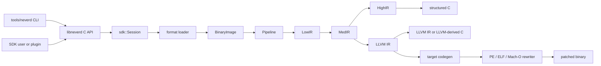

**Sprachen**: [English](architecture.md) | [简体中文](architecture.zh-CN.md) | [繁體中文](architecture.zh-TW.md) | [日本語](architecture.ja.md) | [한국어](architecture.ko.md) | [Français](architecture.fr.md) | [Deutsch](architecture.de.md) | [Español](architecture.es.md) | [Italiano](architecture.it.md) | [Русский](architecture.ru.md) | [العربية](architecture.ar.md)

[← Dokumentationsindex](README.de.md)

# NeverD-Architektur

Dieser Leitfaden beschreibt die Produktionsgrenzen, die Mitwirkende kennen
müssen, um NeverD sicher zu ändern. Er behandelt bewusst nur NeverD-eigenen
Code; die LLVM-, Capstone- und Unicorn-Submodule behalten ihre interne
Architektur.

## Systemgrenze

NeverD besitzt vier IR-Darstellungen, die aber keine zwingende Kette aus vier
Schritten bilden. `LowIR -> MedIR` ist gemeinsam. Strukturierte Dekompilierung
verwendet danach `MedIR -> HighIR -> C`; `lift`, `decompile --llvm` und `patch`
nehmen den direkten Weg `MedIR -> LLVM IR`. Patch- und Lift-Modus überspringen
HighIR bewusst.

Die CLI parst Befehle in `tools/neverd`, erzeugt ein `neverd_session_t` und ruft
die öffentliche API aus `include/neverd/sdk/NeverDCAPI.h` auf. Der
Enginezustand liegt in `lib/sdk/SessionImpl.h`; `neverd_session_load` wählt
einen Loader und erstellt ein `BinaryImage`, während IR-basierte Operationen
`lib/pipeline/Pipeline.cpp` bei Bedarf ausführen. Das Programm `neverd` linkt
`neverd_shared`; Komponentenarchive und deren LLVM-/Capstone-Abhängigkeiten
bleiben private Implementierungsdetails der Shared Library. Die CLI nutzt LLVM
Support für ihre Kommandozeilenoberfläche, umgeht beim Ansteuern der Engine
aber nicht die C-API.

## IR-Darstellungen und Pfade

| Darstellung | Zweck | Primäre Definitionen und Transformationen |
|-------------|-------|--------------------------------------------|
| LowIR | Architekturunabhängige `NdOp`-Operationen, Basisblöcke, CFG und Sprungtabellenmetadaten | `include/neverd/ir/low`, `lib/ir/low`, erzeugt durch `lib/decode` + `lib/lift` |
| MedIR | Typen, ABI/Aufrufkonventionen, Speicher-/Stackmodell, Flags, Aufrufe und SSA-artiger Datenfluss | `include/neverd/ir/med`, `lib/ir/med` |
| HighIR | Strukturierte Ausdrücke und Kontrollfluss für lesbares C | `include/neverd/ir/high`, `lib/ir/high`, ausgegeben von `lib/backend/c/HighC` |
| LLVM IR | Optimierung, LLVM-abgeleitetes C, Zielcodeerzeugung und Eingabe für Binärumschreiben | `lib/backend/llvm`, optimiert/koordiniert durch `lib/pipeline` |

| Benutzerpfad | Darstellungspfad | Ausgabe |
|--------------|-----------------|---------|
| Low/Med-Dump | Binary -> LowIR, optional -> MedIR | Diagnosetext |
| High-Dump oder `decompile` | Binary -> LowIR -> MedIR -> HighIR | HighIR oder strukturiertes C |
| `lift` | Binary -> LowIR -> MedIR -> LLVM IR | `.ll` |
| `decompile --llvm` | Binary -> LowIR -> MedIR -> LLVM IR | LLVM-abgeleitetes C |
| `patch` | Binary -> LowIR -> MedIR -> LLVM IR -> codegen | Umgeschriebene Binärdatei |

`lib/pipeline/Pipeline.cpp` ist die Referenz für die Pfadauswahl.
Darstellungsspezifische Logik gehört in die jeweilige IR- oder
Backend-Bibliothek; die Pipeline soll Komponenten koordinieren, nicht deren
Algorithmen übernehmen.

## Komponentenübersicht

Jede Komponente ist ein von `add_neverd_component_library` erzeugtes statisches
Archiv. Die Tabelle nennt wichtige NeverD-Abhängigkeiten, nicht alle durch den
CMake-Helper bereitgestellten LLVM- und Capstone-Bibliotheken.

| Verzeichnis | Verantwortung | Wichtige Abhängigkeiten |
|-------------|---------------|-------------------------|
| `lib/loader` | Formaterkennung, PE/COFF-, ELF- und Mach-O-Laden, normalisiertes `BinaryImage`, Funktionserkennung | LLVM Object APIs |
| `lib/lift` | Handgeschriebene x86/i386-, AArch64- und ARM32-Instruktionssemantik | IR-Datentypen |
| `lib/decode` | Capstone/native-Decodierung und Dispatch an Architektur-Lifter | `NeverDIR`, `NeverDLift` |
| `lib/ir` | Gemeinsame Typen sowie LowIR-, MedIR-, HighIR- und Intrinsic-Definitionen/-Transformationen | Vier IR-Unterkomponenten |
| `lib/pipeline` | Funktionserkennung und Koordination der Low/Med/High/LLVM-Pfade | IR, decode, lift, LLVM-Backend, Debuginfo, IR-Pässe |
| `lib/backend/c` | HighIR-zu-C- und LLVM-IR-zu-C-Darstellung | IR |
| `lib/backend/llvm` | Absenkung von MedIR nach LLVM | IR |
| `lib/backend/codegen` | Zielcodeerzeugung sowie PE/ELF/Mach-O-Patch und In-Place-Rewrite | IR, Loader |
| `lib/sdk` | Öffentliche C-ABI, Session-Lebenszyklus, Abfragen, Persistenz, Plugins, Lift/Decompile/Patch-Einstiege | Aggregiert die Engine in `libneverd` |
| `lib/pass` | LLVM-IR-Obfuskationspässe und MIR-Pass-Runner | IR |
| `lib/debug` | DWARF-, PDB- und Linker-Map-Debugkontexte | IR |
| `lib/sigs` | Signaturparsing, Datenbanken und Matching | Loader |
| `lib/libc` | Bekannte libc-Namen und Aufrufmodell-Unterstützung | Eigenständige Komponente |
| `lib/support` | Gemeinsame Hilfen zum Binärladen | Loader |

Öffentliche Header spiegeln diese Bereiche unter `include/neverd`. Lassen Sie
keine interne C++-Klasse versehentlich Teil des SDK werden: Stabile externe
Operationen gehören in den reinen C-Header und eine der fokussierten Dateien
`lib/sdk/NeverDCAPI*.cpp`.

## Vertrag des strikten Liftings

`Decoder` und jeder Architektur-Lifter starten im strikten Modus. Kann
Capstone eine Instruktion decodieren, für die der ausgewählte Lifter keine
Implementierung hat, wirft dieser `UnliftedInstruction`. Die Exception enthält
Adresse, Mnemonic und Operanden; nicht unterstützte Semantik muss damit sichtbar
fehlschlagen, statt ausgelassen oder geraten zu werden.

Der interne nicht-strikte Pfad gibt `NdOp::NOP` aus, ist aber nur ein
Diagnoseausweg und keine akzeptable Instruktionsimplementierung. Tests von
Mitwirkenden und CI sollen den strikten Modus beibehalten. Bei einem strikten
Fehler:

1. Mit dem kleinsten architekturspezifischen Fixture reproduzieren.
2. Fehlende Semantik in `lib/lift/<ISA>` ergänzen.
3. Erwartete LowIR-Form in `unittests/lift` prüfen.
4. Bei beobachtbarem Verhalten einen Unicorn-Differential-Roundtrip in `unittests/semantic` ergänzen.

Fangen Sie `UnliftedInstruction` nicht nur ab, damit die Pipeline weiterläuft.
Eine neue bewusste Näherung braucht einen expliziten Vertrag und Tests; sie darf
nicht als 1:1-Lifting erscheinen.

## Format- und ISA-Zuständigkeit

Eingabeformat- und Ausgaberewrite-Logik sind bewusst getrennt:

| Format | Laden, Metadaten und Eingaberelokationen | Patch und Ausgaberelokationen |
|--------|-----------------------------------------|-------------------------------|
| PE/COFF | `lib/loader/COFF` | `lib/backend/codegen/COFF` |
| ELF | `lib/loader/ELF` | `lib/backend/codegen/ELF` |
| Mach-O | `lib/loader/MachO` | `lib/backend/codegen/MachO` |

Architektur-Lifter liegen in `lib/lift/X86`, `lib/lift/AArch64` und
`lib/lift/ARM`. Die zugehörigen öffentlichen Lifter-/Registerdeklarationen
liegen in `include/neverd/lift`. Zielspezifische LLVM-Ausgabe und Codeerzeugung
befinden sich unter `lib/backend/llvm/<ISA>` und
`lib/backend/codegen/CodeGen<ISA>.cpp`.

### Support- und Testtiefe

Die Supportmatrix im Hauptdokument bedeutet, dass jede Zelle implementiert ist.
Sie bedeutet nicht, dass jeder Opcode, ABI-Randfall, Binärerzeuger oder jede
Betriebssystemversion erschöpfend getestet wurde. Der strikte Modus schützt bei
noch nicht ergänzter Instruktionsabdeckung.

Alle 12 Format-mal-Architektur-Zellen besitzen semantische Rewrite-Backend-
Abdeckung in `unittests/semantic/PatchFullSubstRTTests.cpp`. Die Integrationstiefe
ist genauer:

| Format | x86-64 | i386 | AArch64 | ARM32 |
|--------|--------|------|---------|-------|
| PE/COFF | Gelinktes Fixture | Backend-Raster | Gelinktes Fixture | Gelinktes Thumb-Fixture |
| ELF | Gelinktes Fixture + Semantik-Roundtrip | Objekt-Pipeline + Semantik-Roundtrip | Gelinktes Fixture + Semantik-Roundtrip | Gelinktes Fixture + Semantik-Roundtrip |
| Mach-O | Gelinktes Fixture\* | PIC-/No-PIC-Objekt-Pipeline\* | Gelinktes Fixture\* | Backend-Raster |

- Ein **gelinktes Fixture** prüft Loader/Pipeline und Patch-Verhalten eines
  gelinkten Executables für repräsentative Programme.
- Eine **Objekt-Pipeline** prüft Laden, alle IR-Stufen und Dekompilierung eines
  relocatable Objects, aber nicht Host-Linking oder Ausführung eines gepatchten
  Binärprogramms.
- Ein **Backend-Raster** kompiliert repräsentative IR über den exakten
  Rewrite-Codegen-Pfad und vergleicht das Verhalten in Unicorn; es prüft nicht
  den Loader dieses Formats mit einem gelinkten Executable.
- `*` Gelinkte Mach-O-Fixtures hängen von einer Host-Toolchain ab, die das Ziel
  erzeugen kann. Modernes macOS kann historische i386-Executables nicht linken;
  daher kommen PIC-/No-PIC-Thin-Objects und das Rewrite-Raster zum Einsatz.

Zellen mit gelinktem Fixture sind für diese repräsentativen Programme der
stärkste aktuelle Beleg der Formatintegration. Objekt-Pipeline und Backend-
Raster bieten nur partielle Formatintegration. Keine Zelle ist ohne diese
Einschränkung „vollständig getestet“ oder behauptet erschöpfende ISA-Abdeckung.

Die wichtigsten Belege sind
[`PatchFormatTests.cpp`](../unittests/lift/PatchFormatTests.cpp) für gelinkte
ELF- und PE-Fixtures,
[`COFFARMFormatTests.cpp`](../unittests/lift/COFFARMFormatTests.cpp) für Windows-
ARM-Laden/-Dekompilierung,
[`MachOI386RelocationTests.cpp`](../unittests/lift/MachOI386RelocationTests.cpp)
für i386-Thin-Objects,
[`X86_64_PipelineE2ETests.cpp`](../unittests/lift/X86_64_PipelineE2ETests.cpp)
und
[`AArch64_PipelineE2ETests.cpp`](../unittests/lift/AArch64_PipelineE2ETests.cpp)
für gelinktes Mach-O sowie
[`PatchFullSubstRTTests.cpp`](../unittests/semantic/PatchFullSubstRTTests.cpp)
für das 12-Zellen-Backend-Raster. Befehle stehen im [Testleitfaden](testing.de.md).

## Wo ändern?

| Änderung | Einstieg | Minimale fokussierte Prüfung |
|----------|----------|------------------------------|
| Instruktion ergänzen/korrigieren | Passende Dateien in `lib/lift/X86`, `AArch64` oder `ARM`; öffentlicher Lifter-Header bei Dispatch-Änderung | Architekturtest in `unittests/lift`; Semantik-Roundtrip in `unittests/semantic` |
| `NdOp` hinzufügen | `include/neverd/ir/NdOps.h`, danach Low-to-Med, Emitter/Renderer, Verifier/Emulator und Dumps prüfen | `NeverDLiftTests` + relevante `NeverDSemanticTests`-Fälle |
| CFG oder Funktionserkennung ändern | `lib/ir/low`, `lib/loader/FunctionDiscovery*.cpp`, `lib/pipeline/PipelineFuncDetect.cpp` | Lift-CFG-/Sprungtabellentests und fokussierte Semantik-Transformationssuite |
| PE-Eingaberelokation/Unwind-Regel ergänzen | `lib/loader/COFF` | `COFFARMFormatTests` oder neues fokussiertes Loader-Fixture |
| PE-Ausgaberelokation/Patch-Regel ergänzen | `lib/backend/codegen/COFF` | `PatchFormatTests`, `RewriteCodegenRTTests` und PE-Backend-Raster |
| ELF-/Mach-O-Verhalten ändern | Passendes `lib/loader/<Format>` und/oder `lib/backend/codegen/<Format>` | Passende Formattests plus Rewrite-Raster |
| MedIR-/ABI-Rekonstruktion ändern | `lib/ir/med` | Lift-Tests für Aufrufkonventionen + ISA-übergreifende Semantik-Roundtrips |
| Strukturierte Kontrollflussrekonstruktion ändern | `lib/ir/high` | `NeverDCFGLoopXformTests` und strukturierte C-Tests |
| LLVM-Transformation hinzufügen | `lib/pass/ir`, öffentlicher Header in `include/neverd/pass/ir`, Pipeline-Schalter falls öffentlich | Fokussierte Transformationssuite + `NeverDPatchFullTests` bei geänderter Patch-Ausgabe |
| C-API-Operation hinzufügen | `include/neverd/sdk/NeverDCAPI.h`, fokussiertes `lib/sdk/NeverDCAPI*.cpp`, `SessionImpl.h` nur für Zustand | SDK-/CLI-Semantiktests; `neverd_last_error` und Allokationskonventionen erhalten |
| CLI-Befehl hinzufügen | `tools/neverd/NeverDCLIOptions.cpp`, `NeverDCLI.h`, fokussiertes `NeverDCmd*.cpp`, Dispatch in `neverd.cpp` | `unittests/semantic/CLIEndToEndTests.cpp` und direkter CLI-Smoke-Test |
| Semantikregression hinzufügen | Fokussiertes `unittests/semantic/*Tests.cpp`; neue Datei in `unittests/semantic/CMakeLists.txt` registrieren | Testbinary bauen, dann benannten Fall mit `ctest -R` wählen |

Halten Sie Änderungen eng. Dateien, die eine Darstellung definieren, dürfen sich
mit ihren Transformationen ändern; unbeteiligte Loader, Lifter und Backends
sollen nicht nur für ein einheitliches Erscheinungsbild eines großen
Refactorings geändert werden.
