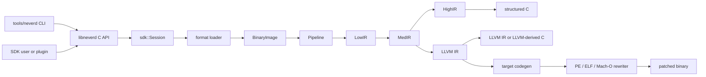

**Idiomas**: [English](architecture.md) | [简体中文](architecture.zh-CN.md) | [繁體中文](architecture.zh-TW.md) | [日本語](architecture.ja.md) | [한국어](architecture.ko.md) | [Français](architecture.fr.md) | [Deutsch](architecture.de.md) | [Español](architecture.es.md) | [Italiano](architecture.it.md) | [Русский](architecture.ru.md) | [العربية](architecture.ar.md)

[← Índice de documentación](README.es.md)

# Arquitectura de NeverD

Esta guía describe los límites de producción que debe conocer quien contribuya
para modificar NeverD con seguridad. Cubre deliberadamente solo el código
propio de NeverD; los submódulos LLVM, Capstone y Unicorn mantienen su propia
arquitectura interna.

## Límite del sistema

NeverD tiene cuatro representaciones IR, pero no forman una secuencia
obligatoria de cuatro saltos. `LowIR -> MedIR` es común. La descompilación
estructurada usa después `MedIR -> HighIR -> C`; `lift`, `decompile --llvm` y
`patch` toman la ruta directa `MedIR -> LLVM IR`. En particular, los modos
patch y lift omiten HighIR de forma deliberada.

El CLI analiza comandos en `tools/neverd`, crea un `neverd_session_t` y llama a
la API pública de `include/neverd/sdk/NeverDCAPI.h`. El estado del motor reside
en `lib/sdk/SessionImpl.h`; `neverd_session_load` elige un loader y construye
una `BinaryImage`, mientras que las operaciones basadas en IR ejecutan
`lib/pipeline/Pipeline.cpp` bajo demanda. El ejecutable `neverd` enlaza
`neverd_shared`; los archivos de componentes y sus dependencias LLVM/Capstone
siguen siendo detalles privados de esa biblioteca compartida. El CLI todavía
usa LLVM Support para su interfaz de línea de comandos, pero no evita la API C
para controlar el motor.

## Representaciones IR y rutas

| Representación | Propósito | Definiciones y transformaciones principales |
|----------------|-----------|----------------------------------------------|
| LowIR | Operaciones `NdOp` independientes de arquitectura, bloques básicos, CFG y metadatos de jump tables | `include/neverd/ir/low`, `lib/ir/low`, producido por `lib/decode` + `lib/lift` |
| MedIR | Tipos, ABI/convenciones de llamada, modelo de memoria/pila, flags, llamadas y flujo similar a SSA | `include/neverd/ir/med`, `lib/ir/med` |
| HighIR | Expresiones y control de flujo estructurados para C legible | `include/neverd/ir/high`, `lib/ir/high`, emitido por `lib/backend/c/HighC` |
| LLVM IR | Optimización, C derivado de LLVM, generación de código objetivo y entrada de reescritura binaria | `lib/backend/llvm`, optimizado/orquestado por `lib/pipeline` |

| Ruta del usuario | Camino de representaciones | Salida |
|-----------------|--------------------------|--------|
| Volcado Low/Med | Binary -> LowIR, opcionalmente -> MedIR | Texto de diagnóstico |
| Volcado High o `decompile` | Binary -> LowIR -> MedIR -> HighIR | HighIR o C estructurado |
| `lift` | Binary -> LowIR -> MedIR -> LLVM IR | `.ll` |
| `decompile --llvm` | Binary -> LowIR -> MedIR -> LLVM IR | C derivado de LLVM |
| `patch` | Binary -> LowIR -> MedIR -> LLVM IR -> codegen | Binario reescrito |

`lib/pipeline/Pipeline.cpp` es la referencia para elegir la ruta. Mantenga la
lógica específica de una representación en su biblioteca IR o backend; el
pipeline debe orquestar esos componentes, no absorber sus algoritmos.

## Mapa de componentes

Cada componente es un archivo estático creado por
`add_neverd_component_library`. La tabla enumera dependencias importantes de
NeverD, no todas las bibliotecas comunes LLVM y Capstone proporcionadas por el
helper de CMake.

| Directorio | Responsabilidad | Dependencias importantes |
|------------|-----------------|--------------------------|
| `lib/loader` | Detección de formato, carga PE/COFF, ELF y Mach-O, `BinaryImage` normalizada, descubrimiento de funciones | API LLVM Object |
| `lib/lift` | Semántica manuscrita de instrucciones x86/i386, AArch64 y ARM32 | Tipos de datos IR |
| `lib/decode` | Decodificación Capstone/native y despacho a lifters de arquitectura | `NeverDIR`, `NeverDLift` |
| `lib/ir` | Tipos comunes y definiciones/transformaciones LowIR, MedIR, HighIR e intrinsic | Sus cuatro subcomponentes IR |
| `lib/pipeline` | Detección de funciones y orquestación de rutas Low/Med/High/LLVM | IR, decode, lift, backend LLVM, debug, pases IR |
| `lib/backend/c` | Renderizado HighIR-a-C y LLVM-IR-a-C | IR |
| `lib/backend/llvm` | Lowering de MedIR a LLVM | IR |
| `lib/backend/codegen` | Generación de código objetivo y patch/reescritura in-place PE/ELF/Mach-O | IR, loader |
| `lib/sdk` | ABI C pública, ciclo de session, consultas, persistencia, plugins, entradas lift/decompile/patch | Agrega el motor en `libneverd` |
| `lib/pass` | Pases de ofuscación LLVM IR y ejecutor de pases MIR | IR |
| `lib/debug` | Contextos de depuración DWARF, PDB y linker-map | IR |
| `lib/sigs` | Análisis, bases de datos y coincidencia de firmas | Loader |
| `lib/libc` | Nombres libc conocidos y soporte del modelo de llamada | Componente independiente |
| `lib/support` | Helpers compartidos de carga binaria | Loader |

Los encabezados públicos reflejan estas áreas bajo `include/neverd`. Evite que
una clase C++ interna pase a formar parte del SDK por accidente: las operaciones
externas estables pertenecen al encabezado C puro y a uno de los archivos
específicos `lib/sdk/NeverDCAPI*.cpp`.

## Contrato de lifting estricto

`Decoder` y cada lifter de arquitectura arrancan en modo estricto. Si Capstone
puede decodificar una instrucción pero el lifter seleccionado no la implementa,
lanza `UnliftedInstruction`. La excepción registra dirección, mnemónico y
operandos; la semántica no soportada debe fallar de forma visible en vez de
omitirse o inferirse.

La ruta interna no estricta emite `NdOp::NOP`, pero es una salida de diagnóstico,
no una implementación aceptable. Las pruebas de contribuidores y CI deben
mantener el modo estricto. Cuando aparezca un fallo estricto:

1. Reprodúzcalo con la fixture específica de arquitectura más pequeña.
2. Añada la semántica ausente en `lib/lift/<ISA>`.
3. Compruebe la forma LowIR esperada en `unittests/lift`.
4. Añada un recorrido diferencial Unicorn en `unittests/semantic` si la instrucción tiene comportamiento observable.

No capture `UnliftedInstruction` solo para que el pipeline continúe. Una nueva
aproximación intencional necesita contrato y pruebas explícitos; no debe hacerse
pasar por lifting 1:1.

## Propiedad de formatos e ISA

La lógica del formato de entrada y la reescritura de salida están separadas de
forma deliberada:

| Formato | Carga, metadatos y relocations de entrada | Patch y relocations de salida |
|---------|------------------------------------------|-------------------------------|
| PE/COFF | `lib/loader/COFF` | `lib/backend/codegen/COFF` |
| ELF | `lib/loader/ELF` | `lib/backend/codegen/ELF` |
| Mach-O | `lib/loader/MachO` | `lib/backend/codegen/MachO` |

Los lifters de arquitectura están en `lib/lift/X86`, `lib/lift/AArch64` y
`lib/lift/ARM`. Las declaraciones públicas de lifter/register están en
`include/neverd/lift`. La emisión LLVM y generación de código específicas del
objetivo residen bajo `lib/backend/llvm/<ISA>` y
`lib/backend/codegen/CodeGen<ISA>.cpp`.

### Soporte y profundidad de pruebas

La matriz de soporte de la raíz indica que cada celda está implementada. No
significa que cada opcode, caso límite ABI, productor binario o versión del
sistema operativo se haya probado de forma exhaustiva. El modo estricto protege
la cobertura de instrucciones que todavía no se ha incorporado.

Las 12 celdas formato-por-arquitectura tienen cobertura semántica del backend
de reescritura en `unittests/semantic/PatchFullSubstRTTests.cpp`. La profundidad
de integración es más específica:

| Formato | x86-64 | i386 | AArch64 | ARM32 |
|---------|--------|------|---------|-------|
| PE/COFF | Fixture enlazada | Cuadrícula backend | Fixture enlazada | Fixture Thumb enlazada |
| ELF | Fixture enlazada + ida y vuelta semántica | Pipeline de objeto + ida y vuelta semántica | Fixture enlazada + ida y vuelta semántica | Fixture enlazada + ida y vuelta semántica |
| Mach-O | Fixture enlazada\* | Pipeline de objeto PIC/no-PIC\* | Fixture enlazada\* | Cuadrícula backend |

- Una **fixture enlazada** ejercita loader/pipeline y patch sobre un ejecutable
  enlazado para programas representativos.
- Un **pipeline de objeto** ejercita carga, todas las etapas IR y descompilación
  de un objeto reubicable, pero no enlazado del host ni ejecución del binario
  parcheado.
- Una **cuadrícula backend** compila IR representativo por la ruta exacta de
  generación para reescritura y compara el comportamiento en Unicorn; no
  ejercita el loader del formato sobre un ejecutable enlazado.
- `*` Las fixtures Mach-O enlazadas dependen de una toolchain del host capaz de
  producir el objetivo. macOS moderno no enlaza ejecutables i386 históricos;
  por ello se usan objetos thin PIC/no-PIC y la cuadrícula de reescritura.

Las celdas de fixture enlazada son la evidencia actual más fuerte de integración
del formato para esos programas. Las celdas de pipeline de objeto y cuadrícula
backend solo tienen cobertura de integración parcial. Ninguna celda está
«totalmente probada» sin esa precisión ni afirma cobertura exhaustiva del ISA.

La evidencia principal es
[`PatchFormatTests.cpp`](../unittests/lift/PatchFormatTests.cpp) para fixtures
ELF y PE enlazadas,
[`COFFARMFormatTests.cpp`](../unittests/lift/COFFARMFormatTests.cpp) para carga/
descompilación de Windows ARM,
[`MachOI386RelocationTests.cpp`](../unittests/lift/MachOI386RelocationTests.cpp)
para objetos thin i386,
[`X86_64_PipelineE2ETests.cpp`](../unittests/lift/X86_64_PipelineE2ETests.cpp) y
[`AArch64_PipelineE2ETests.cpp`](../unittests/lift/AArch64_PipelineE2ETests.cpp)
para Mach-O enlazado, y
[`PatchFullSubstRTTests.cpp`](../unittests/semantic/PatchFullSubstRTTests.cpp)
para la cuadrícula de 12 celdas. Consulte la [guía de pruebas](testing.es.md).

## Dónde editar

| Cambio | Punto de partida | Verificación mínima enfocada |
|--------|------------------|------------------------------|
| Añadir o corregir una instrucción | Archivos correspondientes en `lib/lift/X86`, `AArch64` o `ARM`; encabezado público si cambia el despacho | Prueba de arquitectura en `unittests/lift`; recorrido semántico en `unittests/semantic` |
| Añadir un `NdOp` | `include/neverd/ir/NdOps.h`, luego auditar Low-to-Med, emitters/renderers, verifier/emulator y volcados | `NeverDLiftTests` + casos pertinentes de `NeverDSemanticTests` |
| Cambiar CFG o descubrimiento de funciones | `lib/ir/low`, `lib/loader/FunctionDiscovery*.cpp`, `lib/pipeline/PipelineFuncDetect.cpp` | Pruebas CFG/jump-table de lift y suite de transformación semántica enfocada |
| Añadir relocation de entrada o regla unwind PE | `lib/loader/COFF` | `COFFARMFormatTests` o nueva fixture loader enfocada |
| Añadir relocation de salida o regla patch PE | `lib/backend/codegen/COFF` | `PatchFormatTests`, `RewriteCodegenRTTests` y cuadrícula backend PE |
| Cambiar comportamiento ELF o Mach-O | Directorios `lib/loader/<Format>` y/o `lib/backend/codegen/<Format>` correspondientes | Pruebas del formato más cuadrícula de reescritura |
| Cambiar recuperación MedIR/ABI | `lib/ir/med` | Pruebas lift de convención de llamada + recorridos semánticos entre ISA |
| Cambiar recuperación de control estructurado | `lib/ir/high` | `NeverDCFGLoopXformTests` y pruebas de C estructurado |
| Añadir transformación LLVM | `lib/pass/ir`, encabezado público en `include/neverd/pass/ir`, opción pipeline si se expone | Suite de transformación enfocada + `NeverDPatchFullTests` si cambia la salida patch |
| Añadir operación C API | `include/neverd/sdk/NeverDCAPI.h`, `lib/sdk/NeverDCAPI*.cpp` enfocado, `SessionImpl.h` solo para estado | Pruebas semánticas SDK/CLI; conservar `neverd_last_error` y convenciones de asignación |
| Añadir comando CLI | `tools/neverd/NeverDCLIOptions.cpp`, `NeverDCLI.h`, `NeverDCmd*.cpp` enfocado y despacho en `neverd.cpp` | `unittests/semantic/CLIEndToEndTests.cpp` y smoke test CLI directo |
| Añadir regresión semántica | `unittests/semantic/*Tests.cpp` enfocado; registrar archivo nuevo en `unittests/semantic/CMakeLists.txt` | Construir su binario de pruebas y seleccionar el caso con `ctest -R` |

Mantenga los cambios estrechos. Los archivos que definen una representación
pueden cambiar con sus transformaciones, pero loaders, lifters y backends no
relacionados no deben modificarse solo para uniformar un refactor amplio.
