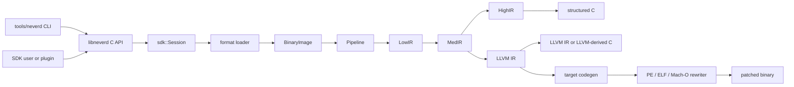

**Idiomas**: [English](architecture.md) | [简体中文](architecture.zh-CN.md) | [繁體中文](architecture.zh-TW.md) | [日本語](architecture.ja.md) | [한국어](architecture.ko.md) | [Français](architecture.fr.md) | [Deutsch](architecture.de.md) | [Español](architecture.es.md) | [Italiano](architecture.it.md) | [Русский](architecture.ru.md) | [العربية](architecture.ar.md)

[← Índice de documentación](README.es.md)

# Arquitectura de NeverD

Esta guía describe los límites de producción que debe conocer quien contribuya
para modificar NeverD con seguridad. Cubre deliberadamente solo el código
propio de NeverD; los submódulos LLVM, Capstone y Unicorn mantienen su propia
arquitectura interna.

## Límite del sistema

NeverD tiene cuatro representaciones IR, pero no forman una secuencia
obligatoria de cuatro saltos. `LowIR -> MedIR` es común. La descompilación
estructurada usa después `MedIR -> HighIR -> C`; `lift`, `decompile --llvm` y
`patch` toman la ruta directa `MedIR -> LLVM IR`. En particular, los modos
patch y lift omiten HighIR de forma deliberada.

El CLI analiza comandos en `tools/neverd`, crea un `neverd_session_t` y llama a
la API pública de `include/neverd/sdk/NeverDCAPI.h`. El estado del motor reside
en `lib/sdk/SessionImpl.h`; `neverd_session_load` elige un loader y construye
una `BinaryImage`, mientras que las operaciones basadas en IR ejecutan
`lib/pipeline/Pipeline.cpp` bajo demanda. El ejecutable `neverd` enlaza
`neverd_shared`; los archivos de componentes y sus dependencias LLVM/Capstone
son detalles privados de esa biblioteca compartida. El CLI usa LLVM Support
para su interfaz de línea de comandos, pero no evita la API C
para controlar el motor.

## Representaciones IR y rutas

| Representación | Propósito | Definiciones y transformaciones principales |
|----------------|-----------|----------------------------------------------|
| LowIR | Operaciones `NdOp` independientes de arquitectura, bloques básicos, CFG y metadatos de jump tables | `include/neverd/ir/low`, `lib/ir/low`, producido por `lib/decode` + `lib/lift` |
| MedIR | Tipos, ABI/convenciones de llamada, modelo de memoria/pila, flags, llamadas y flujo similar a SSA | `include/neverd/ir/med`, `lib/ir/med` |
| HighIR | Expresiones y control de flujo estructurados para C legible | `include/neverd/ir/high`, `lib/ir/high`, emitido por `lib/backend/c/HighC` |
| LLVM IR | Optimización, C derivado de LLVM, generación de código objetivo y entrada de reescritura binaria | `lib/backend/llvm`, optimizado/orquestado por `lib/pipeline` |

| Ruta del usuario | Camino de representaciones | Salida |
|-----------------|--------------------------|--------|
| Volcado Low/Med | Binary -> LowIR, opcionalmente -> MedIR | Texto de diagnóstico |
| Volcado High o `decompile` | Binary -> LowIR -> MedIR -> HighIR | HighIR o C estructurado |
| `lift` | Binary -> LowIR -> MedIR -> LLVM IR | `.ll` |
| `decompile --llvm` | Binary -> LowIR -> MedIR -> LLVM IR | C derivado de LLVM |
| `patch` | Binary -> LowIR -> MedIR -> LLVM IR -> codegen | Binario reescrito |

`lib/pipeline/Pipeline.cpp` es la referencia para elegir la ruta. Mantenga la
lógica específica de una representación en su biblioteca IR o backend; el
pipeline debe orquestar esos componentes, no absorber sus algoritmos.

## Contrato de traducción entre arquitecturas

`include/neverd/translate` define una capa de contrato, no un
backend de ejecución. `GuestState` modela el estado visible de la máquina de
forma independiente de la arquitectura para `x86_32`, `x86_64`, `AArch64` y
`ARM32`. Su serialización canónica versión 1 usa campos little-endian de ancho
fijo, identificadores de registro estables, colecciones ordenadas y validación
fail-closed, por lo que el estado persistido no depende de la disposición C++
del host.

La base wire v1 de `GuestState` queda congelada de forma permanente. Todo estado
fuera de esa base debe usar un ID de registro de extensión dentro del rango reservado junto
con un nombre canónico en minúsculas, o pasar a una nueva versión wire con un
upgrader explícito; queda prohibido modificar la base v1 en el sitio.

Para un guest `ARM32`, `ExecutionMode` es el modo de decodificación autoritativo
y debe concordar con `CPSR.T`. El PC almacenado es siempre la dirección de
instrucción canónica con el bit 0 borrado; el modo ARM exige además alineación
de palabra.

El contrato de pares define `x86_64 -> AArch64`,
`AArch64 -> x86_64`, `x86_32 -> AArch64/ARM32` y
`ARM32 -> x86_32/x86_64`. `ContractDefined` significa que una solicitud se
puede validar y persistir, no que el código se pueda traducir o ejecutar. La
política JIT solo acepta el host nativo del proceso; la política AOT requiere
una arquitectura host y un target triple explícitos; una CPU o un conjunto de
features seleccionados también deben ser explícitos.

Un `TranslationExit` versionado registra una causa de parada estable y el
payload tipado correspondiente para syscalls, excepciones o señales, puntos de
interrupción, instrucciones no admitidas, automodificación, presupuestos de
recursos, llamadas externas, fallos de memoria y otras condiciones terminales.
Así, los consumidores no tienen que reinterpretar un entero sin tipo según la
causa de parada.

Para cualquier causa de parada, los conteos de instrucciones, blocks y código
generado del resultado no pueden superar el presupuesto no nulo correspondiente
de la solicitud. Un payload `BudgetExhausted` debe además identificar exactamente
ese limit solicitado, no un umbral derivado o privado de la implementación.

El contrato backend-private `RuntimeControlBlockV1` mide
exactamente 128 bytes, está alineado a 8 bytes y queda restringido por magic,
version, size y offsets de campo fijos de v1, campos reservados a cero y exits
tipados coherentes. No contiene contenedores C++, punteros del host ni alias de
direcciones guest. No es el layout C++ ni el formato wire de `GuestState`; un
backend que implemente este contrato debe convertir explícitamente el estado a
este registro.

La superficie fija de llamadas v1 para código generado contiene exactamente
ocho helpers: `nvd_rt_v1_load8_le`, `nvd_rt_v1_load16_le`,
`nvd_rt_v1_load32_le`, `nvd_rt_v1_load64_le`, `nvd_rt_v1_store8_le`,
`nvd_rt_v1_store16_le`, `nvd_rt_v1_store32_le` y `nvd_rt_v1_store64_le`.
Sus nombres, firmas y procedencia de punteros deben coincidir exactamente; un
backend enlaza esta tabla finita de forma explícita y nunca recurre a la
resolución ambiental de símbolos. La validación de la generation ejecutable y
el polling de presupuesto/cancelación son operaciones exclusivas del dispatcher
de confianza; `nvd_rt_v1_validate_generation` y `nvd_rt_v1_poll` no son helpers
para código generado. El dispatcher de confianza del host también controla la
selección de blocks y no es invocable desde el IR generado; los translated
blocks devuelven en su lugar un código de exit tipado. El IR generado solo puede
leer directamente el slot runtime scalar-result declarado.

`GuestMemoryRuntime` está aislado del `GuestState` lógico: su construcción
primero valida el estado y después copia los bytes y metadatos de las regiones
a un índice privado ordenado. Las direcciones virtuales guest son solo claves
de búsqueda y nunca se convierten en punteros del host. Los accesos escalares
comprobados notifican faults tipados de ancho, alineación, overflow, ausencia de
mapping, cruce de región, permisos, escritura ejecutable, overflow o discordancia
de generation y violación de policy. Los presupuestos de instrucciones/blocks,
la cancelación, el seguimiento de generation y las policies de escritura de
código `RejectExecutableWrites`, `InvalidateOnExecutableWrite` y
`ValidateBeforeDispatch` también producen registros tipados coherentes en vez
de comportamiento implícito del host.

El verifier post-codegen audita objetos relocatable ELF,
COFF y Mach-O como un conjunto cerrado. El formato y la arquitectura deben
coincidir exactamente con el host elegido; los símbolos indefinidos deben
pertenecer exactamente a la allowlist finita de helpers y los símbolos
dinámicos están prohibidos. Las relocations usan whitelists directas explícitas
con comprobaciones de encoding, ancho, alineación, offset, destino cargable y
una definición non-preemptible local al objeto o un helper autorizado
exactamente. Se rechazan W+X, metadatos unwind/exception/initializer, TLS,
IFUNC, GOT/PLT y otras indirecciones, relocations dinámicas, definiciones
weak/preemptible o seleccionables, secciones asignadas desconocidas y
directivas del linker. Los artefactos ELF `ET_REL` no pueden contener program
headers ni segmentos. Los load commands de Mach-O siguen una lista positiva:
exactamente un segmento del ancho correspondiente y como máximo una symbol
table, dynamic-symbol table, platform-version y orden data-in-code, con
comprobación de sus dependencias. Las opciones del linker y cualquier otro
command se rechazan.

Las implementaciones de runtime, memoria, IR y auditoría de objetos definen y
validan estas fronteras. No constituyen un backend de traducción ejecutable
completo, una pipeline completa de traducción entre arquitecturas ni una
reescritura de excepciones completa de extremo a extremo. Esta sección describe
el alcance del contrato y del verifier; no afirma la disponibilidad integral de
generación, enlace, carga, ejecución, JIT, AOT ni reescritura de excepciones.

El contrato del IR generado exige que todo translated block sujeto a él sea
hidden y non-preemptible y use el C ABI `i32 (ptr state, ptr runtime)`. Los
blocks solo se descubren mediante un registro privado, nunca mediante la
búsqueda ambiental de símbolos del proceso; se prohíben las llamadas directas
entre blocks.

El IR verifier también limita el ancho de los enteros al ancho del registro
escalar del host para evitar compiler-runtime libcalls conocidos introducidos
durante legalization. Esta comprobación es necesaria, pero no suficiente:
cualquier backend de ejecución que implemente este contrato debe auditar de
forma exacta las transferencias de control post-codegen, `MachineIR` y las
relocations del objeto de destino frente a la misma runtime-symbol allowlist
finita.

Los loads y stores directos de TranslationIR, así como los valores de private
constants, solo pueden contener un entero escalar que no supere el ancho del
registro escalar del host. Los aggregates deben escalarizarse antes del límite
del verifier para que un IR compacto no provoque expansión ilimitada en el
backend.

La ABI de código generado solo está definida para enteros escalares. El punto
flotante, SIMD, x87, las operaciones atómicas y las instrucciones de sistema
quedan fuera de este contrato. Toda implementación que seleccione
`ProvenSemanticAndLLVM` debe ejecutar la simplificación semántica de NeverD,
condicionada por prueba, hasta un punto fijo conjunto con la optimización LLVM;
la política no proporciona un backend de traducción ejecutable.

## Mapa de componentes

Cada componente es un archivo estático creado por
`add_neverd_component_library`. La tabla enumera dependencias importantes de
NeverD, no todas las bibliotecas comunes LLVM y Capstone proporcionadas por el
helper de CMake.

| Directorio | Responsabilidad | Dependencias importantes |
|------------|-----------------|--------------------------|
| `lib/loader` | Detección de formato, carga PE/COFF, ELF y Mach-O, `BinaryImage` normalizada, descubrimiento de funciones | API LLVM Object |
| `lib/lift` | Semántica manuscrita de instrucciones x86/i386, AArch64 y ARM32 | Tipos de datos IR |
| `lib/decode` | Decodificación Capstone/native y despacho a lifters de arquitectura | `NeverDIR`, `NeverDLift` |
| `lib/ir` | Tipos comunes y definiciones/transformaciones LowIR, MedIR, HighIR e intrinsic | Sus cuatro subcomponentes IR |
| `lib/pipeline` | Detección de funciones y orquestación de rutas Low/Med/High/LLVM | IR, decode, lift, backend LLVM, debug, pases IR |
| `lib/backend/c` | Renderizado HighIR-a-C y LLVM-IR-a-C | IR |
| `lib/backend/llvm` | Lowering de MedIR a LLVM | IR |
| `lib/backend/codegen` | Generación de código objetivo y patch/reescritura in-place PE/ELF/Mach-O | IR, loader |
| `lib/sdk` | ABI C pública, ciclo de session, consultas, persistencia, plugins, entradas lift/decompile/patch | Agrega el motor en `libneverd` |
| `lib/pass` | Pases de ofuscación LLVM IR y ejecutor de pases MIR | IR |
| `lib/debug` | Contextos de depuración DWARF, PDB y linker-map | IR |
| `lib/sigs` | Análisis, bases de datos y coincidencia de firmas | Loader |
| `lib/libc` | Nombres libc conocidos y soporte del modelo de llamada | Componente independiente |
| `lib/support` | Helpers compartidos de carga binaria | Loader |
| `lib/translate` | Contratos versionados de estado/policy/exit guest, ABI runtime fija, memoria guest comprobada y auditoría del IR/objeto generado; la implementación del backend de ejecución queda fuera de este componente | Contratos IR, LLVM y LLVM Object |

Los encabezados públicos reflejan estas áreas bajo `include/neverd`. Evite que
una clase C++ interna pase a formar parte del SDK por accidente: las operaciones
externas estables pertenecen al encabezado C puro y a uno de los archivos
específicos `lib/sdk/NeverDCAPI*.cpp`.

## Contrato de lifting estricto

`Decoder` y cada lifter de arquitectura arrancan en modo estricto. Si Capstone
puede decodificar una instrucción pero el lifter seleccionado no la implementa,
lanza `UnliftedInstruction`. La excepción registra dirección, mnemónico y
operandos; la semántica no soportada debe fallar de forma visible en vez de
omitirse o inferirse.

La ruta interna no estricta emite `NdOp::NOP`, pero es una salida de diagnóstico,
no una implementación aceptable. Las pruebas de contribuidores y CI deben
mantener el modo estricto. Cuando aparezca un fallo estricto:

1. Reprodúzcalo con la fixture específica de arquitectura más pequeña.
2. Añada la semántica ausente en `lib/lift/<ISA>`.
3. Compruebe la forma LowIR esperada en `unittests/lift`.
4. Añada un recorrido diferencial Unicorn en `unittests/semantic` si la instrucción tiene comportamiento observable.

No capture `UnliftedInstruction` solo para que el pipeline continúe. Una nueva
aproximación intencional necesita contrato y pruebas explícitos; no debe hacerse
pasar por lifting 1:1.

## Propiedad de formatos e ISA

La lógica del formato de entrada y la reescritura de salida están separadas de
forma deliberada:

| Formato | Carga, metadatos y relocations de entrada | Patch y relocations de salida |
|---------|------------------------------------------|-------------------------------|
| PE/COFF | `lib/loader/COFF` | `lib/backend/codegen/COFF` |
| ELF | `lib/loader/ELF` | `lib/backend/codegen/ELF` |
| Mach-O | `lib/loader/MachO` | `lib/backend/codegen/MachO` |

Los lifters de arquitectura están en `lib/lift/X86`, `lib/lift/AArch64` y
`lib/lift/ARM`. Las declaraciones públicas de lifter/register están en
`include/neverd/lift`. La emisión LLVM y generación de código específicas del
objetivo residen bajo `lib/backend/llvm/<ISA>` y
`lib/backend/codegen/CodeGen<ISA>.cpp`.

### Soporte y profundidad de pruebas

La matriz de soporte de la raíz indica que cada celda está implementada. No
significa que cada opcode, caso límite ABI, productor binario o versión del
sistema operativo se haya probado de forma exhaustiva. El modo estricto falla
de forma cerrada cuando la semántica de una instrucción queda fuera de la
cobertura implementada por el lifter.

Las 12 celdas formato-por-arquitectura tienen cobertura semántica del backend
de reescritura en `unittests/semantic/PatchFullSubstRTTests.cpp`. La profundidad
de integración es más específica:

| Formato | x86-64 | i386 | AArch64 | ARM32 |
|---------|--------|------|---------|-------|
| PE/COFF | Fixture enlazada | Cuadrícula backend | Fixture enlazada | Fixture Thumb enlazada |
| ELF | Fixture enlazada + ida y vuelta semántica | Pipeline de objeto + ida y vuelta semántica | Fixture enlazada + ida y vuelta semántica | Fixture enlazada + ida y vuelta semántica |
| Mach-O | Fixture enlazada\* | Pipeline de objeto PIC/no-PIC\* | Fixture enlazada\* | Cuadrícula backend |

- Una **fixture enlazada** ejercita loader/pipeline y patch sobre un ejecutable
  enlazado para programas representativos.
- Un **pipeline de objeto** ejercita carga, todas las etapas IR y descompilación
  de un objeto reubicable, pero no enlazado del host ni ejecución del binario
  parcheado.
- Una **cuadrícula backend** compila IR representativo por la ruta exacta de
  generación para reescritura y compara el comportamiento en Unicorn; no
  ejercita el loader del formato sobre un ejecutable enlazado.
- `*` Las fixtures Mach-O enlazadas dependen de una toolchain del host capaz de
  producir el objetivo. macOS moderno no enlaza ejecutables i386 históricos;
  por ello se usan objetos thin PIC/no-PIC y la cuadrícula de reescritura.

Las celdas de fixture enlazada son la evidencia más fuerte de integración
del formato para esos programas. Las celdas de pipeline de objeto y cuadrícula
backend solo tienen cobertura de integración parcial. Ninguna celda está
«totalmente probada» sin esa precisión ni afirma cobertura exhaustiva del ISA.

La evidencia principal es
[`PatchFormatTests.cpp`](../unittests/lift/format/PatchFormatTests.cpp) para fixtures
ELF y PE enlazadas,
[`COFFARMFormatTests.cpp`](../unittests/lift/format/COFFARMFormatTests.cpp) para carga/
descompilación de Windows ARM,
[`MachOI386RelocationTests.cpp`](../unittests/lift/format/MachOI386RelocationTests.cpp)
para objetos thin i386,
[`X86_64_PipelineE2ETests.cpp`](../unittests/lift/x86_64/X86_64_PipelineE2ETests.cpp) y
[`AArch64_PipelineE2ETests.cpp`](../unittests/lift/aarch64/AArch64_PipelineE2ETests.cpp)
para Mach-O enlazado, y
[`PatchFullSubstRTTests.cpp`](../unittests/semantic/probe/patchfull/PatchFullSubstRTTests.cpp)
para la cuadrícula de 12 celdas. Consulte la [guía de pruebas](testing.es.md).

## Dónde editar

| Cambio | Punto de partida | Verificación mínima enfocada |
|--------|------------------|------------------------------|
| Añadir o corregir una instrucción | Archivos correspondientes en `lib/lift/X86`, `AArch64` o `ARM`; encabezado público si cambia el despacho | Prueba de arquitectura en `unittests/lift`; recorrido semántico en `unittests/semantic` |
| Añadir un `NdOp` | `include/neverd/ir/NdOps.h`, luego auditar Low-to-Med, emitters/renderers, verifier/emulator y volcados | `NeverDLiftTests` + casos pertinentes de `NeverDSemanticTests` |
| Cambiar CFG o descubrimiento de funciones | `lib/ir/low`, `lib/loader/FunctionDiscovery*.cpp`, `lib/pipeline/PipelineFuncDetect.cpp` | Pruebas CFG/jump-table de lift y suite de transformación semántica enfocada |
| Añadir relocation de entrada o regla unwind PE | `lib/loader/COFF` | `COFFARMFormatTests` o nueva fixture loader enfocada |
| Añadir relocation de salida o regla patch PE | `lib/backend/codegen/COFF` | `PatchFormatTests`, `RewriteCodegenRTTests` y cuadrícula backend PE |
| Cambiar comportamiento ELF o Mach-O | Directorios `lib/loader/<Format>` y/o `lib/backend/codegen/<Format>` correspondientes | Pruebas del formato más cuadrícula de reescritura |
| Cambiar recuperación MedIR/ABI | `lib/ir/med` | Pruebas lift de convención de llamada + recorridos semánticos entre ISA |
| Cambiar recuperación de control estructurado | `lib/ir/high` | `NeverDCFGLoopXformTests` y pruebas de C estructurado |
| Añadir transformación LLVM | `lib/pass/ir`, encabezado público en `include/neverd/pass/ir`, opción pipeline si se expone | Suite de transformación enfocada + `NeverDPatchFullTests` si cambia la salida patch |
| Añadir operación C API | `include/neverd/sdk/NeverDCAPI.h`, `lib/sdk/NeverDCAPI*.cpp` enfocado, `SessionImpl.h` solo para estado | Pruebas semánticas SDK/CLI; conservar `neverd_last_error` y convenciones de asignación |
| Añadir comando CLI | `tools/neverd/NeverDCLIOptions.cpp`, `NeverDCLI.h`, `NeverDCmd*.cpp` enfocado y despacho en `neverd.cpp` | `unittests/semantic/CLIEndToEndTests.cpp` y smoke test CLI directo |
| Añadir regresión semántica | `unittests/semantic/*Tests.cpp` enfocado; registrar archivo nuevo en `unittests/semantic/CMakeLists.txt` | Construir su binario de pruebas y seleccionar el caso con `ctest -R` |

Mantenga los cambios estrechos. Los archivos que definen una representación
pueden cambiar con sus transformaciones, pero loaders, lifters y backends no
relacionados no deben modificarse solo para uniformar un refactor amplio.
