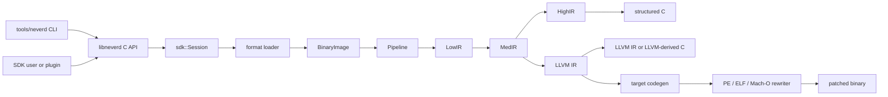

**Langues**: [English](architecture.md) | [简体中文](architecture.zh-CN.md) | [繁體中文](architecture.zh-TW.md) | [日本語](architecture.ja.md) | [한국어](architecture.ko.md) | [Français](architecture.fr.md) | [Deutsch](architecture.de.md) | [Español](architecture.es.md) | [Italiano](architecture.it.md) | [Русский](architecture.ru.md) | [العربية](architecture.ar.md)

[← Index de la documentation](README.fr.md)

# Architecture de NeverD

Ce guide décrit les frontières de production qu’un contributeur doit connaître
pour modifier NeverD en toute sécurité. Il couvre volontairement uniquement le
code appartenant à NeverD ; les sous-modules LLVM, Capstone et Unicorn gardent
leur propre architecture interne.

## Frontière du système

NeverD possède quatre représentations IR, mais elles ne forment pas une chaîne
obligatoire de quatre étapes. `LowIR -> MedIR` est commun. La décompilation
structurée utilise ensuite `MedIR -> HighIR -> C`, tandis que `lift`,
`decompile --llvm` et `patch` empruntent directement `MedIR -> LLVM IR`. Les
modes patch et lift évitent donc volontairement HighIR.

Le CLI analyse les commandes dans `tools/neverd`, crée un `neverd_session_t` et
appelle l’API publique de `include/neverd/sdk/NeverDCAPI.h`. L’état du moteur
réside dans `lib/sdk/SessionImpl.h` ; `neverd_session_load` choisit un loader et
construit une `BinaryImage`, tandis que les opérations fondées sur l’IR
exécutent `lib/pipeline/Pipeline.cpp` à la demande. L’exécutable `neverd` se lie
à `neverd_shared` ; les archives de composants et leurs dépendances LLVM/
Capstone sont des détails privés de cette bibliothèque partagée. Le CLI
utilise LLVM Support pour son interface en ligne de commande, mais ne
contourne pas l’API C pour piloter le moteur.

## Représentations IR et parcours

| Représentation | Rôle | Définitions et transformations principales |
|----------------|------|--------------------------------------------|
| LowIR | Opérations `NdOp` indépendantes de l’architecture, blocs de base, CFG et métadonnées de tables de saut | `include/neverd/ir/low`, `lib/ir/low`, produit par `lib/decode` + `lib/lift` |
| MedIR | Types, ABI/conventions d’appel, modèle mémoire/pile, drapeaux, appels et flux de données proche de SSA | `include/neverd/ir/med`, `lib/ir/med` |
| HighIR | Expressions et contrôle de flux structurés pour un C lisible | `include/neverd/ir/high`, `lib/ir/high`, émis par `lib/backend/c/HighC` |
| LLVM IR | Optimisation, C dérivé de LLVM, génération de code cible et entrée de réécriture binaire | `lib/backend/llvm`, optimisé/orchestré par `lib/pipeline` |

| Parcours utilisateur | Chemin des représentations | Sortie |
|---------------------|----------------------------|--------|
| Dump Low/Med | Binary -> LowIR, puis éventuellement -> MedIR | Texte de diagnostic |
| Dump High ou `decompile` | Binary -> LowIR -> MedIR -> HighIR | HighIR ou C structuré |
| `lift` | Binary -> LowIR -> MedIR -> LLVM IR | `.ll` |
| `decompile --llvm` | Binary -> LowIR -> MedIR -> LLVM IR | C dérivé de LLVM |
| `patch` | Binary -> LowIR -> MedIR -> LLVM IR -> codegen | Binaire réécrit |

`lib/pipeline/Pipeline.cpp` est la référence pour la sélection du parcours.
Gardez la logique propre à une représentation dans sa bibliothèque IR ou
backend ; le pipeline doit orchestrer ces composants, pas absorber leurs
algorithmes.

## Contrat de traduction inter-architectures

`include/neverd/translate` définit une couche contractuelle,
pas un backend d’exécution. `GuestState` modélise l’état observable de la machine,
indépendamment de l’architecture, pour `x86_32`, `x86_64`, `AArch64` et `ARM32`.
Sa sérialisation canonique version 1 emploie des champs little-endian de largeur
fixe, des identifiants de registre stables, des collections triées et une
validation fail-closed ; l’état persistant ne dépend donc pas de l’agencement
C++ de l’hôte.

La base wire v1 de `GuestState` est définitivement figée. Tout état hors de
cette base doit employer un ID de registre d’extension dans la plage réservée,
associé à un nom canonique en minuscules, ou passer à une nouvelle version wire
avec un upgrader explicite ; modifier la base v1 sur place est interdit.

Pour un guest `ARM32`, `ExecutionMode` est le mode de décodage faisant autorité
et doit être cohérent avec `CPSR.T`. Le PC enregistré est toujours l’adresse
d’instruction canonique avec le bit 0 effacé ; le mode ARM exige en outre un
alignement sur un mot.

Le contrat des paires définit `x86_64 -> AArch64`,
`AArch64 -> x86_64`, `x86_32 -> AArch64/ARM32` et
`ARM32 -> x86_32/x86_64`. `ContractDefined` signifie qu’une requête peut être
validée et persistée, pas que le code peut être traduit ou exécuté. La politique
JIT n’accepte que l’hôte natif du processus ; la politique AOT exige une
architecture hôte et un target triple explicites ; un CPU ou un ensemble de
fonctionnalités sélectionné doit lui aussi être explicite.

Un `TranslationExit` versionné enregistre une cause d’arrêt stable et la charge
utile typée correspondante pour les syscalls, exceptions ou signaux, points
d’arrêt, instructions non prises en charge, auto-modification, budgets de
ressources, appels externes, défauts mémoire et autres conditions terminales.
Les consommateurs n’ont donc pas à réinterpréter un entier non typé selon la
cause d’arrêt.

Quelle que soit la cause d’arrêt, les compteurs d’instructions, de blocks et de
code produit ne doivent pas dépasser le budget non nul correspondant de la
requête. Une charge utile `BudgetExhausted` doit en plus identifier exactement
ce limit demandé, et non un seuil dérivé ou privé de l’implémentation.

Le contrat backend-private `RuntimeControlBlockV1` fait
exactement 128 octets, avec un alignement de 8 octets. Il est contraint par des
valeurs v1 fixes de magic, version, taille et offsets de champs, par des champs
réservés à zéro et par des sorties typées cohérentes. Il ne contient ni
conteneur C++, ni pointeur hôte, ni alias d’adresse guest. Ce n’est ni le layout
C++ ni le format wire de `GuestState` ; un backend qui implémente ce contrat
doit convertir explicitement l’état vers cet enregistrement.

La surface d’appel v1 fixe du code produit contient exactement huit helpers :
`nvd_rt_v1_load8_le`, `nvd_rt_v1_load16_le`, `nvd_rt_v1_load32_le`,
`nvd_rt_v1_load64_le`, `nvd_rt_v1_store8_le`, `nvd_rt_v1_store16_le`,
`nvd_rt_v1_store32_le` et `nvd_rt_v1_store64_le`. Leurs noms, signatures et
provenances de pointeurs doivent correspondre exactement ; un backend lie
explicitement cette table finie et ne se rabat jamais sur la résolution
ambiante de symboles. La validation de generation exécutable et le polling de
budget/annulation sont réservés au dispatcher de confiance ;
`nvd_rt_v1_validate_generation` et `nvd_rt_v1_poll` ne sont pas des helpers du
code produit. Le dispatcher hôte de confiance possède aussi la sélection des
blocks et n’est pas appelable depuis l’IR produit ; les translated blocks
renvoient plutôt un code de sortie typé. L’IR produit ne peut lire directement
que le slot runtime scalar-result déclaré.

`GuestMemoryRuntime` est isolé du `GuestState` logique : sa construction valide
d’abord l’état, puis copie les octets et métadonnées des régions dans un index
privé trié. Les adresses virtuelles guest ne sont que des clés de recherche et
ne sont jamais converties en pointeurs hôte. Les accès scalaires vérifiés
signalent des fautes typées de largeur, alignement, débordement, absence de
mapping, franchissement de région, permission, écriture exécutable, débordement
ou discordance de generation et violation de policy. Les budgets
d’instructions/blocks, l’annulation, le suivi de generation et les policies
d’écriture de code `RejectExecutableWrites`, `InvalidateOnExecutableWrite` et
`ValidateBeforeDispatch` produisent eux aussi des enregistrements typés
cohérents plutôt qu’un comportement hôte implicite.

Le verifier post-codegen audite les objets relocatable ELF,
COFF et Mach-O comme un ensemble fermé. Le format et l’architecture doivent
correspondre exactement à l’hôte choisi ; les symboles non définis doivent
appartenir exactement à l’allowlist finie des helpers et les symboles dynamiques
sont interdits. Les relocations suivent des whitelists directes explicites avec
contrôle de l’encoding, de la largeur, de l’alignement, de l’offset, de la
destination chargeable et d’une cible non-preemptible locale à l’objet ou d’un
helper exactement autorisé. Sont rejetés W+X, les métadonnées
unwind/exception/initializer, TLS, IFUNC, GOT/PLT et autres indirections, les
relocations dynamiques, les définitions weak/preemptible ou sélectionnables,
les sections allouées inconnues et les directives de linker. Les artefacts ELF
`ET_REL` ne doivent contenir aucun program header ni segment. Les load commands
Mach-O suivent une liste positive : exactement un segment de largeur
correspondante et au plus une symbol table, dynamic-symbol table,
platform-version et commande data-in-code, avec contrôle de leurs dépendances.
Les options de linker et toute autre commande sont rejetées.

Les implémentations du runtime, de la mémoire, de l’IR et de l’audit d’objet
définissent et valident ces frontières. Elles ne constituent ni un backend de
traduction exécutable complet, ni une pipeline complète de traduction
inter-architectures, ni une réécriture complète des exceptions de bout en bout.
Cette section décrit la portée du contrat et du verifier ; elle n’affirme pas la
disponibilité intégrale de la production, de l’édition de liens, du chargement,
de l’exécution, du JIT, de l’AOT ou de la réécriture d’exceptions.

Le contrat de l’IR produit impose que tout translated block qui lui est soumis
soit hidden et non-preemptible et utilise le C ABI
`i32 (ptr state, ptr runtime)`. Les blocks ne sont découverts que par un registre
privé, jamais par la recherche ambiante de symboles du processus ; les appels
directs entre blocks sont interdits.

L’IR verifier limite aussi la largeur des entiers à celle du registre scalaire
de l’hôte afin d’éviter les compiler-runtime libcalls connus introduits pendant
la legalization. Cette vérification est nécessaire, mais pas suffisante : tout
backend d’exécution qui implémente ce contrat doit auditer exactement les
transferts de contrôle post-codegen, le `MachineIR` et les relocations de
l’objet cible par rapport à la même runtime-symbol allowlist finie.

Les loads et stores directs de TranslationIR, ainsi que les valeurs des private
constants, ne peuvent contenir qu’un seul entier scalaire dont la largeur ne
dépasse pas celle du registre scalaire de l’hôte. Les agrégats doivent être
scalarisés avant la frontière du verifier afin qu’un IR compact ne provoque pas
une expansion non bornée dans le backend.

L’ABI du code produit est définie uniquement pour les entiers scalaires. Le
flottant, SIMD, x87, les opérations atomiques et les instructions système sont
hors de ce contrat. Toute implémentation qui sélectionne
`ProvenSemanticAndLLVM` doit exécuter la simplification sémantique de NeverD,
soumise à preuve, jusqu’à un point fixe conjoint avec l’optimisation LLVM ; la
politique ne fournit pas de backend de traduction exécutable.

## Carte des composants

Chaque composant est une archive statique créée par
`add_neverd_component_library`. Le tableau liste les dépendances NeverD
importantes, pas toutes les bibliothèques LLVM et Capstone communes fournies par
le helper CMake.

| Répertoire | Responsabilité | Dépendances importantes |
|------------|----------------|-------------------------|
| `lib/loader` | Détection de format, chargement PE/COFF, ELF et Mach-O, `BinaryImage` normalisée, découverte de fonctions | API LLVM Object |
| `lib/lift` | Sémantique manuscrite des instructions x86/i386, AArch64 et ARM32 | Types de données IR |
| `lib/decode` | Décodage Capstone/native et distribution vers les lifters d’architecture | `NeverDIR`, `NeverDLift` |
| `lib/ir` | Types communs et définitions/transformations LowIR, MedIR, HighIR et intrinsics | Ses quatre sous-composants IR |
| `lib/pipeline` | Détection de fonctions et orchestration des parcours Low/Med/High/LLVM | IR, decode, lift, backend LLVM, debug, passes IR |
| `lib/backend/c` | Rendu HighIR-vers-C et LLVM-IR-vers-C | IR |
| `lib/backend/llvm` | Abaissement MedIR vers LLVM | IR |
| `lib/backend/codegen` | Génération de code cible et patch/réécriture sur place PE/ELF/Mach-O | IR, loader |
| `lib/sdk` | ABI C publique, cycle de vie session, requêtes, persistance, plugins, entrées lift/decompile/patch | Agrège le moteur dans `libneverd` |
| `lib/pass` | Passes d’obfuscation LLVM IR et exécuteur de passes MIR | IR |
| `lib/debug` | Contextes de debug DWARF, PDB et linker-map | IR |
| `lib/sigs` | Analyse, bases et correspondance des signatures | Loader |
| `lib/libc` | Noms libc connus et prise en charge du modèle d’appel | Composant autonome |
| `lib/support` | Helpers partagés de chargement binaire | Loader |
| `lib/translate` | Contrats versionnés d’état/policy/exit guest, ABI runtime fixe, mémoire guest vérifiée et audit de l’IR/des objets produits ; l’implémentation du backend d’exécution est hors de ce composant | Contrats IR, LLVM et LLVM Object |

Les en-têtes publics reflètent ces zones sous `include/neverd`. Évitez de faire
d’une classe C++ interne une partie accidentelle du SDK : les opérations
externes stables appartiennent à l’en-tête C pur et à l’un des fichiers ciblés
`lib/sdk/NeverDCAPI*.cpp`.

## Contrat du lifting strict

`Decoder` et chaque lifter d’architecture démarrent en mode strict. Si Capstone
peut décoder une instruction mais que le lifter choisi ne l’implémente pas, il
lève `UnliftedInstruction`. L’exception enregistre l’adresse, le mnémonique et
les opérandes ; une sémantique non prise en charge doit donc échouer visiblement
au lieu d’être omise ou devinée.

Le chemin interne non strict émet `NdOp::NOP`, mais c’est une échappatoire de
diagnostic, pas une implémentation acceptable. Les tests des contributeurs et
de la CI doivent garder le mode strict. Lors d’un échec strict :

1. Reproduisez-le avec la plus petite fixture propre à l’architecture.
2. Ajoutez la sémantique manquante dans `lib/lift/<ISA>`.
3. Vérifiez la forme LowIR attendue dans `unittests/lift`.
4. Ajoutez un aller-retour différentiel Unicorn dans `unittests/semantic` si l’instruction a un comportement observable.

Ne capturez pas `UnliftedInstruction` uniquement pour laisser le pipeline
continuer. Une nouvelle approximation volontaire exige un contrat explicite et
des tests ; elle ne doit pas se faire passer pour un lifting 1:1.

## Propriété des formats et ISA

La logique du format d’entrée et celle de la réécriture de sortie sont séparées
volontairement :

| Format | Chargement, métadonnées et relocations d’entrée | Patch et relocations de sortie |
|--------|------------------------------------------------|--------------------------------|
| PE/COFF | `lib/loader/COFF` | `lib/backend/codegen/COFF` |
| ELF | `lib/loader/ELF` | `lib/backend/codegen/ELF` |
| Mach-O | `lib/loader/MachO` | `lib/backend/codegen/MachO` |

Les lifters d’architecture résident dans `lib/lift/X86`,
`lib/lift/AArch64` et `lib/lift/ARM`. Les déclarations publiques associées se
trouvent dans `include/neverd/lift`. L’émission LLVM et la génération de code
propres à la cible vivent sous `lib/backend/llvm/<ISA>` et
`lib/backend/codegen/CodeGen<ISA>.cpp`.

### Support et profondeur des tests

La matrice de support racine signifie que chaque cellule est implémentée. Elle
ne signifie pas que chaque opcode, cas limite ABI, producteur de binaire ou
version de système a été testé exhaustivement. Le mode strict échoue de façon
fermée lorsque la sémantique d’une instruction sort de la couverture implémentée
par le lifter.

Les 12 cellules format-par-architecture ont une couverture sémantique du
backend de réécriture dans `unittests/semantic/PatchFullSubstRTTests.cpp`. La
profondeur d’intégration est plus précise :

| Format | x86-64 | i386 | AArch64 | ARM32 |
|--------|--------|------|---------|-------|
| PE/COFF | Fixture liée | Grille backend | Fixture liée | Fixture Thumb liée |
| ELF | Fixture liée + aller-retour sémantique | Pipeline objet + aller-retour sémantique | Fixture liée + aller-retour sémantique | Fixture liée + aller-retour sémantique |
| Mach-O | Fixture liée\* | Pipeline objet PIC/non-PIC\* | Fixture liée\* | Grille backend |

- Une **fixture liée** exerce le loader/pipeline et le patch d’un exécutable
  lié pour des programmes représentatifs.
- Un **pipeline objet** exerce le chargement, toutes les étapes IR et la
  décompilation d’un objet relogeable, mais pas la liaison hôte ni l’exécution
  d’un binaire patché.
- Une **grille backend** compile un IR représentatif via le chemin exact de
  génération pour réécriture et compare le comportement dans Unicorn ; elle
  n’exerce pas le loader de ce format sur un exécutable lié.
- `*` Les fixtures Mach-O liées dépendent d’une toolchain hôte capable de
  produire la cible. macOS moderne ne peut pas lier les anciens exécutables
  i386 ; la couverture utilise donc des objets thin PIC et non-PIC plus la grille.

Les cellules avec fixture liée représentent la preuve d’intégration de format
la plus forte pour ces programmes. Les cellules pipeline objet et grille
backend n’ont qu’une couverture d’intégration partielle. Aucune cellule n’est
« entièrement testée » sans cette nuance ni ne prétend couvrir tout l’ISA.

Les preuves principales sont
[`PatchFormatTests.cpp`](../unittests/lift/format/PatchFormatTests.cpp) pour les
fixtures ELF et PE liées,
[`COFFARMFormatTests.cpp`](../unittests/lift/format/COFFARMFormatTests.cpp) pour le
chargement/décompilation Windows ARM,
[`MachOI386RelocationTests.cpp`](../unittests/lift/format/MachOI386RelocationTests.cpp)
pour les objets thin i386,
[`X86_64_PipelineE2ETests.cpp`](../unittests/lift/x86_64/X86_64_PipelineE2ETests.cpp)
et
[`AArch64_PipelineE2ETests.cpp`](../unittests/lift/aarch64/AArch64_PipelineE2ETests.cpp)
pour Mach-O lié, et
[`PatchFullSubstRTTests.cpp`](../unittests/semantic/probe/patchfull/PatchFullSubstRTTests.cpp)
pour la grille des 12 cellules. Consultez le [guide des tests](testing.fr.md).

## Où modifier

| Changement | Point de départ | Vérification ciblée minimale |
|------------|-----------------|------------------------------|
| Ajouter ou corriger une instruction | Fichiers correspondants dans `lib/lift/X86`, `AArch64` ou `ARM` ; en-tête public si le dispatch change | Test d’architecture dans `unittests/lift` ; aller-retour sémantique dans `unittests/semantic` |
| Ajouter un `NdOp` | `include/neverd/ir/NdOps.h`, puis audit Low-to-Med, emitters/renderers, verifier/emulator et dumps | `NeverDLiftTests` + cas pertinents de `NeverDSemanticTests` |
| Modifier CFG ou découverte de fonctions | `lib/ir/low`, `lib/loader/FunctionDiscovery*.cpp`, `lib/pipeline/PipelineFuncDetect.cpp` | Tests CFG/tables de saut de lift et suite de transformation sémantique ciblée |
| Ajouter une relocation d’entrée ou règle unwind PE | `lib/loader/COFF` | `COFFARMFormatTests` ou nouvelle fixture loader ciblée |
| Ajouter une relocation de sortie ou règle patch PE | `lib/backend/codegen/COFF` | `PatchFormatTests`, `RewriteCodegenRTTests` et grille backend PE |
| Modifier le comportement ELF ou Mach-O | Répertoires `lib/loader/<Format>` et/ou `lib/backend/codegen/<Format>` correspondants | Tests du format plus grille de réécriture |
| Modifier la récupération MedIR/ABI | `lib/ir/med` | Tests lift de convention d’appel + allers-retours sémantiques multi-ISA |
| Modifier la récupération structurée du contrôle | `lib/ir/high` | `NeverDCFGLoopXformTests` et tests C structuré |
| Ajouter une transformation LLVM | `lib/pass/ir`, en-tête public dans `include/neverd/pass/ir`, option pipeline si exposée | Suite de transformation ciblée + `NeverDPatchFullTests` si la sortie patch change |
| Ajouter une opération C API | `include/neverd/sdk/NeverDCAPI.h`, `lib/sdk/NeverDCAPI*.cpp` ciblé, `SessionImpl.h` uniquement pour l’état | Tests sémantiques SDK/CLI ; préserver `neverd_last_error` et les conventions d’allocation |
| Ajouter une commande CLI | `tools/neverd/NeverDCLIOptions.cpp`, `NeverDCLI.h`, `NeverDCmd*.cpp` ciblé et dispatch dans `neverd.cpp` | `unittests/semantic/CLIEndToEndTests.cpp` et smoke test CLI direct |
| Ajouter une régression sémantique | `unittests/semantic/*Tests.cpp` ciblé ; enregistrer un nouveau fichier dans `unittests/semantic/CMakeLists.txt` | Construire son binaire de test, puis sélectionner le cas avec `ctest -R` |

Gardez les modifications étroites. Les fichiers qui définissent une
représentation peuvent évoluer avec leurs transformations, mais les loaders,
lifters et backends sans rapport ne doivent pas être modifiés uniquement pour
uniformiser un refactoring large.
