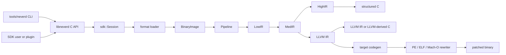

**Lingue**: [English](architecture.md) | [简体中文](architecture.zh-CN.md) | [繁體中文](architecture.zh-TW.md) | [日本語](architecture.ja.md) | [한국어](architecture.ko.md) | [Français](architecture.fr.md) | [Deutsch](architecture.de.md) | [Español](architecture.es.md) | [Italiano](architecture.it.md) | [Русский](architecture.ru.md) | [العربية](architecture.ar.md)

[← Indice della documentazione](README.it.md)

# Architettura di NeverD

Questa guida descrive i confini di produzione che un contributor deve conoscere
per modificare NeverD in sicurezza. Copre intenzionalmente solo il codice di
NeverD; i sottomoduli LLVM, Capstone e Unicorn mantengono la propria
architettura interna.

## Confine del sistema

NeverD ha quattro rappresentazioni IR, ma non costituiscono una sequenza
obbligatoria di quattro passaggi. `LowIR -> MedIR` è condiviso. La
decompilazione strutturata usa poi `MedIR -> HighIR -> C`, mentre `lift`,
`decompile --llvm` e `patch` seguono direttamente `MedIR -> LLVM IR`. In
particolare, le modalità patch e lift saltano intenzionalmente HighIR.

La CLI analizza i comandi in `tools/neverd`, crea un `neverd_session_t` e chiama
l’API pubblica di `include/neverd/sdk/NeverDCAPI.h`. Lo stato del motore risiede
in `lib/sdk/SessionImpl.h`; `neverd_session_load` sceglie un loader e costruisce
una `BinaryImage`, mentre le operazioni basate su IR eseguono
`lib/pipeline/Pipeline.cpp` su richiesta. L’eseguibile `neverd` collega
`neverd_shared`; gli archivi dei componenti e le loro dipendenze LLVM/Capstone
sono dettagli privati della libreria condivisa. La CLI usa LLVM
Support per l’interfaccia a riga di comando, ma non aggira la C API per pilotare
il motore.

## Rappresentazioni IR e percorsi

| Rappresentazione | Scopo | Definizioni e trasformazioni principali |
|------------------|-------|-----------------------------------------|
| LowIR | Operazioni `NdOp` indipendenti dall’architettura, basic block, CFG e metadati delle jump table | `include/neverd/ir/low`, `lib/ir/low`, prodotto da `lib/decode` + `lib/lift` |
| MedIR | Tipi, ABI/convenzioni di chiamata, modello memoria/stack, flag, chiamate e flusso simile a SSA | `include/neverd/ir/med`, `lib/ir/med` |
| HighIR | Espressioni e controllo di flusso strutturati per C leggibile | `include/neverd/ir/high`, `lib/ir/high`, emesso da `lib/backend/c/HighC` |
| LLVM IR | Ottimizzazione, C derivato da LLVM, generazione di codice target e input per riscrittura binaria | `lib/backend/llvm`, ottimizzato/orchestrato da `lib/pipeline` |

| Percorso utente | Cammino delle rappresentazioni | Uscita |
|-----------------|-----------------------------|--------|
| Dump Low/Med | Binary -> LowIR, opzionalmente -> MedIR | Testo diagnostico |
| Dump High o `decompile` | Binary -> LowIR -> MedIR -> HighIR | HighIR o C strutturato |
| `lift` | Binary -> LowIR -> MedIR -> LLVM IR | `.ll` |
| `decompile --llvm` | Binary -> LowIR -> MedIR -> LLVM IR | C derivato da LLVM |
| `patch` | Binary -> LowIR -> MedIR -> LLVM IR -> codegen | Binario riscritto |

`lib/pipeline/Pipeline.cpp` è la fonte autorevole per la scelta del percorso.
Mantieni la logica specifica di una rappresentazione nella relativa libreria IR
o backend; il pipeline deve orchestrare i componenti, non assorbirne gli
algoritmi.

## Contratto di traduzione tra architetture

`include/neverd/translate` definisce un livello contrattuale, non un
backend di esecuzione. `GuestState` modella lo stato visibile alla macchina in
modo indipendente dall’architettura per `x86_32`, `x86_64`, `AArch64` e `ARM32`.
La sua serializzazione canonica versione 1 usa campi little-endian a larghezza
fissa, ID di registro stabili, raccolte ordinate e validazione fail-closed;
lo stato persistito non dipende quindi dal layout C++ dell’host.

La baseline wire v1 di `GuestState` è congelata in modo permanente. Ogni stato
esterno a tale baseline deve usare un ID di registro di estensione nell’intervallo
riservato insieme a un nome canonico minuscolo, oppure passare a una nuova
versione wire con un upgrader esplicito; è vietato modificare in-place la
baseline v1.

Per un guest `ARM32`, `ExecutionMode` è la modalità di decodifica autorevole e
deve essere coerente con `CPSR.T`. Il PC memorizzato è sempre l’indirizzo
canonico dell’istruzione con il bit 0 azzerato; la modalità ARM richiede inoltre
l’allineamento alla parola.

Il contratto delle coppie definisce `x86_64 -> AArch64`,
`AArch64 -> x86_64`, `x86_32 -> AArch64/ARM32` e
`ARM32 -> x86_32/x86_64`. `ContractDefined` significa che una richiesta può
essere validata e persistita, non che il codice possa essere tradotto o eseguito.
La policy JIT accetta solo l’host nativo del processo; la policy AOT richiede
un’architettura host e un target triple espliciti; anche una CPU o un insieme di
feature selezionati devono essere espliciti.

Un `TranslationExit` versionato registra una causa di arresto stabile e il
payload tipizzato corrispondente per syscall, eccezioni o segnali, breakpoint,
istruzioni non supportate, automodifica, budget di risorse, chiamate esterne,
fault di memoria e altre condizioni terminali. I consumer non devono quindi
reinterpretare un intero privo di tipo in base alla causa di arresto.

Per qualsiasi causa di arresto, i conteggi di istruzioni, blocks e codice
generato nel risultato non devono superare il corrispondente budget non nullo
della richiesta. Un payload `BudgetExhausted` deve inoltre identificare
esattamente quel limit richiesto, non una soglia derivata o privata
dell’implementazione.

Il contratto backend-private `RuntimeControlBlockV1` misura
esattamente 128 byte, è allineato a 8 byte ed è vincolato da magic, version,
size e offset dei campi fissi della v1, campi riservati a zero ed exit tipizzate
coerenti. Non contiene container C++, puntatori host né alias di indirizzi guest.
Non è il layout C++ né il formato wire di `GuestState`; un backend che implementa
questo contratto deve convertire esplicitamente lo stato in questo record.

La superficie fissa di chiamata v1 del codice generato contiene esattamente otto
helper: `nvd_rt_v1_load8_le`, `nvd_rt_v1_load16_le`, `nvd_rt_v1_load32_le`,
`nvd_rt_v1_load64_le`, `nvd_rt_v1_store8_le`, `nvd_rt_v1_store16_le`,
`nvd_rt_v1_store32_le` e `nvd_rt_v1_store64_le`. Nomi, firme e provenienza dei
puntatori devono corrispondere esattamente; un backend collega esplicitamente
questa tabella finita e non ripiega mai sulla risoluzione ambientale dei simboli.
La validazione della generation eseguibile e il polling di budget/cancellazione
sono operazioni riservate al dispatcher fidato; `nvd_rt_v1_validate_generation`
e `nvd_rt_v1_poll` non sono helper del codice generato. Il dispatcher host fidato
possiede anche la selezione dei blocks e non è invocabile dall’IR generato; i
translated blocks restituiscono invece un codice di exit tipizzato. L’IR
generato può leggere direttamente solo lo slot runtime scalar-result dichiarato.

`GuestMemoryRuntime` è isolato dal `GuestState` logico: la costruzione prima
valida lo stato, quindi copia byte e metadati delle regioni in un indice privato
ordinato. Gli indirizzi virtuali guest sono soltanto chiavi di ricerca e non
vengono mai convertiti in puntatori host. Gli accessi scalari controllati
segnalano fault tipizzati per larghezza, allineamento, overflow, assenza di
mapping, attraversamento di regione, permessi, scrittura eseguibile, overflow o
discordanza di generation e violazione di policy. I budget di istruzioni/blocks,
la cancellazione, il tracking della generation e le policy di scrittura del
codice `RejectExecutableWrites`, `InvalidateOnExecutableWrite` e
`ValidateBeforeDispatch` producono anch’essi record tipizzati coerenti invece
di comportamento host implicito.

Il verifier post-codegen controlla gli oggetti relocatable ELF,
COFF e Mach-O come insieme chiuso. Formato e architettura devono corrispondere
esattamente all’host selezionato; i simboli non definiti devono appartenere
esattamente alla allowlist finita degli helper e i simboli dinamici sono vietati.
Le relocations seguono whitelist dirette esplicite con controlli di encoding,
larghezza, allineamento, offset, destinazione caricabile e target definito
nell’oggetto come non-preemptible o helper autorizzato esattamente. Sono
rifiutati W+X, metadati unwind/exception/initializer, TLS, IFUNC, GOT/PLT e altre
indirezioni, relocations dinamiche, definizioni weak/preemptible o selezionabili,
sezioni allocate sconosciute e direttive del linker. Gli artefatti ELF `ET_REL`
non possono contenere program header o segmenti. I load command Mach-O seguono
una lista positiva: esattamente un segmento della larghezza corretta e al
massimo una symbol table, dynamic-symbol table, platform-version e un comando
data-in-code, con verifica delle dipendenze. Le opzioni del linker e ogni altro
command vengono rifiutati.

Le implementazioni di runtime, memoria, IR e audit degli oggetti definiscono e
convalidano questi confini. Non costituiscono un backend di traduzione eseguibile
completo, una pipeline completa di traduzione tra architetture né una riscrittura
completa end-to-end delle eccezioni. Questa sezione descrive l’ambito del
contratto e del verifier; non dichiara la disponibilità end-to-end di generazione,
collegamento, caricamento, esecuzione, JIT, AOT o riscrittura delle eccezioni.

Il contratto dell’IR generato richiede che ogni translated block soggetto ad
esso sia hidden e non-preemptible e usi il C ABI
`i32 (ptr state, ptr runtime)`. I blocks sono individuabili solo tramite un
registro privato, mai tramite la ricerca dei simboli del processo circostante;
le chiamate dirette tra blocks sono vietate.

L’IR verifier limita inoltre la larghezza degli interi alla larghezza del
registro scalare dell’host, per evitare compiler-runtime libcalls noti introdotti
dalla legalization. Questa verifica è necessaria, ma non sufficiente: ogni
backend di esecuzione che implementa questo contratto deve controllare in modo
esatto i trasferimenti di controllo post-codegen, il `MachineIR` e le relocations
dell’oggetto target rispetto alla stessa runtime-symbol allowlist finita.

I load e store diretti di TranslationIR, insieme ai valori delle private
constants, possono contenere solo un singolo intero scalare non più largo del
registro scalare dell’host. Gli aggregati devono essere scalarizzati prima del
confine del verifier, così un IR compatto non può causare un’espansione non
limitata nel backend.

L’ABI del codice generato è definita solo per interi scalari. Virgola mobile,
SIMD, x87, operazioni atomiche e istruzioni di sistema restano fuori da questo
contratto. Ogni implementazione che seleziona `ProvenSemanticAndLLVM` deve
eseguire la semplificazione semantica di NeverD, subordinata a prova, fino a un
fixed point congiunto con l’ottimizzazione LLVM; la policy non fornisce un
backend di traduzione eseguibile.

## Mappa dei componenti

Ogni componente è un archivio statico creato da
`add_neverd_component_library`. La tabella elenca le dipendenze NeverD
importanti, non tutte le librerie LLVM e Capstone comuni fornite dall’helper
CMake.

| Directory | Responsabilità | Dipendenze importanti |
|-----------|----------------|-----------------------|
| `lib/loader` | Rilevamento formato, caricamento PE/COFF, ELF e Mach-O, `BinaryImage` normalizzata, scoperta funzioni | API LLVM Object |
| `lib/lift` | Semantica scritta a mano per istruzioni x86/i386, AArch64 e ARM32 | Tipi di dati IR |
| `lib/decode` | Decodifica Capstone/native e dispatch ai lifter di architettura | `NeverDIR`, `NeverDLift` |
| `lib/ir` | Tipi comuni e definizioni/trasformazioni LowIR, MedIR, HighIR e intrinsic | Quattro sottocomponenti IR |
| `lib/pipeline` | Rilevamento funzioni e orchestrazione dei percorsi Low/Med/High/LLVM | IR, decode, lift, backend LLVM, debug info, pass IR |
| `lib/backend/c` | Rendering HighIR-to-C e LLVM-IR-to-C | IR |
| `lib/backend/llvm` | Lowering da MedIR a LLVM | IR |
| `lib/backend/codegen` | Generazione codice target e patch/riscrittura in-place PE/ELF/Mach-O | IR, loader |
| `lib/sdk` | ABI C pubblica, ciclo session, query, persistenza, plugin, punti lift/decompile/patch | Aggrega il motore in `libneverd` |
| `lib/pass` | Pass di offuscamento LLVM IR e runner di pass MIR | IR |
| `lib/debug` | Contesti di debug DWARF, PDB e linker-map | IR |
| `lib/sigs` | Parsing, database e matching delle firme | Loader |
| `lib/libc` | Nomi libc noti e supporto del modello di chiamata | Componente autonomo |
| `lib/support` | Helper condivisi per il caricamento binario | Loader |
| `lib/translate` | Contratti versionati per guest state/policy/exit, runtime ABI fissa, guest memory controllata e audit di IR/oggetti generati; l’implementazione del backend di esecuzione è esterna a questo componente | Contratti IR, LLVM e LLVM Object |

Gli header pubblici rispecchiano queste aree sotto `include/neverd`. Evita che
una classe C++ interna diventi accidentalmente parte dell’SDK: le operazioni
esterne stabili appartengono all’header C puro e a uno dei file mirati
`lib/sdk/NeverDCAPI*.cpp`.

## Contratto di lifting strict

`Decoder` e ogni lifter di architettura partono in modalità strict. Se Capstone
può decodificare un’istruzione ma il lifter selezionato non la implementa,
lancia `UnliftedInstruction`. L’eccezione registra indirizzo, mnemonico e
operandi; la semantica non supportata deve quindi fallire visibilmente invece di
essere omessa o ipotizzata.

Il percorso interno non strict emette `NdOp::NOP`, ma è una via di fuga
diagnostica, non un’implementazione accettabile. I test dei contributor e della
CI devono mantenere la modalità strict. Quando si verifica un errore strict:

1. Riproducilo con la fixture specifica dell’architettura più piccola.
2. Aggiungi la semantica mancante in `lib/lift/<ISA>`.
3. Verifica la forma LowIR prevista in `unittests/lift`.
4. Aggiungi un roundtrip differenziale Unicorn in `unittests/semantic` se l’istruzione ha un comportamento osservabile.

Non intercettare `UnliftedInstruction` solo per far proseguire il pipeline. Una
nuova approssimazione intenzionale richiede contratto e test espliciti; non deve
fingersi lifting 1:1.

## Proprietà di formati e ISA

La logica del formato in ingresso e quella di riscrittura in uscita sono
separate intenzionalmente:

| Formato | Caricamento, metadati e relocation di input | Patch e relocation di output |
|---------|---------------------------------------------|------------------------------|
| PE/COFF | `lib/loader/COFF` | `lib/backend/codegen/COFF` |
| ELF | `lib/loader/ELF` | `lib/backend/codegen/ELF` |
| Mach-O | `lib/loader/MachO` | `lib/backend/codegen/MachO` |

I lifter di architettura risiedono in `lib/lift/X86`, `lib/lift/AArch64` e
`lib/lift/ARM`. Le dichiarazioni pubbliche di lifter/register sono in
`include/neverd/lift`. L’emissione LLVM e la generazione di codice specifiche
del target si trovano in `lib/backend/llvm/<ISA>` e
`lib/backend/codegen/CodeGen<ISA>.cpp`.

### Supporto e profondità dei test

La matrice di supporto principale indica che ogni cella è implementata. Non
significa che ogni opcode, caso limite ABI, produttore binario o versione del
sistema operativo sia stato testato in modo esaustivo. La modalità strict
fallisce in modo chiuso quando la semantica di un’istruzione è fuori dalla
copertura implementata dal lifter.

Tutte le 12 celle formato-per-architettura hanno copertura semantica del backend
di riscrittura in `unittests/semantic/PatchFullSubstRTTests.cpp`. La profondità
di integrazione è più specifica:

| Formato | x86-64 | i386 | AArch64 | ARM32 |
|---------|--------|------|---------|-------|
| PE/COFF | Fixture collegata | Griglia backend | Fixture collegata | Fixture Thumb collegata |
| ELF | Fixture collegata + roundtrip semantico | Pipeline oggetto + roundtrip semantico | Fixture collegata + roundtrip semantico | Fixture collegata + roundtrip semantico |
| Mach-O | Fixture collegata\* | Pipeline oggetto PIC/no-PIC\* | Fixture collegata\* | Griglia backend |

- Una **fixture collegata** esercita loader/pipeline e patch su un eseguibile
  collegato per programmi rappresentativi.
- Una **pipeline oggetto** esercita caricamento, tutte le fasi IR e
  decompilazione di un oggetto rilocabile, ma non il linking host né
  l’esecuzione del binario patchato.
- Una **griglia backend** compila IR rappresentativo attraverso il percorso
  esatto di generazione per riscrittura e confronta il comportamento in
  Unicorn; non esercita il loader del formato su un eseguibile collegato.
- `*` Le fixture Mach-O collegate dipendono da una toolchain host capace di
  produrre il target. macOS moderno non collega eseguibili i386 storici; si
  usano quindi oggetti thin PIC/no-PIC e la griglia di riscrittura.

Le celle con fixture collegata sono la prova più forte di integrazione
del formato per quei programmi. Le celle pipeline oggetto e griglia backend
hanno solo copertura parziale di integrazione. Nessuna cella è «completamente
testata» senza questa precisazione né pretende copertura esaustiva dell’ISA.

Le prove principali sono
[`PatchFormatTests.cpp`](../unittests/lift/format/PatchFormatTests.cpp) per fixture ELF
e PE collegate,
[`COFFARMFormatTests.cpp`](../unittests/lift/format/COFFARMFormatTests.cpp) per
caricamento/decompilazione Windows ARM,
[`MachOI386RelocationTests.cpp`](../unittests/lift/format/MachOI386RelocationTests.cpp)
per oggetti thin i386,
[`X86_64_PipelineE2ETests.cpp`](../unittests/lift/x86_64/X86_64_PipelineE2ETests.cpp) e
[`AArch64_PipelineE2ETests.cpp`](../unittests/lift/aarch64/AArch64_PipelineE2ETests.cpp)
per Mach-O collegato, e
[`PatchFullSubstRTTests.cpp`](../unittests/semantic/probe/patchfull/PatchFullSubstRTTests.cpp)
per la griglia di 12 celle. Consulta la [guida ai test](testing.it.md).

## Dove intervenire

| Modifica | Punto di partenza | Verifica minima mirata |
|----------|-------------------|------------------------|
| Aggiungere o correggere un’istruzione | File corrispondenti in `lib/lift/X86`, `AArch64` o `ARM`; header pubblico se cambia il dispatch | Test di architettura in `unittests/lift`; roundtrip semantico in `unittests/semantic` |
| Aggiungere un `NdOp` | `include/neverd/ir/NdOps.h`, poi verifica Low-to-Med, emitter/renderer, verifier/emulator e dump | `NeverDLiftTests` + casi pertinenti di `NeverDSemanticTests` |
| Modificare CFG o scoperta funzioni | `lib/ir/low`, `lib/loader/FunctionDiscovery*.cpp`, `lib/pipeline/PipelineFuncDetect.cpp` | Test lift CFG/jump-table e suite di trasformazione semantica mirata |
| Aggiungere relocation input o regola unwind PE | `lib/loader/COFF` | `COFFARMFormatTests` o nuova fixture loader mirata |
| Aggiungere relocation output o regola patch PE | `lib/backend/codegen/COFF` | `PatchFormatTests`, `RewriteCodegenRTTests` e griglia backend PE |
| Modificare comportamento ELF o Mach-O | Directory `lib/loader/<Format>` e/o `lib/backend/codegen/<Format>` corrispondenti | Test del formato più griglia di riscrittura |
| Modificare recupero MedIR/ABI | `lib/ir/med` | Test lift delle convenzioni di chiamata + roundtrip semantici multi-ISA |
| Modificare recupero del controllo strutturato | `lib/ir/high` | `NeverDCFGLoopXformTests` e test C strutturato |
| Aggiungere trasformazione LLVM | `lib/pass/ir`, header pubblico in `include/neverd/pass/ir`, toggle pipeline se esposto | Suite di trasformazione mirata + `NeverDPatchFullTests` se cambia l’output patch |
| Aggiungere operazione C API | `include/neverd/sdk/NeverDCAPI.h`, `lib/sdk/NeverDCAPI*.cpp` mirato, `SessionImpl.h` solo per stato | Test semantici SDK/CLI; preservare `neverd_last_error` e convenzioni di allocazione |
| Aggiungere comando CLI | `tools/neverd/NeverDCLIOptions.cpp`, `NeverDCLI.h`, `NeverDCmd*.cpp` mirato e dispatch in `neverd.cpp` | `unittests/semantic/CLIEndToEndTests.cpp` e smoke test CLI diretto |
| Aggiungere regressione semantica | `unittests/semantic/*Tests.cpp` mirato; registrare il nuovo file in `unittests/semantic/CMakeLists.txt` | Costruire il binario di test e selezionare il caso con `ctest -R` |

Mantieni le modifiche ristrette. I file che definiscono una rappresentazione
possono cambiare con le relative trasformazioni, ma loader, lifter e backend non
correlati non vanno modificati solo per uniformare un refactoring ampio.
