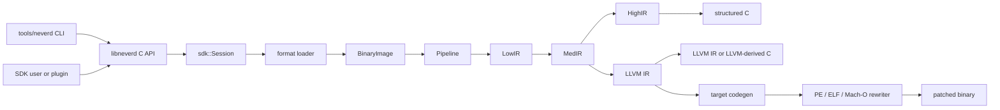

**Languages**: [English](architecture.md) | [简体中文](architecture.zh-CN.md) | [繁體中文](architecture.zh-TW.md) | [日本語](architecture.ja.md) | [한국어](architecture.ko.md) | [Français](architecture.fr.md) | [Deutsch](architecture.de.md) | [Español](architecture.es.md) | [Italiano](architecture.it.md) | [Русский](architecture.ru.md) | [العربية](architecture.ar.md)

[← ドキュメント索引](README.ja.md)

# NeverD アーキテクチャ

このガイドでは、コントリビューターが NeverD を安全に変更するために必要な
本番コードの境界を説明します。対象は意図的に NeverD 所有のコードだけに限定し、
LLVM、Capstone、Unicorn の各サブモジュールは独自の内部アーキテクチャを持ちます。

## システム境界

NeverD には 4 つの IR 表現がありますが、必ず 4 段すべてを通る一列の処理では
ありません。`LowIR -> MedIR` は共通です。構造化デコンパイルは
`MedIR -> HighIR -> C` を使い、`lift`、`decompile --llvm`、`patch` は
`MedIR -> LLVM IR` へ直接進みます。特に patch と lift モードは意図的に
HighIR を通りません。

CLI は `tools/neverd` でコマンドを解析し、`neverd_session_t` を作成して
`include/neverd/sdk/NeverDCAPI.h` の公開 API を呼び出します。エンジン状態は
`lib/sdk/SessionImpl.h` にあり、`neverd_session_load` が loader を選択して
`BinaryImage` を構築します。IR ベースの操作は必要になった時点で
`lib/pipeline/Pipeline.cpp` を実行します。`neverd` 実行ファイルは
`neverd_shared` にリンクし、各コンポーネントアーカイブと LLVM/Capstone
依存関係は共有ライブラリの非公開実装です。CLI はコマンドライン UI に LLVM
Support を使いますが、エンジンを駆動する際に C API を迂回しません。

## IR 表現と経路

| 表現 | 目的 | 主な定義と変換 |
|------|------|----------------|
| LowIR | アーキテクチャ非依存の `NdOp` 操作、基本ブロック、CFG、ジャンプテーブルメタデータ | `include/neverd/ir/low`、`lib/ir/low`。`lib/decode` + `lib/lift` が生成 |
| MedIR | 型、ABI/呼出規約、メモリ/スタックモデル、フラグ、呼出し、SSA 的データフロー | `include/neverd/ir/med`、`lib/ir/med` |
| HighIR | 読みやすい C のための構造化式と制御フロー | `include/neverd/ir/high`、`lib/ir/high`。`lib/backend/c/HighC` が出力 |
| LLVM IR | 最適化、LLVM 由来 C、ターゲットコード生成、バイナリ書き換え入力 | `lib/backend/llvm`。`lib/pipeline` が最適化/調整 |

| ユーザー経路 | 表現の流れ | 出力 |
|----------------|------------|------|
| Low/Med dump | Binary -> LowIR、必要なら -> MedIR | 診断テキスト |
| High dump または `decompile` | Binary -> LowIR -> MedIR -> HighIR | HighIR または構造化 C |
| `lift` | Binary -> LowIR -> MedIR -> LLVM IR | `.ll` |
| `decompile --llvm` | Binary -> LowIR -> MedIR -> LLVM IR | LLVM 由来 C |
| `patch` | Binary -> LowIR -> MedIR -> LLVM IR -> codegen | 書き換え済みバイナリ |

経路選択の信頼できる情報源は `lib/pipeline/Pipeline.cpp` です。表現固有の
ロジックは所有する IR または backend ライブラリに置き、pipeline はアルゴリズムを
取り込むのではなく、それらのコンポーネントを調整してください。

## コンポーネントマップ

各コンポーネントは `add_neverd_component_library` が作成する静的アーカイブです。
表には重要な NeverD 依存関係を示し、CMake helper が共通で与える LLVM と
Capstone ライブラリは網羅しません。

| ディレクトリ | 責務 | 主な依存関係 |
|--------------|------|--------------|
| `lib/loader` | 形式検出、PE/COFF・ELF・Mach-O 読込み、正規化 `BinaryImage`、関数検出 | LLVM Object API |
| `lib/lift` | 手書きの x86/i386・AArch64・ARM32 命令セマンティクス | IR データ型 |
| `lib/decode` | Capstone/native デコードと各アーキテクチャ lifter へのディスパッチ | `NeverDIR`、`NeverDLift` |
| `lib/ir` | 共通型、LowIR・MedIR・HighIR・intrinsic の定義/変換 | 4 つの IR サブコンポーネント |
| `lib/pipeline` | 関数検出と Low/Med/High/LLVM 経路の調整 | IR、decode、lift、LLVM backend、デバッグ情報、IR pass |
| `lib/backend/c` | HighIR-to-C および LLVM-IR-to-C のレンダリング | IR |
| `lib/backend/llvm` | MedIR から LLVM への lowering | IR |
| `lib/backend/codegen` | ターゲットコード生成、PE/ELF/Mach-O の patch と in-place 書き換え | IR、loader |
| `lib/sdk` | 公開 C ABI、session ライフサイクル、クエリ、永続化、プラグイン、lift/decompile/patch エントリ | エンジンを `libneverd` に集約 |
| `lib/pass` | LLVM IR 難読化 pass と MIR pass runner | IR |
| `lib/debug` | DWARF、PDB、linker-map デバッグコンテキスト | IR |
| `lib/sigs` | シグネチャ解析、データベース、マッチング | Loader |
| `lib/libc` | 既知の libc 名と呼出モデルのサポート | 独立コンポーネント |
| `lib/support` | 共通のバイナリ読込み helper | Loader |

公開ヘッダーは `include/neverd` 以下で各領域に対応します。内部 C++ クラスを
誤って SDK の一部にしないでください。安定した外部操作は純粋 C ヘッダーと、
責務を絞った `lib/sdk/NeverDCAPI*.cpp` のいずれかに置きます。

## strict lifting の契約

`Decoder` と各アーキテクチャ lifter は strict モードで開始します。Capstone が
命令をデコードできても選択した lifter に実装がなければ、lifter は
`UnliftedInstruction` を投げます。例外には命令アドレス、ニーモニック、オペランド
文字列が記録されるため、未対応セマンティクスは省略や推測ではなく明示的に失敗します。

内部の非 strict 経路は `NdOp::NOP` を出力しますが、これは診断用の逃げ道であり、
命令の受け入れ可能な実装ではありません。コントリビューターと CI のテストは strict
を維持してください。strict 失敗が発生したら：

1. 最小のアーキテクチャ固有 fixture で再現する。
2. `lib/lift/<ISA>` に不足するセマンティクスを追加する。
3. `unittests/lift` で期待する LowIR 形状を検証する。
4. 命令に観測可能な動作があれば、`unittests/semantic` に Unicorn 差分ラウンドトリップを追加する。

pipeline を続行するためだけに `UnliftedInstruction` を捕捉しないでください。新しい
意図的な近似には明示的な契約とテストが必要で、1:1 lifting を装ってはいけません。

## 形式と ISA の所有範囲

入力形式のロジックと出力書き換えのロジックは意図的に分離されています。

| 形式 | 読込み、メタデータ、入力リロケーション | Patch と出力リロケーション |
|------|----------------------------------------|-----------------------------|
| PE/COFF | `lib/loader/COFF` | `lib/backend/codegen/COFF` |
| ELF | `lib/loader/ELF` | `lib/backend/codegen/ELF` |
| Mach-O | `lib/loader/MachO` | `lib/backend/codegen/MachO` |

アーキテクチャ lifter は `lib/lift/X86`、`lib/lift/AArch64`、`lib/lift/ARM`
にあります。対応する公開 lifter/register 宣言は `include/neverd/lift` にあります。
ターゲット固有の LLVM 出力とコード生成は `lib/backend/llvm/<ISA>` と
`lib/backend/codegen/CodeGen<ISA>.cpp` にあります。

### サポートとテストの深さ

ルートのサポート表は各セルが実装済みであることを意味します。すべての opcode、
ABI 境界ケース、バイナリ生成元、OS バージョンを網羅的にテストしたという意味では
ありません。strict モードが未追加の命令カバレッジに対する防護になります。

形式×アーキテクチャの全 12 セルには
`unittests/semantic/PatchFullSubstRTTests.cpp` のセマンティックな書き換え backend
カバレッジがあります。統合の深さは次のとおりです。

| 形式 | x86-64 | i386 | AArch64 | ARM32 |
|------|--------|------|---------|-------|
| PE/COFF | リンク済み fixture | backend グリッド | リンク済み fixture | リンク済み Thumb fixture |
| ELF | リンク済み fixture + セマンティックラウンドトリップ | オブジェクト pipeline + セマンティックラウンドトリップ | リンク済み fixture + セマンティックラウンドトリップ | リンク済み fixture + セマンティックラウンドトリップ |
| Mach-O | リンク済み fixture\* | PIC/no-PIC オブジェクト pipeline\* | リンク済み fixture\* | backend グリッド |

- **リンク済み fixture** は代表的プログラムのリンク済み実行形式について、
  loader/pipeline と patch の動作を検証します。
- **オブジェクト pipeline** は再配置可能オブジェクトの読込み、全 IR 段階、
  デコンパイルを検証しますが、ホストでのリンクと patch 済みバイナリの実行は含みません。
- **backend グリッド** は正確な書き換えコード生成経路で代表的 IR をコンパイルし、
  Unicorn で動作を比較します。その形式の loader をリンク済み実行形式には適用しません。
- `*` Mach-O のリンク済み fixture は、要求するターゲットを生成できるホスト
  ツールチェーンに依存します。現在の macOS は旧 i386 実行形式をリンクできないため、
  i386 は PIC/no-PIC thin オブジェクトと書き換えグリッドを使用します。

リンク済み fixture のセルは、その代表的プログラムに対する現時点で最も強い形式統合の
証拠です。オブジェクト pipeline と backend グリッドのセルは部分的な形式統合
カバレッジです。限定なしに「完全にテスト済み」と呼べるセルはなく、ISA を網羅したと
主張するセルもありません。

主な根拠は、リンク済み ELF/PE fixture の
[`PatchFormatTests.cpp`](../unittests/lift/PatchFormatTests.cpp)、Windows ARM の
読込み/デコンパイルを扱う
[`COFFARMFormatTests.cpp`](../unittests/lift/COFFARMFormatTests.cpp)、i386 thin
オブジェクトを扱う
[`MachOI386RelocationTests.cpp`](../unittests/lift/MachOI386RelocationTests.cpp)、
リンク済み Mach-O の
[`X86_64_PipelineE2ETests.cpp`](../unittests/lift/X86_64_PipelineE2ETests.cpp) と
[`AArch64_PipelineE2ETests.cpp`](../unittests/lift/AArch64_PipelineE2ETests.cpp)、
12 セルの backend グリッドを扱う
[`PatchFullSubstRTTests.cpp`](../unittests/semantic/PatchFullSubstRTTests.cpp) です。
実行方法は[テストガイド](testing.ja.md)を参照してください。

## 変更箇所の案内

| 変更 | 開始箇所 | 最小の重点検証 |
|------|----------|----------------|
| 命令を追加/修正 | `lib/lift/X86`、`AArch64`、`ARM` の対応ファイル。ディスパッチ変更時は公開 lifter ヘッダー | `unittests/lift` のアーキテクチャテスト、`unittests/semantic` のセマンティックラウンドトリップ |
| `NdOp` を追加 | `include/neverd/ir/NdOps.h`。その後 Low-to-Med、emitter/renderer、verifier/emulator、dump を監査 | `NeverDLiftTests` + 関連する `NeverDSemanticTests` ケース |
| CFG または関数検出を変更 | `lib/ir/low`、`lib/loader/FunctionDiscovery*.cpp`、`lib/pipeline/PipelineFuncDetect.cpp` | lift CFG/ジャンプテーブルテストと重点セマンティック変換スイート |
| PE 入力リロケーション/unwind 規則を追加 | `lib/loader/COFF` | `COFFARMFormatTests` または新しい重点 loader fixture |
| PE 出力リロケーション/patch 規則を追加 | `lib/backend/codegen/COFF` | `PatchFormatTests`、`RewriteCodegenRTTests`、PE backend グリッド |
| ELF/Mach-O 形式動作を変更 | 対応する `lib/loader/<Format>` および/または `lib/backend/codegen/<Format>` | 対応形式テストと書き換えグリッド |
| MedIR/ABI 復元を変更 | `lib/ir/med` | 呼出規約 lift テスト + ISA 横断セマンティックラウンドトリップ |
| 構造化制御フロー復元を変更 | `lib/ir/high` | `NeverDCFGLoopXformTests` と構造化 C テスト |
| LLVM 変換を追加 | `lib/pass/ir`、`include/neverd/pass/ir` の公開ヘッダー、公開時は pipeline 切替 | 重点変換スイート + patch 出力変更時の `NeverDPatchFullTests` |
| C API 操作を追加 | `include/neverd/sdk/NeverDCAPI.h`、担当する `lib/sdk/NeverDCAPI*.cpp`、状態が必要な場合のみ `SessionImpl.h` | SDK/CLI セマンティックテスト。`neverd_last_error` と割当規約を維持 |
| CLI コマンドを追加 | `tools/neverd/NeverDCLIOptions.cpp`、`NeverDCLI.h`、担当する `NeverDCmd*.cpp`、`neverd.cpp` のディスパッチ | `unittests/semantic/CLIEndToEndTests.cpp` と直接 CLI smoke test |
| セマンティック回帰を追加 | 重点化した `unittests/semantic/*Tests.cpp`。新規ファイルは `unittests/semantic/CMakeLists.txt` に登録 | テストバイナリをビルドし、`ctest -R` で名前付きケースを実行 |

変更範囲を狭く保ってください。表現を定義するファイルは変換と一緒に変更できますが、
大規模リファクタリングを一様に見せるためだけに無関係な loader、lifter、backend を
変更しないでください。
