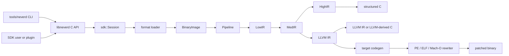

**Languages**: [English](architecture.md) | [简体中文](architecture.zh-CN.md) | [繁體中文](architecture.zh-TW.md) | [日本語](architecture.ja.md) | [한국어](architecture.ko.md) | [Français](architecture.fr.md) | [Deutsch](architecture.de.md) | [Español](architecture.es.md) | [Italiano](architecture.it.md) | [Русский](architecture.ru.md) | [العربية](architecture.ar.md)

[← ドキュメント索引](README.ja.md)

# NeverD アーキテクチャ

このガイドでは、コントリビューターが NeverD を安全に変更するために必要な
本番コードの境界を説明します。対象は意図的に NeverD 所有のコードだけに限定し、
LLVM、Capstone、Unicorn の各サブモジュールは独自の内部アーキテクチャを持ちます。

## システム境界

NeverD には 4 つの IR 表現がありますが、必ず 4 段すべてを通る一列の処理では
ありません。`LowIR -> MedIR` は共通です。構造化デコンパイルは
`MedIR -> HighIR -> C` を使い、`lift`、`decompile --llvm`、`patch` は
`MedIR -> LLVM IR` へ直接進みます。特に patch と lift モードは意図的に
HighIR を通りません。

CLI は `tools/neverd` でコマンドを解析し、`neverd_session_t` を作成して
`include/neverd/sdk/NeverDCAPI.h` の公開 API を呼び出します。エンジン状態は
`lib/sdk/SessionImpl.h` にあり、`neverd_session_load` が loader を選択して
`BinaryImage` を構築します。IR ベースの操作は必要になった時点で
`lib/pipeline/Pipeline.cpp` を実行します。`neverd` 実行ファイルは
`neverd_shared` にリンクし、各コンポーネントアーカイブと LLVM/Capstone
依存関係は共有ライブラリの非公開実装です。CLI はコマンドライン UI に LLVM
Support を使いますが、エンジンを駆動する際に C API を迂回しません。

## IR 表現と経路

| 表現 | 目的 | 主な定義と変換 |
|------|------|----------------|
| LowIR | アーキテクチャ非依存の `NdOp` 操作、基本ブロック、CFG、ジャンプテーブルメタデータ | `include/neverd/ir/low`、`lib/ir/low`。`lib/decode` + `lib/lift` が生成 |
| MedIR | 型、ABI/呼出規約、メモリ/スタックモデル、フラグ、呼出し、SSA 的データフロー | `include/neverd/ir/med`、`lib/ir/med` |
| HighIR | 読みやすい C のための構造化式と制御フロー | `include/neverd/ir/high`、`lib/ir/high`。`lib/backend/c/HighC` が出力 |
| LLVM IR | 最適化、LLVM 由来 C、ターゲットコード生成、バイナリ書き換え入力 | `lib/backend/llvm`。`lib/pipeline` が最適化/調整 |

| ユーザー経路 | 表現の流れ | 出力 |
|----------------|------------|------|
| Low/Med dump | Binary -> LowIR、必要なら -> MedIR | 診断テキスト |
| High dump または `decompile` | Binary -> LowIR -> MedIR -> HighIR | HighIR または構造化 C |
| `lift` | Binary -> LowIR -> MedIR -> LLVM IR | `.ll` |
| `decompile --llvm` | Binary -> LowIR -> MedIR -> LLVM IR | LLVM 由来 C |
| `patch` | Binary -> LowIR -> MedIR -> LLVM IR -> codegen | 書き換え済みバイナリ |

経路選択の信頼できる情報源は `lib/pipeline/Pipeline.cpp` です。表現固有の
ロジックは所有する IR または backend ライブラリに置き、pipeline はアルゴリズムを
取り込むのではなく、それらのコンポーネントを調整してください。

## クロスアーキテクチャ変換の契約

`include/neverd/translate` が定義しているのは契約層であり、実行 backend
ではありません。`GuestState` は `x86_32`、`x86_64`、`AArch64`、`ARM32`
について、アーキテクチャ非依存のマシン可視状態をモデル化します。正規な
version 1 シリアライズは固定幅のリトルエンディアンフィールド、安定したレジスタ
ID、ソート済みコレクション、fail-closed 検証を使うため、永続化状態はホストの
C++ レイアウトに依存しません。

`GuestState` の wire v1 baseline は恒久的に凍結されています。この baseline 外の
状態は、拡張範囲の extension-register ID と正規の小文字名を組み合わせて表現するか、
明示的な upgrader を備えた新しい wire version に移行しなければなりません。v1
baseline をその場で変更することは禁止されています。

`ARM32` guest では `ExecutionMode` が権威ある decode mode であり、`CPSR.T` と
一致しなければなりません。保存される PC は常に bit 0 をクリアした正規の命令
アドレスであり、ARM mode ではさらに word alignment が必要です。

アーキテクチャ対のポリシーは `x86_64 -> AArch64`、
`AArch64 -> x86_64`、`x86_32 -> AArch64/ARM32`、
`ARM32 -> x86_32/x86_64` を定義しています。`ContractDefined` は要求を検証して
永続化できるという意味であり、コードを変換または実行できるという意味では
ありません。JIT ポリシーは実行中プロセスの native host だけを受け入れ、AOT
ポリシーはホストアーキテクチャと target triple の明示を要求します。CPU または
feature set を選ぶ場合も明示が必要です。

`ResolvedHostTarget` は、この選択を具体的な結果へ解決します。`Native` 解決は現在の
process から triple、CPU、有効/無効の feature set を取得します。`Explicit` 解決は
呼出し側が指定した architecture、triple、CPU、feature を検証して正規化し、競合を
拒否します。version 付き cache identity は、正規化済み target input から決定的な
byte 順で構築され、process address や locale 依存の text を含みません。

version 付き `TranslationExit` は安定した停止理由と、それに対応する型付き payload
を記録します。対象は syscall、例外または signal、breakpoint、未対応命令、自己書換え、
リソース budget、外部呼出し、memory fault、その他の終了条件です。利用側が停止理由に
応じて型のない整数を読み替える必要はありません。

対応する `BudgetExhausted` の場合を除き、結果が報告する instruction、block、
generated-code の各 count は、要求の対応する非ゼロ budget を超えてはなりません。
instruction と block の枯渇は limit で正確に停止します。生成 object のサイズは分割
できない codegen の完了後にしか確定しないため、その枯渇結果は
`Observed > Limit` を報告できます。拒否された object は link、publish、execute
されません。各 `BudgetExhausted` payload は要求された limit を正確に示し、導出値や
実装固有のしきい値を報告しません。

backend-private `RuntimeControlBlockV1` の契約は、正確に 128 byte、
8 byte alignment であり、固定された v1 magic、version、size、field offset、ゼロの
reserved field、整合した typed exit によって制約されます。C++ container、host
pointer、guest address alias は含みません。また `GuestState` の C++ layout や wire
format ではなく、この契約を実装する backend が状態をこの record へ明示的に変換
する必要があります。

固定 v1 generated-code call surface に含まれる helper は正確に 8 個です：
`nvd_rt_v1_load8_le`、`nvd_rt_v1_load16_le`、`nvd_rt_v1_load32_le`、
`nvd_rt_v1_load64_le`、`nvd_rt_v1_store8_le`、`nvd_rt_v1_store16_le`、
`nvd_rt_v1_store32_le`、`nvd_rt_v1_store64_le`。名前、signature、pointer provenance
は完全一致しなければならず、backend はこの有限 table を明示的に bind して ambient
symbol resolution へ fallback してはなりません。executable generation 検証と
budget/cancellation polling は trusted dispatcher 専用の操作です。
`nvd_rt_v1_validate_generation` と `nvd_rt_v1_poll` は generated-code helper では
ありません。trusted host dispatcher は block 選択も所有し、生成 IR からは呼び出せ
ません。translated block は代わりに typed exit code を返します。生成 IR が直接
読めるのは、宣言済みの scalar-result runtime slot だけです。

`RuntimeSymbolRegistryV1` は、その helper table を閉じた host-side registry として
実装します。構築時に ABI-v1 の完全な集合、正確な canonical name、helper class、
signature、および各 entry に class と一致する非 null の function pointer が正確に
1 個あることを検証します。lookup は完全一致名だけを受け入れ、process 環境や
dynamic loader の symbol を参照せず、object verifier の allowlist に同じソート済み
名前を提供します。version 付き identity は名前、helper class、ABI shape を含みます
が、native address は意図的に除外するため ASLR に左右されません。

`RuntimeCodeMemory` は page 単位で分離された generated-code storage を所有し、
一方向の `RW -> RX` publication だけを許可します。memory が同時に writable かつ
executable になることはなく、publication 後に write 可能へ戻すこともできません。
write と entry offset は bounds-check され、publication 時には host instruction cache
が invalidation されます。native smoke test が publication 後に実行するのは小さな
host instruction sequence だけであり、証明するのはこの W^X memory boundary であって
translation engine ではありません。

`GuestMemoryRuntime` は論理的な `GuestState` から分離されています。生成時に state
を検証し、region の byte と metadata をソート済み private index へコピーします。
guest virtual address は lookup key にすぎず、host pointer へ変換されません。検査
付き scalar access は、width、alignment、overflow、unmapped、cross-region、
permission、executable write、generation overflow/mismatch、policy fault を型付きで
報告します。instruction/block budget、cancellation、generation tracking、および
`RejectExecutableWrites`、`InvalidateOnExecutableWrite`、
`ValidateBeforeDispatch` の code-write policy も、暗黙の host 動作ではなく整合した
typed record を生成します。

`TranslationObjectCompilerV1` は、検証済みの LLVM IR-to-object 境界です。const
input module を検証し、すべての変換前に clone し、proof-gated semantic
simplification と LLVM `O0`〜`O3` optimization を組み合わせ、final IR を再検証して、
4 つの contract host architecture 向けに relocatable ELF、COFF、Mach-O object を
emit します。正確な target-mangled block/runtime symbol manifest を canonicalize し、
emit 後の各 object を audit して、runtime registry identity と version 付き request /
artifact cache key を返します。generated-byte budget が非ゼロなら、それを満たす
object だけが artifact verification に進めます。LLVM はまず private buffer へ分割
不能な emit を完了して正確なサイズを測定します。超過 object は publish と artifact
audit の前に拒否され、typed telemetry が実測サイズと要求された正確な limit を保持
します。ゼロは caller policy 上 unlimited です。compiler の出力は audit 済み
relocatable byte までであり、link、publish、dispatch、execute、および guest
instruction lowering は行いません。

post-codegen verifier は relocatable ELF、COFF、Mach-O object を
閉集合として監査します。format と architecture は選択された host と正確に一致し、
undefined symbol は有限 helper allowlist に完全一致しなければならず、dynamic symbol
は禁止されます。relocation は明示的な direct whitelist であり、encoding、width、
alignment、offset、loadable destination、object-local non-preemptible definition または
完全一致で許可された helper target を検査します。W+X、unwind/exception と
initializer metadata、TLS、IFUNC、GOT と通常の PLT indirection、dynamic relocation、
weak/preemptible または選択可能な definition、未知の allocated section、linker
directive は拒否されます。LLVM が hidden x86-64 ELF call に使う
`R_X86_64_PLT32` は、v1 policy が exact runtime helper への sealed direct branch と
証明した場合だけ許可され、PLT や GOT path を許可するものではありません。ELF
`ET_REL` artifact は program header や segment を含んではなりません。Mach-O load
command は positive list で制限され、bit 幅が一致する segment を正確に 1 個、
symbol table、dynamic-symbol table、platform-version、data-in-code command を
それぞれ最大 1 個だけ許可し、依存関係も検査します。linker option とその他の
command はすべて拒否されます。

`TranslationObjectRequestV1` は、これらの契約上に構築された最初の公開
guest-byte-to-object slice であり、意図的に対象を絞っています。現在公開されている
fail-closed な x86-64 v1 scalar-register subset では、legacy prefix のない canonical
encoding、すなわち、対応する register/immediate LowIR 形状になる REX.W 全幅 GPR の
`MOV`、`ADD`/`SUB`、および `AND`/`OR`/`XOR` だけを受け取ります。schema 9 はさらに、
全幅 register/register `CMP` の `39/3B`、register/immediate `CMP` の `81/7`、`83/7`、
`3D`、全幅 register/register `TEST` の `85`、register/immediate `TEST` の `F7/0` と `A9`
を受理します。算術形式は従来の scalar flag 計算を維持し、論理形式と `TEST` は
アーキテクチャで定義された flags を計算しつつ NeverD state model の `AF` を保持します。
canonical `C3` `RET` と `C2 iw` `RET imm16` は return block を
終了し、canonical `EB cb` と `E9 cd` の direct-relative `JMP` encoding は direct-branch
block を終了します。公開 lowering schema は 9 です。canonical かつ legacy prefix のない
traditional Jcc は、`JO`/`JNO` の short `70/71 cb` または near `0F 80/81 cd`、
`JB`/`JAE` の `72/73 cb` または `0F 82/83 cd`、`JE`/`JNE` の `74/75 cb` または
`0F 84/85 cd`、`JBE`/`JA` の `76/77 cb` または `0F 86/87 cd`、`JS`/`JNS` の
`78/79 cb` または `0F 88/89 cd`、`JP`/`JNP` の `7A/7B cb` または `0F 8A/8B cd`、
`JL`/`JGE` の `7C/7D cb` または `0F 8C/8D cd`、`JLE`/`JG` の `7E/7F cb` または
`0F 8E/8F cd` に限られます。`JRCXZ`/`JECXZ`/`JCXZ` と
`LOOP`/`LOOPE`/`LOOPNE` は未公開で fail closed します。予約済みの `F7 /1`、guest-memory
operand、partial-register form、legacy prefix、および意味的に冗長な REX extension bit
も fail closed します。出力は監査済み little-endian AArch64 ELF または Mach-O relocatable object
に限られます。通常の guest memory operation、partial-register form、この厳密な subset
外の任意の instruction/encoding、return、これらの direct jump、および上記の公開済み
Jcc branch 以外の control flow、ならびに lowerer が未実装の LowIR
operation は object emission 前に拒否されます。`RET` に必要な検査付き
return-address read は terminator contract の内部処理であり、一般的な guest-memory
lowering を公開するものではありません。request は block descriptor を再構築して
検証し、lowering と object emission に同じ resolved target machine を使い、
proof-gated semantic simplification と LLVM のデフォルト `O2` optimization pipeline
を組み合わせます。この slice は、その他の x86-64 instruction、他の guest/host pair、
または AArch64 から x86-64 への逆方向をサポートするものではありません。

公開 C entry point `neverd_translate_x86_64_block_to_aarch64_object_v1`、Python ctypes
wrapper `translate_x86_64_block_to_aarch64_object`、および
`neverd translate-object` command は、同じ object-only 境界を公開します。Python は
`TranslationObjectFormat.ELF` または `.MACHO` を使います。native translation の失敗時
には `TranslationErrorCode` を保持する typed `TranslationError` を投げ、local argument
validation は `TypeError` または `ValueError` を投げます。成功時には Python 所有の
immutable result を返します。C result は object byte、安定した cache identity、
optimization telemetry を所有し、CLI は選択された ELF または Mach-O object だけを
書き出します。これらの C、Python、CLI object surface はいずれも link、load、dispatch、
execute、debug より前で停止し、execution session interface ではありません。

`verifyTranslationLinkGraphV1` は、独立した allocation 前の第 2 の監査を追加します。受理済み
AArch64 ELF または Mach-O object から一時的な LLVM JITLink graph を構築し、target、
section permission、block/runtime symbol manifest、external-symbol closure、および
edge kind と target を検査します。address-free な監査結果を生成した後、graph は破棄
されます。この監査に合格しても、code の link、allocate、resolve、load、publish、
dispatch、execute は行われません。

`linkTranslationObjectV1` は独立した native linking 境界です。pruning、allocation、
symbol resolution、fixup の前後で trusted descriptor、raw object、JITLink graph を
再監査します。runtime symbol は sealed registry だけから供給されます。dispatcher
credential は唯一の manifest entry を session、block identity、guest entry PC、cache
generation、code epoch に束縛し、invoke 時には runtime guest `RIP` もその entry と一致
しなければなりません。finalization に成功すると最終 permission で executable memory を
publish し、unload は新たな invoke を失効させ、実行中の 1 回の invoke を待ってから
allocation を解放します。credential-free overload は audit-only のままで invoke できません。

`NativeTranslationSessionV1` はこれらを experimental C++ x86-64-to-native-AArch64
execution 境界として構成します。little-endian AArch64 ELF または Mach-O process 上で、
compile-link-validate-invoke-unload dispatcher loop 全体にわたり、検査済み guest-memory
runtime と固定 guest state を複数 block 間で維持します。canonical direct jump は正確な
static target から継続します。公開済みの canonical Jcc branch は
block manifest が宣言した taken または fallthrough successor からのみ継続でき、dispatcher はそれ以外の selected
PC をすべて拒否します。return は終了します。global instruction、block、generated-object-
byte の budget は block をまたいで正確に維持され、guest が正常停止すると実行済み state
と authoritative memory が一緒に commit されます。cancellation は final commit に対して
linearize されます。

これは実行可能な vertical slice であって、完全な translator ではありません。通常の
guest-memory instruction、partial register、上記の厳密な schema-9 traditional-Jcc slice 以外の
conditional control flow（`JRCXZ`/`JECXZ`/`JCXZ` と
`LOOP`/`LOOPE`/`LOOPNE` を含む）、indirect control flow、call、floating-point、SIMD、x87、atomic、system instruction、
汎用 exception propagation、block cache、他の guest/host pair、逆方向の
AArch64-to-x86-64 はまだ対象外です。
execution session の C、Python、CLI、JSON surface はなく、debugging は独立した未対応
機能です。上記 object API は native execution を使わずに引き続き利用できます。

生成 IR の契約では、この契約に従うすべての translated block を hidden かつ
non-preemptible とし、C ABI `i32 (ptr state, ptr runtime)` を使うことを要求します。
block は private registry だけから発見され、プロセス環境の symbol lookup には
依存しません。block 間の直接呼出しも禁止されます。

IR verifier は、legalization が既知の compiler-runtime libcall を導入することを
避けるため、整数幅をホストの scalar register 幅以下に制限します。ただし、これは
必要条件にすぎません。この契約を実装する実行 backend は、post-codegen control
transfer、`MachineIR`、target object の relocation を、同じ有限の runtime-symbol
allowlist に対して厳密に監査する必要があります。

TranslationIR の直接 load/store と private constant が保持する値に許されるのは、
ホストの scalar-register 幅以下の単一 scalar integer だけです。aggregate は verifier
境界より前に scalarize し、コンパクトな IR が backend の無制限な展開を引き起こさ
ないようにしなければなりません。

generated-code ABI は scalar integer についてのみ定義されています。浮動小数点、
SIMD、x87、atomic、system instruction はこの契約の範囲外です。
`ProvenSemanticAndLLVM` を選択する実装は、NeverD の proof-gated semantic
simplification を LLVM 最適化との共同 fixed point まで実行しなければなりません。
このポリシー自体は実行可能な translation backend を提供しません。

## 例外書き換えの境界

Mach-O compact unwind には、元の `__unwind_info` 用 strict parser、生成された
`__LD,__compact_unwind` record 用 fixup-aware parser、元データと生成データの range を
正確に merge する処理、regular page 用 deterministic encoder、および transactional な
最終 section installer があります。installer は既存の file-backed
`__TEXT,__unwind_info` に encoded table が収まる場合だけ in-place で書き換えます。
architecture、layout、byte preimage を再検証し、未使用の末尾をゼロ化し、Mach-O 外側
transaction の単一 commit 前に結果を再 parse して semantic equivalence を確認します。
生成 record は、compiler が正確に記録した IR source function から target MC owner
symbol への対応（private definition を含み、object-format prefix や mangling を推測しない）、
opaque な非ゼロの range ID、および厳密な半開 fragment range で認証されます。生成された
各 FDE は唯一の認証済み fragment と厳密に一致し、必要な各 fragment も、その transaction
が install した唯一の FDE と厳密に一致しなければなりません。ただし、厳密な encoding
検証を通った正確な非 DWARF compact record が覆う場合を除きます。同じ function が所有する
隣接または非連続 fragment は一つの source recipe を再利用できますが、identity の欠落、
重複、dangling、owner の交差、または boundary 不一致は出力変更前に失敗します。新しい RX
segment は、`__LINKEDIT` が一意で file/VM の末尾にあること、offset shift が overflow
checked であること、最終 file/VM layout の strict replay が成功したことを証明してから
commit されます。最終 section が存在しない場合、生成 compact record は install せず、
以下の正確で認証済みの DWARF-FDE 閉路だけを通る場合に限り transaction を続行できます。
既存の最終 section が容量不足または malformed の場合は引き続き fail closed します。
link 済み native throw/catch による実証はまだありません。

ARM32 compact unwind では、encoding に含まれる stack adjustment と GPR layout は `Complete`
です。D-register pattern selector 0〜3 も `Complete` ですが、4〜7 は compact word だけでは
runtime-aligned CFA-relative slot をすべて証明できないため `Partial` です。`Partial` entry は
解析用に証明済み register identity を保持できますが、すべての rewrite path が fail closed
で拒否します。各 EH-frame install receipt は target architecture、pointer width、byte order
を厳密に束縛し、compact-unwind DWARF binding は receipt target identity の不一致を拒否します。

上位の ARM32 section transaction は compact-unwind decoder より狭い範囲だけを
公開します。Mach-O header が正確に `CPU_SUBTYPE_ARM_V7K` であり、元の symbol
table の `N_ARM_THUMB_DEF` bit が必要なすべての function を Thumb code として
積極的に認証する場合に限り、この経路が有効になります。その後は正確な
`thumbv7k-apple-watchos` triple と Thumb mode が code generation 全体で束縛され、
入力 feature 要件が Cortex-A7 の上限を超えることも許されません。flag のない
function または mode 不明の function、generic な non-v7k subtype、ARM mode、混在
または不明な external-code target、ARM Mach-O の in-place entry point、および C
source からの ARM Mach-O patch は、出力を変更する前に fail closed で拒否されます。
function discovery が `LC_FUNCTION_STARTS` だけに依存する stripped input はまだ
サポートされていません。

PE、ELF、Mach-O にはそれぞれ format 固有の例外 component がありますが、NeverD は
全 format・全 exception type を扱う end-to-end rewrite pipeline をまだ公開していません。
未対応 encoding または未解決の registration/layout 要件は、出力を変更する前に失敗
しなければなりません。既存の部分的な format 対応を完全な例外処理の閉路と表現しては
なりません。

## コンポーネントマップ

各コンポーネントは `add_neverd_component_library` が作成する静的アーカイブです。
表には重要な NeverD 依存関係を示し、CMake helper が共通で与える LLVM と
Capstone ライブラリは網羅しません。

| ディレクトリ | 責務 | 主な依存関係 |
|--------------|------|--------------|
| `lib/loader` | 形式検出、PE/COFF・ELF・Mach-O 読込み、正規化 `BinaryImage`、関数検出 | LLVM Object API |
| `lib/lift` | 手書きの x86/i386・AArch64・ARM32 命令セマンティクス | IR データ型 |
| `lib/decode` | Capstone/native デコードと各アーキテクチャ lifter へのディスパッチ | `NeverDIR`、`NeverDLift` |
| `lib/ir` | 共通型、LowIR・MedIR・HighIR・intrinsic の定義/変換 | 4 つの IR サブコンポーネント |
| `lib/pipeline` | 関数検出と Low/Med/High/LLVM 経路の調整 | IR、decode、lift、LLVM backend、デバッグ情報、IR pass |
| `lib/backend/c` | HighIR-to-C および LLVM-IR-to-C のレンダリング | IR |
| `lib/backend/llvm` | MedIR から LLVM への lowering | IR |
| `lib/backend/codegen` | ターゲットコード生成、PE/ELF/Mach-O の patch と in-place 書き換え | IR、loader |
| `lib/sdk` | 公開 C ABI、session ライフサイクル、クエリ、永続化、プラグイン、lift/decompile/patch エントリ | エンジンを `libneverd` に集約 |
| `lib/pass` | LLVM IR 難読化 pass と MIR pass runner | IR |
| `lib/debug` | DWARF、PDB、linker-map デバッグコンテキスト | IR |
| `lib/sigs` | シグネチャ解析、データベース、マッチング | Loader |
| `lib/libc` | 既知の libc 名と呼出モデルのサポート | 独立コンポーネント |
| `lib/support` | 共通のバイナリ読込み helper | Loader |
| `lib/translate` | version 付き guest state/policy/exit、固定 runtime ABI、検査付き guest memory、生成 IR/object/LinkGraph audit、sealed native linking、experimental x86-64-to-AArch64 C++ dispatcher | IR、LLVM、LLVM Object、JITLink の契約 |

公開ヘッダーは `include/neverd` 以下で各領域に対応します。内部 C++ クラスを
誤って SDK の一部にしないでください。安定した外部操作は純粋 C ヘッダーと、
責務を絞った `lib/sdk/NeverDCAPI*.cpp` のいずれかに置きます。

## strict lifting の契約

`Decoder` と各アーキテクチャ lifter は strict モードで開始します。Capstone が
命令をデコードできても選択した lifter に実装がなければ、lifter は
`UnliftedInstruction` を投げます。例外には命令アドレス、ニーモニック、オペランド
文字列が記録されるため、未対応セマンティクスは省略や推測ではなく明示的に失敗します。

内部の非 strict 経路は `NdOp::NOP` を出力しますが、これは診断用の逃げ道であり、
命令の受け入れ可能な実装ではありません。コントリビューターと CI のテストは strict
を維持してください。strict 失敗が発生したら：

1. 最小のアーキテクチャ固有 fixture で再現する。
2. `lib/lift/<ISA>` に不足するセマンティクスを追加する。
3. `unittests/lift` で期待する LowIR 形状を検証する。
4. 命令に観測可能な動作があれば、`unittests/semantic` に Unicorn 差分ラウンドトリップを追加する。

pipeline を続行するためだけに `UnliftedInstruction` を捕捉しないでください。新しい
意図的な近似には明示的な契約とテストが必要で、1:1 lifting を装ってはいけません。

## 形式と ISA の所有範囲

入力形式のロジックと出力書き換えのロジックは意図的に分離されています。

| 形式 | 読込み、メタデータ、入力リロケーション | Patch と出力リロケーション |
|------|----------------------------------------|-----------------------------|
| PE/COFF | `lib/loader/COFF` | `lib/backend/codegen/COFF` |
| ELF | `lib/loader/ELF` | `lib/backend/codegen/ELF` |
| Mach-O | `lib/loader/MachO` | `lib/backend/codegen/MachO` |

アーキテクチャ lifter は `lib/lift/X86`、`lib/lift/AArch64`、`lib/lift/ARM`
にあります。対応する公開 lifter/register 宣言は `include/neverd/lift` にあります。
ターゲット固有の LLVM 出力とコード生成は `lib/backend/llvm/<ISA>` と
`lib/backend/codegen/CodeGen<ISA>.cpp` にあります。

### サポートとテストの深さ

ルートのサポート表は各セルが実装済みであることを意味します。すべての opcode、
ABI 境界ケース、バイナリ生成元、OS バージョンを網羅的にテストしたという意味では
ありません。命令セマンティクスが lifter の実装済みカバレッジ外にある場合、strict
モードは fail-closed で停止します。

形式×アーキテクチャの全 12 セルには
`unittests/semantic/PatchFullSubstRTTests.cpp` のセマンティックな書き換え backend
カバレッジがあります。統合の深さは次のとおりです。

| 形式 | x86-64 | i386 | AArch64 | ARM32 |
|------|--------|------|---------|-------|
| PE/COFF | リンク済み fixture | backend グリッド | リンク済み fixture | リンク済み Thumb fixture |
| ELF | リンク済み fixture + セマンティックラウンドトリップ | オブジェクト pipeline + セマンティックラウンドトリップ | リンク済み fixture + セマンティックラウンドトリップ | リンク済み fixture + セマンティックラウンドトリップ |
| Mach-O | リンク済み fixture\* | PIC/no-PIC オブジェクト pipeline\* | リンク済み fixture\* | backend グリッド |

- **リンク済み fixture** は代表的プログラムのリンク済み実行形式について、
  loader/pipeline と patch の動作を検証します。
- **オブジェクト pipeline** は再配置可能オブジェクトの読込み、全 IR 段階、
  デコンパイルを検証しますが、ホストでのリンクと patch 済みバイナリの実行は含みません。
- **backend グリッド** は正確な書き換えコード生成経路で代表的 IR をコンパイルし、
  Unicorn で動作を比較します。その形式の loader をリンク済み実行形式には適用しません。
- `*` Mach-O のリンク済み fixture は、要求するターゲットを生成できるホスト
  ツールチェーンに依存します。サポート対象の macOS ツールチェーンは旧 i386
  実行形式をリンクできないため、
  i386 は PIC/no-PIC thin オブジェクトと書き換えグリッドを使用します。

リンク済み fixture のセルは、その代表的プログラムに対する最も強い形式統合の
証拠です。オブジェクト pipeline と backend グリッドのセルは部分的な形式統合
カバレッジです。限定なしに「完全にテスト済み」と呼べるセルはなく、ISA を網羅したと
主張するセルもありません。

主な根拠は、リンク済み ELF/PE fixture の
[`PatchFormatTests.cpp`](../unittests/lift/format/PatchFormatTests.cpp)、Windows ARM の
読込み/デコンパイルを扱う
[`COFFARMFormatTests.cpp`](../unittests/lift/format/COFFARMFormatTests.cpp)、i386 thin
オブジェクトを扱う
[`MachOI386RelocationTests.cpp`](../unittests/lift/format/MachOI386RelocationTests.cpp)、
リンク済み Mach-O の
[`X86_64_PipelineE2ETests.cpp`](../unittests/lift/x86_64/X86_64_PipelineE2ETests.cpp) と
[`AArch64_PipelineE2ETests.cpp`](../unittests/lift/aarch64/AArch64_PipelineE2ETests.cpp)、
12 セルの backend グリッドを扱う
[`PatchFullSubstRTTests.cpp`](../unittests/semantic/probe/patchfull/PatchFullSubstRTTests.cpp) です。
実行方法は[テストガイド](testing.ja.md)を参照してください。

## 変更箇所の案内

| 変更 | 開始箇所 | 最小の重点検証 |
|------|----------|----------------|
| 命令を追加/修正 | `lib/lift/X86`、`AArch64`、`ARM` の対応ファイル。ディスパッチ変更時は公開 lifter ヘッダー | `unittests/lift` のアーキテクチャテスト、`unittests/semantic` のセマンティックラウンドトリップ |
| `NdOp` を追加 | `include/neverd/ir/NdOps.h`。その後 Low-to-Med、emitter/renderer、verifier/emulator、dump を監査 | `NeverDLiftTests` + 関連する `NeverDSemanticTests` ケース |
| CFG または関数検出を変更 | `lib/ir/low`、`lib/loader/FunctionDiscovery*.cpp`、`lib/pipeline/PipelineFuncDetect.cpp` | lift CFG/ジャンプテーブルテストと重点セマンティック変換スイート |
| PE 入力リロケーション/unwind 規則を追加 | `lib/loader/COFF` | `COFFARMFormatTests` または新しい重点 loader fixture |
| PE 出力リロケーション/patch 規則を追加 | `lib/backend/codegen/COFF` | `PatchFormatTests`、`RewriteCodegenRTTests`、PE backend グリッド |
| ELF/Mach-O 形式動作を変更 | 対応する `lib/loader/<Format>` および/または `lib/backend/codegen/<Format>` | 対応形式テストと書き換えグリッド |
| MedIR/ABI 復元を変更 | `lib/ir/med` | 呼出規約 lift テスト + ISA 横断セマンティックラウンドトリップ |
| 構造化制御フロー復元を変更 | `lib/ir/high` | `NeverDCFGLoopXformTests` と構造化 C テスト |
| LLVM 変換を追加 | `lib/pass/ir`、`include/neverd/pass/ir` の公開ヘッダー、公開時は pipeline 切替 | 重点変換スイート + patch 出力変更時の `NeverDPatchFullTests` |
| C API 操作を追加 | `include/neverd/sdk/NeverDCAPI.h`、担当する `lib/sdk/NeverDCAPI*.cpp`、状態が必要な場合のみ `SessionImpl.h` | SDK/CLI セマンティックテスト。`neverd_last_error` と割当規約を維持 |
| CLI コマンドを追加 | `tools/neverd/NeverDCLIOptions.cpp`、`NeverDCLI.h`、担当する `NeverDCmd*.cpp`、`neverd.cpp` のディスパッチ | `unittests/semantic/CLIEndToEndTests.cpp` と直接 CLI smoke test |
| セマンティック回帰を追加 | 重点化した `unittests/semantic/*Tests.cpp`。新規ファイルは `unittests/semantic/CMakeLists.txt` に登録 | テストバイナリをビルドし、`ctest -R` で名前付きケースを実行 |

変更範囲を狭く保ってください。表現を定義するファイルは変換と一緒に変更できますが、
大規模リファクタリングを一様に見せるためだけに無関係な loader、lifter、backend を
変更しないでください。
