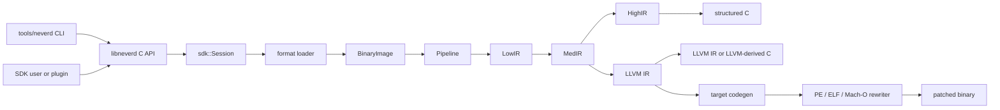

**언어**: [English](architecture.md) | [简体中文](architecture.zh-CN.md) | [繁體中文](architecture.zh-TW.md) | [日本語](architecture.ja.md) | [한국어](architecture.ko.md) | [Français](architecture.fr.md) | [Deutsch](architecture.de.md) | [Español](architecture.es.md) | [Italiano](architecture.it.md) | [Русский](architecture.ru.md) | [العربية](architecture.ar.md)

[← 문서 인덱스](README.ko.md)

# NeverD 아키텍처

이 가이드는 기여자가 NeverD를 안전하게 변경하는 데 필요한 프로덕션 경계를
설명합니다. 의도적으로 NeverD 소유 코드만 다루며 LLVM, Capstone, Unicorn
서브모듈은 각자의 내부 아키텍처를 유지합니다.

## 시스템 경계

NeverD에는 네 가지 IR 표현이 있지만 반드시 네 단계를 모두 거치는 단일 순서는
아닙니다. `LowIR -> MedIR`은 공통입니다. 구조화 디컴파일은
`MedIR -> HighIR -> C`를 사용하고, `lift`, `decompile --llvm`, `patch`는
`MedIR -> LLVM IR`로 직접 이동합니다. 특히 patch와 lift 모드는 의도적으로
HighIR을 건너뜁니다.

CLI는 `tools/neverd`에서 명령을 파싱하고 `neverd_session_t`를 만든 뒤
`include/neverd/sdk/NeverDCAPI.h`의 공개 API를 호출합니다. 엔진 상태는
`lib/sdk/SessionImpl.h`에 있습니다. `neverd_session_load`가 loader를 선택해
`BinaryImage`를 만들고, IR 기반 작업은 필요할 때 `lib/pipeline/Pipeline.cpp`를
실행합니다. `neverd` 실행 파일은 `neverd_shared`에 링크되며, 구성 요소 archive와
LLVM/Capstone 의존성은 공유 라이브러리의 비공개 구현 세부 사항입니다. CLI는 명령줄
UI에 LLVM Support를 사용하지만 엔진을 구동할 때 C API를 우회하지 않습니다.

## IR 표현 및 경로

| 표현 | 목적 | 주요 정의 및 변환 |
|------|------|-------------------|
| LowIR | 아키텍처 독립 `NdOp` 연산, 기본 블록, CFG, jump-table 메타데이터 | `include/neverd/ir/low`, `lib/ir/low`; `lib/decode` + `lib/lift`가 생성 |
| MedIR | 타입, ABI/호출 규약, 메모리/스택 모델, 플래그, 호출, SSA 유사 데이터 흐름 | `include/neverd/ir/med`, `lib/ir/med` |
| HighIR | 읽기 쉬운 C를 위한 구조화 표현식과 제어 흐름 | `include/neverd/ir/high`, `lib/ir/high`; `lib/backend/c/HighC`가 출력 |
| LLVM IR | 최적화, LLVM 유래 C, 대상 코드 생성, 바이너리 재작성 입력 | `lib/backend/llvm`; `lib/pipeline`이 최적화/조정 |

| 사용자 경로 | 표현 경로 | 출력 |
|-------------|-----------|------|
| Low/Med dump | Binary -> LowIR, 선택적으로 -> MedIR | 진단 텍스트 |
| High dump 또는 `decompile` | Binary -> LowIR -> MedIR -> HighIR | HighIR 또는 구조화 C |
| `lift` | Binary -> LowIR -> MedIR -> LLVM IR | `.ll` |
| `decompile --llvm` | Binary -> LowIR -> MedIR -> LLVM IR | LLVM 유래 C |
| `patch` | Binary -> LowIR -> MedIR -> LLVM IR -> codegen | 재작성 바이너리 |

경로 선택의 기준은 `lib/pipeline/Pipeline.cpp`입니다. 표현별 로직은 소유한 IR 또는
backend 라이브러리에 두고, pipeline은 알고리즘을 흡수하지 말고 해당 구성 요소를
조정해야 합니다.

## 구성 요소 맵

각 구성 요소는 `add_neverd_component_library`가 만드는 정적 archive입니다. 표에는
주요 NeverD 의존성만 나열하며 CMake helper가 공통 제공하는 LLVM과 Capstone
라이브러리는 모두 열거하지 않습니다.

| 디렉터리 | 책임 | 주요 의존성 |
|----------|------|-------------|
| `lib/loader` | 포맷 감지, PE/COFF·ELF·Mach-O 로드, 정규화된 `BinaryImage`, 함수 탐지 | LLVM Object API |
| `lib/lift` | 수작업 x86/i386·AArch64·ARM32 명령어 의미론 | IR 데이터 타입 |
| `lib/decode` | Capstone/native 디코드 및 아키텍처 lifter로 디스패치 | `NeverDIR`, `NeverDLift` |
| `lib/ir` | 공통 타입과 LowIR·MedIR·HighIR·intrinsic 정의/변환 | 네 IR 하위 구성 요소 |
| `lib/pipeline` | 함수 감지와 Low/Med/High/LLVM 경로 조정 | IR, decode, lift, LLVM backend, 디버그 정보, IR pass |
| `lib/backend/c` | HighIR-to-C 및 LLVM-IR-to-C 렌더링 | IR |
| `lib/backend/llvm` | MedIR-to-LLVM lowering | IR |
| `lib/backend/codegen` | 대상 코드 생성과 PE/ELF/Mach-O patch 및 in-place 재작성 | IR, loader |
| `lib/sdk` | 공개 C ABI, session 수명 주기, query, 지속성, 플러그인, lift/decompile/patch 진입점 | 엔진 구성 요소를 `libneverd`로 집계 |
| `lib/pass` | LLVM IR 난독화 pass와 MIR pass runner | IR |
| `lib/debug` | DWARF, PDB, linker-map 디버그 context | IR |
| `lib/sigs` | 시그니처 파싱, 데이터베이스, 매칭 | Loader |
| `lib/libc` | 알려진 libc 이름과 호출 모델 지원 | 독립 구성 요소 |
| `lib/Support` | 공유 바이너리 로드 helper | Loader |

공개 헤더는 `include/neverd` 아래에서 이 영역들을 반영합니다. 내부 C++ 클래스가
실수로 SDK의 일부가 되지 않게 하세요. 안정적인 외부 작업은 순수 C 헤더와 책임이
분명한 `lib/sdk/NeverDCAPI*.cpp` 파일 중 하나에 두어야 합니다.

## strict lifting 계약

`Decoder`와 각 아키텍처 lifter는 strict 모드로 시작합니다. Capstone이 명령어를
디코드할 수 있지만 선택된 lifter에 구현이 없으면 lifter는
`UnliftedInstruction`을 던집니다. 예외에는 명령어 주소, mnemonic, operand 문자열이
기록되므로 미지원 의미론은 누락하거나 추측하지 않고 분명하게 실패해야 합니다.

내부 non-strict 경로는 `NdOp::NOP`을 출력하지만 이는 진단용 탈출구일 뿐 명령어의
허용 가능한 구현이 아닙니다. 기여자와 CI 테스트는 strict 모드를 유지해야 합니다.
strict 실패가 나타나면:

1. 가장 작은 아키텍처별 fixture로 재현합니다.
2. `lib/lift/<ISA>`에 누락된 의미론을 추가합니다.
3. `unittests/lift`에서 예상 LowIR 모양을 검증합니다.
4. 명령어에 관측 가능한 동작이 있으면 `unittests/semantic`에 Unicorn 차등 왕복을 추가합니다.

pipeline을 계속 진행하려고 `UnliftedInstruction`을 잡지 마세요. 새로운 의도적 근사는
명시적인 계약과 테스트가 필요하며 1:1 lifting인 것처럼 보여서는 안 됩니다.

## 포맷 및 ISA 소유권

입력 포맷 로직과 출력 재작성 로직은 의도적으로 분리되어 있습니다.

| 포맷 | 로드, 메타데이터, 입력 relocation | Patch 및 출력 relocation |
|------|----------------------------------|--------------------------|
| PE/COFF | `lib/loader/COFF` | `lib/backend/codegen/COFF` |
| ELF | `lib/loader/ELF` | `lib/backend/codegen/ELF` |
| Mach-O | `lib/loader/MachO` | `lib/backend/codegen/MachO` |

아키텍처 lifter는 `lib/lift/X86`, `lib/lift/AArch64`, `lib/lift/ARM`에 있습니다.
해당 공개 lifter/register 선언은 `include/neverd/lift`에 있습니다. 대상별 LLVM 출력과
코드 생성은 `lib/backend/llvm/<ISA>` 및 `lib/backend/codegen/CodeGen<ISA>.cpp`에
있습니다.

### 지원 및 테스트 깊이

루트 지원 매트릭스는 각 셀이 구현되었다는 뜻입니다. 모든 opcode, ABI 경계 사례,
바이너리 제작 도구 또는 운영체제 버전을 빠짐없이 테스트했다는 뜻은 아닙니다. strict
모드는 아직 추가되지 않은 명령어 coverage를 위한 guardrail입니다.

12개 포맷×아키텍처 셀 모두
`unittests/semantic/PatchFullSubstRTTests.cpp`에서 의미론적 재작성 backend
coverage를 갖습니다. 통합 깊이는 다음과 같습니다.

| 포맷 | x86-64 | i386 | AArch64 | ARM32 |
|------|--------|------|---------|-------|
| PE/COFF | 링크된 fixture | backend grid | 링크된 fixture | 링크된 Thumb fixture |
| ELF | 링크된 fixture + 의미론 왕복 | object pipeline + 의미론 왕복 | 링크된 fixture + 의미론 왕복 | 링크된 fixture + 의미론 왕복 |
| Mach-O | 링크된 fixture\* | PIC/no-PIC object pipeline\* | 링크된 fixture\* | backend grid |

- **링크된 fixture**는 대표 프로그램의 링크된 실행 파일에 대해 loader/pipeline과
  patch 동작을 검증합니다.
- **object pipeline**은 재배치 가능 object의 로드, 모든 IR 단계, 디컴파일을
  검증하지만 host linking과 patch된 바이너리 실행은 포함하지 않습니다.
- **backend grid**는 정확한 재작성 코드 생성 경로로 대표 IR을 컴파일하고 Unicorn에서
  동작을 비교합니다. 링크된 실행 파일에 해당 포맷 loader를 실행하지는 않습니다.
- `*` Mach-O 링크 fixture는 요청 대상을 생성할 수 있는 host toolchain에 의존합니다.
  현대 macOS는 과거 i386 실행 파일을 링크할 수 없으므로 i386은 PIC/no-PIC thin
  object와 재작성 grid를 사용합니다.

링크된 fixture 셀은 해당 대표 프로그램에 대해 현재 가장 강한 포맷 통합 증거입니다.
object pipeline과 backend grid 셀은 부분적인 포맷 통합 coverage입니다. 아무 셀도
제한 없이 “완전히 테스트됨”이라 할 수 없으며 ISA coverage의 완전성을 주장하지 않습니다.

주요 근거는 링크된 ELF/PE fixture를 위한
[`PatchFormatTests.cpp`](../unittests/lift/PatchFormatTests.cpp), Windows ARM 로드/
디컴파일을 위한
[`COFFARMFormatTests.cpp`](../unittests/lift/COFFARMFormatTests.cpp), i386 thin
object를 위한
[`MachOI386RelocationTests.cpp`](../unittests/lift/MachOI386RelocationTests.cpp),
링크된 Mach-O를 위한
[`X86_64_PipelineE2ETests.cpp`](../unittests/lift/X86_64_PipelineE2ETests.cpp)와
[`AArch64_PipelineE2ETests.cpp`](../unittests/lift/AArch64_PipelineE2ETests.cpp),
12셀 backend grid를 위한
[`PatchFullSubstRTTests.cpp`](../unittests/semantic/PatchFullSubstRTTests.cpp)입니다.
명령은 [테스트 가이드](testing.ko.md)를 참고하세요.

## 수정 위치

| 변경 | 시작 위치 | 최소 집중 검증 |
|------|-----------|----------------|
| 명령어 추가/수정 | `lib/lift/X86`, `AArch64`, `ARM`의 해당 파일; 디스패치 변경 시 공개 lifter 헤더 | `unittests/lift`의 아키텍처 테스트, `unittests/semantic`의 의미론 왕복 |
| `NdOp` 추가 | `include/neverd/ir/NdOps.h`, 이후 Low-to-Med, emitter/renderer, verifier/emulator, dump 점검 | `NeverDLiftTests` + 관련 `NeverDSemanticTests` 사례 |
| CFG 또는 함수 감지 변경 | `lib/ir/low`, `lib/loader/FunctionDiscovery*.cpp`, `lib/pipeline/PipelineFuncDetect.cpp` | lift CFG/jump-table 테스트 및 집중 의미론 변환 스위트 |
| PE 입력 relocation/unwind 규칙 추가 | `lib/loader/COFF` | `COFFARMFormatTests` 또는 새 집중 loader fixture |
| PE 출력 relocation/patch 규칙 추가 | `lib/backend/codegen/COFF` | `PatchFormatTests`, `RewriteCodegenRTTests`, PE backend grid |
| ELF/Mach-O 포맷 동작 변경 | 해당 `lib/loader/<Format>` 및/또는 `lib/backend/codegen/<Format>` 디렉터리 | 해당 포맷 테스트와 재작성 grid |
| MedIR/ABI 복구 변경 | `lib/ir/med` | 호출 규약 lift 테스트 + ISA 교차 의미론 왕복 |
| 구조화 제어 흐름 복구 변경 | `lib/ir/high` | `NeverDCFGLoopXformTests` 및 구조화 C 테스트 |
| LLVM 변환 추가 | `lib/pass/ir`, `include/neverd/pass/ir`의 공개 헤더, 노출 시 pipeline toggle | 집중 변환 스위트 + patch 출력 변경 시 `NeverDPatchFullTests` |
| C API 작업 추가 | `include/neverd/sdk/NeverDCAPI.h`, 집중된 `lib/sdk/NeverDCAPI*.cpp`, 상태에만 `SessionImpl.h` 사용 | SDK/CLI 의미론 테스트, `neverd_last_error` 및 할당 규약 유지 |
| CLI 명령 추가 | `tools/neverd/NeverDCLIOptions.cpp`, `NeverDCLI.h`, 집중된 `NeverDCmd*.cpp`, `neverd.cpp`의 디스패치 | `unittests/semantic/CLIEndToEndTests.cpp` 및 직접 CLI smoke test |
| 의미론 회귀 추가 | 집중된 `unittests/semantic/*Tests.cpp`; 새 파일을 `unittests/semantic/CMakeLists.txt`에 등록 | 테스트 바이너리를 빌드하고 `ctest -R`로 이름 있는 사례 선택 |

변경 범위를 좁게 유지하세요. 표현을 정의하는 파일은 해당 변환과 함께 바뀔 수 있지만,
큰 리팩터링을 균일하게 보이게 하려고 관련 없는 loader, lifter, backend를 수정하지 마세요.
