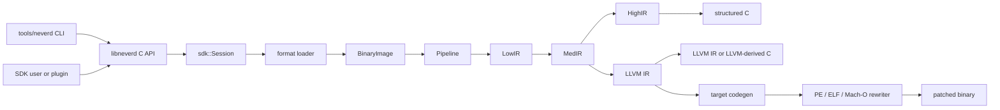

**언어**: [English](architecture.md) | [简体中文](architecture.zh-CN.md) | [繁體中文](architecture.zh-TW.md) | [日本語](architecture.ja.md) | [한국어](architecture.ko.md) | [Français](architecture.fr.md) | [Deutsch](architecture.de.md) | [Español](architecture.es.md) | [Italiano](architecture.it.md) | [Русский](architecture.ru.md) | [العربية](architecture.ar.md)

[← 문서 인덱스](README.ko.md)

# NeverD 아키텍처

이 가이드는 기여자가 NeverD를 안전하게 변경하는 데 필요한 프로덕션 경계를
설명합니다. 의도적으로 NeverD 소유 코드만 다루며 LLVM, Capstone, Unicorn
서브모듈은 각자의 내부 아키텍처를 유지합니다.

## 시스템 경계

NeverD에는 네 가지 IR 표현이 있지만 반드시 네 단계를 모두 거치는 단일 순서는
아닙니다. `LowIR -> MedIR`은 공통입니다. 구조화 디컴파일은
`MedIR -> HighIR -> C`를 사용하고, `lift`, `decompile --llvm`, `patch`는
`MedIR -> LLVM IR`로 직접 이동합니다. 특히 patch와 lift 모드는 의도적으로
HighIR을 건너뜁니다.

CLI는 `tools/neverd`에서 명령을 파싱하고 `neverd_session_t`를 만든 뒤
`include/neverd/sdk/NeverDCAPI.h`의 공개 API를 호출합니다. 엔진 상태는
`lib/sdk/SessionImpl.h`에 있습니다. `neverd_session_load`가 loader를 선택해
`BinaryImage`를 만들고, IR 기반 작업은 필요할 때 `lib/pipeline/Pipeline.cpp`를
실행합니다. `neverd` 실행 파일은 `neverd_shared`에 링크되며, 구성 요소 archive와
LLVM/Capstone 의존성은 공유 라이브러리의 비공개 구현 세부 사항입니다. CLI는 명령줄
UI에 LLVM Support를 사용하지만 엔진을 구동할 때 C API를 우회하지 않습니다.

## IR 표현 및 경로

| 표현 | 목적 | 주요 정의 및 변환 |
|------|------|-------------------|
| LowIR | 아키텍처 독립 `NdOp` 연산, 기본 블록, CFG, jump-table 메타데이터 | `include/neverd/ir/low`, `lib/ir/low`; `lib/decode` + `lib/lift`가 생성 |
| MedIR | 타입, ABI/호출 규약, 메모리/스택 모델, 플래그, 호출, SSA 유사 데이터 흐름 | `include/neverd/ir/med`, `lib/ir/med` |
| HighIR | 읽기 쉬운 C를 위한 구조화 표현식과 제어 흐름 | `include/neverd/ir/high`, `lib/ir/high`; `lib/backend/c/HighC`가 출력 |
| LLVM IR | 최적화, LLVM 유래 C, 대상 코드 생성, 바이너리 재작성 입력 | `lib/backend/llvm`; `lib/pipeline`이 최적화/조정 |

| 사용자 경로 | 표현 경로 | 출력 |
|-------------|-----------|------|
| Low/Med dump | Binary -> LowIR, 선택적으로 -> MedIR | 진단 텍스트 |
| High dump 또는 `decompile` | Binary -> LowIR -> MedIR -> HighIR | HighIR 또는 구조화 C |
| `lift` | Binary -> LowIR -> MedIR -> LLVM IR | `.ll` |
| `decompile --llvm` | Binary -> LowIR -> MedIR -> LLVM IR | LLVM 유래 C |
| `patch` | Binary -> LowIR -> MedIR -> LLVM IR -> codegen | 재작성 바이너리 |

경로 선택의 기준은 `lib/pipeline/Pipeline.cpp`입니다. 표현별 로직은 소유한 IR 또는
backend 라이브러리에 두고, pipeline은 알고리즘을 흡수하지 말고 해당 구성 요소를
조정해야 합니다.

## 교차 아키텍처 변환 계약

`include/neverd/translate`는 실행 backend가 아닌 계약 계층을 정의합니다.
`GuestState`는 `x86_32`, `x86_64`, `AArch64`, `ARM32`의 아키텍처 독립적이고
머신에서 관찰 가능한 상태를 모델링합니다. 정규 version 1 직렬화는 고정 폭
little-endian 필드, 안정적인 레지스터 ID, 정렬된 컬렉션, fail-closed 검증을 사용하므로
지속된 상태가 호스트 C++ 레이아웃에 의존하지 않습니다.

`GuestState`의 wire v1 baseline은 영구히 동결됩니다. 이 baseline 밖의 상태는 확장
범위의 extension-register ID와 정규 소문자 이름을 함께 사용하거나, 명시적 upgrader를
갖춘 새 wire version으로 옮겨야 합니다. v1 baseline을 제자리에서 변경하는 것은
금지됩니다.

`ARM32` guest에서는 `ExecutionMode`가 권위 있는 decode mode이며 `CPSR.T`와
일치해야 합니다. 저장되는 PC는 항상 bit 0을 지운 정규 명령어 주소이고, ARM
mode에서는 추가로 word alignment를 만족해야 합니다.

아키텍처 쌍 정책은 `x86_64 -> AArch64`, `AArch64 -> x86_64`,
`x86_32 -> AArch64/ARM32`, `ARM32 -> x86_32/x86_64`를 정의합니다.
`ContractDefined`는 요청을 검증하고 지속할 수 있다는 뜻이며 코드를 변환하거나
실행할 수 있다는 뜻은 아닙니다. JIT 정책은 실행 중인 프로세스의 native host만
허용하고, AOT 정책은 호스트 아키텍처와 target triple을 명시하도록 요구합니다.
CPU 또는 feature set을 선택하는 경우에도 명시해야 합니다.

`ResolvedHostTarget`은 이 선택을 구체적인 결과로 해석합니다. `Native` 해석은 현재
process에서 triple, CPU, 활성/비활성 feature set을 가져옵니다. `Explicit` 해석은
호출자가 제공한 architecture, triple, CPU, feature를 검증하고 정규화하며 충돌하는
입력을 거부합니다. version이 있는 cache identity는 정규화된 target input을 결정적인
byte 순서로 구성하며 process address나 locale 의존 text를 포함하지 않습니다.

version이 있는 `TranslationExit`는 안정적인 중지 이유와 그에 대응하는 typed payload를
기록합니다. syscall, 예외 또는 signal, breakpoint, 미지원 명령어, self-modification,
리소스 budget, 외부 호출, memory fault 및 그 밖의 종료 조건을 다룹니다. 따라서
소비자는 중지 이유에 따라 타입 없는 정수를 다시 해석할 필요가 없습니다.

대응하는 `BudgetExhausted` 경우를 제외하면 결과가 보고하는 instruction, block,
generated-code count는 요청의 대응하는 0이 아닌 budget을 초과할 수 없습니다.
instruction과 block 고갈은 limit에서 정확히 멈춥니다. 생성 object 크기는 나눌 수 없는
codegen이 끝난 뒤에만 정확히 측정되므로 해당 고갈 결과는 `Observed > Limit`을 보고할
수 있습니다. 거부된 object는 link, publish, execute되지 않습니다. 모든
`BudgetExhausted` payload는 파생 값이나 구현 전용 임계값이 아니라 요청 limit을 정확히
식별합니다.

backend-private `RuntimeControlBlockV1` 계약은 정확히 128 byte이고
8 byte alignment를 사용하며 고정된 v1 magic, version, size, field offset, 0인 reserved
field, 일관된 typed exit로 제약됩니다. C++ container, host pointer, guest address alias를
포함하지 않으며 `GuestState`의 C++ layout이나 wire format도 아닙니다. 이 계약을 구현하는
backend는 상태를 이 record로 명시적으로 변환해야 합니다.

고정 v1 generated-code 호출 표면에는 정확히 8개의 helper만 있습니다:
`nvd_rt_v1_load8_le`, `nvd_rt_v1_load16_le`, `nvd_rt_v1_load32_le`,
`nvd_rt_v1_load64_le`, `nvd_rt_v1_store8_le`, `nvd_rt_v1_store16_le`,
`nvd_rt_v1_store32_le`, `nvd_rt_v1_store64_le`. 이름, signature, pointer provenance는
정확히 일치해야 하며 backend는 이 유한 table을 명시적으로 bind하고 ambient symbol
resolution으로 fallback해서는 안 됩니다. executable generation 검증과
budget/cancellation polling은 신뢰된 dispatcher만 수행하는 작업입니다.
`nvd_rt_v1_validate_generation`과 `nvd_rt_v1_poll`은 generated-code helper가 아닙니다.
신뢰된 host dispatcher는 block 선택도 소유하며 생성 IR에서 호출할 수 없습니다.
translated block은 대신 typed exit code를 반환합니다. 생성 IR은 선언된
scalar-result runtime slot만 직접 읽을 수 있습니다.

`RuntimeSymbolRegistryV1`은 이 helper table을 닫힌 host-side registry로 구현합니다.
생성 시 완전한 ABI-v1 집합, 정확한 canonical name, helper class, signature, 그리고 각
entry에 class와 일치하는 non-null function pointer가 정확히 하나 있는지 검증합니다.
lookup은 완전 일치하는 이름만 허용하고 process 환경이나 dynamic loader의 symbol을
조회하지 않으며 object verifier allowlist에 동일한 정렬된 이름을 제공합니다. version이
있는 identity는 이름, helper class, ABI shape를 포함하지만 native address는 의도적으로
제외하므로 ASLR과 무관합니다.

`RuntimeCodeMemory`는 page 단위로 격리된 generated-code storage를 소유하며 단방향
`RW -> RX` publication만 허용합니다. memory는 동시에 writable 및 executable이 될 수
없고 publication 뒤에 write 가능 상태로 되돌릴 수도 없습니다. write와 entry offset은
bounds-check되며 publication 시 host instruction cache를 invalidation합니다. native
smoke test는 publication 이후 작은 host instruction sequence만 실행합니다. 이는 W^X
memory boundary만 증명할 뿐 translation engine을 증명하지 않습니다.

`GuestMemoryRuntime`는 논리적 `GuestState`와 격리됩니다. 생성 시 state를 검증하고
region byte와 metadata를 정렬된 private index로 복사합니다. guest virtual address는
lookup key일 뿐이며 host pointer로 변환되지 않습니다. 검사된 scalar access는 width,
alignment, overflow, unmapped, cross-region, permission, executable-write, generation
overflow/mismatch, policy fault를 typed 결과로 보고합니다. instruction/block budget,
cancellation, generation tracking과 `RejectExecutableWrites`,
`InvalidateOnExecutableWrite`, `ValidateBeforeDispatch` code-write policy도 암묵적인 host
동작 대신 일관된 typed record를 생성합니다.

`TranslationObjectCompilerV1`은 검증된 LLVM IR-to-object 경계입니다. const input
module을 검증하고 모든 변환 전에 clone하며, proof-gated semantic simplification과
LLVM `O0`~`O3` optimization을 결합한 뒤 final IR을 다시 검증하고 4개의 contract host
architecture용 relocatable ELF, COFF, Mach-O object를 emit합니다. 정확한
target-mangled block/runtime symbol manifest를 canonicalize하고 emit된 모든 object를
audit하며 runtime registry identity와 version이 있는 request/artifact cache key를
반환합니다. generated-byte budget이 0이 아니면 이를 만족하는 object만 artifact
verification으로 진행할 수 있습니다. LLVM은 먼저 private buffer에 나눌 수 없는 emit을
완료해 정확한 크기를 측정합니다. 초과 object는 publish와 artifact audit 전에 거부되며,
typed telemetry는 관측 크기와 요청된 정확한 limit을 보존합니다. 0은 caller policy에서
unlimited를 뜻합니다. compiler는 audit된 relocatable byte까지만 만들며 link, publish,
dispatch, execute 또는 guest instruction lowering을 수행하지 않습니다.

post-codegen verifier는 relocatable ELF, COFF, Mach-O object를 닫힌
집합으로 감사합니다. format과 architecture는 선택한 host와 정확히 일치해야 하고,
undefined symbol은 유한 helper allowlist에 정확히 포함되어야 하며 dynamic symbol은
금지됩니다. relocation은 명시적인 direct whitelist로 제한되고 encoding, width,
alignment, offset, loadable destination, object-local non-preemptible definition 또는
정확히 허용된 helper target을 검사합니다. W+X, unwind/exception 및 initializer
metadata, TLS, IFUNC, GOT와 일반 PLT indirection, dynamic relocation, weak/preemptible
또는 선택 가능한 definition, 알 수 없는 allocated section, linker directive를
거부합니다. LLVM이 hidden x86-64 ELF call에 사용하는 `R_X86_64_PLT32` 표기는 v1
policy가 exact runtime helper로 향하는 sealed direct branch임을 증명할 때만 허용되며,
PLT나 GOT path를 허용하지 않습니다. ELF `ET_REL` artifact에는 program header나
segment가 없어야 합니다. Mach-O load command는 positive list로 제한되며 bit 폭이
일치하는 segment는 정확히 하나, symbol table, dynamic-symbol table, platform-version,
data-in-code command는 각각 최대 하나만 허용하고 의존 관계도 검사합니다. linker
option과 그 밖의 모든 command는 거부됩니다.

`TranslationObjectRequestV1`은 이 계약 위에 구축된 최초의 공개
guest-byte-to-object slice이며 범위를 의도적으로 좁혔습니다. 현재 공개된 fail-closed
x86-64 v1 scalar-register subset에서는 legacy prefix가 없는 canonical encoding만
허용합니다. 즉, 지원되는 register/immediate LowIR 형태를 갖는 REX.W full-width GPR
`MOV`, `ADD`/`SUB`, `AND`/`OR`/`XOR` 형식만 포함합니다. 산술 형식은 기존 scalar flag
계산을 유지하고, 논리 형식은 아키텍처가 정의한 flags를 계산하면서 `AF`를 보존합니다.
canonical `C3` `RET`와 `C2 iw` `RET imm16`은 return block을 종료하고, canonical `EB cb`와
`E9 cd` direct-relative `JMP` encoding은 direct-branch block을 종료합니다. 공개 lowering
schema는 8입니다. canonical이며 legacy prefix가 없는 traditional Jcc는 `JO`/`JNO`의
short `70/71 cb` 또는 near `0F 80/81 cd`, `JB`/`JAE`의 `72/73 cb` 또는
`0F 82/83 cd`, `JE`/`JNE`의 `74/75 cb` 또는 `0F 84/85 cd`, `JBE`/`JA`의
`76/77 cb` 또는 `0F 86/87 cd`, `JS`/`JNS`의 `78/79 cb` 또는 `0F 88/89 cd`,
`JP`/`JNP`의 `7A/7B cb` 또는 `0F 8A/8B cd`, `JL`/`JGE`의 `7C/7D cb` 또는
`0F 8C/8D cd`, `JLE`/`JG`의 `7E/7F cb` 또는 `0F 8E/8F cd`로 제한됩니다.
`JRCXZ`/`JECXZ`/`JCXZ`와 `LOOP`/`LOOPE`/`LOOPNE`는 아직 공개되지 않았으며 fail closed합니다.
출력은 audit된 little-endian AArch64 ELF
또는 Mach-O relocatable object로 제한됩니다. 일반 guest memory operation,
partial-register form, 이 정확한 subset 밖의 모든 instruction/encoding, return, 이러한
direct jump와 위에 공개된 Jcc branch 이외의 control flow 및 lowerer가
구현하지 않은 모든 LowIR operation은 object emission 전에 거부됩니다.
`RET`에 필요한 검사된 return-address read는 terminator contract 내부 동작이며 일반적인
guest-memory lowering을 공개하지 않습니다. request는 block descriptor를 다시 구성해
검증하고, lowering과 object emission에 동일한 resolved target machine을 사용하며,
proof-gated semantic simplification과 LLVM 기본 `O2` optimization pipeline을 결합합니다.
이 slice는 그 밖의 x86-64 instruction, 다른 guest/host pair 또는 AArch64에서 x86-64로의
역방향을 지원한다는 뜻이 아닙니다.

공개 C entry point `neverd_translate_x86_64_block_to_aarch64_object_v1`, Python ctypes
wrapper `translate_x86_64_block_to_aarch64_object`, `neverd translate-object` command는
같은 object-only 경계를 노출합니다. Python은 `TranslationObjectFormat.ELF` 또는
`.MACHO`를 사용합니다. native translation 실패 시 `TranslationErrorCode`를 담은 typed
`TranslationError`를 발생시키고, local argument validation은 `TypeError` 또는
`ValueError`를 발생시킵니다. 성공 시 Python이 소유하는 immutable result를
반환합니다. C result는 object byte, 안정적인 cache identity, optimization telemetry를
소유하며 CLI는 선택한 ELF 또는 Mach-O object만 기록합니다. 세 surface 모두 link,
load, dispatch, execute, debug 전에 멈추며 execution session interface가 아닙니다.

`verifyTranslationLinkGraphV1`은 독립적인 allocation 전 두 번째 감사를 추가합니다. 승인된
AArch64 ELF 또는 Mach-O object에서 임시 LLVM JITLink graph를 만들고 target, section
permission, block/runtime symbol manifest, external-symbol closure, edge kind와 target을
검사합니다. 주소 없는 감사 결과를 만든 뒤 graph는 폐기됩니다. 이 감사를 통과해도
code를 link, allocate, resolve, load, publish, dispatch 또는 execute하지 않습니다.

`linkTranslationObjectV1`은 별도의 native linking 경계입니다. pruning, allocation,
symbol resolution, fixup 전후에 trusted descriptor, raw object, JITLink graph를 다시
감사합니다. runtime symbol은 sealed registry에서만 가져옵니다. dispatcher credential은
유일한 manifest entry를 해당 session, block identity, guest entry PC, cache generation,
code epoch에 결속하고, invoke 시 runtime guest `RIP`도 그 entry와 일치해야 합니다.
finalization에 성공하면 최종 permission으로 executable memory를 publish합니다. unload는
새 invoke를 무효화하고 진행 중인 한 번의 invoke가 끝나기를 기다린 뒤 allocation을
해제합니다. credential-free overload는 audit-only이며 invoke할 수 없습니다.

`NativeTranslationSessionV1`은 이 요소들을 experimental C++ x86-64-to-native-AArch64
execution 경계로 결합합니다. little-endian AArch64 ELF 또는 Mach-O process에서
compile-link-validate-invoke-unload dispatcher loop 전체에 걸쳐 하나의 checked guest-memory
runtime과 고정 guest state를 여러 block 사이에 유지합니다. canonical direct jump는 정확한
static target에서 계속됩니다. 공개된 canonical Jcc branch는 block
manifest가 선언한 taken 또는 fallthrough successor에서만 계속되며 dispatcher는 그 밖의 selected PC를 모두
거부합니다. return은 종료합니다. global instruction, block, generated-object-byte budget은
block 전체에서 정확하게 유지되며 guest가 성공적으로 멈추면 실행된 state와 authoritative
memory를 함께 commit합니다. cancellation은 final commit에 대해 linearize됩니다.

이는 실행 가능한 vertical slice이지 완전한 translator가 아닙니다. 일반 guest-memory
instruction, partial register, 위의 정확한 schema-8 traditional-Jcc slice 밖의 conditional control
flow(`JRCXZ`/`JECXZ`/`JCXZ`와 `LOOP`/`LOOPE`/`LOOPNE` 포함), indirect control flow,
call, floating-point, SIMD, x87, atomic, system instruction, 일반 exception propagation,
block cache, 다른 guest/host pair, 역방향 AArch64-to-x86-64는 아직 지원하지 않습니다.
execution session에는
C, Python, CLI, JSON surface가 없으며 debugging은 별도의 미지원 기능입니다. 위 object API는
native execution을 선택하지 않아도 계속 사용할 수 있습니다.

생성 IR 계약은 이 계약의 적용을 받는 모든 translated block이 hidden 및
non-preemptible이고 C ABI `i32 (ptr state, ptr runtime)`를 사용하도록 요구합니다.
block은 private registry로만 발견되며 프로세스 환경의 symbol lookup에 의존하지
않습니다. block 간 직접 호출도 금지됩니다.

IR verifier는 legalization이 알려진 compiler-runtime libcall을 도입하지 않도록 정수
폭을 호스트 scalar register 폭 이하로 제한합니다. 다만 이는 필요조건일 뿐입니다.
이 계약을 구현하는 모든 실행 backend는 post-codegen control transfer, `MachineIR`,
target object의 relocation을 동일한 유한 runtime-symbol allowlist에 대해 정확히
감사해야 합니다.

TranslationIR의 직접 load/store와 private constant가 보관하는 값에는 호스트
scalar-register 폭 이하인 단일 scalar integer만 허용됩니다. aggregate는 verifier
경계 전에 scalarize하여 압축된 IR이 backend에서 무제한 확장을 유발하지 않게 해야 합니다.

generated-code ABI는 scalar integer에 대해서만 정의됩니다. 부동소수점, SIMD, x87,
atomic 및 system instruction은 이 계약의 범위 밖입니다. `ProvenSemanticAndLLVM`을
선택하는 구현은 NeverD의 proof-gated semantic simplification을 LLVM 최적화와의 공동
fixed point까지 실행해야 합니다. 이 정책 자체는 실행 가능한 translation backend를
제공하지 않습니다.

## 예외 재작성 경계

Mach-O compact unwind에는 원본 `__unwind_info`용 strict parser, 생성된
`__LD,__compact_unwind` record용 fixup-aware parser, 원본/생성 range의 정확한 merge,
regular page용 deterministic encoder와 transactional 최종 section installer가 있습니다.
installer는 기존 file-backed `__TEXT,__unwind_info`가 encoded table을 수용할 때만
in-place로 다시 씁니다. architecture, layout, byte preimage를 재검증하고 사용하지 않은
tail을 0으로 지운 뒤, 바깥 Mach-O transaction이 한 번 commit되기 전에 결과를 다시 parse해
semantic equivalence를 확인합니다. 생성 record는 compiler가 정확히 기록한 IR source
function→target MC owner symbol 매핑(private definition 포함, object-format prefix나 mangling
추측 없음), opaque한 0이 아닌 range ID, 정확한 반개구간 fragment range로 인증됩니다. 생성된
각 FDE는 정확히 하나의 인증된 fragment와 일치해야 하고, 필요한 각 fragment도 해당
transaction이 install한 정확히 하나의 FDE와 일치해야 합니다. 단, 엄격한 encoding 검증을
통과한 정확한 non-DWARF compact record가 덮는 경우는 예외입니다. 같은 function 소유의
인접하거나 떨어진 fragment는 하나의 source recipe를 재사용할 수 있지만, 누락·중복·dangling·
cross-owner 또는 boundary 불일치 identity는 출력 변경 전에 실패합니다. 새 RX segment는
`__LINKEDIT`가 유일하고 file/VM 끝에 있으며 offset shift가 overflow checked이고 최종 file/VM
layout의 strict replay가 성공했음을 증명한 뒤에만 commit됩니다. 최종 section이 없으면 생성된
compact record를 install하지 않고 아래의 정확하고 인증된 DWARF-FDE 폐쇄를 통과할 때만
transaction을 계속할 수 있습니다. 기존 최종 section의 용량이 부족하거나 malformed이면 계속
fail closed하며, link된 native throw/catch 증명은 아직 남아 있습니다.

ARM32 compact unwind에서 encoding에 포함된 stack adjustment와 GPR layout은 `Complete`입니다.
D-register pattern selector 0~3도 `Complete`이지만, 4~7은 compact word만으로 runtime-aligned
CFA-relative slot을 모두 증명할 수 없어 `Partial`입니다. `Partial` entry는 분석을 위해 증명된
register identity를 유지할 수 있지만 모든 rewrite path가 fail closed로 거부합니다. 각
EH-frame install receipt는 target architecture, pointer width, byte order를 정확히 결속하며,
compact-unwind DWARF binding은 receipt target identity 불일치를 거부합니다.

상위 ARM32 section transaction의 범위는 compact-unwind decoder보다 좁습니다.
Mach-O header가 정확히 `CPU_SUBTYPE_ARM_V7K`이고 원본 symbol table의
`N_ARM_THUMB_DEF` bit가 필요한 모든 function을 Thumb code로 명시적으로 인증할
때만 이 경로가 활성화됩니다. 이후 정확한 `thumbv7k-apple-watchos` triple과 Thumb
mode가 code generation 전체에 결속되며, 입력 feature 요구 사항은 Cortex-A7 한계를
초과할 수 없습니다. flag가 없거나 mode를 알 수 없는 function, generic non-v7k
subtype, ARM mode, 혼합되거나 알 수 없는 external-code target, ARM Mach-O in-place
entry point, C source 기반 ARM Mach-O patch는 출력 변경 전에 모두 fail closed로
거부됩니다. function discovery가 `LC_FUNCTION_STARTS`에만 의존하는 stripped input은
아직 지원하지 않습니다.

PE, ELF, Mach-O에는 각각 format별 예외 component가 있지만 NeverD는 모든 format과 모든
exception type을 포괄하는 end-to-end rewrite pipeline을 아직 공개하지 않습니다. 지원하지
않는 encoding 또는 해결되지 않은 registration/layout 요구 사항은 출력 변경 전에
실패해야 하며, 현재의 부분적인 format 지원을 완전한 예외 재작성 폐쇄로 표현하면 안 됩니다.

## 구성 요소 맵

각 구성 요소는 `add_neverd_component_library`가 만드는 정적 archive입니다. 표에는
주요 NeverD 의존성만 나열하며 CMake helper가 공통 제공하는 LLVM과 Capstone
라이브러리는 모두 열거하지 않습니다.

| 디렉터리 | 책임 | 주요 의존성 |
|----------|------|-------------|
| `lib/loader` | 포맷 감지, PE/COFF·ELF·Mach-O 로드, 정규화된 `BinaryImage`, 함수 탐지 | LLVM Object API |
| `lib/lift` | 수작업 x86/i386·AArch64·ARM32 명령어 의미론 | IR 데이터 타입 |
| `lib/decode` | Capstone/native 디코드 및 아키텍처 lifter로 디스패치 | `NeverDIR`, `NeverDLift` |
| `lib/ir` | 공통 타입과 LowIR·MedIR·HighIR·intrinsic 정의/변환 | 네 IR 하위 구성 요소 |
| `lib/pipeline` | 함수 감지와 Low/Med/High/LLVM 경로 조정 | IR, decode, lift, LLVM backend, 디버그 정보, IR pass |
| `lib/backend/c` | HighIR-to-C 및 LLVM-IR-to-C 렌더링 | IR |
| `lib/backend/llvm` | MedIR-to-LLVM lowering | IR |
| `lib/backend/codegen` | 대상 코드 생성과 PE/ELF/Mach-O patch 및 in-place 재작성 | IR, loader |
| `lib/sdk` | 공개 C ABI, session 수명 주기, query, 지속성, 플러그인, lift/decompile/patch 진입점 | 엔진 구성 요소를 `libneverd`로 집계 |
| `lib/pass` | LLVM IR 난독화 pass와 MIR pass runner | IR |
| `lib/debug` | DWARF, PDB, linker-map 디버그 context | IR |
| `lib/sigs` | 시그니처 파싱, 데이터베이스, 매칭 | Loader |
| `lib/libc` | 알려진 libc 이름과 호출 모델 지원 | 독립 구성 요소 |
| `lib/support` | 공유 바이너리 로드 helper | Loader |
| `lib/translate` | version이 있는 guest state/policy/exit, 고정 runtime ABI, 검사된 guest memory, 생성 IR/object/LinkGraph audit, sealed native linking, experimental x86-64-to-AArch64 C++ dispatcher | IR, LLVM, LLVM Object 및 JITLink 계약 |

공개 헤더는 `include/neverd` 아래에서 이 영역들을 반영합니다. 내부 C++ 클래스가
실수로 SDK의 일부가 되지 않게 하세요. 안정적인 외부 작업은 순수 C 헤더와 책임이
분명한 `lib/sdk/NeverDCAPI*.cpp` 파일 중 하나에 두어야 합니다.

## strict lifting 계약

`Decoder`와 각 아키텍처 lifter는 strict 모드로 시작합니다. Capstone이 명령어를
디코드할 수 있지만 선택된 lifter에 구현이 없으면 lifter는
`UnliftedInstruction`을 던집니다. 예외에는 명령어 주소, mnemonic, operand 문자열이
기록되므로 미지원 의미론은 누락하거나 추측하지 않고 분명하게 실패해야 합니다.

내부 non-strict 경로는 `NdOp::NOP`을 출력하지만 이는 진단용 탈출구일 뿐 명령어의
허용 가능한 구현이 아닙니다. 기여자와 CI 테스트는 strict 모드를 유지해야 합니다.
strict 실패가 나타나면:

1. 가장 작은 아키텍처별 fixture로 재현합니다.
2. `lib/lift/<ISA>`에 누락된 의미론을 추가합니다.
3. `unittests/lift`에서 예상 LowIR 모양을 검증합니다.
4. 명령어에 관측 가능한 동작이 있으면 `unittests/semantic`에 Unicorn 차등 왕복을 추가합니다.

pipeline을 계속 진행하려고 `UnliftedInstruction`을 잡지 마세요. 새로운 의도적 근사는
명시적인 계약과 테스트가 필요하며 1:1 lifting인 것처럼 보여서는 안 됩니다.

## 포맷 및 ISA 소유권

입력 포맷 로직과 출력 재작성 로직은 의도적으로 분리되어 있습니다.

| 포맷 | 로드, 메타데이터, 입력 relocation | Patch 및 출력 relocation |
|------|----------------------------------|--------------------------|
| PE/COFF | `lib/loader/COFF` | `lib/backend/codegen/COFF` |
| ELF | `lib/loader/ELF` | `lib/backend/codegen/ELF` |
| Mach-O | `lib/loader/MachO` | `lib/backend/codegen/MachO` |

아키텍처 lifter는 `lib/lift/X86`, `lib/lift/AArch64`, `lib/lift/ARM`에 있습니다.
해당 공개 lifter/register 선언은 `include/neverd/lift`에 있습니다. 대상별 LLVM 출력과
코드 생성은 `lib/backend/llvm/<ISA>` 및 `lib/backend/codegen/CodeGen<ISA>.cpp`에
있습니다.

### 지원 및 테스트 깊이

루트 지원 매트릭스는 각 셀이 구현되었다는 뜻입니다. 모든 opcode, ABI 경계 사례,
바이너리 제작 도구 또는 운영체제 버전을 빠짐없이 테스트했다는 뜻은 아닙니다. 명령어
의미론이 lifter의 구현된 coverage 밖에 있으면 strict 모드는 fail-closed로 중지합니다.

12개 포맷×아키텍처 셀 모두
`unittests/semantic/PatchFullSubstRTTests.cpp`에서 의미론적 재작성 backend
coverage를 갖습니다. 통합 깊이는 다음과 같습니다.

| 포맷 | x86-64 | i386 | AArch64 | ARM32 |
|------|--------|------|---------|-------|
| PE/COFF | 링크된 fixture | backend grid | 링크된 fixture | 링크된 Thumb fixture |
| ELF | 링크된 fixture + 의미론 왕복 | object pipeline + 의미론 왕복 | 링크된 fixture + 의미론 왕복 | 링크된 fixture + 의미론 왕복 |
| Mach-O | 링크된 fixture\* | PIC/no-PIC object pipeline\* | 링크된 fixture\* | backend grid |

- **링크된 fixture**는 대표 프로그램의 링크된 실행 파일에 대해 loader/pipeline과
  patch 동작을 검증합니다.
- **object pipeline**은 재배치 가능 object의 로드, 모든 IR 단계, 디컴파일을
  검증하지만 host linking과 patch된 바이너리 실행은 포함하지 않습니다.
- **backend grid**는 정확한 재작성 코드 생성 경로로 대표 IR을 컴파일하고 Unicorn에서
  동작을 비교합니다. 링크된 실행 파일에 해당 포맷 loader를 실행하지는 않습니다.
- `*` Mach-O 링크 fixture는 요청 대상을 생성할 수 있는 host toolchain에 의존합니다.
  현대 macOS는 과거 i386 실행 파일을 링크할 수 없으므로 i386은 PIC/no-PIC thin
  object와 재작성 grid를 사용합니다.

링크된 fixture 셀은 해당 대표 프로그램에 대해 가장 강한 포맷 통합 증거입니다.
object pipeline과 backend grid 셀은 부분적인 포맷 통합 coverage입니다. 아무 셀도
제한 없이 “완전히 테스트됨”이라 할 수 없으며 ISA coverage의 완전성을 주장하지 않습니다.

주요 근거는 링크된 ELF/PE fixture를 위한
[`PatchFormatTests.cpp`](../unittests/lift/format/PatchFormatTests.cpp), Windows ARM 로드/
디컴파일을 위한
[`COFFARMFormatTests.cpp`](../unittests/lift/format/COFFARMFormatTests.cpp), i386 thin
object를 위한
[`MachOI386RelocationTests.cpp`](../unittests/lift/format/MachOI386RelocationTests.cpp),
링크된 Mach-O를 위한
[`X86_64_PipelineE2ETests.cpp`](../unittests/lift/x86_64/X86_64_PipelineE2ETests.cpp)와
[`AArch64_PipelineE2ETests.cpp`](../unittests/lift/aarch64/AArch64_PipelineE2ETests.cpp),
12셀 backend grid를 위한
[`PatchFullSubstRTTests.cpp`](../unittests/semantic/probe/patchfull/PatchFullSubstRTTests.cpp)입니다.
명령은 [테스트 가이드](testing.ko.md)를 참고하세요.

## 수정 위치

| 변경 | 시작 위치 | 최소 집중 검증 |
|------|-----------|----------------|
| 명령어 추가/수정 | `lib/lift/X86`, `AArch64`, `ARM`의 해당 파일; 디스패치 변경 시 공개 lifter 헤더 | `unittests/lift`의 아키텍처 테스트, `unittests/semantic`의 의미론 왕복 |
| `NdOp` 추가 | `include/neverd/ir/NdOps.h`, 이후 Low-to-Med, emitter/renderer, verifier/emulator, dump 점검 | `NeverDLiftTests` + 관련 `NeverDSemanticTests` 사례 |
| CFG 또는 함수 감지 변경 | `lib/ir/low`, `lib/loader/FunctionDiscovery*.cpp`, `lib/pipeline/PipelineFuncDetect.cpp` | lift CFG/jump-table 테스트 및 집중 의미론 변환 스위트 |
| PE 입력 relocation/unwind 규칙 추가 | `lib/loader/COFF` | `COFFARMFormatTests` 또는 새 집중 loader fixture |
| PE 출력 relocation/patch 규칙 추가 | `lib/backend/codegen/COFF` | `PatchFormatTests`, `RewriteCodegenRTTests`, PE backend grid |
| ELF/Mach-O 포맷 동작 변경 | 해당 `lib/loader/<Format>` 및/또는 `lib/backend/codegen/<Format>` 디렉터리 | 해당 포맷 테스트와 재작성 grid |
| MedIR/ABI 복구 변경 | `lib/ir/med` | 호출 규약 lift 테스트 + ISA 교차 의미론 왕복 |
| 구조화 제어 흐름 복구 변경 | `lib/ir/high` | `NeverDCFGLoopXformTests` 및 구조화 C 테스트 |
| LLVM 변환 추가 | `lib/pass/ir`, `include/neverd/pass/ir`의 공개 헤더, 노출 시 pipeline toggle | 집중 변환 스위트 + patch 출력 변경 시 `NeverDPatchFullTests` |
| C API 작업 추가 | `include/neverd/sdk/NeverDCAPI.h`, 집중된 `lib/sdk/NeverDCAPI*.cpp`, 상태에만 `SessionImpl.h` 사용 | SDK/CLI 의미론 테스트, `neverd_last_error` 및 할당 규약 유지 |
| CLI 명령 추가 | `tools/neverd/NeverDCLIOptions.cpp`, `NeverDCLI.h`, 집중된 `NeverDCmd*.cpp`, `neverd.cpp`의 디스패치 | `unittests/semantic/CLIEndToEndTests.cpp` 및 직접 CLI smoke test |
| 의미론 회귀 추가 | 집중된 `unittests/semantic/*Tests.cpp`; 새 파일을 `unittests/semantic/CMakeLists.txt`에 등록 | 테스트 바이너리를 빌드하고 `ctest -R`로 이름 있는 사례 선택 |

변경 범위를 좁게 유지하세요. 표현을 정의하는 파일은 해당 변환과 함께 바뀔 수 있지만,
큰 리팩터링을 균일하게 보이게 하려고 관련 없는 loader, lifter, backend를 수정하지 마세요.
