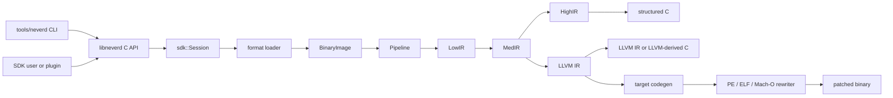

**Languages**: [English](architecture.md) | [简体中文](architecture.zh-CN.md) | [繁體中文](architecture.zh-TW.md) | [日本語](architecture.ja.md) | [한국어](architecture.ko.md) | [Français](architecture.fr.md) | [Deutsch](architecture.de.md) | [Español](architecture.es.md) | [Italiano](architecture.it.md) | [Русский](architecture.ru.md) | [العربية](architecture.ar.md)

[← Documentation Index](README.md)

# NeverD Architecture

This guide describes the production boundaries a contributor needs in order to
change NeverD safely. It intentionally covers NeverD-owned code only; the LLVM,
Capstone, and Unicorn submodules keep their own internal architecture.

## System boundary

NeverD has four IR representations, but they are not one mandatory four-hop
sequence. `LowIR -> MedIR` is shared. Structured decompilation then uses
`MedIR -> HighIR -> C`; `lift`, `decompile --llvm`, and `patch` use the direct
`MedIR -> LLVM IR` route. In particular, patch and lift modes deliberately skip
HighIR.

The CLI parses commands in `tools/neverd`, creates a `neverd_session_t`, and
calls the public API in `include/neverd/sdk/NeverDCAPI.h`. Engine state lives in
`lib/sdk/SessionImpl.h`; `neverd_session_load` selects a loader and builds a
`BinaryImage`, while IR-backed operations run `lib/pipeline/Pipeline.cpp`
lazily. The `neverd` executable links `neverd_shared`; the component archives
and their LLVM/Capstone dependencies are private implementation details of
that shared library. The CLI uses LLVM Support for its command-line UI,
but it does not bypass the C API to drive the engine.

## IR representations and routes

| Representation | Purpose | Primary definitions and transformations |
|----------------|---------|-----------------------------------------|
| LowIR | Architecture-neutral `NdOp` operations, basic blocks, CFG, and jump-table metadata | `include/neverd/ir/low`, `lib/ir/low`, produced by `lib/decode` + `lib/lift` |
| MedIR | Types, ABI/calling conventions, memory and stack model, flags, calls, and SSA-like data flow | `include/neverd/ir/med`, `lib/ir/med` |
| HighIR | Structured expressions and control flow for readable C | `include/neverd/ir/high`, `lib/ir/high`, emitted by `lib/backend/c/HighC` |
| LLVM IR | Optimization, LLVM-derived C, target code generation, and binary rewrite input | `lib/backend/llvm`, optimized/orchestrated by `lib/pipeline` |

| User route | Representation path | Exit |
|------------|---------------------|------|
| Low/Med dump | Binary -> LowIR, optionally -> MedIR | Diagnostic text |
| High dump or `decompile` | Binary -> LowIR -> MedIR -> HighIR | HighIR or structured C |
| `lift` | Binary -> LowIR -> MedIR -> LLVM IR | `.ll` |
| `decompile --llvm` | Binary -> LowIR -> MedIR -> LLVM IR | LLVM-derived C |
| `patch` | Binary -> LowIR -> MedIR -> LLVM IR -> codegen | Rewritten binary |

`lib/pipeline/Pipeline.cpp` is the source of truth for route selection. Keep
representation-specific logic in its owning IR or backend library; the pipeline
should orchestrate those components rather than absorb their algorithms.

## Cross-architecture translation contract

`include/neverd/translate` defines a contract layer, not an
execution backend. `GuestState` models architecture-neutral, machine-visible
state for `x86_32`, `x86_64`, `AArch64`, and `ARM32`. Its canonical version-1
serialization uses fixed-width little-endian fields, stable register IDs,
sorted collections, and fail-closed validation, so persisted state never
depends on the host C++ layout.

The `GuestState` wire-v1 baseline is permanently frozen. Modeled state outside
that baseline must use an extension-register ID in the extension range with a
canonical lower-case name, or move to a new wire version with an explicit
upgrader; changing the v1 baseline in place is forbidden.

For an `ARM32` guest, `ExecutionMode` is the authoritative decode mode and must
agree with `CPSR.T`. The stored PC is always the canonical instruction address
with bit 0 cleared; ARM mode additionally requires word alignment.

The pair-policy contract defines `x86_64 -> AArch64`,
`AArch64 -> x86_64`, `x86_32 -> AArch64/ARM32`, and
`ARM32 -> x86_32/x86_64`. `ContractDefined` means that a request can be
validated and persisted; it does not mean that code can be translated or
executed. JIT policy accepts only the native process host, while AOT policy
requires an explicit host architecture and target triple; a selected CPU or
feature set is explicit as well.

`ResolvedHostTarget` makes that selection concrete. `Native` resolution derives
the process triple, CPU, and enabled/disabled feature set; `Explicit` resolution
validates and normalizes the caller-provided architecture, triple, CPU, and
features and rejects conflicts. Its versioned cache identity is built from the
normalized target inputs in deterministic byte order and contains no process
addresses or locale-dependent text.

A versioned `TranslationExit` records a stable stop reason and the matching
typed payload for syscalls, exceptions or signals, breakpoints, unsupported
instructions, self-modification, resource budgets, external calls, memory
faults, and other terminal conditions. Consumers therefore do not have to
reinterpret an untyped integer according to the stop reason.

For every stop reason, the reported instruction, block, and generated-code
counts must not exceed the corresponding non-zero budget in the request. A
`BudgetExhausted` payload must additionally identify that requested limit
exactly; it cannot report a derived or implementation-private threshold.

The backend-private `RuntimeControlBlockV1` contract is exactly
128 bytes, aligned to 8 bytes, and guarded by fixed v1 magic, version, size,
field offsets, zeroed reserved fields, and coherent typed exits. It contains no
C++ containers, host pointers, or guest-address aliases. It is neither the C++
layout nor the wire format of `GuestState`; a backend implementing this contract
must convert state into this record explicitly.

The fixed v1 generated-code call surface contains exactly eight helpers:
`nvd_rt_v1_load8_le`, `nvd_rt_v1_load16_le`, `nvd_rt_v1_load32_le`,
`nvd_rt_v1_load64_le`, `nvd_rt_v1_store8_le`, `nvd_rt_v1_store16_le`,
`nvd_rt_v1_store32_le`, and `nvd_rt_v1_store64_le`. Their names, signatures,
and pointer provenance must match exactly; a backend binds this finite table
explicitly and never falls back to ambient symbol resolution. Executable-
generation validation and budget/cancellation polling are trusted-dispatcher-
only operations: `nvd_rt_v1_validate_generation` and `nvd_rt_v1_poll` are not
generated-code helpers. The trusted host dispatcher also owns block selection
and is not callable from generated IR; translated blocks return a typed exit
code instead. Generated IR may directly read only the declared scalar-result
runtime slot.

`RuntimeSymbolRegistryV1` turns that helper table into a closed host-side
registry. Construction validates the complete ABI-v1 set, exact canonical
names, helper classes, signatures, and one non-null class-matching function
pointer per entry. Lookup is exact-name only, never consults ambient process or
dynamic-loader symbols, and supplies the same sorted names as the artifact
verifier allowlist. Its versioned identity covers names, helper classes, and ABI
shape but deliberately excludes native addresses, making it stable across
ASLR.

`RuntimeCodeMemory` owns page-isolated generated-code storage with a one-way
`RW -> RX` publication transition. It is never writable and executable at the
same time, cannot be reopened for writes, bounds-checks writes and entry
offsets, and invalidates the host instruction cache when published. The native
smoke test executes only a tiny host instruction sequence after publication;
that proves this W^X memory boundary, not a translation engine.

`GuestMemoryRuntime` is isolated from logical `GuestState`: construction first
validates the state and copies region bytes and metadata into a sorted private
index. Guest virtual addresses are lookup keys and are never converted to host
pointers. Checked scalar access reports typed width, alignment, overflow,
mapping, cross-region, permission, executable-write, generation-overflow,
generation-mismatch, and policy faults. Instruction/block budgets,
cancellation, generation tracking, and the `RejectExecutableWrites`,
`InvalidateOnExecutableWrite`, and `ValidateBeforeDispatch` code-write policies
also produce coherent typed records rather than implicit host-side behavior.

The post-codegen verifier audits relocatable ELF, COFF, and Mach-O
objects as a closed set. Format and architecture must match the selected host;
undefined symbols require exact membership in the finite helper allowlist and
dynamic symbols are forbidden. Relocations are explicit direct whitelists with
checked encoding, width, alignment, offset, loadable destination, and an
object-local non-preemptible or exactly allowlisted target. The verifier rejects
W+X, unwind/exception and initializer metadata, TLS, IFUNC, GOT/PLT and other
indirection, dynamic relocations, weak/preemptible or selectable definitions,
unknown allocated sections, and linker directives. ELF `ET_REL` artifacts must
contain no program headers or segments. Mach-O load commands use a positive
list: exactly one width-matching segment and at most one symbol table,
dynamic-symbol table, platform-version, and data-in-code command, with their
dependencies checked; linker options and every other command are rejected.

The runtime, target-resolution, W^X publication, memory, IR, symbol-registry,
and object-audit implementations define and validate these boundaries. A
verified object compiler, JITLink graph audit/link/loading path, trusted
dispatcher or dispatcher factory, and complete guest-to-host lowering are still
absent. The available boundaries therefore do not constitute a complete
executable translation backend, a complete cross-architecture translation
pipeline, or complete end-to-end exception rewriting. This section specifies
contract and verifier scope; it does not claim end-to-end generation, linking,
loading, dispatch, execution, JIT, AOT, or exception rewriting.

The generated-IR contract requires every translated block governed by it to be
hidden and non-preemptible with the C ABI `i32 (ptr state, ptr runtime)`.
Blocks are discoverable only through a private registry, never through ambient
process symbol lookup; direct block-to-block calls are forbidden.

The IR verifier also caps integer widths at the host scalar-register width to
avoid known compiler-runtime libcalls introduced during legalization. That
check is necessary, not sufficient: any execution backend implementing this
contract must perform an exact audit of post-codegen control transfers,
`MachineIR`, and target-object relocations against the same finite
runtime-symbol allowlist.

Direct TranslationIR loads and stores, and values held by private constants,
may contain only one scalar integer no wider than the host scalar-register
width. Aggregates must be scalarized before the verifier boundary so compact IR
cannot trigger unbounded backend expansion.

The generated-code ABI is defined only for scalar integers. Floating-point,
SIMD, x87, atomics, and system instructions are outside this contract. The
`ProvenSemanticAndLLVM` policy requires any implementation that selects it to
run NeverD's proof-gated semantic simplification to a joint fixed point with
LLVM optimization; the policy does not supply an executable translation
backend.

## Component map

Every component is a static archive created by `add_neverd_component_library`.
The table lists important NeverD dependencies, not the common LLVM and Capstone
libraries supplied by the CMake helper.

| Directory | Responsibility | Important dependencies |
|-----------|----------------|------------------------|
| `lib/loader` | Format detection, PE/COFF, ELF, and Mach-O loading; normalized `BinaryImage`; function discovery | LLVM Object APIs |
| `lib/lift` | Hand-written x86/i386, AArch64, and ARM32 instruction semantics | IR data types |
| `lib/decode` | Capstone/native decode and dispatch into the architecture lifters | `NeverDIR`, `NeverDLift` |
| `lib/ir` | Common types plus LowIR, MedIR, HighIR, and intrinsic definitions/transforms | Its four IR subcomponents |
| `lib/pipeline` | Function detection and Low/Med/High/LLVM route orchestration | IR, decode, lift, LLVM backend, debug info, IR passes |
| `lib/backend/c` | HighIR-to-C and LLVM-IR-to-C rendering | IR |
| `lib/backend/llvm` | MedIR-to-LLVM lowering | IR |
| `lib/backend/codegen` | Target code generation plus PE/ELF/Mach-O patch and in-place rewrite | IR, loader |
| `lib/sdk` | Public C ABI, session lifecycle, queries, persistence, plugins, lift/decompile/patch entry points | Aggregates the engine components into `libneverd` |
| `lib/pass` | LLVM IR obfuscation passes and MIR pass runner | IR |
| `lib/debug` | DWARF, PDB, and linker-map debug contexts | IR |
| `lib/sigs` | Signature parsing, databases, and matching | Loader |
| `lib/libc` | Known libc names and call-model support | Standalone component |
| `lib/support` | Shared binary-loading helpers | Loader |
| `lib/translate` | Versioned guest state/policy/exits, fixed runtime ABI, checked guest memory, and generated-IR/object audit contracts; execution-backend implementation is outside this component | IR, LLVM, and LLVM Object contracts |

Public headers mirror these areas under `include/neverd`. Avoid making an
internal C++ class part of the SDK by accident: stable external operations
belong in the pure C header and one of the focused `lib/sdk/NeverDCAPI*.cpp`
files.

## Strict lifting contract

`Decoder` and every architecture lifter start in strict mode. If Capstone can
decode an instruction but the selected lifter has no implementation, the
lifter throws `UnliftedInstruction`. The exception records the instruction
address, mnemonic, and operand string; unsupported semantics must therefore
fail visibly instead of being omitted or guessed.

The internal non-strict path emits `NdOp::NOP`, but it is a diagnostic escape
hatch, not an acceptable implementation of an instruction. Contributor and CI
tests should keep strict mode enabled. When a strict failure appears:

1. Reproduce it with the smallest architecture-specific fixture.
2. Add the missing semantics in `lib/lift/<ISA>`.
3. Assert the expected LowIR shape in `unittests/lift`.
4. Add a Unicorn differential roundtrip in `unittests/semantic` when the
   instruction has observable behavior.

Do not catch `UnliftedInstruction` merely to make a pipeline continue. A new
intentional approximation would need an explicit contract and tests; it must
not masquerade as 1:1 lifting.

## Format and ISA ownership

Input format logic and output rewrite logic are deliberately separate:

| Format | Load, metadata, and input relocations | Patch and output relocations |
|--------|---------------------------------------|------------------------------|
| PE/COFF | `lib/loader/COFF` | `lib/backend/codegen/COFF` |
| ELF | `lib/loader/ELF` | `lib/backend/codegen/ELF` |
| Mach-O | `lib/loader/MachO` | `lib/backend/codegen/MachO` |

Architecture lifters live in `lib/lift/X86`, `lib/lift/AArch64`, and
`lib/lift/ARM`. The corresponding public lifter/register declarations live in
`include/neverd/lift`. Target-specific LLVM emission and code generation live
under `lib/backend/llvm/<ISA>` and `lib/backend/codegen/CodeGen<ISA>.cpp`.

### Support and test depth

The root support matrix means that each cell is implemented. It does not mean
that every opcode, ABI edge case, binary producer, or operating-system version
has been exhaustively tested. Strict mode fails closed when instruction
semantics are outside the implemented lifter coverage.

All 12 format-by-architecture cells have semantic rewrite-backend coverage in
`unittests/semantic/PatchFullSubstRTTests.cpp`. Integration depth is more
specific:

| Format | x86-64 | i386 | AArch64 | ARM32 |
|--------|--------|------|---------|-------|
| PE/COFF | Linked fixture | Backend grid | Linked fixture | Linked Thumb fixture |
| ELF | Linked fixture + semantic roundtrip | Object pipeline + semantic roundtrip | Linked fixture + semantic roundtrip | Linked fixture + semantic roundtrip |
| Mach-O | Linked fixture\* | PIC/no-PIC object pipeline\* | Linked fixture\* | Backend grid |

- **Linked fixture** exercises a linked executable through loader/pipeline and
  patch behavior for representative programs.
- **Object pipeline** exercises loading, all IR stages, and decompilation of a
  relocatable object, but not host linking and execution of a patched binary.
- **Backend grid** compiles representative IR through the exact rewrite
  code-generation path and compares behavior in Unicorn; it does not exercise
  that format's loader on a linked executable.
- `*` Mach-O linked fixtures depend on a host toolchain that can produce the
  requested target. Modern macOS cannot link historical i386 executables, so
  i386 coverage uses both PIC and no-PIC thin objects plus the rewrite grid.

Treat linked-fixture cells as the strongest format-integration
evidence for those representative programs. Object-pipeline and backend-grid
cells have partial format-integration coverage. No cell is “fully tested”
without that qualification, and none claims exhaustive ISA coverage.

The principal evidence is
[`PatchFormatTests.cpp`](../unittests/lift/format/PatchFormatTests.cpp) for linked ELF
and PE fixtures,
[`COFFARMFormatTests.cpp`](../unittests/lift/format/COFFARMFormatTests.cpp) for Windows
ARM loading/decompilation,
[`MachOI386RelocationTests.cpp`](../unittests/lift/format/MachOI386RelocationTests.cpp)
for i386 thin objects,
[`X86_64_PipelineE2ETests.cpp`](../unittests/lift/x86_64/X86_64_PipelineE2ETests.cpp)
and
[`AArch64_PipelineE2ETests.cpp`](../unittests/lift/aarch64/AArch64_PipelineE2ETests.cpp)
for linked Mach-O, and
[`PatchFullSubstRTTests.cpp`](../unittests/semantic/probe/patchfull/PatchFullSubstRTTests.cpp)
for the 12-cell backend grid. See the [testing guide](testing.md) for commands.

## Where to edit

| Change | Start here | Minimum focused verification |
|--------|------------|------------------------------|
| Add or fix an instruction | Matching files in `lib/lift/X86`, `AArch64`, or `ARM`; public lifter header if dispatch changes | Architecture test in `unittests/lift`; semantic roundtrip in `unittests/semantic` |
| Add an `NdOp` | `include/neverd/ir/NdOps.h`, then audit Low-to-Med, emitters/renderers, verifier/emulator, and dumps | `NeverDLiftTests` + relevant `NeverDSemanticTests` cases |
| Change CFG or function discovery | `lib/ir/low`, `lib/loader/FunctionDiscovery*.cpp`, `lib/pipeline/PipelineFuncDetect.cpp` | Lift CFG/jump-table tests and focused semantic transform suite |
| Add a PE input relocation or unwind rule | `lib/loader/COFF` | `COFFARMFormatTests` or a new focused loader fixture |
| Add a PE output relocation or patch rule | `lib/backend/codegen/COFF` | `PatchFormatTests`, `RewriteCodegenRTTests`, and the PE backend grid |
| Change ELF or Mach-O format behavior | Matching `lib/loader/<Format>` and/or `lib/backend/codegen/<Format>` directory | Matching format tests plus rewrite grid |
| Change MedIR/ABI recovery | `lib/ir/med` | Calling-convention lift tests + cross-ISA semantic roundtrips |
| Change structured control-flow recovery | `lib/ir/high` | `NeverDCFGLoopXformTests` and structured-C tests |
| Add an LLVM transform | `lib/pass/ir`, public header in `include/neverd/pass/ir`, pipeline toggle if exposed | Focused transform suite + `NeverDPatchFullTests` when patch output changes |
| Add a C API operation | `include/neverd/sdk/NeverDCAPI.h`, focused `lib/sdk/NeverDCAPI*.cpp`, `SessionImpl.h` only for state | SDK/CLI semantic tests; preserve `neverd_last_error` and allocation conventions |
| Add a CLI command | `tools/neverd/NeverDCLIOptions.cpp`, `NeverDCLI.h`, a focused `NeverDCmd*.cpp`, and dispatch in `neverd.cpp` | `unittests/semantic/CLIEndToEndTests.cpp` and direct CLI smoke test |
| Add a semantic regression | Focused `unittests/semantic/*Tests.cpp`; register a new file in `unittests/semantic/CMakeLists.txt` | Build its test binary, then use `ctest -R` for the named case |

Keep edits narrow. Files that define a representation may change with their
transforms, but unrelated loaders, lifters, and backends should not be modified
solely to make a broad refactor appear uniform.
