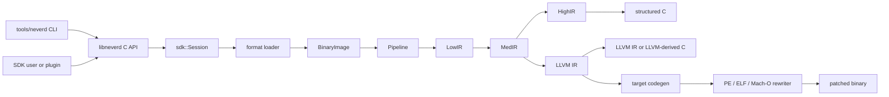

**Languages**: [English](architecture.md) | [简体中文](zh-CN/architecture.md) | [繁體中文](zh-TW/architecture.md) | [日本語](ja/architecture.md) | [한국어](ko/architecture.md) | [Français](fr/architecture.md) | [Deutsch](de/architecture.md) | [Español](es/architecture.md) | [Italiano](it/architecture.md) | [Русский](ru/architecture.md) | [العربية](ar/architecture.md)

[← Documentation Index](README.md)

# NeverD Architecture

This guide describes the production boundaries a contributor needs in order to
change NeverD safely. It intentionally covers NeverD-owned code only; the LLVM,
Capstone, and Unicorn submodules keep their own internal architecture.

## System boundary

NeverD has four IR representations, but they are not one mandatory four-hop
sequence. `LowIR -> MedIR` is shared. Structured decompilation then uses
`MedIR -> HighIR -> C`; `lift`, `decompile --llvm`, and `patch` use the direct
`MedIR -> LLVM IR` route. In particular, patch and lift modes deliberately skip
HighIR.

The CLI parses commands in `tools/neverd`, creates a `neverd_session_t`, and
calls the public API in `include/neverd/sdk/NeverDCAPI.h`. Engine state lives in
`lib/sdk/SessionImpl.h`; `neverd_session_load` selects a loader and builds a
`BinaryImage`, while IR-backed operations run `lib/pipeline/Pipeline.cpp`
lazily. The `neverd` executable links `neverd_shared`; the component archives
and their LLVM/Capstone dependencies are private implementation details of
that shared library. The CLI uses LLVM Support for its command-line UI,
but it does not bypass the C API to drive the engine.

The HighIR `HighSourceFlow` analysis owns emitted statement edges, local identities,
and definite assignment. Both source validation and dead PHI copy elimination
use this graph. Bounded partitions track repeated equality tests between scalar
locals or against zero. Swapped operands and unchanged-width integer views
share the same fact; writing either operand invalidates it. Escaped locals stay
unknown, inconsistent widths are rejected, and partition exhaustion
falls back to the conservative graph. A PHI copy is removed only when its scalar
value is dead in every feasible context. Calls, loads, and stores keep their
observable behavior; source labels survive removal. Adjacent byte slices of
the same local are simplified in HighIR before this analysis, preserving their
result type. This identity does not merge independent loads or calls.

The shared MedIR source-entry analysis owns observable byte masks for physical
register inputs. Native helper inference uses these masks to represent proven
low float/double lanes without claiming original source types or a rewriting
ABI. HighIR separately narrows a source-local CONCAT only when all definitions
construct the same scalar prefix and all reads explicitly select that prefix.
Only effect-free upper expressions are discarded; lower expressions and their
control-flow positions remain unchanged. Unknown lanes are never filled in.

HighIR may also discard undefined upper bytes from a reconstructed integer only
when a following constant mask cannot observe any bit above the complete low
operand. A direct `CONCAT`, a bounded integer cast, or a zero-offset `SUBBYTES`
view may expose that low operand. The replacement is an explicit zero
extension and the mask remains in place. The upper expression must be bounded
and discardable; calls, loads, ordered accesses, traps, malformed widths, and
masks that reach an upper bit retain the original unknown value.

An internal void summary for a native cleanup forwarder does not assert an
original void prototype. It contributes no result carrier. Calls must match
validated runtime declarations, exact native source contracts or canonical
dynamically loaded Swift value-witness declarations. A callee may return a
value used inside the helper: that value does not establish a return carrier
on every exit from the helper itself. MedIR and LowIR must agree on the exact
instruction address and operation sequence, direct or indirect call form, and
static target when one exists. Exact Swift String bridge imports participate
through their own validated static target and source ABI. A bounded LowIR fixed
point tracks exact incoming register bytes and private stack spills, requiring
restored preserved registers,
stack pointer and link register at every exit. The frameless source-bound tail
shape instead proves that those registers are never written and uses a bounded
byte-taint fixed point to reject stack-derived call targets, arguments or stored
values.
Partial writes,
implicit zero extensions, call clobbers and overlapping stores invalidate the
affected identities. A store through an address with no frame-derived bytes is
disjoint from the current invocation's private frame and keeps its exact spill
facts. Partial or exact frame-derived addresses still reject possible escapes;
frame-address spills and call arguments are rejected, except that an exact
`objc_msgSendSuper2` binding may synchronously borrow its first argument as a
read-only 16-byte `objc_super` object. The proof requires the complete pointer
and object to stay inside the currently allocated frame; ordinary messages,
partial pointers and objects crossing either frame boundary remain rejected.
Unallocated stack bytes cannot survive a call.
The ordinary CFG and source dependency proofs still apply.
Re-lifted callers that observe a missing result retain their unknown value and
cannot pass source publication.

After re-lifting a native void candidate, its dependency fixed point can remove
an auxiliary register parameter with no occurrence anywhere in the resulting
HighIR body. This uses the existing HighIR private-frame cleanup instead of
adding another store-elimination rule. Canonical parameters and auxiliary
reads or writes remain intact. Changed signatures require another pipeline run;
neither an inferred signature nor its refinement certifies a publishable body.

Non-returning native source helpers use an internal void ABI only when both
IR stages agree and the shared MedIR termination analysis independently
rechecks the current graph. Bound calls retain their exact parameters and
effects; only recognized architectural terminators bypass the ordinary
intrinsic restriction. The final interprocedural no-return fixed point copies
its result into each exact native source-call hint, including clearing stale
effects on a later run. HighIR therefore sees the same termination boundary.
Publication revalidates the typed callee's complete source flow and requires
its dependency closure; a function flag alone never authorizes a terminating
source call. Reports, writes and traps before termination remain observable.

At source-bound runtime calls, Low-to-Med lowering carries the authenticated
external no-return declaration into the MedIR call effect.
An imported runtime veneer may also appear in the native function inventory.
The no-return fixed point preserves an existing machine termination fact when
the validated runtime binding and complete call operands agree; a source hint
alone cannot create that fact. The binding names the import slot, while the
call names the veneer. Inferred native effects are still recomputed from the
current graph, and source publication revalidates the import identity.

Native two-word integer returns are requested by an observed complete read of
the second return register after an exact direct call in the same LowIR block.
An intervening call, intrinsic or overlapping register write ends that demand;
the demand itself proves no ABI. Both result registers must independently pass
the existing bounded MedIR return-path proof. The candidate then uses an
internal two-field record and the shared `ReturnComponents` lowering for calls
and returns. A later dependency iteration may extend an inferred native scalar
contract when its second word becomes provable; external and declared source
contracts are never extended. Re-lifting and the normal source body/closure
checks remain mandatory, and an unproved second result remains unresolved.

Block consumer escape analysis also uses this graph. A bounded fixed point carries pointer identities and private frame spills across branches and loops. Joins retain possible context addresses; only complete overwrites erase them. Unknown edges, exceptional flow, and exhausted proof budgets reject the binding.

An exact zero-offset `SUBBYTES` view may preserve a complete low pointer word
from a wider physical register view. Partial frame, context, and invoke-pointer
views retain their source identity and byte interval; only ordered, contiguous,
same-source `CONCAT` operations that cover the complete pointer restore an
address. Every other partial view remains tainted and is rejected if it reaches
memory, a call, control flow, storage, or an observable return. Equal scalar
bits never acquire pointer identity.
When an exact source ABI declares a narrow scalar result, an explicit
`CONCAT` may contribute undefined high physical-return padding. Escape
analysis checks the complete declared low result and ignores only that
structured high padding; a context pointer in any observable return byte is
still rejected.

A block invoke may pass an address in its own fresh frame to a bound call only
while that frame contains no context, invoke, ISA, or other proven pointer
identity. Storing any such identity makes an unbounded frame argument an
escape again. This distinguishes ordinary callback locals such as an error
result slot from the block context without weakening the context escape proof.

Stack-block construction distinguishes an exact literal base from other frame
arguments before interpreting a call as a block consumer. Ordinary frame
arrays may therefore be passed before construction; wide frame initialization
is retained as poisoned byte coverage, so it cannot satisfy a block header or
owned capture. Once an ISA identity is live, other frame arguments remain
rejected until a declared copying or nonescaping consumer invalidates the
literal storage. This keeps later unrelated frame calls available without
forgetting a block identity that still exists on any reaching path.

Capture-free global block literals may share one compiler descriptor. Source
dependencies and generated helpers follow the exact literal references in the
current source closure: an unreferenced literal sharing that descriptor neither
adds its invoke dependency nor appears in the emitted storage. The descriptor
remains shared, and the same original literal keeps one shared generated
identity across methods.

Darwin block consumers have one loader-owned callback and lifetime contract.
The generated catalog distinguishes compiler-declared `noescape` parameters
from audited runtime copying consumers. The latter currently includes only
`dispatch_async` and `dispatch_barrier_async`, whose SDK contract specifies
copying and releasing the block. Both require exact import/provider identity,
four-profile compiler agreement, and a matching complete callback ABI.
Source publication still proves the stack header, initialized captures,
copy/dispose helpers, and invoke dependency. Either kind of consumer invalidates
the caller's construction facts after use; a copied consumer is never reported
as nonescaping. Unannotated block parameters confer no lifetime permission.

Objective-C SDK `noescape` block parameters use the same loader-owned
boundary. A catalog row is accepted only when the current message still has
the exact SDK parent-method ABI and parameter position, its block descriptor
has the exact compiler callback ABI, and any qualified receiver follows a
complete, conflict-free class hierarchy to the declaring owner. An
unqualified selector is usable only when all matching catalog rows agree on
one callback contract. This proves the caller-side lifetime only: dispatch
remains dynamic, no implementation address is selected, and methods without a
cataloged `noescape` declaration continue to reject stack-block escape.

Calls through copied stack blocks reuse the loader's source-call fixed point.
A complete stack header and descriptor establish the invoke ABI before an
authenticated `objc_retainBlock` or `_Block_copy` supplies a copied-block
identity. Only an invoke-field load and receiver with that same identity can
bind a dynamic call. Conflicting aliases, partial pointer operations, escaping
copies, unknown calls and ambiguous writes discard the proof. Image stores
preserve private construction facts only when the shared loader range check
proves a complete writable file-backed range disjoint from private storage.
Stack adjustments retain their full pointer width with bounded narrow numeric
offsets; SIMD zero extension can preserve the unchanged low image-byte recipe
without creating a wider pointer or interpreting floating-point values.

Source-call discovery uses a bounded forward fixed point for register facts.
At ordinary joins, a selector, import slot or numeric address survives only
when every reached predecessor agrees. Independent and exceptional entries
start unknown. Call bindings are published only after backedges converge;
physical alias writes, unknown calls and instruction-local temporaries cannot
carry stale facts into a later block. Invalid edges or exhausted work budgets
reject the proof.

At a validated source-call boundary, an exact integer constant zero may supply
a pointer parameter even when the machine expression uses a narrower integer
carrier than the declared pointer. Generated C emits an explicit null pointer
constant. This exception applies only to the literal zero and only to a
declared pointer parameter; nonzero integers and other width mismatches remain
explicit source-call failures.

Selector-wide Objective-C lookup normally requires every complete local,
protocol, property and active SDK declaration to agree. When complete
declarations disagree only in their result contract, an exact post-call
scalar-register read may narrow the set if exactly one declared result carrier
defines the observation. Integer observations may consume a fully defined
subrange, including an explicitly extended narrow result. Floating observations
must match the declared register, offset and width exactly; reading four bytes
does not reinterpret a declared double as a float. Full-width copies can
transport that evidence. Recognized runtime calls preserve only ABI-preserved
aliases, including only the low 64-bit prefix of AArch64 `Q8`-`Q15`. Unknown
calls, overlapping writes, unused results, incomplete declarations and multiple
matching carriers leave the message unresolved. The selected carrier range is
stored with the source-call hint and revalidated against the current image at
publication, so a local dataflow observation cannot bypass global declaration
checks.

An exact pointer-to-pointer parameter from the enclosing Objective-C method may
also narrow incompatible declarations when that unchanged entry value reaches
one message argument and exactly one complete declaration has the same source
type at that position. Every method record sharing the entry must agree before
the parameter fact is seeded. Bare object pointers, stack reloads after the
frame escapes, transformed values, multiple matching arguments and incomplete
declarations remain unresolved. The hint records the method entry, source ABI
carrier and message parameter index; publication rebuilds the method and
selector declarations from the current image before accepting the call.

Full-width receiver and declared pointer-to-pointer identities may survive an
exact private-frame spill and reload. A returning call preserves the entry-SP
identity even when its source signature is unknown. When a frame address is
visible to a call or stored elsewhere, only typed spills wholly below that
address remain private: reaching them would require a backwards access outside
the source object rooted at the escaped address. An escaped address at or below
the spill, an inexact frame-derived carrier, an overlapping write, a partial
load, conflicting control-flow facts, an invalid stack adjustment or an
analysis budget limit discards the identity. Ordinary frame contents retain
the stricter whole-frame escape rule.

An exact address of bounded private frame storage may provide the same
pointer-to-pointer shape evidence when it flows directly to one message
argument. This fact identifies only the storage shape, not its pointee class or
value; exactly one complete declaration must require an eight-byte
pointer-to-pointer at that position. Positive entry-SP-relative addresses,
loads or reloads, transformed or ambiguous values and multiple matching
declarations remain unresolved. Publication replays only contiguous
single-definition aliases from the function entry, checks the exact negative
offset and private frame bounds, and rebuilds the current selector declarations.
Address escape does not change the address category, but no fact about the
storage contents is inferred after an escape.

Required Swift value-witness operations have a separate symbol-independent call
proof. A bounded backward trace must show that the indirect target is loaded
from the operation's required `metadata[-1][slot]` entry and that the same
metadata value occupies its canonical Swift argument carrier. The supported
operations are `destroy` and `initializeWithCopy`. Every predecessor must agree,
and malformed CFG edges, partial writes, ordered loads, call clobbers or
exhausted budgets reject the binding. Generated C repeats the table lookup
through the live metadata; it never retains the witness address from the
analyzed image.

A compiler-generated Swift protocol witness accessor uses a different exact
proof. The loader pairs its `Wl` code symbol with the matching writable,
zero-initialized `WL` cache, then verifies the cache load, the
`swift_getWitnessTable` call with the exact conformance descriptor and type
metadata objects, the release store, and both return paths. Call sites receive a
zero-argument, pointer-result callee contract without changing the accessor's
own machine-inferred entry signature. Generated C rebuilds a fresh shared cache
and repeats the runtime query; it never publishes the captured process cache or
witness pointer.

Standard Swift metadata storage addresses use compiler-generated `.self`
queries; standard Hashable witness storage uses the direct witness argument
of a compiler-generated constrained generic call. Both require matching SDK
exports across ARM64/x86-64 macOS and Mac Catalyst.
`Any.self` is the one supported full-existential exception: compiler IR must
return the exact eight-byte interior metadata member of an externally exported
`%swift.full_existential_type`, while the catalog records and rebuilds the
owning `$sypN` storage base. This does not authorize any other interior pointer
or infer the full-existential layout from a mangled name.
Only direct external, non-TLS globals qualify. The loader authenticates each
symbol and provider before binding its runtime address; this supplies neither
a metadata/witness layout nor a call ABI for accessors, witness members or
arbitrary mangled symbols.

Objective-C property metadata supplies accessor declarations independently of
method implementations, including dynamic, readonly and custom accessors.
The loader checks the class, category or protocol record layout and derives
scalar/pointer signatures through the shared encoding parser and Darwin ABI.
Call binding requires agreement with all matching property, method, protocol
and active SDK declarations. Property records never create native functions
or increase the runtime method inventory. The 64-bit record layout follows
[Apple's runtime ABI](https://github.com/apple-oss-distributions/objc4/blob/main/runtime/objc-runtime-new.h);
optional category class properties require the
[image layout flag](https://github.com/apple-oss-distributions/objc4/blob/main/runtime/objc-abi.h).
Unsupported property encodings and malformed lists remain explicit diagnostics.

Source record declarations preserve natural field layout independently of ABI
classification. The source ABI layer assigns Darwin ARM64 homogeneous floating
records with one to four float or double leaves, including nested records and
whole-record stack arguments after the FP bank is exhausted. MedIR binds each
physical member before SSA; HighIR reconstructs one logical record parameter,
call argument or result. Structural C declarations include layout assertions.
Darwin ARM64 and x86_64 also support nested records containing one or two
64-bit integers or pointers. When the whole record spills, ARM64 exhausts the
integer bank; x86_64 leaves unused registers available to later arguments.
Fixed C calls on Darwin ARM64 may also return records of three signed
64-bit integers through the hidden x8 result pointer. The source ABI owns
that classification. Low-to-Med lowering preserves the pre-call pointer,
produces one logical record result, and writes its three fields into the
caller-owned storage. Ordinary arguments keep their original registers; x0 is
still clobbered and does not acquire a result. Call-hint discovery invalidates
facts about escaped result storage. Entry projection and native preservation
proofs reject these indirect results until their own storage proofs exist;
Objective-C indirect results remain rejected: nil message dispatch leaves the
original result buffer untouched and needs its own storage model.
Three-word records with unsigned or pointer fields, three-word parameters and
x86_64 indirect results remain unsupported.
Padding, packed fields, mixed floating/integer classes and incomplete components
remain explicitly unsupported. Source record carriers never authorize binary
rewriting.

The generated Darwin C catalog takes declarations only from its explicit public
header set and intersects all four macOS/iOS architecture profiles with SDK
export evidence. Public `notify.h` functions use this path, including exact
`libSystem` and `libsystem_notify` providers; a header declaration alone cannot
authorize a call.

Fixed Darwin C imports may use a public declaration outside the generated
command-line-tools catalog only at an exact symbol and dyld provider boundary.
On ARM64, `NSStringFromCGSize` and `UIGraphicsBeginImageContext` use the shared
homogeneous-record ABI for their natural two-double `CGSize` parameter.
`UIGraphicsGetCurrentContext` and
`UIGraphicsGetImageFromCurrentImageContext` return opaque pointers, while
`UIGraphicsEndImageContext` returns void; generated source keeps every real
UIKit call. Weak imports, addends, conflicting storage identities, other
providers and architectures without the same compiler evidence remain
unbound. The final source check rebuilds the hint from the current image
instead of trusting an earlier call-site annotation.

The ARM64 UIKit Objective-C catalog has the same evidence boundary. Each row
must agree between compiler-produced iPhoneOS and arm64 iPhoneSimulator
artifacts, retain its declaring framework owner and require the exact system
UIKit provider. Selector-wide lookup still rejects incompatible declarations.
Receiver provenance or an exact observed result carrier may narrow that set,
but cannot supply a declaration or widen an unsupported carrier. Architectures
without matching compiler evidence remain unsupported.

Objective-C receiver facts distinguish method-entry self from an exact class
reference. All metadata records sharing an entry must agree before self is
seeded. Full-width copies and ABI-preserved registers carry the fact through
the same fixed point, including entry backedges. Declaration agreement uses
class/instance scope, recorded categories, superclass chains and adopted
protocols; entry self also includes known subclass declarations. Compiler
catalogs retain declaration owners and hierarchy separately from selector-wide
agreement. The SDK revalidates the receiver origin and applicable declarations
against the current image before publishing source. These facts neither select
an IMP nor authorize binary rewriting.
A compiler-shared native thunk may receive the address of a validated
Objective-C class-reference slot instead of the class object stored in it.
Source recovery preserves that extra indirection with one rebuilt cell per
original slot, initialized through `objc_getClass` or `objc_getMetaClass`.
The binding is permitted only when the exact typed native dependency proves
only full-width loads from that parameter with no store, offset, escape or
unsupported memory effect. A bare slot address still cannot act as a message
receiver or acquire class-object identity.
An agreed named object result extends that provenance through the declared
message-result step. Exact ARC routines whose catalog contract returns their
object argument preserve the complete step after normal call clobbers. For
example, UIKit's `+[UIScreen mainScreen]` result remains a `UIScreen` receiver
after `objc_retainAutoreleasedReturnValue`, so `-[UIScreen scale]` uses its
owner-qualified `double` ABI instead of an incompatible selector-wide guess.
An authenticated `objc_msgSend` or `objc_msgSendSuper2` target has the Darwin
call-preservation contract even when its selector declaration is unavailable.
Across such a call, the dataflow may retain only receiver identities held in
complete call-preserved registers. It still marks private frame storage as
escaped and discards caller-saved, selector, import, block and numeric facts.
A later message still needs its own exact receiver declaration and source ABI.
Missing external hierarchy requires selector-wide agreement instead of a receiver-specific signature; explicit unsupported or conflicting declarations remain negative evidence.

Declared object ivars extend a receiver proof through at most eight full-width
loads. Each step records its runtime offset slot, carrier width and any literal
byte offset used by the machine access. A literal must still match the current
layout; a runtime offset reference can follow a moved field. The loader checks
the recorded class lineage and exact field declaration. Partial accesses, bare
id, blocks, protocol-only types, ambiguous storage and unknown pointer bases do
not provide class facts. Source validation repeats the entire path against the
current image. These facts describe declared types, not object identity or
permission to remove memory operations.

When control flow selects among authenticated Objective-C ivar-offset cells,
the source binding may move the runtime offset values to the predecessor edges
and merge those values instead of merging cell addresses. Every reaching leaf
must name an ivar of the same class with the same carrier width, the address
chain may contain only same-width local or SSA aliases, and the merged address
must feed exactly one full-width load. Mixed classes or widths, arithmetic,
stores, escapes and additional loads retain the unresolved address diagnostic.

Writable pointer initializers require the same resolved local data-pointer relocation and target-owner proof as immutable pointer loads, without treating writable contents as a constant value. The source layer admits only complete, uniquely named eight-byte cells initialized with validated constant strings. Shared storage helpers initialize those cells before exposing their addresses; subsequent loads, stores and authenticated `objc_storeStrong` calls use the mutable cells. Initializer objects share the ordinary constant-object identities. A null store does not repeat initialization.

A shared Swift once getter may expose the two machine words of a `String` only
under one exact four-carrier contract: predicate, initializer, and two ordered
storage words. The getter must make one authenticated `swift_once` call, feed
the two unmodified words to the exact Swift `String`-to-`NSString` bridge, and
use each address parameter only through pure same-width aliases and the proven
loads. Callers must pass adjacent words of one named writable 16-byte object.
The callback and all dependencies still require ordinary source closure; the
storage proof does not authorize skipping an initializer or inventing contents.

A compiler-emitted zero-argument Swift lazy-global addressor is rebuilt only
when the exact `vau`/`vpZ`/`_Wz`/`_WZ` symbol family agrees with one canonical
load, completion test, authenticated `swift_once` call, and the same storage
return on both paths. Its initializer must ignore the incidental context and
close as ordinary source. Projection creates a fresh shared once token and
value cell; no predicate, value, or initializer address from the loaded image
is retained. Its zero-argument source callee ABI applies only at call sites;
the native entry ABI remains separate so incidental context carriers stay
available to the contract proof.

An authenticated `dispatch_once_f` call may likewise rebuild its predicate and
local callback address. The loader must prove the exact libdispatch export,
the complete writable predicate cell, a unique code target that has no ordinary
direct callers, and the public `void (*)(void *)` callback ABI. The callback is
re-lifted with that contract and remains an ordinary source dependency. The
generated unit uses fresh shared predicate storage and the recovered callback
definition; neither original image address is retained. Unknown providers,
unproved storage, non-code targets and conflicting call ABIs remain unbound.

If such an initializer calls a compiler-emitted imported Objective-C class
metadata accessor, projection requires the exact zero-cache, class-reference,
`objc_opt_self`, `swift_getObjCClassMetadata`, and release-publication template.
It emits the authenticated runtime lookup directly and retains no image cache.

A Swift concrete-metadata cache/reference pair may rebuild its mangled type
reference only when the zero cache, immutable metadata-reference record, every
relative descriptor slot, and the exact `MR`/`Md` symbol spelling agree. The
type reference consists of printable mangling bytes and at most eight indirect
`0x02` context descriptors; expanding every descriptor must reproduce a
complete symbol name that itself passes a bounded Swift type demangle. Imported
nominal descriptors require a bounded demangle and the exact system-framework
install name derived from the declared module.
Local protocols and bounded module/class/structure/enum nominal paths require a
resolved read-only relocation to one unique data symbol with exactly one
matching export. Direct `0x01` or other symbolic references, unexported private
contexts, weak or mismatched providers, malformed records, and ambiguous
symbols remain unsupported.

An explicit pointer-typed load or store supplies the same eight-byte cell extent
as an integer machine carrier. It uses the existing named writable-storage and
initializer proofs, including zero-initialized cells. The pointer value itself
still requires its ordinary source binding; an accepted destination cell does
not authorize an unbound image pointer or change retain/release effects.

An exact named-storage argument proof may follow a direct native call chain
when every edge has a complete matching source ABI and forwards the same
pointer parameter without arithmetic. The terminal callees must still use the
parameter only for bounded full-width accesses. Ordinary loads and stores are
accepted; a writable cache may additionally use an exact release store because
the emitted dependency preserves that atomic ordering. Read-only class-reference
cells still reject every store. Indirect or mismatched calls, other atomic
orders, escapes, cycles, depth or evidence-budget exhaustion fail closed.

A profiling-counter address may pass into an exact native source dependency
when that dependency's complete typed HighIR uses the corresponding pointer
parameter only as the exact address of bounded, unordered numeric loads and
stores. The caller then passes the matching interior address in the shared
reconstructed `__llvm_prf_cnts` section. Returning, storing, comparing,
offsetting or forwarding the pointer, pointer-typed memory accesses, incomplete
callee ABIs and accesses outside the rebuilt section all retain the unresolved
image-address limitation.

Complete immutable `S_CSTRING_LITERALS` sections can be rebuilt as one shared static byte array. Section-wide bounds, mapping and fixup checks authorize the full contents; source hints revalidate that exact extent. Interior addresses use the shared base plus their original offset, including associated-object keys. Embedded NUL bytes do not define separate object boundaries. This storage preserves aliases and pointer lifetime, so callers may retain it; the separate borrowed-byte contract still requires a nonretaining consumer. The one MiB extent limit bounds source growth, and each method inventories the helper that must be defined once when linking recovered sources.

Runtime keys may be rebuilt as shared pointer identities only at an authenticated identity-only argument. Objective-C associated-object calls accept the existing immutable string-key proof; `dispatch_get_specific` and `dispatch_queue_get_specific` also accept one exact, uniquely named data symbol in non-executable storage that is read-only initially or after Mach-O relocations. The binding records the symbol name and exact runtime parameter, and publication revalidates the import provider, signature, parameter position, storage guarantee and symbol identity. Arithmetic, loads, returns, writable storage without a read-only-after-relocations guarantee, ambiguous symbols and unrelated calls retain the unresolved image-address diagnostic.

KVO context tokens use a separate writable-identity proof. A uniquely named writable data symbol may be rebuilt only in the declared context argument of `addObserver:forKeyPath:options:context:`, or in a direct equality comparison with parameter 5 of the unique supported `observeValueForKeyPath:ofObject:change:context:` method at that IMP. The method encoding, assigned ABI, source parameters, SDK message declaration, exact symbol address and helper identity are revalidated. Loads, arithmetic, interior or ambiguous symbols, other parameters, other callbacks and ordinary address uses remain unresolved.

The loader validates bounded, acyclic graphs of Darwin constant strings, integer objects, arrays and sorted dictionaries. Every container field and edge requires immutable mapped storage and unambiguous import or relocation evidence; unsupported encodings, cycles and incomplete graphs fail explicitly. Source bindings revalidate the graph and any incoming pointer slot. Generated helpers preserve integer bits, child order and shared object addresses, reusing existing string identities. Container slots initialize once with acquire/release publication; initialization calls only validated child helpers. Each helper carries its own child declarations so independently recovered methods can share one definition. Portable graph tests cover malformed inputs and proof budgets; native compiler fixtures compare contents, aliases, copy identity and concurrent initialization against the original methods.

## IR representations and routes

| Representation | Purpose | Primary definitions and transformations |
|----------------|---------|-----------------------------------------|
| LowIR | Architecture-neutral `NdOp` operations, basic blocks, CFG, and jump-table metadata | `include/neverd/ir/low`, `lib/ir/low`, produced by `lib/decode` + `lib/lift` |
| MedIR | Types, ABI/calling conventions, memory and stack model, flags, calls, and SSA-like data flow | `include/neverd/ir/med`, `lib/ir/med` |
| HighIR | Structured expressions and control flow for readable C | `include/neverd/ir/high`, `lib/ir/high`, emitted by `lib/backend/c/HighC` |
| LLVM IR | Optimization, LLVM-derived C, target code generation, and binary rewrite input | `lib/backend/llvm`, optimized/orchestrated by `lib/pipeline` |

Constant values carry occurrence-specific scalar/address provenance and address
ownership from LowIR through MedIR into HighIR. Equal numeric bits do not merge
different origins. HighIR symbolic simplification keeps address identities
opaque; source binding uses the shared numeric-operand classification and still
requires relocation bindings for memory and pointer consumers.

MedIR owns bounded invariant-constant propagation across same-width SSA copies and complete PHIs, including loops. Every incoming value must converge to the same bits, width, provenance and address owner. Unknown definitions, unseeded cycles, incomplete edges and conflicting constants prevent substitution; budget exhaustion leaves the function unchanged. The analysis substitutes operands without removing calls, loads, stores or their effects. Both HighIR and LLVM consume the same result.

| User route | Representation path | Exit |
|------------|---------------------|------|
| Low/Med dump | Binary -> LowIR, optionally -> MedIR | Diagnostic text |
| High dump or `decompile` | Binary -> LowIR -> MedIR -> HighIR | HighIR or structured C |
| `lift` | Binary -> LowIR -> MedIR -> LLVM IR | `.ll` |
| `decompile --llvm` | Binary -> LowIR -> MedIR -> LLVM IR | LLVM-derived C |
| `patch` | Binary -> LowIR -> MedIR -> LLVM IR -> codegen | Rewritten binary |

`lib/pipeline/Pipeline.cpp` is the source of truth for route selection. Keep
representation-specific logic in its owning IR or backend library; the pipeline
should orchestrate those components rather than absorb their algorithms.

## Cross-architecture translation contract

`include/neverd/translate` defines a contract layer, not an
execution backend. `GuestState` models architecture-neutral, machine-visible
state for `x86_32`, `x86_64`, `AArch64`, and `ARM32`. Its canonical version-1
serialization uses fixed-width little-endian fields, stable register IDs,
sorted collections, and fail-closed validation, so persisted state never
depends on the host C++ layout.

The `GuestState` wire-v1 baseline is permanently frozen. Modeled state outside
that baseline must use an extension-register ID in the extension range with a
canonical lower-case name, or move to a new wire version with an explicit
upgrader; changing the v1 baseline in place is forbidden.

For an `ARM32` guest, `ExecutionMode` is the authoritative decode mode and must
agree with `CPSR.T`. The stored PC is always the canonical instruction address
with bit 0 cleared; ARM mode additionally requires word alignment.

The pair-policy contract defines `x86_64 -> AArch64`,
`AArch64 -> x86_64`, `x86_32 -> AArch64/ARM32`, and
`ARM32 -> x86_32/x86_64`. `ContractDefined` means that a request can be
validated and persisted; it does not mean that code can be translated or
executed. JIT policy accepts only the native process host, while AOT policy
requires an explicit host architecture and target triple; a selected CPU or
feature set is explicit as well.

`ResolvedHostTarget` makes that selection concrete. `Native` resolution derives
the process triple, CPU, and enabled/disabled feature set; `Explicit` resolution
validates and normalizes the caller-provided architecture, triple, CPU, and
features and rejects conflicts. Its versioned cache identity is built from the
normalized target inputs in deterministic byte order and contains no process
addresses or locale-dependent text.

A versioned `TranslationExit` records a stable stop reason and the matching
typed payload for syscalls, exceptions or signals, breakpoints, unsupported
instructions, self-modification, resource budgets, external calls, memory
faults, and other terminal conditions. Consumers therefore do not have to
reinterpret an untyped integer according to the stop reason.

For every stop other than the matching `BudgetExhausted` case, the reported
instruction, block, and generated-code counts must not exceed the corresponding
non-zero request budget. Instruction and block exhaustion stop exactly at the
limit. Generated-object size is an indivisible post-codegen measurement, so its
exhausted result may report `Observed > Limit`; that rejected object is never
linked, published, or executed. Every `BudgetExhausted` payload identifies the
exact requested limit, never a derived or implementation-private threshold.

The backend-private `RuntimeControlBlockV1` contract is exactly
128 bytes, aligned to 8 bytes, and guarded by fixed v1 magic, version, size,
field offsets, zeroed reserved fields, and coherent typed exits. It contains no
C++ containers, host pointers, or guest-address aliases. It is neither the C++
layout nor the wire format of `GuestState`; a backend implementing this contract
must convert state into this record explicitly.

The fixed v1 generated-code call surface contains exactly eight helpers:
`nvd_rt_v1_load8_le`, `nvd_rt_v1_load16_le`, `nvd_rt_v1_load32_le`,
`nvd_rt_v1_load64_le`, `nvd_rt_v1_store8_le`, `nvd_rt_v1_store16_le`,
`nvd_rt_v1_store32_le`, and `nvd_rt_v1_store64_le`. Their names, signatures,
and pointer provenance must match exactly; a backend binds this finite table
explicitly and never falls back to ambient symbol resolution. Executable-
generation validation and budget/cancellation polling are trusted-dispatcher-
only operations: `nvd_rt_v1_validate_generation` and `nvd_rt_v1_poll` are not
generated-code helpers. The trusted host dispatcher also owns block selection
and is not callable from generated IR; translated blocks return a typed exit
code instead. Generated IR may directly read only the declared scalar-result
runtime slot.

`RuntimeSymbolRegistryV1` turns that helper table into a closed host-side
registry. Construction validates the complete ABI-v1 set, exact canonical
names, helper classes, signatures, and one non-null class-matching function
pointer per entry. Lookup is exact-name only, never consults ambient process or
dynamic-loader symbols, and supplies the same sorted names as the artifact
verifier allowlist. Its versioned identity covers names, helper classes, and ABI
shape but deliberately excludes native addresses, making it stable across
ASLR.

`RuntimeCodeMemory` owns page-isolated generated-code storage with a one-way
`RW -> RX` publication transition. It is never writable and executable at the
same time, cannot be reopened for writes, bounds-checks writes and entry
offsets, and invalidates the host instruction cache when published. The native
smoke test executes only a tiny host instruction sequence after publication;
that proves this W^X memory boundary, not a translation engine.

`GuestMemoryRuntime` is isolated from logical `GuestState`: construction first
validates the state and copies region bytes and metadata into a sorted private
index. Guest virtual addresses are lookup keys and are never converted to host
pointers. Checked scalar access reports typed width, alignment, overflow,
mapping, cross-region, permission, executable-write, generation-overflow,
generation-mismatch, and policy faults. Instruction/block budgets,
cancellation, generation tracking, and the `RejectExecutableWrites`,
`InvalidateOnExecutableWrite`, and `ValidateBeforeDispatch` code-write policies
also produce coherent typed records rather than implicit host-side behavior.

`TranslationObjectCompilerV1` is the verified LLVM-IR-to-object boundary. It
validates a const input module, clones it before applying any transformation,
composes proof-gated semantic simplification with LLVM optimization at `O0`
through `O3`, validates the final IR again, and emits relocatable ELF, COFF, or
Mach-O objects for the four contract host architectures. It canonicalizes the exact
target-mangled block and runtime-symbol manifests, audits every emitted object,
and returns the runtime-registry identity plus versioned request and artifact
cache keys. A non-zero generated-byte budget bounds which object may proceed to
artifact verification. LLVM first emits into a private buffer to measure the
exact indivisible object; an oversized object is rejected before publication
and artifact audit, with typed telemetry retaining the observed size and exact
requested limit. Zero means unlimited by caller policy. The compiler stops at
audited relocatable bytes: it does not link, publish, dispatch, or execute them,
and it does not supply guest instruction lowering.

The post-codegen verifier audits relocatable ELF, COFF, and Mach-O
objects as a closed set. Format and architecture must match the selected host;
undefined symbols require exact membership in the finite helper allowlist and
dynamic symbols are forbidden. Relocations are explicit direct whitelists with
checked encoding, width, alignment, offset, loadable destination, and an
object-local non-preemptible or exactly allowlisted target. The verifier rejects
W+X, unwind/exception and initializer metadata, TLS, IFUNC, GOT and ordinary
PLT indirection, dynamic relocations, weak/preemptible or selectable
definitions, unknown allocated sections, and linker directives. LLVM's hidden
x86-64 ELF `R_X86_64_PLT32` spelling is accepted only when the v1 policy proves
it is a sealed direct branch to an exact runtime helper; it does not authorize a
PLT or GOT path. ELF `ET_REL` artifacts must contain no program headers or
segments. Mach-O load commands use a positive list: exactly one width-matching
segment and at most one symbol table, dynamic-symbol table, platform-version,
and data-in-code command, with their dependencies checked; linker options and
every other command are rejected.

`TranslationObjectRequestV1` is the first public, deliberately narrow
guest-byte-to-object slice built on these contracts. Within the published
version-1 fail-closed x86-64 scalar-register subset, it accepts only canonical
encodings without legacy prefixes: REX.W full-width GPR `MOV`, `ADD`/`SUB`, and
`AND`/`OR`/`XOR` forms over the supported register/immediate LowIR shapes.
Schema 9 also accepts full-width register-only `CMP` encodings `39/3B`,
register/immediate `CMP` encodings `81/7`, `83/7`, and `3D`, full-width
register-only `TEST` encoding `85`, and register/immediate `TEST` encodings
`F7/0` and `A9`.
Arithmetic forms retain their scalar flag computations; logical and `TEST`
forms compute their architecturally defined flags while preserving `AF` in the
NeverD state model. Canonical `C3` `RET`
and `C2 iw` `RET imm16` terminate return blocks; canonical `EB cb` and `E9 cd`
direct-relative `JMP` encodings terminate direct-branch blocks. The published
lowering schema is 9. Canonical, legacy-prefix-free traditional Jcc branches
terminate blocks only in these forms: `JO`/`JNO` short `70/71 cb` or near
`0F 80/81 cd`; `JB`/`JAE` short `72/73 cb` or near `0F 82/83 cd`; `JE`/`JNE`
short `74/75 cb` or near `0F 84/85 cd`; `JBE`/`JA` short `76/77 cb` or near
`0F 86/87 cd`; `JS`/`JNS` short `78/79 cb` or near `0F 88/89 cd`; `JP`/`JNP`
short `7A/7B cb` or near `0F 8A/8B cd`; `JL`/`JGE` short `7C/7D cb` or near
`0F 8C/8D cd`; and `JLE`/`JG` short `7E/7F cb` or near `0F 8E/8F cd`.
`JRCXZ`/`JECXZ`/`JCXZ` and `LOOP`/`LOOPE`/`LOOPNE` remain unpublished and
fail closed. Reserved `F7 /1`, guest-memory and partial-register forms, legacy
prefixes, and semantically redundant REX extension bits also fail closed.
It emits only an audited,
little-endian AArch64 ELF or Mach-O relocatable object. Ordinary guest-memory
operations, partial-register forms, any instruction or encoding outside that
exact subset, all other control flow, and every LowIR operation not implemented
by the lowerer are rejected before object emission.
The checked return-address read required by `RET` is internal to its terminator
contract and does not publish general guest-memory lowering. The request
rebuilds and validates the block descriptor, uses one resolved target machine
for lowering and object emission, and combines proof-gated semantic
simplification with LLVM's default `O2` optimization pipeline. This slice is
not coverage for other x86-64 instructions, other guest/host pairs, or the
reverse AArch64-to-x86-64 direction.

The public C entry point
`neverd_translate_x86_64_block_to_aarch64_object_v1`, the Python ctypes wrapper
`translate_x86_64_block_to_aarch64_object`, and the
`neverd translate-object` command expose that same object-only boundary. Python
uses `TranslationObjectFormat.ELF` or `.MACHO`. Native translation failures
raise a typed `TranslationError` carrying `TranslationErrorCode`; local
argument validation instead raises `TypeError` or `ValueError`. Success returns
an immutable, Python-owned result. The C result owns its object bytes, stable
cache identities, and optimization telemetry; the CLI writes only the selected
ELF or Mach-O object. These C, Python, and CLI object surfaces stop before
linking, loading, dispatch, execution, and debugging; they are not execution
session interfaces.

`verifyTranslationLinkGraphV1` adds a second, pre-allocation audit. It builds
an ephemeral LLVM JITLink graph from an accepted AArch64 ELF or Mach-O object
and checks its target, section permissions, block/runtime symbol manifests,
external-symbol closure, and edge kinds and targets. The graph is destroyed
after the address-free audit result is produced. Passing this audit does not
link, allocate, resolve, load, publish, dispatch, or execute code.

`linkTranslationObjectV1` is the separate native linking boundary. It re-audits
the trusted descriptor, raw object, and JITLink graph before and after pruning,
allocation, symbol resolution, and fixup. Runtime symbols come only from the
sealed registry. A dispatcher credential binds the one manifest entry to its
session, block identity, guest entry PC, cache generation, and code epoch;
invocation also requires the runtime guest `RIP` to match that entry. Successful
finalization publishes executable memory with final protections, and unload
revokes new invocations and waits for an active invocation before releasing the
allocation. A credential-free overload remains audit-only and cannot invoke.

`NativeTranslationSessionV1` composes those pieces into the experimental C++
x86-64-to-native-AArch64 execution boundary. On a little-endian AArch64 ELF or
Mach-O process it preserves one checked guest-memory runtime and fixed guest
state across a compile-link-validate-invoke-unload dispatcher loop. A canonical
direct jump continues at its exact static target. A published canonical Jcc
branch continues only at the taken or fallthrough
successor declared by the block manifest; the dispatcher rejects every other
selected PC. A return
terminates. Global instruction, block, and generated-object-byte accounting
remains exact across blocks, and successful guest stops commit executed state
and authoritative memory together. Cancellation is linearized against that
final commit.

This is an executable vertical slice, not a complete translator. It does not
yet cover ordinary guest-memory instructions, partial registers, conditional
control flow outside the exact schema-9 traditional-Jcc slice above—including
`JRCXZ`/`JECXZ`/`JCXZ` and `LOOP`/`LOOPE`/`LOOPNE`—indirect control flow, calls,
floating-point, SIMD, x87, atomics, system instructions, general exception
propagation, block caching, other guest/host pairs, or the reverse
AArch64-to-x86-64 direction. The execution session has no C, Python, CLI, or
JSON surface yet, and debugging remains separate and unsupported. The object
APIs above remain useful without opting into native execution.

The generated-IR contract requires every translated block governed by it to be
hidden and non-preemptible with the C ABI `i32 (ptr state, ptr runtime)`.
Blocks are discoverable only through a private registry, never through ambient
process symbol lookup; direct block-to-block calls are forbidden.

The IR verifier also caps integer widths at the host scalar-register width to
avoid known compiler-runtime libcalls introduced during legalization. That
check is necessary, not sufficient: any execution backend implementing this
contract must perform an exact audit of post-codegen control transfers,
`MachineIR`, and target-object relocations against the same finite
runtime-symbol allowlist.

Direct TranslationIR loads and stores, and values held by private constants,
may contain only one scalar integer no wider than the host scalar-register
width. Aggregates must be scalarized before the verifier boundary so compact IR
cannot trigger unbounded backend expansion.

The generated-code ABI is defined only for scalar integers. Floating-point,
SIMD, x87, atomics, and system instructions are outside this contract. The
`ProvenSemanticAndLLVM` policy requires any implementation that selects it to
run NeverD's proof-gated semantic simplification to a joint fixed point with
LLVM optimization; the policy does not supply an executable translation
backend.

## Exception-rewrite boundaries

Mach-O compact unwind has a strict parser for original `__unwind_info`, a
fixup-aware parser for generated `__LD,__compact_unwind` records, an exact
original/generated range merge, a deterministic regular-page encoder, and a
transactional final-section installer. The installer rewrites an existing
file-backed `__TEXT,__unwind_info` only when the encoded table fits its declared
capacity; it revalidates the architecture, layout, and byte preimage, clears
the unused tail, reparses the result, and proves semantic equivalence before
the enclosing Mach-O transaction commits once. Generated records are
authenticated by an exact compiler-recorded IR source-function to target MC
owner-symbol mapping (including private definitions, with no object-format
prefix or mangling guesses), opaque nonzero range IDs, and exact half-open
fragment ranges. Every generated FDE must match exactly one authenticated
fragment, and every required fragment must match exactly one FDE installed by
that transaction unless an exact, strictly validated non-DWARF compact row
covers it. Adjacent or disjoint fragments owned by the same function may reuse
one source recipe, while missing, duplicate, dangling, cross-owner, or
boundary-mismatched identities fail before mutation. The injected RX segment
is committed only after a unique terminal `__LINKEDIT`, checked offset
relocation, and a strict replay of the final file and virtual layout have been
proved. When the final section is absent, generated compact rows are not
installed and the transaction may proceed only through the exact authenticated
DWARF-FDE closure above; an existing but undersized or malformed final section
still fails closed. A linked native throw/catch proof is still pending.

External references are classified from the complete MC fixup contract. Calls
may select only authenticated callable targets; generated compact-unwind
personality fields may select only validated non-lazy pointer slots, whose file
contents are never dereferenced. TLS, authenticated-pointer, subtractive,
malformed compact-field, and unknown relocation forms fail closed.

For ARM32 compact unwind, encoded stack adjustment and GPR layout have
`Complete` semantic status. D-register pattern selectors 0 through 3 are also
`Complete`; selectors 4 through 7 are `Partial` because the compact word alone
cannot prove every runtime-aligned CFA-relative slot. `Partial` entries retain
proven register identities for analysis, but every rewrite path rejects them
fail-closed. Each EH-frame install receipt binds the exact target architecture,
pointer width, and byte order, and
compact-unwind DWARF binding rejects any receipt mismatch.

The top-level ARM32 section transaction is narrower than the compact-unwind
decoder. It is enabled only when the Mach-O header is exactly
`CPU_SUBTYPE_ARM_V7K` and the original symbol table's `N_ARM_THUMB_DEF` bits
positively authenticate every required function as Thumb code. The exact
`thumbv7k-apple-watchos` triple and Thumb mode then remain bound throughout
code generation, whose input feature requirements may not exceed the
Cortex-A7 ceiling. Unflagged or unknown functions, generic non-v7k subtypes,
ARM mode, mixed or unknown external-code targets, the ARM Mach-O in-place
entry point, and C-source ARM Mach-O patching all fail closed before output
mutation. Stripped inputs whose only function discovery source is
`LC_FUNCTION_STARTS` are not yet supported.

PE, ELF, and Mach-O each have format-specific exception components, but NeverD
does not yet publish an all-formats, all-exception-types end-to-end rewrite
pipeline. Unsupported encodings or unresolved registration/layout requirements
must fail before output mutation; existing partial format support must not be
described as full exception closure.

Recognizing an Ada or D Itanium personality is not Ada or D exception support.
GNAT, GDC, DMD, and LDC address-form LSDAs are parseable; type-table slots stay
opaque (`Exception_Id` / `Exception_Data` for GNAT, `ClassInfo` for D) and are
never followed as `std::type_info`. Native reconstruction emits LLVM
`personality` plus address-form `invoke`/`landingpad` clauses. Corpus-proven
status is a separate claim and is not implied by personality recognition or
native lowering.

## Verified LowIR concolic branch flips

`NeverDConcolic` follows one native LowIR trace from explicit entry-register
byte ranges. Its concrete shadow is a second `SymExec`, so concrete and
symbolic execution share the same operation and bit-width semantics. Missing
register bytes, unsupported operations, opaque effects, unsummarized calls,
and unresolved memory effects stop the exact trace; none is filled with an
invented zero.

Each non-constant control decision has a stable occurrence identity containing
its machine address, sequence, block, LowIR operation index, loop invocation,
and kind. For a conditional decision, the engine asks the bounded bit-vector
solver for the exact earlier constraint prefix plus the opposite polarity. A
SAT model is projected only from epoch-zero register-input origins that are
fully covered by the caller's baseline seed. The candidate is published only
after the query evaluates true under the projected bytes and a fresh execution
reaches the same earlier decisions and target occurrence with the target
polarity reversed. Indirect-target equalities remain prefix constraints but
version 1 does not enumerate alternate indirect targets.

The result is deliberately one trace, never path coverage: public reports use
`trace_complete`, `trace_exact`, and the literal `exhaustive: false`. Solver,
projection, replay, and candidate-budget failures retain typed statuses and do
not publish an unverified seed. JSON image identity hashes `BinaryImage::Raw`,
the exact snapshot parsed by the loader, rather than reopening the source path.
The initial public slice is register-seeded and intraprocedural on x86-64 and
AArch64 PE, ELF, and Mach-O images.

## Component map

Every component is a static archive created by `add_neverd_component_library`.
The table lists important NeverD dependencies, not the common LLVM and Capstone
libraries supplied by the CMake helper.

| Directory | Responsibility | Important dependencies |
|-----------|----------------|------------------------|
| `lib/loader` | Format detection, PE/COFF, ELF, and Mach-O loading; normalized `BinaryImage`; function discovery | LLVM Object APIs |
| `lib/lift` | Hand-written x86/i386, AArch64, and ARM32 instruction semantics | IR data types |
| `lib/decode` | Capstone/native decode and dispatch into the architecture lifters | `NeverDIR`, `NeverDLift` |
| `lib/ir` | Common types plus LowIR, MedIR, HighIR, and intrinsic definitions/transforms | Its four IR subcomponents |
| `lib/pipeline` | Function detection and Low/Med/High/LLVM route orchestration | IR, decode, lift, LLVM backend, debug info, IR passes |
| `lib/backend/c` | HighIR-to-C and LLVM-IR-to-C rendering | IR |
| `lib/backend/llvm` | MedIR-to-LLVM lowering | IR |
| `lib/backend/codegen` | Target code generation plus PE/ELF/Mach-O patch and in-place rewrite | IR, loader |
| `lib/sdk` | Public C ABI, session lifecycle, queries, persistence, plugins, lift/decompile/patch/audit/hunt entry points | Aggregates the engine components into `libneverd` |
| `lib/pass` | LLVM IR obfuscation passes and MIR pass runner | IR |
| `lib/debug` | DWARF, PDB, and linker-map debug contexts | IR |
| `lib/sigs` | Signature parsing, databases, and matching | Loader |
| `lib/libc` | Known libc names and call-model support | Standalone component |
| `lib/symbolic` | Width-exact symbolic execution, bounded path exploration, stable control-decision histories, and the exact concrete shadow | LowIR |
| `lib/solver` | Bounded bit-vector encoding, incremental SAT solving, models, and typed unknown/invalid outcomes | Symbolic |
| `lib/concolic` | Exact-prefix conditional branch flips with register-model projection and fresh replay receipts | Symbolic, Solver |
| `lib/safety` | Heap-lifetime audit and copy-overflow hunt on lifted IR | Symbolic, Solver |
| `lib/support` | Shared binary-loading helpers | Loader |
| `lib/translate` | Versioned guest state/policy/exits, fixed runtime ABI, checked guest memory, generated-IR/object/LinkGraph audits, sealed native linking, and the experimental x86-64-to-AArch64 C++ dispatcher | IR, LLVM, LLVM Object, and JITLink contracts |

Public headers mirror these areas under `include/neverd`. Avoid making an
internal C++ class part of the SDK by accident: stable external operations
belong in the pure C header and one of the focused `lib/sdk/NeverDCAPI*.cpp`
files.

## Strict lifting contract

`Decoder` and every architecture lifter start in strict mode. If Capstone can
decode an instruction but the selected lifter has no implementation, the
lifter throws `UnliftedInstruction`. The exception records the instruction
address, mnemonic, and operand string; unsupported semantics must therefore
fail visibly instead of being omitted or guessed.

The internal non-strict path emits `NdOp::NOP`, but it is a diagnostic escape
hatch, not an acceptable implementation of an instruction. Contributor and CI
tests should keep strict mode enabled. When a strict failure appears:

1. Reproduce it with the smallest architecture-specific fixture.
2. Add the missing semantics in `lib/lift/<ISA>`.
3. Assert the expected LowIR shape in `unittests/lift`.
4. Add a Unicorn differential roundtrip in `unittests/semantic` when the
   instruction has observable behavior.

Do not catch `UnliftedInstruction` merely to make a pipeline continue. A new
intentional approximation would need an explicit contract and tests; it must
not masquerade as 1:1 lifting.

## Format and ISA ownership

Input format logic and output rewrite logic are deliberately separate:

| Format | Load, metadata, and input relocations | Patch and output relocations |
|--------|---------------------------------------|------------------------------|
| PE/COFF | `lib/loader/COFF` | `lib/backend/codegen/COFF` |
| ELF | `lib/loader/ELF` | `lib/backend/codegen/ELF` |
| Mach-O | `lib/loader/MachO` | `lib/backend/codegen/MachO` |

Architecture lifters live in `lib/lift/X86`, `lib/lift/AArch64`, and
`lib/lift/ARM`. The corresponding public lifter/register declarations live in
`include/neverd/lift`. Target-specific LLVM emission and code generation live
under `lib/backend/llvm/<ISA>` and `lib/backend/codegen/CodeGen<ISA>.cpp`.

### Support and test depth

The root support matrix means that each cell is implemented. It does not mean
that every opcode, ABI edge case, binary producer, or operating-system version
has been exhaustively tested. Strict mode fails closed when instruction
semantics are outside the implemented lifter coverage.

All 12 format-by-architecture cells have semantic rewrite-backend coverage in
`unittests/semantic/PatchFullSubstRTTests.cpp`. Integration depth is more
specific:

| Format | x86-64 | i386 | AArch64 | ARM32 |
|--------|--------|------|---------|-------|
| PE/COFF | Linked fixture | Backend grid | Linked fixture | Linked Thumb fixture |
| ELF | Linked fixture + semantic roundtrip | Object pipeline + semantic roundtrip | Linked fixture + semantic roundtrip | Linked fixture + semantic roundtrip |
| Mach-O | Linked fixture\* | PIC/no-PIC object pipeline\* | Linked fixture\* | Backend grid |

- **Linked fixture** exercises a linked executable through loader/pipeline and
  patch behavior for representative programs.
- **Object pipeline** exercises loading, all IR stages, and decompilation of a
  relocatable object, but not host linking and execution of a patched binary.
- **Backend grid** compiles representative IR through the exact rewrite
  code-generation path and compares behavior in Unicorn; it does not exercise
  that format's loader on a linked executable.
- `*` Mach-O linked fixtures depend on a host toolchain that can produce the
  requested target. Modern macOS cannot link historical i386 executables, so
  i386 coverage uses both PIC and no-PIC thin objects plus the rewrite grid.

Treat linked-fixture cells as the strongest format-integration
evidence for those representative programs. Object-pipeline and backend-grid
cells have partial format-integration coverage. No cell is “fully tested”
without that qualification, and none claims exhaustive ISA coverage.

The principal evidence is
[`PatchFormatTests.cpp`](../unittests/lift/format/PatchFormatTests.cpp) for linked ELF
and PE fixtures,
[`COFFARMFormatTests.cpp`](../unittests/lift/format/COFFARMFormatTests.cpp) for Windows
ARM loading/decompilation,
[`MachOI386RelocationTests.cpp`](../unittests/lift/format/MachOI386RelocationTests.cpp)
for i386 thin objects,
[`X86_64_PipelineE2ETests.cpp`](../unittests/lift/x86_64/X86_64_PipelineE2ETests.cpp)
and
[`AArch64_PipelineE2ETests.cpp`](../unittests/lift/aarch64/AArch64_PipelineE2ETests.cpp)
for linked Mach-O, and
[`PatchFullSubstRTTests.cpp`](../unittests/semantic/probe/patchfull/PatchFullSubstRTTests.cpp)
for the 12-cell backend grid. See the [testing guide](testing.md) for commands.

## Where to edit

| Change | Start here | Minimum focused verification |
|--------|------------|------------------------------|
| Add or fix an instruction | Matching files in `lib/lift/X86`, `AArch64`, or `ARM`; public lifter header if dispatch changes | Architecture test in `unittests/lift`; semantic roundtrip in `unittests/semantic` |
| Add an `NdOp` | `include/neverd/ir/NdOps.h`, then audit Low-to-Med, emitters/renderers, verifier/emulator, and dumps | `NeverDLiftTests` + relevant `NeverDSemanticTests` cases |
| Change CFG or function discovery | `lib/ir/low`, `lib/loader/FunctionDiscovery*.cpp`, `lib/pipeline/PipelineFuncDetect.cpp` | Lift CFG/jump-table tests and focused semantic transform suite |
| Add a PE input relocation or unwind rule | `lib/loader/COFF` | `COFFARMFormatTests` or a new focused loader fixture |
| Add a PE output relocation or patch rule | `lib/backend/codegen/COFF` | `PatchFormatTests`, `RewriteCodegenRTTests`, and the PE backend grid |
| Change ELF or Mach-O format behavior | Matching `lib/loader/<Format>` and/or `lib/backend/codegen/<Format>` directory | Matching format tests plus rewrite grid |
| Change MedIR/ABI recovery | `lib/ir/med` | Calling-convention lift tests + cross-ISA semantic roundtrips |
| Change structured control-flow recovery | `lib/ir/high` | `NeverDCFGLoopXformTests` and structured-C tests |
| Add an LLVM transform | `lib/pass/ir`, public header in `include/neverd/pass/ir`, pipeline toggle if exposed | Focused transform suite + `NeverDPatchFullTests` when patch output changes |
| Add a C API operation | `include/neverd/sdk/NeverDCAPI.h`, focused `lib/sdk/NeverDCAPI*.cpp`, `SessionImpl.h` only for state | SDK/CLI semantic tests; preserve `neverd_last_error` and allocation conventions |
| Add a CLI command | `tools/neverd/NeverDCLIOptions.cpp`, `NeverDCLI.h`, a focused `NeverDCmd*.cpp`, and dispatch in `neverd.cpp` | `unittests/semantic/CLIEndToEndTests.cpp` and direct CLI smoke test |
| Change heap-lifetime audit or copy-overflow hunt | `lib/safety`, `include/neverd/safety`, `include/neverd/sdk/NeverDCAPISafety.h` | `NeverDSafetyTests` and `NeverDSafetyIntegrationTests` |
| Add a semantic regression | Focused `unittests/semantic/*Tests.cpp`; register a new file in `unittests/semantic/CMakeLists.txt` | Build its test binary, then use `ctest -R` for the named case |

Keep edits narrow. Files that define a representation may change with their
transforms, but unrelated loaders, lifters, and backends should not be modified
solely to make a broad refactor appear uniform.

Runtime call catalogs may declare `ReturnedArgument` only for exact imported routines whose result is the original argument pointer. Receiver analysis reads the declared physical argument before applying normal ABI clobbers, then restores only its proven receiver type on the result. The SDK revalidates this effect; it never removes the call, its ownership effects or memory accesses.

The compiler-derived framework and receiver catalogs share one provider list: Foundation, CoreData, CoreLocation, CoreSpotlight, QuartzCore, UniformTypeIdentifiers and UserNotifications. QuartzCore uses its public `CoreAnimation.h` umbrella; compatibility imports for other frameworks do not contribute owned declarations. Both generators retain the same four preprocessing profiles, exact framework identities and negative declaration evidence.

Object result types extend the same bounded receiver proof through agreed method declarations. Named object results and compiler-declared related result types contribute class facts; bare id alone does not. Field loads and message results share an eight-step budget, and source validation rechecks every step against the current declarations. Exact imported allocation helpers use the corresponding message result contracts; calls, custom overrides and ownership effects remain intact. Conflicting result classes or incomplete receiver hierarchies cancel propagation.

Format-call bindings retain their language contract. NSString attributes and the documented predicate entry points are checked against SDK declarations and all runtime alternatives. Predicate substitution excludes single- and double-quoted literals and treats `%K` as an object argument for a property name. Exact Darwin `snprintf` imports use their public fixed prototype only when the format is a uniquely mapped, immutable, NUL-terminated C string with no fixups. Its `printf` grammar admits the supported promoted scalar conversions and rejects Objective-C conversions, `%n`, long double and unsupported wide-string forms. The same promoted scalar and Darwin variadic ABI rules assign the actual arguments. Unsupported escapes and formatting modifiers fail explicitly. Source validation repeats the language, constant identity and argument proof; generated code still calls the original framework or C runtime parser.

An exact selector-specific Objective-C stub may also bind a dynamic format object when the recovered call ends at the declaration's fixed prefix, or when every variadic value has a complete source pointer type or a complete definition chain ending in an authenticated pointer-returning Objective-C runtime call. An empty tail cannot depend on the format contents; a proven pointer-only tail keeps the same promoted pointer carriers for every runtime format. Generated code passes the original format object and values to the framework parser without inferring conversions. Tails outside the bounded pointer and integer contracts, non-exact stubs, declaration conflicts and physical ABI mismatches remain unresolved.

Compiler-declared fixed C imports and Objective-C messages share the same source ABI assignment for supported records. Only explicitly declared parameters consume carriers; the Objective-C layer supplies its hidden receiver and selector parameters. Exact SDK export and signature agreement remains required. Scalar-only callbacks and variadic arguments retain their existing restrictions.

Source function declarations retain their calling convention as part of signature identity. The shared ABI layer supports bounded Swift calls with 1-, 2-, 4-, or 8-byte integer parameters and pointer parameters, assigning the integer register bank before entry-SP-relative stack carriers. Each narrow carrier records its exact extension rule; results remain limited to two integer or pointer words. HighC preserves `swiftcall` in declarations and definitions. Compiler-observed Foundation value bridges may also declare one `swift_indirect_result` pointer and one `swift_context` pointer: arm64 uses x8/x20 and x86_64 uses RAX/R13, and neither consumes the ordinary integer-argument bank. HighC preserves both parameter attributes. Public Foundation metadata imports require agreement between compiler symbol graphs, actual metadata-query IR and exact SDK exports across ARM64/x86-64 macOS and Mac Catalyst. A mangled suffix alone supplies no ABI. Generic or undeclared hidden arguments, Swift callback types and unsupported carriers remain rejected. Mac Catalyst declarations do not establish iOS-device execution coverage.

The operation-scoped code-owner index also records exact primary-to-fragment relationships from runtime metadata. Indexed and live queries share one relationship visitor, preserve raw primary entries and reject orphan or non-primary parent references. Jump-table target validation, bound proofs and temporary group analyses use the same immutable index and lookup-cost calculation. Foreign indexes fall back to live metadata, and exhausted budgets still reject incomplete proofs.

The source ABI explicitly records 32-bit sign or zero extension for narrow integer register parameters on Darwin ARM64 and x86_64. HighIR preserves that carrier through saved copies while retaining the original source parameter type. Reads beyond 32 bits, stack padding and registers clobbered by calls remain unknown. This follows Apple’s [ARM64](https://developer.apple.com/documentation/xcode/writing-arm64-code-for-apple-platforms) and [Intel](https://developer.apple.com/documentation/xcode/writing-64-bit-intel-code-for-apple-platforms) calling conventions; observed native low-byte values alone provide no extension evidence.

At a bound Darwin ARM64 call, a 1- or 2-byte integer register argument reads the complete 32-bit `Wn` carrier before SSA and then extracts only its declared low bytes. This keeps converging `Wn` definitions in one SSA web without claiming that the call observes extra source bytes. x86-64 keeps its separate partial-register rules.

Before an AAPCS64 call clobbers a full `Q8`–`Q15` carrier, MedIR materializes the low `D` view established by the latest full-vector write. The call preserves that exact 64-bit value while the upper half remains unknown. HighIR keeps ARM `FMINNM`/`FMAXNM` as IEEE number-selecting operations, and HighC emits the matching typed compiler builtins.

Mach-O loading preserves the segment’s explicit read-only-after-fixups guarantee without changing its initial permissions. Source byte and pointer readers share unique, file-backed storage checks; section names alone provide no immutability proof. An ordinary full-width load may bind a resolved local data pointer to an independently validated constant-string object. The binding retains its originating slot for revalidation, and aliases share the target object’s generated identity. Mutable storage, conflicting fixups, partial or ordered loads, and the slot’s own address remain unsupported.

A bounded indexed load may rebuild an immutable Objective-C object-pointer table when its range proof covers a complete prefix, every eight-byte slot is either an authenticated relocation to a rebuildable constant object or exact relocation-free null, and every occurrence uses the same table contract. The generated table initializes each slot from the shared rebuilt object identity and publishes its address only to those contextual loads. An integer machine carrier is accepted only when direct local copies lead to a declared pointer parameter or pointer return and every use in that chain has pointer semantics. Publication revalidates the bounds, slot relocations, target objects, helper metadata and non-escaping use; arbitrary pointers, partial slots, arithmetic consumers, writable storage and unbounded indexes remain unresolved.

Jump-table recovery emits transfers to ordinary successor blocks instead of rebuilding their statements through a separate path. Each block keeps one lowering owner, including shared cases, default targets and loop entries. Dispatch-edge PHI copies execute before the corresponding transfer, with parallel snapshots preserved; incomplete edge bindings remain explicit failures.

Loop structuring preserves exact native entry ownership. An always-true wrapper keeps the first body instruction's label rather than duplicating it. A conditional backedge exits to its original continuation, including edge copies with no native address. Only exact continuation targets become breaks; transfers inside nested loops or switches keep their control scope.

Dead-value elimination normalizes native entry ownership before deleting PHI edge copies. The shared coalescer distinguishes the branch entry from its direct synthetic edge prefix; noncontiguous and unrelated nested labels remain ambiguous.

`scripts/collect_objc_sdk_declarations.py` gathers framework-owned classes, protocols, categories and method ABI alternatives from actual device, simulator, Mac Catalyst and desktop SDK profiles. Each profile retains public header/export and compiler evidence, including unsupported declarations and related object result types. Partial SDK collections record their exact scope; a failed profile leaves an incomplete receipt. The CI artifact supplies input for subsequent catalog agreement and does not itself enable new source bindings.

Objective-C call facts include bounded, entry-SP-relative private stack slots. Exact values intersect at CFG joins; possible frame-derived bytes unite so conflicting paths and partial register writes cannot hide an escape. Declared ABI calls retain only private, allocated storage outside outgoing arguments. Escapes, unknown calls, overlapping or atomic writes, and stack deallocation revoke the relevant proof. Backedges must converge before any binding is published.

HighC represents partial integer carriers up to 128 bits with exact-width `_BitInt` types. Plain memory helpers transfer the IR byte count independently of C object padding; unsigned arithmetic preserves wrapping and shift bounds. Partial-width atomic accesses remain unsupported instead of becoming wider accesses.

MedIR source parameter validation traces demanded bytes backward from declared results, control flow, memory effects and calls. COPY, PHI, CONCAT, extraction and extension preserve byte demands; other operations conservatively demand all inputs. Unused upper floating-register lanes do not invent extra arguments. Observable lanes, incomplete graphs and exhausted analysis budgets retain the original rejection. This analysis neither removes machine operations nor grants a rewriting ABI.

Conditional structuring keeps fallthrough PHI copies on their original edge. Their provenance address cannot become a newly invented continuation target; when moving a run would require that target, the shared continuation remains in place. An unconditional synthetic loop also shares its first native instruction’s continuation when there are no operations before that exact header; conditional tests and preceding effects prevent this equivalence.

Native source helper inference proves a complete integer result on every machine return path with a bounded CFG analysis. Predecessor facts meet across shared exits; entry paths prevent unseeded loops from proving themselves. Calls and partial writes invalidate the carrier until another complete computation. Malformed graphs, input-only returns and x86-64 epilogue restores remain rejected. This produces only a candidate source signature: the second pipeline run must still validate the body and its dependency closure, without changing the rewriting ABI.

Bound MedIR calls carry one operand per physical ABI component, plus their
call target. Native source inference and call-ABI recovery use
`sourceABIParameters` to validate that count, as call lowering does. A record's
logical parameter count cannot validate its split register operands; accepting
a missing component or replacing renamed operands with a register scan loses
source semantics.

Immutable relocated C-string pointer slots reuse the complete literal pool.
Their slot-specific source helpers revalidate the relocation and current
interior offset, then return that offset within the same permanent pool used
by direct pointers. Mutable, unresolved, partially mapped or conflicting slots
remain unsupported; the loaded value does not authorize use of the slot's
image address.

Native context inputs still require observable complete entry bytes and an
independent full-width machine read. A helper that writes preserved registers
must additionally prove that every exit restores the incoming preserved,
stack and link state; exact private spills may satisfy this proof. If the
candidate context register is itself overwritten, its complete entry identity
must first reach a non-preservation use such as a bound call or an address
calculation. COPY operations, returns, prologue spills into the private frame
and their matching restores cannot invent a source parameter. The same
state analysis handles framed leaf bodies and source-bound runtime, native or
Objective-C dispatch calls. Its one frame-borrow exception is the exact
two-word `objc_super` input to a bound `objc_msgSendSuper2` call; the runtime
contract is synchronous and read-only, and both words must lie in the allocated
private frame. Missing call-site evidence, other frame escapes, partial
restoration and hidden preserved-register outputs cannot supply this proof.
After re-lifting, void and scalar helpers may shed auxiliary parameters used
only by eliminated private saves. An exhaustive HighIR use scan must preserve
all observable inputs and reject unresolved bodies or incomplete scalar returns;
the refined candidate then passes through lifting and source validation again.
Entry-byte demand keeps result proof separate from effect proof. An undefined
or partially defined return carrier may block a source result without hiding an
independent context register consumed by a load, store or bound call. Narrow
unsigned AArch64 extracts retain their actual input-byte boundary so unrelated
upper register bytes do not enter either proof.

A single straight-line ARM64 helper may retain an unmodified, fully observed entry context when at most two Swift runtime imports are independently revalidated and exactly the final call terminates. A returning prefix uses ordinary call-clobber rules. The same byte-identity and frame-escape proof checks every preceding operation and requires each outgoing scalar stack argument to occupy completely written private bytes. Branches, returns, exceptional edges and unknown calls remain unsupported. Effects-only entry-byte demand accepts independently proven terminal graphs; the default dead-input proof still requires an observed return. This produces a candidate signature whose source body and dependency closure must still validate.

A Swift lazy-global addressor can supply a call-only ABI to native state restoration only through an independently rebuilt contract from the current image and pipeline result. The shared once validator rechecks its exact body, storage/initializer identities and canonical callback ABI, and proves that the current initializer ignores its context. Existing MedIR or persisted option hints do not authenticate this contract. Native inference matches the exact direct target and zero-argument pointer ABI, then retains the complete Low/Med call-occurrence and byte/frame restoration proof. Calls keep their ordinary clobbers and initialization effects; the contract neither declares a read-only or terminating call nor closes any source body or dependency.

Ordinary ARM64 calls may consume an aligned eight-byte scalar stack argument only when every byte was written into the allocated private frame in the same LowIR block and no byte derives from a frame address. The call ABI and every native occurrence remain independently validated. AAPCS64 permits the callee to overwrite its incoming argument area, so the proof invalidates the entire outgoing argument extent, including padding, after the call before checking later arguments or restoring saved registers. Reusing that slot requires a new complete write. Cross-block definitions, partial words, tail calls and x64 remain unsupported by this extension; all ordinary clobber and exit-restoration checks still apply.

For linked Mach-O ARM64 code, LowIR may follow an original unconditional B into a shared epilogue whose complete range precedes the current function entry. The bounded shape contains only full-width LDP restores of x19–x30 from SP, exactly one aligned positive stack release, and a final branch to a registered executable import. Unique immutable bytes, absence of fixups, and absence of interior function entries are checked for the exact edge. Both CFG entry gates use that edge evidence; BL, conditional branches and fallthrough cannot independently authorize decoding across an entry. Once decoded, the block retains all its physical CFG predecessors. The original loads, stack update and external transfer remain in LowIR, the shared function remains independently lifted, and the existing frame proof still decides source recovery. Earlier shared blocks do not enlarge the primary function size.

An additional arm64 dynamic-format contract admits a nonempty tail of 64-bit integers only when every reaching definition ends in a currently validated Objective-C declaration returning the same complete integer type. Equal-width integer casts preserve its carrier; raw loads, bare parameters, constants, cycles, floating or narrow intermediates, and conflicting signedness remain unsupported. A complete native ABI must agree with the shared Darwin variadic assignment before binding, and publication repeats the value and declaration proof. This does not infer the runtime format text or change its parser: emitted messages retain the fixed prefix, true ellipsis and original argument bits.

Stack block source-flow transfers temporarily swap their owned output facts into local scratch state. This avoids copying all local and byte facts twice per node while preserving the same joins, work and storage budgets, successful evidence, and failure diagnostics.

Native state preservation uses the shared validated ABI mapping for every register component of a record argument, including ARM64 homogeneous floating aggregates. Both framed calls and frameless tail calls check every component for frame-address escape. Frame borrowing remains attached to the original scalar parameter index and never authorizes a record member; stacked records and indirect result storage still require separate proofs. This changes state-preservation evidence only, not the callee ABI or source-closure requirements.

For a bounded ARM64 Objective-C class factory, the SDK proves the complete five-instruction caller and nine-instruction shared body before projecting that caller. The caller fixes the profiling counter and metadata accessor; the shared body increments the same counter, calls the accessor indirectly, restores its frame, and tail-calls the authenticated Swift class conversion. Superclass getters and factories share the current eight-instruction class-accessor proof. The original indirect LowIR occurrence retains its independently validated ABI and full frame proof. Source helpers use the existing whole-section profiling storage, preserve unsigned 64-bit wraparound and call order, retain accessor dependencies, and revalidate at publication. Other callers and the shared native ABI are unchanged.

ARM64 native source recovery may try a Float64 candidate only after the existing integer return fails its defined-carrier check. A source-only SSA proof requires a complete local write of the low eight return bytes on every normal exit and a reachable, currently source-bound Float64 call in their provenance. All PHI arms must be defined, definitions must dominate their uses, and every cyclic component needs a real external seed. This first scope rejects entry-block backedges. Partial call clobbers follow the exact current CallSiteId and recorded PreservedInput for the target ABI’s eight-byte preserved prefix; stale narrow aliases cannot substitute for that record. Constants alone, loads, arithmetic and unknown returned values do not prove Float64. The existing current-call, definedReturnPaths, native-state, re-lifting and final-binding checks remain mandatory; generic Med type inference is unchanged.

An ordinary ARM64 frame proof can also include an exact `__stack_chk_fail` exit, authenticated through the current loader call binding and the strong `___stack_chk_fail` import from `/usr/lib/libSystem.B.dylib`. Its declaration must be a zero-argument `void` call that does not return. Only that final call may end a block without successors or restored registers; all earlier memory and argument checks remain. At least one reachable normal return is required, and every normal return must restore all preserved machine state. The separate terminal-entry proof retains its original rules.

LowIR owns exact call occurrence identity: instruction address, operation sequence, opcode and static target. Native state and source result proofs share this identity while retaining separate permissions. An ARM64 single-bit result proof checks every reachable path before treating zeroed bits 63:1 as unobservable; a permitted call clobber does not establish that the callee overwrote those bits. When a difference reaches a call, every volatile general-purpose, vector and flag byte may differ afterward; preserved bytes retain their prior facts. Ordinary calls still need independently established complete ABIs. The separately authenticated Swift comparison candidate records the compiler's raw one-bit result and exact import provider; it does not publish a byte-return declaration or authorize a source projection by itself.

HighC emits ordinary memory stores through byte-copy helpers with the exact value width. Machine addresses do not establish C alignment or effective type. Statement stores, expression stores and assignments through memory all use the same helper path, which evaluates each address and value once and returns the stored value for expression results.

Swift Boolean qualification combines the current Objective-C entry ABI, immutable direct-call bytes, exact strong runtime import and complete LowIR consumer proof. Other calls require freshly catalogued runtime ABIs, a complete eight-instruction class-accessor proof, or an exact strongly imported super `init` with two pointer arguments and a pointer result. Native dependencies and super receiver/frame checks remain mandatory at publication. Unproved native or dynamic calls and duplicate occurrences are rejected; these facts alone never publish source or declare a runtime byte-return ABI.

The eight-instruction ARM64 class-accessor proof has one shared machine owner. It validates immutable instructions and the strong `objc_opt_self` import, proving that incoming arguments are unused and all eight result bytes come from that runtime call. These facts do not establish the class object’s identity or source closure. Super getters and metadata factories retain their independent class, pipeline, frame and dependency checks. Structural unwind acceptance is also shared; partial decoding and language dispatch remain unsupported.

Boolean normalization proofs treat SP as an implicit input to every call, including calls with no arguments or only register arguments. A differing incoming SP is rejected before the call; restoring SP later cannot undo the callee’s stack accesses.

The Boolean result proof tracks exact difference bits through constant integer left, logical-right and arithmetic-right shifts within the operand width, and through bitwise results truncated to a smaller destination. This covers ARM64 bit-test predicates without declaring unobserved runtime padding defined. Variable or out-of-range shifts remain rejected; any shifted padding that reaches a branch, argument, store or returned value still rejects normalization.

An inferred native 64-bit integer return can be refined to its low 32 bits when every return supports that projection and at least one explicitly contains undefined upper padding. Complete source flow and all local definitions must agree; unknown low bytes, cyclic definitions, missing branches and effectful upper expressions remain rejected. The candidate is re-lifted with its new source ABI. Callers that observe the discarded upper word retain unresolved values and cannot publish recovered source.

Constant Objective-C arrays and dictionaries can retain exact imported CoreFoundation Boolean singletons as elements. Each edge requires a strong, zero-addend SDK data binding in unique immutable file-backed storage, with no overlapping fixups. Generated helpers return the imported object address, preserving repeated-element identity without copying its representation. An import slot address is never interchangeable with its loaded object, and imported Booleans do not become dictionary string keys. Publication revalidates the complete graph.

AArch64 Swift type-reference recipes also accept the exact `_ContiguousArrayStorage` nominal descriptor exported by `libswiftCore`, using the retained device and simulator SDK export evidence. This requires a strong, zero-addend import in unique immutable storage and the existing cache/reference/mangling proof; generated C preserves descriptor identity, relative references and the shared writable cache without copying descriptor bytes. Other standard-library descriptors remain unsupported.

Exact data addresses of immutable self-pointer globals share the same reconstructed pointer-sized storage as loads of their values. The initial pointer refers to that storage itself, preserving both opaque-key identity and pointer contents. Direct-address publication revalidates unique mapped storage, the local self-rebase and immutability; mutable, overlapping, truncated or conflicting storage remains unresolved.
