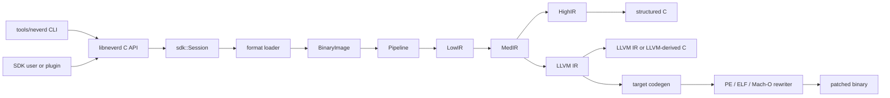
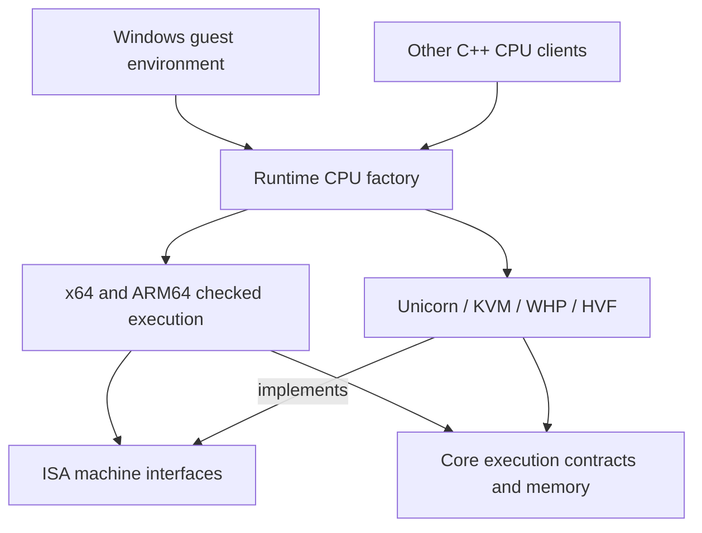

**Languages**: [English](architecture.md) | [简体中文](zh-CN/architecture.md) | [繁體中文](zh-TW/architecture.md) | [日本語](ja/architecture.md) | [한국어](ko/architecture.md) | [Français](fr/architecture.md) | [Deutsch](de/architecture.md) | [Español](es/architecture.md) | [Italiano](it/architecture.md) | [Русский](ru/architecture.md) | [العربية](ar/architecture.md)

[← Documentation Index](README.md)

# NeverD Architecture

This guide describes the production boundaries a contributor needs in order to
change NeverD safely. It intentionally covers NeverD-owned code only; the LLVM,
Capstone, and Unicorn submodules keep their own internal architecture.

## System boundary

The Qt workbench keeps project writes and browsing in one `neverd-worker` and
runs source/IR and graph reads in up to two disposable read-only workers. The
replicas start lazily: independent views can load different functions in
parallel, while each view's pages and graph transaction stay on one dispatcher.
External clients keep one dispatcher because graph summaries and viewports can
arrive as separate interleaved requests. The pool retains a shared total
response-cache allowance. The owner
exports loader choices, loaded-input identity, user edits, staged comments,
signature inputs and string options. The replica verifies the input and
committed edits before applying the remaining in-memory state; a mismatch
fails explicitly. Owner revision changes invalidate every replica and its cache.
Cancelling its final subscriber retires the process, since a synchronous C API
analysis call cannot be interrupted safely. Replica revisions and analysis
discovery never advance the writable project's state. All workers use the
same public C API; this split does not duplicate engine semantics.
Function preparation uses `neverd_prepare_function`, which shares the source
route's ARM mode, exception-handler discovery and analysis-scope checks without
emitting C. Source, IR and CFG views consume that prepared pipeline. Older
engines retain the decompiler-based preparation fallback. A failed switch
clears the worker's prepared-entry marker before another view can reuse it.

Each worker retains up to eight completed code documents under a 32 MiB
conservative retained-size allowance. Exact function, representation, project
revision and listing generation identify a document. A hit can answer before
preparing the mutable single-function Session; it never marks that Session as
holding the cached function. Graph and IR preparation keeps its own state.
Documents own text, rows and edit anchors, and project or presentation changes
invalidate them. Oversized documents remain readable without being retained.

The worker's `CodeEdits` owns pseudocode presentation aliases and unmapped line
notes. `UserStateTables.def` includes this state in history, recovery, read-only
replicas and database packing. Source identity and exact row anchors prevent
edits from silently attaching to regenerated text. The GUI selects precise
occurrences through the existing folded-source projection; image names and
mapped comments continue to use engine address edits. Local presentation names
do not establish variable, type or instruction semantics.

Pseudocode navigation uses instruction anchors recorded during source emission.
HighIR statement observations retain function, address, sequence and statement
kind; synthetic, ambiguous and changed-kind statements supply no anchor. LLVM
observations retain weak handles through optimization and the private C clone.
The source recorder publishes statement spans only when its private rendering
reproduces ordinary source byte for byte. Instruction and library recordings use
independent renders so navigation cannot weaken library folding evidence. The
C API checks every occurrence against the same canonical LowIR boundaries and
sequences used by Low/Med pages. C++, Rust and Go record individual statement
spans. Navigation projects only a complete, unambiguous recorded piece, ignoring
surrounding whitespace; it never expands to an enclosing function or joins
partial pieces. A function shown as C after a dialect refusal loses its
statement anchors. Library folding retains its separate region projection.
This supplies navigation evidence rather than complete expression provenance.
Source and assembly cursors browse independently. Graph refreshes retain the
latest requested or selected instruction even while no layout is available.
A new navigation cancels the preceding function-lookup callback so a late reply
cannot replace the newer destination.
Tab consumes the selected row's primary address, preserving a secondary address
chosen by an assembly-to-source Tab so a round trip returns to the same
instruction. Reverse navigation waits for the source pages and expands the
mapped row's fold. An unmapped row explicitly falls back to its own function
entry; an unmapped instruction reports the missing source mapping.

Native pseudocode defaults to the detected C++, Rust or Go dialect, with C as
the fallback. Validated Itanium/MSVC names also identify C++ without an
exception runtime. The C++ printer uses the shared symbol spelling rules for
namespaces, STL aliases and qualified ATL types; non-default template arguments
and explicit ABI arguments remain visible. DWARF record identities supply type
spellings, not guessed layouts or implicit member-call conventions. The GUI
offers a separate C choice for non-C images and omits it when only C is offered.
Explicit C keeps native throw calls and separate handler entries with unwind
metadata in comments; C++ keeps structured exception syntax. Their caches are
separate. The C exception view depends on the image's original runtime and
tables; it is not a portable implementation of that unwinder.

DWARF subprogram extents are collected, sorted and swept once before publication
instead of comparing every pair during ingestion. Duplicate entries, overlaps
and malformed ranges remain untrusted. Large inputs with at least eight compile
units can parse disjoint unit groups in parallel using independent LLVM object
and DWARF contexts, then merge facts in source order. Only immutable input bytes
are shared. Small and compressed inputs stay serial to avoid setup costs and
per-worker decompression memory; `NEVERD_THREADS=1` selects the serial path.


```mermaid
flowchart LR
  CLI["tools/neverd CLI"] --> CAPI["libneverd C API"]
  SDKUser["SDK user or plugin"] --> CAPI
  CAPI --> Session["sdk::Session"]
  Session --> Loader["format loader"]
  Loader --> Image["BinaryImage"]
  Image --> Pipeline["Pipeline"]
  Pipeline --> Low["LowIR"]
  Low --> Med["MedIR"]
  Med --> High["HighIR"]
  High --> HighC["structured C"]
  Med --> LLVM["LLVM IR"]
  LLVM --> LLVMOut["LLVM IR or LLVM-derived C"]
  LLVM --> Codegen["target codegen"]
  Codegen --> Rewriter["PE / ELF / Mach-O rewriter"]
  Rewriter --> Patched["patched binary"]
```

NeverD has four IR representations, but they are not one mandatory four-hop
sequence. `LowIR -> MedIR` is shared. Structured decompilation then uses
`MedIR -> HighIR -> C`; `lift`, `decompile --llvm`, and `patch` use the direct
`MedIR -> LLVM IR` route. In particular, patch and lift modes deliberately skip
HighIR.

Windows registration-chain EH has separate source and generated contracts.
The COFF loader owns the checked SEH/FuncInfo records. LowIR's
`analyzeRegistrationStates` owns reaching levels, callback roots and chain
lifetime, including the untouched bytes of narrow state stores; HighIR and
native LLVM lowering consume that same result.
The implementation lives under `lib/ir/low/X86`: frame transfer, callee ABI,
state initialization, ordinary transfers, C++ calls/objects, exceptional roots,
cookies and result publication have separate translation units. The private
state solver owns the shared lattice and cumulative work budget across them.
The LLVM backend keeps registration lowering and callback preflight, scratch
stack proof, outlining and security-check ABI under `lib/backend/llvm/X86`.
`MedLLVMRegistrationIncoming` owns the transactional caller-frame projection
used by both SEH and C++: preflight binds source memory occurrences, installation
captures the physical entry frame in an escaped slot, and rollback restores
pointers, metadata, volatility and newly introduced declarations. The shared
C++ entry ABI accepts only observed contiguous cdecl words or a single ECX
parameter; parameter attributes cannot silently select another register ABI.
COFF installation, source-IR replay, callback identity, incoming-frame proof,
image-pointer closure and emitted SEH table checks remain separate consumers
under `lib/backend/codegen/COFF`. Splitting these implementations does not add a
second source-semantics owner or turn an analysis result into rewrite permission.
It also publishes ordinary, runtime-dispatch and catch-resumption reachability.
Empty levels alone do not identify dead code: a reached block can precede
installation or follow removal. The call ABI consumer prunes only with complete
state/lifetime/call proofs, current block identities and exact call receipts.
For PE32 C++ catches, that analysis also owns the runtime catch-context stack,
its nested-search minimum and exact returned continuation and SavedESP facts.
It publishes every possible catch-search target and the exited guard count.
Secondary search through a parent try removes the exited invocations and
restores their captured stack snapshot. CFG construction and native call
lowering consume that result rather than filtering by the first guard alone.
The captured pre-dispatch SavedESP owns the catch-return writeback even when
catch code changes the cell. That effect remains bound to the exact RETURN in
LowIR and MedIR. Dedicated x86 HighIR and LLVM continuation lowering restore
the recovered source cell; the generated runtime frame has its own physical
SavedESP. A separate COFF continuation proof replays the snapshot and checks
the actual store immediately before catchret, including its value and address.
CFG construction closes those targets against function and instruction
ownership and replays the analysis; it does not turn them into independent
ordinary entries or insert a fabricated IP-to-state map into FuncInfo.
The FuncInfo parser also authenticates the exact stored callback-pointer
fields used by module function discovery and indirect-entry discovery;
independent pointer references, exports, stated symbols and direct calls still
create ordinary entries. Focused loading retains this parser's language-table
ownership rather than reparsing registration data as table-driven EH.
For a checked realigned x86 frame, the LowIR value domain keeps entry EBP and
runtime-establisher offsets in separate register facts and cell maps. The
alignment transfer replays the decoded entry AND and allocation; installation
requires the actual ESI anchor, saved entry EBP, saved ESP, previous chain,
handler and seed state. Entry-relative accesses below the saved-register area
and runtime-relative accesses above the aligned allocation can cross coordinate
spaces; both remain rejected without an exact projection.
A separate callback coordinate owns only allocated, initialized bytes below
that invocation's return PC. Push/pop recovery must restore runtime EBP and
balance ESP before a non-nested realigned catch can resume. Dispatch preserves
the authenticated saved entry EBP; callback pointers lose their exact identity
when an invocation ends or another begins. Checked callback calls borrow parent
objects using the pre-dispatch stack snapshot, while preserving their private
ESP. Parent administration, including the saved entry EBP, cannot be borrowed.
MedIR's separate x86 root owner consumes these LowIR facts. It disconnects only
exact no-return call fallthroughs before SSA, preserving exceptional edges and
the continuation's independent runtime frame. Shared coordinate projection
expresses the aligned establisher from entry ESP for HighIR and LLVM, while
entry-stack proofs cannot claim a fixed displacement. Pointer-copy and slot
proofs keep each runtime definition's identity. The MedIR callback owner binds
private ESP definitions to the current runtime-only entry and checks the whole
ordinary catch CFG against exact source ranges and continuation receipts.
HighIR captures that input with an `EntryRegister` expression at the callback
entry, rather than substituting the parent's ESP or an unknown value. Copy
propagation cannot move the capture. Realigned catches become clause bodies
only when all callback blocks can move together without admitting an ordinary
entry or absorbing unprotected code. SavedESP restoration precedes the checked
continuation. HighC spells the runtime input as an explicit EH-view intrinsic;
it does not supply a standalone C implementation of the exception runtime.
The explicit C view retains an embedded callback as a labelled native entry
inside the parent, skipped by ordinary fallthrough, without assigning it a C
function ABI. Aligned frames retain their explicit FS chain accesses because
their byte-addressed node stores still consume the previous-head definition.
The MedIR call owner binds each retained callee ABI to its current occurrence.
HighIR reads that call's current ECX SSA value and uses the proved argument
count; a private EBP spill cannot become an extra stack argument.
Unproved or ambiguous bodies retain handler/continuation annotations.
The fixed LLVM C++ prologue has its own COFF decoder. It authenticates the
saved-register prefix, allocation, all node fields and six-byte FS publication.
`RegistrationChainInfo` owns translation from runtime EBP to the source frame;
ordinary fixed-frame accesses remain relative to entry EBP. MedIR represents
the displaced runtime EBP as a distinct root and validates it against complete
source state. LowIR, HighIR, native catch/cleanup projection and the independent
COFF SavedESP check consume the same coordinate. A displaced frame uses the
same separate callback-stack proof as a realigned frame.
Native scalar-catch lowering
projects the source coordinate only into an allocation with proved physical
alignment. A dedicated catch-stack planner bounds private ESP uses; catch
objects, cleanup borrows and continuation writeback share the parent projection.
The COFF consumer independently binds the private stack to the source callback,
checks its lifetime and allows a parent bridge only through SavedESP. Its memory
proof tracks initialization by allocation identity and resets callback bytes at
every catch entry. Shared mask folding requires actual alloca alignment and
cannot infer a constant displacement for an arbitrary source entry ESP.
The LowIR no-return path proof lives in the low validation component, so call
ABI checks do not depend on aggregate IR or MedIR. LowIR and MedIR consume the
same architectural intrinsic-termination definition; both follow exceptional
destinations after an ordinary no-return call.
MedIR distinguishes established parent EBP, private callback
ESP and a continuation's checked saved ESP. Its shared root-shape and
entry-stack-coordinate helpers are consumed by stack proofs, HighIR and LLVM;
a generic COPY or a conflicting ordinary entry cannot substitute for that
runtime contract. Structured and fallback HighIR clauses retain object/frame
offsets and the checked continuation list.
HighIR can join split registration C++ intervals around a runtime-only catch
only when the resulting protected slice is contiguous and has no independent
entry. Callback separation and body extraction commit together under a shared
copy budget. A separately converted ordinary PE32 callback cannot be embedded
without a parent-frame projection; its clause retains the native target.
`hasCallerCleanupRegistrationABI` owns the current PE32 stack-cleanup check,
which the writer replays against immutable input.
`getCheckedX86RegistrationLeafCalleeABI` uses the same affine transfer for
callee-private stack and borrowed ECX object domains, with separate spill
storage. Its exact object/image footprints describe a returning leaf; a caller
still needs bounds, initialization and registration-separation proof. A leaf
summary alone cannot establish a source call or native C++ capability.
The same frame transfer separately reports whether every ordinary leaf return
computes a 32-bit scalar independently of incoming registers, borrowed pointers
and the caller PC. Frame privacy can admit an unobserved entry-EAX return;
that weaker fact cannot choose a physical scalar call declaration.
The same ABI owner authenticates immutable MSVC cleanup relays that derive
ECX from the establisher EBP and tail-jump to a checked leaf. PE32 relative
branches wrap at the architectural width; instruction storage does not wrap.
This relay describes an object offset, without granting a parent-frame borrow
at an unwind dispatch. The shared immutable-code reader verifies unique
file-backed PE32 storage without pointer fixups before decoding the relay.
The COFF loader separately owns bounded scalar ThrowInfo decoding and its
immutable CatchableType graph. The call ABI owner binds that graph to an exact
CRT import and a fully initialized private exception object, retaining real
caller-PC observations and rejecting metadata mutation. This still describes
a preserved helper, rather than authorizing a rewritten parent.
One CFG construction memoizes these callee proofs under a shared budget that
also charges failed attempts. Registration-state analysis projects each exact
source call into the caller's allocated frame, intersects byte initialization
at joins and excludes the registration record and SavedESP from object borrows.
May-writes discard old value facts without inventing definite initialization.
A checked private throw stops ordinary flow while retaining runtime dispatch
and catch resumption; LowToMed consumes its source-indexed no-return fact.
The same projection authenticates cleanup objects at every reachable unwind
dispatch, including catch dispatch through its checked SavedESP. Every
action must bind a checked relay and initialized, pointer-free read extent;
conflicting predecessors or unproved actions discard cleanup and image-read
authority. Cleanup receipts retain the source block, active state, action
and projected extents.
C++ catch homes are seeded only from a matching checked thrown type and
object width. Reference catches carry a separate runtime-object address domain;
private frame spills preserve that identity without treating it as an image or
parent-frame pointer. Exact typed access receipts require the active catch
context, bounded scalar reads/writes and complete source occurrences. Partial
spills, pointer escape and use after catch return discard runtime authority.
Adjacent table-owned catch labels extend the parent code range; cleanup relays
retain their separate ABI and ordinary-entry conflicts remain explicit.
These call facts remain separate from a compiler or installation receipt.
For PE32 C++, the loader authenticates the original FuncInfo-loading handler
thunk separately from the CRT dispatch entry. Its shared immutable-code reader
admits absolute operands only at exact, unique HIGHLOW relocation slots; an
opcode relocation, conflicting storage or changed runtime import rejects the
identity. Native source lowering consumes the checked physical call ABI,
optional catch home, cleanup borrows and catch-return target. The shared x86
catch projection distinguishes a proved absence of object storage from missing
object/access proofs. LLVM lowering and COFF IR validation consume that same
projection; an unbound catch grants no runtime initialization write. Literal
zero object and catch-all RTTI fields must have no overlapping compiler fixup.
LLVM records the
exact parent and child funclet machine-code ranges when emitting indexed
catch rows. Complete PE32 C++ receipts additionally close FuncInfo, unwind,
try and handler tables and bind each cleanup to its generated state and range.
The COFF table validator reparses source metadata, checks all raw table edges,
matches the physical catch subfield and authenticates every absolute pointer
fixup. SEH and C++ share generated-section and pointer-field ownership checks.
The emitter fixes original image storage identity before materializing any
function or shard, including masked native C++ sources. Preserved callee
footprints and ordinary helper bodies therefore share the same canonical image
storage. The independent C++ control validator replays source analysis, binds
source ranges to stable LowIR identities and checks every source operation,
catch, cleanup, invoke, chain occurrence and continuation. A no-return call
carries its terminal block boundary because its normal successor cannot execute
an anchor. SEH and C++ share the source-segment and whole-frame identity owner.
The full C++ IR proof uses that same frame-address owner to authenticate actual
object borrows, scalar pointer privacy, every-path byte initialization and typed
runtime reference accesses. Reads and writes retain original image storage;
language metadata, CRT dispatch and readonly image ranges remain immutable.
Catch writes seed only the checked object home, and callee may-writes do not
establish initialization. Control and table receipts cannot replace this proof.
The x86 state pass also records its actual compiler-created registration handler
as a private derived owner of the parent. MC closes that handler's exact range,
table identity and physical registration-node base/offset. The COFF handler
validator checks its FuncInfo load and original CRT tail branch, exact fixups,
the decoded parent store into that node and the compiler's SafeSEH row. Kind,
PC-relative flag and final encoded displacement retain separate meanings.
These individual IR and machine-code receipts do not grant installation. The
C++ transaction composes fresh full IR, complete table and handler proofs,
preserves the original SafeSEH handlers and adds the compiler-owned handler
only when the input already enables SafeSEH. Every dispatch pointer belongs to
the emitted HIGHLOW closure; failures leave the generated image unchanged.
Preparation also binds every actual entry mapping to its unique compiled source
definition. The committed receipt retains sorted original/generated RVAs; final
validation requires PE32 x86, an executable original entry and the exact E9
target, in addition to the generated section hash. A complete language table
cannot authorize an omitted or redirected entry trampoline.
The same bounded COFF FuncInfo decoder exposes complete normalized wire graphs,
record extents and callback-pointer fields without inventing a physical frame.
Valid record aliases remain inspectable; distinct ownership is a separate
requirement for reconstruction.
The compiler table consumer cross-checks this decoding with its exact indexed
extents. Prepared C++ graphs and entry encodings then require fresh equality
when the final PE is mapped and decoded, even if a changed section hash is
supplied. Ordinary loading also retains bounded direct PE32 entry-jump targets
as tentative function boundaries, observes unindexed immediate stores through
other base registers and authenticates private FuncInfo handler thunks before
excluding in-range handlers. This preserves the installed language graph on
reload. These observations do not make a frame callable; state replay of a
generated realigned ESI frame still needs its own transfer proof.
The loader authenticates the complete straight-line ESI prologue, including
alignment/allocation, saved parent frame and SP, seeded state, handler/link
slots and FS publication. A separate realigned anchor records its register,
definition and bias from the runtime establisher. State-store observations use
that bias; they do not imply entry EBP coordinates. Canonical LLVM schema 10
and semantic digests retain the anchor. The EBP state solver and native source
classifier explicitly reject it until a matching coordinate transfer exists.
The original loader owns load-config's declared structure extent even when
MSVC's directory retains its 64-byte compatibility size. Installation requires
a complete unique raw-backed extent. Final guard validation uses this same
declared extent, so a compatibility directory cannot hide CF or EH continuation
fields; the complete declaration must remain inside one raw-backed section.
The checked LowIR callee ABI also owns
precise executed-instruction extents, including a private throw's exact import
thunk. The transaction rejects every five-byte entry patch that intersects this
preserved code or CRT dispatch, including interior sites; unrelated replacements
may coexist. Native C++ source classification owns the currently supported
single-try, single-catch projection and its state bound. Output additionally
requires the compiler's catch, complete-table and handler receipt capabilities.
The public plan dispatches to the same full C++ IR proof used by preparation;
classification alone cannot authorize installation. Genuine source images are
executed under Wine and the identical files are replayed with the Windows CRT.
Native LLVM lowering owns
the physical registration and callback frame recovery. The COFF transaction
authenticates emitted scope rows, SafeSEH and absolute relocations before
installing the complete module through either patch mode. Analysis facts alone
cannot authorize native installation.
COFF owns the bounded SEH3/EH4 scope-table byte extent. Both preserved callees
and edited/generated LLVM must leave that complete table unchanged; EH4 also
protects the exact image cookie. A compiler-owned scope snapshot cannot replace
a runtime-mutated source table.
The same FuncInfo decoder owns C++ metadata record extents and callback pointer
fields. Native checks reparse the complete normalized graph before using those
extents and reject distinct overlapping records. Preserved ordinary callees
and cleanup relays must leave every language record unchanged. A checked
private throw contributes its authenticated image and caller-PC effects;
separate state reachability and object projection still govern native calls.
The same LowIR frame domain owns EH4 cookie initialization and exact source
checker occurrences. Native lowering may replace an authenticated pure check
with a source-indexed execution event while LLVM owns the physical GS check.
The public writer replays that ownership and the complete event order against
immutable input; metadata alone cannot authorize removing a source call.

Offline web analysis has a separate source-domain session in `lib/web`, exposed
through `NeverDCAPIWeb.h`. It owns immutable artifacts, bounded private disk
storage and range reads, source identities,
parser/model admission, lexical binding identities, primitive-value semantics,
conservative effect summaries, module evidence, admitted-file comparisons,
qualified bundle source partitions, fixed-profile Bun container extraction,
map decoding, budgets and query redaction. `SourceView` owns the bounded display
projection and original/projected range mapping; `SessionView` owns preview,
publication and revocation. CLI/worker adapters cannot bypass those policies.
Views use owned parser token/comment spans and never claim semantic rewrites.
`BunContainer` owns ELF/Mach-O/PE graph location, target identity and native-range
validation. `Bun` owns the shared graph records, flags and module decoding;
transport capability lists and extraction results use the same profile builder.
Adding a target container does not change source semantics or imply native
machine-code/bytecode decompilation.
`sea/Container` and the format readers independently locate explicit Node SEA
resources; `sea/Blob` owns their serialization, region partition and private-key
budgets. `SessionSEA` publishes revision-bound metadata and exposes only stored
JS/assets through `ArtifactView`. Caches and snapshots remain opaque; native
activation/version authentication are not inferred. Asset keys never establish
a filesystem namespace. Package analysis of an explicitly selected asset uses
one document with no directory inventory. See the [SEA profile](web-sea-profile.md).
`packages/PackageReader` owns versioned Node metadata and captured placement
evidence; `packages/PackageDiff` compares its model without transport concerns.
`SessionPackages` owns revision-bound caches, fixed metadata pages and
comparisons. Missing evidence, conflicting declarations and unresolved runtime
semantics remain distinct. All adapters consume these same results.
`packages/PackageArchive` owns tar/local-PAX/single-gzip framing, complete-stream
budgets and member admission; `BlobStore` supplies bounded private derived
spools. `SessionPackageArchive` atomically publishes members after full validation.
`packages/PackageIntegrity` owns shared SRI classification and original-byte
comparison; `SessionPackageIntegrity` binds selected captured registry/lock
declarations to selected original artifacts. Archive validation, byte equality,
publisher authentication and behavior remain separate claims. See the
[archive/integrity profile](web-package-archive-profile.md).
`interfaces/Endpoint` owns private URL comparison keys and fixed public
vocabularies. `interfaces/HAR` owns bounded capture admission;
`interfaces/SourceInterfaces` consumes the shared syntax/binding/value models;
`interfaces/Correlation` owns the explicit candidate join. `SessionInterfaces`
owns redaction preview/commit, revision/cache lifetime and public metadata.
Transports cannot publish uncommitted HAR observations or reinterpret a match
as source execution. See the [passive interface profile](web-interface-profile.md).
`streams/Framing` owns bounded line/SSE framing, `streams/Records` owns
selected JSON/protocol shapes and `streams/Relations` owns recorded-context
joins. Shared `JsonReader` reports consumed nodes even on failure so a stream
cannot reset the aggregate budget at each record. `SessionStreams` owns
revision-bound redaction preview/commit and metadata pages; CLI and worker
cannot infer a protocol or bypass publication. See the
[stream profiles](web-stream-profile.md).
`web/Error.h` owns fixed diagnostics independently of `Session`; artifact
readers and semantic algorithms do not depend on the session API to fail.
`SourceNavigation` owns syntax containment and lexical links; `SessionAnchor`
joins source coordinates, original storage and committed display views. Bun
source range conversion uses the same decoder as source extraction. Compressed
sources return containing frames instead of fabricated per-character offsets.
`SessionBunExport` owns explicitly requested local disclosure of an immutable
Bun extraction. `ExportDirectory` owns private-directory, exclusive no-follow
writes, bounded output, read-back hashes and completion-manifest publication.
Virtual target names are data, never output paths. `SourceRecovery` owns
whitespace-only readable copies and reparse/tree comparison through the same
embedded parser, with a separate sequential budget profile. It does not enter
interactive caches, infer missing TypeScript or grant semantic-rewrite claims.
The parser integration preserves original locations when converting async-arrow
spread nodes to rest bindings; parser admission additionally checks the owned
token after a rest binding for a forbidden comma. No consumer repairs missing
locations or guesses this syntax independently.
The same private parser owns resource-declaration grammar and original
`using`/`await using` kinds. `SourceBindings` owns their immutable lexical
bindings and `SourceEffects` owns conservative registration/disposal effects;
formatting cannot remove or lower them. See the
[resource-management profile](web-resource-management-profile.md).
`ArtifactView` owns direct-byte selection and origins for original files, Bun
assets and available ASAR or package archive members. Nested origins retain
container-relative offsets separately from original/expanded storage offsets.
Encoded Bun/map source keeps its dedicated
decoder. `Asar` owns Pickle/JSON/member/integrity validation, while `PathPolicy`
owns its pinned native Unicode collision policy. `SessionAsar` publishes bounded
member pages and explicit captured unpacked associations. Source, anchors,
relative module-file comparisons and native handoff share these selections;
unavailable members never become consumer bytes. `SourceOrigins` owns finite
syntactic module provenance over the existing binding/module model; `ElectronSource`
consumes it without claiming runtime API targets. `ElectronManifest` compares
entry declarations within the selected captured namespace, and `SessionElectron`
owns revisions, caches and metadata-only publication. The manifest consumer
does not depend on the JS parser. `ElectronIPC` owns explicit manifest-scoped
channel comparisons; `SessionElectronIPC` only selects cached evidence and
publishes bounded source/channel/endpoint pages. No transport infers routing.
`ElectronSelection` owns shared manifest/source admission for scoped consumers.
`SourcePaths` owns finite captured-root path candidates; `ElectronEntries`
compares them with exact available namespace members. `SessionElectronEntries`
selects evidence, caches results and publishes redacted pages; CLI and worker
share those rules. Relative renderer-file and source-directory roots remain
distinct. Association does not execute targets or automatically parse HTML.
`HTML` owns the bounded UTF-8 script/base scanner, `HTMLReferences` owns pinned
attribute decoding, and `HTMLLinks` owns portable local URL comparison.
Its private `HTMLFiles` index and declared-base rules are shared with
`HTMLModules`, which binds inline module requests to explicit document/script
contexts and captured occurrences. `ImportMap` owns bounded JSON/URL normalization
and exact/prefix/scoped/blocking rules over the embedded C++ Ada URL parser.
`HTMLImportMaps` owns captured declaration bases, source-order eligibility and
the separate capture-root projection. Full serialized URLs stay private;
decoded filesystem candidates never substitute for URL identity. Unknown browser
activation/history and absolute key origins remain explicit boundaries.
`SessionModules` selects this context only for derived
inline IDs; ordinary external-file analyses keep their own profile and cache.
`SessionHTML` owns cache/revision and private
metadata policy. Inline scripts use `ArtifactView` slices with nested original
storage origins and a shared inline-occurrence selector; source parser and
anchor consumers do not reconstruct or execute browser source. HTML inventory
remains available without the JS parser.
`SessionNative` supplies the selected immutable native occurrence. The SDK
bridge joins that evidence to a new independent native session;
the web library does not depend on the native pipeline. `loadBinaryBuffer` uses
the same ELF/COFF/Mach-O readers as file loading and refuses implicit universal
slice selection. Snapshot-backed native sessions have no file or sidecar
namespace; native path-dependent operations check that boundary explicitly.
JavaScript is not
a native ISA and does not enter LowIR. The CLI uses this C API, while the pinned
embedded parser is private to the backend; no target code or external analyzer
is executed. Syntax acceptance and source-map format validity do not establish
semantic completeness or producer provenance. See [web analysis](web-analysis.md)
and its [schema](web-artifact-schema.md) for the current capability boundary.

Library feature recognition reads the shared MedIR boundary before the source
routes diverge. `SignatureDB` owns validated packs and the existing byte matcher;
MedIR analyses prove typed expressions and bounded COM ownership sequences.
`PipelineLibraryRecognition` combines this evidence without changing names,
operands, bodies or ABI contracts. The session publishes one display identity
for lists, call sites and source pages. HighIR/LLVM source observations are
sidecars: complete surviving mappings can authorize reversible UI folds, while
ordinary C and export remain fully expanded. See [library recognition](library-recognition.md).

Both source routes apply the same module-wide return modeling before recovering
call arguments. On 32-bit targets, a callee proven to return a 64-bit integer
uses the two integer return registers; HighIR and LLVM emission must preserve
both halves through callers and source returns.

The `neverd-bytecode` tool and C/Python plugins accept externally specified
instruction languages through the shared recovery pipeline. C/Python callers
can supply a static profile or a synchronous per-instruction decoder callback.
`lib/pipeline/BytecodeRecovery.cpp` owns request validation and source orchestration;
`lib/analysis/bytecode` owns encoding and CFG validation: both producers feed
the same operand, temporary-definedness and operation validation. They produce
LowIR; explicit byte-addressed state lowering then feeds the existing source
routes. That shared lowering also owns the optional opaque source-context
parameter: it captures state and context once on entry and forwards them through
bound calls without inferring alias separation or decoder-context identity.
CLI and SDK request validation select the same contract. Image-independent
source ABI binding uses caller-supplied contracts,
while runtime signature discovery from native images retains its format gates.
This source-only path does not authenticate native instruction boundaries or
authorize rewriting. See [external bytecode profiles](bytecode-profiles.md).

Native jump-table selector domains are proved in the shared LowIR resolver.
A loader-normalized absolute table may use the same exact, point-sensitive
finite-domain proof as a relative table. The physical pointer run supplies a
read ceiling, not a selector bound. A long physical run may use the bounded
finite query only after proving every feasible index fits its query ceiling;
values beyond that ceiling cannot be silently discarded. After adding
destinations, the resolver must replay the proof on the expanded graph; a
newly reached backedge cannot reuse an entry-only domain. A complete
single-consumer finite proof is not
widened or vetoed by a weaker mask search. Module-wide storage mutation checks
still run before source publication.
Guard identity can name a contained architectural register lane at its exact
full-register writer. The shared reaching-value resolver names that complete
definition and retains the lane's offset and width, so a comparison of AL or
W0 need not expand the earlier EAX or X0 calculation. Both the comparison and
the table index must reach that same lane through every incoming path. Partial
writes, call clobbers, implicit extension rules and proof budgets still apply.
Exact guard-occurrence queries use the expanded CFG value-reconstruction depth
limit. Guard syntax collection and materialization keep their separate, smaller
expression limit. This lets a shallow guard cross a longer predecessor graph
without treating depth exhaustion as a completed proof or skipping replay.
A failed optional consumer audit grants no relocation-root suppression. With
its shared evidence budget intact, the resolver retains every root and replays
the mandatory selector, address and target proofs under that stronger context.
Shared-budget exhaustion still rejects the whole candidate.
For a single absolute consumer, a relocation-backed physical run may contain
unused pointers to other functions. Validate target ownership for every
admitted selector coordinate before graph growth; an excluded prefix slot
neither truncates the selector proof nor becomes a local successor.
The LLVM scalar-offset proof may retry a depth-limited recursive walk with its
independent closed-value-graph proof. That proof still checks every initializer,
address provenance, forbidden value and memory source, with its own 512-level
and 8192-node limits; reaching the first limit is never itself a certificate.
The LLVM backend accepts a sparse table's logical address origin separately
from its owned runtime slots. Eliding its target load still requires the exact
operation witness, complete mapped slot and relocation ownership, and exclusive
consumption by the recovered branch. The unused prefix gains no suppression
authority from sharing that origin.

MedIR binds a switch selector to its dispatch block as well as its machine
address. CFG products can copy one instruction into distinct SSA lifetimes;
every path back from a dispatch must reach the same exact operand occurrence
before any independent entry. A missing or changed occurrence cannot borrow
another copy's value. LLVM and HighIR consume the same block-specific plan.
Composite target-load authentication requires every dispatch copy to retain
its recipe, including when the load precedes the branch in a separate block.
The two-table recognizer walks address and base COPY envelopes iteratively.
Each reaching-definition lookup starts strictly before the previous one and
debits the candidate evidence account, so the finite prefix itself bounds
these walks. Recursive expression and selector proofs retain their separate
depth limits; longer copies grant no address, target or domain authority.

The resolver's point-sensitive stack identity uses anchored affine equations.
Cyclic predecessors share equation nodes instead of recursively expanding the
same frame state for each query. Every incoming value must agree; unanchored
cycles, nonzero loop deltas and overflowing intermediate offsets invalidate
their users. The existing evidence allowance charges graph construction and
propagation. Completed equations are immutable within a proof mode, so later
queries solve only new dependencies. Register/memory transparent-cycle memo
entries are reusable only until either resolver learns a concrete result;
both share the invalidation generation because their walks recurse into each
other. Neither cache bypasses incomplete-proof rejection.

HighIR's call-argument projection uses the same checked affine equation core
for entry-stack offsets in an immutable MedIR function. Each SSA definition is
indexed once; PHIs require all incoming offsets to agree. Width and ambiguity
checks stay in the SSA adapter. A separate dependency-depth certificate prevents
warm query order from bypassing the projection's depth bound. A new conversion,
including a second layout attempt, discards the index and solved offsets.
The depth certificate is conservative for general multi-PHI cycles; failure
leaves the coordinate unknown even when a more expensive path analysis might
prove it within the bound.

Proof graph indexes use a private arena that outlives their containers.
Ordered insertion hints preserve duplicate
and out-of-order point handling. A fixed-size register lane cache checks the
complete offset/width key and uses the query's immutable target metadata.
These storage and lookup optimizations retain the original evidence charges;
they do not reuse CFG or value proofs across changed snapshots. A builder may
retain one successful graph with an owned instruction snapshot. Reuse requires
exact instruction facts, LowOps, effective edges, block starts, proof roots,
conditional roots and storage-owner inputs. Hits pay the complete original
graph-construction charge. The graph may also retain up to 64 completed query
batches under a separate 8 MiB retained-payload allowance. Exact ordered query
fields, proof limits, output shape, function context and both relocation
occurrence inventories bind each result. Hits pay the complete cold value
charge; a smaller budget runs the normal path. Incomplete proofs and batches
using pointer-named symbolic values or merges are excluded. Image metadata is
immutable during a build, and every new build discards this state. These caches
do not bypass proposal validation, rollback or fixed-point stages.

A bounded group of AArch64 absolute dispatches in one relocatable ELF function
can share an exact read-only pointer object. Each selector first proves its
finite domain with every independent root retained and all group edges absent.
The joint graph then replays every selector, target LOAD and address role.
Three immutable rounds establish and replay the complete consumer inventory;
every member audits the whole physical object, but suppression is limited to
the independently proved runtime coordinates of the group. Unused slots keep
their independent roots. The group publishes and withdraws atomically; a
missing owner, changed member, observable table use or exhausted proof retains
the unresolved transfers. Module-wide mutation and consumer arbitration still
owns the final publication decision.

CFG construction also owns indirect tail-call classification. For an AArch64
candidate without a proved dispatch, `IndirectTailFrame` checks the necessary
incoming SP and link-word restoration under the existing native call ABI.
Whole-word copies, bounded pointer-width stack arithmetic and exact spills
carry these identities; all reaching predecessors and backedges must converge.
Independent roots start unknown. Partial or overlapping writes invalidate whole
restoration words; unknown memory writes and exposed frame storage invalidate
spill evidence. Unsupported effects, incomplete graphs and exhausted work
retain the original indirect branch. Call preservation comes from `TargetRegInfo`'s
format-selected ranges. This condition supplies no callee identity or source
ABI. Successful classification emits an explicit `INDIR_CALL + RETURN` pair;
HighIR cannot infer another tail call from a successorless `INDIR_BR`. An
unresolved transfer without a usable switch remains an explicit failure path.

The CLI parses commands in `tools/neverd`, creates a `neverd_session_t`, and
calls the public API in `include/neverd/sdk/NeverDCAPI.h`. Engine state lives in
`lib/sdk/SessionImpl.h`; `neverd_session_load` selects a loader and builds a
`BinaryImage`, while IR-backed operations run `lib/pipeline/Pipeline.cpp`
lazily. The `neverd` executable links `neverd_shared`; the component archives
and their LLVM/Capstone dependencies are private implementation details of
that shared library. The CLI uses LLVM Support for its command-line UI,
but it does not bypass the C API to drive the engine.

ARM32 ELF code mode is taken from defined executable function symbols,
ARM/Thumb mapping symbols and an executable entry point, before normalizing
Thumb address tags. Distinct ARM and Thumb regions produce explicit mixed-mode
metadata; `BinaryImage::instructionModeAt` is the shared address-specific mode
contract for discovery, decoding, lifting, SDK disassembly and rewriting.
Conflicting evidence at one address is rejected, and `$d` mapping intervals
cannot be decoded as instructions. CFG edges carry their incoming mode when
the target lacks stronger mapping evidence. For linked ELF images without
mapping symbols, the loader follows direct branches from exact code entries
and records only the decoded instruction spans. Unreached gaps remain unknown
even when all reached instructions use one mode. An exact ARM literal branch
veneer may supply an additional executable target, but function discovery must
verify it before treating it as callable. ELF section and in-place rewriting
compile each authenticated source function in its own mode, encode Thumb code
pointers with bit 0, and validate final direct calls before publication.
Unsupported cross-state branches that need a veneer fail clearly. Loading a
new image into an SDK session resets its previous decoder state; data symbols
and unrelated names do not select a decoder mode. A fully stripped image can
leave an indirect target's state unknowable from static bytes alone; the
file-level default is not proof that all of its executable bytes use one mode.
An ELF function entry without exact mode evidence requires a caller assertion
before either C route can decode it, even when the file-level decoder starts in
ARM mode. A single-function LLVMC request runs the same semantic LLVM
optimization as the full-image route before emitting C. With `--no-opt`, both
routes promote the emitter's temporary allocas without running value-changing
optimization. The SDK rebuilds a cached native LLVM module when this policy
changes and publishes the replacement only after verification succeeds.
Both LLVM C routes retain verified output with only temporary-alloca
promotion when an incomplete native exception contract excludes optimization.
The C emitter clones verified LLVM IR and removes dead computations before
rendering, including in `--no-opt` mode. This source normalization preserves
observable calls and ordered memory accesses without modifying the cached IR.
Generic LLVM arithmetic and control builtins do not request target ISA headers.
Both C routes reject string-literal replacement when loader fixup provenance
overlaps any candidate byte, including its terminator.

ELF GOT data identities come from the exact relocation symbol snapshot through
`collectDataSymbolBindings`, shared by HighC and LLVM emission. The loader's
relocation inventory owns addend rules; complete PT_GNU_RELRO coverage owns
whether a slot load can become a symbolic address. Writable slots retain
addressable storage and a symbolic initializer. Undefined data uses an opaque
assembly-name alias in C, avoiding invented types and system-header conflicts.
Defined data uses its existing image backing. TLS and IFUNC records are excluded.
This contract also works without section headers. In sectionless ARM ELF,
immutable executable bytes can supply scalar literal reads without classifying
unreached bytes as instructions; overlapping relocations prevent folding.

The shared i386 get-PC recognizer requires the complete `mov r32,[esp]; ret`
encoding, with bounded NOP padding. Its own HighC, LLVM and LLVM C bodies retain
that instruction sequence in a naked helper, preserving the selected register,
stack and flags. Caller rewriting continues to require CFG-authenticated
occurrences; helper names alone prove nothing.

For 32-bit ARM Mach-O, the loader seeds exact Thumb entries from executable
`N_ARM_THUMB_DEF` symbols, including object address zero, then follows direct
control-flow edges through the shared reachable-mode analysis. A cross-state
`BLX` can establish an ARM target without treating an unflagged symbol as ARM
proof. Decoding is limited to reached instruction spans; an unproved gap in a
mixed image retains unknown mode.
Validated ARM and Thumb instruction relocations can also seed their exact
instruction addresses. This can recover an otherwise uncalled function when
its entry instruction has such a relocation, without assuming that an
unmarked symbol elsewhere in the section is ARM code.
The ARMv6-M, ARMv7-M, ARMv7E-M, ARMv8-M Base/Main, and ARMv8.1-M Main Mach-O
CPU subtypes are Thumb-only, so their processor constraint supplies a mode even
for unmarked functions without a relocation. An ARM instruction relocation in
such an image is contradictory and fails loading. Other ARM CPU subtypes do not
establish a function mode.
An A-profile Mach-O image with no mode evidence has unknown mode, not an ARM
default. Direct decoding therefore waits for a marked entry, reachable edge,
instruction relocation, or caller assertion.
When an A-profile function has no usable mode metadata, callers may assert
its exact entry state before loading through `BinaryLoadOptions::ARMFunctionModes`
or `neverd_session_set_arm_function_mode()`. The CLI accepts repeated
`--arm-function-mode=0xADDRESS:arm|thumb` arguments, including address zero in
an object file. These are caller assertions, not byte-pattern guesses: the
loader checks alignment, executable ownership, hardware constraints, mapping
regions, and exact symbol/relocation evidence before reachable decoding. If
reachable decoding runs, an asserted entry must decode in its stated mode.
Contradictory or unsupported assertions fail the load. The mode of a different
unreached function remains unknown until it has its own evidence or assertion.

`BinaryImage::readImmutableARMLiteral` is the shared authority for folding a
fixed-width read from a `$d` island inside executable storage. Both HighIR and
LLVM emission require the whole read to stay in the island and reject writable
or relocated bytes.

After ARM call-arity recovery, MedIR propagates a proven pointer parameter
through direct calls only when the argument is the exact incoming parameter;
computed register versions do not inherit that role. HighC uses the same
parameter type as LLVM emission. For private frame addresses, HighC projects a
power-of-two alignment only when the input is a certified entry-stack offset
within the synthetic frame. LLVMC preserves a host pointer through a mask
that is an identity at the target pointer width, so generated C does not
truncate valid host address bits.

Before either source route, MedIR can replace a stack-alignment mask with an
exact offset only when an authenticated entry-SP definition and the target
ABI's guaranteed alignment prove every discarded bit. Binary lift and patch
keep the original operation. The LLVM-to-C route explicitly requests this
source projection even though it otherwise uses the direct LLVM pipeline.

The HighIR `HighSourceFlow` analysis owns emitted statement edges, local identities,
and definite assignment. Both source validation and dead PHI copy elimination
use this graph. Bounded partitions track repeated equality tests between scalar
locals or against zero. Swapped operands and unchanged-width integer views
share the same fact; writing either operand invalidates it. Escaped locals stay
unknown, inconsistent widths are rejected, and partition exhaustion
falls back to the conservative graph. A PHI copy is removed only when its scalar
value is dead in every feasible context. Calls, loads, and stores keep their
observable behavior; source labels survive removal. Adjacent byte slices of
the same local are simplified in HighIR before this analysis, preserving their
result type. This identity does not merge independent loads or calls.
Med-to-High lowering preserves CFG successors after branch threading, including
sole successors with no remaining branch operation. When source order differs,
it emits an explicit transfer after that edge's PHI copies.

HighIR supports narrowing a 64-bit source local to 32 bits under the same proof used for 128-bit carriers: every definition must agree on the carrier and prefix widths, and every read must explicitly select the low prefix. A full-width integer AND also selects that prefix when its constant mask fits the low word without sign-extending from a narrower type; the narrowed local is zero-extended at that use before applying the unchanged mask. Full-width stores, escapes, upper-byte reads, or effectful upper expressions prevent narrowing. Source-parameter padding remains unknown.
Exact whole-variable copies can share this proof through a bounded graph when a constructing definition establishes the prefix width. Every copied destination must itself qualify for narrowing; a full-width consumer invalidates all upstream exemptions. Unseeded cycles, conflicting widths and exhausted budgets preserve the original values.
Bounded integer casts, zero-offset slices and extensions can carry this proof when every intermediate width retains the prefix. Each use is checked under its own statement root. Two bounded rounds can expose a narrower prefix after removing vector padding.

The shared MedIR source-entry analysis owns observable byte masks for physical
register inputs. Native helper inference uses these masks to represent proven
low float/double lanes without claiming original source types or a rewriting
ABI. HighIR separately narrows a source-local CONCAT only when all definitions
construct the same scalar prefix and all reads explicitly select that prefix.
Only effect-free upper expressions are discarded; lower expressions and their
control-flow positions remain unchanged. Unknown lanes are never filled in.

When an unrelated unresolved value prevents a complete entry-demand graph,
native helper inference may retain an independent full-word, call-preserved
entry register used directly by an effect. LowIR must confirm the same read and
the existing preserved-state proof still applies. A prologue spill value alone
does not establish a source parameter. MedIR keeps narrow physical-register
views for source-flow validation when the entry binder cannot insert a byte
slice into their consuming operation.

HighIR may also discard undefined upper bytes from a reconstructed integer only
when a following constant mask cannot observe any bit above the complete low
operand. A direct `CONCAT`, a bounded integer cast, a zero-offset `SUBBYTES`
view, or a same-width zero-bit logical right shift may expose that low operand.
The low operand may fill the masked result width. The replacement is an
explicit zero extension and the mask remains in place. The upper expression
must be bounded and discardable; calls, loads, ordered accesses, traps,
malformed widths, and masks that reach an upper bit retain the original
unknown value.

An internal void summary for a native cleanup forwarder does not assert an
original void prototype. It contributes no result carrier. Calls must match
validated runtime declarations, exact native source contracts or canonical
dynamically loaded Swift value-witness declarations. A callee may return a
value used inside the helper: that value does not establish a return carrier
on every exit from the helper itself. MedIR and LowIR must agree on the exact
instruction address and operation sequence, direct or indirect call form, and
static target when one exists. Exact Swift String bridge imports participate
through their own validated static target and source ABI. A bounded LowIR fixed
point tracks exact incoming register bytes and private stack spills, requiring
restored preserved registers,
stack pointer and link register at every exit. The frameless source-bound tail
shape instead proves that those registers are never written and uses a bounded
byte-taint fixed point to reject stack-derived call targets, arguments or stored
values.
Partial writes,
implicit zero extensions, call clobbers and overlapping stores invalidate the
affected identities. A store through an address with no frame-derived bytes is
disjoint from the current invocation's private frame and keeps its exact spill
facts. Partial or exact frame-derived addresses still reject possible escapes;
frame-address spills and call arguments are rejected, except that an exact
`objc_msgSendSuper2` binding may synchronously borrow its first argument as a
read-only 16-byte `objc_super` object. The proof requires the complete pointer
and object to stay inside the currently allocated frame; ordinary messages,
partial pointers and objects crossing either frame boundary remain rejected.
Unallocated stack bytes cannot survive a call.
The ordinary CFG and source dependency proofs still apply.
Re-lifted callers that observe a missing result retain their unknown value and
cannot pass source publication.

After re-lifting a native void candidate, its dependency fixed point can remove
an auxiliary register parameter with no occurrence anywhere in the resulting
HighIR body. This uses the existing HighIR private-frame cleanup instead of
adding another store-elimination rule. Canonical parameters and auxiliary
reads or writes remain intact. Changed signatures require another pipeline run;
neither an inferred signature nor its refinement certifies a publishable body.

Non-returning native source helpers use an internal void ABI only when both
IR stages agree and the shared MedIR termination analysis independently
rechecks the current graph. Bound calls retain their exact parameters and
effects; only recognized architectural terminators bypass the ordinary
intrinsic restriction. The final interprocedural no-return fixed point copies
its result into each exact native source-call hint, including clearing stale
effects on a later run. Both LowIR and MedIR proofs follow exceptional
successors even when a no-return call ends the ordinary path. A handler that
returns or whose body is unresolved prevents proving the enclosing function
non-returning. HighIR therefore sees the same termination boundary.
Publication revalidates the typed callee's complete source flow and requires
its dependency closure; a function flag alone never authorizes a terminating
source call. Reports, writes and traps before termination remain observable.
HighIR cleanup, trailing-return insertion, and source-flow validation share
the same exact source-termination predicate. An unconditional architectural
trap removes an otherwise synthetic unknown return only when no branch enters
that return; resumable debugger traps preserve fallthrough.

At source-bound runtime calls, Low-to-Med lowering carries the authenticated
external no-return declaration into the MedIR call effect.
An imported runtime veneer may also appear in the native function inventory.
The no-return fixed point preserves an existing machine termination fact when
the validated runtime binding and complete call operands agree; a source hint
alone cannot create that fact. The binding names the import slot, while the
call names the veneer. Inferred native effects are still recomputed from the
current graph, and source publication revalidates the import identity.

Native two-word integer returns are requested by an observed low-prefix read of
the second return register after an exact direct call in the same LowIR block.
The read may be narrower than a word, but an intervening call, intrinsic or
overlapping register write ends the demand. Demand also follows a one-block
direct tail forwarder whose last operations are an adjacent call and return of
the first result word. Neither observation nor forwarding proves an ABI: both
result registers must independently pass the existing bounded MedIR
return-path proof. The candidate then uses an
internal two-field record and the shared `ReturnComponents` lowering for calls
and returns. A later dependency iteration may extend an inferred native scalar
contract when its second word becomes provable; external and declared source
contracts are never extended. Re-lifting and the normal source body/closure
checks remain mandatory, and an unproved second result remains unresolved.

Block consumer escape analysis also uses this graph. A bounded fixed point carries pointer identities and private frame spills across branches and loops. Joins retain possible context addresses; only complete overwrites erase them. Unknown edges, exceptional flow, and exhausted proof budgets reject the binding.

An exact zero-offset `SUBBYTES` view may preserve a complete low pointer word
from a wider physical register view. Partial frame, context, and invoke-pointer
views retain their source identity and byte interval; only ordered, contiguous,
same-source `CONCAT` operations that cover the complete pointer restore an
address. Every other partial view remains tainted and is rejected if it reaches
memory, a call, control flow, storage, or an observable return. Equal scalar
bits never acquire pointer identity.
When an exact source ABI declares a narrow scalar result, an explicit
`CONCAT` may contribute undefined high physical-return padding. Escape
analysis checks the complete declared low result and ignores only that
structured high padding; a context pointer in any observable return byte is
still rejected.

A block invoke may pass an address in its own fresh frame to a bound call only
while that frame contains no context, invoke, ISA, or other proven pointer
identity. Storing any such identity makes an unbounded frame argument an
escape again. This distinguishes ordinary callback locals such as an error
result slot from the block context without weakening the context escape proof.

Stack-block construction distinguishes an exact literal base from other frame
arguments before interpreting a call as a block consumer. Ordinary frame
arrays may therefore be passed before construction; wide frame initialization
is retained as poisoned byte coverage, so it cannot satisfy a block header or
owned capture. Once an ISA identity is live, other frame arguments remain
rejected until a declared copying or nonescaping consumer invalidates the
literal storage. This keeps later unrelated frame calls available without
forgetting a block identity that still exists on any reaching path.
An unchanged entry pointer parameter cannot address the current invocation's
fresh private block frame, so an ordinary scalar store through that exact
parameter does not invalidate construction. Loaded pointers, reassigned
parameters, pointer-derived values, and unsupported store effects remain
unproven aliases.
An exact `objc_msgSendSuper2` call may synchronously borrow a separate,
fully initialized 16-byte `objc_super` record in the same frame. Its two words
must contain no block or frame identity, and every live pointer-identity byte
must remain inside a known, disjoint block literal. Other frame arguments
remain subject to the ordinary escape proof.

Capture-free global block literals may share one compiler descriptor. Source
dependencies and generated helpers follow the exact literal references in the
current source closure: an unreferenced literal sharing that descriptor neither
adds its invoke dependency nor appears in the emitted storage. The descriptor
remains shared, and the same original literal keeps one shared generated
identity across methods.

Darwin block consumers have one loader-owned callback and lifetime contract.
The generated catalog distinguishes compiler-declared `noescape` parameters
from audited runtime copying consumers. The latter covers `dispatch_after`,
`dispatch_async`, `dispatch_barrier_async`, `dispatch_group_async`,
`dispatch_group_notify`, and `dispatch_source_set_event_handler`, whose API
contracts specify copying the block. Every contract requires exact
import/provider identity, four-profile compiler agreement, and a matching
complete callback ABI.
Source publication still proves the stack header, initialized captures,
copy/dispose helpers, and invoke dependency. Either kind of consumer invalidates
the caller's construction facts after use; a copied consumer is never reported
as nonescaping. Unannotated block parameters confer no lifetime permission.
An invoke may call a block stored in its own capture only when the containing
literal has a complete descriptor, the capture word was initialized, and its
validated copy helper assigns that strong field with block flag 7. The source
pipeline passes these exact field offsets to LowIR call binding on a later
round; ordinary initialized capture words contribute only observed integer
carriers. Conflicting assignments or descriptors with different fields remove
the proof, and the call still requires an exact receiver-plus-16 target load.
An invoke callback may receive a class-qualified object parameter from its
compiler block signature. The source plan must first prove the literal's
descriptor-to-invoke link and agree on the same class for every literal using
that invoke. Call analysis carries this declared class through ordinary
receiver copies; publication re-reads the descriptor and checks the final
plan link. Bare `id`, conflicting descriptors, and unrelated invocations
remain unqualified, and dynamic message dispatch is unchanged.
An invoke body's unresolved nested block does not erase an independently
validated outer literal's parameter declaration: that declaration may be
needed to prove the nested block consumer on the next pipeline round.
An authenticated `NSArray` fast-enumeration call may borrow its
`NSFastEnumerationState` (64 bytes) and object buffer (`count * 8` bytes)
from an invoke's frame while another validated block is live. Both ranges
must fit the recovered frame and be disjoint from complete validated block
literals and every private context identity byte. Unknown counts, receivers,
and call bindings still fail the capture proof.
Individual literal probes merge import evidence only for the isa slot they
inspect; whole-image block discovery still walks the complete import inventory.

Objective-C SDK `noescape` block parameters use the same loader-owned
boundary. A catalog row is accepted only when the current message still has
the exact SDK parent-method ABI and parameter position, its block descriptor
has the exact compiler callback ABI, and any qualified receiver follows a
complete, conflict-free class hierarchy to the declaring owner. An
unqualified selector is usable only when all matching catalog rows agree on
one callback contract. This proves the caller-side lifetime only: dispatch
remains dynamic, no implementation address is selected, and methods without a
cataloged `noescape` declaration continue to reject stack-block escape.
The two Core Data `performBlock:` instance methods instead enqueue work after
returning, so their block parameters require a copied lifetime. Their audited
contracts use the same exact method and callback ABI checks and additionally
require a revalidated receiver lineage to `NSManagedObjectContext` or
`NSPersistentStoreCoordinator`; an unqualified `performBlock:` selector does
not prove copying. `performBlockAndWait:` remains a separate nonescaping
contract.
The same copied-contract boundary covers `NSBlockOperation`
`blockOperationWithBlock:`, `CLGeocoder`
`reverseGeocodeLocation:completionHandler:`, and the two asynchronous
`UNUserNotificationCenter` settings and authorization callbacks. The
`NSPersistentContainer loadPersistentStoresWithCompletionHandler:` callback
also uses a copied contract because store descriptions can request asynchronous
addition and the SDK imports the completion as escaping. The receiver must
resolve to `NSPersistentContainer` and both method and callback ABIs must match.
The authorization callback is unavailable on x86-64 in this catalog because the
macOS and iOS SDKs encode its `BOOL` argument differently.
Rejected Objective-C block consumers distinguish an unqualified receiver,
callback ABI mismatch, and unproven message binding in their dependency
diagnostic, so a missing lifetime proof can be traced without treating a
selector name alone as authority.

An invoke may pass a nested stack block only when construction proves every
header and owned capture byte, the exact call consumes that frame base, and the
consumer's lifetime contract is still bound. The outer context cannot be
smuggled through a nested capture or another frame argument. Complete 16-byte
loads from initialized captures may pass through private vector spills as
opaque bytes; partial pointer values and computed wide expressions retain
their private or unproven identity and cannot establish a capture.

Calls through copied stack blocks reuse the loader's source-call fixed point.
A complete stack header and descriptor establish the invoke ABI before an
authenticated `objc_retainBlock` or `_Block_copy` supplies a copied-block
identity. Only an invoke-field load and receiver with that same identity can
bind a dynamic call. Conflicting aliases, partial pointer operations, escaping
copies, unknown calls and ambiguous writes discard the proof. Image stores
preserve private construction facts only when the shared loader range check
proves a complete writable file-backed range disjoint from private storage.
For an AArch64 register tail branch through a captured block, the loaded
invoke register is a call target rather than an extra callback parameter.
The synthetic call-and-return pair at one instruction address may use the
descriptor-bound entry's void result ABI only when its instruction boundary
proves an indirect tail call with no successor. An ordinary call still needs
observed result evidence.
Stack adjustments retain their full pointer width with bounded narrow numeric
offsets; SIMD zero extension can preserve the unchanged low image-byte recipe
without creating a wider pointer or interpreting floating-point values.

Source-call discovery uses a bounded forward fixed point for register facts.
At ordinary joins, a selector, import slot or numeric address survives only
when every reached predecessor agrees. Independent and exceptional entries
start unknown. Call bindings are published only after backedges converge;
physical alias writes, unknown calls and instruction-local temporaries cannot
carry stale facts into a later block. Invalid edges or exhausted work budgets
reject the proof.

On x86-64, `CallRegisterEffects` owns which general-purpose registers a
direct call may change. Whole-program register allocation (MSVC `/LTCG`) lets
a caller keep a value in a volatile register across a call to a helper that
never writes it, so the ABI clobber set would lose that value. After LowIR,
the pipeline summarizes each lifted function's register writes together with
those of its direct callees, lifting callees it did not already lift up to the
`Limits.h` depth and count. A summary exists only when every function in the
call tree lifted completely, resolved every indirect branch and made no
indirect or import call. Calls that do not return are ignored. LowToMed marks
direct calls with the GPR families their callee never writes. MedSSA keeps
those values across the call and a call whose callee never writes the return
register has no result. Vector registers, flags and unsummarized callees keep
the ABI clobber set. The same pass records which registers each callee reads
before writing, including arguments it only passes on to its own callees.
For Win64 calls LowToMed publishes those argument registers as CALL inputs.
SSA then sees a caller's pass-through argument, and HighC passes exactly the
arguments the callee reads. Stack arguments follow the 32-byte home area.

Additional callee CFGs are admitted in deterministic breadth-first order.
Parallel batches retain at most 32 bodies and use at most four independent
decoders when symbol extents predict enough work; serial runs retain eight
bodies. The wider window overlaps expensive callees across former batch
barriers without changing admission or publication order. Read-only
image indexes and the existing synchronized no-return cache may be shared.
Summary publication and format-call collection retain the original order,
depth and count limits. `NEVERD_THREADS=1` restricts this phase to one worker.

Function starts follow the same evidence rule. An x64 `RUNTIME_FUNCTION` with
chained unwind info continues its parent function (`BinaryImage::
ContinuationCodeStarts`), and an entry guessed only from inter-function padding
(`Symbol::IsBoundaryGuess`) may be a hot/cold split chunk. A direct jump to
either stays inside the jumping function. A guessed entry that another function
absorbed this way is audited as `AbsorbedFunctionChunk` rather than decompiled
twice.

At a validated source-call boundary, an exact integer constant zero may supply
a pointer parameter even when the machine expression uses a narrower integer
carrier than the declared pointer. Generated C emits an explicit null pointer
constant. This exception applies only to the literal zero and only to a
declared pointer parameter; nonzero integers and other width mismatches remain
explicit source-call failures.

Selector-wide Objective-C lookup normally requires every complete local,
protocol, property and active SDK declaration to agree. When complete
declarations disagree only in their result contract, an exact post-call
scalar-register read may narrow the set if exactly one declared result carrier
defines the observation. Integer observations may consume a fully defined
subrange, including an explicitly extended narrow result. Floating observations
must match the declared register, offset and width exactly; reading four bytes
does not reinterpret a declared double as a float. Full-width copies can
transport that evidence. Recognized runtime calls preserve only ABI-preserved
aliases, including only the low 64-bit prefix of AArch64 `Q8`-`Q15`. Unknown
calls, overlapping writes, unused results, incomplete declarations and multiple
matching carriers leave the message unresolved. The selected carrier range is
stored with the source-call hint and revalidated against the current image at
publication, so a local dataflow observation cannot bypass global declaration
checks.

An exact declared pointer parameter from the enclosing Objective-C method may
also narrow incompatible declarations when that unchanged entry value reaches
one message argument and exactly one complete declaration has the same source
type at that position. An ordinary opaque object pointer additionally requires
that the unchanged entry value first reach an exactly bound `objc_retain` call;
this authenticated object consumer may distinguish a pointer declaration from
a non-pointer declaration. Every method record sharing the entry must agree
before the parameter fact is seeded. Stack reloads after the frame escapes,
transformed values, multiple matching arguments or pointer declarations, and
incomplete declarations remain unresolved. The hint records the method entry,
source ABI carrier, object-consumer fact and message parameter index;
publication rebuilds the method and selector declarations from the current
image before accepting the call.

An exact Objective-C wrapper may supply a selector declaration that is absent
from both the image and active SDK catalogs. The call must use one unchanged,
declared method-entry parameter as its receiver, forward every selector
argument from an unchanged full-width integer-register parameter, and
immediately return the call output with the wrapper's declared result ABI. The
selector arity, caller parameter locations and return carrier must all agree
with a freshly assigned Darwin ABI. Any incomplete declaration is a veto, and
every complete declaration that does exist must match the reconstructed
signature. The hint records the caller entry and parameter mapping;
publication rebuilds the method signature and requires the exact HighIR
parameter operands before accepting the message.

Full-width receiver and declared pointer identities may survive an
exact private-frame spill and reload. A returning call preserves the entry-SP
identity even when its source signature is unknown. When a frame address is
visible to a call or stored elsewhere, only typed spills wholly below that
address remain private: reaching them would require a backwards access outside
the source object rooted at the escaped address. An escaped address at or below
the spill, an inexact frame-derived carrier, an overlapping write, a partial
load, conflicting control-flow facts, an invalid stack adjustment or an
analysis budget limit discards the identity. Ordinary frame contents retain
the stricter whole-frame escape rule.

An exact address of bounded private frame storage may provide the same
pointer-to-pointer shape evidence when it flows directly to one message
argument. This fact identifies only the storage shape, not its pointee class or
value; exactly one complete declaration must require an eight-byte
pointer-to-pointer at that position. Positive entry-SP-relative addresses,
loads or reloads, transformed or ambiguous values and multiple matching
declarations remain unresolved. Publication replays only contiguous
single-definition aliases from the function entry, checks the exact negative
offset and private frame bounds, and rebuilds the current selector declarations.
Address escape does not change the address category, but no fact about the
storage contents is inferred after an escape.

Required Swift value-witness operations have a separate symbol-independent call
proof. A bounded backward trace must show that the indirect target is loaded
from the operation's required `metadata[-1][slot]` entry and that the same
metadata value occupies its canonical Swift argument carrier. The supported
operations are `destroy` and `initializeWithCopy`. Every predecessor must agree,
and malformed CFG edges, partial writes, ordered loads, call clobbers or
exhausted budgets reject the binding. Generated C repeats the table lookup
through the live metadata; it never retains the witness address from the
analyzed image.

A compiler-generated Swift protocol witness accessor uses a different exact
proof. The loader pairs its `Wl` code symbol with the matching writable,
zero-initialized `WL` cache, then verifies the cache load, the
`swift_getWitnessTable` call with the exact conformance descriptor and type
metadata objects, the release store, and both return paths. Call sites receive a
zero-argument, pointer-result callee contract without changing the accessor's
own machine-inferred entry signature. Generated C rebuilds a fresh shared cache
and repeats the runtime query; it never publishes the captured process cache or
witness pointer.

Directly linked Swift conformance descriptors and nominal metadata may also serve this accessor. Both identities must be uniquely exported, the descriptor must be immutable, and their demangled nominal types must match. Mixed imported and direct inputs, conflicting exports, and mismatched types reject the binding. When source uses a conformance descriptor address directly, its immutable, uniquely exported `Mc` symbol is rebound by name and revalidated before emission; the original image address is not copied.
When a detected function also contains independent Swift code after the accessor’s final return, the accessor proof uses only its leading body if every entry path returns and no branch reaches the following block. The trailing code keeps its ordinary diagnostics.

Standard Swift metadata storage addresses use compiler-generated `.self`
queries; standard Hashable witness storage uses the direct witness argument
of a compiler-generated constrained generic call. Both require matching SDK
exports across ARM64/x86-64 macOS and Mac Catalyst.
`Any.self` is the one supported full-existential exception: compiler IR must
return the exact eight-byte interior metadata member of an externally exported
`%swift.full_existential_type`, while the catalog records and rebuilds the
owning `$sypN` storage base. This does not authorize any other interior pointer
or infer the full-existential layout from a mangled name.
Only direct external, non-TLS globals qualify. The loader authenticates each
symbol and provider before binding its runtime address; this supplies neither
a metadata/witness layout nor a call ABI for accessors, witness members or
arbitrary mangled symbols.

The same compiler-derived storage catalog includes `ObjectIdentifier` metadata and its `Hashable` witness. Independent `.self` and constrained generic-call probes must agree with all four SDK export profiles. These are opaque external data identities, not a value layout or a consumed-input contract. A current thread-local import slot cannot supply an ordinary Swift data address.

ObjectIdentifier consumed input has its own four-target compiler proof of a pointer-valued temporary, complete eight-byte store and lifetime end. The shared owner requires the exact metadata/witness pair and ordinary strong GOT identities, permitting one extra full-width ADD of the indirect-result address before the input address. Effects are selected by both type identities, never just the generic runtime name or equal extent. Canonical publication revalidates the same independently authenticated nominal metadata and witness-table addresses. Current machine, frame lifetime, every operand and unique occurrence remain mandatory; no result layout or generic input noescape is granted.

Objective-C property metadata supplies accessor declarations independently of
method implementations, including dynamic, readonly and custom accessors.
When class and category records declare the same selector, each validated IMP
may still produce its own source body. The export retains the collision
diagnostic and does not choose a runtime dispatch winner; calls require
agreement across all declarations.
The loader checks the class, category or protocol record layout and derives
scalar/pointer signatures through the shared encoding parser and Darwin ABI.
Call binding requires agreement with all matching property, method, protocol
and active SDK declarations. Property records never create native functions
or increase the runtime method inventory. The 64-bit record layout follows
[Apple's runtime ABI](https://github.com/apple-oss-distributions/objc4/blob/main/runtime/objc-runtime-new.h);
optional category class properties require the
[image layout flag](https://github.com/apple-oss-distributions/objc4/blob/main/runtime/objc-abi.h).
Unsupported property encodings and malformed lists remain explicit diagnostics.

Source record declarations preserve natural field layout independently of ABI
classification. The source ABI layer assigns Darwin ARM64 homogeneous floating
records with one to four float or double leaves, including nested records and
whole-record stack arguments after the FP bank is exhausted. MedIR binds each
physical member before SSA; HighIR reconstructs one logical record parameter,
call argument or result. Structural C declarations include layout assertions.
Darwin ARM64 and x86_64 also support nested records containing one or two
64-bit integers or pointers. When the whole record spills, ARM64 exhausts the
integer bank; x86_64 leaves unused registers available to later arguments.
Fixed C calls on Darwin ARM64 may also return records of three signed
64-bit integers through the hidden x8 result pointer. The source ABI owns
that classification. Low-to-Med lowering preserves the pre-call pointer,
produces one logical record result, and writes its three fields into the
caller-owned storage. Ordinary arguments keep their original registers; x0 is
still clobbered and does not acquire a result. Call-hint discovery invalidates
facts about escaped result storage. Entry projection and native preservation
proofs reject these indirect results until their own storage proofs exist;
Objective-C indirect results remain rejected by selector-wide and ordinary
receiver lookup because nil message dispatch leaves the original result buffer
untouched. One receiver-qualified ARM64 call may use the fixed record ABI when
the receiver is exactly the current method's non-null self and x8 names the
complete, private, unescaped frame range. Source publication revalidates the
method entry, self operand, receiver declaration, record size and frame bounds;
missing or changed evidence leaves the message unresolved.
Three-word records with unsigned or pointer fields, three-word parameters and
x86_64 indirect results remain unsupported.
Darwin ARM64 fixed C calls also return naturally laid-out records of exactly
six doubles through x8. These are not homogeneous floating aggregates under
the four-member register limit. By-value six-double parameters remain
unsupported in general. The exact arm64 CoreGraphics `CGContextConcatCTM`
import is an exception: its second physical argument is a pointer to 48 bytes,
and a generated helper copies those bytes into a by-value C
`CGAffineTransform` before calling the original function. The binding requires
the exact strong provider and is revalidated; it does not infer other indirect
record parameters.
Padding, packed fields, mixed floating/integer classes and incomplete components
remain explicitly unsupported. Source record carriers never authorize binary
rewriting.

The same source ABI owner admits naturally laid-out sixteen-double `CATransform3D` results through arm64 x8. Compiler-derived declarations and exact QuartzCore exports bind `CATransform3DMakeTranslation`, `CATransform3DMakeScale`, and `CATransform3DMakeRotation`; lowering preserves all 128 result bytes. This contract does not admit general indirect record parameters, Swift or x86_64 matrix returns, or Objective-C indirect results without nil-storage proof. Generated C is checked at O0/O2 with all sixteen fields, floating bit patterns, exact scalar arguments, and guard bytes around the result buffer.

The exact strong arm64 QuartzCore import `CATransform3DScale` uses the same bounded transform bridge. Its 128-byte input pointer occupies x0, three doubles use d0–d2, and x8 addresses the result. HighC copies the complete input to a genuine by-value record before calling the SDK; all sixteen result fields are written afterward. O0/O2 execution covers both separate and aliased input/result buffers, all field bit patterns, and boundary guards. Wrong providers, weak imports, stale widths, and other ABIs are rejected.

The exact strong arm64 CoreGraphics import `CGRectApplyAffineTransform` keeps its 48-byte indirect transform input in x0 independent of the 32-byte rectangle input and result in d0–d3. The bridge copies all six transform fields into a genuine by-value SDK argument; its input extent never comes from the rectangle result size. O0/O2 execution verifies floating bit patterns, all four result fields, aliased buffers, and boundary guards. Other providers, weak imports, altered carriers or widths, and x86_64 remain rejected.

UIKit target/action bindings preserve the target object, `SEL`, and unsigned 64-bit `UIControlEvents` argument, as declared. `addTarget:action:forControlEvents:` has a void result; `initWithTarget:action:` returns an object. These arm64 facts require the exact UIKit provider and agreement with embedded declarations. Binding registration calls establishes no callback signature or block lifetime. The `images` and `viewControllers` getters likewise require agreeing UIKit declarations for an object result; the complete device and simulator ASTs agree across every declaring owner.

The generated Darwin C catalog takes declarations only from its explicit public
header set and intersects all four macOS/iOS architecture profiles with SDK
export evidence. Public `notify.h` functions use this path, including exact
`libSystem` and `libsystem_notify` providers; a header declaration alone cannot
authorize a call.
The shared type parser can preserve an Objective-C `^?` value as an opaque IMP
carrier, but fixed C declarations reject unknown function-pointer prototypes,
including nested pointers and by-value record fields. Exact runtime contracts
may supply a complete callback prototype independently. Opaque aggregate
pointees remain uninterpreted storage.

Fixed Darwin C imports may use a public declaration outside the generated
command-line-tools catalog only at an exact symbol and dyld provider boundary.
On ARM64, `NSStringFromCGSize` and `UIGraphicsBeginImageContext` use the shared
homogeneous-record ABI for their natural two-double `CGSize` parameter.
`UIGraphicsGetCurrentContext` and
`UIGraphicsGetImageFromCurrentImageContext` return opaque pointers, while
`UIGraphicsEndImageContext` returns void; generated source keeps every real
UIKit call. Weak imports, addends, conflicting storage identities, other
providers and architectures without the same compiler evidence remain
unbound. The final source check rebuilds the hint from the current image
instead of trusting an earlier call-site annotation.

The ARM64 UIKit Objective-C catalog has the same evidence boundary. Each row
must agree between compiler-produced iPhoneOS and arm64 iPhoneSimulator
artifacts, retain its declaring framework owner and require the exact system
UIKit provider. Selector-wide lookup still rejects incompatible declarations.
Receiver provenance or an exact observed result carrier may narrow that set,
but cannot supply a declaration or widen an unsupported carrier. Architectures
without matching compiler evidence remain unsupported.

Objective-C receiver facts distinguish method-entry self from an exact class
reference. All metadata records sharing an entry must agree before self is
seeded. Full-width copies and ABI-preserved registers carry the fact through
the same fixed point, including entry backedges.
An unbound but authenticated `objc_msgSend` retains a declared object
parameter's provenance only in a complete callee-saved register; it does not
preserve unknown argument or frame facts. Declaration agreement uses
class/instance scope, recorded categories, superclass chains and adopted
protocols; entry self also includes known subclass declarations. Compiler
catalogs retain declaration owners and hierarchy separately from selector-wide
agreement. The SDK revalidates the receiver origin and applicable declarations
against the current image before publishing source. These facts neither select
an IMP nor authorize binary rewriting.
A compiler-shared native thunk may receive the address of a validated
Objective-C class-reference slot instead of the class object stored in it.
Source recovery preserves that extra indirection with one rebuilt cell per
original slot, initialized through `objc_getClass` or `objc_getMetaClass`.
The binding is permitted only when the exact typed native dependency proves
only full-width loads from that parameter with no store, offset, escape or
unsupported memory effect. A bare slot address still cannot act as a message
receiver or acquire class-object identity.
An agreed named object result extends that provenance through the declared
message-result step. Exact ARC routines whose catalog contract returns their
object argument preserve the complete step after normal call clobbers. For
example, UIKit's `+[UIScreen mainScreen]` result remains a `UIScreen` receiver
after `objc_retainAutoreleasedReturnValue`, so `-[UIScreen scale]` uses its
owner-qualified `double` ABI instead of an incompatible selector-wide guess.
An authenticated `objc_msgSend` or `objc_msgSendSuper2` target has the Darwin
call-preservation contract even when its selector declaration is unavailable.
Across such a call, the dataflow may retain only receiver identities held in
complete call-preserved registers. It still marks private frame storage as
escaped and discards caller-saved, selector, import, block and numeric facts.
A later message still needs its own exact receiver declaration and source ABI.
Missing external hierarchy requires selector-wide agreement instead of a receiver-specific signature; explicit unsupported or conflicting declarations remain negative evidence.

Declared object ivars extend a receiver proof through at most eight full-width
loads. Each step records its runtime offset slot, carrier width and any literal
byte offset used by the machine access. A literal must still match the current
layout; a runtime offset reference can follow a moved field. The loader checks
the recorded class lineage and exact field declaration. Partial accesses, bare
id, blocks, protocol-only types, ambiguous storage and unknown pointer bases do
not provide class facts. Source validation repeats the entire path against the
current image. These facts describe declared types, not object identity or
permission to remove memory operations.

When control flow selects among authenticated Objective-C ivar-offset cells,
the source binding may move the runtime offset values to the predecessor edges
and merge those values instead of merging cell addresses. Every reaching leaf
must name an ivar of the same class with the same carrier width, the address
chain may contain only same-width local or SSA aliases, and the merged address
must feed exactly one full-width load. Mixed classes or widths, arithmetic,
stores, escapes and additional loads retain the unresolved address diagnostic.

Writable pointer initializers require the same resolved local data-pointer relocation and target-owner proof as immutable pointer loads, without treating writable contents as a constant value. The source layer admits only complete, uniquely named eight-byte cells initialized with validated constant strings. Shared storage helpers initialize those cells before exposing their addresses; subsequent loads, stores and authenticated `objc_storeStrong` calls use the mutable cells. Initializer objects share the ordinary constant-object identities. A null store does not repeat initialization.

A shared Swift once getter may expose the two machine words of a `String` only
under one exact four-carrier contract: predicate, initializer, and two ordered
storage words. The getter must make one authenticated `swift_once` call, feed
the two unmodified words to the exact Swift `String`-to-`NSString` bridge, and
use each address parameter only through pure same-width aliases and the proven
loads. Callers must pass adjacent words of one validated writable storage
region.
The callback and all dependencies still require ordinary source closure; the
storage proof does not authorize skipping an initializer or inventing contents.

A shared object getter may also carry unused Objective-C `self` and `_cmd`
registers before its predicate, object cell and initializer. The five-carrier
form is accepted only after the complete use scan proves that the leading two
registers are unobserved and the three trailing roles are exact. It proposes
a callback ABI only when the initializer independently ignores its context;
multi-level initializers without that proof remain unresolved.
For either getter form, the cell may start at an interior offset of a named
writable region when the complete prefix through the cell has no intervening
symbol or pointer relocation. Projection keeps the region's shared base and
the exact field offset, so independently emitted accesses use one rebuilt
storage object.

A compiler-emitted zero-argument Swift lazy-global addressor is rebuilt only
when the exact `vau`/`vpZ`/`_Wz`/`_WZ` symbol family agrees with one canonical
load, completion test, authenticated `swift_once` call, and the same storage
return on both paths. The load may be a separate statement or be inlined into
the test; both forms must preserve the same single predicate read. Its
initializer must ignore the incidental context and
close as ordinary source. Projection creates a fresh shared once token and
value cell; no predicate, value, or initializer address from the loaded image
is retained. Its zero-argument source callee ABI applies only at call sites;
the native entry ABI remains separate so incidental context carriers stay
available to the contract proof.

A Swift once callback that initializes a writable two-word `String` through a
merged tail helper may call an independently proven zero-argument addressor.
The caller-specific projection requires the exact callback and helper bytes,
the addressor's current initializer and storage contract, disjoint complete
16-byte source and destination cells, and an authenticated
`swift_bridgeObjectRetain` import. It calls the addressor once, copies both
words in order, retains the second word, and keeps the initializer as a source
dependency. Revalidation repeats the machine, call, storage and projected-body
proofs; a helper address or saved callback hint alone cannot authorize it.

An ordinary native `swift_once` call can similarly bind a writable predicate
and exact initializer when that callback ignores its context. The native
entry ABI remains intact. Only after the projected callee body and its
dependencies close, and the erased context parameter has no other source use,
may a direct caller replace an effect-free unknown argument at that exact
position with zero. Other arguments and computations remain observable.

An authenticated `dispatch_once_f` call may likewise rebuild its predicate and
local callback address. The loader must prove the exact libdispatch export,
the complete writable predicate cell, a unique code target that has no ordinary
direct callers, and the public `void (*)(void *)` callback ABI. The callback is
re-lifted with that contract and remains an ordinary source dependency. The
generated unit uses fresh shared predicate storage and the recovered callback
definition; neither original image address is retained. Unknown providers,
unproved storage, non-code targets and conflicting call ABIs remain unbound.

If such an initializer calls a compiler-emitted imported Objective-C class
metadata accessor, projection requires the exact zero-cache, class-reference,
`objc_opt_self`, `swift_getObjCClassMetadata`, and release-publication template.
It emits the authenticated runtime lookup directly and retains no image cache.

A Swift concrete-metadata cache/reference pair may rebuild its mangled type
reference only when the zero cache, immutable metadata-reference record, every
relative descriptor slot, and the exact `MR`/`Md` symbol spelling agree. The
type reference consists of printable mangling bytes and at most eight symbolic
context descriptors; expanding every descriptor must reproduce a
complete symbol name that itself passes a bounded Swift type demangle. Imported
nominal descriptors require a bounded demangle and the exact system-framework
install name derived from the declared module.
Local protocols and bounded module/class/structure/enum nominal paths require a
resolved read-only relocation to one unique data symbol with exactly one
matching export. On AArch64, the exact private imported Darwin
`os_unfair_lock_s` descriptor may instead be converted from a direct `0x01`
reference to its public textual mangling after checking its immutable flags,
parent module, name, accessor, and unique local symbols. Other direct `0x01`
or symbolic references without a registered nominal-name or field-path proof,
weak or mismatched providers, malformed records, and ambiguous symbols remain unsupported.
Metadata locals may retain multiple constant definitions when the shared HighIR source CFG proves every reaching cache/reference pair, including branches, gotos, switches and loop backedges. The bounded analysis keeps correlated states rather than crossing independent address sets; it tracks only candidate call operands, rejects missing definitions and unpaired reads, and requires complete source flow without diagnostics. Each defining constant binds its own current pair, so the selected value pointer and runtime branch remain unchanged. At most 64 relevant locals and 16384 node/state visits are admitted. Cache, reference record and complete recipe must each occupy one ordinary regular section; TLS, split and overlapping storage are rejected at binding and publication. This extends address identity only, without changing ABI, frame, lifetime or unique-call proofs.

On 64-bit AArch64 and x64 images, a direct integer store value narrower than a
pointer remains numeric when its exact IR occurrence has scalar provenance,
even if its bits collide with a mapped image address. Full-width values,
unknown or address provenance, address consumers, and pointer-typed values
still require a relocatable binding.

An explicit pointer-typed load or store supplies the same eight-byte cell extent
as an integer machine carrier. It uses the existing named writable-storage and
initializer proofs, including zero-initialized cells. The pointer value itself
still requires its ordinary source binding; an accepted destination cell does
not authorize an unbound image pointer or change retain/release effects.

An exact named-storage argument proof may follow a direct native call chain
when every edge has a complete matching source ABI and forwards the same
pointer parameter without arithmetic. The terminal callees must still use the
parameter only for bounded full-width accesses. Ordinary loads and stores are
accepted; a writable cache may additionally use an exact release store because
the emitted dependency preserves that atomic ordering. Read-only class-reference
cells still reject every store. Indirect or mismatched calls, other atomic
orders, escapes, cycles, depth or evidence-budget exhaustion fail closed.

A profiling-counter address may pass into an exact native source dependency
when that dependency's complete typed HighIR uses the corresponding pointer
parameter only as the exact address of bounded, unordered numeric loads and
stores. The caller then passes the matching interior address in the shared
reconstructed `__llvm_prf_cnts` section. Returning, storing, comparing,
offsetting or forwarding the pointer, pointer-typed memory accesses, incomplete
callee ABIs and accesses outside the rebuilt section all retain the unresolved
image-address limitation.

Complete immutable `S_CSTRING_LITERALS` sections can be rebuilt as one shared static byte array. Section-wide bounds, mapping and fixup checks authorize the full contents; source hints revalidate that exact extent. Interior addresses use the shared base plus their original offset, including associated-object keys. Embedded NUL bytes do not define separate object boundaries. This storage preserves aliases and pointer lifetime, so callers may retain it; the separate borrowed-byte contract still requires a nonretaining consumer. The one MiB extent limit bounds source growth, and each method inventories the helper that must be defined once when linking recovered sources.

An exported, read-only Swift static `String` with an exact inline ASCII representation may expose its storage address. The binder checks the structured static-property mangling, all 16 bytes, the small-string tag and padding, unique symbol/export identity, and the absence of fixups. It rebuilds one aligned immutable cell shared by recovered callers and revalidates the source hint and image when emitting the helper. Other String storage forms remain unresolved.

Runtime keys may be rebuilt as shared pointer identities only at an authenticated identity-only argument. Objective-C associated-object calls accept the existing immutable string-key proof and exact, uniquely named writable data symbols; `dispatch_get_specific` and `dispatch_queue_get_specific` accept uniquely named data symbols only when storage is read-only initially or after Mach-O relocations. The binding records the symbol name and exact runtime parameter, and publication revalidates the import provider, signature, parameter position, storage guarantee and symbol identity. Arithmetic, loads, returns, ambiguous symbols and unrelated calls retain the unresolved image-address diagnostic; writable dispatch-specific keys remain unresolved.

KVO context tokens use a separate writable-identity proof. A uniquely named writable data symbol may be rebuilt only in the declared context argument of `addObserver:forKeyPath:options:context:`, or in a direct equality comparison with parameter 5 of the unique supported `observeValueForKeyPath:ofObject:change:context:` method at that IMP. The method encoding, assigned ABI, source parameters, SDK message declaration, exact symbol address and helper identity are revalidated. Loads, arithmetic, interior or ambiguous symbols, other parameters, other callbacks and ordinary address uses remain unresolved.

The loader validates bounded, acyclic graphs of Darwin constant strings, integer objects, arrays and sorted dictionaries. Every container field and edge requires immutable mapped storage and unambiguous import or relocation evidence; unsupported encodings, cycles and incomplete graphs fail explicitly. Source bindings revalidate the graph and any incoming pointer slot. Generated helpers preserve integer bits, child order and shared object addresses, reusing existing string identities. Container slots initialize once with acquire/release publication; initialization calls only validated child helpers. Each helper carries its own child declarations so independently recovered methods can share one definition. Portable graph tests cover malformed inputs and proof budgets; native compiler fixtures compare contents, aliases, copy identity and concurrent initialization against the original methods.

## IR representations and routes

COFF loading records validated DWARF FDE extents before heuristic function
discovery. Those extents also bound named symbols with no size. Debug sections
do not supply pointer-table or relocation-scan roots, including debug ranges
inside an otherwise loadable segment. This keeps CRT internal labels owned by
their containing function without discarding independently proven entries.

Shared MedIR constant propagation evaluates immutable linked-image table scans
before the source routes diverge. PE/COFF, ELF and Mach-O share the native
x86, x64, ARM and AArch64 byte-read contract. `ReadOnlyBytes` owns target and
format admission, mapped storage and relocation
checks; the evaluator cannot interpret a relocated pointer as raw scalar
bytes. Pointer slots use the target's width, and unmarked pointer-sized bytes
that could represent an image address retain their LOAD. Exact pointer
projection still requires the corresponding format-specific relocation proof.
PE and Mach-O code-pointer readers share the same authenticated local target,
instruction alignment and complete immutable instruction-storage checks.
A single-block scan must terminate within its work/iteration limits,
have no side effects or independent entry, and produce every exit value before
replacement. The whole invocation shares one work budget across definition
indexing, rounds and loops; incomplete indexes are never published. Both
constant propagation and scan evaluation use `hasCompleteOrdinaryPhiInputs`
to require every actual predecessor exactly once at the PHI's width.
Unproved scans retain their original CFG. LLVM pointer recurrence
proofs separately memoize only path-independent results under a work budget;
independent roots remain reachable when constant edges are pruned.
Retained source-call certificates keep their original MedIR value graphs until
a transformation can rebind their occurrence and frame evidence. A role-neutral
address in a pointer mirror remains a valid raw recurrence initializer, matching
the emitter's deferred address materialization rather than requiring an eager
data-pointer projection.
Both proofs retain exact object ownership, including one-past addresses at an
adjacent section boundary. The shared evaluator uses the image's conservative
relocation predicate for untagged constants; equal original VAs alone cannot
establish equality between independently rebuilt objects.

The x86 CFG builder proves local x87 call-stack effects before constructing
TOP-state block copies. One LowIR analysis may share up to 128 immutable machine
graphs or empty projection-refusal markers across its independent CFG builders,
under an 8 MiB retained-payload allowance including the construction context.
This bounds the shared cache, not active builders or their private graph
references.
Exact function-boundary and jump-table protection sets, no-return proof depth
and index identities bind each graph to its construction context. Image facts
remain unchanged while a cache is shared; publishing new code references starts
a fresh cache before additional callees are analyzed. Cache locks cover lookup
and publication, while graph construction runs outside the lock. Each query
still independently bounds and pays for its complete call closure and dataflow
work; caller-dependent answers are not shared. A completely lifted, nontruncated
CFG with exceptional edges or a block without any successor, return or modeled
stop may retain an empty refusal marker. It grants no effect and rejects before
graph-work charging, exactly as the original projection did. Incomplete lifting,
invalid boundaries or successors, and the fixed graph-size limit retain no
marker; a caller's exhausted proof allowance also cannot create one. Every normal
return must agree on the stack change, and a pushed result must be initialized
without reading an empty slot. Cycles in the call graph, incomplete lifting,
environment restores, tag changes, unknown intrinsics and exceptional edges
supply no summary. Loader-authenticated imports use the existing ABI tables;
an internal function's spelling supplies no effect.

Concurrent requests for an identical x87 graph may join one construction. The
pending inventory is separately bounded to 32 entries and 1 MiB of retained
context payload. Each waiter resumes its own proof and pays the original work
charges. Incomplete or failed construction wakes waiters to build independently;
exceptions cannot strand a pending entry. Exact registered no-return prover and
name-resolver index identities permit waiting only when their owners promise
not to directly or indirectly wait for x87 graph construction in any cache on
another thread.
The pipeline registers its own immutable indexes. Unregistered callbacks and
synchronous nested graph construction take the nonwaiting path, including
nested requests to a different cache, so those callbacks cannot create wait
cycles.

Proven calls define their physical 80-bit result before SSA. Explicit return
operands retain this convention after propagation replaces a register with a
temporary or constant. ABI forwarder and aggregate heuristics cannot override
it. LLVM preserves `x86_fp80`; HighIR transports the raw eighty bits through
explicit bit casts, including separately emitted callers. This proves stack
transport, not complete x87 control-word or exception semantics. Shared import
target tracing also rejects partial pointer writes, opaque call barriers and
instruction temporaries borrowed from another instruction.

FH3 catch-return evidence binds the source funclet, return instruction and
owning continuation after module discovery converges. Shared SSA verifies the
parent's unwind, decoded prologue and converted stack effects before restoring
its frame. Synchronous x64 C++ exceptional edges retain the throwing call's
address and use its saved return PC for state lookup; SSA samples restored
registers before that call. This handles IP-map boundaries inside instructions
as emitted by [older LLVM versions](https://github.com/llvm/llvm-project/blob/llvmorg-18.1.8/llvm/lib/CodeGen/AsmPrinter/WinException.cpp#L875).
HighIR uses only certified catch returns to form continuation jumps, including
nested catches. Independent ordinary entries cannot borrow this frame proof.

For x64 SEH, whole-module LowIR analysis can narrow an address-taken label to
a local-unwind continuation when every address use is an exact imported
`_local_unwind` call in the same owner. Relocation pointers, sibling users,
selected-function scans and exhausted budgets cannot establish exclusivity.
An independent call-site proof requires the frame argument to equal current
SP through full-width copies, constant offsets or private spills untouched by
an intervening opaque call or write. Generic address may-facts alone cannot
prove a saved frame value. An operation digest binds that proof to the current
argument-producing block prefix. Shared SSA then checks the call occurrence, parent
unwind allocation, decoded prologue, converted SP effects and every relevant
predecessor path. The initial contract requires an ordinary-reachable target;
cross-funclet frame borrowing and saved frames surviving opaque calls remain
unsupported until their memory and activation lifetimes can be proved.

LLVMC preserves relocatable constant address arithmetic, and constant
`ptrtoint` of a global denotes its address, not initializer bytes. Freeze
projection requires either LLVM definedness or a bounded integer expression
whose C evaluation refines it without introducing undefined behavior.
Division additionally requires defined operands. Helper discovery covers all
emitted bodies, including Windows analysis bodies; supported indirect vector
calls use the same C vector ABI as direct calls.

`ir/FloatConversion.h` owns the result policy for scalar float-to-integer
operations: saturation for the non-x86 path and x86 indefinite results for
invalid conversions. HighC and the LLVM lowering select that same policy;
both C routes share the guarded conversion renderer. The cast executes only
after range and NaN checks. Architecture-specific floating control/status
effects remain in their existing intrinsic contracts.

`ir/X86FPState.h` owns x86 numerical/state contracts. Legacy
ADD/SUB/MUL/DIV in SS/SD forms import MXCSR, compute one explicit aggregate
containing raw result bits and outgoing MXCSR, and commit that state. SUBBYTES
defines both transports through ordinary SSA; auxiliary-output discovery and
caller-clobbered pseudo-registers are not used. Imports occur at instruction
boundaries, so a changed caller or callee environment is observed again.
Native LLVM and both C routes lower the same operation-specific completion
scope, retaining rounding, DAZ/FTZ, NaN source priority, sticky exceptions and
unmasked traps. A discarded numerical result does not discard its state
effect. The concrete emulator reuses its existing packed evaluator with one
active lane, and an unknown stepped-over call invalidates imported MXCSR
evidence. Its configured reset environment remains the concrete starting
profile. Generic external FLOAT operations and remaining x87 control/TOP/tag
semantics retain their separate contracts.

Legacy/VEX ADD/SUB/MUL/DIV/SQRT/MIN/MAX scalar and packed forms, plus packed
HADD/HSUB and ADDSUB, extend this
completion scope with `X86FPArithState` and `X86FPArithMemoryState`. One
aggregate carries the complete raw numerical result and outgoing MXCSR;
packed lanes complete together, retaining instruction-wide exception priority.
SQRT consumes only its RHS and requires an exact zero dummy LHS. Control bit
5 identifies VEX packed memory and does not enable SAE. Bits 6/7 select
horizontal pair reduction or alternating subtraction/addition; these controls
exclude scalar and incompatible arithmetic kinds. Horizontal pairs retain
physical low-then-high NaN source priority within each 128-bit block. Alternating
lanes share the common evaluator's two-stage exception completion rather than
committing separate scalar operations. Memory accesses remain
inside the incoming/outgoing CSR scope, preserving legacy packed alignment
faults and complete source reads even when the numerical result is discarded.
The lifter owns scalar source merging and VEX upper zeroing. Low/Med/High
shape validators and LLVM/C assembly authentication consume the same contract;
only exact scalar numerical slices acquire floating type provenance. LLVM and
readable C execute the actual instruction, and concrete execution reuses the
common packed evaluator and authenticated memory access owner. Existing scalar
ADD/SUB/MUL/DIV register contracts remain valid. FMA,
EVEX/SAE, enabled alignment checking and unavailable CPU-feature faults retain
their separate contracts. Swift explicitly refuses this new completion surface
until it has an equivalent lowering.

Legacy/VEX ROUND extends that state surface through whole-instruction
`X86FPRoundState` aggregates. Immediate bits 7:4 are ignored, bit 2 selects
MXCSR rounding, and bit 3 suppresses precision only. Packed results complete
together; an unmasked invalid operand prevents newly raised precision status
from other lanes, while preserving existing sticky bits. Scalar upper-lane
passthrough and VEX upper zeroing retain their lifter ownership.
`X86FPRoundMemoryState` additionally owns the entire source access. Native and
C lowering execute memory ROUND inside the incoming/outgoing CSR scope,
preserving legacy packed alignment faults without a preceding ordinary LOAD.
Its eight-byte address carrier owns Default/FS/GS; numerical width comes from
the result aggregate, independently of target pointer width. Concrete x64
evaluation requires authenticated 48/57-bit canonical-address context and
segment bases. Unknown context refuses; known memory faults retain incoming
CSR and publish no numerical result. This does not extend EVEX/SAE coverage.

Stack-argument recovery consumes the authenticated source address and byte
extent of arithmetic, ROUND and APPROX12 memory contracts. A proven immutable
scalar incoming argument can supply the corresponding value contract without
changing numerical/MXCSR completion. A two-slot i386 scalar uses explicit byte
composition. Packed, straddling, written or escaped sources keep their original
memory contract, and every covered argument home is initialized. Segmented or
malformed sources do not establish ordinary incoming stack arguments. Both
register ABIs and i386 use the same memory-read and source-rebinding owner.

Legacy/VEX RCP/RSQRT use `X86FPApprox12State` raw numerical results and
`X86FPApprox12MemoryState` instruction-owned source access. These instructions
have no MXCSR input, output or exception effect; an unknown CSR stays unknown.
Scalar width is four bytes, packed width is 16/32, and upper-lane writes retain
their existing lifter ownership. Legacy packed memory requires 16-byte
alignment, while scalar/VEX memory does not impose that requirement. Native
LLVM and readable C execute the actual instruction, preserving raw NaN bits.
Concrete evaluation completes determined special values but refuses
implementation-dependent normal results by default. Explicit non-strict
reference mode can select a software result within the architectural error
envelope and records `ApproximatedOps`; strict/concolic execution always
refuses that representative. This mode does not establish exact path or
target evidence. Existing EVEX 14/28 approximations retain their own contract.
Enabled alignment-check faults and unavailable CPU features require further
authenticated execution context; this surface does not certify them.

Swift consumes the same typed HighIR state contract for scalar SSE arithmetic.
Its x86_64-only compiler pointer intrinsics import and commit MXCSR; numerical
helpers disable optimization so arithmetic stays between those effects. The
96-bit double-result/state carrier supports defined local copies and bounded
byte extraction, not general memory or arithmetic. File-level declarations
belong to the module preamble, separate from member bodies.
`assembleSwiftSourceUnits` is the shared SDK and mobile-validation owner: each
unit includes its exact preamble prefix, while the complete file places each
distinct preamble once before the ordered unit bodies. Module-wide storage
and declaration names participate in helper allocation before emission.

`ir/X86ShadowStack.h` owns RDSSP's conditional full-GPR result. Its operands
are the old complete register and the encoded 32/64-bit read width. Disabled
shadow stacks preserve the entire old value, including an x64 RDSSPD's high
half; an enabled 32-bit read zero-extends SSP. Concrete emulation requires
explicit current-CPL enablement and, when enabled, SSP. Unknown calls and
unmodeled CET mutators invalidate that snapshot. LLVM uses typed, owned tied
assembly; HighC and LLVMC emit assembly at the caller, without a helper CALL.
This reads the host execution frame: enabled guest recompilation still needs
an authenticated initial SSP and proof of original CALL/RET/tail topology.
The separate CET-disabled interpreter provider keeps its existing NOP receipt
and Missing sidecar; ordinary lifting does not upgrade that audit evidence.
Swift projection remains explicitly unsupported.

The experimental [interpreter recovery stage](interpreter-recovery.md)
specializes strictly lifted LowIR before the common MedIR boundary. Its
provider owns immutable image evidence, `SymExec` owns instruction semantics,
and the residual CFG reuses the ordinary SSA and source backends. Recovery
evidence remains separate from native occurrence and binary patch certificates.

`InterpreterSpecialization` owns bounded backward propagation of pending bit
demands after a failed attempt. It reuses the scalar evaluator without changing
graph facts or allocating control fields or contexts; all work remains
budgeted and publication requires a fresh complete proof.

Context refinement may additionally nominate a tracked eight-byte address carrier when a later memory demand uses only its byte slice. The original narrow producer coordinates remain authoritative; only enqueue forms keys from proved constants or frame offsets.

Finite-value enumeration may observe feasible tuples without changing the proof query. An observer refusal returns an incomplete result with no tuples. The cache retains only mathematical domain proofs; immutable-read certificates remain local until enumeration completes.

`NeverDLoader` owns `PEFixedImageView` and shares complete base-relocation parsing with ordinary PE loading. The binary interpreter adapter consumes this authenticated preferred-base view for both recovery and native proofs; it does not parse PE tables itself. Preparation validates import write footprints, mapping identity and complete raw fields before certifying bytes. The view borrows an unchanged image and makes no ASLR or initialization-equivalence claim.

`LowFunc::FunctionTemporaries` declares sorted, disjoint byte ranges that start unbound. Recovery captures a temporary indirect target once into a reserved function-local slot before finite dispatch crosses instruction boundaries. The shared relation checker retains only bytes actually defined on the current path; ordinary native temporaries still expire at each instruction. Range metadata and snapshot construction remain budgeted, and certificate semantic schema 17 binds these lifetimes. The raw-state model preserves byte semantics; source lowering requires exact whole-slot operands and refuses byte aliases. Inductive loop checking preserves the exact defined-byte set from a checked entry prefix. Explicit `FunctionTemporary` inputs and assignments can represent changing values only in declared, prefix-defined bytes on their own LowIR side. Every parameter must project from its constructed state, and every arrival must match all values and definedness. Inference groups only actually defined bytes, including partial and unaligned ranges; paired plans keep side namespaces separate. Native proposals bind these slots only on the candidate side. Coverage, observations, ranks and budgets remain mandatory under proof schema 17; declarations never initialize storage or establish an ordinary native ABI.

`FrameOffsets` owns budgeted singleton proofs of entry-relative displacements. Recovery canonicalizes actual symbolic memory accesses without changing residual address expressions; native checks retain two-execution address equality. Recovery owns exhaustive alignment dispatch and shared retry budgets. Native/LLVM partition-proof aggregation remains separate, unfinished work. `NativeStackControl` owns internal unsigned-16-bit return cleanup; the binary provider authenticates canonical eight-byte-pop encodings.

Frame-offset checks reuse the existing bounded `FiniteQueryCache` within each relation checker. Key construction and retained proofs are limited to `MaxSymbolicNodes` words, as in recovery. Keys preserve the full predicate and relative-expression relationships; only completed domains or proved nonuniqueness are reusable. Every access still checks address independence and frame bounds.

The relation checker caches completed model-free SAT/UNSAT answers by exact predicate reference within its actual immutable, append-only symbolic context and fixed solver configuration. A packed table uses two bits per node under `MaxSymbolicNodes` and is allocated only after a second query completes. Every lookup first checks the node limit. Immediate repeats keep the existing uncharged fast path; every other hit consumes one logical query before skipping encoding and search. Growth can temporarily retain both old and new allocations. Unknown/Invalid answers, models and mutable search state are never retained. Reuse ends with the checker, and an independent final checker starts empty. Different predicates still need complete proof.

A native conditional branch shares one model-free encoder between its taken and fallthrough feasibility queries. Each query checks its complete predicate under separate assumptions; encoding reuse ends with that branch. Earlier branches therefore cannot accumulate clauses in a later branch’s search. The existing charged fresh retry applies only to encoding-gate exhaustion; search exhaustion and malformed inputs still refuse. Query, node and observation budgets remain enforced.

`FrameOffsets` reduces binary additions with constant or symbolic addends, masks and matching split-register slices to exact modular remainders before finite enumeration. For alignment, it extracts only the removed low bits instead of bit-blasting the whole frame root. A symbolic index remains complete, including any dependence on the root or path predicate. Both operand choices share a sixteen-visit inspection budget; new DAG nodes remain charged. The original path predicate, singleton-domain proof, mapping/frame bounds and incomplete-result refusals remain mandatory. The rewrite assumes neither a residue nor reachability, and it leaves residual address expressions unchanged.

`LowIRIndependenceFrame::EntryAlignment` declares an optional power-of-two entry-root congruence. The shared relation checker intersects its low-bit predicate with entry constants, nonwrapping bounds and exclusions before either execution or induction; it never rewrites the root. Invalid or infeasible domains produce no certificate. Native APIs require the exact same optional alignment in recovery options and a valid RSP root. Native-to-LLVM composition retains that frame domain in both freshly checked relations, including all state, status and preservation obligations. The common certificate digest binds presence, alignment and residue under semantic schema 13; object-cache recipes are unchanged. This contract grants no memory accessibility, frame privacy, native ABI or automatic partition aggregation.

After ordinary discovery stalls, recovery may partition one existing register context field per non-entry native cursor and instruction mode. Its incoming domain must be complete, varying and cover all declared field bits. Every actual predecessor independently proves its current complete domain, compares the live physical field and reprojects each case. Later predecessors and widened nodes are checked again; chaining stops at nominated entries. Comparisons have synthetic provenance and share node, operation, context, query and refinement budgets. Partial masks, undefined flags and frame-only fields do not qualify. No guest-memory read or caller assumption is added. Incomplete domains retain the conservative edge, and publication still requires every reachable case to finish.

Control and guard refinement precedes optional frame-partition retries; necessary finer partitions remain available. Recovery finishes each residue’s fixed point before starting the next, but publication requires every allowed residue to complete. Explicit entry alignment intersects the partition domain, and dispatch compares actual residues. Context, operation, node and solver budgets remain bounded and shared across retries. Machine-state recovery accepts `--vm-entry-alignment=A:R` as an explicit, checked entry-RSP domain. `A` must be a positive power of two and `R < A`. Other roots return status 2 before guest accesses or state writes. High root bits remain free; defaults assume no alignment. This option does not provide native equivalence certification.

Shared `SymContext::constantWindow` reports a bitwise window only when every result bit is proved constant. It follows existing extracts, a window contained in one concatenation operand, zero extension, and bitwise operations; unknown XOR inputs and arithmetic carries remain opaque. Results are limited to 64 bits, recursion to 32 levels, and work to 256 units. Every visited node, depth rejection and inspected concatenation operand is charged; copying a constant also costs its complete 64-bit word count. An incomplete proof yields no constant. `SymState` uses this read-only query to export constant register and temporary bytes; stored expressions and whole-word reconstruction keep their original identities. Memory-region export retains literal byte facts: eagerly adding derived partial-memory facts can fragment later input provenance and increase control-discovery work.

`SymState` owns per-STORE preservation of already materialized bytes under an explicit separation contract. The actual STORE still executes; other memory regions, invalidation epochs and unknown defaults retain their post-store state. No missing byte is loaded or initialized. `SymExec` applies the contract to one ordinary STORE only. Recovery separately retains bounded affine spills and origin facts; joins remain conservative.

`StringTransfer` owns bounded ordered scalar lowering. Recovery owns value proofs, shared budgets and re-certification of complete copied frame pointers; generated accesses reuse ordinary memory checks.

The control-dependency walk reports root-bit dependencies only after complete analysis. Recovery may omit optional image-address enumeration when a proved relative address retains at least 32 free high root bits; this establishes no reachability fact and never removes the memory access.

The same root-dependency analysis guards full-width affine control projection. Its result is local to one edge predicate; overlarge domains produce an incomplete refusal outside the mathematical cache. Narrow masks are retried. Existing feasibility handling remains independent; the domain refusal cannot prove an edge reachable or unreachable.

The finite-query cache accounts for serialized keys, numeric results and recency metadata under one storage bound. It validates the entire candidate and its standalone fit before evicting any record. Keys remain owned by stable map nodes; successful lookups refresh recency and return owning result copies that remain valid after eviction. Cache objects are neither copyable nor movable. Replacement changes proof reuse, not query semantics or result eligibility.

`InterpreterSpecialization` owns both joint control relations and independent finite field domains. Edge projection records only complete column proofs; joins intersect field masks and union the remasked values. Rebuilding a node conjoins these domains with the joint predicate after seeding the same symbolic state, preserving frame identity and unconstrained bits. Joint-implied memberships may be omitted by exact tuple containment. This precision policy does not change context keys or native-return authentication.

`FrameEntryConstraints.h` owns the nonwrapping predicate shared by recovery and relational proof. `InterpreterSpecialization` owns bounded singleton chaining and committed replay. These C++ options are disabled by default; proof contract matching and digest binding remain at the binary adapter.

`modelInterpreterMachineStateX64` and the source wrapper share one generator for guest register lanes, packed flags, profile status and control flow. The model changes only state-object access into explicit register bytes and keeps status separate from guest RAX. It owns no compiler semantics or proof policy; the caller still owns the entry domain, observations, frame contract and complete refinement check.

`NeverDLLVMInterpreterModel` owns the separate bounded scalar LLVM import into the same raw state ABI. `modelLLVMInterpreterMachineStateX64` retains actual status returns and emits explicit definedness guards. `llvmInterpreterMachineStateContract` supplies full observations and zero-monitor preservation; the caller owns domain, memory and complete proof. Importing LLVM does not change ordinary lifting or source publication, and does not prove a compiler.

The shared LLVM model admits canonical scalar `llvm.bswap` at i16, i32 and i64 through charged byte extraction and balanced concatenation. Other widths, vectors and unsupported call contracts still fail explicitly. Machine-state, scalar and native-to-LLVM consumers share this owner; byte swapping never erases earlier definedness obligations or establishes a native ABI.

The LLVM importer turns each reached guest load/store alignment above one into a sticky definedness obligation on its actual 64-bit address. Access widths and memory effects remain unchanged; masks, comparisons and accumulation use the existing construction budgets. Omitted textual alignment uses the parsed ABI alignment; `align 1` emits no guard. This adds no entry assumption or accessible bytes. State-object accesses retain their separate eight-byte alignment contract, and atomic/volatile accesses remain unsupported.

`modelLLVMScalarFunction` reuses this importer for pure `noundef` integer arguments and integer returns (`i1/i8/i16/i32/i64`). The shared model handles funnel-shift endpoints and guarded multiplication with double-width products. `checkLLVMScalarEquivalence` executes both models through `SymExec`, discovers controlling input bits, exhausts their complete combinations and keeps all other bits symbolic. Every return must agree and every executed operation must remain defined; partition, path, node and cumulative work budgets bound the query. `SymContext::constantWindow` exposes cumulative query accounting without relaxing its existing per-query ceilings. Refusal permits no rewrite. This read-only C++ query neither changes default source output nor supplies a persistent native/ABI or compiler certificate.

`projectLLVMScalarResult` clones an explicitly selected integer return field and bit window through struct/array `insertvalue` packaging. It retains all arguments, control flow, scalar operations, annotations and `assume` calls, removes only dead aggregate packaging, and validates the result through the shared scalar model. Construction and model budgets are separate; unsupported contracts or exhausted limits publish no module and leave the input unchanged. Every required status, value and preserved-state observation still needs a complete proof; selecting a field establishes no entry, frame or native ABI contract.

`projectLLVMScalarInputs` derives an explicit scalar interface by removing only unused SSA parameters and returning their increasing original-index mapping. It shares result projection’s bounded clone and scalar admission, then moves the complete cloned body into the reduced signature; no omitted input is replaced by a constant. Dead arithmetic, annotations, assumes, control flow and every used argument remain. Packaging removal and debug rebinding are refused. Construction uses one cumulative budget and refusal publishes neither module nor mapping. This is not a definedness, termination or native ABI certificate: re-embed compiled candidates into the complete original signature and retain all earlier entry/frame/observer obligations.

`projectLLVMScalarState` closes an explicitly initialized state object over all scalar input cells, declared entry masks and value/preservation observations. The shared importer owns pointer, alignment and source-contract admission; external memory and observable state addresses are refused. Masked partial writes and mem2reg preserve control flow and scalar obligations. Original status is field zero; return ranges become checked `assume` obligations through the shared range recipe. Construction/model limits are separate and refusal leaves the input unchanged. The current layout is little-endian with integral 64-bit pointers/indices. The x64 factory derives flag masks from the machine-state owner and accepts explicit entry alignment; neither API infers observations or native ABI.

`SymKnownBits` recognizes flattened masked copies only with identical factors, a non-widening mask and known-zero discarded bits. Unsigned comparisons may use sums of immediate operand bounds only when the maximum cannot wrap. Both rules retain charged query limits and leave the DAG unchanged. LLVMC renders a bundle-free `llvm.assume` as a condition evaluated once with an unreachable false arm; unsupported bundles fail explicitly. Object pipeline schema 16 binds the updated recipe.

`SymContext::mkConcat` canonicalizes a literal zero prefix as `ZExt` and expands existing zero extensions while grouping concatenations. Words rebuilt from separate low-value and high-zero stores therefore share the explicit extension form. Unknown, nonzero and interior high bits remain observable. This lets existing loop recurrence matching see narrow additions without changing inference budgets or the complete checker. Object pipeline schema 16 binds the shared normalization recipe.

Logical right shifts can also discard immediate AND/OR/XOR terms proved neutral throughout the retained bit window. Discovery handles at most eight terms and 128-bit words, shares 256 work units across constant-window queries, and does not distribute shifts or expand the DAG. Unknown facts retain their operands; full shift counts and LLVM definedness obligations remain intact. Object pipeline schema 16 binds the recipe in both cache identities.

`SymKnownBits` owns bounded, read-only facts about the shared symbolic DAG: arithmetic bits, extension identities and nonwrapping sum order. It retains limits of 256 work units per query, depth 32, width 128 and 65,536 cached facts; cache hits and operand searches are charged. Each scalar executor owns a cache for its immutable input partition, sharing the query ceiling with `constantWindow`. Unknown operations remain conservative, and LLVM definedness obligations still come from the importer. Symbolic builders contract matching zero extensions through bitwise operations and logical right shifts while preserving high constant bits and the full shift count. These rules neither infer an ABI nor authorize loop rewrites without complete proof. The MBA abstraction recovers the widened AND/OR/XOR view over shared opaque inputs, preserving narrow arithmetic and complement boundaries under the existing budgets.

`NeverDLLVMScalarLoopRecovery` owns opt-in reconstruction for this scalar domain. It clones only the function and needed intrinsic declarations, proves the complete source control domain, and proposes peeled-prefix/carrier retiming, zero-trip region removal, header tests and affine carriers. A zero-data screen spans the source control domain and may only reject; every accepted candidate still needs whole-function proof with all other input bits symbolic. Additional control bits are refused. Lexicographic cost (bottom tests, loop PHIs, instructions) selects smaller proposals. Construction, proof, candidate and transformation budgets are cumulative; exhaustion publishes no partial function. The source stays unchanged. The C++ search supplies proved candidates; it does not establish a native ABI.

Loop-condition recovery nominates an integer comparison for a Boolean header PHI only when every external entry agrees on the predicate and dominating invariant bound, and its constant seed matches an integer header carrier. Equal widths, zero extension and sign extension are separate proposals; no bound truncation is guessed. Every incoming-edge lookup is charged. Entry agreement does not establish induction: the complete-original proof must preserve every actual backedge, symbolic data, definedness and termination before replacing the carrier.

Complex exit tests may nominate equality with an invariant boundary or either one-step neighbor of a constant-step header carrier. Discovery follows at most 32 values and 64 queued operands, taking at most four same-width invariant leaves that dominate the condition; other PHIs stop traversal. Candidates preserve branch polarity and replace shared condition uses together. Dependency alone supplies no range, divisibility or termination fact: complete-original proof remains mandatory. Prefix recovery also skips unused formal parameters when filling proposal slots, preserving the signature and proof over every input.

`recoverLLVMScalarSource` composes preparation with loop search in `NeverDLLVMScalarLoopRecovery`. Bounded LLVM and predicate cleanup first proposes a private body, then complete-original equivalence authorizes searching it. Continued recovery/cleanup requires proof of the exact final body against the original. Boundary queries have a separate work ceiling; all queries share one total proof budget. Cleanup rounds and search budgets are cumulative, and exhaustion returns no partial module. InstCombine has explicit iteration bounds; reaching a fixpoint is not a prerequisite for a proved proposal. LLVMC only discovers eligible functions and publishes the shared result. Signatures and native ABI claims are unchanged.

Source preparation also proposes LLVM common-expression hoisting and removes instruction poison flags in its private clone before predicate discovery. The flag scan is charged per instruction. Original flags and dead operations remain obligations in the complete-original proof; argument/call contracts and assumes are not relaxed. The standalone predicate pass retains its conservative treatment of annotated arithmetic. No candidate is published merely because LLVM cleanup or flag removal succeeded.

Scalar equivalence keeps intermediate data writes symbolic. Control and definedness still normalize their demanded DAGs; final return comparison first checks identity and bounded facts, then normalizes only the demanded return DAGs if needed. Every source operation executes, including dead arithmetic and annotations. Both executions, normalization and the final retry share the same cumulative budget and local ceilings. This changes query scheduling, not input domains, proof obligations or loop-search limits.

`SymSimplifyPass::simplifyFiniteValues` exposes the existing exact two-valued phase with charged work. An AND may inherit a one-bit constant mask through at most eight conjunction terms; the complete root SSA value remains the anchor, including other operands and poison dependencies. Conjunction discovery never crosses OR, arithmetic or PHIs. Scalar source preparation runs this phase before modular predicates under the same cumulative construction budget. Incomplete slices provide no facts; complete-original proofs still authorize publication. Object pipeline schema 16 binds the changed shared optimizer recipe.

For wider PHI/select values, a separate closure follows at most 32 values and 64 copy edges, including every backedge. Constants and existing complete two-value bounds must jointly contain exactly two alternatives; each cyclic component must reach an admitted producer. Unknown producers, third values and unanchored cycles are refused. The original merge remains the SSA observation, with its conditions and poison dependencies; different observations are not correlated. Discovery and seed propagation debit the existing finite-value budget.

Constant AND masks of loop-header PHIs nominate zero or the unmasked PHI. Seed and mask proposals share batches of at most 32, splitting failed batches and retrying screened alternatives after full-data refusal. Each accepted combination still requires complete original-function proof; the mask itself supplies no range assumption. All work remains cumulative and exhaustion publishes no partial result.

Shared symbolic builders also remove an outer AND mask from OR/XOR when every immediate constant or explicitly masked term has no bits outside that mask. The check handles at most eight terms and 128-bit words, without recursive discovery or expression expansion. Unknown bits retain the mask. Object pipeline schema 16 binds this simplification recipe in both cache identities.

For a self-query on the same `Function` object, `checkLLVMScalarEquivalence` imports one model and executes it once per partition. It folds control and definedness on demand without normalizing intermediate data merely to compare a value with itself. Every operation, input obligation, control partition and termination check remains required under the existing ceilings. Distinct functions retain both executions; names and previous calls provide no reusable certificate.

When a bounded control or definedness fold remains unknown, the query normalizes the demanded expression DAG iteratively from children to parents before discovering input bits. It reuses shared symbolic builders and a separate bounded fact cache; it does not replay execution or expand shared terms into trees. Operand visits, rebuilding and bit queries consume the same cumulative work budget, with the existing node and per-query ceilings. A complete empty dependency result permits constant evaluation, not a missing return or a skipped obligation. LLVM annotations remain obligations to prove, never assumptions.

Internal-width proposals use the largest integer width in the unchanged function interface. Cloning explicitly maps integer literal bit patterns and removes casts that become identities; intrinsic signatures remain intact. This width is only a proposal: complete original-function proof must preserve high bits, signed ordering, shifts, definedness and termination. Scanning, remapping and cleanup consume the shared construction budget, and nonprofitable or exhausted proposals publish nothing.

A loop PHI may propose its dominating seed only when every external entry supplies the same SSA value. Rejection-only screens group up to 32 proposals; each accepted batch still needs complete original-function proof. Failed batches split, and failed slots are deferred only within that search. All backedges, simultaneous PHIs, definedness and termination remain obligations. `WorkLimitExceeded` distinguishes a failed global work charge from an ordinary refusal at an exact budget or a local query ceiling. No partial result is published on exhaustion.

Shared symbolic right shifts discard a constant AND mask only when it changes solely the low bits the logical shift removes. Constant counts are normalized only after checking their complete unsigned value; arithmetic overshifts saturate at the sign bit. Variable counts and LLVM poison obligations retain their full meaning. Object pipeline schema 16 separates the changed simplification recipe in both cache identities.

Loop proposals also use actual dominating entry guards and their scalar bounds, including separate latch-to-header backedges. A narrow last-index wrap is not assumed to preserve zero-trip behavior. Unit-step recurrence bases precede other carriers, retaining source order within each group under charged linear work. Guard-derived bounds use zero extension or truncation as proposals only; signed/wrapping comparisons and every final update still require the original whole-function proof.

LLVMC now consumes scalar loop recovery automatically when no image or debug projection is requested. A bounded scan admits at most 1024 blocks per function. Recovery and LLVM cleanup iterate under shared module budgets, then the exact final body is proved against the original through the shared importer and SymExec. Publication changes only the emitter clone and preserves function identity, attributes, callers and intrinsic bindings. Symbol collisions, externally retained block addresses, function metadata and exception mappings retain the existing path. Refusal or exhausted work publishes no intermediate function; selected-function emission normalizes only its target. This does not infer a native input interface or private memory.

After a proved scalar candidate, LLVMC reuses `SymSimplifyPass::simplifyPredicates` for newly exposed modular conditions. The existing exact phase keeps its poison, stable-input and profitability guards and reports derivation work; LLVMC charges that work to the cumulative construction budget, with at most 65,536 units per call. InstCombine, LICM and CSE then expose invariant bounds and one SSA identity for equivalent counter updates before the next recovery round. Direct IR edits invalidate cached analyses. The predicate phase uses no solver; the final complete-original-function proof remains mandatory.

`SymKnownBits` also proves equality with a masked copy when every omitted bit is known zero, and with a signed shift roundtrip when the exact source, power-of-two factor and full shift count match. The discarded bits and retained sign must be uniformly zero or one. These bounded, read-only relations consume query work without growing the DAG, enumerating data or assuming LLVM no-wrap flags.

`SymKnownBits` compares unsigned scalar multiples only after matching their base and proving the larger product cannot wrap. Low-word product equality collects modular coefficients and preserves factor multiplicity across extensions that retain the requested width; narrower overflow boundaries remain opaque. Both derivation sides, pending factors and matching consume the existing work/depth budgets; the analysis stays read-only.

The shared LLVM importer admits canonical, bundle-free `llvm.assume(i1)` calls by recording that the reached condition must be true in the existing definedness state. Scalar and machine-state proofs check that obligation without restricting the input domain or treating it as an established fact. Extra call/declaration contracts and undef/poison remain rejected; input IR and proof budgets are preserved. This does not establish a native ABI.

The importer accepts well-formed `llvm.loop.peeled.count` as an unsigned i32 optimization-history counter. It never uses that counter as a trip bound, input restriction or termination/definedness fact. Loop identity and property arities are checked; malformed or unknown properties remain unsupported, and metadata traversal consumes the existing budgets.

The LLVM model owns validation of `initializes` parameter contracts. It reuses state-pointer projections and performs bounded byte-level must-dataflow before ordinary scalar emission; no second value evaluator is introduced.

`NeverDInterpreterLLVMRefinement` owns native-to-LLVM proof composition. It rebuilds both state models and mandatory contracts, uses the authoritative profile for an entry-only flag projection, and checks both premises afresh. Clients may propose loop plans but cannot replace models, observations or receipts. Analysis models copy executable graphs and declared roots only; entry backedges are rejected before state initialization can repeat.

An optional `InterpreterLLVMRefinementPreservation` request adds GPR-byte preservation to both fresh premises. Preparation owns bounded validation, overlap union and word splitting; mandatory state, definedness and frame observations remain. `NativeState` reaches only the native checker and supports `SelectedWitness`; `AllUndefinedChoices` is refused. Effective subcontracts bind the receipts, and an empty request preserves existing defaults.

`InterpreterLLVMNativeCollection` exposes two false-by-default collection choices only to the fresh native premise. Retained audit boundaries must be unreachable under the selected witness; deferred branches still require complete semantics on every feasible path. The native receipt binds these choices. Source assumptions, observations and proof budgets remain unchanged.

The v3 recovery C API and CLI map explicit field, refinement and solver-query budgets to the shared specializer. The adapter validates structure sizes and reserved fields before reading extensions; v1/v2 layouts and defaults remain stable. Budget increases change permitted work, not the execution contract or publication criteria.

Recovery also exposes `--vm-chain-transfers=N` (default 0) and `--vm-no-control-discovery`. Chaining retains symbolic correlations across proved singleton transfers; its limit returns to ordinary CFG boundaries. Machine-state recovery can declare unchecked, nonwrapping entry-RSP offsets with `--vm-entry-frame=begin:end`. The exact numeric premise accompanies generated C and the report; it grants no memory access or equivalence proof.

Large recovered functions that exceed the SSA construction limit can use `--llvm` through a bounded scalar mutable-storage contract. Entry inputs, loop-carried values and earlier reads retain their meaning. Unsupported implicit state, vector-register parameters, image relocation, ambiguous storage and malformed control fail explicitly; HighC rejects this fallback. Source output still uses the existing machine-state contract and adds no equivalence certificate.

`analyzeMedMutableSource` owns normalized CFG validation, storage identities and conservative entry-byte requirements. These requirements are upper bounds on reads, not positive observability evidence. LLVM validates before module scans and reuses the plan to initialize entry values once. Block/value products and propagation work have separate bounds. C forwarding uses exact earlier stores for each load, with matching types and no partial aliases; cross-block joins retain explicit storage.

For validated mutable bodies, LLVM forwards exact private-slot values within an append-only basic block and keeps its final stores. Entry setup and block, function and module boundaries remain separate. Guest memory accesses stay explicit. C emission bounds scalar expression expansion and immediate-fold work, retaining named intermediates. Foldable constant expressions use LLVM’s target layout; unsupported expressions fail explicitly. Designated mutable return values, including zero, cannot become void returns.

The mutable subset accepts 8/16/32/64/128-bit scalar storage; bit-count inputs are limited to 64 bits. Nonstandard widths and wider storage require a separate source contract.

The architecture lifter owns the transactional undefined-output sidecar: it clears prior evidence before each attempt and publishes effects only for the exact successful lift. `Missing` means absent evidence, not an empty `Complete` description. Ordinary LowIR keeps deterministic selected values. `LowIRUndefinedIndependence` owns the bounded relational proof over a supplied complete acyclic LowIR graph, sharing ordinary inputs and preserving the correlations of fresh undefined producers. It binds full instruction boundaries and operation digests and refuses incomplete proofs. General native-graph certification, loop invariants and native-to-C source equivalence remain separate work beyond the finite native-path scope below.

`Decoder` corrects the known x64 operand-prefix disp32 width misreport before form audits and relocation matching. ModRM/SIB boundaries, the complete field, signed displacement, memory operands and trailing immediate layout must agree. Full, lifting and detail-enabled lightweight decoding share this normalization. It changes only the encoded width metadata; genuine i386 disp16, disp8, moffs and decoding without operand detail retain their behavior.

Legacy scalar SHL/SAL, SHR and SAR carry count-dependent undefined-bit evidence for 8/16/32/64-bit operands. Masked count zero preserves every flag; nonzero counts make AF arbitrary, counts above one make OF arbitrary, and SHL/SHR counts at least the operand width make CF arbitrary. SAR retains defined carry. Instruction-local Boolean guards use the saved masked count before overlapping destination writes, and are emitted identically with or without metadata. Unsupported encodings never publish partial effects. These rules conservatively cover the [Intel SDM shift contract](https://cdrdv2-public.intel.com/929354/253667-093-sdm-vol-2b.pdf) and [AMD APM Volume 3](https://docs.amd.com/v/u/en-US/24594_3.37).

Legacy ROL/ROR now carry a fresh OF bit only when the architectural masked count exceeds one; the subsequent byte/word modulo does not change that predicate. Zero count preserves flags. Register-base BT/BTS/BTR/BTC carry four distinct fresh bits (OF/SF/AF/PF), with defined CF and preserved ZF/DF. Exact register and imm8 encodings are audited; memory bit strings, LOCK, APX and through-carry rotates remain outside this added coverage. Effects occur after the core instruction, with identical LowIR whether metadata is requested or not. See the [Intel bit-test reference](https://cdrdv2-public.intel.com/929353/253666-093-sdm-vol-2a.pdf) and [rotate reference](https://cdrdv2-public.intel.com/929354/253667-093-sdm-vol-2b.pdf).

Legacy register XADD also has an exact 8/16/32/64-bit encoding audit: it defines CF/PF/AF/ZF/SF/OF, preserves DF and creates no fresh bits. Both exchanged registers retain architectural partial-write and 32-bit zero-extension rules. Unsegmented non-LOCK memory XADD is audited at the same widths, with exact ModRM/SIB, source register, displacement and 16/32/64-bit address details. Its load and store share the entry effective address, including source/address overlap; flags use the original operands. LOCK, segmented and APX memory forms remain unaudited. The [Intel compatibility rule](https://cdrdv2-public.intel.com/929360/253669-093-sdm-vol-3b.pdf) admits Group 2 `/6` as SAL/SHL `/4` for C0/C1/D0/D1/D2/D3, reusing the same count guards and undefined flags. See the [XADD reference](https://cdrdv2-public.intel.com/929356/334569-093-sdm-vol-2d.pdf).

Legacy register SHLD/SHRD uses an exact encoding audit and the shared masked-count producer checker. Zero count preserves flags; nonzero AF and multi-bit OF are arbitrary. At word width only, counts above 16 also make the low 16-bit result and CF/PF/ZF/SF arbitrary; count 16 remains defined for those outputs. DF and unaffected register bits stay preserved, and 32-bit writes retain zero extension. Memory/APX and unaudited prefixes remain refused. [SHLD/SHRD](https://cdrdv2-public.intel.com/929354/253667-093-sdm-vol-2b.pdf).

The explicit native `DeferNativeConditionalEdges` contract collects conditional successors after paired-control equality and feasibility checks. The default still eagerly audits both arms. Skipped arms have no instruction-inventory claim; every feasible arrival retains byte, mapping, boundary, effect, overlap and budget checks. Unknown solver results never discard an edge. Certificates bind this policy under semantic schema 17. Static LowIR APIs without a native provider reject it; every inductive segment must check its complete domain; selected-value refinement remains relative to its witness.

Native immutable loads also accept exhaustively proved finite address sets, bounded by `MaxImmutableLoadAddresses`. Two-execution address equality is required before enumeration. Every candidate needs immutable bytes, mapping evidence and separation from the mutable frame; the selected value remains input-dependent. Missing candidates, writable or relocated data and exhausted enumeration refuse a certificate. Read witnesses and the address limit are bound into the certificate. Dynamic frame offsets and arbitrary external memory remain unsupported.

The following behavior uses the default strict audit contract. `checkBinaryUndefinedIndependence` checks complete finite native x64 paths under the declared observations, collecting both arms of original direct branches before feasibility pruning. Physical near CALL pushes the real fallthrough address; internal RET loads the current stack word, including modified return targets. Indirect targets require exhaustive finite enumeration and two-execution equality before path restriction. Exact immutable loads require evidence and proven separation from the mutable frame. Every collected instruction, including untaken arms, needs immutable original bytes; apart from the strictly lifted `INT3`/`UD2` terminal boundaries and the explicit RDSSP/INCSSP profile projection described below, every instruction also requires complete architecture metadata. Strictly lifted `INT3`/`UD2` may remain as `Terminator` boundaries with their full original bytes and LowIR operation digest, without promoting a `Missing` undefined-output sidecar to `Complete`. A certificate may retain these traps only when symbolic execution proves them unreachable; any feasible path reaching one returns `ContractViolation`, with no certificate or residual code. This rule models neither fallthrough after a trap nor exception recovery, uses no `codeFollowsTrap` heuristic, and does not extend the static LowIR API’s support. Certificates bind bytes, mappings, effects, read witnesses, execution profile and proof limits. The explicit normal, nonfaulting, CET-disabled profile excludes every image mapping from the entry frame. Every feasible path must reach an outer return that preserves entry RSP and the original return slot before the native pop; an exhausted prefix proves nothing. Direct and indirect loops are accepted only by complete finite unrolling; nonterminating or over-budget paths and all other unaudited effects refuse a certificate. `specializeBinaryInterpreterWithIndependence` runs this proof before recovery and returns no residual on failure. Ordinary recovery does not enable the gate by default; loop invariants, exception dispatch, CET-enabled execution and native-to-C equivalence remain outside this certificate.

Native collection treats a CALL continuation as a stored return value, not an immediate edge. Direct callees and both conditional branch arms keep eager audits; actual RET destinations are collected after complete finite enumeration. Skipped inline bytes carry no instruction-evidence claim. Reached decode failures, traps, incomplete targets, nonterminating cycles and exhausted budgets still prevent certification.

The explicit `RetainUnauditedNativeBoundaries` option adds refusal boundaries to finite native independence and finite or inductive native-to-LowIR refinement. Only strictly decoded and lifted instructions with `Missing` coverage, empty effects and a matching nonempty operation digest qualify. All structural, control, overlap, profile and resource checks remain mandatory. Collection stops only at that boundary’s successors; another edge into the following bytes is still collected. Every feasible arrival refuses before execution; unknown or exhausted solver results prove nothing. Successful certificates bind typed, versioned receipts containing the exact boundary, native-byte digest and operation digest, without changing `Missing` to `Complete`. Uncollected suffixes have no audit claim. Independence covers every arbitrary choice; selected-value refinement establishes unreachability only for its declared witness. Static LowIR and exact LLVM APIs do not enable this option. Provider-backed loop proof and inference support it; every segment must prove its refusal boundaries unreachable.

`AllowOverlappingNativeInstructions` is a separate, default-off option for finite native independence and native-to-LowIR refinement. Each entry is decoded and checked independently; intersecting instruction bytes must agree with all earlier instruction and immutable-read evidence, including candidate reads. Candidate LowIR addresses remain labels, not byte evidence. `MaxNativeInstructionBytes` defaults to 1048576 and charges the full size of every newly fetched entry, including repeated overlapping bytes, before comparison. Exhaustion or conflicting bytes refuses a certificate. The option and limit bind the proof digest. Static LowIR, inductive loop proofs and inference reject the option, even with an empty loop plan; the exact LLVM API and CLI retain their existing defaults.

Native packed-flags proof requires matching `X64FlagsProfile = UserX64NoFaultV1` in the options and contract; the existing execution booleans do not enable it. Canonical shared entry flags and persistent system flags use the same scalar PUSHFQ/POPFQ transition as the machine-state source wrapper, including CPL3/IOPL0 masks. Both executions must prove every POPFQ image keeps TF/AC clear; the checker never assumes this guard. Final system flags are always compared, even without register or written-frame observations. Certificates bind the profile version and exact transition digests. Under this explicit CET-disabled profile, independently checked canonical RDSSPD/RDSSPQ bytes may project to an exact NOP with a typed receipt; the original `Missing` sidecar remains unchanged and even a 32-bit destination preserves its whole register. Canonical INCSSPD/INCSSPQ is retained as a profile-dependent #UD boundary, with a receipt for the original unreachable instruction; any feasible visit violates the nonfaulting contract, even with a zero operand. Other CET instructions, CET-enabled execution and profile use through the static LowIR API remain unsupported. Finite loop unrolling preserves state and fresh undefined choices on every visit; it does not prove an invariant.

`checkLowIRRefinement` and `checkBinaryLowIRRefinement` provide a separate constructive relation against a deterministic LowIR candidate. `LiftedBits` chooses the original lifter’s computed bits at each undefined producer; `ZeroBits` chooses zero only where its audited guard activates. Each dynamic occurrence is recorded, and copies and spills retain that choice. Both programs share the existing scalar, physical-stack, memory and flags executor and one entry snapshot. They must terminate on every feasible path, cover the entire admitted entry domain, and agree on RETURN operands, requested registers, mandatory native system flags and the union of written frame bytes. Both preserve the declared entry locations. Execution and relation checks share budgets, with an additional `MaxTerminalPairs` limit. Certificates separately bind the candidate, original evidence, witness policy and limits. A failed witness does not exclude other witnesses. Finite unrolling does not prove a loop invariant; this relation establishes neither CPU-specific equality nor C-backend equivalence and never replaces undefined-state independence. Input temporaries overlapping the proof-memory scratch range are rejected by both relation APIs. The binary refinement API requires matching `UserX64NoFaultV1` profiles in its options and observation contract.

`LowIRUndefinedIndependence` binds each optional retry to its complete original query and domain. `CompleteModel` validates whole candidate assignments; `CompletedTargetFacts` retains only fully enumerated singleton values. `ConditionalImplication` owns bounded rewriting and pristine encodings for one context, domain and complete solver policy; every new goal needs proof. `DomainCoverage` proves factor implications and every equality or Boolean partition. Retries retain shared query/node limits and original solver settings; unknown, malformed or incomplete answers cannot certify a result.

`checkLowIRLoopRefinement` and `checkBinaryLowIRLoopRefinement` add separately typed inductive certificates. Explicit paired cutpoints and pure scalar LowIR state templates are proof candidates: the shared executor checks real-entry initiation, complete segment coverage, every feasible successor, invariant preservation and terminal observations. All cut-to-cut edges must strictly decrease a finite unsigned lexicographic rank; parameter projections prevent a template from resetting that rank without machine progress. Templates start from the common entry state or, with `UseEntryPrefix` (`GeneralizeEntryPrefix = false`), an actually reached paired prefix whose predicate must also be preserved. They check every modified register and the entire frame at cuts, and retain earlier-iteration memory effects in final observations. Repeated addresses require explicit, proved state selectors; automatic invariant/rank discovery and arbitrary control alignment are outside this API. Missing cuts, false invariants, wraparound, unproved termination, unsupported semantics or any exhausted shared budget refuse a certificate. The plan, every native segment and original evidence are digest-bound. Finite refinement and strict independence keep their existing meanings; inductive refinement still does not certify a C backend or a physical CPU's undefined-bit choices.

The prefix-predicate preservation requirement below applies when `GeneralizeEntryPrefix = false`.

`inferLowIRLoopRefinementPlan` proposes bounded templates using the shared symbolic executor. Feedback cutpoints cover every CFG cycle; widening retains proved fixed bits and prunes unsigned prefix bounds. Observed unit counters and inferred phases form lexicographic ranks for nested ascending or descending loops. `OriginalPrefix` and `CandidatePrefix` require `UseEntryPrefix`. A cut behind earlier cuts can use a separate bounded replay from the real entry to establish a feasible paired prefix witness. This witness does not cover the entry domain: every actual arrival must imply its predicate, and complete entry and transition coverage remain mandatory. `inferAndCheckBinaryLowIRLoopRefinement` requires complete recovery and uniquely mapped residual origins, then independently reruns the full original/candidate checker. Proposals and origin mappings are untrusted; only `Refinement` can contain a certificate. Inference and proof keep separate explicit budgets. This C++ API does not run automatically with `--devirtualize`. Unreachable prefixes, arbitrary control alignment, rank families outside the search, C-backend equivalence and physical CPU choices for undefined bits remain unsupported.

Loop inference reuses completed, model-free SAT/UNSAT answers only within one symbolic context and fixed solver configuration. Each key contains the entire domain-and-negated-fact query. Unknown or invalid answers are never stored. Every hit still checks the node limit and consumes the shared logical query budget; `SolverQueries` includes these requests, while `EntailmentCacheHits` reports reuse separately. The existing limits bound retained entries. The independent final checker receives no cached answers, and proof/object schemas remain 17/16.

Bit-relation pruning checks all surviving candidates under one incoming domain before moving to the next. Every retained relation must still pass every complete arrival predicate in the original arrival order. Refuted candidates stay removed; unknown answers and exhausted budgets still abort inference. This ordering reuses the existing domain-scoped solver encoding without changing state templates or sharing proofs between domains.

Native loop inference also admits repeated original addresses when each residual origin is uniquely mapped. After state and rank inference, it proves opposite literal bits over the complete reconstructed candidate templates and proposes masked Register, Frame or SystemFlags selectors. Context identities and concrete prefix values are never assumptions. Inseparable domains refuse; metadata, bit scans and dependency walks consume existing budgets. The independent original/candidate checker still proves every admitted path, state observation and rank transition. Proof/object schemas remain 17/16; automatic source and ordinary ABI composition remain separate. Unique native origins retain their previous search priority; additional contexts share the same cumulative search budget.

After native selector inference, candidate-derived prefix inputs are bound to `CandidatePrefix`. For generalized prefix-backed cuts, an internal builder may append own-side `(prefix & ~mask) | value` state assignments, preserving unselected bits and all previous predicates, ranks, assignments and guards. If either side's guard ranges overlap existing assignments or each other, neither side of that cut is appended. Construction consumes cumulative work and metadata budgets and rejects temporary-offset overflow. The shared validator checks the complete plan before and after construction; the independent native checker retains every proof obligation. Ordinary LowIR inference is unchanged.

When only one chosen cut has a repeated native origin, structurally known literal bits of its complete reconstructed template can also supply selectors. States that do not match continue past that address, including earlier unselected contexts. Function temporaries cannot supply native selectors; scans consume the existing cut-selection and node budgets. These are untrusted proposals: the independent checker must still prove real-entry coverage, all state observations and every rank transition.

Unit-counter discovery also recognizes byte-aligned subword updates that preserve every outside bit, after trying the existing full-word and zero-extended forms. For multiple cuts, lane endpoint exclusions are proposed only after proof on saved concrete arrivals and all current incoming states. Widening removes failed guards without reseeding them and can discover another lane after its word is already known. Masks use the existing whole-word parameter; full-word ranks and state observations remain intact. All proposals retain shared node/query limits and require independent complete refinement.

For multiple cuts, each failed observed counter tuple is followed by a variant with a leading 64-bit constant phase, before advancing to the next tuple. Both variants consume separate `MaxRankCandidates` attempts and share the same query budget. The leading phase must be nonincreasing on every feasible transition; if the remaining tuple is not proved strictly decreasing, that transition requires a strict phase decrease. Nonnegative difference constraints reject positive cycles. This allows sequential loops to reuse a counter after reinitialization while preserving ordinary progress obligations inside cycles. Existing between-counter phases can compose with the leading phase. Every complete tuple is checked on the original full transition predicates, and the final refinement checker independently rechecks the proposed rank. Single-cut search does not add this ineffective constant prefix.

Single-cut candidates must cover every cycle among all originally reachable blocks, including cycles disconnected by removing the cut. Each coverage check consumes `MaxCutpointAttempts` before symbolic execution. Scalar counters with unit progress on every returning edge retain priority. Then up to eight observed unit-counter tuple proposals alternate with individual broader scalar guard/bound hypotheses. Remaining scalar hypotheses run before tuple search resumes without replay. This order is independent of the budget cap. Each tuple attempt restores the saved complete stable template and transitions; a failed tuple-domain check disables only that family. Failed scalar guards cannot narrow its domain. `MaxRankCandidates`, query, operation and path budgets remain cumulative. A proposal still needs the complete refinement checker. An additive returning arm can trigger structural widening even when sibling arms stutter or reset; the proposed template must still pass all entry and transition checks.

`inferAndCheckLowIRLoopRefinement` searches a checked relation between LowIR loops. It tries default, broad branch-arm and filtered branch-arm plans in that order, pairing the same families before all cross-family pairs and then individual cyclic candidate cuts. Broad proposals select successors inside a cyclic component that follow a branching block and have one outgoing edge. The filtered family omits branches only when every path reconverges at a nonterminal node before reaching a DFS backedge target. All successors, including exits and boundaries, participate; a join only at a boundary does not remove the branch. Greedy additions still cover every originally reachable cycle. These proposals preserve action phases without requiring default inference to succeed. `MaxCutSelectionWork` separately bounds the optional common-path analysis, including set construction and comparisons; `CutSelectionWork` reports work even on failure and also consumes the remaining global `MaxSearchWork`. Default and broad selectors are unchanged. Successes and failures are cached, with up to three plans per side and lazy cut permutations. Optional families skip cut sets already retained on that side, even if the existing plan was inferred by a later-numbered family. Empty or duplicate families use no symbolic queries but still consume a candidate attempt. All six retained plans share one `MaxMetadata` pool; each pairing construction is bounded separately. By default, `MaxRankPairingAttempts = 0` preserves the existing proposal order and accounting, proposing equality only for same-width frame inputs at identical offsets. Opting in adds two proposals after each ordinary pairing fails: direct rank bindings, then those bindings plus compatible frame bindings. Each nonempty rank tuple must have the same length on both sides; every component must exactly name a unique `Original` input by full `NdVar` identity, with distinct locations and equal nonzero widths. Constants, expressions, prefix inputs and width conversions are not guessed. The union retains rank bindings and skips frame bindings that conflict at either endpoint. Binding sets duplicating the ordinary proposal or the rank-only proposal are skipped before another complete check. Entered optional attempts, including ineligible and duplicate proposals, consume both `MaxRankPairingAttempts` and global `MaxPairingAttempts`; scans, comparisons and storage consume `MaxSearchWork`, and both working pairing vectors share one per-attempt `MaxMetadata` allowance. Exhausting only the optional cap still permits later ordinary proofs within the remaining global budgets. Affine relations and arbitrary feedback sets still require explicit pairing. The authoritative pairer and complete checker retain the caller's original audited records, witness, entry domain, frame observations and termination obligations. `LowIRLoopAlignmentLimits` shares `MaxSolverQueries` across every inference and proof, including failures; each invocation receives at most its stage limit and the remaining total. `MaxSearchWork`, `MaxMetadata`, `MaxCandidateAttempts`, `MaxPairingAttempts` and `MaxCuts` bound search construction and enumeration. Per-attempt exhaustion may retry; global exhaustion stops. `Unsupported` means no relation was found, not that the programs differ. Only a fresh successful `Refinement` contains a certificate. CLI defaults are unchanged.

Alignment forwards `MaxCuts` to the shared inference owner. After input validation and complete feedback-cut selection, an oversized set fails before symbolic entry exploration or widening. This per-plan cap does not reduce `MaxCutpointAttempts` or legal single-cut retries. Filtered families retain their charged selection work. Standalone and native inference keep their existing limits; every accepted relation still requires the unchanged complete checker.

`GeneralizeEntryPrefix` defaults to `false` and requires `UseEntryPrefix`. In the default mode, every arrival must preserve the captured path predicate. The explicit generalized mode instead treats the prefix state expressions as total, untrusted template functions outside that path. It still requires a feasible paired witness, complete real-entry and segment coverage, full register/frame equality, input projections, native guards and strict rank decrease over the expanded induction domain. Inference expands a cut only when an incoming state exceeds the witness domain, then rebuilds and rechecks every general transition. A zero-iteration first witness cannot hide another entry arm that loops. The policy is bound to the inductive certificate digest.

Nested inference may seed strict and non-strict unsigned bounds between observed unit counters and unchanged prefix values referenced in control predicates, including equality exits. It checks concrete entry/incoming states first and monotonically prunes these candidate relations on general incoming transitions. All predicate traversal and solver work uses the existing explicit inference limits; the final original/candidate checker independently proves the resulting templates.

Nested inference also proposes equality between a cached operand and a counter or unchanged control input when their prefix expressions match. It checks every concrete incoming state, retains candidates for caches discovered during later widening, and removes a relation when any general incoming state violates it. Each represented word keeps its own recoverable parameter; the equality is a checked predicate. Copy recurrences may discard spurious fixed bits faster, but never supply assumed semantics.

Nested inference also searches fields with at most 16 varying bits for cached counter equality or inequality. Each relation uses current counter and bound values, with a separate recoverable state parameter for the cache. A guard or constant-folded initializer may hide the comparison until later widening; new tuples can then be proposed, but rejected or pruned tuples are never reseeded. Candidates must hold on all saved concrete arrivals and current incoming transitions. Variable DAG scans are cached per cut and charged to the shared predicate budget. Complete native coverage, full state equality and strict rank checks remain independent requirements. Counter discovery continues after general transitions: an outer counter hidden by the initial inner-loop witness still receives checked bounds and operand-copy candidates. No rejected relation is restored, and unit-step probes obey the symbolic-node budget.

Entry-prefix replays visit queued branches before extending an earlier loop again. This lets a short reachable witness be found when another branch admits an arbitrary number of iterations. Inference and the original/candidate checker share this scheduling rule. All work still consumes the existing budgets; a prefix witness does not replace complete entry coverage, invariant preservation or termination checks.

| Representation | Purpose | Primary definitions and transformations |
|----------------|---------|-----------------------------------------|
| LowIR | Architecture-neutral `NdOp` operations, basic blocks, CFG, and jump-table metadata | `include/neverd/ir/low`, `lib/ir/low`, produced by `lib/decode` + `lib/lift` |
| MedIR | Types, ABI/calling conventions, memory and stack model, flags, calls, and SSA-like data flow | `include/neverd/ir/med`, `lib/ir/med` |
| HighIR | Structured expressions and control flow for readable C | `include/neverd/ir/high`, `lib/ir/high`, emitted by `lib/backend/c/HighC` |
| LLVM IR | Optimization, LLVM-derived C, target code generation, and binary rewrite input | `lib/backend/llvm`, optimized/orchestrated by `lib/pipeline` |

Constant values carry occurrence-specific scalar/address provenance and address
ownership from LowIR through MedIR into HighIR. Equal numeric bits do not merge
different origins. HighIR symbolic simplification keeps address identities
opaque; source binding uses the shared numeric-operand classification and still
requires relocation bindings for memory and pointer consumers.

MedIR owns bounded invariant-constant propagation across same-width SSA copies and complete PHIs, including loops. Every incoming value must converge to the same bits, width, provenance and address owner. Unknown definitions, unseeded cycles, incomplete edges and conflicting constants prevent substitution; budget exhaustion leaves the function unchanged. The analysis substitutes operands without removing calls, loads, stores or their effects. Both HighIR and LLVM consume the same result.

| User route | Representation path | Exit |
|------------|---------------------|------|
| Low/Med dump | Binary -> LowIR, optionally -> MedIR | Diagnostic text |
| High dump or `decompile` | Binary -> LowIR -> MedIR -> HighIR | HighIR or structured C |
| `lift` | Binary -> LowIR -> MedIR -> LLVM IR | `.ll` |
| `decompile --llvm` | Binary -> LowIR -> MedIR -> LLVM IR | LLVM-derived C |
| `patch` | Binary -> LowIR -> MedIR -> LLVM IR -> codegen | Rewritten binary |

LLVMC normalizes ordinary vector memory accesses and lane operations on a
private module clone. Packed vector casts use the source data layout both
before and after scalarization, since scalarization can introduce new casts
when lane widths change. Volatile vector memory, unsupported vector operations,
vector global/local storage, and floating-vector function interfaces remain
rejected. Selected-function emission also rejects referenced vector storage,
including storage reached through opaque pointers; unrelated globals do not
expand the selected function's scope. The exact AArch64
BFMMLA intrinsic retains native float/bfloat lanes and emits the ACLE operation;
its matrix arithmetic is not approximated with scalar multiply/add.
Inline and materialized LLVM GEP expressions share data-layout-derived byte
offsets, including nested aggregates and signed dynamic indices. Ordinary raw
scalar accesses with insufficient alignment use Clang/GCC `aligned(1)`,
`may_alias` scalar types by default (`CEmitterOptions::UseUnalignedPointers`),
and exact-width byte copies for other widths or when that option is cleared.
Integer comparisons share one LLVMC rendering rule across inline expressions,
assigned results, and inverted branches. Operands retain their LLVM bit width
before C integer promotion, and signed predicates interpret that width's sign
bit. A comparison with zero must preserve modular truncation before any Boolean
shorthand is applied.

`lib/pipeline/Pipeline.cpp` is the source of truth for route selection. Keep
representation-specific logic in its owning IR or backend library; the pipeline
should orchestrate those components rather than absorb their algorithms.

## Cross-architecture translation contract

`include/neverd/translate` defines a contract layer, not an
execution backend. `GuestState` models architecture-neutral, machine-visible
state for `x86_32`, `x86_64`, `AArch64`, and `ARM32`. Its canonical version-1
serialization uses fixed-width little-endian fields, stable register IDs,
sorted collections, and fail-closed validation, so persisted state never
depends on the host C++ layout.

The `GuestState` wire-v1 baseline is permanently frozen. Modeled state outside
that baseline must use an extension-register ID in the extension range with a
canonical lower-case name, or move to a new wire version with an explicit
upgrader; changing the v1 baseline in place is forbidden.

For an `ARM32` guest, `ExecutionMode` is the authoritative decode mode and must
agree with `CPSR.T`. The stored PC is always the canonical instruction address
with bit 0 cleared; ARM mode additionally requires word alignment.

The pair-policy contract defines `x86_64 -> AArch64`,
`AArch64 -> x86_64`, `x86_32 -> AArch64/ARM32`, and
`ARM32 -> x86_32/x86_64`. `ContractDefined` means that a request can be
validated and persisted; it does not mean that code can be translated or
executed. JIT policy accepts only the native process host, while AOT policy
requires an explicit host architecture and target triple; a selected CPU or
feature set is explicit as well.

`ResolvedHostTarget` makes that selection concrete. `Native` resolution derives
the process triple, CPU, and enabled/disabled feature set; `Explicit` resolution
validates and normalizes the caller-provided architecture, triple, CPU, and
features and rejects conflicts. Its versioned cache identity is built from the
normalized target inputs in deterministic byte order and contains no process
addresses or locale-dependent text.

A versioned `TranslationExit` records a stable stop reason and the matching
typed payload for syscalls, exceptions or signals, breakpoints, unsupported
instructions, self-modification, resource budgets, external calls, memory
faults, and other terminal conditions. Consumers therefore do not have to
reinterpret an untyped integer according to the stop reason.

For every stop other than the matching `BudgetExhausted` case, the reported
instruction, block, and generated-code counts must not exceed the corresponding
non-zero request budget. Instruction and block exhaustion stop exactly at the
limit. Generated-object size is an indivisible post-codegen measurement, so its
exhausted result may report `Observed > Limit`; that rejected object is never
linked, published, or executed. Every `BudgetExhausted` payload identifies the
exact requested limit, never a derived or implementation-private threshold.

The backend-private `RuntimeControlBlockV1` contract is exactly
128 bytes, aligned to 8 bytes, and guarded by fixed v1 magic, version, size,
field offsets, zeroed reserved fields, and coherent typed exits. It contains no
C++ containers, host pointers, or guest-address aliases. It is neither the C++
layout nor the wire format of `GuestState`; a backend implementing this contract
must convert state into this record explicitly.

The fixed v1 generated-code call surface contains exactly eight helpers:
`nvd_rt_v1_load8_le`, `nvd_rt_v1_load16_le`, `nvd_rt_v1_load32_le`,
`nvd_rt_v1_load64_le`, `nvd_rt_v1_store8_le`, `nvd_rt_v1_store16_le`,
`nvd_rt_v1_store32_le`, and `nvd_rt_v1_store64_le`. Their names, signatures,
and pointer provenance must match exactly; a backend binds this finite table
explicitly and never falls back to ambient symbol resolution. Executable-
generation validation and budget/cancellation polling are trusted-dispatcher-
only operations: `nvd_rt_v1_validate_generation` and `nvd_rt_v1_poll` are not
generated-code helpers. The trusted host dispatcher also owns block selection
and is not callable from generated IR; translated blocks return a typed exit
code instead. Generated IR may directly read only the declared scalar-result
runtime slot.

`RuntimeSymbolRegistryV1` turns that helper table into a closed host-side
registry. Construction validates the complete ABI-v1 set, exact canonical
names, helper classes, signatures, and one non-null class-matching function
pointer per entry. Lookup is exact-name only, never consults ambient process or
dynamic-loader symbols, and supplies the same sorted names as the artifact
verifier allowlist. Its versioned identity covers names, helper classes, and ABI
shape but deliberately excludes native addresses, making it stable across
ASLR.

`RuntimeCodeMemory` owns page-isolated generated-code storage with a one-way
`RW -> RX` publication transition. It is never writable and executable at the
same time, cannot be reopened for writes, bounds-checks writes and entry
offsets, and invalidates the host instruction cache when published. The native
smoke test executes only a tiny host instruction sequence after publication;
that proves this W^X memory boundary, not a translation engine.

`GuestMemoryRuntime` is isolated from logical `GuestState`: construction first
validates the state and copies region bytes and metadata into a sorted private
index. Guest virtual addresses are lookup keys and are never converted to host
pointers. Checked scalar access reports typed width, alignment, overflow,
mapping, cross-region, permission, executable-write, generation-overflow,
generation-mismatch, and policy faults. Instruction/block budgets,
cancellation, generation tracking, and the `RejectExecutableWrites`,
`InvalidateOnExecutableWrite`, and `ValidateBeforeDispatch` code-write policies
also produce coherent typed records rather than implicit host-side behavior.

`TranslationObjectCompilerV1` is the verified LLVM-IR-to-object boundary. It
validates a const input module, clones it before applying any transformation,
composes proof-gated semantic simplification with LLVM optimization at `O0`
through `O3`, validates the final IR again, and emits relocatable ELF, COFF, or
Mach-O objects for the four contract host architectures. It canonicalizes the exact
target-mangled block and runtime-symbol manifests, audits every emitted object,
and returns the runtime-registry identity plus versioned request and artifact
cache keys. A non-zero generated-byte budget bounds which object may proceed to
artifact verification. LLVM first emits into a private buffer to measure the
exact indivisible object; an oversized object is rejected before publication
and artifact audit, with typed telemetry retaining the observed size and exact
requested limit. Zero means unlimited by caller policy. The compiler stops at
audited relocatable bytes: it does not link, publish, dispatch, or execute them,
and it does not supply guest instruction lowering.

The post-codegen verifier audits relocatable ELF, COFF, and Mach-O
objects as a closed set. Format and architecture must match the selected host;
undefined symbols require exact membership in the finite helper allowlist and
dynamic symbols are forbidden. Relocations are explicit direct whitelists with
checked encoding, width, alignment, offset, loadable destination, and an
object-local non-preemptible or exactly allowlisted target. The verifier rejects
W+X, unwind/exception and initializer metadata, TLS, IFUNC, GOT and ordinary
PLT indirection, dynamic relocations, weak/preemptible or selectable
definitions, unknown allocated sections, and linker directives. LLVM's hidden
x86-64 ELF `R_X86_64_PLT32` spelling is accepted only when the v1 policy proves
it is a sealed direct branch to an exact runtime helper; it does not authorize a
PLT or GOT path. ELF `ET_REL` artifacts must contain no program headers or
segments. Mach-O load commands use a positive list: exactly one width-matching
segment and at most one symbol table, dynamic-symbol table, platform-version,
and data-in-code command, with their dependencies checked; linker options and
every other command are rejected.

`TranslationObjectRequestV1` is the first public, deliberately narrow
guest-byte-to-object slice built on these contracts. Within the published
version-1 fail-closed x86-64 scalar-register subset, it accepts only canonical
encodings without legacy prefixes: REX.W full-width GPR `MOV`, `ADD`/`SUB`, and
`AND`/`OR`/`XOR` forms over the supported register/immediate LowIR shapes.
Schema 9 also accepts full-width register-only `CMP` encodings `39/3B`,
register/immediate `CMP` encodings `81/7`, `83/7`, and `3D`, full-width
register-only `TEST` encoding `85`, and register/immediate `TEST` encodings
`F7/0` and `A9`.
Arithmetic forms retain their scalar flag computations; logical and `TEST`
forms compute their architecturally defined flags while preserving `AF` in the
NeverD state model. Canonical `C3` `RET`
and `C2 iw` `RET imm16` terminate return blocks; canonical `EB cb` and `E9 cd`
direct-relative `JMP` encodings terminate direct-branch blocks. The published
lowering schema is 9. Canonical, legacy-prefix-free traditional Jcc branches
terminate blocks only in these forms: `JO`/`JNO` short `70/71 cb` or near
`0F 80/81 cd`; `JB`/`JAE` short `72/73 cb` or near `0F 82/83 cd`; `JE`/`JNE`
short `74/75 cb` or near `0F 84/85 cd`; `JBE`/`JA` short `76/77 cb` or near
`0F 86/87 cd`; `JS`/`JNS` short `78/79 cb` or near `0F 88/89 cd`; `JP`/`JNP`
short `7A/7B cb` or near `0F 8A/8B cd`; `JL`/`JGE` short `7C/7D cb` or near
`0F 8C/8D cd`; and `JLE`/`JG` short `7E/7F cb` or near `0F 8E/8F cd`.
`JRCXZ`/`JECXZ`/`JCXZ` and `LOOP`/`LOOPE`/`LOOPNE` remain unpublished and
fail closed. Reserved `F7 /1`, guest-memory and partial-register forms, legacy
prefixes, and semantically redundant REX extension bits also fail closed.
It emits only an audited,
little-endian AArch64 ELF or Mach-O relocatable object. Ordinary guest-memory
operations, partial-register forms, any instruction or encoding outside that
exact subset, all other control flow, and every LowIR operation not implemented
by the lowerer are rejected before object emission.
The checked return-address read required by `RET` is internal to its terminator
contract and does not publish general guest-memory lowering. The request
rebuilds and validates the block descriptor, uses one resolved target machine
for lowering and object emission, and combines proof-gated semantic
simplification with LLVM's default `O2` optimization pipeline. This slice is
not coverage for other x86-64 instructions, other guest/host pairs, or the
reverse AArch64-to-x86-64 direction.

The public C entry point
`neverd_translate_x86_64_block_to_aarch64_object_v1`, the Python ctypes wrapper
`translate_x86_64_block_to_aarch64_object`, and the
`neverd translate-object` command expose that same object-only boundary. Python
uses `TranslationObjectFormat.ELF` or `.MACHO`. Native translation failures
raise a typed `TranslationError` carrying `TranslationErrorCode`; local
argument validation instead raises `TypeError` or `ValueError`. Success returns
an immutable, Python-owned result. The C result owns its object bytes, stable
cache identities, and optimization telemetry; the CLI writes only the selected
ELF or Mach-O object. These C, Python, and CLI object surfaces stop before
linking, loading, dispatch, execution, and debugging; they are not execution
session interfaces.

`verifyTranslationLinkGraphV1` adds a second, pre-allocation audit. It builds
an ephemeral LLVM JITLink graph from an accepted AArch64 ELF or Mach-O object
and checks its target, section permissions, block/runtime symbol manifests,
external-symbol closure, and edge kinds and targets. The graph is destroyed
after the address-free audit result is produced. Passing this audit does not
link, allocate, resolve, load, publish, dispatch, or execute code.

`linkTranslationObjectV1` is the separate native linking boundary. It re-audits
the trusted descriptor, raw object, and JITLink graph before and after pruning,
allocation, symbol resolution, and fixup. Runtime symbols come only from the
sealed registry. A dispatcher credential binds the one manifest entry to its
session, block identity, guest entry PC, cache generation, and code epoch;
invocation also requires the runtime guest `RIP` to match that entry. Successful
finalization publishes executable memory with final protections, and unload
revokes new invocations and waits for an active invocation before releasing the
allocation. A credential-free overload remains audit-only and cannot invoke.

`NativeTranslationSessionV1` composes those pieces into the experimental C++
x86-64-to-native-AArch64 execution boundary. On a little-endian AArch64 ELF or
Mach-O process it preserves one checked guest-memory runtime and fixed guest
state across a compile-link-validate-invoke-unload dispatcher loop. A canonical
direct jump continues at its exact static target. A published canonical Jcc
branch continues only at the taken or fallthrough
successor declared by the block manifest; the dispatcher rejects every other
selected PC. A return
terminates. Global instruction, block, and generated-object-byte accounting
remains exact across blocks, and successful guest stops commit executed state
and authoritative memory together. Cancellation is linearized against that
final commit.

This is an executable vertical slice, not a complete translator. It does not
yet cover ordinary guest-memory instructions, partial registers, conditional
control flow outside the exact schema-9 traditional-Jcc slice above—including
`JRCXZ`/`JECXZ`/`JCXZ` and `LOOP`/`LOOPE`/`LOOPNE`—indirect control flow, calls,
floating-point, SIMD, x87, atomics, system instructions, general exception
propagation, block caching, other guest/host pairs, or the reverse
AArch64-to-x86-64 direction. The execution session has no C, Python, CLI, or
JSON surface yet, and debugging remains separate and unsupported. The object
APIs above remain useful without opting into native execution.

The generated-IR contract requires every translated block governed by it to be
hidden and non-preemptible with the C ABI `i32 (ptr state, ptr runtime)`.
Blocks are discoverable only through a private registry, never through ambient
process symbol lookup; direct block-to-block calls are forbidden.

The IR verifier also caps integer widths at the host scalar-register width to
avoid known compiler-runtime libcalls introduced during legalization. That
check is necessary, not sufficient: any execution backend implementing this
contract must perform an exact audit of post-codegen control transfers,
`MachineIR`, and target-object relocations against the same finite
runtime-symbol allowlist.

Direct TranslationIR loads and stores, and values held by private constants,
may contain only one scalar integer no wider than the host scalar-register
width. Aggregates must be scalarized before the verifier boundary so compact IR
cannot trigger unbounded backend expansion.

The generated-code ABI is defined only for scalar integers. Floating-point,
SIMD, x87, atomics, and system instructions are outside this contract. The
`ProvenSemanticAndLLVM` policy requires any implementation that selects it to
run NeverD's proof-gated semantic simplification to a joint fixed point with
LLVM optimization; the policy does not supply an executable translation
backend.

## CPU execution

CPU execution is independent of the guest OS and binary format. Enable
`NEVERD_ENABLE_CPU_EMULATION` to build it without the Windows driver model;
`NEVERD_ENABLE_DRIVER_EMULATION` also includes it. The public C++ boundary is
[`neverd/emulation/CPU.h`](../include/neverd/emulation/CPU.h). It accepts a guest
ISA, backend and execution contract independently, and returns the selected
backend and selection reason. It does not infer a guest OS from the host.

[`ExecutionConfiguration`](../include/neverd/emulation/ExecutionConfiguration.h)
validates privilege, address width, page size and required features before
allocation or attachment. Static semantic capabilities, compiled backend support
and live initialization probes are separate queries. The factory and
`cpu-capabilities` CLI/C/Python reports consume the same profile inventory.
See [CPU configuration](cpu-execution.md) for the schema and current limits.

`NEVERD_ENABLE_SEMANTIC_TESTS` defaults to `ON` and controls the test group in `unittests/semantic`, including its aggregate runners. To build native CPU tests without Unicorn, keep `BUILD_TESTING=ON` and set both `NEVERD_ENABLE_SEMANTIC_TESTS=OFF` and `NEVERD_EMULATION_BACKEND_UNICORN=OFF`. The native KVM/WHP tests remain available, including Windows ARM64/MSVC builds with suitable SDK headers. Enabling Unicorn on Windows ARM64 still requires an ARM64 LLVM-MinGW toolchain. This build separation does not establish native ARM64 runtime coverage.

`os/windows/driver/` owns driver image loading, execution sessions, scenarios, reports and execution policy. `os/windows/kernel/` owns kernel API and object models, including WDM/KMDF, device lifecycle, power policy, memory and scheduling; `KernelModelPowerPolicy.cpp` belongs there. `os/windows/process/` owns user-process startup and services, while `os/windows/exception/` owns shared exception search and unwind. Driver and kernel sources still form `NeverDEmulation`: their existing calls and shared types are not independent library boundaries. Each directory maintains its own `CMakeLists.txt` source list, and public headers remain compatible.

`KernelFrameworkDispatch` resolves each KMDF call from one registration containing
its argument count, handler and shared IRQL policy. Binding and globals checks
precede the selected domain handler; interrupt, lock and power calls retain their
own IRQL checks. `KernelFrameworkCalls` owns the small generic object-call
handlers. Device initialization, queue transitions, request buffers, cancellation,
forwarding and completion have directly registered handlers in their owning
files. Shared admission helpers preserve the distinct rules for active requests,
retained completed handles and queue-owned requests. Allocation, binding and
lifecycle state remain in `KernelFramework`. Windows dispatcher and registry
calls resolve operation and argument count together from their API inventories;
DMA admission and execution share the selected operation descriptor.

The execution-state, executive spin-lock, interrupt and PoFx API inventories bind
argument counts, IRQL ceilings and typed operations together. `KernelModel`
performs shared call admission before invoking those operations. IRQL pairing,
thread APC regions, executive lock ownership and interrupt registration live in
their respective implementation files; WDF spin locks call the same executive
lock operations. PoFx registration decoding, component operations and callback
continuations have separate files; their shared admission preserves timer
processing and driver/framework ownership checks. Splitting dispatch does not
transfer ownership of execution, thread or callback state out of the model.

`os/linux/process/` and `os/darwin/process/` own image loading, initial stacks and execution continuations. `os/linux/kernel/` and `os/darwin/kernel/` own system-call ABI, services and memory policy, built as `NeverDEmulationLinuxKernel` and `NeverDEmulationDarwinKernel` with only the core memory/CPU boundary and LLVM Support. Their `MemoryLayout` contracts contain address policy, not executable images or startup ABIs. Android depends directly on the Linux kernel model; macOS and iOS retain separate platform profiles. Dependencies run from processes/platforms to kernel services. These kernel directories do not imply Linux/Darwin kernel-image or driver loading support. Shared OS vocabulary remains in the OS-level `.def` files.

The Linux kernel component also owns validation and lookup of explicit
clock observations in `LinuxTimeOptions`, plus time-service output ordering.
`LinuxCPUClock` decodes process CPU identities and validates their released GKI
task observations. It resolves current-task aliases to the process group and
checks foreign group leaders before output access. `LinuxClock` canonicalizes
observations and rejects duplicate aliases. Process CPU samples stay fixed
while the idle policy advances declared wall clocks; no execution accounting
or host clock supplies an observation.
The process wire parser validates representations and delegates value policy
to that owner. Android reuses clock lookup and raw kernel services; Bionic
alone owns errno conversion and `time`'s user-space destination store.
`LinuxClock` holds elapsed virtual time for the opt-in idle advancement policy.
`LinuxSleep` copies and validates relative sleep requests, leaving a deadline
for the owning scheduler or advancing an otherwise single-threaded workload.
Android's typed waits retain the consumed request, complete CPU context and
native-call versus raw-service event identity. `AndroidThreadWaits` owns wake
readiness and completion; `GuestThreads` advances to the earliest deadline only
when no thread is runnable. All clock reads share `LinuxClock`; no timestamp or
successful sleep is synthesized in the Bionic dispatcher.

Android's `AndroidSymbols.def` owns Bionic symbol spellings and handler bindings;
`AndroidDiagnostics.def` owns native-model diagnostics. The entry point validates
TLS and provider lifetime before resolving an exact handler or a diagnostic
family fallback. Allocation, memory, strings, queries, dynamic linking, once
callbacks and kernel wrappers live in separate implementation files. Thread
calls and scheduling also have separate files, sharing `GuestThreads` state.
Attribute and mutex registrations come from their respective ABI inventories;
their per-call views borrow the existing Bionic state. Kernel bindings stay in
`AndroidKernelServices.def`; Linux clock diagnostics and process wire text stay
with their existing Linux and report inventories. Keep control flow in C++ and
independent test expectations in fixtures; ordinary punctuation and empty strings
do not need vocabulary entries.

| Component | Ownership |
|-----------|-----------|
| `NeverDEmulationCore` | Guest memory interface, register identities, fault vocabulary, shared checked execution loop and physical backing |
| `NeverDEmulationArch` | ISA admission, architecture state, x64/ARM64 page tables and x64 FP state layout |
| `NeverDEmulationNative` | KVM/WHP/HVF machine transports |
| `NeverDEmulationUnicorn` | Portable CPU execution and checked single-instruction transport |
| `NeverDEmulationCPU` | CPU configuration and backend composition |
| `NeverDEmulationABI` | Explicit scalar calling conventions, argument locations and call frames |
| `NeverDEmulationRuntime` | Typed CPU sessions and workload budgets shared across continuations and CPUs |
| `NeverDEmulationImage` | Finite image mapping plans from loader-owned segments |
| `NeverDEmulationLinuxKernel` / `NeverDEmulationDarwinKernel` | Shared system-call ABI, services and memory policy |
| `NeverDEmulationLinux` / `NeverDEmulationDarwin` | ELF/Mach-O process loading, initial stacks and continuations |
| `NeverDEmulationAndroid` | Android API 28 AArch64 native linking, TLS and Bionic call models |
| `NeverDEmulationWindowsProcess` | Windows PE64 console process loading, PEB/TEB, TLS and named user APIs |
| `NeverDEmulationProcess` | Process-profile dispatch, options and reports |
| `NeverDEmulation` | Windows image loading, API model, policy and driver lifecycle |

Windows process time policy belongs to `WindowsProcessTime.cpp` in `os/windows/process/`. `std::chrono` separates the host wall clock from its monotonic counter, and `WindowsProcess.def` owns guest units and the finite wait bound; CPU transports contain no Windows time policy.

On macOS, [HVF](macos-hvf.md) is the native transport owned by `NeverDEmulationNative`: ARM64 on Apple Silicon and x86-64 on Intel. The host ISA selects this transport; it does not select a guest OS. [Darwin profiles](darwin-emulation.md) separately define macOS, iOS device and iOS Simulator startup and services. Remaining Linux ARM64 KVM and Windows ARM64 WHP validation gaps do not negate the recorded macOS ARM64 HVF results. Native availability and complete acceptance results remain explicit in the HVF guide.

The five CPU components declare LLVM Support as their LLVM dependency.
Consumers inherit Support and its dependencies, Capstone, and the enabled CPU
transports. Compiler pipelines and guest image loaders belong to their owning
components and are not required by a CPU-only client.

The implementation directories reflect those boundaries:

```text
lib/emulation/
  core/                  Memory, faults, registers and shared execution rules
  arch/x86_64/           x64 state, instruction admission and page tables
  arch/aarch64/          ARM64 state, instruction admission and page tables
  backends/unicorn/      Portable machine execution
  backends/kvm/          Linux host virtualization
  backends/whp/          Windows host virtualization
  backends/hvf/          macOS host virtualization on the matching ISA
  abi/                   Guest calling conventions independent of OS and CPU transport
  runtime/               CPU composition and shared workload accounting
  os/windows/driver/     Driver loading, sessions, scenarios and execution policy
  os/windows/kernel/     Kernel APIs, WDM/KMDF and device/power/memory models
  os/windows/exception/  Shared Windows x64 exception search and unwind
  os/windows/process/    Windows PE64 user process startup and user API models
  os/linux/process/      Linux ELF process startup and continuations
  os/linux/kernel/       Linux system-call ABI, services and memory policy
  os/linux/android/      Android native library linking, TLS and Bionic models
  os/darwin/process/     Shared Darwin Mach-O startup and continuations
  os/darwin/kernel/      Darwin system-call ABI, services and memory policy
  os/darwin/macos/       macOS platform contract
  os/darwin/ios/         iOS device and simulator platform contracts
```

The architecture library depends only on core memory/register ownership and
LLVM Support. All transports share its physical x87 state and FXSAVE64 layout;
Unicorn does not depend on KVM/WHP. KVM and WHP transfer the complete FP/SSE
state through XSAVE packets; the ISA codec owns the shared layout and init-state
rules. Unicorn converts its full tag word at its boundary.
CPU snapshots preserve x87 control/status, the physical nonempty `FPTag` mask,
TOP, opcode,
instruction/data pointers and all eight 80-bit payloads. This state contract
does not add x87 opcodes to the checked instruction inventory.

`core` has no implementation dependency on an architecture, backend or guest
OS. Architecture code accepts an already-created machine and authoritative
memory; it neither chooses nor constructs a concrete backend. Backend code
implements the architecture's machine boundary. `runtime` owns that
composition and the host/guest selection rules. Windows code uses the public
CPU and memory interfaces. `os/windows/CMakeLists.txt` composes the
driver and kernel source inventories into the existing component.

[`IntegerABI`](../include/neverd/emulation/IntegerABI.h) owns Win64, SysV
AMD64 and AAPCS64 call-frame operations for non-variadic 64-bit integer/pointer
arguments and a single 64-bit result. The Windows driver executor uses the same
boundary as other CPU clients. Stack arguments, shadow space, return-address
placement, alignment and the SysV red zone come from one `.def` inventory.
Caller payloads stay above all parameters; invalid layouts and inaccessible
frames fail before mutation. Floating-point, aggregates, variadic type
classification and platform-specific ARM64 ABI extensions are separate work.
The rules follow the [Microsoft x64 convention](https://learn.microsoft.com/en-us/cpp/build/x64-calling-convention),
[System V AMD64 ABI](https://gitlab.com/x86-psABIs/x86-64-ABI/-/blob/master/low-level-sys-info.tex)
and [AAPCS64](https://github.com/ARM-software/abi-aa/blob/main/aapcs64/aapcs64.rst).

[`ExecutionBudget`](../include/neverd/emulation/ExecutionBudget.h) owns one
non-copyable instruction/event account and absolute monotonic deadline per
workload. OS models share it across invocations and continuations; resuming a
CPU does not replenish credit or restart the timeout. Instructions count
admitted attempts, including modeled instructions, rather than hardware
retirement. The Windows model retains its existing thunk/event admission and
exception/scheduling policies. This accounting boundary does not introduce a
generic scheduler or a hard native cancellation deadline.

The `os` directory describes the **guest** environment. Linux-host KVM can
execute a Windows guest workload; the host never chooses its OS model.
`DriverSession`, driver scenario parsing and reports belong to `os/windows`,
because their lifecycle and objects are Windows-specific. Windows PE64 user processes have their own `NeverDEmulationWindowsProcess`
component under `os/windows/process`, built with CPU emulation even when the
driver environment is disabled. Process entry, PE admission, PEB/TEB, TLS and
named user APIs stay separate from kernel objects and driver policy. Move shared OS primitives into a
common layer only when both environments use the same documented semantics;
driver objects, IRQL and callbacks must not become requirements of a generic
CPU or process session.

The Linux process environment lives beside Windows. The Android native
environment builds on the applicable Linux kernel contracts under
`os/linux/android/`; the [Android architecture](https://source.android.com/docs/core/architecture)
separates its runtime and framework from the kernel. macOS and iOS models
share Darwin process startup, BSD services and anonymous memory while keeping
platform profiles distinct under `os/darwin/macos/` and `os/darwin/ios/`; Apple's
[XNU overview](https://github.com/apple-oss-distributions/xnu#what-is-xnu)
identifies their shared kernel foundation. The loader-owned original Mach-O
execution view supplies finite image facts; the OS layer admits explicit macOS,
iOS device or simulator contracts. See [Darwin environments](darwin-emulation.md).
Calling conventions, syscall ABIs and user/kernel privilege contracts
remain explicit OS/workload requirements, independent of the CPU transport.

[`ExecutionSession`](../include/neverd/emulation/ExecutionSession.h) owns one CPU,
its hooks and pending service/fault continuation. Sessions may share a budget,
address space and physical bytes while scheduling cooperative quanta. A pending
request must be consumed once before resumption. CPU failure outranks a
simultaneous resource stop, and an unexplained engine stop is never workload
success. This does not claim concurrent SMP execution.

[`ImageMappingPlan`](../include/neverd/emulation/ImageMapping.h) consumes existing
loader segments; it neither reparses headers nor resolves imports. ELF loaders
also retain decoded program-header facts in `BinaryImage::ELFMetadata`, allowing
Linux policy to validate startup without duplicating ELF parsing. The ELF loader
also decodes original program dynamic tables without depending on section
headers. Image plans check complete extents and overlap before materializing
bytes, with an explicit choice between analysis-patched segments and original
file bytes. Linux process startup consumes the original bytes, selects one
load bias for static PIE and supplies relocated entry/PHDR auxiliary values.
Guest startup owns self-relocation and TLS initialization. The Linux model
sets up a private address space before exposing its CPU.

The [process API](process-emulation.md) adds an explicit `linux-elf64-v1` profile
through C++, the shared C ABI, Python and `neverd emulate`. It runs actual x64
and AArch64 freestanding executables with stack/auxv initialization, typed
system-call continuations and bounded byte output. It supports static TLS and
self-relocating static PIE, while rejecting an interpreter, external dynamic
dependencies, signal delivery and thread creation. Those OS semantics remain in
`os/linux/process/` and `os/linux/kernel/`; the generic CPU/runtime does not infer Linux from KVM or Windows
from WHP. The Windows driver lifecycle remains independently available.

Android native function workloads use `android-aarch64-api28-v1`; see
[the Android contract](android-native-emulation.md). Loader-owned
`readELFProgramLinking` decodes original dynamic metadata without section-table
requirements. `os/linux/android/` owns Android linking and Bionic behavior,
while `LinuxServices.cpp` remains the authoritative kernel-service dispatcher
for both Linux processes and Android native workloads. An optional runtime
instruction observer receives only attempts admitted by `ExecutionSession`'s
existing budget; OS models do not replace CPU hooks to collect traces.
`NativeMemoryRead::RequireMappedAtEntry` defaults to true. An explicit false
permits observing mappings created during execution without adding memory or
changing the allocator. Android preparation still accounts for every requested
byte, and the existing final snapshot path checks current permissions. Terminal
CPU/model faults retain their diagnostics without attempting observation reads.
`LinuxResidency.cpp` owns bounded `mincore` validation within `LinuxMemory`.
It uses `AddressSpace` mapping facts for first-page holes and does not maintain
a second map or equate allocated backing storage with Linux page residency.
Linux memory dispatch selects each operation before applying its own argument
policy; raw and Bionic calls share that decision.
`AndroidMemory` owns copies of caller-specified regular files into explicit
guest regions before CPU creation. JSON parsing only records the path; C++,
C, CLI and Python share region memory accounting, bounded file reads and
preparation deadline checks. No guest filesystem or host-backed mapping is
created, and guest writes cannot change the input file.
The Android image model assigns distinct guest traps to an explicit library
and function catalogue. Bionic owns `dlopen` reference counts, `dlsym` handle
lookups and the API 28 TLS `dlerror` slot; the C API, CLI and Python expose the
same named request/call events. These catalogue entries never load host code.
Missing entries return modeled lookup errors, while calls whose behavior or
lookup scope is unsupported stop explicitly.
Bionic's `syscall` wrapper shifts the native arguments into a Linux service
event and delegates number resolution to `LinuxServices.cpp`. Named wrappers,
variadic calls and raw SVC therefore share memory, identity, output and exit
semantics. Bionic alone owns libc error conversion; wrapper calls retain their
native import event without inventing another executed service instruction.
`LinuxSignals` owns one process-wide disposition table initialized by explicit
`LinuxSignalOptions`. Missing observations remain unknown. Raw `rt_sigaction`
and Bionic's `AndroidSignals` adapter use the same query/replacement operation;
the Android adapter owns LP64 field order, reserved-mask filtering and errno.
The kernel owner installs a new action before copying the old action out, so a
copy fault does not undo the installation. No CPU backend or SDK interprets a
handler address, queues a signal or delivers one.
Bionic also owns the API 28 `pthread_once` control state. It requests guest
initialization through an internal callback result; the native runner suspends
the import and runs the callback on the same CPU and live stack. Pending
imports retain their event indices, return links and stack pointers, so nested
callbacks preserve trace order and only complete their own calls. Instructions,
services and deadlines continue through the existing execution session. The
runner validates a normal callback return before Bionic marks the control
complete. No SDK surface supplies separate initialization semantics.
The same continuation boundary executes Bionic's C++ destruction callbacks.
`AndroidFinalizers` owns the per-workload registry, DSO filtering and retirement
before invocation. After a callback returns it selects the next current entry,
so nested finalization and newly registered handlers share one authoritative
registry. The native runner retains the original import event until every
selected callback returns; neither registration nor workload teardown calls
host destructors. Symbol spellings and diagnostics remain in Android's `.def`
inventories.
`GuestThreads` owns opt-in Android thread identities, stacks, TLS and complete
saved CPU contexts over one transport and shared RAM. Callback, join and once
continuations follow their thread. The runner switches only after consuming
the pending service or quantum and charges all threads to one budget.
Linux's optional `ThreadContext` is the sole identity and thread-exit input
for named, variadic and raw services; an absent context retains the existing
single-thread Linux contract. Bionic process state is never copied on a switch.
Once ownership comes from active guest callback frames. Bionic writes the
completion state before the scheduler wakes waiting threads; the scheduler
rechecks guest memory before completing each original import. Unknown owners,
recursive initialization and wait cycles remain explicit stops. The API 28
control representation has one owner in `AndroidOnce.def`.
`AndroidThreads.def` owns placement/capacity policy; existing Android and
process report inventories own names, diagnostics and wire fields.
An optional ordered `default_scope` names resident catalogue providers visible
to `RTLD_DEFAULT`. Android native input validation checks its membership and
uniqueness; Bionic owns lookup order and resident versus open-handle lifetime.
C, CLI and Python consume the same option parser. No dependency graph,
namespace or caller-specific scope is inferred from these explicit inputs.


`AndroidStrings` owns Bionic's mutating token scan over guest memory. Imported
and dynamically named `strtok_r` calls use the same bounded byte reads and
caller-owned continuation pointer. It validates the complete cursor and
delimiter write spans before publishing changes; no host string function or
duplicate cursor state participates.

Bionic's private mutex model reads the API 28 LP64 object directly from guest
memory. Attribute interpretation, lock state, recursive depth and ownership
belong to this one model; static imports and named dynamic calls share it.
The Linux service model supplies TID and errno constants. Complete affected
write spans are validated before a transition, and no host lock or parallel
object registry substitutes for guest bytes. `GuestThreads` owns suspended
requests, wake selection and complete CPU contexts. It delegates each resumed
mutex acquisition to Bionic, retaining the original event across repeated
waits. Selection, context switching, wait resumption and result publication
have separate helpers; wake never publishes a successful lock. Priority
inheritance and external-process scheduling remain unsupported.

`LinuxMemory` owns anonymous placement, syscall errors and the process break.
It queries `AddressSpace::mappings()` for current virtual ranges and permissions;
it does not maintain another mapping table. The pure snapshot is sorted and
coalesced, distinguishes RAM/devices and retains no allocation ownership.
Anonymous mappings use page-sized physical owners for partial retirement.
`mmap`, `mprotect`, `munmap` and raw `brk` run only at stopped service boundaries;
next-entry projection/invalidation follows the ordinary mapping generation.
File/shared/fixed mappings and other unimplemented policies fail explicitly.


```mermaid
flowchart TD
  Windows[Windows guest environment] --> Runtime[Runtime CPU factory]
  Client[Other C++ CPU clients] --> Runtime
  Runtime --> ISA[x64 and ARM64 checked execution]
  Runtime --> Transport[Unicorn / KVM / WHP / HVF]
  ISA --> Machine[ISA machine interfaces]
  Transport -->|implements| Machine
  ISA --> Core[Core execution contracts and memory]
  Transport --> Core
```

RAM ownership is public in
[`PhysicalMemory.h`](../include/neverd/emulation/PhysicalMemory.h). A physical
owner allocates shared `MemoryRegion` handles;
[`AddressSpace`](../include/neverd/emulation/AddressSpace.h) owns virtual
mappings, permissions and a separate mapping budget. `mapRegion` can share one
allocation between different spaces at different addresses. Ordinary `map`
allocates new RAM. Unmapping a canonical address leaves other aliases and
spaces intact. Only the last region, mapping or transport reference releases
physical capacity; the next allocation is zeroed. CPU destruction does not
destroy RAM that still has another owner.

The additive CPU factory accepts an existing address space. The original
memory-limit overload creates a default physical owner and space. A stopped
CPU can bind another space over the same physical owner. A CPU snapshot records
its space identity and can be restored only after binding that space; it does
not keep obsolete virtual mappings alive or undo later memory writes.

The address-space authority identifies the first failed page and its exact
in-page extent. Checked CPU faults consume that result without inventing another
permission model. x64 RAM operands can cross allocation and alias boundaries;
the architecture validates the whole operand and observes it before native
effects. String stores commit by complete restartable elements, including when
one element crosses physical owners. Mixed device/RAM transactions cannot be
split into a guessed sequence of callbacks.

`MemoryProjection` is a private per-CPU view. Native page tables and exception
entry storage stay private to each CPU. KVM and WHP register this storage and
the shared RAM as separate physical ranges. Unicorn projects the same RAM bytes
and coalesces contiguous pages when calling its mapping API. Every projection
tracks its own space identity and mapping generation. Old allocations remain
pinned until that CPU unmaps or replaces its translations, or destroys its
transport. Resuming also invalidates translated instructions independently of
the mapping generation, so writes through another CPU or alias remain visible.

The address space validates mapping transactions before publication. A checked
CPU additionally validates every attached or changed mapping against its ISA
and reserved monitor ranges, including changes made directly through the space.
Logical mapping success is separate from transport projection: if projection
fails after execution starts, that CPU becomes terminal. The authoritative
mappings, budgets and other CPUs remain intact.

Without `ParallelCPUs`, execution holds a physical-owner-wide lease from instruction admission through
actual execution. Mutations and a second CPU run on that owner are rejected
until the run stops, including attempts from observers or another host thread.
Same-thread observers may read memory and query permissions. Releasing an
unreferenced allocation uses a separate allocator lock and cannot wait on an
observer's execution lease. CPU objects are otherwise confined to their calling
thread; `stop()` supports external cancellation. Multiple CPU states and spaces
are supported with cooperative execution, not parallel hardware SMP. Physical
and per-space mapping budgets currently have a 1 GiB ceiling; page size is
4 KiB. Device mappings consume virtual mapping capacity but no RAM allocation.
Direct address-space reads and writes access RAM only; device transactions
require a supporting backend. Supervisor x64 admits scalar and atomic device transactions; supervisor ARM64
admits explicit LSE device atomics. User profiles reject device mappings.

[`MemoryView`](../include/neverd/emulation/MemoryView.h) captures exact allocation
slices and an independent address-space identity token. It retains RAM without
keeping the source CPU, address space or virtual mapping alive. Subviews and
identity comparisons never resolve the original address again. Metadata capture
is available to same-thread observers; backing access requires a stopped physical
owner. CPU `validatePinned`, `readPinned` and `writePinned` additionally preserve
that CPU's fault and reentry restrictions. Providers without retained RAM reject
these operations explicitly.

The Windows physical-memory bridge stores these views for its byte owners and
keys PFNs and cache attributes by allocation identity and page offset. Aliases
and shared regions across spaces share a PFN; reused virtual addresses backed
by a new allocation do not. Residency and release preflight compare physical
slices. DMA pins therefore continue accessing their captured storage after
canonical unmapping or a CPU address-space switch. Retiring an allocated-page
owner releases its reusable PFNs only after the last registered owner of those
pages retires. Ordinary PFN identities remain non-recycled within the bounded
Windows profile. Historical PFN records hold weak allocation references and
do not retain RAM capacity.

This is the RAM authority beneath the existing Windows driver MDL model. Its
process attachment and MDL mapping policy remain Windows-specific; a generic
process runtime remains separate work.

Windows retirement distinguishes backing release from virtual alias revocation.
Freeing a partial MDL or completing its IRP can revoke its system alias while an
independent root MDL retains its physical pin. Both operations still preflight
virtual-address users, including outstanding waits and held locks; only ranges
whose backing is being released participate in physical-owner pin checks.

`CPURegister` retains ISA identity. Typed `X64Register` and `AArch64Register`
access cannot reinterpret one architecture's registers as another's. ARM64
exposes X0–X30, SP, PC, NZCV, TLS registers, FPCR/FPSR and 32 128-bit vector
registers. Snapshots belong to one backend instance and preserve CPU state;
restoring one never restores memory, permissions or aliases. Architecture-owned
`.def` inventories supply register identities, instruction admission, page-table
constants and transport parameters.

| Contract | Guest ISA | Available execution |
|----------|-----------|---------------------|
| `driver-strict` | x64 | Unicorn / KVM / WHP / HVF (backend-qualified) |
| `software-cpu-v1` | x64 or ARM64 | Unicorn, including ARM64 scalar, FP/SIMD and TLS execution within Unicorn's ISA support |
| `checked-x64-v1` | x64 | Shared bounded integer, SSE/SSE2 and device-transaction admission over Unicorn, matching Linux KVM or matching Windows WHP |
| `checked-aarch64-v1` | ARM64 | Shared bounded integer, FP32/FP64 and fixed-width SIMD admission over Unicorn, matching Linux KVM or matching Windows WHP |
| `checked-user-x64-v1` | x64 | The checked x64 instruction inventory at CPL3 with explicit user page permissions, excluding device mappings |
| `checked-user-aarch64-v1` | ARM64 | The checked bounded integer, FP32/FP64 and SIMD inventory at EL0 with explicit user page permissions |

For a checked contract or `driver-strict`, `auto` chooses KVM on a matching Linux host, WHP on a
matching Windows host, and Unicorn for cross-ISA execution or other host OSes.
Thus a native Ubuntu ARM64 build selects ARM64 KVM and a native Windows ARM64
build selects ARM64 WHP. An explicit hardware request for a different ISA is
rejected. Hardware unavailability is a typed error; execution never restarts
on a different backend after an effect. Software contracts always select
Unicorn. A disabled Unicorn adapter also fails explicitly, including a
cross-ISA `auto` selection.

`DriverImage.def` declares strict PE size/alignment limits and diagnostic text; pointer widths come from `DriverProfile.def`. `DriverImage.cpp` owns validation and relocation, with unchanged accepted images and error messages.

`runUntilExit` returns a typed CPU outcome with fault details and independent
stop/deadline facts. The compatibility `run` API derives its error from this
result while retaining fault and timeout accessors. Recoverable faults remain
pending for their OS owner. Stopping, a deadline, or an engine halt never means
successful workload completion. Observation precision distinguishes complete
checked-instruction preflight from software engine memory callbacks. Current
execution-control capabilities explicitly provide no hard wall-clock bound.

The x64 architecture owns scalar memory-update previews and SETcc write
directions independently of decoder access annotations. Native transports own
the resulting register/flag effects and synchronize all XMM registers plus
MXCSR; masked scalar conversion/subtraction keeps rounding and sticky status.
The `.def` inventory excludes unmodeled floating-point and vector families.
Naturally aligned locked scalar updates hold the same physical execution lease;
this does not introduce parallel-CPU execution.

Checked x64 also admits masked legacy `ADD`, `SUB`, `MUL`, `DIV`, `SQRT`, `MIN` and `MAX` in `SS`, `SD`, `PS` and `PD` forms. `X64SSEInstructions.def` owns operand widths, alignment and admission. `MaskedSSEArithmeticMatchesIndependentHostExecution` compares register and RAM forms against an independent host CPU oracle, including all four rounding modes, FTZ, signed zero, subnormal inputs and NaNs; `SSEMemoryObserverStopsBeforeResultAndStatusChanges` verifies cancellation before effects. This does not admit unmasked exceptions, x87 or AVX.

`X64PackedIntegerInstructions.def` admits 45 legacy SSE2 packed integer operations: wrapping and saturating addition/subtraction, comparisons, multiplication, averages, extrema, byte differences, packing and unpacking. XMM and aligned 128-bit RAM sources share the existing checked path on KVM, WHP and Unicorn. FLAGS and MXCSR remain unchanged; faults or observer cancellation preserve state. MMX, VEX/EVEX and device operands remain excluded.

`X64PackedShiftInstructions.def` admits ten legacy SSE2 packed shifts. Lane shifts accept imm8 or XMM/aligned m128 counts; byte shifts accept imm8 only. Variable counts use the unsigned low 64 bits without scalar count masking; the high 64 bits are ignored. Memory operands still require a complete 16-byte read for zero or oversized counts. FLAGS and MXCSR remain unchanged; MMX, VEX/EVEX and device operands remain excluded.

`X64VectorOperands.def` owns complete operand rules for legacy SSE moves, arithmetic, shifts, conversions and masks. `MOVMSKPS`, `MOVMSKPD` and `PMOVMSKB` extract XMM sign bits into r32/r64 and zero the remaining destination bits. KVM, WHP and checked Unicorn share this admission; FLAGS, MXCSR and source registers are preserved. Mask memory operands, MMX and VEX/EVEX forms remain unsupported.

`X64ShuffleInstructions.def` adds `PSHUFD`, `PSHUFHW`, `PSHUFLW`, `SHUFPS` and `SHUFPD`. `X64VectorOperands.def` requires the complete three-operand form: XMM destination, XMM or aligned m128 source, and imm8. Original instructions select raw lanes without changing FLAGS or MXCSR. Memory forms validate all 16 bytes; alignment faults precede data observations. KVM, WHP and checked Unicorn share these rules. The same inventory admits `UNPCKLPS`, `UNPCKHPS`, `UNPCKLPD` and `UNPCKHPD` with exactly two operands. They interleave raw elements from the original destination and source. Hardware may fetch only the selected 64 bits; checked RAM validates the aligned m128 operand.

`MOVLPS`, `MOVHPS`, `MOVLPD` and `MOVHPD` transfer exactly eight RAM bytes without an alignment requirement. `X64VectorInstructions.def` declares the store half; `X64VectorOperands.def` requires an XMM/m64 pair. Loads preserve the other 64 bits, and high-half store observers receive the upper half. KVM, WHP and checked Unicorn share whole-span permission checks and RAM rollback. Register-only `MOVHLPS`/`MOVLHPS` retain their distinct semantics.

`CVTSI2SS` and `CVTSI2SD` convert signed 32/64-bit integers using MXCSR rounding and retain precision status. The shared `IntegerSource` rule admits only XMM destinations with r32/r64 or m32/m64 sources. Legacy instructions preserve the upper 96/64 destination bits; memory checks use the integer width. KVM, WHP and checked Unicorn execute the original instruction. Unmasked exceptions, MMX and VEX/EVEX remain excluded.

`CVTSS2SI` and `CVTSD2SI` use MXCSR rounding to produce signed 32/64-bit integers through the shared `IntegerResult` rule; `CVTTSS2SI` and `CVTTSD2SI` always truncate. Masked NaN or out-of-range conversions return the integer indefinite and set invalid status; valid inexact results set precision status. Existing sticky bits, FLAGS and XMM sources are preserved. An r32 result clears the upper GPR half. RAM reads use the floating source width, independent of destination width; FTZ does not discard subnormal inputs. These rules apply to KVM, WHP and checked Unicorn.

`COMISS`, `COMISD`, `UCOMISS` and `UCOMISD` compare scalar XMM or m32/m64 operands through the shared `Source` rule. They set CF/PF/ZF, clear OF/SF/AF and preserve other FLAGS and source lanes. COMIS signals invalid for any NaN; UCOMIS does so only for signaling NaNs. NaN handling precedes denormal status. MXCSR sticky bits are retained; rounding and FTZ do not change comparison. KVM, WHP and checked Unicorn share exact memory checks. The pinned Unicorn comparison helpers reuse its denormal-input classifier.

`CMPSS`, `CMPSD`, `CMPPS` and `CMPPD` execute the eight legacy predicates on KVM, WHP and checked Unicorn. The shared `Source` rule accepts decoded predicate aliases; reserved controls remain unsupported. Scalar forms preserve upper lanes and use m32/m64; packed forms require aligned m128. FLAGS and existing MXCSR status are preserved, with invalid/denormal status accumulated per active lane. Capstone owns the family IDs and SSE conditions, replacing the lifter-only identity repair. Unicorn classifies denormal inputs inside each comparison helper.

`CVTSS2SD`, `CVTSD2SS`, `CVTPS2PD` and `CVTPD2PS` convert legacy SSE precision through the shared `Source` rule. Scalar results retain the upper 64/96 destination bits. Packed widening reads m64 and writes two doubles; packed narrowing reads aligned m128, writes two singles and clears the upper 64 bits. Original execution on KVM, WHP and checked Unicorn preserves FLAGS and accumulates masked MXCSR status under the selected rounding and FTZ controls. Unicorn classifies each active denormal input in its conversion helpers. Unmasked exceptions and VEX/EVEX remain excluded.

`CVTDQ2PS` and `CVTDQ2PD` convert packed signed 32-bit integers through the shared `Source` rule. Single precision consumes aligned m128 and uses MXCSR rounding; double precision consumes unaligned m64 and is exact. All destination XMM bits are replaced, FLAGS and existing MXCSR status are preserved, and inexact single results accumulate precision status. KVM, WHP and checked Unicorn execute the original instructions. Unicorn identifies both packed widening helpers before selecting the eight-byte load. Unmasked exceptions, MMX and VEX/EVEX remain excluded.

`CVTPS2DQ` and `CVTPD2DQ` use MXCSR rounding; `CVTTPS2DQ` and `CVTTPD2DQ` truncate. The shared `Source` rule requires aligned m128 or XMM inputs. Each NaN or out-of-range lane produces signed32 indefinite and invalid status; valid inexact lanes independently add precision status. Single inputs produce four integers; double inputs produce two and clear the upper 64 destination bits. FLAGS and existing MXCSR status are preserved; FTZ does not discard subnormal inputs. KVM, WHP and checked Unicorn execute the original instructions. Unmasked exceptions, MMX and VEX/EVEX remain excluded.

`X64AlignmentTests.cpp` checks that misaligned operands of admitted aligned SSE instructions report recoverable or terminal `#GP(0)` before data observers, permission checks or device callbacks. Faults retain the complete public x64 register context, PC and RAM; address-size wrapping precedes FS/GS addition, and repairing the address retries the original instruction. Direct KVM/WHP machine cases independently verify the hardware boundary. Windows ring3 delivers classified `operand_alignment` faults; other `#GP` causes remain unsupported.

The x64 machine boundary returns typed synchronous processor exceptions,
separately from transport errors. KVM projects private supervisor descriptor,
code and IST pages into an unclaimed canonical range; it authenticates the
completed gateway and saved frame before publishing fault state. Those pages
cannot shadow a guest allocation or acquire user access. Projection caching
includes the monitor variant. WHP intercepts an explicit exception bitmap;
checked Unicorn captures corresponding engine exception events. The shared
checked lifecycle owns recoverable-versus-terminal delivery, and the guest OS
alone translates supported vectors into its exception ABI. Integer division
uses real processor effects and `#DE`, including quotient overflow.

`RAMTransaction` owns the bounded physical union of an instruction's declared
ordinary RAM writes. The ISA supplies exact footprints; devices and unknown
effects cannot enter this transaction. Execution holds the physical lease and
uses a private next CPU state. Staging restores original bytes before result
observers run; permission failure, stop, callback exception or transport failure
cannot publish speculative RAM or registers. For instructions with atomic RAM effects, architectural CPU exception status
remains available to the OS after RAM rollback. CPU snapshots still leave
previously committed memory unchanged.

Scalar `XCHG`, `XADD` and `CMPXCHG` use actual processor results at all four
integer widths. Their result observers see original CPU/RAM and the staged exact
write value, including a failed comparison. Locked and implicit-lock memory
forms require natural alignment. Physical aliases share one write footprint and
budget. Parallel execution and device transactions use the explicit contracts below.

`CMPXCHG8B` and `CMPXCHG16B` execute their original encodings on KVM, WHP and checked Unicorn in driver and user profiles. Successful and failed comparisons both require read/write access; faults are classified as writes. `CMPXCHG16B` checks 16-byte alignment before memory access and reports `#GP(0)`. Its two result observations share one RAM transaction: stopping or throwing in either publishes no registers or RAM. Unlocked `CMPXCHG8B` may cross pages; locked operands retain the natural-alignment contract. `X64WideAtomicTests.cpp` compares original host results and direct native faults, aliases, prefixes, address rules, repair and cancellation. Original Windows driver and ring3 PE fixtures exercise both widths; the WDK fixture also executes `_InterlockedCompareExchange128`. The CPU model must support `CMPXCHG16B`.

`CheckedX64Memory` owns scalar device transfers and one MOVS element per restart
boundary. It validates every access before effects; device pages remain outside
native RAM mappings. `GuestMMIOPreparedRead` is an optional pure value preview
with an at-most-once commit, needed when a destination write observer must see
the exact value before a device source is consumed. The Windows register bank
owns its preparation, lifetime and power-generation checks. Discarding a preview
has no effects; callback failures are terminal device exits. A CPU snapshot
never rolls back committed RAM or device effects. Other devices without read
preparation reject memory-to-memory reads rather than consuming them early.

`CheckedAArch64Instructions.def` and `AArch64InstructionEffects` admit bounded baseline FP32/FP64 arithmetic, comparisons, moves and fixed-width SIMD operations at EL0/EL1. FPCR supports four rounding modes, FZ and DN; FPSR retains cumulative status and QC. Unsupported control/status bits are rejected before mutation. FP16 arithmetic, SVE/SME, unmasked exceptions, optional extensions and unlisted forms fail explicitly. This CPU support does not add Windows ARM64 driver loading or another OS environment.

ARM64 native adapters use 4 KiB, 48-bit virtual-address page tables and separate
TTBR0/TTBR1 roots. Guest mappings cannot overlap the private vector and
maintenance pages at `[0x1000, 0x3000)`. The backing arena stays below the
configured physical-address width. Each entry performs architectural TLB and
instruction-cache maintenance; stale translations cannot survive alias
replacement or CPU-context restoration. KVM uses `KVM_SET_ONE_REG`,
`KVM_ARM_VCPU_INIT` and host single stepping. ARM64 WHP configures GICv3 and uses
an EL1 debug-exception gateway plus an intercepted hypercall; it does not use
x64's exception-exit bitmap. Both native ARM64 adapters execute a startup probe
before accepting guest work.

The checked user profiles additionally require `UserAccessible` on each guest
instruction/data page. Privilege is immutable CPU state, independent of the
address-space owner or host OS. Supervisor and flat contracts preserve their
existing behavior; their RWX mapping projection ignores the user marker.
User page-table projections encode x64 U/S at every paging level and ARM64 AP,
UXN/PXN at the leaf. A user marker without RWX leaves the leaf inaccessible.
Private monitor pages remain supervisor-only. Each projection records its
privilege mode as well as address-space identity and mapping generation.

Checked Unicorn user execution maps physical RAM and walks the same page-table
images as the native adapters. Its x64 bootstrap executes a private SYSRET once
to establish CPL3 segment caches; writing selectors alone is insufficient in
the pinned engine. ARM64 executes the maintenance gate and ERET to EL0 before
each guest step, maintaining the architectural exception-level state and stack
bank. Native x64 adapters set both selector RPL and descriptor DPL; ARM64
adapters use SP_EL0 and EL0 saved state. WHP accepts the matching lower-EL debug
vector and syndrome. The monitor transitions do not implement an OS syscall ABI.

User profiles recognize exact unprefixed x64 SYSCALL and ARM64 SVC encodings
from architecture-owned `.def` inventories. The shared checked lifecycle
intercepts these after instruction observation and before transport entry,
retaining an OS-independent service request with PC, next PC and immediate.
This does not perform architectural privilege entry or mutate registers.
Pending requests block execution, state mutation, rebinding and CPU snapshots
until the owner explicitly consumes them. Consumption itself does not advance
the PC; runtime/OS code owns service-number interpretation, result/clobber
registers and return or exception transfer. Capability instruction lists derive
from the same admission inventories. Supervisor profiles still reject these
instructions, and no OS service or workload completion is inferred from an exit.

These page and privilege encodings follow Intel's
[system programming manual](https://www.intel.com/content/www/us/en/developer/articles/technical/intel-sdm.html)
and Arm's [address translation guide](https://documentation-service.arm.com/static/5efa1d23dbdee951c1ccdec5).
Tests bypass checked instruction admission and memory preflight to validate
user access and denial directly at the machine boundary. Current runtime
coverage includes Unicorn x64/ARM64 and native x64 KVM; native WHP and ARM64 KVM
still require corresponding hardware.

Both x64 and ARM64 WHP use one cancellation worker per partition. It observes
the CPU's borrowed stop token and native deadline, retries cancellation until
the host entry returns, and acknowledges any in-flight cancellation before
the token, next entry or partition can be retired. Acknowledged cancellation
returns a retryable stop or deadline after discarding speculative CPU/RAM
effects; a genuine host, capture or guest fault retains priority. It never
implies a completed instruction.

KVM gives each vCPU a private execution thread. Only this thread enters
`KVM_RUN`; it blocks signals in host userspace and uses `KVM_SET_SIGNAL_MASK`
to temporarily unblock one non-ignored realtime signal during guest entry.
The caller requests cancellation by sending that thread a single signal.
After interruption, the private thread exits and is joined before returning,
discarding any late thread-directed signal without reading application signal
queues. Ordinary entries reuse the thread. Initialization and cancellation do
not change caller masks or process signal dispositions; the application must
keep the selected signal non-ignored while an entry is active. Both ISAs share
this implementation; a non-exiting native x64 guest validates interruption and
resumption, while native ARM64 validation remains outstanding.

Normal deadlines are checked between instructions. Both native transports
permit a 100 ms transport allowance for an instruction already entering the
machine. KVM checks stop and deadline before each entry/retry and can interrupt
an active entry without depending on hardware single stepping. These mechanisms
do not provide a hard wall-clock guarantee under host scheduling or kernel
failure.

These mechanisms follow the [KVM API](https://docs.kernel.org/virt/kvm/api.html)
and the WHP [partition configuration](https://learn.microsoft.com/en-us/virtualization/api/hypervisor-platform/funcs/whvpartitionpropertydatatypes)
and [ARM64 register requirements](https://learn.microsoft.com/en-us/virtualization/api/hypervisor-platform/funcs/whvsetvirtualprocessorregisters).
ARM64 WHP requires a Windows SDK exposing its ARM64 API and a supported
Windows 11 ARM64 runtime; SDK 10.0.26100.6584 headers are used for local compile
validation. Native ARM64 execution still requires validation on corresponding
hardware. Cross-compilation and Unicorn MMU tests do not replace that evidence.

The backend build switches are `NEVERD_EMULATION_BACKEND_UNICORN`,
`NEVERD_EMULATION_BACKEND_KVM` and `NEVERD_EMULATION_BACKEND_WHP`. They default
to ON. For a native-only Windows ARM64/MSVC build, disable the Unicorn
adapter and `NEVERD_ENABLE_SEMANTIC_TESTS`; `BUILD_TESTING` can remain
enabled. The pinned Unicorn MSVC build assumes an x86 host JIT.
Enabling Unicorn on Windows ARM64 requires an ARM64 GNU-compatible toolchain,
such as LLVM-MinGW, together with ARM64-capable WHP SDK headers. This combined
Windows ARM64 build still requires native validation. Configuring the
incompatible MSVC/Unicorn combination fails explicitly rather than selecting
an incorrect JIT architecture.

The Windows ARM64 driver loader, ABI/unwinding and OS environment are not yet
implemented. Windows ring3, Linux kernel, Android managed/kernel workloads,
and Darwin user/kernel workloads need their own loaders, ABI and OS models.
The bounded Android native profile described above supports a specified API 28
subset. CPU transport availability does not imply arbitrary OS compatibility.

`driver-strict` supports KVM on matching Linux x64 hosts and WHP on matching Windows x64 hosts; `auto` selects that native transport, and cross-ISA execution selects Unicorn. Explicit Unicorn and the original V1 API retain the portable software profile. Native execution checks canonical addresses and instruction effects before entry; unavailable hardware fails without fallback. Unsupported instructions and OS behavior remain explicit errors. Native Windows x64 CI with Unicorn disabled passes all 359 required checks: 131 CPU checks, 224 driver outcomes from 26 built-in images, 46 WDK images and 40 scenario cases at both preferred and relocated bases, plus four SEH boundary checks ([`9d4c130c`](https://github.com/NeverSight/NeverD/actions/runs/36981864458)). Native ARM64 runtime evidence is still pending, and this does not establish arbitrary-driver or Android/Darwin compatibility.

Use `executionCapabilities(Contract, ISA, Backend)` to query the selected profile. `NativeLegacyX64` describes native x64 driver execution. `NeverDNativeDriverTests` validates the original corpus and can run with Unicorn disabled.

Checked ARM64 has one complete state boundary. `Registers.def` defines 39 scalar fields and 32 128-bit vectors; `captureAArch64State` stages every read, applies declared widths and NZCV normalization, then publishes once. Unicorn, KVM, WHP and HVF transfer the same inventory, including TPIDR_EL0, TPIDRRO_EL0, TPIDR_EL1, FPCR and FPSR. Native adapters enable FP/SIMD through CPACR_EL1. Any scalar/vector read failure or cancelled entry preserves all caller state.

ARM64 KVM/WHP/HVF startup executes the private `AArch64MachineProbe.def` program: NOP, FP32 addition rounded toward positive infinity, a two-lane SIMD addition, and A/B return-address signing/authentication with the keys disabled. Each step compares all 39 scalar fields and 32 vectors, including TLS, NZCV, cleared upper destination bits and retained/cumulative FPCR/FPSR state. The probe uses supervisor monitor storage and one overall deadline. The probes establish bounded initialization only. Linux ARM64 KVM and Windows ARM64 WHP workload validation remains pending; native macOS results are recorded in the [HVF guide](macos-hvf.md). The program also executes all four BTI forms on unguarded pages.

The probe also executes `MRS CTR_EL0` twice, `DC CVAU`, `DSB ISH`, `IC IVAU` and `ISB`, checking stable cache geometry and complete state. Checked EL0/EL1 execution admits the original words, all named baseline DSB options and only ISB SY. CTR comes from the selected virtual CPU and may differ between transports. Cache targets must identify readable ordinary RAM with the current privilege, including unaligned addresses and aliases; other targets fail as unsupported. Maintenance produces no data read/write observer events. The projection keeps instruction execution coherent; it does not model private cache contents or parallel hardware SMP. `NeverDAArch64CacheTests` checks full state, read-only page ends, rejected forms, stops, contexts, budgets and guest code updates through cross-page RW/RX aliases. Unavailable KVM/WHP hosts remain explicit skips.

Native x64 KVM/WHP/HVF initialization executes `X64MachineProbe.def` in private supervisor pages. One deadline covers NOP, rounded FP32 addition, two-lane SIMD addition, FS/GS loads and CS/SS/CR8 reads; every step compares the complete scalar, XMM, physical x87 and control state. x64 and ARM64 probes require the exclusive physical-memory execution lease. `MemoryProjection` owns cache identity (ISA, address space, mapping generation, privilege and monitor variant) and committed root history per ISA. Builders invalidate before rewriting private bytes; failed replacement cannot reuse partially written tables, and callers cannot supply stale roots. The probes establish bounded initialization only. Linux ARM64 KVM and Windows ARM64 WHP workload validation remains pending; native macOS results are recorded in the [HVF guide](macos-hvf.md).

`ExecutionBackend::x64BranchModel()` publishes one immutable relative-branch contract, not a complete CPUID identity. `X64MachineProbe.def` measures KVM/WHP behavior before machine publication, using private non-taken instructions under the existing memory lease and deadline. The shared x64 decoder mode is consumed by checked execution and Windows driver policy; OS code does not infer the model from the host vendor. Failed probes publish no model.

`CheckedX64Stack.cpp` owns stack-transfer access order and widths. The shared `operandAddress` computes RIP-relative addresses, 32-bit wrapping and FS/GS bases for ordinary and stack operands. The processor executes the original instruction; deferred write observations use its result before the shared RAM transaction publishes any effects.

`LEAVE` uses the original full RBP for its implicit RAM read and the effective 16/64-bit operand size. Address-size and segment prefixes do not redirect that read. The shared layer validates the whole span before the original processor instruction updates RSP and RBP; refused accesses and stopped or failed read observers retain the complete entry state.

`CheckedX64Frame.cpp` owns ordered `ENTER` accesses and a bounded physical-alias overlay for observations and fault-prefix values. Successful execution uses the original processor instruction. A guest fault publishes only preceding completed stores before OS notification; this is an explicit exception to ordinary atomic RAM rollback. Observers see the entry state, and cancellation, observer exceptions or transport failure discard uncommitted effects. Restoring CPU context does not undo already committed stores.

The shared XSAVE decoder distinguishes standard and compacted initial SSE state. With XSTATE_BV[1] clear, both forms initialize XMM registers; standard format still reads and validates MXCSR, while compacted format initializes MXCSR. `X64XsaveCases.def` supplies independent packet layouts and original host XRSTOR programs. `X64XsaveTests.cpp` checks rejected-state atomicity and compares both formats with actual host execution, preserving the caller’s FP/SSE state. The host oracle skips explicitly when the architecture or required instruction feature is unavailable.

`X64FPState.def` declares compacted AVX, AVX-512, CET_U/CET_S and AMX transport layouts, including 64-byte component alignment. Present extension payloads must be architectural zero init state; absent payloads and alignment padding do not define state. Layout bits determine offsets, and unknown layouts, non-initial payloads or incorrect lengths fail before publication. `CompactedOffsetsFollowLayoutRatherThanPresentBits`, `WideLayoutIgnoresAbsentComponentsAndAlignmentPadding`, `InitialCETComponentsDoNotHideFPState` and `InitialWideComponentsDoNotHideFPState` cover 872-byte and 10752-byte WHP packets. This transport support does not admit those extension instructions.

`WhpXsaveRegisters.def` supplements complete XSAVE packets with named x87/SSE control registers. Last opcode and instruction/data pointers are written explicitly and captured from the host; zero packet slots may be supplemented, while conflicting nonzero metadata or inconsistent shared controls fail before publication. `NamedMetadataRestoresOmittedPacketFields` checks the omitted-field case without dropping any FP payload.

Native `FOP/FIP/FDP` follow the host’s x87 save/restore rules. AMD may clear these fields without a pending unmasked exception; snapshots retain observed values. `X64MachineProbe.def` and exact NOP/context tests seed a coherent pending exception so every field remains valid and is compared without masking. The host-process FXRSTOR64/FXSAVE64 oracle checks both states; backends never substitute input metadata for host results.

The shared `encodeX64XsaveState` / `decodeX64XsaveState` codec owns standard/compacted FP/SSE packets, physical TOP rotation, absent-component init state and atomic validation. WHP uses complete XSAVE APIs, preferring `WHvGetVirtualProcessorState` / `WHvSetVirtualProcessorState` with the older XSAVE APIs as a compatibility path. Legacy individual x87 registers cannot replace complete packets. Non-initial extended components, malformed headers, invalid controls and truncated captures fail explicitly. WHP mapping failures retain HRESULT, GPA and size for diagnosis.

`CheckedX64Instructions.def` admits unsigned `MUL` at 8/16/32/64 bits and `CBW/CWDE/CDQE/CWD/CDQ/CQO` through the existing processor transport. `NeverDX64IntegerTests` uses independent `X64IntegerCases.def` encodings and expected values at both privilege levels: partial-register preservation, 32-bit zero extension, both product halves, defined CF/OF results and unchanged flags for sign extension. Ordinary-RAM multiplication retains whole-span permission checks and read observers; a fault or observer stop preserves implicit output registers and PC. Device operands remain unsupported. These cases also run on checked Unicorn; unavailable native transports skip explicitly.

`X64BitInstructions.def` admits register and ordinary-RAM `BT/BTS/BTR/BTC` at 16/32/64 bits. A register bit index is signed at the operand width and selects a complete word; an immediate stays within the base word. Address-size wrapping occurs before FS/GS base addition. The processor supplies CF and written values; `RAMTransaction` keeps the result private until observers accept it. Whole-span permission checks cover separate page allocations and aliases. Stops, callback failures and denied pages preserve the original CPU and RAM. LOCK requires natural alignment; modifying MMIO forms require an explicit prepared-atomic provider. `X64BitStringTests.cpp` compares independent encodings with actual x64 host execution and checks negative indices, width truncation, cross-page accesses, cancellation and invalid LOCK forms. See the [Intel instruction reference](https://www.intel.com/content/www/us/en/developer/articles/technical/intel-sdm.html).

`X64StringInstructions.def` owns ordinary-RAM `MOVS/STOS/LODS` at 8/16/32/64 bits; `CLD/STD` controls direction without changing other flags. Each REP element validates the entire operand before observations and commits at one restart boundary. Earlier completed elements survive a later fault; cancellation or observer failure leaves the current element untouched. FS/GS applies only to the source, after address-size truncation. AL/AX loads preserve upper bits and EAX loads zero-extend. Zero-count address-size-32 REP requires zero upper count bits and, for MOVS/STOS, zero upper participating address bits: real CPU implementations differ otherwise. REPNE on MOVS/STOS/LODS and STOS/LODS device operands remain unsupported. `X64StringTransferTests.cpp` uses independent host instructions for widths, direction, overlap and zero counts, with separate checks for permissions, aliases, wraparound, faults and resumption. The original WDK resource driver executes all four STOS/LODS widths through `driver_resource_strings.def`.

`X64StringInstructions.def` also owns ordinary-RAM `CMPS/SCAS` at 8/16/32/64 bits with `REPE/REPNE`. Every element validates both complete read operands before observers, updates all six arithmetic flags, and stops on the first matching termination condition. A data fault restores the flags from entry to this uninterrupted REP while retaining completed pointer/count changes; a public resume starts from the published CPU state. Stops and observer exceptions leave the current element untouched. Early termination never reads the next element. FS/GS affects only the CMPS source; SCAS leaves the accumulator and unused source register unchanged. Device operands and ambiguous inactive 32-bit upper halves remain excluded. `X64StringComparisonTests.cpp` compares independent host instructions, flags, direction, aliases, wrapping, permissions and recovery; its Linux x64 signal oracle checks actual fault-time registers. The original WDK resource driver executes both conditional-repeat forms at all four widths through `driver_resource_strings.def`. See the [Intel instruction reference](https://www.intel.com/content/www/us/en/developer/articles/technical/intel-sdm.html). The Linux native oracle checks faults before and after the first element. It distinguishes Intel entry-flag restoration from the last-comparison flags observed on AMD EPYC 7763 under Hyper-V ([native observations](https://github.com/NeverSight/NeverD/actions/runs/37202522130)); unknown CPU vendors fail explicitly. Checked guests keep entry-flag restoration on every backend.

Live WHP CPUs share one native partition. Its final close and replacement creation use the same registry lock. `WhpResourceCache.h` reuses cooperative VP 0; switching its logical owner first retires that VP and its mappings. Parallel bindings retain separate VPs and private GPA windows. Every register transfer, XSAVE operation and cancellation targets its own VP. x64 preserves the host’s default XSAVE feature set and validates the effective partition with `WHvGetPartitionProperty`. Cooperative scheduling remains the default.

The fixed ARM64 machine configuration disables pointer authentication at
EL0/EL1. Shared `AArch64PAuthHints.def` admission accepts only the compatible
HINT-space signing/authentication words; transports execute original bytes.
The startup probe checks disabled A/B return signing against the full state.
This architecture contract applies equally to Android, Darwin, Linux and
Windows workloads; OS models cannot override authentication state or infer
active keys. Other PAuth encodings and system-control access stay unsupported.
See the [checked CPU contract](cpu-execution.md).

`AArch64BTIHints.def` owns the four exact landing-pad encodings admitted in
the existing unguarded ARM64 machine. `AArch64PageTables` keeps GP clear in
guest, alias and monitor leaves; the startup probe executes each original
word and checks complete state. ISA admission and capability reporting share
this boundary for every OS and transport. Guarded translations and branch-type
state propagation remain outside the contract; no loader or OS shortcut may
silently turn a guarded execution request into this mode.

`AArch64ExclusiveInstructions.def` owns exclusive encoding admission; `AArch64ExclusiveExecution` completes register and monitor transitions under the physical execution lease. `RAMReservation` retains allocation identity and receives committed-write notifications from host writes, retained views, `RAMTransaction`, string operations and fault-prefix `ENTER` stores. Temporary writes and rollback do not invalidate reservations. Opaque execution invalidates outstanding reservations; declared execution tracks the actual committed footprint. Guest faults, service traps and address-space binding clear the local monitor. The original `LDAR[B/H]` and `STLR[B/H]` transport paths retain their naturally aligned RAM contract. The Unicorn software adapter conservatively invalidates reservations at accepted pre-write hooks, and retires every executable alias after an exclusive store before continuing in the same run. `AArch64AtomicAccess` selects the alignment policy; checked profiles select FEAT_LSE2, while software Unicorn preserves its engine feature model. Reservation matching uses the same operand width and physical granule.

`AArch64AtomicInstructions.def` owns LSE admission, `AArch64AtomicExecution` owns atomic completion, and `AArch64AtomicMemory` shares alignment and typed fault policy with exclusives. Both checked transports and the Unicorn software bridge use these owners.

`AArch64InstructionEffects` owns scalar and FP/SIMD single/pair RAM footprints, including operands up to 128 bits. The shared address space validates every page before CPU entry; `RAMTransaction` commits only complete declared physical writes. A 128-bit write observer receives two ordered 64-bit words before effects. Stops and faults preserve RAM, vectors and writeback. Numeric Xn/Vn overlap is valid; wrapping pair footprints are rejected. Baseline NEON `LD1`–`LD4`/`ST1`–`ST4` lane and multiple-structure forms, and `LD1R`–`LD4R`, use the same owner. Each access describes one element in memory order, including register-list repetition, interleaving and V31-to-V0 wrap. Replication reads only one element per register. Exact encodings reject reserved sizes and address wrap before observers; original processor execution supplies lane retention, upper clearing and post-index writeback. All writes remain inside one RAM transaction. The scope is ordinary little-endian RAM; it adds no SVE or ordinary device transfers. `NeverDAArch64MemoryTests` uses independent `AArch64CrossPageCases.def` and `AArch64VectorMemoryCases.def` encodings.

KVM x64 obtains actual special registers from an acknowledged synchronized capture or an explicit `KVM_GET_SREGS` read, and compares only the protocol fields in `KvmX64State.def`. `KVM_CAP_SYNC_REGS` determines whether synchronized capture is available for each register set; unsupported sets retain explicit read ioctls. It writes the projection again when CR3, CPL, TLS, CR8 or another defined field differs. Only a fully captured single-step debug exit permits reuse of runnable state; exceptions, cancellation and failed entries reestablish it. `X64StateTransition` checks actual CPU loads across TLS, privilege and CR8 changes, repeated faults and cancellation. KVM compares general registers and the complete FP/SSE state against the last acknowledged debug capture using `X64HostRegisters.def` and `X64FPState.def`, and reinstalls changed input. Host writes and context restoration participate in this comparison; exceptions, cancellation and failures invalidate reuse. Stepping is armed and actual general/FP state is read back for every instruction.

KVM x64/ARM64 uses `KvmRunControl` to prepare state, enter `KVM_RUN` and capture state on one private vCPU worker. Preparation runs once across `EINTR` retries; cancelled entry or failed capture cannot publish. `KvmAArch64Machine.cpp` performs translation maintenance and complete scalar/vector transfers on this worker under one step deadline. The caller publishes only after acknowledgement; ISA decoding, RAM transactions, OS policy and observers remain on the caller thread. Native ARM64 runtime evidence is still pending.

`KvmHandoffPolicy` bounds each polling wait to 8 μs, uses blocking waits after two consecutive misses, and retries after 256 handoffs. Caller and worker adapt independently; the caller also observes the original deadline and stop token. Atomic readiness flags are only scheduling hints: the mutex still owns packets, callback lifetimes and cancellation acknowledgement. `NeverDKvmRunTests` checks bounded unproductive polling, recovery, changing peer latency and cancellation before packet reuse.

<a id="parallel-cpus-and-mmio"></a>

## Parallel CPUs and atomic devices

Request `ExecutionFeature::ParallelCPUs` (`parallel_cpus`) for checked x64/ARM64 on KVM, WHP or Unicorn. Separately owned CPUs may run on different host threads over shared physical RAM. Proven read-only native instructions can overlap; a pending writer blocks new admissions and drains readers before publishing. This gives sequentially consistent instruction effects, with cancellation-aware waits and rollback. Mappings and host writes remain blocked until all runs stop. Only `stop()` is safe across threads on one CPU object. Default execution remains cooperative; [OS scheduling](driver-scheduling.md) and weak-memory exploration are separate contracts.

Parallel WHP CPUs use independent VPs in one shared partition, with up to 31 simultaneous parallel bindings plus the cooperative VP. Private GPA windows and transport RAM keep their projections separate; ARM64 uses distinct ASIDs and non-global translations. Before each native step, the projection copies code and declared operands; only declared output bytes enter the shared RAM transaction. Observers read authoritative RAM. KVM and checked Unicorn use shared backing directly. HVF and Unicorn’s `Software` contract do not advertise this capability.

`MMIOAtomics` (`mmio_atomics`) requires an explicit `GuestMMIOCallbacks::PrepareAtomic` provider. Checked supervisor x64 supports admitted exchanges, compare-exchanges, integer updates and modifying bit operations; ARM64 supports LSE, including `CASP`. Operands are naturally aligned and bounded to 1/2/4/8/16 bytes. x64 runs the original instruction against private scratch for exact register/FLAGS results; ARM64 uses the shared LSE semantics. Preparation has no device effects; commit validates lifetime/version and publishes once. Stops or failures before commit preserve CPU/device state; a successful commit wins a racing stop. No ordinary Read+Write fallback is allowed. Kernel register banks retain their declared 1/2/4-byte widths and reject stale previews, including identical writes, power changes and owner retirement. ARM64 ordinary device transfers and exclusive-device monitors, user MMIO and arbitrary hardware devices remain outside this capability.

## Windows driver emulation

Windows CR8/GS admission belongs to `os/windows/driver/WindowsX64ExecutionPolicy`, not
the CPU transports. Native `driver-strict` uses the architecture's validated
instruction/effect boundary; the Windows environment continues to own driver
objects, API semantics and lifecycle. Unsupported accesses stop before native
execution. See the backend section in
[driver emulation](driver-emulation.md).

`lib/emulation` is an optional execution component, enabled by
`NEVERD_ENABLE_DRIVER_EMULATION`. The `emulate-driver` CLI reaches it through
the public C API. `DriverSession` owns bounded x64 WDM initialization and
optional serial create/IOCTL/read/write/cleanup/close/unload invocations;
Windows image mapping consumes the existing loader's complete `BinaryImage`,
and the Windows model owns guest objects and API semantics. Under `driver-strict`,
the selected Unicorn, KVM or WHP adapter executes over the same shared physical
memory and address-space authority. Backend-qualified capabilities describe the
portable engine callbacks or native architectural preflight boundary. This path does not use
the experimental native translation pipeline or alter its supported profile.

Unicorn is configured once through `cmake/NeverDUnicorn.cmake`, shared with
semantic tests and available when `BUILD_TESTING=OFF`. Unknown APIs and CPU
environment behavior stop explicitly; a driver-returned failure remains
distinct from an incomplete emulation. See [driver emulation](driver-emulation.md)
for limits, reports, and unsupported lifecycle operations.

The original C API remains initialization-only. Scenario JSON uses one strict
parser over the same execution options, with fields and request kinds declared
in `.def` inventories. Requested rebasing and security-cookie initialization
belong to the execution loader. The Windows model owns IRP/stack-location/file
objects and validates synchronous or work-item-driven pending completion; the
session sequences callbacks under shared execution budgets. Unused unknown
imports are lazy bindings; executing them or reading unmodeled export data
stops explicitly.

The export registry assigns stable guest addresses to both static imports and
dynamic routine lookups. Export availability is separate from implementation:
explicit absence resolves to NULL, a present unmodeled routine binds to a trap,
and unspecified dynamic availability stops. The request model owns independent
file identities and request-owned MDLs, including mapping permissions and expiry.
Each in-flight IRP has an explicit record retaining its file, device and MDL
identity independently of guest packet storage. Dispatch return, completion and
finalization are separate boundaries; completed packets may already be retired
before their dispatch returns. The current synchronous file profile serializes
requests per file, and public scenarios still submit and drain requests in order.
The same MDL authority also owns standalone driver descriptors: nonpaged pool
provenance is recorded by pool allocation, building a descriptor retains the
original pool VA, and descriptor release never frees or remaps its backing
buffer. Guest `Next` links are authoritative within checked acyclic MDL chains;
primary replacement and secondary append preserve IRP association. Terminal
completion preflights dependencies before automatic unlock/free. Partial MDLs
retain independent descriptor, root-lock and borrowed-alias ownership.

`KernelRegistry` owns the explicitly configured session tree, per-handle access
rights and lifetime, value serialization, and mutations. Scenario preflight and
runtime operations share its validation limits. The model does not consult a
host registry; reports distinguish original configuration from the final live
key/value snapshot. Closing a registry handle does not delete its key, and
requested unload rejects leaked handles.

The runtime reads guest varargs through the session's checked Win64 argument
reader. Backend faults retain their first structured cause; observation and
reporting do not resume a faulted CPU or imply Windows exception handling.

`KernelCalls.cpp` resolves the kernel API inventory into a typed operation and
performs the common argument, initialization, IRQL and execution-context checks
before dispatch. IRP, MDL, pool, object, runtime and memory call adapters live in
separate files; `KernelModel` retains the shared state and lifecycle authority.
The adapters preserve each API's validation and mutation order, including the
different ownership rules for WDM and framework requests. Buffer range checks
are shared by memory operations and the model's object accessors.

`X64ExecutionPolicy` admits read-only, absolute 8-byte accesses to `GS:[0x188]`, including compiler forms such as MOV and CMP. A private read-only processor field supplies `KernelModel::currentThreadObject`; the backend executes the original instruction with its original register and flag semantics. This exposes one field, not a complete KPCR/KTHREAD layout. The identity follows the existing logical thread key through nested continuations; system threads reuse their existing borrowed object. The memory guard rejects opaque-object dereferences. Other GS offsets, all FS accesses, indexed/partial reads and stores remain rejected by the common CPU environment policy.

`KernelScheduler` owns ready-queue order, callback identity and timer
deadlines; `KernelDispatcher` owns opaque DPC, timer and event objects and
their signals. `KernelModel` owns wait registrations, work-item/device
lifetimes and IRP completion. `DriverSession` suspends and resumes separate
callback stacks and complete CPU contexts, including Win64 stack arguments,
with shared guest memory. By default, virtual time advances at timer/wait/cancellation boundaries only when no frame
is ready. DPCs run at `DISPATCH_LEVEL` and workers at `PASSIVE_LEVEL`, on
CPU0 with deterministic cooperative scheduling. Framework cancellation
callbacks follow the queue execution level at `PASSIVE_LEVEL` or
`DISPATCH_LEVEL`; only passive callbacks may block. `DriverSession` may defer callback draining
across pending WDM requests or supported parallel KMDF requests on independent
files or on one explicitly asynchronous file; `KernelModel` still owns each IRP's completion and
finalization. The FILE_OBJECT open mode controls synchronous flags and
same-file admission, while CLEANUP/CLOSE require all earlier transfers to
finalize. This does not provide general
thread/APC/spinlock scheduling, arbitrary concurrent request arrival, PnP
cancellation, full PnP/power or general hardware. API IRQL ceilings come from `KernelAPIIRQL.def`, with
argument-dependent checks in the owning model.

`KernelScheduler` owns live runtime priority and the shared priority/ready-order comparison. `KernelModelThreadPriorities` validates thread objects for `KeSetPriorityThread` and `KeQueryPriorityThread`; paused CPU contexts never copy priority state. `DriverSession` checks higher-priority readiness before callback synchronization and at API/event boundaries. See [driver scheduling](driver-scheduling.md) for the bounded policy and remaining limits.

`KernelDispatcher` owns mutex recursion by logical thread. `KernelModel` captures the waiting thread for deferred `KeWaitForSingleObject` acquisition and uses the same identity for APC queries and `KeReleaseMutex`; nested stack retirement preserves ownership, while outermost return checks retain the lifetime guard.

`KernelModelWaits` owns single/multiple wait registration, thread references, deadlines and opaque caller `KWAIT_BLOCK` lifetimes. `KernelDispatcher` validates the complete set before committing signal/count/mutex changes; `KernelScheduler` consumes selected synchronization-timer signals as one preflighted batch. `WaitRegistrations` retains this authoritative record. Each deferred wait has a never-reused identity and immutable captured state; polling a completed or altered wait fails before acquiring signals or releasing references.

`KernelModelDeviceStack` keeps each device's driver owner, allocation, attachment neighbors, delete-pending state and internal references in one record. The guest `NextDevice` inventory and the host-owned attachment graph have different meanings. Namespace resolution retains the named lower device for `FILE_OBJECT` and reports, selects the current top for initial dispatch and READ/WRITE buffer flags, and captures a retained route. Detach/delete cannot expire devices still owned by a request or callback; the public `ReferenceCount` remains an open-handle count.

`DriverUserMemory.h/.def` own explicit user-region and pointer-reference facts;
`DriverScenario` validates the complete graph without interpreting private IOCTL
layouts. `KernelModelUserMemory` allocates process-owned regions, initializes
pointers and coordinates revocation with the existing physical-memory authority.
WDM MDLs and WDF locked-memory objects alias that same backing.
`KernelPhysicalMemory` owns each page's immutable cache attribute alongside its
identity and pins. User MDL views are keyed by process and virtual address;
only the active process is installed in the CPU adapter. The optional
`GuestMemory::replaceAliases` operation preflights an entire removal/addition
batch, then exchanges exact aliases without copying or retargeting physical
pins. Ordinary validation failures preserve all old aliases; unexpected engine
failures prevent resume. Canonical RAM and surviving derived aliases remain
owned independently. Exact unmapping releases the virtual address and mapping
budget for reuse. Process switching preflights physical backing and opaque
object dependencies before changing aliases, original user permissions or the
published process context. Final user-buffer
observations use the separate `GuestMemory::snapshotBacking` boundary: it copies
adapter-owned RAM only while stopped, includes terminal faults, and never clears
fault state or invokes device callbacks. It does not authorize runtime access.

`KernelModelIRPStack` owns bounded stack cursors, exact-target lower dispatch and completion unwinding over the original guest packet. Inline Copy/Skip/SetCompletion writes remain authoritative. Dispatch status, completion callback control and final `IoStatus` are distinct; pending propagation may occur after dispatch returns. `STATUS_MORE_PROCESSING_REQUIRED` retains packet/MDL/buffer storage until resumed terminal unwinding, including nested completion. `KernelGuestCall` carries a subsystem owner and local token so WDM and WDF nested continuations cannot collide; `DriverSession` retains CPU frames and inherited IRQL. One guest driver may attach above separately owned scenario PDOs; caller-allocated packets use the bounded internal IOCTL path below. A KMDF FDO may forward CREATE/CLEANUP/CLOSE over its direct retained PDO route through the same WDM stack and completion authority. Other WDF target forwarding, live-stack attachment, intermediate detach, changed forwarded majors and targets outside the captured route remain unsupported. Each consumed lower stack location is cleared before the upper completion callback runs.

`KernelModelDriverIRP` owns caller packet allocation and storage release independently of dispatch. `KernelModelDriverIRPRequests` validates the initial header, kernel buffers and exact lower route at first submission, then adopts the packet into the shared IRP stack/cancellation authority. `IoFreeIrp` invalidates guest packet storage while retained C++ call metadata survives until dispatch and completion frames return. Free inside a completion requires MPR; a held MPR leaves the caller responsible for a later free. Caller buffers and MDLs never become scenario-owned resources. Kernel-only request admission is declared in `DriverRequestKinds.def` and checked by shared native/JSON preflight; `DriverResult` renders actual `driver_allocated_irp` rows without a FILE_OBJECT or synthetic user transfer. Synchronous builder/thread-owned IRPs, general reuse, other caller-created formats remain outside this contract.

Explicit `parent_id` relationships form the provider devnode graph. Shared scenario preflight validates the complete acyclic graph before allocation; `KernelModelPnpDevices` resolves stable `ParentPDO` identities after allocating every configured PDO. Parent identity is independent of WDM attachment and WDF object lifetime and remains reportable after provider retirement. Child START requires a present, Started parent in physical D0 with no pending lifecycle or power transition. Parent STOP and SurpriseRemoval require children to leave active PnP states and drain pending transitions and WAIT_WAKE; parent REMOVE requires every child provider to retire first. No implicit cascade occurs. No guest bus-enumeration API or inferred hardware topology is introduced.

`DriverPnp.h` and public `DeviceLifecycle.def` own lifecycle enums and exact-success contracts; `devicePnpFinalStatusError` is shared by scenario preflight and final guest completion. `KernelModelPnpDevices` owns stable PDO identity, the separate provider driver inventory and actual AddDevice observations. `KernelModelPnpRequests` ties lifecycle transactions and immutable device/file identity to the existing IRP record, without inventing an I/O rejection from stop, remove-pending or power state. Ordinary IRPs reach real guest dispatch; the driver decides which operations succeed, fail or wait. `KernelModelPnpCompletion` owns actual bus receipt/completion and virtual deadlines, reusing `KernelModelIRPStack` and owner-tagged continuations. Final upper completion commits lifecycle state; successful PnP requires completed provider forwarding, while an early Start/QueryStop/QueryRemove failure may retain null bus observations. Stop/CancelStop/SurpriseRemoval/CancelRemove/Remove require exactly STATUS_SUCCESS. QueryStop STATUS_RESOURCE_REQUIREMENTS_CHANGED (0x119) is rejected because resource requery is unmodeled. Provider retirement and guest detach/delete remain separate; leaked guest devices are never silently cleaned up. The eight common minors support resource-free and register-bank providers; PnP packets remain serial, and Remove requires closed files and drained earlier requests. `KernelFramework` passes explicit `WdfDeviceInitSetDeviceType` and `WdfDeviceInitSetExclusive` values through the host bridge; the existing WDM device creator remains the only writer of `DEVICE_OBJECT.DeviceType` and the initial `DO_EXCLUSIVE` flag. `FILE_DEVICE_UNKNOWN` and nonexclusive remain the absent-value defaults. Open exclusivity is checked on the named object, not the upper dispatch target: an exclusive PnP FDO does not make its named PDO or entire stack exclusive. `KernelFramework` owns KMDF device D0 state, while each queue owns its power-management policy. A managed queue exposes `WdfIoQueuePnpHeld` until D0 entry finishes and during D0 exit; the request router and queue presenter share this gate. A leaving-D0 transition invokes a registered EvtIoStop for driver-owned managed-queue requests before D0Exit and ReleaseHardware. Completion or WdfRequestStopAcknowledge resolves each stop: true returns the request to the queue, while false retains driver ownership for EvtIoResume after the next D0Entry. With no EvtIoStop, or when that callback returns without action, the transition retains the PnP IRP and waits for each delivered request to complete; a request completion continuation resumes D0Exit only after the last owner retires. A wait without a completion producer stalls explicitly. Framework-queued requests stay parked across STOP and are presented when D0 resumes; the driver scenario retains their IRPs without treating them as a stalled callback. Configured register-bank assignments come from the existing WDM resource authority; `KernelFramework` copies their raw/translated descriptors into read-only guest regions for the WDF list handles, then retires those regions after ReleaseHardware. The final upper PnP completion checks mapping release, after framework callbacks have run. This does not provide other PnP operations, general hardware/resources or the broader KMDF PnP contract.

`KernelFrameworkFiles` owns the WDF file handle as a child of its WDF device and indexes it by the WDM request host's existing `FILE_OBJECT`. The initializer copies file callback and context configuration before device creation; CREATE completion owns failed-open deletion, while CLEANUP and CLOSE callbacks run on their corresponding WDM IRPs. For a direct FDO/PDO route, filter-default or explicit file auto-forwarding copies the original stack location to the PDO and consumes a declared synchronous provider response; framework callbacks run before lower CLEANUP/CLOSE dispatch. WDM owns the original packet and final status. CLOSE schedules context cleanup/destroy before request finalization. Requests refer to the WDF handle only while the original file identity is live. The authoritative WDM file state still enforces open, cleanup and close ordering; no second file namespace is created.

`KernelRemoveLocks` is the sole authority for remove-lock registration, exact DEVICE_OBJECT ownership, size, Tag multiplicities and the drain latch. It is separate from `DeviceLifecycle` transactions; neither PDO state nor an IRP-shaped Tag supplies ownership. `KernelModel` validates complete extension storage and opaque access, routes the four Ex exports, and registers typed resumable RemoveLock waits. The final release makes the waiter ready before callback return, using existing CPU continuations rather than a synthetic callback. The bounded AndWait context check requires an associated REMOVE route and actual provider receipt, not lower completion or a live Tag packet; it is not full Driver Verifier enforcement. REMOVE admission keeps the closed-file/earlier-request limits while allowing callbacks to release locks. The session retains the REMOVE route through remaining frames and validates final teardown before releasing ownership. Acquisition/wait storage checks occur before delete-pending mutation; actual extension retirement unregisters the lock. Draining does not consume work-item or route references.

`DriverResources.h` / `DriverResources.def` and `DriverInterrupts.h` / `DriverInterrupts.def` define fixed `register_bank` memory and interrupt assignments. `DriverScenario` owns JSON/native preflight; `DriverResult` records initial configuration without duplicating observed bank state. `KernelResources` alone owns packed raw/translated assignments, resource epochs, physical presence and power. `KernelMMIO` owns persistent register values and independent mapping aliases; `KernelInterrupts` owns assigned interrupt identities, epoch-bound captured
connections, shared lines and nonrecursive interrupt locks.
`KernelModelResources` builds the raw/translated guest resource descriptors
from the same assignment. Scenario facts
explicitly distinguish latched pulses from level-source assert/deassert events
and declare each level line's positive sampling interval. Shared latched
samples visit every captured ISR; level samples stop when claimed but retain
each source's assertion until explicit deassertion. All same-deadline source
changes precede sampling, and a line has one future sampling deadline. Neither
ISR return nor register access fabricates acknowledgement. Pure batch preflight
checks connection/epoch/power validity, callback capacity and delivery budget
before publication. `KernelModelInterrupts` decodes legacy and selected Ex
ABIs and delegates lock-storage ownership to the existing nonpaged allocation
model. ISR/synchronization callbacks execute at synchronization IRQL, while
scheduler priority remains the assigned hardware DIRQL. Caller-provided locks
may span connections with matching synchronization IRQL; executive lock APIs
cannot bypass their ownership. `KernelGuestCall` preserves owner/token and
caller CPU/IRQL state. `DriverResult.Interrupts` reports actual per-handler and
per-sample observations, with source transitions separate from ISR returns.
Unavailable or stale captured sources fail without rebinding. These explicit
synthetic sources do not provide arbitrary controller state; explicit message
resources and passive ISR delivery use the same ownership model described below.

`KernelModelInterruptEvents` preflights same-time producer capacity before
clock advancement or observation changes, including exact framework
cancellation callback counts. Provider hardware publication precedes interrupt
eligibility; admitted ISRs precede DPCs and passive callbacks. Without
`scheduling`, virtual time advances only while idle. Enabling the
[driver scheduling policy](driver-scheduling.md) also processes deadlines during
guest execution; a zero event delay alone does not enable preemption.
Armed events outlive their source IRP. BOOLEAN uses only AL; manual locks retain
the original execution and saved IRQL, and callbacks cannot return with leaked
locks. Interrupt reports never fabricate an IRP or an NTSTATUS completion.

`KernelFrameworkLocks` owns WDF handle validation and retained external-lock references. `KernelModelFrameworkLocks` delegates spin ownership to the existing executive lock model and wait ownership to `KernelDispatcher`; explicit wait locks are nonrecursive and carry actual thread identity, APC state and scheduler deadlines. `KernelInterrupts` uses the same dispatcher authority for external passive interrupt locks. Reserved interrupt callbacks have typed token ownership until their real execution thread is selected; passive APC observations follow that thread through suspension. `KernelModelFrameworkSynchronization` gates callback entry on the inherited device/queue lock, retains the synchronization object, and balances automatic same-thread recursion. Manual object locks remain nonrecursive. Callback retirement releases the gate before validating guest state and flushes passive object destruction afterward.

`DriverPowerPolicy.h` / `DriverPowerPolicy.def` declare explicit idle/activity/wake observations and component/power decisions. `DriverD3Cold.h` / `DriverD3Cold.def` separate dedicated-supply capability, default policy and S0/Sx cold wake from the ordinary PDO wake capability. `KernelFrameworkPowerPolicy` owns driver settings, balanced power references, idle deadlines and ordered arm/trigger/disarm continuations. `KernelModelPowerPolicy` retains each event's successful START epoch, executes real framework-owned WAIT_WAKE IRPs, and requests D0/D2/D3 through the existing requested-power FIFO and provider completion path. Sx wake signals cannot manufacture a system Working request. Reports distinguish framework power children, retained WAIT_WAKE packets and captured policy observations. Completed framework WAIT_WAKE cancellation is expected control flow; unrelated canceled requests retain their existing success rules. Resource epochs, provider power and WDM device lifetimes remain authoritative in the existing resource/device models.

`KernelPoFx` owns copied PoFx v1 descriptions, component references, idle-state constraints and distinct callback entry/acknowledgement/return lifetimes. `KernelModelPoFx` validates the genuine WDM ABI and schedules guest callbacks through existing continuations; blocking calls retain their actual thread. Explicit `component_idle_state` and `power_not_required` events use the registered owner and captured START epoch. Hints constrain those decisions without predicting OS policy. `KernelModelPoFxPolicy` bridges system-managed KMDF idle to the same component authority, using one internal F0 component by default. It acknowledges device-power changes only at real completion and retires registration on STOP/REMOVE. PoFx v2/v3, directed power management and general PEP power-control remain unsupported.

`KernelFrameworkPoFx` owns the copied, once-per-device `WdfDeviceWdmAssignPowerFrameworkSettings` contract and the single-component registration phases. System-managed idle must be assigned first; the custom settings must precede completion of the first START. The model host validates component descriptions and schedules guest component callbacks, with internal defaults for omitted callbacks. `EvtDeviceWdmPostPoFxRegisterDevice` receives the registered handle before management starts; failure unwinds START, suspending running self-managed I/O before D0 exit and hardware release. STOP/REMOVE first quiesces the component engine, cancelling only unissued decisions and draining existing component callbacks before D0Exit. A pending device-power acknowledgement rejects teardown before hardware changes; its real D-state transaction must finish first. This is a profile serialization boundary, not a universal WDK rule. Teardown then calls `EvtDeviceWdmPrePoFxUnregisterDevice` while the handle is valid and retires it only after return. Restart reuses copied settings with a fresh handle. Physical D0 completion and active F0 readiness are separate: component restoration can proceed after D0 while power-managed queues remain held until active F0. The guest may complete idle callbacks and set component hints on this handle; framework activity references, device-power acknowledgements and registration lifetime remain exclusively framework-owned in this profile. Settings require zero `PoFxDeviceFlags`, `DirectedPoFxEnabled=WdfFalse` and no power-control callback.

`KernelResources` owns successful D3hot→D3cold entry and a power generation independent of its assignment epoch. Framework ExcludeD3Cold policy combines explicit provider support, default and current S0/Sx wake needs; missing cold wake leaves D3hot. `KernelDMA::canPowerDownPDO` rejects outstanding hardware transactions and channel ownership without requiring idle adapters or common RAM to disappear. `KernelMMIO` restores configured register values once per cold generation before the next authorized D0 access, across every retained alias. Failed entry does not reset registers; ordinary D3hot does not advance the generation. No shared power rails or firmware capabilities are inferred.

`DriverDMA.h` / `DriverDMA.def` own explicit per-PDO capabilities and independent external transactions. `KernelPhysicalMemory` registers exact live RAM allocations, assigns shared page identities and pins byte ranges; MDLs are views of that authority, not copied buffers. `GuestMemory` / `UnicornBackend` provide whole-span backing access that bypasses CPU permissions without changing them, rejects MMIO/running/reentrant or faulted access, and latches unexpected backend failures. `KernelDMA` owns independent logical domains, adapter-bound method identities, common/SG mappings, map-register admission and callback references; `KernelDMAEvents` resolves captured PDO epochs at actual delivery. `KernelModelPhysicalMemory`, `KernelModelDMA` and `KernelModelDMATransfers` bridge original allocation/MDL ownership and real indirect guest callbacks. Available SG resources permit inline delivery, while queued callbacks reserve identity and capacity until FIFO promotion. Mapping and callback lifetimes are separate: Put can release data/descriptor pins before callback return, and callback retention does not keep completed IRPs alive. `DmaWritable` records lock intent independently of CPU mapping permissions. Same-time provider publication precedes DMA RAM effects and then interrupt eligibility. Resource epochs/presence/power remain solely in `KernelResources`; DMA does not infer vendor registers, assert an IRQ, complete an IRP or own a second lifecycle. Logical addresses are never recycled, and transaction validation failures retain observations without changing RAM. The modeled interface includes coherent common-buffer, version-one SG and translated bus-master channel DMA over bounded model RAM; general hardware, subordinate controllers and other DMA interfaces remain unsupported.

`KernelDMAChannels` extends that same domain allocator with channel reservations and a typed SG/channel FIFO. It keeps callback state, retained map registers and each operation's aggregate mapping separate. A channel operation reserves its logical aperture once and grows one physical pin in place, so interleaved MapTransfer calls do not copy RAM, double-charge registers or overlap another mapping. Pure transfer, return, flush and release plans validate identities and complete promotion batches before publication. `KernelModelDMAChannels` decodes the indirect ABI and actual CurrentIrp registration snapshot, and shares the MDL view helper with SG. The scheduler's distinct `DMAAdapterControl` kind shares DMA ordering, capacity and inline-parent preservation; only the DMA model interprets the callback's low 32-bit return action. A queued captured IRP is protected before terminal stack unwind, while callback entry releases that input hold so completion from its body is legal. Aggregate flush retires mapped bytes; exact FreeMapRegisters retires the independent reservation. `KeFlushIoBuffers` has a coherent-cache contract and does not discharge either obligation.

`DriverPower.def` declares power type/action spellings and request origins, while `DriverPnp.h` shares one `DriverPowerOperation` between scenario packets and per-PDO response FIFOs. `KernelModelPowerRequests` owns explicit packet facts, captured routes and per-DEVICE_OBJECT notification state; `PoSetPowerState` returns that object's previous explicit notification value without changing the lifecycle transaction. `KernelModelPowerCompletion` owns real `PoRequestPowerIrp(Query/Set)` children, each with a separate IRP, result row and response index. It consumes only the matching PDO FIFO head, never infers a parent from callback context or borrows a parent's result. Nested dispatch and terminal five-argument void callbacks reuse owner-tagged continuations, retained routes and separate callback stacks; the callback's status snapshot survives waits until callback return. Inline child completion may precede the API's STATUS_PENDING return, and a system S0 parent may complete before its device D0 child. Final upper completion controls observed lifecycle state; bus observations remain independent. This bounded profile requires DO_POWER_PAGABLE without DO_POWER_INRUSH and PASSIVE_LEVEL dispatch, supports Query/Set for D0/D2/D3 and Working/Sleeping3, and keeps the explicit 32-bit SystemContext opaque. It does not provide general power policy, shutdown/hibernate, general hardware, idle/wake policy or concurrent public scenario submission.

`KernelModelPowerCompletion` also issues native WAIT_WAKE without a response FIFO. `KernelModelPnpRequests` owns the actual successful START ticket; `KernelModel::ProviderWakeIRPs` retains one exact native or framework IRP per PDO with separate framework policy identity. `KernelProviderCallbacks.def` declares provider-scoped native cancel routines, independent of kernel imports. `KernelModelIRPStack` keeps ordinary completion, MPR and terminal callback ownership; only the still-retained incomplete packet may be parked. `KernelModelPowerEvents` captures typed framework, native `(PDO, START, IRP)` or PoFx targets. A stale native event cannot bind to a replacement, and success/cancellation share one provider claim. Wake does not commit a device/system power transition or infer WDM parent propagation. Native WAIT_WAKE accepts Working/Sleeping3 at stable D0 after lower START success; WAIT_WAKE issuance remains PASSIVE_LEVEL and native issuance through WDF routes is rejected before allocation.

`PowerRequestDelivery` separates Inline and Queued preparation. `planPowerRequest` validates the captured route, operation and lifecycle without mutation; packet/snapshot space and scheduler capacity are checked before `commitPowerRequest` reserves the real IRP, device-power ticket and route references. `DeviceLifecycle::validateSystemPowerRequest` shares system validation with its begin method; device/system preflight also checks ticket exhaustion. Elevated Query/Set creates no immediate guest callback and never lowers the caller’s IRQL. `WDMDispatch` queues the actual DispatchPower PC in the PASSIVE worker FIFO. `WDMProviderDispatch` is a typed internal task with no executable PC; `KernelModelScheduling` consumes it and transfers its existing scheduler slot to a real `WDMCompletion` when necessary. Both use the existing PowerDispatch token and `ScheduledModelContinuations`; no guest work-item object or additional completion slot is fabricated. Captured routes retain devices through detach/logical deletion until dispatch and callbacks drain.

`DriverUsbIdle.def` owns public role/cause/field spellings and `KernelUsbIdleValues.def` owns the WDK ABI constants. `KernelUsbIdle` owns only registration protocol, exact IRP/START keys, info borrowing, callback/D2 causality and the first completion cause; existing IRP, topology and lifecycle owners remain authoritative. `KernelModelUsbIdle` validates real kernel packets and queues typed PASSIVE callbacks with `GuestCallOwner::UsbIdle`. Permission captures all composite members and preflights the complete scheduler batch before any callback publication. Cancellation uses a separate provider routine and withdraws a queued invocation before retiring its record; entered callbacks defer completion through their actual return. `KernelModelUsbIdleReceipt` resumes the original provider receipt after nested idle IoCompletion/MPR, including a provider-only queued power task. Receipt and hardware acknowledgement remain distinct. Old registration/borrow retirement precedes guest completion so rearm cannot be erased by the old frame. `DriverResult` adds only evidence-backed observations and expected control-flow results; the callback phase is `UsbIdleCallbackPhase`.

`KernelModelFrameworkUsbIdle` owns real framework packet/info storage and retirement while reusing `KernelUsbIdle` protocol ownership. Exact native callback identity is a typed provider binding, not an executable guest callback. `FrameworkUsbIdle` scheduler tasks transfer to real WDF callbacks in the same slot; D2 completion, callback return and packet completion retain distinct identities. Policy resolves Maximum from explicit DeviceWake, stores the exact USB key/epoch and cancels before activity or teardown. All composite callbacks are preflighted as one batch. Direct and forwarded managed-queue admission use the same activity semantics; actual D0 acknowledgement and D0Entry gate presentation.

`KernelFramework::Device` separates the physical `PowerQueuesHeld` gate from `PoFxComponentHeld`; `queuesHeld()` combines them only for presentation. Required acknowledgement checks actual D0 readiness without waiting circularly on the component activation it enables. `CompletePowerNotRequired` validates and retires the exact PoFx callback ownership after a retained USB submission or explicit decline in D0; non-USB idle still waits for actual Dx completion. USB permission keeps its exact IRP/START owner. `DispatchQueues` owns per-type routes; validation precedes publication and `WdfDeviceEnqueueRequest` captures the selected queue. Its continuation preserves that accepted route and transfers actual object-parent ownership. Mapping changes affect new arrivals, never migrate retained requests, and cannot create a second IRP owner. At `RemovePending` D0 failure, the actual failed guest transition in `PoFxQuiesce` and the exact returned Required token authorize one atomic quiesce/acknowledgement. The original IRP keeps its failure and remaining hardware cleanup; no F0/ActiveCondition callback or successful readiness is fabricated.

`DriverPnp.h::isSupportedDriverDevicePower` derives D0/D2/D3 admission from `DriverPower.def`; native/JSON preflight, framework transitions and PoSetPowerState use this common profile decision. `DeviceLifecycle::validateDevicePowerRequest` owns the separate Windows transition graph and validates without allocation or ticket consumption. Different low-power SET targets require an actual intermediate D0. The framework chooses its configured Sx `DxState` when own or captured-child wake applies, otherwise D3. `KernelModelPowerRequests` compares that target with the completed lifecycle state and consumes a real preparatory D0 response before the target response when necessary. Neither packet state nor callbacks substitute D3 for D2.

`KernelPowerPolicy::IdleSettings` and `WakeSettings` store the selected D2/D3 targets. Idle preflight and both issue paths share the stored target; non-USB PoFx idle acknowledgement still waits for the actual completed device-power IRP; managed USB can acknowledge a retained idle request in D0. Existing provider wake flags promise D3hot wake and also cover D2. These generic flags do not supply bus DeviceWake; USB Maximum resolution requires the separate explicit capability. The register-bank provider's D2 retention is explicit model behavior: mappings, assigned resources, common RAM and registers remain, while hardware access requires D0. D3cold alone advances the cold reset generation. An idle DxState=D2 never authorizes D3cold, even when system sleep later chooses D3. Repeated successful SET D3 while already cold preserves the existing power generation and still completes its actual provider and lifecycle transaction. The required intermediate D0 follows the [documented device power-state graph](https://learn.microsoft.com/en-us/windows-hardware/drivers/kernel/device-power-states).


`KernelFramework` owns KMDF 1.33 bindings, table identity, WDF objects/contexts, control-device initializers, manual, sequential and finite or unlimited parallel default and nondefault queues, and request handles. Its typed device and request hosts delegate WDM namespace, storage, packet state, MDL mapping and completion validation to `KernelModel`; neither side invents duplicate devices or IRPs. Queue routing carries a framework-owned dispatch status separately from the void guest callback return. Caller-context callbacks can obtain original neither-I/O user VAs; the request host checks page rights and locks the same physical bytes under a request-owned WDFMEMORY system alias. Buffered and direct request memory handles borrow the existing request buffers without adding MDL pins. Completion continuations run cleanup while buffers remain valid, complete the original IRP, release pinned user pages and invalidate request memory aliases, then destroy children when references permit. External references retain only WDF context. Pending-request deletion is rejected before ancestor mutation; automatic cancellation/draining during deletion remains unsupported. `DriverSession` executes nested callbacks with shared budgets and can batch pending parallel-queue requests before draining work items. Sequential automatic queues have one presentation slot and accept incoming requests into a FIFO wait list while it is occupied; finite parallel queues also hold excess requests until a slot opens. Manual default queues retain incoming requests without a delivery callback. Queue Stop/Start toggles delivery without refusing new requests; GetState counts framework-queued and driver-owned requests, and a stop-completion callback waits for the delivered count to reach zero without waiting for queued requests. Forwarding to another queue transfers ownership and may present its own callback; manual and sequential queues can explicitly return pending requests to the driver. Automatic delivery without a matching callback completes the request after a slot opens. `DriverImage` validates CFG metadata; `GuardControlFlow` owns declared image/API targets, and the CPU adapter preserves check/dispatch calling state. Direct FDO/PDO pairs for resource-free and configured register-bank devices form the supported PnP subset: `KernelFramework` owns the AddDevice initializer, WDF object graph, PrepareHardware/ReleaseHardware, D0Entry/D0Exit and QueryStop/QueryRemove/SurpriseRemoval callbacks, bounded resource-list handles and failed-Add or Remove cleanup callbacks, while `KernelModelPnpDevices` owns PDO identity and provider retirement. `KernelModelIRPStack` defers a provider-completed PnP IRP until the ordered framework guest callbacks return; `KernelModelFramework` resumes the same packet and applies failed hardware or D0 callback status. `DriverSession` drains callbacks before finalizing those phases. Query callbacks
run before lower forwarding and can reject the original packet without any bus
observation or power transition; surprise notification is void and also precedes
the bus. File-send timeouts use the existing virtual clock for both relative
and absolute deadlines, with lower completion winning ties and immediate
completion. The function-table API names come from `KernelFrameworkAPIs.def`; WDM call-site names come from `KernelAPIs.def`. Other resource types, broader queue power policy, class extensions and UMDF remain unsupported.

Scenario cancellation is a per-transfer virtual deadline, owned by the IRP record in `KernelModel` and configured by `cancel_after_100ns`. Public scenarios submit serially by default; explicit `defer_callback_drain` permits bounded batching of supported requests. The model records the actual absolute `cancel_requested_at_100ns` independently of whether a callback is registered. `KernelModel` applies zero-delay cancellation after framework routing and before guest I/O dispatch, preserves completion-first outcomes, and includes positive cancellation deadlines in idle time advancement. `KernelFramework` owns mark/unmark state, queued versus delivered cancellation and an internal reference through callback return. A queued callback cannot authorize completion; after delivery, a worker may coordinate completion while the cancellation callback waits. WDF lifetime retention never revalidates completed IRP storage. The scheduler carries cancellation callbacks separately from work items, preserving callback kind through suspend/resume and enforcing shared capacity and dispatch budgets. This bounded control-device contract does not add a WDM cancel routine or a general queue scheduler.

Legacy `WdfRequestMarkCancelable` supports IRQL through `DISPATCH_LEVEL`. An already canceled IRP uses a nested `GuestCall` only when its queue execution level permits the current IRQL and the current thread does not hold the same callback lock. Otherwise the API queues the callback at its required worker/DPC level and returns. Cancellation becomes delivered only after the actual guest frame acquires its callback lock and enters. Inline cancel, cleanup and final destroy continuations may wait where their IRQL permits; cancellation after registration uses the scheduler. `KernelFramework` owns WDF handle identity and the defined neutral getter results during/after completion. Its request-accessor host delegates the original IRP, 64-bit Information and MDL identity to `KernelModel`, which also rejects guest WDM completion of a framework-owned IRP. A single request-owned SystemBuffer MDL is allocated lazily; direct buffers retain their existing descriptor, and retrieval alone does not map it. Completion retires both descriptor kinds with the IRP/buffers, independently of retained WDF context references.

`KernelGuestException` is a typed API outcome carrying a 32-bit status,
separate from model errors and backend faults. `DriverImage` retains the
loader's preferred-base exception metadata. `X64SEH` owns a bounded pure
search/unwind state machine over x64 version-one C scopes: it plans real guest
filter callbacks, selects the handler, then invokes only the exited finally
scopes. `X64SEHEpilogue` recognizes canonical V1 epilogues from live executable
bytes before applying any stack read, tracking biased return PCs separately
from fault PCs. Partial prologues, validated chains and full nonvolatile GPR/XMM
restoration share the loader's unwind authority. `DriverSession`
executes filters/finally on a private child stack with stable guest exception
records and a saved full CPU context; callbacks inherit the parent's thread,
process identity and existing user-access authority. Creating a child does not
turn an unrelated worker into a requestor-context execution. A negative filter
may resume an admitted user read/write CPU fault using validated integer/control
context changes. The adapter's narrow recoverable-fault channel never clears an
unrelated retained terminal fault. Handler execution remains on the original
stack. Nested filter dispatch joins explicit logical stack segments and links
exception records; collided finally dispatch advances past entered cleanups.
Only abandoned exception callback frames are retired. API-raise continuation,
C++ personalities and incomplete metadata remain explicit failures.
`X64SEHGS` validates `__GSHandlerCheck_SEH` and standalone
`__GSHandlerCheck` using loader-decoded offsets
and live image/stack storage. GS checks are independent of wrapped C-handler
flags. The unwind plan retains one check before each frame’s cleanup group,
including frames with no finally, so search-time validation cannot hide later
cookie corruption. Dynamic slot alignment does not change the frame pointer
used to encode the cookie. Standalone GS owns only its cookie payload and never
invents C language scopes. Loader classification requires an exact symbol or
import identity for that standalone personality; a cookie-shaped payload or
anonymous instruction sequence cannot establish it.

`X64SEH` retains optional kernel SSE context independently of the virtual unwind cursor; `DriverSession` separates fault restoration from handler controls. See [driver emulation](driver-emulation.md).

`KernelFrameworkPowerWake` owns Sx parent reasons and captured child PDO/START-epoch obligations. Child-aware Sx arming captures only successfully armed children and refuses late enrollment while the direct parent is in Sx/Dx. The independent policy flags control arming for children and recursive parent-wake propagation. `KernelModelPowerPolicy` retains the actual WAIT_WAKE IRPs and validates all captured providers, epochs and completion ownership before completing a wake or cancellation batch. Cancellation preflights the child and every child-only ancestor before changing packets or captured obligations. Successful reports carry the original source identity; cancellation is never reported as wake. A child-only parent loses its retained WAIT_WAKE and receives one disarm when its last captured child is canceled; its own wake reason or successful wake preserves normal D0 disarm. Neither WDF object parenting nor WDM attachment infers topology, and no guest bus-enumeration or raw WDM child-wake callback contract is implied.

`KernelFrameworkPower` owns the ordered self-managed I/O, hardware and D0
callback plan. `KernelModelPowerCompletion` creates independent framework power
policy IRPs using the same explicit response FIFO and completion authority as
WDM children. Framework ownership, parent continuation and report origin are
explicit facts; no callback address or diagnostic string selects behavior.

`KernelPhysicalMemory` also owns independent MDL page allocations and exact
pinned residency. `KernelModelMDL` centralizes their allocation, partial views,
release dependencies and system-view protection. Actual backend page rights
remain the authority for access checks; aliases can reuse retired VA ranges
without creating a second permission flag. Pure `canAccess` queries may run
inside CPU hooks without entering the execution engine.

`KernelFrameworkInterrupts` owns WDF interrupt objects, their typed continuations
and power callback plan. `KernelModelFrameworkInterrupts` connects the typed
host to `KernelInterrupts`; resource assignment, epoch, lock, IRQL and ISR
ownership are never copied into a second interrupt model. An explicit service
argument list supplies the WDF ISR signature while retaining the same WDM
connection. Per-message connections preserve resource order, and excess WDF
objects stay unassigned. Enable/disable callbacks use interrupt execution tokens
mapped to framework continuations, preserving complete NTSTATUS values rather
than interpreting them as ISR BOOLEAN results. Internal passive locks retain
waiting executions and prevent disconnection while owned.

`KernelScheduler` keeps interrupt DPCs, interrupt work items and deferred
framework continuations as distinct callback kinds. They reuse the DPC/worker
FIFOs, budgets and suspended-execution ownership. Interrupt queueing coalesces
only while queued; framework passive continuations cannot duplicate an
outstanding token. `DriverSession` preserves wait state before nested, detached
and scheduled continuation entry. Power-down disables ordinary interrupt sources and
waits for deferred callback retirement before D0Exit and hardware release;
`KernelModel` resumes this drain after releasing scheduler ownership.
DISPATCH_LEVEL request completion defers real cleanup and subsequent delivery
to a retained PASSIVE_LEVEL framework continuation, without broadly relaxing
other WDF API restrictions. External WDF locks and automatic parent
serialization use the shared lock authorities described above. Retained inactive
connections reuse the same registration and epoch, with active-state eligibility
owned by `KernelInterrupts`. A passive wake connection requires explicit assigned
wake capability and an armed framework source. Dx pulses retain ISR ownership
until physical D0 and successful D0Entry; wake interrupts stay enabled instead of
being reported inactive. Final hardware release still disconnects.

Message interrupt descriptors retain per-message assignment facts while
`KernelInterrupts` owns the captured PDO-wide registration and opaque guest
message table. Passive synchronization uses owned event holds and preserves
independent suspended execution frames. Arrival observation precedes blocked
admission, so a retained interrupt cannot prevent timer or DPC progress.

## Exception-rewrite boundaries

Mach-O compact unwind has a strict parser for original `__unwind_info`, a
fixup-aware parser for generated `__LD,__compact_unwind` records, an exact
original/generated range merge, a deterministic regular-page encoder, and a
transactional final-section installer. The installer rewrites an existing
file-backed `__TEXT,__unwind_info` only when the encoded table fits its declared
capacity; it revalidates the architecture, layout, and byte preimage, clears
the unused tail, reparses the result, and proves semantic equivalence before
the enclosing Mach-O transaction commits once. Generated records are
authenticated by an exact compiler-recorded IR source-function to target MC
owner-symbol mapping (including private definitions, with no object-format
prefix or mangling guesses), opaque nonzero range IDs, and exact half-open
fragment ranges. Every generated FDE must match exactly one authenticated
fragment, and every required fragment must match exactly one FDE installed by
that transaction unless an exact, strictly validated non-DWARF compact row
covers it. Adjacent or disjoint fragments owned by the same function may reuse
one source recipe, while missing, duplicate, dangling, cross-owner, or
boundary-mismatched identities fail before mutation. The injected RX segment
is committed only after a unique terminal `__LINKEDIT`, checked offset
relocation, and a strict replay of the final file and virtual layout have been
proved. When the final section is absent, generated compact rows are not
installed and the transaction may proceed only through the exact authenticated
DWARF-FDE closure above; an existing but undersized or malformed final section
still fails closed. A linked native throw/catch proof is still pending.

External references are classified from the complete MC fixup contract. Calls
may select only authenticated callable targets; generated compact-unwind
personality fields may select only validated non-lazy pointer slots, whose file
contents are never dereferenced. TLS, authenticated-pointer, subtractive,
malformed compact-field, and unknown relocation forms fail closed.

For ARM32 compact unwind, encoded stack adjustment and GPR layout have
`Complete` semantic status. D-register pattern selectors 0 through 3 are also
`Complete`; selectors 4 through 7 are `Partial` because the compact word alone
cannot prove every runtime-aligned CFA-relative slot. `Partial` entries retain
proven register identities for analysis, but every rewrite path rejects them
fail-closed. Each EH-frame install receipt binds the exact target architecture,
pointer width, and byte order, and
compact-unwind DWARF binding rejects any receipt mismatch.

The top-level ARM32 section transaction is narrower than the compact-unwind
decoder. It is enabled only when the Mach-O header is exactly
`CPU_SUBTYPE_ARM_V7K` and the original symbol table's `N_ARM_THUMB_DEF` bits
positively authenticate every required function as Thumb code. The exact
`thumbv7k-apple-watchos` triple and Thumb mode then remain bound throughout
code generation, whose input feature requirements may not exceed the
Cortex-A7 ceiling. Unflagged or unknown functions, generic non-v7k subtypes,
ARM mode, mixed or unknown external-code targets, the ARM Mach-O in-place
entry point, and C-source ARM Mach-O patching all fail closed before output
mutation. Stripped inputs whose only function discovery source is
`LC_FUNCTION_STARTS` are not yet supported.

PE, ELF, and Mach-O each have format-specific exception components, but NeverD
does not yet publish an all-formats, all-exception-types end-to-end rewrite
pipeline. Unsupported encodings or unresolved registration/layout requirements
must fail before output mutation; existing partial format support must not be
described as full exception closure.

Recognizing an Ada or D Itanium personality is not Ada or D exception support.
GNAT, GDC, DMD, and LDC address-form LSDAs are parseable; type-table slots stay
opaque (`Exception_Id` / `Exception_Data` for GNAT, `ClassInfo` for D) and are
never followed as `std::type_info`. Native reconstruction emits LLVM
`personality` plus address-form `invoke`/`landingpad` clauses. Corpus-proven
status is a separate claim and is not implied by personality recognition or
native lowering.

## Verified LowIR concolic branch flips

`NeverDConcolic` follows one native LowIR trace from explicit entry-register
byte ranges. Its concrete shadow is a second `SymExec`, so concrete and
symbolic execution share the same operation and bit-width semantics. Missing
register bytes, unsupported operations, opaque effects, unsummarized calls,
and unresolved memory effects stop the exact trace; none is filled with an
invented zero.

Each non-constant control decision has a stable occurrence identity containing
its machine address, sequence, block, LowIR operation index, loop invocation,
and kind. For a conditional decision, the engine asks the bounded bit-vector
solver for the exact earlier constraint prefix plus the opposite polarity. A
SAT model is projected only from epoch-zero register-input origins that are
fully covered by the caller's baseline seed. The candidate is published only
after the query evaluates true under the projected bytes and a fresh execution
reaches the same earlier decisions and target occurrence with the target
polarity reversed. Indirect-target equalities remain prefix constraints but
version 1 does not enumerate alternate indirect targets.

The result is deliberately one trace, never path coverage: public reports use
`trace_complete`, `trace_exact`, and the literal `exhaustive: false`. Solver,
projection, replay, and candidate-budget failures retain typed statuses and do
not publish an unverified seed. JSON image identity hashes `BinaryImage::Raw`,
the exact snapshot parsed by the loader, rather than reopening the source path.
The initial public slice is register-seeded and intraprocedural on x86-64 and
AArch64 PE, ELF, and Mach-O images.

## Component map

The experimental mobile CLI owns APK/DEX class inventory and code-reference
queries in `tools/neverd/mobile`. Both use the same DEX envelope/MUTF-8 reader
and ZIP metadata validator as recovery. Class inventory materializes only
class identities. Reference queries observe pool operands in the existing
instruction decoder, sharing class/member ownership and code-flow validation;
there is no separate instruction-width decoder. The decoder produces compact
flow facts in both modes; recovery additionally creates owned instructions.
Queries retain only selected reference operands after validating every operand.
Private member-pool entries borrow completed, immutable identifier tables;
recovery models and reference results explicitly materialize owned member data.
Prototype entries also borrow validated type lists. Both representations use
the same canonical method-identity formatter and encoded access-flag validator.
The decoder resolves private branch edges to instruction ordinals once;
public recovery targets retain their code-unit PCs. Queries reuse validated
class tables and collect item extents per mapped section, checking overlaps
before publication even when physical items arrive out of order.
Work charges remain immediate. Bounded scalar reads, short comparisons and
instruction steps share deadline checkpoints; larger operations check directly.
Debug streams are checked for each code item's frame and extent without caching
a context-independent success flag. Compact sites are replayed for every owner
of a shared physical code item. Query matching owns literal target
selection, while the container bridge owns cross-DEX aggregation and JSON
publication, including lossless UTF-16 string units.
`visitZipMembers` validates all member metadata and complete selected payloads
before visiting them in memory; `extractZip` retains whole-archive payload
validation. Query results are accumulated before publication and explicitly
exclude unselected payload integrity. Class inventory excludes method bodies;
reference queries validate every defined body but do not claim annotation or
Java recovery validation. Neither route extends the native binary SDK format
contract.

The optional Z3 backend remains inside `lib/solver`; `lib/symbolic` has no
external solver dependency. It translates the expression DAG directly and
caches nodes within a solver session. Permanent assertions and per-check
assumptions remain separate. Expression synthesis selects its proof backend
through the existing verifier boundary; inconclusive results never authorize a
rewrite. See [bitvector proof backends](solver.md) for build and validation.

Shared symbolic expression builders recover comparisons from bounded
highest-bit Boolean networks. They check an exact modular subtraction relation
before replacing a sign/overflow or borrow observation with a predicate. The
same local matcher handles split sign flags and their byte-sized Boolean
carriers. Width adapters preserve zero extension versus sign extension;
full-word consumers retain their original values. Node/edge limits and unknown
shapes leave the original expression intact without invoking a solver.

`SymState` separately owns memory-input creation provenance and historical
load provenance. `memoryInputOrigins()` records a symbolic region, byte offset,
and width when untouched input bytes are first materialized; later stores or
loads of equal or forwarded values do not change that origin. Unknown inputs
created after memory clobbering have no node-entry memory origin.
`loadOrigins()` retains historical observations for its existing consumers.
Interpreter control discovery uses creation origins to nominate exact
entry-frame-relative fields. Historical load addresses may still explain
address dependencies, but do not establish entry slots. Neither record proves
current memory contents, accessibility, or disjointness.

Interpreter specialization also owns context keys for exact entry-frame-relative
pointers. Full-width proven displacements stay distinct from numeric constants;
no sampled root address enters a key. When an unsupported operation is reached,
bounded reverse traversal can nominate fields from the nearest undecided
predecessor guards for control-state refinement. This is a candidate heuristic,
not an unreachability proof: a fresh complete specialization must still prove
all retained paths before publication. The binary provider certifies native
control forms; the common specializer preserves guest stack effects and proves
finite call and internal-return targets. The x64 lifter owns an instruction-local
memory-call target projection that reuses `operandRead` and `computeEA` for an
explicit load, including address-size wrapping. It verifies canonical raw
prefixes because normalized decoder details may omit ignored prefixes. The
ordinary import-slot representation remains unchanged. The specializer retains
only a temporary-only address prefix ending in one ordinary eight-byte target
load, then captures the value before any stack change or return-address store.
Memory-call slot addresses never stand in for loaded callees; immutable reads
and initialized guest-memory values still require the existing bounded proofs.

At the explicit machine-state source boundary, guest code and data addresses
remain their original numeric values, including scalar register outputs that
observe them. Neither C backend may rebind these values to generated global
objects. The caller provides the required original guest mappings; recovery
proofs and reports remain attached to the input image. This machine-state
contract does not change ordinary decompilation's address-binding policy.

Interpreter specialization owns finite-query reuse in its run-local
`FiniteQueryCache`. Complete domains and proved domain-limit excesses are
keyed by the full ordered expression DAG under consistent free-variable
renaming, retaining widths, constants, semantic payloads, and sharing. No
symbolic references or inconclusive results cross contexts. Key construction
and retained storage are bounded; misses use the existing `FiniteValues`
proof path and all global work budgets remain in force. Relation projection
can reuse a complete single varying column when all other columns are proved
singletons under the same reachable predicate. A complete masked domain is
omitted as an unconstrained factor only after the shared bit-origin proof
establishes independence from the predicate and all other columns. Marginal
domains alone never authorize a Cartesian-product assumption.

The temporary visited-node index uses a dense map. Serialization still follows the ordered traversal, so table growth and hash order do not change the key, variable renaming, or budget charges.

MBA simplification keeps exact derivations inside `lib/symbolic/mba`.
Split-word arithmetic recovery also lives there as a solver-independent
candidate generator: it partitions low-word dependencies from high-word inputs,
infers signed coefficients from modular basis responses, and proposes packed
arithmetic over up to four operands. The caller's bitvector equivalence proof
is required; deterministic samples only discard candidates. An exact modular
carry identity removes a wide constant offset before proof. The HighIR and
LLVM bridges translate exact concatenation and defined carry predicates into
the shared expression; the LLVM bridge admits a disjoint packed OR and a
widened no-wrap shift only when operand widths prove the flags for every input.
Unknown operators, incomplete proofs, and unprofitable output leave the
original expression intact.
Before HighIR algebra, private-frame forwarding uses source-local identities
after renaming and the shared target-width frame-address proof. Exact integer
reads in straight-line functions can reuse a stored value while its inputs and
bytes remain unchanged. Unknown or overlapping writes invalidate facts;
calls, ordered memory, malformed graphs and control-flow joins prevent this
proof. Replayed operations must be total and explicitly typed, store/load
truncation is retained, and budgets count rendered trees including repeated
DAG edges. The proof applies to both 32-bit and 64-bit targets.
HighIR's scalar-definition proof also survives an ordinary store whose address
and value contain no hidden effects: the store changes memory, not an
unescaped register or temporary. A derivational rewrite that ties the local
expression's size may still replace it when expanding those definitions proves
a smaller expression; dead scalar assignments are then removed without another
copy-propagation round.
On the LLVM route, temporary allocas are promoted first. Exact accesses wholly
inside the synthetic private frame then regain their frame-pointer provenance
before SROA and MBA simplification. Dynamic offsets, escaping pointers,
ordered accesses and out-of-frame ranges keep their original representation.
A 32-bit view of the entry stack pointer qualifies only for a 32-bit target;
truncating a 64-bit target address does not prove a frame alias.
When an explicit return reads a proven private-frame slot, the optimizer keeps
that value-flow fact on the return terminator through SROA. LLVMC uses it to
distinguish an intentional memory-derived result from a residual call register
when inferring whether generated C should return a value.
The MedIR-to-HighIR memory boundary recovers a target-width unsigned address
view only from an explicit zero extension of that width into the LowIR VA
carrier. Arbitrary wide expressions and sign extensions remain intact; frame
address analysis accepts only bit-preserving views at the target width.
HighC's later text-based store forwarding records the names used by each cached
value. Liveness includes those dependencies at surviving loads, and subsequent
value inlining cannot hide a definition still named in cached text.
Candidate selection uses one cached rendering score: expanded operator and
leaf count first, then fewer operations on a size tie. Associative infix
chains count every printed binary operator. Signed literals are leaves;
all-ones is omitted only as an implicit negative unit coefficient. A sum's
binary subtraction absorbs that term's unary sign, and `Not(Eq)` prints as
one inequality. The printer and score share the sign and leading-term rules.
Shared sources are charged per appearance, so a smaller DAG cannot justify
duplicating a larger printed tree. Saturated sizes do not authorize growth.
The cache grows geometrically and visits each appended node and edge once;
it never expands shared trees into strings to compare them. Public size
counters report the first component; an equal-size rewrite can improve the
second component. These counters are not directly comparable with older
versions that counted n-ary nodes once and omitted all all-ones literals.
Verification samples reuse the compiled evaluator's word-sized path when both
plans and all context variables fit in 64 bits. Corner assignments and the
random stream stay unchanged; wider inputs retain arbitrary-width evaluation.
Region candidates are independently proved over the completed abstraction,
then instantiated with that abstraction's hidden-input mapping. The identity
holds for arbitrary independent inputs, so restoring related sources cannot
invalidate it even when canonical builders combine their coefficients.
Independent summand groups are measured separately before a whole-region
truth table is attempted. A nonzero constant may accompany one group in up
to four bounded trials; each trial includes it exactly once and must reduce
the cost of the complete restored expression. Add/Mul regions also have a
bounded sparse polynomial reading over integers modulo the word width.
Complements on those arithmetic paths are read as `~X = -1-X`; bitwise
consumers and other operations remain opaque. The chosen spelling is
re-expanded before acceptance. Bounded checks stop further region search for
proved minimal unary variables and products of distinct free variables.
Equal word coefficients can also be factored without modular division,
including noninvertible even coefficients. A coefficient-only opportunity is
read once at the end of the public shallow or deep request, rather than at
each layer of a growing arithmetic tail. The final polynomial comparison,
strict cost decrease, and remaining work and storage allowances still apply;
an incomplete optional attempt retains the previously established expression.

Hidden affine inputs may supply exact inverse relations when a coefficient
is odd. An even-scaled hidden input `P = k*T` can replace an arithmetic
multiple `d*T` with `q*P` only after checking `k*q = d` modulo the original
word width; it never recovers `T` by dividing an even coefficient. Those
substitutions apply only in arithmetic positions, preserving the independent
bitwise inputs required by the coefficient proof. Shared linear tails reuse
coefficient summaries; optional relation recovery spends the same work
budget and also bounds its temporary storage. An incomplete recovery leaves
the original abstraction intact.

Complete hidden affine inputs may also be identified as bitwise complements
after their offsets and every coefficient establish `F+G=-1` at the original
word width. This relation needs no inverse, including for even coefficients.
A hash index only selects candidates for the full comparison. Replacements
refer to the original placeholders without following newly created aliases;
the same work and storage bounds cover indexing and rebuilding.
A bounded offset-parity check skips the index when known offsets cannot sum
to an odd value. Ambiguous nested arithmetic keeps the complete comparison.
If this exact abstraction becomes a literal constant, the region retains it
through the ordinary proof and cost checks, charging the single zero-input
corner. Nonliteral zero-input expressions remain ineligible.

Restoring hidden inputs can expose a new bitwise relation outside the deep
walk's original postorder. A strictly smaller restored Add/Mul result with
a visible bitwise term gets at most one further region reading, using the
same remaining budget. Only a strict cost decrease is retained; this does
not introduce a recursive fixed-point search.

The deep walk also visits new internal nodes in an emitted candidate once,
before comparing the complete restored spellings. It shares completed-node
results with the original walk, charges the new frontier to the same work and
storage budgets, and does not recursively extend that frontier with further
generated nodes. An emitted root is remeasured when its children change or
when the final region exposes an unmeasured additive bitwise relation.
Already-completed roots and candidates whose children are all completed keep
their fast exit; the extra reading does not extend the fixed frontier.
When child rewrites obscure an arithmetic input shared by a sum's bitwise
terms, the original region remains a bounded alternative.
An immediate sum of products may also retain a complete shared operand before
child rewrites erase it. At most two such operands are removed syntactically
from their terms and the original factor is restored. Distributivity proves
this candidate directly; an optional quotient replacement requires its own
proof. A completed factorization survives refusal of the optional search.
Shallow bitwise quotient terms on disjoint free variables skip that search
above one bit. Only a strictly smaller complete expression is retained.
Fixed term and edge limits bound both the scan and canonical flattening
before construction, and this reading never reenters itself.

After the established linear and polynomial readings have been proved, a
two- or three-input region may subtract one affine atom from its measured
weights and synthesize a two-valued Boolean residual. Aligning the two halves
of that atom's table needs at most two coefficient trials and no modular
division. The search reuses the existing small Boolean recipes, accounts for
wide coefficient storage, and independently proves each form before restoring
hidden inputs. Exhausting this optional search preserves earlier proved
candidates.
A three-input, four-weight table may additionally describe a sum of two
Boolean selectors when the opposite weight sums agree modulo the word width.
At most 24 labelings share six cached selector recipes. The earlier affine
reading already covers singleton selectors and two-input tables, so those
cases are skipped. The additional candidates use the same proof, restoration,
cost and remaining-resource checks, including for even or wide coefficients.

Boolean synthesis can peel independent singleton XOR terms from an algebraic
normal form, leaving a kernel of at most three inputs for cached exact
recipes. The scan, projection and construction share the existing allowance;
this does not raise the exhaustive synthesis ceiling. The resulting candidate
must improve on the established construction's actual cost. An unavailable
construction remains unavailable even when the caller's cost limit is unlimited.

The LLVM bridge includes shared integer instructions only when every use stays
inside the measured region. External-use boundaries propagate to their operands
before instruction savings are counted; poison and opaque-effect checks still
apply. The HighIR bridge models integer casts using source signedness, explicit
extensions, and byte slices. It visits numeric regions beneath predicates and
other opaque operations without moving their evaluation or removing effects.
Within a straight-line HighIR statement sequence, the bridge may consult
previous pure integer definitions while proving a shorter expression. Bindings
use the emitted local's identity and matching integer types. Writes invalidate
transitive dependencies; address escape, control flow, calls, and memory effects
block propagation. Definitions remain in HighIR for the existing dead-store
analysis, and the published expression must be smaller than the original use.
Integer views of one parameter share a widest symbolic carrier; narrower views
extract its low bits without assuming any value for the remaining upper bits.

Synthesis shares one candidate checker within a request. It remembers
counterexamples and validation-grid mismatches for canonical candidates, but
never caches inconclusive proof results or shares rejections across requests.
Repeated offers still spend search work; only actual verifier calls count as
proof queries.

The expression builders own local word-mask normalization shared by execution,
MBA simplification, and expression rebuilding. Constant-masked copies of an
identical source merge under OR, or under addition when every mask is disjoint.
A retained low-prefix mask can remove redundant masks from immediate addends;
this changes only the masked consumer, not other users of the complete sum.
Matching power-of-two multiplication and logical right shifts reconstruct a
masked word using the original shift-count width. These rules inspect immediate
operands and leave deeper sources opaque. They do not recursively normalize a
whole DAG to a fixed point or relax MBA's mask-column independence checks.

The word-complement builder can negate a sum of scaled free variables and
complement its constant offset when that spelling is strictly cheaper.
It estimates the operator change before construction and rechecks the actual
reading cost afterwards. Compound and nonlinear inputs keep their complement
boundary so shared products and bitwise relations remain recognizable.
One-bit flag networks retain the Boolean structure used by comparison recovery.

Low-bit extraction also projects modular addition, multiplication, and bitwise
operations through a shared DAG. It retains narrower operands' sign or zero
extension, and leaves high slices, division, and shift counts intact. Adjacent
slice reconstruction recognizes these projected prefixes so byte-addressed
register storage can still reassemble the original computed word.

Every component is a static archive created by `add_neverd_component_library`.
The table lists important NeverD dependencies, not the common LLVM and Capstone
libraries supplied by the CMake helper.

| Directory | Responsibility | Important dependencies |
|-----------|----------------|------------------------|
| `lib/loader` | Format detection, PE/COFF, ELF, and Mach-O loading; normalized `BinaryImage`; function discovery | LLVM Object APIs, `NeverDDigest` |
| `lib/lift` | Hand-written x86/i386, AArch64, and ARM32 instruction semantics | IR data types, `NeverDIRLowValidation` |
| `lib/decode` | Capstone/native decode and dispatch into the architecture lifters | `NeverDIR`, `NeverDLift` |
| `lib/ir` | Common types plus LowIR, MedIR, HighIR, and intrinsic definitions/transforms | Its four IR subcomponents |
| `lib/pipeline` | Function detection and Low/Med/High/LLVM route orchestration | IR, decode, lift, LLVM backend, debug info, IR passes |
| `lib/backend/c` | HighIR-to-C and LLVM-IR-to-C rendering, and HighC spelled in C++, Rust and Go | IR |
| `lib/backend/llvm` | MedIR-to-LLVM lowering | IR |
| `lib/backend/codegen` | Target code generation plus PE/ELF/Mach-O patch and in-place rewrite | IR, loader |
| `lib/sdk` | Public C ABI, session lifecycle, queries, persistence, plugins, lift/decompile/patch/audit/hunt entry points | Aggregates the engine components into `libneverd` |
| `lib/pass` | LLVM IR obfuscation passes and MIR pass runner | IR |
| `lib/debug` | DWARF, PDB, and linker-map debug contexts | IR |
| `lib/sigs` | Signature parsing, databases, and matching | Loader |
| `lib/libc` | Known libc names and call-model support | Standalone component |
| `lib/symbolic` | Width-exact symbolic execution, bounded path exploration, stable control-decision histories, and the exact concrete shadow | LowIR |
| `lib/solver` | Bounded bit-vector encoding, incremental SAT solving, models, and typed unknown/invalid outcomes | Symbolic |
| `lib/concolic` | Exact-prefix conditional branch flips with register-model projection and fresh replay receipts | Symbolic, Solver |
| `lib/safety` | Heap-lifetime audit and copy-overflow hunt on lifted IR | Symbolic, Solver |
| `lib/support` | Shared binary-loading helpers and independent SHA-256 | Support: Loader; Digest: LLVM Support/TargetParser |
| `lib/translate` | Versioned guest state/policy/exits, fixed runtime ABI, checked guest memory, generated-IR/object/LinkGraph audits, sealed native linking, and the experimental x86-64-to-AArch64 C++ dispatcher | IR, LLVM, LLVM Object, and JITLink contracts |

`NeverDDigest` owns the existing one-shot SHA-256 implementation in `lib/support`, with unchanged runtime feature checks and portable fallback, and no Loader or IR dependency. `loader/InputDigest.h` remains a forwarding header. `NeverDIRLowValidation` owns `lowUndefinedOperationDigest`; Lift links that owner explicitly. The v1 identity retains the same domain, little-endian words, all six stored input slots, provenance and source coordinates. Serialization uses at most 64 KiB for up to 199 operations; larger spans use the original incremental path. Both paths enumerate the same fields and preserve evidence checks.

### Analysis and simplification ownership

| Directory | Responsibility |
|---|---|
| `lib/analysis/core` | Shared analysis, finite domains and relational proof orchestration |
| `lib/analysis/llvm` | Shared LLVM import, scalar equivalence and loop recovery |
| `lib/analysis/bytecode` | External bytecode validation and lowering |
| `lib/analysis/arch/x86_64` | Native x64 image, register/flag, stack, string-transfer and refinement adapters |
| `lib/analysis/arch/aarch64` | ARM64 extension requirements; no native recovery implementation yet |
| `lib/pass/ir/simplify/common` | Target-independent LLVM simplification, using explicit widths and data layout |
| `lib/symbolic` | Shared expression, MBA, known-bit and execution engines |

Native register identities, flag layouts and instruction-byte recognition belong under `arch/<isa>`. The shared core currently invokes explicit x64 contracts; adding ARM64 requires a separate adapter and dispatch, not relabeling these contracts. `LLVMInterpreterModel.h` and `InterpreterModel.h` contain the shared model types. The x64 adapter supplies its state size to the LLVM importer. Native public headers live in `include/neverd/analysis/arch/x86_64`; old include paths remain forwarding headers.

OS services remain under `lib/emulation/os`. Their environment contracts do not prove native ABI or register semantics. Keep LLVM scalar and symbolic simplification shared; an ISA-specific simplifier, if needed, belongs in `lib/pass/ir/simplify/arch/<isa>` and must require explicit target evidence.

`ByteMemoryForwardingPass` in `lib/pass/ir/simplify/common` reconstructs complete integer loads from the last writer of each byte in a fixed byte alloca, within one basic block. It accepts byte-multiple widths from 8 to 128 bits and exact in-object constant GEPs under the target byte order. Unknown calls, unknown writes and ordered memory clear the facts. The pipeline runs it between SROA passes after existing private-address recovery, preserving original stores. Instruction scans, address walks, tracked bytes, replacement uses and generated IR have finite limits. The default introduces no snapshots; explicit `AllowStoreSnapshots` freezes a value once at its store and shares that value with all fragments. This optional LLVM refinement does not certify native definedness or recover a function signature.

Byte forwarding and backward overwrite analysis retain byte facts across normally returning intrinsics only when LLVM reports no memory access or other side effects, with no operand bundles or convergent contract. The calls and their results remain in place. This applies to both alloca and numeric memory; ordinary calls remain barriers even with `memory(none)`. It adds no alias separation, private-memory assumption or cross-block relation.

The semantic fixed-point pipeline also enables `SimplifyNumericMemory`. Within each block it recognizes integral AS0 integer-to-pointer addresses with equal pointer, index and operand widths (32 or 64 bits), one exact SSA root and modular constant offsets. One last writer can supply a complete integer load or a contained subword through a single shift/truncation, without a new snapshot. A backward scan removes a store only when later writes cover every byte before observation. Several smaller writes may supply this coverage. A surviving load invalidates only overlapping bytes when it has the same exact root; unknown reads, different roots, calls, throwing and ordered operations remain barriers. Different roots may alias; final writes remain observable. Byte-cache operations share the finite `MaxMemorySteps` budget. This does not establish private memory, cross-block memory contents or an ordinary ABI.

Bitwise address operations can also retain an affine relation when a dominating masked equality proves every changed bit. The selected branch edge must dominate the operation itself; a condition on another value or a path that bypasses the check grants no fact. AND, OR and XOR then supply an exact modular displacement to the same fixed point. Graph discovery, predecessor walks and guard queries consume `MaxAddressSteps`. This proves address arithmetic only, without a hardcoded alignment or private-memory assumption.

Before those block-local scans, a bounded fixed point can normalize full-width integer and pointer PHIs/selects to one function-entry root plus a modular constant offset. Every incoming edge, including backedges, must agree; later disagreement invalidates dependent candidates before rewriting. Offsets are derived from the current IR, never a binary signature. Lossy casts and freeze are not traversed, and undef/poison edges or unanchored cycles provide no equality proof. No memory contents cross blocks. Proof work uses `MaxAddressSteps`; each address reserves its complete `MaxNewInstructions` cost. An unfinished fixed point publishes no partial facts. `CanonicalizedAddresses` also invalidates analyses when no load or store is removed.

Public headers mirror these areas under `include/neverd`. Avoid making an
internal C++ class part of the SDK by accident: stable external operations
belong in the pure C header and one of the focused `lib/sdk/NeverDCAPI*.cpp`
files.

## Strict lifting contract

The pinned Capstone x86 decoder owns LOCK/MOV-to-CS encoding validity and UD1
instruction extent and operand details. NeverD's detailed, lightweight and
lifting decode routes consume that result, including REX2 forms. Illegal
encodings fail decoding even when strict lifting is disabled. UD1 remains an
explicit invalid-opcode intrinsic; its encoded operands do not imply an
ordinary memory access.

`Decoder` and every architecture lifter start in strict mode. If Capstone can
decode an instruction but the selected lifter has no implementation, the
lifter throws `UnliftedInstruction`. The exception records the instruction
address, mnemonic, and operand string; unsupported semantics must therefore
fail visibly instead of being omitted or guessed.

The internal non-strict path emits `NdOp::NOP`, but it is a diagnostic escape
hatch, not an acceptable implementation of an instruction. Contributor and CI
tests should keep strict mode enabled. When a strict failure appears:

1. Reproduce it with the smallest architecture-specific fixture.
2. Add the missing semantics in `lib/lift/<ISA>`.
3. Assert the expected LowIR shape in `unittests/lift`.
4. Add a Unicorn differential roundtrip in `unittests/semantic` when the
   instruction has observable behavior.

Do not catch `UnliftedInstruction` merely to make a pipeline continue. A new
intentional approximation would need an explicit contract and tests; it must
not masquerade as 1:1 lifting.

## Format and ISA ownership

Input format logic and output rewrite logic are deliberately separate:

| Format | Load, metadata, and input relocations | Patch and output relocations |
|--------|---------------------------------------|------------------------------|
| PE/COFF | `lib/loader/COFF` | `lib/backend/codegen/COFF` |
| ELF | `lib/loader/ELF` | `lib/backend/codegen/ELF` |
| Mach-O | `lib/loader/MachO` | `lib/backend/codegen/MachO` |

Architecture lifters live in `lib/lift/X86`, `lib/lift/AArch64`, and
`lib/lift/ARM`. The corresponding public lifter/register declarations live in
`include/neverd/lift`. Target-specific LLVM emission and code generation live
under `lib/backend/llvm/<ISA>` and `lib/backend/codegen/CodeGen<ISA>.cpp`.

New target-specific rules in shared passes belong in per-target tables, not in
inline architecture or format tests. A fact about an ISA is a `TargetRegInfo`
trait set in its `lib/ir/TargetRegInfo<ISA>.cpp`. A calling-convention rule is a
`CallArgumentConvention` entry in its own
`lib/ir/med/abi/MedCallConvention<Name>.cpp`, listed in `MedCallConvention.cpp`.
Functions that never return are listed per runtime under `include/neverd/libc`
(`LibCNoReturn.inc`, `CxxRuntimeNoReturn.inc`, `WindowsNoReturn.inc`).
Supporting another target then adds a file or a table entry instead of a branch
in the shared pass.

A relocatable object's undefined symbols resolve in one shared layer,
`include/neverd/loader/ObjectExterns.h`. Each format's loader collects the
symbols its relocations name, whether a call or branch reaches each
(`<Format>ObjectRelocations.def`), its common symbols, and the cells some
references reach a symbol through (ELF and Mach-O GOT entries, COFF `__imp_`
pointers). The layer places them past the object's sections in a writable
`extern` segment and a read-only cell segment. A called extern is an import
there and data a symbol; a weak reference takes no address, since the null test
its code makes is the program's.

<a id="support-and-test-depth"></a>

### Support and test depth

The root support matrix means that each cell is implemented. It does not mean
that every opcode, ABI edge case, binary producer, or operating-system version
has been exhaustively tested. Strict mode fails closed when instruction
semantics are outside the implemented lifter coverage.

All 12 format-by-architecture cells have semantic rewrite-backend coverage in
`unittests/semantic/PatchFullSubstRTTests.cpp`. Integration depth is more
specific:

| Format | x86-64 | i386 | AArch64 | ARM32 |
|--------|--------|------|---------|-------|
| PE/COFF | Linked fixture | Backend grid | Linked fixture | Linked Thumb fixture |
| ELF | Linked fixture + semantic roundtrip | Object pipeline + semantic roundtrip | Linked fixture + semantic roundtrip | Linked fixture + semantic roundtrip |
| Mach-O | Linked fixture\* | PIC/no-PIC object pipeline\* | Linked fixture\* | Backend grid |

- **Linked fixture** exercises a linked executable through loader/pipeline and
  patch behavior for representative programs.
- **Object pipeline** exercises loading, all IR stages, and decompilation of a
  relocatable object, but not host linking and execution of a patched binary.
- **Backend grid** compiles representative IR through the exact rewrite
  code-generation path and compares behavior in Unicorn; it does not exercise
  that format's loader on a linked executable.
- `*` Mach-O linked fixtures depend on a host toolchain that can produce the
  requested target. Modern macOS cannot link historical i386 executables, so
  i386 coverage uses both PIC and no-PIC thin objects plus the rewrite grid.

Treat linked-fixture cells as the strongest format-integration
evidence for those representative programs. Object-pipeline and backend-grid
cells have partial format-integration coverage. No cell is “fully tested”
without that qualification, and none claims exhaustive ISA coverage.

The principal evidence is
[`PatchFormatTests.cpp`](../unittests/lift/format/PatchFormatTests.cpp) for linked ELF
and PE fixtures,
[`COFFARMFormatTests.cpp`](../unittests/lift/format/COFFARMFormatTests.cpp) for Windows
ARM loading/decompilation,
[`MachOI386RelocationTests.cpp`](../unittests/lift/format/MachOI386RelocationTests.cpp)
for i386 thin objects,
[`X86_64_PipelineE2ETests.cpp`](../unittests/lift/x86_64/X86_64_PipelineE2ETests.cpp)
and
[`AArch64_PipelineE2ETests.cpp`](../unittests/lift/aarch64/AArch64_PipelineE2ETests.cpp)
for linked Mach-O, and
[`PatchFullSubstRTTests.cpp`](../unittests/semantic/probe/patchfull/PatchFullSubstRTTests.cpp)
for the 12-cell backend grid. See the [testing guide](testing.md) for commands.

## Where to edit

| Change | Start here | Minimum focused verification |
|--------|------------|------------------------------|
| Add or fix an instruction | Matching files in `lib/lift/X86`, `AArch64`, or `ARM`; public lifter header if dispatch changes | Architecture test in `unittests/lift`; semantic roundtrip in `unittests/semantic` |
| Add an `NdOp` | `include/neverd/ir/NdOps.h`, then audit Low-to-Med, emitters/renderers, verifier/emulator, and dumps | `NeverDLiftTests` + relevant `NeverDSemanticTests` cases |
| Change CFG or function discovery | `lib/ir/low`, `lib/loader/FunctionDiscovery*.cpp`, `lib/pipeline/PipelineFuncDetect.cpp` | Lift CFG/jump-table tests and focused semantic transform suite |
| Add a PE input relocation or unwind rule | `lib/loader/COFF` | `COFFARMFormatTests` or a new focused loader fixture |
| Add a PE output relocation or patch rule | `lib/backend/codegen/COFF` | `PatchFormatTests`, `RewriteCodegenRTTests`, and the PE backend grid |
| Change ELF or Mach-O format behavior | Matching `lib/loader/<Format>` and/or `lib/backend/codegen/<Format>` directory | Matching format tests plus rewrite grid |
| Change MedIR/ABI recovery | `lib/ir/med` | Calling-convention lift tests + cross-ISA semantic roundtrips |
| Change structured control-flow recovery | `lib/ir/high` | `NeverDCFGLoopXformTests` and structured-C tests |
| Add an LLVM transform | `lib/pass/ir`, public header in `include/neverd/pass/ir`, pipeline toggle if exposed | Focused transform suite + `NeverDPatchFullTests` when patch output changes |
| Add a C API operation | `include/neverd/sdk/NeverDCAPI.h`, focused `lib/sdk/NeverDCAPI*.cpp`, `SessionImpl.h` only for state | SDK/CLI semantic tests; preserve `neverd_last_error` and allocation conventions |
| Add a CLI command | `tools/neverd/NeverDCLIOptions.cpp`, `NeverDCLI.h`, a focused `NeverDCmd*.cpp`, and dispatch in `neverd.cpp` | `unittests/semantic/CLIEndToEndTests.cpp` and direct CLI smoke test |
| Change heap-lifetime audit or copy-overflow hunt | `lib/safety`, `include/neverd/safety`, `include/neverd/sdk/NeverDCAPISafety.h` | `NeverDSafetyTests` and `NeverDSafetyIntegrationTests` |
| Add a semantic regression | Focused `unittests/semantic/*Tests.cpp`; register a new file in `unittests/semantic/CMakeLists.txt` | Build its test binary, then use `ctest -R` for the named case |

Keep edits narrow. Files that define a representation may change with their
transforms, but unrelated loaders, lifters, and backends should not be modified
solely to make a broad refactor appear uniform.

Runtime call catalogs may declare `ReturnedArgument` only for exact imported routines whose result is the original argument pointer. Receiver analysis reads the declared physical argument before applying normal ABI clobbers, then restores only its proven receiver type on the result. The SDK revalidates this effect; it never removes the call, its ownership effects or memory accesses.

The compiler-derived framework and receiver catalogs share one provider list: Foundation, CoreData, CoreLocation, CoreSpotlight, QuartzCore, UniformTypeIdentifiers and UserNotifications. QuartzCore uses its public `CoreAnimation.h` umbrella; compatibility imports for other frameworks do not contribute owned declarations. Both generators retain the same four preprocessing profiles, exact framework identities and negative declaration evidence.

Object result types extend the same bounded receiver proof through agreed method declarations. Named object results and compiler-declared related result types contribute class facts; bare id alone does not. Field loads and message results share an eight-step budget, and source validation rechecks every step against the current declarations. Exact imported allocation helpers use the corresponding message result contracts; calls, custom overrides and ownership effects remain intact. Conflicting result classes or incomplete receiver hierarchies cancel propagation.
For an exact WMF method whose runtime encoding erases a named argument class,
the source declaration may seed that class only after the method identity and
ABI are rechecked against the image. `saveGroupForTopRead:...` additionally
requires the embedded `WMFFeedTopReadResponse.articlePreviews` declaration to
agree on `NSArray`; its subsequent messages remain dynamically dispatched.
The exact WMF content-source declarations that take a named
`NSManagedObjectContext *` can similarly seed the corresponding parameter
only when the embedded method, source ABI and imported Core Data declaration
agree. A `performBlock:` stack literal then uses Core Data's independent
copied-block contract; this parameter fact does not authorize other selectors.

Format-call bindings retain their language contract. NSString attributes and the documented predicate entry points are checked against SDK declarations and all runtime alternatives. Predicate substitution excludes single- and double-quoted literals and treats `%K` as an object argument for a property name. Exact Darwin `snprintf` imports use their public fixed prototype only when the format is a uniquely mapped, immutable, NUL-terminated C string with no fixups. Its `printf` grammar admits the supported promoted scalar conversions and rejects Objective-C conversions, `%n`, long double and unsupported wide-string forms. The same promoted scalar and Darwin variadic ABI rules assign the actual arguments. Unsupported escapes and formatting modifiers fail explicitly. Source validation repeats the language, constant identity and argument proof; generated code still calls the original framework or C runtime parser.

An exact selector-specific Objective-C stub may also bind a dynamic format object when the recovered call ends at the declaration's fixed prefix, or when every variadic value has a complete source pointer type or a complete definition chain ending in an authenticated pointer-returning Objective-C runtime call. An empty tail cannot depend on the format contents; a proven pointer-only tail keeps the same promoted pointer carriers for every runtime format. Generated code passes the original format object and values to the framework parser without inferring conversions. Tails outside the bounded pointer and integer contracts, non-exact stubs, declaration conflicts and physical ABI mismatches remain unresolved.

Compiler-declared fixed C imports and Objective-C messages share the same source ABI assignment for supported records. Only explicitly declared parameters consume carriers; the Objective-C layer supplies its hidden receiver and selector parameters. Exact SDK export and signature agreement remains required. Scalar-only callbacks and variadic arguments retain their existing restrictions.

Source function declarations retain their calling convention as part of signature identity. The shared ABI layer supports bounded Swift calls with 1-, 2-, 4-, or 8-byte integer parameters and pointer parameters, assigning the integer register bank before entry-SP-relative stack carriers. Each narrow carrier records its exact extension rule; results support up to two integer or pointer words, plus exactly four full words returned in x0–x3 on arm64. HighC preserves `swiftcall` in declarations and definitions. On arm64, Swift float and double parameters and results use the independent FP register bank; a four-double homogeneous record uses four successive FP lanes. The exact compiler-observed CGRect constructor places that record in v0–v3 with its class receiver in `swiftself`. An exact class `init(coder:)` constructor carries `NSCoder` in x0, the class receiver in `swiftself`, and a pointer result in x0 (optionally null when failable); only the complete initializing-constructor mangled type authorizes this binding. FP stack arguments, other Swift record shapes and unproved x86_64 Swift FP signatures remain unsupported. Compiler-observed Foundation value bridges may also declare one `swift_indirect_result` pointer and one `swift_context` pointer: arm64 uses x8/x20 and x86_64 uses RAX/R13, and neither consumes the ordinary integer-argument bank. HighC preserves both parameter attributes. Public Foundation metadata imports require agreement between compiler symbol graphs, actual metadata-query IR and exact SDK exports across ARM64/x86-64 macOS and Mac Catalyst. A mangled suffix alone supplies no ABI. Generic or undeclared hidden arguments, Swift callback types and unsupported carriers remain rejected. Mac Catalyst declarations do not establish iOS-device execution coverage.

Swift 6.1 arm64 code generation additionally establishes two direct floating-property ABIs: a `Double` extension getter returning `CGFloat` has `swiftcc double(double)`, and a nongeneric nested value’s `Double` property initializer has `swiftcc double()`. The getter receives its value in v0, and both return in v0. Only a complete mangled tree supplies these declarations; lifting, source-body validation, and dependency closure remain necessary for publication. A generic outer type can have the same initializer tree while requiring a hidden metadata argument, so only the exact verified initializer symbol is accepted.

Swift 6.1.2 arm64 code generation also places a direct class getter's `Optional<any P>` result in an indirect output pointer at x8 and its receiver in `swiftself` at x20. Only a complete getter/class/optional/single-protocol mangled tree supplies this declaration; the caller and any shared implementation still need complete lifting, call binding and source closure. Protocol compositions and class-constrained existentials have no declaration from this rule.

The exact strongly imported UIKit `UIImage(imageLiteralResourceName:)`
initializer accepts two Swift `String` words. When they encode a validated
immortal UTF-8 literal, source projection rebuilds its immutable bytes and
preserves the original count, flags, storage bias and tag. Other Swift calls
do not inherit that literal-input contract from their argument widths alone.

The operation-scoped code-owner index also records exact primary-to-fragment relationships from runtime metadata. Indexed and live queries share one relationship visitor, preserve raw primary entries and reject orphan or non-primary parent references. Jump-table target validation, bound proofs and temporary group analyses use the same immutable index and lookup-cost calculation. Foreign indexes fall back to live metadata, and exhausted budgets still reject incomplete proofs.

The source ABI explicitly records 32-bit sign or zero extension for narrow integer register parameters on Darwin ARM64 and x86_64. HighIR preserves that carrier through saved copies while retaining the original source parameter type. Reads beyond 32 bits, stack padding and registers clobbered by calls remain unknown. This follows Apple’s [ARM64](https://developer.apple.com/documentation/xcode/writing-arm64-code-for-apple-platforms) and [Intel](https://developer.apple.com/documentation/xcode/writing-64-bit-intel-code-for-apple-platforms) calling conventions; observed native low-byte values alone provide no extension evidence.

At a bound Darwin ARM64 call, a 1- or 2-byte integer register argument reads the complete 32-bit `Wn` carrier before SSA and then extracts only its declared low bytes. This keeps converging `Wn` definitions in one SSA web without claiming that the call observes extra source bytes. x86-64 keeps its separate partial-register rules.

Before an AAPCS64 call clobbers a full `Q8`–`Q15` carrier, MedIR materializes the low `D` view established by the latest full-vector write. The call preserves that exact 64-bit value while the upper half remains unknown. HighIR keeps ARM `FMINNM`/`FMAXNM` as IEEE number-selecting operations, and HighC emits the matching typed compiler builtins.

Mach-O loading preserves the segment’s explicit read-only-after-fixups guarantee without changing its initial permissions. Source byte and pointer readers share unique, file-backed storage checks; section names alone provide no immutability proof. An ordinary full-width load may bind a resolved local data pointer to an independently validated constant-string object. The binding retains its originating slot for revalidation, and aliases share the target object’s generated identity. Mutable storage, conflicting fixups, partial or ordered loads, and the slot’s own address remain unsupported.

A bounded indexed load may rebuild an immutable Objective-C object-pointer table when its range proof covers a complete prefix, every eight-byte slot is either an authenticated relocation to a rebuildable constant object or exact relocation-free null, and every occurrence uses the same table contract. The generated table initializes each slot from the shared rebuilt object identity and publishes its address only to those contextual loads. An integer machine carrier is accepted only when direct local copies lead to a declared pointer parameter or pointer return and every use in that chain has pointer semantics. Publication revalidates the bounds, slot relocations, target objects, helper metadata and non-escaping use; arbitrary pointers, partial slots, arithmetic consumers, writable storage and unbounded indexes remain unresolved.

For an immutable scalar byte table, a small fixed addition or subtraction in the address expression may be folded into the table base before the indexed range proof. The emitted offset then contains only the bounded index and stride. Publication rejects any later fixed-bias edit to that offset, so the helper's base and byte count continue to cover every load exactly.

Jump-table recovery emits transfers to ordinary successor blocks instead of rebuilding their statements through a separate path. Each block keeps one lowering owner, including shared cases, default targets and loop entries. Dispatch-edge PHI copies execute before the corresponding transfer, with parallel snapshots preserved; incomplete edge bindings remain explicit failures.

Loop structuring preserves exact native entry ownership. An always-true wrapper keeps the first body instruction's label rather than duplicating it. A conditional backedge exits to its original continuation, including edge copies with no native address. Only exact continuation targets become breaks; transfers inside nested loops or switches keep their control scope.

Dead-value elimination normalizes native entry ownership before deleting PHI edge copies. The shared coalescer distinguishes the branch entry from its direct synthetic edge prefix; noncontiguous and unrelated nested labels remain ambiguous.

`scripts/collect_objc_sdk_declarations.py` gathers framework-owned classes, protocols, categories and method ABI alternatives from actual device, simulator, Mac Catalyst and desktop SDK profiles. Each profile retains public header/export and compiler evidence, including unsupported declarations and related object result types. Partial SDK collections record their exact scope; a failed profile leaves an incomplete receipt. The CI artifact supplies input for subsequent catalog agreement and does not itself enable new source bindings.

Objective-C call facts include bounded, entry-SP-relative private stack slots. Exact values intersect at CFG joins; possible frame-derived bytes unite so conflicting paths and partial register writes cannot hide an escape. Declared ABI calls retain only private, allocated storage outside outgoing arguments. Escapes, unknown calls, overlapping or atomic writes, and stack deallocation revoke the relevant proof. Backedges must converge before any binding is published.

HighC represents partial integer carriers up to 128 bits with exact-width `_BitInt` types. Plain memory helpers transfer the IR byte count independently of C object padding; unsigned arithmetic preserves wrapping and shift bounds. Partial-width atomic accesses remain unsupported instead of becoming wider accesses.

MedIR source parameter validation traces demanded bytes backward from declared results, control flow, memory effects and calls. COPY, PHI, CONCAT, extraction and extension preserve byte demands; other operations conservatively demand all inputs. Unused upper floating-register lanes do not invent extra arguments. Observable lanes, incomplete graphs and exhausted analysis budgets retain the original rejection. This analysis neither removes machine operations nor grants a rewriting ABI.

Conditional structuring keeps fallthrough PHI copies on their original edge. Their provenance address cannot become a newly invented continuation target; when moving a run would require that target, the shared continuation remains in place. An unconditional synthetic loop also shares its first native instruction’s continuation when there are no operations before that exact header; conditional tests and preceding effects prevent this equivalence.

Native source helper inference proves a complete integer result on every machine return path with a bounded CFG analysis. Predecessor facts meet across shared exits; entry paths prevent unseeded loops from proving themselves. Calls and partial writes invalidate the carrier until another complete computation. Malformed graphs, input-only returns and x86-64 epilogue restores remain rejected. This produces only a candidate source signature: the second pipeline run must still validate the body and its dependency closure, without changing the rewriting ABI.

Bound MedIR calls carry one operand per physical ABI component, plus their
call target. Native source inference and call-ABI recovery use
`sourceABIParameters` to validate that count, as call lowering does. A record's
logical parameter count cannot validate its split register operands; accepting
a missing component or replacing renamed operands with a register scan loses
source semantics.

Immutable relocated C-string pointer slots reuse the complete literal pool.
Their slot-specific source helpers revalidate the relocation and current
interior offset, then return that offset within the same permanent pool used
by direct pointers. Mutable, unresolved, partially mapped or conflicting slots
remain unsupported; the loaded value does not authorize use of the slot's
image address.

Native context inputs still require observable complete entry bytes and an
independent full-width machine read. A helper that writes preserved registers
must additionally prove that every exit restores the incoming preserved,
stack and link state; exact private spills may satisfy this proof. If the
candidate context register is itself overwritten, its complete entry identity
must first reach a non-preservation use such as a bound call or an address
calculation. COPY operations, returns, prologue spills into the private frame
and their matching restores cannot invent a source parameter. The same
state analysis handles framed leaf bodies and source-bound runtime, native or
Objective-C dispatch calls. Its one frame-borrow exception is the exact
two-word `objc_super` input to a bound `objc_msgSendSuper2` call; the runtime
contract is synchronous and read-only, and both words must lie in the allocated
private frame. Missing call-site evidence, other frame escapes, partial
restoration and hidden preserved-register outputs cannot supply this proof.
After re-lifting, void and scalar helpers may shed auxiliary parameters used
only by eliminated private saves. An exhaustive HighIR use scan must preserve
all observable inputs and reject unresolved bodies or incomplete scalar returns;
the refined candidate then passes through lifting and source validation again.
Entry-byte demand keeps result proof separate from effect proof. An undefined
or partially defined return carrier may block a source result without hiding an
independent context register consumed by a load, store or bound call. Narrow
unsigned AArch64 extracts retain their actual input-byte boundary so unrelated
upper register bytes do not enter either proof.

A single straight-line ARM64 helper may retain an unmodified, fully observed entry context when at most two Swift runtime imports are independently revalidated and exactly the final call terminates. A returning prefix uses ordinary call-clobber rules. The same byte-identity and frame-escape proof checks every preceding operation and requires each outgoing scalar stack argument to occupy completely written private bytes. Branches, returns, exceptional edges and unknown calls remain unsupported. Effects-only entry-byte demand accepts independently proven terminal graphs; the default dead-input proof still requires an observed return. This produces a candidate signature whose source body and dependency closure must still validate.

A Swift lazy-global addressor can supply a call-only ABI to native state restoration only through an independently rebuilt contract from the current image and pipeline result. The shared once validator rechecks its exact body, storage/initializer identities and canonical callback ABI, and proves that the current initializer ignores its context. Existing MedIR or persisted option hints do not authenticate this contract. Native inference matches the exact direct target and zero-argument pointer ABI, then retains the complete Low/Med call-occurrence and byte/frame restoration proof. Calls keep their ordinary clobbers and initialization effects; the contract neither declares a read-only or terminating call nor closes any source body or dependency.

Ordinary ARM64 calls may consume an aligned eight-byte scalar stack argument only when every byte was written into the allocated private frame in the same LowIR block and no byte derives from a frame address. The call ABI and every native occurrence remain independently validated. AAPCS64 permits the callee to overwrite its incoming argument area, so the proof invalidates the entire outgoing argument extent, including padding, after the call before checking later arguments or restoring saved registers. Reusing that slot requires a new complete write. Cross-block definitions, partial words, tail calls and x64 remain unsupported by this extension; all ordinary clobber and exit-restoration checks still apply.

For linked Mach-O ARM64 code, LowIR may follow an original unconditional B into a shared epilogue whose complete range precedes the current function entry. The bounded shape contains only full-width LDP restores of x19–x30 from SP, exactly one aligned positive stack release, and a final RET X30 or branch to a registered executable import. Unique immutable bytes, absence of fixups, and absence of interior function entries are checked for the exact edge. Both CFG entry gates use that edge evidence; BL, conditional branches and fallthrough cannot independently authorize decoding across an entry. Once decoded, the block retains all its physical CFG predecessors. The original loads, stack update and return or external transfer remain in LowIR, the shared function remains independently lifted, and the existing frame proof still decides source recovery. Earlier shared blocks do not enlarge the primary function size.

An additional arm64 dynamic-format contract admits a nonempty tail of 64-bit integers only when every reaching definition ends in a currently validated Objective-C declaration returning the same complete integer type. Equal-width integer casts preserve its carrier; raw loads, bare parameters, constants, cycles, floating or narrow intermediates, and conflicting signedness remain unsupported. A complete native ABI must agree with the shared Darwin variadic assignment before binding, and publication repeats the value and declaration proof. This does not infer the runtime format text or change its parser: emitted messages retain the fixed prefix, true ellipsis and original argument bits.

Stack block source-flow transfers temporarily swap their owned output facts into local scratch state. This avoids copying all local and byte facts twice per node while preserving the same joins, work and storage budgets, successful evidence, and failure diagnostics. An untyped call result cannot supply the value for a cast in this proof; that candidate is rejected with a diagnostic rather than being treated as a block identity.

Native state preservation uses the shared validated ABI mapping for every register component of a record argument, including ARM64 homogeneous floating aggregates. Both framed calls and frameless tail calls check every component for frame-address escape. Frame borrowing remains attached to the original scalar parameter index and never authorizes a record member; stacked records and indirect result storage still require separate proofs. This changes state-preservation evidence only, not the callee ABI or source-closure requirements.

For a bounded ARM64 Objective-C class factory, the SDK proves the complete five-instruction caller and nine-instruction shared body before projecting that caller. The caller fixes the profiling counter and metadata accessor; the shared body increments the same counter, calls the accessor indirectly, restores its frame, and tail-calls the authenticated Swift class conversion. Superclass getters and factories share the current eight-instruction class-accessor proof. The original indirect LowIR occurrence retains its independently validated ABI and full frame proof. Source helpers use the existing whole-section profiling storage, preserve unsigned 64-bit wraparound and call order, retain accessor dependencies, and revalidate at publication. Other callers and the shared native ABI are unchanged.

ARM64 native source recovery may try a Float64 candidate only after the existing integer return fails its defined-carrier check. A source-only SSA proof requires a complete local write of the low eight return bytes on every normal exit and a reachable, currently source-bound Float64 call in their provenance. All PHI arms must be defined, definitions must dominate their uses, and every cyclic component needs a real external seed. This first scope rejects entry-block backedges. Partial call clobbers follow the exact current CallSiteId and recorded PreservedInput for the target ABI’s eight-byte preserved prefix; stale narrow aliases cannot substitute for that record. Constants alone, loads, arithmetic and unknown returned values do not prove Float64. The existing current-call, definedReturnPaths, native-state, re-lifting and final-binding checks remain mandatory; generic Med type inference is unchanged.

An ordinary ARM64 frame proof can also include an exact `__stack_chk_fail` exit, authenticated through the current loader call binding and the strong `___stack_chk_fail` import from `/usr/lib/libSystem.B.dylib`. Its declaration must be a zero-argument `void` call that does not return. Only that final call may end a block without successors or restored registers; all earlier memory and argument checks remain. At least one reachable normal return is required, and every normal return must restore all preserved machine state. The separate terminal-entry proof retains its original rules.

LowIR owns exact call occurrence identity: instruction address, operation sequence, opcode and static target. Native state and source result proofs share this identity while retaining separate permissions. An ARM64 single-bit result proof checks every reachable path before treating zeroed bits 63:1 as unobservable; a permitted call clobber does not establish that the callee overwrote those bits. When a difference reaches a call, every volatile general-purpose, vector and flag byte may differ afterward; preserved bytes retain their prior facts. Ordinary calls still need independently established complete ABIs. The separately authenticated Swift comparison candidate records the compiler's raw one-bit result and exact import provider; it does not publish a byte-return declaration or authorize a source projection by itself.

HighC and LLVMC emit ordinary raw scalar accesses as inline byte copies.
Machine addresses and LLVM alignment do not establish C effective type.
Both backends share the copy spelling in `lib/backend/c/UnalignedMemory.h`;
proven source objects still use typed accesses. Copies use exact-type carriers,
so narrow loads retain their signed extension and stores retain their conversion
before copying. HighC can load directly into an exact-type temporary whose
address is never taken. Other expression loads use a fresh carrier and a comma
expression at the original evaluation point, preserving conditional, short-circuit
and loop behavior. Statement stores use scoped carriers; expression stores also
return the converted value and evaluate address and value once. Fresh carriers
prevent source/destination overlap in `memcpy`. Atomic, segmented and partial-width
accesses retain their dedicated semantics; their helpers have type-based names.
The explicit `--unaligned-pointers` option retains its alias-qualified pointer
spelling in both backends.

Swift Boolean qualification combines the current Objective-C entry ABI, immutable direct-call bytes, exact strong runtime import and complete LowIR consumer proof. Other calls require freshly catalogued runtime ABIs, a fixed object-returning SDK message with only pointer arguments, a complete eight-instruction class-accessor proof, or an exact strongly imported super call whose complete scalar ABI is revalidated by the shared selector or receiver declaration owner. Native dependencies and super receiver/frame checks remain mandatory at publication. Unproved native or dynamic calls and duplicate occurrences are rejected; these facts alone never publish source or declare a runtime byte-return ABI.

A native entry with a function symbol at its exact image address may provisionally claim only a full x0 word as observable. Once source inference binds its complete ABI, publication reruns the same LowIR proof against that bound entry; the provisional claim supplies no source or byte-return ABI by itself. Native preserved-register inference may use such a Boolean call only after requalifying its exact LowIR occurrence under the current entry ABI. Entry-byte and complete state-restoration proofs still decide whether an observed preserved register becomes a parameter. A bound two-word native result may extend observation to x0/x1 only when both carriers pass the native pair proof; publication re-infers the complete pair before accepting the Boolean call. Bound native scalar results use the 1-, 2-, 4- or 8-byte width already validated by shared `SourceABI`. Native inference still proves all return paths, and publication re-infers the complete current ABI before replaying the LowIR proof and source arguments. Narrowing the caller's return does not define any unknown bit of the runtime's raw `i1` result.

The exact libswiftCore Hasher seed, String.hash(into:), and Hasher.finalize imports may borrow a 72-byte private ARM64 frame region through their verified Swift ABI argument. The state proof invalidates every borrowed byte after the call and rejects overlap with saved registers or an escaped frame; a matching name without the current import and ABI proof grants no borrow.

Swift 6.1.2 client IR also gives the exact libswiftCore `_DictionaryStorage.allocate(capacity:)` import a pointer result, an integer capacity, and dictionary metadata in `swiftself` on ARM64 and x64. This authenticated ABI binds the call while retaining allocation effects; it does not by itself recover the caller or other dictionary dependencies.

Swift 6.1.2 also defines the exact libswiftCore `_DictionaryStorage.copy(original:)` and `resize(original:capacity:move:)` imports as pointer-returning calls with concrete dictionary metadata in `swiftself`. Resize additionally carries an integer capacity and a Boolean byte. The proof keeps the calls and their allocation effects, validates the provider and complete ABI, and leaves callers with any other unresolved dependencies unpublished.

Swift 6.1.2 arm64 and x86-64 client IR specializes `Array<AnyObject>.append` into three exact libswiftCore imports: `_makeUniqueAndReserveCapacityIfNotUnique`, `_createNewBuffer`, and `_appendElementAssumeUniqueAndCapacity`. They mutate the array through `swiftself`; buffer creation also takes Boolean, integer-capacity, and Boolean inputs, while element append takes an integer index and object pointer. Only matching strong, zero-addend imports receive these complete ABIs. Their allocation and mutation effects remain in the caller's source dependency proof.

Swift 6.1.2 arm64 client IR declares the exact libswiftCore `String` range
subscript as four ordinary input words (two `String.Index` bounds, then both
`String` words) and a four-word `Substring` result in x0–x3. Binding requires
the strong import and this complete ABI; the last result word remains a
pointer, and x86-64 has no ABI declaration from this probe.

Swift 6.1.2 arm64 client IR calls the exact libswift_Concurrency
`swift_defaultActor_initialize` and `swift_defaultActor_destroy` entries as
`swiftcc void(ptr)`. Their bindings retain the actor storage argument and
require a strong import from that provider.

The SystemConfiguration SDK declares `SCNetworkReachabilityCreateWithName`
with allocator and C-string inputs and a reference result. It declares
`SCNetworkReachabilitySetCallback` and
`SCNetworkReachabilitySetDispatchQueue` with an unsigned byte `Boolean`
result. The former takes a reachability reference, a three-argument callback
and a context pointer; the latter takes the reference and a dispatch queue.
Their source bindings require the exact strong framework import and preserve
the callback prototype even when a particular caller unregisters it with
null arguments.

The exact libswiftCore `KEY_TYPE_OF_DICTIONARY_VIOLATES_HASHABLE_REQUIREMENTS` import takes one type-metadata pointer and never returns, as declared by Swift 6.1.2. Only its authenticated provider and ABI receive this termination contract; the original call and trap remain in the source path. In an ordinary returning ARM64 helper, this exact call may end a successorless exceptional branch, including one with an immediate trap. Every normal return still requires a complete state proof.

The eight-instruction ARM64 class-accessor proof has one shared machine owner. It validates immutable instructions and the strong `objc_opt_self` import, proving that incoming arguments are unused and all eight result bytes come from that runtime call. These facts do not establish the class object’s identity or source closure. Super getters and metadata factories retain their independent class, pipeline, frame and dependency checks. Structural unwind acceptance is also shared; partial decoding and language dispatch remain unsupported.

Boolean normalization proofs treat SP as an implicit input to every call, including calls with no arguments or only register arguments. A differing incoming SP is rejected before the call; restoring SP later cannot undo the callee’s stack accesses.

A successorless ARM64 `BRK` block is a terminal Boolean-proof path only when
its one LowIR intrinsic and the current immutable instruction bytes agree.
That path has no return observation; ordinary paths must still prove the
normalized result and complete return and preserved-register state.

The Boolean result proof tracks exact difference bits through constant integer left, logical-right and arithmetic-right shifts within the operand width, and through bitwise results truncated to a smaller destination. This covers ARM64 bit-test predicates without declaring unobserved runtime padding defined. A variable shift or SELECT is accepted only when all inputs are identical in both executions; differing-input variable shifts, out-of-range constant shifts and padding that reaches a branch, argument, store or returned value still reject normalization.

ARM64 comparisons and carry, signed-overflow and signed-borrow flag
operations may combine a full-width register with a narrower encoded
immediate. The proof accepts that shape only for a one-byte predicate result:
equal inputs remain equal, while any differing input taints the whole byte
rather than inventing its value.

An inferred native 64-bit integer return can be refined to its low 32 bits when every return supports that projection and at least one explicitly contains undefined upper padding. Complete source flow and all local definitions must agree; unknown low bytes, cyclic definitions, missing branches and effectful upper expressions remain rejected. The candidate is re-lifted with its new source ABI. Callers that observe the discarded upper word retain unresolved values and cannot publish recovered source.

Constant Objective-C arrays and dictionaries can retain exact imported CoreFoundation Boolean singletons as elements. Each edge requires a strong, zero-addend SDK data binding in unique immutable file-backed storage, with no overlapping fixups. Generated helpers return the imported object address, preserving repeated-element identity without copying its representation. An import slot address is never interchangeable with its loaded object, and imported Booleans do not become dictionary string keys. Publication revalidates the complete graph.

AArch64 Swift type-reference recipes also accept the exact `_ContiguousArrayStorage` nominal descriptor exported by `libswiftCore`, using the retained device and simulator SDK export evidence. This requires a strong, zero-addend import in unique immutable storage and the existing cache/reference/mangling proof; generated C preserves descriptor identity, relative references and the shared writable cache without copying descriptor bytes. The exact `_DictionaryStorage` and `ManagedBuffer` descriptors are also accepted only when the linked image proves a strong, zero-addend `libswiftCore` bind; other standard-library descriptors remain unsupported. A recipe containing a separate direct local descriptor still needs that descriptor's independent identity proof.
An exported nominal descriptor passed through a native Swift metadata helper can be rebound when the helper's verified source ABI carries that exact argument in x2 and its typed body forwards the argument to the authenticated `swift_getSingletonMetadata` import. The generated reference uses the export's symbol identity; a missing export, changed runtime provider, or helper without the forwarding path leaves the address unresolved.
Repeated type-reference revalidation merges import evidence for the one descriptor
slot under inspection. The scoped merge uses the same validation, priority and
conflict rules as the complete image inventory, and reads current image state
each time; it does not cache a proof across image changes.

Exact data addresses of immutable self-pointer globals share the same reconstructed pointer-sized storage as loads of their values. The initial pointer refers to that storage itself, preserving both opaque-key identity and pointer contents. Direct-address publication revalidates unique mapped storage, the local self-rebase and immutability; mutable, overlapping, truncated or conflicting storage remains unresolved.

Source recovery can project a bounded local AArch64 leaf containing only full-width register copies and `RET x30`. The loader authenticates immutable linked Mach-O bytes, local linkage and the exact original BL occurrence; platform, frame, link and zero-register operands, memory effects and other instructions are rejected. Sequential copies normalize to leaf-entry values, and every consumer snapshots reads before writing destinations. MedIR conversion, Objective-C receiver/frame facts and native state restoration share that transfer while preserving the real BL link-register write. Original LowIR and generic lift/patch behavior stay unchanged. MedIR and HighIR retain matching receipts, and source publication revalidates current bytes and caller boundaries. Missing, duplicate, conflicting or stale evidence remains unresolved; memory-bearing outlined helpers require a separate proof. Writes to preserved registers also prevent declaring the leaf as an ordinary C function.

This source-only leaf projection also admits `ADRP` followed by unshifted 64-bit `ADD` for complete constant-string object addresses. Register values explicitly distinguish entry inputs from object addresses. Page values remain internal; any page left at return, arithmetic overflow or unverified object rejects the entire projection. Address calculation uses the callee instruction PC. `readObjCConstantString` authenticates each final object and payload, retained in the receipt for fresh comparison. MedIR marks the complete object as `DataAddress` with that object as owner; publication still uses ordinary source binding. Constant writes invalidate overlapping receiver, entry-register and frame-byte facts while preserving untouched registers and memory. The same effects govern native input inference and private-output rejection.

A separate ordinary-call receipt covers a local `ADRP x8; LDR x0,[x8,#imm]; RET x30` class getter. The shared loader proof authenticates the original BL, complete leaf, immutable class-import slot and exact SDK class/provider ownership. Objective-C fact transfer uses its proven zero-input behavior to retain frame privacy and recover the class receiver; it never clears an earlier escape. The CALL remains and still needs an independently bound native signature and closed source body. MedIR and HighIR retain matching getter receipts; publication rechecks current machine bytes, import identity and the unique remaining ordinary call. The dedicated class-import storage check permits only matching class metadata; ordinary byte and import readers retain their existing rules.

A projected leaf may additionally perform exactly one `STR Xn,[SP,#0]` of a freshly authenticated constant-string address. Its receipt preserves the original instruction and the value at the store independently of final register values. Both fact propagation and byte preservation require a known, 16-byte-aligned current SP and a complete eight-byte slot in the allocated private frame; overwritten facts and outgoing argument storage are invalidated. Escaped frames cannot regain privacy. Every published function with this effect, including Objective-C and pretyped native bodies, must pass the complete framed state proof with matching explicit Med/High entry ABIs. No frameless fallback or ordinary standalone helper ABI is allowed for this effect.

The same single SP store may carry a normalized leaf-entry register value. Every consumer snapshots that independent input before final register writes. Byte preservation rejects any frame-derived source byte and replaces all overwritten facts; a written slot does not define unknown input bits. Only a declared outgoing argument consuming eight complete, contiguous entry-register bytes can establish an observed entry use; an unused preservation spill cannot. Objective-C propagation retains only proven scalar or receiver/parameter facts, rejects known copied-block identities, and never restores frame privacy. The complete input-definition, ABI, framed-state and source-closure checks remain mandatory.

An opaque direct native call may participate in Boolean normalization only when every physical register and flag has identical bits in both executions at that occurrence. A current, explicit native source ABI can instead prove that its declared inputs are identical and clear only its complete declared result carriers; publication still requires the callee's validated source body and dependency closure. Native inference and publication collect the same conflict-free MedIR call ABIs; publication also matches each one to a current HighIR callee and complete pipeline audit before rerunning the Boolean proof. An exact `objc_msgSend` selector stub with a fixed SDK pointer ABI can also use that ABI: the receiver, explicit pointer arguments, and SP must be equal, and only its full pointer result is cleared. The authenticated stub overwrites x1 with its fixed selector before dispatch. This applies to selectors with arguments, while publication still revalidates the original message and receiver. Other authenticated raw Swift Boolean calls define bit 0 of x0 when their inputs agree; higher bits remain unknown and no byte-return ABI is published. The proof rejects differing memory observations, retains temporary differences, and repeats these checks on loop backedges. Recognizable import veneers without a current ABI and invalid existing bindings remain rejected.

A native Boolean owner may also carry the closed mangled Swift String-bundle ABI. Qualification rechecks the exact function symbol and complete nine-argument, two-word ABI before using its return carriers; a Swift-mangled origin tag alone does not authenticate the entry.

Swift lazy object getters also admit a separately authenticated `swift_retain` followed by `objc_autoreleaseReturnValue`. Both calls and their actual result chain remain intact. An optional empty label before initialization must contain no expressions, nested statements or memory effects. Removing the incidental once context still requires an independently context-free initializer and current evidence at publication.

The Swift `NSObject` equality candidate uses the independently verified device and simulator ABI `swiftcc i1(ptr, ptr, ptr swiftself)`: object arguments occupy x0/x1 and metadata occupies x20. It requires the exact strong import from `libswiftObjectiveC`, immutable storage and the existing complete caller normalization proof. HighC derives the `_Bool` prototype and `swift_context` parameter from the same canonical input contract; lookup alone never publishes a byte-return ABI.

A fixed zero-argument Objective-C object getter may occur inside that normalization proof only as an opaque identical-state call. The current selector stub, all 20 immutable instruction bytes, selector reference, strong `objc_msgSend` import and exact SDK pointer ABI must agree; failed `__objc_stubs` evidence cannot fall back to an unknown native call. This grants no clobber, result or source-binding fact, so every physical register, flag and memory observation must already be identical at the occurrence.

The shared HighIR private-frame address proof accepts either operand order for target-width integer addition when one operand is a proven frame base and the other is a bounded constant offset. Subtraction remains ordered. This lets exact Objective-C nil-terminated argument spills be revalidated without accepting an unproved frame address.

For AArch64 source binding, a full-width store whose scalar bits coincide with an image address stays numeric only when an exact local instruction sequence constructs a zero-extended W-register payload and a canonical inline Swift String tag, then stores both contiguous words with one STP. The instruction bytes and absence of relocation are rechecked; a missing pair or unproved provenance remains unresolved.

Swift access scratch has an explicit shared lifetime contract. The loader authenticates the original ARM64 BL, strong libswiftCore import and complete current ABI. The byte-level proof accepts exact Read/Modify flags `0`/`1` and tracked flags `32`/`33`. Tracking retains the 24-byte record in TLS until the matching `swift_endAccess`; every reaching path must agree on live records, and none may survive return, a tail call or frame deallocation. Overlapping writes, repeated initialization and missing or duplicate ends reject the proof. Nested records may end in either order: unlinking can update another live record, so all record contents remain opaque and may contain private-frame pointers. This possible provenance survives end, partial writes, may-write calls and frame reuse until definite stores replace each byte. Ordinary borrowers cannot consume these tainted contents. A frame-load prefix query rejects still-retained records without assuming a future end. Untracked `swift_beginAccess` remains a synchronous borrow and may omit end; an end still requires initialized scratch on every path. Scalar-result inference repeats the checks. Runtime conflict detection and termination remain observable. ([Swift runtime](https://github.com/swiftlang/swift/blob/swift-6.1.2-RELEASE/stdlib/public/runtime/Exclusivity.cpp), [access flags](https://github.com/swiftlang/swift/blob/swift-6.1.2-RELEASE/include/swift/ABI/MetadataValues.h)).

The profiled, whole-module Swift merged `@objc` `CGFloat` setter uses a C ABI with self, selector, double value, ivar-offset pointer, and profile-counter pointer. Its exact mangled symbol and the x3 counter load/increment/store at the machine entry are required before assigning that five-parameter ABI; the unprofiled helper has only four parameters. The candidate still needs its ordinary source-body, data-binding, and dependency-closure proofs.

Private Swift struct or enum metadata used by value-witness code can preserve its linked-image identity through a uniquely exported metadata accessor. Source binding accepts only a matching immutable private nominal descriptor and an immutable AArch64 `ADRP x0; ADD x0, x0, #offset; MOV x1, #0; RET` leaf that computes exactly the private metadata address; source calls that accessor, and publication rechecks the bytes, relocations, symbols, and exports.

An AArch64 native helper may bind a complete 16-byte `q0` or later `q` input as a by-value C vector only when all 16 entry bytes are observed, earlier floating arguments occupy every preceding `q` register, and the ordinary call, return, and frame proofs hold. HighC bit-casts the payload at source boundaries; a 128-bit integer in `x0`/`x1` is a different ABI. Partial lanes, gaps in the floating-register prefix, and non-native declarations remain unsupported.

Nested Objective-C stack-block discovery carries a method receiver class into a child block only when the current pipeline result proves the parent's strong capture and the child's complete owned copy of that field. Discovery reaches a bounded fixed point within that result; a later pipeline run must prove the chain again. A selector, bare `id`, or unqualified block consumer does not establish a receiver class, call ABI, or block lifetime. A 16-byte context copy preserves this proof only for an exact eight-byte lane inside every authenticated parent literal; partial or rearranged lanes do not.

A descriptor-bound block invoke may write a field of a strongly captured receiver only when the current block plan proves its origin and `objcReceiverIvarStorageSize` revalidates the class lineage, exact offset slot and load width, complete field encoding, and recorded storage extent. The escape analysis retains these facts through exact copies, private spills and agreeing control-flow joins. It preserves the runtime offset load and original store; numeric floating conversions, partial pointers, arbitrary address arithmetic, wider writes, and stores of private context or frame addresses do not receive field permission. Unknown runtime-sized layouts remain unsupported. `ObjCBlockSources` and `ObjCCallHints` cover scalar and floating fields, stale metadata, casts and conflicting paths.

An ARM64 local ARC release bridge binds as `objc_release` only when its eight immutable bytes prove `MOV x0, x19..x28` followed by `B` to an authenticated import veneer. `objcRuntimeSourceCallHint` requires local linkage and the exact strong libobjc provider, retains the original saved-register argument location, and revalidates the bridge at source publication. Generated C executes the runtime release once on that argument. Partial or shifted moves, extra effects, weak or conflicting imports, relocations, and changed machine bytes remain unbound. `SourceObjCRuntimeTail` covers these failures and executes the generated C at O0/O2.

A verified descriptor may seed the invoke ABI before its body is accepted; consumer calls use receiver captures from the same validated block plan, and publication still requires independent body and lifetime proofs.

Checked Unicorn uses `MachineRunControl`: one allowance covers ARM64 maintenance, guest execution and complete state capture. `UC_HOOK_CODE` checks the borrowed stop token and deadline at instruction entry; the synchronous engine call retires its hook borrow before returning, while the machine step retains control through publication. Unicorn and WHP stage complete CPU state and check the same control before publishing a successful step. WHP creates its allowance once before preparation. An authenticated x64 CPU exception takes precedence over a stop arriving during capture. The checked RAM transaction discards speculative stores when capture is cancelled; the unrestricted software contract is unchanged. `MachineInterruptedError` distinguishes acknowledged cancellation from host or capture failure. The shared checked CPU returns `Stopped` or `Deadline`, preserves CPU/RAM and permits retry; genuine failures remain `BackendFailure` even with a simultaneous stop.

`RunDeadline::invoke` rejects a stopped or expired WHP entry before calling the host, retains an actual host result during cancellation, and acknowledges interrupt callbacks before releasing the borrowed token. KVM and WHP validate a successfully captured private packet on the owning caller before classifying a concurrent stop or deadline. Genuine host/capture failures and authenticated x64 CPU exceptions retain priority. Ordinary successful state stays private until cancellation checks finish; an acknowledged interruption discards speculative CPU/RAM effects and permits retry. Preparation, native execution and capture share one step allowance. These controls provide cooperative cancellation, without a hard wall-clock guarantee.

Private Swift nominal descriptors in a concrete metadata recipe may be reached through the field metadata of a uniquely exported class descriptor. The proof follows three immutable signed relative references: the class’s field descriptor, the exact 12-byte field record’s type reference, and its direct or authenticated local GOT symbolic descriptor reference. It checks record bounds, flags, symbol identity and the complete cache/reference mangling, with separate export and field scan budgets. Generated C follows these references from the loaded export and retains the original descriptor pointer in the reconstructed recipe; it neither looks up a private textual name nor copies descriptor storage. Changed edges, exports or storage invalidate binding and emission. A native Swift oracle verifies descriptor and optional-type metadata identity at O0/O2, alongside AArch64/x64 model tests.

A field may wrap the same descriptor in a different generic recipe. A bounded scan validates the complete field reference and follows only the edge to the exact original descriptor; a final GOT edge also requires immutable, resolved local pointer storage. Imported C typedef wrappers require a version-zero non-generic foreign struct descriptor, the `__C` module, matching ABI name and complete `St` import namespace information. Multiple same-named imported descriptors are permitted only because the proved field path selects the original address. Stale edges or import identities invalidate publication. Native Swift dictionary metadata and descriptor identity are checked at O0/O2.

Concrete Swift type recipes apply the same stable-identity proof to direct descriptor references and local GOT references. An indirect reference first requires a complete eight-byte pointer in uniquely mapped immutable storage, an exact resolved chained rebase and target owner, and no competing import or overlapping relocation. The resolved descriptor must still satisfy the existing registration, module, context, name and kind checks, or the existing imported-lock proof. The generated recipe and fresh cache are identical to the direct form; no private descriptor bytes are copied. AArch64 and x64 tests cover classes, structs, enums, nested recipes, stale publication hints and 21 malformed storage or identity variants.

AArch64 concrete-type recipes authenticate Swift standard-library descriptor identities from a complete demangled top-level nominal or protocol declaration in module `Swift`, together with an exact strong, zero-addend bind to `/usr/lib/swift/libswiftCore.dylib` in unique immutable import storage. This replaces the individual descriptor name list and covers scalar, enum, class and protocol identities, including mixed generic recipes. Complete cache/reference type agreement, relocation checks and publication revalidation remain mandatory. Accessors, metadata values, nested or foreign declarations, weak imports and conflicting storage do not satisfy this contract. No callable ABI or instance layout is derived from a descriptor name.

For the complete 14-byte, two-descriptor Swift generic recipe with a literal `String` first argument, cache/reference agreement compares bounded demangled type trees when standalone descriptor substitution indices differ from the enclosing type spelling. It checks the generic kind, both argument types, every module and nested declaration, and all node text and indices against the authenticated descriptors. The emitted symbolic references retain their original identities. Different types, extra arguments, malformed recipes and stale descriptor evidence remain rejected; native Swift execution at O0/O2 verifies the resulting metadata identity.

The same bounded comparison also supports complete 12-byte recipes for an unlabeled tuple of two nominal types. It verifies both element identities and their order even when the cache name uses module substitutions. This rule requires exactly two unlabeled elements; labels, extra elements and different type trees cannot match it. Descriptor authentication, original runtime identity, fresh shared caches and publication revalidation remain mandatory. It also supports the complete 19-byte recipe for a nominal container with one such tuple argument, authenticating the outer descriptor and both element descriptors independently and checking the container kind, argument count and element order.

On AArch64, a native helper with up to eight declared register parameters may forward several concrete-type metadata pairs. A bounded scan of its complete typed body requires each unchanged cache/reference parameter to appear only in direct calls to the existing concrete-type instantiator, with matching caller/callee ABIs and code identity. Reassignment, arithmetic, escape, conflicting roles, indirect targets, incomplete flow and exhausted budgets reject the proof. Binding keeps a separate pair for each argument position and applies the same proof to unique caller locals; equal bits in unrelated scalar arguments do not inherit it. The original emitted instantiator, forwarding callers and array helper execute against native Swift tuple buffers at O0/O2.

The generated Swift external-data catalog includes the Foundation `String: CVarArg` conformance descriptor only when all four Darwin compiler and SDK export profiles agree. A separate Foundation probe prevents compiler merging from replacing the required direct generic call with an indirect thunk. Extraction still requires the exact non-TLS descriptor declaration, String metadata, lazy witness accessor and release-store cache. Source binding preserves the imported descriptor address and authenticates its exact provider, symbol and strong zero-addend bind again at publication; this grants no witness-member ABI or descriptor layout.

The Swift external-data generator also handles a conformance descriptor whose type metadata is instantiated from a generic record. It compares the complete concrete and abstract metadata helpers, the metatype query, the constrained generic call and both lazy-witness cache paths, allowing only SSA and label renaming and nonsemantic compiler hints. All uses must share the same opaque type record, and four compiler/export profiles must agree. The Combine `CurrentValueSubject: Publisher` descriptor uses this path. Publication revalidates the exact strong provider and descriptor address; this adds no descriptor layout, witness-member ABI, runtime argument substitution or frame effects.

A separate generic Swift compiler probe proves that `CurrentValueSubject: Publisher` does not consume the third `swift_getWitnessTable` argument for any legal `Output` and `Failure: Error`. All four compiler/export profiles must agree. Source projection may choose zero only for a bare eight-byte `undef` at that exact strong conformance import and the complete three-pointer runtime ABI. The descriptor must come from the current import or a unique, fully assigned, unexposed local definition; partial writes, ambiguous definitions and altered imports reject the proof. Publication repeats these checks. The metadata expression, runtime call, cache operations and effects remain intact; this grants no purity, layout or frame contract. This restriction matters because the [Swift runtime](https://github.com/swiftlang/swift/blob/swift-6.1.2-RELEASE/stdlib/public/runtime/Metadata.cpp) can consume instantiation arguments for conditional requirements and custom instantiators.

The same descriptor-specific proof covers `Range<Bound: Comparable>: RangeExpression`. Its complete generic probe forwards the `Bound` metadata and `Comparable` witness unchanged into the `Range` metadata accessor, selects the pointer member of its two-word metadata response, and passes that same metadata and the exact conformance with `undef` to `swift_getWitnessTable`. Four compiler/export profiles authenticate the external descriptor in `libswiftCore`. Changed generic inputs, response types or members, call ABIs and incomplete flow reject the proof; it grants only external identity and third-argument irrelevance.

`String.Index` nominal descriptor identity is also compiler-derived. The complete `Range<String.Index>` metatype query must retain its indirect symbolic descriptor cell, nine-byte recipe, metadata record and full runtime helper; four SDK compiler/export profiles must agree. The existing type-recipe binder rechecks the exact strong immutable `libswiftCore` import on ARM64 and x86-64 and reconstructs fresh cache/reference storage. This exact nested descriptor adds no foreign layout or permission for other nested runtime types.

The exact strong `URL.path` and `String.count` imports also require agreement between all four Swift 6.1.2 compiler and SDK export profiles. The path getter reads the opaque URL through `swiftself` and returns both String words; character count takes those words as ordinary arguments and returns one integer word. Current imports and complete ABIs are revalidated on publication. These declarations add no value layout, purity or frame-borrowing contract. Generated C and original ARM64 calls are compared at O0/O2 against real Foundation/Swift operations, including Unicode graphemes, bridged strings and URL result lifetimes.

The exact strong `AnyHashable.init<T: Hashable>` import also uses four agreeing Swift 6.1.2 compiler and SDK export profiles. Its complete Swift ABI has an indirect opaque result address followed by the consumed value address, type metadata and Hashable witness table; none is `swiftself`. The shared Swift declaration owner preserves all four carriers, and publication rechecks the current provider and complete ABI. The compiler marks only the result address `nocapture`; this declaration supplies no input-borrowing, value-layout, frame or purity contract. Generated C is checked against original ARM64 calls and real Swift construction, ownership and hashing at O0/O2.

SwiftConsumedInputEffects separately owns the exact UInt input consumed by AnyHashable construction. Four real compiler and SDK export profiles prove an eight-byte UInt temporary, complete initialization, the exact metadata/witness arguments and immediate lifetime end. Current ARM64 machine/LowIR authentication identifies the strong runtime and both immutable import loads; the shared frame analysis requires all eight initialized bytes, rejects earlier escape and later reads until a definite rewrite, and preserves every call effect. The ABI remains four opaque pointers. Publication re-decodes a bounded straight-line, single-call function through the canonical pipeline, re-infers its entry, and compares current MedIR, saved HighIR and published HighIR, including every initializer, memory effect, argument and unique occurrence. Deleting a receipt or editing both saved representations cannot substitute for current proof. This grants no generic input noescape, result layout or purity. The complete 17-instruction UInt wrapper and unchanged bound C are compared against real Swift at O0/O2, including counter wrap, stack reuse and storage guards.

The consumed-UInt state check applies only to a currently authenticated UInt call occurrence. Sharing the generic AnyHashable constructor does not give other types this effect or prevent their ordinary internal ABI inference. Current LowIR still reconstructs every UInt receipt before inference, so deleting a receipt, defining a scalar return, or changing the ABI cannot bypass initialization and consumed-lifetime checks. An internal typed body remains distinct from successful source publication.

SwiftSDKDeclarations owns the complete AnyHashable raw-hash ABI: an ordinary seed and opaque Swift self. The Boolean owner separately authenticates equality with two ordinary opaque inputs and a true swiftcc i1 result; it never declares this runtime result as a defined byte. Four compiler and SDK export profiles establish both declarations. Publication replays current MedIR to compare every Boolean argument and preserve the unique original call occurrence, including the existing String and NSObject operations. No value layout, private-frame borrowing, noescape or purity is inferred. Complete five-instruction hash and six-instruction equality ABI callers are compared with unchanged bound C and real Swift at O0/O2, covering seed bits, value/reference types, aliased inputs and storage guards. These fixtures do not certify whole WMF dictionary functions.

SourceFrameAnalysis separates a complete general-register entry value from state that must be restored. It follows volatile entry bytes through calls, exact private spills and CFG joins, while keeping the original preserved-register, frame and link restoration obligations. Call clobbers, partial writes and conflicting paths erase identity; loops require converged states. MedIR must independently observe all eight bytes before native inference adds a parameter. This preserves an ARM64 x8 result address forwarded directly to a call without inventing an external entry ABI or granting new frame effects. A complete five-instruction caller and unchanged inferred C are compared against real Swift at O0/O2.

Native input inference also accounts for implicit full-word integer arguments at bound calls. LowIR lists the call target without its ABI arguments, so a direct tail forwarder can otherwise lose a preserved context. The existing native-state proof must match each call occurrence, track all eight entry bytes through writes, clobbers and frame storage, and prove state restoration; MedIR must independently observe the same complete entry word. Partial, overwritten, ambiguous or unbound values cannot create parameters. ARM64 and x86_64 pipeline tests require re-lifting and complete source validation. Original ARM64 tail instructions and unchanged generated C are compared at O0/O2 using an instrumented callee that checks both inputs and both return words; this isolates forwarding and does not execute the dictionary implementation.

ARM64 source binding recognizes twelve UIKit attributed-string key globals only after complete device/simulator SDK declarations establish external, non-TLS `NSString *const` storage and both UIKit export maps establish the exact linker identities. The binding retains the external storage address and every native load, without substituting string contents or object values. Wrong frameworks, changed symbols, weak imports, nonzero addends and stale publication evidence remain rejected; this additional catalog does not enable x86_64 bindings.

Private Swift witness tables can also use an internal protocol with a stable registered name. The shared type-identity proof checks the descriptor, its complete module context and all direct `__swift5_protos` records; duplicate identities, missing registrations and unsupported flags remain rejected. Only an ordinary protocol without requirement signatures or associated types qualifies. Generated C resolves its simple existential metadata, validates the metadata kind and single-protocol layout, and obtains the original protocol descriptor before querying the original class conformance. It never reconstructs witness entries or links an unexported descriptor. Publication and rendering repeat the identity proof against the current image.

Concrete type recipes reuse this registered internal-protocol identity proof for direct references and authenticated local GOT references. They rebuild the stable declaration spelling while retaining the recipe’s own existential, optional or array operators, then require agreement with the entire cache type. They neither link a private protocol symbol nor copy its descriptor. Missing registrations, requirement signatures, associated types, incomplete records and stale identities remain rejected.

The super-call proof retains narrow result padding and checks every argument; aggregate, variadic, stale and ambiguous declarations remain unsupported. Exact whole class or metaclass addresses materialized into pointer-sized values use the same runtime object-identity proof as direct receivers, including stores into `objc_super`. Class-reference cells, scalar immediates, partial addresses and conflicting metadata cannot acquire this binding. Publication rechecks the original class identity.

UIButton's `contentEdgeInsets`, `imageEdgeInsets` and `titleEdgeInsets` getters and setters retain the 32-byte `UIEdgeInsets` record: top, left, bottom and right are doubles in d0–d3 on arm64. Complete device and simulator SDK declarations agree, and Apple Clang independently reproduces all six encodings. Receiver lookup retains the anonymous UIButton category and the UIButton → UIControl → UIView hierarchy. Conflicting runtime declarations, other receivers, class methods, wrong providers and architectures without matching evidence remain unsupported.

`windows-pe64-v1` supports bounded Windows x64/ARM64 console processes with PEB/TEB, static and dynamic TLS, `DllMain`, named Win32 APIs and explicit acyclic DLL graphs. Guest modules support named/ordinal code and data imports, DIR64 rebasing, forwarded exports and actual loader-list identities. `LoadLibraryA` / `LoadLibraryW`, `FreeLibrary` and `GetProcAddress` use the configured module catalogue. CRT/GUI, ARM64 frame-based user SEH, threads and general Windows application compatibility remain unfinished; native ARM64 KVM/WHP evidence is still pending.

`readPEProgramExports` owns original export identities and bounded metadata footprints. `WindowsProcessModules` owns the guest graph and one exact provider/name API gate per process. `VirtualMemory` reserves every image before mapping; `AddressSpace` owns pages and permissions. PEB/LDR lists contain real images, with loader registration order in the initialization list. Registration and dependency-based attach order are tracked separately. `GetModuleHandleW` accepts NULL or ASCII basenames, compares without case, and appends `.dll` when no extension is supplied; paths, non-ASCII lookup and trailing-dot rules remain unsupported. Missing names return error 126; success preserves LastError. API models are not installed system DLLs.

`WindowsProcessLifetime` runs dependency DLL TLS callbacks then `DllMain`, followed by EXE TLS and entry, on one CPU under the same execution budget. Each module gets an independent TLS index and aligned block copied from the relocated, linked image within a shared 64 KiB arena. TLS reserved arguments are zero; startup/process-detach `DllMain` receives an opaque non-null value. Explicit process exit detaches successfully initialized DLLs in reverse loader-list order, then EXE TLS, even if EXE initialization had not run. Startup `DllMain(FALSE)` exits with `0xc0000142` without detach notifications. Faults and exhausted budgets do not invent cleanup. Returning from the PE entry with guest DLLs requires unsupported thread termination and stops explicitly. Nonzero `SizeOfZeroFill` remains unsupported; zero-initialized bytes in the actual TLS template are supported. DLLs without entry points receive TLS attach but no process-detach notifications.

`WindowsProcessExports` resolves static imports and `GetProcAddress` through the same named/ordinal identities, including code, data, aliases and chained forwarders. Only demanded startup forwarders add catalogue modules and initialization dependencies; unused forwarders do not load files. Export names are case sensitive; a missing name returns NULL/error 127, a direct missing ordinal (including a hole) returns NULL/error 182, and a null query argument returns error 87, while success preserves LastError. Unknown module handles remain unsupported. Exact provider/name API gates are reserved once from the bounded registry. Resolution checks every queried image’s live PE headers and export metadata, rejects changes or unreadable bytes, limits chains to 64 entries, and shares remaining preparation metadata credits and the workload deadline. A forwarder targeting a hole returns the target image base and preserves LastError; forwarding to ordinal zero returns error 87. The returned base is a data address, not permission to execute image headers. Runtime forwarders can load configured catalogue modules and complete initialization before returning a lookup result. Live export-table rewriting remains unsupported.

`WindowsProcessLoader` loads ASCII DLL basenames from `windows.modules` and owns explicit references, shared dependencies and startup retention. Repeated forwarded queries do not acquire extra references. Catalogue slots carry a new resident generation on reload. TLS and `DllMain` execute on the same CPU below suspended API frames; restoring registers preserves guest writes and uses the live return slot. Dynamic attach/detach reserved pointers are zero. Failed attach during explicit loading returns error 1114 after cleanup, retaining successful independent nested loads. Unload releases image mappings and TLS; reload restores original image contents. Loader-list or TLS-pointer changes outside the model fail explicitly. File, image and metadata work credits remain cumulative across failures and reloads. System providers use their mapped PE bases as module handles. Filesystem search, non-ASCII paths, `LoadLibraryEx` flags, cyclic imports and reentrant transitions of an already initializing or unloading module remain unsupported.

`GetEnvironmentVariableW`, `SetEnvironmentVariableW`, `GetEnvironmentStringsW`, `FreeEnvironmentStringsW`, `ExpandEnvironmentStringsW` share the live guest environment block in PEB process parameters. Names are ASCII and case insensitive; values are UTF-16. Updates validate inputs, capacity and writable memory before publication. Snapshots remain independent after changes and release their guest backing on free. The block has a 64 KiB model limit; strings and expansions are bounded and check the workload deadline. Unknown pointer ownership, malformed blocks, ANSI code pages and overlapping expansion buffers remain unsupported. `WindowsEnvironmentTests.cpp` compares original x64/ARM64 fixtures across available backends and requires an independent native Windows oracle in CI.

`WindowsProcessHeap` owns allocation, resize, free and size queries for the process heap and bounded private heaps. Each allocation retains its owning heap when moved. `HeapDestroy` releases only that private heap’s blocks and retires its handle; other heaps and environment snapshots survive. Unknown, retired, process-heap destruction and cross-heap operations are refused before mutation. Private heaps accept growing requests with an initial size of at most one page; fixed maxima and larger initial commitments remain unsupported. The four-heap limit counts live heaps, so destruction permits further creation without revalidating stale handles. Handles are opaque model identities; native allocator headers are not materialized. `HeapReAlloc` preserves retained bytes, honors `HEAP_ZERO_MEMORY` and `HEAP_REALLOC_IN_PLACE_ONLY`, and returns NULL with `ERROR_NOT_ENOUGH_MEMORY` (8) on allocation failure. Separate page backing returns capacity on shrink, free and destruction; work observes the execution deadline. `WindowsHeapTests.cpp` checks both ISAs, ownership, lifetime turnover, failure atomicity and an independent native Windows oracle.

`windows.peb_version` explicitly supplies the PEB `major`, `minor`, `build` and `platform` fields. All four unsigned integer fields are required; `build` is 16 bits and the other fields are 32 bits. Omission preserves the profile’s zero-filled version fields. `WindowsProcessEnvironment` owns their initialization on x64 and ARM64. This input does not choose native service numbers or certify compatibility with that Windows release. Capture and native replay must agree on any environment bytes on which retained code depends.

`WindowsSystemModules` builds bounded PE64 model images for `ntdll.dll`, `kernelbase.dll` and `kernel32.dll` on both ISAs. Their mapped bases are shared by ASCII `GetModuleHandleA` / `GetModuleHandleW`, `LoadLibraryA` / `LoadLibraryW` and `GetProcAddress`; PEB/LDR and `MEM_IMAGE` describe those same images. Static imports, named queries and guest forwarders use the same API gates and export resolver. Providers stay pinned, have no guest initialization callbacks and do not prevent entry return after ordinary guest DLLs unload. Changed headers or export metadata stop lookup. Unknown system export names and nonzero system ordinal queries stop explicitly; case-only mismatches of modeled names and empty names return error 127, while a null query returns 87. Generated bytes and addresses are model policy; Windows DLL version layouts, native ordinals and cross-provider aliases are not reconstructed. `WindowsSystemTests.cpp` compares original x64/ARM64 executables with native Windows, including eight independent initial-thread returns.

`WindowsNativeServices` owns one explicit model service catalogue. Numbered Nt/Zw aliases share a gate, ordered by the number advertised in its prologue. The x64 native boundary reads argument zero from R10 and retains the Win64 stub frame, including stack arguments at RSP + 0x28 and entry alignment. Returning services resume the next instruction with unchanged RSP and the SYSCALL RCX/R11 clobbers. Copied or inline gates carry `direct_service_number` and do not create export-call evidence. Unknown numbers and unimplemented services stop explicitly; these model numbers are not a mapping for an arbitrary Windows version. [Nt/Zw](https://learn.microsoft.com/en-us/windows-hardware/drivers/kernel/using-nt-and-zw-versions-of-the-native-system-services-routines). Internal execution watches witness both native prologue instructions before identifying an export call. Interior jumps remain numeric bindings even when RCX equals R10. These watches also run without a caller observer and never generate callbacks outside the caller’s requested ranges.

`WindowsProcessFiles.cpp` owns `ZwOpenSection` handles for pinned, nonopaque providers in `KnownDlls`. Whole views at automatic addresses and offset zero use the loader’s immutable image bytes; `VirtualMemory` records `MEM_IMAGE` ownership and `AddressSpace` retains the image page permissions. Closing a section handle does not release its views. Unknown namespaces, write access, partial/fixed views and execution without an existing API gate remain unsupported. `IntegerABI` locates the two trailing map arguments on x64 and ARM64; ULONG fields ignore undefined upper bits. Current-thread information class `0x11` retains hiding state with exact buffer lengths; class `4` intersects the requested affinity with the reported process mask and returns `STATUS_INVALID_PARAMETER` when no processor remains. Read-only section handles return `STATUS_ACCESS_DENIED` for `PAGE_READWRITE` without publishing a view. Class `0x11` preserves Windows probe ordering: a nonempty setter requires ULONG alignment; queries require it from four bytes onward. A zero-length setter ignores its input pointer.

Current-thread critical sections share initialization, recursive entry, try-entry, balanced leave and deletion across Kernel32 and ntdll. `DeleteCriticalSection` and `RtlDeleteCriticalSection` require an initialized, unowned object; deletion permits reinitialization. Uninitialized, already initialized, destroyed or corrupted state is refused before writes. Rtl initialization returns NTSTATUS zero; the BOOL spin initializer returns true. The single-processor profile keeps the spin count zero and does not model contention between threads.

`WindowsProcessExceptions` implements `AddVectoredExceptionHandler`, `RemoveVectoredExceptionHandler` and `RaiseException` on one CPU with the process budget. Ordered handlers may register or remove handlers, raise nested exceptions, call modeled APIs, load DLLs and exit the process. x64/ARM64 data-access violations and x64 integer divide faults can resume after validated guest edits to `CONTEXT`; general registers, SIMD and supported FP state are preserved. Software exceptions resume through a real return instruction in the modeled provider. The model bounds registrations to 128 retained entries and nesting to 16 frames. Invalid dispositions, changed exception pointers, unsupported context fields and exhausted bounds fail explicitly. ARM64 frame-based SEH/unwinding, debugger delivery and execute/guard faults remain unsupported. `WindowsExceptionTests.cpp` compares original EXE/DLL scenarios against native Windows; native ARM64 KVM/WHP evidence remains pending. Software exception records carry `EXCEPTION_SOFTWARE_ORIGINATE` (`0x80`), independently of the caller’s noncontinuable flag; the original Windows executable checks the exact software and hardware flag values.

`os/windows/exception/X64SIMDException` owns Windows status and parameter classification for an actual x64 `#XM`, using the retained MXCSR and the native-observed priority. User dispatch requires consistent fault metadata and includes `{0, MXCSR}` in the exception record; sticky flags alone cannot establish a fault. The masked x64 instruction descriptions are the portable baseline. KVM/WHP add `precise_simd_exceptions` to `driver-strict`, `checked-x64-v1` and `checked-user-x64-v1`: the native startup probe verifies a precise `#XM` and both retries before enabling unmasked MXCSR writes, `LDMXCSR` and Windows `CONTEXT` restoration. `ExecutionProfiles.def` owns selection; `supportsSIMDExceptions` exposes the resolved instance capability. Checked Unicorn remains masked; ARM64 and HVF gain no exception capability here.

`AddVectoredContinueHandler` and `RemoveVectoredContinueHandler` maintain a separate ordered list, sharing the 128 retained registration limit with exception handlers. Continue callbacks run after a vectored exception handler accepts continuation; they see the same mutable exception record and `CONTEXT`. Final context validation happens after these callbacks, including nested exceptions and DLL notifications. Handles cannot be removed through the other handler family. `WindowsContinuationTests.cpp` compares original executables for ordering, short-circuiting, mutation, context repair, nested dispatch, loader callbacks and process exit against native Windows. The tested Windows x64 vectored path permits continuation with `EXCEPTION_NONCONTINUABLE` set; this does not establish frame-based SEH behavior. Native ARM64 execution remains unverified.

`RtlCaptureContext` is available through `kernel32.dll` and `ntdll.dll` for x64 and ARM64. Shared `WindowsProcessContext` and `IntegerABI` record the caller’s PC/SP without changing CPU state or LastError. Native Windows observations establish x64 flags `0x10000f`, preservation of untouched home/debug/vector storage, and the legacy 32-bit x87 address fields; ARM64 records PC from LR and clears the saved X0/LR. Register values, SIMD and FP controls come from the guest; x64 selectors and the MXCSR capability mask follow the configured guest CPU. Invalid, unaligned or partly inaccessible destination records fail before publication. `WindowsContextTests.cpp` covers direct imports, provider lookup, VEH callbacks, cross-page output and failure atomicity. `scripts/check_windows_context.py` runs the original executable on Windows x64 and ARM64, with a separate native nonempty-x87 oracle. These ARM64 API observations do not establish native KVM/WHP execution. Context restore, stack walking and dynamic function tables remain separate work. `WindowsProcessServices.def` declares exact module restrictions: the modeled `kernelbase.dll` lookup returns `ERROR_PROC_NOT_FOUND` (127), matching native observations rather than creating an extra export. [RtlCaptureContext](https://learn.microsoft.com/en-us/windows/win32/api/winnt/nf-winnt-rtlcapturecontext).

`WindowsProcessSEH` uses shared `X64SEH` in `os/windows/exception/` (`NeverDEmulationWindowsException`, available without drivers) for x64 `__C_specific_handler` and UNWIND_INFO V1. After VEH search it supports filters, finally callbacks, nonlocal handler transfer, nested/collided dispatch and rebased EXE/DLL frames, preserving nonvolatile GPR/XMM state. Filter continuation runs VCH with the same `CONTEXT`. `WindowsSEHTests.cpp` compares 23 original scenarios with native Windows; KVM/WHP/Unicorn share these semantics. Dispatch rechecks image generations, headers, unwind/scope bytes, personality code regions and IAT bindings under the process budget. Changed metadata or unloaded retained images fail explicitly. ARM64 frame SEH, C++ EH, dynamic function tables, general RtlUnwind/NtContinue, and unwinding across loader/VEH/VCH callback boundaries remain unsupported.

For `EXCEPTION_NONCONTINUABLE`, an x64 filter returning `EXCEPTION_CONTINUE_EXECUTION` dispatches `STATUS_NONCONTINUABLE_EXCEPTION` (`0xc0000025`, flags `0x81`, null linked record) with a fresh context. VEH runs again before search restarts on the retained logical stack, preserving finally order and EXE/DLL frame identity under the same depth and execution budgets. The 23 native scenarios include 21 successful executions and two terminations: accepting this secondary exception in VEH/VCH remains unhandled even after restoring the original `CONTEXT`. The model reports that outcome as a runtime failure. Software exception addresses equal their saved PC; internal dispatcher addresses and register layout are model policy. [Windows x64 CI](https://github.com/NeverSight/NeverD/actions/runs/37141166235).

Windows virtual memory adds `VirtualAlloc`, `VirtualFree`, `VirtualProtect`, `VirtualQuery` and current-process `FlushInstructionCache`. The OS layer owns reservations; `AddressSpace` remains the authority for committed pages, permissions and backing. Tests cover dynamic code rewriting, access faults and memory-budget reuse.

`WriteProcessMemory` follows the observed x64/ARM64 committed-page contract for current-process writes up to 4 KiB. It preserves each region's protection, copied prefixes, byte counts and LastError, including `ERROR_NOACCESS`, `ERROR_PARTIAL_COPY` and RX-prefix success. `WindowsMemoryWriteTests.cpp` checks all 25 protection pairs; `check_windows_memory_write.py` verifies the same original executable on native Windows CI. Uncommitted destinations remain explicitly unsupported.

`NeverDEmulationWindowsProcess` → `os/windows/process/`; `NeverDWindowsProcessTests` + `NeverDProcessPublicTests`: [windows-pe64-v1](process-emulation.md#windows-pe64-profile).

`lib/unpack` recovers packed images in separate layers. `core` owns orchestration and the format registry. `format/pe` validates the container and rebuilds observed memory, imports and metadata; `PETLS.cpp` validates replacement TLS records against the loader allocation and observed callbacks. No protector registry or static stub signature selects an entry. `dynamic` observes a guest process through `observeProcess`: `Observation.def` maps each container and instruction set to a process profile and gives each instruction set its stack pointer and instruction window. A new target is a table row and a module directory, and an input without a row is rejected by name. `ExecutionSession` owns execution watches; a `ProcessObserver` reads a stopped process and chooses the next stop, but cannot change guest state. The emulation layer knows only `defer_unmodeled`, which binds unmodeled imports to opaque entries that stop when executed. See [unpacking](unpack.md). Deferred loading permits executable callback and entry targets that earlier initializers materialize in zero-filled memory. Callback arrays and TLS allocation metadata still require validated backing; ordinary strict loading retains its file-backing checks. The OS model supplies invocation provenance and notifies observers when it prepares an invocation or restores a suspended caller. Transfer watches are rearmed at those boundaries, including when a callback and the generated entry share a page.

`WindowsLibraryHost.cpp` owns DLL host construction; the Windows loader owns its ordinary load/unload lifecycle. `ProcessView::inputModule()` separates the observed input from the host EXE and permits a late initial snapshot. `ProcessView::callFrame()` reads integer argument and return facts through `IntegerABI`; `dynamic/ProcessTransfer` owns matching continuation and stack evidence. `PETLS.cpp` alone decides whether that evidence completes a process-attach callback.

`ProcessView::heapAllocations()` exposes the Windows `Services` owner’s live heap inventory at the stopped boundary, without reading guest pointers or changing state. `dynamic/ProcessTransfer.cpp` validates the inventory and records conservative address matches in captured image and TLS bytes; `core/Unpack.cpp` alone chooses `unsupported_state` or an explicitly requested `snapshot`. The PE writer never guesses heap relocation or bootstrap semantics.

`PEDelayImports.cpp` owns fresh-process delay-load repair and metadata storage exclusion. The COFF loader records `Import::IsDelayImport` from descriptor provenance; Windows execution admission compares ordinary imports only. Validated delay descriptors authorize exact resolved cells for rebinding while pending internal thunks retain lazy resolution. Independent lookup tables own binding counts, preserving following pending cells. Invalid state fails explicitly.

`ExportObserver` also watches executable exports of resident guest dependencies, while modeled providers keep their service-dispatch observation. Input-image exports are excluded. Module changes refresh the watches, and live export identity still authorizes each repair. Discovery retains at most the declared import limit. DLL fixtures require repair of both a system API helper and a guest dependency helper; native loading verifies that neither retains an emulated address.

`MemoryProjection` owns physical RAM write invalidation, and `ExecutionSession` owns its stopped continuation. The x64 page-table builder applies temporary write protection for direct execution; it contains no image or protector policy. Windows process observation rechecks stopped service writes before resuming. `dynamic/ProcessTransfer` alone classifies generations from decoded instruction bytes and keeps mixed-generation pages observed.

`arch/x86_64/X64Watch.cpp` owns the control-flow plan and flag-sensitive resumption; `X64PageTables.cpp` and `X64WatchTables.cpp` own projection construction and watch-permission updates. Transports install execution stops and capture actual CPU state. The transfer observer reuses an instruction's generation only at its observed start while all decoded bytes remain identical. Operand and cross-page writes rearm it; returning to older code withdraws the previous execution evidence.

Execution-watch handoffs expose `ProcessView::watchedMemoryUnchanged()` only when RAM covered by the preceding write watches could not have changed. OS services and exception or invocation continuations conservatively withdraw that guarantee. The transfer observer reuses validated snapshots at clean handoffs, but a newly visited page still refreshes its possible fetch tail. WHP retains captured sticky debug status across acknowledged single steps and resets it before free execution, avoiding a redundant register installation for each checked instruction without weakening private-stop authentication.

`arch/X64Imports.cpp` owns x64 import instruction decoding and emission. `dynamic/ProcessImports.cpp` proves pure export calls and address-load results from read-only process observations; the PE writer consumes that evidence without duplicating the instruction rules.

Export addresses belong to one process. Helper evidence carries the module and export name or ordinal resolved in the proving run; the PE writer compares these identities by value. A discovery address may become bound after entry, but only its current export identity authorizes repair.

`ProcessObserver::exporting` receives an identified export and optional ABI return address before modeled API effects or an opaque-export stop. Missing return metadata stays absent; no unknown signature or result is invented. Observer errors stop dispatch before API effects.

Native dependency discovery can follow an ARM64 indirect call only when the current complete LowIR and immutable instructions prove an exact resolved chained code-pointer slot. A separate code-pointer reader checks unique read-only storage, competing fixups and the current function entry; ordinary data-pointer readers retain their existing boundary. The bounded trace stays within one block and requires a current runtime or native ABI before preserving a register across a call, including register-specific ARC imports. Frame reloads, unknown calls and incomplete evidence remain unresolved. The inventory retains the original indirect occurrence and does not itself bind its ABI or authorize source publication.

The same immutable native-call proof now binds a complete current scalar `NativeAnalysis` ABI before SSA, while retaining the original LowIR/MedIR indirect opcode and occurrence. Native state inference rebuilds the proof from current LowIR; ordinary call clobbers and frame checks still apply. HighIR projects only the proven immutable target evaluation to the selected source definition. Publication separately requires matching current caller and callee LowIR, MedIR, HighIR and accepted audits, repeats slot/instruction/ABI validation, and counts each original bound call exactly once. Saved hints and dependency inventories cannot authorize publication. Missing, stale, duplicated or conflicting evidence remains unsupported, and every callee still needs its own complete source body and dependency closure.

`SourceFrameEffects` shares bounded, synchronous frame borrows and a possible frame-or-external return alias between loader and pipeline proofs. The ARM64 Swift value-buffer projector requires its complete immutable body, exact original BL/LowIR occurrence, current two-parameter native ABI and strong `swift_makeBoxUnique` import. Its three-word buffer is conservatively invalidated; the result may name that buffer's base or external storage, never a proven saved-byte identity. Copies and joins preserve possible frame provenance. Subsequent borrows must fit the live bounds; partial pointers, escapes, expired frames and restoring a spill through the uncertain result are rejected. Scalar return inference repeats this proof. Allocation, value-witness copying and release remain observable, following the [Swift 6.1.2 runtime contract](https://github.com/swiftlang/swift/blob/swift-6.1.2-RELEASE/stdlib/public/runtime/HeapObject.cpp); this is not a purity claim or a complete existential-call closure.

`SourceFrameAnalysis` owns LowIR byte identities, frame escape checks, call effects and CFG joins in the IR component; the pipeline keeps its MedIR adapters. Its bounded ARM64 frame-load query returns the original complete eight-byte LowIR definition and frame offset. Every reaching path must preserve the same ordered bytes. Loops require all incoming states to converge before publication, including effects after a queried load when control can return to it. The producer must belong to the acyclic entry prefix: repeated executions of one instruction do not prove equal values. Bypassed stores, partial writes, expired slots, earlier frame escapes and unmatched retained scratch remain rejected; conditional Swift access checks stay active. Calls unable to reach the query need no contract. Dynamic stack allocation still needs separate proof. The result grants no address, code-pointer or publication authority: image consumers revalidate original instructions, CFG, slots and callees. Native ARM64 loop fixtures and unchanged generated C are compared at O0/O2.

ARM64 Swift value-witness spill tracing uses the same `AuthenticatedSourceFrameLoads` loader owner as immutable native targets: IR owns reaching bytes, escapes and call effects, while the loader replays current machine instructions and CFG edges. The old independent spill scan remains limited to x64 until its machine adapter is available. A frame-derived witness receipt identifies only the original indirect occurrence. Native inference repeats the current proof even for scalar returns; publication also replays canonical Med-to-High conversion and checks the complete ABI, dynamic target, metadata and other arguments, and exactly one evaluation per occurrence. Dynamic stack allocation and new witness memory or noescape effects remain unsupported by this extension. The returning-body requirement applies only to frame-derived occurrences. Register-derived witnesses can precede a terminal call or trap; rebuilding current LowIR bindings still detects a deleted frame receipt.

ARM64 Objective-C context thunks share the same frame-effect model. A complete immutable context load and tail branch must reach a strong selector stub with an agreed current declaration; every forwarded physical argument must match the complete native ABI. An optional counter update must stay in uniquely mapped writable image storage. The resulting certificate lends only the first eight context bytes, synchronously and without retaining their address. The caller still rejects storing private-frame addresses into these bytes or any other memory, so a loaded receiver cannot carry such an escape. Messages, object effects and counter updates remain observable. Direct BL and immutable indirect occurrences are revalidated from current LowIR, including during scalar-result inference; this does not prove later table reloads or existential cleanup.

`immutableNativeCallTargets` consumes the shared frame query for complete ARM64 table-base reloads. It first re-lifts immutable instructions with the canonical decoder and checks current LowIR and every encoded CFG successor, including STORE/LOAD operands. The original producer then passes the existing ADRP/ADD and code-pointer-slot proofs. Bounded monotone rounds use only previously proved targets and current complete ABIs. Shared Swift access, value-buffer and Objective-C context effects retain their conditions, alias rules and lifetime obligations. Block order supplies no evidence. Calls keep their original indirect occurrences; publication still requires current callee audits and independent proofs for later cleanup.

Direct tail-call LowIR operations have one IR owner, `directTailCallOperations`, shared by CFG construction and immutable machine replay. ARM64 replay accepts the original unconditional `B` only when its target is a currently authenticated function entry outside every owned block. It then compares the complete canonical `CALL + RETURN` operations, instruction boundaries and CFG successors under a bounded budget. Changed bytes, operands, control facts, interior targets, indirect transfers and incomplete coverage fail. This establishes machine equivalence only; it supplies no hidden-parameter ABI, dynamic target, frame effect or source-publication permission. For fixed source declarations without a separate debug declaration, HighC assigns each unnamed parameter one collision-free display name before body analysis. The definition, parameter uses and local-declaration exclusion share that map; the source ABI and original HighIR names remain unchanged.

Merged Objective-C BOOL setters are projected only for independently typed tail callers. Complete immutable caller/helper/accessor instructions and current LowIR, pipeline audits, selector declarations, class identity and shared profiling storage must agree. The BOOL byte and the two hidden address arguments come from those proofs, never from a merged Swift symbol. `ObjCMergedSetterSources` preserves the real class-accessor result, selector load, retain result, superclass message, counter update, live masked-isa virtual dispatch and release in their original order. `SwiftVirtualSlot` owns the complete void/swiftself slot declaration for both native callers and these projections. The existing IR frame analysis verifies the synchronous 16-byte objc_super borrow and restoration. Publication rechecks current evidence, storage contents, exact source parameters, accessor dependency and one helper evaluation. HighC emits the corresponding declaration before use. No global helper ABI, fixed virtual implementation or general frame/noescape permission is inferred.

Swift value-witness binding distinguishes literal metadata addresses from metadata pointers loaded from image globals or import slots. A literal still requires its exact image-backed witness-table prefix. A loaded pointer uses the defining load's runtime value; the witness lookup and metadata argument must share that value on every reaching path. The global's contents are not frozen. Separate loads, clobbers, partial carriers and cyclic re-observations do not establish equality. This grants only the existing call ABI; relocatable data declarations and bounded frame effects remain separate proofs.

Native Swift class virtual calls reuse the loader’s complete class-method ABI classifier. Bounded register provenance across every reaching CFG path and canonical re-lifting authenticate entry `swiftself`, masked isa, the original indirect occurrence and the matching void slot declaration. Relevant cycles, partial values, clobbers, conflicting metadata and stale instructions fail. Publication repeats the current caller LowIR/MedIR/HighIR and audit checks, retains the exact dynamic SSA target and entry-self argument, and requires one evaluation per occurrence. The live vtable still chooses the implementation. Boolean normalization reuses these entry/call ABIs and current selector-wide Objective-C declaration agreement, including pointer-argument void messages. Its shared IR proof observes the entire dynamic target as well as the arguments and retains the genuine Swift `i1` contract. No frame-borrow or noescape authority is added.

CoreText `CTFontGetSize` and `CTFramesetterCreateWithAttributedString` use the existing compiler-derived C declaration catalog. All four macOS/iOS preprocessing profiles must agree, and the exact CoreText provider must export the symbol. Both take one opaque pointer; the former returns an eight-byte floating value and the latter an opaque pointer. Binding and publication recheck the complete architecture-specific ABI and import identity; these declarations add no memory, lifetime or noescape effects.

## macOS HVF backend

Hypervisor.framework supplies the `hvf` native transport. `auto` selects it for
a matching macOS host ISA; x64 driver execution on Apple Silicon continues to
use Unicorn. The existing ISA and OS contracts remain authoritative. See
[HVF ownership, signing and hardware tests](macos-hvf.md). ARM64 hardware
evidence and Intel runtime coverage are reported separately.

The exact strong Combine `CurrentValueSubject` initializing-constructor import uses the Swift 6.1.2 ABI observed on ARM64 and x86-64 macOS and Mac Catalyst. It takes the opaque consumed value address in the ordinary argument bank, the allocated instance in `swiftself`, and returns a pointer in the integer result register. Publication rechecks the provider and complete ABI. This declaration does not infer the generic value layout or grant a private-frame borrowing effect.

The exact strong Combine `Publisher.sink(receiveValue:)` overload with `Failure == Never` passes five pointer carriers: closure code and context, Publisher metadata and witness table, and the opaque Publisher address in `swiftself`; it returns an `AnyCancellable` pointer. `AnyCancellable.store(in: Set<AnyCancellable>)` takes the mutable Set address and the object in `swiftself`, and returns void. Both declarations use Swift 6.1.2 compiler evidence for ARM64 and x86-64 macOS and Mac Catalyst; publication rechecks the current provider and complete ABI. These declarations do not infer generic layouts, callback lifetimes or private-frame borrowing effects.

Immutable Swift static scalar objects can retain one reconstructed address identity when the bounded structured storage declaration and exact current object extent agree. Nominal and nongeneric extension contexts are accepted; on Darwin arm64/x86_64, the frozen `CoreGraphics.CGFloat` declaration proves an eight-byte object ([Apple ABI description](https://developer.apple.com/documentation/corefoundation/cgfloat-swift.struct/nativetype)), independently confirmed by four macOS/Mac Catalyst compiler targets. `SwiftMetadata` owns the declaration and unique immutable storage proof; source binding and publication reuse it. Mutable, overlapping, relocated, partial, TLS, generic or ambiguous objects remain unresolved. The aligned byte helper preserves the complete object bits and shared address without deriving an accessor ABI, a frame borrow or noescape permission.

Native zero-argument Swift class methods share one complete ABI declaration owner between the loader and C API. `NativeSwiftSelf` receiver facts require the current entry declaration, matching class metadata and canonical replay of every machine instruction and CFG edge; the existing register/byte analysis handles copies, clobbers and joins. For an Objective-C object field with an empty ObjC encoding, `SwiftMetadata` independently matches the bounded kind-7 reflection record, full field type, class/superclass descriptors, ObjC ivar, offset vector and exact field-offset symbol. The emitted access still loads the runtime ivar offset; initial layout bytes do not freeze inheritance. Publication rebuilds current LowIR hints and checks the complete ABI, accepted audits, canonical HighIR arguments, exact source-self/field path and unique evaluation. Ambiguous records, partial values, conflicting paths, changed storage or stale receipts fail. Field identity grants neither copy-storage nor frame, noescape or purity permissions; `CALayer.setTransform:` requires a separate proof of its 128-byte argument copy. Original ARM64 and unchanged generated C are compared at O0/O2 with real ObjC/CALayer calls, a changed runtime field offset and nil field values.

Finite multi-target indirect dispatch also retains deferred guard dependencies: a join can keep a finite target set while admitting infeasible arms. Failed-attempt reverse search skips guards that cannot nominate a new field, context or producer bit, allowing useful outer guards to be considered. Selection and activation share one rule and discovery budget. These nominations never remove edges; publication still requires fresh proofs for the complete reachable graph. The finite-dispatch dependency walk starts only after existing precision refinements stall. Enabling it consumes one fresh refinement under the same cumulative work limits, so unrelated selectors cannot preempt an existing producer or native-guard refinement. Exhausted guard nominations still leave deferred producers and other precision fallbacks eligible; only a new proof can close the failure.

HighIR tail copying consults `SourceCallTypeHint::requiresUniqueSourceOccurrence` before duplicating a call. Boolean, callback-parameter, immutable-target, frame-witness, virtual-dispatch and native-Swift-receiver receipts each name one original machine occurrence; return tails, jump tails and nested exit rewrites keep that evaluation shared, even when source copies would execute on mutually exclusive paths. Ordinary call declarations retain the existing copying rules. Publication still rebuilds the current machine, ABI, operands and dynamic target proof and requires one source evaluation. Tests cover all receipt kinds, nested expressions, unchanged plain-call optimization, and a complete ARM64 shared-store/callback tail against generated C at O0/O2.

The shared `SourceABI` owner distinguishes a logical by-value record from its physical address carrier. Darwin ARM64 C declarations for six or sixteen doubles keep the complete record type and use an eight-byte integer-register or naturally aligned stack carrier, independently of floating argument registers and the x8 result pointer. ABI equality and projection batching retain this distinction, calling convention and parameter roles. Partial, overlapping, incompatible or stale carriers are rejected. This declaration alone does not bind LowIR calls, project entries, emit HighC calls or authorize frame borrows: those require a separate copy-storage proof. Compiler and native ABI tests cover register exhaustion, stack packing, arbitrary floating bits, copy mutation isolation and independent indirect results; they are not a complete `setTransform:` recovery test.

Debug signatures name recovered parameters by where they arrive, never by position. `SourceParameterPlacement` places each source parameter under the ordinary convention of its target: System V x86-64, Microsoft x64, AAPCS64 and i386 cdecl/stdcall, each in its own file. It returns the registers and stack slots that hold each parameter's pieces, and the hidden result pointer. HighC binds a recovered parameter to the piece at its register or entry stack offset. A later piece is named after its parameter and byte offset (`p_8`), and the declared type applies only where the location holds the whole value as its bytes. Placement stops at the first parameter whose place the rules cannot be sure of: a record whose passing the source does not state, a scalar wider than a register, a memory record of unknown alignment, or Apple arm64 stack packing. Later parameters keep their machine names, and functions of languages with their own conventions, such as Go, bind nothing. The DWARF loader gives parameter and result types alone a passing mode and scalar layout: C records pass by value, C++ classes as `DW_AT_calling_convention` states, and `_Complex` values as complex numbers. Rust records stay unknown, because Rust's own ABI and `extern "C"` pass some records differently. PDB records follow the Microsoft C++ ABI: i386 passes them as their bytes, while x64 passes them as their bytes or as an address in the same position. Call prototypes and argument casts still come only from signatures that map by position, whose parameters are all integers or all floating values.

The shared `SourceFrameAnalysis` can check initialized private by-value copies at an original call when independent effect certificates describe the consumer and any complete indirect-result producer. It checks all reaching paths and loop backedges, exact active ranges, other argument aliases and later uses. Consuming a copy invalidates its initialization and saved-byte identities; a later read requires a new definite write. Initialization facts also expire on possible writes and frame release, while retained Swift scratch obligations remain intact. The query returns parameter extents only after complete frame restoration; it grants no machine identity, SDK effect, call binding or source-publication permission. Tests include branches, loops, partial writes, aliases and retained scratch; native ARM64 fixtures with real ObjC/CALayer reject reads of consumed copies and accept independently initialized disposable copies.

The Objective-C consumer now binds an indirect by-value record only after the shared frame proof authenticates the entire disposable copy lifetime at the original call. It retains the logical record declaration and the physical pointer separately. Current canonical machine/LowIR, the independently declared Swift entry and field receiver, all intervening call ABIs, and independently owned `objc_msgSendSuper2` and complete matrix-result effects are required. No recursion or duplicated frame rules are introduced. Publication repeats these checks and compares the complete straight-line HighIR body against canonical replay, including initializers and later uses; stale or missing receipts and duplicate evaluations fail. HighC uses one memcpy snapshot into the logical record. The first consumer supports fixed ARM64 private copies, not arbitrary pointers, dynamic stacks or a general noescape contract. Native tests compare unchanged generated C with the original ARM64 caller and real ObjC/CALayer at O0/O2, including nil, floating bit patterns, runtime field offsets and legal callee writes to the disposable copy.

Swift metadata bindings can validate nested labeled tuples and their single-argument storage types from two or three symbolic nominal descriptors. The bounded recipe parser compares the complete type tree, exact labels and repeated-type substitution identity; expanding descriptor spellings must not change substitution indices. Labels containing `A` remain ordinary labels. The exact strong `CoreGraphics.CGFloat` descriptor import from `libswiftCoreFoundation` is authenticated by four Swift 6.1.2 macOS/Mac Catalyst compiler targets and SDK exports. Current publication repeats descriptor, cache, reference and byte checks. Generated helpers retain the original recipe and shared storage identities; real Swift metadata lookups distinguish different labels and storage types at O0/O2. This grants no generic layout, witness implementation, callback ABI, frame effect or noescape permission.

The same Swift metadata recipe owner also authenticates storage with two generic arguments: a key type and a labeled tuple value. It compares both arguments independently with the complete declared type tree, exact labels and the three original symbolic descriptor identities. The raw `AC` substitution must still refer to the third descriptor; matching a name produced by textual expansion cannot substitute for this proof. This remains distinct from a single nested-tuple argument. Current binding and publication recheck the unchanged recipe, cache and reference. Four compiler targets and O0/O2 comparisons of the complete original ARM64 instantiation helper with generated C confirm real Swift dictionary-storage identity, cache hits and misses. No layout, callback ABI or frame effect is inferred.

Registered nominal types reuse the same bounded metadata recipe tree comparison for optional pairs. In the original symbolic recipe, `Sg_ABt` repeats the optional type, while `Sg_AAt` repeats its underlying nominal type. The complete declared tuple must match those original substitution identities before a stable textual recipe is emitted. Current binding and publication revalidate the registered type, cache, reference and raw bytes; names matching an incorrect textual expansion are rejected. No private descriptor export, layout, ABI or frame permission is inferred.

The same owner also proves an Optional around a labeled tuple of two independently registered nominal types. It preserves each raw descriptor reference and compares both element types, exact labels and the outer Swift.Optional node before rebuilding stable text. A pair of optional elements, an unlabeled tuple, reversed fields or an extra Optional layer cannot reuse that proof. Existing bounded label parsing and tree comparison serve both this composition and repeated tuples; publication rechecks all current identities and bytes without granting layout or frame effects.

The shared frame analysis distinguishes a live opaque value from completely initialized bytes. Independently authenticated initialize/read/destroy effects carry one bounded type identity and extent; every reaching path and loop backedge must agree on live values, and destruction must precede frame release. Raw loads, untyped borrows, overlapping writes, duplicate initialization, missing destruction and uncertain aliases cannot consume this fact. May-written padding retains its previous possible frame-pointer taint; only definite stores can remove it. Existing initialized-byte, by-value-copy and saved-register proofs remain separate. Real Swift AnyHashable copy witnesses leave some destination padding untouched, as confirmed by original ARM64 helpers and unchanged generated C at O0/O2. This IR protocol does not identify those helpers or grant their frame effects or source-publication permission; a loader consumer still needs independent current machine, type, ABI and lifetime certificates.

`SwiftOpaqueValueEffects` independently authenticates bounded AnyHashable copy, equality and destruction. Four compiler/SDK profiles prove a 40-byte typed temporary with copy, borrowed use, destruction and lifetime end; padding remains unspecified. The loader replays the current complete ARM64 caller and callee machine/LowIR/CFG, validates every helper instruction and physical ABI, and requires exact strong metadata/runtime imports in immutable ordinary GOT slots. Copy initializes a typed value, equality reads it, and destruction ends its lifetime; returned addresses retain only possible frame aliases. Dynamic value-witness dispatch and true `swiftcc i1` equality remain intact. The existing IR owner checks actual frame initialization, escape, aliases, every path and loop backedge. Native inference now consumes this same owner with current callee LowIR and complete audits. LowToMed records each original occurrence and transformations preserve its unique evaluation. Publication independently rebuilds the callee and entry ABIs from the current image, then compares complete canonical MedIR/HighIR and bound source bodies, including branches, collision-loop backedges, all arguments and every memory effect. Removing a receipt or supplying a defined scalar result cannot bypass the lifetime proof. The bounded first consumer accepts complete copy/equality/destroy call groups; unrelated calls require separate integration. It neither flattens loops nor treats padding as initialized.

`SymSimplifyPass` also evaluates bounded integer slices whose inputs derive from one SSA value with at most two possible concrete values. Boolean values, single-bit masks and sign extraction establish complete domains without sampling. Every intermediate operation must be defined for both values, including overflow, exact shifts, disjoint OR, narrowing and sign annotations. The replacement retains the original anchor, counts only instructions that become dead, and must reduce LLVM instruction count. Unrelated inputs, incomplete domains, explicit undef/poison and exhausted work never authorize a rewrite. `MaxFiniteValueWork` bounds this derivational phase; zero disables it. The budget participates in translation cache identity, and the optimization recipe is pipeline schema 7. This does not infer memory privacy, loop invariants or a source ABI.

`SymSimplifyPass` derives exact modular truth sets for comparisons and sign-bit AND/OR over constant-shifted or negated forms of one SSA value. Only exact interval intersections and unions permit a rewrite; disconnected sets and poison-generating annotations are not approximated. The original value remains a dependency, independent reads/freezes stay distinct, and hidden undef/poison across joins prevents rewriting. Constant results cannot erase poison dependence. Every replacement must strictly reduce the instructions actually made dead, accounting for shared uses. `MaxPredicateWork` (default 262144, zero disables) bounds width-weighted algebra, traversal, use counting and mutation; integer widths above 512 and recursion beyond 128 stop conservatively. The budget participates in translation cache identity; pipeline schema 7 identifies the updated recipe. This phase does not establish path feasibility, loop invariants, private memory or an ordinary ABI.

LLVMC preserves simultaneous PHI edge updates while avoiding unnecessary snapshot locals. It keeps right-hand-side evaluation order and delays a destination write only when a later rendered expression reads the old variable. Identifier tokens are checked after inlining and path-local substitution; unsupported destination spelling conservatively retains a temporary. Cycles and exchanges keep the required snapshots, while independent updates use direct assignments. This changes C rendering only, not LLVM semantics or ABI inference.

Swift error parameters retain their logical error-slot pointer and physical in/out value carrier in the shared `SourceABI`: x21 on ARM64 and R12 on x86-64, after the Swift context parameter. The first call projection accepts only the exact strong, ordinary immutable GOT import of `swift_willThrow` with the complete current ABI. Swift 6.1.2 compiler and runtime evidence proves that this operation leaves the error slot unchanged, while its atomic handler lookup and optional callback remain observable effects. HighC uses a distinct helper name and the real `swift_error_result` attribute to materialize the logical slot without aliasing the runtime symbol. Current binding and publication reject partial carriers, stale declarations, unsupported error outputs and arbitrary entry projections; tail rewrites retain one source occurrence. This grants no generic frame, noescape or purity permission. Compiler probes cover four macOS/Mac Catalyst targets; unchanged generated C and the complete ARM64 call fixture are compared at O0/O2 against the real Swift runtime, including nil and changing handlers, error identity and stack guards.

HighIR projects a Swift error entry by capturing its incoming register value once and writing the current value to the logical error slot at every normal return. HighC revalidates the current capture, return stores and complete ABI, and uses the same parameter-role attributes for definitions, internal forward declarations and calls. A bounded direct native call with one full-width integer or pointer result keeps that result and x21/R12 in one internal record before SSA; generated C invokes the callee once with a private logical slot and returns both values. Narrow, floating, aggregate, indirect and unproved error results remain unsupported. The completely matched `NSRegularExpression(pattern:options:)` initializer thunk has a compiler-observed declaration on Darwin arm64 and x86_64, but its body and dependency closure still require ordinary publication proofs. These source transport rules grant no frame, noescape, purity or binary rewriting authority.

For this compiler declaration, repeated loader symbol records must agree in their complete name, address, size, function flag, boundary provenance and name origin. Genuine aliases or conflicting fields refuse the candidate. The strict unique-symbol query used by other proofs is unchanged; identical rows supply no body or instruction-ownership proof. Error entry captures remain live through all source cleanup, even when every path replaces the incoming error value.

Automatic caller inference recognizes both complete word extracts from this same call and revalidates the current callee audit, full ABI, entry capture and return stores. The shared immutable-instruction owner replays original ARM64/x64 operations; it grants no CFG, frame or noescape effects. Optional debug metadata cannot override a bound source convention or parameter role.

The shared frame analysis treats a Swift error carrier as a call output, even when its register belongs to the platform's callee-save bank. General calls invalidate that incoming identity; complete private saves and restores remain valid. The unchanged-result exception comes only from the current `swift_willThrow` import, immutable veneer and full ABI owner, shared by pipeline and loader consumers. Ordinary calls, tails, joins and loop backedges follow the same rule. A logical error-slot pointer does not authorize borrowing memory through the physical error value. General throwing entry and result publication still require independent support; neither this state proof nor an out-parameter declaration supplies it.

ARM64 source binding also authenticates `UIContentSizeCategoryLarge` as external non-TLS pointer storage through complete retained device/simulator declarations, current Mac Catalyst compiler probes and exact UIKit exports. It preserves the storage address and runtime object load, without substituting contents or inferring class, layout or frame effects. Supplemental framework globals share the existing TLS rejection with Swift storage, and publication rechecks the current import and complete address ABI.

Before rendering C, `LLVMCCommonBranches` factors identical integer exit tests from the two uniquely entered arms of a branch. The selected arm keeps its calls and memory accesses; explicit join PHIs preserve every successor value. The source clone is the only mutated IR. Graph, PHI-work and rewrite limits bound normalization; different comparisons, extra arm predecessors and exception-mapped functions retain their original control flow.

`LLVMCLoopPhases` recombines the same total integer operation on every incoming edge of a loop PHI into one operation in the loop header. Operand PHIs preserve each edge and the previous iteration; identical tuples can reuse an existing PHI. Only an invariant available before the loop bypasses this selection. Shared roots, partial or poison-generating operations, constrained calls and exception-mapped functions remain unchanged. Planning is bounded and transactional, and only the source clone is modified; this does not merge peeled control-flow regions or recover source-level parameters.

`LLVMCScalarRegions` plans complete integer CFGs before printing nested header-exit loops and conditionals. Every reachable block and successor edge must belong to the plan; memory, EH, irreducible or unsupported regions keep the existing projection. Bounds are 1024 blocks, 16384 instructions and 64 nesting levels. Printed-operand liveness coalesces only noninterfering PHIs, preserving parallel copies and live outer values. Constant-seeded, uniquely latched counters may use `for`; shared steps stay materialized, and header effects execute at every test. Single-use same-block funnel shifts with leaf operands can inline their total typed helpers. This rendering changes neither the caller IR nor the recovery/ABI contract.

Scalar regions also admit a unique exit inside a loop with a unique latch. An explicit `while (1)` retains the header and body instructions at their original iteration points; exit-edge parallel PHI copies precede the conditional `break`, and continuing-edge copies remain on their own edge. Nested header and internal exits compose without moving observer calls. The complete block/edge plan must still succeed within the existing limits before any output is published. Multiple exiting blocks, including those sharing a destination, and incomplete early-continuation regions keep the complete fallback. This adds no LLVM rewrite or native ABI evidence.

`LLVMCScalarExpressions` tracks LLVM bit width separately from the C expression type and operator precedence within admitted scalar regions. It removes redundant unsigned casts while preserving narrow wrap, signed interpretation, widened arithmetic and full-width shifts. Integer promotions, including byte/word multiplication and wide-to-boolean truncation, remain explicit when needed. Rendering is bounded to 128 visited values and 32 recursive levels; unsupported expressions use the existing writer. Debug, image and composed-text projections require separate type evidence and do not use this path. Caller IR and ABI contracts remain unchanged.

Within admitted scalar regions, LLVMC names a common returned PHI group by its result role and scopes a loop counter in its `for` declaration only when every member of its coalesced group and every inlined use stays inside that loop. Materialized values keep their own lifetimes. LoopInfo remains owned through rendering; confinement checks have a shared 65536-work bound. The shared PHI scheduler selects snapshots before eligible add/subtract/bitwise updates use compound assignments or increments. Boolean masks, narrow multiplication, reversed subtraction, escaping counters and old-value dependencies keep their required forms. Role names also reserve the call writer’s C callee identifiers to avoid hiding external or recursive functions.

Within admitted scalar regions, neutral select arms can become conditional add/subtract/bitwise updates. A changed base is assigned first only when the condition and contribution do not read the destination’s old C object; an unchanged base needs no assignment. Materialized conditions remain snapshots, and parallel PHI scheduling still precedes this choice. Zero comparisons use typed truth tests without dropping narrow normalization. A returned carrier may be declared with its entry seed only on a dominating direct edge, with one owner and an immutable leaf seed; branch-dependent seeds retain shared scope. These are bounded source-rendering decisions, not new recovery or ABI evidence.

The shared `SourceABI` represents one bounded mixed Swift result as a flat logical record of three Float64 fields followed by an opaque pointer. Its independent physical results are d0–d2 and x0 on ARM64, or xmm0–xmm2 and rax on x86-64; this x86-64 shape also admits up to three ordinary double inputs. Assignment and validation share the same carrier mapping. LowIR/MedIR call extraction, typed HighIR records and HighC retain every field and one call evaluation. Ordinary C/Objective-C classification, mixed record parameters and other mixed layouts remain unsupported. This declaration contract does not authenticate a nominal layout, constructor, callback ownership or native entry. Compiler evidence covers four macOS/Mac Catalyst targets, while native O0/O2 fixtures check full floating bit patterns, nil/object identity, return guards and observable call counts against the real Swift runtime.

`SwiftMetadata` owns registered internal nominal and protocol identities for both source recipes and bounded storage queries. One query authenticates a fixed 32-byte struct containing three Double/CGFloat fields and one nonoptional strong local class reference. The full registration, reflection owner, exact ordinary immutable CGFloat import, field offsets, unique metadata object and complete immutable value-witness layout must agree. All eight witness code pointers remain dynamic; storage evidence grants no witness effects, constructor or callback ABI, native-entry proof, frame permission, or source publication. The existing scalar-only Swift declaration recovery stays conservative. Four-target compiler records and Onone/O Swift values independently check the layout, floating bit patterns, reference identity, copy isolation and destruction. Registration and structural records must use ordinary immutable storage; TLS substitutions are rejected, including during recipe publication.

`SwiftMangledValueConstructorABI` independently authenticates one bounded value-constructor declaration against the current registered fixed-record storage. The complete declaration tree must match all four field labels, three Double/CGFloat arguments, an optional thick `(Bool) -> Void` callback, and the owning struct result. Shared `SourceABI` assigns all five input carriers and four result carriers. The callback code/context pair is distinct from the stored strong delegate reference. Conflicting symbols, stale field records and other declaration shapes are rejected. This query supplies a declaration only; current constructor body, caller, callback ownership and publication proofs remain separate. Four-target compiler evidence and O0/O2 controlled Swift constructor calls check full floating bits, nil and capturing callbacks, reference lifetime and all returned fields without authorizing the original constructor body.

`SwiftMangledValueConstructorABI` now authenticates the current complete constructor machine and LowIR before automatic entry selection. Each caller retains a `SwiftValueConstructor` receipt for one original occurrence and all five inputs/four results; inference reconstructs receipts even after marker deletion or scalar-result tampering. Publication independently runs a bounded canonical pipeline and declaration/native inference, then compares the complete current MedIR replay, saved HighIR and final bound structured body. The first consumer allows at most 256 constructor instructions, 1024 caller instructions, 32 functions and 32 constructor calls, with no new frame, callback or lifetime effects. Existing expression identity and opaque-value annotation policies remain separate. Native O0/O2 checks pair the entire original 64-instruction constructor with unmodified generated C on a controlled genuine Swift/Objective-C class, checking changed live ivar offsets, super dispatch and its returned object, captured callback lifetime, floating bits, profiling counters and guards. These checks do not establish the entire original Lottie caller or method closure. This first current-machine consumer is ARM64-only; x64 declaration support does not bypass the existing machine-replay boundary.

Constructor publication can independently authenticate ordinary void Objective-C selector stubs with only self and command parameters. The existing loader owns the immutable stub, strong ordinary import, initial selector reference and exact immutable selector name; the initial pointer proof does not freeze the runtime SEL. Every original LowIR occurrence must match one complete MedIR call and one HighIR statement. The bounded canonical replay still compares the receiver, selector, all expressions and effects across fresh, saved and bound bodies. Missing markers, copied or removed calls, stale ABI, changed machine bytes and conflicting storage are rejected. Dynamic dispatch and message side effects remain intact; this adds no receiver-class, frame, escape or purity permission.

Native scalar-return refinement and MedToHigh share `SourceABI`'s call-result representation. A signed integer declaration stays signed while its lowered call carries unsigned machine bits of exactly the same width. The existing bounded return analysis may select the defined low word only when every return supports that projection and some return explicitly has unknown upper padding. Re-lifting and complete source publication remain mandatory; no upper bytes are invented. Floating, pointer, wrong-width and stale ABI results cannot supply this integer proof, and callers that observe the unknown upper word remain rejected.

A native ARM64 scalar-double projection may be refined to a two-double record when a caller observes the complete low eight bytes of the second return register and both computed carriers pass the shared all-path return analysis. Integer and floating pairs share this owner; an unchanged entry lane does not establish a floating result. Upper Q halves remain outside the result contract. The candidate requires another pipeline run and complete source binding, initialized-value, frame, lifetime and dependency-closure checks before publication. It does not infer the original Swift declaration or extend x64 floating-record support. Regressions cover joins, backedges, clobbers, partial lanes and stale declarations. O0/O2 checks compare unchanged generated C with the original ARM64 wrapper and helper on controlled Objective-C objects, checking both fields, ordered messages, nil and aliases, counters and object lifetimes. Scalar and record floating-return lowering now share one prefix merge: each call retains its unknown vector suffix instead of introducing an architectural zeroing write.

Nested Swift once callbacks use the shared HighIR liveness analysis to distinguish context-only PHI copies from observable inputs. Discovery checks a temporary view with only authenticated once context positions omitted; this view grants no callback ABI or publication permission. Every descendant must independently ignore its context. Final projection rebuilds the current bindings and repeats the same cleanup. A scalar unknown PHI value may disappear only when no feasible source path reads it, with labels, branches, calls and memory effects preserved. Uses in returns, stores, tests or indirect call targets remain observable; no unknown bits are assigned a value.

Ordinary ARM64 import veneers with a known homogeneous floating-point aggregate (HFA) result retain the complete SDK record and argument ABI. The loader reuses the current veneer decoder, immutable code and import-storage checks, exact strong provider declaration and canonical fixed ABI. This entry candidate must be relifted and pass ordinary source publication; a generic scalar inference cannot replace its record. Unknown upper vector lanes remain unknown. Changed bytes, writable or conflicting storage, weak or missing providers, unsupported declarations and incomplete lift audits cannot establish this candidate. The C emitter reserves both the runtime alias and its exact Darwin link name before naming local veneers, preventing an imported call from recursively binding to the generated wrapper.

Authenticated nested Swift once callbacks return void, so their source projection may discard bounded 64-bit integer additions and subtractions used only as return values. Each operand and scalar view must be free of calls, loads, ordered memory, indirect targets and unknown inputs. The proof does not establish private-frame bounds or change the native function ABI. It validates every nested return and preserves the original statements, branches, stores and separately authenticated retain effects. Current descendant bindings and full source publication remain mandatory. Typed ordinary once callers use the same complete descendant proof. Calls and loads that compute an ignored context remain in the caller; context independence does not authorize removing their evaluation effects.

`SwiftMetadata` also authenticates native Swift classes whose Objective-C superclass is the imported runtime `_SwiftObject`. The current class descriptor, runtime name, metadata header and Objective-C record must agree with one strong, zero-addend, two-level class import from `libswiftCore`. Initial import-slot validation shares the same unique-storage and overlapping-fixup checks as immutable imports, while permitting writable declaration records. It grants no stable runtime pointer, instance layout, copied object, or fixed field offset. Weak, conflicting, missing and wrong-provider bindings remain unsupported; native kind-1 field records do not acquire the separate kind-7 Objective-C field proof.

`swiftFixedRootClassStorage` separately proves bounded storage for a registered native Swift root class containing `String?`, `String??` and `Bool?` fields. Complete kind-1 reflection, field-offset declarations, immutable offset slots, the metadata vector and Objective-C ivars must agree on every field, instance size and alignment. The source binder can then preserve one exact compiler-outlined static initializer, including its zero once token, object header, architecture-specific nil values and padding. Its extent comes from that layout, never from a gap between symbols. The first call-site consumer is ARM64-only: current immutable instructions and structured source must pass the corresponding metadata accessor's actual result to the strong `swift_initStaticObject` import. Publication repeats the storage and argument proofs. `objc_opt_self`, initialization, counters and result stores remain observable; no runtime alias, purity, broader ABI or upper caller closure follows from this proof. O0/O2 native checks compare unchanged generated initializer C with the original ARM64 instruction sequence redirected to controlled storage and a genuine Swift class, covering optional fields, mutations, repeated initialization, counter wrap and guards.

The Darwin C catalog includes `sysctl`, `sysctlbyname` and `sysctlnametomib` after declaration agreement across ARM64/x86-64 macOS and iOS preprocessing profiles and exact SDK export checks. The signed 32-bit result, pointer parameters and 64-bit `size_t` values retain their complete source ABI. These declarations supply no buffer bounds, frame-borrowing, noescape or purity facts; callers still need independent memory and publication proofs.

Selecting function entries limits which bodies are lifted; it does not discard other confirmed function-symbol boundaries. Shared LowIR construction keeps the same symbol-entry inventory for full and selected analysis across Mach-O, ELF and COFF. Independently callable entries inside a shared unwind range remain separate, including address-taken entries and tail calls. Nonfunction symbols, padding guesses and unclassified interior code pointers do not acquire function-entry authority.

Swift once addressors may return early when the predicate is already complete. The source proof requires both exits to return the same exact storage, with the sole `swift_once` call confined to the initialization path. Publication rechecks the current body, predicate, initializer, context parameter and ABI; an old discovery plan cannot authorize changed returns or additional effects.

`LLVMMemoryAnalysis` owns literal integer-offset decomposition and the memory-transparent intrinsic contract used by byte forwarding and private-frame projection. `projectLLVMPrivateFrame` accepts an explicit numeric entry root, relative frame bounds and disjoint live object extents. It derives the actual access range and proves every loaded byte initialized across all predecessors and backedges before creating local storage. Original numeric address values and scalar instructions remain; external objects may alias each other and remain observable. Unknown effects, ordered memory, metadata, unresolved addresses, missing initialization and exhausted bounds refuse without mutation. Privacy, nonfaulting original accesses, nonwrapping bounds and unobserved final frame contents are caller preconditions. This shared 32/64-bit LLVM API is a conditional memory projection for defined executions, not native ABI or definedness evidence, and the default decompiler does not infer or invoke its contract.

The projection admits only `ctpop`, `ctlz`, `cttz`, `bswap`, `bitreverse`, `fshl` and `fshr` under the shared intrinsic contract; memory-free stack/return-address observations remain rejected.

The exact strong libswiftCore imports for `Array._allocateBufferUninitialized(minimumCapacity:)` and `String._fromUTF8Repairing` require matching Swift 6.1.2 declarations and SDK exports across ARM64/x86-64 macOS and Mac Catalyst. Array allocation takes capacity and element metadata as ordinary arguments and returns a pointer. UTF-8 repair takes two integer words and returns the complete `{i64, ptr, i1}` record. Shared `SourceABI` distinguishes its genuine `_Bool` field from an eight-bit integer: the results occupy x0/x1/bit 0 of x2, or RAX/RDX/bit 0 of RCX. Logical storage is 24 bytes with seven unspecified padding bytes. Lowering preserves both String words and ties every other Boolean-register bit to the call's unknown clobber; a declared tuple return observes only bit zero. Current provider and full ABI are rechecked during source binding. Other tuple layouts, ordinary C classification and tuple parameters remain unsupported. These declarations supply no array layout, buffer bounds, frame-borrowing, ownership or purity permission.

Native word-pair inference validates the complete declared call and both matching result extracts. It can preserve the two String words from a larger Swift result without shortening the callee declaration or defining the extra Boolean bits. ABI projection batches also distinguish `_Bool` from byte types through pointers and callback signatures.

Anonymous C record tags include the signedness and width of every integer field and the complete type of pointer fields, including callback signatures. Records with the same byte layout but different field types receive distinct declarations in either function order. Executable O0/O2 checks cover pointer, signed-word, unsigned-word and typed-pointer records in both orders.

`ByteCellScalarizationPass` runs in the shared nonconservative LLVM pipeline after ordinary SROA and byte forwarding. For nonescaping static byte arrays, it cuts at every constant integer access boundary and represents covered intervals with 8/16/32/64-bit cells. Each composite access uses a private memory copy, preserving byte order and a single use of each stored operand without inserting `freeze` or assuming initialized/defined input. SROA then promotes exact cells across joins and backedges. Dynamic or escaping uses, ordered accesses, object metadata, debug records and calls outside the shared arithmetic-only intrinsic contract remain conservative. Work, cell and construction ceilings are checked before any function mutation; no native frame or ABI is inferred. Object pipeline schema 16 identifies the new optimization recipe in both cache keys.

Exact SDK bindings also cover Foundation `StringProtocol.components(separatedBy:)` and Swift `_SetStorage.allocate(capacity:)`. Compiler output and provider exports must agree across all four macOS/Mac Catalyst profiles. Components preserves the separator address, both metadata pointers, both protocol witnesses and the `swiftself` receiver, returning the complete array pointer. Set allocation keeps capacity and `swiftself` storage metadata distinct. These declarations do not establish container layout, memory bounds or once-initializer completeness.

The Swift once callback declaration has one shared ABI owner: C `void(void *)`. A callback can participate in Boolean normalization only with a complete current LowIR proof and immutable machine correspondence; the ABI hint itself supplies no authorization. Publication repeats once discovery and requires an unused context, a direct reference through a current strong `libswiftCore` `swift_once` veneer and a validated predicate. Named compiler-outlined arrays of inline ASCII Strings in class once initializers preserve one backing object for base, header and payload references. Their zero once/heap header, bounded count, doubled capacity, complete payload, initializer identity, relocation inventory and exact boundary are rechecked. Pair arrays retain their separate layout. This establishes neither general container layouts nor complete upper-caller recovery.

Complete static array addresses retain their address provenance through integer addition/subtraction and dynamic loads; equal scalar immediates remain scalar. Immutable machine replay uses the canonical decoder’s terminal-trap classification without granting a memory-effect or source-semantics contract. Only the Boolean proof owner opts into decoder matching; frame-effect and receiver consumers continue to exclude opaque exits.

The Boolean-result proof preserves literal-byte evidence through instruction-local COPY snapshots used by AArch64 arithmetic flags. Nonliteral overwrites invalidate the affected bytes, a new instruction clears the evidence, and differing inputs still taint the complete flag result.

Native Swift callers keep their complete machine ABI when a parameter is used only as an ignored once context. After checking all current bodies, source projection propagates this local proof independently of function-address order. The callee must have an authenticated erased once parameter with no remaining use, and each caller must retain a currently bound direct call. Replacing a scalar local read requires complete inspection of every definition and copy dependency; missing definitions, calls, loads, intrinsic outputs, ordered memory and exhausted budgets prevent the rewrite. Shared liveness removes only the newly dead pure definitions; other observable uses remain. Current producer receipts and the complete caller body are checked again. Every native dependency remains in the closure graph, so a locally valid caller with an unrecovered descendant still cannot be published.

If/else structuring visits existing child lists before rewriting their parent. A stable parent no longer repeats that complete descendant traversal. Newly assembled arms and changed lists still receive the bounded nested pass, including changes made by predicate cleanup and preserved branch labels. Statement-list and nested-arm limits, rewrite ownership checks, ABI restrictions and current source publication gates remain unchanged. This traversal policy applies equally to block, loop, switch and exception bodies.

`LinuxServices` owns one workload's Linux memory service state and file descriptor table. Linux process traps and Android Bionic wrappers share this instance; thread identity is supplied at each service boundary. `LinuxMemory` retains mapping ownership, while `LinuxFiles` owns immutable catalogue descriptions, open cursors and descriptor lifetime. Bionic alone owns errno conversion. Explicit `LinuxFileOptions` and strict JSON validation share one Linux contract; neither catalogue lookup nor guest file I/O reaches the host filesystem. Unsupported inputs do not acquire default file contents.

`LinuxFiles.cpp` dispatches typed file operations. Catalogue validation lives in
`LinuxFileOptions.cpp`, path import and lookup in `LinuxFilePaths.cpp`, descriptor
ownership and transfers in `LinuxFileIO.cpp`, and metadata serialization in
`LinuxFileStatus.cpp`. These files implement the same process-owned `LinuxFiles`
object; they do not maintain separate catalogues or cursors. `fstatat` reuses the
path classifier and `fstat` serializer, while Bionic only adapts arguments and
errno through its existing service registry.

`LinuxFileSystemStatus.cpp` owns `statfs`/`fstatfs` lookup and descriptor errors.
It shares the same pathname importer and descriptor lifetimes. Existing file
bytes or stat metadata do not establish filesystem capacity, type or mount
flags; queries of live objects stop before output access without those
observations. Bionic aliases enter this owner through the service registry.

Guest path parsing retains a trailing separator's directory requirement
separately from the catalogue key. Open, access and status share this lookup
constraint. Directory creation resolves the parent and final name separately,
so an existing final name still returns `EEXIST`. Catalogue configuration
continues to require canonical file keys.

`LinuxFiles` shares pathname import and catalogue classification between open
and existence queries. The catalogue's files, ancestor directories and root
define the bounded `F_OK` namespace. Existence checks consume no descriptor;
permission decisions remain unsupported. Raw `faccessat` has three arguments,
while API 28 Bionic owns its wrapper's separate flags check and errno mapping.

`LinuxFiles` also borrows explicit per-path `LinuxFileMetadata` observations;
status does not derive identity or size from the byte vector. `LinuxFileStatus.def`
owns the x64/AArch64 stat field layouts, and `LinuxUserMemory` owns the typed
fixed-copy outcome shared by status and time services. `ProcessJSONInteger.h`
owns lossless observation integer parsing. Android translates the ABI and
errno at its boundary without duplicating these decisions.

Android linking classifies each undefined symbol from its declared type and the complete relocation inventory. An exact-symbol `JUMP_SLOT` establishes a `STT_NOTYPE` function binding for its address/GOT relocations too, independent of relocation order. Explicit object types and untyped address-only imports remain rejected; a matching name or another symbol’s call slot supplies no evidence.

Swift opaque-value and value-constructor publication validators share one bounded scan of every statement body, including exception arms, for current occurrence receipts. A body without receipts owned by a validator has no obligation under that validator; the ordinary exception and call-binding gates still decide whether it can be published. Bodies combining a relevant receipt with exception arms remain unsupported by these consumers. Hidden or malformed receipts, duplicate evaluations and exhausted depth or work bounds are rejected. A successful empty scan grants no exception or lifetime authority.

Swift once getter, copy-helper and Objective-C thunk proofs can use a bounded common-tail view of an early return only when both complete tails have identical expressions, memory ordering, loads, stores, retain calls and return values in the same order. Predicate, storage, initializer and ABI checks still apply to the current body; publication preserves its original branches. Authenticated void once callbacks discard only pure result-register views before shared PHI liveness, including early exits. Loads, calls and explicit parameter reads in return expressions remain subject to their independent effect and context proofs.

Small return-tail and jump-tail duplication share the whole-function label-start inventory. A destination must have one owning statement group; a first child with its parent's address belongs to that parent. A later nested or sibling occurrence cannot supply a different tail for that address. Protection scopes and copy budgets remain required.

Objective-C once thunk roots and shared getters use the same bounded proof of the current nested initializer chain. Every descendant must independently ignore its forwarded context, and ordinary direct calls still exclude the callback role. An unproved root may nominate dependency analysis only; it supplies no callback ABI or publication permission. Changed descendants invalidate publication from an earlier plan.

Swift CoreGraphics `CGContext.move(to:)` and `addLine(to:)` retain their original imported Swift entries. Swift 6.1.2 arm64 and x86_64 client IR supplies two double coordinates followed by `swiftself`, with a void result. Only exact strong CoreGraphics framework or overlay-library imports receive this declaration; complete caller, frame and publication proofs remain required.

The shared Swift class-method declaration also admits the complete arm64 instance type `void(CGContext, CGRect, swiftself)`. The ordinary context occupies x0, the rectangle occupies d0–d3, and the receiver occupies x20. Public and private member names reuse the same declaration; Objective-C thunks, changed types, specialization suffixes and x86_64 stay outside this contract. Receiver discovery, machine/MedIR validation and source publication retain the actual logical self parameter and recheck its registered class identity. The drawing context cannot substitute for self. Declaration recovery grants no frame effects, ownership, dependency closure or publication permission.

The strong CoreImage SDK declarations retain the `CIImage` result of `imageWithCGImage:` and `imageByApplyingTransform:`. The latter has a logical six-double `CGAffineTransform` and an ARM64 physical pointer in x2 to a 48-byte private copy. An Objective-C method can bind this copy only after its current metadata authenticates the entry ABI and the shared frame owner proves every initializer, reaching path, intervening effect and later use against immutable machine/LowIR. Publication independently rebuilds a bounded dependency group through the canonical pipeline and compares the complete saved HighIR, MedIR replay and published body with that fresh result; saved argument values cannot authenticate themselves. Other lifetime or virtual receipts need separate integration. HighC takes one memcpy snapshot into the logical SDK record. This consumer remains ARM64-only; unsupported providers, weak imports, stale declarations and unproved copy storage fail closed.

`darwinMatrixSourceFrameEffects` also authenticates the exact strong `CGAffineTransformMakeRotation` and `CGAffineTransformConcat` imports on linked Darwin ARM64. Their current SDK declarations certify a complete pointer-free 48-byte result through x8. Concat requires two initialized 48-byte private inputs through x0/x1 and conservatively permits writes to both; their contents are invalidated after the call. The shared frame owner checks all bounds, saved registers and subsequent initialization. CoreImage publication still requires fresh complete-body replay. Other record producers and stack block calls receive no effects from this contract.

The same frame-effect owner handles the exact strong `CGRectApplyAffineTransform` bridge separately: its initialized 48-byte transform is logical parameter 1 carried in x0, while the rectangle/result occupy d0–d3. Permitted input writes invalidate the copy; a later consumer needs a new definite initialization. No indirect-result write is granted. Both Objective-C copy discovery and native frame validation consult this owner for HFA and indirect results.

`AuthenticatedSourceFrameLoads` can cross a metadata-accessor call through `swiftMetadataAccessorSourceCallHint`. Both declaration paths reuse the existing compiler-observed catalog, exact strong provider and complete Swift request/metadata-response ABI. The two-register response and normal volatile-register clobbers remain intact; private spills still require the shared reaching-byte proof. This grants no value layout, witness memory effects, frame borrow or dynamic stack-allocation model.

`objcNonEscapingBlockSourceFrameEffects` authenticates synchronous stack-block borrows through the shared `sourceFrameCallArgumentStorage` query. It replays the original machine, current qualified dispatch, strong concrete-block import, complete header and descriptor, callback ABI and reaching bytes. The descriptor supplies a writable bound; padding remains uninitialized evidence and capture field types and callback bodies still require independent source proofs. Cyclic observations and private-frame pointer captures fail closed, and dependencies use completed proof rounds.

Source construction authenticates a disjoint disposable value copy with the same current machine and complete Low/Med/High replay used by publication. Final publication proves the block construction and capture lifetime independently, then compares the whole body after block projection and ordinary reference binding. Mixed-width private vector reads preserve only opaque scalar bytes initialized on every reaching path without pointer identities; writable borrows discard previous initialization facts. Constant strings continue through their existing reference owner; a block/copy proof cannot authorize a weak constant-object import.

The shared superclass getter projection also accepts the current Darwin ARM64 `CGRect` declaration with four double return carriers. It independently checks the complete 15-instruction machine body, class accessor, caller selector cell and globally agreed method ABI. Boolean and CGRect returns at the same machine entry use separate source helpers. Publication repeats the current caller ABI, return type, statement occurrence and provider checks; it does not admit indirect result storage. The declaration shapes belong to `ObjCSourceDeclarations` and are reused by source projection and the HighC emitter.

Observed zero-extended unit updates retain their narrow lane mask. Multi-cut inference may propose lane endpoint exclusions only after checking all saved concrete arrivals and current incoming states; widening permanently removes failed guards. Tuple search also proposes masked counters after the existing whole-word candidates, complementing only the selected bits. The complete word remains a state parameter and observation: a rank projection does not discard upper bytes. Every transition must decrease under its complete stable predicate, and the final checker independently proves entry coverage, full state and termination with fresh budgets.

DarwinSourceDeclarations separately authenticates the external record types of `CGSizeZero` (16 bytes) and `CGAffineTransformIdentity` (48 bytes). A generated catalog retains compiler encodings, sizes, eight-byte alignments and exact CoreGraphics export providers after agreement between macOS and iOS profiles for ARM64 and x86-64. Every query rechecks current strong imports, immutable ordinary import slots, provider identity and required libraries, then parses the complete type and compares its layout with the compiler facts. The existing address binding and real loads remain unchanged. These declarations grant no object contents, initialized-byte certificate, frame effect or native entry/call ABI; indirect native results still require separate proof.

Counter/bound proposals may compare the same observed lane in a current counter and a saved prefix word. Bound discovery retains the complete prefix location and reuses the budgeted predicate references when a later general transition reveals another lane. Each bound location and mask is attempted once per counter word, so new sources can be considered without restoring rejected or pruned relations. New strict and non-strict unsigned bounds are seeded from all saved concrete arrivals; adding a bound forces fresh general transitions from the updated templates before convergence. Every incoming state and the independent final proof must establish the resulting full-state relation.

Cached comparison-bit proposals also use observed counter lanes. Their dependency filter reads the matching bound subword, while candidate identity includes the mask. Seeding, template expressions and pruning compare the same masked current counter and bound values; all saved concrete and current incoming states must establish the relation. Every bit/counter/bound/polarity/mask tuple is tried once. Full-word state, independent proof obligations and existing budgets remain unchanged.

Cached-bit candidates also include unsigned current-counter < current-bound and its complement, over whole words or observed lanes. Candidate identity includes the comparison kind. This models cached order exits directly, without treating them as equality under an unproved bound. Seeding, template construction and pruning preserve the same comparison; every saved/current arrival and the independent full-state checker retain their existing obligations and budgets.

Bound discovery also examines represented prefix locations. A word may change while its bound lane stays fixed. Counter bounds use saved prefix values; cached comparisons use current values. Each fact is still seeded, pruned and independently checked, without assuming the two states are equal.

Manual cutpoint plans may use per-side conjunctions of masked Register, entry-root-relative Frame or native SystemFlags equality selectors. The shared checker validates their shape, paired control agreement, feasible disjointness and each template’s starting selector; unmatched states continue normally and unknown results refuse. Guards consume existing budgets and bind proof semantic schema 17. The unaudited-native gate remains earlier. Unique self-plan pairing preserves guards and charges both sides; repeated-address pairing remains unsupported.

The shared Darwin matrix effect owner also authenticates `CGAffineTransformMakeScale` as a complete 48-byte indirect-result producer. Its two double arguments retain separate floating-register carriers; current strong CoreGraphics imports, providers, required libraries and the complete SDK ABI must agree. The private-frame proof checks the entire result range, initialization and preservation independently. This call effect grants no native entry return projection or permission to use an arbitrary incoming `x8` buffer.

The shared frame analysis can forward an unchanged incoming ARM64 x8 address to an authenticated indirect-result producer when the current entry ABI exposes it as an ordinary eight-byte scalar parameter. All eight bytes must retain their entry identities. This permits an internal void projection with an explicit output address; actual loads and result stores remain in call lowering. It grants neither a logical entry record return nor private-frame initialization or assumed buffer contents.

A caller's complete four-double HFA return can propose a 32-byte native result when d0–d3 reach that return unchanged after a direct call. The shared return-path proof then requires every callee lane to be computed on every return path. Entry-only values and unknown upper Q lanes provide no result evidence. Fresh lifting, current ABI validation, body publication and dependency closure remain required.

The authoritative Darwin affine bridge also handles `CGAffineTransformInvert`: a complete 48-byte physical input in x0 and result storage in x8. Current strong CoreGraphics imports, providers, required libraries and SDK declarations must agree. The shared frame-effect owner requires initialized input bytes and validates the complete result range; HighC snapshots the input before the call and retains all six result writes.

The same authenticated affine frame contract covers `CGAffineTransformTranslate`. Its complete 48-byte input copy in x0 must be initialized; permitted writes invalidate that copy, and the result uses x8. The two double scalars retain independent d0/d1 carriers. The existing bridge snapshots all six input fields before the call and stores all six output fields. This SDK call contract does not certify an arbitrary native output buffer or publish a dependent body.

The shared native floating-result proof also recognizes an exact eight-byte double field extracted from a current logical C HFA call result of two to four doubles. The complete record layout, floating carriers, call occurrence, definition width and dominance must agree. This supplies a scalar type candidate; it provides no upper-lane definition, native output-storage effect or publication permission. Current call authentication, frame preservation, fresh lifting and dependency closure remain separate requirements.

Explicit CPU0 preemption, clock semantics and current limits are described in [driver scheduling](driver-scheduling.md).

Swift once Objective-C getter proofs accept a storage load in a separate assignment or directly in an authenticated retain operand after return-tail folding. Both forms require the same exact storage, predicate and initializer identities, current runtime provider and ABI, returned value and context independence. Combined Objective-C retain/autorelease and separate Swift retain plus Objective-C autorelease remain explicit effects. Early and continuation tails must still match before context projection; expression folding grants no callback-body or dependency-closure exemption.

SourceFrameAnalysis owns complete native output-byte proofs separately from required initialized inputs. An AArch64 C void projection with one ordinary pointer and scalar double arguments must write a bounded contiguous prefix on every reachable normal return without escaping a frame or output address. The pipeline replays current immutable machine/CFG evidence, the complete callee ABI and current SDK call occurrences before granting InitializesFrameParameters. A caller accepts only an exact aligned private range, checks other borrows and live values for overlap, discards old write facts and marks only the certified bytes initialized. The certificate supplies no record layout, byte identities, entry return projection or source publication permission.

Floating parameter discovery follows current SSA call-clobber preserved-prefix edges in the same byte-use graph as COPY and PHI. Each edge requires a unique returning call occurrence, matching pre/post register identity and width, distinct SSA versions and the authoritative architecture/format preservation prefix. Volatile upper bytes, missing or mismatched call ownership, self-canceling and unobserved paths supply no incoming parameter evidence. Scalar width and logical results still require independent entry-byte and return proofs, fresh lifting and normal publication and closure gates.

Private-frame carrier tracing for dynamic formatting and NSFastEnumeration follows a bounded graph of all current source-local definitions. A cycle alone supplies no frame address; any reachable synthetic entry SP still marks the carrier as frame-derived. Exhausted depth or work bounds reject the proof. Loads and call results remain separate values, and exact slot writes, every reaching path, complete source flow and current SDK effects remain required.

The Swift SDK catalog authenticates the generic Foundation NSRange initializer with six ordinary pointer carriers (range, string, both metadata values and both witnesses) and a complete two-word result. Swift 6.1.2 compiler declarations and SDK exports agree on ARM64/x86-64 macOS and Mac Catalyst. Only the two exported Foundation install names qualify; the opaque input pointers acquire no layout, borrowing or noescape contract.

The same descriptor-specific witness contract covers the fixed `String: StringProtocol` conformance. Four complete compiler queries preserve the direct String metadata, descriptor and null-initialized cache; the lazy accessor checks the cache, calls the three-pointer runtime with an undef third operand, stores the new witness with release ordering and returns the matching PHI value. Changed storage, prototypes, branches, PHI inputs or additional effects invalidate the contract. Only that undef operand is projected; observed entry arguments and effectful expressions remain intact.

Each relation checker owns one `FiniteDomainEncoding` bound to its context and fixed solver settings. Frame-offset and native indirect-target projections with the same complete predicate share its pre-search encoding; a changed predicate replaces this single template. Each projection receives an independent clone, and blocking clauses, learned state and models remain local to that query. Full finite enumeration, the final UNSAT check, logical query charges and all existing limits remain mandatory.

Frame-offset queries prepare one complete, context-independent finite-proof key for lookup and later insertion. The movable token keeps exact DAG identity and projection widths; it never retains symbolic references or incomplete results. A live token adds one bounded temporary key beside the retained cache storage. Result validation, eviction, complete enumeration and all solver budgets are unchanged.

Swift CGPoint instance transforms use an exact two-double input and result with swiftself, as observed for ordinary and generic class receivers in four Swift 6.1.2 SDK configurations. The shared ABI owner supports this complete shape on ARM64 and x86-64; complete imported CGPoint declarations drive native inference and receiver binding. Thunks, async, throws, inout, optional and other nominal types remain outside this declaration contract.

The fixed `MainActor: Actor` SDK contract shares a complete compiler reader between external-data and witness catalogs. All four targets must preserve the metadata response and use the same public static table; the metadata accessor, paired conformance descriptor and table must all be exported by `libswift_Concurrency`. The static/nondependent Swift 6.1.2 runtime paths leave caller instantiation argument 2 unused. The original three-pointer query ABI, metadata input and cache publication effects remain; this supplies no contract for other Actor conformances, value layout or frame effects.

Swift SDK Published enclosing-instance accessors preserve four pointer carriers: an opaque indirect result for the getter or a consumed value address for the setter, then owner, wrapped key path and storage key path. Four Swift 6.1.2 macOS/Mac Catalyst compiler and export profiles authenticate the exact getter/setter symbols and Combine providers. Neither ABI adds generic metadata or swiftself; original reference ownership, opaque value layout and frame obligations remain with their existing owners.

The exact `MainActor.shared` SDK getter returns one object pointer and receives its metatype in swiftself (`x20` on ARM64, `r13` on x86-64). Four Swift 6.1.2 macOS/Mac Catalyst compiler and export profiles authenticate this complete ABI and the strong `libswift_Concurrency` provider. Ownership, executor scheduling and private-frame analysis retain their existing contracts.

`LinuxPriority` owns explicit per-task nice state in the same workload's
`LinuxServices`. Raw x64 and AArch64 priority traps use `LinuxValues.def` number
bindings and the current OS-owned thread identity. Validated
`LinuxPriorityOptions` supplies fixture-owned task observations and caller
CAP_SYS_NICE/RLIMIT_NICE authority; unknown task state and group/user selection
remain unsupported boundaries. The raw getter keeps kernel return encoding,
and permission failures leave the task state unchanged. JSON vocabulary and
diagnostics live in the existing process and Linux `.def` files.

`LinuxUnavailableSyscalls.def` owns the public absence observation identifiers,
input names, architecture numbers and fixed arities for selected optional
kernel calls. `LinuxKernelOptions` is an explicit fixture observation; the
shared Linux kernel service layer returns ENOSYS only when that observation
declares a call absent. The catalogue does not supply an implementation or
derive availability from an Android API level. JSON validation and profile
admission happen before loading; unlisted and available-but-unmodeled calls
retain their unsupported boundary.

`LinuxGKIKernels.def` owns released Android GKI branch identifiers and the
versioned `pidfd_open` flag mask, nonleader error and iovec import policy. JSON and C++ options
select that contract
explicitly; Android's Bionic API level does not infer it. `LinuxServices`
dispatches the shared kernel call, and `LinuxFiles` owns process descriptors
alongside regular files and standard streams. `LinuxOutput` supplies the same
version-selected vector import/error ordering for captured output and before a
pidfd's missing write operation. There
is no host process lookup or parallel descriptor namespace. `LinuxKernelOptions`
also owns an optional fixed catalogue of additional live guest tasks. A declared
closed catalogue supplies lookup absence; an omitted one leaves foreign targets
unsupported. Shared kernel validation rejects contradictory priority observations
and cooperative Android thread mode before loading. `LinuxPIDFD` checks target
class before reserving a descriptor, with release-specific nonleader errors.
`LinuxPoll` uses that same descriptor owner for zero-timeout pidfd queries.
It imports timeout and descriptor metadata before readiness selection, checks
the declared descriptor limit, and commits only ordered revents fields through
the shared user-copy policy. Its fixed live observations do not infer exits,
blocking waits, temporary masks or other descriptor readiness.
See
[released GKI contracts](android-gki-kernels.md) for pinned source evidence and
the limits of this implemented subset.

Frame-offset proof keys normalize a top-level 64-bit address sum by removing its constant bias and subtracting the same entry root. Cold proofs retain the complete predicate and the existing remainder expression. Completed domains subtract the bias before insertion and restore the requested bias on lookup, preserving modular wrap, empty domains and nonuniqueness. Keys follow the original address so a change in the bounded remainder rewrite from a binary to an n-ary sum cannot change proof identity. All new nodes count against the existing node limit.

## Mobile source assembly

The Objective-C source exporter clears `CEmitterOptions::EmitRecordGuards` and `CEmitterOptions::UseUnalignedPointers` for the complete native unit and individual method units. Exact-width byte copies preserve unaligned memory access while keeping generated macros outside the mobile parser; conditional and mutating directives remain rejected.

## Bounded bulk directory attributes

DarwinFiles owns common attribute import, name/stat validity and record encoding. DarwinDirectory owns bulk grouping, explicit object authorization and description-owned iteration/cursor/EOF state, sharing the live child membership projection with getdirentries64. Dup shares one description; zero seek resets its iteration contract. JSON supplies explicit policy inputs, and service dispatch delegates without inventing filesystem observations.


## Ordinary Darwin attribute mutations

DarwinFiles owns retained attribute state, initial-object mutation grants, shared name import and complete-stat validity. DarwinExtendedAttributes stages value/list changes before one commit. Fixed initial reservations and runtime attribute excess use the same storage/count owner as content and namespace mutations; unlinked objects and mapping leases retain their dynamic charge until final release. JSON only imports explicit grants. Directory attribute mutation invalidates full metadata independently of membership, snapshots and enumeration versions.

DarwinFiles also owns the sole static owner/ordinary-query authorizer and its actual pathname SEARCH points. Process construction passes the canonical explicit credential record separately from scalar observation defaults; JSON imports the exact authorization declaration and uses the same admission owner. The immutable query environment closes all other file routes by default, exempts only actual opaque stream descriptions, and closes direct mappingSource access so DarwinMemory cannot bypass the operation domain. Anonymous VM retains its independent owner. Whole-mask group/world outcomes and explicit selected-credential membership share this owner; a missing group remains unknown except for explicit original GroupMembershipUID=KAUTH_UID_NONE or proved real-copy displacement, each with a complete supplied list. DarwinSystem owns canonical admission of the independent membership UID; JSON uses the shared lossless integer decoder, and no resolver context is inferred from scalar IDs. Broader vnode authorization must extend this same evaluator with operation-specific and resulting-state semantics before opening that domain.

When a recovered DLL entry differs from its original PE entry, the writer emits a loader-notification adapter: process attach goes to the selected entry; detach and thread notifications go to the original live executable entry so outer-wrapper cleanup remains reachable. An unavailable original entry fails rebuilding. Reported `entry_rva` still identifies the selected program entry; the PE header can point to the adapter. The independent wrapped-DLL fixture checks cleanup outside the selected function on both emulated architectures and native Windows.

`ProcessView::runtimeState()` transports immutable OS-owned state. `WindowsProcessState.cpp` snapshots resource identity, committed backing and lifecycle from their authoritative owners. `unpack/os/windows` validates and compiles the initializer; `format/pe/PERuntime.cpp` owns placement and merging of import, TLS and unwind metadata. Generic observation neither interprets Windows object layouts nor infers ownership from integer matches.

`observeImage` selects the process or driver owner from the PE execution domain. `observeDriver` shares stopped `ProcessObserver` callbacks through `EmulationRuntime`; kernel ownership and DriverEntry ABI checks remain in the driver layer. Scheduling slices retain invocation identity. See [driver unpacking](unpack.md).

`support/X86Addressing.h` owns the width-specific interpretation of absent ordinary SIB indices for both lifting and checked execution. `EIZ` is absent only with a 32-bit address, and `RIZ` only with a 64-bit address; neither is a base register or VSIB vector index. REX.X-selected R12/R12D remains a real scaled index. `X64Address` regressions compare original processor execution, access observations, cancellation and memory faults at both privilege levels, while `X86NoIndexAddress` retains the strict lifting and malformed-alias checks.

Ordinary RAM `XCHG` admits unaligned 8/16/32/64-bit operands with or without an explicit LOCK prefix. The shared RAM transaction retains the original effective address, serializes publication and discards cancelled or faulted writes; the processor executes the original exchange. `X64Address` tests cover address/register overlap, partial register writes, cache-line and page crossings, observers and missing-page faults. MMIO exchanges retain their provider and natural-alignment requirements; other locked instruction families retain their existing admission rules.
