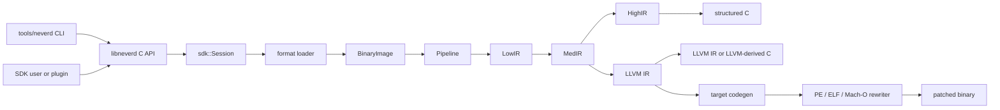

**Языки**: [English](architecture.md) | [简体中文](architecture.zh-CN.md) | [繁體中文](architecture.zh-TW.md) | [日本語](architecture.ja.md) | [한국어](architecture.ko.md) | [Français](architecture.fr.md) | [Deutsch](architecture.de.md) | [Español](architecture.es.md) | [Italiano](architecture.it.md) | [Русский](architecture.ru.md) | [العربية](architecture.ar.md)

[← Индекс документации](README.ru.md)

# Архитектура NeverD

Это руководство описывает границы производственного кода, которые нужно знать
для безопасного изменения NeverD. Оно намеренно охватывает только код NeverD;
субмодули LLVM, Capstone и Unicorn сохраняют собственную внутреннюю архитектуру.

## Граница системы

В NeverD четыре представления IR, но они не образуют обязательную цепочку из
четырёх переходов. `LowIR -> MedIR` используется совместно. Структурная
декомпиляция далее идёт по `MedIR -> HighIR -> C`, а `lift`,
`decompile --llvm` и `patch` напрямую используют `MedIR -> LLVM IR`. Режимы
patch и lift намеренно пропускают HighIR.

CLI разбирает команды в `tools/neverd`, создаёт `neverd_session_t` и вызывает
публичный API из `include/neverd/sdk/NeverDCAPI.h`. Состояние движка находится в
`lib/sdk/SessionImpl.h`; `neverd_session_load` выбирает loader и создаёт
`BinaryImage`, а операции над IR по необходимости запускают
`lib/pipeline/Pipeline.cpp`. Исполняемый файл `neverd` линкуется с
`neverd_shared`; архивы компонентов и зависимости LLVM/Capstone являются
закрытыми деталями этой разделяемой библиотеки. CLI использует LLVM Support для
интерфейса командной строки, но не обходит C API при управлении движком.

## Представления и маршруты IR

| Представление | Назначение | Основные определения и преобразования |
|---------------|------------|---------------------------------------|
| LowIR | Независимые от архитектуры операции `NdOp`, базовые блоки, CFG и метаданные таблиц переходов | `include/neverd/ir/low`, `lib/ir/low`, создаётся `lib/decode` + `lib/lift` |
| MedIR | Типы, ABI/соглашения о вызовах, модель памяти/стека, флаги, вызовы и SSA-подобный поток данных | `include/neverd/ir/med`, `lib/ir/med` |
| HighIR | Структурированные выражения и управление для читаемого C | `include/neverd/ir/high`, `lib/ir/high`, выводится `lib/backend/c/HighC` |
| LLVM IR | Оптимизация, C на основе LLVM, генерация целевого кода и вход переписывания бинарника | `lib/backend/llvm`, оптимизируется/координируется `lib/pipeline` |

| Пользовательский маршрут | Путь представлений | Выход |
|-------------------------|-------------------|-------|
| Дамп Low/Med | Binary -> LowIR, при необходимости -> MedIR | Диагностический текст |
| Дамп High или `decompile` | Binary -> LowIR -> MedIR -> HighIR | HighIR или структурированный C |
| `lift` | Binary -> LowIR -> MedIR -> LLVM IR | `.ll` |
| `decompile --llvm` | Binary -> LowIR -> MedIR -> LLVM IR | C на основе LLVM |
| `patch` | Binary -> LowIR -> MedIR -> LLVM IR -> codegen | Переписанный бинарник |

`lib/pipeline/Pipeline.cpp` — источник истины для выбора маршрута. Логику,
специфичную для представления, следует оставлять в принадлежащей ему библиотеке
IR или backend; pipeline должен координировать компоненты, а не поглощать их
алгоритмы.

## Контракт межархитектурной трансляции

`include/neverd/translate` определяет контрактный слой, а не backend
исполнения. `GuestState` моделирует независимое от архитектуры, видимое машине
состояние для `x86_32`, `x86_64`, `AArch64` и `ARM32`. Его каноническая
сериализация версии 1 использует little-endian поля фиксированной ширины,
стабильные идентификаторы регистров, отсортированные коллекции и fail-closed
валидацию, поэтому сохранённое состояние не зависит от C++-компоновки хоста.

Базовая схема wire v1 для `GuestState` заморожена навсегда. Состояние вне этой
схемы должно использовать ID регистра из диапазона расширений вместе с
каноническим именем в нижнем регистре либо перейти на новую версию wire с явно
заданным upgrader; изменять базовую схему v1 на месте запрещено.

Для гостя `ARM32` поле `ExecutionMode` задаёт авторитетный режим декодирования и
должно согласовываться с `CPSR.T`. Сохранённый PC всегда является каноническим
адресом инструкции с очищенным битом 0; в режиме ARM он дополнительно должен
быть выровнен по слову.

Контракт пар определяет `x86_64 -> AArch64`, `AArch64 -> x86_64`,
`x86_32 -> AArch64/ARM32` и `ARM32 -> x86_32/x86_64`.
`ContractDefined` означает, что запрос можно проверить и сохранить, а не то,
что код можно транслировать или исполнять. Политика JIT принимает только нативный
хост текущего процесса; политика AOT требует явно указать архитектуру хоста,
target triple и, если они выбраны, CPU или набор возможностей.

`ResolvedHostTarget` превращает этот выбор в конкретный результат. Разрешение
`Native` получает из текущего процесса triple, CPU и набор включённых/выключенных
возможностей. Разрешение `Explicit` проверяет и нормализует заданные вызывающей
стороной архитектуру, triple, CPU и возможности и отклоняет противоречия. Его
версионированный идентификатор кэша строится в детерминированном порядке байтов
из нормализованных параметров цели и не содержит адресов процесса или текста,
зависящего от locale.

Версионированный `TranslationExit` хранит стабильную причину остановки и
соответствующую типизированную нагрузку для системных вызовов, исключений или
сигналов, точек останова, неподдерживаемых инструкций, самомодификации, бюджетов
ресурсов, внешних вызовов, ошибок памяти и других конечных условий. Потребителю
не приходится переосмысливать нетипизированное целое в зависимости от причины.

Кроме соответствующего случая `BudgetExhausted`, указанные в результате
счётчики инструкций, blocks и сгенерированного кода не должны превышать
ненулевой бюджет запроса. Исчерпание инструкций и blocks останавливается точно
на limit. Размер созданного объекта становится известен только после неделимого
codegen, поэтому результат его исчерпания может сообщать `Observed > Limit`;
отклонённый объект никогда не линкуется, не публикуется и не исполняется. Каждая
нагрузка `BudgetExhausted` точно указывает заданный limit, а не производный или
внутренний порог реализации.

Backend-private контракт `RuntimeControlBlockV1` имеет
строго 128 байт, выравнивание 8 байт и ограничен фиксированными для v1 magic,
version, size и смещениями полей, нулевыми резервными полями и согласованными
типизированными выходами. Он не содержит контейнеров C++, указателей хоста или
псевдонимов guest-адресов. Это не C++-компоновка и не wire-формат `GuestState`;
backend, реализующий этот контракт, обязан явно преобразовывать состояние в эту
запись.

Фиксированная поверхность вызовов v1 для сгенерированного кода содержит ровно
восемь helper: `nvd_rt_v1_load8_le`, `nvd_rt_v1_load16_le`,
`nvd_rt_v1_load32_le`, `nvd_rt_v1_load64_le`, `nvd_rt_v1_store8_le`,
`nvd_rt_v1_store16_le`, `nvd_rt_v1_store32_le` и `nvd_rt_v1_store64_le`.
Имена, сигнатуры и происхождение указателей должны совпадать точно; backend
явно связывает эту конечную таблицу и никогда не переходит к фоновому разрешению
символов. Проверку generation исполняемой памяти и опрос бюджета/отмены выполняет
только доверенный dispatcher; `nvd_rt_v1_validate_generation` и
`nvd_rt_v1_poll` не являются helper сгенерированного кода. Доверенный host
dispatcher также владеет выбором blocks и не может быть вызван из
сгенерированного IR; translated blocks вместо этого возвращают типизированный
код выхода. Сгенерированный IR может напрямую читать только объявленный
runtime-slot scalar-result.

`RuntimeSymbolRegistryV1` реализует эту таблицу helper как закрытый реестр на
стороне хоста. При создании проверяются полный набор ABI-v1, точные канонические
имена, классы helper, сигнатуры и ровно один ненулевой указатель на функцию
соответствующего класса для каждой записи. Поиск принимает только точное имя,
никогда не обращается к символам окружения процесса или динамического загрузчика
и передаёт verifier объектов те же отсортированные имена как allowlist. Его
версионированная идентичность охватывает имена, классы helper и форму ABI, но
намеренно исключает нативные адреса и поэтому стабильна при ASLR.

`RuntimeCodeMemory` владеет изолированным по страницам хранилищем сгенерированного
кода и разрешает только однонаправленную публикацию `RW -> RX`. Память никогда
не бывает одновременно доступной на запись и исполнение, не открывается
повторно на запись, проверяет границы записей и точек входа и при публикации
инвалидирует кэш инструкций хоста. Нативный smoke test исполняет лишь короткую
последовательность инструкций хоста после публикации; он доказывает только эту
границу памяти W^X, а не наличие движка трансляции.

`GuestMemoryRuntime` изолирован от логического `GuestState`: при создании он
сначала проверяет состояние, затем копирует байты и метаданные регионов в
отсортированный закрытый индекс. Виртуальные guest-адреса служат только ключами
поиска и никогда не преобразуются в указатели хоста. Проверяемые скалярные
доступы сообщают типизированные ошибки ширины, выравнивания, переполнения,
отсутствия отображения, пересечения регионов, прав, записи исполняемого кода,
переполнения/несовпадения generation и нарушения policy. Бюджеты
инструкций/blocks, отмена, отслеживание generation и политики записи кода
`RejectExecutableWrites`, `InvalidateOnExecutableWrite` и
`ValidateBeforeDispatch` также создают согласованные типизированные записи, а
не неявное поведение хоста.

`TranslationObjectCompilerV1` является проверенной границей между LLVM IR и
объектным файлом. Он проверяет const входной module, клонирует его до любых
преобразований, сочетает семантическое упрощение с контролем доказательств и
оптимизацию LLVM от `O0` до `O3`, повторно проверяет финальный IR и создаёт
relocatable-объекты ELF, COFF или Mach-O для четырёх контрактных архитектур
хоста. Он канонизирует точные target-mangled manifest блоков и runtime-символов,
проверяет каждый созданный объект и возвращает identity runtime registry вместе
с версионированными cache key запроса и артефакта. При ненулевом бюджете
созданных байтов к проверке артефакта допускается только укладывающийся объект.
LLVM сначала выполняет неделимую генерацию в приватный buffer, чтобы измерить
точный размер. Слишком большой объект отклоняется до публикации и аудита, а
типизированная телеметрия сохраняет измеренный размер и точный заданный limit.
Ноль означает отсутствие ограничения со стороны вызывающей policy. Компилятор
останавливается на проверенных relocatable байтах: он не линкует, не публикует,
не передаёт их dispatcher и не исполняет, а также не предоставляет lowering
guest-инструкций.

Post-codegen verifier проверяет relocatable-объекты ELF,
COFF и Mach-O как замкнутое множество. Формат и архитектура должны точно
совпадать с выбранным хостом; неопределённые символы должны точно входить в
конечный helper allowlist, а динамические символы запрещены. Relocations
ограничены явными прямыми whitelist с проверкой encoding, ширины, выравнивания,
offset, загружаемой секции назначения и объектно-локальной non-preemptible либо
точно разрешённой helper-цели. Отклоняются W+X, метаданные
unwind/exception/initializer, TLS, IFUNC, GOT и обычная косвенность PLT,
динамические relocations, weak/preemptible или выбираемые определения,
неизвестные загружаемые секции и директивы linker. Форма `R_X86_64_PLT32`,
которую LLVM использует для hidden-вызова x86-64 ELF, допускается только когда
policy v1 доказывает sealed прямой branch к точному runtime helper; она не
разрешает путь через PLT или GOT. Артефакты ELF `ET_REL` не могут содержать
program headers или сегменты. Load commands Mach-O ограничены положительным
списком: ровно один сегмент соответствующей разрядности и не более одной symbol
table, dynamic-symbol table, platform-version и команды data-in-code с
проверкой их зависимостей. Опции linker и все прочие команды отклоняются.

`TranslationObjectRequestV1` — первая публичная, намеренно узкая стадия
преобразования guest-байтов в объект поверх этих контрактов. В опубликованном
fail-closed подмножестве v1 скалярных регистров x86-64 она принимает только
канонические кодировки без legacy-префиксов: формы `MOV`, `ADD`/`SUB` и
`AND`/`OR`/`XOR` с REX.W над полноразмерными GPR, операнды которых имеют
поддерживаемые регистровые/непосредственные формы LowIR. Арифметические формы
сохраняют соответствующее вычисление скалярных флагов; логические вычисляют
флаги, определённые архитектурой, сохраняя `AF`. Канонические `C3` `RET` и
`C2 iw` `RET imm16` завершают блоки возврата; канонические прямые относительные
кодировки `JMP` `EB cb` и `E9 cd` завершают блоки прямого перехода. Опубликованная
схема lowering имеет версию 8. Канонические традиционные Jcc-переходы без
legacy-префиксов ограничены: `JO`/`JNO` короткими `70/71 cb` или ближними
`0F 80/81 cd`; `JB`/`JAE` — `72/73 cb` или `0F 82/83 cd`; `JE`/`JNE` —
`74/75 cb` или `0F 84/85 cd`; `JBE`/`JA` — `76/77 cb` или `0F 86/87 cd`;
`JS`/`JNS` — `78/79 cb` или `0F 88/89 cd`; `JP`/`JNP` — `7A/7B cb` или
`0F 8A/8B cd`; `JL`/`JGE` — `7C/7D cb` или `0F 8C/8D cd`; `JLE`/`JG` —
`7E/7F cb` или `0F 8E/8F cd`. `JRCXZ`/`JECXZ`/`JCXZ` и
`LOOP`/`LOOPE`/`LOOPNE` не опубликованы и отклоняются fail-closed.
Результатом может быть
только проверенный little-endian relocatable-объект AArch64 ELF или Mach-O.
Обычные операции с guest-памятью, формы с частичными регистрами, любая инструкция
или кодировка вне этого точного подмножества, поток управления кроме возвратов,
этих прямых переходов и опубликованных выше Jcc-переходов, а также
любая операция LowIR, не реализованная lowerer, отклоняются до генерации объекта.
Проверенное чтение адреса возврата, необходимое для `RET`,
является внутренней
частью его контракта терминатора и не публикует общее lowering guest-памяти.
Запрос заново строит и проверяет дескриптор блока, использует одну разрешённую
target machine для lowering и генерации объекта и сочетает семантическое
упрощение с контролем доказательств со стандартной pipeline оптимизации LLVM
`O2`. Эта стадия не покрывает другие инструкции x86-64, другие пары guest/host
и обратное направление AArch64 в x86-64.

Публичная C-функция
`neverd_translate_x86_64_block_to_aarch64_object_v1`, Python ctypes wrapper
`translate_x86_64_block_to_aarch64_object` и команда
`neverd translate-object` предоставляют одну и ту же границу, ограниченную
объектным файлом. Python использует `TranslationObjectFormat.ELF` или `.MACHO`.
Ошибки нативной трансляции вызывают типизированную `TranslationError` с
`TranslationErrorCode`, а локальная проверка аргументов — `TypeError` или
`ValueError`. При успехе Python возвращает принадлежащий ему неизменяемый
результат. C-результат владеет байтами объекта, стабильными cache
identity и телеметрией оптимизации; CLI записывает только выбранный ELF- или
Mach-O-объект. Все три поверхности заканчиваются до линковки, загрузки, dispatch,
исполнения и отладки; они не являются интерфейсами сессии исполнения.

`verifyTranslationLinkGraphV1` добавляет независимую вторую проверку до allocation. Он
строит временный LLVM JITLink graph из принятого объекта AArch64 ELF или Mach-O
и проверяет target, права секций, manifests block/runtime-символов, замкнутость
внешних символов, виды и цели edges. После получения не содержащего адресов
результата аудита граф уничтожается. Успешная проверка не линкует, не выделяет,
не разрешает, не загружает, не публикует, не передаёт dispatcher и не исполняет
код.

`linkTranslationObjectV1` — отдельная граница нативной линковки. Она повторно
проверяет доверенный descriptor, исходный объект и JITLink graph до и после
pruning, allocation, разрешения символов и fixup. Runtime-символы поступают
только из sealed-реестра. Credential диспетчера связывает единственную запись
manifest с её сессией, идентичностью блока, входным guest PC, поколением cache и
эпохой кода; вызов дополнительно требует совпадения runtime guest `RIP` с этим
входом. Успешная финализация публикует исполняемую память с окончательными
правами. Unload запрещает новые вызовы и ждёт завершения одного активного вызова
перед освобождением allocation. Overload без credential остаётся только для
аудита и не позволяет вызывать код.

`NativeTranslationSessionV1` объединяет эти части в экспериментальную C++-
границу исполнения x86-64 на нативном AArch64. В little-endian процессе AArch64
ELF или Mach-O она сохраняет единый проверенный runtime guest-памяти и
фиксированный guest state между несколькими блоками цикла dispatcher
compile-link-validate-invoke-unload. Канонический прямой переход продолжает
исполнение по точной статической цели. Опубликованный канонический Jcc-переход
продолжает исполнение только с successor taken или fallthrough, объявленного в
manifest блока; dispatcher отклоняет любой другой выбранный PC. Возврат завершает
исполнение. Глобальные бюджеты инструкций, блоков и байтов сгенерированных
объектов остаются точными между блоками. При успешной guest-остановке исполненное
состояние и авторитетная память коммитятся вместе. Отмена линеаризуется
относительно этого финального commit.

Это исполняемый вертикальный срез, а не полный транслятор. Пока не поддерживаются
обычные инструкции guest-памяти, частичные регистры, условный поток управления
вне точного опубликованного среза традиционных Jcc schema 8, включая
`JRCXZ`/`JECXZ`/`JCXZ` и `LOOP`/`LOOPE`/`LOOPNE`, косвенный поток управления, вызовы,
floating-point, SIMD, x87, атомарные операции, системные инструкции, общая
передача исключений, cache блоков, другие пары guest/host и обратное направление
AArch64 в x86-64. У сессии исполнения ещё нет
интерфейсов C, Python, CLI или JSON; отладка остаётся отдельной и не
поддерживается. Объектные API выше по-прежнему полезны без включения нативного
исполнения.

Контракт сгенерированного IR требует, чтобы каждый подчинённый ему translated
block был hidden и non-preemptible и использовал C ABI
`i32 (ptr state, ptr runtime)`. Blocks обнаруживаются только через закрытый
реестр, но не через фоновый поиск символов процесса; прямые вызовы между blocks
запрещены.

IR verifier также ограничивает ширину целых шириной скалярного регистра хоста,
чтобы legalization не добавляла известные compiler-runtime libcalls. Эта
проверка необходима, но недостаточна: любой backend исполнения, реализующий
этот контракт, должен точно проверять post-codegen передачи управления,
`MachineIR` и relocations целевого объектного файла по тому же конечному
runtime-symbol allowlist.

Прямые load/store в TranslationIR и значения private constants могут содержать
только одно скалярное целое не шире скалярного регистра хоста. Агрегаты должны
быть скаляризованы до границы verifier, чтобы компактный IR не вызывал
неограниченное разворачивание в backend.

ABI сгенерированного кода определён только для скалярных целых. Операции с
плавающей точкой, SIMD, x87, атомарные и системные инструкции находятся вне
этого контракта. Реализация, выбравшая `ProvenSemanticAndLLVM`, обязана выполнять
семантическое упрощение NeverD, допускающее изменения только после
доказательства, до совместной неподвижной точки с оптимизацией LLVM; сама
политика не предоставляет исполняемый backend трансляции.

## Границы переписывания исключений

Mach-O compact unwind располагает строгим parser исходного
`__unwind_info`, учитывающим fixup parser сгенерированных записей
`__LD,__compact_unwind`, точным merge исходных и сгенерированных диапазонов,
детерминированным encoder регулярных страниц и транзакционным installer итоговой
секции. Installer переписывает существующую file-backed
`__TEXT,__unwind_info` in-place только если закодированная таблица помещается в её
объявленную ёмкость. Он повторно проверяет архитектуру, layout и byte preimage,
обнуляет неиспользуемый хвост, затем заново парсит результат и доказывает его
семантическую эквивалентность до единственного commit внешней Mach-O-транзакции.
Сгенерированные записи аутентифицируются точным, сохранённым compiler сопоставлением
исходной IR-функции с целевым MC owner symbol (включая private definitions, без
угадывания префиксов формата или mangling), непрозрачными ненулевыми range ID и
точными полуоткрытыми диапазонами фрагментов. Каждый сгенерированный FDE должен точно
соответствовать одному аутентифицированному фрагменту; каждый обязательный фрагмент
должен соответствовать ровно одному FDE, установленному этой транзакцией, если его
не покрывает точная и строго проверенная compact-запись не в режиме DWARF. Соседние
или разнесённые фрагменты одного owner функции могут использовать один исходный
recipe; отсутствующая, повторная, висячая, cross-owner или несовпадающая по границам
идентичность отклоняется до изменения вывода. Новый RX-сегмент фиксируется только
после доказательства единственного терминального в file/VM `__LINKEDIT`, проверенных
на переполнение сдвигов offsets и строгого replay итогового file/VM layout.
Если итоговая секция отсутствует, сгенерированные compact-записи не
устанавливаются, а транзакция может продолжиться только через описанное ниже
точное аутентифицированное замыкание DWARF-FDE; существующая, но слишком малая
или malformed итоговая секция по-прежнему приводит к fail-closed.

Для ARM32 compact unwind закодированные stack adjustment и GPR layout имеют
статус `Complete`. Селекторы D-register pattern от 0 до 3 также `Complete`; от 4 до
7 — `Partial`, поскольку один compact word не доказывает каждый выровненный во
время исполнения CFA-relative slot. `Partial`-запись может сохранить доказанные
идентичности регистров для анализа, но любой путь rewrite отклоняет её
fail-closed. Каждый receipt установки EH-frame точно связывает target
architecture, pointer width и byte order; compact-unwind DWARF binding отклоняет
любое несовпадение target identity receipt. Проверка native throw/catch на
слинкованном бинарном файле всё ещё не выполнена.

Верхнеуровневая транзакция секций ARM32 имеет более узкую область поддержки,
чем декодер compact unwind. Она включается только тогда, когда заголовок Mach-O
точно содержит `CPU_SUBTYPE_ARM_V7K`, а биты `N_ARM_THUMB_DEF` исходной таблицы
символов положительно подтверждают Thumb-код для каждой требуемой функции.
После этого точный triple `thumbv7k-apple-watchos` и режим Thumb остаются
связанными на всём пути code generation, а требования входного IR к features
не могут превышать предел Cortex-A7. Функции без флага или с неизвестным
режимом, общие subtypes не-v7k, режим ARM, смешанные или неизвестные внешние
цели кода, in-place entry point для ARM Mach-O и patch ARM Mach-O из C source
отклоняются fail-closed до изменения вывода. Stripped-входы, для которых
функции обнаруживаются только через `LC_FUNCTION_STARTS`, пока не
поддерживаются.

У PE, ELF и Mach-O есть отдельные форматные компоненты исключений, но NeverD
ещё не публикует сквозную pipeline переписывания для всех форматов и всех типов
исключений. Неподдерживаемый encoding или неразрешённые требования
registration/layout должны завершаться ошибкой до изменения вывода; имеющуюся
частичную поддержку форматов нельзя описывать как полное замыкание исключений.

## Карта компонентов

Каждый компонент — статический архив, созданный
`add_neverd_component_library`. В таблице перечислены важные зависимости
NeverD, но не все общие библиотеки LLVM и Capstone, добавляемые CMake helper.

| Каталог | Ответственность | Важные зависимости |
|---------|-----------------|---------------------|
| `lib/loader` | Определение формата, загрузка PE/COFF, ELF и Mach-O, нормализованный `BinaryImage`, обнаружение функций | LLVM Object API |
| `lib/lift` | Написанная вручную семантика инструкций x86/i386, AArch64 и ARM32 | Типы данных IR |
| `lib/decode` | Декодирование Capstone/native и диспетчеризация в lifter архитектуры | `NeverDIR`, `NeverDLift` |
| `lib/ir` | Общие типы и определения/преобразования LowIR, MedIR, HighIR и intrinsic | Четыре подкомпонента IR |
| `lib/pipeline` | Обнаружение функций и координация путей Low/Med/High/LLVM | IR, decode, lift, LLVM backend, debug info, проходы IR |
| `lib/backend/c` | Вывод HighIR-в-C и LLVM-IR-в-C | IR |
| `lib/backend/llvm` | Lowering MedIR в LLVM | IR |
| `lib/backend/codegen` | Генерация целевого кода и patch/переписывание на месте PE/ELF/Mach-O | IR, loader |
| `lib/sdk` | Публичный C ABI, жизненный цикл session, запросы, хранение, плагины, входы lift/decompile/patch | Объединяет движок в `libneverd` |
| `lib/pass` | Проходы обфускации LLVM IR и запуск проходов MIR | IR |
| `lib/debug` | Контексты отладки DWARF, PDB и linker-map | IR |
| `lib/sigs` | Разбор, базы и сопоставление сигнатур | Loader |
| `lib/libc` | Известные имена libc и поддержка модели вызовов | Самостоятельный компонент |
| `lib/support` | Общие вспомогательные средства загрузки бинарников | Loader |
| `lib/translate` | Версионированные контракты guest state/policy/exit, фиксированный runtime ABI, проверяемая guest memory, аудит сгенерированных IR/объектов/LinkGraph, sealed нативная линковка и экспериментальный C++-dispatcher x86-64 в AArch64 | Контракты IR, LLVM, LLVM Object и JITLink |

Публичные заголовки отражают эти области в `include/neverd`. Не допускайте,
чтобы внутренний класс C++ случайно стал частью SDK: стабильные внешние операции
должны находиться в чистом C-заголовке и одном из специализированных файлов
`lib/sdk/NeverDCAPI*.cpp`.

## Контракт строгого подъёма

`Decoder` и каждый lifter архитектуры запускаются в строгом режиме. Если
Capstone может декодировать инструкцию, но выбранный lifter не имеет реализации,
он бросает `UnliftedInstruction`. Исключение хранит адрес, мнемонику и операнды;
неподдерживаемая семантика должна явно завершаться ошибкой, а не пропускаться
или угадываться.

Внутренний нестрогий путь выводит `NdOp::NOP`, но это диагностический выход, а
не приемлемая реализация инструкции. Тесты участников и CI должны оставлять
строгий режим включённым. При строгой ошибке:

1. Воспроизведите её минимальным fixture для архитектуры.
2. Добавьте недостающую семантику в `lib/lift/<ISA>`.
3. Проверьте ожидаемую форму LowIR в `unittests/lift`.
4. Добавьте дифференциальный цикл Unicorn в `unittests/semantic`, если у инструкции есть наблюдаемое поведение.

Не перехватывайте `UnliftedInstruction` только ради продолжения pipeline. Новое
намеренное приближение требует явного контракта и тестов; оно не должно
маскироваться под подъём 1:1.

## Ответственность форматов и ISA

Логика входного формата и переписывания выхода намеренно разделены:

| Формат | Загрузка, метаданные и входные relocation | Patch и выходные relocation |
|--------|-------------------------------------------|-----------------------------|
| PE/COFF | `lib/loader/COFF` | `lib/backend/codegen/COFF` |
| ELF | `lib/loader/ELF` | `lib/backend/codegen/ELF` |
| Mach-O | `lib/loader/MachO` | `lib/backend/codegen/MachO` |

Lifter архитектур находятся в `lib/lift/X86`, `lib/lift/AArch64` и
`lib/lift/ARM`. Соответствующие публичные объявления lifter/register находятся
в `include/neverd/lift`. Целевые вывод LLVM и генерация кода расположены в
`lib/backend/llvm/<ISA>` и `lib/backend/codegen/CodeGen<ISA>.cpp`.

### Поддержка и глубина тестирования

Корневая матрица поддержки означает, что каждая ячейка реализована. Это не
означает, что исчерпывающе протестированы каждый opcode, граничный случай ABI,
производитель бинарника или версия ОС. Строгий режим завершает работу по
принципу fail-closed, если семантика инструкции выходит за пределы реализованного
покрытия lifter.

Все 12 ячеек формат×архитектура имеют семантическое покрытие backend
переписывания в `unittests/semantic/PatchFullSubstRTTests.cpp`. Глубина
интеграции точнее:

| Формат | x86-64 | i386 | AArch64 | ARM32 |
|--------|--------|------|---------|-------|
| PE/COFF | Слинкованный fixture | Сетка backend | Слинкованный fixture | Слинкованный Thumb fixture |
| ELF | Слинкованный fixture + семантический цикл | Объектный pipeline + семантический цикл | Слинкованный fixture + семантический цикл | Слинкованный fixture + семантический цикл |
| Mach-O | Слинкованный fixture\* | PIC/no-PIC объектный pipeline\* | Слинкованный fixture\* | Сетка backend |

- **Слинкованный fixture** проверяет loader/pipeline и patch для слинкованного
  исполняемого файла на представительных программах.
- **Объектный pipeline** проверяет загрузку, все стадии IR и декомпиляцию
  перемещаемого объекта, но не линковку на хосте и исполнение патченного бинарника.
- **Сетка backend** компилирует представительный IR через точный путь генерации
  для переписывания и сравнивает поведение в Unicorn; она не проверяет loader
  формата на слинкованном исполняемом файле.
- `*` Слинкованные Mach-O fixture зависят от toolchain хоста, способной создать
  цель. Современная macOS не линкует исторические i386-исполняемые файлы, поэтому
  используются thin-объекты PIC/no-PIC и сетка переписывания.

Ячейки со слинкованным fixture дают сильнейшее доказательство интеграции
формата для этих программ. Объектный pipeline и сетка backend имеют лишь
частичное интеграционное покрытие. Ни одна ячейка не является «полностью
протестированной» без этой оговорки и не заявляет исчерпывающего покрытия ISA.

Основные доказательства:
[`PatchFormatTests.cpp`](../unittests/lift/format/PatchFormatTests.cpp) для слинкованных
fixture ELF и PE,
[`COFFARMFormatTests.cpp`](../unittests/lift/format/COFFARMFormatTests.cpp) для загрузки/
декомпиляции Windows ARM,
[`MachOI386RelocationTests.cpp`](../unittests/lift/format/MachOI386RelocationTests.cpp)
для thin-объектов i386,
[`X86_64_PipelineE2ETests.cpp`](../unittests/lift/x86_64/X86_64_PipelineE2ETests.cpp) и
[`AArch64_PipelineE2ETests.cpp`](../unittests/lift/aarch64/AArch64_PipelineE2ETests.cpp)
для слинкованного Mach-O и
[`PatchFullSubstRTTests.cpp`](../unittests/semantic/probe/patchfull/PatchFullSubstRTTests.cpp)
для сетки из 12 ячеек. Команды приведены в
[руководстве по тестированию](testing.ru.md).

## Где вносить изменения

| Изменение | Начальная точка | Минимальная целевая проверка |
|-----------|-----------------|------------------------------|
| Добавить или исправить инструкцию | Соответствующие файлы в `lib/lift/X86`, `AArch64` или `ARM`; публичный заголовок при изменении диспетчеризации | Тест архитектуры в `unittests/lift`; семантический цикл в `unittests/semantic` |
| Добавить `NdOp` | `include/neverd/ir/NdOps.h`, затем аудит Low-to-Med, emitter/renderer, verifier/emulator и дампов | `NeverDLiftTests` + подходящие случаи `NeverDSemanticTests` |
| Изменить CFG или обнаружение функций | `lib/ir/low`, `lib/loader/FunctionDiscovery*.cpp`, `lib/pipeline/PipelineFuncDetect.cpp` | Тесты lift CFG/таблиц переходов и целевой набор семантических преобразований |
| Добавить входной relocation или правило unwind PE | `lib/loader/COFF` | `COFFARMFormatTests` или новый целевой loader fixture |
| Добавить выходной relocation или правило patch PE | `lib/backend/codegen/COFF` | `PatchFormatTests`, `RewriteCodegenRTTests` и сетка backend PE |
| Изменить поведение ELF или Mach-O | Соответствующие `lib/loader/<Format>` и/или `lib/backend/codegen/<Format>` | Тесты формата плюс сетка переписывания |
| Изменить восстановление MedIR/ABI | `lib/ir/med` | Тесты lift соглашений о вызовах + межархитектурные семантические циклы |
| Изменить восстановление структурного управления | `lib/ir/high` | `NeverDCFGLoopXformTests` и тесты структурированного C |
| Добавить преобразование LLVM | `lib/pass/ir`, публичный заголовок в `include/neverd/pass/ir`, переключатель pipeline при публикации | Целевой набор преобразований + `NeverDPatchFullTests` при изменении patch-выхода |
| Добавить операцию C API | `include/neverd/sdk/NeverDCAPI.h`, целевой `lib/sdk/NeverDCAPI*.cpp`, `SessionImpl.h` только для состояния | Семантические тесты SDK/CLI; сохранить `neverd_last_error` и правила выделения |
| Добавить команду CLI | `tools/neverd/NeverDCLIOptions.cpp`, `NeverDCLI.h`, целевой `NeverDCmd*.cpp` и диспетчеризация в `neverd.cpp` | `unittests/semantic/CLIEndToEndTests.cpp` и прямой CLI smoke test |
| Добавить семантическую регрессию | Целевой `unittests/semantic/*Tests.cpp`; зарегистрировать новый файл в `unittests/semantic/CMakeLists.txt` | Собрать тестовый бинарник и выбрать случай через `ctest -R` |

Сохраняйте узкий объём изменений. Файлы, определяющие представление, могут
изменяться вместе с преобразованиями, но не относящиеся к задаче loader, lifter
и backend не следует менять лишь ради внешней однородности большого рефакторинга.
