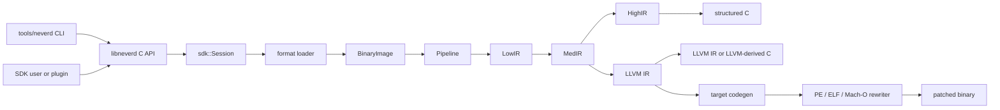

**Языки**: [English](architecture.md) | [简体中文](architecture.zh-CN.md) | [繁體中文](architecture.zh-TW.md) | [日本語](architecture.ja.md) | [한국어](architecture.ko.md) | [Français](architecture.fr.md) | [Deutsch](architecture.de.md) | [Español](architecture.es.md) | [Italiano](architecture.it.md) | [Русский](architecture.ru.md) | [العربية](architecture.ar.md)

[← Индекс документации](README.ru.md)

# Архитектура NeverD

Это руководство описывает границы производственного кода, которые нужно знать
для безопасного изменения NeverD. Оно намеренно охватывает только код NeverD;
субмодули LLVM, Capstone и Unicorn сохраняют собственную внутреннюю архитектуру.

## Граница системы

В NeverD четыре представления IR, но они не образуют обязательную цепочку из
четырёх переходов. `LowIR -> MedIR` используется совместно. Структурная
декомпиляция далее идёт по `MedIR -> HighIR -> C`, а `lift`,
`decompile --llvm` и `patch` напрямую используют `MedIR -> LLVM IR`. Режимы
patch и lift намеренно пропускают HighIR.

CLI разбирает команды в `tools/neverd`, создаёт `neverd_session_t` и вызывает
публичный API из `include/neverd/sdk/NeverDCAPI.h`. Состояние движка находится в
`lib/sdk/SessionImpl.h`; `neverd_session_load` выбирает loader и создаёт
`BinaryImage`, а операции над IR по необходимости запускают
`lib/pipeline/Pipeline.cpp`. Исполняемый файл `neverd` линкуется с
`neverd_shared`; архивы компонентов и зависимости LLVM/Capstone остаются
закрытыми деталями этой разделяемой библиотеки. CLI использует LLVM Support для
интерфейса командной строки, но не обходит C API при управлении движком.

## Представления и маршруты IR

| Представление | Назначение | Основные определения и преобразования |
|---------------|------------|---------------------------------------|
| LowIR | Независимые от архитектуры операции `NdOp`, базовые блоки, CFG и метаданные таблиц переходов | `include/neverd/ir/low`, `lib/ir/low`, создаётся `lib/decode` + `lib/lift` |
| MedIR | Типы, ABI/соглашения о вызовах, модель памяти/стека, флаги, вызовы и SSA-подобный поток данных | `include/neverd/ir/med`, `lib/ir/med` |
| HighIR | Структурированные выражения и управление для читаемого C | `include/neverd/ir/high`, `lib/ir/high`, выводится `lib/backend/c/HighC` |
| LLVM IR | Оптимизация, C на основе LLVM, генерация целевого кода и вход переписывания бинарника | `lib/backend/llvm`, оптимизируется/координируется `lib/pipeline` |

| Пользовательский маршрут | Путь представлений | Выход |
|-------------------------|-------------------|-------|
| Дамп Low/Med | Binary -> LowIR, при необходимости -> MedIR | Диагностический текст |
| Дамп High или `decompile` | Binary -> LowIR -> MedIR -> HighIR | HighIR или структурированный C |
| `lift` | Binary -> LowIR -> MedIR -> LLVM IR | `.ll` |
| `decompile --llvm` | Binary -> LowIR -> MedIR -> LLVM IR | C на основе LLVM |
| `patch` | Binary -> LowIR -> MedIR -> LLVM IR -> codegen | Переписанный бинарник |

`lib/pipeline/Pipeline.cpp` — источник истины для выбора маршрута. Логику,
специфичную для представления, следует оставлять в принадлежащей ему библиотеке
IR или backend; pipeline должен координировать компоненты, а не поглощать их
алгоритмы.

## Карта компонентов

Каждый компонент — статический архив, созданный
`add_neverd_component_library`. В таблице перечислены важные зависимости
NeverD, но не все общие библиотеки LLVM и Capstone, добавляемые CMake helper.

| Каталог | Ответственность | Важные зависимости |
|---------|-----------------|---------------------|
| `lib/loader` | Определение формата, загрузка PE/COFF, ELF и Mach-O, нормализованный `BinaryImage`, обнаружение функций | LLVM Object API |
| `lib/lift` | Написанная вручную семантика инструкций x86/i386, AArch64 и ARM32 | Типы данных IR |
| `lib/decode` | Декодирование Capstone/native и диспетчеризация в lifter архитектуры | `NeverDIR`, `NeverDLift` |
| `lib/ir` | Общие типы и определения/преобразования LowIR, MedIR, HighIR и intrinsic | Четыре подкомпонента IR |
| `lib/pipeline` | Обнаружение функций и координация путей Low/Med/High/LLVM | IR, decode, lift, LLVM backend, debug info, проходы IR |
| `lib/backend/c` | Вывод HighIR-в-C и LLVM-IR-в-C | IR |
| `lib/backend/llvm` | Lowering MedIR в LLVM | IR |
| `lib/backend/codegen` | Генерация целевого кода и patch/переписывание на месте PE/ELF/Mach-O | IR, loader |
| `lib/sdk` | Публичный C ABI, жизненный цикл session, запросы, хранение, плагины, входы lift/decompile/patch | Объединяет движок в `libneverd` |
| `lib/pass` | Проходы обфускации LLVM IR и запуск проходов MIR | IR |
| `lib/debug` | Контексты отладки DWARF, PDB и linker-map | IR |
| `lib/sigs` | Разбор, базы и сопоставление сигнатур | Loader |
| `lib/libc` | Известные имена libc и поддержка модели вызовов | Самостоятельный компонент |
| `lib/Support` | Общие вспомогательные средства загрузки бинарников | Loader |

Публичные заголовки отражают эти области в `include/neverd`. Не допускайте,
чтобы внутренний класс C++ случайно стал частью SDK: стабильные внешние операции
должны находиться в чистом C-заголовке и одном из специализированных файлов
`lib/sdk/NeverDCAPI*.cpp`.

## Контракт строгого подъёма

`Decoder` и каждый lifter архитектуры запускаются в строгом режиме. Если
Capstone может декодировать инструкцию, но выбранный lifter не имеет реализации,
он бросает `UnliftedInstruction`. Исключение хранит адрес, мнемонику и операнды;
неподдерживаемая семантика должна явно завершаться ошибкой, а не пропускаться
или угадываться.

Внутренний нестрогий путь выводит `NdOp::NOP`, но это диагностический выход, а
не приемлемая реализация инструкции. Тесты участников и CI должны оставлять
строгий режим включённым. При строгой ошибке:

1. Воспроизведите её минимальным fixture для архитектуры.
2. Добавьте недостающую семантику в `lib/lift/<ISA>`.
3. Проверьте ожидаемую форму LowIR в `unittests/lift`.
4. Добавьте дифференциальный цикл Unicorn в `unittests/semantic`, если у инструкции есть наблюдаемое поведение.

Не перехватывайте `UnliftedInstruction` только ради продолжения pipeline. Новое
намеренное приближение требует явного контракта и тестов; оно не должно
маскироваться под подъём 1:1.

## Ответственность форматов и ISA

Логика входного формата и переписывания выхода намеренно разделены:

| Формат | Загрузка, метаданные и входные relocation | Patch и выходные relocation |
|--------|-------------------------------------------|-----------------------------|
| PE/COFF | `lib/loader/COFF` | `lib/backend/codegen/COFF` |
| ELF | `lib/loader/ELF` | `lib/backend/codegen/ELF` |
| Mach-O | `lib/loader/MachO` | `lib/backend/codegen/MachO` |

Lifter архитектур находятся в `lib/lift/X86`, `lib/lift/AArch64` и
`lib/lift/ARM`. Соответствующие публичные объявления lifter/register находятся
в `include/neverd/lift`. Целевые вывод LLVM и генерация кода расположены в
`lib/backend/llvm/<ISA>` и `lib/backend/codegen/CodeGen<ISA>.cpp`.

### Поддержка и глубина тестирования

Корневая матрица поддержки означает, что каждая ячейка реализована. Это не
означает, что исчерпывающе протестированы каждый opcode, граничный случай ABI,
производитель бинарника или версия ОС. Строгий режим защищает от ещё не
добавленного покрытия инструкций.

Все 12 ячеек формат×архитектура имеют семантическое покрытие backend
переписывания в `unittests/semantic/PatchFullSubstRTTests.cpp`. Глубина
интеграции точнее:

| Формат | x86-64 | i386 | AArch64 | ARM32 |
|--------|--------|------|---------|-------|
| PE/COFF | Слинкованный fixture | Сетка backend | Слинкованный fixture | Слинкованный Thumb fixture |
| ELF | Слинкованный fixture + семантический цикл | Объектный pipeline + семантический цикл | Слинкованный fixture + семантический цикл | Слинкованный fixture + семантический цикл |
| Mach-O | Слинкованный fixture\* | PIC/no-PIC объектный pipeline\* | Слинкованный fixture\* | Сетка backend |

- **Слинкованный fixture** проверяет loader/pipeline и patch для слинкованного
  исполняемого файла на представительных программах.
- **Объектный pipeline** проверяет загрузку, все стадии IR и декомпиляцию
  перемещаемого объекта, но не линковку на хосте и исполнение патченного бинарника.
- **Сетка backend** компилирует представительный IR через точный путь генерации
  для переписывания и сравнивает поведение в Unicorn; она не проверяет loader
  формата на слинкованном исполняемом файле.
- `*` Слинкованные Mach-O fixture зависят от toolchain хоста, способной создать
  цель. Современная macOS не линкует исторические i386-исполняемые файлы, поэтому
  используются thin-объекты PIC/no-PIC и сетка переписывания.

Ячейки со слинкованным fixture дают сильнейшее текущее доказательство интеграции
формата для этих программ. Объектный pipeline и сетка backend имеют лишь
частичное интеграционное покрытие. Ни одна ячейка не является «полностью
протестированной» без этой оговорки и не заявляет исчерпывающего покрытия ISA.

Основные доказательства:
[`PatchFormatTests.cpp`](../unittests/lift/PatchFormatTests.cpp) для слинкованных
fixture ELF и PE,
[`COFFARMFormatTests.cpp`](../unittests/lift/COFFARMFormatTests.cpp) для загрузки/
декомпиляции Windows ARM,
[`MachOI386RelocationTests.cpp`](../unittests/lift/MachOI386RelocationTests.cpp)
для thin-объектов i386,
[`X86_64_PipelineE2ETests.cpp`](../unittests/lift/X86_64_PipelineE2ETests.cpp) и
[`AArch64_PipelineE2ETests.cpp`](../unittests/lift/AArch64_PipelineE2ETests.cpp)
для слинкованного Mach-O и
[`PatchFullSubstRTTests.cpp`](../unittests/semantic/PatchFullSubstRTTests.cpp)
для сетки из 12 ячеек. Команды приведены в
[руководстве по тестированию](testing.ru.md).

## Где вносить изменения

| Изменение | Начальная точка | Минимальная целевая проверка |
|-----------|-----------------|------------------------------|
| Добавить или исправить инструкцию | Соответствующие файлы в `lib/lift/X86`, `AArch64` или `ARM`; публичный заголовок при изменении диспетчеризации | Тест архитектуры в `unittests/lift`; семантический цикл в `unittests/semantic` |
| Добавить `NdOp` | `include/neverd/ir/NdOps.h`, затем аудит Low-to-Med, emitter/renderer, verifier/emulator и дампов | `NeverDLiftTests` + подходящие случаи `NeverDSemanticTests` |
| Изменить CFG или обнаружение функций | `lib/ir/low`, `lib/loader/FunctionDiscovery*.cpp`, `lib/pipeline/PipelineFuncDetect.cpp` | Тесты lift CFG/таблиц переходов и целевой набор семантических преобразований |
| Добавить входной relocation или правило unwind PE | `lib/loader/COFF` | `COFFARMFormatTests` или новый целевой loader fixture |
| Добавить выходной relocation или правило patch PE | `lib/backend/codegen/COFF` | `PatchFormatTests`, `RewriteCodegenRTTests` и сетка backend PE |
| Изменить поведение ELF или Mach-O | Соответствующие `lib/loader/<Format>` и/или `lib/backend/codegen/<Format>` | Тесты формата плюс сетка переписывания |
| Изменить восстановление MedIR/ABI | `lib/ir/med` | Тесты lift соглашений о вызовах + межархитектурные семантические циклы |
| Изменить восстановление структурного управления | `lib/ir/high` | `NeverDCFGLoopXformTests` и тесты структурированного C |
| Добавить преобразование LLVM | `lib/pass/ir`, публичный заголовок в `include/neverd/pass/ir`, переключатель pipeline при публикации | Целевой набор преобразований + `NeverDPatchFullTests` при изменении patch-выхода |
| Добавить операцию C API | `include/neverd/sdk/NeverDCAPI.h`, целевой `lib/sdk/NeverDCAPI*.cpp`, `SessionImpl.h` только для состояния | Семантические тесты SDK/CLI; сохранить `neverd_last_error` и правила выделения |
| Добавить команду CLI | `tools/neverd/NeverDCLIOptions.cpp`, `NeverDCLI.h`, целевой `NeverDCmd*.cpp` и диспетчеризация в `neverd.cpp` | `unittests/semantic/CLIEndToEndTests.cpp` и прямой CLI smoke test |
| Добавить семантическую регрессию | Целевой `unittests/semantic/*Tests.cpp`; зарегистрировать новый файл в `unittests/semantic/CMakeLists.txt` | Собрать тестовый бинарник и выбрать случай через `ctest -R` |

Сохраняйте узкий объём изменений. Файлы, определяющие представление, могут
изменяться вместе с преобразованиями, но не относящиеся к задаче loader, lifter
и backend не следует менять лишь ради внешней однородности большого рефакторинга.
