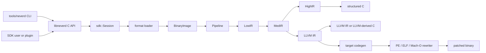

**语言**: [English](architecture.md) | [简体中文](architecture.zh-CN.md) | [繁體中文](architecture.zh-TW.md) | [日本語](architecture.ja.md) | [한국어](architecture.ko.md) | [Français](architecture.fr.md) | [Deutsch](architecture.de.md) | [Español](architecture.es.md) | [Italiano](architecture.it.md) | [Русский](architecture.ru.md) | [العربية](architecture.ar.md)

[← 文档索引](README.zh-CN.md)

# NeverD 架构

本指南说明贡献者安全修改 NeverD 所需了解的生产边界。内容有意仅涵盖
NeverD 自有代码；LLVM、Capstone 和 Unicorn 子模块维护各自的内部架构。

## 系统边界

NeverD 有四种 IR 表示，但它们并非一条必须经过四跳的序列。`LowIR -> MedIR`
为共享部分；结构化反编译随后采用 `MedIR -> HighIR -> C`，而 `lift`、
`decompile --llvm` 和 `patch` 则直接走 `MedIR -> LLVM IR`。尤其是 patch 与
lift 模式会有意跳过 HighIR。

CLI 在 `tools/neverd` 中解析命令，创建 `neverd_session_t`，并调用
`include/neverd/sdk/NeverDCAPI.h` 中的公共 API。引擎状态位于
`lib/sdk/SessionImpl.h`；`neverd_session_load` 选择 loader 并构造
`BinaryImage`，基于 IR 的操作则按需运行 `lib/pipeline/Pipeline.cpp`。
`neverd` 可执行文件链接 `neverd_shared`；组件归档以及其 LLVM/Capstone
依赖是该共享库的私有实现细节。CLI 使用 LLVM Support 构建命令行界面，
但不会绕过 C API 驱动引擎。

## IR 表示与路径

| 表示 | 用途 | 主要定义与转换 |
|------|------|----------------|
| LowIR | 架构无关的 `NdOp` 操作、基本块、CFG 和跳转表元数据 | `include/neverd/ir/low`、`lib/ir/low`，由 `lib/decode` + `lib/lift` 生成 |
| MedIR | 类型、ABI/调用约定、内存与栈模型、标志、调用和类 SSA 数据流 | `include/neverd/ir/med`、`lib/ir/med` |
| HighIR | 用于可读 C 的结构化表达式与控制流 | `include/neverd/ir/high`、`lib/ir/high`，由 `lib/backend/c/HighC` 发射 |
| LLVM IR | 优化、LLVM 派生 C、目标代码生成和二进制重写输入 | `lib/backend/llvm`，由 `lib/pipeline` 优化/编排 |

| 用户路径 | 表示路径 | 出口 |
|----------|----------|------|
| Low/Med dump | Binary -> LowIR，可选 -> MedIR | 诊断文本 |
| High dump 或 `decompile` | Binary -> LowIR -> MedIR -> HighIR | HighIR 或结构化 C |
| `lift` | Binary -> LowIR -> MedIR -> LLVM IR | `.ll` |
| `decompile --llvm` | Binary -> LowIR -> MedIR -> LLVM IR | LLVM 派生 C |
| `patch` | Binary -> LowIR -> MedIR -> LLVM IR -> codegen | 重写后的二进制 |

`lib/pipeline/Pipeline.cpp` 是路径选择的事实来源。特定表示的逻辑应留在其
所属 IR 或 backend 库中；pipeline 应编排这些组件，而不是吸收它们的算法。

## 跨架构翻译契约

`include/neverd/translate` 定义的是契约层，而不是执行后端。`GuestState`
为 `x86_32`、`x86_64`、`AArch64` 和 `ARM32` 建模架构无关的机器可见状态。
其规范的版本 1 序列化采用固定宽度的小端字段、稳定的寄存器 ID、有序集合和
失败即关闭的验证，因此持久化状态不依赖宿主 C++ 布局。

`GuestState` 的 wire v1 基线永久冻结。基线以外的机器状态只能使用扩展区间内的
extension-register ID，并配套规范的小写名称；否则必须采用新的 wire 版本并提供
显式 upgrader，禁止原地改变 v1 基线。

对于 `ARM32` guest，`ExecutionMode` 是权威解码模式，并且必须与 `CPSR.T`
一致。保存的 PC 始终是清除 bit 0 后的规范指令地址；ARM 模式还要求按字对齐。

架构对策略定义 `x86_64 -> AArch64`、`AArch64 -> x86_64`、
`x86_32 -> AArch64/ARM32` 和 `ARM32 -> x86_32/x86_64`。
`ContractDefined` 表示请求可以验证和持久化，并不表示代码已经可以翻译或执行。
JIT 策略只接受运行中进程的本机宿主；AOT 策略则要求显式给出宿主架构、目标
triple；若选择了 CPU 或特性集合，也必须显式给出。

带版本的 `TranslationExit` 记录稳定的停止原因及其匹配的类型化载荷，覆盖系统
调用、异常或信号、断点、不支持的指令、自修改、资源预算、外部调用、内存故障
以及其他终止条件。使用方无需再根据停止原因重新解释一个无类型整数。

无论停止原因是什么，结果报告的指令数、block 数和生成代码量都不得超过请求中
对应的非零预算。`BudgetExhausted` 载荷还必须精确标识该请求预算的 limit，不能
报告推导值或实现私有阈值。

backend-private `RuntimeControlBlockV1` 契约固定为 128 字节、8 字节
对齐，并以固定的 v1 magic、version、size、字段偏移、全零保留字段和自洽的类型化
退出记录加以约束。它不包含 C++ 容器、宿主指针或 guest 地址别名，也不是
`GuestState` 的 C++ 布局或 wire 格式；实现该契约的后端必须显式把状态转换到该记录。

固定的 v1 generated-code 调用面只包含八个 helper：
`nvd_rt_v1_load8_le`、`nvd_rt_v1_load16_le`、`nvd_rt_v1_load32_le`、
`nvd_rt_v1_load64_le`、`nvd_rt_v1_store8_le`、`nvd_rt_v1_store16_le`、
`nvd_rt_v1_store32_le` 和 `nvd_rt_v1_store64_le`。名称、签名和指针 provenance
必须精确匹配；后端必须显式绑定这个有限表，绝不能回退到环境符号解析。可执行内存
generation 验证和预算/取消轮询只由受信任 dispatcher 执行；
`nvd_rt_v1_validate_generation` 和 `nvd_rt_v1_poll` 均不是 generated-code helper。
受信任宿主 dispatcher 还负责选择 block，生成 IR 不能调用它；translated block
只返回类型化退出码。生成 IR 只能直接读取声明过的 scalar-result runtime slot。

`GuestMemoryRuntime` 与逻辑 `GuestState` 隔离：构造时先验证状态，再把内存区域的
字节和元数据复制到有序的私有索引。guest 虚拟地址只作为查找键，绝不会转换为
宿主指针。受检标量访问会以类型化形式报告宽度、对齐、溢出、未映射、跨区域、
权限、可执行写入、generation 溢出、generation 不匹配和策略故障。指令/block
预算、取消、generation 跟踪以及 `RejectExecutableWrites`、
`InvalidateOnExecutableWrite`、`ValidateBeforeDispatch` 三种代码写入策略同样生成
自洽的类型化记录，而不是隐式宿主行为。

post-codegen verifier 把 relocatable ELF、COFF、Mach-O 目标文件作为
闭集审计。格式和架构必须与选定宿主精确匹配；未定义符号必须精确属于有限 helper
allowlist，动态符号一律禁止。relocation 采用显式直接白名单，并检查 encoding、
width、alignment、offset、可加载目的节，以及目标是否为目标文件内
non-preemptible 定义或精确获准的 helper。verifier 拒绝 W+X、异常/展开与初始化
元数据、TLS、IFUNC、GOT/PLT 及其他间接机制、动态 relocation、weak/preemptible
或可选择定义、未知 allocated section 和 linker directive。ELF `ET_REL` 制品不得
包含 program header 或 segment。Mach-O load command 采用正向白名单：必须且只能有
一个位宽匹配的 segment，symbol table、dynamic-symbol table、platform-version 和
data-in-code command 各至多一个，并检查相互依赖；linker option 和其他所有 command
均拒绝。

runtime、memory、IR 和目标文件审计实现定义并验证这些边界。它们不构成完整的
可执行翻译后端、完整的跨架构翻译流水线或完整的端到端异常重写。本节描述契约与
verifier 的作用范围，不宣称具备生成、链接、加载、执行、JIT、AOT 或异常重写的
端到端能力。

生成 IR 契约要求受该契约约束的每个 translated block 都是 hidden、non-preemptible，
并采用 C ABI `i32 (ptr state, ptr runtime)`。runtime 只能通过私有注册表发现 block，
不能依赖进程环境的符号查找；禁止 block 之间直接调用。

IR verifier 还将整数宽度限制在宿主标量寄存器宽度以内，以避免 legalization 引入
已知 compiler-runtime libcall。该检查只是必要条件：任何实现该契约的执行后端都
必须依据同一有限的 runtime-symbol allowlist，对 post-codegen 控制转移、`MachineIR`
和目标文件 relocation 进行精确审计。

TranslationIR 的直接 load/store 以及 private constant 保存的值，只能包含单个、不宽
于宿主标量寄存器宽度的标量整数。聚合值必须在 verifier 边界前完成标量化，避免紧凑
IR 触发后端无界展开。

generated-code ABI 只为标量整数定义。浮点、SIMD、x87、原子操作和系统指令均在
该契约之外。选择 `ProvenSemanticAndLLVM` 策略的实现必须运行 NeverD 现有的证明
门控语义简化，并与 LLVM 优化共同达到不动点；该策略本身不提供可执行翻译后端。

## 组件映射

每个组件都是由 `add_neverd_component_library` 创建的静态归档。下表列出重要的
NeverD 依赖，不穷举 CMake helper 统一提供的 LLVM 和 Capstone 库。

| 目录 | 职责 | 重要依赖 |
|------|------|----------|
| `lib/loader` | 格式检测、PE/COFF、ELF、Mach-O 加载；规范化 `BinaryImage`；函数发现 | LLVM Object API |
| `lib/lift` | 手写 x86/i386、AArch64、ARM32 指令语义 | IR 数据类型 |
| `lib/decode` | Capstone/native 解码并分派到架构 lifter | `NeverDIR`、`NeverDLift` |
| `lib/ir` | 公共类型以及 LowIR、MedIR、HighIR、intrinsic 定义/转换 | 四个 IR 子组件 |
| `lib/pipeline` | 函数检测与 Low/Med/High/LLVM 路径编排 | IR、decode、lift、LLVM backend、调试信息、IR pass |
| `lib/backend/c` | HighIR 到 C 与 LLVM IR 到 C 的渲染 | IR |
| `lib/backend/llvm` | MedIR 到 LLVM 的 lowering | IR |
| `lib/backend/codegen` | 目标代码生成及 PE/ELF/Mach-O patch 与原地重写 | IR、loader |
| `lib/sdk` | 公共 C ABI、session 生命周期、查询、持久化、插件、lift/decompile/patch 入口 | 将引擎组件聚合为 `libneverd` |
| `lib/pass` | LLVM IR 混淆 pass 与 MIR pass runner | IR |
| `lib/debug` | DWARF、PDB 和 linker-map 调试上下文 | IR |
| `lib/sigs` | 签名解析、数据库与匹配 | Loader |
| `lib/libc` | 已知 libc 名称与调用模型支持 | 独立组件 |
| `lib/support` | 共享二进制加载 helper | Loader |
| `lib/translate` | 带版本的 guest state/策略/退出、固定 runtime ABI、受检 guest memory，以及生成 IR/目标文件审计契约；执行后端实现不属于该组件 | IR、LLVM 与 LLVM Object 契约 |

公共头文件在 `include/neverd` 下对应这些区域。不要意外让内部 C++ 类成为 SDK
的一部分：稳定的外部操作应放入纯 C 头文件及某个职责明确的
`lib/sdk/NeverDCAPI*.cpp` 文件。

## 严格提升契约

`Decoder` 和每个架构 lifter 默认以严格模式启动。如果 Capstone 可以解码一条
指令，但选中的 lifter 没有实现，lifter 会抛出 `UnliftedInstruction`。异常记录
指令地址、助记符和操作数字符串；因此，不支持的语义必须明确失败，而不能被省略
或猜测。

内部非严格路径会发射 `NdOp::NOP`，但这只是诊断逃生口，不是指令的可接受实现。
贡献者测试和 CI 应保持严格模式开启。当出现严格失败时：

1. 使用最小的架构特定 fixture 复现。
2. 在 `lib/lift/<ISA>` 中补充缺失语义。
3. 在 `unittests/lift` 中断言预期的 LowIR 形状。
4. 若指令存在可观察行为，在 `unittests/semantic` 中添加 Unicorn 差分往返。

不要仅为了让 pipeline 继续而捕获 `UnliftedInstruction`。新的有意近似需要明确契约
和测试；不得伪装成 1:1 提升。

## 格式与 ISA 所有权

输入格式逻辑与输出重写逻辑有意分离：

| 格式 | 加载、元数据与输入重定位 | Patch 与输出重定位 |
|------|--------------------------|--------------------|
| PE/COFF | `lib/loader/COFF` | `lib/backend/codegen/COFF` |
| ELF | `lib/loader/ELF` | `lib/backend/codegen/ELF` |
| Mach-O | `lib/loader/MachO` | `lib/backend/codegen/MachO` |

架构 lifter 位于 `lib/lift/X86`、`lib/lift/AArch64` 和 `lib/lift/ARM`。
相应的公共 lifter/register 声明位于 `include/neverd/lift`。目标特定的 LLVM
发射和代码生成位于 `lib/backend/llvm/<ISA>` 及
`lib/backend/codegen/CodeGen<ISA>.cpp`。

### 支持范围与测试深度

根目录支持矩阵表示每个单元格均已实现；这不代表每条 opcode、ABI 边界情况、
二进制生产器或操作系统版本都已穷尽测试。指令语义超出 lifter 已实现覆盖范围时，
严格模式会以失败即关闭方式停止。

全部 12 个格式×架构单元格都在
`unittests/semantic/PatchFullSubstRTTests.cpp` 中具有语义重写后端覆盖。
集成深度则更具体：

| 格式 | x86-64 | i386 | AArch64 | ARM32 |
|------|--------|------|---------|-------|
| PE/COFF | 已链接 fixture | 后端网格 | 已链接 fixture | 已链接 Thumb fixture |
| ELF | 已链接 fixture + 语义往返 | 对象流水线 + 语义往返 | 已链接 fixture + 语义往返 | 已链接 fixture + 语义往返 |
| Mach-O | 已链接 fixture\* | PIC/no-PIC 对象流水线\* | 已链接 fixture\* | 后端网格 |

- **已链接 fixture** 对代表性程序执行已链接可执行文件的 loader/pipeline 与
  patch 行为。
- **对象流水线** 对可重定位对象执行加载、全部 IR 阶段和反编译，但不涵盖主机
  链接及 patch 后二进制的执行。
- **后端网格** 通过精确的重写代码生成路径编译代表性 IR，并在 Unicorn 中比较
  行为；它不对已链接可执行文件运行该格式的 loader。
- `*` Mach-O 已链接 fixture 依赖能够生成所需目标的主机工具链。现代 macOS
  无法链接历史 i386 可执行文件，因此 i386 使用 PIC 与 no-PIC thin 对象加重写网格。

对于这些代表性程序，应把已链接 fixture 单元格视为最强的格式集成证据。
对象流水线和后端网格单元格只有部分格式集成覆盖。没有任何单元格能在不加限定的
情况下称为“完全测试”，也没有单元格宣称穷尽 ISA 覆盖。

主要证据包括：用于已链接 ELF 与 PE fixture 的
[`PatchFormatTests.cpp`](../unittests/lift/format/PatchFormatTests.cpp)，用于 Windows ARM
加载/反编译的
[`COFFARMFormatTests.cpp`](../unittests/lift/format/COFFARMFormatTests.cpp)，用于 i386 thin
对象的
[`MachOI386RelocationTests.cpp`](../unittests/lift/format/MachOI386RelocationTests.cpp)，
用于已链接 Mach-O 的
[`X86_64_PipelineE2ETests.cpp`](../unittests/lift/x86_64/X86_64_PipelineE2ETests.cpp) 与
[`AArch64_PipelineE2ETests.cpp`](../unittests/lift/aarch64/AArch64_PipelineE2ETests.cpp)，
以及覆盖 12 单元后端网格的
[`PatchFullSubstRTTests.cpp`](../unittests/semantic/probe/patchfull/PatchFullSubstRTTests.cpp)。
命令见[测试指南](testing.zh-CN.md)。

## 在哪里修改

| 变更 | 从这里开始 | 最小聚焦验证 |
|------|------------|--------------|
| 添加或修复指令 | `lib/lift/X86`、`AArch64` 或 `ARM` 中的相应文件；分派变化时修改公共 lifter 头文件 | `unittests/lift` 中的架构测试；`unittests/semantic` 中的语义往返 |
| 添加 `NdOp` | `include/neverd/ir/NdOps.h`，随后审查 Low-to-Med、emitter/renderer、verifier/emulator 与 dump | `NeverDLiftTests` + 相关 `NeverDSemanticTests` 用例 |
| 修改 CFG 或函数发现 | `lib/ir/low`、`lib/loader/FunctionDiscovery*.cpp`、`lib/pipeline/PipelineFuncDetect.cpp` | lift CFG/跳转表测试和聚焦的语义变换套件 |
| 添加 PE 输入重定位或 unwind 规则 | `lib/loader/COFF` | `COFFARMFormatTests` 或新的聚焦 loader fixture |
| 添加 PE 输出重定位或 patch 规则 | `lib/backend/codegen/COFF` | `PatchFormatTests`、`RewriteCodegenRTTests` 与 PE 后端网格 |
| 修改 ELF 或 Mach-O 格式行为 | 对应的 `lib/loader/<Format>` 和/或 `lib/backend/codegen/<Format>` 目录 | 对应格式测试加重写网格 |
| 修改 MedIR/ABI 恢复 | `lib/ir/med` | 调用约定 lift 测试 + 跨 ISA 语义往返 |
| 修改结构化控制流恢复 | `lib/ir/high` | `NeverDCFGLoopXformTests` 与结构化 C 测试 |
| 添加 LLVM 变换 | `lib/pass/ir`、`include/neverd/pass/ir` 中的公共头文件，暴露时添加 pipeline 开关 | 聚焦变换套件 + patch 输出变化时的 `NeverDPatchFullTests` |
| 添加 C API 操作 | `include/neverd/sdk/NeverDCAPI.h`、聚焦的 `lib/sdk/NeverDCAPI*.cpp`，仅在需要状态时使用 `SessionImpl.h` | SDK/CLI 语义测试；保持 `neverd_last_error` 与分配约定 |
| 添加 CLI 命令 | `tools/neverd/NeverDCLIOptions.cpp`、`NeverDCLI.h`、聚焦的 `NeverDCmd*.cpp`，以及 `neverd.cpp` 中的分派 | `unittests/semantic/CLIEndToEndTests.cpp` 与直接 CLI smoke test |
| 添加语义回归 | 聚焦的 `unittests/semantic/*Tests.cpp`；在 `unittests/semantic/CMakeLists.txt` 注册新文件 | 构建其测试二进制，再用 `ctest -R` 选择命名用例 |

保持修改范围精确。定义某种表示的文件可以与其转换一起变化，但不要仅为让大型
重构看起来统一而修改无关的 loader、lifter 和 backend。
