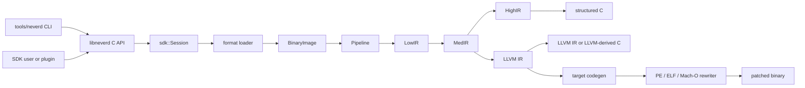

**語言**: [English](architecture.md) | [简体中文](architecture.zh-CN.md) | [繁體中文](architecture.zh-TW.md) | [日本語](architecture.ja.md) | [한국어](architecture.ko.md) | [Français](architecture.fr.md) | [Deutsch](architecture.de.md) | [Español](architecture.es.md) | [Italiano](architecture.it.md) | [Русский](architecture.ru.md) | [العربية](architecture.ar.md)

[← 文件索引](README.zh-TW.md)

# NeverD 架構

本指南說明貢獻者安全修改 NeverD 所需理解的生產邊界。內容刻意只涵蓋
NeverD 自有程式碼；LLVM、Capstone 與 Unicorn 子模組各自維護內部架構。

## 系統邊界

NeverD 有四種 IR 表示，但它們並非一條必須通過四跳的序列。`LowIR -> MedIR`
是共享部分；結構化反編譯接著使用 `MedIR -> HighIR -> C`，而 `lift`、
`decompile --llvm` 與 `patch` 則直接走 `MedIR -> LLVM IR`。尤其 patch 與
lift 模式會刻意略過 HighIR。

CLI 在 `tools/neverd` 解析命令、建立 `neverd_session_t`，並呼叫
`include/neverd/sdk/NeverDCAPI.h` 中的公開 API。引擎狀態位於
`lib/sdk/SessionImpl.h`；`neverd_session_load` 選擇 loader 並建立
`BinaryImage`，以 IR 為基礎的操作則按需執行 `lib/pipeline/Pipeline.cpp`。
`neverd` 可執行檔連結 `neverd_shared`；元件歸檔及其 LLVM/Capstone 相依仍是
該共享程式庫的私有實作細節。CLI 仍使用 LLVM Support 建立命令列介面，
但不會繞過 C API 驅動引擎。

## IR 表示與路徑

| 表示 | 用途 | 主要定義與轉換 |
|------|------|----------------|
| LowIR | 架構無關的 `NdOp` 操作、基本區塊、CFG 與跳躍表中繼資料 | `include/neverd/ir/low`、`lib/ir/low`，由 `lib/decode` + `lib/lift` 產生 |
| MedIR | 型別、ABI/呼叫慣例、記憶體與堆疊模型、旗標、呼叫和類 SSA 資料流 | `include/neverd/ir/med`、`lib/ir/med` |
| HighIR | 用於可讀 C 的結構化運算式與控制流 | `include/neverd/ir/high`、`lib/ir/high`，由 `lib/backend/c/HighC` 發射 |
| LLVM IR | 最佳化、LLVM 衍生 C、目標程式碼產生和二進位重寫輸入 | `lib/backend/llvm`，由 `lib/pipeline` 最佳化/編排 |

| 使用者路徑 | 表示路徑 | 出口 |
|------------|----------|------|
| Low/Med dump | Binary -> LowIR，可選 -> MedIR | 診斷文字 |
| High dump 或 `decompile` | Binary -> LowIR -> MedIR -> HighIR | HighIR 或結構化 C |
| `lift` | Binary -> LowIR -> MedIR -> LLVM IR | `.ll` |
| `decompile --llvm` | Binary -> LowIR -> MedIR -> LLVM IR | LLVM 衍生 C |
| `patch` | Binary -> LowIR -> MedIR -> LLVM IR -> codegen | 重寫後的二進位 |

`lib/pipeline/Pipeline.cpp` 是路徑選擇的事實來源。特定表示的邏輯應留在其
所屬 IR 或 backend 程式庫；pipeline 應編排元件，而不是吸收其演算法。

## 元件對照

每個元件都是由 `add_neverd_component_library` 建立的靜態歸檔。下表列出重要的
NeverD 相依，不窮舉 CMake helper 統一提供的 LLVM 與 Capstone 程式庫。

| 目錄 | 職責 | 重要相依 |
|------|------|----------|
| `lib/loader` | 格式偵測、PE/COFF、ELF、Mach-O 載入；正規化 `BinaryImage`；函式發現 | LLVM Object API |
| `lib/lift` | 手寫 x86/i386、AArch64、ARM32 指令語意 | IR 資料型別 |
| `lib/decode` | Capstone/native 解碼並分派到架構 lifter | `NeverDIR`、`NeverDLift` |
| `lib/ir` | 共用型別以及 LowIR、MedIR、HighIR、intrinsic 定義/轉換 | 四個 IR 子元件 |
| `lib/pipeline` | 函式偵測與 Low/Med/High/LLVM 路徑編排 | IR、decode、lift、LLVM backend、除錯資訊、IR pass |
| `lib/backend/c` | HighIR 到 C 與 LLVM IR 到 C 的呈現 | IR |
| `lib/backend/llvm` | MedIR 到 LLVM 的 lowering | IR |
| `lib/backend/codegen` | 目標程式碼產生及 PE/ELF/Mach-O patch 與原地重寫 | IR、loader |
| `lib/sdk` | 公開 C ABI、session 生命週期、查詢、持久化、外掛、lift/decompile/patch 進入點 | 將引擎元件聚合為 `libneverd` |
| `lib/pass` | LLVM IR 混淆 pass 與 MIR pass runner | IR |
| `lib/debug` | DWARF、PDB 與 linker-map 除錯內容 | IR |
| `lib/sigs` | 簽章解析、資料庫與比對 | Loader |
| `lib/libc` | 已知 libc 名稱與呼叫模型支援 | 獨立元件 |
| `lib/support` | 共用二進位載入 helper | Loader |

公開標頭在 `include/neverd` 下對應這些區域。不要意外讓內部 C++ 類別成為 SDK
的一部分：穩定的外部操作應放在純 C 標頭及職責明確的
`lib/sdk/NeverDCAPI*.cpp` 檔案中。

## 嚴格提升契約

`Decoder` 與每個架構 lifter 預設以嚴格模式啟動。如果 Capstone 能解碼指令，
但選定的 lifter 沒有實作，lifter 會拋出 `UnliftedInstruction`。例外記錄指令
位址、助記符和運算元字串；因此，不支援的語意必須明確失敗，不能被省略或猜測。

內部非嚴格路徑會發射 `NdOp::NOP`，但它只是診斷逃生口，不是指令的可接受實作。
貢獻者測試與 CI 應保持嚴格模式開啟。出現嚴格失敗時：

1. 以最小的架構特定 fixture 重現。
2. 在 `lib/lift/<ISA>` 中加入缺少的語意。
3. 在 `unittests/lift` 中斷言預期的 LowIR 形狀。
4. 若指令有可觀察行為，在 `unittests/semantic` 中新增 Unicorn 差分往返。

不要只為讓 pipeline 繼續而捕捉 `UnliftedInstruction`。新的刻意近似需要明確契約
與測試；不得偽裝成 1:1 提升。

## 格式與 ISA 所有權

輸入格式邏輯與輸出重寫邏輯刻意分離：

| 格式 | 載入、中繼資料與輸入重定位 | Patch 與輸出重定位 |
|------|----------------------------|--------------------|
| PE/COFF | `lib/loader/COFF` | `lib/backend/codegen/COFF` |
| ELF | `lib/loader/ELF` | `lib/backend/codegen/ELF` |
| Mach-O | `lib/loader/MachO` | `lib/backend/codegen/MachO` |

架構 lifter 位於 `lib/lift/X86`、`lib/lift/AArch64` 與 `lib/lift/ARM`。
對應的公開 lifter/register 宣告位於 `include/neverd/lift`。目標特定的 LLVM
發射與程式碼產生位於 `lib/backend/llvm/<ISA>` 及
`lib/backend/codegen/CodeGen<ISA>.cpp`。

### 支援範圍與測試深度

根目錄支援矩陣表示每個單元格皆已實作；這不代表每個 opcode、ABI 邊界案例、
二進位產生器或作業系統版本都已窮盡測試。嚴格模式是尚未涵蓋指令的護欄。

所有 12 個格式×架構單元格都在
`unittests/semantic/PatchFullSubstRTTests.cpp` 中具有語意重寫後端覆蓋。
整合深度則更具體：

| 格式 | x86-64 | i386 | AArch64 | ARM32 |
|------|--------|------|---------|-------|
| PE/COFF | 已連結 fixture | 後端網格 | 已連結 fixture | 已連結 Thumb fixture |
| ELF | 已連結 fixture + 語意往返 | 物件流水線 + 語意往返 | 已連結 fixture + 語意往返 | 已連結 fixture + 語意往返 |
| Mach-O | 已連結 fixture\* | PIC/no-PIC 物件流水線\* | 已連結 fixture\* | 後端網格 |

- **已連結 fixture** 對代表性程式執行已連結可執行檔的 loader/pipeline 與
  patch 行為。
- **物件流水線** 對可重定位物件執行載入、所有 IR 階段和反編譯，但不涵蓋主機
  連結及 patch 後二進位的執行。
- **後端網格** 透過精確的重寫程式碼產生路徑編譯代表性 IR，並在 Unicorn 中比較
  行為；它不會對已連結可執行檔執行該格式的 loader。
- `*` Mach-O 已連結 fixture 依賴能產生所需目標的主機工具鏈。現代 macOS 無法
  連結歷史 i386 可執行檔，因此 i386 使用 PIC 與 no-PIC thin 物件加重寫網格。

對這些代表性程式，應將已連結 fixture 單元格視為目前最強的格式整合證據。
物件流水線與後端網格單元格只有部分格式整合覆蓋。沒有任何單元格能在不加限定時
稱為「完全測試」，也沒有單元格宣稱窮盡 ISA 覆蓋。

主要證據包括：用於已連結 ELF 與 PE fixture 的
[`PatchFormatTests.cpp`](../unittests/lift/PatchFormatTests.cpp)，用於 Windows ARM
載入/反編譯的
[`COFFARMFormatTests.cpp`](../unittests/lift/COFFARMFormatTests.cpp)，用於 i386 thin
物件的
[`MachOI386RelocationTests.cpp`](../unittests/lift/MachOI386RelocationTests.cpp)，
用於已連結 Mach-O 的
[`X86_64_PipelineE2ETests.cpp`](../unittests/lift/X86_64_PipelineE2ETests.cpp) 與
[`AArch64_PipelineE2ETests.cpp`](../unittests/lift/AArch64_PipelineE2ETests.cpp)，
以及涵蓋 12 單元後端網格的
[`PatchFullSubstRTTests.cpp`](../unittests/semantic/PatchFullSubstRTTests.cpp)。
命令見[測試指南](testing.zh-TW.md)。

## 在哪裡修改

| 變更 | 從這裡開始 | 最小聚焦驗證 |
|------|------------|--------------|
| 新增或修正指令 | `lib/lift/X86`、`AArch64` 或 `ARM` 中的對應檔案；分派變更時修改公開 lifter 標頭 | `unittests/lift` 中的架構測試；`unittests/semantic` 中的語意往返 |
| 新增 `NdOp` | `include/neverd/ir/NdOps.h`，接著稽核 Low-to-Med、emitter/renderer、verifier/emulator 與 dump | `NeverDLiftTests` + 相關 `NeverDSemanticTests` 案例 |
| 修改 CFG 或函式發現 | `lib/ir/low`、`lib/loader/FunctionDiscovery*.cpp`、`lib/pipeline/PipelineFuncDetect.cpp` | lift CFG/跳躍表測試與聚焦語意轉換套件 |
| 新增 PE 輸入重定位或 unwind 規則 | `lib/loader/COFF` | `COFFARMFormatTests` 或新的聚焦 loader fixture |
| 新增 PE 輸出重定位或 patch 規則 | `lib/backend/codegen/COFF` | `PatchFormatTests`、`RewriteCodegenRTTests` 與 PE 後端網格 |
| 修改 ELF 或 Mach-O 格式行為 | 對應的 `lib/loader/<Format>` 和/或 `lib/backend/codegen/<Format>` 目錄 | 對應格式測試加重寫網格 |
| 修改 MedIR/ABI 復原 | `lib/ir/med` | 呼叫慣例 lift 測試 + 跨 ISA 語意往返 |
| 修改結構化控制流復原 | `lib/ir/high` | `NeverDCFGLoopXformTests` 與結構化 C 測試 |
| 新增 LLVM 轉換 | `lib/pass/ir`、`include/neverd/pass/ir` 中的公開標頭，公開時加入 pipeline 切換 | 聚焦轉換套件 + patch 輸出變更時的 `NeverDPatchFullTests` |
| 新增 C API 操作 | `include/neverd/sdk/NeverDCAPI.h`、聚焦的 `lib/sdk/NeverDCAPI*.cpp`，只有狀態需要時使用 `SessionImpl.h` | SDK/CLI 語意測試；保持 `neverd_last_error` 與配置慣例 |
| 新增 CLI 命令 | `tools/neverd/NeverDCLIOptions.cpp`、`NeverDCLI.h`、聚焦的 `NeverDCmd*.cpp`，以及 `neverd.cpp` 中的分派 | `unittests/semantic/CLIEndToEndTests.cpp` 與直接 CLI smoke test |
| 新增語意回歸 | 聚焦的 `unittests/semantic/*Tests.cpp`；在 `unittests/semantic/CMakeLists.txt` 註冊新檔案 | 建置其測試二進位，再以 `ctest -R` 選擇命名案例 |

保持修改精確。定義某種表示的檔案可與其轉換一起變更，但不要只為讓大型重構看起來
一致而修改無關的 loader、lifter 與 backend。
