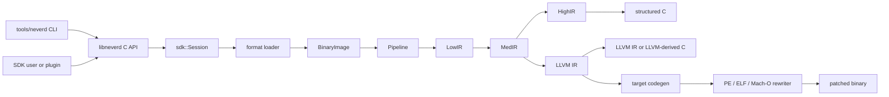

**Sprachen**: [English](../architecture.md) | [简体中文](../zh-CN/architecture.md) | [繁體中文](../zh-TW/architecture.md) | [日本語](../ja/architecture.md) | [한국어](../ko/architecture.md) | [Français](../fr/architecture.md) | [Deutsch](architecture.md) | [Español](../es/architecture.md) | [Italiano](../it/architecture.md) | [Русский](../ru/architecture.md) | [العربية](../ar/architecture.md)

[← Dokumentationsindex](README.md)

# NeverD-Architektur

Dieser Leitfaden beschreibt die Produktionsgrenzen, die Mitwirkende kennen
müssen, um NeverD sicher zu ändern. Er behandelt bewusst nur NeverD-eigenen
Code; die LLVM-, Capstone- und Unicorn-Submodule behalten ihre interne
Architektur.

## Systemgrenze

NeverD besitzt vier IR-Darstellungen, die aber keine zwingende Kette aus vier
Schritten bilden. `LowIR -> MedIR` ist gemeinsam. Strukturierte Dekompilierung
verwendet danach `MedIR -> HighIR -> C`; `lift`, `decompile --llvm` und `patch`
nehmen den direkten Weg `MedIR -> LLVM IR`. Patch- und Lift-Modus überspringen
HighIR bewusst.

Die CLI parst Befehle in `tools/neverd`, erzeugt ein `neverd_session_t` und ruft
die öffentliche API aus `include/neverd/sdk/NeverDCAPI.h` auf. Der
Enginezustand liegt in `lib/sdk/SessionImpl.h`; `neverd_session_load` wählt
einen Loader und erstellt ein `BinaryImage`, während IR-basierte Operationen
`lib/pipeline/Pipeline.cpp` bei Bedarf ausführen. Das Programm `neverd` linkt
`neverd_shared`; Komponentenarchive und deren LLVM-/Capstone-Abhängigkeiten
sind private Implementierungsdetails der Shared Library. Die CLI nutzt LLVM
Support für ihre Kommandozeilenoberfläche, umgeht beim Ansteuern der Engine
aber nicht die C-API.

Die HighIR-Analyse `HighSourceFlow` verwaltet die Kanten der ausgegebenen Anweisungen,
lokale Variablenidentitäten und sichere Zuweisungen. Quellcodeprüfung und Entfernung toter
PHI-Kopien verwenden denselben Graphen. Begrenzte Null/Nichtnull-Partitionen verfolgen
wiederholte skalare Bedingungen; Schreibzugriffe verwerfen Fakten, Variablen mit entwichener
Adresse bleiben unbekannt. Bei Erreichen des Limits gilt wieder der konservative Graph.
Eine PHI-Kopie entfällt nur, wenn ihr Wert in allen möglichen Kontexten unbenutzt bleibt.
Aufrufe, Speicherzugriffe und Quellcodelabels behalten ihr beobachtbares Verhalten.

Auch die Escape-Analyse von Block-Verbrauchern verwendet diesen Graphen. Eine begrenzte Fixpunktanalyse verfolgt Zeigeridentitäten und private Stapelspeicher über Verzweigungen und Schleifen. Zusammenführungen erhalten mögliche Kontextadressen; nur vollständiges Überschreiben entfernt sie. Unbekannte Kanten, Ausnahmefluss und erschöpfte Beweisbudgets verhindern die Bindung.

Objective-C-Empfängerinformationen unterscheiden self am Methodeneintritt von einer exakten Klassenreferenz. Alle Metadatensätze mit demselben Eintritt müssen übereinstimmen, bevor self gesetzt wird. Kopien voller Breite und ABI-erhaltene Register transportieren die Informationen durch dieselbe Fixpunktanalyse, einschließlich Rückkanten zum Eintritt. Der Deklarationsabgleich berücksichtigt Klassen- und Instanzmethoden, erfasste Kategorien, Oberklassen und übernommene Protokolle; für self zählen auch bekannte Unterklassen. Compilerkataloge halten Eigentümer und Hierarchie getrennt vom globalen Selektorabgleich fest. Das SDK prüft Empfängerursprung und Deklarationen vor der Quelltextausgabe erneut am aktuellen Abbild. Diese Informationen wählen kein konkretes IMP aus und erlauben kein binäres Umschreiben.
Fehlende externe Hierarchie erfordert den globalen Selektorabgleich statt einer Eingrenzung auf den Empfänger; explizit widersprüchliche oder nicht unterstützte Deklarationen bleiben negative Evidenz.

Explizit als Objekt deklarierte Ivars erweitern den Empfängernachweis um höchstens acht Ladevorgänge voller Breite. Jeder Schritt speichert Laufzeit-Offsetslot, Trägerbreite und den im Maschinenzugriff verwendeten konstanten Byteoffset. Konstanten müssen zur aktuellen Anordnung passen; Laufzeitreferenzen können verschobenen Feldern folgen. Der Loader prüft Klassenabstammung und Felddeklaration. Teilzugriffe, unqualifiziertes id, Blöcke, reine Protokolltypen, mehrdeutiger Speicher und unbekannte Basispointer liefern keine Klasseninformation. Die Quelltextprüfung validiert den ganzen Pfad erneut am aktuellen Abbild. Typinformationen beweisen weder Objektidentität noch die Zulässigkeit entfernter Speicheroperationen.

Der Loader validiert begrenzte, azyklische Graphen aus konstanten Darwin-Zeichenketten, Ganzzahlobjekten, Arrays und sortierten Dictionaries. Jedes Feld und jede Kante benötigen unveränderlichen abgebildeten Speicher sowie eindeutige Import- oder Relokationsbelege; unbekannte Kodierungen, Zyklen und unvollständige Graphen schlagen ausdrücklich fehl. Quellbindungen prüfen den Graphen und einen eingehenden Zeigerslot erneut. Erzeugte Hilfsfunktionen erhalten Ganzzahlbits, Kindreihenfolge und gemeinsame Adressen und verwenden bestehende Zeichenkettenidentitäten weiter. Containerslots werden einmalig mit acquire/release veröffentlicht; dabei werden nur validierte Kindfunktionen aufgerufen. Jede Hilfsfunktion enthält deren Deklarationen, damit unabhängig rekonstruierte Methoden dieselbe Definition teilen können. Portable Tests prüfen fehlerhafte Eingaben und Beweisbudgets; native Compiler-Fixtures vergleichen Inhalte, Aliase, Kopieridentität und nebenläufige Initialisierung mit den Originalmethoden.

## IR-Darstellungen und Pfade

| Darstellung | Zweck | Primäre Definitionen und Transformationen |
|-------------|-------|--------------------------------------------|
| LowIR | Architekturunabhängige `NdOp`-Operationen, Basisblöcke, CFG und Sprungtabellenmetadaten | `include/neverd/ir/low`, `lib/ir/low`, erzeugt durch `lib/decode` + `lib/lift` |
| MedIR | Typen, ABI/Aufrufkonventionen, Speicher-/Stackmodell, Flags, Aufrufe und SSA-artiger Datenfluss | `include/neverd/ir/med`, `lib/ir/med` |
| HighIR | Strukturierte Ausdrücke und Kontrollfluss für lesbares C | `include/neverd/ir/high`, `lib/ir/high`, ausgegeben von `lib/backend/c/HighC` |
| LLVM IR | Optimierung, LLVM-abgeleitetes C, Zielcodeerzeugung und Eingabe für Binärumschreiben | `lib/backend/llvm`, optimiert/koordiniert durch `lib/pipeline` |

Konstanten behalten von LowIR über MedIR bis HighIR für jedes Vorkommen ihre Herkunft als Skalar oder Adresse sowie den Adresseigentümer. Gleiche Zahlenbits führen unterschiedliche Ursprünge nicht zusammen. Die symbolische Vereinfachung in HighIR behandelt Adressidentitäten als undurchsichtige Eingaben. Die Quellcodebindung nutzt die gemeinsame Klassifizierung numerischer Operanden und verlangt für Speicher- und Zeigerverwendungen weiterhin Relokationsbindungen.

| Benutzerpfad | Darstellungspfad | Ausgabe |
|--------------|-----------------|---------|
| Low/Med-Dump | Binary -> LowIR, optional -> MedIR | Diagnosetext |
| High-Dump oder `decompile` | Binary -> LowIR -> MedIR -> HighIR | HighIR oder strukturiertes C |
| `lift` | Binary -> LowIR -> MedIR -> LLVM IR | `.ll` |
| `decompile --llvm` | Binary -> LowIR -> MedIR -> LLVM IR | LLVM-abgeleitetes C |
| `patch` | Binary -> LowIR -> MedIR -> LLVM IR -> codegen | Umgeschriebene Binärdatei |

`lib/pipeline/Pipeline.cpp` ist die Referenz für die Pfadauswahl.
Darstellungsspezifische Logik gehört in die jeweilige IR- oder
Backend-Bibliothek; die Pipeline soll Komponenten koordinieren, nicht deren
Algorithmen übernehmen.

## Vertrag für architekturübergreifende Übersetzung

`include/neverd/translate` definiert eine Vertragsschicht, kein
Ausführungs-Backend. `GuestState` modelliert für `x86_32`, `x86_64`, `AArch64`
und `ARM32` den architekturunabhängigen, maschinensichtbaren Zustand. Seine
kanonische Serialisierung in Version 1 verwendet Little-Endian-Felder fester
Breite, stabile Register-IDs, sortierte Sammlungen und Fail-Closed-Validierung;
der persistierte Zustand hängt daher nicht vom C++-Layout des Hosts ab.

Die wire-v1-Basis von `GuestState` ist dauerhaft eingefroren. Zustand außerhalb
dieser Basis muss eine Erweiterungsregister-ID aus dem Erweiterungsbereich
mit einem kanonischen kleingeschriebenen Namen verwenden oder in eine neue
Wire-Version mit explizitem Upgrader wechseln; die v1-Basis darf nicht an Ort
und Stelle verändert werden.

Bei einem `ARM32`-Guest ist `ExecutionMode` der maßgebliche Decode-Modus und
muss mit `CPSR.T` übereinstimmen. Der gespeicherte PC ist stets die kanonische
Instruktionsadresse mit gelöschtem Bit 0; im ARM-Modus muss er zusätzlich
wortausgerichtet sein.

Der Vertrag für Architekturpaare definiert `x86_64 -> AArch64`,
`AArch64 -> x86_64`, `x86_32 -> AArch64/ARM32` und
`ARM32 -> x86_32/x86_64`. `ContractDefined` bedeutet, dass eine Anforderung
validiert und persistiert werden kann, nicht dass Code übersetzt oder ausgeführt
werden kann. Die JIT-Richtlinie akzeptiert nur den nativen Host des laufenden
Prozesses; die AOT-Richtlinie verlangt eine explizite Hostarchitektur, ein
explizites Target-Triple und, falls gewählt, auch eine explizite CPU oder
Feature-Menge.

`ResolvedHostTarget` löst diese Auswahl in ein konkretes Ergebnis auf. Die
`Native`-Auflösung ermittelt Triple, CPU und die aktivierte/deaktivierte
Feature-Menge des Prozesses. Die `Explicit`-Auflösung validiert und normalisiert
die vom Aufrufer angegebene Architektur, das Triple, die CPU und die Features
und lehnt Widersprüche ab. Ihre versionierte Cache-Identität wird in
deterministischer Byte-Reihenfolge aus den normalisierten Zielangaben gebildet
und enthält weder Prozessadressen noch locale-abhängigen Text.

Ein versionierter `TranslationExit` hält einen stabilen Stoppgrund und die dazu
passende typisierte Nutzlast für Syscalls, Ausnahmen oder Signale, Breakpoints,
nicht unterstützte Instruktionen, Selbstmodifikation, Ressourcenbudgets, externe
Aufrufe, Speicherfehler und weitere Endbedingungen fest. Verbraucher müssen
daher keine untypisierte Ganzzahl anhand des Stoppgrunds neu interpretieren.

Außer im jeweils passenden Fall `BudgetExhausted` dürfen die gemeldeten
Instruktions-, Block- und Generated-Code-Zähler das zugehörige, von null
verschiedene Anforderungsbudget nicht überschreiten. Instruktions- und
Block-Erschöpfung stoppt exakt am Limit. Die Größe eines erzeugten Objekts kann
erst nach dem unteilbaren Codegen exakt gemessen werden; deshalb darf das
entsprechende Ergebnis `Observed > Limit` melden. Dieses verworfene Objekt wird
nie gelinkt, veröffentlicht oder ausgeführt. Jede `BudgetExhausted`-Nutzlast
nennt exakt das angeforderte Limit, keinen abgeleiteten oder
implementierungsinternen Schwellwert.

Der backend-private Vertrag `RuntimeControlBlockV1` ist
exakt 128 Byte groß, auf 8 Byte ausgerichtet und durch feste v1-Werte für Magic,
Version, Größe und Feldoffsets sowie durch nullgesetzte reservierte Felder und
kohärente typisierte Exits abgesichert. Er enthält weder C++-Container noch
Host-Zeiger oder Guest-Adressaliase. Er ist weder das C++-Layout noch das
Wire-Format von `GuestState`; ein Backend, das diesen Vertrag implementiert,
muss Zustand ausdrücklich in diesen Datensatz umwandeln.

Die feste v1-Aufrufoberfläche für erzeugten Code enthält genau acht Helper:
`nvd_rt_v1_load8_le`, `nvd_rt_v1_load16_le`, `nvd_rt_v1_load32_le`,
`nvd_rt_v1_load64_le`, `nvd_rt_v1_store8_le`, `nvd_rt_v1_store16_le`,
`nvd_rt_v1_store32_le` und `nvd_rt_v1_store64_le`. Namen, Signaturen und
Zeiger-Provenienz müssen exakt übereinstimmen; ein Backend bindet diese endliche
Tabelle ausdrücklich und fällt nie auf die Symbolauflösung der Umgebung zurück.
Die Prüfung ausführbarer Generationen und das Budget-/Abbruch-Polling sind
ausschließlich Operationen des vertrauenswürdigen Dispatchers;
`nvd_rt_v1_validate_generation` und `nvd_rt_v1_poll` sind keine Helper für
erzeugten Code. Der vertrauenswürdige Host-Dispatcher besitzt auch die
Blockauswahl und kann nicht von erzeugter IR aufgerufen werden; translated
blocks geben stattdessen einen typisierten Exit-Code zurück. Erzeugte IR darf
direkt nur den deklarierten Scalar-Result-Runtime-Slot lesen.

`RuntimeSymbolRegistryV1` setzt diese Helper-Tabelle als geschlossene
Host-Registry um. Beim Aufbau werden die vollständige ABI-v1-Menge, exakte
kanonische Namen, Helper-Klassen und Signaturen sowie pro Eintrag genau ein
nicht-null Funktionszeiger der passenden Klasse geprüft. Die Suche akzeptiert
nur exakte Namen, fragt niemals Symbole des umgebenden Prozesses oder dynamischen
Loaders ab und liefert dem Objekt-Verifier dieselben sortierten Namen als
Allowlist. Die versionierte Identität umfasst Namen, Helper-Klassen und
ABI-Form, schließt native Adressen jedoch bewusst aus und bleibt daher unter
ASLR stabil.

`RuntimeCodeMemory` besitzt seitenisolierten Speicher für erzeugten Code und
erlaubt nur die unidirektionale Veröffentlichung `RW -> RX`. Der Speicher ist
nie gleichzeitig schreibbar und ausführbar, kann nach der Veröffentlichung
nicht erneut zum Schreiben geöffnet werden, prüft Schreib- und Entry-Offsets auf
Grenzen und invalidiert dabei den Instruktionscache des Hosts. Der native
Smoke-Test führt erst danach eine kurze Host-Instruktionsfolge aus. Er belegt
nur diese W^X-Speichergrenze, nicht eine Übersetzungs-Engine.

`GuestMemoryRuntime` ist vom logischen `GuestState` isoliert: Bei der Erzeugung
wird der Zustand zuerst validiert, danach werden Bytes und Metadaten der
Regionen in einen sortierten privaten Index kopiert. Virtuelle Guest-Adressen
sind ausschließlich Suchschlüssel und werden nie in Host-Zeiger umgewandelt.
Geprüfte Skalarzugriffe melden typisierte Fehler für Breite, Ausrichtung,
Überlauf, fehlende Abbildung, Regionsüberschreitung, Berechtigung,
Schreibzugriffe auf ausführbaren Code, Generationsüberlauf/-abweichung und
Policy-Verstöße. Instruktions-/Blockbudgets, Abbruch, Generationsverfolgung und
die Code-Write-Policies `RejectExecutableWrites`,
`InvalidateOnExecutableWrite` und `ValidateBeforeDispatch` erzeugen ebenfalls
kohärente typisierte Datensätze statt impliziten Host-Verhaltens.

`TranslationObjectCompilerV1` ist die verifizierte Grenze von LLVM-IR zum
Objekt. Er validiert ein konstantes Eingabemodul, klont es vor allen
Transformationen, verbindet beweisgesicherte semantische Vereinfachung mit
LLVM-Optimierung von `O0` bis `O3`, validiert die finale IR erneut und erzeugt
relocatable ELF-, COFF- oder Mach-O-Objekte für die vier Hostarchitekturen des
Vertrags. Er kanonisiert die exakten, zielgemangelten Block- und
Runtime-Symbol-Manifeste, prüft jedes erzeugte Objekt und liefert die Identität
der Runtime-Registry sowie versionierte Request- und Artefakt-Cache-Keys. Bei
einem von null verschiedenen Generated-Byte-Budget darf nur ein passendes Objekt
zur Artefaktprüfung fortschreiten. LLVM emittiert zuerst in einen privaten Puffer,
um die exakte unteilbare Objektgröße zu messen; ein zu großes Objekt wird vor
Veröffentlichung und Artefaktprüfung verworfen, wobei typisierte Telemetrie die
beobachtete Größe und das exakte Anforderungslimit behält. Null bedeutet ohne
aufruferseitige Begrenzung. Der Compiler endet bei geprüften relocatable Bytes:
Er linkt, veröffentlicht, verteilt oder führt sie nicht aus und stellt kein
Guest-Instruktions-Lowering bereit.

Der Post-Codegen-Verifier prüft relocatable ELF-, COFF- und
Mach-O-Objekte als geschlossene Menge. Format und Architektur müssen exakt zum
gewählten Host passen; undefinierte Symbole müssen exakt in der endlichen
Helper-Allowlist stehen, dynamische Symbole sind verboten. Relocations folgen
expliziten direkten Whitelists mit Prüfungen von Encoding, Breite, Ausrichtung,
Offset, ladbarem Zielabschnitt und einem objektlokalen non-preemptible oder exakt
erlaubten Helper-Ziel. Abgelehnt werden W+X, Unwind-/Exception- und
Initializer-Metadaten, TLS, IFUNC, GOT und gewöhnliche PLT-Indirektion,
dynamische Relocations, weak/preemptible oder auswählbare Definitionen,
unbekannte allozierte Abschnitte und Linker-Direktiven. Die von LLVM für einen
hidden x86-64-ELF-Aufruf verwendete Schreibweise `R_X86_64_PLT32` ist nur
zulässig, wenn die v1-Policy einen sealed direkten Branch zum exakten
Runtime-Helper beweist; sie erlaubt keinen PLT- oder GOT-Pfad. ELF-`ET_REL`-
Artefakte dürfen keine Program Header oder Segmente enthalten. Mach-O Load
Commands folgen einer Positivliste: genau ein zur Bitbreite passendes Segment
und jeweils höchstens eine Symboltabelle, dynamische Symboltabelle,
Plattformversion und Data-in-Code-Anweisung; ihre Abhängigkeiten werden geprüft.
Linker-Optionen und alle übrigen Commands werden abgelehnt.

`TranslationObjectRequestV1` ist die erste öffentliche, bewusst eng begrenzte
Guest-Byte-zu-Objekt-Stufe auf diesen Verträgen. Aus der veröffentlichten,
fail-closed arbeitenden x86-64-v1-Teilmenge für Skalarregister akzeptiert sie nur
kanonische Codierungen ohne Legacy-Präfixe: REX.W-codierte `MOV`-,
`ADD`/`SUB`- und `AND`/`OR`/`XOR`-Formen auf GPRs voller Breite, deren Operanden
den unterstützten Register-/Immediate-LowIR-Formen entsprechen. Arithmetische
Formen behalten ihre skalaren Flag-Berechnungen bei; logische Formen und `TEST`
berechnen die von der Architektur definierten Flags und erhalten `AF` im
NeverD-Zustandsmodell. Schema 9 akzeptiert außerdem `CMP` voller Breite als
Register/Register mit `39/3B` und Register/Immediate mit `81/7`, `83/7` und
`3D` sowie `TEST` voller Breite als Register/Register mit `85` und
Register/Immediate mit `F7/0` und `A9`. Kanonisches `C3`
`RET` und `C2 iw` `RET imm16` beenden Return-Blocks; kanonische direkt-relative
`JMP`-Codierungen `EB cb` und `E9 cd` beenden Direct-Branch-Blocks. Das
veröffentlichte Lowering-Schema ist 9. Kanonische traditionelle Jcc-Branches
ohne Legacy-Präfix sind beschränkt auf: `JO`/`JNO` kurz `70/71 cb` oder nah
`0F 80/81 cd`; `JB`/`JAE` mit `72/73 cb` oder `0F 82/83 cd`; `JE`/`JNE` mit
`74/75 cb` oder `0F 84/85 cd`; `JBE`/`JA` mit `76/77 cb` oder `0F 86/87 cd`;
`JS`/`JNS` mit `78/79 cb` oder `0F 88/89 cd`; `JP`/`JNP` mit `7A/7B cb` oder
`0F 8A/8B cd`; `JL`/`JGE` mit `7C/7D cb` oder `0F 8C/8D cd`; und `JLE`/`JG`
mit `7E/7F cb` oder `0F 8E/8F cd`. `JRCXZ`/`JECXZ`/`JCXZ` und
`LOOP`/`LOOPE`/`LOOPNE` bleiben unveröffentlicht und scheitern fail-closed. Das
reservierte `F7 /1`, Guest-Speicher- und Teilregisterformen, Legacy-Präfixe
sowie semantisch redundante REX-Erweiterungsbits scheitern ebenfalls
fail-closed. Sie erzeugt ausschließlich ein geprüftes little-endian
AArch64-ELF- oder Mach-O-Relocatable-Objekt. Gewöhnliche Guest-Speicheroperationen,
Teilregisterformen, jede Instruktion oder Codierung außerhalb dieser exakten
Teilmenge, Kontrollfluss außer Returns, diesen direkten Sprüngen und den oben
veröffentlichten Jcc-Branches sowie jede vom Lowerer nicht implementierte
LowIR-Operation werden vor der Objekterzeugung abgelehnt. Das
für `RET` erforderliche geprüfte Lesen der Rücksprungadresse ist Teil seines
Terminator-Vertrags und veröffentlicht kein allgemeines
Guest-Speicher-Lowering. Der Request rekonstruiert und prüft den Blockdeskriptor,
verwendet dieselbe aufgelöste Target Machine für Lowering und Objekterzeugung
und verbindet beweisgesicherte semantische Vereinfachung mit LLVMs
standardmäßiger `O2`-Optimierungspipeline. Diese Stufe deckt keine weiteren
x86-64-Instruktionen, keine anderen Guest/Host-Paare und nicht die Gegenrichtung
AArch64 nach x86-64 ab.

Der öffentliche C-Einstiegspunkt
`neverd_translate_x86_64_block_to_aarch64_object_v1`, der Python-ctypes-Wrapper
`translate_x86_64_block_to_aarch64_object` und der Befehl
`neverd translate-object` stellen dieselbe reine Objektgrenze bereit. Python
verwendet `TranslationObjectFormat.ELF` oder `.MACHO`. Fehler der nativen
Übersetzung lösen eine typisierte `TranslationError` mit `TranslationErrorCode`
aus; die lokale Argumentprüfung löst dagegen `TypeError` oder `ValueError` aus.
Bei Erfolg liefert Python ein unveränderliches, Python-eigenes Ergebnis. Das
C-Ergebnis besitzt Objektbytes, stabile Cache-Identitäten und
Optimierungstelemetrie; die CLI schreibt nur das gewählte ELF- oder
Mach-O-Objekt. Alle drei Oberflächen enden
vor Linken, Laden, Dispatch, Ausführung und Debugging; sie sind keine
Schnittstellen für Ausführungssessions.

`verifyTranslationLinkGraphV1` ergänzt eine unabhängige zweite Prüfung vor jeder
Allocation. Er erzeugt aus einem akzeptierten AArch64-ELF- oder Mach-O-Objekt
einen kurzlebigen LLVM-JITLink-Graphen und prüft Ziel, Abschnittsrechte,
Block-/Runtime-Symbolmanifeste, den Abschluss externer Symbole sowie Arten und
Ziele der Kanten. Der Graph wird nach Erzeugung des adressfreien Prüfergebnisses
verworfen. Eine erfolgreiche Prüfung linkt, alloziert, löst, lädt,
veröffentlicht, dispatcht oder führt keinen Code aus.

`linkTranslationObjectV1` ist die separate Grenze für natives Linken. Sie prüft
den vertrauenswürdigen Deskriptor, das Rohobjekt und den JITLink-Graphen vor und
nach Pruning, Allocation, Symbolauflösung und Fixup erneut. Runtime-Symbole
stammen ausschließlich aus der versiegelten Registry. Ein Dispatcher-Credential
bindet den einzigen Manifest-Eintrag an seine Session, Blockidentität, Guest-
Einstiegs-PC, Cache-Generation und Code-Epoche; beim Aufruf muss außerdem der
Runtime-Guest-`RIP` diesem Einstieg entsprechen. Nach erfolgreicher Finalisierung
wird ausführbarer Speicher mit endgültigen Rechten veröffentlicht. Unload sperrt
neue Aufrufe und wartet auf einen aktiven Aufruf, bevor es die Allocation freigibt.
Der Overload ohne Credential bleibt audit-only und kann nicht aufrufen.

`NativeTranslationSessionV1` setzt diese Teile zur experimentellen C++-
Ausführungsgrenze von x86-64 zu nativem AArch64 zusammen. In einem little-endian
AArch64-ELF- oder Mach-O-Prozess bewahrt sie über eine mehrblockige Compile-Link-
Validate-Invoke-Unload-Dispatcher-Schleife dieselbe geprüfte Guest-Memory-Runtime
und denselben festen Guest State. Ein kanonischer direkter Sprung setzt am exakten
statischen Ziel fort. Ein veröffentlichter kanonischer Jcc-Branch setzt
nur am Taken- oder Fallthrough-Nachfolger fort, den das Blockmanifest deklariert; der Dispatcher
lehnt jeden anderen ausgewählten PC ab. Ein Return beendet die Ausführung. Die
globalen Budgets für Instruktionen, Blocks und erzeugte Objektbytes bleiben über
alle Blocks exakt. Bei einem erfolgreichen Guest-Stopp werden ausgeführter
Zustand und maßgeblicher Speicher gemeinsam committed. Cancellation ist gegenüber
diesem finalen Commit linearisiert.

Dies ist ein ausführbarer vertikaler Ausschnitt, kein vollständiger Übersetzer.
Nicht unterstützt werden gewöhnliche Guest-Memory-Instruktionen, Teilregister,
bedingter Kontrollfluss außerhalb des obigen exakten Schema-9-Ausschnitts für
traditionelle Jcc, einschließlich `JRCXZ`/`JECXZ`/`JCXZ` und
`LOOP`/`LOOPE`/`LOOPNE`,
indirekter Kontrollfluss, Calls, Fließkomma, SIMD, x87, atomare Operationen,
Systeminstruktionen, allgemeine Ausnahmeweitergabe, Block-Caching, andere
Guest/Host-Paare und die Gegenrichtung AArch64 nach x86-64. Die
Ausführungssession besitzt noch keine C-, Python-, CLI- oder JSON-Oberfläche;
Debugging bleibt separat und nicht unterstützt. Die Objekt-APIs bleiben ohne
Aktivierung nativer Ausführung nutzbar.

Der Vertrag für erzeugte IR verlangt, dass jeder ihm unterliegende translated
block hidden und non-preemptible ist und das C ABI
`i32 (ptr state, ptr runtime)` verwendet. Blocks werden ausschließlich über
eine private Registry gefunden, niemals über die Symbolsuche des umgebenden
Prozesses; direkte Aufrufe zwischen Blocks sind verboten.

Der IR verifier begrenzt Ganzzahlbreiten außerdem auf die skalare
Registerbreite des Hosts, um bekannte compiler-runtime libcalls zu vermeiden,
die bei der Legalization entstehen. Diese Prüfung ist notwendig, aber nicht
hinreichend: Jedes Ausführungs-Backend, das diesen Vertrag implementiert, muss
post-codegen Kontrollübertragungen, `MachineIR` und Relocations im Zielobjekt
exakt gegen dieselbe endliche runtime-symbol allowlist prüfen.

Direkte Loads und Stores in TranslationIR sowie Werte in private constants
dürfen jeweils nur eine skalare Ganzzahl enthalten, die nicht breiter als die
skalare Registerbreite des Hosts ist. Aggregate müssen vor der verifier-Grenze
skalarisiert werden, damit kompakte IR keine unbeschränkte Expansion im Backend
auslöst.

Die Generated-Code-ABI ist nur für skalare Ganzzahlen definiert. Fließkomma,
SIMD, x87, atomare Operationen und Systeminstruktionen liegen außerhalb dieses
Vertrags. Eine Implementierung, die `ProvenSemanticAndLLVM` auswählt, muss
NeverDs beweisgesicherte semantische Vereinfachung bis zu einem gemeinsamen
Fixpunkt mit der LLVM-Optimierung ausführen; die Richtlinie stellt kein
ausführbares Übersetzungs-Backend bereit.

## Grenzen der Ausnahmeumschreibung

Mach-O Compact Unwind verfügt über einen strikten Parser für das ursprüngliche
`__unwind_info`, einen Fixup-bewussten Parser für erzeugte
`__LD,__compact_unwind`-Records, einen exakten Merge ursprünglicher und
erzeugter Bereiche, einen deterministischen Encoder für reguläre Seiten sowie
einen transaktionalen Installer für die finale Section. Der Installer schreibt
eine vorhandene, dateigestützte `__TEXT,__unwind_info` nur dann in-place um,
wenn die codierte Tabelle in ihre deklarierte Kapazität passt. Er prüft
Architektur, Layout und Byte-Preimage erneut, nullt den ungenutzten Rest und
parst das Ergebnis vor dem einmaligen Commit der äußeren Mach-O-Transaktion
erneut, um semantische Gleichheit nachzuweisen. Fehlt die finale Section,
werden erzeugte Compact-Records nicht installiert und die Transaktion darf nur
über den unten beschriebenen exakten, authentifizierten DWARF-FDE-Abschluss
fortfahren; eine vorhandene, aber zu kleine oder fehlerhafte finale Section
scheitert weiterhin geschlossen. Erzeugte Records werden durch eine exakt
vom Compiler aufgezeichnete Abbildung der IR-Quellfunktion auf das Ziel-MC-
Owner-Symbol (einschließlich privater Definitionen, ohne Präfix- oder Mangling-
Vermutungen), opake von null verschiedene Range-IDs und exakte halboffene
Fragmentbereiche authentifiziert. Jeder erzeugte FDE muss genau einem
authentifizierten Fragment entsprechen; jedes erforderliche Fragment muss
genau einem in derselben Transaktion installierten FDE entsprechen, sofern es
nicht durch einen exakten, strikt validierten Nicht-DWARF-Compact-Record
abgedeckt ist. Benachbarte oder getrennte Fragmente desselben Funktions-Owners
dürfen ein Quellrezept wiederverwenden; fehlende, doppelte, verwaiste,
Owner-übergreifende oder grenzwidrige Identitäten scheitern vor der Mutation.
Das neue RX-Segment wird erst nach dem Nachweis eines eindeutigen, am Datei-
und VM-Ende liegenden `__LINKEDIT`, geprüfter Offset-Verschiebungen und einer
strikten Wiederholung des finalen Datei- und VM-Layouts committed.

Bei ARM32 Compact Unwind sind die codierte Stack-Anpassung und das GPR-Layout
`Complete`. Die D-Register-Pattern-Selektoren 0 bis 3 sind ebenfalls `Complete`;
4 bis 7 sind `Partial`, weil das Compact Word allein nicht jeden zur Laufzeit
ausgerichteten CFA-relativen Slot beweisen kann. Partial-Einträge dürfen
bewiesene Registeridentitäten für die Analyse behalten, werden aber von jedem
Rewrite-Pfad fail-closed abgelehnt. Jeder EH-Frame-Install-Receipt bindet die
exakte Zielarchitektur, Pointer-Breite und Byte-Reihenfolge; Compact-Unwind-
DWARF-Binding lehnt jede abweichende Receipt-Target-Identity ab. Ein gelinkter
nativer Throw/Catch-Nachweis fehlt weiterhin.

Externe Referenzen werden anhand des vollständigen MC-Fixup-Vertrags
klassifiziert. Aufrufe dürfen nur authentifizierte aufrufbare Ziele auswählen;
Personality-Felder des erzeugten Compact Unwind dürfen nur validierte Non-Lazy-
Pointer-Slots auswählen, ohne deren Dateiinhalt zu dereferenzieren. TLS,
authentifizierte Pointer, subtraktive Referenzen, fehlerhafte Compact-Felder und
unbekannte Relocation-Formen scheitern fail-closed.

Die übergeordnete ARM32-Section-Transaktion ist enger gefasst als der
Compact-Unwind-Decoder. Sie wird nur freigeschaltet, wenn der Mach-O-Header
exakt `CPU_SUBTYPE_ARM_V7K` angibt und die `N_ARM_THUMB_DEF`-Bits der
ursprünglichen Symboltabelle jede erforderliche Funktion positiv als
Thumb-Code authentifizieren. Der exakte Triple `thumbv7k-apple-watchos` und
der Thumb-Modus bleiben anschließend über die gesamte Codegenerierung
gebunden; deren Eingabe-Featureanforderungen dürfen die Cortex-A7-Obergrenze
nicht überschreiten. Funktionen ohne Flag oder mit unbekanntem Modus,
generische Nicht-v7k-Subtypen, ARM-Modus, gemischte oder unbekannte externe
Codeziele, der In-place-Einstiegspunkt für ARM Mach-O und ARM-Mach-O-Patching
aus C-Quelltext scheitern vor jeder Ausgabemutation fail-closed. Gestrippte
Eingaben, deren Funktionen nur über `LC_FUNCTION_STARTS` gefunden werden
können, werden noch nicht unterstützt.

PE, ELF und Mach-O besitzen jeweils formatspezifische Ausnahmekomponenten, doch
NeverD veröffentlicht noch keine End-to-End-Rewrite-Pipeline für alle Formate
und alle Ausnahmetypen. Nicht unterstützte Encodings oder ungelöste
Registrierungs-/Layoutanforderungen müssen vor jeder Ausgabemutation scheitern;
die vorhandene Teilunterstützung darf nicht als vollständiger Ausnahmeabschluss
bezeichnet werden.

Eine erkannte Ada- oder D-Itanium-Personality ist noch keine Ada- oder
D-Ausnahmeunterstützung. Address-Form-LSDAs von GNAT, GDC, DMD und LDC sind
parsebar; Type-Table-Slots bleiben undurchsichtig (`Exception_Id` /
`Exception_Data` bei GNAT, `ClassInfo` bei D) und werden niemals als
`std::type_info` verfolgt. Die native Rekonstruktion emittiert LLVM
`personality` sowie Address-Form-`invoke`/`landingpad`-Klauseln. Der Status
corpus-proven ist eine eigene Aussage und folgt weder aus der
Personality-Erkennung noch aus dem nativen Lowering.

## Komponentenübersicht

Jede Komponente ist ein von `add_neverd_component_library` erzeugtes statisches
Archiv. Die Tabelle nennt wichtige NeverD-Abhängigkeiten, nicht alle durch den
CMake-Helper bereitgestellten LLVM- und Capstone-Bibliotheken.

| Verzeichnis | Verantwortung | Wichtige Abhängigkeiten |
|-------------|---------------|-------------------------|
| `lib/loader` | Formaterkennung, PE/COFF-, ELF- und Mach-O-Laden, normalisiertes `BinaryImage`, Funktionserkennung | LLVM Object APIs |
| `lib/lift` | Handgeschriebene x86/i386-, AArch64- und ARM32-Instruktionssemantik | IR-Datentypen |
| `lib/decode` | Capstone/native-Decodierung und Dispatch an Architektur-Lifter | `NeverDIR`, `NeverDLift` |
| `lib/ir` | Gemeinsame Typen sowie LowIR-, MedIR-, HighIR- und Intrinsic-Definitionen/-Transformationen | Vier IR-Unterkomponenten |
| `lib/pipeline` | Funktionserkennung und Koordination der Low/Med/High/LLVM-Pfade | IR, decode, lift, LLVM-Backend, Debuginfo, IR-Pässe |
| `lib/backend/c` | HighIR-zu-C- und LLVM-IR-zu-C-Darstellung | IR |
| `lib/backend/llvm` | Absenkung von MedIR nach LLVM | IR |
| `lib/backend/codegen` | Zielcodeerzeugung sowie PE/ELF/Mach-O-Patch und In-Place-Rewrite | IR, Loader |
| `lib/sdk` | Öffentliche C-ABI, Session-Lebenszyklus, Abfragen, Persistenz, Plugins, Lift/Decompile/Patch/Audit/Hunt-Einstiege | Aggregiert die Engine in `libneverd` |
| `lib/pass` | LLVM-IR-Obfuskationspässe und MIR-Pass-Runner | IR |
| `lib/debug` | DWARF-, PDB- und Linker-Map-Debugkontexte | IR |
| `lib/sigs` | Signaturparsing, Datenbanken und Matching | Loader |
| `lib/libc` | Bekannte libc-Namen und Aufrufmodell-Unterstützung | Eigenständige Komponente |
| `lib/safety` | Heap-Lebensdauer-Audit und Copy-Überlauf-Hunt auf geliftetem IR | Symbolic, Solver |
| `lib/support` | Gemeinsame Hilfen zum Binärladen | Loader |
| `lib/translate` | Versionierte Guest-State/Policy/Exit-Verträge, feste Runtime-ABI, geprüfter Guest-Speicher, Audits erzeugter IR/Objekte/LinkGraphs, versiegeltes natives Linken und der experimentelle C++-Dispatcher von x86-64 zu AArch64 | IR-, LLVM-, LLVM-Object- und JITLink-Verträge |

Öffentliche Header spiegeln diese Bereiche unter `include/neverd`. Lassen Sie
keine interne C++-Klasse versehentlich Teil des SDK werden: Stabile externe
Operationen gehören in den reinen C-Header und eine der fokussierten Dateien
`lib/sdk/NeverDCAPI*.cpp`.

## Vertrag des strikten Liftings

`Decoder` und jeder Architektur-Lifter starten im strikten Modus. Kann
Capstone eine Instruktion decodieren, für die der ausgewählte Lifter keine
Implementierung hat, wirft dieser `UnliftedInstruction`. Die Exception enthält
Adresse, Mnemonic und Operanden; nicht unterstützte Semantik muss damit sichtbar
fehlschlagen, statt ausgelassen oder geraten zu werden.

Der interne nicht-strikte Pfad gibt `NdOp::NOP` aus, ist aber nur ein
Diagnoseausweg und keine akzeptable Instruktionsimplementierung. Tests von
Mitwirkenden und CI sollen den strikten Modus beibehalten. Bei einem strikten
Fehler:

1. Mit dem kleinsten architekturspezifischen Fixture reproduzieren.
2. Fehlende Semantik in `lib/lift/<ISA>` ergänzen.
3. Erwartete LowIR-Form in `unittests/lift` prüfen.
4. Bei beobachtbarem Verhalten einen Unicorn-Differential-Roundtrip in `unittests/semantic` ergänzen.

Fangen Sie `UnliftedInstruction` nicht nur ab, damit die Pipeline weiterläuft.
Eine neue bewusste Näherung braucht einen expliziten Vertrag und Tests; sie darf
nicht als 1:1-Lifting erscheinen.

## Format- und ISA-Zuständigkeit

Eingabeformat- und Ausgaberewrite-Logik sind bewusst getrennt:

| Format | Laden, Metadaten und Eingaberelokationen | Patch und Ausgaberelokationen |
|--------|-----------------------------------------|-------------------------------|
| PE/COFF | `lib/loader/COFF` | `lib/backend/codegen/COFF` |
| ELF | `lib/loader/ELF` | `lib/backend/codegen/ELF` |
| Mach-O | `lib/loader/MachO` | `lib/backend/codegen/MachO` |

Architektur-Lifter liegen in `lib/lift/X86`, `lib/lift/AArch64` und
`lib/lift/ARM`. Die zugehörigen öffentlichen Lifter-/Registerdeklarationen
liegen in `include/neverd/lift`. Zielspezifische LLVM-Ausgabe und Codeerzeugung
befinden sich unter `lib/backend/llvm/<ISA>` und
`lib/backend/codegen/CodeGen<ISA>.cpp`.

### Support- und Testtiefe

Die Supportmatrix im Hauptdokument bedeutet, dass jede Zelle implementiert ist.
Sie bedeutet nicht, dass jeder Opcode, ABI-Randfall, Binärerzeuger oder jede
Betriebssystemversion erschöpfend getestet wurde. Der strikte Modus bricht
Fail-Closed ab, wenn Instruktionssemantik außerhalb der implementierten
Lifter-Abdeckung liegt.

Alle 12 Format-mal-Architektur-Zellen besitzen semantische Rewrite-Backend-
Abdeckung in `unittests/semantic/PatchFullSubstRTTests.cpp`. Die Integrationstiefe
ist genauer:

| Format | x86-64 | i386 | AArch64 | ARM32 |
|--------|--------|------|---------|-------|
| PE/COFF | Gelinktes Fixture | Backend-Raster | Gelinktes Fixture | Gelinktes Thumb-Fixture |
| ELF | Gelinktes Fixture + Semantik-Roundtrip | Objekt-Pipeline + Semantik-Roundtrip | Gelinktes Fixture + Semantik-Roundtrip | Gelinktes Fixture + Semantik-Roundtrip |
| Mach-O | Gelinktes Fixture\* | PIC-/No-PIC-Objekt-Pipeline\* | Gelinktes Fixture\* | Backend-Raster |

- Ein **gelinktes Fixture** prüft Loader/Pipeline und Patch-Verhalten eines
  gelinkten Executables für repräsentative Programme.
- Eine **Objekt-Pipeline** prüft Laden, alle IR-Stufen und Dekompilierung eines
  relocatable Objects, aber nicht Host-Linking oder Ausführung eines gepatchten
  Binärprogramms.
- Ein **Backend-Raster** kompiliert repräsentative IR über den exakten
  Rewrite-Codegen-Pfad und vergleicht das Verhalten in Unicorn; es prüft nicht
  den Loader dieses Formats mit einem gelinkten Executable.
- `*` Gelinkte Mach-O-Fixtures hängen von einer Host-Toolchain ab, die das Ziel
  erzeugen kann. Modernes macOS kann historische i386-Executables nicht linken;
  daher kommen PIC-/No-PIC-Thin-Objects und das Rewrite-Raster zum Einsatz.

Zellen mit gelinktem Fixture sind für diese repräsentativen Programme der
stärkste Beleg der Formatintegration. Objekt-Pipeline und Backend-
Raster bieten nur partielle Formatintegration. Keine Zelle ist ohne diese
Einschränkung „vollständig getestet“ oder behauptet erschöpfende ISA-Abdeckung.

Die wichtigsten Belege sind
[`PatchFormatTests.cpp`](../../unittests/lift/format/PatchFormatTests.cpp) für gelinkte
ELF- und PE-Fixtures,
[`COFFARMFormatTests.cpp`](../../unittests/lift/format/COFFARMFormatTests.cpp) für Windows-
ARM-Laden/-Dekompilierung,
[`MachOI386RelocationTests.cpp`](../../unittests/lift/format/MachOI386RelocationTests.cpp)
für i386-Thin-Objects,
[`X86_64_PipelineE2ETests.cpp`](../../unittests/lift/x86_64/X86_64_PipelineE2ETests.cpp)
und
[`AArch64_PipelineE2ETests.cpp`](../../unittests/lift/aarch64/AArch64_PipelineE2ETests.cpp)
für gelinktes Mach-O sowie
[`PatchFullSubstRTTests.cpp`](../../unittests/semantic/probe/patchfull/PatchFullSubstRTTests.cpp)
für das 12-Zellen-Backend-Raster. Befehle stehen im [Testleitfaden](testing.md).

## Wo ändern?

| Änderung | Einstieg | Minimale fokussierte Prüfung |
|----------|----------|------------------------------|
| Instruktion ergänzen/korrigieren | Passende Dateien in `lib/lift/X86`, `AArch64` oder `ARM`; öffentlicher Lifter-Header bei Dispatch-Änderung | Architekturtest in `unittests/lift`; Semantik-Roundtrip in `unittests/semantic` |
| `NdOp` hinzufügen | `include/neverd/ir/NdOps.h`, danach Low-to-Med, Emitter/Renderer, Verifier/Emulator und Dumps prüfen | `NeverDLiftTests` + relevante `NeverDSemanticTests`-Fälle |
| CFG oder Funktionserkennung ändern | `lib/ir/low`, `lib/loader/FunctionDiscovery*.cpp`, `lib/pipeline/PipelineFuncDetect.cpp` | Lift-CFG-/Sprungtabellentests und fokussierte Semantik-Transformationssuite |
| PE-Eingaberelokation/Unwind-Regel ergänzen | `lib/loader/COFF` | `COFFARMFormatTests` oder neues fokussiertes Loader-Fixture |
| PE-Ausgaberelokation/Patch-Regel ergänzen | `lib/backend/codegen/COFF` | `PatchFormatTests`, `RewriteCodegenRTTests` und PE-Backend-Raster |
| ELF-/Mach-O-Verhalten ändern | Passendes `lib/loader/<Format>` und/oder `lib/backend/codegen/<Format>` | Passende Formattests plus Rewrite-Raster |
| MedIR-/ABI-Rekonstruktion ändern | `lib/ir/med` | Lift-Tests für Aufrufkonventionen + ISA-übergreifende Semantik-Roundtrips |
| Strukturierte Kontrollflussrekonstruktion ändern | `lib/ir/high` | `NeverDCFGLoopXformTests` und strukturierte C-Tests |
| LLVM-Transformation hinzufügen | `lib/pass/ir`, öffentlicher Header in `include/neverd/pass/ir`, Pipeline-Schalter falls öffentlich | Fokussierte Transformationssuite + `NeverDPatchFullTests` bei geänderter Patch-Ausgabe |
| C-API-Operation hinzufügen | `include/neverd/sdk/NeverDCAPI.h`, fokussiertes `lib/sdk/NeverDCAPI*.cpp`, `SessionImpl.h` nur für Zustand | SDK-/CLI-Semantiktests; `neverd_last_error` und Allokationskonventionen erhalten |
| CLI-Befehl hinzufügen | `tools/neverd/NeverDCLIOptions.cpp`, `NeverDCLI.h`, fokussiertes `NeverDCmd*.cpp`, Dispatch in `neverd.cpp` | `unittests/semantic/CLIEndToEndTests.cpp` und direkter CLI-Smoke-Test |
| Heap-Lebensdauer-Audit oder Copy-Überlauf-Hunt ändern | `lib/safety`, `include/neverd/safety`, `include/neverd/sdk/NeverDCAPISafety.h` | `NeverDSafetyTests` und `NeverDSafetyIntegrationTests` |
| Semantikregression hinzufügen | Fokussiertes `unittests/semantic/*Tests.cpp`; neue Datei in `unittests/semantic/CMakeLists.txt` registrieren | Testbinary bauen, dann benannten Fall mit `ctest -R` wählen |

Halten Sie Änderungen eng. Dateien, die eine Darstellung definieren, dürfen sich
mit ihren Transformationen ändern; unbeteiligte Loader, Lifter und Backends
sollen nicht nur für ein einheitliches Erscheinungsbild eines großen
Refactorings geändert werden.

Quelldeklarationen von Strukturen bewahren das Feldlayout getrennt von der ABI-Klassifikation. Darwin ARM64 unterstützt verschachtelte Strukturen mit ein bis vier gleichartigen float- oder double-Feldern; bei erschöpften FP-Registern liegt das gesamte Argument auf dem Stack. MedIR bindet jede physische Komponente vor SSA, HighIR rekonstruiert einen logischen Parameter oder Rückgabewert, und C prüft das Layout. Darwin ARM64 und x86_64 unterstützen auch verschachtelte Strukturen aus ein oder zwei 64-Bit-Ganzzahlen oder Zeigern. Wird die gesamte Struktur auf dem Stack übergeben, verbraucht ARM64 die betreffende Registerbank; x86_64 erhält übrige Register für spätere Argumente. Padding, gepackte Felder, gemischte Gleitkomma-/Ganzzahlklassen und unvollständige Komponenten bleiben unzulässig; diese Hinweise erlauben kein Umschreiben von Binärdateien.

Feste C-Aufrufe unter Darwin ARM64 unterstützen außerdem natürlich angeordnete Ergebnisse aus drei vorzeichenbehafteten 64-Bit-Ganzzahlen über den verborgenen Ergebniszeiger x8. Die gemeinsame Quell-ABI-Schicht klassifiziert den Rückgabewert; Low→Med sichert den Zeiger vor dem Aufruf und schreibt die Felder eines logischen Ergebnisses in den Speicher des Aufrufers. Die normalen Argumentregister bleiben unverändert, und x0 erhält keinen Rückgabewert. Die Aufrufanalyse verwirft alte Fakten über diesen Ergebnisspeicher. Eingangsprojektion und Nachweise zur Erhaltung des nativen Zustands lehnen solche Ergebnisse ohne eigenen Speichernachweis weiterhin ab; Dreiwortstrukturen mit vorzeichenlosen Feldern oder Zeigern, Dreiwortargumente und indirekte x86_64-Strukturergebnisse bleiben ununterstützt. Indirekte Objective-C-Ergebnisse bleiben abgelehnt: Nachrichten an nil lassen den ursprünglichen Ergebnispuffer unverändert und benötigen ein eigenes Speichermodell.

Laufzeitkataloge dürfen `ReturnedArgument` nur für exakt identifizierte Importe deklarieren, deren Ergebnis der ursprüngliche Argumentzeiger ist. Die Empfängeranalyse liest das deklarierte physische Argument vor dem regulären ABI-Registerverlust und stellt danach nur dessen belegten Empfängertyp am Ergebnis wieder her. Das SDK prüft diesen Effekt erneut; Aufrufe, Besitzwirkungen und Speicherzugriffe bleiben erhalten.

Die vom Compiler erzeugten Framework- und Empfängerkataloge verwenden dieselbe Anbieterliste: Foundation, CoreData, CoreLocation, CoreSpotlight, QuartzCore, UniformTypeIdentifiers und UserNotifications. QuartzCore nutzt den öffentlichen Sammelheader `CoreAnimation.h`; Kompatibilitätsimporte anderer Frameworks liefern keine eigenen Deklarationen. Beide Generatoren behalten vier Präprozessorprofile, exakte Framework-Identitäten und negative Deklarationsbelege bei.

Objekt-Rückgabetypen erweitern denselben begrenzten Empfängernachweis durch übereinstimmende Methodendeklarationen. Benannte Objekttypen und vom Compiler deklarierte verwandte Rückgabetypen liefern Klasseninformationen; id allein genügt nicht. Feldzugriffe und Nachrichtenergebnisse teilen ein Limit von acht Schritten, die vor der Quellausgabe anhand der aktuellen Deklarationen erneut geprüft werden. Exakt zugeordnete importierte Allokationshelfer verwenden den Rückgabevertrag der entsprechenden Nachricht; Aufrufe, eigene Überschreibungen und Eigentumseffekte bleiben erhalten. Widersprüchliche Ergebnisklassen oder unvollständige Empfängerhierarchien beenden die Weitergabe.

Format-Aufrufe behalten ihren Sprachvertrag. NSString-Attribute und öffentliche Prädikat-Einstiegspunkte werden mit SDK- und Laufzeitdeklarationen abgeglichen. Prädikate ersetzen keine Platzhalter in Anführungszeichen; `%K` erhält ein Objekt als Eigenschaftsnamen. Argumente nutzen die gemeinsamen skalaren Promotionen und die variadische Darwin-ABI. Nicht unterstützte Escape-Sequenzen und Modifikatoren werden abgelehnt. Die Quellvalidierung prüft Sprache, Identität des konstanten Objekts und Argumente erneut; der Framework-Parser bleibt der aufgerufene Parser.

Vom Compiler deklarierte C-Importe mit festen Parametern und Objective-C-Nachrichten nutzen dieselbe Quell-ABI-Zuweisung für unterstützte Strukturen. Nur ausdrücklich deklarierte Parameter belegen Übergabeorte; die Objective-C-Schicht liefert die verborgenen Empfänger- und Selektorparameter. SDK-Exportidentität und Signatur müssen weiterhin exakt übereinstimmen. Die bestehenden Grenzen für skalare Callbacks und variadische Argumente bleiben bestehen.

Quellfunktionsdeklarationen behalten die Aufrufkonvention als Teil ihrer Signaturidentität bei. Die gemeinsame ABI-Schicht unterstützt begrenzte Swift-Aufrufe mit 1, 2, 4 oder 8 Byte breiten Ganzzahlparametern und Zeigerparametern; zuerst wird die Ganzzahlregisterbank und danach eingangs-SP-relative Stack-Träger belegt. Jeder schmale Träger hält seine genaue Erweiterungsregel fest, Ergebnisse bleiben auf zwei Ganzzahl- oder Zeigerwörter begrenzt. HighC erhält `swiftcall` in Deklarationen und Definitionen. Vom Compiler beobachtete Foundation-Wertbrücken dürfen außerdem je einen `swift_indirect_result`- und `swift_context`-Zeiger deklarieren: arm64 verwendet x8/x20, x86_64 RAX/R13; beide belegen keinen Platz in der normalen Ganzzahlargumentbank. HighC erhält beide Parameterattribute. Öffentliche Foundation-Metadatenimporte erfordern übereinstimmende Compiler-Symbolgraphen, IR tatsächlicher Metadatenabfragen und exakte SDK-Exporte für ARM64/x86-64 unter macOS und Mac Catalyst. Ein Symbolsuffix allein bestimmt keine ABI. Generische oder nicht deklarierte versteckte Argumente, Swift-Rückruftypen und nicht unterstützte physische Träger werden abgelehnt. Mac-Catalyst-Deklarationen belegen keine Ausführung auf iOS-Geräten.

MedIR übernimmt die begrenzte Weitergabe invarianter Konstanten über gleich breite SSA-Kopien und vollständige PHIs, auch in Schleifen. Alle eingehenden Werte müssen in Bits, Breite, Herkunft und Adressbesitzer übereinstimmen. Unbekannte Definitionen, Zyklen ohne Anfangswert, unvollständige Kanten und widersprüchliche Konstanten verhindern die Ersetzung; bei erschöpftem Analysebudget bleibt die Funktion unverändert. Nur Operanden werden ersetzt; Aufrufe, Lese- und Schreiboperationen sowie ihre Effekte bleiben erhalten. HighIR und LLVM verwenden dasselbe Ergebnis.

Der auf einen Vorgang begrenzte Codebesitzerindex erfasst auch die exakten Beziehungen zwischen Hauptfunktionen und Fragmenten aus den Laufzeitmetadaten. Indizierte und direkte Abfragen verwenden dieselbe Beziehungsauswertung, erhalten rohe Eintrittsadressen und weisen verwaiste Verweise sowie Verweise auf nicht primäre Eltern zurück. Sprungzielvalidierung, Bereichsbeweise und temporäre Gruppenanalysen nutzen denselben unveränderlichen Index und dieselbe Kostenberechnung. Bei einem Index eines anderen Abbilds erfolgt eine direkte Abfrage; ein erschöpftes Budget verwirft weiterhin unvollständige Beweise.

Die Quell-ABI erfasst die Vorzeichen- oder Nullerweiterung schmaler ganzzahliger Registerparameter auf 32 Bit unter Darwin ARM64 und x86_64 ausdrücklich. HighIR erhält diese Bits über gesicherte Kopien hinweg und behält den ursprünglichen Parametertyp bei. Zugriffe über 32 Bit hinaus, Stack-Füllbytes und durch Aufrufe überschriebene Register bleiben unbekannt. Dies folgt Apples ARM64- und Intel-Aufrufkonventionen; ein beobachtetes niedriges Byte allein belegt keine Erweiterung.

Der Mach-O-Lader bewahrt die ausdrückliche Zusicherung, dass ein Segment nach den Relokationen schreibgeschützt ist, und erhält dessen ursprüngliche Berechtigungen. Byte- und Zeigerleser der Quellcodeprojektion teilen Prüfungen auf eindeutige dateigestützte Abbildung; Abschnittsnamen allein beweisen keine Unveränderlichkeit. Ein gewöhnlicher Ladevorgang voller Breite darf einen aufgelösten lokalen Datenzeiger an ein unabhängig geprüftes konstantes Zeichenkettenobjekt binden. Die Bindung behält ihren Ursprungsslot zur erneuten Prüfung; Aliase teilen die erzeugte Identität des Zielobjekts. Veränderlicher Speicher, widersprüchliche Relokationen, teilweise oder geordnete Ladevorgänge sowie die Adresse des Slots selbst bleiben nicht unterstützt.

Die Sprungtabellenrekonstruktion erzeugt Übergänge zu gewöhnlichen Nachfolgeblöcken, statt deren Anweisungen auf einem zweiten Weg nachzubauen. Jeder Block wird von genau einem Konvertierungspfad verarbeitet, auch bei gemeinsamen Fällen, Standardzielen und Schleifeneintritten. PHI-Kopien einer Dispatch-Kante laufen vor dem zugehörigen Übergang und bewahren die Momentaufnahmen paralleler Zuweisungen; unvollständige Kantenbindungen bleiben ausdrückliche Fehler.

Die Schleifenstrukturierung erhält die genaue Zuordnung nativer Einsprungpunkte. Eine stets wahre Hülle dupliziert nicht die Marke der ersten Anweisung im Schleifenkörper. Der Ausgang einer bedingten Rückkante führt zur ursprünglichen Fortsetzung, einschließlich Kantenkopien ohne native Adresse. Nur exakt passende Fortsetzungsziele werden zu break; Sprünge in verschachtelten Schleifen oder switch behalten ihren Kontrollbereich.

Die Entfernung toter Werte normalisiert die Zuordnung nativer Einsprungpunkte vor dem Löschen von PHI-Kantenkopien. Die gemeinsame Gruppierung unterscheidet den Verzweigungseinstieg von seinem direkten synthetischen Kantenpräfix; nicht zusammenhängende oder unzugehörige verschachtelte Marken bleiben mehrdeutig.

`scripts/collect_objc_sdk_declarations.py` erfasst frameworkeigene Klassen, Protokolle, Kategorien und Methoden-ABI-Varianten aus echten SDK-Profilen für Geräte, Simulatoren, Mac Catalyst und Desktop. Jedes Profil bewahrt Belege zu öffentlichen Headern, Exporten und dem Compiler, einschließlich nicht unterstützter Deklarationen und zugehöriger Objektrückgabetypen. Teilweise SDK-Erfassungen dokumentieren ihren genauen Umfang; ein fehlgeschlagenes Profil hinterlässt einen unvollständigen Nachweis. Das CI-Artefakt dient der späteren Konsistenzprüfung der Kataloge und aktiviert selbst keine neuen Quellcode-Aufrufbindungen.

Objective-C-Aufruffakten verfolgen begrenzte private Stapelplätze relativ zum Eintritts-SP. An CFG-Verzweigungszusammenführungen werden exakte Werte geschnitten und möglicherweise vom Stapelrahmen abgeleitete Bytes vereinigt. Widersprüchliche Pfade und partielle Registerschreibzugriffe können so kein Entweichen einer Adresse verbergen. Aufrufe mit deklariertem ABI erhalten nur belegten privaten Speicher außerhalb ausgehender Argumente. Entwichene Adressen, unbekannte Aufrufe, überlappende oder atomare Schreibzugriffe und Stapelfreigaben widerrufen den jeweiligen Nachweis. Rückkanten müssen vor der Veröffentlichung von Bindungen konvergieren.

HighC stellt partielle Ganzzahlen bis 128 Bit durch `_BitInt`-Typen mit exakter Breite dar. Gewöhnliche Speicherhilfen übertragen die Bytezahl der IR unabhängig von C-Objektfüllbytes; vorzeichenlose Operationen erhalten modulares Überlaufen und Schiebegrenzen. Atomare Zugriffe mit partieller Breite werden abgelehnt, statt ihren Zugriff zu verbreitern.

Die MedIR-Quellparameterprüfung verfolgt benötigte Bytes rückwärts von deklarierten Ergebnissen, Kontrollfluss, Speichereffekten und Aufrufen. COPY, PHI, CONCAT, Extraktion und Erweiterung erhalten den Bytebedarf; andere Operationen benötigen vorsichtshalber alle Eingaben. Ungenutzte obere Teile von Gleitkommaregistern erzeugen keine zusätzlichen Argumente. Beobachtbare Teile, unvollständige Graphen und erschöpfte Analysebudgets behalten die bisherige Ablehnung bei. Die Analyse entfernt keine Maschinenoperationen und erteilt keine ABI-Freigabe zum Umschreiben.

Die bedingte Strukturierung behält PHI-Kopien des nicht genommenen Zweigs auf ihrer ursprünglichen Kante. Ihre Herkunftsadresse darf kein neues Sprungziel werden; würde das Verschieben einer Folge dieses Ziel erfordern, bleibt die gemeinsame Fortsetzung an ihrer Stelle. Eine bedingungslose synthetische Schleife teilt zudem die Fortsetzung ihrer ersten nativen Anweisung, wenn vor dem exakten Schleifenkopf keine Operation liegt; bedingte Prüfungen und vorherige Effekte verhindern diese Gleichwertigkeit.

Die Quellsignatur-Inferenz für native Hilfsfunktionen weist durch eine begrenzte CFG-Analyse auf jedem Maschinenrückgabepfad ein vollständig berechnetes Ganzzahlergebnis nach. Gemeinsame Ausgänge schneiden Vorgängerfakten; Eintrittspfade verhindern, dass uninitialisierte Schleifen sich selbst beweisen. Aufrufe und Teilzugriffe entwerten den Nachweis bis zur nächsten vollständigen Berechnung. Fehlerhafte Graphen, reine Eingaberückgaben und x86-64-Epilogwiederherstellungen werden weiterhin abgelehnt. Es entsteht nur eine Kandidatensignatur; der zweite Pipeline-Durchlauf muss Funktionskörper und Abhängigkeitshülle prüfen, ohne die Umschreibungs-ABI zu ändern.

## Aktuelle Grenzen der Quelltextrekonstruktion

- Ein träger Swift-Zeugentabellen-Accessor wird nur nach Nachweis des `Wl`/`WL`-Cachemusters, der exakten Laufzeitabfrage und eines neu aufgebauten Caches rekonstruiert; die ursprüngliche Cacheadresse wird nicht kopiert.
- `Any.self` wird nur dann zur Konstante, wenn ein exaktes inneres Element des vollständigen Existential-Containers oder der öffentliche Export `$sypN` die Metadatenidentität belegt.
- Eine Objective-C-Klassenreferenzzelle behält ihre zusätzliche Indirektion und ist nur für einen typisierten nativen Ladezugriff ohne mehrdeutige Verwendungen zulässig.
- Ivar-Offsets dürfen über den CFG nur bei gleicher Klasse, gleicher Breite und genau einem Ladezugriff zusammengeführt werden. Der Once-Getter eines zweiwortigen Swift-Strings verlangt außerdem den exakten Vertrag aller vier Träger.
- Ein vom Compiler erzeugter parameterloser Swift-Addressor für ein verzögertes Global wird nur rekonstruiert, wenn die exakte Symbolfamilie `vau`/`vpZ`/`_Wz`/`_WZ` zu genau einem Laden, Abschlusstest, authentifizierten `swift_once`-Aufruf und derselben zurückgegebenen Speicheradresse auf beiden Pfaden passt. Der Initialisierer muss den beiläufigen Kontext ignorieren und als gewöhnlicher Quelltext vollständig schließen. Die Projektion erzeugt ein neues gemeinsames Once-Prädikat und eine neue Wertzelle; keine ihrer Adressen und auch keine Initialisiereradresse aus dem geladenen Image bleibt erhalten. Die parameterlose Quell-ABI des Aufrufziels gilt nur an Aufrufstellen; die native Eintritts-ABI bleibt getrennt, damit beiläufige Kontextträger für den Vertragsnachweis verfügbar bleiben.
- Ruft ein solcher Initialisierer einen compilererzeugten Metadaten-Accessor einer importierten Objective-C-Klasse auf, akzeptiert die Projektion nur das exakte Muster aus Null-Cache, Klassenreferenz, `objc_opt_self`, `swift_getObjCClassMetadata` und Release-Veröffentlichung. Sie emittiert die authentifizierte Laufzeitabfrage direkt und behält keinen Image-Cache bei.
- Benannter nativer Speicher darf nur durch eine exakte native Aufrufkette weitergereicht werden, wenn jede Funktion ihre Signatur und den begrenzten Speichergebrauch nachweist.
- Swift-Referenzen und Caches für konkrete Typmetadaten werden nur nach Übereinstimmung von Deskriptor, Export und Anbieter rekonstruiert; initialisierte Metadatenzeiger aus dem Image werden nicht kopiert.
- Nominale Metadatenreferenzen verschachtelter oder lokaler Swift-Typen benötigen einen begrenzten Kontextpfad und eine eindeutige Demanglierung; Mehrdeutigkeit wird abgelehnt.
- Druckbare Metadatenreferenznamen werden nur aus vollständigen, nicht symbolischen und nicht privaten Datensätzen erzeugt. Fehlerhafte oder widersprüchliche Einträge bleiben unaufgelöst.
- Ein Stack-Block bleibt bei gewöhnlicher Frame-Nutzung gültig. Nur ein exakt nachgewiesener Verbraucher, ein Entweichen oder eine überlappende Schreiboperation hebt den Nachweis auf.
- Mit `noescape` markierte Objective-C-SDK-Blockparameter werden nur bei exakter Übereinstimmung von übergeordneter Deklaration, Empfänger und Callback-Position akzeptiert.
- Ein exakter selectorspezifischer Objective-C-Stub darf ein dynamisches Format bei leerem Rest, vollständig nachgewiesenen Zeigerargumenten oder gemäß dem unten beschriebenen Vertrag für vollständige 64-Bit-Ganzzahlen binden. Andere Argumentreste, ungenaue Stubs, Deklarationskonflikte und physische ABI-Konflikte bleiben unaufgelöst.

Bei quellgebundenen Laufzeitaufrufen übernimmt die Low-to-Med-Absenkung die authentifizierte externe Nicht-Rückkehr-Deklaration in den MedIR-Aufrufeffekt. Ein Import-Trampolin der Laufzeit kann auch im Verzeichnis nativer Funktionen stehen. Die Fixpunktanalyse für nicht zurückkehrende Aufrufe bewahrt eine bestehende maschinelle Terminierungsinformation nur, wenn die validierte Laufzeitbindung und die vollständigen Aufrufoperanden übereinstimmen; ein Quellhinweis allein erzeugt sie nicht. Die Bindung bezeichnet den Import-Slot, der Aufruf das Trampolin. Abgeleitete native Effekte werden weiterhin aus dem aktuellen Graphen neu berechnet und die Importidentität vor der Quellcodeausgabe erneut geprüft.

Ein geradliniger ARM64-Helfer darf einen unveränderten, vollständig beobachteten Eingangskontext behalten, wenn höchstens zwei Swift-Laufzeitimporte einzeln erneut validiert sind und nur der letzte Aufruf terminiert. Für den zurückkehrenden vorherigen Aufruf gelten die normalen Regeln für Registeränderungen. Derselbe Nachweis für Byte-Identität und Frame-Escape prüft alle vorherigen Operationen und verlangt vollständig geschriebene private Bytes für jedes ausgehende skalare Stack-Argument. Verzweigungen, Rückgaben, Ausnahmekanten und unbekannte Aufrufe bleiben ausgeschlossen. Die reine Effektanalyse akzeptiert unabhängig bewiesene terminierende Graphen; der standardmäßige Nachweis ungenutzter Eingaben verlangt weiterhin eine beobachtete Rückgabe. Es entsteht nur eine Kandidatensignatur, deren Quelltextkörper und Abhängigkeitsabschluss noch validiert werden müssen.

Ein verzögerter globaler Swift-Addressor darf der nativen Zustandswiederherstellung nur über einen unabhängig aus dem aktuellen Image und Pipeline-Ergebnis neu aufgebauten Vertrag eine reine Aufruf-ABI liefern. Der gemeinsame once-Prüfer kontrolliert den exakten Rumpf, Speicher- und Initialisiereridentitäten sowie die kanonische Callback-ABI erneut und weist nach, dass der aktuelle Initialisierer seinen Kontext ignoriert. Vorhandene MedIR- oder dauerhafte Optionshinweise authentifizieren diesen Vertrag nicht. Die native Inferenz gleicht das exakte direkte Ziel und die parameterlose Zeiger-ABI ab und behält den vollständigen Nachweis der Low/Med-Aufrufvorkommen sowie der Byte- und Frame-Wiederherstellung bei. Normale Registeränderungen und Initialisierungseffekte bleiben erhalten; weder reine Lesezugriffe noch Terminierung oder abgeschlossene Rümpfe und Abhängigkeiten werden zugesichert.

Ein gewöhnlicher ARM64-Aufruf darf ein ausgerichtetes skalares Achtbyte-Stackargument nur verwenden, wenn jedes Byte im selben LowIR-Block in den reservierten privaten Frame geschrieben wurde und kein Byte von einer Frame-Adresse stammt. ABI und native Aufrufvorkommen bleiben unabhängig geprüft. AAPCS64 erlaubt dem Empfänger, seinen Argumentbereich zu überschreiben; daher verwirft der Nachweis nach dem Aufruf den gesamten ausgehenden Argumentbereich einschließlich Füllbytes, bevor weitere Argumente oder Registerwiederherstellungen geprüft werden. Wiederverwendung verlangt vollständiges Neuschreiben. Blockübergreifende Definitionen, Teilwörter, Tail-Aufrufe und x64 bleiben ausgeschlossen; alle gewöhnlichen Registeränderungs- und Ausgangswiederherstellungsprüfungen gelten weiterhin.

Bei gelinktem Mach-O-ARM64-Code darf LowIR einem ursprünglichen unbedingten B in einen gemeinsamen Epilog folgen, dessen gesamter Bereich vor dem aktuellen Funktionseinstieg liegt. Die begrenzte Form enthält nur LDP-Wiederherstellungen voller Breite von x19–x30 über SP, genau eine ausgerichtete positive Stapelfreigabe und einen abschließenden Sprung zu einem registrierten ausführbaren Import. Für die genaue Kante werden eindeutig zugeordnete unveränderliche Bytes, fehlende Fixups und fehlende innere Funktionseinstiege geprüft. Beide CFG-Einstiegsprüfungen verwenden diesen Kantennachweis; BL, bedingte Sprünge und Fallthrough können das Dekodieren über einen Einstieg nicht selbst autorisieren. Ein bereits dekodierter Block behält alle physischen CFG-Vorgänger. Die ursprünglichen Ladevorgänge, Stapeländerung und externe Übergabe bleiben in LowIR, die gemeinsame Funktion wird weiterhin separat geliftet, und der bestehende Frame-Nachweis entscheidet über die Quelltextwiederherstellung. Frühere gemeinsame Blöcke vergrößern die primäre Funktion nicht.

Ein zusätzlicher Vertrag für dynamische Formate auf arm64 erlaubt einen nichtleeren Rest aus 64-Bit-Ganzzahlen nur, wenn alle erreichenden Definitionen auf eine aktuell validierte Objective-C-Deklaration mit demselben vollständigen Ganzzahltyp zurückgehen. Gleich breite Ganzzahlkonvertierungen erhalten den Träger; rohe Speicherzugriffe, unbestätigte Parameter, Konstanten, Zyklen, Gleitkomma- oder schmale Zwischenwerte und widersprüchliche Vorzeichen bleiben ausgeschlossen. Vor der Bindung muss die vollständige native ABI mit der gemeinsamen variadischen Darwin-Zuordnung übereinstimmen; die Veröffentlichung wiederholt den Werte- und Deklarationsnachweis. Der Laufzeitformattext wird nicht erschlossen und sein Parser nicht verändert: erzeugte Nachrichten behalten das feste Präfix, die echte Ellipse und die ursprünglichen Argumentbits.

Die Datenflussübertragung für Stack-Blöcke tauscht ihre eigenen Ausgabefakten vorübergehend mit einem lokalen Arbeitszustand. Dadurch entfallen zwei vollständige Kopien aller lokalen Werte und Byte-Fakten pro Knoten; Zusammenführungen, Arbeits- und Speicherbudgets, Erfolgsnachweise und Fehlerdiagnosen bleiben identisch.

Die Analyse des nativen Zustandserhalts prüft mit der gemeinsamen validierten ABI-Zuordnung jede Registerkomponente eines Strukturarguments, einschließlich homogener Gleitkommaaggregate auf ARM64. Aufrufe mit Stackframe und rahmenlose Endaufrufe prüfen jede Komponente auf entweichende Frame-Adressen. Die Frame-Ausleihe bleibt an den ursprünglichen skalaren Parameterindex gebunden und erlaubt keine Strukturmitglieder; Strukturen auf dem Stack und indirekter Ergebnisspeicher benötigen weiterhin eigene Nachweise. Dies ergänzt nur den Nachweis des Zustandserhalts, nicht die ABI des Aufrufziels oder die Anforderungen an den Abschluss der Quellabhängigkeiten.

Für eine begrenzte ARM64-Objective-C-Klassenfabrik beweist das SDK den vollständigen Aufrufer mit fünf und den gemeinsamen Rumpf mit neun Anweisungen, bevor es diesen Aufrufer projiziert. Der Aufrufer bestimmt Profiling-Zähler und Metadatenzugriff; der gemeinsame Rumpf erhöht denselben Zähler, ruft den Zugriff indirekt auf, stellt den Frame wieder her und führt den authentifizierten Swift-Klassenaufruf als Endaufruf aus. Superklassen-Getter und Fabriken teilen den aktuellen Nachweis des Klassenaccessors mit acht Anweisungen. Der ursprüngliche indirekte LowIR-Aufruf behält seine unabhängig validierte ABI und den vollständigen Frame-Nachweis. Quellcode-Helper verwenden den vorhandenen Profiling-Speicher des gesamten Abschnitts, erhalten den vorzeichenlosen 64-Bit-Überlauf und die Aufrufreihenfolge, behalten Accessor-Abhängigkeiten und werden bei der Veröffentlichung erneut geprüft. Andere Aufrufer und die gemeinsame native ABI bleiben unverändert.

Die native Quelltextrekonstruktion für ARM64 darf einen Float64-Kandidaten erst prüfen, wenn die bisherige Ganzzahlrückgabe an der Prüfung ihres definierten Wertträgers scheitert. Ein ausschließlich für die Quelltextrekonstruktion verwendeter SSA-Beweis verlangt an jedem normalen Ausgang einen vollständigen lokalen Schreibzugriff auf die unteren acht Rückgabebytes sowie einen erreichbaren, aktuell quelltextgebundenen Float64-Aufruf in deren Herkunft. Alle PHI-Zweige müssen definiert sein, Definitionen ihre Verwendungen dominieren und zyklische Komponenten einen echten externen Startwert besitzen. Rückkanten zum Eintrittsblock werden zunächst abgewiesen. Partielle Aufruf-Clobber folgen der aktuellen CallSiteId und dem aufgezeichneten PreservedInput für das laut Ziel-ABI erhaltene Acht-Byte-Präfix; veraltete schmale Aliase ersetzen diesen Nachweis nicht. Konstanten allein, Ladevorgänge, Arithmetik und unbekannte Rückgabewerte beweisen kein Float64. Die bisherigen Prüfungen für aktuelle Aufrufe, definedReturnPaths, nativen Zustand, erneutes Lifting und finale Bindungen bleiben verpflichtend; die allgemeine Med-Typinferenz bleibt unverändert.

Ein gewöhnlicher ARM64-Frame-Nachweis darf auch einen exakt belegten Ausgang über `__stack_chk_fail` enthalten. Dazu werden die aktuelle Aufrufbindung des Loaders und der starke Import `___stack_chk_fail` aus `/usr/lib/libSystem.B.dylib` geprüft. Die Deklaration muss einen nicht zurückkehrenden `void`-Aufruf ohne Parameter beschreiben. Nur dieser letzte Aufruf darf einen Block ohne Nachfolger oder wiederhergestellte Register beenden; alle vorherigen Speicher- und Argumentprüfungen bleiben bestehen. Mindestens eine normale Rückkehr muss erreichbar sein, und jede normale Rückkehr muss den gesamten zu erhaltenden Maschinenzustand wiederherstellen. Für den getrennten Nachweis terminierender Einstiegspunkte gelten weiterhin die bisherigen Regeln.

LowIR verwaltet die genaue Identität eines Aufrufs: Befehlsadresse, Operationsfolge, Opcode und statisches Ziel. Nachweise für nativen Zustand und Quellergebnisse teilen diese Identität, behalten aber getrennte Berechtigungen. Ein ARM64-Nachweis für ein Ein-Bit-Ergebnis prüft jeden erreichbaren Pfad, bevor das Nullsetzen der Bits 63:1 als unbeobachtbar gilt; ein erlaubtes Überschreiben durch einen Aufruf beweist keinen tatsächlichen Schreibzugriff des Aufgerufenen. Erreicht ein Unterschied einen Aufruf, kann danach jedes flüchtige Byte der allgemeinen Register, Vektorregister und Flags abweichen; erhaltene Bytes behalten ihre bisherigen Fakten. Gewöhnliche Aufrufe benötigen weiterhin unabhängig belegte vollständige ABIs. Der separat authentifizierte Swift-Vergleichskandidat erfasst das rohe Ein-Bit-Ergebnis des Compilers und den genauen Importanbieter; allein veröffentlicht er weder eine Byte-Rückgabedeklaration noch erlaubt er eine Quellprojektion.

HighC erzeugt gewöhnliche Speicherzugriffe zum Schreiben über Byte-Kopierhelfer mit der exakten Wertbreite. Maschinenadressen belegen weder C-Ausrichtung noch effektiven Typ. Schreibanweisungen, Schreibausdrücke und Zuweisungen über Speicher verwenden denselben Helferpfad, der Adresse und Wert jeweils einmal auswertet und den geschriebenen Wert als Ausdrucksergebnis zurückgibt.

Die Qualifizierung von Swift-Bool-Ergebnissen verbindet das aktuelle Objective-C-Eingangs-ABI, unveränderliche direkte Aufrufbytes, den exakten starken Laufzeitimport und den vollständigen LowIR-Verbrauchernachweis. Andere Aufrufe benötigen aktuelle Laufzeit-ABIs, den vollständigen Nachweis eines Klassenaccessors mit acht Instruktionen oder einen exakt stark importierten Super-`init` mit zwei Zeigerargumenten und Zeigerergebnis. Native Abhängigkeiten sowie Super-Empfänger und Frame werden bei der Veröffentlichung weiterhin geprüft. Unbewiesene native oder dynamische Aufrufe und doppelte Stellen bleiben ausgeschlossen; diese Fakten allein veröffentlichen weder Quellcode noch ein Byte-Rückgabe-ABI.

Der Nachweis für ARM64-Klassenaccessoren mit acht Instruktionen hat einen gemeinsamen Besitzer. Er prüft unveränderliche Instruktionen und den starken Import `objc_opt_self` und beweist ungenutzte Eingabeargumente sowie acht vollständig vom Laufzeitaufruf gelieferte Ergebnisbytes. Diese Fakten beweisen weder Klassenidentität noch Quellcodeabschluss. Super-Getter und Metadatenfabriken behalten ihre unabhängigen Klassen-, Pipeline-, Frame- und Abhängigkeitsprüfungen. Auch die Annahme struktureller Unwind-Daten ist gemeinsam; partielle Dekodierung und Sprach-Dispatch bleiben ausgeschlossen.

Beweise zur Bool-Normalisierung behandeln SP als implizite Eingabe jedes Aufrufs, auch ohne Argumente oder mit reinen Registerargumenten. Ein abweichender SP wird vor dem Aufruf abgelehnt; spätere Wiederherstellung kann Stackzugriffe des Aufgerufenen nicht rückgängig machen.

Der Bool-Ergebnisbeweis verfolgt Differenzbits bei konstanten Links-, logischen Rechts- und arithmetischen Rechtsschiebungen innerhalb der Operandenbreite sowie bei bitweisen Ergebnissen mit kleinerer Zielbreite. Damit werden ARM64-Bittests erfasst, ohne unbeobachtete Laufzeitfüllbits als definiert zu behandeln. Variable oder zu große Schiebungen bleiben ausgeschlossen; erreichen verschobene Füllbits Verzweigungen, Argumente, Speicherzugriffe oder Rückgabewerte, wird die Normalisierung abgelehnt.

Ein abgeleiteter nativer 64-Bit-Integer-Rückgabewert kann auf die unteren 32 Bit beschränkt werden, wenn alle Rückgaben diese Projektion unterstützen und mindestens eine ausdrücklich undefinierte obere Füllbits enthält. Vollständiger Quellkontrollfluss und sämtliche lokalen Definitionen müssen übereinstimmen. Unbekannte untere Bytes, zyklische Definitionen, fehlende Zweige und obere Ausdrücke mit Nebenwirkungen werden abgelehnt. Der Kandidat wird mit der neuen Quell-ABI erneut geliftet. Aufrufer, die das verworfene obere Wort lesen, behalten ungelöste Werte und können keinen wiederhergestellten Quelltext veröffentlichen.

Konstante Objective-C-Arrays und -Wörterbücher können exakt importierte CoreFoundation-Bool-Singletons als Elemente behalten. Jede Kante benötigt eine starke SDK-Datenbindung ohne Addend in eindeutigem, unveränderlichem Dateispeicher ohne überlappende Fixups. Die erzeugten Helfer liefern die importierte Objektadresse und bewahren die Identität wiederholter Elemente, ohne deren Darstellung zu kopieren. Eine Importplatzadresse ist nicht das geladene Objekt; Bool-Importe werden keine Zeichenkettenschlüssel. Bei der Veröffentlichung wird der gesamte Graph erneut geprüft.

AArch64-Swift-Typreferenzen unterstützen auch den exakten, von `libswiftCore` exportierten nominalen Deskriptor `_ContiguousArrayStorage`, belegt durch die aufbewahrten SDK-Exporte für Gerät und Simulator. Erforderlich sind ein starker Import ohne Addend in eindeutigem unveränderlichem Speicher sowie die bestehenden Nachweise für Cache, Referenz und Namenskodierung. Generiertes C erhält Deskriptoridentität, relative Referenzen und den gemeinsamen beschreibbaren Cache, ohne Deskriptorbytes zu kopieren. Andere Deskriptoren der Standardbibliothek bleiben ununterstützt.

Exakte Datenadressen unveränderlicher selbstreferenzieller globaler Zeiger teilen denselben rekonstruierten Speicher in Zeigergröße wie Ladevorgänge ihres Werts. Der initiale Zeiger verweist auf diesen Speicher selbst und erhält sowohl Schlüsselidentität als auch Zeigerinhalt. Die Veröffentlichung direkter Adressen prüft eindeutigen Speicher, lokale Selbstrelokation und Unveränderlichkeit erneut. Veränderlicher, überlappender, abgeschnittener oder widersprüchlicher Speicher bleibt ungelöst.

Die Quelltextrekonstruktion kann eine begrenzte lokale AArch64-Blattfunktion projizieren, die nur Registerkopien voller Breite und `RET x30` enthält. Der Loader prüft unveränderliche Bytes des gelinkten Mach-O, lokale Bindung und das exakte ursprüngliche BL-Vorkommen; Operanden der Plattform-, Frame-, Link- und Nullregister, Speichereffekte und andere Befehle werden abgewiesen. Sequenzielle Kopien werden auf Werte am Blatteintritt normalisiert; jeder Verbraucher liest alle Quellen vor dem Schreiben der Ziele. MedIR-Konvertierung, Objective-C-Empfänger- und Frame-Fakten sowie native Zustandswiederherstellung teilen diese Übertragung und erhalten den tatsächlichen BL-Schreibzugriff auf das Linkregister. Ursprüngliches LowIR sowie allgemeines Lifting und Patching bleiben unverändert. MedIR und HighIR halten übereinstimmende Nachweise, die vor der Quelltextveröffentlichung anhand aktueller Bytes und Aufrufer-Befehlsgrenzen erneut geprüft werden. Fehlende, doppelte, widersprüchliche oder veraltete Belege bleiben ungelöst; ausgelagerte Helfer mit Speicherzugriffen brauchen einen separaten Nachweis. Schreibzugriffe auf vom Aufgerufenen zu erhaltende Register verhindern außerdem die Deklaration der Blattfunktion als gewöhnliche C-Funktion.

Diese nur für Quelltext geltende Blattprojektion erlaubt auch `ADRP` mit anschließendem unverschobenem 64-Bit-`ADD` für vollständige konstante Stringobjektadressen. Registerwerte unterscheiden Eingangswerte ausdrücklich von Objektadressen. Seitenwerte bleiben intern; verbleibende Seitenwerte beim Rücksprung, Überlauf oder ungeprüfte Objekte verwerfen die gesamte Projektion. Die Berechnung verwendet den PC der aufgerufenen Instruktion. `readObjCConstantString` prüft jedes Objekt samt Inhalt; der Nachweis hält beides für einen erneuten Vergleich fest. MedIR markiert das vollständige Objekt als `DataAddress` mit sich selbst als Eigentümer; die Veröffentlichung benötigt weiterhin die normale Quellbindung. Konstantenschreibzugriffe entwerten überlappende Empfänger-, Eingangsregister- und Framebyte-Fakten, ohne andere Register oder Speicher zu ändern. Dieselben Effekte steuern die native Eingabeanalyse und die Ablehnung privater Ausgaben.

Ein separater Nachweis gewöhnlicher Aufrufe erfasst lokale Klassen-Getter der Form `ADRP x8; LDR x0,[x8,#imm]; RET x30`. Der gemeinsame Loader-Nachweis prüft das ursprüngliche BL, die vollständige Blattfunktion, den unveränderlichen Klassenimport-Slot und die genaue SDK-Zuordnung von Klasse und Bibliothek. Die Objective-C-Faktenübertragung nutzt das bewiesene Verhalten ohne Eingaben zur Erhaltung privater Frames und des Klassenempfängers; frühere Escapes bleiben bestehen. Der CALL bleibt erhalten und benötigt weiterhin eine unabhängige native Signaturbindung und geschlossene Quelldependenzen. MedIR und HighIR speichern übereinstimmende Nachweise; die Veröffentlichung prüft aktuelle Bytes, Importidentität und den einzigen gewöhnlichen Aufruf erneut. Nur die spezielle Klassenimportprüfung erlaubt passende Klassenmetadaten; gewöhnliche Leseregeln bleiben erhalten.

Ein projiziertes Blatt darf zusätzlich genau ein `STR Xn,[SP,#0]` mit einer frisch authentifizierten konstanten Zeichenkettenadresse ausführen. Der Nachweis hält Originalinstruktion und Wert zum Speicherzeitpunkt getrennt von den endgültigen Registerwerten fest. Faktenfluss und Byteerhaltung verlangen einen bekannten aktuellen SP mit 16-Byte-Ausrichtung und einen vollständigen Acht-Byte-Bereich im reservierten privaten Rahmen; überschriebene Fakten und ausgehende Stackargumente werden ungültig. Ein entkommener Rahmen wird nicht wieder privat. Jede veröffentlichte Funktion mit diesem Effekt, auch Objective-C und bereits typisierte native Funktionen, benötigt den vollständigen Rahmenzustandsnachweis mit übereinstimmenden expliziten Med/High-Eingangs-ABIs. Rahmenlose Rückfälle und eine gewöhnliche eigenständige Helper-ABI sind ausgeschlossen.
