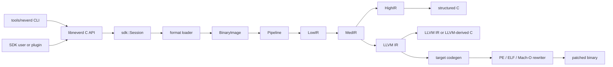

**Sprachen**: [English](../architecture.md) | [简体中文](../zh-CN/architecture.md) | [繁體中文](../zh-TW/architecture.md) | [日本語](../ja/architecture.md) | [한국어](../ko/architecture.md) | [Français](../fr/architecture.md) | [Deutsch](architecture.md) | [Español](../es/architecture.md) | [Italiano](../it/architecture.md) | [Русский](../ru/architecture.md) | [العربية](../ar/architecture.md)

[← Dokumentationsindex](README.md)

# NeverD-Architektur

Dieser Leitfaden beschreibt die Produktionsgrenzen, die Mitwirkende kennen
müssen, um NeverD sicher zu ändern. Er behandelt bewusst nur NeverD-eigenen
Code; die LLVM-, Capstone- und Unicorn-Submodule behalten ihre interne
Architektur.

## Systemgrenze

```mermaid
flowchart LR
  CLI["tools/neverd CLI"] --> CAPI["libneverd C API"]
  SDKUser["SDK user or plugin"] --> CAPI
  CAPI --> Session["sdk::Session"]
  Session --> Loader["format loader"]
  Loader --> Image["BinaryImage"]
  Image --> Pipeline["Pipeline"]
  Pipeline --> Low["LowIR"]
  Low --> Med["MedIR"]
  Med --> High["HighIR"]
  High --> HighC["structured C"]
  Med --> LLVM["LLVM IR"]
  LLVM --> LLVMOut["LLVM IR or LLVM-derived C"]
  LLVM --> Codegen["target codegen"]
  Codegen --> Rewriter["PE / ELF / Mach-O rewriter"]
  Rewriter --> Patched["patched binary"]
```

NeverD besitzt vier IR-Darstellungen, die aber keine zwingende Kette aus vier
Schritten bilden. `LowIR -> MedIR` ist gemeinsam. Strukturierte Dekompilierung
verwendet danach `MedIR -> HighIR -> C`; `lift`, `decompile --llvm` und `patch`
nehmen den direkten Weg `MedIR -> LLVM IR`. Patch- und Lift-Modus überspringen
HighIR bewusst.

Die CLI parst Befehle in `tools/neverd`, erzeugt ein `neverd_session_t` und ruft
die öffentliche API aus `include/neverd/sdk/NeverDCAPI.h` auf. Der
Enginezustand liegt in `lib/sdk/SessionImpl.h`; `neverd_session_load` wählt
einen Loader und erstellt ein `BinaryImage`, während IR-basierte Operationen
`lib/pipeline/Pipeline.cpp` bei Bedarf ausführen. Das Programm `neverd` linkt
`neverd_shared`; Komponentenarchive und deren LLVM-/Capstone-Abhängigkeiten
sind private Implementierungsdetails der Shared Library. Die CLI nutzt LLVM
Support für ihre Kommandozeilenoberfläche, umgeht beim Ansteuern der Engine
aber nicht die C-API.

Die HighIR-Analyse `HighSourceFlow` verwaltet die Kanten der ausgegebenen Anweisungen,
lokale Variablenidentitäten und sichere Zuweisungen. Quellcodeprüfung und Entfernung toter
PHI-Kopien verwenden denselben Graphen. Begrenzte Null/Nichtnull-Partitionen verfolgen
wiederholte skalare Bedingungen; Schreibzugriffe verwerfen Fakten, Variablen mit entwichener
Adresse bleiben unbekannt. Bei Erreichen des Limits gilt wieder der konservative Graph.
Eine PHI-Kopie entfällt nur, wenn ihr Wert in allen möglichen Kontexten unbenutzt bleibt.
Aufrufe, Speicherzugriffe und Quellcodelabels behalten ihr beobachtbares Verhalten.

Auch die Escape-Analyse von Block-Verbrauchern verwendet diesen Graphen. Eine begrenzte Fixpunktanalyse verfolgt Zeigeridentitäten und private Stapelspeicher über Verzweigungen und Schleifen. Zusammenführungen erhalten mögliche Kontextadressen; nur vollständiges Überschreiben entfernt sie. Unbekannte Kanten, Ausnahmefluss und erschöpfte Beweisbudgets verhindern die Bindung.

Objective-C-Empfängerinformationen unterscheiden self am Methodeneintritt von einer exakten Klassenreferenz. Alle Metadatensätze mit demselben Eintritt müssen übereinstimmen, bevor self gesetzt wird. Kopien voller Breite und ABI-erhaltene Register transportieren die Informationen durch dieselbe Fixpunktanalyse, einschließlich Rückkanten zum Eintritt. Der Deklarationsabgleich berücksichtigt Klassen- und Instanzmethoden, erfasste Kategorien, Oberklassen und übernommene Protokolle; für self zählen auch bekannte Unterklassen. Compilerkataloge halten Eigentümer und Hierarchie getrennt vom globalen Selektorabgleich fest. Das SDK prüft Empfängerursprung und Deklarationen vor der Quelltextausgabe erneut am aktuellen Abbild. Diese Informationen wählen kein konkretes IMP aus und erlauben kein binäres Umschreiben.
Fehlende externe Hierarchie erfordert den globalen Selektorabgleich statt einer Eingrenzung auf den Empfänger; explizit widersprüchliche oder nicht unterstützte Deklarationen bleiben negative Evidenz.

Explizit als Objekt deklarierte Ivars erweitern den Empfängernachweis um höchstens acht Ladevorgänge voller Breite. Jeder Schritt speichert Laufzeit-Offsetslot, Trägerbreite und den im Maschinenzugriff verwendeten konstanten Byteoffset. Konstanten müssen zur aktuellen Anordnung passen; Laufzeitreferenzen können verschobenen Feldern folgen. Der Loader prüft Klassenabstammung und Felddeklaration. Teilzugriffe, unqualifiziertes id, Blöcke, reine Protokolltypen, mehrdeutiger Speicher und unbekannte Basispointer liefern keine Klasseninformation. Die Quelltextprüfung validiert den ganzen Pfad erneut am aktuellen Abbild. Typinformationen beweisen weder Objektidentität noch die Zulässigkeit entfernter Speicheroperationen.

Der Loader validiert begrenzte, azyklische Graphen aus konstanten Darwin-Zeichenketten, Ganzzahlobjekten, Arrays und sortierten Dictionaries. Jedes Feld und jede Kante benötigen unveränderlichen abgebildeten Speicher sowie eindeutige Import- oder Relokationsbelege; unbekannte Kodierungen, Zyklen und unvollständige Graphen schlagen ausdrücklich fehl. Quellbindungen prüfen den Graphen und einen eingehenden Zeigerslot erneut. Erzeugte Hilfsfunktionen erhalten Ganzzahlbits, Kindreihenfolge und gemeinsame Adressen und verwenden bestehende Zeichenkettenidentitäten weiter. Containerslots werden einmalig mit acquire/release veröffentlicht; dabei werden nur validierte Kindfunktionen aufgerufen. Jede Hilfsfunktion enthält deren Deklarationen, damit unabhängig rekonstruierte Methoden dieselbe Definition teilen können. Portable Tests prüfen fehlerhafte Eingaben und Beweisbudgets; native Compiler-Fixtures vergleichen Inhalte, Aliase, Kopieridentität und nebenläufige Initialisierung mit den Originalmethoden.

## IR-Darstellungen und Pfade

Die experimentelle [Interpreter-Rekonstruktion](interpreter-recovery.md)
spezialisiert strikt geliftetes LowIR vor der gemeinsamen MedIR-Grenze. Ihr
Provider verantwortet die Nachweise für unveränderliche Abbilder, `SymExec`
die Instruktionssemantik. Das verbleibende CFG verwendet die gewöhnlichen
SSA- und Quelltext-Backends. Rekonstruktionsnachweise bleiben von Nachweisen
nativer Instruktionsvorkommen und binärer Patches getrennt.

`InterpreterSpecialization` verantwortet die begrenzte Rückwärtspropagierung von Bit-Anforderungen nach einem fehlgeschlagenen Versuch. Es nutzt den skalaren Auswerter, ohne Graphfakten zu ändern oder Kontrollfelder und Kontexte hinzuzufügen; sämtliche Arbeit bleibt budgetiert und die Veröffentlichung erfordert einen neuen vollständigen Beweis.

Die Kontextverfeinerung kann zusätzlich einen bereits verfolgten Acht-Byte-Adressträger nominieren, wenn eine spätere Speicheranforderung nur einen Byteausschnitt verwendet. Die ursprünglichen schmalen Erzeugerkoordinaten bleiben maßgeblich; nur das Einreihen bildet Schlüssel aus bewiesenen Konstanten oder Frame-Offsets.

Die endliche Werteaufzählung darf mögliche Tupel beobachten, ohne die Beweisabfrage zu ändern. Eine Ablehnung des Beobachters liefert ein unvollständiges Ergebnis ohne Tupel. Der Cache hält nur mathematische Beweise der Wertemenge; Zertifikate unveränderlicher Lesezugriffe bleiben bis zum Abschluss lokal.

`NeverDLoader` ist für `PEFixedImageView` zuständig und teilt die vollständige Analyse der Basisrelokationen mit dem normalen PE-Laden. Der binäre Interpreteradapter nutzt diese authentifizierte Ansicht an der bevorzugten Basis für Wiederherstellung und native Beweise, statt PE-Tabellen selbst zu lesen. Die Vorbereitung prüft Import-Schreibbereiche, Mapping-Identität und vollständige Rohfelder vor der Zertifizierung der Bytes. Die Ansicht leiht ein unverändertes Abbild und belegt keine ASLR- oder Initialisierungsäquivalenz.

`FrameOffsets` verantwortet budgetierte Beweise eindeutiger eintrittsrelativer Verschiebungen. Die Wiederherstellung normalisiert tatsächliche symbolische Speicherzugriffe ohne Änderung residualer Adressausdrücke; native Prüfungen behalten die Adressgleichheit beider Ausführungen bei. Vollständige Ausrichtungsverzweigung und gemeinsame Wiederholungsbudgets gehören zur Wiederherstellung. Native/LLVM-Partitionsbeweisaggregation bleibt separate, unfertige Arbeit. `NativeStackControl` verantwortet interne vorzeichenlose 16-Bit-Rückkehrbereinigung; der Binäranbieter authentifiziert kanonische Kodierungen mit acht Byte Pop-Breite.

Wenn die gewöhnliche Abhängigkeitssuche stockt, darf die Wiederherstellung pro nativer Position und Instruktionsmodus außerhalb des Funktionseinstiegs ein vorhandenes Register-Kontextfeld aufteilen. Die eingehende Domäne muss vollständig, mehrwertig und über alle deklarierten Feldbits definiert sein. Jeder tatsächliche Vorgänger beweist seine aktuelle vollständige Domäne unabhängig, vergleicht das lebende physische Feld und projiziert jeden Fall erneut. Spätere Vorgänger und verbreiterte Knoten werden neu geprüft; Verkettung endet an den vorgeschlagenen Einstiegen. Vergleiche haben synthetische Herkunft und teilen Knoten-, Operations-, Kontext-, Abfrage- und Verfeinerungsbudgets. Teilmasken, undefinierte Flags und reine Frame-Felder sind ausgeschlossen. Zusätzliche Gast-Lesezugriffe oder Aufruferannahmen entstehen nicht. Unvollständige Domänen behalten die konservative Kante; vor der Ausgabe müssen alle erreichbaren Fälle abgeschlossen sein.

Kontroll- und Guard-Verfeinerungen gehen optionalen Frame-Partitionen voraus; nötige feinere Partitionen bleiben möglich. Jeder Rest erreicht zunächst seinen Fixpunkt. Veröffentlicht wird erst nach Abschluss aller erlaubten Reste. Die ausdrückliche Ausrichtung schneidet den Partitionsbereich ein; die Verzweigung vergleicht tatsächliche Reste. Kontext-, Operations-, Knoten- und Solver-Budgets bleiben begrenzt und werden über Wiederholungen geteilt. Die Wiederherstellung mit Maschinenzustand akzeptiert `--vm-entry-alignment=A:R` als ausdrücklich geprüften Bereich des anfänglichen RSP. `A` muss eine positive Zweierpotenz sein und `R < A` gelten. Andere Werte liefern Status 2 vor Gastzugriffen oder Zustandsänderungen. Hohe Adressbits bleiben frei; standardmäßig wird keine Ausrichtung angenommen. Die Option zertifiziert keine native Äquivalenz.

`SymState` verwaltet vorhandene Bytes pro STORE unter einem ausdrücklichen Trennungsvertrag. Der echte STORE wird ausgeführt; andere Bereiche, Invalidierungsepochen und unbekannte Standardwerte behalten ihren Zustand nach dem Schreiben. Fehlende Bytes werden weder gelesen noch initialisiert. `SymExec` wendet den Vertrag nur auf einen gewöhnlichen STORE an. Die Wiederherstellung hält vollständige affine Slots und Herkunftsfakten separat; Zusammenführungen bleiben konservativ.

`StringTransfer` verantwortet die begrenzte, geordnete skalare Absenkung. Die Wiederherstellung verantwortet Wertebeweise, gemeinsame Budgets und die erneute Zertifizierung vollständig kopierter Rahmenzeiger; erzeugte Zugriffe verwenden die üblichen Speicherprüfungen.

Die Analyse der Kontrollabhängigkeiten meldet Bitabhängigkeiten der Wurzel nur nach einem vollständigen Durchlauf. Die Wiederherstellung darf die optionale Aufzählung von Abbildadressen auslassen, wenn eine bewiesene relative Adresse mindestens 32 freie obere Wurzelbits behält; dies beweist keine Erreichbarkeit und entfernt niemals den Speicherzugriff.

Dieselbe Analyse der Wurzelabhängigkeiten sichert die affine Steuerprojektion über die volle Bitbreite ab. Ihr Ergebnis gilt nur für ein Kantenprädikat; zu große Wertebereiche führen zu einem unvollständigen Ablehnungsergebnis außerhalb des mathematischen Caches. Schmale Masken werden erneut geprüft. Die bestehende Behandlung der Erfüllbarkeit bleibt unabhängig; die Ablehnung eines Wertebereichs beweist weder die Erreichbarkeit noch die Unerreichbarkeit einer Kante.

Der Cache für endliche Abfragen rechnet serialisierte Schlüssel, numerische Ergebnisse und Metadaten zur Nutzungsreihenfolge auf dieselbe Speichergrenze an. Vor jeder Verdrängung prüft er den gesamten Kandidaten und dessen eigenständigen Platzbedarf. Stabile Map-Knoten besitzen die Schlüssel. Treffer aktualisieren die Reihenfolge und liefern eigenständige Ergebniskopien, die nach einer Verdrängung gültig bleiben. Cache-Objekte sind weder kopierbar noch verschiebbar. Der Austausch verändert nur die Wiederverwendung von Beweisen, nicht die Abfragesemantik oder die Zulässigkeit der Ergebnisse.

`InterpreterSpecialization` verwaltet gemeinsame Kontrollrelationen und unabhängige endliche Feldbereiche. Kantenprojektionen speichern nur vollständige Spaltenbeweise; Zusammenführungen schneiden die Masken und vereinigen die neu maskierten Werte. Beim Neuaufbau werden die Bereiche nach der Initialisierung desselben symbolischen Zustands mit dem gemeinsamen Prädikat verknüpft. Frame-Identität und unbeschränkte Bits bleiben erhalten. Durch exakte Tupelinklusion nachweislich implizierte Zugehörigkeitsbedingungen dürfen entfallen. Kontextschlüssel und die Prüfung nativer Rücksprünge bleiben unverändert.

`FrameEntryConstraints.h` verwaltet das gemeinsame Überlaufprädikat für Wiederherstellung und Relationsbeweis. `InterpreterSpecialization` besitzt begrenzte Verkettung eindeutiger Übergänge und bestätigte Wiederholung. Diese C++-Optionen sind standardmäßig deaktiviert; Vertragsabgleich und Digest-Bindung bleiben beim Binäradapter.

`modelInterpreterMachineStateX64` und der Quelltext-Wrapper teilen einen Generator für Gast-Teilregister, gepackte Flags, Profilstatus und Kontrollfluss. Das Modell ersetzt nur Zugriffe auf das Zustandsobjekt durch explizite Registerbytes und trennt den Status vom Gast-RAX. Compilersemantik und Beweisstrategie gehören nicht zu diesem Modell; Eintrittsdomäne, Beobachtungen, Rahmenvertrag und vollständige Verfeinerungsprüfung bleiben Aufgabe des Aufrufers.

`NeverDLLVMInterpreterModel` besitzt den separaten begrenzten skalaren LLVM-Import in dieselbe rohe Zustands-ABI. `modelLLVMInterpreterMachineStateX64` erhält echte Statusrückgaben und erzeugt explizite Definiertheitsprüfungen. `llvmInterpreterMachineStateContract` liefert alle Beobachtungen und die Erhaltung des Null-Monitors; Domäne, Speicher und vollständiger Beweis liegen beim Aufrufer. Gewöhnliches Lifting und Quelltextveröffentlichung bleiben unverändert; ein Compilerbeweis entsteht nicht.

Das LLVM-Modell prüft `initializes`-Parameterverträge. Es nutzt die vorhandenen Zustandspointer-Projektionen und führt vor der normalen skalaren Ausgabe eine begrenzte byteweise Must-Datenflussanalyse aus; ein zweiter Wertauswerter entsteht nicht.

`NeverDInterpreterLLVMRefinement` verknüpft Beweise von nativem Code zu LLVM. Es erzeugt beide Zustandsmodelle und Pflichtverträge neu, projiziert Flags nur am Einstieg gemäß dem maßgeblichen Profil und prüft beide Voraussetzungen erneut. Aufrufer dürfen Schleifenpläne vorschlagen, aber keine Modelle, Beobachtungen oder Nachweise ersetzen. Analysemodelle kopieren nur den ausführbaren Graphen und deklarierte Wurzeln; Rückkanten zum Einstieg werden vor einer wiederholten Initialisierung abgelehnt.

Die C-API v3 und CLI übertragen Feld-, Verfeinerungs- und Solver-Budgets an den gemeinsamen Spezialisierer. Der Adapter prüft Strukturgrößen und reserved-Felder vor dem Lesen von Erweiterungen; v1/v2-Layouts und Standardwerte bleiben stabil. Größere Budgets ändern weder Ausführungsvertrag noch Veröffentlichungskriterien.

Die Wiederherstellung bietet auch `--vm-chain-transfers=N` (Standard 0) und `--vm-no-control-discovery`. Verkettung erhält symbolische Korrelationen über Transfers mit bewiesenem Einzelziel; am Limit gelten wieder normale CFG-Grenzen. Maschinenzustandswiederherstellung kann mit `--vm-entry-frame=begin:end` ungeprüfte, nicht umlaufende Offsets zum Eintritts-RSP angeben. Die genaue numerische Vorbedingung bleibt im erzeugten C und Bericht; sie erlaubt keine Speicherzugriffe und beweist keine Äquivalenz.

Große rekonstruierte Funktionen oberhalb der SSA-Aufbaugrenze können mit `--llvm` einen begrenzten Vertrag für veränderlichen skalaren Speicher nutzen. Eingangswerte, schleifengetragene Werte und frühere Lesezugriffe behalten ihre Bedeutung. Nicht unterstützter impliziter Zustand, Vektorregisterparameter, Image-Relokation, mehrdeutiger Speicher und fehlerhafter Kontrollfluss führen zu klaren Fehlern; HighC lehnt diesen Ersatzpfad ab. Die Ausgabe folgt weiterhin dem bestehenden Maschinenzustandsvertrag und liefert kein zusätzliches Äquivalenzzertifikat.

`analyzeMedMutableSource` verantwortet die Prüfung des normalisierten CFG, der Speicheridentitäten und konservativer Anforderungen an Eingangsbytes. Diese Anforderungen begrenzen Lesezugriffe nach oben und sind kein positiver Beobachtbarkeitsnachweis. LLVM prüft vor Modulanalysen und verwendet den Plan erneut, um Eingangswerte genau einmal zu initialisieren. Block-Wert-Produkte und Propagationsaufwand haben getrennte Grenzen. C-Weiterleitung verwendet für jeden Lesezugriff einen exakten früheren Schreibzugriff mit gleichem Typ und ohne partielle Aliase; blockübergreifende Zusammenführungen behalten expliziten Speicher.

Bei validierten Funktionskörpern mit veränderlichen Variablen reicht LLVM exakte Werte privater Speicherplätze nur innerhalb eines Blocks weiter, dessen Befehle am Ende angefügt werden, und behält die letzten Schreibzugriffe. Eingangsinitialisierung sowie Block-, Funktions- und Modulgrenzen bleiben getrennt. Speicherzugriffe des Zielprogramms bleiben explizit. Die C-Ausgabe begrenzt die Expansion skalarer Ausdrücke und den Aufwand für Konstantenfaltung und behält benannte Zwischenwerte. Faltbare konstante Ausdrücke verwenden das LLVM-Ziellayout; nicht unterstützte Ausdrücke führen zu einem ausdrücklichen Fehler. Festgelegte veränderliche Rückgabewerte, auch Null, werden nicht zu void-Rückgaben.

Die veränderliche Teilmenge erlaubt skalaren Speicher mit 8/16/32/64/128 Bit; Eingaben für Bitzählungen sind auf 64 Bit begrenzt. Nicht standardisierte oder größere Breiten benötigen einen eigenen Quellcodevertrag.

Der Architektur-Lifter verwaltet die ergänzenden Metadaten undefinierter Ausgaben transaktional: Vor jedem Versuch löscht er alte Belege und veröffentlicht Effekte nur für das exakt zugehörige erfolgreiche Lifting. `Missing` bedeutet fehlende Belege, keine leere `Complete`-Beschreibung. Gewöhnliches LowIR behält seine gewählten deterministischen Werte. `LowIRUndefinedIndependence` verantwortet den begrenzten relationalen Beweis für einen übergebenen vollständigen azyklischen LowIR-Graphen, mit gemeinsamen gewöhnlichen Eingaben und erhaltenen Korrelationen frisch erzeugter undefinierter Werte. Vollständige Instruktionsgrenzen und Operations-Digests binden den Beleg; unvollständige Beweise werden abgelehnt. Allgemeine native Graphzertifizierung, Schleifeninvarianten und die Äquivalenz von nativem Code zu C bleiben separate Arbeiten außerhalb des folgenden Bereichs endlicher nativer Pfade.

Klassische skalare SHL/SAL-, SHR- und SAR-Formen liefern zählerabhängige Evidenz für undefinierte Bits bei 8/16/32/64-Bit-Operanden. Ein maskierter Zähler von null erhält alle Flags; sonst ist AF beliebig, oberhalb von eins auch OF und bei SHL/SHR ab der Operandenbreite CF. SAR behält ein definiertes CF. Boolesche Bedingungen verwenden den vor überlappenden Zielschreibzugriffen gespeicherten Zähler. Mit und ohne Metadaten entstehen dieselben Operationen. Ungeprüfte Kodierungen veröffentlichen keine Teileffekte.

Legacy-ROL/ROR erzeugen nur dann ein neues beliebiges OF-Bit, wenn der architektonisch maskierte Zähler größer als eins ist; das folgende Modulo der Byte-/Wortbreite ändert dieses Prädikat nicht. Ein Nullzähler erhält die Flags. BT/BTS/BTR/BTC mit Registerbasis erzeugen vier unabhängige Bits (OF/SF/AF/PF); CF ist definiert, ZF/DF bleiben erhalten. Exakte Register- und imm8-Kodierungen sind geprüft; Speicherbitfolgen, LOCK, APX und Rotationen durch Carry gehören nicht zu dieser Erweiterung. Effekte treten nach der Kerninstruktion auf; LowIR bleibt mit und ohne Metadaten identisch. Siehe Intels [Bittest-Referenz](https://cdrdv2-public.intel.com/929353/253666-093-sdm-vol-2a.pdf) und [Rotationsreferenz](https://cdrdv2-public.intel.com/929354/253667-093-sdm-vol-2b.pdf).

Auch für Register-XADD gibt es eine exakte Prüfung der Legacy-Kodierungen mit 8/16/32/64 Bit: CF/PF/AF/ZF/SF/OF werden definiert, DF bleibt erhalten, und es entstehen keine neuen beliebigen Bits. Für beide ausgetauschten Register gelten die architektonischen Regeln für partielle Schreibzugriffe und 32-Bit-Nullerweiterung. Speicher-/LOCK- und APX-XADD bleiben ungeprüft. Die [Intel-Kompatibilitätsregel](https://cdrdv2-public.intel.com/929360/253669-093-sdm-vol-3b.pdf) erlaubt Group 2 `/6` für C0/C1/D0/D1/D2/D3 als SAL/SHL `/4`, mit denselben Zählbedingungen und undefinierten Flags. Siehe die [XADD-Referenz](https://cdrdv2-public.intel.com/929356/334569-093-sdm-vol-2d.pdf).

Unveränderliche native Lesezugriffe unterstützen außerdem vollständig nachgewiesene endliche Adressmengen bis `MaxImmutableLoadAddresses`. Vor der Aufzählung muss die Adressgleichheit beider Ausführungen bewiesen sein. Jeder Kandidat benötigt unveränderliche Bytes, Abbildungsnachweise und Trennung vom veränderlichen Frame; der ausgewählte Wert bleibt eingabeabhängig. Fehlende Kandidaten, beschreibbare oder relokierte Daten und erschöpfte Grenzen verhindern ein Zertifikat. Lesebelege und Adressgrenze werden darin gebunden. Dynamische Frame-Offsets und beliebiger externer Speicher bleiben ausgeschlossen.

Das folgende Verhalten verwendet den standardmäßigen strengen Prüfvertrag. `checkBinaryUndefinedIndependence` prüft vollständige endliche native x64-Ausführungspfade für die angegebenen Beobachtungen und sammelt beide Arme direkter Originalverzweigungen vor der Machbarkeitsprüfung. Ein physischer near CALL legt die tatsächliche Folgeadresse auf den Stack; interne RETs lesen das aktuelle Stackwort, auch bei veränderten Rücksprungzielen. Indirekte Ziele erfordern eine vollständige endliche Aufzählung und den Gleichheitsbeweis beider Ausführungen vor der Pfadeinschränkung. Exakte unveränderliche Lesezugriffe benötigen Belege und einen Nachweis der Trennung vom veränderlichen Frame. Jede gesammelte Instruktion, auch in nicht genommenen Armen, benötigt unveränderliche Originalbytes; abgesehen von den unten beschriebenen strikt gelifteten `INT3`/`UD2`-Endgrenzen und der expliziten RDSSP/INCSSP-Profilprojektion benötigt jede Instruktion außerdem vollständige Architekturmetadaten. Strikt geliftete `INT3`/`UD2` dürfen als `Terminator`-Grenzen mit ihren vollständigen Originalbytes und dem Digest der LowIR-Operationen erhalten bleiben, ohne ein `Missing`-Sidecar für undefinierte Ausgaben zu `Complete` hochzustufen. Ein Zertifikat darf diese Traps nur enthalten, wenn die symbolische Ausführung ihre Unerreichbarkeit beweist; jeder mögliche Pfad zu einem Trap liefert `ContractViolation`, ohne Zertifikat oder Restcode. Diese Regel modelliert weder eine Fortsetzung nach dem Trap noch eine Wiederaufnahme nach einer Ausnahme, verwendet keine `codeFollowsTrap`-Heuristik und erweitert die Unterstützung der statischen LowIR-API nicht. Zertifikate binden Bytes, Abbildungen, Effekte, Lesebelege, Ausführungsprofil und Beweisbudgets. Das explizite normale, fehlerfreie Profil mit deaktiviertem CET schließt alle Image-Abbildungen aus dem Eintrittsframe aus. Jeder mögliche Pfad muss einen äußeren Rücksprung erreichen, der Eintritts-RSP und ursprünglichen Rückadressenslot vor dem nativen Pop erhält; ein abgebrochener Präfix ist kein Beweis. Direkte und indirekte Schleifen erfordern eine vollständige endliche Entrollung; nicht terminierende oder budgetüberschreitende Pfade und andere ungeprüfte Effekte verhindern ein Zertifikat. `specializeBinaryInterpreterWithIndependence` prüft vor der Wiederherstellung und liefert bei Fehlern keinen Restcode. Gewöhnliche Wiederherstellung aktiviert die Schranke nicht standardmäßig; Schleifeninvarianten, Ausnahmebehandlung, CET-Ausführung und native-zu-C-Äquivalenz bleiben ausgeschlossen.

Die explizite Option `RetainUnauditedNativeBoundaries` ergänzt Ablehnungsgrenzen für endliche native Unabhängigkeitsbeweise und Verfeinerungsbeweise nach LowIR. Zulässig sind nur streng dekodierte und geliftete Befehle mit Abdeckung `Missing`, leeren Effekten und einem passenden, nicht leeren Operationsdigest. Alle Struktur-, Kontrollfluss-, Überlappungs-, Profil- und Ressourcenprüfungen bleiben erforderlich. Nur die Sammlung der Nachfolger dieser Grenze endet; eine andere Kante zu den folgenden Bytes wird weiter unabhängig gesammelt. Jeder ausführbare Eintritt wird vor der Ausführung abgelehnt; unbekannte Solver-Ergebnisse oder erschöpfte Budgets beweisen nichts. Erfolgreiche Zertifikate binden typisierte, versionierte Belege mit exakter Grenze sowie Digests der nativen Bytes und Operationen, ohne `Missing` zu `Complete` zu ändern. Nicht gesammelte Suffixe gelten nicht als geprüft. Unabhängigkeit umfasst alle beliebigen Entscheidungen; die Verfeinerung mit ausgewählten Werten belegt Unerreichbarkeit nur für den deklarierten Zeugen. Statische LowIR-, Schleifenbeweis/-inferenz- und exakte LLVM-APIs aktivieren diese Option nicht.

`AllowOverlappingNativeInstructions` ist eine separate, standardmäßig deaktivierte Option für endliche native Unabhängigkeitsnachweise und Verfeinerung zu LowIR. Jeder Einstieg wird unabhängig dekodiert und geprüft; überlappende Befehlsbytes müssen mit allen bisherigen Befehls- und unveränderlichen Lesenachweisen einschließlich der Kandidatenzugriffe übereinstimmen. LowIR-Adressen des Kandidaten bleiben Marken und sind keine Byte-Nachweise. `MaxNativeInstructionBytes` beträgt standardmäßig 1048576 und berechnet vor dem Vergleich die vollständige Größe jedes neu geladenen Einstiegs einschließlich wiederholter Bytes. Erschöpftes Budget oder widersprüchliche Bytes verhindern ein Zertifikat. Option und Grenze sind im Nachweis-Hash gebunden. Statisches LowIR, induktive Schleifennachweise und Inferenz lehnen die Option auch bei einem leeren Schleifenplan ab; die exakte LLVM-API und CLI behalten ihre bisherigen Vorgaben.

Der native Nachweis gepackter Flags verlangt `X64FlagsProfile = UserX64NoFaultV1` in Optionen und Vertrag; die bisherigen Ausführungsbooleschen Werte aktivieren ihn nicht. Kanonische gemeinsame Eingangsflags und persistente Systemflags verwenden dieselbe skalare PUSHFQ/POPFQ-Transformation wie der Maschinenzustands-Quellwrapper, einschließlich CPL3/IOPL0-Masken. Für jedes POPFQ muss TF/AC in beiden Ausführungen nachweislich null bleiben; diese Bedingung wird nie nur angenommen. Abschließende Systemflags werden auch ohne Register- oder Schreibframe-Beobachtungen immer verglichen. Zertifikate binden Profilversion und exakte Transformationsdigests. Unter diesem expliziten CET-deaktivierten Profil dürfen unabhängig geprüfte kanonische RDSSPD/RDSSPQ-Bytes als exaktes NOP mit typisiertem Beleg projiziert werden; die ursprünglichen Metadaten bleiben `Missing`, und auch ein 32-Bit-Ziel erhält das gesamte Register. Kanonische INCSSPD/INCSSPQ bleiben profilabhängige #UD-Grenzen mit einem Beleg für die ursprüngliche unerreichbare Instruktion; jeder ausführbare Besuch verletzt den fehlerfreien Vertrag, auch bei einem Nulloperanden. Andere CET-Instruktionen, CET-aktive Ausführung und Profile über die statische LowIR-API bleiben ununterstützt. Jeder Besuch einer endlich entrollten Schleife erhält den Zustand und erzeugt frische undefinierte Entscheidungen; eine Invariante wird damit nicht bewiesen.

`checkLowIRRefinement` und `checkBinaryLowIRRefinement` prüfen eine separate konstruktive Verfeinerung gegen einen deterministischen LowIR-Kandidaten. `LiftedBits` wählt die vom ursprünglichen Lifter berechneten Bits jedes undefinierten Erzeugers; `ZeroBits` wählt Null nur bei aktiver geprüfter Bedingung. Dynamische Vorkommen werden aufgezeichnet; Kopien und Spills behalten dieselbe Wahl. Beide Programme teilen den vorhandenen Skalar-, Stack-, Speicher- und Flag-Ausführer sowie den Eingangszustand. Alle möglichen Pfade müssen enden und den erlaubten Eingangsbereich abdecken. RETURN-Operanden, angeforderte Register, obligatorische native Systemflags und die Vereinigung geschriebener Frame-Bytes müssen übereinstimmen; Erhaltungsverträge gelten für beide Seiten. Ausführung und Vergleich teilen Budgets einschließlich `MaxTerminalPairs`. Zertifikate binden Kandidat, Originalbelege, Wahlstrategie und Grenzen. Eine gescheiterte Wahl schließt andere nicht aus. Endliches Abrollen beweist weder Schleifeninvarianten noch CPU-spezifische Gleichheit oder C-Backend-Äquivalenz und ersetzt keine Unabhängigkeitsprüfung. Beide APIs lehnen Eingabetemporäre ab, die den internen Speicher-Scratch-Bereich überlappen. Die binäre Verfeinerungs-API verlangt übereinstimmende `UserX64NoFaultV1`-Profile in Optionen und Beobachtungsvertrag.

`checkLowIRLoopRefinement` und `checkBinaryLowIRLoopRefinement` ergänzen eigene induktive Zertifikate. Gepaarte Schnittpunkte und reine skalare LowIR-Zustandsvorlagen sind Beweiskandidaten: Der gemeinsame Executor prüft den tatsächlichen Eintritt, vollständige Segmentabdeckung, alle möglichen Nachfolger, Invariantenerhaltung und Endbeobachtungen. Jede Kante zwischen Schnittpunkten muss einen endlichen vorzeichenlosen lexikografischen Rang streng senken. Rückprojektionen der Parameter verhindern ein Zurücksetzen des Rangs ohne Maschinenfortschritt. Als Basis dient der gemeinsame Eingangszustand oder mit `UseEntryPrefix` (`GeneralizeEntryPrefix = false`) ein tatsächlich erreichtes Präfixpaar, dessen Prädikat ebenfalls erhalten bleiben muss. Schnittpunkte prüfen alle geänderten Register und den gesamten Frame; Endbeobachtungen behalten Speicherwirkungen früherer Iterationen bei. Jeder Schnittpunkt verlangt derzeit auf jeder Seite eine eindeutige Adresse. Automatische Invarianten- oder Rangfindung und beliebige Kontrollflusszuordnung sind nicht enthalten. Fehlende Schnittpunkte, falsche Invarianten, arithmetischer Umlauf, unbewiesene Terminierung, nicht unterstützte Semantik oder erschöpfte gemeinsame Budgets verhindern ein Zertifikat. Der Digest bindet Plan, alle nativen Segmente und Originalbelege. Endliche Verfeinerung und strikte Unabhängigkeit behalten ihre Bedeutung; weder ein C-Backend noch die undefinierten Bitentscheidungen einer bestimmten CPU werden zertifiziert.

Die folgende Anforderung zur Erhaltung des Präfixprädikats gilt bei `GeneralizeEntryPrefix = false`.

`inferLowIRLoopRefinementPlan` schlägt begrenzte Vorlagen mit dem gemeinsamen symbolischen Ausführer vor. Schnittpunkte decken alle CFG-Zyklen ab; die Erweiterung erhält bewiesene feste Bits und verwirft nicht erhaltene vorzeichenlose Präfixgrenzen. Beobachtete Einerschrittzähler und abgeleitete Phasen bilden lexikografische Ränge für verschachtelte auf- oder absteigende Schleifen. `OriginalPrefix` und `CandidatePrefix` erfordern `UseEntryPrefix`. Für einen Schnittpunkt hinter anderen Schnittpunkten kann eine gesonderte begrenzte Wiederholung ab dem echten Einstieg ein erreichbares Präfixpaar belegen. Dieser Zeuge deckt nicht den Eingabebereich ab: Jede Ankunft muss sein Prädikat implizieren; vollständige Einstiegs- und Übergangsabdeckung bleibt Pflicht. `inferAndCheckBinaryLowIRLoopRefinement` verlangt vollständige Wiederherstellung und eindeutige native Ursprünge und wiederholt die vollständige Original-/Kandidatenprüfung unabhängig. Vorschläge und Zuordnungen gelten nicht als vertrauenswürdig; nur `Refinement` kann ein Zertifikat enthalten. Ableitung und Beweis behalten getrennte explizite Budgets. Die C++-API läuft nicht automatisch mit `--devirtualize`. Unerreichbare Präfixe, beliebige Kontrollflusszuordnung, Rangformen außerhalb der Suche, C-Backend-Äquivalenz und physische CPU-Wahl undefinierter Bits bleiben ununterstützt.

Die Erkennung von Einheitszählern berücksichtigt nach den bisherigen Ganzwort- und Nullerweiterungsformen auch byteausgerichtete Teilwortänderungen, die alle übrigen Bits erhalten. Bei mehreren Schnittpunkten werden ausgeschlossene Grenzwerte eines Teilbereichs erst nach Beweis für gespeicherte konkrete Ankünfte und alle aktuellen eingehenden Zustände vorgeschlagen. Die Erweiterung entfernt gescheiterte Bedingungen dauerhaft und kann weitere Teilbereiche eines bereits bekannten Zählerworts entdecken. Masken verwenden den vorhandenen Ganzwortparameter; Ganzwortränge und vollständige Zustandsbeobachtungen bleiben erhalten. Gemeinsame Knoten-/Abfragebudgets und die unabhängige vollständige Verfeinerungsprüfung gelten weiterhin.

Bei mehreren Schnitten folgt auf jedes erfolglose beobachtete Zählertupel eine Variante mit vorangestellter konstanter 64-Bit-Phase, bevor das nächste Tupel versucht wird. Beide Varianten verbrauchen getrennte `MaxRankCandidates`-Versuche und teilen dasselbe Abfragebudget. Die vordere Phase darf bei keiner möglichen Transition steigen; ist die strikte Abnahme des restlichen Tupels nicht bewiesen, muss diese Transition die Phase strikt senken. Nichtnegative Differenzbedingungen lehnen Zyklen mit positivem Gewicht ab. Dadurch können aufeinanderfolgende Schleifen einen neu initialisierten Zähler wiederverwenden, während innerhalb von Zyklen weiterhin Fortschritt bewiesen werden muss. Vorhandene Phasen zwischen Zählern lassen sich mit der vorderen Phase kombinieren. Jedes vollständige Tupel wird unter den ursprünglichen vollständigen Transitionsprädikaten geprüft; der abschließende Refinement-Prüfer prüft den vorgeschlagenen Rang unabhängig erneut. Die Suche mit nur einem Schnitt fügt dieses wirkungslose konstante Präfix nicht hinzu.

Einzelne Schnittpunktkandidaten müssen alle Zyklen der ursprünglich erreichbaren Blöcke abdecken, auch solche, die durch Entfernen des Schnittpunkts vom Eintritt getrennt werden. Jede Prüfung verbraucht vor der symbolischen Ausführung `MaxCutpointAttempts`. Skalare Zähler mit Einheitsschritt auf jeder Rückkehrkante behalten Vorrang. Danach wechseln sich bis zu acht beobachtete Einheitsschritt-Tupelvorschläge mit einzelnen allgemeineren skalaren Wächter- oder Schrankenhypothesen ab. Nach den übrigen skalaren Hypothesen wird die Tupelsuche ohne Wiederholung fortgesetzt. Diese Reihenfolge hängt nicht von der Budgetgrenze ab. Jeder Tupelversuch stellt die gespeicherte vollständige stabile Schablone und ihre Übergänge wieder her; eine gescheiterte Bereichsprüfung deaktiviert nur diese Kandidatenfamilie. Verworfene skalare Wächter schränken diesen Bereich nicht ein. `MaxRankCandidates` sowie Abfrage-, Operations- und Pfadbudgets werden weiter aufsummiert. Der vollständige Refinement-Prüfer bleibt erforderlich. Ein additiver Rückkehrzweig kann strukturelle Erweiterung auslösen, auch wenn andere Zweige den Wert beibehalten oder zurücksetzen; die vorgeschlagene Schablone muss weiterhin alle Eintritts- und Übergangsprüfungen bestehen.

`inferAndCheckLowIRLoopRefinement` sucht eine geprüfte Relation zwischen LowIR-Schleifen. Die Suche versucht Standardpläne, vollständige Verzweigungsarmpläne und gefilterte Verzweigungsarmpläne in dieser Reihenfolge. Zuerst werden gleiche Familien, dann alle unterschiedlichen Familien und schließlich einzelne zyklische Kandidatenschnitte gepaart. Die vollständige Familie wählt Nachfolger eines Verzweigungsblocks in derselben zyklischen Komponente mit genau einer ausgehenden Kante. Der Filter lässt eine Verzweigung nur weg, wenn alle Pfade vor einem DFS-Rückkantenziel an einem gemeinsamen nichtterminalen Knoten zusammenlaufen. Alle Nachfolger einschließlich Austritten und Grenzen zählen; ein Zusammenlauf nur an der Grenze reicht nicht. Zusätzliche greedy gewählte Schnitte decken jeden ursprünglich erreichbaren Zyklus ab. Diese Vorschläge erhalten Aktionsphasen ohne erfolgreiche Standardinferenz vorauszusetzen. `MaxCutSelectionWork` begrenzt die gemeinsame Pfadanalyse samt Mengenaufbau und Vergleichen separat. `CutSelectionWork` erfasst auch fehlgeschlagene Arbeit und belastet das verbleibende globale `MaxSearchWork`. Standard- und vollständiger Selektor bleiben unverändert. Erfolge und Fehlschläge werden mit höchstens drei Plänen je Seite gespeichert; Permutationen entstehen bei Bedarf. Zusätzliche Familien überspringen bereits gespeicherte gleiche Schnittmengen derselben Seite, auch aus einer höher nummerierten Familie. Leere oder doppelte Familien benötigen keine symbolischen Abfragen, zählen aber als Kandidatenversuch. Alle sechs gespeicherten Pläne teilen einen `MaxMetadata`-Vorrat; jede Paarungskonstruktion wird separat begrenzt. Nur gleich breite Frame-Eingaben am selben Offset werden als gleich vorgeschlagen. Registerumbenennungen, affine Relationen und beliebige Rückkopplungsmengen erfordern explizite Paarungen. Die maßgebliche Paarungslogik und der vollständige Prüfer behalten die ursprünglichen geprüften Aufzeichnungen, den Witness, den Eingabebereich, Frame-Beobachtungen und Terminierungsanforderungen des Aufrufers bei. In `LowIRLoopAlignmentLimits` gilt `MaxSolverQueries` gemeinsam für alle Inferenz- und Beweisversuche einschließlich Fehlschlägen; jeder Aufruf erhält höchstens das Minimum aus Stufenlimit und verbleibendem Gesamtbudget. `MaxSearchWork`, `MaxMetadata`, `MaxCandidateAttempts`, `MaxPairingAttempts` und `MaxCuts` begrenzen Aufbau und Aufzählung. Ein erschöpftes Einzelbudget erlaubt weitere Versuche; globale Erschöpfung beendet die Suche. `Unsupported` bedeutet, dass keine Relation gefunden wurde, und beweist keine Ungleichheit. Nur ein frisch erfolgreich geprüfter `Refinement` enthält ein Zertifikat. CLI-Vorgaben bleiben unverändert.

`GeneralizeEntryPrefix` ist standardmäßig `false` und erfordert `UseEntryPrefix`. Der Standardmodus erhält das erfasste Pfadprädikat bei jeder Ankunft. Die ausdrückliche Verallgemeinerung behandelt Präfixausdrücke außerhalb dieses Pfads als totale, ungeprüfte Vorlagenfunktionen. Ein erreichbares Zeugenpaar, vollständige Eingangs- und Segmentabdeckung, Gleichheit aller Register und Frame-Bytes, Parameterprojektionen, native Bedingungen und strikter Rangabstieg im erweiterten Induktionsbereich bleiben erforderlich. Die Inferenz erweitert einen Schnitt nur bei einem eingehenden Zustand außerhalb des Zeugenbereichs und prüft danach alle allgemeinen Übergänge erneut. Ein erster Zeuge ohne Iteration darf keinen anderen Schleifeneingang verdecken. Die Richtlinie ist an den Digest des Induktionszertifikats gebunden.

Verschachtelte Inferenz kann strikte und nichtstrikte vorzeichenlose Grenzen zwischen beobachteten Zählern mit Einheitsschritten und unveränderten Präfixwerten aus Kontrollprädikaten vorschlagen, auch bei Gleichheitsausstiegen. Zuerst werden konkrete Zustände geprüft; allgemeine eingehende Übergänge entfernen ungültige Beziehungen monoton. Prädikatdurchlauf und Solverarbeit bleiben innerhalb der bestehenden expliziten Budgets. Der abschließende Original/Kandidat-Prüfer beweist die Vorlagen unabhängig.

Die Inferenz verschachtelter Schleifen schlägt auch Gleichheiten zwischen einem zwischengespeicherten Operanden und einem Zähler oder unveränderten Steuereingang vor, wenn ihre Präfixausdrücke übereinstimmen. Sie prüft jeden konkreten Eingangszustand, hält Kandidaten für später entdeckte Speicherwerte bereit und entfernt eine Beziehung, sobald ein allgemeiner Eingangszustand sie verletzt. Jedes Wort behält seinen eigenen rekonstruierbaren Parameter; die Gleichheit bleibt ein zu prüfendes Prädikat. Kopierrekurrenzen können zufällig feste Bits schneller verwerfen, ohne Semantik vorauszusetzen.

Die verschachtelte Inferenz sucht außerdem nach zwischengespeicherten Gleichheits- und Ungleichheitsvergleichen in Feldern mit höchstens 16 veränderlichen Bits. Jede Relation verwendet die aktuellen Zähler- und Grenzwerte; der Cache behält einen eigenen rekonstruierbaren Zustandsparameter. Ein Eintritts-Guard oder eine konstant gefaltete Initialisierung kann den Vergleich bis zu einer späteren Erweiterung verbergen. Neue Kandidaten dürfen dann entstehen, abgelehnte oder entfernte Kandidaten werden aber nicht erneut aufgenommen. Sie müssen für alle gespeicherten konkreten Ankünfte und aktuellen eingehenden Übergänge gelten. Variablen-DAG-Durchläufe werden je Schnittpunkt zwischengespeichert und dem gemeinsamen Prädikatbudget belastet. Vollständige native Abdeckung, Gleichheit des gesamten Zustands und strikte Rangabnahme bleiben unabhängige Anforderungen. Die Zählersuche wird nach allgemeinen Übergängen fortgesetzt: Ein durch den ersten inneren Schleifenzeugen verdeckter äußerer Zähler erhält weiterhin geprüfte Grenzen und Operandenkopien. Abgelehnte Relationen werden nicht wiederhergestellt; auch Einheitsschrittprüfungen halten das Symbolknotenbudget ein.

Wiederholungen des Eintrittspräfixes besuchen wartende Zweige, bevor eine frühere Schleife weiter entfaltet wird. So kann ein kurzer erreichbarer Zeuge gefunden werden, auch wenn ein anderer Zweig beliebig viele Iterationen zulässt. Inferenz und Original-/Kandidatenprüfung verwenden dieselbe Reihenfolge. Alle Arbeit zählt weiterhin gegen die bestehenden Budgets; ein Präfixzeuge ersetzt weder vollständige Eintrittsabdeckung noch Invariantenerhaltung oder Terminierungsprüfungen.

| Darstellung | Zweck | Primäre Definitionen und Transformationen |
|-------------|-------|--------------------------------------------|
| LowIR | Architekturunabhängige `NdOp`-Operationen, Basisblöcke, CFG und Sprungtabellenmetadaten | `include/neverd/ir/low`, `lib/ir/low`, erzeugt durch `lib/decode` + `lib/lift` |
| MedIR | Typen, ABI/Aufrufkonventionen, Speicher-/Stackmodell, Flags, Aufrufe und SSA-artiger Datenfluss | `include/neverd/ir/med`, `lib/ir/med` |
| HighIR | Strukturierte Ausdrücke und Kontrollfluss für lesbares C | `include/neverd/ir/high`, `lib/ir/high`, ausgegeben von `lib/backend/c/HighC` |
| LLVM IR | Optimierung, LLVM-abgeleitetes C, Zielcodeerzeugung und Eingabe für Binärumschreiben | `lib/backend/llvm`, optimiert/koordiniert durch `lib/pipeline` |

Konstanten behalten von LowIR über MedIR bis HighIR für jedes Vorkommen ihre Herkunft als Skalar oder Adresse sowie den Adresseigentümer. Gleiche Zahlenbits führen unterschiedliche Ursprünge nicht zusammen. Die symbolische Vereinfachung in HighIR behandelt Adressidentitäten als undurchsichtige Eingaben. Die Quellcodebindung nutzt die gemeinsame Klassifizierung numerischer Operanden und verlangt für Speicher- und Zeigerverwendungen weiterhin Relokationsbindungen.

| Benutzerpfad | Darstellungspfad | Ausgabe |
|--------------|-----------------|---------|
| Low/Med-Dump | Binary -> LowIR, optional -> MedIR | Diagnosetext |
| High-Dump oder `decompile` | Binary -> LowIR -> MedIR -> HighIR | HighIR oder strukturiertes C |
| `lift` | Binary -> LowIR -> MedIR -> LLVM IR | `.ll` |
| `decompile --llvm` | Binary -> LowIR -> MedIR -> LLVM IR | LLVM-abgeleitetes C |
| `patch` | Binary -> LowIR -> MedIR -> LLVM IR -> codegen | Umgeschriebene Binärdatei |

`lib/pipeline/Pipeline.cpp` ist die Referenz für die Pfadauswahl.
Darstellungsspezifische Logik gehört in die jeweilige IR- oder
Backend-Bibliothek; die Pipeline soll Komponenten koordinieren, nicht deren
Algorithmen übernehmen.

## Vertrag für architekturübergreifende Übersetzung

`include/neverd/translate` definiert eine Vertragsschicht, kein
Ausführungs-Backend. `GuestState` modelliert für `x86_32`, `x86_64`, `AArch64`
und `ARM32` den architekturunabhängigen, maschinensichtbaren Zustand. Seine
kanonische Serialisierung in Version 1 verwendet Little-Endian-Felder fester
Breite, stabile Register-IDs, sortierte Sammlungen und Fail-Closed-Validierung;
der persistierte Zustand hängt daher nicht vom C++-Layout des Hosts ab.

Die wire-v1-Basis von `GuestState` ist dauerhaft eingefroren. Zustand außerhalb
dieser Basis muss eine Erweiterungsregister-ID aus dem Erweiterungsbereich
mit einem kanonischen kleingeschriebenen Namen verwenden oder in eine neue
Wire-Version mit explizitem Upgrader wechseln; die v1-Basis darf nicht an Ort
und Stelle verändert werden.

Bei einem `ARM32`-Guest ist `ExecutionMode` der maßgebliche Decode-Modus und
muss mit `CPSR.T` übereinstimmen. Der gespeicherte PC ist stets die kanonische
Instruktionsadresse mit gelöschtem Bit 0; im ARM-Modus muss er zusätzlich
wortausgerichtet sein.

Der Vertrag für Architekturpaare definiert `x86_64 -> AArch64`,
`AArch64 -> x86_64`, `x86_32 -> AArch64/ARM32` und
`ARM32 -> x86_32/x86_64`. `ContractDefined` bedeutet, dass eine Anforderung
validiert und persistiert werden kann, nicht dass Code übersetzt oder ausgeführt
werden kann. Die JIT-Richtlinie akzeptiert nur den nativen Host des laufenden
Prozesses; die AOT-Richtlinie verlangt eine explizite Hostarchitektur, ein
explizites Target-Triple und, falls gewählt, auch eine explizite CPU oder
Feature-Menge.

`ResolvedHostTarget` löst diese Auswahl in ein konkretes Ergebnis auf. Die
`Native`-Auflösung ermittelt Triple, CPU und die aktivierte/deaktivierte
Feature-Menge des Prozesses. Die `Explicit`-Auflösung validiert und normalisiert
die vom Aufrufer angegebene Architektur, das Triple, die CPU und die Features
und lehnt Widersprüche ab. Ihre versionierte Cache-Identität wird in
deterministischer Byte-Reihenfolge aus den normalisierten Zielangaben gebildet
und enthält weder Prozessadressen noch locale-abhängigen Text.

Ein versionierter `TranslationExit` hält einen stabilen Stoppgrund und die dazu
passende typisierte Nutzlast für Syscalls, Ausnahmen oder Signale, Breakpoints,
nicht unterstützte Instruktionen, Selbstmodifikation, Ressourcenbudgets, externe
Aufrufe, Speicherfehler und weitere Endbedingungen fest. Verbraucher müssen
daher keine untypisierte Ganzzahl anhand des Stoppgrunds neu interpretieren.

Außer im jeweils passenden Fall `BudgetExhausted` dürfen die gemeldeten
Instruktions-, Block- und Generated-Code-Zähler das zugehörige, von null
verschiedene Anforderungsbudget nicht überschreiten. Instruktions- und
Block-Erschöpfung stoppt exakt am Limit. Die Größe eines erzeugten Objekts kann
erst nach dem unteilbaren Codegen exakt gemessen werden; deshalb darf das
entsprechende Ergebnis `Observed > Limit` melden. Dieses verworfene Objekt wird
nie gelinkt, veröffentlicht oder ausgeführt. Jede `BudgetExhausted`-Nutzlast
nennt exakt das angeforderte Limit, keinen abgeleiteten oder
implementierungsinternen Schwellwert.

Der backend-private Vertrag `RuntimeControlBlockV1` ist
exakt 128 Byte groß, auf 8 Byte ausgerichtet und durch feste v1-Werte für Magic,
Version, Größe und Feldoffsets sowie durch nullgesetzte reservierte Felder und
kohärente typisierte Exits abgesichert. Er enthält weder C++-Container noch
Host-Zeiger oder Guest-Adressaliase. Er ist weder das C++-Layout noch das
Wire-Format von `GuestState`; ein Backend, das diesen Vertrag implementiert,
muss Zustand ausdrücklich in diesen Datensatz umwandeln.

Die feste v1-Aufrufoberfläche für erzeugten Code enthält genau acht Helper:
`nvd_rt_v1_load8_le`, `nvd_rt_v1_load16_le`, `nvd_rt_v1_load32_le`,
`nvd_rt_v1_load64_le`, `nvd_rt_v1_store8_le`, `nvd_rt_v1_store16_le`,
`nvd_rt_v1_store32_le` und `nvd_rt_v1_store64_le`. Namen, Signaturen und
Zeiger-Provenienz müssen exakt übereinstimmen; ein Backend bindet diese endliche
Tabelle ausdrücklich und fällt nie auf die Symbolauflösung der Umgebung zurück.
Die Prüfung ausführbarer Generationen und das Budget-/Abbruch-Polling sind
ausschließlich Operationen des vertrauenswürdigen Dispatchers;
`nvd_rt_v1_validate_generation` und `nvd_rt_v1_poll` sind keine Helper für
erzeugten Code. Der vertrauenswürdige Host-Dispatcher besitzt auch die
Blockauswahl und kann nicht von erzeugter IR aufgerufen werden; translated
blocks geben stattdessen einen typisierten Exit-Code zurück. Erzeugte IR darf
direkt nur den deklarierten Scalar-Result-Runtime-Slot lesen.

`RuntimeSymbolRegistryV1` setzt diese Helper-Tabelle als geschlossene
Host-Registry um. Beim Aufbau werden die vollständige ABI-v1-Menge, exakte
kanonische Namen, Helper-Klassen und Signaturen sowie pro Eintrag genau ein
nicht-null Funktionszeiger der passenden Klasse geprüft. Die Suche akzeptiert
nur exakte Namen, fragt niemals Symbole des umgebenden Prozesses oder dynamischen
Loaders ab und liefert dem Objekt-Verifier dieselben sortierten Namen als
Allowlist. Die versionierte Identität umfasst Namen, Helper-Klassen und
ABI-Form, schließt native Adressen jedoch bewusst aus und bleibt daher unter
ASLR stabil.

`RuntimeCodeMemory` besitzt seitenisolierten Speicher für erzeugten Code und
erlaubt nur die unidirektionale Veröffentlichung `RW -> RX`. Der Speicher ist
nie gleichzeitig schreibbar und ausführbar, kann nach der Veröffentlichung
nicht erneut zum Schreiben geöffnet werden, prüft Schreib- und Entry-Offsets auf
Grenzen und invalidiert dabei den Instruktionscache des Hosts. Der native
Smoke-Test führt erst danach eine kurze Host-Instruktionsfolge aus. Er belegt
nur diese W^X-Speichergrenze, nicht eine Übersetzungs-Engine.

`GuestMemoryRuntime` ist vom logischen `GuestState` isoliert: Bei der Erzeugung
wird der Zustand zuerst validiert, danach werden Bytes und Metadaten der
Regionen in einen sortierten privaten Index kopiert. Virtuelle Guest-Adressen
sind ausschließlich Suchschlüssel und werden nie in Host-Zeiger umgewandelt.
Geprüfte Skalarzugriffe melden typisierte Fehler für Breite, Ausrichtung,
Überlauf, fehlende Abbildung, Regionsüberschreitung, Berechtigung,
Schreibzugriffe auf ausführbaren Code, Generationsüberlauf/-abweichung und
Policy-Verstöße. Instruktions-/Blockbudgets, Abbruch, Generationsverfolgung und
die Code-Write-Policies `RejectExecutableWrites`,
`InvalidateOnExecutableWrite` und `ValidateBeforeDispatch` erzeugen ebenfalls
kohärente typisierte Datensätze statt impliziten Host-Verhaltens.

`TranslationObjectCompilerV1` ist die verifizierte Grenze von LLVM-IR zum
Objekt. Er validiert ein konstantes Eingabemodul, klont es vor allen
Transformationen, verbindet beweisgesicherte semantische Vereinfachung mit
LLVM-Optimierung von `O0` bis `O3`, validiert die finale IR erneut und erzeugt
relocatable ELF-, COFF- oder Mach-O-Objekte für die vier Hostarchitekturen des
Vertrags. Er kanonisiert die exakten, zielgemangelten Block- und
Runtime-Symbol-Manifeste, prüft jedes erzeugte Objekt und liefert die Identität
der Runtime-Registry sowie versionierte Request- und Artefakt-Cache-Keys. Bei
einem von null verschiedenen Generated-Byte-Budget darf nur ein passendes Objekt
zur Artefaktprüfung fortschreiten. LLVM emittiert zuerst in einen privaten Puffer,
um die exakte unteilbare Objektgröße zu messen; ein zu großes Objekt wird vor
Veröffentlichung und Artefaktprüfung verworfen, wobei typisierte Telemetrie die
beobachtete Größe und das exakte Anforderungslimit behält. Null bedeutet ohne
aufruferseitige Begrenzung. Der Compiler endet bei geprüften relocatable Bytes:
Er linkt, veröffentlicht, verteilt oder führt sie nicht aus und stellt kein
Guest-Instruktions-Lowering bereit.

Der Post-Codegen-Verifier prüft relocatable ELF-, COFF- und
Mach-O-Objekte als geschlossene Menge. Format und Architektur müssen exakt zum
gewählten Host passen; undefinierte Symbole müssen exakt in der endlichen
Helper-Allowlist stehen, dynamische Symbole sind verboten. Relocations folgen
expliziten direkten Whitelists mit Prüfungen von Encoding, Breite, Ausrichtung,
Offset, ladbarem Zielabschnitt und einem objektlokalen non-preemptible oder exakt
erlaubten Helper-Ziel. Abgelehnt werden W+X, Unwind-/Exception- und
Initializer-Metadaten, TLS, IFUNC, GOT und gewöhnliche PLT-Indirektion,
dynamische Relocations, weak/preemptible oder auswählbare Definitionen,
unbekannte allozierte Abschnitte und Linker-Direktiven. Die von LLVM für einen
hidden x86-64-ELF-Aufruf verwendete Schreibweise `R_X86_64_PLT32` ist nur
zulässig, wenn die v1-Policy einen sealed direkten Branch zum exakten
Runtime-Helper beweist; sie erlaubt keinen PLT- oder GOT-Pfad. ELF-`ET_REL`-
Artefakte dürfen keine Program Header oder Segmente enthalten. Mach-O Load
Commands folgen einer Positivliste: genau ein zur Bitbreite passendes Segment
und jeweils höchstens eine Symboltabelle, dynamische Symboltabelle,
Plattformversion und Data-in-Code-Anweisung; ihre Abhängigkeiten werden geprüft.
Linker-Optionen und alle übrigen Commands werden abgelehnt.

`TranslationObjectRequestV1` ist die erste öffentliche, bewusst eng begrenzte
Guest-Byte-zu-Objekt-Stufe auf diesen Verträgen. Aus der veröffentlichten,
fail-closed arbeitenden x86-64-v1-Teilmenge für Skalarregister akzeptiert sie nur
kanonische Codierungen ohne Legacy-Präfixe: REX.W-codierte `MOV`-,
`ADD`/`SUB`- und `AND`/`OR`/`XOR`-Formen auf GPRs voller Breite, deren Operanden
den unterstützten Register-/Immediate-LowIR-Formen entsprechen. Arithmetische
Formen behalten ihre skalaren Flag-Berechnungen bei; logische Formen und `TEST`
berechnen die von der Architektur definierten Flags und erhalten `AF` im
NeverD-Zustandsmodell. Schema 9 akzeptiert außerdem `CMP` voller Breite als
Register/Register mit `39/3B` und Register/Immediate mit `81/7`, `83/7` und
`3D` sowie `TEST` voller Breite als Register/Register mit `85` und
Register/Immediate mit `F7/0` und `A9`. Kanonisches `C3`
`RET` und `C2 iw` `RET imm16` beenden Return-Blocks; kanonische direkt-relative
`JMP`-Codierungen `EB cb` und `E9 cd` beenden Direct-Branch-Blocks. Das
veröffentlichte Lowering-Schema ist 9. Kanonische traditionelle Jcc-Branches
ohne Legacy-Präfix sind beschränkt auf: `JO`/`JNO` kurz `70/71 cb` oder nah
`0F 80/81 cd`; `JB`/`JAE` mit `72/73 cb` oder `0F 82/83 cd`; `JE`/`JNE` mit
`74/75 cb` oder `0F 84/85 cd`; `JBE`/`JA` mit `76/77 cb` oder `0F 86/87 cd`;
`JS`/`JNS` mit `78/79 cb` oder `0F 88/89 cd`; `JP`/`JNP` mit `7A/7B cb` oder
`0F 8A/8B cd`; `JL`/`JGE` mit `7C/7D cb` oder `0F 8C/8D cd`; und `JLE`/`JG`
mit `7E/7F cb` oder `0F 8E/8F cd`. `JRCXZ`/`JECXZ`/`JCXZ` und
`LOOP`/`LOOPE`/`LOOPNE` bleiben unveröffentlicht und scheitern fail-closed. Das
reservierte `F7 /1`, Guest-Speicher- und Teilregisterformen, Legacy-Präfixe
sowie semantisch redundante REX-Erweiterungsbits scheitern ebenfalls
fail-closed. Sie erzeugt ausschließlich ein geprüftes little-endian
AArch64-ELF- oder Mach-O-Relocatable-Objekt. Gewöhnliche Guest-Speicheroperationen,
Teilregisterformen, jede Instruktion oder Codierung außerhalb dieser exakten
Teilmenge, Kontrollfluss außer Returns, diesen direkten Sprüngen und den oben
veröffentlichten Jcc-Branches sowie jede vom Lowerer nicht implementierte
LowIR-Operation werden vor der Objekterzeugung abgelehnt. Das
für `RET` erforderliche geprüfte Lesen der Rücksprungadresse ist Teil seines
Terminator-Vertrags und veröffentlicht kein allgemeines
Guest-Speicher-Lowering. Der Request rekonstruiert und prüft den Blockdeskriptor,
verwendet dieselbe aufgelöste Target Machine für Lowering und Objekterzeugung
und verbindet beweisgesicherte semantische Vereinfachung mit LLVMs
standardmäßiger `O2`-Optimierungspipeline. Diese Stufe deckt keine weiteren
x86-64-Instruktionen, keine anderen Guest/Host-Paare und nicht die Gegenrichtung
AArch64 nach x86-64 ab.

Der öffentliche C-Einstiegspunkt
`neverd_translate_x86_64_block_to_aarch64_object_v1`, der Python-ctypes-Wrapper
`translate_x86_64_block_to_aarch64_object` und der Befehl
`neverd translate-object` stellen dieselbe reine Objektgrenze bereit. Python
verwendet `TranslationObjectFormat.ELF` oder `.MACHO`. Fehler der nativen
Übersetzung lösen eine typisierte `TranslationError` mit `TranslationErrorCode`
aus; die lokale Argumentprüfung löst dagegen `TypeError` oder `ValueError` aus.
Bei Erfolg liefert Python ein unveränderliches, Python-eigenes Ergebnis. Das
C-Ergebnis besitzt Objektbytes, stabile Cache-Identitäten und
Optimierungstelemetrie; die CLI schreibt nur das gewählte ELF- oder
Mach-O-Objekt. Alle drei Oberflächen enden
vor Linken, Laden, Dispatch, Ausführung und Debugging; sie sind keine
Schnittstellen für Ausführungssessions.

`verifyTranslationLinkGraphV1` ergänzt eine unabhängige zweite Prüfung vor jeder
Allocation. Er erzeugt aus einem akzeptierten AArch64-ELF- oder Mach-O-Objekt
einen kurzlebigen LLVM-JITLink-Graphen und prüft Ziel, Abschnittsrechte,
Block-/Runtime-Symbolmanifeste, den Abschluss externer Symbole sowie Arten und
Ziele der Kanten. Der Graph wird nach Erzeugung des adressfreien Prüfergebnisses
verworfen. Eine erfolgreiche Prüfung linkt, alloziert, löst, lädt,
veröffentlicht, dispatcht oder führt keinen Code aus.

`linkTranslationObjectV1` ist die separate Grenze für natives Linken. Sie prüft
den vertrauenswürdigen Deskriptor, das Rohobjekt und den JITLink-Graphen vor und
nach Pruning, Allocation, Symbolauflösung und Fixup erneut. Runtime-Symbole
stammen ausschließlich aus der versiegelten Registry. Ein Dispatcher-Credential
bindet den einzigen Manifest-Eintrag an seine Session, Blockidentität, Guest-
Einstiegs-PC, Cache-Generation und Code-Epoche; beim Aufruf muss außerdem der
Runtime-Guest-`RIP` diesem Einstieg entsprechen. Nach erfolgreicher Finalisierung
wird ausführbarer Speicher mit endgültigen Rechten veröffentlicht. Unload sperrt
neue Aufrufe und wartet auf einen aktiven Aufruf, bevor es die Allocation freigibt.
Der Overload ohne Credential bleibt audit-only und kann nicht aufrufen.

`NativeTranslationSessionV1` setzt diese Teile zur experimentellen C++-
Ausführungsgrenze von x86-64 zu nativem AArch64 zusammen. In einem little-endian
AArch64-ELF- oder Mach-O-Prozess bewahrt sie über eine mehrblockige Compile-Link-
Validate-Invoke-Unload-Dispatcher-Schleife dieselbe geprüfte Guest-Memory-Runtime
und denselben festen Guest State. Ein kanonischer direkter Sprung setzt am exakten
statischen Ziel fort. Ein veröffentlichter kanonischer Jcc-Branch setzt
nur am Taken- oder Fallthrough-Nachfolger fort, den das Blockmanifest deklariert; der Dispatcher
lehnt jeden anderen ausgewählten PC ab. Ein Return beendet die Ausführung. Die
globalen Budgets für Instruktionen, Blocks und erzeugte Objektbytes bleiben über
alle Blocks exakt. Bei einem erfolgreichen Guest-Stopp werden ausgeführter
Zustand und maßgeblicher Speicher gemeinsam committed. Cancellation ist gegenüber
diesem finalen Commit linearisiert.

Dies ist ein ausführbarer vertikaler Ausschnitt, kein vollständiger Übersetzer.
Nicht unterstützt werden gewöhnliche Guest-Memory-Instruktionen, Teilregister,
bedingter Kontrollfluss außerhalb des obigen exakten Schema-9-Ausschnitts für
traditionelle Jcc, einschließlich `JRCXZ`/`JECXZ`/`JCXZ` und
`LOOP`/`LOOPE`/`LOOPNE`,
indirekter Kontrollfluss, Calls, Fließkomma, SIMD, x87, atomare Operationen,
Systeminstruktionen, allgemeine Ausnahmeweitergabe, Block-Caching, andere
Guest/Host-Paare und die Gegenrichtung AArch64 nach x86-64. Die
Ausführungssession besitzt noch keine C-, Python-, CLI- oder JSON-Oberfläche;
Debugging bleibt separat und nicht unterstützt. Die Objekt-APIs bleiben ohne
Aktivierung nativer Ausführung nutzbar.

Der Vertrag für erzeugte IR verlangt, dass jeder ihm unterliegende translated
block hidden und non-preemptible ist und das C ABI
`i32 (ptr state, ptr runtime)` verwendet. Blocks werden ausschließlich über
eine private Registry gefunden, niemals über die Symbolsuche des umgebenden
Prozesses; direkte Aufrufe zwischen Blocks sind verboten.

Der IR verifier begrenzt Ganzzahlbreiten außerdem auf die skalare
Registerbreite des Hosts, um bekannte compiler-runtime libcalls zu vermeiden,
die bei der Legalization entstehen. Diese Prüfung ist notwendig, aber nicht
hinreichend: Jedes Ausführungs-Backend, das diesen Vertrag implementiert, muss
post-codegen Kontrollübertragungen, `MachineIR` und Relocations im Zielobjekt
exakt gegen dieselbe endliche runtime-symbol allowlist prüfen.

Direkte Loads und Stores in TranslationIR sowie Werte in private constants
dürfen jeweils nur eine skalare Ganzzahl enthalten, die nicht breiter als die
skalare Registerbreite des Hosts ist. Aggregate müssen vor der verifier-Grenze
skalarisiert werden, damit kompakte IR keine unbeschränkte Expansion im Backend
auslöst.

Die Generated-Code-ABI ist nur für skalare Ganzzahlen definiert. Fließkomma,
SIMD, x87, atomare Operationen und Systeminstruktionen liegen außerhalb dieses
Vertrags. Eine Implementierung, die `ProvenSemanticAndLLVM` auswählt, muss
NeverDs beweisgesicherte semantische Vereinfachung bis zu einem gemeinsamen
Fixpunkt mit der LLVM-Optimierung ausführen; die Richtlinie stellt kein
ausführbares Übersetzungs-Backend bereit.

## Emulation von Windows-Treibern

`lib/emulation` ist eine optionale Ausführungskomponente, aktiviert durch `NEVERD_ENABLE_DRIVER_EMULATION`. Die CLI `emulate-driver` greift über die öffentliche C-API darauf zu. `DriverSession` verwaltet die begrenzte x64-WDM-Initialisierung und optionale serielle create/IOCTL/read/write/cleanup/close/unload-Aufrufe; die Windows-Abbildung verwendet das vollständige `BinaryImage` des vorhandenen Loaders, und das Windows-Modell verwaltet Gastobjekte und API-Semantik. Unter `driver-strict` nutzt der ausgewählte Unicorn-, KVM- oder WHP-Adapter dieselbe gemeinsame Verwaltung des physischen Speichers und der Adressräume. Backendbezogene Fähigkeiten unterscheiden portable Engine-Callbacks von nativer Architekturprüfung vor dem Eintritt. Dieser Pfad nutzt die experimentelle native Übersetzungspipeline nicht und ändert deren unterstütztes Profil nicht.

Unicorn wird einmalig über `cmake/NeverDUnicorn.cmake` konfiguriert, gemeinsam
mit den semantischen Tests und auch bei `BUILD_TESTING=OFF` verfügbar. Unbekannte
APIs und nicht modelliertes CPU-Umgebungsverhalten stoppen ausdrücklich; ein
vom Treiber zurückgegebener Fehler bleibt von unvollständiger Emulation
unterschieden. [Treiberemulation](driver-emulation.md) beschreibt Grenzen,
Berichte und nicht unterstützte Lebenszyklusoperationen.

Die ursprüngliche C-API bleibt auf Initialisierung beschränkt. Szenario-JSON
verwendet einen einzigen strikten Parser mit denselben Ausführungsoptionen;
Felder und Anforderungsarten sind in `.def`-Katalogen deklariert. Angeforderte
Basisverschiebung und Security-Cookie-Initialisierung gehören zum Ausführungsloader.
Das Windows-Modell besitzt IRP-, Stackpositions- und Dateiobjekte und validiert
den synchronen oder durch Work Items verzögerten Abschluss; die Sitzung ordnet Callbacks unter gemeinsamen
Ausführungsbudgets an. Ungenutzte unbekannte Importe werden erst bei Nutzung
aufgelöst; ihre Ausführung oder das Lesen nicht modellierter Exportdaten
stoppt ausdrücklich.

Der Exportkatalog weist sowohl statischen Importen als auch dynamisch
aufgelösten Routinen stabile Gastadressen zu. Exportverfügbarkeit und
Implementierung sind getrennt: ausdrückliche Abwesenheit wird zu NULL aufgelöst,
eine vorhandene, nicht modellierte Routine an einen Trap gebunden, und nicht
festgelegte dynamische Verfügbarkeit stoppt. Das Anforderungsmodell verwaltet
unabhängige Dateiidentitäten und anforderungseigene MDLs einschließlich
Abbildungsrechten und Gültigkeitsende. Die Laufzeit liest Gast-Varargs über den
geprüften Win64-Argumentleser der Sitzung. Backend-Fehler erhalten ihre erste
strukturierte Ursache; Beobachtung und Berichterstattung setzen eine fehlerhaft
angehaltene CPU nicht fort und behandeln diese Backendfehler nicht über Windows-Ausnahmen.

Das Windows-Modell verwaltet auch eigenständige MDLs für nicht auslagerbaren Pool; das Freigeben des Deskriptors gibt den zugehörigen Puffer nicht frei. MDL-Ketten und IRP-Zuordnungen bleiben unmodelliert. Ein separates Registry-Modell verwaltet den expliziten Szenariobaum, Handle-Rechte und die Lebenszeit von Schlüsseln und Werten, unabhängig vom Exportverzeichnis. Vorprüfung und Ausführung teilen dieselben Validierungsregeln. Der Bericht erhält die endgültigen Werte; beim Entladen werden verbleibende Handles geprüft.

`KernelScheduler` verwaltet Bereitschaftsreihenfolge, Callback-Identität und Timerfristen; `KernelDispatcher` besitzt opake DPC-, Timer- und Ereignisobjekte samt Signalen. `KernelModel` verwaltet Warteregistrierungen, Work-Item-/Gerätelaufzeiten und IRP-Abschluss. `DriverSession` suspendiert und setzt getrennte Callback-Stacks und vollständige CPU-Kontexte einschließlich Win64-Stackargumenten bei gemeinsamem Speicher fort. Virtuelle Zeit schreitet nur ohne bereiten Ausführungskontext an Timer-/Warte-/Abbruchgrenzen voran; auf CPU0 laufen DPCs kooperativ und deterministisch auf `DISPATCH_LEVEL`, Work Items auf `PASSIVE_LEVEL`. Allgemeine Threads/APCs/Spinlocks, WDM-/PnP-Abbruch außerhalb der beschriebenen Verträge, gleichzeitige öffentliche Szenarioeinreichungen, vollständiges PnP/Power und allgemeine Hardwaremodelle sind nicht enthalten. IRQL-Obergrenzen stehen in `KernelAPIIRQL.def`; argumentabhängige Regeln prüft das zuständige Modell.

`KernelModelDeviceStack` verwaltet Treibereigentümer, Speicher, Nachbarn, Löschvormerkung und interne Referenzen jedes Geräts in einem Datensatz. Die Gastliste `NextDevice` und der vom Host verwaltete Anbindungsgraph sind getrennt. Namensauflösung behält das benannte untere Gerät für `FILE_OBJECT` und Berichte, wählt das aktuelle oberste Gerät für Dispatch und READ/WRITE-Pufferflags und hält die gesamte Anforderungsroute fest. Trennen/Löschen beendet keine noch durch Anforderungen oder Callbacks gehaltene Lebensdauer; `ReferenceCount` zählt nur offene Handles.

`KernelModelIRPStack` verwaltet begrenzte Cursor, zielgenauen unteren Dispatch und Completion-Abwicklung im ursprünglichen Gastpaket. Inline-Schreibzugriffe von Copy/Skip/SetCompletion bleiben maßgeblich. Dispatch-Status, Completion-Steuerung und endgültiger `IoStatus` sind getrennt; pending kann nach Dispatch-Rückkehr weitergegeben werden. `STATUS_MORE_PROCESSING_REQUIRED` hält IRP/MDL/Puffer bis zur fortgesetzten endgültigen Abwicklung, auch bei verschachteltem Abschluss. `KernelGuestCall` trägt Subsystem und lokalen Token gegen WDM/WDF-Kollisionen; `DriverSession` erhält CPU-Rahmen und geerbten IRQL. Ein Gasttreiber kann sich oberhalb separat verwalteter Szenario-PDOs anbinden; direkt vom Treiber angelegte IRPs bleiben ununterstützt. WDF-Anbindung/Weiterleitung, aktive Stapelerweiterung, mittleres Trennen, geänderte Major-Funktionen und routenfremde Ziele sind nicht unterstützt. Jede verbrauchte untere Stackposition wird vor dem oberen Completion-Callback geleert.

`DriverPnp.h` und die öffentliche `DeviceLifecycle.def` definieren Lebenszyklus-Enums und Verträge für exakte Erfolgsstatus; Szenariovorprüfung und endgültiger Gastabschluss verwenden gemeinsam `devicePnpFinalStatusError`. `KernelModelPnpDevices` verwaltet stabile PDO-Identitäten, das separate Inventar des Providertreibers und tatsächliche AddDevice-Beobachtungen. `KernelModelPnpRequests` verknüpft Lebenszyklustransaktionen und unveränderliche Geräte-/Dateiidentität mit dem bestehenden IRP-Datensatz, ohne aus Stopp, ausstehender Entfernung oder Power-Zustand eine I/O-Ablehnung abzuleiten. Gewöhnliche IRPs erreichen den tatsächlichen Gast-Dispatch; der Treiber entscheidet, welche Operationen erfolgreich sind, fehlschlagen oder warten. `KernelModelPnpCompletion` verwaltet tatsächlichen Busempfang/-abschluss und virtuelle Fristen und verwendet `KernelModelIRPStack` sowie Fortsetzungen mit Eigentümerkennung erneut. Der endgültige obere Abschluss schreibt den Lebenszykluszustand fest; erfolgreiches PnP erfordert eine abgeschlossene Weiterleitung zum Provider, während ein früher Start-/QueryStop-/QueryRemove-Fehler Busbeobachtungen auf null belassen kann. Stop/CancelStop/SurpriseRemoval/CancelRemove/Remove erfordern exakt STATUS_SUCCESS. QueryStop mit STATUS_RESOURCE_REQUIREMENTS_CHANGED (0x119) wird abgelehnt, weil die erneute Ressourcenabfrage nicht modelliert ist. Providerfreigabe und Trennen/Löschen durch den Gast bleiben getrennt; zurückgelassene Gastgeräte werden niemals stillschweigend entfernt. Alle acht üblichen Minor-Funktionen verwenden explizite Busprofile; der öffentliche Runner bleibt seriell, und Remove erfordert geschlossene Dateien sowie abgeschlossene frühere Anforderungen, erlaubt aber Callbacks zur Freigabe von Remove-Locks. Weitere PnP-Operationen, weitere Hardware-/Ressourcenmodelle und KMDF-PnP-Verträge außerhalb der beschriebenen Teilmenge sind nicht enthalten.

`DriverPower.def` definiert die Schreibweisen von Power-Typen und -Aktionen sowie die Herkunft von Anforderungen; `DriverPnp.h` verwendet einen gemeinsamen `DriverPowerOperation`-Typ für Szenariopakete und die Antwort-FIFOs jedes PDO. `KernelModelPowerRequests` verwaltet explizite Paketdaten, erfasste Routen und den separaten Benachrichtigungszustand jedes DEVICE_OBJECT. `PoSetPowerState` gibt den vorherigen expliziten Benachrichtigungswert dieses Objekts zurück, ohne die Lebenszyklustransaktion zu ändern. `KernelModelPowerCompletion` verwaltet tatsächliche, durch `PoRequestPowerIrp(Query/Set)` erzeugte Kindanforderungen mit jeweils eigenem IRP, Ergebniseintrag und Antwortindex. Es verbraucht nur den passenden Kopf der PDO-FIFO, leitet keinen Elternauftrag aus dem Callback-Kontext ab und übernimmt kein Elternergebnis. Verschachtelter Dispatch und abschließende void-Callbacks mit fünf Argumenten verwenden Fortsetzungen mit Eigentümerkennung, gehaltene Routen und separate Callback-Stacks; der Status-Snapshot bleibt über Wartephasen bis zur Callback-Rückkehr gültig. Ein Kind kann synchron abschließen, bevor die API STATUS_PENDING zurückgibt; ein S0-Systemelternauftrag kann vor seinem D0-Gerätekind abschließen. Der endgültige obere Abschluss bestimmt den beobachteten Lebenszykluszustand; Busbeobachtungen bleiben unabhängig. Dieser begrenzte Umfang erfordert DO_POWER_PAGABLE ohne DO_POWER_INRUSH sowie Dispatch auf PASSIVE_LEVEL, unterstützt Query/Set für D0/D2/D3 und Working/Sleeping3 und bewahrt den expliziten 32-Bit-SystemContext als opaken Wert. Allgemeine Energiepolitik, Herunterfahren/Ruhezustand, allgemeine Hardwaremodelle und beliebige gleichzeitige öffentliche Szenarioübergaben sind nicht enthalten.

`KernelModelPowerCompletion` sendet native WAIT_WAKE ohne Antwort-FIFO. `KernelModelPnpRequests` besitzt das erfolgreiche START-Ticket; `KernelModel::ProviderWakeIRPs` hält je PDO genau eine native oder Framework-IRP. `KernelProviderCallbacks.def` deklariert Anbieter-Abbruchroutinen getrennt von Imports. `KernelModelIRPStack` besitzt Abschluss, MPR und letzten Callback; nur wirklich gehaltene, unvollständige Pakete dürfen geparkt bleiben. `KernelModelPowerEvents` erfasst typisierte Framework-, native `(PDO, START, IRP)`- oder PoFx-Ziele. Alte Ereignisse wechseln nicht zu Ersatz-IRPs; Erfolg und Abbruch beanspruchen denselben Besitzer. Energieänderungen oder WDM-Elternweitergabe werden nicht abgeleitet. WAIT_WAKE akzeptiert Working/Sleeping3 in stabilem D0 nach unterem START-Erfolg; WAIT_WAKE benötigt PASSIVE_LEVEL, native WDF-Routen werden vor Allokation abgelehnt.

`PowerRequestDelivery` trennt Inline/Queued. `planPowerRequest` prüft Route, Operation und Lebenszyklus ohne Änderung; nach Speicher- und Kapazitätsprüfung reserviert `commitPowerRequest` echte IRP, Ticket und Referenzen. `DeviceLifecycle::validateSystemPowerRequest` teilt Prüfung und Ticketgrenze mit begin. Erhöhte Query/Set-Aufrufe starten keinen unmittelbaren Callback und senken keine IRQL. `WDMDispatch` stellt den echten PC in die PASSIVE-FIFO; `WDMProviderDispatch` ist eine typisierte interne Aufgabe ohne ausführbaren PC und wandelt denselben Platz bei Bedarf in `WDMCompletion` um. PowerDispatch und `ScheduledModelContinuations` werden ohne Gast-Work-Item oder zusätzlichen Platz genutzt. Erfasste Routen halten Objekte nach Detach/logischem Löschen bis zum Ende der Callbacks.

`DriverUsbIdle.def` zentralisiert öffentliche Begriffe, `KernelUsbIdleValues.def` die WDK-ABI. `KernelUsbIdle` besitzt nur IRP/START-Identitäten, Info-Ausleihe, Callback/D2-Ursache und ersten Abschlussgrund; bestehende IRP-, Topologie- und Lebenszyklusinstanzen bleiben maßgeblich. `KernelModelUsbIdle` prüft echte Pakete und den vollständigen Composite-/Kapazitätsbatch vor PASSIVE-Callbacks mit `GuestCallOwner::UsbIdle`. Der eigene Abbruchpfad entfernt wartende Callbacks oder wartet auf deren Rückkehr. `KernelModelUsbIdleReceipt` setzt nach IoCompletion/MPR den ursprünglichen Eingang fort, auch für Anbieteraufgaben ohne FDO. Eingang und Hardwarebestätigung bleiben getrennt; alte Registrierung wird vor Gastabschluss entfernt und löscht keinen Rearm. Berichte enthalten echte Fakten, Phase `UsbIdleCallbackPhase`.

`KernelModelFrameworkUsbIdle` besitzt echte Paket-/Info-Speicherung und Rücknahme und nutzt `KernelUsbIdle` weiter. Native Callbacks sind typisierte Provider-Bindungen, kein ausführbarer Gastcode. `FrameworkUsbIdle`-Aufgaben werden im selben Slot zu echten WDF-Callbacks; D2-Abschluss, Callback-Rückkehr und IRP-Abschluss behalten getrennte Identitäten. Maximum nutzt explizites DeviceWake; genauer Schlüssel/Epoche und vollständige Composite-Prüfung bleiben maßgeblich. Aktivität und Abbau brechen das alte IRP ab. Direkte und weitergeleitete verwaltete Queues warten auf echte D0-Bestätigung und D0Entry.

`KernelFramework::Device` trennt das physische `PowerQueuesHeld` von `PoFxComponentHeld`; `queuesHeld()` verbindet nur die Zustellbedingungen. Required prüft D0 ohne zirkulär auf die dadurch ermöglichte Aktivierung zu warten. `CompletePowerNotRequired` beendet den exakten PoFx-Callback-Besitzer nach USB-Haltung oder ausdrücklicher Ablehnung in D0; außerhalb USB bleibt reales Dx nötig. USB behält IRP/START-Identität. `DispatchQueues` validiert vor Veröffentlichung und erfasst die Queue bei `WdfDeviceEnqueueRequest`. Die Fortsetzung behält diese Route und überträgt den tatsächlichen Objekt-Elternbesitz. Änderungen verschieben keine bestehenden IRP-Besitzer. Bei D0/`RemovePending` erlauben der echte fehlgeschlagene Gastübergang in `PoFxQuiesce` und das genaue zurückgekehrte Required-Token atomare Quieszenz/Bestätigung. Der IRP behält Fehler und Bereinigung; F0/ActiveCondition oder Bereitschaft werden nicht erfunden.

`KernelRemoveLocks` ist die einzige Instanz für Registrierung, genaue DEVICE_OBJECT-Zuordnung, Größe, Tag-Mehrfachzählung und die gespeicherte Drain-Bereitschaft von Remove-Locks. Sie ist von `DeviceLifecycle`-Transaktionen getrennt; weder PDO-Zustand noch ein wie ein IRP aussehender Tag bestimmen den Eigentümer. `KernelModel` prüft den vollständigen Speicherbereich in der Geräteerweiterung und dessen opake Zugriffsgrenzen, leitet die vier Ex-Exporte weiter und registriert typisierte, fortsetzbare RemoveLock-Wartevorgänge. Die letzte Freigabe macht den Wartenden bereits vor der Callback-Rückkehr bereit; dafür werden vorhandene CPU-Fortsetzungen statt eines künstlichen Callbacks verwendet. Die begrenzte AndWait-Kontextprüfung verlangt eine zugeordnete REMOVE-Route und tatsächlichen Providerempfang, aber weder den Abschluss der unteren Ebene noch ein weiterhin gültiges Tag-Paket. Sie bildet nicht den vollständigen Driver Verifier nach. REMOVE behält die Grenzen für geschlossene Dateien und abgeschlossene frühere Anforderungen bei, erlaubt aber Callbacks zur Lock-Freigabe. Die Sitzung hält die REMOVE-Route über verbleibende Frames hinweg und prüft den endgültigen Abbau vor Aufgabe der Eigentümerschaft. Speicherprüfungen für Akquisitionen und Wartevorgänge erfolgen vor dem Setzen von DeletePending; erst die tatsächliche Freigabe der Erweiterung entfernt die Lock-Registrierung. Der Drain verbraucht keine Work-Item- oder Routenreferenzen.

`DriverResources.h` / `DriverResources.def` und `DriverInterrupts.h` / `DriverInterrupts.def` definieren feste Speicher- und Interruptzuweisungen für `register_bank`. `DriverScenario` besitzt die JSON-/native Vorprüfung; `DriverResult` zeichnet die Anfangskonfiguration auf, ohne beobachteten Bankzustand zu duplizieren. Allein `KernelResources` besitzt die gepackten Raw-/übersetzten Zuweisungen, Ressourcengenerationen, physische Präsenz und Energiezustände. `KernelMMIO` besitzt persistente Registerwerte und unabhängige Mapping-Aliase; `KernelInterrupts` besitzt opake Verbindungen, Sperren und explizite Impulse. `KernelModelResources` erzeugt schreibgeschützte START-Pakete und bindet tatsächliche Providerabschlüsse ein: Ein erfolgreicher unterer START veröffentlicht seine Generation vor oberen Callbacks, und ein tatsächlicher Geräte-SET beim Provider aktualisiert die D0-/D3-Zugänglichkeit. Die Bereinigung nach fehlgeschlagenem START oder STOP/REMOVE wird vor dem endgültigen IRP-Abschluss geprüft, nachdem obere Callbacks Unmap und Disconnect ausführen konnten; es gibt keine implizite Bereinigung. Surprise-Removal verweigert sofort Hardwarezugriffe. `GuestMemory` und `UnicornBackend` prüfen vollständige CPU-/API-Transaktionen vor MMIO-Effekten und bewahren den ersten Fehler-Latch. Neustart mit fester Zuweisung erhält Bankwerte. Beliebiger RAM, Ressourcen-Neuverteilung, Ports, gemeinsam genutzte/Pegel-/Nachrichteninterrupts und weitere DMA-Schnittstellen bleiben unmodelliert.

`KernelInterrupts` bindet jeden expliziten Impuls an das Verbindungstoken und die Ressourcengeneration bei erfolgreicher Einreichung der Quellanforderung. `KernelModelInterruptEvents` prüft vor Zeitfortschritt oder Beobachtungsänderungen die Kapazitäten aller gleichzeitigen Erzeuger, einschließlich der exakten Anzahl von Framework-Abbruchcallbacks; Timer, Providerabschlüsse und Abbrüche können den für einen ISR reservierten Platz nicht unbemerkt verbrauchen. Die tatsächliche Veröffentlichung des Hardwarezustands durch den Provider erfolgt vor der Prüfung der Impulszulässigkeit; zugelassene Interrupts haben Vorrang vor DPCs und passiven Callbacks. Die Planung bleibt kooperativ: Virtuelle Zeit schreitet nur im Leerlauf fort, Nullverzögerung bedeutet keine Befehlspräemption. `KernelModelInterrupts` dekodiert die ältere ABI mit elf Argumenten und die jeweils ausgewählten Ex-Felder; `KernelGuestCall` gibt Interruptcallbacks einen eigenen Eigentümer und ein eigenes Token. ISR- und Synchronisationscallbacks halten dieselbe nichtrekursive Sperre auf dem zugewiesenen DIRQL. Verschachtelte CPU-Kontexte erhalten IRQL/CR8 des Aufrufers, BOOLEAN verwendet nur AL. Manuelle Sperren verlangen dieselbe Ausführungsidentität und den gespeicherten IRQL; ein Callback darf nicht mit einer gehaltenen Sperre zurückkehren. Aktivierte Impulse überleben ihr Quell-IRP. Eine getrennte Verbindung, nicht verfügbare Generation oder D3 bei Zustellung führt zu einem ausdrücklichen Nichtzustellungsgrund und stoppt; weder wird neu gebunden noch Registerverhalten für Enable/Ack erfunden. `DriverResult.Interrupts` enthält unabhängige Beobachtungen, keine synthetischen IRPs oder NTSTATUS-Abschlüsse.

`DriverDMA.h` / `DriverDMA.def` definieren explizite Fähigkeiten pro PDO und unabhängige externe Transaktionen. `KernelPhysicalMemory` registriert exakte aktive RAM-Zuweisungen, vergibt gemeinsame Seitenidentitäten und hält Bytebereiche fest. MDLs sind Ansichten dieser maßgeblichen Verwaltung, keine Pufferkopien. `GuestMemory` / `UnicornBackend` bieten Zugriff auf vollständige zugrunde liegende Bereiche, umgehen CPU-Rechte ohne sie zu ändern, weisen MMIO sowie Zugriffe bei laufender Ausführung, Wiedereintritt oder bestehendem Fehler zurück und halten unerwartete Backendfehler fest. `KernelDMA` verwaltet unabhängige logische Adressräume, adaptergebundene Methodenidentitäten, gemeinsame/SG-Abbildungen, Mapregisterzulassung und Callback-Referenzen. `KernelDMAEvents` löst erfasste PDO-Epochen bei der tatsächlichen Zustellung auf. `KernelModelPhysicalMemory`, `KernelModelDMA` und `KernelModelDMATransfers` verbinden ursprüngliche Zuweisungs-/MDL-Eigentümerschaft mit echten indirekten Gastcallbacks. Verfügbare SG-Ressourcen erlauben Inline-Zustellung; wartende Callbacks reservieren Identität und Kapazität bis zur FIFO-Freigabe. Abbildungs- und Callback-Lebensdauern sind getrennt: Put kann Daten-/Deskriptorbindungen vor Callback-Rückkehr lösen, und Callback-Referenzen halten abgeschlossene IRPs nicht am Leben. `DmaWritable` erfasst die Sperrabsicht unabhängig von CPU-Abbildungsrechten. Bei gleicher Zeit folgt auf die Providerveröffentlichung die DMA-RAM-Wirkung und danach die Interruptzulässigkeit. Ressourcenepochen, Anwesenheit und Energiezustand bleiben ausschließlich bei `KernelResources`; DMA leitet keine Herstellerregister ab, löst keinen IRQ aus, schließt keinen IRP ab und besitzt keinen zweiten Lebenszyklus. Logische Adressen werden nie wiederverwendet; Fehler bei der Transaktionsvalidierung bewahren Beobachtungen, ohne RAM zu ändern. Die modellierte Schnittstelle umfasst kohärente gemeinsame Puffer, SG-DMA der Version 1 und übersetzte Busmaster-Kanal-DMA über begrenztem Modell-RAM. Allgemeine Hardware, untergeordnete Controller und weitere DMA-Schnittstellen bleiben unmodelliert.

`KernelDMAChannels` erweitert denselben Domänenallocator um Kanalreservierungen und eine typisierte SG/Kanal-FIFO. Callback-Zustand, behaltene Mapregister und die zusammengefasste Abbildung jeder Operation bleiben getrennt. Eine Kanaloperation reserviert ihren logischen Bereich einmal und erweitert eine physische Bereichsbindung an Ort und Stelle. Zeitlich verschachtelte MapTransfer-Aufrufe kopieren daher keinen RAM, berechnen Register nicht doppelt und überlappen keine andere Abbildung. Reine Transfer-, Rückkehr-, Flush- und Freigabepläne prüfen Identitäten und vollständige FIFO-Freigabebatches vor der Veröffentlichung. `KernelModelDMAChannels` dekodiert die indirekte ABI und den tatsächlichen CurrentIrp-Wert bei Registrierung und teilt den MDL-Ansichtshelfer mit SG. Die eigene Scheduler-Art `DMAAdapterControl` teilt DMA-Reihenfolge, Kapazität und Erhalt des Inline-Elterncallbacks; nur das DMA-Modell interpretiert die unteren 32 Bits der Rückkehraktion. Ein von einem wartenden Callback erfasster IRP ist vor dem terminalen Stack-Unwind geschützt. Der Callback-Eintritt löst diese Eingabebindung, sodass ein Abschluss aus dem Callback erlaubt ist. Der gemeinsame Flush legt die abgebildeten Bytes still; exaktes FreeMapRegisters beendet die unabhängige Reservierung. Der kohärente Cache-Vertrag von `KeFlushIoBuffers` erfüllt keine dieser beiden Freigabepflichten.

`KernelFramework` verwaltet KMDF-1.33-Bindungen, die Identität der Funktionstabelle, WDF-Objekte und -Kontexte, Initialisierer für Steuergeräte, manuelle, sequenzielle sowie begrenzt oder unbegrenzt parallele Standard- und Nichtstandardqueues und Anforderungshandles. Seine typisierten Geräte- und Anforderungsbrücken übertragen WDM-Namensraum, Speicher, Paketstatus, MDL-Abbildung und Abschlussvalidierung an `KernelModel`; keine Seite erzeugt doppelte Geräte oder IRPs. Beim Routing bleibt der vom Framework verwaltete Dispatch-Status vom Rücksprung des Gast-Callbacks mit Rückgabetyp `void` getrennt. Abschlussfortsetzungen führen Cleanup mit weiterhin gültigen Puffern aus, schließen dann den ursprünglichen IRP ab, geben Seitensperren frei und machen Speicheraliase ungültig. Untergeordnete Objekte werden erst zerstört, wenn ihre Referenzen es erlauben; externe Referenzen erhalten nur den WDF-Kontext. Das Löschen ausstehender Anforderungen wird vor Änderungen an übergeordneten Objekten abgelehnt; automatischer Abbruch und Leeren beim Löschen bleiben unmodelliert. `DriverSession` führt verschachtelte Callbacks mit gemeinsamen Budgets aus. `DriverImage` validiert CFG-Metadaten; `GuardControlFlow` verwaltet deklarierte Image-/API-Ziele, und der CPU-Adapter erhält den Check-/Dispatch-Aufrufzustand. Der unterstützte PnP-Teil umfasst direkte FDO/PDO-Paare für ressourcenfreie Geräte und konfigurierte `register_bank`-Geräte mit echten AddDevice-, Energie-, Hardware- und Cleanup-Callbacks. Andere Ressourcentypen, weitergehende Queue-Power-Policy, Klassenerweiterungen und UMDF bleiben außerhalb des Profils.

Ein Szenario setzt mit `cancel_after_100ns` eine virtuelle Abbruchfrist pro Transfer. Der IRP-Datensatz in `KernelModel` besitzt Frist und tatsächliche absolute Zeit `cancel_requested_at_100ns`; öffentliche Szenarien bleiben seriell. `KernelModel` wendet Nullverzögerung nach dem Routing und vor dem Gast-I/O-Callback an, erhält vorherige Abschlüsse und berücksichtigt positive Fristen beim Zeitfortschritt im Leerlauf. `KernelFramework` verwaltet Markierung/Entfernung, Einreihung/Zustellung sowie die interne Referenz bis zur Abbruchcallback-Rückkehr. Einreihung allein erlaubt keinen Abschluss; nach Zustellung kann ein Work Item den Abschluss mit einem wartenden Callback koordinieren. WDF-Lebensdauererhalt macht ein abgeschlossenes IRP nicht wieder gültig. `KernelScheduler` trennt Abbruchcallbacks von Work Items, bewahrt die Art beim Suspendieren/Fortsetzen und nutzt gemeinsame Kapazitäts- und Dispatch-Budgets. DPCs haben Vorrang vor FIFO-Abbruchcallbacks, danach folgen gewöhnliche Work Items und die Wiederaufnahme bereiter passiver Wartekontexte. Abbruchcallbacks folgen der konfigurierten Ausführungsebene von Queue oder Gerät und können auf `PASSIVE_LEVEL` oder `DISPATCH_LEVEL` laufen; die tatsächlichen IRQL- und Sperrbedingungen gelten weiterhin. Dieser Steuergerätevertrag liefert weder WDM-Abbruchroutinen noch einen allgemeinen Queue-Scheduler.

Das alte `WdfRequestMarkCancelable` nutzt bei bereits abgebrochenem IRP einen verschachtelten `GuestCall` innerhalb der aktuellen API-Fortsetzung. Abbruch, Cleanup und endgültige Zerstörung dürfen warten; der Aufrufer setzt erst nach der gesamten Fortsetzung fort. Abbruch nach Registrierung nutzt weiterhin den Scheduler. `KernelFramework` besitzt WDF-Handle-Identität und definierte neutrale Getter-Ergebnisse während/nach Abschluss. Die Accessor-Brücke delegiert ursprüngliches IRP, 64-Bit-Information und MDL-Identität an `KernelModel`, das auch Gast-WDM-Abschluss eines Framework-IRP ablehnt. Pro Anforderung entsteht bei Bedarf ein SystemBuffer-MDL; direkte Puffer behalten den Deskriptor, und dessen Abruf erzeugt kein Mapping. Der Abschluss beendet beide Deskriptorarten samt IRP/Puffern unabhängig von erhaltenen WDF-Kontextreferenzen.

`KernelGuestException` ist ein typisiertes API-Ergebnis mit einem 32-Bit-Status, getrennt von Modell- und Backendfehlern. `DriverImage` bewahrt die vorhandenen Ausnahme-Metadaten des Loaders mit ihrer bevorzugten Basisadresse. `KernelSEH` erstellt darüber einen reinen, begrenzten x64-V1-C-Catch-all-Transferplan mit geprüfter Adressübersetzung und Stacklesezugriffen. Er stellt unterstützte nichtflüchtige GPR-Sicherungen über gewöhnliche Hilfsframes wieder her und wählt den tatsächlichen Gast-Handler. Angetroffene Filter/finally, GS-/C++-Persönlichkeiten, Verkettungen, unvollständige Datensätze, Prologe und XMM-Wiederherstellung werden abgewiesen. `DriverSession` übernimmt den validierten Registerplan nur an einem fehlerfreien API-Stopp, lässt API-Trace-Ergebnisse null und setzt den Handler in derselben Ausführung fort. Der gespeicherte Backendfehler wird nie gelöscht, und es wird nie in einen anderen Callback-Stack abgewickelt. Diese Grenze unterstützt ExRaiseStatus/ExRaiseAccessViolation/ExRaiseDatatypeMisalignment; Benutzerprobes, gesperrte Benutzerpuffer und Wiederherstellung nach CPU-Fehlern bleiben separate Arbeiten.

## Grenzen der Ausnahmeumschreibung

Mach-O Compact Unwind verfügt über einen strikten Parser für das ursprüngliche
`__unwind_info`, einen Fixup-bewussten Parser für erzeugte
`__LD,__compact_unwind`-Records, einen exakten Merge ursprünglicher und
erzeugter Bereiche, einen deterministischen Encoder für reguläre Seiten sowie
einen transaktionalen Installer für die finale Section. Der Installer schreibt
eine vorhandene, dateigestützte `__TEXT,__unwind_info` nur dann in-place um,
wenn die codierte Tabelle in ihre deklarierte Kapazität passt. Er prüft
Architektur, Layout und Byte-Preimage erneut, nullt den ungenutzten Rest und
parst das Ergebnis vor dem einmaligen Commit der äußeren Mach-O-Transaktion
erneut, um semantische Gleichheit nachzuweisen. Fehlt die finale Section,
werden erzeugte Compact-Records nicht installiert und die Transaktion darf nur
über den unten beschriebenen exakten, authentifizierten DWARF-FDE-Abschluss
fortfahren; eine vorhandene, aber zu kleine oder fehlerhafte finale Section
scheitert weiterhin geschlossen. Erzeugte Records werden durch eine exakt
vom Compiler aufgezeichnete Abbildung der IR-Quellfunktion auf das Ziel-MC-
Owner-Symbol (einschließlich privater Definitionen, ohne Präfix- oder Mangling-
Vermutungen), opake von null verschiedene Range-IDs und exakte halboffene
Fragmentbereiche authentifiziert. Jeder erzeugte FDE muss genau einem
authentifizierten Fragment entsprechen; jedes erforderliche Fragment muss
genau einem in derselben Transaktion installierten FDE entsprechen, sofern es
nicht durch einen exakten, strikt validierten Nicht-DWARF-Compact-Record
abgedeckt ist. Benachbarte oder getrennte Fragmente desselben Funktions-Owners
dürfen ein Quellrezept wiederverwenden; fehlende, doppelte, verwaiste,
Owner-übergreifende oder grenzwidrige Identitäten scheitern vor der Mutation.
Das neue RX-Segment wird erst nach dem Nachweis eines eindeutigen, am Datei-
und VM-Ende liegenden `__LINKEDIT`, geprüfter Offset-Verschiebungen und einer
strikten Wiederholung des finalen Datei- und VM-Layouts committed.

Bei ARM32 Compact Unwind sind die codierte Stack-Anpassung und das GPR-Layout
`Complete`. Die D-Register-Pattern-Selektoren 0 bis 3 sind ebenfalls `Complete`;
4 bis 7 sind `Partial`, weil das Compact Word allein nicht jeden zur Laufzeit
ausgerichteten CFA-relativen Slot beweisen kann. Partial-Einträge dürfen
bewiesene Registeridentitäten für die Analyse behalten, werden aber von jedem
Rewrite-Pfad fail-closed abgelehnt. Jeder EH-Frame-Install-Receipt bindet die
exakte Zielarchitektur, Pointer-Breite und Byte-Reihenfolge; Compact-Unwind-
DWARF-Binding lehnt jede abweichende Receipt-Target-Identity ab. Ein gelinkter
nativer Throw/Catch-Nachweis fehlt weiterhin.

Externe Referenzen werden anhand des vollständigen MC-Fixup-Vertrags
klassifiziert. Aufrufe dürfen nur authentifizierte aufrufbare Ziele auswählen;
Personality-Felder des erzeugten Compact Unwind dürfen nur validierte Non-Lazy-
Pointer-Slots auswählen, ohne deren Dateiinhalt zu dereferenzieren. TLS,
authentifizierte Pointer, subtraktive Referenzen, fehlerhafte Compact-Felder und
unbekannte Relocation-Formen scheitern fail-closed.

Die übergeordnete ARM32-Section-Transaktion ist enger gefasst als der
Compact-Unwind-Decoder. Sie wird nur freigeschaltet, wenn der Mach-O-Header
exakt `CPU_SUBTYPE_ARM_V7K` angibt und die `N_ARM_THUMB_DEF`-Bits der
ursprünglichen Symboltabelle jede erforderliche Funktion positiv als
Thumb-Code authentifizieren. Der exakte Triple `thumbv7k-apple-watchos` und
der Thumb-Modus bleiben anschließend über die gesamte Codegenerierung
gebunden; deren Eingabe-Featureanforderungen dürfen die Cortex-A7-Obergrenze
nicht überschreiten. Funktionen ohne Flag oder mit unbekanntem Modus,
generische Nicht-v7k-Subtypen, ARM-Modus, gemischte oder unbekannte externe
Codeziele, der In-place-Einstiegspunkt für ARM Mach-O und ARM-Mach-O-Patching
aus C-Quelltext scheitern vor jeder Ausgabemutation fail-closed. Gestrippte
Eingaben, deren Funktionen nur über `LC_FUNCTION_STARTS` gefunden werden
können, werden noch nicht unterstützt.

PE, ELF und Mach-O besitzen jeweils formatspezifische Ausnahmekomponenten, doch
NeverD veröffentlicht noch keine End-to-End-Rewrite-Pipeline für alle Formate
und alle Ausnahmetypen. Nicht unterstützte Encodings oder ungelöste
Registrierungs-/Layoutanforderungen müssen vor jeder Ausgabemutation scheitern;
die vorhandene Teilunterstützung darf nicht als vollständiger Ausnahmeabschluss
bezeichnet werden.

Eine erkannte Ada- oder D-Itanium-Personality ist noch keine Ada- oder
D-Ausnahmeunterstützung. Address-Form-LSDAs von GNAT, GDC, DMD und LDC sind
parsebar; Type-Table-Slots bleiben undurchsichtig (`Exception_Id` /
`Exception_Data` bei GNAT, `ClassInfo` bei D) und werden niemals als
`std::type_info` verfolgt. Die native Rekonstruktion emittiert LLVM
`personality` sowie Address-Form-`invoke`/`landingpad`-Klauseln. Der Status
corpus-proven ist eine eigene Aussage und folgt weder aus der
Personality-Erkennung noch aus dem nativen Lowering.

## Komponentenübersicht

Die experimentelle mobile CLI verwaltet APK-/DEX-Klasseninventare und
Codereferenzabfragen in `tools/neverd/mobile`. Beide verwenden denselben Leser
für DEX-Rahmen/MUTF-8 und denselben ZIP-Metadatenvalidator wie die
Rekonstruktion. Das Klasseninventar materialisiert nur Klassenidentitäten.
Referenzabfragen beobachten Pool-Operanden im bestehenden Instruktionsdecoder
und teilen die Prüfung der Klassen-/Member-Zuordnung und des Kontrollflusses;
es gibt keinen separaten Instruktionsbreitendecoder. Der Decoder erzeugt in
beiden Modi kompakte Kontrollflussdaten; die Rekonstruktion erstellt zusätzlich
Instruktionen mit eigenen Daten. Abfragen behalten nach Prüfung sämtlicher
Operanden nur die ausgewählten Referenzoperanden. Private Member-Pool-Einträge
leihen Daten aus vollständig aufgebauten, unveränderlichen Identifikatortabellen;
Rekonstruktionsmodelle und Referenzergebnisse materialisieren ausdrücklich eigene
Member-Daten. Prototypeinträge leihen auch validierte Typlisten. Beide
Darstellungen verwenden denselben kanonischen Formatierer für
Methodenidentitäten und Validator für kodierte Zugriffsflags. Der Decoder löst
private Verzweigungskanten einmalig in Instruktionsindizes auf; öffentliche
Rekonstruktionsziele behalten ihre PCs in Codeeinheiten. Abfragen verwenden
validierte Klassentabellen wieder und erfassen Elementbereiche je Map-Abschnitt.
Sie prüfen Überlappungen vor der Veröffentlichung auch dann, wenn physische
Elemente in anderer Reihenfolge eintreffen.
Arbeitskosten werden weiterhin sofort abgebucht. Begrenzte skalare Lesevorgänge,
kurze Vergleiche und Instruktionsschritte teilen Zeitlimit-Prüfpunkte; größere
Operationen prüfen direkt. Debug-Ströme werden für den Rahmen und die Ausdehnung
jedes Code-Elements geprüft, ohne einen kontextunabhängigen Erfolg zu cachen.
Kompakte Fundstellen werden für jeden Besitzer eines gemeinsam genutzten
physischen Code-Elements erneut zugeordnet. Der Abgleich verwaltet die wörtliche
Zielauswahl, während die Container-Brücke für DEX-übergreifende Zusammenfassung
und JSON-Veröffentlichung einschließlich verlustfreier UTF-16-Zeichenketteneinheiten
zuständig ist. `visitZipMembers` validiert sämtliche Eintragsmetadaten und die
vollständigen ausgewählten Nutzdaten vor deren Besuch im Speicher; `extractZip`
behält die Nutzdatenvalidierung des gesamten Archivs bei. Abfrageergebnisse
werden vor der Veröffentlichung gesammelt und schließen die Integrität nicht
ausgewählter Nutzdaten ausdrücklich aus. Das Klasseninventar schließt
Methodenrümpfe aus; Referenzabfragen prüfen jeden definierten Rumpf, beanspruchen
jedoch keine Validierung von Annotationen oder Java-Rekonstruktion. Keiner der
beiden Pfade erweitert den Formatvertrag des nativen Binär-SDKs.

Jede Komponente ist ein von `add_neverd_component_library` erzeugtes statisches
Archiv. Die Tabelle nennt wichtige NeverD-Abhängigkeiten, nicht alle durch den
CMake-Helper bereitgestellten LLVM- und Capstone-Bibliotheken.

| Verzeichnis | Verantwortung | Wichtige Abhängigkeiten |
|-------------|---------------|-------------------------|
| `lib/loader` | Formaterkennung, PE/COFF-, ELF- und Mach-O-Laden, normalisiertes `BinaryImage`, Funktionserkennung | LLVM Object APIs |
| `lib/lift` | Handgeschriebene x86/i386-, AArch64- und ARM32-Instruktionssemantik | IR-Datentypen |
| `lib/decode` | Capstone/native-Decodierung und Dispatch an Architektur-Lifter | `NeverDIR`, `NeverDLift` |
| `lib/ir` | Gemeinsame Typen sowie LowIR-, MedIR-, HighIR- und Intrinsic-Definitionen/-Transformationen | Vier IR-Unterkomponenten |
| `lib/pipeline` | Funktionserkennung und Koordination der Low/Med/High/LLVM-Pfade | IR, decode, lift, LLVM-Backend, Debuginfo, IR-Pässe |
| `lib/backend/c` | HighIR-zu-C- und LLVM-IR-zu-C-Darstellung | IR |
| `lib/backend/llvm` | Absenkung von MedIR nach LLVM | IR |
| `lib/backend/codegen` | Zielcodeerzeugung sowie PE/ELF/Mach-O-Patch und In-Place-Rewrite | IR, Loader |
| `lib/sdk` | Öffentliche C-ABI, Session-Lebenszyklus, Abfragen, Persistenz, Plugins, Lift/Decompile/Patch/Audit/Hunt-Einstiege | Aggregiert die Engine in `libneverd` |
| `lib/pass` | LLVM-IR-Obfuskationspässe und MIR-Pass-Runner | IR |
| `lib/debug` | DWARF-, PDB- und Linker-Map-Debugkontexte | IR |
| `lib/sigs` | Signaturparsing, Datenbanken und Matching | Loader |
| `lib/libc` | Bekannte libc-Namen und Aufrufmodell-Unterstützung | Eigenständige Komponente |
| `lib/safety` | Heap-Lebensdauer-Audit und Copy-Überlauf-Hunt auf geliftetem IR | Symbolic, Solver |
| `lib/support` | Gemeinsame Hilfen zum Binärladen | Loader |
| `lib/translate` | Versionierte Guest-State/Policy/Exit-Verträge, feste Runtime-ABI, geprüfter Guest-Speicher, Audits erzeugter IR/Objekte/LinkGraphs, versiegeltes natives Linken und der experimentelle C++-Dispatcher von x86-64 zu AArch64 | IR-, LLVM-, LLVM-Object- und JITLink-Verträge |

`ByteMemoryForwardingPass` in `lib/pass/ir/simplify` rekonstruiert vollständige Integer-Lesezugriffe aus dem letzten Schreiber jedes Bytes eines festen Byte-alloca innerhalb eines Basisblocks. Er akzeptiert durch acht teilbare Breiten von 8 bis 128 Bit sowie genaue konstante GEPs innerhalb des Objekts und beachtet die Ziel-Byteordnung. Aufrufe, unbekannte Schreibzugriffe und geordnete Speicherzugriffe löschen die Fakten. Die Pipeline führt ihn nach der bestehenden privaten Adressrekonstruktion zwischen zwei SROA-Durchläufen aus und erhält die Stores. Instruktions- und Adressdurchläufe, verfolgte Bytes, ersetzte Verwendungen und neues IR haben endliche Budgets. Standardmäßig entstehen keine Snapshots; explizites `AllowStoreSnapshots` friert den Wert einmal vor dem Store ein und teilt ihn mit allen Fragmenten. Diese optionale LLVM-Verfeinerung zertifiziert weder native Definiertheit noch eine Funktionssignatur.

Die semantische Fixpunktpipeline aktiviert auch `SimplifyNumericMemory`. Innerhalb eines Blocks erfordern integrale AS0-Integer-zu-Pointer-Adressen dieselbe exakte SSA-Wurzel, modulare konstante Offsets und gleiche Pointer-, Index- und Operandenbreiten von 32 oder 64 Bit. Ein letzter Schreiber liefert einen ganzen Integer-Load oder einen enthaltenen Teil durch einmaliges Schieben und Kürzen, ohne neuen Snapshot. Ein zweiter Durchlauf entfernt einen Store nur bei vollständiger späterer Überdeckung vor jedem verbleibenden Lesen, Aufruf, potenziell werfenden oder geordneten Vorgang. Verschiedene Wurzeln können aliasieren; endgültige Schreibzugriffe bleiben beobachtbar. Cacheoperationen teilen das endliche `MaxMemorySteps`-Budget. Das beweist weder privaten Speicher noch Beziehungen zwischen Blöcken oder eine gewöhnliche ABI.

Öffentliche Header spiegeln diese Bereiche unter `include/neverd`. Lassen Sie
keine interne C++-Klasse versehentlich Teil des SDK werden: Stabile externe
Operationen gehören in den reinen C-Header und eine der fokussierten Dateien
`lib/sdk/NeverDCAPI*.cpp`.

## CPU-Ausführung und Workload-Grenzen

CPU-Ausführung ist unabhängig von Gastbetriebssystem und Image. OS-Policy und Prozesseinstieg bleiben von Transport und Architektur getrennt.

`NEVERD_ENABLE_SEMANTIC_TESTS` ist standardmäßig `ON` und steuert die Testgruppe in `unittests/semantic` samt ihren Sammelzielen. Für native CPU-Tests ohne Unicorn bleibt `BUILD_TESTING=ON` aktiv; zusätzlich werden `NEVERD_ENABLE_SEMANTIC_TESTS=OFF` und `NEVERD_EMULATION_BACKEND_UNICORN=OFF` gesetzt. Native KVM/WHP-Tests bleiben damit verfügbar, auch unter Windows ARM64/MSVC mit geeigneten SDK-Headern. Unicorn unter Windows ARM64 benötigt weiterhin eine ARM64-LLVM-MinGW-Toolchain. Diese Trennung des Builds belegt noch keine native ARM64-Ausführung.

| Komponente | Zuständigkeit |
|---|---|
| `NeverDEmulationCore` | Speicher, Fehler, Register und gemeinsame Ausführungsschleife |
| `NeverDEmulationNative` / `NeverDEmulationUnicorn` | native KVM/WHP-Transporte und portable Unicorn-Ausführung |
| `NeverDEmulationArch` | ISA-Zulassung, Architekturzustand, Seitentabellen und FP-Layout |
| `NeverDEmulationCPU` | CPU-Konfiguration und Backend-Komposition |
| `NeverDEmulationABI` / `NeverDEmulationRuntime` | Integer-Aufrufkonventionen, CPU-Sitzungen und Workload-Budgets |
| `NeverDEmulationImage` | Mapping-Pläne für Loader-Segmente |
| `NeverDEmulationLinux` / `NeverDEmulationProcess` | ELF-Start, Linux-Dienstpolicy und Prozessberichte |
| `NeverDEmulation` | Windows-Modell und Treiberlebenszyklus |

CPU-Fabrik und Fähigkeitsabfrage verwenden dieselbe `ExecutionConfiguration`; Architektur, Privileg, Adressbreite und Features werden vor Allokation geprüft. `ExecutionBudget` besitzt ein gemeinsames Instruktions-/Eventbudget und eine absolute Deadline pro Workload; Fortsetzungen setzen das Budget nicht zurück. `ExecutionSession` besitzt CPU, Hooks sowie offene Service-/Fehlerfortsetzungen. Sessions dürfen Speicher und Budget teilen, laufen aber kooperativ, nicht als paralleles SMP. Ein ausstehender Request muss genau einmal vor dem Fortsetzen verbraucht werden. CPU-Fehler haben Vorrang vor Ressourcenstopps; ein unerklärter Engine-Stopp bedeutet keinen Workload-Erfolg.

`ImageMappingPlan` übernimmt vorhandene Loader-Segmente, parst Header nicht erneut und löst keine Importe auf. Vollständige Bereiche und Überlappungen werden vor Veröffentlichung des Adressraums geprüft. Das explizite Profil `linux-elf64-v1` startet freestanding ELF `ET_EXEC` und statische PIE-`ET_DYN` für x64/AArch64 mit Initial-Stack, expliziten Service-Requests und begrenzter Byteausgabe. Dynamisches Linken, dynamisches TLS, Signale, OS-Threads und nicht unterstützte Dienste schlagen fehl; statisches TLS und begrenztes SSE/SSE2 auf x64 werden unterstützt. Das Modell leitet Linux nicht aus KVM und Windows nicht aus WHP ab. Siehe [CPU-Ausführung](cpu-execution.md) und [Gastprozess-Emulation](process-emulation.md).

`driver-strict` unterstützt KVM auf passenden Linux-x64-Hosts und WHP auf passenden Windows-x64-Hosts; `auto` wählt diesen nativen Transport, unterschiedliche ISAs verwenden Unicorn. Explizites Unicorn und die bisherige V1-API behalten das portable Softwareprofil. Native Ausführung prüft kanonische Adressen und Effekte vor dem Eintritt; fehlende Hardware führt ohne Rückfall zum Fehler. Nicht unterstützte Instruktionen und OS-Verhalten bleiben explizite Fehler. Die native Windows-x64-CI besteht bei deaktiviertem Unicorn alle 359 Pflichtprüfungen: 131 CPU-Prüfungen, 224 Treiberergebnisse aus 26 eingebauten Images, 46 WDK-Images und 40 Szenariofällen an bevorzugten und verschobenen Adressen sowie vier SEH-Grenzprüfungen ([`9d4c130c`](https://github.com/NeverSight/NeverD/actions/runs/36981864458)). Native ARM64-Nachweise fehlen weiterhin; allgemeine Treiber- oder Android/Darwin-Kompatibilität ist damit nicht belegt.

`DriverImage.def` deklariert Größen- und Ausrichtungsgrenzen sowie Diagnosetexte für die strenge PE-Prüfung; Zeigerbreiten stammen aus `DriverProfile.def`. `DriverImage.cpp` verantwortet Prüfung und Relokation, ohne akzeptierte Images oder Fehlermeldungen zu ändern.

Das ausgewählte Profil lässt sich mit `executionCapabilities(Contract, ISA, Backend)` abfragen. `NativeLegacyX64` beschreibt die native Ausführung von x64-Treibern. `NeverDNativeDriverTests` prüft den vorhandenen Treiberkorpus und kann auch in einem Build ohne Unicorn laufen.

Geprüftes ARM64 besitzt eine gemeinsame Grenze für den vollständigen Zustand. `Registers.def` definiert 39 skalare Felder und 32 Vektoren mit 128 Bit; `captureAArch64State` sammelt alle Werte, wendet Bitbreiten an und normalisiert NZCV vor einer einzigen Veröffentlichung. Unicorn, KVM und WHP übertragen denselben Bestand einschließlich TPIDR_EL0, TPIDRRO_EL0, TPIDR_EL1, FPCR und FPSR. Native Adapter aktivieren FP/SIMD über CPACR_EL1. Fehlgeschlagene Lesevorgänge und abgebrochene Eintritte erhalten den gesamten Aufruferzustand.

Der ARM64-KVM/WHP-Start führt das private Programm `AArch64MachineProbe.def` aus: NOP, FP32-Addition mit Rundung gegen positive Unendlichkeit und SIMD-Addition auf zwei Spuren. Jeder Schritt vergleicht alle 39 skalaren Felder und 32 Vektoren, einschließlich TLS, NZCV, gelöschter oberer Ergebnisbits und erhaltenem/kumulativem FPCR/FPSR-Zustand. Die Probe verwendet nur Supervisor-Monitorspeicher und eine gemeinsame Gesamtfrist. Erfolg bestätigt dieses begrenzte Initialisierungsprogramm; unabhängige native ARM64-Workload-Validierung steht weiter aus.

Die native x64-Initialisierung von KVM/WHP führt `X64MachineProbe.def` in privaten Supervisor-Seiten aus. Eine gemeinsame Frist umfasst NOP, FP32-Addition mit Rundung gegen positive Unendlichkeit, SIMD-Addition mit zwei Lanes sowie FS/GS- und CS/SS/CR8-Lesezugriffe; jeder Schritt vergleicht den vollständigen Skalar-, XMM-, physischen x87- und Steuerzustand. x64- und ARM64-Proben benötigen das exklusive Ausführungsrecht des physischen Speichers. `MemoryProjection` besitzt die Cache-Identität (ISA, Adressraum, Mapping-Generation, Privileg und Monitorvariante) und den Verlauf bestätigter Wurzeln je ISA. Vor dem Überschreiben wird der Cache ungültig: fehlgeschlagener Ersatz darf keine teilweise geschriebenen Tabellen wiederverwenden, und Aufrufer liefern keine veralteten Wurzeln. Die Proben bestätigen nur diese begrenzte Initialisierung; unabhängige native ARM64-Lastprüfungen stehen noch aus.

Der gemeinsame XSAVE-Decoder unterscheidet den initialen SSE-Zustand im Standard- und Kompaktformat. Bei gelöschtem XSTATE_BV[1] initialisieren beide XMM; das Standardformat liest und prüft weiterhin MXCSR, das Kompaktformat initialisiert MXCSR. `X64XsaveCases.def` enthält unabhängige Datenlayouts und eigene XRSTOR-Hostprogramme. `X64XsaveTests.cpp` prüft atomare Ablehnung und vergleicht beide Formate mit tatsächlicher Hostausführung unter Erhalt des FP/SSE-Zustands des Aufrufers. Fehlen die Hostarchitektur oder die benötigte Befehlsfunktion, wird der Hostvergleich ausdrücklich übersprungen.

`X64FPState.def` deklariert kompakte Transportlayouts für AVX, AVX-512, CET_U/CET_S und AMX einschließlich der Komponentenausrichtung auf 64 Byte. Vorhandene Erweiterungsdaten müssen dem Null-Initialzustand entsprechen; fehlende Komponenten und Füllbytes definieren keinen Zustand. Layoutbits bestimmen Offsets; unbekannte Layouts, nicht initiale Daten und falsche Längen scheitern vor der Veröffentlichung. `CompactedOffsetsFollowLayoutRatherThanPresentBits`, `WideLayoutIgnoresAbsentComponentsAndAlignmentPadding`, `InitialCETComponentsDoNotHideFPState` und `InitialWideComponentsDoNotHideFPState` prüfen WHP-Pakete mit 872 und 10752 Byte. Der Transport erlaubt keine Ausführung dieser Erweiterungsbefehle.

`WhpXsaveRegisters.def` ergänzt vollständige XSAVE-Pakete durch benannte x87/SSE-Steuerregister. Letzter Opcode sowie Instruktions- und Datenzeiger werden explizit geschrieben und vom Host gelesen. Leere Paketfelder können ergänzt werden; widersprüchliche Nichtnullwerte oder gemeinsame Steuerfelder führen vor der Veröffentlichung zum Fehler. `NamedMetadataRestoresOmittedPacketFields` prüft fehlende Felder unter Erhalt der gesamten FP-Nutzdaten.

Native `FOP/FIP/FDP` folgen den x87-Sicherungsregeln des Hosts. AMD darf diese Felder ohne ausstehende unmaskierte Ausnahme löschen; Snapshots behalten die beobachteten Werte. `X64MachineProbe.def` und exakte NOP/Kontexttests setzen einen konsistenten ausstehenden Ausnahmezustand, damit jedes Feld gültig bleibt und ohne ausgeblendete Unterschiede verglichen wird. Die FXRSTOR64/FXSAVE64-Referenz im Hostprozess prüft beide Zustände; Backends ersetzen Hostergebnisse niemals durch Eingabemetadaten.

Der gemeinsame Codec `encodeX64XsaveState` / `decodeX64XsaveState` besitzt Standard- und komprimierte FP/SSE-Pakete, die physische TOP-Rotation, Initialzustände fehlender Komponenten und atomare Prüfung. WHP verwendet vollständige XSAVE-APIs, bevorzugt `WHvGetVirtualProcessorState` / `WHvSetVirtualProcessorState`, mit älteren XSAVE-APIs als Kompatibilitätsweg. Einzelne ältere x87-Register ersetzen kein vollständiges Paket. Nicht initiale Erweiterungskomponenten, fehlerhafte Header, ungültige Steuerwerte und verkürzte Erfassungen scheitern ausdrücklich. WHP-Mappingfehler behalten HRESULT, GPA und Größe für die Diagnose.

`CheckedX64Instructions.def` erlaubt vorzeichenloses `MUL` mit 8/16/32/64 Bit und `CBW/CWDE/CDQE/CWD/CDQ/CQO` über den vorhandenen CPU-Transport. `NeverDX64IntegerTests` verwendet unabhängige Kodierungen und Erwartungswerte aus `X64IntegerCases.def` auf beiden Privilegstufen: Erhalt unveränderter Registerteile, 32-Bit-Nullerweiterung, beide Produkthälften, definierte CF/OF-Ergebnisse und unveränderte Flags bei Vorzeichenerweiterung. Multiplikation in gewöhnlichem RAM behält Rechteprüfungen für den gesamten Zugriffsbereich und Lese-Beobachter bei; ein Fehler oder Beobachterstopp erhält implizite Ausgaberegister und PC. Geräteoperanden bleiben nicht unterstützt. Die Fälle laufen auch mit checked Unicorn; nicht verfügbare native Transporte werden ausdrücklich übersprungen.

`X64BitInstructions.def` erlaubt `BT/BTS/BTR/BTC` für Register und gewöhnlichen RAM mit 16/32/64 Bit. Ein Registerindex wird in Operandenbreite vorzeichenbehaftet ausgewertet und wählt ein ganzes Wort; ein unmittelbarer Index bleibt im Basiswort. Die Kürzung auf die Adressbreite erfolgt vor dem Addieren der FS/GS-Basis. Der Prozessor liefert CF und Schreibwerte; `RAMTransaction` hält das Ergebnis bis zur Annahme durch die Beobachter zurück. Berechtigungen werden über den gesamten Bereich einschließlich separater Seiten und Aliase geprüft. Stopps, Callback-Fehler und verweigerte Zugriffe erhalten CPU und RAM. LOCK ist auf natürlich ausgerichtete Speicheränderungen beschränkt; MMIO und paralleles Hardware-SMP bleiben ausgeschlossen. `X64BitStringTests.cpp` vergleicht unabhängige Kodierungen mit echter x64-Ausführung und prüft negative Indizes, Breitenkürzung, Seitengrenzen, Abbruch und ungültige LOCK-Formen. Siehe die [Intel-Befehlsreferenz](https://www.intel.com/content/www/us/en/developer/articles/technical/intel-sdm.html).

`X64StringInstructions.def` definiert `MOVS/STOS/LODS` für normalen RAM mit 8/16/32/64 Bit; `CLD/STD` ändert nur das Richtungsflag. Jedes REP-Element prüft den gesamten Operanden vor Beobachteraufrufen und wird an einer Wiederaufnahmegrenze übernommen. Spätere Fehler erhalten fertige Elemente; Abbruch oder Callback-Ausnahme lässt das aktuelle Element unverändert. FS/GS wird erst nach Begrenzung der Adressbreite und nur zur Quelle addiert. AL/AX erhält obere Bits, EAX erweitert mit Nullen. Bei REP mit Zähler null und 32-Bit-Adressen müssen die oberen Zählerbits und für MOVS/STOS die oberen Bits der beteiligten Adressregister null sein: Reale Prozessoren liefern sonst unterschiedliche Ergebnisse. REPNE für MOVS/STOS/LODS und STOS/LODS-Geräteoperanden bleiben ausgeschlossen. `X64StringTransferTests.cpp` vergleicht Breiten, Richtung, Überlappung und Nullzähler mit unabhängigen Hostbefehlen und prüft Rechte, Aliasse, Adressumlauf, Fehler und Wiederaufnahme. Der originale WDK-Ressourcentreiber führt über `driver_resource_strings.def` alle vier STOS/LODS-Breiten aus.

`X64StringInstructions.def` definiert außerdem `CMPS/SCAS` auf normalem RAM mit 8/16/32/64 Bit und `REPE/REPNE`. Jedes Element prüft alle Leseoperanden vor Beobachtern, aktualisiert sechs arithmetische Flags und endet bei der ersten Abbruchbedingung. Ein Datenfehler stellt die Flags vom Beginn dieses ununterbrochenen REP wieder her; abgeschlossene Zeiger- und Zähleränderungen bleiben erhalten. Ein öffentlicher Wiedereinstieg beginnt mit dem veröffentlichten CPU-Zustand. Stopps und Beobachterausnahmen verändern das aktuelle Element nicht; nach vorzeitigem Ende wird das nächste Element nicht gelesen. FS/GS betrifft nur die CMPS-Quelle; SCAS bewahrt Akkumulator und ungenutztes Quellregister. Geräteoperanden und mehrdeutige obere Bits bei inaktivem 32-Bit-Zähler bleiben ausgeschlossen. `X64StringComparisonTests.cpp` vergleicht unabhängige Hostbefehle, Flags, Richtung, Aliase, Adressumlauf, Rechte und Wiederaufnahme; ein Linux-x64-Signaltest erfasst echte Fehlerregister. Der originale WDK-Ressourcentreiber führt beide bedingten Wiederholungen in allen vier Breiten über `driver_resource_strings.def` aus. Siehe [Intel-Referenz](https://www.intel.com/content/www/us/en/developer/articles/technical/intel-sdm.html).

`WhpResourceCache.h` trennt den Zustand logischer CPUs von WHP-Partitionen. Die Laufzeit hält eine aktive native Partition und verwendet sie für aufeinanderfolgende Schritte derselben CPU wieder. Ein CPU-Wechsel zerstört die alte Partition, bevor Abbildungen, virtueller Prozessor und vollständiger Zustand neu aufgebaut werden. Logische CPUs behalten unabhängige `MemoryProjection`-Sichten und den maßgeblichen RAM. Der Erwerb der Lease beachtet Abbruch und laufende Frist; die Freigabe einer inaktiven CPU zerstört keine fremde Partition. x64 erhält die voreingestellte XSAVE-Funktionskombination des Hosts und prüft die wirksame Partition mit `WHvGetPartitionProperty`, ohne abhängige Funktionen für eine kleinere Maske zu löschen. Der kooperative CPU-Wechsel bietet kein paralleles Hardware-SMP.

`CheckedAArch64Instructions.def` und `AArch64InstructionEffects` erlauben in EL0/EL1 begrenzte Basis-FP32/FP64-Arithmetik, Vergleiche, Transfers und SIMD fester Breite. FPCR erhält vier Rundungsmodi, FZ und DN; FPSR erhält kumulative Zustände und QC. Nicht unterstützte Bits werden vor Änderungen abgelehnt. FP16-Arithmetik, SVE/SME, unmaskierte Ausnahmen, optionale Erweiterungen und nicht gelistete Formen schlagen ausdrücklich fehl. Windows-ARM64-Treiberladen und weitere OS-Umgebungen werden nicht hinzugefügt.

`AArch64InstructionEffects` besitzt skalare und FP/SIMD-RAM-Bereiche für einzelne und gepaarte Operanden bis 128 Bit. Der gemeinsame Adressraum prüft jede Seite vor Eintritt; `RAMTransaction` übernimmt nur vollständige deklarierte physische Schreibbereiche. Ein 128-Bit-Schreibbeobachter erhält vor Effekten zwei geordnete 64-Bit-Wörter. Stops und Fehler erhalten RAM, Vektoren und Writeback. Gleiche Xn/Vn-Nummern sind gültig; umlaufende Paarbereiche werden abgelehnt. `NeverDAArch64MemoryTests` verwendet unabhängige `AArch64CrossPageCases.def` und `AArch64VectorMemoryCases.def`.

KVM x64 liest vor jedem Eintritt die tatsächlichen Spezialregister und vergleicht nur die in `KvmX64State.def` definierten Protokollfelder. Ändert sich CR3, CPL, TLS, CR8 oder ein anderes Feld, wird die Projektion erneut geschrieben. Nur ein vollständig erfasster Einzelschritt-Debug-Austritt erlaubt die Wiederverwendung des ausführbaren Zustands; nach Ausnahmen, Abbruch oder fehlgeschlagenem Eintritt wird er erneut hergestellt. `X64StateTransition` prüft TLS-, Privileg- und CR8-Wechsel, wiederholte Fehler und Abbruch durch echte CPU-Lesezugriffe. KVM vergleicht allgemeine Register und den vollständigen FP/SSE-Zustand anhand von `X64HostRegisters.def` und `X64FPState.def` mit der letzten bestätigten Debug-Erfassung und setzt geänderte Eingaben erneut. Host-Schreibzugriffe und Kontextwiederherstellung werden mitverglichen; Ausnahmen, Abbruch und Fehler verwerfen die Wiederverwendung. Einzelschrittsteuerung und Lesen des tatsächlichen allgemeinen/FP-Zustands erfolgen weiterhin für jede Instruktion.

KVM x64/ARM64 verwendet `KvmRunControl` für Vorbereitung, `KVM_RUN` und Zustandserfassung auf demselben privaten vCPU-Worker. Auch bei `EINTR` erfolgt die Vorbereitung einmal; Abbruch oder Lesefehler verhindern Veröffentlichung. `KvmAArch64Machine.cpp` führt Übersetzungspflege und vollständige Skalar-/Vektortransfers unter einer gemeinsamen Schrittfrist aus. Der Aufrufer veröffentlicht nach Bestätigung; ISA-Decodierung, RAM-Transaktionen, OS-Politik und Beobachter bleiben bei ihm. Native ARM64-Laufzeitnachweise stehen aus.

## Vertrag des strikten Liftings

`Decoder` und jeder Architektur-Lifter starten im strikten Modus. Kann
Capstone eine Instruktion decodieren, für die der ausgewählte Lifter keine
Implementierung hat, wirft dieser `UnliftedInstruction`. Die Exception enthält
Adresse, Mnemonic und Operanden; nicht unterstützte Semantik muss damit sichtbar
fehlschlagen, statt ausgelassen oder geraten zu werden.

Der interne nicht-strikte Pfad gibt `NdOp::NOP` aus, ist aber nur ein
Diagnoseausweg und keine akzeptable Instruktionsimplementierung. Tests von
Mitwirkenden und CI sollen den strikten Modus beibehalten. Bei einem strikten
Fehler:

1. Mit dem kleinsten architekturspezifischen Fixture reproduzieren.
2. Fehlende Semantik in `lib/lift/<ISA>` ergänzen.
3. Erwartete LowIR-Form in `unittests/lift` prüfen.
4. Bei beobachtbarem Verhalten einen Unicorn-Differential-Roundtrip in `unittests/semantic` ergänzen.

Fangen Sie `UnliftedInstruction` nicht nur ab, damit die Pipeline weiterläuft.
Eine neue bewusste Näherung braucht einen expliziten Vertrag und Tests; sie darf
nicht als 1:1-Lifting erscheinen.

## Format- und ISA-Zuständigkeit

Eingabeformat- und Ausgaberewrite-Logik sind bewusst getrennt:

| Format | Laden, Metadaten und Eingaberelokationen | Patch und Ausgaberelokationen |
|--------|-----------------------------------------|-------------------------------|
| PE/COFF | `lib/loader/COFF` | `lib/backend/codegen/COFF` |
| ELF | `lib/loader/ELF` | `lib/backend/codegen/ELF` |
| Mach-O | `lib/loader/MachO` | `lib/backend/codegen/MachO` |

Architektur-Lifter liegen in `lib/lift/X86`, `lib/lift/AArch64` und
`lib/lift/ARM`. Die zugehörigen öffentlichen Lifter-/Registerdeklarationen
liegen in `include/neverd/lift`. Zielspezifische LLVM-Ausgabe und Codeerzeugung
befinden sich unter `lib/backend/llvm/<ISA>` und
`lib/backend/codegen/CodeGen<ISA>.cpp`.

### Support- und Testtiefe

Die Supportmatrix im Hauptdokument bedeutet, dass jede Zelle implementiert ist.
Sie bedeutet nicht, dass jeder Opcode, ABI-Randfall, Binärerzeuger oder jede
Betriebssystemversion erschöpfend getestet wurde. Der strikte Modus bricht
Fail-Closed ab, wenn Instruktionssemantik außerhalb der implementierten
Lifter-Abdeckung liegt.

Alle 12 Format-mal-Architektur-Zellen besitzen semantische Rewrite-Backend-
Abdeckung in `unittests/semantic/PatchFullSubstRTTests.cpp`. Die Integrationstiefe
ist genauer:

| Format | x86-64 | i386 | AArch64 | ARM32 |
|--------|--------|------|---------|-------|
| PE/COFF | Gelinktes Fixture | Backend-Raster | Gelinktes Fixture | Gelinktes Thumb-Fixture |
| ELF | Gelinktes Fixture + Semantik-Roundtrip | Objekt-Pipeline + Semantik-Roundtrip | Gelinktes Fixture + Semantik-Roundtrip | Gelinktes Fixture + Semantik-Roundtrip |
| Mach-O | Gelinktes Fixture\* | PIC-/No-PIC-Objekt-Pipeline\* | Gelinktes Fixture\* | Backend-Raster |

- Ein **gelinktes Fixture** prüft Loader/Pipeline und Patch-Verhalten eines
  gelinkten Executables für repräsentative Programme.
- Eine **Objekt-Pipeline** prüft Laden, alle IR-Stufen und Dekompilierung eines
  relocatable Objects, aber nicht Host-Linking oder Ausführung eines gepatchten
  Binärprogramms.
- Ein **Backend-Raster** kompiliert repräsentative IR über den exakten
  Rewrite-Codegen-Pfad und vergleicht das Verhalten in Unicorn; es prüft nicht
  den Loader dieses Formats mit einem gelinkten Executable.
- `*` Gelinkte Mach-O-Fixtures hängen von einer Host-Toolchain ab, die das Ziel
  erzeugen kann. Modernes macOS kann historische i386-Executables nicht linken;
  daher kommen PIC-/No-PIC-Thin-Objects und das Rewrite-Raster zum Einsatz.

Zellen mit gelinktem Fixture sind für diese repräsentativen Programme der
stärkste Beleg der Formatintegration. Objekt-Pipeline und Backend-
Raster bieten nur partielle Formatintegration. Keine Zelle ist ohne diese
Einschränkung „vollständig getestet“ oder behauptet erschöpfende ISA-Abdeckung.

Die wichtigsten Belege sind
[`PatchFormatTests.cpp`](../../unittests/lift/format/PatchFormatTests.cpp) für gelinkte
ELF- und PE-Fixtures,
[`COFFARMFormatTests.cpp`](../../unittests/lift/format/COFFARMFormatTests.cpp) für Windows-
ARM-Laden/-Dekompilierung,
[`MachOI386RelocationTests.cpp`](../../unittests/lift/format/MachOI386RelocationTests.cpp)
für i386-Thin-Objects,
[`X86_64_PipelineE2ETests.cpp`](../../unittests/lift/x86_64/X86_64_PipelineE2ETests.cpp)
und
[`AArch64_PipelineE2ETests.cpp`](../../unittests/lift/aarch64/AArch64_PipelineE2ETests.cpp)
für gelinktes Mach-O sowie
[`PatchFullSubstRTTests.cpp`](../../unittests/semantic/probe/patchfull/PatchFullSubstRTTests.cpp)
für das 12-Zellen-Backend-Raster. Befehle stehen im [Testleitfaden](testing.md).

## Wo ändern?

| Änderung | Einstieg | Minimale fokussierte Prüfung |
|----------|----------|------------------------------|
| Instruktion ergänzen/korrigieren | Passende Dateien in `lib/lift/X86`, `AArch64` oder `ARM`; öffentlicher Lifter-Header bei Dispatch-Änderung | Architekturtest in `unittests/lift`; Semantik-Roundtrip in `unittests/semantic` |
| `NdOp` hinzufügen | `include/neverd/ir/NdOps.h`, danach Low-to-Med, Emitter/Renderer, Verifier/Emulator und Dumps prüfen | `NeverDLiftTests` + relevante `NeverDSemanticTests`-Fälle |
| CFG oder Funktionserkennung ändern | `lib/ir/low`, `lib/loader/FunctionDiscovery*.cpp`, `lib/pipeline/PipelineFuncDetect.cpp` | Lift-CFG-/Sprungtabellentests und fokussierte Semantik-Transformationssuite |
| PE-Eingaberelokation/Unwind-Regel ergänzen | `lib/loader/COFF` | `COFFARMFormatTests` oder neues fokussiertes Loader-Fixture |
| PE-Ausgaberelokation/Patch-Regel ergänzen | `lib/backend/codegen/COFF` | `PatchFormatTests`, `RewriteCodegenRTTests` und PE-Backend-Raster |
| ELF-/Mach-O-Verhalten ändern | Passendes `lib/loader/<Format>` und/oder `lib/backend/codegen/<Format>` | Passende Formattests plus Rewrite-Raster |
| MedIR-/ABI-Rekonstruktion ändern | `lib/ir/med` | Lift-Tests für Aufrufkonventionen + ISA-übergreifende Semantik-Roundtrips |
| Strukturierte Kontrollflussrekonstruktion ändern | `lib/ir/high` | `NeverDCFGLoopXformTests` und strukturierte C-Tests |
| LLVM-Transformation hinzufügen | `lib/pass/ir`, öffentlicher Header in `include/neverd/pass/ir`, Pipeline-Schalter falls öffentlich | Fokussierte Transformationssuite + `NeverDPatchFullTests` bei geänderter Patch-Ausgabe |
| C-API-Operation hinzufügen | `include/neverd/sdk/NeverDCAPI.h`, fokussiertes `lib/sdk/NeverDCAPI*.cpp`, `SessionImpl.h` nur für Zustand | SDK-/CLI-Semantiktests; `neverd_last_error` und Allokationskonventionen erhalten |
| CLI-Befehl hinzufügen | `tools/neverd/NeverDCLIOptions.cpp`, `NeverDCLI.h`, fokussiertes `NeverDCmd*.cpp`, Dispatch in `neverd.cpp` | `unittests/semantic/CLIEndToEndTests.cpp` und direkter CLI-Smoke-Test |
| Heap-Lebensdauer-Audit oder Copy-Überlauf-Hunt ändern | `lib/safety`, `include/neverd/safety`, `include/neverd/sdk/NeverDCAPISafety.h` | `NeverDSafetyTests` und `NeverDSafetyIntegrationTests` |
| Semantikregression hinzufügen | Fokussiertes `unittests/semantic/*Tests.cpp`; neue Datei in `unittests/semantic/CMakeLists.txt` registrieren | Testbinary bauen, dann benannten Fall mit `ctest -R` wählen |

Halten Sie Änderungen eng. Dateien, die eine Darstellung definieren, dürfen sich
mit ihren Transformationen ändern; unbeteiligte Loader, Lifter und Backends
sollen nicht nur für ein einheitliches Erscheinungsbild eines großen
Refactorings geändert werden.

Quelldeklarationen von Strukturen bewahren das Feldlayout getrennt von der ABI-Klassifikation. Darwin ARM64 unterstützt verschachtelte Strukturen mit ein bis vier gleichartigen float- oder double-Feldern; bei erschöpften FP-Registern liegt das gesamte Argument auf dem Stack. MedIR bindet jede physische Komponente vor SSA, HighIR rekonstruiert einen logischen Parameter oder Rückgabewert, und C prüft das Layout. Darwin ARM64 und x86_64 unterstützen auch verschachtelte Strukturen aus ein oder zwei 64-Bit-Ganzzahlen oder Zeigern. Wird die gesamte Struktur auf dem Stack übergeben, verbraucht ARM64 die betreffende Registerbank; x86_64 erhält übrige Register für spätere Argumente. Padding, gepackte Felder, gemischte Gleitkomma-/Ganzzahlklassen und unvollständige Komponenten bleiben unzulässig; diese Hinweise erlauben kein Umschreiben von Binärdateien.

Feste C-Aufrufe unter Darwin ARM64 unterstützen außerdem natürlich angeordnete Ergebnisse aus drei vorzeichenbehafteten 64-Bit-Ganzzahlen über den verborgenen Ergebniszeiger x8. Die gemeinsame Quell-ABI-Schicht klassifiziert den Rückgabewert; Low→Med sichert den Zeiger vor dem Aufruf und schreibt die Felder eines logischen Ergebnisses in den Speicher des Aufrufers. Die normalen Argumentregister bleiben unverändert, und x0 erhält keinen Rückgabewert. Die Aufrufanalyse verwirft alte Fakten über diesen Ergebnisspeicher. Eingangsprojektion und Nachweise zur Erhaltung des nativen Zustands lehnen solche Ergebnisse ohne eigenen Speichernachweis weiterhin ab; Dreiwortstrukturen mit vorzeichenlosen Feldern oder Zeigern, Dreiwortargumente und indirekte x86_64-Strukturergebnisse bleiben ununterstützt. Indirekte Objective-C-Ergebnisse bleiben bei selectorweiter und gewöhnlicher empfängerbezogener Suche abgelehnt, weil Nachrichten an nil den ursprünglichen Ergebnispuffer unverändert lassen. Ein empfängerqualifizierter ARM64-Aufruf darf die feste Record-ABI nur verwenden, wenn der Empfänger exakt das von null verschiedene self der aktuellen Methode ist und x8 den vollständigen privaten, nicht entkommenen Frame-Bereich bezeichnet. Die Quellcodeveröffentlichung prüft Methodeneingang, self-Operand, Empfängerdeklaration, Record-Größe und Frame-Grenzen erneut; fehlende oder veränderte Belege lassen die Nachricht unaufgelöst.
Feste C-Aufrufe unter Darwin ARM64 geben auch natürlich angeordnete Strukturen aus genau sechs double-Werten über den verborgenen x8-Zeiger zurück. Wegen der Grenze von vier Registerelementen sind dies keine homogenen Gleitkommaaggregate. Als Wert übergebene Parameter aus sechs double-Werten bleiben im Allgemeinen ununterstützt. Eine begrenzte Ausnahme ist der exakt importierte arm64-CoreGraphics-Aufruf `CGContextConcatCTM`: Sein zweites physisches Argument zeigt auf 48 Byte, die eine erzeugte Hilfsfunktion vor dem Aufruf der Originalfunktion in einen als Wert übergebenen C-`CGAffineTransform` kopiert. Die Bindung verlangt den exakten starken Anbieter und wird erneut geprüft; andere indirekte Strukturargumente werden daraus nicht abgeleitet.

Dieselbe Instanz für die Quell-ABI unterstützt natürlich angeordnete `CATransform3D`-Ergebnisse aus sechzehn double-Werten über arm64 x8. Vom Compiler ermittelte Deklarationen und exakte QuartzCore-Exporte binden `CATransform3DMakeTranslation`, `CATransform3DMakeScale` und `CATransform3DMakeRotation`; die Absenkung erhält alle 128 Ergebnisbytes. Allgemeine indirekte Strukturparameter, Matrixrückgaben unter Swift oder x86_64 sowie indirekte Objective-C-Ergebnisse ohne Nachweis des Speicherverhaltens bei nil bleiben ausgeschlossen. Das erzeugte C wird bei O0/O2 mit allen sechzehn Feldern, Gleitkomma-Bitmustern, exakten skalaren Argumenten und Schutzbytes vor und hinter dem Ergebnispuffer geprüft.

Der exakte starke arm64-Import `CATransform3DScale` aus QuartzCore verwendet dieselbe begrenzte Transformationsbrücke. Der Zeiger auf die 128 Eingabebytes liegt in x0, drei double-Werte nutzen d0–d2 und x8 zeigt auf das Ergebnis. HighC kopiert vor dem SDK-Aufruf die gesamte Eingabe in eine echte Wertstruktur und schreibt anschließend alle sechzehn Ergebnisfelder. Die Ausführung bei O0/O2 prüft getrennte und überlappende Ein- und Ausgabepuffer, sämtliche Feldbitmuster und Schutzbytes an den Grenzen. Falsche Anbieter, schwache Importe, veraltete Größen und andere ABIs werden abgelehnt.

Der exakte starke arm64-Import `CGRectApplyAffineTransform` aus CoreGraphics behandelt die indirekte 48-Byte-Transformationseingabe in x0 unabhängig vom 32-Byte-Rechteck als Eingabe und Ergebnis in d0–d3. Die Brücke kopiert alle sechs Transformationsfelder in ein echtes, per Wert übergebenes SDK-Argument; der Eingabeumfang wird niemals aus der Größe des Rechteckergebnisses abgeleitet. Ausführung mit O0/O2 prüft Gleitkomma-Bitmuster, alle vier Ergebnisfelder, überlappende Puffer und Grenzwächter. Andere Anbieter, schwache Importe, veränderte Träger oder Breiten sowie x86_64 werden weiterhin abgelehnt.

UIKit-Bindungen für Ziel und Aktion erhalten das Zielobjekt, `SEL` und das vorzeichenlose 64-Bit-Argument `UIControlEvents` gemäß ihrer Deklaration. `addTarget:action:forControlEvents:` gibt void zurück, `initWithTarget:action:` ein Objekt. Diese arm64-Fakten erfordern den exakten UIKit-Anbieter und übereinstimmende eingebettete Deklarationen. Die Bindung der Registrierung legt weder eine Callback-Signatur noch eine Block-Lebensdauer fest. Auch die Getter `images` und `viewControllers` erfordern übereinstimmende UIKit-Deklarationen mit einem Objekt als Ergebnis; die vollständigen Geräte- und Simulator-ASTs stimmen bei allen deklarierenden Typen überein.

Laufzeitkataloge dürfen `ReturnedArgument` nur für exakt identifizierte Importe deklarieren, deren Ergebnis der ursprüngliche Argumentzeiger ist. Die Empfängeranalyse liest das deklarierte physische Argument vor dem regulären ABI-Registerverlust und stellt danach nur dessen belegten Empfängertyp am Ergebnis wieder her. Das SDK prüft diesen Effekt erneut; Aufrufe, Besitzwirkungen und Speicherzugriffe bleiben erhalten.

Die vom Compiler erzeugten Framework- und Empfängerkataloge verwenden dieselbe Anbieterliste: Foundation, CoreData, CoreLocation, CoreSpotlight, QuartzCore, UniformTypeIdentifiers und UserNotifications. QuartzCore nutzt den öffentlichen Sammelheader `CoreAnimation.h`; Kompatibilitätsimporte anderer Frameworks liefern keine eigenen Deklarationen. Beide Generatoren behalten vier Präprozessorprofile, exakte Framework-Identitäten und negative Deklarationsbelege bei.

Objekt-Rückgabetypen erweitern denselben begrenzten Empfängernachweis durch übereinstimmende Methodendeklarationen. Benannte Objekttypen und vom Compiler deklarierte verwandte Rückgabetypen liefern Klasseninformationen; id allein genügt nicht. Feldzugriffe und Nachrichtenergebnisse teilen ein Limit von acht Schritten, die vor der Quellausgabe anhand der aktuellen Deklarationen erneut geprüft werden. Exakt zugeordnete importierte Allokationshelfer verwenden den Rückgabevertrag der entsprechenden Nachricht; Aufrufe, eigene Überschreibungen und Eigentumseffekte bleiben erhalten. Widersprüchliche Ergebnisklassen oder unvollständige Empfängerhierarchien beenden die Weitergabe.

Format-Aufrufe behalten ihren Sprachvertrag. NSString-Attribute und öffentliche Prädikat-Einstiegspunkte werden mit SDK- und Laufzeitdeklarationen abgeglichen. Prädikate ersetzen keine Platzhalter in Anführungszeichen; `%K` erhält ein Objekt als Eigenschaftsnamen. Argumente nutzen die gemeinsamen skalaren Promotionen und die variadische Darwin-ABI. Nicht unterstützte Escape-Sequenzen und Modifikatoren werden abgelehnt. Die Quellvalidierung prüft Sprache, Identität des konstanten Objekts und Argumente erneut; der Framework-Parser bleibt der aufgerufene Parser.

Vom Compiler deklarierte C-Importe mit festen Parametern und Objective-C-Nachrichten nutzen dieselbe Quell-ABI-Zuweisung für unterstützte Strukturen. Nur ausdrücklich deklarierte Parameter belegen Übergabeorte; die Objective-C-Schicht liefert die verborgenen Empfänger- und Selektorparameter. SDK-Exportidentität und Signatur müssen weiterhin exakt übereinstimmen. Die bestehenden Grenzen für skalare Callbacks und variadische Argumente bleiben bestehen.

Quellfunktionsdeklarationen behalten die Aufrufkonvention als Teil ihrer Signaturidentität bei. Die gemeinsame ABI-Schicht unterstützt begrenzte Swift-Aufrufe mit 1, 2, 4 oder 8 Byte breiten Ganzzahlparametern und Zeigerparametern; zuerst wird die Ganzzahlregisterbank und danach eingangs-SP-relative Stack-Träger belegt. Jeder schmale Träger hält seine genaue Erweiterungsregel fest, Ergebnisse unterstützen bis zu zwei Ganzzahl- oder Zeigerwörter sowie genau vier volle Wörter in x0–x3 auf arm64. HighC erhält `swiftcall` in Deklarationen und Definitionen. Auf arm64 verwenden Swift-float- und double-Parameter und -Ergebnisse die unabhängige FP-Registerbank; FP-Stackargumente und Swift-FP-Signaturen auf x86_64 bleiben ununterstützt. Vom Compiler beobachtete Foundation-Wertbrücken dürfen außerdem je einen `swift_indirect_result`- und `swift_context`-Zeiger deklarieren: arm64 verwendet x8/x20, x86_64 RAX/R13; beide belegen keinen Platz in der normalen Ganzzahlargumentbank. HighC erhält beide Parameterattribute. Öffentliche Foundation-Metadatenimporte erfordern übereinstimmende Compiler-Symbolgraphen, IR tatsächlicher Metadatenabfragen und exakte SDK-Exporte für ARM64/x86-64 unter macOS und Mac Catalyst. Ein Symbolsuffix allein bestimmt keine ABI. Generische oder nicht deklarierte versteckte Argumente, Swift-Rückruftypen und nicht unterstützte physische Träger werden abgelehnt. Mac-Catalyst-Deklarationen belegen keine Ausführung auf iOS-Geräten.

Die arm64-Codegenerierung von Swift 6.1 belegt außerdem zwei ABIs für direkte Gleitkomma-Eigenschaften: Ein Getter einer `Double`-Erweiterung mit Rückgabe `CGFloat` hat `swiftcc double(double)`, und der Initialisierer einer `Double`-Eigenschaft eines nicht generischen verschachtelten Werttyps hat `swiftcc double()`. Die Getter-Eingabe und beide Rückgabewerte liegen in v0. Nur ein vollständig demangelter Symbolbaum begründet diese Deklarationen; für die Veröffentlichung sind weiterhin vollständiges Lifting, die Prüfung des Quellkörpers und ein geschlossener Abhängigkeitsgraph nötig. Bei einem generischen äußeren Typ kann derselbe Initialisiererbaum ein verborgenes Metadatenargument erfordern; daher wird nur das exakte, geprüfte Initialisierersymbol akzeptiert.

MedIR übernimmt die begrenzte Weitergabe invarianter Konstanten über gleich breite SSA-Kopien und vollständige PHIs, auch in Schleifen. Alle eingehenden Werte müssen in Bits, Breite, Herkunft und Adressbesitzer übereinstimmen. Unbekannte Definitionen, Zyklen ohne Anfangswert, unvollständige Kanten und widersprüchliche Konstanten verhindern die Ersetzung; bei erschöpftem Analysebudget bleibt die Funktion unverändert. Nur Operanden werden ersetzt; Aufrufe, Lese- und Schreiboperationen sowie ihre Effekte bleiben erhalten. HighIR und LLVM verwenden dasselbe Ergebnis.

Der auf einen Vorgang begrenzte Codebesitzerindex erfasst auch die exakten Beziehungen zwischen Hauptfunktionen und Fragmenten aus den Laufzeitmetadaten. Indizierte und direkte Abfragen verwenden dieselbe Beziehungsauswertung, erhalten rohe Eintrittsadressen und weisen verwaiste Verweise sowie Verweise auf nicht primäre Eltern zurück. Sprungzielvalidierung, Bereichsbeweise und temporäre Gruppenanalysen nutzen denselben unveränderlichen Index und dieselbe Kostenberechnung. Bei einem Index eines anderen Abbilds erfolgt eine direkte Abfrage; ein erschöpftes Budget verwirft weiterhin unvollständige Beweise.

Die Quell-ABI erfasst die Vorzeichen- oder Nullerweiterung schmaler ganzzahliger Registerparameter auf 32 Bit unter Darwin ARM64 und x86_64 ausdrücklich. HighIR erhält diese Bits über gesicherte Kopien hinweg und behält den ursprünglichen Parametertyp bei. Zugriffe über 32 Bit hinaus, Stack-Füllbytes und durch Aufrufe überschriebene Register bleiben unbekannt. Dies folgt Apples ARM64- und Intel-Aufrufkonventionen; ein beobachtetes niedriges Byte allein belegt keine Erweiterung.

Der Mach-O-Lader bewahrt die ausdrückliche Zusicherung, dass ein Segment nach den Relokationen schreibgeschützt ist, und erhält dessen ursprüngliche Berechtigungen. Byte- und Zeigerleser der Quellcodeprojektion teilen Prüfungen auf eindeutige dateigestützte Abbildung; Abschnittsnamen allein beweisen keine Unveränderlichkeit. Ein gewöhnlicher Ladevorgang voller Breite darf einen aufgelösten lokalen Datenzeiger an ein unabhängig geprüftes konstantes Zeichenkettenobjekt binden. Die Bindung behält ihren Ursprungsslot zur erneuten Prüfung; Aliase teilen die erzeugte Identität des Zielobjekts. Veränderlicher Speicher, widersprüchliche Relokationen, teilweise oder geordnete Ladevorgänge sowie die Adresse des Slots selbst bleiben nicht unterstützt.

Die Sprungtabellenrekonstruktion erzeugt Übergänge zu gewöhnlichen Nachfolgeblöcken, statt deren Anweisungen auf einem zweiten Weg nachzubauen. Jeder Block wird von genau einem Konvertierungspfad verarbeitet, auch bei gemeinsamen Fällen, Standardzielen und Schleifeneintritten. PHI-Kopien einer Dispatch-Kante laufen vor dem zugehörigen Übergang und bewahren die Momentaufnahmen paralleler Zuweisungen; unvollständige Kantenbindungen bleiben ausdrückliche Fehler.

Die Schleifenstrukturierung erhält die genaue Zuordnung nativer Einsprungpunkte. Eine stets wahre Hülle dupliziert nicht die Marke der ersten Anweisung im Schleifenkörper. Der Ausgang einer bedingten Rückkante führt zur ursprünglichen Fortsetzung, einschließlich Kantenkopien ohne native Adresse. Nur exakt passende Fortsetzungsziele werden zu break; Sprünge in verschachtelten Schleifen oder switch behalten ihren Kontrollbereich.

Die Entfernung toter Werte normalisiert die Zuordnung nativer Einsprungpunkte vor dem Löschen von PHI-Kantenkopien. Die gemeinsame Gruppierung unterscheidet den Verzweigungseinstieg von seinem direkten synthetischen Kantenpräfix; nicht zusammenhängende oder unzugehörige verschachtelte Marken bleiben mehrdeutig.

`scripts/collect_objc_sdk_declarations.py` erfasst frameworkeigene Klassen, Protokolle, Kategorien und Methoden-ABI-Varianten aus echten SDK-Profilen für Geräte, Simulatoren, Mac Catalyst und Desktop. Jedes Profil bewahrt Belege zu öffentlichen Headern, Exporten und dem Compiler, einschließlich nicht unterstützter Deklarationen und zugehöriger Objektrückgabetypen. Teilweise SDK-Erfassungen dokumentieren ihren genauen Umfang; ein fehlgeschlagenes Profil hinterlässt einen unvollständigen Nachweis. Das CI-Artefakt dient der späteren Konsistenzprüfung der Kataloge und aktiviert selbst keine neuen Quellcode-Aufrufbindungen.

Objective-C-Aufruffakten verfolgen begrenzte private Stapelplätze relativ zum Eintritts-SP. An CFG-Verzweigungszusammenführungen werden exakte Werte geschnitten und möglicherweise vom Stapelrahmen abgeleitete Bytes vereinigt. Widersprüchliche Pfade und partielle Registerschreibzugriffe können so kein Entweichen einer Adresse verbergen. Aufrufe mit deklariertem ABI erhalten nur belegten privaten Speicher außerhalb ausgehender Argumente. Entwichene Adressen, unbekannte Aufrufe, überlappende oder atomare Schreibzugriffe und Stapelfreigaben widerrufen den jeweiligen Nachweis. Rückkanten müssen vor der Veröffentlichung von Bindungen konvergieren.

HighC stellt partielle Ganzzahlen bis 128 Bit durch `_BitInt`-Typen mit exakter Breite dar. Gewöhnliche Speicherhilfen übertragen die Bytezahl der IR unabhängig von C-Objektfüllbytes; vorzeichenlose Operationen erhalten modulares Überlaufen und Schiebegrenzen. Atomare Zugriffe mit partieller Breite werden abgelehnt, statt ihren Zugriff zu verbreitern.

HighIR kann eine 64-Bit-Quelltextvariable unter denselben Beweisbedingungen wie einen 128-Bit-Träger auf 32 Bit verengen: Alle Definitionen müssen in Träger- und Präfixbreite übereinstimmen, und jeder Lesezugriff muss explizit das untere Präfix auswählen. Speicherungen voller Breite, Entweichen, Zugriffe auf obere Bytes oder Seiteneffekte im oberen Ausdruck verhindern die Verengung. Füllbits von Quellparametern bleiben unbekannt.
Exakte Ganzvariablenkopien können diesen Nachweis über einen begrenzten Graphen teilen, wenn eine konstruierende Definition die Präfixbreite festlegt. Jedes Kopierziel muss selbst verengbar sein; ein Verbraucher voller Breite hebt alle vorgelagerten Ausnahmen auf. Zyklen ohne Breitenbeleg, widersprüchliche Breiten und erschöpfte Budgets erhalten die ursprünglichen Werte.
Begrenzte Ganzzahl-Casts, Slices mit Offset null und Erweiterungen können den Nachweis weitergeben, wenn jede Zwischenbreite das Präfix erhält. Jede Verwendung wird unter ihrer eigenen Anweisungswurzel geprüft. Zwei begrenzte Durchläufe können nach dem Entfernen der Vektorfüllbits ein schmaleres Präfix nachweisen.

Die MedIR-Quellparameterprüfung verfolgt benötigte Bytes rückwärts von deklarierten Ergebnissen, Kontrollfluss, Speichereffekten und Aufrufen. COPY, PHI, CONCAT, Extraktion und Erweiterung erhalten den Bytebedarf; andere Operationen benötigen vorsichtshalber alle Eingaben. Ungenutzte obere Teile von Gleitkommaregistern erzeugen keine zusätzlichen Argumente. Beobachtbare Teile, unvollständige Graphen und erschöpfte Analysebudgets behalten die bisherige Ablehnung bei. Die Analyse entfernt keine Maschinenoperationen und erteilt keine ABI-Freigabe zum Umschreiben.

Die bedingte Strukturierung behält PHI-Kopien des nicht genommenen Zweigs auf ihrer ursprünglichen Kante. Ihre Herkunftsadresse darf kein neues Sprungziel werden; würde das Verschieben einer Folge dieses Ziel erfordern, bleibt die gemeinsame Fortsetzung an ihrer Stelle. Eine bedingungslose synthetische Schleife teilt zudem die Fortsetzung ihrer ersten nativen Anweisung, wenn vor dem exakten Schleifenkopf keine Operation liegt; bedingte Prüfungen und vorherige Effekte verhindern diese Gleichwertigkeit.

Die Quellsignatur-Inferenz für native Hilfsfunktionen weist durch eine begrenzte CFG-Analyse auf jedem Maschinenrückgabepfad ein vollständig berechnetes Ganzzahlergebnis nach. Gemeinsame Ausgänge schneiden Vorgängerfakten; Eintrittspfade verhindern, dass uninitialisierte Schleifen sich selbst beweisen. Aufrufe und Teilzugriffe entwerten den Nachweis bis zur nächsten vollständigen Berechnung. Fehlerhafte Graphen, reine Eingaberückgaben und x86-64-Epilogwiederherstellungen werden weiterhin abgelehnt. Es entsteht nur eine Kandidatensignatur; der zweite Pipeline-Durchlauf muss Funktionskörper und Abhängigkeitshülle prüfen, ohne die Umschreibungs-ABI zu ändern.

## Aktuelle Grenzen der Quelltextrekonstruktion

- Ein träger Swift-Zeugentabellen-Accessor wird nur nach Nachweis des `Wl`/`WL`-Cachemusters, der exakten Laufzeitabfrage und eines neu aufgebauten Caches rekonstruiert; die ursprüngliche Cacheadresse wird nicht kopiert.
- Bei einem direkt gelinkten Swift-Konformitätsdeskriptor und nominalen Metadaten müssen beide Identitäten eindeutig exportiert, der Deskriptor unveränderlich und die demangelten nominalen Typen gleich sein; gemischte Import-Slots und direkte Adressen, widersprüchliche Exporte oder abweichende Typen werden abgelehnt.
- Wird die Adresse eines Konformitätsdeskriptors direkt im Quelltext verwendet, wird das unveränderliche, eindeutig exportierte `Mc`-Symbol über seinen Namen gebunden und vor der Ausgabe erneut geprüft; die ursprüngliche Bildadresse wird nicht kopiert.
- Enthält eine erkannte Funktion nach der endgültigen Rückkehr des Swift-Accessors unabhängigen Code, gilt der Accessor-Nachweis nur für den vorderen Pfad, wenn alle Pfade zurückkehren und kein Sprung in den folgenden Block führt; der nachfolgende Code behält seine eigenen Diagnosen.
- `Any.self` wird nur dann zur Konstante, wenn ein exaktes inneres Element des vollständigen Existential-Containers oder der öffentliche Export `$sypN` die Metadatenidentität belegt.
- Eine Objective-C-Klassenreferenzzelle behält ihre zusätzliche Indirektion und ist nur für einen typisierten nativen Ladezugriff ohne mehrdeutige Verwendungen zulässig.
- Ivar-Offsets dürfen über den CFG nur bei gleicher Klasse, gleicher Breite und genau einem Ladezugriff zusammengeführt werden. Der Once-Getter eines zweiwortigen Swift-Strings verlangt außerdem den exakten Vertrag aller vier Träger.
- Ein vom Compiler erzeugter parameterloser Swift-Addressor für ein verzögertes Global wird nur rekonstruiert, wenn die exakte Symbolfamilie `vau`/`vpZ`/`_Wz`/`_WZ` zu genau einem Laden, Abschlusstest, authentifizierten `swift_once`-Aufruf und derselben zurückgegebenen Speicheradresse auf beiden Pfaden passt. Der Ladevorgang kann eine eigene Anweisung sein oder in den Test eingebettet werden; beide Formen müssen denselben einmaligen Lesezugriff auf das Prädikat bewahren. Der Initialisierer muss den beiläufigen Kontext ignorieren und als gewöhnlicher Quelltext vollständig schließen. Die Projektion erzeugt ein neues gemeinsames Once-Prädikat und eine neue Wertzelle; keine ihrer Adressen und auch keine Initialisiereradresse aus dem geladenen Image bleibt erhalten. Die parameterlose Quell-ABI des Aufrufziels gilt nur an Aufrufstellen; die native Eintritts-ABI bleibt getrennt, damit beiläufige Kontextträger für den Vertragsnachweis verfügbar bleiben.
- Ruft ein solcher Initialisierer einen compilererzeugten Metadaten-Accessor einer importierten Objective-C-Klasse auf, akzeptiert die Projektion nur das exakte Muster aus Null-Cache, Klassenreferenz, `objc_opt_self`, `swift_getObjCClassMetadata` und Release-Veröffentlichung. Sie emittiert die authentifizierte Laufzeitabfrage direkt und behält keinen Image-Cache bei.
- Benannter nativer Speicher darf nur durch eine exakte native Aufrufkette weitergereicht werden, wenn jede Funktion ihre Signatur und den begrenzten Speichergebrauch nachweist.
- Swift-Referenzen und Caches für konkrete Typmetadaten werden nur nach Übereinstimmung von Deskriptor, Export und Anbieter rekonstruiert; initialisierte Metadatenzeiger aus dem Image werden nicht kopiert.
- Nominale Metadatenreferenzen verschachtelter oder lokaler Swift-Typen benötigen einen begrenzten Kontextpfad und eine eindeutige Demanglierung; Mehrdeutigkeit wird abgelehnt.
- Druckbare Metadatenreferenznamen werden nur aus vollständigen, nicht symbolischen und nicht privaten Datensätzen erzeugt. Fehlerhafte oder widersprüchliche Einträge bleiben unaufgelöst.
- Ein Stack-Block bleibt bei gewöhnlicher Frame-Nutzung gültig. Nur ein exakt nachgewiesener Verbraucher, ein Entweichen oder eine überlappende Schreiboperation hebt den Nachweis auf.
- Mit `noescape` markierte Objective-C-SDK-Blockparameter werden nur bei exakter Übereinstimmung von übergeordneter Deklaration, Empfänger und Callback-Position akzeptiert.
- Ein exakter selectorspezifischer Objective-C-Stub darf ein dynamisches Format bei leerem Rest, vollständig nachgewiesenen Zeigerargumenten oder gemäß dem unten beschriebenen Vertrag für vollständige 64-Bit-Ganzzahlen binden. Andere Argumentreste, ungenaue Stubs, Deklarationskonflikte und physische ABI-Konflikte bleiben unaufgelöst.

Bei quellgebundenen Laufzeitaufrufen übernimmt die Low-to-Med-Absenkung die authentifizierte externe Nicht-Rückkehr-Deklaration in den MedIR-Aufrufeffekt. Ein Import-Trampolin der Laufzeit kann auch im Verzeichnis nativer Funktionen stehen. Die Fixpunktanalyse für nicht zurückkehrende Aufrufe bewahrt eine bestehende maschinelle Terminierungsinformation nur, wenn die validierte Laufzeitbindung und die vollständigen Aufrufoperanden übereinstimmen; ein Quellhinweis allein erzeugt sie nicht. Die Bindung bezeichnet den Import-Slot, der Aufruf das Trampolin. Abgeleitete native Effekte werden weiterhin aus dem aktuellen Graphen neu berechnet und die Importidentität vor der Quellcodeausgabe erneut geprüft.

Ein geradliniger ARM64-Helfer darf einen unveränderten, vollständig beobachteten Eingangskontext behalten, wenn höchstens zwei Swift-Laufzeitimporte einzeln erneut validiert sind und nur der letzte Aufruf terminiert. Für den zurückkehrenden vorherigen Aufruf gelten die normalen Regeln für Registeränderungen. Derselbe Nachweis für Byte-Identität und Frame-Escape prüft alle vorherigen Operationen und verlangt vollständig geschriebene private Bytes für jedes ausgehende skalare Stack-Argument. Verzweigungen, Rückgaben, Ausnahmekanten und unbekannte Aufrufe bleiben ausgeschlossen. Die reine Effektanalyse akzeptiert unabhängig bewiesene terminierende Graphen; der standardmäßige Nachweis ungenutzter Eingaben verlangt weiterhin eine beobachtete Rückgabe. Es entsteht nur eine Kandidatensignatur, deren Quelltextkörper und Abhängigkeitsabschluss noch validiert werden müssen.

Ein verzögerter globaler Swift-Addressor darf der nativen Zustandswiederherstellung nur über einen unabhängig aus dem aktuellen Image und Pipeline-Ergebnis neu aufgebauten Vertrag eine reine Aufruf-ABI liefern. Der gemeinsame once-Prüfer kontrolliert den exakten Rumpf, Speicher- und Initialisiereridentitäten sowie die kanonische Callback-ABI erneut und weist nach, dass der aktuelle Initialisierer seinen Kontext ignoriert. Vorhandene MedIR- oder dauerhafte Optionshinweise authentifizieren diesen Vertrag nicht. Die native Inferenz gleicht das exakte direkte Ziel und die parameterlose Zeiger-ABI ab und behält den vollständigen Nachweis der Low/Med-Aufrufvorkommen sowie der Byte- und Frame-Wiederherstellung bei. Normale Registeränderungen und Initialisierungseffekte bleiben erhalten; weder reine Lesezugriffe noch Terminierung oder abgeschlossene Rümpfe und Abhängigkeiten werden zugesichert.

Ein gewöhnlicher ARM64-Aufruf darf ein ausgerichtetes skalares Achtbyte-Stackargument nur verwenden, wenn jedes Byte im selben LowIR-Block in den reservierten privaten Frame geschrieben wurde und kein Byte von einer Frame-Adresse stammt. ABI und native Aufrufvorkommen bleiben unabhängig geprüft. AAPCS64 erlaubt dem Empfänger, seinen Argumentbereich zu überschreiben; daher verwirft der Nachweis nach dem Aufruf den gesamten ausgehenden Argumentbereich einschließlich Füllbytes, bevor weitere Argumente oder Registerwiederherstellungen geprüft werden. Wiederverwendung verlangt vollständiges Neuschreiben. Blockübergreifende Definitionen, Teilwörter, Tail-Aufrufe und x64 bleiben ausgeschlossen; alle gewöhnlichen Registeränderungs- und Ausgangswiederherstellungsprüfungen gelten weiterhin.

Bei gelinktem Mach-O-ARM64-Code darf LowIR einem ursprünglichen unbedingten B in einen gemeinsamen Epilog folgen, dessen gesamter Bereich vor dem aktuellen Funktionseinstieg liegt. Die begrenzte Form enthält nur LDP-Wiederherstellungen voller Breite von x19–x30 über SP, genau eine ausgerichtete positive Stapelfreigabe und einen abschließenden Sprung zu einem registrierten ausführbaren Import. Für die genaue Kante werden eindeutig zugeordnete unveränderliche Bytes, fehlende Fixups und fehlende innere Funktionseinstiege geprüft. Beide CFG-Einstiegsprüfungen verwenden diesen Kantennachweis; BL, bedingte Sprünge und Fallthrough können das Dekodieren über einen Einstieg nicht selbst autorisieren. Ein bereits dekodierter Block behält alle physischen CFG-Vorgänger. Die ursprünglichen Ladevorgänge, Stapeländerung und externe Übergabe bleiben in LowIR, die gemeinsame Funktion wird weiterhin separat geliftet, und der bestehende Frame-Nachweis entscheidet über die Quelltextwiederherstellung. Frühere gemeinsame Blöcke vergrößern die primäre Funktion nicht.

Ein zusätzlicher Vertrag für dynamische Formate auf arm64 erlaubt einen nichtleeren Rest aus 64-Bit-Ganzzahlen nur, wenn alle erreichenden Definitionen auf eine aktuell validierte Objective-C-Deklaration mit demselben vollständigen Ganzzahltyp zurückgehen. Gleich breite Ganzzahlkonvertierungen erhalten den Träger; rohe Speicherzugriffe, unbestätigte Parameter, Konstanten, Zyklen, Gleitkomma- oder schmale Zwischenwerte und widersprüchliche Vorzeichen bleiben ausgeschlossen. Vor der Bindung muss die vollständige native ABI mit der gemeinsamen variadischen Darwin-Zuordnung übereinstimmen; die Veröffentlichung wiederholt den Werte- und Deklarationsnachweis. Der Laufzeitformattext wird nicht erschlossen und sein Parser nicht verändert: erzeugte Nachrichten behalten das feste Präfix, die echte Ellipse und die ursprünglichen Argumentbits.

Die Datenflussübertragung für Stack-Blöcke tauscht ihre eigenen Ausgabefakten vorübergehend mit einem lokalen Arbeitszustand. Dadurch entfallen zwei vollständige Kopien aller lokalen Werte und Byte-Fakten pro Knoten; Zusammenführungen, Arbeits- und Speicherbudgets, Erfolgsnachweise und Fehlerdiagnosen bleiben identisch.

Die Analyse des nativen Zustandserhalts prüft mit der gemeinsamen validierten ABI-Zuordnung jede Registerkomponente eines Strukturarguments, einschließlich homogener Gleitkommaaggregate auf ARM64. Aufrufe mit Stackframe und rahmenlose Endaufrufe prüfen jede Komponente auf entweichende Frame-Adressen. Die Frame-Ausleihe bleibt an den ursprünglichen skalaren Parameterindex gebunden und erlaubt keine Strukturmitglieder; Strukturen auf dem Stack und indirekter Ergebnisspeicher benötigen weiterhin eigene Nachweise. Dies ergänzt nur den Nachweis des Zustandserhalts, nicht die ABI des Aufrufziels oder die Anforderungen an den Abschluss der Quellabhängigkeiten.

Für eine begrenzte ARM64-Objective-C-Klassenfabrik beweist das SDK den vollständigen Aufrufer mit fünf und den gemeinsamen Rumpf mit neun Anweisungen, bevor es diesen Aufrufer projiziert. Der Aufrufer bestimmt Profiling-Zähler und Metadatenzugriff; der gemeinsame Rumpf erhöht denselben Zähler, ruft den Zugriff indirekt auf, stellt den Frame wieder her und führt den authentifizierten Swift-Klassenaufruf als Endaufruf aus. Superklassen-Getter und Fabriken teilen den aktuellen Nachweis des Klassenaccessors mit acht Anweisungen. Der ursprüngliche indirekte LowIR-Aufruf behält seine unabhängig validierte ABI und den vollständigen Frame-Nachweis. Quellcode-Helper verwenden den vorhandenen Profiling-Speicher des gesamten Abschnitts, erhalten den vorzeichenlosen 64-Bit-Überlauf und die Aufrufreihenfolge, behalten Accessor-Abhängigkeiten und werden bei der Veröffentlichung erneut geprüft. Andere Aufrufer und die gemeinsame native ABI bleiben unverändert.

Die native Quelltextrekonstruktion für ARM64 darf einen Float64-Kandidaten erst prüfen, wenn die bisherige Ganzzahlrückgabe an der Prüfung ihres definierten Wertträgers scheitert. Ein ausschließlich für die Quelltextrekonstruktion verwendeter SSA-Beweis verlangt an jedem normalen Ausgang einen vollständigen lokalen Schreibzugriff auf die unteren acht Rückgabebytes sowie einen erreichbaren, aktuell quelltextgebundenen Float64-Aufruf in deren Herkunft. Alle PHI-Zweige müssen definiert sein, Definitionen ihre Verwendungen dominieren und zyklische Komponenten einen echten externen Startwert besitzen. Rückkanten zum Eintrittsblock werden zunächst abgewiesen. Partielle Aufruf-Clobber folgen der aktuellen CallSiteId und dem aufgezeichneten PreservedInput für das laut Ziel-ABI erhaltene Acht-Byte-Präfix; veraltete schmale Aliase ersetzen diesen Nachweis nicht. Konstanten allein, Ladevorgänge, Arithmetik und unbekannte Rückgabewerte beweisen kein Float64. Die bisherigen Prüfungen für aktuelle Aufrufe, definedReturnPaths, nativen Zustand, erneutes Lifting und finale Bindungen bleiben verpflichtend; die allgemeine Med-Typinferenz bleibt unverändert.

Ein gewöhnlicher ARM64-Frame-Nachweis darf auch einen exakt belegten Ausgang über `__stack_chk_fail` enthalten. Dazu werden die aktuelle Aufrufbindung des Loaders und der starke Import `___stack_chk_fail` aus `/usr/lib/libSystem.B.dylib` geprüft. Die Deklaration muss einen nicht zurückkehrenden `void`-Aufruf ohne Parameter beschreiben. Nur dieser letzte Aufruf darf einen Block ohne Nachfolger oder wiederhergestellte Register beenden; alle vorherigen Speicher- und Argumentprüfungen bleiben bestehen. Mindestens eine normale Rückkehr muss erreichbar sein, und jede normale Rückkehr muss den gesamten zu erhaltenden Maschinenzustand wiederherstellen. Für den getrennten Nachweis terminierender Einstiegspunkte gelten weiterhin die bisherigen Regeln.

LowIR verwaltet die genaue Identität eines Aufrufs: Befehlsadresse, Operationsfolge, Opcode und statisches Ziel. Nachweise für nativen Zustand und Quellergebnisse teilen diese Identität, behalten aber getrennte Berechtigungen. Ein ARM64-Nachweis für ein Ein-Bit-Ergebnis prüft jeden erreichbaren Pfad, bevor das Nullsetzen der Bits 63:1 als unbeobachtbar gilt; ein erlaubtes Überschreiben durch einen Aufruf beweist keinen tatsächlichen Schreibzugriff des Aufgerufenen. Erreicht ein Unterschied einen Aufruf, kann danach jedes flüchtige Byte der allgemeinen Register, Vektorregister und Flags abweichen; erhaltene Bytes behalten ihre bisherigen Fakten. Gewöhnliche Aufrufe benötigen weiterhin unabhängig belegte vollständige ABIs. Der separat authentifizierte Swift-Vergleichskandidat erfasst das rohe Ein-Bit-Ergebnis des Compilers und den genauen Importanbieter; allein veröffentlicht er weder eine Byte-Rückgabedeklaration noch erlaubt er eine Quellprojektion.

HighC erzeugt gewöhnliche Speicherzugriffe zum Schreiben über Byte-Kopierhelfer mit der exakten Wertbreite. Maschinenadressen belegen weder C-Ausrichtung noch effektiven Typ. Schreibanweisungen, Schreibausdrücke und Zuweisungen über Speicher verwenden denselben Helferpfad, der Adresse und Wert jeweils einmal auswertet und den geschriebenen Wert als Ausdrucksergebnis zurückgibt.

Die Qualifizierung von Swift-Bool-Ergebnissen verbindet das aktuelle Objective-C-Eingangs-ABI, unveränderliche direkte Aufrufbytes, den exakten starken Laufzeitimport und den vollständigen LowIR-Verbrauchernachweis. Andere Aufrufe benötigen aktuelle Laufzeit-ABIs, den vollständigen Nachweis eines Klassenaccessors mit acht Instruktionen oder einen exakt stark importierten Super-Aufruf, dessen vollständiges skalares ABI die gemeinsame Selektor- oder Empfängerdeklaration erneut prüft. Native Abhängigkeiten sowie Super-Empfänger und Frame werden bei der Veröffentlichung weiterhin geprüft. Unbewiesene native oder dynamische Aufrufe und doppelte Stellen bleiben ausgeschlossen; diese Fakten allein veröffentlichen weder Quellcode noch ein Byte-Rückgabe-ABI.

Ein nativer Einstieg mit einem Funktionssymbol an seiner exakten Image-Adresse darf vorläufig nur das gesamte x0-Wort als beobachtbar annehmen. Nachdem die Quellinferenz das vollständige Eingangs-ABI gebunden hat, wiederholt die Veröffentlichung denselben LowIR-Nachweis mit diesem ABI. Die vorläufige Annahme allein liefert weder eine Quellbindung noch ein Byte-Rückgabe-ABI. Die Inferenz erhaltener Register darf einen solchen booleschen Aufruf erst nach erneuter Prüfung seiner exakten LowIR-Aufrufstelle anhand des aktuellen Eingangs-ABI verwenden. Der Nachweis der Eingangsbytes und der vollständigen Zustandswiederherstellung entscheidet weiterhin, ob ein beobachtetes erhaltenes Register zum Parameter wird. Ein gebundenes natives Zwei-Wort-Ergebnis darf die Beobachtung nur dann auf x0/x1 erweitern, wenn beide Träger den nativen Paar-Nachweis bestehen; vor Annahme des booleschen Aufrufs leitet die Veröffentlichung das vollständige Paar erneut ab.

Die exakten libswiftCore-Importe für den Hasher-Seed, String.hash(into:) und Hasher.finalize dürfen über ihr geprüftes Swift-ABI-Argument einen 72-Byte-Bereich des privaten ARM64-Frames ausleihen. Der Zustandsnachweis invalidiert danach jedes ausgeliehene Byte und verwirft Überlappungen mit gesicherten Registern oder einen entwichenen Frame; ein passender Name ohne aktuellen Import- und ABI-Nachweis berechtigt nicht zur Ausleihe.

Das Client-IR von Swift 6.1.2 weist dem exakten libswiftCore-Import `_DictionaryStorage.allocate(capacity:)` außerdem ein Zeigerergebnis, eine ganzzahlige Kapazität und Dictionary-Metadaten in `swiftself` auf ARM64 und x64 zu. Dieses authentifizierte ABI bindet den Aufruf unter Erhalt der Allokationseffekte; es stellt den Aufrufer oder andere Dictionary-Abhängigkeiten nicht allein wieder her.

Swift 6.1.2 definiert auch die exakten libswiftCore-Importe `_DictionaryStorage.copy(original:)` und `resize(original:capacity:move:)` als Zeiger zurückgebende Aufrufe mit konkreten Dictionary-Metadaten in `swiftself`. Resize übergibt zusätzlich eine ganzzahlige Kapazität und ein boolesches Byte. Der Nachweis erhält die Aufrufe und ihre Allokationseffekte, prüft Anbieter und vollständiges ABI und veröffentlicht Aufrufer mit weiteren ungelösten Abhängigkeiten nicht.

Der exakte libswiftCore-Import `KEY_TYPE_OF_DICTIONARY_VIOLATES_HASHABLE_REQUIREMENTS` nimmt laut Swift 6.1.2 einen Typmetadaten-Zeiger entgegen und kehrt nie zurück. Nur sein authentifizierter Anbieter und sein ABI erhalten diesen Terminierungsvertrag; der ursprüngliche Aufruf und der Trap bleiben im Quellpfad. In einer normalerweise zurückkehrenden ARM64-Funktion darf genau dieser Aufruf einen ausgangslosen Ausnahmezweig beenden, auch mit unmittelbar folgender Trap. Jede normale Rückkehr erfordert weiterhin einen vollständigen Zustandsbeweis.

Der Nachweis für ARM64-Klassenaccessoren mit acht Instruktionen hat einen gemeinsamen Besitzer. Er prüft unveränderliche Instruktionen und den starken Import `objc_opt_self` und beweist ungenutzte Eingabeargumente sowie acht vollständig vom Laufzeitaufruf gelieferte Ergebnisbytes. Diese Fakten beweisen weder Klassenidentität noch Quellcodeabschluss. Super-Getter und Metadatenfabriken behalten ihre unabhängigen Klassen-, Pipeline-, Frame- und Abhängigkeitsprüfungen. Auch die Annahme struktureller Unwind-Daten ist gemeinsam; partielle Dekodierung und Sprach-Dispatch bleiben ausgeschlossen.

Beweise zur Bool-Normalisierung behandeln SP als implizite Eingabe jedes Aufrufs, auch ohne Argumente oder mit reinen Registerargumenten. Ein abweichender SP wird vor dem Aufruf abgelehnt; spätere Wiederherstellung kann Stackzugriffe des Aufgerufenen nicht rückgängig machen.

Der Bool-Ergebnisbeweis verfolgt Differenzbits bei konstanten Links-, logischen Rechts- und arithmetischen Rechtsschiebungen innerhalb der Operandenbreite sowie bei bitweisen Ergebnissen mit kleinerer Zielbreite. Damit werden ARM64-Bittests erfasst, ohne unbeobachtete Laufzeitfüllbits als definiert zu behandeln. Variable Schiebungen und SELECT sind nur zulässig, wenn sämtliche Eingaben in beiden Ausführungen identisch sind. Variable Schiebungen mit abweichenden Eingaben, konstante Schiebungen außerhalb des Bereichs sowie Füllbits, die Verzweigungen, Argumente, Speicherzugriffe oder Rückgabewerte erreichen, verhindern weiterhin die Normalisierung.

Ein abgeleiteter nativer 64-Bit-Integer-Rückgabewert kann auf die unteren 32 Bit beschränkt werden, wenn alle Rückgaben diese Projektion unterstützen und mindestens eine ausdrücklich undefinierte obere Füllbits enthält. Vollständiger Quellkontrollfluss und sämtliche lokalen Definitionen müssen übereinstimmen. Unbekannte untere Bytes, zyklische Definitionen, fehlende Zweige und obere Ausdrücke mit Nebenwirkungen werden abgelehnt. Der Kandidat wird mit der neuen Quell-ABI erneut geliftet. Aufrufer, die das verworfene obere Wort lesen, behalten ungelöste Werte und können keinen wiederhergestellten Quelltext veröffentlichen.

Konstante Objective-C-Arrays und -Wörterbücher können exakt importierte CoreFoundation-Bool-Singletons als Elemente behalten. Jede Kante benötigt eine starke SDK-Datenbindung ohne Addend in eindeutigem, unveränderlichem Dateispeicher ohne überlappende Fixups. Die erzeugten Helfer liefern die importierte Objektadresse und bewahren die Identität wiederholter Elemente, ohne deren Darstellung zu kopieren. Eine Importplatzadresse ist nicht das geladene Objekt; Bool-Importe werden keine Zeichenkettenschlüssel. Bei der Veröffentlichung wird der gesamte Graph erneut geprüft.

AArch64-Swift-Typreferenzen unterstützen auch den exakten, von `libswiftCore` exportierten nominalen Deskriptor `_ContiguousArrayStorage`, belegt durch die aufbewahrten SDK-Exporte für Gerät und Simulator. Erforderlich sind ein starker Import ohne Addend in eindeutigem unveränderlichem Speicher sowie die bestehenden Nachweise für Cache, Referenz und Namenskodierung. Generiertes C erhält Deskriptoridentität, relative Referenzen und den gemeinsamen beschreibbaren Cache, ohne Deskriptorbytes zu kopieren. Der exakte Deskriptor `_DictionaryStorage` wird nur akzeptiert, wenn das gelinkte Abbild eine starke Bindung ohne Addend an `libswiftCore` belegt. Andere Deskriptoren der Standardbibliothek bleiben ununterstützt.

Exakte Datenadressen unveränderlicher selbstreferenzieller globaler Zeiger teilen denselben rekonstruierten Speicher in Zeigergröße wie Ladevorgänge ihres Werts. Der initiale Zeiger verweist auf diesen Speicher selbst und erhält sowohl Schlüsselidentität als auch Zeigerinhalt. Die Veröffentlichung direkter Adressen prüft eindeutigen Speicher, lokale Selbstrelokation und Unveränderlichkeit erneut. Veränderlicher, überlappender, abgeschnittener oder widersprüchlicher Speicher bleibt ungelöst.

Die Quelltextrekonstruktion kann eine begrenzte lokale AArch64-Blattfunktion projizieren, die nur Registerkopien voller Breite und `RET x30` enthält. Der Loader prüft unveränderliche Bytes des gelinkten Mach-O, lokale Bindung und das exakte ursprüngliche BL-Vorkommen; Operanden der Plattform-, Frame-, Link- und Nullregister, Speichereffekte und andere Befehle werden abgewiesen. Sequenzielle Kopien werden auf Werte am Blatteintritt normalisiert; jeder Verbraucher liest alle Quellen vor dem Schreiben der Ziele. MedIR-Konvertierung, Objective-C-Empfänger- und Frame-Fakten sowie native Zustandswiederherstellung teilen diese Übertragung und erhalten den tatsächlichen BL-Schreibzugriff auf das Linkregister. Ursprüngliches LowIR sowie allgemeines Lifting und Patching bleiben unverändert. MedIR und HighIR halten übereinstimmende Nachweise, die vor der Quelltextveröffentlichung anhand aktueller Bytes und Aufrufer-Befehlsgrenzen erneut geprüft werden. Fehlende, doppelte, widersprüchliche oder veraltete Belege bleiben ungelöst; ausgelagerte Helfer mit Speicherzugriffen brauchen einen separaten Nachweis. Schreibzugriffe auf vom Aufgerufenen zu erhaltende Register verhindern außerdem die Deklaration der Blattfunktion als gewöhnliche C-Funktion.

Diese nur für Quelltext geltende Blattprojektion erlaubt auch `ADRP` mit anschließendem unverschobenem 64-Bit-`ADD` für vollständige konstante Stringobjektadressen. Registerwerte unterscheiden Eingangswerte ausdrücklich von Objektadressen. Seitenwerte bleiben intern; verbleibende Seitenwerte beim Rücksprung, Überlauf oder ungeprüfte Objekte verwerfen die gesamte Projektion. Die Berechnung verwendet den PC der aufgerufenen Instruktion. `readObjCConstantString` prüft jedes Objekt samt Inhalt; der Nachweis hält beides für einen erneuten Vergleich fest. MedIR markiert das vollständige Objekt als `DataAddress` mit sich selbst als Eigentümer; die Veröffentlichung benötigt weiterhin die normale Quellbindung. Konstantenschreibzugriffe entwerten überlappende Empfänger-, Eingangsregister- und Framebyte-Fakten, ohne andere Register oder Speicher zu ändern. Dieselben Effekte steuern die native Eingabeanalyse und die Ablehnung privater Ausgaben.

Ein separater Nachweis gewöhnlicher Aufrufe erfasst lokale Klassen-Getter der Form `ADRP x8; LDR x0,[x8,#imm]; RET x30`. Der gemeinsame Loader-Nachweis prüft das ursprüngliche BL, die vollständige Blattfunktion, den unveränderlichen Klassenimport-Slot und die genaue SDK-Zuordnung von Klasse und Bibliothek. Die Objective-C-Faktenübertragung nutzt das bewiesene Verhalten ohne Eingaben zur Erhaltung privater Frames und des Klassenempfängers; frühere Escapes bleiben bestehen. Der CALL bleibt erhalten und benötigt weiterhin eine unabhängige native Signaturbindung und geschlossene Quelldependenzen. MedIR und HighIR speichern übereinstimmende Nachweise; die Veröffentlichung prüft aktuelle Bytes, Importidentität und den einzigen gewöhnlichen Aufruf erneut. Nur die spezielle Klassenimportprüfung erlaubt passende Klassenmetadaten; gewöhnliche Leseregeln bleiben erhalten.

Ein projiziertes Blatt darf zusätzlich genau ein `STR Xn,[SP,#0]` mit einer frisch authentifizierten konstanten Zeichenkettenadresse ausführen. Der Nachweis hält Originalinstruktion und Wert zum Speicherzeitpunkt getrennt von den endgültigen Registerwerten fest. Faktenfluss und Byteerhaltung verlangen einen bekannten aktuellen SP mit 16-Byte-Ausrichtung und einen vollständigen Acht-Byte-Bereich im reservierten privaten Rahmen; überschriebene Fakten und ausgehende Stackargumente werden ungültig. Ein entkommener Rahmen wird nicht wieder privat. Jede veröffentlichte Funktion mit diesem Effekt, auch Objective-C und bereits typisierte native Funktionen, benötigt den vollständigen Rahmenzustandsnachweis mit übereinstimmenden expliziten Med/High-Eingangs-ABIs. Rahmenlose Rückfälle und eine gewöhnliche eigenständige Helper-ABI sind ausgeschlossen.

Derselbe einzelne SP-Speicherzugriff darf einen auf den Blatteintritt normalisierten Registerwert verwenden, der vor den endgültigen Registerschreibzugriffen gesichert wird. Jedes vom Rahmen abgeleitete Byte wird abgelehnt und alle überschriebenen Fakten werden ersetzt; ein Schreibzugriff definiert keine unbekannten Bits. Nur ein deklariertes ausgehendes Argument mit acht vollständigen, zusammenhängenden Eingangsbytes belegt eine Registernutzung; eine ungenutzte Sicherung erzeugt keinen Parameter. Objective-C behält nur bewiesene Skalar-, Empfänger- oder Parameterfakten und lehnt bekannte kopierte Blockidentitäten ab. Vollständige Definitions-, ABI-, Rahmen- und Abhängigkeitsprüfungen bleiben verpflichtend.

Ein opaker direkter nativer Aufruf darf nur dann an der booleschen Normalisierung teilnehmen, wenn an dieser Stelle alle physischen Register und Flags in beiden Ausführungen bitgleich sind. Der Beweis verwirft weiterhin abweichende Speicherbeobachtungen, erhält Unterschiede temporärer Werte und prüft Schleifenrückkanten erneut. Daraus entstehen weder eine ABI noch definierte Ergebnisbytes oder eine Quellbindung für den Aufgerufenen. Die Veröffentlichung erfordert weiterhin unabhängige Bindungen des ursprünglichen Aufrufs und seiner Abhängigkeiten. Erkennbare Import-Stubs ohne aktuelle ABI und ungültige bestehende Bindungen bleiben ausgeschlossen.

Lazy-Objekt-Getter von Swift erlauben auch ein separat authentifiziertes `swift_retain`, gefolgt von `objc_autoreleaseReturnValue`. Beide Aufrufe und ihre tatsächliche Ergebniskette bleiben erhalten. Eine optionale leere Sprungmarke vor der Initialisierung darf weder Ausdrücke noch verschachtelte Anweisungen oder Speichereffekte enthalten. Das Entfernen des beiläufigen once-Kontexts erfordert weiterhin einen unabhängig nachgewiesenen kontextfreien Initialisierer und aktuelle Nachweise bei der Veröffentlichung.

Der Swift-Kandidat für `NSObject`-Gleichheit verwendet die auf Gerät und Simulator unabhängig geprüfte ABI `swiftcc i1(ptr, ptr, ptr swiftself)`: Objekte liegen in x0/x1, Metadaten in x20. Er erfordert den exakten starken Import aus `libswiftObjectiveC`, unveränderlichen Speicher und den bestehenden vollständigen Normalisierungsnachweis des Aufrufers. HighC leitet den `_Bool`-Prototyp und den Parameter `swift_context` aus demselben kanonischen Eingabevertrag ab; die Suche allein veröffentlicht keine Byte-Rückgabe-ABI.

Ein fester argumentloser Objective-C-Objekt-Getter darf nur als opaker Aufruf mit identischem Zustand an diesem Normalisierungsnachweis teilnehmen. Alle 20 unveränderlichen Bytes des aktuellen Selector-Stubs, die Selector-Referenz, der starke `objc_msgSend`-Import und die exakte SDK-Zeiger-ABI müssen übereinstimmen; fehlgeschlagene `__objc_stubs`-Evidenz darf nicht auf einen unbekannten nativen Aufruf zurückfallen. Dies gewährt keine Clobber-, Ergebnis- oder Quellbindungsfakten, daher müssen am Aufruf alle physischen Register, Flags und Speicherbeobachtungen bereits identisch sein.

## MBA-Kandidatenbewertung und Stichprobenprüfung

Die MBA-Vereinfachung verwendet eine zwischengespeicherte Darstellungswertung: Zuerst werden die entfalteten Operatoren und Blätter gezählt, bei gleicher Größe danach die Operationen. Assoziative Ketten zählen jeden ausgegebenen binären Operator. Vorzeichenbehaftete Literale sind Blätter; nur bei einem impliziten negativen Einheitskoeffizienten entfällt die Konstante aus lauter Eins-Bits. Subtraktion übernimmt das unäre Vorzeichen des Terms, und `Not(Eq)` wird als eine Ungleichheit ausgegeben. Ausgabe und Wertung verwenden dieselben Vorzeichen- und Anfangstermregeln. Gemeinsame Teilbäume zählen bei jedem Auftreten; ein kleinerer DAG rechtfertigt keinen größeren ausgegebenen Baum, und gesättigte Größen erlauben kein Wachstum. Der Cache wächst geometrisch und besucht jeden neuen Knoten und jede neue Kante einmal, ohne gemeinsame Bäume zu Zeichenketten zu entfalten. Öffentliche Größenzähler melden die erste Komponente; eine gleich große Umschreibung kann die zweite verbessern. Ältere Versionen sind damit nicht direkt vergleichbar. Passen beide Pläne und alle Kontextvariablen in 64 Bit, nutzt die Stichprobenprüfung den wortbreiten Pfad des kompilierten Auswerters. Grenzzuweisungen und Zufallsfolge bleiben gleich; breitere Eingaben werden mit beliebiger Genauigkeit ausgewertet.

## ARM32-Codemodus und architekturübergreifende Frame-Weitergabe

Der ARM32-Codemodus in ELF wird aus definierten ausführbaren Funktionssymbolen, ARM/Thumb-Mapping-Symbolen und einem ausführbaren Einstiegspunkt bestimmt, bevor Thumb-Adressmarkierungen normalisiert werden. BinaryImage besitzt derzeit einen Modus für das gesamte Abbild; einheitliche ARM- oder Thumb-Abbilder werden unterstützt. Unterschiedliche Bereiche erzeugen ausdrücklich Metadaten für gemischten Modus, während Symbole und Relokationen zugänglich bleiben; widersprüchliche Belege an derselben Adresse werden verworfen. Dekodierung, Lifting und Umschreiben verlangen einen einzigen unterstützten Modus. Das Laden gemischter Metadaten in eine vorhandene SDK-Sitzung entfernt deren alten Decoder. Datensymbole und irrelevante Namen wählen keinen Modus. Interworking erfordert künftig einen Modusvertrag pro Adresse in Discovery, Dekodierung und Umschreiben.

Vor der HighIR-Algebra nutzt die Weitergabe privater Frame-Werte lokale Quellidentitäten nach der Umbenennung und den gemeinsamen Frame-Adressbeweis für die Zielbreite. Exakte Ganzzahl-Lesezugriffe in geradlinigen Funktionen dürfen gespeicherte Werte wiederverwenden, solange Eingaben und Bytes unverändert sind. Unbekannte oder überlappende Schreibzugriffe verwerfen Fakten; Aufrufe, geordneter Speicher, fehlerhafte Graphen und Kontrollfluss-Joins verhindern den Beweis. Wiedergegebene Operationen müssen total und explizit typisiert sein; Store/Load-Trunkierung bleibt erhalten, und Budgets zählen auch wiederholte DAG-Kanten. Das gilt für 32- und 64-Bit-Ziele. Die MedIR/HighIR-Speichergrenze gewinnt eine vorzeichenlose Adresse in Zielbreite nur aus einer expliziten Zero-Extension in den LowIR-VA-Träger zurück. Andere breite Ausdrücke und Sign-Extensions bleiben unverändert. Die spätere textbasierte HighC-Store-Weitergabe hält die Namen der zwischengespeicherten Wertdefinitionen für Liveness und Inlining fest.

Unter AArch64 darf nur der private Darwin-Deskriptor `os_unfair_lock_s` aus einer direkten symbolischen `0x01`-Referenz in seinen öffentlichen textuellen Typnamen umgewandelt werden. Dafür müssen unveränderliche Flags, übergeordnetes Modul, Name, Accessor und eindeutige lokale Symbole übereinstimmen. Andere direkte Referenzen und unbelegte private Kontexte bleiben ununterstützt.

In 64-Bit-Images für AArch64 und x64 bleibt ein direkt gespeicherter Ganzzahlwert unterhalb der Zeigerbreite numerisch, wenn seine genaue IR-Stelle skalare Provenienz beweist, selbst falls seine Bits einer abgebildeten Image-Adresse entsprechen. Werte in voller Zeigerbreite, unbekannte oder adressbezogene Provenienz, Adressverwendung und zeigertypisierte Werte benötigen weiterhin eine relokierbare Bindung.

Der gemeinsame HighIR-Nachweis für private Frame-Adressen akzeptiert bei einer Ganzzahladdition in Zielbreite beide Operandenreihenfolgen, wenn ein Operand eine nachgewiesene Frame-Basis und der andere ein begrenzter konstanter Offset ist. Die Subtraktion bleibt reihenfolgeabhängig. So lassen sich exakte Objective-C-Argument-Spills mit nil-Abschluss erneut prüfen, ohne unbelegte Frame-Adressen zu akzeptieren.

Bei der AArch64-Quellbindung bleibt ein Store in voller Wortbreite trotz Übereinstimmung seiner skalaren Bits mit einer Image-Adresse nur dann numerisch, wenn eine exakte lokale Befehlsfolge eine nullerweiterte W-Register-Nutzlast und einen kanonischen Inline-Tag für Swift String erzeugt und beide benachbarten Wörter mit einem STP speichert. Befehlsbytes und fehlende Relokation werden erneut geprüft; ein unvollständiges Paar oder unbelegte Provenienz bleibt ungelöst.

Swift-Zugriffspuffer haben einen ausdrücklichen gemeinsamen Lebensdauervertrag. Der Loader authentifiziert den ursprünglichen ARM64-BL, den starken libswiftCore-Import und die aktuelle vollständige ABI. Der Bytebeweis akzeptiert exakt Read/Modify `0`/`1` sowie die Tracking-Flags `32`/`33`. Tracking hält den 24-Byte-Datensatz bis zum passenden `swift_endAccess` im TLS. Alle erreichenden Pfade müssen dieselben aktiven Datensätze haben; vor Rückkehr, Endaufruf oder Frame-Freigabe müssen alle beendet sein. Überlappende Schreibzugriffe, doppelte Initialisierung sowie fehlende oder doppelte Enden werden abgelehnt. Verschachtelte Datensätze dürfen in beiden Reihenfolgen enden: Das Entfernen kann einen anderen aktiven Datensatz ändern. Der Inhalt bleibt deshalb undurchsichtig und kann private Frame-Zeiger enthalten. Diese mögliche Herkunft bleibt nach Ende, Teilüberschreibung, möglicherweise schreibenden Aufrufen und Frame-Wiederverwendung erhalten, bis sichere Stores jedes Byte ersetzen. Gewöhnliche Ausleiher dürfen solche belasteten Inhalte nicht verwenden. Eine Präfixabfrage lehnt noch gehaltene Datensätze ab und unterstellt kein späteres Ende. Ohne Tracking bleibt `swift_beginAccess` synchron und darf das Ende auslassen; ein Ende erfordert stets Initialisierung auf allen Pfaden. Die skalare Ergebnisinferenz wiederholt die Prüfungen. Konflikterkennung und Beendigung durch die Laufzeit bleiben beobachtbar. ([Swift-Laufzeit](https://github.com/swiftlang/swift/blob/swift-6.1.2-RELEASE/stdlib/public/runtime/Exclusivity.cpp), [Zugriffsflags](https://github.com/swiftlang/swift/blob/swift-6.1.2-RELEASE/include/swift/ABI/MetadataValues.h)).

Der profilinstrumentierte, modulweit optimierte zusammengeführte Swift-Setter für `@objc` `CGFloat` verwendet eine C-ABI mit self, Selektor, double-Wert, Ivar-Offset-Zeiger und Profilzähler-Zeiger. Die ABI mit fünf Parametern wird nur bei exaktem Mangling-Symbol und nachgewiesenem Lesen, Erhöhen und Zurückschreiben des Zählers über x3 am Funktionseintritt vergeben; ohne Instrumentierung hat die Hilfsfunktion vier Parameter. Quelltextkörper, Datenbindungen und Abhängigkeitsschluss benötigen weiterhin ihre regulären Nachweise.

Private Swift-Metadaten einer Struktur oder Enumeration, die Wertzeugen-Code verwendet, können ihre Identität im gelinkten Abbild über einen eindeutig exportierten Metadaten-Accessor bewahren. Die Quellbindung akzeptiert nur einen passenden unveränderlichen privaten Nominaltyp-Deskriptor und eine unveränderliche AArch64-Blattfunktion `ADRP x0; ADD x0, x0, #offset; MOV x1, #0; RET`, die genau die private Metadatenadresse berechnet. Der erzeugte Quelltext ruft diesen Accessor auf; vor der Veröffentlichung werden Bytes, Relokationen, Symbole und Exporte erneut geprüft.

Eine native AArch64-Hilfsfunktion darf eine vollständige 16-Byte-Eingabe in `q0` oder einem folgenden `q`-Register nur dann als C-Vektor per Wert binden, wenn alle 16 Eingangsbytes beobachtet werden, frühere Gleitkommaargumente die vorangehenden `q`-Register lückenlos belegen und die üblichen Aufruf-, Rückgabe- und Stack-Frame-Beweise vorliegen. HighC wandelt die Bits an den Quellcodegrenzen um; eine 128-Bit-Ganzzahl in `x0`/`x1` verwendet eine andere ABI. Teilweise Lanes, Lücken in der Gleitkommaregisterfolge und nicht native Deklarationen bleiben ununterstützt.

Bei verschachtelten Objective-C-Stack-Blöcken wird die Klasse des Methodenempfängers nur dann an den Kindblock weitergegeben, wenn das aktuelle Pipeline-Ergebnis die starke Erfassung im Elternblock und die vollständige, besitzende Kopie desselben Felds im Kindblock belegt. Die Erkennung erreicht innerhalb dieses Ergebnisses einen begrenzten Fixpunkt; ein späterer Pipeline-Lauf muss die Kette erneut belegen. Ein Selektor, ein untypisiertes `id` oder ein Block-Verbraucher ohne qualifizierten Empfänger belegt weder Empfängerklasse noch Aufruf-ABI oder Block-Lebensdauer. Eine 16-Byte-Kopie des Kontexts bewahrt diesen Beweis nur für eine exakte Acht-Byte-Lane, die vollständig in jedem authentifizierten Elternblock-Literal liegt; teilweise oder umgeordnete Lanes bewahren ihn nicht.

Ein an seinen Deskriptor gebundener Block-invoke darf ein Feld eines stark erfassten Empfängers nur beschreiben, wenn der aktuelle Blockplan dessen Herkunft beweist und `objcReceiverIvarStorageSize` Klassenhierarchie, exakten Offset-Slot und Lesebreite, vollständige Feldkodierung sowie den aufgezeichneten Speicherumfang erneut prüft. Die Escape-Analyse erhält diese Fakten über exakte Kopien, private Stack-Ablagen und übereinstimmende Kontrollfluss-Zusammenführungen. Das Lesen des Laufzeit-Offsets und der ursprüngliche Schreibzugriff bleiben erhalten. Numerische Gleitkommakonvertierungen, unvollständige Zeiger, beliebige Adressarithmetik, zu breite Zugriffe und das Speichern privater Kontext- oder Frame-Adressen erhalten keine Feldberechtigung. Layouts mit unbekannter Laufzeitgröße bleiben nicht unterstützt. `ObjCBlockSources` und `ObjCCallHints` prüfen skalare und Gleitkommafelder, veraltete Metadaten, Konvertierungen und widersprüchliche Pfade.

Eine lokale ARM64-ARC-Freigabebrücke wird nur dann als `objc_release` gebunden, wenn ihre acht unveränderlichen Bytes `MOV x0, x19..x28` und anschließend `B` zu einem authentifizierten Importstub belegen. `objcRuntimeSourceCallHint` verlangt lokale Bindung und den genauen starken libobjc-Import, erhält die ursprüngliche Argumentposition im gesicherten Register und prüft die Brücke bei der Quelltextfreigabe erneut. Das erzeugte C führt die tatsächliche Laufzeitfreigabe für dieses Argument genau einmal aus. Teilbreite oder verschobene Kopien, zusätzliche Effekte, schwache oder widersprüchliche Importe, Relokationen und geänderte Maschinenbytes bleiben ungebunden. `SourceObjCRuntimeTail` prüft diese Gegenfälle und führt das erzeugte C mit O0/O2 aus.

Ein verifizierter Block-Deskriptor darf die Invoke-ABI liefern, bevor der Funktionskörper akzeptiert wird; Verbraucheraufrufe verwenden Empfänger-Erfassungen aus demselben geprüften Block-Plan, und die Veröffentlichung verlangt weiterhin unabhängige Beweise für Körper und Lebensdauer.

## Native synchrone x64-Ausnahmen

Checked x64 führt `DIV`/`IDIV` mit echten Prozessorergebnissen und `#DE` aus. KVM nutzt eine private Supervisor-IDT/IST, WHP eine explizite Ausnahme-Bitmap; ursprünglicher Kontext und verfügbare Fehlercodes bleiben von Transportfehlern getrennt. Das OS konsumiert das wiederaufnehmbare Ereignis vor dem Setzen einer Fortsetzung. Windows-Treiber behandeln Nulldivision und Quotientenüberlauf als `STATUS_INTEGER_DIVIDE_BY_ZERO`, mit echten SEH-Filtern, `__finally` und Wiederholung. `NeverDX64ExceptionTests` baut ohne Unicorn; `DriverWDMCPUException` prüft originale WDK-Fälle. Nicht verfügbare ARM64-Hosts werden explizit übersprungen.

## Gestufte RAM-Effekte

`RAMTransaction` erfasst unter der physischen Ausführungslease nur die vereinigten deklarierten Schreibbereiche einer Instruktion. Vor Ergebnisbeobachtern wird der ursprüngliche RAM wiederhergestellt; Abbruch, Transportfehler und Beobachterausnahmen veröffentlichen weder Teilwrites noch Register. Prozessorfehler behalten nach RAM-Rollback ihren architektonischen Ausnahmestatus. ARM64-Einzel- und Paarstores verwenden dieselbe Instanz. x64 führt `XCHG`, `XADD` und `CMPXCHG` mit 8/16/32/64 Bit aus; gesperrte und implizit gesperrte Formen erfordern natürliche Ausrichtung. `NeverDRAMTransactionTests` vergleicht Ergebnisse mit der Host-CPU und prüft Rollback, Aliase und Rechte; fehlende Plattformen werden ausdrücklich übersprungen. Geräte und paralleles SMP bleiben ausgeschlossen. CPU-Snapshots setzen bereits bestätigten RAM nicht zurück.

## Vollständiger x87-Zustand

`NeverDEmulationArch` besitzt ISA-Verträge, Seitentabellen und das FP-Layout, das native Transporte und Unicorn gemeinsam nutzen. x64-Kontexte erhalten Steuerung, Status, TOP, physische Tags, Opcode, Befehls-/Datenzeiger und acht 80-Bit-Register. `FP0`–`FP7` verwenden `RegisterValue`; skalare Zugriffe lehnen eine Kürzung ab. `FPTag` ist die physische Maske nicht leerer Register. `NeverDX64FPTests` prüft alle TOP-Werte, exakte Operationen gegen Host-FXSAVE/FXRSTOR und die Wiederherstellung. Dies lässt keine x87-Befehle im checked-Vertrag zu und beweist nicht sämtliche Rundungssemantik. Fehlende native Hosts werden ausdrücklich übersprungen.

Geprüftes x64 erlaubt auch maskierte Legacy-Formen `SS`, `SD`, `PS`, `PD` von `ADD`, `SUB`, `MUL`, `DIV`, `SQRT`, `MIN`, `MAX`. `X64SSEInstructions.def` verwaltet Breiten, Ausrichtung und Zulassung zentral. `MaskedSSEArithmeticMatchesIndependentHostExecution` vergleicht Register/RAM mit einem unabhängigen Host-CPU-Orakel: vier Rundungsmodi, FTZ, vorzeichenbehaftete Nullen, Subnormalzahlen und NaNs. `SSEMemoryObserverStopsBeforeResultAndStatusChanges` prüft den Stopp vor Effekten. DAZ, unmaskierte Ausnahmen, x87 und AVX bleiben ausgeschlossen.

Geprüftes Unicorn verwendet `MachineRunControl`: Ein Zeitrahmen umfasst ARM64-Pflege, Gastausführung und vollständige Zustandserfassung. `UC_HOOK_CODE` prüft das geliehene Stopptoken und die Frist am Instruktionseingang. Der synchrone Engine-Aufruf gibt die Hook-Referenz vor seiner Rückkehr frei; der Maschinenschritt behält die Kontrolle bis zur Veröffentlichung. Unicorn und WHP erfassen den vollständigen CPU-Zustand zunächst privat und prüfen dieselbe Kontrolle vor Veröffentlichung eines erfolgreichen Schritts. WHP legt den Zeitrahmen einmal vor der Vorbereitung fest. Eine authentifizierte x64-CPU-Ausnahme hat Vorrang vor einem während der Erfassung eintreffenden Stop. Die geprüfte RAM-Transaktion verwirft bei abgebrochener Erfassung spekulative Schreibzugriffe; der uneingeschränkte Softwarevertrag bleibt unverändert. `MachineInterruptedError` trennt bestätigten Abbruch von Host- oder Erfassungsfehlern. Die gemeinsame geprüfte CPU liefert `Stopped` oder `Deadline`, erhält CPU/RAM und erlaubt einen erneuten Versuch; echte Fehler bleiben auch bei gleichzeitigem Stop `BackendFailure`.

`RunDeadline::invoke` weist einen bereits gestoppten oder abgelaufenen WHP-Eintritt vor dem Hostaufruf zurück, bewahrt bei Abbruch das tatsächliche Hostergebnis und bestätigt das Ende der Unterbrechungsrückrufe vor Freigabe des geliehenen Stopptokens. KVM und WHP prüfen das vollständig erfasste private Zustandspaket im aufrufenden Thread mit Ausführungsrecht, bevor sie einen gleichzeitigen Stopp oder Fristablauf einordnen. Tatsächliche Host- und Erfassungsfehler sowie authentifizierte x64-CPU-Ausnahmen behalten Vorrang. Ein gewöhnlicher Erfolgszustand bleibt bis zum Ende der Abbruchprüfung privat; eine bestätigte Unterbrechung verwirft spekulative CPU/RAM-Effekte und erlaubt einen neuen Versuch. Vorbereitung, native Ausführung und Erfassung teilen sich eine einzige Schrittfrist. Die Abbruchkontrolle ist kooperativ und garantiert keine harte Echtzeitgrenze.

Private nominale Swift-Deskriptoren in einem Rezept für konkrete Metadaten können über die Feldmetadaten eines eindeutig exportierten Klassendeskriptors erreicht werden. Der Nachweis folgt drei unveränderlichen vorzeichenbehafteten relativen Verweisen: dem Felddeskriptor der Klasse, dem Typverweis des exakten 12-Byte-Feldeintrags und dessen direktem oder über einen authentifizierten lokalen GOT führenden symbolischen Deskriptorverweis. Er prüft Grenzen, Flags, Symbolidentität und die vollständige Namenskodierung des Cache/Referenz-Paars bei getrennten Suchbudgets für Exporte und Felder. Der erzeugte C-Code folgt den Verweisen ab dem geladenen Export und erhält den ursprünglichen Deskriptorzeiger im rekonstruierten Rezept, ohne privaten Namens-Lookup oder Kopie des Deskriptors. Veränderte Verweise, Exporte oder Speicherbereiche machen Bindung und Ausgabe ungültig. Ein natives Swift-Orakel prüft Deskriptor- und Optional-Metadatenidentität bei O0/O2 neben AArch64/x64-Modelltests.

Ein Feld darf denselben Deskriptor in einem anderen generischen Rezept verwenden. Eine begrenzte Suche prüft den vollständigen Feldverweis und folgt ausschließlich der Verbindung zum exakten ursprünglichen Deskriptor. Eine abschließende GOT-Verbindung erfordert unveränderlichen, aufgelösten lokalen Zeigerspeicher. Importierte C-typedef-Hüllen benötigen einen nicht generischen Fremdstrukturdeskriptor der Version null, das Modul `__C`, einen passenden ABI-Namen und vollständige `St`-Importnamensraumdaten. Mehrere gleichnamige importierte Deskriptoren sind nur zulässig, weil der nachgewiesene Feldpfad die ursprüngliche Adresse auswählt. Veränderte Verweise oder Importidentitäten verhindern die Veröffentlichung. Native Swift-Dictionary-Metadaten und Deskriptoridentität werden bei O0/O2 geprüft.

Rezepte für konkrete Swift-Typen verwenden denselben Nachweis stabiler Identität für direkte Deskriptorreferenzen und lokale GOT-Referenzen. Eine indirekte Referenz erfordert zuerst einen vollständigen Acht-Byte-Zeiger in eindeutig zugeordnetem unveränderlichem Speicher, einen exakt aufgelösten verketteten Rebase und den korrekten Zielbesitzer, ohne konkurrierende Imports oder überlappende Relokationen. Der aufgelöste Deskriptor muss weiterhin die bisherigen Prüfungen für Registrierung, Modul, Kontext, Namen und Typart oder den bestehenden Nachweis für den importierten Sperrtyp bestehen. Das erzeugte Rezept und der neue Cache entsprechen der direkten Form; private Deskriptorbytes werden nicht kopiert. AArch64- und x64-Tests prüfen Klassen, Strukturen, Enums, verschachtelte Rezepte, veraltete Veröffentlichungshinweise und 21 ungültige Speicher- oder Identitätsvarianten.

AArch64-Rezepte für konkrete Typen authentifizieren Swift-Standardbibliotheksdeskriptoren durch eine vollständig demangelte nominale oder Protokolldeklaration auf oberster Ebene im Modul `Swift` sowie eine exakte starke Bindung ohne Addend an `/usr/lib/swift/libswiftCore.dylib` in eindeutigem unveränderlichem Importspeicher. Dies ersetzt die Liste einzelner Deskriptornamen und umfasst Skalare, Enums, Klassen, Protokolle und gemischte generische Rezepte. Vollständige Typübereinstimmung von Cache und Referenz, Relokationsprüfungen und erneute Prüfung bei der Ausgabe bleiben erforderlich. Accessoren, Metadatenwerte, verschachtelte oder fremde Deklarationen, schwache Imports und widersprüchlicher Speicher werden abgelehnt. Aufruf-ABI und Instanzlayout werden nicht aus dem Namen abgeleitet.

Bei einem vollständigen 14-Byte-Rezept für einen generischen Swift-Typ mit zwei Deskriptoren und dem literalen ersten Argument `String` vergleicht die Prüfung von Cache und Referenz begrenzte demangelte Typbäume, wenn eigenständige Deskriptoren andere Substitutionsindizes als der umgebende Typ verwenden. Sie prüft die generische Art, beide Argumenttypen, jedes Modul und jede verschachtelte Deklaration sowie sämtliche Knotentexte und Indizes anhand der authentifizierten Deskriptoren. Die erzeugten symbolischen Referenzen behalten ihre ursprüngliche Identität. Andere Typen, zusätzliche Argumente, fehlerhafte Rezepte und veraltete Deskriptornachweise werden weiterhin abgelehnt; native Swift-Ausführung mit O0/O2 bestätigt die Identität der resultierenden Metadaten.

Derselbe begrenzte Vergleich unterstützt auch vollständige 12-Byte-Rezepte für ein Tupel aus zwei nominalen Typen ohne Elementnamen. Er prüft beide Elementidentitäten und ihre Reihenfolge, auch wenn der Cachename Modulsubstitutionen verwendet. Diese Regel verlangt genau zwei unbenannte Elemente; Elementnamen, zusätzliche Elemente und andere Typbäume passen nicht dazu. Deskriptorauthentifizierung, ursprüngliche Laufzeitidentität, neue gemeinsame Caches und erneute Prüfung bei der Veröffentlichung bleiben verpflichtend. Sie unterstützt außerdem das vollständige 19-Byte-Rezept eines nominalen Containers mit einem solchen Tupel als einzigem Typargument, authentifiziert den äußeren Deskriptor und beide Elementdeskriptoren getrennt und prüft Containerart, Argumentzahl und Elementreihenfolge.

Auf AArch64 kann eine native Hilfsfunktion mit höchstens acht deklarierten Registerparametern mehrere Paare konkreter Typmetadaten weitergeben. Eine begrenzte Analyse des vollständigen typisierten Funktionskörpers verlangt, dass jeder Cache- oder Typreferenzparameter unverändert bleibt und ausschließlich direkten Aufrufen der vorhandenen Typinstanziierungsfunktion dient; Aufrufer- und Ziel-ABI sowie Codeidentität müssen übereinstimmen. Neuzuweisung, Arithmetik, Entweichen, widersprüchliche Rollen, indirekte Ziele, unvollständiger Kontrollfluss und erschöpftes Budget verhindern den Nachweis. Die Bindung erhält je Argumentposition ein eigenes Paar und prüft lokale Aufrufervariablen mit eindeutiger Definition ebenso. Andere skalare Argumente übernehmen die Bindung auch bei identischen Bits nicht. Die unverändert erzeugten Instanziierungs-, Weiterleitungs- und Array-Hilfsfunktionen werden bei O0/O2 mit nativen Swift-Tupelpuffern ausgeführt.

Der erzeugte Katalog externer Swift-Daten enthält den Foundation-Konformitätsdeskriptor `String: CVarArg` nur bei Übereinstimmung aller vier Darwin-Compiler- und SDK-Exportprofile. Eine separate Foundation-Probe verhindert, dass der Compiler den erforderlichen direkten generischen Aufruf durch Zusammenlegung in einen indirekten Thunk umwandelt. Die Extraktion verlangt weiterhin die exakte Nicht-TLS-Deklaration des Deskriptors, String-Metadaten, den verzögerten Witness-Zugriff und einen Cache mit Release-Store. Die Quelltextbindung erhält die importierte Deskriptoradresse und prüft Anbieter, Symbol und starke Bindung ohne Addend bei der Veröffentlichung erneut; daraus folgen weder eine Witness-Member-ABI noch ein Deskriptorlayout.

Der Generator für externe Swift-Daten unterstützt auch Konformitätsdeskriptoren, deren Typmetadaten aus einem generischen Datensatz instanziiert werden. Er vergleicht die vollständigen Helfer für konkrete und abstrakte Metadaten, die Metatypabfrage, den beschränkten generischen Aufruf und beide Pfade des verzögerten Witness-Caches. Erlaubt sind nur SSA- und Label-Umbenennungen sowie semantisch wirkungslose Compilerhinweise. Alle Verwendungen müssen denselben opaken Typdatensatz verwenden, und alle vier Compiler- und Exportprofile müssen übereinstimmen. Der Combine-Deskriptor `CurrentValueSubject: Publisher` nutzt diesen Pfad. Die Veröffentlichung prüft den exakten starken Anbieter und die Deskriptoradresse erneut; dadurch werden weder Deskriptorlayout noch Witness-Member-ABI, Laufzeitargumentersetzung oder Stackrahmeneffekte freigegeben.

Eine separate generische Swift-Compilerprobe beweist, dass `CurrentValueSubject: Publisher` das dritte Argument von `swift_getWitnessTable` für jedes gültige `Output` und `Failure: Error` nicht verwendet. Alle vier Compiler- und Exportprofile müssen übereinstimmen. Die Quellprojektion darf nur ein einzelnes acht Byte breites `undef` durch null ersetzen, wenn der exakte starke Konformitätsimport und die vollständige Runtime-ABI mit drei Zeigern bestätigt sind. Der Deskriptor muss aus dem aktuellen Import oder einer eindeutigen, vollständig zugewiesenen lokalen Definition ohne offengelegte Adresse stammen. Teilzugriffe, mehrdeutige Definitionen und geänderte Imports werden abgelehnt; die Veröffentlichung prüft erneut. Metadatenausdruck, Runtime-Aufruf, Cacheoperationen und Wirkungen bleiben erhalten; es entstehen keine Reinheits-, Layout- oder Frameverträge. Die [Swift-Runtime](https://github.com/swiftlang/swift/blob/swift-6.1.2-RELEASE/stdlib/public/runtime/Metadata.cpp) kann das Argument für bedingte Anforderungen und eigene Instanziierer verwenden, daher gilt die Regel nicht allgemein.

Die exakten starken Importe `URL.path` und `String.count` erfordern ebenfalls Übereinstimmung aller vier Swift-6.1.2-Compiler- und SDK-Exportprofile. Der Pfad-Getter liest die undurchsichtige URL über `swiftself` und liefert beide String-Wörter; die Zeichenanzahl übernimmt diese als normale Argumente und liefert ein Ganzzahlwort. Bei der Veröffentlichung werden aktuelle Importe und vollständige ABIs erneut geprüft. Die Deklarationen erlauben weder Wertlayout-Annahmen noch Reinheit oder Frame-Ausleihe. Generiertes C und ursprüngliche ARM64-Aufrufe werden bei O0/O2 mit echten Foundation/Swift-Operationen verglichen, einschließlich Unicode-Graphemen, überbrückten Strings und Lebensdauer der URL-Ergebnisse.

Die native Eingabeinferenz berücksichtigt auch implizite ganzzahlige Vollwortargumente gebundener Aufrufe. LowIR enthält nur das Aufrufziel und keine ABI-Argumente; dadurch kann ein direkter Endaufruf einen erhaltenen Kontext verlieren. Der bestehende Nachweis des nativen Zustands muss jede Aufrufstelle zuordnen, alle acht Eingabebytes durch Schreibzugriffe, Aufrufüberschreibungen und Frame-Speicher verfolgen und die Zustandswiederherstellung belegen. MedIR muss dasselbe vollständige Eingangswort unabhängig als beobachtet nachweisen. Teilweise, überschriebene, mehrdeutige oder ungebundene Werte erzeugen keine Parameter. ARM64- und x86_64-Pipelinetests verlangen erneutes Lifting und vollständige Quelltextvalidierung. Die ursprünglichen ARM64-Endsprünge und der unveränderte generierte C-Code werden bei O0/O2 mit einer instrumentierten Zielfunktion verglichen, die beide Eingaben und beide Rückgabewörter prüft; der Test isoliert die Weiterleitung und führt die Dictionary-Implementierung nicht aus.

Die ARM64-Quellbindung erkennt zwölf globale UIKit-Schlüssel für formatierten Text, deren vollständige Geräte- und Simulator-SDK-Deklarationen externen Nicht-TLS-Speicher vom Typ `NSString *const` belegen und deren genaue Linker-Identitäten beide UIKit-Exporttabellen bestätigen. Die externe Speicheradresse und sämtliche nativen Lesezugriffe bleiben erhalten; Zeichenketteninhalte oder Objektwerte werden nicht eingesetzt. Falsche Frameworks, veränderte Symbole, schwache Importe, Addenden ungleich null und veraltete Veröffentlichungsnachweise bleiben abgewiesen. Dieser Zusatz aktiviert keine x86_64-Bindungen.

Private Swift-Witness-Tabellen können auch ein internes Protokoll mit stabilem registriertem Namen verwenden. Der gemeinsame Nachweis der Typidentität prüft den Deskriptor, seinen vollständigen Modulkontext und alle direkten `__swift5_protos`-Einträge; doppelte Identitäten, fehlende Registrierungen und nicht unterstützte Flags werden weiterhin abgewiesen. Zulässig sind nur gewöhnliche Protokolle ohne Anforderungssignatur oder assoziierte Typen. Der erzeugte C-Code löst die einfachen existenziellen Metadaten auf, prüft deren Art und Anordnung mit genau einem Protokoll und erhält den ursprünglichen Protokolldeskriptor, bevor er die Konformität der ursprünglichen Klasse abfragt. Er baut keine Witness-Einträge nach und bindet keine nicht exportierten Deskriptoren. Veröffentlichung und Ausgabe prüfen die Identität erneut anhand des aktuellen Abbilds.

Rezepte für konkrete Typen verwenden diesen Identitätsnachweis registrierter interner Protokolle für direkte Referenzen und authentifizierte lokale GOT-Referenzen wieder. Sie rekonstruieren den stabilen Deklarationsnamen unter Beibehaltung der eigenen Operatoren für Existenztypen, optionale Typen oder Arrays und verlangen anschließend Übereinstimmung mit dem vollständigen Cachetyp. Sie verknüpfen kein privates Protokollsymbol und kopieren keinen Deskriptor. Fehlende Registrierungen, Anforderungssignaturen, assoziierte Typen, unvollständige Datensätze und veraltete Identitäten werden weiterhin abgelehnt.

Der Nachweis für Super-Aufrufe erhält undefinierte Füllbits schmaler Ergebnisse und prüft jedes Argument. Aggregierte, variadische, veraltete und mehrdeutige Deklarationen bleiben ausgeschlossen. Exakte vollständige Klassen- oder Metaklassenadressen in zeigerbreiten Werten verwenden denselben Laufzeitnachweis der Objektidentität wie direkte Empfänger, auch bei Speicherung in `objc_super`. Klassenreferenzzellen, skalare Konstanten, Teiladressen und widersprüchliche Metadaten erhalten diese Bindung nicht. Die Veröffentlichung prüft die ursprüngliche Klassenidentität erneut.

Die Getter und Setter für `contentEdgeInsets`, `imageEdgeInsets` und `titleEdgeInsets` von UIButton erhalten den 32 Byte großen `UIEdgeInsets`-Datensatz: oben, links, unten und rechts werden als double in d0–d3 auf arm64 übergeben. Die vollständigen SDK-Deklarationen für Gerät und Simulator stimmen überein; Apple Clang reproduziert alle sechs Kodierungen unabhängig. Die Empfängersuche erhält die anonyme UIButton-Kategorie und die Hierarchie UIButton → UIControl → UIView. Widersprüchliche Laufzeitdeklarationen, andere Empfänger, Klassenmethoden, falsche Bibliotheksanbieter und Architekturen ohne passende Belege bleiben nicht unterstützt.

`windows-pe64-v1` unterstützt begrenzte Windows-x64/ARM64-Konsolenprozesse mit PEB/TEB, Modul-TLS und Start-`DllMain`, benannten Win32-APIs und expliziten azyklischen Start-DLL-Graphen. DLLs unterstützen Code-/Datenimporte nach Name oder Ordinal, DIR64-Rebasing und echte Loader-Listeneinträge. Dynamisches Laden, CRT/GUI, Benutzer-SEH und Threads sind noch offen; native ARM64-KVM/WHP-Belege fehlen weiterhin. Begrenzte Exportweiterleitungen und `GetProcAddress` für residente Gastabbilder werden unterstützt.

`readPEProgramExports` besitzt Original-Exports und Lesebereiche; `WindowsProcessModules` besitzt Graph und prozessweite API-Gates je Anbieter/Name. `VirtualMemory` reserviert alle Images vor dem Mapping, `AddressSpace` verwaltet Seiten und Rechte. PEB/LDR enthält reale Images; die Initialisierungsliste bewahrt die Registrierungsreihenfolge des Loaders. Diese wird getrennt von der abhängigkeitsbasierten Attach-Reihenfolge geführt. `GetModuleHandleW` akzeptiert NULL oder ASCII-Basisnamen, ignoriert Groß-/Kleinschreibung und ergänzt ohne Erweiterung `.dll`. Pfade, Nicht-ASCII und abschließende Punkte bleiben ununterstützt. Fehlende Namen liefern Fehler 126; Erfolg erhält LastError. API-Modelle sind keine installierten DLLs.

`WindowsProcessLifetime` führt DLL-TLS und danach `DllMain` in Abhängigkeitsreihenfolge aus, anschließend EXE-TLS und Einstieg, auf einer CPU mit gemeinsamem Budget. Jedes Modul erhält einen eigenen TLS-Index und ausgerichteten Block aus dem relokierten, verknüpften Image im gemeinsamen 64-KiB-Bereich. Das reservierte TLS-Argument ist null; `DllMain` erhält bei Start/Prozessende einen undurchsichtigen Nicht-NULL-Wert. Explizites Prozessende trennt fertig initialisierte DLLs in umgekehrter Loaderlisten-Reihenfolge und danach EXE-TLS, auch vor dessen Initialisierung. Start-`DllMain(FALSE)` beendet mit `0xc0000142` ohne Detach. Fehler und erschöpfte Budgets erfinden keine Bereinigung. PE-Einstiegsreturn mit Gast-DLLs benötigt nicht unterstütztes Thread-Ende und stoppt explizit. Ein von null verschiedenes `SizeOfZeroFill` bleibt ausgeschlossen; Nullbytes im tatsächlichen TLS-Template sind unterstützt. DLLs ohne Einstieg erhalten TLS-Attach, aber keine Prozess-Detach-Benachrichtigung.

`WindowsProcessExports` löst statische Imports und `GetProcAddress` über dieselben Namens-/Ordinalidentitäten auf, einschließlich Code, Daten, Aliasen und Weiterleitungsketten. Nur tatsächlich verwendete Startweiterleitungen ergänzen Katalogmodule und Initialisierungsabhängigkeiten; unbenutzte laden keine Dateien. Laufzeitabfragen erlauben residente Abbilder auch innerhalb von `DllMain`, stoppen aber ausdrücklich, wenn ein weiteres Modul geladen werden müsste. Namen unterscheiden Groß-/Kleinschreibung; fehlende Namen liefern NULL/Fehler 127, direkt abgefragte fehlende Ordinale einschließlich Lücken NULL/Fehler 182 und ein NULL-Abfrageargument Fehler 87, Erfolg erhält LastError. Unbekannte Modulhandles bleiben ununterstützt. Exakte Anbieter-/Namens-API-Einstiege werden einmal aus dem begrenzten Register reserviert. Die Auflösung prüft aktuelle PE-Header und Exportmetadaten jedes Abbilds, lehnt Änderungen oder unlesbare Bytes ab, begrenzt Ketten auf 64 Einträge und teilt verbleibende Metadatenbudgets und die Ausführungsfrist. `LoadLibrary`/`FreeLibrary` und aktive Exporttabellenänderungen sind nicht implementiert. Eine Weiterleitung auf eine Lücke liefert die Zielbildbasis und erhält LastError; Ordinal null liefert Fehler 87. Die Basis ist eine Datenadresse und erteilt keine Ausführungsrechte für Image-Header.

Der virtuelle Windows-Speicher ergänzt `VirtualAlloc`, `VirtualFree`, `VirtualProtect`, `VirtualQuery` und `FlushInstructionCache` für den aktuellen Prozess. Die OS-Schicht verwaltet Reservierungen; `AddressSpace` bleibt maßgeblich für zugesicherte Seiten, Zugriffsrechte und deren Speicher. Tests prüfen Codeänderungen, Zugriffsfehler und die Wiederverwendung des Speicherbudgets.

`NeverDEmulationWindowsProcess` → `os/windows/process/`; `NeverDWindowsProcessTests` + `NeverDProcessPublicTests`: [windows-pe64-v1](process-emulation.md#windows-pe64-profile).

Die Ermittlung nativer Abhängigkeiten folgt einem indirekten ARM64-Aufruf nur, wenn die vollständige aktuelle LowIR und unveränderliche Befehle einen exakten, aufgelösten verketteten Codezeiger-Slot belegen. Ein eigener Leser für Codezeiger prüft eindeutigen schreibgeschützten Speicher, widersprüchliche Fixups und den aktuellen Funktionseinstieg; Leser für Datenzeiger behalten ihre bisherigen Grenzen. Die begrenzte Rückverfolgung bleibt in einem Basisblock und benötigt eine aktuelle Laufzeit- oder native ABI, bevor sie einen Registerwert über einen Aufruf hinweg erhält, auch bei ARC-Importen mit festem Argumentregister. Erneute Ladevorgänge aus dem Stackframe, unbekannte Aufrufe und unvollständige Belege bleiben unaufgelöst. Das Inventar bewahrt die ursprüngliche indirekte Aufrufstelle und bindet selbst weder deren ABI noch erlaubt es die Veröffentlichung von Quellcode.

Derselbe Nachweis für unveränderliche native Aufrufziele bindet nun vor SSA eine vollständige aktuelle skalare `NativeAnalysis`-ABI. Der ursprüngliche indirekte Aufruf samt Fundstelle bleibt in LowIR/MedIR erhalten. Die native Zustandsanalyse erstellt den Nachweis aus dem aktuellen LowIR erneut; reguläre Registerzerstörung und Rahmenprüfungen gelten weiter. HighIR projiziert nur die bewiesene unveränderliche Zielauswertung auf die gewählte Quelldefinition. Die Veröffentlichung verlangt zusätzlich übereinstimmende aktuelle LowIR-, MedIR-, HighIR-Daten und akzeptierte Audits für Aufrufer und Ziel. Sie prüft Zeigerslot, Befehle und ABI erneut und verlangt genau eine Auswertung jedes ursprünglich gebundenen Aufrufs. Gespeicherte Hinweise und Abhängigkeitslisten erlauben keine Veröffentlichung. Fehlende, veraltete, doppelte oder widersprüchliche Belege bleiben nicht unterstützt; jedes Aufrufziel benötigt weiterhin einen vollständigen Quelltextkörper und vollständig geprüfte Abhängigkeiten.

`SourceFrameEffects` teilt begrenzte synchrone Frame-Ausleihen und einen möglichen Rückgabealias auf den Frame oder externen Speicher zwischen Loader und Pipeline. Der ARM64-Swift-Wertpufferprojektor verlangt seinen vollständigen unveränderlichen Code, den ursprünglichen BL/LowIR-Aufruf, die aktuelle native ABI mit zwei Parametern und einen starken Import von `swift_makeBoxUnique`. Die drei Pufferwörter verlieren vorsorglich ihre Inhaltsidentität. Das Ergebnis kann die Pufferbasis oder externen Speicher bezeichnen, jedoch keine gesicherten Bytes beweisen. Kopien und Zusammenführungen erhalten die mögliche Frame-Herkunft. Weitere Ausleihen müssen innerhalb der noch gültigen Grenzen bleiben; Teilzeiger, entkommende Zeiger, abgelaufene Frames und Wiederherstellung über das ungewisse Ergebnis werden abgelehnt. Auch die skalare Rückgabeinferenz wiederholt den Beweis. Allokation, Value-Witness-Kopie und Freigabe bleiben gemäß dem [Swift-6.1.2-Vertrag](https://github.com/swiftlang/swift/blob/swift-6.1.2-RELEASE/stdlib/public/runtime/HeapObject.cpp) beobachtbar. Dies beweist weder Reinheit noch den vollständigen Abschluss existenzieller Aufrufe.

`SourceFrameAnalysis` verwaltet im IR LowIR-Byteidentitäten, Frame-Escape-Prüfungen, Aufrufeffekte und CFG-Zusammenführungen; die Pipeline behält ihre MedIR-Adapter. Die begrenzte ARM64-Frame-Ladeabfrage liefert die ursprüngliche vollständige Acht-Byte-LowIR-Definition und den Frame-Offset. Alle ankommenden Pfade müssen dieselben geordneten Bytes bewahren. Schleifen erfordern die Konvergenz aller Eingangszustände; bei einer Rückkehr zur Abfrage zählen auch Effekte nach dem Laden. Die Definition muss im azyklischen Eintrittspräfix liegen: Wiederholungen einer Anweisung beweisen keine gleichen Werte. Umgangene Speicherungen, Teilzugriffe, abgelaufene Slots, frühere Frame-Escapes und nicht abgeschlossene gehaltene Scratch-Bereiche bleiben ausgeschlossen; Swift-Zugriffsbedingungen bleiben aktiv. Aufrufe ohne Pfad zur Abfrage benötigen keinen Vertrag. Dynamische Stack-Allokation braucht weiterhin einen eigenen Nachweis. Das Ergebnis erlaubt weder Adressen noch Codezeiger oder Quelltextfreigabe: Verbraucher prüfen ursprüngliche Anweisungen, CFG, Slots und Aufrufziele erneut. Originale ARM64-Schleifen und unverändert erzeugtes C werden mit O0/O2 verglichen.

Die Spill-Verfolgung für Swift-Wertzeugen auf ARM64 nutzt denselben Loader-Eigentümer `AuthenticatedSourceFrameLoads` wie unveränderliche native Aufrufziele. Die IR verwaltet erreichende Bytes, entkommende Adressen und Aufrufeffekte; der Loader prüft die aktuellen Maschinenbefehle und CFG-Kanten erneut. Die bisherige unabhängige Spill-Suche bleibt bis zum passenden Maschinenadapter auf x64 beschränkt. Ein aus dem Stackframe abgeleiteter Beleg identifiziert nur die ursprüngliche indirekte Aufrufstelle. Die native Inferenz wiederholt den Nachweis auch bei skalaren Rückgaben. Vor der Veröffentlichung wird außerdem die kanonische Med-to-High-Konvertierung wiederholt und die vollständige ABI, das dynamische Ziel, die Metadaten, alle weiteren Argumente sowie genau eine Auswertung pro Aufrufstelle geprüft. Diese Erweiterung erlaubt weder dynamische Stack-Allokation noch neue Speicher- oder noescape-Effekte der Wertzeugen. Die Anforderung eines zurückkehrenden Funktionsrumpfs gilt nur für aus dem Stackframe abgeleitete Aufrufe. Registerbasierte Wertzeugen dürfen vor einem nicht zurückkehrenden Aufruf oder Trap stehen; die erneute Ableitung der aktuellen LowIR-Bindungen erkennt weiterhin einen gelöschten Frame-Beleg.

ARM64-Kontext-Thunks für Objective-C verwenden dasselbe Modell für Frame-Effekte. Der vollständige unveränderliche Kontextzugriff und der abschließende Sprung müssen einen stark gebundenen Selektor-Stub mit übereinstimmender aktueller Deklaration erreichen; jedes weitergereichte physische Argument muss zur vollständigen nativen ABI passen. Eine optionale Zähleränderung ist auf eindeutig abgebildeten beschreibbaren Image-Speicher begrenzt. Der Nachweis erlaubt nur die synchrone Ausleihe der ersten acht Kontextbytes, ohne deren Adresse aufzubewahren. Der Aufrufer darf weiterhin keine privaten Frame-Adressen in diese Bytes oder anderen Speicher schreiben, sodass auch der geladene Empfänger keinen solchen Zeiger weitergeben kann. Nachrichten, Objekteffekte und Zähleränderungen bleiben beobachtbar. Direkte BL-Aufrufe und unveränderliche indirekte Aufrufe werden anhand des aktuellen LowIR erneut geprüft, auch bei skalaren Ergebnissen; spätere Tabellenladevorgänge und die Bereinigung existenzieller Werte benötigen eigene Nachweise.

`immutableNativeCallTargets` verwendet die gemeinsame Frame-Abfrage für vollständige ARM64-Tabellenbasis-Neuladungen. Zuerst liftet der kanonische Decoder die unveränderlichen Instruktionen erneut und prüft das aktuelle LowIR sowie jeden kodierten CFG-Nachfolger einschließlich der STORE/LOAD-Operanden. Danach durchläuft die ursprüngliche Definition die bestehenden ADRP/ADD- und Codezeiger-Slot-Prüfungen. Begrenzte monotone Runden verwenden nur zuvor bewiesene Ziele und aktuelle vollständige ABIs. Die gemeinsamen Effekte für Swift-Zugriffe, Wertpuffer und Objective-C-Kontexte behalten Bedingungen, Aliasregeln und Lebensdauerpflichten bei. Die Blockreihenfolge liefert keinen Beweis. Aufrufe behalten ihre ursprünglichen indirekten Vorkommen; die Veröffentlichung erfordert weiterhin aktuelle Callee-Audits und unabhängige Beweise für die spätere Bereinigung.

LowIR-Operationen direkter Endaufrufe besitzen mit `directTailCallOperations` eine einzige Definition in der IR-Schicht, die CFG-Aufbau und erneute Prüfung unveränderlicher Maschinenbefehle gemeinsam nutzen. ARM64 akzeptiert dabei nur den ursprünglichen unbedingten `B`, dessen Ziel ein aktuell authentifizierter Funktionseinstieg außerhalb aller zugehörigen Blöcke ist. Anschließend werden mit begrenztem Budget sämtliche kanonischen `CALL + RETURN`-Operationen, Befehlsgrenzen und CFG-Nachfolger verglichen. Geänderte Bytes, Operanden oder Kontrollinformationen, interne Ziele, indirekte Transfers und unvollständige Abdeckung werden abgelehnt. Dies beweist ausschließlich Maschinenäquivalenz und liefert weder eine ABI verborgener Parameter noch dynamische Ziele, Stackframe-Effekte oder eine Freigabe zur Quellcodeveröffentlichung. Bei festen Quelldeklarationen ohne separate Debug-Deklaration vergibt HighC vor der Rumpfanalyse für jeden unbenannten Parameter einen kollisionsfreien Anzeigenamen. Definition, Parameterverwendungen und Ausschluss lokaler Deklarationen nutzen dieselbe Zuordnung; Quell-ABI und ursprüngliche HighIR-Namen bleiben unverändert.

Zusammengeführte Objective-C-BOOL-Setter werden nur für unabhängig typisierte Endaufrufer projiziert. Vollständige unveränderliche Anweisungen von Aufrufer, Hilfsfunktion und Klassen-Accessor müssen mit aktuellem LowIR, Prüfberichten, Selektordeklarationen, Klassenidentität und gemeinsamem Zählerspeicher übereinstimmen. Daraus stammen das definierte BOOL-Byte und die beiden versteckten Adressargumente, nicht aus dem zusammengeführten Swift-Symbol. `ObjCMergedSetterSources` erhält das tatsächliche Accessor-Ergebnis, das Lesen des Selektors, das retain-Ergebnis, die Nachricht an die Oberklasse, die Zähleränderung, den dynamischen masked-isa-Aufruf und release in ursprünglicher Reihenfolge. `SwiftVirtualSlot` liefert die vollständige void/swiftself-Slotdeklaration gemeinsam für native Aufrufer und Projektionen. Die vorhandene IR-Rahmenanalyse prüft die synchrone Ausleihe des 16-Byte-objc_super und die Wiederherstellung. Die Veröffentlichung prüft aktuelle Nachweise, Speicherinhalt, genaue Quellparameter, Accessor-Abhängigkeit und einmalige Auswertung erneut; HighC deklariert die Hilfsfunktion vor ihrer Verwendung. Daraus folgen keine globale Hilfs-ABI, feste virtuelle Implementierung oder allgemeine Rahmen-/noescape-Rechte.

Die Bindung von Swift-Wertzeugen unterscheidet literale Metadatenadressen von Metadatenzeigern, die aus globalen Bilddaten oder Importslots geladen werden. Eine literale Adresse benötigt weiterhin das genaue Präfix ihrer Zeugentabelle im Abbild. Ein geladener Zeiger wird durch den Laufzeitwert dieses Ladevorgangs identifiziert; Zeugenabfrage und Metadatenargument müssen auf allen eingehenden Pfaden denselben Wert verwenden. Der Inhalt der globalen Variablen wird nicht festgeschrieben. Getrennte Ladevorgänge, durch Aufrufe überschriebene Werte, unvollständige Träger und erneute Beobachtungen in Schleifen beweisen keine Gleichheit. Diese Prüfung liefert nur die bestehende Aufruf-ABI; verschiebbare Datendeklarationen und begrenzte Auswirkungen auf den Stackrahmen benötigen eigene Nachweise.

Virtuelle Aufrufe nativer Swift-Klassen verwenden den vollständigen Klassenmethoden-ABI-Klassifikator des Loaders gemeinsam. Eine begrenzte Registerherkunftsanalyse über alle eingehenden CFG-Pfade und erneutes Lifting durch den kanonischen Decoder authentifizieren das `swiftself` am Eintritt, die maskierte isa, die ursprüngliche indirekte Aufrufstelle und die passende void-Slot-Deklaration. Relevante Zyklen, Teilwerte, überschriebene Register, widersprüchliche Metadaten und veraltete Instruktionen werden abgelehnt. Die Veröffentlichung prüft aktuelle LowIR/MedIR/HighIR und Audits des Aufrufers erneut, erhält das genaue dynamische SSA-Ziel und das Eintritts-self-Argument und verlangt genau eine Auswertung je Aufrufstelle. Die aktive virtuelle Tabelle bestimmt weiterhin die Implementierung. Die Bool-Normalisierung nutzt diese Eintritts- und Aufruf-ABIs sowie die aktuelle Übereinstimmung der Objective-C-Deklarationen je Selektor, einschließlich void-Nachrichten mit Zeigerparametern. Der gemeinsame IR-Nachweis beobachtet das gesamte dynamische Ziel und die Argumente und erhält den echten Swift-`i1`-Vertrag. Er erteilt keine zusätzlichen Frame-Leih- oder noescape-Berechtigungen.

Die CoreText-Funktionen `CTFontGetSize` und `CTFramesetterCreateWithAttributedString` verwenden den bestehenden Katalog compilerbasierter C-Deklarationen. Alle vier macOS/iOS-Präprozessorprofile müssen übereinstimmen, und der genaue CoreText-Anbieter muss das Symbol exportieren. Beide erhalten einen opaken Zeiger; die erste liefert einen Gleitkommawert von acht Bytes, die zweite einen opaken Zeiger. Bindung und Veröffentlichung prüfen die vollständige architekturspezifische ABI und die Importidentität erneut. Diese Deklarationen fügen keine Speicher-, Lebensdauer- oder Noescape-Effekte hinzu.

Der exakt gebundene starke Import des initialisierenden Combine-Konstruktors `CurrentValueSubject` verwendet die auf ARM64 und x86-64 unter macOS und Mac Catalyst beobachtete Swift-6.1.2-ABI. Die Adresse des konsumierten opaken Werts liegt in einem gewöhnlichen Argumentregister, die bereits allokierte Instanz in `swiftself` und der Ergebniszeiger im ganzzahligen Rückgaberegister. Die Veröffentlichung prüft Anbieter und vollständige ABI erneut. Diese Deklaration leitet weder das Layout des generischen Werts noch einen Ausleiheffekt für den privaten Stackrahmen ab.

Der exakt gebundene starke Combine-Import der Überladung `Publisher.sink(receiveValue:)` mit `Failure == Never` erhält fünf Zeiger: Code und Kontext der Closure, Publisher-Metadaten und Witness-Tabelle sowie die opake Publisher-Adresse in `swiftself`; er liefert einen `AnyCancellable`-Zeiger zurück. `AnyCancellable.store(in: Set<AnyCancellable>)` erhält die Adresse des veränderlichen Sets und das Objekt in `swiftself` und liefert void zurück. Beide Deklarationen beruhen auf Compilerbelegen von Swift 6.1.2 für ARM64 und x86-64 unter macOS und Mac Catalyst; die Veröffentlichung prüft den aktuellen Anbieter und die vollständige ABI erneut. Die Deklarationen leiten weder generische Layouts noch Closure-Lebensdauern oder Ausleiheffekte für den privaten Stackrahmen ab.
