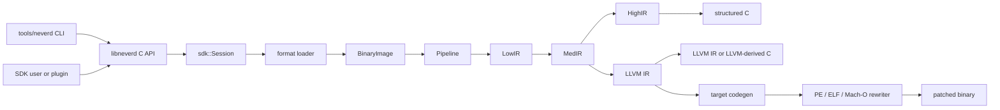

**Idiomas**: [English](../architecture.md) | [简体中文](../zh-CN/architecture.md) | [繁體中文](../zh-TW/architecture.md) | [日本語](../ja/architecture.md) | [한국어](../ko/architecture.md) | [Français](../fr/architecture.md) | [Deutsch](../de/architecture.md) | [Español](architecture.md) | [Italiano](../it/architecture.md) | [Русский](../ru/architecture.md) | [العربية](../ar/architecture.md)

[← Índice de documentación](README.md)

# Arquitectura de NeverD

Esta guía describe los límites de producción que debe conocer quien contribuya
para modificar NeverD con seguridad. Cubre deliberadamente solo el código
propio de NeverD; los submódulos LLVM, Capstone y Unicorn mantienen su propia
arquitectura interna.

## Límite del sistema

NeverD tiene cuatro representaciones IR, pero no forman una secuencia
obligatoria de cuatro saltos. `LowIR -> MedIR` es común. La descompilación
estructurada usa después `MedIR -> HighIR -> C`; `lift`, `decompile --llvm` y
`patch` toman la ruta directa `MedIR -> LLVM IR`. En particular, los modos
patch y lift omiten HighIR de forma deliberada.

El CLI analiza comandos en `tools/neverd`, crea un `neverd_session_t` y llama a
la API pública de `include/neverd/sdk/NeverDCAPI.h`. El estado del motor reside
en `lib/sdk/SessionImpl.h`; `neverd_session_load` elige un loader y construye
una `BinaryImage`, mientras que las operaciones basadas en IR ejecutan
`lib/pipeline/Pipeline.cpp` bajo demanda. El ejecutable `neverd` enlaza
`neverd_shared`; los archivos de componentes y sus dependencias LLVM/Capstone
son detalles privados de esa biblioteca compartida. El CLI usa LLVM Support
para su interfaz de línea de comandos, pero no evita la API C
para controlar el motor.

El análisis HighIR `HighSourceFlow` controla las aristas de las sentencias emitidas,
la identidad de las variables locales y la asignación definida. La validación del código
y la eliminación de copias PHI muertas comparten el grafo. Las particiones acotadas cero/no cero
siguen condiciones escalares repetidas; las escrituras invalidan los hechos y las variables
cuya dirección escapa siguen desconocidas. Al alcanzar el límite se usa el grafo conservador.
Una copia PHI se elimina solo si su valor está muerto en todos los contextos viables.
Las llamadas, lecturas, escrituras y etiquetas conservan su comportamiento observable.

El análisis de escape de consumidores de bloques también usa este grafo. Un punto fijo acotado propaga identidades de punteros y almacenamiento privado de pila entre ramas y bucles. Las uniones conservan posibles direcciones de contexto; solo una sobrescritura completa las elimina. Las aristas desconocidas, las excepciones y los límites de prueba agotados rechazan el enlace.

Los hechos del receptor Objective-C distinguen self en la entrada del método de una referencia exacta de clase. Todos los registros que comparten la entrada deben coincidir para establecer self. Las copias de anchura completa y los registros preservados por la ABI propagan los hechos mediante el mismo punto fijo, incluidos los retornos a la entrada. El acuerdo de declaraciones distingue métodos de clase e instancia, categorías registradas, superclases y protocolos adoptados; self incluye también subclases conocidas. Los catálogos del compilador conservan propietarios y jerarquía aparte del acuerdo global de selectores. Antes de publicar código, el SDK revalida el origen del receptor y las declaraciones en la imagen actual. Estos hechos no eligen un IMP ni autorizan reescrituras binarias.
Si falta la jerarquía externa, se exige el acuerdo global de selectores sin restringir el receptor; las declaraciones explícitamente incompatibles o no admitidas siguen siendo evidencia negativa.

Los ivar con tipo de objeto explícito amplían la prueba del receptor mediante un máximo de ocho cargas de anchura completa. Cada paso conserva la ranura del desplazamiento en ejecución, su anchura y cualquier desplazamiento literal usado por la instrucción. Un literal debe coincidir con la disposición actual; una referencia en ejecución puede seguir un campo movido. El cargador verifica la ascendencia registrada y la declaración del campo. Accesos parciales, id sin clase, bloques, tipos solo de protocolo, almacenamiento ambiguo y bases desconocidas no aportan clases. La validación del código vuelve a comprobar toda la ruta en la imagen actual. Estos hechos no prueban identidad de objetos ni permiten eliminar operaciones de memoria.

El cargador valida grafos acíclicos y acotados de cadenas constantes, objetos enteros, matrices y diccionarios ordenados de Darwin. Cada campo y arista exige almacenamiento mapeado inmutable y pruebas inequívocas de importación o reubicación; las codificaciones no admitidas, los ciclos y los grafos incompletos fallan explícitamente. Los enlaces de código fuente vuelven a validar el grafo y la ranura del puntero de entrada. Las funciones generadas conservan los bits enteros, el orden de los hijos y las direcciones compartidas, reutilizando las identidades de las cadenas. Las ranuras se inicializan una sola vez con publicación acquire/release, llamando únicamente a hijos validados. Cada función lleva sus declaraciones para compartir una definición entre métodos recuperados de forma independiente. Las pruebas portables cubren entradas malformadas y presupuestos; las fixtures nativas comparan contenido, alias, identidad de las copias e inicialización concurrente con los métodos originales.

## Representaciones IR y rutas

| Representación | Propósito | Definiciones y transformaciones principales |
|----------------|-----------|----------------------------------------------|
| LowIR | Operaciones `NdOp` independientes de arquitectura, bloques básicos, CFG y metadatos de jump tables | `include/neverd/ir/low`, `lib/ir/low`, producido por `lib/decode` + `lib/lift` |
| MedIR | Tipos, ABI/convenciones de llamada, modelo de memoria/pila, flags, llamadas y flujo similar a SSA | `include/neverd/ir/med`, `lib/ir/med` |
| HighIR | Expresiones y control de flujo estructurados para C legible | `include/neverd/ir/high`, `lib/ir/high`, emitido por `lib/backend/c/HighC` |
| LLVM IR | Optimización, C derivado de LLVM, generación de código objetivo y entrada de reescritura binaria | `lib/backend/llvm`, optimizado/orquestado por `lib/pipeline` |

Las constantes conservan, desde LowIR hasta MedIR y HighIR, la procedencia escalar o de dirección y el propietario de la dirección de cada aparición. Los mismos bits numéricos no fusionan orígenes distintos. La simplificación simbólica de HighIR trata las identidades de dirección como entradas opacas; la vinculación del código fuente utiliza la clasificación compartida de operandos numéricos y sigue exigiendo vínculos de reubicación para los usos de memoria y punteros.

| Ruta del usuario | Camino de representaciones | Salida |
|-----------------|--------------------------|--------|
| Volcado Low/Med | Binary -> LowIR, opcionalmente -> MedIR | Texto de diagnóstico |
| Volcado High o `decompile` | Binary -> LowIR -> MedIR -> HighIR | HighIR o C estructurado |
| `lift` | Binary -> LowIR -> MedIR -> LLVM IR | `.ll` |
| `decompile --llvm` | Binary -> LowIR -> MedIR -> LLVM IR | C derivado de LLVM |
| `patch` | Binary -> LowIR -> MedIR -> LLVM IR -> codegen | Binario reescrito |

`lib/pipeline/Pipeline.cpp` es la referencia para elegir la ruta. Mantenga la
lógica específica de una representación en su biblioteca IR o backend; el
pipeline debe orquestar esos componentes, no absorber sus algoritmos.

## Contrato de traducción entre arquitecturas

`include/neverd/translate` define una capa de contrato, no un
backend de ejecución. `GuestState` modela el estado visible de la máquina de
forma independiente de la arquitectura para `x86_32`, `x86_64`, `AArch64` y
`ARM32`. Su serialización canónica versión 1 usa campos little-endian de ancho
fijo, identificadores de registro estables, colecciones ordenadas y validación
fail-closed, por lo que el estado persistido no depende de la disposición C++
del host.

La base wire v1 de `GuestState` queda congelada de forma permanente. Todo estado
fuera de esa base debe usar un ID de registro de extensión dentro del rango reservado junto
con un nombre canónico en minúsculas, o pasar a una nueva versión wire con un
upgrader explícito; queda prohibido modificar la base v1 en el sitio.

Para un guest `ARM32`, `ExecutionMode` es el modo de decodificación autoritativo
y debe concordar con `CPSR.T`. El PC almacenado es siempre la dirección de
instrucción canónica con el bit 0 borrado; el modo ARM exige además alineación
de palabra.

El contrato de pares define `x86_64 -> AArch64`,
`AArch64 -> x86_64`, `x86_32 -> AArch64/ARM32` y
`ARM32 -> x86_32/x86_64`. `ContractDefined` significa que una solicitud se
puede validar y persistir, no que el código se pueda traducir o ejecutar. La
política JIT solo acepta el host nativo del proceso; la política AOT requiere
una arquitectura host y un target triple explícitos; una CPU o un conjunto de
features seleccionados también deben ser explícitos.

`ResolvedHostTarget` convierte esa selección en un resultado concreto. La
resolución `Native` obtiene del proceso el triple, la CPU y el conjunto de
features habilitadas o deshabilitadas. La resolución `Explicit` valida y
normaliza la arquitectura, el triple, la CPU y las features proporcionados por
el llamador, y rechaza conflictos. Su identidad de caché versionada se construye
en un orden de bytes determinista a partir del target normalizado, sin
direcciones del proceso ni texto dependiente de la locale.

Un `TranslationExit` versionado registra una causa de parada estable y el
payload tipado correspondiente para syscalls, excepciones o señales, puntos de
interrupción, instrucciones no admitidas, automodificación, presupuestos de
recursos, llamadas externas, fallos de memoria y otras condiciones terminales.
Así, los consumidores no tienen que reinterpretar un entero sin tipo según la
causa de parada.

Salvo en el caso `BudgetExhausted` correspondiente, los conteos de instrucciones,
blocks y código generado no pueden superar el presupuesto no nulo de la solicitud.
El agotamiento de instrucciones y blocks se detiene exactamente en el limit. El
tamaño de un objeto generado solo se conoce tras un codegen indivisible, por lo
que su resultado de agotamiento puede indicar `Observed > Limit`; ese objeto
rechazado nunca se enlaza, publica ni ejecuta. Cada payload `BudgetExhausted`
identifica exactamente el limit solicitado, nunca un umbral derivado o privado
de la implementación.

El contrato backend-private `RuntimeControlBlockV1` mide
exactamente 128 bytes, está alineado a 8 bytes y queda restringido por magic,
version, size y offsets de campo fijos de v1, campos reservados a cero y exits
tipados coherentes. No contiene contenedores C++, punteros del host ni alias de
direcciones guest. No es el layout C++ ni el formato wire de `GuestState`; un
backend que implemente este contrato debe convertir explícitamente el estado a
este registro.

La superficie fija de llamadas v1 para código generado contiene exactamente
ocho helpers: `nvd_rt_v1_load8_le`, `nvd_rt_v1_load16_le`,
`nvd_rt_v1_load32_le`, `nvd_rt_v1_load64_le`, `nvd_rt_v1_store8_le`,
`nvd_rt_v1_store16_le`, `nvd_rt_v1_store32_le` y `nvd_rt_v1_store64_le`.
Sus nombres, firmas y procedencia de punteros deben coincidir exactamente; un
backend enlaza esta tabla finita de forma explícita y nunca recurre a la
resolución ambiental de símbolos. La validación de la generation ejecutable y
el polling de presupuesto/cancelación son operaciones exclusivas del dispatcher
de confianza; `nvd_rt_v1_validate_generation` y `nvd_rt_v1_poll` no son helpers
para código generado. El dispatcher de confianza del host también controla la
selección de blocks y no es invocable desde el IR generado; los translated
blocks devuelven en su lugar un código de exit tipado. El IR generado solo puede
leer directamente el slot runtime scalar-result declarado.

`RuntimeSymbolRegistryV1` materializa esa tabla de helpers como un registro
cerrado del host. Su construcción valida el conjunto ABI-v1 completo, los
nombres canónicos exactos, las clases de helper, las firmas y, para cada
entrada, exactamente un puntero de función no nulo acorde con su clase. La
búsqueda solo acepta el nombre exacto, nunca consulta símbolos ambientales del
proceso ni del cargador dinámico y proporciona al verifier de objetos los mismos
nombres ordenados como allowlist. Su identidad versionada cubre nombres, clases
de helper y forma de ABI, pero excluye deliberadamente las direcciones nativas,
por lo que es estable bajo ASLR.

`RuntimeCodeMemory` posee almacenamiento de código generado aislado por páginas
y solo permite la publicación unidireccional `RW -> RX`. La memoria nunca es
escribible y ejecutable a la vez, no se puede reabrir para escritura, comprueba
los límites de escrituras y puntos de entrada e invalida la caché de
instrucciones del host al publicarse. El smoke test nativo solo ejecuta una
pequeña secuencia de instrucciones host después de la publicación; demuestra
esta frontera de memoria W^X, no un motor de traducción.

`GuestMemoryRuntime` está aislado del `GuestState` lógico: su construcción
primero valida el estado y después copia los bytes y metadatos de las regiones
a un índice privado ordenado. Las direcciones virtuales guest son solo claves
de búsqueda y nunca se convierten en punteros del host. Los accesos escalares
comprobados notifican faults tipados de ancho, alineación, overflow, ausencia de
mapping, cruce de región, permisos, escritura ejecutable, overflow o discordancia
de generation y violación de policy. Los presupuestos de instrucciones/blocks,
la cancelación, el seguimiento de generation y las policies de escritura de
código `RejectExecutableWrites`, `InvalidateOnExecutableWrite` y
`ValidateBeforeDispatch` también producen registros tipados coherentes en vez
de comportamiento implícito del host.

`TranslationObjectCompilerV1` es la frontera verificada entre LLVM IR y objeto.
Valida un módulo de entrada const, lo clona antes de cualquier transformación,
compone la simplificación semántica controlada por pruebas con la optimización
LLVM de `O0` a `O3`, vuelve a validar el IR final y emite objetos relocatable
ELF, COFF o Mach-O para las cuatro arquitecturas host del contrato. Canonicaliza
los manifests exactos de blocks y símbolos runtime con el mangling del target,
audita cada objeto emitido y devuelve la identidad del registro runtime junto
con claves de caché versionadas para la solicitud y el artefacto. Con un
presupuesto de bytes generados distinto de cero, solo un objeto que lo satisfaga
puede pasar a la verificación del artefacto. LLVM emite primero en un buffer
privado para medir el tamaño exacto e indivisible; un objeto sobredimensionado se
rechaza antes de publicarse y auditarse, y la telemetría tipada conserva el tamaño
observado y el limit exacto solicitado. Cero significa sin límite de la política
del llamador. El compilador termina en bytes relocatable auditados: no los enlaza,
publica, despacha ni ejecuta, y no proporciona lowering de instrucciones guest.

El verifier post-codegen audita objetos relocatable ELF,
COFF y Mach-O como un conjunto cerrado. El formato y la arquitectura deben
coincidir exactamente con el host elegido; los símbolos indefinidos deben
pertenecer exactamente a la allowlist finita de helpers y los símbolos
dinámicos están prohibidos. Las relocations usan whitelists directas explícitas
con comprobaciones de encoding, ancho, alineación, offset, destino cargable y
una definición non-preemptible local al objeto o un helper autorizado
exactamente. Se rechazan W+X, metadatos unwind/exception/initializer, TLS,
IFUNC, GOT y la indirección PLT ordinaria, relocations dinámicas, definiciones
weak/preemptible o seleccionables, secciones asignadas desconocidas y
directivas del linker. La forma `R_X86_64_PLT32` que LLVM usa para una llamada
ELF x86-64 hidden solo se admite cuando la policy v1 demuestra un branch directo
sealed al helper runtime exacto; no autoriza una ruta PLT ni GOT. Los artefactos
ELF `ET_REL` no pueden contener program headers ni segmentos. Los load commands
de Mach-O siguen una lista positiva: exactamente un segmento del ancho
correspondiente y como máximo una symbol table, dynamic-symbol table,
platform-version y orden data-in-code, con comprobación de sus dependencias. Las
opciones del linker y cualquier otro command se rechazan.

`TranslationObjectRequestV1` es la primera etapa pública y deliberadamente
estrecha que transforma bytes guest en un objeto sobre estos contratos. Del
subconjunto v1 fail-closed publicado de registros escalares x86-64 solo acepta
codificaciones canónicas sin prefijos legacy: formas `MOV`, `ADD`/`SUB` y
`AND`/`OR`/`XOR` con REX.W sobre GPR de ancho completo cuyos operandos tienen
las formas LowIR admitidas de registro/inmediato. Las formas aritméticas
conservan sus cálculos de flags escalares; las lógicas y `TEST` calculan los
flags definidos por la arquitectura y conservan `AF` en el modelo de estado de
NeverD. El schema 9 también acepta `CMP` registro/registro de ancho completo con
`39/3B`, `CMP` registro/inmediato con `81/7`, `83/7` y `3D`, `TEST` de ancho
completo registro/registro con `85` y registro/inmediato con `F7/0` y `A9`. Los
encodings canónicos `C3`
`RET` y `C2 iw` `RET imm16` terminan blocks de retorno; los encodings de `JMP`
relativo directo canónicos `EB cb` y `E9 cd` terminan blocks de branch directo.
El schema de lowering publicado es 9. Los branches Jcc tradicionales,
canónicos y sin prefijo legacy se limitan a: `JO`/`JNO` corto `70/71 cb` o
cercano `0F 80/81 cd`; `JB`/`JAE` con `72/73 cb` o `0F 82/83 cd`; `JE`/`JNE`
con `74/75 cb` o `0F 84/85 cd`; `JBE`/`JA` con `76/77 cb` o `0F 86/87 cd`;
`JS`/`JNS` con `78/79 cb` o `0F 88/89 cd`; `JP`/`JNP` con `7A/7B cb` o
`0F 8A/8B cd`; `JL`/`JGE` con `7C/7D cb` o `0F 8C/8D cd`; y `JLE`/`JG` con
`7E/7F cb` o `0F 8E/8F cd`. `JRCXZ`/`JECXZ`/`JCXZ` y
`LOOP`/`LOOPE`/`LOOPNE` siguen sin publicarse y fallan fail-closed. El `F7 /1`
reservado, los operandos de memoria guest, los registros parciales, los prefijos
legacy y los bits de extensión REX semánticamente redundantes también fallan
fail-closed. Solo emite un objeto relocatable ELF o Mach-O AArch64 little-endian
auditado. Las operaciones ordinarias de memoria guest, las formas
de registro parcial, toda instrucción o codificación fuera de ese subconjunto
exacto, todo flujo de control salvo retornos, esos saltos directos y los branches
Jcc publicados arriba, y toda operación LowIR no implementada
por el lowerer se rechazan antes de emitir el objeto. La
lectura comprobada de la dirección de retorno que requiere `RET` forma parte de su
contrato de terminador y no publica un lowering general de memoria guest. La
solicitud reconstruye y valida el descriptor del block, usa la misma target
machine resuelta para el lowering y la emisión del objeto, y combina la
simplificación semántica controlada por pruebas con la pipeline de optimización
`O2` predeterminada de LLVM. Esta etapa no cubre otras instrucciones x86-64,
otros pares guest/host ni la dirección inversa de AArch64 a x86-64.

El punto de entrada C público
`neverd_translate_x86_64_block_to_aarch64_object_v1`, el wrapper Python ctypes
`translate_x86_64_block_to_aarch64_object` y el comando
`neverd translate-object` exponen ese mismo límite solo de objeto. Python usa
`TranslationObjectFormat.ELF` o `.MACHO`. Los fallos de traducción nativa lanzan
una `TranslationError` tipada que porta `TranslationErrorCode`; la validación
local de argumentos lanza en cambio `TypeError` o `ValueError`. Cuando tiene
éxito, Python devuelve un resultado inmutable de su propiedad. El resultado C
es propietario de los bytes del objeto, las identidades estables de caché y la
telemetría de optimización; la CLI solo escribe el objeto ELF o Mach-O
seleccionado. Las tres
superficies terminan antes del enlace, la carga, el dispatch, la ejecución y la
depuración; no son interfaces de sesión de ejecución.

`verifyTranslationLinkGraphV1` añade una segunda auditoría independiente antes de cualquier
allocation. Construye un grafo LLVM JITLink efímero desde un objeto ELF o Mach-O
AArch64 aceptado y comprueba el target, los permisos de secciones, los manifests
de símbolos block/runtime, el cierre de símbolos externos y los tipos y destinos
de edges. El grafo se destruye tras producir el resultado de auditoría sin
direcciones. Superar esta auditoría no enlaza, asigna, resuelve, carga, publica,
despacha ni ejecuta código.

`linkTranslationObjectV1` es la frontera independiente de enlace nativo. Vuelve
a auditar el descriptor de confianza, el objeto sin procesar y el grafo JITLink
antes y después del pruning, la asignación, la resolución de símbolos y los
fixups. Los símbolos runtime proceden únicamente del registro sellado. Una
credencial del dispatcher vincula la única entrada del manifest a su sesión,
identidad de block, PC de entrada guest, generación de caché y época de código;
la invocación también exige que el `RIP` guest del runtime coincida con esa
entrada. Tras finalizar correctamente, publica memoria ejecutable con sus
permisos definitivos. Unload revoca nuevas invocaciones y espera a una invocación
activa antes de liberar la asignación. El overload sin credencial sigue siendo
solo de auditoría y no puede invocar.

`NativeTranslationSessionV1` combina esas piezas en la frontera experimental de
ejecución C++ de x86-64 a AArch64 nativo. En un proceso ELF o Mach-O AArch64
little-endian conserva un único runtime de memoria guest comprobado y un estado
guest fijo entre múltiples blocks de un bucle de dispatcher
compile-link-validate-invoke-unload. Un salto directo canónico continúa en su
target estático exacto. Un branch canónico publicado de un solo flag solo continúa
en el sucesor taken o fallthrough declarado por el manifest del block; el
dispatcher rechaza cualquier otro PC seleccionado. Un retorno termina. Los
presupuestos globales de instrucciones, blocks y bytes de objeto generados se
mantienen exactos entre blocks. Cuando el guest se detiene correctamente, el
estado ejecutado y la memoria autoritativa se confirman juntos. La cancelación
se linealiza respecto a ese commit final.

Esta es una vertical slice ejecutable, no un traductor completo. Todavía no
cubre instrucciones ordinarias de memoria guest, registros parciales, flujo de
control condicional fuera del slice exacto schema-9 de Jcc tradicionales descrito
arriba —incluidos `JRCXZ`/`JECXZ`/`JCXZ` y `LOOP`/`LOOPE`/`LOOPNE`—, flujo de control
indirecto, calls, punto flotante, SIMD, x87, operaciones atómicas, instrucciones
de sistema, propagación general de excepciones, caché de blocks, otros pares
guest/host ni la dirección inversa de AArch64 a x86-64.
La sesión de ejecución aún no tiene superficies C, Python, CLI ni JSON; la
depuración permanece separada y sin soporte. Las API de objeto anteriores siguen
siendo útiles sin activar la ejecución nativa.

El contrato del IR generado exige que todo translated block sujeto a él sea
hidden y non-preemptible y use el C ABI `i32 (ptr state, ptr runtime)`. Los
blocks solo se descubren mediante un registro privado, nunca mediante la
búsqueda ambiental de símbolos del proceso; se prohíben las llamadas directas
entre blocks.

El IR verifier también limita el ancho de los enteros al ancho del registro
escalar del host para evitar compiler-runtime libcalls conocidos introducidos
durante legalization. Esta comprobación es necesaria, pero no suficiente:
cualquier backend de ejecución que implemente este contrato debe auditar de
forma exacta las transferencias de control post-codegen, `MachineIR` y las
relocations del objeto de destino frente a la misma runtime-symbol allowlist
finita.

Los loads y stores directos de TranslationIR, así como los valores de private
constants, solo pueden contener un entero escalar que no supere el ancho del
registro escalar del host. Los aggregates deben escalarizarse antes del límite
del verifier para que un IR compacto no provoque expansión ilimitada en el
backend.

La ABI de código generado solo está definida para enteros escalares. El punto
flotante, SIMD, x87, las operaciones atómicas y las instrucciones de sistema
quedan fuera de este contrato. Toda implementación que seleccione
`ProvenSemanticAndLLVM` debe ejecutar la simplificación semántica de NeverD,
condicionada por prueba, hasta un punto fijo conjunto con la optimización LLVM;
la política no proporciona un backend de traducción ejecutable.

## Fronteras de reescritura de excepciones

El compact unwind de Mach-O dispone de un parser estricto del `__unwind_info`
original, un parser consciente de fixups para los records
`__LD,__compact_unwind` generados, un merge exacto de rangos originales y
generados, un encoder determinista de páginas regulares y un instalador
transaccional de la sección final. El instalador solo reescribe in-place una
`__TEXT,__unwind_info` existente y file-backed cuando la tabla codificada cabe
en su capacidad declarada. Revalida la arquitectura, el layout y el byte
preimage, pone a cero la cola sin usar y vuelve a parsear el resultado para
probar su equivalencia semántica antes del único commit de la transacción Mach-O
externa. Si la sección final está ausente, no se instalan los records compact
generados y la transacción solo puede continuar mediante el cierre DWARF-FDE
exacto y autenticado descrito abajo; una sección final existente pero
insuficiente o malformada sigue fallando en modo fail-closed. Los records
generados se autentican mediante una asociación exacta, registrada
por el compilador, entre la función IR de origen y el owner symbol MC de destino
(incluidas las definiciones privadas, sin adivinar prefijos ni mangling), IDs de
rango opacos y distintos de cero y rangos de fragmento semiabiertos exactos.
Cada FDE generado debe coincidir exactamente con un único fragmento autenticado;
cada fragmento requerido debe coincidir con un único FDE instalado por esa
transacción, salvo que lo cubra un record compact no DWARF exacto y validado
estrictamente. Los fragmentos adyacentes o separados del mismo owner de función
pueden reutilizar una receta fuente; una identidad ausente, duplicada, colgante,
cross-owner o con límites incoherentes falla antes de modificar la salida. El
nuevo segmento RX solo se confirma tras demostrar un `__LINKEDIT` único y
terminal en archivo/VM, offsets desplazados con aritmética comprobada y una
revalidación estricta del layout final de archivo y memoria virtual.

Las referencias externas se clasifican con el contrato MC fixup completo. Las
llamadas solo pueden elegir targets callable autenticados; los campos
personality del compact unwind generado solo pueden elegir non-lazy pointer
slots validados, sin desreferenciar nunca su contenido en el archivo. TLS,
authenticated pointers, términos sustraídos, campos compact malformados y
formas de relocation desconocidas fallan en modo fail-closed.

En el compact unwind ARM32, el ajuste de stack codificado y el layout GPR son
`Complete`. Los selectores de pattern de registros D de 0 a 3 también son
`Complete`; de 4 a 7 son `Partial` porque el compact word por sí solo no demuestra
todos los slots relativos al CFA alineados en runtime. Una entrada `Partial` puede
conservar identidades de registro demostradas para análisis, pero toda ruta de
reescritura la rechaza fail-closed. Cada receipt de instalación EH-frame vincula
exactamente la arquitectura target, el ancho de pointer y el byte order; el
binding DWARF compact-unwind rechaza cualquier diferencia de target identity del
receipt. Aún falta una prueba nativa throw/catch sobre un binario enlazado.

La transacción de sección ARM32 de nivel superior es más limitada que el
decoder de compact unwind. Solo se habilita cuando el header Mach-O es
exactamente `CPU_SUBTYPE_ARM_V7K` y los bits `N_ARM_THUMB_DEF` de la symbol
table original autentican positivamente cada función requerida como código
Thumb. El triple exacto `thumbv7k-apple-watchos` y el modo Thumb permanecen
vinculados durante toda la generación de código, cuyos requisitos de features
de entrada no pueden superar el límite de Cortex-A7. Las funciones sin flag o
de modo desconocido, los subtipos genéricos que no sean v7k, el modo ARM, los
targets de código externo mixtos o desconocidos, el entry point in-place de
ARM Mach-O y el patch de ARM Mach-O desde código fuente C fallan en modo
fail-closed antes de modificar la salida. Los inputs stripped cuyas funciones
solo puedan descubrirse mediante `LC_FUNCTION_STARTS` aún no están soportados.

PE, ELF y Mach-O tienen componentes de excepción específicos de cada formato,
pero NeverD todavía no publica una pipeline de reescritura end-to-end para todos
los formatos y todos los tipos de excepción. Un encoding no admitido o los
requisitos de registro/layout no resueltos deben fallar antes de modificar la
salida; el soporte parcial existente no debe presentarse como cierre completo
de excepciones.

Reconocer una personalidad Itanium de Ada o D no es soporte de excepciones Ada
o D. Las LSDA en forma de dirección de GNAT, GDC, DMD y LDC son analizables; las
entradas de type-table permanecen opacas (`Exception_Id` / `Exception_Data` en
GNAT, `ClassInfo` en D) y nunca se siguen como `std::type_info`. La
reconstrucción nativa emite `personality` de LLVM más cláusulas
`invoke`/`landingpad` en forma de dirección. El estado corpus-proven es una
afirmación distinta y no se deduce del reconocimiento de personalidad ni del
lowering nativo.

## Mapa de componentes

Cada componente es un archivo estático creado por
`add_neverd_component_library`. La tabla enumera dependencias importantes de
NeverD, no todas las bibliotecas comunes LLVM y Capstone proporcionadas por el
helper de CMake.

| Directorio | Responsabilidad | Dependencias importantes |
|------------|-----------------|--------------------------|
| `lib/loader` | Detección de formato, carga PE/COFF, ELF y Mach-O, `BinaryImage` normalizada, descubrimiento de funciones | API LLVM Object |
| `lib/lift` | Semántica manuscrita de instrucciones x86/i386, AArch64 y ARM32 | Tipos de datos IR |
| `lib/decode` | Decodificación Capstone/native y despacho a lifters de arquitectura | `NeverDIR`, `NeverDLift` |
| `lib/ir` | Tipos comunes y definiciones/transformaciones LowIR, MedIR, HighIR e intrinsic | Sus cuatro subcomponentes IR |
| `lib/pipeline` | Detección de funciones y orquestación de rutas Low/Med/High/LLVM | IR, decode, lift, backend LLVM, debug, pases IR |
| `lib/backend/c` | Renderizado HighIR-a-C y LLVM-IR-a-C | IR |
| `lib/backend/llvm` | Lowering de MedIR a LLVM | IR |
| `lib/backend/codegen` | Generación de código objetivo y patch/reescritura in-place PE/ELF/Mach-O | IR, loader |
| `lib/sdk` | ABI C pública, ciclo de session, consultas, persistencia, plugins, entradas lift/decompile/patch/audit/hunt | Agrega el motor en `libneverd` |
| `lib/pass` | Pases de ofuscación LLVM IR y ejecutor de pases MIR | IR |
| `lib/debug` | Contextos de depuración DWARF, PDB y linker-map | IR |
| `lib/sigs` | Análisis, bases de datos y coincidencia de firmas | Loader |
| `lib/libc` | Nombres libc conocidos y soporte del modelo de llamada | Componente independiente |
| `lib/safety` | Auditoría de vida del montón y caza de desbordamiento de copia sobre el IR levantado | Symbolic, Solver |
| `lib/support` | Helpers compartidos de carga binaria | Loader |
| `lib/translate` | Contratos versionados de estado/policy/exit guest, ABI runtime fija, memoria guest comprobada, auditorías de IR/objetos/LinkGraphs generados, enlace nativo sellado y dispatcher C++ experimental de x86-64 a AArch64 | Contratos IR, LLVM, LLVM Object y JITLink |

Los encabezados públicos reflejan estas áreas bajo `include/neverd`. Evite que
una clase C++ interna pase a formar parte del SDK por accidente: las operaciones
externas estables pertenecen al encabezado C puro y a uno de los archivos
específicos `lib/sdk/NeverDCAPI*.cpp`.

## Contrato de lifting estricto

`Decoder` y cada lifter de arquitectura arrancan en modo estricto. Si Capstone
puede decodificar una instrucción pero el lifter seleccionado no la implementa,
lanza `UnliftedInstruction`. La excepción registra dirección, mnemónico y
operandos; la semántica no soportada debe fallar de forma visible en vez de
omitirse o inferirse.

La ruta interna no estricta emite `NdOp::NOP`, pero es una salida de diagnóstico,
no una implementación aceptable. Las pruebas de contribuidores y CI deben
mantener el modo estricto. Cuando aparezca un fallo estricto:

1. Reprodúzcalo con la fixture específica de arquitectura más pequeña.
2. Añada la semántica ausente en `lib/lift/<ISA>`.
3. Compruebe la forma LowIR esperada en `unittests/lift`.
4. Añada un recorrido diferencial Unicorn en `unittests/semantic` si la instrucción tiene comportamiento observable.

No capture `UnliftedInstruction` solo para que el pipeline continúe. Una nueva
aproximación intencional necesita contrato y pruebas explícitos; no debe hacerse
pasar por lifting 1:1.

## Propiedad de formatos e ISA

La lógica del formato de entrada y la reescritura de salida están separadas de
forma deliberada:

| Formato | Carga, metadatos y relocations de entrada | Patch y relocations de salida |
|---------|------------------------------------------|-------------------------------|
| PE/COFF | `lib/loader/COFF` | `lib/backend/codegen/COFF` |
| ELF | `lib/loader/ELF` | `lib/backend/codegen/ELF` |
| Mach-O | `lib/loader/MachO` | `lib/backend/codegen/MachO` |

Los lifters de arquitectura están en `lib/lift/X86`, `lib/lift/AArch64` y
`lib/lift/ARM`. Las declaraciones públicas de lifter/register están en
`include/neverd/lift`. La emisión LLVM y generación de código específicas del
objetivo residen bajo `lib/backend/llvm/<ISA>` y
`lib/backend/codegen/CodeGen<ISA>.cpp`.

### Soporte y profundidad de pruebas

La matriz de soporte de la raíz indica que cada celda está implementada. No
significa que cada opcode, caso límite ABI, productor binario o versión del
sistema operativo se haya probado de forma exhaustiva. El modo estricto falla
de forma cerrada cuando la semántica de una instrucción queda fuera de la
cobertura implementada por el lifter.

Las 12 celdas formato-por-arquitectura tienen cobertura semántica del backend
de reescritura en `unittests/semantic/PatchFullSubstRTTests.cpp`. La profundidad
de integración es más específica:

| Formato | x86-64 | i386 | AArch64 | ARM32 |
|---------|--------|------|---------|-------|
| PE/COFF | Fixture enlazada | Cuadrícula backend | Fixture enlazada | Fixture Thumb enlazada |
| ELF | Fixture enlazada + ida y vuelta semántica | Pipeline de objeto + ida y vuelta semántica | Fixture enlazada + ida y vuelta semántica | Fixture enlazada + ida y vuelta semántica |
| Mach-O | Fixture enlazada\* | Pipeline de objeto PIC/no-PIC\* | Fixture enlazada\* | Cuadrícula backend |

- Una **fixture enlazada** ejercita loader/pipeline y patch sobre un ejecutable
  enlazado para programas representativos.
- Un **pipeline de objeto** ejercita carga, todas las etapas IR y descompilación
  de un objeto reubicable, pero no enlazado del host ni ejecución del binario
  parcheado.
- Una **cuadrícula backend** compila IR representativo por la ruta exacta de
  generación para reescritura y compara el comportamiento en Unicorn; no
  ejercita el loader del formato sobre un ejecutable enlazado.
- `*` Las fixtures Mach-O enlazadas dependen de una toolchain del host capaz de
  producir el objetivo. macOS moderno no enlaza ejecutables i386 históricos;
  por ello se usan objetos thin PIC/no-PIC y la cuadrícula de reescritura.

Las celdas de fixture enlazada son la evidencia más fuerte de integración
del formato para esos programas. Las celdas de pipeline de objeto y cuadrícula
backend solo tienen cobertura de integración parcial. Ninguna celda está
«totalmente probada» sin esa precisión ni afirma cobertura exhaustiva del ISA.

La evidencia principal es
[`PatchFormatTests.cpp`](../../unittests/lift/format/PatchFormatTests.cpp) para fixtures
ELF y PE enlazadas,
[`COFFARMFormatTests.cpp`](../../unittests/lift/format/COFFARMFormatTests.cpp) para carga/
descompilación de Windows ARM,
[`MachOI386RelocationTests.cpp`](../../unittests/lift/format/MachOI386RelocationTests.cpp)
para objetos thin i386,
[`X86_64_PipelineE2ETests.cpp`](../../unittests/lift/x86_64/X86_64_PipelineE2ETests.cpp) y
[`AArch64_PipelineE2ETests.cpp`](../../unittests/lift/aarch64/AArch64_PipelineE2ETests.cpp)
para Mach-O enlazado, y
[`PatchFullSubstRTTests.cpp`](../../unittests/semantic/probe/patchfull/PatchFullSubstRTTests.cpp)
para la cuadrícula de 12 celdas. Consulte la [guía de pruebas](testing.md).

## Dónde editar

| Cambio | Punto de partida | Verificación mínima enfocada |
|--------|------------------|------------------------------|
| Añadir o corregir una instrucción | Archivos correspondientes en `lib/lift/X86`, `AArch64` o `ARM`; encabezado público si cambia el despacho | Prueba de arquitectura en `unittests/lift`; recorrido semántico en `unittests/semantic` |
| Añadir un `NdOp` | `include/neverd/ir/NdOps.h`, luego auditar Low-to-Med, emitters/renderers, verifier/emulator y volcados | `NeverDLiftTests` + casos pertinentes de `NeverDSemanticTests` |
| Cambiar CFG o descubrimiento de funciones | `lib/ir/low`, `lib/loader/FunctionDiscovery*.cpp`, `lib/pipeline/PipelineFuncDetect.cpp` | Pruebas CFG/jump-table de lift y suite de transformación semántica enfocada |
| Añadir relocation de entrada o regla unwind PE | `lib/loader/COFF` | `COFFARMFormatTests` o nueva fixture loader enfocada |
| Añadir relocation de salida o regla patch PE | `lib/backend/codegen/COFF` | `PatchFormatTests`, `RewriteCodegenRTTests` y cuadrícula backend PE |
| Cambiar comportamiento ELF o Mach-O | Directorios `lib/loader/<Format>` y/o `lib/backend/codegen/<Format>` correspondientes | Pruebas del formato más cuadrícula de reescritura |
| Cambiar recuperación MedIR/ABI | `lib/ir/med` | Pruebas lift de convención de llamada + recorridos semánticos entre ISA |
| Cambiar recuperación de control estructurado | `lib/ir/high` | `NeverDCFGLoopXformTests` y pruebas de C estructurado |
| Añadir transformación LLVM | `lib/pass/ir`, encabezado público en `include/neverd/pass/ir`, opción pipeline si se expone | Suite de transformación enfocada + `NeverDPatchFullTests` si cambia la salida patch |
| Añadir operación C API | `include/neverd/sdk/NeverDCAPI.h`, `lib/sdk/NeverDCAPI*.cpp` enfocado, `SessionImpl.h` solo para estado | Pruebas semánticas SDK/CLI; conservar `neverd_last_error` y convenciones de asignación |
| Añadir comando CLI | `tools/neverd/NeverDCLIOptions.cpp`, `NeverDCLI.h`, `NeverDCmd*.cpp` enfocado y despacho en `neverd.cpp` | `unittests/semantic/CLIEndToEndTests.cpp` y smoke test CLI directo |
| Cambiar la auditoría de vida del montón o la caza de desbordamiento de copia | `lib/safety`, `include/neverd/safety`, `include/neverd/sdk/NeverDCAPISafety.h` | `NeverDSafetyTests` y `NeverDSafetyIntegrationTests` |
| Añadir regresión semántica | `unittests/semantic/*Tests.cpp` enfocado; registrar archivo nuevo en `unittests/semantic/CMakeLists.txt` | Construir su binario de pruebas y seleccionar el caso con `ctest -R` |

Mantenga los cambios estrechos. Los archivos que definen una representación
pueden cambiar con sus transformaciones, pero loaders, lifters y backends no
relacionados no deben modificarse solo para uniformar un refactor amplio.

Las declaraciones de estructuras conservan la disposición de campos separada de la clasificación ABI. Darwin ARM64 admite estructuras anidadas con entre uno y cuatro campos float o double homogéneos; al agotarse los registros flotantes, todo el argumento pasa a la pila. MedIR vincula cada componente físico antes de SSA, HighIR reconstruye un parámetro o resultado lógico y C comprueba la disposición. Darwin ARM64 y x86_64 también admiten estructuras anidadas de uno o dos enteros o punteros de 64 bits. Si toda la estructura pasa a la pila, ARM64 agota el banco correspondiente; x86_64 conserva los registros restantes para argumentos posteriores. Se rechazan el relleno, los campos empaquetados, las mezclas de flotantes y enteros y los componentes incompletos; estas indicaciones no autorizan reescribir binarios.

Las llamadas C fijas Darwin ARM64 también admiten resultados con disposición natural de tres enteros con signo de 64 bits mediante el puntero oculto x8. La capa ABI fuente común clasifica el resultado; Low→Med conserva el puntero anterior a la llamada y escribe los campos de un resultado lógico en la memoria del llamador. Los registros de argumentos ordinarios no se desplazan y x0 no recibe un resultado. El análisis de llamadas invalida la información anterior sobre esa memoria. La proyección de entradas y las pruebas de conservación del estado nativo todavía rechazan estos resultados sin una prueba propia del almacenamiento; tampoco se admiten estructuras de tres palabras con campos sin signo o punteros, argumentos de tres palabras ni resultados indirectos x86_64. Los resultados indirectos de Objective-C siguen rechazados: enviar un mensaje a nil conserva el búfer original y requiere su propio modelo de almacenamiento.

Los catálogos de llamadas de ejecución solo declaran `ReturnedArgument` para importaciones exactas cuyo resultado es el puntero del argumento original. El análisis del receptor lee el argumento físico declarado antes de aplicar las invalidaciones normales de la ABI y restaura únicamente su tipo demostrado en el resultado. El SDK vuelve a validar este efecto; no elimina llamadas, efectos de propiedad ni accesos a memoria.

Los catálogos de frameworks y receptores derivados del compilador comparten proveedores: Foundation, CoreData, CoreLocation, CoreSpotlight, QuartzCore, UniformTypeIdentifiers y UserNotifications. QuartzCore utiliza su cabecera pública `CoreAnimation.h`; las importaciones de compatibilidad de otros frameworks no aportan declaraciones propias. Ambos generadores conservan los cuatro perfiles de preprocesamiento, las identidades exactas y la evidencia negativa de declaraciones.

Los tipos de resultados objeto amplían la misma prueba acotada del receptor mediante declaraciones de métodos concordantes. Los tipos objeto con nombre y los tipos de retorno relacionados declarados por el compilador aportan información de clase; id por sí solo no basta. Las lecturas de campos y los resultados de mensajes comparten un límite de ocho pasos, que se vuelven a validar con las declaraciones actuales antes de publicar el código fuente. Los auxiliares de asignación importados con identidad exacta usan el contrato de resultado del mensaje correspondiente y conservan las llamadas, las redefiniciones y los efectos de propiedad. Las clases de resultado contradictorias o las jerarquías incompletas detienen la propagación.

Los enlaces de llamadas de formato conservan el contrato del lenguaje. Los atributos NSString y las entradas públicas de predicados se contrastan con el SDK y todas las declaraciones de ejecución. Los predicados no sustituyen marcadores entre comillas; `%K` recibe un objeto con el nombre de la propiedad. Se comparten las promociones escalares y la ABI variádica Darwin. Se rechazan escapes y modificadores no admitidos. La validación vuelve a comprobar lenguaje, identidad de la constante y argumentos; el código sigue llamando al analizador del framework.

Las importaciones C con argumentos fijos declaradas por el compilador y los mensajes Objective-C comparten la asignación ABI de origen para las estructuras admitidas. Solo los parámetros declarados explícitamente ocupan ubicaciones; la capa Objective-C proporciona los parámetros ocultos del receptor y del selector. Sigue siendo obligatoria la coincidencia exacta de las exportaciones y firmas del SDK. Los callbacks limitados a escalares y los argumentos variádicos mantienen sus restricciones.

Las declaraciones de funciones conservan la convención de llamada como parte de la identidad de la firma. La capa ABI común admite llamadas Swift acotadas con parámetros enteros de 1, 2, 4 u 8 bytes y parámetros puntero; asigna primero el banco de registros enteros y después portadores de pila relativos al SP de entrada. Cada portador estrecho registra su regla exacta de extensión y los resultados siguen limitados a dos palabras enteras o punteros. HighC conserva `swiftcall` en declaraciones y definiciones. Los puentes de valores Foundation observados por el compilador también pueden declarar un puntero `swift_indirect_result` y uno `swift_context`: arm64 usa x8/x20 y x86_64 usa RAX/R13; ninguno consume el banco normal de argumentos enteros. HighC conserva ambos atributos de parámetro. Los imports de metadatos públicos de Foundation requieren acuerdo entre los grafos de símbolos del compilador, el IR de consultas reales y las exportaciones exactas del SDK para ARM64/x86-64 en macOS y Mac Catalyst. Un sufijo de símbolo no determina la ABI. Se rechazan argumentos genéricos u ocultos no declarados, tipos de callback Swift y portadores físicos no admitidos. Las declaraciones de Mac Catalyst no acreditan ejecución en dispositivos iOS.

MedIR controla la propagación acotada de constantes invariantes a través de copias SSA de igual anchura y PHI completos, incluidos los bucles. Todos los valores entrantes deben converger en los mismos bits, anchura, procedencia y propietario de dirección. Las definiciones desconocidas, los ciclos sin valor inicial, las aristas incompletas y las constantes en conflicto impiden la sustitución; al agotarse el presupuesto, la función queda intacta. Solo se sustituyen operandos: se conservan llamadas, cargas, escrituras y sus efectos. HighIR y LLVM utilizan el mismo resultado.

El índice de propietarios de código de cada operación también conserva las relaciones exactas entre funciones principales y fragmentos de los metadatos de ejecución. Las consultas indexadas y directas comparten el recorrido de relaciones, mantienen las direcciones originales de entrada y rechazan referencias huérfanas o a padres no principales. La validación de destinos, las pruebas de límites y los análisis temporales de grupos usan el mismo índice inmutable y cálculo de coste. Un índice de otra imagen activa la consulta directa; el agotamiento del presupuesto sigue rechazando pruebas incompletas.

La ABI de código fuente registra explícitamente la extensión con signo o ceros a 32 bits de los parámetros enteros pequeños en registros de Darwin ARM64 y x86_64. HighIR conserva esos bits en las copias guardadas y mantiene el tipo original del parámetro. Las lecturas más allá de 32 bits, el relleno de pila y los registros destruidos por llamadas siguen siendo desconocidos. Esto sigue las convenciones de llamada ARM64 e Intel de Apple; observar un byte bajo nativo no demuestra una extensión.

El cargador Mach-O conserva la garantía explícita de solo lectura tras las reubicaciones sin modificar los permisos iniciales del segmento. Los lectores de bytes y punteros comparten las comprobaciones de un mapeo único respaldado por el archivo; los nombres de sección no prueban la inmutabilidad. Una carga normal de ancho completo puede vincular un puntero local resuelto a un objeto de cadena constante validado por separado. El vínculo conserva su posición de origen para volver a validarla, y los alias comparten la identidad generada del objeto destino. El almacenamiento mutable, las reubicaciones contradictorias, las cargas parciales u ordenadas y la dirección de la propia posición siguen sin admitirse.

La recuperación de tablas de salto genera transferencias a los bloques sucesores normales, sin reconstruir sus instrucciones por otra vía. Cada bloque conserva una única ruta de conversión, incluidos los casos compartidos, los destinos por defecto y las entradas de bucle. Las copias PHI de cada arista se ejecutan antes de su transferencia y conservan las instantáneas de las asignaciones paralelas; los vínculos incompletos siguen fallando explícitamente.

La estructuración de bucles conserva la pertenencia exacta de las entradas nativas. Una envoltura siempre verdadera no duplica la etiqueta de la primera instrucción del cuerpo. La salida de una arista de retorno condicional conserva la continuación original, incluidas las copias de arista sin dirección nativa. Solo los destinos que coinciden exactamente con esa continuación se convierten en break; las transferencias dentro de bucles o switch anidados mantienen su ámbito de control.

La eliminación de valores muertos normaliza la pertenencia de las entradas nativas antes de borrar las copias PHI de las aristas. La agrupación compartida distingue la entrada de la rama de su prefijo sintético directo de copias; las etiquetas no contiguas o anidadas sin relación siguen siendo ambiguas.

`scripts/collect_objc_sdk_declarations.py` recopila clases, protocolos, categorías y alternativas ABI de métodos propios de cada framework desde perfiles SDK reales de dispositivo, simulador, Mac Catalyst y escritorio. Cada perfil conserva evidencia de cabeceras públicas, exportaciones y compilador, incluidas las declaraciones no admitidas y los tipos de retorno de objetos relacionados. Las recopilaciones parciales registran su alcance exacto; si falla un perfil, el registro queda incompleto. El artefacto de CI alimenta la posterior comprobación de concordancia de catálogos y no activa por sí mismo nuevos enlaces de llamadas de código fuente.

Los hechos de llamadas Objective-C incluyen espacios privados de pila acotados y relativos al SP de entrada. En las uniones del CFG se intersectan los valores exactos y se unen los bytes que podrían derivar del marco, para que los caminos contradictorios y las escrituras parciales de registros no oculten escapes. Las llamadas con ABI declarado solo conservan almacenamiento privado asignado fuera de los argumentos salientes. Escapes, llamadas desconocidas, escrituras solapadas o atómicas y liberaciones de pila revocan la prueba correspondiente. Las aristas de retorno deben converger antes de publicar enlaces.

HighC representa enteros parciales de hasta 128 bits mediante tipos `_BitInt` de ancho exacto. Los accesos ordinarios transfieren el número de bytes de IR independientemente del relleno del objeto C; la aritmética sin signo conserva el desbordamiento modular y los límites de desplazamiento. Los accesos atómicos de ancho parcial se rechazan en lugar de ampliarse.

La validación de parámetros fuente de MedIR rastrea hacia atrás los bytes necesarios desde los resultados declarados, el flujo de control, los efectos de memoria y las llamadas. COPY, PHI, CONCAT, extracción y extensión conservan esas necesidades; las demás operaciones exigen de forma conservadora todas sus entradas. Las partes altas sin uso de los registros flotantes no crean argumentos adicionales. Las partes observables, los grafos incompletos y los presupuestos agotados mantienen el rechazo original. El análisis no elimina operaciones de máquina ni concede un ABI de reescritura.

La estructuración condicional conserva las copias PHI de continuación en su arista original. Su dirección de procedencia no puede convertirse en un nuevo destino de salto; si mover una secuencia exige ese destino, la continuación compartida permanece en su sitio. Un bucle sintético incondicional comparte también la continuación de su primera instrucción nativa si ninguna operación precede a esa cabecera exacta; una prueba condicional o efectos previos impiden esta equivalencia.

La inferencia de firmas fuente de auxiliares nativos demuestra un resultado entero completo en cada ruta de retorno de máquina mediante un análisis CFG acotado. Las salidas compartidas intersectan hechos de predecesores; las rutas de entrada impiden que los bucles sin inicializar se demuestren a sí mismos. Las llamadas y escrituras parciales invalidan la prueba hasta un nuevo cálculo completo. Siguen rechazándose los grafos malformados, los retornos que solo conservan una entrada y las restauraciones del epílogo x86-64. Solo se genera una firma candidata: la segunda pasada debe validar el cuerpo y el cierre de dependencias, sin cambiar la ABI de reescritura.

## Límites recientes de recuperación de código fuente

- Un accesor diferido de tablas de testigos de Swift solo se reconstruye tras demostrar el patrón de caché `Wl`/`WL`, la consulta exacta al runtime y una caché nueva; nunca se copia su dirección original.
- `Any.self` solo se convierte en constante cuando un miembro interior exacto del contenedor existencial completo o la exportación pública `$sypN` demuestra la identidad de metadatos.
- Una celda de referencia a clase Objective-C conserva su nivel extra de indirección y solo se acepta en una carga nativa tipada, sin usos ambiguos.
- Los valores de desplazamiento de ivar solo se unen a través del CFG si coinciden clase y anchura y existe una única carga. El getter once de un `String` Swift de dos palabras exige además el contrato exacto de sus cuatro portadores.
- Un addressor global diferido de Swift sin parámetros generado por el compilador solo se reconstruye cuando la familia exacta de símbolos `vau`/`vpZ`/`_Wz`/`_WZ` coincide con una carga, una prueba de finalización, una llamada autenticada a `swift_once` y el retorno de la misma dirección de almacenamiento en ambas rutas. El inicializador debe ignorar el context incidental y cerrar como código fuente ordinario. La proyección crea un predicado once y una celda de valor compartidos nuevos; no conserva ninguna de sus direcciones ni la del inicializador de la imagen cargada. Su ABI fuente sin argumentos para el callee se aplica solo en los sitios de llamada; la ABI de entrada nativa permanece separada para que los portadores incidentales de context sigan disponibles para demostrar el contrato.
- Si dicho inicializador llama a un accessor de metadatos de clase Objective-C importada generado por el compilador, la proyección solo acepta la plantilla exacta de caché cero, referencia de clase, `objc_opt_self`, `swift_getObjCClassMetadata` y publicación release. Emite directamente la consulta autenticada al runtime y no conserva ningún caché de la imagen.
- El almacenamiento nativo con nombre solo puede atravesar una cadena exacta de llamadas nativas si cada función demuestra su firma y un uso acotado del almacenamiento.
- Las referencias y cachés de metadatos concretos de Swift solo se reconstruyen cuando concuerdan descriptor, exportación y proveedor; no se copian punteros de metadatos inicializados desde la imagen.
- Las referencias nominales de metadatos para tipos Swift anidados o locales requieren una ruta de contexto acotada y una desmangling inequívoca; la ambigüedad se rechaza.
- Los nombres imprimibles de referencias de metadatos solo se reconstruyen desde registros completos, no simbólicos y no privados. Las entradas malformadas o contradictorias quedan sin resolver.
- Un bloque en la pila sigue vivo durante usos ordinarios del frame. Solo un consumidor demostrado, un escape o una escritura solapada revoca la prueba.
- Los parámetros de bloque `noescape` del SDK Objective-C solo se aceptan cuando coinciden exactamente la declaración contenedora, el receptor y la posición del callback.
- Un stub Objective-C exacto y específico de selector puede enlazar un formato dinámico con una cola vacía, punteros completamente demostrados o el contrato de enteros completos de 64 bits descrito abajo. Otras colas, stubs no exactos, conflictos de declaración y desacuerdos de ABI físico quedan sin resolver.

En las llamadas al runtime vinculadas al código fuente, la conversión Low→Med transmite la declaración externa autenticada de ausencia de retorno al efecto de llamada MedIR. Un trampolín de importación del runtime también puede aparecer en el inventario de funciones nativas. El punto fijo de llamadas sin retorno conserva un hecho de terminación de máquina existente solo si coinciden la vinculación validada del runtime y los operandos completos de la llamada; una indicación de código fuente por sí sola no crea ese hecho. La vinculación identifica la ranura de importación y la llamada identifica el trampolín. Los efectos nativos inferidos se recalculan desde el grafo actual y la publicación del código fuente vuelve a validar la identidad de la importación.

Un auxiliar ARM64 de flujo lineal puede conservar un contexto de entrada intacto y observado por completo cuando se revalidan por separado hasta dos importaciones de Swift y solo termina la última llamada. La llamada anterior que retorna aplica las reglas normales de modificación de registros. La misma prueba de identidad de bytes y escape del marco comprueba todas las operaciones anteriores y exige bytes privados escritos por completo para cada argumento escalar de pila saliente. Las bifurcaciones, retornos, aristas de excepción y llamadas desconocidas siguen sin admitirse. El análisis de entrada limitado a efectos acepta grafos terminales demostrados de forma independiente; la prueba predeterminada de entradas no usadas aún exige un retorno observado. Solo se genera una firma candidata cuyo cuerpo fuente y cierre de dependencias deben validarse.

Un addressor global diferido de Swift solo aporta una ABI de llamada a la restauración nativa mediante un contrato reconstruido independientemente desde la imagen y el resultado actuales. El validador once compartido vuelve a comprobar el cuerpo exacto, las identidades del almacenamiento e inicializador y la ABI canónica del callback, y demuestra que el inicializador actual ignora su contexto. Las pistas MedIR u opciones persistentes no autentican el contrato. La inferencia coteja el destino directo exacto y la ABI sin argumentos que devuelve un puntero y mantiene toda la prueba de correspondencia Low/Med y restauración de bytes y marco. Permanecen las alteraciones normales de registros y los efectos de inicialización; no se declara una llamada de solo lectura o terminación ni se completa la validación de cuerpos o dependencias.

Una llamada ARM64 ordinaria solo acepta un argumento escalar de pila alineado de ocho bytes cuando todos sus bytes se han escrito en el marco privado asignado dentro del mismo bloque LowIR y ninguno procede de una dirección de marco. La ABI y cada llamada nativa siguen verificándose independientemente. AAPCS64 permite al destinatario sobrescribir el área de argumentos, por lo que se invalida toda el área de argumentos salientes, incluido el relleno, tras la llamada antes de comprobar otros argumentos o restaurar registros. Reutilizarla exige otra escritura completa. Quedan excluidas las definiciones entre bloques, palabras parciales, llamadas de cola y x64; se mantienen todas las comprobaciones habituales de alteración y restauración en cada salida.

Para código Mach-O ARM64 enlazado, LowIR puede seguir un B incondicional original hacia un epílogo compartido cuyo rango completo precede a la entrada de la función actual. La forma acotada solo contiene restauraciones LDP de ancho completo de x19–x30 desde SP, exactamente una liberación de pila positiva y alineada, y una rama final a una importación ejecutable registrada. Para la arista exacta se verifican bytes inmutables con asignación única, ausencia de ajustes y ausencia de entradas de función interiores. Ambos controles de entrada del CFG usan esa prueba; BL, las ramas condicionales y la continuación secuencial no pueden autorizar por sí solos la decodificación más allá de una entrada. El bloque decodificado conserva todos sus predecesores físicos del CFG. Las cargas originales, la actualización de pila y la transferencia externa permanecen en LowIR, la función compartida se sigue elevando por separado y la prueba de marco existente decide la recuperación del código fuente. Los bloques compartidos anteriores no amplían el tamaño de la función principal.

Un contrato adicional de formato dinámico en arm64 admite una cola no vacía de enteros de 64 bits solo cuando todas las definiciones que llegan al valor terminan en una declaración Objective-C validada actualmente que devuelve el mismo tipo entero completo. Las conversiones enteras de igual anchura conservan el portador; las cargas sin tipar, los parámetros sin prueba, las constantes, los ciclos, los valores intermedios flotantes o estrechos y los signos incompatibles siguen sin admitirse. La ABI nativa completa debe coincidir con la asignación variádica compartida de Darwin antes de enlazar, y la publicación repite la prueba de valores y declaraciones. No se infiere el texto del formato en ejecución ni se cambia su analizador: los mensajes generados conservan el prefijo fijo, la elipsis real y los bits originales de los argumentos.

Las transferencias del flujo de código fuente de los bloques de pila intercambian temporalmente sus hechos de salida con un estado de trabajo local. Esto evita copiar dos veces todos los hechos de variables y bytes por nodo, conservando las uniones, los presupuestos de trabajo y almacenamiento, las pruebas de éxito y los diagnósticos de fallo.

La preservación del estado nativo usa el mapeo ABI compartido y validado para cada componente en registro de un argumento estructurado, incluidos los agregados flotantes homogéneos ARM64. Las llamadas con marco de pila y las llamadas finales sin marco comprueban en cada componente el escape de direcciones del marco. El préstamo del marco sigue asociado al índice del parámetro escalar original y no autoriza miembros de estructuras; las estructuras en la pila y el almacenamiento indirecto del resultado siguen necesitando pruebas separadas. Esto solo completa la prueba de preservación del estado, sin cambiar el ABI del destino ni los requisitos de cierre de dependencias del código fuente.

Para una fábrica de clases Objective-C ARM64 acotada, el SDK demuestra las cinco instrucciones completas del llamador y las nueve del cuerpo compartido antes de proyectar ese llamador. El llamador fija el contador de perfilado y el accesor de metadatos; el cuerpo compartido incrementa el mismo contador, llama indirectamente al accesor, restaura el marco y realiza la llamada final autenticada de conversión de clase Swift. Los getters de superclase y las fábricas comparten la prueba actual del accesor de clase de ocho instrucciones. La llamada indirecta original de LowIR conserva su ABI validada por separado y la prueba completa del marco. Los helpers fuente usan el almacenamiento de perfilado existente de toda la sección, preservan el desbordamiento sin signo de 64 bits y el orden de llamadas, conservan las dependencias del accesor y se revalidan al publicar. Los demás llamadores y la ABI nativa compartida no cambian.

La recuperación de código fuente nativo para ARM64 solo puede probar un candidato Float64 cuando el retorno entero existente falla la comprobación de su portador definido. La prueba SSA exclusiva de esta recuperación exige una escritura local completa de los ocho bytes bajos del retorno en cada salida normal y una llamada Float64 alcanzable, actualmente vinculada al código fuente, en su procedencia. Todas las ramas PHI deben estar definidas, las definiciones deben dominar sus usos y cada componente cíclico necesita un valor inicial externo real. Este alcance inicial rechaza las aristas de retorno al bloque de entrada. Las alteraciones parciales por llamadas siguen el CallSiteId actual y el PreservedInput registrado para el prefijo de ocho bytes preservado por la ABI de destino; los alias estrechos obsoletos no sustituyen ese registro. Las constantes por sí solas, las cargas, la aritmética y los retornos desconocidos no demuestran Float64. Siguen siendo obligatorias las comprobaciones de llamadas actuales, definedReturnPaths, estado nativo, nuevo lifting y vinculaciones finales; la inferencia general de tipos Med no cambia.

La prueba de un marco ARM64 ordinario también puede incluir una salida exacta mediante `__stack_chk_fail`, autenticada con el enlace actual del cargador y la importación fuerte `___stack_chk_fail` de `/usr/lib/libSystem.B.dylib`. La declaración debe describir una llamada `void`, sin argumentos y que no retorna. Solo esa última llamada puede terminar un bloque sin sucesores ni restauración de registros; se mantienen todas las comprobaciones previas de memoria y argumentos. Debe existir al menos un retorno normal alcanzable, y cada retorno normal debe restaurar todo el estado de máquina preservado. La prueba separada para entradas que terminan conserva sus reglas originales.

LowIR es responsable de la identidad exacta de cada llamada: dirección de instrucción, secuencia de operación, código de operación y destino estático. Las pruebas del estado nativo y del resultado fuente comparten esta identidad, pero mantienen permisos separados. La prueba de un resultado ARM64 de un solo bit comprueba todas las rutas alcanzables antes de considerar inobservable poner a cero los bits 63:1; permitir que una llamada sobrescriba un registro no demuestra que el destinatario haya escrito esos bits. Si una diferencia llega a una llamada, después puede diferir cualquier byte volátil de los registros generales, vectoriales y de indicadores; los bytes preservados mantienen sus hechos anteriores. Las llamadas ordinarias siguen necesitando ABI completas demostradas de forma independiente. El candidato de comparación Swift autenticado por separado registra el resultado bruto de un bit del compilador y el proveedor exacto de importación; por sí solo no publica una declaración de retorno de un byte ni autoriza una proyección fuente.

HighC emite las escrituras ordinarias de memoria mediante funciones de copia de bytes con el ancho exacto del valor. Las direcciones de máquina no demuestran alineación ni tipo efectivo en C. Las escrituras como sentencia, como expresión y las asignaciones a memoria usan la misma ruta, que evalúa cada dirección y valor una sola vez y devuelve el valor escrito como resultado de expresión.

La validación booleana Swift combina el ABI Objective-C de entrada actual, instrucciones inmutables, la importación fuerte exacta y la prueba completa del consumidor LowIR. Las demás llamadas requieren ABI del catálogo actual, un accesor de clase demostrado en ocho instrucciones o un super `init` importado fuertemente con dos argumentos puntero y resultado puntero. La publicación sigue comprobando dependencias nativas, receptor super y pila. Rechaza llamadas nativas o dinámicas no demostradas y ocurrencias duplicadas; estos hechos solos no publican código ni declaran un ABI de retorno de un byte.

La prueba del accesor de clase ARM64 de ocho instrucciones tiene un único responsable compartido. Valida instrucciones inmutables y la importación fuerte `objc_opt_self`, demostrando que no usa argumentos entrantes y que los ocho bytes del resultado proceden de esa llamada. Estos hechos no prueban la identidad de clase ni el cierre del código fuente. Los accesores super y las fábricas de metadatos conservan sus verificaciones independientes de clase, flujo, pila y dependencias. También comparten la aceptación del desenrollado estructural; se rechazan decodificación parcial y despacho de excepciones del lenguaje.

Las pruebas de normalización booleana consideran SP una entrada implícita de toda llamada, incluso sin argumentos o con argumentos solo en registros. Rechazan un SP diferente antes de llamar; restaurarlo después no deshace los accesos del destinatario a la pila.
