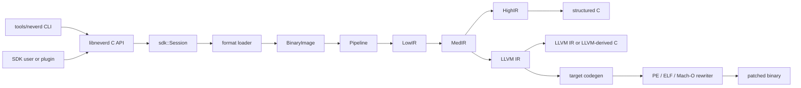

**Idiomas**: [English](../architecture.md) | [简体中文](../zh-CN/architecture.md) | [繁體中文](../zh-TW/architecture.md) | [日本語](../ja/architecture.md) | [한국어](../ko/architecture.md) | [Français](../fr/architecture.md) | [Deutsch](../de/architecture.md) | [Español](architecture.md) | [Italiano](../it/architecture.md) | [Русский](../ru/architecture.md) | [العربية](../ar/architecture.md)

[← Índice de documentación](README.md)

# Arquitectura de NeverD

Esta guía describe los límites de producción que debe conocer quien contribuya
para modificar NeverD con seguridad. Cubre deliberadamente solo el código
propio de NeverD; los submódulos LLVM, Capstone y Unicorn mantienen su propia
arquitectura interna.

## Límite del sistema

```mermaid
flowchart LR
  CLI["tools/neverd CLI"] --> CAPI["libneverd C API"]
  SDKUser["SDK user or plugin"] --> CAPI
  CAPI --> Session["sdk::Session"]
  Session --> Loader["format loader"]
  Loader --> Image["BinaryImage"]
  Image --> Pipeline["Pipeline"]
  Pipeline --> Low["LowIR"]
  Low --> Med["MedIR"]
  Med --> High["HighIR"]
  High --> HighC["structured C"]
  Med --> LLVM["LLVM IR"]
  LLVM --> LLVMOut["LLVM IR or LLVM-derived C"]
  LLVM --> Codegen["target codegen"]
  Codegen --> Rewriter["PE / ELF / Mach-O rewriter"]
  Rewriter --> Patched["patched binary"]
```

NeverD tiene cuatro representaciones IR, pero no forman una secuencia
obligatoria de cuatro saltos. `LowIR -> MedIR` es común. La descompilación
estructurada usa después `MedIR -> HighIR -> C`; `lift`, `decompile --llvm` y
`patch` toman la ruta directa `MedIR -> LLVM IR`. En particular, los modos
patch y lift omiten HighIR de forma deliberada.

El CLI analiza comandos en `tools/neverd`, crea un `neverd_session_t` y llama a
la API pública de `include/neverd/sdk/NeverDCAPI.h`. El estado del motor reside
en `lib/sdk/SessionImpl.h`; `neverd_session_load` elige un loader y construye
una `BinaryImage`, mientras que las operaciones basadas en IR ejecutan
`lib/pipeline/Pipeline.cpp` bajo demanda. El ejecutable `neverd` enlaza
`neverd_shared`; los archivos de componentes y sus dependencias LLVM/Capstone
son detalles privados de esa biblioteca compartida. El CLI usa LLVM Support
para su interfaz de línea de comandos, pero no evita la API C
para controlar el motor.

El análisis HighIR `HighSourceFlow` controla las aristas de las sentencias emitidas,
la identidad de las variables locales y la asignación definida. La validación del código
y la eliminación de copias PHI muertas comparten el grafo. Las particiones acotadas cero/no cero
siguen condiciones escalares repetidas; las escrituras invalidan los hechos y las variables
cuya dirección escapa siguen desconocidas. Al alcanzar el límite se usa el grafo conservador.
Una copia PHI se elimina solo si su valor está muerto en todos los contextos viables.
Las llamadas, lecturas, escrituras y etiquetas conservan su comportamiento observable.

El análisis de escape de consumidores de bloques también usa este grafo. Un punto fijo acotado propaga identidades de punteros y almacenamiento privado de pila entre ramas y bucles. Las uniones conservan posibles direcciones de contexto; solo una sobrescritura completa las elimina. Las aristas desconocidas, las excepciones y los límites de prueba agotados rechazan el enlace.

Los hechos del receptor Objective-C distinguen self en la entrada del método de una referencia exacta de clase. Todos los registros que comparten la entrada deben coincidir para establecer self. Las copias de anchura completa y los registros preservados por la ABI propagan los hechos mediante el mismo punto fijo, incluidos los retornos a la entrada. El acuerdo de declaraciones distingue métodos de clase e instancia, categorías registradas, superclases y protocolos adoptados; self incluye también subclases conocidas. Los catálogos del compilador conservan propietarios y jerarquía aparte del acuerdo global de selectores. Antes de publicar código, el SDK revalida el origen del receptor y las declaraciones en la imagen actual. Estos hechos no eligen un IMP ni autorizan reescrituras binarias.
Si falta la jerarquía externa, se exige el acuerdo global de selectores sin restringir el receptor; las declaraciones explícitamente incompatibles o no admitidas siguen siendo evidencia negativa.

Los ivar con tipo de objeto explícito amplían la prueba del receptor mediante un máximo de ocho cargas de anchura completa. Cada paso conserva la ranura del desplazamiento en ejecución, su anchura y cualquier desplazamiento literal usado por la instrucción. Un literal debe coincidir con la disposición actual; una referencia en ejecución puede seguir un campo movido. El cargador verifica la ascendencia registrada y la declaración del campo. Accesos parciales, id sin clase, bloques, tipos solo de protocolo, almacenamiento ambiguo y bases desconocidas no aportan clases. La validación del código vuelve a comprobar toda la ruta en la imagen actual. Estos hechos no prueban identidad de objetos ni permiten eliminar operaciones de memoria.

El cargador valida grafos acíclicos y acotados de cadenas constantes, objetos enteros, matrices y diccionarios ordenados de Darwin. Cada campo y arista exige almacenamiento mapeado inmutable y pruebas inequívocas de importación o reubicación; las codificaciones no admitidas, los ciclos y los grafos incompletos fallan explícitamente. Los enlaces de código fuente vuelven a validar el grafo y la ranura del puntero de entrada. Las funciones generadas conservan los bits enteros, el orden de los hijos y las direcciones compartidas, reutilizando las identidades de las cadenas. Las ranuras se inicializan una sola vez con publicación acquire/release, llamando únicamente a hijos validados. Cada función lleva sus declaraciones para compartir una definición entre métodos recuperados de forma independiente. Las pruebas portables cubren entradas malformadas y presupuestos; las fixtures nativas comparan contenido, alias, identidad de las copias e inicialización concurrente con los métodos originales.

## Representaciones IR y rutas

La [etapa experimental de recuperación de intérpretes](interpreter-recovery.md)
especializa LowIR obtenido mediante lifting estricto antes de la frontera MedIR
común. Su proveedor gestiona la evidencia de imágenes inmutables, `SymExec` la
semántica de instrucciones y el CFG residual reutiliza SSA y los generadores
habituales de código fuente. Las evidencias de recuperación se mantienen
separadas de los certificados de apariciones nativas y parches binarios.

`InterpreterSpecialization` se encarga de la propagación inversa acotada de demandas de bits tras un intento fallido. Reutiliza el evaluador escalar sin cambiar hechos del grafo ni añadir campos de control o contextos; todo el trabajo sigue sujeto a los presupuestos y la publicación exige una nueva prueba completa.

El refinamiento de contextos puede proponer además un contenedor de dirección de ocho bytes ya seguido cuando una demanda de memoria posterior usa solo una porción de sus bytes. Las coordenadas estrechas originales del productor siguen siendo la referencia; solo la inserción en la cola forma claves a partir de constantes o desplazamientos de marco demostrados.

La enumeración finita puede observar tuplas factibles sin cambiar la consulta de prueba. El rechazo del observador devuelve un resultado incompleto sin tuplas. La caché solo conserva pruebas matemáticas del dominio; los certificados de lectura inmutable permanecen locales hasta completar la enumeración.

`NeverDLoader` es responsable de `PEFixedImageView` y comparte el análisis completo de reubicaciones de base con la carga PE ordinaria. El adaptador del intérprete binario usa esta vista autenticada en la base preferida para la recuperación y las pruebas nativas, sin analizar tablas PE por separado. La preparación valida las escrituras de importaciones, la identidad de los mapeos y los campos originales completos antes de certificar bytes. La vista toma prestada una imagen inalterada y no demuestra equivalencia de ASLR ni inicialización.

`FrameOffsets` centraliza las pruebas presupuestadas de desplazamientos únicos relativos a la entrada. La recuperación normaliza accesos simbólicos reales sin cambiar expresiones residuales de dirección; las comprobaciones nativas conservan la igualdad de direcciones entre dos ejecuciones. La recuperación gestiona la selección exhaustiva y los presupuestos compartidos de reintento. La agregación de pruebas de particiones nativo/LLVM sigue siendo trabajo independiente sin terminar. `NativeStackControl` gestiona la limpieza interna sin signo de 16 bits; el proveedor binario autentica las codificaciones canónicas que extraen ocho bytes.

Cuando el descubrimiento ordinario se estanca, la recuperación puede dividir un campo de registro ya usado como clave de contexto por posición nativa y modo, fuera de la entrada de función. Su dominio entrante debe ser completo, variable y cubrir todos los bits declarados. Cada predecesor real demuestra de forma independiente su dominio actual completo, compara el campo físico vigente y vuelve a proyectar cada caso. Los predecesores posteriores y nodos ampliados se comprueban de nuevo; el encadenamiento se detiene en las entradas propuestas. Las comparaciones tienen procedencia sintética y comparten los presupuestos de nodos, operaciones, contextos, consultas y refinamientos. Se excluyen máscaras parciales, indicadores indefinidos y campos ubicados solo en el marco. No se añaden lecturas invitadas ni supuestos del llamador. Los dominios incompletos conservan la arista conservadora; todos los casos alcanzables deben terminar antes de publicar.

El refinamiento del control y las guardas precede a los reintentos de particiones opcionales del marco; siguen disponibles las particiones más finas necesarias. Cada residuo alcanza su punto fijo antes del siguiente, pero publicar exige completar todos los residuos permitidos. La alineación explícita intersecta el dominio de particiones y el despacho compara residuos reales. Los presupuestos de contextos, operaciones, nodos y solucionador permanecen limitados y compartidos entre reintentos. La recuperación con estado de máquina acepta `--vm-entry-alignment=A:R` como dominio explícito y comprobado del RSP inicial. `A` debe ser una potencia positiva de dos y `R < A`. Los demás valores devuelven estado 2 antes de acceder a memoria invitada o escribir el estado. Los bits altos siguen libres y no se presupone alineación por defecto. Esta opción no certifica equivalencia nativa.

`SymState` conserva bytes ya materializados por STORE bajo un contrato explícito de separación. El STORE real se ejecuta; otras regiones, épocas de invalidación y valores desconocidos conservan el estado posterior. No se leen ni inicializan bytes ausentes. `SymExec` aplica el contrato a un único STORE ordinario. La recuperación conserva por separado slots afines completos y hechos de origen; las uniones siguen siendo conservadoras.

`StringTransfer` es responsable de la conversión escalar acotada y ordenada. La recuperación controla las pruebas de valores, los presupuestos compartidos y la recertificación de punteros de marco completos; los accesos generados reutilizan las comprobaciones de memoria habituales.

El recorrido de dependencias de control solo informa de dependencias sobre los bits de la raíz tras un análisis completo. La recuperación puede omitir la enumeración opcional de direcciones de la imagen cuando una dirección relativa demostrada conserva al menos 32 bits altos libres de la raíz; esto no demuestra alcanzabilidad ni elimina el acceso a memoria.

El mismo análisis de dependencias de la raíz protege la proyección afín de controles de ancho completo. Su resultado es local a un predicado de arista; los dominios demasiado grandes producen un rechazo incompleto fuera de la caché matemática. Se reintentan las máscaras estrechas. El tratamiento existente de la viabilidad sigue siendo independiente; el rechazo del dominio no demuestra que una arista sea alcanzable ni inalcanzable.

La caché de consultas finitas contabiliza claves serializadas, resultados numéricos y metadatos de uso bajo un mismo límite de almacenamiento. Valida el candidato completo y comprueba que cabe por sí solo antes de expulsar registros. Los nodos estables del mapa poseen las claves. Los aciertos actualizan el orden de uso y devuelven copias independientes del resultado que siguen siendo válidas tras la expulsión. Los objetos de caché no se pueden copiar ni mover. La sustitución cambia la reutilización de pruebas, sin modificar la semántica de las consultas ni la admisibilidad de sus resultados.

`InterpreterSpecialization` gestiona tanto las relaciones conjuntas como los dominios finitos independientes. La proyección de aristas conserva únicamente pruebas completas por columna; las uniones intersectan las máscaras y combinan los valores tras aplicar la nueva máscara. Al reconstruir un nodo, se inicializa el mismo estado simbólico y se conjugan los dominios con el predicado conjunto, preservando la identidad del marco y los bits sin restringir. Solo se omiten restricciones de pertenencia cuya implicación se verifica mediante inclusión exacta de tuplas. Esta política no cambia las claves de contexto ni la autenticación de retornos nativos.

`FrameEntryConstraints.h` define el predicado sin desbordamiento compartido por la recuperación y la prueba relacional. `InterpreterSpecialization` controla el encadenamiento limitado de transferencias únicas y la reproducción confirmada. Estas opciones C++ están desactivadas por defecto; el adaptador binario mantiene la comparación del contrato y su vinculación al resumen.

`modelInterpreterMachineStateX64` y la envoltura fuente comparten un generador para subregistros invitados, indicadores empaquetados, estado del perfil y flujo de control. El modelo solo sustituye accesos al objeto de estado por bytes de registro explícitos y separa el estado de ejecución del RAX invitado. No controla la semántica del compilador ni la política de prueba; el llamador conserva el dominio de entrada, las observaciones, el contrato de marco y la comprobación completa de refinamiento.

`NeverDLLVMInterpreterModel` gestiona la importación LLVM escalar independiente y acotada a la misma ABI de estado bruto. `modelLLVMInterpreterMachineStateX64` conserva el estado real y emite condiciones de definición. `llvmInterpreterMachineStateContract` aporta todas las observaciones y preservación del monitor cero; dominio, memoria y prueba completa corresponden al llamador. No altera el lifting ordinario ni la publicación de fuentes, ni demuestra el compilador.

El modelo LLVM valida los contratos de parámetro `initializes`. Reutiliza las proyecciones de punteros de estado y realiza un análisis acotado de inicialización garantizada, byte a byte, antes de la emisión escalar ordinaria; no añade otro evaluador de valores.

`NeverDInterpreterLLVMRefinement` compone pruebas de código nativo a LLVM. Reconstruye ambos modelos y contratos obligatorios, proyecta los indicadores solo en la entrada según el perfil autorizado y vuelve a comprobar ambas premisas. El cliente puede proponer planes de bucle, pero no sustituir modelos, observaciones ni comprobantes. Los modelos copian solo el grafo ejecutable y las raíces declaradas; se rechazan los arcos de vuelta a la entrada para evitar reinicializar el estado.

La API C v3 y la CLI transmiten los presupuestos de campos, refinamiento y consultas al especializador común. El adaptador valida tamaños y campos reserved antes de leer extensiones; los diseños v1/v2 y los valores predeterminados se mantienen. Aumentar el presupuesto no cambia el contrato de ejecución ni los criterios de publicación.

La recuperación también ofrece `--vm-chain-transfers=N` (0 por defecto) y `--vm-no-control-discovery`. El encadenamiento conserva correlaciones simbólicas entre transferencias de destino único demostrado; al alcanzar el límite vuelve a fronteras CFG ordinarias. El modo de estado de máquina permite declarar offsets de RSP de entrada sin desbordamiento modular y sin comprobación en ejecución con `--vm-entry-frame=begin:end`. La premisa numérica exacta acompaña al C y al informe; no autoriza memoria ni prueba equivalencia.

Las funciones recuperadas que superan el límite de construcción SSA pueden usar `--llvm` mediante un contrato acotado de almacenamiento escalar mutable. Se conservan las entradas, los valores transportados por los bucles y las lecturas anteriores. Los estados implícitos no admitidos, parámetros en registros vectoriales, reubicaciones de imagen, almacenamiento ambiguo y control mal formado fallan explícitamente; HighC rechaza esta alternativa. La salida sigue el contrato existente del estado de máquina y no añade un certificado de equivalencia.

`analyzeMedMutableSource` centraliza la validación del CFG normalizado, las identidades de almacenamiento y los requisitos conservadores de bytes de entrada. Estos requisitos son cotas superiores de lectura, no pruebas positivas de observabilidad. LLVM valida antes de recorrer el módulo y reutiliza el plan para inicializar las entradas una sola vez. El producto de bloques y valores y el trabajo de propagación tienen límites separados. La propagación en C usa para cada lectura una escritura anterior exacta, del mismo tipo y sin alias parciales; las uniones entre bloques conservan almacenamiento explícito.

El subconjunto mutable admite almacenamiento escalar de 8/16/32/64/128 bits; las entradas de conteo se limitan a 64 bits. Los anchos no estándar o superiores requieren un contrato de fuente independiente.

El lifter de arquitectura gestiona de forma transaccional los metadatos adjuntos de salidas indefinidas: borra las pruebas anteriores antes de cada intento y publica efectos solo para el lifting exacto que haya terminado correctamente. `Missing` significa ausencia de pruebas, no una descripción `Complete` vacía. LowIR conserva los valores deterministas elegidos. `LowIRUndefinedIndependence` se encarga de la prueba relacional acotada de un grafo LowIR completo y acíclico suministrado, compartiendo entradas ordinarias y preservando las correlaciones de los nuevos valores indefinidos. Vincula límites completos de instrucciones y resúmenes de operaciones, y rechaza pruebas incompletas. La certificación general de grafos nativos, los invariantes de bucle y la equivalencia del código nativo con C siguen siendo tareas separadas fuera del alcance de rutas nativas finitas descrito a continuación.

Las formas escalares clásicas SHL/SAL, SHR y SAR aportan evidencia condicional de bits indefinidos para operandos de 8/16/32/64 bits. Un contador enmascarado de cero conserva todos los indicadores; si no es cero, AF es arbitrario, OF lo es por encima de uno y CF para SHL/SHR al alcanzar el ancho del operando. SAR conserva CF definido. Las guardas booleanas usan el contador guardado antes de escrituras solapadas; las operaciones son idénticas con o sin metadatos. Las codificaciones no auditadas no publican efectos parciales.

ROL/ROR clásicos generan un nuevo bit OF arbitrario solo cuando el contador enmascarado por la arquitectura supera uno; el módulo posterior por ancho de byte/palabra no cambia ese predicado. El contador cero conserva los indicadores. BT/BTS/BTR/BTC con base en registro generan cuatro bits independientes (OF/SF/AF/PF), con CF definido y ZF/DF conservados. Se auditan codificaciones exactas de registro e imm8; cadenas de bits en memoria, LOCK, APX y rotaciones a través del acarreo quedan fuera de esta ampliación. Los efectos se aplican tras el núcleo de la instrucción y el LowIR es idéntico con o sin metadatos. Véanse las referencias Intel de [prueba de bits](https://cdrdv2-public.intel.com/929353/253666-093-sdm-vol-2a.pdf) y [rotación](https://cdrdv2-public.intel.com/929354/253667-093-sdm-vol-2b.pdf).

XADD entre registros también dispone de una auditoría exacta de las codificaciones clásicas de 8/16/32/64 bits: define CF/PF/AF/ZF/SF/OF, conserva DF y no crea bits arbitrarios nuevos. Ambos registros intercambiados respetan las reglas arquitectónicas de escritura parcial y extensión con ceros de 32 bits. Las formas de memoria/LOCK y APX de XADD siguen sin auditarse. La [regla de compatibilidad de Intel](https://cdrdv2-public.intel.com/929360/253669-093-sdm-vol-3b.pdf) admite Group 2 `/6` en C0/C1/D0/D1/D2/D3 como SAL/SHL `/4`, reutilizando las mismas guardas de cuenta y banderas indefinidas. Véase la [referencia XADD](https://cdrdv2-public.intel.com/929356/334569-093-sdm-vol-2d.pdf).

Las lecturas nativas inmutables también aceptan conjuntos finitos demostrados exhaustivamente, limitados por `MaxImmutableLoadAddresses`. Antes de enumerar se prueba la igualdad de direcciones entre ambas ejecuciones. Cada candidato requiere bytes inmutables, evidencia del mapeo y separación del marco mutable; el valor mantiene su dependencia de la selección de entrada. Candidatos ausentes, datos modificables o reubicados y presupuestos agotados rechazan el certificado. Este vincula los testigos de lectura y el límite de direcciones. Los desplazamientos dinámicos del marco y la memoria externa arbitraria siguen excluidos.

El comportamiento siguiente usa el contrato de auditoría estricto predeterminado. `checkBinaryUndefinedIndependence` comprueba rutas nativas x64 completas y finitas para las observaciones declaradas, recopilando ambos lados de las ramas directas originales antes de descartar rutas inviables. Un near CALL físico apila la dirección real de continuación; un RET interno lee la palabra actual de la pila, incluidos destinos de retorno modificados. Los destinos indirectos requieren enumeración finita exhaustiva e igualdad entre ambas ejecuciones antes de restringir la ruta. Las lecturas inmutables exactas requieren evidencia y separación demostrada del marco mutable. Cada instrucción recopilada, incluso en ramas no tomadas, exige bytes originales inmutables; salvo los límites terminales de `INT3`/`UD2` elevados estrictamente y la proyección RDSSP/INCSSP con perfil explícito descritos a continuación, cada instrucción requiere además metadatos arquitectónicos completos. Los `INT3`/`UD2` elevados estrictamente pueden conservarse como límites `Terminator`, con todos sus bytes originales y el resumen de operaciones LowIR, sin convertir un sidecar de salidas indefinidas `Missing` en `Complete`. Un certificado solo puede conservar estas trampas cuando la ejecución simbólica demuestra que son inalcanzables; cualquier ruta viable que alcance una devuelve `ContractViolation`, sin certificado ni código residual. Esta regla no modela la continuación tras una trampa ni la recuperación de excepciones, no usa la heurística `codeFollowsTrap` y no amplía el soporte de la API LowIR estática. Los certificados vinculan bytes, mapeos, efectos, evidencias de lectura, perfil y presupuestos. El perfil explícito normal, sin fallos y con CET desactivado excluye todos los mapeos de la imagen del marco de entrada. Cada ruta viable debe alcanzar un retorno externo que preserve el RSP de entrada y la ranura de retorno original antes del pop nativo; un prefijo interrumpido no demuestra nada. Los bucles directos e indirectos requieren un desenrollado finito completo; los caminos que no terminan o agotan el presupuesto y los demás efectos no auditados impiden el certificado. `specializeBinaryInterpreterWithIndependence` prueba antes de recuperar y no devuelve código residual al fallar. La recuperación ordinaria no activa el control por defecto; invariantes de bucle, excepciones, ejecución con CET y equivalencia de código nativo a C quedan fuera.

La opción explícita `RetainUnauditedNativeBoundaries` añade fronteras de rechazo a las pruebas nativas finitas de independencia y refinamiento hacia LowIR. Solo admite instrucciones decodificadas y elevadas estrictamente con cobertura `Missing`, efectos vacíos y un resumen de operaciones no vacío que coincida. Se mantienen todas las comprobaciones de estructura, control, solapamiento, perfil y recursos. Solo se detiene la recopilación de sucesores de esa frontera; otra arista hacia los bytes siguientes se recopila de forma independiente. Toda llegada factible se rechaza antes de ejecutar; un resultado desconocido o presupuesto agotado no prueba nada. Los certificados vinculan registros tipados y versionados con la frontera exacta y los resúmenes de bytes nativos y operaciones, sin cambiar `Missing` por `Complete`. No se afirma haber auditado sufijos no recopilados. La independencia cubre todas las elecciones arbitrarias; el refinamiento de valores elegidos demuestra inaccesibilidad solo para el testigo declarado. Las API de LowIR estático, prueba/inferencia de bucles y LLVM exacto no activan esta opción.

`AllowOverlappingNativeInstructions` es una opción independiente, desactivada por defecto, para pruebas nativas finitas de independencia y refinamiento a LowIR. Cada entrada se decodifica y verifica por separado; los bytes compartidos deben coincidir con toda la evidencia previa de instrucciones y lecturas inmutables, incluidas las del candidato. Las direcciones LowIR del candidato siguen siendo etiquetas, no evidencia de bytes. `MaxNativeInstructionBytes` vale 1048576 por defecto y contabiliza, antes de comparar, el tamaño completo de cada nueva entrada, incluidos los bytes repetidos. Agotar el presupuesto o encontrar bytes contradictorios impide emitir un certificado. La opción y el límite quedan vinculados al resumen de la prueba. LowIR estático, las pruebas inductivas de bucles y la inferencia rechazan la opción incluso con un plan vacío; la API LLVM exacta y la CLI conservan sus valores predeterminados.

La prueba nativa de indicadores empaquetados exige `X64FlagsProfile = UserX64NoFaultV1` tanto en opciones como en contrato; los booleanos existentes no la activan. Los indicadores de entrada canónicos compartidos y los indicadores del sistema persistentes usan la misma transición escalar PUSHFQ/POPFQ que el envoltorio fuente del estado de máquina, incluidas las máscaras CPL3/IOPL0. Cada POPFQ debe demostrar TF/AC a cero en ambas ejecuciones, sin asumir esta condición. Los indicadores finales del sistema siempre se comparan, incluso sin observaciones de registros o del marco escrito. Los certificados vinculan la versión del perfil y las huellas exactas de las transiciones. Bajo este perfil explícito con CET desactivado, los bytes canónicos RDSSPD/RDSSPQ verificados de forma independiente pueden proyectarse como NOP exacto con evidencia tipada; los metadatos originales siguen siendo `Missing` y un destino de 32 bits conserva todo el registro. Las INCSSPD/INCSSPQ canónicas se conservan como límites #UD dependientes del perfil, con evidencia de la instrucción original inalcanzable; toda visita factible viola el contrato sin fallos, incluso con operando cero. Otras instrucciones CET, la ejecución con CET y el perfil mediante la API LowIR estática siguen sin soporte. Cada visita a un bucle finito conserva el estado y genera nuevas elecciones indefinidas; no demuestra un invariante.

`checkLowIRRefinement` y `checkBinaryLowIRRefinement` verifican un refinamiento constructivo separado hacia un candidato LowIR determinista. `LiftedBits` elige los bits calculados por el lifter original en cada productor indefinido; `ZeroBits` elige cero solo cuando se activa la condición auditada. Se registra cada aparición dinámica; las copias y los derrames conservan esa elección. Ambos programas comparten el ejecutor escalar, de pila física, memoria y flags, y el estado inicial. Todos los caminos factibles deben terminar, cubrir el dominio de entrada admitido y cumplir los contratos de preservación. Deben coincidir los operandos RETURN, registros solicitados, flags de sistema nativos obligatorios y la unión de bytes escritos en el marco. Los presupuestos se comparten, con el límite adicional `MaxTerminalPairs`. Los certificados vinculan candidato, evidencia original, política y límites. El fallo de una elección no excluye otras. El despliegue finito no demuestra invariantes de bucle, igualdad específica de CPU ni equivalencia del backend C, y no sustituye la independencia de estados indefinidos. Ambas API rechazan temporales de entrada que solapen el área temporal de memoria del verificador. La API de refinamiento binario exige perfiles `UserX64NoFaultV1` coincidentes en las opciones y el contrato de observación.

`checkLowIRLoopRefinement` y `checkBinaryLowIRLoopRefinement` añaden certificados inductivos distintos. Los puntos de corte emparejados y las plantillas de estado en LowIR escalar puro son candidatos: el ejecutor común verifica la iniciación desde la entrada real, la cobertura completa de segmentos, todos los sucesores posibles, la conservación del invariante y las observaciones finales. Cada transición entre cortes debe reducir estrictamente un rango lexicográfico finito sin signo; la proyección inversa de parámetros impide reiniciar el rango sin progreso real. La base es el estado de entrada común o, con `UseEntryPrefix` (`GeneralizeEntryPrefix = false`), un prefijo emparejado realmente alcanzado cuyo predicado también debe conservarse. Los cortes comprueban todos los registros modificados y el marco completo; las observaciones finales mantienen las escrituras de iteraciones anteriores. Actualmente cada corte exige una dirección única por lado. La búsqueda automática de invariantes o rangos y la alineación arbitraria del control quedan fuera de esta API. Cortes ausentes, invariantes falsos, desbordamiento modular, terminación sin demostrar, semántica no admitida o presupuestos compartidos agotados impiden el certificado. El resumen vincula el plan, todos los segmentos nativos y las pruebas originales. Las API finitas y de independencia estricta mantienen su significado; no se certifican el backend C ni las elecciones de bits indefinidos de una CPU concreta.

El requisito de conservar el predicado del prefijo que sigue se aplica cuando `GeneralizeEntryPrefix = false`.

`inferLowIRLoopRefinementPlan` propone plantillas acotadas con el ejecutor simbólico compartido. Los puntos de corte cubren todos los ciclos del CFG; el ensanchamiento conserva bits fijos probados y elimina límites sin signo del prefijo que no se preservan. Los contadores unitarios observados y las fases inferidas forman rangos lexicográficos para bucles anidados ascendentes o descendentes. `OriginalPrefix` y `CandidatePrefix` requieren `UseEntryPrefix`. Un corte posterior a otros puede obtener un prefijo emparejado factible mediante una repetición acotada desde la entrada real. Este testigo no cubre el dominio de entrada: cada llegada debe implicar su predicado, y la cobertura completa de entrada y transiciones sigue siendo obligatoria. `inferAndCheckBinaryLowIRLoopRefinement` exige recuperación completa y orígenes nativos únicos, y después repite de forma independiente la comprobación completa original/candidato. Las propuestas y correspondencias no son fiables; solo `Refinement` puede contener un certificado. Inferencia y prueba conservan presupuestos explícitos separados. Esta API C++ no se ejecuta automáticamente con `--devirtualize`. Siguen sin admitirse prefijos inaccesibles, alineación arbitraria del control, rangos fuera de la búsqueda, equivalencia del backend C y elecciones físicas de bits indefinidos.

La detección de contadores unitarios también reconoce actualizaciones de subpalabras alineadas a bytes que conservan todos los bits externos, después de probar las formas existentes de palabra completa y extensión con ceros. Con varios cortes, las exclusiones de valores extremos se proponen solo tras demostrarlas en las llegadas concretas guardadas y todas las llegadas actuales. El ensanchamiento elimina guardas fallidas sin reintroducirlas y puede descubrir otra región en una palabra ya conocida. Las máscaras reutilizan el parámetro de palabra completa; se mantienen sus rangos y las observaciones completas del estado. Siguen vigentes los presupuestos compartidos de nodos/consultas y la comprobación completa e independiente.

Con varios cortes, cada tupla de contadores observados que falla va seguida de una variante con una fase constante inicial de 64 bits, antes de pasar a la siguiente tupla. Cada variante consume un intento separado de `MaxRankCandidates` y comparte el mismo presupuesto de consultas. La fase inicial no puede aumentar en ninguna transición factible; si no se demuestra que el resto de la tupla decrece estrictamente, la transición exige un descenso estricto de la fase. Las restricciones de diferencias no negativas rechazan ciclos de peso positivo. Esto permite reutilizar un contador reinicializado en bucles secuenciales y conserva las obligaciones de progreso dentro de los ciclos. Las fases existentes entre contadores pueden combinarse con la fase inicial. Cada tupla completa se verifica bajo los predicados originales de transición completos, y el comprobador final de refinamiento revisa independientemente el rango propuesto. La búsqueda con un solo corte no añade este prefijo constante ineficaz.

Cada candidato de corte único debe cubrir todos los ciclos de los bloques originalmente alcanzables, incluidos los desconectados de la entrada al retirar el corte. Cada comprobación consume `MaxCutpointAttempts` antes de la ejecución simbólica. Los contadores escalares con progreso unitario en cada arista de retorno conservan prioridad. Después, hasta ocho propuestas de tuplas de contadores unitarios observados se alternan, una a una, con hipótesis escalares más amplias de guarda o cota. Las hipótesis escalares restantes preceden a la reanudación de tuplas sin repetir propuestas. Este orden no depende del límite del presupuesto. Cada intento de tupla restaura la plantilla estable completa y las transiciones guardadas; un fallo al comprobar el dominio desactiva solo esa familia. Las guardas escalares rechazadas no reducen ese dominio. `MaxRankCandidates` y los presupuestos de consultas, operaciones y caminos siguen siendo acumulativos. La propuesta aún requiere el verificador completo de refinement. Una rama de retorno aditiva puede activar el ensanchamiento estructural aunque las otras conserven o reinicien el valor; la plantilla propuesta aún debe superar todas las comprobaciones de entrada y transición.

`inferAndCheckLowIRLoopRefinement` busca una relación verificada entre bucles LowIR. Prueba, en orden, planes predeterminados, de todas las entradas de ramas y de entradas filtradas. Empareja primero familias iguales, después todas las distintas y finalmente cortes cíclicos individuales del candidato. La familia completa selecciona sucesores de una bifurcación dentro del componente cíclico que tengan una sola arista saliente. El filtro omite una rama solo si todos sus caminos confluyen en un nodo no terminal antes de un destino de arista de retroceso DFS. Participan todos los sucesores, incluidas salidas y fronteras; confluir solo en una frontera no elimina la rama. Los cortes voraces siguen cubriendo todos los ciclos inicialmente alcanzables. Estas propuestas conservan fases sin exigir una inferencia predeterminada exitosa. `MaxCutSelectionWork` limita por separado el análisis de caminos comunes, incluida la construcción y comparación de conjuntos; `CutSelectionWork` registra también los fallos y consume el `MaxSearchWork` global restante. Los selectores predeterminado y completo no cambian. Se guardan éxitos y fallos, hasta tres planes por lado, con permutaciones bajo demanda. Las familias adicionales omiten conjuntos de cortes ya retenidos del mismo lado, incluso si proceden de una familia de número posterior. Las familias vacías o duplicadas no usan consultas simbólicas, pero cuentan como intento. Los seis planes comparten un fondo `MaxMetadata`; cada construcción de emparejamiento se limita por separado. Solo propone igualdad entre entradas del marco de igual anchura y desplazamiento. El renombrado de registros, las relaciones afines y los conjuntos arbitrarios de realimentación requieren emparejamiento explícito. El emparejador de referencia y el verificador completo conservan los registros auditados originales, el witness, el dominio de entrada, las observaciones del marco y las obligaciones de terminación del llamador. En `LowIRLoopAlignmentLimits`, `MaxSolverQueries` se comparte entre todas las inferencias y pruebas, incluidos los fallos; cada llamada recibe como máximo el menor valor entre su límite de etapa y el total restante. `MaxSearchWork`, `MaxMetadata`, `MaxCandidateAttempts`, `MaxPairingAttempts` y `MaxCuts` acotan la construcción y enumeración. Agotar un intento permite reintentar; agotar el presupuesto global detiene la búsqueda. `Unsupported` indica que no se encontró una relación, sin demostrar desigualdad. Solo un `Refinement` verificado de nuevo con éxito contiene un certificado. Los valores predeterminados del CLI no cambian.

`GeneralizeEntryPrefix` es `false` por defecto y requiere `UseEntryPrefix`. El modo normal conserva el predicado del camino capturado en cada llegada. La generalización explícita trata las expresiones del prefijo como funciones totales de plantilla no verificadas fuera de ese camino. Sigue exigiendo un testigo emparejado viable, cobertura completa de entradas y segmentos, igualdad de todos los registros y del marco, proyecciones, condiciones nativas y descenso estricto del rango en el dominio inductivo ampliado. La inferencia amplía un corte solo si un estado entrante supera el dominio del testigo; después reconstruye y comprueba todas las transiciones generales. Un primer testigo sin iteraciones no puede ocultar otra entrada con un bucle. La política se vincula al resumen del certificado inductivo.

La inferencia anidada puede proponer límites sin signo estrictos o no estrictos entre contadores observados de paso unitario y valores de prefijo invariables referenciados por predicados de control, incluidas salidas por igualdad. Comprueba primero los estados concretos y elimina de forma monótona relaciones inválidas en las transiciones generales entrantes. Recorridos y consultas usan los presupuestos explícitos existentes; el verificador original/candidato demuestra las plantillas de forma independiente.

La inferencia de bucles anidados también propone una igualdad entre un operando en caché y un contador o una entrada de control sin cambios cuando coinciden sus expresiones de prefijo. Comprueba cada estado de entrada concreto, conserva candidatos para las cachés descubiertas en ampliaciones posteriores y elimina cualquier relación violada por un estado de entrada general. Cada palabra conserva su propio parámetro recuperable; la igualdad es un predicado comprobado. Las recurrencias de copia pueden descartar antes los bits fijos accidentales, sin asumir semántica.

La inferencia anidada también busca comparaciones de igualdad o desigualdad almacenadas en campos con hasta 16 bits variables. Cada relación usa los valores actuales del contador y del límite; la caché conserva su propio parámetro de estado recuperable. Una guarda de entrada o una inicialización reducida a constante puede ocultar la comparación hasta una ampliación posterior. Pueden proponerse nuevas tuplas, pero nunca reintroducir las rechazadas o eliminadas. Deben cumplirse en todas las llegadas concretas guardadas y transiciones entrantes actuales. Los recorridos de variables del DAG se guardan por punto de corte y consumen el presupuesto compartido de predicados. La cobertura nativa completa, la igualdad de todo el estado y el descenso estricto del rango siguen siendo requisitos independientes. La búsqueda de contadores continúa tras las transiciones generales: un contador externo oculto por el primer testigo interno aún recibe candidatos verificados de límites y copias de operandos. Las relaciones rechazadas no se restauran y las pruebas de pasos unitarios respetan el presupuesto de nodos simbólicos.

La repetición de prefijos de entrada visita las ramas pendientes antes de seguir desenrollando un bucle anterior. Así puede encontrar un testigo alcanzable corto aunque otra rama admita un número arbitrario de iteraciones. La inferencia y el verificador original/candidato comparten este orden. Todo el trabajo sigue consumiendo los presupuestos existentes; un testigo de prefijo no sustituye la cobertura completa de entradas, la conservación de invariantes ni las comprobaciones de terminación.

| Representación | Propósito | Definiciones y transformaciones principales |
|----------------|-----------|----------------------------------------------|
| LowIR | Operaciones `NdOp` independientes de arquitectura, bloques básicos, CFG y metadatos de jump tables | `include/neverd/ir/low`, `lib/ir/low`, producido por `lib/decode` + `lib/lift` |
| MedIR | Tipos, ABI/convenciones de llamada, modelo de memoria/pila, flags, llamadas y flujo similar a SSA | `include/neverd/ir/med`, `lib/ir/med` |
| HighIR | Expresiones y control de flujo estructurados para C legible | `include/neverd/ir/high`, `lib/ir/high`, emitido por `lib/backend/c/HighC` |
| LLVM IR | Optimización, C derivado de LLVM, generación de código objetivo y entrada de reescritura binaria | `lib/backend/llvm`, optimizado/orquestado por `lib/pipeline` |

Las constantes conservan, desde LowIR hasta MedIR y HighIR, la procedencia escalar o de dirección y el propietario de la dirección de cada aparición. Los mismos bits numéricos no fusionan orígenes distintos. La simplificación simbólica de HighIR trata las identidades de dirección como entradas opacas; la vinculación del código fuente utiliza la clasificación compartida de operandos numéricos y sigue exigiendo vínculos de reubicación para los usos de memoria y punteros.

| Ruta del usuario | Camino de representaciones | Salida |
|-----------------|--------------------------|--------|
| Volcado Low/Med | Binary -> LowIR, opcionalmente -> MedIR | Texto de diagnóstico |
| Volcado High o `decompile` | Binary -> LowIR -> MedIR -> HighIR | HighIR o C estructurado |
| `lift` | Binary -> LowIR -> MedIR -> LLVM IR | `.ll` |
| `decompile --llvm` | Binary -> LowIR -> MedIR -> LLVM IR | C derivado de LLVM |
| `patch` | Binary -> LowIR -> MedIR -> LLVM IR -> codegen | Binario reescrito |

`lib/pipeline/Pipeline.cpp` es la referencia para elegir la ruta. Mantenga la
lógica específica de una representación en su biblioteca IR o backend; el
pipeline debe orquestar esos componentes, no absorber sus algoritmos.

## Contrato de traducción entre arquitecturas

`include/neverd/translate` define una capa de contrato, no un
backend de ejecución. `GuestState` modela el estado visible de la máquina de
forma independiente de la arquitectura para `x86_32`, `x86_64`, `AArch64` y
`ARM32`. Su serialización canónica versión 1 usa campos little-endian de ancho
fijo, identificadores de registro estables, colecciones ordenadas y validación
fail-closed, por lo que el estado persistido no depende de la disposición C++
del host.

La base wire v1 de `GuestState` queda congelada de forma permanente. Todo estado
fuera de esa base debe usar un ID de registro de extensión dentro del rango reservado junto
con un nombre canónico en minúsculas, o pasar a una nueva versión wire con un
upgrader explícito; queda prohibido modificar la base v1 en el sitio.

Para un guest `ARM32`, `ExecutionMode` es el modo de decodificación autoritativo
y debe concordar con `CPSR.T`. El PC almacenado es siempre la dirección de
instrucción canónica con el bit 0 borrado; el modo ARM exige además alineación
de palabra.

El contrato de pares define `x86_64 -> AArch64`,
`AArch64 -> x86_64`, `x86_32 -> AArch64/ARM32` y
`ARM32 -> x86_32/x86_64`. `ContractDefined` significa que una solicitud se
puede validar y persistir, no que el código se pueda traducir o ejecutar. La
política JIT solo acepta el host nativo del proceso; la política AOT requiere
una arquitectura host y un target triple explícitos; una CPU o un conjunto de
features seleccionados también deben ser explícitos.

`ResolvedHostTarget` convierte esa selección en un resultado concreto. La
resolución `Native` obtiene del proceso el triple, la CPU y el conjunto de
features habilitadas o deshabilitadas. La resolución `Explicit` valida y
normaliza la arquitectura, el triple, la CPU y las features proporcionados por
el llamador, y rechaza conflictos. Su identidad de caché versionada se construye
en un orden de bytes determinista a partir del target normalizado, sin
direcciones del proceso ni texto dependiente de la locale.

Un `TranslationExit` versionado registra una causa de parada estable y el
payload tipado correspondiente para syscalls, excepciones o señales, puntos de
interrupción, instrucciones no admitidas, automodificación, presupuestos de
recursos, llamadas externas, fallos de memoria y otras condiciones terminales.
Así, los consumidores no tienen que reinterpretar un entero sin tipo según la
causa de parada.

Salvo en el caso `BudgetExhausted` correspondiente, los conteos de instrucciones,
blocks y código generado no pueden superar el presupuesto no nulo de la solicitud.
El agotamiento de instrucciones y blocks se detiene exactamente en el limit. El
tamaño de un objeto generado solo se conoce tras un codegen indivisible, por lo
que su resultado de agotamiento puede indicar `Observed > Limit`; ese objeto
rechazado nunca se enlaza, publica ni ejecuta. Cada payload `BudgetExhausted`
identifica exactamente el limit solicitado, nunca un umbral derivado o privado
de la implementación.

El contrato backend-private `RuntimeControlBlockV1` mide
exactamente 128 bytes, está alineado a 8 bytes y queda restringido por magic,
version, size y offsets de campo fijos de v1, campos reservados a cero y exits
tipados coherentes. No contiene contenedores C++, punteros del host ni alias de
direcciones guest. No es el layout C++ ni el formato wire de `GuestState`; un
backend que implemente este contrato debe convertir explícitamente el estado a
este registro.

La superficie fija de llamadas v1 para código generado contiene exactamente
ocho helpers: `nvd_rt_v1_load8_le`, `nvd_rt_v1_load16_le`,
`nvd_rt_v1_load32_le`, `nvd_rt_v1_load64_le`, `nvd_rt_v1_store8_le`,
`nvd_rt_v1_store16_le`, `nvd_rt_v1_store32_le` y `nvd_rt_v1_store64_le`.
Sus nombres, firmas y procedencia de punteros deben coincidir exactamente; un
backend enlaza esta tabla finita de forma explícita y nunca recurre a la
resolución ambiental de símbolos. La validación de la generation ejecutable y
el polling de presupuesto/cancelación son operaciones exclusivas del dispatcher
de confianza; `nvd_rt_v1_validate_generation` y `nvd_rt_v1_poll` no son helpers
para código generado. El dispatcher de confianza del host también controla la
selección de blocks y no es invocable desde el IR generado; los translated
blocks devuelven en su lugar un código de exit tipado. El IR generado solo puede
leer directamente el slot runtime scalar-result declarado.

`RuntimeSymbolRegistryV1` materializa esa tabla de helpers como un registro
cerrado del host. Su construcción valida el conjunto ABI-v1 completo, los
nombres canónicos exactos, las clases de helper, las firmas y, para cada
entrada, exactamente un puntero de función no nulo acorde con su clase. La
búsqueda solo acepta el nombre exacto, nunca consulta símbolos ambientales del
proceso ni del cargador dinámico y proporciona al verifier de objetos los mismos
nombres ordenados como allowlist. Su identidad versionada cubre nombres, clases
de helper y forma de ABI, pero excluye deliberadamente las direcciones nativas,
por lo que es estable bajo ASLR.

`RuntimeCodeMemory` posee almacenamiento de código generado aislado por páginas
y solo permite la publicación unidireccional `RW -> RX`. La memoria nunca es
escribible y ejecutable a la vez, no se puede reabrir para escritura, comprueba
los límites de escrituras y puntos de entrada e invalida la caché de
instrucciones del host al publicarse. El smoke test nativo solo ejecuta una
pequeña secuencia de instrucciones host después de la publicación; demuestra
esta frontera de memoria W^X, no un motor de traducción.

`GuestMemoryRuntime` está aislado del `GuestState` lógico: su construcción
primero valida el estado y después copia los bytes y metadatos de las regiones
a un índice privado ordenado. Las direcciones virtuales guest son solo claves
de búsqueda y nunca se convierten en punteros del host. Los accesos escalares
comprobados notifican faults tipados de ancho, alineación, overflow, ausencia de
mapping, cruce de región, permisos, escritura ejecutable, overflow o discordancia
de generation y violación de policy. Los presupuestos de instrucciones/blocks,
la cancelación, el seguimiento de generation y las policies de escritura de
código `RejectExecutableWrites`, `InvalidateOnExecutableWrite` y
`ValidateBeforeDispatch` también producen registros tipados coherentes en vez
de comportamiento implícito del host.

`TranslationObjectCompilerV1` es la frontera verificada entre LLVM IR y objeto.
Valida un módulo de entrada const, lo clona antes de cualquier transformación,
compone la simplificación semántica controlada por pruebas con la optimización
LLVM de `O0` a `O3`, vuelve a validar el IR final y emite objetos relocatable
ELF, COFF o Mach-O para las cuatro arquitecturas host del contrato. Canonicaliza
los manifests exactos de blocks y símbolos runtime con el mangling del target,
audita cada objeto emitido y devuelve la identidad del registro runtime junto
con claves de caché versionadas para la solicitud y el artefacto. Con un
presupuesto de bytes generados distinto de cero, solo un objeto que lo satisfaga
puede pasar a la verificación del artefacto. LLVM emite primero en un buffer
privado para medir el tamaño exacto e indivisible; un objeto sobredimensionado se
rechaza antes de publicarse y auditarse, y la telemetría tipada conserva el tamaño
observado y el limit exacto solicitado. Cero significa sin límite de la política
del llamador. El compilador termina en bytes relocatable auditados: no los enlaza,
publica, despacha ni ejecuta, y no proporciona lowering de instrucciones guest.

El verifier post-codegen audita objetos relocatable ELF,
COFF y Mach-O como un conjunto cerrado. El formato y la arquitectura deben
coincidir exactamente con el host elegido; los símbolos indefinidos deben
pertenecer exactamente a la allowlist finita de helpers y los símbolos
dinámicos están prohibidos. Las relocations usan whitelists directas explícitas
con comprobaciones de encoding, ancho, alineación, offset, destino cargable y
una definición non-preemptible local al objeto o un helper autorizado
exactamente. Se rechazan W+X, metadatos unwind/exception/initializer, TLS,
IFUNC, GOT y la indirección PLT ordinaria, relocations dinámicas, definiciones
weak/preemptible o seleccionables, secciones asignadas desconocidas y
directivas del linker. La forma `R_X86_64_PLT32` que LLVM usa para una llamada
ELF x86-64 hidden solo se admite cuando la policy v1 demuestra un branch directo
sealed al helper runtime exacto; no autoriza una ruta PLT ni GOT. Los artefactos
ELF `ET_REL` no pueden contener program headers ni segmentos. Los load commands
de Mach-O siguen una lista positiva: exactamente un segmento del ancho
correspondiente y como máximo una symbol table, dynamic-symbol table,
platform-version y orden data-in-code, con comprobación de sus dependencias. Las
opciones del linker y cualquier otro command se rechazan.

`TranslationObjectRequestV1` es la primera etapa pública y deliberadamente
estrecha que transforma bytes guest en un objeto sobre estos contratos. Del
subconjunto v1 fail-closed publicado de registros escalares x86-64 solo acepta
codificaciones canónicas sin prefijos legacy: formas `MOV`, `ADD`/`SUB` y
`AND`/`OR`/`XOR` con REX.W sobre GPR de ancho completo cuyos operandos tienen
las formas LowIR admitidas de registro/inmediato. Las formas aritméticas
conservan sus cálculos de flags escalares; las lógicas y `TEST` calculan los
flags definidos por la arquitectura y conservan `AF` en el modelo de estado de
NeverD. El schema 9 también acepta `CMP` registro/registro de ancho completo con
`39/3B`, `CMP` registro/inmediato con `81/7`, `83/7` y `3D`, `TEST` de ancho
completo registro/registro con `85` y registro/inmediato con `F7/0` y `A9`. Los
encodings canónicos `C3`
`RET` y `C2 iw` `RET imm16` terminan blocks de retorno; los encodings de `JMP`
relativo directo canónicos `EB cb` y `E9 cd` terminan blocks de branch directo.
El schema de lowering publicado es 9. Los branches Jcc tradicionales,
canónicos y sin prefijo legacy se limitan a: `JO`/`JNO` corto `70/71 cb` o
cercano `0F 80/81 cd`; `JB`/`JAE` con `72/73 cb` o `0F 82/83 cd`; `JE`/`JNE`
con `74/75 cb` o `0F 84/85 cd`; `JBE`/`JA` con `76/77 cb` o `0F 86/87 cd`;
`JS`/`JNS` con `78/79 cb` o `0F 88/89 cd`; `JP`/`JNP` con `7A/7B cb` o
`0F 8A/8B cd`; `JL`/`JGE` con `7C/7D cb` o `0F 8C/8D cd`; y `JLE`/`JG` con
`7E/7F cb` o `0F 8E/8F cd`. `JRCXZ`/`JECXZ`/`JCXZ` y
`LOOP`/`LOOPE`/`LOOPNE` siguen sin publicarse y fallan fail-closed. El `F7 /1`
reservado, los operandos de memoria guest, los registros parciales, los prefijos
legacy y los bits de extensión REX semánticamente redundantes también fallan
fail-closed. Solo emite un objeto relocatable ELF o Mach-O AArch64 little-endian
auditado. Las operaciones ordinarias de memoria guest, las formas
de registro parcial, toda instrucción o codificación fuera de ese subconjunto
exacto, todo flujo de control salvo retornos, esos saltos directos y los branches
Jcc publicados arriba, y toda operación LowIR no implementada
por el lowerer se rechazan antes de emitir el objeto. La
lectura comprobada de la dirección de retorno que requiere `RET` forma parte de su
contrato de terminador y no publica un lowering general de memoria guest. La
solicitud reconstruye y valida el descriptor del block, usa la misma target
machine resuelta para el lowering y la emisión del objeto, y combina la
simplificación semántica controlada por pruebas con la pipeline de optimización
`O2` predeterminada de LLVM. Esta etapa no cubre otras instrucciones x86-64,
otros pares guest/host ni la dirección inversa de AArch64 a x86-64.

El punto de entrada C público
`neverd_translate_x86_64_block_to_aarch64_object_v1`, el wrapper Python ctypes
`translate_x86_64_block_to_aarch64_object` y el comando
`neverd translate-object` exponen ese mismo límite solo de objeto. Python usa
`TranslationObjectFormat.ELF` o `.MACHO`. Los fallos de traducción nativa lanzan
una `TranslationError` tipada que porta `TranslationErrorCode`; la validación
local de argumentos lanza en cambio `TypeError` o `ValueError`. Cuando tiene
éxito, Python devuelve un resultado inmutable de su propiedad. El resultado C
es propietario de los bytes del objeto, las identidades estables de caché y la
telemetría de optimización; la CLI solo escribe el objeto ELF o Mach-O
seleccionado. Las tres
superficies terminan antes del enlace, la carga, el dispatch, la ejecución y la
depuración; no son interfaces de sesión de ejecución.

`verifyTranslationLinkGraphV1` añade una segunda auditoría independiente antes de cualquier
allocation. Construye un grafo LLVM JITLink efímero desde un objeto ELF o Mach-O
AArch64 aceptado y comprueba el target, los permisos de secciones, los manifests
de símbolos block/runtime, el cierre de símbolos externos y los tipos y destinos
de edges. El grafo se destruye tras producir el resultado de auditoría sin
direcciones. Superar esta auditoría no enlaza, asigna, resuelve, carga, publica,
despacha ni ejecuta código.

`linkTranslationObjectV1` es la frontera independiente de enlace nativo. Vuelve
a auditar el descriptor de confianza, el objeto sin procesar y el grafo JITLink
antes y después del pruning, la asignación, la resolución de símbolos y los
fixups. Los símbolos runtime proceden únicamente del registro sellado. Una
credencial del dispatcher vincula la única entrada del manifest a su sesión,
identidad de block, PC de entrada guest, generación de caché y época de código;
la invocación también exige que el `RIP` guest del runtime coincida con esa
entrada. Tras finalizar correctamente, publica memoria ejecutable con sus
permisos definitivos. Unload revoca nuevas invocaciones y espera a una invocación
activa antes de liberar la asignación. El overload sin credencial sigue siendo
solo de auditoría y no puede invocar.

`NativeTranslationSessionV1` combina esas piezas en la frontera experimental de
ejecución C++ de x86-64 a AArch64 nativo. En un proceso ELF o Mach-O AArch64
little-endian conserva un único runtime de memoria guest comprobado y un estado
guest fijo entre múltiples blocks de un bucle de dispatcher
compile-link-validate-invoke-unload. Un salto directo canónico continúa en su
target estático exacto. Un branch canónico publicado de un solo flag solo continúa
en el sucesor taken o fallthrough declarado por el manifest del block; el
dispatcher rechaza cualquier otro PC seleccionado. Un retorno termina. Los
presupuestos globales de instrucciones, blocks y bytes de objeto generados se
mantienen exactos entre blocks. Cuando el guest se detiene correctamente, el
estado ejecutado y la memoria autoritativa se confirman juntos. La cancelación
se linealiza respecto a ese commit final.

Esta es una vertical slice ejecutable, no un traductor completo. Todavía no
cubre instrucciones ordinarias de memoria guest, registros parciales, flujo de
control condicional fuera del slice exacto schema-9 de Jcc tradicionales descrito
arriba —incluidos `JRCXZ`/`JECXZ`/`JCXZ` y `LOOP`/`LOOPE`/`LOOPNE`—, flujo de control
indirecto, calls, punto flotante, SIMD, x87, operaciones atómicas, instrucciones
de sistema, propagación general de excepciones, caché de blocks, otros pares
guest/host ni la dirección inversa de AArch64 a x86-64.
La sesión de ejecución aún no tiene superficies C, Python, CLI ni JSON; la
depuración permanece separada y sin soporte. Las API de objeto anteriores siguen
siendo útiles sin activar la ejecución nativa.

El contrato del IR generado exige que todo translated block sujeto a él sea
hidden y non-preemptible y use el C ABI `i32 (ptr state, ptr runtime)`. Los
blocks solo se descubren mediante un registro privado, nunca mediante la
búsqueda ambiental de símbolos del proceso; se prohíben las llamadas directas
entre blocks.

El IR verifier también limita el ancho de los enteros al ancho del registro
escalar del host para evitar compiler-runtime libcalls conocidos introducidos
durante legalization. Esta comprobación es necesaria, pero no suficiente:
cualquier backend de ejecución que implemente este contrato debe auditar de
forma exacta las transferencias de control post-codegen, `MachineIR` y las
relocations del objeto de destino frente a la misma runtime-symbol allowlist
finita.

Los loads y stores directos de TranslationIR, así como los valores de private
constants, solo pueden contener un entero escalar que no supere el ancho del
registro escalar del host. Los aggregates deben escalarizarse antes del límite
del verifier para que un IR compacto no provoque expansión ilimitada en el
backend.

La ABI de código generado solo está definida para enteros escalares. El punto
flotante, SIMD, x87, las operaciones atómicas y las instrucciones de sistema
quedan fuera de este contrato. Toda implementación que seleccione
`ProvenSemanticAndLLVM` debe ejecutar la simplificación semántica de NeverD,
condicionada por prueba, hasta un punto fijo conjunto con la optimización LLVM;
la política no proporciona un backend de traducción ejecutable.

## Emulación de controladores de Windows

`lib/emulation` es un componente opcional de ejecución, activado mediante `NEVERD_ENABLE_DRIVER_EMULATION`. La CLI `emulate-driver` accede mediante la API C pública. `DriverSession` gestiona la inicialización WDM x64 acotada y las invocaciones seriales opcionales create/IOCTL/read/write/cleanup/close/unload; el mapeo Windows usa el `BinaryImage` completo del cargador existente, y el modelo de Windows controla los objetos invitados y la semántica de las API. Con `driver-strict`, el adaptador Unicorn, KVM o WHP seleccionado utiliza la misma autoridad de memoria física compartida y espacio de direcciones. Las capacidades específicas del backend distinguen los callbacks del motor portable de la validación arquitectónica nativa previa a la entrada. Esta vía no usa el pipeline experimental de traducción nativa ni modifica su perfil compatible.

Unicorn se configura una sola vez mediante `cmake/NeverDUnicorn.cmake`, compartido
con las pruebas semánticas y disponible con `BUILD_TESTING=OFF`. Las API
desconocidas y el comportamiento no modelado del entorno de CPU se detienen
explícitamente; un fallo devuelto por el controlador sigue distinguiéndose de
una emulación incompleta. Consulte [emulación de controladores](driver-emulation.md)
para conocer los límites, informes y operaciones del ciclo de vida no compatibles.

La API C original sigue limitada a la inicialización. El JSON de escenario
utiliza un único parser estricto con las mismas opciones de ejecución, con
campos y tipos de solicitud declarados en catálogos `.def`. El cambio de base
solicitado y la inicialización de la cookie de seguridad pertenecen al cargador
de ejecución. El modelo de Windows controla los objetos IRP, de ubicación de
pila y de archivo, y valida la finalización síncrona o pendiente mediante elementos de trabajo; la sesión ordena los
callbacks bajo presupuestos de ejecución compartidos. Las importaciones
desconocidas no utilizadas tienen vinculación diferida; ejecutarlas o leer
datos exportados no modelados provoca una detención explícita.

Un registro compartido de exportaciones asigna direcciones estables del
invitado para importaciones estáticas y resolución dinámica. La disponibilidad
se mantiene separada de la implementación de API: las exportaciones
explícitamente ausentes devuelven NULL, las presentes sin modelar activan una
trampa al llamarlas y la disponibilidad dinámica no especificada detiene la
ejecución. El modelo de solicitudes posee las identidades de archivo
independientes y los MDL propios de las solicitudes, y controla los permisos
y la caducidad de sus
asignaciones de memoria. Las API del entorno leen los argumentos variables
del invitado mediante el lector Win64 verificado de la sesión. El backend
conserva la primera causa estructurada de un fallo; la observación y los informes
no reanudan una CPU con un fallo ni implican gestión de excepciones de Windows.

El modelo de Windows también administra MDL independientes de pool no paginado; liberar el descriptor no libera el búfer subyacente. Las cadenas de MDL y su asociación con IRP siguen sin modelarse. Un modelo de registro separado administra el árbol explícito del escenario, los permisos de identificadores y la vida de claves y valores, independientemente del inventario de exportaciones. La comprobación previa y la ejecución comparten las mismas reglas de validación. El informe conserva los valores finales y la descarga comprueba los identificadores abiertos.

`KernelScheduler` controla el orden listo, identidad de callbacks y vencimientos; `KernelDispatcher` posee objetos DPC, temporizador y evento opacos y sus señales. `KernelModel` controla registros de espera, vidas del trabajo/dispositivo y finalización IRP. `DriverSession` suspende y reanuda pilas separadas y contextos CPU completos, incluidos argumentos Win64 en pila, con memoria compartida. El tiempo virtual avanza en límites de temporizador/espera/cancelación solo cuando no hay contextos listos; CPU0 ejecuta cooperativamente DPC a `DISPATCH_LEVEL` y trabajo a `PASSIVE_LEVEL` de forma determinista. No incluye hilos/APC/spinlocks generales, cancelación WDM/PnP fuera de los contratos descritos, presentaciones concurrentes de escenarios públicos, PnP/energía completo ni hardware. Los límites IRQL proceden de `KernelAPIIRQL.def`; el modelo propietario comprueba las restricciones por argumento.

`KernelModelDeviceStack` mantiene propietario, asignación, vecinos, eliminación pendiente y referencias internas de cada dispositivo en un único registro. La lista invitada `NextDevice` y el grafo de conexión del modelo tienen funciones distintas. La resolución conserva el dispositivo inferior con nombre para `FILE_OBJECT` e informes, elige el extremo superior actual para el despacho inicial y READ/WRITE, y retiene toda la ruta. Desconectar/eliminar no invalida dispositivos aún retenidos por solicitudes o callbacks; `ReferenceCount` solo cuenta handles abiertos.

`KernelModelIRPStack` gestiona cursores acotados, despacho al destino exacto y desenrollado de finalización sobre el paquete original. Las escrituras inline Copy/Skip/SetCompletion siguen siendo la autoridad. El estado de despacho, el control de finalización e `IoStatus` final son distintos; pending puede propagarse después del retorno. `STATUS_MORE_PROCESSING_REQUIRED` conserva IRP/MDL/búferes hasta reanudar el desenrollado final, incluida la finalización anidada. `KernelGuestCall` lleva subsistema propietario y token local para evitar colisiones WDM/WDF; `DriverSession` conserva marcos CPU e IRQL heredado. Un controlador invitado puede conectarse por encima de PDO del escenario con propiedad independiente; las IRP asignadas directamente por el controlador siguen sin admitirse. No se admiten conexión/reenvío WDF, ampliar pilas activas, desconexión intermedia, cambios de función mayor ni destinos fuera de ruta. Cada posición inferior consumida se borra antes del callback de finalización superior.

`DriverPnp.h` y el archivo público `DeviceLifecycle.def` definen las enumeraciones del ciclo de vida y los contratos de éxito exacto; la validación previa del escenario y la finalización definitiva del invitado comparten `devicePnpFinalStatusError`. `KernelModelPnpDevices` administra la identidad estable de los PDO, el inventario independiente del controlador proveedor y las observaciones reales de AddDevice. `KernelModelPnpRequests` vincula las transacciones del ciclo de vida y la identidad inmutable del dispositivo y archivo al registro IRP existente, sin inventar rechazos de E/S por el estado detenido, de eliminación pendiente o de energía. Las IRP ordinarias llegan al despacho real del invitado; el controlador decide qué operaciones tienen éxito, fallan o esperan. `KernelModelPnpCompletion` administra la recepción y finalización reales en el bus y los plazos virtuales, reutilizando `KernelModelIRPStack` y continuaciones identificadas por propietario. La finalización superior definitiva confirma el estado del ciclo de vida; el éxito de PnP requiere un reenvío completado al proveedor, mientras que un fallo temprano de Start/QueryStop/QueryRemove puede dejar las observaciones del bus en null. Stop/CancelStop/SurpriseRemoval/CancelRemove/Remove requieren exactamente STATUS_SUCCESS. QueryStop con STATUS_RESOURCE_REQUIREMENTS_CHANGED (0x119) se rechaza porque no se modela la nueva consulta de recursos. La retirada del proveedor y la desconexión/eliminación por el invitado siguen separadas; los dispositivos invitados no liberados nunca se eliminan silenciosamente. Las ocho funciones menores comunes admiten los contratos de bus explícitos descritos aquí; el ejecutor público sigue siendo secuencial y Remove exige archivos cerrados y solicitudes anteriores terminadas, pero permite callbacks que liberen los bloqueos de eliminación. Esto no proporciona otras operaciones PnP, hardware/recursos generales ni el contrato KMDF PnP más amplio que el subconjunto descrito.

`DriverPower.def` declara los nombres de tipos y acciones de energía y los orígenes de las solicitudes, mientras que `DriverPnp.h` comparte un único `DriverPowerOperation` entre los paquetes del escenario y las colas FIFO de respuestas de cada PDO. `KernelModelPowerRequests` administra los datos explícitos del paquete, las rutas capturadas y el estado de notificación de cada DEVICE_OBJECT; `PoSetPowerState` devuelve el valor explícito de notificación anterior de ese objeto sin cambiar la transacción del ciclo de vida. `KernelModelPowerCompletion` administra los hijos reales de `PoRequestPowerIrp(Query/Set)`, cada uno con IRP, fila de resultados e índice de respuesta propios. Consume únicamente la cabecera coincidente de la FIFO del PDO, sin deducir un padre del contexto del callback ni reutilizar su resultado. El despacho anidado y los callbacks terminales void de cinco argumentos reutilizan continuaciones identificadas por propietario, rutas retenidas y pilas separadas; la instantánea de estado sigue válida durante las esperas hasta que retorna el callback. La finalización síncrona de un hijo puede preceder al retorno STATUS_PENDING de la API, y un padre de sistema S0 puede finalizar antes que su hijo de dispositivo D0. La finalización superior definitiva determina el estado observado del ciclo de vida; las observaciones del bus siguen independientes. Este perfil acotado de bus sintético exige DO_POWER_PAGABLE sin DO_POWER_INRUSH y despacho en PASSIVE_LEVEL, admite Query/Set para D0/D2/D3 y Working/Sleeping3 y conserva el SystemContext explícito de 32 bits como dato opaco. No proporciona política general de energía, apagado/hibernación, hardware general ni presentación simultánea arbitraria de escenarios públicos.

`KernelModelPowerCompletion` también emite WAIT_WAKE nativo sin FIFO. `KernelModelPnpRequests` posee el ticket START correcto; `KernelModel::ProviderWakeIRPs` retiene un IRP exacto nativo o de framework por PDO. `KernelProviderCallbacks.def` declara rutinas de cancelación del proveedor separadas de las importaciones. `KernelModelIRPStack` posee finalización, MPR y callback final; solo un paquete realmente retenido e incompleto puede quedar aparcado. `KernelModelPowerEvents` captura destinos tipados de framework, nativos `(PDO, START, IRP)` o PoFx. Un evento obsoleto no pasa a un sustituto; éxito y cancelación reclaman la misma propiedad. No se infieren transiciones de energía ni propagación WDM al padre. WAIT_WAKE acepta Working/Sleeping3 en D0 estable tras START inferior correcto; WAIT_WAKE exige PASSIVE_LEVEL y la ruta WDF rechaza envíos nativos antes de asignar memoria.

`PowerRequestDelivery` distingue Inline/Queued. `planPowerRequest` valida ruta, operación y ciclo de vida sin cambios; tras comprobar memoria y capacidad, `commitPowerRequest` reserva IRP real, ticket y referencias. `DeviceLifecycle::validateSystemPowerRequest` comparte validación y límite de tickets con begin. Query/Set elevado no lanza callbacks inmediatos ni reduce IRQL. `WDMDispatch` coloca el PC real en el FIFO PASSIVE; `WDMProviderDispatch` es una tarea interna tipada sin PC ejecutable y transforma su mismo espacio en `WDMCompletion` cuando corresponde. Reutilizan PowerDispatch y `ScheduledModelContinuations` sin work item invitado ni espacio adicional. La ruta capturada conserva los objetos tras detach/borrado lógico hasta terminar los callbacks.

`DriverUsbIdle.def` centraliza nombres públicos y `KernelUsbIdleValues.def` la ABI WDK. `KernelUsbIdle` solo posee identidades IRP/START, préstamo de info, causalidad callback/D2 y primera causa; IRP, topología y ciclo de vida conservan sus autoridades. `KernelModelUsbIdle` valida paquetes reales y el lote completo de miembros/capacidad antes de callbacks PASSIVE `GuestCallOwner::UsbIdle`. La cancelación dedicada retira callbacks en cola o espera su retorno. `KernelModelUsbIdleReceipt` reanuda la recepción original tras IoCompletion/MPR, incluso para tareas de proveedor solo. Recepción y confirmación física son distintas; retirar el registro viejo antes del callback protege el rearme. El informe conserva hechos, fase `UsbIdleCallbackPhase`.

`KernelModelFrameworkUsbIdle` posee almacenamiento/retiro del paquete e info reales y reutiliza `KernelUsbIdle`. El callback nativo es una vinculación tipada del proveedor, no código invitado ejecutable. Las tareas `FrameworkUsbIdle` se convierten en callbacks WDF reales dentro del mismo puesto; D2, retorno y fin IRP conservan identidades distintas. Maximum usa DeviceWake explícito; clave/época exactas y prevalidación compuesta preceden la mutación. Actividad y retirada cancelan el IRP viejo. Las colas administradas directas o reenviadas esperan confirmación D0 real y D0Entry.

`KernelFramework::Device` separa `PowerQueuesHeld` físico y `PoFxComponentHeld`; `queuesHeld()` combina solo condiciones de entrega. Required comprueba D0 sin esperar circularmente la activación que permite. `CompletePowerNotRequired` cierra el propietario exacto del callback PoFx tras retener USB o rechazar explícitamente en D0; fuera de USB sigue esperando Dx real. USB conserva IRP/START. `DispatchQueues` valida antes de publicar y captura la cola al ejecutar `WdfDeviceEnqueueRequest`. La continuación conserva esa ruta y transfiere la propiedad real del objeto padre. Los cambios no trasladan propietarios IRP existentes. En D0/`RemovePending`, la transición real fallida en `PoFxQuiesce` y el token Required exacto ya devuelto autorizan quiescencia/confirmación atómicas. El IRP conserva fallo y limpieza sin inventar F0/ActiveCondition ni disponibilidad.

`KernelRemoveLocks` es la única autoridad para el registro de bloqueos de eliminación, la propiedad exacta de DEVICE_OBJECT, el tamaño, la multiplicidad de Tags y la señal retenida de vaciado. Es independiente de las transacciones de `DeviceLifecycle`; ni el estado del PDO ni un Tag con aspecto de IRP determinan el propietario. `KernelModel` valida todo el almacenamiento en la extensión y sus límites de acceso opaco, dirige las cuatro exportaciones Ex y registra esperas RemoveLock tipadas y reanudables. La última liberación deja listo al hilo en espera antes del retorno del callback, usando las continuaciones de CPU existentes y sin generar un callback artificial. La comprobación acotada del contexto de AndWait exige una ruta REMOVE asociada y la recepción real del proveedor, pero no la finalización inferior ni un paquete Tag aún válido; no constituye una implementación completa de Driver Verifier. La admisión de REMOVE conserva las restricciones de archivos cerrados y solicitudes anteriores terminadas, pero permite callbacks que liberen los bloqueos. La sesión retiene la ruta REMOVE mientras quedan marcos activos y valida el desmontaje final antes de liberar su propiedad. Las comprobaciones de almacenamiento para adquisiciones y esperas preceden al cambio a eliminación pendiente; el registro del bloqueo se elimina al retirar físicamente la extensión. El vaciado no consume referencias de elementos de trabajo ni de rutas.

`DriverResources.h` / `DriverResources.def` y `DriverInterrupts.h` / `DriverInterrupts.def` definen las asignaciones fijas de memoria e interrupciones de `register_bank`. `DriverScenario` valida JSON y C++ antes de ejecutar; `DriverResult` registra la configuración inicial sin duplicar el estado observado del banco. `KernelResources` es la única autoridad sobre las asignaciones raw/traducidas empaquetadas, las generaciones de recursos, la presencia física y la energía. `KernelMMIO` administra los valores persistentes y los alias independientes; `KernelInterrupts` administra conexiones opacas, bloqueos y pulsos explícitos. `KernelModelResources` construye los paquetes START de solo lectura e integra la finalización real del proveedor: START inferior exitoso publica su generación antes de los callbacks superiores, y SET de dispositivo del proveedor actualiza el acceso D0/D3. La limpieza de START fallido o STOP/REMOVE se comprueba antes de la finalización terminal de la IRP, después de que los callbacks superiores puedan desasignar y desconectar, sin limpieza implícita. La retirada inesperada bloquea inmediatamente el acceso al hardware. `GuestMemory` y `UnicornBackend` validan las transacciones CPU/API completas antes de los efectos MMIO y conservan el primer fallo. Reiniciar con asignaciones fijas conserva los valores del banco. RAM arbitraria, redistribución de recursos, puertos, interrupciones compartidas/de nivel/por mensajes y otras interfaces DMA siguen sin admitirse.

`DriverDMA.h` / `DriverDMA.def` son la autoridad de capacidades explícitas por PDO y transacciones externas independientes. `KernelPhysicalMemory` registra asignaciones RAM activas exactas, asigna identidades compartidas de página y fija rangos de bytes; los MDL son vistas de esa autoridad, no copias. `GuestMemory` / `UnicornBackend` ofrecen acceso al respaldo de intervalos completos omitiendo permisos CPU sin modificarlos, rechazan MMIO, acceso durante ejecución, reentrada o fallos previos, y conservan fallos inesperados del backend. `KernelDMA` controla dominios lógicos independientes, métodos vinculados a adaptadores, mappings common/SG, admisión de registros y referencias de callbacks; `KernelDMAEvents` resuelve la generación capturada del PDO durante la entrega real. `KernelModelPhysicalMemory`, `KernelModelDMA` y `KernelModelDMATransfers` conectan la propiedad original de asignaciones/MDL con callbacks indirectos reales del invitado. Los recursos SG disponibles permiten entrega dentro de la llamada; los callbacks en cola reservan identidad y capacidad hasta su promoción FIFO. Mapping y callback tienen vidas separadas: Put puede liberar datos/descriptor antes del retorno del callback y retener el callback no mantiene IRP completados. `DmaWritable` registra la intención del bloqueo independientemente de permisos CPU. En un mismo instante se publica primero el proveedor, luego los efectos RAM DMA y después la elegibilidad de interrupciones. Generación, presencia y energía siguen perteneciendo solo a `KernelResources`; DMA no deduce registros de fabricante, genera IRQ, completa IRP ni crea otro ciclo de vida. Las direcciones lógicas nunca se reciclan y los fallos de validación de transacciones conservan observaciones sin cambiar RAM. La interfaz modelada incluye common buffers coherentes, SG de versión uno y canales DMA de maestro de bus con traducción sobre RAM acotada; hardware general, controladores subordinados y otras interfaces DMA siguen sin admitirse.

`KernelDMAChannels` amplía el mismo asignador de dominios con reservas de canal y una FIFO tipada SG/canal. Mantiene separados el estado del callback, los registros retenidos y el mapeo agregado de cada operación. Cada operación reserva una vez su ventana lógica y amplía la misma fijación física: llamadas MapTransfer intercaladas no copian RAM, duplican cuotas ni solapan otro mapeo. Los planes puros de transferencia, retorno, flush y liberación validan identidades y lotes completos de promociones antes de publicarlos. `KernelModelDMAChannels` decodifica el ABI indirecto y la instantánea real de CurrentIrp al registrarse, compartiendo con SG el helper de vista MDL. La clase distinta `DMAAdapterControl` comparte orden, capacidad y conservación del padre inline; solo el modelo DMA interpreta los 32 bits bajos de la acción retornada. El IRP capturado en cola se protege antes del desenrollado terminal; entrar al callback libera esa retención de entrada y permite completarlo desde su cuerpo. El flush agregado retira los bytes mapeados; FreeMapRegisters exacto retira la reserva independiente. El contrato de caché coherente de `KeFlushIoBuffers` no elimina ninguna obligación.

`KernelInterrupts` vincula cada pulso explícito al token de conexión y a la generación de recursos presentes al enviar correctamente la solicitud de origen. `KernelModelInterruptEvents` comprueba la capacidad de todos los productores del mismo instante antes de avanzar el reloj o modificar observaciones, incluido el número exacto de callbacks de cancelación del framework; temporizadores, finalizaciones del proveedor y cancelaciones no pueden consumir silenciosamente el espacio reservado para un ISR. La publicación real del estado hardware del proveedor precede a la comprobación del pulso, y las interrupciones admitidas preceden a DPC y callbacks pasivos. La planificación sigue siendo cooperativa: el tiempo virtual solo avanza cuando no hay trabajo listo, y un retardo cero no implica interrumpir instrucciones. `KernelModelInterrupts` decodifica el ABI heredado de once argumentos y los campos Ex seleccionados; `KernelGuestCall` asigna propietario/token independientes a los callbacks de interrupción. ISR y callbacks de sincronización poseen el mismo bloqueo no recursivo al DIRQL asignado; los marcos CPU anidados conservan IRQL/CR8 del llamador y BOOLEAN usa solo AL. Los bloqueos manuales exigen la misma identidad de ejecución y el IRQL guardado; un callback no puede retornar dejando un bloqueo retenido. Los pulsos armados sobreviven a su IRP de origen; una conexión perdida, una generación no disponible o D3 registra la causa explícita de no entrega y detiene la ejecución, sin reasignación ni comportamiento inventado de registros de habilitación/acuse. `DriverResult.Interrupts` contiene observaciones independientes, nunca IRP sintéticas ni finalizaciones NTSTATUS.

`KernelFramework` gestiona las vinculaciones KMDF 1.33, la identidad de la tabla, los objetos y contextos WDF, los inicializadores de dispositivos de control, las colas manuales, secuenciales y paralelas limitadas o ilimitadas, predeterminadas y no predeterminadas, y los identificadores de solicitudes. Sus interfaces tipadas de dispositivos y solicitudes delegan en `KernelModel` el espacio de nombres WDM, el almacenamiento, el estado de los paquetes, el mapeo MDL y la validación de la finalización; ninguna parte crea dispositivos o IRP duplicados. El enrutamiento de colas mantiene el estado de despacho del framework separado del retorno del callback invitado de tipo `void`. Las continuaciones de finalización ejecutan la limpieza mientras los búferes siguen válidos, completan el IRP original, liberan las páginas fijadas e invalidan los alias de memoria. Después destruyen los objetos hijos cuando las referencias lo permiten; las referencias externas conservan únicamente el contexto WDF. Se rechaza la eliminación de solicitudes pendientes antes de modificar sus antecesores; la cancelación automática y el vaciado durante la eliminación siguen sin admitirse. `DriverSession` ejecuta callbacks anidados con presupuestos compartidos. `DriverImage` valida los metadatos CFG; `GuardControlFlow` gestiona los destinos declarados de imagen/API, y el adaptador CPU conserva el estado de llamada check/dispatch. El subconjunto PnP admitido incluye pares FDO/PDO directos para dispositivos sin recursos o con `register_bank` configurado y callbacks reales de AddDevice, energía, hardware y limpieza. Otros tipos de recursos, políticas de energía de colas más amplias, extensiones de clase y UMDF siguen fuera del perfil.

El escenario configura un plazo virtual por transferencia con `cancel_after_100ns`. El registro de cada IRP en `KernelModel` gestiona ese plazo y el instante absoluto efectivo `cancel_requested_at_100ns`; los escenarios públicos siguen siendo seriales. `KernelModel` aplica el retraso cero tras el enrutamiento y antes del callback de E/S invitado, conserva las finalizaciones anteriores e incluye los plazos positivos al avanzar el tiempo inactivo. `KernelFramework` gestiona marcado/desmarcado, encolado/entregado y la referencia interna hasta el retorno del callback. Estar encolado no autoriza a completar; tras la entrega, un elemento de trabajo puede coordinar la finalización con un callback que espera. Conservar WDF no vuelve válido el IRP completado. `KernelScheduler` separa cancelación y trabajo, conserva su tipo al suspender/reanudar y comparte los presupuestos de capacidad y despacho. Los DPC preceden a las cancelaciones FIFO, después van el trabajo ordinario y las esperas pasivas listas. Los callbacks de cancelación siguen el nivel de ejecución configurado de la cola o dispositivo y pueden ejecutarse a `PASSIVE_LEVEL` o `DISPATCH_LEVEL`; siguen vigentes las restricciones de IRQL y bloqueo reales. Este contrato de dispositivos de control no proporciona una rutina de cancelación WDM ni un planificador general de colas.

El antiguo `WdfRequestMarkCancelable` usa un `GuestCall` anidado en la continuación de la API para un IRP ya cancelado. Cancelación, limpieza y destrucción final pueden esperar; el llamador solo se reanuda al terminar toda la continuación. La cancelación posterior al registro sigue usando el planificador. `KernelFramework` posee la identidad WDF y los resultados neutros de getters durante/después de completar. El host de accesores delega IRP original, Information de 64 bits e identidad MDL en `KernelModel`, que también rechaza completar por WDM invitado un IRP del framework. Se crea bajo demanda un único MDL SystemBuffer por solicitud; los búferes directos conservan su descriptor y recuperarlo no lo mapea. La finalización invalida ambos tipos con IRP/búferes, independientemente de las referencias conservadas al contexto WDF.

`KernelGuestException` es un resultado tipado de API que transporta un estado de 32 bits, separado de los errores del modelo y los fallos del backend. `DriverImage` conserva los metadatos de excepciones existentes del cargador, expresados respecto a la base preferida. `KernelSEH` prepara sobre ellos una transferencia pura y acotada a un manejador C universal de x64 versión uno, comprobando traducciones de direcciones y lecturas de pila. Restaura los registros generales no volátiles guardados que admite al recorrer marcos de funciones auxiliares ordinarias y selecciona el manejador real del invitado; rechaza filtros/finally encontrados, personalidades GS/C++, cadenas, registros incompletos, prólogos y restauración XMM. `DriverSession` aplica el plan de registros validado solo en una parada de API sin fallos, mantiene nulos los resultados de la traza API y reanuda el manejador dentro de la misma ejecución. Nunca borra el fallo retenido del backend ni desenrolla hacia la pila de otro callback. Este límite admite ExRaiseStatus/ExRaiseAccessViolation/ExRaiseDatatypeMisalignment; el sondeo de memoria de usuario, sus búferes bloqueados y la recuperación de fallos CPU quedan para trabajo separado.

## Fronteras de reescritura de excepciones

El compact unwind de Mach-O dispone de un parser estricto del `__unwind_info`
original, un parser consciente de fixups para los records
`__LD,__compact_unwind` generados, un merge exacto de rangos originales y
generados, un encoder determinista de páginas regulares y un instalador
transaccional de la sección final. El instalador solo reescribe in-place una
`__TEXT,__unwind_info` existente y file-backed cuando la tabla codificada cabe
en su capacidad declarada. Revalida la arquitectura, el layout y el byte
preimage, pone a cero la cola sin usar y vuelve a parsear el resultado para
probar su equivalencia semántica antes del único commit de la transacción Mach-O
externa. Si la sección final está ausente, no se instalan los records compact
generados y la transacción solo puede continuar mediante el cierre DWARF-FDE
exacto y autenticado descrito abajo; una sección final existente pero
insuficiente o malformada sigue fallando en modo fail-closed. Los records
generados se autentican mediante una asociación exacta, registrada
por el compilador, entre la función IR de origen y el owner symbol MC de destino
(incluidas las definiciones privadas, sin adivinar prefijos ni mangling), IDs de
rango opacos y distintos de cero y rangos de fragmento semiabiertos exactos.
Cada FDE generado debe coincidir exactamente con un único fragmento autenticado;
cada fragmento requerido debe coincidir con un único FDE instalado por esa
transacción, salvo que lo cubra un record compact no DWARF exacto y validado
estrictamente. Los fragmentos adyacentes o separados del mismo owner de función
pueden reutilizar una receta fuente; una identidad ausente, duplicada, colgante,
cross-owner o con límites incoherentes falla antes de modificar la salida. El
nuevo segmento RX solo se confirma tras demostrar un `__LINKEDIT` único y
terminal en archivo/VM, offsets desplazados con aritmética comprobada y una
revalidación estricta del layout final de archivo y memoria virtual.

Las referencias externas se clasifican con el contrato MC fixup completo. Las
llamadas solo pueden elegir targets callable autenticados; los campos
personality del compact unwind generado solo pueden elegir non-lazy pointer
slots validados, sin desreferenciar nunca su contenido en el archivo. TLS,
authenticated pointers, términos sustraídos, campos compact malformados y
formas de relocation desconocidas fallan en modo fail-closed.

En el compact unwind ARM32, el ajuste de stack codificado y el layout GPR son
`Complete`. Los selectores de pattern de registros D de 0 a 3 también son
`Complete`; de 4 a 7 son `Partial` porque el compact word por sí solo no demuestra
todos los slots relativos al CFA alineados en runtime. Una entrada `Partial` puede
conservar identidades de registro demostradas para análisis, pero toda ruta de
reescritura la rechaza fail-closed. Cada receipt de instalación EH-frame vincula
exactamente la arquitectura target, el ancho de pointer y el byte order; el
binding DWARF compact-unwind rechaza cualquier diferencia de target identity del
receipt. Aún falta una prueba nativa throw/catch sobre un binario enlazado.

La transacción de sección ARM32 de nivel superior es más limitada que el
decoder de compact unwind. Solo se habilita cuando el header Mach-O es
exactamente `CPU_SUBTYPE_ARM_V7K` y los bits `N_ARM_THUMB_DEF` de la symbol
table original autentican positivamente cada función requerida como código
Thumb. El triple exacto `thumbv7k-apple-watchos` y el modo Thumb permanecen
vinculados durante toda la generación de código, cuyos requisitos de features
de entrada no pueden superar el límite de Cortex-A7. Las funciones sin flag o
de modo desconocido, los subtipos genéricos que no sean v7k, el modo ARM, los
targets de código externo mixtos o desconocidos, el entry point in-place de
ARM Mach-O y el patch de ARM Mach-O desde código fuente C fallan en modo
fail-closed antes de modificar la salida. Los inputs stripped cuyas funciones
solo puedan descubrirse mediante `LC_FUNCTION_STARTS` aún no están soportados.

PE, ELF y Mach-O tienen componentes de excepción específicos de cada formato,
pero NeverD todavía no publica una pipeline de reescritura end-to-end para todos
los formatos y todos los tipos de excepción. Un encoding no admitido o los
requisitos de registro/layout no resueltos deben fallar antes de modificar la
salida; el soporte parcial existente no debe presentarse como cierre completo
de excepciones.

Reconocer una personalidad Itanium de Ada o D no es soporte de excepciones Ada
o D. Las LSDA en forma de dirección de GNAT, GDC, DMD y LDC son analizables; las
entradas de type-table permanecen opacas (`Exception_Id` / `Exception_Data` en
GNAT, `ClassInfo` en D) y nunca se siguen como `std::type_info`. La
reconstrucción nativa emite `personality` de LLVM más cláusulas
`invoke`/`landingpad` en forma de dirección. El estado corpus-proven es una
afirmación distinta y no se deduce del reconocimiento de personalidad ni del
lowering nativo.

## Mapa de componentes

La CLI móvil experimental gestiona el inventario de clases APK/DEX y las
consultas de referencias de código en `tools/neverd/mobile`. Ambos usan el
mismo lector de envoltura DEX/MUTF-8 y validador de metadatos ZIP que la
recuperación. El inventario materializa solo identidades de clases. Las
consultas de referencias observan los operandos de los pools en el
decodificador de instrucciones existente y comparten la validación de
pertenencia de clases/miembros y del flujo de control; no hay un decodificador
separado de anchos de instrucciones. El decodificador produce datos compactos
de flujo en ambos modos; la recuperación además crea instrucciones con datos
propios. Las consultas retienen solo los operandos de referencias seleccionados
tras validar todos los operandos. Las entradas privadas del pool de miembros
toman prestadas las tablas de identificadores completas e inmutables; los
modelos de recuperación y los resultados de referencias materializan
explícitamente datos propios de miembros. Las entradas de prototipos también
toman prestadas listas de tipos validadas. Ambas representaciones usan el
mismo formateador canónico de identidades de método y validador de indicadores
de acceso codificados. El decodificador resuelve una sola vez las aristas de
salto privadas a índices de instrucciones; los destinos públicos de recuperación
conservan sus PC en unidades de código. Las consultas reutilizan las tablas de
clases validadas y recopilan los intervalos de elementos por sección de la map,
comprobando solapamientos antes de publicar incluso cuando los elementos físicos
llegan desordenados.
Los cargos al presupuesto de trabajo siguen siendo inmediatos. Las lecturas
escalares, comparaciones cortas y pasos de instrucciones acotados comparten
puntos de comprobación del plazo; las operaciones mayores lo comprueban
directamente. Los flujos de depuración se comprueban para el marco y la
extensión de cada elemento de código, sin almacenar en caché un éxito
independiente del contexto. Los sitios compactos se vuelven a atribuir a cada
propietario de un elemento físico de código compartido. La búsqueda gestiona
la selección literal de destinos, mientras el puente de contenedores gestiona
la agregación entre DEX y la publicación JSON, incluidas las unidades UTF-16
sin pérdida de las cadenas. `visitZipMembers` valida todos los metadatos de
entradas y las cargas seleccionadas completas antes de visitarlas en memoria;
`extractZip` conserva la validación de todas las cargas del archivo. Los
resultados se acumulan antes de publicarse y excluyen explícitamente la
integridad de cargas no seleccionadas. El inventario excluye cuerpos de métodos;
las consultas de referencias validan todos los cuerpos definidos, pero no
afirman validar anotaciones ni recuperación Java. Ninguna ruta amplía el
contrato de formatos del SDK binario nativo.

Cada componente es un archivo estático creado por
`add_neverd_component_library`. La tabla enumera dependencias importantes de
NeverD, no todas las bibliotecas comunes LLVM y Capstone proporcionadas por el
helper de CMake.

| Directorio | Responsabilidad | Dependencias importantes |
|------------|-----------------|--------------------------|
| `lib/loader` | Detección de formato, carga PE/COFF, ELF y Mach-O, `BinaryImage` normalizada, descubrimiento de funciones | API LLVM Object |
| `lib/lift` | Semántica manuscrita de instrucciones x86/i386, AArch64 y ARM32 | Tipos de datos IR |
| `lib/decode` | Decodificación Capstone/native y despacho a lifters de arquitectura | `NeverDIR`, `NeverDLift` |
| `lib/ir` | Tipos comunes y definiciones/transformaciones LowIR, MedIR, HighIR e intrinsic | Sus cuatro subcomponentes IR |
| `lib/pipeline` | Detección de funciones y orquestación de rutas Low/Med/High/LLVM | IR, decode, lift, backend LLVM, debug, pases IR |
| `lib/backend/c` | Renderizado HighIR-a-C y LLVM-IR-a-C | IR |
| `lib/backend/llvm` | Lowering de MedIR a LLVM | IR |
| `lib/backend/codegen` | Generación de código objetivo y patch/reescritura in-place PE/ELF/Mach-O | IR, loader |
| `lib/sdk` | ABI C pública, ciclo de session, consultas, persistencia, plugins, entradas lift/decompile/patch/audit/hunt | Agrega el motor en `libneverd` |
| `lib/pass` | Pases de ofuscación LLVM IR y ejecutor de pases MIR | IR |
| `lib/debug` | Contextos de depuración DWARF, PDB y linker-map | IR |
| `lib/sigs` | Análisis, bases de datos y coincidencia de firmas | Loader |
| `lib/libc` | Nombres libc conocidos y soporte del modelo de llamada | Componente independiente |
| `lib/safety` | Auditoría de vida del montón y caza de desbordamiento de copia sobre el IR levantado | Symbolic, Solver |
| `lib/support` | Helpers compartidos de carga binaria | Loader |
| `lib/translate` | Contratos versionados de estado/policy/exit guest, ABI runtime fija, memoria guest comprobada, auditorías de IR/objetos/LinkGraphs generados, enlace nativo sellado y dispatcher C++ experimental de x86-64 a AArch64 | Contratos IR, LLVM, LLVM Object y JITLink |

`ByteMemoryForwardingPass`, en `lib/pass/ir/simplify`, reconstruye lecturas enteras completas a partir de la última escritura de cada byte de un alloca fijo dentro del mismo bloque básico. Admite anchos de 8 a 128 bits múltiplos de ocho y GEP constantes exactos dentro del objeto, respetando el orden de bytes del destino. Las llamadas, escrituras desconocidas y accesos ordenados borran los hechos. Se ejecuta entre dos pasadas SROA tras la recuperación existente de direcciones privadas y conserva los stores. Los recorridos de instrucciones y direcciones, bytes seguidos, usos reemplazados e IR añadido tienen límites finitos. Por defecto no introduce instantáneas; `AllowStoreSnapshots` explícito congela el valor una sola vez en el store y lo comparte con todos los fragmentos. Este refinamiento LLVM opcional no certifica valores nativos definidos ni una firma de función.

Los encabezados públicos reflejan estas áreas bajo `include/neverd`. Evite que
una clase C++ interna pase a formar parte del SDK por accidente: las operaciones
externas estables pertenecen al encabezado C puro y a uno de los archivos
específicos `lib/sdk/NeverDCAPI*.cpp`.

## Ejecución CPU y límites de las cargas

La ejecución CPU es independiente del SO invitado y de la imagen. La política del SO y la entrada del proceso se separan del transporte y de la ISA.

`NEVERD_ENABLE_SEMANTIC_TESTS` vale `ON` de forma predeterminada y controla el grupo de `unittests/semantic` y sus destinos agregados. Para compilar pruebas de CPU nativa sin Unicorn, mantenga `BUILD_TESTING=ON` y configure `NEVERD_ENABLE_SEMANTIC_TESTS=OFF` y `NEVERD_EMULATION_BACKEND_UNICORN=OFF`. Las pruebas nativas KVM/WHP siguen disponibles, incluso con Windows ARM64/MSVC y las cabeceras SDK adecuadas. Activar Unicorn en Windows ARM64 aún requiere una cadena ARM64 LLVM-MinGW. Esta separación de compilación no acredita ejecución nativa ARM64.

| Componente | Responsabilidad |
|---|---|
| `NeverDEmulationCore` | Memoria, fallos, registros y bucle común de ejecución |
| `NeverDEmulationNative` / `NeverDEmulationUnicorn` | Transportes nativos KVM/WHP y ejecución portable Unicorn |
| `NeverDEmulationArch` | Admisión ISA, estado arquitectónico, tablas de páginas y formato FP |
| `NeverDEmulationCPU` | Configuración CPU y composición de motores |
| `NeverDEmulationABI` / `NeverDEmulationRuntime` | ABI enteras, sesiones CPU y presupuestos de carga |
| `NeverDEmulationImage` | Planes de mapeo para segmentos del cargador |
| `NeverDEmulationLinux` / `NeverDEmulationProcess` | Inicio ELF, política de servicios Linux e informes del proceso |
| `NeverDEmulation` | Modelo Windows y ciclo de vida del controlador |

La fábrica CPU y la consulta de capacidades comparten `ExecutionConfiguration`; validan arquitectura, privilegio, ancho de dirección y funciones antes de asignar recursos. `ExecutionBudget` posee una sola cuenta de instrucciones/eventos y un plazo monotónico absoluto por carga; reanudar no repone el presupuesto. `ExecutionSession` posee la CPU, hooks y continuaciones pendientes de servicio/fallo. Las sesiones pueden compartir memoria y presupuesto, pero la planificación es cooperativa, no SMP paralelo. Cada solicitud pendiente debe consumirse exactamente una vez antes de reanudar. Los fallos CPU prevalecen sobre la parada por recursos; una parada inexplicada del motor no significa éxito de la carga.

`ImageMappingPlan` consume segmentos ya proporcionados por el cargador: no vuelve a analizar cabeceras ni resuelve imports. Comprueba extensiones completas y solapamientos antes de publicar el espacio. El perfil explícito `linux-elf64-v1` inicia ELF freestanding `ET_EXEC` y PIE estático `ET_DYN` x64/AArch64 con pila inicial, solicitudes explícitas de servicio y salida acotada. Enlace dinámico, TLS dinámico, señales, hilos del SO y servicios no admitidos fallan; se admiten TLS estático y SSE/SSE2 acotado en x64; Linux no se infiere de KVM ni Windows de WHP. Consulta [ejecución CPU](cpu-execution.md) y [emulación de procesos invitados](process-emulation.md).

`driver-strict` admite KVM en anfitriones Linux x64 compatibles y WHP en Windows x64 compatibles; `auto` elige ese transporte nativo, y las ISA diferentes usan Unicorn. Unicorn explícito y la API V1 conservan el perfil portátil. La ejecución nativa comprueba direcciones canónicas y efectos antes de entrar; hardware no disponible falla sin alternativa. Instrucciones y comportamiento OS no admitidos fallan explícitamente. La CI nativa de Windows x64 con Unicorn desactivado supera las 359 comprobaciones obligatorias: 131 de CPU, 224 resultados de controladores de 26 imágenes integradas, 46 imágenes WDK y 40 casos de escenarios en las direcciones preferidas y reubicadas, más cuatro comprobaciones de límites SEH ([`9d4c130c`](https://github.com/NeverSight/NeverD/actions/runs/36981864458)). Faltan pruebas nativas ARM64; esto no establece compatibilidad universal de controladores ni de Android/Darwin.

`DriverImage.def` declara los límites de tamaño y alineación y los diagnósticos de validación PE estricta; el ancho de los punteros procede de `DriverProfile.def`. `DriverImage.cpp` gestiona la validación y la reubicación sin cambiar las imágenes aceptadas ni los mensajes de error.

Consulte el perfil seleccionado con `executionCapabilities(Contract, ISA, Backend)`. `NativeLegacyX64` describe la ejecución nativa de controladores x64. `NeverDNativeDriverTests` valida el corpus existente y también puede ejecutarse en una compilación sin Unicorn.

ARM64 comprobado tiene un límite común para todo el estado. `Registers.def` define 39 campos escalares y 32 vectores de 128 bits; `captureAArch64State` prepara todas las lecturas, aplica anchuras y normaliza NZCV antes de publicar una vez. Unicorn, KVM y WHP transfieren el mismo inventario, incluidos TPIDR_EL0, TPIDRRO_EL0, TPIDR_EL1, FPCR y FPSR. Los adaptadores nativos habilitan FP/SIMD mediante CPACR_EL1. Cualquier lectura fallida o entrada cancelada conserva todo el estado del llamante.

El inicio ARM64 KVM/WHP ejecuta el programa privado `AArch64MachineProbe.def`: NOP, suma FP32 redondeada hacia infinito positivo y suma SIMD de dos canales. Cada paso compara los 39 campos escalares y 32 vectores, incluidos TLS, NZCV, los bits superiores borrados del resultado y el estado conservado/acumulado FPCR/FPSR. La prueba usa sólo memoria de supervisor y un plazo global. El éxito verifica este programa de inicialización acotado; sigue pendiente la validación independiente de cargas ARM64 nativas.

La inicialización nativa x64 de KVM/WHP ejecuta `X64MachineProbe.def` en páginas supervisor privadas. Un solo plazo cubre NOP, suma FP32 redondeada hacia infinito positivo, suma SIMD de dos vías y lecturas FS/GS y CS/SS/CR8; cada paso compara todos los estados escalares, XMM, x87 físicos y de control. Las sondas x64 y ARM64 requieren el permiso exclusivo de ejecución de la memoria física. `MemoryProjection` posee la identidad del caché (ISA, espacio de direcciones, generación de mappings, privilegio y variante del monitor) y el historial de raíces confirmadas por ISA. Los constructores invalidan antes de reescribir: un reemplazo fallido no reutiliza tablas parciales y los llamantes no suministran raíces obsoletas. Las sondas certifican solo esta inicialización acotada; aún falta validación independiente de cargas nativas ARM64.

El decodificador XSAVE compartido distingue el estado SSE inicial estándar y compacto. Con XSTATE_BV[1] a cero, ambos inicializan XMM; el formato estándar sigue leyendo y validando MXCSR, mientras que el compacto lo inicializa. `X64XsaveCases.def` aporta disposiciones independientes y programas XRSTOR originales para el host. `X64XsaveTests.cpp` verifica el rechazo atómico y compara ambos formatos con ejecución real, conservando el estado FP/SSE del llamador. El oráculo se omite explícitamente si la arquitectura o la función de instrucción requerida no está disponible.

`X64FPState.def` declara disposiciones compactas AVX, AVX-512, CET_U/CET_S y AMX, incluida la alineación de componentes a 64 bytes. Los datos presentes deben ser el estado inicial nulo; los componentes ausentes y el relleno no definen estado. Los bits de disposición determinan los desplazamientos; las disposiciones desconocidas, los datos no iniciales o las longitudes incorrectas fallan antes de publicar. `CompactedOffsetsFollowLayoutRatherThanPresentBits`, `WideLayoutIgnoresAbsentComponentsAndAlignmentPadding`, `InitialCETComponentsDoNotHideFPState` e `InitialWideComponentsDoNotHideFPState` cubren paquetes WHP de 872 y 10752 bytes. Este transporte no admite las instrucciones de dichas extensiones.

`WhpXsaveRegisters.def` complementa los paquetes XSAVE completos con registros de control x87/SSE identificados por nombre. El último opcode y los punteros de instrucción/datos se escriben explícitamente y se leen del host. Los campos nulos pueden completarse; los conflictos no nulos o controles comunes incoherentes fallan antes de publicar. `NamedMetadataRestoresOmittedPacketFields` verifica los campos omitidos conservando toda la carga FP.

Los campos nativos `FOP/FIP/FDP` siguen las reglas x87 del host. AMD puede borrarlos sin una excepción pendiente sin máscara; las instantáneas conservan los valores observados. `X64MachineProbe.def` y las pruebas exactas NOP/contexto preparan una excepción pendiente coherente para comparar cada campo válido sin ocultar diferencias. La referencia FXRSTOR64/FXSAVE64 del proceso host verifica ambos estados; los backends nunca sustituyen los resultados del host por metadatos de entrada.

El códec común `encodeX64XsaveState` / `decodeX64XsaveState` posee los paquetes FP/SSE estándar o compactados, rotación TOP física, estado inicial de componentes ausentes y validación atómica. WHP usa API XSAVE completas, prefiriendo `WHvGetVirtualProcessorState` / `WHvSetVirtualProcessorState`, con las API XSAVE anteriores como ruta de compatibilidad. Los antiguos registros x87 individuales no sustituyen paquetes completos. Los componentes extendidos no iniciales, cabeceras malformadas, controles inválidos y capturas truncadas fallan explícitamente. Los errores de mapping WHP conservan HRESULT, GPA y tamaño para el diagnóstico.

`CheckedX64Instructions.def` admite `MUL` sin signo de 8/16/32/64 bits y `CBW/CWDE/CDQE/CWD/CDQ/CQO` mediante el transporte CPU existente. `NeverDX64IntegerTests` usa codificaciones y valores esperados independientes de `X64IntegerCases.def` en ambos niveles de privilegio: conservación parcial de registros, extensión con ceros de 32 bits, ambas mitades del producto, resultados CF/OF definidos y banderas intactas tras la extensión de signo. La multiplicación en RAM ordinaria mantiene la comprobación de permisos de todo el intervalo y los observadores de lectura; un fallo o una parada del observador conserva los registros de salida implícitos y PC. Los operandos de dispositivo siguen sin admitirse. Los casos también ejecutan checked Unicorn; los transportes nativos no disponibles se omiten explícitamente.

`X64BitInstructions.def` admite `BT/BTS/BTR/BTC` sobre registros y RAM ordinaria de 16/32/64 bits. El índice de registro se interpreta con signo al ancho del operando y selecciona una palabra completa; el inmediato permanece en la palabra base. El truncamiento al ancho de dirección precede a la suma de la base FS/GS. El procesador proporciona CF y los valores escritos; `RAMTransaction` mantiene el resultado privado hasta que los observadores lo aceptan. Los permisos se comprueban en todo el intervalo, incluidas páginas asignadas por separado y alias. Las paradas, los fallos de callbacks y los accesos denegados preservan CPU y RAM. LOCK se limita a modificaciones de memoria con alineación natural; MMIO y SMP de hardware paralelo siguen excluidos. `X64BitStringTests.cpp` compara codificaciones independientes con ejecución x64 real y verifica índices negativos, truncamiento, cruces de página, cancelación y formas LOCK inválidas. Véase la [referencia Intel](https://www.intel.com/content/www/us/en/developer/articles/technical/intel-sdm.html).

`X64StringInstructions.def` define `MOVS/STOS/LODS` sobre RAM ordinaria de 8/16/32/64 bits; `CLD/STD` solo cambia la dirección. Cada elemento REP valida todo el operando antes de observarlo y confirma sus efectos en un límite de reanudación. Un fallo posterior conserva los elementos completados; una parada o excepción del observador deja intacto el elemento actual. FS/GS solo se suma al origen, después de truncar la dirección. AL/AX conserva los bits altos y EAX extiende con ceros. REP con contador cero y direcciones de 32 bits exige bits altos nulos en el contador y, para MOVS/STOS, en las direcciones utilizadas: los procesadores reales difieren en otro caso. REPNE para MOVS/STOS/LODS y los operandos de dispositivo STOS/LODS siguen excluidos. `X64StringTransferTests.cpp` compara anchuras, dirección, solapamientos y contadores cero con instrucciones independientes del host, y comprueba permisos, alias, retorno de direcciones, fallos y reanudación. El controlador WDK original de recursos ejecuta las cuatro anchuras STOS/LODS mediante `driver_resource_strings.def`.

`X64StringInstructions.def` también define `CMPS/SCAS` sobre RAM ordinaria de 8/16/32/64 bits con `REPE/REPNE`. Cada elemento valida todas las lecturas antes de los observadores, actualiza seis indicadores aritméticos y termina en la primera condición de salida. Un fallo de datos restaura los indicadores al inicio del REP ininterrumpido y conserva los cambios de punteros y contador ya completados; una reanudación pública parte del estado CPU publicado. Las paradas y excepciones de observadores no cambian el elemento actual, y una salida anticipada no lee el siguiente. FS/GS solo afecta a la fuente CMPS; SCAS conserva el acumulador y el registro fuente no utilizado. Se excluyen dispositivos y bits altos ambiguos con contador nulo de 32 bits. `X64StringComparisonTests.cpp` compara instrucciones independientes del host, indicadores, dirección, alias, vuelta de direcciones, permisos y recuperación; su prueba de señales Linux x64 captura los registros de un fallo real. El controlador WDK original ejecuta ambas repeticiones condicionales en las cuatro anchuras mediante `driver_resource_strings.def`. Véase la [referencia Intel](https://www.intel.com/content/www/us/en/developer/articles/technical/intel-sdm.html).

`WhpResourceCache.h` separa el estado de las CPU lógicas de las particiones WHP. El runtime mantiene una partición nativa activa y la reutiliza en pasos consecutivos de la misma CPU. Al cambiar de CPU, destruye la partición anterior antes de reconstruir los mapeos, el procesador virtual y el estado completo. Las CPU lógicas conservan vistas `MemoryProjection` independientes y la RAM autoritativa. La adquisición del acceso exclusivo respeta la cancelación y el plazo actual; destruir una CPU inactiva no destruye la partición de otra CPU. x64 conserva las funciones XSAVE predeterminadas del host y valida la partición efectiva mediante `WHvGetPartitionProperty`, sin eliminar funciones dependientes para reducir la máscara. Este cambio cooperativo no ofrece SMP de hardware paralelo.

`CheckedAArch64Instructions.def` y `AArch64InstructionEffects` admiten en EL0/EL1 aritmética FP32/FP64 básica acotada, comparaciones, movimientos y SIMD de anchura fija. FPCR conserva cuatro redondeos, FZ y DN; FPSR conserva estado acumulado y QC. Los bits no admitidos se rechazan antes de modificar. FP16 aritmético, SVE/SME, excepciones sin máscara, extensiones opcionales y formas no enumeradas fallan explícitamente. No se añade carga de controladores Windows ARM64 ni otro entorno de SO.

`AArch64InstructionEffects` posee los rangos RAM escalares y FP/SIMD individuales o emparejados, hasta 128 bits por operando. El espacio compartido valida cada página antes de entrar; `RAMTransaction` confirma solo escrituras físicas declaradas completas. El observador de 128 bits recibe dos palabras ordenadas de 64 bits antes de los efectos. Las paradas y faltas preservan RAM, vectores y actualización de dirección. El mismo número Xn/Vn es válido; las parejas que envuelven la dirección se rechazan. `NeverDAArch64MemoryTests` usa los independientes `AArch64CrossPageCases.def` y `AArch64VectorMemoryCases.def`.

KVM x64 lee los registros especiales reales antes de cada entrada y compara solo los campos de protocolo definidos en `KvmX64State.def`. Reescribe la proyección cuando cambia CR3, CPL, TLS, CR8 u otro campo. Solo una salida de depuración de paso único cuyo estado se haya capturado por completo permite reutilizar el estado ejecutable; las excepciones, cancelaciones y entradas fallidas lo restablecen. `X64StateTransition` verifica cambios de TLS, privilegio y CR8, fallos repetidos y cancelación mediante lecturas de la CPU real. KVM compara los registros generales y el estado FP/SSE completo con la última recogida de depuración confirmada mediante `X64HostRegisters.def` y `X64FPState.def`, y reinstala las entradas modificadas. Las escrituras del host y las restauraciones de contexto también se comparan; las excepciones, cancelaciones y fallos invalidan la reutilización. El paso único y la lectura del estado general/FP real siguen realizándose en cada instrucción.

KVM x64/ARM64 usa `KvmRunControl` para preparar estado, entrar en `KVM_RUN` y capturarlo en el mismo trabajador vCPU privado. La preparación ocurre una vez incluso con `EINTR`; cancelaciones y fallos de captura impiden publicar. `KvmAArch64Machine.cpp` realiza mantenimiento de traducciones y transferencias escalares/vectoriales completas con un solo plazo de paso. El llamante publica tras confirmación y conserva decodificación ISA, transacciones RAM, política del SO y observadores. Faltan pruebas nativas ARM64.

## Contrato de lifting estricto

`Decoder` y cada lifter de arquitectura arrancan en modo estricto. Si Capstone
puede decodificar una instrucción pero el lifter seleccionado no la implementa,
lanza `UnliftedInstruction`. La excepción registra dirección, mnemónico y
operandos; la semántica no soportada debe fallar de forma visible en vez de
omitirse o inferirse.

La ruta interna no estricta emite `NdOp::NOP`, pero es una salida de diagnóstico,
no una implementación aceptable. Las pruebas de contribuidores y CI deben
mantener el modo estricto. Cuando aparezca un fallo estricto:

1. Reprodúzcalo con la fixture específica de arquitectura más pequeña.
2. Añada la semántica ausente en `lib/lift/<ISA>`.
3. Compruebe la forma LowIR esperada en `unittests/lift`.
4. Añada un recorrido diferencial Unicorn en `unittests/semantic` si la instrucción tiene comportamiento observable.

No capture `UnliftedInstruction` solo para que el pipeline continúe. Una nueva
aproximación intencional necesita contrato y pruebas explícitos; no debe hacerse
pasar por lifting 1:1.

## Propiedad de formatos e ISA

La lógica del formato de entrada y la reescritura de salida están separadas de
forma deliberada:

| Formato | Carga, metadatos y relocations de entrada | Patch y relocations de salida |
|---------|------------------------------------------|-------------------------------|
| PE/COFF | `lib/loader/COFF` | `lib/backend/codegen/COFF` |
| ELF | `lib/loader/ELF` | `lib/backend/codegen/ELF` |
| Mach-O | `lib/loader/MachO` | `lib/backend/codegen/MachO` |

Los lifters de arquitectura están en `lib/lift/X86`, `lib/lift/AArch64` y
`lib/lift/ARM`. Las declaraciones públicas de lifter/register están en
`include/neverd/lift`. La emisión LLVM y generación de código específicas del
objetivo residen bajo `lib/backend/llvm/<ISA>` y
`lib/backend/codegen/CodeGen<ISA>.cpp`.

### Soporte y profundidad de pruebas

La matriz de soporte de la raíz indica que cada celda está implementada. No
significa que cada opcode, caso límite ABI, productor binario o versión del
sistema operativo se haya probado de forma exhaustiva. El modo estricto falla
de forma cerrada cuando la semántica de una instrucción queda fuera de la
cobertura implementada por el lifter.

Las 12 celdas formato-por-arquitectura tienen cobertura semántica del backend
de reescritura en `unittests/semantic/PatchFullSubstRTTests.cpp`. La profundidad
de integración es más específica:

| Formato | x86-64 | i386 | AArch64 | ARM32 |
|---------|--------|------|---------|-------|
| PE/COFF | Fixture enlazada | Cuadrícula backend | Fixture enlazada | Fixture Thumb enlazada |
| ELF | Fixture enlazada + ida y vuelta semántica | Pipeline de objeto + ida y vuelta semántica | Fixture enlazada + ida y vuelta semántica | Fixture enlazada + ida y vuelta semántica |
| Mach-O | Fixture enlazada\* | Pipeline de objeto PIC/no-PIC\* | Fixture enlazada\* | Cuadrícula backend |

- Una **fixture enlazada** ejercita loader/pipeline y patch sobre un ejecutable
  enlazado para programas representativos.
- Un **pipeline de objeto** ejercita carga, todas las etapas IR y descompilación
  de un objeto reubicable, pero no enlazado del host ni ejecución del binario
  parcheado.
- Una **cuadrícula backend** compila IR representativo por la ruta exacta de
  generación para reescritura y compara el comportamiento en Unicorn; no
  ejercita el loader del formato sobre un ejecutable enlazado.
- `*` Las fixtures Mach-O enlazadas dependen de una toolchain del host capaz de
  producir el objetivo. macOS moderno no enlaza ejecutables i386 históricos;
  por ello se usan objetos thin PIC/no-PIC y la cuadrícula de reescritura.

Las celdas de fixture enlazada son la evidencia más fuerte de integración
del formato para esos programas. Las celdas de pipeline de objeto y cuadrícula
backend solo tienen cobertura de integración parcial. Ninguna celda está
«totalmente probada» sin esa precisión ni afirma cobertura exhaustiva del ISA.

La evidencia principal es
[`PatchFormatTests.cpp`](../../unittests/lift/format/PatchFormatTests.cpp) para fixtures
ELF y PE enlazadas,
[`COFFARMFormatTests.cpp`](../../unittests/lift/format/COFFARMFormatTests.cpp) para carga/
descompilación de Windows ARM,
[`MachOI386RelocationTests.cpp`](../../unittests/lift/format/MachOI386RelocationTests.cpp)
para objetos thin i386,
[`X86_64_PipelineE2ETests.cpp`](../../unittests/lift/x86_64/X86_64_PipelineE2ETests.cpp) y
[`AArch64_PipelineE2ETests.cpp`](../../unittests/lift/aarch64/AArch64_PipelineE2ETests.cpp)
para Mach-O enlazado, y
[`PatchFullSubstRTTests.cpp`](../../unittests/semantic/probe/patchfull/PatchFullSubstRTTests.cpp)
para la cuadrícula de 12 celdas. Consulte la [guía de pruebas](testing.md).

## Dónde editar

| Cambio | Punto de partida | Verificación mínima enfocada |
|--------|------------------|------------------------------|
| Añadir o corregir una instrucción | Archivos correspondientes en `lib/lift/X86`, `AArch64` o `ARM`; encabezado público si cambia el despacho | Prueba de arquitectura en `unittests/lift`; recorrido semántico en `unittests/semantic` |
| Añadir un `NdOp` | `include/neverd/ir/NdOps.h`, luego auditar Low-to-Med, emitters/renderers, verifier/emulator y volcados | `NeverDLiftTests` + casos pertinentes de `NeverDSemanticTests` |
| Cambiar CFG o descubrimiento de funciones | `lib/ir/low`, `lib/loader/FunctionDiscovery*.cpp`, `lib/pipeline/PipelineFuncDetect.cpp` | Pruebas CFG/jump-table de lift y suite de transformación semántica enfocada |
| Añadir relocation de entrada o regla unwind PE | `lib/loader/COFF` | `COFFARMFormatTests` o nueva fixture loader enfocada |
| Añadir relocation de salida o regla patch PE | `lib/backend/codegen/COFF` | `PatchFormatTests`, `RewriteCodegenRTTests` y cuadrícula backend PE |
| Cambiar comportamiento ELF o Mach-O | Directorios `lib/loader/<Format>` y/o `lib/backend/codegen/<Format>` correspondientes | Pruebas del formato más cuadrícula de reescritura |
| Cambiar recuperación MedIR/ABI | `lib/ir/med` | Pruebas lift de convención de llamada + recorridos semánticos entre ISA |
| Cambiar recuperación de control estructurado | `lib/ir/high` | `NeverDCFGLoopXformTests` y pruebas de C estructurado |
| Añadir transformación LLVM | `lib/pass/ir`, encabezado público en `include/neverd/pass/ir`, opción pipeline si se expone | Suite de transformación enfocada + `NeverDPatchFullTests` si cambia la salida patch |
| Añadir operación C API | `include/neverd/sdk/NeverDCAPI.h`, `lib/sdk/NeverDCAPI*.cpp` enfocado, `SessionImpl.h` solo para estado | Pruebas semánticas SDK/CLI; conservar `neverd_last_error` y convenciones de asignación |
| Añadir comando CLI | `tools/neverd/NeverDCLIOptions.cpp`, `NeverDCLI.h`, `NeverDCmd*.cpp` enfocado y despacho en `neverd.cpp` | `unittests/semantic/CLIEndToEndTests.cpp` y smoke test CLI directo |
| Cambiar la auditoría de vida del montón o la caza de desbordamiento de copia | `lib/safety`, `include/neverd/safety`, `include/neverd/sdk/NeverDCAPISafety.h` | `NeverDSafetyTests` y `NeverDSafetyIntegrationTests` |
| Añadir regresión semántica | `unittests/semantic/*Tests.cpp` enfocado; registrar archivo nuevo en `unittests/semantic/CMakeLists.txt` | Construir su binario de pruebas y seleccionar el caso con `ctest -R` |

Mantenga los cambios estrechos. Los archivos que definen una representación
pueden cambiar con sus transformaciones, pero loaders, lifters y backends no
relacionados no deben modificarse solo para uniformar un refactor amplio.

Las declaraciones de estructuras conservan la disposición de campos separada de la clasificación ABI. Darwin ARM64 admite estructuras anidadas con entre uno y cuatro campos float o double homogéneos; al agotarse los registros flotantes, todo el argumento pasa a la pila. MedIR vincula cada componente físico antes de SSA, HighIR reconstruye un parámetro o resultado lógico y C comprueba la disposición. Darwin ARM64 y x86_64 también admiten estructuras anidadas de uno o dos enteros o punteros de 64 bits. Si toda la estructura pasa a la pila, ARM64 agota el banco correspondiente; x86_64 conserva los registros restantes para argumentos posteriores. Se rechazan el relleno, los campos empaquetados, las mezclas de flotantes y enteros y los componentes incompletos; estas indicaciones no autorizan reescribir binarios.

Las llamadas C fijas Darwin ARM64 también admiten resultados con disposición natural de tres enteros con signo de 64 bits mediante el puntero oculto x8. La capa ABI fuente común clasifica el resultado; Low→Med conserva el puntero anterior a la llamada y escribe los campos de un resultado lógico en la memoria del llamador. Los registros de argumentos ordinarios no se desplazan y x0 no recibe un resultado. El análisis de llamadas invalida la información anterior sobre esa memoria. La proyección de entradas y las pruebas de conservación del estado nativo todavía rechazan estos resultados sin una prueba propia del almacenamiento; tampoco se admiten estructuras de tres palabras con campos sin signo o punteros, argumentos de tres palabras ni resultados indirectos x86_64. Los resultados indirectos de Objective-C siguen rechazados en la búsqueda global por selector y en la búsqueda ordinaria por receptor, porque enviar un mensaje a nil conserva el búfer original. Una llamada ARM64 calificada por receptor solo puede usar la ABI fija de registro cuando el receptor es exactamente el self no nulo del método actual y x8 designa todo el intervalo privado y no escapado del marco. La publicación vuelve a validar la entrada del método, el operando self, la declaración del receptor, el tamaño del registro y los límites del marco; una prueba ausente o modificada deja el mensaje sin resolver.
Las llamadas C fijas en Darwin ARM64 también devuelven estructuras de disposición natural con exactamente seis valores double mediante el puntero oculto x8. No son agregados homogéneos de coma flotante dentro del límite de cuatro miembros en registros. Los parámetros de seis valores double pasados por valor siguen sin admitirse en general. La importación exacta de `CGContextConcatCTM` de CoreGraphics en arm64 es una excepción limitada: su segundo argumento físico apunta a 48 bytes que una función auxiliar generada copia a un `CGAffineTransform` de C pasado por valor antes de llamar a la función original. El enlace exige el proveedor fuerte exacto y se vuelve a validar; no se infieren otros parámetros de estructura indirectos.

La misma autoridad de ABI de origen admite resultados `CATransform3D` de dieciséis double con disposición natural mediante x8 en arm64. Las declaraciones extraídas por el compilador y las exportaciones exactas de QuartzCore enlazan `CATransform3DMakeTranslation`, `CATransform3DMakeScale` y `CATransform3DMakeRotation`; la transformación conserva los 128 bytes del resultado. Este contrato excluye parámetros de estructura indirectos generales, retornos de matrices de Swift o x86_64 y resultados indirectos de Objective-C sin prueba del almacenamiento ante nil. El C generado se verifica en O0/O2 con los dieciséis campos, patrones de bits flotantes, argumentos escalares exactos y bytes de protección a ambos lados del búfer de resultado.

La importación fuerte exacta de QuartzCore en arm64, `CATransform3DScale`, utiliza el mismo puente de transformación limitado. El puntero a los 128 bytes de entrada ocupa x0, tres double usan d0–d2 y x8 apunta al resultado. HighC copia toda la entrada en una estructura realmente pasada por valor antes de llamar al SDK y después escribe los dieciséis campos del resultado. Las ejecuciones O0/O2 cubren búferes separados y superpuestos, los patrones de bits de todos los campos y las protecciones de límites. Se rechazan proveedores incorrectos, importaciones débiles, tamaños obsoletos y otras ABI.

La importación fuerte exacta de CoreGraphics en arm64 `CGRectApplyAffineTransform` trata la entrada indirecta de transformación de 48 bytes en x0 de forma independiente al rectángulo de 32 bytes recibido y devuelto en d0–d3. El puente copia los seis campos de transformación a un argumento real del SDK pasado por valor; el tamaño de entrada nunca se deriva del tamaño del rectángulo devuelto. La ejecución en O0/O2 verifica los patrones de bits flotantes, los cuatro campos de resultado, los búferes con alias y las guardas de límites. Se siguen rechazando otros proveedores, importaciones débiles, ubicaciones o anchuras alteradas y x86_64.

Los enlaces de destino/acción de UIKit conservan el objeto de destino, `SEL` y el argumento `UIControlEvents` de 64 bits sin signo según su declaración. `addTarget:action:forControlEvents:` devuelve void e `initWithTarget:action:` un objeto. Estos datos de arm64 exigen el proveedor UIKit exacto y declaraciones integradas coincidentes. Enlazar las llamadas de registro no establece una firma de callback ni la duración de los bloques. Los getters `images` y `viewControllers` también requieren declaraciones UIKit coincidentes con resultado de objeto; los AST completos de dispositivo y simulador coinciden para todos los tipos que los declaran.

Los catálogos de llamadas de ejecución solo declaran `ReturnedArgument` para importaciones exactas cuyo resultado es el puntero del argumento original. El análisis del receptor lee el argumento físico declarado antes de aplicar las invalidaciones normales de la ABI y restaura únicamente su tipo demostrado en el resultado. El SDK vuelve a validar este efecto; no elimina llamadas, efectos de propiedad ni accesos a memoria.

Los catálogos de frameworks y receptores derivados del compilador comparten proveedores: Foundation, CoreData, CoreLocation, CoreSpotlight, QuartzCore, UniformTypeIdentifiers y UserNotifications. QuartzCore utiliza su cabecera pública `CoreAnimation.h`; las importaciones de compatibilidad de otros frameworks no aportan declaraciones propias. Ambos generadores conservan los cuatro perfiles de preprocesamiento, las identidades exactas y la evidencia negativa de declaraciones.

Los tipos de resultados objeto amplían la misma prueba acotada del receptor mediante declaraciones de métodos concordantes. Los tipos objeto con nombre y los tipos de retorno relacionados declarados por el compilador aportan información de clase; id por sí solo no basta. Las lecturas de campos y los resultados de mensajes comparten un límite de ocho pasos, que se vuelven a validar con las declaraciones actuales antes de publicar el código fuente. Los auxiliares de asignación importados con identidad exacta usan el contrato de resultado del mensaje correspondiente y conservan las llamadas, las redefiniciones y los efectos de propiedad. Las clases de resultado contradictorias o las jerarquías incompletas detienen la propagación.

Los enlaces de llamadas de formato conservan el contrato del lenguaje. Los atributos NSString y las entradas públicas de predicados se contrastan con el SDK y todas las declaraciones de ejecución. Los predicados no sustituyen marcadores entre comillas; `%K` recibe un objeto con el nombre de la propiedad. Se comparten las promociones escalares y la ABI variádica Darwin. Se rechazan escapes y modificadores no admitidos. La validación vuelve a comprobar lenguaje, identidad de la constante y argumentos; el código sigue llamando al analizador del framework.

Las importaciones C con argumentos fijos declaradas por el compilador y los mensajes Objective-C comparten la asignación ABI de origen para las estructuras admitidas. Solo los parámetros declarados explícitamente ocupan ubicaciones; la capa Objective-C proporciona los parámetros ocultos del receptor y del selector. Sigue siendo obligatoria la coincidencia exacta de las exportaciones y firmas del SDK. Los callbacks limitados a escalares y los argumentos variádicos mantienen sus restricciones.

Las declaraciones de funciones conservan la convención de llamada como parte de la identidad de la firma. La capa ABI común admite llamadas Swift acotadas con parámetros enteros de 1, 2, 4 u 8 bytes y parámetros puntero; asigna primero el banco de registros enteros y después portadores de pila relativos al SP de entrada. Cada portador estrecho registra su regla exacta de extensión y los resultados admiten hasta dos palabras enteras o punteros, además de exactamente cuatro palabras completas devueltas en x0–x3 en arm64. HighC conserva `swiftcall` en declaraciones y definiciones. En arm64, los parámetros y resultados Swift float y double usan el banco independiente de registros FP; los argumentos FP en pila y las firmas FP Swift en x86_64 siguen sin admitirse. Los puentes de valores Foundation observados por el compilador también pueden declarar un puntero `swift_indirect_result` y uno `swift_context`: arm64 usa x8/x20 y x86_64 usa RAX/R13; ninguno consume el banco normal de argumentos enteros. HighC conserva ambos atributos de parámetro. Los imports de metadatos públicos de Foundation requieren acuerdo entre los grafos de símbolos del compilador, el IR de consultas reales y las exportaciones exactas del SDK para ARM64/x86-64 en macOS y Mac Catalyst. Un sufijo de símbolo no determina la ABI. Se rechazan argumentos genéricos u ocultos no declarados, tipos de callback Swift y portadores físicos no admitidos. Las declaraciones de Mac Catalyst no acreditan ejecución en dispositivos iOS.

La generación de código arm64 de Swift 6.1 también confirma dos ABI de propiedades de coma flotante directas: el getter de una extensión de `Double` que devuelve `CGFloat` tiene `swiftcc double(double)`, y el inicializador de una propiedad `Double` de un tipo valor anidado no genérico tiene `swiftcc double()`. La entrada del getter y ambos resultados ocupan v0. Solo un árbol completo del símbolo desmanglado autoriza estas declaraciones; la publicación aún requiere un lifting completo, validar el cuerpo fuente y cerrar las dependencias. Un tipo externo genérico puede tener el mismo árbol del inicializador y requerir un argumento oculto de metadatos; por eso solo se acepta el símbolo exacto del inicializador verificado.

MedIR controla la propagación acotada de constantes invariantes a través de copias SSA de igual anchura y PHI completos, incluidos los bucles. Todos los valores entrantes deben converger en los mismos bits, anchura, procedencia y propietario de dirección. Las definiciones desconocidas, los ciclos sin valor inicial, las aristas incompletas y las constantes en conflicto impiden la sustitución; al agotarse el presupuesto, la función queda intacta. Solo se sustituyen operandos: se conservan llamadas, cargas, escrituras y sus efectos. HighIR y LLVM utilizan el mismo resultado.

El índice de propietarios de código de cada operación también conserva las relaciones exactas entre funciones principales y fragmentos de los metadatos de ejecución. Las consultas indexadas y directas comparten el recorrido de relaciones, mantienen las direcciones originales de entrada y rechazan referencias huérfanas o a padres no principales. La validación de destinos, las pruebas de límites y los análisis temporales de grupos usan el mismo índice inmutable y cálculo de coste. Un índice de otra imagen activa la consulta directa; el agotamiento del presupuesto sigue rechazando pruebas incompletas.

La ABI de código fuente registra explícitamente la extensión con signo o ceros a 32 bits de los parámetros enteros pequeños en registros de Darwin ARM64 y x86_64. HighIR conserva esos bits en las copias guardadas y mantiene el tipo original del parámetro. Las lecturas más allá de 32 bits, el relleno de pila y los registros destruidos por llamadas siguen siendo desconocidos. Esto sigue las convenciones de llamada ARM64 e Intel de Apple; observar un byte bajo nativo no demuestra una extensión.

El cargador Mach-O conserva la garantía explícita de solo lectura tras las reubicaciones sin modificar los permisos iniciales del segmento. Los lectores de bytes y punteros comparten las comprobaciones de un mapeo único respaldado por el archivo; los nombres de sección no prueban la inmutabilidad. Una carga normal de ancho completo puede vincular un puntero local resuelto a un objeto de cadena constante validado por separado. El vínculo conserva su posición de origen para volver a validarla, y los alias comparten la identidad generada del objeto destino. El almacenamiento mutable, las reubicaciones contradictorias, las cargas parciales u ordenadas y la dirección de la propia posición siguen sin admitirse.

La recuperación de tablas de salto genera transferencias a los bloques sucesores normales, sin reconstruir sus instrucciones por otra vía. Cada bloque conserva una única ruta de conversión, incluidos los casos compartidos, los destinos por defecto y las entradas de bucle. Las copias PHI de cada arista se ejecutan antes de su transferencia y conservan las instantáneas de las asignaciones paralelas; los vínculos incompletos siguen fallando explícitamente.

La estructuración de bucles conserva la pertenencia exacta de las entradas nativas. Una envoltura siempre verdadera no duplica la etiqueta de la primera instrucción del cuerpo. La salida de una arista de retorno condicional conserva la continuación original, incluidas las copias de arista sin dirección nativa. Solo los destinos que coinciden exactamente con esa continuación se convierten en break; las transferencias dentro de bucles o switch anidados mantienen su ámbito de control.

La eliminación de valores muertos normaliza la pertenencia de las entradas nativas antes de borrar las copias PHI de las aristas. La agrupación compartida distingue la entrada de la rama de su prefijo sintético directo de copias; las etiquetas no contiguas o anidadas sin relación siguen siendo ambiguas.

`scripts/collect_objc_sdk_declarations.py` recopila clases, protocolos, categorías y alternativas ABI de métodos propios de cada framework desde perfiles SDK reales de dispositivo, simulador, Mac Catalyst y escritorio. Cada perfil conserva evidencia de cabeceras públicas, exportaciones y compilador, incluidas las declaraciones no admitidas y los tipos de retorno de objetos relacionados. Las recopilaciones parciales registran su alcance exacto; si falla un perfil, el registro queda incompleto. El artefacto de CI alimenta la posterior comprobación de concordancia de catálogos y no activa por sí mismo nuevos enlaces de llamadas de código fuente.

Los hechos de llamadas Objective-C incluyen espacios privados de pila acotados y relativos al SP de entrada. En las uniones del CFG se intersectan los valores exactos y se unen los bytes que podrían derivar del marco, para que los caminos contradictorios y las escrituras parciales de registros no oculten escapes. Las llamadas con ABI declarado solo conservan almacenamiento privado asignado fuera de los argumentos salientes. Escapes, llamadas desconocidas, escrituras solapadas o atómicas y liberaciones de pila revocan la prueba correspondiente. Las aristas de retorno deben converger antes de publicar enlaces.

HighC representa enteros parciales de hasta 128 bits mediante tipos `_BitInt` de ancho exacto. Los accesos ordinarios transfieren el número de bytes de IR independientemente del relleno del objeto C; la aritmética sin signo conserva el desbordamiento modular y los límites de desplazamiento. Los accesos atómicos de ancho parcial se rechazan en lugar de ampliarse.

HighIR puede reducir una variable local fuente de 64 a 32 bits con la misma prueba que para valores de 128 bits: todas las definiciones deben coincidir en el ancho total y el del prefijo, y cada lectura debe seleccionar explícitamente el prefijo bajo. Las escrituras de ancho completo, los escapes, las lecturas de bytes altos o los efectos de la parte alta impiden la reducción. El relleno de los parámetros fuente permanece desconocido.
Las copias exactas de variables completas pueden compartir esta prueba mediante un grafo acotado si una definición constructora establece el ancho del prefijo. Cada destino debe cumplir los requisitos de reducción; un consumidor de ancho completo invalida todas las excepciones anteriores. Los ciclos sin ancho demostrado, los conflictos y el agotamiento del presupuesto conservan los valores originales.
Las conversiones enteras, los cortes con desplazamiento cero y las extensiones acotadas pueden transmitir la prueba si cada ancho intermedio conserva el prefijo. Cada uso se comprueba bajo la raíz de su propia sentencia. Dos rondas acotadas pueden revelar un prefijo más estrecho tras eliminar el relleno vectorial.

La validación de parámetros fuente de MedIR rastrea hacia atrás los bytes necesarios desde los resultados declarados, el flujo de control, los efectos de memoria y las llamadas. COPY, PHI, CONCAT, extracción y extensión conservan esas necesidades; las demás operaciones exigen de forma conservadora todas sus entradas. Las partes altas sin uso de los registros flotantes no crean argumentos adicionales. Las partes observables, los grafos incompletos y los presupuestos agotados mantienen el rechazo original. El análisis no elimina operaciones de máquina ni concede un ABI de reescritura.

La estructuración condicional conserva las copias PHI de continuación en su arista original. Su dirección de procedencia no puede convertirse en un nuevo destino de salto; si mover una secuencia exige ese destino, la continuación compartida permanece en su sitio. Un bucle sintético incondicional comparte también la continuación de su primera instrucción nativa si ninguna operación precede a esa cabecera exacta; una prueba condicional o efectos previos impiden esta equivalencia.

La inferencia de firmas fuente de auxiliares nativos demuestra un resultado entero completo en cada ruta de retorno de máquina mediante un análisis CFG acotado. Las salidas compartidas intersectan hechos de predecesores; las rutas de entrada impiden que los bucles sin inicializar se demuestren a sí mismos. Las llamadas y escrituras parciales invalidan la prueba hasta un nuevo cálculo completo. Siguen rechazándose los grafos malformados, los retornos que solo conservan una entrada y las restauraciones del epílogo x86-64. Solo se genera una firma candidata: la segunda pasada debe validar el cuerpo y el cierre de dependencias, sin cambiar la ABI de reescritura.

## Límites recientes de recuperación de código fuente

- Un accesor diferido de tablas de testigos de Swift solo se reconstruye tras demostrar el patrón de caché `Wl`/`WL`, la consulta exacta al runtime y una caché nueva; nunca se copia su dirección original.
- Para un descriptor de conformidad Swift y metadatos nominales enlazados directamente, ambas identidades deben tener una exportación única, el descriptor debe ser inmutable y los tipos nominales desmanglados deben coincidir; se rechazan las entradas mixtas de importación y dirección directa, las exportaciones contradictorias y los tipos distintos.
- Si el código fuente usa directamente la dirección del descriptor de conformidad, el símbolo `Mc` inmutable y exportado de forma única se vincula por nombre y se vuelve a validar antes de emitir; no se copia la dirección original de la imagen.
- Si una función detectada incluye código Swift independiente después del retorno final del accesor, la prueba del accesor se limita al prefijo solo cuando todas sus rutas retornan y ninguna salta al bloque siguiente; el código posterior conserva sus propios diagnósticos.
- `Any.self` solo se convierte en constante cuando un miembro interior exacto del contenedor existencial completo o la exportación pública `$sypN` demuestra la identidad de metadatos.
- Una celda de referencia a clase Objective-C conserva su nivel extra de indirección y solo se acepta en una carga nativa tipada, sin usos ambiguos.
- Los valores de desplazamiento de ivar solo se unen a través del CFG si coinciden clase y anchura y existe una única carga. El getter once de un `String` Swift de dos palabras exige además el contrato exacto de sus cuatro portadores.
- Un addressor global diferido de Swift sin parámetros generado por el compilador solo se reconstruye cuando la familia exacta de símbolos `vau`/`vpZ`/`_Wz`/`_WZ` coincide con una carga, una prueba de finalización, una llamada autenticada a `swift_once` y el retorno de la misma dirección de almacenamiento en ambas rutas. La carga puede ser una instrucción independiente o integrarse en la prueba; ambas formas deben conservar la misma lectura única del predicado. El inicializador debe ignorar el context incidental y cerrar como código fuente ordinario. La proyección crea un predicado once y una celda de valor compartidos nuevos; no conserva ninguna de sus direcciones ni la del inicializador de la imagen cargada. Su ABI fuente sin argumentos para el callee se aplica solo en los sitios de llamada; la ABI de entrada nativa permanece separada para que los portadores incidentales de context sigan disponibles para demostrar el contrato.
- Si dicho inicializador llama a un accessor de metadatos de clase Objective-C importada generado por el compilador, la proyección solo acepta la plantilla exacta de caché cero, referencia de clase, `objc_opt_self`, `swift_getObjCClassMetadata` y publicación release. Emite directamente la consulta autenticada al runtime y no conserva ningún caché de la imagen.
- El almacenamiento nativo con nombre solo puede atravesar una cadena exacta de llamadas nativas si cada función demuestra su firma y un uso acotado del almacenamiento.
- Las referencias y cachés de metadatos concretos de Swift solo se reconstruyen cuando concuerdan descriptor, exportación y proveedor; no se copian punteros de metadatos inicializados desde la imagen.
- Las referencias nominales de metadatos para tipos Swift anidados o locales requieren una ruta de contexto acotada y una desmangling inequívoca; la ambigüedad se rechaza.
- Los nombres imprimibles de referencias de metadatos solo se reconstruyen desde registros completos, no simbólicos y no privados. Las entradas malformadas o contradictorias quedan sin resolver.
- Un bloque en la pila sigue vivo durante usos ordinarios del frame. Solo un consumidor demostrado, un escape o una escritura solapada revoca la prueba.
- Los parámetros de bloque `noescape` del SDK Objective-C solo se aceptan cuando coinciden exactamente la declaración contenedora, el receptor y la posición del callback.
- Un stub Objective-C exacto y específico de selector puede enlazar un formato dinámico con una cola vacía, punteros completamente demostrados o el contrato de enteros completos de 64 bits descrito abajo. Otras colas, stubs no exactos, conflictos de declaración y desacuerdos de ABI físico quedan sin resolver.

En las llamadas al runtime vinculadas al código fuente, la conversión Low→Med transmite la declaración externa autenticada de ausencia de retorno al efecto de llamada MedIR. Un trampolín de importación del runtime también puede aparecer en el inventario de funciones nativas. El punto fijo de llamadas sin retorno conserva un hecho de terminación de máquina existente solo si coinciden la vinculación validada del runtime y los operandos completos de la llamada; una indicación de código fuente por sí sola no crea ese hecho. La vinculación identifica la ranura de importación y la llamada identifica el trampolín. Los efectos nativos inferidos se recalculan desde el grafo actual y la publicación del código fuente vuelve a validar la identidad de la importación.

Un auxiliar ARM64 de flujo lineal puede conservar un contexto de entrada intacto y observado por completo cuando se revalidan por separado hasta dos importaciones de Swift y solo termina la última llamada. La llamada anterior que retorna aplica las reglas normales de modificación de registros. La misma prueba de identidad de bytes y escape del marco comprueba todas las operaciones anteriores y exige bytes privados escritos por completo para cada argumento escalar de pila saliente. Las bifurcaciones, retornos, aristas de excepción y llamadas desconocidas siguen sin admitirse. El análisis de entrada limitado a efectos acepta grafos terminales demostrados de forma independiente; la prueba predeterminada de entradas no usadas aún exige un retorno observado. Solo se genera una firma candidata cuyo cuerpo fuente y cierre de dependencias deben validarse.

Un addressor global diferido de Swift solo aporta una ABI de llamada a la restauración nativa mediante un contrato reconstruido independientemente desde la imagen y el resultado actuales. El validador once compartido vuelve a comprobar el cuerpo exacto, las identidades del almacenamiento e inicializador y la ABI canónica del callback, y demuestra que el inicializador actual ignora su contexto. Las pistas MedIR u opciones persistentes no autentican el contrato. La inferencia coteja el destino directo exacto y la ABI sin argumentos que devuelve un puntero y mantiene toda la prueba de correspondencia Low/Med y restauración de bytes y marco. Permanecen las alteraciones normales de registros y los efectos de inicialización; no se declara una llamada de solo lectura o terminación ni se completa la validación de cuerpos o dependencias.

Una llamada ARM64 ordinaria solo acepta un argumento escalar de pila alineado de ocho bytes cuando todos sus bytes se han escrito en el marco privado asignado dentro del mismo bloque LowIR y ninguno procede de una dirección de marco. La ABI y cada llamada nativa siguen verificándose independientemente. AAPCS64 permite al destinatario sobrescribir el área de argumentos, por lo que se invalida toda el área de argumentos salientes, incluido el relleno, tras la llamada antes de comprobar otros argumentos o restaurar registros. Reutilizarla exige otra escritura completa. Quedan excluidas las definiciones entre bloques, palabras parciales, llamadas de cola y x64; se mantienen todas las comprobaciones habituales de alteración y restauración en cada salida.

Para código Mach-O ARM64 enlazado, LowIR puede seguir un B incondicional original hacia un epílogo compartido cuyo rango completo precede a la entrada de la función actual. La forma acotada solo contiene restauraciones LDP de ancho completo de x19–x30 desde SP, exactamente una liberación de pila positiva y alineada, y una rama final a una importación ejecutable registrada. Para la arista exacta se verifican bytes inmutables con asignación única, ausencia de ajustes y ausencia de entradas de función interiores. Ambos controles de entrada del CFG usan esa prueba; BL, las ramas condicionales y la continuación secuencial no pueden autorizar por sí solos la decodificación más allá de una entrada. El bloque decodificado conserva todos sus predecesores físicos del CFG. Las cargas originales, la actualización de pila y la transferencia externa permanecen en LowIR, la función compartida se sigue elevando por separado y la prueba de marco existente decide la recuperación del código fuente. Los bloques compartidos anteriores no amplían el tamaño de la función principal.

Un contrato adicional de formato dinámico en arm64 admite una cola no vacía de enteros de 64 bits solo cuando todas las definiciones que llegan al valor terminan en una declaración Objective-C validada actualmente que devuelve el mismo tipo entero completo. Las conversiones enteras de igual anchura conservan el portador; las cargas sin tipar, los parámetros sin prueba, las constantes, los ciclos, los valores intermedios flotantes o estrechos y los signos incompatibles siguen sin admitirse. La ABI nativa completa debe coincidir con la asignación variádica compartida de Darwin antes de enlazar, y la publicación repite la prueba de valores y declaraciones. No se infiere el texto del formato en ejecución ni se cambia su analizador: los mensajes generados conservan el prefijo fijo, la elipsis real y los bits originales de los argumentos.

Las transferencias del flujo de código fuente de los bloques de pila intercambian temporalmente sus hechos de salida con un estado de trabajo local. Esto evita copiar dos veces todos los hechos de variables y bytes por nodo, conservando las uniones, los presupuestos de trabajo y almacenamiento, las pruebas de éxito y los diagnósticos de fallo.

La preservación del estado nativo usa el mapeo ABI compartido y validado para cada componente en registro de un argumento estructurado, incluidos los agregados flotantes homogéneos ARM64. Las llamadas con marco de pila y las llamadas finales sin marco comprueban en cada componente el escape de direcciones del marco. El préstamo del marco sigue asociado al índice del parámetro escalar original y no autoriza miembros de estructuras; las estructuras en la pila y el almacenamiento indirecto del resultado siguen necesitando pruebas separadas. Esto solo completa la prueba de preservación del estado, sin cambiar el ABI del destino ni los requisitos de cierre de dependencias del código fuente.

Para una fábrica de clases Objective-C ARM64 acotada, el SDK demuestra las cinco instrucciones completas del llamador y las nueve del cuerpo compartido antes de proyectar ese llamador. El llamador fija el contador de perfilado y el accesor de metadatos; el cuerpo compartido incrementa el mismo contador, llama indirectamente al accesor, restaura el marco y realiza la llamada final autenticada de conversión de clase Swift. Los getters de superclase y las fábricas comparten la prueba actual del accesor de clase de ocho instrucciones. La llamada indirecta original de LowIR conserva su ABI validada por separado y la prueba completa del marco. Los helpers fuente usan el almacenamiento de perfilado existente de toda la sección, preservan el desbordamiento sin signo de 64 bits y el orden de llamadas, conservan las dependencias del accesor y se revalidan al publicar. Los demás llamadores y la ABI nativa compartida no cambian.

La recuperación de código fuente nativo para ARM64 solo puede probar un candidato Float64 cuando el retorno entero existente falla la comprobación de su portador definido. La prueba SSA exclusiva de esta recuperación exige una escritura local completa de los ocho bytes bajos del retorno en cada salida normal y una llamada Float64 alcanzable, actualmente vinculada al código fuente, en su procedencia. Todas las ramas PHI deben estar definidas, las definiciones deben dominar sus usos y cada componente cíclico necesita un valor inicial externo real. Este alcance inicial rechaza las aristas de retorno al bloque de entrada. Las alteraciones parciales por llamadas siguen el CallSiteId actual y el PreservedInput registrado para el prefijo de ocho bytes preservado por la ABI de destino; los alias estrechos obsoletos no sustituyen ese registro. Las constantes por sí solas, las cargas, la aritmética y los retornos desconocidos no demuestran Float64. Siguen siendo obligatorias las comprobaciones de llamadas actuales, definedReturnPaths, estado nativo, nuevo lifting y vinculaciones finales; la inferencia general de tipos Med no cambia.

La prueba de un marco ARM64 ordinario también puede incluir una salida exacta mediante `__stack_chk_fail`, autenticada con el enlace actual del cargador y la importación fuerte `___stack_chk_fail` de `/usr/lib/libSystem.B.dylib`. La declaración debe describir una llamada `void`, sin argumentos y que no retorna. Solo esa última llamada puede terminar un bloque sin sucesores ni restauración de registros; se mantienen todas las comprobaciones previas de memoria y argumentos. Debe existir al menos un retorno normal alcanzable, y cada retorno normal debe restaurar todo el estado de máquina preservado. La prueba separada para entradas que terminan conserva sus reglas originales.

LowIR es responsable de la identidad exacta de cada llamada: dirección de instrucción, secuencia de operación, código de operación y destino estático. Las pruebas del estado nativo y del resultado fuente comparten esta identidad, pero mantienen permisos separados. La prueba de un resultado ARM64 de un solo bit comprueba todas las rutas alcanzables antes de considerar inobservable poner a cero los bits 63:1; permitir que una llamada sobrescriba un registro no demuestra que el destinatario haya escrito esos bits. Si una diferencia llega a una llamada, después puede diferir cualquier byte volátil de los registros generales, vectoriales y de indicadores; los bytes preservados mantienen sus hechos anteriores. Las llamadas ordinarias siguen necesitando ABI completas demostradas de forma independiente. El candidato de comparación Swift autenticado por separado registra el resultado bruto de un bit del compilador y el proveedor exacto de importación; por sí solo no publica una declaración de retorno de un byte ni autoriza una proyección fuente.

HighC emite las escrituras ordinarias de memoria mediante funciones de copia de bytes con el ancho exacto del valor. Las direcciones de máquina no demuestran alineación ni tipo efectivo en C. Las escrituras como sentencia, como expresión y las asignaciones a memoria usan la misma ruta, que evalúa cada dirección y valor una sola vez y devuelve el valor escrito como resultado de expresión.

La validación booleana Swift combina el ABI Objective-C de entrada actual, instrucciones inmutables, la importación fuerte exacta y la prueba completa del consumidor LowIR. Las demás llamadas requieren ABI del catálogo actual, un accesor de clase demostrado en ocho instrucciones o una llamada super importada fuertemente cuyo ABI escalar completo se vuelve a validar mediante la declaración compartida del selector o receptor. La publicación sigue comprobando dependencias nativas, receptor super y pila. Rechaza llamadas nativas o dinámicas no demostradas y ocurrencias duplicadas; estos hechos solos no publican código ni declaran un ABI de retorno de un byte.

Una entrada nativa con un símbolo de función en su dirección exacta de imagen puede considerar provisionalmente observable toda la palabra x0. Cuando la inferencia de código fuente vincula su ABI de entrada completo, la publicación repite la misma prueba LowIR con ese ABI; la hipótesis provisional no establece por sí sola una vinculación de código ni un ABI de retorno de byte. La inferencia de registros preservados solo puede usar esa llamada booleana tras volver a validar su ocurrencia exacta en LowIR con la ABI de entrada actual. Las pruebas de los bytes de entrada y de la restauración completa del estado siguen determinando si un registro preservado observado pasa a ser un parámetro. Un resultado nativo vinculado de dos palabras solo puede ampliar la observación a x0/x1 si ambos portadores superan la prueba nativa del par; la publicación vuelve a inferir el par completo antes de aceptar la llamada booleana.

Las importaciones exactas de libswiftCore para la semilla de Hasher, String.hash(into:) y Hasher.finalize pueden tomar prestada una región privada de 72 bytes del marco ARM64 mediante su argumento ABI de Swift verificado. La prueba de estado invalida cada byte prestado después de la llamada y rechaza solapamientos con registros guardados o un marco que escape; un nombre coincidente sin prueba actual de importación y ABI no autoriza el préstamo.

El IR cliente de Swift 6.1.2 también asigna a la importación exacta de libswiftCore `_DictionaryStorage.allocate(capacity:)` un resultado puntero, una capacidad entera y metadatos del diccionario en `swiftself` tanto en ARM64 como en x64. Este ABI autenticado vincula la llamada y conserva los efectos de asignación; por sí solo no recupera al llamador ni otras dependencias del diccionario.

Swift 6.1.2 también define las importaciones exactas de libswiftCore `_DictionaryStorage.copy(original:)` y `resize(original:capacity:move:)` como llamadas que devuelven punteros y reciben metadatos concretos del diccionario en `swiftself`. Resize añade una capacidad entera y un byte booleano. La prueba conserva las llamadas y sus efectos de asignación, valida el proveedor y el ABI completo y deja sin publicar a los llamadores con otras dependencias sin resolver.

La importación exacta de libswiftCore `KEY_TYPE_OF_DICTIONARY_VIOLATES_HASHABLE_REQUIREMENTS` recibe un puntero a metadatos de tipo y nunca retorna, según Swift 6.1.2. Solo su proveedor y ABI autenticados reciben este contrato de terminación; la llamada y la trampa originales permanecen en la ruta de código fuente. En una función ARM64 que normalmente retorna, esta llamada exacta puede terminar una rama excepcional sin sucesores, incluso si le sigue una trampa inmediata. Cada retorno normal sigue requiriendo una prueba completa del estado.

La prueba del accesor de clase ARM64 de ocho instrucciones tiene un único responsable compartido. Valida instrucciones inmutables y la importación fuerte `objc_opt_self`, demostrando que no usa argumentos entrantes y que los ocho bytes del resultado proceden de esa llamada. Estos hechos no prueban la identidad de clase ni el cierre del código fuente. Los accesores super y las fábricas de metadatos conservan sus verificaciones independientes de clase, flujo, pila y dependencias. También comparten la aceptación del desenrollado estructural; se rechazan decodificación parcial y despacho de excepciones del lenguaje.

Las pruebas de normalización booleana consideran SP una entrada implícita de toda llamada, incluso sin argumentos o con argumentos solo en registros. Rechazan un SP diferente antes de llamar; restaurarlo después no deshace los accesos del destinatario a la pila.

La prueba del resultado booleano sigue los bits de diferencia en desplazamientos enteros constantes a izquierda, derecha lógica y derecha aritmética dentro del ancho del operando, y en resultados bit a bit truncados. Cubre las pruebas de bits ARM64 sin declarar definidos los bits de relleno no observados. Un desplazamiento variable o SELECT solo se admite cuando todas sus entradas son idénticas en ambas ejecuciones; siguen rechazándose los desplazamientos variables con entradas distintas, los desplazamientos constantes fuera de rango y los bits de relleno que afecten a una rama, argumento, escritura o retorno.

Un retorno entero nativo inferido de 64 bits puede reducirse a sus 32 bits bajos si todos los retornos admiten esa proyección y al menos uno contiene relleno alto explícitamente indefinido. Deben coincidir el flujo completo del código fuente y todas las definiciones locales. Se rechazan bytes bajos desconocidos, definiciones cíclicas, ramas ausentes y expresiones altas con efectos. El candidato se vuelve a elevar con la nueva ABI de origen. Los llamadores que leen la palabra alta descartada conservan valores sin resolver y no pueden publicar código recuperado.

Los arrays y diccionarios constantes de Objective-C pueden conservar como elementos los singleton booleanos de CoreFoundation importados exactamente. Cada arista requiere una vinculación SDK fuerte sin sumando, en almacenamiento de archivo único e inmutable y sin relocalizaciones superpuestas. Los auxiliares devuelven la dirección del objeto importado y conservan la identidad de elementos repetidos sin copiar su representación. La dirección de una ranura no equivale al objeto cargado; los booleanos no se convierten en claves de texto. La publicación revalida todo el grafo.

Las recetas de referencias de tipos Swift AArch64 también aceptan el descriptor nominal exacto `_ContiguousArrayStorage` exportado por `libswiftCore`, según las pruebas conservadas de exportaciones SDK de dispositivo y simulador. Requieren una importación fuerte sin sumando en almacenamiento inmutable único y las pruebas existentes de caché, referencia y nombre codificado. El C generado conserva la identidad del descriptor, las referencias relativas y la caché compartida modificable, sin copiar los bytes del descriptor. El descriptor exacto `_DictionaryStorage` también se acepta solo si la imagen enlazada demuestra un enlace fuerte, sin sumando, a `libswiftCore`. Los demás descriptores de la biblioteca estándar siguen sin admitirse.

Las direcciones exactas de punteros globales inmutables que apuntan a sí mismos comparten el almacenamiento reconstruido del tamaño de un puntero con las lecturas de sus valores. El puntero inicial apunta a ese mismo almacenamiento y conserva la identidad de clave opaca y el contenido. Al publicar direcciones directas se verifican de nuevo la unicidad, la autorreubicación local y la inmutabilidad; el almacenamiento mutable, solapado, truncado o conflictivo queda sin resolver.

La recuperación de código fuente puede proyectar una función hoja local AArch64 acotada que solo contenga copias de registros de ancho completo y `RET x30`. El cargador autentica los bytes inmutables del Mach-O enlazado, el enlace local y la ocurrencia BL original exacta; rechaza operandos de registros de plataforma, marco, enlace y cero, efectos de memoria y otras instrucciones. Las copias secuenciales se normalizan a valores de entrada de la hoja; cada consumidor lee todas las fuentes antes de escribir los destinos. La conversión MedIR, los hechos de receptor y marco Objective-C y la restauración del estado nativo comparten esa transferencia, conservando la escritura real de BL en el registro de enlace. El LowIR original y el lifting y parcheo genéricos no cambian. MedIR y HighIR conservan pruebas coincidentes, revalidadas con los bytes actuales y los límites de instrucciones del llamador antes de publicar. Las pruebas ausentes, duplicadas, contradictorias u obsoletas quedan sin resolver; los auxiliares extraídos con efectos de memoria requieren una prueba independiente. Una hoja que escribe en registros que debe preservar el llamado tampoco puede declararse como una función C ordinaria.

Esta proyección de hojas exclusiva del código fuente también admite `ADRP` seguido de `ADD` de 64 bits sin desplazamiento para direcciones completas de objetos de cadena constante. Los valores de registro distinguen entradas de direcciones de objetos. Las páginas son internas; cualquier página restante al retornar, desbordamiento u objeto sin verificar rechaza toda la proyección. El cálculo usa el PC de la instrucción del llamado. `readObjCConstantString` autentica cada objeto y contenido, conservados en la prueba para una nueva comparación. MedIR marca el objeto completo como `DataAddress`, con el propio objeto como propietario; la publicación sigue requiriendo el enlace fuente habitual. Las escrituras constantes invalidan hechos superpuestos de receptor, registro de entrada y bytes de marco, preservando los demás registros y la memoria. Los mismos efectos gobiernan la inferencia de entradas nativas y el rechazo de salidas privadas.

Una prueba separada de llamada ordinaria cubre el getter local de clase `ADRP x8; LDR x0,[x8,#imm]; RET x30`. La prueba compartida del cargador autentica el BL original, la hoja completa, la ranura inmutable de importación de clase y la propiedad exacta de clase y biblioteca del SDK. La transferencia de hechos Objective-C usa el comportamiento probado sin entradas para preservar la privacidad del marco y recuperar el receptor de clase, sin borrar escapes anteriores. El CALL permanece y necesita una firma nativa enlazada de forma independiente y dependencias fuente completas. MedIR y HighIR conservan pruebas iguales; la publicación vuelve a comprobar bytes actuales, identidad importada y la única llamada ordinaria. Solo la comprobación dedicada permite metadatos de clase coincidentes; las lecturas ordinarias conservan sus reglas.

Una hoja proyectada también puede ejecutar exactamente un `STR Xn,[SP,#0]` de una dirección de cadena constante recién autenticada. La prueba conserva la instrucción original y el valor al almacenar, separados de los registros finales. La propagación y la preservación exigen un SP actual conocido, alineado a 16 bytes, y ocho bytes completos dentro del marco privado asignado; se invalidan los hechos sobrescritos y los argumentos salientes en pila. Un marco escapado no recupera su privacidad. Toda función publicada con este efecto, incluso Objective-C o nativa ya tipada, debe superar la prueba completa del marco con ABI de entrada Med/High explícitas e iguales. No se admite una alternativa sin marco ni una ABI independiente ordinaria para el auxiliar.

El mismo almacenamiento SP único puede recibir un valor normalizado al registro de entrada de la hoja, capturado antes de las escrituras finales. Se rechaza cualquier byte derivado del marco y se sustituyen todos los hechos sobrescritos; escribir no define bits desconocidos. Solo un argumento saliente declarado que consume ocho bytes de entrada completos y contiguos demuestra un uso del registro; un guardado sin consumir no crea parámetros. Objective-C conserva únicamente hechos escalares, receptores o parámetros probados y rechaza identidades conocidas de bloques copiados. Siguen siendo obligatorias las comprobaciones completas de definición, ABI, marco y cierre de dependencias.

Una llamada nativa directa opaca solo puede participar en la normalización booleana cuando todos los registros físicos y las banderas tienen bits idénticos en ambas ejecuciones en ese punto. La prueba sigue rechazando observaciones de memoria diferentes, conserva las diferencias temporales y repite la comprobación en las aristas de retorno de los bucles. Esto no concede una ABI, una definición del resultado ni un enlace de código fuente a la función llamada. La publicación sigue exigiendo enlaces independientes para la llamada original y sus dependencias. Se rechazan los trampolines de importación reconocibles sin ABI actual y los enlaces existentes inválidos.

Los getters diferidos de objetos Swift también admiten un `swift_retain` autenticado por separado seguido de `objc_autoreleaseReturnValue`. Se conservan ambas llamadas y su cadena real de resultados. Una etiqueta vacía opcional antes de la inicialización no puede contener expresiones, instrucciones anidadas ni efectos de memoria. Eliminar el contexto once incidental sigue exigiendo una prueba independiente de que el inicializador no lo usa y una nueva validación al publicar.

El candidato de igualdad Swift `NSObject` usa la ABI `swiftcc i1(ptr, ptr, ptr swiftself)`, verificada independientemente en dispositivo y simulador: objetos en x0/x1 y metadatos en x20. Exige la importación fuerte exacta de `libswiftObjectiveC`, almacenamiento inmutable y la prueba completa existente de normalización del llamador. HighC deriva el prototipo `_Bool` y el parámetro `swift_context` del mismo contrato canónico de entrada; la búsqueda por sí sola nunca publica una ABI de retorno de un byte.

Un getter de objeto Objective-C fijo y sin argumentos solo puede participar en esta prueba de normalización como llamada opaca de estado idéntico. Deben coincidir los 20 bytes inmutables del selector stub actual, la referencia del selector, la importación fuerte de `objc_msgSend` y la ABI exacta de punteros del SDK; una prueba fallida de `__objc_stubs` no puede volver a una llamada nativa desconocida. No concede hechos de clobber, resultado ni enlace de fuente, por lo que todos los registros físicos, indicadores y observaciones de memoria deben ser ya idénticos en la llamada.

## Puntuación de candidatos MBA y verificación por muestras

La simplificación MBA utiliza una puntuación de representación en caché: compara primero los operadores y hojas expandidos y, si el tamaño empata, el número de operaciones. Las cadenas asociativas cuentan cada operador binario impreso. Los literales con signo son hojas; solo se omite la constante de todos unos cuando es un coeficiente unitario negativo implícito. La resta absorbe el signo unario del término y `Not(Eq)` se imprime como una sola desigualdad. La impresora y la puntuación comparten las reglas de signo y primer término. Los subárboles compartidos se cobran por cada aparición: un DAG menor no justifica un árbol impreso mayor y un tamaño saturado no autoriza crecer. La caché crece geométricamente y visita cada nodo y arista nuevos una vez, sin expandir árboles compartidos a cadenas. Los contadores públicos de tamaño muestran el primer componente; una reescritura del mismo tamaño puede mejorar el segundo. No se comparan directamente con versiones anteriores. Si ambos planes y todas las variables de contexto caben en 64 bits, las muestras de verificación reutilizan la ruta de ancho de palabra del evaluador compilado. Se conservan las asignaciones extremas y el flujo aleatorio; las entradas más anchas usan evaluación de precisión arbitraria.

## Modo ARM32 y reenvío de marco entre arquitecturas

El modo de código ARM32 de ELF se determina a partir de símbolos de funciones ejecutables definidos, símbolos de mapeo ARM/Thumb y un punto de entrada ejecutable, antes de normalizar las marcas de dirección Thumb. BinaryImage tiene por ahora un solo modo para toda la imagen; se admiten imágenes homogéneas ARM o Thumb. Las regiones distintas producen metadatos explícitos de modo mixto sin perder símbolos ni reubicaciones, y se rechaza la evidencia contradictoria en una misma dirección. La decodificación, el levantamiento y la reescritura exigen un único modo compatible. Cargar metadatos mixtos en una sesión SDK existente descarta el decodificador anterior. Los símbolos de datos y los nombres ajenos no eligen modo. La ejecución interworking requiere un contrato de modo por dirección en descubrimiento, decodificación y reescritura.

Antes del álgebra de HighIR, el reenvío del marco privado usa identidades locales de origen tras el renombrado y la prueba compartida de direcciones de marco con el ancho del destino. Las lecturas enteras exactas en funciones lineales pueden reutilizar un valor almacenado mientras sus entradas y bytes no cambien. Escrituras desconocidas o solapadas invalidan los hechos; llamadas, memoria ordenada, grafos malformados y uniones de control impiden la prueba. Las operaciones repetidas deben ser totales y tener tipo explícito; se conserva el truncamiento de store/load y el presupuesto cuenta los bordes repetidos del DAG. La prueba cubre destinos de 32 y 64 bits. El límite de memoria MedIR/HighIR recupera una dirección sin signo del ancho de destino solo desde una extensión con ceros explícita al portador VA de LowIR. Otras expresiones anchas y extensiones de signo permanecen intactas. El reenvío textual posterior de HighC conserva los nombres de las definiciones usadas por valores almacenados para el análisis de vida y el inlining.

En AArch64, solo el descriptor privado de Darwin `os_unfair_lock_s` puede convertirse de una referencia simbólica directa `0x01` a su nombre textual público. Se comprueban sus indicadores inmutables, módulo padre, nombre, accesor y símbolos locales únicos. Las demás referencias directas y los contextos privados no demostrados siguen sin admitirse.

En imágenes AArch64 y x64 de 64 bits, un entero almacenado directamente y más estrecho que un puntero sigue siendo numérico cuando su aparición exacta en el IR tiene procedencia escalar demostrada, aunque sus bits coincidan con una dirección mapeada de la imagen. Los valores del ancho de un puntero, la procedencia desconocida o de dirección, el uso como dirección y los valores de tipo puntero siguen requiriendo un enlace reubicable.

La prueba compartida de direcciones del marco privado en HighIR acepta ambos órdenes de operandos para una suma entera del ancho del destino cuando uno es una base de marco demostrada y el otro un desplazamiento constante acotado. La resta conserva su orden. Esto permite revalidar los argumentos de Objective-C terminados en nil y almacenados en la pila sin aceptar direcciones de marco no demostradas.

En el enlace de código fuente AArch64, un almacenamiento de ancho completo cuyos bits escalares coinciden con una dirección de la imagen solo permanece numérico si una secuencia local exacta construye una carga de registro W extendida con ceros y una marca canónica de Swift String en línea, y almacena ambas palabras contiguas con un STP. Se vuelven a comprobar los bytes de instrucciones y la ausencia de reubicación; un par incompleto o una procedencia no demostrada sigue sin resolverse.

El espacio temporal de acceso Swift tiene un contrato compartido de vida útil explícita. El cargador autentica el BL ARM64 original, la importación fuerte de libswiftCore y la ABI actual completa. La prueba por bytes acepta las banderas exactas Read/Modify `0`/`1` y de seguimiento `32`/`33`. El seguimiento conserva el registro de 24 bytes en TLS hasta el `swift_endAccess` correspondiente. Todos los caminos deben coincidir en los registros activos y cerrarlos antes de retornar, llamar en cola o liberar el marco. Se rechazan escrituras superpuestas, inicialización repetida y cierres ausentes o duplicados. Los registros anidados pueden cerrarse en cualquier orden: desvincular uno puede modificar otro activo. Su contenido sigue siendo opaco y puede contener punteros al marco privado. Esa procedencia posible persiste tras el cierre, escrituras parciales, llamadas que pueden escribir y reutilización del marco, hasta que escrituras seguras sustituyan cada byte. Los prestatarios ordinarios no pueden consumir ese contenido contaminado. Una consulta de prefijo rechaza registros aún retenidos sin suponer un cierre futuro. Sin seguimiento, `swift_beginAccess` es un préstamo síncrono y puede omitir el cierre; cerrarlo exige inicialización en todos los caminos. La inferencia escalar repite las comprobaciones. Los conflictos y la terminación del runtime siguen siendo observables. ([runtime Swift](https://github.com/swiftlang/swift/blob/swift-6.1.2-RELEASE/stdlib/public/runtime/Exclusivity.cpp), [banderas de acceso](https://github.com/swiftlang/swift/blob/swift-6.1.2-RELEASE/include/swift/ABI/MetadataValues.h)).

El setter Swift fusionado de `@objc` `CGFloat`, optimizado para todo el módulo e instrumentado para perfiles, usa una ABI C con self, selector, valor double, puntero al desplazamiento del ivar y puntero al contador. La ABI de cinco parámetros exige el símbolo mangled exacto y la lectura, incremento y escritura del contador mediante x3 al entrar; sin instrumentación, el auxiliar tiene cuatro parámetros. El cuerpo fuente, las vinculaciones de datos y el cierre de dependencias siguen requiriendo sus pruebas habituales.

Los metadatos privados de una estructura o enumeración Swift usados por el código de testigo de valor pueden conservar su identidad en la imagen enlazada mediante un accesor de metadatos exportado de forma única. La vinculación del código fuente solo acepta un descriptor nominal privado e inmutable que coincida y una función hoja AArch64 inmutable `ADRP x0; ADD x0, x0, #offset; MOV x1, #0; RET` que calcule exactamente la dirección de esos metadatos. El código generado llama al accesor y, antes de publicarlo, se vuelven a comprobar los bytes, las reubicaciones, los símbolos y las exportaciones.

Un auxiliar nativo AArch64 solo puede vincular una entrada completa de 16 bytes en `q0` o en un registro `q` posterior como vector C pasado por valor cuando se observan los 16 bytes, los argumentos de coma flotante anteriores ocupan sin huecos los registros `q` previos y se cumplen las pruebas habituales de llamada, retorno y marco de pila. HighC convierte los bits en los límites del código fuente; un entero de 128 bits en `x0`/`x1` usa otra ABI. Los carriles parciales, los huecos en la secuencia de registros de coma flotante y las declaraciones no nativas siguen sin admitirse.

La detección de bloques Objective-C anidados en la pila transmite la clase del receptor del método al bloque hijo solo si el resultado actual del pipeline demuestra la captura fuerte en el bloque padre y la copia completa y con propiedad del mismo campo en el hijo. La detección alcanza un punto fijo acotado dentro de ese resultado; una ejecución posterior debe volver a demostrar la cadena. Un selector, un `id` sin tipo o un consumidor de bloque sin receptor cualificado no establece por sí solo la clase del receptor, la ABI de llamada ni la duración del bloque. Una copia de contexto de 16 bytes conserva esta prueba solo para un carril exacto de ocho bytes contenido por completo en cada literal padre autenticado; los carriles parciales o reordenados no la conservan.

Un invoke de bloque vinculado a su descriptor puede escribir un campo de un receptor capturado mediante referencia fuerte solo si el plan actual demuestra su origen y `objcReceiverIvarStorageSize` vuelve a validar la jerarquía de clases, la ranura exacta del desplazamiento y el ancho de lectura, la codificación completa del campo y su extensión registrada. El análisis de escape conserva estos hechos mediante copias exactas, almacenamiento privado en la pila y uniones de flujo en las que coinciden todas las rutas. Se conservan la lectura del desplazamiento en ejecución y la escritura original. Las conversiones numéricas de coma flotante, los punteros parciales, la aritmética arbitraria de direcciones, las escrituras demasiado anchas y el almacenamiento de direcciones privadas del contexto o del marco no reciben permiso de campo. Las disposiciones de tamaño desconocido en ejecución siguen sin admitirse. `ObjCBlockSources` y `ObjCCallHints` cubren campos escalares y flotantes, metadatos obsoletos, conversiones y rutas contradictorias.

Un puente ARC local de ARM64 solo se vincula como `objc_release` cuando sus ocho bytes inmutables demuestran un `MOV x0, x19..x28` seguido de `B` hacia un stub de importación autenticado. `objcRuntimeSourceCallHint` exige enlace local y el proveedor fuerte exacto de libobjc, conserva la posición original del argumento en el registro preservado y vuelve a validar el puente al publicar el código fuente. El C generado ejecuta una sola liberación real sobre ese argumento. Se rechazan las copias parciales o desplazadas, efectos adicionales, importaciones débiles o contradictorias, reubicaciones y cambios de los bytes de máquina. `SourceObjCRuntimeTail` cubre estos casos y ejecuta el C generado con O0/O2.

Un descriptor de bloque verificado puede aportar la ABI de invocación antes de que se acepte el cuerpo; las llamadas consumidoras usan capturas del receptor del mismo plan de bloque validado, y la publicación sigue exigiendo pruebas independientes del cuerpo y de la vida útil.

## Excepciones síncronas nativas x64

Los `DIV`/`IDIV` checked x64 usan resultados reales del procesador y `#DE`. KVM utiliza una IDT/IST supervisor privada y WHP un mapa explícito; el contexto original y los códigos disponibles se distinguen de los errores de transporte. El SO consume el evento recuperable antes de instalar la continuación. Los controladores Windows traducen la división por cero y el desbordamiento del cociente a `STATUS_INTEGER_DIVIDE_BY_ZERO`, ejecutando filtros SEH, `__finally` y reintentos reales. `NeverDX64ExceptionTests` se compila sin Unicorn; `DriverWDMCPUException` verifica casos WDK originales. Los hosts ARM64 no disponibles se omiten explícitamente.

## Efectos de RAM preparados

`RAMTransaction` conserva únicamente la unión física de las escrituras declaradas de una instrucción, bajo el bloqueo de ejecución. Restaura la RAM original antes de los observadores de resultados; una cancelación, un error de transporte o una excepción del observador no publica RAM ni registros parciales. Tras revertir la RAM, los fallos de CPU conservan el estado arquitectónico de excepción. Las escrituras simples y dobles de ARM64 usan la misma autoridad. x64 ejecuta `XCHG`, `XADD` y `CMPXCHG` de 8/16/32/64 bits, con alineación natural para formas bloqueadas o con bloqueo implícito. `NeverDRAMTransactionTests` compara resultados con la CPU del host y verifica reversión, alias y permisos; omite explícitamente plataformas no disponibles. Los dispositivos y SMP paralelo siguen fuera del contrato; las instantáneas de CPU no revierten RAM ya confirmada.

## Estado x87 completo

`NeverDEmulationArch` posee los contratos ISA, las tablas de páginas y el formato FP compartido por los transportes nativos y Unicorn. Los contextos x64 conservan control, estado, TOP, etiquetas físicas, código de operación, punteros de instrucciones/datos y ocho registros de 80 bits. `FP0`–`FP7` usan `RegisterValue`; el acceso escalar rechaza el truncamiento. `FPTag` es la máscara física de registros no vacíos. `NeverDX64FPTests` comprueba todos los TOP, operaciones exactas frente a FXSAVE/FXRSTOR del host y restauración. Esto no admite instrucciones x87 en checked ni prueba todos los redondeos. Los hosts nativos no disponibles se omiten explícitamente.

El x64 comprobado admite también las formas heredadas enmascaradas `SS`, `SD`, `PS`, `PD` de `ADD`, `SUB`, `MUL`, `DIV`, `SQRT`, `MIN`, `MAX`. `X64SSEInstructions.def` centraliza anchuras, alineación y admisión. `MaskedSSEArithmeticMatchesIndependentHostExecution` compara registros/RAM con un oráculo CPU anfitrión independiente: cuatro redondeos, FTZ, ceros con signo, subnormales y NaN. `SSEMemoryObserverStopsBeforeResultAndStatusChanges` comprueba la parada antes de los efectos. DAZ, excepciones sin máscara, x87 y AVX siguen excluidos.

Unicorn comprobado usa `MachineRunControl`: un único margen cubre mantenimiento ARM64, ejecución invitada y captura completa del estado. `UC_HOOK_CODE` comprueba el token de parada prestado y el plazo al entrar en la instrucción. La llamada síncrona libera el préstamo del hook antes de volver, pero el paso de máquina conserva el control hasta publicar. Unicorn y WHP preparan todo el estado CPU y comprueban el mismo control antes de publicar un paso correcto. WHP crea el margen una vez antes de preparar. Una excepción CPU x64 autenticada prevalece sobre una parada recibida durante la captura. La transacción RAM comprobada descarta escrituras especulativas si se cancela la captura; el contrato de software no restringido no cambia. `MachineInterruptedError` distingue una cancelación confirmada de un fallo del host o de captura. El CPU comprobado común devuelve `Stopped` o `Deadline`, conserva CPU/RAM y permite reintentar; los fallos reales siguen siendo `BackendFailure` incluso con una parada simultánea.

`RunDeadline::invoke` rechaza una entrada WHP detenida o vencida antes de llamar al anfitrión, conserva el resultado real durante la cancelación y confirma que terminaron las devoluciones de interrupción antes de liberar el token prestado. KVM y WHP validan el estado privado completamente capturado en el hilo llamante que posee el permiso de ejecución, antes de clasificar una parada o un vencimiento simultáneos. Los errores reales del anfitrión o de captura y las excepciones autenticadas de la CPU x64 mantienen prioridad. Un estado ordinario exitoso permanece privado hasta finalizar las comprobaciones de cancelación; una interrupción confirmada descarta los efectos especulativos de CPU/RAM y permite reintentar. Preparación, ejecución nativa y captura comparten una sola tolerancia por paso. El control es cooperativo y no garantiza un límite estricto de tiempo real.

Los descriptores nominales privados de Swift en una receta de metadatos concretos pueden alcanzarse mediante los metadatos de campos de un descriptor de clase exportado de forma única. La prueba sigue tres referencias relativas con signo e inmutables: el descriptor de campos de la clase, la referencia de tipo del registro exacto de campo de 12 bytes y su referencia simbólica al descriptor, directa o mediante un GOT local autenticado. Comprueba límites, indicadores, identidad de símbolos y el nombre codificado completo del par caché/referencia, con presupuestos separados para explorar exportaciones y campos. El C generado sigue las referencias desde la exportación cargada y conserva el puntero al descriptor original en la receta reconstruida, sin buscar un nombre privado ni copiar su almacenamiento. Los cambios en referencias, exportaciones o almacenamiento invalidan el enlace y la emisión. Un oráculo Swift nativo verifica la identidad del descriptor y de los metadatos del tipo opcional en O0/O2, junto con pruebas de modelos AArch64/x64.

Un campo puede envolver el mismo descriptor en otra receta genérica. Una búsqueda acotada valida la referencia completa del campo y sigue solo el enlace al descriptor original exacto; un enlace GOT final exige además almacenamiento de puntero local inmutable y resuelto. Los envoltorios de typedef C importados requieren un descriptor de estructura externa no genérica de versión cero, el módulo `__C`, el nombre ABI correspondiente y la información completa del espacio de nombres de importación `St`. Se permiten varios descriptores importados homónimos solo porque la ruta probada selecciona la dirección original. Las referencias o identidades alteradas invalidan la publicación. La identidad del descriptor y de los metadatos de diccionario Swift nativo se verifica en O0/O2.

Las recetas de tipos concretos de Swift aplican la misma prueba de identidad estable a las referencias directas de descriptores y a las referencias GOT locales. Una referencia indirecta exige primero un puntero completo de ocho bytes en almacenamiento inmutable con un mapeo único, un rebase encadenado resuelto y el propietario exacto del destino, sin importaciones en conflicto ni reubicaciones superpuestas. El descriptor resuelto debe superar las comprobaciones existentes de registro, módulo, contexto, nombre y clase de tipo, o la prueba del tipo de bloqueo importado. La receta generada y la nueva caché coinciden con la forma directa; no se copian bytes de descriptores privados. Las pruebas AArch64 y x64 cubren clases, estructuras, enumeraciones, recetas anidadas, indicaciones de publicación obsoletas y 21 variantes inválidas de almacenamiento o identidad.

Las recetas de tipos concretos AArch64 autentican descriptores de la biblioteca estándar Swift mediante una declaración nominal o de protocolo de nivel superior completamente desmanglada del módulo `Swift`, junto con una vinculación exacta, fuerte y sin sumando a `/usr/lib/swift/libswiftCore.dylib` en almacenamiento de importación único e inmutable. Esto sustituye la lista de nombres individuales y cubre escalares, enumeraciones, clases, protocolos y recetas genéricas mixtas. Siguen siendo obligatorias la coincidencia completa de tipos entre caché y referencia, las comprobaciones de reubicación y la revalidación al publicar. Se rechazan accesores, valores de metadatos, declaraciones anidadas o externas, importaciones débiles y almacenamiento conflictivo. El nombre no determina un ABI de llamada ni la disposición de instancias.

Para la receta genérica completa de Swift de 14 bytes con dos descriptores y un primer argumento literal `String`, la concordancia entre caché y referencia compara árboles de tipos desmanglados acotados cuando los índices de sustitución de los descriptores independientes difieren de los del tipo contenedor. Comprueba la clase genérica, ambos tipos de argumentos, cada módulo y declaración anidada, y todos los textos e índices de nodos frente a los descriptores autenticados. Las referencias simbólicas emitidas conservan su identidad original. Se siguen rechazando tipos distintos, argumentos adicionales, recetas malformadas y pruebas de descriptor obsoletas; la ejecución nativa de Swift con O0/O2 verifica la identidad de los metadatos resultantes.

La misma comparación acotada también admite recetas completas de 12 bytes para una tupla sin etiquetas de dos tipos nominales. Verifica la identidad y el orden de ambos elementos aunque el nombre de la caché use sustituciones de módulos. Esta regla exige exactamente dos elementos sin etiquetas; las etiquetas, los elementos adicionales y los árboles de tipos diferentes no coinciden con ella. Siguen siendo obligatorias la autenticación de descriptores, la identidad original en ejecución, las nuevas cachés compartidas y la revalidación al publicar. También admite la receta completa de 19 bytes de un contenedor nominal cuyo único argumento sea una tupla de este tipo, autenticando por separado el descriptor externo y los de ambos elementos, y comprobando la clase de contenedor, la cantidad de argumentos y el orden de los elementos.

En AArch64, una función auxiliar nativa con hasta ocho parámetros declarados en registros puede reenviar varios pares de metadatos de tipos concretos. Un recorrido acotado de todo el cuerpo tipado exige que cada parámetro de caché o referencia de tipo conserve su valor y solo se use en llamadas directas al instanciador existente, con ABI e identidad del código concordantes. Las reasignaciones, la aritmética, los escapes, los roles contradictorios, los destinos indirectos, el flujo incompleto y el presupuesto agotado invalidan la prueba. La vinculación conserva un par por posición de argumento y aplica la misma prueba a las variables locales del llamador con definición única; otros argumentos escalares no la heredan aunque tengan los mismos bits. El instanciador, los llamadores de reenvío y la función auxiliar de arreglo generados sin cambios se ejecutan con búferes de tuplas Swift nativos en O0/O2.

El catálogo generado de datos externos de Swift incluye el descriptor de conformidad de Foundation `String: CVarArg` solo cuando coinciden los cuatro perfiles del compilador Darwin y de exportación del SDK. Una sonda independiente de Foundation evita que la fusión del compilador sustituya la llamada genérica directa requerida por un thunk indirecto. La extracción sigue exigiendo la declaración exacta del descriptor no TLS, los metadatos String, el acceso diferido al witness y su caché escrita con release. El enlace de código conserva la dirección del descriptor importado y vuelve a autenticar el proveedor, el símbolo y el enlace fuerte sin desplazamiento al publicar; esto no concede una ABI de miembros witness ni una disposición del descriptor.

La inferencia de entradas nativas también contempla argumentos enteros implícitos de una palabra completa en llamadas enlazadas. LowIR solo enumera el destino, sin los argumentos ABI, por lo que una llamada final directa puede perder un contexto preservado. La prueba existente del estado nativo debe identificar cada llamada, seguir los ocho bytes de entrada a través de escrituras, alteraciones por llamadas y almacenamiento del marco, y demostrar la restauración del estado; MedIR debe observar independientemente la misma palabra completa. Los valores parciales, sobrescritos, ambiguos o sin enlace no crean parámetros. Las pruebas de la canalización ARM64 y x86_64 exigen volver a elevar y validar todo el código fuente. Las instrucciones finales ARM64 originales y el C generado sin cambios se comparan en O0/O2 con una función destino instrumentada que verifica ambas entradas y ambas palabras de retorno; la prueba aísla la transferencia y no ejecuta la implementación del diccionario.

El enlace de código fuente ARM64 reconoce doce variables globales UIKit de claves de texto con atributos cuando las declaraciones completas de los SDK de dispositivo y simulador prueban almacenamiento externo no TLS `NSString *const`, y ambas tablas de exportación UIKit confirman las identidades exactas del enlazador. Conserva la dirección externa y todas las lecturas nativas sin sustituir contenidos de cadenas ni valores de objetos. Se rechazan frameworks incorrectos, símbolos modificados, importaciones débiles, sumandos no nulos y pruebas de publicación obsoletas; este catálogo adicional no habilita enlaces x86_64.

Las tablas witness privadas de Swift también pueden usar un protocolo interno con un nombre registrado estable. La prueba común de identidad de tipos comprueba el descriptor, su contexto completo de módulo y todos los registros directos `__swift5_protos`; sigue rechazando identidades duplicadas, registros ausentes e indicadores no admitidos. Solo admite protocolos ordinarios sin firmas de requisitos ni tipos asociados. El C generado resuelve los metadatos existenciales simples, verifica su clase y disposición de un único protocolo y obtiene el descriptor original antes de consultar la conformidad de la clase original. No reconstruye entradas witness ni enlaza descriptores sin exportar. La publicación y la generación vuelven a comprobar la identidad en la imagen actual.

Las recetas de tipos concretos reutilizan esta prueba de identidad del protocolo interno registrado para referencias directas y referencias GOT locales autenticadas. Reconstruyen el nombre estable de la declaración conservando los operadores existenciales, opcionales o de arreglo de la propia receta, y después exigen concordancia con el tipo completo de la caché. No enlazan un símbolo de protocolo privado ni copian su descriptor. Se siguen rechazando registros ausentes, firmas de requisitos, tipos asociados, registros incompletos e identidades obsoletas.

La prueba de llamadas super conserva el relleno indefinido de resultados estrechos y comprueba cada argumento. Las declaraciones agregadas, variádicas, obsoletas o ambiguas siguen sin admitirse. Las direcciones completas y exactas de clases o metaclases materializadas en valores del tamaño de un puntero usan la misma prueba de identidad del objeto que los receptores directos, incluso al almacenarse en `objc_super`. Las celdas de referencia de clase, constantes escalares, direcciones parciales y metadatos contradictorios no reciben este enlace. La publicación vuelve a comprobar la identidad de la clase original.

Los getters y setters de `contentEdgeInsets`, `imageEdgeInsets` y `titleEdgeInsets` de UIButton conservan el registro `UIEdgeInsets` de 32 bytes: arriba, izquierda, abajo y derecha son valores double transmitidos en d0–d3 en arm64. Las declaraciones completas de los SDK de dispositivo y simulador coinciden, y Apple Clang reproduce independientemente las seis codificaciones. La búsqueda del receptor conserva la categoría anónima de UIButton y la jerarquía UIButton → UIControl → UIView. Siguen sin admitirse los conflictos de declaraciones en ejecución, otros receptores, métodos de clase, proveedores incorrectos y arquitecturas sin pruebas coincidentes.

`windows-pe64-v1` añade procesos de consola Windows x64/ARM64 limitados: carga PE, PEB/TEB, TLS estático y dinámico, callbacks de inicio/salida y modelos Win32 por nombre. Usa la capa CPU sin depender de la emulación de controladores; carga DLL/CRT, GUI, SEH de usuario, hilos y compatibilidad general con Windows siguen pendientes.

La memoria virtual de Windows incorpora `VirtualAlloc`, `VirtualFree`, `VirtualProtect`, `VirtualQuery` y `FlushInstructionCache` para el proceso actual. La capa OS administra las reservas; `AddressSpace` mantiene la autoridad sobre páginas confirmadas, permisos y almacenamiento. Las pruebas cubren cambios de código, fallos de acceso y reutilización del presupuesto de memoria.

`NeverDEmulationWindowsProcess` → `os/windows/process/`; `NeverDWindowsProcessTests` + `NeverDProcessPublicTests`: [windows-pe64-v1](process-emulation.md#windows-pe64-profile).

El descubrimiento de dependencias nativas solo sigue una llamada indirecta ARM64 cuando el LowIR completo actual y las instrucciones inmutables prueban una ranura exacta de puntero de código encadenado ya resuelto. Un lector separado comprueba el almacenamiento único de solo lectura, las correcciones en conflicto y la entrada actual de la función; los lectores de punteros de datos mantienen sus límites. El rastreo acotado permanece en un solo bloque y exige una ABI nativa o del entorno de ejecución actual para conservar un registro a través de una llamada, incluidas las importaciones ARC con registros específicos. Las recargas desde el marco de pila, las llamadas desconocidas y las pruebas incompletas quedan sin resolver. El inventario conserva la ubicación indirecta original y no vincula por sí mismo su ABI ni autoriza la publicación del código fuente.

La misma prueba de llamadas nativas inmutables vincula ahora una ABI escalar `NativeAnalysis` actual y completa antes de SSA, conservando la operación indirecta original y su ubicación en LowIR/MedIR. La inferencia de estado reconstruye la prueba desde el LowIR actual; siguen vigentes los efectos ordinarios sobre registros y las comprobaciones del marco. HighIR proyecta únicamente la evaluación demostrada del destino inmutable a la definición fuente elegida. La publicación exige además concordancia entre LowIR, MedIR, HighIR y auditorías aceptadas actuales del llamador y del destino, vuelve a validar la celda, las instrucciones y la ABI, y cuenta exactamente una evaluación por llamada original vinculada. Las pistas guardadas y los inventarios de dependencias no autorizan la publicación. Las pruebas ausentes, obsoletas, duplicadas o contradictorias siguen sin admitirse; cada destino todavía necesita un cuerpo fuente completo y todas sus dependencias validadas.

`SourceFrameEffects` comparte entre el cargador y la canalización los préstamos síncronos acotados del marco y un alias de retorno que puede apuntar al marco o a almacenamiento externo. El proyector de búfer Swift ARM64 exige el cuerpo inmutable completo, la llamada BL/LowIR original, la ABI nativa actual de dos parámetros y la importación fuerte de `swift_makeBoxUnique`. Se invalidan conservadoramente las tres palabras del búfer. El resultado puede apuntar a su base o a memoria externa, sin demostrar la identidad de bytes guardados. Las copias y uniones conservan esa procedencia posible. Los préstamos posteriores deben respetar límites vigentes; se rechazan punteros parciales, escapes, marcos caducados y restauraciones mediante el resultado incierto. La inferencia del retorno escalar repite la prueba. La asignación, copia mediante testigos de valor y liberación siguen siendo observables según el [contrato de Swift 6.1.2](https://github.com/swiftlang/swift/blob/swift-6.1.2-RELEASE/stdlib/public/runtime/HeapObject.cpp); no se afirma pureza ni cierre completo de llamadas existenciales.

`SourceFrameAnalysis` centraliza ahora en el componente IR las identidades de bytes LowIR, las comprobaciones de escape del marco, los efectos de llamadas y las uniones del CFG; el pipeline conserva los adaptadores MedIR. Su consulta ARM64 acotada de una carga del marco devuelve la definición LowIR original completa de ocho bytes y su desplazamiento. Todas las rutas entrantes deben conservar los mismos bytes ordenados. Se rechazan ciclos relevantes, escrituras omitidas o parciales, ranuras caducadas y escapes anteriores; siguen comprobándose las condiciones del scratch Swift. La limpieza posterior fuera del prefijo acíclico no fundamenta ni invalida esa prueba previa. El resultado no autoriza direcciones, punteros de código ni publicación: los consumidores de la imagen aún deben verificar por separado instrucciones, ranuras y funciones llamadas.

Los thunks de contexto Objective-C ARM64 comparten el mismo modelo de efectos sobre la pila. La lectura completa e inmutable del contexto y el salto final deben llegar a un stub de selector con enlace fuerte y una declaración actual concordante; cada argumento físico transmitido debe coincidir con la ABI nativa completa. Una actualización opcional del contador queda limitada a almacenamiento escribible de la imagen con un mapeo único. El certificado solo permite prestar sincrónicamente los primeros ocho bytes, sin retener su dirección. El llamador sigue rechazando guardar direcciones de su marco privado en esos bytes o en otra memoria, por lo que tampoco pueden escapar mediante el receptor leído. Los mensajes, efectos sobre objetos y contadores siguen siendo observables. Las llamadas BL directas e indirectas inmutables se vuelven a comprobar con el LowIR actual, incluso al inferir resultados escalares; las posteriores recargas de tablas y la limpieza existencial requieren pruebas independientes.
