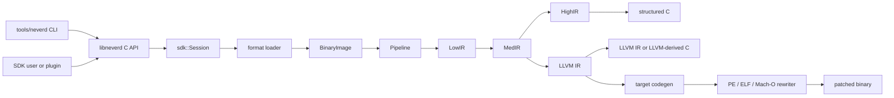

**Langues**: [English](../architecture.md) | [简体中文](../zh-CN/architecture.md) | [繁體中文](../zh-TW/architecture.md) | [日本語](../ja/architecture.md) | [한국어](../ko/architecture.md) | [Français](architecture.md) | [Deutsch](../de/architecture.md) | [Español](../es/architecture.md) | [Italiano](../it/architecture.md) | [Русский](../ru/architecture.md) | [العربية](../ar/architecture.md)

[← Index de la documentation](README.md)

# Architecture de NeverD

Ce guide décrit les frontières de production qu’un contributeur doit connaître
pour modifier NeverD en toute sécurité. Il couvre volontairement uniquement le
code appartenant à NeverD ; les sous-modules LLVM, Capstone et Unicorn gardent
leur propre architecture interne.

## Frontière du système

NeverD possède quatre représentations IR, mais elles ne forment pas une chaîne
obligatoire de quatre étapes. `LowIR -> MedIR` est commun. La décompilation
structurée utilise ensuite `MedIR -> HighIR -> C`, tandis que `lift`,
`decompile --llvm` et `patch` empruntent directement `MedIR -> LLVM IR`. Les
modes patch et lift évitent donc volontairement HighIR.

Le CLI analyse les commandes dans `tools/neverd`, crée un `neverd_session_t` et
appelle l’API publique de `include/neverd/sdk/NeverDCAPI.h`. L’état du moteur
réside dans `lib/sdk/SessionImpl.h` ; `neverd_session_load` choisit un loader et
construit une `BinaryImage`, tandis que les opérations fondées sur l’IR
exécutent `lib/pipeline/Pipeline.cpp` à la demande. L’exécutable `neverd` se lie
à `neverd_shared` ; les archives de composants et leurs dépendances LLVM/
Capstone sont des détails privés de cette bibliothèque partagée. Le CLI
utilise LLVM Support pour son interface en ligne de commande, mais ne
contourne pas l’API C pour piloter le moteur.

L’analyse HighIR `HighSourceFlow` possède les arêtes du flux des instructions émises,
l’identité des variables locales et l’affectation certaine. La validation du source et
l’élimination des copies PHI mortes partagent ce graphe. Des partitions bornées zéro/non-zéro
suivent les gardes scalaires répétées ; les écritures invalident les faits et les variables
dont l’adresse s’échappe restent inconnues. À la limite de partition, l’analyse reprend le
graphe conservateur. Une copie PHI ne disparaît que si sa valeur est morte dans tous les
contextes réalisables. Appels, lectures, écritures et étiquettes conservent leur comportement.

L’analyse d’échappement des consommateurs de blocs utilise aussi ce graphe. Un point fixe borné propage les identités de pointeurs et les emplacements privés de pile à travers les branches et les boucles. Les jonctions conservent les adresses de contexte possibles ; seul un écrasement complet les efface. Les arêtes inconnues, les exceptions et les budgets de preuve épuisés refusent la liaison.

Les faits de récepteur Objective-C distinguent self à l’entrée d’une méthode d’une référence exacte de classe. Tous les enregistrements partageant l’entrée doivent s’accorder avant d’établir self. Les copies de largeur complète et les registres préservés par l’ABI propagent ces faits dans le même point fixe, y compris les retours vers l’entrée. L’accord des déclarations distingue méthodes de classe et d’instance, catégories enregistrées, superclasses et protocoles adoptés ; self inclut aussi les sous-classes connues. Les catalogues du compilateur conservent propriétaires et hiérarchie séparément de l’accord global des sélecteurs. Avant publication, le SDK revalide l’origine du récepteur et les déclarations dans l’image courante. Ces faits ne sélectionnent aucun IMP et n’autorisent aucune réécriture binaire.
Une hiérarchie externe manquante impose l’accord global des sélecteurs, sans restreindre le récepteur ; les déclarations explicitement incompatibles ou non prises en charge restent des preuves négatives.

Les ivar de type objet explicite prolongent la preuve du récepteur par au plus huit chargements de largeur complète. Chaque étape conserve le slot d’offset à l’exécution, sa largeur et tout offset littéral utilisé par l’instruction. Un littéral doit encore correspondre à la disposition actuelle ; une référence d’offset peut suivre un champ déplacé. Le chargeur vérifie la lignée de classes et la déclaration du champ. Les accès partiels, id sans classe, blocs, types limités à un protocole, stockages ambigus et bases inconnues ne donnent aucun fait de classe. La validation du source revérifie tout le chemin dans l’image courante. Ces faits ne prouvent ni l’identité d’objet ni le droit de supprimer des opérations mémoire.

Le chargeur valide des graphes bornés et acycliques de chaînes constantes, objets entiers, tableaux et dictionnaires triés Darwin. Chaque champ et chaque arête exigent une mémoire mappée immuable et des preuves non ambiguës d’importation ou de relocalisation ; les encodages non pris en charge, cycles et graphes incomplets échouent explicitement. Les liaisons source revérifient le graphe et le slot de pointeur entrant. Les fonctions générées préservent les bits entiers, l’ordre des enfants et les adresses partagées, en réutilisant les identités des chaînes. Les slots sont initialisés une seule fois avec publication acquire/release, uniquement par des appels aux enfants validés. Chaque fonction porte leurs déclarations pour permettre le partage d’une définition entre méthodes récupérées indépendamment. Les tests portables couvrent les entrées malformées et les budgets ; les fixtures natives comparent contenu, alias, identité des copies et initialisation concurrente aux méthodes originales.

## Représentations IR et parcours

| Représentation | Rôle | Définitions et transformations principales |
|----------------|------|--------------------------------------------|
| LowIR | Opérations `NdOp` indépendantes de l’architecture, blocs de base, CFG et métadonnées de tables de saut | `include/neverd/ir/low`, `lib/ir/low`, produit par `lib/decode` + `lib/lift` |
| MedIR | Types, ABI/conventions d’appel, modèle mémoire/pile, drapeaux, appels et flux de données proche de SSA | `include/neverd/ir/med`, `lib/ir/med` |
| HighIR | Expressions et contrôle de flux structurés pour un C lisible | `include/neverd/ir/high`, `lib/ir/high`, émis par `lib/backend/c/HighC` |
| LLVM IR | Optimisation, C dérivé de LLVM, génération de code cible et entrée de réécriture binaire | `lib/backend/llvm`, optimisé/orchestré par `lib/pipeline` |

Les constantes conservent, de LowIR à MedIR puis HighIR, leur provenance scalaire ou adresse et le propriétaire de l’adresse pour chaque occurrence. Des bits identiques ne fusionnent pas des origines différentes. La simplification symbolique de HighIR traite les identités d’adresse comme des entrées opaques ; la liaison du code source utilise la classification commune des opérandes numériques et exige toujours une liaison de relocalisation pour les usages mémoire et pointeur.

| Parcours utilisateur | Chemin des représentations | Sortie |
|---------------------|----------------------------|--------|
| Dump Low/Med | Binary -> LowIR, puis éventuellement -> MedIR | Texte de diagnostic |
| Dump High ou `decompile` | Binary -> LowIR -> MedIR -> HighIR | HighIR ou C structuré |
| `lift` | Binary -> LowIR -> MedIR -> LLVM IR | `.ll` |
| `decompile --llvm` | Binary -> LowIR -> MedIR -> LLVM IR | C dérivé de LLVM |
| `patch` | Binary -> LowIR -> MedIR -> LLVM IR -> codegen | Binaire réécrit |

`lib/pipeline/Pipeline.cpp` est la référence pour la sélection du parcours.
Gardez la logique propre à une représentation dans sa bibliothèque IR ou
backend ; le pipeline doit orchestrer ces composants, pas absorber leurs
algorithmes.

## Contrat de traduction inter-architectures

`include/neverd/translate` définit une couche contractuelle,
pas un backend d’exécution. `GuestState` modélise l’état observable de la machine,
indépendamment de l’architecture, pour `x86_32`, `x86_64`, `AArch64` et `ARM32`.
Sa sérialisation canonique version 1 emploie des champs little-endian de largeur
fixe, des identifiants de registre stables, des collections triées et une
validation fail-closed ; l’état persistant ne dépend donc pas de l’agencement
C++ de l’hôte.

La base wire v1 de `GuestState` est définitivement figée. Tout état hors de
cette base doit employer un ID de registre d’extension dans la plage réservée,
associé à un nom canonique en minuscules, ou passer à une nouvelle version wire
avec un upgrader explicite ; modifier la base v1 sur place est interdit.

Pour un guest `ARM32`, `ExecutionMode` est le mode de décodage faisant autorité
et doit être cohérent avec `CPSR.T`. Le PC enregistré est toujours l’adresse
d’instruction canonique avec le bit 0 effacé ; le mode ARM exige en outre un
alignement sur un mot.

Le contrat des paires définit `x86_64 -> AArch64`,
`AArch64 -> x86_64`, `x86_32 -> AArch64/ARM32` et
`ARM32 -> x86_32/x86_64`. `ContractDefined` signifie qu’une requête peut être
validée et persistée, pas que le code peut être traduit ou exécuté. La politique
JIT n’accepte que l’hôte natif du processus ; la politique AOT exige une
architecture hôte et un target triple explicites ; un CPU ou un ensemble de
fonctionnalités sélectionné doit lui aussi être explicite.

`ResolvedHostTarget` concrétise cette sélection. La résolution `Native` obtient
du processus le triple, le CPU et l’ensemble des fonctionnalités activées ou
désactivées. La résolution `Explicit` valide et normalise l’architecture, le
triple, le CPU et les fonctionnalités fournis par l’appelant, puis rejette les
contradictions. Son identité de cache versionnée est construite dans un ordre
d’octets déterministe à partir de la cible normalisée, sans adresse de processus
ni texte dépendant de la locale.

Un `TranslationExit` versionné enregistre une cause d’arrêt stable et la charge
utile typée correspondante pour les syscalls, exceptions ou signaux, points
d’arrêt, instructions non prises en charge, auto-modification, budgets de
ressources, appels externes, défauts mémoire et autres conditions terminales.
Les consommateurs n’ont donc pas à réinterpréter un entier non typé selon la
cause d’arrêt.

Hors du cas `BudgetExhausted` correspondant, les compteurs d’instructions, de
blocks et de code produit ne doivent pas dépasser le budget non nul de la
requête. L’épuisement des budgets d’instructions et de blocks s’arrête exactement
au limit. La taille d’un objet produit n’est connue qu’après un codegen
indivisible ; son résultat d’épuisement peut donc indiquer `Observed > Limit`.
Cet objet rejeté n’est jamais lié, publié ni exécuté. Chaque charge utile
`BudgetExhausted` identifie exactement le limit demandé, jamais un seuil dérivé
ou privé de l’implémentation.

Le contrat backend-private `RuntimeControlBlockV1` fait
exactement 128 octets, avec un alignement de 8 octets. Il est contraint par des
valeurs v1 fixes de magic, version, taille et offsets de champs, par des champs
réservés à zéro et par des sorties typées cohérentes. Il ne contient ni
conteneur C++, ni pointeur hôte, ni alias d’adresse guest. Ce n’est ni le layout
C++ ni le format wire de `GuestState` ; un backend qui implémente ce contrat
doit convertir explicitement l’état vers cet enregistrement.

La surface d’appel v1 fixe du code produit contient exactement huit helpers :
`nvd_rt_v1_load8_le`, `nvd_rt_v1_load16_le`, `nvd_rt_v1_load32_le`,
`nvd_rt_v1_load64_le`, `nvd_rt_v1_store8_le`, `nvd_rt_v1_store16_le`,
`nvd_rt_v1_store32_le` et `nvd_rt_v1_store64_le`. Leurs noms, signatures et
provenances de pointeurs doivent correspondre exactement ; un backend lie
explicitement cette table finie et ne se rabat jamais sur la résolution
ambiante de symboles. La validation de generation exécutable et le polling de
budget/annulation sont réservés au dispatcher de confiance ;
`nvd_rt_v1_validate_generation` et `nvd_rt_v1_poll` ne sont pas des helpers du
code produit. Le dispatcher hôte de confiance possède aussi la sélection des
blocks et n’est pas appelable depuis l’IR produit ; les translated blocks
renvoient plutôt un code de sortie typé. L’IR produit ne peut lire directement
que le slot runtime scalar-result déclaré.

`RuntimeSymbolRegistryV1` matérialise cette table de helpers sous forme d’un
registre hôte fermé. Sa construction vérifie l’ensemble ABI-v1 complet, les noms
canoniques exacts, les classes de helpers, les signatures et, pour chaque entrée,
un unique pointeur de fonction non nul correspondant à sa classe. La recherche
n’accepte que le nom exact, ne consulte jamais les symboles ambiants du processus
ou du chargeur dynamique et fournit au verifier d’objets la même liste triée de
noms autorisés. Son identité versionnée couvre les noms, les classes et la forme
de l’ABI, mais exclut volontairement les adresses natives ; elle reste donc
stable sous ASLR.

`RuntimeCodeMemory` possède un stockage de code produit isolé par pages et
n’autorise qu’une publication unidirectionnelle `RW -> RX`. La mémoire n’est
jamais simultanément inscriptible et exécutable, ne peut pas être rouverte en
écriture, vérifie les limites des écritures et des points d’entrée, et invalide
le cache d’instructions de l’hôte lors de la publication. Le smoke test natif
n’exécute qu’une courte séquence d’instructions hôte après publication : il
prouve cette frontière mémoire W^X, pas un moteur de traduction.

`GuestMemoryRuntime` est isolé du `GuestState` logique : sa construction valide
d’abord l’état, puis copie les octets et métadonnées des régions dans un index
privé trié. Les adresses virtuelles guest ne sont que des clés de recherche et
ne sont jamais converties en pointeurs hôte. Les accès scalaires vérifiés
signalent des fautes typées de largeur, alignement, débordement, absence de
mapping, franchissement de région, permission, écriture exécutable, débordement
ou discordance de generation et violation de policy. Les budgets
d’instructions/blocks, l’annulation, le suivi de generation et les policies
d’écriture de code `RejectExecutableWrites`, `InvalidateOnExecutableWrite` et
`ValidateBeforeDispatch` produisent eux aussi des enregistrements typés
cohérents plutôt qu’un comportement hôte implicite.

`TranslationObjectCompilerV1` constitue la frontière vérifiée entre LLVM IR et
objet. Il valide un module d’entrée const, le clone avant toute transformation,
compose la simplification sémantique contrôlée par preuve avec l’optimisation
LLVM de `O0` à `O3`, puis valide à nouveau l’IR final et produit des objets
relocatable ELF, COFF ou Mach-O pour les quatre architectures hôtes du contrat.
Il canonicalise les manifests exacts des blocks et symboles runtime après
mangling de la cible, audite chaque objet produit et renvoie l’identité du
registre runtime ainsi que des clés de cache versionnées pour la requête et
l’artefact. Avec un budget d’octets produits non nul, seul un objet conforme
peut atteindre la vérification de l’artefact. LLVM émet d’abord dans un buffer
privé afin de mesurer la taille exacte et indivisible ; un objet trop grand est
rejeté avant publication et audit, avec une télémétrie typée qui conserve la
taille observée et le limit exact demandé. Zéro signifie aucune limite imposée
par l’appelant. Le compilateur s’arrête aux octets relocatable audités : il ne
les lie ni ne les publie, ne les transmet à aucun dispatcher, ne les exécute pas
et ne fournit pas le lowering des instructions guest.

Le verifier post-codegen audite les objets relocatable ELF,
COFF et Mach-O comme un ensemble fermé. Le format et l’architecture doivent
correspondre exactement à l’hôte choisi ; les symboles non définis doivent
appartenir exactement à l’allowlist finie des helpers et les symboles dynamiques
sont interdits. Les relocations suivent des whitelists directes explicites avec
contrôle de l’encoding, de la largeur, de l’alignement, de l’offset, de la
destination chargeable et d’une cible non-preemptible locale à l’objet ou d’un
helper exactement autorisé. Sont rejetés W+X, les métadonnées
unwind/exception/initializer, TLS, IFUNC, GOT et l’indirection PLT ordinaire, les
relocations dynamiques, les définitions weak/preemptible ou sélectionnables,
les sections allouées inconnues et les directives de linker. L’écriture
`R_X86_64_PLT32` employée par LLVM pour un appel ELF x86-64 hidden n’est admise
que si la policy v1 prouve une branche directe sealed vers le helper runtime
exact ; elle n’autorise aucun chemin PLT ou GOT. Les artefacts ELF `ET_REL` ne
doivent contenir aucun program header ni segment. Les load commands Mach-O
suivent une liste positive : exactement un segment de largeur correspondante et
au plus une symbol table, dynamic-symbol table, platform-version et commande
data-in-code, avec contrôle de leurs dépendances. Les options de linker et toute
autre commande sont rejetées.

`TranslationObjectRequestV1` est la première tranche publique, volontairement
étroite, qui transforme des octets guest en objet au-dessus de ces contrats.
Dans le sous-ensemble v1 fail-closed publié pour les registres scalaires x86-64,
elle n’accepte que les encodages canoniques sans préfixe legacy : les formes
`MOV`, `ADD`/`SUB` et `AND`/`OR`/`XOR` avec REX.W sur des GPR pleine largeur dont
les opérandes ont les formes LowIR registre/immédiat prises en charge. Les formes
arithmétiques conservent leurs calculs de flags scalaires ; les formes logiques
et `TEST` calculent les flags définis par l’architecture tout en préservant `AF`
dans le modèle d’état NeverD. Le schéma 9 accepte aussi le `CMP` pleine largeur
registre/registre `39/3B`, le `CMP` registre/immédiat `81/7`, `83/7` et `3D`, le
`TEST` pleine largeur registre/registre `85` et registre/immédiat `F7/0` et
`A9`. Les
encodages canoniques `C3` `RET` et `C2 iw` `RET imm16` terminent les blocks de
retour ; les encodages `JMP` directs relatifs canoniques `EB cb` et `E9 cd`
terminent les blocks de branchement direct. Le schéma de lowering publié est 9.
Les branches Jcc traditionnelles, canoniques et sans préfixe legacy se limitent
à : `JO`/`JNO` court `70/71 cb` ou proche `0F 80/81 cd` ; `JB`/`JAE` avec
`72/73 cb` ou `0F 82/83 cd` ; `JE`/`JNE` avec `74/75 cb` ou `0F 84/85 cd` ;
`JBE`/`JA` avec `76/77 cb` ou `0F 86/87 cd` ; `JS`/`JNS` avec `78/79 cb` ou
`0F 88/89 cd` ; `JP`/`JNP` avec `7A/7B cb` ou `0F 8A/8B cd` ; `JL`/`JGE` avec
`7C/7D cb` ou `0F 8C/8D cd` ; et `JLE`/`JG` avec `7E/7F cb` ou `0F 8E/8F cd`.
`JRCXZ`/`JECXZ`/`JCXZ` et `LOOP`/`LOOPE`/`LOOPNE` restent non publiées et
échouent en mode fail-closed. Le `F7 /1` réservé, les opérandes de mémoire guest,
les registres partiels, les préfixes legacy et les bits d’extension REX
sémantiquement redondants échouent aussi en mode fail-closed. Elle produit
uniquement un objet relocatable ELF ou Mach-O AArch64 little-endian audité. Les
opérations ordinaires sur la mémoire guest, les formes de registres partiels,
toute instruction ou tout encodage hors de ce sous-ensemble exact, les flux de
contrôle autres que les retours, ces sauts directs et les branches sur un seul
flag publiées ci-dessus, et toute opération LowIR non implémentée par le lowerer
sont rejetés avant la production de l’objet. La lecture vérifiée
de l’adresse de retour requise par `RET` appartient à son contrat de terminaison
et ne publie pas un lowering
général de la mémoire guest. La requête reconstruit et valide le descripteur du
block, utilise la même target machine résolue pour le lowering et la production
de l’objet, et combine la simplification sémantique contrôlée par preuve avec la
pipeline d’optimisation `O2` par défaut de LLVM. Cette tranche ne couvre pas les
autres instructions x86-64, les autres couples guest/hôte ni le sens inverse
AArch64 vers x86-64.

Le point d’entrée C public
`neverd_translate_x86_64_block_to_aarch64_object_v1`, le wrapper Python ctypes
`translate_x86_64_block_to_aarch64_object` et la commande
`neverd translate-object` exposent cette même frontière limitée à l’objet.
Python utilise `TranslationObjectFormat.ELF` ou `.MACHO`. Les échecs de
traduction native lèvent une `TranslationError` typée portant un
`TranslationErrorCode` ; la validation locale des arguments lève plutôt
`TypeError` ou `ValueError`. En cas de succès, Python renvoie un résultat
immuable qu’il possède. Le résultat C possède les octets de l’objet, les
identités de cache stables et la télémétrie d’optimisation ; la CLI écrit
uniquement l’objet ELF ou Mach-O sélectionné. Les
trois surfaces s’arrêtent avant le linking, le chargement, le dispatch,
l’exécution et le débogage ; ce ne sont pas des interfaces de session d’exécution.

`verifyTranslationLinkGraphV1` ajoute un second audit indépendant avant toute allocation.
Il construit un graphe LLVM JITLink éphémère à partir d’un objet ELF ou Mach-O
AArch64 accepté, puis vérifie sa cible, les permissions des sections, les
manifests de symboles block/runtime, la fermeture des symboles externes ainsi
que les types et cibles des arêtes. Le graphe est détruit après production d’un
résultat d’audit sans adresse. La réussite de cet audit ne lie, n’alloue, ne
résout, ne charge, ne publie, ne dispatche et n’exécute aucun code.

`linkTranslationObjectV1` est la frontière distincte de linking natif. Elle
réaudite le descripteur de confiance, l’objet brut et le graphe JITLink avant et
après le pruning, l’allocation, la résolution des symboles et les fixups. Les
symboles runtime proviennent exclusivement du registre scellé. Un credential de
dispatcher lie l’unique entrée du manifest à sa session, à l’identité du block,
au PC d’entrée guest, à la génération du cache et à l’époque du code ;
l’invocation exige aussi que le `RIP` guest du runtime corresponde à cette entrée.
Après finalisation réussie, la mémoire exécutable est publiée avec ses permissions
finales. Unload révoque les nouvelles invocations et attend une invocation active
avant de libérer l’allocation. L’overload sans credential reste réservé à l’audit
et ne permet aucune invocation.

`NativeTranslationSessionV1` assemble ces éléments en une frontière d’exécution
C++ expérimentale de x86-64 vers AArch64 natif. Dans un processus ELF ou Mach-O
AArch64 little-endian, elle conserve le même runtime de mémoire guest vérifié et
le même état guest fixe entre plusieurs blocks d’une boucle de dispatcher
compile-link-validate-invoke-unload. Un saut direct canonique reprend à sa cible
statique exacte. Une branche canonique publiée sur un seul flag ne reprend qu’au
successeur taken ou fallthrough déclaré par le manifest du block ; le dispatcher
rejette tout autre PC sélectionné. Un retour termine l’exécution. Les budgets
globaux d’instructions, de blocks et d’octets d’objet produits restent exacts
entre les blocks. Lors d’un arrêt guest réussi, l’état exécuté et la mémoire
faisant autorité sont commit ensemble. L’annulation est linéarisée par rapport à
ce commit final.

Il s’agit d’une tranche verticale exécutable, pas d’un traducteur complet. Elle
ne couvre pas les instructions ordinaires de mémoire guest, les registres
partiels, le flux conditionnel hors de la tranche exacte schema-9 des Jcc
traditionnels ci-dessus — notamment `JRCXZ`/`JECXZ`/`JCXZ` et
`LOOP`/`LOOPE`/`LOOPNE` —,
le flux indirect, les appels, le calcul flottant, SIMD, x87, les opérations
atomiques, les instructions système, la propagation générale des exceptions,
le cache de blocks, les autres couples guest/hôte ni le sens inverse AArch64
vers x86-64. La session d’exécution n’a
encore aucune surface C, Python, CLI ou JSON ; le débogage reste séparé et non
pris en charge. Les API objet restent utilisables sans activer l’exécution native.

Le contrat de l’IR produit impose que tout translated block qui lui est soumis
soit hidden et non-preemptible et utilise le C ABI
`i32 (ptr state, ptr runtime)`. Les blocks ne sont découverts que par un registre
privé, jamais par la recherche ambiante de symboles du processus ; les appels
directs entre blocks sont interdits.

L’IR verifier limite aussi la largeur des entiers à celle du registre scalaire
de l’hôte afin d’éviter les compiler-runtime libcalls connus introduits pendant
la legalization. Cette vérification est nécessaire, mais pas suffisante : tout
backend d’exécution qui implémente ce contrat doit auditer exactement les
transferts de contrôle post-codegen, le `MachineIR` et les relocations de
l’objet cible par rapport à la même runtime-symbol allowlist finie.

Les loads et stores directs de TranslationIR, ainsi que les valeurs des private
constants, ne peuvent contenir qu’un seul entier scalaire dont la largeur ne
dépasse pas celle du registre scalaire de l’hôte. Les agrégats doivent être
scalarisés avant la frontière du verifier afin qu’un IR compact ne provoque pas
une expansion non bornée dans le backend.

L’ABI du code produit est définie uniquement pour les entiers scalaires. Le
flottant, SIMD, x87, les opérations atomiques et les instructions système sont
hors de ce contrat. Toute implémentation qui sélectionne
`ProvenSemanticAndLLVM` doit exécuter la simplification sémantique de NeverD,
soumise à preuve, jusqu’à un point fixe conjoint avec l’optimisation LLVM ; la
politique ne fournit pas de backend de traduction exécutable.

## Frontières de réécriture des exceptions

Le compact unwind Mach-O dispose d’un parser strict du `__unwind_info` original,
d’un parser conscient des fixups pour les records `__LD,__compact_unwind`
produits, d’un merge exact des plages originales et produites, d’un encoder
déterministe de pages régulières et d’un installeur transactionnel de la section
finale. L’installeur ne réécrit in-place une `__TEXT,__unwind_info` existante et
file-backed que si la table encodée tient dans sa capacité déclarée. Il
revalide l’architecture, le layout et le byte preimage, met à zéro la fin
inutilisée, puis reparse le résultat et prouve son équivalence sémantique avant
l’unique commit de la transaction Mach-O englobante. Si la section finale est
absente, les records compact produits ne sont pas installés et la transaction
ne peut continuer que par la fermeture DWARF-FDE exacte et authentifiée décrite
ci-dessous ; une section finale existante mais trop petite ou malformée échoue
toujours en mode fail-closed. Les records produits sont
authentifiés par une association exacte, enregistrée par le compilateur, entre
la fonction IR source et le symbole owner MC cible (y compris les définitions
privées, sans deviner préfixe ni mangling), des identifiants de plage opaques et
non nuls et des plages de fragments semi-ouvertes exactes. Chaque FDE produit
doit correspondre exactement à un unique fragment authentifié ; chaque fragment
requis doit correspondre à un unique FDE installé par cette transaction, sauf
s’il est couvert par un record compact non-DWARF exact et strictement validé.
Des fragments adjacents ou disjoints du même owner de fonction peuvent
réutiliser une même recette source ; toute identité absente, dupliquée,
pendante, inter-owner ou incohérente avec ses bornes échoue avant mutation. Le
nouveau segment RX n’est validé qu’après preuve d’un `__LINKEDIT` unique et
terminal dans le fichier et l’espace VM, de décalages vérifiés sans débordement
et d’une relecture stricte du layout final.

Les références externes sont classées à partir du contrat MC fixup complet. Les
appels ne peuvent sélectionner que des cibles callable authentifiées ; les
champs personality du compact unwind produit ne peuvent sélectionner que des
non-lazy pointer slots validés, sans jamais déréférencer leur contenu dans le
fichier. TLS, authenticated pointers, termes soustraits, champs compact
malformés et formes de relocation inconnues échouent en mode fail-closed.

Pour le compact unwind ARM32, l’ajustement de pile encodé et le layout GPR sont
`Complete`. Les sélecteurs de pattern de registres D 0 à 3 sont aussi `Complete` ;
4 à 7 sont `Partial`, car le compact word seul ne prouve pas tous les slots
relatifs au CFA alignés à l’exécution. Une entrée `Partial` peut conserver les
identités de registre prouvées pour l’analyse, mais chaque chemin de réécriture
la rejette en mode fail-closed. Chaque receipt d’installation EH-frame lie
exactement l’architecture cible, la largeur de pointeur et l’ordre des octets ;
le binding DWARF compact-unwind rejette toute divergence de target identity du
receipt. La preuve native throw/catch sur un binaire lié reste à produire.

La transaction de section ARM32 de plus haut niveau est plus étroite que le
décodeur compact unwind. Elle n’est activée que si le header Mach-O vaut
exactement `CPU_SUBTYPE_ARM_V7K` et si les bits `N_ARM_THUMB_DEF` de la table
des symboles originale authentifient positivement chaque fonction requise
comme code Thumb. Le triple exact `thumbv7k-apple-watchos` et le mode Thumb
restent ensuite liés pendant toute la génération de code, dont les exigences
de features d’entrée ne doivent pas dépasser le plafond Cortex-A7. Les
fonctions non marquées ou de mode inconnu, les sous-types génériques non-v7k,
le mode ARM, les cibles de code externe mixtes ou inconnues, le point d’entrée
in-place ARM Mach-O et le patch ARM Mach-O depuis une source C échouent en mode
fail-closed avant toute mutation de la sortie. Les entrées stripped dont les
fonctions ne peuvent être découvertes que par `LC_FUNCTION_STARTS` ne sont pas
encore prises en charge.

PE, ELF et Mach-O possèdent chacun des composants d’exception propres au
format, mais NeverD ne publie pas encore de pipeline de réécriture de bout en
bout couvrant tous les formats et tous les types d’exception. Un encoding non
pris en charge ou des exigences de registration/layout non résolues doivent
échouer avant toute mutation de la sortie ; les capacités partielles existantes
ne doivent pas être présentées comme une couverture complète des exceptions.

Reconnaître une personnalité Itanium Ada ou D n’est pas une prise en charge des
exceptions Ada ou D. Les LSDA address-form de GNAT, GDC, DMD et LDC sont
analysables ; les emplacements de type-table restent opaques (`Exception_Id` /
`Exception_Data` pour GNAT, `ClassInfo` pour D) et ne sont jamais suivis comme
`std::type_info`. La reconstruction native émet `personality` LLVM plus des
clauses `invoke`/`landingpad` en forme d’adresse. Le statut corpus-proven est
une affirmation distincte et ne découle ni de la reconnaissance de personnalité
ni du lowering natif.

## Carte des composants

Chaque composant est une archive statique créée par
`add_neverd_component_library`. Le tableau liste les dépendances NeverD
importantes, pas toutes les bibliothèques LLVM et Capstone communes fournies par
le helper CMake.

| Répertoire | Responsabilité | Dépendances importantes |
|------------|----------------|-------------------------|
| `lib/loader` | Détection de format, chargement PE/COFF, ELF et Mach-O, `BinaryImage` normalisée, découverte de fonctions | API LLVM Object |
| `lib/lift` | Sémantique manuscrite des instructions x86/i386, AArch64 et ARM32 | Types de données IR |
| `lib/decode` | Décodage Capstone/native et distribution vers les lifters d’architecture | `NeverDIR`, `NeverDLift` |
| `lib/ir` | Types communs et définitions/transformations LowIR, MedIR, HighIR et intrinsics | Ses quatre sous-composants IR |
| `lib/pipeline` | Détection de fonctions et orchestration des parcours Low/Med/High/LLVM | IR, decode, lift, backend LLVM, debug, passes IR |
| `lib/backend/c` | Rendu HighIR-vers-C et LLVM-IR-vers-C | IR |
| `lib/backend/llvm` | Abaissement MedIR vers LLVM | IR |
| `lib/backend/codegen` | Génération de code cible et patch/réécriture sur place PE/ELF/Mach-O | IR, loader |
| `lib/sdk` | ABI C publique, cycle de vie session, requêtes, persistance, plugins, entrées lift/decompile/patch/audit/hunt | Agrège le moteur dans `libneverd` |
| `lib/pass` | Passes d’obfuscation LLVM IR et exécuteur de passes MIR | IR |
| `lib/debug` | Contextes de debug DWARF, PDB et linker-map | IR |
| `lib/sigs` | Analyse, bases et correspondance des signatures | Loader |
| `lib/libc` | Noms libc connus et prise en charge du modèle d’appel | Composant autonome |
| `lib/safety` | Audit de durée de vie du tas et chasse de débordement de copie sur l’IR levé | Symbolic, Solver |
| `lib/support` | Helpers partagés de chargement binaire | Loader |
| `lib/translate` | Contrats versionnés d’état/policy/exit guest, ABI runtime fixe, mémoire guest vérifiée, audits de l’IR/des objets/LinkGraphs produits, linking natif scellé et dispatcher C++ expérimental de x86-64 vers AArch64 | Contrats IR, LLVM, LLVM Object et JITLink |

Les en-têtes publics reflètent ces zones sous `include/neverd`. Évitez de faire
d’une classe C++ interne une partie accidentelle du SDK : les opérations
externes stables appartiennent à l’en-tête C pur et à l’un des fichiers ciblés
`lib/sdk/NeverDCAPI*.cpp`.

## Contrat du lifting strict

`Decoder` et chaque lifter d’architecture démarrent en mode strict. Si Capstone
peut décoder une instruction mais que le lifter choisi ne l’implémente pas, il
lève `UnliftedInstruction`. L’exception enregistre l’adresse, le mnémonique et
les opérandes ; une sémantique non prise en charge doit donc échouer visiblement
au lieu d’être omise ou devinée.

Le chemin interne non strict émet `NdOp::NOP`, mais c’est une échappatoire de
diagnostic, pas une implémentation acceptable. Les tests des contributeurs et
de la CI doivent garder le mode strict. Lors d’un échec strict :

1. Reproduisez-le avec la plus petite fixture propre à l’architecture.
2. Ajoutez la sémantique manquante dans `lib/lift/<ISA>`.
3. Vérifiez la forme LowIR attendue dans `unittests/lift`.
4. Ajoutez un aller-retour différentiel Unicorn dans `unittests/semantic` si l’instruction a un comportement observable.

Ne capturez pas `UnliftedInstruction` uniquement pour laisser le pipeline
continuer. Une nouvelle approximation volontaire exige un contrat explicite et
des tests ; elle ne doit pas se faire passer pour un lifting 1:1.

## Propriété des formats et ISA

La logique du format d’entrée et celle de la réécriture de sortie sont séparées
volontairement :

| Format | Chargement, métadonnées et relocations d’entrée | Patch et relocations de sortie |
|--------|------------------------------------------------|--------------------------------|
| PE/COFF | `lib/loader/COFF` | `lib/backend/codegen/COFF` |
| ELF | `lib/loader/ELF` | `lib/backend/codegen/ELF` |
| Mach-O | `lib/loader/MachO` | `lib/backend/codegen/MachO` |

Les lifters d’architecture résident dans `lib/lift/X86`,
`lib/lift/AArch64` et `lib/lift/ARM`. Les déclarations publiques associées se
trouvent dans `include/neverd/lift`. L’émission LLVM et la génération de code
propres à la cible vivent sous `lib/backend/llvm/<ISA>` et
`lib/backend/codegen/CodeGen<ISA>.cpp`.

### Support et profondeur des tests

La matrice de support racine signifie que chaque cellule est implémentée. Elle
ne signifie pas que chaque opcode, cas limite ABI, producteur de binaire ou
version de système a été testé exhaustivement. Le mode strict échoue de façon
fermée lorsque la sémantique d’une instruction sort de la couverture implémentée
par le lifter.

Les 12 cellules format-par-architecture ont une couverture sémantique du
backend de réécriture dans `unittests/semantic/PatchFullSubstRTTests.cpp`. La
profondeur d’intégration est plus précise :

| Format | x86-64 | i386 | AArch64 | ARM32 |
|--------|--------|------|---------|-------|
| PE/COFF | Fixture liée | Grille backend | Fixture liée | Fixture Thumb liée |
| ELF | Fixture liée + aller-retour sémantique | Pipeline objet + aller-retour sémantique | Fixture liée + aller-retour sémantique | Fixture liée + aller-retour sémantique |
| Mach-O | Fixture liée\* | Pipeline objet PIC/non-PIC\* | Fixture liée\* | Grille backend |

- Une **fixture liée** exerce le loader/pipeline et le patch d’un exécutable
  lié pour des programmes représentatifs.
- Un **pipeline objet** exerce le chargement, toutes les étapes IR et la
  décompilation d’un objet relogeable, mais pas la liaison hôte ni l’exécution
  d’un binaire patché.
- Une **grille backend** compile un IR représentatif via le chemin exact de
  génération pour réécriture et compare le comportement dans Unicorn ; elle
  n’exerce pas le loader de ce format sur un exécutable lié.
- `*` Les fixtures Mach-O liées dépendent d’une toolchain hôte capable de
  produire la cible. macOS moderne ne peut pas lier les anciens exécutables
  i386 ; la couverture utilise donc des objets thin PIC et non-PIC plus la grille.

Les cellules avec fixture liée représentent la preuve d’intégration de format
la plus forte pour ces programmes. Les cellules pipeline objet et grille
backend n’ont qu’une couverture d’intégration partielle. Aucune cellule n’est
« entièrement testée » sans cette nuance ni ne prétend couvrir tout l’ISA.

Les preuves principales sont
[`PatchFormatTests.cpp`](../../unittests/lift/format/PatchFormatTests.cpp) pour les
fixtures ELF et PE liées,
[`COFFARMFormatTests.cpp`](../../unittests/lift/format/COFFARMFormatTests.cpp) pour le
chargement/décompilation Windows ARM,
[`MachOI386RelocationTests.cpp`](../../unittests/lift/format/MachOI386RelocationTests.cpp)
pour les objets thin i386,
[`X86_64_PipelineE2ETests.cpp`](../../unittests/lift/x86_64/X86_64_PipelineE2ETests.cpp)
et
[`AArch64_PipelineE2ETests.cpp`](../../unittests/lift/aarch64/AArch64_PipelineE2ETests.cpp)
pour Mach-O lié, et
[`PatchFullSubstRTTests.cpp`](../../unittests/semantic/probe/patchfull/PatchFullSubstRTTests.cpp)
pour la grille des 12 cellules. Consultez le [guide des tests](testing.md).

## Où modifier

| Changement | Point de départ | Vérification ciblée minimale |
|------------|-----------------|------------------------------|
| Ajouter ou corriger une instruction | Fichiers correspondants dans `lib/lift/X86`, `AArch64` ou `ARM` ; en-tête public si le dispatch change | Test d’architecture dans `unittests/lift` ; aller-retour sémantique dans `unittests/semantic` |
| Ajouter un `NdOp` | `include/neverd/ir/NdOps.h`, puis audit Low-to-Med, emitters/renderers, verifier/emulator et dumps | `NeverDLiftTests` + cas pertinents de `NeverDSemanticTests` |
| Modifier CFG ou découverte de fonctions | `lib/ir/low`, `lib/loader/FunctionDiscovery*.cpp`, `lib/pipeline/PipelineFuncDetect.cpp` | Tests CFG/tables de saut de lift et suite de transformation sémantique ciblée |
| Ajouter une relocation d’entrée ou règle unwind PE | `lib/loader/COFF` | `COFFARMFormatTests` ou nouvelle fixture loader ciblée |
| Ajouter une relocation de sortie ou règle patch PE | `lib/backend/codegen/COFF` | `PatchFormatTests`, `RewriteCodegenRTTests` et grille backend PE |
| Modifier le comportement ELF ou Mach-O | Répertoires `lib/loader/<Format>` et/ou `lib/backend/codegen/<Format>` correspondants | Tests du format plus grille de réécriture |
| Modifier la récupération MedIR/ABI | `lib/ir/med` | Tests lift de convention d’appel + allers-retours sémantiques multi-ISA |
| Modifier la récupération structurée du contrôle | `lib/ir/high` | `NeverDCFGLoopXformTests` et tests C structuré |
| Ajouter une transformation LLVM | `lib/pass/ir`, en-tête public dans `include/neverd/pass/ir`, option pipeline si exposée | Suite de transformation ciblée + `NeverDPatchFullTests` si la sortie patch change |
| Ajouter une opération C API | `include/neverd/sdk/NeverDCAPI.h`, `lib/sdk/NeverDCAPI*.cpp` ciblé, `SessionImpl.h` uniquement pour l’état | Tests sémantiques SDK/CLI ; préserver `neverd_last_error` et les conventions d’allocation |
| Ajouter une commande CLI | `tools/neverd/NeverDCLIOptions.cpp`, `NeverDCLI.h`, `NeverDCmd*.cpp` ciblé et dispatch dans `neverd.cpp` | `unittests/semantic/CLIEndToEndTests.cpp` et smoke test CLI direct |
| Modifier l’audit de durée de vie du tas ou la chasse de débordement de copie | `lib/safety`, `include/neverd/safety`, `include/neverd/sdk/NeverDCAPISafety.h` | `NeverDSafetyTests` et `NeverDSafetyIntegrationTests` |
| Ajouter une régression sémantique | `unittests/semantic/*Tests.cpp` ciblé ; enregistrer un nouveau fichier dans `unittests/semantic/CMakeLists.txt` | Construire son binaire de test, puis sélectionner le cas avec `ctest -R` |

Gardez les modifications étroites. Les fichiers qui définissent une
représentation peuvent évoluer avec leurs transformations, mais les loaders,
lifters et backends sans rapport ne doivent pas être modifiés uniquement pour
uniformiser un refactoring large.

Les déclarations de structures conservent la disposition des champs séparément de la classification ABI. Darwin ARM64 accepte les structures imbriquées contenant un à quatre champs float ou double homogènes ; si les registres flottants sont épuisés, tout l’argument passe sur la pile. MedIR lie chaque composante physique avant SSA, HighIR reconstitue un seul paramètre ou résultat logique et le C vérifie la disposition. Darwin ARM64 et x86_64 acceptent aussi les structures imbriquées de un ou deux entiers ou pointeurs de 64 bits. Lorsque toute la structure passe sur la pile, ARM64 épuise la banque concernée, tandis que x86_64 conserve les registres restants pour les arguments suivants. Le remplissage, les champs compactés, les mélanges flottant/entier et les composantes incomplètes restent refusés ; ces indications ne permettent pas la réécriture du binaire.

Les appels C fixes Darwin ARM64 acceptent aussi les résultats naturellement alignés de trois entiers signés de 64 bits via le pointeur caché x8. La couche ABI source commune classe ce résultat ; Low→Med conserve le pointeur avant l’appel et écrit les champs du résultat logique dans la mémoire de l’appelant. Les registres des arguments ordinaires ne changent pas et x0 ne reçoit aucun résultat. L’analyse des appels invalide les anciennes informations sur cette mémoire. La projection des entrées et les preuves de préservation de l’état natif refusent encore ces résultats faute de preuve sur leur stockage ; les structures de trois mots contenant des champs non signés ou des pointeurs, les arguments de trois mots et les résultats indirects x86_64 restent non pris en charge. Les résultats indirects Objective-C restent refusés : un envoi à nil conserve le tampon d’origine et nécessite son propre modèle de stockage.

Les catalogues des appels du runtime ne déclarent `ReturnedArgument` que pour des imports exacts dont le résultat est le pointeur de l’argument initial. L’analyse du récepteur lit l’argument physique déclaré avant les invalidations normales de l’ABI, puis rétablit uniquement son type prouvé sur le résultat. Le SDK revalide cet effet ; les appels, les effets de propriété et les accès mémoire restent présents.

Les catalogues de frameworks et de récepteurs issus du compilateur partagent les fournisseurs Foundation, CoreData, CoreLocation, CoreSpotlight, QuartzCore, UniformTypeIdentifiers et UserNotifications. QuartzCore utilise son en-tête public `CoreAnimation.h` ; les imports de compatibilité d’autres frameworks ne fournissent pas de déclarations propres. Les deux générateurs conservent les quatre profils de prétraitement, les identités exactes et les preuves négatives des déclarations.

Les types de résultats objets prolongent la même preuve bornée du récepteur à partir de déclarations de méthodes concordantes. Les types objets nommés et les types de retour liés déclarés par le compilateur fournissent des faits de classe ; id seul ne suffit pas. Lectures de champs et résultats de messages partagent une limite de huit étapes, toutes revérifiées avec les déclarations courantes avant publication du code source. Les auxiliaires d’allocation importés avec une identité exacte utilisent le contrat de résultat du message correspondant, en conservant les appels, les redéfinitions et les effets de propriété. Des classes de résultat contradictoires ou une hiérarchie incomplète arrêtent la propagation.

Les appels de format conservent leur contrat de langage. Les attributs NSString et les entrées publiques de prédicats sont vérifiés avec le SDK et toutes les déclarations à l’exécution. Les prédicats ignorent les substitutions entre guillemets ; `%K` reçoit un objet nommant une propriété. Les arguments utilisent les promotions scalaires et l’ABI variadique Darwin communes. Les échappements et modificateurs non pris en charge sont refusés. La validation revérifie le langage, l’identité de la constante et les arguments ; le code appelle toujours le parseur du framework.

Les imports C à arguments fixes déclarés par le compilateur et les messages Objective-C partagent la même attribution ABI source pour les structures prises en charge. Seuls les paramètres explicitement déclarés occupent des emplacements ; la couche Objective-C fournit les paramètres cachés du receveur et du sélecteur. Une concordance exacte des exports et des signatures du SDK reste nécessaire. Les callbacks limités aux scalaires et les arguments variadiques conservent leurs restrictions.

Les déclarations de fonctions conservent la convention d’appel dans l’identité de leur signature. La couche ABI commune prend en charge des appels Swift bornés avec des paramètres entiers de 1, 2, 4 ou 8 octets et des paramètres pointeurs ; elle attribue d’abord la banque de registres entiers, puis des supports de pile relatifs au SP d’entrée. Chaque support étroit enregistre sa règle exacte d’extension et les résultats restent limités à deux mots entiers ou pointeurs. HighC conserve `swiftcall` dans les déclarations et définitions. Les ponts de valeurs Foundation observés par le compilateur peuvent aussi déclarer un pointeur `swift_indirect_result` et un pointeur `swift_context` : arm64 emploie x8/x20 et x86_64 RAX/R13, sans consommer la banque ordinaire des arguments entiers. HighC conserve ces deux attributs de paramètre. Les imports de métadonnées Foundation publiques exigent un accord entre graphes de symboles du compilateur, IR des requêtes réelles et exports SDK exacts sur ARM64/x86-64 pour macOS et Mac Catalyst. Un suffixe de symbole ne suffit pas à établir l’ABI. Les arguments génériques ou cachés non déclarés, les types de rappel Swift et les supports physiques non pris en charge restent rejetés. Les déclarations Mac Catalyst ne prouvent pas une validation sur appareil iOS.

MedIR assure la propagation bornée des constantes invariantes à travers les copies SSA de même largeur et les PHI complets, y compris dans les boucles. Toutes les valeurs entrantes doivent converger vers les mêmes bits, largeur, provenance et propriétaire d’adresse. Les définitions inconnues, cycles sans valeur initiale, arêtes incomplètes et constantes contradictoires empêchent la substitution ; un budget épuisé laisse la fonction inchangée. Seuls les opérandes sont remplacés : appels, lectures, écritures et effets sont conservés. HighIR et LLVM utilisent le même résultat.

L’index des propriétaires de code, limité à une opération, conserve aussi les relations exactes entre fonctions principales et fragments décrites par les métadonnées d’exécution. Les recherches indexées et directes partagent le même parcours des relations, préservent les adresses brutes des entrées principales et rejettent les références orphelines ou vers un parent non principal. La validation des cibles, les preuves de bornes et les analyses temporaires de groupes utilisent le même index immuable et le même calcul de coût. Un index d’une autre image déclenche une recherche directe ; un budget épuisé continue de rejeter les preuves incomplètes.

L’ABI source décrit explicitement l’extension signée ou non signée à 32 bits des petits paramètres entiers en registre sur Darwin ARM64 et x86_64. HighIR conserve ces bits dans les copies sauvegardées tout en gardant le type source du paramètre. Les lectures au-delà de 32 bits, le remplissage de pile et les registres écrasés par un appel restent inconnus. Cette règle suit les conventions d’appel ARM64 et Intel d’Apple ; observer un octet bas natif ne prouve aucune extension.

Le chargeur Mach-O conserve la garantie explicite de lecture seule après les relocalisations, sans modifier les permissions initiales du segment. Les lecteurs de données et de pointeurs partagent les contrôles de mappage unique adossé au fichier ; les noms de sections ne prouvent pas l’immuabilité. Un chargement ordinaire de largeur complète peut lier un pointeur local résolu à un objet chaîne constante validé séparément. La liaison conserve son emplacement d’origine pour une nouvelle validation ; les alias partagent l’identité générée de l’objet cible. Le stockage modifiable, les relocalisations contradictoires, les chargements partiels ou ordonnés et l’adresse de l’emplacement lui-même restent non pris en charge.

La récupération des tables de saut produit des transferts vers les blocs successeurs ordinaires au lieu de reconstruire leurs instructions par une autre voie. Chaque bloc garde un seul responsable de conversion, y compris les cas partagés, les cibles par défaut et les entrées de boucle. Les copies PHI de chaque arête s’exécutent avant le transfert correspondant, en conservant les instantanés des affectations parallèles ; les liaisons incomplètes restent des échecs explicites.

La structuration des boucles conserve la propriété exacte des entrées natives. Une enveloppe toujours vraie ne duplique pas le label de la première instruction du corps. La sortie d’une arête de retour conditionnelle rejoint la continuation originale, y compris les copies d’arête sans adresse native. Seules les cibles exactement égales à cette continuation deviennent des break ; les transferts dans les boucles ou switch imbriqués conservent leur portée de contrôle.

L’élimination des valeurs mortes normalise la propriété des entrées natives avant de supprimer les copies PHI des arêtes. Le regroupement partagé distingue l’entrée de branche de son préfixe synthétique direct de copies d’arête ; les labels non contigus ou imbriqués sans relation restent ambigus.

`scripts/collect_objc_sdk_declarations.py` recueille les classes, protocoles, catégories et variantes ABI des méthodes appartenant aux frameworks dans les profils SDK réels des appareils, simulateurs, de Mac Catalyst et du bureau. Chaque profil conserve les preuves des en-têtes publics, des exports et du compilateur, y compris les déclarations non prises en charge et les types de retour objet associés. Une collecte partielle précise sa portée ; tout profil en échec laisse un relevé incomplet. L’artefact CI alimente la vérification ultérieure de cohérence des catalogues sans activer lui-même de nouvelles liaisons d’appels source.

Les faits d’appel Objective-C suivent des emplacements privés bornés de pile, relatifs au SP d’entrée. Aux jonctions du CFG, les valeurs exactes sont intersectées et les octets pouvant dériver de la pile sont réunis : les chemins contradictoires et écritures partielles de registres ne masquent pas une fuite d’adresse. Un appel à ABI déclaré ne conserve que le stockage privé alloué hors des arguments sortants. Fuites, appels inconnus, écritures chevauchantes ou atomiques et libération de pile invalident la preuve concernée. Les arêtes de retour doivent converger avant publication des liaisons.

HighC représente les entiers partiels jusqu’à 128 bits par des types `_BitInt` de largeur exacte. Les accès mémoire ordinaires transfèrent le nombre d’octets de l’IR indépendamment du remplissage des objets C ; les opérations non signées préservent le débordement modulaire et les bornes de décalage. Les accès atomiques de largeur partielle restent refusés au lieu d’être élargis.

La validation des paramètres source MedIR remonte les octets requis depuis les résultats déclarés, le flot de contrôle, les effets mémoire et les appels. COPY, PHI, CONCAT, extraction et extension conservent ces besoins ; les autres opérations exigent prudemment toutes leurs entrées. Les parties hautes inutilisées des registres flottants ne créent pas de paramètres supplémentaires. Les parties observables, les graphes incomplets et les budgets épuisés maintiennent le rejet initial. Cette analyse ne supprime aucune opération machine et ne confère aucun ABI de réécriture.

La structuration conditionnelle conserve les copies PHI de continuation sur leur arête initiale. Leur adresse de provenance ne peut pas devenir une nouvelle cible de saut ; si déplacer une séquence exige cette cible, la continuation partagée reste en place. Une boucle synthétique inconditionnelle partage aussi la continuation de sa première instruction native si aucune opération ne précède cet en-tête exact ; un test conditionnel ou des effets antérieurs empêchent cette équivalence.

L’inférence de signature source des fonctions auxiliaires natives prouve un résultat entier complet sur chaque chemin de retour machine grâce à une analyse CFG bornée. Les sorties partagées croisent les faits des prédécesseurs ; les chemins d’entrée empêchent les boucles non initialisées de se prouver elles-mêmes. Les appels et écritures partielles invalident la preuve jusqu’au prochain calcul complet. Les graphes mal formés, les retours limités à une entrée et les restaurations d’épilogue x86-64 restent rejetés. Seule une signature candidate est produite : le second passage doit encore valider le corps et la fermeture des dépendances, sans modifier l’ABI de réécriture.

## Limites récentes de reconstruction de source

- Un accesseur différé de table de témoins Swift n’est reconstruit qu’après preuve du motif de cache `Wl`/`WL`, de la requête exacte au runtime et d’un cache rebâti ; l’adresse originale du cache n’est jamais copiée.
- `Any.self` ne devient une constante que si un membre intérieur exact du conteneur existentiel complet ou l’export public `$sypN` prouve l’identité des métadonnées.
- Une cellule de référence de classe Objective-C conserve son niveau d’indirection supplémentaire et n’est admise que pour un chargement natif typé sans utilisation ambiguë.
- Les décalages d’ivar ne sont fusionnés dans le CFG que si la classe et la largeur concordent et qu’un seul chargement existe. Le getter once d’un `String` Swift de deux mots exige aussi le contrat exact de ses quatre porteurs.
- Un addressor global différé Swift sans paramètre produit par le compilateur n’est reconstruit que si la famille exacte de symboles `vau`/`vpZ`/`_Wz`/`_WZ` correspond à un chargement, un test d’achèvement, un appel `swift_once` authentifié et au retour de la même adresse de stockage sur les deux chemins. L’initialiseur doit ignorer le context incident et se fermer comme une source ordinaire. La projection crée un nouveau prédicat once partagé et une nouvelle cellule de valeur ; aucune de leurs adresses ni celle de l’initialiseur dans l’image chargée n’est conservée. Son ABI source de callee sans argument ne s’applique qu’aux sites d’appel ; l’ABI d’entrée native reste distincte afin que les porteurs de context incidents demeurent disponibles pour la preuve du contrat.
- Si un tel initialiseur appelle un accesseur de métadonnées de classe Objective-C importée produit par le compilateur, la projection n’accepte que le modèle exact réunissant cache nul, référence de classe, `objc_opt_self`, `swift_getObjCClassMetadata` et publication release. Elle émet directement la recherche runtime authentifiée et ne conserve aucun cache de l’image.
- Un stockage natif nommé ne peut traverser une chaîne exacte d’appels natifs que si chaque fonction prouve sa signature et son usage borné du stockage.
- Les références et caches de métadonnées de types concrets Swift ne sont rebâtis qu’après concordance du descripteur, de l’export et du fournisseur ; aucun pointeur de métadonnées initialisé n’est copié depuis l’image.
- Les références nominales de métadonnées des types Swift imbriqués ou locaux requièrent un chemin de contexte borné et un démanglage sans ambiguïté ; toute ambiguïté est refusée.
- Les noms imprimables des références de métadonnées ne sont reconstruits qu’à partir d’enregistrements complets, non symboliques et non privés. Les entrées mal formées ou contradictoires restent non résolues.
- Un block sur la pile reste vivant pendant les usages ordinaires de la frame. Seuls un consommateur prouvé, une fuite ou une écriture chevauchante révoquent cette preuve.
- Les paramètres block `noescape` du SDK Objective-C ne sont acceptés que si la déclaration parente, le receveur et la position du callback concordent exactement.
- Un stub Objective-C exact et propre à un selector peut lier un format dynamique avec une suite vide, des pointeurs entièrement prouvés ou selon le contrat des entiers complets de 64 bits décrit ci-dessous. Les autres suites, stubs inexacts, conflits de déclarations et divergences d’ABI physique restent non résolus.

Pour un appel runtime lié au source, la conversion Low→Med transmet la déclaration externe authentifiée de non-retour à l’effet d’appel MedIR. Un trampoline d’import du runtime peut aussi figurer dans l’inventaire des fonctions natives. Le point fixe des appels sans retour conserve un fait de terminaison machine existant uniquement si la liaison runtime validée et les opérandes complets de l’appel concordent ; une indication source seule ne crée pas ce fait. La liaison désigne l’emplacement d’import, tandis que l’appel désigne le trampoline. Les effets natifs inférés restent recalculés à partir du graphe courant et la publication du source revérifie l’identité de l’import.

Un auxiliaire ARM64 à flot linéaire peut conserver un contexte d’entrée intact et entièrement observé lorsque deux importations Swift au plus sont revalidées séparément et que seul le dernier appel termine. L’appel précédent qui revient suit les règles ordinaires de modification des registres. La même preuve d’identité des octets et d’absence de fuite du cadre vérifie toutes les opérations précédentes et exige des octets privés entièrement écrits pour chaque argument scalaire de pile sortant. Les branches, retours, arêtes exceptionnelles et appels inconnus restent refusés. L’analyse des entrées limitée aux effets accepte les graphes terminaux prouvés indépendamment ; la preuve par défaut des entrées inutilisées exige toujours un retour observé. Cela produit seulement une signature candidate dont le corps source et la fermeture des dépendances doivent encore être validés.

Un addressor global paresseux Swift ne fournit son ABI de site d’appel à la restauration native que par un contrat reconstruit indépendamment depuis l’image et le résultat de pipeline courants. Le validateur once commun revérifie le corps exact, les identités du stockage et de l’initialiseur, ainsi que l’ABI canonique du rappel, puis prouve que l’initialiseur ignore son contexte. Les indications MedIR ou options persistantes ne constituent pas une authentification. L’inférence vérifie la cible directe exacte et l’ABI sans argument renvoyant un pointeur, puis conserve la preuve complète des occurrences Low/Med et de restauration des octets et du cadre. Les effets ordinaires des appels et de l’initialisation subsistent : aucun contrat de lecture seule, de terminaison ou de clôture des corps et dépendances n’est ajouté.

Un appel ARM64 ordinaire accepte un argument scalaire de pile de huit octets alignés seulement si chaque octet a été écrit dans le cadre privé alloué au sein du même bloc LowIR, sans dérivation d’une adresse de cadre. L’ABI et chaque occurrence native restent vérifiées indépendamment. AAPCS64 autorise le destinataire à écraser sa zone d’arguments : la preuve invalide donc toute la zone des arguments sortants, remplissage compris, après l’appel, avant toute vérification d’arguments suivants ou restauration de registres. Sa réutilisation exige une nouvelle écriture complète. Les définitions entre blocs, mots partiels, appels terminaux et x64 restent exclus, et les vérifications ordinaires de modification et de restauration à chaque sortie restent actives.

Pour le code Mach-O ARM64 lié, LowIR peut suivre un B inconditionnel original vers un épilogue partagé dont toute la plage précède l’entrée de la fonction courante. Cette forme limitée contient uniquement des restaurations LDP pleine largeur de x19–x30 depuis SP, exactement une libération positive et alignée de pile, puis une branche vers un import exécutable enregistré. L’arête exacte doit disposer d’octets immuables à mappage unique, sans corrections ni entrée de fonction intérieure. Les deux contrôles d’entrée du CFG utilisent cette preuve d’arête ; BL, les branches conditionnelles et le passage séquentiel ne peuvent pas autoriser seuls le décodage au-delà d’une entrée. Le bloc décodé conserve tous ses prédécesseurs physiques du CFG. Les chargements, la mise à jour de pile et le transfert externe originaux restent dans LowIR, la fonction partagée reste levée séparément et la preuve de cadre existante décide toujours de la récupération du source. Les blocs partagés antérieurs n’agrandissent pas la fonction principale.

Un contrat supplémentaire de format dynamique sur arm64 accepte une suite non vide d’entiers de 64 bits uniquement si toutes les définitions qui atteignent la valeur aboutissent à une déclaration Objective-C actuellement validée renvoyant le même type entier complet. Les conversions entières de même largeur préservent le porteur ; les lectures brutes, paramètres non prouvés, constantes, cycles, intermédiaires flottants ou étroits et signes incompatibles restent exclus. L’ABI native complète doit correspondre à l’affectation variadique Darwin commune avant la liaison, et la publication répète la preuve des valeurs et déclarations. Le texte du format à l’exécution n’est pas déduit et son analyseur ne change pas : les messages émis conservent le préfixe fixe, la véritable ellipse et les bits d’origine des arguments.

Les transferts de flux source des blocs de pile échangent temporairement leurs faits de sortie avec un état de travail local. Cela évite deux copies complètes des faits locaux et des octets par nœud, tout en conservant les mêmes fusions, budgets de travail et de stockage, preuves de réussite et diagnostics d’échec.

La préservation de l’état natif utilise la correspondance ABI commune et validée pour chaque composante en registre d’un argument structuré, y compris les agrégats flottants homogènes ARM64. Les appels avec cadre de pile et les appels terminaux sans cadre vérifient chaque composante pour détecter la fuite d’une adresse du cadre. L’emprunt du cadre reste lié à l’indice du paramètre scalaire d’origine et n’autorise aucun membre de structure ; les structures sur la pile et le stockage indirect du résultat exigent toujours des preuves distinctes. Ce changement complète uniquement la preuve de préservation, sans modifier l’ABI de la cible ni les exigences de fermeture des dépendances source.

Pour une fabrique de classe Objective-C ARM64 bornée, le SDK prouve les cinq instructions complètes de l’appelant et les neuf instructions du corps partagé avant de projeter cet appelant. L’appelant fixe le compteur de profilage et l’accesseur de métadonnées ; le corps partagé incrémente ce même compteur, appelle indirectement l’accesseur, restaure la pile puis effectue l’appel terminal de conversion de classe Swift authentifié. Les getters de superclasse et les fabriques partagent la preuve actuelle de l’accesseur de classe à huit instructions. L’appel indirect LowIR original conserve son ABI validée indépendamment et la preuve complète de restauration. Les helpers source utilisent le stockage de profilage existant de toute la section, conservent le débordement non signé sur 64 bits et l’ordre des appels, gardent les dépendances des accesseurs et sont revalidés lors de la publication. Les autres appelants et l’ABI native partagée restent inchangés.

La reconstruction de source natif ARM64 ne peut essayer un candidat Float64 que si le retour entier existant échoue au contrôle de son porteur défini. Une preuve SSA réservée à cette reconstruction exige une écriture locale complète des huit octets bas du retour à chaque sortie normale et un appel Float64 accessible, actuellement lié au source, dans leur provenance. Toutes les branches PHI doivent être définies, les définitions doivent dominer leurs utilisations et chaque composante cyclique doit disposer d’une véritable valeur initiale externe. Ce premier périmètre rejette les arêtes de retour vers le bloc d’entrée. Les écrasements partiels par appel suivent le CallSiteId courant et le PreservedInput enregistré pour le préfixe de huit octets préservé par l’ABI cible ; les anciens alias étroits ne remplacent pas cet enregistrement. Les constantes seules, les chargements, l’arithmétique et les retours inconnus ne prouvent pas Float64. Les contrôles des appels actuels, de definedReturnPaths, de l’état natif, du nouveau lifting et des liaisons finales restent obligatoires ; l’inférence générale des types Med ne change pas.

La preuve d’un cadre ARM64 ordinaire peut aussi inclure une sortie exacte par `__stack_chk_fail`, authentifiée par la liaison courante du chargeur et l’import fort `___stack_chk_fail` depuis `/usr/lib/libSystem.B.dylib`. La déclaration doit décrire un appel `void`, sans argument et sans retour. Seul cet appel final peut terminer un bloc sans successeur ni restauration des registres ; toutes les vérifications précédentes de mémoire et d’arguments restent applicables. Au moins un retour normal doit être accessible, et chaque retour normal doit restaurer tout l’état machine à préserver. La preuve distincte des entrées terminales conserve ses règles initiales.
