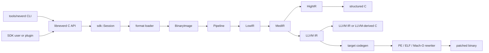

**Langues**: [English](../architecture.md) | [简体中文](../zh-CN/architecture.md) | [繁體中文](../zh-TW/architecture.md) | [日本語](../ja/architecture.md) | [한국어](../ko/architecture.md) | [Français](architecture.md) | [Deutsch](../de/architecture.md) | [Español](../es/architecture.md) | [Italiano](../it/architecture.md) | [Русский](../ru/architecture.md) | [العربية](../ar/architecture.md)

[← Index de la documentation](README.md)

# Architecture de NeverD

Ce guide décrit les frontières de production qu’un contributeur doit connaître
pour modifier NeverD en toute sécurité. Il couvre volontairement uniquement le
code appartenant à NeverD ; les sous-modules LLVM, Capstone et Unicorn gardent
leur propre architecture interne.

## Frontière du système

```mermaid
flowchart LR
  CLI["tools/neverd CLI"] --> CAPI["libneverd C API"]
  SDKUser["SDK user or plugin"] --> CAPI
  CAPI --> Session["sdk::Session"]
  Session --> Loader["format loader"]
  Loader --> Image["BinaryImage"]
  Image --> Pipeline["Pipeline"]
  Pipeline --> Low["LowIR"]
  Low --> Med["MedIR"]
  Med --> High["HighIR"]
  High --> HighC["structured C"]
  Med --> LLVM["LLVM IR"]
  LLVM --> LLVMOut["LLVM IR or LLVM-derived C"]
  LLVM --> Codegen["target codegen"]
  Codegen --> Rewriter["PE / ELF / Mach-O rewriter"]
  Rewriter --> Patched["patched binary"]
```

NeverD possède quatre représentations IR, mais elles ne forment pas une chaîne
obligatoire de quatre étapes. `LowIR -> MedIR` est commun. La décompilation
structurée utilise ensuite `MedIR -> HighIR -> C`, tandis que `lift`,
`decompile --llvm` et `patch` empruntent directement `MedIR -> LLVM IR`. Les
modes patch et lift évitent donc volontairement HighIR.

Le CLI analyse les commandes dans `tools/neverd`, crée un `neverd_session_t` et
appelle l’API publique de `include/neverd/sdk/NeverDCAPI.h`. L’état du moteur
réside dans `lib/sdk/SessionImpl.h` ; `neverd_session_load` choisit un loader et
construit une `BinaryImage`, tandis que les opérations fondées sur l’IR
exécutent `lib/pipeline/Pipeline.cpp` à la demande. L’exécutable `neverd` se lie
à `neverd_shared` ; les archives de composants et leurs dépendances LLVM/
Capstone sont des détails privés de cette bibliothèque partagée. Le CLI
utilise LLVM Support pour son interface en ligne de commande, mais ne
contourne pas l’API C pour piloter le moteur.

L’analyse HighIR `HighSourceFlow` possède les arêtes du flux des instructions émises,
l’identité des variables locales et l’affectation certaine. La validation du source et
l’élimination des copies PHI mortes partagent ce graphe. Des partitions bornées zéro/non-zéro
suivent les gardes scalaires répétées ; les écritures invalident les faits et les variables
dont l’adresse s’échappe restent inconnues. À la limite de partition, l’analyse reprend le
graphe conservateur. Une copie PHI ne disparaît que si sa valeur est morte dans tous les
contextes réalisables. Appels, lectures, écritures et étiquettes conservent leur comportement.

L’analyse d’échappement des consommateurs de blocs utilise aussi ce graphe. Un point fixe borné propage les identités de pointeurs et les emplacements privés de pile à travers les branches et les boucles. Les jonctions conservent les adresses de contexte possibles ; seul un écrasement complet les efface. Les arêtes inconnues, les exceptions et les budgets de preuve épuisés refusent la liaison.

Les faits de récepteur Objective-C distinguent self à l’entrée d’une méthode d’une référence exacte de classe. Tous les enregistrements partageant l’entrée doivent s’accorder avant d’établir self. Les copies de largeur complète et les registres préservés par l’ABI propagent ces faits dans le même point fixe, y compris les retours vers l’entrée. L’accord des déclarations distingue méthodes de classe et d’instance, catégories enregistrées, superclasses et protocoles adoptés ; self inclut aussi les sous-classes connues. Les catalogues du compilateur conservent propriétaires et hiérarchie séparément de l’accord global des sélecteurs. Avant publication, le SDK revalide l’origine du récepteur et les déclarations dans l’image courante. Ces faits ne sélectionnent aucun IMP et n’autorisent aucune réécriture binaire.
Une hiérarchie externe manquante impose l’accord global des sélecteurs, sans restreindre le récepteur ; les déclarations explicitement incompatibles ou non prises en charge restent des preuves négatives.

Les ivar de type objet explicite prolongent la preuve du récepteur par au plus huit chargements de largeur complète. Chaque étape conserve le slot d’offset à l’exécution, sa largeur et tout offset littéral utilisé par l’instruction. Un littéral doit encore correspondre à la disposition actuelle ; une référence d’offset peut suivre un champ déplacé. Le chargeur vérifie la lignée de classes et la déclaration du champ. Les accès partiels, id sans classe, blocs, types limités à un protocole, stockages ambigus et bases inconnues ne donnent aucun fait de classe. La validation du source revérifie tout le chemin dans l’image courante. Ces faits ne prouvent ni l’identité d’objet ni le droit de supprimer des opérations mémoire.

Le chargeur valide des graphes bornés et acycliques de chaînes constantes, objets entiers, tableaux et dictionnaires triés Darwin. Chaque champ et chaque arête exigent une mémoire mappée immuable et des preuves non ambiguës d’importation ou de relocalisation ; les encodages non pris en charge, cycles et graphes incomplets échouent explicitement. Les liaisons source revérifient le graphe et le slot de pointeur entrant. Les fonctions générées préservent les bits entiers, l’ordre des enfants et les adresses partagées, en réutilisant les identités des chaînes. Les slots sont initialisés une seule fois avec publication acquire/release, uniquement par des appels aux enfants validés. Chaque fonction porte leurs déclarations pour permettre le partage d’une définition entre méthodes récupérées indépendamment. Les tests portables couvrent les entrées malformées et les budgets ; les fixtures natives comparent contenu, alias, identité des copies et initialisation concurrente aux méthodes originales.

## Représentations IR et parcours

L’[étape expérimentale de récupération d’interpréteur](interpreter-recovery.md)
spécialise LowIR issu du lifting strict avant la frontière MedIR commune. Son
fournisseur gère les preuves d’immuabilité de l’image, `SymExec` définit la
sémantique des instructions et le CFG résiduel réutilise SSA et les générateurs
de source ordinaires. Les preuves de récupération restent distinctes des
certificats d’occurrences natives et de patch binaire.

`InterpreterSpecialization` gère la propagation arrière bornée des demandes de bits après une tentative échouée. Il réutilise l’évaluateur scalaire sans modifier les faits du graphe ni ajouter de champs de contrôle ou de contextes ; tout travail reste soumis aux budgets et la publication exige une nouvelle preuve complète.

Le raffinement des contextes peut aussi proposer un support d’adresse de huit octets déjà suivi lorsqu’une demande mémoire ultérieure n’utilise qu’une tranche de ses octets. Les coordonnées étroites du producteur restent la référence ; seule la mise en file construit les clés à partir de constantes ou de déplacements de cadre prouvés.

L’énumération finie peut observer des tuples réalisables sans modifier la requête de preuve. Un refus de l’observateur renvoie un résultat incomplet sans tuple. Le cache ne conserve que les preuves mathématiques du domaine ; les certificats de lecture immuable restent locaux jusqu’à la fin de l’énumération.

`NeverDLoader` possède `PEFixedImageView` et partage l’analyse complète des relocations de base avec le chargement PE ordinaire. L’adaptateur d’interpréteur binaire utilise cette vue authentifiée à la base préférée pour la récupération et les preuves natives, sans analyser lui-même les tables PE. La préparation vérifie les écritures des imports, l’identité des mappages et les champs bruts complets avant de certifier les octets. La vue emprunte une image inchangée et ne prouve ni l’ASLR ni l’équivalence de l’initialisation.

`FrameOffsets` possède les preuves budgétées de déplacement unique relatif à l’entrée. La récupération normalise les accès symboliques réels sans modifier les expressions d’adresse résiduelles ; les vérifications natives conservent l’égalité des adresses entre deux exécutions. La récupération gère la sélection exhaustive et les budgets de reprise partagés. L’agrégation des preuves de partitions natif/LLVM reste un travail distinct inachevé. `NativeStackControl` gère le nettoyage interne non signé sur 16 bits ; le fournisseur binaire authentifie les encodages canoniques dépilant huit octets.

Lorsque la découverte ordinaire stagne, la récupération peut partitionner un champ de registre déjà utilisé comme clé de contexte par position native et mode, hors entrée de fonction. Son domaine entrant doit être complet, variable et couvrir tous les bits déclarés. Chaque prédécesseur réel prouve indépendamment son domaine actuel complet, compare le champ physique vivant et reprojette chaque cas. Les nouveaux prédécesseurs et les nœuds élargis sont revérifiés ; le chaînage s’arrête aux entrées proposées. Les comparaisons ont une provenance synthétique et partagent les budgets de nœuds, opérations, contextes, requêtes et raffinements. Masques partiels, drapeaux indéfinis et champs uniquement en mémoire de cadre sont exclus. Aucune lecture invitée ni hypothèse appelante n’est ajoutée. Un domaine incomplet conserve l’arête prudente ; tous les cas accessibles doivent aboutir avant publication.

Le raffinement du contrôle et des gardes précède les essais de partitions de frame optionnelles ; les partitions plus fines nécessaires restent disponibles. Chaque résidu atteint son point fixe avant le suivant, mais la publication exige la réussite de tous les résidus autorisés. L’alignement explicite restreint le domaine des partitions et le dispatch compare les résidus réels. Les budgets de contextes, opérations, nœuds et solveur restent bornés et partagés entre essais. La récupération en état machine accepte `--vm-entry-alignment=A:R` comme domaine explicite et vérifié du RSP initial. `A` doit être une puissance de deux positive et `R < A`. Les autres valeurs renvoient le statut 2 avant tout accès invité ou écriture d’état. Les bits hauts restent libres et aucun alignement n’est supposé par défaut. Cette option ne certifie pas l’équivalence native.

La requête partagée `SymContext::constantWindow` renvoie une tranche binaire seulement si tous ses bits sont prouvés constants. Il suit les extractions existantes, les tranches contenues dans un seul opérande de concaténation, les extensions par zéro et les opérations binaires ; les entrées XOR inconnues et les retenues arithmétiques restent opaques. Le résultat est limité à 64 bits, la récursion à 32 niveaux et le travail à 256 unités. Chaque visite, rejet de profondeur et opérande de concaténation examiné est comptabilisé ; copier une constante coûte aussi son nombre complet de mots de 64 bits. Une preuve incomplète ne fournit aucune constante. `SymState` utilise cette requête en lecture seule pour exporter les octets constants des registres et des temporaires ; les expressions stockées et la reconstruction des mots conservent leur identité. Les régions mémoire n’exportent que les octets littéralement constants : ajouter trop tôt des faits partiels déduits peut fragmenter la provenance des entrées suivantes et augmenter le travail de découverte du contrôle.

`SymState` conserve les octets déjà matérialisés pour un STORE sous contrat explicite de séparation. Le STORE réel reste exécuté ; les autres régions, générations d’invalidation et valeurs inconnues restent dans leur état après écriture. Aucun octet manquant n’est lu ou initialisé. `SymExec` applique le contrat à un seul STORE ordinaire. La récupération conserve séparément les sauvegardes affines complètes et leurs origines ; les jonctions restent conservatrices.

`StringTransfer` possède l’abaissement scalaire borné et ordonné. La récupération possède les preuves de valeurs, les budgets partagés et la recertification des pointeurs de cadre entièrement copiés ; les accès générés réutilisent les contrôles mémoire ordinaires.

Le parcours des dépendances de contrôle ne rapporte les dépendances aux bits de la racine qu’après une analyse complète. La récupération peut omettre l’énumération facultative des adresses de l’image lorsqu’une adresse relative prouvée conserve au moins 32 bits de poids fort libres ; cela ne prouve aucune accessibilité et ne supprime jamais l’accès mémoire.

La même analyse des dépendances de la racine protège la projection affine des contrôles sur toute leur largeur. Son résultat est local à un prédicat d’arête ; les domaines trop grands produisent un refus incomplet hors du cache mathématique. Les masques étroits sont réessayés. Le traitement existant de la faisabilité reste indépendant ; le refus du domaine ne prouve ni l’accessibilité ni l’inaccessibilité d’une arête.

Le cache de requêtes finies comptabilise les clés sérialisées, les résultats numériques et les métadonnées de récence dans une même limite de stockage. Il valide tout le candidat et vérifie que celui-ci tient seul avant toute éviction. Des nœuds stables de la table associative possèdent les clés. Un accès réussi actualise la récence et renvoie une copie propriétaire du résultat, qui reste valide après éviction. Les objets cache ne peuvent être ni copiés ni déplacés. Le remplacement modifie la réutilisation des preuves, sans changer la sémantique des requêtes ni les critères d’admission des résultats.

`InterpreterSpecialization` gère les relations de contrôle conjointes et les domaines finis indépendants. La projection des arêtes ne conserve que des preuves complètes par colonne ; les fusions intersectent les masques et réunissent les valeurs remasquées. Après initialisation du même état symbolique, la reconstruction combine ces domaines et le prédicat conjoint, en préservant l’identité de la pile et les bits non contraints. Seules les contraintes d’appartenance impliquées par une vérification exacte de tous les tuples peuvent être omises. Cette politique de précision ne change ni les clés de contexte ni l’authentification des retours natifs.

`FrameEntryConstraints.h` possède le prédicat sans rebouclage partagé entre récupération et preuve relationnelle. `InterpreterSpecialization` gère l’enchaînement borné des transferts uniques et le rejeu validé. Ces options C++ sont désactivées par défaut ; l’adaptateur binaire conserve la vérification du contrat et sa liaison au condensat.

`modelInterpreterMachineStateX64` et l’enveloppe source partagent le générateur des sous-registres invités, des drapeaux empaquetés, du statut du profil et du contrôle. Le modèle remplace seulement les accès à l’objet d’état par des octets de registre explicites et sépare le statut de RAX invité. La sémantique du compilateur et la politique de preuve restent extérieures ; l’appelant possède le domaine d’entrée, les observations, le contrat de cadre et la vérification complète du raffinement.

`NeverDLLVMInterpreterModel` possède l’import scalaire LLVM séparé et borné vers la même ABI d’état brut. `modelLLVMInterpreterMachineStateX64` conserve le vrai statut et produit des gardes de définition. `llvmInterpreterMachineStateContract` fournit toutes les observations et la préservation du moniteur nul ; domaine, mémoire et preuve complète restent à la charge de l’appelant. Cet import ne modifie ni lifting ordinaire ni publication des sources et ne prouve pas le compilateur.

Le modèle LLVM valide les contrats de paramètre `initializes`. Il réutilise les projections des pointeurs d’état et effectue une analyse bornée des initialisations garanties, octet par octet, avant l’émission scalaire ordinaire, sans second évaluateur de valeurs.

`NeverDInterpreterLLVMRefinement` compose les preuves du natif vers LLVM. Il reconstruit les deux modèles et leurs contrats obligatoires, projette les drapeaux uniquement à l’entrée selon le profil de référence, puis revérifie les deux prémisses. Le client propose des plans de boucle sans remplacer modèles, observations ou attestations. Les modèles ne copient que le graphe exécutable et les racines déclarées ; les retours vers l’entrée sont refusés pour éviter une nouvelle initialisation.

L’API C v3 et la CLI transmettent les budgets de champs, de raffinement et de requêtes au spécialiseur commun. L’adaptateur valide tailles et champs reserved avant de lire les extensions ; les dispositions v1/v2 et les valeurs par défaut restent stables. Un budget accru ne modifie ni le contrat d’exécution ni les critères de publication.

La récupération expose aussi `--vm-chain-transfers=N` (0 par défaut) et `--vm-no-control-discovery`. Le chaînage conserve les corrélations symboliques entre transferts dont la cible unique est prouvée ; sa limite revient aux frontières CFG ordinaires. Le mode état machine accepte des offsets d’entrée RSP sans bouclage, non vérifiés à l’exécution, via `--vm-entry-frame=begin:end`. La prémisse numérique exacte accompagne le C et le rapport, sans autoriser d’accès mémoire ni prouver l’équivalence.

Les grandes fonctions récupérées qui dépassent la limite de construction SSA peuvent utiliser `--llvm` avec un contrat borné de stockage scalaire mutable. Les entrées, les valeurs portées par les boucles et les lectures antérieures conservent leur sens. Les états implicites non pris en charge, paramètres en registres vectoriels, relocalisations, stockages ambigus et contrôles mal formés échouent explicitement ; HighC refuse ce repli. La sortie reste soumise au contrat existant de l’état machine, sans certificat d’équivalence supplémentaire.

`analyzeMedMutableSource` centralise la validation du CFG normalisé, les identités de stockage et les exigences conservatrices en octets d’entrée. Ces exigences bornent les lectures ; elles ne prouvent pas leur observabilité. LLVM valide avant les parcours du module et réutilise le plan pour initialiser les entrées une seule fois. Le produit blocs/valeurs et le travail de propagation ont des limites distinctes. Le transfert en C utilise pour chaque lecture une écriture antérieure exacte, de même type et sans alias partiel ; les jonctions entre blocs gardent un stockage explicite.

Pour les corps validés à variables mutables, LLVM transmet les valeurs exactes des emplacements privés dans un même bloc où les instructions sont ajoutées en fin, et conserve les dernières écritures. L’initialisation d’entrée et les frontières de blocs, fonctions et modules restent distinctes. Les accès mémoire du programme restent explicites. L’émission C borne le développement des expressions scalaires et le travail de repliement des constantes, en conservant des intermédiaires nommés. Les expressions constantes réductibles utilisent la disposition cible LLVM ; les expressions non prises en charge échouent explicitement. Les valeurs de retour mutables désignées, y compris zéro, ne deviennent pas des retours void.

Le sous-ensemble mutable accepte un stockage scalaire de 8/16/32/64/128 bits ; les entrées des comptages sont limitées à 64 bits. Les largeurs non standard ou supérieures exigent un contrat source distinct.

Le lifter d’architecture gère transactionnellement les métadonnées annexes des sorties indéfinies : il efface les preuves précédentes avant chaque tentative et ne publie les effets que pour le lifting exact réussi. `Missing` indique une absence de preuve, et non une description `Complete` vide. LowIR conserve ses valeurs déterministes choisies. `LowIRUndefinedIndependence` assure la preuve relationnelle bornée sur un graphe LowIR fourni, complet et acyclique, avec entrées ordinaires partagées et corrélations préservées entre valeurs indéfinies nouvellement produites. Il lie les limites complètes des instructions et les empreintes des opérations, et refuse les preuves incomplètes. La certification générale des graphes natifs, les invariants de boucle et l’équivalence du code natif à C restent des travaux distincts au-delà du périmètre des chemins natifs finis décrit ci-dessous.

Les formes scalaires classiques SHL/SAL, SHR et SAR fournissent des effets indéfinis conditionnels pour les opérandes de 8/16/32/64 bits. Un compte masqué nul conserve tous les indicateurs ; sinon AF est arbitraire, OF devient arbitraire au-delà de un, et CF pour SHL/SHR lorsque le compte atteint la largeur. SAR conserve un CF défini. Les gardes booléennes utilisent le compte sauvegardé avant toute écriture chevauchante ; les opérations sont identiques avec ou sans métadonnées. Les encodages non audités ne publient aucun effet partiel.

Les ROL/ROR classiques produisent un nouveau bit OF arbitraire seulement lorsque le compte masqué architectural dépasse un ; le modulo ultérieur sur la largeur octet/mot ne modifie pas ce prédicat. Un compte nul conserve les indicateurs. BT/BTS/BTR/BTC à base registre produisent quatre bits indépendants (OF/SF/AF/PF), avec CF défini et ZF/DF conservés. Les encodages exacts registre et imm8 sont audités ; chaînes de bits mémoire, LOCK, APX et rotations à travers la retenue restent hors de cet ajout. Les effets suivent le cœur de l’instruction et le LowIR est identique avec ou sans métadonnées. Voir les références Intel de [test de bit](https://cdrdv2-public.intel.com/929353/253666-093-sdm-vol-2a.pdf) et de [rotation](https://cdrdv2-public.intel.com/929354/253667-093-sdm-vol-2b.pdf).

XADD entre registres dispose également d’un audit exact des encodages classiques de 8/16/32/64 bits : CF/PF/AF/ZF/SF/OF sont définis, DF est préservé et aucun nouveau bit arbitraire n’est créé. Les deux registres échangés respectent les règles architecturales d’écriture partielle et d’extension par zéro à 32 bits. Les formes mémoire/LOCK et APX de XADD restent non auditées. La [règle de compatibilité Intel](https://cdrdv2-public.intel.com/929360/253669-093-sdm-vol-3b.pdf) accepte Group 2 `/6` pour C0/C1/D0/D1/D2/D3 comme SAL/SHL `/4`, avec les mêmes gardes de compteur et indicateurs indéfinis. Voir la [référence XADD](https://cdrdv2-public.intel.com/929356/334569-093-sdm-vol-2d.pdf).

Les lectures natives immuables acceptent aussi des ensembles finis exhaustivement prouvés, bornés par `MaxImmutableLoadAddresses`. L’égalité des adresses entre les deux exécutions précède l’énumération. Chaque candidat exige des octets immuables, une preuve de mappage et une séparation du cadre mutable ; la valeur reste dépendante de la sélection d’entrée. Candidats manquants, données modifiables ou relocalisées et budgets épuisés refusent le certificat. Celui-ci lie les témoins de lecture et la limite. Les décalages de cadre dynamiques et la mémoire externe arbitraire restent exclus.

Le comportement suivant applique le contrat d’audit strict par défaut. `checkBinaryUndefinedIndependence` vérifie les chemins natifs x64 complets et finis pour les observations déclarées, en collectant les deux bras des branches directes originales avant tout élagage de faisabilité. Un near CALL physique empile l’adresse réelle de continuation ; un RET interne lit le mot courant de la pile, y compris une cible de retour modifiée. Les cibles indirectes exigent une énumération finie exhaustive et l’égalité des deux exécutions avant restriction du chemin. Les lectures immuables exactes exigent des preuves et la séparation du cadre mutable. Chaque instruction collectée, même dans un bras non emprunté, requiert ses octets originaux immuables ; hormis les limites terminales de `INT3`/`UD2` liftés strictement et la projection RDSSP/INCSSP sous profil explicite décrites ci-dessous, chaque instruction exige aussi des métadonnées architecturales complètes. Les `INT3`/`UD2` liftés strictement peuvent être conservés comme limites `Terminator`, avec tous leurs octets originaux et l’empreinte des opérations LowIR, sans promouvoir un sidecar de sorties indéfinies `Missing` en `Complete`. Un certificat ne peut conserver ces traps que si l’exécution symbolique prouve leur inaccessibilité ; tout chemin réalisable qui en atteint un renvoie `ContractViolation`, sans certificat ni code résiduel. Cette règle ne modélise ni la continuation après un trap ni la reprise après exception, n’utilise aucune heuristique `codeFollowsTrap` et n’étend pas le support de l’API LowIR statique. Les certificats lient octets, mappages, effets, témoins de lecture, profil et budgets de preuve. Le profil explicite normal, sans faute et avec CET désactivé exclut tous les mappages de l’image du cadre d’entrée. Chaque chemin réalisable doit atteindre un retour externe préservant le RSP d’entrée et l’emplacement de retour original avant le pop natif ; un préfixe interrompu ne prouve rien. Les boucles directes et indirectes exigent un déroulement fini complet ; les chemins non terminants ou hors budget et les autres effets non audités refusent le certificat. `specializeBinaryInterpreterWithIndependence` prouve avant de récupérer et ne renvoie aucun résidu en cas d’échec. La récupération ordinaire n’active pas ce contrôle par défaut ; invariants de boucle, exceptions, exécution avec CET et équivalence du natif à C restent exclus.

L’option explicite `RetainUnauditedNativeBoundaries` ajoute des frontières de refus aux preuves natives finies d’indépendance et de raffinement vers LowIR. Seules les instructions strictement décodées et levées, de couverture `Missing`, sans effets et avec une empreinte d’opérations non vide et concordante sont admissibles. Tous les contrôles de structure, contrôle, recouvrement, profil et ressources restent obligatoires. Seule la collecte des successeurs de cette frontière s’arrête ; une autre arête vers les octets suivants reste explorée. Toute arrivée réalisable est refusée avant exécution ; un résultat inconnu ou un budget épuisé ne prouve rien. Les certificats lient des reçus typés et versionnés à la frontière exacte et aux empreintes des octets natifs et des opérations, sans transformer `Missing` en `Complete`. Les suffixes non collectés ne sont pas déclarés audités. L’indépendance couvre tous les choix arbitraires ; le raffinement à valeurs choisies prouve l’inaccessibilité uniquement pour son témoin déclaré. Les API LowIR statiques, de preuve/inférence de boucles et LLVM exactes n’activent pas cette option.

`AllowOverlappingNativeInstructions` est une option distincte, désactivée par défaut, pour les preuves natives finies d’indépendance et de raffinement vers LowIR. Chaque entrée est décodée et vérifiée séparément ; les octets communs doivent correspondre à toutes les preuves antérieures d’instructions et de lectures immuables, y compris celles du candidat. Les adresses LowIR du candidat restent des étiquettes, pas des preuves d’octets. `MaxNativeInstructionBytes` vaut 1048576 par défaut et compte, avant comparaison, la taille entière de chaque nouvelle entrée, même les octets déjà partagés. L’épuisement du budget ou une contradiction interdit tout certificat. L’option et la limite sont liées au condensat de preuve. LowIR statique, preuves inductives de boucles et inférence refusent cette option, même avec un plan vide ; l’API LLVM exacte et la CLI conservent leurs valeurs par défaut.

La preuve native des drapeaux regroupés exige `X64FlagsProfile = UserX64NoFaultV1` dans les options et le contrat ; les booléens existants ne l’activent pas. Les drapeaux d’entrée canoniques partagés et les drapeaux système persistants utilisent la même transition scalaire PUSHFQ/POPFQ que l’enveloppe source de l’état machine, avec les masques CPL3/IOPL0. Chaque POPFQ doit prouver TF/AC nuls dans les deux exécutions, sans supposer cette condition. Les drapeaux système finaux sont toujours comparés, même sans observation des registres ou du cadre écrit. Les certificats lient la version du profil et les empreintes exactes des transitions. Ce profil explicite sans CET autorise une projection NOP exacte des octets canoniques RDSSPD/RDSSPQ vérifiés indépendamment, avec une attestation typée ; les métadonnées originales restent `Missing` et une destination 32 bits conserve tout le registre. Les INCSSPD/INCSSPQ canoniques restent des limites #UD dépendant du profil, avec une attestation de l’instruction originale inaccessible ; toute visite réalisable viole le contrat sans faute, même avec un opérande nul. Les autres instructions CET, l’exécution avec CET et ce profil via l’API LowIR statique restent non pris en charge. Chaque visite d’une boucle finie conserve l’état et renouvelle les choix indéfinis, sans prouver d’invariant.

`checkLowIRRefinement` et `checkBinaryLowIRRefinement` vérifient un raffinement constructif distinct vers un candidat LowIR déterministe. `LiftedBits` choisit les bits calculés par le lifter original à chaque production indéfinie ; `ZeroBits` choisit zéro uniquement lorsque la condition auditée est active. Chaque occurrence dynamique est enregistrée ; copies et sauvegardes conservent ce choix. Les deux programmes partagent les exécuteurs scalaires, de pile physique, de mémoire et de drapeaux ainsi que leur état initial. Tous les chemins possibles doivent terminer, couvrir le domaine initial admis et respecter les préservations déclarées. Les opérandes RETURN, registres observés, drapeaux système natifs obligatoires et l’union des octets de pile écrits doivent correspondre. Les budgets sont communs, avec une limite `MaxTerminalPairs`. Les certificats lient candidat, preuves originales, politique de choix et limites. Un choix rejeté n’exclut pas les autres. Le déroulement fini ne prouve ni invariant de boucle, ni égalité propre à un CPU, ni équivalence du backend C et ne remplace pas l’indépendance des états indéfinis. Les deux API rejettent les temporaires d’entrée qui recouvrent la zone temporaire de mémoire du prouveur. L’API de raffinement binaire exige le même profil `UserX64NoFaultV1` dans les options et le contrat d’observation.

`checkLowIRLoopRefinement` et `checkBinaryLowIRLoopRefinement` ajoutent des certificats inductifs distincts. Les points de coupure appariés et les modèles d’état en LowIR scalaire pur sont des candidats : l’exécuteur commun vérifie l’initialisation depuis l’entrée réelle, la couverture complète des segments, chaque successeur possible, la préservation de l’invariant et les observations finales. Chaque transition entre coupures doit diminuer strictement un rang lexicographique non signé fini ; la projection inverse des paramètres interdit de réinitialiser le rang sans progrès de la machine. La base est l’état d’entrée commun ou, avec `UseEntryPrefix` (`GeneralizeEntryPrefix = false`), un préfixe apparié effectivement atteint dont le prédicat doit aussi être préservé. Les coupures vérifient tous les registres modifiés et toute la trame ; les observations finales conservent les écritures des itérations précédentes. Chaque coupure exige actuellement une adresse unique de chaque côté. La découverte automatique d’invariants ou de rangs et l’alignement arbitraire des contrôles sont hors périmètre. Coupure manquante, invariant faux, rebouclage arithmétique, terminaison non prouvée, sémantique non prise en charge ou budget partagé épuisé refusent le certificat. Le condensat lie le plan, chaque segment natif et les preuves originales. Les API finies et d’indépendance stricte gardent leur sens ; aucun backend C ni choix de bits indéfinis d’un processeur particulier n’est certifié.

L’exigence de conservation du prédicat de préfixe ci-dessous s’applique lorsque `GeneralizeEntryPrefix = false`.

`inferLowIRLoopRefinementPlan` propose des modèles bornés avec l’exécuteur symbolique partagé. Les points de coupure couvrent tous les cycles du CFG ; l’élargissement conserve les bits fixes prouvés et élimine les bornes non signées de préfixe qui ne sont pas préservées. Les compteurs unitaires observés et les phases inférées forment des rangs lexicographiques pour les boucles imbriquées croissantes ou décroissantes. `OriginalPrefix` et `CandidatePrefix` exigent `UseEntryPrefix`. Un point situé après d’autres coupures peut obtenir un préfixe apparié réalisable par une réexécution bornée depuis l’entrée réelle. Ce témoin ne couvre pas le domaine d’entrée : chaque arrivée doit impliquer son prédicat, et la couverture complète de l’entrée et des transitions reste obligatoire. `inferAndCheckBinaryLowIRLoopRefinement` exige une récupération complète et des origines natives uniques, puis relance indépendamment la vérification complète original/candidat. Les propositions et correspondances ne sont pas fiables ; seul `Refinement` peut contenir un certificat. Inférence et preuve gardent des budgets explicites séparés. Cette API C++ ne s’exécute pas automatiquement avec `--devirtualize`. Les préfixes inaccessibles, l’alignement arbitraire du contrôle, les rangs hors recherche, l’équivalence du backend C et les choix physiques des bits indéfinis restent non pris en charge.

La découverte des compteurs unitaires reconnaît aussi les mises à jour de sous-mots alignées sur des octets qui préservent tous les bits extérieurs, après les formes existantes sur mot entier ou étendues par zéro. Avec plusieurs coupures, les exclusions des valeurs limites des tranches ne sont proposées qu’après preuve sur les arrivées concrètes conservées et toutes les arrivées courantes. L’élargissement supprime les gardes invalidées sans les réintroduire et peut découvrir une autre tranche d’un mot déjà connu. Les masques réutilisent le paramètre du mot entier ; rangs et observations complets restent intacts. Les budgets partagés de nœuds et de requêtes ainsi que la vérification complète indépendante restent obligatoires.

Avec plusieurs coupures, chaque tuple de compteurs observés qui échoue est suivi d’une variante précédée d’une phase constante de 64 bits, avant de passer au tuple suivant. Chaque variante consomme une tentative `MaxRankCandidates` distincte et partage le même budget de requêtes. La phase initiale ne doit augmenter sur aucune transition réalisable ; si le reste du tuple n’est pas prouvé strictement décroissant, cette transition exige une diminution stricte de la phase. Les contraintes de différence non négatives rejettent les cycles de poids positif. Des boucles successives peuvent ainsi réutiliser un compteur réinitialisé, tout en conservant les obligations de progression dans les cycles. Les phases existantes entre compteurs peuvent se combiner avec cette phase initiale. Chaque tuple complet est vérifié sous les prédicats de transition complets d’origine, puis le vérificateur final de raffinement contrôle indépendamment le rang proposé. La recherche à une seule coupure n’ajoute pas ce préfixe constant inefficace.

Un candidat à coupe unique doit couvrir tous les cycles des blocs initialement accessibles, y compris ceux déconnectés de l’entrée par la suppression de la coupe. Chaque vérification consomme `MaxCutpointAttempts` avant l’exécution symbolique. Les compteurs scalaires progressant d’une unité sur chaque arête de retour restent prioritaires. Ensuite, au plus huit propositions de tuples de compteurs unitaires observés alternent avec les hypothèses scalaires plus larges de garde ou de borne, une par une. Les hypothèses scalaires restantes précèdent la reprise des tuples sans répétition. Cet ordre ne dépend pas du plafond budgétaire. Chaque essai de tuple restaure le modèle stable complet et les transitions sauvegardés ; un échec du contrôle de domaine ne désactive que cette famille. Les gardes scalaires rejetées ne réduisent pas ce domaine. Les budgets `MaxRankCandidates`, de requêtes, d’opérations et de chemins restent cumulatifs. Le vérificateur complet de refinement reste obligatoire. Une branche de retour additive peut déclencher un élargissement structurel même si les autres branches conservent ou réinitialisent la valeur ; le modèle proposé doit toujours satisfaire toutes les vérifications d’entrée et de transition.

`inferAndCheckLowIRLoopRefinement` cherche une relation vérifiée entre boucles LowIR. Il essaie les plans par défaut, ceux de toutes les entrées de branches, puis leur variante filtrée, avec les mêmes familles avant toutes les paires croisées et enfin les coupures cycliques individuelles. La famille complète sélectionne les successeurs d’un branchement dans la composante cyclique ayant une seule arête sortante. Le filtre omet une branche seulement si tous ses chemins rejoignent un même nœud non terminal avant une cible de retour DFS. Tous les successeurs, sorties et frontières compris, participent ; une convergence à la frontière seule reste admissible. Des coupures gloutonnes couvrent encore chaque cycle initialement accessible. Ces propositions préservent les phases sans exiger une inférence par défaut réussie. `MaxCutSelectionWork` borne séparément l’analyse des chemins communs, construction et comparaison des ensembles comprises ; `CutSelectionWork` compte aussi les échecs et consomme le `MaxSearchWork` global restant. Les sélecteurs par défaut et complet restent inchangés. Succès et échecs sont mémorisés, avec trois plans au plus par côté et des permutations paresseuses. Les familles supplémentaires ignorent les ensembles de coupures déjà conservés du même côté, même issus d’une famille de numéro supérieur. Les familles vides ou redondantes n’utilisent aucune requête symbolique mais comptent comme tentative. Les six plans conservés partagent un budget `MaxMetadata` ; chaque construction d’appariement est bornée séparément. Seules les entrées de frame de même largeur au même décalage sont proposées égales. Le renommage de registres, les relations affines et les ensembles de rétroaction arbitraires demandent un appariement explicite. L'apparieur de référence et le vérificateur complet conservent les relevés audités originaux, le witness, le domaine d'entrée, les observations de frame et les obligations de terminaison de l'appelant. Dans `LowIRLoopAlignmentLimits`, `MaxSolverQueries` est partagé par toutes les inférences et preuves, échecs compris ; chaque appel reçoit au plus le minimum du plafond de son étape et du solde total. `MaxSearchWork`, `MaxMetadata`, `MaxCandidateAttempts`, `MaxPairingAttempts` et `MaxCuts` bornent la construction et l'énumération. Un épuisement par essai permet de réessayer ; un épuisement global arrête la recherche. `Unsupported` signifie qu'aucune relation n'a été trouvée, sans prouver une différence. Seul un `Refinement` nouvellement vérifié avec succès contient un certificat. Les valeurs par défaut du CLI restent inchangées.

`GeneralizeEntryPrefix` vaut `false` par défaut et exige `UseEntryPrefix`. Le mode par défaut préserve le prédicat du chemin capturé à chaque arrivée. Le mode explicite de généralisation traite les expressions du préfixe comme des fonctions totales de modèle non fiables hors de ce chemin. Il exige toujours un témoin apparié réalisable, la couverture complète des entrées et segments, l’égalité de tous les registres et du cadre, les projections, les conditions natives et une décroissance stricte du rang sur le domaine inductif élargi. L’inférence élargit une coupure seulement si un état entrant dépasse le domaine du témoin, puis reconstruit et vérifie toutes les transitions générales. Un premier témoin sans itération ne peut masquer une autre entrée qui boucle. La politique est liée à l’empreinte du certificat inductif.

L’inférence imbriquée peut proposer des bornes non signées strictes ou larges entre des compteurs à pas unitaire observés et des valeurs de préfixe inchangées référencées par les prédicats de contrôle, y compris les sorties par égalité. Elle vérifie d’abord les états concrets puis élimine de façon monotone les relations invalides sur les transitions générales entrantes. Parcours et requêtes restent dans les budgets explicites existants ; le vérificateur original/candidat prouve ensuite les modèles indépendamment.

L’inférence des boucles imbriquées propose aussi une égalité entre un opérande mis en cache et un compteur ou une entrée de contrôle inchangée lorsque leurs expressions de préfixe coïncident. Elle vérifie chaque état entrant concret, conserve les candidats pour les caches découverts lors des élargissements suivants et supprime toute relation violée par un état entrant général. Chaque mot garde son propre paramètre récupérable ; l’égalité est un prédicat vérifié. Les récurrences de copie peuvent accélérer la suppression de bits fixes accidentels, sans supposer de sémantique.

L’inférence imbriquée recherche aussi les comparaisons d’égalité ou d’inégalité mises en cache dans les champs ayant au plus 16 bits variables. Chaque relation utilise les valeurs courantes du compteur et de la borne ; le cache conserve son propre paramètre d’état récupérable. Une garde ou une initialisation simplifiée en constante peut masquer la comparaison jusqu’à un élargissement ultérieur : de nouveaux candidats sont alors possibles, sans réintroduire les candidats rejetés ou supprimés. Ils doivent tenir sur toutes les arrivées concrètes sauvegardées et toutes les transitions entrantes courantes. Les parcours de variables du DAG sont mis en cache par point de coupure et facturés au budget partagé des prédicats. La couverture native complète, l’égalité de tout l’état et la décroissance stricte du rang restent des exigences indépendantes. La découverte des compteurs continue après les transitions générales : un compteur externe masqué par le premier témoin de boucle interne peut encore recevoir des bornes et des copies d’opérandes vérifiées. Les relations rejetées ne sont pas restaurées et les recherches de pas unitaires respectent le budget de nœuds symboliques.

Les rejeux de préfixe d’entrée visitent les branches en attente avant de dérouler encore une boucle précédente. Un témoin atteignable court peut ainsi être trouvé même si une autre branche admet un nombre arbitraire d’itérations. L’inférence et le vérificateur original/candidat partagent cet ordre. Tout le travail reste imputé aux budgets existants ; un témoin de préfixe ne remplace ni la couverture complète des entrées, ni la préservation des invariants, ni les vérifications de terminaison.

| Représentation | Rôle | Définitions et transformations principales |
|----------------|------|--------------------------------------------|
| LowIR | Opérations `NdOp` indépendantes de l’architecture, blocs de base, CFG et métadonnées de tables de saut | `include/neverd/ir/low`, `lib/ir/low`, produit par `lib/decode` + `lib/lift` |
| MedIR | Types, ABI/conventions d’appel, modèle mémoire/pile, drapeaux, appels et flux de données proche de SSA | `include/neverd/ir/med`, `lib/ir/med` |
| HighIR | Expressions et contrôle de flux structurés pour un C lisible | `include/neverd/ir/high`, `lib/ir/high`, émis par `lib/backend/c/HighC` |
| LLVM IR | Optimisation, C dérivé de LLVM, génération de code cible et entrée de réécriture binaire | `lib/backend/llvm`, optimisé/orchestré par `lib/pipeline` |

Les constantes conservent, de LowIR à MedIR puis HighIR, leur provenance scalaire ou adresse et le propriétaire de l’adresse pour chaque occurrence. Des bits identiques ne fusionnent pas des origines différentes. La simplification symbolique de HighIR traite les identités d’adresse comme des entrées opaques ; la liaison du code source utilise la classification commune des opérandes numériques et exige toujours une liaison de relocalisation pour les usages mémoire et pointeur.

| Parcours utilisateur | Chemin des représentations | Sortie |
|---------------------|----------------------------|--------|
| Dump Low/Med | Binary -> LowIR, puis éventuellement -> MedIR | Texte de diagnostic |
| Dump High ou `decompile` | Binary -> LowIR -> MedIR -> HighIR | HighIR ou C structuré |
| `lift` | Binary -> LowIR -> MedIR -> LLVM IR | `.ll` |
| `decompile --llvm` | Binary -> LowIR -> MedIR -> LLVM IR | C dérivé de LLVM |
| `patch` | Binary -> LowIR -> MedIR -> LLVM IR -> codegen | Binaire réécrit |

`lib/pipeline/Pipeline.cpp` est la référence pour la sélection du parcours.
Gardez la logique propre à une représentation dans sa bibliothèque IR ou
backend ; le pipeline doit orchestrer ces composants, pas absorber leurs
algorithmes.

## Contrat de traduction inter-architectures

`include/neverd/translate` définit une couche contractuelle,
pas un backend d’exécution. `GuestState` modélise l’état observable de la machine,
indépendamment de l’architecture, pour `x86_32`, `x86_64`, `AArch64` et `ARM32`.
Sa sérialisation canonique version 1 emploie des champs little-endian de largeur
fixe, des identifiants de registre stables, des collections triées et une
validation fail-closed ; l’état persistant ne dépend donc pas de l’agencement
C++ de l’hôte.

La base wire v1 de `GuestState` est définitivement figée. Tout état hors de
cette base doit employer un ID de registre d’extension dans la plage réservée,
associé à un nom canonique en minuscules, ou passer à une nouvelle version wire
avec un upgrader explicite ; modifier la base v1 sur place est interdit.

Pour un guest `ARM32`, `ExecutionMode` est le mode de décodage faisant autorité
et doit être cohérent avec `CPSR.T`. Le PC enregistré est toujours l’adresse
d’instruction canonique avec le bit 0 effacé ; le mode ARM exige en outre un
alignement sur un mot.

Le contrat des paires définit `x86_64 -> AArch64`,
`AArch64 -> x86_64`, `x86_32 -> AArch64/ARM32` et
`ARM32 -> x86_32/x86_64`. `ContractDefined` signifie qu’une requête peut être
validée et persistée, pas que le code peut être traduit ou exécuté. La politique
JIT n’accepte que l’hôte natif du processus ; la politique AOT exige une
architecture hôte et un target triple explicites ; un CPU ou un ensemble de
fonctionnalités sélectionné doit lui aussi être explicite.

`ResolvedHostTarget` concrétise cette sélection. La résolution `Native` obtient
du processus le triple, le CPU et l’ensemble des fonctionnalités activées ou
désactivées. La résolution `Explicit` valide et normalise l’architecture, le
triple, le CPU et les fonctionnalités fournis par l’appelant, puis rejette les
contradictions. Son identité de cache versionnée est construite dans un ordre
d’octets déterministe à partir de la cible normalisée, sans adresse de processus
ni texte dépendant de la locale.

Un `TranslationExit` versionné enregistre une cause d’arrêt stable et la charge
utile typée correspondante pour les syscalls, exceptions ou signaux, points
d’arrêt, instructions non prises en charge, auto-modification, budgets de
ressources, appels externes, défauts mémoire et autres conditions terminales.
Les consommateurs n’ont donc pas à réinterpréter un entier non typé selon la
cause d’arrêt.

Hors du cas `BudgetExhausted` correspondant, les compteurs d’instructions, de
blocks et de code produit ne doivent pas dépasser le budget non nul de la
requête. L’épuisement des budgets d’instructions et de blocks s’arrête exactement
au limit. La taille d’un objet produit n’est connue qu’après un codegen
indivisible ; son résultat d’épuisement peut donc indiquer `Observed > Limit`.
Cet objet rejeté n’est jamais lié, publié ni exécuté. Chaque charge utile
`BudgetExhausted` identifie exactement le limit demandé, jamais un seuil dérivé
ou privé de l’implémentation.

Le contrat backend-private `RuntimeControlBlockV1` fait
exactement 128 octets, avec un alignement de 8 octets. Il est contraint par des
valeurs v1 fixes de magic, version, taille et offsets de champs, par des champs
réservés à zéro et par des sorties typées cohérentes. Il ne contient ni
conteneur C++, ni pointeur hôte, ni alias d’adresse guest. Ce n’est ni le layout
C++ ni le format wire de `GuestState` ; un backend qui implémente ce contrat
doit convertir explicitement l’état vers cet enregistrement.

La surface d’appel v1 fixe du code produit contient exactement huit helpers :
`nvd_rt_v1_load8_le`, `nvd_rt_v1_load16_le`, `nvd_rt_v1_load32_le`,
`nvd_rt_v1_load64_le`, `nvd_rt_v1_store8_le`, `nvd_rt_v1_store16_le`,
`nvd_rt_v1_store32_le` et `nvd_rt_v1_store64_le`. Leurs noms, signatures et
provenances de pointeurs doivent correspondre exactement ; un backend lie
explicitement cette table finie et ne se rabat jamais sur la résolution
ambiante de symboles. La validation de generation exécutable et le polling de
budget/annulation sont réservés au dispatcher de confiance ;
`nvd_rt_v1_validate_generation` et `nvd_rt_v1_poll` ne sont pas des helpers du
code produit. Le dispatcher hôte de confiance possède aussi la sélection des
blocks et n’est pas appelable depuis l’IR produit ; les translated blocks
renvoient plutôt un code de sortie typé. L’IR produit ne peut lire directement
que le slot runtime scalar-result déclaré.

`RuntimeSymbolRegistryV1` matérialise cette table de helpers sous forme d’un
registre hôte fermé. Sa construction vérifie l’ensemble ABI-v1 complet, les noms
canoniques exacts, les classes de helpers, les signatures et, pour chaque entrée,
un unique pointeur de fonction non nul correspondant à sa classe. La recherche
n’accepte que le nom exact, ne consulte jamais les symboles ambiants du processus
ou du chargeur dynamique et fournit au verifier d’objets la même liste triée de
noms autorisés. Son identité versionnée couvre les noms, les classes et la forme
de l’ABI, mais exclut volontairement les adresses natives ; elle reste donc
stable sous ASLR.

`RuntimeCodeMemory` possède un stockage de code produit isolé par pages et
n’autorise qu’une publication unidirectionnelle `RW -> RX`. La mémoire n’est
jamais simultanément inscriptible et exécutable, ne peut pas être rouverte en
écriture, vérifie les limites des écritures et des points d’entrée, et invalide
le cache d’instructions de l’hôte lors de la publication. Le smoke test natif
n’exécute qu’une courte séquence d’instructions hôte après publication : il
prouve cette frontière mémoire W^X, pas un moteur de traduction.

`GuestMemoryRuntime` est isolé du `GuestState` logique : sa construction valide
d’abord l’état, puis copie les octets et métadonnées des régions dans un index
privé trié. Les adresses virtuelles guest ne sont que des clés de recherche et
ne sont jamais converties en pointeurs hôte. Les accès scalaires vérifiés
signalent des fautes typées de largeur, alignement, débordement, absence de
mapping, franchissement de région, permission, écriture exécutable, débordement
ou discordance de generation et violation de policy. Les budgets
d’instructions/blocks, l’annulation, le suivi de generation et les policies
d’écriture de code `RejectExecutableWrites`, `InvalidateOnExecutableWrite` et
`ValidateBeforeDispatch` produisent eux aussi des enregistrements typés
cohérents plutôt qu’un comportement hôte implicite.

`TranslationObjectCompilerV1` constitue la frontière vérifiée entre LLVM IR et
objet. Il valide un module d’entrée const, le clone avant toute transformation,
compose la simplification sémantique contrôlée par preuve avec l’optimisation
LLVM de `O0` à `O3`, puis valide à nouveau l’IR final et produit des objets
relocatable ELF, COFF ou Mach-O pour les quatre architectures hôtes du contrat.
Il canonicalise les manifests exacts des blocks et symboles runtime après
mangling de la cible, audite chaque objet produit et renvoie l’identité du
registre runtime ainsi que des clés de cache versionnées pour la requête et
l’artefact. Avec un budget d’octets produits non nul, seul un objet conforme
peut atteindre la vérification de l’artefact. LLVM émet d’abord dans un buffer
privé afin de mesurer la taille exacte et indivisible ; un objet trop grand est
rejeté avant publication et audit, avec une télémétrie typée qui conserve la
taille observée et le limit exact demandé. Zéro signifie aucune limite imposée
par l’appelant. Le compilateur s’arrête aux octets relocatable audités : il ne
les lie ni ne les publie, ne les transmet à aucun dispatcher, ne les exécute pas
et ne fournit pas le lowering des instructions guest.

Le verifier post-codegen audite les objets relocatable ELF,
COFF et Mach-O comme un ensemble fermé. Le format et l’architecture doivent
correspondre exactement à l’hôte choisi ; les symboles non définis doivent
appartenir exactement à l’allowlist finie des helpers et les symboles dynamiques
sont interdits. Les relocations suivent des whitelists directes explicites avec
contrôle de l’encoding, de la largeur, de l’alignement, de l’offset, de la
destination chargeable et d’une cible non-preemptible locale à l’objet ou d’un
helper exactement autorisé. Sont rejetés W+X, les métadonnées
unwind/exception/initializer, TLS, IFUNC, GOT et l’indirection PLT ordinaire, les
relocations dynamiques, les définitions weak/preemptible ou sélectionnables,
les sections allouées inconnues et les directives de linker. L’écriture
`R_X86_64_PLT32` employée par LLVM pour un appel ELF x86-64 hidden n’est admise
que si la policy v1 prouve une branche directe sealed vers le helper runtime
exact ; elle n’autorise aucun chemin PLT ou GOT. Les artefacts ELF `ET_REL` ne
doivent contenir aucun program header ni segment. Les load commands Mach-O
suivent une liste positive : exactement un segment de largeur correspondante et
au plus une symbol table, dynamic-symbol table, platform-version et commande
data-in-code, avec contrôle de leurs dépendances. Les options de linker et toute
autre commande sont rejetées.

`TranslationObjectRequestV1` est la première tranche publique, volontairement
étroite, qui transforme des octets guest en objet au-dessus de ces contrats.
Dans le sous-ensemble v1 fail-closed publié pour les registres scalaires x86-64,
elle n’accepte que les encodages canoniques sans préfixe legacy : les formes
`MOV`, `ADD`/`SUB` et `AND`/`OR`/`XOR` avec REX.W sur des GPR pleine largeur dont
les opérandes ont les formes LowIR registre/immédiat prises en charge. Les formes
arithmétiques conservent leurs calculs de flags scalaires ; les formes logiques
et `TEST` calculent les flags définis par l’architecture tout en préservant `AF`
dans le modèle d’état NeverD. Le schéma 9 accepte aussi le `CMP` pleine largeur
registre/registre `39/3B`, le `CMP` registre/immédiat `81/7`, `83/7` et `3D`, le
`TEST` pleine largeur registre/registre `85` et registre/immédiat `F7/0` et
`A9`. Les
encodages canoniques `C3` `RET` et `C2 iw` `RET imm16` terminent les blocks de
retour ; les encodages `JMP` directs relatifs canoniques `EB cb` et `E9 cd`
terminent les blocks de branchement direct. Le schéma de lowering publié est 9.
Les branches Jcc traditionnelles, canoniques et sans préfixe legacy se limitent
à : `JO`/`JNO` court `70/71 cb` ou proche `0F 80/81 cd` ; `JB`/`JAE` avec
`72/73 cb` ou `0F 82/83 cd` ; `JE`/`JNE` avec `74/75 cb` ou `0F 84/85 cd` ;
`JBE`/`JA` avec `76/77 cb` ou `0F 86/87 cd` ; `JS`/`JNS` avec `78/79 cb` ou
`0F 88/89 cd` ; `JP`/`JNP` avec `7A/7B cb` ou `0F 8A/8B cd` ; `JL`/`JGE` avec
`7C/7D cb` ou `0F 8C/8D cd` ; et `JLE`/`JG` avec `7E/7F cb` ou `0F 8E/8F cd`.
`JRCXZ`/`JECXZ`/`JCXZ` et `LOOP`/`LOOPE`/`LOOPNE` restent non publiées et
échouent en mode fail-closed. Le `F7 /1` réservé, les opérandes de mémoire guest,
les registres partiels, les préfixes legacy et les bits d’extension REX
sémantiquement redondants échouent aussi en mode fail-closed. Elle produit
uniquement un objet relocatable ELF ou Mach-O AArch64 little-endian audité. Les
opérations ordinaires sur la mémoire guest, les formes de registres partiels,
toute instruction ou tout encodage hors de ce sous-ensemble exact, les flux de
contrôle autres que les retours, ces sauts directs et les branches sur un seul
flag publiées ci-dessus, et toute opération LowIR non implémentée par le lowerer
sont rejetés avant la production de l’objet. La lecture vérifiée
de l’adresse de retour requise par `RET` appartient à son contrat de terminaison
et ne publie pas un lowering
général de la mémoire guest. La requête reconstruit et valide le descripteur du
block, utilise la même target machine résolue pour le lowering et la production
de l’objet, et combine la simplification sémantique contrôlée par preuve avec la
pipeline d’optimisation `O2` par défaut de LLVM. Cette tranche ne couvre pas les
autres instructions x86-64, les autres couples guest/hôte ni le sens inverse
AArch64 vers x86-64.

Le point d’entrée C public
`neverd_translate_x86_64_block_to_aarch64_object_v1`, le wrapper Python ctypes
`translate_x86_64_block_to_aarch64_object` et la commande
`neverd translate-object` exposent cette même frontière limitée à l’objet.
Python utilise `TranslationObjectFormat.ELF` ou `.MACHO`. Les échecs de
traduction native lèvent une `TranslationError` typée portant un
`TranslationErrorCode` ; la validation locale des arguments lève plutôt
`TypeError` ou `ValueError`. En cas de succès, Python renvoie un résultat
immuable qu’il possède. Le résultat C possède les octets de l’objet, les
identités de cache stables et la télémétrie d’optimisation ; la CLI écrit
uniquement l’objet ELF ou Mach-O sélectionné. Les
trois surfaces s’arrêtent avant le linking, le chargement, le dispatch,
l’exécution et le débogage ; ce ne sont pas des interfaces de session d’exécution.

`verifyTranslationLinkGraphV1` ajoute un second audit indépendant avant toute allocation.
Il construit un graphe LLVM JITLink éphémère à partir d’un objet ELF ou Mach-O
AArch64 accepté, puis vérifie sa cible, les permissions des sections, les
manifests de symboles block/runtime, la fermeture des symboles externes ainsi
que les types et cibles des arêtes. Le graphe est détruit après production d’un
résultat d’audit sans adresse. La réussite de cet audit ne lie, n’alloue, ne
résout, ne charge, ne publie, ne dispatche et n’exécute aucun code.

`linkTranslationObjectV1` est la frontière distincte de linking natif. Elle
réaudite le descripteur de confiance, l’objet brut et le graphe JITLink avant et
après le pruning, l’allocation, la résolution des symboles et les fixups. Les
symboles runtime proviennent exclusivement du registre scellé. Un credential de
dispatcher lie l’unique entrée du manifest à sa session, à l’identité du block,
au PC d’entrée guest, à la génération du cache et à l’époque du code ;
l’invocation exige aussi que le `RIP` guest du runtime corresponde à cette entrée.
Après finalisation réussie, la mémoire exécutable est publiée avec ses permissions
finales. Unload révoque les nouvelles invocations et attend une invocation active
avant de libérer l’allocation. L’overload sans credential reste réservé à l’audit
et ne permet aucune invocation.

`NativeTranslationSessionV1` assemble ces éléments en une frontière d’exécution
C++ expérimentale de x86-64 vers AArch64 natif. Dans un processus ELF ou Mach-O
AArch64 little-endian, elle conserve le même runtime de mémoire guest vérifié et
le même état guest fixe entre plusieurs blocks d’une boucle de dispatcher
compile-link-validate-invoke-unload. Un saut direct canonique reprend à sa cible
statique exacte. Une branche canonique publiée sur un seul flag ne reprend qu’au
successeur taken ou fallthrough déclaré par le manifest du block ; le dispatcher
rejette tout autre PC sélectionné. Un retour termine l’exécution. Les budgets
globaux d’instructions, de blocks et d’octets d’objet produits restent exacts
entre les blocks. Lors d’un arrêt guest réussi, l’état exécuté et la mémoire
faisant autorité sont commit ensemble. L’annulation est linéarisée par rapport à
ce commit final.

Il s’agit d’une tranche verticale exécutable, pas d’un traducteur complet. Elle
ne couvre pas les instructions ordinaires de mémoire guest, les registres
partiels, le flux conditionnel hors de la tranche exacte schema-9 des Jcc
traditionnels ci-dessus — notamment `JRCXZ`/`JECXZ`/`JCXZ` et
`LOOP`/`LOOPE`/`LOOPNE` —,
le flux indirect, les appels, le calcul flottant, SIMD, x87, les opérations
atomiques, les instructions système, la propagation générale des exceptions,
le cache de blocks, les autres couples guest/hôte ni le sens inverse AArch64
vers x86-64. La session d’exécution n’a
encore aucune surface C, Python, CLI ou JSON ; le débogage reste séparé et non
pris en charge. Les API objet restent utilisables sans activer l’exécution native.

Le contrat de l’IR produit impose que tout translated block qui lui est soumis
soit hidden et non-preemptible et utilise le C ABI
`i32 (ptr state, ptr runtime)`. Les blocks ne sont découverts que par un registre
privé, jamais par la recherche ambiante de symboles du processus ; les appels
directs entre blocks sont interdits.

L’IR verifier limite aussi la largeur des entiers à celle du registre scalaire
de l’hôte afin d’éviter les compiler-runtime libcalls connus introduits pendant
la legalization. Cette vérification est nécessaire, mais pas suffisante : tout
backend d’exécution qui implémente ce contrat doit auditer exactement les
transferts de contrôle post-codegen, le `MachineIR` et les relocations de
l’objet cible par rapport à la même runtime-symbol allowlist finie.

Les loads et stores directs de TranslationIR, ainsi que les valeurs des private
constants, ne peuvent contenir qu’un seul entier scalaire dont la largeur ne
dépasse pas celle du registre scalaire de l’hôte. Les agrégats doivent être
scalarisés avant la frontière du verifier afin qu’un IR compact ne provoque pas
une expansion non bornée dans le backend.

L’ABI du code produit est définie uniquement pour les entiers scalaires. Le
flottant, SIMD, x87, les opérations atomiques et les instructions système sont
hors de ce contrat. Toute implémentation qui sélectionne
`ProvenSemanticAndLLVM` doit exécuter la simplification sémantique de NeverD,
soumise à preuve, jusqu’à un point fixe conjoint avec l’optimisation LLVM ; la
politique ne fournit pas de backend de traduction exécutable.

## Émulation des pilotes Windows

`lib/emulation` est un composant d’exécution optionnel activé par `NEVERD_ENABLE_DRIVER_EMULATION`. La CLI `emulate-driver` y accède par l’API C publique. `DriverSession` gère l’initialisation x64 WDM bornée et les appels séquentiels optionnels create/IOCTL/read/write/cleanup/close/unload ; le mappage Windows utilise le `BinaryImage` complet du chargeur existant, et le modèle Windows gère les objets invités et la sémantique des API. Sous `driver-strict`, l’adaptateur Unicorn, KVM ou WHP sélectionné utilise la même autorité de mémoire physique partagée et d’espace d’adressage. Les capacités propres au backend distinguent les callbacks du moteur portable de la validation architecturale native avant entrée. Cette voie n’utilise pas le pipeline expérimental de traduction native et n’en modifie pas le profil pris en charge.

Unicorn est configuré une seule fois via `cmake/NeverDUnicorn.cmake`, partagé
avec les tests sémantiques et disponible avec `BUILD_TESTING=OFF`. Les API
inconnues et les comportements non modélisés de l’environnement CPU provoquent
un arrêt explicite ; un échec renvoyé par le pilote reste distinct d’une
émulation incomplète. Voir [l’émulation des pilotes](driver-emulation.md) pour
les limites, les rapports et les opérations de cycle de vie non prises en charge.

L’API C d’origine reste limitée à l’initialisation. Le JSON de scénario utilise
un seul parseur strict avec les mêmes options d’exécution ; les champs et types
de requêtes sont déclarés dans des inventaires `.def`. Le changement de base
demandé et l’initialisation du cookie de sécurité appartiennent au chargeur
d’exécution. Le modèle Windows possède les objets IRP, emplacement de pile et
fichier et valide l’achèvement synchrone ou en attente par élément de travail ; la session ordonne les callbacks
sous des budgets d’exécution communs. Les imports inconnus inutilisés sont
liés paresseusement ; les exécuter ou lire des données exportées non modélisées
provoque un arrêt explicite.

Un registre partagé des exports attribue des adresses invitées stables aux
imports statiques et à la résolution dynamique. La disponibilité reste distincte
de l’implémentation de l’API : les exports explicitement absents renvoient NULL,
les exports présents non modélisés provoquent un piège à l’appel, et la
disponibilité dynamique non spécifiée provoque un arrêt. Le modèle de requêtes
possède les identités de fichiers indépendantes et les MDL propres aux requêtes,
dont il contrôle les
permissions et l’expiration des mappages. Les API d’exécution lisent les arguments
variables invités via le lecteur Win64 vérifié de la session. Le backend
conserve la première cause structurée d’un défaut ; l’observation et les rapports
ne reprennent pas une CPU en défaut et ne traitent pas ces défauts backend par les exceptions
Windows.

Le modèle Windows gère aussi les MDL autonomes de pool non paginé : libérer le descripteur ne libère pas le tampon sous-jacent. Les chaînes de MDL et l’association aux IRP restent non modélisées. Un modèle de registre distinct gère l’arbre explicite du scénario, les droits des handles et la durée de vie des clés et valeurs, indépendamment de l’inventaire des exports. La préparation et l’exécution partagent les mêmes règles de validation. Le rapport conserve les valeurs finales et le déchargement vérifie les handles encore ouverts.

`KernelScheduler` gère l’ordre des files prêtes, l’identité des callbacks et les échéances ; `KernelDispatcher` possède les objets opaques DPC, timer et événement et leurs signaux. `KernelModel` gère les attentes, les durées de vie travail/périphérique et l’achèvement IRP. `DriverSession` suspend et reprend des piles séparées et des contextes CPU complets, y compris les arguments Win64 sur pile, avec mémoire partagée. Le temps virtuel progresse aux échéances de timer, d’attente ou d’annulation uniquement en l’absence de contexte prêt ; sur CPU0, l’ordonnancement coopératif déterministe exécute les DPC à `DISPATCH_LEVEL` et le travail à `PASSIVE_LEVEL`. Threads/APC/spinlocks généraux, annulation WDM/PnP hors des contrats décrits, soumissions concurrentes de scénarios publics, PnP/alimentation complet et matériel général restent hors périmètre. Les plafonds IRQL proviennent de `KernelAPIIRQL.def` ; le modèle propriétaire vérifie les restrictions dépendant des arguments.

`KernelModelDeviceStack` conserve dans un seul enregistrement le propriétaire pilote, l’allocation, les voisins, la suppression différée et les références internes de chaque périphérique. La liste invitée `NextDevice` et le graphe d’attachement détenu par l’hôte sont distincts. La résolution de nom garde le périphérique inférieur nommé pour `FILE_OBJECT` et les rapports, choisit le sommet courant pour le dispatch initial et les indicateurs READ/WRITE, puis conserve la route entière. Détachement/suppression n’invalident pas les périphériques encore détenus par une requête ou un callback ; `ReferenceCount` ne compte que les handles ouverts.

`KernelModelIRPStack` gère les curseurs bornés, le dispatch vers la cible exacte et le déroulement de fin dans le paquet original. Les écritures inline Copy/Skip/SetCompletion restent la référence. Statut de dispatch, contrôle de fin et `IoStatus` final sont distincts ; pending peut se propager après le retour du dispatch. `STATUS_MORE_PROCESSING_REQUIRED` conserve IRP/MDL/tampons jusqu’au déroulement final repris, y compris pour les fins imbriquées. `KernelGuestCall` porte un propriétaire de sous-système et un jeton local pour éviter les collisions WDM/WDF ; `DriverSession` conserve cadres CPU et IRQL hérité. Un pilote invité peut se rattacher au-dessus de PDO du scénario appartenant à un propriétaire distinct ; les IRP alloués directement par le pilote restent non pris en charge. Attachement/transfert WDF, extension de pile active, détachement intermédiaire, changement de fonction majeure et cibles hors route restent exclus. Chaque emplacement inférieur consommé est remis à zéro avant le callback de fin supérieur.

`DriverPnp.h` et le fichier public `DeviceLifecycle.def` définissent les énumérations du cycle de vie et les contrats imposant un statut de succès exact ; la validation préalable du scénario et la fin définitive côté invité partagent `devicePnpFinalStatusError`. `KernelModelPnpDevices` gère l’identité stable des PDO, l’inventaire distinct du pilote fournisseur et les observations réelles d’AddDevice. `KernelModelPnpRequests` relie les transactions du cycle de vie et l’identité immuable du périphérique/fichier à l’enregistrement IRP existant, sans inventer de rejet d’E/S à partir d’un état arrêté, en attente de suppression ou d’alimentation. Les IRP ordinaires atteignent le véritable dispatch invité ; le pilote décide quelles opérations réussissent, échouent ou attendent. `KernelModelPnpCompletion` gère la réception et la fin réelles sur le bus ainsi que les échéances virtuelles, en réutilisant `KernelModelIRPStack` et les continuations identifiées par propriétaire. La fin supérieure définitive valide l’état du cycle de vie ; un succès PnP exige un transfert achevé vers le fournisseur, tandis qu’un échec précoce de Start/QueryStop/QueryRemove peut laisser les observations du bus nulles. Stop/CancelStop/SurpriseRemoval/CancelRemove/Remove exigent exactement STATUS_SUCCESS. QueryStop avec STATUS_RESOURCE_REQUIREMENTS_CHANGED (0x119) est rejeté, car la nouvelle interrogation des ressources n’est pas modélisée. Le retrait du fournisseur et le détachement/la suppression par l’invité restent distincts ; les périphériques invités non libérés ne sont jamais supprimés silencieusement. Les huit fonctions mineures courantes utilisent des profils de bus explicites ; l’exécuteur public reste séquentiel et Remove exige des fichiers fermés ainsi que des requêtes antérieures terminées, tout en autorisant les callbacks qui libèrent les verrous de suppression. Les autres opérations PnP, les autres modèles matériels/de ressources et le contrat KMDF PnP au-delà du sous-ensemble décrit ne sont pas fournis.

`DriverPower.def` déclare les noms des types et actions d’alimentation ainsi que les origines des requêtes, tandis que `DriverPnp.h` partage un même `DriverPowerOperation` entre les paquets de scénario et les FIFO de réponses propres à chaque PDO. `KernelModelPowerRequests` gère les données explicites des paquets, les routes capturées et l’état de notification de chaque DEVICE_OBJECT ; `PoSetPowerState` renvoie la précédente valeur explicite de notification de cet objet sans modifier la transaction du cycle de vie. `KernelModelPowerCompletion` gère les véritables requêtes enfants de `PoRequestPowerIrp(Query/Set)`, chacune avec son propre IRP, sa ligne de résultat et son indice de réponse. Il ne consomme que la tête correspondante de la FIFO du PDO, ne déduit jamais un parent du contexte du callback et n’emprunte pas son résultat. Le dispatch imbriqué et les callbacks terminaux void à cinq arguments réutilisent les continuations identifiées par propriétaire, les routes conservées et des piles séparées ; l’instantané de statut reste valide pendant les attentes jusqu’au retour du callback. La fin synchrone d’un enfant peut précéder le retour STATUS_PENDING de l’API, et un parent système S0 peut finir avant son enfant périphérique D0. La fin supérieure définitive détermine l’état observé du cycle de vie ; les observations du bus restent indépendantes. Ce profil borné exige DO_POWER_PAGABLE sans DO_POWER_INRUSH et un dispatch à PASSIVE_LEVEL, prend en charge Query/Set pour D0/D2/D3 et Working/Sleeping3 et conserve le SystemContext explicite de 32 bits comme donnée opaque. Il ne fournit ni politique générale d’alimentation, ni arrêt/hibernation, ni matériel général, ni soumission simultanée arbitraire de scénarios publics.

`KernelModelPowerCompletion` émet aussi WAIT_WAKE natif sans FIFO. `KernelModelPnpRequests` possède le ticket START réussi ; `KernelModel::ProviderWakeIRPs` retient un seul IRP exact, natif ou framework, par PDO. `KernelProviderCallbacks.def` déclare les routines d’annulation propres au fournisseur, distinctes des imports. `KernelModelIRPStack` possède achèvement, MPR et callback final ; seul le paquet réellement retenu et incomplet peut rester garé. `KernelModelPowerEvents` capture des cibles typées framework, natives `(PDO, START, IRP)` ou PoFx. Un événement périmé ne peut viser un remplacement ; succès et annulation réclament la même propriété. Aucun changement d’alimentation ni propagation WDM parent n’est inféré. WAIT_WAKE accepte Working/Sleeping3 en D0 stable après START inférieur réussi ; l’émission WAIT_WAKE reste à PASSIVE_LEVEL et une route WDF refuse l’émission native avant allocation.

`PowerRequestDelivery` distingue Inline/Queued. `planPowerRequest` valide route, opération et cycle de vie sans mutation ; après vérification de la mémoire et de la capacité, `commitPowerRequest` réserve IRP réel, ticket et références. `DeviceLifecycle::validateSystemPowerRequest` partage validation et limite des tickets avec begin. Query/Set élevé ne lance aucun callback immédiat et ne baisse pas l’IRQL. `WDMDispatch` place le vrai PC dans le FIFO PASSIVE ; `WDMProviderDispatch` est une tâche interne typée sans PC exécutable et transforme au besoin son même emplacement en `WDMCompletion`. PowerDispatch et `ScheduledModelContinuations` sont réutilisés sans work item invité ni emplacement supplémentaire. La route capturée protège les objets après détachement/suppression logique jusqu’à la fin des callbacks.

`DriverUsbIdle.def` centralise le vocabulaire public et `KernelUsbIdleValues.def` l’ABI WDK. `KernelUsbIdle` possède uniquement identités IRP/START, emprunt de l’info, causalité callback/D2 et première cause ; IRP, topologie et cycle de vie gardent leurs autorités. `KernelModelUsbIdle` valide les paquets et le lot composite/capacité avant les callbacks PASSIVE `GuestCallOwner::UsbIdle`. L’annulation dédiée retire les callbacks en file ou attend leur retour réel. `KernelModelUsbIdleReceipt` reprend la réception originale après IoCompletion/MPR, y compris la tâche du fournisseur seul. Réception et acquittement matériel restent séparés ; l’ancienne inscription est retirée avant le callback pour protéger le réarmement. Les observations reposent sur des faits ; phase `UsbIdleCallbackPhase`.

`KernelModelFrameworkUsbIdle` possède le stockage/retrait des vrais paquets et info, en réutilisant `KernelUsbIdle`. Le callback natif est une liaison fournisseur typée, pas du code invité exécutable. Les tâches `FrameworkUsbIdle` deviennent de vrais callbacks WDF dans le même emplacement ; fin D2, retour callback et fin IRP gardent leurs identités. Maximum utilise DeviceWake explicite ; clé/époque exactes et prévalidation composite précèdent toute mutation. Activité et retrait annulent l’ancien IRP. Les files gérées, directes ou après transfert, attendent le véritable acquittement D0 et D0Entry.

`KernelFramework::Device` sépare `PowerQueuesHeld` physique de `PoFxComponentHeld` ; `queuesHeld()` les combine pour la présentation. L’acquittement Required vérifie D0 sans attendre circulairement l’activation qu’il permet. `CompletePowerNotRequired` clôt le propriétaire exact du callback PoFx après rétention USB ou refus explicite en D0 ; hors USB, Dx réel reste requis. USB conserve l’identité IRP/START. `DispatchQueues` valide avant publication et capture la file sélectionnée lors de `WdfDeviceEnqueueRequest`. La continuation conserve ce trajet et transfère la vraie propriété parent de l’objet. Les changements ne déplacent aucun ancien propriétaire IRP. En D0/`RemovePending`, la transition invitée réellement échouée dans `PoFxQuiesce` et le token Required exact déjà retourné autorisent atomiquement quiescence/acquittement. L’IRP garde son échec et son nettoyage, sans F0/ActiveCondition ni disponibilité inventée.

`KernelRemoveLocks` est l’unique autorité pour l’enregistrement des verrous de suppression, leur appartenance exacte à un DEVICE_OBJECT, leur taille, la multiplicité des Tags et le signal mémorisé de fin de vidage. Il est distinct des transactions `DeviceLifecycle` ; ni l’état du PDO ni un Tag ressemblant à un IRP ne désignent le propriétaire. `KernelModel` valide le stockage complet dans l’extension et les limites d’accès opaques, dirige les quatre exports Ex et enregistre des attentes RemoveLock typées et reprenables. La dernière libération rend l’attente prête avant le retour du callback, à l’aide des continuations CPU existantes sans callback artificiel. La vérification bornée du contexte AndWait exige une route REMOVE associée et la réception effective du fournisseur, sans imposer la fin de la couche inférieure ni un paquet Tag encore valide ; elle ne reproduit pas intégralement Driver Verifier. L’admission REMOVE conserve les exigences de fichiers fermés et de requêtes antérieures terminées, tout en autorisant les callbacks qui libèrent les verrous. La session conserve la route REMOVE pendant les cadres restants et valide le démontage final avant de libérer sa propriété. Les vérifications du stockage des acquisitions et attentes précèdent le passage en suppression différée ; le retrait physique de l’extension désenregistre le verrou. Le vidage ne consomme aucune référence de work item ou de route.

`DriverResources.h` / `DriverResources.def` et `DriverInterrupts.h` / `DriverInterrupts.def` définissent les affectations fixes de mémoire et d’interruptions de `register_bank`. `DriverScenario` possède la validation préalable JSON/native ; `DriverResult` enregistre la configuration initiale sans dupliquer l’état observé de la banque. Seul `KernelResources` possède les affectations brutes/traduites compactes, les générations de ressources, la présence physique et l’alimentation. `KernelMMIO` possède les valeurs persistantes des registres et les alias de mappage indépendants ; `KernelInterrupts` possède les connexions opaques, les verrous et les impulsions explicites. `KernelModelResources` crée les paquets START en lecture seule et intègre l’achèvement réel du fournisseur : le START inférieur réussi publie sa génération avant les callbacks supérieurs, et le SET de périphérique effectivement achevé par le fournisseur met à jour l’accès D0/D3. Le nettoyage après START échoué ou STOP/REMOVE est vérifié avant l’achèvement final de l’IRP, après que les callbacks supérieurs ont pu démapper et déconnecter, sans nettoyage implicite. Le retrait surprise refuse immédiatement l’accès matériel. `GuestMemory` et `UnicornBackend` valident les transactions CPU/API entières avant les effets MMIO et conservent le premier défaut. Le redémarrage avec affectation fixe conserve les valeurs. RAM arbitraire, rééquilibrage des ressources, ports, interruptions partagées/de niveau/par message et autres interfaces DMA restent non pris en charge.

`KernelInterrupts` lie chaque impulsion explicite au jeton de connexion et à la génération de ressources présents lors de la soumission réussie de la requête source. `KernelModelInterruptEvents` vérifie les capacités de tous les producteurs simultanés avant de faire avancer l’horloge ou de modifier les observations, y compris le nombre exact de callbacks d’annulation du framework ; timers, achèvements du fournisseur et annulations ne peuvent pas consommer silencieusement la place réservée à une ISR. La publication réelle de l’état matériel par le fournisseur précède l’éligibilité de l’impulsion ; les interruptions admises précèdent DPC et callbacks passifs. L’ordonnancement reste coopératif : le temps virtuel n’avance qu’à vide, et un délai nul n’implique pas de préemption d’instruction. `KernelModelInterrupts` décode l’ancienne ABI à onze arguments et les champs Ex sélectionnés ; `KernelGuestCall` donne aux callbacks d’interruption un propriétaire et un jeton distincts. ISR et callbacks de synchronisation détiennent le même verrou non récursif au DIRQL affecté ; les contextes CPU imbriqués préservent IRQL/CR8 de l’appelant, et BOOLEAN n’utilise que AL. Les verrous manuels exigent la même identité d’exécution et l’IRQL sauvegardé ; un callback ne peut pas retourner avec un verrou encore détenu. Les impulsions armées survivent à leur IRP source. Une connexion perdue, une génération indisponible ou D3 lors de la livraison produit un motif explicite de non-livraison et un arrêt, sans nouvelle liaison ni comportement inventé de registre enable/ack. `DriverResult.Interrupts` contient des observations indépendantes, jamais d’IRP synthétiques ni d’achèvements NTSTATUS.

`DriverDMA.h` / `DriverDMA.def` définissent les capacités explicites par PDO et les transactions externes indépendantes. `KernelPhysicalMemory` enregistre les allocations RAM actives exactes, attribue des identités de pages partagées et retient les plages d’octets ; les MDL sont des vues de cette autorité, pas des copies de tampons. `GuestMemory` / `UnicornBackend` offrent un accès à la plage sous-jacente entière en contournant les permissions CPU sans les changer. Ils refusent MMIO, accès pendant l’exécution, réentrance ou état défaillant et mémorisent les défaillances inattendues du backend. `KernelDMA` gère domaines logiques indépendants, identités de méthodes liées à l’adaptateur, mappages communs/SG, admission des registres de mappage et références de callbacks. `KernelDMAEvents` résout les époques PDO capturées lors de la livraison réelle. `KernelModelPhysicalMemory`, `KernelModelDMA` et `KernelModelDMATransfers` relient la propriété originale des allocations/MDL aux véritables callbacks invités indirects. Les ressources SG disponibles permettent une livraison immédiate ; les callbacks en attente réservent identité et capacité jusqu’à leur promotion FIFO. Les durées de vie du mappage et du callback sont distinctes : Put peut libérer les références aux données/descripteur avant le retour du callback, et retenir un callback ne maintient pas un IRP achevé en vie. `DmaWritable` enregistre l’intention de verrouillage indépendamment des permissions CPU. Au même instant, la publication du fournisseur précède les effets DMA sur la RAM, puis l’éligibilité des interruptions. Époques, présence et alimentation restent exclusivement dans `KernelResources` ; DMA ne déduit aucun registre constructeur, ne déclenche aucun IRQ, n’achève aucun IRP et ne possède pas de second cycle de vie. Les adresses logiques ne sont jamais recyclées et les échecs de validation d’une transaction conservent les observations sans changer la RAM. L’interface modélisée fournit des tampons communs cohérents, du SG DMA version 1 et des canaux DMA traduits de maître de bus sur une RAM modélisée bornée. Matériel général, contrôleurs subordonnés et autres interfaces DMA restent non pris en charge.

`KernelDMAChannels` étend le même allocateur de domaine avec des réservations de canal et une FIFO typée SG/canal. Il sépare l’état du callback, les registres de mappage conservés et le mappage global de chaque opération. Une opération de canal réserve une seule fois sa plage logique et agrandit sur place un seul maintien physique. Les appels MapTransfer entrelacés ne copient donc pas la RAM, ne facturent pas deux fois les registres et ne chevauchent aucun autre mappage. Des plans purs de transfert, retour, vidage et libération valident les identités et les lots complets de promotions avant publication. `KernelModelDMAChannels` décode l’ABI indirecte et la véritable capture de CurrentIrp à l’enregistrement ; il partage avec SG l’outil de vue MDL. Le type distinct `DMAAdapterControl` de l’ordonnanceur partage l’ordre DMA, la capacité et la préservation du parent des callbacks imbriqués. Seul le modèle DMA interprète les 32 bits bas de l’action de retour. Un IRP capturé en attente est protégé avant le déroulement terminal de sa pile. L’entrée du callback libère cette rétention d’entrée, permettant l’achèvement depuis son corps. Le vidage global retire les octets mappés ; FreeMapRegisters exact retire la réservation indépendante. Le contrat de cache cohérent de `KeFlushIoBuffers` ne satisfait aucune de ces deux obligations.

`KernelFramework` gère les liaisons KMDF 1.33, l’identité de la table, les objets et contextes WDF, les initialisateurs de périphériques de contrôle, les files manuelles, séquentielles et parallèles limitées ou illimitées, par défaut ou non, et les handles de requête. Ses interfaces typées pour les périphériques et les requêtes délèguent à `KernelModel` l’espace de noms WDM, le stockage, l’état des paquets, le mappage MDL et la validation de l’achèvement ; aucun des deux composants ne crée de périphériques ou d’IRP en double. Le routage des files distingue le statut de dispatch géré par le framework du retour du callback invité de type `void`. Les continuations d’achèvement exécutent le nettoyage tant que les tampons restent valides, achèvent l’IRP original, libèrent les pages verrouillées et invalident les alias mémoire. Elles détruisent ensuite les objets enfants lorsque les références le permettent ; les références externes ne conservent que le contexte WDF. La suppression des requêtes en attente est refusée avant toute modification des ancêtres ; l’annulation automatique et la vidange lors de la suppression restent exclues. `DriverSession` exécute les callbacks imbriqués avec des budgets partagés. `DriverImage` valide les métadonnées CFG ; `GuardControlFlow` gère les cibles image/API déclarées, et l’adaptateur CPU préserve l’état des appels check/dispatch. Le sous-ensemble PnP pris en charge comprend les paires FDO/PDO directes des périphériques sans ressources ou avec `register_bank` configuré, avec de vrais callbacks AddDevice, d’alimentation, de matériel et de nettoyage. Les autres types de ressources, les politiques d’alimentation des files plus générales, les extensions de classe et UMDF restent hors du profil.

Le scénario définit une échéance virtuelle par transfert avec `cancel_after_100ns`. Le registre de chaque IRP dans `KernelModel` possède cette échéance et l’instant absolu effectif `cancel_requested_at_100ns` ; les scénarios publics restent sériels. `KernelModel` applique le délai nul après routage et avant le callback d’E/S invité, préserve un achèvement antérieur et inclut les délais positifs dans l’avancement à vide. `KernelFramework` gère marquage/retrait, mise en file/livraison et référence interne jusqu’au retour du callback d’annulation. La simple mise en file n’autorise pas l’achèvement ; après livraison, un élément de travail peut l’effectuer en coordination avec le callback qui attend. Conserver un objet WDF ne réactive pas son IRP terminé. `KernelScheduler` sépare annulations et travail, préserve leur type pendant suspension/reprise et partage les budgets de capacité et de dispatch. Les DPC précèdent les annulations FIFO, puis le travail ordinaire et la reprise des attentes passives prêtes. Les callbacks d’annulation suivent le niveau d’exécution configuré de la file ou du périphérique et peuvent s’exécuter à `PASSIVE_LEVEL` ou `DISPATCH_LEVEL` ; les contraintes réelles d’IRQL et de verrouillage restent applicables. Ce contrat limité aux périphériques de contrôle ne fournit ni routine d’annulation WDM ni ordonnanceur général de files.

L’ancien `WdfRequestMarkCancelable` utilise un `GuestCall` imbriqué dans la continuation de l’API pour un IRP déjà annulé. Annulation, nettoyage et destruction finale peuvent attendre ; l’appelant ne reprend qu’à la fin de la continuation. L’annulation après enregistrement utilise toujours le scheduler. `KernelFramework` possède l’identité des handles WDF et les résultats neutres définis pendant/après l’achèvement. Son hôte d’accesseurs délègue l’IRP original, Information sur 64 bits et l’identité MDL à `KernelModel`, qui refuse aussi l’achèvement WDM invité d’un IRP possédé par WDF. Un seul MDL SystemBuffer par requête est créé à la demande ; les tampons directs gardent leur descripteur sans mappage à la simple récupération. L’achèvement invalide les deux types avec l’IRP et les tampons, indépendamment des références au contexte WDF.

`KernelGuestException` est un résultat API typé contenant un statut de 32 bits, distinct des erreurs de modèle et des défauts backend. `DriverImage` conserve les métadonnées d’exception existantes du loader à leur base préférée. `X64SEH` prépare sur ces données un plan pur et borné de transfert vers un catch-all C x64 version 1, avec traduction d’adresses et lectures de pile vérifiées. Il restaure les sauvegardes GPR non volatiles prises en charge à travers les frames auxiliaires ordinaires et sélectionne le véritable handler invité. Il refuse les filtres/finally, personnalités GS/C++, chaînes, enregistrements incomplets, prologues et restaurations XMM rencontrés. `DriverSession` applique le plan de registres validé uniquement à un arrêt API sain, garde les résultats API de trace à null et reprend le handler dans la même exécution. Il n’efface jamais le défaut backend conservé et ne déroule pas une autre pile de callback. Cette frontière prend en charge ExRaiseStatus/ExRaiseAccessViolation/ExRaiseDatatypeMisalignment ; les probes utilisateur, tampons utilisateur verrouillés et reprises après défaut CPU restent des travaux distincts.

## Frontières de réécriture des exceptions

Le compact unwind Mach-O dispose d’un parser strict du `__unwind_info` original,
d’un parser conscient des fixups pour les records `__LD,__compact_unwind`
produits, d’un merge exact des plages originales et produites, d’un encoder
déterministe de pages régulières et d’un installeur transactionnel de la section
finale. L’installeur ne réécrit in-place une `__TEXT,__unwind_info` existante et
file-backed que si la table encodée tient dans sa capacité déclarée. Il
revalide l’architecture, le layout et le byte preimage, met à zéro la fin
inutilisée, puis reparse le résultat et prouve son équivalence sémantique avant
l’unique commit de la transaction Mach-O englobante. Si la section finale est
absente, les records compact produits ne sont pas installés et la transaction
ne peut continuer que par la fermeture DWARF-FDE exacte et authentifiée décrite
ci-dessous ; une section finale existante mais trop petite ou malformée échoue
toujours en mode fail-closed. Les records produits sont
authentifiés par une association exacte, enregistrée par le compilateur, entre
la fonction IR source et le symbole owner MC cible (y compris les définitions
privées, sans deviner préfixe ni mangling), des identifiants de plage opaques et
non nuls et des plages de fragments semi-ouvertes exactes. Chaque FDE produit
doit correspondre exactement à un unique fragment authentifié ; chaque fragment
requis doit correspondre à un unique FDE installé par cette transaction, sauf
s’il est couvert par un record compact non-DWARF exact et strictement validé.
Des fragments adjacents ou disjoints du même owner de fonction peuvent
réutiliser une même recette source ; toute identité absente, dupliquée,
pendante, inter-owner ou incohérente avec ses bornes échoue avant mutation. Le
nouveau segment RX n’est validé qu’après preuve d’un `__LINKEDIT` unique et
terminal dans le fichier et l’espace VM, de décalages vérifiés sans débordement
et d’une relecture stricte du layout final.

Les références externes sont classées à partir du contrat MC fixup complet. Les
appels ne peuvent sélectionner que des cibles callable authentifiées ; les
champs personality du compact unwind produit ne peuvent sélectionner que des
non-lazy pointer slots validés, sans jamais déréférencer leur contenu dans le
fichier. TLS, authenticated pointers, termes soustraits, champs compact
malformés et formes de relocation inconnues échouent en mode fail-closed.

Pour le compact unwind ARM32, l’ajustement de pile encodé et le layout GPR sont
`Complete`. Les sélecteurs de pattern de registres D 0 à 3 sont aussi `Complete` ;
4 à 7 sont `Partial`, car le compact word seul ne prouve pas tous les slots
relatifs au CFA alignés à l’exécution. Une entrée `Partial` peut conserver les
identités de registre prouvées pour l’analyse, mais chaque chemin de réécriture
la rejette en mode fail-closed. Chaque receipt d’installation EH-frame lie
exactement l’architecture cible, la largeur de pointeur et l’ordre des octets ;
le binding DWARF compact-unwind rejette toute divergence de target identity du
receipt. La preuve native throw/catch sur un binaire lié reste à produire.

La transaction de section ARM32 de plus haut niveau est plus étroite que le
décodeur compact unwind. Elle n’est activée que si le header Mach-O vaut
exactement `CPU_SUBTYPE_ARM_V7K` et si les bits `N_ARM_THUMB_DEF` de la table
des symboles originale authentifient positivement chaque fonction requise
comme code Thumb. Le triple exact `thumbv7k-apple-watchos` et le mode Thumb
restent ensuite liés pendant toute la génération de code, dont les exigences
de features d’entrée ne doivent pas dépasser le plafond Cortex-A7. Les
fonctions non marquées ou de mode inconnu, les sous-types génériques non-v7k,
le mode ARM, les cibles de code externe mixtes ou inconnues, le point d’entrée
in-place ARM Mach-O et le patch ARM Mach-O depuis une source C échouent en mode
fail-closed avant toute mutation de la sortie. Les entrées stripped dont les
fonctions ne peuvent être découvertes que par `LC_FUNCTION_STARTS` ne sont pas
encore prises en charge.

PE, ELF et Mach-O possèdent chacun des composants d’exception propres au
format, mais NeverD ne publie pas encore de pipeline de réécriture de bout en
bout couvrant tous les formats et tous les types d’exception. Un encoding non
pris en charge ou des exigences de registration/layout non résolues doivent
échouer avant toute mutation de la sortie ; les capacités partielles existantes
ne doivent pas être présentées comme une couverture complète des exceptions.

Reconnaître une personnalité Itanium Ada ou D n’est pas une prise en charge des
exceptions Ada ou D. Les LSDA address-form de GNAT, GDC, DMD et LDC sont
analysables ; les emplacements de type-table restent opaques (`Exception_Id` /
`Exception_Data` pour GNAT, `ClassInfo` pour D) et ne sont jamais suivis comme
`std::type_info`. La reconstruction native émet `personality` LLVM plus des
clauses `invoke`/`landingpad` en forme d’adresse. Le statut corpus-proven est
une affirmation distincte et ne découle ni de la reconnaissance de personnalité
ni du lowering natif.

## Carte des composants

La CLI mobile expérimentale gère l’inventaire des classes APK/DEX et les
requêtes de références dans le code dans `tools/neverd/mobile`. Les deux
parcours partagent avec la reconstruction le lecteur d’enveloppe DEX/MUTF-8
et le validateur des métadonnées ZIP. L’inventaire matérialise uniquement les
identités de classe. Les requêtes observent les opérandes de pool dans le
décodeur d’instructions existant et partagent la validation de l’appartenance
des classes/membres et du flot de contrôle ; aucun décodeur distinct de largeur
d’instruction n’est utilisé. Le décodeur produit des informations compactes de
flot dans les deux modes ; la reconstruction crée en plus des instructions
possédant leurs données. Après validation de chaque opérande, les requêtes ne
conservent que les références sélectionnées. Les entrées privées du pool de
membres empruntent les tables d’identifiants complètes et immuables ; les
modèles de reconstruction et les résultats de référence matérialisent
explicitement des données de membres possédées. Les prototypes empruntent aussi
les listes de types validées. Les deux représentations utilisent le même
formateur canonique d’identité de méthode et le même validateur des indicateurs
d’accès encodés. Le décodeur résout une seule fois les arêtes de branchement
privées en indices d’instructions ; les cibles publiques de reconstruction
conservent leurs PC en unités de code. Les requêtes réutilisent les tables de
classes validées et collectent les étendues des éléments par section de la map,
en vérifiant les chevauchements avant publication même lorsque l’ordre physique
des éléments diffère.
Les débits du budget de travail restent immédiats. Les lectures scalaires,
comparaisons courtes et étapes d’instructions bornées partagent des points de
contrôle de délai ; les opérations plus grandes le vérifient directement.
Les flux de débogage sont vérifiés pour le cadre et l’étendue de chaque élément
de code, sans cache d’un succès indépendant du contexte. Les sites compacts
sont rejoués pour chaque propriétaire d’un élément de code physique partagé.
La recherche gère la sélection littérale des cibles ; la passerelle de conteneur
gère l’agrégation entre DEX et la publication JSON, y compris les unités UTF-16
sans perte des chaînes. `visitZipMembers` valide toutes les métadonnées des
membres et toutes les charges utiles sélectionnées avant de les parcourir en
mémoire ; `extractZip` conserve la validation des charges utiles de l’archive
entière. Les résultats s’accumulent avant publication et excluent explicitement
l’intégrité des charges utiles non sélectionnées. L’inventaire exclut les corps
de méthodes ; les requêtes de références valident tous les corps définis sans
prétendre valider les annotations ou la reconstruction Java. Aucun de ces
parcours n’étend le contrat de formats du SDK binaire natif.

Chaque composant est une archive statique créée par
`add_neverd_component_library`. Le tableau liste les dépendances NeverD
importantes, pas toutes les bibliothèques LLVM et Capstone communes fournies par
le helper CMake.

| Répertoire | Responsabilité | Dépendances importantes |
|------------|----------------|-------------------------|
| `lib/loader` | Détection de format, chargement PE/COFF, ELF et Mach-O, `BinaryImage` normalisée, découverte de fonctions | API LLVM Object |
| `lib/lift` | Sémantique manuscrite des instructions x86/i386, AArch64 et ARM32 | Types de données IR |
| `lib/decode` | Décodage Capstone/native et distribution vers les lifters d’architecture | `NeverDIR`, `NeverDLift` |
| `lib/ir` | Types communs et définitions/transformations LowIR, MedIR, HighIR et intrinsics | Ses quatre sous-composants IR |
| `lib/pipeline` | Détection de fonctions et orchestration des parcours Low/Med/High/LLVM | IR, decode, lift, backend LLVM, debug, passes IR |
| `lib/backend/c` | Rendu HighIR-vers-C et LLVM-IR-vers-C | IR |
| `lib/backend/llvm` | Abaissement MedIR vers LLVM | IR |
| `lib/backend/codegen` | Génération de code cible et patch/réécriture sur place PE/ELF/Mach-O | IR, loader |
| `lib/sdk` | ABI C publique, cycle de vie session, requêtes, persistance, plugins, entrées lift/decompile/patch/audit/hunt | Agrège le moteur dans `libneverd` |
| `lib/pass` | Passes d’obfuscation LLVM IR et exécuteur de passes MIR | IR |
| `lib/debug` | Contextes de debug DWARF, PDB et linker-map | IR |
| `lib/sigs` | Analyse, bases et correspondance des signatures | Loader |
| `lib/libc` | Noms libc connus et prise en charge du modèle d’appel | Composant autonome |
| `lib/safety` | Audit de durée de vie du tas et chasse de débordement de copie sur l’IR levé | Symbolic, Solver |
| `lib/support` | Helpers partagés de chargement binaire | Loader |
| `lib/translate` | Contrats versionnés d’état/policy/exit guest, ABI runtime fixe, mémoire guest vérifiée, audits de l’IR/des objets/LinkGraphs produits, linking natif scellé et dispatcher C++ expérimental de x86-64 vers AArch64 | Contrats IR, LLVM, LLVM Object et JITLink |

`ByteMemoryForwardingPass`, dans `lib/pass/ir/simplify`, reconstruit les lectures entières complètes à partir de la dernière écriture de chaque octet d’un alloca fixe, dans un même bloc. Il accepte les largeurs de 8 à 128 bits multiples de huit et les GEP constants exactement situés dans l’objet, selon l’ordre des octets cible. Les appels, écritures inconnues et accès ordonnés effacent les faits. Le pipeline le place entre deux SROA après la récupération existante des adresses privées, sans supprimer les stores. Parcours des instructions et adresses, octets suivis, utilisations remplacées et IR ajouté ont des budgets finis. Aucun instantané par défaut ; `AllowStoreSnapshots` explicite fige une seule fois la valeur au store et la partage avec tous les fragments. Ce raffinement LLVM facultatif ne certifie ni les valeurs natives définies ni une signature de fonction.

Le point fixe sémantique active aussi `SimplifyNumericMemory`. Dans chaque bloc, les adresses intégrales AS0 obtenues par conversion entier-pointeur doivent partager une racine SSA exacte, des offsets constants modulaires et des largeurs de pointeur, d’index et d’opérande identiques de 32 ou 64 bits. Un seul dernier écrivain fournit une lecture entière ou un sous-mot contenu par décalage et troncature, sans nouvel instantané. Un parcours inverse supprime une écriture seulement si les écritures suivantes couvrent tous ses octets avant leur observation ; plusieurs petites écritures peuvent compléter cette couverture. Une lecture de même racine exacte invalide uniquement les octets recouverts. Les lectures inconnues, racines différentes, appels, exceptions et opérations ordonnées restent des barrières. Des racines différentes peuvent être aliasées ; les écritures finales restent observables. Le cache partage le budget fini `MaxMemorySteps`. Cela ne prouve ni mémoire privée, ni contenus mémoire entre blocs, ni ABI ordinaire.

Une égalité masquée dominante peut prouver tous les bits modifiés par une opération d’adresse AND, OR ou XOR et fournir un déplacement modulaire exact au même point fixe. L’arête choisie doit dominer l’opération elle-même ; une autre valeur ou un chemin contournant le test ne fournit aucune preuve. La découverte du graphe, les parcours des prédécesseurs et les requêtes de garde consomment `MaxAddressSteps`. Aucun alignement fixe ni caractère privé de la mémoire n’est supposé.

Avant ces parcours locaux, un point fixe borné peut normaliser les PHI/select entiers et pointeurs de pleine largeur vers une même valeur d’entrée de fonction plus un offset constant modulaire. Toutes les arêtes entrantes, y compris les retours de boucle, doivent concorder ; un conflit ultérieur invalide les candidats dépendants avant toute réécriture. Les offsets proviennent de l’IR courant, jamais d’une signature binaire. Les conversions avec perte et freeze ne sont pas traversés ; les arêtes undef/poison et les cycles sans ancrage ne prouvent aucune égalité. Aucun contenu mémoire ne traverse les blocs. Le travail utilise `MaxAddressSteps` et chaque adresse réserve tout son coût `MaxNewInstructions`. Un point fixe inachevé ne publie aucun fait partiel. `CanonicalizedAddresses` invalide aussi les analyses lorsqu’aucune lecture ou écriture n’est supprimée.

Les en-têtes publics reflètent ces zones sous `include/neverd`. Évitez de faire
d’une classe C++ interne une partie accidentelle du SDK : les opérations
externes stables appartiennent à l’en-tête C pur et à l’un des fichiers ciblés
`lib/sdk/NeverDCAPI*.cpp`.

## Exécution CPU et frontières des charges

L’exécution CPU est indépendante de l’OS invité et de l’image. La politique OS et l’entrée de processus restent séparées du transport et de l’ISA.

`NEVERD_ENABLE_SEMANTIC_TESTS`, activé par défaut (`ON`), contrôle le groupe de tests de `unittests/semantic` et ses cibles agrégées. Pour construire les tests CPU natifs sans Unicorn, conserver `BUILD_TESTING=ON` et définir `NEVERD_ENABLE_SEMANTIC_TESTS=OFF` ainsi que `NEVERD_EMULATION_BACKEND_UNICORN=OFF`. Les tests natifs KVM/WHP restent disponibles, y compris avec Windows ARM64/MSVC et les en-têtes SDK appropriés. Activer Unicorn sous Windows ARM64 exige toujours une chaîne ARM64 LLVM-MinGW. Cette séparation de construction ne constitue pas une validation native ARM64.

| Composant | Responsabilité |
|---|---|
| `NeverDEmulationCore` | Mémoire, défauts, registres et boucle d’exécution partagée |
| `NeverDEmulationNative` / `NeverDEmulationUnicorn` | Transports natifs KVM/WHP/HVF et exécution portable Unicorn |
| `NeverDEmulationArch` | Admission ISA, état architectural, tables de pages et format FP |
| `NeverDEmulationCPU` | Configuration CPU et composition des moteurs |
| `NeverDEmulationABI` / `NeverDEmulationRuntime` | ABI entiers, sessions CPU et budgets de charge |
| `NeverDEmulationImage` | Plans de mappage des segments du chargeur |
| `NeverDEmulationLinux` / `NeverDEmulationProcess` | Démarrage ELF, politique des services Linux et rapports de processus |
| `NeverDEmulation` | Modèle Windows et cycle de vie du pilote |

Sous macOS, le transport natif [HVF](macos-hvf.md) appartient à `NeverDEmulationNative` : ARM64 sur Apple Silicon, x86-64 sur Intel. L’ISA hôte détermine ce transport, pas l’OS invité. Les [profils Darwin](darwin-emulation.md) définissent séparément démarrage et services de macOS, iOS appareil et iOS Simulator. Les validations encore manquantes pour Linux ARM64 KVM et Windows ARM64 WHP sont distinctes des preuves macOS ARM64 HVF déjà enregistrées. Disponibilité et état complet de validation restent explicites dans le guide HVF.

La fabrique CPU et la requête de capacités partagent `ExecutionConfiguration` ; elles valident architecture, privilège, largeur d’adresse et fonctionnalités avant allocation. `ExecutionBudget` possède un compte commun d’instructions/événements et une échéance monotone absolue par charge ; reprendre ne recharge pas le budget. `ExecutionSession` possède le CPU, ses hooks et les continuations service/défaut en attente. Les sessions peuvent partager mémoire et budget, mais l’exécution est coopérative, sans SMP parallèle. Chaque requête en attente doit être consommée exactement une fois avant reprise. Les erreurs CPU priment sur les arrêts de ressources ; un arrêt inexpliqué du moteur ne signifie pas réussite.

`ImageMappingPlan` consomme les segments existants du chargeur, sans reparsing des headers ni résolution d’imports. Il vérifie étendues complètes et chevauchements avant publication de l’espace. Le profil explicite `linux-elf64-v1` démarre des ELF freestanding `ET_EXEC` et des PIE statiques `ET_DYN` x64/AArch64 avec pile initiale, requêtes de service explicites et sortie bornée. Liaison dynamique, TLS dynamique, signaux, threads OS et services non pris en charge échouent ; TLS statique et SSE/SSE2 borné sur x64 sont pris en charge ; Linux n’est pas déduit de KVM, ni Windows de WHP. Voir [exécution CPU](cpu-execution.md) et [émulation de processus invités](process-emulation.md).

`driver-strict` accepte KVM sur un hôte Linux x64 compatible et WHP sur un hôte Windows x64 compatible ; `auto` sélectionne ce transport natif, et les ISA différentes utilisent Unicorn. Unicorn explicite et l’API V1 conservent le profil logiciel portable. L’exécution native vérifie les adresses canoniques et les effets avant l’entrée ; le matériel indisponible provoque un échec sans repli. Instructions et comportements OS non pris en charge échouent explicitement. La CI native Windows x64 avec Unicorn désactivé réussit les 359 contrôles obligatoires : 131 contrôles CPU, 224 résultats de pilotes issus de 26 images intégrées, 46 images WDK et 40 cas de scénarios aux adresses préférées et relocalisées, ainsi que quatre contrôles de limites SEH ([`9d4c130c`](https://github.com/NeverSight/NeverD/actions/runs/36981864458)). Les preuves natives ARM64 restent manquantes ; aucune compatibilité universelle des pilotes ou Android/Darwin n’est établie.

`DriverImage.def` déclare les limites de taille et d’alignement ainsi que les diagnostics de validation PE stricte ; la largeur des pointeurs provient de `DriverProfile.def`. `DriverImage.cpp` possède la validation et la relocation, sans modifier les images acceptées ni les messages d’erreur.

Interrogez le profil sélectionné avec `executionCapabilities(Contract, ISA, Backend)`. `NativeLegacyX64` décrit l’exécution native des pilotes x64. `NeverDNativeDriverTests` valide le corpus existant et peut fonctionner dans une compilation sans Unicorn.

ARM64 vérifié possède une frontière commune pour l’état complet. `Registers.def` définit 39 champs scalaires et 32 vecteurs de 128 bits ; `captureAArch64State` prépare toutes les lectures, applique les largeurs et normalise NZCV avant une publication unique. Unicorn, KVM, WHP et HVF transfèrent le même inventaire, dont TPIDR_EL0, TPIDRRO_EL0, TPIDR_EL1, FPCR et FPSR. Les adaptateurs natifs activent FP/SIMD via CPACR_EL1. Toute lecture échouée ou entrée annulée préserve l’état complet de l’appelant.

Le démarrage ARM64 KVM/WHP/HVF exécute le programme privé `AArch64MachineProbe.def` : NOP, addition FP32 arrondie vers l’infini positif et addition SIMD à deux voies. Chaque étape compare les 39 champs scalaires et 32 vecteurs, dont TLS, NZCV, l’effacement des bits supérieurs du résultat et la conservation/accumulation de FPCR/FPSR. La sonde utilise uniquement la mémoire de supervision et une échéance globale. Les sondes attestent uniquement cette initialisation bornée. La validation des charges Linux ARM64 KVM et Windows ARM64 WHP reste à établir ; les résultats natifs macOS figurent dans le [guide HVF](macos-hvf.md).

L'initialisation native x64 KVM/WHP/HVF exécute `X64MachineProbe.def` dans des pages supervisor privées. Une échéance unique couvre NOP, l'addition FP32 arrondie vers l'infini positif, l'addition SIMD à deux voies, les lectures FS/GS et CS/SS/CR8 ; chaque pas compare tous les états scalaires, XMM, x87 physiques et de contrôle. Les sondes x64 et ARM64 exigent le bail exclusif d'exécution de la mémoire physique. `MemoryProjection` possède l'identité du cache (ISA, espace d'adresses, génération des mappings, privilège et variante du moniteur) et l'historique des racines validées par ISA. Les constructeurs invalident le cache avant toute réécriture : un remplacement échoué ne réutilise pas de tables partielles et les appelants ne fournissent pas de racines périmées. Les sondes attestent uniquement cette initialisation bornée. La validation des charges Linux ARM64 KVM et Windows ARM64 WHP reste à établir ; les résultats natifs macOS figurent dans le [guide HVF](macos-hvf.md).

Le décodeur XSAVE commun distingue l’état SSE initial standard et compacté. Si XSTATE_BV[1] est nul, les deux formats initialisent XMM ; le format standard lit et valide encore MXCSR, tandis que le format compacté l’initialise. `X64XsaveCases.def` fournit des dispositions indépendantes et des programmes XRSTOR hôtes originaux. `X64XsaveTests.cpp` vérifie l’atomicité des refus et compare les deux formats à l’exécution réelle, en préservant l’état FP/SSE de l’appelant. L’oracle est explicitement ignoré si l’architecture hôte ou la fonction d’instruction requise est indisponible.

`X64FPState.def` déclare les dispositions compactées AVX, AVX-512, CET_U/CET_S et AMX, avec alignement des composants sur 64 octets. Les données présentes doivent correspondre à l’état initial nul ; les composants absents et le remplissage ne définissent aucun état. Les bits de disposition fixent les décalages ; disposition inconnue, données non initiales ou longueur incorrecte échouent avant publication. `CompactedOffsetsFollowLayoutRatherThanPresentBits`, `WideLayoutIgnoresAbsentComponentsAndAlignmentPadding`, `InitialCETComponentsDoNotHideFPState` et `InitialWideComponentsDoNotHideFPState` couvrent les paquets WHP de 872 et 10752 octets. Ce transport n’autorise pas les instructions de ces extensions.

`WhpXsaveRegisters.def` complète les paquets XSAVE avec les registres de contrôle x87/SSE nommés. Le dernier opcode et les pointeurs d’instruction/données sont écrits explicitement puis relus sur l’hôte. Les champs nuls peuvent être complétés ; les conflits non nuls ou les contrôles communs incohérents échouent avant publication. `NamedMetadataRestoresOmittedPacketFields` vérifie ce cas en conservant toute la charge FP.

Les champs natifs `FOP/FIP/FDP` suivent les règles x87 de l’hôte. AMD peut les effacer sans exception non masquée en attente ; les instantanés conservent les valeurs observées. `X64MachineProbe.def` et les tests exacts NOP/contexte initialisent une exception cohérente en attente afin de comparer chaque champ valide sans masquer les écarts. La référence FXRSTOR64/FXSAVE64 du processus hôte vérifie les deux états ; les backends ne remplacent jamais les résultats hôte par les métadonnées d’entrée.

Le codec partagé `encodeX64XsaveState` / `decodeX64XsaveState` possède les paquets FP/SSE standard ou compactés, la rotation TOP physique, l'état initial des composants absents et la validation atomique. WHP utilise les API XSAVE complètes, préférant `WHvGetVirtualProcessorState` / `WHvSetVirtualProcessorState`, avec les anciennes API XSAVE comme voie de compatibilité. Les anciens registres x87 individuels ne remplacent pas les paquets complets. Les composants étendus non initiaux, en-têtes malformés, contrôles invalides et captures tronquées échouent explicitement. Les erreurs de mapping WHP conservent HRESULT, GPA et taille pour le diagnostic.

`CheckedX64Instructions.def` admet `MUL` non signé sur 8/16/32/64 bits et `CBW/CWDE/CDQE/CWD/CDQ/CQO` via le transport CPU existant. `NeverDX64IntegerTests` utilise les encodages et valeurs attendues indépendants de `X64IntegerCases.def` aux deux niveaux de privilège : préservation partielle des registres, extension par zéro sur 32 bits, deux moitiés du produit, résultats CF/OF définis et indicateurs inchangés après extension de signe. La multiplication en RAM ordinaire conserve les contrôles de droits sur toute la plage et les observateurs de lecture ; un défaut ou un arrêt demandé par un observateur préserve les registres de sortie implicites et PC. Les opérandes de périphérique restent non pris en charge. Ces cas exécutent aussi checked Unicorn ; les transports natifs indisponibles sont explicitement ignorés.

`X64BitInstructions.def` autorise `BT/BTS/BTR/BTC` sur registres et RAM ordinaire à 16/32/64 bits. L’index de registre est signé à la largeur de l’opérande et sélectionne un mot entier ; l’immédiat reste dans le mot de base. La troncature à la largeur d’adresse précède l’ajout de la base FS/GS. Le processeur fournit CF et les valeurs écrites ; `RAMTransaction` garde le résultat privé jusqu’à son acceptation par les observateurs. Les permissions sont vérifiées sur toute l’étendue, y compris les allocations de pages distinctes et les alias. Arrêts, échecs de callbacks et accès refusés préservent CPU et RAM. LOCK est limité aux modifications mémoire naturellement alignées ; MMIO et SMP matériel parallèle restent exclus. `X64BitStringTests.cpp` compare des encodages indépendants à l’exécution x64 réelle et vérifie indices négatifs, troncature, franchissements de pages, annulation et formes LOCK invalides. Voir la [référence Intel](https://www.intel.com/content/www/us/en/developer/articles/technical/intel-sdm.html).

`X64StringInstructions.def` définit `MOVS/STOS/LODS` sur la RAM ordinaire en 8/16/32/64 bits ; `CLD/STD` ne modifie que la direction. Chaque élément REP valide tout son opérande avant observation et se valide à une frontière de reprise. Un défaut ultérieur conserve les éléments terminés ; un arrêt ou une exception de rappel laisse l’élément courant intact. FS/GS ne s’ajoute qu’à la source, après réduction de la largeur d’adresse. AL/AX préserve les bits supérieurs et EAX les met à zéro. Un REP de compte nul en adressage 32 bits exige des bits supérieurs de compte nuls, ainsi que ceux des adresses utilisées pour MOVS/STOS : les processeurs réels divergent autrement. REPNE sur MOVS/STOS/LODS et les opérandes de périphérique STOS/LODS restent exclus. `X64StringTransferTests.cpp` compare aux instructions natives indépendantes les largeurs, directions, chevauchements et comptes nuls ; il vérifie aussi permissions, alias, bouclage d’adresse, défauts et reprise. Le pilote WDK de ressources original exécute les quatre largeurs STOS/LODS via `driver_resource_strings.def`.

`X64StringInstructions.def` définit aussi `CMPS/SCAS` sur RAM ordinaire en 8/16/32/64 bits avec `REPE/REPNE`. Chaque élément valide toutes les lectures avant observation, actualise les six indicateurs arithmétiques et s’arrête à la première condition de fin. Un défaut de données restaure les indicateurs à l’entrée de ce REP ininterrompu, tout en conservant les pointeurs et le compteur des éléments terminés ; une reprise publique repart de l’état CPU publié. Arrêts et exceptions des observateurs ne modifient pas l’élément courant. Une fin anticipée ne lit jamais l’élément suivant. FS/GS ne concerne que la source CMPS ; SCAS conserve l’accumulateur et le registre source inutilisé. Périphériques et bits hauts ambigus à compteur nul en 32 bits restent exclus. `X64StringComparisonTests.cpp` compare instructions hôtes indépendantes, indicateurs, direction, alias, bouclage, permissions et reprise ; son oracle Linux x64 capture les registres au défaut réel. Le pilote WDK original exécute les deux répétitions conditionnelles aux quatre largeurs via `driver_resource_strings.def`. Voir la [référence Intel](https://www.intel.com/content/www/us/en/developer/articles/technical/intel-sdm.html).

`WhpResourceCache.h` sépare l’état des CPU logiques des partitions WHP. Le runtime conserve une partition native active et la réutilise pour les étapes successives du même CPU. Un changement de CPU détruit l’ancienne partition avant de reconstruire les mappings, le processeur virtuel et l’état complet. Les CPU logiques gardent leurs vues `MemoryProjection` indépendantes et la RAM de référence. L’acquisition du bail respecte l’annulation et l’échéance courante ; détruire un CPU inactif ne détruit pas la partition d’un autre CPU. x64 conserve les fonctions XSAVE par défaut de l’hôte et vérifie la partition effective avec `WHvGetPartitionProperty`, sans supprimer les fonctions dépendantes pour réduire le masque. Cette alternance coopérative ne fournit pas de SMP matériel parallèle.

`CheckedAArch64Instructions.def` et `AArch64InstructionEffects` admettent à EL0/EL1 un sous-ensemble borné FP32/FP64, comparaisons, déplacements et SIMD à largeur fixe. FPCR conserve quatre modes d’arrondi, FZ et DN ; FPSR conserve les statuts cumulés et QC. Les bits non pris en charge sont rejetés avant mutation. FP16 arithmétique, SVE/SME, exceptions non masquées, extensions optionnelles et formes absentes échouent explicitement. Cela n’ajoute ni chargement des pilotes Windows ARM64 ni nouvel environnement OS.

`AArch64InstructionEffects` possède les empreintes RAM scalaires et FP/SIMD simples ou par paires, jusqu’à 128 bits par opérande. L’espace partagé vérifie chaque page avant l’entrée ; `RAMTransaction` ne valide que les écritures physiques déclarées complètes. Un observateur de 128 bits reçoit deux mots ordonnés de 64 bits avant les effets. Arrêts et fautes préservent RAM, vecteurs et mise à jour d’adresse. Le même numéro Xn/Vn est permis ; les paires dont l’adresse boucle sont rejetées. `NeverDAArch64MemoryTests` utilise `AArch64CrossPageCases.def` et `AArch64VectorMemoryCases.def` indépendants.

KVM x64 lit les registres spéciaux réels avant chaque entrée et compare uniquement les champs du protocole définis dans `KvmX64State.def`. Il réécrit la projection si CR3, CPL, TLS, CR8 ou un autre champ change. Seule une sortie de débogage pas à pas entièrement capturée permet de réutiliser l’état exécutable ; après une exception, une annulation ou un échec d’entrée, cet état est rétabli. `X64StateTransition` vérifie les changements TLS, de privilège et de CR8, les fautes répétées et l’annulation par des lectures sur le CPU réel. KVM compare les registres généraux et l’état FP/SSE complet à la dernière collecte de débogage confirmée, selon `X64HostRegisters.def` et `X64FPState.def`, puis réinstalle les entrées modifiées. Les écritures hôte et les restaurations de contexte participent à cette comparaison ; exceptions, annulations et échecs invalident la réutilisation. Le pas à pas et la lecture de l’état général/FP réel restent effectués pour chaque instruction.

KVM x64/ARM64 utilise `KvmRunControl` pour préparer, entrer dans `KVM_RUN` et capturer l’état sur un même worker vCPU privé. La préparation n’a lieu qu’une fois malgré `EINTR` ; annulation et capture échouée interdisent la publication. `KvmAArch64Machine.cpp` exécute aussi la maintenance des traductions et les transferts scalaires/vectoriels complets sous une échéance commune. L’appelant publie après confirmation et conserve décodage ISA, transactions RAM, politique OS et observateurs. Les preuves natives ARM64 restent manquantes.

## Contrat du lifting strict

`Decoder` et chaque lifter d’architecture démarrent en mode strict. Si Capstone
peut décoder une instruction mais que le lifter choisi ne l’implémente pas, il
lève `UnliftedInstruction`. L’exception enregistre l’adresse, le mnémonique et
les opérandes ; une sémantique non prise en charge doit donc échouer visiblement
au lieu d’être omise ou devinée.

Le chemin interne non strict émet `NdOp::NOP`, mais c’est une échappatoire de
diagnostic, pas une implémentation acceptable. Les tests des contributeurs et
de la CI doivent garder le mode strict. Lors d’un échec strict :

1. Reproduisez-le avec la plus petite fixture propre à l’architecture.
2. Ajoutez la sémantique manquante dans `lib/lift/<ISA>`.
3. Vérifiez la forme LowIR attendue dans `unittests/lift`.
4. Ajoutez un aller-retour différentiel Unicorn dans `unittests/semantic` si l’instruction a un comportement observable.

Ne capturez pas `UnliftedInstruction` uniquement pour laisser le pipeline
continuer. Une nouvelle approximation volontaire exige un contrat explicite et
des tests ; elle ne doit pas se faire passer pour un lifting 1:1.

## Propriété des formats et ISA

La logique du format d’entrée et celle de la réécriture de sortie sont séparées
volontairement :

| Format | Chargement, métadonnées et relocations d’entrée | Patch et relocations de sortie |
|--------|------------------------------------------------|--------------------------------|
| PE/COFF | `lib/loader/COFF` | `lib/backend/codegen/COFF` |
| ELF | `lib/loader/ELF` | `lib/backend/codegen/ELF` |
| Mach-O | `lib/loader/MachO` | `lib/backend/codegen/MachO` |

Les lifters d’architecture résident dans `lib/lift/X86`,
`lib/lift/AArch64` et `lib/lift/ARM`. Les déclarations publiques associées se
trouvent dans `include/neverd/lift`. L’émission LLVM et la génération de code
propres à la cible vivent sous `lib/backend/llvm/<ISA>` et
`lib/backend/codegen/CodeGen<ISA>.cpp`.

### Support et profondeur des tests

La matrice de support racine signifie que chaque cellule est implémentée. Elle
ne signifie pas que chaque opcode, cas limite ABI, producteur de binaire ou
version de système a été testé exhaustivement. Le mode strict échoue de façon
fermée lorsque la sémantique d’une instruction sort de la couverture implémentée
par le lifter.

Les 12 cellules format-par-architecture ont une couverture sémantique du
backend de réécriture dans `unittests/semantic/PatchFullSubstRTTests.cpp`. La
profondeur d’intégration est plus précise :

| Format | x86-64 | i386 | AArch64 | ARM32 |
|--------|--------|------|---------|-------|
| PE/COFF | Fixture liée | Grille backend | Fixture liée | Fixture Thumb liée |
| ELF | Fixture liée + aller-retour sémantique | Pipeline objet + aller-retour sémantique | Fixture liée + aller-retour sémantique | Fixture liée + aller-retour sémantique |
| Mach-O | Fixture liée\* | Pipeline objet PIC/non-PIC\* | Fixture liée\* | Grille backend |

- Une **fixture liée** exerce le loader/pipeline et le patch d’un exécutable
  lié pour des programmes représentatifs.
- Un **pipeline objet** exerce le chargement, toutes les étapes IR et la
  décompilation d’un objet relogeable, mais pas la liaison hôte ni l’exécution
  d’un binaire patché.
- Une **grille backend** compile un IR représentatif via le chemin exact de
  génération pour réécriture et compare le comportement dans Unicorn ; elle
  n’exerce pas le loader de ce format sur un exécutable lié.
- `*` Les fixtures Mach-O liées dépendent d’une toolchain hôte capable de
  produire la cible. macOS moderne ne peut pas lier les anciens exécutables
  i386 ; la couverture utilise donc des objets thin PIC et non-PIC plus la grille.

Les cellules avec fixture liée représentent la preuve d’intégration de format
la plus forte pour ces programmes. Les cellules pipeline objet et grille
backend n’ont qu’une couverture d’intégration partielle. Aucune cellule n’est
« entièrement testée » sans cette nuance ni ne prétend couvrir tout l’ISA.

Les preuves principales sont
[`PatchFormatTests.cpp`](../../unittests/lift/format/PatchFormatTests.cpp) pour les
fixtures ELF et PE liées,
[`COFFARMFormatTests.cpp`](../../unittests/lift/format/COFFARMFormatTests.cpp) pour le
chargement/décompilation Windows ARM,
[`MachOI386RelocationTests.cpp`](../../unittests/lift/format/MachOI386RelocationTests.cpp)
pour les objets thin i386,
[`X86_64_PipelineE2ETests.cpp`](../../unittests/lift/x86_64/X86_64_PipelineE2ETests.cpp)
et
[`AArch64_PipelineE2ETests.cpp`](../../unittests/lift/aarch64/AArch64_PipelineE2ETests.cpp)
pour Mach-O lié, et
[`PatchFullSubstRTTests.cpp`](../../unittests/semantic/probe/patchfull/PatchFullSubstRTTests.cpp)
pour la grille des 12 cellules. Consultez le [guide des tests](testing.md).

## Où modifier

| Changement | Point de départ | Vérification ciblée minimale |
|------------|-----------------|------------------------------|
| Ajouter ou corriger une instruction | Fichiers correspondants dans `lib/lift/X86`, `AArch64` ou `ARM` ; en-tête public si le dispatch change | Test d’architecture dans `unittests/lift` ; aller-retour sémantique dans `unittests/semantic` |
| Ajouter un `NdOp` | `include/neverd/ir/NdOps.h`, puis audit Low-to-Med, emitters/renderers, verifier/emulator et dumps | `NeverDLiftTests` + cas pertinents de `NeverDSemanticTests` |
| Modifier CFG ou découverte de fonctions | `lib/ir/low`, `lib/loader/FunctionDiscovery*.cpp`, `lib/pipeline/PipelineFuncDetect.cpp` | Tests CFG/tables de saut de lift et suite de transformation sémantique ciblée |
| Ajouter une relocation d’entrée ou règle unwind PE | `lib/loader/COFF` | `COFFARMFormatTests` ou nouvelle fixture loader ciblée |
| Ajouter une relocation de sortie ou règle patch PE | `lib/backend/codegen/COFF` | `PatchFormatTests`, `RewriteCodegenRTTests` et grille backend PE |
| Modifier le comportement ELF ou Mach-O | Répertoires `lib/loader/<Format>` et/ou `lib/backend/codegen/<Format>` correspondants | Tests du format plus grille de réécriture |
| Modifier la récupération MedIR/ABI | `lib/ir/med` | Tests lift de convention d’appel + allers-retours sémantiques multi-ISA |
| Modifier la récupération structurée du contrôle | `lib/ir/high` | `NeverDCFGLoopXformTests` et tests C structuré |
| Ajouter une transformation LLVM | `lib/pass/ir`, en-tête public dans `include/neverd/pass/ir`, option pipeline si exposée | Suite de transformation ciblée + `NeverDPatchFullTests` si la sortie patch change |
| Ajouter une opération C API | `include/neverd/sdk/NeverDCAPI.h`, `lib/sdk/NeverDCAPI*.cpp` ciblé, `SessionImpl.h` uniquement pour l’état | Tests sémantiques SDK/CLI ; préserver `neverd_last_error` et les conventions d’allocation |
| Ajouter une commande CLI | `tools/neverd/NeverDCLIOptions.cpp`, `NeverDCLI.h`, `NeverDCmd*.cpp` ciblé et dispatch dans `neverd.cpp` | `unittests/semantic/CLIEndToEndTests.cpp` et smoke test CLI direct |
| Modifier l’audit de durée de vie du tas ou la chasse de débordement de copie | `lib/safety`, `include/neverd/safety`, `include/neverd/sdk/NeverDCAPISafety.h` | `NeverDSafetyTests` et `NeverDSafetyIntegrationTests` |
| Ajouter une régression sémantique | `unittests/semantic/*Tests.cpp` ciblé ; enregistrer un nouveau fichier dans `unittests/semantic/CMakeLists.txt` | Construire son binaire de test, puis sélectionner le cas avec `ctest -R` |

Gardez les modifications étroites. Les fichiers qui définissent une
représentation peuvent évoluer avec leurs transformations, mais les loaders,
lifters et backends sans rapport ne doivent pas être modifiés uniquement pour
uniformiser un refactoring large.

Les déclarations de structures conservent la disposition des champs séparément de la classification ABI. Darwin ARM64 accepte les structures imbriquées contenant un à quatre champs float ou double homogènes ; si les registres flottants sont épuisés, tout l’argument passe sur la pile. MedIR lie chaque composante physique avant SSA, HighIR reconstitue un seul paramètre ou résultat logique et le C vérifie la disposition. Darwin ARM64 et x86_64 acceptent aussi les structures imbriquées de un ou deux entiers ou pointeurs de 64 bits. Lorsque toute la structure passe sur la pile, ARM64 épuise la banque concernée, tandis que x86_64 conserve les registres restants pour les arguments suivants. Le remplissage, les champs compactés, les mélanges flottant/entier et les composantes incomplètes restent refusés ; ces indications ne permettent pas la réécriture du binaire.

Les appels C fixes Darwin ARM64 acceptent aussi les résultats naturellement alignés de trois entiers signés de 64 bits via le pointeur caché x8. La couche ABI source commune classe ce résultat ; Low→Med conserve le pointeur avant l’appel et écrit les champs du résultat logique dans la mémoire de l’appelant. Les registres des arguments ordinaires ne changent pas et x0 ne reçoit aucun résultat. L’analyse des appels invalide les anciennes informations sur cette mémoire. La projection des entrées et les preuves de préservation de l’état natif refusent encore ces résultats faute de preuve sur leur stockage ; les structures de trois mots contenant des champs non signés ou des pointeurs, les arguments de trois mots et les résultats indirects x86_64 restent non pris en charge. Les résultats indirects Objective-C restent refusés par la recherche globale de sélecteur et la recherche ordinaire par récepteur, car un envoi à nil conserve le tampon d’origine. Un appel ARM64 qualifié par récepteur ne peut employer l’ABI fixe du record que si le récepteur est exactement le self non nul de la méthode courante et si x8 désigne toute la plage de frame privée et non échappée. La publication source revalide l’entrée de méthode, l’opérande self, la déclaration du récepteur, la taille du record et les limites de frame ; une preuve absente ou modifiée laisse le message non résolu.
Les appels C fixes sous Darwin ARM64 renvoient aussi des structures naturellement disposées de six valeurs double exactement via le pointeur caché x8. Elles ne sont pas des agrégats flottants homogènes dans la limite de quatre membres en registres. Les paramètres de six double transmis par valeur restent généralement non pris en charge. L’import exact de `CGContextConcatCTM` de CoreGraphics sur arm64 constitue une exception limitée : son second argument physique pointe vers 48 octets, qu’une fonction auxiliaire générée copie dans un `CGAffineTransform` C passé par valeur avant d’appeler la fonction d’origine. Le lien exige le fournisseur fort exact et est revérifié ; aucun autre paramètre de structure indirecte n’est déduit.

La même autorité ABI source accepte les résultats `CATransform3D` de seize double naturellement disposés via x8 sur arm64. Les déclarations extraites par le compilateur et les exports exacts de QuartzCore lient `CATransform3DMakeTranslation`, `CATransform3DMakeScale` et `CATransform3DMakeRotation` ; la conversion conserve les 128 octets du résultat. Ce contrat exclut les paramètres de structure indirects généraux, les retours de matrice Swift ou x86_64 et les résultats indirects Objective-C sans preuve du stockage en cas de nil. Le C généré est testé à O0/O2 sur les seize champs, leurs motifs binaires flottants, les arguments scalaires exacts et les octets de garde entourant le tampon de résultat.

L’import fort exact arm64 de QuartzCore `CATransform3DScale` utilise le même pont de transformation limité. Le pointeur des 128 octets d’entrée occupe x0, trois double utilisent d0–d2 et x8 pointe vers le résultat. HighC copie toute l’entrée dans une véritable structure passée par valeur avant l’appel au SDK, puis écrit les seize champs du résultat. Les exécutions O0/O2 couvrent les tampons séparés ou superposés, les motifs binaires de tous les champs et les gardes aux limites. Les fournisseurs incorrects, imports faibles, tailles périmées et autres ABI sont rejetés.

L’import fort exact arm64 de CoreGraphics `CGRectApplyAffineTransform` traite séparément l’entrée de transformation indirecte de 48 octets dans x0 et le rectangle de 32 octets reçu et renvoyé dans d0–d3. Le pont copie les six champs de transformation dans un véritable argument SDK passé par valeur ; la taille de l’entrée ne dépend jamais de celle du rectangle renvoyé. L’exécution à O0/O2 vérifie les motifs binaires flottants, les quatre champs du résultat, les tampons aliasés et les sentinelles de bord. Les autres fournisseurs, imports faibles, emplacements ou largeurs modifiés et x86_64 restent rejetés.

Les liaisons cible/action de UIKit conservent l’objet cible, `SEL` et l’argument `UIControlEvents` non signé de 64 bits selon leur déclaration. `addTarget:action:forControlEvents:` renvoie void et `initWithTarget:action:` un objet. Ces faits arm64 exigent le fournisseur UIKit exact et l’accord des déclarations intégrées. Lier les appels d’enregistrement n’établit ni signature de rappel ni durée de vie des blocs. Les accesseurs `images` et `viewControllers` exigent également des déclarations UIKit concordantes pour un résultat objet ; les AST complets de l’appareil et du simulateur concordent pour tous les types qui les déclarent.

Les catalogues des appels du runtime ne déclarent `ReturnedArgument` que pour des imports exacts dont le résultat est le pointeur de l’argument initial. L’analyse du récepteur lit l’argument physique déclaré avant les invalidations normales de l’ABI, puis rétablit uniquement son type prouvé sur le résultat. Le SDK revalide cet effet ; les appels, les effets de propriété et les accès mémoire restent présents.

Les catalogues de frameworks et de récepteurs issus du compilateur partagent les fournisseurs Foundation, CoreData, CoreLocation, CoreSpotlight, QuartzCore, UniformTypeIdentifiers et UserNotifications. QuartzCore utilise son en-tête public `CoreAnimation.h` ; les imports de compatibilité d’autres frameworks ne fournissent pas de déclarations propres. Les deux générateurs conservent les quatre profils de prétraitement, les identités exactes et les preuves négatives des déclarations.

Les types de résultats objets prolongent la même preuve bornée du récepteur à partir de déclarations de méthodes concordantes. Les types objets nommés et les types de retour liés déclarés par le compilateur fournissent des faits de classe ; id seul ne suffit pas. Lectures de champs et résultats de messages partagent une limite de huit étapes, toutes revérifiées avec les déclarations courantes avant publication du code source. Les auxiliaires d’allocation importés avec une identité exacte utilisent le contrat de résultat du message correspondant, en conservant les appels, les redéfinitions et les effets de propriété. Des classes de résultat contradictoires ou une hiérarchie incomplète arrêtent la propagation.

Les appels de format conservent leur contrat de langage. Les attributs NSString et les entrées publiques de prédicats sont vérifiés avec le SDK et toutes les déclarations à l’exécution. Les prédicats ignorent les substitutions entre guillemets ; `%K` reçoit un objet nommant une propriété. Les arguments utilisent les promotions scalaires et l’ABI variadique Darwin communes. Les échappements et modificateurs non pris en charge sont refusés. La validation revérifie le langage, l’identité de la constante et les arguments ; le code appelle toujours le parseur du framework.

Les imports C à arguments fixes déclarés par le compilateur et les messages Objective-C partagent la même attribution ABI source pour les structures prises en charge. Seuls les paramètres explicitement déclarés occupent des emplacements ; la couche Objective-C fournit les paramètres cachés du receveur et du sélecteur. Une concordance exacte des exports et des signatures du SDK reste nécessaire. Les callbacks limités aux scalaires et les arguments variadiques conservent leurs restrictions.

Les déclarations de fonctions conservent la convention d’appel dans l’identité de leur signature. La couche ABI commune prend en charge des appels Swift bornés avec des paramètres entiers de 1, 2, 4 ou 8 octets et des paramètres pointeurs ; elle attribue d’abord la banque de registres entiers, puis des supports de pile relatifs au SP d’entrée. Chaque support étroit enregistre sa règle exacte d’extension et les résultats acceptent jusqu’à deux mots entiers ou pointeurs, ainsi que exactement quatre mots complets renvoyés dans x0–x3 sur arm64. HighC conserve `swiftcall` dans les déclarations et définitions. Sur arm64, les paramètres et résultats Swift float et double utilisent la banque de registres FP indépendante ; les arguments FP sur pile et les signatures FP Swift x86_64 restent non pris en charge. Les ponts de valeurs Foundation observés par le compilateur peuvent aussi déclarer un pointeur `swift_indirect_result` et un pointeur `swift_context` : arm64 emploie x8/x20 et x86_64 RAX/R13, sans consommer la banque ordinaire des arguments entiers. HighC conserve ces deux attributs de paramètre. Les imports de métadonnées Foundation publiques exigent un accord entre graphes de symboles du compilateur, IR des requêtes réelles et exports SDK exacts sur ARM64/x86-64 pour macOS et Mac Catalyst. Un suffixe de symbole ne suffit pas à établir l’ABI. Les arguments génériques ou cachés non déclarés, les types de rappel Swift et les supports physiques non pris en charge restent rejetés. Les déclarations Mac Catalyst ne prouvent pas une validation sur appareil iOS.

La génération arm64 de Swift 6.1 établit aussi deux ABI de propriétés flottantes directes : un getter d’extension de `Double` renvoyant `CGFloat` a la signature `swiftcc double(double)`, et l’initialiseur de propriété `Double` d’un type valeur imbriqué non générique a la signature `swiftcc double()`. L’entrée du getter et les deux résultats occupent v0. Seul un arbre de démanglage complet autorise ces déclarations ; la publication exige encore un lifting complet, la validation du corps source et la fermeture des dépendances. Un type externe générique peut présenter le même arbre pour l’initialiseur tout en nécessitant un argument de métadonnées caché ; seul le symbole exact de l’initialiseur vérifié est donc accepté.

MedIR assure la propagation bornée des constantes invariantes à travers les copies SSA de même largeur et les PHI complets, y compris dans les boucles. Toutes les valeurs entrantes doivent converger vers les mêmes bits, largeur, provenance et propriétaire d’adresse. Les définitions inconnues, cycles sans valeur initiale, arêtes incomplètes et constantes contradictoires empêchent la substitution ; un budget épuisé laisse la fonction inchangée. Seuls les opérandes sont remplacés : appels, lectures, écritures et effets sont conservés. HighIR et LLVM utilisent le même résultat.

L’index des propriétaires de code, limité à une opération, conserve aussi les relations exactes entre fonctions principales et fragments décrites par les métadonnées d’exécution. Les recherches indexées et directes partagent le même parcours des relations, préservent les adresses brutes des entrées principales et rejettent les références orphelines ou vers un parent non principal. La validation des cibles, les preuves de bornes et les analyses temporaires de groupes utilisent le même index immuable et le même calcul de coût. Un index d’une autre image déclenche une recherche directe ; un budget épuisé continue de rejeter les preuves incomplètes.

L’ABI source décrit explicitement l’extension signée ou non signée à 32 bits des petits paramètres entiers en registre sur Darwin ARM64 et x86_64. HighIR conserve ces bits dans les copies sauvegardées tout en gardant le type source du paramètre. Les lectures au-delà de 32 bits, le remplissage de pile et les registres écrasés par un appel restent inconnus. Cette règle suit les conventions d’appel ARM64 et Intel d’Apple ; observer un octet bas natif ne prouve aucune extension.

Le chargeur Mach-O conserve la garantie explicite de lecture seule après les relocalisations, sans modifier les permissions initiales du segment. Les lecteurs de données et de pointeurs partagent les contrôles de mappage unique adossé au fichier ; les noms de sections ne prouvent pas l’immuabilité. Un chargement ordinaire de largeur complète peut lier un pointeur local résolu à un objet chaîne constante validé séparément. La liaison conserve son emplacement d’origine pour une nouvelle validation ; les alias partagent l’identité générée de l’objet cible. Le stockage modifiable, les relocalisations contradictoires, les chargements partiels ou ordonnés et l’adresse de l’emplacement lui-même restent non pris en charge.

La récupération des tables de saut produit des transferts vers les blocs successeurs ordinaires au lieu de reconstruire leurs instructions par une autre voie. Chaque bloc garde un seul responsable de conversion, y compris les cas partagés, les cibles par défaut et les entrées de boucle. Les copies PHI de chaque arête s’exécutent avant le transfert correspondant, en conservant les instantanés des affectations parallèles ; les liaisons incomplètes restent des échecs explicites.

La structuration des boucles conserve la propriété exacte des entrées natives. Une enveloppe toujours vraie ne duplique pas le label de la première instruction du corps. La sortie d’une arête de retour conditionnelle rejoint la continuation originale, y compris les copies d’arête sans adresse native. Seules les cibles exactement égales à cette continuation deviennent des break ; les transferts dans les boucles ou switch imbriqués conservent leur portée de contrôle.

L’élimination des valeurs mortes normalise la propriété des entrées natives avant de supprimer les copies PHI des arêtes. Le regroupement partagé distingue l’entrée de branche de son préfixe synthétique direct de copies d’arête ; les labels non contigus ou imbriqués sans relation restent ambigus.

`scripts/collect_objc_sdk_declarations.py` recueille les classes, protocoles, catégories et variantes ABI des méthodes appartenant aux frameworks dans les profils SDK réels des appareils, simulateurs, de Mac Catalyst et du bureau. Chaque profil conserve les preuves des en-têtes publics, des exports et du compilateur, y compris les déclarations non prises en charge et les types de retour objet associés. Une collecte partielle précise sa portée ; tout profil en échec laisse un relevé incomplet. L’artefact CI alimente la vérification ultérieure de cohérence des catalogues sans activer lui-même de nouvelles liaisons d’appels source.

Les faits d’appel Objective-C suivent des emplacements privés bornés de pile, relatifs au SP d’entrée. Aux jonctions du CFG, les valeurs exactes sont intersectées et les octets pouvant dériver de la pile sont réunis : les chemins contradictoires et écritures partielles de registres ne masquent pas une fuite d’adresse. Un appel à ABI déclaré ne conserve que le stockage privé alloué hors des arguments sortants. Fuites, appels inconnus, écritures chevauchantes ou atomiques et libération de pile invalident la preuve concernée. Les arêtes de retour doivent converger avant publication des liaisons.

HighC représente les entiers partiels jusqu’à 128 bits par des types `_BitInt` de largeur exacte. Les accès mémoire ordinaires transfèrent le nombre d’octets de l’IR indépendamment du remplissage des objets C ; les opérations non signées préservent le débordement modulaire et les bornes de décalage. Les accès atomiques de largeur partielle restent refusés au lieu d’être élargis.

HighIR peut réduire une variable locale source de 64 à 32 bits avec les mêmes garanties que pour un support de 128 bits : toutes les définitions doivent partager les mêmes largeurs de support et de préfixe, et chaque lecture doit sélectionner explicitement le préfixe bas. Les écritures de largeur complète, les échappements, les lectures des octets hauts ou les effets de bord de la partie haute empêchent cette réduction. Le remplissage des paramètres source reste inconnu.
Les copies exactes de variables entières peuvent partager cette preuve dans un graphe borné si une définition constructive établit la largeur du préfixe. Chaque destination doit elle-même pouvoir être réduite ; un consommateur de largeur complète invalide toutes les exceptions en amont. Les cycles sans largeur établie, les conflits de largeur et les budgets épuisés conservent les valeurs originales.
Les conversions entières, tranches à décalage nul et extensions bornées peuvent transmettre cette preuve si chaque largeur intermédiaire préserve le préfixe. Chaque usage est vérifié sous la racine de sa propre instruction. Deux passes bornées peuvent révéler un préfixe plus étroit après suppression du remplissage vectoriel.

La validation des paramètres source MedIR remonte les octets requis depuis les résultats déclarés, le flot de contrôle, les effets mémoire et les appels. COPY, PHI, CONCAT, extraction et extension conservent ces besoins ; les autres opérations exigent prudemment toutes leurs entrées. Les parties hautes inutilisées des registres flottants ne créent pas de paramètres supplémentaires. Les parties observables, les graphes incomplets et les budgets épuisés maintiennent le rejet initial. Cette analyse ne supprime aucune opération machine et ne confère aucun ABI de réécriture.

La structuration conditionnelle conserve les copies PHI de continuation sur leur arête initiale. Leur adresse de provenance ne peut pas devenir une nouvelle cible de saut ; si déplacer une séquence exige cette cible, la continuation partagée reste en place. Une boucle synthétique inconditionnelle partage aussi la continuation de sa première instruction native si aucune opération ne précède cet en-tête exact ; un test conditionnel ou des effets antérieurs empêchent cette équivalence.

L’inférence de signature source des fonctions auxiliaires natives prouve un résultat entier complet sur chaque chemin de retour machine grâce à une analyse CFG bornée. Les sorties partagées croisent les faits des prédécesseurs ; les chemins d’entrée empêchent les boucles non initialisées de se prouver elles-mêmes. Les appels et écritures partielles invalident la preuve jusqu’au prochain calcul complet. Les graphes mal formés, les retours limités à une entrée et les restaurations d’épilogue x86-64 restent rejetés. Seule une signature candidate est produite : le second passage doit encore valider le corps et la fermeture des dépendances, sans modifier l’ABI de réécriture.

## Limites récentes de reconstruction de source

- Un accesseur différé de table de témoins Swift n’est reconstruit qu’après preuve du motif de cache `Wl`/`WL`, de la requête exacte au runtime et d’un cache rebâti ; l’adresse originale du cache n’est jamais copiée.
- Pour une paire locale de descripteur de conformité Swift et de métadonnées nominales, les deux identités doivent être exportées de manière unique, le descripteur immuable et les types nominaux démanglés identiques ; un mélange avec un emplacement importé, des exports conflictuels ou des types différents est rejeté.
- Si le code source utilise directement l’adresse du descripteur de conformité, le symbole `Mc` immuable et exporté de façon unique est relié par son nom puis revérifié avant l’émission ; l’adresse de l’image d’origine n’est pas copiée.
- Si une fonction détectée contient du code Swift indépendant après le retour final de l’accesseur, la preuve de celui-ci se limite au préfixe uniquement lorsque toutes ses voies retournent sans saut vers le bloc suivant ; le code restant conserve ses propres diagnostics.
- `Any.self` ne devient une constante que si un membre intérieur exact du conteneur existentiel complet ou l’export public `$sypN` prouve l’identité des métadonnées.
- Une cellule de référence de classe Objective-C conserve son niveau d’indirection supplémentaire et n’est admise que pour un chargement natif typé sans utilisation ambiguë.
- Les décalages d’ivar ne sont fusionnés dans le CFG que si la classe et la largeur concordent et qu’un seul chargement existe. Le getter once d’un `String` Swift de deux mots exige aussi le contrat exact de ses quatre porteurs.
- Un addressor global différé Swift sans paramètre produit par le compilateur n’est reconstruit que si la famille exacte de symboles `vau`/`vpZ`/`_Wz`/`_WZ` correspond à un chargement, un test d’achèvement, un appel `swift_once` authentifié et au retour de la même adresse de stockage sur les deux chemins. Le chargement peut être une instruction distincte ou être intégré au test ; les deux formes doivent préserver la même lecture unique du prédicat. L’initialiseur doit ignorer le context incident et se fermer comme une source ordinaire. La projection crée un nouveau prédicat once partagé et une nouvelle cellule de valeur ; aucune de leurs adresses ni celle de l’initialiseur dans l’image chargée n’est conservée. Son ABI source de callee sans argument ne s’applique qu’aux sites d’appel ; l’ABI d’entrée native reste distincte afin que les porteurs de context incidents demeurent disponibles pour la preuve du contrat.
- Si un tel initialiseur appelle un accesseur de métadonnées de classe Objective-C importée produit par le compilateur, la projection n’accepte que le modèle exact réunissant cache nul, référence de classe, `objc_opt_self`, `swift_getObjCClassMetadata` et publication release. Elle émet directement la recherche runtime authentifiée et ne conserve aucun cache de l’image.
- Un stockage natif nommé ne peut traverser une chaîne exacte d’appels natifs que si chaque fonction prouve sa signature et son usage borné du stockage.
- Les références et caches de métadonnées de types concrets Swift ne sont rebâtis qu’après concordance du descripteur, de l’export et du fournisseur ; aucun pointeur de métadonnées initialisé n’est copié depuis l’image.
- Les références nominales de métadonnées des types Swift imbriqués ou locaux requièrent un chemin de contexte borné et un démanglage sans ambiguïté ; toute ambiguïté est refusée.
- Les noms imprimables des références de métadonnées ne sont reconstruits qu’à partir d’enregistrements complets, non symboliques et non privés. Les entrées mal formées ou contradictoires restent non résolues.
- Un block sur la pile reste vivant pendant les usages ordinaires de la frame. Seuls un consommateur prouvé, une fuite ou une écriture chevauchante révoquent cette preuve.
- Les paramètres block `noescape` du SDK Objective-C ne sont acceptés que si la déclaration parente, le receveur et la position du callback concordent exactement.
- Un stub Objective-C exact et propre à un selector peut lier un format dynamique avec une suite vide, des pointeurs entièrement prouvés ou selon le contrat des entiers complets de 64 bits décrit ci-dessous. Les autres suites, stubs inexacts, conflits de déclarations et divergences d’ABI physique restent non résolus.

Pour un appel runtime lié au source, la conversion Low→Med transmet la déclaration externe authentifiée de non-retour à l’effet d’appel MedIR. Un trampoline d’import du runtime peut aussi figurer dans l’inventaire des fonctions natives. Le point fixe des appels sans retour conserve un fait de terminaison machine existant uniquement si la liaison runtime validée et les opérandes complets de l’appel concordent ; une indication source seule ne crée pas ce fait. La liaison désigne l’emplacement d’import, tandis que l’appel désigne le trampoline. Les effets natifs inférés restent recalculés à partir du graphe courant et la publication du source revérifie l’identité de l’import.

Un auxiliaire ARM64 à flot linéaire peut conserver un contexte d’entrée intact et entièrement observé lorsque deux importations Swift au plus sont revalidées séparément et que seul le dernier appel termine. L’appel précédent qui revient suit les règles ordinaires de modification des registres. La même preuve d’identité des octets et d’absence de fuite du cadre vérifie toutes les opérations précédentes et exige des octets privés entièrement écrits pour chaque argument scalaire de pile sortant. Les branches, retours, arêtes exceptionnelles et appels inconnus restent refusés. L’analyse des entrées limitée aux effets accepte les graphes terminaux prouvés indépendamment ; la preuve par défaut des entrées inutilisées exige toujours un retour observé. Cela produit seulement une signature candidate dont le corps source et la fermeture des dépendances doivent encore être validés.

Un addressor global paresseux Swift ne fournit son ABI de site d’appel à la restauration native que par un contrat reconstruit indépendamment depuis l’image et le résultat de pipeline courants. Le validateur once commun revérifie le corps exact, les identités du stockage et de l’initialiseur, ainsi que l’ABI canonique du rappel, puis prouve que l’initialiseur ignore son contexte. Les indications MedIR ou options persistantes ne constituent pas une authentification. L’inférence vérifie la cible directe exacte et l’ABI sans argument renvoyant un pointeur, puis conserve la preuve complète des occurrences Low/Med et de restauration des octets et du cadre. Les effets ordinaires des appels et de l’initialisation subsistent : aucun contrat de lecture seule, de terminaison ou de clôture des corps et dépendances n’est ajouté.

Un appel ARM64 ordinaire accepte un argument scalaire de pile de huit octets alignés seulement si chaque octet a été écrit dans le cadre privé alloué au sein du même bloc LowIR, sans dérivation d’une adresse de cadre. L’ABI et chaque occurrence native restent vérifiées indépendamment. AAPCS64 autorise le destinataire à écraser sa zone d’arguments : la preuve invalide donc toute la zone des arguments sortants, remplissage compris, après l’appel, avant toute vérification d’arguments suivants ou restauration de registres. Sa réutilisation exige une nouvelle écriture complète. Les définitions entre blocs, mots partiels, appels terminaux et x64 restent exclus, et les vérifications ordinaires de modification et de restauration à chaque sortie restent actives.

Pour le code Mach-O ARM64 lié, LowIR peut suivre un B inconditionnel original vers un épilogue partagé dont toute la plage précède l’entrée de la fonction courante. Cette forme limitée contient uniquement des restaurations LDP pleine largeur de x19–x30 depuis SP, exactement une libération positive et alignée de pile, puis une branche vers un import exécutable enregistré. L’arête exacte doit disposer d’octets immuables à mappage unique, sans corrections ni entrée de fonction intérieure. Les deux contrôles d’entrée du CFG utilisent cette preuve d’arête ; BL, les branches conditionnelles et le passage séquentiel ne peuvent pas autoriser seuls le décodage au-delà d’une entrée. Le bloc décodé conserve tous ses prédécesseurs physiques du CFG. Les chargements, la mise à jour de pile et le transfert externe originaux restent dans LowIR, la fonction partagée reste levée séparément et la preuve de cadre existante décide toujours de la récupération du source. Les blocs partagés antérieurs n’agrandissent pas la fonction principale.

Un contrat supplémentaire de format dynamique sur arm64 accepte une suite non vide d’entiers de 64 bits uniquement si toutes les définitions qui atteignent la valeur aboutissent à une déclaration Objective-C actuellement validée renvoyant le même type entier complet. Les conversions entières de même largeur préservent le porteur ; les lectures brutes, paramètres non prouvés, constantes, cycles, intermédiaires flottants ou étroits et signes incompatibles restent exclus. L’ABI native complète doit correspondre à l’affectation variadique Darwin commune avant la liaison, et la publication répète la preuve des valeurs et déclarations. Le texte du format à l’exécution n’est pas déduit et son analyseur ne change pas : les messages émis conservent le préfixe fixe, la véritable ellipse et les bits d’origine des arguments.

Les transferts de flux source des blocs de pile échangent temporairement leurs faits de sortie avec un état de travail local. Cela évite deux copies complètes des faits locaux et des octets par nœud, tout en conservant les mêmes fusions, budgets de travail et de stockage, preuves de réussite et diagnostics d’échec.

La préservation de l’état natif utilise la correspondance ABI commune et validée pour chaque composante en registre d’un argument structuré, y compris les agrégats flottants homogènes ARM64. Les appels avec cadre de pile et les appels terminaux sans cadre vérifient chaque composante pour détecter la fuite d’une adresse du cadre. L’emprunt du cadre reste lié à l’indice du paramètre scalaire d’origine et n’autorise aucun membre de structure ; les structures sur la pile et le stockage indirect du résultat exigent toujours des preuves distinctes. Ce changement complète uniquement la preuve de préservation, sans modifier l’ABI de la cible ni les exigences de fermeture des dépendances source.

Pour une fabrique de classe Objective-C ARM64 bornée, le SDK prouve les cinq instructions complètes de l’appelant et les neuf instructions du corps partagé avant de projeter cet appelant. L’appelant fixe le compteur de profilage et l’accesseur de métadonnées ; le corps partagé incrémente ce même compteur, appelle indirectement l’accesseur, restaure la pile puis effectue l’appel terminal de conversion de classe Swift authentifié. Les getters de superclasse et les fabriques partagent la preuve actuelle de l’accesseur de classe à huit instructions. L’appel indirect LowIR original conserve son ABI validée indépendamment et la preuve complète de restauration. Les helpers source utilisent le stockage de profilage existant de toute la section, conservent le débordement non signé sur 64 bits et l’ordre des appels, gardent les dépendances des accesseurs et sont revalidés lors de la publication. Les autres appelants et l’ABI native partagée restent inchangés.

La reconstruction de source natif ARM64 ne peut essayer un candidat Float64 que si le retour entier existant échoue au contrôle de son porteur défini. Une preuve SSA réservée à cette reconstruction exige une écriture locale complète des huit octets bas du retour à chaque sortie normale et un appel Float64 accessible, actuellement lié au source, dans leur provenance. Toutes les branches PHI doivent être définies, les définitions doivent dominer leurs utilisations et chaque composante cyclique doit disposer d’une véritable valeur initiale externe. Ce premier périmètre rejette les arêtes de retour vers le bloc d’entrée. Les écrasements partiels par appel suivent le CallSiteId courant et le PreservedInput enregistré pour le préfixe de huit octets préservé par l’ABI cible ; les anciens alias étroits ne remplacent pas cet enregistrement. Les constantes seules, les chargements, l’arithmétique et les retours inconnus ne prouvent pas Float64. Les contrôles des appels actuels, de definedReturnPaths, de l’état natif, du nouveau lifting et des liaisons finales restent obligatoires ; l’inférence générale des types Med ne change pas.

La preuve d’un cadre ARM64 ordinaire peut aussi inclure une sortie exacte par `__stack_chk_fail`, authentifiée par la liaison courante du chargeur et l’import fort `___stack_chk_fail` depuis `/usr/lib/libSystem.B.dylib`. La déclaration doit décrire un appel `void`, sans argument et sans retour. Seul cet appel final peut terminer un bloc sans successeur ni restauration des registres ; toutes les vérifications précédentes de mémoire et d’arguments restent applicables. Au moins un retour normal doit être accessible, et chaque retour normal doit restaurer tout l’état machine à préserver. La preuve distincte des entrées terminales conserve ses règles initiales.

LowIR porte l’identité exacte de chaque appel : adresse d’instruction, séquence d’opération, opcode et cible statique. Les preuves de l’état natif et du résultat source partagent cette identité tout en conservant des autorisations distinctes. Une preuve de résultat ARM64 sur un seul bit vérifie chaque chemin accessible avant de considérer la mise à zéro des bits 63:1 comme inobservable ; une altération de registre autorisée pour un appel ne prouve pas que l’appelé a écrit ces bits. Si une différence atteint un appel, chaque octet volatil des registres généraux, vectoriels et des indicateurs peut ensuite différer ; les octets préservés conservent leurs faits précédents. Les appels ordinaires exigent toujours des ABI complètes établies indépendamment. Le candidat de comparaison Swift authentifié séparément décrit le résultat brut sur un bit du compilateur et le fournisseur exact de l’import ; à lui seul, il ne publie aucune déclaration de retour sur un octet et n’autorise aucune projection source.

HighC émet les écritures mémoire ordinaires avec des fonctions de copie d’octets respectant la largeur exacte de la valeur. Une adresse machine ne prouve ni l’alignement ni le type effectif en C. Instructions d’écriture, expressions d’écriture et affectations en mémoire utilisent le même chemin, qui évalue chaque adresse et valeur une seule fois et renvoie la valeur écrite comme résultat d’expression.

La qualification booléenne Swift combine l’ABI Objective-C d’entrée actuel, les appels directs immuables, l’import fort exact et la preuve complète des consommateurs LowIR. Les autres appels exigent un ABI du catalogue actuel, une preuve complète d’accesseur de classe à huit instructions ou un appel super importé fortement dont l’ABI scalaire complet est revérifié par la déclaration partagée du sélecteur ou du récepteur. La publication vérifie toujours les dépendances natives, le récepteur super et son cadre. Les appels natifs ou dynamiques non prouvés et les occurrences dupliquées sont rejetés ; ces faits seuls ne publient aucun source et ne déclarent pas un ABI de retour d’un octet.

Une entrée native dotée d’un symbole de fonction à son adresse exacte dans l’image peut provisoirement considérer le mot x0 entier comme observable. Après la liaison de son ABI d’entrée complet par l’inférence de source, la publication relance la même preuve LowIR avec cet ABI ; cette hypothèse provisoire ne fournit à elle seule ni liaison source ni ABI de retour sur un octet. L’inférence des registres préservés ne peut utiliser un tel appel booléen qu’après avoir requalifié son occurrence LowIR exacte avec l’ABI d’entrée courante. Les preuves des octets d’entrée et de la restauration complète de l’état déterminent toujours si un registre préservé observé devient un paramètre. Un résultat natif lié sur deux mots ne peut étendre l’observation à x0/x1 que si les deux supports passent la preuve native de la paire ; la publication réinfère la paire complète avant d’accepter l’appel booléen.

Les imports libswiftCore exacts de la graine de Hasher, de String.hash(into:) et de Hasher.finalize peuvent emprunter une zone privée de 72 octets de la pile ARM64 via leur argument ABI Swift vérifié. La preuve d’état invalide chaque octet emprunté après l’appel et rejette le chevauchement avec les registres sauvegardés ou une fuite du cadre ; un nom correspondant sans preuve actuelle de l’import et de l’ABI ne suffit pas.

L’IR client de Swift 6.1.2 attribue aussi à l’import libswiftCore exact `_DictionaryStorage.allocate(capacity:)` un résultat pointeur, une capacité entière et les métadonnées du dictionnaire dans `swiftself` sur ARM64 et x64. Cet ABI authentifié lie l’appel tout en conservant les effets de l’allocation ; il ne récupère pas à lui seul l’appelant ni les autres dépendances du dictionnaire.

Swift 6.1.2 définit aussi les imports libswiftCore exacts `_DictionaryStorage.copy(original:)` et `resize(original:capacity:move:)` comme des appels renvoyant un pointeur avec les métadonnées concrètes du dictionnaire dans `swiftself`. Resize transporte également une capacité entière et un octet booléen. La preuve conserve les appels et leurs effets d’allocation, vérifie le fournisseur et l’ABI complet et ne publie pas les appelants qui ont d’autres dépendances non résolues.

L’import libswiftCore exact `KEY_TYPE_OF_DICTIONARY_VIOLATES_HASHABLE_REQUIREMENTS` reçoit un pointeur vers les métadonnées du type et ne retourne jamais, selon Swift 6.1.2. Seuls son fournisseur et son ABI authentifiés reçoivent ce contrat de terminaison ; l’appel et le piège d’origine restent dans le chemin source. Dans une fonction ARM64 qui retourne normalement, cet appel exact peut terminer une branche exceptionnelle sans successeur, même avec un piège immédiat. Chaque retour normal exige toujours une preuve complète de l’état.

La preuve des accesseurs de classe ARM64 à huit instructions possède un responsable partagé. Elle valide les instructions immuables et l’import fort `objc_opt_self`, prouvant que les arguments entrants sont inutilisés et que les huit octets du résultat proviennent de cet appel. Ces faits ne prouvent ni l’identité de classe ni la fermeture du source. Les accesseurs super et fabriques de métadonnées conservent leurs contrôles indépendants de classe, pipeline, cadre et dépendances. L’acceptation du déroulement structurel est également partagée ; décodage partiel et répartition des exceptions du langage restent exclus.

Les preuves de normalisation booléenne considèrent SP comme une entrée implicite de chaque appel, même sans arguments ou avec des arguments uniquement en registres. Un SP différent est rejeté avant l’appel ; sa restauration ultérieure ne peut annuler les accès à la pile de l’appelé.

La preuve du résultat booléen suit les bits de différence à travers les décalages entiers constants à gauche, à droite logique et à droite arithmétique dans la largeur de l’opérande, ainsi que les résultats bit à bit tronqués. Elle couvre les tests de bits ARM64 sans déclarer définis les bits de remplissage non observés. Un décalage variable ou SELECT n’est admis que si toutes ses entrées sont identiques dans les deux exécutions ; les décalages variables avec entrées différentes, les décalages constants hors plage et les bits de remplissage atteignant une branche, un argument, une écriture ou un retour interdisent toujours la normalisation.

Un retour entier natif déduit de 64 bits peut être limité aux 32 bits bas si tous les retours permettent cette projection et si au moins un contient explicitement un remplissage haut indéfini. Le flux source complet et toutes les définitions locales doivent concorder. Les octets bas inconnus, définitions cycliques, branches manquantes et expressions hautes avec effets restent rejetés. Le candidat est relifté avec la nouvelle ABI source. Les appelants qui lisent le mot haut supprimé conservent des valeurs non résolues et ne peuvent publier de source récupérée.

Les tableaux et dictionnaires Objective-C constants peuvent conserver comme éléments les singletons booléens CoreFoundation exactement importés. Chaque arête exige une liaison SDK forte sans décalage, dans un stockage fichier unique et immuable, sans relocalisations superposées. Les helpers renvoient l’adresse de l’objet importé et préservent l’identité des éléments répétés sans copier leur représentation. L’adresse du slot ne désigne pas l’objet chargé ; les booléens ne deviennent pas des clés texte. La publication revérifie tout le graphe.

Les recettes de références de types Swift AArch64 acceptent aussi le descripteur nominal exact `_ContiguousArrayStorage` exporté par `libswiftCore`, attesté par les exports SDK conservés pour appareil et simulateur. Elles exigent un import fort sans addend dans un stockage immuable unique et les preuves existantes du cache, de la référence et du nom encodé. Le C généré conserve l’identité du descripteur, les références relatives et le cache partagé modifiable, sans copier les octets du descripteur. Le descripteur exact `_DictionaryStorage` est également accepté uniquement si l’image liée prouve une liaison forte, sans addend, à `libswiftCore`. Les autres descripteurs de la bibliothèque standard restent non pris en charge.

Les adresses exactes des pointeurs globaux immuables autoréférents partagent le même stockage reconstruit, de taille pointeur, que les lectures de leur valeur. Le pointeur initial désigne ce stockage lui-même et conserve l’identité de clé opaque et le contenu du pointeur. La publication des adresses directes revérifie l’unicité du stockage, l’autorelocalisation locale et l’immutabilité ; les stockages modifiables, superposés, tronqués ou conflictuels restent non résolus.

La récupération de source peut projeter une fonction feuille locale AArch64 bornée ne contenant que des copies de registres pleine largeur et `RET x30`. Le chargeur authentifie les octets immuables du Mach-O lié, la liaison locale et l’occurrence BL originale exacte ; les opérandes des registres de plateforme, de cadre, de liaison et zéro, les effets mémoire et les autres instructions sont rejetés. Les copies séquentielles sont normalisées vers les valeurs d’entrée de la feuille ; chaque consommateur lit toutes les sources avant d’écrire les destinations. La conversion MedIR, les faits de récepteur et de cadre Objective-C et la restauration de l’état natif partagent ce transfert tout en conservant l’écriture réelle du registre de liaison par BL. Le LowIR original et les comportements génériques de lifting et de patch restent inchangés. MedIR et HighIR conservent des preuves concordantes, revalidées avec les octets actuels et les frontières d’instructions de l’appelant avant publication. Toute preuve absente, dupliquée, contradictoire ou périmée reste non résolue ; les auxiliaires extraits ayant des effets mémoire exigent une preuve distincte. Une feuille qui écrit dans des registres que l’appelé doit préserver ne peut pas non plus être déclarée comme fonction C ordinaire.

Cette projection de feuille réservée au source admet aussi `ADRP` suivi d’un `ADD` 64 bits sans décalage pour les adresses complètes d’objets chaîne constants. Les valeurs de registre distinguent explicitement entrées et adresses d’objets. Les pages restent internes ; une page encore présente au retour, un débordement ou un objet non vérifié rejette toute la projection. Le calcul utilise le PC de l’instruction appelée. `readObjCConstantString` authentifie chaque objet et son contenu, conservés dans la preuve pour comparaison ultérieure. MedIR marque l’objet complet `DataAddress`, propriétaire de lui-même ; la publication exige toujours la liaison source normale. Les écritures constantes invalident les faits de récepteur, de registre d’entrée et d’octet de cadre qui se chevauchent, sans modifier les autres registres ni la mémoire. Ces mêmes effets régissent l’inférence des entrées natives et le rejet des sorties privées.

Une preuve distincte d’appel ordinaire couvre le getter de classe local `ADRP x8; LDR x0,[x8,#imm]; RET x30`. La preuve commune du chargeur authentifie le BL initial, la feuille complète, l’emplacement immuable d’import de classe et l’appartenance exacte classe/bibliothèque du SDK. Le transfert des faits Objective-C utilise le comportement sans entrée prouvé pour préserver le cadre privé et retrouver le récepteur de classe, sans effacer un échappement antérieur. Le CALL reste présent et exige toujours une signature native liée indépendamment et des dépendances source complètes. MedIR et HighIR conservent des preuves identiques ; la publication revérifie les octets actuels, l’identité d’import et l’unique appel ordinaire. Seule la vérification dédiée autorise les métadonnées de classe correspondantes ; les règles de lecture ordinaires restent inchangées.

Une feuille projetée peut aussi exécuter exactement un `STR Xn,[SP,#0]` contenant une adresse de chaîne constante fraîchement authentifiée. La preuve conserve l’instruction originale et la valeur au moment du stockage indépendamment des registres finaux. Propagation et préservation exigent un SP courant connu, aligné sur 16 octets, et huit octets entièrement dans le cadre privé alloué ; les faits écrasés et la zone des arguments sortants sont invalidés. Un cadre échappé ne redevient pas privé. Toute fonction publiée avec cet effet, y compris Objective-C ou native déjà typée, doit satisfaire la preuve complète du cadre avec des ABI d’entrée Med/High explicites et concordantes. Aucun repli sans cadre ni ABI autonome ordinaire du helper n’est autorisé.

Le même stockage SP unique peut recevoir une valeur normalisée vers un registre à l’entrée de la feuille, sauvegardée avant les écritures finales. Tout octet dérivé du cadre est refusé et tous les faits écrasés sont remplacés ; une écriture ne définit pas des bits inconnus. Seul un argument sortant déclaré consommant huit octets d’entrée complets et contigus prouve un usage du registre ; une sauvegarde inutilisée ne crée aucun paramètre. Objective-C conserve seulement les faits scalaires, récepteurs ou paramètres prouvés et refuse les identités de blocs copiés connues. Les contrôles complets de définition, d’ABI, de cadre et de fermeture des dépendances restent obligatoires.

Un appel natif direct opaque ne peut participer à la normalisation booléenne que si tous les registres physiques et indicateurs ont les mêmes bits dans les deux exécutions à cet endroit. La preuve rejette toujours les observations mémoire différentes, conserve les différences des temporaires et répète le contrôle sur les retours de boucle. Elle ne fournit ni ABI, ni définition du résultat, ni liaison source pour la fonction appelée. La publication exige toujours des liaisons indépendantes pour l’appel original et ses dépendances. Les trampolines d’import reconnaissables sans ABI courante et les liaisons existantes invalides restent rejetés.

Les getters paresseux d’objets Swift acceptent aussi un `swift_retain` authentifié séparément, suivi de `objc_autoreleaseReturnValue`. Les deux appels et leur chaîne réelle de résultats sont conservés. Une étiquette vide facultative avant l’initialisation ne doit contenir aucune expression, instruction imbriquée ou effet mémoire. La suppression du contexte once accessoire exige toujours une preuve indépendante que l’initialiseur ne l’utilise pas, vérifiée de nouveau à la publication.

Le candidat d’égalité Swift `NSObject` utilise l’ABI `swiftcc i1(ptr, ptr, ptr swiftself)`, vérifiée indépendamment sur appareil et simulateur : objets en x0/x1, métadonnées en x20. Il exige l’import fort exact de `libswiftObjectiveC`, un stockage immuable et la preuve complète existante de normalisation chez l’appelant. HighC dérive le prototype `_Bool` et le paramètre `swift_context` du même contrat canonique d’entrée ; la recherche seule ne publie jamais une ABI de retour sur un octet.

Un getter d’objet Objective-C fixe sans argument ne peut participer à cette preuve de normalisation que comme appel opaque à état identique. Les 20 octets immuables du selector stub courant, la référence du selector, l’import fort `objc_msgSend` et l’ABI pointeur exacte du SDK doivent tous concorder ; un échec de preuve `__objc_stubs` ne peut pas revenir à un appel natif inconnu. Aucun fait de clobber, résultat ou liaison source n’est accordé : tous les registres physiques, indicateurs et observations mémoire doivent déjà être identiques au point d’appel.

## Classement des candidats MBA et vérification échantillonnée

La simplification MBA utilise un score de rendu mis en cache : elle compare d’abord le nombre développé d’opérateurs et de feuilles, puis le nombre d’opérations à taille égale. Les chaînes associatives comptent chaque opérateur binaire imprimé. Les littéraux signés sont des feuilles ; seuls les coefficients unitaires négatifs implicites omettent la constante composée de bits à un. La soustraction absorbe le signe unaire du terme et `Not(Eq)` s’imprime comme une seule inégalité. L’imprimante et le score partagent les règles de signe et de premier terme. Un sous-arbre partagé est facturé à chaque apparition : un DAG plus petit ne justifie pas un arbre imprimé plus grand, et une taille saturée n’autorise pas la croissance. Le cache croît géométriquement et visite chaque nouveau nœud et arête une seule fois, sans développer les arbres partagés en chaînes. Les compteurs publics de taille indiquent la première composante ; une réécriture de même taille peut améliorer la seconde. Ils ne se comparent pas directement aux anciennes versions. Si les deux plans et toutes les variables de contexte tiennent sur 64 bits, l’échantillonnage de vérification réutilise le chemin mot de l’évaluateur compilé. Les valeurs limites et le flux aléatoire restent inchangés ; les entrées plus larges utilisent l’évaluation à précision arbitraire.

## Mode ARM32 et propagation de pile entre architectures

Le mode de code ARM32 d’un ELF est établi à partir des symboles de fonctions exécutables définis, des symboles de correspondance ARM/Thumb et d’un point d’entrée exécutable, avant la normalisation des marques d’adresse Thumb. BinaryImage n’a pour l’instant qu’un mode pour toute l’image ; les images homogènes ARM ou Thumb sont prises en charge. Des régions de modes différents produisent des métadonnées explicites de mode mixte tout en conservant l’accès aux symboles et aux relocalisations ; des preuves contradictoires à une même adresse sont rejetées. Décodage, lifting et réécriture exigent un seul mode pris en charge. Le chargement de métadonnées mixtes dans une session SDK existante efface son ancien décodeur. Les symboles de données et les noms sans rapport ne choisissent pas le mode. L’interworking exige un contrat de mode par adresse dans la découverte, le décodage et la réécriture.

Avant l’algèbre HighIR, la propagation des stockages privés de pile utilise les identités locales de source après renommage et la preuve commune des adresses de pile à la largeur de la cible. Des lectures entières exactes dans une fonction linéaire peuvent réutiliser une valeur stockée tant que ses entrées et ses octets restent inchangés. Les écritures inconnues ou chevauchantes invalident les faits ; appels, mémoire ordonnée, graphes malformés et jonctions de contrôle empêchent la preuve. Les opérations rejouées doivent être totales et explicitement typées ; la troncature store/load est conservée et les budgets comptent les arêtes répétées du DAG. Cela s’applique aux cibles 32 et 64 bits. La frontière mémoire MedIR/HighIR ne récupère une adresse non signée à la largeur cible que depuis une extension à zéro explicite vers le porteur VA de LowIR. Les autres expressions larges et extensions de signe restent intactes. La propagation textuelle ultérieure de HighC conserve les noms des définitions utilisées par les valeurs mises en cache pour la vivacité et l’inlining.

Sur AArch64, seul le descripteur Darwin privé `os_unfair_lock_s` peut être converti d’une référence symbolique directe `0x01` vers son nom de type textuel public. Ses indicateurs immuables, son module parent, son nom, son accesseur et ses symboles locaux uniques doivent être vérifiés. Les autres références directes et contextes privés non prouvés restent non pris en charge.

Dans les images AArch64 et x64 de 64 bits, un entier stocké directement et plus étroit qu’un pointeur reste numérique lorsque son occurrence IR exacte possède une provenance scalaire prouvée, même si ses bits coïncident avec une adresse mappée de l’image. Les valeurs de la largeur d’un pointeur, une provenance inconnue ou d’adresse, une utilisation comme adresse et les valeurs de type pointeur exigent toujours une liaison relogeable.

La preuve commune des adresses de pile privée dans HighIR accepte les deux ordres des opérandes pour une addition entière à la largeur cible lorsque l’un est une base de pile prouvée et l’autre un décalage constant borné. La soustraction conserve son ordre. Les arguments Objective-C terminés par nil et stockés sur la pile peuvent ainsi être revérifiés sans accepter d’adresse de pile non prouvée.

Pour la liaison source AArch64, un stockage de pleine largeur dont les bits scalaires coïncident avec une adresse de l’image reste numérique uniquement si une séquence locale exacte construit une valeur de registre W étendue à zéro et un marqueur canonique de Swift String intégré, puis stocke les deux mots contigus par un seul STP. Les octets des instructions et l’absence de relocalisation sont revérifiés ; une paire incomplète ou une provenance non prouvée reste non résolue.

Le tampon d’accès Swift possède un contrat partagé de durée de vie explicite. Le chargeur authentifie le BL ARM64 original, l’import fort de libswiftCore et l’ABI complète actuelle. La preuve par octet accepte les indicateurs exacts Read/Modify `0`/`1` et suivis `32`/`33`. Le suivi conserve le record de 24 octets dans le TLS jusqu’au `swift_endAccess` correspondant. Les records actifs doivent coïncider sur tous les chemins et être terminés avant tout retour, appel terminal ou libération de trame. Écritures chevauchantes, double initialisation et fins manquantes ou répétées sont rejetées. Les records imbriqués peuvent finir dans les deux ordres : le retrait peut modifier un autre record actif. Leur contenu reste donc opaque et peut contenir des pointeurs vers la trame privée. Cette provenance possible survit à la fin, aux écritures partielles, aux appels pouvant écrire et à la réutilisation de trame, jusqu’à un remplacement certain de chaque octet. Les emprunteurs ordinaires ne peuvent exploiter ce contenu contaminé. Une requête sur un préfixe rejette les records encore retenus sans supposer une fin future. Sans suivi, `swift_beginAccess` reste synchrone et peut omettre la fin ; une fin exige toujours une initialisation sur tous les chemins. L’inférence scalaire répète les contrôles. Les conflits et terminaisons du runtime restent observables. ([runtime Swift](https://github.com/swiftlang/swift/blob/swift-6.1.2-RELEASE/stdlib/public/runtime/Exclusivity.cpp), [indicateurs d’accès](https://github.com/swiftlang/swift/blob/swift-6.1.2-RELEASE/include/swift/ABI/MetadataValues.h)).

Le setter Swift fusionné `@objc` de type `CGFloat`, optimisé sur tout le module et instrumenté pour le profilage, suit une ABI C à cinq paramètres : self, sélecteur, valeur double, pointeur de décalage d’ivar et pointeur de compteur. Cette ABI exige le symbole manglé exact et la lecture, l’incrémentation et l’écriture du compteur via x3 à l’entrée ; sans instrumentation, le helper n’a que quatre paramètres. Le corps source, les liaisons de données et la fermeture des dépendances restent à prouver.

Les métadonnées privées d'une structure ou énumération Swift utilisées par le code de témoin de valeur peuvent conserver leur identité dans l'image liée grâce à un accesseur de métadonnées exporté de manière unique. La liaison du source n'accepte qu'un descripteur nominal privé et immuable correspondant, ainsi qu'une fonction feuille AArch64 immuable `ADRP x0; ADD x0, x0, #offset; MOV x1, #0; RET` qui calcule exactement l'adresse des métadonnées privées. Le source généré appelle cet accesseur et la publication revérifie les octets, les relocalisations, les symboles et les exportations.

Un auxiliaire natif AArch64 ne peut lier une entrée complète de 16 octets dans `q0` ou un registre `q` suivant à un vecteur C passé par valeur que si les 16 octets sont observés, si les arguments flottants précédents occupent sans lacune les registres `q` antérieurs et si les preuves habituelles d’appel, de retour et de pile sont établies. HighC convertit les bits aux frontières du code source ; un entier de 128 bits dans `x0`/`x1` relève d’une autre ABI. Les voies partielles, les lacunes dans la suite des registres flottants et les déclarations non natives restent non pris en charge.

La découverte des blocs Objective-C imbriqués sur la pile ne transmet la classe du récepteur de méthode au bloc enfant que si le résultat courant du pipeline prouve la capture forte du bloc parent et la copie complète, avec propriété, du même champ par l’enfant. La découverte atteint un point fixe borné dans ce résultat ; une nouvelle exécution doit refaire la preuve. Un sélecteur, un `id` sans type ou un consommateur de bloc sans récepteur qualifié ne suffit pas à établir la classe, l’ABI d’appel ou la durée de vie du bloc. Une copie de contexte de 16 octets ne conserve cette preuve que pour une voie exacte de huit octets entièrement contenue dans chaque littéral parent authentifié ; une voie partielle ou réordonnée ne la conserve pas.

Un invoke de bloc lié à son descripteur peut écrire un champ d’un récepteur capturé fortement seulement si le plan courant prouve son origine et si `objcReceiverIvarStorageSize` revalide la hiérarchie de classes, le slot exact de décalage et la largeur de lecture, l’encodage complet du champ et son étendue enregistrée. L’analyse d’échappement conserve ces faits à travers les copies exactes, les sauvegardes privées sur la pile et les jonctions où tous les chemins concordent. La lecture du décalage à l’exécution et l’écriture originale sont conservées. Les conversions numériques flottantes, pointeurs partiels, calculs d’adresse arbitraires, écritures trop larges et stockages d’adresses du contexte ou de la frame privée n’obtiennent aucune permission de champ. Les dispositions de taille inconnue à l’exécution restent non prises en charge. `ObjCBlockSources` et `ObjCCallHints` couvrent les champs scalaires et flottants, les métadonnées périmées, les conversions et les chemins contradictoires.

Un pont ARC local ARM64 ne se lie à `objc_release` que si ses huit octets immuables prouvent un `MOV x0, x19..x28` suivi de `B` vers un relais d’importation authentifié. `objcRuntimeSourceCallHint` exige une liaison locale et le fournisseur libobjc exact sans importation faible, conserve la position initiale de l’argument dans le registre préservé et revalide le pont lors de la publication du source. Le C généré exécute une seule libération réelle sur cet argument. Les copies partielles ou décalées, effets supplémentaires, importations faibles ou contradictoires, relocalisations et modifications des octets machine restent refusés. `SourceObjCRuntimeTail` couvre ces cas et exécute le C généré en O0/O2.

Un descripteur de bloc vérifié peut fournir l’ABI d’invocation avant l’acceptation du corps ; les appels consommateurs utilisent les captures du récepteur issues du même plan de bloc validé, et la publication exige toujours des preuves indépendantes du corps et de la durée de vie.

## Exceptions synchrones natives x64

Les `DIV`/`IDIV` checked x64 utilisent le résultat du processeur et `#DE`. KVM emploie une IDT/IST supervisor privée, WHP un bitmap explicite ; le contexte original et les codes disponibles restent distincts des erreurs de transport. L’OS consomme l’événement récupérable avant d’installer une continuation. Le modèle de pilote Windows traduit la division par zéro et le débordement du quotient en `STATUS_INTEGER_DIVIDE_BY_ZERO`, avec de vrais filtres SEH, `__finally` et reprises. `NeverDX64ExceptionTests` se construit sans Unicorn ; `DriverWDMCPUException` valide les cas WDK originaux. Les hôtes ARM64 indisponibles sont explicitement ignorés.

## Effets RAM préparés

`RAMTransaction` conserve uniquement l’union physique des écritures déclarées d’une instruction, sous le verrou d’exécution. La RAM initiale est restaurée avant les observateurs de résultats ; annulation, erreur de transport ou exception de l’observateur ne publient aucun état partiel de RAM ou de registres. Après restauration de la RAM, les fautes CPU conservent leur état architectural d’exception. Les écritures simples et doubles ARM64 utilisent la même autorité. x64 exécute `XCHG`, `XADD` et `CMPXCHG` sur 8/16/32/64 bits, avec alignement naturel pour les formes verrouillées ou implicitement verrouillées. `NeverDRAMTransactionTests` compare les résultats à la CPU hôte et vérifie restauration, alias et permissions ; les plateformes indisponibles sont explicitement ignorées. Périphériques et SMP parallèle restent exclus ; les instantanés CPU ne restaurent pas la RAM déjà validée.

## État x87 complet

`NeverDEmulationArch` possède les contrats ISA, les tables de pages et le format FP partagé par les transports natifs et Unicorn. Les contextes x64 conservent contrôle, état, TOP, tags physiques, opcode, pointeurs instruction/données et huit registres de 80 bits. `FP0`–`FP7` utilisent `RegisterValue` ; les accès scalaires refusent la troncature. `FPTag` est le masque physique des registres non vides. `NeverDX64FPTests` vérifie tous les TOP, les opérations exactes contre FXSAVE/FXRSTOR du processeur hôte et la restauration. Cela ne rend pas les instructions x87 admissibles en mode checked et ne prouve pas tous les arrondis. Les hôtes natifs indisponibles sont explicitement ignorés.

Le x64 vérifié admet aussi les formes masquées historiques `SS`, `SD`, `PS`, `PD` de `ADD`, `SUB`, `MUL`, `DIV`, `SQRT`, `MIN`, `MAX`. `X64SSEInstructions.def` centralise les largeurs, alignements et règles d’admission. `MaskedSSEArithmeticMatchesIndependentHostExecution` compare les formes registre/RAM à un oracle CPU hôte indépendant : quatre arrondis, FTZ, zéros signés, subnormaux et NaN. `SSEMemoryObserverStopsBeforeResultAndStatusChanges` vérifie l’arrêt avant les effets. DAZ, exceptions non masquées, x87 et AVX restent exclus.

Unicorn vérifié utilise `MachineRunControl` : une seule allocation couvre maintenance ARM64, exécution invitée et capture complète de l’état. `UC_HOOK_CODE` contrôle le jeton d’arrêt emprunté et l’échéance à l’entrée de l’instruction. L’appel synchrone libère l’emprunt du hook avant son retour, mais le pas machine conserve le contrôle jusqu’à la publication. Unicorn et WHP préparent tout l’état CPU et vérifient le même contrôle avant de publier un pas réussi. WHP crée son allocation une fois avant la préparation. Une exception CPU x64 authentifiée prime sur un arrêt reçu pendant la capture. La transaction RAM vérifiée abandonne les écritures spéculatives si la capture est annulée ; le contrat logiciel non restreint reste inchangé. `MachineInterruptedError` distingue une annulation confirmée d’un échec hôte ou de capture. Le CPU vérifié commun renvoie `Stopped` ou `Deadline`, conserve CPU/RAM et permet la reprise ; les vrais échecs restent `BackendFailure` même avec un arrêt simultané.

`RunDeadline::invoke` refuse une entrée WHP déjà arrêtée ou expirée avant l'appel hôte, conserve le résultat hôte réel pendant l'annulation et attend la fin des rappels d'interruption avant de libérer le jeton emprunté. KVM et WHP valident l'état privé entièrement capturé sur le thread appelant détenteur du bail d'exécution, avant de classer un arrêt ou une échéance simultanés. Les erreurs réelles d'hôte ou de capture et les exceptions CPU x64 authentifiées restent prioritaires. Un état ordinaire réussi reste privé jusqu'à la fin des contrôles d'annulation ; une interruption acquittée abandonne les effets CPU/RAM spéculatifs et autorise une nouvelle tentative. Préparation, exécution native et capture partagent un seul délai de grâce par pas. Ce contrôle est coopératif et ne garantit aucune limite stricte en temps réel.

Les descripteurs nominaux Swift privés d’une recette de métadonnées concrètes peuvent être atteints via les métadonnées de champs d’un descripteur de classe exporté de manière unique. La preuve suit trois références relatives signées immuables : le descripteur de champs de la classe, la référence de type du champ exact de 12 octets, puis sa référence symbolique au descripteur, directe ou via un GOT local authentifié. Elle vérifie limites, indicateurs, identité des symboles et nom encodé complet du couple cache/référence, avec des budgets distincts pour les exports et les champs. Le C généré suit ces références depuis l’export chargé et conserve le pointeur du descripteur original dans la recette reconstruite, sans recherche textuelle privée ni copie du descripteur. Toute modification des références, exports ou zones de stockage invalide liaison et émission. Un oracle Swift natif vérifie l’identité du descripteur et des métadonnées du type optionnel à O0/O2, avec des tests de modèles AArch64/x64.

Un champ peut envelopper le même descripteur dans une autre recette générique. Un parcours borné valide la référence complète du champ et suit uniquement le lien vers le descripteur original exact ; un dernier lien GOT exige aussi un stockage de pointeur local immuable et résolu. Les enveloppes C typedef importées exigent un descripteur de structure étrangère non générique de version zéro, le module `__C`, le nom ABI correspondant et les informations complètes d’espace de noms `St`. Plusieurs descripteurs importés homonymes sont permis uniquement parce que le chemin prouvé sélectionne l’adresse originale. Des références ou identités modifiées invalident la publication. L’identité du descripteur et des métadonnées de dictionnaire Swift natives est vérifiée à O0/O2.

Les recettes de types Swift concrets appliquent la même preuve d’identité stable aux références directes de descripteurs et aux références GOT locales. Une référence indirecte exige d’abord un pointeur complet de huit octets dans un stockage immuable à mappage unique, un rebase chaîné résolu exact et le propriétaire exact de la cible, sans import concurrent ni relocation chevauchante. Le descripteur résolu doit encore satisfaire les contrôles existants d’enregistrement, de module, de contexte, de nom et de catégorie, ou la preuve existante du type verrou importé. La recette produite et le nouveau cache sont identiques à la forme directe ; aucun octet de descripteur privé n’est copié. Les tests AArch64 et x64 couvrent classes, structures, énumérations, recettes imbriquées, indications de publication périmées et 21 variantes de stockage ou d’identité invalides.

Les recettes de types concrets AArch64 authentifient les descripteurs de la bibliothèque standard Swift par une déclaration nominale ou de protocole de premier niveau entièrement démanglée dans le module `Swift`, avec une liaison exacte, forte et sans décalage vers `/usr/lib/swift/libswiftCore.dylib` dans un stockage d’import immuable et unique. Cette règle remplace la liste de noms individuels et couvre scalaires, énumérations, classes, protocoles et recettes génériques mixtes. La concordance complète des types cache/référence, les contrôles de relocation et la revalidation à la publication restent obligatoires. Accesseurs, valeurs de métadonnées, déclarations imbriquées ou étrangères, imports faibles et stockages ambigus sont rejetés. Aucun ABI d’appel ni agencement d’instance n’est déduit du nom.

Pour la recette générique Swift complète de 14 octets contenant deux descripteurs et un premier argument littéral `String`, la concordance entre cache et référence compare des arbres de types démanglés bornés lorsque les indices de substitution des descripteurs isolés diffèrent de ceux du type englobant. Elle vérifie le genre générique, les deux types arguments, chaque module et déclaration imbriquée, ainsi que tous les textes et indices des nœuds par rapport aux descripteurs authentifiés. Les références symboliques émises conservent leur identité originale. Les types différents, arguments supplémentaires, recettes malformées et preuves de descripteur périmées restent rejetés ; une exécution Swift native à O0/O2 vérifie l’identité des métadonnées obtenues.

La même comparaison bornée prend aussi en charge les recettes complètes de 12 octets pour un tuple non étiqueté de deux types nominaux. Elle vérifie l’identité et l’ordre des deux éléments, même si le nom du cache emploie des substitutions de modules. Cette règle exige exactement deux éléments sans étiquette ; les étiquettes, éléments supplémentaires et arbres de types différents ne peuvent pas lui correspondre. L’authentification des descripteurs, l’identité originale à l’exécution, les nouveaux caches partagés et la revalidation à la publication restent obligatoires. Elle prend aussi en charge la recette complète de 19 octets d’un conteneur nominal recevant un seul tuple de ce type, en authentifiant séparément le descripteur externe et ceux des deux éléments, puis en vérifiant le genre du conteneur, le nombre d’arguments et l’ordre des éléments.

Sur AArch64, une fonction auxiliaire native ayant au plus huit paramètres déclarés en registres peut transmettre plusieurs paires de métadonnées de types concrets. Un parcours borné de tout son corps typé exige que chaque paramètre de cache ou de référence de type reste inchangé et ne serve qu’aux appels directs de l’instanciateur existant, avec concordance des ABI et de l’identité du code. Réaffectations, arithmétique, échappements, rôles contradictoires, cibles indirectes, flot incomplet et budget épuisé invalident la preuve. La liaison conserve une paire par position d’argument et applique la même preuve aux variables locales de l’appelant à définition unique ; des arguments scalaires sans rapport ne l’héritent pas malgré des bits identiques. L’instanciateur, les appelants de transmission et la fonction auxiliaire de tableau émis sans modification sont exécutés sur des tampons de tuples Swift natifs à O0/O2.

Le catalogue généré des données externes Swift inclut le descripteur de conformité Foundation `String: CVarArg` uniquement lorsque les quatre profils du compilateur Darwin et des exports SDK concordent. Une sonde Foundation distincte empêche la fusion du compilateur de remplacer l’appel générique direct requis par un thunk indirect. L’extraction exige toujours la déclaration exacte du descripteur hors TLS, les métadonnées String, l’accesseur différé de witness et son cache écrit avec release. La liaison source conserve l’adresse du descripteur importé et revérifie à la publication son fournisseur, son symbole et sa liaison forte sans décalage ; elle ne déduit ni ABI des membres witness ni disposition du descripteur.

Le générateur de données externes Swift traite aussi les descripteurs de conformité dont les métadonnées de type sont instanciées depuis un enregistrement générique. Il compare intégralement les auxiliaires de métadonnées concrètes et abstraites, la requête de métatype, l’appel générique contraint et les deux chemins du cache de témoins différé ; seuls les renommages SSA et d’étiquettes ainsi que les indications du compilateur sans effet sémantique sont admis. Tous les usages doivent partager le même enregistrement de type opaque et les quatre profils de compilation et d’export doivent concorder. Le descripteur Combine `CurrentValueSubject: Publisher` suit ce chemin. La publication revérifie le fournisseur fort exact et l’adresse du descripteur, sans ajouter de disposition de descripteur, d’ABI de membre témoin, de substitution d’argument d’exécution ni d’effet de cadre de pile.

Une sonde générique Swift distincte prouve que `CurrentValueSubject: Publisher` ne consomme pas le troisième argument de `swift_getWitnessTable` pour tout `Output` et `Failure: Error` valide. Les quatre profils de compilation et d’export doivent concorder. La projection peut choisir zéro uniquement pour un `undef` isolé de huit octets, avec l’import fort exact du descripteur et l’ABI runtime complète à trois pointeurs. Le descripteur doit venir de l’import courant ou d’une définition locale unique, entièrement affectée et dont l’adresse n’est pas exposée. Les écritures partielles, définitions ambiguës et imports modifiés sont refusés ; la publication répète ces contrôles. L’expression des métadonnées, l’appel runtime, le cache et les effets restent intacts, sans contrat de pureté, de disposition mémoire ou de pile. Le [runtime Swift](https://github.com/swiftlang/swift/blob/swift-6.1.2-RELEASE/stdlib/public/runtime/Metadata.cpp) peut consommer cet argument pour les exigences conditionnelles et les instanciateurs personnalisés : cette règle ne se généralise pas.

Les imports forts exacts `URL.path` et `String.count` exigent aussi l’accord des quatre profils du compilateur Swift 6.1.2 et des exports du SDK. Le getter de chemin lit l’URL opaque via `swiftself` et renvoie les deux mots de String ; le compteur reçoit ces mots comme arguments ordinaires et renvoie un mot entier. La publication revérifie les imports courants et les ABI complètes, sans ajouter de disposition de valeur, de pureté ou d’emprunt de pile. Le C généré et les appels ARM64 originaux sont comparés à O0/O2 aux opérations réelles Foundation/Swift, avec graphèmes Unicode, chaînes pontées et durée de vie des résultats URL.

L’import fort exact `AnyHashable.init<T: Hashable>` exige également l’accord des quatre profils de compilation et d’export SDK de Swift 6.1.2. Son ABI Swift complète comporte une adresse de résultat indirect opaque, puis l’adresse de la valeur consommée, les métadonnées du type et la table de conformité Hashable ; aucun argument n’est `swiftself`. Le responsable commun des déclarations Swift conserve les quatre arguments physiques, et la publication revérifie le fournisseur actuel et l’ABI complète. Seule l’adresse du résultat porte `nocapture` dans le compilateur ; cette déclaration n’accorde aucun contrat d’emprunt de l’entrée, de disposition des valeurs, d’effet sur la pile ou de pureté. Le C généré est comparé, à O0/O2, aux appels ARM64 originaux et aux opérations réelles de construction, de propriété et de hachage de Swift.

SwiftConsumedInputEffects prouve séparément l’entrée UInt exacte consommée par la construction AnyHashable. Quatre profils réels du compilateur et des exports SDK établissent un temporaire UInt de huit octets, son initialisation complète, les arguments exacts de métadonnées et de conformité, puis la fin immédiate de sa durée de vie. L’authentification ARM64/LowIR courante vérifie l’import fort et les deux chargements d’imports immuables. L’analyse de frame partagée exige les huit octets initialisés, refuse une fuite antérieure ou une lecture ultérieure avant réécriture certaine, et conserve tous les effets de l’appel. L’ABI garde quatre pointeurs opaques. La publication redécode une fonction bornée, linéaire et à appel unique avec le pipeline canonique, réinfère son entrée et compare MedIR courant, HighIR enregistré et HighIR publié, y compris chaque initialisation, effet mémoire, argument et occurrence unique. Supprimer un reçu ou modifier les deux représentations enregistrées ne remplace pas la preuve courante. Aucun noescape générique, disposition du résultat ou caractère pur n’est accordé. Le wrapper UInt complet de 17 instructions et son C lié inchangé sont comparés au runtime Swift réel à O0/O2, avec débordement du compteur, réutilisation de pile et zones de garde.

Le contrôle d’état de l’entrée UInt consommée ne concerne que les occurrences UInt actuellement authentifiées. Partager le constructeur générique AnyHashable n’accorde pas cet effet aux autres types et ne doit pas bloquer leur inférence ABI interne ordinaire. Chaque preuve UInt est reconstruite depuis le LowIR courant avant l’inférence : supprimer une preuve, définir un retour scalaire ou modifier l’ABI ne contourne pas les contrôles d’initialisation et de durée de vie consommée. Un corps interne typé ne signifie pas que sa publication source est validée.

SwiftSDKDeclarations définit l’ABI complète du hachage brut AnyHashable : un seed ordinaire et un Swift self opaque. Le propriétaire Boolean authentifie séparément l’égalité avec deux entrées opaques ordinaires et un véritable résultat swiftcc i1, jamais déclaré comme un octet entièrement défini. Quatre configurations du compilateur et des exports SDK établissent ces déclarations. La publication rejoue le MedIR courant pour comparer chaque argument Boolean et conserver l’unique occurrence originale, y compris pour les opérations String et NSObject existantes. Aucune disposition de valeur, aucun emprunt de pile privée, noescape ou caractère pur n’est déduit. Les appelants ABI complets de cinq instructions pour le hachage et six pour l’égalité sont comparés au C lié inchangé et au véritable Swift en O0/O2 : bits de seed, types valeur et référence, entrées aliasées et zones de garde. Ces fixtures ne certifient pas les fonctions dictionnaire WMF entières.

SourceFrameAnalysis distingue une valeur complète de registre général à l’entrée de l’état à restaurer. Il suit les octets volatils à travers les appels, les sauvegardes exactes dans la pile privée et les jonctions du CFG, tout en conservant les obligations de restauration des registres préservés, du cadre et du lien. Les destructions par appel, écritures partielles et chemins contradictoires effacent l’identité ; les boucles exigent un état convergent. MedIR doit aussi observer indépendamment les huit octets avant l’ajout d’un paramètre natif. L’adresse de résultat ARM64 x8 transmise directement à un appel est ainsi conservée sans supposer une ABI d’entrée externe ni accorder de nouveaux effets sur le cadre. Un appelant complet de cinq instructions et le C inféré inchangé sont comparés avec le véritable runtime Swift à O0/O2.

L’inférence des entrées natives prend aussi en compte les arguments entiers implicites d’un mot complet aux appels liés. LowIR ne liste que la cible, sans les arguments ABI : un transfert terminal direct peut ainsi perdre un contexte préservé. La preuve existante de l’état natif doit identifier chaque occurrence d’appel, suivre les huit octets d’entrée à travers écritures, écrasements par appels et stockage de trame, puis prouver la restauration de l’état ; MedIR doit observer indépendamment le même mot complet. Les valeurs partielles, écrasées, ambiguës ou non liées ne créent aucun paramètre. Les tests ARM64 et x86_64 exigent une nouvelle levée et la validation complète du source. Les instructions terminales ARM64 originales et le C généré inchangé sont comparés à O0/O2 avec une fonction appelée instrumentée vérifiant les deux entrées et les deux mots de retour ; ce test isole le transfert sans exécuter le dictionnaire.

La liaison source ARM64 reconnaît douze variables globales UIKit de clés de texte enrichi lorsque les SDK complets appareil/simulateur prouvent un stockage externe non TLS `NSString *const` et que les deux tables d’export UIKit confirment les identités exactes de l’éditeur de liens. Elle conserve l’adresse externe et toutes les lectures natives, sans substituer le contenu des chaînes ni les valeurs des objets. Frameworks incorrects, symboles modifiés, imports faibles, déplacements non nuls et preuves périmées restent rejetés ; ce complément n’active pas la liaison x86_64.

Les tables witness Swift privées peuvent aussi utiliser un protocole interne dont le nom enregistré est stable. La preuve commune d’identité de type vérifie le descripteur, son contexte de module complet et tous les enregistrements directs `__swift5_protos` ; identités dupliquées, inscriptions absentes et indicateurs non pris en charge restent rejetés. Seuls les protocoles ordinaires sans signature d’exigences ni types associés sont admis. Le C généré résout les métadonnées existentielles simples, valide leur catégorie et leur disposition à protocole unique, puis obtient le descripteur original avant de rechercher la conformité de la classe originale. Il ne reconstruit aucune entrée witness et ne lie aucun descripteur non exporté. Publication et génération revérifient l’identité dans l’image courante.

Les recettes de types concrets réutilisent cette preuve d’identité du protocole interne enregistré pour les références directes et les références GOT locales authentifiées. Elles reconstruisent le nom stable de la déclaration tout en conservant leurs propres opérateurs existentiels, optionnels ou de tableau, puis exigent une concordance avec le type complet du cache. Elles ne lient aucun symbole de protocole privé et ne copient pas son descripteur. Les inscriptions manquantes, signatures d’exigences, types associés, enregistrements incomplets et identités périmées restent rejetés.

La preuve des appels super conserve les bits de remplissage indéfinis des résultats étroits et vérifie chaque argument. Les déclarations agrégées, variadiques, périmées ou ambiguës restent exclues. Les adresses complètes et exactes de classes ou métaclasses matérialisées dans des valeurs de taille pointeur utilisent la même preuve d’identité d’objet que les récepteurs directs, y compris lors du stockage dans `objc_super`. Les cellules de référence de classe, constantes scalaires, adresses partielles et métadonnées contradictoires ne reçoivent pas cette liaison. La publication revérifie l’identité de la classe originale.

Les accesseurs de `contentEdgeInsets`, `imageEdgeInsets` et `titleEdgeInsets` de UIButton conservent le record `UIEdgeInsets` de 32 octets : haut, gauche, bas et droite sont des doubles transmis dans d0–d3 sur arm64. Les déclarations complètes des SDK appareil et simulateur concordent, et Apple Clang reproduit indépendamment les six encodages. La recherche du récepteur conserve la catégorie anonyme de UIButton et la hiérarchie UIButton → UIControl → UIView. Les conflits de déclarations à l’exécution, les autres récepteurs, les méthodes de classe, les fournisseurs incorrects et les architectures sans preuves concordantes restent non pris en charge.

`windows-pe64-v1` prend en charge des processus console Windows x64/ARM64 bornés avec PEB/TEB, TLS statique et dynamique, `DllMain`, API Win32 nommées et graphes DLL explicites sans cycle. Les modules invités acceptent les imports de code/données par nom ou ordinal, DIR64, les exports redirigés et les véritables listes du chargeur. `LoadLibraryA` / `LoadLibraryW`, `FreeLibrary` et `GetProcAddress` utilisent le catalogue configuré. CRT/GUI, SEH utilisateur ARM64 fondé sur les cadres de pile, threads et compatibilité Windows générale restent inachevés ; les preuves natives ARM64 KVM/WHP manquent encore.

`readPEProgramExports` possède les exports originaux et les plages lues ; `WindowsProcessModules` possède le graphe et les portes API communes par fournisseur/nom. `VirtualMemory` réserve toutes les images avant mapping ; `AddressSpace` gère pages et droits. PEB/LDR contient les images réelles, la liste d’initialisation conservant l’ordre d’enregistrement du chargeur. Cet ordre et celui des appels attach selon les dépendances sont distincts. `GetModuleHandleW` accepte NULL ou un nom ASCII sans chemin, ignore la casse et ajoute `.dll` sans extension. Chemins, noms non ASCII et point final restent non pris en charge. Un nom absent renvoie 126 ; le succès conserve LastError. Les modèles API ne sont pas des DLL installées.

`WindowsProcessLifetime` exécute les callbacks TLS puis `DllMain` des DLL en ordre de dépendance, puis le TLS et l’entrée EXE, sur un CPU avec un budget commun. Chaque module possède un index TLS et un bloc aligné indépendant, copié depuis l’image relocalisée et liée dans une arène de 64 KiB. L’argument réservé TLS vaut zéro ; celui de `DllMain` au démarrage/détachement du processus est opaque et non nul. Une sortie explicite détache les DLL initialisées en ordre inverse de la liste du chargeur puis le TLS EXE, même avant l’initialisation EXE. `DllMain(FALSE)` au démarrage termine avec `0xc0000142` sans détachement. Fautes et budgets épuisés n’inventent aucun nettoyage. Le retour de l’entrée PE avec DLL invitées exige une terminaison de thread non prise en charge et s’arrête explicitement. `SizeOfZeroFill` non nul reste exclu ; les octets initialisés à zéro du modèle TLS réel sont admis. Les DLL sans entrée reçoivent TLS attach, mais aucune notification de détachement du processus.

`WindowsProcessExports` partage la résolution nom/ordinal entre imports statiques et `GetProcAddress`, avec code, données, alias et redirections en chaîne. Seules les redirections initiales utilisées ajoutent des modules du catalogue et des dépendances d’initialisation ; les autres ne chargent aucun fichier. Les noms respectent la casse ; un nom absent renvoie NULL/erreur 127, un ordinal directement recherché absent (y compris un trou) NULL/erreur 182, et un argument de requête NULL l’erreur 87, un succès conserve LastError. Les handles inconnus restent non pris en charge. Les entrées API exactes fournisseur/nom sont réservées une fois depuis le registre borné. La résolution vérifie les en-têtes PE et métadonnées d’export actuels de chaque image, refuse toute modification ou lecture impossible, limite la chaîne à 64 entrées et partage les crédits de métadonnées restants et l’échéance du processus. Une redirection vers un trou renvoie la base de l’image cible et conserve LastError ; vers l’ordinal zéro, elle renvoie l’erreur 87. Cette base est une adresse de données et n’autorise pas l’exécution des en-têtes. Les redirections à l’exécution peuvent charger les modules configurés et terminer leur initialisation avant de renvoyer le résultat. La modification active de la table des exports reste non prise en charge.

`WindowsProcessLoader` charge les noms de base DLL ASCII de `windows.modules` et gère références explicites, dépendances partagées et maintien des modules de démarrage. Répéter une résolution redirigée ne rajoute pas de référence. Chaque rechargement attribue une nouvelle génération résidente au même emplacement du catalogue. TLS et `DllMain` utilisent le même CPU, sous les cadres API suspendus ; restaurer les registres conserve les écritures invitées et utilise le retour actuel. Les pointeurs réservés attach/detach dynamiques valent zéro. Un attach échoué lors d’un chargement explicite renvoie 1114 après nettoyage, sans annuler les chargements imbriqués indépendants réussis. Le déchargement libère images et TLS ; le rechargement restaure les octets originaux. Toute modification externe des listes du chargeur ou pointeurs TLS est refusée. Les budgets de fichiers, images et métadonnées restent cumulatifs, même après échec. Les fournisseurs système utilisent la base de leur PE mappé comme handle. Recherche de fichiers, chemins non ASCII, options `LoadLibraryEx`, cycles et transitions réentrantes du même module en initialisation/déchargement restent non pris en charge.

`GetEnvironmentVariableW`, `SetEnvironmentVariableW`, `GetEnvironmentStringsW`, `FreeEnvironmentStringsW`, `ExpandEnvironmentStringsW` partagent le bloc invité courant des paramètres de processus du PEB. Les noms ASCII ignorent la casse ; les valeurs sont en UTF-16. Les modifications valident les entrées, la capacité et les droits d’écriture avant publication. Les instantanés restent indépendants des modifications et libèrent leur mémoire invitée. Le modèle limite le bloc à 64 KiB ; chaînes et expansions sont bornées et vérifient l’échéance. La propriété inconnue des pointeurs, les blocs mal formés, les pages de codes ANSI et le chevauchement des tampons d’expansion restent non pris en charge. `WindowsEnvironmentTests.cpp` compare des fixtures originales x64/ARM64 sur les backends disponibles ; la CI exige un oracle Windows natif indépendant.

`WindowsProcessHeap` centralise allocation, `HeapReAlloc`, libération et taille du tas du processus. Le redimensionnement conserve les octets retenus ; `HEAP_ZERO_MEMORY` initialise les octets ajoutés et `HEAP_REALLOC_IN_PLACE_ONLY` interdit le déplacement. Un redimensionnement échoué conserve le bloc et renvoie NULL avec `ERROR_NOT_ENOUGH_MEMORY` (8), conformément aux observations natives. Les pages indépendantes restituent leur capacité lors des réductions et libérations ; croissance préparée et copies bornées vérifient l’échéance. Tas personnalisés, indicateurs générant des exceptions, propriété inconnue et plages inaccessibles arrêtent explicitement l’exécution. `WindowsHeapTests.cpp` couvre les deux ISA, déplacement imposé, réutilisation du budget et atomicité des échecs ; CI exécute aussi le même EXE original sur Windows natif.

`WindowsSystemModules` construit des images modèles PE64 bornées pour `ntdll.dll`, `kernelbase.dll` et `kernel32.dll` sur les deux ISA. Les recherches ASCII `GetModuleHandleA` / `GetModuleHandleW`, `LoadLibraryA` / `LoadLibraryW` et `GetProcAddress` partagent leurs bases mappées ; PEB/LDR et `MEM_IMAGE` décrivent les mêmes images. Imports statiques, recherches nommées et redirections invitées partagent les portes API et le résolveur. Les fournisseurs restent résidents, sans rappel invité d’initialisation, et ne bloquent pas le retour du point d’entrée après déchargement des DLL invitées ordinaires. Toute modification des en-têtes ou métadonnées d’export arrête la recherche. Noms système non modélisés et ordinaux non nuls arrêtent explicitement l’exécution ; une différence de casse d’un nom modélisé ou un nom vide renvoie 127, une requête NULL renvoie 87. Octets et adresses générés relèvent du modèle ; dispositions propres aux versions Windows, ordinaux natifs et alias entre fournisseurs ne sont pas reconstruits. `WindowsSystemTests.cpp` compare des EXE originaux x64/ARM64 à Windows natif, avec huit observations indépendantes du retour du thread initial.

`WindowsProcessExceptions` implémente `AddVectoredExceptionHandler`, `RemoveVectoredExceptionHandler` et `RaiseException` sur le même CPU et budget de processus. Les gestionnaires ordonnés peuvent modifier les inscriptions, lever des exceptions imbriquées, appeler les API modélisées, charger des DLL et terminer le processus. Les violations de données x64/ARM64 et divisions entières x64 reprennent après validation des modifications de `CONTEXT`, en conservant registres généraux, SIMD et état FP pris en charge. Les exceptions logicielles reprennent via une véritable instruction de retour du fournisseur modélisé. Limites : 128 inscriptions conservées et 16 cadres imbriqués. Dispositions invalides, pointeurs modifiés, champs non pris en charge et dépassements échouent explicitement. SEH ARM64 et déroulement fondés sur la pile, débogage et fautes d’exécution/de garde restent non pris en charge. `WindowsExceptionTests.cpp` compare des EXE/DLL originaux à Windows natif ; les preuves ARM64 KVM/WHP natives restent à obtenir. Les enregistrements des exceptions logicielles portent `EXCEPTION_SOFTWARE_ORIGINATE` (`0x80`), indépendamment du drapeau de non-continuation fourni par l’appelant ; l’exécutable Windows original vérifie les valeurs exactes des drapeaux des exceptions logicielles et matérielles.

`AddVectoredContinueHandler` et `RemoveVectoredContinueHandler` gèrent une liste ordonnée distincte, avec une limite commune de 128 inscriptions conservées avec les gestionnaires d’exception. Après acceptation de la reprise par un gestionnaire d’exception vectorisé, les callbacks de continuation voient le même enregistrement modifiable et le même `CONTEXT`. La validation finale suit ces callbacks, y compris les exceptions imbriquées et les notifications DLL. Un handle ne peut pas être retiré par l’autre famille de gestionnaires. `WindowsContinuationTests.cpp` compare des EXE originaux à Windows natif pour l’ordre, l’arrêt anticipé, les modifications de liste, la réparation du contexte, les appels imbriqués, le chargement et la sortie du processus. Le chemin vectorisé Windows x64 testé autorise la reprise avec `EXCEPTION_NONCONTINUABLE` ; cela ne prouve pas le comportement SEH fondé sur la pile. L’exécution ARM64 native reste non vérifiée.

`WindowsProcessSEH` utilise le `X64SEH` partagé dans `os/windows/exception/` (`NeverDEmulationWindowsException`, disponible sans pilotes) pour x64 `__C_specific_handler` et UNWIND_INFO V1. Après VEH, il gère filtres, finally, transfert non local, exceptions imbriquées, collisions de déroulement et cadres EXE/DLL relocalisés, avec conservation des GPR/XMM non volatils. Une continuation par filtre exécute VCH avec le même `CONTEXT`. `WindowsSEHTests.cpp` compare 14 scénarios originaux à Windows natif ; KVM/WHP/Unicorn partagent cette sémantique. Le budget du processus couvre la revalidation des générations, en-têtes, octets de déroulement/portées, régions du gestionnaire de langage et liaisons IAT. Métadonnées modifiées ou images retenues déchargées provoquent un échec explicite. SEH ARM64 par cadres, C++ EH, tables de fonctions dynamiques, RtlUnwind/NtContinue généraux, reprise des exceptions de cadre non continuables et déroulement traversant des callbacks du chargeur/VEH/VCH restent exclus. [Windows x64 CI](https://github.com/NeverSight/NeverD/actions/runs/37135388077).

La mémoire virtuelle Windows ajoute `VirtualAlloc`, `VirtualFree`, `VirtualProtect`, `VirtualQuery` et `FlushInstructionCache` pour le processus courant. La couche OS possède les réservations ; `AddressSpace` reste la référence pour les pages validées, les permissions et leur stockage. Les tests couvrent la réécriture de code, les défauts d’accès et la réutilisation du budget mémoire.

`NeverDEmulationWindowsProcess` → `os/windows/process/`; `NeverDWindowsProcessTests` + `NeverDProcessPublicTests`: [windows-pe64-v1](process-emulation.md#windows-pe64-profile).

La découverte des dépendances natives ne suit un appel indirect ARM64 que si le LowIR complet actuel et les instructions immuables prouvent un emplacement précis de pointeur de code à chaînage résolu. Un lecteur distinct vérifie le stockage unique en lecture seule, les corrections concurrentes et le point d’entrée actuel de la fonction ; les lecteurs de pointeurs de données conservent leur périmètre. La trace bornée reste dans un seul bloc et exige une ABI native ou du runtime actuelle pour conserver un registre au-delà d’un appel, y compris pour les imports ARC à registre spécifique. Les rechargements depuis la pile, les appels inconnus et les preuves incomplètes restent non résolus. L’inventaire conserve l’occurrence indirecte d’origine et ne lie pas son ABI ni n’autorise à lui seul la publication du code source.

La même preuve d’appel natif immuable lie désormais une ABI scalaire `NativeAnalysis` courante et complète avant SSA, tout en conservant l’opération indirecte et son occurrence dans LowIR/MedIR. L’inférence d’état reconstruit la preuve depuis le LowIR courant ; les règles ordinaires de destruction des registres et les contrôles de pile restent applicables. HighIR projette uniquement l’évaluation prouvée de la cible immuable vers la définition source sélectionnée. La publication exige séparément la concordance des LowIR, MedIR, HighIR et audits acceptés actuels de l’appelant et de l’appelé, revalide l’emplacement, les instructions et l’ABI, et compte exactement une évaluation par appel lié d’origine. Les indications enregistrées et inventaires de dépendances ne peuvent autoriser la publication. Toute preuve absente, périmée, dupliquée ou contradictoire reste non prise en charge ; chaque appelé doit encore disposer d’un corps source complet et de dépendances entièrement validées.

`SourceFrameEffects` partage entre le chargeur et le pipeline les emprunts synchrones bornés de la pile et un alias de retour pouvant désigner la pile ou un stockage externe. Le projecteur de tampon Swift ARM64 exige son corps immuable complet, l’appel BL/LowIR original, l’ABI native courante à deux paramètres et l’import fort de `swift_makeBoxUnique`. Les trois mots du tampon sont invalidés par prudence. Le résultat peut désigner sa base ou un stockage externe, jamais une identité prouvée des octets sauvegardés. Copies et fusions conservent cette provenance possible. Les emprunts suivants doivent respecter les bornes encore valides ; pointeurs partiels, échappements, cadres expirés et restauration via ce résultat incertain sont rejetés. L’inférence d’un retour scalaire répète la preuve. Allocation, copie par témoins de valeur et libération restent observables selon le [contrat Swift 6.1.2](https://github.com/swiftlang/swift/blob/swift-6.1.2-RELEASE/stdlib/public/runtime/HeapObject.cpp), sans garantie de pureté ni fermeture complète des appels existentiels.

`SourceFrameAnalysis` centralise dans l’IR l’identité des octets LowIR, les échappements du cadre, les effets d’appel et les jointures CFG ; le pipeline conserve ses adaptateurs MedIR. Sa requête ARM64 bornée renvoie la définition LowIR originale de huit octets complets et son décalage dans le cadre. Tous les chemins doivent préserver les mêmes octets ordonnés. Les boucles exigent la convergence de tous les états entrants, y compris les effets après le chargement si le contrôle peut y revenir. Le producteur doit appartenir au préfixe d’entrée acyclique : répéter une instruction ne prouve pas l’égalité des valeurs. Les écritures contournées ou partielles, les emplacements expirés, les échappements antérieurs et les scratch retenus sans fermeture restent rejetés ; les conditions d’accès Swift restent actives. Les appels ne pouvant atteindre la requête n’exigent aucun contrat. L’allocation dynamique de pile demande toujours une preuve distincte. Le résultat n’autorise ni adresse, ni pointeur de code, ni publication : le consommateur revalide les instructions originales, le CFG, les emplacements et les appelés. Les boucles ARM64 originales et le C généré inchangé sont comparés à O0/O2.

Le suivi des registres sauvegardés sur la pile pour les témoins de valeur Swift ARM64 utilise le même propriétaire loader `AuthenticatedSourceFrameLoads` que les cibles natives immuables : l’IR possède les octets atteignants, les échappements et les effets des appels, tandis que le loader revérifie les instructions machine et les arêtes du CFG actuelles. L’ancien parcours indépendant reste limité à x64 en attendant son adaptateur machine. Le reçu dérivé du cadre identifie seulement l’occurrence indirecte d’origine. L’inférence native répète la preuve même pour un retour scalaire ; la publication rejoue aussi la conversion canonique Med-to-High et vérifie l’ABI complète, la cible dynamique, les métadonnées, les autres arguments et une seule évaluation par occurrence. Cette extension n’autorise ni allocation dynamique de pile ni nouveaux effets mémoire ou noescape des témoins. L’exigence d’un corps qui retourne ne concerne que les appels dérivés du cadre. Un témoin issu des registres peut précéder un appel terminal ou un piège ; la reconstruction des liaisons LowIR actuelles détecte toujours la suppression d’un reçu de cadre.

Les thunks de contexte Objective-C ARM64 partagent le même modèle des effets sur la pile. La lecture complète et immuable du contexte et le branchement terminal doivent atteindre un stub de sélecteur lié fortement, avec une déclaration actuelle concordante ; chaque argument physique transmis doit correspondre à l’ABI native complète. Une éventuelle mise à jour de compteur reste dans une zone inscriptible de l’image dont le mappage est unique. Le certificat autorise uniquement un emprunt synchrone des huit premiers octets, sans conservation de leur adresse. L’appelant refuse toujours de stocker une adresse de sa pile privée dans ces octets ou ailleurs, empêchant aussi sa fuite par le receveur chargé. Les messages, les effets sur les objets et les compteurs restent observables. Les occurrences BL directes et les appels indirects immuables sont revérifiés depuis le LowIR actuel, y compris pour les résultats scalaires ; les rechargements de table ultérieurs et la destruction existentielle restent à prouver.

`immutableNativeCallTargets` utilise la requête de trame partagée pour prouver les rechargements complets des bases de tables ARM64. Il relève d’abord les instructions immuables avec le décodeur canonique et vérifie le LowIR courant ainsi que chaque successeur CFG encodé, y compris les opérandes STORE/LOAD. Le producteur original passe ensuite les preuves existantes ADRP/ADD et des emplacements de pointeurs de code. Les itérations monotones bornées utilisent uniquement les cibles déjà prouvées et les ABI complètes courantes. Les effets partagés des accès Swift, des tampons de valeurs et des contextes Objective-C conservent leurs conditions, règles d’alias et obligations de durée de vie. L’ordre des blocs ne constitue pas une preuve. Les appels gardent leur occurrence indirecte originale ; la publication exige toujours les audits courants des callees et des preuves indépendantes du nettoyage ultérieur.

Les opérations LowIR des appels terminaux directs ont une seule définition dans la couche IR, `directTailCallOperations`, partagée par la construction du CFG et la revalidation du code machine immuable. Sur ARM64, seul le `B` inconditionnel original est accepté, si sa cible est une entrée de fonction actuellement authentifiée et extérieure à tous les blocs possédés. La preuve compare ensuite toutes les opérations canoniques `CALL + RETURN`, les limites des instructions et les successeurs du CFG avec un budget borné. Les octets, opérandes ou faits de contrôle modifiés, les cibles internes, les transferts indirects et la couverture incomplète sont refusés. Cette preuve établit uniquement l’équivalence machine ; elle ne fournit aucune ABI de paramètres cachés, cible dynamique, effet sur le cadre de pile ou autorisation de publication du source. Pour les déclarations source fixes sans déclaration de débogage distincte, HighC attribue à chaque paramètre anonyme un nom d’affichage sans collision avant l’analyse du corps. La définition, les utilisations des paramètres et leur exclusion des déclarations locales partagent cette table ; l’ABI source et les noms HighIR originaux restent inchangés.

Les setters BOOL Objective-C fusionnés ne sont projetés que pour des appelants terminaux dont le type est établi indépendamment. Les instructions immuables complètes de l’appelant, du helper et de l’accesseur, le LowIR courant, les audits, les déclarations de sélecteur, l’identité de classe et le stockage partagé des compteurs doivent concorder. Ces preuves fournissent l’octet BOOL et les deux adresses cachées, sans interpréter un symbole Swift fusionné. `ObjCMergedSetterSources` conserve dans l’ordre le résultat réel de l’accesseur, la lecture du sélecteur, le résultat de retain, le message à la superclasse, le compteur, la distribution virtuelle masked-isa et release. `SwiftVirtualSlot` partage la déclaration complète void/swiftself entre appelants natifs et projections. L’analyse IR existante vérifie l’emprunt synchrone des 16 octets d’objc_super et la restauration. La publication revérifie preuves, contenu du stockage, paramètres exacts, dépendance de l’accesseur et évaluation unique du helper ; HighC déclare celui-ci avant utilisation. Aucune ABI globale, implémentation virtuelle fixe ou permission générale de cadre/noescape n’en découle.

La liaison des témoins de valeur Swift distingue les adresses littérales de métadonnées des pointeurs chargés depuis une variable globale de l’image ou une entrée d’importation. Une adresse littérale exige toujours le préfixe exact de sa table de témoins dans l’image. Un pointeur chargé est identifié par la valeur produite lors de ce chargement ; la recherche du témoin et l’argument de métadonnées doivent partager cette valeur sur tous les chemins entrants. Le contenu de la variable globale n’est pas figé. Des chargements distincts, des écrasements par un appel, des porteurs partiels ou des observations répétées dans une boucle ne prouvent pas l’égalité. Cette preuve fournit uniquement l’ABI d’appel existante ; les déclarations de données relogeables et les effets bornés sur la pile restent des preuves séparées.

Les appels virtuels des classes Swift natives partagent le classificateur complet d’ABI de méthode du loader. Une analyse bornée de provenance des registres sur tous les chemins entrants du CFG et une nouvelle traduction par le décodeur canonique authentifient le `swiftself` d’entrée, l’isa masqué, le site indirect original et la déclaration du slot void correspondant. Cycles pertinents, valeurs partielles, registres écrasés, métadonnées contradictoires et instructions périmées sont refusés. La publication revérifie les LowIR/MedIR/HighIR et audits courants de l’appelant, conserve la cible SSA dynamique exacte et l’argument self d’entrée, et exige une seule évaluation par site. La table virtuelle active choisit toujours l’implémentation. La normalisation booléenne réutilise ces ABI et l’accord actuel des déclarations Objective-C par sélecteur, y compris les messages void à paramètres pointeurs. La preuve IR partagée observe la cible dynamique entière et les arguments, en conservant le véritable contrat Swift `i1`. Elle n’ajoute aucune autorité d’emprunt de frame ou de noescape.

Les fonctions CoreText `CTFontGetSize` et `CTFramesetterCreateWithAttributedString` utilisent le catalogue existant de déclarations C issues du compilateur. Les quatre profils de prétraitement macOS/iOS doivent concorder, et le fournisseur CoreText exact doit exporter le symbole. Toutes deux prennent un pointeur opaque ; la première renvoie une valeur flottante de huit octets, la seconde un pointeur opaque. La liaison et la publication revérifient l’ABI complète propre à l’architecture et l’identité de l’import ; ces déclarations n’ajoutent aucun effet sur la mémoire, la durée de vie ou la non-évasion.

L’import fort exact du constructeur d’initialisation Combine `CurrentValueSubject` utilise l’ABI Swift 6.1.2 observée sur macOS et Mac Catalyst ARM64 et x86-64. L’adresse de la valeur opaque consommée occupe un registre d’argument ordinaire, l’instance allouée utilise `swiftself` et le pointeur résultat utilise le registre de retour entier. La publication revérifie le fournisseur et l’ABI complète. Cette déclaration ne déduit ni la disposition de la valeur générique ni un effet d’emprunt du cadre de pile privé.

L’import fort exact de la surcharge Combine `Publisher.sink(receiveValue:)` avec `Failure == Never` reçoit cinq pointeurs : code et contexte de la fermeture, métadonnées et table de témoins du Publisher, puis adresse opaque du Publisher dans `swiftself` ; il renvoie un pointeur `AnyCancellable`. `AnyCancellable.store(in: Set<AnyCancellable>)` reçoit l’adresse du Set mutable et l’objet dans `swiftself`, et renvoie void. Les deux déclarations reposent sur les sorties du compilateur Swift 6.1.2 pour macOS et Mac Catalyst ARM64 et x86-64 ; la publication revérifie le fournisseur actuel et l’ABI complète. Ces déclarations ne déduisent ni les dispositions génériques, ni la durée de vie des fermetures, ni les effets d’emprunt du cadre de pile privé.

Un objet scalaire statique Swift immuable peut conserver une identité d’adresse reconstruite lorsque sa déclaration structurée bornée correspond à l’étendue complète de l’objet courant. Les contextes nominaux et les extensions non génériques sont admis. Sur Darwin arm64/x86_64, la déclaration figée de `CoreGraphics.CGFloat` prouve une taille de huit octets ([description ABI Apple](https://developer.apple.com/documentation/corefoundation/cgfloat-swift.struct/nativetype)), confirmée indépendamment sur quatre cibles de compilation macOS/Mac Catalyst. `SwiftMetadata` possède la preuve de déclaration et de stockage immuable unique, réutilisée par la liaison source et la publication. Les objets mutables, chevauchants, relocalisés, partiels, TLS, génériques ou ambigus restent non résolus. Le stockage auxiliaire aligné conserve tous les bits et l’adresse partagée, sans déduire d’ABI d’accesseur, d’emprunt de pile ni de permission noescape.

Les méthodes de classe Swift natives sans argument explicite partagent un propriétaire unique de leur déclaration ABI complète entre le loader et l’API C. Les faits `NativeSwiftSelf` exigent la déclaration d’entrée actuelle, les métadonnées de classe correspondantes et une nouvelle traduction canonique de toutes les instructions et arêtes CFG ; copies, écrasements et jonctions utilisent l’analyse existante des registres et des octets. Pour un champ objet sans encodage ObjC, `SwiftMetadata` rapproche indépendamment le record de réflexion borné kind-7, le type complet, les descripteurs de classe et de superclasse, l’ivar, le vecteur de décalages et le symbole exact du décalage. Le code émis lit toujours le décalage ivar à l’exécution, sans figer l’héritage selon les octets initiaux. La publication reconstruit les indices LowIR actuels et vérifie ABI complète, audits acceptés, arguments HighIR canoniques, chemin self/champ exact et évaluation unique. Ambiguïtés, valeurs partielles, chemins contradictoires, stockage modifié et preuves périmées sont refusés. L’identité du champ n’autorise ni stockage de copie, ni prêt de pile, noescape ou pureté ; la copie du paramètre de 128 octets de `CALayer.setTransform:` exige une preuve indépendante. Les comparaisons O0/O2 confrontent ARM64 original et C généré inchangé avec de vrais appels ObjC/CALayer, un décalage de champ modifié à l’exécution et des champs nil.

Une répartition indirecte vers plusieurs cibles finies conserve aussi les dépendances différées de garde : une jonction peut laisser des branches infaisables dans un ensemble fini. Après échec, la recherche inverse traverse les gardes qui ne peuvent plus proposer de champ, contexte ou bit producteur, pour atteindre les gardes externes utiles. Sélection et activation partagent la même règle et le même budget. Ces propositions ne suppriment aucune arête ; la publication exige une nouvelle preuve du graphe accessible complet. Le parcours des dépendances de la répartition finie commence seulement lorsque les raffinements existants stagnent. Son activation consomme un nouveau raffinement dans les mêmes limites cumulées, afin qu’un sélecteur sans rapport ne devance pas un producteur ou une garde native déjà à raffiner. Des gardes épuisées laissent admissibles les producteurs différés et les autres raffinements ; seule une nouvelle preuve peut résoudre l’échec.

La duplication des fins de blocs HighIR consulte `SourceCallTypeHint::requiresUniqueSourceOccurrence` avant de copier un appel. Les preuves de résultat booléen, de paramètre callback, de cible immuable, de témoin de valeur dans la pile, de dispatch virtuel et de récepteur Swift natif désignent chacune un appel machine précis. Les transformations des retours, sauts et sorties imbriquées conservent son évaluation commune, même entre chemins exclusifs. Les déclarations ordinaires gardent les règles de copie existantes. La publication vérifie encore le code machine actuel, l’ABI, les opérandes, la cible dynamique et l’unicité de l’évaluation. Les tests couvrent toutes ces preuves, les expressions imbriquées, les optimisations ordinaires et la comparaison O0/O2 entre un corps ARM64 complet avec stockage et callback communs et le C généré.

Le propriétaire partagé `SourceABI` distingue le record logique passé par valeur de son adresse physique. Les déclarations C Darwin ARM64 de six ou seize doubles conservent le type complet et utilisent un registre entier de huit octets ou un emplacement de pile naturellement aligné, indépendamment des registres flottants et du pointeur de résultat x8. La comparaison ABI et le regroupement des projections conservent cette distinction, la convention et les rôles des paramètres. Les emplacements partiels, superposés, incompatibles ou périmés sont refusés. La déclaration seule ne lie pas les appels LowIR, ne projette pas les entrées, ne produit pas les appels HighC et n’autorise pas de prêt de pile : une preuve du stockage de copie reste nécessaire. Les tests compilateur et ABI natifs couvrent les registres épuisés, la pile, les bits flottants arbitraires, l’isolation des mutations de copie et les résultats indirects indépendants ; ils ne constituent pas une restauration complète de `setTransform:`.

Le composant partagé `SourceFrameAnalysis` peut vérifier les copies privées initialisées passées par valeur au site original d’un appel, avec des certificats indépendants pour le consommateur et tout producteur de résultat indirect complet. Il examine tous les chemins entrants et retours de boucle, les plages actives exactes, les alias entre arguments et les utilisations ultérieures. Consommer une copie invalide son initialisation et les identités des octets sauvegardés ; une lecture ultérieure exige une nouvelle écriture certaine. Les écritures possibles et la libération du cadre invalident aussi ces faits, sans supprimer les obligations de durée de vie du scratch Swift retenu. La requête ne renvoie les plages des paramètres qu’après preuve de restauration complète du cadre ; elle ne certifie ni identité machine, ni effet SDK, ni liaison d’appel, ni publication du source. Les tests couvrent branches, boucles, écritures partielles, alias et scratch retenu. Des fixtures ARM64 avec ObjC/CALayer réel rejettent les lectures de copies consommées et acceptent les copies temporaires dont l’initialisation est prouvée indépendamment.

Le consommateur Objective-C ne lie un agrégat indirect passé par valeur qu’après la preuve partagée de toute la durée de vie de sa copie jetable au site d’origine. Le type logique et le pointeur physique restent distincts. Il exige le code machine/LowIR canonique actuel, les déclarations indépendantes de l’entrée Swift et du récepteur de champ, toutes les ABI intermédiaires et les effets de `objc_msgSendSuper2` et des résultats matriciels complets certifiés par leurs responsables. Aucune récursion ni duplication des règles de pile n’est introduite. La publication revérifie ces preuves et compare tout le corps HighIR linéaire à sa reconstruction canonique, initialisations et usages ultérieurs compris. Les preuves périmées ou supprimées et les évaluations dupliquées sont refusées. HighC crée le record logique par un unique instantané memcpy. Ce premier consommateur vise les copies privées fixes ARM64, sans autoriser pointeurs arbitraires, piles dynamiques ou noescape général. Les tests O0/O2 comparent le C généré inchangé au code ARM64 original avec ObjC/CALayer réels, nil, bits flottants, décalages de champs dynamiques et modifications légales de la copie par le destinataire.

Les liaisons de métadonnées Swift peuvent valider des tuples imbriqués étiquetés et leurs types de stockage à un seul argument à partir de deux ou trois descripteurs nominaux symboliques. L’analyse bornée compare l’arbre de types complet, les étiquettes exactes et l’identité de substitution du type répété ; développer le nom des descripteurs ne doit pas modifier les indices de substitution. Un `A` dans une étiquette reste un caractère ordinaire. L’import fort exact du descripteur `CoreGraphics.CGFloat` depuis `libswiftCoreFoundation` est authentifié par quatre cibles Swift 6.1.2 macOS/Mac Catalyst et les exports du SDK. La publication revérifie les descripteurs, caches, références et octets actuels. Les auxiliaires générés conservent la recette originale et les identités de stockage partagé ; les recherches réelles de métadonnées Swift distinguent étiquettes et types de stockage à O0/O2. Aucun droit concernant la disposition générique, l’implémentation des témoins de valeur, l’ABI des callbacks, les effets sur la pile ou noescape n’est accordé.

Le même propriétaire des recettes de métadonnées Swift authentifie aussi un stockage à deux arguments génériques : une clé et une valeur tuple étiquetée. Il compare séparément les deux arguments à l’arbre de type déclaré complet, aux étiquettes exactes et aux trois identités des descripteurs symboliques originaux. La substitution brute `AC` doit désigner le troisième descripteur ; une correspondance avec un nom obtenu par expansion textuelle ne remplace pas cette preuve. Un unique argument tuple imbriqué reste distinct. La liaison et la publication revérifient la recette, le cache et la référence inchangés. Quatre cibles du compilateur et des comparaisons O0/O2 entre le helper ARM64 original complet et le C généré confirment l’identité du véritable stockage Dictionary Swift, avec et sans cache. Aucun layout, ABI de callback ou effet sur la pile n’est déduit.

L’analyse partagée des cadres distingue une valeur opaque vivante d’une zone dont tous les octets sont initialisés. Des effets indépendamment authentifiés d’initialisation, de lecture et de destruction portent une identité de type et une étendue bornées. Toutes les voies entrantes et les arêtes de retour des boucles doivent s’accorder sur les valeurs vivantes, détruites avant la libération du cadre. Les lectures brutes, emprunts non typés, écritures superposées, doubles initialisations, destructions manquantes et alias incertains ne peuvent exploiter ce fait. Le remplissage éventuellement écrit conserve toute provenance possible de pointeur de cadre ; seule une écriture certaine l’efface. Les preuves d’octets initialisés, de copies par valeur et de registres sauvegardés restent distinctes. Les witnesses de copie Swift AnyHashable laissent certains octets de remplissage intacts, ce que confirment les helpers ARM64 originaux et le C généré sans modification à O0/O2. Ce protocole IR n’identifie pas ces helpers et n’accorde ni effets de cadre ni publication du source : le consommateur du loader doit encore authentifier indépendamment le code machine courant, le type, l’ABI et la durée de vie.
