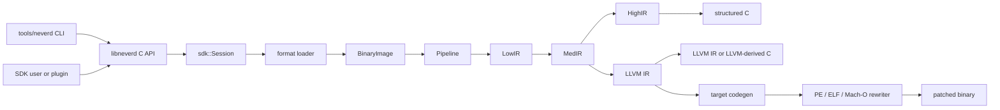

**Lingue**: [English](../architecture.md) | [简体中文](../zh-CN/architecture.md) | [繁體中文](../zh-TW/architecture.md) | [日本語](../ja/architecture.md) | [한국어](../ko/architecture.md) | [Français](../fr/architecture.md) | [Deutsch](../de/architecture.md) | [Español](../es/architecture.md) | [Italiano](architecture.md) | [Русский](../ru/architecture.md) | [العربية](../ar/architecture.md)

[← Indice della documentazione](README.md)

# Architettura di NeverD

Questa guida descrive i confini di produzione che un contributor deve conoscere
per modificare NeverD in sicurezza. Copre intenzionalmente solo il codice di
NeverD; i sottomoduli LLVM, Capstone e Unicorn mantengono la propria
architettura interna.

## Confine del sistema

NeverD ha quattro rappresentazioni IR, ma non costituiscono una sequenza
obbligatoria di quattro passaggi. `LowIR -> MedIR` è condiviso. La
decompilazione strutturata usa poi `MedIR -> HighIR -> C`, mentre `lift`,
`decompile --llvm` e `patch` seguono direttamente `MedIR -> LLVM IR`. In
particolare, le modalità patch e lift saltano intenzionalmente HighIR.

La CLI analizza i comandi in `tools/neverd`, crea un `neverd_session_t` e chiama
l’API pubblica di `include/neverd/sdk/NeverDCAPI.h`. Lo stato del motore risiede
in `lib/sdk/SessionImpl.h`; `neverd_session_load` sceglie un loader e costruisce
una `BinaryImage`, mentre le operazioni basate su IR eseguono
`lib/pipeline/Pipeline.cpp` su richiesta. L’eseguibile `neverd` collega
`neverd_shared`; gli archivi dei componenti e le loro dipendenze LLVM/Capstone
sono dettagli privati della libreria condivisa. La CLI usa LLVM
Support per l’interfaccia a riga di comando, ma non aggira la C API per pilotare
il motore.

L’analisi HighIR `HighSourceFlow` gestisce gli archi delle istruzioni emesse, l’identità
delle variabili locali e l’assegnazione certa. La verifica del sorgente e l’eliminazione
delle copie PHI inutilizzate condividono il grafo. Partizioni limitate zero/non-zero seguono
le condizioni scalari ripetute; le scritture invalidano i fatti e le variabili il cui indirizzo
sfugge restano sconosciute. Al limite si torna al grafo conservativo. Una copia PHI viene
eliminata solo se il valore è inutilizzato in ogni contesto realizzabile. Chiamate, letture,
scritture ed etichette mantengono il comportamento osservabile.

Anche l’analisi di fuga dei consumatori di blocchi usa questo grafo. Un punto fisso limitato propaga identità dei puntatori e memoria privata dello stack tra rami e cicli. Le confluenze conservano possibili indirizzi di contesto; solo una sovrascrittura completa li elimina. Archi sconosciuti, eccezioni e budget di prova esauriti impediscono il collegamento.

I fatti sul ricevitore Objective-C distinguono self all’ingresso del metodo da un riferimento esatto di classe. Tutti i record che condividono l’ingresso devono concordare prima di stabilire self. Le copie a larghezza completa e i registri preservati dall’ABI propagano i fatti con lo stesso punto fisso, inclusi gli archi di ritorno all’ingresso. Il confronto distingue metodi di classe e d’istanza, categorie registrate, superclassi e protocolli adottati; self include anche le sottoclassi note. I cataloghi del compilatore mantengono proprietari e gerarchia separati dall’accordo globale dei selettori. Prima della pubblicazione, l’SDK riconvalida origine del ricevitore e dichiarazioni nell’immagine corrente. Questi fatti non selezionano un IMP né autorizzano riscritture binarie.
Se manca la gerarchia esterna, si richiede l’accordo globale dei selettori senza restringere il ricevitore; dichiarazioni esplicitamente incompatibili o non supportate restano evidenza negativa.

Gli ivar con tipo oggetto esplicito estendono la prova del ricevitore attraverso al massimo otto caricamenti a larghezza completa. Ogni passo registra lo slot dell’offset a runtime, la larghezza e l’eventuale offset letterale usato dall’istruzione. Il letterale deve corrispondere alla disposizione corrente; il riferimento a runtime può seguire un campo spostato. Il loader controlla la discendenza registrata e la dichiarazione del campo. Accessi parziali, id senza classe, blocchi, soli protocolli, memoria ambigua e puntatori base ignoti non forniscono classi. La validazione del sorgente ricontrolla l’intero percorso nell’immagine corrente. Questi fatti non provano identità degli oggetti né autorizzano la rimozione di operazioni di memoria.

Il loader valida grafi limitati e aciclici di stringhe costanti, oggetti interi, array e dizionari ordinati Darwin. Ogni campo e arco richiede memoria mappata immutabile e prove non ambigue di importazione o rilocazione; codifiche non supportate, cicli e grafi incompleti falliscono esplicitamente. I binding sorgente verificano nuovamente il grafo e lo slot del puntatore in ingresso. Le funzioni generate preservano i bit interi, l’ordine dei figli e gli indirizzi condivisi, riutilizzando le identità delle stringhe. Gli slot vengono inizializzati una sola volta con pubblicazione acquire/release, chiamando soltanto figli validati. Ogni funzione contiene le loro dichiarazioni per condividere una definizione tra metodi recuperati indipendentemente. I test portabili coprono input malformati e budget di prova; le fixture native confrontano contenuti, alias, identità delle copie e inizializzazione concorrente con i metodi originali.

## Rappresentazioni IR e percorsi

| Rappresentazione | Scopo | Definizioni e trasformazioni principali |
|------------------|-------|-----------------------------------------|
| LowIR | Operazioni `NdOp` indipendenti dall’architettura, basic block, CFG e metadati delle jump table | `include/neverd/ir/low`, `lib/ir/low`, prodotto da `lib/decode` + `lib/lift` |
| MedIR | Tipi, ABI/convenzioni di chiamata, modello memoria/stack, flag, chiamate e flusso simile a SSA | `include/neverd/ir/med`, `lib/ir/med` |
| HighIR | Espressioni e controllo di flusso strutturati per C leggibile | `include/neverd/ir/high`, `lib/ir/high`, emesso da `lib/backend/c/HighC` |
| LLVM IR | Ottimizzazione, C derivato da LLVM, generazione di codice target e input per riscrittura binaria | `lib/backend/llvm`, ottimizzato/orchestrato da `lib/pipeline` |

Le costanti conservano, da LowIR a MedIR e HighIR, la provenienza scalare o di indirizzo e il proprietario dell’indirizzo per ogni occorrenza. Bit numerici uguali non uniscono origini diverse. La semplificazione simbolica di HighIR tratta le identità degli indirizzi come ingressi opachi; il binding del sorgente usa la classificazione condivisa degli operandi numerici e richiede ancora binding di rilocazione per gli usi di memoria e puntatori.

| Percorso utente | Cammino delle rappresentazioni | Uscita |
|-----------------|-----------------------------|--------|
| Dump Low/Med | Binary -> LowIR, opzionalmente -> MedIR | Testo diagnostico |
| Dump High o `decompile` | Binary -> LowIR -> MedIR -> HighIR | HighIR o C strutturato |
| `lift` | Binary -> LowIR -> MedIR -> LLVM IR | `.ll` |
| `decompile --llvm` | Binary -> LowIR -> MedIR -> LLVM IR | C derivato da LLVM |
| `patch` | Binary -> LowIR -> MedIR -> LLVM IR -> codegen | Binario riscritto |

`lib/pipeline/Pipeline.cpp` è la fonte autorevole per la scelta del percorso.
Mantieni la logica specifica di una rappresentazione nella relativa libreria IR
o backend; il pipeline deve orchestrare i componenti, non assorbirne gli
algoritmi.

## Contratto di traduzione tra architetture

`include/neverd/translate` definisce un livello contrattuale, non un
backend di esecuzione. `GuestState` modella lo stato visibile alla macchina in
modo indipendente dall’architettura per `x86_32`, `x86_64`, `AArch64` e `ARM32`.
La sua serializzazione canonica versione 1 usa campi little-endian a larghezza
fissa, ID di registro stabili, raccolte ordinate e validazione fail-closed;
lo stato persistito non dipende quindi dal layout C++ dell’host.

La baseline wire v1 di `GuestState` è congelata in modo permanente. Ogni stato
esterno a tale baseline deve usare un ID di registro di estensione nell’intervallo
riservato insieme a un nome canonico minuscolo, oppure passare a una nuova
versione wire con un upgrader esplicito; è vietato modificare in-place la
baseline v1.

Per un guest `ARM32`, `ExecutionMode` è la modalità di decodifica autorevole e
deve essere coerente con `CPSR.T`. Il PC memorizzato è sempre l’indirizzo
canonico dell’istruzione con il bit 0 azzerato; la modalità ARM richiede inoltre
l’allineamento alla parola.

Il contratto delle coppie definisce `x86_64 -> AArch64`,
`AArch64 -> x86_64`, `x86_32 -> AArch64/ARM32` e
`ARM32 -> x86_32/x86_64`. `ContractDefined` significa che una richiesta può
essere validata e persistita, non che il codice possa essere tradotto o eseguito.
La policy JIT accetta solo l’host nativo del processo; la policy AOT richiede
un’architettura host e un target triple espliciti; anche una CPU o un insieme di
feature selezionati devono essere espliciti.

`ResolvedHostTarget` trasforma questa selezione in un risultato concreto. La
risoluzione `Native` ricava dal processo triple, CPU e insieme di feature
abilitate o disabilitate. La risoluzione `Explicit` valida e normalizza
architettura, triple, CPU e feature forniti dal chiamante e rifiuta i conflitti.
La sua identità di cache versionata è costruita in ordine di byte deterministico
dagli input target normalizzati e non contiene indirizzi di processo né testo
dipendente dalla locale.

Un `TranslationExit` versionato registra una causa di arresto stabile e il
payload tipizzato corrispondente per syscall, eccezioni o segnali, breakpoint,
istruzioni non supportate, automodifica, budget di risorse, chiamate esterne,
fault di memoria e altre condizioni terminali. I consumer non devono quindi
reinterpretare un intero privo di tipo in base alla causa di arresto.

Salvo il caso `BudgetExhausted` corrispondente, i conteggi di istruzioni, blocks
e codice generato non devono superare il budget non nullo della richiesta.
L’esaurimento di istruzioni e blocks si arresta esattamente al limit. La
dimensione di un oggetto generato è nota solo dopo un codegen indivisibile;
quindi il relativo risultato può indicare `Observed > Limit`. L’oggetto rifiutato
non viene mai collegato, pubblicato o eseguito. Ogni payload `BudgetExhausted`
identifica esattamente il limit richiesto, mai una soglia derivata o privata
dell’implementazione.

Il contratto backend-private `RuntimeControlBlockV1` misura
esattamente 128 byte, è allineato a 8 byte ed è vincolato da magic, version,
size e offset dei campi fissi della v1, campi riservati a zero ed exit tipizzate
coerenti. Non contiene container C++, puntatori host né alias di indirizzi guest.
Non è il layout C++ né il formato wire di `GuestState`; un backend che implementa
questo contratto deve convertire esplicitamente lo stato in questo record.

La superficie fissa di chiamata v1 del codice generato contiene esattamente otto
helper: `nvd_rt_v1_load8_le`, `nvd_rt_v1_load16_le`, `nvd_rt_v1_load32_le`,
`nvd_rt_v1_load64_le`, `nvd_rt_v1_store8_le`, `nvd_rt_v1_store16_le`,
`nvd_rt_v1_store32_le` e `nvd_rt_v1_store64_le`. Nomi, firme e provenienza dei
puntatori devono corrispondere esattamente; un backend collega esplicitamente
questa tabella finita e non ripiega mai sulla risoluzione ambientale dei simboli.
La validazione della generation eseguibile e il polling di budget/cancellazione
sono operazioni riservate al dispatcher fidato; `nvd_rt_v1_validate_generation`
e `nvd_rt_v1_poll` non sono helper del codice generato. Il dispatcher host fidato
possiede anche la selezione dei blocks e non è invocabile dall’IR generato; i
translated blocks restituiscono invece un codice di exit tipizzato. L’IR
generato può leggere direttamente solo lo slot runtime scalar-result dichiarato.

`RuntimeSymbolRegistryV1` realizza questa tabella di helper come registro host
chiuso. La costruzione valida l’intero insieme ABI-v1, i nomi canonici esatti, le
classi degli helper, le firme e, per ogni voce, esattamente un puntatore a
funzione non nullo coerente con la classe. La ricerca accetta solo il nome
esatto, non consulta mai simboli ambientali del processo o del loader dinamico e
fornisce al verifier degli oggetti gli stessi nomi ordinati come allowlist. La
sua identità versionata copre nomi, classi degli helper e forma dell’ABI, ma
esclude deliberatamente gli indirizzi nativi ed è quindi stabile con ASLR.

`RuntimeCodeMemory` possiede storage per codice generato isolato per pagina e
consente solo la pubblicazione unidirezionale `RW -> RX`. La memoria non è mai
scrivibile ed eseguibile allo stesso tempo, non può essere riaperta in scrittura,
controlla i limiti di scritture ed entry point e invalida la cache delle
istruzioni host al momento della pubblicazione. Lo smoke test nativo esegue solo
una breve sequenza di istruzioni host dopo la pubblicazione: dimostra questo
confine di memoria W^X, non un motore di traduzione.

`GuestMemoryRuntime` è isolato dal `GuestState` logico: la costruzione prima
valida lo stato, quindi copia byte e metadati delle regioni in un indice privato
ordinato. Gli indirizzi virtuali guest sono soltanto chiavi di ricerca e non
vengono mai convertiti in puntatori host. Gli accessi scalari controllati
segnalano fault tipizzati per larghezza, allineamento, overflow, assenza di
mapping, attraversamento di regione, permessi, scrittura eseguibile, overflow o
discordanza di generation e violazione di policy. I budget di istruzioni/blocks,
la cancellazione, il tracking della generation e le policy di scrittura del
codice `RejectExecutableWrites`, `InvalidateOnExecutableWrite` e
`ValidateBeforeDispatch` producono anch’essi record tipizzati coerenti invece
di comportamento host implicito.

`TranslationObjectCompilerV1` è il confine verificato da LLVM IR a oggetto.
Valida un modulo di input const, lo clona prima di ogni trasformazione, compone
la semplificazione semantica proof-gated con l’ottimizzazione LLVM da `O0` a
`O3`, convalida di nuovo l’IR finale ed emette oggetti relocatable ELF, COFF o
Mach-O per le quattro architetture host del contratto. Canonicalizza i manifest
esatti dei blocks e dei simboli runtime dopo il mangling del target, controlla
ogni oggetto emesso e restituisce l’identità del registro runtime insieme a
chiavi di cache versionate per richiesta e artefatto. Con un budget di byte
generati diverso da zero, solo un oggetto conforme può passare alla verifica
dell’artefatto. LLVM emette prima in un buffer privato per misurare la dimensione
esatta e indivisibile; un oggetto sovradimensionato viene rifiutato prima della
pubblicazione e dell’audit, mentre la telemetria tipizzata conserva la dimensione
osservata e il limit esatto richiesto. Zero significa nessun limite imposto dal
chiamante. Il compilatore si ferma ai byte relocatable controllati: non li
collega, pubblica, invia al dispatcher o esegue e non fornisce il lowering delle
istruzioni guest.

Il verifier post-codegen controlla gli oggetti relocatable ELF,
COFF e Mach-O come insieme chiuso. Formato e architettura devono corrispondere
esattamente all’host selezionato; i simboli non definiti devono appartenere
esattamente alla allowlist finita degli helper e i simboli dinamici sono vietati.
Le relocations seguono whitelist dirette esplicite con controlli di encoding,
larghezza, allineamento, offset, destinazione caricabile e target definito
nell’oggetto come non-preemptible o helper autorizzato esattamente. Sono
rifiutati W+X, metadati unwind/exception/initializer, TLS, IFUNC, GOT e
l’indirezione PLT ordinaria, relocations dinamiche, definizioni weak/preemptible
o selezionabili, sezioni allocate sconosciute e direttive del linker. La forma
`R_X86_64_PLT32` usata da LLVM per una chiamata ELF x86-64 hidden è ammessa solo
quando la policy v1 dimostra un branch diretto sealed verso l’helper runtime
esatto; non autorizza un percorso PLT o GOT. Gli artefatti ELF `ET_REL` non
possono contenere program header o segmenti. I load command Mach-O seguono una
lista positiva: esattamente un segmento della larghezza corretta e al massimo
una symbol table, dynamic-symbol table, platform-version e un comando
data-in-code, con verifica delle dipendenze. Le opzioni del linker e ogni altro
command vengono rifiutati.

`TranslationObjectRequestV1` è la prima fase pubblica, volutamente ristretta,
che trasforma byte guest in un oggetto su questi contratti. Nel sottoinsieme v1
fail-closed pubblicato per i registri scalari x86-64 accetta soltanto codifiche
canoniche prive di prefissi legacy: forme `MOV`, `ADD`/`SUB` e
`AND`/`OR`/`XOR` con REX.W su GPR a larghezza intera i cui operandi hanno le
forme LowIR registro/immediato supportate. Le forme aritmetiche mantengono i
relativi calcoli dei flag scalari; quelle logiche e `TEST` calcolano i flag
definiti dall’architettura preservando `AF` nel modello di stato NeverD. Lo
schema 9 accetta anche `CMP` register/register a larghezza intera con `39/3B`,
`CMP` register/immediate con `81/7`, `83/7` e `3D`, `TEST` a larghezza intera
register/register con `85` e register/immediate con `F7/0` e `A9`. Le codifiche
canoniche `C3` `RET` e `C2 iw`
`RET imm16` terminano i block di ritorno; le codifiche `JMP` direct-relative
canoniche `EB cb` ed `E9 cd` terminano i block di branch diretto. Lo schema di
lowering pubblicato è 9. I branch Jcc tradizionali, canonici e senza prefisso
legacy sono limitati a: `JO`/`JNO` short `70/71 cb` o near `0F 80/81 cd`;
`JB`/`JAE` con `72/73 cb` o `0F 82/83 cd`; `JE`/`JNE` con `74/75 cb` o
`0F 84/85 cd`; `JBE`/`JA` con `76/77 cb` o `0F 86/87 cd`; `JS`/`JNS` con
`78/79 cb` o `0F 88/89 cd`; `JP`/`JNP` con `7A/7B cb` o `0F 8A/8B cd`;
`JL`/`JGE` con `7C/7D cb` o `0F 8C/8D cd`; e `JLE`/`JG` con `7E/7F cb` o
`0F 8E/8F cd`. `JRCXZ`/`JECXZ`/`JCXZ` e `LOOP`/`LOOPE`/`LOOPNE` restano non
pubblicati e falliscono fail-closed. Anche `F7 /1` riservato, gli operandi di
memoria guest, i registri parziali, i prefissi legacy e i bit di estensione REX
semanticamente ridondanti falliscono fail-closed. Emette
esclusivamente un oggetto relocatable ELF o Mach-O AArch64 little-endian
sottoposto ad audit. Le normali operazioni sulla memoria guest, le forme a
registro parziale, qualsiasi istruzione o codifica al di fuori di questo
sottoinsieme esatto, i flussi di controllo diversi dai ritorni, da questi salti
diretti e dai branch su un singolo flag pubblicati sopra, e ogni operazione
LowIR non implementata dal lowerer vengono rifiutati prima dell’emissione. La
lettura controllata dell’indirizzo di ritorno richiesta da
`RET` fa parte del suo contratto di terminazione e non pubblica un lowering
generale della memoria guest. La richiesta ricostruisce e convalida il
descrittore del block, usa la stessa target machine risolta per lowering ed
emissione dell’oggetto e combina la semplificazione semantica proof-gated con la
pipeline di ottimizzazione `O2` predefinita di LLVM. Questa fase non copre altre
istruzioni x86-64, altre coppie guest/host o la direzione inversa da AArch64 a
x86-64.

L’entry point C pubblico
`neverd_translate_x86_64_block_to_aarch64_object_v1`, il wrapper Python ctypes
`translate_x86_64_block_to_aarch64_object` e il comando
`neverd translate-object` espongono lo stesso confine limitato all’oggetto.
Python usa `TranslationObjectFormat.ELF` o `.MACHO`. Gli errori della traduzione
nativa sollevano una `TranslationError` tipizzata che contiene
`TranslationErrorCode`; la validazione locale degli argomenti solleva invece
`TypeError` o `ValueError`. In caso di successo Python restituisce un risultato
immutabile di sua proprietà. Il risultato C possiede i byte dell’oggetto, le
identità di cache stabili e la telemetria di ottimizzazione; la CLI scrive
soltanto l’oggetto ELF o Mach-O selezionato. Tutte e tre le superfici terminano
prima di linking,
caricamento, dispatch, esecuzione e debugging; non sono interfacce di sessione
di esecuzione.

`verifyTranslationLinkGraphV1` aggiunge un secondo audit indipendente prima di qualsiasi
allocation. Costruisce un grafo LLVM JITLink effimero da un oggetto ELF o Mach-O
AArch64 accettato e verifica target, permessi delle sezioni, manifest dei simboli
block/runtime, chiusura dei simboli esterni, tipi e destinazioni degli edge. Il
grafo viene distrutto dopo aver prodotto il risultato di audit privo di
indirizzi. Superare questo audit non collega, alloca, risolve, carica, pubblica,
invia al dispatcher né esegue codice.

`linkTranslationObjectV1` è il confine separato di linking nativo. Riesegue
l’audit del descrittore fidato, dell’oggetto grezzo e del grafo JITLink prima e
dopo pruning, allocation, risoluzione dei simboli e fixup. I simboli runtime
provengono soltanto dal registro sealed. Una credential del dispatcher lega
l’unica voce del manifest alla relativa session, all’identità del block, al PC
di ingresso guest, alla generazione della cache e all’epoca del codice;
l’invocazione richiede inoltre che il `RIP` guest del runtime corrisponda a tale
ingresso. Dopo la finalizzazione riuscita, pubblica memoria eseguibile con le
permission finali. Unload revoca le nuove invocazioni e attende un’invocazione
attiva prima di liberare l’allocation. L’overload senza credential resta
audit-only e non può invocare.

`NativeTranslationSessionV1` compone questi elementi nel confine sperimentale
di esecuzione C++ da x86-64 ad AArch64 nativo. In un processo ELF o Mach-O
AArch64 little-endian conserva lo stesso runtime di memoria guest controllato e
lo stesso stato guest fisso tra più block di un loop dispatcher
compile-link-validate-invoke-unload. Un salto diretto canonico continua al suo
target statico esatto. Un branch canonico pubblicato su un singolo flag continua
soltanto nel successore taken o fallthrough dichiarato dal manifest del block; il
dispatcher rifiuta qualsiasi altro PC selezionato. Un ritorno termina. I budget
globali per istruzioni, block e byte di oggetto generati restano esatti tra i
block. Quando il guest si arresta con successo, lo stato eseguito e la memoria
autorevole vengono committati insieme. La cancellazione è linearizzata rispetto
a questo commit finale.

Questa è una vertical slice eseguibile, non un traduttore completo. Non copre
ancora normali istruzioni di memoria guest, registri parziali, flusso di
controllo condizionale al di fuori dello slice esatto schema-9 dei Jcc
tradizionali descritto sopra, inclusi `JRCXZ`/`JECXZ`/`JCXZ` e
`LOOP`/`LOOPE`/`LOOPNE`, flusso
di controllo indiretto, call, virgola mobile, SIMD, x87, operazioni atomiche,
istruzioni di sistema, propagazione generale delle eccezioni, cache dei block,
altre coppie guest/host o la direzione inversa da AArch64 a x86-64.
La sessione di esecuzione non ha ancora superfici C, Python, CLI o JSON; il
debugging resta separato e non supportato. Le API oggetto precedenti restano
utilizzabili senza abilitare l’esecuzione nativa.

Il contratto dell’IR generato richiede che ogni translated block soggetto ad
esso sia hidden e non-preemptible e usi il C ABI
`i32 (ptr state, ptr runtime)`. I blocks sono individuabili solo tramite un
registro privato, mai tramite la ricerca dei simboli del processo circostante;
le chiamate dirette tra blocks sono vietate.

L’IR verifier limita inoltre la larghezza degli interi alla larghezza del
registro scalare dell’host, per evitare compiler-runtime libcalls noti introdotti
dalla legalization. Questa verifica è necessaria, ma non sufficiente: ogni
backend di esecuzione che implementa questo contratto deve controllare in modo
esatto i trasferimenti di controllo post-codegen, il `MachineIR` e le relocations
dell’oggetto target rispetto alla stessa runtime-symbol allowlist finita.

I load e store diretti di TranslationIR, insieme ai valori delle private
constants, possono contenere solo un singolo intero scalare non più largo del
registro scalare dell’host. Gli aggregati devono essere scalarizzati prima del
confine del verifier, così un IR compatto non può causare un’espansione non
limitata nel backend.

L’ABI del codice generato è definita solo per interi scalari. Virgola mobile,
SIMD, x87, operazioni atomiche e istruzioni di sistema restano fuori da questo
contratto. Ogni implementazione che seleziona `ProvenSemanticAndLLVM` deve
eseguire la semplificazione semantica di NeverD, subordinata a prova, fino a un
fixed point congiunto con l’ottimizzazione LLVM; la policy non fornisce un
backend di traduzione eseguibile.

## Confini della riscrittura delle eccezioni

Il compact unwind Mach-O dispone di un parser rigoroso del `__unwind_info`
originale, di un parser consapevole dei fixup per i record
`__LD,__compact_unwind` generati, di un merge esatto degli intervalli originali
e generati, di un encoder deterministico per le pagine regolari e di un
installer transazionale della sezione finale. L’installer riscrive in-place una
`__TEXT,__unwind_info` esistente e file-backed solo quando la tabella codificata
rientra nella capacità dichiarata. Rivalida architettura, layout e byte preimage,
azzera la coda inutilizzata, quindi esegue nuovamente il parse del risultato e
ne prova l’equivalenza semantica prima dell’unico commit della transazione Mach-O
esterna. Se la sezione finale è assente, i record compact generati non vengono
installati e la transazione può proseguire solo tramite la chiusura DWARF-FDE
esatta e autenticata descritta sotto; una sezione finale esistente ma
insufficiente o malformata continua a fallire in modalità fail-closed. I record
generati sono autenticati tramite un’associazione esatta,
registrata dal compiler, tra funzione IR sorgente e owner symbol MC di destinazione
(incluse le definizioni private, senza ipotesi su prefissi o mangling), ID di
intervallo opachi e diversi da zero e intervalli di frammento semiaperti esatti.
Ogni FDE generato deve corrispondere esattamente a un solo frammento autenticato;
ogni frammento richiesto deve corrispondere a un solo FDE installato dalla stessa
transazione, salvo che sia coperto da un record compact non-DWARF esatto e
rigorosamente validato. Frammenti adiacenti o disgiunti dello stesso owner di
funzione possono riutilizzare una ricetta sorgente; identità mancanti, duplicate,
dangling, cross-owner o con limiti incoerenti falliscono prima della modifica. Il
nuovo segmento RX viene confermato solo dopo aver provato un `__LINKEDIT` unico e
terminale nel file e nello spazio VM, shift degli offset con aritmetica controllata
e un replay rigoroso del layout finale.

I riferimenti esterni vengono classificati dal contratto MC fixup completo. Le
call possono selezionare solo target callable autenticati; i campi personality
del compact unwind generato possono selezionare solo non-lazy pointer slot
validati, senza mai dereferenziarne il contenuto nel file. TLS, authenticated
pointer, termini sottratti, campi compact malformati e forme di relocation
sconosciute falliscono in modalità fail-closed.

Nel compact unwind ARM32, lo stack adjustment codificato e il layout GPR sono
`Complete`. Anche i selettori di pattern dei registri D da 0 a 3 sono `Complete`;
quelli da 4 a 7 sono `Partial` perché il compact word da solo non prova ogni slot
relativo al CFA allineato a runtime. Una voce `Partial` può conservare le identità
dei registri provate per l’analisi, ma ogni percorso di rewrite la rifiuta
fail-closed. Ogni receipt di installazione EH-frame lega esattamente target
architecture, pointer width e byte order; il binding DWARF compact-unwind rifiuta
ogni target identity del receipt non corrispondente. Manca ancora una prova
native throw/catch su un binario collegato.

La transazione di sezione ARM32 di livello superiore è più ristretta del
decoder compact unwind. Viene abilitata solo quando l’header Mach-O è
esattamente `CPU_SUBTYPE_ARM_V7K` e i bit `N_ARM_THUMB_DEF` della symbol table
originale autenticano positivamente ogni funzione richiesta come codice Thumb.
Il triple esatto `thumbv7k-apple-watchos` e la modalità Thumb rimangono quindi
vincolati per tutta la code generation, i cui requisiti di feature in input non
possono superare il limite Cortex-A7. Funzioni prive di flag o con modalità
sconosciuta, sottotipi generici non-v7k, modalità ARM, target di codice esterno
misti o sconosciuti, l’entry point in-place per ARM Mach-O e il patch ARM Mach-O
da sorgente C falliscono in modalità fail-closed prima di modificare l’output.
Gli input stripped le cui funzioni siano individuabili soltanto tramite
`LC_FUNCTION_STARTS` non sono ancora supportati.

PE, ELF e Mach-O dispongono ciascuno di componenti delle eccezioni specifici del
formato, ma NeverD non pubblica ancora una pipeline di riscrittura end-to-end
per tutti i formati e tutti i tipi di eccezione. Un encoding non supportato o
requisiti di registration/layout non risolti devono fallire prima di modificare
l’output; il supporto parziale esistente non deve essere descritto come chiusura
completa delle eccezioni.

Riconoscere una personality Itanium Ada o D non è supporto delle eccezioni Ada
o D. Le LSDA in forma di indirizzo di GNAT, GDC, DMD e LDC sono analizzabili; gli
slot della type-table restano opachi (`Exception_Id` / `Exception_Data` per
GNAT, `ClassInfo` per D) e non vengono mai seguiti come `std::type_info`. La
ricostruzione nativa emette `personality` LLVM più clausole
`invoke`/`landingpad` in forma di indirizzo. Lo stato corpus-proven è un’affermazione
distinta e non è implicato dal riconoscimento della personality né dal lowering
nativo.

## Mappa dei componenti

Ogni componente è un archivio statico creato da
`add_neverd_component_library`. La tabella elenca le dipendenze NeverD
importanti, non tutte le librerie LLVM e Capstone comuni fornite dall’helper
CMake.

| Directory | Responsabilità | Dipendenze importanti |
|-----------|----------------|-----------------------|
| `lib/loader` | Rilevamento formato, caricamento PE/COFF, ELF e Mach-O, `BinaryImage` normalizzata, scoperta funzioni | API LLVM Object |
| `lib/lift` | Semantica scritta a mano per istruzioni x86/i386, AArch64 e ARM32 | Tipi di dati IR |
| `lib/decode` | Decodifica Capstone/native e dispatch ai lifter di architettura | `NeverDIR`, `NeverDLift` |
| `lib/ir` | Tipi comuni e definizioni/trasformazioni LowIR, MedIR, HighIR e intrinsic | Quattro sottocomponenti IR |
| `lib/pipeline` | Rilevamento funzioni e orchestrazione dei percorsi Low/Med/High/LLVM | IR, decode, lift, backend LLVM, debug info, pass IR |
| `lib/backend/c` | Rendering HighIR-to-C e LLVM-IR-to-C | IR |
| `lib/backend/llvm` | Lowering da MedIR a LLVM | IR |
| `lib/backend/codegen` | Generazione codice target e patch/riscrittura in-place PE/ELF/Mach-O | IR, loader |
| `lib/sdk` | ABI C pubblica, ciclo session, query, persistenza, plugin, punti lift/decompile/patch/audit/hunt | Aggrega il motore in `libneverd` |
| `lib/pass` | Pass di offuscamento LLVM IR e runner di pass MIR | IR |
| `lib/debug` | Contesti di debug DWARF, PDB e linker-map | IR |
| `lib/sigs` | Parsing, database e matching delle firme | Loader |
| `lib/libc` | Nomi libc noti e supporto del modello di chiamata | Componente autonomo |
| `lib/safety` | Audit di vita dell’heap e hunt di overflow di copia sull’IR sollevato | Symbolic, Solver |
| `lib/support` | Helper condivisi per il caricamento binario | Loader |
| `lib/translate` | Contratti versionati per guest state/policy/exit, runtime ABI fissa, guest memory controllata, audit di IR/oggetti/LinkGraph generati, linking nativo sealed e dispatcher C++ sperimentale da x86-64 ad AArch64 | Contratti IR, LLVM, LLVM Object e JITLink |

Gli header pubblici rispecchiano queste aree sotto `include/neverd`. Evita che
una classe C++ interna diventi accidentalmente parte dell’SDK: le operazioni
esterne stabili appartengono all’header C puro e a uno dei file mirati
`lib/sdk/NeverDCAPI*.cpp`.

## Contratto di lifting strict

`Decoder` e ogni lifter di architettura partono in modalità strict. Se Capstone
può decodificare un’istruzione ma il lifter selezionato non la implementa,
lancia `UnliftedInstruction`. L’eccezione registra indirizzo, mnemonico e
operandi; la semantica non supportata deve quindi fallire visibilmente invece di
essere omessa o ipotizzata.

Il percorso interno non strict emette `NdOp::NOP`, ma è una via di fuga
diagnostica, non un’implementazione accettabile. I test dei contributor e della
CI devono mantenere la modalità strict. Quando si verifica un errore strict:

1. Riproducilo con la fixture specifica dell’architettura più piccola.
2. Aggiungi la semantica mancante in `lib/lift/<ISA>`.
3. Verifica la forma LowIR prevista in `unittests/lift`.
4. Aggiungi un roundtrip differenziale Unicorn in `unittests/semantic` se l’istruzione ha un comportamento osservabile.

Non intercettare `UnliftedInstruction` solo per far proseguire il pipeline. Una
nuova approssimazione intenzionale richiede contratto e test espliciti; non deve
fingersi lifting 1:1.

## Proprietà di formati e ISA

La logica del formato in ingresso e quella di riscrittura in uscita sono
separate intenzionalmente:

| Formato | Caricamento, metadati e relocation di input | Patch e relocation di output |
|---------|---------------------------------------------|------------------------------|
| PE/COFF | `lib/loader/COFF` | `lib/backend/codegen/COFF` |
| ELF | `lib/loader/ELF` | `lib/backend/codegen/ELF` |
| Mach-O | `lib/loader/MachO` | `lib/backend/codegen/MachO` |

I lifter di architettura risiedono in `lib/lift/X86`, `lib/lift/AArch64` e
`lib/lift/ARM`. Le dichiarazioni pubbliche di lifter/register sono in
`include/neverd/lift`. L’emissione LLVM e la generazione di codice specifiche
del target si trovano in `lib/backend/llvm/<ISA>` e
`lib/backend/codegen/CodeGen<ISA>.cpp`.

### Supporto e profondità dei test

La matrice di supporto principale indica che ogni cella è implementata. Non
significa che ogni opcode, caso limite ABI, produttore binario o versione del
sistema operativo sia stato testato in modo esaustivo. La modalità strict
fallisce in modo chiuso quando la semantica di un’istruzione è fuori dalla
copertura implementata dal lifter.

Tutte le 12 celle formato-per-architettura hanno copertura semantica del backend
di riscrittura in `unittests/semantic/PatchFullSubstRTTests.cpp`. La profondità
di integrazione è più specifica:

| Formato | x86-64 | i386 | AArch64 | ARM32 |
|---------|--------|------|---------|-------|
| PE/COFF | Fixture collegata | Griglia backend | Fixture collegata | Fixture Thumb collegata |
| ELF | Fixture collegata + roundtrip semantico | Pipeline oggetto + roundtrip semantico | Fixture collegata + roundtrip semantico | Fixture collegata + roundtrip semantico |
| Mach-O | Fixture collegata\* | Pipeline oggetto PIC/no-PIC\* | Fixture collegata\* | Griglia backend |

- Una **fixture collegata** esercita loader/pipeline e patch su un eseguibile
  collegato per programmi rappresentativi.
- Una **pipeline oggetto** esercita caricamento, tutte le fasi IR e
  decompilazione di un oggetto rilocabile, ma non il linking host né
  l’esecuzione del binario patchato.
- Una **griglia backend** compila IR rappresentativo attraverso il percorso
  esatto di generazione per riscrittura e confronta il comportamento in
  Unicorn; non esercita il loader del formato su un eseguibile collegato.
- `*` Le fixture Mach-O collegate dipendono da una toolchain host capace di
  produrre il target. macOS moderno non collega eseguibili i386 storici; si
  usano quindi oggetti thin PIC/no-PIC e la griglia di riscrittura.

Le celle con fixture collegata sono la prova più forte di integrazione
del formato per quei programmi. Le celle pipeline oggetto e griglia backend
hanno solo copertura parziale di integrazione. Nessuna cella è «completamente
testata» senza questa precisazione né pretende copertura esaustiva dell’ISA.

Le prove principali sono
[`PatchFormatTests.cpp`](../../unittests/lift/format/PatchFormatTests.cpp) per fixture ELF
e PE collegate,
[`COFFARMFormatTests.cpp`](../../unittests/lift/format/COFFARMFormatTests.cpp) per
caricamento/decompilazione Windows ARM,
[`MachOI386RelocationTests.cpp`](../../unittests/lift/format/MachOI386RelocationTests.cpp)
per oggetti thin i386,
[`X86_64_PipelineE2ETests.cpp`](../../unittests/lift/x86_64/X86_64_PipelineE2ETests.cpp) e
[`AArch64_PipelineE2ETests.cpp`](../../unittests/lift/aarch64/AArch64_PipelineE2ETests.cpp)
per Mach-O collegato, e
[`PatchFullSubstRTTests.cpp`](../../unittests/semantic/probe/patchfull/PatchFullSubstRTTests.cpp)
per la griglia di 12 celle. Consulta la [guida ai test](testing.md).

## Dove intervenire

| Modifica | Punto di partenza | Verifica minima mirata |
|----------|-------------------|------------------------|
| Aggiungere o correggere un’istruzione | File corrispondenti in `lib/lift/X86`, `AArch64` o `ARM`; header pubblico se cambia il dispatch | Test di architettura in `unittests/lift`; roundtrip semantico in `unittests/semantic` |
| Aggiungere un `NdOp` | `include/neverd/ir/NdOps.h`, poi verifica Low-to-Med, emitter/renderer, verifier/emulator e dump | `NeverDLiftTests` + casi pertinenti di `NeverDSemanticTests` |
| Modificare CFG o scoperta funzioni | `lib/ir/low`, `lib/loader/FunctionDiscovery*.cpp`, `lib/pipeline/PipelineFuncDetect.cpp` | Test lift CFG/jump-table e suite di trasformazione semantica mirata |
| Aggiungere relocation input o regola unwind PE | `lib/loader/COFF` | `COFFARMFormatTests` o nuova fixture loader mirata |
| Aggiungere relocation output o regola patch PE | `lib/backend/codegen/COFF` | `PatchFormatTests`, `RewriteCodegenRTTests` e griglia backend PE |
| Modificare comportamento ELF o Mach-O | Directory `lib/loader/<Format>` e/o `lib/backend/codegen/<Format>` corrispondenti | Test del formato più griglia di riscrittura |
| Modificare recupero MedIR/ABI | `lib/ir/med` | Test lift delle convenzioni di chiamata + roundtrip semantici multi-ISA |
| Modificare recupero del controllo strutturato | `lib/ir/high` | `NeverDCFGLoopXformTests` e test C strutturato |
| Aggiungere trasformazione LLVM | `lib/pass/ir`, header pubblico in `include/neverd/pass/ir`, toggle pipeline se esposto | Suite di trasformazione mirata + `NeverDPatchFullTests` se cambia l’output patch |
| Aggiungere operazione C API | `include/neverd/sdk/NeverDCAPI.h`, `lib/sdk/NeverDCAPI*.cpp` mirato, `SessionImpl.h` solo per stato | Test semantici SDK/CLI; preservare `neverd_last_error` e convenzioni di allocazione |
| Aggiungere comando CLI | `tools/neverd/NeverDCLIOptions.cpp`, `NeverDCLI.h`, `NeverDCmd*.cpp` mirato e dispatch in `neverd.cpp` | `unittests/semantic/CLIEndToEndTests.cpp` e smoke test CLI diretto |
| Modificare l’audit di vita dell’heap o l’hunt di overflow di copia | `lib/safety`, `include/neverd/safety`, `include/neverd/sdk/NeverDCAPISafety.h` | `NeverDSafetyTests` e `NeverDSafetyIntegrationTests` |
| Aggiungere regressione semantica | `unittests/semantic/*Tests.cpp` mirato; registrare il nuovo file in `unittests/semantic/CMakeLists.txt` | Costruire il binario di test e selezionare il caso con `ctest -R` |

Mantieni le modifiche ristrette. I file che definiscono una rappresentazione
possono cambiare con le relative trasformazioni, ma loader, lifter e backend non
correlati non vanno modificati solo per uniformare un refactoring ampio.

Le dichiarazioni di strutture conservano la disposizione dei campi separata dalla classificazione ABI. Darwin ARM64 supporta strutture annidate con da uno a quattro campi float o double omogenei; esauriti i registri in virgola mobile, l’intero argomento passa sullo stack. MedIR associa ogni componente fisico prima di SSA, HighIR ricostruisce un parametro o risultato logico e il C verifica la disposizione. Darwin ARM64 e x86_64 supportano anche strutture annidate di uno o due interi o puntatori a 64 bit. Quando tutta la struttura passa sullo stack, ARM64 esaurisce il banco interessato, mentre x86_64 conserva i registri rimanenti per gli argomenti successivi. Padding, campi compressi, classi miste virgola mobile/interi e componenti incompleti restano rifiutati; queste indicazioni non autorizzano la riscrittura dei binari.

Le chiamate C fisse Darwin ARM64 supportano anche risultati con disposizione naturale di tre interi con segno a 64 bit tramite il puntatore nascosto x8. Il livello ABI sorgente comune classifica il risultato; Low→Med conserva il puntatore prima della chiamata e scrive i campi del risultato logico nella memoria del chiamante. I registri degli argomenti ordinari non cambiano e x0 non contiene un risultato. L’analisi delle chiamate invalida le informazioni precedenti su questa memoria. La proiezione degli ingressi e le prove di conservazione dello stato nativo rifiutano ancora questi risultati senza una prova specifica sulla memoria; strutture di tre parole con campi senza segno o puntatori, argomenti di tre parole e risultati indiretti x86_64 restano non supportati. I risultati indiretti Objective-C restano rifiutati: l’invio a nil conserva il buffer originale e richiede un modello specifico della memoria.

I cataloghi delle chiamate runtime dichiarano `ReturnedArgument` solo per importazioni esatte il cui risultato è il puntatore dell’argomento originale. L’analisi del ricevitore legge l’argomento fisico dichiarato prima delle normali invalidazioni ABI, quindi ripristina sul risultato solo il tipo dimostrato del ricevitore. L’SDK riconvalida questo effetto; chiamate, effetti di proprietà e accessi alla memoria restano presenti.

I cataloghi di framework e ricevitori derivati dal compilatore condividono i fornitori Foundation, CoreData, CoreLocation, CoreSpotlight, QuartzCore, UniformTypeIdentifiers e UserNotifications. QuartzCore usa l’intestazione pubblica `CoreAnimation.h`; le importazioni di compatibilità di altri framework non forniscono dichiarazioni proprie. Entrambi i generatori mantengono quattro profili di preprocessore, identità esatte ed evidenze negative delle dichiarazioni.

I tipi dei risultati oggetto estendono la stessa prova limitata del ricevitore tramite dichiarazioni di metodi concordanti. I tipi oggetto con nome e i tipi di ritorno correlati dichiarati dal compilatore forniscono informazioni sulla classe; id da solo non basta. Letture dei campi e risultati dei messaggi condividono un limite di otto passaggi, verificati nuovamente rispetto alle dichiarazioni correnti prima della pubblicazione del sorgente. Gli ausiliari di allocazione importati con identità esatta usano il contratto del messaggio corrispondente, preservando chiamate, ridefinizioni ed effetti di proprietà. Classi di risultato incompatibili o gerarchie incomplete interrompono la propagazione.

I collegamenti delle chiamate di formato conservano il contratto del linguaggio. Gli attributi NSString e gli ingressi pubblici dei predicati sono verificati con SDK e dichiarazioni runtime. I predicati non sostituiscono segnaposto tra virgolette; `%K` riceve un oggetto con il nome della proprietà. Gli argomenti usano promozioni scalari e ABI variadica Darwin condivise. Escape e modificatori non supportati sono rifiutati. La validazione ricontrolla linguaggio, identità della costante e argomenti; il codice continua a chiamare il parser del framework.

Le importazioni C con argomenti fissi dichiarate dal compilatore e i messaggi Objective-C condividono la stessa assegnazione ABI sorgente per le strutture supportate. Solo i parametri dichiarati esplicitamente occupano posizioni; il livello Objective-C fornisce i parametri nascosti del ricevitore e del selettore. Rimane necessaria la corrispondenza esatta delle esportazioni e delle firme SDK. I callback limitati agli scalari e gli argomenti variadici conservano le restrizioni esistenti.

Le dichiarazioni di funzione mantengono la convenzione di chiamata come parte dell’identità della firma. Il livello ABI comune supporta chiamate Swift limitate con parametri interi da 1, 2, 4 o 8 byte e parametri puntatore; assegna prima il banco dei registri interi e poi portatori sullo stack relativi allo SP d’ingresso. Ogni portatore stretto registra la propria regola esatta di estensione e i risultati restano limitati a due parole intere o puntatori. HighC conserva `swiftcall` nelle dichiarazioni e definizioni. I bridge di valori Foundation osservati dal compilatore possono anche dichiarare un puntatore `swift_indirect_result` e uno `swift_context`: arm64 usa x8/x20 e x86_64 usa RAX/R13; nessuno consuma il banco ordinario degli argomenti interi. HighC conserva entrambi gli attributi dei parametri. Gli import di metadati Foundation pubblici richiedono accordo tra grafi dei simboli del compilatore, IR delle query effettive ed esportazioni SDK esatte per ARM64/x86-64 su macOS e Mac Catalyst. Il solo suffisso di un simbolo non stabilisce l’ABI. Argomenti generici o nascosti non dichiarati, tipi di callback Swift e portatori fisici non supportati restano rifiutati. Le dichiarazioni Mac Catalyst non dimostrano l’esecuzione su dispositivi iOS.

MedIR gestisce la propagazione limitata delle costanti invarianti attraverso copie SSA di pari larghezza e PHI completi, inclusi i cicli. Tutti i valori in ingresso devono convergere sugli stessi bit, larghezza, provenienza e proprietario dell’indirizzo. Definizioni sconosciute, cicli senza valore iniziale, archi incompleti e costanti discordanti impediscono la sostituzione; esaurito il budget, la funzione resta invariata. Vengono sostituiti solo gli operandi, preservando chiamate, letture, scritture e relativi effetti. HighIR e LLVM usano lo stesso risultato.

L’indice dei proprietari del codice, limitato a una singola operazione, conserva anche le relazioni esatte tra funzioni principali e frammenti nei metadati di esecuzione. Le ricerche indicizzate e dirette condividono la visita delle relazioni, preservano gli indirizzi originali degli ingressi e rifiutano riferimenti orfani o a genitori non principali. La convalida dei salti, le prove dei limiti e le analisi temporanee dei gruppi usano lo stesso indice immutabile e calcolo dei costi. Un indice di un’altra immagine attiva la ricerca diretta; il budget esaurito continua a rifiutare prove incomplete.

L’ABI sorgente registra esplicitamente l’estensione con segno o con zeri a 32 bit dei parametri interi stretti nei registri Darwin ARM64 e x86_64. HighIR conserva questi bit nelle copie salvate mantenendo il tipo originale del parametro. Le letture oltre 32 bit, il padding dello stack e i registri alterati dalle chiamate restano sconosciuti. La regola segue le convenzioni di chiamata ARM64 e Intel di Apple; osservare un byte basso nativo non dimostra un’estensione.

Il caricatore Mach-O conserva la garanzia esplicita di sola lettura dopo le rilocazioni senza modificare i permessi iniziali del segmento. I lettori di byte e puntatori condividono i controlli di mappatura unica basata sul file; i nomi delle sezioni non dimostrano l’immutabilità. Un normale caricamento a larghezza intera può associare un puntatore locale risolto a un oggetto stringa costante verificato separatamente. L’associazione conserva la posizione originaria per la riconvalida e gli alias condividono l’identità generata dell’oggetto di destinazione. Memoria modificabile, rilocazioni in conflitto, caricamenti parziali o ordinati e l’indirizzo della posizione stessa restano non supportati.

Il recupero delle tabelle di salto genera trasferimenti ai normali blocchi successori anziché ricostruirne le istruzioni attraverso un percorso separato. Ogni blocco mantiene un unico responsabile della conversione, compresi casi condivisi, destinazioni predefinite e ingressi dei cicli. Le copie PHI di ogni arco vengono eseguite prima del relativo trasferimento, preservando le istantanee delle assegnazioni parallele; le associazioni incomplete restano errori espliciti.

La strutturazione dei cicli conserva la proprietà esatta degli ingressi nativi. Un involucro sempre vero non duplica l’etichetta della prima istruzione del corpo. L’uscita da un arco di ritorno condizionale raggiunge la continuazione originale, comprese le copie sugli archi senza indirizzo nativo. Solo le destinazioni esattamente coincidenti con la continuazione diventano break; i trasferimenti nei cicli o switch annidati mantengono il proprio ambito di controllo.

L’eliminazione dei valori morti normalizza la proprietà degli ingressi nativi prima di cancellare le copie PHI sugli archi. Il raggruppamento condiviso distingue l’ingresso della diramazione dal suo prefisso sintetico diretto di copie; le etichette non contigue o annidate senza relazione rimangono ambigue.

`scripts/collect_objc_sdk_declarations.py` raccoglie classi, protocolli, categorie e alternative ABI dei metodi appartenenti ai framework dai profili SDK reali di dispositivo, simulatore, Mac Catalyst e desktop. Ogni profilo conserva le prove relative a header pubblici, esportazioni e compilatore, comprese le dichiarazioni non supportate e i tipi di ritorno oggetto correlati. Le raccolte SDK parziali registrano il proprio ambito esatto; un profilo fallito lascia un resoconto incompleto. L’artefatto CI alimenta la successiva verifica di concordanza dei cataloghi senza attivare direttamente nuovi collegamenti alle chiamate sorgente.

I fatti sulle chiamate Objective-C includono celle private limitate dello stack, relative allo SP di ingresso. Alle giunzioni del CFG, i valori esatti vengono intersecati e i byte che potrebbero derivare dal frame vengono uniti, affinché percorsi in conflitto e scritture parziali dei registri non nascondano una fuga di indirizzi. Le chiamate con ABI dichiarato conservano solo memoria privata allocata fuori dagli argomenti in uscita. Fughe, chiamate sconosciute, scritture sovrapposte o atomiche e deallocazione dello stack invalidano la prova pertinente. Gli archi di ritorno devono convergere prima di pubblicare i collegamenti.

HighC rappresenta gli interi parziali fino a 128 bit con tipi `_BitInt` di larghezza esatta. Gli accessi ordinari trasferiscono il numero di byte IR indipendentemente dal riempimento degli oggetti C; le operazioni senza segno preservano il riporto modulare e i limiti di scorrimento. Gli accessi atomici di larghezza parziale vengono rifiutati anziché ampliati.

La convalida dei parametri sorgente MedIR risale ai byte richiesti dai risultati dichiarati, dal flusso di controllo, dagli effetti in memoria e dalle chiamate. COPY, PHI, CONCAT, estrazione ed estensione preservano tali requisiti; le altre operazioni richiedono prudentemente tutti gli ingressi. Le parti alte inutilizzate dei registri in virgola mobile non creano argomenti aggiuntivi. Parti osservabili, grafi incompleti e budget esauriti mantengono il rifiuto originale. L’analisi non elimina operazioni macchina né concede un ABI di riscrittura.

La strutturazione condizionale mantiene le copie PHI di prosecuzione sul loro arco originale. L’indirizzo di provenienza non può diventare una nuova destinazione di salto; se spostare una sequenza richiede tale destinazione, la continuazione condivisa resta al suo posto. Un ciclo sintetico incondizionato condivide inoltre la continuazione della prima istruzione nativa se nessuna operazione precede quella precisa intestazione; verifiche condizionali ed effetti precedenti impediscono tale equivalenza.

L’inferenza della firma sorgente degli ausiliari nativi dimostra un risultato intero completo su ogni percorso di ritorno macchina tramite un’analisi CFG limitata. Le uscite condivise intersecano i fatti dei predecessori; i percorsi d’ingresso impediscono ai cicli non inizializzati di dimostrarsi da soli. Chiamate e scritture parziali invalidano la prova fino al successivo calcolo completo. Grafi malformati, ritorni che conservano soltanto un ingresso e ripristini dell’epilogo x86-64 restano rifiutati. Viene prodotta solo una firma candidata: il secondo passaggio deve ancora validare corpo e chiusura delle dipendenze, senza cambiare l’ABI di riscrittura.

## Limiti recenti del recupero sorgente

- Un accessor lazy della witness table Swift viene ricostruito solo dopo aver provato il modello di cache `Wl`/`WL`, la query runtime esatta e una cache ricostruita; l’indirizzo originale non viene copiato.
- `Any.self` diventa una costante solo quando un membro interno esatto dell’intero contenitore esistenziale o l’export pubblico `$sypN` dimostra l’identità dei metadati.
- Una cella di riferimento a classe Objective-C conserva il livello aggiuntivo di indirezione ed è ammessa solo per un caricamento nativo tipizzato, senza usi ambigui.
- Gli offset degli ivar si uniscono nel CFG solo con classe e larghezza uguali e un singolo caricamento. Il getter once di una `String` Swift a due parole richiede inoltre il contratto esatto dei quattro portatori.
- Un addressor globale lazy di Swift senza parametri generato dal compilatore viene ricostruito solo quando la famiglia esatta di simboli `vau`/`vpZ`/`_Wz`/`_WZ` coincide con un caricamento, un controllo di completamento, una chiamata autenticata a `swift_once` e il ritorno dello stesso indirizzo di memoria su entrambi i percorsi. L’inizializzatore deve ignorare il context incidentale e chiudersi come normale sorgente. La proiezione crea un nuovo predicato once condiviso e una nuova cella del valore; non conserva i loro indirizzi né quello dell’inizializzatore dall’immagine caricata. La sua ABI sorgente senza argomenti per il callee si applica solo ai siti di chiamata; l’ABI di ingresso nativa resta separata affinché i portatori di context incidentali rimangano disponibili per la prova del contratto.
- Se un tale inizializzatore chiama un accessor dei metadati di una classe Objective-C importata generato dal compilatore, la proiezione accetta soltanto il modello esatto con cache zero, riferimento alla classe, `objc_opt_self`, `swift_getObjCClassMetadata` e pubblicazione release. Emette direttamente la ricerca runtime autenticata e non conserva alcuna cache dell’immagine.
- La memoria nativa con nome può attraversare una catena esatta di chiamate native solo se ogni funzione dimostra la propria firma e l’uso limitato della memoria.
- Riferimenti e cache dei metadati concreti Swift vengono ricostruiti solo quando descrittore, export e provider concordano; i puntatori ai metadati inizializzati non vengono copiati dall’immagine.
- I riferimenti nominali ai metadati dei tipi Swift annidati o locali richiedono un percorso di contesto limitato e un demangling univoco; le ambiguità vengono rifiutate.
- I nomi stampabili dei riferimenti ai metadati vengono ricostruiti solo da record completi, non simbolici e non privati. Le voci malformate o in conflitto restano irrisolte.
- Un block sullo stack resta vivo durante gli usi ordinari del frame. Solo un consumatore provato, una fuga o una scrittura sovrapposta revocano la prova.
- I parametri block `noescape` dell’SDK Objective-C sono accettati solo quando dichiarazione genitore, ricevitore e posizione del callback coincidono esattamente.
- Uno stub Objective-C esatto e specifico del selector può collegare un formato dinamico con una coda vuota, puntatori completamente dimostrati o il contratto per interi completi a 64 bit descritto sotto. Altre code, stub inesatti, conflitti di dichiarazione e ABI fisiche incompatibili restano irrisolti.

Per le chiamate runtime collegate al sorgente, la conversione Low→Med trasferisce la dichiarazione esterna autenticata di mancato ritorno all’effetto della chiamata MedIR. Un trampolino di importazione del runtime può comparire anche nell’inventario delle funzioni native. Il punto fisso delle chiamate senza ritorno conserva un fatto di terminazione macchina esistente solo se la connessione runtime verificata e gli operandi completi della chiamata concordano; un’indicazione sorgente da sola non crea tale fatto. La connessione identifica lo slot di importazione, mentre la chiamata identifica il trampolino. Gli effetti nativi inferiti vengono ricalcolati dal grafo corrente e la pubblicazione del sorgente verifica nuovamente l’identità dell’importazione.

Un helper ARM64 con flusso lineare può mantenere un contesto iniziale invariato e osservato completamente quando al massimo due importazioni Swift sono convalidate separatamente e solo l’ultima chiamata termina. La chiamata precedente che ritorna segue le normali regole di modifica dei registri. La stessa prova di identità dei byte e assenza di fuga del frame controlla tutte le operazioni precedenti e richiede byte privati scritti completamente per ogni argomento scalare sullo stack in uscita. Rami, ritorni, archi eccezionali e chiamate sconosciute restano esclusi. L’analisi degli ingressi limitata agli effetti accetta grafi terminali dimostrati indipendentemente; la prova predefinita degli ingressi inutilizzati richiede ancora un ritorno osservato. Si genera solo una firma candidata, il cui corpo sorgente e la chiusura delle dipendenze devono ancora essere convalidati.

Un addressor globale differito Swift può fornire un’ABI di sola chiamata al ripristino dello stato nativo solo tramite un contratto ricostruito indipendentemente dall’immagine e dal risultato correnti. Il validatore once condiviso ricontrolla il corpo esatto, le identità di memoria e inizializzatore e l’ABI canonica del callback, dimostrando che l’inizializzatore attuale ignora il contesto. Gli indizi MedIR o delle opzioni persistenti non autenticano il contratto. L’inferenza confronta il bersaglio diretto esatto e l’ABI senza argomenti con risultato puntatore, mantenendo l’intera prova delle occorrenze Low/Med e del ripristino di byte e frame. Restano le normali modifiche ai registri e gli effetti di inizializzazione; il contratto non dichiara sola lettura, terminazione o corpi e dipendenze completamente validati.

Una chiamata ARM64 ordinaria accetta un argomento scalare sullo stack, allineato e di otto byte, solo se ogni byte è stato scritto nel frame privato allocato nello stesso blocco LowIR e nessun byte deriva da un indirizzo del frame. ABI e occorrenze native restano verificate indipendentemente. AAPCS64 permette al destinatario di sovrascrivere l’area degli argomenti: la prova invalida quindi l’intera area degli argomenti in uscita, compreso il riempimento, dopo la chiamata, prima di verificare altri argomenti o ripristinare registri salvati. Il riutilizzo richiede una nuova scrittura completa. Definizioni tra blocchi, parole parziali, chiamate in coda e x64 restano escluse; tutti i normali controlli sulle modifiche e sul ripristino a ogni uscita rimangono attivi.

Per il codice Mach-O ARM64 collegato, LowIR può seguire un B incondizionato originale verso un epilogo condiviso il cui intero intervallo precede l’ingresso della funzione corrente. La forma limitata contiene solo ripristini LDP a larghezza intera di x19–x30 da SP, esattamente un rilascio dello stack positivo e allineato e un ramo finale verso un’importazione eseguibile registrata. Per l’arco esatto vengono verificati byte immutabili con mappatura unica, assenza di correzioni e assenza di ingressi di funzione interni. Entrambi i controlli d’ingresso del CFG usano tale prova; BL, i rami condizionali e il passaggio sequenziale non autorizzano da soli la decodifica oltre un ingresso. Il blocco decodificato conserva tutti i predecessori fisici del CFG. I caricamenti originali, l’aggiornamento dello stack e il trasferimento esterno restano in LowIR; la funzione condivisa viene ancora elevata separatamente e la prova del frame esistente decide il recupero del sorgente. I blocchi condivisi precedenti non aumentano la dimensione della funzione primaria.

Un ulteriore contratto per i formati dinamici su arm64 ammette una coda non vuota di interi a 64 bit solo quando tutte le definizioni che raggiungono il valore terminano in una dichiarazione Objective-C attualmente verificata che restituisce lo stesso tipo intero completo. Le conversioni intere della stessa larghezza conservano il carrier; caricamenti grezzi, parametri non dimostrati, costanti, cicli, intermedi in virgola mobile o stretti e segni incompatibili restano esclusi. Prima del binding, l’ABI nativa completa deve coincidere con l’assegnazione variadica Darwin condivisa; la pubblicazione ripete la verifica di valori e dichiarazioni. Non si deduce il testo del formato a runtime né si modifica il parser: i messaggi emessi conservano il prefisso fisso, l’ellissi reale e i bit originali degli argomenti.

I trasferimenti del flusso sorgente dei blocchi sullo stack scambiano temporaneamente i propri fatti di uscita con uno stato di lavoro locale. Ciò evita due copie complete dei fatti locali e dei byte per nodo, mantenendo identiche le unioni, i limiti di lavoro e memoria, le prove di successo e le diagnosi di errore.

La preservazione dello stato nativo usa la mappatura ABI condivisa e convalidata per ogni componente in registro di un argomento struttura, inclusi gli aggregati omogenei in virgola mobile ARM64. Le chiamate con frame e le chiamate in coda senza frame verificano ogni componente per rilevare la fuga di indirizzi del frame. Il prestito del frame resta legato all’indice del parametro scalare originale e non autorizza membri della struttura; le strutture sullo stack e lo spazio indiretto del risultato richiedono ancora prove separate. Questo completa solo la prova di preservazione dello stato, senza cambiare l’ABI della destinazione o i requisiti di chiusura delle dipendenze sorgente.

Per una factory di classi Objective-C ARM64 limitata, l’SDK dimostra tutte le cinque istruzioni del chiamante e le nove del corpo condiviso prima di proiettare quel chiamante. Il chiamante determina il contatore di profilazione e l’accessor dei metadati; il corpo condiviso incrementa lo stesso contatore, chiama indirettamente l’accessor, ripristina il frame ed esegue la chiamata finale autenticata di conversione della classe Swift. I getter della superclasse e le factory condividono la prova attuale dell’accessor di classe di otto istruzioni. La chiamata indiretta LowIR originale conserva l’ABI verificata indipendentemente e la prova completa del frame. Gli helper sorgente usano lo storage di profilazione esistente dell’intera sezione, preservano il riavvolgimento senza segno a 64 bit e l’ordine delle chiamate, mantengono le dipendenze dell’accessor e sono riconvalidati alla pubblicazione. Gli altri chiamanti e l’ABI nativa condivisa non cambiano.

Il recupero del sorgente nativo ARM64 può provare un candidato Float64 solo quando il ritorno intero esistente non supera il controllo del proprio portatore definito. Una prova SSA riservata al recupero del sorgente richiede una scrittura locale completa degli otto byte bassi del ritorno a ogni uscita normale e una chiamata Float64 raggiungibile, attualmente associata al sorgente, nella loro provenienza. Tutti i rami PHI devono essere definiti, le definizioni devono dominare gli usi e ogni componente ciclica deve avere un vero valore iniziale esterno. Questo primo ambito rifiuta gli archi di ritorno al blocco di ingresso. Le alterazioni parziali causate dalle chiamate seguono il CallSiteId corrente e il PreservedInput registrato per il prefisso di otto byte preservato dall’ABI di destinazione; gli alias stretti obsoleti non sostituiscono tale registrazione. Costanti isolate, caricamenti, aritmetica e ritorni sconosciuti non dimostrano Float64. Restano obbligatori i controlli sulle chiamate correnti, definedReturnPaths, stato nativo, nuovo lifting e associazioni finali; l’inferenza generale dei tipi Med non cambia.

La prova di un frame ARM64 ordinario può includere anche un’uscita esatta tramite `__stack_chk_fail`, autenticata dal collegamento corrente del loader e dall’importazione forte `___stack_chk_fail` da `/usr/lib/libSystem.B.dylib`. La dichiarazione deve descrivere una chiamata `void` senza argomenti che non ritorna. Solo questa chiamata finale può terminare un blocco senza successori o ripristino dei registri; restano validi tutti i precedenti controlli su memoria e argomenti. Deve esistere almeno un ritorno normale raggiungibile, e ogni ritorno normale deve ripristinare tutto lo stato macchina da preservare. La prova separata degli ingressi terminali mantiene le regole originali.

LowIR gestisce l’identità esatta di ogni chiamata: indirizzo dell’istruzione, sequenza dell’operazione, opcode e destinazione statica. Le prove dello stato nativo e del risultato sorgente condividono questa identità, mantenendo autorizzazioni separate. Una prova del risultato ARM64 a un solo bit controlla ogni percorso raggiungibile prima di considerare inosservabile l’azzeramento dei bit 63:1; una sovrascrittura consentita alla chiamata non dimostra che il chiamato abbia scritto quei bit. Se una differenza raggiunge una chiamata, dopo di essa può differire ogni byte volatile dei registri generali, vettoriali e dei flag; i byte preservati mantengono i fatti precedenti. Le chiamate ordinarie richiedono ancora ABI complete accertate indipendentemente. Il candidato di confronto Swift autenticato separatamente registra il risultato grezzo a un bit del compilatore e il fornitore esatto dell’importazione; da solo non pubblica una dichiarazione di ritorno a un byte né autorizza una proiezione sorgente.

HighC emette le normali scritture in memoria tramite helper di copia di byte con l’esatta larghezza del valore. Gli indirizzi macchina non dimostrano allineamento o tipo effettivo in C. Istruzioni di scrittura, espressioni di scrittura e assegnazioni in memoria usano lo stesso percorso, che valuta indirizzo e valore una sola volta e restituisce il valore scritto come risultato dell’espressione.

La verifica dei risultati booleani Swift combina l’ABI Objective-C di ingresso corrente, i byte immutabili delle chiamate dirette, l’importazione forte esatta e la prova completa dei consumatori LowIR. Ammette una sola comparazione e ricostruisce gli altri ABI dal catalogo corrente; rifiuta ipotesi native, dispatch dinamico e occorrenze duplicate. Questa prova da sola non pubblica codice sorgente né dichiara un ABI con ritorno di un byte.

La prova degli accessori di classe ARM64 a otto istruzioni ha un unico responsabile condiviso. Verifica istruzioni immutabili e l’importazione forte `objc_opt_self`, dimostrando che gli argomenti in ingresso non sono usati e che gli otto byte del risultato provengono dalla chiamata. Questi fatti non provano identità della classe o chiusura del sorgente. Gli accessori super e le fabbriche di metadati mantengono controlli indipendenti su classe, pipeline, frame e dipendenze. Anche l’accettazione dell’unwind strutturale è condivisa; decodifica parziale e dispatch delle eccezioni del linguaggio restano esclusi.

Le prove di normalizzazione booleana considerano SP un ingresso implicito di ogni chiamata, anche senza argomenti o con soli argomenti nei registri. Un SP diverso viene rifiutato prima della chiamata; ripristinarlo dopo non annulla gli accessi allo stack del chiamato.
