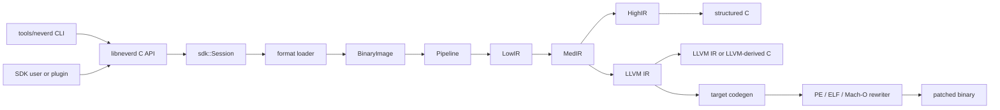

**Lingue**: [English](../architecture.md) | [简体中文](../zh-CN/architecture.md) | [繁體中文](../zh-TW/architecture.md) | [日本語](../ja/architecture.md) | [한국어](../ko/architecture.md) | [Français](../fr/architecture.md) | [Deutsch](../de/architecture.md) | [Español](../es/architecture.md) | [Italiano](architecture.md) | [Русский](../ru/architecture.md) | [العربية](../ar/architecture.md)

[← Indice della documentazione](README.md)

# Architettura di NeverD

Questa guida descrive i confini di produzione che un contributor deve conoscere
per modificare NeverD in sicurezza. Copre intenzionalmente solo il codice di
NeverD; i sottomoduli LLVM, Capstone e Unicorn mantengono la propria
architettura interna.

## Confine del sistema

```mermaid
flowchart LR
  CLI["tools/neverd CLI"] --> CAPI["libneverd C API"]
  SDKUser["SDK user or plugin"] --> CAPI
  CAPI --> Session["sdk::Session"]
  Session --> Loader["format loader"]
  Loader --> Image["BinaryImage"]
  Image --> Pipeline["Pipeline"]
  Pipeline --> Low["LowIR"]
  Low --> Med["MedIR"]
  Med --> High["HighIR"]
  High --> HighC["structured C"]
  Med --> LLVM["LLVM IR"]
  LLVM --> LLVMOut["LLVM IR or LLVM-derived C"]
  LLVM --> Codegen["target codegen"]
  Codegen --> Rewriter["PE / ELF / Mach-O rewriter"]
  Rewriter --> Patched["patched binary"]
```

NeverD ha quattro rappresentazioni IR, ma non costituiscono una sequenza
obbligatoria di quattro passaggi. `LowIR -> MedIR` è condiviso. La
decompilazione strutturata usa poi `MedIR -> HighIR -> C`, mentre `lift`,
`decompile --llvm` e `patch` seguono direttamente `MedIR -> LLVM IR`. In
particolare, le modalità patch e lift saltano intenzionalmente HighIR.

La CLI analizza i comandi in `tools/neverd`, crea un `neverd_session_t` e chiama
l’API pubblica di `include/neverd/sdk/NeverDCAPI.h`. Lo stato del motore risiede
in `lib/sdk/SessionImpl.h`; `neverd_session_load` sceglie un loader e costruisce
una `BinaryImage`, mentre le operazioni basate su IR eseguono
`lib/pipeline/Pipeline.cpp` su richiesta. L’eseguibile `neverd` collega
`neverd_shared`; gli archivi dei componenti e le loro dipendenze LLVM/Capstone
sono dettagli privati della libreria condivisa. La CLI usa LLVM
Support per l’interfaccia a riga di comando, ma non aggira la C API per pilotare
il motore.

L’analisi HighIR `HighSourceFlow` gestisce gli archi delle istruzioni emesse, l’identità
delle variabili locali e l’assegnazione certa. La verifica del sorgente e l’eliminazione
delle copie PHI inutilizzate condividono il grafo. Partizioni limitate zero/non-zero seguono
le condizioni scalari ripetute; le scritture invalidano i fatti e le variabili il cui indirizzo
sfugge restano sconosciute. Al limite si torna al grafo conservativo. Una copia PHI viene
eliminata solo se il valore è inutilizzato in ogni contesto realizzabile. Chiamate, letture,
scritture ed etichette mantengono il comportamento osservabile.

Anche l’analisi di fuga dei consumatori di blocchi usa questo grafo. Un punto fisso limitato propaga identità dei puntatori e memoria privata dello stack tra rami e cicli. Le confluenze conservano possibili indirizzi di contesto; solo una sovrascrittura completa li elimina. Archi sconosciuti, eccezioni e budget di prova esauriti impediscono il collegamento.

I fatti sul ricevitore Objective-C distinguono self all’ingresso del metodo da un riferimento esatto di classe. Tutti i record che condividono l’ingresso devono concordare prima di stabilire self. Le copie a larghezza completa e i registri preservati dall’ABI propagano i fatti con lo stesso punto fisso, inclusi gli archi di ritorno all’ingresso. Il confronto distingue metodi di classe e d’istanza, categorie registrate, superclassi e protocolli adottati; self include anche le sottoclassi note. I cataloghi del compilatore mantengono proprietari e gerarchia separati dall’accordo globale dei selettori. Prima della pubblicazione, l’SDK riconvalida origine del ricevitore e dichiarazioni nell’immagine corrente. Questi fatti non selezionano un IMP né autorizzano riscritture binarie.
Se manca la gerarchia esterna, si richiede l’accordo globale dei selettori senza restringere il ricevitore; dichiarazioni esplicitamente incompatibili o non supportate restano evidenza negativa.

Gli ivar con tipo oggetto esplicito estendono la prova del ricevitore attraverso al massimo otto caricamenti a larghezza completa. Ogni passo registra lo slot dell’offset a runtime, la larghezza e l’eventuale offset letterale usato dall’istruzione. Il letterale deve corrispondere alla disposizione corrente; il riferimento a runtime può seguire un campo spostato. Il loader controlla la discendenza registrata e la dichiarazione del campo. Accessi parziali, id senza classe, blocchi, soli protocolli, memoria ambigua e puntatori base ignoti non forniscono classi. La validazione del sorgente ricontrolla l’intero percorso nell’immagine corrente. Questi fatti non provano identità degli oggetti né autorizzano la rimozione di operazioni di memoria.

Il loader valida grafi limitati e aciclici di stringhe costanti, oggetti interi, array e dizionari ordinati Darwin. Ogni campo e arco richiede memoria mappata immutabile e prove non ambigue di importazione o rilocazione; codifiche non supportate, cicli e grafi incompleti falliscono esplicitamente. I binding sorgente verificano nuovamente il grafo e lo slot del puntatore in ingresso. Le funzioni generate preservano i bit interi, l’ordine dei figli e gli indirizzi condivisi, riutilizzando le identità delle stringhe. Gli slot vengono inizializzati una sola volta con pubblicazione acquire/release, chiamando soltanto figli validati. Ogni funzione contiene le loro dichiarazioni per condividere una definizione tra metodi recuperati indipendentemente. I test portabili coprono input malformati e budget di prova; le fixture native confrontano contenuti, alias, identità delle copie e inizializzazione concorrente con i metodi originali.

## Rappresentazioni IR e percorsi

La [fase sperimentale di recupero degli interpreti](interpreter-recovery.md)
specializza LowIR ottenuto con lifting rigoroso prima del confine MedIR comune.
Il provider gestisce le prove di immutabilità dell’immagine, `SymExec` la
semantica delle istruzioni e il CFG residuo riutilizza SSA e i normali backend
del sorgente. Le prove del recupero restano separate dalle certificazioni delle
occorrenze native e delle patch binarie.

`InterpreterSpecialization` gestisce la propagazione inversa limitata delle richieste di bit dopo un tentativo fallito. Riutilizza il valutatore scalare senza cambiare i fatti del grafo né aggiungere campi di controllo o contesti; tutto il lavoro resta soggetto ai budget e la pubblicazione richiede una nuova prova completa.

Il raffinamento dei contesti può proporre anche un contenitore di indirizzo di otto byte già tracciato quando una richiesta di memoria successiva ne usa soltanto una porzione. Le coordinate ristrette originali del produttore restano il riferimento; solo l’inserimento in coda forma chiavi da costanti o scostamenti del frame dimostrati.

L’enumerazione finita può osservare tuple ammissibili senza cambiare la query di prova. Il rifiuto dell’osservatore restituisce un risultato incompleto senza tuple. La cache conserva solo prove matematiche del dominio; i certificati delle letture immutabili restano locali fino al completamento dell’enumerazione.

`NeverDLoader` gestisce `PEFixedImageView` e condivide l’analisi completa delle rilocazioni di base con il caricamento PE ordinario. L’adattatore dell’interprete binario usa questa vista autenticata alla base preferita per recupero e prove native, senza analizzare autonomamente le tabelle PE. La preparazione verifica scritture delle importazioni, identità delle mappature e campi originali completi prima di certificare i byte. La vista prende in prestito un’immagine invariata e non dimostra equivalenza di ASLR o inizializzazione.

`FrameOffsets` gestisce prove con budget degli spostamenti unici rispetto all’ingresso. Il recupero normalizza gli accessi simbolici effettivi senza cambiare le espressioni residue degli indirizzi; i controlli nativi mantengono l’uguaglianza degli indirizzi fra due esecuzioni. Il recupero gestisce la selezione esaustiva e i budget condivisi dei tentativi. L’aggregazione delle prove di partizioni native/LLVM resta un lavoro separato incompleto. `NativeStackControl` gestisce la pulizia interna di ritorno senza segno a 16 bit; il fornitore binario autentica le codifiche canoniche che estraggono otto byte.

Quando la scoperta ordinaria si arresta, il recupero può suddividere un campo di registro già usato come chiave di contesto per posizione nativa e modalità, escluso l’ingresso della funzione. Il dominio in ingresso deve essere completo, variabile e coprire tutti i bit dichiarati. Ogni predecessore reale dimostra autonomamente il proprio dominio corrente completo, confronta il campo fisico vivo e riproietta ogni caso. I predecessori successivi e i nodi ampliati vengono ricontrollati; il concatenamento si ferma agli ingressi proposti. I confronti hanno provenienza sintetica e condividono i budget di nodi, operazioni, contesti, query e raffinamenti. Maschere parziali, flag indefiniti e campi solo nel frame sono esclusi. Non si aggiungono letture ospiti o ipotesi del chiamante. I domini incompleti conservano l’arco prudente; tutti i casi raggiungibili devono concludersi prima della pubblicazione.

Il raffinamento di controllo e guardie precede i tentativi di partizione opzionale del frame; restano disponibili le partizioni più fini necessarie. Ogni residuo raggiunge il punto fisso prima del successivo, ma la pubblicazione richiede il completamento di tutti i residui ammessi. L’allineamento esplicito interseca il dominio delle partizioni e il dispatch confronta residui effettivi. I budget di contesti, operazioni, nodi e solver restano limitati e condivisi tra i tentativi. Il recupero dello stato macchina accetta `--vm-entry-alignment=A:R` come dominio esplicito e verificato del RSP iniziale. `A` deve essere una potenza positiva di due e `R < A`. Gli altri valori restituiscono stato 2 prima di accessi guest o scritture dello stato. I bit alti restano liberi e non si presume alcun allineamento predefinito. Questa opzione non certifica l’equivalenza nativa.

`SymState` conserva byte già materializzati per un singolo STORE con contratto esplicito di separazione. Lo STORE reale viene eseguito; altre regioni, epoche di invalidazione e valori ignoti mantengono lo stato successivo alla scrittura. Nessun byte mancante viene letto o inizializzato. `SymExec` applica il contratto a un solo STORE ordinario. Il recupero conserva separatamente slot affini completi e informazioni d’origine; le unioni restano conservative.

`StringTransfer` gestisce l’abbassamento scalare limitato e ordinato. Il recupero gestisce prove dei valori, budget condivisi e ricertificazione dei puntatori di frame copiati integralmente; gli accessi generati riusano i normali controlli di memoria.

La visita delle dipendenze di controllo riporta le dipendenze dai bit della radice solo dopo un’analisi completa. Il recupero può omettere l’enumerazione facoltativa degli indirizzi dell’immagine quando un indirizzo relativo dimostrato conserva almeno 32 bit alti liberi della radice; ciò non dimostra la raggiungibilità e non elimina mai l’accesso alla memoria.

La stessa analisi delle dipendenze della radice protegge la proiezione affine dei controlli a larghezza completa. Il risultato è locale a un predicato d’arco; domini troppo grandi producono un rifiuto incompleto esterno alla cache matematica. Le maschere ristrette vengono riprovate. La gestione esistente della fattibilità resta indipendente; il rifiuto del dominio non dimostra né la raggiungibilità né l’irraggiungibilità di un arco.

La cache delle query finite conteggia chiavi serializzate, risultati numerici e metadati d’uso nello stesso limite di memoria. Verifica l’intero candidato e che possa entrare da solo prima di eliminare record. Nodi stabili della mappa possiedono le chiavi. Gli accessi riusciti aggiornano l’ordine d’uso e restituiscono copie autonome dei risultati, valide anche dopo l’eliminazione. Gli oggetti cache non possono essere copiati né spostati. La sostituzione modifica il riuso delle prove, non la semantica delle query o l’ammissibilità dei risultati.

`InterpreterSpecialization` gestisce sia le relazioni congiunte sia i domini finiti indipendenti dei campi. La proiezione degli archi registra solo prove complete per colonna; le confluenze intersecano le maschere e uniscono i valori nuovamente mascherati. La ricostruzione inizializza lo stesso stato simbolico e congiunge i domini al predicato comune, mantenendo l’identità del frame e i bit non vincolati. Si possono omettere solo vincoli di appartenenza implicati da una verifica esatta di inclusione delle tuple. Questa politica non cambia le chiavi di contesto né l’autenticazione dei ritorni nativi.

`FrameEntryConstraints.h` definisce il predicato senza riavvolgimento condiviso da recupero e prova relazionale. `InterpreterSpecialization` gestisce la concatenazione limitata dei trasferimenti univoci e la riproduzione confermata. Queste opzioni C++ sono disattivate per impostazione predefinita; confronto del contratto e associazione del digest restano nell’adattatore binario.

`modelInterpreterMachineStateX64` e il wrapper sorgente condividono un generatore per sottoregistri ospiti, flag impacchettati, stato del profilo e flusso di controllo. Il modello sostituisce solo gli accessi all’oggetto di stato con byte di registro espliciti e separa lo stato dal RAX ospite. Non possiede la semantica del compilatore o la politica di prova; dominio di ingresso, osservazioni, contratto del frame e verifica completa del raffinamento restano al chiamante.

`NeverDLLVMInterpreterModel` gestisce l’importazione LLVM scalare separata e limitata nella stessa ABI di stato grezzo. `modelLLVMInterpreterMachineStateX64` conserva lo stato effettivo e genera controlli di definitezza. `llvmInterpreterMachineStateContract` fornisce osservazioni complete e conservazione del monitor zero; dominio, memoria e prova completa spettano al chiamante. Non modifica lifting ordinario o pubblicazione dei sorgenti e non dimostra il compilatore.

Il modello LLVM verifica i contratti di parametro `initializes`. Riutilizza le proiezioni dei puntatori di stato ed esegue un’analisi limitata delle inizializzazioni garantite, byte per byte, prima dell’emissione scalare ordinaria, senza un secondo valutatore di valori.

`NeverDInterpreterLLVMRefinement` compone prove dal codice nativo a LLVM. Ricostruisce entrambi i modelli e i contratti obbligatori, proietta i flag solo all’ingresso secondo il profilo autorevole e verifica nuovamente entrambe le premesse. Il chiamante può proporre piani di ciclo ma non sostituire modelli, osservazioni o attestazioni. I modelli copiano solo il grafo eseguibile e le radici dichiarate; gli archi di ritorno all’ingresso sono rifiutati per evitare una nuova inizializzazione.

L’API C v3 e la CLI passano i budget di campi, raffinamento e interrogazioni allo specializzatore comune. L’adattatore controlla dimensioni e campi reserved prima di leggere le estensioni; layout v1/v2 e valori predefiniti restano stabili. Aumentare i budget non cambia il contratto di esecuzione né i criteri di pubblicazione.

Il recupero espone anche `--vm-chain-transfers=N` (predefinito 0) e `--vm-no-control-discovery`. Il concatenamento mantiene le correlazioni simboliche tra trasferimenti con destinazione unica dimostrata; al limite torna ai normali confini CFG. Il recupero dello stato macchina può dichiarare offset rispetto a RSP d’ingresso senza riavvolgimento, non verificati a runtime, con `--vm-entry-frame=begin:end`. La premessa numerica esatta accompagna C e rapporto; non autorizza memoria né dimostra equivalenza.

Le grandi funzioni recuperate che superano il limite di costruzione SSA possono usare `--llvm` tramite un contratto limitato di memoria scalare mutabile. Input iniziali, valori trasportati dai cicli e letture precedenti mantengono il proprio significato. Stati impliciti non supportati, parametri in registri vettoriali, rilocazioni, memoria ambigua e controllo malformato falliscono esplicitamente; HighC rifiuta questo percorso alternativo. L’output segue ancora il contratto esistente dello stato macchina e non aggiunge certificati di equivalenza.

`analyzeMedMutableSource` gestisce la verifica del CFG normalizzato, le identità della memoria e i requisiti conservativi dei byte iniziali. Questi requisiti sono limiti superiori delle letture, non prove positive di osservabilità. LLVM verifica prima delle scansioni del modulo e riutilizza il piano per inizializzare gli ingressi una sola volta. Il prodotto blocchi/valori e il lavoro di propagazione hanno limiti separati. La propagazione in C usa per ogni lettura una scrittura precedente esatta, dello stesso tipo e senza alias parziali; le confluenze tra blocchi mantengono memoria esplicita.

Per i corpi validati con variabili mutabili, LLVM inoltra i valori esatti degli slot privati nello stesso blocco con istruzioni aggiunte in coda e conserva le ultime scritture. L’inizializzazione in ingresso e i confini tra blocchi, funzioni e moduli restano separati. Gli accessi alla memoria del programma rimangono espliciti. L’emissione C limita l’espansione delle espressioni scalari e il lavoro di riduzione delle costanti, mantenendo intermedi con nome. Le espressioni costanti riducibili usano il layout di destinazione LLVM; quelle non supportate falliscono esplicitamente. I valori di ritorno mutabili designati, incluso zero, non diventano ritorni void.

Il sottoinsieme mutabile accetta memoria scalare da 8/16/32/64/128 bit; gli ingressi dei conteggi sono limitati a 64 bit. Larghezze non standard o superiori richiedono un contratto sorgente separato.

Il lifter dell’architettura gestisce in modo transazionale i metadati aggiuntivi delle uscite indefinite: cancella le prove precedenti prima di ogni tentativo e pubblica gli effetti solo per l’esatto lifting riuscito. `Missing` indica l’assenza di prove, non una descrizione `Complete` vuota. LowIR conserva i valori deterministici scelti. `LowIRUndefinedIndependence` gestisce la prova relazionale limitata di un grafo LowIR fornito, completo e aciclico, condividendo gli ingressi ordinari e mantenendo le correlazioni dei nuovi valori indefiniti. Associa confini completi delle istruzioni e digest delle operazioni, rifiutando prove incomplete. La certificazione generale dei grafi nativi, gli invarianti dei cicli e l’equivalenza dal codice nativo a C restano lavori separati oltre l’ambito dei percorsi nativi finiti descritto di seguito.

Le forme scalari classiche SHL/SAL, SHR e SAR forniscono evidenze condizionali dei bit indefiniti per operandi di 8/16/32/64 bit. Un conteggio mascherato nullo preserva tutti i flag; altrimenti AF è arbitrario, OF lo diventa oltre uno e CF per SHL/SHR quando il conteggio raggiunge la larghezza. SAR conserva CF definito. Le guardie booleane usano il conteggio salvato prima delle scritture sovrapposte; le operazioni sono identiche con e senza metadati. Le codifiche non verificate non pubblicano effetti parziali.

ROL/ROR legacy producono un nuovo bit OF arbitrario solo quando il conteggio mascherato dall’architettura supera uno; il successivo modulo sulla larghezza byte/word non cambia il predicato. Il conteggio zero conserva i flag. BT/BTS/BTR/BTC con base registro producono quattro bit indipendenti (OF/SF/AF/PF), con CF definito e ZF/DF conservati. Sono verificati gli esatti codici registro e imm8; stringhe di bit in memoria, LOCK, APX e rotazioni attraverso carry restano fuori da questa estensione. Gli effetti seguono il nucleo dell’istruzione e il LowIR è identico con o senza metadati. Vedere i riferimenti Intel per [test di bit](https://cdrdv2-public.intel.com/929353/253666-093-sdm-vol-2a.pdf) e [rotazione](https://cdrdv2-public.intel.com/929354/253667-093-sdm-vol-2b.pdf).

Anche XADD tra registri dispone di un audit esatto delle codifiche legacy a 8/16/32/64 bit: definisce CF/PF/AF/ZF/SF/OF, conserva DF e non crea nuovi bit arbitrari. Entrambi i registri scambiati rispettano le regole architetturali di scrittura parziale e di estensione con zeri a 32 bit. Le forme memoria/LOCK e APX di XADD restano non verificate. La [regola di compatibilità Intel](https://cdrdv2-public.intel.com/929360/253669-093-sdm-vol-3b.pdf) ammette Group 2 `/6` per C0/C1/D0/D1/D2/D3 come SAL/SHL `/4`, usando le stesse guardie sul conteggio e gli stessi flag indefiniti. Consultare il [riferimento XADD](https://cdrdv2-public.intel.com/929356/334569-093-sdm-vol-2d.pdf).

Le letture native immutabili accettano anche insiemi finiti dimostrati esaustivamente, limitati da `MaxImmutableLoadAddresses`. Prima dell’enumerazione si dimostra l’uguaglianza degli indirizzi nelle due esecuzioni. Ogni candidato richiede byte immutabili, evidenze della mappatura e separazione dal frame mutabile; il valore resta dipendente dalla selezione in ingresso. Candidati mancanti, dati scrivibili o rilocati e budget esauriti impediscono il certificato. Questo vincola le evidenze di lettura e il limite degli indirizzi. Offset dinamici del frame e memoria esterna arbitraria restano esclusi.

Il comportamento seguente usa il contratto di audit rigoroso predefinito. `checkBinaryUndefinedIndependence` verifica percorsi nativi x64 completi e finiti per le osservazioni dichiarate, raccogliendo entrambi i rami diretti originali prima della potatura per fattibilità. Un near CALL fisico inserisce nello stack l’indirizzo reale di continuazione; un RET interno legge la parola corrente dello stack, inclusi indirizzi di ritorno modificati. Le destinazioni indirette richiedono un’enumerazione finita esaustiva e l’uguaglianza delle due esecuzioni prima di restringere il percorso. Le letture immutabili esatte richiedono prove e separazione dimostrata dal frame mutabile. Ogni istruzione raccolta, anche nei rami non percorsi, richiede byte originali immutabili; ad eccezione dei limiti terminali di `INT3`/`UD2` sottoposte a lifting rigoroso e della proiezione RDSSP/INCSSP con profilo esplicito descritti sotto, ogni istruzione richiede inoltre metadati architetturali completi. Le `INT3`/`UD2` sottoposte a lifting rigoroso possono restare come limiti `Terminator`, con tutti i byte originali e il digest delle operazioni LowIR, senza promuovere un sidecar delle uscite indefinite da `Missing` a `Complete`. Un certificato può conservare queste trap solo quando l’esecuzione simbolica ne dimostra l’irraggiungibilità; qualsiasi percorso fattibile che ne raggiunga una restituisce `ContractViolation`, senza certificato né codice residuo. Questa regola non modella la continuazione dopo una trap né il recupero dalle eccezioni, non usa l’euristica `codeFollowsTrap` e non estende il supporto dell’API LowIR statica. I certificati vincolano byte, mappature, effetti, evidenze di lettura, profilo e budget. Il profilo esplicito normale, senza fault e con CET disattivato esclude tutte le mappature dell’immagine dal frame d’ingresso. Ogni percorso fattibile deve raggiungere un ritorno esterno che preservi RSP d’ingresso e lo slot di ritorno originale prima del pop nativo; un prefisso interrotto non prova nulla. I cicli diretti e indiretti richiedono un’espansione finita completa; percorsi non terminanti o oltre budget e altri effetti non verificati impediscono il certificato. `specializeBinaryInterpreterWithIndependence` dimostra prima di recuperare e non restituisce residui in caso di errore. Il recupero ordinario non attiva il controllo per impostazione predefinita; invarianti dei cicli, eccezioni, esecuzione con CET ed equivalenza dal codice nativo a C restano esclusi.

L’opzione esplicita `RetainUnauditedNativeBoundaries` aggiunge confini di rifiuto alle prove native finite di indipendenza e raffinamento verso LowIR. Sono ammesse solo istruzioni decodificate e sollevate rigorosamente, con copertura `Missing`, effetti vuoti e un digest delle operazioni non vuoto e corrispondente. Tutti i controlli su struttura, controllo, sovrapposizioni, profilo e risorse restano obbligatori. Si interrompe solo la raccolta dei successori del confine; un altro arco verso i byte successivi viene raccolto indipendentemente. Ogni arrivo possibile viene rifiutato prima dell’esecuzione; un risultato ignoto o un budget esaurito non prova nulla. I certificati legano ricevute tipizzate e versionate al confine esatto e ai digest di byte nativi e operazioni, senza trasformare `Missing` in `Complete`. Non si dichiara verificato alcun suffisso non raccolto. L’indipendenza copre tutte le scelte arbitrarie; il raffinamento a valori scelti dimostra l’irraggiungibilità solo per il testimone dichiarato. Le API LowIR statiche, di prova/inferenza dei cicli e LLVM esatte non attivano questa opzione.

`AllowOverlappingNativeInstructions` è un’opzione separata, disattivata per impostazione predefinita, per prove native finite di indipendenza e raffinamento verso LowIR. Ogni ingresso viene decodificato e verificato separatamente; i byte condivisi devono concordare con tutte le prove precedenti di istruzioni e letture immutabili, comprese quelle del candidato. Gli indirizzi LowIR del candidato restano etichette, non prove sui byte. `MaxNativeInstructionBytes` vale 1048576 per impostazione predefinita e conteggia, prima del confronto, l’intera dimensione di ogni nuovo ingresso, inclusi i byte ripetuti. L’esaurimento del budget o byte contraddittori impediscono il certificato. L’opzione e il limite sono inclusi nel digest della prova. LowIR statico, prove induttive dei cicli e inferenza rifiutano l’opzione anche con un piano vuoto; l’API LLVM esatta e la CLI mantengono i valori predefiniti.

La prova nativa dei flag impacchettati richiede `X64FlagsProfile = UserX64NoFaultV1` sia nelle opzioni sia nel contratto; i booleani esistenti non la abilitano. I flag iniziali canonici condivisi e i flag di sistema persistenti usano la stessa transizione scalare PUSHFQ/POPFQ del wrapper sorgente dello stato macchina, incluse le maschere CPL3/IOPL0. Ogni POPFQ deve dimostrare TF/AC a zero in entrambe le esecuzioni, senza assumerlo. I flag finali di sistema vengono sempre confrontati, anche senza osservazioni dei registri o del frame scritto. I certificati legano versione del profilo e digest esatti delle transizioni. Con questo profilo esplicito senza CET, byte canonici RDSSPD/RDSSPQ verificati indipendentemente possono essere proiettati come NOP esatto con attestazione tipizzata; i metadati originali restano `Missing` e anche una destinazione a 32 bit conserva tutto il registro. Le INCSSPD/INCSSPQ canoniche restano limiti #UD dipendenti dal profilo, con attestazione dell’istruzione originale irraggiungibile; ogni visita ammissibile viola il contratto senza fault, anche con operando zero. Altre istruzioni CET, esecuzione con CET e profili tramite l’API LowIR statica restano non supportati. Ogni visita di un ciclo finito conserva lo stato e genera nuove scelte indefinite; non dimostra un invariante.

`checkLowIRRefinement` e `checkBinaryLowIRRefinement` verificano un raffinamento costruttivo separato verso un candidato LowIR deterministico. `LiftedBits` sceglie i bit calcolati dal lifter originale a ogni produttore indefinito; `ZeroBits` sceglie zero soltanto quando la condizione verificata è attiva. Ogni occorrenza dinamica viene registrata; copie e spill mantengono la stessa scelta. I programmi condividono gli esecutori scalari, dello stack fisico, della memoria e dei flag e lo stato iniziale. Tutti i percorsi possibili devono terminare, coprire il dominio iniziale ammesso e rispettare i contratti di conservazione. Operandi RETURN, registri richiesti, flag di sistema nativi obbligatori e unione dei byte scritti nello stack devono coincidere. I budget sono condivisi, con un limite `MaxTerminalPairs`. I certificati legano candidato, prove originali, politica e limiti. Una scelta fallita non esclude altre scelte. Lo svolgimento finito non prova invarianti di ciclo, uguaglianza specifica della CPU o equivalenza del backend C e non sostituisce l’indipendenza dallo stato indefinito. Entrambe le API rifiutano temporanei di ingresso sovrapposti all’area temporanea di memoria del verificatore. L’API di raffinamento binario richiede profili `UserX64NoFaultV1` corrispondenti nelle opzioni e nel contratto di osservazione.

`checkLowIRLoopRefinement` e `checkBinaryLowIRLoopRefinement` aggiungono certificati induttivi distinti. I punti di taglio abbinati e i modelli di stato in LowIR scalare puro sono candidati: l’esecutore comune verifica l’inizializzazione dall’ingresso reale, la copertura completa dei segmenti, ogni successore possibile, la conservazione dell’invariante e le osservazioni finali. Ogni transizione tra tagli deve diminuire strettamente un rango lessicografico finito senza segno; la proiezione inversa dei parametri impedisce di ripristinare il rango senza progresso della macchina. La base è lo stato d’ingresso comune oppure, con `UseEntryPrefix` (`GeneralizeEntryPrefix = false`), un prefisso abbinato effettivamente raggiunto il cui predicato va anch’esso preservato. I tagli controllano tutti i registri modificati e l’intero frame; le osservazioni finali mantengono le scritture delle iterazioni precedenti. Ogni taglio richiede attualmente un indirizzo univoco per lato. La scoperta automatica di invarianti o ranghi e l’allineamento arbitrario del controllo restano esclusi. Tagli mancanti, invarianti falsi, ritorno modulare, terminazione non dimostrata, semantica non supportata o budget condivisi esauriti impediscono il certificato. Il digest vincola piano, segmenti nativi e prove originali. Le API finite e d’indipendenza rigorosa mantengono il loro significato; non si certificano il backend C né le scelte dei bit indefiniti di una CPU specifica.

Il requisito seguente di conservazione del predicato del prefisso si applica con `GeneralizeEntryPrefix = false`.

`inferLowIRLoopRefinementPlan` propone modelli limitati usando l’esecutore simbolico condiviso. I punti di taglio coprono tutti i cicli del CFG; l’allargamento conserva i bit fissi dimostrati ed elimina i limiti senza segno del prefisso che non si preservano. Contatori unitari osservati e fasi inferite formano ranghi lessicografici per cicli annidati crescenti o decrescenti. `OriginalPrefix` e `CandidatePrefix` richiedono `UseEntryPrefix`. Un taglio successivo ad altri può ottenere un prefisso accoppiato ammissibile tramite una riesecuzione limitata dall’ingresso reale. Tale testimone non copre il dominio d’ingresso: ogni arrivo deve implicarne il predicato e la copertura completa di ingresso e transizioni resta obbligatoria. `inferAndCheckBinaryLowIRLoopRefinement` richiede recupero completo e origini native univoche, poi ripete indipendentemente la verifica completa originale/candidato. Proposte e corrispondenze non sono affidabili; solo `Refinement` può contenere un certificato. Inferenza e prova mantengono budget espliciti separati. Questa API C++ non viene eseguita automaticamente con `--devirtualize`. Prefissi irraggiungibili, allineamento arbitrario del controllo, ranghi esterni alla ricerca, equivalenza del backend C e scelte fisiche dei bit indefiniti restano non supportati.

Il riconoscimento dei contatori unitari include aggiornamenti di sottoparole allineati ai byte che preservano tutti i bit esterni, dopo le forme esistenti a parola intera e con estensione a zero. Con più tagli, le esclusioni degli estremi sono proposte solo dopo una prova sugli arrivi concreti conservati e su tutti gli arrivi correnti. L’allargamento elimina le guardie non valide senza riproporle e può scoprire un’altra porzione di una parola già nota. Le maschere riutilizzano il parametro della parola intera; ranghi e osservazioni completi restano intatti. Rimangono obbligatori i budget condivisi di nodi/query e la verifica completa indipendente.

Con più tagli, ogni tupla di contatori osservati che fallisce è seguita da una variante con una fase costante iniziale a 64 bit, prima di passare alla tupla successiva. Le due varianti consumano tentativi `MaxRankCandidates` distinti e condividono lo stesso budget di query. La fase iniziale non deve aumentare su alcuna transizione fattibile; se il resto della tupla non è provato strettamente decrescente, la transizione richiede una diminuzione stretta della fase. I vincoli di differenza non negativi respingono cicli di peso positivo. Ciò permette a cicli sequenziali di riutilizzare un contatore reinizializzato, mantenendo gli obblighi di avanzamento all’interno dei cicli. Le fasi esistenti tra contatori possono combinarsi con quella iniziale. Ogni tupla completa è verificata sui predicati originali completi delle transizioni; il verificatore finale di raffinamento ricontrolla indipendentemente il rango proposto. La ricerca con un solo taglio non aggiunge questo prefisso costante inefficace.

Ogni candidato con un solo punto di taglio deve coprire tutti i cicli dei blocchi originariamente raggiungibili, inclusi quelli scollegati dall’ingresso rimuovendo il taglio. Ogni verifica consuma `MaxCutpointAttempts` prima dell’esecuzione simbolica. I contatori scalari con progresso unitario su ogni arco di ritorno mantengono la priorità. Poi fino a otto proposte di tuple di contatori unitari osservati si alternano, una alla volta, con ipotesi scalari più ampie di guardia o limite. Le ipotesi scalari rimanenti precedono la ripresa delle tuple senza ripetizioni. L’ordine non dipende dal limite del budget. Ogni tentativo ripristina il modello stabile completo e le transizioni salvate; un controllo del dominio fallito disattiva solo quella famiglia. Le guardie scalari respinte non restringono il dominio. `MaxRankCandidates` e i budget di query, operazioni e percorsi restano cumulativi. La proposta richiede ancora il verificatore completo di refinement. Un ramo di ritorno additivo può attivare l’allargamento strutturale anche quando gli altri mantengono o azzerano il valore; il modello proposto deve comunque superare tutti i controlli di ingresso e transizione.

`inferAndCheckLowIRLoopRefinement` cerca una relazione verificata tra cicli LowIR. Prova nell’ordine i piani predefiniti, quelli completi agli ingressi dei rami e quelli filtrati. Abbina prima le stesse famiglie, poi tutte le famiglie diverse e infine i singoli tagli ciclici del candidato. La famiglia completa seleziona successori di una diramazione nella componente ciclica con un solo arco uscente. Il filtro omette un ramo solo se tutti i percorsi si ricongiungono in un nodo non terminale prima di una destinazione di arco all’indietro DFS. Contano tutti i successori, comprese uscite e frontiere; un ricongiungimento solo alla frontiera non elimina il ramo. I tagli greedy continuano a coprire ogni ciclo originariamente raggiungibile. Le proposte conservano le fasi senza richiedere una riuscita inferenza predefinita. `MaxCutSelectionWork` limita separatamente l’analisi dei percorsi comuni, inclusi costruzione e confronto degli insiemi; `CutSelectionWork` registra anche i fallimenti e consuma il `MaxSearchWork` globale residuo. I selettori predefinito e completo restano invariati. Successi e fallimenti sono memorizzati, con al massimo tre piani per lato e permutazioni su richiesta. Le famiglie aggiuntive saltano insiemi di tagli già conservati sullo stesso lato, anche provenienti da una famiglia con numero successivo. Famiglie vuote o duplicate non usano query simboliche ma contano come tentativi. I sei piani condividono un budget `MaxMetadata`; ogni costruzione di abbinamento è limitata separatamente. Propone uguaglianza solo tra ingressi del frame con identici offset e larghezza. Rinomine di registri, relazioni affini e insiemi arbitrari di retroazione richiedono abbinamenti espliciti. L'abbinatore di riferimento e il verificatore completo mantengono i record originali verificati, il witness, il dominio d'ingresso, le osservazioni del frame e gli obblighi di terminazione del chiamante. In `LowIRLoopAlignmentLimits`, `MaxSolverQueries` è condiviso da tutte le inferenze e prove, inclusi i fallimenti; ogni chiamata riceve al massimo il minimo tra limite di fase e totale residuo. `MaxSearchWork`, `MaxMetadata`, `MaxCandidateAttempts`, `MaxPairingAttempts` e `MaxCuts` limitano costruzione ed enumerazione. Esaurire un singolo tentativo permette di riprovare; esaurire il budget globale arresta la ricerca. `Unsupported` indica che non è stata trovata una relazione, senza provare una differenza. Solo un `Refinement` appena verificato con successo contiene un certificato. Le impostazioni predefinite del CLI restano invariate.

`GeneralizeEntryPrefix` vale `false` per impostazione predefinita e richiede `UseEntryPrefix`. La modalità predefinita conserva il predicato del percorso acquisito a ogni arrivo. La generalizzazione esplicita tratta le espressioni del prefisso come funzioni totali di modello non verificate fuori da quel percorso. Restano necessari un testimone accoppiato raggiungibile, copertura completa di ingressi e segmenti, uguaglianza di tutti i registri e del frame, proiezioni, condizioni native e diminuzione stretta del rango nel dominio induttivo ampliato. L’inferenza amplia un taglio solo se uno stato entrante supera il dominio del testimone, quindi ricostruisce e verifica ogni transizione generale. Un primo testimone senza iterazioni non può nascondere un altro ingresso con ciclo. La politica è vincolata al digest del certificato induttivo.

L’inferenza annidata può proporre limiti senza segno stretti o non stretti tra contatori osservati a passo unitario e valori di prefisso invariati nei predicati di controllo, comprese le uscite per uguaglianza. Verifica prima gli stati concreti, poi elimina monotonamente le relazioni non valide nelle transizioni generali entranti. Visite e interrogazioni usano i budget espliciti esistenti; il verificatore originale/candidato dimostra i modelli in modo indipendente.

L’inferenza dei cicli annidati propone anche un’uguaglianza tra un operando memorizzato e un contatore o un ingresso di controllo invariato quando le espressioni di prefisso coincidono. Verifica ogni stato concreto in ingresso, conserva candidati per i valori scoperti negli ampliamenti successivi ed elimina una relazione se uno stato generale in ingresso la viola. Ogni parola conserva il proprio parametro ricostruibile; l’uguaglianza è un predicato verificato. Le ricorrenze di copia possono scartare prima i bit fissi accidentali, senza assumere semantica.

L’inferenza annidata cerca anche confronti di uguaglianza o disuguaglianza memorizzati in campi con al massimo 16 bit variabili. Ogni relazione usa i valori correnti del contatore e del limite; la cache mantiene un proprio parametro di stato recuperabile. Una guardia di ingresso o un’inizializzazione ridotta a costante può nascondere il confronto fino a un ampliamento successivo. Sono possibili nuove tuple, ma quelle rifiutate o eliminate non vengono riproposte. Devono valere per tutti gli arrivi concreti salvati e le transizioni entranti correnti. Le scansioni delle variabili nel DAG sono memorizzate per punto di taglio e addebitate al budget condiviso dei predicati. Copertura nativa completa, uguaglianza dell’intero stato e diminuzione stretta del rango restano requisiti indipendenti. La ricerca dei contatori continua dopo le transizioni generali: un contatore esterno nascosto dal primo testimone interno riceve ancora candidati verificati per limiti e copie degli operandi. Le relazioni rifiutate non vengono ripristinate e le prove dei passi unitari rispettano il budget dei nodi simbolici.

La riesecuzione dei prefissi di ingresso visita i rami in attesa prima di espandere ulteriormente un ciclo precedente. Può quindi trovare un testimone raggiungibile breve anche se un altro ramo ammette un numero arbitrario di iterazioni. Inferenza e verifica originale/candidato condividono questo ordine. Tutto il lavoro resta soggetto ai budget esistenti; un testimone di prefisso non sostituisce la copertura completa degli ingressi, la conservazione degli invarianti o le verifiche di terminazione.

| Rappresentazione | Scopo | Definizioni e trasformazioni principali |
|------------------|-------|-----------------------------------------|
| LowIR | Operazioni `NdOp` indipendenti dall’architettura, basic block, CFG e metadati delle jump table | `include/neverd/ir/low`, `lib/ir/low`, prodotto da `lib/decode` + `lib/lift` |
| MedIR | Tipi, ABI/convenzioni di chiamata, modello memoria/stack, flag, chiamate e flusso simile a SSA | `include/neverd/ir/med`, `lib/ir/med` |
| HighIR | Espressioni e controllo di flusso strutturati per C leggibile | `include/neverd/ir/high`, `lib/ir/high`, emesso da `lib/backend/c/HighC` |
| LLVM IR | Ottimizzazione, C derivato da LLVM, generazione di codice target e input per riscrittura binaria | `lib/backend/llvm`, ottimizzato/orchestrato da `lib/pipeline` |

Le costanti conservano, da LowIR a MedIR e HighIR, la provenienza scalare o di indirizzo e il proprietario dell’indirizzo per ogni occorrenza. Bit numerici uguali non uniscono origini diverse. La semplificazione simbolica di HighIR tratta le identità degli indirizzi come ingressi opachi; il binding del sorgente usa la classificazione condivisa degli operandi numerici e richiede ancora binding di rilocazione per gli usi di memoria e puntatori.

| Percorso utente | Cammino delle rappresentazioni | Uscita |
|-----------------|-----------------------------|--------|
| Dump Low/Med | Binary -> LowIR, opzionalmente -> MedIR | Testo diagnostico |
| Dump High o `decompile` | Binary -> LowIR -> MedIR -> HighIR | HighIR o C strutturato |
| `lift` | Binary -> LowIR -> MedIR -> LLVM IR | `.ll` |
| `decompile --llvm` | Binary -> LowIR -> MedIR -> LLVM IR | C derivato da LLVM |
| `patch` | Binary -> LowIR -> MedIR -> LLVM IR -> codegen | Binario riscritto |

`lib/pipeline/Pipeline.cpp` è la fonte autorevole per la scelta del percorso.
Mantieni la logica specifica di una rappresentazione nella relativa libreria IR
o backend; il pipeline deve orchestrare i componenti, non assorbirne gli
algoritmi.

## Contratto di traduzione tra architetture

`include/neverd/translate` definisce un livello contrattuale, non un
backend di esecuzione. `GuestState` modella lo stato visibile alla macchina in
modo indipendente dall’architettura per `x86_32`, `x86_64`, `AArch64` e `ARM32`.
La sua serializzazione canonica versione 1 usa campi little-endian a larghezza
fissa, ID di registro stabili, raccolte ordinate e validazione fail-closed;
lo stato persistito non dipende quindi dal layout C++ dell’host.

La baseline wire v1 di `GuestState` è congelata in modo permanente. Ogni stato
esterno a tale baseline deve usare un ID di registro di estensione nell’intervallo
riservato insieme a un nome canonico minuscolo, oppure passare a una nuova
versione wire con un upgrader esplicito; è vietato modificare in-place la
baseline v1.

Per un guest `ARM32`, `ExecutionMode` è la modalità di decodifica autorevole e
deve essere coerente con `CPSR.T`. Il PC memorizzato è sempre l’indirizzo
canonico dell’istruzione con il bit 0 azzerato; la modalità ARM richiede inoltre
l’allineamento alla parola.

Il contratto delle coppie definisce `x86_64 -> AArch64`,
`AArch64 -> x86_64`, `x86_32 -> AArch64/ARM32` e
`ARM32 -> x86_32/x86_64`. `ContractDefined` significa che una richiesta può
essere validata e persistita, non che il codice possa essere tradotto o eseguito.
La policy JIT accetta solo l’host nativo del processo; la policy AOT richiede
un’architettura host e un target triple espliciti; anche una CPU o un insieme di
feature selezionati devono essere espliciti.

`ResolvedHostTarget` trasforma questa selezione in un risultato concreto. La
risoluzione `Native` ricava dal processo triple, CPU e insieme di feature
abilitate o disabilitate. La risoluzione `Explicit` valida e normalizza
architettura, triple, CPU e feature forniti dal chiamante e rifiuta i conflitti.
La sua identità di cache versionata è costruita in ordine di byte deterministico
dagli input target normalizzati e non contiene indirizzi di processo né testo
dipendente dalla locale.

Un `TranslationExit` versionato registra una causa di arresto stabile e il
payload tipizzato corrispondente per syscall, eccezioni o segnali, breakpoint,
istruzioni non supportate, automodifica, budget di risorse, chiamate esterne,
fault di memoria e altre condizioni terminali. I consumer non devono quindi
reinterpretare un intero privo di tipo in base alla causa di arresto.

Salvo il caso `BudgetExhausted` corrispondente, i conteggi di istruzioni, blocks
e codice generato non devono superare il budget non nullo della richiesta.
L’esaurimento di istruzioni e blocks si arresta esattamente al limit. La
dimensione di un oggetto generato è nota solo dopo un codegen indivisibile;
quindi il relativo risultato può indicare `Observed > Limit`. L’oggetto rifiutato
non viene mai collegato, pubblicato o eseguito. Ogni payload `BudgetExhausted`
identifica esattamente il limit richiesto, mai una soglia derivata o privata
dell’implementazione.

Il contratto backend-private `RuntimeControlBlockV1` misura
esattamente 128 byte, è allineato a 8 byte ed è vincolato da magic, version,
size e offset dei campi fissi della v1, campi riservati a zero ed exit tipizzate
coerenti. Non contiene container C++, puntatori host né alias di indirizzi guest.
Non è il layout C++ né il formato wire di `GuestState`; un backend che implementa
questo contratto deve convertire esplicitamente lo stato in questo record.

La superficie fissa di chiamata v1 del codice generato contiene esattamente otto
helper: `nvd_rt_v1_load8_le`, `nvd_rt_v1_load16_le`, `nvd_rt_v1_load32_le`,
`nvd_rt_v1_load64_le`, `nvd_rt_v1_store8_le`, `nvd_rt_v1_store16_le`,
`nvd_rt_v1_store32_le` e `nvd_rt_v1_store64_le`. Nomi, firme e provenienza dei
puntatori devono corrispondere esattamente; un backend collega esplicitamente
questa tabella finita e non ripiega mai sulla risoluzione ambientale dei simboli.
La validazione della generation eseguibile e il polling di budget/cancellazione
sono operazioni riservate al dispatcher fidato; `nvd_rt_v1_validate_generation`
e `nvd_rt_v1_poll` non sono helper del codice generato. Il dispatcher host fidato
possiede anche la selezione dei blocks e non è invocabile dall’IR generato; i
translated blocks restituiscono invece un codice di exit tipizzato. L’IR
generato può leggere direttamente solo lo slot runtime scalar-result dichiarato.

`RuntimeSymbolRegistryV1` realizza questa tabella di helper come registro host
chiuso. La costruzione valida l’intero insieme ABI-v1, i nomi canonici esatti, le
classi degli helper, le firme e, per ogni voce, esattamente un puntatore a
funzione non nullo coerente con la classe. La ricerca accetta solo il nome
esatto, non consulta mai simboli ambientali del processo o del loader dinamico e
fornisce al verifier degli oggetti gli stessi nomi ordinati come allowlist. La
sua identità versionata copre nomi, classi degli helper e forma dell’ABI, ma
esclude deliberatamente gli indirizzi nativi ed è quindi stabile con ASLR.

`RuntimeCodeMemory` possiede storage per codice generato isolato per pagina e
consente solo la pubblicazione unidirezionale `RW -> RX`. La memoria non è mai
scrivibile ed eseguibile allo stesso tempo, non può essere riaperta in scrittura,
controlla i limiti di scritture ed entry point e invalida la cache delle
istruzioni host al momento della pubblicazione. Lo smoke test nativo esegue solo
una breve sequenza di istruzioni host dopo la pubblicazione: dimostra questo
confine di memoria W^X, non un motore di traduzione.

`GuestMemoryRuntime` è isolato dal `GuestState` logico: la costruzione prima
valida lo stato, quindi copia byte e metadati delle regioni in un indice privato
ordinato. Gli indirizzi virtuali guest sono soltanto chiavi di ricerca e non
vengono mai convertiti in puntatori host. Gli accessi scalari controllati
segnalano fault tipizzati per larghezza, allineamento, overflow, assenza di
mapping, attraversamento di regione, permessi, scrittura eseguibile, overflow o
discordanza di generation e violazione di policy. I budget di istruzioni/blocks,
la cancellazione, il tracking della generation e le policy di scrittura del
codice `RejectExecutableWrites`, `InvalidateOnExecutableWrite` e
`ValidateBeforeDispatch` producono anch’essi record tipizzati coerenti invece
di comportamento host implicito.

`TranslationObjectCompilerV1` è il confine verificato da LLVM IR a oggetto.
Valida un modulo di input const, lo clona prima di ogni trasformazione, compone
la semplificazione semantica proof-gated con l’ottimizzazione LLVM da `O0` a
`O3`, convalida di nuovo l’IR finale ed emette oggetti relocatable ELF, COFF o
Mach-O per le quattro architetture host del contratto. Canonicalizza i manifest
esatti dei blocks e dei simboli runtime dopo il mangling del target, controlla
ogni oggetto emesso e restituisce l’identità del registro runtime insieme a
chiavi di cache versionate per richiesta e artefatto. Con un budget di byte
generati diverso da zero, solo un oggetto conforme può passare alla verifica
dell’artefatto. LLVM emette prima in un buffer privato per misurare la dimensione
esatta e indivisibile; un oggetto sovradimensionato viene rifiutato prima della
pubblicazione e dell’audit, mentre la telemetria tipizzata conserva la dimensione
osservata e il limit esatto richiesto. Zero significa nessun limite imposto dal
chiamante. Il compilatore si ferma ai byte relocatable controllati: non li
collega, pubblica, invia al dispatcher o esegue e non fornisce il lowering delle
istruzioni guest.

Il verifier post-codegen controlla gli oggetti relocatable ELF,
COFF e Mach-O come insieme chiuso. Formato e architettura devono corrispondere
esattamente all’host selezionato; i simboli non definiti devono appartenere
esattamente alla allowlist finita degli helper e i simboli dinamici sono vietati.
Le relocations seguono whitelist dirette esplicite con controlli di encoding,
larghezza, allineamento, offset, destinazione caricabile e target definito
nell’oggetto come non-preemptible o helper autorizzato esattamente. Sono
rifiutati W+X, metadati unwind/exception/initializer, TLS, IFUNC, GOT e
l’indirezione PLT ordinaria, relocations dinamiche, definizioni weak/preemptible
o selezionabili, sezioni allocate sconosciute e direttive del linker. La forma
`R_X86_64_PLT32` usata da LLVM per una chiamata ELF x86-64 hidden è ammessa solo
quando la policy v1 dimostra un branch diretto sealed verso l’helper runtime
esatto; non autorizza un percorso PLT o GOT. Gli artefatti ELF `ET_REL` non
possono contenere program header o segmenti. I load command Mach-O seguono una
lista positiva: esattamente un segmento della larghezza corretta e al massimo
una symbol table, dynamic-symbol table, platform-version e un comando
data-in-code, con verifica delle dipendenze. Le opzioni del linker e ogni altro
command vengono rifiutati.

`TranslationObjectRequestV1` è la prima fase pubblica, volutamente ristretta,
che trasforma byte guest in un oggetto su questi contratti. Nel sottoinsieme v1
fail-closed pubblicato per i registri scalari x86-64 accetta soltanto codifiche
canoniche prive di prefissi legacy: forme `MOV`, `ADD`/`SUB` e
`AND`/`OR`/`XOR` con REX.W su GPR a larghezza intera i cui operandi hanno le
forme LowIR registro/immediato supportate. Le forme aritmetiche mantengono i
relativi calcoli dei flag scalari; quelle logiche e `TEST` calcolano i flag
definiti dall’architettura preservando `AF` nel modello di stato NeverD. Lo
schema 9 accetta anche `CMP` register/register a larghezza intera con `39/3B`,
`CMP` register/immediate con `81/7`, `83/7` e `3D`, `TEST` a larghezza intera
register/register con `85` e register/immediate con `F7/0` e `A9`. Le codifiche
canoniche `C3` `RET` e `C2 iw`
`RET imm16` terminano i block di ritorno; le codifiche `JMP` direct-relative
canoniche `EB cb` ed `E9 cd` terminano i block di branch diretto. Lo schema di
lowering pubblicato è 9. I branch Jcc tradizionali, canonici e senza prefisso
legacy sono limitati a: `JO`/`JNO` short `70/71 cb` o near `0F 80/81 cd`;
`JB`/`JAE` con `72/73 cb` o `0F 82/83 cd`; `JE`/`JNE` con `74/75 cb` o
`0F 84/85 cd`; `JBE`/`JA` con `76/77 cb` o `0F 86/87 cd`; `JS`/`JNS` con
`78/79 cb` o `0F 88/89 cd`; `JP`/`JNP` con `7A/7B cb` o `0F 8A/8B cd`;
`JL`/`JGE` con `7C/7D cb` o `0F 8C/8D cd`; e `JLE`/`JG` con `7E/7F cb` o
`0F 8E/8F cd`. `JRCXZ`/`JECXZ`/`JCXZ` e `LOOP`/`LOOPE`/`LOOPNE` restano non
pubblicati e falliscono fail-closed. Anche `F7 /1` riservato, gli operandi di
memoria guest, i registri parziali, i prefissi legacy e i bit di estensione REX
semanticamente ridondanti falliscono fail-closed. Emette
esclusivamente un oggetto relocatable ELF o Mach-O AArch64 little-endian
sottoposto ad audit. Le normali operazioni sulla memoria guest, le forme a
registro parziale, qualsiasi istruzione o codifica al di fuori di questo
sottoinsieme esatto, i flussi di controllo diversi dai ritorni, da questi salti
diretti e dai branch su un singolo flag pubblicati sopra, e ogni operazione
LowIR non implementata dal lowerer vengono rifiutati prima dell’emissione. La
lettura controllata dell’indirizzo di ritorno richiesta da
`RET` fa parte del suo contratto di terminazione e non pubblica un lowering
generale della memoria guest. La richiesta ricostruisce e convalida il
descrittore del block, usa la stessa target machine risolta per lowering ed
emissione dell’oggetto e combina la semplificazione semantica proof-gated con la
pipeline di ottimizzazione `O2` predefinita di LLVM. Questa fase non copre altre
istruzioni x86-64, altre coppie guest/host o la direzione inversa da AArch64 a
x86-64.

L’entry point C pubblico
`neverd_translate_x86_64_block_to_aarch64_object_v1`, il wrapper Python ctypes
`translate_x86_64_block_to_aarch64_object` e il comando
`neverd translate-object` espongono lo stesso confine limitato all’oggetto.
Python usa `TranslationObjectFormat.ELF` o `.MACHO`. Gli errori della traduzione
nativa sollevano una `TranslationError` tipizzata che contiene
`TranslationErrorCode`; la validazione locale degli argomenti solleva invece
`TypeError` o `ValueError`. In caso di successo Python restituisce un risultato
immutabile di sua proprietà. Il risultato C possiede i byte dell’oggetto, le
identità di cache stabili e la telemetria di ottimizzazione; la CLI scrive
soltanto l’oggetto ELF o Mach-O selezionato. Tutte e tre le superfici terminano
prima di linking,
caricamento, dispatch, esecuzione e debugging; non sono interfacce di sessione
di esecuzione.

`verifyTranslationLinkGraphV1` aggiunge un secondo audit indipendente prima di qualsiasi
allocation. Costruisce un grafo LLVM JITLink effimero da un oggetto ELF o Mach-O
AArch64 accettato e verifica target, permessi delle sezioni, manifest dei simboli
block/runtime, chiusura dei simboli esterni, tipi e destinazioni degli edge. Il
grafo viene distrutto dopo aver prodotto il risultato di audit privo di
indirizzi. Superare questo audit non collega, alloca, risolve, carica, pubblica,
invia al dispatcher né esegue codice.

`linkTranslationObjectV1` è il confine separato di linking nativo. Riesegue
l’audit del descrittore fidato, dell’oggetto grezzo e del grafo JITLink prima e
dopo pruning, allocation, risoluzione dei simboli e fixup. I simboli runtime
provengono soltanto dal registro sealed. Una credential del dispatcher lega
l’unica voce del manifest alla relativa session, all’identità del block, al PC
di ingresso guest, alla generazione della cache e all’epoca del codice;
l’invocazione richiede inoltre che il `RIP` guest del runtime corrisponda a tale
ingresso. Dopo la finalizzazione riuscita, pubblica memoria eseguibile con le
permission finali. Unload revoca le nuove invocazioni e attende un’invocazione
attiva prima di liberare l’allocation. L’overload senza credential resta
audit-only e non può invocare.

`NativeTranslationSessionV1` compone questi elementi nel confine sperimentale
di esecuzione C++ da x86-64 ad AArch64 nativo. In un processo ELF o Mach-O
AArch64 little-endian conserva lo stesso runtime di memoria guest controllato e
lo stesso stato guest fisso tra più block di un loop dispatcher
compile-link-validate-invoke-unload. Un salto diretto canonico continua al suo
target statico esatto. Un branch canonico pubblicato su un singolo flag continua
soltanto nel successore taken o fallthrough dichiarato dal manifest del block; il
dispatcher rifiuta qualsiasi altro PC selezionato. Un ritorno termina. I budget
globali per istruzioni, block e byte di oggetto generati restano esatti tra i
block. Quando il guest si arresta con successo, lo stato eseguito e la memoria
autorevole vengono committati insieme. La cancellazione è linearizzata rispetto
a questo commit finale.

Questa è una vertical slice eseguibile, non un traduttore completo. Non copre
ancora normali istruzioni di memoria guest, registri parziali, flusso di
controllo condizionale al di fuori dello slice esatto schema-9 dei Jcc
tradizionali descritto sopra, inclusi `JRCXZ`/`JECXZ`/`JCXZ` e
`LOOP`/`LOOPE`/`LOOPNE`, flusso
di controllo indiretto, call, virgola mobile, SIMD, x87, operazioni atomiche,
istruzioni di sistema, propagazione generale delle eccezioni, cache dei block,
altre coppie guest/host o la direzione inversa da AArch64 a x86-64.
La sessione di esecuzione non ha ancora superfici C, Python, CLI o JSON; il
debugging resta separato e non supportato. Le API oggetto precedenti restano
utilizzabili senza abilitare l’esecuzione nativa.

Il contratto dell’IR generato richiede che ogni translated block soggetto ad
esso sia hidden e non-preemptible e usi il C ABI
`i32 (ptr state, ptr runtime)`. I blocks sono individuabili solo tramite un
registro privato, mai tramite la ricerca dei simboli del processo circostante;
le chiamate dirette tra blocks sono vietate.

L’IR verifier limita inoltre la larghezza degli interi alla larghezza del
registro scalare dell’host, per evitare compiler-runtime libcalls noti introdotti
dalla legalization. Questa verifica è necessaria, ma non sufficiente: ogni
backend di esecuzione che implementa questo contratto deve controllare in modo
esatto i trasferimenti di controllo post-codegen, il `MachineIR` e le relocations
dell’oggetto target rispetto alla stessa runtime-symbol allowlist finita.

I load e store diretti di TranslationIR, insieme ai valori delle private
constants, possono contenere solo un singolo intero scalare non più largo del
registro scalare dell’host. Gli aggregati devono essere scalarizzati prima del
confine del verifier, così un IR compatto non può causare un’espansione non
limitata nel backend.

L’ABI del codice generato è definita solo per interi scalari. Virgola mobile,
SIMD, x87, operazioni atomiche e istruzioni di sistema restano fuori da questo
contratto. Ogni implementazione che seleziona `ProvenSemanticAndLLVM` deve
eseguire la semplificazione semantica di NeverD, subordinata a prova, fino a un
fixed point congiunto con l’ottimizzazione LLVM; la policy non fornisce un
backend di traduzione eseguibile.

## Emulazione dei driver Windows

`lib/emulation` è un componente di esecuzione opzionale attivato da `NEVERD_ENABLE_DRIVER_EMULATION`. La CLI `emulate-driver` vi accede tramite l’API C pubblica. `DriverSession` gestisce l’inizializzazione x64 WDM limitata e le chiamate seriali opzionali create/IOCTL/read/write/cleanup/close/unload; il mapping Windows usa il `BinaryImage` completo del loader esistente e il modello Windows gestisce gli oggetti guest e la semantica delle API. Con `driver-strict`, l’adattatore Unicorn, KVM o WHP selezionato usa la stessa autorità di memoria fisica condivisa e spazio di indirizzi. Le capacità specifiche del backend distinguono i callback del motore portabile dalla verifica architetturale nativa prima dell’ingresso. Questo percorso non usa la pipeline sperimentale di traduzione nativa e non ne modifica il profilo supportato.

Unicorn viene configurato una sola volta tramite `cmake/NeverDUnicorn.cmake`,
condiviso con i test semantici e disponibile con `BUILD_TESTING=OFF`. Le API
sconosciute e i comportamenti non modellati dell’ambiente CPU causano un arresto
esplicito; un errore restituito dal driver resta distinto da un’emulazione
incompleta. Vedere [emulazione dei driver](driver-emulation.md) per limiti,
report e operazioni del ciclo di vita non supportate.

L’API C originale rimane limitata all’inizializzazione. Il JSON dello scenario
usa un unico parser rigoroso con le stesse opzioni di esecuzione, con campi e
tipi di richiesta dichiarati in cataloghi `.def`. Il cambio di base richiesto
e l’inizializzazione del cookie di sicurezza appartengono al loader di esecuzione.
Il modello Windows gestisce gli oggetti IRP, posizione nello stack e file e
valida il completamento sincrono o pendente tramite elementi di lavoro; la sessione ordina i callback entro budget
di esecuzione condivisi. Le importazioni sconosciute inutilizzate sono binding
lazy; eseguirle o leggere dati esportati non modellati causa un arresto esplicito.

Un registro condiviso degli export assegna indirizzi guest stabili agli
import statici e alla risoluzione dinamica. La disponibilità rimane separata
dall’implementazione API: gli export esplicitamente assenti restituiscono NULL,
quelli presenti non modellati attivano una trap alla chiamata e la disponibilità
dinamica non specificata arresta l’esecuzione. Il modello delle richieste
possiede le identità di file indipendenti e gli MDL delle richieste, controllando
i permessi e
la scadenza dei loro mapping. Le API del runtime leggono gli argomenti variabili
guest tramite il lettore Win64 verificato della sessione. Il backend conserva
la prima causa strutturata di un fault; l’osservazione e i report non riprendono
una CPU in fault né implicano una gestione delle eccezioni Windows.

Il modello Windows gestisce anche MDL autonomi del pool non paginato; liberare il descrittore non libera il buffer sottostante. Le catene MDL e l’associazione a IRP restano non modellate. Un modello del registro separato gestisce l’albero esplicito dello scenario, i diritti degli handle e la durata di chiavi e valori, indipendentemente dall’inventario delle esportazioni. Verifica preliminare ed esecuzione condividono le stesse regole. Il rapporto conserva i valori finali e lo scaricamento controlla gli handle ancora aperti.

`KernelScheduler` gestisce ordine delle code pronte, identità dei callback e scadenze; `KernelDispatcher` possiede DPC, timer, eventi opachi e segnali. `KernelModel` gestisce registrazioni di attesa, durate lavoro/dispositivo e completamento IRP. `DriverSession` sospende e riprende stack separati e contesti CPU completi, inclusi argomenti Win64 sullo stack, con memoria condivisa. Il tempo virtuale avanza ai confini timer/attesa/annullamento solo senza contesti pronti; CPU0 esegue deterministicamente e cooperativamente DPC a `DISPATCH_LEVEL` e lavoro a `PASSIVE_LEVEL`. Non include thread/APC/spinlock generali, annullamento WDM/PnP oltre i contratti descritti, invii concorrenti di scenari pubblici, PnP/alimentazione completo o hardware. I limiti IRQL provengono da `KernelAPIIRQL.def`; il modello responsabile verifica le restrizioni dipendenti dagli argomenti.

`KernelModelDeviceStack` conserva in un singolo record proprietario driver, allocazione, vicini, eliminazione pendente e riferimenti interni di ogni dispositivo. L’elenco guest `NextDevice` e il grafo di collegamento posseduto dal modello sono distinti. La risoluzione dei nomi mantiene il dispositivo inferiore nominato per `FILE_OBJECT` e report, sceglie la cima corrente per dispatch iniziale e flag READ/WRITE e conserva l’intero percorso. Scollegamento/eliminazione non invalidano dispositivi ancora trattenuti da richieste o callback; `ReferenceCount` conta solo handle aperti.

`KernelModelIRPStack` gestisce cursori limitati, dispatch alla destinazione esatta e svolgimento del completamento sul pacchetto originale. Le scritture inline Copy/Skip/SetCompletion restano autorevoli. Stato di dispatch, controllo di completamento e `IoStatus` finale sono distinti; pending può propagarsi dopo il ritorno. `STATUS_MORE_PROCESSING_REQUIRED` conserva IRP/MDL/buffer fino alla ripresa dello svolgimento finale, anche nel completamento annidato. `KernelGuestCall` contiene sottosistema proprietario e token locale contro collisioni WDM/WDF; `DriverSession` conserva frame CPU e IRQL ereditato. Un driver guest può collegarsi sopra PDO dello scenario con proprietà separata; gli IRP allocati direttamente dal driver restano non supportati. Collegamento/inoltro WDF, estensione di stack attivi, scollegamento intermedio, cambio della funzione principale e destinazioni esterne restano esclusi. Ogni posizione inferiore consumata viene azzerata prima del callback di completamento superiore.

`DriverPnp.h` e il file pubblico `DeviceLifecycle.def` definiscono le enumerazioni del ciclo di vita e i contratti che richiedono uno stato di successo esatto; la verifica preliminare dello scenario e il completamento finale del guest condividono `devicePnpFinalStatusError`. `KernelModelPnpDevices` gestisce l’identità stabile dei PDO, l’inventario separato del driver provider e le osservazioni effettive di AddDevice. `KernelModelPnpRequests` collega le transazioni del ciclo di vita e l’identità immutabile di dispositivo/file al record IRP esistente, senza inventare rifiuti I/O in base allo stato di arresto, rimozione in sospeso o alimentazione. Gli IRP ordinari raggiungono il vero dispatch guest; il driver decide quali operazioni riescono, falliscono o attendono. `KernelModelPnpCompletion` gestisce ricezione/completamento effettivi del bus e scadenze virtuali, riutilizzando `KernelModelIRPStack` e continuazioni con proprietario identificato. Il completamento superiore definitivo conferma lo stato del ciclo di vita; il successo PnP richiede un inoltro completato al provider, mentre un errore anticipato di Start/QueryStop/QueryRemove può lasciare null le osservazioni del bus. Stop/CancelStop/SurpriseRemoval/CancelRemove/Remove richiedono esattamente STATUS_SUCCESS. QueryStop con STATUS_RESOURCE_REQUIREMENTS_CHANGED (0x119) viene rifiutato perché la nuova interrogazione delle risorse non è modellata. Il ritiro del provider e lo scollegamento/eliminazione da parte del guest restano separati; i dispositivi guest non rilasciati non vengono mai eliminati silenziosamente. Le otto funzioni minori comuni supportano i contratti di bus espliciti descritti qui; l’esecutore pubblico resta seriale e Remove richiede file chiusi e richieste precedenti terminate, ma consente ai callback di rilasciare i blocchi di rimozione. Non sono incluse altre operazioni PnP, hardware/risorse generali o il contratto KMDF PnP oltre il sottoinsieme descritto.

`DriverPower.def` dichiara i nomi dei tipi e delle azioni di alimentazione e le origini delle richieste, mentre `DriverPnp.h` condivide un unico `DriverPowerOperation` tra i pacchetti dello scenario e le FIFO di risposta di ciascun PDO. `KernelModelPowerRequests` gestisce i dati espliciti dei pacchetti, i percorsi acquisiti e lo stato di notifica per ogni DEVICE_OBJECT; `PoSetPowerState` restituisce il precedente valore esplicito di notifica di quell’oggetto senza cambiare la transazione del ciclo di vita. `KernelModelPowerCompletion` gestisce le vere richieste figlie di `PoRequestPowerIrp(Query/Set)`, ciascuna con IRP, riga di risultato e indice di risposta separati. Consuma soltanto la testa corrispondente della FIFO del PDO, senza dedurre un padre dal contesto del callback né riutilizzarne il risultato. Il dispatch annidato e i callback terminali void con cinque argomenti riutilizzano continuazioni con proprietario identificato, percorsi mantenuti e stack separati; l’istantanea dello stato resta valida durante le attese fino al ritorno del callback. Il completamento sincrono di una richiesta figlia può precedere il ritorno STATUS_PENDING dell’API, e una richiesta padre di sistema S0 può completarsi prima della figlia di dispositivo D0. Il completamento superiore definitivo determina lo stato osservato del ciclo di vita; le osservazioni del bus rimangono indipendenti. Questo profilo limitato di bus sintetico richiede DO_POWER_PAGABLE senza DO_POWER_INRUSH e dispatch a PASSIVE_LEVEL, supporta Query/Set per D0/D2/D3 e Working/Sleeping3 e conserva il SystemContext esplicito a 32 bit come dato opaco. Non fornisce criteri generali di gestione dell’alimentazione, arresto/ibernazione, hardware generale o invio simultaneo arbitrario di scenari pubblici.

`KernelModelPowerCompletion` emette anche WAIT_WAKE nativo senza FIFO. `KernelModelPnpRequests` possiede il ticket START riuscito; `KernelModel::ProviderWakeIRPs` trattiene un IRP esatto nativo o del framework per PDO. `KernelProviderCallbacks.def` dichiara le routine di annullamento del provider separate dagli import. `KernelModelIRPStack` possiede completamento, MPR e callback finale; solo un pacchetto realmente trattenuto e incompleto può restare parcheggiato. `KernelModelPowerEvents` cattura destinazioni tipizzate framework, native `(PDO, START, IRP)` o PoFx. Un evento obsoleto non passa a un sostituto; successo e annullamento acquisiscono la stessa proprietà. Non si deducono transizioni di alimentazione o propagazione WDM ai genitori. WAIT_WAKE accetta Working/Sleeping3 in D0 stabile dopo START inferiore riuscito; WAIT_WAKE richiede PASSIVE_LEVEL e una route WDF rifiuta gli invii nativi prima dell’allocazione.

`PowerRequestDelivery` distingue Inline/Queued. `planPowerRequest` valida route, operazione e ciclo di vita senza mutazioni; dopo i controlli di memoria e capacità, `commitPowerRequest` riserva IRP reale, ticket e riferimenti. `DeviceLifecycle::validateSystemPowerRequest` condivide validazione e limite dei ticket con begin. Query/Set elevato non avvia callback immediati né abbassa IRQL. `WDMDispatch` inserisce il PC reale nel FIFO PASSIVE; `WDMProviderDispatch` è un’attività interna tipizzata senza PC eseguibile e trasforma lo stesso slot in `WDMCompletion` se necessario. Riutilizzano PowerDispatch e `ScheduledModelContinuations` senza work item guest o slot aggiuntivi. La route catturata conserva gli oggetti dopo detach/eliminazione logica fino al termine dei callback.

`DriverUsbIdle.def` centralizza i nomi pubblici e `KernelUsbIdleValues.def` l’ABI WDK. `KernelUsbIdle` possiede solo identità IRP/START, prestito info, causalità callback/D2 e prima causa; IRP, topologia e ciclo di vita conservano le loro autorità. `KernelModelUsbIdle` valida pacchetti reali e gruppo/capacità completi prima dei callback PASSIVE `GuestCallOwner::UsbIdle`. L’annullamento dedicato ritira i callback accodati o attende il ritorno. `KernelModelUsbIdleReceipt` riprende la ricezione originale dopo IoCompletion/MPR, anche per attività del solo provider. Ricezione e conferma hardware restano distinte; ritirare il vecchio registro prima del callback protegge il riarmo. Il report conserva fatti, fase `UsbIdleCallbackPhase`.

`KernelModelFrameworkUsbIdle` possiede memoria/ritiro di pacchetti e info reali, riusando `KernelUsbIdle`. Il callback nativo è un binding provider tipizzato, non codice guest eseguibile. Le attività `FrameworkUsbIdle` diventano callback WDF reali nello stesso slot; fine D2, ritorno e fine IRP conservano identità distinte. Maximum usa DeviceWake esplicito; chiave/epoca esatte e verifica composita precedono le modifiche. Attività e rimozione annullano il vecchio IRP. Le code gestite dirette o inoltrate attendono conferma D0 reale e D0Entry.

`KernelFramework::Device` separa `PowerQueuesHeld` fisico da `PoFxComponentHeld`; `queuesHeld()` combina solo i vincoli di consegna. Required verifica D0 senza attendere circolarmente l’attivazione che abilita. `CompletePowerNotRequired` chiude il proprietario esatto del callback PoFx dopo trattenimento USB o rifiuto esplicito in D0; fuori USB resta necessario Dx reale. USB conserva IRP/START. `DispatchQueues` valida prima della pubblicazione e cattura la coda in `WdfDeviceEnqueueRequest`. La continuazione conserva il percorso e trasferisce la reale proprietà dell’oggetto padre. I cambiamenti non spostano proprietari IRP esistenti. In D0/`RemovePending`, la transizione guest realmente fallita in `PoFxQuiesce` e l’esatto token Required già restituito autorizzano quiescenza/conferma atomiche. L’IRP mantiene errore e pulizia senza inventare F0/ActiveCondition o disponibilità.

`KernelRemoveLocks` è l’unica autorità per la registrazione dei blocchi di rimozione, l’esatta proprietà DEVICE_OBJECT, la dimensione, la molteplicità dei Tag e il segnale memorizzato di svuotamento. È separato dalle transazioni `DeviceLifecycle`: né lo stato del PDO né un Tag simile a un IRP determinano il proprietario. `KernelModel` convalida l’intero spazio nell’estensione e i limiti di accesso opaco, instrada le quattro esportazioni Ex e registra attese RemoveLock tipizzate e riprendibili. L’ultimo rilascio rende pronta l’attesa prima del ritorno del callback, usando le continuazioni CPU esistenti senza creare callback artificiali. Il controllo limitato del contesto AndWait richiede un percorso REMOVE associato e la ricezione effettiva del provider, ma non il completamento inferiore né un pacchetto Tag ancora valido; non implementa l’intero Driver Verifier. L’ammissione di REMOVE mantiene i vincoli sui file chiusi e sulle richieste precedenti terminate, consentendo però ai callback di rilasciare i blocchi. La sessione mantiene il percorso REMOVE durante i frame rimanenti e verifica lo smantellamento finale prima di cederne la proprietà. I controlli dello spazio di acquisizioni e attese precedono la modifica dello stato di eliminazione in sospeso; il ritiro fisico dell’estensione annulla la registrazione del blocco. Lo svuotamento non consuma riferimenti a elementi di lavoro o percorsi.

`DriverResources.h` / `DriverResources.def` e `DriverInterrupts.h` / `DriverInterrupts.def` definiscono le assegnazioni fisse di memoria e interrupt di `register_bank`. `DriverScenario` convalida JSON e C++ prima dell’esecuzione; `DriverResult` registra la configurazione iniziale senza duplicare lo stato osservato del banco. `KernelResources` è l’unico proprietario di assegnazioni raw/tradotte impacchettate, generazioni delle risorse, presenza fisica e alimentazione. `KernelMMIO` possiede valori persistenti e alias di mapping indipendenti; `KernelInterrupts` possiede connessioni opache, lock e impulsi espliciti. `KernelModelResources` costruisce pacchetti START di sola lettura e integra il completamento reale del provider: START inferiore riuscito pubblica la generazione prima dei callback superiori e SET di dispositivo del provider aggiorna l’accessibilità D0/D3. La pulizia di START fallito o STOP/REMOVE viene verificata prima del completamento terminale dell’IRP, dopo che i callback superiori possono rimuovere mapping e connessioni, senza pulizia implicita. La rimozione improvvisa vieta subito l’accesso hardware. `GuestMemory` e `UnicornBackend` convalidano intere transazioni CPU/API prima degli effetti MMIO e conservano il primo errore. Il riavvio con assegnazioni fisse mantiene i valori del banco. RAM arbitraria, ribilanciamento delle risorse, porte, interrupt condivisi/di livello/a messaggi e altre interfacce DMA restano non supportati.

`DriverDMA.h` / `DriverDMA.def` sono l’autorità delle capacità esplicite per PDO e delle transazioni esterne indipendenti. `KernelPhysicalMemory` registra le esatte allocazioni RAM vive, assegna identità di pagina condivise e trattiene intervalli di byte; i MDL sono viste di questa autorità, non copie. `GuestMemory` / `UnicornBackend` forniscono accesso all’intero backing ignorando i permessi CPU senza modificarli, rifiutando MMIO, accesso durante esecuzione, rientranza o errori già presenti, e conservando gli errori imprevisti del backend. `KernelDMA` possiede domini logici indipendenti, identità dei metodi associate all’adattatore, mapping common/SG, ammissione dei map register e riferimenti dei callback; `KernelDMAEvents` risolve la generazione PDO catturata alla consegna effettiva. `KernelModelPhysicalMemory`, `KernelModelDMA` e `KernelModelDMATransfers` collegano la proprietà originale di allocazioni/MDL ai veri callback indiretti guest. Risorse SG disponibili consentono consegna dentro la chiamata; i callback in coda riservano identità e capacità fino alla promozione FIFO. Mapping e callback hanno durate separate: Put può liberare dati/descrittore prima del ritorno del callback, e trattenere il callback non mantiene vivi IRP completati. `DmaWritable` registra l’intento del blocco separatamente dai permessi CPU. A parità di tempo, prima viene la pubblicazione del provider, poi gli effetti RAM DMA, quindi l’idoneità degli interrupt. Generazioni, presenza e alimentazione rimangono solo in `KernelResources`; DMA non deduce registri del produttore, genera IRQ, completa IRP o crea un secondo ciclo di vita. Gli indirizzi logici non vengono riciclati e gli errori di validazione delle transazioni conservano osservazioni senza modificare RAM. L’interfaccia modellata comprende common buffer coerenti, SG versione uno e canali DMA bus master con traduzione sulla RAM limitata del modello; hardware generale, controller subordinati e altre interfacce DMA restano non supportati.

`KernelDMAChannels` estende lo stesso allocatore di domini con prenotazioni di canale e una FIFO tipizzata SG/canale. Separa stato del callback, map register conservati e mapping aggregato di ogni operazione. L'operazione riserva una volta la finestra logica ed estende lo stesso vincolo fisico: chiamate MapTransfer intercalate non copiano RAM, addebitano due volte i registri né sovrappongono mapping. I piani puri di trasferimento, ritorno, flush e rilascio verificano identità e interi gruppi di promozioni prima della pubblicazione. `KernelModelDMAChannels` decodifica l'ABI indiretto e lo snapshot effettivo di CurrentIrp alla registrazione, condividendo con SG l'helper della vista MDL. Il tipo distinto `DMAAdapterControl` condivide ordine DMA, capacità e conservazione del padre inline; solo il modello DMA interpreta i 32 bit bassi dell'azione restituita. L'IRP catturato in coda è protetto prima dello svolgimento terminale; entrando nel callback si rilascia quel vincolo di ingresso e il corpo può completarlo. Il flush aggregato ritira i byte mappati; FreeMapRegisters esatto ritira la prenotazione indipendente. Il contratto di cache coerente di `KeFlushIoBuffers` non elimina nessuno dei due obblighi.

`KernelInterrupts` lega ogni impulso esplicito al token di connessione e alla generazione delle risorse presenti all’invio riuscito della richiesta d’origine. `KernelModelInterruptEvents` verifica preventivamente tutte le capacità dei produttori dello stesso istante prima di avanzare l’orologio o modificare osservazioni, incluso il numero esatto di callback di annullamento del framework; timer, completamenti del provider e annullamenti non possono consumare silenziosamente lo spazio riservato a un ISR. La pubblicazione effettiva dello stato hardware del provider precede l’idoneità dell’impulso e gli interrupt ammessi precedono DPC e callback passivi. La pianificazione resta cooperativa: il tempo virtuale avanza solo in assenza di lavoro pronto e ritardo zero non significa preemption delle istruzioni. `KernelModelInterrupts` decodifica l’ABI legacy a undici argomenti e i campi Ex selezionati; `KernelGuestCall` assegna proprietario/token separati ai callback di interrupt. ISR e callback di sincronizzazione detengono lo stesso lock non ricorsivo al DIRQL assegnato; i frame CPU annidati conservano IRQL/CR8 del chiamante e BOOLEAN usa solo AL. I lock manuali richiedono la stessa identità di esecuzione e l’IRQL salvato; un callback non può ritornare lasciando un lock acquisito. Gli impulsi armati sopravvivono all’IRP d’origine; connessione persa, generazione non disponibile o D3 registrano un motivo esplicito di mancata consegna e arrestano l’esecuzione, senza nuovi abbinamenti o comportamento inventato dei registri enable/ack. `DriverResult.Interrupts` contiene osservazioni indipendenti, mai IRP sintetici o completamenti NTSTATUS.

`KernelFramework` gestisce i binding KMDF 1.33, l’identità della tabella, gli oggetti e i contesti WDF, gli inizializzatori dei dispositivi di controllo, le code manuali, sequenziali e parallele limitate o illimitate, predefinite e non predefinite, e gli handle delle richieste. Le sue interfacce tipizzate per dispositivi e richieste delegano a `KernelModel` lo spazio dei nomi WDM, la memoria, lo stato dei pacchetti, la mappatura MDL e la validazione del completamento; nessuna delle due parti crea dispositivi o IRP duplicati. L’instradamento delle code mantiene lo stato di dispatch gestito dal framework separato dal ritorno del callback guest di tipo `void`. Le continuazioni del completamento eseguono la pulizia mentre i buffer restano validi, completano l’IRP originale, rilasciano le pagine bloccate e invalidano gli alias di memoria. Distruggono poi gli oggetti figli quando i riferimenti lo consentono; i riferimenti esterni mantengono soltanto il contesto WDF. L’eliminazione delle richieste pendenti viene rifiutata prima di modificare gli antenati; annullamento automatico e svuotamento durante l’eliminazione restano esclusi. `DriverSession` esegue callback annidati con budget condivisi. `DriverImage` valida i metadati CFG; `GuardControlFlow` gestisce le destinazioni dichiarate immagine/API e l’adattatore CPU preserva lo stato delle chiamate check/dispatch. Il sottoinsieme PnP supportato comprende coppie FDO/PDO dirette per dispositivi senza risorse o con `register_bank` configurato, con veri callback AddDevice, di alimentazione, hardware e pulizia. Altri tipi di risorse, politiche di alimentazione delle code più ampie, estensioni di classe e UMDF restano fuori dal profilo.

Lo scenario imposta con `cancel_after_100ns` una scadenza virtuale per trasferimento. Il record di ogni IRP in `KernelModel` possiede scadenza e istante assoluto effettivo `cancel_requested_at_100ns`; gli scenari pubblici restano seriali. `KernelModel` applica il ritardo zero dopo l’instradamento e prima del callback I/O guest, conserva i completamenti precedenti e include le scadenze positive nell’avanzamento a riposo. `KernelFramework` gestisce marcatura/rimozione, accodamento/consegna e riferimento interno fino al ritorno del callback. L’accodamento non autorizza il completamento; dopo la consegna, un elemento di lavoro può coordinarlo con il callback in attesa. Conservare WDF non rende nuovamente valido l’IRP completato. `KernelScheduler` separa annullamento e lavoro, conserva il tipo in sospensione/ripresa e condivide i budget di capacità e dispatch. I DPC precedono gli annullamenti FIFO, poi vengono lavoro ordinario e ripresa delle attese passive pronte. I callback di annullamento seguono il livello di esecuzione configurato della coda o del dispositivo e possono eseguire a `PASSIVE_LEVEL` o `DISPATCH_LEVEL`; restano validi i vincoli reali di IRQL e blocco. Questo contratto dei dispositivi di controllo non fornisce routine di annullamento WDM né uno scheduler generale delle code.

Il precedente `WdfRequestMarkCancelable` usa un `GuestCall` annidato nella continuazione dell’API per un IRP già annullato. Annullamento, pulizia e distruzione finale possono attendere; il chiamante riprende solo al termine dell’intera continuazione. L’annullamento dopo registrazione usa ancora lo scheduler. `KernelFramework` possiede identità WDF e risultati neutri dei getter durante/dopo il completamento. L’host degli accessori delega IRP originale, Information a 64 bit e identità MDL a `KernelModel`, che rifiuta anche il completamento WDM guest di un IRP del framework. Si crea su richiesta un solo MDL SystemBuffer; i buffer diretti conservano il descrittore e recuperarlo non lo mappa. Il completamento invalida entrambi i tipi con IRP/buffer, indipendentemente dai riferimenti conservati al contesto WDF.

`KernelGuestException` è un esito API tipizzato che trasporta uno stato a 32 bit, distinto dagli errori del modello e dai fault del backend. `DriverImage` conserva i metadati delle eccezioni già forniti dal loader rispetto alla base preferita. `KernelSEH` prepara su tali metadati un trasferimento puro e limitato verso un gestore C universale x64 versione uno, verificando traduzione degli indirizzi e letture dello stack. Ripristina i registri generali non volatili salvati supportati attraversando normali frame ausiliari e seleziona il vero gestore guest; rifiuta filtri/finally incontrati, personalità GS/C++, catene, record incompleti, prologhi e ripristino XMM. `DriverSession` applica il piano di registri validato solo durante una pausa API priva di fault, mantiene nulli i risultati nella traccia API e riprende il gestore nella stessa esecuzione. Non cancella mai il fault conservato dal backend e non svolge lo stack entrando in quello di un altro callback. Questo perimetro supporta ExRaiseStatus/ExRaiseAccessViolation/ExRaiseDatatypeMisalignment; probing utente, buffer utente bloccati e recupero dei fault CPU restano lavori separati.

## Confini della riscrittura delle eccezioni

Il compact unwind Mach-O dispone di un parser rigoroso del `__unwind_info`
originale, di un parser consapevole dei fixup per i record
`__LD,__compact_unwind` generati, di un merge esatto degli intervalli originali
e generati, di un encoder deterministico per le pagine regolari e di un
installer transazionale della sezione finale. L’installer riscrive in-place una
`__TEXT,__unwind_info` esistente e file-backed solo quando la tabella codificata
rientra nella capacità dichiarata. Rivalida architettura, layout e byte preimage,
azzera la coda inutilizzata, quindi esegue nuovamente il parse del risultato e
ne prova l’equivalenza semantica prima dell’unico commit della transazione Mach-O
esterna. Se la sezione finale è assente, i record compact generati non vengono
installati e la transazione può proseguire solo tramite la chiusura DWARF-FDE
esatta e autenticata descritta sotto; una sezione finale esistente ma
insufficiente o malformata continua a fallire in modalità fail-closed. I record
generati sono autenticati tramite un’associazione esatta,
registrata dal compiler, tra funzione IR sorgente e owner symbol MC di destinazione
(incluse le definizioni private, senza ipotesi su prefissi o mangling), ID di
intervallo opachi e diversi da zero e intervalli di frammento semiaperti esatti.
Ogni FDE generato deve corrispondere esattamente a un solo frammento autenticato;
ogni frammento richiesto deve corrispondere a un solo FDE installato dalla stessa
transazione, salvo che sia coperto da un record compact non-DWARF esatto e
rigorosamente validato. Frammenti adiacenti o disgiunti dello stesso owner di
funzione possono riutilizzare una ricetta sorgente; identità mancanti, duplicate,
dangling, cross-owner o con limiti incoerenti falliscono prima della modifica. Il
nuovo segmento RX viene confermato solo dopo aver provato un `__LINKEDIT` unico e
terminale nel file e nello spazio VM, shift degli offset con aritmetica controllata
e un replay rigoroso del layout finale.

I riferimenti esterni vengono classificati dal contratto MC fixup completo. Le
call possono selezionare solo target callable autenticati; i campi personality
del compact unwind generato possono selezionare solo non-lazy pointer slot
validati, senza mai dereferenziarne il contenuto nel file. TLS, authenticated
pointer, termini sottratti, campi compact malformati e forme di relocation
sconosciute falliscono in modalità fail-closed.

Nel compact unwind ARM32, lo stack adjustment codificato e il layout GPR sono
`Complete`. Anche i selettori di pattern dei registri D da 0 a 3 sono `Complete`;
quelli da 4 a 7 sono `Partial` perché il compact word da solo non prova ogni slot
relativo al CFA allineato a runtime. Una voce `Partial` può conservare le identità
dei registri provate per l’analisi, ma ogni percorso di rewrite la rifiuta
fail-closed. Ogni receipt di installazione EH-frame lega esattamente target
architecture, pointer width e byte order; il binding DWARF compact-unwind rifiuta
ogni target identity del receipt non corrispondente. Manca ancora una prova
native throw/catch su un binario collegato.

La transazione di sezione ARM32 di livello superiore è più ristretta del
decoder compact unwind. Viene abilitata solo quando l’header Mach-O è
esattamente `CPU_SUBTYPE_ARM_V7K` e i bit `N_ARM_THUMB_DEF` della symbol table
originale autenticano positivamente ogni funzione richiesta come codice Thumb.
Il triple esatto `thumbv7k-apple-watchos` e la modalità Thumb rimangono quindi
vincolati per tutta la code generation, i cui requisiti di feature in input non
possono superare il limite Cortex-A7. Funzioni prive di flag o con modalità
sconosciuta, sottotipi generici non-v7k, modalità ARM, target di codice esterno
misti o sconosciuti, l’entry point in-place per ARM Mach-O e il patch ARM Mach-O
da sorgente C falliscono in modalità fail-closed prima di modificare l’output.
Gli input stripped le cui funzioni siano individuabili soltanto tramite
`LC_FUNCTION_STARTS` non sono ancora supportati.

PE, ELF e Mach-O dispongono ciascuno di componenti delle eccezioni specifici del
formato, ma NeverD non pubblica ancora una pipeline di riscrittura end-to-end
per tutti i formati e tutti i tipi di eccezione. Un encoding non supportato o
requisiti di registration/layout non risolti devono fallire prima di modificare
l’output; il supporto parziale esistente non deve essere descritto come chiusura
completa delle eccezioni.

Riconoscere una personality Itanium Ada o D non è supporto delle eccezioni Ada
o D. Le LSDA in forma di indirizzo di GNAT, GDC, DMD e LDC sono analizzabili; gli
slot della type-table restano opachi (`Exception_Id` / `Exception_Data` per
GNAT, `ClassInfo` per D) e non vengono mai seguiti come `std::type_info`. La
ricostruzione nativa emette `personality` LLVM più clausole
`invoke`/`landingpad` in forma di indirizzo. Lo stato corpus-proven è un’affermazione
distinta e non è implicato dal riconoscimento della personality né dal lowering
nativo.

## Mappa dei componenti

La CLI mobile sperimentale gestisce le query di inventario delle classi e dei
riferimenti nel codice APK/DEX in `tools/neverd/mobile`. Entrambe usano lo stesso
lettore dell’involucro DEX/MUTF-8 e lo stesso validatore dei metadati ZIP del
recupero. L’inventario materializza solo le identità delle classi. Le query sui
riferimenti osservano gli operandi dei pool nel decoder di istruzioni esistente,
condividendo la convalida dell’appartenenza di classi e membri e del flusso del
codice; non esiste un decoder separato delle larghezze delle istruzioni. Il
decoder produce fatti compatti sul flusso in entrambe le modalità; il recupero
crea inoltre istruzioni con dati propri. Le query conservano solo gli operandi
di riferimento selezionati dopo aver convalidato ogni operando. Le voci private
dei pool dei membri prendono in prestito le tabelle degli identificatori
complete e immutabili; i modelli di recupero e i risultati dei riferimenti
materializzano esplicitamente dati dei membri di loro proprietà. Anche le voci
dei prototipi prendono in prestito liste di tipi convalidate. Entrambe le
rappresentazioni usano lo stesso formattatore canonico delle identità dei metodi
e lo stesso validatore dei flag di accesso codificati. Il decoder risolve una
sola volta gli archi privati dei salti in indici ordinali di istruzione; le
destinazioni pubbliche del recupero mantengono i PC in unità di codice. Le query
riusano le tabelle delle classi convalidate e raccolgono gli intervalli degli
elementi per sezione mappata, verificando le sovrapposizioni prima della
pubblicazione anche quando gli elementi fisici arrivano fuori ordine.
Gli addebiti di lavoro restano immediati. Letture scalari limitate, confronti
brevi e passi di istruzione condividono punti di controllo della scadenza;
operazioni più grandi effettuano il controllo direttamente. I flussi di debug
vengono controllati per frame ed estensione di ogni elemento di codice senza
memorizzare un esito positivo indipendente dal contesto. I siti compatti vengono
riprodotti per ogni proprietario di un elemento fisico di codice condiviso. La
corrispondenza delle query gestisce la selezione letterale della destinazione,
mentre il ponte dei contenitori gestisce aggregazione tra DEX e pubblicazione
JSON, incluse le unità UTF-16 delle stringhe senza perdita.
`visitZipMembers` convalida tutti i metadati dei membri e i payload selezionati
completi prima di visitarli in memoria; `extractZip` conserva la convalida dei
payload dell’intero archivio. I risultati delle query vengono accumulati prima
della pubblicazione ed escludono esplicitamente l’integrità dei payload non
selezionati. L’inventario delle classi esclude i corpi dei metodi; le query sui
riferimenti convalidano ogni corpo definito ma non dichiarano di convalidare
annotazioni o recupero Java. Nessuno dei due percorsi estende il contratto dei
formati binari nativi dell’SDK.

Ogni componente è un archivio statico creato da
`add_neverd_component_library`. La tabella elenca le dipendenze NeverD
importanti, non tutte le librerie LLVM e Capstone comuni fornite dall’helper
CMake.

| Directory | Responsabilità | Dipendenze importanti |
|-----------|----------------|-----------------------|
| `lib/loader` | Rilevamento formato, caricamento PE/COFF, ELF e Mach-O, `BinaryImage` normalizzata, scoperta funzioni | API LLVM Object |
| `lib/lift` | Semantica scritta a mano per istruzioni x86/i386, AArch64 e ARM32 | Tipi di dati IR |
| `lib/decode` | Decodifica Capstone/native e dispatch ai lifter di architettura | `NeverDIR`, `NeverDLift` |
| `lib/ir` | Tipi comuni e definizioni/trasformazioni LowIR, MedIR, HighIR e intrinsic | Quattro sottocomponenti IR |
| `lib/pipeline` | Rilevamento funzioni e orchestrazione dei percorsi Low/Med/High/LLVM | IR, decode, lift, backend LLVM, debug info, pass IR |
| `lib/backend/c` | Rendering HighIR-to-C e LLVM-IR-to-C | IR |
| `lib/backend/llvm` | Lowering da MedIR a LLVM | IR |
| `lib/backend/codegen` | Generazione codice target e patch/riscrittura in-place PE/ELF/Mach-O | IR, loader |
| `lib/sdk` | ABI C pubblica, ciclo session, query, persistenza, plugin, punti lift/decompile/patch/audit/hunt | Aggrega il motore in `libneverd` |
| `lib/pass` | Pass di offuscamento LLVM IR e runner di pass MIR | IR |
| `lib/debug` | Contesti di debug DWARF, PDB e linker-map | IR |
| `lib/sigs` | Parsing, database e matching delle firme | Loader |
| `lib/libc` | Nomi libc noti e supporto del modello di chiamata | Componente autonomo |
| `lib/safety` | Audit di vita dell’heap e hunt di overflow di copia sull’IR sollevato | Symbolic, Solver |
| `lib/support` | Helper condivisi per il caricamento binario | Loader |
| `lib/translate` | Contratti versionati per guest state/policy/exit, runtime ABI fissa, guest memory controllata, audit di IR/oggetti/LinkGraph generati, linking nativo sealed e dispatcher C++ sperimentale da x86-64 ad AArch64 | Contratti IR, LLVM, LLVM Object e JITLink |

`ByteMemoryForwardingPass`, in `lib/pass/ir/simplify`, ricostruisce letture intere complete dall’ultima scrittura di ogni byte di un alloca fisso nello stesso blocco di base. Accetta larghezze da 8 a 128 bit multiple di otto e GEP costanti esatti interni all’oggetto, rispettando l’ordine dei byte del target. Chiamate, scritture sconosciute e accessi ordinati cancellano i fatti. La pipeline lo esegue tra due passaggi SROA dopo il recupero esistente degli indirizzi privati, conservando gli store. Scansioni di istruzioni e indirizzi, byte tracciati, usi sostituiti e nuovo IR hanno budget finiti. Per impostazione predefinita non crea snapshot; `AllowStoreSnapshots` esplicito congela il valore una sola volta nello store e lo condivide con tutti i frammenti. Questa raffinazione LLVM opzionale non certifica la definitezza nativa né una firma di funzione.

Il punto fisso semantico abilita anche `SimplifyNumericMemory`. In ogni blocco, gli indirizzi integrali AS0 convertiti da interi richiedono la stessa radice SSA esatta, offset costanti modulari e larghezze uguali di puntatore, indice e operando, di 32 o 64 bit. Una sola ultima scrittura fornisce la lettura intera o una parte contenuta mediante uno shift e troncamento, senza nuovi snapshot. Una seconda scansione elimina uno store solo se uno successivo lo copre interamente prima di ogni lettura rimasta, chiamata, operazione che possa generare eccezioni o accesso ordinato. Radici diverse possono avere alias; le scritture finali restano osservabili. La cache condivide il budget finito `MaxMemorySteps`. Ciò non dimostra memoria privata, relazioni fra blocchi o una ABI ordinaria.

Gli header pubblici rispecchiano queste aree sotto `include/neverd`. Evita che
una classe C++ interna diventi accidentalmente parte dell’SDK: le operazioni
esterne stabili appartengono all’header C puro e a uno dei file mirati
`lib/sdk/NeverDCAPI*.cpp`.

## Esecuzione CPU e confini dei workload

L’esecuzione CPU è indipendente dal sistema operativo guest e dall’immagine. La policy OS e l’ingresso del processo restano separati dal trasporto e dall’ISA.

`NEVERD_ENABLE_SEMANTIC_TESTS` ha valore predefinito `ON` e controlla il gruppo in `unittests/semantic` e i relativi target aggregati. Per compilare i test CPU nativi senza Unicorn, mantenere `BUILD_TESTING=ON` e impostare `NEVERD_ENABLE_SEMANTIC_TESTS=OFF` e `NEVERD_EMULATION_BACKEND_UNICORN=OFF`. I test nativi KVM/WHP restano disponibili, anche con Windows ARM64/MSVC e gli header SDK appropriati. Abilitare Unicorn su Windows ARM64 richiede ancora una toolchain ARM64 LLVM-MinGW. Questa separazione della compilazione non dimostra l’esecuzione nativa ARM64.

| Componente | Responsabilità |
|---|---|
| `NeverDEmulationCore` | Memoria, fault, registri e ciclo di esecuzione condiviso |
| `NeverDEmulationNative` / `NeverDEmulationUnicorn` | Trasporti nativi KVM/WHP ed esecuzione portabile Unicorn |
| `NeverDEmulationArch` | Ammissione ISA, stato architetturale, tabelle delle pagine e formato FP |
| `NeverDEmulationCPU` | Configurazione CPU e composizione dei backend |
| `NeverDEmulationABI` / `NeverDEmulationRuntime` | ABI intere, sessioni CPU e budget dei workload |
| `NeverDEmulationImage` | Piani di mapping per segmenti del loader |
| `NeverDEmulationLinux` / `NeverDEmulationProcess` | Avvio ELF, policy dei servizi Linux e report del processo |
| `NeverDEmulation` | Modello Windows e ciclo di vita dei driver |

Factory CPU e query delle capacità condividono `ExecutionConfiguration`; architettura, privilegio, larghezza degli indirizzi e feature vengono validati prima dell’allocazione. `ExecutionBudget` possiede un unico budget di istruzioni/eventi e una deadline monotona assoluta per workload; la ripresa non ricarica il credito. `ExecutionSession` possiede CPU, hook e continuazioni pendenti di servizio/fault. Le sessioni possono condividere memoria e budget, ma l’esecuzione è cooperativa, non SMP parallela. Ogni richiesta pendente va consumata esattamente una volta prima di riprendere. I fault CPU prevalgono sugli stop di risorse; uno stop inspiegato del motore non prova il successo del workload.

`ImageMappingPlan` usa i segmenti esistenti del loader, senza riparsare header o risolvere import. Verifica estensioni complete e sovrapposizioni prima di pubblicare lo spazio. Il profilo esplicito `linux-elf64-v1` avvia ELF freestanding `ET_EXEC` e PIE statici `ET_DYN` x64/AArch64 con stack iniziale, service request esplicite e output limitato. Linking dinamico, TLS dinamico, segnali, thread OS e servizi non supportati falliscono; TLS statico e SSE/SSE2 limitato su x64 sono supportati; Linux non si deduce da KVM né Windows da WHP. Vedi [esecuzione CPU](cpu-execution.md) ed [emulazione dei processi guest](process-emulation.md).

`driver-strict` supporta KVM su host Linux x64 compatibili e WHP su host Windows x64 compatibili; `auto` sceglie quel trasporto nativo, mentre ISA diverse usano Unicorn. Unicorn esplicito e la precedente API V1 mantengono il profilo software portabile. L’esecuzione nativa verifica indirizzi canonici ed effetti prima dell’ingresso; hardware assente produce un errore senza ripiego. Istruzioni e comportamento OS non supportati falliscono esplicitamente. La CI nativa Windows x64 con Unicorn disattivato supera tutti i 359 controlli obbligatori: 131 controlli CPU, 224 risultati di driver da 26 immagini integrate, 46 immagini WDK e 40 casi di scenario alle basi preferite e rilocate, più quattro controlli dei limiti SEH ([`9d4c130c`](https://github.com/NeverSight/NeverD/actions/runs/36981864458)). Mancano prove native ARM64; non è stabilita la compatibilità universale dei driver o Android/Darwin.

`DriverImage.def` dichiara i limiti di dimensione e allineamento e i messaggi della validazione PE rigorosa; la larghezza dei puntatori proviene da `DriverProfile.def`. `DriverImage.cpp` gestisce validazione e rilocazione senza cambiare immagini accettate o messaggi di errore.

Interrogare il profilo selezionato con `executionCapabilities(Contract, ISA, Backend)`. `NativeLegacyX64` descrive l’esecuzione nativa dei driver x64. `NeverDNativeDriverTests` verifica il corpus esistente e può essere eseguito anche in una compilazione senza Unicorn.

ARM64 checked usa un unico confine per lo stato completo. `Registers.def` definisce 39 campi scalari e 32 vettori da 128 bit; `captureAArch64State` prepara tutte le letture, applica le larghezze e normalizza NZCV prima di pubblicare una sola volta. Unicorn, KVM e WHP trasferiscono lo stesso inventario, inclusi TPIDR_EL0, TPIDRRO_EL0, TPIDR_EL1, FPCR e FPSR. Gli adattatori nativi abilitano FP/SIMD tramite CPACR_EL1. Letture fallite e ingressi annullati conservano tutto lo stato del chiamante.

L’avvio ARM64 KVM/WHP esegue il programma privato `AArch64MachineProbe.def`: NOP, somma FP32 arrotondata verso infinito positivo e somma SIMD a due lane. Ogni passo confronta tutti i 39 campi scalari e 32 vettori, inclusi TLS, NZCV, azzeramento dei bit superiori del risultato e stato FPCR/FPSR conservato/cumulativo. Il probe usa solo memoria del monitor supervisor e una scadenza globale. Il successo verifica questo programma di inizializzazione limitato; la validazione indipendente dei workload ARM64 nativi resta necessaria.

L'inizializzazione nativa x64 KVM/WHP esegue `X64MachineProbe.def` in pagine supervisor private. Un'unica scadenza copre NOP, somma FP32 arrotondata verso infinito positivo, somma SIMD a due corsie e letture FS/GS e CS/SS/CR8; ogni passo confronta lo stato completo scalare, XMM, x87 fisico e di controllo. Le sonde x64 e ARM64 richiedono il diritto esclusivo di esecuzione della memoria fisica. `MemoryProjection` possiede l'identità della cache (ISA, spazio di indirizzi, generazione dei mapping, privilegio e variante del monitor) e la cronologia delle radici confermate per ISA. I costruttori invalidano prima di riscrivere: un aggiornamento fallito non riusa tabelle parziali e i chiamanti non forniscono radici obsolete. Le sonde certificano soltanto questa inizializzazione limitata; la validazione indipendente dei carichi nativi ARM64 resta da completare.

Il decodificatore XSAVE condiviso distingue lo stato SSE iniziale standard e compatto. Con XSTATE_BV[1] azzerato, entrambi inizializzano XMM; il formato standard legge e valida comunque MXCSR, mentre quello compatto lo inizializza. `X64XsaveCases.def` fornisce disposizioni indipendenti e programmi XRSTOR host originali. `X64XsaveTests.cpp` verifica il rifiuto atomico e confronta entrambi i formati con l’esecuzione reale, preservando lo stato FP/SSE del chiamante. L’oracolo viene saltato esplicitamente se l’architettura o la funzionalità di istruzione richiesta non è disponibile.

`X64FPState.def` dichiara disposizioni compatte AVX, AVX-512, CET_U/CET_S e AMX, incluso l’allineamento dei componenti a 64 byte. I dati presenti devono rappresentare lo stato iniziale nullo; componenti assenti e riempimento non definiscono stato. I bit di disposizione determinano gli offset; disposizioni sconosciute, dati non iniziali o lunghezze errate falliscono prima della pubblicazione. `CompactedOffsetsFollowLayoutRatherThanPresentBits`, `WideLayoutIgnoresAbsentComponentsAndAlignmentPadding`, `InitialCETComponentsDoNotHideFPState` e `InitialWideComponentsDoNotHideFPState` coprono pacchetti WHP di 872 e 10752 byte. Il trasporto non ammette le istruzioni di tali estensioni.

`WhpXsaveRegisters.def` integra i pacchetti XSAVE completi con i registri di controllo x87/SSE nominati. L’ultimo opcode e i puntatori a istruzione/dati vengono scritti esplicitamente e letti dall’host. I campi nulli possono essere completati; conflitti non nulli o controlli comuni incoerenti falliscono prima della pubblicazione. `NamedMetadataRestoresOmittedPacketFields` verifica i campi omessi mantenendo tutti i dati FP.

I campi nativi `FOP/FIP/FDP` seguono le regole x87 dell’host. AMD può azzerarli senza un’eccezione pendente non mascherata; gli snapshot conservano i valori osservati. `X64MachineProbe.def` e i test esatti NOP/contesto impostano un’eccezione pendente coerente per confrontare ogni campo valido senza nascondere differenze. Il riferimento FXRSTOR64/FXSAVE64 nel processo host verifica entrambi gli stati; i backend non sostituiscono mai i risultati dell’host con metadati di ingresso.

Il codec condiviso `encodeX64XsaveState` / `decodeX64XsaveState` possiede pacchetti FP/SSE standard e compattati, rotazione TOP fisica, stato iniziale dei componenti assenti e validazione atomica. WHP usa le API XSAVE complete, preferendo `WHvGetVirtualProcessorState` / `WHvSetVirtualProcessorState`, con le API XSAVE precedenti come percorso compatibile. I singoli vecchi registri x87 non sostituiscono pacchetti completi. Componenti estesi non iniziali, intestazioni malformate, controlli invalidi e acquisizioni troncate falliscono esplicitamente. Gli errori di mapping WHP conservano HRESULT, GPA e dimensione per la diagnosi.

`CheckedX64Instructions.def` ammette `MUL` senza segno a 8/16/32/64 bit e `CBW/CWDE/CDQE/CWD/CDQ/CQO` tramite il trasporto CPU esistente. `NeverDX64IntegerTests` usa codifiche e valori attesi indipendenti di `X64IntegerCases.def` a entrambi i livelli di privilegio: conservazione parziale dei registri, estensione con zeri a 32 bit, entrambe le metà del prodotto, risultati CF/OF definiti e flag invariati per l’estensione del segno. La moltiplicazione nella RAM ordinaria conserva i controlli dei permessi sull’intero intervallo e gli osservatori di lettura; un errore o un arresto dell’osservatore preserva i registri di uscita impliciti e PC. Gli operandi di dispositivo restano non supportati. I casi vengono eseguiti anche con checked Unicorn; i trasporti nativi non disponibili vengono saltati esplicitamente.

`X64BitInstructions.def` ammette `BT/BTS/BTR/BTC` su registri e RAM ordinaria a 16/32/64 bit. L’indice di registro è interpretato con segno alla larghezza dell’operando e seleziona una parola intera; l’immediato resta nella parola di base. Il troncamento alla larghezza dell’indirizzo precede l’aggiunta della base FS/GS. Il processore fornisce CF e valori scritti; `RAMTransaction` mantiene privato il risultato finché gli osservatori lo accettano. I permessi vengono verificati sull’intero intervallo, incluse pagine allocate separatamente e alias. Arresti, errori dei callback e accessi negati preservano CPU e RAM. LOCK è limitato alle modifiche di memoria con allineamento naturale; MMIO e SMP hardware parallelo restano esclusi. `X64BitStringTests.cpp` confronta codifiche indipendenti con l’esecuzione x64 reale e verifica indici negativi, troncamento, attraversamenti di pagina, annullamento e forme LOCK non valide. Vedere il [riferimento Intel](https://www.intel.com/content/www/us/en/developer/articles/technical/intel-sdm.html).

`X64StringInstructions.def` definisce `MOVS/STOS/LODS` sulla RAM ordinaria a 8/16/32/64 bit; `CLD/STD` modifica soltanto la direzione. Ogni elemento REP verifica l’intero operando prima dell’osservazione e conferma gli effetti a un confine di ripresa. Un errore successivo conserva gli elementi completati; arresti o eccezioni dei callback lasciano intatto l’elemento corrente. FS/GS si aggiunge soltanto alla sorgente, dopo il troncamento dell’indirizzo. AL/AX conserva i bit alti, mentre EAX estende con zeri. REP con conteggio nullo e indirizzi a 32 bit richiede bit alti nulli nel contatore e, per MOVS/STOS, negli indirizzi utilizzati: altrimenti i processori reali divergono. REPNE per MOVS/STOS/LODS e gli operandi di dispositivo STOS/LODS restano esclusi. `X64StringTransferTests.cpp` confronta larghezze, direzione, sovrapposizioni e conteggi nulli con istruzioni host indipendenti e verifica permessi, alias, riavvolgimento degli indirizzi, errori e ripresa. Il driver WDK originale delle risorse esegue tutte le quattro larghezze STOS/LODS tramite `driver_resource_strings.def`.

`X64StringInstructions.def` definisce anche `CMPS/SCAS` sulla RAM ordinaria a 8/16/32/64 bit con `REPE/REPNE`. Ogni elemento verifica tutte le letture prima degli osservatori, aggiorna sei flag aritmetici e termina alla prima condizione di uscita. Un errore dati ripristina i flag iniziali del REP ininterrotto, conservando puntatori e contatore degli elementi completati; una ripresa pubblica parte dallo stato CPU pubblicato. Arresti ed eccezioni degli osservatori non cambiano l’elemento corrente; l’uscita anticipata non legge il successivo. FS/GS riguarda soltanto la sorgente CMPS; SCAS conserva accumulatore e registro sorgente inutilizzato. Restano esclusi dispositivi e bit alti ambigui a conteggio nullo a 32 bit. `X64StringComparisonTests.cpp` confronta istruzioni host indipendenti, flag, direzione, alias, riavvolgimento, permessi e ripresa; l’oracolo Linux x64 cattura i registri al guasto reale. Il driver WDK originale esegue entrambe le ripetizioni condizionali nelle quattro larghezze tramite `driver_resource_strings.def`. Vedere il [riferimento Intel](https://www.intel.com/content/www/us/en/developer/articles/technical/intel-sdm.html).

`WhpResourceCache.h` separa lo stato delle CPU logiche dalle partizioni WHP. Il runtime mantiene una partizione nativa attiva e la riutilizza per passi consecutivi della stessa CPU. Il cambio di CPU distrugge la vecchia partizione prima di ricostruire mapping, processore virtuale e stato completo. Le CPU logiche conservano viste `MemoryProjection` indipendenti e la RAM autoritativa. L’acquisizione del lease rispetta annullamento e scadenza corrente; distruggere una CPU inattiva non distrugge la partizione di un’altra CPU. x64 conserva le funzionalità XSAVE predefinite dell’host e verifica la partizione effettiva tramite `WHvGetPartitionProperty`, senza eliminare dipendenze per ridurre la maschera. Questa alternanza cooperativa non offre SMP hardware parallelo.

`CheckedAArch64Instructions.def` e `AArch64InstructionEffects` ammettono a EL0/EL1 aritmetica FP32/FP64 di base limitata, confronti, trasferimenti e SIMD a larghezza fissa. FPCR conserva quattro arrotondamenti, FZ e DN; FPSR conserva stato cumulativo e QC. I bit non supportati vengono rifiutati prima delle modifiche. FP16 aritmetico, SVE/SME, eccezioni non mascherate, estensioni opzionali e forme non elencate falliscono esplicitamente. Non aggiunge caricamento di driver Windows ARM64 o altri ambienti OS.

`AArch64InstructionEffects` possiede gli intervalli RAM scalari e FP/SIMD singoli o accoppiati, fino a 128 bit per operando. Lo spazio condiviso verifica ogni pagina prima dell’ingresso; `RAMTransaction` conferma solo scritture fisiche dichiarate complete. L’osservatore da 128 bit riceve due parole ordinate da 64 bit prima degli effetti. Stop e fault conservano RAM, vettori e aggiornamento dell’indirizzo. Lo stesso numero Xn/Vn è valido; le coppie con riavvolgimento dell’indirizzo sono rifiutate. `NeverDAArch64MemoryTests` usa `AArch64CrossPageCases.def` e `AArch64VectorMemoryCases.def` indipendenti.

KVM x64 legge i registri speciali effettivi prima di ogni ingresso e confronta soltanto i campi di protocollo definiti in `KvmX64State.def`. Riscrive la proiezione quando cambia CR3, CPL, TLS, CR8 o un altro campo. Solo un’uscita di debug a passo singolo con stato completamente acquisito permette di riutilizzare lo stato eseguibile; dopo eccezioni, annullamenti o ingressi falliti viene ristabilito. `X64StateTransition` verifica cambiamenti TLS, di privilegio e CR8, errori ripetuti e annullamento tramite letture della CPU reale. KVM confronta i registri generali e lo stato FP/SSE completo con l’ultima acquisizione di debug confermata tramite `X64HostRegisters.def` e `X64FPState.def`, reinstallando gli ingressi modificati. Il confronto include scritture host e ripristini del contesto; eccezioni, annullamenti ed errori invalidano il riuso. Passo singolo e lettura dello stato generale/FP effettivo restano eseguiti per ogni istruzione.

KVM x64/ARM64 usa `KvmRunControl` per preparare, entrare in `KVM_RUN` e acquisire lo stato sullo stesso worker vCPU privato. La preparazione avviene una volta anche con `EINTR`; annullamento e lettura fallita impediscono la pubblicazione. `KvmAArch64Machine.cpp` esegue manutenzione delle traduzioni e trasferimenti scalari/vettoriali completi con una sola scadenza di passo. Il chiamante pubblica dopo conferma e mantiene decodifica ISA, transazioni RAM, politica OS e osservatori. Le prove native ARM64 restano mancanti.

## Contratto di lifting strict

`Decoder` e ogni lifter di architettura partono in modalità strict. Se Capstone
può decodificare un’istruzione ma il lifter selezionato non la implementa,
lancia `UnliftedInstruction`. L’eccezione registra indirizzo, mnemonico e
operandi; la semantica non supportata deve quindi fallire visibilmente invece di
essere omessa o ipotizzata.

Il percorso interno non strict emette `NdOp::NOP`, ma è una via di fuga
diagnostica, non un’implementazione accettabile. I test dei contributor e della
CI devono mantenere la modalità strict. Quando si verifica un errore strict:

1. Riproducilo con la fixture specifica dell’architettura più piccola.
2. Aggiungi la semantica mancante in `lib/lift/<ISA>`.
3. Verifica la forma LowIR prevista in `unittests/lift`.
4. Aggiungi un roundtrip differenziale Unicorn in `unittests/semantic` se l’istruzione ha un comportamento osservabile.

Non intercettare `UnliftedInstruction` solo per far proseguire il pipeline. Una
nuova approssimazione intenzionale richiede contratto e test espliciti; non deve
fingersi lifting 1:1.

## Proprietà di formati e ISA

La logica del formato in ingresso e quella di riscrittura in uscita sono
separate intenzionalmente:

| Formato | Caricamento, metadati e relocation di input | Patch e relocation di output |
|---------|---------------------------------------------|------------------------------|
| PE/COFF | `lib/loader/COFF` | `lib/backend/codegen/COFF` |
| ELF | `lib/loader/ELF` | `lib/backend/codegen/ELF` |
| Mach-O | `lib/loader/MachO` | `lib/backend/codegen/MachO` |

I lifter di architettura risiedono in `lib/lift/X86`, `lib/lift/AArch64` e
`lib/lift/ARM`. Le dichiarazioni pubbliche di lifter/register sono in
`include/neverd/lift`. L’emissione LLVM e la generazione di codice specifiche
del target si trovano in `lib/backend/llvm/<ISA>` e
`lib/backend/codegen/CodeGen<ISA>.cpp`.

### Supporto e profondità dei test

La matrice di supporto principale indica che ogni cella è implementata. Non
significa che ogni opcode, caso limite ABI, produttore binario o versione del
sistema operativo sia stato testato in modo esaustivo. La modalità strict
fallisce in modo chiuso quando la semantica di un’istruzione è fuori dalla
copertura implementata dal lifter.

Tutte le 12 celle formato-per-architettura hanno copertura semantica del backend
di riscrittura in `unittests/semantic/PatchFullSubstRTTests.cpp`. La profondità
di integrazione è più specifica:

| Formato | x86-64 | i386 | AArch64 | ARM32 |
|---------|--------|------|---------|-------|
| PE/COFF | Fixture collegata | Griglia backend | Fixture collegata | Fixture Thumb collegata |
| ELF | Fixture collegata + roundtrip semantico | Pipeline oggetto + roundtrip semantico | Fixture collegata + roundtrip semantico | Fixture collegata + roundtrip semantico |
| Mach-O | Fixture collegata\* | Pipeline oggetto PIC/no-PIC\* | Fixture collegata\* | Griglia backend |

- Una **fixture collegata** esercita loader/pipeline e patch su un eseguibile
  collegato per programmi rappresentativi.
- Una **pipeline oggetto** esercita caricamento, tutte le fasi IR e
  decompilazione di un oggetto rilocabile, ma non il linking host né
  l’esecuzione del binario patchato.
- Una **griglia backend** compila IR rappresentativo attraverso il percorso
  esatto di generazione per riscrittura e confronta il comportamento in
  Unicorn; non esercita il loader del formato su un eseguibile collegato.
- `*` Le fixture Mach-O collegate dipendono da una toolchain host capace di
  produrre il target. macOS moderno non collega eseguibili i386 storici; si
  usano quindi oggetti thin PIC/no-PIC e la griglia di riscrittura.

Le celle con fixture collegata sono la prova più forte di integrazione
del formato per quei programmi. Le celle pipeline oggetto e griglia backend
hanno solo copertura parziale di integrazione. Nessuna cella è «completamente
testata» senza questa precisazione né pretende copertura esaustiva dell’ISA.

Le prove principali sono
[`PatchFormatTests.cpp`](../../unittests/lift/format/PatchFormatTests.cpp) per fixture ELF
e PE collegate,
[`COFFARMFormatTests.cpp`](../../unittests/lift/format/COFFARMFormatTests.cpp) per
caricamento/decompilazione Windows ARM,
[`MachOI386RelocationTests.cpp`](../../unittests/lift/format/MachOI386RelocationTests.cpp)
per oggetti thin i386,
[`X86_64_PipelineE2ETests.cpp`](../../unittests/lift/x86_64/X86_64_PipelineE2ETests.cpp) e
[`AArch64_PipelineE2ETests.cpp`](../../unittests/lift/aarch64/AArch64_PipelineE2ETests.cpp)
per Mach-O collegato, e
[`PatchFullSubstRTTests.cpp`](../../unittests/semantic/probe/patchfull/PatchFullSubstRTTests.cpp)
per la griglia di 12 celle. Consulta la [guida ai test](testing.md).

## Dove intervenire

| Modifica | Punto di partenza | Verifica minima mirata |
|----------|-------------------|------------------------|
| Aggiungere o correggere un’istruzione | File corrispondenti in `lib/lift/X86`, `AArch64` o `ARM`; header pubblico se cambia il dispatch | Test di architettura in `unittests/lift`; roundtrip semantico in `unittests/semantic` |
| Aggiungere un `NdOp` | `include/neverd/ir/NdOps.h`, poi verifica Low-to-Med, emitter/renderer, verifier/emulator e dump | `NeverDLiftTests` + casi pertinenti di `NeverDSemanticTests` |
| Modificare CFG o scoperta funzioni | `lib/ir/low`, `lib/loader/FunctionDiscovery*.cpp`, `lib/pipeline/PipelineFuncDetect.cpp` | Test lift CFG/jump-table e suite di trasformazione semantica mirata |
| Aggiungere relocation input o regola unwind PE | `lib/loader/COFF` | `COFFARMFormatTests` o nuova fixture loader mirata |
| Aggiungere relocation output o regola patch PE | `lib/backend/codegen/COFF` | `PatchFormatTests`, `RewriteCodegenRTTests` e griglia backend PE |
| Modificare comportamento ELF o Mach-O | Directory `lib/loader/<Format>` e/o `lib/backend/codegen/<Format>` corrispondenti | Test del formato più griglia di riscrittura |
| Modificare recupero MedIR/ABI | `lib/ir/med` | Test lift delle convenzioni di chiamata + roundtrip semantici multi-ISA |
| Modificare recupero del controllo strutturato | `lib/ir/high` | `NeverDCFGLoopXformTests` e test C strutturato |
| Aggiungere trasformazione LLVM | `lib/pass/ir`, header pubblico in `include/neverd/pass/ir`, toggle pipeline se esposto | Suite di trasformazione mirata + `NeverDPatchFullTests` se cambia l’output patch |
| Aggiungere operazione C API | `include/neverd/sdk/NeverDCAPI.h`, `lib/sdk/NeverDCAPI*.cpp` mirato, `SessionImpl.h` solo per stato | Test semantici SDK/CLI; preservare `neverd_last_error` e convenzioni di allocazione |
| Aggiungere comando CLI | `tools/neverd/NeverDCLIOptions.cpp`, `NeverDCLI.h`, `NeverDCmd*.cpp` mirato e dispatch in `neverd.cpp` | `unittests/semantic/CLIEndToEndTests.cpp` e smoke test CLI diretto |
| Modificare l’audit di vita dell’heap o l’hunt di overflow di copia | `lib/safety`, `include/neverd/safety`, `include/neverd/sdk/NeverDCAPISafety.h` | `NeverDSafetyTests` e `NeverDSafetyIntegrationTests` |
| Aggiungere regressione semantica | `unittests/semantic/*Tests.cpp` mirato; registrare il nuovo file in `unittests/semantic/CMakeLists.txt` | Costruire il binario di test e selezionare il caso con `ctest -R` |

Mantieni le modifiche ristrette. I file che definiscono una rappresentazione
possono cambiare con le relative trasformazioni, ma loader, lifter e backend non
correlati non vanno modificati solo per uniformare un refactoring ampio.

Le dichiarazioni di strutture conservano la disposizione dei campi separata dalla classificazione ABI. Darwin ARM64 supporta strutture annidate con da uno a quattro campi float o double omogenei; esauriti i registri in virgola mobile, l’intero argomento passa sullo stack. MedIR associa ogni componente fisico prima di SSA, HighIR ricostruisce un parametro o risultato logico e il C verifica la disposizione. Darwin ARM64 e x86_64 supportano anche strutture annidate di uno o due interi o puntatori a 64 bit. Quando tutta la struttura passa sullo stack, ARM64 esaurisce il banco interessato, mentre x86_64 conserva i registri rimanenti per gli argomenti successivi. Padding, campi compressi, classi miste virgola mobile/interi e componenti incompleti restano rifiutati; queste indicazioni non autorizzano la riscrittura dei binari.

Le chiamate C fisse Darwin ARM64 supportano anche risultati con disposizione naturale di tre interi con segno a 64 bit tramite il puntatore nascosto x8. Il livello ABI sorgente comune classifica il risultato; Low→Med conserva il puntatore prima della chiamata e scrive i campi del risultato logico nella memoria del chiamante. I registri degli argomenti ordinari non cambiano e x0 non contiene un risultato. L’analisi delle chiamate invalida le informazioni precedenti su questa memoria. La proiezione degli ingressi e le prove di conservazione dello stato nativo rifiutano ancora questi risultati senza una prova specifica sulla memoria; strutture di tre parole con campi senza segno o puntatori, argomenti di tre parole e risultati indiretti x86_64 restano non supportati. I risultati indiretti Objective-C restano rifiutati dalla ricerca globale del selettore e dalla ricerca ordinaria per ricevente, perché l’invio a nil conserva il buffer originale. Una chiamata ARM64 qualificata dal ricevente può usare l’ABI fissa del record solo quando il ricevente è esattamente il self non nullo del metodo corrente e x8 identifica l’intero intervallo privato e non sfuggito del frame. La pubblicazione del sorgente riconvalida l’ingresso del metodo, l’operando self, la dichiarazione del ricevente, la dimensione del record e i limiti del frame; una prova assente o modificata lascia il messaggio irrisolto.
Le chiamate C fisse su Darwin ARM64 restituiscono anche strutture con disposizione naturale di esattamente sei valori double tramite il puntatore nascosto x8. Non sono aggregati omogenei in virgola mobile entro il limite di quattro membri nei registri. I parametri di sei double passati per valore restano in generale non supportati. L’importazione esatta di `CGContextConcatCTM` da CoreGraphics su arm64 è un’eccezione limitata: il secondo argomento fisico punta a 48 byte che una funzione ausiliaria generata copia in un `CGAffineTransform` C passato per valore prima di chiamare la funzione originale. Il collegamento richiede il fornitore forte esatto e viene verificato di nuovo; non si deducono altri parametri di struttura indiretti.

La stessa autorità ABI del sorgente ammette risultati `CATransform3D` con disposizione naturale di sedici double tramite x8 su arm64. Le dichiarazioni estratte dal compilatore e le esportazioni esatte di QuartzCore associano `CATransform3DMakeTranslation`, `CATransform3DMakeScale` e `CATransform3DMakeRotation`; la conversione conserva tutti i 128 byte del risultato. Il contratto esclude parametri di struttura indiretti generici, ritorni di matrici Swift o x86_64 e risultati indiretti Objective-C senza prova della memoria in caso di nil. Il C generato viene verificato a O0/O2 con tutti i sedici campi, configurazioni di bit in virgola mobile, argomenti scalari esatti e byte di guardia ai lati del buffer del risultato.

L’importazione forte esatta di QuartzCore su arm64 `CATransform3DScale` usa lo stesso ponte di trasformazione limitato. Il puntatore ai 128 byte di ingresso occupa x0, tre double usano d0–d2 e x8 punta al risultato. HighC copia l’intero ingresso in una vera struttura passata per valore prima della chiamata all’SDK, poi scrive tutti i sedici campi del risultato. Le esecuzioni O0/O2 coprono buffer separati e sovrapposti, le configurazioni di bit di tutti i campi e le protezioni ai limiti. Fornitori errati, importazioni deboli, dimensioni obsolete e altre ABI vengono rifiutati.

L’importazione forte esatta di CoreGraphics su arm64 `CGRectApplyAffineTransform` tratta l’ingresso indiretto della trasformazione di 48 byte in x0 indipendentemente dal rettangolo di 32 byte ricevuto e restituito in d0–d3. Il ponte copia tutti i sei campi della trasformazione in un vero argomento SDK passato per valore; l’estensione dell’ingresso non deriva mai dalla dimensione del rettangolo restituito. L’esecuzione a O0/O2 verifica i pattern di bit in virgola mobile, tutti i quattro campi del risultato, i buffer con alias e le protezioni ai confini. Altri fornitori, importazioni deboli, posizioni o larghezze modificate e x86_64 restano rifiutati.

I collegamenti destinazione/azione di UIKit conservano l’oggetto destinazione, `SEL` e l’argomento `UIControlEvents` senza segno a 64 bit secondo la dichiarazione. `addTarget:action:forControlEvents:` restituisce void e `initWithTarget:action:` un oggetto. Questi dati arm64 richiedono il fornitore UIKit esatto e dichiarazioni incorporate concordanti. Il collegamento delle chiamate di registrazione non determina una firma di callback né la durata dei blocchi. Anche i getter `images` e `viewControllers` richiedono dichiarazioni UIKit concordanti con risultato oggetto; gli AST completi del dispositivo e del simulatore concordano per tutti i tipi che li dichiarano.

I cataloghi delle chiamate runtime dichiarano `ReturnedArgument` solo per importazioni esatte il cui risultato è il puntatore dell’argomento originale. L’analisi del ricevitore legge l’argomento fisico dichiarato prima delle normali invalidazioni ABI, quindi ripristina sul risultato solo il tipo dimostrato del ricevitore. L’SDK riconvalida questo effetto; chiamate, effetti di proprietà e accessi alla memoria restano presenti.

I cataloghi di framework e ricevitori derivati dal compilatore condividono i fornitori Foundation, CoreData, CoreLocation, CoreSpotlight, QuartzCore, UniformTypeIdentifiers e UserNotifications. QuartzCore usa l’intestazione pubblica `CoreAnimation.h`; le importazioni di compatibilità di altri framework non forniscono dichiarazioni proprie. Entrambi i generatori mantengono quattro profili di preprocessore, identità esatte ed evidenze negative delle dichiarazioni.

I tipi dei risultati oggetto estendono la stessa prova limitata del ricevitore tramite dichiarazioni di metodi concordanti. I tipi oggetto con nome e i tipi di ritorno correlati dichiarati dal compilatore forniscono informazioni sulla classe; id da solo non basta. Letture dei campi e risultati dei messaggi condividono un limite di otto passaggi, verificati nuovamente rispetto alle dichiarazioni correnti prima della pubblicazione del sorgente. Gli ausiliari di allocazione importati con identità esatta usano il contratto del messaggio corrispondente, preservando chiamate, ridefinizioni ed effetti di proprietà. Classi di risultato incompatibili o gerarchie incomplete interrompono la propagazione.

I collegamenti delle chiamate di formato conservano il contratto del linguaggio. Gli attributi NSString e gli ingressi pubblici dei predicati sono verificati con SDK e dichiarazioni runtime. I predicati non sostituiscono segnaposto tra virgolette; `%K` riceve un oggetto con il nome della proprietà. Gli argomenti usano promozioni scalari e ABI variadica Darwin condivise. Escape e modificatori non supportati sono rifiutati. La validazione ricontrolla linguaggio, identità della costante e argomenti; il codice continua a chiamare il parser del framework.

Le importazioni C con argomenti fissi dichiarate dal compilatore e i messaggi Objective-C condividono la stessa assegnazione ABI sorgente per le strutture supportate. Solo i parametri dichiarati esplicitamente occupano posizioni; il livello Objective-C fornisce i parametri nascosti del ricevitore e del selettore. Rimane necessaria la corrispondenza esatta delle esportazioni e delle firme SDK. I callback limitati agli scalari e gli argomenti variadici conservano le restrizioni esistenti.

Le dichiarazioni di funzione mantengono la convenzione di chiamata come parte dell’identità della firma. Il livello ABI comune supporta chiamate Swift limitate con parametri interi da 1, 2, 4 o 8 byte e parametri puntatore; assegna prima il banco dei registri interi e poi portatori sullo stack relativi allo SP d’ingresso. Ogni portatore stretto registra la propria regola esatta di estensione e i risultati supportano fino a due parole intere o puntatori, oltre a esattamente quattro parole complete restituite in x0–x3 su arm64. HighC conserva `swiftcall` nelle dichiarazioni e definizioni. Su arm64, parametri e risultati Swift float e double usano il banco indipendente dei registri FP; gli argomenti FP sullo stack e le firme FP Swift x86_64 restano non supportati. I bridge di valori Foundation osservati dal compilatore possono anche dichiarare un puntatore `swift_indirect_result` e uno `swift_context`: arm64 usa x8/x20 e x86_64 usa RAX/R13; nessuno consuma il banco ordinario degli argomenti interi. HighC conserva entrambi gli attributi dei parametri. Gli import di metadati Foundation pubblici richiedono accordo tra grafi dei simboli del compilatore, IR delle query effettive ed esportazioni SDK esatte per ARM64/x86-64 su macOS e Mac Catalyst. Il solo suffisso di un simbolo non stabilisce l’ABI. Argomenti generici o nascosti non dichiarati, tipi di callback Swift e portatori fisici non supportati restano rifiutati. Le dichiarazioni Mac Catalyst non dimostrano l’esecuzione su dispositivi iOS.

La generazione di codice arm64 di Swift 6.1 conferma inoltre due ABI per proprietà in virgola mobile dirette: un getter di un’estensione di `Double` che restituisce `CGFloat` ha `swiftcc double(double)`, mentre l’inizializzatore di una proprietà `Double` di un tipo valore annidato non generico ha `swiftcc double()`. L’ingresso del getter ed entrambi i risultati occupano v0. Solo un albero di demangling completo autorizza queste dichiarazioni; la pubblicazione richiede comunque lifting completo, verifica del corpo sorgente e chiusura delle dipendenze. Un tipo esterno generico può avere lo stesso albero dell’inizializzatore ma richiedere un argomento nascosto di metadati; perciò viene accettato solo il simbolo esatto dell’inizializzatore verificato.

MedIR gestisce la propagazione limitata delle costanti invarianti attraverso copie SSA di pari larghezza e PHI completi, inclusi i cicli. Tutti i valori in ingresso devono convergere sugli stessi bit, larghezza, provenienza e proprietario dell’indirizzo. Definizioni sconosciute, cicli senza valore iniziale, archi incompleti e costanti discordanti impediscono la sostituzione; esaurito il budget, la funzione resta invariata. Vengono sostituiti solo gli operandi, preservando chiamate, letture, scritture e relativi effetti. HighIR e LLVM usano lo stesso risultato.

L’indice dei proprietari del codice, limitato a una singola operazione, conserva anche le relazioni esatte tra funzioni principali e frammenti nei metadati di esecuzione. Le ricerche indicizzate e dirette condividono la visita delle relazioni, preservano gli indirizzi originali degli ingressi e rifiutano riferimenti orfani o a genitori non principali. La convalida dei salti, le prove dei limiti e le analisi temporanee dei gruppi usano lo stesso indice immutabile e calcolo dei costi. Un indice di un’altra immagine attiva la ricerca diretta; il budget esaurito continua a rifiutare prove incomplete.

L’ABI sorgente registra esplicitamente l’estensione con segno o con zeri a 32 bit dei parametri interi stretti nei registri Darwin ARM64 e x86_64. HighIR conserva questi bit nelle copie salvate mantenendo il tipo originale del parametro. Le letture oltre 32 bit, il padding dello stack e i registri alterati dalle chiamate restano sconosciuti. La regola segue le convenzioni di chiamata ARM64 e Intel di Apple; osservare un byte basso nativo non dimostra un’estensione.

Il caricatore Mach-O conserva la garanzia esplicita di sola lettura dopo le rilocazioni senza modificare i permessi iniziali del segmento. I lettori di byte e puntatori condividono i controlli di mappatura unica basata sul file; i nomi delle sezioni non dimostrano l’immutabilità. Un normale caricamento a larghezza intera può associare un puntatore locale risolto a un oggetto stringa costante verificato separatamente. L’associazione conserva la posizione originaria per la riconvalida e gli alias condividono l’identità generata dell’oggetto di destinazione. Memoria modificabile, rilocazioni in conflitto, caricamenti parziali o ordinati e l’indirizzo della posizione stessa restano non supportati.

Il recupero delle tabelle di salto genera trasferimenti ai normali blocchi successori anziché ricostruirne le istruzioni attraverso un percorso separato. Ogni blocco mantiene un unico responsabile della conversione, compresi casi condivisi, destinazioni predefinite e ingressi dei cicli. Le copie PHI di ogni arco vengono eseguite prima del relativo trasferimento, preservando le istantanee delle assegnazioni parallele; le associazioni incomplete restano errori espliciti.

La strutturazione dei cicli conserva la proprietà esatta degli ingressi nativi. Un involucro sempre vero non duplica l’etichetta della prima istruzione del corpo. L’uscita da un arco di ritorno condizionale raggiunge la continuazione originale, comprese le copie sugli archi senza indirizzo nativo. Solo le destinazioni esattamente coincidenti con la continuazione diventano break; i trasferimenti nei cicli o switch annidati mantengono il proprio ambito di controllo.

L’eliminazione dei valori morti normalizza la proprietà degli ingressi nativi prima di cancellare le copie PHI sugli archi. Il raggruppamento condiviso distingue l’ingresso della diramazione dal suo prefisso sintetico diretto di copie; le etichette non contigue o annidate senza relazione rimangono ambigue.

`scripts/collect_objc_sdk_declarations.py` raccoglie classi, protocolli, categorie e alternative ABI dei metodi appartenenti ai framework dai profili SDK reali di dispositivo, simulatore, Mac Catalyst e desktop. Ogni profilo conserva le prove relative a header pubblici, esportazioni e compilatore, comprese le dichiarazioni non supportate e i tipi di ritorno oggetto correlati. Le raccolte SDK parziali registrano il proprio ambito esatto; un profilo fallito lascia un resoconto incompleto. L’artefatto CI alimenta la successiva verifica di concordanza dei cataloghi senza attivare direttamente nuovi collegamenti alle chiamate sorgente.

I fatti sulle chiamate Objective-C includono celle private limitate dello stack, relative allo SP di ingresso. Alle giunzioni del CFG, i valori esatti vengono intersecati e i byte che potrebbero derivare dal frame vengono uniti, affinché percorsi in conflitto e scritture parziali dei registri non nascondano una fuga di indirizzi. Le chiamate con ABI dichiarato conservano solo memoria privata allocata fuori dagli argomenti in uscita. Fughe, chiamate sconosciute, scritture sovrapposte o atomiche e deallocazione dello stack invalidano la prova pertinente. Gli archi di ritorno devono convergere prima di pubblicare i collegamenti.

HighC rappresenta gli interi parziali fino a 128 bit con tipi `_BitInt` di larghezza esatta. Gli accessi ordinari trasferiscono il numero di byte IR indipendentemente dal riempimento degli oggetti C; le operazioni senza segno preservano il riporto modulare e i limiti di scorrimento. Gli accessi atomici di larghezza parziale vengono rifiutati anziché ampliati.

HighIR può restringere una variabile locale sorgente da 64 a 32 bit con le stesse condizioni di prova dei valori a 128 bit: tutte le definizioni devono concordare sulla larghezza totale e del prefisso, e ogni lettura deve selezionare esplicitamente il prefisso basso. Scritture a larghezza intera, escape, letture dei byte alti o effetti collaterali della parte alta impediscono la riduzione. Il padding dei parametri sorgente rimane sconosciuto.
Le copie esatte di intere variabili possono condividere questa prova tramite un grafo limitato quando una definizione costruttiva stabilisce la larghezza del prefisso. Ogni destinazione deve poter essere ristretta; un uso a larghezza intera invalida tutte le eccezioni a monte. Cicli senza larghezza dimostrata, conflitti e budget esauriti conservano i valori originali.
Conversioni intere, sezioni a offset zero ed estensioni limitate possono trasmettere la prova se ogni larghezza intermedia conserva il prefisso. Ogni uso viene verificato sotto la radice della propria istruzione. Due passaggi limitati possono rivelare un prefisso più stretto dopo la rimozione del padding vettoriale.

La convalida dei parametri sorgente MedIR risale ai byte richiesti dai risultati dichiarati, dal flusso di controllo, dagli effetti in memoria e dalle chiamate. COPY, PHI, CONCAT, estrazione ed estensione preservano tali requisiti; le altre operazioni richiedono prudentemente tutti gli ingressi. Le parti alte inutilizzate dei registri in virgola mobile non creano argomenti aggiuntivi. Parti osservabili, grafi incompleti e budget esauriti mantengono il rifiuto originale. L’analisi non elimina operazioni macchina né concede un ABI di riscrittura.

La strutturazione condizionale mantiene le copie PHI di prosecuzione sul loro arco originale. L’indirizzo di provenienza non può diventare una nuova destinazione di salto; se spostare una sequenza richiede tale destinazione, la continuazione condivisa resta al suo posto. Un ciclo sintetico incondizionato condivide inoltre la continuazione della prima istruzione nativa se nessuna operazione precede quella precisa intestazione; verifiche condizionali ed effetti precedenti impediscono tale equivalenza.

L’inferenza della firma sorgente degli ausiliari nativi dimostra un risultato intero completo su ogni percorso di ritorno macchina tramite un’analisi CFG limitata. Le uscite condivise intersecano i fatti dei predecessori; i percorsi d’ingresso impediscono ai cicli non inizializzati di dimostrarsi da soli. Chiamate e scritture parziali invalidano la prova fino al successivo calcolo completo. Grafi malformati, ritorni che conservano soltanto un ingresso e ripristini dell’epilogo x86-64 restano rifiutati. Viene prodotta solo una firma candidata: il secondo passaggio deve ancora validare corpo e chiusura delle dipendenze, senza cambiare l’ABI di riscrittura.

## Limiti recenti del recupero sorgente

- Un accessor lazy della witness table Swift viene ricostruito solo dopo aver provato il modello di cache `Wl`/`WL`, la query runtime esatta e una cache ricostruita; l’indirizzo originale non viene copiato.
- Per un descrittore di conformità Swift e metadati nominali collegati direttamente, entrambe le identità devono essere esportate in modo univoco, il descrittore deve essere immutabile e i tipi nominali demangled devono coincidere; slot importati mescolati a indirizzi diretti, esportazioni in conflitto o tipi diversi vengono rifiutati.
- Quando il sorgente usa direttamente l’indirizzo del descrittore di conformità, il simbolo `Mc` immutabile ed esportato in modo univoco viene collegato per nome e verificato di nuovo prima dell’emissione; l’indirizzo dell’immagine originale non viene copiato.
- Se una funzione rilevata include codice Swift indipendente dopo il ritorno finale dell’accessor, la prova dell’accessor si limita al prefisso solo quando tutti i percorsi ritornano senza salti al blocco successivo; il codice seguente mantiene le proprie diagnostiche.
- `Any.self` diventa una costante solo quando un membro interno esatto dell’intero contenitore esistenziale o l’export pubblico `$sypN` dimostra l’identità dei metadati.
- Una cella di riferimento a classe Objective-C conserva il livello aggiuntivo di indirezione ed è ammessa solo per un caricamento nativo tipizzato, senza usi ambigui.
- Gli offset degli ivar si uniscono nel CFG solo con classe e larghezza uguali e un singolo caricamento. Il getter once di una `String` Swift a due parole richiede inoltre il contratto esatto dei quattro portatori.
- Un addressor globale lazy di Swift senza parametri generato dal compilatore viene ricostruito solo quando la famiglia esatta di simboli `vau`/`vpZ`/`_Wz`/`_WZ` coincide con un caricamento, un controllo di completamento, una chiamata autenticata a `swift_once` e il ritorno dello stesso indirizzo di memoria su entrambi i percorsi. Il caricamento può essere un’istruzione separata oppure essere integrato nel controllo; entrambe le forme devono preservare la stessa singola lettura del predicato. L’inizializzatore deve ignorare il context incidentale e chiudersi come normale sorgente. La proiezione crea un nuovo predicato once condiviso e una nuova cella del valore; non conserva i loro indirizzi né quello dell’inizializzatore dall’immagine caricata. La sua ABI sorgente senza argomenti per il callee si applica solo ai siti di chiamata; l’ABI di ingresso nativa resta separata affinché i portatori di context incidentali rimangano disponibili per la prova del contratto.
- Se un tale inizializzatore chiama un accessor dei metadati di una classe Objective-C importata generato dal compilatore, la proiezione accetta soltanto il modello esatto con cache zero, riferimento alla classe, `objc_opt_self`, `swift_getObjCClassMetadata` e pubblicazione release. Emette direttamente la ricerca runtime autenticata e non conserva alcuna cache dell’immagine.
- La memoria nativa con nome può attraversare una catena esatta di chiamate native solo se ogni funzione dimostra la propria firma e l’uso limitato della memoria.
- Riferimenti e cache dei metadati concreti Swift vengono ricostruiti solo quando descrittore, export e provider concordano; i puntatori ai metadati inizializzati non vengono copiati dall’immagine.
- I riferimenti nominali ai metadati dei tipi Swift annidati o locali richiedono un percorso di contesto limitato e un demangling univoco; le ambiguità vengono rifiutate.
- I nomi stampabili dei riferimenti ai metadati vengono ricostruiti solo da record completi, non simbolici e non privati. Le voci malformate o in conflitto restano irrisolte.
- Un block sullo stack resta vivo durante gli usi ordinari del frame. Solo un consumatore provato, una fuga o una scrittura sovrapposta revocano la prova.
- I parametri block `noescape` dell’SDK Objective-C sono accettati solo quando dichiarazione genitore, ricevitore e posizione del callback coincidono esattamente.
- Uno stub Objective-C esatto e specifico del selector può collegare un formato dinamico con una coda vuota, puntatori completamente dimostrati o il contratto per interi completi a 64 bit descritto sotto. Altre code, stub inesatti, conflitti di dichiarazione e ABI fisiche incompatibili restano irrisolti.

Per le chiamate runtime collegate al sorgente, la conversione Low→Med trasferisce la dichiarazione esterna autenticata di mancato ritorno all’effetto della chiamata MedIR. Un trampolino di importazione del runtime può comparire anche nell’inventario delle funzioni native. Il punto fisso delle chiamate senza ritorno conserva un fatto di terminazione macchina esistente solo se la connessione runtime verificata e gli operandi completi della chiamata concordano; un’indicazione sorgente da sola non crea tale fatto. La connessione identifica lo slot di importazione, mentre la chiamata identifica il trampolino. Gli effetti nativi inferiti vengono ricalcolati dal grafo corrente e la pubblicazione del sorgente verifica nuovamente l’identità dell’importazione.

Un helper ARM64 con flusso lineare può mantenere un contesto iniziale invariato e osservato completamente quando al massimo due importazioni Swift sono convalidate separatamente e solo l’ultima chiamata termina. La chiamata precedente che ritorna segue le normali regole di modifica dei registri. La stessa prova di identità dei byte e assenza di fuga del frame controlla tutte le operazioni precedenti e richiede byte privati scritti completamente per ogni argomento scalare sullo stack in uscita. Rami, ritorni, archi eccezionali e chiamate sconosciute restano esclusi. L’analisi degli ingressi limitata agli effetti accetta grafi terminali dimostrati indipendentemente; la prova predefinita degli ingressi inutilizzati richiede ancora un ritorno osservato. Si genera solo una firma candidata, il cui corpo sorgente e la chiusura delle dipendenze devono ancora essere convalidati.

Un addressor globale differito Swift può fornire un’ABI di sola chiamata al ripristino dello stato nativo solo tramite un contratto ricostruito indipendentemente dall’immagine e dal risultato correnti. Il validatore once condiviso ricontrolla il corpo esatto, le identità di memoria e inizializzatore e l’ABI canonica del callback, dimostrando che l’inizializzatore attuale ignora il contesto. Gli indizi MedIR o delle opzioni persistenti non autenticano il contratto. L’inferenza confronta il bersaglio diretto esatto e l’ABI senza argomenti con risultato puntatore, mantenendo l’intera prova delle occorrenze Low/Med e del ripristino di byte e frame. Restano le normali modifiche ai registri e gli effetti di inizializzazione; il contratto non dichiara sola lettura, terminazione o corpi e dipendenze completamente validati.

Una chiamata ARM64 ordinaria accetta un argomento scalare sullo stack, allineato e di otto byte, solo se ogni byte è stato scritto nel frame privato allocato nello stesso blocco LowIR e nessun byte deriva da un indirizzo del frame. ABI e occorrenze native restano verificate indipendentemente. AAPCS64 permette al destinatario di sovrascrivere l’area degli argomenti: la prova invalida quindi l’intera area degli argomenti in uscita, compreso il riempimento, dopo la chiamata, prima di verificare altri argomenti o ripristinare registri salvati. Il riutilizzo richiede una nuova scrittura completa. Definizioni tra blocchi, parole parziali, chiamate in coda e x64 restano escluse; tutti i normali controlli sulle modifiche e sul ripristino a ogni uscita rimangono attivi.

Per il codice Mach-O ARM64 collegato, LowIR può seguire un B incondizionato originale verso un epilogo condiviso il cui intero intervallo precede l’ingresso della funzione corrente. La forma limitata contiene solo ripristini LDP a larghezza intera di x19–x30 da SP, esattamente un rilascio dello stack positivo e allineato e un ramo finale verso un’importazione eseguibile registrata. Per l’arco esatto vengono verificati byte immutabili con mappatura unica, assenza di correzioni e assenza di ingressi di funzione interni. Entrambi i controlli d’ingresso del CFG usano tale prova; BL, i rami condizionali e il passaggio sequenziale non autorizzano da soli la decodifica oltre un ingresso. Il blocco decodificato conserva tutti i predecessori fisici del CFG. I caricamenti originali, l’aggiornamento dello stack e il trasferimento esterno restano in LowIR; la funzione condivisa viene ancora elevata separatamente e la prova del frame esistente decide il recupero del sorgente. I blocchi condivisi precedenti non aumentano la dimensione della funzione primaria.

Un ulteriore contratto per i formati dinamici su arm64 ammette una coda non vuota di interi a 64 bit solo quando tutte le definizioni che raggiungono il valore terminano in una dichiarazione Objective-C attualmente verificata che restituisce lo stesso tipo intero completo. Le conversioni intere della stessa larghezza conservano il carrier; caricamenti grezzi, parametri non dimostrati, costanti, cicli, intermedi in virgola mobile o stretti e segni incompatibili restano esclusi. Prima del binding, l’ABI nativa completa deve coincidere con l’assegnazione variadica Darwin condivisa; la pubblicazione ripete la verifica di valori e dichiarazioni. Non si deduce il testo del formato a runtime né si modifica il parser: i messaggi emessi conservano il prefisso fisso, l’ellissi reale e i bit originali degli argomenti.

I trasferimenti del flusso sorgente dei blocchi sullo stack scambiano temporaneamente i propri fatti di uscita con uno stato di lavoro locale. Ciò evita due copie complete dei fatti locali e dei byte per nodo, mantenendo identiche le unioni, i limiti di lavoro e memoria, le prove di successo e le diagnosi di errore.

La preservazione dello stato nativo usa la mappatura ABI condivisa e convalidata per ogni componente in registro di un argomento struttura, inclusi gli aggregati omogenei in virgola mobile ARM64. Le chiamate con frame e le chiamate in coda senza frame verificano ogni componente per rilevare la fuga di indirizzi del frame. Il prestito del frame resta legato all’indice del parametro scalare originale e non autorizza membri della struttura; le strutture sullo stack e lo spazio indiretto del risultato richiedono ancora prove separate. Questo completa solo la prova di preservazione dello stato, senza cambiare l’ABI della destinazione o i requisiti di chiusura delle dipendenze sorgente.

Per una factory di classi Objective-C ARM64 limitata, l’SDK dimostra tutte le cinque istruzioni del chiamante e le nove del corpo condiviso prima di proiettare quel chiamante. Il chiamante determina il contatore di profilazione e l’accessor dei metadati; il corpo condiviso incrementa lo stesso contatore, chiama indirettamente l’accessor, ripristina il frame ed esegue la chiamata finale autenticata di conversione della classe Swift. I getter della superclasse e le factory condividono la prova attuale dell’accessor di classe di otto istruzioni. La chiamata indiretta LowIR originale conserva l’ABI verificata indipendentemente e la prova completa del frame. Gli helper sorgente usano lo storage di profilazione esistente dell’intera sezione, preservano il riavvolgimento senza segno a 64 bit e l’ordine delle chiamate, mantengono le dipendenze dell’accessor e sono riconvalidati alla pubblicazione. Gli altri chiamanti e l’ABI nativa condivisa non cambiano.

Il recupero del sorgente nativo ARM64 può provare un candidato Float64 solo quando il ritorno intero esistente non supera il controllo del proprio portatore definito. Una prova SSA riservata al recupero del sorgente richiede una scrittura locale completa degli otto byte bassi del ritorno a ogni uscita normale e una chiamata Float64 raggiungibile, attualmente associata al sorgente, nella loro provenienza. Tutti i rami PHI devono essere definiti, le definizioni devono dominare gli usi e ogni componente ciclica deve avere un vero valore iniziale esterno. Questo primo ambito rifiuta gli archi di ritorno al blocco di ingresso. Le alterazioni parziali causate dalle chiamate seguono il CallSiteId corrente e il PreservedInput registrato per il prefisso di otto byte preservato dall’ABI di destinazione; gli alias stretti obsoleti non sostituiscono tale registrazione. Costanti isolate, caricamenti, aritmetica e ritorni sconosciuti non dimostrano Float64. Restano obbligatori i controlli sulle chiamate correnti, definedReturnPaths, stato nativo, nuovo lifting e associazioni finali; l’inferenza generale dei tipi Med non cambia.

La prova di un frame ARM64 ordinario può includere anche un’uscita esatta tramite `__stack_chk_fail`, autenticata dal collegamento corrente del loader e dall’importazione forte `___stack_chk_fail` da `/usr/lib/libSystem.B.dylib`. La dichiarazione deve descrivere una chiamata `void` senza argomenti che non ritorna. Solo questa chiamata finale può terminare un blocco senza successori o ripristino dei registri; restano validi tutti i precedenti controlli su memoria e argomenti. Deve esistere almeno un ritorno normale raggiungibile, e ogni ritorno normale deve ripristinare tutto lo stato macchina da preservare. La prova separata degli ingressi terminali mantiene le regole originali.

LowIR gestisce l’identità esatta di ogni chiamata: indirizzo dell’istruzione, sequenza dell’operazione, opcode e destinazione statica. Le prove dello stato nativo e del risultato sorgente condividono questa identità, mantenendo autorizzazioni separate. Una prova del risultato ARM64 a un solo bit controlla ogni percorso raggiungibile prima di considerare inosservabile l’azzeramento dei bit 63:1; una sovrascrittura consentita alla chiamata non dimostra che il chiamato abbia scritto quei bit. Se una differenza raggiunge una chiamata, dopo di essa può differire ogni byte volatile dei registri generali, vettoriali e dei flag; i byte preservati mantengono i fatti precedenti. Le chiamate ordinarie richiedono ancora ABI complete accertate indipendentemente. Il candidato di confronto Swift autenticato separatamente registra il risultato grezzo a un bit del compilatore e il fornitore esatto dell’importazione; da solo non pubblica una dichiarazione di ritorno a un byte né autorizza una proiezione sorgente.

HighC emette le normali scritture in memoria tramite helper di copia di byte con l’esatta larghezza del valore. Gli indirizzi macchina non dimostrano allineamento o tipo effettivo in C. Istruzioni di scrittura, espressioni di scrittura e assegnazioni in memoria usano lo stesso percorso, che valuta indirizzo e valore una sola volta e restituisce il valore scritto come risultato dell’espressione.

La verifica booleana Swift combina l’ABI Objective-C di ingresso corrente, chiamate dirette immutabili, l’importazione forte esatta e la prova completa dei consumatori LowIR. Le altre chiamate richiedono ABI dal catalogo corrente, la prova completa di un accessore di classe a otto istruzioni oppure una chiamata super importata fortemente il cui ABI scalare completo viene riverificato dalla dichiarazione condivisa del selettore o del ricevitore. La pubblicazione continua a verificare dipendenze native, ricevitore super e frame. Rifiuta chiamate native o dinamiche non provate e occorrenze duplicate; questi fatti da soli non pubblicano sorgenti né dichiarano un ABI con ritorno di un byte.

Un ingresso nativo con un simbolo di funzione al suo indirizzo esatto nell’immagine può considerare provvisoriamente osservabile l’intera parola x0. Dopo che l’inferenza del sorgente ne ha vincolato l’ABI di ingresso completo, la pubblicazione ripete la stessa prova LowIR con quell’ABI; l’ipotesi provvisoria da sola non fornisce un vincolo sorgente né un ABI di ritorno a byte. L’inferenza dei registri preservati può usare una simile chiamata booleana solo dopo aver riqualificato la sua occorrenza LowIR esatta con l’ABI di ingresso corrente. Le prove dei byte di ingresso e del ripristino completo dello stato stabiliscono ancora se un registro preservato osservato diventa un parametro. Un risultato nativo vincolato di due parole può estendere l’osservazione a x0/x1 solo se entrambi i registri superano la prova nativa della coppia; la pubblicazione inferisce di nuovo la coppia completa prima di accettare la chiamata booleana.

Gli import libswiftCore esatti per il seed di Hasher, String.hash(into:) e Hasher.finalize possono prendere in prestito una regione privata di 72 byte del frame ARM64 tramite l’argomento ABI Swift verificato. La prova dello stato invalida ogni byte preso in prestito dopo la chiamata e rifiuta sovrapposizioni con registri salvati o un frame fuoriuscito; un nome corrispondente senza verifica corrente dell’import e dell’ABI non autorizza il prestito.

L’IR client di Swift 6.1.2 assegna anche all’import libswiftCore esatto `_DictionaryStorage.allocate(capacity:)` un risultato puntatore, una capacità intera e i metadati del dizionario in `swiftself` su ARM64 e x64. Questo ABI autenticato vincola la chiamata preservando gli effetti dell’allocazione; da solo non recupera il chiamante né le altre dipendenze del dizionario.

Swift 6.1.2 definisce anche gli import libswiftCore esatti `_DictionaryStorage.copy(original:)` e `resize(original:capacity:move:)` come chiamate che restituiscono un puntatore con i metadati concreti del dizionario in `swiftself`. Resize trasporta inoltre una capacità intera e un byte booleano. La prova conserva le chiamate e i loro effetti di allocazione, verifica il fornitore e l’ABI completo e non pubblica i chiamanti con altre dipendenze irrisolte.

L’import libswiftCore esatto `KEY_TYPE_OF_DICTIONARY_VIOLATES_HASHABLE_REQUIREMENTS` riceve un puntatore ai metadati del tipo e non ritorna mai, secondo Swift 6.1.2. Solo il fornitore e l’ABI autenticati ricevono questo contratto di terminazione; la chiamata e la trap originali restano nel percorso sorgente. In una funzione ARM64 che normalmente ritorna, questa chiamata esatta può terminare un ramo eccezionale senza successori, anche se seguito da una trap immediata. Ogni ritorno normale richiede comunque una prova completa dello stato.

La prova degli accessori di classe ARM64 a otto istruzioni ha un unico responsabile condiviso. Verifica istruzioni immutabili e l’importazione forte `objc_opt_self`, dimostrando che gli argomenti in ingresso non sono usati e che gli otto byte del risultato provengono dalla chiamata. Questi fatti non provano identità della classe o chiusura del sorgente. Gli accessori super e le fabbriche di metadati mantengono controlli indipendenti su classe, pipeline, frame e dipendenze. Anche l’accettazione dell’unwind strutturale è condivisa; decodifica parziale e dispatch delle eccezioni del linguaggio restano esclusi.

Le prove di normalizzazione booleana considerano SP un ingresso implicito di ogni chiamata, anche senza argomenti o con soli argomenti nei registri. Un SP diverso viene rifiutato prima della chiamata; ripristinarlo dopo non annulla gli accessi allo stack del chiamato.

La prova del risultato booleano segue i bit di differenza negli scorrimenti interi costanti a sinistra, a destra logica e a destra aritmetica entro la larghezza dell’operando, e nei risultati bit a bit troncati. Copre i test di bit ARM64 senza dichiarare definiti i bit di riempimento non osservati. Uno scorrimento variabile o SELECT è ammesso solo se tutti gli ingressi sono identici nelle due esecuzioni; restano rifiutati gli scorrimenti variabili con ingressi diversi, quelli costanti fuori intervallo e i bit di riempimento che raggiungono un ramo, un argomento, una scrittura o un ritorno.

Un risultato intero nativo dedotto a 64 bit può essere limitato ai 32 bit bassi se tutti i ritorni consentono questa proiezione e almeno uno contiene esplicitamente riempimento alto indefinito. Il flusso sorgente completo e tutte le definizioni locali devono concordare. Byte bassi sconosciuti, definizioni cicliche, rami mancanti ed espressioni alte con effetti vengono rifiutati. Il candidato viene nuovamente sollevato con la nuova ABI sorgente. I chiamanti che leggono la parola alta scartata mantengono valori irrisolti e non possono pubblicare sorgente recuperato.

Gli array e i dizionari costanti Objective-C possono mantenere come elementi i singleton booleani CoreFoundation importati esattamente. Ogni arco richiede un collegamento SDK forte senza addendo, in memoria da file univoca e immutabile, senza rilocazioni sovrapposte. Gli helper restituiscono l’indirizzo dell’oggetto importato e preservano l’identità degli elementi ripetuti senza copiarne la rappresentazione. L’indirizzo dello slot non equivale all’oggetto caricato; i booleani non diventano chiavi stringa. La pubblicazione riconvalida l’intero grafo.

Le ricette dei riferimenti ai tipi Swift AArch64 accettano anche il descrittore nominale esatto `_ContiguousArrayStorage` esportato da `libswiftCore`, comprovato dalle esportazioni SDK conservate per dispositivo e simulatore. Richiedono un import forte senza addendo in memoria immutabile univoca e le prove esistenti per cache, riferimento e nome codificato. Il C generato conserva identità del descrittore, riferimenti relativi e cache condivisa scrivibile senza copiare i byte del descrittore. Il descrittore esatto `_DictionaryStorage` è accettato solo se l’immagine collegata dimostra un binding forte, senza addendo, a `libswiftCore`. Gli altri descrittori della libreria standard restano non supportati.

Gli indirizzi esatti dei puntatori globali immutabili autoreferenziali condividono la stessa memoria ricostruita, della dimensione di un puntatore, usata dalle letture dei valori. Il puntatore iniziale indica quella stessa memoria, conservando identità della chiave opaca e contenuto. La pubblicazione degli indirizzi diretti ricontrolla memoria univoca, autorilocazione locale e immutabilità; memoria mutabile, sovrapposta, troncata o conflittuale rimane irrisolta.

Il recupero del sorgente può proiettare una funzione foglia locale AArch64 limitata, contenente solo copie di registri a larghezza intera e `RET x30`. Il caricatore autentica i byte immutabili del Mach-O collegato, il collegamento locale e l’esatta occorrenza BL originale; rifiuta operandi dei registri di piattaforma, frame, collegamento e zero, effetti sulla memoria e altre istruzioni. Le copie sequenziali vengono normalizzate ai valori di ingresso della foglia; ogni consumatore legge tutte le sorgenti prima di scrivere le destinazioni. Conversione MedIR, fatti su ricevitore e frame Objective-C e ripristino dello stato nativo condividono il trasferimento, mantenendo la scrittura reale di BL nel registro di collegamento. Il LowIR originale e le operazioni generiche di lifting e patch restano invariati. MedIR e HighIR conservano prove concordanti, riconvalidate con i byte correnti e i confini delle istruzioni del chiamante prima della pubblicazione. Prove mancanti, duplicate, contrastanti o obsolete restano irrisolte; gli helper estratti con effetti sulla memoria richiedono una prova separata. Una foglia che scrive nei registri da preservare dal chiamato non può neppure essere dichiarata come una normale funzione C.

Questa proiezione delle foglie riservata al sorgente ammette anche `ADRP` seguito da `ADD` a 64 bit senza shift per indirizzi completi di oggetti stringa costanti. I valori dei registri distinguono esplicitamente ingressi e indirizzi di oggetti. Le pagine restano interne; pagine residue al ritorno, overflow o oggetti non verificati rifiutano l’intera proiezione. Il calcolo usa il PC dell’istruzione chiamata. `readObjCConstantString` autentica ogni oggetto e contenuto, conservati nella prova per un nuovo confronto. MedIR marca l’oggetto completo come `DataAddress`, proprietario di sé stesso; la pubblicazione richiede ancora il normale collegamento sorgente. Le scritture costanti invalidano i fatti sovrapposti relativi a ricevitore, registro d’ingresso e byte del frame, preservando gli altri registri e la memoria. Gli stessi effetti governano l’inferenza degli ingressi nativi e il rifiuto delle uscite private.

Una prova separata di chiamata ordinaria copre il getter locale di classe `ADRP x8; LDR x0,[x8,#imm]; RET x30`. La prova condivisa del caricatore autentica il BL originale, la foglia completa, lo slot immutabile di importazione della classe e l’esatta appartenenza a classe e libreria SDK. Il trasferimento dei fatti Objective-C usa il comportamento senza ingressi dimostrato per conservare la riservatezza del frame e recuperare il ricevitore di classe, senza cancellare fughe precedenti. Il CALL resta e richiede una firma nativa collegata indipendentemente e dipendenze sorgente complete. MedIR e HighIR conservano prove corrispondenti; la pubblicazione ricontrolla byte attuali, identità importata e unica chiamata ordinaria. Solo il controllo dedicato ammette metadati di classe corrispondenti; le letture ordinarie mantengono le proprie regole.

Una foglia proiettata può anche eseguire esattamente uno `STR Xn,[SP,#0]` di un indirizzo di stringa costante appena autenticato. La prova conserva l’istruzione originale e il valore al momento della scrittura separatamente dai registri finali. Propagazione e conservazione richiedono SP corrente noto, allineato a 16 byte, e otto byte interamente nel frame privato allocato; i fatti sovrascritti e gli argomenti uscenti sullo stack vengono invalidati. Un frame sfuggito non torna privato. Ogni funzione pubblicata con questo effetto, comprese Objective-C e native già tipizzate, deve superare la prova completa del frame con ABI di ingresso Med/High esplicite e concordanti. Non sono ammessi ripieghi senza frame né una normale ABI autonoma per l’helper.

La stessa singola scrittura SP può usare un valore normalizzato al registro di ingresso della foglia, acquisito prima delle scritture finali. Ogni byte derivato dal frame viene rifiutato e tutti i fatti sovrascritti vengono sostituiti; scrivere non definisce bit ignoti. Solo un argomento uscente dichiarato che consuma otto byte di ingresso completi e contigui prova l’uso del registro; un salvataggio non consumato non crea parametri. Objective-C conserva soltanto fatti scalari, ricevitori o parametri dimostrati e rifiuta identità note di blocchi copiati. Restano obbligatori i controlli completi di definizione, ABI, frame e chiusura delle dipendenze.

Una chiamata nativa diretta opaca può partecipare alla normalizzazione booleana solo quando tutti i registri fisici e i flag hanno bit identici nelle due esecuzioni in quel punto. La prova continua a rifiutare osservazioni di memoria diverse, conserva le differenze dei temporanei e ripete il controllo sugli archi di ritorno dei cicli. Ciò non assegna alcuna ABI, definizione del risultato o associazione al sorgente alla funzione chiamata. La pubblicazione richiede ancora associazioni indipendenti per la chiamata originale e le sue dipendenze. Restano esclusi i trampolini di importazione riconoscibili senza ABI corrente e le associazioni esistenti non valide.

I getter differiti di oggetti Swift ammettono anche un `swift_retain` autenticato separatamente seguito da `objc_autoreleaseReturnValue`. Entrambe le chiamate e la loro effettiva catena di risultati restano intatte. Un’etichetta vuota facoltativa prima dell’inizializzazione non deve contenere espressioni, istruzioni annidate o effetti sulla memoria. La rimozione del contesto once incidentale richiede ancora una prova indipendente che l’inizializzatore non lo usi e una nuova verifica alla pubblicazione.

Il candidato di uguaglianza Swift `NSObject` usa l’ABI `swiftcc i1(ptr, ptr, ptr swiftself)`, verificata indipendentemente su dispositivo e simulatore: oggetti in x0/x1 e metadati in x20. Richiede l’importazione forte esatta da `libswiftObjectiveC`, memoria immutabile e la prova completa esistente di normalizzazione del chiamante. HighC ricava il prototipo `_Bool` e il parametro `swift_context` dallo stesso contratto canonico di ingresso; la sola ricerca non pubblica un’ABI di ritorno a un byte.

Un getter di oggetto Objective-C fisso e senza argomenti può partecipare a questa prova di normalizzazione solo come chiamata opaca a stato identico. Devono corrispondere tutti i 20 byte immutabili del selector stub corrente, il riferimento del selector, l’importazione forte di `objc_msgSend` e l’ABI esatta dei puntatori SDK; una prova `__objc_stubs` fallita non può ripiegare su una chiamata nativa sconosciuta. Non vengono concessi fatti di clobber, risultato o associazione sorgente, quindi ogni registro fisico, flag e osservazione della memoria deve essere già identico alla chiamata.

## Punteggio dei candidati MBA e verifica a campione

La semplificazione MBA usa un punteggio di resa memorizzato: confronta prima operatori e foglie espansi, poi il numero di operazioni a parità di dimensione. Le catene associative contano ogni operatore binario stampato. I letterali con segno sono foglie; la costante di tutti uno si omette solo come coefficiente unitario negativo implicito. La sottrazione assorbe il segno unario del termine e `Not(Eq)` si stampa come una sola disuguaglianza. Stampante e punteggio condividono le regole del segno e del primo termine. I sottoalberi condivisi si contano a ogni occorrenza: un DAG più piccolo non giustifica un albero stampato più grande e una dimensione satura non autorizza crescita. La cache cresce geometricamente e visita una sola volta ogni nuovo nodo e arco, senza espandere gli alberi condivisi in stringhe. I contatori pubblici di dimensione riportano la prima componente; una riscrittura della stessa dimensione può migliorare la seconda. Non sono confrontabili direttamente con le versioni precedenti. Quando entrambi i piani e tutte le variabili di contesto rientrano in 64 bit, il campionamento di verifica riusa il percorso a parola del valutatore compilato. Assegnazioni limite e flusso casuale restano invariati; gli input più larghi usano precisione arbitraria.

## Modalità ARM32 e propagazione del frame tra architetture

La modalità ARM32 del codice ELF deriva da simboli definiti di funzioni eseguibili, simboli di mappatura ARM/Thumb e un punto di ingresso eseguibile, prima di normalizzare i tag degli indirizzi Thumb. BinaryImage ha attualmente una sola modalità per l’intera immagine; sono supportate immagini omogenee ARM o Thumb. Regioni distinte producono metadati espliciti di modalità mista, mantenendo accessibili simboli e rilocazioni; prove contraddittorie allo stesso indirizzo vengono rifiutate. Decodifica, lifting e riscrittura richiedono una sola modalità supportata. Caricare metadati misti in una sessione SDK esistente elimina il vecchio decoder. Simboli dati e nomi non pertinenti non scelgono la modalità. L’interworking richiede un contratto di modalità per indirizzo nella scoperta, decodifica e riscrittura.

Prima dell’algebra HighIR, la propagazione dello storage privato del frame usa le identità locali sorgente dopo la rinomina e la prova condivisa degli indirizzi di frame alla larghezza del target. Le letture intere esatte in funzioni lineari possono riusare un valore memorizzato finché input e byte non cambiano. Scritture sconosciute o sovrapposte invalidano i fatti; chiamate, memoria ordinata, grafi malformati e congiunzioni del controllo impediscono la prova. Le operazioni riprodotte devono essere totali e tipizzate esplicitamente; la troncatura store/load resta invariata e i budget contano anche gli archi DAG ripetuti. Vale per target a 32 e 64 bit. Il confine di memoria MedIR/HighIR recupera un indirizzo senza segno alla larghezza del target solo da una zero-extension esplicita verso il portatore VA di LowIR. Altre espressioni larghe e sign-extension restano intatte. La successiva propagazione testuale di HighC conserva i nomi delle definizioni usate dai valori memorizzati nella liveness e nell’inlining.

Su AArch64, solo il descrittore Darwin privato `os_unfair_lock_s` può essere convertito da un riferimento simbolico diretto `0x01` al nome testuale pubblico del tipo. La prova verifica flag immutabili, modulo padre, nome, accessor e simboli locali univoci. Gli altri riferimenti diretti e i contesti privati non dimostrati restano non supportati.

Nelle immagini AArch64 e x64 a 64 bit, un intero memorizzato direttamente e più stretto di un puntatore resta numerico se la sua esatta occorrenza IR ha provenienza scalare dimostrata, anche quando i suoi bit coincidono con un indirizzo mappato dell’immagine. Valori della larghezza di un puntatore, provenienza sconosciuta o di indirizzo, uso come indirizzo e valori di tipo puntatore richiedono ancora un binding rilocabile.

La prova condivisa degli indirizzi del frame privato in HighIR accetta entrambi gli ordini degli operandi per una somma intera della larghezza del target quando un operando è una base del frame dimostrata e l’altro è uno scostamento costante limitato. La sottrazione resta ordinata. Questo consente di verificare di nuovo gli argomenti Objective-C terminati da nil salvati nello stack senza accettare indirizzi di frame non dimostrati.

Nel collegamento sorgente AArch64, uno store a larghezza piena i cui bit scalari coincidono con un indirizzo dell’immagine resta numerico solo se una sequenza locale esatta costruisce un payload da registro W esteso con zeri e un tag canonico di Swift String inline, poi memorizza entrambe le parole contigue con un solo STP. Si ricontrollano i byte delle istruzioni e l’assenza di rilocazioni; una coppia incompleta o una provenienza non dimostrata resta irrisolta.

Il buffer temporaneo di accesso Swift ha un contratto condiviso di durata esplicita. Il loader autentica il BL ARM64 originale, l’importazione forte di libswiftCore e l’ABI corrente completa. La prova per byte accetta i flag esatti Read/Modify `0`/`1` e di tracciamento `32`/`33`. Il tracciamento trattiene il record di 24 byte nel TLS fino al relativo `swift_endAccess`. Tutti i percorsi devono concordare sui record attivi e terminarli prima di ritorno, chiamata terminale o rilascio del frame. Scritture sovrapposte, inizializzazioni ripetute e terminazioni mancanti o duplicate sono respinte. I record annidati possono terminare in entrambi gli ordini: scollegarne uno può modificarne un altro attivo. Il contenuto resta quindi opaco e può contenere puntatori al frame privato. Questa possibile provenienza sopravvive a terminazione, scritture parziali, chiamate che possono scrivere e riuso del frame, finché scritture certe sostituiscono ogni byte. I normali prestiti non possono utilizzare tali contenuti contaminati. Una query sul prefisso respinge record ancora trattenuti senza presumere una terminazione futura. Senza tracciamento, `swift_beginAccess` resta sincrono e può omettere la fine; terminarlo richiede comunque inizializzazione su ogni percorso. L’inferenza scalare ripete i controlli. Conflitti e terminazioni del runtime restano osservabili. ([runtime Swift](https://github.com/swiftlang/swift/blob/swift-6.1.2-RELEASE/stdlib/public/runtime/Exclusivity.cpp), [flag di accesso](https://github.com/swiftlang/swift/blob/swift-6.1.2-RELEASE/include/swift/ABI/MetadataValues.h)).

Il setter Swift unificato `@objc` `CGFloat`, ottimizzato sull’intero modulo e profilato, usa una ABI C con self, selettore, valore double, puntatore all’offset dell’ivar e puntatore al contatore. L’ABI a cinque parametri richiede il simbolo mangled esatto e la lettura, l’incremento e la scrittura del contatore tramite x3 all’ingresso; senza profilazione l’helper ha quattro parametri. Il corpo sorgente, i binding dei dati e la chiusura delle dipendenze richiedono ancora le normali prove.

I metadati privati di una struttura o enumerazione Swift usati dal codice del testimone di valore possono conservare la propria identità nell'immagine collegata tramite un accessor dei metadati esportato in modo univoco. Il binding del sorgente accetta solo un descrittore nominale privato e immutabile corrispondente e una funzione foglia AArch64 immutabile `ADRP x0; ADD x0, x0, #offset; MOV x1, #0; RET` che calcoli esattamente l'indirizzo dei metadati privati. Il sorgente generato chiama l'accessor e la pubblicazione ricontrolla byte, rilocazioni, simboli ed esportazioni.

Un helper nativo AArch64 può associare un ingresso completo di 16 byte in `q0` o in un registro `q` successivo a un vettore C passato per valore solo quando tutti i 16 byte sono osservati, gli argomenti in virgola mobile precedenti occupano senza lacune i registri `q` anteriori e valgono le normali prove di chiamata, ritorno e frame dello stack. HighC converte i bit ai confini del sorgente; un intero a 128 bit in `x0`/`x1` usa un’ABI diversa. Le lane parziali, le lacune nella sequenza dei registri in virgola mobile e le dichiarazioni non native restano non supportate.

Il rilevamento dei blocchi Objective-C annidati sullo stack trasmette la classe del ricevitore del metodo al blocco figlio solo se il risultato corrente della pipeline prova la cattura forte nel blocco padre e la copia completa, con proprietà, dello stesso campo nel figlio. Il rilevamento raggiunge un punto fisso limitato entro quel risultato; un’esecuzione successiva deve dimostrare di nuovo la catena. Un selettore, un `id` non tipizzato o un consumatore del blocco senza ricevitore qualificato non stabilisce da solo la classe del ricevitore, l’ABI della chiamata o la durata del blocco. Una copia del contesto di 16 byte conserva questa prova solo per una lane esatta di otto byte interamente contenuta in ogni letterale del blocco padre autenticato; lane parziali o riordinate non la conservano.

Un invoke di blocco associato al descrittore può scrivere un campo di un ricevitore catturato con riferimento forte solo se il piano corrente ne dimostra l’origine e `objcReceiverIvarStorageSize` riconvalida la gerarchia delle classi, lo slot esatto dell’offset e la larghezza di lettura, la codifica completa del campo e la sua estensione registrata. L’analisi delle fughe mantiene questi fatti attraverso copie esatte, salvataggi privati sullo stack e ricongiungimenti concordi di tutti i percorsi. La lettura dell’offset a runtime e la scrittura originale restano inalterate. Conversioni numeriche in virgola mobile, puntatori parziali, aritmetica arbitraria degli indirizzi, scritture troppo larghe e memorizzazione di indirizzi privati del contesto o del frame non ottengono il permesso di campo. I layout con dimensioni sconosciute a runtime restano non supportati. `ObjCBlockSources` e `ObjCCallHints` coprono campi scalari e in virgola mobile, metadati obsoleti, conversioni e percorsi discordanti.

Un ponte ARC locale ARM64 viene associato a `objc_release` solo se tutti gli otto byte immutabili provano un `MOV x0, x19..x28` seguito da `B` verso uno stub di importazione autenticato. `objcRuntimeSourceCallHint` richiede collegamento locale e l’esatto fornitore libobjc con importazione forte, conserva la posizione originale dell’argomento nel registro preservato e riconvalida il ponte alla pubblicazione del sorgente. Il C generato esegue una sola liberazione reale su tale argomento. Copie parziali o traslate, effetti aggiuntivi, importazioni deboli o in conflitto, rilocazioni e modifiche ai byte macchina restano rifiutati. `SourceObjCRuntimeTail` copre questi casi ed esegue il C generato con O0/O2.

Un descrittore di blocco verificato può fornire l’ABI di invocazione prima che il corpo sia accettato; le chiamate dei consumatori usano le catture del ricevitore dello stesso piano di blocco convalidato, e la pubblicazione richiede ancora prove indipendenti del corpo e della durata.

## Eccezioni sincrone native x64

Le `DIV`/`IDIV` checked x64 usano risultati reali del processore e `#DE`. KVM usa una IDT/IST supervisor privata, WHP una bitmap esplicita; contesto originale e codici disponibili restano distinti dagli errori di trasporto. Il sistema operativo consuma l’evento recuperabile prima di impostare la continuazione. I driver Windows traducono divisione per zero e overflow del quoziente in `STATUS_INTEGER_DIVIDE_BY_ZERO`, eseguendo veri filtri SEH, `__finally` e tentativi successivi. `NeverDX64ExceptionTests` compila senza Unicorn; `DriverWDMCPUException` verifica casi WDK originali. Gli host ARM64 non disponibili sono saltati esplicitamente.

## Effetti RAM preparati

`RAMTransaction` conserva soltanto l’unione fisica delle scritture dichiarate di un’istruzione, sotto il blocco di esecuzione. Ripristina la RAM originale prima degli osservatori dei risultati; annullamento, errore di trasporto o eccezione dell’osservatore non pubblicano RAM o registri parziali. Dopo il ripristino della RAM, gli errori CPU mantengono lo stato architetturale di eccezione. Le scritture singole e doppie ARM64 usano la stessa autorità. x64 esegue `XCHG`, `XADD` e `CMPXCHG` a 8/16/32/64 bit, con allineamento naturale per forme bloccate o implicitamente bloccate. `NeverDRAMTransactionTests` confronta i risultati con la CPU host e verifica ripristino, alias e permessi; le piattaforme indisponibili sono saltate esplicitamente. Dispositivi e SMP parallelo restano esclusi; gli snapshot CPU non ripristinano la RAM già confermata.

## Stato x87 completo

`NeverDEmulationArch` possiede i contratti ISA, le tabelle delle pagine e il formato FP condiviso dai trasporti nativi e Unicorn. I contesti x64 conservano controllo, stato, TOP, tag fisici, opcode, puntatori istruzione/dati e otto registri a 80 bit. `FP0`–`FP7` usano `RegisterValue`; gli accessi scalari rifiutano il troncamento. `FPTag` è la maschera fisica dei registri non vuoti. `NeverDX64FPTests` verifica tutti i TOP, operazioni esatte contro FXSAVE/FXRSTOR dell’host e ripristino. Ciò non ammette istruzioni x87 nel contratto checked e non prova tutti gli arrotondamenti. Gli host nativi non disponibili vengono esplicitamente saltati.

Il profilo x64 checked ammette anche le forme legacy mascherate `SS`, `SD`, `PS`, `PD` di `ADD`, `SUB`, `MUL`, `DIV`, `SQRT`, `MIN`, `MAX`. `X64SSEInstructions.def` centralizza larghezze, allineamento e ammissione. `MaskedSSEArithmeticMatchesIndependentHostExecution` confronta registri/RAM con un riferimento CPU host indipendente: quattro arrotondamenti, FTZ, zeri con segno, subnormali e NaN. `SSEMemoryObserverStopsBeforeResultAndStatusChanges` verifica l’arresto prima degli effetti. DAZ, eccezioni non mascherate, x87 e AVX restano esclusi.

Unicorn verificato usa `MachineRunControl`: un unico margine copre manutenzione ARM64, esecuzione guest e acquisizione completa dello stato. `UC_HOOK_CODE` controlla il token di arresto preso in prestito e la scadenza all’ingresso dell’istruzione. La chiamata sincrona rilascia il riferimento del hook prima del ritorno, ma il passo macchina conserva il controllo fino alla pubblicazione. Unicorn e WHP preparano tutto lo stato CPU e verificano lo stesso controllo prima di pubblicare un passo riuscito. WHP crea il margine una sola volta prima della preparazione. Un’eccezione CPU x64 autenticata ha precedenza su un arresto ricevuto durante l’acquisizione. La transazione RAM verificata scarta scritture speculative quando l’acquisizione è annullata; il contratto software non limitato resta invariato. `MachineInterruptedError` distingue un annullamento confermato da un errore host o di acquisizione. La CPU verificata condivisa restituisce `Stopped` o `Deadline`, conserva CPU/RAM e consente il tentativo successivo; i veri errori restano `BackendFailure` anche con un arresto simultaneo.

`RunDeadline::invoke` rifiuta un ingresso WHP già arrestato o scaduto prima della chiamata host, conserva il risultato host effettivo durante l'annullamento e conferma la fine dei callback di interruzione prima di rilasciare il token preso in prestito. KVM e WHP convalidano lo stato privato interamente acquisito sul thread chiamante titolare del diritto di esecuzione, prima di classificare un arresto o una scadenza simultanei. Gli errori effettivi dell'host o dell'acquisizione e le eccezioni CPU x64 autenticate mantengono la priorità. Uno stato ordinario riuscito rimane privato fino alla fine dei controlli di annullamento; un'interruzione confermata scarta gli effetti CPU/RAM speculativi e permette un nuovo tentativo. Preparazione, esecuzione nativa e acquisizione condividono una sola tolleranza per passo. Il controllo è cooperativo e non garantisce un limite rigido di tempo reale.

I descrittori nominali Swift privati in una ricetta di metadati concreti sono raggiungibili tramite i metadati dei campi di un descrittore di classe esportato in modo univoco. La prova segue tre riferimenti relativi con segno immutabili: il descrittore dei campi della classe, il riferimento al tipo del record di campo esatto di 12 byte e il suo riferimento simbolico al descrittore, diretto o tramite un GOT locale autenticato. Verifica limiti, flag, identità dei simboli e nome codificato completo della coppia cache/riferimento, con budget separati per scansioni di esportazioni e campi. Il C generato segue i riferimenti dall’esportazione caricata e conserva il puntatore al descrittore originale nella ricetta ricostruita, senza ricerca testuale privata o copia del descrittore. Cambiamenti a riferimenti, esportazioni o memoria invalidano binding ed emissione. Un oracolo Swift nativo verifica l’identità del descrittore e dei metadati del tipo opzionale a O0/O2, insieme ai test di modello AArch64/x64.

Un campo può racchiudere lo stesso descrittore in un’altra ricetta generica. Una scansione limitata convalida il riferimento completo del campo e segue solo il collegamento al descrittore originale esatto; un collegamento GOT finale richiede inoltre memoria del puntatore locale immutabile e risolta. I wrapper di typedef C importati richiedono un descrittore di struttura esterna non generica di versione zero, il modulo `__C`, il nome ABI corrispondente e informazioni complete sullo spazio dei nomi di importazione `St`. Più descrittori importati omonimi sono ammessi solo perché il percorso dimostrato seleziona l’indirizzo originale. Riferimenti o identità alterati invalidano la pubblicazione. L’identità del descrittore e dei metadati di dizionario Swift nativo viene verificata a O0/O2.

Le ricette dei tipi concreti Swift applicano la stessa verifica di identità stabile ai riferimenti diretti ai descrittori e ai riferimenti GOT locali. Un riferimento indiretto richiede anzitutto un puntatore completo di otto byte in memoria immutabile con mappatura univoca, un rebase concatenato risolto e il proprietario esatto della destinazione, senza importazioni in conflitto o rilocazioni sovrapposte. Il descrittore risolto deve ancora superare i controlli esistenti su registrazione, modulo, contesto, nome e categoria del tipo, oppure la verifica del tipo di lock importato. La ricetta generata e la nuova cache coincidono con la forma diretta; nessun byte dei descrittori privati viene copiato. I test AArch64 e x64 coprono classi, strutture, enumerazioni, ricette annidate, indicazioni di pubblicazione obsolete e 21 varianti non valide di memoria o identità.

Le ricette AArch64 dei tipi concreti autenticano i descrittori della libreria standard Swift tramite una dichiarazione nominale o di protocollo di primo livello completamente demangled nel modulo `Swift`, insieme a un collegamento esatto, forte e senza addendo a `/usr/lib/swift/libswiftCore.dylib` in memoria di importazione univoca e immutabile. Questo sostituisce l’elenco dei singoli nomi e copre scalari, enumerazioni, classi, protocolli e ricette generiche miste. Restano obbligatori la corrispondenza completa dei tipi tra cache e riferimento, i controlli delle rilocazioni e la verifica alla pubblicazione. Accessori, valori di metadati, dichiarazioni annidate o esterne, importazioni deboli e memoria ambigua sono rifiutati. Dal nome non si deducono ABI di chiamata né layout delle istanze.

Per la ricetta generica Swift completa di 14 byte con due descrittori e un primo argomento letterale `String`, la concordanza tra cache e riferimento confronta alberi di tipi demangled limitati quando gli indici di sostituzione dei descrittori autonomi differiscono da quelli del tipo contenitore. Verifica la categoria generica, entrambi i tipi degli argomenti, ogni modulo e dichiarazione annidata, nonché tutti i testi e gli indici dei nodi rispetto ai descrittori autenticati. I riferimenti simbolici emessi mantengono la loro identità originale. Tipi diversi, argomenti aggiuntivi, ricette malformate e prove dei descrittori non più valide restano rifiutati; l’esecuzione Swift nativa a O0/O2 verifica l’identità dei metadati risultanti.

Lo stesso confronto limitato supporta anche ricette complete di 12 byte per una tupla senza etichette di due tipi nominali. Verifica l’identità e l’ordine di entrambi gli elementi anche quando il nome della cache usa sostituzioni di moduli. Questa regola richiede esattamente due elementi senza etichetta; etichette, elementi aggiuntivi e alberi di tipi diversi non possono corrispondervi. Restano obbligatori l’autenticazione dei descrittori, l’identità originale a runtime, le nuove cache condivise e la riconvalida alla pubblicazione. Supporta anche la ricetta completa di 19 byte di un contenitore nominale con una sola tupla di questo tipo come argomento, autenticando separatamente il descrittore esterno e quelli dei due elementi e verificando il genere del contenitore, il numero di argomenti e l’ordine degli elementi.

Su AArch64, una funzione ausiliaria nativa con al massimo otto parametri dichiarati nei registri può inoltrare più coppie di metadati di tipi concreti. Una scansione limitata dell’intero corpo tipizzato richiede che ogni parametro di cache o riferimento di tipo resti invariato e sia usato soltanto in chiamate dirette all’istanziatore esistente, con ABI e identità del codice concordanti. Riassegnazioni, aritmetica, escape, ruoli contrastanti, destinazioni indirette, flusso incompleto e budget esaurito invalidano la prova. Il binding mantiene una coppia per posizione di argomento e applica la stessa prova alle variabili locali del chiamante con definizione unica; altri argomenti scalari non lo ereditano anche se hanno gli stessi bit. L’istanziatore, i chiamanti di inoltro e la funzione ausiliaria di array generati senza modifiche vengono eseguiti con buffer di tuple Swift nativi a O0/O2.

Il catalogo generato dei dati esterni Swift include il descrittore di conformità Foundation `String: CVarArg` solo quando concordano tutti e quattro i profili del compilatore Darwin e delle esportazioni SDK. Una sonda Foundation separata impedisce alla fusione del compilatore di sostituire la chiamata generica diretta richiesta con un thunk indiretto. L’estrazione richiede ancora la dichiarazione esatta del descrittore non TLS, i metadati String, l’accessore witness differito e la cache scritta con release. Il binding del sorgente conserva l’indirizzo del descrittore importato e verifica nuovamente fornitore, simbolo e binding forte senza addendo alla pubblicazione; non ne deriva alcuna ABI dei membri witness o disposizione del descrittore.

Il generatore di dati esterni Swift gestisce anche descrittori di conformità i cui metadati di tipo sono istanziati da un record generico. Confronta interamente gli helper dei metadati concreti e astratti, la query del metatipo, la chiamata generica vincolata e i due percorsi della cache differita dei witness; consente soltanto la rinomina di SSA ed etichette e indicazioni del compilatore prive di effetti semantici. Tutti gli usi devono condividere lo stesso record di tipo opaco e i quattro profili di compilazione ed esportazione devono concordare. Il descrittore Combine `CurrentValueSubject: Publisher` usa questo percorso. La pubblicazione riconvalida il fornitore forte esatto e l’indirizzo del descrittore, senza aggiungere layout del descrittore, ABI dei membri witness, sostituzioni degli argomenti a runtime o effetti sul frame di stack.

Una sonda generica indipendente del compilatore Swift dimostra che `CurrentValueSubject: Publisher` non usa il terzo argomento di `swift_getWitnessTable` per ogni `Output` e `Failure: Error` valido. Devono concordare tutti e quattro i profili di compilazione ed esportazione. La proiezione può scegliere zero solo per un `undef` isolato di otto byte, con l’importazione forte esatta del descrittore e l’ABI runtime completa a tre puntatori. Il descrittore deve provenire dall’importazione corrente o da una definizione locale unica, interamente assegnata e senza esposizione dell’indirizzo. Scritture parziali, definizioni ambigue e importazioni modificate sono rifiutate; la pubblicazione ripete i controlli. Espressione dei metadati, chiamata runtime, cache ed effetti rimangono invariati, senza contratti di purezza, layout o frame. Il [runtime Swift](https://github.com/swiftlang/swift/blob/swift-6.1.2-RELEASE/stdlib/public/runtime/Metadata.cpp) può usare questo argomento per requisiti condizionali e istanziatori personalizzati: la regola non è generale.

Anche gli import forti esatti `URL.path` e `String.count` richiedono concordanza fra tutti e quattro i profili del compilatore Swift 6.1.2 e le esportazioni SDK. Il getter del percorso legge la URL opaca tramite `swiftself` e restituisce le due parole di String; il conteggio le riceve come argomenti ordinari e restituisce una parola intera. La pubblicazione ricontrolla gli import correnti e le ABI complete, senza aggiungere contratti di disposizione, purezza o prestito del frame. Il C generato e le chiamate ARM64 originali sono confrontati a O0/O2 con operazioni reali Foundation/Swift, includendo grafemi Unicode, stringhe convertite tramite bridge e durata dei risultati URL.

L’inferenza degli ingressi nativi considera anche gli argomenti interi impliciti di una parola completa nelle chiamate associate. LowIR elenca solo la destinazione, senza gli argomenti ABI: una chiamata di coda diretta può quindi perdere un contesto preservato. La prova esistente dello stato nativo deve identificare ogni chiamata, seguire tutti gli otto byte iniziali attraverso scritture, sovrascritture delle chiamate e memoria del frame, e dimostrare il ripristino dello stato; MedIR deve osservare indipendentemente la stessa parola completa. Valori parziali, sovrascritti, ambigui o non associati non creano parametri. I test delle pipeline ARM64 e x86_64 richiedono un nuovo lifting e la convalida completa del sorgente. Le istruzioni di coda ARM64 originali e il C generato invariato vengono confrontati a O0/O2 tramite una funzione chiamata strumentata che verifica entrambi gli ingressi e le due parole restituite; il test isola l’inoltro senza eseguire l’implementazione del dizionario.

Il binding sorgente ARM64 riconosce dodici globali UIKit per le chiavi del testo con attributi quando le dichiarazioni complete degli SDK dispositivo/simulatore provano memoria esterna non TLS `NSString *const` e le due mappe di esportazione UIKit confermano le identità esatte del linker. Conserva l’indirizzo esterno e tutte le letture native, senza sostituire contenuti delle stringhe o valori degli oggetti. Framework errati, simboli modificati, importazioni deboli, addendi non nulli e prove di pubblicazione obsolete restano rifiutati; questo catalogo aggiuntivo non abilita binding x86_64.

Le tabelle witness private di Swift possono usare anche un protocollo interno con un nome registrato stabile. La prova condivisa dell’identità dei tipi verifica il descrittore, il contesto completo del modulo e tutti i record diretti `__swift5_protos`; identità duplicate, registrazioni mancanti e flag non supportati restano rifiutati. Sono ammessi solo protocolli ordinari senza firme dei requisiti né tipi associati. Il C generato risolve i metadati esistenziali semplici, ne verifica il tipo e la disposizione con un solo protocollo e ottiene il descrittore originale prima di interrogare la conformità della classe originale. Non ricostruisce voci witness e non collega descrittori non esportati. Pubblicazione e generazione ripetono la prova d’identità sull’immagine corrente.

Le ricette di tipi concreti riutilizzano questa prova d’identità del protocollo interno registrato per riferimenti diretti e riferimenti GOT locali autenticati. Ricostruiscono il nome stabile della dichiarazione mantenendo i propri operatori esistenziali, opzionali o di array, quindi richiedono la corrispondenza con il tipo completo della cache. Non collegano un simbolo di protocollo privato né ne copiano il descrittore. Registrazioni mancanti, firme dei requisiti, tipi associati, record incompleti e identità obsolete restano rifiutati.

La prova delle chiamate super conserva il padding indefinito dei risultati stretti e verifica ogni argomento. Le dichiarazioni aggregate, variadiche, obsolete o ambigue restano escluse. Gli indirizzi completi ed esatti di classi o metaclassi materializzati in valori della dimensione di un puntatore usano la stessa prova di identità dell’oggetto dei ricevitori diretti, anche quando memorizzati in `objc_super`. Celle di riferimento a classi, costanti scalari, indirizzi parziali e metadati in conflitto non ricevono questo binding. La pubblicazione riverifica l’identità della classe originale.

I getter e setter di `contentEdgeInsets`, `imageEdgeInsets` e `titleEdgeInsets` di UIButton conservano il record `UIEdgeInsets` di 32 byte: alto, sinistra, basso e destra sono double passati in d0–d3 su arm64. Le dichiarazioni complete degli SDK per dispositivo e simulatore concordano e Apple Clang riproduce indipendentemente tutte e sei le codifiche. La ricerca del ricevitore conserva la categoria anonima di UIButton e la gerarchia UIButton → UIControl → UIView. Restano non supportati dichiarazioni runtime in conflitto, altri ricevitori, metodi di classe, fornitori errati e architetture prive di prove concordanti.

`windows-pe64-v1` supporta processi console Windows x64/ARM64 limitati con PEB/TEB, TLS statico e dinamico, `DllMain`, API Win32 nominate e grafi DLL espliciti aciclici. I moduli supportano import di codice/dati per nome o ordinale, DIR64, export inoltrati e identità reali del loader. `LoadLibraryA` / `LoadLibraryW`, `FreeLibrary` e `GetProcAddress` usano il catalogo configurato. CRT/GUI, SEH utente, thread e compatibilità Windows generale restano incompleti; mancano prove native ARM64 KVM/WHP.

`readPEProgramExports` possiede export originali e intervalli letti; `WindowsProcessModules` possiede grafo e gate API per provider/nome comuni al processo. `VirtualMemory` riserva tutte le immagini prima del mapping; `AddressSpace` gestisce pagine e permessi. PEB/LDR contiene immagini reali e la lista di inizializzazione conserva l’ordine di registrazione del loader, separato dall’ordine delle chiamate attach basato sulle dipendenze. `GetModuleHandleW` accetta NULL o nomi base ASCII, ignora maiuscole/minuscole e aggiunge `.dll` senza estensione. Percorsi, nomi non ASCII e punto finale restano non supportati. Un nome assente restituisce 126; il successo conserva LastError. I modelli API non sono DLL installate.

`WindowsProcessLifetime` esegue TLS e poi `DllMain` delle DLL in ordine di dipendenza, seguiti da TLS e ingresso EXE, con CPU e budget comuni. Ogni modulo riceve indice TLS e blocco allineato indipendenti, copiati dall’immagine rilocata e collegata in un’area comune di 64 KiB. L’argomento riservato TLS è zero; `DllMain` riceve un valore opaco non nullo all’avvio/uscita del processo. L’uscita esplicita separa le DLL inizializzate nell’ordine inverso della lista del loader e poi TLS EXE, anche prima dell’inizializzazione EXE. `DllMain(FALSE)` iniziale termina con `0xc0000142` senza detach. Errori e budget esauriti non inventano pulizia. Il ritorno dall’ingresso PE con DLL guest richiede terminazione del thread non supportata e si arresta esplicitamente. `SizeOfZeroFill` non nullo resta escluso; i byte inizializzati a zero nel modello TLS effettivo sono supportati. Le DLL senza ingresso ricevono TLS attach, ma nessuna notifica di detach del processo.

`WindowsProcessExports` condivide la risoluzione per nome/ordinale tra import statici e `GetProcAddress`, inclusi codice, dati, alias e catene di inoltro. Solo gli inoltri iniziali usati aggiungono moduli del catalogo e dipendenze di inizializzazione; quelli inutilizzati non caricano file. I nomi distinguono maiuscole; nomi assenti restituiscono NULL/errore 127, ordinali assenti cercati direttamente (inclusi i buchi) NULL/errore 182 e un argomento di query NULL errore 87, il successo conserva LastError. Gli handle sconosciuti restano non supportati. Gli ingressi API esatti fornitore/nome sono riservati una volta dal registro limitato. La risoluzione verifica header PE e metadati export correnti di ogni immagine, rifiuta modifiche o byte illeggibili, limita le catene a 64 elementi e condivide i crediti residui di metadati e la scadenza del processo. Un inoltro a un buco restituisce la base dell’immagine di destinazione e conserva LastError; all’ordinale zero restituisce errore 87. La base è un indirizzo dati e non autorizza l’esecuzione degli header. Gli inoltri a runtime possono caricare moduli configurati e completarli prima di restituire il risultato. La modifica delle tabelle export attive resta non supportata.

`WindowsProcessLoader` carica nomi base DLL ASCII da `windows.modules` e gestisce riferimenti espliciti, dipendenze condivise e mantenimento dei moduli iniziali. Ripetere una query inoltrata non aggiunge riferimenti. Ogni ricaricamento assegna una nuova generazione residente allo stesso slot del catalogo. TLS e `DllMain` usano la stessa CPU sotto i frame API sospesi; il ripristino dei registri conserva le scritture guest e usa il ritorno corrente. I puntatori riservati di attach/detach dinamico sono zero. Un attach fallito durante un caricamento esplicito restituisce 1114 dopo la pulizia, preservando i caricamenti annidati indipendenti riusciti. Lo scaricamento libera immagine e TLS; il ricaricamento ripristina i byte originali. Modifiche esterne a liste loader o puntatori TLS sono rifiutate. I budget di file, immagini e metadati restano cumulativi anche dopo gli errori. I fornitori API non hanno handle DLL inventati. Ricerca di file, percorsi non ASCII, flag `LoadLibraryEx`, cicli e transizioni rientranti dello stesso modulo in inizializzazione/scaricamento restano non supportati.

`GetEnvironmentVariableW`, `SetEnvironmentVariableW`, `GetEnvironmentStringsW`, `FreeEnvironmentStringsW`, `ExpandEnvironmentStringsW` condividono il blocco ambiente corrente del guest nei parametri di processo del PEB. I nomi ASCII ignorano maiuscole e minuscole; i valori sono UTF-16. Le modifiche verificano input, capacità e permessi di scrittura prima della pubblicazione. Le istantanee restano indipendenti dalle modifiche successive e rilasciano la memoria guest. Il modello limita il blocco a 64 KiB; stringhe ed espansioni hanno limiti e controllano la scadenza. Puntatori di proprietà sconosciuta, blocchi malformati, pagine di codice ANSI e buffer di espansione sovrapposti restano non supportati. `WindowsEnvironmentTests.cpp` confronta fixture originali x64/ARM64 sui backend disponibili; la CI richiede un oracolo Windows nativo indipendente.

La memoria virtuale Windows aggiunge `VirtualAlloc`, `VirtualFree`, `VirtualProtect`, `VirtualQuery` e `FlushInstructionCache` per il processo corrente. Il livello OS gestisce le prenotazioni; `AddressSpace` resta responsabile delle pagine impegnate, dei permessi e della memoria sottostante. I test verificano modifiche al codice, errori di accesso e riutilizzo del budget di memoria.

`NeverDEmulationWindowsProcess` → `os/windows/process/`; `NeverDWindowsProcessTests` + `NeverDProcessPublicTests`: [windows-pe64-v1](process-emulation.md#windows-pe64-profile).

La ricerca delle dipendenze native segue una chiamata indiretta ARM64 solo quando il LowIR completo corrente e le istruzioni immutabili dimostrano uno slot preciso di puntatore a codice concatenato già risolto. Un lettore separato verifica la memoria univoca di sola lettura, le correzioni in conflitto e il punto di ingresso corrente della funzione; i lettori di puntatori a dati mantengono i propri limiti. La traccia limitata resta in un solo blocco e richiede una ABI nativa o del runtime corrente per conservare un registro attraverso una chiamata, comprese le importazioni ARC con registri specifici. Ricaricamenti dal frame, chiamate sconosciute e prove incomplete restano irrisolti. L’inventario conserva la posizione indiretta originale e non associa da solo la relativa ABI né autorizza la pubblicazione del codice sorgente.

La stessa prova delle chiamate native immutabili associa ora un’ABI scalare `NativeAnalysis` corrente e completa prima di SSA, mantenendo in LowIR/MedIR l’operazione indiretta originale e la sua posizione. L’inferenza dello stato ricostruisce la prova dal LowIR corrente; restano valide le normali regole sui registri modificati e i controlli del frame. HighIR proietta soltanto la valutazione dimostrata della destinazione immutabile sulla definizione sorgente scelta. La pubblicazione richiede separatamente la concordanza di LowIR, MedIR, HighIR e audit accettati correnti del chiamante e del chiamato, riconvalida slot, istruzioni e ABI e conta esattamente una valutazione per ogni chiamata originale associata. Indicazioni salvate e inventari delle dipendenze non autorizzano la pubblicazione. Prove mancanti, obsolete, duplicate o contraddittorie restano non supportate; ogni chiamato deve ancora avere un corpo sorgente completo e tutte le dipendenze convalidate.

`SourceFrameEffects` condivide fra caricatore e pipeline i prestiti sincroni limitati del frame e un alias di ritorno che può indicare il frame o memoria esterna. Il proiettore del buffer Swift ARM64 richiede il corpo immutabile completo, la chiamata BL/LowIR originale, l’ABI nativa corrente con due parametri e l’importazione forte di `swift_makeBoxUnique`. Le tre parole del buffer vengono invalidate per prudenza. Il risultato può indicarne la base o memoria esterna, senza provare l’identità dei byte salvati. Copie e confluenze mantengono questa possibile provenienza. I prestiti successivi devono rispettare i limiti ancora validi; puntatori parziali, fughe, frame scaduti e ripristini tramite il risultato incerto vengono rifiutati. Anche l’inferenza del ritorno scalare ripete la prova. Allocazione, copia tramite testimoni di valore e rilascio restano osservabili secondo il [contratto Swift 6.1.2](https://github.com/swiftlang/swift/blob/swift-6.1.2-RELEASE/stdlib/public/runtime/HeapObject.cpp), senza affermare purezza o chiusura completa delle chiamate esistenziali.

`SourceFrameAnalysis` centralizza nell’IR identità dei byte LowIR, fughe dal frame, effetti delle chiamate e confluenze CFG; la pipeline conserva gli adattatori MedIR. La query ARM64 limitata restituisce la definizione LowIR originale di otto byte completi e l’offset nel frame. Tutti i percorsi devono conservare gli stessi byte ordinati. I cicli richiedono la convergenza di tutti gli stati in ingresso, inclusi gli effetti successivi al caricamento quando il controllo può ritornarvi. Il produttore deve appartenere al prefisso d’ingresso aciclico: ripetere un’istruzione non dimostra l’uguaglianza dei valori. Restano rifiutati scritture saltate o parziali, slot scaduti, fughe precedenti e scratch trattenuti senza chiusura; le condizioni d’accesso Swift restano attive. Le chiamate che non possono raggiungere la query non richiedono un contratto. L’allocazione dinamica dello stack richiede ancora una prova separata. Il risultato non autorizza indirizzi, puntatori di codice o pubblicazione: il consumatore riconvalida istruzioni originali, CFG, slot e destinatari delle chiamate. I cicli ARM64 originali e il C generato invariato sono confrontati a O0/O2.

Il tracciamento degli spill dei value witness Swift ARM64 usa lo stesso proprietario del loader, `AuthenticatedSourceFrameLoads`, dei target nativi immutabili. L’IR gestisce i byte raggiungenti, le fughe e gli effetti delle chiamate; il loader verifica nuovamente le istruzioni macchina e gli archi CFG correnti. La precedente scansione indipendente resta limitata a x64 finché non sarà disponibile il relativo adattatore macchina. La ricevuta derivata dal frame identifica soltanto l’occorrenza indiretta originale. L’inferenza nativa ripete la prova anche per ritorni scalari; la pubblicazione riesegue anche la conversione canonica Med-to-High e verifica ABI completa, target dinamico, metadati, altri argomenti e una sola valutazione per occorrenza. L’estensione non autorizza allocazione dinamica dello stack né nuovi effetti di memoria o noescape dei witness. Il requisito che il corpo ritorni si applica soltanto alle chiamate derivate dal frame. I witness derivati dai registri possono precedere una chiamata terminale o una trappola; ricostruire i binding LowIR correnti continua a rilevare la rimozione di una ricevuta del frame.

I thunk di contesto Objective-C ARM64 condividono lo stesso modello degli effetti sul frame. La lettura completa e immutabile del contesto e il salto finale devono raggiungere uno stub di selettore con collegamento forte e una dichiarazione corrente concorde; ogni argomento fisico inoltrato deve corrispondere all’ABI nativa completa. Un eventuale aggiornamento del contatore è limitato a memoria scrivibile dell’immagine con una mappatura univoca. Il certificato consente solo il prestito sincrono dei primi otto byte, senza conservarne l’indirizzo. Il chiamante continua a rifiutare la memorizzazione di indirizzi del frame privato in questi byte o altrove, impedendone anche la fuga tramite il ricevitore letto. Messaggi, effetti sugli oggetti e contatori restano osservabili. Le chiamate BL dirette e indirette immutabili vengono riconvalidate dal LowIR corrente, anche nell’inferenza di risultati scalari; i successivi caricamenti di tabelle e la pulizia esistenziale richiedono prove separate.

`immutableNativeCallTargets` usa la query condivisa del frame per provare i ricaricamenti completi delle basi delle tabelle ARM64. Prima ricostruisce le istruzioni immutabili con il decoder canonico e verifica il LowIR corrente e ogni successore CFG codificato, inclusi gli operandi STORE/LOAD. La definizione originale passa poi le prove esistenti ADRP/ADD e degli slot dei puntatori a codice. Le iterazioni monotone limitate usano solo destinazioni già provate e ABI complete correnti. Gli effetti condivisi degli accessi Swift, dei buffer di valori e dei contesti Objective-C mantengono condizioni, regole di alias e obblighi di durata. L’ordine dei blocchi non costituisce una prova. Le chiamate conservano le occorrenze indirette originali; la pubblicazione richiede ancora gli audit correnti dei callee e prove indipendenti della pulizia successiva.

Le operazioni LowIR delle chiamate di coda dirette hanno un’unica definizione nel livello IR, `directTailCallOperations`, condivisa dalla costruzione del CFG e dalla nuova verifica del codice macchina immutabile. Su ARM64 è accettato solo il `B` incondizionato originale se la destinazione è un ingresso di funzione attualmente autenticato, esterno a tutti i blocchi di proprietà. Si confrontano poi tutte le operazioni canoniche `CALL + RETURN`, i confini delle istruzioni e i successori del CFG entro un budget limitato. Byte, operandi o dati di controllo modificati, destinazioni interne, trasferimenti indiretti e copertura incompleta sono rifiutati. Questo prova soltanto l’equivalenza macchina; non fornisce ABI di parametri nascosti, destinazioni dinamiche, effetti sullo stack frame o permessi di pubblicazione del sorgente. Per le dichiarazioni sorgente fisse senza una dichiarazione di debug separata, HighC assegna a ogni parametro anonimo un nome visualizzato privo di collisioni prima dell’analisi del corpo. La definizione, gli usi dei parametri e la loro esclusione dalle dichiarazioni locali condividono la stessa mappa; l’ABI sorgente e i nomi HighIR originali restano invariati.

I setter BOOL Objective-C unificati vengono proiettati solo per chiamanti di coda con tipi verificati indipendentemente. Devono concordare le istruzioni immutabili complete di chiamante, helper e accessor, il LowIR corrente, le verifiche, le dichiarazioni del selettore, l’identità della classe e la memoria condivisa dei contatori. Queste prove forniscono il byte BOOL e i due indirizzi nascosti, senza dedurli dal simbolo Swift unificato. `ObjCMergedSetterSources` conserva nell’ordine il risultato reale dell’accessor, la lettura del selettore, il risultato di retain, il messaggio alla superclasse, il contatore, il dispatch virtuale masked-isa a runtime e release. `SwiftVirtualSlot` condivide la dichiarazione completa void/swiftself tra chiamanti nativi e proiezioni. L’analisi IR esistente verifica il prestito sincrono dei 16 byte di objc_super e il ripristino. La pubblicazione ricontrolla prove, contenuto della memoria, parametri esatti, dipendenza dall’accessor e singola valutazione dell’helper; HighC lo dichiara prima dell’uso. Non ne derivano ABI globali, implementazioni virtuali fisse o permessi generali di frame/noescape.

Il collegamento dei testimoni di valore Swift distingue gli indirizzi letterali dei metadati dai puntatori caricati da variabili globali dell’immagine o da slot di importazione. Un indirizzo letterale richiede ancora il prefisso esatto della tabella dei testimoni nell’immagine. Un puntatore caricato è identificato dal valore prodotto da quel caricamento; la ricerca del testimone e l’argomento dei metadati devono condividere tale valore su tutti i percorsi in ingresso. Il contenuto della variabile globale non viene fissato. Caricamenti distinti, valori sovrascritti dalle chiamate, portatori parziali e osservazioni ripetute nei cicli non dimostrano uguaglianza. Questa prova fornisce soltanto l’ABI di chiamata esistente; le dichiarazioni di dati rilocabili e gli effetti limitati sul frame richiedono prove separate.

Le chiamate virtuali delle classi Swift native condividono il classificatore completo dell’ABI dei metodi del loader. L’analisi limitata della provenienza dei registri su tutti i percorsi entranti del CFG e un nuovo lifting con il decoder canonico autenticano lo `swiftself` iniziale, l’isa mascherato, la chiamata indiretta originale e la dichiarazione dello slot void corrispondente. Cicli pertinenti, valori parziali, registri sovrascritti, metadati in conflitto e istruzioni obsolete vengono rifiutati. La pubblicazione ricontrolla LowIR/MedIR/HighIR e gli audit correnti del chiamante, mantiene l’esatta destinazione SSA dinamica e l’argomento self iniziale e richiede una sola valutazione per chiamata. La tabella virtuale attiva continua a scegliere l’implementazione. La normalizzazione booleana riutilizza queste ABI e l’accordo corrente delle dichiarazioni Objective-C per selettore, inclusi messaggi void con parametri puntatore. La prova IR condivisa osserva l’intera destinazione dinamica e gli argomenti, mantenendo il vero contratto Swift `i1`. Non aggiunge autorizzazioni di prestito del frame o noescape.

Le funzioni CoreText `CTFontGetSize` e `CTFramesetterCreateWithAttributedString` usano il catalogo esistente di dichiarazioni C derivate dal compilatore. I quattro profili di preprocessamento macOS/iOS devono concordare e il fornitore CoreText esatto deve esportare il simbolo. Entrambe ricevono un puntatore opaco; la prima restituisce un valore in virgola mobile di otto byte, la seconda un puntatore opaco. Il collegamento e la pubblicazione verificano nuovamente l’ABI completa specifica dell’architettura e l’identità dell’importazione; queste dichiarazioni non aggiungono effetti sulla memoria, sulla durata di vita o sull’assenza di escape.

L’importazione forte esatta del costruttore di inizializzazione Combine `CurrentValueSubject` usa l’ABI Swift 6.1.2 osservata su macOS e Mac Catalyst ARM64 e x86-64. L’indirizzo del valore opaco consumato usa un registro degli argomenti ordinari, l’istanza allocata usa `swiftself` e il puntatore risultato usa il registro di ritorno intero. La pubblicazione verifica nuovamente il fornitore e l’ABI completa. Questa dichiarazione non deduce la disposizione del valore generico né concede un effetto di prestito del frame di stack privato.

L’importazione forte esatta dell’overload Combine `Publisher.sink(receiveValue:)` con `Failure == Never` riceve cinque puntatori: codice e contesto della closure, metadati e tabella dei witness del Publisher, e l’indirizzo opaco del Publisher in `swiftself`; restituisce un puntatore `AnyCancellable`. `AnyCancellable.store(in: Set<AnyCancellable>)` riceve l’indirizzo del Set mutabile e l’oggetto in `swiftself`, e restituisce void. Entrambe le dichiarazioni si basano sulle evidenze del compilatore Swift 6.1.2 per macOS e Mac Catalyst ARM64 e x86-64; la pubblicazione verifica nuovamente il fornitore corrente e l’ABI completa. Queste dichiarazioni non deducono layout generici, durate di vita delle closure o effetti di prestito del frame di stack privato.

Gli oggetti scalari statici immutabili di Swift possono mantenere una sola identità di indirizzo ricostruita quando la dichiarazione strutturata limitata coincide con l’intera estensione dell’oggetto corrente. Sono ammessi contesti nominali ed estensioni non generiche. Su Darwin arm64/x86_64, la dichiarazione congelata di `CoreGraphics.CGFloat` dimostra una dimensione di otto byte ([descrizione ABI Apple](https://developer.apple.com/documentation/corefoundation/cgfloat-swift.struct/nativetype)), confermata indipendentemente da quattro destinazioni di compilazione macOS/Mac Catalyst. `SwiftMetadata` gestisce la prova della dichiarazione e dello spazio immutabile univoco, riutilizzata dal collegamento e dalla pubblicazione del sorgente. Gli oggetti mutabili, sovrapposti, rilocati, parziali, TLS, generici o ambigui restano irrisolti. L’helper di byte allineati conserva tutti i bit e l’indirizzo condiviso senza dedurre ABI dell’accessor, prestiti del frame o permessi noescape.

I metodi nativi di classi Swift senza argomenti espliciti condividono tra loader e API C un solo responsabile della dichiarazione ABI completa. I fatti `NativeSwiftSelf` richiedono la dichiarazione d’ingresso corrente, metadati di classe coerenti e la traduzione canonica di tutte le istruzioni e degli archi CFG; copie, sovrascritture e confluenze usano l’analisi esistente di registri e byte. Per un campo oggetto con codifica ObjC vuota, `SwiftMetadata` confronta in modo indipendente il record di riflessione limitato kind-7, il tipo completo, i descrittori di classe e superclasse, l’ivar, il vettore degli offset e il simbolo esatto dell’offset. L’accesso emesso legge ancora l’offset a runtime, senza fissare l’ereditarietà in base ai byte iniziali. La pubblicazione ricostruisce gli indizi LowIR correnti e verifica ABI completa, audit accettati, argomenti HighIR canonici, percorso self/campo esatto e valutazione unica. Record ambigui, valori parziali, percorsi discordanti, memoria modificata e prove obsolete sono rifiutati. Non si aggiungono ABI per aggregati indiretti né permessi di prestito dello stack, noescape o purezza; `CALayer.setTransform:` richiede ancora l’ABI completa del parametro da 128 byte. I confronti O0/O2 usano ARM64 originale e C generato invariato con vere chiamate ObjC/CALayer, offset del campo cambiato a runtime e valori nil.

Anche la selezione indiretta di più destinazioni finite conserva dipendenze differite delle guardie: una confluenza può mantenere un insieme finito con rami impossibili. Dopo un errore, la ricerca inversa attraversa guardie prive di nuovi campi, contesti o bit del produttore e cerca guardie esterne utili. Selezione e attivazione condividono regola e budget. Le proposte non eliminano archi; la pubblicazione richiede una nuova prova dell’intero grafo raggiungibile. Esaurire i candidati delle guardie non esclude produttori differiti e altri raffinamenti; solo una nuova prova può risolvere l’errore.

La duplicazione delle parti finali HighIR consulta `SourceCallTypeHint::requiresUniqueSourceOccurrence` prima di copiare una chiamata. Le prove di risultato booleano, parametro callback, destinazione immutabile, testimone di valore nello stack, dispatch virtuale e ricevitore Swift nativo identificano ciascuna una chiamata macchina originale. Le trasformazioni di ritorni, salti e uscite annidate ne mantengono la valutazione condivisa anche tra percorsi esclusivi. Le dichiarazioni ordinarie conservano le regole di copia esistenti. La pubblicazione verifica ancora codice macchina corrente, ABI, operandi, destinazione dinamica e unicità della valutazione sorgente. I test coprono tutte le prove, espressioni annidate e ottimizzazioni ordinarie e confrontano un corpo ARM64 completo con scrittura e callback condivisi con il C generato a O0/O2.
