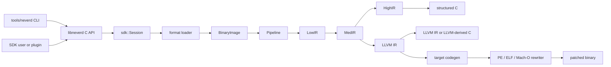

**Languages**: [English](../architecture.md) | [简体中文](../zh-CN/architecture.md) | [繁體中文](../zh-TW/architecture.md) | [日本語](architecture.md) | [한국어](../ko/architecture.md) | [Français](../fr/architecture.md) | [Deutsch](../de/architecture.md) | [Español](../es/architecture.md) | [Italiano](../it/architecture.md) | [Русский](../ru/architecture.md) | [العربية](../ar/architecture.md)

[← ドキュメント索引](README.md)

# NeverD アーキテクチャ

このガイドでは、コントリビューターが NeverD を安全に変更するために必要な
本番コードの境界を説明します。対象は意図的に NeverD 所有のコードだけに限定し、
LLVM、Capstone、Unicorn の各サブモジュールは独自の内部アーキテクチャを持ちます。

## システム境界

NeverD には 4 つの IR 表現がありますが、必ず 4 段すべてを通る一列の処理では
ありません。`LowIR -> MedIR` は共通です。構造化デコンパイルは
`MedIR -> HighIR -> C` を使い、`lift`、`decompile --llvm`、`patch` は
`MedIR -> LLVM IR` へ直接進みます。特に patch と lift モードは意図的に
HighIR を通りません。

CLI は `tools/neverd` でコマンドを解析し、`neverd_session_t` を作成して
`include/neverd/sdk/NeverDCAPI.h` の公開 API を呼び出します。エンジン状態は
`lib/sdk/SessionImpl.h` にあり、`neverd_session_load` が loader を選択して
`BinaryImage` を構築します。IR ベースの操作は必要になった時点で
`lib/pipeline/Pipeline.cpp` を実行します。`neverd` 実行ファイルは
`neverd_shared` にリンクし、各コンポーネントアーカイブと LLVM/Capstone
依存関係は共有ライブラリの非公開実装です。CLI はコマンドライン UI に LLVM
Support を使いますが、エンジンを駆動する際に C API を迂回しません。

HighIR の `HighSourceFlow` は出力文の制御フロー辺、局所変数の識別、確定代入解析を管理します。
ソース検証と不要な PHI コピーの除去は同じグラフを使います。繰り返されるスカラー条件を
ゼロ／非ゼロに有界分割し、書き込みで古い条件を破棄します。アドレスが流出した変数は未知のままとし、
分割上限では保守的なグラフに戻ります。すべての実行可能な文脈で値が不要な場合にだけ
PHI コピーを削除します。呼び出し、ロード、ストアの観測可能な動作とソースラベルは保持します。

Block 利用側のエスケープ解析もこのグラフを使用します。有界固定点解析でポインターの識別とプライベートなスタックスロットを分岐・ループ間で追跡します。合流では文脈アドレスの可能性を保持し、完全な上書きだけがそれを消去します。未知の辺、例外フロー、証明予算の超過はバインドを拒否します。

Objective-C の受信側の事実は、メソッド入口の self と正確なクラス参照を区別します。同じ入口を共有するすべてのメタデータが一致した場合だけ self を設定します。全幅のコピーと ABI が保存を保証するレジスタは、入口への戻り辺も含む同じ不動点解析で伝播します。宣言の照合ではクラス／インスタンスの区別、記録されたカテゴリ、親クラス、採用プロトコルを扱い、入口の self には既知の派生クラスも含めます。コンパイラのカタログは所有者と継承関係をセレクタ全体の照合とは別に保持します。SDK は出力前に現在のイメージで受信側の由来と宣言を再検証します。具体的な IMP の選択やバイナリ書き換えの許可には使いません。
外部の継承情報が不足する場合は受信側で範囲を限定せず、セレクタ全体の一致を要求します。未対応または矛盾する明示的な宣言は否定的証拠として保持します。

明示的なオブジェクト型を持つ ivar は、最大八回の全幅ロードで受信側の証拠を拡張します。各段階は実行時オフセットのスロット、幅、命令で使った定数バイトオフセットを記録します。定数は現在の配置と一致する必要があり、実行時参照は移動したフィールドに追従できます。ローダーは記録されたクラス継承とフィールド宣言を確認します。部分アクセス、型名のない id、ブロック、プロトコルのみの型、曖昧な配置、未知の基底ポインタからはクラスを推定しません。出力時に現在のイメージで経路全体を再検証します。型の事実はオブジェクト同一性やメモリ操作削除の許可にはなりません。

ローダーは Darwin の定数文字列、整数オブジェクト、配列、整列済み辞書からなる有界の非巡回グラフを検証します。コンテナのフィールドと各辺には、不変のマップ済み領域と曖昧さのないインポートまたは再配置の証拠が必要です。未対応のエンコーディング、循環、不完全なグラフは明示的に失敗します。ソースの束縛時にはグラフと入力ポインタスロットを再検証します。生成ヘルパーは整数ビット列、子の順序、共有アドレスを保持し、既存の文字列の同一性を再利用します。コンテナのスロットは検証済みの子ヘルパーだけを呼び、acquire/release によって一度だけ初期化して公開します。各ヘルパーは子の宣言を含むため、独立に復元したメソッドが同じ定義を共有できます。移植可能なテストは不正入力と証明予算を、ネイティブのコンパイラ実例は元のメソッドとの内容、別名、コピーの同一性、並行初期化の一致を確認します。

## IR 表現と経路

| 表現 | 目的 | 主な定義と変換 |
|------|------|----------------|
| LowIR | アーキテクチャ非依存の `NdOp` 操作、基本ブロック、CFG、ジャンプテーブルメタデータ | `include/neverd/ir/low`、`lib/ir/low`。`lib/decode` + `lib/lift` が生成 |
| MedIR | 型、ABI/呼出規約、メモリ/スタックモデル、フラグ、呼出し、SSA 的データフロー | `include/neverd/ir/med`、`lib/ir/med` |
| HighIR | 読みやすい C のための構造化式と制御フロー | `include/neverd/ir/high`、`lib/ir/high`。`lib/backend/c/HighC` が出力 |
| LLVM IR | 最適化、LLVM 由来 C、ターゲットコード生成、バイナリ書き換え入力 | `lib/backend/llvm`。`lib/pipeline` が最適化/調整 |

定数は LowIR、MedIR、HighIR を通じて、出現箇所ごとのスカラーまたはアドレスの由来とアドレスの所有情報を保持します。同じビット値でも異なる由来は統合しません。HighIR のシンボリック簡約はアドレスの識別情報を不透明な入力として扱います。ソースのバインドは共通の数値オペランド分類を使い、メモリやポインタとしての使用には引き続き再配置のバインドを要求します。

| ユーザー経路 | 表現の流れ | 出力 |
|----------------|------------|------|
| Low/Med dump | Binary -> LowIR、必要なら -> MedIR | 診断テキスト |
| High dump または `decompile` | Binary -> LowIR -> MedIR -> HighIR | HighIR または構造化 C |
| `lift` | Binary -> LowIR -> MedIR -> LLVM IR | `.ll` |
| `decompile --llvm` | Binary -> LowIR -> MedIR -> LLVM IR | LLVM 由来 C |
| `patch` | Binary -> LowIR -> MedIR -> LLVM IR -> codegen | 書き換え済みバイナリ |

経路選択の信頼できる情報源は `lib/pipeline/Pipeline.cpp` です。表現固有の
ロジックは所有する IR または backend ライブラリに置き、pipeline はアルゴリズムを
取り込むのではなく、それらのコンポーネントを調整してください。

## クロスアーキテクチャ変換の契約

`include/neverd/translate` が定義しているのは契約層であり、実行 backend
ではありません。`GuestState` は `x86_32`、`x86_64`、`AArch64`、`ARM32`
について、アーキテクチャ非依存のマシン可視状態をモデル化します。正規な
version 1 シリアライズは固定幅のリトルエンディアンフィールド、安定したレジスタ
ID、ソート済みコレクション、fail-closed 検証を使うため、永続化状態はホストの
C++ レイアウトに依存しません。

`GuestState` の wire v1 baseline は恒久的に凍結されています。この baseline 外の
状態は、拡張範囲の extension-register ID と正規の小文字名を組み合わせて表現するか、
明示的な upgrader を備えた新しい wire version に移行しなければなりません。v1
baseline をその場で変更することは禁止されています。

`ARM32` guest では `ExecutionMode` が権威ある decode mode であり、`CPSR.T` と
一致しなければなりません。保存される PC は常に bit 0 をクリアした正規の命令
アドレスであり、ARM mode ではさらに word alignment が必要です。

アーキテクチャ対のポリシーは `x86_64 -> AArch64`、
`AArch64 -> x86_64`、`x86_32 -> AArch64/ARM32`、
`ARM32 -> x86_32/x86_64` を定義しています。`ContractDefined` は要求を検証して
永続化できるという意味であり、コードを変換または実行できるという意味では
ありません。JIT ポリシーは実行中プロセスの native host だけを受け入れ、AOT
ポリシーはホストアーキテクチャと target triple の明示を要求します。CPU または
feature set を選ぶ場合も明示が必要です。

`ResolvedHostTarget` は、この選択を具体的な結果へ解決します。`Native` 解決は現在の
process から triple、CPU、有効/無効の feature set を取得します。`Explicit` 解決は
呼出し側が指定した architecture、triple、CPU、feature を検証して正規化し、競合を
拒否します。version 付き cache identity は、正規化済み target input から決定的な
byte 順で構築され、process address や locale 依存の text を含みません。

version 付き `TranslationExit` は安定した停止理由と、それに対応する型付き payload
を記録します。対象は syscall、例外または signal、breakpoint、未対応命令、自己書換え、
リソース budget、外部呼出し、memory fault、その他の終了条件です。利用側が停止理由に
応じて型のない整数を読み替える必要はありません。

対応する `BudgetExhausted` の場合を除き、結果が報告する instruction、block、
generated-code の各 count は、要求の対応する非ゼロ budget を超えてはなりません。
instruction と block の枯渇は limit で正確に停止します。生成 object のサイズは分割
できない codegen の完了後にしか確定しないため、その枯渇結果は
`Observed > Limit` を報告できます。拒否された object は link、publish、execute
されません。各 `BudgetExhausted` payload は要求された limit を正確に示し、導出値や
実装固有のしきい値を報告しません。

backend-private `RuntimeControlBlockV1` の契約は、正確に 128 byte、
8 byte alignment であり、固定された v1 magic、version、size、field offset、ゼロの
reserved field、整合した typed exit によって制約されます。C++ container、host
pointer、guest address alias は含みません。また `GuestState` の C++ layout や wire
format ではなく、この契約を実装する backend が状態をこの record へ明示的に変換
する必要があります。

固定 v1 generated-code call surface に含まれる helper は正確に 8 個です：
`nvd_rt_v1_load8_le`、`nvd_rt_v1_load16_le`、`nvd_rt_v1_load32_le`、
`nvd_rt_v1_load64_le`、`nvd_rt_v1_store8_le`、`nvd_rt_v1_store16_le`、
`nvd_rt_v1_store32_le`、`nvd_rt_v1_store64_le`。名前、signature、pointer provenance
は完全一致しなければならず、backend はこの有限 table を明示的に bind して ambient
symbol resolution へ fallback してはなりません。executable generation 検証と
budget/cancellation polling は trusted dispatcher 専用の操作です。
`nvd_rt_v1_validate_generation` と `nvd_rt_v1_poll` は generated-code helper では
ありません。trusted host dispatcher は block 選択も所有し、生成 IR からは呼び出せ
ません。translated block は代わりに typed exit code を返します。生成 IR が直接
読めるのは、宣言済みの scalar-result runtime slot だけです。

`RuntimeSymbolRegistryV1` は、その helper table を閉じた host-side registry として
実装します。構築時に ABI-v1 の完全な集合、正確な canonical name、helper class、
signature、および各 entry に class と一致する非 null の function pointer が正確に
1 個あることを検証します。lookup は完全一致名だけを受け入れ、process 環境や
dynamic loader の symbol を参照せず、object verifier の allowlist に同じソート済み
名前を提供します。version 付き identity は名前、helper class、ABI shape を含みます
が、native address は意図的に除外するため ASLR に左右されません。

`RuntimeCodeMemory` は page 単位で分離された generated-code storage を所有し、
一方向の `RW -> RX` publication だけを許可します。memory が同時に writable かつ
executable になることはなく、publication 後に write 可能へ戻すこともできません。
write と entry offset は bounds-check され、publication 時には host instruction cache
が invalidation されます。native smoke test が publication 後に実行するのは小さな
host instruction sequence だけであり、証明するのはこの W^X memory boundary であって
translation engine ではありません。

`GuestMemoryRuntime` は論理的な `GuestState` から分離されています。生成時に state
を検証し、region の byte と metadata をソート済み private index へコピーします。
guest virtual address は lookup key にすぎず、host pointer へ変換されません。検査
付き scalar access は、width、alignment、overflow、unmapped、cross-region、
permission、executable write、generation overflow/mismatch、policy fault を型付きで
報告します。instruction/block budget、cancellation、generation tracking、および
`RejectExecutableWrites`、`InvalidateOnExecutableWrite`、
`ValidateBeforeDispatch` の code-write policy も、暗黙の host 動作ではなく整合した
typed record を生成します。

`TranslationObjectCompilerV1` は、検証済みの LLVM IR-to-object 境界です。const
input module を検証し、すべての変換前に clone し、proof-gated semantic
simplification と LLVM `O0`〜`O3` optimization を組み合わせ、final IR を再検証して、
4 つの contract host architecture 向けに relocatable ELF、COFF、Mach-O object を
emit します。正確な target-mangled block/runtime symbol manifest を canonicalize し、
emit 後の各 object を audit して、runtime registry identity と version 付き request /
artifact cache key を返します。generated-byte budget が非ゼロなら、それを満たす
object だけが artifact verification に進めます。LLVM はまず private buffer へ分割
不能な emit を完了して正確なサイズを測定します。超過 object は publish と artifact
audit の前に拒否され、typed telemetry が実測サイズと要求された正確な limit を保持
します。ゼロは caller policy 上 unlimited です。compiler の出力は audit 済み
relocatable byte までであり、link、publish、dispatch、execute、および guest
instruction lowering は行いません。

post-codegen verifier は relocatable ELF、COFF、Mach-O object を
閉集合として監査します。format と architecture は選択された host と正確に一致し、
undefined symbol は有限 helper allowlist に完全一致しなければならず、dynamic symbol
は禁止されます。relocation は明示的な direct whitelist であり、encoding、width、
alignment、offset、loadable destination、object-local non-preemptible definition または
完全一致で許可された helper target を検査します。W+X、unwind/exception と
initializer metadata、TLS、IFUNC、GOT と通常の PLT indirection、dynamic relocation、
weak/preemptible または選択可能な definition、未知の allocated section、linker
directive は拒否されます。LLVM が hidden x86-64 ELF call に使う
`R_X86_64_PLT32` は、v1 policy が exact runtime helper への sealed direct branch と
証明した場合だけ許可され、PLT や GOT path を許可するものではありません。ELF
`ET_REL` artifact は program header や segment を含んではなりません。Mach-O load
command は positive list で制限され、bit 幅が一致する segment を正確に 1 個、
symbol table、dynamic-symbol table、platform-version、data-in-code command を
それぞれ最大 1 個だけ許可し、依存関係も検査します。linker option とその他の
command はすべて拒否されます。

`TranslationObjectRequestV1` は、これらの契約上に構築された最初の公開
guest-byte-to-object slice であり、意図的に対象を絞っています。現在公開されている
fail-closed な x86-64 v1 scalar-register subset では、legacy prefix のない canonical
encoding、すなわち、対応する register/immediate LowIR 形状になる REX.W 全幅 GPR の
`MOV`、`ADD`/`SUB`、および `AND`/`OR`/`XOR` だけを受け取ります。schema 9 はさらに、
全幅 register/register `CMP` の `39/3B`、register/immediate `CMP` の `81/7`、`83/7`、
`3D`、全幅 register/register `TEST` の `85`、register/immediate `TEST` の `F7/0` と `A9`
を受理します。算術形式は従来の scalar flag 計算を維持し、論理形式と `TEST` は
アーキテクチャで定義された flags を計算しつつ NeverD state model の `AF` を保持します。
canonical `C3` `RET` と `C2 iw` `RET imm16` は return block を
終了し、canonical `EB cb` と `E9 cd` の direct-relative `JMP` encoding は direct-branch
block を終了します。公開 lowering schema は 9 です。canonical かつ legacy prefix のない
traditional Jcc は、`JO`/`JNO` の short `70/71 cb` または near `0F 80/81 cd`、
`JB`/`JAE` の `72/73 cb` または `0F 82/83 cd`、`JE`/`JNE` の `74/75 cb` または
`0F 84/85 cd`、`JBE`/`JA` の `76/77 cb` または `0F 86/87 cd`、`JS`/`JNS` の
`78/79 cb` または `0F 88/89 cd`、`JP`/`JNP` の `7A/7B cb` または `0F 8A/8B cd`、
`JL`/`JGE` の `7C/7D cb` または `0F 8C/8D cd`、`JLE`/`JG` の `7E/7F cb` または
`0F 8E/8F cd` に限られます。`JRCXZ`/`JECXZ`/`JCXZ` と
`LOOP`/`LOOPE`/`LOOPNE` は未公開で fail closed します。予約済みの `F7 /1`、guest-memory
operand、partial-register form、legacy prefix、および意味的に冗長な REX extension bit
も fail closed します。出力は監査済み little-endian AArch64 ELF または Mach-O relocatable object
に限られます。通常の guest memory operation、partial-register form、この厳密な subset
外の任意の instruction/encoding、return、これらの direct jump、および上記の公開済み
Jcc branch 以外の control flow、ならびに lowerer が未実装の LowIR
operation は object emission 前に拒否されます。`RET` に必要な検査付き
return-address read は terminator contract の内部処理であり、一般的な guest-memory
lowering を公開するものではありません。request は block descriptor を再構築して
検証し、lowering と object emission に同じ resolved target machine を使い、
proof-gated semantic simplification と LLVM のデフォルト `O2` optimization pipeline
を組み合わせます。この slice は、その他の x86-64 instruction、他の guest/host pair、
または AArch64 から x86-64 への逆方向をサポートするものではありません。

公開 C entry point `neverd_translate_x86_64_block_to_aarch64_object_v1`、Python ctypes
wrapper `translate_x86_64_block_to_aarch64_object`、および
`neverd translate-object` command は、同じ object-only 境界を公開します。Python は
`TranslationObjectFormat.ELF` または `.MACHO` を使います。native translation の失敗時
には `TranslationErrorCode` を保持する typed `TranslationError` を投げ、local argument
validation は `TypeError` または `ValueError` を投げます。成功時には Python 所有の
immutable result を返します。C result は object byte、安定した cache identity、
optimization telemetry を所有し、CLI は選択された ELF または Mach-O object だけを
書き出します。これらの C、Python、CLI object surface はいずれも link、load、dispatch、
execute、debug より前で停止し、execution session interface ではありません。

`verifyTranslationLinkGraphV1` は、独立した allocation 前の第 2 の監査を追加します。受理済み
AArch64 ELF または Mach-O object から一時的な LLVM JITLink graph を構築し、target、
section permission、block/runtime symbol manifest、external-symbol closure、および
edge kind と target を検査します。address-free な監査結果を生成した後、graph は破棄
されます。この監査に合格しても、code の link、allocate、resolve、load、publish、
dispatch、execute は行われません。

`linkTranslationObjectV1` は独立した native linking 境界です。pruning、allocation、
symbol resolution、fixup の前後で trusted descriptor、raw object、JITLink graph を
再監査します。runtime symbol は sealed registry だけから供給されます。dispatcher
credential は唯一の manifest entry を session、block identity、guest entry PC、cache
generation、code epoch に束縛し、invoke 時には runtime guest `RIP` もその entry と一致
しなければなりません。finalization に成功すると最終 permission で executable memory を
publish し、unload は新たな invoke を失効させ、実行中の 1 回の invoke を待ってから
allocation を解放します。credential-free overload は audit-only のままで invoke できません。

`NativeTranslationSessionV1` はこれらを experimental C++ x86-64-to-native-AArch64
execution 境界として構成します。little-endian AArch64 ELF または Mach-O process 上で、
compile-link-validate-invoke-unload dispatcher loop 全体にわたり、検査済み guest-memory
runtime と固定 guest state を複数 block 間で維持します。canonical direct jump は正確な
static target から継続します。公開済みの canonical Jcc branch は
block manifest が宣言した taken または fallthrough successor からのみ継続でき、dispatcher はそれ以外の selected
PC をすべて拒否します。return は終了します。global instruction、block、generated-object-
byte の budget は block をまたいで正確に維持され、guest が正常停止すると実行済み state
と authoritative memory が一緒に commit されます。cancellation は final commit に対して
linearize されます。

これは実行可能な vertical slice であって、完全な translator ではありません。通常の
guest-memory instruction、partial register、上記の厳密な schema-9 traditional-Jcc slice 以外の
conditional control flow（`JRCXZ`/`JECXZ`/`JCXZ` と
`LOOP`/`LOOPE`/`LOOPNE` を含む）、indirect control flow、call、floating-point、SIMD、x87、atomic、system instruction、
汎用 exception propagation、block cache、他の guest/host pair、逆方向の
AArch64-to-x86-64 はまだ対象外です。
execution session の C、Python、CLI、JSON surface はなく、debugging は独立した未対応
機能です。上記 object API は native execution を使わずに引き続き利用できます。

生成 IR の契約では、この契約に従うすべての translated block を hidden かつ
non-preemptible とし、C ABI `i32 (ptr state, ptr runtime)` を使うことを要求します。
block は private registry だけから発見され、プロセス環境の symbol lookup には
依存しません。block 間の直接呼出しも禁止されます。

IR verifier は、legalization が既知の compiler-runtime libcall を導入することを
避けるため、整数幅をホストの scalar register 幅以下に制限します。ただし、これは
必要条件にすぎません。この契約を実装する実行 backend は、post-codegen control
transfer、`MachineIR`、target object の relocation を、同じ有限の runtime-symbol
allowlist に対して厳密に監査する必要があります。

TranslationIR の直接 load/store と private constant が保持する値に許されるのは、
ホストの scalar-register 幅以下の単一 scalar integer だけです。aggregate は verifier
境界より前に scalarize し、コンパクトな IR が backend の無制限な展開を引き起こさ
ないようにしなければなりません。

generated-code ABI は scalar integer についてのみ定義されています。浮動小数点、
SIMD、x87、atomic、system instruction はこの契約の範囲外です。
`ProvenSemanticAndLLVM` を選択する実装は、NeverD の proof-gated semantic
simplification を LLVM 最適化との共同 fixed point まで実行しなければなりません。
このポリシー自体は実行可能な translation backend を提供しません。

## 例外書き換えの境界

Mach-O compact unwind には、元の `__unwind_info` 用 strict parser、生成された
`__LD,__compact_unwind` record 用 fixup-aware parser、元データと生成データの range を
正確に merge する処理、regular page 用 deterministic encoder、および transactional な
最終 section installer があります。installer は既存の file-backed
`__TEXT,__unwind_info` に encoded table が収まる場合だけ in-place で書き換えます。
architecture、layout、byte preimage を再検証し、未使用の末尾をゼロ化し、Mach-O 外側
transaction の単一 commit 前に結果を再 parse して semantic equivalence を確認します。
生成 record は、compiler が正確に記録した IR source function から target MC owner
symbol への対応（private definition を含み、object-format prefix や mangling を推測しない）、
opaque な非ゼロの range ID、および厳密な半開 fragment range で認証されます。生成された
各 FDE は唯一の認証済み fragment と厳密に一致し、必要な各 fragment も、その transaction
が install した唯一の FDE と厳密に一致しなければなりません。ただし、厳密な encoding
検証を通った正確な非 DWARF compact record が覆う場合を除きます。同じ function が所有する
隣接または非連続 fragment は一つの source recipe を再利用できますが、identity の欠落、
重複、dangling、owner の交差、または boundary 不一致は出力変更前に失敗します。新しい RX
segment は、`__LINKEDIT` が一意で file/VM の末尾にあること、offset shift が overflow
checked であること、最終 file/VM layout の strict replay が成功したことを証明してから
commit されます。最終 section が存在しない場合、生成 compact record は install せず、
以下の正確で認証済みの DWARF-FDE 閉路だけを通る場合に限り transaction を続行できます。
既存の最終 section が容量不足または malformed の場合は引き続き fail closed します。
link 済み native throw/catch による実証はまだありません。

外部参照は完全な MC fixup 契約から分類されます。call が選択できるのは認証済みの callable
target だけであり、生成 compact-unwind の personality field が選択できるのは検証済みの
non-lazy pointer slot だけです。そのファイル内容を dereference することはありません。
TLS、authenticated pointer、subtractive、malformed compact field、未知の relocation は
fail closed します。

ARM32 compact unwind では、encoding に含まれる stack adjustment と GPR layout は `Complete`
です。D-register pattern selector 0〜3 も `Complete` ですが、4〜7 は compact word だけでは
runtime-aligned CFA-relative slot をすべて証明できないため `Partial` です。`Partial` entry は
解析用に証明済み register identity を保持できますが、すべての rewrite path が fail closed
で拒否します。各 EH-frame install receipt は target architecture、pointer width、byte order
を厳密に束縛し、compact-unwind DWARF binding は receipt target identity の不一致を拒否します。

上位の ARM32 section transaction は compact-unwind decoder より狭い範囲だけを
公開します。Mach-O header が正確に `CPU_SUBTYPE_ARM_V7K` であり、元の symbol
table の `N_ARM_THUMB_DEF` bit が必要なすべての function を Thumb code として
積極的に認証する場合に限り、この経路が有効になります。その後は正確な
`thumbv7k-apple-watchos` triple と Thumb mode が code generation 全体で束縛され、
入力 feature 要件が Cortex-A7 の上限を超えることも許されません。flag のない
function または mode 不明の function、generic な non-v7k subtype、ARM mode、混在
または不明な external-code target、ARM Mach-O の in-place entry point、および C
source からの ARM Mach-O patch は、出力を変更する前に fail closed で拒否されます。
function discovery が `LC_FUNCTION_STARTS` だけに依存する stripped input はまだ
サポートされていません。

PE、ELF、Mach-O にはそれぞれ format 固有の例外 component がありますが、NeverD は
全 format・全 exception type を扱う end-to-end rewrite pipeline をまだ公開していません。
未対応 encoding または未解決の registration/layout 要件は、出力を変更する前に失敗
しなければなりません。既存の部分的な format 対応を完全な例外処理の閉路と表現しては
なりません。

Ada または D の Itanium personality を認識することは、Ada/D 例外のサポートではあり
ません。GNAT、GDC、DMD、LDC の address-form LSDA は解析可能です。type-table の
スロットは不透明なまま（GNAT は `Exception_Id` / `Exception_Data`、D は
`ClassInfo`）であり、`std::type_info` として辿ることはありません。native
reconstruction は LLVM の `personality` と address-form の `invoke`/`landingpad`
節を出力します。corpus-proven は別の主張であり、personality 認識や native
lowering から導いてはなりません。

## コンポーネントマップ

各コンポーネントは `add_neverd_component_library` が作成する静的アーカイブです。
表には重要な NeverD 依存関係を示し、CMake helper が共通で与える LLVM と
Capstone ライブラリは網羅しません。

| ディレクトリ | 責務 | 主な依存関係 |
|--------------|------|--------------|
| `lib/loader` | 形式検出、PE/COFF・ELF・Mach-O 読込み、正規化 `BinaryImage`、関数検出 | LLVM Object API |
| `lib/lift` | 手書きの x86/i386・AArch64・ARM32 命令セマンティクス | IR データ型 |
| `lib/decode` | Capstone/native デコードと各アーキテクチャ lifter へのディスパッチ | `NeverDIR`、`NeverDLift` |
| `lib/ir` | 共通型、LowIR・MedIR・HighIR・intrinsic の定義/変換 | 4 つの IR サブコンポーネント |
| `lib/pipeline` | 関数検出と Low/Med/High/LLVM 経路の調整 | IR、decode、lift、LLVM backend、デバッグ情報、IR pass |
| `lib/backend/c` | HighIR-to-C および LLVM-IR-to-C のレンダリング | IR |
| `lib/backend/llvm` | MedIR から LLVM への lowering | IR |
| `lib/backend/codegen` | ターゲットコード生成、PE/ELF/Mach-O の patch と in-place 書き換え | IR、loader |
| `lib/sdk` | 公開 C ABI、session ライフサイクル、クエリ、永続化、プラグイン、lift/decompile/patch/audit/hunt エントリ | エンジンを `libneverd` に集約 |
| `lib/pass` | LLVM IR 難読化 pass と MIR pass runner | IR |
| `lib/debug` | DWARF、PDB、linker-map デバッグコンテキスト | IR |
| `lib/sigs` | シグネチャ解析、データベース、マッチング | Loader |
| `lib/libc` | 既知の libc 名と呼出モデルのサポート | 独立コンポーネント |
| `lib/safety` | リフト済み IR 上のヒープ寿命監査とコピー越境ハント | Symbolic、Solver |
| `lib/support` | 共通のバイナリ読込み helper | Loader |
| `lib/translate` | version 付き guest state/policy/exit、固定 runtime ABI、検査付き guest memory、生成 IR/object/LinkGraph audit、sealed native linking、experimental x86-64-to-AArch64 C++ dispatcher | IR、LLVM、LLVM Object、JITLink の契約 |

公開ヘッダーは `include/neverd` 以下で各領域に対応します。内部 C++ クラスを
誤って SDK の一部にしないでください。安定した外部操作は純粋 C ヘッダーと、
責務を絞った `lib/sdk/NeverDCAPI*.cpp` のいずれかに置きます。

## strict lifting の契約

`Decoder` と各アーキテクチャ lifter は strict モードで開始します。Capstone が
命令をデコードできても選択した lifter に実装がなければ、lifter は
`UnliftedInstruction` を投げます。例外には命令アドレス、ニーモニック、オペランド
文字列が記録されるため、未対応セマンティクスは省略や推測ではなく明示的に失敗します。

内部の非 strict 経路は `NdOp::NOP` を出力しますが、これは診断用の逃げ道であり、
命令の受け入れ可能な実装ではありません。コントリビューターと CI のテストは strict
を維持してください。strict 失敗が発生したら：

1. 最小のアーキテクチャ固有 fixture で再現する。
2. `lib/lift/<ISA>` に不足するセマンティクスを追加する。
3. `unittests/lift` で期待する LowIR 形状を検証する。
4. 命令に観測可能な動作があれば、`unittests/semantic` に Unicorn 差分ラウンドトリップを追加する。

pipeline を続行するためだけに `UnliftedInstruction` を捕捉しないでください。新しい
意図的な近似には明示的な契約とテストが必要で、1:1 lifting を装ってはいけません。

## 形式と ISA の所有範囲

入力形式のロジックと出力書き換えのロジックは意図的に分離されています。

| 形式 | 読込み、メタデータ、入力リロケーション | Patch と出力リロケーション |
|------|----------------------------------------|-----------------------------|
| PE/COFF | `lib/loader/COFF` | `lib/backend/codegen/COFF` |
| ELF | `lib/loader/ELF` | `lib/backend/codegen/ELF` |
| Mach-O | `lib/loader/MachO` | `lib/backend/codegen/MachO` |

アーキテクチャ lifter は `lib/lift/X86`、`lib/lift/AArch64`、`lib/lift/ARM`
にあります。対応する公開 lifter/register 宣言は `include/neverd/lift` にあります。
ターゲット固有の LLVM 出力とコード生成は `lib/backend/llvm/<ISA>` と
`lib/backend/codegen/CodeGen<ISA>.cpp` にあります。

### サポートとテストの深さ

ルートのサポート表は各セルが実装済みであることを意味します。すべての opcode、
ABI 境界ケース、バイナリ生成元、OS バージョンを網羅的にテストしたという意味では
ありません。命令セマンティクスが lifter の実装済みカバレッジ外にある場合、strict
モードは fail-closed で停止します。

形式×アーキテクチャの全 12 セルには
`unittests/semantic/PatchFullSubstRTTests.cpp` のセマンティックな書き換え backend
カバレッジがあります。統合の深さは次のとおりです。

| 形式 | x86-64 | i386 | AArch64 | ARM32 |
|------|--------|------|---------|-------|
| PE/COFF | リンク済み fixture | backend グリッド | リンク済み fixture | リンク済み Thumb fixture |
| ELF | リンク済み fixture + セマンティックラウンドトリップ | オブジェクト pipeline + セマンティックラウンドトリップ | リンク済み fixture + セマンティックラウンドトリップ | リンク済み fixture + セマンティックラウンドトリップ |
| Mach-O | リンク済み fixture\* | PIC/no-PIC オブジェクト pipeline\* | リンク済み fixture\* | backend グリッド |

- **リンク済み fixture** は代表的プログラムのリンク済み実行形式について、
  loader/pipeline と patch の動作を検証します。
- **オブジェクト pipeline** は再配置可能オブジェクトの読込み、全 IR 段階、
  デコンパイルを検証しますが、ホストでのリンクと patch 済みバイナリの実行は含みません。
- **backend グリッド** は正確な書き換えコード生成経路で代表的 IR をコンパイルし、
  Unicorn で動作を比較します。その形式の loader をリンク済み実行形式には適用しません。
- `*` Mach-O のリンク済み fixture は、要求するターゲットを生成できるホスト
  ツールチェーンに依存します。サポート対象の macOS ツールチェーンは旧 i386
  実行形式をリンクできないため、
  i386 は PIC/no-PIC thin オブジェクトと書き換えグリッドを使用します。

リンク済み fixture のセルは、その代表的プログラムに対する最も強い形式統合の
証拠です。オブジェクト pipeline と backend グリッドのセルは部分的な形式統合
カバレッジです。限定なしに「完全にテスト済み」と呼べるセルはなく、ISA を網羅したと
主張するセルもありません。

主な根拠は、リンク済み ELF/PE fixture の
[`PatchFormatTests.cpp`](../../unittests/lift/format/PatchFormatTests.cpp)、Windows ARM の
読込み/デコンパイルを扱う
[`COFFARMFormatTests.cpp`](../../unittests/lift/format/COFFARMFormatTests.cpp)、i386 thin
オブジェクトを扱う
[`MachOI386RelocationTests.cpp`](../../unittests/lift/format/MachOI386RelocationTests.cpp)、
リンク済み Mach-O の
[`X86_64_PipelineE2ETests.cpp`](../../unittests/lift/x86_64/X86_64_PipelineE2ETests.cpp) と
[`AArch64_PipelineE2ETests.cpp`](../../unittests/lift/aarch64/AArch64_PipelineE2ETests.cpp)、
12 セルの backend グリッドを扱う
[`PatchFullSubstRTTests.cpp`](../../unittests/semantic/probe/patchfull/PatchFullSubstRTTests.cpp) です。
実行方法は[テストガイド](testing.md)を参照してください。

## 変更箇所の案内

| 変更 | 開始箇所 | 最小の重点検証 |
|------|----------|----------------|
| 命令を追加/修正 | `lib/lift/X86`、`AArch64`、`ARM` の対応ファイル。ディスパッチ変更時は公開 lifter ヘッダー | `unittests/lift` のアーキテクチャテスト、`unittests/semantic` のセマンティックラウンドトリップ |
| `NdOp` を追加 | `include/neverd/ir/NdOps.h`。その後 Low-to-Med、emitter/renderer、verifier/emulator、dump を監査 | `NeverDLiftTests` + 関連する `NeverDSemanticTests` ケース |
| CFG または関数検出を変更 | `lib/ir/low`、`lib/loader/FunctionDiscovery*.cpp`、`lib/pipeline/PipelineFuncDetect.cpp` | lift CFG/ジャンプテーブルテストと重点セマンティック変換スイート |
| PE 入力リロケーション/unwind 規則を追加 | `lib/loader/COFF` | `COFFARMFormatTests` または新しい重点 loader fixture |
| PE 出力リロケーション/patch 規則を追加 | `lib/backend/codegen/COFF` | `PatchFormatTests`、`RewriteCodegenRTTests`、PE backend グリッド |
| ELF/Mach-O 形式動作を変更 | 対応する `lib/loader/<Format>` および/または `lib/backend/codegen/<Format>` | 対応形式テストと書き換えグリッド |
| MedIR/ABI 復元を変更 | `lib/ir/med` | 呼出規約 lift テスト + ISA 横断セマンティックラウンドトリップ |
| 構造化制御フロー復元を変更 | `lib/ir/high` | `NeverDCFGLoopXformTests` と構造化 C テスト |
| LLVM 変換を追加 | `lib/pass/ir`、`include/neverd/pass/ir` の公開ヘッダー、公開時は pipeline 切替 | 重点変換スイート + patch 出力変更時の `NeverDPatchFullTests` |
| C API 操作を追加 | `include/neverd/sdk/NeverDCAPI.h`、担当する `lib/sdk/NeverDCAPI*.cpp`、状態が必要な場合のみ `SessionImpl.h` | SDK/CLI セマンティックテスト。`neverd_last_error` と割当規約を維持 |
| CLI コマンドを追加 | `tools/neverd/NeverDCLIOptions.cpp`、`NeverDCLI.h`、担当する `NeverDCmd*.cpp`、`neverd.cpp` のディスパッチ | `unittests/semantic/CLIEndToEndTests.cpp` と直接 CLI smoke test |
| ヒープ寿命監査またはコピー越境ハントを変更 | `lib/safety`、`include/neverd/safety`、`include/neverd/sdk/NeverDCAPISafety.h` | `NeverDSafetyTests` と `NeverDSafetyIntegrationTests` |
| セマンティック回帰を追加 | 重点化した `unittests/semantic/*Tests.cpp`。新規ファイルは `unittests/semantic/CMakeLists.txt` に登録 | テストバイナリをビルドし、`ctest -R` で名前付きケースを実行 |

変更範囲を狭く保ってください。表現を定義するファイルは変換と一緒に変更できますが、
大規模リファクタリングを一様に見せるためだけに無関係な loader、lifter、backend を
変更しないでください。

ソースの構造体宣言はフィールド配置を ABI 分類と分離して保持します。Darwin ARM64 では、同種の float または double を 1〜4 個含む入れ子の構造体を扱い、浮動小数点レジスタが不足すると引数全体をスタックへ配置します。MedIR は SSA 前に各物理成分を結び付け、HighIR は単一の論理引数や戻り値を復元し、C 出力は配置を検証します。Darwin ARM64 と x86_64 は、64 ビット整数またはポインターを 1〜2 個含む構造体も、入れ子を含めて扱います。構造体全体がスタックへ移る場合、ARM64 は該当レジスタ群を使い切った状態にし、x86_64 は残りを後続引数に利用します。パディング、パックされたフィールド、浮動小数点と整数の混在、不完全な成分は拒否し、バイナリ書き換えの根拠にはしません。

Darwin ARM64 の固定 C 呼び出しでは、符号付き 64 ビット整数を 3 個含む自然配置の構造体も、隠れた x8 ポインター経由で返せます。分類は共通ソース ABI 層が所有し、Low→Med は呼び出し前のポインターを保存して単一の論理結果の各フィールドを呼び出し元の領域へ書き戻します。通常の引数レジスタは移動せず、x0 は戻り値を持ちません。呼び出し解析は結果領域の古い情報を無効化します。入口の投影とネイティブ状態保存の証明は対応する記憶領域の証明を持たないため、この戻り値を拒否します。符号なし整数やポインターを含む 3 ワード構造体、3 ワードの引数、x86_64 の間接構造体結果も未対応です。 Objective-C の間接結果は、セレクター全体の検索と通常のレシーバー検索では引き続き拒否します。nil メッセージ送信が元の結果バッファーを変更しないためです。レシーバーで限定された ARM64 呼び出しは、レシーバーが現在のメソッドの非 nil の self と完全に一致し、x8 が非エスケープのプライベートフレーム領域全体を指す場合に限り、固定レコード ABI を使用できます。ソース公開時にメソッド入口、self オペランド、レシーバー宣言、レコードサイズ、フレーム境界を再検証し、証拠が欠けるか変化した場合はメッセージを未解決のままにします。

ランタイム呼び出しカタログは、正確に識別されたインポートが元の引数ポインターを返す場合にのみ `ReturnedArgument` を宣言します。レシーバー解析は通常の ABI によるレジスター無効化の前に宣言済みの物理引数を読み、結果には証明済みのレシーバー型だけを復元します。SDK はこの効果を再検証し、呼び出し、所有権への効果、メモリーアクセスは削除しません。

コンパイラー由来のフレームワークとレシーバーのカタログは、Foundation、CoreData、CoreLocation、CoreSpotlight、QuartzCore、UniformTypeIdentifiers、UserNotifications を共通の提供元とします。QuartzCore は公開ヘッダー `CoreAnimation.h` を使い、他のフレームワークへの互換インポートから所属宣言を取得しません。両生成器は四つのプリプロセス設定、正確な提供元識別、否定的な宣言証拠を維持します。

オブジェクトの戻り値型は、合意したメソッド宣言を通じて同じ有界のレシーバー証明を拡張します。名前付きオブジェクト型とコンパイラーが宣言した関連戻り値型はクラス情報を提供しますが、id 単独では提供しません。フィールド読み込みとメッセージ結果は合計八ステップに制限され、ソース検証で現在の宣言に照らして各ステップを再検査します。正確なインポートに結び付いた割り当てヘルパーは対応するメッセージの戻り値契約を使い、呼び出し、独自のオーバーライド、所有権への作用を保持します。戻り値クラスの競合や不完全な継承関係があれば伝播を中止します。

書式呼び出しは言語ごとの規則を保持します。NSString 属性と公開述語 API は SDK 宣言と全実行時宣言に照合されます。述語では引用符内の置換を行わず、`%K` はプロパティ名のオブジェクト引数です。実引数には共通の型昇格と Darwin 可変引数 ABI を使い、未対応のエスケープや修飾子を拒否します。ソース公開時に言語、定数オブジェクトの同一性、引数の根拠を再検証し、元のフレームワークパーサーを呼び出します。

コンパイラが宣言した固定引数の C インポートと Objective-C メッセージは、対応する構造体のソース ABI 割り当てを共有します。明示的に宣言された引数だけがキャリアを消費し、Objective-C 層が隠れたレシーバーとセレクター引数を提供します。SDK のエクスポート識別とシグネチャの厳密な一致は引き続き必要です。スカラー専用コールバックと可変長引数の制限は変わりません。

ソース関数の宣言は、署名の同一性の一部として呼び出し規約を保持します。共通 ABI 層は、1、2、4、8 バイトの整数引数とポインター引数を持つ有界な Swift 呼び出しを扱い、整数レジスタ群の後に入口 SP 基準のスタックキャリアを割り当てます。狭いキャリアごとに正確な拡張規則を記録し、結果は最大 2 ワードの整数またはポインターに加え、arm64 では x0–x3 で返すちょうど 4 個の完全なワードをサポートします。HighC は宣言と定義に `swiftcall` を保持します。コンパイラで観測した Foundation 値ブリッジは、`swift_indirect_result` ポインターと `swift_context` ポインターを一つずつ宣言できます。arm64 は x8/x20、x86_64 は RAX/R13 を使い、通常の整数引数レジスタ群を消費しません。HighC は両方の引数属性を保持します。公開 Foundation メタデータのインポートには、ARM64/x86-64 の macOS と Mac Catalyst 全構成で、コンパイラのシンボルグラフ、実際のメタデータ照会 IR、正確な SDK エクスポートの一致が必要です。マングル名の接尾辞だけでは ABI を決定しません。ジェネリック引数、宣言されていない隠し引数、Swift コールバック型、未対応の物理キャリアは拒否します。Mac Catalyst の宣言は iOS 実機での実行検証を意味しません。

MedIR は、ループを含む同幅の SSA コピーと完全な PHI に対する、上限付きの不変定数伝播を担当します。すべての入力値が同じビット、幅、由来、アドレス所有者に収束する必要があります。未知の定義、初期値のない循環、不完全な辺、定数の競合は置換を阻止し、解析予算を使い切ると関数は変更されません。解析はオペランドだけを置換し、呼び出し、ロード、ストアとその副作用を保持します。HighIR と LLVM は同じ結果を使用します。

操作単位のコード所有者インデックスは、ランタイムメタデータによる主関数とコード断片の正確な関係も保存します。インデックス検索と直接走査は同じ関係走査を共有し、主関数の生の入口アドレスを保持し、孤立参照や主関数以外への親参照を拒否します。ジャンプ先検証、境界の証明、一時的なグループ解析は同じ不変インデックスと検索コスト計算を使います。別のイメージのインデックスでは直接走査に戻り、予算を使い切った不完全な証明は引き続き拒否します。

ソース ABI は、Darwin ARM64 と x86_64 の狭い整数レジスタ引数について、32 ビットへの符号拡張またはゼロ拡張を明示的に記録します。HighIR は元の引数型を維持し、保存とコピーを通じて既知のビットを保持します。32 ビットを超える読み取り、スタックのパディング、呼び出しで破壊されたレジスタは不明のままです。これは Apple の ARM64 と Intel の呼び出し規約に従います。ネイティブ値の下位バイトを観測しただけでは拡張を証明できません。

Mach-O ローダーは初期権限を維持したまま、再配置後に読み取り専用となるセグメントの明示的な保証を保持します。ソースのバイト読取りとポインタ読取りは、一意のファイルマッピング検証を共有します。セクション名だけでは不変性を証明できません。通常の全幅ロードは、解決済みのローカルデータポインタを、独立に検証した定数文字列オブジェクトへ束縛できます。束縛には再検証用の元スロットを保持し、別名は生成された対象オブジェクトの同一性を共有します。書込み可能な領域、競合する再配置、部分ロードや順序付きロード、スロット自体のアドレスは未対応です。

ジャンプテーブルの復元は、別経路で文を再構築せず、通常の後続ブロックへの転送を生成します。共有ケース、デフォルトの転送先、ループ入口も含め、各ブロックの変換は一つの処理が担います。分岐辺の PHI コピーは対応する転送の直前に実行され、並列代入のスナップショットを保持します。不完全な辺の対応は明示的に失敗します。

ループの構造化では、ネイティブの入口の所有関係を正確に保ちます。常に真となるラッパーは、本文の先頭命令のラベルを重複させません。条件付きの後退辺からの終了は、ネイティブアドレスを持たない辺コピーも含め、元の後続処理へ進みます。後続入口と完全一致する転送だけを break に変換し、入れ子のループや switch 内の転送は制御スコープを維持します。

不要値の削除では、PHI の辺コピーを消す前にネイティブ入口の所有関係を正規化します。共通の結合処理は分岐入口と、その直後の合成された辺コピーの接頭部を区別します。不連続なラベルや無関係な入れ子のラベルは曖昧なまま扱います。

`scripts/collect_objc_sdk_declarations.py` は実際のデバイス、シミュレータ、Mac Catalyst、デスクトップの SDK 構成から、フレームワークに属するクラス、プロトコル、カテゴリ、メソッド ABI の候補を収集します。各構成は公開ヘッダー、エクスポート、コンパイラの証拠を保持し、未対応の宣言と関連オブジェクトの戻り値型も含めます。一部の SDK の収集では正確な範囲を記録し、構成が失敗すると記録は未完了のままです。CI 成果物は後続の宣言カタログの整合性確認に用いられ、それ自体で新しいソース呼び出しの束縛を有効にしません。

Objective-C の呼び出し情報は、入口 SP を基準とする有界な非公開スタックスロットを追跡します。CFG の合流では厳密な値の共通部分と、フレーム由来の可能性があるバイトの和集合を使い、経路の競合やレジスタの部分書き込みによるエスケープの見落としを防ぎます。ABI が明確な呼び出しでは、確保済みで送出引数領域外の非公開記憶域だけを保持します。エスケープ、不明な呼び出し、重複・アトミック書き込み、スタック解放は対応する証明を無効化します。束縛の公開には後退辺の収束が必要です。

HighC は 128 ビット以下の部分整数を正確な幅の `_BitInt` 型で表現します。通常のメモリ補助関数は C オブジェクトのパディングに依存せず IR のバイト数を転送し、符号なし演算はラップとシフト境界を保持します。部分幅のアトミックアクセスは幅を拡大せず、未対応として拒否します。

HighIR は 128 ビットの場合と同じ証明条件で、64 ビットのソース局所変数を 32 ビットへ縮小できます。全定義の格納幅と下位部分の幅が一致し、全読み取りが下位部分を明示的に選択する必要があります。全幅の格納、エスケープ、上位バイトの読み取り、上位式の副作用があれば縮小しません。ソース引数のパディングは未定義のままです。
変数全体の正確なコピーは、値を構成する定義が下位幅を確定した場合、有界グラフを通じてこの証明を共有できます。すべてのコピー先も縮小条件を満たす必要があり、全幅の利用は上流の例外をすべて無効にします。幅の根拠がない循環、幅の不一致、予算超過では元の値を保ちます。
有界の整数キャスト、ゼロオフセットのスライス、拡張も、途中の全幅が必要な下位部分を保持する場合にこの証明を伝播できます。各使用は所属文の式ルートごとに検査します。最大二回の有界解析で、ベクトルのパディング除去後にさらに狭い下位部分を証明できます。

MedIR のソース引数検証は、宣言された戻り値、制御フロー、メモリ副作用、呼び出しから必要なバイトを逆向きに追跡します。COPY、PHI、CONCAT、抽出、拡張はバイト単位の要求を保持し、その他の演算は保守的に全入力を要求します。未使用の浮動小数点レジスタ上位部分は余分な引数になりません。観測可能な上位部分、不完全なグラフ、解析予算の枯渇では従来の拒否を維持します。機械操作の削除や書き換え ABI の付与は行いません。

条件の構造化では、非分岐経路の PHI 代入を元の辺に保持します。その由来を示すアドレスから新たな継続先を作ることはできません。コード列の移動にその継続先が必要なら、共有される継続経路を元の位置に残します。 無条件の合成ループは、正確なヘッダーの前に操作がなければ、最初のネイティブ命令と同じ継続入口を持ちます。条件の評価や先行する副作用がある場合、この等価性は成立しません。

ネイティブ補助関数のソースシグネチャ推論は、有界 CFG 解析で各機械リターン経路に完全な整数結果があることを証明します。共有出口では先行ブロックの事実を交差し、入口経路により未初期化ループの自己証明を防ぎます。呼び出しと部分書き込みは、再び完全な計算が行われるまで結果の証明を無効にします。不正なグラフ、入力値を返すだけの経路、x86-64 のエピローグ復元は引き続き拒否します。生成するのは候補シグネチャのみで、二度目のパイプラインで本体と依存関係の閉包を検証し、書き換え ABI は変更しません。

## 最近のソース復元境界

- Swift の遅延 witness table accessor は、`Wl`/`WL` キャッシュパターン、正確なランタイム問い合わせ、再構築したキャッシュが証明された場合だけ復元します。元のキャッシュアドレスはコピーしません。
- `Any.self` は、完全な existential container の正確な内部メンバーまたは公開エクスポート `$sypN` がメタデータの同一性を証明した場合だけ定数化します。
- Objective-C の class-reference cell は追加の間接参照を保持し、曖昧な用途がない型付きネイティブ load にだけ使用できます。
- ivar offset はクラスと幅が一致し、load が一つだけの場合に限り CFG 上で統合します。2 ワード Swift `String` の once getter には、4 個すべての carrier に対する正確な契約も必要です。
- コンパイラ生成の引数なし Swift 遅延グローバル addressor は、正確な `vau`/`vpZ`/`_Wz`/`_WZ` シンボル群が、一つの load、完了テスト、認証済み `swift_once` 呼び出し、および両経路で同じストレージアドレスを返す構造と一致する場合にだけ再構築します。initializer は付随する context を無視し、通常のソースと同様に依存関係を閉じる必要があります。投影は共有 once predicate と値セルを新しく作り、ロード済みイメージ内のそれらのアドレスや initializer アドレスを保持しません。引数なしのソース callee ABI は呼び出し箇所だけに適用し、付随する context carrier を契約の証明に利用できるよう、ネイティブ entry ABI は分離したままにします。
- この initializer がコンパイラ生成のインポート Objective-C クラス metadata accessor を呼ぶ場合、投影はゼロ cache、クラス参照、`objc_opt_self`、`swift_getObjCClassMetadata`、release publish が正確に一致するテンプレートだけを受理します。認証済み runtime lookup を直接出力し、イメージ内の cache は保持しません。
- 名前付きネイティブストレージは、各関数がシグネチャと限定されたストレージ利用を証明する正確なネイティブ呼び出しチェーンだけを通過できます。
- Swift の具体型メタデータ参照とキャッシュは、descriptor、export、provider が一致する場合だけ再構築します。イメージ内の初期化済みメタデータポインタはコピーしません。
- ネスト型またはローカル型の nominal metadata reference には、有界なコンテキストパスと一意な demangle 結果が必要です。曖昧なものは拒否します。
- 表示可能なメタデータ参照名は、完全かつ非 symbolic・非 private のレコードだけから再構築します。不正または競合するエントリは未解決のままです。
- stack block は通常の frame 利用中も有効です。正確に証明された consumer、escape、または重複 write だけが証明を取り消します。
- Objective-C SDK の `noescape` block 引数は、親宣言、receiver、callback 位置が厳密に一致する場合だけ受け入れます。
- selector 固有の正確な Objective-C stub は、可変引数が空、すべて証明済みのポインター、または下記の完全な 64 ビット整数契約を満たす場合に動的 format を束縛できます。それ以外の引数列、不正確な stub、宣言の競合、物理 ABI の不一致は未解決のままです。

ソース束縛済みのランタイム呼び出しでは、Low から Med への変換が検証済みの外部非復帰宣言を MedIR の呼び出し効果に伝えます。ランタイムのインポート用トランポリンもネイティブ関数一覧に含まれる場合があります。検証済みのランタイム束縛と完全な呼び出しオペランドが一致する場合に限り、非復帰の不動点解析は既存の機械命令上の終了事実を保持します。ソースヒントだけではその事実を作りません。束縛はインポートスロットを、呼び出しはトランポリンを指します。推論されたネイティブの効果は現在のグラフから再計算し、ソース公開時にはインポートの識別を再検証します。

単一直線の ARM64 ヘルパーでは、最大二つの Swift ランタイムインポートが個別に再検証され、最後の呼び出しだけが終了する場合、上書きされず完全に観測された入口コンテキストを保持できる。先行する戻る呼び出しには通常のレジスタ破壊規則を適用する。同じバイト同一性とフレーム逸出の証明が先行する全操作を検査し、各スカラーのスタック引数には完全に書き込まれた非共有領域を要求する。分岐、return、例外辺、未知の呼び出しは未対応のままである。副作用のみの入口バイト解析は独立に証明された終了グラフを受け入れるが、既定の不要入力の証明には引き続き観測された return が必要である。これは候補シグネチャのみを生成し、ソース本体と依存関係の閉包は引き続き検証される。

Swift の遅延グローバル addressor がネイティブ状態の復元に呼び出し専用 ABI を提供するには、現在のイメージとパイプライン結果から契約を独立に再構築する必要がある。共有 once 検証器は正確な本体、ストレージと初期化関数の識別、標準コールバック ABI を再確認し、現在の初期化関数がコンテキストを使わないことを証明する。既存の MedIR や永続オプションのヒントは認証にならない。ネイティブ推論は正確な直接ターゲットと引数なしのポインター ABI を照合し、Low/Med の呼び出し対応とバイト・フレーム復元の証明を維持する。通常のレジスター破壊と初期化効果は残り、読み取り専用、終了、ソース本体や依存関係の完結を宣言しない。

通常の ARM64 呼び出しは、同じ LowIR ブロック内で確保済みプライベートフレームの全バイトが書き込まれ、フレームアドレス由来のバイトを含まない場合に限り、整列した8バイトのスカラーのスタック引数を使える。ABI と各ネイティブ呼び出しは引き続き独立に検証する。AAPCS64 は被呼び出し側による引数領域の変更を認めるため、呼び出し後にパディングを含む送出引数領域全体を無効化してから、後続引数や保存レジスターの復元を検査する。再利用には完全な再書き込みが必要となる。ブロック間定義、部分ワード、末尾呼び出し、x64 は対象外であり、通常のレジスター破壊と出口の復元検査はすべて維持する。

リンク済み Mach-O ARM64 コードでは、LowIR は元の無条件 B に沿って、範囲全体が現在の関数入口より前にある共有エピローグをたどれます。対象は SP から x19–x30 を復元する全幅 LDP、整列した正のスタック解放を正確に一度、登録済みの実行可能インポートへの最終分岐だけを含む短い形です。正確な辺ごとに、一意な不変バイト、修正情報の不在、内部関数入口の不在を検証します。CFG の両方の入口判定がこの辺の証拠を使い、BL、条件分岐、フォールスルーだけでは入口を越えるデコードを許可しません。デコード済みのブロックには実際の CFG の先行辺をすべて残します。元のロード、スタック更新、外部転送は LowIR に残り、共有関数も独立してリフトされます。ソース復元は既存のフレーム証明で判断し、より小さいアドレスの共有ブロックによって主関数のサイズは増えません。

arm64 の動的書式には、空でない 64 ビット整数の可変引数列を許可する独立した契約もあります。値に到達するすべての定義が、現在検証済みの Objective-C 宣言による同一の完全な整数型の戻り値に由来する必要があります。同じ幅の整数キャストはキャリアを維持しますが、生のロード、未証明の引数、定数、循環、浮動小数点や狭い中間値、符号の不一致は未対応です。バインド前に完全なネイティブ ABI と共通の Darwin 可変引数配置の一致を確認し、公開時に値と宣言の証明を再検証します。実行時の書式文字列を推測したりパーサーを変更したりせず、生成メッセージは固定接頭引数、実際の省略記号、元の引数ビット列を保持します。

スタック block のソース制御フロー転送では、所有する出力の事実をローカル作業状態と一時的に交換する。これにより各ノードでローカル値とバイトの事実全体を二度コピーせずに、同じ合流規則、作業量と記憶量の上限、成功の根拠、失敗診断を維持する。

ネイティブ状態の保存解析は、共有の検証済み ABI マッピングを使って、ARM64 の同種浮動小数点集成体を含む構造体引数の各レジスタ成分を検査します。スタックフレームを持つ呼び出しとフレームなしの末尾呼び出しは、すべての成分でフレームアドレスの逸出を確認します。フレームの借用は元のスカラー引数の添字に結び付けられ、構造体のメンバーには適用されません。スタック上の構造体と間接結果の格納には引き続き個別の証明が必要です。この変更は状態保存の根拠のみを補い、呼び出し先の ABI やソースの依存関係閉包の要件は変更しません。

限定された ARM64 Objective-C クラスファクトリでは、SDK は呼び出し元の全 5 命令と共有本体の全 9 命令を証明してから、その呼び出し元を投影します。呼び出し元が profiling カウンターとメタデータアクセサーを確定し、共有本体は同じカウンターを増分し、アクセサーを間接呼び出しし、フレームを復元して、認証済みの Swift クラス変換を末尾呼び出しします。スーパークラス getter とファクトリは現在の全 8 命令のクラスアクセサー証明を共有します。元の LowIR 間接呼び出しには独立に検証された ABI と完全なフレーム証明を適用します。ソース helper は既存のセクション全体の profiling ストレージを使い、符号なし 64 ビットの折り返しと呼び出し順序を保持し、アクセサー依存関係を残して公開時に再検証します。他の呼び出し元と共有 native ABI は変更しません。

ARM64 のネイティブソース復元では、既存の整数戻り値が定義済みキャリアの検査に失敗した場合に限り、Float64 候補を検討できます。ソース復元専用の SSA 証明は、すべての通常終了で戻り値の下位 8 バイトが同じブロック内で完全に書かれ、その由来に到達可能で現在ソースに結び付けられた Float64 呼び出しがあることを要求します。すべての PHI 入力が定義済みで、定義が使用を支配し、各循環成分に実際の外部初期値が必要です。初期対応では入口ブロックへの後退辺を拒否します。呼び出しによる部分破壊は、対象 ABI が保存する 8 バイトの接頭部分について、現在の CallSiteId と記録された PreservedInput を厳密に追跡し、古い狭幅エイリアスで代用しません。定数だけの値、ロード、算術、未知の戻り値は Float64 の証拠になりません。現在の呼び出し、definedReturnPaths、ネイティブ状態、再リフト、最終バインディングの既存検査は引き続き必須で、汎用 Med 型推論は変更しません。

通常の ARM64 フレーム証明には、現在のローダーの呼び出しバインディングと `/usr/lib/libSystem.B.dylib` の強い `___stack_chk_fail` インポートで認証した、厳密な `__stack_chk_fail` 終了経路も含められます。宣言は引数なし、戻り値 `void`、呼び出し元へ戻らないものに限ります。この末尾の呼び出しだけが、後続ブロックやレジスターの復元なしにブロックを終了できます。それ以前のメモリーと引数の検査はすべて維持します。到達可能な通常の return が少なくとも一つ必要で、通常の return はすべて保存対象のマシン状態を完全に復元しなければなりません。終了専用エントリーの独立した証明には従来の規則を適用します。

呼び出し箇所の正確な識別情報（命令アドレス、操作順序、オペコード、静的呼び出し先）は LowIR が管理します。ネイティブ状態とソース戻り値の証明はこの識別情報を共有しますが、許可は分離します。ARM64 の単一ビット戻り値の証明は、ビット 63:1 のゼロ化が観測されないと判断する前に、到達可能な全経路を検査します。呼び出しによるレジスタ破壊が許可されても、実際にそのビットが上書きされた証拠にはなりません。差異が呼び出しに到達した場合、その後の汎用・ベクトル・フラグレジスタの全揮発バイトに差異があり得るものとし、保存対象バイトには以前の情報を保ちます。通常の呼び出しには、独立して確立された完全な ABI が引き続き必要です。別途認証する Swift 比較候補は、コンパイラの生の単一ビット戻り値と正確なインポート提供元を記録するだけで、単独ではバイト戻り値の宣言を公開せず、ソース投影も許可しません。

HighC は通常のメモリ書き込みを、値の正確な幅を扱うバイトコピーヘルパーで出力します。機械アドレスだけでは C のアラインメントや実効型を証明できません。文としての書き込み、式としての書き込み、メモリへの代入は同じヘルパー経路を使い、アドレスと値をそれぞれ一度だけ評価して、書き込んだ値を式の結果として返します。

Swift 真偽値の検証は、現在の Objective-C 入口 ABI、不変な直接呼び出し、正確な強いインポート、完全な LowIR 利用側証明を統合します。他の呼び出しには現在のランタイム ABI、8 命令のクラスアクセサ証明、またはポインタ引数二つとポインタ結果を持つ強くインポートされた正確な super `init` が必要です。公開時のネイティブ依存関係と super のレシーバー・フレーム検査は維持します。未証明のネイティブ／動的呼び出しや重複箇所は拒否し、これらの事実だけでソース公開やランタイムのバイト戻り値 ABI を認めません。

正確な入口アドレスの関数シンボルを持つネイティブ入口では、暫定的に x0 の全ワードだけを観測可能な結果とします。ソース推論で完全な入口 ABI を束縛した後、公開時にその ABI で同じ LowIR 証明を再実行します。暫定的な仮定だけではソース束縛やバイト戻り値 ABI は認められません。 保存レジスタの推論でこの Bool 呼び出しを使えるのは、現在の入口 ABI に対して正確な LowIR 呼び出し位置を再検証した後だけです。観測された保存レジスタを引数にできるかどうかは、入口バイトと完全な状態復元の証明で引き続き判定します。 束縛済みの 2 ワードのネイティブ結果は、両方の戻り値レジスタがネイティブのペア証明を通過した場合に限り、観測範囲を x0/x1 に広げられます。公開時には Bool 呼び出しを受け入れる前に完全なペアを再推論します。

正確な libswiftCore の Hasher seed、String.hash(into:)、Hasher.finalize インポートは、検証済みの Swift ABI 引数を通じて ARM64 の私有フレーム内の 72 バイト領域を借用できます。状態証明は呼び出し後に借用した全バイトを無効化し、保存レジスタとの重複やフレームの逸出を拒否します。一致する名前だけでは、現在のインポートと ABI の証明なしに借用を認めません。

Swift 6.1.2 のクライアント IR では、正確な libswiftCore の `_DictionaryStorage.allocate(capacity:)` インポートは、ARM64 と x64 の両方でポインタを返し、整数の容量と `swiftself` 内の辞書メタデータを受け取ります。この認証済み ABI は割り当て効果を保ったまま呼び出しを束縛しますが、それだけで呼び出し元や他の辞書依存関係を復元するものではありません。

Swift 6.1.2 は、正確な libswiftCore の `_DictionaryStorage.copy(original:)` と `resize(original:capacity:move:)` インポートも、`swiftself` に具体的な辞書メタデータを受け取りポインタを返す呼び出しとして定義します。resize はさらに整数の容量と一バイトの Bool を受け取ります。証明は呼び出しと割り当て効果を保持し、提供元と完全な ABI を検証します。他に未解決の依存関係がある呼び出し元は公開しません。

正確な libswiftCore の `KEY_TYPE_OF_DICTIONARY_VIOLATES_HASHABLE_REQUIREMENTS` インポートは、Swift 6.1.2 の宣言どおり型メタデータポインタを一つ受け取り、戻りません。この終了契約は認証済みの提供元と ABI にのみ適用され、元の呼び出しとトラップはソース経路に残ります。 通常は戻る ARM64 関数でも、この正確な呼び出しは後続のない例外分岐を終了できます。直後にトラップがある場合も含みます。通常の各戻り経路には、引き続き完全な状態証明が必要です。

8 命令からなる ARM64 クラスアクセサの証明を一つの共通実装に集約しました。不変な命令と強い `objc_opt_self` インポートを検証し、入力引数が未使用で、結果の全 8 バイトがランタイム呼び出しに由来することを証明します。これだけではクラスの同一性やソースの依存関係完結を認めません。super getter とメタデータファクトリはクラス、パイプライン、フレーム、依存関係の独立した検査を維持します。構造的なアンワインドの判定も共有し、不完全な解析や言語例外のディスパッチは拒否します。

真偽値の正規化証明は、引数がない呼び出しやレジスタ引数のみの呼び出しでも、SP を暗黙の入力として扱います。呼び出し前に SP の差異を拒否します。後で SP を復元しても、呼び出し先によるスタックアクセスは取り消せません。

ブール結果の証明は、オペランド幅内の定数整数左シフト、論理右シフト、算術右シフト、および小さい出力幅に切り詰めるビット演算について差分ビットを追跡します。これにより、未観測のランタイム上位ビットを定義済みとせずに ARM64 のビットテストを扱えます。可変シフトと SELECT は、二つの実行ですべての入力が同一の場合に限り許可します。入力が異なる可変シフト、範囲外の定数シフト、または上位ビットが分岐、引数、ストア、戻り値に達する場合は正規化を拒否します。

推定したネイティブの64ビット整数戻り値は、すべての戻り経路が下位32ビットへの射影を支持し、少なくとも一つに未定義の上位パディングが明示される場合に限り、32ビットへ絞れます。完全なソース制御フローと全ローカル定義の一致が必要です。未定義の下位バイト、循環定義、欠落分岐、副作用のある上位式は拒否します。新しいソースABIで再リフトし、破棄した上位ワードを読む呼び出し元は未解決値を保持して公開を拒否します。

Objective-Cの定数配列と辞書は、正確にインポートされたCoreFoundationのブール単一オブジェクトを要素として保持できます。各辺には、一意な不変ファイル格納域、重複しない再配置、加数ゼロの強いSDKデータバインドが必要です。生成ヘルパーはインポートしたオブジェクトのアドレスを返し、表現をコピーせず重複要素の同一性を保ちます。インポートスロットのアドレスは読み出したオブジェクトと異なり、ブール値は辞書の文字列キーにはなりません。公開時にグラフ全体を再検証します。

AArch64 Swift の型参照レシピは、保存された実機・シミュレータ SDK のエクスポート証拠に基づき、`libswiftCore` が公開する正確な `_ContiguousArrayStorage` 名義型記述子も受け入れます。一意で不変の領域にある加数ゼロの強いインポートと、既存のキャッシュ・参照・マングリングの検証が必要です。生成 C は記述子のバイトを複製せず、記述子の同一性、相対参照、共有の書き込み可能キャッシュを保持します。正確な `_DictionaryStorage` 記述子も、リンク済みイメージが `libswiftCore` への強い加数ゼロのバインドを証明する場合に限り受け入れます。他の標準ライブラリ記述子は未対応です。

不変な自己参照グローバルポインタの正確なデータアドレスは、その値の読み込みと同じ再構築されたポインタ幅の領域を共有します。初期ポインタは領域自身を指し、不透明キーの同一性とポインタ内容を保持します。直接アドレスの公開時には、マッピングの一意性、ローカルの自己再配置、不変性を再検証します。可変・重複・切り詰め・競合のある領域は未解決のままです。

ソース復元では、全幅のレジスタコピーと `RET x30` のみを含む有界な AArch64 ローカル葉関数を投影できます。ローダーはリンク済み Mach-O の不変な機械語、ローカル結合、元の BL 呼び出し位置を検証し、プラットフォーム・フレーム・リンク・ゼロレジスタのオペランド、メモリ効果、その他の命令を拒否します。逐次コピーを葉関数入口の値に正規化し、各利用側は全入力を読み取ってから出力先に書き込みます。MedIR 変換、Objective-C のレシーバーとフレーム情報、ネイティブ状態復元は同じ変換を使い、BL による実際のリンクレジスタ書き込みを保持します。元の LowIR と通常のリフト・パッチ動作は変わりません。MedIR と HighIR は一致する証明記録を保持し、ソース公開時に現在のバイトと呼び出し側の命令境界を再検証します。欠落・重複・競合・古い証拠は未解決のままとし、メモリ操作を含む抽出ヘルパーには別の証明が必要です。 呼び出された側が保存すべきレジスタへの書き込みがある葉関数は、通常の C 関数としても宣言できません。

このソース専用の葉関数投影は、完全な定数文字列オブジェクトのアドレスを生成する `ADRP` とシフトなしの64ビット `ADD` も受け付けます。レジスタ値は入口入力とオブジェクトアドレスを明確に区別します。ページ値は内部中間値に限定し、復帰時の残存、算術オーバーフロー、未検証のオブジェクトは投影全体を拒否します。計算には呼び出し先命令の PC を使います。`readObjCConstantString` が各オブジェクトと内容を検証し、再比較用に証跡へ保持します。MedIR は完全なオブジェクトを自身が所有する `DataAddress` とし、公開時には通常のソース束縛も必要です。定数書き込みは重なるレシーバー、入口レジスタ、フレームバイトの情報を無効化し、他のレジスタとメモリは保持します。同じ効果をネイティブ入力推論と私有出力の拒否に使います。

独立した通常呼び出しの証跡は、ローカルな `ADRP x8; LDR x0,[x8,#imm]; RET x30` クラス取得関数を対象とします。共有ローダー証明は元の BL、完全な葉関数、不変なクラスインポートスロット、SDK のクラスと提供ライブラリの対応を検証します。Objective-C の情報伝播は、証明済みの入力なし動作によりフレームの非公開性とクラスレシーバーを保持し、以前のエスケープは消しません。CALL は残り、別途ネイティブ署名の束縛と完全なソース依存関係が必要です。MedIR と HighIR の証跡を一致させ、公開時に現行の機械語、インポート識別、唯一の通常呼び出しを再検証します。専用のクラスインポート検査のみが一致するクラスメタデータを許可し、通常の読み取り規則は変えません。

投影リーフは、再認証した定数文字列アドレスを一度だけ `STR Xn,[SP,#0]` で書き込むこともできます。証拠には元の命令と書き込み時の値を最終レジスタ値とは別に保持します。事実伝播とバイト保存の両方で、既知かつ 16 バイト境界の現在の SP と、確保済みの私有フレーム内の完全な 8 バイト領域を要求し、上書きした事実と呼び出しのスタック引数領域を無効化します。エスケープ済みフレームの私有性は復元しません。Objective-C と型宣言済みネイティブ関数を含むすべての公開関数は、一致する明示的な Med/High 入口 ABI に基づく完全なフレーム状態証明に合格する必要があります。フレームなしの代替経路や、ヘルパーの通常の独立 ABI は認めません。

同じ単一 SP ストアは、リーフ入口へ正規化したレジスタ値も格納できます。すべての消費側は最終レジスタ書き戻し前に独立した入力を保存します。フレーム由来のバイトは拒否し、上書きした全事実を置き換えます。書き込み済みでも未知の入力ビットは定義されません。宣言済みのスタック引数が連続した完全な入口レジスタの 8 バイトを実際に消費した場合だけ、入口使用を認めます。未使用の退避は引数を増やしません。Objective-C は証明済みのスカラー、レシーバー、引数情報のみ保持し、既知のコピー済み Block は拒否します。入力定義、ABI、フレーム状態、ソース閉包の完全な検証は引き続き必要です。

不透明な直接ネイティブ呼び出しは、その位置で両実行のすべての物理レジスタとフラグのビットが一致する場合に限り、真偽値の正規化証明に参加できます。証明はメモリ観測の差異を引き続き拒否し、一時値の差異を保持し、ループの戻り辺でも再検査します。これは呼び出し先の ABI、戻り値の定義、ソース結合を保証しません。公開には元の呼び出しと依存先の独立した結合が必要です。現在の ABI がない識別可能なインポートスタブと、無効な既存の結合は引き続き拒否されます。

Swift の遅延オブジェクト getter は、個別に検証した `swift_retain` と後続の `objc_autoreleaseReturnValue` も受け入れます。両呼び出しと実際の戻り値の連鎖を保持します。初期化前の任意の空ラベルには式、入れ子の文、メモリ効果を含められません。付随する once コンテキストの除去には、初期化子がコンテキストを使わない独立した証明と公開時の再検証が必要です。

Swift の `NSObject` 等価比較候補は、実機とシミュレータで独立に検証した ABI `swiftcc i1(ptr, ptr, ptr swiftself)` を使います。オブジェクト引数は x0/x1、メタデータは x20 に配置されます。`libswiftObjectiveC` からの正確な強インポート、不変ストレージ、既存の完全な呼び出し元正規化証明が必要です。HighC は同じ正規入力契約から `_Bool` 宣言と `swift_context` 引数を生成します。検索だけではバイト戻り値 ABI を公開しません。

固定の引数なし Objective-C オブジェクト getter は、opaque identical-state 呼び出しとしてだけこの正規化証明に参加できます。現在の selector stub の不変な 20 バイトすべて、selector 参照、強い `objc_msgSend` インポート、正確な SDK ポインター ABI が一致しなければなりません。失敗した `__objc_stubs` 証拠は未知のネイティブ呼び出しへフォールバックできません。clobber、結果、ソース束縛の事実は付与されず、呼び出し時点の全物理レジスタ、フラグ、メモリ観測が既に同一である必要があります。
