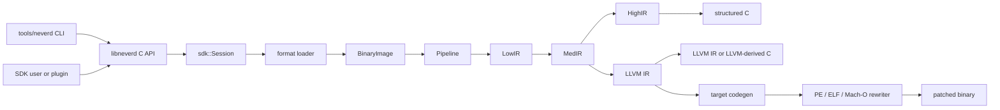

**Languages**: [English](../architecture.md) | [简体中文](../zh-CN/architecture.md) | [繁體中文](../zh-TW/architecture.md) | [日本語](architecture.md) | [한국어](../ko/architecture.md) | [Français](../fr/architecture.md) | [Deutsch](../de/architecture.md) | [Español](../es/architecture.md) | [Italiano](../it/architecture.md) | [Русский](../ru/architecture.md) | [العربية](../ar/architecture.md)

[← ドキュメント索引](README.md)

# NeverD アーキテクチャ

このガイドでは、コントリビューターが NeverD を安全に変更するために必要な
本番コードの境界を説明します。対象は意図的に NeverD 所有のコードだけに限定し、
LLVM、Capstone、Unicorn の各サブモジュールは独自の内部アーキテクチャを持ちます。

## システム境界

NeverD には 4 つの IR 表現がありますが、必ず 4 段すべてを通る一列の処理では
ありません。`LowIR -> MedIR` は共通です。構造化デコンパイルは
`MedIR -> HighIR -> C` を使い、`lift`、`decompile --llvm`、`patch` は
`MedIR -> LLVM IR` へ直接進みます。特に patch と lift モードは意図的に
HighIR を通りません。

CLI は `tools/neverd` でコマンドを解析し、`neverd_session_t` を作成して
`include/neverd/sdk/NeverDCAPI.h` の公開 API を呼び出します。エンジン状態は
`lib/sdk/SessionImpl.h` にあり、`neverd_session_load` が loader を選択して
`BinaryImage` を構築します。IR ベースの操作は必要になった時点で
`lib/pipeline/Pipeline.cpp` を実行します。`neverd` 実行ファイルは
`neverd_shared` にリンクし、各コンポーネントアーカイブと LLVM/Capstone
依存関係は共有ライブラリの非公開実装です。CLI はコマンドライン UI に LLVM
Support を使いますが、エンジンを駆動する際に C API を迂回しません。

HighIR の `HighSourceFlow` は出力文の制御フロー辺、局所変数の識別、確定代入解析を管理します。
ソース検証と不要な PHI コピーの除去は同じグラフを使います。繰り返されるスカラー条件を
ゼロ／非ゼロに有界分割し、書き込みで古い条件を破棄します。アドレスが流出した変数は未知のままとし、
分割上限では保守的なグラフに戻ります。すべての実行可能な文脈で値が不要な場合にだけ
PHI コピーを削除します。呼び出し、ロード、ストアの観測可能な動作とソースラベルは保持します。

Block 利用側のエスケープ解析もこのグラフを使用します。有界固定点解析でポインターの識別とプライベートなスタックスロットを分岐・ループ間で追跡します。合流では文脈アドレスの可能性を保持し、完全な上書きだけがそれを消去します。未知の辺、例外フロー、証明予算の超過はバインドを拒否します。

Objective-C の受信側の事実は、メソッド入口の self と正確なクラス参照を区別します。同じ入口を共有するすべてのメタデータが一致した場合だけ self を設定します。全幅のコピーと ABI が保存を保証するレジスタは、入口への戻り辺も含む同じ不動点解析で伝播します。宣言の照合ではクラス／インスタンスの区別、記録されたカテゴリ、親クラス、採用プロトコルを扱い、入口の self には既知の派生クラスも含めます。コンパイラのカタログは所有者と継承関係をセレクタ全体の照合とは別に保持します。SDK は出力前に現在のイメージで受信側の由来と宣言を再検証します。具体的な IMP の選択やバイナリ書き換えの許可には使いません。
外部の継承情報が不足する場合は受信側で範囲を限定せず、セレクタ全体の一致を要求します。未対応または矛盾する明示的な宣言は否定的証拠として保持します。

明示的なオブジェクト型を持つ ivar は、最大八回の全幅ロードで受信側の証拠を拡張します。各段階は実行時オフセットのスロット、幅、命令で使った定数バイトオフセットを記録します。定数は現在の配置と一致する必要があり、実行時参照は移動したフィールドに追従できます。ローダーは記録されたクラス継承とフィールド宣言を確認します。部分アクセス、型名のない id、ブロック、プロトコルのみの型、曖昧な配置、未知の基底ポインタからはクラスを推定しません。出力時に現在のイメージで経路全体を再検証します。型の事実はオブジェクト同一性やメモリ操作削除の許可にはなりません。

ローダーは Darwin の定数文字列、整数オブジェクト、配列、整列済み辞書からなる有界の非巡回グラフを検証します。コンテナのフィールドと各辺には、不変のマップ済み領域と曖昧さのないインポートまたは再配置の証拠が必要です。未対応のエンコーディング、循環、不完全なグラフは明示的に失敗します。ソースの束縛時にはグラフと入力ポインタスロットを再検証します。生成ヘルパーは整数ビット列、子の順序、共有アドレスを保持し、既存の文字列の同一性を再利用します。コンテナのスロットは検証済みの子ヘルパーだけを呼び、acquire/release によって一度だけ初期化して公開します。各ヘルパーは子の宣言を含むため、独立に復元したメソッドが同じ定義を共有できます。移植可能なテストは不正入力と証明予算を、ネイティブのコンパイラ実例は元のメソッドとの内容、別名、コピーの同一性、並行初期化の一致を確認します。

## IR 表現と経路

| 表現 | 目的 | 主な定義と変換 |
|------|------|----------------|
| LowIR | アーキテクチャ非依存の `NdOp` 操作、基本ブロック、CFG、ジャンプテーブルメタデータ | `include/neverd/ir/low`、`lib/ir/low`。`lib/decode` + `lib/lift` が生成 |
| MedIR | 型、ABI/呼出規約、メモリ/スタックモデル、フラグ、呼出し、SSA 的データフロー | `include/neverd/ir/med`、`lib/ir/med` |
| HighIR | 読みやすい C のための構造化式と制御フロー | `include/neverd/ir/high`、`lib/ir/high`。`lib/backend/c/HighC` が出力 |
| LLVM IR | 最適化、LLVM 由来 C、ターゲットコード生成、バイナリ書き換え入力 | `lib/backend/llvm`。`lib/pipeline` が最適化/調整 |

定数は LowIR、MedIR、HighIR を通じて、出現箇所ごとのスカラーまたはアドレスの由来とアドレスの所有情報を保持します。同じビット値でも異なる由来は統合しません。HighIR のシンボリック簡約はアドレスの識別情報を不透明な入力として扱います。ソースのバインドは共通の数値オペランド分類を使い、メモリやポインタとしての使用には引き続き再配置のバインドを要求します。

| ユーザー経路 | 表現の流れ | 出力 |
|----------------|------------|------|
| Low/Med dump | Binary -> LowIR、必要なら -> MedIR | 診断テキスト |
| High dump または `decompile` | Binary -> LowIR -> MedIR -> HighIR | HighIR または構造化 C |
| `lift` | Binary -> LowIR -> MedIR -> LLVM IR | `.ll` |
| `decompile --llvm` | Binary -> LowIR -> MedIR -> LLVM IR | LLVM 由来 C |
| `patch` | Binary -> LowIR -> MedIR -> LLVM IR -> codegen | 書き換え済みバイナリ |

経路選択の信頼できる情報源は `lib/pipeline/Pipeline.cpp` です。表現固有の
ロジックは所有する IR または backend ライブラリに置き、pipeline はアルゴリズムを
取り込むのではなく、それらのコンポーネントを調整してください。

## クロスアーキテクチャ変換の契約

`include/neverd/translate` が定義しているのは契約層であり、実行 backend
ではありません。`GuestState` は `x86_32`、`x86_64`、`AArch64`、`ARM32`
について、アーキテクチャ非依存のマシン可視状態をモデル化します。正規な
version 1 シリアライズは固定幅のリトルエンディアンフィールド、安定したレジスタ
ID、ソート済みコレクション、fail-closed 検証を使うため、永続化状態はホストの
C++ レイアウトに依存しません。

`GuestState` の wire v1 baseline は恒久的に凍結されています。この baseline 外の
状態は、拡張範囲の extension-register ID と正規の小文字名を組み合わせて表現するか、
明示的な upgrader を備えた新しい wire version に移行しなければなりません。v1
baseline をその場で変更することは禁止されています。

`ARM32` guest では `ExecutionMode` が権威ある decode mode であり、`CPSR.T` と
一致しなければなりません。保存される PC は常に bit 0 をクリアした正規の命令
アドレスであり、ARM mode ではさらに word alignment が必要です。

アーキテクチャ対のポリシーは `x86_64 -> AArch64`、
`AArch64 -> x86_64`、`x86_32 -> AArch64/ARM32`、
`ARM32 -> x86_32/x86_64` を定義しています。`ContractDefined` は要求を検証して
永続化できるという意味であり、コードを変換または実行できるという意味では
ありません。JIT ポリシーは実行中プロセスの native host だけを受け入れ、AOT
ポリシーはホストアーキテクチャと target triple の明示を要求します。CPU または
feature set を選ぶ場合も明示が必要です。

`ResolvedHostTarget` は、この選択を具体的な結果へ解決します。`Native` 解決は現在の
process から triple、CPU、有効/無効の feature set を取得します。`Explicit` 解決は
呼出し側が指定した architecture、triple、CPU、feature を検証して正規化し、競合を
拒否します。version 付き cache identity は、正規化済み target input から決定的な
byte 順で構築され、process address や locale 依存の text を含みません。

version 付き `TranslationExit` は安定した停止理由と、それに対応する型付き payload
を記録します。対象は syscall、例外または signal、breakpoint、未対応命令、自己書換え、
リソース budget、外部呼出し、memory fault、その他の終了条件です。利用側が停止理由に
応じて型のない整数を読み替える必要はありません。

対応する `BudgetExhausted` の場合を除き、結果が報告する instruction、block、
generated-code の各 count は、要求の対応する非ゼロ budget を超えてはなりません。
instruction と block の枯渇は limit で正確に停止します。生成 object のサイズは分割
できない codegen の完了後にしか確定しないため、その枯渇結果は
`Observed > Limit` を報告できます。拒否された object は link、publish、execute
されません。各 `BudgetExhausted` payload は要求された limit を正確に示し、導出値や
実装固有のしきい値を報告しません。

backend-private `RuntimeControlBlockV1` の契約は、正確に 128 byte、
8 byte alignment であり、固定された v1 magic、version、size、field offset、ゼロの
reserved field、整合した typed exit によって制約されます。C++ container、host
pointer、guest address alias は含みません。また `GuestState` の C++ layout や wire
format ではなく、この契約を実装する backend が状態をこの record へ明示的に変換
する必要があります。

固定 v1 generated-code call surface に含まれる helper は正確に 8 個です：
`nvd_rt_v1_load8_le`、`nvd_rt_v1_load16_le`、`nvd_rt_v1_load32_le`、
`nvd_rt_v1_load64_le`、`nvd_rt_v1_store8_le`、`nvd_rt_v1_store16_le`、
`nvd_rt_v1_store32_le`、`nvd_rt_v1_store64_le`。名前、signature、pointer provenance
は完全一致しなければならず、backend はこの有限 table を明示的に bind して ambient
symbol resolution へ fallback してはなりません。executable generation 検証と
budget/cancellation polling は trusted dispatcher 専用の操作です。
`nvd_rt_v1_validate_generation` と `nvd_rt_v1_poll` は generated-code helper では
ありません。trusted host dispatcher は block 選択も所有し、生成 IR からは呼び出せ
ません。translated block は代わりに typed exit code を返します。生成 IR が直接
読めるのは、宣言済みの scalar-result runtime slot だけです。

`RuntimeSymbolRegistryV1` は、その helper table を閉じた host-side registry として
実装します。構築時に ABI-v1 の完全な集合、正確な canonical name、helper class、
signature、および各 entry に class と一致する非 null の function pointer が正確に
1 個あることを検証します。lookup は完全一致名だけを受け入れ、process 環境や
dynamic loader の symbol を参照せず、object verifier の allowlist に同じソート済み
名前を提供します。version 付き identity は名前、helper class、ABI shape を含みます
が、native address は意図的に除外するため ASLR に左右されません。

`RuntimeCodeMemory` は page 単位で分離された generated-code storage を所有し、
一方向の `RW -> RX` publication だけを許可します。memory が同時に writable かつ
executable になることはなく、publication 後に write 可能へ戻すこともできません。
write と entry offset は bounds-check され、publication 時には host instruction cache
が invalidation されます。native smoke test が publication 後に実行するのは小さな
host instruction sequence だけであり、証明するのはこの W^X memory boundary であって
translation engine ではありません。

`GuestMemoryRuntime` は論理的な `GuestState` から分離されています。生成時に state
を検証し、region の byte と metadata をソート済み private index へコピーします。
guest virtual address は lookup key にすぎず、host pointer へ変換されません。検査
付き scalar access は、width、alignment、overflow、unmapped、cross-region、
permission、executable write、generation overflow/mismatch、policy fault を型付きで
報告します。instruction/block budget、cancellation、generation tracking、および
`RejectExecutableWrites`、`InvalidateOnExecutableWrite`、
`ValidateBeforeDispatch` の code-write policy も、暗黙の host 動作ではなく整合した
typed record を生成します。

`TranslationObjectCompilerV1` は、検証済みの LLVM IR-to-object 境界です。const
input module を検証し、すべての変換前に clone し、proof-gated semantic
simplification と LLVM `O0`〜`O3` optimization を組み合わせ、final IR を再検証して、
4 つの contract host architecture 向けに relocatable ELF、COFF、Mach-O object を
emit します。正確な target-mangled block/runtime symbol manifest を canonicalize し、
emit 後の各 object を audit して、runtime registry identity と version 付き request /
artifact cache key を返します。generated-byte budget が非ゼロなら、それを満たす
object だけが artifact verification に進めます。LLVM はまず private buffer へ分割
不能な emit を完了して正確なサイズを測定します。超過 object は publish と artifact
audit の前に拒否され、typed telemetry が実測サイズと要求された正確な limit を保持
します。ゼロは caller policy 上 unlimited です。compiler の出力は audit 済み
relocatable byte までであり、link、publish、dispatch、execute、および guest
instruction lowering は行いません。

post-codegen verifier は relocatable ELF、COFF、Mach-O object を
閉集合として監査します。format と architecture は選択された host と正確に一致し、
undefined symbol は有限 helper allowlist に完全一致しなければならず、dynamic symbol
は禁止されます。relocation は明示的な direct whitelist であり、encoding、width、
alignment、offset、loadable destination、object-local non-preemptible definition または
完全一致で許可された helper target を検査します。W+X、unwind/exception と
initializer metadata、TLS、IFUNC、GOT と通常の PLT indirection、dynamic relocation、
weak/preemptible または選択可能な definition、未知の allocated section、linker
directive は拒否されます。LLVM が hidden x86-64 ELF call に使う
`R_X86_64_PLT32` は、v1 policy が exact runtime helper への sealed direct branch と
証明した場合だけ許可され、PLT や GOT path を許可するものではありません。ELF
`ET_REL` artifact は program header や segment を含んではなりません。Mach-O load
command は positive list で制限され、bit 幅が一致する segment を正確に 1 個、
symbol table、dynamic-symbol table、platform-version、data-in-code command を
それぞれ最大 1 個だけ許可し、依存関係も検査します。linker option とその他の
command はすべて拒否されます。

`TranslationObjectRequestV1` は、これらの契約上に構築された最初の公開
guest-byte-to-object slice であり、意図的に対象を絞っています。現在公開されている
fail-closed な x86-64 v1 scalar-register subset では、legacy prefix のない canonical
encoding、すなわち、対応する register/immediate LowIR 形状になる REX.W 全幅 GPR の
`MOV`、`ADD`/`SUB`、および `AND`/`OR`/`XOR` だけを受け取ります。schema 9 はさらに、
全幅 register/register `CMP` の `39/3B`、register/immediate `CMP` の `81/7`、`83/7`、
`3D`、全幅 register/register `TEST` の `85`、register/immediate `TEST` の `F7/0` と `A9`
を受理します。算術形式は従来の scalar flag 計算を維持し、論理形式と `TEST` は
アーキテクチャで定義された flags を計算しつつ NeverD state model の `AF` を保持します。
canonical `C3` `RET` と `C2 iw` `RET imm16` は return block を
終了し、canonical `EB cb` と `E9 cd` の direct-relative `JMP` encoding は direct-branch
block を終了します。公開 lowering schema は 9 です。canonical かつ legacy prefix のない
traditional Jcc は、`JO`/`JNO` の short `70/71 cb` または near `0F 80/81 cd`、
`JB`/`JAE` の `72/73 cb` または `0F 82/83 cd`、`JE`/`JNE` の `74/75 cb` または
`0F 84/85 cd`、`JBE`/`JA` の `76/77 cb` または `0F 86/87 cd`、`JS`/`JNS` の
`78/79 cb` または `0F 88/89 cd`、`JP`/`JNP` の `7A/7B cb` または `0F 8A/8B cd`、
`JL`/`JGE` の `7C/7D cb` または `0F 8C/8D cd`、`JLE`/`JG` の `7E/7F cb` または
`0F 8E/8F cd` に限られます。`JRCXZ`/`JECXZ`/`JCXZ` と
`LOOP`/`LOOPE`/`LOOPNE` は未公開で fail closed します。予約済みの `F7 /1`、guest-memory
operand、partial-register form、legacy prefix、および意味的に冗長な REX extension bit
も fail closed します。出力は監査済み little-endian AArch64 ELF または Mach-O relocatable object
に限られます。通常の guest memory operation、partial-register form、この厳密な subset
外の任意の instruction/encoding、return、これらの direct jump、および上記の公開済み
Jcc branch 以外の control flow、ならびに lowerer が未実装の LowIR
operation は object emission 前に拒否されます。`RET` に必要な検査付き
return-address read は terminator contract の内部処理であり、一般的な guest-memory
lowering を公開するものではありません。request は block descriptor を再構築して
検証し、lowering と object emission に同じ resolved target machine を使い、
proof-gated semantic simplification と LLVM のデフォルト `O2` optimization pipeline
を組み合わせます。この slice は、その他の x86-64 instruction、他の guest/host pair、
または AArch64 から x86-64 への逆方向をサポートするものではありません。

公開 C entry point `neverd_translate_x86_64_block_to_aarch64_object_v1`、Python ctypes
wrapper `translate_x86_64_block_to_aarch64_object`、および
`neverd translate-object` command は、同じ object-only 境界を公開します。Python は
`TranslationObjectFormat.ELF` または `.MACHO` を使います。native translation の失敗時
には `TranslationErrorCode` を保持する typed `TranslationError` を投げ、local argument
validation は `TypeError` または `ValueError` を投げます。成功時には Python 所有の
immutable result を返します。C result は object byte、安定した cache identity、
optimization telemetry を所有し、CLI は選択された ELF または Mach-O object だけを
書き出します。これらの C、Python、CLI object surface はいずれも link、load、dispatch、
execute、debug より前で停止し、execution session interface ではありません。

`verifyTranslationLinkGraphV1` は、独立した allocation 前の第 2 の監査を追加します。受理済み
AArch64 ELF または Mach-O object から一時的な LLVM JITLink graph を構築し、target、
section permission、block/runtime symbol manifest、external-symbol closure、および
edge kind と target を検査します。address-free な監査結果を生成した後、graph は破棄
されます。この監査に合格しても、code の link、allocate、resolve、load、publish、
dispatch、execute は行われません。

`linkTranslationObjectV1` は独立した native linking 境界です。pruning、allocation、
symbol resolution、fixup の前後で trusted descriptor、raw object、JITLink graph を
再監査します。runtime symbol は sealed registry だけから供給されます。dispatcher
credential は唯一の manifest entry を session、block identity、guest entry PC、cache
generation、code epoch に束縛し、invoke 時には runtime guest `RIP` もその entry と一致
しなければなりません。finalization に成功すると最終 permission で executable memory を
publish し、unload は新たな invoke を失効させ、実行中の 1 回の invoke を待ってから
allocation を解放します。credential-free overload は audit-only のままで invoke できません。

`NativeTranslationSessionV1` はこれらを experimental C++ x86-64-to-native-AArch64
execution 境界として構成します。little-endian AArch64 ELF または Mach-O process 上で、
compile-link-validate-invoke-unload dispatcher loop 全体にわたり、検査済み guest-memory
runtime と固定 guest state を複数 block 間で維持します。canonical direct jump は正確な
static target から継続します。公開済みの canonical Jcc branch は
block manifest が宣言した taken または fallthrough successor からのみ継続でき、dispatcher はそれ以外の selected
PC をすべて拒否します。return は終了します。global instruction、block、generated-object-
byte の budget は block をまたいで正確に維持され、guest が正常停止すると実行済み state
と authoritative memory が一緒に commit されます。cancellation は final commit に対して
linearize されます。

これは実行可能な vertical slice であって、完全な translator ではありません。通常の
guest-memory instruction、partial register、上記の厳密な schema-9 traditional-Jcc slice 以外の
conditional control flow（`JRCXZ`/`JECXZ`/`JCXZ` と
`LOOP`/`LOOPE`/`LOOPNE` を含む）、indirect control flow、call、floating-point、SIMD、x87、atomic、system instruction、
汎用 exception propagation、block cache、他の guest/host pair、逆方向の
AArch64-to-x86-64 はまだ対象外です。
execution session の C、Python、CLI、JSON surface はなく、debugging は独立した未対応
機能です。上記 object API は native execution を使わずに引き続き利用できます。

生成 IR の契約では、この契約に従うすべての translated block を hidden かつ
non-preemptible とし、C ABI `i32 (ptr state, ptr runtime)` を使うことを要求します。
block は private registry だけから発見され、プロセス環境の symbol lookup には
依存しません。block 間の直接呼出しも禁止されます。

IR verifier は、legalization が既知の compiler-runtime libcall を導入することを
避けるため、整数幅をホストの scalar register 幅以下に制限します。ただし、これは
必要条件にすぎません。この契約を実装する実行 backend は、post-codegen control
transfer、`MachineIR`、target object の relocation を、同じ有限の runtime-symbol
allowlist に対して厳密に監査する必要があります。

TranslationIR の直接 load/store と private constant が保持する値に許されるのは、
ホストの scalar-register 幅以下の単一 scalar integer だけです。aggregate は verifier
境界より前に scalarize し、コンパクトな IR が backend の無制限な展開を引き起こさ
ないようにしなければなりません。

generated-code ABI は scalar integer についてのみ定義されています。浮動小数点、
SIMD、x87、atomic、system instruction はこの契約の範囲外です。
`ProvenSemanticAndLLVM` を選択する実装は、NeverD の proof-gated semantic
simplification を LLVM 最適化との共同 fixed point まで実行しなければなりません。
このポリシー自体は実行可能な translation backend を提供しません。

## Windows ドライバーエミュレーション

`lib/emulation` は `NEVERD_ENABLE_DRIVER_EMULATION` で有効にするオプションの実行コンポーネントです。`emulate-driver` CLI は公開 C API 経由でアクセスします。`DriverSession` は、範囲を限定した x64 WDM の初期化と、任意の逐次 create／IOCTL／read／write／cleanup／close／unload 呼び出しを担当します。Windows イメージのマッピングは既存ローダーの完全な `BinaryImage` を使用し、Windows モデルはゲストオブジェクトと API セマンティクスを担当します。Unicorn アダプターは CPU 実行と、ゲストメモリの唯一の正規状態を管理します。この経路は実験的なネイティブ変換パイプラインを使わず、その対応プロファイルも変更しません。

Unicorn は `cmake/NeverDUnicorn.cmake` で一度だけ構成し、セマンティックテストと共有します。`BUILD_TESTING=OFF` でも使用できます。未知の API や CPU 環境動作では明示的に停止し、ドライバーが返した失敗と、未完了のエミュレーションを区別します。上限、レポート、未対応のライフサイクル操作については[ドライバーエミュレーション](driver-emulation.md)を参照してください。

元の C API は初期化のみを実行します。シナリオ JSON は同じ実行オプションに対する単一の厳格なパーサーを使い、フィールドとリクエスト種別は `.def` の一覧で宣言します。要求されたベース再配置とセキュリティ Cookie の初期化は、実行ローダーの責務です。Windows モデルは IRP／スタック位置／ファイルオブジェクトを管理し、同期完了またはワーク項目による保留完了を検証します。セッションは共通の実行予算の下でコールバックを順に呼び出します。未使用の未知インポートは遅延バインドされ、実行または未モデル化エクスポートデータの読み取りで明示的に停止します。

エクスポートレジストリは、静的インポートと動的解決に共通の安定したゲストアドレスを提供し、可用性と実装を分離します。明示的に不在なら NULL に解決し、存在しても未モデル化ならトラップに入り、可用性が未指定の動的照会は停止します。Windows モデルは独立したファイル識別子と、リクエストが所有する MDL を管理し、マッピング権限と完了時の失効も扱います。ランタイム API の書式処理は、検査付き Win64 引数リーダーでゲスト引数を取得します。バックエンドは最初の構造化フォールトを保持します。後続の観測でフォールトを消去したり実行を再開したりせず、これらのバックエンドフォールトを Windows SEH で処理しません。

Windows モデルは独立した非ページプール MDL も管理し、記述子を解放しても元のバッファーは解放しません。MDL チェーンと IRP の関連付けは未モデル化です。独立したレジストリモデルが明示的なシナリオツリー、ハンドル権限、キーと値の寿命を管理し、静的エクスポート一覧とは分離されています。事前検証と実行は同じ検証規則を使い、レポートは最終的なキーと値を保持します。アンロード時には残存ハンドルを検査します。

`KernelScheduler` は実行待ちキューの順序、コールバック識別、タイマー期限を管理し、`KernelDispatcher` は不透明な DPC・タイマー・イベントとシグナルを管理します。`KernelModel` は待機登録、ワーク項目／デバイスの寿命、IRP 完了を管理します。`DriverSession` は Win64 スタック引数を含む独立スタックと完全な CPU コンテキストを中断・復元し、ゲストメモリを共有します。実行可能なフレームがないときだけ仮想時間はタイマー／待機／キャンセル境界で進み、CPU0 の決定的な協調スケジューリングで DPC は `DISPATCH_LEVEL`、ワーク項目は `PASSIVE_LEVEL` となります。一般のスレッド／APC／スピンロック、WDM／PnP のキャンセル、公開シナリオの並行送信、完全な PnP／電源、一般のハードウェアは含みません。 API の IRQL 上限は `KernelAPIIRQL.def` にあり、引数依存の制約は担当モデルが検査します。

`KernelModelDeviceStack` はデバイスのドライバー所有者、割り当て、上下の接続、削除待ち状態、内部参照を一つの記録で管理します。ゲストの `NextDevice` 一覧とホストが所有する接続グラフは別の意味を持ちます。名前解決は名前付き下位デバイスを `FILE_OBJECT` とレポートに保持し、初期ディスパッチと READ/WRITE の方式には現在の最上位を選び、要求経路全体を保持します。切断・削除しても要求やコールバックが保持中のデバイスは失効せず、公開 `ReferenceCount` は開いたハンドル数だけを表します。

`KernelModelIRPStack` は元のゲストパケット上で有界カーソル、指定対象へのディスパッチ、完了展開を管理し、インライン Copy/Skip/SetCompletion の書き込みが正本です。ディスパッチ状態、完了制御、最終 `IoStatus` を分離し、pending はディスパッチ復帰後にも伝播できます。`STATUS_MORE_PROCESSING_REQUIRED` は入れ子の完了も含め、最終展開を再開するまで IRP／MDL／バッファーを保持します。`KernelGuestCall` の所有サブシステムとローカルトークンが WDM／WDF 継続の衝突を防ぎ、`DriverSession` は CPU フレームと継承 IRQL を保存します。単一のゲストドライバーを、別所有のシナリオ PDO 上に接続できます。ドライバー割り当て IRP、WDF 接続／転送、使用中スタックへの接続、中間層切断、メジャー変更、経路外対象は未対応です。 上位の完了コールバックを実行する前に、消費済みの下位スタック位置をゼロにします。

`DriverPnp.h` と公開 `DeviceLifecycle.def` が状態列挙と厳密な成功値の契約を管理し、`devicePnpFinalStatusError` を事前検証とゲスト最終完了で共有します。`KernelModelPnpDevices` は安定した PDO 識別、独立したプロバイダー一覧、実際の AddDevice 観測を所有します。`KernelModelPnpRequests` は取引と不変のデバイス／ファイル識別を既存 IRP に結び付けます。停止、取り外し待ち、電源状態を理由に I/O を拒否せず、実際のゲストが成功、失敗、待機を決定します。`KernelModelPnpCompletion` は実際のバス受信／完了と仮想期限を管理し、`KernelModelIRPStack` と所有者付き継続を再利用します。最終上位完了が状態を確定し、成功 PnP にはプロバイダー完了が必要です。Start/QueryStop/QueryRemove の早期上位失敗はバス観測を null にできます。Stop/CancelStop/SurpriseRemoval/CancelRemove/Remove は正確に STATUS_SUCCESS が必要です。QueryStop の STATUS_RESOURCE_REQUIREMENTS_CHANGED (0x119) は未実装のリソース再照会として拒否します。プロバイダー破棄とゲストの切断／削除は独立し、リークを自動で消しません。8 種の一般的な機能は明示バス設定を使い、公開実行は直列、Remove 前にファイルと先行要求を終了させます。その他の PnP、その他のハードウェア／リソース、KMDF PnP は含みません。

`KernelRemoveLocks` は登録、正確な DEVICE_OBJECT 所有者、サイズ、Tag 多重度、排出ラッチの唯一の管理者で、`DeviceLifecycle` 取引とは独立します。PDO 状態や IRP 風 Tag は所有権を与えません。`KernelModel` は拡張部全体の由来と不透明アクセスを検証し、4つの Ex をルーティングして型付き再開可能 RemoveLock 待機を登録します。最終 release はコールバック復帰前に待機を準備完了にし、CPU 継続を使い架空のコールバックを作りません。AndWait は関連 REMOVE 経路と実際のプロバイダー受信を確認しますが、下位完了や存続 Tag パケットは不要で、完全な Driver Verifier ではありません。REMOVE のファイル閉鎖／先行要求終了条件は維持し、ロック解放コールバックの存続を許します。セッションは残るフレーム終了まで経路を保持し、所有権解放前に最終撤去を検証します。取得／待機の検査は delete-pending 更新より先、登録解除は拡張部の実際の退役時です。排出はワーク項目や経路の参照を消費しません。

`DriverPower.def` は電源種別／動作の綴りと要求の出所を定義し、`DriverPnp.h` の共通 `DriverPowerOperation` をシナリオと PDO ごとの応答 FIFO に使います。`KernelModelPowerRequests` は明示パケット値、保持経路、DEVICE_OBJECT 別通知状態を所有します。`PoSetPowerState` はそのデバイスの前値を返し、ライフサイクル取引を変更しません。`KernelModelPowerCompletion` は実際の `PoRequestPowerIrp` 子を管理し、独立 IRP、報告行、応答索引を割り当てます。一致する PDO FIFO の先頭だけを消費し、context から親を推定したり親の結果を借用したりしません。入れ子ディスパッチと最終5引数 void コールバックは所有者付き継続、保持経路、独立スタックを再利用します。状態スナップショットは待機を越えて復帰まで存続します。同期子は API の STATUS_PENDING 復帰より先に完了でき、System S0 親も D0 子より先に完了できます。最終上位完了がライフサイクル観測を確定し、バス結果とは独立です。この限定範囲では DO_POWER_PAGABLE、DO_POWER_INRUSH なし、PASSIVE_LEVEL を要求し、D0/D3 と Working/Sleeping3 の Query/Set を扱います。明示32ビット SystemContext は不透明のままです。一般電源ポリシー、WAIT_WAKE、終了／休止、一般のハードウェア、KMDF PnP、並行公開シナリオ送信は含みません。

`DriverResources.h` / `DriverResources.def` と `DriverInterrupts.h` / `DriverInterrupts.def` は、`register_bank` の固定メモリー・割り込み割り当てを定義します。`DriverScenario` が JSON／ネイティブ事前検証を担当し、`DriverResult` は観測したバンク状態を複製せず初期設定を記録します。packed 配置の raw／変換後割り当て、リソース世代、物理的な存在と電源状態は `KernelResources` だけが管理します。`KernelMMIO` は永続レジスター値と独立したマッピング別名を、`KernelInterrupts` は不透明な接続、ロック、明示的なパルスを管理します。`KernelModelResources` は読み取り専用 START パケットを作成し、実際のプロバイダー完了を統合します。下位 START の成功は上位コールバック前に世代を公開し、プロバイダーの実際のデバイス SET 完了が D0／D3 のアクセス可否を更新します。START 失敗や STOP／REMOVE の解放確認は、上位コールバックが unmap と切断を行えるよう、最終 IRP 完了前に実施します。暗黙の後始末はありません。突然の取り外しは直ちにハードウェアアクセスを禁止します。`GuestMemory` と `UnicornBackend` は MMIO 効果の前に CPU／API トランザクション全体を検証し、最初の障害を保持します。固定割り当ての再開はバンク値を保持します。任意 RAM、リソース再配分、ポート、共有／レベル／メッセージ割り込み、その他の DMA インターフェースは引き続き未対応です。

`KernelInterrupts` は各明示的パルスを、発生元要求の送信成功時に存在する接続トークンとリソース世代に結び付けます。`KernelModelInterruptEvents` は時刻や観測値を変更する前に、同時刻の全生成元の容量を事前検証します。フレームワークのキャンセルコールバック数も正確に数えるため、タイマー、プロバイダー完了、キャンセルが ISR 用の空きを黙って消費することはありません。プロバイダーの実際のハードウェア状態公開後にパルスの配信可否を判定し、受け付けた割り込みを DPC やパッシブコールバックより先に実行します。スケジューリングは協調型です。仮想時間はアイドル時だけ進み、遅延ゼロは命令単位のプリエンプションを意味しません。`KernelModelInterrupts` は旧来の 11 引数 ABI と選択された Ex フィールドをデコードし、`KernelGuestCall` は割り込みコールバックに独立した所有者／トークンを与えます。ISR と同期コールバックは割り当て DIRQL で同じ非再帰ロックを保持します。入れ子の CPU フレームは呼び出し元の IRQL／CR8 を保ち、BOOLEAN は AL だけを使用します。手動ロックは同じ実行識別子と保存 IRQL を必要とし、ロックを保持したままコールバックから戻ることはできません。設定済みパルスは発生元 IRP の寿命を超えて残ります。切断、利用不能な世代、D3 での配信は明示的な未配信理由を記録して停止し、再接続先への付け替えや enable／ack レジスター動作の推測は行いません。`DriverResult.Interrupts` は独立した観測であり、合成 IRP や NTSTATUS 完了ではありません。

`DriverDMA.h` / `DriverDMA.def` は PDO ごとの明示的能力と独立した外部取引を定義します。`KernelPhysicalMemory` は正確な生存 RAM 割り当て、共有ページ識別子、固定バイト範囲の唯一の管理層で、MDL はそのビューでありコピーではありません。`GuestMemory`／`UnicornBackend` は CPU 権限を変更せずに基底 RAM 全範囲へアクセスし、MMIO、実行中、再入、障害後のアクセスを拒否し、予期しないバックエンド障害を保持します。`KernelDMA` は独立論理ドメイン、アダプターに束縛したメソッド、共通／SG マッピング、マップレジスターの受付、コールバック参照を管理し、`KernelDMAEvents` は実配信時に捕捉済み PDO 世代を解決します。`KernelModelPhysicalMemory`、`KernelModelDMA`、`KernelModelDMATransfers` は元の割り当て／MDL 所有権と実際の間接ゲストコールバックを接続します。資源に空きがあればインライン実行し、待機中は識別子と容量を FIFO 昇格まで予約します。マッピングとコールバックの寿命は別で、Put は return 前にデータ／記述子の保持を解放でき、コールバック参照は完了済み IRP を生存させません。`DmaWritable` は CPU 権限と独立したロック意図です。同時刻はプロバイダー公開、DMA RAM 効果、割り込み可否判定の順です。世代／存在／電源は `KernelResources` だけが管理し、DMA はベンダーレジスターを推測せず、IRQ を発生させず、IRP を完了せず、別のライフサイクルも持ちません。論理アドレスは再利用せず、取引検証の失敗は RAM を変えず観測を残します。モデル化するインターフェースは、有界モデル RAM 上のコヒーレント共通バッファー、V1 SG DMA、変換付きバスマスターチャネル DMA です。一般ハードウェア、従属コントローラー、その他の DMA インターフェースは未対応です。

`KernelDMAChannels` は同じドメインアロケーターにチャネル予約と型付き SG／チャネル FIFO を追加します。コールバック状態、保持したマップレジスター、各操作全体のマッピングを分離します。チャネル操作は論理領域を一度だけ予約し、一つの物理固定範囲をその場で拡張します。MapTransfer 呼び出しを交互に実行しても、RAM のコピー、レジスターの二重消費、別マッピングとの重複は起きません。副作用のない転送／return／flush／解放計画で、公開前に識別子と昇格バッチ全体を検証します。`KernelModelDMAChannels` は間接 ABI と登録時の実際の CurrentIrp を解釈し、SG と同じ MDL ビューヘルパーを使います。スケジューラーの別種 `DMAAdapterControl` は DMA の順序、容量、インライン親の保持を共有し、戻り値の下位 32 ビットのアクションを解釈するのは DMA モデルだけです。キュー内で捕捉した IRP は終端スタック巻き戻し前から保護しますが、コールバック開始時にその入力保持を解除するので本体内で完了できます。全体のフラッシュはマッピングしたバイトを無効化し、正確な FreeMapRegisters は独立した予約を解放します。`KeFlushIoBuffers` のコヒーレントキャッシュ契約は、どちらの解放義務も満たしません。

`KernelFramework` は KMDF 1.33 のバインド、関数表の識別、WDF オブジェクトとコンテキスト、制御デバイスの初期化レコード、逐次ディスパッチする既定キュー、要求ハンドルを管理します。型付きのデバイス／要求ホストインターフェイスを通じて、WDM 名前空間、記憶領域、パケット状態、MDL マッピング、完了の検証を `KernelModel` に委譲し、どちらも重複するデバイスや IRP を作りません。キューのルーティングでは、フレームワークが管理するディスパッチ状態を、戻り値が `void` のゲストコールバックの復帰とは別に保持します。完了の継続処理は、IRP の寿命を終了させる前にクリーンアップと子オブジェクトの破棄を実行し、外部参照が保持するのは WDF コンテキストだけです。保留中の要求の削除は祖先オブジェクトの変更前に拒否します。削除時の自動キャンセルやキュー排出は未対応です。`DriverSession` は共通実行予算で入れ子のコールバックを実行します。`DriverImage` は CFG メタデータを検証し、`GuardControlFlow` は宣言済みイメージ／API ターゲットを管理し、CPU アダプターは check/dispatch の呼び出し状態を維持します。PnP デバイス、一般のキュースケジューリングとそのキャンセル、クラス拡張、UMDF は引き続き未対応です。

シナリオの `cancel_after_100ns` は転送要求の仮想キャンセル期限を指定します。`KernelModel` の IRP ごとのレコードが期限と実際の絶対時刻 `cancel_requested_at_100ns` を管理し、公開シナリオは引き続き逐次処理します。`KernelModel` はルーティング後、ゲスト I/O コールバック前にゼロ遅延を適用し、先に完了した結果を維持します。正の期限はアイドル時の時間前進に含めます。`KernelFramework` はマーク／解除、キュー登録／配信済みの状態、キャンセルコールバックが戻るまでの内部参照を管理します。キュー登録だけでは完了できず、配信後は待機中のコールバックとワーク項目が協調して完了できます。WDF の寿命保持は無効な IRP を復活させません。`KernelScheduler` はキャンセルとワーク項目を分離し、中断／再開でも種別を維持して容量とディスパッチ予算を共有します。DPC、FIFO キャンセルコールバックの順に優先し、その後に通常のワーク項目や実行可能なパッシブ待機フレームを再開します。キャンセルコールバックは `PASSIVE_LEVEL` で動作します。この制御デバイス契約には WDM キャンセルルーチンや一般のキュースケジューラーは含まれません。

旧版 `WdfRequestMarkCancelable` は既にキャンセルされた IRP に対し、現在の API 継続処理で入れ子の `GuestCall` を使います。キャンセル、クリーンアップ、最終破棄は待機でき、全継続処理が終わるまで呼び出し元を再開しません。登録後のキャンセルはスケジューラーを使います。`KernelFramework` は WDF ハンドル識別と完了中／完了後の定義済み getter 戻り値を管理します。要求アクセサーのホストは元の IRP、64 ビット Information、MDL 識別を `KernelModel` に委譲し、同モデルがフレームワーク所有 IRP のゲスト WDM 完了も拒否します。要求ごとの SystemBuffer MDL は必要時に一つだけ作り、直接バッファーは既存記述子を保ち、取得だけではマッピングしません。完了時には両種の記述子と IRP／バッファーを無効化し、WDF コンテキストの参照保持とは分離します。

`KernelGuestException` は 32 ビットのステータスを持つ型付き API 結果であり、モデルエラーやバックエンド障害とは別です。`DriverImage` は既存ローダーの推奨ベースに基づく例外メタデータを保持します。`KernelSEH` はそのデータ上で、検証済みアドレス変換とスタック読み取りを使って、有界で副作用のない x64 V1 C catch-all 転送計画を作ります。通常のヘルパーフレームをまたいで対応する不揮発 GPR の保存値を復元し、実際のゲストハンドラーを選択します。遭遇したフィルター／finally、GS／C++ パーソナリティー、連鎖、不完全レコード、プロローグ、XMM 復元は拒否します。`DriverSession` は正常な API 停止時だけ検証済みレジスター計画を適用し、API トレース結果を null のままにして同じ実行内のハンドラーを再開します。保持中のバックエンドフォールトを消去せず、別のコールバックスタックまで展開しません。この境界は ExRaiseStatus／ExRaiseAccessViolation／ExRaiseDatatypeMisalignment に対応します。ユーザープローブ、ロックしたユーザーバッファー、CPU 障害からの復帰は別の実装課題です。

## 例外書き換えの境界

Mach-O compact unwind には、元の `__unwind_info` 用 strict parser、生成された
`__LD,__compact_unwind` record 用 fixup-aware parser、元データと生成データの range を
正確に merge する処理、regular page 用 deterministic encoder、および transactional な
最終 section installer があります。installer は既存の file-backed
`__TEXT,__unwind_info` に encoded table が収まる場合だけ in-place で書き換えます。
architecture、layout、byte preimage を再検証し、未使用の末尾をゼロ化し、Mach-O 外側
transaction の単一 commit 前に結果を再 parse して semantic equivalence を確認します。
生成 record は、compiler が正確に記録した IR source function から target MC owner
symbol への対応（private definition を含み、object-format prefix や mangling を推測しない）、
opaque な非ゼロの range ID、および厳密な半開 fragment range で認証されます。生成された
各 FDE は唯一の認証済み fragment と厳密に一致し、必要な各 fragment も、その transaction
が install した唯一の FDE と厳密に一致しなければなりません。ただし、厳密な encoding
検証を通った正確な非 DWARF compact record が覆う場合を除きます。同じ function が所有する
隣接または非連続 fragment は一つの source recipe を再利用できますが、identity の欠落、
重複、dangling、owner の交差、または boundary 不一致は出力変更前に失敗します。新しい RX
segment は、`__LINKEDIT` が一意で file/VM の末尾にあること、offset shift が overflow
checked であること、最終 file/VM layout の strict replay が成功したことを証明してから
commit されます。最終 section が存在しない場合、生成 compact record は install せず、
以下の正確で認証済みの DWARF-FDE 閉路だけを通る場合に限り transaction を続行できます。
既存の最終 section が容量不足または malformed の場合は引き続き fail closed します。
link 済み native throw/catch による実証はまだありません。

外部参照は完全な MC fixup 契約から分類されます。call が選択できるのは認証済みの callable
target だけであり、生成 compact-unwind の personality field が選択できるのは検証済みの
non-lazy pointer slot だけです。そのファイル内容を dereference することはありません。
TLS、authenticated pointer、subtractive、malformed compact field、未知の relocation は
fail closed します。

ARM32 compact unwind では、encoding に含まれる stack adjustment と GPR layout は `Complete`
です。D-register pattern selector 0〜3 も `Complete` ですが、4〜7 は compact word だけでは
runtime-aligned CFA-relative slot をすべて証明できないため `Partial` です。`Partial` entry は
解析用に証明済み register identity を保持できますが、すべての rewrite path が fail closed
で拒否します。各 EH-frame install receipt は target architecture、pointer width、byte order
を厳密に束縛し、compact-unwind DWARF binding は receipt target identity の不一致を拒否します。

上位の ARM32 section transaction は compact-unwind decoder より狭い範囲だけを
公開します。Mach-O header が正確に `CPU_SUBTYPE_ARM_V7K` であり、元の symbol
table の `N_ARM_THUMB_DEF` bit が必要なすべての function を Thumb code として
積極的に認証する場合に限り、この経路が有効になります。その後は正確な
`thumbv7k-apple-watchos` triple と Thumb mode が code generation 全体で束縛され、
入力 feature 要件が Cortex-A7 の上限を超えることも許されません。flag のない
function または mode 不明の function、generic な non-v7k subtype、ARM mode、混在
または不明な external-code target、ARM Mach-O の in-place entry point、および C
source からの ARM Mach-O patch は、出力を変更する前に fail closed で拒否されます。
function discovery が `LC_FUNCTION_STARTS` だけに依存する stripped input はまだ
サポートされていません。

PE、ELF、Mach-O にはそれぞれ format 固有の例外 component がありますが、NeverD は
全 format・全 exception type を扱う end-to-end rewrite pipeline をまだ公開していません。
未対応 encoding または未解決の registration/layout 要件は、出力を変更する前に失敗
しなければなりません。既存の部分的な format 対応を完全な例外処理の閉路と表現しては
なりません。

Ada または D の Itanium personality を認識することは、Ada/D 例外のサポートではあり
ません。GNAT、GDC、DMD、LDC の address-form LSDA は解析可能です。type-table の
スロットは不透明なまま（GNAT は `Exception_Id` / `Exception_Data`、D は
`ClassInfo`）であり、`std::type_info` として辿ることはありません。native
reconstruction は LLVM の `personality` と address-form の `invoke`/`landingpad`
節を出力します。corpus-proven は別の主張であり、personality 認識や native
lowering から導いてはなりません。

## コンポーネントマップ

各コンポーネントは `add_neverd_component_library` が作成する静的アーカイブです。
表には重要な NeverD 依存関係を示し、CMake helper が共通で与える LLVM と
Capstone ライブラリは網羅しません。

| ディレクトリ | 責務 | 主な依存関係 |
|--------------|------|--------------|
| `lib/loader` | 形式検出、PE/COFF・ELF・Mach-O 読込み、正規化 `BinaryImage`、関数検出 | LLVM Object API |
| `lib/lift` | 手書きの x86/i386・AArch64・ARM32 命令セマンティクス | IR データ型 |
| `lib/decode` | Capstone/native デコードと各アーキテクチャ lifter へのディスパッチ | `NeverDIR`、`NeverDLift` |
| `lib/ir` | 共通型、LowIR・MedIR・HighIR・intrinsic の定義/変換 | 4 つの IR サブコンポーネント |
| `lib/pipeline` | 関数検出と Low/Med/High/LLVM 経路の調整 | IR、decode、lift、LLVM backend、デバッグ情報、IR pass |
| `lib/backend/c` | HighIR-to-C および LLVM-IR-to-C のレンダリング | IR |
| `lib/backend/llvm` | MedIR から LLVM への lowering | IR |
| `lib/backend/codegen` | ターゲットコード生成、PE/ELF/Mach-O の patch と in-place 書き換え | IR、loader |
| `lib/sdk` | 公開 C ABI、session ライフサイクル、クエリ、永続化、プラグイン、lift/decompile/patch/audit/hunt エントリ | エンジンを `libneverd` に集約 |
| `lib/pass` | LLVM IR 難読化 pass と MIR pass runner | IR |
| `lib/debug` | DWARF、PDB、linker-map デバッグコンテキスト | IR |
| `lib/sigs` | シグネチャ解析、データベース、マッチング | Loader |
| `lib/libc` | 既知の libc 名と呼出モデルのサポート | 独立コンポーネント |
| `lib/safety` | リフト済み IR 上のヒープ寿命監査とコピー越境ハント | Symbolic、Solver |
| `lib/support` | 共通のバイナリ読込み helper | Loader |
| `lib/translate` | version 付き guest state/policy/exit、固定 runtime ABI、検査付き guest memory、生成 IR/object/LinkGraph audit、sealed native linking、experimental x86-64-to-AArch64 C++ dispatcher | IR、LLVM、LLVM Object、JITLink の契約 |

公開ヘッダーは `include/neverd` 以下で各領域に対応します。内部 C++ クラスを
誤って SDK の一部にしないでください。安定した外部操作は純粋 C ヘッダーと、
責務を絞った `lib/sdk/NeverDCAPI*.cpp` のいずれかに置きます。

## strict lifting の契約

`Decoder` と各アーキテクチャ lifter は strict モードで開始します。Capstone が
命令をデコードできても選択した lifter に実装がなければ、lifter は
`UnliftedInstruction` を投げます。例外には命令アドレス、ニーモニック、オペランド
文字列が記録されるため、未対応セマンティクスは省略や推測ではなく明示的に失敗します。

内部の非 strict 経路は `NdOp::NOP` を出力しますが、これは診断用の逃げ道であり、
命令の受け入れ可能な実装ではありません。コントリビューターと CI のテストは strict
を維持してください。strict 失敗が発生したら：

1. 最小のアーキテクチャ固有 fixture で再現する。
2. `lib/lift/<ISA>` に不足するセマンティクスを追加する。
3. `unittests/lift` で期待する LowIR 形状を検証する。
4. 命令に観測可能な動作があれば、`unittests/semantic` に Unicorn 差分ラウンドトリップを追加する。

pipeline を続行するためだけに `UnliftedInstruction` を捕捉しないでください。新しい
意図的な近似には明示的な契約とテストが必要で、1:1 lifting を装ってはいけません。

## 形式と ISA の所有範囲

入力形式のロジックと出力書き換えのロジックは意図的に分離されています。

| 形式 | 読込み、メタデータ、入力リロケーション | Patch と出力リロケーション |
|------|----------------------------------------|-----------------------------|
| PE/COFF | `lib/loader/COFF` | `lib/backend/codegen/COFF` |
| ELF | `lib/loader/ELF` | `lib/backend/codegen/ELF` |
| Mach-O | `lib/loader/MachO` | `lib/backend/codegen/MachO` |

アーキテクチャ lifter は `lib/lift/X86`、`lib/lift/AArch64`、`lib/lift/ARM`
にあります。対応する公開 lifter/register 宣言は `include/neverd/lift` にあります。
ターゲット固有の LLVM 出力とコード生成は `lib/backend/llvm/<ISA>` と
`lib/backend/codegen/CodeGen<ISA>.cpp` にあります。

### サポートとテストの深さ

ルートのサポート表は各セルが実装済みであることを意味します。すべての opcode、
ABI 境界ケース、バイナリ生成元、OS バージョンを網羅的にテストしたという意味では
ありません。命令セマンティクスが lifter の実装済みカバレッジ外にある場合、strict
モードは fail-closed で停止します。

形式×アーキテクチャの全 12 セルには
`unittests/semantic/PatchFullSubstRTTests.cpp` のセマンティックな書き換え backend
カバレッジがあります。統合の深さは次のとおりです。

| 形式 | x86-64 | i386 | AArch64 | ARM32 |
|------|--------|------|---------|-------|
| PE/COFF | リンク済み fixture | backend グリッド | リンク済み fixture | リンク済み Thumb fixture |
| ELF | リンク済み fixture + セマンティックラウンドトリップ | オブジェクト pipeline + セマンティックラウンドトリップ | リンク済み fixture + セマンティックラウンドトリップ | リンク済み fixture + セマンティックラウンドトリップ |
| Mach-O | リンク済み fixture\* | PIC/no-PIC オブジェクト pipeline\* | リンク済み fixture\* | backend グリッド |

- **リンク済み fixture** は代表的プログラムのリンク済み実行形式について、
  loader/pipeline と patch の動作を検証します。
- **オブジェクト pipeline** は再配置可能オブジェクトの読込み、全 IR 段階、
  デコンパイルを検証しますが、ホストでのリンクと patch 済みバイナリの実行は含みません。
- **backend グリッド** は正確な書き換えコード生成経路で代表的 IR をコンパイルし、
  Unicorn で動作を比較します。その形式の loader をリンク済み実行形式には適用しません。
- `*` Mach-O のリンク済み fixture は、要求するターゲットを生成できるホスト
  ツールチェーンに依存します。サポート対象の macOS ツールチェーンは旧 i386
  実行形式をリンクできないため、
  i386 は PIC/no-PIC thin オブジェクトと書き換えグリッドを使用します。

リンク済み fixture のセルは、その代表的プログラムに対する最も強い形式統合の
証拠です。オブジェクト pipeline と backend グリッドのセルは部分的な形式統合
カバレッジです。限定なしに「完全にテスト済み」と呼べるセルはなく、ISA を網羅したと
主張するセルもありません。

主な根拠は、リンク済み ELF/PE fixture の
[`PatchFormatTests.cpp`](../../unittests/lift/format/PatchFormatTests.cpp)、Windows ARM の
読込み/デコンパイルを扱う
[`COFFARMFormatTests.cpp`](../../unittests/lift/format/COFFARMFormatTests.cpp)、i386 thin
オブジェクトを扱う
[`MachOI386RelocationTests.cpp`](../../unittests/lift/format/MachOI386RelocationTests.cpp)、
リンク済み Mach-O の
[`X86_64_PipelineE2ETests.cpp`](../../unittests/lift/x86_64/X86_64_PipelineE2ETests.cpp) と
[`AArch64_PipelineE2ETests.cpp`](../../unittests/lift/aarch64/AArch64_PipelineE2ETests.cpp)、
12 セルの backend グリッドを扱う
[`PatchFullSubstRTTests.cpp`](../../unittests/semantic/probe/patchfull/PatchFullSubstRTTests.cpp) です。
実行方法は[テストガイド](testing.md)を参照してください。

## 変更箇所の案内

| 変更 | 開始箇所 | 最小の重点検証 |
|------|----------|----------------|
| 命令を追加/修正 | `lib/lift/X86`、`AArch64`、`ARM` の対応ファイル。ディスパッチ変更時は公開 lifter ヘッダー | `unittests/lift` のアーキテクチャテスト、`unittests/semantic` のセマンティックラウンドトリップ |
| `NdOp` を追加 | `include/neverd/ir/NdOps.h`。その後 Low-to-Med、emitter/renderer、verifier/emulator、dump を監査 | `NeverDLiftTests` + 関連する `NeverDSemanticTests` ケース |
| CFG または関数検出を変更 | `lib/ir/low`、`lib/loader/FunctionDiscovery*.cpp`、`lib/pipeline/PipelineFuncDetect.cpp` | lift CFG/ジャンプテーブルテストと重点セマンティック変換スイート |
| PE 入力リロケーション/unwind 規則を追加 | `lib/loader/COFF` | `COFFARMFormatTests` または新しい重点 loader fixture |
| PE 出力リロケーション/patch 規則を追加 | `lib/backend/codegen/COFF` | `PatchFormatTests`、`RewriteCodegenRTTests`、PE backend グリッド |
| ELF/Mach-O 形式動作を変更 | 対応する `lib/loader/<Format>` および/または `lib/backend/codegen/<Format>` | 対応形式テストと書き換えグリッド |
| MedIR/ABI 復元を変更 | `lib/ir/med` | 呼出規約 lift テスト + ISA 横断セマンティックラウンドトリップ |
| 構造化制御フロー復元を変更 | `lib/ir/high` | `NeverDCFGLoopXformTests` と構造化 C テスト |
| LLVM 変換を追加 | `lib/pass/ir`、`include/neverd/pass/ir` の公開ヘッダー、公開時は pipeline 切替 | 重点変換スイート + patch 出力変更時の `NeverDPatchFullTests` |
| C API 操作を追加 | `include/neverd/sdk/NeverDCAPI.h`、担当する `lib/sdk/NeverDCAPI*.cpp`、状態が必要な場合のみ `SessionImpl.h` | SDK/CLI セマンティックテスト。`neverd_last_error` と割当規約を維持 |
| CLI コマンドを追加 | `tools/neverd/NeverDCLIOptions.cpp`、`NeverDCLI.h`、担当する `NeverDCmd*.cpp`、`neverd.cpp` のディスパッチ | `unittests/semantic/CLIEndToEndTests.cpp` と直接 CLI smoke test |
| ヒープ寿命監査またはコピー越境ハントを変更 | `lib/safety`、`include/neverd/safety`、`include/neverd/sdk/NeverDCAPISafety.h` | `NeverDSafetyTests` と `NeverDSafetyIntegrationTests` |
| セマンティック回帰を追加 | 重点化した `unittests/semantic/*Tests.cpp`。新規ファイルは `unittests/semantic/CMakeLists.txt` に登録 | テストバイナリをビルドし、`ctest -R` で名前付きケースを実行 |

変更範囲を狭く保ってください。表現を定義するファイルは変換と一緒に変更できますが、
大規模リファクタリングを一様に見せるためだけに無関係な loader、lifter、backend を
変更しないでください。

ソースの構造体宣言はフィールド配置を ABI 分類と分離して保持します。Darwin ARM64 では、同種の float または double を 1〜4 個含む入れ子の構造体を扱い、浮動小数点レジスタが不足すると引数全体をスタックへ配置します。MedIR は SSA 前に各物理成分を結び付け、HighIR は単一の論理引数や戻り値を復元し、C 出力は配置を検証します。Darwin ARM64 と x86_64 は、64 ビット整数またはポインターを 1〜2 個含む構造体も、入れ子を含めて扱います。構造体全体がスタックへ移る場合、ARM64 は該当レジスタ群を使い切った状態にし、x86_64 は残りを後続引数に利用します。パディング、パックされたフィールド、浮動小数点と整数の混在、不完全な成分は拒否し、バイナリ書き換えの根拠にはしません。

ランタイム呼び出しカタログは、正確に識別されたインポートが元の引数ポインターを返す場合にのみ `ReturnedArgument` を宣言します。レシーバー解析は通常の ABI によるレジスター無効化の前に宣言済みの物理引数を読み、結果には証明済みのレシーバー型だけを復元します。SDK はこの効果を再検証し、呼び出し、所有権への効果、メモリーアクセスは削除しません。

コンパイラー由来のフレームワークとレシーバーのカタログは、Foundation、CoreData、CoreLocation、CoreSpotlight、QuartzCore、UniformTypeIdentifiers、UserNotifications を共通の提供元とします。QuartzCore は公開ヘッダー `CoreAnimation.h` を使い、他のフレームワークへの互換インポートから所属宣言を取得しません。両生成器は四つのプリプロセス設定、正確な提供元識別、否定的な宣言証拠を維持します。

オブジェクトの戻り値型は、合意したメソッド宣言を通じて同じ有界のレシーバー証明を拡張します。名前付きオブジェクト型とコンパイラーが宣言した関連戻り値型はクラス情報を提供しますが、id 単独では提供しません。フィールド読み込みとメッセージ結果は合計八ステップに制限され、ソース検証で現在の宣言に照らして各ステップを再検査します。正確なインポートに結び付いた割り当てヘルパーは対応するメッセージの戻り値契約を使い、呼び出し、独自のオーバーライド、所有権への作用を保持します。戻り値クラスの競合や不完全な継承関係があれば伝播を中止します。

書式呼び出しは言語ごとの規則を保持します。NSString 属性と公開述語 API は SDK 宣言と全実行時宣言に照合されます。述語では引用符内の置換を行わず、`%K` はプロパティ名のオブジェクト引数です。実引数には共通の型昇格と Darwin 可変引数 ABI を使い、未対応のエスケープや修飾子を拒否します。ソース公開時に言語、定数オブジェクトの同一性、引数の根拠を再検証し、元のフレームワークパーサーを呼び出します。

コンパイラが宣言した固定引数の C インポートと Objective-C メッセージは、対応する構造体のソース ABI 割り当てを共有します。明示的に宣言された引数だけがキャリアを消費し、Objective-C 層が隠れたレシーバーとセレクター引数を提供します。SDK のエクスポート識別とシグネチャの厳密な一致は引き続き必要です。スカラー専用コールバックと可変長引数の制限は変わりません。

ソース関数の宣言は、署名の同一性の一部として呼び出し規約を保持します。共通 ABI 層は、1、2、4、8 バイトの整数引数とポインター引数を持つ有界な Swift 呼び出しを扱い、整数レジスタ群の後に入口 SP 基準のスタックキャリアを割り当てます。狭いキャリアごとに正確な拡張規則を記録し、結果は最大 2 ワードの整数またはポインターに限定します。HighC は宣言と定義に `swiftcall` を保持します。コンパイラで観測した Foundation 値ブリッジは、`swift_indirect_result` ポインターと `swift_context` ポインターを一つずつ宣言できます。arm64 は x8/x20、x86_64 は RAX/R13 を使い、通常の整数引数レジスタ群を消費しません。HighC は両方の引数属性を保持します。公開 Foundation メタデータのインポートには、ARM64/x86-64 の macOS と Mac Catalyst 全構成で、コンパイラのシンボルグラフ、実際のメタデータ照会 IR、正確な SDK エクスポートの一致が必要です。マングル名の接尾辞だけでは ABI を決定しません。ジェネリック引数、宣言されていない隠し引数、Swift コールバック型、未対応の物理キャリアは拒否します。Mac Catalyst の宣言は iOS 実機での実行検証を意味しません。

MedIR は、ループを含む同幅の SSA コピーと完全な PHI に対する、上限付きの不変定数伝播を担当します。すべての入力値が同じビット、幅、由来、アドレス所有者に収束する必要があります。未知の定義、初期値のない循環、不完全な辺、定数の競合は置換を阻止し、解析予算を使い切ると関数は変更されません。解析はオペランドだけを置換し、呼び出し、ロード、ストアとその副作用を保持します。HighIR と LLVM は同じ結果を使用します。

操作単位のコード所有者インデックスは、ランタイムメタデータによる主関数とコード断片の正確な関係も保存します。インデックス検索と直接走査は同じ関係走査を共有し、主関数の生の入口アドレスを保持し、孤立参照や主関数以外への親参照を拒否します。ジャンプ先検証、境界の証明、一時的なグループ解析は同じ不変インデックスと検索コスト計算を使います。別のイメージのインデックスでは直接走査に戻り、予算を使い切った不完全な証明は引き続き拒否します。

ソース ABI は、Darwin ARM64 と x86_64 の狭い整数レジスタ引数について、32 ビットへの符号拡張またはゼロ拡張を明示的に記録します。HighIR は元の引数型を維持し、保存とコピーを通じて既知のビットを保持します。32 ビットを超える読み取り、スタックのパディング、呼び出しで破壊されたレジスタは不明のままです。これは Apple の ARM64 と Intel の呼び出し規約に従います。ネイティブ値の下位バイトを観測しただけでは拡張を証明できません。

Mach-O ローダーは初期権限を維持したまま、再配置後に読み取り専用となるセグメントの明示的な保証を保持します。ソースのバイト読取りとポインタ読取りは、一意のファイルマッピング検証を共有します。セクション名だけでは不変性を証明できません。通常の全幅ロードは、解決済みのローカルデータポインタを、独立に検証した定数文字列オブジェクトへ束縛できます。束縛には再検証用の元スロットを保持し、別名は生成された対象オブジェクトの同一性を共有します。書込み可能な領域、競合する再配置、部分ロードや順序付きロード、スロット自体のアドレスは未対応です。

ジャンプテーブルの復元は、別経路で文を再構築せず、通常の後続ブロックへの転送を生成します。共有ケース、デフォルトの転送先、ループ入口も含め、各ブロックの変換は一つの処理が担います。分岐辺の PHI コピーは対応する転送の直前に実行され、並列代入のスナップショットを保持します。不完全な辺の対応は明示的に失敗します。

ループの構造化では、ネイティブの入口の所有関係を正確に保ちます。常に真となるラッパーは、本文の先頭命令のラベルを重複させません。条件付きの後退辺からの終了は、ネイティブアドレスを持たない辺コピーも含め、元の後続処理へ進みます。後続入口と完全一致する転送だけを break に変換し、入れ子のループや switch 内の転送は制御スコープを維持します。

不要値の削除では、PHI の辺コピーを消す前にネイティブ入口の所有関係を正規化します。共通の結合処理は分岐入口と、その直後の合成された辺コピーの接頭部を区別します。不連続なラベルや無関係な入れ子のラベルは曖昧なまま扱います。

`scripts/collect_objc_sdk_declarations.py` は実際のデバイス、シミュレータ、Mac Catalyst、デスクトップの SDK 構成から、フレームワークに属するクラス、プロトコル、カテゴリ、メソッド ABI の候補を収集します。各構成は公開ヘッダー、エクスポート、コンパイラの証拠を保持し、未対応の宣言と関連オブジェクトの戻り値型も含めます。一部の SDK の収集では正確な範囲を記録し、構成が失敗すると記録は未完了のままです。CI 成果物は後続の宣言カタログの整合性確認に用いられ、それ自体で新しいソース呼び出しの束縛を有効にしません。

Objective-C の呼び出し情報は、入口 SP を基準とする有界な非公開スタックスロットを追跡します。CFG の合流では厳密な値の共通部分と、フレーム由来の可能性があるバイトの和集合を使い、経路の競合やレジスタの部分書き込みによるエスケープの見落としを防ぎます。ABI が明確な呼び出しでは、確保済みで送出引数領域外の非公開記憶域だけを保持します。エスケープ、不明な呼び出し、重複・アトミック書き込み、スタック解放は対応する証明を無効化します。束縛の公開には後退辺の収束が必要です。

HighC は 128 ビット以下の部分整数を正確な幅の `_BitInt` 型で表現します。通常のメモリ補助関数は C オブジェクトのパディングに依存せず IR のバイト数を転送し、符号なし演算はラップとシフト境界を保持します。部分幅のアトミックアクセスは幅を拡大せず、未対応として拒否します。

MedIR のソース引数検証は、宣言された戻り値、制御フロー、メモリ副作用、呼び出しから必要なバイトを逆向きに追跡します。COPY、PHI、CONCAT、抽出、拡張はバイト単位の要求を保持し、その他の演算は保守的に全入力を要求します。未使用の浮動小数点レジスタ上位部分は余分な引数になりません。観測可能な上位部分、不完全なグラフ、解析予算の枯渇では従来の拒否を維持します。機械操作の削除や書き換え ABI の付与は行いません。

条件の構造化では、非分岐経路の PHI 代入を元の辺に保持します。その由来を示すアドレスから新たな継続先を作ることはできません。コード列の移動にその継続先が必要なら、共有される継続経路を元の位置に残します。 無条件の合成ループは、正確なヘッダーの前に操作がなければ、最初のネイティブ命令と同じ継続入口を持ちます。条件の評価や先行する副作用がある場合、この等価性は成立しません。

ネイティブ補助関数のソースシグネチャ推論は、有界 CFG 解析で各機械リターン経路に完全な整数結果があることを証明します。共有出口では先行ブロックの事実を交差し、入口経路により未初期化ループの自己証明を防ぎます。呼び出しと部分書き込みは、再び完全な計算が行われるまで結果の証明を無効にします。不正なグラフ、入力値を返すだけの経路、x86-64 のエピローグ復元は引き続き拒否します。生成するのは候補シグネチャのみで、二度目のパイプラインで本体と依存関係の閉包を検証し、書き換え ABI は変更しません。
