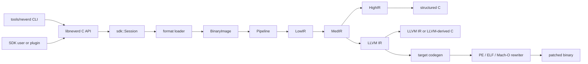

**Languages**: [English](../architecture.md) | [简体中文](../zh-CN/architecture.md) | [繁體中文](../zh-TW/architecture.md) | [日本語](architecture.md) | [한국어](../ko/architecture.md) | [Français](../fr/architecture.md) | [Deutsch](../de/architecture.md) | [Español](../es/architecture.md) | [Italiano](../it/architecture.md) | [Русский](../ru/architecture.md) | [العربية](../ar/architecture.md)

[← ドキュメント索引](README.md)

# NeverD アーキテクチャ

このガイドでは、コントリビューターが NeverD を安全に変更するために必要な
本番コードの境界を説明します。対象は意図的に NeverD 所有のコードだけに限定し、
LLVM、Capstone、Unicorn の各サブモジュールは独自の内部アーキテクチャを持ちます。

## システム境界

```mermaid
flowchart LR
  CLI["tools/neverd CLI"] --> CAPI["libneverd C API"]
  SDKUser["SDK user or plugin"] --> CAPI
  CAPI --> Session["sdk::Session"]
  Session --> Loader["format loader"]
  Loader --> Image["BinaryImage"]
  Image --> Pipeline["Pipeline"]
  Pipeline --> Low["LowIR"]
  Low --> Med["MedIR"]
  Med --> High["HighIR"]
  High --> HighC["structured C"]
  Med --> LLVM["LLVM IR"]
  LLVM --> LLVMOut["LLVM IR or LLVM-derived C"]
  LLVM --> Codegen["target codegen"]
  Codegen --> Rewriter["PE / ELF / Mach-O rewriter"]
  Rewriter --> Patched["patched binary"]
```

NeverD には 4 つの IR 表現がありますが、必ず 4 段すべてを通る一列の処理では
ありません。`LowIR -> MedIR` は共通です。構造化デコンパイルは
`MedIR -> HighIR -> C` を使い、`lift`、`decompile --llvm`、`patch` は
`MedIR -> LLVM IR` へ直接進みます。特に patch と lift モードは意図的に
HighIR を通りません。

CLI は `tools/neverd` でコマンドを解析し、`neverd_session_t` を作成して
`include/neverd/sdk/NeverDCAPI.h` の公開 API を呼び出します。エンジン状態は
`lib/sdk/SessionImpl.h` にあり、`neverd_session_load` が loader を選択して
`BinaryImage` を構築します。IR ベースの操作は必要になった時点で
`lib/pipeline/Pipeline.cpp` を実行します。`neverd` 実行ファイルは
`neverd_shared` にリンクし、各コンポーネントアーカイブと LLVM/Capstone
依存関係は共有ライブラリの非公開実装です。CLI はコマンドライン UI に LLVM
Support を使いますが、エンジンを駆動する際に C API を迂回しません。

HighIR の `HighSourceFlow` は出力文の制御フロー辺、局所変数の識別、確定代入解析を管理します。
ソース検証と不要な PHI コピーの除去は同じグラフを使います。繰り返されるスカラー条件を
ゼロ／非ゼロに有界分割し、書き込みで古い条件を破棄します。アドレスが流出した変数は未知のままとし、
分割上限では保守的なグラフに戻ります。すべての実行可能な文脈で値が不要な場合にだけ
PHI コピーを削除します。呼び出し、ロード、ストアの観測可能な動作とソースラベルは保持します。

Block 利用側のエスケープ解析もこのグラフを使用します。有界固定点解析でポインターの識別とプライベートなスタックスロットを分岐・ループ間で追跡します。合流では文脈アドレスの可能性を保持し、完全な上書きだけがそれを消去します。未知の辺、例外フロー、証明予算の超過はバインドを拒否します。

Objective-C の受信側の事実は、メソッド入口の self と正確なクラス参照を区別します。同じ入口を共有するすべてのメタデータが一致した場合だけ self を設定します。全幅のコピーと ABI が保存を保証するレジスタは、入口への戻り辺も含む同じ不動点解析で伝播します。宣言の照合ではクラス／インスタンスの区別、記録されたカテゴリ、親クラス、採用プロトコルを扱い、入口の self には既知の派生クラスも含めます。コンパイラのカタログは所有者と継承関係をセレクタ全体の照合とは別に保持します。SDK は出力前に現在のイメージで受信側の由来と宣言を再検証します。具体的な IMP の選択やバイナリ書き換えの許可には使いません。
外部の継承情報が不足する場合は受信側で範囲を限定せず、セレクタ全体の一致を要求します。未対応または矛盾する明示的な宣言は否定的証拠として保持します。

明示的なオブジェクト型を持つ ivar は、最大八回の全幅ロードで受信側の証拠を拡張します。各段階は実行時オフセットのスロット、幅、命令で使った定数バイトオフセットを記録します。定数は現在の配置と一致する必要があり、実行時参照は移動したフィールドに追従できます。ローダーは記録されたクラス継承とフィールド宣言を確認します。部分アクセス、型名のない id、ブロック、プロトコルのみの型、曖昧な配置、未知の基底ポインタからはクラスを推定しません。出力時に現在のイメージで経路全体を再検証します。型の事実はオブジェクト同一性やメモリ操作削除の許可にはなりません。

ローダーは Darwin の定数文字列、整数オブジェクト、配列、整列済み辞書からなる有界の非巡回グラフを検証します。コンテナのフィールドと各辺には、不変のマップ済み領域と曖昧さのないインポートまたは再配置の証拠が必要です。未対応のエンコーディング、循環、不完全なグラフは明示的に失敗します。ソースの束縛時にはグラフと入力ポインタスロットを再検証します。生成ヘルパーは整数ビット列、子の順序、共有アドレスを保持し、既存の文字列の同一性を再利用します。コンテナのスロットは検証済みの子ヘルパーだけを呼び、acquire/release によって一度だけ初期化して公開します。各ヘルパーは子の宣言を含むため、独立に復元したメソッドが同じ定義を共有できます。移植可能なテストは不正入力と証明予算を、ネイティブのコンパイラ実例は元のメソッドとの内容、別名、コピーの同一性、並行初期化の一致を確認します。

## IR 表現と経路

実験的な[インタープリター復元段階](interpreter-recovery.md)は、共通の MedIR 境界より前で、厳密にリフトした LowIR を特化します。provider は不変のイメージに関する証拠、`SymExec` は命令意味論を担当し、残余 CFG は通常の SSA とソースバックエンドを再利用します。復元の証拠は、ネイティブ命令実体やバイナリ patch の証明情報とは別に保持します。

`InterpreterSpecialization` は、失敗した試行の後に行う有界の逆向きビット要求伝播を担当します。スカラー評価器を再利用し、グラフの事実を変更せず、制御フィールドやコンテキストも追加しません。すべての作業に予算が適用され、公開には新たな完全証明が必要です。

後続のメモリ要求がバイト部分のみを使用する場合、コンテキスト細分化は追跡済みの8バイトアドレス保持領域を追加候補にできます。元の狭い生成元の座標が基準であり、証明済み定数またはフレームオフセットからキーを作るのはエンキュー処理だけです。

有限値列挙は証明クエリを変更せずに実行可能な組を観測できます。観測側が拒否すると、組を含まない不完全な結果を返します。キャッシュに保持するのは領域の数学的証明だけで、不変読み取りの証明書は列挙完了までローカルに留めます。

`NeverDLoader` は `PEFixedImageView` を所有し、完全なベース再配置の解析を通常の PE ロードと共有します。バイナリ解釈器アダプターは認証済みの優先ベースビューを回復とネイティブ証明に使い、PE 表を独自に解析しません。準備段階でインポート書き込み範囲、マッピングの同一性、完全な元フィールドを検証してからバイトを認証します。ビューは変更されないイメージを借用し、ASLR や初期化の等価性は保証しません。

`LowFunc::FunctionTemporaries` は、オフセット順で重複せず、入口で未定義のバイト範囲を宣言します。復元器は有限分岐が命令境界を越える前に、一時的な間接転送先を予約された関数内スロットへ一度だけ保存します。共有関係検査器が保持するのは現在の経路で実際に定義されたバイトだけで、通常のネイティブ一時値は命令ごとに失効します。範囲メタデータと保存処理は予算に算入され、証明書の意味スキーマ 17 が存続期間を束縛します。生の状態モデルはバイト意味論を保持し、ソース生成はスロット全体と一致するオペランドのみ受理してバイト別名を拒否します。帰納的ループ検査は、検証済み入口プレフィックスの定義済みバイト集合を厳密に保持します。明示的な `FunctionTemporary` 入力と代入で変化する値を表せるのは、その LowIR 側で宣言され、プレフィックスで定義済みのバイトだけです。各パラメータは構築状態から投影できる必要があり、各到達で全値と定義状態を照合します。推論は部分範囲や非整列範囲を含む実際の定義済みバイトだけをまとめ、対の名前空間を分離します。ネイティブ向けの案は候補側だけにこれらを束縛します。証明スキーマ 17 でも網羅性、観測、順位、予算の検査は必須です。宣言による初期化や通常のネイティブ ABI の認証は行いません。

`FrameOffsets` は予算付きの入口相対変位の単一値証明を担当します。回復器は残余アドレス式を変更せず実際のシンボリックメモリアクセスを正規化し、ネイティブ検査は二実行間のアドレス等価性を維持します。全整列分岐と再試行の共有予算は回復器の責任です。native/LLVM の分割証明集約は別の未完了作業です。`NativeStackControl` は内部の符号なし16ビット戻り解放を担当し、バイナリ提供器は八バイトをポップする正規エンコードを認証します。

関係チェッカーのフレーム変位証明は既存の有界 `FiniteQueryCache` を再利用します。復元と同じくキー構築と保持する証明は `MaxSymbolicNodes` ワード以内です。完全な述語と相対式の関係を保持し、完了した領域または証明済みの非一意性のみを再利用します。各アクセスのアドレス独立性とフレーム境界検査は残ります。

訪問済みノードの一時インデックスには密なマップを使います。直列化は引き続き順序付き走査に従うため、テーブルの拡張やハッシュ順序によってキー、変数の名前変更、予算の計上が変わることはありません。

関係チェッカーは、実際の不変かつ追記専用の記号コンテキストと固定ソルバー設定内で、完全に同じ述語参照に対する完了済みのモデルなし SAT/UNSAT 結果を保存します。圧縮表は `MaxSymbolicNodes` の範囲内でノードごとに2ビットを使い、2件目の問い合わせが完了してから確保します。各検索はまずノード上限を確認します。直後の反復は既存の無料の高速経路を保ち、それ以外のヒットはエンコードと探索を省く前に論理問い合わせ1回分を消費します。拡張中は新旧の領域が一時的に共存する場合があります。Unknown/Invalid、モデル、変更可能な探索状態は保存しません。再利用はチェッカーの寿命内に限られ、独立した最終チェッカーは空で始まります。異なる述語には引き続き完全な証明が必要です。

ネイティブ条件分岐では、分岐先とフォールスルーの実行可能性を調べる二つの問い合わせで、モデルを生成しないエンコーダーを共有します。各問い合わせは個別の仮定の下で完全な述語を検査し、エンコードの再利用はその分岐で終了します。したがって、前の分岐の節が後の分岐の探索に蓄積されることはありません。既存の新規エンコーダーによる再試行は予算を消費し、エンコードのゲート上限到達時に限ります。探索予算の超過と不正な入力は引き続き拒否し、問い合わせ、ノード、観測の各予算も維持します。

`FrameOffsets` は有限列挙の前に定数または記号的な加数を持つ二項加算、マスク、対応する分割レジスタ断片を厳密な剰余式へ変換します。整列では消去した下位ビットだけを抽出し、フレーム根全体のビット展開を避けます。記号的なインデックスは、根や経路述語への依存も含めて完全に保持します。両オペランドの探索は合計十六回の検査予算を共有し、新しい DAG ノードも予算に計上します。元の経路述語、単一値域証明、マッピングとフレーム境界、不完全結果の拒否を維持します。剰余や到達可能性を仮定せず、残余アドレス式も変更しません。

`LowIRIndependenceFrame::EntryAlignment` は任意の2の冪による入口ルート合同条件を宣言します。共有チェッカーは実行・帰納前に低ビット条件を入口定数、非周回範囲、除外範囲と交差させ、ルートを書き換えません。不正・充足不能な条件は証明書を生成しません。ネイティブ API は復元オプションと同一の条件および有効な RSP ルートを要求します。LLVM への合成でも両方の新規証明が同じ領域と全状態・ステータス・保存義務を保持します。共通ダイジェストは意味スキーマ13で有無・整列・剰余を束縛し、オブジェクトキャッシュは不変です。メモリアクセス権、フレームの私有性、ネイティブ ABI、自動分区集約は認証しません。

通常の依存探索が停滞した場合、関数入口以外のネイティブ位置と命令モードごとに、既存のレジスターコンテキストフィールドを一つ分割できます。流入ドメインは完全で複数の値を持ち、宣言された全ビットを覆う必要があります。実際の各先行辺が現在の完全なドメインを独立に証明し、生きた物理フィールドを比較して各ケースを再投影します。後続の先行辺や拡大されたノードも再検査し、連鎖は候補入口で停止します。比較は合成の来歴を持ち、ノード、操作、コンテキスト、クエリ、精密化の予算を共有します。部分マスク、未定義フラグ、フレームのみのフィールドは対象外です。ゲスト読み取りや呼び出し側の仮定は追加しません。不完全なドメインでは保守的な辺を保持し、到達可能な全ケースの完了を公開条件とします。

制御状態とガードの精度改善を、任意のフレーム分割の再試行より優先します。必要な細分化は引き続き利用できます。各剰余の不動点を順番に計算しますが、結果公開には許可された全剰余の完了が必要です。入口整列条件と分割領域の共通部分を使い、分岐は実際の剰余を比較します。コンテキスト、操作、ノード、ソルバーの予算は再試行を通じて共有されます。 マシン状態の復元では `--vm-entry-alignment=A:R` により入口 RSP の合同条件を明示し、実行時に検査できます。`A` は正の 2 の累乗、`R < A` が必要です。他の入口はゲストメモリアクセスや状態書き込みの前にステータス 2 を返します。アドレス上位ビットは自由で、既定では整列を仮定しません。これはネイティブ等価性の認証ではありません。

共通の `SymContext::constantWindow` は、結果の全ビットが定数と証明された場合に限り、ビット演算の範囲の値を返します。既存の抽出、単一の連結オペランド内に収まる範囲、ゼロ拡張、ビット演算をたどりますが、未知の XOR 入力や算術の桁上がりは推測しません。結果は 64 ビット、再帰は 32 階層、作業量は 256 単位までです。ノード訪問、深さによる拒否、連結オペランドの検査をすべて計上し、定数のコピーには元の 64 ビット語数全体も課金します。証明が不完全なら定数を返しません。`SymState` はこの読み取り専用の照会でレジスタと一時領域の定数バイトを出力します。保存式とワード全体の再構成は元の式の同一性を保ちます。メモリ領域ではリテラル定数バイトのみを出力します。導出した部分的なメモリ情報を早期に追加すると、後続入力の由来が細分化され、制御状態の探索量が増える場合があります。

`SymState` が明示的な分離契約に基づき、個々の STORE で既存バイトを保持します。実際の STORE は実行され、他の領域、無効化世代、未知値の既定状態は書き込み後のままです。未取得バイトを読み出したり初期化したりしません。`SymExec` は通常の STORE 一回だけに契約を適用します。復元層は範囲内の完全なアフィン保存値と由来情報を保持し、合流は保守的です。

`StringTransfer` が有界で順序を保つスカラー展開を担当します。復元側は値の証明、共有予算、完全コピーされたフレームポインターの再認証を担当し、生成したアクセスには通常のメモリ検査を再利用します。

制御依存の走査は、解析が完了した場合にのみルートのビット依存を報告します。証明済みの相対アドレスで上位の少なくとも 32 ビットが自由なままなら、復元は任意のイメージアドレス列挙を省略できます。これは到達可能性を証明せず、メモリアクセスも削除しません。

全幅のアフィン制御値の射影にも、同じ根変数の依存関係解析を使います。結果の有効範囲は一つの辺の述語に限られ、過大な値域は数学的証明のキャッシュに入らない不完全な拒否結果になります。狭いマスクでの再試行は維持されます。既存の実行可能性の処理は独立しており、値域の拒否によって辺の到達可能性や到達不能性を証明することはできません。

有限クエリキャッシュは、直列化したキー、数値結果、使用順のメタデータを同じ記憶量上限に計上します。記録を追い出す前に候補全体を検証し、単独で収まることを確認します。キーは安定したマップノードが所有します。ヒットは使用順を更新し、追い出し後も有効な、データを所有する結果のコピーを返します。キャッシュオブジェクトのコピーと移動は禁止します。置換は証明の再利用だけを変え、クエリの意味や結果の受け入れ条件は変えません。

`InterpreterSpecialization` は結合制御関係と独立した有限フィールド値域を管理します。辺の射影では完全な列単位の証明だけを記録し、合流ではマスクの共通部分と再マスク後の値の和集合を求めます。ノードの再構築では、同じシンボリック状態に初期値を設定してから、これらの値域と結合述語の論理積を作り、フレームの同一性と未制約ビットを維持します。結合タプルの完全な包含検査で含意を確認できたメンバーシップ制約だけを省略できます。この精度方針はコンテキストキーやネイティブ戻り先の検証を変更しません。

`FrameEntryConstraints.h` が復元と関係証明で共有する非回り込み述語を管理します。`InterpreterSpecialization` は上限付きの一意な制御移送連結と確定済み列の再生を担当します。C++ オプションは既定で無効です。証明契約の照合とダイジェストへの結び付けはバイナリアダプターが担当します。

`modelInterpreterMachineStateX64` とソースラッパーは、ゲストレジスタの部分領域、パックされたフラグ、プロファイル状態、制御フローの生成器を共有します。モデルは状態オブジェクトへのアクセスだけを明示的なレジスタバイトに変更し、ステータスをゲスト RAX と分離します。コンパイラの意味論や証明方針は担当せず、入口領域、観測、フレーム契約、完全な精化検査は呼出側が担当します。

`NeverDLLVMInterpreterModel` は同じ生の状態 ABI への独立した有界スカラー LLVM 取り込みを担当します。`modelLLVMInterpreterMachineStateX64` は実際のステータス戻り値と明示的な定義性ガードを保持します。`llvmInterpreterMachineStateContract` が全観測値とゼロ監視バイトの保持義務を提供し、領域・メモリ・完全な証明は呼び出し側の責任です。通常のリフティングやソース公開を変更せず、コンパイラーも証明しません。

共有 LLVM モデルは、計量対象のバイト抽出と平衡連結により、正規のスカラー `llvm.bswap` を i16、i32、i64 に限って受け入れます。他の幅、ベクトル、未対応の呼び出し契約は明示的に拒否します。機械状態、スカラー、ネイティブから LLVM への処理は同じ実装を共有し、先行する定義性の義務を消去したり、ネイティブ ABI を確立したりしません。

LLVM 取り込みでは、実行された guest load/store の 1 を超えるアラインメントを、実際の 64 ビットアドレスに対する累積的な定義性義務に変換します。アクセス幅とメモリ効果は変えず、マスク・比較・累積には既存の構築予算を使います。記述を省略した場合は解析後の ABI アラインメントを使い、`align 1` ではガードを生成しません。入口の仮定やアクセス可能なバイトは追加しません。状態オブジェクトの独立した 8 バイトアラインメント契約は維持し、atomic/volatile アクセスは引き続き未対応です。

`modelLLVMScalarFunction` は同じインポーターを再利用し、純粋な `noundef` 整数引数と整数の戻り値（`i1/i8/i16/i32/i64`）を扱います。共通モデルはファネルシフトの端点と、倍幅の積による乗算のオーバーフロー制約を処理します。`checkLLVMScalarEquivalence` は両モデルを `SymExec` で実行し、制御に影響する入力ビットの全組合せを調べ、残りのビットをシンボリックに保持します。すべての戻り値の一致と、実行した全操作の定義性が必要です。分割数、経路、ノード数、累積作業量には上限があります。`SymContext::constantWindow` は既存の単一クエリ上限を保った累積計測を提供します。拒否結果は書換えを許可しません。この読取り専用 C++ クエリは既定のソース出力を変えず、永続的なネイティブ ABI 証明やコンパイラー証明も発行しません。

`projectLLVMScalarResult` は構造体・配列の `insertvalue` を通じ、明示的に選択した整数戻り値フィールドとビット範囲を複製します。全引数、制御フロー、スカラー演算、注釈、`assume` 呼び出しを保持し、不要な集約の包装だけを除去して共有スカラーモデルで検証します。構築とモデルの予算は別です。未対応の契約や予算切れではモジュールを公開せず、入力も変更しません。必要な状態・値・保存状態の各観測には完全な証明が必要で、フィールド選択だけでは入口・フレーム・ネイティブ ABI 契約を確立できません。

`projectLLVMScalarInputs` は未使用の SSA 引数だけを削除し、元の引数インデックスの昇順対応表を返すことで明示的なスカラーインターフェースを作ります。結果投影の有界クローンとスカラー検証を再利用し、完全なクローン本体を縮小シグネチャへ移します。省いた入力を定数に置換しません。未使用の算術、注釈、assume、制御フロー、使われる全引数を保持し、集約包装の削除とデバッグ参照の再結合は拒否します。構築は一つの累積予算を使い、拒否時はモジュールも対応表も返しません。定義性・停止性・ネイティブ ABI の証明ではなく、再コンパイル候補を元の完全なシグネチャへ戻し、入口・フレーム・観測の義務を保持する必要があります。

`projectLLVMScalarState` は、明示的に初期化された状態オブジェクトを、全入力セル、入口マスク、値と保存状態の観測を保持するスカラーインターフェースに変換します。共有インポーターがポインター、アラインメント、ソース契約を検証し、外部メモリや観測可能な状態アドレスを拒否します。マスク付き部分書き込みと mem2reg は制御フローとスカラー義務を保持します。フィールド0は元の状態値で、戻り値範囲は共有規則による検証必須の `assume` になります。構築とモデルの予算は別で、拒否時に入力は不変です。現在はリトルエンディアンの整数型64ビットポインター/インデックスが必要です。x64ファクトリーは状態の意味論を所有する層のフラグマスクと明示的な入口整列を使い、観測やネイティブABIを推論しません。

`SymKnownBits` は因子の一致、マスクの非拡大、捨てるビットがゼロという証拠から、平坦化されたマスク付きコピーを認識します。符号なし比較では最大値がラップしない直接項の範囲和を利用できます。課金と限界を維持し、DAGは不変です。LLVMCはbundleなしの `llvm.assume` を条件を一度評価し偽側を到達不能とする式に変換し、未対応bundleを拒否します。オブジェクトパイプラインschema 16が更新内容を識別します。

`SymContext::mkConcat` はリテラルのゼロ接頭部を `ZExt` に正規化し、連結のグループ化時には既存のゼロ拡張を展開します。下位の値と上位のゼロを別々に格納して再構成した語も、明示的なゼロ拡張と同じ表現になります。未知・非ゼロ・内部の上位ビットは観測可能なままです。既存のループ漸化式照合が狭い加算を認識でき、推論予算と完全検査は変わりません。オブジェクトパイプラインのスキーマ 16 がこの共有正規化手順を識別します。

論理右シフトは、保持される全ビットで中立と証明できた直下の AND/OR/XOR 項を除去できます。最大8項・128ビットに限定し、定数範囲クエリで256作業単位を共有します。シフトの分配や DAG の展開は行いません。不明な項、完全なシフト量、LLVM の定義性義務は保持します。オブジェクトパイプライン schema 16 が両キャッシュ識別子にこの手順を結び付けます。

`SymKnownBits` は共有シンボリック DAG の算術ビット、拡張の同一性、ラップしない和の順序について、有界の読取り専用解析を担当します。上限はクエリごとに256作業単位、深さ32、幅128、キャッシュ65,536件です。キャッシュヒットとオペランド検索も計上します。各スカラー実行器のキャッシュは不変の入力分割内に限定され、`constantWindow` とクエリ上限を共有します。未知の操作は保守的に扱い、LLVM の定義性義務は引き続きインポーターが生成します。シンボリック構築器は同じ幅のゼロ拡張をビット演算と論理右シフトの外側へまとめ、定数の上位ビットとシフト量全体を保持します。ABI は推定せず、ループ変換には完全な証明が必要です。 MBA 抽象化は共有の不透明入力上で拡張後の AND/OR/XOR を再構成し、既存の予算内で狭い算術演算とビット反転の境界を保持します。

`NeverDLLVMScalarLoopRecovery` は、このスカラー領域で明示的に有効化するループ再構成を担当します。対象関数と必要な組み込み関数宣言だけを複製し、元の完全な制御領域を証明してから、初回処理とループ状態の再配置、ゼロ回領域の除去、先頭での判定、アフィン状態の候補を生成します。データをゼロにした事前検査は元の制御領域を網羅しますが、候補の拒否にしか使いません。採用には他の全入力ビットを記号のまま保持した関数全体の証明が必要で、追加の制御ビットは拒否します。末尾判定、ループ PHI、命令数の辞書式コストで候補を選びます。構築、証明、候補数、変換数の予算は累積で、枯渇時は部分結果を公開しません。元の関数は不変です。C++ 検索は証明済み候補を提供しますが、ネイティブ ABI を認証しません。

ループ条件の復元では、すべての外部入口で述語と支配的なループ不変境界が一致し、定数初期値が整数ヘッダー PHI と対応する場合だけ、真偽値 PHI の整数比較を提案します。同じ幅、ゼロ拡張、符号拡張は別々の候補で、境界の切捨ては推測しません。入力辺の検索も計測します。入口の一致は帰納的証明ではなく、置換前に元の関数全体について全後退辺、記号データ、定義性、停止性の保存を証明します。

複雑な終了条件では、定数ステップのヘッダー PHI と不変境界またはその前後1ステップとの等値比較を提案できます。探索は32値・64個の投入オペランドまでで、条件を支配する同幅の不変葉を最大4個選び、他の PHI では止まります。分岐極性を保ち、共有条件の使用をまとめて置換します。依存関係は範囲・可除性・停止性の根拠にならず、元の関数全体の証明が必須です。前置部分の復元では未使用の仮引数を候補から除きますが、シグネチャと全入力の証明は保持します。

`recoverLLVMScalarSource` は `NeverDLLVMScalarLoopRecovery` 内で準備とループ探索を組み合わせます。上限付きの LLVM・述語整理で専用の候補を作り、元の関数全体との同値性を証明してから探索します。継続した復元・整理後も最終本体を元の関数と比較して証明します。境界クエリには個別の作業上限があり、全クエリは総証明予算を共有します。整理回数と探索予算は累積し、枯渇時は部分モジュールを返しません。InstCombine の反復回数は明示的に制限され、不動点への到達ではなく証明が候補を承認します。LLVMC は対象関数の検出と共有結果の公開のみを担当します。シグネチャとネイティブ ABI の主張は変わりません。

ソース準備は LLVM の共通式の巻き上げを候補に含め、専用クローンの命令 poison フラグを除去してから述語を検出します。走査は命令ごとに計測します。元のフラグと死んだ操作は元の関数全体の証明義務に残り、引数・呼出し契約と assume は緩和しません。単独の述語 pass は注釈付き算術を保守的に扱います。整理やフラグ除去の成功だけでは候補を公開できません。

スカラー同値性検査は中間書込みのデータをシンボリックに保持します。制御と定義性の DAG は必要時に正規化し、戻り値は同一性と上限付きの事実を先に調べ、必要なら戻り値の DAG のみを正規化します。死んだ算術や注釈も含め全操作を実行します。両側の実行、正規化、最後の再照合は同じ累積予算と局所上限を共有します。変わるのは照合時期であり、入力領域、証明義務、ループ探索の上限は変わりません。

`SymSimplifyPass::simplifyFiniteValues` は既存の正確な二値化簡約を作業計数付きで公開します。AND は最大八つの論理積項から一ビット定数マスクを継承できますが、他のオペランドや poison 依存を含む根の SSA 値全体をアンカーとして保持します。論理積の探索は OR・算術・PHI を越えません。スカラー準備では剰余述語の前に実行し、同じ累積構築予算から差し引きます。未完のスライスは事実を提供せず、公開には元の関数全体の証明が必要です。共有最適化の変更をオブジェクトパイプライン schema 16 に反映します。

幅の広い PHI/select 値には別の閉包探索を使い、すべての後退辺を含め最大32値・64コピー辺を調べます。定数と既存の完全な二値境界を合わせた候補は正確に二種類で、各循環成分は許可された生成元に到達する必要があります。不明な生成元、第三の値、生成元のない循環は拒否します。元の合流値を SSA 観測として残し、条件と poison 依存を保持し、異なる観測を相関させません。探索と生成元の伝播は既存の有限値予算に計上します。

ループヘッダー PHI の定数 AND マスクは、ゼロまたはマスク前の PHI を候補にします。初期値とマスクの候補は最大32件のバッチを共有し、失敗したバッチを分割します。全データの証明で第一候補が拒否された場合は、スクリーニング済みの代案を試します。採用する各組合せには元の関数全体との完全な証明が必要で、マスク自体から値域を仮定しません。作業量は累積し、枯渇時に部分結果を公開しません。

共有シンボリック構築器は、直下の定数または明示的にマスクされた全項が外側のマスク外にビットを持たない場合、OR/XOR の外側の AND マスクも除去します。検査は最大8項、128ビットに限定し、再帰探索や式の展開を行いません。未知のビットがあればマスクを保持します。オブジェクトパイプライン schema 16 は両キャッシュ識別子にこの簡約手順を反映します。

同じ `Function` オブジェクトへの自己等価クエリでは、`checkLLVMScalarEquivalence` は一つのモデルだけを取り込み、各分割で一度実行します。制御と定義性は必要時に簡約し、同じ値の比較だけのために中間データを正規化しません。全操作、入力条件、制御分割、停止性は既存の上限内で確認します。異なる関数は両方を実行し、名前や以前のクエリを証明として再利用しません。

制御または定義性の有界な簡約が未確定なら、入力ビットを探索する前に、必要な式 DAG を子から親へ反復的に正規化します。共通のシンボリック構築器と独立した有界の事実キャッシュを使い、実行の再生や共有項の木への展開は行いません。オペランドの訪問、再構築、ビット照会は同じ累積作業予算を消費し、ノード数と個別クエリの上限も維持します。完全な依存解析が空なら定数評価を許可しますが、戻り値の欠落や証明義務の省略とは扱いません。LLVM の注釈は常に証明対象であり、仮定ではありません。

内部ビット幅の候補には、変更しない関数インターフェースの最大整数幅を使います。複製時には整数定数のビット列を明示的に写像し、恒等となった変換を除去します。intrinsicのシグネチャは維持します。この幅は候補にすぎず、元関数全体の証明で上位ビット、符号付き順序、シフト、定義性、停止性を保持する必要があります。走査、写像、整理は共通の構築予算を消費し、改善のない候補や予算切れの候補は公開しません。

ループ PHI のシード置換候補には、すべての外部入口が同じ SSA 値を渡し、そのシードが PHI を支配することが必要です。拒否専用のスクリーニングで最大 32 件をまとめても、受理には元の関数全体の証明が必要です。失敗したバッチは分割し、失敗した候補の再試行は当該探索内だけで延期します。全バックエッジ、同時 PHI、定義性、終了性の義務は保持します。`WorkLimitExceeded` は全体の作業予算超過と、厳密な予算境界での通常の拒否や局所上限を区別します。予算超過時に部分結果は公開しません。

共有シンボリック層は、論理右シフトが捨てる下位ビットだけを変更する定数 AND マスクを除去します。定数カウントは完全な符号なし値を検査してから正規化し、算術オーバーシフトは符号ビットで飽和します。変数カウントと LLVM poison の義務は維持します。オブジェクトパイプラインのスキーマ 13 は両方のキャッシュ識別子で新しい簡約手順を区別します。

ループ候補には、実際に入口を支配するガードとそのスカラー境界も利用し、独立した latch から header への後退辺も扱います。狭い最終インデックスの折り返しがゼロ回実行を保存するとは仮定しません。単位ステップの漸化式を基準として優先し、各グループ内の元の順序を保ち、線形処理の作業量を計上します。ガード由来の境界のゼロ拡張や切り捨ては候補にすぎず、符号付き比較、折り返し、最後の更新も元の関数全体の証明が必要です。

イメージやデバッグ投影を要求しない場合、LLVMC はスカラーループ復元を自動で呼び出します。有界走査は関数当たり 1024 ブロックまでです。復元と LLVM 整理をモジュール共通予算で反復し、共有インポーターと SymExec で最終本体を元の関数に対して再証明します。変更先は出力用コピーのみで、関数の同一性、属性、呼び出し元、組み込み関数の参照を保持します。シンボル衝突、外部に保持されたブロックアドレス、関数メタデータ、例外マッピングは従来経路を維持します。拒否や予算枯渇で中間関数を公開せず、単一関数出力では選択対象だけを正規化します。ネイティブ入力インターフェースやメモリの私有性は推定しません。

スカラー候補の証明後、LLVMC は `SymSimplifyPass::simplifyPredicates` を再利用し、新たに現れた剰余算術条件を処理します。既存の厳密な段階は poison、入力の安定性、改善効果の検査を保ち、導出作業量を返します。LLVMC はこれを累積構築予算に計上し、呼び出しごとに最大 65,536 単位とします。続く InstCombine、LICM、CSE がループ不変の境界と等価なカウンター更新の単一 SSA 識別子を明らかにし、次の復元へ渡します。IR の直接変更時には解析キャッシュを無効化します。述語段階はソルバーを使わず、最終的な元関数全体との等価証明は引き続き必須です。

`SymKnownBits` は、マスクで除かれる全ビットが既知のゼロなら元の値との等価性も証明します。符号付きシフトの往復では、同一の元値、2 の累乗の係数、完全なシフト量が一致し、捨てるビットと残る符号ビットがすべてゼロまたはすべて一である必要があります。この有界で読み取り専用の関係はクエリ予算を消費し、DAG の拡大、データの列挙、LLVM の no-wrap フラグの仮定を行いません。

`SymKnownBits` は基底が一致し、大きい側の積が符号なしでラップしないと証明した場合にのみスカラー倍を順序比較します。下位ワードの積の等価性は剰余係数と因子の重複数を集め、要求幅を保持する拡張だけを越えて比較します。狭い演算のオーバーフロー境界は透過しません。両側の導出、保留因子、照合を既存の作業量・深さ予算に計上し、解析は読み取り専用のままです。

共有 LLVM インポーターは、正規のオペランドバンドルなし `llvm.assume(i1)` 呼び出しを受け入れ、到達時に条件が真である義務を既存の定義性状態に記録します。スカラーと機械状態の証明は入力領域を制限せず、この条件を既知の事実とせずに検証します。追加の呼び出し・宣言契約と undef/poison は引き続き拒否し、入力 IR と証明予算を保持します。ネイティブ ABI の認証ではありません。

インポーターは正しい形式の `llvm.loop.peeled.count` を符号なし i32 の最適化履歴カウンターとして受け入れます。反復回数の上限、入力制限、終了性や定義性の根拠には使いません。ループ識別と属性のオペランド数を検証し、不正または未知の属性は拒否します。メタデータの走査は既存の予算を消費します。

LLVM モデルは `initializes` パラメーター契約の検証を担当します。状態ポインターの射影を再利用し、通常のスカラー生成前に予算付きのバイト単位 must データフロー解析を行います。別の値評価器は追加しません。

`NeverDInterpreterLLVMRefinement` はネイティブから LLVM への証明の合成を担当します。両側の状態モデルと必須契約を再構築し、唯一のプロファイル定義から入口専用のフラグ射影を生成して、両前提を新たに検証します。呼出側はループ案を提示できますが、モデル、観測項目、証明結果を置き換えられません。解析モデルは実行グラフと宣言済みルートだけをコピーし、状態の再初期化につながる入口への後退辺を拒否します。

任意の `InterpreterLLVMRefinementPreservation` 要求は、両方の新規証明に GPR バイトの保存義務を追加します。準備層が予算付き検証、重複の和集合、ワード境界での分割を担当し、状態・定義性・フレームの必須観測を維持します。`NativeState` はネイティブ検証器だけに渡され、`SelectedWitness` を許可し `AllUndefinedChoices` を拒否します。子証明は有効な契約を結合し、空の要求は既定動作を維持します。

`InterpreterLLVMNativeCollection` は既定で無効の二つの収集設定を新規ネイティブ証明だけに渡します。保持する監査境界は選択した witness の下で到達不能でなければならず、遅延収集でも全実行可能経路の完全な意味論が必要です。設定はネイティブ証明に結合され、ソースの仮定、観測、証明予算は変わりません。

復元 C API v3 と CLI はフィールド、細分化、ソルバー問い合わせの予算を共通の特化器に渡します。アダプターは拡張を読む前に構造体サイズと reserved を検証し、v1/v2 の配置と既定値を維持します。予算の増加は処理量のみを変更し、実行契約や公開条件を変更しません。

復元では `--vm-chain-transfers=N`（既定値 0）と `--vm-no-control-discovery` も指定できます。連鎖は単一ターゲットが証明された制御転送間で記号的な相関を保持し、上限で通常の CFG 境界に戻ります。マシン状態復元では `--vm-entry-frame=begin:end` で、実行時には検査しない非ラップの入口 RSP オフセット範囲を宣言できます。正確な数値前提は生成 C とレポートに残り、メモリアクセスや等価性の証明を与えません。

SSA 構築の上限を超える大規模な復元関数は、`--llvm` で有界なスカラー可変ストレージ契約を使用できます。入口の入力、ループで引き継ぐ値、過去の読み取りの意味を保持します。未対応の暗黙状態、ベクトルレジスター引数、イメージ再配置、曖昧なストレージ、不正な制御フローは明示的に失敗し、HighC はこの代替経路を拒否します。ソース出力は既存のマシン状態契約に従い、等価性証明書は追加しません。

`analyzeMedMutableSource` が正規化 CFG、ストレージの識別、保守的な入口バイト要件を一元的に検証します。要件は読み取りの上限であり、観測可能性を肯定する証拠ではありません。LLVM はモジュール走査前に検証し、計画を再利用して入口値を一度だけ初期化します。ブロック数と値の数の積、伝播処理量を別々に制限します。C の転送は各読み取りに対し、型が一致し部分エイリアスのない確実な先行書き込みを使い、ブロック間の合流では明示的なストレージを保持します。

検証済みの可変変数を持つ関数本体では、LLVM は命令を末尾に追加する同一基本ブロック内で私有スロットの正確な値を転送し、最後の書き込みを残します。入口の初期化とブロック・関数・モジュールの境界は分離され、対象プログラムのメモリアクセスは明示的に保持されます。C 出力はスカラー式の展開と即値の畳み込みの処理量を制限し、名前付きの中間値を残します。畳み込み可能な定数式には LLVM のターゲットレイアウトを使い、未対応の式は明示的に拒否します。指定された可変戻り値は、ゼロでも void に変更しません。

可変ストレージの部分集合は 8/16/32/64/128 ビットのスカラーに対応し、ビットカウントの入力は最大 64 ビットです。非標準幅やそれ以上の幅には別のソース契約が必要です。

アーキテクチャの lifter は、未定義出力の付随メタデータをトランザクションとして管理します。各試行前に古い証拠を消し、成功した正確なリフトに対してのみ効果を公開します。`Missing` は証拠の欠如であり、空の `Complete` 記述ではありません。通常の LowIR は選択済みの決定的な値を維持します。`LowIRUndefinedIndependence` は、渡された完全な非巡回 LowIR グラフの有界な関係証明を担当し、通常の入力を共有しつつ、新たな未定義値の相関を保持します。完全な命令境界と操作ダイジェストに証拠を対応付け、不完全な証明を拒否します。以下の有限なネイティブ実行経路の範囲を超えるネイティブグラフの認証、ループ不変条件、ネイティブコードから C への等価性証明は、別の課題です。

`Decoder` は形式監査と再配置照合の前に、x64 のオペランド接頭辞による disp32 幅の誤報を補正します。ModRM/SIB 境界、完全なフィールド、符号付き変位、メモリオペランド、後続即値の配置が一致する必要があります。完全デコード、リフト用デコード、詳細情報付き軽量デコードで同じ正規化を使います。変更するのは符号化幅のメタデータだけで、実際の i386 disp16、disp8、moffs、詳細情報なしのデコードは従来どおりです。

従来のスカラー SHL/SAL、SHR、SAR は、8/16/32/64 ビットのオペランドについて回数に依存する未定義ビットの証拠を生成します。マスク後の回数がゼロなら全フラグを保持し、非ゼロなら AF、1 より大きければ OF、SHL/SHR でオペランド幅以上なら CF が任意になります。SAR の CF は定義済みです。命令内のブールガードは、重なる宛先への書き込み前に保存した回数を使い、メタデータの有無によらず同じ操作を生成します。未監査の形式から部分的な効果は公開しません。

従来の ROL/ROR は、アーキテクチャのマスク適用後のカウントが一を超える場合にのみ、新しい任意の OF ビットを生成します。その後のバイト・ワード幅による剰余はこの条件を変えません。ゼロカウントはフラグを保持します。レジスタをビット基底とする BT/BTS/BTR/BTC は独立した四ビット（OF/SF/AF/PF）を生成し、CF は定義され、ZF/DF は保持されます。正確なレジスタおよび imm8 エンコーディングを監査し、メモリのビット列、LOCK、APX、キャリーを含む回転は今回の追加対象外です。効果はコア命令完了後に発生し、メタデータの有無で LowIR は変わりません。[Intel ビットテスト仕様](https://cdrdv2-public.intel.com/929353/253666-093-sdm-vol-2a.pdf)と[回転仕様](https://cdrdv2-public.intel.com/929354/253667-093-sdm-vol-2b.pdf)を参照してください。

従来のレジスタ XADD にも 8/16/32/64 ビットの厳密な符号化監査があります。CF/PF/AF/ZF/SF/OF を定義し、DF を保持し、新しい任意ビットを生成しません。交換される両レジスタには、アーキテクチャの部分書き込みと 32 ビットのゼロ拡張規則が適用されます。セグメント接頭辞と LOCK のないメモリ XADD も同じ演算幅で監査し、ModRM/SIB、ソースレジスタ、変位、16/32/64 ビットのアドレス詳細を厳密に確認します。ロードとストアは入口時の実効アドレスを共有し、ソースとの重なりにも対応します。フラグには元のオペランドを使います。LOCK、セグメント接頭辞付き、APX のメモリ形式は未監査です。[Intel の互換規則](https://cdrdv2-public.intel.com/929360/253669-093-sdm-vol-3b.pdf) により C0/C1/D0/D1/D2/D3 の Group 2 `/6` を SAL/SHL `/4` として扱い、同じカウントガードと未定義フラグを使用します。[XADD リファレンス](https://cdrdv2-public.intel.com/929356/334569-093-sdm-vol-2d.pdf)も参照してください。

従来のレジスタ SHLD/SHRD は厳密な符号化監査と共通のマスク済みカウント検査を使います。ゼロではフラグを保持し、非ゼロの AF と複数ビット移位の OF は任意です。16 ビット幅だけはカウントが 16 を超えると下位 16 ビットの結果と CF/PF/ZF/SF も未定義になります。16 ちょうどではこれらは定義済みです。DF と他のレジスタビットは保持し、32 ビット書き込みのゼロ拡張も維持します。メモリ、APX、未監査接頭辞は拒否します。 [SHLD/SHRD](https://cdrdv2-public.intel.com/929354/253667-093-sdm-vol-2b.pdf).

ネイティブ証明の明示的契約 `DeferNativeConditionalEdges` は、二つの実行の制御一致と実行可能性を検査してから条件分岐の後続を収集します。既定では両側を先に監査します。省略した側の命令一覧を保証せず、到達可能な側ではバイト、マッピング、境界、効果、重複、予算の検査を維持します。ソルバーの不明結果で辺を除外しません。証明書は意味スキーマ 17 で方針を束縛します。ネイティブプロバイダーのない静的 LowIR API は拒否します。各帰納区間で領域全体の検査が必要で、値選択による精化は証人に依存します。

ネイティブの不変読み取りは、`MaxImmutableLoadAddresses` を上限とする完全に列挙された有限アドレス集合にも対応します。列挙前に二実行間のアドレス等価性を証明し、全候補で不変バイト、マッピング証拠、可変フレームとの非エイリアス証拠を要求します。値の入力依存性は保持します。候補の欠落、書き込み可能または再配置されたデータ、列挙上限の超過は証明書を拒否します。証明書は読み取り証拠と上限を結び付けます。動的フレームオフセットと任意の外部メモリは未対応です。

以下は既定の厳密な監査契約での動作です。`checkBinaryUndefinedIndependence` は指定された観測について、元の x64 命令の完全かつ有限な実行経路を検査し、実行可能性による枝刈り前に直接分岐の両側を収集します。物理的な near CALL は実際の後続アドレスをスタックに積み、内部 RET は書き換えられた戻り先も含めて現在のスタック値を読みます。間接ターゲットは有限集合の網羅的列挙と、経路を制約する前の二実行間の同一性証明が必要です。正確な不変メモリ読み込みには証拠と可変フレームからの分離証明が必要です。未実行の分岐を含む全収集命令に、不変の元バイト列を要求し、以下で説明する厳密にリフトされた `INT3`/`UD2` の終端境界と明示的な RDSSP/INCSSP プロファイル投影を除き、全命令に完全なアーキテクチャメタデータも要求します。厳密にリフトされた `INT3`/`UD2` は、元の全バイト列と LowIR 操作ダイジェストを保持した `Terminator` 境界として残せますが、未定義出力のサイドカーを `Missing` から `Complete` に昇格させません。証明書にトラップを残せるのは、シンボリック実行で到達不能と証明された場合だけです。実行可能経路がトラップに到達すると `ContractViolation` となり、証明書も残余コードも返しません。この規則はトラップ後の継続や例外からの復帰をモデル化せず、`codeFollowsTrap` ヒューリスティックを使わず、静的 LowIR API の対応範囲も拡張しません。証明書はバイト列、マッピング、効果、読み込み証拠、実行設定、証明予算を結び付けます。通常実行、フォールトなし、CET 無効という明示的設定は入口フレームから全イメージマッピングを除外します。各実行可能経路は外側のリターンまで完了し、ネイティブのポップ前に入口 RSP と元の戻りアドレススロットを保持する必要があります。予算切れの実行接頭辞は証明になりません。直接・間接ループは完全な有限展開でのみ認証できます。停止しない経路、予算を超える経路、その他の未監査の効果は拒否します。`specializeBinaryInterpreterWithIndependence` は証明後に復元し、失敗時は残余コードを返しません。通常の復元では既定で有効にせず、ループ不変条件、例外ディスパッチ、CET 有効実行、ネイティブコードから C への等価性は証明対象外です。

ネイティブ収集では CALL の継続先を保存された戻り値として扱い、直ちに進む辺とは扱いません。直接の呼出し先と条件分岐の両側は引き続き事前監査し、実際の RET 先は有限集合の完全列挙後に収集します。飛び越したインラインバイトに命令証拠の主張はありません。到達するデコード失敗、トラップ、不完全な対象集合、停止しない循環、予算超過は引き続き認証を妨げます。

明示的な `RetainUnauditedNativeBoundaries` オプションは、有限ネイティブ独立性証明と有限または帰納的なネイティブから LowIR への精緻化証明に拒否境界を追加します。厳密にデコード・リフトされ、カバレッジが `Missing`、効果が空で、空でない操作ダイジェストが一致する命令だけが対象です。構造、制御、重複、プロファイル、資源の検査はすべて維持されます。その境界の後続収集のみを止め、別の辺から後続バイトに入る場合は独立に収集します。実行可能な到達は実行前に拒否し、ソルバーの不明結果や予算切れを到達不能の証明にはしません。成功した証明書は正確な境界、ネイティブバイトと操作のダイジェストを含む型・バージョン付き記録に結び付き、`Missing` を `Complete` に変更しません。未収集の後続部分には監査の主張を行いません。独立性はすべての任意選択を対象とし、選択値の精緻化は宣言した証人に対する到達不能性だけを示します。静的 LowIR と厳密 LLVM API ではこのオプションを有効にしません。ネイティブプロバイダーを使うループ証明・推論では利用できますが、各区間の拒否境界が到達不能であることを証明する必要があります。

`AllowOverlappingNativeInstructions` は、有限ネイティブ独立性証明とネイティブから LowIR への精緻化に使う、既定で無効の独立したオプションです。各入口を個別にデコードして検証し、重なる命令バイトは、候補側の読み取りを含む、それまでの全命令および不変読み取りの証拠と一致する必要があります。候補 LowIR のアドレスはラベルであり、バイトの証拠ではありません。`MaxNativeInstructionBytes` の既定値は 1048576 で、新しく取得した各入口の命令全体を、重複バイトも含めて比較前に計上します。予算の枯渇やバイトの矛盾があれば証明書を拒否します。オプションと上限は証明ダイジェストに含まれます。静的 LowIR、帰納的ループ証明および推論では、空のループ計画でもこのオプションを拒否します。厳密な LLVM API と CLI の既定動作は変わりません。

ネイティブのパック済みフラグ証明には、オプションと契約の両方で `X64FlagsProfile = UserX64NoFaultV1` を指定します。既存の実行用 Boolean 設定からは有効化されません。正規化された共有入口フラグと永続システムフラグには、機械状態ソースラッパーと同じ PUSHFQ/POPFQ スカラー変換を使用し、CPL3/IOPL0 マスクも含めます。各 POPFQ で両実行の TF/AC がゼロであることを証明し、この条件を仮定して経路を制限しません。レジスタや書き込みフレームの観測を無効にしても、最終システムフラグは必ず比較します。証明書はプロファイルの版と正確な変換ダイジェストを束縛します。この明示的な CET 無効プロファイルでは、独立に検証した正規 RDSSPD/RDSSPQ バイト列を厳密な NOP に投影し、型付き証跡を記録できます。元の `Missing` メタデータは維持され、32 ビット宛先でもレジスタ全体を保持します。正規 INCSSPD/INCSSPQ はプロファイル依存の #UD 境界として保持し、元の到達不能命令の証跡を記録します。実行可能な訪問は、オペランドがゼロでも非障害契約に違反します。他の CET 命令、CET 有効実行、静的 LowIR API でのプロファイルは未対応です。有限ループの各訪問は状態を保持し、新しい未定義値を生成しますが、不変条件の証明ではありません。

`checkLowIRRefinement` と `checkBinaryLowIRRefinement` は、決定的な LowIR 候補に対する独立した構成的精緻化を検証します。`LiftedBits` は未定義値の生成ごとに元のリフターが計算したビットを選び、`ZeroBits` は監査済みの条件が成立したビットだけをゼロにします。動的な生成箇所を記録し、コピーとスピルでも同じ選択を保持します。両プログラムは既存のスカラー、物理スタック、メモリ、フラグ実行器と入口スナップショットを共有します。すべての実行可能経路が終了し、許可された入口領域全体を覆い、RETURN オペランド、指定レジスタ、必須のネイティブシステムフラグ、両側の書き込み済みフレームバイトの和集合が一致し、入口保存契約も満たす必要があります。実行と関係検証は予算を共有し、`MaxTerminalPairs` も適用します。証明書は候補、原証拠、選択方針、制限を束縛します。選択の失敗は別の選択を排除しません。有限展開はループ不変条件、特定 CPU の一致、C バックエンドの等価性を証明せず、未定義状態の独立性検証を置き換えません。両 API は証明用メモリ一時領域と重なる入力一時値を拒否します。 バイナリ精緻化 API は、オプションと観測契約の両方で一致する `UserX64NoFaultV1` を要求します。

`LowIRUndefinedIndependence` は各任意再試行を元の完全なクエリと入力領域に結び付けます。`CompleteModel` は候補の完全な変数割り当てを検証し、`CompletedTargetFacts` は列挙が完了した単一値のみを保持します。`ConditionalImplication` は同じコンテキスト、領域、完全なソルバーポリシーに属する有界な書き換えと未探索の符号化を管理し、新しい目標ごとに証明を要求します。`DomainCoverage` は因子の含意とすべての等値・論理分割を証明します。再試行は共有クエリ数・ノード数上限と元のソルバー設定を維持し、未知、不正、不完全な結果は証明書を生成しません。

`checkLowIRLoopRefinement` と `checkBinaryLowIRLoopRefinement` は、別の型を持つ帰納的証明書を提供します。対応する切断点と純粋なスカラー LowIR 状態テンプレートは証明候補です。共通の実行器が実際の入口からの成立、区間の完全な網羅、すべての実行可能な後続、不変条件の保存、終端観測を検査します。切断点間の各辺では有限な符号なし辞書式順位が厳密に減少しなければならず、パラメーターの逆投影検査が状態変化のない順位リセットを防ぎます。基底は共通入口状態、または `UseEntryPrefix` (`GeneralizeEntryPrefix = false`) で実際に到達した対応する接頭区間です。後者の述語も保存を証明します。切断点では変更した全レジスターとフレーム全体を検査し、過去の反復の書き込みも終端で観測します。重複アドレスには明示的で証明済みの状態選択条件が必要です。不変条件・順位の自動発見や任意の制御フロー対応付けは対象外です。切断点の欠落、誤った不変条件、回り込み、未証明の終了性、未対応の意味論、共有予算の枯渇は証明を拒否します。計画、全ネイティブ区間、原本の証拠をダイジェストに束縛します。有限精化と厳密な独立性の意味は変わらず、C バックエンドや特定 CPU の未定義ビット選択の証明にもなりません。

以下の前置経路述語を保持する要件は `GeneralizeEntryPrefix = false` の場合に適用します。

`inferLowIRLoopRefinementPlan` は共有シンボリック実行器で予算内のテンプレートを提案します。フィードバック切断点は CFG の全閉路を覆い、拡大は証明済み固定ビットを維持し、保存されない符号なし接頭辞境界を除きます。観測した単位増減カウンタと推論した段階定数から辞書式順位を構成し、増加・減少する入れ子ループを扱います。`OriginalPrefix` と `CandidatePrefix` には `UseEntryPrefix` が必要です。先行切断点の後にある切断点は、実際の入口から別途有限再実行して到達可能な対応接頭辞を取得できます。この証拠は入口領域全体を覆いません。各到達状態がその述語を含意し、入口と遷移の完全な経路網羅が必要です。`inferAndCheckBinaryLowIRLoopRefinement` は完全な復元と一意に対応付けられた残余由来を要求し、元プログラムと候補の完全な検査を独立に再実行します。提案と由来対応は信頼せず、証明書を持てるのは `Refinement` のみです。推論と証明は別々の明示予算を使います。この C++ API は `--devirtualize` で自動実行されません。到達不能な接頭辞、任意の制御対応、探索外の順位形式、C バックエンド等価性、実 CPU の未定義ビット選択は未対応です。

ループ推論は、単一の記号コンテキストと固定のソルバー設定内でのみ、モデルを伴わない完了済み SAT/UNSAT 応答を再利用します。キーは領域と事実の否定を組み合わせたクエリ全体です。未知または無効な応答は保存しません。ヒット時もノード上限を確認し、共有の論理クエリ予算を消費します。`SolverQueries` はこれらの要求を含み、`EntailmentCacheHits` は再利用回数を別に示します。既存の上限が保存件数も制限します。独立した最終チェッカーはキャッシュを受け取らず、証明／オブジェクトスキーマは 17／16 のままです。

ビット関係の枝刈りでは、一つの到達領域で残存候補をすべて検査してから次の領域へ進みます。保持される関係は元の到達順にすべての完全な到達述語を満たす必要があります。反証された候補は削除されたままで、不明な結果や予算切れでは推論を中止します。この順序により既存の領域単位のソルバー符号化を再利用し、状態テンプレートの変更や領域間の証明共有は行いません。

ネイティブループ推論は、残余の由来対応が一意なら元のアドレスの重複も許可する。状態と順位の推論後、完全に再構築した候補テンプレート領域で反対の定数ビットを証明し、Register、Frame、SystemFlags のマスク条件を提案する。文脈識別子や具体的な接頭辞値を仮定せず、区別できない領域は拒否する。メタデータ、ビット走査、依存関係の探索は既存予算を使う。独立した元プログラム／候補検査は全許容経路、状態観測、順位遷移を引き続き証明する。証明／オブジェクトスキーマは 17／16 のままで、自動ソース生成と通常 ABI の合成は別途必要。 一意のネイティブ由来は従来の探索優先順位を維持し、追加文脈も同じ累積探索予算を共有する。

ネイティブ選択条件の推論後、候補由来のプレフィックス入力を `CandidatePrefix` に束縛する。一般化したプレフィックスを使う切断点には、内部ビルダーが各側の `(prefix & ~mask) | value` 状態代入を追加できる。非選択ビットと既存の述語、順位、代入、選択条件を保持する。いずれかの側で選択範囲が既存代入や他の選択範囲と重なる場合、その切断点の両側とも追加しない。構築は累積作業量とメタデータの予算を消費し、一時変数オフセットのオーバーフローを拒否する。共通バリデーターが構築前後の完全な計画を検査し、独立したネイティブ検査器がすべての証明義務を保持する。通常の LowIR 推論は変更しない。

選択した切点が一つでも、そのネイティブ由来が複数回現れる場合は、完全に再構築したテンプレートで構造的に既知の定数ビットから選択条件を提案できる。一致しない状態は、先行する未選択の文脈も含め、そのアドレスを通過して実行を続ける。関数内一時変数はネイティブ選択条件に使えず、走査には既存の切点選択予算とノード予算を使う。これは未検証の提案であり、独立した検査器が実際の入口の網羅性、全状態観測、各順位遷移を証明しなければならない。

単位カウンターの検出は、既存の全語・ゼロ拡張形式を優先した後、対象外の全ビットを保持するバイト境界の部分更新も認識します。複数カットでは、レーンの端点を除外する条件を、保存済みの具体的な到達状態と現在の全流入状態で証明した場合にのみ提案します。拡大は失敗した条件を削除して再導入せず、既知のカウンター語でも後から別レーンを発見できます。マスクは既存の全語パラメーターを再利用し、全語の順位と状態観測を維持します。共有ノード・クエリ予算と独立した完全精緻化検査は引き続き必須です。

複数カットでは、観測されたカウンター組が失敗するたびに、次の組へ進む前に先頭へ64ビットの定数フェーズを追加した案を試します。両案は個別に `MaxRankCandidates` を消費し、同じクエリ予算を共有します。先頭フェーズはすべての実行可能な遷移で非増加でなければならず、残りの組の厳密な減少を証明できない遷移ではフェーズが厳密に減少する必要があります。非負の差分制約は正の重みの閉路を拒否します。これにより、循環内部の進行義務を維持しながら、順次ループの再初期化後にカウンターを再利用できます。既存のカウンター間フェーズとの組合せも可能です。完全な組は元の全遷移述語で検査し、最終の精緻化チェッカーが提案された順位を独立に再検査します。単一カットの探索には効果のない定数接頭部を追加しません。

単一カット候補は、もともと到達可能な全ブロック内の全循環を覆う必要があります。カットの削除で入口から切り離される循環も対象です。各被覆検査は記号実行前に `MaxCutpointAttempts` を消費します。すべての戻り辺で単位ステップの進行を示すスカラーカウンタを優先します。その後、観測された単位カウンタのタプル候補を最大8個まで、より広いスカラーのガード・境界仮説と1個ずつ交互に試します。残りのスカラー仮説の後、タプル探索を重複なく再開します。この順序は予算上限に依存しません。各タプル試行では保存した完全な安定テンプレートと遷移を復元し、タプル領域の検査失敗はこの候補群だけを無効にします。失敗したスカラーガードでその領域を狭めることはできません。 `MaxRankCandidates`、クエリ、操作、経路の予算は累積されます。提案には完全な refinement 検査が引き続き必要です。 他の分岐が値を保つかリセットしても、カットへ戻る加算漸化式の分岐は構造に基づく拡大を促せます。提案したテンプレートは引き続き全入口・遷移検査を通過する必要があります。

`inferAndCheckLowIRLoopRefinement` は LowIR ループ間の検証済み関係を探索します。 既定、全分岐アーム、フィルター付き分岐アームの順に計画を試します。同じ候補群の対応付け、すべての異なる候補群の組合せ、候補側の個別循環カットの順です。全分岐アーム案は循環成分内で分岐ブロックの後続となり、出辺が一本のブロックを選びます。フィルターはすべての経路が DFS 後退辺の到達先より前に同じ非終端ノードで合流する場合だけ、その分岐のアームを除外します。終了や境界を含む全後続を調べ、境界だけで合流する分岐は残します。貪欲な追加カットで元々到達可能な全循環を覆います。既定推論の成功を前提にせず動作段階を保持します。`MaxCutSelectionWork` は集合構築と比較を含む共通経路解析を別途制限します。`CutSelectionWork` は失敗時も作業量を記録し、全体の残り `MaxSearchWork` からも差し引かれます。既定と全分岐の選択器は変更しません。成功・失敗をキャッシュし、各側最大三計画、順列は遅延列挙です。追加候補群は同じ側で既に保持するカット集合を省略し、既存計画の候補群番号が後でも同様です。空・重複候補群は記号クエリを使いませんが候補試行に数えます。最大六計画で一つの `MaxMetadata` 枠を共有し、各対応付け構築は別途制限します。 既定の `MaxRankPairingAttempts = 0` は従来の提案順序と計上を維持し、同一オフセット・同一幅のフレーム入力にのみ等式を提案します。有効化すると、通常の対応付けが失敗するたびに、直接のランク入力の対応付け、次にそれと両立するフレーム対応付けとの和集合を試します。両側の空でないランク組は同じ長さで、各成分は完全な `NdVar` の同一性で一意の `Original` 入力を厳密に指し、各側の位置は重複せず、幅は非ゼロかつ等しくなければなりません。定数、式、プレフィックス入力、幅変換は推測しません。和集合はランク対応付けを優先し、どちらかの端点が競合するフレーム対応付けを省きます。通常案またはランクのみの案と同じ対応集合は、完全な検査を再実行する前に省きます。不適格・重複案を含む開始済みの追加試行は、`MaxRankPairingAttempts` と全体の `MaxPairingAttempts` の両方に計上します。走査、比較、格納は `MaxSearchWork` に計上し、二つの作業用対応ベクトルは一試行の `MaxMetadata` 枠を共有します。追加試行数だけが尽きても、残りの全体予算内で通常の対応付けによる証明を続けられます。アフィン関係と任意のフィードバック集合には引き続き明示的な対応付けが必要です。正規の対応付け器と完全な検査器は、呼び出し元の元の監査記録、witness、入口領域、フレーム観測、停止性の証明義務を保持します。`LowIRLoopAlignmentLimits` の `MaxSolverQueries` は失敗も含む全推論・証明で共有され、各呼び出しには段階上限と残り総量の小さい方だけを渡します。`MaxSearchWork`、`MaxMetadata`、`MaxCandidateAttempts`、`MaxPairingAttempts`、`MaxCuts` が探索構築と列挙を制限します。単一試行の予算切れは再試行できますが、全体予算切れは停止します。`Unsupported` は関係が見つからないことを示し、非等価の証明ではありません。新たな検証に成功した `Refinement` だけが証明書を持ちます。CLI の既定動作は変わりません。

整列探索は `MaxCuts` を共通の推論処理へ渡します。入力の検証と完全なフィードバック切断点の選択後、上限を超える集合を記号的な入口探索や拡大の前に拒否します。計画単位の上限であり、`MaxCutpointAttempts` や有効な単一切断点の再試行は減らしません。フィルタ付き候補群の選択コストは計上されたままです。単独およびネイティブ推論の既存の制限は維持され、受理する関係は引き続き完全な検査器を通る必要があります。

`GeneralizeEntryPrefix` の既定値は `false` で、`UseEntryPrefix` が必要です。既定モードでは、すべての到達で取得した経路述語を保持します。明示的な汎化モードは、経路外の前置状態式を全域の未検証テンプレート関数として扱います。実行可能な両側の証人、実入口と区間の完全な網羅、全レジスタ／フレームの一致、引数の射影、ネイティブ実行条件、拡大した帰納領域での厳密な順位減少が必要です。推論は流入状態が証人の領域を越える場合だけ切点を拡大し、すべての一般遷移を再構築して検査します。最初の証人がゼロ回反復でも、別の入口のループを見落とせません。方針は帰納証明書のダイジェストに結び付きます。

多重ループの推論は、観測した単位増減カウンタと制御述語が参照する不変の前置値との間で、厳密／非厳密な符号なし境界を提案できます。等値による終了も対象です。具体的な入口と流入状態で検査した後、一般流入遷移で成立しない関係を単調に除去します。述語走査とソルバ処理は既存の明示的な推論予算を使い、最終の原プログラム／候補チェッカーがテンプレートを独立に証明します。

入れ子ループの推論は、前置状態の式が一致する場合、キャッシュされたオペランドとカウンターまたは不変の制御入力の等式も提案します。すべての具体的な流入状態を検査し、後の拡大で発見されたキャッシュにも候補を用意し、一般化された流入状態が関係に違反すれば削除します。各ワードは復元可能な独自のパラメーターを保持し、等式は検査対象の述語です。コピーの漸化式は不要な固定ビットの除去を速めますが、意味を仮定しません。

入れ子ループの推論では、変化するビットが最大 16 個のフィールドについて、カウンタの等値・不等値比較を保存する関係も探索します。関係は現在のカウンタと境界値を使い、キャッシュには独立した復元可能な状態パラメータを保持します。入口ガードや定数畳み込みされた初期値により比較が後の拡幅まで現れない場合、新しい候補を追加できますが、拒否・削除された候補は再追加しません。候補は保存済みの全具体到達状態と現在の全入力遷移で成立する必要があります。変数 DAG の走査は切点ごとにキャッシュし、共通の述語予算に計上します。完全なネイティブ経路網羅、全状態の等価性、厳密なランク減少は独立に検証します。 一般遷移後もカウンタの発見を続けます。最初の内側ループの証拠では見えなかった外側カウンタにも、検証済みの境界とオペランドコピーの候補を与えます。拒否した関係は復活させず、単位増減の探索にもシンボリックノード予算を適用します。

入口プレフィックスの再実行は、先のループをさらに展開する前に待機中の分岐を訪問します。別の分岐が任意回数の反復を許していても、短い到達可能な証拠を探索できます。推論と元プログラム／候補プログラムの検査は同じ順序規則を使います。すべての処理は従来の予算に計上され、プレフィックスの証拠は完全な入口網羅、不変条件の保持、停止性の検査を代替しません。

| 表現 | 目的 | 主な定義と変換 |
|------|------|----------------|
| LowIR | アーキテクチャ非依存の `NdOp` 操作、基本ブロック、CFG、ジャンプテーブルメタデータ | `include/neverd/ir/low`、`lib/ir/low`。`lib/decode` + `lib/lift` が生成 |
| MedIR | 型、ABI/呼出規約、メモリ/スタックモデル、フラグ、呼出し、SSA 的データフロー | `include/neverd/ir/med`、`lib/ir/med` |
| HighIR | 読みやすい C のための構造化式と制御フロー | `include/neverd/ir/high`、`lib/ir/high`。`lib/backend/c/HighC` が出力 |
| LLVM IR | 最適化、LLVM 由来 C、ターゲットコード生成、バイナリ書き換え入力 | `lib/backend/llvm`。`lib/pipeline` が最適化/調整 |

定数は LowIR、MedIR、HighIR を通じて、出現箇所ごとのスカラーまたはアドレスの由来とアドレスの所有情報を保持します。同じビット値でも異なる由来は統合しません。HighIR のシンボリック簡約はアドレスの識別情報を不透明な入力として扱います。ソースのバインドは共通の数値オペランド分類を使い、メモリやポインタとしての使用には引き続き再配置のバインドを要求します。

| ユーザー経路 | 表現の流れ | 出力 |
|----------------|------------|------|
| Low/Med dump | Binary -> LowIR、必要なら -> MedIR | 診断テキスト |
| High dump または `decompile` | Binary -> LowIR -> MedIR -> HighIR | HighIR または構造化 C |
| `lift` | Binary -> LowIR -> MedIR -> LLVM IR | `.ll` |
| `decompile --llvm` | Binary -> LowIR -> MedIR -> LLVM IR | LLVM 由来 C |
| `patch` | Binary -> LowIR -> MedIR -> LLVM IR -> codegen | 書き換え済みバイナリ |

経路選択の信頼できる情報源は `lib/pipeline/Pipeline.cpp` です。表現固有の
ロジックは所有する IR または backend ライブラリに置き、pipeline はアルゴリズムを
取り込むのではなく、それらのコンポーネントを調整してください。

## クロスアーキテクチャ変換の契約

`include/neverd/translate` が定義しているのは契約層であり、実行 backend
ではありません。`GuestState` は `x86_32`、`x86_64`、`AArch64`、`ARM32`
について、アーキテクチャ非依存のマシン可視状態をモデル化します。正規な
version 1 シリアライズは固定幅のリトルエンディアンフィールド、安定したレジスタ
ID、ソート済みコレクション、fail-closed 検証を使うため、永続化状態はホストの
C++ レイアウトに依存しません。

`GuestState` の wire v1 baseline は恒久的に凍結されています。この baseline 外の
状態は、拡張範囲の extension-register ID と正規の小文字名を組み合わせて表現するか、
明示的な upgrader を備えた新しい wire version に移行しなければなりません。v1
baseline をその場で変更することは禁止されています。

`ARM32` guest では `ExecutionMode` が権威ある decode mode であり、`CPSR.T` と
一致しなければなりません。保存される PC は常に bit 0 をクリアした正規の命令
アドレスであり、ARM mode ではさらに word alignment が必要です。

アーキテクチャ対のポリシーは `x86_64 -> AArch64`、
`AArch64 -> x86_64`、`x86_32 -> AArch64/ARM32`、
`ARM32 -> x86_32/x86_64` を定義しています。`ContractDefined` は要求を検証して
永続化できるという意味であり、コードを変換または実行できるという意味では
ありません。JIT ポリシーは実行中プロセスの native host だけを受け入れ、AOT
ポリシーはホストアーキテクチャと target triple の明示を要求します。CPU または
feature set を選ぶ場合も明示が必要です。

`ResolvedHostTarget` は、この選択を具体的な結果へ解決します。`Native` 解決は現在の
process から triple、CPU、有効/無効の feature set を取得します。`Explicit` 解決は
呼出し側が指定した architecture、triple、CPU、feature を検証して正規化し、競合を
拒否します。version 付き cache identity は、正規化済み target input から決定的な
byte 順で構築され、process address や locale 依存の text を含みません。

version 付き `TranslationExit` は安定した停止理由と、それに対応する型付き payload
を記録します。対象は syscall、例外または signal、breakpoint、未対応命令、自己書換え、
リソース budget、外部呼出し、memory fault、その他の終了条件です。利用側が停止理由に
応じて型のない整数を読み替える必要はありません。

対応する `BudgetExhausted` の場合を除き、結果が報告する instruction、block、
generated-code の各 count は、要求の対応する非ゼロ budget を超えてはなりません。
instruction と block の枯渇は limit で正確に停止します。生成 object のサイズは分割
できない codegen の完了後にしか確定しないため、その枯渇結果は
`Observed > Limit` を報告できます。拒否された object は link、publish、execute
されません。各 `BudgetExhausted` payload は要求された limit を正確に示し、導出値や
実装固有のしきい値を報告しません。

backend-private `RuntimeControlBlockV1` の契約は、正確に 128 byte、
8 byte alignment であり、固定された v1 magic、version、size、field offset、ゼロの
reserved field、整合した typed exit によって制約されます。C++ container、host
pointer、guest address alias は含みません。また `GuestState` の C++ layout や wire
format ではなく、この契約を実装する backend が状態をこの record へ明示的に変換
する必要があります。

固定 v1 generated-code call surface に含まれる helper は正確に 8 個です：
`nvd_rt_v1_load8_le`、`nvd_rt_v1_load16_le`、`nvd_rt_v1_load32_le`、
`nvd_rt_v1_load64_le`、`nvd_rt_v1_store8_le`、`nvd_rt_v1_store16_le`、
`nvd_rt_v1_store32_le`、`nvd_rt_v1_store64_le`。名前、signature、pointer provenance
は完全一致しなければならず、backend はこの有限 table を明示的に bind して ambient
symbol resolution へ fallback してはなりません。executable generation 検証と
budget/cancellation polling は trusted dispatcher 専用の操作です。
`nvd_rt_v1_validate_generation` と `nvd_rt_v1_poll` は generated-code helper では
ありません。trusted host dispatcher は block 選択も所有し、生成 IR からは呼び出せ
ません。translated block は代わりに typed exit code を返します。生成 IR が直接
読めるのは、宣言済みの scalar-result runtime slot だけです。

`RuntimeSymbolRegistryV1` は、その helper table を閉じた host-side registry として
実装します。構築時に ABI-v1 の完全な集合、正確な canonical name、helper class、
signature、および各 entry に class と一致する非 null の function pointer が正確に
1 個あることを検証します。lookup は完全一致名だけを受け入れ、process 環境や
dynamic loader の symbol を参照せず、object verifier の allowlist に同じソート済み
名前を提供します。version 付き identity は名前、helper class、ABI shape を含みます
が、native address は意図的に除外するため ASLR に左右されません。

`RuntimeCodeMemory` は page 単位で分離された generated-code storage を所有し、
一方向の `RW -> RX` publication だけを許可します。memory が同時に writable かつ
executable になることはなく、publication 後に write 可能へ戻すこともできません。
write と entry offset は bounds-check され、publication 時には host instruction cache
が invalidation されます。native smoke test が publication 後に実行するのは小さな
host instruction sequence だけであり、証明するのはこの W^X memory boundary であって
translation engine ではありません。

`GuestMemoryRuntime` は論理的な `GuestState` から分離されています。生成時に state
を検証し、region の byte と metadata をソート済み private index へコピーします。
guest virtual address は lookup key にすぎず、host pointer へ変換されません。検査
付き scalar access は、width、alignment、overflow、unmapped、cross-region、
permission、executable write、generation overflow/mismatch、policy fault を型付きで
報告します。instruction/block budget、cancellation、generation tracking、および
`RejectExecutableWrites`、`InvalidateOnExecutableWrite`、
`ValidateBeforeDispatch` の code-write policy も、暗黙の host 動作ではなく整合した
typed record を生成します。

`TranslationObjectCompilerV1` は、検証済みの LLVM IR-to-object 境界です。const
input module を検証し、すべての変換前に clone し、proof-gated semantic
simplification と LLVM `O0`〜`O3` optimization を組み合わせ、final IR を再検証して、
4 つの contract host architecture 向けに relocatable ELF、COFF、Mach-O object を
emit します。正確な target-mangled block/runtime symbol manifest を canonicalize し、
emit 後の各 object を audit して、runtime registry identity と version 付き request /
artifact cache key を返します。generated-byte budget が非ゼロなら、それを満たす
object だけが artifact verification に進めます。LLVM はまず private buffer へ分割
不能な emit を完了して正確なサイズを測定します。超過 object は publish と artifact
audit の前に拒否され、typed telemetry が実測サイズと要求された正確な limit を保持
します。ゼロは caller policy 上 unlimited です。compiler の出力は audit 済み
relocatable byte までであり、link、publish、dispatch、execute、および guest
instruction lowering は行いません。

post-codegen verifier は relocatable ELF、COFF、Mach-O object を
閉集合として監査します。format と architecture は選択された host と正確に一致し、
undefined symbol は有限 helper allowlist に完全一致しなければならず、dynamic symbol
は禁止されます。relocation は明示的な direct whitelist であり、encoding、width、
alignment、offset、loadable destination、object-local non-preemptible definition または
完全一致で許可された helper target を検査します。W+X、unwind/exception と
initializer metadata、TLS、IFUNC、GOT と通常の PLT indirection、dynamic relocation、
weak/preemptible または選択可能な definition、未知の allocated section、linker
directive は拒否されます。LLVM が hidden x86-64 ELF call に使う
`R_X86_64_PLT32` は、v1 policy が exact runtime helper への sealed direct branch と
証明した場合だけ許可され、PLT や GOT path を許可するものではありません。ELF
`ET_REL` artifact は program header や segment を含んではなりません。Mach-O load
command は positive list で制限され、bit 幅が一致する segment を正確に 1 個、
symbol table、dynamic-symbol table、platform-version、data-in-code command を
それぞれ最大 1 個だけ許可し、依存関係も検査します。linker option とその他の
command はすべて拒否されます。

`TranslationObjectRequestV1` は、これらの契約上に構築された最初の公開
guest-byte-to-object slice であり、意図的に対象を絞っています。現在公開されている
fail-closed な x86-64 v1 scalar-register subset では、legacy prefix のない canonical
encoding、すなわち、対応する register/immediate LowIR 形状になる REX.W 全幅 GPR の
`MOV`、`ADD`/`SUB`、および `AND`/`OR`/`XOR` だけを受け取ります。schema 9 はさらに、
全幅 register/register `CMP` の `39/3B`、register/immediate `CMP` の `81/7`、`83/7`、
`3D`、全幅 register/register `TEST` の `85`、register/immediate `TEST` の `F7/0` と `A9`
を受理します。算術形式は従来の scalar flag 計算を維持し、論理形式と `TEST` は
アーキテクチャで定義された flags を計算しつつ NeverD state model の `AF` を保持します。
canonical `C3` `RET` と `C2 iw` `RET imm16` は return block を
終了し、canonical `EB cb` と `E9 cd` の direct-relative `JMP` encoding は direct-branch
block を終了します。公開 lowering schema は 9 です。canonical かつ legacy prefix のない
traditional Jcc は、`JO`/`JNO` の short `70/71 cb` または near `0F 80/81 cd`、
`JB`/`JAE` の `72/73 cb` または `0F 82/83 cd`、`JE`/`JNE` の `74/75 cb` または
`0F 84/85 cd`、`JBE`/`JA` の `76/77 cb` または `0F 86/87 cd`、`JS`/`JNS` の
`78/79 cb` または `0F 88/89 cd`、`JP`/`JNP` の `7A/7B cb` または `0F 8A/8B cd`、
`JL`/`JGE` の `7C/7D cb` または `0F 8C/8D cd`、`JLE`/`JG` の `7E/7F cb` または
`0F 8E/8F cd` に限られます。`JRCXZ`/`JECXZ`/`JCXZ` と
`LOOP`/`LOOPE`/`LOOPNE` は未公開で fail closed します。予約済みの `F7 /1`、guest-memory
operand、partial-register form、legacy prefix、および意味的に冗長な REX extension bit
も fail closed します。出力は監査済み little-endian AArch64 ELF または Mach-O relocatable object
に限られます。通常の guest memory operation、partial-register form、この厳密な subset
外の任意の instruction/encoding、return、これらの direct jump、および上記の公開済み
Jcc branch 以外の control flow、ならびに lowerer が未実装の LowIR
operation は object emission 前に拒否されます。`RET` に必要な検査付き
return-address read は terminator contract の内部処理であり、一般的な guest-memory
lowering を公開するものではありません。request は block descriptor を再構築して
検証し、lowering と object emission に同じ resolved target machine を使い、
proof-gated semantic simplification と LLVM のデフォルト `O2` optimization pipeline
を組み合わせます。この slice は、その他の x86-64 instruction、他の guest/host pair、
または AArch64 から x86-64 への逆方向をサポートするものではありません。

公開 C entry point `neverd_translate_x86_64_block_to_aarch64_object_v1`、Python ctypes
wrapper `translate_x86_64_block_to_aarch64_object`、および
`neverd translate-object` command は、同じ object-only 境界を公開します。Python は
`TranslationObjectFormat.ELF` または `.MACHO` を使います。native translation の失敗時
には `TranslationErrorCode` を保持する typed `TranslationError` を投げ、local argument
validation は `TypeError` または `ValueError` を投げます。成功時には Python 所有の
immutable result を返します。C result は object byte、安定した cache identity、
optimization telemetry を所有し、CLI は選択された ELF または Mach-O object だけを
書き出します。これらの C、Python、CLI object surface はいずれも link、load、dispatch、
execute、debug より前で停止し、execution session interface ではありません。

`verifyTranslationLinkGraphV1` は、独立した allocation 前の第 2 の監査を追加します。受理済み
AArch64 ELF または Mach-O object から一時的な LLVM JITLink graph を構築し、target、
section permission、block/runtime symbol manifest、external-symbol closure、および
edge kind と target を検査します。address-free な監査結果を生成した後、graph は破棄
されます。この監査に合格しても、code の link、allocate、resolve、load、publish、
dispatch、execute は行われません。

`linkTranslationObjectV1` は独立した native linking 境界です。pruning、allocation、
symbol resolution、fixup の前後で trusted descriptor、raw object、JITLink graph を
再監査します。runtime symbol は sealed registry だけから供給されます。dispatcher
credential は唯一の manifest entry を session、block identity、guest entry PC、cache
generation、code epoch に束縛し、invoke 時には runtime guest `RIP` もその entry と一致
しなければなりません。finalization に成功すると最終 permission で executable memory を
publish し、unload は新たな invoke を失効させ、実行中の 1 回の invoke を待ってから
allocation を解放します。credential-free overload は audit-only のままで invoke できません。

`NativeTranslationSessionV1` はこれらを experimental C++ x86-64-to-native-AArch64
execution 境界として構成します。little-endian AArch64 ELF または Mach-O process 上で、
compile-link-validate-invoke-unload dispatcher loop 全体にわたり、検査済み guest-memory
runtime と固定 guest state を複数 block 間で維持します。canonical direct jump は正確な
static target から継続します。公開済みの canonical Jcc branch は
block manifest が宣言した taken または fallthrough successor からのみ継続でき、dispatcher はそれ以外の selected
PC をすべて拒否します。return は終了します。global instruction、block、generated-object-
byte の budget は block をまたいで正確に維持され、guest が正常停止すると実行済み state
と authoritative memory が一緒に commit されます。cancellation は final commit に対して
linearize されます。

これは実行可能な vertical slice であって、完全な translator ではありません。通常の
guest-memory instruction、partial register、上記の厳密な schema-9 traditional-Jcc slice 以外の
conditional control flow（`JRCXZ`/`JECXZ`/`JCXZ` と
`LOOP`/`LOOPE`/`LOOPNE` を含む）、indirect control flow、call、floating-point、SIMD、x87、atomic、system instruction、
汎用 exception propagation、block cache、他の guest/host pair、逆方向の
AArch64-to-x86-64 はまだ対象外です。
execution session の C、Python、CLI、JSON surface はなく、debugging は独立した未対応
機能です。上記 object API は native execution を使わずに引き続き利用できます。

生成 IR の契約では、この契約に従うすべての translated block を hidden かつ
non-preemptible とし、C ABI `i32 (ptr state, ptr runtime)` を使うことを要求します。
block は private registry だけから発見され、プロセス環境の symbol lookup には
依存しません。block 間の直接呼出しも禁止されます。

IR verifier は、legalization が既知の compiler-runtime libcall を導入することを
避けるため、整数幅をホストの scalar register 幅以下に制限します。ただし、これは
必要条件にすぎません。この契約を実装する実行 backend は、post-codegen control
transfer、`MachineIR`、target object の relocation を、同じ有限の runtime-symbol
allowlist に対して厳密に監査する必要があります。

TranslationIR の直接 load/store と private constant が保持する値に許されるのは、
ホストの scalar-register 幅以下の単一 scalar integer だけです。aggregate は verifier
境界より前に scalarize し、コンパクトな IR が backend の無制限な展開を引き起こさ
ないようにしなければなりません。

generated-code ABI は scalar integer についてのみ定義されています。浮動小数点、
SIMD、x87、atomic、system instruction はこの契約の範囲外です。
`ProvenSemanticAndLLVM` を選択する実装は、NeverD の proof-gated semantic
simplification を LLVM 最適化との共同 fixed point まで実行しなければなりません。
このポリシー自体は実行可能な translation backend を提供しません。

## Windows ドライバーエミュレーション

`lib/emulation` は `NEVERD_ENABLE_DRIVER_EMULATION` で有効にする任意の実行コンポーネントです。`emulate-driver` CLI は公開 C API を通じて利用します。`DriverSession` は制限付き x64 WDM 初期化と、任意の逐次 create/IOCTL/read/write/cleanup/close/unload 呼び出しを担当します。Windows イメージのマッピングには既存ローダーの完全な `BinaryImage` を使い、Windows モデルがゲストオブジェクトと API の意味を管理します。`driver-strict` では、選択した Unicorn、KVM、WHP アダプターが共通の物理メモリとアドレス空間の管理主体を使用します。バックエンド別の能力は、移植可能なエンジンのコールバックとネイティブなアーキテクチャ事前検証を区別します。この経路は実験的なネイティブ変換パイプラインを利用せず、その対応範囲も変更しません。

Unicorn は `cmake/NeverDUnicorn.cmake` で一度だけ構成し、セマンティックテストと共有します。`BUILD_TESTING=OFF` でも使用できます。未知の API や CPU 環境動作では明示的に停止し、ドライバーが返した失敗と、未完了のエミュレーションを区別します。上限、レポート、未対応のライフサイクル操作については[ドライバーエミュレーション](driver-emulation.md)を参照してください。

元の C API は初期化のみを実行します。シナリオ JSON は同じ実行オプションに対する単一の厳格なパーサーを使い、フィールドとリクエスト種別は `.def` の一覧で宣言します。要求されたベース再配置とセキュリティ Cookie の初期化は、実行ローダーの責務です。Windows モデルは IRP／スタック位置／ファイルオブジェクトを管理し、同期完了またはワーク項目による保留完了を検証します。セッションは共通の実行予算の下でコールバックを順に呼び出します。未使用の未知インポートは遅延バインドされ、実行または未モデル化エクスポートデータの読み取りで明示的に停止します。

エクスポートレジストリは、静的インポートと動的解決に共通の安定したゲストアドレスを提供し、可用性と実装を分離します。明示的に不在なら NULL に解決し、存在しても未モデル化ならトラップに入り、可用性が未指定の動的照会は停止します。Windows モデルは独立したファイル識別子と、リクエストが所有する MDL を管理し、マッピング権限と完了時の失効も扱います。ランタイム API の書式処理は、検査付き Win64 引数リーダーでゲスト引数を取得します。バックエンドは最初の構造化フォールトを保持します。後続の観測でフォールトを消去したり実行を再開したりせず、これらのバックエンドフォールトを Windows SEH で処理しません。

Windows モデルは独立した非ページプール MDL も管理し、記述子を解放しても元のバッファーは解放しません。MDL チェーンと IRP の関連付けは未モデル化です。独立したレジストリモデルが明示的なシナリオツリー、ハンドル権限、キーと値の寿命を管理し、静的エクスポート一覧とは分離されています。事前検証と実行は同じ検証規則を使い、レポートは最終的なキーと値を保持します。アンロード時には残存ハンドルを検査します。

`KernelScheduler` は実行待ちキューの順序、コールバック識別、タイマー期限を管理し、`KernelDispatcher` は不透明な DPC・タイマー・イベントとシグナルを管理します。`KernelModel` は待機登録、ワーク項目／デバイスの寿命、IRP 完了を管理します。`DriverSession` は Win64 スタック引数を含む独立スタックと完全な CPU コンテキストを中断・復元し、ゲストメモリを共有します。既定では実行可能なフレームがないときだけ仮想時間はタイマー／待機／キャンセル境界で進み、CPU0 の決定的な協調スケジューリングで DPC は `DISPATCH_LEVEL`、ワーク項目は `PASSIVE_LEVEL` となります。一般のスレッド／APC／スピンロック、ここで定義した契約を超える WDM／PnP のキャンセル、公開シナリオの任意の並行送信、完全な PnP／電源、一般のハードウェアは含みません。 API の IRQL 上限は `KernelAPIIRQL.def` にあり、引数依存の制約は担当モデルが検査します。

`KernelScheduler` が実行時優先度と優先度／実行可能順序の比較を一元管理します。`KernelModelThreadPriorities` が `KeSetPriorityThread` と `KeQueryPriorityThread` のスレッドオブジェクトを検証し、停止した CPU コンテキストには優先度をコピーしません。`DriverSession` はコールバック同期の入口と API／イベント境界で高優先度スレッドを確認します。範囲と制限は[ドライバースケジューリング](driver-scheduling.md)を参照してください。

`KernelDispatcher` は論理スレッドごとに mutex の再帰所有権を管理します。`KernelModel` は遅延した `KeWaitForSingleObject` 取得の待機スレッドを保存し、APC 照会と `KeReleaseMutex` に同じ識別子を使用します。ネストしたスタックの破棄は所有権を保持し、最外層の復帰では寿命検査を行います。

`KernelModelWaits` が単一／複数待機の登録、スレッド参照、期限、呼び出し側の不透明な `KWAIT_BLOCK` の寿命を管理します。`KernelDispatcher` は集合全体を検証してから信号・カウント・mutex の変更を確定し、`KernelScheduler` は選択された同期タイマー信号を一括事前検証して消費します。 `WaitRegistrations` がこの正式な記録を保持します。 遅延された各待機は再利用されない識別子と不変の保存状態を持ちます。完了済みまたは変更された待機のポーリングは、シグナルの取得や参照の解放前にエラーになります。

`KernelModelDeviceStack` はデバイスのドライバー所有者、割り当て、上下の接続、削除待ち状態、内部参照を一つの記録で管理します。ゲストの `NextDevice` 一覧とホストが所有する接続グラフは別の意味を持ちます。名前解決は名前付き下位デバイスを `FILE_OBJECT` とレポートに保持し、初期ディスパッチと READ/WRITE の方式には現在の最上位を選び、要求経路全体を保持します。切断・削除しても要求やコールバックが保持中のデバイスは失効せず、公開 `ReferenceCount` は開いたハンドル数だけを表します。

`KernelModelIRPStack` は元のゲストパケット上で有界カーソル、指定対象へのディスパッチ、完了展開を管理し、インライン Copy/Skip/SetCompletion の書き込みが正本です。ディスパッチ状態、完了制御、最終 `IoStatus` を分離し、pending はディスパッチ復帰後にも伝播できます。`STATUS_MORE_PROCESSING_REQUIRED` は入れ子の完了も含め、最終展開を再開するまで IRP／MDL／バッファーを保持します。`KernelGuestCall` の所有サブシステムとローカルトークンが WDM／WDF 継続の衝突を防ぎ、`DriverSession` は CPU フレームと継承 IRQL を保存します。単一のゲストドライバーを、別所有のシナリオ PDO 上に接続できます。ドライバー割り当て IRP、WDF 接続／転送、使用中スタックへの接続、中間層切断、メジャー変更、経路外対象は未対応です。 上位の完了コールバックを実行する前に、消費済みの下位スタック位置をゼロにします。

`DriverPnp.h` と公開 `DeviceLifecycle.def` が状態列挙と厳密な成功値の契約を管理し、`devicePnpFinalStatusError` を事前検証とゲスト最終完了で共有します。`KernelModelPnpDevices` は安定した PDO 識別、独立したプロバイダー一覧、実際の AddDevice 観測を所有します。`KernelModelPnpRequests` は取引と不変のデバイス／ファイル識別を既存 IRP に結び付けます。停止、取り外し待ち、電源状態を理由に I/O を拒否せず、実際のゲストが成功、失敗、待機を決定します。`KernelModelPnpCompletion` は実際のバス受信／完了と仮想期限を管理し、`KernelModelIRPStack` と所有者付き継続を再利用します。最終上位完了が状態を確定し、成功 PnP にはプロバイダー完了が必要です。Start/QueryStop/QueryRemove の早期上位失敗はバス観測を null にできます。Stop/CancelStop/SurpriseRemoval/CancelRemove/Remove は正確に STATUS_SUCCESS が必要です。QueryStop の STATUS_RESOURCE_REQUIREMENTS_CHANGED (0x119) は未実装のリソース再照会として拒否します。プロバイダー破棄とゲストの切断／削除は独立し、リークを自動で消しません。8 種の一般的な機能は明示バス設定を使い、PnP パケットは逐次処理され、Remove 前にファイルと先行要求を終了させます。その他の PnP、その他のハードウェア／リソース、ここで説明する部分集合を超える KMDF PnP は含みません。

`KernelRemoveLocks` は登録、正確な DEVICE_OBJECT 所有者、サイズ、Tag 多重度、排出ラッチの唯一の管理者で、`DeviceLifecycle` 取引とは独立します。PDO 状態や IRP 風 Tag は所有権を与えません。`KernelModel` は拡張部全体の由来と不透明アクセスを検証し、4つの Ex をルーティングして型付き再開可能 RemoveLock 待機を登録します。最終 release はコールバック復帰前に待機を準備完了にし、CPU 継続を使い架空のコールバックを作りません。AndWait は関連 REMOVE 経路と実際のプロバイダー受信を確認しますが、下位完了や存続 Tag パケットは不要で、完全な Driver Verifier ではありません。REMOVE のファイル閉鎖／先行要求終了条件は維持し、ロック解放コールバックの存続を許します。セッションは残るフレーム終了まで経路を保持し、所有権解放前に最終撤去を検証します。取得／待機の検査は delete-pending 更新より先、登録解除は拡張部の実際の退役時です。排出はワーク項目や経路の参照を消費しません。

`DriverPower.def` は電源種別／動作の綴りと要求の出所を定義し、`DriverPnp.h` の共通 `DriverPowerOperation` をシナリオと PDO ごとの応答 FIFO に使います。`KernelModelPowerRequests` は明示パケット値、保持経路、DEVICE_OBJECT 別通知状態を所有します。`PoSetPowerState` はそのデバイスの前値を返し、ライフサイクル取引を変更しません。`KernelModelPowerCompletion` は実際の `PoRequestPowerIrp(Query/Set)` 子を管理し、独立 IRP、報告行、応答索引を割り当てます。一致する PDO FIFO の先頭だけを消費し、context から親を推定したり親の結果を借用したりしません。入れ子ディスパッチと最終5引数 void コールバックは所有者付き継続、保持経路、独立スタックを再利用します。状態スナップショットは待機を越えて復帰まで存続します。同期子は API の STATUS_PENDING 復帰より先に完了でき、System S0 親も D0 子より先に完了できます。最終上位完了がライフサイクル観測を確定し、バス結果とは独立です。この限定範囲では DO_POWER_PAGABLE、DO_POWER_INRUSH なし、PASSIVE_LEVEL を要求し、D0/D2/D3 と Working/Sleeping3 の Query/Set を扱います。明示32ビット SystemContext は不透明のままです。一般電源ポリシー、終了／休止、一般のハードウェア、任意の並行公開シナリオ送信は含みません。

`KernelModelPowerCompletion` は応答 FIFO を使わないネイティブ WAIT_WAKE も発行します。`KernelModelPnpRequests` が成功 START チケットを所有し、`KernelModel::ProviderWakeIRPs` が PDO ごとに正確なネイティブ／フレームワーク IRP を一つ保持します。`KernelProviderCallbacks.def` はカーネル import と別のプロバイダー取消ルーチンを宣言します。`KernelModelIRPStack` が通常完了、MPR、最終コールバックを所有し、保持中の未完了パケットだけを待機対象から除外できます。`KernelModelPowerEvents` は型付きフレームワーク、ネイティブ `(PDO, START, IRP)`、PoFx 目標を捕捉します。古いイベントは置換 IRP に移らず、成功と取消は同じ所有権を競合します。電源遷移や WDM 親伝播は推定しません。下位 START 成功後の安定 D0 で Working/Sleeping3 を受理し、WAIT_WAKE 発行は PASSIVE_LEVEL、WDF 経由のネイティブ発行は割り当て前に拒否します。

`PowerRequestDelivery` は Inline／Queued を区別します。`planPowerRequest` が経路・操作・ライフサイクルを純粋に検証し、領域と容量の確認後に `commitPowerRequest` が実 IRP、電源チケット、経路参照を確保します。`DeviceLifecycle::validateSystemPowerRequest` は begin と検証・チケット上限を共有します。高 IRQL の Query/Set は直ちにゲストを呼ばず IRQL を下げません。`WDMDispatch` は PASSIVE ワーカー FIFO に実 PC を置き、`WDMProviderDispatch` は実行 PC のない型付き内部タスクとして、必要なら同じスロットを `WDMCompletion` に変換します。PowerDispatch と `ScheduledModelContinuations` を再利用し、作業項目や追加完了スロットは作りません。捕捉経路は detach／論理削除後も完了まで存続します。

`DriverUsbIdle.def` が公開語彙、`KernelUsbIdleValues.def` が WDK ABI を一元化します。`KernelUsbIdle` は正確な IRP／START、info 借用、callback／D2 の因果、最初の完了原因だけを所有し、既存 IRP・トポロジー・ライフサイクルを再利用します。`KernelModelUsbIdle` は実パケットと全複合メンバー／容量を事前検証して `GuestCallOwner::UsbIdle` の PASSIVE callback を発行します。取消は専用 provider ルーチンで、待機中なら撤回、実行中なら復帰まで延期します。`KernelModelUsbIdleReceipt` は IoCompletion／MPR 後に元の受領処理を再開し、provider のみの電源タスクも保持します。受領とハードウェア確認は独立し、古い登録はゲスト完了前に退役して再登録を消しません。報告は実証拠のみ、フェーズは `UsbIdleCallbackPhase`。

`KernelModelFrameworkUsbIdle` が実 framework パケット／info の保存と退役を所有し、`KernelUsbIdle` のプロトコル権限を再利用します。ネイティブ callback は型付き provider binding で、ゲスト実行コードではありません。`FrameworkUsbIdle` タスクは同じスロットで実 WDF callback に転送され、D2 完了・callback 復帰・パケット完了は別の識別子を保ちます。明示的 DeviceWake で Maximum を解決し、正確な key／epoch を保持して活動・撤去前に取消します。複合バッチ全体を事前検証し、直接／転送の管理キューは同じ活動規則と実 D0 確認・D0Entry に従います。

`KernelFramework::Device` は物理 `PowerQueuesHeld` と `PoFxComponentHeld` を分離し、`queuesHeld()` は配信条件だけを合成します。Required 応答は実 D0 を確認し、その応答が有効化するコンポーネントを循環待機しません。`CompletePowerNotRequired` は USB 保持または D0 での明示拒否後に正確な PoFx callback 所有権を閉じます。非 USB は実 Dx 完了を待ちます。USB 許可は正確な IRP／START を保持します。`DispatchQueues` は公開前にルートを検証し、`WdfDeviceEnqueueRequest` が現在のキューを取得し、継続処理はそのルートを保持して実オブジェクト親所有権を移します。変更は新規要求だけに作用し、既存要求や IRP 所有権を移しません。 `RemovePending` の D0 失敗は `PoFxQuiesce` の実 guest 失敗と正確な復帰済み Required token に基づき、quiesce／応答を原子的に実施します。元の IRP の失敗と後処理を保持し、F0／ActiveCondition や成功 readiness を生成しません。

`DriverResources.h` / `DriverResources.def` と `DriverInterrupts.h` / `DriverInterrupts.def` は、`register_bank` の固定メモリー・割り込み割り当てを定義します。`DriverScenario` が JSON／ネイティブ事前検証を担当し、`DriverResult` は観測したバンク状態を複製せず初期設定を記録します。packed 配置の raw／変換後割り当て、リソース世代、物理的な存在と電源状態は `KernelResources` だけが管理します。`KernelMMIO` は永続レジスター値と独立したマッピング別名を、`KernelInterrupts` は不透明な接続、ロック、明示的なパルスを管理します。`KernelModelResources` は読み取り専用 START パケットを作成し、実際のプロバイダー完了を統合します。下位 START の成功は上位コールバック前に世代を公開し、プロバイダーの実際のデバイス SET 完了が D0／D3 のアクセス可否を更新します。START 失敗や STOP／REMOVE の解放確認は、上位コールバックが unmap と切断を行えるよう、最終 IRP 完了前に実施します。暗黙の後始末はありません。突然の取り外しは直ちにハードウェアアクセスを禁止します。`GuestMemory` と `UnicornBackend` は MMIO 効果の前に CPU／API トランザクション全体を検証し、最初の障害を保持します。固定割り当ての再開はバンク値を保持します。任意 RAM、リソース再配分、ポート、共有／レベル／メッセージ割り込み、その他の DMA インターフェースは引き続き未対応です。

`KernelInterrupts` は各明示的パルスを、発生元要求の送信成功時に存在する接続トークンとリソース世代に結び付けます。`KernelModelInterruptEvents` は時刻や観測値を変更する前に、同時刻の全生成元の容量を事前検証します。フレームワークのキャンセルコールバック数も正確に数えるため、タイマー、プロバイダー完了、キャンセルが ISR 用の空きを黙って消費することはありません。プロバイダーの実際のハードウェア状態公開後にパルスの配信可否を判定し、受け付けた割り込みを DPC やパッシブコールバックより先に実行します。`scheduling` が未設定の場合、仮想時間はアイドル時だけ進みます。[ドライバースケジューリングポリシー](driver-scheduling.md)を有効にすると、ゲスト実行中も期限を処理します。イベント遅延をゼロにするだけではプリエンプションは有効になりません。`KernelModelInterrupts` は旧来の 11 引数 ABI と選択された Ex フィールドをデコードし、`KernelGuestCall` は割り込みコールバックに独立した所有者／トークンを与えます。ISR と同期コールバックは割り当て DIRQL で同じ非再帰ロックを保持します。入れ子の CPU フレームは呼び出し元の IRQL／CR8 を保ち、BOOLEAN は AL だけを使用します。手動ロックは同じ実行識別子と保存 IRQL を必要とし、ロックを保持したままコールバックから戻ることはできません。設定済みパルスは発生元 IRP の寿命を超えて残ります。切断、利用不能な世代、D3 での配信は明示的な未配信理由を記録して停止し、再接続先への付け替えや enable／ack レジスター動作の推測は行いません。`DriverResult.Interrupts` は独立した観測であり、合成 IRP や NTSTATUS 完了ではありません。

`DriverDMA.h` / `DriverDMA.def` は PDO ごとの明示的能力と独立した外部取引を定義します。`KernelPhysicalMemory` は正確な生存 RAM 割り当て、共有ページ識別子、固定バイト範囲の唯一の管理層で、MDL はそのビューでありコピーではありません。`GuestMemory`／`UnicornBackend` は CPU 権限を変更せずに基底 RAM 全範囲へアクセスし、MMIO、実行中、再入、障害後のアクセスを拒否し、予期しないバックエンド障害を保持します。`KernelDMA` は独立論理ドメイン、アダプターに束縛したメソッド、共通／SG マッピング、マップレジスターの受付、コールバック参照を管理し、`KernelDMAEvents` は実配信時に捕捉済み PDO 世代を解決します。`KernelModelPhysicalMemory`、`KernelModelDMA`、`KernelModelDMATransfers` は元の割り当て／MDL 所有権と実際の間接ゲストコールバックを接続します。資源に空きがあればインライン実行し、待機中は識別子と容量を FIFO 昇格まで予約します。マッピングとコールバックの寿命は別で、Put は return 前にデータ／記述子の保持を解放でき、コールバック参照は完了済み IRP を生存させません。`DmaWritable` は CPU 権限と独立したロック意図です。同時刻はプロバイダー公開、DMA RAM 効果、割り込み可否判定の順です。世代／存在／電源は `KernelResources` だけが管理し、DMA はベンダーレジスターを推測せず、IRQ を発生させず、IRP を完了せず、別のライフサイクルも持ちません。論理アドレスは再利用せず、取引検証の失敗は RAM を変えず観測を残します。モデル化するインターフェースは、有界モデル RAM 上のコヒーレント共通バッファー、V1 SG DMA、変換付きバスマスターチャネル DMA です。一般ハードウェア、従属コントローラー、その他の DMA インターフェースは未対応です。

`KernelDMAChannels` は同じドメインアロケーターにチャネル予約と型付き SG／チャネル FIFO を追加します。コールバック状態、保持したマップレジスター、各操作全体のマッピングを分離します。チャネル操作は論理領域を一度だけ予約し、一つの物理固定範囲をその場で拡張します。MapTransfer 呼び出しを交互に実行しても、RAM のコピー、レジスターの二重消費、別マッピングとの重複は起きません。副作用のない転送／return／flush／解放計画で、公開前に識別子と昇格バッチ全体を検証します。`KernelModelDMAChannels` は間接 ABI と登録時の実際の CurrentIrp を解釈し、SG と同じ MDL ビューヘルパーを使います。スケジューラーの別種 `DMAAdapterControl` は DMA の順序、容量、インライン親の保持を共有し、戻り値の下位 32 ビットのアクションを解釈するのは DMA モデルだけです。キュー内で捕捉した IRP は終端スタック巻き戻し前から保護しますが、コールバック開始時にその入力保持を解除するので本体内で完了できます。全体のフラッシュはマッピングしたバイトを無効化し、正確な FreeMapRegisters は独立した予約を解放します。`KeFlushIoBuffers` のコヒーレントキャッシュ契約は、どちらの解放義務も満たしません。

`KernelFramework` は KMDF 1.33 のバインド、関数表の識別、WDF オブジェクトとコンテキスト、制御デバイスの初期化レコード、既定／非既定の手動・逐次・並列キュー（並列数は有限または無制限）、要求ハンドルを管理します。型付きのデバイス／要求ホストインターフェイスを通じて、WDM 名前空間、記憶領域、パケット状態、MDL マッピング、完了の検証を `KernelModel` に委譲し、どちらも重複するデバイスや IRP を作りません。キューのルーティングでは、フレームワークが管理するディスパッチ状態を、戻り値が `void` のゲストコールバックの復帰とは別に保持します。完了の継続処理はバッファーが有効な間にクリーンアップを実行し、元の IRP を完了してからページ固定を解除し、メモリー別名を無効にします。子オブジェクトは参照が許す時点で破棄し、外部参照が保持するのは WDF コンテキストだけです。保留中の要求の削除は祖先オブジェクトの変更前に拒否します。削除時の自動キャンセルやキュー排出は未対応です。`DriverSession` は共通実行予算で入れ子のコールバックを実行します。`DriverImage` は CFG メタデータを検証し、`GuardControlFlow` は宣言済みイメージ／API ターゲットを管理し、CPU アダプターは check/dispatch の呼び出し状態を維持します。PnP は資源なし、または `register_bank` を構成した直接 FDO/PDO の範囲をサポートします。フレームワークは AddDevice 初期化子、WDF オブジェクトグラフ、PrepareHardware／ReleaseHardware、D0Entry／D0Exit、QueryStop／QueryRemove／SurpriseRemoval のコールバックと有界資源リストを所有します。`KernelModelPnpDevices` は PDO の識別と提供元の解放を担当します。`KernelModelIRPStack` は下位バスが完了した元の PnP IRP を順序付きコールバックの復帰まで保持し、`KernelModelFramework` がハードウェアまたは D0 コールバックの失敗を反映して処理を再開します。その他の資源種別、より広い KMDF PnP 契約、クラス拡張、UMDF は未対応です。

シナリオの `cancel_after_100ns` は転送要求の仮想キャンセル期限を指定します。`KernelModel` の IRP ごとのレコードが期限と実際の絶対時刻 `cancel_requested_at_100ns` を管理し、公開シナリオは既定で逐次処理し、明示的な `defer_callback_drain` で対応する要求を限定的にまとめて投入できます。`KernelModel` はルーティング後、ゲスト I/O コールバック前にゼロ遅延を適用し、先に完了した結果を維持します。正の期限はアイドル時の時間前進に含めます。`KernelFramework` はマーク／解除、キュー登録／配信済みの状態、キャンセルコールバックが戻るまでの内部参照を管理します。キュー登録だけでは完了できず、配信後は待機中のコールバックとワーク項目が協調して完了できます。WDF の寿命保持は無効な IRP を復活させません。`KernelScheduler` はキャンセルとワーク項目を分離し、中断／再開でも種別を維持して容量とディスパッチ予算を共有します。キャンセルコールバックはキューの実行レベルに従って `PASSIVE_LEVEL` または `DISPATCH_LEVEL` で実行し、ブロッキング待機は `PASSIVE_LEVEL` でのみ許可します。この制御デバイス契約には WDM キャンセルルーチンや一般のキュースケジューラーは含まれません。

旧版 `WdfRequestMarkCancelable` は既にキャンセルされた IRP に対し、現在の API 継続処理で入れ子の `GuestCall` を使います。キャンセル、クリーンアップ、最終破棄は待機でき、全継続処理が終わるまで呼び出し元を再開しません。登録後のキャンセルはスケジューラーを使います。`KernelFramework` は WDF ハンドル識別と完了中／完了後の定義済み getter 戻り値を管理します。要求アクセサーのホストは元の IRP、64 ビット Information、MDL 識別を `KernelModel` に委譲し、同モデルがフレームワーク所有 IRP のゲスト WDM 完了も拒否します。要求ごとの SystemBuffer MDL は必要時に一つだけ作り、直接バッファーは既存記述子を保ち、取得だけではマッピングしません。完了時には両種の記述子と IRP／バッファーを無効化し、WDF コンテキストの参照保持とは分離します。

`KernelGuestException` は 32 ビットのステータスを持つ型付き API 結果であり、モデルエラーやバックエンド障害とは別です。`DriverImage` は既存ローダーの推奨ベースに基づく例外メタデータを保持します。`X64SEH` はそのデータ上で、検証済みアドレス変換とスタック読み取りを使って、有界で副作用のない x64 V1 C catch-all 転送計画を作ります。通常のヘルパーフレームをまたいで対応する不揮発 GPR の保存値を復元し、実際のゲストハンドラーを選択します。遭遇したフィルター／finally、GS／C++ パーソナリティー、連鎖、不完全レコード、プロローグ、XMM 復元は拒否します。`DriverSession` は正常な API 停止時だけ検証済みレジスター計画を適用し、API トレース結果を null のままにして同じ実行内のハンドラーを再開します。保持中のバックエンドフォールトを消去せず、別のコールバックスタックまで展開しません。この境界は ExRaiseStatus／ExRaiseAccessViolation／ExRaiseDatatypeMisalignment に対応します。ユーザープローブ、ロックしたユーザーバッファー、CPU 障害からの復帰は別の実装課題です。

`X64SEH` は任意のカーネル SSE コンテキストを仮想アンワインドカーソルと別に保持し、`DriverSession` は障害復元とハンドラー制御状態を区別します。[ドライバーエミュレーション](driver-emulation.md)を参照してください。

## 例外書き換えの境界

Mach-O compact unwind には、元の `__unwind_info` 用 strict parser、生成された
`__LD,__compact_unwind` record 用 fixup-aware parser、元データと生成データの range を
正確に merge する処理、regular page 用 deterministic encoder、および transactional な
最終 section installer があります。installer は既存の file-backed
`__TEXT,__unwind_info` に encoded table が収まる場合だけ in-place で書き換えます。
architecture、layout、byte preimage を再検証し、未使用の末尾をゼロ化し、Mach-O 外側
transaction の単一 commit 前に結果を再 parse して semantic equivalence を確認します。
生成 record は、compiler が正確に記録した IR source function から target MC owner
symbol への対応（private definition を含み、object-format prefix や mangling を推測しない）、
opaque な非ゼロの range ID、および厳密な半開 fragment range で認証されます。生成された
各 FDE は唯一の認証済み fragment と厳密に一致し、必要な各 fragment も、その transaction
が install した唯一の FDE と厳密に一致しなければなりません。ただし、厳密な encoding
検証を通った正確な非 DWARF compact record が覆う場合を除きます。同じ function が所有する
隣接または非連続 fragment は一つの source recipe を再利用できますが、identity の欠落、
重複、dangling、owner の交差、または boundary 不一致は出力変更前に失敗します。新しい RX
segment は、`__LINKEDIT` が一意で file/VM の末尾にあること、offset shift が overflow
checked であること、最終 file/VM layout の strict replay が成功したことを証明してから
commit されます。最終 section が存在しない場合、生成 compact record は install せず、
以下の正確で認証済みの DWARF-FDE 閉路だけを通る場合に限り transaction を続行できます。
既存の最終 section が容量不足または malformed の場合は引き続き fail closed します。
link 済み native throw/catch による実証はまだありません。

外部参照は完全な MC fixup 契約から分類されます。call が選択できるのは認証済みの callable
target だけであり、生成 compact-unwind の personality field が選択できるのは検証済みの
non-lazy pointer slot だけです。そのファイル内容を dereference することはありません。
TLS、authenticated pointer、subtractive、malformed compact field、未知の relocation は
fail closed します。

ARM32 compact unwind では、encoding に含まれる stack adjustment と GPR layout は `Complete`
です。D-register pattern selector 0〜3 も `Complete` ですが、4〜7 は compact word だけでは
runtime-aligned CFA-relative slot をすべて証明できないため `Partial` です。`Partial` entry は
解析用に証明済み register identity を保持できますが、すべての rewrite path が fail closed
で拒否します。各 EH-frame install receipt は target architecture、pointer width、byte order
を厳密に束縛し、compact-unwind DWARF binding は receipt target identity の不一致を拒否します。

上位の ARM32 section transaction は compact-unwind decoder より狭い範囲だけを
公開します。Mach-O header が正確に `CPU_SUBTYPE_ARM_V7K` であり、元の symbol
table の `N_ARM_THUMB_DEF` bit が必要なすべての function を Thumb code として
積極的に認証する場合に限り、この経路が有効になります。その後は正確な
`thumbv7k-apple-watchos` triple と Thumb mode が code generation 全体で束縛され、
入力 feature 要件が Cortex-A7 の上限を超えることも許されません。flag のない
function または mode 不明の function、generic な non-v7k subtype、ARM mode、混在
または不明な external-code target、ARM Mach-O の in-place entry point、および C
source からの ARM Mach-O patch は、出力を変更する前に fail closed で拒否されます。
function discovery が `LC_FUNCTION_STARTS` だけに依存する stripped input はまだ
サポートされていません。

PE、ELF、Mach-O にはそれぞれ format 固有の例外 component がありますが、NeverD は
全 format・全 exception type を扱う end-to-end rewrite pipeline をまだ公開していません。
未対応 encoding または未解決の registration/layout 要件は、出力を変更する前に失敗
しなければなりません。既存の部分的な format 対応を完全な例外処理の閉路と表現しては
なりません。

Ada または D の Itanium personality を認識することは、Ada/D 例外のサポートではあり
ません。GNAT、GDC、DMD、LDC の address-form LSDA は解析可能です。type-table の
スロットは不透明なまま（GNAT は `Exception_Id` / `Exception_Data`、D は
`ClassInfo`）であり、`std::type_info` として辿ることはありません。native
reconstruction は LLVM の `personality` と address-form の `invoke`/`landingpad`
節を出力します。corpus-proven は別の主張であり、personality 認識や native
lowering から導いてはなりません。

## コンポーネントマップ

実験的なモバイル CLI は `tools/neverd/mobile` で APK/DEX のクラス一覧とコード参照クエリーを担当します。
両方とも復元と同じ DEX 外枠／MUTF-8 リーダーおよび ZIP メタデータ検証器を使用します。
クラス一覧はクラス識別情報だけを具体化します。参照クエリーは既存の命令デコーダー内でプールのオペランドを観察し、
クラス／メンバー所有関係とコードフローの検証を共有します。別の命令幅デコーダーは存在しません。
デコーダーは両モードでコンパクトなフロー情報を生成し、復元ではさらに所有権を持つ命令を作成します。
クエリーは全オペランドを検証後、選択された参照オペランドだけを保持します。
非公開のメンバープール項目は完成済みで不変の識別子テーブルを借用し、復元モデルと参照結果は所有するメンバーデータを明示的に具体化します。
プロトタイプ項目も検証済みの型リストを借用します。両表現は同じ正規メソッド識別情報フォーマッターと符号化アクセスフラグ検証器を使用します。
デコーダーは非公開の分岐辺を命令の通し番号へ一度だけ解決し、公開の復元ターゲットは code unit 単位の PC を保持します。
クエリーは検証済みのクラステーブルを再利用し、map のセクションごとに項目範囲を集めます。
物理項目の到着順が異なっていても、公開前に重複範囲を検査します。
処理量の課金は即時のままです。有界なスカラー読み取り、短い比較、命令ステップは期限チェックポイントを共有し、大きな操作は直接検査します。
デバッグストリームは code item ごとのフレームと範囲に対して検査し、コンテキストに依存しない成功フラグをキャッシュしません。
共有する物理 code item のコンパクトな参照位置を、各所有者について再適用します。
クエリー照合がリテラルのターゲット選択を担当し、コンテナーブリッジが損失のない UTF-16 文字列単位を含む DEX 間の集計と JSON 公開を担当します。
`visitZipMembers` は全メンバーのメタデータと選択ペイロード全体を検証してからメモリ内で訪問し、
`extractZip` はアーカイブ全体のペイロード検証を維持します。クエリー結果は公開前に蓄積し、未選択ペイロードの整合性を明示的に対象外とします。
クラス一覧はメソッド本体を対象外とし、参照クエリーは定義済みの全本体を検証しますが、アノテーションや Java 復元の検証を保証しません。
どちらの経路もネイティブバイナリー SDK の形式契約を拡張しません。

各コンポーネントは `add_neverd_component_library` が作成する静的アーカイブです。
表には重要な NeverD 依存関係を示し、CMake helper が共通で与える LLVM と
Capstone ライブラリは網羅しません。

| ディレクトリ | 責務 | 主な依存関係 |
|--------------|------|--------------|
| `lib/loader` | 形式検出、PE/COFF・ELF・Mach-O 読込み、正規化 `BinaryImage`、関数検出 | LLVM Object API, `NeverDDigest` |
| `lib/lift` | 手書きの x86/i386・AArch64・ARM32 命令セマンティクス | IR データ型, `NeverDIRLowValidation` |
| `lib/decode` | Capstone/native デコードと各アーキテクチャ lifter へのディスパッチ | `NeverDIR`、`NeverDLift` |
| `lib/ir` | 共通型、LowIR・MedIR・HighIR・intrinsic の定義/変換 | 4 つの IR サブコンポーネント |
| `lib/pipeline` | 関数検出と Low/Med/High/LLVM 経路の調整 | IR、decode、lift、LLVM backend、デバッグ情報、IR pass |
| `lib/backend/c` | HighIR-to-C および LLVM-IR-to-C のレンダリング、HighC の Rust・Go 表記 | IR |
| `lib/backend/llvm` | MedIR から LLVM への lowering | IR |
| `lib/backend/codegen` | ターゲットコード生成、PE/ELF/Mach-O の patch と in-place 書き換え | IR、loader |
| `lib/sdk` | 公開 C ABI、session ライフサイクル、クエリ、永続化、プラグイン、lift/decompile/patch/audit/hunt エントリ | エンジンを `libneverd` に集約 |
| `lib/pass` | LLVM IR 難読化 pass と MIR pass runner | IR |
| `lib/debug` | DWARF、PDB、linker-map デバッグコンテキスト | IR |
| `lib/sigs` | シグネチャ解析、データベース、マッチング | Loader |
| `lib/libc` | 既知の libc 名と呼出モデルのサポート | 独立コンポーネント |
| `lib/safety` | リフト済み IR 上のヒープ寿命監査とコピー越境ハント | Symbolic、Solver |
| `lib/support` | 共有バイナリ読み込み補助と独立した SHA-256 | Support: Loader; Digest: LLVM Support/TargetParser |
| `lib/translate` | version 付き guest state/policy/exit、固定 runtime ABI、検査付き guest memory、生成 IR/object/LinkGraph audit、sealed native linking、experimental x86-64-to-AArch64 C++ dispatcher | IR、LLVM、LLVM Object、JITLink の契約 |

`NeverDDigest` は `lib/support` 内の既存の一括 SHA-256 実装を所有します。実行時機能検査と移植可能なフォールバックを維持し、Loader や IR には依存しません。`loader/InputDigest.h` は転送ヘッダーとして残ります。`NeverDIRLowValidation` が `lowUndefinedOperationDigest` を所有し、Lift は明示的にリンクします。v1 の識別は従来のドメイン、リトルエンディアンのワード、保存された全 6 入力スロット、由来情報とソース座標を維持します。199 操作までは最大 64 KiB の直列化バッファを使い、それ以上は従来の逐次経路を使います。両経路は同じフィールドを列挙し、証拠検査を維持します。

### 解析と簡約のアーキテクチャ境界

| ディレクトリ | 責務 |
|---|---|
| `lib/analysis/core` | 共有解析、有限領域、関係証明の制御 |
| `lib/analysis/llvm` | 共有 LLVM インポート、スカラー等価性、ループ復元 |
| `lib/analysis/bytecode` | 外部バイトコードの検証と変換 |
| `lib/analysis/arch/x86_64` | ネイティブ x64 のイメージ、レジスタ/フラグ、スタック、文字列転送、精緻化アダプター |
| `lib/analysis/arch/aarch64` | ARM64 拡張要件。ネイティブ復元は未実装 |
| `lib/pass/ir/simplify/common` | 明示的なビット幅とデータレイアウトに基づく汎用 LLVM 簡約 |
| `lib/symbolic` | 共有の式、MBA、既知ビット、実行エンジン |

ネイティブのレジスタ識別、フラグ配置、命令バイトの認識は `arch/<isa>` に置きます。共有コアは現在、明示的な x64 契約を呼び出します。ARM64 には専用アダプターとディスパッチが必要であり、契約の改名では対応できません。`LLVMInterpreterModel.h` と `InterpreterModel.h` は共有モデル型を定義し、x64 アダプターが状態サイズを LLVM インポーターへ渡します。ネイティブ公開ヘッダーは `include/neverd/analysis/arch/x86_64` にあり、旧パスは転送ヘッダーとして残ります。

OS サービスは `lib/emulation/os` に残ります。その環境契約はネイティブ ABI やレジスタ意味論の証明にはなりません。LLVM スカラーとシンボリック簡約は共有し、ISA 固有の簡約が必要になれば `lib/pass/ir/simplify/arch/<isa>` に置き、明示的なターゲット根拠を要求します。

`lib/pass/ir/simplify/common` の `ByteMemoryForwardingPass` は、単一基本ブロック内で固定長バイト alloca の各バイトの最後の書き込みから完全な整数ロードを再構成します。対象は 8〜128 ビットのバイト単位幅とオブジェクト内の正確な定数 GEP で、ターゲットのバイト順を使います。不明な呼び出し、不明な書き込み、順序付きメモリアクセスで記録を破棄します。既存の私有アドレス復元後、二つの SROA の間で実行し、元の store を保持します。命令走査、アドレス探索、追跡バイト、置換する使用箇所、追加 IR は有限予算で制限されます。既定ではスナップショットを追加しません。明示的な `AllowStoreSnapshots` は store の直前で一度だけ freeze し、書き込みと全断片で同じ値を共有します。この任意の LLVM 精化はネイティブ値の定義性や関数シグネチャを証明しません。

バイト転送と逆方向の上書き解析は、LLVM がメモリアクセスや他の副作用を認めず、通常復帰し、operand bundle と convergent 契約もない intrinsic に限りバイトの事実を保持します。呼び出しとその結果は元の位置に残ります。alloca と数値アドレスの両方に適用し、通常の呼び出しは `memory(none)` があっても障壁です。エイリアス分離、私有メモリの仮定、ブロック間の関係は追加しません。

意味簡約の固定点パイプラインは `SimplifyNumericMemory` も有効にします。ブロック内で integral AS0 の整数からポインターへの変換を扱い、ポインター・索引・オペランドが同じ 32/64 ビット幅、同一の厳密な SSA 根と剰余演算の定数オフセットを持つことを要求します。単一の最後の書き込みから整数全体、または一度のシフトと切り詰めで包含される部分を転送し、新たなスナップショットは作りません。逆向きの走査では、観測される前に後続の書き込みが全バイトを覆う場合だけ旧 store を削除します。複数の小さな書き込みによる被覆も認めます。同じ厳密な根からの読み取りは重なるバイトだけを無効にし、未知の読み取り、異なる根、呼び出し、例外および順序付き操作は障壁のままです。異なる根はエイリアスし得るため、最終書き込みは保持します。バイトキャッシュ操作にも有限の `MaxMemorySteps` を共有します。私有メモリ、ブロック間のメモリー内容、通常の ABI の証明ではありません。

支配するマスク等式が変更される全ビットを証明すれば、ビット演算のアドレスもアフィン関係を保持できます。選ばれた分岐辺は演算自体を支配する必要があり、別の値の条件や検査を迂回する経路は根拠になりません。AND、OR、XOR の厳密な剰余オフセットを同じ固定点解析に渡します。グラフ探索、先行辺の走査、条件照会は `MaxAddressSteps` に計上します。固定の整列値や私有メモリは仮定しません。

ブロック内走査の前に、有界の不動点解析が全幅の整数・ポインター PHI/select を、同じ関数入口値とモジュラー定数オフセットに正規化できます。後退辺を含む全入力辺の一致が必要で、後から矛盾が判明した候補は書き換え前に撤回します。オフセットは現在の IR から導出し、バイナリーの署名には依存しません。ビットを失う変換や freeze は透過せず、undef/poison 辺や入口のない循環は等価性の証明になりません。メモリー内容はブロック間で伝播しません。証明処理は `MaxAddressSteps` に計上し、各アドレスの書き換え前に `MaxNewInstructions` の全コストを確保します。不動点解析が未完了なら部分的な事実を公開しません。アドレスだけの変更も `CanonicalizedAddresses` により既存解析を無効化します。

公開ヘッダーは `include/neverd` 以下で各領域に対応します。内部 C++ クラスを
誤って SDK の一部にしないでください。安定した外部操作は純粋 C ヘッダーと、
責務を絞った `lib/sdk/NeverDCAPI*.cpp` のいずれかに置きます。

## CPU 実行と workload の境界

CPU 実行はゲスト OS と image から独立しています。OS policy と process の入口は transport や ISA と分離されています。

`NEVERD_ENABLE_SEMANTIC_TESTS` の既定値は `ON` で、`unittests/semantic` のテスト群と集約実行ターゲットを制御します。Unicorn を使わずにネイティブ CPU テストを構築するには、`BUILD_TESTING=ON` を維持し、`NEVERD_ENABLE_SEMANTIC_TESTS=OFF` と `NEVERD_EMULATION_BACKEND_UNICORN=OFF` を指定します。適切な SDK ヘッダーを備えた Windows ARM64/MSVC を含め、KVM/WHP のネイティブテストは引き続き構築できます。Windows ARM64 で Unicorn を有効にする場合は ARM64 LLVM-MinGW ツールチェーンが必要です。このビルド分離は ARM64 の実機実行を検証するものではありません。

`os/windows/driver/` はドライバーイメージの読み込み、実行セッション、シナリオ、レポート、実行ポリシーを担当します。`os/windows/kernel/` は WDM/KMDF、デバイスのライフサイクル、電源ポリシー、メモリ、スケジューリングを含むカーネル API とオブジェクトモデルを担当し、`KernelModelPowerPolicy.cpp` はここに属します。`os/windows/process/` はユーザープロセスの起動とサービス、`os/windows/exception/` は共有の例外検索とアンワインドを担当します。ドライバーとカーネルのソースは引き続き `NeverDEmulation` を構成し、既存の呼び出しと共有型は独立したライブラリ境界には分離されていません。各ディレクトリの `CMakeLists.txt` がソース一覧を管理し、公開ヘッダーの互換性を維持します。

`os/linux/process/` と `os/darwin/process/` はイメージのロード、初期スタック、実行の継続を担当します。`os/linux/kernel/` と `os/darwin/kernel/` はシステムコール ABI、サービス、メモリ方針を担当し、`NeverDEmulationLinuxKernel` と `NeverDEmulationDarwinKernel` としてコアのメモリ/CPU 境界と LLVM Support のみに依存します。`MemoryLayout` はアドレス方針だけを持ち、実行イメージや起動 ABI を含みません。Android は Linux カーネルモデルに直接依存し、macOS と iOS は別々のプラットフォームプロファイルを維持します。依存方向はプロセス/プラットフォームからカーネルサービスです。このディレクトリ分割は Linux/Darwin のカーネルイメージやドライバーロード対応を意味しません。共有 OS 語彙は OS 層の `.def` ファイルに残ります。

| コンポーネント | 責務 |
|---|---|
| `NeverDEmulationCore` | memory、fault、register、共有実行ループ |
| `NeverDEmulationNative` / `NeverDEmulationUnicorn` | native KVM/WHP/HVF transport と portable な Unicorn 実行 |
| `NeverDEmulationArch` | ISA 検証、アーキテクチャ状態、ページテーブルと FP 配置 |
| `NeverDEmulationCPU` | CPU 設定とバックエンド構成 |
| `NeverDEmulationABI` / `NeverDEmulationRuntime` | integer ABI、CPU session、workload budget |
| `NeverDEmulationImage` | loader segment の mapping plan |
| `NeverDEmulation` | Windows model と driver lifecycle |

macOS のネイティブ転送 [HVF](macos-hvf.md) は `NeverDEmulationNative` が所有し、Apple Silicon では ARM64、Intel では x86-64 を使います。ホスト ISA は転送層を選択しますが、ゲスト OS は決めません。[Darwin プロファイル](darwin-emulation.md) が macOS、iOS デバイス、iOS Simulator の起動とサービスを別に定義します。未完了の Linux ARM64 KVM、Windows ARM64 WHP 検証は、記録済みの macOS ARM64 HVF の証拠とは区別します。可用性と完全な検証状態は HVF ガイドに記載します。

CPU factory と capability query は同じ `ExecutionConfiguration` を使い、allocation 前に architecture、privilege、address width、feature を検証します。`ExecutionBudget` は workload ごとに命令/event の共有カウンターと絶対 monotonic deadline を持ち、再開しても予算を補充しません。`ExecutionSession` は CPU、hook、pending service/fault continuation を所有します。session 間で memory と budget を共有できますが、実行は協調的で並列 SMP ではありません。pending request は再開前に正確に一度消費します。CPU failure は resource stop より優先され、説明できない engine stop は workload 成功を意味しません。

`ImageMappingPlan` は loader が用意した segment を使い、header の再解析や import 解決をしません。address space を公開する前に全範囲と重複を検証します。明示的な `linux-elf64-v1` profile は初期 stack、service request、上限付き byte output とともに x64/AArch64 の freestanding ELF `ET_EXEC` と static PIE `ET_DYN` を開始します。dynamic linking、dynamic TLS、signal、OS thread、未対応 service は失敗します。static TLS と限定的な x64 SSE/SSE2 はサポートします。KVM から Linux、WHP から Windows を推測しません。[CPU 実行](cpu-execution.md)と[ゲストプロセスのエミュレーション](process-emulation.md)を参照してください。

`driver-strict` は一致する Linux x64 host の KVM と Windows x64 host の WHP を許可します。`auto` は対応する native transport を選び、cross-ISA は Unicorn を選びます。明示的な Unicorn と従来の V1 API は portable software profile を保持します。native 実行は entry 前に canonical address と instruction effect を検証し、hardware 不可用時は fallback なしで失敗します。未対応 instruction/OS behavior は明示的な error です。Windows x64 のネイティブ CI は Unicorn を無効にして必須の 359 検査すべてに合格します。内訳は CPU 検査 131 件、組み込みイメージ 26 個・WDK イメージ 46 個・シナリオケース 40 件を優先アドレスと再配置先で実行したドライバー結果 224 件、および SEH 境界検査 4 件です ([`9d4c130c`](https://github.com/NeverSight/NeverD/actions/runs/36981864458)). native ARM64 の実機証拠は未取得で、任意 driver や Android/Darwin の互換性を保証しません。

`DriverImage.def` は厳密な PE 検証のサイズ・アラインメント制限と診断文を宣言し、ポインター幅は `DriverProfile.def` が定義します。検証と再配置は `DriverImage.cpp` が担当し、受理するイメージとエラーメッセージは変わりません。

選択したバックエンドの機能は `executionCapabilities(Contract, ISA, Backend)` で照会します。`NativeLegacyX64` はネイティブ x64 ドライバー実行を表し、`NeverDNativeDriverTests` は既存のドライバー群を検証します。このテストは Unicorn を無効にしたビルドでも実行できます。

Checked ARM64 の完全な状態は一つの境界で確定します。`Registers.def` が39個のスカラー項目と32個の128ビットベクトルを定義し、`captureAArch64State` が全読み取り、ビット幅、NZCV 正規化を検証して一度だけ公開します。Unicorn、KVM、WHP、HVF は TPIDR_EL0、TPIDRRO_EL0、TPIDR_EL1、FPCR、FPSR を含む同じ状態を転送します。native adapter は CPACR_EL1 で FP/SIMD を有効化します。読み取り失敗や entry の取消では呼び出し側の全状態を保持します。

ARM64 KVM/WHP/HVF の初期化は専用の `AArch64MachineProbe.def` を実行します。NOP、正の無限大へ丸める FP32 加算、2レーンの SIMD 加算です。各ステップで39個のスカラー値と32個のベクトルを比較し、TLS、NZCV、結果の上位ビット消去、FPCR/FPSR の保持と累積状態を確認します。監視用メモリは supervisor 専用で、全体の期限は共通です。この検査が証明するのは限定された初期化のみです。Linux ARM64 KVM と Windows ARM64 WHP のワークロード検証は未完了です。macOS のネイティブ検証結果は [HVF ガイド](macos-hvf.md) に記録されています。 このプログラムには、鍵を無効にした A/B リターンアドレス署名・認証と、保護されていないページでの4種類の BTI 命令も含まれます。

プローブは `MRS CTR_EL0` を2回実行し、`DC CVAU`、`DSB ISH`、`IC IVAU`、`ISB` とともにキャッシュ構成の安定性と完全な状態を検証します。Checked EL0/EL1 は元の命令、名前付きの基本 DSB オプション、ISB SY を許可します。CTR は選択した仮想 CPU に由来し、転送方式によって異なる場合があります。対象は現在の権限で読み取り可能な通常 RAM に限り、非整列アドレスと別名も許可します。それ以外は未対応として拒否し、保守操作によるデータ読み書きの観測イベントは生成しません。投影は命令実行の整合性を保ちますが、プライベートキャッシュの内容や並列ハードウェア SMP はモデル化しません。`NeverDAArch64CacheTests` は完全な状態、読み取り専用ページ末尾、拒否、停止、コンテキスト、予算、ページ境界をまたぐ RW/RX 別名による guest コード更新を検証します。利用できない KVM/WHP ホストは明示的にスキップします。

x64 KVM/WHP/HVF のネイティブ初期化は、非公開の supervisor ページで `X64MachineProbe.def` を実行します。単一の期限内で NOP、正の無限大方向に丸める FP32 加算、2 レーンの SIMD 加算、FS/GS ロード、CS/SS/CR8 読み出しを行い、各ステップで全スカラー、XMM、物理 x87、制御状態を比較します。x64 と ARM64 の検査には物理メモリの排他的実行リースが必要です。`MemoryProjection` がキャッシュ識別子（ISA、アドレス空間、マッピング世代、権限、モニター構成）と ISA ごとの確定済みページテーブルルート履歴を所有します。非公開バイトを書き換える前にキャッシュを無効化するため、再構築失敗時の不完全なテーブルや呼び出し側の古いルートを再利用しません。この検査が証明するのは限定された初期化のみです。Linux ARM64 KVM と Windows ARM64 WHP のワークロード検証は未完了です。macOS のネイティブ検証結果は [HVF ガイド](macos-hvf.md) に記録されています。

`ExecutionBackend::x64BranchModel()` は不変の相対分岐契約を公開し、完全な CPUID 識別情報は表しません。`X64MachineProbe.def` は KVM/WHP マシンを公開する前に、既存のメモリーリースと期限内で、非公開領域の不成立分岐を実行して動作を測定します。チェック付き実行と Windows ドライバーポリシーは同じ x64 デコードモードを使い、OS コードがホストベンダーから推測することはありません。プローブ失敗時にはモデルを公開しません。

`CheckedX64Stack.cpp` がスタック転送のアクセス順序と幅を管理します。共通の `operandAddress` は通常およびスタックオペランドの RIP 相対アドレス、32 ビット折り返し、FS/GS ベースを計算します。プロセッサーが原命令を実行し、遅延書き込み観察はその結果を取得してから、共通 RAM トランザクションが効果を公開します。

`LEAVE` の暗黙 RAM 読み出しは元の RBP 全体を使い、実効オペランドサイズに従って 16/64 ビットを読みます。アドレスサイズやセグメントのプレフィックスは読み出し先を変えません。共有層が範囲全体を検証してから、プロセッサが元の命令で RSP と RBP を更新します。アクセス拒否や読み出しオブザーバーの停止・失敗時は開始時の状態全体を保持します。

`CheckedX64Frame.cpp` が `ENTER` のアクセス順序と、観測値およびフォルト前の書き込み値を求める有界の物理エイリアス層を管理します。成功時は元のプロセッサ命令を実行します。ゲストフォルトでは OS 通知前に完了済みの書き込みだけを確定し、通常の原子的 RAM ロールバック規則の例外とします。観測器には入口状態を見せ、取消し、観測器例外、転送失敗では未確定の効果を破棄します。CPU コンテキスト復元は確定済み書き込みを戻しません。

共有 XSAVE デコーダーは標準形式と圧縮形式の SSE 初期状態を区別します。XSTATE_BV[1] が 0 の場合、どちらも XMM を初期化しますが、標準形式は MXCSR を読み取り検証し、圧縮形式は MXCSR を初期化します。`X64XsaveCases.def` は独立したデータ配置と独自のホスト XRSTOR プログラムを提供します。`X64XsaveTests.cpp` は拒否時の状態の原子性を検証し、呼び出し元の FP/SSE 状態を保存しながら、両形式を実ホストの実行結果と比較します。ホストのアーキテクチャーや必要な命令機能が利用できなければ明示的にスキップします。

`X64FPState.def` は圧縮 AVX、AVX-512、CET_U/CET_S、AMX の転送配置と成分の 64 バイト境界を宣言します。存在する拡張成分は全ゼロの初期状態に限り、欠落成分のデータと境界調整領域は状態を定義しません。配置ビットがオフセットを決め、未知の配置、非初期値、不正な長さは公開前に失敗します。`CompactedOffsetsFollowLayoutRatherThanPresentBits`、`WideLayoutIgnoresAbsentComponentsAndAlignmentPadding`、`InitialCETComponentsDoNotHideFPState`、`InitialWideComponentsDoNotHideFPState` は 872 バイトと 10752 バイトの WHP パケットを検証します。これらの拡張命令の実行を許可するものではありません。

`WhpXsaveRegisters.def` は完全な XSAVE パケットを名前付き x87/SSE 制御レジスターで補完します。最終オペコードと命令・データポインターを明示的に書き込み、ホストから取得します。ゼロのパケット項目は補完できますが、非ゼロのメタデータ衝突や共通制御値の不一致は状態公開前に失敗します。`NamedMetadataRestoresOmittedPacketFields` は FP ペイロードを保持したまま欠落項目を検証します。

ネイティブの `FOP/FIP/FDP` はホストの x87 保存・復元規則に従います。マスクされていない保留例外がなければ AMD はこれらをゼロにでき、スナップショットは観測値を保持します。`X64MachineProbe.def` と厳密な NOP/コンテキストテストは整合する保留例外を設定し、全フィールドを有効な状態で差分を隠さず比較します。ホストプロセスの FXRSTOR64/FXSAVE64 参照は両状態を検証し、バックエンドはホストの結果を入力メタデータで置き換えません。

共通の `encodeX64XsaveState` / `decodeX64XsaveState` が標準・圧縮 FP/SSE パケット、物理 TOP の回転、欠落成分の初期状態、アトミックな検証を所有します。WHP は完全な XSAVE API を使い、`WHvGetVirtualProcessorState` / `WHvSetVirtualProcessorState` を優先し、旧 XSAVE API を互換経路とします。旧式の個別 x87 レジスター転送は完全なパケットを代替できません。非初期状態の拡張成分、不正なヘッダー、制御値、切り詰められた取得結果は明示的に失敗します。WHP マッピングエラーは診断用に HRESULT、GPA、サイズを保持します。

`CheckedX64Instructions.def` は既存の CPU バックエンドで 8/16/32/64 ビットの符号なし `MUL` と `CBW/CWDE/CDQE/CWD/CDQ/CQO` を許可します。`NeverDX64IntegerTests` は独立した `X64IntegerCases.def` の命令列と期待値を使い、両特権レベルで部分レジスターの保持、32 ビットのゼロ拡張、積の上位・下位、定義された CF/OF、符号拡張によるフラグの不変性を検証します。通常 RAM の乗算はアクセス範囲全体の権限検査と読み取り観測を維持し、障害や観測コールバックによる停止では暗黙の出力レジスターと PC を保持します。デバイスオペランドは未対応です。checked Unicorn でも実行し、利用できないネイティブバックエンドは明示的にスキップします。

`X64BitInstructions.def` は 16/32/64 ビットのレジスタと通常 RAM の `BT/BTS/BTR/BTC` を許可します。レジスタのビット索引はオペランド幅の符号付き値としてワード全体を選択し、即値は基底ワード内に限定されます。アドレス幅による切り詰めは FS/GS 基底の加算より前に行います。CF と書き込み値はプロセッサが生成し、`RAMTransaction` は観測コールバックの承認まで結果を非公開に保ちます。全範囲の権限検査は独立したページ割り当てとエイリアスを対象とし、停止、コールバック失敗、アクセス拒否では元の CPU と RAM を保持します。LOCK は自然整列を要求し、変更型 MMIO は明示的な準備付きアトミックプロバイダーを要求します。`X64BitStringTests.cpp` は独立した符号化を x64 ホストの実行と比較し、負の索引、幅の切り詰め、ページ境界、キャンセル、不正な LOCK 形式を検証します。[Intel 命令リファレンス](https://www.intel.com/content/www/us/en/developer/articles/technical/intel-sdm.html)を参照してください。

`X64StringInstructions.def` は通常 RAM の 8/16/32/64 ビット `MOVS/STOS/LODS` を管理し、`CLD/STD` は他のフラグを変えずに方向を制御します。REP は各要素の全範囲を観測前に検証し、再開可能な境界で確定します。後続の障害でも完了済み要素は残り、停止やコールバック例外は現在の要素を変更しません。FS/GS はアドレス幅の切り詰め後にソースだけへ加算します。AL/AX のロードは上位ビットを保持し、EAX はゼロ拡張します。32 ビットアドレスのゼロ回 REP はカウントの上位ビットがゼロである必要があり、MOVS/STOS では使用するアドレスレジスタも同様です。それ以外は実 CPU ごとに結果が異なります。MOVS/STOS/LODS の REPNE 形式と STOS/LODS のデバイス操作数は未対応です。`X64StringTransferTests.cpp` は独立したホスト命令で幅、方向、重なり、ゼロ回を照合し、権限、エイリアス、折り返し、障害、再開も検証します。独自の WDK リソースドライバは `driver_resource_strings.def` を使い STOS/LODS の全四幅を実行します。

`X64StringInstructions.def` は通常 RAM 上の 8/16/32/64 ビット `CMPS/SCAS` と `REPE/REPNE` も管理します。各要素は観測前に読み取り範囲全体を検証し、六つの算術フラグを更新して最初の終了条件で停止します。データ障害では、この連続した REP の開始時のフラグを復元し、完了済みのポインタとカウント更新は保持します。公開 API からの再開は公開済み CPU 状態を出発点とします。停止や観測例外は現在の要素を変更せず、早期終了後は次の要素を読みません。FS/GS は CMPS のソースだけに作用し、SCAS は累算器と未使用のソースレジスタを保持します。デバイス操作数と曖昧な 32 ビットゼロ回実行時の上位ビットは対象外です。`X64StringComparisonTests.cpp` は独立したホスト命令とフラグ、方向、エイリアス、折り返し、権限、再開を照合し、Linux x64 シグナルで実際の障害時レジスタも検証します。独自 WDK リソースドライバは `driver_resource_strings.def` で全四幅の両条件反復を実行します。[Intel 命令リファレンス](https://www.intel.com/content/www/us/en/developer/articles/technical/intel-sdm.html)を参照してください。 Linux のネイティブ検証は最初の要素の実行前後の障害を対象とし、Intel の開始時 flags 復元と Hyper-V 上の AMD EPYC 7763 で観測された直前の比較 flags の保持を区別します（[ネイティブ観測](https://github.com/NeverSight/NeverD/actions/runs/37202522130)）。未知の CPU ベンダーは明示的に失敗します。checked ゲストは全バックエンドで開始時 flags を復元します。

存続中の WHP CPU は一つのネイティブパーティションを共有し、最終解放と再作成を同じレジストリロックで直列化します。`WhpResourceCache.h` は協調実行用 VP 0 を再利用し、論理 CPU の切り替え前にその VP とマッピングを破棄します。並列 CPU は専用 VP と GPA 領域を保持します。レジスター転送、XSAVE、キャンセルは各 VP を対象にします。x64 はホスト既定の XSAVE 機能セットを保持し、`WHvGetPartitionProperty` で実際の設定を検証します。既定のスケジューリングは協調式です。

`CheckedAArch64Instructions.def` と `AArch64InstructionEffects` は EL0/EL1 で範囲を限定した基本 FP32/FP64 演算、比較、転送、固定幅 SIMD を許可します。FPCR は4種類の丸め、FZ、DN に対応し、FPSR は累積状態と QC を保持します。未対応の制御・状態ビットは変更前に拒否します。FP16 演算、SVE/SME、非マスク例外、追加拡張、未列挙の形式は明示的なエラーです。Windows ARM64 ドライバーのロードや新しい OS 環境は追加しません。

`AArch64InstructionEffects` が最大128ビットの scalar/FP/SIMD 単一・ペア RAM 範囲を所有します。共有 address space は CPU entry 前に全ページを検証し、`RAMTransaction` は宣言された完全な物理書き込みのみを確定します。128ビット書き込みは実行前に二つの64ビット値として順序付きで観測されます。停止・fault は RAM、vector、writeback を保持します。Xn/Vn の番号重複は有効で、pair 範囲のアドレス wrap は拒否します。`NeverDAArch64MemoryTests` は独立した `AArch64CrossPageCases.def` と `AArch64VectorMemoryCases.def` を使用します。

KVM x64 は完了確認済みの同期取得、または明示的な `KVM_GET_SREGS` 読み取りから実際の特殊レジスタを取得し、`KvmX64State.def` のプロトコルフィールドだけを比較します。`KVM_CAP_SYNC_REGS` はレジスタ集合ごとに同期取得の可否を示し、未対応の集合では明示的な読み取り ioctl を維持します。CR3、CPL、TLS、CR8 などが変われば投影を再設定します。実行可能状態を再利用できるのは、状態を完全に取得した単一ステップのデバッグ終了後だけです。例外、キャンセル、エントリ失敗後は再設定します。`X64StateTransition` は実 CPU の読み取りで TLS、特権レベル、CR8 の変更、反復例外とキャンセルを検証します。KVM は `X64HostRegisters.def` と `X64FPState.def` に従い、汎用レジスタと完全な FP/SSE 状態を直前に完了確認したデバッグ終了状態と比較し、変更された入力を再設定します。ホスト側の書き込みとコンテキスト復元も比較対象です。例外、キャンセル、失敗は再利用を無効にします。単一ステップの設定と実際の汎用・FP 状態の読み取りは各命令で行います。

KVM x64/ARM64 は `KvmRunControl` により同じ専用 vCPU worker で状態準備、`KVM_RUN`、状態取得を実行します。`EINTR` の再試行でも準備は一度で、取消や取得失敗は状態を公開しません。`KvmAArch64Machine.cpp` の変換維持と全スカラー・ベクトル転送も一つの step deadline を共有します。呼び出し側は完了確認後に確定し、ISA decode、RAM transaction、OS policy、observer は呼び出し側に残ります。native ARM64 の実機証拠は未取得です。

`KvmHandoffPolicy` は各ポーリング待機を 8 μs に制限し、連続して二回失敗するとブロック待機へ移行し、256 回の受け渡し後に再試行します。呼び出し側とワーカーは独立して適応し、呼び出し側は元の期限と停止トークンも確認します。アトミックな準備完了フラグはスケジューリングのヒントに限られ、パケット、コールバックの寿命、キャンセル確認は引き続きミューテックスで管理します。`NeverDKvmRunTests` は無効なポーリングの上限、復帰、相手の遅延変化、パケット再利用前のキャンセル確認を検証します。

## 並列 CPU とデバイスのアトミック処理

KVM、WHP、Unicorn の checked x64/ARM64 は `ExecutionFeature::ParallelCPUs`（`parallel_cpus`）を明示要求できます。独立した CPU が別々のホストスレッドで物理 RAM を共有し、RAM を書かないと証明されたネイティブ命令は並行実行できます。書き込み待ちは新規命令を止め、既存の読み取りが終了してから公開します。効果は逐次一貫で、待機のキャンセルとロールバックに対応します。全実行が終了するまでマッピング変更とホスト書き込みは禁止されます。同一 CPU へのスレッド間操作は `stop()` のみです。既定の CPU 実行は協調式です。[OS スケジューリング](driver-scheduling.md)と弱いメモリ順序の探索は別契約です。

並列 WHP CPU は共有パーティション内の独立した VP を使い、協調実行用 VP に加えて最大 31 個の並列 CPU を保持できます。専用 GPA 領域と転送 RAM が投影を分離し、ARM64 は異なる ASID と非グローバル変換を使います。各ネイティブ実行前にコードと宣言済みオペランドをコピーし、宣言済み出力だけを共有 RAM トランザクションに渡します。オブザーバーは正本の RAM を読みます。KVM と checked Unicorn は共有メモリーを直接使います。HVF と Unicorn の `Software` 契約はこの機能を提供しません。

`MMIOAtomics`（`mmio_atomics`）は明示的な `GuestMMIOCallbacks::PrepareAtomic` を要求します。checked supervisor x64 は許可された交換、比較交換、整数更新、変更型ビット操作、ARM64 は `CASP` を含む LSE に対応します。自然整列された 1/2/4/8/16 バイトに限定します。x64 は私有領域で原命令を実行してレジスタと FLAGS を計算し、ARM64 は共通 LSE 意味論を使います。準備は副作用なし、コミットは寿命と版を検証し一度だけ公開します。コミット前の停止や失敗は CPU/デバイスを保持し、成功済みコミットは競合する停止に優先します。通常の Read+Write への代替は禁止です。カーネルのレジスタバンクは宣言済み 1/2/4 バイトに限定し、同値書き込み、電源変更、所有者破棄による古いプレビューを拒否します。ARM64 の通常デバイス転送とデバイス排他モニター、ユーザー MMIO、任意の実機デバイスは対象外です。

## strict lifting の契約

`Decoder` と各アーキテクチャ lifter は strict モードで開始します。Capstone が
命令をデコードできても選択した lifter に実装がなければ、lifter は
`UnliftedInstruction` を投げます。例外には命令アドレス、ニーモニック、オペランド
文字列が記録されるため、未対応セマンティクスは省略や推測ではなく明示的に失敗します。

内部の非 strict 経路は `NdOp::NOP` を出力しますが、これは診断用の逃げ道であり、
命令の受け入れ可能な実装ではありません。コントリビューターと CI のテストは strict
を維持してください。strict 失敗が発生したら：

1. 最小のアーキテクチャ固有 fixture で再現する。
2. `lib/lift/<ISA>` に不足するセマンティクスを追加する。
3. `unittests/lift` で期待する LowIR 形状を検証する。
4. 命令に観測可能な動作があれば、`unittests/semantic` に Unicorn 差分ラウンドトリップを追加する。

pipeline を続行するためだけに `UnliftedInstruction` を捕捉しないでください。新しい
意図的な近似には明示的な契約とテストが必要で、1:1 lifting を装ってはいけません。

## 形式と ISA の所有範囲

入力形式のロジックと出力書き換えのロジックは意図的に分離されています。

| 形式 | 読込み、メタデータ、入力リロケーション | Patch と出力リロケーション |
|------|----------------------------------------|-----------------------------|
| PE/COFF | `lib/loader/COFF` | `lib/backend/codegen/COFF` |
| ELF | `lib/loader/ELF` | `lib/backend/codegen/ELF` |
| Mach-O | `lib/loader/MachO` | `lib/backend/codegen/MachO` |

アーキテクチャ lifter は `lib/lift/X86`、`lib/lift/AArch64`、`lib/lift/ARM`
にあります。対応する公開 lifter/register 宣言は `include/neverd/lift` にあります。
ターゲット固有の LLVM 出力とコード生成は `lib/backend/llvm/<ISA>` と
`lib/backend/codegen/CodeGen<ISA>.cpp` にあります。

共有パスに追加するターゲット固有の規則は、アーキテクチャやフォーマットのインライン判定ではなく、ターゲットごとの表に置きます。ISA に関する事実は、その ISA の `lib/ir/TargetRegInfo<ISA>.cpp` で設定する `TargetRegInfo` の特性です。呼び出し規約の規則は、専用の `lib/ir/med/abi/MedCallConvention<Name>.cpp` に定義し `MedCallConvention.cpp` に登録する `CallArgumentConvention` エントリです。戻らない関数はランタイムごとに `include/neverd/libc` 以下（`LibCNoReturn.inc`、`CxxRuntimeNoReturn.inc`、`WindowsNoReturn.inc`）に列挙します。これにより、新しいターゲットの対応は共有パスへの分岐ではなく、ファイルまたは表エントリの追加で済みます。

再配置可能オブジェクトの未定義シンボルは、共有レイヤー `include/neverd/loader/ObjectExterns.h` で解決されます。各フォーマットのローダーは、再配置が参照するシンボル、各シンボルに呼び出しや分岐が到達するかどうか（`<Format>ObjectRelocations.def`）、コモンシンボル、そして一部の参照がシンボルに到達する際に経由するセル（ELF と Mach-O の GOT エントリ、COFF の `__imp_` ポインタ）を収集します。このレイヤーはそれらをオブジェクトのセクションの後ろ、書き込み可能な `extern` セグメントと読み取り専用のセルセグメントに配置します。呼び出される外部シンボルはそこでインポートとなり、データはシンボルとなります。弱参照にはアドレスを与えません。コードが行う null 判定はプログラム自身のものだからです。

### サポートとテストの深さ

ルートのサポート表は各セルが実装済みであることを意味します。すべての opcode、
ABI 境界ケース、バイナリ生成元、OS バージョンを網羅的にテストしたという意味では
ありません。命令セマンティクスが lifter の実装済みカバレッジ外にある場合、strict
モードは fail-closed で停止します。

形式×アーキテクチャの全 12 セルには
`unittests/semantic/PatchFullSubstRTTests.cpp` のセマンティックな書き換え backend
カバレッジがあります。統合の深さは次のとおりです。

| 形式 | x86-64 | i386 | AArch64 | ARM32 |
|------|--------|------|---------|-------|
| PE/COFF | リンク済み fixture | backend グリッド | リンク済み fixture | リンク済み Thumb fixture |
| ELF | リンク済み fixture + セマンティックラウンドトリップ | オブジェクト pipeline + セマンティックラウンドトリップ | リンク済み fixture + セマンティックラウンドトリップ | リンク済み fixture + セマンティックラウンドトリップ |
| Mach-O | リンク済み fixture\* | PIC/no-PIC オブジェクト pipeline\* | リンク済み fixture\* | backend グリッド |

- **リンク済み fixture** は代表的プログラムのリンク済み実行形式について、
  loader/pipeline と patch の動作を検証します。
- **オブジェクト pipeline** は再配置可能オブジェクトの読込み、全 IR 段階、
  デコンパイルを検証しますが、ホストでのリンクと patch 済みバイナリの実行は含みません。
- **backend グリッド** は正確な書き換えコード生成経路で代表的 IR をコンパイルし、
  Unicorn で動作を比較します。その形式の loader をリンク済み実行形式には適用しません。
- `*` Mach-O のリンク済み fixture は、要求するターゲットを生成できるホスト
  ツールチェーンに依存します。サポート対象の macOS ツールチェーンは旧 i386
  実行形式をリンクできないため、
  i386 は PIC/no-PIC thin オブジェクトと書き換えグリッドを使用します。

リンク済み fixture のセルは、その代表的プログラムに対する最も強い形式統合の
証拠です。オブジェクト pipeline と backend グリッドのセルは部分的な形式統合
カバレッジです。限定なしに「完全にテスト済み」と呼べるセルはなく、ISA を網羅したと
主張するセルもありません。

主な根拠は、リンク済み ELF/PE fixture の
[`PatchFormatTests.cpp`](../../unittests/lift/format/PatchFormatTests.cpp)、Windows ARM の
読込み/デコンパイルを扱う
[`COFFARMFormatTests.cpp`](../../unittests/lift/format/COFFARMFormatTests.cpp)、i386 thin
オブジェクトを扱う
[`MachOI386RelocationTests.cpp`](../../unittests/lift/format/MachOI386RelocationTests.cpp)、
リンク済み Mach-O の
[`X86_64_PipelineE2ETests.cpp`](../../unittests/lift/x86_64/X86_64_PipelineE2ETests.cpp) と
[`AArch64_PipelineE2ETests.cpp`](../../unittests/lift/aarch64/AArch64_PipelineE2ETests.cpp)、
12 セルの backend グリッドを扱う
[`PatchFullSubstRTTests.cpp`](../../unittests/semantic/probe/patchfull/PatchFullSubstRTTests.cpp) です。
実行方法は[テストガイド](testing.md)を参照してください。

## 変更箇所の案内

| 変更 | 開始箇所 | 最小の重点検証 |
|------|----------|----------------|
| 命令を追加/修正 | `lib/lift/X86`、`AArch64`、`ARM` の対応ファイル。ディスパッチ変更時は公開 lifter ヘッダー | `unittests/lift` のアーキテクチャテスト、`unittests/semantic` のセマンティックラウンドトリップ |
| `NdOp` を追加 | `include/neverd/ir/NdOps.h`。その後 Low-to-Med、emitter/renderer、verifier/emulator、dump を監査 | `NeverDLiftTests` + 関連する `NeverDSemanticTests` ケース |
| CFG または関数検出を変更 | `lib/ir/low`、`lib/loader/FunctionDiscovery*.cpp`、`lib/pipeline/PipelineFuncDetect.cpp` | lift CFG/ジャンプテーブルテストと重点セマンティック変換スイート |
| PE 入力リロケーション/unwind 規則を追加 | `lib/loader/COFF` | `COFFARMFormatTests` または新しい重点 loader fixture |
| PE 出力リロケーション/patch 規則を追加 | `lib/backend/codegen/COFF` | `PatchFormatTests`、`RewriteCodegenRTTests`、PE backend グリッド |
| ELF/Mach-O 形式動作を変更 | 対応する `lib/loader/<Format>` および/または `lib/backend/codegen/<Format>` | 対応形式テストと書き換えグリッド |
| MedIR/ABI 復元を変更 | `lib/ir/med` | 呼出規約 lift テスト + ISA 横断セマンティックラウンドトリップ |
| 構造化制御フロー復元を変更 | `lib/ir/high` | `NeverDCFGLoopXformTests` と構造化 C テスト |
| LLVM 変換を追加 | `lib/pass/ir`、`include/neverd/pass/ir` の公開ヘッダー、公開時は pipeline 切替 | 重点変換スイート + patch 出力変更時の `NeverDPatchFullTests` |
| C API 操作を追加 | `include/neverd/sdk/NeverDCAPI.h`、担当する `lib/sdk/NeverDCAPI*.cpp`、状態が必要な場合のみ `SessionImpl.h` | SDK/CLI セマンティックテスト。`neverd_last_error` と割当規約を維持 |
| CLI コマンドを追加 | `tools/neverd/NeverDCLIOptions.cpp`、`NeverDCLI.h`、担当する `NeverDCmd*.cpp`、`neverd.cpp` のディスパッチ | `unittests/semantic/CLIEndToEndTests.cpp` と直接 CLI smoke test |
| ヒープ寿命監査またはコピー越境ハントを変更 | `lib/safety`、`include/neverd/safety`、`include/neverd/sdk/NeverDCAPISafety.h` | `NeverDSafetyTests` と `NeverDSafetyIntegrationTests` |
| セマンティック回帰を追加 | 重点化した `unittests/semantic/*Tests.cpp`。新規ファイルは `unittests/semantic/CMakeLists.txt` に登録 | テストバイナリをビルドし、`ctest -R` で名前付きケースを実行 |

変更範囲を狭く保ってください。表現を定義するファイルは変換と一緒に変更できますが、
大規模リファクタリングを一様に見せるためだけに無関係な loader、lifter、backend を
変更しないでください。

ソースの構造体宣言はフィールド配置を ABI 分類と分離して保持します。Darwin ARM64 では、同種の float または double を 1〜4 個含む入れ子の構造体を扱い、浮動小数点レジスタが不足すると引数全体をスタックへ配置します。MedIR は SSA 前に各物理成分を結び付け、HighIR は単一の論理引数や戻り値を復元し、C 出力は配置を検証します。Darwin ARM64 と x86_64 は、64 ビット整数またはポインターを 1〜2 個含む構造体も、入れ子を含めて扱います。構造体全体がスタックへ移る場合、ARM64 は該当レジスタ群を使い切った状態にし、x86_64 は残りを後続引数に利用します。パディング、パックされたフィールド、浮動小数点と整数の混在、不完全な成分は拒否し、バイナリ書き換えの根拠にはしません。

Darwin ARM64 の固定 C 呼び出しでは、符号付き 64 ビット整数を 3 個含む自然配置の構造体も、隠れた x8 ポインター経由で返せます。分類は共通ソース ABI 層が所有し、Low→Med は呼び出し前のポインターを保存して単一の論理結果の各フィールドを呼び出し元の領域へ書き戻します。通常の引数レジスタは移動せず、x0 は戻り値を持ちません。呼び出し解析は結果領域の古い情報を無効化します。入口の投影とネイティブ状態保存の証明は対応する記憶領域の証明を持たないため、この戻り値を拒否します。符号なし整数やポインターを含む 3 ワード構造体、3 ワードの引数、x86_64 の間接構造体結果も未対応です。 Objective-C の間接結果は、セレクター全体の検索と通常のレシーバー検索では引き続き拒否します。nil メッセージ送信が元の結果バッファーを変更しないためです。レシーバーで限定された ARM64 呼び出しは、レシーバーが現在のメソッドの非 nil の self と完全に一致し、x8 が非エスケープのプライベートフレーム領域全体を指す場合に限り、固定レコード ABI を使用できます。ソース公開時にメソッド入口、self オペランド、レシーバー宣言、レコードサイズ、フレーム境界を再検証し、証拠が欠けるか変化した場合はメッセージを未解決のままにします。
Darwin ARM64 の固定 C 呼び出しは、自然配置されたちょうど 6 個の double からなる構造体も、隠れた x8 ポインター経由で返します。これはレジスタで返す同種浮動小数点集約の 4 要素という上限を超えます。6 個の double を値渡しする引数は通常まだ未対応です。例外は正確にインポートされた arm64 CoreGraphics の `CGContextConcatCTM` です。第 2 の物理引数は 48 バイトの領域を指し、生成した補助関数がそれを値渡しの C `CGAffineTransform` にコピーしてから元の関数を呼び出します。この結び付けには正確な強い提供元と公開時の再検証が必要で、他の間接構造体引数は推測しません。

同じソース ABI の管理層は、自然配置された 16 個の double からなる `CATransform3D` の arm64 x8 経由の戻り値にも対応します。コンパイラから抽出した宣言と正確な QuartzCore エクスポートにより、`CATransform3DMakeTranslation`、`CATransform3DMakeScale`、`CATransform3DMakeRotation` を結び付け、変換時に結果の全 128 バイトを保持します。一般的な間接構造体引数、Swift や x86_64 の行列戻り値、nil 時の記憶域の証明がない Objective-C 間接戻り値は対象外です。生成された C を O0/O2 で実行し、全 16 フィールド、浮動小数点のビット列、正確なスカラー引数、結果バッファー両端の保護バイトを検証します。

正確な arm64 QuartzCore の強いインポート `CATransform3DScale` は、同じ範囲限定の変換ブリッジを使います。128 バイトの入力ポインターは x0、3 個の double は d0–d2 に置かれ、x8 が結果を指します。HighC は SDK の呼び出し前に入力全体を値渡しの構造体へコピーし、呼び出し後に全 16 フィールドを書き込みます。O0/O2 の実行で入力と結果のバッファーが別の場合と重なる場合、各フィールドのビット列、境界保護を検証します。誤った提供元、弱いインポート、古い幅情報、他の ABI は拒否します。

正確な arm64 CoreGraphics の強いインポート `CGRectApplyAffineTransform` は、x0 が指す 48 バイトの間接変換入力を、d0–d3 の 32 バイトの矩形入力と戻り値から独立して扱います。ブリッジは変換の全 6 フィールドを本来の値渡し SDK 引数にコピーし、入力範囲を矩形の戻り値サイズから決定しません。O0/O2 実行で浮動小数点のビットパターン、全 4 戻り値フィールド、別名バッファー、境界ガードを検証します。他の提供元、弱いインポート、変更されたキャリアや幅、および x86_64 は引き続き拒否します。

UIKit のターゲット／アクションの結び付けは、宣言どおりにターゲットオブジェクト、`SEL`、符号なし 64 ビットの `UIControlEvents` 引数を保持します。`addTarget:action:forControlEvents:` の戻り値は void、`initWithTarget:action:` はオブジェクトです。これらの arm64 の事実には正確な UIKit 提供元と埋め込み宣言との一致が必要です。登録呼び出しの結び付けは、コールバックのシグネチャーや Block の寿命を確立しません。 `images` と `viewControllers` の getter も、オブジェクトを返す UIKit 宣言の一致を必要とします。デバイスとシミュレーターの完全な AST では、すべての宣言元が一致しています。

ランタイム呼び出しカタログは、正確に識別されたインポートが元の引数ポインターを返す場合にのみ `ReturnedArgument` を宣言します。レシーバー解析は通常の ABI によるレジスター無効化の前に宣言済みの物理引数を読み、結果には証明済みのレシーバー型だけを復元します。SDK はこの効果を再検証し、呼び出し、所有権への効果、メモリーアクセスは削除しません。

コンパイラー由来のフレームワークとレシーバーのカタログは、Foundation、CoreData、CoreLocation、CoreSpotlight、QuartzCore、UniformTypeIdentifiers、UserNotifications を共通の提供元とします。QuartzCore は公開ヘッダー `CoreAnimation.h` を使い、他のフレームワークへの互換インポートから所属宣言を取得しません。両生成器は四つのプリプロセス設定、正確な提供元識別、否定的な宣言証拠を維持します。

オブジェクトの戻り値型は、合意したメソッド宣言を通じて同じ有界のレシーバー証明を拡張します。名前付きオブジェクト型とコンパイラーが宣言した関連戻り値型はクラス情報を提供しますが、id 単独では提供しません。フィールド読み込みとメッセージ結果は合計八ステップに制限され、ソース検証で現在の宣言に照らして各ステップを再検査します。正確なインポートに結び付いた割り当てヘルパーは対応するメッセージの戻り値契約を使い、呼び出し、独自のオーバーライド、所有権への作用を保持します。戻り値クラスの競合や不完全な継承関係があれば伝播を中止します。

書式呼び出しは言語ごとの規則を保持します。NSString 属性と公開述語 API は SDK 宣言と全実行時宣言に照合されます。述語では引用符内の置換を行わず、`%K` はプロパティ名のオブジェクト引数です。実引数には共通の型昇格と Darwin 可変引数 ABI を使い、未対応のエスケープや修飾子を拒否します。ソース公開時に言語、定数オブジェクトの同一性、引数の根拠を再検証し、元のフレームワークパーサーを呼び出します。

コンパイラが宣言した固定引数の C インポートと Objective-C メッセージは、対応する構造体のソース ABI 割り当てを共有します。明示的に宣言された引数だけがキャリアを消費し、Objective-C 層が隠れたレシーバーとセレクター引数を提供します。SDK のエクスポート識別とシグネチャの厳密な一致は引き続き必要です。スカラー専用コールバックと可変長引数の制限は変わりません。

ソース関数の宣言は、署名の同一性の一部として呼び出し規約を保持します。共通 ABI 層は、1、2、4、8 バイトの整数引数とポインター引数を持つ有界な Swift 呼び出しを扱い、整数レジスタ群の後に入口 SP 基準のスタックキャリアを割り当てます。狭いキャリアごとに正確な拡張規則を記録し、結果は最大 2 ワードの整数またはポインターに加え、arm64 では x0–x3 で返すちょうど 4 個の完全なワードをサポートします。HighC は宣言と定義に `swiftcall` を保持します。 arm64 では、Swift の float と double の引数および戻り値に独立した FP レジスタ群を使います。FP のスタック引数と 未検証の x86_64 Swift FP 署名は引き続き未対応です。コンパイラで観測した Foundation 値ブリッジは、`swift_indirect_result` ポインターと `swift_context` ポインターを一つずつ宣言できます。arm64 は x8/x20、x86_64 は RAX/R13 を使い、通常の整数引数レジスタ群を消費しません。HighC は両方の引数属性を保持します。公開 Foundation メタデータのインポートには、ARM64/x86-64 の macOS と Mac Catalyst 全構成で、コンパイラのシンボルグラフ、実際のメタデータ照会 IR、正確な SDK エクスポートの一致が必要です。マングル名の接尾辞だけでは ABI を決定しません。ジェネリック引数、宣言されていない隠し引数、Swift コールバック型、未対応の物理キャリアは拒否します。Mac Catalyst の宣言は iOS 実機での実行検証を意味しません。

Swift 6.1 の arm64 コード生成では、直接呼び出される浮動小数点プロパティに対する 2 つの ABI も確認できます。`CGFloat` を返す `Double` 拡張の getter は `swiftcc double(double)`、非ジェネリックな入れ子の値型の `Double` プロパティ初期化関数は `swiftcc double()` です。getter の入力と両関数の戻り値は v0 に置かれます。宣言には完全なマングル構文木が必要で、公開には完全なリフト、ソース本体の検証、依存関係の閉包も必要です。 ジェネリックな外側の型では、初期化関数の構文木が同じでも隠れたメタデータ引数が必要になるため、検証済みの正確な初期化関数シンボルだけを受け入れます。

MedIR は、ループを含む同幅の SSA コピーと完全な PHI に対する、上限付きの不変定数伝播を担当します。すべての入力値が同じビット、幅、由来、アドレス所有者に収束する必要があります。未知の定義、初期値のない循環、不完全な辺、定数の競合は置換を阻止し、解析予算を使い切ると関数は変更されません。解析はオペランドだけを置換し、呼び出し、ロード、ストアとその副作用を保持します。HighIR と LLVM は同じ結果を使用します。

操作単位のコード所有者インデックスは、ランタイムメタデータによる主関数とコード断片の正確な関係も保存します。インデックス検索と直接走査は同じ関係走査を共有し、主関数の生の入口アドレスを保持し、孤立参照や主関数以外への親参照を拒否します。ジャンプ先検証、境界の証明、一時的なグループ解析は同じ不変インデックスと検索コスト計算を使います。別のイメージのインデックスでは直接走査に戻り、予算を使い切った不完全な証明は引き続き拒否します。

ソース ABI は、Darwin ARM64 と x86_64 の狭い整数レジスタ引数について、32 ビットへの符号拡張またはゼロ拡張を明示的に記録します。HighIR は元の引数型を維持し、保存とコピーを通じて既知のビットを保持します。32 ビットを超える読み取り、スタックのパディング、呼び出しで破壊されたレジスタは不明のままです。これは Apple の ARM64 と Intel の呼び出し規約に従います。ネイティブ値の下位バイトを観測しただけでは拡張を証明できません。

Mach-O ローダーは初期権限を維持したまま、再配置後に読み取り専用となるセグメントの明示的な保証を保持します。ソースのバイト読取りとポインタ読取りは、一意のファイルマッピング検証を共有します。セクション名だけでは不変性を証明できません。通常の全幅ロードは、解決済みのローカルデータポインタを、独立に検証した定数文字列オブジェクトへ束縛できます。束縛には再検証用の元スロットを保持し、別名は生成された対象オブジェクトの同一性を共有します。書込み可能な領域、競合する再配置、部分ロードや順序付きロード、スロット自体のアドレスは未対応です。

ジャンプテーブルの復元は、別経路で文を再構築せず、通常の後続ブロックへの転送を生成します。共有ケース、デフォルトの転送先、ループ入口も含め、各ブロックの変換は一つの処理が担います。分岐辺の PHI コピーは対応する転送の直前に実行され、並列代入のスナップショットを保持します。不完全な辺の対応は明示的に失敗します。

ループの構造化では、ネイティブの入口の所有関係を正確に保ちます。常に真となるラッパーは、本文の先頭命令のラベルを重複させません。条件付きの後退辺からの終了は、ネイティブアドレスを持たない辺コピーも含め、元の後続処理へ進みます。後続入口と完全一致する転送だけを break に変換し、入れ子のループや switch 内の転送は制御スコープを維持します。

不要値の削除では、PHI の辺コピーを消す前にネイティブ入口の所有関係を正規化します。共通の結合処理は分岐入口と、その直後の合成された辺コピーの接頭部を区別します。不連続なラベルや無関係な入れ子のラベルは曖昧なまま扱います。

`scripts/collect_objc_sdk_declarations.py` は実際のデバイス、シミュレータ、Mac Catalyst、デスクトップの SDK 構成から、フレームワークに属するクラス、プロトコル、カテゴリ、メソッド ABI の候補を収集します。各構成は公開ヘッダー、エクスポート、コンパイラの証拠を保持し、未対応の宣言と関連オブジェクトの戻り値型も含めます。一部の SDK の収集では正確な範囲を記録し、構成が失敗すると記録は未完了のままです。CI 成果物は後続の宣言カタログの整合性確認に用いられ、それ自体で新しいソース呼び出しの束縛を有効にしません。

Objective-C の呼び出し情報は、入口 SP を基準とする有界な非公開スタックスロットを追跡します。CFG の合流では厳密な値の共通部分と、フレーム由来の可能性があるバイトの和集合を使い、経路の競合やレジスタの部分書き込みによるエスケープの見落としを防ぎます。ABI が明確な呼び出しでは、確保済みで送出引数領域外の非公開記憶域だけを保持します。エスケープ、不明な呼び出し、重複・アトミック書き込み、スタック解放は対応する証明を無効化します。束縛の公開には後退辺の収束が必要です。

HighC は 128 ビット以下の部分整数を正確な幅の `_BitInt` 型で表現します。通常のメモリ補助関数は C オブジェクトのパディングに依存せず IR のバイト数を転送し、符号なし演算はラップとシフト境界を保持します。部分幅のアトミックアクセスは幅を拡大せず、未対応として拒否します。

HighIR は 128 ビットの場合と同じ証明条件で、64 ビットのソース局所変数を 32 ビットへ縮小できます。全定義の格納幅と下位部分の幅が一致し、全読み取りが下位部分を明示的に選択する必要があります。全幅の格納、エスケープ、上位バイトの読み取り、上位式の副作用があれば縮小しません。ソース引数のパディングは未定義のままです。
変数全体の正確なコピーは、値を構成する定義が下位幅を確定した場合、有界グラフを通じてこの証明を共有できます。すべてのコピー先も縮小条件を満たす必要があり、全幅の利用は上流の例外をすべて無効にします。幅の根拠がない循環、幅の不一致、予算超過では元の値を保ちます。
有界の整数キャスト、ゼロオフセットのスライス、拡張も、途中の全幅が必要な下位部分を保持する場合にこの証明を伝播できます。各使用は所属文の式ルートごとに検査します。最大二回の有界解析で、ベクトルのパディング除去後にさらに狭い下位部分を証明できます。

MedIR のソース引数検証は、宣言された戻り値、制御フロー、メモリ副作用、呼び出しから必要なバイトを逆向きに追跡します。COPY、PHI、CONCAT、抽出、拡張はバイト単位の要求を保持し、その他の演算は保守的に全入力を要求します。未使用の浮動小数点レジスタ上位部分は余分な引数になりません。観測可能な上位部分、不完全なグラフ、解析予算の枯渇では従来の拒否を維持します。機械操作の削除や書き換え ABI の付与は行いません。

条件の構造化では、非分岐経路の PHI 代入を元の辺に保持します。その由来を示すアドレスから新たな継続先を作ることはできません。コード列の移動にその継続先が必要なら、共有される継続経路を元の位置に残します。 無条件の合成ループは、正確なヘッダーの前に操作がなければ、最初のネイティブ命令と同じ継続入口を持ちます。条件の評価や先行する副作用がある場合、この等価性は成立しません。

ネイティブ補助関数のソースシグネチャ推論は、有界 CFG 解析で各機械リターン経路に完全な整数結果があることを証明します。共有出口では先行ブロックの事実を交差し、入口経路により未初期化ループの自己証明を防ぎます。呼び出しと部分書き込みは、再び完全な計算が行われるまで結果の証明を無効にします。不正なグラフ、入力値を返すだけの経路、x86-64 のエピローグ復元は引き続き拒否します。生成するのは候補シグネチャのみで、二度目のパイプラインで本体と依存関係の閉包を検証し、書き換え ABI は変更しません。

## 最近のソース復元境界

- Swift の遅延 witness table accessor は、`Wl`/`WL` キャッシュパターン、正確なランタイム問い合わせ、再構築したキャッシュが証明された場合だけ復元します。元のキャッシュアドレスはコピーしません。
- 直接リンクされた Swift の準拠記述子と名義型メタデータを使う場合は、両方が一意にエクスポートされ、記述子が不変で、復号した名義型が一致する必要があります。インポートスロットと直接アドレスの混在、エクスポートの衝突、型の不一致は拒否します。
- 準拠記述子のアドレスをソースで直接使う場合は、一意にエクスポートされた不変の `Mc` シンボルを名前で結び直し、出力前に再検証します。元のイメージアドレスはコピーしません。
- 検出された関数に accessor の最終 return 後の独立した Swift コードが含まれる場合、全経路が戻り、後続ブロックへのジャンプがないと証明できるときだけ accessor の証明を先頭部分に限定します。後続コードには通常の診断を残します。
- `Any.self` は、完全な existential container の正確な内部メンバーまたは公開エクスポート `$sypN` がメタデータの同一性を証明した場合だけ定数化します。
- Objective-C の class-reference cell は追加の間接参照を保持し、曖昧な用途がない型付きネイティブ load にだけ使用できます。
- ivar offset はクラスと幅が一致し、load が一つだけの場合に限り CFG 上で統合します。2 ワード Swift `String` の once getter には、4 個すべての carrier に対する正確な契約も必要です。
- コンパイラ生成の引数なし Swift 遅延グローバル addressor は、正確な `vau`/`vpZ`/`_Wz`/`_WZ` シンボル群が、一つの load、完了テスト、認証済み `swift_once` 呼び出し、および両経路で同じストレージアドレスを返す構造と一致する場合にだけ再構築します。load は独立した文でもテストにインライン化した形でも構いませんが、どちらも同じ predicate の一度だけの読み取りを保持する必要があります。initializer は付随する context を無視し、通常のソースと同様に依存関係を閉じる必要があります。投影は共有 once predicate と値セルを新しく作り、ロード済みイメージ内のそれらのアドレスや initializer アドレスを保持しません。引数なしのソース callee ABI は呼び出し箇所だけに適用し、付随する context carrier を契約の証明に利用できるよう、ネイティブ entry ABI は分離したままにします。
- この initializer がコンパイラ生成のインポート Objective-C クラス metadata accessor を呼ぶ場合、投影はゼロ cache、クラス参照、`objc_opt_self`、`swift_getObjCClassMetadata`、release publish が正確に一致するテンプレートだけを受理します。認証済み runtime lookup を直接出力し、イメージ内の cache は保持しません。
- 名前付きネイティブストレージは、各関数がシグネチャと限定されたストレージ利用を証明する正確なネイティブ呼び出しチェーンだけを通過できます。
- Swift の具体型メタデータ参照とキャッシュは、descriptor、export、provider が一致する場合だけ再構築します。イメージ内の初期化済みメタデータポインタはコピーしません。
- ネスト型またはローカル型の nominal metadata reference には、有界なコンテキストパスと一意な demangle 結果が必要です。曖昧なものは拒否します。
- 表示可能なメタデータ参照名は、完全かつ非 symbolic・非 private のレコードだけから再構築します。不正または競合するエントリは未解決のままです。
- stack block は通常の frame 利用中も有効です。正確に証明された consumer、escape、または重複 write だけが証明を取り消します。
- Objective-C SDK の `noescape` block 引数は、親宣言、receiver、callback 位置が厳密に一致する場合だけ受け入れます。
- selector 固有の正確な Objective-C stub は、可変引数が空、すべて証明済みのポインター、または下記の完全な 64 ビット整数契約を満たす場合に動的 format を束縛できます。それ以外の引数列、不正確な stub、宣言の競合、物理 ABI の不一致は未解決のままです。

同じコンパイラ由来のストレージカタログに、`ObjectIdentifier` のメタデータと `Hashable` witness も含まれます。独立した `.self` 問い合わせと制約付きジェネリック呼び出しのプローブは、4 組の SDK エクスポート証拠と一致する必要があります。証明するのは不透明な外部データの識別情報だけであり、値のレイアウトや入力消費の契約ではありません。現在のスレッドローカルなインポートスロットから、通常の Swift データアドレスを得ることはできません。

ObjectIdentifier の消費入力には、ポインター値の一時変数、完全な8バイトのストア、寿命終了を示す独立した4ターゲットのコンパイラー証明があります。共有所有者は正確な metadata/witness の組と通常の強い GOT 識別を要求し、入力アドレスの前に完全幅の間接結果アドレス ADD を1つだけ追加できます。効果は両方の型識別で選び、汎用 runtime 名や同じサイズだけでは選びません。正規の公開では同じ個別認証済み公称メタデータと witness 表アドレスを再検証します。現在の機械コード、フレーム寿命、全オペランド、一意な発生位置は必須で、結果レイアウトや汎用入力 noescape は付与しません。

ソース束縛済みのランタイム呼び出しでは、Low から Med への変換が検証済みの外部非復帰宣言を MedIR の呼び出し効果に伝えます。ランタイムのインポート用トランポリンもネイティブ関数一覧に含まれる場合があります。検証済みのランタイム束縛と完全な呼び出しオペランドが一致する場合に限り、非復帰の不動点解析は既存の機械命令上の終了事実を保持します。ソースヒントだけではその事実を作りません。束縛はインポートスロットを、呼び出しはトランポリンを指します。推論されたネイティブの効果は現在のグラフから再計算し、ソース公開時にはインポートの識別を再検証します。

単一直線の ARM64 ヘルパーでは、最大二つの Swift ランタイムインポートが個別に再検証され、最後の呼び出しだけが終了する場合、上書きされず完全に観測された入口コンテキストを保持できる。先行する戻る呼び出しには通常のレジスタ破壊規則を適用する。同じバイト同一性とフレーム逸出の証明が先行する全操作を検査し、各スカラーのスタック引数には完全に書き込まれた非共有領域を要求する。分岐、return、例外辺、未知の呼び出しは未対応のままである。副作用のみの入口バイト解析は独立に証明された終了グラフを受け入れるが、既定の不要入力の証明には引き続き観測された return が必要である。これは候補シグネチャのみを生成し、ソース本体と依存関係の閉包は引き続き検証される。

Swift の遅延グローバル addressor がネイティブ状態の復元に呼び出し専用 ABI を提供するには、現在のイメージとパイプライン結果から契約を独立に再構築する必要がある。共有 once 検証器は正確な本体、ストレージと初期化関数の識別、標準コールバック ABI を再確認し、現在の初期化関数がコンテキストを使わないことを証明する。既存の MedIR や永続オプションのヒントは認証にならない。ネイティブ推論は正確な直接ターゲットと引数なしのポインター ABI を照合し、Low/Med の呼び出し対応とバイト・フレーム復元の証明を維持する。通常のレジスター破壊と初期化効果は残り、読み取り専用、終了、ソース本体や依存関係の完結を宣言しない。

通常の ARM64 呼び出しは、同じ LowIR ブロック内で確保済みプライベートフレームの全バイトが書き込まれ、フレームアドレス由来のバイトを含まない場合に限り、整列した8バイトのスカラーのスタック引数を使える。ABI と各ネイティブ呼び出しは引き続き独立に検証する。AAPCS64 は被呼び出し側による引数領域の変更を認めるため、呼び出し後にパディングを含む送出引数領域全体を無効化してから、後続引数や保存レジスターの復元を検査する。再利用には完全な再書き込みが必要となる。ブロック間定義、部分ワード、末尾呼び出し、x64 は対象外であり、通常のレジスター破壊と出口の復元検査はすべて維持する。

リンク済み Mach-O ARM64 コードでは、LowIR は元の無条件 B に沿って、範囲全体が現在の関数入口より前にある共有エピローグをたどれます。対象は SP から x19–x30 を復元する全幅 LDP、整列した正のスタック解放を正確に一度、最後の RET X30 または登録済みの実行可能インポートへの分岐だけを含む短い形です。正確な辺ごとに、一意な不変バイト、修正情報の不在、内部関数入口の不在を検証します。CFG の両方の入口判定がこの辺の証拠を使い、BL、条件分岐、フォールスルーだけでは入口を越えるデコードを許可しません。デコード済みのブロックには実際の CFG の先行辺をすべて残します。元のロード、スタック更新、リターンまたは外部転送は LowIR に残り、共有関数も独立してリフトされます。ソース復元は既存のフレーム証明で判断し、より小さいアドレスの共有ブロックによって主関数のサイズは増えません。

arm64 の動的書式には、空でない 64 ビット整数の可変引数列を許可する独立した契約もあります。値に到達するすべての定義が、現在検証済みの Objective-C 宣言による同一の完全な整数型の戻り値に由来する必要があります。同じ幅の整数キャストはキャリアを維持しますが、生のロード、未証明の引数、定数、循環、浮動小数点や狭い中間値、符号の不一致は未対応です。バインド前に完全なネイティブ ABI と共通の Darwin 可変引数配置の一致を確認し、公開時に値と宣言の証明を再検証します。実行時の書式文字列を推測したりパーサーを変更したりせず、生成メッセージは固定接頭引数、実際の省略記号、元の引数ビット列を保持します。

スタック block のソース制御フロー転送では、所有する出力の事実をローカル作業状態と一時的に交換する。これにより各ノードでローカル値とバイトの事実全体を二度コピーせずに、同じ合流規則、作業量と記憶量の上限、成功の根拠、失敗診断を維持する。

ネイティブ状態の保存解析は、共有の検証済み ABI マッピングを使って、ARM64 の同種浮動小数点集成体を含む構造体引数の各レジスタ成分を検査します。スタックフレームを持つ呼び出しとフレームなしの末尾呼び出しは、すべての成分でフレームアドレスの逸出を確認します。フレームの借用は元のスカラー引数の添字に結び付けられ、構造体のメンバーには適用されません。スタック上の構造体と間接結果の格納には引き続き個別の証明が必要です。この変更は状態保存の根拠のみを補い、呼び出し先の ABI やソースの依存関係閉包の要件は変更しません。

限定された ARM64 Objective-C クラスファクトリでは、SDK は呼び出し元の全 5 命令と共有本体の全 9 命令を証明してから、その呼び出し元を投影します。呼び出し元が profiling カウンターとメタデータアクセサーを確定し、共有本体は同じカウンターを増分し、アクセサーを間接呼び出しし、フレームを復元して、認証済みの Swift クラス変換を末尾呼び出しします。スーパークラス getter とファクトリは現在の全 8 命令のクラスアクセサー証明を共有します。元の LowIR 間接呼び出しには独立に検証された ABI と完全なフレーム証明を適用します。ソース helper は既存のセクション全体の profiling ストレージを使い、符号なし 64 ビットの折り返しと呼び出し順序を保持し、アクセサー依存関係を残して公開時に再検証します。他の呼び出し元と共有 native ABI は変更しません。

ARM64 のネイティブソース復元では、既存の整数戻り値が定義済みキャリアの検査に失敗した場合に限り、Float64 候補を検討できます。ソース復元専用の SSA 証明は、すべての通常終了で戻り値の下位 8 バイトが同じブロック内で完全に書かれ、その由来に到達可能で現在ソースに結び付けられた Float64 呼び出しがあることを要求します。すべての PHI 入力が定義済みで、定義が使用を支配し、各循環成分に実際の外部初期値が必要です。初期対応では入口ブロックへの後退辺を拒否します。呼び出しによる部分破壊は、対象 ABI が保存する 8 バイトの接頭部分について、現在の CallSiteId と記録された PreservedInput を厳密に追跡し、古い狭幅エイリアスで代用しません。定数だけの値、ロード、算術、未知の戻り値は Float64 の証拠になりません。現在の呼び出し、definedReturnPaths、ネイティブ状態、再リフト、最終バインディングの既存検査は引き続き必須で、汎用 Med 型推論は変更しません。

通常の ARM64 フレーム証明には、現在のローダーの呼び出しバインディングと `/usr/lib/libSystem.B.dylib` の強い `___stack_chk_fail` インポートで認証した、厳密な `__stack_chk_fail` 終了経路も含められます。宣言は引数なし、戻り値 `void`、呼び出し元へ戻らないものに限ります。この末尾の呼び出しだけが、後続ブロックやレジスターの復元なしにブロックを終了できます。それ以前のメモリーと引数の検査はすべて維持します。到達可能な通常の return が少なくとも一つ必要で、通常の return はすべて保存対象のマシン状態を完全に復元しなければなりません。終了専用エントリーの独立した証明には従来の規則を適用します。

呼び出し箇所の正確な識別情報（命令アドレス、操作順序、オペコード、静的呼び出し先）は LowIR が管理します。ネイティブ状態とソース戻り値の証明はこの識別情報を共有しますが、許可は分離します。ARM64 の単一ビット戻り値の証明は、ビット 63:1 のゼロ化が観測されないと判断する前に、到達可能な全経路を検査します。呼び出しによるレジスタ破壊が許可されても、実際にそのビットが上書きされた証拠にはなりません。差異が呼び出しに到達した場合、その後の汎用・ベクトル・フラグレジスタの全揮発バイトに差異があり得るものとし、保存対象バイトには以前の情報を保ちます。通常の呼び出しには、独立して確立された完全な ABI が引き続き必要です。別途認証する Swift 比較候補は、コンパイラの生の単一ビット戻り値と正確なインポート提供元を記録するだけで、単独ではバイト戻り値の宣言を公開せず、ソース投影も許可しません。

HighC は通常のメモリ書き込みを、値の正確な幅を扱うバイトコピーヘルパーで出力します。機械アドレスだけでは C のアラインメントや実効型を証明できません。文としての書き込み、式としての書き込み、メモリへの代入は同じヘルパー経路を使い、アドレスと値をそれぞれ一度だけ評価して、書き込んだ値を式の結果として返します。

Swift 真偽値の検証は、現在の Objective-C 入口 ABI、不変な直接呼び出し、正確な強いインポート、完全な LowIR 利用側証明を統合します。他の呼び出しには現在のランタイム ABI、8 命令のクラスアクセサ証明、または共有のセレクタまたはレシーバー宣言によって完全なスカラー ABI を再検証する、正確な強いインポートの super 呼び出し が必要です。公開時のネイティブ依存関係と super のレシーバー・フレーム検査は維持します。未証明のネイティブ／動的呼び出しや重複箇所は拒否し、これらの事実だけでソース公開やランタイムのバイト戻り値 ABI を認めません。

正確な入口アドレスの関数シンボルを持つネイティブ入口では、暫定的に x0 の全ワードだけを観測可能な結果とします。ソース推論で完全な入口 ABI を束縛した後、公開時にその ABI で同じ LowIR 証明を再実行します。暫定的な仮定だけではソース束縛やバイト戻り値 ABI は認められません。 保存レジスタの推論でこの Bool 呼び出しを使えるのは、現在の入口 ABI に対して正確な LowIR 呼び出し位置を再検証した後だけです。観測された保存レジスタを引数にできるかどうかは、入口バイトと完全な状態復元の証明で引き続き判定します。 束縛済みの 2 ワードのネイティブ結果は、両方の戻り値レジスタがネイティブのペア証明を通過した場合に限り、観測範囲を x0/x1 に広げられます。公開時には Bool 呼び出しを受け入れる前に完全なペアを再推論します。 束縛済みのネイティブスカラー結果には、共有 `SourceABI` が検証した 1、2、4、8 バイトの幅を使用します。ネイティブ推論は引き続きすべての戻り経路を証明し、公開時には現在の完全な ABI を再推論してから LowIR 証明とソース引数を再検証します。呼び出し元の戻り値を狭めても、ランタイムの生の `i1` 結果に含まれる未知のビットが定義済みになることはありません。

正確な libswiftCore の Hasher seed、String.hash(into:)、Hasher.finalize インポートは、検証済みの Swift ABI 引数を通じて ARM64 の私有フレーム内の 72 バイト領域を借用できます。状態証明は呼び出し後に借用した全バイトを無効化し、保存レジスタとの重複やフレームの逸出を拒否します。一致する名前だけでは、現在のインポートと ABI の証明なしに借用を認めません。

Swift 6.1.2 のクライアント IR では、正確な libswiftCore の `_DictionaryStorage.allocate(capacity:)` インポートは、ARM64 と x64 の両方でポインタを返し、整数の容量と `swiftself` 内の辞書メタデータを受け取ります。この認証済み ABI は割り当て効果を保ったまま呼び出しを束縛しますが、それだけで呼び出し元や他の辞書依存関係を復元するものではありません。

Swift 6.1.2 は、正確な libswiftCore の `_DictionaryStorage.copy(original:)` と `resize(original:capacity:move:)` インポートも、`swiftself` に具体的な辞書メタデータを受け取りポインタを返す呼び出しとして定義します。resize はさらに整数の容量と一バイトの Bool を受け取ります。証明は呼び出しと割り当て効果を保持し、提供元と完全な ABI を検証します。他に未解決の依存関係がある呼び出し元は公開しません。

正確な libswiftCore の `KEY_TYPE_OF_DICTIONARY_VIOLATES_HASHABLE_REQUIREMENTS` インポートは、Swift 6.1.2 の宣言どおり型メタデータポインタを一つ受け取り、戻りません。この終了契約は認証済みの提供元と ABI にのみ適用され、元の呼び出しとトラップはソース経路に残ります。 通常は戻る ARM64 関数でも、この正確な呼び出しは後続のない例外分岐を終了できます。直後にトラップがある場合も含みます。通常の各戻り経路には、引き続き完全な状態証明が必要です。

8 命令からなる ARM64 クラスアクセサの証明を一つの共通実装に集約しました。不変な命令と強い `objc_opt_self` インポートを検証し、入力引数が未使用で、結果の全 8 バイトがランタイム呼び出しに由来することを証明します。これだけではクラスの同一性やソースの依存関係完結を認めません。super getter とメタデータファクトリはクラス、パイプライン、フレーム、依存関係の独立した検査を維持します。構造的なアンワインドの判定も共有し、不完全な解析や言語例外のディスパッチは拒否します。

真偽値の正規化証明は、引数がない呼び出しやレジスタ引数のみの呼び出しでも、SP を暗黙の入力として扱います。呼び出し前に SP の差異を拒否します。後で SP を復元しても、呼び出し先によるスタックアクセスは取り消せません。

ブール結果の証明は、オペランド幅内の定数整数左シフト、論理右シフト、算術右シフト、および小さい出力幅に切り詰めるビット演算について差分ビットを追跡します。これにより、未観測のランタイム上位ビットを定義済みとせずに ARM64 のビットテストを扱えます。可変シフトと SELECT は、二つの実行ですべての入力が同一の場合に限り許可します。入力が異なる可変シフト、範囲外の定数シフト、または上位ビットが分岐、引数、ストア、戻り値に達する場合は正規化を拒否します。

推定したネイティブの64ビット整数戻り値は、すべての戻り経路が下位32ビットへの射影を支持し、少なくとも一つに未定義の上位パディングが明示される場合に限り、32ビットへ絞れます。完全なソース制御フローと全ローカル定義の一致が必要です。未定義の下位バイト、循環定義、欠落分岐、副作用のある上位式は拒否します。新しいソースABIで再リフトし、破棄した上位ワードを読む呼び出し元は未解決値を保持して公開を拒否します。

Objective-Cの定数配列と辞書は、正確にインポートされたCoreFoundationのブール単一オブジェクトを要素として保持できます。各辺には、一意な不変ファイル格納域、重複しない再配置、加数ゼロの強いSDKデータバインドが必要です。生成ヘルパーはインポートしたオブジェクトのアドレスを返し、表現をコピーせず重複要素の同一性を保ちます。インポートスロットのアドレスは読み出したオブジェクトと異なり、ブール値は辞書の文字列キーにはなりません。公開時にグラフ全体を再検証します。

AArch64 Swift の型参照レシピは、保存された実機・シミュレータ SDK のエクスポート証拠に基づき、`libswiftCore` が公開する正確な `_ContiguousArrayStorage` 名義型記述子も受け入れます。一意で不変の領域にある加数ゼロの強いインポートと、既存のキャッシュ・参照・マングリングの検証が必要です。生成 C は記述子のバイトを複製せず、記述子の同一性、相対参照、共有の書き込み可能キャッシュを保持します。正確な `_DictionaryStorage` 記述子も、リンク済みイメージが `libswiftCore` への強い加数ゼロのバインドを証明する場合に限り受け入れます。他の標準ライブラリ記述子は未対応です。

不変な自己参照グローバルポインタの正確なデータアドレスは、その値の読み込みと同じ再構築されたポインタ幅の領域を共有します。初期ポインタは領域自身を指し、不透明キーの同一性とポインタ内容を保持します。直接アドレスの公開時には、マッピングの一意性、ローカルの自己再配置、不変性を再検証します。可変・重複・切り詰め・競合のある領域は未解決のままです。

ソース復元では、全幅のレジスタコピーと `RET x30` のみを含む有界な AArch64 ローカル葉関数を投影できます。ローダーはリンク済み Mach-O の不変な機械語、ローカル結合、元の BL 呼び出し位置を検証し、プラットフォーム・フレーム・リンク・ゼロレジスタのオペランド、メモリ効果、その他の命令を拒否します。逐次コピーを葉関数入口の値に正規化し、各利用側は全入力を読み取ってから出力先に書き込みます。MedIR 変換、Objective-C のレシーバーとフレーム情報、ネイティブ状態復元は同じ変換を使い、BL による実際のリンクレジスタ書き込みを保持します。元の LowIR と通常のリフト・パッチ動作は変わりません。MedIR と HighIR は一致する証明記録を保持し、ソース公開時に現在のバイトと呼び出し側の命令境界を再検証します。欠落・重複・競合・古い証拠は未解決のままとし、メモリ操作を含む抽出ヘルパーには別の証明が必要です。 呼び出された側が保存すべきレジスタへの書き込みがある葉関数は、通常の C 関数としても宣言できません。

このソース専用の葉関数投影は、完全な定数文字列オブジェクトのアドレスを生成する `ADRP` とシフトなしの64ビット `ADD` も受け付けます。レジスタ値は入口入力とオブジェクトアドレスを明確に区別します。ページ値は内部中間値に限定し、復帰時の残存、算術オーバーフロー、未検証のオブジェクトは投影全体を拒否します。計算には呼び出し先命令の PC を使います。`readObjCConstantString` が各オブジェクトと内容を検証し、再比較用に証跡へ保持します。MedIR は完全なオブジェクトを自身が所有する `DataAddress` とし、公開時には通常のソース束縛も必要です。定数書き込みは重なるレシーバー、入口レジスタ、フレームバイトの情報を無効化し、他のレジスタとメモリは保持します。同じ効果をネイティブ入力推論と私有出力の拒否に使います。

独立した通常呼び出しの証跡は、ローカルな `ADRP x8; LDR x0,[x8,#imm]; RET x30` クラス取得関数を対象とします。共有ローダー証明は元の BL、完全な葉関数、不変なクラスインポートスロット、SDK のクラスと提供ライブラリの対応を検証します。Objective-C の情報伝播は、証明済みの入力なし動作によりフレームの非公開性とクラスレシーバーを保持し、以前のエスケープは消しません。CALL は残り、別途ネイティブ署名の束縛と完全なソース依存関係が必要です。MedIR と HighIR の証跡を一致させ、公開時に現行の機械語、インポート識別、唯一の通常呼び出しを再検証します。専用のクラスインポート検査のみが一致するクラスメタデータを許可し、通常の読み取り規則は変えません。

投影リーフは、再認証した定数文字列アドレスを一度だけ `STR Xn,[SP,#0]` で書き込むこともできます。証拠には元の命令と書き込み時の値を最終レジスタ値とは別に保持します。事実伝播とバイト保存の両方で、既知かつ 16 バイト境界の現在の SP と、確保済みの私有フレーム内の完全な 8 バイト領域を要求し、上書きした事実と呼び出しのスタック引数領域を無効化します。エスケープ済みフレームの私有性は復元しません。Objective-C と型宣言済みネイティブ関数を含むすべての公開関数は、一致する明示的な Med/High 入口 ABI に基づく完全なフレーム状態証明に合格する必要があります。フレームなしの代替経路や、ヘルパーの通常の独立 ABI は認めません。

同じ単一 SP ストアは、リーフ入口へ正規化したレジスタ値も格納できます。すべての消費側は最終レジスタ書き戻し前に独立した入力を保存します。フレーム由来のバイトは拒否し、上書きした全事実を置き換えます。書き込み済みでも未知の入力ビットは定義されません。宣言済みのスタック引数が連続した完全な入口レジスタの 8 バイトを実際に消費した場合だけ、入口使用を認めます。未使用の退避は引数を増やしません。Objective-C は証明済みのスカラー、レシーバー、引数情報のみ保持し、既知のコピー済み Block は拒否します。入力定義、ABI、フレーム状態、ソース閉包の完全な検証は引き続き必要です。

不透明な直接ネイティブ呼び出しは、その位置で両実行のすべての物理レジスタとフラグのビットが一致する場合に限り、真偽値の正規化証明に参加できます。証明はメモリ観測の差異を引き続き拒否し、一時値の差異を保持し、ループの戻り辺でも再検査します。これは呼び出し先の ABI、戻り値の定義、ソース結合を保証しません。公開には元の呼び出しと依存先の独立した結合が必要です。現在の ABI がない識別可能なインポートスタブと、無効な既存の結合は引き続き拒否されます。

Swift の遅延オブジェクト getter は、個別に検証した `swift_retain` と後続の `objc_autoreleaseReturnValue` も受け入れます。両呼び出しと実際の戻り値の連鎖を保持します。初期化前の任意の空ラベルには式、入れ子の文、メモリ効果を含められません。付随する once コンテキストの除去には、初期化子がコンテキストを使わない独立した証明と公開時の再検証が必要です。

Swift の `NSObject` 等価比較候補は、実機とシミュレータで独立に検証した ABI `swiftcc i1(ptr, ptr, ptr swiftself)` を使います。オブジェクト引数は x0/x1、メタデータは x20 に配置されます。`libswiftObjectiveC` からの正確な強インポート、不変ストレージ、既存の完全な呼び出し元正規化証明が必要です。HighC は同じ正規入力契約から `_Bool` 宣言と `swift_context` 引数を生成します。検索だけではバイト戻り値 ABI を公開しません。

固定の引数なし Objective-C オブジェクト getter は、opaque identical-state 呼び出しとしてだけこの正規化証明に参加できます。現在の selector stub の不変な 20 バイトすべて、selector 参照、強い `objc_msgSend` インポート、正確な SDK ポインター ABI が一致しなければなりません。失敗した `__objc_stubs` 証拠は未知のネイティブ呼び出しへフォールバックできません。clobber、結果、ソース束縛の事実は付与されず、呼び出し時点の全物理レジスタ、フラグ、メモリ観測が既に同一である必要があります。

## MBA 候補の評価とサンプリング検証

MBA 簡約はキャッシュした表示スコアを使い、展開後の演算子と葉の数を先に比較し、同数なら演算数を比較します。結合的な式では表示される二項演算子をすべて数えます。符号付きリテラルは葉であり、暗黙の負の単位係数だけが全ビット 1 の定数を省略します。減算は項の単項符号を吸収し、`Not(Eq)` は一つの不等式として表示します。表示器とスコアは符号と先頭項の規則を共有します。共有部分木は出現ごとに数えるため、小さな DAG でも大きな表示木への複製を正当化できず、飽和したサイズも増大を許しません。キャッシュは幾何級数的に拡張し、追加された各ノードと辺を一度だけ訪問します。公開サイズカウンターは第一成分を示し、同サイズの書き換えは第二成分を改善できます。旧版のカウンターとは直接比較できません。二つの計画と全コンテキスト変数が 64 ビットに収まる場合、検証サンプルはコンパイル済み評価器のワード幅経路を再利用します。境界値と乱数列は変えず、広い入力には任意精度評価を使います。

## ARM32 コードモードとアーキテクチャ間のフレーム転送

ELF の ARM32 コードモードは、Thumb アドレスタグを正規化する前に、定義済みの実行可能関数シンボル、ARM/Thumb マッピングシンボル、実行可能なエントリポイントから決定します。BinaryImage は現在、イメージ全体で単一のモードを持ち、ARM または Thumb に統一されたイメージをサポートします。異なるモードの領域はシンボルと再配置へのアクセスを保ったまま混在モードのメタデータとして記録し、同一アドレスで矛盾する証拠は拒否します。デコード、リフト、書き換えには単一の対応モードが必要です。既存の SDK セッションへ混在メタデータをロードすると古いデコーダーを消去します。データシンボルや無関係な名前からモードは選びません。ARM/Thumb 間の実行には、発見・デコード・書き換えを通じたアドレス単位のモード契約が必要です。

HighIR の代数的簡約より前に、プライベートフレームの転送はリネーム後のソースローカル識別子と、ターゲット幅に対する共通のフレームアドレス証明を使います。直線的な関数での正確な整数読み出しは、入力とバイトが不変である間だけ保存値を再利用できます。不明または重複する書き込みは事実を無効化し、呼び出し、順序付きメモリ、不正なグラフ、制御フローの合流は証明を妨げます。再現する演算は全域的かつ明示的に型付けされ、store/load の切り詰めを維持し、予算は共有 DAG の反復辺も数えます。32/64 ビット双方に適用します。MedIR/HighIR のメモリ境界では、LowIR の VA キャリアへの明示的なゼロ拡張からのみターゲット幅の符号なしアドレスを復元します。その他の広い式や符号拡張は保持します。後段の HighC テキスト転送は、キャッシュされた保存値が使う定義名を生存解析とインライン化のために追跡します。

AArch64 では、Darwin の非公開 `os_unfair_lock_s` ディスクリプタに限り、直接シンボリック参照 `0x01` を公開テキスト型名へ変換できます。不変のフラグ、親モジュール、名前、アクセサ、重複しないローカルシンボルを検証します。その他の直接参照と証明されていない非公開コンテキストは引き続き非対応です。

64 ビットの AArch64 と x64 のイメージでは、ポインタ幅より狭い整数の直接ストア値は、その IR 上の出現箇所でスカラー由来が証明されていれば、ビット列がマップ済みイメージアドレスと一致しても数値のまま扱います。ポインタ幅の値、由来が不明またはアドレス由来の場合、アドレスとして使う場合、ポインタ型の値の場合は引き続き再配置可能な束縛が必要です。

HighIR の共有プライベートフレームアドレス証明は、ターゲット幅の整数加算について、一方が証明済みのフレーム基準値で他方が有界の定数オフセットなら、どちらのオペランド順序も受け入れます。減算の順序はそのまま厳守します。これにより、証明されていないフレームアドレスを認めずに、nil 終端の Objective-C 引数を積んだスタックスロットを再検証できます。

AArch64 のソース束縛では、スカラーのビット列がイメージアドレスと一致する全幅ストアは、正確なローカル命令列が W レジスタからゼロ拡張したペイロードと正規のインライン Swift String タグを構築し、連続する 2 ワードを単一の STP で保存する場合に限り数値として扱います。命令バイトと再配置がないことを再確認し、対が欠ける場合や由来を証明できない場合は未解決のままにします。

Swift のアクセス用スクラッチは、明示的な共有ライフタイム契約を持つ。ローダーは元の ARM64 BL、強い libswiftCore インポート、現在の完全な ABI を認証する。バイト単位の証明は Read/Modify の正確なフラグ `0`/`1` と追跡フラグ `32`/`33` を受け入れる。追跡時は、対応する `swift_endAccess` まで 24 バイトのレコードを TLS に保持する。到達する全経路で有効なレコードが一致し、戻り、末尾呼び出し、フレーム解放より前に全て終了しなければならない。重複する書き込み、二重初期化、終了の欠落や重複は拒否する。入れ子のレコードはどちらの順でも終了できる。解除によって別の有効なレコードが変更され得るため、内容は常に不透明で、私有フレームのポインターを含み得る。この可能性は終了、部分書き込み、書き込む可能性のある呼び出し、フレーム再利用を経ても残り、確実なストアで各バイトを上書きして初めて消える。通常の借用先はこの内容を利用できない。フレームロードの前方部分の照会は、将来の終了を仮定せず、保持中のレコードを拒否する。非追跡の `swift_beginAccess` は同期借用で、終了を省略できる。ただし終了する場合は全経路で初期化済みでなければならない。スカラー結果の推論でも再検証し、実行時の競合検出と終了動作を保持する。 ([Swift ランタイム](https://github.com/swiftlang/swift/blob/swift-6.1.2-RELEASE/stdlib/public/runtime/Exclusivity.cpp), [アクセスフラグ](https://github.com/swiftlang/swift/blob/swift-6.1.2-RELEASE/include/swift/ABI/MetadataValues.h)).

プロファイル計測を有効にして全モジュール最適化した Swift の統合 `@objc` `CGFloat` setter は、self、selector、double 値、ivar オフセットへのポインター、プロファイルカウンターへのポインターからなる C ABI を使います。厳密なマングル名と、エントリーで x3 を介して行うカウンターの読み込み・加算・書き戻しを確認した場合だけ、この 5 引数 ABI を割り当てます。計測なしの関数は 4 引数です。候補には通常のソース本体、データ束縛、依存閉包の証明も必要です。

値ウィットネスコードが使う非公開の Swift 構造体または列挙型メタデータは、一意にエクスポートされたメタデータアクセサーを通して、リンク済みイメージ内の同一性を保てる。ソース束縛は、一致する不変の非公開名義型記述子と、非公開メタデータのアドレスを正確に計算する不変の AArch64 `ADRP x0; ADD x0, x0, #offset; MOV x1, #0; RET` リーフ関数だけを受理する。生成ソースはそのアクセサーを呼び、公開時にバイト列、再配置、シンボル、エクスポートを再検査する。

AArch64 のネイティブ補助関数は、各ベクトル入力の 16 バイトすべてが観測され、先行する浮動小数点引数が前の `q` レジスタを欠けなく占有し、通常の呼び出し・戻り値・スタックフレームの証明が成立する場合に限り、`q0` 以降の完全な入力を値渡しの C ベクトルとして束縛する。HighC はソース境界でビット単位に変換する。`x0`/`x1` の 128 ビット整数は別の ABI である。部分レーン、浮動小数点レジスタ列の欠落、非ネイティブ宣言は対象外とする。

入れ子の Objective-C スタック Block がメソッドレシーバのクラスを引き継げるのは、現在のパイプライン結果で親 Block による強参照キャプチャと、子 Block による同じフィールドの完全な所有付きコピーが証明された場合だけである。検出はその結果の中で有界の不動点まで反復し、次のパイプライン実行では証明をやり直す。セレクタ、型指定のない `id`、レシーバが限定されない Block 利用箇所だけでは、レシーバのクラス、呼び出し ABI、Block の寿命を確定できない。 16 バイトのコンテキストコピーでこの証明が保たれるのは、対応する 8 バイトのレーンが検証済みの各親 Block リテラル内に完全に収まる場合だけであり、部分的または並べ替えたレーンでは保たれない。

記述子に結び付いた Block invoke が強参照でキャプチャしたレシーバのフィールドへ書き込めるのは、現在の Block 計画がその由来を証明し、`objcReceiverIvarStorageSize` がクラス継承関係、正確なオフセットスロットと読取幅、完全なフィールド型エンコーディング、記録された格納範囲を再検証した場合だけである。エスケープ解析は正確なコピー、私有スタックへの退避、全経路で一致する制御フローの合流を通じてこの証拠を保持する。実行時オフセットの読み取りと元の書き込みは保持する。浮動小数点の数値変換、部分ポインタ、任意のアドレス演算、範囲を超える書き込み、私有コンテキストやフレームのアドレスの書き込みには許可を与えない。実行時サイズが不明なレイアウトは引き続き未対応である。`ObjCBlockSources` と `ObjCCallHints` はスカラおよび浮動小数点フィールド、古いメタデータ、変換、経路間の不一致を検証する。

ARM64 のローカル ARC 解放ブリッジは、変更不能な全 8 バイトが `MOV x0, x19..x28` と検証済みインポートスタブへの `B` を証明する場合に限り、`objc_release` に結び付けられます。`objcRuntimeSourceCallHint` はローカルリンケージと正確な libobjc の強いインポート元を要求し、保存レジスタ内の元の引数位置を保持して、ソース公開時にブリッジを再検証します。生成された C は、その引数に対して実際のランタイム解放を一度実行します。部分幅・シフト付きコピー、追加の効果、弱いまたは競合するインポート、再配置、機械語バイトの変更は拒否します。`SourceObjCRuntimeTail` はこれらの反例を検査し、生成された C を O0/O2 で実行します。

検証済みの Block ディスクリプタは本体が受理される前に invoke ABI を与えられる。利用側の呼び出しは同じ検証済み Block 計画のレシーバキャプチャを使い、公開には本体と寿命の独立した証明が引き続き必要となる。

## x64 のネイティブ同期例外

checked x64 の `DIV`/`IDIV` は実際のプロセッサ結果と `#DE` を使用します。KVM は非公開の supervisor IDT/IST、WHP は明示的な例外ビットマップを使用し、元のコンテキストと利用可能なエラーコードを転送エラーと区別します。OS は回復可能なイベントを消費してから継続コンテキストを設定します。Windows ドライバはゼロ除算と商のオーバーフローを `STATUS_INTEGER_DIVIDE_BY_ZERO` に変換し、実際の SEH filter、`__finally`、再試行を実行します。`NeverDX64ExceptionTests` は Unicorn 無効でも構築でき、`DriverWDMCPUException` は元の WDK 用例を検証します。利用できない ARM64 ホストは明示的にスキップします。

## 段階的な RAM 効果

`RAMTransaction` は物理実行リースの下で、命令が宣言した書き込み範囲の物理的な和集合だけを保持します。結果観測器を呼ぶ前に元の RAM を復元し、取消し、転送エラー、観測器の例外では部分的な RAM やレジスタを公開しません。RAM 効果が原子的な命令では、CPU 例外時に RAM を戻した後もアーキテクチャの例外状態を保持します。ARM64 の単一・ペアストアも同じ管理層を使います。x64 は 8/16/32/64 ビットの `XCHG`、`XADD`、`CMPXCHG` を実行し、LOCK または暗黙のロックを持つ形式には自然整列を要求します。`NeverDRAMTransactionTests` はホスト CPU との結果比較、復元、エイリアス、権限を検証し、利用できないプラットフォームを明示的にスキップします。デバイスのアトミック処理は独立したプロバイダーを使い、CPU スナップショットは確定済み RAM を戻しません。

`CMPXCHG8B` と `CMPXCHG16B` は、KVM、WHP、checked Unicorn のドライバーおよびユーザープロファイルで元の命令を実行します。比較の成否にかかわらず読み書き権限が必要で、障害は書き込みアクセスとして分類します。`CMPXCHG16B` はメモリアクセス前に 16 バイト境界を検査し、不整列なら `#GP(0)` を報告します。2 回の結果通知は同じ RAM トランザクションに属し、いずれかで停止または例外が発生すると、レジスターも RAM も変更を公開しません。ロックなしの `CMPXCHG8B` はページをまたげますが、ロック付きは自然アラインメントが必要です。`X64WideAtomicTests.cpp` はホストの元命令とネイティブ障害を比較し、エイリアス、プレフィックス、アドレス計算、修復後の再試行、キャンセルを検証します。独自の Windows ドライバーと ring3 PE フィクスチャが両幅を実行し、WDK フィクスチャは `_InterlockedCompareExchange128` も実行します。CPU モデルには `CMPXCHG16B` の対応が必要です。

## 完全な x87 状態

`NeverDEmulationArch` は ISA、ページテーブル、FP 状態の配置を所有し、ネイティブと Unicorn の転送が共有します。x64 コンテキストは x87 制御、状態、TOP、物理タグ、オペコード、命令／データポインター、8 個の 80 ビットレジスターを保持します。`FP0`–`FP7` は `RegisterValue` を使い、スカラーアクセスによる切り捨ては拒否します。`FPTag` は物理レジスターの非空ビットマップです。`NeverDX64FPTests` は全 TOP、正確な演算のホスト FXSAVE/FXRSTOR 比較と復元を検証します。checked x87 命令や全丸め意味論の証明を追加するものではなく、利用できないネイティブホストは明示的にスキップします。

checked x64 は mask 付き legacy `ADD`、`SUB`、`MUL`、`DIV`、`SQRT`、`MIN`、`MAX` の `SS`、`SD`、`PS`、`PD` 形式も許可します。`X64SSEInstructions.def` が operand 幅、alignment、admission を一元管理します。`MaskedSSEArithmeticMatchesIndependentHostExecution` は独立した host CPU oracle で register/RAM 形式、4 種の rounding、FTZ、signed zero、subnormal、NaN を検証し、`SSEMemoryObserverStopsBeforeResultAndStatusChanges` は効果反映前の停止を検証します。unmasked exception、x87、AVX は許可しません。

`X64PackedIntegerInstructions.def` は、桁あふれを切り捨てる加減算と飽和加減算、比較、乗算、平均、最小・最大、バイト差、パックとアンパックを含む 45 個の legacy SSE2 packed integer 命令を許可します。XMM と整列した 128 ビット RAM の入力は KVM、WHP、Unicorn の既存 checked 経路を共有します。FLAGS と MXCSR は変化せず、障害や監視コールバックによるキャンセル時は状態を保持します。MMX、VEX/EVEX、デバイスオペランドは対象外です。

`X64PackedShiftInstructions.def` は十種類の legacy SSE2 パックシフトを受け入れます。要素シフトの回数は imm8 または XMM／整列済み m128、バイトシフトは imm8 のみです。可変回数は符号なし下位 64 ビットを使い、スカラーシフトのマスクを適用せず、上位 64 ビットを無視します。ゼロや範囲外の回数でもメモリから 16 バイト全体を読み取ります。FLAGS と MXCSR は不変で、MMX、VEX/EVEX、デバイスオペランドは対象外です。

`X64VectorOperands.def` が従来の SSE 転送、演算、シフト、変換、マスクの完全なオペランド規則を定義します。`MOVMSKPS`、`MOVMSKPD`、`PMOVMSKB` は XMM の符号ビットを r32/r64 に抽出し、宛先の残りのビットをゼロにします。KVM、WHP、checked Unicorn はこの受け入れ規則を共有し、FLAGS、MXCSR、ソースレジスタを保持します。マスクのメモリオペランド、MMX、VEX/EVEX 形式は未対応です。

`X64ShuffleInstructions.def` は `PSHUFD`、`PSHUFHW`、`PSHUFLW`、`SHUFPS`、`SHUFPD` を追加します。`X64VectorOperands.def` は XMM 宛先、XMM または整列済み m128 ソース、imm8 の完全な3オペランド形式を要求します。元の命令は FLAGS と MXCSR を保持し、ビット列としてレーンを選択します。メモリ形式は16バイト全体を検証し、整列違反はデータ観察より先に発生します。KVM、WHP、checked Unicorn はこの規則を共有します。 同じ一覧は2オペランド形式の `UNPCKLPS`、`UNPCKHPS`、`UNPCKLPD`、`UNPCKHPD` も受け入れ、元の宛先とソースのビット列を交互に配置します。ハードウェアは選択された64ビットだけを取得できます。checked RAM は整列済み m128 オペランドを検証します。

`MOVLPS`、`MOVHPS`、`MOVLPD`、`MOVHPD` は、アラインメントを要求せず RAM の正確に 8 バイトを転送します。`X64VectorInstructions.def` がストアする半分を宣言し、`X64VectorOperands.def` が XMM/m64 の組を要求します。ロードは残りの 64 ビットを保持し、上位半分のストア監視には上位データを渡します。KVM、WHP、checked Unicorn は全範囲の権限検査と RAM ロールバックを共有します。レジスタ専用の `MOVHLPS`/`MOVLHPS` は固有の意味を維持します。

`CVTSI2SS` と `CVTSI2SD` は MXCSR の丸め規則で符号付き 32/64 ビット整数を変換し、精度状態を保持します。共有の `IntegerSource` 規則は XMM 出力と r32/r64 または m32/m64 入力のみを許可します。従来形式は出力の上位 96/64 ビットを保持し、メモリ検査には整数幅を使います。KVM、WHP、checked Unicorn は元の命令を実行します。非マスク例外、MMX、VEX/EVEX は対象外です。

`CVTSS2SI` と `CVTSD2SI` は共有の `IntegerResult` 規則で MXCSR の丸めに従い符号付き 32/64 ビット整数を生成し、`CVTTSS2SI` と `CVTTSD2SI` は常にゼロ方向へ切り捨てます。例外をマスクした NaN・範囲外変換は整数不定値を返して無効状態を設定し、有効な不正確結果は精度状態を設定します。既存の累積状態、FLAGS、XMM 入力は保持されます。r32 出力は汎用レジスタの上位半分をゼロにします。RAM 読み取り幅は出力幅に関係なく浮動小数点入力幅で決まり、FTZ は非正規化入力を破棄しません。KVM、WHP、checked Unicorn に共通の規則です。

`COMISS`、`COMISD`、`UCOMISS`、`UCOMISD` は共有 `Source` 規則でスカラー XMM または m32/m64 を比較します。CF/PF/ZF を設定し OF/SF/AF を消去し、他の FLAGS と入力レーンを保持します。COMIS は全 NaN、UCOMIS は signaling NaN のみで無効状態を設定し、NaN 処理は非正規化状態より優先します。MXCSR の累積ビットは保持され、丸めと FTZ は比較に影響しません。KVM、WHP、checked Unicorn は正確なメモリ検査を共有します。固定版 Unicorn の比較関数は既存の非正規化入力分類を再利用します。

`CMPSS`、`CMPSD`、`CMPPS`、`CMPPD` は KVM、WHP、checked Unicorn で従来の8条件を実行します。共有 `Source` 規則はデコード済み別名を受け入れ、予約値は非対応です。スカラー形式は上位レーンを保持して m32/m64 を読み、パック形式は整列した m128 を要求します。FLAGS と既存 MXCSR 状態を保持し、有効レーンごとに無効・非正規化状態を累積します。Capstone が命令族 ID と SSE 条件を管理し、lifter 内だけの ID 修正を置き換えます。Unicorn は各比較関数内で非正規化入力を分類します。

`CVTSS2SD`、`CVTSD2SS`、`CVTPS2PD`、`CVTPD2PS` は共有 `Source` 規則で従来の SSE 精度を変換します。スカラー結果は宛先の上位 64/96 ビットを保持します。パック拡張は m64 から倍精度2要素へ、縮小は整列した m128 から単精度2要素へ変換し上位64ビットをゼロにします。KVM、WHP、checked Unicorn の元の命令実行は FLAGS を保持し、丸めと FTZ に従ってマスクされた MXCSR 状態を累積します。Unicorn は変換関数で有効な非正規化入力を個別に分類します。非マスク例外、VEX/EVEX は対象外です。

`CVTDQ2PS` と `CVTDQ2PD` は共有 `Source` 規則で符号付き32ビット整数をパック変換します。単精度は整列した m128 と MXCSR の丸めを使用し、倍精度は非整列も可能な m64 を読み正確に変換します。宛先 XMM 全体を置換し、FLAGS と既存の MXCSR 状態を保持し、不正確な単精度結果は精度フラグを蓄積します。KVM、WHP、checked Unicorn は元の命令を実行します。Unicorn は両パック拡張を識別して8バイト読取を選択します。非マスク例外、MMX、VEX/EVEX は対象外です。

`CVTPS2DQ` と `CVTPD2DQ` は MXCSR の丸めを使用し、`CVTTPS2DQ` と `CVTTPD2DQ` はゼロ方向へ切り捨てます。共有 `Source` 規則は整列した m128 または XMM 入力を要求します。NaN や範囲外のレーンは signed32 indefinite と無効フラグを生成し、他の有効な不正確レーンは独立して精度フラグを加えます。単精度入力は整数4個、倍精度入力は2個となり上位64ビットをクリアします。FLAGS と既存の MXCSR 状態を保持し、FTZ は非正規化入力を破棄しません。KVM、WHP、checked Unicorn は元の命令を実行します。非マスク例外、MMX、VEX/EVEX は対象外です。

`X64AlignmentTests.cpp` は、許可された aligned SSE 命令の非整列オペランドがデータ監視、権限検査、デバイスコールバックより前に回復可能または終端の `#GP(0)` を報告することを検証します。障害時は公開 x64 レジスタ全体、PC、RAM を保持します。アドレス幅の折り返し後に FS/GS ベースを加算し、アドレス修復後は元の命令を再試行します。直接の KVM/WHP マシンテストがハードウェア境界を独立に検証します。Windows ring3 は分類済みの `operand_alignment` 障害を配送します。他の原因の `#GP` は未対応です。

checked Unicorn は `MachineRunControl` を使い、ARM64 の保守、ゲスト実行、完全な状態読み出しを一つのステップ時間枠で処理します。`UC_HOOK_CODE` は命令入口で借用した停止トークンと期限を確認します。同期エンジン呼び出しは戻る前に hook の借用を解除しますが、マシンステップは状態公開まで制御を保持します。Unicorn と WHP は完全な CPU 状態を一時保存し、成功したステップの公開直前に同じ制御を確認します。WHP は準備前に時間枠を一度だけ作ります。確認済みの x64 CPU 例外は読み出し中の停止要求に優先します。読み出しが中止されると checked RAM トランザクションは投機的な書き込みを破棄し、非制限ソフトウェア契約は変わりません。 `MachineInterruptedError` は確認済みの中止をホストや状態読み出しの失敗と区別します。共通 checked CPU は `Stopped` または `Deadline` を返し、CPU/RAM を保持して再試行を許可します。同時に停止要求があっても実際の失敗は `BackendFailure` のままです。

`RunDeadline::invoke` は WHP の停止済み・期限切れの実行をホスト呼び出し前に拒否し、キャンセル中も実際のホスト結果を保持し、借用した停止トークンを解放する前に割り込みコールバックの完了を確認します。KVM と WHP は、完全に取得した非公開状態を実行リースの所有スレッドで検証してから、同時に到着した停止や期限を分類します。実際のホスト・取得エラーと認証済み x64 CPU 例外が優先されます。通常の成功状態はキャンセル確認が終わるまで公開せず、確認済みの中断では投機的な CPU/RAM 効果を破棄して再試行を許可します。準備、ネイティブ実行、状態取得には単一のステップ猶予を使います。協調キャンセルを提供しますが、厳密な実時間上限は保証しません。

具象メタデータのレシピに含まれる Swift の非公開名義型記述子には、一意にエクスポートされたクラス記述子のフィールドメタデータを経由して到達できます。証明は、クラスのフィールド記述子、正確な 12 バイトのフィールドレコードの型参照、その直接参照または検証済みのローカル GOT 経由のシンボリック記述子参照という 3 本の不変な符号付き相対参照を追跡します。レコード境界、フラグ、シンボルの同一性、完全なキャッシュと参照のマングリングを検証し、エクスポートとフィールドの走査予算を別々に制限します。生成 C はロード済みエクスポートから参照をたどり、元の記述子ポインターを再構築レシピに保持します。非公開名の文字列検索や記述子領域のコピーは行いません。参照、エクスポート、格納領域の変更でバインドと出力は無効になります。AArch64/x64 モデルテストに加え、ネイティブ Swift の比較検証で O0/O2 の記述子と Optional 型メタデータの同一性を確認します。

フィールドは同じ記述子を別のジェネリックレシピで包むことができます。有界走査でフィールド参照全体を検証し、元の記述子の正確なアドレスへ続く辺だけを使います。最後が GOT 経由なら、不変で解決済みのローカルポインター領域も必要です。インポートされた C typedef ラッパーには、バージョンゼロの非ジェネリックな外部構造体記述子、`__C` モジュール、一致する ABI 名、完全な `St` インポート名前空間情報を要求します。同名の記述子が複数あっても、証明済みのフィールド経路が元のアドレスを選びます。参照やインポート同一性が変わると公開を拒否します。ネイティブ Swift の辞書メタデータと記述子の同一性を O0/O2 で検証します。

Swift の具体型レシピは、記述子の直接参照とローカル GOT 参照に同じ安定した型識別の検証を適用します。間接参照では、唯一の不変マッピング内にある完全な 8 バイトポインター、解決済みチェーン再配置と正確な参照先所有者を確認し、競合するインポートや重複する再配置を拒否します。解決後の記述子にも、登録、モジュール、コンテキスト、名前、型種別の既存検証、またはインポートされたロック型の既存検証が必要です。生成レシピと新規キャッシュは直接形式と同一で、非公開記述子のバイト列は複製しません。AArch64 と x64 のテストはクラス、構造体、列挙型、入れ子のレシピ、古い公開ヒント、および 21 種の不正なストレージ・識別情報を検証します。

AArch64 の具体型レシピは、完全にデマングルした `Swift` モジュールのトップレベルの公称型またはプロトコル宣言と、唯一の不変インポート領域から `/usr/lib/swift/libswiftCore.dylib` への正確な強いゼロ加算バインドにより、標準ライブラリ記述子の識別情報を検証します。個別の記述子名リストに代わり、スカラー、列挙型、クラス、プロトコル、および混合ジェネリックレシピを扱います。キャッシュと参照の完全な型一致、再配置検証、公開時の再検証は必須です。アクセサー、メタデータ値、入れ子や外部モジュールの宣言、弱いインポート、競合するストレージは拒否します。記述子名から呼び出し ABI やインスタンス配置は推測しません。

先頭の型引数がリテラルの `String` で、2 個の記述子を含む完全な 14 バイトの Swift ジェネリックレシピでは、単独の記述子と外側の型名で置換インデックスが異なる場合、制限付きのデマングル型ツリーを比較してキャッシュと参照の一致を検証する。ジェネリックの種類、両方の型引数、各モジュールと入れ子の宣言、全ノードのテキストとインデックスを、認証済み記述子と照合する。生成されるシンボリック参照は元の同一性を保持する。異なる型、余分な引数、不正なレシピ、失効した記述子の証拠は引き続き拒否される。O0/O2 でのネイティブ Swift 実行により、生成されたメタデータの同一性を検証する。

同じ有界比較は、2 つの公称型からなるラベルなしタプルの完全な 12 バイトのレシピにも対応します。キャッシュ名でモジュールの置換表記が使われても、両要素の同一性と順序を検証します。この規則はラベルのない 2 要素だけを対象とし、ラベル、追加要素、異なる型ツリーは一致しません。記述子の認証、元の実行時同一性、新しい共有キャッシュ、公開時の再検証は引き続き必須です。 このタプルを 1 つの型引数とする公称コンテナの完全な 19 バイトのレシピにも対応し、外側の記述子と両要素の記述子を個別に認証したうえで、コンテナの種類、引数の数、要素の順序を検証します。

AArch64 では、宣言済みのレジスタ引数が最大 8 個のネイティブ補助関数が、具体型メタデータの複数のペアを転送できます。型付き関数本体全体の有界走査により、キャッシュ／型参照の各引数が変更されず、既存の具体型インスタンス化関数への直接呼び出しだけに使われ、呼び出し側と呼び出し先の ABI およびコードの同一性が一致することを要求します。再代入、算術演算、エスケープ、役割の競合、間接ターゲット、不完全な制御フロー、予算超過は拒否します。引数位置ごとに別のペアを保持し、呼び出し側の定義が一意なローカル変数にも同じ証明を適用します。無関係なスカラー引数のビット値が同じでも、この結び付けは継承されません。生成したインスタンス化関数、転送元、配列補助関数を変更せず、O0/O2 でネイティブ Swift タプルバッファに対して実行検証します。

生成される Swift 外部データカタログは、Darwin の 4 つのコンパイラおよび SDK エクスポート構成が一致する場合に限り、Foundation の `String: CVarArg` 適合記述子を含める。Foundation の独立したプローブにより、必要な直接ジェネリック呼び出しがコンパイラの統合で間接サンクに置き換わることを防ぐ。抽出には引き続き、正確な非 TLS 記述子宣言、String メタデータ、遅延 witness アクセサー、release ストアによるキャッシュが必要となる。ソースバインディングはインポートされた記述子のアドレスを保持し、公開時に提供元、シンボル、加算値ゼロの強いバインドを再検証する。witness メンバーの ABI や記述子のレイアウトは推定しない。

Swift の外部データ生成器は、ジェネリックレコードから型メタデータをインスタンス化する適合記述子にも対応します。具象・抽象メタデータヘルパー、メタタイプ照会、制約付きジェネリック呼び出し、遅延 witness キャッシュの両経路の本体全体を比較し、SSA とラベルの改名および意味を変えないコンパイラーヒントだけを許容します。すべての使用箇所が同じ不透明な型レコードを共有し、4 つのコンパイラー・エクスポート構成が一致する必要があります。Combine の `CurrentValueSubject: Publisher` 記述子はこの経路を使用します。公開時に正確な強いインポートの提供元と記述子アドレスを再検証し、記述子のレイアウト、witness メンバーの ABI、実行時引数の置換、フレーム効果を追加することはありません。

独立した Swift のジェネリックコンパイルプローブにより、任意の有効な `Output` と `Failure: Error` について、`CurrentValueSubject: Publisher` が `swift_getWitnessTable` の第3引数を使わないことを証明する。4つのコンパイラ・エクスポート構成の一致を必須とする。正確な強い conformance インポート、完全な3ポインターの runtime ABI、単独の8バイト `undef` が揃う場合に限り、ソース投影でゼロを選べる。記述子は現在のインポート、または一意に完全代入されアドレスが露出しないローカル定義から取得する。部分書き込み、曖昧な定義、変更されたインポートは拒否し、公開時にも再検証する。メタデータ式、runtime 呼び出し、キャッシュ操作と副作用を維持し、純粋性、レイアウト、フレーム契約は与えない。[Swift runtime](https://github.com/swiftlang/swift/blob/swift-6.1.2-RELEASE/stdlib/public/runtime/Metadata.cpp) は条件付き要件や独自のインスタンス化処理でこの引数を使うため、全体に適用する規則にはできない。

同じ記述子ごとの証明は `Range<Bound: Comparable>: RangeExpression` にも適用されます。完全なジェネリックプローブは `Bound` のメタデータと `Comparable` の witness をそのまま `Range` のメタデータアクセサーへ渡し、2 ワードの応答からポインターメンバーを選び、同じメタデータ、正確な適合記述子、`undef` を `swift_getWitnessTable` に渡します。4 組のコンパイラー・エクスポート構成で `libswiftCore` の外部記述子を認証します。ジェネリック入力、応答の型やメンバー、呼び出し ABI の変更と不完全なフローは拒否します。この証明は外部識別と第 3 引数の非使用だけを認めます。

`String.Index` の公称型記述子の識別もコンパイラーから取得します。完全な `Range<String.Index>` メタ型クエリでは、間接シンボル記述子セル、9 バイトのレシピ、メタデータレコード、完全な runtime helper を保持し、4 組の SDK コンパイラー・エクスポート構成が一致する必要があります。既存の型レシピバインダーは ARM64 と x86-64 で正確かつ強く不変な `libswiftCore` インポートを再検証し、新しいキャッシュと参照を構築します。この特定の入れ子記述子は外部配置や他の入れ子 runtime 型を許可しません。

正確な強インポート `URL.path` と `String.count` も、Swift 6.1.2 の四つのコンパイラ構成と SDK エクスポートの一致を必要とします。パス getter は `swiftself` で不透明な URL を読み、String の二ワードを返します。文字数はその二ワードを通常引数として受け取り、一整数ワードを返します。公開時には現在のインポートと完全な ABI を再検証します。値のレイアウト、純粋性、フレーム借用の契約は追加しません。生成 C と元の ARM64 呼び出しを O0/O2 で実際の Foundation/Swift 操作と比較し、Unicode 書記素、ブリッジ文字列、URL 結果の寿命を検証します。

厳密な強インポート `AnyHashable.init<T: Hashable>` にも、Swift 6.1.2 の四つのコンパイラおよび SDK エクスポート検証結果の一致が必要です。完全な Swift ABI は、不透明な間接結果のアドレス、消費される値のアドレス、型メタデータ、Hashable witness table の順で構成され、いずれも `swiftself` ではありません。共通の Swift 宣言層が四つの引数を保持し、公開時に現在の提供元と完全な ABI を再検証します。コンパイラが `nocapture` を付けるのは結果アドレスだけであり、この宣言は入力の借用、値レイアウト、フレーム効果、純粋性の契約を与えません。生成された C は O0/O2 で元の ARM64 呼び出しと実際の Swift の構築、所有権、ハッシュ操作に対して検証します。

SwiftConsumedInputEffects は AnyHashable 構築で消費される厳密な UInt 入力を別に証明します。四つの実際のコンパイラと SDK エクスポート構成で、8 バイトの UInt 一時領域、完全な初期化、正確なメタデータ/見証引数、呼び出し直後の寿命終了を確認します。現在の ARM64 機械語/LowIR で強いランタイムインポートと二つの不変インポート読み込みを認証します。共通フレーム解析は全 8 バイトの初期化を要求し、先行する逸出と確実な再書き込み前の後続読み込みを拒否し、呼び出しの全作用を保持します。ABI は四つの不透明ポインタのままです。公開時は有界な直線・単一呼び出し関数を標準パイプラインで再デコードし、入口を再推論し、現在の MedIR、保存済み HighIR、公開する HighIR の初期化、メモリ作用、全引数、一意の実行位置を比較します。証明記録の削除や保存された両表現の改変では現在の証明を省略できません。一般の入力 noescape、結果レイアウト、純粋性は付与しません。完全な 17 命令の UInt ラッパーと未変更の束縛済み C を実際の Swift で O0/O2 比較し、カウンタの周回、スタック再利用、保護領域を検証します。

UInt 入力の消費に関する状態検査は、現在認証されている UInt 呼び出し位置だけに適用します。他の型が同じ汎用 AnyHashable コンストラクタを使っても、この効果は付与されず、通常の内部 ABI 推論も妨げません。推論前に現在の LowIR から全 UInt 証明を再構築するため、証明の削除、スカラー戻り値の定義、ABI の変更によって初期化と消費後の寿命の検査を回避できません。内部型の推論とソース公開の成功は別の判定です。

SwiftSDKDeclarations は AnyHashable の生ハッシュの完全な ABI、通常の seed 引数と不透明な Swift self を管理します。Boolean の所有者は、通常の不透明な入力二つと実際の swiftcc i1 結果を持つ等値比較を独立に認証し、結果全体を定義済みのバイトとして宣言しません。四つのコンパイラと SDK エクスポートの構成で両宣言を確認します。公開時には現在の MedIR を再生し、既存の String と NSObject 操作も含め、各 Boolean 引数と元の呼び出しの一意性を照合します。値の配置、プライベートフレームの借用、noescape、純粋性は推論しません。五命令のハッシュと六命令の等値比較の完全な ABI 呼び出し側を、変更していない束縛済み C および実際の Swift と O0/O2 で比較し、seed のビット、値型と参照型、別名入力、保存領域のガードを確認します。これは WMF の辞書関数全体の証明ではありません。

SourceFrameAnalysis は汎用レジスタの完全な入口値と、復元すべき状態を分けて扱います。呼び出し、正確な私有スタックへの退避、CFG 合流を通じて揮発性の入口バイトを追跡し、従来の保存レジスタ、フレーム、リンクの復元義務を維持します。呼び出しによる破壊、部分書き込み、経路の不一致は同一性を失わせ、ループには収束した状態を要求します。ネイティブ引数を追加するには MedIR も独立に全 8 バイトを観測する必要があります。これにより外部入口 ABI や新たなフレーム効果を仮定せず、呼び出しに直接渡される ARM64 x8 の結果アドレスを保持します。完全な 5 命令の呼び出し元と推論から生成した未変更の C を、O0/O2 で実際の Swift ランタイムに対して比較します。

ネイティブ入力推論は、結合済み呼び出しで暗黙に渡される完全な整数ワードも考慮する。LowIR は呼び出し先だけを列挙し ABI 引数を含めないため、直接末尾呼び出しで保存されたコンテキストが欠落し得る。既存のネイティブ状態証明で各呼び出し位置を一致させ、書き込み、呼び出しによる破壊、フレーム保存を通じて入口の全8バイトを追跡し、状態復元を証明する必要がある。MedIR も同じ完全な入口ワードの使用を独立に確認する。部分値、上書きされた値、曖昧な値、未結合の値から引数は作らない。ARM64 と x86_64 のパイプラインテストでは再リフトと完全なソース検証を要求する。元の ARM64 末尾分岐命令と未変更の生成 C を O0/O2 で比較し、計測用の呼び出し先で両入力と両戻りワードを検査する。この検証は転送を対象とし、辞書実装は実行しない。

ARM64 のソース結合は、完全なデバイス用・シミュレータ用 SDK の宣言が外部の非 TLS `NSString *const` ストレージを示し、両 UIKit エクスポート表が正確なリンカー識別子を確認した十二個の属性文字列キーを扱う。外部ストレージのアドレスとすべてのネイティブ読み取りを保持し、文字列内容やオブジェクト値で置き換えない。誤ったフレームワーク、変更されたシンボル、弱いインポート、ゼロ以外の加数、失効した公開証拠は拒否する。この追加カタログは x86_64 の結合を有効にしない。

非公開 Swift witness テーブルは、安定した登録名を持つ内部プロトコルも利用できる。共通の型識別証明は、記述子、完全なモジュールコンテキスト、すべての直接 `__swift5_protos` レコードを検証し、重複する識別、登録の欠落、未対応のフラグを拒否する。要件シグネチャや関連型を持たない通常のプロトコルだけが対象となる。生成 C は単純な存在型メタデータを解決し、種類と単一プロトコルの配置を検証して元のプロトコル記述子を取得し、元のクラスの適合を照会する。witness エントリの再構築や非エクスポート記述子へのリンクは行わない。公開と出力生成の際に、現在のイメージに対して識別証明を再実行する。

具体型のレシピは、直接参照と検証済みのローカル GOT 参照に対して、登録された内部プロトコルの同じ同一性証明を再利用します。レシピ自体の存在型、Optional、配列の演算子を保ちながら安定した宣言名を再構成し、キャッシュ型全体との一致を要求します。非公開のプロトコルシンボルへのリンクや記述子のコピーは行いません。登録の欠落、要件シグネチャ、関連型、不完全なレコード、古い同一性情報は引き続き拒否されます。

super 呼び出しの証明は狭い戻り値の未定義パディングを維持し、すべての引数を検査します。集約型、可変引数、古い宣言、曖昧な宣言は未対応です。ポインタ幅の値として具体化された正確で完全なクラスまたはメタクラスのアドレスは、`objc_super` への格納も含め、直接レシーバーと同じランタイムオブジェクトの同一性証明を使います。クラス参照セル、スカラー即値、不完全なアドレス、競合するメタデータにはこの束縛を与えません。公開時に元のクラスの同一性を再検証します。

UIButton の `contentEdgeInsets`、`imageEdgeInsets`、`titleEdgeInsets` の getter/setter は、32 バイトの `UIEdgeInsets` を保持します。上・左・下・右の double は arm64 の d0–d3 で渡されます。デバイスとシミュレータの完全な SDK 宣言が一致し、Apple Clang でも六つのエンコーディングを独立に再現しています。レシーバーの検索では UIButton の無名カテゴリと UIButton → UIControl → UIView の継承関係を保持します。実行時宣言の競合、別のレシーバー、クラスメソッド、不正な提供ライブラリ、対応する証拠のないアーキテクチャは引き続き未対応です。

`windows-pe64-v1` は PEB/TEB、静的・動的 TLS、`DllMain`、名前付き Win32 API、明示的な非循環 DLL グラフを持つ有界 Windows x64/ARM64 コンソールプロセスに対応します。ゲストモジュールは名前／序数によるコード・データのインポート、DIR64 再配置、転送エクスポートと実際のローダーリスト識別子を扱います。`LoadLibraryA` / `LoadLibraryW`、`FreeLibrary`、`GetProcAddress` は設定済みモジュールカタログを使用します。CRT/GUI、ARM64 のフレームベースのユーザー SEH、スレッド、一般的な Windows アプリ互換性は未完成で、ネイティブ ARM64 KVM/WHP の証拠も未取得です。

`readPEProgramExports` が元のエクスポートと読み取り範囲、`WindowsProcessModules` が依存グラフとプロセス共通の提供元／名前 API ゲートを所有します。`VirtualMemory` は全イメージを事前予約し、`AddressSpace` がページと権限を管理します。PEB/LDR は実イメージのみを示し、初期化リストはローダーへの登録順です。登録順と依存関係に基づく attach 呼び出し順を別々に保持します。`GetModuleHandleW` は NULL または ASCII 基本名に対応し、大文字小文字を無視し、拡張子なしでは `.dll` を追加します。パス、非 ASCII、末尾の点は未対応です。未検出はエラー 126、成功時は LastError を保持します。API モデルはインストール済み DLL ではありません。

`WindowsProcessLifetime` は同じ CPU と実行予算で依存順に DLL TLS コールバック、`DllMain`、続いて EXE TLS と入口を実行します。各モジュールに独立した TLS インデックスと整列済み領域を割り当て、再配置・リンク済みイメージから共有 64 KiB 領域へコピーします。TLS の予約引数はゼロ、起動／プロセス終了時の `DllMain` は不透明な非 NULL 値です。明示的なプロセス終了は初期化完了 DLL をローダーリストの逆順に切り離し、その後 EXE TLS を呼びます。EXE 初期化前でも同様です。起動時の `DllMain(FALSE)` は detach 通知なしで `0xc0000142` 終了します。障害や予算切れは後処理を捏造しません。ゲスト DLL がある PE 入口の return は未対応のスレッド終了を必要とするため明示停止します。非ゼロの `SizeOfZeroFill` は未対応ですが、実際の TLS テンプレート内のゼロ初期化バイトは対応します。 入口なし DLL は TLS attach を受けますが、プロセス detach 通知は受けません。

`WindowsProcessExports` は静的インポートと `GetProcAddress` で名前／序数の解決を共有し、コード、データ、別名、連鎖転送を扱います。 実際に参照する起動時の転送だけがカタログのモジュールと初期化依存関係を追加し、未使用の転送はファイルを読みません。 名前は大小文字を区別し、名前がなければ NULL／エラー 127、直接照会で序数がなければ穴を含め NULL／エラー 182、照会引数が NULL ならエラー 87、成功時は LastError を保持します。 未知のモジュールハンドルは未対応です。 有界 API 登録から提供元／名前ごとの入口を一度だけ確保します。 各イメージの現在の PE ヘッダーとエクスポートメタデータを検査し、変更や読み取り不能を拒否します。 連鎖は最大 64 項で、準備段階の残りのメタデータ予算と実行期限を共有します。 穴への転送は対象イメージのベースを返し LastError を保持します。 序数ゼロへの転送はエラー 87 です。 ベースはデータアドレスであり、イメージヘッダーの実行権限は与えません。 実行時の転送は設定カタログのモジュールをロードし、初期化完了後に照会結果を返せます。実行中のエクスポート表変更は未対応です。

`WindowsProcessLoader` は `windows.modules` の ASCII DLL ベース名をロードし、明示参照、共有依存関係、起動モジュールの保持を管理します。転送の反復照会で余分な参照は増えません。再ロードでは同じカタログ枠に新しい常駐世代を割り当てます。TLS と `DllMain` は同じ CPU 上で中断 API のスタックフレームより下に実行し、レジスター復元はゲストのメモリー書き込みを保ち、現在の戻り先を使用します。動的 attach/detach の予約ポインターはゼロです。明示的ロード中の attach 失敗はクリーンアップ後にエラー 1114 を返し、成功済みの独立した入れ子ロードは保持します。アンロードはイメージと TLS を解放し、再ロードは元の内容から始まります。モデル外のローダーリストや TLS ポインター変更は明示的に拒否します。ファイル、イメージ、メタデータ予算は失敗や再ロードでも累積します。システム提供元のモジュールハンドルはマップ済み PE のベースです。ファイルシステム検索、非 ASCII パス、`LoadLibraryEx` フラグ、循環インポート、初期化／アンロード中の同一モジュールへの再入状態変更は未対応です。

`GetEnvironmentVariableW`, `SetEnvironmentVariableW`, `GetEnvironmentStringsW`, `FreeEnvironmentStringsW`, `ExpandEnvironmentStringsW` は PEB プロセスパラメーター内の実際のゲスト環境ブロックを共有します。名前は大文字小文字を区別しない ASCII、値は UTF-16 です。変更前に入力、容量、書き込み権限を検証します。スナップショットは後続の変更から独立し、解放時にゲストメモリを回収します。モデルのブロック上限は 64 KiB で、文字列と展開処理には境界と実行期限の検査があります。不明なポインター所有権、不正なブロック、ANSI コードページ、展開バッファーの重複は未対応です。`WindowsEnvironmentTests.cpp` は利用可能なバックエンドで独自の x64/ARM64 フィクスチャを比較し、CI では独立したネイティブ Windows オラクルを必須とします。

`WindowsProcessHeap` はプロセスヒープと制限付きプライベートヒープの確保、サイズ変更、解放、サイズ照会を管理します。移動後も確保領域の所有ヒープを保持します。`HeapDestroy` は指定したプライベートヒープの領域だけを解放し、ハンドルを無効化します。他のヒープと環境スナップショットは存続します。不明または破棄済みハンドル、プロセスヒープの破棄、別ヒープの領域への操作は変更前に拒否します。プライベートヒープは初期サイズが1ページ以下の拡張可能な要求に限り、固定上限と大きな初期コミットは未対応です。同時に生存するヒープは4個までで、破棄後は古いハンドルを復活させず再作成できます。ハンドルはモデルの不透明な識別子で、ネイティブアロケータのヘッダーは生成しません。`HeapReAlloc`: サイズ変更は既存バイトを保持し、`HEAP_ZERO_MEMORY` と `HEAP_REALLOC_IN_PLACE_ONLY` に従います。確保失敗は NULL と `ERROR_NOT_ENOUGH_MEMORY`（8）を返します。縮小、解放、破棄でページ容量を戻し、実行期限を守ります。`WindowsHeapTests.cpp` は両 ISA、所有権、ライフサイクル、失敗の原子性と独立した Windows 実行を検証します。

`windows.peb_version` は PEB の `major`、`minor`、`build`、`platform` を明示的に指定します。符号なし整数の全4フィールドが必須で、`build` は16ビット、他は32ビットです。省略時はプロファイルのゼロ初期化値を維持します。x64 と ARM64 の初期化は `WindowsProcessEnvironment` が所有します。この入力はネイティブサービス番号を選択せず、その Windows 版との互換性を証明しません。保持したコードが依存する環境バイトは、取得時とネイティブ再実行時に一致する必要があります。

`WindowsSystemModules` は両 ISA 向けに `ntdll.dll`、`kernelbase.dll`、`kernel32.dll` の有界な PE64 モデルイメージを構築します。ASCII の `GetModuleHandleA` / `GetModuleHandleW`、`LoadLibraryA` / `LoadLibraryW`、`GetProcAddress` はそのマップ済みベースを共有し、PEB/LDR と `MEM_IMAGE` も同じイメージを示します。静的インポート、名前検索、ゲスト DLL の転送は同じ API ゲートとエクスポート解決器を使います。提供元は常駐し、ゲスト初期化コールバックを持たず、通常のゲスト DLL をすべて解放すればエントリから復帰できます。ヘッダーやエクスポートメタデータの変更で検索を停止します。未対応のシステムエクスポート名と非ゼロ序数は明示的に停止し、対応名の大小文字違いと空名はエラー 127、NULL 検索は 87 を返します。生成バイトとアドレスはモデル方針であり、Windows DLL の版別配置、実際の序数、提供元間の別名は再構築しません。`WindowsSystemTests.cpp` は独自 x64/ARM64 EXE をネイティブ Windows と比較し、初期スレッドの復帰を独立して 8 回観測します。

`WindowsNativeServices` は明示的なモデルサービス番号を一元管理します。番号付きの Nt/Zw 別名は入口を共有し、プロローグで宣言した番号順に並びます。x64 のネイティブ境界は第1引数を R10 から読み、RSP + 0x28 のスタック引数と入口アラインメントを含む Win64 スタブのフレームを使用します。戻り時は RSP を維持し、SYSCALL の RCX/R11 更新を適用して次の命令へ進みます。コピーされた入口やインライン入口には `direct_service_number` を記録し、エクスポート呼び出しの証拠にはしません。不明な番号と未実装サービスは明示的に停止します。モデル番号は任意の Windows バージョンの番号表ではありません。 [Nt/Zw](https://learn.microsoft.com/en-us/windows-hardware/drivers/kernel/using-nt-and-zw-versions-of-the-native-system-services-routines). 内部の実行監視でプロローグの2命令を確認してからエクスポート呼び出しと判断します。途中へのジャンプは RCX と R10 が等しくても番号への依存として残ります。この監視は呼び出し側のオブザーバーなしでも動作し、要求範囲外のコールバックを発生させません。

`WindowsProcessFiles.cpp` は `KnownDlls` 内の固定常駐かつ非不透明なプロバイダーの `ZwOpenSection` ハンドルを管理します。自動配置・オフセットゼロの全体ビューはローダーの不変なイメージを使い、`VirtualMemory` が `MEM_IMAGE` の所有権を記録し、`AddressSpace` がページ権限を保ちます。ハンドルを閉じてもビューは解放しません。未知の名前空間、書き込みアクセス、部分・固定アドレスのビュー、既存 API ゲートのない実行は未対応です。`IntegerABI` が x64/ARM64 の末尾引数を特定し、ULONG の未定義上位ビットを無視します。現在のスレッドの情報クラス `0x11` は厳密な長さで隠蔽状態を保持し、クラス `4` は要求された affinity とプロセスマスクの共通部分を取り、プロセッサが残らなければ `STATUS_INVALID_PARAMETER` を返します。 読み取り専用の section ハンドルで `PAGE_READWRITE` を要求すると、ビューを公開せず `STATUS_ACCESS_DENIED` を返します。クラス `0x11` は Windows の検査順序を維持します。非空の設定バッファには ULONG アラインメントが必要で、照会バッファには長さが 4 バイト以上の場合に必要です。長さゼロの設定では入力ポインターを無視します。

現在のスレッドのクリティカルセクションは、Kernel32 と ntdll の間で初期化、再帰的な取得、試行取得、対応する解放と削除を共有します。`DeleteCriticalSection` と `RtlDeleteCriticalSection` は初期化済みで所有者のいないオブジェクトを要求し、削除後は再初期化できます。未初期化、重複初期化、破棄済み、破損した状態は書き込み前に拒否します。Rtl 初期化は NTSTATUS のゼロを、BOOL のスピン初期化は真を返します。単一プロセッサのプロファイルではスピン回数はゼロで、スレッド間の競合はモデル化しません。

`WindowsProcessExceptions` は同じ CPU とプロセス予算で `AddVectoredExceptionHandler`、`RemoveVectoredExceptionHandler`、`RaiseException` を実装します。順序付きハンドラーは登録・削除、入れ子の例外、モデル化 API、DLL 読み込み、プロセス終了を扱えます。x64/ARM64 のデータアクセス違反と x64 の整数除算例外は、ゲストが変更した `CONTEXT` の検証後に再開できます。汎用レジスター、SIMD、対応する FP 状態を保持し、ソフトウェア例外はモデル提供元内の実際の return 命令から再開します。保持する登録は 128 件、入れ子は 16 フレームまでです。不正な処置、例外ポインターの変更、未対応フィールド、上限超過は明示的に失敗します。ARM64 のフレームベースの SEH／アンワインド、デバッガー配送、実行／ガードページ例外は未対応です。`WindowsExceptionTests.cpp` は独自 EXE／DLL をネイティブ Windows と比較します。ARM64 KVM/WHP の実機証拠は未取得です。 ソフトウェア例外レコードには `EXCEPTION_SOFTWARE_ORIGINATE`（`0x80`）が付き、呼び出し元の継続不可フラグとは個別に扱います。元の Windows 実行ファイルでソフトウェア例外とハードウェア例外のフラグ値を厳密に照合します。

`os/windows/exception/X64SIMDException` は保持された MXCSR とネイティブ観測の優先順位に基づき、実際の x64 `#XM` の Windows ステータスとパラメーターを分類します。ユーザーディスパッチは整合する障害情報を要求し、例外記録に `{0, MXCSR}` を含めます。スティッキーフラグだけでは障害と判断しません。 例外をマスクした x64 命令の説明は移植可能な基準です。KVM/WHP は `driver-strict`、`checked-x64-v1`、`checked-user-x64-v1` に `precise_simd_exceptions` を追加します。ネイティブ起動検証が正確な `#XM` と両方の再試行を確認してから、非マスク MXCSR 書き込み、`LDMXCSR`、Windows `CONTEXT` 復元を許可します。選択は `ExecutionProfiles.def` が管理し、`supportsSIMDExceptions` が実際のインスタンス能力を示します。checked Unicorn はマスクを要求し、ARM64 と HVF の例外能力は変更しません。

`AddVectoredContinueHandler` と `RemoveVectoredContinueHandler` は独立した順序付きリストを管理し、例外ハンドラーと保持登録数 128 の上限を共有します。ベクター例外ハンドラーが実行再開を受け入れると、継続ハンドラーは同じ変更可能な例外レコードと `CONTEXT` を参照します。入れ子の例外や DLL 通知を含め、最終コンテキスト検証は継続コールバックの終了後に行います。異なる種類のハンドラーのハンドルは削除できません。`WindowsContinuationTests.cpp` は独自 EXE の順序、早期終了、登録変更、コンテキスト修復、入れ子の配送、ローダーコールバック、プロセス終了をネイティブ Windows と比較します。検証済みの Windows x64 ベクター処理経路は `EXCEPTION_NONCONTINUABLE` が設定されていても実行再開を許可しますが、フレームベースの SEH の動作を証明するものではありません。ネイティブ ARM64 実行は未検証です。

`RtlCaptureContext` は x64 と ARM64 の `kernel32.dll`、`ntdll.dll` で利用できます。共通の `WindowsProcessContext` と `IntegerABI` が CPU 状態や LastError を変更せず、呼び出し元の PC/SP を保存します。ネイティブ Windows の観測で、x64 のフラグ `0x10000f`、未使用の home／デバッグ／ベクトル領域の保持、従来の 32 ビット x87 アドレス欄を確認しました。ARM64 は LR を PC に保存し、記録内の X0/LR をゼロにします。レジスタ、SIMD、浮動小数点制御はゲストから取得し、x64 セレクタと MXCSR 能力マスクは設定されたゲスト CPU に従います。無効、未整列、または一部アクセス不能な出力レコードは書き込み前に失敗します。`WindowsContextTests.cpp` は直接インポート、提供元検索、VEH コールバック、ページ境界をまたぐ出力、失敗時の原子性を検証します。`scripts/check_windows_context.py` は独自実行ファイルを Windows x64／ARM64 で実行し、非空の x87 状態を別途検証します。この ARM64 API の観測はネイティブ KVM/WHP 実行の証拠ではありません。コンテキスト復元、スタック走査、動的関数テーブルは引き続き別の実装課題です。 `WindowsProcessServices.def` は正確なモジュール制約を宣言します。`kernelbase.dll` での検索はネイティブ観測と一致する `ERROR_PROC_NOT_FOUND`（127）を返し、存在しないエクスポートを追加しません。 [RtlCaptureContext](https://learn.microsoft.com/en-us/windows/win32/api/winnt/nf-winnt-rtlcapturecontext).

`WindowsProcessSEH` は `os/windows/exception/` の共有 `X64SEH`（ドライバー環境なしでも利用可能な `NeverDEmulationWindowsException`）で x64 `__C_specific_handler` と UNWIND_INFO V1 を処理します。VEH 検索後のフィルター、finally、非局所的なハンドラーへの転送、入れ子／衝突アンワインド、再配置された EXE/DLL フレームに対応し、非揮発 GPR/XMM を保持します。フィルターによる継続では同じ `CONTEXT` で VCH を実行します。`WindowsSEHTests.cpp` は独自の 23 シナリオをネイティブ Windows と比較し、KVM/WHP/Unicorn は同じ意味論を使います。プロセス予算内でイメージ世代、ヘッダー、アンワインド／スコープのバイト列、言語ハンドラーのコード領域、IAT を再検証します。メタデータ変更や保持中のイメージのアンロードは明示的なエラーです。ARM64 のフレーム SEH、C++ EH、動的関数テーブル、汎用 RtlUnwind/NtContinue、ローダー／VEH／VCH コールバック境界を越えるアンワインドは未対応です。

`EXCEPTION_NONCONTINUABLE` に対して x64 フィルターが `EXCEPTION_CONTINUE_EXECUTION` を返すと、新しいコンテキストで `STATUS_NONCONTINUABLE_EXCEPTION`（`0xc0000025`、フラグ `0x81`、関連レコードは null）を配信します。VEH を再実行してから保持した論理スタックを再検索し、同じ深度・実行予算で finally の順序と EXE/DLL フレームの同一性を保ちます。23 のネイティブシナリオは 21 の正常実行と二つの終了を含みます。元の `CONTEXT` を復元しても、VEH/VCH がこの二次例外の継続を受け入れると未処理のまま終了し、モデルは実行時失敗を報告します。ソフトウェア例外のアドレスは保存 PC と一致し、内部ディスパッチャーのアドレスとレジスター配置はモデルの方針です。 [Windows x64 CI](https://github.com/NeverSight/NeverD/actions/runs/37141166235).

Windows 仮想メモリに `VirtualAlloc`、`VirtualFree`、`VirtualProtect`、`VirtualQuery` と現在のプロセスの `FlushInstructionCache` を追加しました。OS 層が予約領域を所有し、コミット済みページ、権限、物理記憶域は `AddressSpace` が一元管理します。動的コードの書き換え、アクセス違反、メモリ予算の再利用をテストします。

`WriteProcessMemory` は、現在のプロセスへの最大 4 KiB の書き込みについて、x64/ARM64 の実測に基づくコミット済みページの動作に従います。各領域の保護属性、コピー済みの先頭部分、バイト数、LastError を保持し、`ERROR_NOACCESS`、`ERROR_PARTIAL_COPY`、RX 領域の先頭部分を書き込んだ後の成功も再現します。`WindowsMemoryWriteTests.cpp` は全 25 通りの保護属性の組み合わせを検査し、`check_windows_memory_write.py` は同じ独自の実行ファイルをネイティブ Windows CI で検証します。未コミットの書き込み先は明示的に未対応です。

`NeverDEmulationWindowsProcess` → `os/windows/process/`; `NeverDWindowsProcessTests` + `NeverDProcessPublicTests`: [windows-pe64-v1](process-emulation.md#windows-pe64-profile).

Windows プロセスの時刻ポリシーは `os/windows/process/` の `WindowsProcessTime.cpp` が管理します。`std::chrono` でホストの実時間と単調カウンターを分離し、`WindowsProcess.def` でゲストの時間単位と有限の待機上限を定義します。CPU バックエンドに Windows の時刻ポリシーは置きません。

`lib/unpack` は 責務別の層でパックされたイメージを復元します。`core` は実行の調整と形式の登録を担当します。`format/pe` はコンテナを検証し、観測したメモリ、インポート、メタデータを再構築します。`PETLS.cpp` はローダーの割り当てと観測済みコールバックに基づき置換 TLS レコードを検証します。プロテクター登録や静的なスタブ署名で入口を選択しません。`dynamic` は `observeProcess` を通じてゲストプロセスを観測します。`Observation.def` は各コンテナと命令セットをプロセスプロファイルに対応付け、各命令セットのスタックポインタと命令ウィンドウを与えます。新しい対象は表の 1 行とモジュールのディレクトリ 1 つであり、行のない入力は名前を挙げて拒否されます。`ExecutionSession` が実行ウォッチを所有します。`ProcessObserver` は停止したプロセスを読み取り、次の停止位置を選びますが、ゲストの状態を変えることはできません。エミュレーション層が知っているのは `defer_unmodeled` だけです。これは未モデルのインポートを、実行された時点で停止する不透明なエントリに束縛します。[アンパック](unpack.md)を参照してください。 遅延ロードでは、先行する初期化処理がコードを生成するゼロ埋めメモリを、実行可能なコールバックや入口の対象にできます。コールバック配列と TLS 割り当てメタデータには検証済みのファイル内容が必要で、通常の厳格ロードはファイル裏付け検査を維持します。OS モデルは呼び出しの帰属を示し、呼び出しの準備時や中断した呼び出し元の復元時に観察器へ通知します。これらの境界で転送監視を再設定し、コールバックと生成された入口が同じページにある場合も扱います。

`WindowsLibraryHost.cpp` は DLL ホストの構築、Windows ローダーは通常のロード・アンロードを所有します。`ProcessView::inputModule()` は観測入力をホスト EXE と分離し、初期スナップショットの遅延を許可します。`ProcessView::callFrame()` は `IntegerABI` 経由で整数引数と戻り先を読みます。`dynamic/ProcessTransfer` は継続先とスタックの一致を証明し、`PETLS.cpp` だけがプロセスアタッチコールバックの完了を判断します。

`ProcessView::heapAllocations()` は停止境界で Windows の `Services` が所有する生存中のヒープ一覧を公開し、ゲストポインタを読まず状態も変更しません。`dynamic/ProcessTransfer.cpp` が一覧を検証して捕捉したイメージと TLS の保守的なアドレス一致を記録し、`core/Unpack.cpp` だけが `unsupported_state` または明示的な `snapshot` を選びます。PE ライターはヒープ再配置や起動の意味を推測しません。

`PEDelayImports.cpp` は新しいプロセス向けの遅延ロード修復とメタデータ領域の除外を担当します。COFF ローダーは記述子の出所から `Import::IsDelayImport` を記録し、Windows 実行受付は通常のインポートだけを比較します。検証済みの遅延記述子が解決済みセルの再バインド範囲を定め、未解決の内部サンクは必要時の解決を維持します。独立したルックアップ表がバインド数を定め、後続の未解決セルを保持します。不正な状態は明示的に失敗します。

`ExportObserver` は常駐ゲスト依存モジュールの実行可能エクスポートも監視します。モデル化プロバイダーはサービス分配で観測し、入力自身のエクスポートは除外します。モジュール変更で監視を更新し、修復には現在のエクスポート識別を必要とします。記録数は宣言済みインポート上限以内です。DLL テストはシステム API とゲスト依存関数の両ヘルパーを修復し、ネイティブロードでエミュレートされたアドレスが残らないことを検証します。

`MemoryProjection` が物理 RAM 書き込みの無効化を、`ExecutionSession` が停止と継続を所有します。x64 ページテーブル構築は direct 実行に一時的な書き込み保護を適用し、イメージや保護製品の方針を持ちません。Windows プロセス監視は再開前にサービス中の書き込みを再検査します。`dynamic/ProcessTransfer` だけが実際にデコードした命令バイトから世代を分類し、世代が混在するページの観測を維持します。

`arch/x86_64/X64Watch.cpp` は制御フロー計画とフラグに影響される命令の再開を担当し、`X64PageTables.cpp` と `X64WatchTables.cpp` は投影の構築と監視権限の更新を担当します。転送層は実行停止点の設定と実際の CPU 状態の取得を行います。 転送観測は、デコードした全バイトが一致する場合に限り、観測済みの命令開始位置で世代の証拠を再利用します。オペランドやページ境界をまたぐ書き込みで監視を再設定し、古いコードへの復帰では前の実行証拠を破棄します。

実行監視点の引き継ぎでは、直前の書き込み監視範囲のメモリーが変更されていないと保証できる場合にのみ `ProcessView::watchedMemoryUnchanged()` を公開します。OS サービス、例外、呼び出しの継続では保守的にこの保証を撤回します。転送オブザーバーは変更のない引き継ぎで検証済みスナップショットを再利用しますが、初めて訪れたページではページをまたぐ可能性のある命令フェッチ末尾を更新します。WHP は確認済みの単一ステップ間で取得したスティッキーなデバッグ状態を保持し、自由実行前にリセットします。これにより私有停止点の認証を維持しつつ、検査済み命令ごとの冗長なレジスタ設定を避けます。

`arch/X64Imports.cpp` が x64 インポート命令のデコードと出力を担当します。`dynamic/ProcessImports.cpp` は読み取り専用のプロセス観測で純粋なエクスポート呼び出しとアドレス読み込み結果を証明し、PE 出力側は命令規則を重複させずに証拠を使います。

エクスポートアドレスは一つのプロセス実行に属します。ヘルパーの証拠は、動作を証明した実行で解決されたモジュールとエクスポート名または序数を保持し、PE 出力層はその識別情報を値で比較します。検出したアドレスがエントリ後にバインドされる場合も、修復を許可するのは現在の実行の有効な識別情報だけです。

`ProcessObserver::exporting` はモデル化 API の効果や不透明エクスポートによる停止の前に、識別済みエクスポートと任意の ABI 戻りアドレスを渡します。読めない戻り情報は欠落したままで、未知のシグネチャや結果を作りません。観測エラーは API の効果より前にディスパッチを止めます。

ネイティブ依存関係の探索は、現在の完全な LowIR と不変の命令が、解決済みチェーン内の正確なコードポインタスロットを証明する場合にのみ ARM64 間接呼び出しを追跡します。専用のコードポインタ読み取り処理は、一意の読み取り専用ストレージ、競合する修正情報、現在の関数入口を確認し、通常のデータポインタ読み取りの境界は維持します。有界追跡は単一基本ブロック内に限定され、呼び出しをまたぐレジスタ保持には、特定レジスタを使う ARC インポートを含め、現在のランタイムまたはネイティブ ABI が必要です。フレームからの再読み込み、未知の呼び出し、不完全な証拠は未解決のままです。依存一覧は元の間接呼び出し位置を保持し、それ自体で ABI を結び付けたりソース公開を許可したりしません。

同じ不変ネイティブ呼び出しの証明を使い、SSA の前に現在の完全なスカラー `NativeAnalysis` ABI を束縛します。LowIR/MedIR には元の間接呼び出し命令と出現位置を保持します。ネイティブ状態の推論は現在の LowIR から証明を再構築し、通常のレジスタ破壊規則とフレーム検査を維持します。HighIR は証明済みの不変ターゲット評価だけを選択されたソース定義に投影します。公開には呼び出し元と先の現在の LowIR、MedIR、HighIR、受理済み監査の一致が別途必要です。スロット、命令、ABI を再検証し、元の各束縛済み呼び出しがちょうど一度評価されることを確認します。保存済みヒントや依存関係一覧は公開の根拠になりません。不足、古い証拠、重複、矛盾は引き続き未対応で、各呼び出し先の完全なソース本体と依存関係の閉包も必要です。

`SourceFrameEffects` は、有界で同期的なフレーム借用と、フレーム内または外部ストレージを指し得る戻り値の別名を、ローダーとパイプラインの証明で共有する。ARM64 Swift の値バッファ投影には、完全な不変の本体、元の BL/LowIR 呼び出し位置、現在の2引数ネイティブ ABI、および `swift_makeBoxUnique` の強いインポートが必要である。バッファの3ワードは保守的に無効化される。戻り値はバッファ先頭か外部ストレージであり、保存バイトの同一性は証明しない。コピーと合流でもフレーム由来の可能性を保持する。後続の借用は生存中の範囲内に限り、部分ポインター、逸出、失効したフレーム、不確定な戻り値からの保存レジスター復元を拒否する。スカラー戻り値の推論も再検証する。[Swift 6.1.2 ランタイム契約](https://github.com/swiftlang/swift/blob/swift-6.1.2-RELEASE/stdlib/public/runtime/HeapObject.cpp) に従い、割り当て、値ウィットネスによるコピー、解放は観測可能な効果として残る。純粋性や存在型呼び出しの完全な閉包を意味しない。

`SourceFrameAnalysis` は IR コンポーネントで LowIR のバイト同一性、フレームアドレスの逸出、呼び出し効果、CFG の合流を管理し、pipeline は MedIR アダプターを保持します。有界 ARM64 フレームロード照会は元の完全な 8 バイト LowIR 定義とフレームオフセットを返し、全到達経路で同じ順序のバイトを要求します。ループでは全入力状態の収束を待ち、照会地点へ戻る経路があればロード後の効果も検証します。定義元は非循環の入口接頭部に限り、同じ命令の反復実行を同じ値とみなしません。ストアの迂回、部分書き込み、失効スロット、先行する逸出、未解消の保持型 scratch を拒否し、Swift アクセスフラグの条件も維持します。照会へ到達しない呼び出しには契約を要求しません。動的スタック確保には引き続き別の証明が必要です。この結果だけではアドレス、コードポインター、ソース公開を許可せず、利用側が元の命令、CFG、スロット、呼び出し先を再検証します。元の ARM64 ループと未変更の生成 C を O0/O2 で比較します。

ARM64 Swift 値ウィットネスのスピル追跡は、不変のネイティブ呼び出し先と同じ loader の `AuthenticatedSourceFrameLoads` を使用する。到達するバイト、エスケープ、呼び出し効果は IR が所有し、loader は現在の機械命令と CFG 辺を再検証する。従来の独立したスピル走査は、機械アダプターが整うまで x64 に限定する。フレーム由来の証明書は元の間接呼び出し位置だけを識別する。ネイティブ推論はスカラー戻り値でも証明をやり直し、公開時は標準の Med-to-High 変換も再実行して、完全な ABI、動的な呼び出し先、メタデータ、その他の引数、各位置で一度だけの評価を確認する。この拡張は動的スタック割り当てや新しいウィットネスのメモリ効果・noescape 効果を認めない。 関数本体が戻るという要件は、フレーム由来の呼び出しにだけ適用する。レジスター由来の値ウィットネスは、戻らない呼び出しやトラップの前でも使用できる。現在の LowIR バインディングを再構築するため、フレーム証明書の削除による回避は認めない。

ARM64 Objective-C のコンテキスト thunk は同じフレーム効果モデルを使います。完全で不変なコンテキスト読み取りと末尾分岐は、現在の宣言が一致する強いインポートの selector stub に到達し、転送する各物理引数は完全なネイティブ ABI と一致する必要があります。任意のカウンター更新は、一意にマップされた書き込み可能なイメージ領域に限定されます。証明が許可するのは先頭 8 バイトの同期的な借用だけで、そのアドレスは保持できません。呼び出し元は私有フレームのアドレスをこの領域や他のメモリへ保存することも拒否するため、読み出した receiver を通じた逸出も認めません。メッセージ、オブジェクトの効果、カウンター更新は観測可能なままです。直接 BL と不変な間接呼び出し位置は、スカラー結果の推論時も現在の LowIR から再検証します。後続のテーブル再読み込みや存在型の解放は別途証明が必要です。

`immutableNativeCallTargets` は共有フレームクエリを使用して、ARM64 のテーブル基底アドレスの完全な再ロードを証明します。最初に標準デコーダーで不変の命令を再リフトし、STORE/LOAD のオペランドを含む現在の LowIR と、機械語に符号化されたすべての CFG 後続辺を確認します。その後、既存の ADRP/ADD とコードポインタスロットの証明で元の定義を認証します。有界の単調な反復は、前の反復で証明したターゲットと現在の完全な ABI のみを使用します。共有の Swift アクセス、値バッファ、Objective-C コンテキストの効果は、条件、別名規則、寿命の義務を保持します。ブロック順序は証拠になりません。元の間接呼び出し位置を保持し、ソース公開には現在の callee 監査と後続クリーンアップの独立した証明が引き続き必要です。

直接末尾呼び出しの LowIR 操作は、IR 層の唯一の定義 `directTailCallOperations` を CFG 構築と不変な機械命令の再検証で共有します。ARM64 の再検証は、元の無条件 `B` の対象が現在認証済みの関数入口で、すべての所属ブロックの外にある場合だけ受け入れます。その後、有限の予算内で正規の `CALL + RETURN` 操作全体、命令境界、CFG 後続を照合します。バイト、オペランド、制御情報の変更、内部対象、間接転送、不完全な網羅は拒否します。これは機械意味論の一致のみを証明し、隠れた引数の ABI、動的対象、フレーム効果、ソース公開の権限は与えません。 独立したデバッグ宣言を持たない固定ソース宣言では、HighC は本体の解析前に各無名引数へ衝突しない表示名を割り当てます。定義、引数の使用、ローカル宣言の除外は同じ対応表を使い、ソース ABI と元の HighIR 名は変更しません。

統合された Objective-C BOOL setter は、型を独立に確認した末尾呼び出し元に限って射影します。呼び出し元・helper・クラスアクセサの完全な不変命令、現在の LowIR、パイプライン監査、selector 宣言、クラスの同一性、共有カウンタ記憶域が一致する必要があります。BOOL の定義バイトと隠れた二つのアドレス引数はこの証明から得て、統合 Swift シンボルから推測しません。`ObjCMergedSetterSources` はアクセサの実際の戻り値、selector の読み取り、retain の戻り値、スーパークラスへのメッセージ、カウンタ更新、実行時の masked-isa 仮想呼び出し、release の順序を保持します。`SwiftVirtualSlot` は通常のネイティブ呼び出しとこの射影で完全な void/swiftself スロット宣言を共有します。既存の IR フレーム解析が 16 バイトの objc_super の同期借用と状態復元を検証します。公開時には現在の証拠、記憶域の内容、正確なソース引数、アクセサ依存性、helper の一度だけの評価を再検証し、HighC は使用前に宣言を出力します。グローバルな helper ABI、固定の仮想実装、汎用フレーム/noescape 権限は与えません。

Swift の値ウィットネス束縛では、メタデータのリテラルアドレスと、イメージのグローバル変数やインポートスロットからロードしたポインタを区別します。リテラルには、対応するウィットネステーブルのプレフィックスがイメージ内に必要です。ロードしたポインタの同一性は、そのロードで得た実行時の値に基づきます。到達するすべての経路で、ウィットネス参照とメタデータ引数が同じ値を共有する必要があり、グローバル変数の内容を固定しません。別のロード、呼び出しによる破壊、部分的なキャリア、ループ内の再観測は同値性を証明しません。この証明が与えるのは既存の呼び出し ABI のみで、再配置可能なデータ宣言と有界フレーム効果は別途証明します。

ネイティブ Swift クラスの仮想呼び出しは、loader の完全なクラスメソッド ABI 分類器を共有する。すべての到達 CFG 経路を対象とする有界レジスタ由来解析と標準デコーダによる再リフトで、入口の `swiftself`、マスク済み isa、元の間接呼び出し位置、一致する void スロット宣言を認証する。関連する循環、部分値、呼び出しによる破壊、メタデータの競合、古い命令は拒否する。公開時には現在の呼び出し元 LowIR/MedIR/HighIR と監査を再検証し、正確な動的 SSA ターゲットと入口 self 引数を維持して、各呼び出し位置の評価を一回に限定する。実装は実行時の仮想テーブルが選択する。ブール値の正規化はこれらの入口・呼び出し ABI と、ポインタ引数のみの void メッセージを含む現在の Objective-C セレクタ宣言の一致を再利用する。共有 IR 証明は動的ターゲット全体と引数を確認し、実際の Swift `i1` 契約を維持する。フレーム借用や noescape の権限は追加しない。

CoreText の `CTFontGetSize` と `CTFramesetterCreateWithAttributedString` は、既存のコンパイラ由来の C 宣言カタログを使用します。macOS/iOS の四つのプリプロセス構成が一致し、正確な CoreText 提供元がシンボルをエクスポートしている必要があります。どちらも不透明なポインターを一つ受け取り、前者は 8 バイトの浮動小数点値、後者は不透明なポインターを返します。バインド時と公開時に、アーキテクチャ固有の完全な ABI とインポートの同一性を再検証します。これらの宣言はメモリ、寿命、非エスケープの効果を追加しません。

Combine の `CurrentValueSubject` 初期化コンストラクターの正確な強いインポートには、ARM64 と x86-64 の macOS および Mac Catalyst で確認した Swift 6.1.2 の ABI を使用します。消費される不透明な値のアドレスは通常の引数レジスター、割り当て済みインスタンスは `swiftself`、ポインターの戻り値は整数戻り値レジスターに配置されます。公開時に提供元と完全な ABI を再検証します。この宣言からジェネリック値のレイアウトやプライベートフレームの借用効果を導くことはありません。

Combine の正確な強いインポートである `Publisher.sink(receiveValue:)` の `Failure == Never` オーバーロードは、クロージャーのコードとコンテキスト、Publisher のメタデータと witness table、および `swiftself` に配置する不透明な Publisher アドレスの計 5 個のポインターを受け取り、`AnyCancellable` ポインターを返します。`AnyCancellable.store(in: Set<AnyCancellable>)` は可変 Set のアドレスと `swiftself` のオブジェクトを受け取り、void を返します。両宣言は ARM64 と x86-64 の macOS および Mac Catalyst に対する Swift 6.1.2 のコンパイラー出力に基づき、公開時に現在の提供元と完全な ABI を再検証します。これらの宣言はジェネリック型のレイアウト、クロージャーの生存期間、プライベートフレームの借用効果を推論しません。

不変の Swift 静的スカラーオブジェクトは、有界な構造化ストレージ宣言と現在の完全なオブジェクト範囲が一致する場合に限り、再構築した一つのアドレス同一性を保持できます。名義型と非ジェネリック拡張のコンテキストに対応します。Darwin arm64/x86_64 の凍結された `CoreGraphics.CGFloat` 宣言は 8 バイトのオブジェクトを保証し（[Apple の ABI 説明](https://developer.apple.com/documentation/corefoundation/cgfloat-swift.struct/nativetype)）、四つの macOS/Mac Catalyst コンパイルターゲットでも独立に確認しています。`SwiftMetadata` が宣言と一意な不変ストレージの証明を所有し、ソース束縛と公開が再利用します。可変、重複、再配置付き、部分的、TLS、ジェネリックまたは曖昧なオブジェクトは未解決のままです。アラインメントを持つバイトヘルパーは完全なビット列と共有アドレスを保持しますが、アクセサー ABI、フレーム借用、noescape 権限は導出しません。

明示的な引数を持たないネイティブ Swift クラスメソッドの完全な ABI 宣言は、loader と C API が共有する単一の所有者で判定する。`NativeSwiftSelf` の受信者情報には現在の入口宣言、対応するクラスメタデータ、全機械命令と CFG 辺の正規再リフトが必要であり、コピー、破壊、合流には既存のレジスタ／バイト解析を使う。ObjC 型符号が空のオブジェクトフィールドでは、`SwiftMetadata` が境界付き kind-7 反射レコード、完全なフィールド型、クラスとスーパークラスの記述子、ObjC ivar、オフセットベクトル、正確なフィールドオフセットシンボルを照合する。生成コードは実行時 ivar オフセットを読み、初期値で継承レイアウトを固定しない。公開時には現在の LowIR 情報を再構築し、完全な ABI、承認済み監査、正規 HighIR 引数、ソース self／フィールド経路、各呼び出しの一意な評価を検証する。曖昧な記録、部分値、経路競合、記憶域の変更、古い証拠は拒否する。フィールドの同一性はコピー記憶域、フレーム借用、noescape、純粋性を許可しない。`CALayer.setTransform:` の 128 バイト引数コピーは別途証明する。O0/O2 では元の ARM64 と無修正の生成 C を、実際の ObjC/CALayer 呼び出し、変更された実行時フィールドオフセット、nil フィールドで比較する。

有限の複数ターゲットを持つ間接ディスパッチも、遅延ガード依存関係を保持します。合流後の集合が有限でも、実行不可能な分岐が含まれる場合があります。失敗後の逆探索は、新しいフィールド・コンテキスト・生成元要求ビットを追加できないガードを通過し、有用な外側のガードを探します。候補選択と有効化は同じ規則と探索予算を使います。候補自体は辺を除去せず、公開には到達可能グラフ全体の再証明が必要です。 有限ディスパッチの依存関係の走査は、既存の精度改善が停滞してから開始します。有効化は同じ累積作業上限内で新たな改善を1回消費し、無関係なセレクターが既存の生成元やネイティブガードの改善予算を先に使わないようにします。 ガード候補を使い切っても、遅延した生成元や他の精度改善は継続できます。失敗の解消には新たな証明が必要です。

HighIR の末尾複製は、呼び出しを複製する前に `SourceCallTypeHint::requiresUniqueSourceOccurrence` を確認する。真偽値、コールバック引数、不変ターゲット、フレーム内の値証人、仮想ディスパッチ、ネイティブ Swift レシーバーの証拠は、それぞれ元の機械呼び出し一回を指す。return、jump、入れ子の出口の変換では、分岐が排他的でも評価位置を共有したままにする。通常の呼び出し宣言には既存の複製規則を適用する。公開時には現在の機械コード、ABI、オペランド、動的ターゲットを再検証し、ソース上の評価が一回であることを要求する。全証拠種別、入れ子式、通常の呼び出し最適化を検証し、完全な ARM64 の共有ストアとコールバック末尾を生成 C と O0/O2 で比較する。

共有 `SourceABI` は、論理的な値渡しレコードと物理的なアドレス載体を区別する。Darwin ARM64 C の六個または十六個の double を持つ宣言は完全なレコード型を保持し、浮動小数点引数レジスタや x8 結果ポインターと独立した八バイトの整数レジスタまたは自然整列スタックスロットを使う。ABI 比較と投影のグループ化は、この区別、呼び出し規約、引数の役割を保持する。部分値、重複、不整合、古い載体は拒否する。宣言だけでは LowIR 呼び出しの束縛、入口投影、HighC 呼び出しの出力、フレーム借用を許可せず、コピー記憶域の独立した証明が必要である。コンパイラとネイティブ ABI テストはレジスタ枯渇、スタック配置、任意の浮動小数点ビット、副本の書き換え隔離、独立した間接戻り値を検証する。完全な `setTransform:` 復元テストではない。

デバッグシグネチャは、復元したパラメータを順番ではなく到着位置で命名する。`SourceParameterPlacement` は各ターゲットの通常の呼び出し規約に従って各ソースパラメータを配置する。対象は System V x86-64、Microsoft x64、AAPCS64、i386 cdecl/stdcall で、規約ごとに別ファイルにある。各パラメータの断片を保持するレジスタとスタックスロット、および隠れた結果ポインターを返す。HighC は復元したパラメータを、そのレジスタまたは入口時スタックオフセットにある断片に結び付ける。後続の断片はパラメータ名とバイトオフセットで命名し（`p_8`）、宣言型はその位置が値全体をそのバイトとして保持する場合にのみ適用する。規則が位置を確定できない最初のパラメータで配置は止まる。ソースが渡し方を示さないレコード、レジスタより幅の広いスカラー、アラインメント不明のメモリ渡しレコード、Apple arm64 のスタック詰め込みが該当する。それ以降のパラメータはマシン名を保ち、Go のように独自の規約を持つ言語の関数は何も結び付けない。DWARF ローダーが渡し方とスカラー配置を与えるのはパラメータ型と結果型だけである。C のレコードは値渡し、C++ のクラスは `DW_AT_calling_convention` の示すとおり、`_Complex` 値は複素数として渡す。Rust 独自の ABI と `extern "C"` では一部のレコードの渡し方が異なるため、Rust のレコードは不明のままとする。PDB のレコードは Microsoft C++ ABI に従う。i386 はそのバイトとして渡し、x64 は同じ位置にそのバイトまたはアドレスとして渡す。呼び出しのプロトタイプと実引数キャストは引き続き、位置で対応付けられるシグネチャ、つまりパラメータがすべて整数かすべて浮動小数点値のものからのみ生成する。

共有の `SourceFrameAnalysis` は、消費側と完全な間接結果の生成側について独立した効果証明がある場合、元の呼び出し位置で初期化済みのプライベートな値渡しコピーを検証できます。全到達経路とループの後退辺、有効範囲、他の引数との別名関係、後続の使用を確認します。コピーを消費すると初期化情報と保存バイトの同一性は失われ、再読には新たな確定書き込みが必要です。書き込みの可能性やフレーム解放でも初期化情報を無効化し、保持された Swift scratch の寿命義務は維持します。問い合わせはフレーム全体の復元証明後に引数範囲だけを返し、機械コードの同一性、SDK 効果、呼び出し束縛、ソース公開の権限は与えません。分岐、ループ、部分書き込み、別名、保持された scratch をテストします。実際の ObjC/CALayer を使う ARM64 テストは消費済みコピーの読み取りを拒否し、独立に初期化が証明された使い捨てコピーを受け入れます。

Objective-C の利用側は、元の呼び出しにおける使い捨てコピーの全寿命を共有フレーム解析が証明した場合にのみ、間接値渡しレコードを束縛する。論理レコード型と物理ポインターは別々に保持する。現在の正規機械語/LowIR、独立した Swift 入口とフィールド受信者の宣言、途中の全呼び出し ABI、および専用所有者による `objc_msgSendSuper2` と完全な行列結果の効果を要求し、再帰やフレーム規則の重複を導入しない。公開時には再検証し、初期化と後続利用を含む直線的な HighIR 本体全体を正規再生と比較する。古い証明、証明の削除、重複評価は拒否する。HighC は一回の memcpy スナップショットで論理レコードを作る。最初の利用側は ARM64 の固定私有コピーのみを対象とし、任意ポインター、動的スタック、汎用 noescape を許可しない。O0/O2 のネイティブ比較は、変更していない生成 C、元の ARM64 呼び出し、実際の ObjC/CALayer を用い、nil、浮動小数点ビット、実行時フィールド位置、被呼び出し側によるコピーの合法な変更を確認する。

Swift メタデータの束縛は、2 個または 3 個のシンボリックな公称型記述子から、ラベル付きの入れ子タプルと単一型引数のストレージ型を検証できます。有界のレシピ解析は型木全体、正確なラベル、繰り返し型の置換同一性を比較し、記述子の文字列表現の展開で置換インデックスを変えません。ラベル内の `A` は通常の文字として扱います。`libswiftCoreFoundation` からの正確な強い `CoreGraphics.CGFloat` 記述子インポートは、Swift 6.1.2 の macOS/Mac Catalyst 4 ターゲットと SDK エクスポートで認証します。公開時は現在の記述子、キャッシュ、参照、バイトを再検査します。生成ヘルパーは元のレシピと共有ストレージの同一性を保持し、O0/O2 の実際の Swift メタデータ検索で異なるラベルとストレージ型を区別します。汎用型レイアウト、値 witness の実装、コールバック ABI、フレーム効果、noescape の権限は付与しません。

同じ Swift メタデータレシピの所有者は、キー型とラベル付きタプル値という二つの型引数を持つストレージも認証します。両引数を個別に、宣言された型木全体、正確なラベル、三つの元のシンボリック記述子の同一性と比較します。元の `AC` 置換は第三の記述子を指す必要があり、文字列展開で得た名前の一致では代替できません。単一の入れ子タプル引数とは区別します。束縛と公開時に元のレシピ、キャッシュ、参照を再検証します。四つのコンパイル対象と、完全な元の ARM64 インスタンス化 helper と生成 C の O0/O2 比較で、実際の Swift 辞書ストレージの同一性とキャッシュのヒット・ミスを確認します。配置、コールバック ABI、フレーム効果は推論しません。

登録済み名義型の Optional ペアにも、同じ有界メタデータレシピ型木比較を使います。元のシンボリックレシピでは `Sg_ABt` は Optional 型を、`Sg_AAt` はその基底の名義型を繰り返します。宣言されたタプル全体が元の置換の同一性と一致した場合にのみ、安定したテキストレシピを生成します。現在のバインドと公開時に登録型、キャッシュ、参照、元のバイトを再検証し、誤ったテキスト展開に一致する名前を拒否します。非公開記述子のエクスポート、レイアウト、ABI、フレーム権限は推論しません。

同じ所有者は、独立に登録された二つの名義型からなるラベル付きタプルを包む Optional も証明します。元の各記述子参照を保持し、安定したテキストへ再構築する前に両要素の型、正確なラベル、外側の Swift.Optional ノードを比較します。要素別の Optional、ラベルなしタプル、フィールドの逆転、余分な Optional 層はこの証明を再利用できません。既存の有界ラベル解析と型木比較を繰り返しタプルと共有し、公開時に現在の全識別情報とバイトを再検証します。レイアウトやフレーム作用の権限は与えません。

共有フレーム解析は、生存中の不透明な値と、全バイトが初期化された記憶域を区別します。独立に認証された初期化・読み取り・破棄の効果は、有界の型識別子と範囲を持ちます。すべての到達経路とループの後退辺で生存する値が一致し、フレーム解放前に破棄される必要があります。生バイトの読み取り、型のない借用、重なる書き込み、二重初期化、破棄の欠落、不確かな別名にはこの事実を使えません。書き込みが不確定なパディングには以前のフレームポインター由来の汚染を残し、確実な書き込みだけが除去できます。バイト初期化、値渡しコピー、保存レジスターの証明は独立です。実際の Swift AnyHashable コピー witness は宛先の一部のパディングを変更しません。元の ARM64 helper と未変更の生成 C による O0/O2 比較で確認しています。この IR プロトコルは helper の識別やフレーム効果、ソース公開を許可しません。loader 側には現在の機械語、型、ABI、寿命の独立した証明が必要です。

`SwiftOpaqueValueEffects` は AnyHashable のコピー、等価比較、破棄の有界効果を独立に認証する。4 つのコンパイラ/SDK 構成で、40 バイトの型付き一時値のコピー、借用、破棄、寿命終了を証明し、パディングは未規定のままにする。loader は現在の ARM64 呼び出し元と呼び出し先の完全な機械語、LowIR、CFG を再実行して照合し、helper の全命令と物理 ABI、不変の通常 GOT スロットにある正確な強いメタデータ・ランタイムインポートを検証する。コピーは型付き値を初期化し、比較は読み取り、破棄は寿命を終える。返却アドレスは可能なフレーム別名だけを保持する。動的な値 witness 分派と真の `swiftcc i1` 比較結果を維持する。既存 IR 所有者が実際のフレーム初期化、逃避、別名、全経路とループ後退辺を検証する。ネイティブ推論は現在の callee LowIR と完全な監査を渡し、同じ効果所有者を利用する。LowToMed は元の呼び出し位置を記録し、変換は一度だけの評価を保つ。公開時は現在のイメージから callee と入口の ABI を独立に再構築し、正規 MedIR/HighIR と束縛後のソース全体を比較する。分岐、衝突探索ループの後退辺、全引数、全メモリ効果も対象となる。証跡の削除や定義済みスカラー結果によって寿命証明を回避できない。最初の有界消費側はコピー・比較・破棄だけからなる完全な呼び出し群を扱い、他の呼び出しには別の統合が必要である。ループを直線化せず、パディングを初期化済みと見なさない。

`SymSimplifyPass` は、取り得る具体値が高々二つの単一 SSA 値に由来する整数式の部分を、有限の処理予算で評価します。真偽値、単一ビットのマスク、符号ビットの抽出から、サンプリングなしで完全な値域を得ます。オーバーフロー、exact シフト、disjoint OR、幅の縮小、符号注釈を含め、すべての中間演算が両方の値で定義されている必要があります。置換は元の値を保持し、実際に不要になる命令だけを費用に算入し、LLVM 命令数を減らす場合に限ります。無関係な入力、不完全な値域、明示的な undef/poison、予算切れでは書き換えません。`MaxFiniteValueWork` がこの導出段階を制限し、ゼロで無効になります。この予算を翻訳キャッシュの識別に含め、最適化手順はパイプラインスキーマ 7 を使用します。メモリの非公開性、ループ不変条件、ソース ABI は推論しません。

`SymSimplifyPass` は、単一 SSA 値の定数加算・符号反転からなる比較と符号ビットの AND/OR について、正確な剰余整数の真集合を導出します。正確な区間の積集合・和集合だけを使い、非連続集合や poison を生む注釈を近似しません。元の値への依存と独立した読み取り・freeze の区別を保持し、合流点に隠れた undef/poison では書き換えません。定数化による poison 依存の除去も行いません。共有用途を考慮した実際の削除命令数が厳密に減る場合に限ります。`MaxPredicateWork`（既定 262144、ゼロで無効）はビット幅に応じた代数、走査、用途の計数と変更を制限し、512 ビット超または再帰深度 128 超では保守的に停止します。予算は翻訳キャッシュ識別に含まれ、パイプラインスキーマ 7 が更新手順を識別します。経路の実行可能性、ループ不変条件、非公開メモリ、通常の ABI は証明しません。

LLVMC は PHI 辺の同時更新を保ちながら、不要なスナップショット用ローカル変数を省きます。右辺の評価順序を維持し、後続の出力式が変数の旧値を読む場合だけ代入を遅らせます。インライン化と経路内置換の後に識別子トークンを調べ、認識できない代入先の表記では一時変数を残します。循環依存と値の交換には必要なスナップショットを使い、独立した更新は直接代入します。変更対象は C の出力だけで、LLVM の意味や ABI 推論は変わりません。

共有 `SourceABI` は Swift エラー引数の論理的なエラースロットへのポインターと、物理的な入出力値キャリアを区別します。Swift context 引数の後に ARM64 では x21、x86-64 では R12 を使います。最初の呼び出し投影は、現在の完全な ABI と一致する `swift_willThrow` の厳密な強い通常の不変 GOT インポートだけを受け入れます。Swift 6.1.2 のコンパイラーとランタイムの証拠はエラースロットが変化しないことを示しますが、ハンドラーのアトミックな参照と任意のコールバックは観測可能な作用として残します。HighC は別名の補助関数と実際の `swift_error_result` 属性で論理スロットを作り、ランタイムシンボルとの名前衝突を防ぎます。現在の束縛と公開は部分キャリア、古い宣言、未対応のエラー出力、任意の入口投影を拒否し、末尾変換もソース上の評価を一回に保ちます。汎用 frame、noescape、純粋性の権限は与えません。四つの macOS/Mac Catalyst ターゲットのコンパイラープローブと、変更していない生成 C および完全な ARM64 呼び出しの O0/O2 対照で、実際の Swift ランタイム、空または変更されるハンドラー、エラーの同一性、スタック保護を検証します。

HighIR は Swift のエラー入口レジスタ値を一度だけ取り込み、すべての通常の戻りで現在値を論理エラースロットへ書き戻します。HighC は現在の取り込み、戻りの書き込み、完全な ABI を再検証し、定義、内部の前方宣言、呼び出しに同じ引数ロール属性を使います。完全な整数またはポインタの一語を返す限定された直接ネイティブ呼び出しでは、SSA の前に通常の結果と x21/R12 を一つの内部レコードへ保持します。生成 C は専用の論理スロットで一度だけ呼び出し、両方の値を返します。狭い値、浮動小数点、集約、間接、未証明のエラー結果は引き続き未対応です。完全一致する `NSRegularExpression(pattern:options:)` 初期化サンクには Darwin arm64/x86_64 のコンパイラ宣言証拠がありますが、本体と依存関係の閉包には通常の公開証明が必要です。このソース転送規則はフレーム、noescape、純粋性、バイナリ書き換えの権限を与えません。

このコンパイラ宣言では、ローダーの重複シンボル記録の完全名、アドレス、サイズ、関数フラグ、境界の由来、名前の由来がすべて一致する必要があります。実際の別名や矛盾するフィールドは候補を拒否します。他の証明で使用する厳密な一意シンボル照会は変わらず、同一行だけで本体や命令の所属は証明できません。すべての経路が入力エラー値を置き換える場合も、エントリのエラー捕獲値はすべてのソース整理段階で保持されます。

呼び出し側の自動推論は、同じ呼び出しの完全な2ワード抽出を認識し、現在の呼び出し先監査、完全な ABI、入口捕獲、戻り時の格納を再検証します。共有の不変命令認証は元の ARM64/x64 操作を再リフトしますが、CFG、フレーム、noescape の効果を与えません。任意のデバッグ情報は、結び付けられたソース呼出規約やパラメータ役割を上書きできません。

共有フレーム解析は、Swift エラーのキャリアを呼び出しの出力として扱います。レジスタがプラットフォームの callee-save 集合に属していても、通常の呼び出しは入口の同一性を無効にします。完全なプライベート保存と復元は引き続き有効です。値が変わらない例外は、現在の `swift_willThrow` インポート、不変のベニア、完全な ABI を検証する単一の所有者だけが認証し、pipeline と loader が共有します。通常呼び出し、末尾呼び出し、合流、ループの後退辺に同じ規則を適用します。論理的なエラースロットのポインタは、物理的なエラー値を介したメモリ借用を許可しません。一般的な throwing 入口と結果の公開には独立した対応が必要であり、この状態証明や出力パラメータ宣言では代替できません。

ARM64 のソース束縛は、保存済みの完全なデバイス／シミュレータ宣言、現在の Mac Catalyst コンパイラ検証、正確な UIKit エクスポートから `UIContentSizeCategoryLarge` を外部の非 TLS ポインタ格納領域として認証する。格納先アドレスと実行時のオブジェクト読み込みを保持し、内容の置換やクラス、配置、フレーム効果の推定は行わない。補足フレームワークのグローバルも Swift 格納領域と同じ TLS 拒否規則を使い、公開時に現在のインポートと完全なアドレス ABI を再検証する。

C の生成前に、`LLVMCCommonBranches` は入口が一意な分岐の両側にある同一の整数終了判定をまとめます。選択された側の呼び出しとメモリアクセスは維持し、明示的な合流 PHI で各後続ブロックの値を保持します。変更するのはソース生成用 IR の複製だけです。グラフ規模、PHI 処理量、書き換え回数を制限し、判定が異なる場合、追加の先行ブロックがある場合、例外マッピングを持つ関数では元の制御フローを維持します。

`LLVMCLoopPhases` はループ PHI の全入力辺にある同一の全域整数演算を、ループヘッダーの一つの演算にまとめます。オペランド PHI は各辺と前回の反復値を保持し、同じ入力組なら既存の PHI を再利用できます。この選択を省けるのはループ前に利用可能な不変値だけです。共有された根、部分的または poison を生成する演算、制約付き呼び出し、例外情報付き関数は変更しません。計画には予算があり、完全な計画だけをソース用コピーに適用します。分離された初回反復の制御領域の統合やソース引数の復元は行いません。

`LLVMCScalarRegions` は整数 CFG 全体を計画してから、ヘッダーで終了を判定する入れ子ループと条件分岐を出力します。到達可能な全ブロックと後続辺を計画に含める必要があり、メモリ、EH、既約でない領域や未対応領域は既存の出力を維持します。上限は 1024 ブロック、16384 命令、入れ子 64 段です。実際に出力するオペランドの生存解析により、干渉しない PHI だけを統合し、並列コピーと生存中の外側の値を保持します。定数で初期化されラッチが一つのカウンターは `for` にでき、共有ステップは実体化を維持し、ヘッダーの副作用は条件判定のたびに実行します。同一ブロックで一度だけ使われ、引数が葉となるファンネルシフトは、全入力で定義された型付きヘルパーをインライン化できます。呼び出し元 IR や復元・ABI 契約は変更しません。

スカラー領域は、ラッチが一つでループ内部に終了点が一つある形も扱います。`while (1)` はヘッダーと本体の命令位置を保ち、終了辺の並列 PHI 代入を条件付き `break` の前に、継続辺の代入を元の辺に置きます。ヘッダー終了と内部終了の入れ子でも観測呼び出しを移動しません。既存の制限内で全ブロックと辺の計画が完成した場合のみ出力します。同じ行先を持つ場合も含め複数の終了ブロックや、不完全な早期継続領域は全体をフォールバックします。LLVM の書き換えやネイティブ ABI の証明は追加しません。

`LLVMCScalarExpressions` は受理済みのスカラー領域で、LLVM のビット幅、C 式の型、演算子の優先順位を別々に追跡します。冗長な符号なしキャストを除きつつ、狭い整数のラップ、符号の解釈、拡張後の演算と全ビット幅のシフトを保持します。小さい整数の乗算や広い整数から真偽値への切り詰めでは、必要な整数拡張を明示します。上限は訪問値 128 個、再帰 32 段で、未対応の式は既存の出力処理に戻ります。デバッグ情報、イメージ、合成テキストの投影には別の型根拠が必要なため、この経路を使いません。呼び出し元 IR と ABI 契約は変わりません。

受理済みスカラー領域では、LLVMC は共通の戻り値 PHI 群を結果の役割で命名します。結合済み変数群の全要素とインライン利用がループ内に収まる場合だけ、カウンターを `for` 内で宣言します。実体化した値の寿命は維持されます。出力終了まで LoopInfo を保持し、スコープ確認には合計 65536 の作業上限を設けます。共有 PHI スケジューラーが旧値のスナップショットを選んでから、安全な加減算・ビット演算を複合代入や増減にします。真偽値マスク、狭い乗算、逆順の減算、ループ外の利用、旧値依存は必要な形を維持します。 役割名は呼び出し出力側と同じ C 関数識別子を予約し、外部関数や再帰呼び出しを隠しません。

許可されたスカラー領域では、単位元を持つ select の分岐を条件付きの加減算・ビット演算更新にできます。条件と寄与値が宛先 C オブジェクトの旧値を読まない場合だけ、変更された基底値を先に代入します。基底値が同じなら代入は不要です。実体化済みの条件はスナップショットを維持し、並列 PHI のスケジューリングが先行します。ゼロ比較の真偽判定でも狭い整数の正規化を保持します。戻り値の変数は、直接入口辺が後続領域を支配し、宣言の所有者が一つで、初期値が不変の葉である場合だけ初期化付き宣言にできます。分岐依存の初期値は共有スコープに残します。これは有界なソース出力規則であり、新たな復元・ABI 証明ではありません。

共有 `SourceABI` は、限定された Swift の混合戻り値を、三つの Float64 フィールドと一つの不透明ポインターから成る平坦な論理レコードで表します。独立した物理結果は ARM64 の d0–d2 と x0、x86-64 の xmm0–xmm2 と rax です。この x86-64 形式は通常の double 入力を三つまで受け付けます。割り当てと検証は同じ対応を共有し、LowIR/MedIR、型付き HighIR、HighC は全フィールドと一回の呼び出し評価を保持します。通常の C/Objective-C 分類、混合レコード引数、他の混合配置は未対応です。この宣言は名義型の配置、コンストラクター、コールバック所有権、ネイティブ入口を認証しません。四つの macOS/Mac Catalyst 対象のコンパイラー証拠と、実際の Swift ランタイムを用いた O0/O2 テストで、全浮動小数点ビット、nil/オブジェクト同一性、戻り領域の保護、呼び出し回数を確認します。

`SwiftMetadata` は、ソースの型レシピと範囲を限定した格納照会で、登録済みの内部名義型とプロトコルの識別を共有します。一つの照会は、三つの Double/CGFloat フィールドと Optional ではないローカルクラスの強参照から成る固定 32 バイト構造体を認証します。登録全体、反射の所有型、正確な通常の不変 CGFloat インポート、フィールド位置、一意のメタデータ、完全な不変値ウィットネス配置が一致する必要があります。八つのウィットネスコードポインタは動的なままで、この証拠は作用、コンストラクタやコールバック ABI、入口証明、フレーム権限、ソース公開を許可しません。既存のスカラー専用 Swift 宣言復元は保守的なままです。四ターゲットのコンパイラ記録と Onone/O の Swift 値で、配置、浮動小数点ビット、参照同一性、コピー分離、破棄を独立に検証します。 登録と構造レコードは通常の不変ストレージに限り、レシピ公開時の再検証も TLS への置換を拒否します。

`SwiftMangledValueConstructorABI` は現在登録されている固定レコードのストレージに照らして、限定された値コンストラクター宣言を独立に認証します。完全な宣言木は四つのフィールドラベル、三つの Double/CGFloat 引数、任意の thick `(Bool) -> Void` コールバック、所有構造体の戻り値と一致する必要があります。共有 `SourceABI` は五つの入力と四つの結果キャリアをすべて割り当てます。コールバックの code/context 対は格納された強い delegate 参照とは別です。競合するシンボル、古いフィールド記録、他の宣言形式は拒否します。この問い合わせは宣言のみを提供し、現在の本体、呼び出し元、コールバック所有権、公開の証明は独立したままです。四対象のコンパイラー証拠と O0/O2 の制御された Swift コンストラクター呼び出しで、浮動小数点の全ビット、nil とキャプチャ付きコールバック、参照寿命、全戻りフィールドを検証しますが、元のコンストラクター本体は認可しません。

`SwiftMangledValueConstructorABI` は現在の完全なコンストラクター機械語と LowIR を認証してから入口宣言を自動選択する。呼び出し元は元の発生位置に `SwiftValueConstructor` 証跡と全5入力・4結果を保持し、証跡の削除やスカラー結果への変更でも再認証が必要となる。公開時には独立した有界 canonical pipeline と宣言/native 推論を実行し、現在の MedIR 再生、保存された HighIR、最終バインド後の完全な構造化本体を比較する。最初の利用側はコンストラクター256命令、呼び出し元1024命令、32関数、32回のコンストラクター呼び出しまでとし、フレーム・コールバック・寿命の効果を追加しない。既存の式同一性と不透明値注釈の規則は独立したままである。O0/O2 のネイティブ比較では、制御された実際の Swift/Objective-C クラス上で元の64命令全体と未変更の生成 C を実行し、変化した動的 ivar オフセット、super ディスパッチと実際の戻りオブジェクト、キャプチャ寿命、浮動小数点ビット、カウンター、保護領域を確認する。元の Lottie 呼び出し元やメソッド全体の閉合は意味しない。 最初の現在機械語の利用側は ARM64 のみ対応し、x64 の宣言対応は既存の機械語再生境界を迂回しない。

メタデータのローカル変数は、共有 HighIR ソース CFG が到達するすべての cache/reference の組を証明できれば、複数の定数定義を保持できます。分岐、goto、switch、ループの後退辺を含み、独立したアドレス集合の直積ではなく相関した状態を追跡します。対象は候補呼び出しの引数のみで、未定義値や対にならない読み取りを拒否し、完全かつ診断のないソースフローを要求します。各定義は自身の現在の組に結び付けられ、実行時の分岐と選択された値ポインターは変わりません。上限は関連するローカル変数 64 個とノード/状態の訪問 16384 回です。キャッシュ、参照レコード、完全なレシピはそれぞれ唯一の通常 regular section に属する必要があり、TLS、分割、重複を結合時と公開時に拒否します。ABI、フレーム、寿命、呼び出しの一意性の証明は変更しません。

コンストラクターの公開では、self と command のみを引数に持つ通常の void Objective-C selector stub を独立に認証できる。既存の loader が不変の stub、正確な強い通常インポート、初期 selector 参照と完全な不変の名前を検証する。初期ポインターの証明は実行時 SEL を固定しない。元の LowIR 呼び出しごとに、完全な MedIR 呼び出しと HighIR 文が一つずつ必要になる。有界 canonical 再実行は、新規・保存済み・束縛済み本体の receiver、selector、全式と作用を比較する。マーカー欠落、呼び出しの複製・削除、古い ABI、機械バイトの変更、ストレージの競合を拒否する。動的ディスパッチとメッセージの副作用を維持し、receiver クラス、フレーム、エスケープ、純粋性の権限は追加しない。

ネイティブのスカラー戻り値の再推論と MedToHigh は、`SourceABI` の呼び出し結果表現を共有する。符号付き整数の宣言を保ち、低位化した呼び出しは同じ幅の符号なし機械ビットを持つ。既存の有界解析は、全戻り経路が下位ワードへの射影を満たし、少なくとも一つが未知の上位パディングを明示する場合だけ、定義済みの下位ワードを選ぶ。再リフトと完全なソース公開検証は必須で、上位バイトは補わない。浮動小数点、ポインター、幅の不一致、古い ABI はこの整数証明に使えず、未知の上位ワードを読む呼び出し側も拒否する。

ARM64 のネイティブな単一 double 投影は、呼び出し側が第2戻り値レジスタの下位8バイト全体を観測し、計算された両方のキャリアが共通の全経路戻り値解析を通過した場合、2つの double を持つレコードへ再推論できます。整数ペアと浮動小数点ペアは同じ解析を使い、変更されていない入口レーンは浮動小数点の戻り値を証明しません。Q レジスタの上位半分は結果の契約に含まれません。候補の公開にはパイプラインの再実行と、ソース束縛、値の初期化、フレーム、寿命、依存関係の閉包の完全な検証が必要です。元の Swift 宣言の推定や x64 の浮動小数点レコード対応の拡張は行いません。回帰テストは合流、後退辺、呼び出しによる破壊、部分レーン、古い宣言を検証します。O0/O2 では制御された Objective-C オブジェクト上で変更していない生成 C と元の ARM64 ラッパーおよび内部関数を比較し、両フィールド、メッセージ順序、nil と別名、カウンター、オブジェクト寿命を確認します。 スカラーとレコードの浮動小数点戻り値の lowering は共通の下位部分の結合処理を使い、上位をゼロにするレジスタ書き込みを導入せず、各呼び出しの不明なベクトル接尾部を保持します。

入れ子の Swift once コールバックは、共有 HighIR 生存解析でコンテキスト専用の PHI コピーと観測可能な入力を区別します。検出時には、認証済み once 呼び出しのコンテキスト位置だけを除いた一時ビューを調べます。このビューはコールバック ABI や公開を許可しません。すべての子コールバックについて、コンテキストを読まないことを独立に証明する必要があります。最終投影では現在のバインディングを再構築し、同じ除去処理を繰り返します。未知のスカラー値の PHI コピーは、実行可能なソース経路で読まれない場合にだけ除去でき、ラベル、分岐、呼び出し、メモリ効果を保持します。戻り値、ストア、条件、間接呼び出し先での使用は観測可能なままであり、未知ビットに値を与えません。

既知の同種浮動小数点集約（HFA）を返す通常の ARM64 インポートベニアは、SDK の完全なレコードと引数 ABI を保持する。ローダーは現在のベニアデコーダー、不変コードとインポート領域の検査、正確な強いインポート元の宣言、正規の固定 ABI を再利用する。この入口候補は再リフトと通常のソース公開検査を通過する必要があり、一般的なスカラー推論でレコードを置き換えない。ベクトル上位レーンは未知のまま保つ。コード変更、書き込み可能または競合する領域、弱いインポートや提供元の欠落、未対応の宣言、不完全なリフト監査では候補を認めない。 C エミッターはローカルベニアの命名前に実行時エイリアスと正確な Darwin リンク名を予約し、インポート呼び出しが生成ラッパーへ再帰的に結び付くことを防ぐ。

認証済みの入れ子の Swift once コールバックは void を返すため、ソース投影では戻り値だけに使われる 64 ビット整数の加減算を、有界の検証後に除去できます。各オペランドとスカラーのビューに、呼び出し、ロード、順序付きメモリアクセス、間接ターゲット、未知の入力がないことを確認します。この証明はプライベートフレームの境界を保証せず、ネイティブ関数の ABI も変更しません。すべての入れ子の return を検証し、元の文、分岐、ストア、個別に認証した retain の副作用を保持します。現在の子コールバックのバインディングと完全なソース公開検証は引き続き必要です。 型が確定した通常の once 呼び出し元も、同じ完全な子コールバック証明を使用します。無視されるコンテキストを計算する呼び出しやロードは呼び出し元に残り、コンテキストからの独立性は評価の副作用を除去する権限を与えません。

`SwiftMetadata` は、Objective-C のスーパークラスとしてランタイムの `_SwiftObject` をインポートするネイティブ Swift クラスも検証します。現在のクラス記述子、ランタイム名、メタデータヘッダー、Objective-C レコードは、`libswiftCore` からの一意な強い、加算値ゼロの二階層名前空間クラスインポートと一致する必要があります。初期インポートスロットは、書き込み可能な宣言レコードを許容しつつ、不変インポートと同じ一意なストレージと重複フィックスアップの検査を使います。これは安定したランタイムポインター、インスタンス配置、オブジェクトのコピー、固定フィールドオフセットを許可しません。弱い、競合した、欠落した、提供元が異なる束縛は未対応であり、ネイティブ kind-1 フィールドレコードに別の kind-7 Objective-C フィールド証明は付与されません。

`swiftFixedRootClassStorage` は、`String?`、`String??`、`Bool?` のフィールドを持つ登録済みのネイティブ Swift ルートクラスについて、範囲が確定したストレージを独立に証明します。完全な kind-1 リフレクション、フィールドオフセット宣言、不変のオフセットスロット、メタデータベクトル、Objective-C ivar が、全フィールドとインスタンスのサイズ・アラインメントについて一致する必要があります。その後、ソースバインダーはコンパイラが外出しした特定の静的初期化オブジェクトを、ゼロの once token、オブジェクトヘッダー、アーキテクチャ固有の nil 値、パディングごと保持できます。領域の大きさはこのレイアウトから求め、シンボル間の空きから推測しません。最初の呼び出し箇所の実装は ARM64 のみです。現在の不変命令と構造化ソースが、対応するメタデータアクセサーの実際の戻り値を強いインポート `swift_initStaticObject` に渡すことを確認します。公開時にはストレージと引数の証明を再検証します。`objc_opt_self`、初期化、カウンター、結果の書き込みの観測可能な効果は維持され、この証明から実行時の別名、純粋性、より広い ABI、上位呼び出し元の依存閉包は導きません。O0/O2 のネイティブ検証では、未変更の生成初期化 C と、制御されたストレージおよび実際の Swift クラスへ参照先を変更した元の ARM64 命令列を比較し、可選フィールド、変更、再初期化、カウンターの周回、ガードを確認します。

Darwin C カタログは、ARM64/x86-64 の macOS・iOS プリプロセッサプロファイル間での宣言一致と正確な SDK エクスポートの検証に基づき、`sysctl`、`sysctlbyname`、`sysctlnametomib` を含みます。符号付き 32 ビットの結果、ポインタ引数、64 ビットの `size_t` 値は完全なソース ABI を保持します。これらの宣言はバッファ境界、フレーム借用、非エスケープ、純粋性を証明しません。呼び出し元には独立したメモリ証明と公開時の検証が引き続き必要です。

関数エントリの選択はリフトする本体を限定しますが、他の確認済み関数シンボルの境界は破棄しません。Mach-O、ELF、COFF の全体解析と選択解析は、共通の LowIR 構築で同じシンボルエントリ集合を使います。同じアンワインド範囲内でも、独立して呼び出せるエントリは分離され、アドレス取得や末尾呼び出しでも維持されます。非関数シンボル、パディング境界の推測、未分類の内部コードポインタは関数エントリの根拠になりません。

Swift once アドレスアクセサは、述語が初期化完了を示す場合に早期リターンできます。ソースの証明には、両方の出口が同じ正確な記憶領域を返し、唯一の `swift_once` 呼び出しが初期化経路に限られることが必要です。公開時には現在の本体、述語、初期化関数、コンテキスト引数と ABI を再検証し、過去の検出結果で変更後の戻り値や追加の作用を許可しません。

`LLVMMemoryAnalysis` は、リテラル整数オフセットの分解と、バイト転送・非公開フレーム射影で共有するメモリ透過 intrinsic の契約を管理します。`projectLLVMPrivateFrame` は明示的な入口数値、相対フレーム境界、フレームと重ならない有効なオブジェクト範囲を受け取ります。実際のアクセス範囲を導出し、全先行辺とループ後退辺で各読み取りバイトの初期化を証明してから局所領域を作ります。元の数値アドレスとスカラー命令を保持し、外部オブジェクト同士の別名と観測を維持します。未知の効果、順序付きメモリ、メタデータ、未解決アドレス、初期化不足、制限超過では変更しません。非公開性、元のアクセスの無故障性、アドレスの非折り返し、最終フレーム内容の非観測性は呼出側の前提です。この共有 32/64 ビット LLVM API は定義済み実行の条件付きメモリ射影であり、ネイティブ ABI や定義性の証明ではありません。標準逆コンパイラはこの契約を推論・適用しません。

共有契約を満たす `ctpop`、`ctlz`、`cttz`、`bswap`、`bitreverse`、`fshl`、`fshr` のみ射影で認めます。メモリに触れなくてもスタックや戻りアドレスを観測する intrinsic は拒否します。

libswiftCore の正確な強インポート `Array._allocateBufferUninitialized(minimumCapacity:)` と `String._fromUTF8Repairing` は、ARM64/x86-64 の macOS と Mac Catalyst の四構成で Swift 6.1.2 の宣言と SDK エクスポートが一致することを要求する。配列確保は容量と要素メタデータを通常引数で受け取り、ポインターを返す。UTF-8 修復は二つの整数ワードを受け取り、完全な `{i64, ptr, i1}` レコードを返す。共有 `SourceABI` は本来の `_Bool` フィールドを八ビット整数と区別し、結果を x0/x1/x2 のビット 0、または RAX/RDX/RCX のビット 0 に割り当てる。論理記憶域は 24 バイトで、七バイトのパディングは未定義である。低位化は String の両ワードを保持し、ブールレジスターの残りのビットを呼び出しの未知の破壊値に依存させる。宣言されたタプル戻り値はビット 0 だけを観測する。ソース結合時に現在の提供ライブラリーと完全な ABI を再検証する。他のタプル配置、通常の C 分類、タプル引数は未対応である。これらの宣言は配列配置、バッファー境界、フレーム借用、所有権、純粋性を保証しない。

ネイティブの二ワード戻り値推論は、完全な呼び出し宣言と、それに一致する二つの結果抽出を検証する。より大きな Swift 結果から String の両ワードを保持しても、呼び出し先の宣言を縮めたり、追加のブールビットを定義したりしない。ABI 投影バッチも、ポインターとコールバック署名の内部で `_Bool` とバイト型を区別する。

匿名 C レコードのタグには、各整数フィールドの符号と幅、コールバックのシグネチャを含むポインタフィールドの完全な型を反映します。バイト配置が同じでもフィールド型が異なるレコードには、関数の出力順序に依存しない別々の宣言を生成します。O0/O2 の実行テストで、ポインタ、符号付き・符号なしワード、型付きポインタのレコードを両方の順序で検証します。

`ByteCellScalarizationPass` は共有の非保守 LLVM パイプラインで、通常の SROA とバイト転送の後に実行されます。エスケープしない静的バイト配列を定数整数アクセスの全境界で分割し、対象区間を 8/16/32/64 ビットのセルで表します。複合アクセスには専用メモリコピーを使い、バイト順と格納オペランドの単一使用を維持します。`freeze` の挿入や入力の初期化・定義済み性の仮定は行いません。その後 SROA が合流点と後退辺を越えてセルを昇格します。動的アクセス、エスケープ、順序付きアクセス、オブジェクトメタデータ、デバッグ記録、共有の算術 intrinsic 契約外の呼び出しは保守的に扱います。関数変更前に作業量・セル数・生成量の上限を確認し、ネイティブフレームや ABI は推論しません。オブジェクトパイプライン schema 16 が両キャッシュキーで新しい最適化手順を識別します。

厳密な SDK バインディングは Foundation の `StringProtocol.components(separatedBy:)` と Swift の `_SetStorage.allocate(capacity:)` にも対応します。macOS/Mac Catalyst の全 4 プロファイルでコンパイラ出力と提供元のエクスポートが一致する必要があります。Components は区切り文字のアドレス、両方のメタデータポインタ、両方のプロトコル witness、`swiftself` レシーバを保持し、完全な配列ポインタを返します。Set の割り当てでは容量と `swiftself` のストレージメタデータを区別します。これらの宣言からコンテナの配置、メモリ境界、once 初期化の完全性は推定しません。

Swift once コールバックの宣言は共通の ABI 層が管理し、型は C の `void(void *)` です。ブール値の正規化には、現在の完全な LowIR 証明と不変の機械命令との一致が必要です。ABI ヒントだけでは許可されません。公開時には once 関係を再検証し、未使用のコンテキスト、現在の強い `libswiftCore` `swift_once` インポートへのベニアを介した直接参照、検証済みの述語領域を要求します。クラスの once 初期化子からコンパイラが切り出した、名前付きのインライン ASCII String 配列では、基底、ヘッダー、ペイロードが同じ記憶領域を参照します。ゼロの once／ヒープヘッダー、有界の要素数、その 2 倍の容量ワード、完全なペイロード、初期化子の同一性、再配置記録、正確な境界を再確認します。文字列ペアの配列は別の配置を維持します。一般的なコンテナー配置や上位呼び出し元の完全な復元は保証しません。

完全な静的配列アドレスは整数の加減算や動的ロードでもアドレス由来の情報を維持し、同じビット値の数値即値は数値のままです。不変の機械命令の再生は正規デコーダーの終端トラップ分類を利用しますが、メモリー効果やソース意味論の契約を付与しません。 このデコーダ照合を明示的に有効にするのはブール証明の所有層だけです。フレーム効果とレシーバーの分析は引き続き不透明な終了を拒否します。

ブール結果の証明は、AArch64 の算術フラグに使われる命令内 COPY スナップショットで、リテラルのバイト単位の根拠を保持します。リテラルでない値の上書きは該当バイトの根拠を無効にし、次の命令では根拠を消去します。入力に差があれば、フラグ結果全体を引き続き差があり得るものとして扱います。

ネイティブ Swift の引数が無視可能と証明された once コンテキストにだけ使われる場合も、呼び出し元は完全なマシン ABI を維持します。ソース投影は現在の全本体を検査した後で局所的な証明を伝播し、関数アドレスの順序に依存しません。呼び出し先の引数は、認証済みの once 呼び出しから除去され、残る用途がないことが必要です。呼び出し元の直接呼び出しにも現在有効なバインディングが必要です。スカラーの局所変数の読み出しを置換する前に、すべての定義とコピーの依存関係を完全に検査します。定義の欠落、呼び出し、ロード、組み込み操作の出力、順序付きメモリー、予算の枯渇があれば変更しません。共通の生存解析は新たに不要となった純粋な定義だけを除去し、他の観測可能な用途を維持します。現在の生成元の証明記録と呼び出し元の全本体を再検査し、すべてのネイティブ依存を閉包グラフに残します。局所検査に合格しても、未復元の依存先がある呼び出し元は公開できません。

Android API 28 の `pthread_mutex_lock` は `GuestThreads` の協調スケジューラで待機します。Bionic がロックのバイト列、再帰回数、所有者を管理し、スケジューラが CPU コンテキストと元のインポートイベントを保持します。起床後は状態と権限を再検証して取得を試み、成功時のみ結果を公開します。再競合でも同じイベントを保持します。PI、期限付きロック、外部プロセスの待機は未対応です。

if/else の構造化は、既存の子ステートメント列を先に走査してから親を変換します。安定した親について子孫全体の走査を繰り返しません。新しく構成した分岐や変更された列には、述語の整理や分岐ラベルの保持による変更も含め、引き続き上限付きの入れ子パスを適用します。列と分岐のパス上限、変換範囲の所有権検査、ABI 制約、現在のソース公開検査は従来どおりです。ブロック、ループ、switch、例外の本体にも同じ走査方針を使います。

Swift の不透明値と値コンストラクタの公開検証器は、例外分岐を含むすべての文の本体から現在の呼び出し証跡を探す、有界走査を共有する。各検証器が担当する証跡がない本体には、その検証器の証明義務はない。公開の可否は通常の例外検査と呼び出しバインド検査が引き続き判断する。関連する証跡と例外分岐を併せ持つ本体は、これらの利用側では未対応のままである。隠された証跡、不正な証跡、重複評価、深さや作業量の上限超過は拒否する。空の走査が成功しても、例外や生存期間の権限は追加されない。

Swift once getter、コピー用ヘルパー、Objective-C thunk の早期 return は、両方の末尾全体で式、メモリ順序、ロード、ストア、retain 呼び出し、戻り値と実行順が一致する場合に限り、有界な共通末尾ビューで証明できます。現在の本体に対する述語、ストレージ、初期化関数、ABI の検査は維持され、公開時には元の分岐を保持します。void と認証された once コールバックでは、早期終了も含め、共有 PHI 生存解析の前に純粋な結果レジスタビューだけを破棄します。return 式のロード、呼び出し、明示的な引数読み取りには、引き続き独立した効果とコンテキストの証明が必要です。

小さな return 末尾と jump 末尾の複製は、関数全体のラベル開始位置一覧を共有します。宛先を所有する文グループは一つでなければなりません。親と同じアドレスを持つ最初の子文は親に属します。後続の入れ子や兄弟ブロックに同じアドレスがあっても、その別の末尾は使用できません。保護スコープと複製予算の制限も維持されます。

Objective-C once thunk のルートと共有 getter は、現在の入れ子初期化チェーンに同じ有界証明を使用します。各子孫は転送されたコンテキストを観測しないことを独立に証明する必要があり、通常の直接呼び出しは引き続きコールバックの役割を除外します。未証明のルートは依存解析の候補を示すだけで、コールバック ABI や公開権限を与えません。子孫の変更は古い計画による公開証明を無効にします。

Swift CoreGraphics の `CGContext.move(to:)` と `addLine(to:)` は元のインポート済み Swift エントリを保持します。Swift 6.1.2 の arm64 および x86_64 クライアント IR は、2 個の double 座標と後続の `swiftself` を渡し、void を返します。正確に一致する強い CoreGraphics フレームワークまたは overlay ライブラリのインポートにのみ、この宣言を付与します。呼び出し元、フレーム、公開の完全な証明は引き続き必要です。

共通の Swift クラスメソッド宣言は、完全な arm64 インスタンス型 `void(CGContext, CGRect, swiftself)` も扱います。通常の描画コンテキストは x0、矩形は d0–d3、レシーバーは x20 を使います。公開・非公開のメンバーは同じ宣言を使い、Objective-C のラッパー入口、型の変更、特殊化接尾辞、x86_64 は対象外です。レシーバーの探索、機械語/MedIR 検証、ソース公開は実際の論理 self 引数を保持し、登録されたクラスの同一性を再検証します。描画コンテキストを self に置き換えられません。宣言の復元はフレーム効果、所有権、依存閉包、公開許可を与えません。

CoreImage SDK の強い宣言は、`imageWithCGImage:` と `imageByApplyingTransform:` の `CIImage` 戻り値を保持する。後者は論理上の 6 個の double からなる `CGAffineTransform` と、ARM64 の x2 に渡す 48 バイトの専用コピーへの物理ポインターを区別する。Objective-C メソッドがこのコピーを結び付けるには、現在のメタデータによる入口 ABI の認証と、共有フレーム解析による全初期化・到達経路・途中の効果・後続使用の不変な機械語／LowIR に対する証明が必要である。公開時には限定した依存グループを正規パイプラインで独立に再構築し、保存済み HighIR、MedIR の再変換、公開対象の関数本体全体を新しい結果と比較する。保存済み引数値で自身を認証できない。別の寿命や仮想呼び出しの証明には個別の統合が必要である。HighC は論理 SDK レコードへ memcpy を一度だけ行う。この実装は ARM64 のみを対象とし、未対応プロバイダー、弱いインポート、古い宣言、未証明のコピー領域は拒否する。

`darwinMatrixSourceFrameEffects` は、リンク済み Darwin ARM64 イメージの正確な強いインポート `CGAffineTransformMakeRotation` と `CGAffineTransformConcat` も認証します。現在の SDK 宣言により、x8 経由でポインタを含まない 48 バイトの結果全体を書き込むことを証明します。Concat は x0/x1 経由の初期化済み 48 バイト私有入力を二つ必要とし、両方への書き込みを保守的に許容するため、呼び出し後は内容を無効化します。共通フレーム解析は境界、保存レジスタ、その後の初期化を検証します。CoreImage の公開には引き続き本体全体の独立した再構築が必要です。他のレコード生成関数やスタック上の block 呼び出しには、この契約の効果を適用しません。

同じフレーム効果の所有層が、正確な強い `CGRectApplyAffineTransform` ブリッジを別途検証します。初期化済み 48 バイトの変換は論理パラメータ 1 として x0 に入り、矩形と結果は d0–d3 を使います。許容される入力書き込みでコピーを無効化するため、後続の使用には再初期化が必要です。間接結果への書き込みは認めません。Objective-C コピー検出とネイティブフレーム検証は、HFA と間接結果の双方でこの所有層を参照します。

`AuthenticatedSourceFrameLoads` は `swiftMetadataAccessorSourceCallHint` を通じてメタデータアクセサの呼び出しを越えられる。両方の宣言経路は既存のコンパイラ証拠表、正確な強リンクの provider、完全な Swift 要求・メタデータ応答 ABI を再利用する。2 レジスタの応答と通常の揮発レジスタ破壊規則を維持し、私有 spill には共有の到達バイト証明を引き続き要求する。値レイアウト、witness のメモリ効果、フレーム借用、動的スタック割り当てのモデルは与えない。

`AArch64ExclusiveInstructions.def` が排他命令のエンコーディングを管理し、`AArch64ExclusiveExecution` が物理実行ロック内でレジスタとモニターを更新します。`RAMReservation` は割り当ての同一性を保持し、ホスト、保持ビュー、`RAMTransaction`、文字列命令、障害前の `ENTER` 部分ストアからコミット通知を受けます。一時書き込みとロールバックは予約を無効化しません。書き込み範囲が不明な実行は既存予約を無効化し、範囲を宣言する実行は実際のコミットを追跡します。ゲスト障害、サービス・トラップ、アドレス空間の結び直しはローカルモニターを消去します。元の `LDAR[B/H]` と `STLR[B/H]` は、自然整列 RAM の契約のままバックエンドで実行します。 Unicorn のソフトウェアアダプターは観測コールバックが許可した書き込み前フックで予約を保守的に無効化し、排他ストア後は同じ実行を続ける前に全実行可能エイリアスの翻訳キャッシュを破棄します。 `AArch64AtomicAccess` が整列方針を選びます。checked は FEAT_LSE2、ソフトウェア Unicorn はエンジンの機能モデルに従い、予約は同じ幅と物理粒度で照合します。

`AArch64AtomicInstructions.def` が LSE の受け入れ、`AArch64AtomicExecution` が原子的完了を担当します。`AArch64AtomicMemory` は排他命令と整列・型付き障害方針を共有し、checked と Unicorn ソフトウェアブリッジが共用します。

`objcNonEscapingBlockSourceFrameEffects` は共有クエリ `sourceFrameCallArgumentStorage` でスタック block の同期借用を検証する。元の命令、現在の型付きディスパッチ、強い import、完全なヘッダーと記述子、コールバック ABI、到達するバイト情報を再確認する。記述子は書き込み範囲を定めるが、パディングの初期化は保証しない。キャプチャのフィールド型とコールバック本体には独立したソース証明が必要である。循環する観測と非公開フレームへのポインターのキャプチャを拒否し、依存関係には完了した証明ラウンドを使う。

ソース構築では、公開と同じ現在の機械命令と完全な Low/Med/High の再実行により、block と重ならない一時値コピーを認証します。最終公開は block 構築とキャプチャの寿命を独立に証明し、block 投影と通常の参照束縛後の本体全体を比較します。異なる幅の私有ベクトル読み取りは、すべての到達経路で初期化され、ポインター同一性を含まない不透明なスカラーバイトだけを保持します。書き込み可能な借用は以前の初期化事実を破棄します。 定数文字列は引き続き既存の参照証明層が認証します。block とコピーの証明は、弱くインポートされた定数オブジェクトを認可しません。

共有スーパークラス getter 投影は、4 個の double 戻り値キャリアを持つ現行の Darwin ARM64 `CGRect` 宣言にも対応します。完全な 15 命令の機械語本体、クラスアクセサ、呼出元のセレクタスロット、全宣言で一致するメソッド ABI を個別に確認します。同じ機械語エントリでも Boolean と CGRect の戻り値には別のソースヘルパーを使います。公開時には現在の呼出元 ABI、戻り値型、文の位置、提供元を再検証し、間接戻り値ストレージは許可しません。 宣言の形状は `ObjCSourceDeclarations` が一元管理し、ソース投影と HighC エミッタが共有します。

観測されたゼロ拡張の単位更新は、狭いレーンのマスクを保持する。複数カット点の推論では、保存済みの具体的な到達状態と現在の全流入状態を検査した後にのみ、レーン端点の除外条件を提案する。拡幅で失敗した条件は復活させない。タプル探索は既存のワード全体の候補に続いてマスク付きカウンタを提案し、選択ビットだけを反転する。ワード全体は状態パラメータと観測対象のままで、順位の射影は上位バイトを捨てない。各遷移は完全な安定述語の下で減少し、最終検査器は独立した予算で入口の網羅、完全な状態、停止性を再証明する。

`DarwinSourceDeclarations` は外部レコード `CGSizeZero`（16 バイト）と `CGAffineTransformIdentity`（48 バイト）の型を個別に認証します。生成カタログは ARM64 と x86-64 のそれぞれで macOS/iOS プロファイルが一致したコンパイラの型エンコーディング、サイズ、8 バイト整列、正確な CoreGraphics エクスポート提供元を保持します。各照会は現在の強いインポート、変更不能な通常インポートスロット、提供元、必要なライブラリを再検査し、型全体を解析してコンパイラのレイアウト情報と照合します。既存のアドレス束縛と実際のロードは維持されます。この宣言はオブジェクト内容、バイト初期化の証明、フレーム効果、ネイティブ関数の入口・呼出 ABI を与えません。ネイティブの間接結果には別の証明が必要です。

境界候補は現在のカウンタと保存済みプレフィックスワードの同じ観測レーンを比較できる。完全な位置と予算計上済みの述語参照を保持し、後の一般化遷移で新しいレーンが分かった時に候補を更新する。境界位置とマスクの組は各カウンタにつき一度だけ試し、拒否・削除済みの関係を復活させない。新しい狭義・非狭義の符号なし境界は保存済みの全具体到達状態から提案する。追加後は更新したテンプレートから一般化遷移を再実行してから収束を認める。全流入状態と独立した最終証明で、完全な状態関係を検証する。

キャッシュされた比較ビットの候補も、観測済みカウンタレーンを使用できる。依存関係のフィルタは対応する境界の部分ワードを読み、候補の識別にマスクを含める。初期候補、テンプレート式、削除判定は同じマスク付きの現在のカウンタと境界を比較し、保存済みの全具体到達状態と現在の流入状態で関係を検証する。ビット・カウンタ・境界・極性・マスクの組は一度だけ試す。完全なワード状態、独立証明の義務、既存の予算は変わらない。

キャッシュビット候補は現在のカウンタ < 現在の境界という符号なし比較とその否定も含み、ワード全体または観測レーンに適用する。候補の識別に比較の種類を含める。未証明の境界を使って等値と見なさず、順序比較による終了を直接表す。初期候補、テンプレート、削除判定で同じ比較を保ち、全保存・流入状態と独立した完全状態チェッカーの義務と予算は変わらない。

境界の探索では、すでに状態パラメータで表現されたプレフィックス位置も調べる。ワード全体が変わっても境界フィールドは固定の場合がある。カウンタ境界は保存したプレフィックス値、キャッシュ比較は現在値を使う。各関係は初期検証、削除判定、独立証明を通し、両状態の等値を仮定しない。

手動の切断点プランは、各側の Register、入口ルート相対 Frame、ネイティブ SystemFlags にマスク付き等値条件の論理積を指定できる。共有検査器は形式、両実行の制御一致、到達可能な条件の排他性、開始テンプレートの選択条件を証明する。不一致状態は通常実行を続け、不明結果は拒否する。既存予算と証明スキーマ 17 に条件を結び付け、未監査ネイティブ境界を先に検査する。一意アドレスの自己プラン配対は両側の条件を保持し計数する。重複アドレス配対は未対応。

共有 Darwin 行列効果層は `CGAffineTransformMakeScale` も、48 バイト全体を書き込む間接結果の生成処理として認証します。二つの double 引数は独立した浮動小数点レジスタに保持され、現在の強い CoreGraphics インポート、提供元、必要なライブラリ、完全な SDK ABI が一致しなければなりません。私有フレームの証明は結果範囲全体、初期化、状態保存を独立に確認します。この呼び出し効果はネイティブ入口の戻り値投影や任意の入力 `x8` バッファーを許可しません。

共有フレーム解析は、現在の入口 ABI が通常の 8 バイトスカラー引数として宣言し、全 8 バイトが入口の同一性を保つ場合に、未変更の ARM64 入口 x8 アドレスを認証済みの間接結果生成関数へ転送できる。内部 void 投影は明示的な出力アドレスを使い、実際の読み取りと結果書き込みは呼び出しの低水準化に残る。論理的な入口レコード戻り値、プライベートフレームの初期化、バッファ内容の仮定は認めない。

呼び出し元の完全な 4 double HFA 戻り値は、直接呼び出し後の d0–d3 が未変更で戻りに到達する場合、32 バイトのネイティブ結果候補を提案できる。共有戻り経路証明は、呼び出し先が全戻り経路で全 4 低位レーンを計算することを要求する。入口値だけのレーンや不明な Q 上位レーンは証拠にならない。再リフト、現在の ABI 検証、本文公開、依存閉包も必要である。

Darwin アフィン橋の権威ある実装は `CGAffineTransformInvert` も扱う。x0 が完全な 48 バイトの物理入力、x8 が結果格納先を運ぶ。現在の強い CoreGraphics インポート、提供元、必要ライブラリ、SDK 宣言が一致しなければならない。共有フレーム効果層は入力の完全な初期化と結果範囲を検証する。HighC は呼び出し前に入力をスナップショットし、6 個の結果書き込みを保持する。

同じ認証済みのアフィンフレーム契約は `CGAffineTransformTranslate` にも適用される。x0 の完全な 48 バイト入力コピーは初期化済みでなければならず、許可された書き込みはそのコピーを無効化し、結果は x8 を使う。二つの double スカラーは独立した d0/d1 キャリアを保持する。既存のブリッジは呼び出し前に六つの入力フィールドをコピーし、六つの出力フィールドを保存する。この SDK 呼び出し契約は任意のネイティブ出力バッファを認証せず、依存する関数本体の公開も許可しない。

共有のネイティブ浮動小数点結果証明は、二～四個の double を持つ現在の論理 C HFA 呼び出し結果から抽出した完全な八バイト double フィールドも認識する。レコード全体の配置、浮動小数点キャリア、呼び出し箇所、定義幅、支配関係が一致しなければならない。これはスカラー型候補だけを提供し、上位レーンの定義、ネイティブ出力ストレージ効果、公開権限は与えない。現在の呼び出し認証、フレーム保全、再リフト、依存関係の閉包は別途必要となる。

CPU0 の明示的プリエンプション、仮想時計と制約は[ドライバースケジューリング](driver-scheduling.md)を参照してください。

Swift once の Objective-C getter 証明は、格納値の読み取りを独立した代入として扱う形と、戻り末尾の畳み込み後に認証済み retain のオペランドへ直接置く形を受け入れる。どちらも格納領域・述語・初期化関数の厳密な同一性、現在のランタイム提供元と ABI、戻り値、コンテキスト独立性を要求する。Objective-C の結合 retain/autorelease と、Swift retain に続く別の Objective-C autorelease は明示的な効果として残る。コンテキスト投影前に早期戻りと継続末尾が一致しなければならず、式の畳み込みはコールバック本文や依存閉包の検査を免除しない。

SourceFrameAnalysis は、ネイティブ出力バイトの完全書き込み証明と、入力に必要な初期化を別々に管理する。通常のポインター一つとスカラー double 引数を持つ AArch64 C void 投影は、到達可能なすべての正常復帰で有界の連続した先頭領域を書き込み、フレームや出力アドレスを逸出させてはならない。InitializesFrameParameters を付与する前に、パイプラインは現在の不変な機械コードと CFG、完全な呼び出し先 ABI、現在の SDK 呼び出し箇所を再検証する。呼び出し側は正確で整列したプライベート領域だけを認め、他の借用や生存値との重なりを確認し、以前の書き込み事実を破棄して、証明されたバイトだけを初期化済みとする。この証明はレコード配置、バイト値の同一性、エントリーの戻り値投影、ソース公開の許可を与えない。

浮動小数点パラメーターの検出は、COPY と PHI と同じバイト使用グラフで、現在の SSA 呼び出しによる保留プレフィックスの辺を追跡する。各辺には、一意な正常復帰する呼び出し箇所、呼び出し前後で一致するレジスターの同一性と幅、異なる SSA バージョン、アーキテクチャーと形式が定める保留プレフィックスが必要となる。揮発する上位バイト、欠落・不一致の呼び出し所有情報、自己相殺・未観測の経路は入力パラメーターの証拠を与えない。スカラー幅と論理結果には、独立した入口バイトと戻り値の証明、再リフト、通常の公開・依存関係閉包チェックが引き続き必要である。

動的書式化と NSFastEnumeration のプライベートフレーム追跡は、現在の全ローカル定義を含む有界グラフを使います。循環だけではフレームアドレスは生じませんが、合成された入口 SP に到達する値は引き続きフレーム由来です。深さや処理量の上限に達すると証明を拒否します。ロードと呼び出し結果は別の値として扱い、正確なスロット書き込み、全到達経路、完全なソースフロー、現在の SDK 効果を引き続き要求します。

Swift SDK カタログは Foundation の汎用 NSRange 初期化子について、範囲、文字列、両メタデータ、両 witness の計六つの通常ポインタ引数と、完全な二ワード結果を認証します。Swift 6.1.2 と SDK のエクスポートは ARM64/x86-64 の macOS と Mac Catalyst で一致します。Foundation の二つのエクスポートされたインストール名のみを認め、不透明な入力ポインタにレイアウト、借用、非漏出契約は付与しません。

同じ記述子別契約は固定の `String: StringProtocol` 適合も対象にします。四つの完全なコンパイラ問い合わせで String メタデータ、記述子、null 初期化キャッシュを保持します。アクセサはキャッシュを確認し、第三引数が undef の三ポインタ runtime 呼び出しを行い、release 順序で witness を格納して対応する PHI を返します。ストレージ、ABI、分岐、PHI 入力の変更や追加効果は契約を無効にします。投影するのは undef のみで、観測される入口引数や効果を持つ式は保持します。

各関係チェッカーは、自身のコンテキストと固定ソルバー設定に結び付いた `FiniteDomainEncoding` を一つ所有します。同じ完全な述語を持つフレームオフセットとネイティブ間接分岐先の射影は、探索前のエンコードを共有し、述語が変わると唯一のテンプレートを置換します。各射影は独立した複製を受け取り、阻止節、学習状態、モデルは各問い合わせ内に留まります。完全な有限列挙、最後の UNSAT 確認、論理問い合わせの計上、既存の全制限は引き続き必須です。

フレームオフセットのクエリは、検索と後の挿入に使う完全な有限証明キーを一度だけ準備します。移動可能なトークンはコンテキストに依存せず、正確な DAG 同一性と射影幅を保持します。シンボリック参照や不完全な結果は保持しません。トークンの存続中は、キャッシュに加えて有界の一時キーが必要です。結果検証、追い出し、完全列挙、全ソルバー予算は変わりません。

Swift CGPoint のインスタンス変換は、double 入力二つ、double 結果二つと swiftself を使用する。Swift 6.1.2 の四つの SDK 構成で通常クラスとジェネリッククラスの宣言を確認した。共有 ABI 層は ARM64 と x86-64 でこの完全な形を扱い、正確なインポート CGPoint 宣言をネイティブ推論とレシーバーのバインドに使用する。thunk、async、throws、inout、Optional、別の名義型は対象外。

固定の `MainActor: Actor` SDK 契約は、外部データと witness のカタログで完全なコンパイラ読取器を共有します。4 種のターゲットすべてでメタデータ応答と同じ公開静的テーブルを確認し、メタデータアクセサ、対応する conformance 記述子とテーブルを `libswift_Concurrency` がすべて公開している必要があります。Swift 6.1.2 の静的・非依存ランタイム経路は呼出側の具現化引数 2 を使用しません。既存の 3 ポインタ ABI、メタデータ入力とキャッシュ公開の副作用は保持されます。他の Actor conformance、値配置やフレーム効果の証明は与えません。

Swift SDK Published の enclosing-instance アクセサーは四つのポインターを保持します。先頭は getter の不透明な間接結果、または setter の消費される値のアドレスで、その後に owner、wrapped key path、storage key path が続きます。四つの Swift 6.1.2 macOS/Mac Catalyst コンパイラー・エクスポート構成で正確なシンボルと Combine 提供元を検証します。ジェネリックメタデータや swiftself は追加せず、参照の所有権、不透明な値の配置、フレームの義務は既存の担当層が保持します。

厳密に認証した `MainActor.shared` SDK getter はオブジェクトポインターを返し、メタタイプを swiftself（ARM64 の `x20`、x86-64 の `r13`）で受け取ります。Swift 6.1.2 の macOS/Mac Catalyst の 4 構成で、コンパイラー出力とエクスポートから完全な ABI と `libswift_Concurrency` の強いインポートを確認します。所有権、executor のスケジューリング、プライベートスタックフレームの解析には既存の契約が適用されます。

`LinuxPriority` は同じワークロードの `LinuxServices` 内で、タスクごとの明示的な nice 状態を管理します。x64／AArch64 の生の優先度トラップは `LinuxValues.def` の番号と OS が所有する現在のスレッド ID を使います。検証済みの `LinuxPriorityOptions` がフィクスチャのタスク観測値と呼び出し元の CAP_SYS_NICE／RLIMIT_NICE 権限を提供します。未知のタスク状態やグループ／ユーザー選択は未対応です。生の取得はカーネルの返却形式を保ち、権限エラーでは状態を変更しません。JSON フィールドと診断は既存のプロセスおよび Linux の `.def` ファイルで宣言します。

`LinuxUnavailableSyscalls.def` は、選択した任意のカーネル呼び出しについて、公開する不存在観測 ID、入力名、アーキテクチャ別番号、固定引数数を管理します。`LinuxKernelOptions` は明示的なフィクスチャ観測であり、共有 Linux カーネルサービスは、その観測が不存在を宣言した場合だけ ENOSYS を返します。このカタログは実装を提供せず、Android API レベルから可用性を推測しません。JSON 検証とプロファイルの受け入れはロード前に行い、未登録の呼び出しと、存在しても未モデル化の呼び出しは未対応のままです。

フレームオフセットの証明キーは、元の64ビットアドレスの最上位の加算式から定数分を除き、同じ入口フレームの基準値を引いて正規化する。初回の証明は完全な述語と既存の余項式を保持する。証明済みの値域は保存前に定数分を引き、ヒット時に現在の要求の定数分を戻すため、剰余演算の折り返し、空の値域、非一意性を保持する。キーは元のアドレスに基づくので、有界な余項変換で二項和が多項和になっても証明の識別は変わらない。追加ノードはすべて既存のノード上限に算入する。

## 公開済み Android GKI カーネルの契約

`LinuxGKIKernels.def` は公開済み GKI 系列識別子、版別の `pidfd_open` フラグマスク、非リーダーのエラーと iovec 取り込み方針を所有します。JSON と C++ が明示的に選択し、Bionic API レベルから推定しません。`LinuxServices` が共通カーネル呼び出しを分配し、`LinuxFiles` はファイル、標準ストリームと pidfd の記述子を一元管理します。`LinuxOutput` は捕捉出力および pidfd の書き込み未対応判定前に、選択版の取り込みとエラー順序を適用します。`LinuxKernelOptions` は追加の生存ゲストタスクの任意の固定一覧も所有します。閉じた一覧の宣言で不在を判断でき、省略時は他の対象が未対応です。共通検証は矛盾する優先度観測と協調型 Android スレッドをロード前に拒否します。`LinuxPIDFD` は記述子予約前に対象分類を調べ、版別の非リーダーエラーを保持します。ホスト検索も別の記述子名前空間もありません。[公開済み GKI 契約](../android-gki-kernels.md)を参照してください。

`LinuxCPUClock` はプロセス CPU 識別子と GKI のタスク観測を検証し、出力前に現在のグループ別名と外部リーダーを解決します。`LinuxClock` は標本を正規化し、重複別名を拒否します。宣言済み壁時計だけがアイドルで進み、CPU 標本は固定です。ホスト時刻や実行計量から観測を補いません。

`LinuxPoll` は `LinuxFiles` の記述子所有者を再利用し、タイムアウトゼロで pidfd を照会します。タイムアウトと記述子メタデータ、宣言済み上限を検証してから、共有ユーザーコピーで `revents` を順に確定します。固定生存観測から終了、ブロッキング待機、一時マスク、他種の準備状態は推測しません。

## モバイルソースの組み立て

Objective-C ソースのエクスポーターは、ネイティブ全体と各メソッドの単位で `CEmitterOptions::EmitRecordGuards` と `CEmitterOptions::UseUnalignedPointers` を無効にします。正確な幅のバイトコピーで非整列メモリアクセスの意味を保ち、生成されたマクロがモバイルのパーサーに入ることを防ぎます。条件付き指令とマクロを変更する指令は引き続き拒否されます。

## 有界ディレクトリ一括属性

DarwinFiles が共通属性の読み込み、名前/stat の有効性、レコード符号化を所有する。DarwinDirectory は一括グループ、明示オブジェクト権限、記述オブジェクトの反復/カーソル/EOF を所有し、getdirentries64 と現在の子の投影を共有する。dup は同じ記述を共有し、ゼロ seek が契約をリセットする。JSON は明示入力を渡し、サービス振り分けはファイルシステム観測を推測しない。

復元した DLL 入口が元の PE 入口と異なる場合、ライターはローダー通知アダプターを生成します。プロセスのアタッチは選択した入口へ、デタッチとスレッド通知は元の実行可能な入口へ送られ、外側のラッパーによる後始末を保持します。元の入口が利用できなければ再構築は失敗します。報告の `entry_rva` は選択した入口を示し、PE ヘッダーはアダプターを指す場合があります。独立した DLL テストで、両エミュレーションアーキテクチャとネイティブ Windows の後始末を検証します。

`ProcessView::runtimeState()` は OS が所有する不変状態を運びます。`WindowsProcessState.cpp` は権威ある所有者から資源の識別、コミット済み領域、寿命を捕獲します。`unpack/os/windows` が初期化コードを検証・コンパイルし、`format/pe/PERuntime.cpp` が配置とインポート、TLS、アンワインド情報の結合を担当します。共通観測層は Windows オブジェクトの配置を解釈せず、整数一致から所有権を推測しません。

PE 実行ドメインから `observeImage` がプロセスまたはドライバーを選択します。`observeDriver` の停止時コールバックは `EmulationRuntime` の `ProcessObserver` を共有し、カーネル所有権と DriverEntry ABI はドライバー層が検証します。 [UNPACK](unpack.md).

`support/X86Addressing.h` は、リフターと検査付き実行で通常の SIB の索引なし指定をアドレス幅ごとに一元解釈します。`EIZ` は 32 ビット、`RIZ` は 64 ビットのアドレスでのみ索引なしを意味し、基底レジスタや VSIB ベクトル索引にはなりません。REX.X が選ぶ R12/R12D は実際のスケール付き索引です。`X64Address` は両特権レベルで元のプロセッサ実行、アクセス観測、キャンセル、メモリ障害を比較し、`X86NoIndexAddress` は厳密なリフトと不正な別名の検査を保持します。

通常 RAM の `XCHG` は、明示的 LOCK 接頭辞の有無にかかわらず非整列の 8/16/32/64 ビットオペランドを受け入れます。共有 RAM トランザクションは入口の実効アドレスを保持し、結果の公開を直列化し、キャンセルや障害時の書き込みを破棄します。プロセッサは元の交換命令を実行します。`X64Address` はアドレスとレジスタの重複、部分レジスタ書き込み、キャッシュラインとページ境界、観測、未マップページ障害を検証します。MMIO 交換のプロバイダ契約と自然整列要件、および他の LOCK 命令群の既存の受け入れ規則は維持されます。
