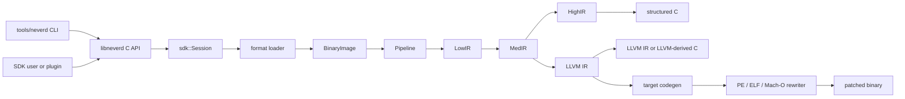

**언어**: [English](../architecture.md) | [简体中文](../zh-CN/architecture.md) | [繁體中文](../zh-TW/architecture.md) | [日本語](../ja/architecture.md) | [한국어](architecture.md) | [Français](../fr/architecture.md) | [Deutsch](../de/architecture.md) | [Español](../es/architecture.md) | [Italiano](../it/architecture.md) | [Русский](../ru/architecture.md) | [العربية](../ar/architecture.md)

[← 문서 인덱스](README.md)

# NeverD 아키텍처

이 가이드는 기여자가 NeverD를 안전하게 변경하는 데 필요한 프로덕션 경계를
설명합니다. 의도적으로 NeverD 소유 코드만 다루며 LLVM, Capstone, Unicorn
서브모듈은 각자의 내부 아키텍처를 유지합니다.

## 시스템 경계

NeverD에는 네 가지 IR 표현이 있지만 반드시 네 단계를 모두 거치는 단일 순서는
아닙니다. `LowIR -> MedIR`은 공통입니다. 구조화 디컴파일은
`MedIR -> HighIR -> C`를 사용하고, `lift`, `decompile --llvm`, `patch`는
`MedIR -> LLVM IR`로 직접 이동합니다. 특히 patch와 lift 모드는 의도적으로
HighIR을 건너뜁니다.

CLI는 `tools/neverd`에서 명령을 파싱하고 `neverd_session_t`를 만든 뒤
`include/neverd/sdk/NeverDCAPI.h`의 공개 API를 호출합니다. 엔진 상태는
`lib/sdk/SessionImpl.h`에 있습니다. `neverd_session_load`가 loader를 선택해
`BinaryImage`를 만들고, IR 기반 작업은 필요할 때 `lib/pipeline/Pipeline.cpp`를
실행합니다. `neverd` 실행 파일은 `neverd_shared`에 링크되며, 구성 요소 archive와
LLVM/Capstone 의존성은 공유 라이브러리의 비공개 구현 세부 사항입니다. CLI는 명령줄
UI에 LLVM Support를 사용하지만 엔진을 구동할 때 C API를 우회하지 않습니다.

HighIR의 `HighSourceFlow`는 출력 문장의 제어 흐름 간선, 지역 변수 식별, 확정 대입 분석을 담당합니다.
소스 검증과 불필요한 PHI 복사 제거는 같은 그래프를 사용합니다. 반복되는 스칼라 조건을 제한된
영/비영 상태로 나누며, 쓰기는 기존 조건을 무효화합니다. 주소가 외부로 전달된 변수는 미지로 두고
분할 한도에 도달하면 보수적인 그래프로 돌아갑니다. 모든 가능한 문맥에서 값이 사용되지 않을 때만
PHI 복사를 제거합니다. 호출, 읽기, 쓰기의 관찰 가능한 동작과 소스 레이블은 유지합니다.

Block 소비자의 이스케이프 분석도 이 그래프를 사용합니다. 제한된 고정점 분석은 분기와 루프에서 포인터 식별 정보와 전용 스택 슬롯을 추적합니다. 합류 지점은 가능한 컨텍스트 주소를 보존하며 완전한 덮어쓰기만 이를 지웁니다. 알 수 없는 간선, 예외 흐름, 증명 예산 초과는 바인딩을 거부합니다.

Objective-C 수신자 정보는 메서드 진입점의 self와 정확한 클래스 참조를 구분합니다. 진입점을 공유하는 모든 메타데이터가 일치해야 self 정보를 설정합니다. 전체 폭 복사와 ABI가 보존하는 레지스터는 진입점 역방향 간선을 포함한 동일한 고정점 분석으로 전달됩니다. 선언 검증은 클래스/인스턴스 구분, 기록된 카테고리, 상위 클래스와 채택 프로토콜을 따르며 self에는 알려진 하위 클래스 선언도 포함합니다. 컴파일러 카탈로그는 소유자와 상속 정보를 전역 선택자 검증과 별도로 유지합니다. SDK는 소스를 내보내기 전에 현재 이미지에서 수신자의 출처와 선언을 다시 검증합니다. 이 정보는 특정 IMP를 선택하거나 바이너리 재작성을 허용하지 않습니다.
외부 상속 정보가 없으면 수신자로 범위를 좁히지 않고 전역 선택자 일치를 요구합니다. 명시적으로 미지원이거나 충돌하는 선언은 계속 거부 근거로 유지합니다.

객체 타입이 명시된 ivar는 최대 여덟 번의 전체 폭 로드로 수신자 증명을 확장합니다. 각 단계는 런타임 오프셋 슬롯, 폭, 명령이 사용한 상수 바이트 오프셋을 기록합니다. 상수는 현재 레이아웃과 일치해야 하며 런타임 참조는 이동한 필드를 따를 수 있습니다. 로더는 기록된 클래스 상속과 필드 선언을 검증합니다. 부분 접근, 타입명 없는 id, 블록, 프로토콜만 있는 타입, 모호한 저장소, 알 수 없는 기준 포인터는 클래스 정보를 제공하지 않습니다. 소스 검증은 현재 이미지에서 전체 경로를 다시 확인합니다. 타입 정보는 객체 동일성이나 메모리 연산 제거 권한을 뜻하지 않습니다.

로더는 Darwin 상수 문자열, 정수 객체, 배열과 정렬된 사전으로 이루어진 유한 비순환 그래프를 검증합니다. 컨테이너 필드와 각 간선에는 불변 매핑 저장소와 모호하지 않은 임포트 또는 재배치 증거가 필요하며, 미지원 인코딩, 순환, 불완전한 그래프는 명시적으로 실패합니다. 소스 바인딩은 그래프와 입력 포인터 슬롯을 다시 검증합니다. 생성된 도우미는 정수 비트, 자식 순서와 공유 주소를 보존하고 기존 문자열 정체성을 재사용합니다. 컨테이너 슬롯은 검증된 자식 도우미만 호출하여 acquire/release 방식으로 한 번 초기화하고 공개합니다. 각 도우미는 자식 선언을 포함하므로 독립적으로 복원한 메서드가 하나의 정의를 공유할 수 있습니다. 이식 가능한 테스트는 손상된 입력과 증명 예산을 다루며, 네이티브 컴파일러 픽스처는 원본 메서드와 내용, 별칭, 복사 정체성, 동시 초기화를 비교합니다.

## IR 표현 및 경로

| 표현 | 목적 | 주요 정의 및 변환 |
|------|------|-------------------|
| LowIR | 아키텍처 독립 `NdOp` 연산, 기본 블록, CFG, jump-table 메타데이터 | `include/neverd/ir/low`, `lib/ir/low`; `lib/decode` + `lib/lift`가 생성 |
| MedIR | 타입, ABI/호출 규약, 메모리/스택 모델, 플래그, 호출, SSA 유사 데이터 흐름 | `include/neverd/ir/med`, `lib/ir/med` |
| HighIR | 읽기 쉬운 C를 위한 구조화 표현식과 제어 흐름 | `include/neverd/ir/high`, `lib/ir/high`; `lib/backend/c/HighC`가 출력 |
| LLVM IR | 최적화, LLVM 유래 C, 대상 코드 생성, 바이너리 재작성 입력 | `lib/backend/llvm`; `lib/pipeline`이 최적화/조정 |

상수는 LowIR, MedIR, HighIR 전반에서 각 출현 위치의 스칼라/주소 출처와 주소 소유 정보를 유지합니다. 숫자 비트가 같아도 출처가 다르면 병합하지 않습니다. HighIR 기호 단순화는 주소 식별 정보를 불투명 입력으로 취급합니다. 소스 바인딩은 공통 숫자 피연산자 분류를 사용하며, 메모리 및 포인터로 사용하는 경우에는 계속 재배치 바인딩을 요구합니다.

| 사용자 경로 | 표현 경로 | 출력 |
|-------------|-----------|------|
| Low/Med dump | Binary -> LowIR, 선택적으로 -> MedIR | 진단 텍스트 |
| High dump 또는 `decompile` | Binary -> LowIR -> MedIR -> HighIR | HighIR 또는 구조화 C |
| `lift` | Binary -> LowIR -> MedIR -> LLVM IR | `.ll` |
| `decompile --llvm` | Binary -> LowIR -> MedIR -> LLVM IR | LLVM 유래 C |
| `patch` | Binary -> LowIR -> MedIR -> LLVM IR -> codegen | 재작성 바이너리 |

경로 선택의 기준은 `lib/pipeline/Pipeline.cpp`입니다. 표현별 로직은 소유한 IR 또는
backend 라이브러리에 두고, pipeline은 알고리즘을 흡수하지 말고 해당 구성 요소를
조정해야 합니다.

## 교차 아키텍처 변환 계약

`include/neverd/translate`는 실행 backend가 아닌 계약 계층을 정의합니다.
`GuestState`는 `x86_32`, `x86_64`, `AArch64`, `ARM32`의 아키텍처 독립적이고
머신에서 관찰 가능한 상태를 모델링합니다. 정규 version 1 직렬화는 고정 폭
little-endian 필드, 안정적인 레지스터 ID, 정렬된 컬렉션, fail-closed 검증을 사용하므로
지속된 상태가 호스트 C++ 레이아웃에 의존하지 않습니다.

`GuestState`의 wire v1 baseline은 영구히 동결됩니다. 이 baseline 밖의 상태는 확장
범위의 extension-register ID와 정규 소문자 이름을 함께 사용하거나, 명시적 upgrader를
갖춘 새 wire version으로 옮겨야 합니다. v1 baseline을 제자리에서 변경하는 것은
금지됩니다.

`ARM32` guest에서는 `ExecutionMode`가 권위 있는 decode mode이며 `CPSR.T`와
일치해야 합니다. 저장되는 PC는 항상 bit 0을 지운 정규 명령어 주소이고, ARM
mode에서는 추가로 word alignment를 만족해야 합니다.

아키텍처 쌍 정책은 `x86_64 -> AArch64`, `AArch64 -> x86_64`,
`x86_32 -> AArch64/ARM32`, `ARM32 -> x86_32/x86_64`를 정의합니다.
`ContractDefined`는 요청을 검증하고 지속할 수 있다는 뜻이며 코드를 변환하거나
실행할 수 있다는 뜻은 아닙니다. JIT 정책은 실행 중인 프로세스의 native host만
허용하고, AOT 정책은 호스트 아키텍처와 target triple을 명시하도록 요구합니다.
CPU 또는 feature set을 선택하는 경우에도 명시해야 합니다.

`ResolvedHostTarget`은 이 선택을 구체적인 결과로 해석합니다. `Native` 해석은 현재
process에서 triple, CPU, 활성/비활성 feature set을 가져옵니다. `Explicit` 해석은
호출자가 제공한 architecture, triple, CPU, feature를 검증하고 정규화하며 충돌하는
입력을 거부합니다. version이 있는 cache identity는 정규화된 target input을 결정적인
byte 순서로 구성하며 process address나 locale 의존 text를 포함하지 않습니다.

version이 있는 `TranslationExit`는 안정적인 중지 이유와 그에 대응하는 typed payload를
기록합니다. syscall, 예외 또는 signal, breakpoint, 미지원 명령어, self-modification,
리소스 budget, 외부 호출, memory fault 및 그 밖의 종료 조건을 다룹니다. 따라서
소비자는 중지 이유에 따라 타입 없는 정수를 다시 해석할 필요가 없습니다.

대응하는 `BudgetExhausted` 경우를 제외하면 결과가 보고하는 instruction, block,
generated-code count는 요청의 대응하는 0이 아닌 budget을 초과할 수 없습니다.
instruction과 block 고갈은 limit에서 정확히 멈춥니다. 생성 object 크기는 나눌 수 없는
codegen이 끝난 뒤에만 정확히 측정되므로 해당 고갈 결과는 `Observed > Limit`을 보고할
수 있습니다. 거부된 object는 link, publish, execute되지 않습니다. 모든
`BudgetExhausted` payload는 파생 값이나 구현 전용 임계값이 아니라 요청 limit을 정확히
식별합니다.

backend-private `RuntimeControlBlockV1` 계약은 정확히 128 byte이고
8 byte alignment를 사용하며 고정된 v1 magic, version, size, field offset, 0인 reserved
field, 일관된 typed exit로 제약됩니다. C++ container, host pointer, guest address alias를
포함하지 않으며 `GuestState`의 C++ layout이나 wire format도 아닙니다. 이 계약을 구현하는
backend는 상태를 이 record로 명시적으로 변환해야 합니다.

고정 v1 generated-code 호출 표면에는 정확히 8개의 helper만 있습니다:
`nvd_rt_v1_load8_le`, `nvd_rt_v1_load16_le`, `nvd_rt_v1_load32_le`,
`nvd_rt_v1_load64_le`, `nvd_rt_v1_store8_le`, `nvd_rt_v1_store16_le`,
`nvd_rt_v1_store32_le`, `nvd_rt_v1_store64_le`. 이름, signature, pointer provenance는
정확히 일치해야 하며 backend는 이 유한 table을 명시적으로 bind하고 ambient symbol
resolution으로 fallback해서는 안 됩니다. executable generation 검증과
budget/cancellation polling은 신뢰된 dispatcher만 수행하는 작업입니다.
`nvd_rt_v1_validate_generation`과 `nvd_rt_v1_poll`은 generated-code helper가 아닙니다.
신뢰된 host dispatcher는 block 선택도 소유하며 생성 IR에서 호출할 수 없습니다.
translated block은 대신 typed exit code를 반환합니다. 생성 IR은 선언된
scalar-result runtime slot만 직접 읽을 수 있습니다.

`RuntimeSymbolRegistryV1`은 이 helper table을 닫힌 host-side registry로 구현합니다.
생성 시 완전한 ABI-v1 집합, 정확한 canonical name, helper class, signature, 그리고 각
entry에 class와 일치하는 non-null function pointer가 정확히 하나 있는지 검증합니다.
lookup은 완전 일치하는 이름만 허용하고 process 환경이나 dynamic loader의 symbol을
조회하지 않으며 object verifier allowlist에 동일한 정렬된 이름을 제공합니다. version이
있는 identity는 이름, helper class, ABI shape를 포함하지만 native address는 의도적으로
제외하므로 ASLR과 무관합니다.

`RuntimeCodeMemory`는 page 단위로 격리된 generated-code storage를 소유하며 단방향
`RW -> RX` publication만 허용합니다. memory는 동시에 writable 및 executable이 될 수
없고 publication 뒤에 write 가능 상태로 되돌릴 수도 없습니다. write와 entry offset은
bounds-check되며 publication 시 host instruction cache를 invalidation합니다. native
smoke test는 publication 이후 작은 host instruction sequence만 실행합니다. 이는 W^X
memory boundary만 증명할 뿐 translation engine을 증명하지 않습니다.

`GuestMemoryRuntime`는 논리적 `GuestState`와 격리됩니다. 생성 시 state를 검증하고
region byte와 metadata를 정렬된 private index로 복사합니다. guest virtual address는
lookup key일 뿐이며 host pointer로 변환되지 않습니다. 검사된 scalar access는 width,
alignment, overflow, unmapped, cross-region, permission, executable-write, generation
overflow/mismatch, policy fault를 typed 결과로 보고합니다. instruction/block budget,
cancellation, generation tracking과 `RejectExecutableWrites`,
`InvalidateOnExecutableWrite`, `ValidateBeforeDispatch` code-write policy도 암묵적인 host
동작 대신 일관된 typed record를 생성합니다.

`TranslationObjectCompilerV1`은 검증된 LLVM IR-to-object 경계입니다. const input
module을 검증하고 모든 변환 전에 clone하며, proof-gated semantic simplification과
LLVM `O0`~`O3` optimization을 결합한 뒤 final IR을 다시 검증하고 4개의 contract host
architecture용 relocatable ELF, COFF, Mach-O object를 emit합니다. 정확한
target-mangled block/runtime symbol manifest를 canonicalize하고 emit된 모든 object를
audit하며 runtime registry identity와 version이 있는 request/artifact cache key를
반환합니다. generated-byte budget이 0이 아니면 이를 만족하는 object만 artifact
verification으로 진행할 수 있습니다. LLVM은 먼저 private buffer에 나눌 수 없는 emit을
완료해 정확한 크기를 측정합니다. 초과 object는 publish와 artifact audit 전에 거부되며,
typed telemetry는 관측 크기와 요청된 정확한 limit을 보존합니다. 0은 caller policy에서
unlimited를 뜻합니다. compiler는 audit된 relocatable byte까지만 만들며 link, publish,
dispatch, execute 또는 guest instruction lowering을 수행하지 않습니다.

post-codegen verifier는 relocatable ELF, COFF, Mach-O object를 닫힌
집합으로 감사합니다. format과 architecture는 선택한 host와 정확히 일치해야 하고,
undefined symbol은 유한 helper allowlist에 정확히 포함되어야 하며 dynamic symbol은
금지됩니다. relocation은 명시적인 direct whitelist로 제한되고 encoding, width,
alignment, offset, loadable destination, object-local non-preemptible definition 또는
정확히 허용된 helper target을 검사합니다. W+X, unwind/exception 및 initializer
metadata, TLS, IFUNC, GOT와 일반 PLT indirection, dynamic relocation, weak/preemptible
또는 선택 가능한 definition, 알 수 없는 allocated section, linker directive를
거부합니다. LLVM이 hidden x86-64 ELF call에 사용하는 `R_X86_64_PLT32` 표기는 v1
policy가 exact runtime helper로 향하는 sealed direct branch임을 증명할 때만 허용되며,
PLT나 GOT path를 허용하지 않습니다. ELF `ET_REL` artifact에는 program header나
segment가 없어야 합니다. Mach-O load command는 positive list로 제한되며 bit 폭이
일치하는 segment는 정확히 하나, symbol table, dynamic-symbol table, platform-version,
data-in-code command는 각각 최대 하나만 허용하고 의존 관계도 검사합니다. linker
option과 그 밖의 모든 command는 거부됩니다.

`TranslationObjectRequestV1`은 이 계약 위에 구축된 최초의 공개
guest-byte-to-object slice이며 범위를 의도적으로 좁혔습니다. 현재 공개된 fail-closed
x86-64 v1 scalar-register subset에서는 legacy prefix가 없는 canonical encoding만
허용합니다. 즉, 지원되는 register/immediate LowIR 형태를 갖는 REX.W full-width GPR
`MOV`, `ADD`/`SUB`, `AND`/`OR`/`XOR` 형식만 포함합니다. schema 9는 full-width
register/register `CMP`의 `39/3B`, register/immediate `CMP`의 `81/7`, `83/7`, `3D`,
full-width register/register `TEST`의 `85`, register/immediate `TEST`의 `F7/0`, `A9`도 허용합니다.
산술 형식은 기존 scalar flag 계산을 유지하고, 논리 형식과 `TEST`는 아키텍처가 정의한
flags를 계산하면서 NeverD state model의 `AF`를 보존합니다.
canonical `C3` `RET`와 `C2 iw` `RET imm16`은 return block을 종료하고, canonical `EB cb`와
`E9 cd` direct-relative `JMP` encoding은 direct-branch block을 종료합니다. 공개 lowering
schema는 9입니다. canonical이며 legacy prefix가 없는 traditional Jcc는 `JO`/`JNO`의
short `70/71 cb` 또는 near `0F 80/81 cd`, `JB`/`JAE`의 `72/73 cb` 또는
`0F 82/83 cd`, `JE`/`JNE`의 `74/75 cb` 또는 `0F 84/85 cd`, `JBE`/`JA`의
`76/77 cb` 또는 `0F 86/87 cd`, `JS`/`JNS`의 `78/79 cb` 또는 `0F 88/89 cd`,
`JP`/`JNP`의 `7A/7B cb` 또는 `0F 8A/8B cd`, `JL`/`JGE`의 `7C/7D cb` 또는
`0F 8C/8D cd`, `JLE`/`JG`의 `7E/7F cb` 또는 `0F 8E/8F cd`로 제한됩니다.
`JRCXZ`/`JECXZ`/`JCXZ`와 `LOOP`/`LOOPE`/`LOOPNE`는 아직 공개되지 않았으며 fail closed합니다.
예약된 `F7 /1`, guest-memory operand, partial-register form, legacy prefix, 의미적으로 중복된
REX extension bit도 fail closed합니다.
출력은 audit된 little-endian AArch64 ELF
또는 Mach-O relocatable object로 제한됩니다. 일반 guest memory operation,
partial-register form, 이 정확한 subset 밖의 모든 instruction/encoding, return, 이러한
direct jump와 위에 공개된 Jcc branch 이외의 control flow 및 lowerer가
구현하지 않은 모든 LowIR operation은 object emission 전에 거부됩니다.
`RET`에 필요한 검사된 return-address read는 terminator contract 내부 동작이며 일반적인
guest-memory lowering을 공개하지 않습니다. request는 block descriptor를 다시 구성해
검증하고, lowering과 object emission에 동일한 resolved target machine을 사용하며,
proof-gated semantic simplification과 LLVM 기본 `O2` optimization pipeline을 결합합니다.
이 slice는 그 밖의 x86-64 instruction, 다른 guest/host pair 또는 AArch64에서 x86-64로의
역방향을 지원한다는 뜻이 아닙니다.

공개 C entry point `neverd_translate_x86_64_block_to_aarch64_object_v1`, Python ctypes
wrapper `translate_x86_64_block_to_aarch64_object`, `neverd translate-object` command는
같은 object-only 경계를 노출합니다. Python은 `TranslationObjectFormat.ELF` 또는
`.MACHO`를 사용합니다. native translation 실패 시 `TranslationErrorCode`를 담은 typed
`TranslationError`를 발생시키고, local argument validation은 `TypeError` 또는
`ValueError`를 발생시킵니다. 성공 시 Python이 소유하는 immutable result를
반환합니다. C result는 object byte, 안정적인 cache identity, optimization telemetry를
소유하며 CLI는 선택한 ELF 또는 Mach-O object만 기록합니다. 세 surface 모두 link,
load, dispatch, execute, debug 전에 멈추며 execution session interface가 아닙니다.

`verifyTranslationLinkGraphV1`은 독립적인 allocation 전 두 번째 감사를 추가합니다. 승인된
AArch64 ELF 또는 Mach-O object에서 임시 LLVM JITLink graph를 만들고 target, section
permission, block/runtime symbol manifest, external-symbol closure, edge kind와 target을
검사합니다. 주소 없는 감사 결과를 만든 뒤 graph는 폐기됩니다. 이 감사를 통과해도
code를 link, allocate, resolve, load, publish, dispatch 또는 execute하지 않습니다.

`linkTranslationObjectV1`은 별도의 native linking 경계입니다. pruning, allocation,
symbol resolution, fixup 전후에 trusted descriptor, raw object, JITLink graph를 다시
감사합니다. runtime symbol은 sealed registry에서만 가져옵니다. dispatcher credential은
유일한 manifest entry를 해당 session, block identity, guest entry PC, cache generation,
code epoch에 결속하고, invoke 시 runtime guest `RIP`도 그 entry와 일치해야 합니다.
finalization에 성공하면 최종 permission으로 executable memory를 publish합니다. unload는
새 invoke를 무효화하고 진행 중인 한 번의 invoke가 끝나기를 기다린 뒤 allocation을
해제합니다. credential-free overload는 audit-only이며 invoke할 수 없습니다.

`NativeTranslationSessionV1`은 이 요소들을 experimental C++ x86-64-to-native-AArch64
execution 경계로 결합합니다. little-endian AArch64 ELF 또는 Mach-O process에서
compile-link-validate-invoke-unload dispatcher loop 전체에 걸쳐 하나의 checked guest-memory
runtime과 고정 guest state를 여러 block 사이에 유지합니다. canonical direct jump는 정확한
static target에서 계속됩니다. 공개된 canonical Jcc branch는 block
manifest가 선언한 taken 또는 fallthrough successor에서만 계속되며 dispatcher는 그 밖의 selected PC를 모두
거부합니다. return은 종료합니다. global instruction, block, generated-object-byte budget은
block 전체에서 정확하게 유지되며 guest가 성공적으로 멈추면 실행된 state와 authoritative
memory를 함께 commit합니다. cancellation은 final commit에 대해 linearize됩니다.

이는 실행 가능한 vertical slice이지 완전한 translator가 아닙니다. 일반 guest-memory
instruction, partial register, 위의 정확한 schema-9 traditional-Jcc slice 밖의 conditional control
flow(`JRCXZ`/`JECXZ`/`JCXZ`와 `LOOP`/`LOOPE`/`LOOPNE` 포함), indirect control flow,
call, floating-point, SIMD, x87, atomic, system instruction, 일반 exception propagation,
block cache, 다른 guest/host pair, 역방향 AArch64-to-x86-64는 아직 지원하지 않습니다.
execution session에는
C, Python, CLI, JSON surface가 없으며 debugging은 별도의 미지원 기능입니다. 위 object API는
native execution을 선택하지 않아도 계속 사용할 수 있습니다.

생성 IR 계약은 이 계약의 적용을 받는 모든 translated block이 hidden 및
non-preemptible이고 C ABI `i32 (ptr state, ptr runtime)`를 사용하도록 요구합니다.
block은 private registry로만 발견되며 프로세스 환경의 symbol lookup에 의존하지
않습니다. block 간 직접 호출도 금지됩니다.

IR verifier는 legalization이 알려진 compiler-runtime libcall을 도입하지 않도록 정수
폭을 호스트 scalar register 폭 이하로 제한합니다. 다만 이는 필요조건일 뿐입니다.
이 계약을 구현하는 모든 실행 backend는 post-codegen control transfer, `MachineIR`,
target object의 relocation을 동일한 유한 runtime-symbol allowlist에 대해 정확히
감사해야 합니다.

TranslationIR의 직접 load/store와 private constant가 보관하는 값에는 호스트
scalar-register 폭 이하인 단일 scalar integer만 허용됩니다. aggregate는 verifier
경계 전에 scalarize하여 압축된 IR이 backend에서 무제한 확장을 유발하지 않게 해야 합니다.

generated-code ABI는 scalar integer에 대해서만 정의됩니다. 부동소수점, SIMD, x87,
atomic 및 system instruction은 이 계약의 범위 밖입니다. `ProvenSemanticAndLLVM`을
선택하는 구현은 NeverD의 proof-gated semantic simplification을 LLVM 최적화와의 공동
fixed point까지 실행해야 합니다. 이 정책 자체는 실행 가능한 translation backend를
제공하지 않습니다.

## Windows 드라이버 에뮬레이션

`lib/emulation`은 `NEVERD_ENABLE_DRIVER_EMULATION`으로 활성화하는 선택적 실행 구성 요소입니다. `emulate-driver` CLI는 공개 C API를 통해 이 구성 요소를 호출합니다. `DriverSession`은 제한된 x64 WDM 초기화와 선택적인 순차 create/IOCTL/read/write/cleanup/close/unload 호출을 담당합니다. Windows 이미지 매핑은 기존 로더의 완전한 `BinaryImage`를 사용하며, Windows 모델은 게스트 객체와 API 의미론을 담당합니다. Unicorn 어댑터는 CPU 실행과 기준이 되는 게스트 메모리를 담당합니다. 이 경로는 실험적인 네이티브 변환 파이프라인을 사용하지 않으며 해당 파이프라인의 지원 프로필을 변경하지 않습니다.

Unicorn은 `cmake/NeverDUnicorn.cmake`에서 한 번 구성되며 의미론 테스트와 공유합니다. `BUILD_TESTING=OFF`일 때도 사용할 수 있습니다. 알 수 없는 API와 CPU 환경 동작은 명시적으로 중단되며, 드라이버가 반환한 실패는 미완료 에뮬레이션과 구별됩니다. 한도, 보고서 및 지원하지 않는 수명 주기 작업은 [드라이버 에뮬레이션](driver-emulation.md)을 참조하세요.

기존 C API는 초기화만 수행합니다. 시나리오 JSON은 동일한 실행 옵션에 대해 하나의 엄격한 파서를 사용하며, 필드와 요청 종류는 `.def` 목록에 선언됩니다. 요청한 베이스 재배치와 security-cookie 초기화는 실행 로더가 담당합니다. Windows 모델은 IRP/스택 위치/파일 객체를 소유하고 동기 완료 또는 작업 항목에 의한 보류 완료를 검증하며, 세션은 공유 실행 예산 아래에서 콜백 순서를 제어합니다. 사용되지 않는 알 수 없는 import는 지연 바인딩이며, 이를 실행하거나 모델링되지 않은 export 데이터를 읽으면 명시적으로 중단됩니다.

Export 레지스트리는 정적 import와 동적 루틴 조회에 안정적인 게스트 주소를 부여합니다. Export의 가용성과 구현 여부는 별개입니다. 명시적인 부재는 NULL로 해석되고, 존재하지만 모델이 없는 루틴은 트랩에 바인딩되며, 동적 가용성이 지정되지 않으면 중단합니다. 요청 모델은 독립적인 파일 식별자와 요청 소유 MDL을 관리하며, 매핑 권한과 수명 만료도 포함합니다. 런타임은 세션의 검증된 Win64 인수 판독기를 통해 게스트 가변 인수를 읽습니다. 백엔드 오류는 최초 원인을 구조화된 형태로 보존합니다. 관찰과 보고는 오류가 발생한 CPU를 재개하지 않으며 Windows 예외 처리를 의미하지 않습니다.

Windows 모델은 독립적인 비페이지 풀 MDL도 관리하며, 설명자를 해제해도 원래 버퍼는 해제하지 않습니다. 별도 레지스트리 모델이 명시적 시나리오 트리, 핸들 권한, 키·값 수명을 관리하며 정적 내보내기 목록과 분리됩니다. 사전 검증과 실행은 같은 검증 규칙을 사용하고 보고서에는 최종 키·값이 보존됩니다. 언로드 시 남은 핸들을 검사합니다.

`KernelScheduler`는 결정적인 작업 항목 순서와 콜백 식별자를, `KernelModel`은 항목/장치 수명과 IRP 보류/완료 계약을 관리합니다. `DriverSession`은 게스트 호출 반환 경계에서 `PASSIVE_LEVEL`로 큐를 처리한 다음 순차 요청을 진행합니다. Unicorn은 전체 CPU 컨텍스트를 저장하며 게스트 메모리는 공유합니다. 내부 타이머/DPC 상태 머신은 공개 게스트 API, 스레드/대기, 취소, KMDF, PnP/전원 또는 하드웨어 지원을 뜻하지 않습니다.

## 예외 재작성 경계

Mach-O compact unwind에는 원본 `__unwind_info`용 strict parser, 생성된
`__LD,__compact_unwind` record용 fixup-aware parser, 원본/생성 range의 정확한 merge,
regular page용 deterministic encoder와 transactional 최종 section installer가 있습니다.
installer는 기존 file-backed `__TEXT,__unwind_info`가 encoded table을 수용할 때만
in-place로 다시 씁니다. architecture, layout, byte preimage를 재검증하고 사용하지 않은
tail을 0으로 지운 뒤, 바깥 Mach-O transaction이 한 번 commit되기 전에 결과를 다시 parse해
semantic equivalence를 확인합니다. 생성 record는 compiler가 정확히 기록한 IR source
function→target MC owner symbol 매핑(private definition 포함, object-format prefix나 mangling
추측 없음), opaque한 0이 아닌 range ID, 정확한 반개구간 fragment range로 인증됩니다. 생성된
각 FDE는 정확히 하나의 인증된 fragment와 일치해야 하고, 필요한 각 fragment도 해당
transaction이 install한 정확히 하나의 FDE와 일치해야 합니다. 단, 엄격한 encoding 검증을
통과한 정확한 non-DWARF compact record가 덮는 경우는 예외입니다. 같은 function 소유의
인접하거나 떨어진 fragment는 하나의 source recipe를 재사용할 수 있지만, 누락·중복·dangling·
cross-owner 또는 boundary 불일치 identity는 출력 변경 전에 실패합니다. 새 RX segment는
`__LINKEDIT`가 유일하고 file/VM 끝에 있으며 offset shift가 overflow checked이고 최종 file/VM
layout의 strict replay가 성공했음을 증명한 뒤에만 commit됩니다. 최종 section이 없으면 생성된
compact record를 install하지 않고 아래의 정확하고 인증된 DWARF-FDE 폐쇄를 통과할 때만
transaction을 계속할 수 있습니다. 기존 최종 section의 용량이 부족하거나 malformed이면 계속
fail closed하며, link된 native throw/catch 증명은 아직 남아 있습니다.

외부 참조는 완전한 MC fixup 계약으로 분류합니다. call은 인증된 callable target만 선택할 수
있고, 생성 compact-unwind의 personality field는 검증된 non-lazy pointer slot만 선택하며 그
파일 내용을 dereference하지 않습니다. TLS, authenticated pointer, subtractive, malformed
compact field 및 알 수 없는 relocation은 fail closed합니다.

ARM32 compact unwind에서 encoding에 포함된 stack adjustment와 GPR layout은 `Complete`입니다.
D-register pattern selector 0~3도 `Complete`이지만, 4~7은 compact word만으로 runtime-aligned
CFA-relative slot을 모두 증명할 수 없어 `Partial`입니다. `Partial` entry는 분석을 위해 증명된
register identity를 유지할 수 있지만 모든 rewrite path가 fail closed로 거부합니다. 각
EH-frame install receipt는 target architecture, pointer width, byte order를 정확히 결속하며,
compact-unwind DWARF binding은 receipt target identity 불일치를 거부합니다.

상위 ARM32 section transaction의 범위는 compact-unwind decoder보다 좁습니다.
Mach-O header가 정확히 `CPU_SUBTYPE_ARM_V7K`이고 원본 symbol table의
`N_ARM_THUMB_DEF` bit가 필요한 모든 function을 Thumb code로 명시적으로 인증할
때만 이 경로가 활성화됩니다. 이후 정확한 `thumbv7k-apple-watchos` triple과 Thumb
mode가 code generation 전체에 결속되며, 입력 feature 요구 사항은 Cortex-A7 한계를
초과할 수 없습니다. flag가 없거나 mode를 알 수 없는 function, generic non-v7k
subtype, ARM mode, 혼합되거나 알 수 없는 external-code target, ARM Mach-O in-place
entry point, C source 기반 ARM Mach-O patch는 출력 변경 전에 모두 fail closed로
거부됩니다. function discovery가 `LC_FUNCTION_STARTS`에만 의존하는 stripped input은
아직 지원하지 않습니다.

PE, ELF, Mach-O에는 각각 format별 예외 component가 있지만 NeverD는 모든 format과 모든
exception type을 포괄하는 end-to-end rewrite pipeline을 아직 공개하지 않습니다. 지원하지
않는 encoding 또는 해결되지 않은 registration/layout 요구 사항은 출력 변경 전에
실패해야 하며, 현재의 부분적인 format 지원을 완전한 예외 재작성 폐쇄로 표현하면 안 됩니다.

Ada 또는 D Itanium personality를 인식하는 것은 Ada/D 예외 지원이 아닙니다. GNAT,
GDC, DMD, LDC의 address-form LSDA는 파싱할 수 있습니다. type-table 슬롯은 불투명하게
유지되며(GNAT는 `Exception_Id` / `Exception_Data`, D는 `ClassInfo`)
`std::type_info`로 따라가지 않습니다. native reconstruction은 LLVM `personality`와
address-form `invoke`/`landingpad` 절을 방출합니다. corpus-proven은 별도의 주장이며
personality 인식이나 native lowering에서 추론하면 안 됩니다.

## 구성 요소 맵

각 구성 요소는 `add_neverd_component_library`가 만드는 정적 archive입니다. 표에는
주요 NeverD 의존성만 나열하며 CMake helper가 공통 제공하는 LLVM과 Capstone
라이브러리는 모두 열거하지 않습니다.

| 디렉터리 | 책임 | 주요 의존성 |
|----------|------|-------------|
| `lib/loader` | 포맷 감지, PE/COFF·ELF·Mach-O 로드, 정규화된 `BinaryImage`, 함수 탐지 | LLVM Object API |
| `lib/lift` | 수작업 x86/i386·AArch64·ARM32 명령어 의미론 | IR 데이터 타입 |
| `lib/decode` | Capstone/native 디코드 및 아키텍처 lifter로 디스패치 | `NeverDIR`, `NeverDLift` |
| `lib/ir` | 공통 타입과 LowIR·MedIR·HighIR·intrinsic 정의/변환 | 네 IR 하위 구성 요소 |
| `lib/pipeline` | 함수 감지와 Low/Med/High/LLVM 경로 조정 | IR, decode, lift, LLVM backend, 디버그 정보, IR pass |
| `lib/backend/c` | HighIR-to-C 및 LLVM-IR-to-C 렌더링 | IR |
| `lib/backend/llvm` | MedIR-to-LLVM lowering | IR |
| `lib/backend/codegen` | 대상 코드 생성과 PE/ELF/Mach-O patch 및 in-place 재작성 | IR, loader |
| `lib/sdk` | 공개 C ABI, session 수명 주기, query, 지속성, 플러그인, lift/decompile/patch/audit/hunt 진입점 | 엔진 구성 요소를 `libneverd`로 집계 |
| `lib/pass` | LLVM IR 난독화 pass와 MIR pass runner | IR |
| `lib/debug` | DWARF, PDB, linker-map 디버그 context | IR |
| `lib/sigs` | 시그니처 파싱, 데이터베이스, 매칭 | Loader |
| `lib/libc` | 알려진 libc 이름과 호출 모델 지원 | 독립 구성 요소 |
| `lib/safety` | 리프트된 IR 위의 힙 수명 감사와 복사 오버플로 헌트 | Symbolic, Solver |
| `lib/support` | 공유 바이너리 로드 helper | Loader |
| `lib/translate` | version이 있는 guest state/policy/exit, 고정 runtime ABI, 검사된 guest memory, 생성 IR/object/LinkGraph audit, sealed native linking, experimental x86-64-to-AArch64 C++ dispatcher | IR, LLVM, LLVM Object 및 JITLink 계약 |

공개 헤더는 `include/neverd` 아래에서 이 영역들을 반영합니다. 내부 C++ 클래스가
실수로 SDK의 일부가 되지 않게 하세요. 안정적인 외부 작업은 순수 C 헤더와 책임이
분명한 `lib/sdk/NeverDCAPI*.cpp` 파일 중 하나에 두어야 합니다.

## strict lifting 계약

`Decoder`와 각 아키텍처 lifter는 strict 모드로 시작합니다. Capstone이 명령어를
디코드할 수 있지만 선택된 lifter에 구현이 없으면 lifter는
`UnliftedInstruction`을 던집니다. 예외에는 명령어 주소, mnemonic, operand 문자열이
기록되므로 미지원 의미론은 누락하거나 추측하지 않고 분명하게 실패해야 합니다.

내부 non-strict 경로는 `NdOp::NOP`을 출력하지만 이는 진단용 탈출구일 뿐 명령어의
허용 가능한 구현이 아닙니다. 기여자와 CI 테스트는 strict 모드를 유지해야 합니다.
strict 실패가 나타나면:

1. 가장 작은 아키텍처별 fixture로 재현합니다.
2. `lib/lift/<ISA>`에 누락된 의미론을 추가합니다.
3. `unittests/lift`에서 예상 LowIR 모양을 검증합니다.
4. 명령어에 관측 가능한 동작이 있으면 `unittests/semantic`에 Unicorn 차등 왕복을 추가합니다.

pipeline을 계속 진행하려고 `UnliftedInstruction`을 잡지 마세요. 새로운 의도적 근사는
명시적인 계약과 테스트가 필요하며 1:1 lifting인 것처럼 보여서는 안 됩니다.

## 포맷 및 ISA 소유권

입력 포맷 로직과 출력 재작성 로직은 의도적으로 분리되어 있습니다.

| 포맷 | 로드, 메타데이터, 입력 relocation | Patch 및 출력 relocation |
|------|----------------------------------|--------------------------|
| PE/COFF | `lib/loader/COFF` | `lib/backend/codegen/COFF` |
| ELF | `lib/loader/ELF` | `lib/backend/codegen/ELF` |
| Mach-O | `lib/loader/MachO` | `lib/backend/codegen/MachO` |

아키텍처 lifter는 `lib/lift/X86`, `lib/lift/AArch64`, `lib/lift/ARM`에 있습니다.
해당 공개 lifter/register 선언은 `include/neverd/lift`에 있습니다. 대상별 LLVM 출력과
코드 생성은 `lib/backend/llvm/<ISA>` 및 `lib/backend/codegen/CodeGen<ISA>.cpp`에
있습니다.

### 지원 및 테스트 깊이

루트 지원 매트릭스는 각 셀이 구현되었다는 뜻입니다. 모든 opcode, ABI 경계 사례,
바이너리 제작 도구 또는 운영체제 버전을 빠짐없이 테스트했다는 뜻은 아닙니다. 명령어
의미론이 lifter의 구현된 coverage 밖에 있으면 strict 모드는 fail-closed로 중지합니다.

12개 포맷×아키텍처 셀 모두
`unittests/semantic/PatchFullSubstRTTests.cpp`에서 의미론적 재작성 backend
coverage를 갖습니다. 통합 깊이는 다음과 같습니다.

| 포맷 | x86-64 | i386 | AArch64 | ARM32 |
|------|--------|------|---------|-------|
| PE/COFF | 링크된 fixture | backend grid | 링크된 fixture | 링크된 Thumb fixture |
| ELF | 링크된 fixture + 의미론 왕복 | object pipeline + 의미론 왕복 | 링크된 fixture + 의미론 왕복 | 링크된 fixture + 의미론 왕복 |
| Mach-O | 링크된 fixture\* | PIC/no-PIC object pipeline\* | 링크된 fixture\* | backend grid |

- **링크된 fixture**는 대표 프로그램의 링크된 실행 파일에 대해 loader/pipeline과
  patch 동작을 검증합니다.
- **object pipeline**은 재배치 가능 object의 로드, 모든 IR 단계, 디컴파일을
  검증하지만 host linking과 patch된 바이너리 실행은 포함하지 않습니다.
- **backend grid**는 정확한 재작성 코드 생성 경로로 대표 IR을 컴파일하고 Unicorn에서
  동작을 비교합니다. 링크된 실행 파일에 해당 포맷 loader를 실행하지는 않습니다.
- `*` Mach-O 링크 fixture는 요청 대상을 생성할 수 있는 host toolchain에 의존합니다.
  현대 macOS는 과거 i386 실행 파일을 링크할 수 없으므로 i386은 PIC/no-PIC thin
  object와 재작성 grid를 사용합니다.

링크된 fixture 셀은 해당 대표 프로그램에 대해 가장 강한 포맷 통합 증거입니다.
object pipeline과 backend grid 셀은 부분적인 포맷 통합 coverage입니다. 아무 셀도
제한 없이 “완전히 테스트됨”이라 할 수 없으며 ISA coverage의 완전성을 주장하지 않습니다.

주요 근거는 링크된 ELF/PE fixture를 위한
[`PatchFormatTests.cpp`](../../unittests/lift/format/PatchFormatTests.cpp), Windows ARM 로드/
디컴파일을 위한
[`COFFARMFormatTests.cpp`](../../unittests/lift/format/COFFARMFormatTests.cpp), i386 thin
object를 위한
[`MachOI386RelocationTests.cpp`](../../unittests/lift/format/MachOI386RelocationTests.cpp),
링크된 Mach-O를 위한
[`X86_64_PipelineE2ETests.cpp`](../../unittests/lift/x86_64/X86_64_PipelineE2ETests.cpp)와
[`AArch64_PipelineE2ETests.cpp`](../../unittests/lift/aarch64/AArch64_PipelineE2ETests.cpp),
12셀 backend grid를 위한
[`PatchFullSubstRTTests.cpp`](../../unittests/semantic/probe/patchfull/PatchFullSubstRTTests.cpp)입니다.
명령은 [테스트 가이드](testing.md)를 참고하세요.

## 수정 위치

| 변경 | 시작 위치 | 최소 집중 검증 |
|------|-----------|----------------|
| 명령어 추가/수정 | `lib/lift/X86`, `AArch64`, `ARM`의 해당 파일; 디스패치 변경 시 공개 lifter 헤더 | `unittests/lift`의 아키텍처 테스트, `unittests/semantic`의 의미론 왕복 |
| `NdOp` 추가 | `include/neverd/ir/NdOps.h`, 이후 Low-to-Med, emitter/renderer, verifier/emulator, dump 점검 | `NeverDLiftTests` + 관련 `NeverDSemanticTests` 사례 |
| CFG 또는 함수 감지 변경 | `lib/ir/low`, `lib/loader/FunctionDiscovery*.cpp`, `lib/pipeline/PipelineFuncDetect.cpp` | lift CFG/jump-table 테스트 및 집중 의미론 변환 스위트 |
| PE 입력 relocation/unwind 규칙 추가 | `lib/loader/COFF` | `COFFARMFormatTests` 또는 새 집중 loader fixture |
| PE 출력 relocation/patch 규칙 추가 | `lib/backend/codegen/COFF` | `PatchFormatTests`, `RewriteCodegenRTTests`, PE backend grid |
| ELF/Mach-O 포맷 동작 변경 | 해당 `lib/loader/<Format>` 및/또는 `lib/backend/codegen/<Format>` 디렉터리 | 해당 포맷 테스트와 재작성 grid |
| MedIR/ABI 복구 변경 | `lib/ir/med` | 호출 규약 lift 테스트 + ISA 교차 의미론 왕복 |
| 구조화 제어 흐름 복구 변경 | `lib/ir/high` | `NeverDCFGLoopXformTests` 및 구조화 C 테스트 |
| LLVM 변환 추가 | `lib/pass/ir`, `include/neverd/pass/ir`의 공개 헤더, 노출 시 pipeline toggle | 집중 변환 스위트 + patch 출력 변경 시 `NeverDPatchFullTests` |
| C API 작업 추가 | `include/neverd/sdk/NeverDCAPI.h`, 집중된 `lib/sdk/NeverDCAPI*.cpp`, 상태에만 `SessionImpl.h` 사용 | SDK/CLI 의미론 테스트, `neverd_last_error` 및 할당 규약 유지 |
| CLI 명령 추가 | `tools/neverd/NeverDCLIOptions.cpp`, `NeverDCLI.h`, 집중된 `NeverDCmd*.cpp`, `neverd.cpp`의 디스패치 | `unittests/semantic/CLIEndToEndTests.cpp` 및 직접 CLI smoke test |
| 힙 수명 감사 또는 복사 오버플로 헌트 변경 | `lib/safety`, `include/neverd/safety`, `include/neverd/sdk/NeverDCAPISafety.h` | `NeverDSafetyTests` 및 `NeverDSafetyIntegrationTests` |
| 의미론 회귀 추가 | 집중된 `unittests/semantic/*Tests.cpp`; 새 파일을 `unittests/semantic/CMakeLists.txt`에 등록 | 테스트 바이너리를 빌드하고 `ctest -R`로 이름 있는 사례 선택 |

변경 범위를 좁게 유지하세요. 표현을 정의하는 파일은 해당 변환과 함께 바뀔 수 있지만,
큰 리팩터링을 균일하게 보이게 하려고 관련 없는 loader, lifter, backend를 수정하지 마세요.

소스 구조체 선언은 필드 배치를 ABI 분류와 별도로 보존합니다. Darwin ARM64에서는 같은 float 또는 double 멤버 1~4개를 포함한 중첩 구조체를 지원하며, 부동소수점 레지스터가 부족하면 인수 전체를 스택에 배치합니다. MedIR은 SSA 전에 물리 멤버를 연결하고 HighIR은 하나의 논리 인수나 반환값을 복원하며 C 출력은 배치를 검사합니다. Darwin ARM64와 x86_64는 64비트 정수 또는 포인터 1~2개로 구성된 중첩 구조체도 지원합니다. 구조체 전체가 스택으로 이동하면 ARM64는 해당 레지스터 뱅크를 소진 처리하고 x86_64는 남은 레지스터를 후속 인수에 사용합니다. 패딩, 압축 필드, 부동소수점과 정수의 혼합, 불완전한 구성 요소는 거부하며 바이너리 재작성 권한을 부여하지 않습니다.

런타임 호출 목록은 정확히 확인된 가져오기 함수가 원래 인수 포인터를 반환할 때만 `ReturnedArgument`를 선언합니다. 수신자 분석은 일반 ABI 레지스터 무효화 전에 선언된 물리 인수를 읽고, 결과에 입증된 수신자 타입만 복원합니다. SDK는 이 효과를 다시 검증하며 호출, 소유권 효과, 메모리 접근을 제거하지 않습니다.

컴파일러에서 생성한 프레임워크 및 수신자 목록은 Foundation, CoreData, CoreLocation, CoreSpotlight, QuartzCore, UniformTypeIdentifiers, UserNotifications를 공통 제공자로 사용합니다. QuartzCore는 공개 헤더 `CoreAnimation.h`를 사용하며 다른 프레임워크의 호환성 가져오기는 소속 선언을 제공하지 않습니다. 두 생성기는 네 가지 전처리 설정, 정확한 제공자 식별, 부정적인 선언 증거를 유지합니다.

객체 반환 형식은 일치하는 메서드 선언을 통해 동일한 제한된 수신자 증명을 확장합니다. 이름 있는 객체 반환 형식과 컴파일러가 선언한 연관 반환 형식은 클래스 정보를 제공하지만 id만으로는 제공하지 않습니다. 필드 읽기와 메시지 결과는 총 여덟 단계로 제한되며 소스 검증은 현재 선언을 기준으로 각 단계를 다시 확인합니다. 정확한 임포트에 연결된 할당 도우미는 해당 메시지의 반환 형식 계약을 사용하며 호출, 사용자 재정의 및 소유권 효과를 보존합니다. 반환 클래스가 충돌하거나 수신자 계층이 불완전하면 전파를 중단합니다.

형식 호출은 언어별 규칙을 보존합니다. NSString 특성과 공개 술어 API를 SDK 선언 및 모든 런타임 선언과 대조합니다. 술어는 따옴표 안의 자리표시자를 치환하지 않으며 `%K`는 속성 이름 객체를 받습니다. 실제 인수에는 공통 스칼라 승격과 Darwin 가변 인수 ABI를 적용하고 지원하지 않는 이스케이프와 수정자는 거부합니다. 소스 공개 전에 언어, 상수 객체 식별 및 인수 증거를 다시 검증하며 원래 프레임워크 파서를 호출합니다.

컴파일러가 선언한 고정 인자 C 가져오기와 Objective-C 메시지는 지원되는 구조체의 소스 ABI 할당을 공유합니다. 명시적으로 선언된 인자만 전달 위치를 사용하며, Objective-C 계층이 숨겨진 수신자와 선택자 인자를 제공합니다. SDK 내보내기 식별 정보와 시그니처의 정확한 일치는 계속 필요합니다. 스칼라 전용 콜백과 가변 인자의 기존 제한은 유지됩니다.

소스 함수 선언은 호출 규약을 시그니처 식별 정보로 유지합니다. 공통 ABI 계층은 1, 2, 4, 8바이트 정수 인자와 포인터 인자를 사용하는 제한된 Swift 호출을 지원하며, 정수 레지스터 뱅크를 먼저 배정한 뒤 진입 SP 기준 스택 전달 위치를 사용합니다. 좁은 전달 위치마다 정확한 확장 규칙을 기록하고 결과는 최대 두 워드의 정수 또는 포인터로 제한합니다. HighC는 선언과 정의에 `swiftcall`을 유지합니다. 컴파일러에서 관찰한 Foundation 값 브리지는 `swift_indirect_result` 포인터와 `swift_context` 포인터를 각각 하나씩 선언할 수 있습니다. arm64는 x8/x20, x86_64는 RAX/R13을 사용하며 일반 정수 인자 레지스터 뱅크를 소비하지 않습니다. HighC는 두 매개변수 속성을 모두 유지합니다. 공개 Foundation 메타데이터 가져오기는 ARM64/x86-64의 macOS와 Mac Catalyst 구성 모두에서 컴파일러 심볼 그래프, 실제 메타데이터 조회 IR, 정확한 SDK 내보내기가 일치해야 합니다. 맹글링된 이름의 접미사만으로 ABI를 결정하지 않습니다. 제네릭 인자와 선언되지 않은 숨겨진 인자, Swift 콜백 타입, 지원하지 않는 물리적 전달 위치는 거부합니다. Mac Catalyst 선언은 iOS 기기의 실행 검증을 의미하지 않습니다.

MedIR은 루프를 포함하여 폭이 같은 SSA 복사와 완전한 PHI에서 제한된 불변 상수 전파를 담당합니다. 모든 입력 값의 비트, 폭, 출처, 주소 소유자가 동일하게 수렴해야 합니다. 알 수 없는 정의, 초기값 없는 순환, 불완전한 간선, 충돌하는 상수는 치환을 막으며 분석 예산이 소진되면 함수를 변경하지 않습니다. 분석은 피연산자만 치환하고 호출, 로드, 저장과 부수 효과를 유지합니다. HighIR과 LLVM은 같은 결과를 사용합니다.

작업 단위 코드 소유자 인덱스는 런타임 메타데이터의 기본 함수와 코드 조각 사이의 정확한 관계도 저장합니다. 인덱스 조회와 직접 탐색은 같은 관계 순회를 공유하며 기본 함수의 원래 진입 주소를 유지하고 고립된 참조나 기본 함수가 아닌 부모 참조를 거부합니다. 점프 대상 검증, 범위 증명, 임시 그룹 분석은 같은 불변 인덱스와 조회 비용 계산을 사용합니다. 다른 이미지의 인덱스는 직접 탐색으로 대체되며 예산이 소진된 불완전한 증명은 계속 거부됩니다.

소스 ABI는 Darwin ARM64와 x86_64의 좁은 정수 레지스터 인자에 대한 32비트 부호 확장 또는 영 확장을 명시적으로 기록합니다. HighIR는 원래 인자 타입을 유지하면서 저장과 복사를 통해 알려진 비트를 보존합니다. 32비트를 넘는 읽기, 스택 패딩, 호출로 손상된 레지스터는 여전히 알 수 없는 값입니다. 이는 Apple의 ARM64 및 Intel 호출 규약을 따릅니다. 네이티브 값의 하위 바이트만 관찰해서는 확장을 입증할 수 없습니다.

Mach-O 로더는 초기 권한을 유지하면서 재배치 후 읽기 전용이 된다는 세그먼트의 명시적 보장을 보존합니다. 소스 바이트 및 포인터 읽기는 유일한 파일 매핑 검사를 공유하며, 섹션 이름만으로 불변성을 증명하지 않습니다. 일반적인 전체 너비 로드는 해석된 로컬 데이터 포인터를 별도로 검증한 상수 문자열 객체에 바인딩할 수 있습니다. 바인딩은 재검증을 위해 원래 슬롯을 보존하며 별칭은 생성된 대상 객체의 동일성을 공유합니다. 쓰기 가능한 저장소, 충돌하는 재배치, 부분 또는 순서 지정 로드, 슬롯 자체의 주소는 계속 지원하지 않습니다.

점프 테이블 복구는 별도 경로로 문장을 재구성하지 않고 일반 후속 블록으로의 전이를 생성합니다. 공유 분기, 기본 대상, 루프 진입점을 포함해 각 블록은 한 변환 경로가 처리합니다. 분기 간선의 PHI 복사는 해당 전이 전에 실행되며 병렬 대입 스냅샷을 유지합니다. 불완전한 간선 바인딩은 명시적으로 실패합니다.

루프 구조화는 네이티브 진입점의 정확한 소유 관계를 유지합니다. 항상 참인 래퍼는 본문 첫 명령의 레이블을 중복하지 않습니다. 조건부 역방향 간선의 종료는 네이티브 주소가 없는 간선 복사를 포함해 원래 후속 문장으로 이어집니다. 후속 진입점과 정확히 일치하는 전송만 break로 변환하며, 중첩 루프나 switch 안의 전송은 제어 범위를 유지합니다.

죽은 값 제거는 PHI 간선 복사를 삭제하기 전에 네이티브 진입점의 소유 관계를 정규화합니다. 공통 병합 처리는 분기 진입점과 바로 이어지는 합성 간선 복사 접두부를 구분하며, 연속하지 않거나 관련 없는 중첩 레이블은 여전히 모호한 것으로 처리합니다.

`scripts/collect_objc_sdk_declarations.py`는 실제 기기, 시뮬레이터, Mac Catalyst 및 데스크톱 SDK 구성에서 프레임워크 소유 클래스, 프로토콜, 카테고리와 메서드 ABI 후보를 수집합니다. 각 구성은 공개 헤더, 내보내기 및 컴파일러 증거를 보존하며 미지원 선언과 관련 객체 반환 타입도 포함합니다. 일부 SDK 수집은 정확한 범위를 기록하고, 구성 하나가 실패하면 기록은 미완료 상태로 남습니다. CI 산출물은 이후 선언 카탈로그 일치 검증의 입력이며 그 자체로 새로운 소스 호출 바인딩을 활성화하지 않습니다.

Objective-C 호출 사실은 진입 SP 기준의 제한된 전용 스택 슬롯을 추적합니다. CFG 합류에서는 정확한 값의 교집합과 프레임에서 유래할 수 있는 바이트의 합집합을 사용하여 경로 충돌이나 부분 레지스터 쓰기가 주소 탈출을 숨기지 못하게 합니다. ABI가 명시된 호출은 할당되어 있고 출력 인자 영역 밖에 있는 전용 저장소만 유지합니다. 탈출, 알 수 없는 호출, 겹치거나 원자적인 쓰기, 스택 해제는 해당 증명을 무효화합니다. 바인딩을 공개하기 전에 역방향 간선이 수렴해야 합니다.

HighC는 128비트 이하의 부분 정수 표현에 정확한 폭의 `_BitInt` 타입을 사용합니다. 일반 메모리 보조 함수는 C 객체 패딩과 관계없이 IR 바이트 수만 전송하며, 부호 없는 연산은 순환과 시프트 경계를 보존합니다. 부분 폭의 원자적 접근은 접근 폭을 넓히지 않고 지원되지 않는 것으로 거부합니다.

MedIR 소스 매개변수 검증은 선언된 반환값, 제어 흐름, 메모리 부작용과 호출에서 필요한 바이트를 역방향으로 추적합니다. COPY, PHI, CONCAT, 추출과 확장은 바이트 요구를 유지하며 다른 연산은 보수적으로 모든 입력을 요구합니다. 사용하지 않는 부동소수점 레지스터 상위 부분은 추가 인수가 되지 않습니다. 관찰 가능한 상위 부분, 불완전한 그래프, 분석 예산 소진은 기존 거부를 유지합니다. 이 분석은 기계 연산을 삭제하거나 재작성 ABI를 부여하지 않습니다.

조건 구조화는 분기하지 않는 경로의 PHI 대입을 원래 간선에 유지합니다. 출처 주소를 새 연속 실행 점프 대상으로 만들 수 없으며, 코드 구간 이동에 이런 대상이 필요하면 공유 후속 경로를 원래 위치에 둡니다. 무조건 합성 루프는 정확한 헤더 앞에 연산이 없을 때 첫 네이티브 명령과 같은 후속 진입점을 공유합니다. 조건 검사나 앞선 부작용이 있으면 이 동등성은 성립하지 않습니다.

네이티브 보조 함수의 소스 시그니처 추론은 제한된 CFG 분석으로 모든 기계 반환 경로에 완전한 정수 결과가 있는지 증명합니다. 공통 출구에서 선행 블록의 사실을 교차하며 진입 경로가 초기화되지 않은 루프의 자기 증명을 막습니다. 호출과 부분 쓰기는 다시 완전히 계산할 때까지 결과 증명을 무효화합니다. 잘못된 그래프, 입력값만 반환하는 경로, x86-64 에필로그 복원은 계속 거부합니다. 후보 소스 시그니처만 생성하며 두 번째 파이프라인에서 본문과 의존성 폐쇄를 검증하고 재작성 ABI는 변경하지 않습니다.
