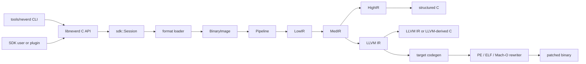

**언어**: [English](../architecture.md) | [简体中文](../zh-CN/architecture.md) | [繁體中文](../zh-TW/architecture.md) | [日本語](../ja/architecture.md) | [한국어](architecture.md) | [Français](../fr/architecture.md) | [Deutsch](../de/architecture.md) | [Español](../es/architecture.md) | [Italiano](../it/architecture.md) | [Русский](../ru/architecture.md) | [العربية](../ar/architecture.md)

[← 문서 인덱스](README.md)

# NeverD 아키텍처

이 가이드는 기여자가 NeverD를 안전하게 변경하는 데 필요한 프로덕션 경계를
설명합니다. 의도적으로 NeverD 소유 코드만 다루며 LLVM, Capstone, Unicorn
서브모듈은 각자의 내부 아키텍처를 유지합니다.

## 시스템 경계

```mermaid
flowchart LR
  CLI["tools/neverd CLI"] --> CAPI["libneverd C API"]
  SDKUser["SDK user or plugin"] --> CAPI
  CAPI --> Session["sdk::Session"]
  Session --> Loader["format loader"]
  Loader --> Image["BinaryImage"]
  Image --> Pipeline["Pipeline"]
  Pipeline --> Low["LowIR"]
  Low --> Med["MedIR"]
  Med --> High["HighIR"]
  High --> HighC["structured C"]
  Med --> LLVM["LLVM IR"]
  LLVM --> LLVMOut["LLVM IR or LLVM-derived C"]
  LLVM --> Codegen["target codegen"]
  Codegen --> Rewriter["PE / ELF / Mach-O rewriter"]
  Rewriter --> Patched["patched binary"]
```

NeverD에는 네 가지 IR 표현이 있지만 반드시 네 단계를 모두 거치는 단일 순서는
아닙니다. `LowIR -> MedIR`은 공통입니다. 구조화 디컴파일은
`MedIR -> HighIR -> C`를 사용하고, `lift`, `decompile --llvm`, `patch`는
`MedIR -> LLVM IR`로 직접 이동합니다. 특히 patch와 lift 모드는 의도적으로
HighIR을 건너뜁니다.

CLI는 `tools/neverd`에서 명령을 파싱하고 `neverd_session_t`를 만든 뒤
`include/neverd/sdk/NeverDCAPI.h`의 공개 API를 호출합니다. 엔진 상태는
`lib/sdk/SessionImpl.h`에 있습니다. `neverd_session_load`가 loader를 선택해
`BinaryImage`를 만들고, IR 기반 작업은 필요할 때 `lib/pipeline/Pipeline.cpp`를
실행합니다. `neverd` 실행 파일은 `neverd_shared`에 링크되며, 구성 요소 archive와
LLVM/Capstone 의존성은 공유 라이브러리의 비공개 구현 세부 사항입니다. CLI는 명령줄
UI에 LLVM Support를 사용하지만 엔진을 구동할 때 C API를 우회하지 않습니다.

HighIR의 `HighSourceFlow`는 출력 문장의 제어 흐름 간선, 지역 변수 식별, 확정 대입 분석을 담당합니다.
소스 검증과 불필요한 PHI 복사 제거는 같은 그래프를 사용합니다. 반복되는 스칼라 조건을 제한된
영/비영 상태로 나누며, 쓰기는 기존 조건을 무효화합니다. 주소가 외부로 전달된 변수는 미지로 두고
분할 한도에 도달하면 보수적인 그래프로 돌아갑니다. 모든 가능한 문맥에서 값이 사용되지 않을 때만
PHI 복사를 제거합니다. 호출, 읽기, 쓰기의 관찰 가능한 동작과 소스 레이블은 유지합니다.

Block 소비자의 이스케이프 분석도 이 그래프를 사용합니다. 제한된 고정점 분석은 분기와 루프에서 포인터 식별 정보와 전용 스택 슬롯을 추적합니다. 합류 지점은 가능한 컨텍스트 주소를 보존하며 완전한 덮어쓰기만 이를 지웁니다. 알 수 없는 간선, 예외 흐름, 증명 예산 초과는 바인딩을 거부합니다.

Objective-C 수신자 정보는 메서드 진입점의 self와 정확한 클래스 참조를 구분합니다. 진입점을 공유하는 모든 메타데이터가 일치해야 self 정보를 설정합니다. 전체 폭 복사와 ABI가 보존하는 레지스터는 진입점 역방향 간선을 포함한 동일한 고정점 분석으로 전달됩니다. 선언 검증은 클래스/인스턴스 구분, 기록된 카테고리, 상위 클래스와 채택 프로토콜을 따르며 self에는 알려진 하위 클래스 선언도 포함합니다. 컴파일러 카탈로그는 소유자와 상속 정보를 전역 선택자 검증과 별도로 유지합니다. SDK는 소스를 내보내기 전에 현재 이미지에서 수신자의 출처와 선언을 다시 검증합니다. 이 정보는 특정 IMP를 선택하거나 바이너리 재작성을 허용하지 않습니다.
외부 상속 정보가 없으면 수신자로 범위를 좁히지 않고 전역 선택자 일치를 요구합니다. 명시적으로 미지원이거나 충돌하는 선언은 계속 거부 근거로 유지합니다.

객체 타입이 명시된 ivar는 최대 여덟 번의 전체 폭 로드로 수신자 증명을 확장합니다. 각 단계는 런타임 오프셋 슬롯, 폭, 명령이 사용한 상수 바이트 오프셋을 기록합니다. 상수는 현재 레이아웃과 일치해야 하며 런타임 참조는 이동한 필드를 따를 수 있습니다. 로더는 기록된 클래스 상속과 필드 선언을 검증합니다. 부분 접근, 타입명 없는 id, 블록, 프로토콜만 있는 타입, 모호한 저장소, 알 수 없는 기준 포인터는 클래스 정보를 제공하지 않습니다. 소스 검증은 현재 이미지에서 전체 경로를 다시 확인합니다. 타입 정보는 객체 동일성이나 메모리 연산 제거 권한을 뜻하지 않습니다.

로더는 Darwin 상수 문자열, 정수 객체, 배열과 정렬된 사전으로 이루어진 유한 비순환 그래프를 검증합니다. 컨테이너 필드와 각 간선에는 불변 매핑 저장소와 모호하지 않은 임포트 또는 재배치 증거가 필요하며, 미지원 인코딩, 순환, 불완전한 그래프는 명시적으로 실패합니다. 소스 바인딩은 그래프와 입력 포인터 슬롯을 다시 검증합니다. 생성된 도우미는 정수 비트, 자식 순서와 공유 주소를 보존하고 기존 문자열 정체성을 재사용합니다. 컨테이너 슬롯은 검증된 자식 도우미만 호출하여 acquire/release 방식으로 한 번 초기화하고 공개합니다. 각 도우미는 자식 선언을 포함하므로 독립적으로 복원한 메서드가 하나의 정의를 공유할 수 있습니다. 이식 가능한 테스트는 손상된 입력과 증명 예산을 다루며, 네이티브 컴파일러 픽스처는 원본 메서드와 내용, 별칭, 복사 정체성, 동시 초기화를 비교합니다.

## IR 표현 및 경로

실험적 [인터프리터 복원 단계](interpreter-recovery.md)는 공통 MedIR 경계 이전에 엄격하게 리프트한 LowIR을 특수화합니다. provider는 불변 이미지의 근거를, `SymExec`는 명령어 의미론을 담당하며 잔여 CFG는 일반 SSA와 소스 백엔드를 재사용합니다. 복원 근거는 네이티브 명령어 인스턴스 및 바이너리 patch 증명 정보와 별도로 유지합니다.

`InterpreterSpecialization`은 실패한 시도 이후의 유한한 역방향 비트 요구 전파를 담당합니다. 스칼라 평가기를 재사용하며 그래프의 사실을 바꾸거나 제어 필드 및 컨텍스트를 추가하지 않습니다. 모든 작업에는 예산이 적용되고 게시에는 새로운 완전한 증명이 필요합니다.

후속 메모리 요구가 바이트 조각만 사용하면 문맥 정밀화는 이미 추적 중인 8바이트 주소 저장 영역을 추가 후보로 지정할 수 있습니다. 기존의 좁은 생성자 좌표가 기준이며, 입증된 상수나 프레임 오프셋으로 키를 만드는 책임은 큐 삽입 로직에만 있습니다.

유한 값 열거는 증명 쿼리를 변경하지 않고 실행 가능한 튜플을 관찰할 수 있습니다. 관찰자가 거부하면 튜플이 없는 불완전한 결과를 반환합니다. 캐시는 수학적 도메인 증명만 유지하며, 불변 읽기 인증서는 열거가 완료될 때까지 로컬에 보관합니다.

`NeverDLoader`가 `PEFixedImageView`를 소유하며 완전한 베이스 재배치 파서를 일반 PE 로드와 공유합니다. 바이너리 인터프리터 어댑터는 인증된 기본 베이스 뷰를 복구와 네이티브 증명에 사용하며 PE 테이블을 직접 파싱하지 않습니다. 준비 단계에서 가져오기 쓰기 범위, 매핑 식별 정보와 완전한 원시 필드를 검증한 뒤 바이트를 인증합니다. 뷰는 변경되지 않는 이미지를 빌려 쓰며 ASLR이나 초기화의 동등성을 주장하지 않습니다.

`LowFunc::FunctionTemporaries`는 오프셋순으로 정렬되고 겹치지 않으며 진입 시 정의되지 않은 바이트 범위를 선언합니다. 복구기는 유한 분기가 명령 경계를 넘기 전에 임시 간접 대상을 예약된 함수 내부 슬롯에 한 번만 저장합니다. 공통 관계 검사기는 현재 경로에서 실제로 정의한 바이트만 유지하며 일반 네이티브 임시 값은 명령마다 만료됩니다. 범위 메타데이터와 스냅샷 생성은 예산에 포함되고 인증서 의미 스키마 15이 수명을 바인딩합니다. 원시 상태 모델은 바이트 의미를 보존하며 소스 생성은 슬롯 전체와 정확히 일치하는 피연산자를 요구하고 바이트 별칭을 거부합니다. 귀납적 루프 검사는 검증된 진입 접두부의 정확한 정의 바이트 집합을 유지합니다. 명시적 `FunctionTemporary` 입력과 대입은 해당 LowIR 쪽에서 선언되고 접두부에서 정의된 바이트의 변화만 표현합니다. 각 매개변수는 구성 상태에서 다시 투영되어야 하며 모든 도착에서 값과 정의 상태를 검사합니다. 추론은 부분 및 비정렬 범위를 포함한 실제 정의 바이트만 묶고, 결합 계획은 양쪽 이름 공간을 분리합니다. 네이티브 제안은 후보 쪽에만 이 슬롯을 바인딩합니다. 증명 스키마 17에서도 범위 완전성, 관측, 순위 및 예산 검사가 필수입니다. 선언은 저장소를 초기화하거나 일반 네이티브 ABI를 확립하지 않습니다.

`FrameOffsets`는 예산이 적용된 진입 상대 변위의 단일 값 증명을 담당합니다. 복구기는 잔여 주소 표현식을 바꾸지 않고 실제 기호 메모리 접근을 정규화하며, 네이티브 검사는 두 실행의 주소 동일성을 유지합니다. 모든 정렬 분기와 공유 재시도 예산은 복구기가 관리합니다. native/LLVM 분할 증명 집계는 별도의 미완료 작업입니다. `NativeStackControl`은 내부 부호 없는 16비트 반환 정리를 담당하고 바이너리 제공기는 8바이트를 팝하는 정규 인코딩을 인증합니다.

관계 검사기의 프레임 변위 증명은 기존의 제한된 `FiniteQueryCache`를 재사용합니다. 복구와 같이 키 생성과 보관 증명은 `MaxSymbolicNodes` 워드로 제한됩니다. 키는 전체 술어와 상대식 관계를 보존하며 완료된 영역 또는 증명된 비유일성만 재사용합니다. 각 접근의 주소 독립성과 프레임 경계 검사는 유지됩니다.

방문한 노드의 임시 인덱스는 밀집 맵을 사용합니다. 직렬화는 계속 순서가 정해진 순회를 따르므로 테이블 확장과 해시 순서는 키, 변수 이름 변경, 예산 계산을 바꾸지 않습니다.

관계 검사기는 실제 불변 추가 전용 기호 컨텍스트와 고정 솔버 설정 안에서 정확히 같은 술어 참조의 완료된 모델 없는 SAT/UNSAT 응답을 저장합니다. 압축 표는 `MaxSymbolicNodes` 범위 안에서 노드당 2비트를 쓰며 두 번째 질의가 완료된 뒤에만 할당합니다. 모든 조회는 먼저 노드 한도를 검사합니다. 즉시 반복은 기존의 비용 없는 빠른 경로를 유지하고, 다른 모든 적중은 인코딩과 탐색을 생략하기 전에 논리 질의 한 회를 소비합니다. 확장 중에는 이전 할당과 새 할당이 잠시 함께 존재할 수 있습니다. Unknown/Invalid 응답, 모델, 변경 가능한 탐색 상태는 보관하지 않습니다. 재사용은 검사기 수명에 한정되며 독립 최종 검사기는 비어 있는 상태로 시작합니다. 다른 술어에는 여전히 완전한 증명이 필요합니다.

네이티브 조건 분기는 분기 대상과 다음 명령의 실행 가능성 질의 사이에서 모델을 만들지 않는 인코더 하나를 공유합니다. 각 질의는 별도의 가정 아래 완전한 술어를 검사하며 인코딩 재사용은 해당 분기에서 끝납니다. 따라서 이전 분기의 절이 이후 분기의 탐색에 누적되지 않습니다. 기존의 새 인코더 재시도는 예산에 포함되고 인코딩 게이트 소진에만 적용됩니다. 탐색 예산 소진과 잘못된 입력은 계속 거부하며 질의, 노드, 관측 예산도 유지합니다.

`FrameOffsets`는 유한 열거 전에 상수 또는 기호 덧항을 갖는 이항 덧셈, 마스크와 일치하는 분할 레지스터 조각을 정확한 모듈러 나머지 식으로 줄입니다. 정렬에서는 프레임 루트 전체 대신 지워진 하위 비트만 추출합니다. 기호 인덱스는 루트나 경로 술어에 대한 의존성을 포함하여 온전히 유지합니다. 두 피연산자 선택은 총 16회의 검사 예산을 공유하며 새 DAG 노드도 예산에 포함합니다. 원래 경로 술어, 단일값 영역 증명, 매핑/프레임 경계와 불완전 결과 거부는 유지됩니다. 나머지나 도달 가능성을 가정하지 않고 잔여 주소 식도 바꾸지 않습니다.

`LowIRIndependenceFrame::EntryAlignment`는 선택적인 2의 거듭제곱 진입 루트 합동 조건을 선언합니다. 공유 검사기는 실행과 귀납 전에 하위 비트 조건을 진입 상수, 비순환 범위 및 제외 범위와 교차하며 루트를 재작성하지 않습니다. 잘못되거나 해가 없는 영역은 인증서를 만들지 않습니다. 네이티브 API는 복구 옵션의 동일한 조건과 유효한 RSP 루트를 요구합니다. LLVM 조합의 두 새 증명도 같은 영역과 모든 상태·상태 코드·보존 의무를 유지합니다. 공통 다이제스트는 의미 스키마 13로 존재 여부·정렬·나머지를 묶으며 객체 캐시는 바뀌지 않습니다. 메모리 접근성, 프레임 독점성, 네이티브 ABI나 자동 분할 집계를 인증하지 않습니다.

일반 의존성 탐색이 더 진행되지 않으면 함수 진입점을 제외한 네이티브 위치와 명령 모드마다 기존 레지스터 컨텍스트 필드 하나를 분할할 수 있습니다. 진입 도메인은 완전하고 여러 값을 포함하며 선언된 모든 비트를 포괄해야 합니다. 실제 선행 간선마다 현재의 완전한 도메인을 독립적으로 증명하고 살아 있는 물리 필드를 비교해 각 경우를 다시 투영합니다. 후속 선행 간선과 확장된 노드도 다시 검사하며 지정된 진입점에서는 연결을 멈춥니다. 비교는 합성 출처를 가지며 노드, 연산, 컨텍스트, 질의, 정밀화 예산을 공유합니다. 부분 마스크, 미정의 플래그, 프레임 전용 필드는 제외합니다. 게스트 읽기나 호출자 가정을 추가하지 않습니다. 불완전한 도메인은 보수적인 간선을 유지하며 도달 가능한 모든 경우가 완료되어야 결과를 게시합니다.

제어 및 가드 정밀도 개선을 선택적 프레임 분할 재시도보다 우선하며 필요한 추가 분할은 유지합니다. 나머지별 고정점을 순서대로 계산하지만 모든 허용 나머지가 완료되어야 결과를 공개합니다. 명시적 정렬 영역과 분할 영역의 교집합을 사용하고 실제 나머지를 비교합니다. 컨텍스트, 연산, 노드 및 솔버 예산은 재시도 간 공유하며 한도를 유지합니다. 머신 상태 복원은 `--vm-entry-alignment=A:R`로 진입 RSP 합동 조건을 명시하고 실행 시 검사합니다. `A`는 양의 2의 거듭제곱이며 `R < A`여야 합니다. 다른 진입 값은 게스트 메모리 접근이나 상태 쓰기 전에 상태 2를 반환합니다. 주소 상위 비트는 자유롭고 기본값은 정렬을 가정하지 않습니다. 이 옵션은 네이티브 동등성 인증을 제공하지 않습니다.

공유 `SymContext::constantWindow`는 결과의 모든 비트가 상수임을 증명한 경우에만 비트 연산 구간의 값을 반환합니다. 기존 추출, 단일 연결 피연산자 안에 완전히 포함된 구간, 0 확장과 비트 연산을 추적하며 알 수 없는 XOR 입력과 산술 올림은 추측하지 않습니다. 결과는 64비트, 재귀는 32단계, 작업량은 256단위로 제한됩니다. 노드 방문, 깊이 제한에 따른 거부, 연결 피연산자 검사마다 비용을 계산하고 상수 복사에는 원본 전체의 64비트 워드 수도 부과합니다. 증명이 불완전하면 상수를 반환하지 않습니다. `SymState`는 이 읽기 전용 질의로 레지스터와 임시 공간의 상수 바이트를 내보내며, 저장된 표현식과 전체 워드 재구성은 원래의 표현식 정체성을 유지합니다. 메모리 영역은 리터럴 상수 바이트만 내보냅니다. 도출한 부분 메모리 정보를 미리 추가하면 후속 입력의 출처가 조각나고 제어 상태 탐색 작업량이 늘어날 수 있습니다.

`SymState`가 명시적 분리 계약 아래 각 STORE의 기존 바이트 보존을 담당합니다. 실제 STORE는 실행되며 다른 메모리 영역, 무효화 세대 및 미지 값의 기본 상태는 쓰기 이후 상태를 유지합니다. 누락된 바이트를 읽거나 초기화하지 않습니다. `SymExec`는 일반 STORE 한 번에만 계약을 적용합니다. 복원 계층은 범위 내 완전한 아핀 슬롯과 출처 사실을 별도로 유지하고 합류는 보수적으로 처리합니다.

`StringTransfer`는 제한된 순차 스칼라 변환을 담당합니다. 복구 계층은 값 증명, 공유 예산 및 완전히 복사된 프레임 포인터의 재인증을 담당하며, 생성된 접근은 기존 메모리 검사를 재사용합니다.

제어 의존성 순회는 분석이 완전히 끝난 경우에만 루트의 비트 의존성을 보고합니다. 증명된 상대 주소에서 상위 비트가 최소 32개 자유롭게 남아 있으면 복원은 선택적인 이미지 주소 열거를 생략할 수 있습니다. 이는 도달 가능성을 증명하지 않으며 메모리 접근도 제거하지 않습니다.

전체 폭의 아핀 제어 값 투영에도 같은 루트 의존성 분석을 사용합니다. 분석 결과는 하나의 간선 조건에만 유효하며, 너무 큰 값 집합은 수학적 증명 캐시에 들어가지 않는 불완전한 거부 결과를 만듭니다. 좁은 마스크로 재시도합니다. 기존 실행 가능성 처리는 독립적으로 유지되며, 값 집합의 거부만으로는 간선의 도달 가능성이나 불가능성을 증명할 수 없습니다.

유한 질의 캐시는 직렬화된 키, 수치 결과, 사용 순서 메타데이터를 하나의 저장 한도에 계산합니다. 기록을 제거하기 전에 후보 전체를 검증하고 단독으로 수용 가능한지 확인합니다. 키는 안정적인 맵 노드가 소유합니다. 적중은 사용 순서를 갱신하고 제거 후에도 유효한 독립 소유 결과 사본을 반환합니다. 캐시 객체는 복사하거나 이동할 수 없습니다. 교체는 증명 재사용만 바꾸며 질의 의미나 결과 수용 조건은 바꾸지 않습니다.

`InterpreterSpecialization`은 결합 제어 관계와 독립적인 유한 필드 영역을 모두 관리합니다. 간선 투영은 완전한 열별 증명만 기록하며, 합류는 마스크의 교집합과 다시 마스크를 적용한 값의 합집합을 구합니다. 노드를 재구성할 때 동일한 심볼릭 상태를 초기화한 뒤 영역 제약과 결합 술어를 논리곱으로 연결하여 프레임 정체성과 제한되지 않은 비트를 보존합니다. 모든 결합 튜플이 포함된다는 정확한 검사로 함의가 확인된 소속 제약만 생략할 수 있습니다. 이 정밀도 정책은 컨텍스트 키나 네이티브 반환 검증을 바꾸지 않습니다.

`FrameEntryConstraints.h`는 복구와 관계 증명이 공유하는 주소 비순환 조건을 관리합니다. `InterpreterSpecialization`은 한도 내 유일 전이 연결과 확정된 순서의 재생을 담당합니다. 이 C++ 옵션은 기본적으로 꺼져 있으며 증명 계약 비교와 해시 결합은 바이너리 어댑터가 담당합니다.

`modelInterpreterMachineStateX64`와 소스 래퍼는 게스트 레지스터 부분 영역, 패킹된 플래그, 프로파일 상태, 제어 흐름을 위한 생성기를 공유합니다. 모델은 상태 객체 접근만 명시적 레지스터 바이트로 바꾸며 상태와 게스트 RAX를 분리합니다. 컴파일러 의미론이나 증명 정책을 소유하지 않으며 진입 영역, 관찰 항목, 프레임 계약과 완전한 정제 검사는 호출자가 담당합니다.

`NeverDLLVMInterpreterModel`은 동일한 원시 상태 ABI로 별도의 유계 스칼라 LLVM 가져오기를 담당합니다. `modelLLVMInterpreterMachineStateX64`는 실제 상태 반환과 명시적 정의성 검사를 유지합니다. `llvmInterpreterMachineStateContract`는 전체 관찰값과 0인 감시 바이트의 보존 의무를 제공하며 도메인, 메모리, 완전한 증명은 호출자 책임입니다. 일반 리프팅이나 소스 게시를 변경하거나 컴파일러를 증명하지 않습니다.

`modelLLVMScalarFunction`은 같은 가져오기 구현을 재사용하여 순수 `noundef` 정수 인자와 정수 반환값(`i1/i8/i16/i32/i64`)을 처리합니다. 공유 모델은 funnel shift의 끝점과 두 배 폭 곱을 통한 곱셈 오버플로 제약을 처리합니다. `checkLLVMScalarEquivalence`는 두 모델을 `SymExec`로 실행하고 제어에 영향을 주는 입력 비트의 모든 조합을 확인하며 나머지 비트는 기호로 유지합니다. 모든 반환값이 같고 실행한 모든 연산이 정의되어야 합니다. 분할, 경로, 노드와 누적 작업 예산이 쿼리를 제한합니다. `SymContext::constantWindow`는 기존 개별 쿼리 한도를 유지하면서 누적 작업량을 계산합니다. 거부 결과는 재작성을 허용하지 않습니다. 이 읽기 전용 C++ 쿼리는 기본 소스 출력을 바꾸거나 영구적인 네이티브 ABI·컴파일러 증명을 제공하지 않습니다.

`projectLLVMScalarResult`는 구조체·배열의 `insertvalue`를 통해 명시적으로 선택한 정수 반환 필드와 비트 구간을 복제합니다. 모든 인수, 제어 흐름, 스칼라 연산, 주석 및 `assume` 호출을 유지하고 사용되지 않는 집계 포장만 제거한 뒤 공유 스칼라 모델로 검증합니다. 구성과 모델 예산은 별개이며 지원하지 않는 계약이나 예산 소진 시 모듈을 게시하지 않고 입력도 변경하지 않습니다. 필요한 상태·값·보존 상태 관측마다 완전한 증명이 필요하며, 필드 선택만으로 진입·프레임·네이티브 ABI 계약을 확립하지 않습니다.

`projectLLVMScalarInputs`는 사용하지 않는 SSA 매개변수만 제거하고 원래 인덱스의 오름차순 매핑을 반환해 명시적 스칼라 인터페이스를 만듭니다. 결과 투영의 제한된 복제와 스칼라 검증을 재사용한 뒤 전체 복제 본문을 축소된 시그니처로 옮기며 생략한 입력을 상수로 바꾸지 않습니다. 죽은 산술, 주석, assume, 제어 흐름과 사용 중인 모든 인수를 유지하고 패키징 제거 및 디버그 참조 재연결은 거부합니다. 구성은 하나의 누적 예산을 사용하며 거부 시 모듈과 매핑을 모두 반환하지 않습니다. 정의성·종료·네이티브 ABI 인증이 아니므로 재컴파일 후보를 전체 원래 시그니처에 다시 연결하고 기존 진입·프레임·관측 의무를 유지해야 합니다.

`projectLLVMScalarState`는 명시적으로 초기화된 상태 객체를 모든 입력 셀, 진입 마스크, 값 및 보존 상태 관측을 유지하는 스칼라 인터페이스로 바꿉니다. 공유 가져오기 계층이 포인터, 정렬, 소스 계약을 검증하고 외부 메모리와 관측 가능한 상태 주소를 거부합니다. 마스크를 적용한 부분 쓰기와 mem2reg는 제어 흐름과 스칼라 의무를 유지합니다. 필드 0은 원래 상태 코드이며 반환 범위는 공유 규칙에 따른 검증 대상 `assume`이 됩니다. 구성과 모델 예산은 별도이며 거부 시 입력은 그대로입니다. 현재 리틀 엔디언의 정수형 64비트 포인터/인덱스만 지원합니다. x64 팩터리는 상태 의미론 소유 계층의 플래그 마스크와 명시적 진입 정렬을 사용하며 관측이나 네이티브 ABI를 추론하지 않습니다.

`SymKnownBits`는 같은 인자, 확장되지 않은 마스크, 버리는 비트가 0이라는 근거로 평탄화된 마스크 복사본을 인식합니다. 부호 없는 비교는 최댓값이 순환하지 않는 직접 항의 범위 합을 사용할 수 있습니다. 쿼리 과금과 한도를 유지하고 DAG를 바꾸지 않습니다. LLVMC는 bundle 없는 `llvm.assume`을 조건을 한 번 평가하고 거짓 분기를 도달 불가능하게 만드는 식으로 출력하며 지원하지 않는 bundle은 거부합니다. 객체 파이프라인 schema 16이 새 규칙을 식별합니다.

`SymContext::mkConcat`는 리터럴 0 접두부를 `ZExt`로 정규화하고 연결을 묶을 때 기존 0 확장을 펼칩니다. 하위 값과 상위 0을 따로 저장한 뒤 재구성한 워드도 명시적 0 확장과 같은 표현을 사용합니다. 알 수 없는 비트, 0이 아닌 비트와 내부 상위 비트는 계속 관측됩니다. 기존 루프 점화식 매칭이 좁은 덧셈을 인식하며 추론 예산과 전체 검사기는 바뀌지 않습니다. 객체 파이프라인 schema 16이 이 공유 정규화 절차를 식별합니다.

논리 오른쪽 시프트는 보존 비트 구간 전체에서 중립으로 증명된 직접 AND/OR/XOR 항을 제거할 수 있습니다. 최대 8항·128비트로 제한하고 상수 구간 조회에 256 작업 단위를 공유합니다. 시프트 분배나 DAG 확장은 하지 않습니다. 알 수 없는 항, 전체 시프트 카운트 및 LLVM 정의성 의무는 유지합니다. 객체 파이프라인 schema 16가 두 캐시 식별자에 이 절차를 반영합니다.

`SymKnownBits`는 공유 기호 DAG의 산술 비트, 확장 항등 관계, 래핑 없는 합의 순서에 대한 제한된 읽기 전용 분석을 담당합니다. 한도는 쿼리당 작업256, 깊이32, 폭128, 캐시65,536개이며 캐시 적중과 피연산자 검색도 계산합니다. 각 스칼라 실행기의 캐시는 불변 입력 분할 안에서만 사용되고 `constantWindow`와 쿼리 한도를 공유합니다. 알 수 없는 연산은 보수적으로 처리하며 LLVM 정의성 의무는 가져오기 계층이 계속 생성합니다. 기호 생성기는 같은 폭의 제로 확장을 비트 연산과 논리 오른쪽 시프트 바깥으로 모으되 상수의 상위 비트와 전체 시프트 횟수를 보존합니다. ABI를 추론하지 않으며 루프 변환에는 완전한 증명이 필요합니다. MBA 추상화는 공유 불투명 입력 위에서 확장된 AND/OR/XOR 표현을 복구하며, 기존 예산 안에서 좁은 산술 연산과 비트 반전의 경계를 보존합니다.

`NeverDLLVMScalarLoopRecovery`는 이 스칼라 영역에서 명시적으로 활성화하는 루프 복원을 담당합니다. 대상 함수와 필요한 내장 함수 선언만 복제하고 원본의 전체 제어 영역을 증명한 다음, 첫 반복과 루프 상태의 재배치, 0회 반복 영역 제거, 루프 머리 조건, 아핀 상태 후보를 생성합니다. 데이터를 0으로 두는 사전 검사는 원본 제어 영역을 모두 다루지만 후보를 거부하는 용도로만 사용합니다. 채택하려면 나머지 모든 입력 비트를 심볼릭으로 유지한 함수 전체 증명이 필요하며, 추가 제어 비트는 거부합니다. 끝 조건, 루프 PHI, 명령 수의 사전식 비용으로 후보를 선택합니다. 구성·증명·후보 수·변환 수 예산은 누적되며 소진되면 부분 결과를 공개하지 않습니다. 원본은 변경하지 않습니다. C++ 검색은 증명된 후보를 제공하지만 네이티브 ABI를 인증하지 않습니다.

루프 조건 복구는 모든 외부 진입의 술어와 지배하는 루프 불변 경계가 같고 상수 초기값이 정수 헤더 PHI와 맞을 때만 불리언 PHI를 정수 비교로 바꾸는 후보를 만듭니다. 같은 폭, 영 확장, 부호 확장은 별도 후보이며 경계 절단을 추측하지 않습니다. 진입 간선 검색도 계산합니다. 진입 일치는 귀납 증명이 아닙니다. 교체 전에 전체 원본 증명으로 모든 실제 역방향 간선, 기호 데이터, 정의 가능성과 종료를 보존해야 합니다.

복잡한 종료 조건은 상수 간격의 헤더 PHI와 불변 경계 또는 그 앞뒤 한 단계의 동등 비교를 제안할 수 있습니다. 탐색은 값 32개와 대기열 피연산자 64개로 제한하며 조건을 지배하는 같은 폭의 불변 말단을 최대 4개 고릅니다. 다른 PHI에서는 탐색을 멈춥니다. 분기 극성과 공유 조건의 모든 사용을 보존하며, 의존성만으로 범위·나누어떨어짐·종료를 가정하지 않고 전체 원본 증명을 요구합니다. 접두 복구는 후보에서 미사용 매개변수를 건너뛰되 서명과 모든 입력에 대한 증명을 유지합니다.

`recoverLLVMScalarSource`는 `NeverDLLVMScalarLoopRecovery`에서 준비 단계와 루프 탐색을 결합합니다. 제한된 LLVM 및 조건식 정리로 별도 후보를 만든 뒤 원본 함수 전체와의 동등성을 증명해야 탐색할 수 있습니다. 복원과 정리를 계속한 경우에도 최종 본문을 원본과 비교해 증명합니다. 경계 질의에는 별도 작업 상한이 있고 모든 질의는 총 증명 예산을 공유합니다. 정리 횟수와 탐색 예산은 누적되며 소진 시 부분 모듈을 반환하지 않습니다. InstCombine의 반복 상한은 명시적이며 고정점 도달 대신 증명이 후보를 승인합니다. LLVMC는 대상 탐색과 공유 결과 게시만 담당합니다. 함수 서명과 네이티브 ABI 주장은 바뀌지 않습니다.

소스 준비는 LLVM 공통 표현식 끌어올리기를 제안하고 비공개 복제본에서 명령 poison 플래그를 제거한 뒤 술어를 찾습니다. 스캔은 명령별로 계산합니다. 원래 플래그와 죽은 연산은 전체 원본의 증명 의무로 남으며 인수·호출 계약과 assume은 완화하지 않습니다. 독립 술어 패스는 주석이 있는 산술에 보수적 규칙을 유지합니다. 정리나 플래그 제거 성공만으로 후보를 공개할 수 없습니다.

스칼라 동등성 검사는 중간 쓰기의 데이터를 기호 상태로 유지합니다. 제어와 정의성의 DAG는 필요할 때 정규화하며, 반환값은 먼저 동일성과 제한된 사실을 확인하고 필요하면 반환 DAG만 정규화합니다. 죽은 산술과 주석을 포함한 모든 원본 연산은 실행됩니다. 양쪽 실행, 정규화와 최종 재검사는 동일한 누적 예산과 지역 한도를 공유합니다. 질의 시점만 바뀌며 입력 영역, 증명 의무와 루프 탐색 한도는 유지됩니다.

`SymSimplifyPass::simplifyFiniteValues`는 기존의 정확한 두 값 단순화 단계와 작업량을 제공합니다. AND는 최대 여덟 논리곱 항에서 단일 비트 상수 마스크를 찾을 수 있지만 다른 피연산자와 poison 의존성을 포함한 전체 루트 SSA 값을 기준으로 유지합니다. 논리곱 탐색은 OR, 산술, PHI를 넘지 않습니다. 스칼라 준비는 모듈러 조건식 처리 전에 이 단계를 실행하며 동일한 누적 구성 예산에서 차감합니다. 미완료 조각은 사실을 제공하지 않으며 게시에는 여전히 원본 전체의 증명이 필요합니다. 공유 최적화 변경은 객체 파이프라인 schema 16에 반영됩니다.

더 넓은 PHI/select 값에는 별도 폐쇄 탐색을 사용해 모든 역방향 간선을 포함한 최대 32개 값과 64개 복사 간선을 검사합니다. 상수와 기존의 완전한 두 값 범위를 합친 대안은 정확히 두 개여야 하며 각 순환 성분은 허용된 생성 노드에 도달해야 합니다. 알 수 없는 생성자, 세 번째 값, 초기 생성자가 없는 순환은 거부합니다. 원래 병합 값을 SSA 관측으로 유지하고 조건과 poison 의존성을 보존하며 서로 다른 관측을 연관 짓지 않습니다. 탐색과 생성자 전파는 기존 유한 값 예산에서 차감합니다.

루프 헤더 PHI의 상수 AND 마스크는 0 또는 마스크를 적용하지 않은 PHI를 후보로 제안합니다. 초기값과 마스크 후보는 최대 32개 배치를 공유하며 실패한 배치를 나눕니다. 전체 데이터 증명이 우선 후보를 거부하면 선별을 통과한 대안을 다시 시도합니다. 승인하는 모든 조합은 원본 함수 전체와의 완전한 증명이 필요하며, 마스크 자체를 범위 가정으로 삼지 않습니다. 작업량은 누적되고 예산 소진 시 부분 결과를 공개하지 않습니다.

공유 기호 생성기는 직접 상수 또는 명시적으로 마스크된 모든 항이 외부 마스크 밖에 설정된 비트를 갖지 않을 때 OR/XOR 바깥의 AND 마스크도 제거합니다. 검사는 최대 8개 항과 128비트로 제한하며 재귀 탐색이나 식 전개를 하지 않습니다. 알 수 없는 비트가 있으면 마스크를 유지합니다. 객체 파이프라인 schema 16은 두 캐시 식별자에 이 단순화 규칙을 반영합니다.

같은 `Function` 객체의 자기 동등성 질의에서 `checkLLVMScalarEquivalence`는 모델 하나만 가져와 각 분할에서 한 번 실행합니다. 제어와 정의 여부를 필요할 때 단순화하며 같은 값을 비교하기 위해 중간 데이터를 정규화하지 않습니다. 모든 연산, 입력 조건, 제어 분할과 종료 검사는 기존 상한 아래 유지됩니다. 다른 함수는 둘 다 실행하며 이름이나 이전 질의를 재사용 가능한 증명으로 취급하지 않습니다.

제어나 정의 여부의 제한된 단순화가 미확정이면 입력 비트를 찾기 전에 필요한 표현식 DAG를 자식부터 부모까지 반복적으로 정규화합니다. 공유 기호 생성기와 별도의 제한된 사실 캐시를 사용하며, 실행을 재생하거나 공유 항을 트리로 펼치지 않습니다. 피연산자 방문, 재구성, 비트 질의는 같은 누적 작업 예산을 사용하고 기존 노드 및 개별 질의 한도를 유지합니다. 완전한 의존성 결과가 비어 있으면 상수 평가가 허용되며, 반환값 누락이나 증명 의무 생략을 뜻하지 않습니다. LLVM 주석은 가정이 아니라 항상 증명할 조건입니다.

내부 폭 후보는 변경하지 않는 함수 인터페이스의 가장 큰 정수 폭을 사용합니다. 복제는 정수 리터럴의 비트 패턴을 명시적으로 매핑하고 동일 타입 변환을 제거하며 intrinsic 시그니처를 보존합니다. 이 폭은 후보일 뿐이며 원본 함수 전체 증명으로 상위 비트, 부호 있는 순서, 시프트, 정의성 및 종료를 보존해야 합니다. 탐색·매핑·정리는 공통 구성 예산을 사용하며 이득이 없거나 예산이 소진된 후보는 결과를 게시하지 않습니다.

루프 PHI의 시드 대체 후보는 모든 외부 진입이 같은 SSA 값을 제공하고 시드가 PHI를 지배할 때만 제안합니다. 거부 전용 선별로 최대 32개를 묶어도 배치 수락에는 원본 함수 전체 증명이 필요합니다. 실패한 배치는 분할하고 실패 후보의 재시도는 해당 검색에서만 미룹니다. 모든 역방향 간선, 동시 PHI, 정의성 및 종료성 의무는 유지합니다. `WorkLimitExceeded`는 전역 작업 예산 초과와 정확한 예산 경계의 일반 거부 또는 지역 질의 상한을 구분합니다. 예산 소진 시 부분 결과를 게시하지 않습니다.

공유 기호 계층은 논리 오른쪽 시프트가 버리는 하위 비트만 바꾸는 상수 AND 마스크를 제거합니다. 상수 카운트는 전체 부호 없는 값을 확인한 뒤 정규화하며, 산술 초과 시프트는 부호 비트에서 포화합니다. 변수 카운트와 LLVM poison 의무는 유지합니다. 객체 파이프라인 스키마 13은 두 캐시 식별자에서 새 단순화 절차를 구분합니다.

루프 후보는 실제 진입점을 지배하는 가드와 스칼라 경계도 사용하며, 분리된 latch에서 header로 돌아가는 간선을 처리합니다. 좁은 마지막 인덱스의 순환이 0회 실행을 보존한다고 가정하지 않습니다. 단위 간격 점화식을 기준으로 우선하고 각 그룹 내부의 원래 순서를 유지하며 선형 작업량을 예산에 반영합니다. 가드 경계의 0 확장 또는 절단은 후보일 뿐이며, 부호 있는 비교, 순환 및 마지막 갱신도 원래 함수 전체의 증명이 필요합니다.

이미지나 디버그 투영을 요청하지 않으면 LLVMC가 스칼라 루프 복원을 자동 호출합니다. 제한된 스캔은 함수당 최대 1024개 블록을 허용합니다. 복원과 LLVM 정리는 모듈 공유 예산으로 반복하며 최종 본문을 공유 임포터와 SymExec로 원본 함수에 대해 다시 증명합니다. 출력기 복사본만 변경하고 함수 정체성, 속성, 호출자와 내장 함수 연결을 유지합니다. 기호 충돌, 외부에 보관된 블록 주소, 함수 메타데이터와 예외 매핑은 기존 경로를 유지합니다. 거부 또는 예산 소진 시 중간 함수를 내보내지 않으며 단일 함수 출력은 선택된 대상만 정규화합니다. 네이티브 입력 인터페이스나 메모리 비공개성은 추론하지 않습니다.

스칼라 후보를 증명한 뒤 LLVMC는 `SymSimplifyPass::simplifyPredicates`를 재사용해 새로 드러난 모듈러 산술 조건을 처리합니다. 기존의 정확한 단계는 poison, 입력 안정성 및 개선 효과 검사를 유지하고 유도 작업량을 반환합니다. LLVMC는 이를 누적 구성 예산에 반영하며 호출당 최대 65,536 단위를 허용합니다. 이어서 InstCombine, LICM, CSE가 루프 불변 경계와 동등한 카운터 갱신의 단일 SSA 식별자를 드러내 다음 복원 단계에 전달합니다. IR을 직접 수정하면 캐시된 분석을 무효화합니다. 술어 단계는 솔버를 사용하지 않으며, 원래 함수 전체와의 최종 동등성 증명은 여전히 필수입니다.

`SymKnownBits`는 마스크가 제거하는 모든 비트가 알려진 0이면 원본 값과의 동등성도 증명합니다. 부호 있는 시프트의 왕복은 정확한 원본, 2의 거듭제곱 인수, 전체 시프트 횟수가 일치하고 버리는 비트와 남는 부호 비트가 모두 0 또는 모두 1이어야 합니다. 이 제한된 읽기 전용 관계는 쿼리 작업량을 소비하며 DAG를 확장하거나 데이터를 열거하거나 LLVM의 no-wrap 플래그를 가정하지 않습니다.

`SymKnownBits`는 기저 값이 일치하고 더 큰 곱이 부호 없는 래핑을 일으키지 않음을 증명한 뒤에만 스칼라 배수의 순서를 비교합니다. 하위 워드 곱의 동등성은 모듈러 계수와 인수의 중복 횟수를 모으며, 요청한 비트 폭을 유지하는 확장만 통과합니다. 더 좁은 연산의 오버플로 경계는 그대로 둡니다. 양쪽 유도, 대기 인수, 매칭을 기존 작업량·깊이 예산에 반영하며 분석은 읽기 전용으로 유지됩니다.

공유 LLVM 가져오기는 정규 형식이며 피연산자 번들이 없는 `llvm.assume(i1)` 호출을 허용하고, 해당 위치에 도달하면 조건이 참이어야 한다는 의무를 기존 정의성 상태에 기록합니다. 스칼라 및 머신 상태 증명은 입력 영역을 줄이거나 조건을 이미 증명된 사실로 취급하지 않고 이를 검사합니다. 추가 호출/선언 계약과 undef/poison은 계속 거부하며 입력 IR과 증명 예산을 유지합니다. 이는 네이티브 ABI 인증이 아닙니다.

가져오기는 올바른 형식의 `llvm.loop.peeled.count`를 부호 없는 i32 최적화 이력 카운터로 허용합니다. 반복 횟수 상한, 입력 제한, 종료 또는 정의성의 근거로 사용하지 않습니다. 루프 식별과 속성 피연산자 수를 검사하며 잘못되거나 알 수 없는 속성은 계속 거부합니다. 메타데이터 순회는 기존 예산을 사용합니다.

LLVM 모델이 `initializes` 매개변수 계약의 검증을 담당합니다. 상태 포인터 투영을 재사용하고 일반 스칼라 생성 전에 예산이 제한된 바이트 단위 필수 데이터 흐름 분석을 수행하며, 별도의 값 평가기를 추가하지 않습니다.

`NeverDInterpreterLLVMRefinement`는 네이티브에서 LLVM으로의 증명 조합을 담당합니다. 두 상태 모델과 필수 계약을 재구성하고 권위 있는 프로필에서 진입 전용 플래그 투영을 생성하여 두 전제를 새로 검사합니다. 호출자는 루프 후보를 제시할 수 있지만 모델, 관찰 항목, 증명 기록을 바꿀 수 없습니다. 분석 모델은 실행 그래프와 선언된 루트만 복사하며, 상태 초기화가 반복되는 진입 역방향 간선을 거부합니다.

선택적 `InterpreterLLVMRefinementPreservation` 요청은 두 새 증명 모두에 GPR 바이트 보존 의무를 추가합니다. 준비 계층이 예산 내 검증, 겹침의 합집합 및 워드 경계 분할을 담당하며 필수 상태, 정의성, 프레임 관찰을 유지합니다. `NativeState`는 네이티브 검사기에만 전달되며 `SelectedWitness`를 지원하고 `AllUndefinedChoices`를 거부합니다. 하위 증명은 유효 계약을 결합하며 빈 요청은 기존 기본 동작을 유지합니다.

복구 C API v3와 CLI는 필드, 정제, 솔버 질의 예산을 공통 특수화기에 전달합니다. 어댑터는 확장을 읽기 전에 구조체 크기와 reserved 필드를 검사하며 v1/v2 레이아웃과 기본값을 유지합니다. 예산 증가는 허용 작업량만 바꾸며 실행 계약이나 결과 게시 조건은 바꾸지 않습니다.

복원은 `--vm-chain-transfers=N`(기본값 0)과 `--vm-no-control-discovery`도 제공합니다. 연결은 단일 대상이 증명된 제어 전송 사이의 기호 상관관계를 보존하며 한도에 도달하면 일반 CFG 경계로 돌아갑니다. 기계 상태 복원은 `--vm-entry-frame=begin:end`로 실행 시 검사하지 않는 비래핑 진입 RSP 오프셋 범위를 선언할 수 있습니다. 정확한 숫자 전제는 생성 C와 보고서에 남으며 메모리 접근 권한이나 동등성 증명을 제공하지 않습니다.

SSA 구성 한도를 넘는 큰 복원 함수는 `--llvm`을 통해 제한된 스칼라 가변 저장소 계약을 사용할 수 있습니다. 진입 입력, 루프에서 전달되는 값, 앞선 읽기의 의미를 보존합니다. 지원하지 않는 암시적 상태, 벡터 레지스터 매개변수, 이미지 재배치, 모호한 저장소와 잘못된 제어 흐름은 명시적으로 실패하며 HighC는 이 대체 경로를 거부합니다. 소스 출력은 기존 기계 상태 계약을 따르며 동등성 인증서를 추가하지 않습니다.

`analyzeMedMutableSource`는 정규화된 CFG, 저장소 식별과 보수적인 진입 바이트 요구 사항을 전담합니다. 이 요구 사항은 읽기의 상한이며 관측 가능성을 입증하는 증거가 아닙니다. LLVM은 모듈 순회 전에 검증하고 계획을 재사용해 진입 값을 한 번만 초기화합니다. 블록 수와 값 수의 곱, 전파 작업량에는 별도 한도가 있습니다. C 전달은 각 읽기에 대해 형식이 일치하고 부분 별칭이 없는 정확한 선행 쓰기를 사용하며 블록 간 합류에는 명시적 저장소를 유지합니다.

검증된 가변 변수 함수 본문에서 LLVM은 명령을 끝에 추가하는 동일 기본 블록 안에서만 비공개 슬롯의 정확한 값을 전달하고 마지막 쓰기를 유지합니다. 진입 초기화와 블록·함수·모듈 경계는 분리되며 대상 프로그램의 메모리 접근은 명시적으로 남습니다. C 출력은 스칼라 식 확장과 즉시값 접기의 작업량을 제한하고 이름이 있는 중간값을 유지합니다. 접을 수 있는 상수 식에는 LLVM 대상 배치를 사용하고 지원하지 않는 식은 명시적으로 거부합니다. 지정된 가변 반환값은 0이더라도 void 반환으로 바뀌지 않습니다.

가변 부분 집합은 8/16/32/64/128비트 스칼라 저장소를 허용하며 비트 개수 입력은 최대 64비트입니다. 비표준 너비와 더 넓은 저장소에는 별도 소스 계약이 필요합니다.

아키텍처 lifter는 미정의 출력의 부가 메타데이터를 트랜잭션 방식으로 관리합니다. 각 시도 전에 이전 증거를 지우고 정확히 대응하는 성공한 리프트에만 효과를 게시합니다. `Missing`은 증거가 없다는 뜻이며 빈 `Complete` 설명과 다릅니다. 일반 LowIR은 선택된 결정적 값을 유지합니다. `LowIRUndefinedIndependence`는 전달받은 완전한 비순환 LowIR 그래프의 제한된 관계 증명을 담당하며, 일반 입력을 공유하고 새 미정의 값의 상관관계를 보존합니다. 전체 명령 경계와 연산 다이제스트에 증거를 결합하고 불완전한 증명을 거부합니다. 아래 유한 네이티브 실행 경로 범위를 넘는 일반 네이티브 그래프 인증, 루프 불변식, 네이티브 코드에서 C로의 동등성 증명은 별도 작업입니다.

`Decoder`는 명령 형식 감사와 재배치 일치 검사 전에 x64 피연산자 접두사로 인한 disp32 너비 오보를 바로잡습니다. ModRM/SIB 경계, 전체 필드, 부호 있는 변위, 메모리 피연산자와 뒤따르는 즉시값 배치가 일치해야 합니다. 전체 디코딩, 리프팅용 디코딩, 상세 정보가 있는 경량 디코딩이 같은 정규화를 사용합니다. 인코딩 너비 메타데이터만 바꾸며 실제 i386 disp16, disp8, moffs 및 피연산자 상세 정보 없는 디코딩은 기존 동작을 유지합니다.

기존 스칼라 SHL/SAL, SHR, SAR는 8/16/32/64비트 피연산자에 대해 횟수별 미정의 비트 증거를 제공합니다. 마스킹한 횟수가 0이면 모든 플래그를 보존하고, 0이 아니면 AF, 1보다 크면 OF, SHL/SHR에서 피연산자 비트 폭 이상이면 CF가 임의 값입니다. SAR의 CF는 정의됩니다. 명령 내부 불리언 가드는 겹치는 대상 쓰기 전에 저장한 횟수를 사용하며 메타데이터 요청 여부와 관계없이 동일한 연산을 생성합니다. 감사하지 않은 인코딩은 부분 효과를 게시하지 않습니다.

레거시 ROL/ROR는 아키텍처 마스크를 적용한 횟수가 1보다 클 때만 새로운 임의 OF 비트를 만듭니다. 이후 바이트/워드 폭으로 나머지를 구해도 이 조건은 바뀌지 않습니다. 횟수 0은 플래그를 보존합니다. 레지스터 비트 기준의 BT/BTS/BTR/BTC는 독립적인 네 비트(OF/SF/AF/PF)를 만들며 CF는 정의되고 ZF/DF는 보존됩니다. 정확한 레지스터 및 imm8 인코딩을 감사하며 메모리 비트열, LOCK, APX, 캐리를 포함한 회전은 이번 추가 범위에서 제외됩니다. 효과는 핵심 명령 완료 후 발생하며 메타데이터 요청 여부에 따라 LowIR가 달라지지 않습니다. [Intel 비트 테스트 참조](https://cdrdv2-public.intel.com/929353/253666-093-sdm-vol-2a.pdf)와 [회전 참조](https://cdrdv2-public.intel.com/929354/253667-093-sdm-vol-2b.pdf)를 참고하세요.

레거시 레지스터 XADD도 정확한 8/16/32/64비트 인코딩 감사를 제공합니다. CF/PF/AF/ZF/SF/OF를 정의하고 DF를 보존하며 새로운 임의 비트를 만들지 않습니다. 교환되는 두 레지스터 모두 아키텍처의 부분 쓰기 및 32비트 0 확장 규칙을 따릅니다. 세그먼트 접두사와 LOCK이 없는 메모리 XADD도 같은 연산 폭에서 감사하며 ModRM/SIB, 소스 레지스터, 변위 및 16/32/64비트 주소 세부 정보를 정확히 검사합니다. 로드와 저장은 소스와 주소의 중첩을 포함해 진입 시 유효 주소를 공유하고 플래그는 원래 피연산자를 사용합니다. LOCK, 세그먼트 접두사 및 APX 메모리 형식은 미감사 상태입니다. [Intel 호환 규칙](https://cdrdv2-public.intel.com/929360/253669-093-sdm-vol-3b.pdf)에 따라 C0/C1/D0/D1/D2/D3의 Group 2 `/6`을 SAL/SHL `/4`로 인정하고 같은 횟수 가드와 미정의 플래그를 사용합니다. [XADD 참조](https://cdrdv2-public.intel.com/929356/334569-093-sdm-vol-2d.pdf)를 참조하세요.

레거시 레지스터 SHLD/SHRD는 정확한 인코딩 감사와 공유 마스킹 횟수 생성 지점 검사를 사용합니다. 횟수가 0이면 플래그를 보존하며 0이 아닌 AF와 다중 비트 시프트의 OF는 임의 값입니다. 16비트 폭에서만 횟수가 16을 넘으면 하위 16비트 결과와 CF/PF/ZF/SF도 미정의입니다. 정확히 16이면 해당 출력은 정의됩니다. DF와 나머지 레지스터 비트를 보존하며 32비트 쓰기의 0 확장도 유지합니다. 메모리, APX 및 미감사 접두사는 거부합니다. [SHLD/SHRD](https://cdrdv2-public.intel.com/929354/253667-093-sdm-vol-2b.pdf).

명시적 네이티브 증명 계약 `DeferNativeConditionalEdges`는 두 실행의 제어 일치와 실행 가능성을 검사한 뒤 조건 분기 후속을 수집합니다. 기본값은 여전히 양쪽을 미리 감사합니다. 생략한 분기의 명령 목록은 보증하지 않으며, 도달 가능한 진입은 바이트·매핑·경계·효과·중첩·예산 검사를 유지합니다. 솔버의 알 수 없음 결과로 간선을 버리지 않습니다. 인증서는 의미 스키마 17로 정책을 결합합니다. 네이티브 제공자가 없는 정적 LowIR API는 이 옵션을 거부합니다. 모든 귀납 구간은 전체 입력 영역을 검사해야 하며 선택 값 정제는 증인에 상대적입니다.

네이티브 불변 읽기는 `MaxImmutableLoadAddresses`로 제한한 완전한 유한 주소 집합도 지원합니다. 열거 전에 두 실행의 주소 동등성을 증명해야 하며, 모든 후보에 불변 바이트, 매핑 증거, 가변 프레임과의 비중첩 증거가 필요합니다. 선택한 값의 입력 의존성은 유지합니다. 누락 후보, 쓰기 가능 또는 재배치된 데이터, 열거 예산 소진은 인증서를 거부합니다. 인증서는 읽기 증거와 주소 한도를 결합합니다. 동적 프레임 오프셋과 임의의 외부 메모리는 지원하지 않습니다.

다음 동작에는 기본 엄격 감사 계약이 적용됩니다. `checkBinaryUndefinedIndependence`는 선언된 관찰 항목에 대해 완전하고 유한한 원본 x64 실행 경로를 검사하며, 실행 가능성에 따른 가지치기 전에 직접 분기의 양쪽을 수집합니다. 실제 near CALL은 다음 명령 주소를 스택에 넣고 내부 RET는 수정된 반환 대상도 포함하여 현재 스택 값을 읽습니다. 간접 대상은 유한 집합 전체를 열거하고 경로를 제한하기 전에 두 실행의 대상이 같음을 증명해야 합니다. 정확한 불변 메모리 읽기에는 증거와 가변 프레임으로부터의 분리 증명이 필요합니다. 실행되지 않는 분기도 포함한 모든 수집 명령에 불변 원본 바이트를 요구하며, 아래에 설명한 엄격하게 리프트한 `INT3`/`UD2` 종단 경계와 명시적 RDSSP/INCSSP 프로파일 투영을 제외한 모든 명령에는 완전한 아키텍처 메타데이터도 요구합니다. 엄격하게 리프트한 `INT3`/`UD2`는 전체 원본 바이트와 LowIR 연산 다이제스트를 보존하는 `Terminator` 경계로 남길 수 있지만, 미정의 출력 사이드카를 `Missing`에서 `Complete`로 승격하지 않습니다. 인증서는 기호 실행으로 도달 불가능함을 증명한 트랩만 보존할 수 있습니다. 실행 가능한 경로가 트랩에 도달하면 `ContractViolation`을 반환하며 인증서나 잔여 코드를 생성하지 않습니다. 이 규칙은 트랩 이후의 순차 실행이나 예외 복귀를 모델링하지 않고, `codeFollowsTrap` 휴리스틱을 사용하지 않으며, 정적 LowIR API의 지원 범위도 확장하지 않습니다. 인증서는 바이트, 매핑, 효과, 읽기 증거, 실행 설정 및 증명 예산에 결합됩니다. 정상 실행, 폴트 없음, CET 비활성화를 명시한 설정은 진입 프레임에서 모든 이미지 매핑을 제외합니다. 모든 실행 가능 경로는 외부 반환까지 완료되어야 하며 네이티브 팝 전에 진입 RSP와 원래 반환 주소 슬롯을 보존해야 합니다. 예산이 소진된 실행 접두부는 증명이 아닙니다. 직접 및 간접 루프는 완전한 유한 전개로만 인증합니다. 종료하지 않거나 예산을 초과하는 경로와 그 밖의 미감사 효과는 거부합니다. `specializeBinaryInterpreterWithIndependence`는 증명 후 복원하며 실패 시 잔여 코드를 반환하지 않습니다. 일반 복원은 이 게이트를 기본으로 사용하지 않으며 루프 불변식, 예외 디스패치, CET 활성 실행, 네이티브 코드에서 C로의 동등성은 인증 범위 밖입니다.

네이티브 수집은 CALL 다음 주소를 저장된 반환값으로 취급하며 즉시 이동하는 간선으로 취급하지 않습니다. 직접 호출 대상과 조건 분기의 양쪽은 계속 사전 감사하며 실제 RET 대상은 유한 집합을 완전히 열거한 뒤 수집합니다. 건너뛴 인라인 바이트에는 명령 증거를 주장하지 않습니다. 도달 가능한 디코딩 실패, 트랩, 불완전한 대상 집합, 종료되지 않는 순환과 예산 소진은 여전히 인증을 막습니다.

명시적 `RetainUnauditedNativeBoundaries` 옵션은 유한 네이티브 독립성 증명과 유한 또는 귀납적 네이티브에서 LowIR로의 정제 증명에 거부 경계를 추가합니다. 엄격하게 디코딩하고 리프트한 명령 중 커버리지가 `Missing`이고 효과가 비어 있으며 비어 있지 않은 연산 다이제스트가 일치하는 경우만 허용합니다. 구조, 제어, 중첩, 프로필 및 자원 검사를 모두 유지합니다. 해당 경계의 후속 수집만 중지하며 다른 간선이 후속 바이트에 진입하면 독립적으로 수집합니다. 실행 가능한 도달은 실행 전에 거부하며 솔버의 미확정 결과나 예산 소진은 도달 불가를 증명하지 않습니다. 성공한 인증서는 정확한 경계, 네이티브 바이트 다이제스트, 연산 다이제스트를 담은 유형 및 버전이 있는 기록에 결합되며 `Missing`을 `Complete`로 바꾸지 않습니다. 수집하지 않은 후속 영역에는 감사 결론이 없습니다. 독립성은 모든 임의 선택을 포함하지만 선택값 정제의 도달 불가는 선언한 증인에 한정됩니다. 정적 LowIR 및 정확한 LLVM API는 이 옵션을 활성화하지 않습니다. 네이티브 제공자가 있는 루프 증명과 추론은 지원하지만 각 구간의 거부 경계가 도달 불가능함을 증명해야 합니다.

`AllowOverlappingNativeInstructions`는 유한 네이티브 독립성 증명과 네이티브에서 LowIR로의 정제에 사용하는 별도 옵션이며 기본값은 꺼짐입니다. 각 진입점을 독립적으로 디코딩하고 검증하며, 겹치는 명령어 바이트는 후보의 읽기를 포함한 모든 이전 명령어 및 불변 읽기 증거와 일치해야 합니다. 후보 LowIR 주소는 레이블이며 바이트 증거가 아닙니다. `MaxNativeInstructionBytes`의 기본값은 1048576이며, 새로 가져온 각 진입점의 전체 명령어 크기를 중복 바이트까지 포함하여 비교 전에 차감합니다. 예산 소진이나 바이트 충돌은 인증서를 거부합니다. 옵션과 한도는 증명 다이제스트에 포함됩니다. 정적 LowIR, 귀납적 루프 증명과 추론은 빈 루프 계획에서도 이 옵션을 거부합니다. 정확한 LLVM API와 CLI의 기본 동작은 유지됩니다.

네이티브 패킹 플래그 증명은 옵션과 계약 모두에 `X64FlagsProfile = UserX64NoFaultV1`을 지정해야 하며, 기존 실행 Boolean 옵션으로 자동 활성화되지 않습니다. 정규화된 공유 진입 플래그와 지속되는 시스템 플래그는 기계 상태 소스 래퍼와 같은 PUSHFQ/POPFQ 스칼라 변환 및 CPL3/IOPL0 마스크를 사용합니다. 매 POPFQ에서 두 실행의 TF/AC가 모두 0임을 증명하며 이 조건을 경로 가정으로 사용하지 않습니다. 레지스터나 기록된 프레임 관찰을 꺼도 최종 시스템 플래그는 항상 비교합니다. 인증서는 프로파일 버전과 정확한 변환 다이제스트를 결합합니다. 이 명시적 CET 비활성 프로파일에서는 독립적으로 검사한 정규 RDSSPD/RDSSPQ 바이트를 정확한 NOP로 투영하고 타입이 있는 증거를 기록할 수 있습니다. 원래 `Missing` 메타데이터는 유지되며 32비트 대상도 전체 레지스터를 보존합니다. 정규 INCSSPD/INCSSPQ는 프로파일에 따른 #UD 경계로 보존하고 도달할 수 없는 원본 명령의 증거를 기록합니다. 실행 가능한 방문은 피연산자가 0이어도 무결함 실행 계약을 위반합니다. 다른 CET 명령, CET 활성 실행 및 정적 LowIR API의 프로파일은 지원하지 않습니다. 유한 루프의 매 방문은 상태를 보존하고 새로운 미정의 선택을 생성하지만 불변식 증명은 아닙니다.

`checkLowIRRefinement`와 `checkBinaryLowIRRefinement`는 결정적 LowIR 후보에 대한 별도의 구성적 정제를 검증합니다. `LiftedBits`는 각 미정의 값 생성 시 원래 리프터가 계산한 비트를 선택하고, `ZeroBits`는 감사된 조건이 활성화된 비트만 0으로 선택합니다. 각 동적 발생을 기록하며 복사와 스필은 같은 선택을 유지합니다. 두 프로그램은 기존 스칼라, 물리 스택, 메모리, 플래그 실행기와 진입 스냅샷을 공유합니다. 모든 실행 가능한 경로가 종료하고 허용된 전체 진입 영역을 덮어야 하며, RETURN 피연산자, 지정 레지스터, 필수 네이티브 시스템 플래그와 양쪽이 쓴 프레임 바이트의 합집합이 일치하고 진입 보존 계약을 만족해야 합니다. 실행 및 관계 검사 예산을 공유하며 `MaxTerminalPairs`도 적용합니다. 인증서는 후보, 원본 증거, 선택 정책과 한도를 결합합니다. 선택 실패가 다른 선택을 배제하지는 않습니다. 유한 전개는 루프 불변식, 특정 CPU 일치 또는 C 백엔드 동등성을 증명하지 않으며 미정의 상태 독립성 검사를 대체하지 않습니다. 두 API 모두 증명용 메모리 임시 영역과 겹치는 입력 임시 값을 거부합니다. 바이너리 정제 API는 옵션과 관찰 계약 양쪽에 일치하는 `UserX64NoFaultV1`을 요구합니다.

`LowIRUndefinedIndependence`는 각 선택적 재시도를 원래의 전체 질의와 입력 영역에 연결합니다. `CompleteModel`은 후보의 전체 변수 할당을 검증하고, `CompletedTargetFacts`는 열거가 완료된 단일 값만 보관합니다. `ConditionalImplication`은 같은 컨텍스트, 영역 및 전체 솔버 정책에 속하는 제한된 재작성과 검색 전 인코딩을 관리하며, 새 목표마다 증명을 요구합니다. `DomainCoverage`는 인자의 함의와 모든 등식 또는 불리언 분할을 증명합니다. 재시도는 공유 질의/노드 한도와 원래 솔버 설정을 유지하며, 알 수 없거나 잘못되거나 불완전한 결과는 인증서를 만들지 못합니다.

`checkLowIRLoopRefinement`와 `checkBinaryLowIRLoopRefinement`는 별도 유형의 귀납 인증서를 제공합니다. 대응하는 절단점과 순수 스칼라 LowIR 상태 템플릿은 증명 후보이며, 공통 실행기가 실제 진입점에서의 성립, 구간 전체 범위, 모든 실행 가능한 후속 상태, 불변식 보존과 최종 관찰을 검사합니다. 절단점 사이의 모든 간선에서 유한한 부호 없는 사전식 순위가 엄격하게 감소해야 합니다. 매개변수 역투영 검사로 실제 상태 변화 없이 순위를 초기화할 수 없게 합니다. 템플릿은 공통 진입 상태 또는 `UseEntryPrefix` (`GeneralizeEntryPrefix = false`)로 실제 도달한 대응 접두 구간을 사용하며, 후자의 조건도 보존을 증명합니다. 절단점에서 변경된 모든 레지스터와 전체 프레임을 검사하고 이전 반복의 쓰기도 최종 관찰에 유지합니다. 중복 주소에는 명시적이고 증명된 상태 선택 조건이 필요합니다. 불변식과 순위의 자동 발견, 임의 제어 흐름 정렬은 지원 범위 밖입니다. 누락된 절단점, 잘못된 불변식, 정수 순환, 미증명 종료성, 미지원 의미론 또는 공유 예산 소진은 인증서를 거부합니다. 계획, 모든 네이티브 구간과 원본 증거를 다이제스트에 결합합니다. 유한 정제와 엄격한 독립성의 의미는 유지되며, C 백엔드나 특정 CPU의 미정의 비트 선택을 인증하지 않습니다.

아래 접두 경로 술어 유지 요구는 `GeneralizeEntryPrefix = false`일 때 적용됩니다。

`inferLowIRLoopRefinementPlan`은 공유 기호 실행기로 예산 내 템플릿을 제안합니다. 피드백 절단점은 CFG의 모든 순환을 덮으며, 확장은 증명된 고정 비트를 유지하고 보존되지 않는 부호 없는 접두 경계를 제거합니다. 관측된 단위 증감 카운터와 추론한 단계 상수로 사전식 순위를 구성하여 증가·감소 중첩 루프를 처리합니다. `OriginalPrefix`와 `CandidatePrefix`에는 `UseEntryPrefix`가 필요합니다. 앞선 절단점 뒤의 절단점은 실제 진입점에서 별도로 제한된 재실행을 수행하여 도달 가능한 대응 접두 증거를 얻을 수 있습니다. 이 증거는 전체 진입 영역을 덮지 않습니다. 모든 실제 도달 상태가 그 술어를 함의해야 하며 진입 및 전이 경로의 완전한 검증은 여전히 필수입니다. `inferAndCheckBinaryLowIRLoopRefinement`은 완전한 복원과 고유하게 매핑된 잔여 출처를 요구하고 원본/후보 전체 검사를 독립적으로 다시 수행합니다. 제안과 출처 매핑은 신뢰하지 않으며 `Refinement`만 인증서를 포함할 수 있습니다. 추론과 증명은 각각 명시적 예산을 사용합니다. 이 C++ API는 `--devirtualize`에서 자동 실행되지 않습니다. 도달 불가능한 접두, 임의 제어 정렬, 탐색 밖의 순위 유형, C 백엔드 동등성 및 실제 CPU의 미정의 비트 선택은 지원하지 않습니다.

루프 추론은 하나의 기호 컨텍스트와 고정된 솔버 설정 안에서만 모델 없는 완료된 SAT/UNSAT 답을 재사용합니다. 키에는 영역과 사실의 부정을 결합한 전체 질의가 포함됩니다. 알 수 없거나 유효하지 않은 답은 저장하지 않습니다. 적중해도 노드 한도를 확인하고 공유 논리 질의 예산을 차감합니다. `SolverQueries`는 이러한 요청을 포함하고 `EntailmentCacheHits`는 재사용 횟수를 별도로 보고합니다. 기존 한도가 저장 항목 수도 제한합니다. 독립적인 최종 검사기는 캐시 답을 받지 않으며 증명/객체 스키마는 17/16으로 유지됩니다.

비트 관계 가지치기는 한 유입 도메인에서 남은 후보를 모두 검사한 뒤 다음 도메인으로 이동합니다. 유지되는 각 관계는 원래 유입 순서대로 모든 완전한 도착 조건을 통과해야 합니다. 반례로 기각된 후보는 삭제된 상태를 유지하며, 알 수 없는 결과나 예산 소진은 여전히 추론을 중단합니다. 이 순서는 상태 템플릿을 바꾸거나 도메인 간 증명을 공유하지 않고 기존 도메인별 솔버 인코딩을 재사용합니다.

네이티브 루프 추론은 잔여 출처가 고유하게 매핑되면 원본 주소의 중복도 허용한다. 상태와 순위 추론 후 완전히 재구성한 후보 템플릿 영역에서 반대인 상수 비트를 증명하고 Register, Frame 또는 SystemFlags 마스크 조건을 제안한다. 문맥 식별자나 구체적인 접두 값은 가정하지 않으며 구분할 수 없는 영역은 거부한다. 메타데이터, 비트 검색과 의존성 순회는 기존 예산을 사용한다. 독립 원본/후보 검사기는 모든 허용 경로, 상태 관측과 순위 전이를 계속 증명한다. 증명/객체 스키마는 17/16이며 자동 소스 및 일반 ABI 합성은 별도다. 고유 네이티브 출처는 기존 검색 우선순위를 유지하며 추가 문맥도 같은 누적 검색 예산을 공유한다.

네이티브 선택 조건 추론 후 후보에서 유래한 접두 입력은 `CandidatePrefix`에 바인딩된다. 일반화된 접두를 사용하는 절단점에는 내부 빌더가 각 측의 `(prefix & ~mask) | value` 상태 대입을 추가할 수 있다. 선택되지 않은 비트와 기존 술어, 순위, 대입, 선택 조건을 모두 보존한다. 어느 한 측에서 선택 범위가 기존 대입 또는 서로와 겹치면 해당 절단점의 양측 모두 추가하지 않는다. 구성은 누적 작업량과 메타데이터 예산을 소비하며 임시 오프셋 오버플로를 거부한다. 공통 검증기는 구성 전후의 전체 계획을 검사하고 독립 네이티브 검사기는 모든 증명 의무를 유지한다. 일반 LowIR 추론은 변경되지 않는다.

선택한 절단점이 하나여도 네이티브 출처가 여러 번 나타나면 완전히 재구성한 템플릿에서 구조적으로 알려진 상수 비트로 선택 조건을 제안할 수 있다. 일치하지 않는 상태는 앞서 선택되지 않은 문맥을 포함해 해당 주소를 지나 계속 실행된다. 함수 임시 변수는 네이티브 선택 조건에 사용할 수 없으며, 검색은 기존 절단점 선택 및 노드 예산을 사용한다. 이 조건은 신뢰되지 않는 제안이다. 독립 검사기가 실제 진입점의 경로 포함, 모든 상태 관측과 각 순위 전이를 증명해야 한다.

단위 카운터 탐색은 기존 전체 워드 및 영 확장 형태를 먼저 시도한 뒤, 바깥의 모든 비트를 보존하는 바이트 정렬 부분 갱신도 인식합니다. 여러 절단점에서는 저장된 실제 도달 상태와 현재의 모든 유입 상태에서 증명한 경우에만 레인 끝값 제외 조건을 제안합니다. 확장은 실패한 조건을 제거하고 다시 추가하지 않으며, 이미 알려진 카운터 워드에서 나중에 다른 레인을 발견할 수 있습니다. 마스크는 기존 전체 워드 매개변수를 재사용하고 전체 워드 순위와 상태 관측을 유지합니다. 공유 노드·질의 예산과 독립적인 완전 정제 검사는 계속 적용됩니다.

여러 절단점에서는 관측된 카운터 튜플이 실패할 때마다 다음 튜플로 넘어가기 전에 64비트 상수 단계를 앞에 붙인 변형을 시도합니다. 두 변형은 각각 `MaxRankCandidates` 시도를 소비하며 같은 질의 예산을 공유합니다. 선행 단계는 모든 실행 가능한 전이에서 증가하지 않아야 합니다. 나머지 튜플의 엄격한 감소를 증명하지 못하는 전이는 단계 값의 엄격한 감소가 필요합니다. 음이 아닌 차이 제약은 양의 가중치 순환을 거부합니다. 따라서 순차 루프가 재초기화 후 카운터를 재사용할 수 있으면서 순환 내부의 실제 진행 의무는 유지됩니다. 기존 카운터 사이 단계와 선행 단계를 함께 사용할 수 있습니다. 완전한 튜플은 원래의 전체 전이 술어로 검사하고 최종 정제 검사기가 제안된 순위를 독립적으로 다시 검사합니다. 단일 절단점 검색에는 효과 없는 상수 접두부를 추가하지 않습니다.

단일 절단점 후보는 원래 도달 가능했던 모든 블록의 순환을 끊어야 하며, 절단점을 제거한 뒤 진입점에서 분리되는 순환도 포함합니다. 각 검사에서는 기호 실행 전에 `MaxCutpointAttempts`를 차감합니다. 모든 복귀 간선에서 단위 증감을 보이는 스칼라 카운터를 우선합니다. 이후 관찰된 단위 카운터 튜플 후보를 최대 8개까지 더 넓은 스칼라 가드·경계 가설과 하나씩 번갈아 시도합니다. 나머지 스칼라 가설을 처리한 뒤 튜플 탐색을 중복 없이 재개합니다. 이 순서는 예산 상한과 무관합니다. 튜플을 시도할 때마다 저장된 완전한 안정 템플릿과 전이를 복원하며, 튜플 영역 검사 실패는 해당 후보군만 비활성화합니다. 실패한 스칼라 가드로 그 영역을 좁힐 수 없습니다. `MaxRankCandidates`, 쿼리, 연산과 경로 예산은 계속 누적됩니다. 제안은 여전히 완전한 refinement 검사를 통과해야 합니다. 다른 분기가 값을 유지하거나 초기화하더라도 절단점으로 돌아오는 덧셈 점화식 분기는 구조적 확장을 유도할 수 있습니다. 제안된 템플릿은 여전히 모든 진입 및 전이 검사를 통과해야 합니다.

`inferAndCheckLowIRLoopRefinement`는 LowIR 루프 사이의 검증된 관계를 탐색합니다. 기본, 전체 분기 진입, 필터링된 분기 진입 계획을 차례로 시도합니다. 같은 후보군을 먼저 짝짓고 모든 서로 다른 후보군 조합을 확인한 뒤 후보 측 개별 순환 절단점을 시도합니다. 전체 분기 제안은 순환 성분 안에서 분기 블록의 후속 중 나가는 간선이 하나인 블록을 선택합니다. 필터는 모든 경로가 DFS 역방향 간선의 대상에 도달하기 전에 같은 비종료 노드에서 합쳐질 때만 해당 분기를 제외합니다. 종료와 경계를 포함한 모든 후속을 확인하며, 경계에서만 합쳐지는 분기는 유지합니다. 탐욕적으로 추가하는 절단점은 원래 도달 가능한 모든 순환을 포괄합니다. 기본 추론의 성공을 요구하지 않으면서 동작 단계를 보존합니다. `MaxCutSelectionWork`는 집합 구성과 비교를 포함한 공통 경로 분석을 별도로 제한합니다. `CutSelectionWork`는 실패 시에도 작업량을 기록하며 남은 전역 `MaxSearchWork`에서도 차감합니다. 기본 및 전체 분기 선택기는 그대로입니다. 성공과 실패를 캐시하고 각 측 최대 세 계획을 보관하며 순열은 필요할 때 열거합니다. 추가 후보군은 같은 측에서 이미 보관한 절단점 집합을 건너뛰며, 먼저 성공한 계획의 후보군 번호가 더 커도 동일합니다. 비거나 중복된 후보군은 기호 질의를 쓰지 않지만 후보 시도 횟수에 포함됩니다. 최대 여섯 계획은 하나의 `MaxMetadata` 풀을 공유하고 각 짝짓기 구성도 별도로 제한합니다. 오프셋과 너비가 같은 프레임 입력에만 동등성을 제안합니다. 레지스터 이름 변경, 아핀 관계, 임의의 피드백 집합은 명시적 짝짓기가 필요합니다. 권위 있는 짝짓기 도구와 완전한 검사기는 호출자의 원본 감사 기록, witness, 진입 영역, 프레임 관측, 종료 증명 의무를 유지합니다. `LowIRLoopAlignmentLimits`의 `MaxSolverQueries`는 실패를 포함한 모든 추론과 증명에 공유되며, 각 호출에는 단계 한도와 남은 총량 중 작은 값만 허용됩니다. `MaxSearchWork`, `MaxMetadata`, `MaxCandidateAttempts`, `MaxPairingAttempts`, `MaxCuts`는 탐색 구성과 열거를 제한합니다. 개별 시도의 예산 소진 후 재시도할 수 있지만 전체 예산 소진 시 중단합니다. `Unsupported`는 관계를 찾지 못했다는 뜻이며 프로그램의 비동등성을 뜻하지 않습니다. 새 검증에 성공한 `Refinement`만 인증서를 포함합니다. CLI 기본 동작은 바뀌지 않습니다.

`GeneralizeEntryPrefix`의 기본값은 `false`이며 `UseEntryPrefix`가 필요합니다. 기본 모드는 모든 도착에서 캡처한 경로 술어를 유지합니다. 명시적 일반화 모드는 경로 밖의 접두 상태 식을 전역에서 정의되는 미검증 템플릿 함수로 취급합니다. 실행 가능한 쌍의 증거, 실제 진입 및 구간의 완전한 경로 포함, 전체 레지스터/프레임 일치, 매개변수 투영, 네이티브 실행 조건, 확장된 귀납 영역의 엄격한 순위 감소가 계속 필요합니다. 추론은 유입 상태가 증거 영역을 벗어날 때만 절단점을 확장하고 모든 일반 전이를 다시 구성하고 검사합니다. 첫 증거가 반복을 하지 않아도 다른 진입의 루프를 숨길 수 없습니다. 정책은 귀납 인증서 다이제스트에 바인딩됩니다.

중첩 추론은 관찰된 단위 변화 카운터와 제어 술어가 참조하는 변경되지 않은 접두 값 사이의 엄격하거나 비엄격한 부호 없는 경계 후보를 생성할 수 있습니다. 등식 종료도 포함합니다. 구체적인 진입/유입 상태를 먼저 확인하고 일반 유입 전이에서 성립하지 않는 관계를 단조롭게 제거합니다. 술어 순회와 솔버 작업은 기존 명시적 추론 예산을 사용하며 최종 원본/후보 검사기가 템플릿을 독립적으로 증명합니다.

중첩 루프 추론은 접두 상태 식이 같을 때 캐시된 피연산자와 카운터 또는 변하지 않은 제어 입력 사이의 등식도 제안합니다. 모든 구체적인 유입 상태를 검사하고, 이후 확장에서 발견되는 캐시를 위한 후보를 보관하며, 일반 유입 상태가 관계를 위반하면 제거합니다. 각 워드는 복원 가능한 자체 매개변수를 유지하고 등식은 검증 대상 조건입니다. 복사 점화식은 우연한 고정 비트 제거를 빠르게 할 수 있지만 의미를 가정하지 않습니다.

중첩 추론은 변하는 비트가 최대 16개인 필드에서 카운터의 같음 또는 다름을 저장하는 관계도 탐색합니다. 관계는 현재 카운터와 경계 값을 사용하며 캐시에는 독립적으로 복원 가능한 상태 매개변수를 유지합니다. 진입 가드나 상수 접기된 초기화로 비교가 이후 확장에서 드러나면 새 후보를 제안할 수 있지만, 거부되거나 제거된 후보는 다시 넣지 않습니다. 후보는 저장된 모든 구체적 도달 상태와 현재 모든 입력 전이에서 성립해야 합니다. 변수 DAG 순회는 절단점별로 캐시하고 공통 술어 예산에 계산합니다. 완전한 네이티브 경로 범위, 전체 상태 동등성, 엄격한 순위 감소는 독립적으로 검증합니다. 일반 전이 뒤에도 카운터 탐색을 계속합니다. 최초 내부 루프 증거에서 가려진 외부 카운터에도 검증된 경계와 피연산자 복사 후보를 제공합니다. 거부된 관계는 복원하지 않으며 단위 증감 탐색에도 기호 노드 예산을 적용합니다.

진입 접두 경로를 재실행할 때 이전 루프를 더 펼치기 전에 대기 중인 분기를 방문합니다. 다른 분기가 임의 횟수의 반복을 허용해도 짧은 도달 가능한 증거를 찾을 수 있습니다. 추론과 원본／후보 검사기는 이 실행 순서를 공유합니다. 모든 작업은 기존 예산에 포함되며 접두 경로 증거가 전체 진입 범위, 불변식 유지 또는 종료 검사를 대신하지 않습니다.

| 표현 | 목적 | 주요 정의 및 변환 |
|------|------|-------------------|
| LowIR | 아키텍처 독립 `NdOp` 연산, 기본 블록, CFG, jump-table 메타데이터 | `include/neverd/ir/low`, `lib/ir/low`; `lib/decode` + `lib/lift`가 생성 |
| MedIR | 타입, ABI/호출 규약, 메모리/스택 모델, 플래그, 호출, SSA 유사 데이터 흐름 | `include/neverd/ir/med`, `lib/ir/med` |
| HighIR | 읽기 쉬운 C를 위한 구조화 표현식과 제어 흐름 | `include/neverd/ir/high`, `lib/ir/high`; `lib/backend/c/HighC`가 출력 |
| LLVM IR | 최적화, LLVM 유래 C, 대상 코드 생성, 바이너리 재작성 입력 | `lib/backend/llvm`; `lib/pipeline`이 최적화/조정 |

상수는 LowIR, MedIR, HighIR 전반에서 각 출현 위치의 스칼라/주소 출처와 주소 소유 정보를 유지합니다. 숫자 비트가 같아도 출처가 다르면 병합하지 않습니다. HighIR 기호 단순화는 주소 식별 정보를 불투명 입력으로 취급합니다. 소스 바인딩은 공통 숫자 피연산자 분류를 사용하며, 메모리 및 포인터로 사용하는 경우에는 계속 재배치 바인딩을 요구합니다.

| 사용자 경로 | 표현 경로 | 출력 |
|-------------|-----------|------|
| Low/Med dump | Binary -> LowIR, 선택적으로 -> MedIR | 진단 텍스트 |
| High dump 또는 `decompile` | Binary -> LowIR -> MedIR -> HighIR | HighIR 또는 구조화 C |
| `lift` | Binary -> LowIR -> MedIR -> LLVM IR | `.ll` |
| `decompile --llvm` | Binary -> LowIR -> MedIR -> LLVM IR | LLVM 유래 C |
| `patch` | Binary -> LowIR -> MedIR -> LLVM IR -> codegen | 재작성 바이너리 |

경로 선택의 기준은 `lib/pipeline/Pipeline.cpp`입니다. 표현별 로직은 소유한 IR 또는
backend 라이브러리에 두고, pipeline은 알고리즘을 흡수하지 말고 해당 구성 요소를
조정해야 합니다.

## 교차 아키텍처 변환 계약

`include/neverd/translate`는 실행 backend가 아닌 계약 계층을 정의합니다.
`GuestState`는 `x86_32`, `x86_64`, `AArch64`, `ARM32`의 아키텍처 독립적이고
머신에서 관찰 가능한 상태를 모델링합니다. 정규 version 1 직렬화는 고정 폭
little-endian 필드, 안정적인 레지스터 ID, 정렬된 컬렉션, fail-closed 검증을 사용하므로
지속된 상태가 호스트 C++ 레이아웃에 의존하지 않습니다.

`GuestState`의 wire v1 baseline은 영구히 동결됩니다. 이 baseline 밖의 상태는 확장
범위의 extension-register ID와 정규 소문자 이름을 함께 사용하거나, 명시적 upgrader를
갖춘 새 wire version으로 옮겨야 합니다. v1 baseline을 제자리에서 변경하는 것은
금지됩니다.

`ARM32` guest에서는 `ExecutionMode`가 권위 있는 decode mode이며 `CPSR.T`와
일치해야 합니다. 저장되는 PC는 항상 bit 0을 지운 정규 명령어 주소이고, ARM
mode에서는 추가로 word alignment를 만족해야 합니다.

아키텍처 쌍 정책은 `x86_64 -> AArch64`, `AArch64 -> x86_64`,
`x86_32 -> AArch64/ARM32`, `ARM32 -> x86_32/x86_64`를 정의합니다.
`ContractDefined`는 요청을 검증하고 지속할 수 있다는 뜻이며 코드를 변환하거나
실행할 수 있다는 뜻은 아닙니다. JIT 정책은 실행 중인 프로세스의 native host만
허용하고, AOT 정책은 호스트 아키텍처와 target triple을 명시하도록 요구합니다.
CPU 또는 feature set을 선택하는 경우에도 명시해야 합니다.

`ResolvedHostTarget`은 이 선택을 구체적인 결과로 해석합니다. `Native` 해석은 현재
process에서 triple, CPU, 활성/비활성 feature set을 가져옵니다. `Explicit` 해석은
호출자가 제공한 architecture, triple, CPU, feature를 검증하고 정규화하며 충돌하는
입력을 거부합니다. version이 있는 cache identity는 정규화된 target input을 결정적인
byte 순서로 구성하며 process address나 locale 의존 text를 포함하지 않습니다.

version이 있는 `TranslationExit`는 안정적인 중지 이유와 그에 대응하는 typed payload를
기록합니다. syscall, 예외 또는 signal, breakpoint, 미지원 명령어, self-modification,
리소스 budget, 외부 호출, memory fault 및 그 밖의 종료 조건을 다룹니다. 따라서
소비자는 중지 이유에 따라 타입 없는 정수를 다시 해석할 필요가 없습니다.

대응하는 `BudgetExhausted` 경우를 제외하면 결과가 보고하는 instruction, block,
generated-code count는 요청의 대응하는 0이 아닌 budget을 초과할 수 없습니다.
instruction과 block 고갈은 limit에서 정확히 멈춥니다. 생성 object 크기는 나눌 수 없는
codegen이 끝난 뒤에만 정확히 측정되므로 해당 고갈 결과는 `Observed > Limit`을 보고할
수 있습니다. 거부된 object는 link, publish, execute되지 않습니다. 모든
`BudgetExhausted` payload는 파생 값이나 구현 전용 임계값이 아니라 요청 limit을 정확히
식별합니다.

backend-private `RuntimeControlBlockV1` 계약은 정확히 128 byte이고
8 byte alignment를 사용하며 고정된 v1 magic, version, size, field offset, 0인 reserved
field, 일관된 typed exit로 제약됩니다. C++ container, host pointer, guest address alias를
포함하지 않으며 `GuestState`의 C++ layout이나 wire format도 아닙니다. 이 계약을 구현하는
backend는 상태를 이 record로 명시적으로 변환해야 합니다.

고정 v1 generated-code 호출 표면에는 정확히 8개의 helper만 있습니다:
`nvd_rt_v1_load8_le`, `nvd_rt_v1_load16_le`, `nvd_rt_v1_load32_le`,
`nvd_rt_v1_load64_le`, `nvd_rt_v1_store8_le`, `nvd_rt_v1_store16_le`,
`nvd_rt_v1_store32_le`, `nvd_rt_v1_store64_le`. 이름, signature, pointer provenance는
정확히 일치해야 하며 backend는 이 유한 table을 명시적으로 bind하고 ambient symbol
resolution으로 fallback해서는 안 됩니다. executable generation 검증과
budget/cancellation polling은 신뢰된 dispatcher만 수행하는 작업입니다.
`nvd_rt_v1_validate_generation`과 `nvd_rt_v1_poll`은 generated-code helper가 아닙니다.
신뢰된 host dispatcher는 block 선택도 소유하며 생성 IR에서 호출할 수 없습니다.
translated block은 대신 typed exit code를 반환합니다. 생성 IR은 선언된
scalar-result runtime slot만 직접 읽을 수 있습니다.

`RuntimeSymbolRegistryV1`은 이 helper table을 닫힌 host-side registry로 구현합니다.
생성 시 완전한 ABI-v1 집합, 정확한 canonical name, helper class, signature, 그리고 각
entry에 class와 일치하는 non-null function pointer가 정확히 하나 있는지 검증합니다.
lookup은 완전 일치하는 이름만 허용하고 process 환경이나 dynamic loader의 symbol을
조회하지 않으며 object verifier allowlist에 동일한 정렬된 이름을 제공합니다. version이
있는 identity는 이름, helper class, ABI shape를 포함하지만 native address는 의도적으로
제외하므로 ASLR과 무관합니다.

`RuntimeCodeMemory`는 page 단위로 격리된 generated-code storage를 소유하며 단방향
`RW -> RX` publication만 허용합니다. memory는 동시에 writable 및 executable이 될 수
없고 publication 뒤에 write 가능 상태로 되돌릴 수도 없습니다. write와 entry offset은
bounds-check되며 publication 시 host instruction cache를 invalidation합니다. native
smoke test는 publication 이후 작은 host instruction sequence만 실행합니다. 이는 W^X
memory boundary만 증명할 뿐 translation engine을 증명하지 않습니다.

`GuestMemoryRuntime`는 논리적 `GuestState`와 격리됩니다. 생성 시 state를 검증하고
region byte와 metadata를 정렬된 private index로 복사합니다. guest virtual address는
lookup key일 뿐이며 host pointer로 변환되지 않습니다. 검사된 scalar access는 width,
alignment, overflow, unmapped, cross-region, permission, executable-write, generation
overflow/mismatch, policy fault를 typed 결과로 보고합니다. instruction/block budget,
cancellation, generation tracking과 `RejectExecutableWrites`,
`InvalidateOnExecutableWrite`, `ValidateBeforeDispatch` code-write policy도 암묵적인 host
동작 대신 일관된 typed record를 생성합니다.

`TranslationObjectCompilerV1`은 검증된 LLVM IR-to-object 경계입니다. const input
module을 검증하고 모든 변환 전에 clone하며, proof-gated semantic simplification과
LLVM `O0`~`O3` optimization을 결합한 뒤 final IR을 다시 검증하고 4개의 contract host
architecture용 relocatable ELF, COFF, Mach-O object를 emit합니다. 정확한
target-mangled block/runtime symbol manifest를 canonicalize하고 emit된 모든 object를
audit하며 runtime registry identity와 version이 있는 request/artifact cache key를
반환합니다. generated-byte budget이 0이 아니면 이를 만족하는 object만 artifact
verification으로 진행할 수 있습니다. LLVM은 먼저 private buffer에 나눌 수 없는 emit을
완료해 정확한 크기를 측정합니다. 초과 object는 publish와 artifact audit 전에 거부되며,
typed telemetry는 관측 크기와 요청된 정확한 limit을 보존합니다. 0은 caller policy에서
unlimited를 뜻합니다. compiler는 audit된 relocatable byte까지만 만들며 link, publish,
dispatch, execute 또는 guest instruction lowering을 수행하지 않습니다.

post-codegen verifier는 relocatable ELF, COFF, Mach-O object를 닫힌
집합으로 감사합니다. format과 architecture는 선택한 host와 정확히 일치해야 하고,
undefined symbol은 유한 helper allowlist에 정확히 포함되어야 하며 dynamic symbol은
금지됩니다. relocation은 명시적인 direct whitelist로 제한되고 encoding, width,
alignment, offset, loadable destination, object-local non-preemptible definition 또는
정확히 허용된 helper target을 검사합니다. W+X, unwind/exception 및 initializer
metadata, TLS, IFUNC, GOT와 일반 PLT indirection, dynamic relocation, weak/preemptible
또는 선택 가능한 definition, 알 수 없는 allocated section, linker directive를
거부합니다. LLVM이 hidden x86-64 ELF call에 사용하는 `R_X86_64_PLT32` 표기는 v1
policy가 exact runtime helper로 향하는 sealed direct branch임을 증명할 때만 허용되며,
PLT나 GOT path를 허용하지 않습니다. ELF `ET_REL` artifact에는 program header나
segment가 없어야 합니다. Mach-O load command는 positive list로 제한되며 bit 폭이
일치하는 segment는 정확히 하나, symbol table, dynamic-symbol table, platform-version,
data-in-code command는 각각 최대 하나만 허용하고 의존 관계도 검사합니다. linker
option과 그 밖의 모든 command는 거부됩니다.

`TranslationObjectRequestV1`은 이 계약 위에 구축된 최초의 공개
guest-byte-to-object slice이며 범위를 의도적으로 좁혔습니다. 현재 공개된 fail-closed
x86-64 v1 scalar-register subset에서는 legacy prefix가 없는 canonical encoding만
허용합니다. 즉, 지원되는 register/immediate LowIR 형태를 갖는 REX.W full-width GPR
`MOV`, `ADD`/`SUB`, `AND`/`OR`/`XOR` 형식만 포함합니다. schema 9는 full-width
register/register `CMP`의 `39/3B`, register/immediate `CMP`의 `81/7`, `83/7`, `3D`,
full-width register/register `TEST`의 `85`, register/immediate `TEST`의 `F7/0`, `A9`도 허용합니다.
산술 형식은 기존 scalar flag 계산을 유지하고, 논리 형식과 `TEST`는 아키텍처가 정의한
flags를 계산하면서 NeverD state model의 `AF`를 보존합니다.
canonical `C3` `RET`와 `C2 iw` `RET imm16`은 return block을 종료하고, canonical `EB cb`와
`E9 cd` direct-relative `JMP` encoding은 direct-branch block을 종료합니다. 공개 lowering
schema는 9입니다. canonical이며 legacy prefix가 없는 traditional Jcc는 `JO`/`JNO`의
short `70/71 cb` 또는 near `0F 80/81 cd`, `JB`/`JAE`의 `72/73 cb` 또는
`0F 82/83 cd`, `JE`/`JNE`의 `74/75 cb` 또는 `0F 84/85 cd`, `JBE`/`JA`의
`76/77 cb` 또는 `0F 86/87 cd`, `JS`/`JNS`의 `78/79 cb` 또는 `0F 88/89 cd`,
`JP`/`JNP`의 `7A/7B cb` 또는 `0F 8A/8B cd`, `JL`/`JGE`의 `7C/7D cb` 또는
`0F 8C/8D cd`, `JLE`/`JG`의 `7E/7F cb` 또는 `0F 8E/8F cd`로 제한됩니다.
`JRCXZ`/`JECXZ`/`JCXZ`와 `LOOP`/`LOOPE`/`LOOPNE`는 아직 공개되지 않았으며 fail closed합니다.
예약된 `F7 /1`, guest-memory operand, partial-register form, legacy prefix, 의미적으로 중복된
REX extension bit도 fail closed합니다.
출력은 audit된 little-endian AArch64 ELF
또는 Mach-O relocatable object로 제한됩니다. 일반 guest memory operation,
partial-register form, 이 정확한 subset 밖의 모든 instruction/encoding, return, 이러한
direct jump와 위에 공개된 Jcc branch 이외의 control flow 및 lowerer가
구현하지 않은 모든 LowIR operation은 object emission 전에 거부됩니다.
`RET`에 필요한 검사된 return-address read는 terminator contract 내부 동작이며 일반적인
guest-memory lowering을 공개하지 않습니다. request는 block descriptor를 다시 구성해
검증하고, lowering과 object emission에 동일한 resolved target machine을 사용하며,
proof-gated semantic simplification과 LLVM 기본 `O2` optimization pipeline을 결합합니다.
이 slice는 그 밖의 x86-64 instruction, 다른 guest/host pair 또는 AArch64에서 x86-64로의
역방향을 지원한다는 뜻이 아닙니다.

공개 C entry point `neverd_translate_x86_64_block_to_aarch64_object_v1`, Python ctypes
wrapper `translate_x86_64_block_to_aarch64_object`, `neverd translate-object` command는
같은 object-only 경계를 노출합니다. Python은 `TranslationObjectFormat.ELF` 또는
`.MACHO`를 사용합니다. native translation 실패 시 `TranslationErrorCode`를 담은 typed
`TranslationError`를 발생시키고, local argument validation은 `TypeError` 또는
`ValueError`를 발생시킵니다. 성공 시 Python이 소유하는 immutable result를
반환합니다. C result는 object byte, 안정적인 cache identity, optimization telemetry를
소유하며 CLI는 선택한 ELF 또는 Mach-O object만 기록합니다. 세 surface 모두 link,
load, dispatch, execute, debug 전에 멈추며 execution session interface가 아닙니다.

`verifyTranslationLinkGraphV1`은 독립적인 allocation 전 두 번째 감사를 추가합니다. 승인된
AArch64 ELF 또는 Mach-O object에서 임시 LLVM JITLink graph를 만들고 target, section
permission, block/runtime symbol manifest, external-symbol closure, edge kind와 target을
검사합니다. 주소 없는 감사 결과를 만든 뒤 graph는 폐기됩니다. 이 감사를 통과해도
code를 link, allocate, resolve, load, publish, dispatch 또는 execute하지 않습니다.

`linkTranslationObjectV1`은 별도의 native linking 경계입니다. pruning, allocation,
symbol resolution, fixup 전후에 trusted descriptor, raw object, JITLink graph를 다시
감사합니다. runtime symbol은 sealed registry에서만 가져옵니다. dispatcher credential은
유일한 manifest entry를 해당 session, block identity, guest entry PC, cache generation,
code epoch에 결속하고, invoke 시 runtime guest `RIP`도 그 entry와 일치해야 합니다.
finalization에 성공하면 최종 permission으로 executable memory를 publish합니다. unload는
새 invoke를 무효화하고 진행 중인 한 번의 invoke가 끝나기를 기다린 뒤 allocation을
해제합니다. credential-free overload는 audit-only이며 invoke할 수 없습니다.

`NativeTranslationSessionV1`은 이 요소들을 experimental C++ x86-64-to-native-AArch64
execution 경계로 결합합니다. little-endian AArch64 ELF 또는 Mach-O process에서
compile-link-validate-invoke-unload dispatcher loop 전체에 걸쳐 하나의 checked guest-memory
runtime과 고정 guest state를 여러 block 사이에 유지합니다. canonical direct jump는 정확한
static target에서 계속됩니다. 공개된 canonical Jcc branch는 block
manifest가 선언한 taken 또는 fallthrough successor에서만 계속되며 dispatcher는 그 밖의 selected PC를 모두
거부합니다. return은 종료합니다. global instruction, block, generated-object-byte budget은
block 전체에서 정확하게 유지되며 guest가 성공적으로 멈추면 실행된 state와 authoritative
memory를 함께 commit합니다. cancellation은 final commit에 대해 linearize됩니다.

이는 실행 가능한 vertical slice이지 완전한 translator가 아닙니다. 일반 guest-memory
instruction, partial register, 위의 정확한 schema-9 traditional-Jcc slice 밖의 conditional control
flow(`JRCXZ`/`JECXZ`/`JCXZ`와 `LOOP`/`LOOPE`/`LOOPNE` 포함), indirect control flow,
call, floating-point, SIMD, x87, atomic, system instruction, 일반 exception propagation,
block cache, 다른 guest/host pair, 역방향 AArch64-to-x86-64는 아직 지원하지 않습니다.
execution session에는
C, Python, CLI, JSON surface가 없으며 debugging은 별도의 미지원 기능입니다. 위 object API는
native execution을 선택하지 않아도 계속 사용할 수 있습니다.

생성 IR 계약은 이 계약의 적용을 받는 모든 translated block이 hidden 및
non-preemptible이고 C ABI `i32 (ptr state, ptr runtime)`를 사용하도록 요구합니다.
block은 private registry로만 발견되며 프로세스 환경의 symbol lookup에 의존하지
않습니다. block 간 직접 호출도 금지됩니다.

IR verifier는 legalization이 알려진 compiler-runtime libcall을 도입하지 않도록 정수
폭을 호스트 scalar register 폭 이하로 제한합니다. 다만 이는 필요조건일 뿐입니다.
이 계약을 구현하는 모든 실행 backend는 post-codegen control transfer, `MachineIR`,
target object의 relocation을 동일한 유한 runtime-symbol allowlist에 대해 정확히
감사해야 합니다.

TranslationIR의 직접 load/store와 private constant가 보관하는 값에는 호스트
scalar-register 폭 이하인 단일 scalar integer만 허용됩니다. aggregate는 verifier
경계 전에 scalarize하여 압축된 IR이 backend에서 무제한 확장을 유발하지 않게 해야 합니다.

generated-code ABI는 scalar integer에 대해서만 정의됩니다. 부동소수점, SIMD, x87,
atomic 및 system instruction은 이 계약의 범위 밖입니다. `ProvenSemanticAndLLVM`을
선택하는 구현은 NeverD의 proof-gated semantic simplification을 LLVM 최적화와의 공동
fixed point까지 실행해야 합니다. 이 정책 자체는 실행 가능한 translation backend를
제공하지 않습니다.

## Windows 드라이버 에뮬레이션

`lib/emulation`은 `NEVERD_ENABLE_DRIVER_EMULATION`으로 활성화하는 선택적 실행 구성 요소입니다. `emulate-driver` CLI는 공개 C API로 접근합니다. `DriverSession`은 제한된 x64 WDM 초기화와 선택적인 순차 create/IOCTL/read/write/cleanup/close/unload 호출을 담당합니다. Windows 이미지 매핑은 기존 로더의 완전한 `BinaryImage`를 사용하고 Windows 모델은 게스트 객체와 API 의미를 관리합니다. `driver-strict`에서는 선택한 Unicorn, KVM 또는 WHP 어댑터가 동일한 공유 물리 메모리와 주소 공간 관리 주체를 사용합니다. 백엔드별 기능 정보는 이식 가능한 엔진 콜백과 네이티브 아키텍처 진입 전 검사를 구분합니다. 이 경로는 실험적인 네이티브 변환 파이프라인을 사용하거나 그 지원 범위를 변경하지 않습니다.

Unicorn은 `cmake/NeverDUnicorn.cmake`에서 한 번 구성되며 의미론 테스트와 공유합니다. `BUILD_TESTING=OFF`일 때도 사용할 수 있습니다. 알 수 없는 API와 CPU 환경 동작은 명시적으로 중단되며, 드라이버가 반환한 실패는 미완료 에뮬레이션과 구별됩니다. 한도, 보고서 및 지원하지 않는 수명 주기 작업은 [드라이버 에뮬레이션](driver-emulation.md)을 참조하세요.

기존 C API는 초기화만 수행합니다. 시나리오 JSON은 동일한 실행 옵션에 대해 하나의 엄격한 파서를 사용하며, 필드와 요청 종류는 `.def` 목록에 선언됩니다. 요청한 베이스 재배치와 security-cookie 초기화는 실행 로더가 담당합니다. Windows 모델은 IRP/스택 위치/파일 객체를 소유하고 동기 완료 또는 작업 항목에 의한 보류 완료를 검증하며, 세션은 공유 실행 예산 아래에서 콜백 순서를 제어합니다. 사용되지 않는 알 수 없는 import는 지연 바인딩이며, 이를 실행하거나 모델링되지 않은 export 데이터를 읽으면 명시적으로 중단됩니다.

Export 레지스트리는 정적 import와 동적 루틴 조회에 안정적인 게스트 주소를 부여합니다. Export의 가용성과 구현 여부는 별개입니다. 명시적인 부재는 NULL로 해석되고, 존재하지만 모델이 없는 루틴은 트랩에 바인딩되며, 동적 가용성이 지정되지 않으면 중단합니다. 요청 모델은 독립적인 파일 식별자와 요청 소유 MDL을 관리하며, 매핑 권한과 수명 만료도 포함합니다. 런타임은 세션의 검증된 Win64 인수 판독기를 통해 게스트 가변 인수를 읽습니다. 백엔드 오류는 최초 원인을 구조화된 형태로 보존합니다. 관찰과 보고는 오류가 발생한 CPU를 재개하지 않으며 이러한 백엔드 오류를 Windows 예외로 처리하지 않습니다.

Windows 모델은 독립적인 비페이지 풀 MDL도 관리하며, 설명자를 해제해도 원래 버퍼는 해제하지 않습니다. MDL 체인과 IRP 연결은 모델링하지 않습니다. 별도 레지스트리 모델이 명시적 시나리오 트리, 핸들 권한, 키·값 수명을 관리하며 정적 내보내기 목록과 분리됩니다. 사전 검증과 실행은 같은 검증 규칙을 사용하고 보고서에는 최종 키·값이 보존됩니다. 언로드 시 남은 핸들을 검사합니다.

`KernelScheduler`는 준비 큐 순서, 콜백 식별자와 타이머 기한을, `KernelDispatcher`는 불투명 DPC·타이머·이벤트 객체와 신호를 관리합니다. `KernelModel`은 대기 등록, 작업 항목/장치 수명과 IRP 완료를 관리합니다. `DriverSession`은 Win64 스택 인수를 포함한 별도 콜백 스택과 전체 CPU 컨텍스트를 중단·복원하며 게스트 메모리는 공유합니다. 기본적으로 준비된 프레임이 없을 때만 가상 시간은 타이머/대기/취소 경계에서 진행하고 CPU0의 결정적 협력 스케줄링으로 DPC는 `DISPATCH_LEVEL`, 작업 항목은 `PASSIVE_LEVEL`에서 실행합니다. 일반 스레드/APC/스핀락, 설명된 계약 밖의 WDM/PnP 취소, 임의의 동시 공개 시나리오 제출, 전체 PnP/전원 또는 일반 하드웨어 지원은 포함하지 않습니다. API IRQL 상한은 `KernelAPIIRQL.def`에 정의되며 인수별 제한은 담당 모델이 검사합니다.

`KernelScheduler`가 실행 우선순위와 우선순위/준비 순서 비교를 일원화합니다. `KernelModelThreadPriorities`는 `KeSetPriorityThread`와 `KeQueryPriorityThread`의 스레드 객체를 검증하며 중지된 CPU 컨텍스트에 우선순위를 복사하지 않습니다. `DriverSession`은 콜백 동기화 진입 전과 API/이벤트 경계에서 높은 우선순위의 준비 스레드를 확인합니다. 범위와 제한은 [드라이버 스케줄링](driver-scheduling.md)을 참조하세요.

`KernelDispatcher`는 논리 스레드별로 mutex 재귀 소유권을 관리합니다. `KernelModel`은 지연된 `KeWaitForSingleObject` 획득을 위해 대기 스레드를 저장하고 APC 조회와 `KeReleaseMutex`에 같은 ID를 사용합니다. 중첩 스택을 폐기해도 소유권은 유지되며, 가장 바깥쪽 반환에서 수명을 검사합니다.

`KernelModelWaits`는 단일／다중 대기 등록, 스레드 참조, 기한 및 호출자의 불투명한 `KWAIT_BLOCK` 수명을 소유합니다. `KernelDispatcher`는 전체 집합을 검증한 뒤 신호·카운트·mutex 변경을 확정하고, `KernelScheduler`는 선택된 동기화 타이머 신호를 일괄 사전 검증하여 소비합니다. `WaitRegistrations`가 이 기준 기록을 보관합니다. 보류된 각 대기는 재사용하지 않는 식별자와 변경할 수 없는 저장 상태를 갖습니다. 완료되거나 변경된 대기를 폴링하면 신호 획득이나 참조 해제 전에 오류가 발생합니다.

`KernelModelDeviceStack`은 장치의 드라이버 소유자, 할당, 상하 연결, 삭제 대기 상태, 내부 참조를 하나의 레코드로 관리합니다. 게스트 `NextDevice` 목록과 호스트 소유 연결 그래프는 별개입니다. 이름 확인은 이름 있는 하위 장치를 `FILE_OBJECT`와 보고서에 유지하고 초기 디스패치와 READ/WRITE 방식은 현재 최상단을 선택하며 요청 경로 전체를 보존합니다. 분리·삭제 후에도 요청/콜백이 참조하는 장치는 만료되지 않으며 공개 `ReferenceCount`는 열린 핸들만 셉니다.

`KernelModelIRPStack`은 원래 게스트 패킷의 제한된 커서, 정확한 대상 디스패치, 완료 해제를 관리하고 인라인 Copy/Skip/SetCompletion 쓰기를 단일 근거로 사용합니다. 디스패치 상태, 완료 제어값, 최종 `IoStatus`는 별개이며 반환 후에도 pending을 전달할 수 있습니다. `STATUS_MORE_PROCESSING_REQUIRED`는 중첩 완료를 포함해 최종 해제를 재개할 때까지 IRP/MDL/버퍼를 보존합니다. `KernelGuestCall`의 소유 하위 시스템과 로컬 토큰이 WDM/WDF continuation 충돌을 막고 `DriverSession`은 CPU 프레임과 상속 IRQL을 유지합니다. 단일 게스트 드라이버를 별도 소유의 시나리오 PDO 위에 연결할 수 있습니다. 드라이버 할당 IRP, WDF 연결/전달, 사용 중 스택 연결, 중간 계층 분리, 주 기능 변경, 경로 외부 대상은 지원하지 않습니다. 상위 완료 콜백 전에 소비된 하위 스택 위치를 0으로 지웁니다.

`DriverPnp.h`와 공개 `DeviceLifecycle.def`가 수명 주기 열거형 및 정확한 성공 상태 계약을 소유하며 `devicePnpFinalStatusError`를 사전 검증과 게스트 최종 완료에서 공유합니다. `KernelModelPnpDevices`는 안정된 PDO 식별자, 독립 제공자 목록과 실제 AddDevice 관측을 소유합니다. `KernelModelPnpRequests`는 트랜잭션 및 불변 장치/파일 식별자를 기존 IRP에 연결합니다. 중지, 제거 대기, 전원 상태를 근거로 I/O 실패를 만들지 않고 실제 게스트가 성공, 실패, 대기를 결정합니다. `KernelModelPnpCompletion`은 버스 실제 수신/완료 및 가상 기한을 관리하며 `KernelModelIRPStack`과 소유자 표시 continuation을 재사용합니다. 최종 상위 완료가 상태를 확정하고 성공 PnP는 실제 제공자 완료를 요구합니다. Start/QueryStop/QueryRemove의 이른 상위 실패는 버스 관측을 null로 둘 수 있습니다. Stop/CancelStop/SurpriseRemoval/CancelRemove/Remove는 정확히 STATUS_SUCCESS여야 하며 QueryStop의 STATUS_RESOURCE_REQUIREMENTS_CHANGED (0x119)는 미구현 리소스 재질의로 거부합니다. 제공자 퇴역과 게스트 분리/삭제는 독립적이며 누수를 자동 정리하지 않습니다. 여덟 부 기능은 명시적 버스 설정에 따라 동작하며 PnP 패킷은 순차적으로 처리하고 Remove 전에 파일 및 이전 요청을 종료해야 합니다. 기타 PnP, 기타 하드웨어/리소스 및 설명된 부분집합 밖의 더 넓은 KMDF PnP는 지원하지 않습니다.

`KernelRemoveLocks`는 등록, 정확한 DEVICE_OBJECT 소유자, 크기, Tag 중복 계수 및 drain 래치의 유일한 소유자로 `DeviceLifecycle` 트랜잭션과 분리됩니다. PDO 상태나 IRP 형태의 Tag는 소유권을 만들지 않습니다. `KernelModel`은 확장부 전체 저장소 및 불투명 접근을 검증하고4개 Ex를 라우팅하며 형식화된 재개 가능한 RemoveLock 대기를 등록합니다. 최종 release는 콜백 반환 전에 대기를 준비시키고 합성 콜백 대신 CPU continuation을 사용합니다. AndWait는 연관 REMOVE 경로와 실제 제공자 수신을 검사하지만 하위 완료나 살아 있는 Tag 패킷은 요구하지 않으며 완전한 Driver Verifier도 아닙니다. REMOVE는 파일 닫기/이전 요청 종료 제한을 유지하면서 잠금을 해제하는 콜백을 허용합니다. 세션은 남은 프레임 종료까지 경로를 보존하고 소유권 해제 전에 최종 제거를 검증합니다. 획득/대기 저장소 검사는 delete-pending 변경보다 먼저, 등록 해제는 실제 확장부 퇴역 때 수행합니다. drain은 작업 항목/경로 참조를 소비하지 않습니다.

`DriverPower.def`는 전원 유형/동작 표기와 요청 출처를 정의하고 `DriverPnp.h`의 같은 `DriverPowerOperation`을 시나리오 패킷과 PDO별 응답 FIFO에 사용합니다. `KernelModelPowerRequests`는 명시적 패킷 사실, 보존 경로 및 DEVICE_OBJECT별 알림 상태를 소유합니다. `PoSetPowerState`는 해당 장치의 이전 값을 반환하며 수명 트랜잭션을 변경하지 않습니다. `KernelModelPowerCompletion`은 실제 `PoRequestPowerIrp(Query/Set)` 자식의 독립 IRP, 보고 행과 응답 인덱스를 관리합니다. 일치하는 PDO FIFO 선두만 소비하며 context로 부모를 추론하거나 부모 결과를 빌리지 않습니다. 중첩 디스패치와 최종5인수 void 콜백은 소유자 continuation, 보존 경로와 독립 스택을 재사용합니다. 상태 스냅샷은 대기를 거쳐 콜백 반환까지 유지됩니다. 동기 자식이 API의 STATUS_PENDING 반환 전에, System S0 부모가 D0 자식 전에 완료할 수 있습니다. 최종 상위 완료가 수명 상태를 확정하며 버스 결과는 독립적입니다. 이 제한된 범위는 DO_POWER_PAGABLE, DO_POWER_INRUSH 없음, PASSIVE_LEVEL을 요구하며 D0/D2/D3와 Working/Sleeping3의 Query/Set을 지원합니다. 명시적32비트 SystemContext는 불투명하게 유지합니다. 일반 전원 정책, 종료/최대 절전, 일반 하드웨어 및 임의의 동시 공개 시나리오 제출은 제공하지 않습니다.

`KernelModelPowerCompletion`은 응답 FIFO 없는 네이티브 WAIT_WAKE도 발행합니다. `KernelModelPnpRequests`가 성공한 START 티켓을 소유하며 `KernelModel::ProviderWakeIRPs`는 PDO마다 정확한 네이티브／프레임워크 IRP 하나를 유지합니다. `KernelProviderCallbacks.def`는 커널 import와 별개인 공급자 취소 루틴을 선언합니다. `KernelModelIRPStack`은 일반 완료, MPR, 최종 콜백을 소유하며 실제 유지된 미완료 패킷만 대기 검사에서 제외합니다. `KernelModelPowerEvents`는 타입이 있는 프레임워크, 네이티브 `(PDO, START, IRP)`, PoFx 대상을 캡처합니다. 오래된 이벤트는 대체 IRP로 옮겨지지 않고 성공과 취소는 같은 소유권을 경쟁합니다. 전원 전환이나 WDM 부모 전파는 추론하지 않습니다. 하위 START 성공 후 안정 D0에서 Working/Sleeping3를 받고 WAIT_WAKE 발행은 PASSIVE_LEVEL이며 WDF 경로의 네이티브 발행은 할당 전에 거부합니다.

`PowerRequestDelivery`는 Inline／Queued를 구분합니다. `planPowerRequest`가 경로, 작업, 수명을 순수 검증하고 저장소와 용량 확인 후 `commitPowerRequest`가 실제 IRP, 전원 티켓, 경로 참조를 예약합니다. `DeviceLifecycle::validateSystemPowerRequest`는 begin과 검증 및 티켓 한도를 공유합니다. 상승 IRQL Query/Set은 즉시 게스트를 호출하거나 IRQL을 낮추지 않습니다. `WDMDispatch`는 PASSIVE 작업 FIFO에 실제 PC를 넣고 `WDMProviderDispatch`는 실행 PC 없는 타입 지정 내부 작업으로 필요하면 같은 슬롯을 `WDMCompletion`으로 바꿉니다. PowerDispatch와 `ScheduledModelContinuations`를 재사용하며 게스트 작업 항목이나 추가 완료 슬롯을 만들지 않습니다. 캡처 경로는 detach／논리 삭제 후에도 완료까지 유지됩니다.

`DriverUsbIdle.def`는 공개 이름을, `KernelUsbIdleValues.def`는 WDK ABI를 통합합니다. `KernelUsbIdle`은 정확한 IRP／START, info 대여, 콜백／D2 인과와 첫 완료 원인만 소유하며 기존 IRP·토폴로지·수명 권한을 재사용합니다. `KernelModelUsbIdle`은 실제 패킷과 전체 복합 구성원／용량을 사전 검사하고 `GuestCallOwner::UsbIdle`의 PASSIVE 콜백을 게시합니다. 전용 provider 취소는 대기 콜백을 제거하고 진입한 콜백은 반환까지 기다립니다. `KernelModelUsbIdleReceipt`는 IoCompletion／MPR 후 원래 수신 작업을 재개하며 provider 전용 전원 작업도 보존합니다. 수신과 하드웨어 확인은 독립적이고 이전 등록은 게스트 완료 전에 폐기하여 재등록을 지우지 않습니다. 보고는 실제 증거만 기록하고 단계는 `UsbIdleCallbackPhase`입니다.

`KernelModelFrameworkUsbIdle`은 실제 프레임워크 패킷/info의 저장과 폐기를 맡고 `KernelUsbIdle` 프로토콜 소유권을 재사용합니다. 네이티브 콜백은 형식화된 provider binding이며 게스트 실행 코드가 아닙니다. `FrameworkUsbIdle` 작업은 같은 슬롯에서 실제 WDF 콜백으로 전환되며 D2 완료·콜백 반환·패킷 완료는 각각의 식별자를 유지합니다. 명시적 DeviceWake로 Maximum을 결정하고 정확한 key/epoch를 보존하며 활동·제거 전에 취소합니다. 복합 배치를 모두 사전 검사하고 직접/전달 관리 큐 모두 실제 D0 확인과 D0Entry 뒤에 요청을 표시합니다.

`KernelFramework::Device`는 물리 `PowerQueuesHeld`와 `PoFxComponentHeld`를 분리하고 `queuesHeld()`에서 전달 조건만 합칩니다. Required 응답은 실제 D0를 검사하며 응답으로 활성화할 구성 요소를 순환 대기하지 않습니다. `CompletePowerNotRequired`는 USB 보관 또는 D0의 명시적 거절 후 정확한 PoFx 콜백 소유권을 종료합니다. 비 USB는 실제 Dx 완료를 기다립니다. USB 허가는 정확한 IRP／START를 유지합니다. `DispatchQueues`는 게시 전에 검증하고 `WdfDeviceEnqueueRequest`가 당시 큐를 캡처하고 연속 실행은 경로를 보존하며 실제 객체 부모 소유권을 옮깁니다. 매핑 변경은 새 요청에만 적용되며 기존 요청이나 IRP 소유자를 복제하지 않습니다. `RemovePending` D0 실패는 `PoFxQuiesce`의 실제 게스트 실패와 정확한 반환 완료 Required 토큰을 근거로 quiesce／응답을 원자적으로 수행합니다. 원래 IRP 실패와 나머지 정리를 유지하며 F0／ActiveCondition이나 성공 상태를 만들지 않습니다.

`DriverResources.h` / `DriverResources.def`와 `DriverInterrupts.h` / `DriverInterrupts.def`는 고정 `register_bank` 메모리 및 인터럽트 할당을 정의합니다. `DriverScenario`는 JSON／네이티브 사전 검증을 담당하고 `DriverResult`는 관측한 뱅크 상태를 복제하지 않고 초기 설정을 기록합니다. packed raw／변환 후 할당, 리소스 세대, 물리적 존재와 전원은 `KernelResources`만 관리합니다. `KernelMMIO`는 지속 레지스터 값과 독립 매핑 별칭을, `KernelInterrupts`는 불투명 연결, 잠금과 명시적 펄스를 관리합니다. `KernelModelResources`는 읽기 전용 START 패킷을 만들고 실제 제공자 완료를 통합합니다. 하위 START 성공은 상위 콜백 전에 세대를 공개하고 실제 제공자 장치 SET 완료가 D0／D3 접근성을 갱신합니다. START 실패 또는 STOP／REMOVE 해제는 상위 콜백이 unmap과 연결 해제를 수행할 수 있도록 최종 IRP 완료 전에 검사하며 암묵적인 정리는 없습니다. 갑작스러운 제거는 즉시 하드웨어 접근을 거부합니다. `GuestMemory`와 `UnicornBackend`는 MMIO 효과 전에 CPU／API 트랜잭션 전체를 검증하고 최초 결함을 보존합니다. 고정 할당으로 다시 시작하면 뱅크 값이 유지됩니다. 임의 RAM, 리소스 재배치, 포트, 공유／레벨／메시지 인터럽트와 기타 DMA 인터페이스는 계속 지원하지 않습니다.

`KernelInterrupts`는 각 명시적 펄스를 원본 요청 제출이 성공할 때 존재한 연결 토큰과 리소스 세대에 결합합니다. `KernelModelInterruptEvents`는 시계 진행이나 관측값 변경 전에 같은 시각의 모든 생산자 용량을 사전 검증하며 프레임워크 취소 콜백 수도 정확히 계산합니다. 타이머, 제공자 완료와 취소가 ISR에 예약한 공간을 조용히 소비할 수 없습니다. 실제 제공자 하드웨어 상태 공개 후 펄스 전달 가능 여부를 판단하며, 허용된 인터럽트가 DPC와 수동 수준 콜백보다 먼저 실행됩니다. `scheduling`을 설정하지 않으면 가상 시간은 유휴 상태에서만 진행합니다. [드라이버 스케줄링 정책](driver-scheduling.md)을 활성화하면 게스트 실행 중에도 기한을 처리합니다. 이벤트 지연을 0으로 설정하는 것만으로는 선점이 활성화되지 않습니다. `KernelModelInterrupts`는 기존 11인수 ABI와 선택된 Ex 필드를 해석하고 `KernelGuestCall`은 인터럽트 콜백에 별도 소유자／토큰을 부여합니다. ISR과 동기화 콜백은 할당된 DIRQL에서 같은 비재귀 잠금을 보유합니다. 중첩 CPU 프레임은 호출자의 IRQL／CR8을 보존하고 BOOLEAN은 AL만 사용합니다. 수동 잠금에는 같은 실행 식별자와 저장된 IRQL이 필요하며, 콜백은 잠금을 보유한 채 반환할 수 없습니다. 설정된 펄스는 원본 IRP가 완료된 뒤에도 남습니다. 연결 해제, 사용할 수 없는 세대 또는 D3에서 전달을 시도하면 명시적 미전달 이유를 기록하고 중단하며, 새 연결에 재결합하거나 enable／ack 레지스터 동작을 추측하지 않습니다. `DriverResult.Interrupts`에는 독립 관측만 기록하며 합성 IRP나 NTSTATUS 완료로 표현하지 않습니다.

`DriverDMA.h` / `DriverDMA.def`는 PDO별 명시적 기능과 독립 외부 트랜잭션을 정의합니다. `KernelPhysicalMemory`는 정확한 유효 RAM 할당을 등록하고 공유 페이지 식별자를 부여하며 바이트 범위를 고정합니다. MDL은 이 권위 있는 저장소의 뷰이며 버퍼 복사본이 아닙니다. `GuestMemory`／`UnicornBackend`는 CPU 권한을 변경하지 않고 우회하는 전체 범위 기반 RAM 접근을 제공합니다. MMIO, 실행 중, 재진입 또는 장애 상태의 접근을 거부하며 예상 밖 백엔드 실패를 유지합니다. `KernelDMA`는 독립 논리 도메인, 어댑터에 연결된 메서드 식별자, 공통／SG 매핑, 매핑 레지스터 수용, 콜백 참조를 관리하며 `KernelDMAEvents`는 실제 전달 시 캡처된 PDO 세대를 확인합니다. `KernelModelPhysicalMemory`, `KernelModelDMA`, `KernelModelDMATransfers`는 원래 할당／MDL 소유권을 실제 간접 게스트 콜백에 연결합니다. SG 자원이 있으면 인라인으로 전달하며 대기 콜백은 FIFO 승격까지 식별자와 용량을 예약합니다. 매핑과 콜백 수명은 별개입니다. Put은 콜백 반환 전에 데이터／설명자 고정을 해제할 수 있고 콜백 유지는 완료된 IRP를 살려 두지 않습니다. `DmaWritable`은 CPU 매핑 권한과 독립적으로 잠금 의도를 기록합니다. 같은 시간에는 제공자 공개, DMA RAM 효과, 인터럽트 자격 검증 순서입니다. 리소스 세대／존재／전원은 오직 `KernelResources`가 관리합니다. DMA는 제조사 레지스터를 추론하거나 IRQ를 일으키거나 IRP를 완료하거나 별도 수명 주기를 소유하지 않습니다. 논리 주소는 재사용하지 않으며 트랜잭션 검증 실패는 RAM을 바꾸지 않고 관측을 보존합니다. 모델링한 인터페이스는 제한된 모델 RAM의 일관성 있는 공통 버퍼, V1 SG DMA와 변환된 버스 마스터 채널 DMA를 포함합니다. 일반 하드웨어, 종속 컨트롤러, 기타 DMA 인터페이스는 지원하지 않습니다.

`KernelDMAChannels`는 같은 도메인 할당자에 채널 예약과 종류를 구별하는 SG／채널 FIFO를 추가합니다. 콜백 상태, 보유 매핑 레지스터, 각 작업의 전체 매핑을 분리합니다. 채널 작업은 논리 범위를 한 번만 예약하고 단일 물리 고정 범위를 제자리에서 확장하므로 MapTransfer 호출이 교차해도 RAM을 복사하거나 레지스터를 이중 차감하거나 다른 매핑과 겹치지 않습니다. 순수 전송／반환／플러시／해제 계획은 공개 전에 식별자와 승격 배치 전체를 검증합니다. `KernelModelDMAChannels`는 간접 ABI와 등록 시 실제 CurrentIrp 스냅샷을 해석하고 SG와 MDL 뷰 헬퍼를 공유합니다. 스케줄러의 별도 종류 `DMAAdapterControl`은 DMA 순서, 용량, 인라인 부모 보존을 공유하며 DMA 모델만 반환값 하위 32비트 동작을 해석합니다. 큐에서 캡처한 IRP는 최종 스택 해제 전에 보호되며 콜백 진입 시 이 입력 참조를 해제하므로 콜백 본문에서 완료할 수 있습니다. 전체 플러시는 매핑 바이트를 무효화하고 정확한 FreeMapRegisters는 별도 예약을 해제합니다. `KeFlushIoBuffers`의 일관성 캐시 계약은 두 해제 의무 중 어느 것도 대신하지 않습니다.

`KernelFramework`는 KMDF 1.33 바인딩, 함수 테이블 식별, WDF 객체와 컨텍스트, 제어 장치 초기화 레코드, 기본 및 비기본 수동·순차·병렬 큐(유한 또는 무제한 병렬 처리)와 요청 핸들을 관리합니다. 형식화된 장치 및 요청 호스트 인터페이스를 통해 WDM 네임스페이스, 저장 공간, 패킷 상태, MDL 매핑과 완료 검증을 `KernelModel`에 위임하며, 어느 쪽도 중복 장치나 IRP를 만들지 않습니다. 큐 라우팅은 프레임워크가 관리하는 디스패치 상태를 반환형이 `void`인 게스트 콜백의 복귀와 별도로 유지합니다. 완료 연속 작업은 버퍼가 유효한 동안 정리하고 원래 IRP를 완료한 뒤 페이지 고정을 해제하며 메모리 별칭을 무효화합니다. 참조가 허용할 때 자식 객체를 파괴하며 외부 참조는 WDF 컨텍스트만 유지합니다. 대기 중인 요청 삭제는 상위 객체를 변경하기 전에 거부합니다. 삭제 시 자동 취소나 큐 비우기는 여전히 지원하지 않습니다. `DriverSession`은 공유 실행 예산 안에서 중첩 콜백을 실행합니다. `DriverImage`는 CFG 메타데이터를 검증하고, `GuardControlFlow`는 선언된 이미지/API 대상을 관리하며, CPU 어댑터는 check/dispatch 호출 상태를 보존합니다. PnP는 리소스가 없거나 `register_bank`를 구성한 직접 FDO/PDO 범위를 지원합니다. 프레임워크는 AddDevice 초기화자, WDF 객체 그래프, PrepareHardware／ReleaseHardware, D0Entry／D0Exit, QueryStop／QueryRemove／SurpriseRemoval 콜백과 제한된 리소스 목록을 소유합니다. `KernelModelPnpDevices`는 PDO 식별과 공급자 해제를 담당합니다. `KernelModelIRPStack`은 하위 버스에서 완료한 원래 PnP IRP를 순서대로 실행한 콜백이 반환할 때까지 보관하고, `KernelModelFramework`는 하드웨어나 D0 콜백의 실패 상태를 유지하며 완료를 재개합니다. 다른 리소스 유형, 더 넓은 KMDF PnP 계약, 클래스 확장 및 UMDF는 지원하지 않습니다.

시나리오의 `cancel_after_100ns`는 전송 요청의 가상 취소 기한을 지정합니다. `KernelModel`의 IRP별 레코드가 기한과 실제 절대 시간 `cancel_requested_at_100ns`를 관리하며 공개 시나리오는 기본적으로 순차 처리하며 명시적인 `defer_callback_drain`으로 지원되는 요청을 제한적으로 일괄 제출할 수 있습니다. `KernelModel`은 라우팅 후 게스트 I/O 콜백 전에 0 지연 취소를 적용하고 완료가 먼저 발생한 결과를 보존하며, 유휴 시간 진행에 양수 취소 기한을 포함합니다. `KernelFramework`는 표시/해제, 큐에 들어감/전달됨 상태와 취소 콜백 반환까지 유지하는 내부 참조를 관리합니다. 큐에 들어간 것만으로는 완료할 수 없고, 전달 후에는 콜백이 대기하는 동안 작업 항목과 협력해 완료할 수 있습니다. WDF 수명 유지는 무효화된 IRP 저장 공간을 복구하지 않습니다. `KernelScheduler`는 취소 콜백과 작업 항목을 분리하고 중단/복원 시 종류를 유지하며 용량과 디스패치 예산을 공유합니다. 취소 콜백은 큐 실행 수준에 따라 `PASSIVE_LEVEL` 또는 `DISPATCH_LEVEL`에서 실행하며 차단 대기는 `PASSIVE_LEVEL`에서만 허용합니다. 이 제어 장치 계약은 WDM 취소 루틴이나 일반 큐 스케줄러를 제공하지 않습니다.

이전 `WdfRequestMarkCancelable`은 이미 취소된 IRP에서 현재 API 연속 실행의 중첩 `GuestCall`을 사용합니다. 취소, 정리와 최종 파괴 콜백은 대기할 수 있고 전체 연속 실행이 끝나야 호출자를 재개합니다. 등록 후 취소는 스케줄러를 사용합니다. `KernelFramework`는 WDF 핸들 식별과 완료 중/후의 정의된 getter 반환값을 관리합니다. 요청 접근 호스트는 원래 IRP, 64비트 Information과 MDL 식별을 `KernelModel`에 위임하며, 이 모델은 프레임워크 소유 IRP를 게스트 WDM으로 완료하는 것도 거부합니다. 요청마다 SystemBuffer MDL 하나를 필요할 때 만들고 직접 버퍼는 기존 설명자를 유지하며 검색만으로 매핑하지 않습니다. 완료 시 두 종류 설명자와 IRP/버퍼가 함께 무효화되며 WDF 컨텍스트 참조 유지와는 독립적입니다.

`KernelGuestException`은 32비트 상태를 담은 형식화된 API 결과이며 모델 오류 및 백엔드 오류와 구별됩니다. `DriverImage`는 로더의 기존 기본 주소 기반 예외 메타데이터를 보존합니다. `X64SEH`는 검증된 주소 변환과 스택 읽기로 해당 메타데이터에 대해 순수하고 제한된 x64 V1 C catch-all 전환 계획을 만듭니다. 일반 헬퍼 프레임을 거쳐 지원하는 비휘발성 GPR 저장값을 복원하고 실제 게스트 처리기를 선택합니다. 경로에서 만나는 필터／finally, GS／C++ 성격 처리기, 체인, 불완전한 레코드, 프롤로그 및 XMM 복원은 거부합니다. `DriverSession`은 정상 API 중지 경계에서만 검증된 레지스터 계획을 적용하며 API 추적 결과를 null로 두고 같은 실행 안에서 처리기를 재개합니다. 보존된 백엔드 오류를 지우거나 다른 콜백 스택까지 해제하지 않습니다. 이 경계는 ExRaiseStatus／ExRaiseAccessViolation／ExRaiseDatatypeMisalignment를 지원합니다. 사용자 접근 검사, 잠긴 사용자 버퍼와 CPU 오류 복구는 별도 작업으로 남습니다.

`X64SEH`는 선택적 커널 SSE 컨텍스트를 가상 언와인드 커서와 별도로 보존하고, `DriverSession`은 오류 복원과 핸들러 제어 상태를 구분합니다. [드라이버 에뮬레이션](driver-emulation.md)을 참조하세요.

## 예외 재작성 경계

Mach-O compact unwind에는 원본 `__unwind_info`용 strict parser, 생성된
`__LD,__compact_unwind` record용 fixup-aware parser, 원본/생성 range의 정확한 merge,
regular page용 deterministic encoder와 transactional 최종 section installer가 있습니다.
installer는 기존 file-backed `__TEXT,__unwind_info`가 encoded table을 수용할 때만
in-place로 다시 씁니다. architecture, layout, byte preimage를 재검증하고 사용하지 않은
tail을 0으로 지운 뒤, 바깥 Mach-O transaction이 한 번 commit되기 전에 결과를 다시 parse해
semantic equivalence를 확인합니다. 생성 record는 compiler가 정확히 기록한 IR source
function→target MC owner symbol 매핑(private definition 포함, object-format prefix나 mangling
추측 없음), opaque한 0이 아닌 range ID, 정확한 반개구간 fragment range로 인증됩니다. 생성된
각 FDE는 정확히 하나의 인증된 fragment와 일치해야 하고, 필요한 각 fragment도 해당
transaction이 install한 정확히 하나의 FDE와 일치해야 합니다. 단, 엄격한 encoding 검증을
통과한 정확한 non-DWARF compact record가 덮는 경우는 예외입니다. 같은 function 소유의
인접하거나 떨어진 fragment는 하나의 source recipe를 재사용할 수 있지만, 누락·중복·dangling·
cross-owner 또는 boundary 불일치 identity는 출력 변경 전에 실패합니다. 새 RX segment는
`__LINKEDIT`가 유일하고 file/VM 끝에 있으며 offset shift가 overflow checked이고 최종 file/VM
layout의 strict replay가 성공했음을 증명한 뒤에만 commit됩니다. 최종 section이 없으면 생성된
compact record를 install하지 않고 아래의 정확하고 인증된 DWARF-FDE 폐쇄를 통과할 때만
transaction을 계속할 수 있습니다. 기존 최종 section의 용량이 부족하거나 malformed이면 계속
fail closed하며, link된 native throw/catch 증명은 아직 남아 있습니다.

외부 참조는 완전한 MC fixup 계약으로 분류합니다. call은 인증된 callable target만 선택할 수
있고, 생성 compact-unwind의 personality field는 검증된 non-lazy pointer slot만 선택하며 그
파일 내용을 dereference하지 않습니다. TLS, authenticated pointer, subtractive, malformed
compact field 및 알 수 없는 relocation은 fail closed합니다.

ARM32 compact unwind에서 encoding에 포함된 stack adjustment와 GPR layout은 `Complete`입니다.
D-register pattern selector 0~3도 `Complete`이지만, 4~7은 compact word만으로 runtime-aligned
CFA-relative slot을 모두 증명할 수 없어 `Partial`입니다. `Partial` entry는 분석을 위해 증명된
register identity를 유지할 수 있지만 모든 rewrite path가 fail closed로 거부합니다. 각
EH-frame install receipt는 target architecture, pointer width, byte order를 정확히 결속하며,
compact-unwind DWARF binding은 receipt target identity 불일치를 거부합니다.

상위 ARM32 section transaction의 범위는 compact-unwind decoder보다 좁습니다.
Mach-O header가 정확히 `CPU_SUBTYPE_ARM_V7K`이고 원본 symbol table의
`N_ARM_THUMB_DEF` bit가 필요한 모든 function을 Thumb code로 명시적으로 인증할
때만 이 경로가 활성화됩니다. 이후 정확한 `thumbv7k-apple-watchos` triple과 Thumb
mode가 code generation 전체에 결속되며, 입력 feature 요구 사항은 Cortex-A7 한계를
초과할 수 없습니다. flag가 없거나 mode를 알 수 없는 function, generic non-v7k
subtype, ARM mode, 혼합되거나 알 수 없는 external-code target, ARM Mach-O in-place
entry point, C source 기반 ARM Mach-O patch는 출력 변경 전에 모두 fail closed로
거부됩니다. function discovery가 `LC_FUNCTION_STARTS`에만 의존하는 stripped input은
아직 지원하지 않습니다.

PE, ELF, Mach-O에는 각각 format별 예외 component가 있지만 NeverD는 모든 format과 모든
exception type을 포괄하는 end-to-end rewrite pipeline을 아직 공개하지 않습니다. 지원하지
않는 encoding 또는 해결되지 않은 registration/layout 요구 사항은 출력 변경 전에
실패해야 하며, 현재의 부분적인 format 지원을 완전한 예외 재작성 폐쇄로 표현하면 안 됩니다.

Ada 또는 D Itanium personality를 인식하는 것은 Ada/D 예외 지원이 아닙니다. GNAT,
GDC, DMD, LDC의 address-form LSDA는 파싱할 수 있습니다. type-table 슬롯은 불투명하게
유지되며(GNAT는 `Exception_Id` / `Exception_Data`, D는 `ClassInfo`)
`std::type_info`로 따라가지 않습니다. native reconstruction은 LLVM `personality`와
address-form `invoke`/`landingpad` 절을 방출합니다. corpus-proven은 별도의 주장이며
personality 인식이나 native lowering에서 추론하면 안 됩니다.

## 구성 요소 맵

실험적 모바일 CLI는 `tools/neverd/mobile`에서 APK/DEX 클래스 목록과 코드 참조 쿼리를 담당합니다.
두 기능 모두 복원과 같은 DEX 외곽 구조/MUTF-8 판독기 및 ZIP 메타데이터 검증기를 사용합니다.
클래스 목록은 클래스 식별 정보만 구체화합니다. 참조 쿼리는 기존 명령 디코더에서 풀 피연산자를 관찰하고
클래스/멤버 소유 관계 및 코드 흐름 검증을 공유하며, 별도의 명령 너비 디코더는 없습니다.
디코더는 두 모드 모두에서 간결한 흐름 정보를 만들며, 복원은 추가로 소유권을 가진 명령을 생성합니다.
쿼리는 모든 피연산자를 검증한 뒤 선택된 참조 피연산자만 유지합니다. 비공개 멤버 풀 항목은 완성된 불변 식별자 테이블을 빌려 쓰며,
복원 모델과 참조 결과는 소유권을 가진 멤버 데이터를 명시적으로 구체화합니다. 프로토타입 항목도 검증된 타입 목록을 빌려 씁니다.
두 표현은 같은 정규 메서드 식별 정보 포매터와 인코딩된 접근 플래그 검증기를 사용합니다.
디코더는 비공개 분기 간선을 명령 순번으로 한 번만 해석하며, 공개 복원 대상은 code unit 단위의 PC를 유지합니다.
쿼리는 검증된 클래스 테이블을 재사용하고 map 섹션별로 항목 범위를 모아 물리적 항목의 순서가 달라도 공개 전에 겹침을 검사합니다.
처리량은 즉시 예산에 반영합니다. 범위가 제한된 스칼라 읽기, 짧은 비교, 명령 단계는 마감 시간 검사 지점을 공유하고 큰 작업은 직접 검사합니다.
디버그 스트림은 각 code item의 프레임과 범위에 대해 검사하며 컨텍스트와 무관한 성공 플래그를 캐시하지 않습니다.
공유 물리 code item의 간결한 참조 위치는 모든 소유자에 대해 다시 적용합니다. 쿼리 일치 계층은 리터럴 대상 선택을 담당하며,
컨테이너 연결 계층은 손실 없는 UTF-16 문자열 단위를 포함한 DEX 간 집계와 JSON 공개를 담당합니다.
`visitZipMembers`는 모든 멤버 메타데이터와 선택된 페이로드 전체를 검증한 뒤 메모리에서 방문하며,
`extractZip`는 전체 아카이브의 페이로드 검증을 유지합니다. 쿼리 결과는 공개 전에 모으며 선택되지 않은 페이로드의 무결성은 명시적으로 제외합니다.
클래스 목록은 메서드 본문을 제외합니다. 참조 쿼리는 정의된 모든 본문을 검증하지만 애너테이션이나 Java 복원 검증을 주장하지 않습니다.
두 경로 모두 네이티브 바이너리 SDK의 형식 계약을 확장하지 않습니다.

각 구성 요소는 `add_neverd_component_library`가 만드는 정적 archive입니다. 표에는
주요 NeverD 의존성만 나열하며 CMake helper가 공통 제공하는 LLVM과 Capstone
라이브러리는 모두 열거하지 않습니다.

| 디렉터리 | 책임 | 주요 의존성 |
|----------|------|-------------|
| `lib/loader` | 포맷 감지, PE/COFF·ELF·Mach-O 로드, 정규화된 `BinaryImage`, 함수 탐지 | LLVM Object API, `NeverDDigest` |
| `lib/lift` | 수작업 x86/i386·AArch64·ARM32 명령어 의미론 | IR 데이터 타입, `NeverDIRLowValidation` |
| `lib/decode` | Capstone/native 디코드 및 아키텍처 lifter로 디스패치 | `NeverDIR`, `NeverDLift` |
| `lib/ir` | 공통 타입과 LowIR·MedIR·HighIR·intrinsic 정의/변환 | 네 IR 하위 구성 요소 |
| `lib/pipeline` | 함수 감지와 Low/Med/High/LLVM 경로 조정 | IR, decode, lift, LLVM backend, 디버그 정보, IR pass |
| `lib/backend/c` | HighIR-to-C 및 LLVM-IR-to-C 렌더링, HighC의 Rust·Go 표기 | IR |
| `lib/backend/llvm` | MedIR-to-LLVM lowering | IR |
| `lib/backend/codegen` | 대상 코드 생성과 PE/ELF/Mach-O patch 및 in-place 재작성 | IR, loader |
| `lib/sdk` | 공개 C ABI, session 수명 주기, query, 지속성, 플러그인, lift/decompile/patch/audit/hunt 진입점 | 엔진 구성 요소를 `libneverd`로 집계 |
| `lib/pass` | LLVM IR 난독화 pass와 MIR pass runner | IR |
| `lib/debug` | DWARF, PDB, linker-map 디버그 context | IR |
| `lib/sigs` | 시그니처 파싱, 데이터베이스, 매칭 | Loader |
| `lib/libc` | 알려진 libc 이름과 호출 모델 지원 | 독립 구성 요소 |
| `lib/safety` | 리프트된 IR 위의 힙 수명 감사와 복사 오버플로 헌트 | Symbolic, Solver |
| `lib/support` | 공유 바이너리 로딩 도우미와 독립 SHA-256 | Support: Loader; Digest: LLVM Support/TargetParser |
| `lib/translate` | version이 있는 guest state/policy/exit, 고정 runtime ABI, 검사된 guest memory, 생성 IR/object/LinkGraph audit, sealed native linking, experimental x86-64-to-AArch64 C++ dispatcher | IR, LLVM, LLVM Object 및 JITLink 계약 |

`NeverDDigest`는 `lib/support`의 기존 일괄 SHA-256 구현을 소유합니다. 런타임 기능 검사와 이식 가능한 대체 경로를 유지하며 Loader나 IR에 의존하지 않습니다. `loader/InputDigest.h`는 전달 헤더로 유지됩니다. `NeverDIRLowValidation`이 `lowUndefinedOperationDigest`를 소유하고 Lift가 명시적으로 연결합니다. v1 식별은 기존 도메인, 리틀 엔디언 워드, 저장된 입력 슬롯 6개 모두, 출처 정보와 소스 좌표를 유지합니다. 199개 연산까지 최대 64 KiB 직렬화 버퍼를 사용하고 더 큰 범위는 기존 증분 경로를 사용합니다. 두 경로는 같은 필드를 열거하며 증거 검사를 유지합니다.

### 분석 및 단순화의 아키텍처 경계

| 디렉터리 | 역할 |
|---|---|
| `lib/analysis/core` | 공유 분석, 유한 도메인 및 관계 증명 조정 |
| `lib/analysis/llvm` | 공유 LLVM 가져오기, 스칼라 동등성 및 루프 복원 |
| `lib/analysis/bytecode` | 외부 바이트코드 검증 및 변환 |
| `lib/analysis/arch/x86_64` | 네이티브 x64 이미지, 레지스터/플래그, 스택, 문자열 전송 및 정제 어댑터 |
| `lib/analysis/arch/aarch64` | ARM64 확장 요구사항. 네이티브 복원은 아직 미구현 |
| `lib/pass/ir/simplify/common` | 명시적 비트 너비와 데이터 레이아웃을 사용하는 공통 LLVM 단순화 |
| `lib/symbolic` | 공유 표현식, MBA, 비트 정보 및 실행 엔진 |

네이티브 레지스터 식별, 플래그 배치와 명령어 바이트 인식은 `arch/<isa>`에 둡니다. 공유 코어는 현재 명시적인 x64 계약을 호출합니다. ARM64에는 별도 어댑터와 디스패치가 필요하며 계약 이름만 바꿔 재사용할 수 없습니다. `LLVMInterpreterModel.h`와 `InterpreterModel.h`는 공유 모델 타입을 정의하고, x64 어댑터가 상태 크기를 LLVM 가져오기에 전달합니다. 네이티브 공개 헤더는 `include/neverd/analysis/arch/x86_64`에 있으며 기존 경로는 전달 헤더로 유지됩니다.

OS 서비스는 `lib/emulation/os`에 유지합니다. 환경 계약은 네이티브 ABI나 레지스터 의미론을 증명하지 않습니다. LLVM 스칼라 및 기호 단순화는 공유하며, ISA 전용 단순화가 필요해지면 `lib/pass/ir/simplify/arch/<isa>`에 두고 명시적인 대상 아키텍처 증거를 요구합니다.

`lib/pass/ir/simplify/common`의 `ByteMemoryForwardingPass`는 단일 기본 블록에서 고정 바이트 alloca의 각 바이트를 마지막으로 쓴 값으로 완전한 정수 로드를 재구성합니다. 대상 바이트 순서에 따라 8~128비트의 바이트 배수 폭과 객체 내부의 정확한 상수 GEP만 허용합니다. 알 수 없는 호출, 알 수 없는 쓰기, 순서가 지정된 메모리 접근은 기록을 지웁니다. 기존 전용 주소 복원 후 두 SROA 사이에서 실행하며 원래 store를 유지합니다. 명령 스캔, 주소 탐색, 추적 바이트, 교체할 사용 지점, 추가 IR에는 유한 예산이 있습니다. 기본값은 스냅샷을 추가하지 않습니다. 명시적 `AllowStoreSnapshots`는 store 직전에 한 번 freeze하여 쓰기와 모든 조각이 같은 값을 공유하게 합니다. 이 선택적 LLVM 정제는 네이티브 값의 정의성이나 함수 시그니처를 증명하지 않습니다.

바이트 전달과 역방향 덮어쓰기 분석은 LLVM이 메모리 접근과 다른 부작용이 없고 정상 반환하며 operand bundle이나 convergent 계약도 없는 intrinsic에 대해서만 바이트 사실을 유지합니다. 호출과 결과는 원래 위치에 남습니다. alloca와 수치 주소 메모리에 모두 적용하며 일반 호출은 `memory(none)`이 있어도 경계로 남습니다. 별칭 분리, 전용 메모리 가정이나 블록 간 관계를 추가하지 않습니다.

의미 단순화 고정점 파이프라인은 `SimplifyNumericMemory`도 활성화합니다. 블록 내 integral AS0 정수-포인터 변환에서 포인터·인덱스·피연산자가 모두 같은 32/64비트 폭이고 정확히 같은 SSA 루트와 모듈러 상수 오프셋을 갖도록 요구합니다. 하나의 마지막 쓰기에서 정수 전체 또는 한 번의 시프트와 절단으로 포함된 부분을 전달하며 새 스냅샷은 추가하지 않습니다. 역방향 순회는 관찰 전에 후속 쓰기들이 모든 바이트를 덮는 경우에만 이전 쓰기를 제거합니다. 여러 작은 쓰기를 합친 덮어쓰기도 허용합니다. 같은 정확한 루트의 읽기는 겹치는 바이트만 무효화하며, 알 수 없는 읽기, 다른 루트, 호출, 예외 및 순서 연산은 계속 장벽입니다. 다른 루트도 별칭일 수 있고 마지막 쓰기는 관찰 가능합니다. 바이트 캐시 연산은 유한한 `MaxMemorySteps` 예산을 공유합니다. 이는 전용 메모리, 블록 간 메모리 내용나 일반 ABI의 증명이 아닙니다.

지배하는 마스크 등식으로 변경되는 모든 비트를 증명하면 비트 주소 연산도 아핀 관계를 유지합니다. 선택한 분기 간선이 연산 자체를 지배해야 하며, 다른 값의 조건이나 검사를 우회하는 경로는 근거가 아닙니다. AND, OR, XOR의 정확한 모듈러 오프셋을 같은 고정점 분석에 전달합니다. 그래프 탐색, 선행 간선 순회와 조건 질의는 `MaxAddressSteps`를 소비합니다. 고정 정렬값이나 전용 메모리는 가정하지 않습니다.

블록 내부 순회 전에 유한한 고정점 분석으로 전체 폭 정수 및 포인터 PHI/select를 같은 함수 진입 값과 모듈러 상수 오프셋으로 정규화할 수 있습니다. 역방향 간선을 포함한 모든 입력 간선이 일치해야 하며, 뒤늦게 발견된 충돌은 변경 전에 관련 후보를 철회합니다. 오프셋은 현재 IR에서 유도하며 바이너리 서명에 의존하지 않습니다. 비트를 잃는 변환과 freeze를 통과하지 않고, undef/poison 간선이나 진입 기준이 없는 순환은 동등성 증거가 아닙니다. 메모리 내용은 블록 사이로 전파하지 않습니다. 증명 작업은 `MaxAddressSteps`로 계산하며 각 주소 변경의 전체 `MaxNewInstructions` 비용을 먼저 확보합니다. 고정점이 미완료이면 부분 사실을 공개하지 않습니다. 주소만 바뀌어도 `CanonicalizedAddresses`가 기존 분석을 무효화합니다.

공개 헤더는 `include/neverd` 아래에서 이 영역들을 반영합니다. 내부 C++ 클래스가
실수로 SDK의 일부가 되지 않게 하세요. 안정적인 외부 작업은 순수 C 헤더와 책임이
분명한 `lib/sdk/NeverDCAPI*.cpp` 파일 중 하나에 두어야 합니다.

## CPU 실행과 워크로드 경계

CPU 실행은 게스트 OS 및 이미지와 독립적입니다. OS 정책과 프로세스 진입은 전송 계층 및 ISA와 분리됩니다.

`NEVERD_ENABLE_SEMANTIC_TESTS`의 기본값은 `ON`이며 `unittests/semantic`의 테스트 그룹과 통합 실행 대상을 제어합니다. Unicorn 없이 네이티브 CPU 테스트를 빌드하려면 `BUILD_TESTING=ON`을 유지하고 `NEVERD_ENABLE_SEMANTIC_TESTS=OFF`와 `NEVERD_EMULATION_BACKEND_UNICORN=OFF`를 설정합니다. 적절한 SDK 헤더가 있는 Windows ARM64/MSVC를 포함하여 네이티브 KVM/WHP 테스트를 계속 빌드할 수 있습니다. Windows ARM64에서 Unicorn을 활성화하려면 ARM64 LLVM-MinGW 도구 모음이 필요합니다. 이 빌드 분리는 ARM64 네이티브 실행 검증을 의미하지 않습니다.

`os/windows/driver/`는 드라이버 이미지 로드, 실행 세션, 시나리오, 보고서와 실행 정책을 담당합니다. `os/windows/kernel/`은 WDM/KMDF, 장치 수명 주기, 전원 정책, 메모리와 스케줄링을 포함한 커널 API 및 객체 모델을 담당하며 `KernelModelPowerPolicy.cpp`는 여기에 속합니다. `os/windows/process/`는 사용자 프로세스 시작과 서비스를, `os/windows/exception/`은 공통 예외 검색과 언와인딩을 담당합니다. 드라이버와 커널 소스는 계속 `NeverDEmulation`을 구성하며 기존 호출과 공유 형식은 아직 독립된 라이브러리 경계로 분리되지 않았습니다. 각 디렉터리의 `CMakeLists.txt`가 소스 목록을 관리하고 공개 헤더의 호환성을 유지합니다.

`os/linux/process/`와 `os/darwin/process/`는 이미지 로딩, 초기 스택과 실행 연속 처리를 담당합니다. `os/linux/kernel/`과 `os/darwin/kernel/`은 시스템 호출 ABI, 서비스와 메모리 정책을 담당하며 `NeverDEmulationLinuxKernel`과 `NeverDEmulationDarwinKernel`로 빌드되어 코어 메모리/CPU 경계와 LLVM Support에만 의존합니다. `MemoryLayout`은 주소 정책만 담으며 실행 이미지나 시작 ABI를 포함하지 않습니다. Android는 Linux 커널 모델에 직접 의존하고 macOS와 iOS는 별도 플랫폼 프로필을 유지합니다. 의존 방향은 프로세스/플랫폼에서 커널 서비스로 향합니다. 이 디렉터리가 Linux/Darwin 커널 이미지나 드라이버 로딩 지원을 의미하지는 않습니다. 공통 OS 어휘는 OS 계층의 `.def` 파일에 유지됩니다.

| 구성 요소 | 책임 |
|---|---|
| `NeverDEmulationCore` | 메모리, fault, 레지스터, 공통 실행 루프 |
| `NeverDEmulationNative` / `NeverDEmulationUnicorn` | 네이티브 KVM/WHP/HVF 전송 및 이식 가능한 Unicorn 실행 |
| `NeverDEmulationArch` | ISA 허용, 아키텍처 상태, 페이지 테이블과 FP 배치 |
| `NeverDEmulationCPU` | CPU 구성과 백엔드 조합 |
| `NeverDEmulationABI` / `NeverDEmulationRuntime` | 정수 ABI, CPU 세션, 워크로드 예산 |
| `NeverDEmulationImage` | 로더 세그먼트 매핑 계획 |
| `NeverDEmulation` | Windows 모델 및 드라이버 수명 주기 |

macOS의 네이티브 전송 [HVF](macos-hvf.md)는 `NeverDEmulationNative`가 담당합니다. Apple Silicon은 ARM64, Intel은 x86-64를 사용합니다. 호스트 ISA는 전송을 선택하지만 게스트 OS를 결정하지 않습니다. [Darwin 프로필](darwin-emulation.md)은 macOS, iOS 기기 및 iOS Simulator의 시작과 서비스를 별도로 정의합니다. 아직 남은 Linux ARM64 KVM 및 Windows ARM64 WHP 검증은 이미 확보한 macOS ARM64 HVF 증거와 구분합니다. 가용성과 전체 검증 상태는 HVF 가이드에서 명시합니다.

CPU factory와 기능 질의는 같은 `ExecutionConfiguration`을 사용하며 할당 전에 아키텍처, 권한, 주소 폭, 기능을 검증합니다. `ExecutionBudget`은 워크로드별 공유 명령/이벤트 계정과 절대 monotonic deadline을 소유하며 재개해도 예산이 초기화되지 않습니다. `ExecutionSession`은 CPU, hook, 대기 중 서비스/fault continuation을 소유합니다. 세션은 메모리와 예산을 공유할 수 있지만 실행은 협력식이며 병렬 SMP가 아닙니다. 대기 중 요청은 재개 전 정확히 한 번 소비해야 합니다. CPU 오류는 자원 정지보다 우선하며 설명되지 않은 엔진 정지는 성공이 아닙니다.

`ImageMappingPlan`은 기존 로더 세그먼트를 사용하고 header 재분석이나 import 해결을 하지 않습니다. 주소 공간을 게시하기 전에 전체 범위와 겹침을 검사합니다. 명시적 `linux-elf64-v1` 프로필은 초기 스택, 명시적 서비스 요청, 제한된 바이트 출력을 갖춘 x64/AArch64 freestanding ELF `ET_EXEC`와 static PIE `ET_DYN`을 시작합니다. 동적 링크, dynamic TLS, 시그널, OS 스레드, 미지원 서비스는 실패합니다. static TLS와 제한된 x64 SSE/SSE2는 지원합니다. KVM만으로 Linux를, WHP만으로 Windows를 추론하지 않습니다. [CPU 실행](cpu-execution.md) 및 [게스트 프로세스 에뮬레이션](process-emulation.md)을 참조하세요.

`driver-strict`는 일치하는 Linux x64 host의 KVM과 Windows x64 host의 WHP를 지원합니다. `auto`는 해당 native transport를, cross-ISA는 Unicorn을 선택합니다. 명시적 Unicorn과 기존 V1 API는 portable software profile을 유지합니다. native 실행은 진입 전에 canonical address와 instruction effect를 검증하고, hardware가 없으면 fallback 없이 실패합니다. 지원되지 않는 instruction/OS behavior는 명시적 오류입니다. Windows x64 네이티브 CI는 Unicorn을 비활성화하고 필수 검사 359개를 모두 통과합니다. CPU 검사 131개, 내장 이미지 26개·WDK 이미지 46개·시나리오 사례 40개를 기본 및 재배치 주소에서 실행한 드라이버 결과 224개, SEH 경계 검사 4개를 포함합니다 ([`9d4c130c`](https://github.com/NeverSight/NeverD/actions/runs/36981864458)). native ARM64 실기 증거는 아직 없으며, 임의 driver나 Android/Darwin 호환성을 의미하지 않습니다.

`DriverImage.def`는 엄격한 PE 검증의 크기·정렬 제한과 진단 문구를 선언하며, 포인터 너비는 `DriverProfile.def`에서 가져옵니다. `DriverImage.cpp`가 검증과 재배치를 담당하며 허용되는 이미지와 오류 메시지는 바뀌지 않습니다.

`executionCapabilities(Contract, ISA, Backend)`로 선택한 백엔드의 기능을 조회합니다. `NativeLegacyX64`는 네이티브 x64 드라이버 실행을 나타내며, `NeverDNativeDriverTests`는 기존 드라이버 모음을 검증합니다. 이 테스트는 Unicorn을 비활성화한 빌드에서도 실행할 수 있습니다.

Checked ARM64는 하나의 완전한 상태 커밋 경계를 사용합니다. `Registers.def`가 39개 스칼라 필드와 32개 128비트 벡터를 정의하며 `captureAArch64State`는 모든 읽기, 선언된 폭과 NZCV 정규화를 완료한 뒤 한 번에 게시합니다. Unicorn/KVM/WHP/HVF는 TPIDR_EL0, TPIDRRO_EL0, TPIDR_EL1, FPCR, FPSR를 포함한 같은 상태를 전송합니다. 네이티브 어댑터는 CPACR_EL1로 FP/SIMD를 활성화합니다. 읽기 실패나 진입 취소 시 호출자의 전체 상태가 보존됩니다.

ARM64 KVM/WHP/HVF 초기화는 전용 `AArch64MachineProbe.def` 프로그램을 실행합니다. NOP, 양의 무한대 방향으로 반올림하는 FP32 덧셈, 두 레인의 SIMD 덧셈입니다. 각 단계에서 39개 스칼라 필드와 32개 벡터를 모두 비교하여 TLS, NZCV, 결과 상위 비트 초기화, FPCR/FPSR 보존 및 누적 상태를 확인합니다. 감독자 전용 모니터 메모리와 하나의 전체 마감 시간을 사용합니다. 이 검사는 제한된 초기화만 검증합니다. Linux ARM64 KVM과 Windows ARM64 WHP의 워크로드 검증은 아직 남아 있습니다. macOS 네이티브 결과는 [HVF 가이드](macos-hvf.md)에 기록되어 있습니다. 이 프로그램에는 키가 비활성화된 A/B 반환 주소 서명 및 인증과 보호되지 않은 페이지의 네 가지 BTI 명령도 포함됩니다.

프로브는 `MRS CTR_EL0`를 두 번 실행하고 `DC CVAU`, `DSB ISH`, `IC IVAU`, `ISB`를 실행하여 캐시 구성의 안정성과 전체 상태를 확인합니다. Checked EL0/EL1은 원래 명령어, 이름이 있는 기본 DSB 옵션, ISB SY를 허용합니다. CTR은 선택한 가상 CPU에서 읽으며 전송 방식에 따라 다를 수 있습니다. 캐시 대상은 현재 권한으로 읽을 수 있는 일반 RAM이어야 하며 비정렬 주소와 별칭도 허용합니다. 다른 대상은 미지원으로 거부하고 캐시 유지 작업은 데이터 읽기/쓰기 관찰 이벤트를 만들지 않습니다. 투영은 명령 실행의 일관성을 유지하지만 개별 캐시 내용이나 병렬 하드웨어 SMP를 모델링하지 않습니다. `NeverDAArch64CacheTests`는 전체 상태, 읽기 전용 페이지 끝, 거부, 중지, 컨텍스트, 예산 및 페이지를 넘는 RW/RX 별칭을 통한 guest 코드 갱신을 검증합니다. 사용할 수 없는 KVM/WHP 호스트는 명시적으로 건너뜁니다.

x64 KVM/WHP/HVF 네이티브 초기화는 비공개 supervisor 페이지에서 `X64MachineProbe.def`를 실행합니다. 하나의 기한 안에 NOP, 양의 무한대 방향으로 반올림하는 FP32 덧셈, 두 레인 SIMD 덧셈, FS/GS 로드와 CS/SS/CR8 읽기를 수행하며 각 단계에서 전체 스칼라, XMM, 물리 x87 및 제어 상태를 비교합니다. x64와 ARM64 검사는 물리 메모리의 독점 실행 임대를 요구합니다. `MemoryProjection`은 캐시 식별 정보(ISA, 주소 공간, 매핑 세대, 권한, 모니터 구성)와 ISA별 확정된 페이지 테이블 루트 이력을 소유합니다. 비공개 바이트를 다시 쓰기 전에 캐시를 무효화하므로 실패한 재구축의 부분 테이블이나 호출자의 오래된 루트를 재사용할 수 없습니다. 이 검사는 제한된 초기화만 검증합니다. Linux ARM64 KVM과 Windows ARM64 WHP의 워크로드 검증은 아직 남아 있습니다. macOS 네이티브 결과는 [HVF 가이드](macos-hvf.md)에 기록되어 있습니다.

`ExecutionBackend::x64BranchModel()`은 불변 상대 분기 계약을 공개하며 전체 CPUID 식별 정보를 뜻하지 않습니다. `X64MachineProbe.def`는 KVM/WHP 머신 공개 전에 기존 메모리 임대와 마감 시간을 적용하여 비공개 영역의 비선택 분기로 동작을 측정합니다. 검사 실행과 Windows 드라이버 정책은 같은 x64 디코더 모드를 사용하며 OS 코드는 호스트 제조사로 모델을 추측하지 않습니다. 프로브 실패 시 모델을 공개하지 않습니다.

`CheckedX64Stack.cpp`가 스택 전송의 접근 순서와 폭을 담당합니다. 공유 `operandAddress`는 일반 및 스택 피연산자의 RIP 상대 주소, 32비트 순환 및 FS/GS 기준 주소를 계산합니다. 프로세서가 원래 명령을 실행하고 지연된 쓰기 관찰자는 실제 결과를 확인한 뒤 공유 RAM 트랜잭션이 효과를 게시합니다.

`LEAVE`의 암시적 RAM 읽기는 원래 RBP 전체와 유효한 16/64비트 피연산자 크기를 사용합니다. 주소 크기 및 세그먼트 접두사는 이 읽기 주소를 바꾸지 않습니다. 공통 계층이 전체 범위를 검증한 뒤 프로세서가 원래 명령으로 RSP와 RBP를 갱신합니다. 접근 거부나 읽기 관찰자의 중단·실패 시 진입 상태 전체를 유지합니다.

`CheckedX64Frame.cpp`는 `ENTER`의 접근 순서와 관찰 값 및 오류 이전 저장 값을 계산하는 제한된 물리 별칭 계층을 관리합니다. 성공 경로는 원래 프로세서 명령을 실행합니다. 게스트 오류는 OS에 알리기 전에 완료된 저장만 반영하며 일반적인 원자적 RAM 롤백 규칙의 명시적 예외입니다. 관찰자는 진입 상태를 보고 취소, 관찰자 예외 또는 전송 실패는 미반영 효과를 폐기합니다. CPU 컨텍스트 복원은 이미 반영된 저장을 되돌리지 않습니다.

공유 XSAVE 디코더는 표준 형식과 압축 형식의 SSE 초기 상태를 구분합니다. XSTATE_BV[1]이 0이면 두 형식 모두 XMM을 초기화하지만 표준 형식은 MXCSR을 읽고 검증하며 압축 형식은 MXCSR을 초기화합니다. `X64XsaveCases.def`는 독립적인 데이터 배치와 직접 작성한 호스트 XRSTOR 프로그램을 제공합니다. `X64XsaveTests.cpp`는 거부 시 상태의 원자성을 확인하고 호출자의 FP/SSE 상태를 보존하면서 두 형식을 실제 호스트 실행과 비교합니다. 호스트 아키텍처나 필요한 명령 기능을 사용할 수 없으면 명시적으로 건너뜁니다.

`X64FPState.def`는 압축 AVX, AVX-512, CET_U/CET_S, AMX 전송 배치와 구성 요소의 64바이트 정렬을 선언합니다. 존재하는 확장 데이터는 모두 0인 초기 상태여야 하며, 없는 구성 요소의 데이터와 정렬 패딩은 상태를 정의하지 않습니다. 배치 비트가 오프셋을 결정하고 알 수 없는 배치, 초기 상태가 아닌 데이터, 잘못된 길이는 공개 전에 실패합니다. `CompactedOffsetsFollowLayoutRatherThanPresentBits`, `WideLayoutIgnoresAbsentComponentsAndAlignmentPadding`, `InitialCETComponentsDoNotHideFPState`, `InitialWideComponentsDoNotHideFPState`가 872바이트와 10752바이트 WHP 패킷을 검증합니다. 이 전송 지원은 해당 확장 명령 실행을 허용하지 않습니다.

`WhpXsaveRegisters.def`는 이름이 있는 x87/SSE 제어 레지스터로 완전한 XSAVE 패킷을 보완합니다. 마지막 연산 코드와 명령/데이터 포인터를 명시적으로 쓰고 호스트에서 읽습니다. 패킷의 0 필드는 보완할 수 있지만, 0이 아닌 메타데이터 충돌이나 공통 제어값 불일치는 상태 공개 전에 실패합니다. `NamedMetadataRestoresOmittedPacketFields`는 전체 FP 데이터를 유지하면서 누락 필드를 검증합니다.

네이티브 `FOP/FIP/FDP`는 호스트 x87 저장·복원 규칙을 따릅니다. 마스크되지 않은 대기 예외가 없으면 AMD는 이 필드를 0으로 만들 수 있으며 스냅샷은 관측값을 유지합니다. `X64MachineProbe.def`와 정밀 NOP/컨텍스트 테스트는 일관된 대기 예외를 설정하여 모든 필드를 유효한 상태에서 차이를 숨기지 않고 비교합니다. 호스트 프로세스 FXRSTOR64/FXSAVE64 참조는 두 상태를 검사하며, 백엔드는 호스트 결과를 입력 메타데이터로 대체하지 않습니다.

공통 `encodeX64XsaveState` / `decodeX64XsaveState` 코덱은 표준·압축 FP/SSE 패킷, 물리 TOP 순환, 누락된 구성 요소의 초기 상태 및 원자적 검증을 소유합니다. WHP는 완전한 XSAVE API를 사용하며 `WHvGetVirtualProcessorState` / `WHvSetVirtualProcessorState`를 우선하고 이전 XSAVE API를 호환 경로로 사용합니다. 이전 개별 x87 레지스터 인터페이스는 완전한 패킷을 대체할 수 없습니다. 초기 상태가 아닌 확장 구성 요소, 잘못된 헤더·제어 값 및 잘린 캡처는 명시적으로 실패합니다. WHP 매핑 실패는 진단을 위해 HRESULT, GPA 및 크기를 보존합니다.

`CheckedX64Instructions.def`는 기존 CPU 백엔드에서 8/16/32/64비트 부호 없는 `MUL`과 `CBW/CWDE/CDQE/CWD/CDQ/CQO`를 허용합니다. `NeverDX64IntegerTests`는 독립적인 `X64IntegerCases.def` 인코딩과 예상값을 사용하여 두 권한 수준에서 부분 레지스터 보존, 32비트 제로 확장, 곱의 상위·하위 결과, 정의된 CF/OF 및 부호 확장 시 플래그 보존을 검증합니다. 일반 RAM 곱셈은 전체 접근 범위의 권한 검사와 읽기 관찰 콜백을 유지하며, 오류나 관찰 콜백의 중지는 암시적 출력 레지스터와 PC를 보존합니다. 장치 피연산자는 지원하지 않습니다. checked Unicorn에서도 실행하며 사용할 수 없는 네이티브 백엔드는 명시적으로 건너뜁니다.

`X64BitInstructions.def`는 16/32/64비트 레지스터 및 일반 RAM의 `BT/BTS/BTR/BTC`를 허용합니다. 레지스터 비트 인덱스는 피연산자 너비의 부호 있는 값으로 전체 워드를 선택하며, 즉시값은 기준 워드 안에 머뭅니다. 주소 너비에 따른 절단은 FS/GS 기준 주소를 더하기 전에 적용됩니다. 프로세서가 CF와 쓰기 값을 제공하고, `RAMTransaction`은 관찰 콜백이 수락할 때까지 결과를 비공개로 유지합니다. 전체 범위 권한 검사는 독립 페이지 할당과 별칭을 포함하며, 중지·콜백 실패·페이지 접근 거부 시 원래 CPU와 RAM을 보존합니다. LOCK은 자연 정렬을 요구하며 수정 MMIO는 명시적인 준비형 원자 연산 제공자가 필요합니다. `X64BitStringTests.cpp`는 독립 인코딩을 실제 x64 호스트 실행과 비교하고 음수 인덱스, 너비 절단, 페이지 경계 접근, 취소, 잘못된 LOCK 형식을 검사합니다. [Intel 명령어 참조](https://www.intel.com/content/www/us/en/developer/articles/technical/intel-sdm.html)를 참고하세요.

`X64StringInstructions.def`는 일반 RAM의 8/16/32/64비트 `MOVS/STOS/LODS`를 관리하며, `CLD/STD`는 다른 플래그를 보존하면서 방향만 바꿉니다. REP의 각 요소는 관찰 전에 전체 피연산자를 검사하고 재개 경계에서 확정됩니다. 후속 오류가 발생해도 완료한 요소는 유지되며, 중지나 콜백 예외는 현재 요소를 변경하지 않습니다. FS/GS는 주소 폭을 자른 뒤 소스에만 더합니다. AL/AX 로드는 상위 비트를 보존하고 EAX 로드는 0으로 확장합니다. 32비트 주소 모드에서 반복 횟수가 0이면 카운터 상위 비트가 0이어야 하며 MOVS/STOS의 참여 주소 레지스터도 동일합니다. 그렇지 않으면 실제 CPU 구현마다 결과가 다릅니다. MOVS/STOS/LODS의 REPNE 형식과 STOS/LODS 장치 피연산자는 아직 지원하지 않습니다. `X64StringTransferTests.cpp`는 독립적인 호스트 명령으로 폭, 방향, 중첩, 0회 반복을 비교하고 권한, 별칭, 주소 순환, 오류와 재개도 검사합니다. 자체 WDK 리소스 드라이버는 `driver_resource_strings.def`로 STOS/LODS의 네 폭을 모두 실행합니다.

`X64StringInstructions.def`는 일반 RAM의 8/16/32/64비트 `CMPS/SCAS`와 `REPE/REPNE`도 관리합니다. 각 요소는 관찰 전에 전체 읽기 범위를 검사하고 여섯 산술 플래그를 갱신하며 첫 종료 조건에서 멈춥니다. 데이터 오류는 이번 연속 REP 시작 시점의 플래그를 복원하면서 완료된 포인터와 카운터 변경을 유지합니다. 공개 API로 재개하면 게시된 CPU 상태에서 다시 시작합니다. 중지와 관찰 예외는 현재 요소를 변경하지 않으며 조기 종료 후 다음 요소를 읽지 않습니다. FS/GS는 CMPS 소스에만 적용되고 SCAS는 누산기와 사용하지 않는 소스 레지스터를 유지합니다. 장치 피연산자와 모호한 32비트 0회 반복 상위 비트는 제외됩니다. `X64StringComparisonTests.cpp`는 독립 호스트 명령으로 플래그, 방향, 별칭, 주소 순환, 권한과 복구를 비교하고 Linux x64 신호로 실제 오류 시점의 레지스터를 검사합니다. 자체 WDK 리소스 드라이버는 `driver_resource_strings.def`로 네 폭의 두 조건 반복 형식을 실행합니다. [Intel 명령 참조](https://www.intel.com/content/www/us/en/developer/articles/technical/intel-sdm.html)를 참고하세요. Linux 네이티브 검증은 첫 요소 실행 전후의 오류를 검사하며, Intel의 진입 flags 복원과 Hyper-V의 AMD EPYC 7763에서 관측한 마지막 비교 flags 유지를 구분합니다([네이티브 관측](https://github.com/NeverSight/NeverD/actions/runs/37202522130)). 알 수 없는 CPU 제조사는 명시적으로 실패합니다. checked 게스트는 모든 백엔드에서 진입 flags를 복원합니다.

활성 WHP CPU는 하나의 네이티브 파티션을 공유하며 마지막 해제와 재생성은 같은 레지스트리 잠금으로 직렬화합니다. `WhpResourceCache.h`는 협력 실행용 VP 0을 재사용하며 논리 CPU를 전환하기 전에 해당 VP와 매핑을 해제합니다. 병렬 CPU는 별도의 VP와 전용 GPA 영역을 유지합니다. 레지스터 전송, XSAVE 및 취소는 각각의 VP를 대상으로 합니다. x64는 호스트의 기본 XSAVE 기능 집합을 유지하고 `WHvGetPartitionProperty`로 실제 구성을 검증합니다. 기본 스케줄링은 협력 방식입니다.

`CheckedAArch64Instructions.def`와 `AArch64InstructionEffects`는 EL0/EL1에서 제한된 기본 FP32/FP64 연산·비교·이동과 고정 폭 SIMD를 허용합니다. FPCR는 네 가지 반올림 모드, FZ, DN을 지원하고 FPSR는 누적 상태와 QC를 보존합니다. 미지원 제어·상태 비트는 변경 전에 거부합니다. FP16 연산, SVE/SME, 마스크되지 않은 예외, 선택적 확장과 목록 밖 형식은 명시적으로 실패합니다. Windows ARM64 드라이버 로딩이나 다른 OS 환경은 추가하지 않습니다.

`AArch64InstructionEffects`는 최대 128비트 피연산자의 스칼라·FP/SIMD 단일/쌍 RAM 범위를 소유합니다. 공유 주소 공간은 CPU 진입 전 모든 페이지를 검사하고 `RAMTransaction`은 선언된 전체 물리 쓰기만 커밋합니다. 128비트 쓰기는 실행 전에 두 개의 64비트 값으로 순서대로 관찰됩니다. 정지와 오류는 RAM, 벡터와 주소 갱신을 보존합니다. Xn/Vn 번호 중복은 유효하며 쌍 접근 범위의 주소 래핑은 거부됩니다. `NeverDAArch64MemoryTests`는 독립적인 `AArch64CrossPageCases.def`와 `AArch64VectorMemoryCases.def`를 사용합니다.

KVM x64는 완료가 확인된 동기 캡처 또는 명시적인 `KVM_GET_SREGS` 읽기에서 실제 특수 레지스터를 얻고 `KvmX64State.def`의 프로토콜 필드만 비교합니다. `KVM_CAP_SYNC_REGS`는 레지스터 집합별 동기 캡처 지원 여부를 나타내며, 미지원 집합은 명시적인 읽기 ioctl을 유지합니다. CR3, CPL, TLS, CR8 등의 값이 바뀌면 투영을 다시 설정합니다. 상태를 완전히 수집한 단일 단계 디버그 종료 후에만 실행 가능 상태를 재사용하며, 예외·취소·진입 실패 후에는 다시 설정합니다. `X64StateTransition`은 실제 CPU 읽기로 TLS, 권한 수준, CR8 변경과 반복 예외 및 취소를 검증합니다. KVM은 `X64HostRegisters.def`와 `X64FPState.def`에 따라 일반 레지스터와 전체 FP/SSE 상태를 마지막으로 완료 확인한 디버그 종료 상태와 비교하고 변경된 입력을 다시 설치합니다. 호스트 쓰기와 컨텍스트 복원도 비교에 포함되며 예외, 취소와 실패는 재사용을 무효화합니다. 단일 단계 설정과 실제 일반/FP 상태 읽기는 명령마다 수행합니다.

KVM x64/ARM64는 `KvmRunControl`을 통해 같은 전용 vCPU 작업 스레드에서 상태 준비, `KVM_RUN`, 상태 캡처를 수행합니다. `EINTR` 재시도에도 준비는 한 번이며 취소나 캡처 실패는 게시할 수 없습니다. `KvmAArch64Machine.cpp`의 주소 변환 유지와 전체 스칼라·벡터 전송도 하나의 단일 단계 기한을 공유합니다. 호출 스레드는 완료 확인 후 커밋하며 ISA 해석, RAM 트랜잭션, OS 정책과 관찰자를 담당합니다. 네이티브 ARM64 실기 증거는 아직 없습니다.

`KvmHandoffPolicy`는 각 폴링 대기를 8 μs로 제한하고 연속 두 번 실패하면 블로킹 대기로 전환하며 256번의 인계 후 다시 시도합니다. 호출 스레드와 작업 스레드는 각각 적응하며 호출 스레드는 원래 기한과 중지 토큰도 확인합니다. 원자적 준비 플래그는 스케줄링 힌트일 뿐이며 패킷, 콜백 수명, 취소 확인은 계속 뮤텍스로 관리합니다. `NeverDKvmRunTests`는 무효 폴링의 상한, 복구, 상대 지연 변화, 패킷 재사용 전 취소 확인을 검사합니다.

## 병렬 CPU와 장치 원자 트랜잭션

KVM, WHP, Unicorn의 checked x64/ARM64에서 `ExecutionFeature::ParallelCPUs`(`parallel_cpus`)를 명시적으로 요청할 수 있습니다. 독립 CPU는 서로 다른 호스트 스레드에서 물리 RAM을 공유하며, RAM 쓰기가 없다고 검증한 네이티브 명령은 겹쳐 실행할 수 있습니다. 대기 중인 쓰기는 새 명령 진입을 막고 기존 읽기가 끝난 뒤 게시합니다. 효과는 순차 일관성을 따르며 대기 취소와 롤백을 지원합니다. 모든 실행이 끝날 때까지 매핑 변경과 호스트 쓰기는 금지됩니다. 한 CPU 객체의 스레드 간 호출은 `stop()`만 지원합니다. 기본 CPU 실행은 협력 방식입니다. [OS 스케줄링](driver-scheduling.md)과 약한 메모리 순서 탐색은 별도 계약입니다.

병렬 WHP CPU는 공유 파티션 안에서 독립적인 VP를 사용하며, 협력 실행용 VP 외에 최대 31개의 병렬 CPU를 동시에 유지합니다. 전용 GPA 영역과 전송 RAM으로 투영을 분리하고 ARM64는 서로 다른 ASID와 비전역 변환을 사용합니다. 네이티브 실행 전에 코드와 선언된 피연산자를 복사하며 선언된 출력 바이트만 공유 RAM 트랜잭션에 전달합니다. 관찰자는 기준 RAM을 읽습니다. KVM과 checked Unicorn은 공유 메모리를 직접 사용합니다. HVF와 Unicorn의 `Software` 계약은 이 기능을 제공하지 않습니다.

`MMIOAtomics`(`mmio_atomics`)는 명시적인 `GuestMMIOCallbacks::PrepareAtomic` 제공자가 필요합니다. checked supervisor x64는 허용된 교환, 비교 교환, 정수 갱신과 수정 비트 연산을, ARM64는 `CASP`를 포함한 LSE를 지원합니다. 자연 정렬된 1/2/4/8/16바이트만 허용합니다. x64는 전용 임시 페이지에서 원래 명령을 실행하여 레지스터와 FLAGS를 계산하며 ARM64는 공통 LSE 의미론을 사용합니다. 준비는 부작용이 없고 커밋은 수명과 버전을 검증하여 한 번만 반영합니다. 커밋 전 중지와 실패는 CPU/장치 상태를 보존하며 성공한 커밋은 동시에 도착한 중지보다 우선합니다. 일반 Read+Write 대체는 금지합니다. 커널 레지스터 뱅크는 선언된 1/2/4바이트 폭을 유지하고 동일 값 쓰기, 전원 변경, 소유자 소멸 뒤의 미리보기를 거부합니다. ARM64 일반 장치 전송과 장치 독점 모니터, 사용자 MMIO, 임의의 실제 하드웨어는 포함하지 않습니다.

## strict lifting 계약

`Decoder`와 각 아키텍처 lifter는 strict 모드로 시작합니다. Capstone이 명령어를
디코드할 수 있지만 선택된 lifter에 구현이 없으면 lifter는
`UnliftedInstruction`을 던집니다. 예외에는 명령어 주소, mnemonic, operand 문자열이
기록되므로 미지원 의미론은 누락하거나 추측하지 않고 분명하게 실패해야 합니다.

내부 non-strict 경로는 `NdOp::NOP`을 출력하지만 이는 진단용 탈출구일 뿐 명령어의
허용 가능한 구현이 아닙니다. 기여자와 CI 테스트는 strict 모드를 유지해야 합니다.
strict 실패가 나타나면:

1. 가장 작은 아키텍처별 fixture로 재현합니다.
2. `lib/lift/<ISA>`에 누락된 의미론을 추가합니다.
3. `unittests/lift`에서 예상 LowIR 모양을 검증합니다.
4. 명령어에 관측 가능한 동작이 있으면 `unittests/semantic`에 Unicorn 차등 왕복을 추가합니다.

pipeline을 계속 진행하려고 `UnliftedInstruction`을 잡지 마세요. 새로운 의도적 근사는
명시적인 계약과 테스트가 필요하며 1:1 lifting인 것처럼 보여서는 안 됩니다.

## 포맷 및 ISA 소유권

입력 포맷 로직과 출력 재작성 로직은 의도적으로 분리되어 있습니다.

| 포맷 | 로드, 메타데이터, 입력 relocation | Patch 및 출력 relocation |
|------|----------------------------------|--------------------------|
| PE/COFF | `lib/loader/COFF` | `lib/backend/codegen/COFF` |
| ELF | `lib/loader/ELF` | `lib/backend/codegen/ELF` |
| Mach-O | `lib/loader/MachO` | `lib/backend/codegen/MachO` |

아키텍처 lifter는 `lib/lift/X86`, `lib/lift/AArch64`, `lib/lift/ARM`에 있습니다.
해당 공개 lifter/register 선언은 `include/neverd/lift`에 있습니다. 대상별 LLVM 출력과
코드 생성은 `lib/backend/llvm/<ISA>` 및 `lib/backend/codegen/CodeGen<ISA>.cpp`에
있습니다.

공유 패스에 추가하는 대상별 규칙은 아키텍처나 포맷을 인라인으로 검사하지 말고 대상별 테이블에 둡니다. ISA에 관한 사실은 해당 ISA의 `lib/ir/TargetRegInfo<ISA>.cpp`에서 설정하는 `TargetRegInfo` 특성입니다. 호출 규약 규칙은 별도의 `lib/ir/med/abi/MedCallConvention<Name>.cpp`에 정의하고 `MedCallConvention.cpp`에 등록하는 `CallArgumentConvention` 항목입니다. 반환하지 않는 함수는 런타임별로 `include/neverd/libc` 아래(`LibCNoReturn.inc`, `CxxRuntimeNoReturn.inc`, `WindowsNoReturn.inc`)에 나열합니다. 따라서 새 대상을 지원할 때는 공유 패스에 분기를 넣는 대신 파일이나 테이블 항목을 추가합니다.

재배치 가능 오브젝트의 정의되지 않은 심볼은 하나의 공유 계층 `include/neverd/loader/ObjectExterns.h`에서 해석됩니다. 각 포맷의 로더는 재배치가 가리키는 심볼, 각 심볼에 호출이나 분기가 도달하는지 여부(`<Format>ObjectRelocations.def`), common 심볼, 그리고 일부 참조가 심볼에 도달할 때 거치는 셀(ELF와 Mach-O의 GOT 항목, COFF의 `__imp_` 포인터)을 수집합니다. 이 계층은 이들을 오브젝트의 섹션 뒤, 쓰기 가능한 `extern` 세그먼트와 읽기 전용 셀 세그먼트에 배치합니다. 호출되는 외부 심볼은 그곳에서 임포트가 되고 데이터는 심볼이 됩니다. 약한 참조에는 주소를 주지 않습니다. 코드가 수행하는 null 검사는 프로그램 자신의 것이기 때문입니다.

### 지원 및 테스트 깊이

루트 지원 매트릭스는 각 셀이 구현되었다는 뜻입니다. 모든 opcode, ABI 경계 사례,
바이너리 제작 도구 또는 운영체제 버전을 빠짐없이 테스트했다는 뜻은 아닙니다. 명령어
의미론이 lifter의 구현된 coverage 밖에 있으면 strict 모드는 fail-closed로 중지합니다.

12개 포맷×아키텍처 셀 모두
`unittests/semantic/PatchFullSubstRTTests.cpp`에서 의미론적 재작성 backend
coverage를 갖습니다. 통합 깊이는 다음과 같습니다.

| 포맷 | x86-64 | i386 | AArch64 | ARM32 |
|------|--------|------|---------|-------|
| PE/COFF | 링크된 fixture | backend grid | 링크된 fixture | 링크된 Thumb fixture |
| ELF | 링크된 fixture + 의미론 왕복 | object pipeline + 의미론 왕복 | 링크된 fixture + 의미론 왕복 | 링크된 fixture + 의미론 왕복 |
| Mach-O | 링크된 fixture\* | PIC/no-PIC object pipeline\* | 링크된 fixture\* | backend grid |

- **링크된 fixture**는 대표 프로그램의 링크된 실행 파일에 대해 loader/pipeline과
  patch 동작을 검증합니다.
- **object pipeline**은 재배치 가능 object의 로드, 모든 IR 단계, 디컴파일을
  검증하지만 host linking과 patch된 바이너리 실행은 포함하지 않습니다.
- **backend grid**는 정확한 재작성 코드 생성 경로로 대표 IR을 컴파일하고 Unicorn에서
  동작을 비교합니다. 링크된 실행 파일에 해당 포맷 loader를 실행하지는 않습니다.
- `*` Mach-O 링크 fixture는 요청 대상을 생성할 수 있는 host toolchain에 의존합니다.
  현대 macOS는 과거 i386 실행 파일을 링크할 수 없으므로 i386은 PIC/no-PIC thin
  object와 재작성 grid를 사용합니다.

링크된 fixture 셀은 해당 대표 프로그램에 대해 가장 강한 포맷 통합 증거입니다.
object pipeline과 backend grid 셀은 부분적인 포맷 통합 coverage입니다. 아무 셀도
제한 없이 “완전히 테스트됨”이라 할 수 없으며 ISA coverage의 완전성을 주장하지 않습니다.

주요 근거는 링크된 ELF/PE fixture를 위한
[`PatchFormatTests.cpp`](../../unittests/lift/format/PatchFormatTests.cpp), Windows ARM 로드/
디컴파일을 위한
[`COFFARMFormatTests.cpp`](../../unittests/lift/format/COFFARMFormatTests.cpp), i386 thin
object를 위한
[`MachOI386RelocationTests.cpp`](../../unittests/lift/format/MachOI386RelocationTests.cpp),
링크된 Mach-O를 위한
[`X86_64_PipelineE2ETests.cpp`](../../unittests/lift/x86_64/X86_64_PipelineE2ETests.cpp)와
[`AArch64_PipelineE2ETests.cpp`](../../unittests/lift/aarch64/AArch64_PipelineE2ETests.cpp),
12셀 backend grid를 위한
[`PatchFullSubstRTTests.cpp`](../../unittests/semantic/probe/patchfull/PatchFullSubstRTTests.cpp)입니다.
명령은 [테스트 가이드](testing.md)를 참고하세요.

## 수정 위치

| 변경 | 시작 위치 | 최소 집중 검증 |
|------|-----------|----------------|
| 명령어 추가/수정 | `lib/lift/X86`, `AArch64`, `ARM`의 해당 파일; 디스패치 변경 시 공개 lifter 헤더 | `unittests/lift`의 아키텍처 테스트, `unittests/semantic`의 의미론 왕복 |
| `NdOp` 추가 | `include/neverd/ir/NdOps.h`, 이후 Low-to-Med, emitter/renderer, verifier/emulator, dump 점검 | `NeverDLiftTests` + 관련 `NeverDSemanticTests` 사례 |
| CFG 또는 함수 감지 변경 | `lib/ir/low`, `lib/loader/FunctionDiscovery*.cpp`, `lib/pipeline/PipelineFuncDetect.cpp` | lift CFG/jump-table 테스트 및 집중 의미론 변환 스위트 |
| PE 입력 relocation/unwind 규칙 추가 | `lib/loader/COFF` | `COFFARMFormatTests` 또는 새 집중 loader fixture |
| PE 출력 relocation/patch 규칙 추가 | `lib/backend/codegen/COFF` | `PatchFormatTests`, `RewriteCodegenRTTests`, PE backend grid |
| ELF/Mach-O 포맷 동작 변경 | 해당 `lib/loader/<Format>` 및/또는 `lib/backend/codegen/<Format>` 디렉터리 | 해당 포맷 테스트와 재작성 grid |
| MedIR/ABI 복구 변경 | `lib/ir/med` | 호출 규약 lift 테스트 + ISA 교차 의미론 왕복 |
| 구조화 제어 흐름 복구 변경 | `lib/ir/high` | `NeverDCFGLoopXformTests` 및 구조화 C 테스트 |
| LLVM 변환 추가 | `lib/pass/ir`, `include/neverd/pass/ir`의 공개 헤더, 노출 시 pipeline toggle | 집중 변환 스위트 + patch 출력 변경 시 `NeverDPatchFullTests` |
| C API 작업 추가 | `include/neverd/sdk/NeverDCAPI.h`, 집중된 `lib/sdk/NeverDCAPI*.cpp`, 상태에만 `SessionImpl.h` 사용 | SDK/CLI 의미론 테스트, `neverd_last_error` 및 할당 규약 유지 |
| CLI 명령 추가 | `tools/neverd/NeverDCLIOptions.cpp`, `NeverDCLI.h`, 집중된 `NeverDCmd*.cpp`, `neverd.cpp`의 디스패치 | `unittests/semantic/CLIEndToEndTests.cpp` 및 직접 CLI smoke test |
| 힙 수명 감사 또는 복사 오버플로 헌트 변경 | `lib/safety`, `include/neverd/safety`, `include/neverd/sdk/NeverDCAPISafety.h` | `NeverDSafetyTests` 및 `NeverDSafetyIntegrationTests` |
| 의미론 회귀 추가 | 집중된 `unittests/semantic/*Tests.cpp`; 새 파일을 `unittests/semantic/CMakeLists.txt`에 등록 | 테스트 바이너리를 빌드하고 `ctest -R`로 이름 있는 사례 선택 |

변경 범위를 좁게 유지하세요. 표현을 정의하는 파일은 해당 변환과 함께 바뀔 수 있지만,
큰 리팩터링을 균일하게 보이게 하려고 관련 없는 loader, lifter, backend를 수정하지 마세요.

소스 구조체 선언은 필드 배치를 ABI 분류와 별도로 보존합니다. Darwin ARM64에서는 같은 float 또는 double 멤버 1~4개를 포함한 중첩 구조체를 지원하며, 부동소수점 레지스터가 부족하면 인수 전체를 스택에 배치합니다. MedIR은 SSA 전에 물리 멤버를 연결하고 HighIR은 하나의 논리 인수나 반환값을 복원하며 C 출력은 배치를 검사합니다. Darwin ARM64와 x86_64는 64비트 정수 또는 포인터 1~2개로 구성된 중첩 구조체도 지원합니다. 구조체 전체가 스택으로 이동하면 ARM64는 해당 레지스터 뱅크를 소진 처리하고 x86_64는 남은 레지스터를 후속 인수에 사용합니다. 패딩, 압축 필드, 부동소수점과 정수의 혼합, 불완전한 구성 요소는 거부하며 바이너리 재작성 권한을 부여하지 않습니다.

Darwin ARM64의 고정 C 호출은 부호 있는 64비트 정수 3개로 구성된 자연 배치 구조체를 숨겨진 x8 포인터로 반환할 수도 있습니다. 공통 소스 ABI 계층이 이를 분류하며 Low→Med는 호출 전 포인터를 저장하고 하나의 논리 결과를 필드별로 호출자 저장 공간에 기록합니다. 일반 인수 레지스터는 이동하지 않으며 x0에는 반환값이 생기지 않습니다. 호출 분석은 결과 저장 공간의 기존 정보를 무효화합니다. 진입점 투영과 네이티브 상태 보존 증명에는 해당 저장 공간 증명이 없어 이런 반환을 거부합니다. 부호 없는 정수나 포인터를 포함한 세 워드 구조체, 세 워드 인수, x86_64의 간접 구조체 반환도 지원하지 않습니다. Objective-C 간접 반환은 selector 전체 조회와 일반 receiver 조회에서 계속 거부합니다. nil 메시지 전송이 기존 결과 버퍼를 변경하지 않기 때문입니다. receiver로 한정된 ARM64 호출은 receiver가 현재 메서드의 정확한 non-null self이고 x8이 완전한 비탈출 전용 프레임 범위를 가리킬 때만 고정 record ABI를 사용할 수 있습니다. 소스 공개 시 메서드 진입점, self 피연산자, receiver 선언, record 크기와 프레임 경계를 다시 검증하며, 증거가 없거나 바뀌면 메시지는 미해결로 남습니다.
Darwin ARM64의 고정 C 호출은 자연 배치된 double 여섯 개의 구조체도 숨겨진 x8 포인터로 반환합니다. 이는 레지스터로 전달하는 동종 부동소수점 집계의 네 멤버 제한을 넘습니다. double 여섯 개를 값으로 전달하는 매개변수는 일반적으로 아직 지원하지 않습니다. 정확히 가져온 arm64 CoreGraphics `CGContextConcatCTM`은 제한된 예외입니다. 두 번째 물리 인수는 48바이트 저장 공간을 가리키며, 생성된 도우미가 이를 값으로 전달할 C `CGAffineTransform`으로 복사한 뒤 원래 함수를 호출합니다. 바인딩은 정확한 강한 제공자를 요구하고 게시 시 재검증하며, 다른 간접 구조체 인수를 추론하지 않습니다.

동일한 소스 ABI 관리 계층은 자연 배치된 double 16개로 구성된 `CATransform3D` 결과를 arm64 x8을 통해 반환하는 경우도 지원합니다. 컴파일러에서 추출한 선언과 정확한 QuartzCore 내보내기로 `CATransform3DMakeTranslation`, `CATransform3DMakeScale`, `CATransform3DMakeRotation`을 바인딩하며, 변환 과정은 결과의 128바이트를 모두 보존합니다. 일반 간접 구조체 매개변수, Swift 또는 x86_64 행렬 반환, nil 저장 공간 증명이 없는 Objective-C 간접 결과는 지원하지 않습니다. 생성된 C를 O0/O2에서 실행하여 16개 필드 전체, 부동소수점 비트 패턴, 정확한 스칼라 인수, 결과 버퍼 양쪽의 보호 바이트를 검증합니다.

정확한 arm64 QuartzCore 강한 가져오기 `CATransform3DScale`은 같은 제한된 변환 브리지를 사용합니다. 128바이트 입력 포인터는 x0, double 세 개는 d0–d2에 배치되며 x8은 결과를 가리킵니다. HighC는 SDK 호출 전에 전체 입력을 실제 값 전달 구조체로 복사하고 호출 후 16개 결과 필드를 모두 기록합니다. O0/O2 실행은 입력과 결과 버퍼가 분리되거나 겹치는 경우, 모든 필드의 비트 패턴, 경계 보호를 검증합니다. 잘못된 제공자, 약한 가져오기, 유효하지 않은 너비 및 다른 ABI는 거부합니다.

정확한 arm64 CoreGraphics 강한 가져오기 `CGRectApplyAffineTransform`은 x0이 가리키는 48바이트 간접 변환 입력을 d0–d3의 32바이트 사각형 입력 및 결과와 독립적으로 처리합니다. 브리지는 변환의 여섯 필드를 모두 실제 값 전달 SDK 인자로 복사하며, 입력 범위를 사각형 결과 크기에서 구하지 않습니다. O0/O2 실행은 부동소수점 비트 패턴, 네 결과 필드, 별칭 버퍼와 경계 보호를 검증합니다. 다른 제공자, 약한 가져오기, 변경된 전달 위치나 너비 및 x86_64는 계속 거부합니다.

UIKit 대상/동작 바인딩은 선언된 대상 객체, `SEL`, 부호 없는 64비트 `UIControlEvents` 인수를 보존합니다. `addTarget:action:forControlEvents:`는 void를, `initWithTarget:action:`은 객체를 반환합니다. 이 arm64 정보는 정확한 UIKit 제공자 및 내장 선언과의 일치를 요구합니다. 등록 호출의 바인딩으로 콜백 시그니처나 Block 수명을 확정하지 않습니다. `images`와 `viewControllers` getter도 객체를 반환하는 UIKit 선언의 일치를 요구합니다. 기기와 시뮬레이터의 전체 AST에서 모든 선언 주체가 일치합니다.

런타임 호출 목록은 정확히 확인된 가져오기 함수가 원래 인수 포인터를 반환할 때만 `ReturnedArgument`를 선언합니다. 수신자 분석은 일반 ABI 레지스터 무효화 전에 선언된 물리 인수를 읽고, 결과에 입증된 수신자 타입만 복원합니다. SDK는 이 효과를 다시 검증하며 호출, 소유권 효과, 메모리 접근을 제거하지 않습니다.

컴파일러에서 생성한 프레임워크 및 수신자 목록은 Foundation, CoreData, CoreLocation, CoreSpotlight, QuartzCore, UniformTypeIdentifiers, UserNotifications를 공통 제공자로 사용합니다. QuartzCore는 공개 헤더 `CoreAnimation.h`를 사용하며 다른 프레임워크의 호환성 가져오기는 소속 선언을 제공하지 않습니다. 두 생성기는 네 가지 전처리 설정, 정확한 제공자 식별, 부정적인 선언 증거를 유지합니다.

객체 반환 형식은 일치하는 메서드 선언을 통해 동일한 제한된 수신자 증명을 확장합니다. 이름 있는 객체 반환 형식과 컴파일러가 선언한 연관 반환 형식은 클래스 정보를 제공하지만 id만으로는 제공하지 않습니다. 필드 읽기와 메시지 결과는 총 여덟 단계로 제한되며 소스 검증은 현재 선언을 기준으로 각 단계를 다시 확인합니다. 정확한 임포트에 연결된 할당 도우미는 해당 메시지의 반환 형식 계약을 사용하며 호출, 사용자 재정의 및 소유권 효과를 보존합니다. 반환 클래스가 충돌하거나 수신자 계층이 불완전하면 전파를 중단합니다.

형식 호출은 언어별 규칙을 보존합니다. NSString 특성과 공개 술어 API를 SDK 선언 및 모든 런타임 선언과 대조합니다. 술어는 따옴표 안의 자리표시자를 치환하지 않으며 `%K`는 속성 이름 객체를 받습니다. 실제 인수에는 공통 스칼라 승격과 Darwin 가변 인수 ABI를 적용하고 지원하지 않는 이스케이프와 수정자는 거부합니다. 소스 공개 전에 언어, 상수 객체 식별 및 인수 증거를 다시 검증하며 원래 프레임워크 파서를 호출합니다.

컴파일러가 선언한 고정 인자 C 가져오기와 Objective-C 메시지는 지원되는 구조체의 소스 ABI 할당을 공유합니다. 명시적으로 선언된 인자만 전달 위치를 사용하며, Objective-C 계층이 숨겨진 수신자와 선택자 인자를 제공합니다. SDK 내보내기 식별 정보와 시그니처의 정확한 일치는 계속 필요합니다. 스칼라 전용 콜백과 가변 인자의 기존 제한은 유지됩니다.

소스 함수 선언은 호출 규약을 시그니처 식별 정보로 유지합니다. 공통 ABI 계층은 1, 2, 4, 8바이트 정수 인자와 포인터 인자를 사용하는 제한된 Swift 호출을 지원하며, 정수 레지스터 뱅크를 먼저 배정한 뒤 진입 SP 기준 스택 전달 위치를 사용합니다. 좁은 전달 위치마다 정확한 확장 규칙을 기록하고 결과는 최대 두 워드의 정수 또는 포인터와 arm64에서 x0–x3로 반환하는 정확히 네 개의 완전한 워드를 지원합니다. HighC는 선언과 정의에 `swiftcall`을 유지합니다. arm64에서 Swift float 및 double 매개변수와 결과는 독립적인 FP 레지스터 뱅크를 사용합니다. FP 스택 인자와 검증되지 않은 x86_64 Swift FP 시그니처는 계속 지원하지 않습니다. 컴파일러에서 관찰한 Foundation 값 브리지는 `swift_indirect_result` 포인터와 `swift_context` 포인터를 각각 하나씩 선언할 수 있습니다. arm64는 x8/x20, x86_64는 RAX/R13을 사용하며 일반 정수 인자 레지스터 뱅크를 소비하지 않습니다. HighC는 두 매개변수 속성을 모두 유지합니다. 공개 Foundation 메타데이터 가져오기는 ARM64/x86-64의 macOS와 Mac Catalyst 구성 모두에서 컴파일러 심볼 그래프, 실제 메타데이터 조회 IR, 정확한 SDK 내보내기가 일치해야 합니다. 맹글링된 이름의 접미사만으로 ABI를 결정하지 않습니다. 제네릭 인자와 선언되지 않은 숨겨진 인자, Swift 콜백 타입, 지원하지 않는 물리적 전달 위치는 거부합니다. Mac Catalyst 선언은 iOS 기기의 실행 검증을 의미하지 않습니다.

Swift 6.1의 arm64 코드 생성은 직접 호출되는 부동소수점 속성의 ABI 두 가지도 확인합니다. `CGFloat`를 반환하는 `Double` 확장 getter는 `swiftcc double(double)`이고, 제네릭이 아닌 중첩 값 형식의 `Double` 속성 초기화 함수는 `swiftcc double()`입니다. getter의 입력과 두 함수의 반환값은 v0에 놓입니다. 이러한 선언에는 완전한 맹글링 구문 트리가 필요하며, 소스 공개에는 완전한 리프팅, 소스 본문 검증, 의존성 폐쇄도 필요합니다. 제네릭 바깥 형식은 초기화 함수의 구문 트리가 같아도 숨겨진 메타데이터 인자가 필요할 수 있으므로, 검증된 정확한 초기화 함수 심볼만 허용합니다.

MedIR은 루프를 포함하여 폭이 같은 SSA 복사와 완전한 PHI에서 제한된 불변 상수 전파를 담당합니다. 모든 입력 값의 비트, 폭, 출처, 주소 소유자가 동일하게 수렴해야 합니다. 알 수 없는 정의, 초기값 없는 순환, 불완전한 간선, 충돌하는 상수는 치환을 막으며 분석 예산이 소진되면 함수를 변경하지 않습니다. 분석은 피연산자만 치환하고 호출, 로드, 저장과 부수 효과를 유지합니다. HighIR과 LLVM은 같은 결과를 사용합니다.

작업 단위 코드 소유자 인덱스는 런타임 메타데이터의 기본 함수와 코드 조각 사이의 정확한 관계도 저장합니다. 인덱스 조회와 직접 탐색은 같은 관계 순회를 공유하며 기본 함수의 원래 진입 주소를 유지하고 고립된 참조나 기본 함수가 아닌 부모 참조를 거부합니다. 점프 대상 검증, 범위 증명, 임시 그룹 분석은 같은 불변 인덱스와 조회 비용 계산을 사용합니다. 다른 이미지의 인덱스는 직접 탐색으로 대체되며 예산이 소진된 불완전한 증명은 계속 거부됩니다.

소스 ABI는 Darwin ARM64와 x86_64의 좁은 정수 레지스터 인자에 대한 32비트 부호 확장 또는 영 확장을 명시적으로 기록합니다. HighIR는 원래 인자 타입을 유지하면서 저장과 복사를 통해 알려진 비트를 보존합니다. 32비트를 넘는 읽기, 스택 패딩, 호출로 손상된 레지스터는 여전히 알 수 없는 값입니다. 이는 Apple의 ARM64 및 Intel 호출 규약을 따릅니다. 네이티브 값의 하위 바이트만 관찰해서는 확장을 입증할 수 없습니다.

Mach-O 로더는 초기 권한을 유지하면서 재배치 후 읽기 전용이 된다는 세그먼트의 명시적 보장을 보존합니다. 소스 바이트 및 포인터 읽기는 유일한 파일 매핑 검사를 공유하며, 섹션 이름만으로 불변성을 증명하지 않습니다. 일반적인 전체 너비 로드는 해석된 로컬 데이터 포인터를 별도로 검증한 상수 문자열 객체에 바인딩할 수 있습니다. 바인딩은 재검증을 위해 원래 슬롯을 보존하며 별칭은 생성된 대상 객체의 동일성을 공유합니다. 쓰기 가능한 저장소, 충돌하는 재배치, 부분 또는 순서 지정 로드, 슬롯 자체의 주소는 계속 지원하지 않습니다.

점프 테이블 복구는 별도 경로로 문장을 재구성하지 않고 일반 후속 블록으로의 전이를 생성합니다. 공유 분기, 기본 대상, 루프 진입점을 포함해 각 블록은 한 변환 경로가 처리합니다. 분기 간선의 PHI 복사는 해당 전이 전에 실행되며 병렬 대입 스냅샷을 유지합니다. 불완전한 간선 바인딩은 명시적으로 실패합니다.

루프 구조화는 네이티브 진입점의 정확한 소유 관계를 유지합니다. 항상 참인 래퍼는 본문 첫 명령의 레이블을 중복하지 않습니다. 조건부 역방향 간선의 종료는 네이티브 주소가 없는 간선 복사를 포함해 원래 후속 문장으로 이어집니다. 후속 진입점과 정확히 일치하는 전송만 break로 변환하며, 중첩 루프나 switch 안의 전송은 제어 범위를 유지합니다.

죽은 값 제거는 PHI 간선 복사를 삭제하기 전에 네이티브 진입점의 소유 관계를 정규화합니다. 공통 병합 처리는 분기 진입점과 바로 이어지는 합성 간선 복사 접두부를 구분하며, 연속하지 않거나 관련 없는 중첩 레이블은 여전히 모호한 것으로 처리합니다.

`scripts/collect_objc_sdk_declarations.py`는 실제 기기, 시뮬레이터, Mac Catalyst 및 데스크톱 SDK 구성에서 프레임워크 소유 클래스, 프로토콜, 카테고리와 메서드 ABI 후보를 수집합니다. 각 구성은 공개 헤더, 내보내기 및 컴파일러 증거를 보존하며 미지원 선언과 관련 객체 반환 타입도 포함합니다. 일부 SDK 수집은 정확한 범위를 기록하고, 구성 하나가 실패하면 기록은 미완료 상태로 남습니다. CI 산출물은 이후 선언 카탈로그 일치 검증의 입력이며 그 자체로 새로운 소스 호출 바인딩을 활성화하지 않습니다.

Objective-C 호출 사실은 진입 SP 기준의 제한된 전용 스택 슬롯을 추적합니다. CFG 합류에서는 정확한 값의 교집합과 프레임에서 유래할 수 있는 바이트의 합집합을 사용하여 경로 충돌이나 부분 레지스터 쓰기가 주소 탈출을 숨기지 못하게 합니다. ABI가 명시된 호출은 할당되어 있고 출력 인자 영역 밖에 있는 전용 저장소만 유지합니다. 탈출, 알 수 없는 호출, 겹치거나 원자적인 쓰기, 스택 해제는 해당 증명을 무효화합니다. 바인딩을 공개하기 전에 역방향 간선이 수렴해야 합니다.

HighC는 128비트 이하의 부분 정수 표현에 정확한 폭의 `_BitInt` 타입을 사용합니다. 일반 메모리 보조 함수는 C 객체 패딩과 관계없이 IR 바이트 수만 전송하며, 부호 없는 연산은 순환과 시프트 경계를 보존합니다. 부분 폭의 원자적 접근은 접근 폭을 넓히지 않고 지원되지 않는 것으로 거부합니다.

HighIR은 128비트 값과 동일한 증명 조건으로 64비트 소스 지역 변수를 32비트로 줄일 수 있습니다. 모든 정의의 전체 너비와 하위 부분 너비가 일치하고, 모든 읽기가 하위 부분을 명시적으로 선택해야 합니다. 전체 너비 저장, 이스케이프, 상위 바이트 읽기 또는 상위 식의 부작용은 축소를 막습니다. 소스 매개변수의 패딩은 계속 미정으로 유지됩니다.
값을 구성하는 정의가 하위 너비를 확정하면 정확한 전체 변수 복사가 유한한 그래프를 통해 이 증명을 공유할 수 있습니다. 모든 복사 대상도 축소 조건을 만족해야 하며, 전체 너비를 사용하는 곳이 있으면 모든 상위 예외가 무효화됩니다. 너비 근거가 없는 순환, 너비 충돌 또는 분석 예산 소진 시 원래 값을 유지합니다.
유한한 정수 변환, 오프셋 0의 슬라이스와 확장도 모든 중간 너비가 필요한 하위 부분을 보존하면 이 증명을 전달할 수 있습니다. 각 사용은 해당 문장의 식 루트별로 검사합니다. 최대 두 번의 유한한 분석으로 벡터 패딩을 제거한 뒤 더 좁은 하위 부분을 증명할 수 있습니다.

MedIR 소스 매개변수 검증은 선언된 반환값, 제어 흐름, 메모리 부작용과 호출에서 필요한 바이트를 역방향으로 추적합니다. COPY, PHI, CONCAT, 추출과 확장은 바이트 요구를 유지하며 다른 연산은 보수적으로 모든 입력을 요구합니다. 사용하지 않는 부동소수점 레지스터 상위 부분은 추가 인수가 되지 않습니다. 관찰 가능한 상위 부분, 불완전한 그래프, 분석 예산 소진은 기존 거부를 유지합니다. 이 분석은 기계 연산을 삭제하거나 재작성 ABI를 부여하지 않습니다.

조건 구조화는 분기하지 않는 경로의 PHI 대입을 원래 간선에 유지합니다. 출처 주소를 새 연속 실행 점프 대상으로 만들 수 없으며, 코드 구간 이동에 이런 대상이 필요하면 공유 후속 경로를 원래 위치에 둡니다. 무조건 합성 루프는 정확한 헤더 앞에 연산이 없을 때 첫 네이티브 명령과 같은 후속 진입점을 공유합니다. 조건 검사나 앞선 부작용이 있으면 이 동등성은 성립하지 않습니다.

네이티브 보조 함수의 소스 시그니처 추론은 제한된 CFG 분석으로 모든 기계 반환 경로에 완전한 정수 결과가 있는지 증명합니다. 공통 출구에서 선행 블록의 사실을 교차하며 진입 경로가 초기화되지 않은 루프의 자기 증명을 막습니다. 호출과 부분 쓰기는 다시 완전히 계산할 때까지 결과 증명을 무효화합니다. 잘못된 그래프, 입력값만 반환하는 경로, x86-64 에필로그 복원은 계속 거부합니다. 후보 소스 시그니처만 생성하며 두 번째 파이프라인에서 본문과 의존성 폐쇄를 검증하고 재작성 ABI는 변경하지 않습니다.

## 최근 소스 복원 경계

- Swift 지연 witness table accessor는 `Wl`/`WL` 캐시 패턴, 정확한 런타임 질의, 재구축된 캐시가 증명될 때만 복원합니다. 원래 캐시 주소는 복사하지 않습니다.
- 직접 연결된 Swift 프로토콜 준수 설명자와 명목형 메타데이터를 사용할 때는 둘 다 고유하게 내보내져야 하고 설명자가 불변이어야 하며 디맹글된 명목형이 일치해야 합니다. 가져온 슬롯과 직접 주소의 혼합, 충돌하는 내보내기, 형식 불일치는 거부합니다.
- 소스에서 준수 설명자 주소를 직접 사용할 때는 고유하게 내보낸 불변 `Mc` 기호를 이름으로 다시 연결하고 출력 전에 재검증합니다. 원본 이미지 주소는 복사하지 않습니다.
- 감지된 함수에 accessor의 최종 반환 뒤 독립적인 Swift 코드가 포함되면, 모든 경로가 반환하고 뒤따르는 블록으로 점프하지 않음이 증명될 때만 accessor 증명을 앞부분으로 제한합니다. 뒤따르는 코드는 자체 진단을 유지합니다.
- `Any.self`는 전체 existential container의 정확한 내부 멤버나 공개 export `$sypN`이 메타데이터 정체성을 증명할 때만 상수로 만듭니다.
- Objective-C class-reference cell은 추가 간접 참조 단계를 유지하며, 모호한 사용이 없는 타입 지정 네이티브 load에서만 허용됩니다.
- ivar offset은 클래스와 폭이 같고 load가 하나뿐일 때만 CFG 전반에서 병합합니다. 두 단어 Swift `String` once getter에는 네 carrier 모두에 대한 정확한 계약도 필요합니다.
- 컴파일러가 생성한 인자 없는 Swift 지연 전역 addressor는 정확한 `vau`/`vpZ`/`_Wz`/`_WZ` 심볼군이 하나의 load, 완료 검사, 인증된 `swift_once` 호출, 양쪽 경로의 동일한 저장소 주소 반환과 일치할 때만 재구축합니다. load는 별도 문장이거나 검사 안에 인라인될 수 있지만, 두 형태 모두 같은 predicate를 한 번만 읽는 동작을 보존해야 합니다. initializer는 부수적인 context를 무시하고 일반 소스와 같은 방식으로 의존성을 완전히 닫아야 합니다. 투영은 새 공유 once predicate와 값 셀을 만들며 로드된 이미지의 해당 주소나 initializer 주소를 유지하지 않습니다. 인자 없는 소스 callee ABI는 호출 지점에만 적용하며, 부수적인 context carrier가 계약 증명에 계속 사용될 수 있도록 네이티브 entry ABI는 분리해 둡니다.
- 이러한 initializer가 컴파일러 생성 imported Objective-C 클래스 metadata accessor를 호출하면, 투영은 zero cache, 클래스 참조, `objc_opt_self`, `swift_getObjCClassMetadata`, release publish가 정확히 일치하는 템플릿만 허용합니다. 인증된 runtime lookup을 직접 출력하며 이미지의 cache를 유지하지 않습니다.
- 이름 있는 네이티브 저장소는 각 함수가 시그니처와 제한된 저장소 사용을 증명하는 정확한 네이티브 호출 체인만 통과할 수 있습니다.
- Swift 구체 타입 메타데이터 참조와 캐시는 descriptor, export, provider가 일치할 때만 재구축합니다. 이미지의 초기화된 메타데이터 포인터는 복사하지 않습니다.
- 중첩 또는 로컬 Swift 타입의 nominal metadata reference에는 제한된 컨텍스트 경로와 모호하지 않은 demangle 결과가 필요합니다. 모호하면 거부합니다.
- 출력 가능한 메타데이터 참조 이름은 완전하며 symbolic 또는 private이 아닌 레코드에서만 복원합니다. 잘못되거나 충돌하는 항목은 미해결로 남습니다.
- stack block은 일반적인 frame 사용 중에도 살아 있습니다. 정확히 증명된 consumer, escape 또는 겹치는 write만 이 증명을 취소합니다.
- Objective-C SDK의 `noescape` block 인자는 부모 선언, receiver, callback 위치가 정확히 일치할 때만 허용됩니다.
- selector 전용의 정확한 Objective-C stub은 가변 인자가 없거나, 모두 증명된 포인터이거나, 아래의 완전한 64비트 정수 계약을 충족할 때 동적 format을 바인딩할 수 있습니다. 다른 인자 목록, 부정확한 stub, 선언 충돌 또는 물리 ABI 불일치는 미해결로 남습니다.

같은 컴파일러 기반 저장소 카탈로그에는 `ObjectIdentifier` 메타데이터와 `Hashable` witness도 포함됩니다. 독립적인 `.self` 조회 및 제약이 있는 제네릭 호출 프로브가 네 SDK 내보내기 프로필과 일치해야 합니다. 이는 불투명 외부 데이터의 식별만 증명하며 값 레이아웃이나 입력 소비 계약을 제공하지 않습니다. 현재 스레드 로컬 가져오기 슬롯은 일반 Swift 데이터 주소를 제공할 수 없습니다.

ObjectIdentifier 소비 입력에는 포인터 값 임시 저장소, 완전한 8바이트 저장 및 수명 종료에 대한 독립적인 네 대상 컴파일러 증명이 있습니다. 공유 소유자는 정확한 metadata/witness 쌍과 일반 강한 GOT 식별을 요구하며 입력 주소 앞에 완전한 폭의 간접 결과 주소 ADD 하나만 추가로 허용합니다. 효과는 두 형식 식별로 선택하며 제네릭 runtime 이름이나 동일 크기만으로 선택하지 않습니다. 정규 게시에서는 별도로 인증된 동일한 명목 메타데이터 및 witness 테이블 주소를 재검증합니다. 현재 기계 코드, 프레임 수명, 모든 피연산자와 유일한 발생 위치는 필수이며 결과 배치나 제네릭 입력 noescape는 부여하지 않습니다.

소스에 바인딩된 런타임 호출에서 Low→Med 변환은 인증된 외부 비반환 선언을 MedIR 호출 효과에 전달합니다. 런타임 가져오기 트램펄린도 네이티브 함수 목록에 포함될 수 있습니다. 검증된 런타임 바인딩과 완전한 호출 피연산자가 일치할 때만 비반환 고정점 분석이 기존 기계 종료 사실을 보존하며, 소스 힌트만으로 그 사실을 만들지 않습니다. 바인딩은 가져오기 슬롯을, 호출은 트램펄린을 가리킵니다. 추론된 네이티브 효과는 현재 그래프에서 다시 계산하고, 소스 게시 시 가져오기 식별 정보를 다시 검증합니다.

단일 직선 ARM64 헬퍼는 최대 두 개의 Swift 런타임 가져오기를 각각 재검증하고 마지막 호출만 종료할 때 덮어쓰지 않은 완전히 관찰된 진입 컨텍스트를 유지할 수 있다. 앞선 반환 호출에는 일반 호출의 레지스터 파괴 규칙을 적용한다. 동일한 바이트 식별성과 프레임 이탈 증명이 앞선 모든 연산을 검사하며, 각 스칼라 스택 인자는 완전히 기록된 전용 바이트를 사용해야 한다. 분기, 반환, 예외 간선 및 알 수 없는 호출은 계속 거부한다. 효과만 추적하는 진입 바이트 분석은 독립적으로 증명된 종료 그래프를 허용하지만, 기본 미사용 입력 증명에는 관찰된 반환이 필요하다. 이는 후보 시그니처만 만들며 소스 본문과 의존성 폐쇄는 계속 검증해야 한다.

Swift 지연 전역 addressor가 네이티브 상태 복원에 호출 전용 ABI를 제공하려면 현재 이미지와 파이프라인 결과에서 계약을 독립적으로 다시 구성해야 한다. 공통 once 검증기는 정확한 본문, 저장소와 초기화 함수의 식별 정보, 표준 콜백 ABI를 다시 확인하고 현재 초기화 함수가 컨텍스트를 사용하지 않음을 증명한다. 기존 MedIR나 지속 옵션 힌트는 인증 근거가 아니다. 네이티브 추론은 정확한 직접 대상과 인자 없는 포인터 ABI를 대조한 뒤 완전한 Low/Med 호출 대응 및 바이트·프레임 복원 증명을 유지한다. 일반적인 레지스터 손상과 초기화 효과는 그대로 남으며, 이 계약은 읽기 전용이나 종료 호출을 선언하거나 소스 본문과 의존성 검증을 완료하지 않는다.

일반 ARM64 호출은 같은 LowIR 블록에서 할당된 전용 프레임의 모든 바이트가 기록되고 프레임 주소에서 파생된 바이트가 없을 때만 정렬된 8바이트 스칼라 스택 인자를 사용할 수 있다. ABI와 각 네이티브 호출은 계속 독립적으로 검증한다. AAPCS64는 피호출자가 인자 영역을 덮어쓰도록 허용하므로, 호출 후 패딩을 포함한 송신 인자 영역 전체를 무효화한 다음 후속 인자나 저장 레지스터 복원을 검사한다. 재사용하려면 완전히 다시 기록해야 한다. 블록 간 정의, 부분 워드, 꼬리 호출, x64는 이 확장의 대상이 아니며 일반 레지스터 손상 및 종료 복원 검사는 모두 유지된다.

링크된 Mach-O ARM64 코드에서 LowIR은 원래의 무조건 B를 따라 전체 범위가 현재 함수 진입점보다 앞에 있는 공유 에필로그로 진행할 수 있습니다. 허용되는 짧은 형태는 SP에서 x19–x30을 복원하는 전체 폭 LDP, 정확히 한 번의 정렬된 양수 스택 해제, 마지막 RET X30 또는 등록된 실행 가능 임포트로의 분기만 포함합니다. 정확한 간선마다 유일한 불변 바이트, 픽스업 부재, 내부 함수 진입점 부재를 검증합니다. CFG의 두 진입 검사는 이 간선 증거를 공유하며 BL, 조건 분기, 순차 진입만으로는 진입점을 넘는 디코딩을 허용하지 않습니다. 디코딩된 블록에는 모든 실제 CFG 선행 간선이 유지됩니다. 원래 로드, 스택 갱신, 반환 또는 외부 전송은 LowIR에 남고 공유 함수는 독립적으로 리프트됩니다. 소스 복원은 기존 프레임 증명이 결정하며 앞쪽 공유 블록은 주 함수 크기를 늘리지 않습니다.

arm64의 별도 동적 서식 계약은 모든 도달 정의가 현재 검증된 Objective-C 선언의 동일한 완전한 정수 반환형으로 이어질 때만 비어 있지 않은 64비트 정수 가변 인자 목록을 허용합니다. 같은 폭의 정수 캐스트는 전달 값을 보존하며, 원시 로드, 증명되지 않은 매개변수, 상수, 순환, 부동소수점 또는 좁은 중간값, 부호 불일치는 계속 거부합니다. 바인딩 전에 완전한 네이티브 ABI가 공통 Darwin 가변 인자 배치와 일치해야 하며, 공개 시 값과 선언 증명을 다시 검증합니다. 실행 시 서식 문자열을 추측하거나 파서를 변경하지 않으며, 생성된 메시지는 고정 접두 인자와 실제 생략 부호, 원래 인자 비트를 유지합니다.

스택 block의 소스 제어 흐름 전송은 소유한 출력 사실을 지역 작업 상태와 일시적으로 교환한다. 노드마다 지역 값과 바이트 사실 전체를 두 번 복사하는 비용을 줄이면서 합류 규칙, 작업량과 저장 공간 한도, 성공 근거 및 실패 진단을 동일하게 유지한다.

네이티브 상태 보존 분석은 공유된 검증 완료 ABI 매핑으로 ARM64 동종 부동소수점 집합체를 포함한 구조체 인자의 모든 레지스터 성분을 검사합니다. 프레임이 있는 호출과 프레임 없는 꼬리 호출 모두 각 성분의 프레임 주소 이탈을 확인합니다. 프레임 대여는 원래 스칼라 인자 인덱스에 연결되며 구조체 멤버를 허용하지 않습니다. 스택에 전달되는 구조체와 간접 결과 저장소에는 여전히 별도 증명이 필요합니다. 이 변경은 상태 보존 근거만 보완하며 피호출 함수 ABI나 소스 의존성 폐쇄 요건을 바꾸지 않습니다.

제한된 ARM64 Objective-C 클래스 팩토리는 호출자의 전체 5개 명령과 공유 본문의 전체 9개 명령을 SDK가 증명한 뒤 해당 호출자에만 투영합니다. 호출자가 profiling 카운터와 메타데이터 접근자를 확정하고, 공유 본문은 같은 카운터를 증가시키고 접근자를 간접 호출한 뒤 프레임을 복원하여 인증된 Swift 클래스 변환을 꼬리 호출합니다. 상위 클래스 getter와 팩토리는 현재의 8개 명령 클래스 접근자 증명을 공유합니다. 원래 LowIR 간접 호출 위치에는 독립적으로 검증한 ABI와 전체 프레임 증명을 적용합니다. 소스 helper는 기존 전체 섹션 profiling 저장소를 사용하며 부호 없는 64비트 순환과 호출 순서, 접근자 의존성을 유지하고 게시 시 재검증합니다. 다른 호출자와 공유 native ABI는 바뀌지 않습니다.

ARM64 네이티브 소스 복원은 기존 정수 반환이 정의된 운반자 검사에 실패한 경우에만 Float64 후보를 시도할 수 있습니다. 소스 복원 전용 SSA 증명은 모든 정상 종료에서 반환값의 하위 8바이트가 해당 블록 안에서 완전히 기록되고, 그 출처에 도달 가능하며 현재 소스에 바인딩된 Float64 호출이 있음을 요구합니다. 모든 PHI 입력이 정의되어야 하고, 정의가 사용을 지배해야 하며, 각 순환 구성 요소에는 실제 외부 초기값이 필요합니다. 초기 범위에서는 진입 블록으로 향하는 역방향 간선을 거부합니다. 호출의 부분 덮어쓰기는 대상 ABI가 보존하는 8바이트 접두부에 대해 현재 CallSiteId와 기록된 PreservedInput을 정확히 따르며, 오래된 좁은 별칭으로 이를 대체하지 않습니다. 상수만 있는 값, 로드, 산술 및 알 수 없는 반환값은 Float64를 증명하지 못합니다. 현재 호출, definedReturnPaths, 네이티브 상태, 재리프팅 및 최종 바인딩 검사는 계속 필수이며 일반 Med 타입 추론은 바뀌지 않습니다.

일반 ARM64 프레임 증명에는 현재 로더의 호출 바인딩과 `/usr/lib/libSystem.B.dylib`의 강한 `___stack_chk_fail` 가져오기로 인증한 정확한 `__stack_chk_fail` 종료 경로도 포함할 수 있습니다. 선언은 인자가 없고 반환형이 `void`이며 호출자에게 돌아오지 않는 호출이어야 합니다. 이 마지막 호출만 후속 블록이나 레지스터 복원 없이 블록을 끝낼 수 있으며, 앞선 모든 메모리 및 인자 검사는 유지됩니다. 도달 가능한 일반 반환이 하나 이상 있어야 하며, 모든 일반 반환은 보존 대상 머신 상태를 완전히 복원해야 합니다. 별도의 종료 전용 진입점 증명은 기존 규칙을 유지합니다.

LowIR은 명령 주소, 연산 순서, opcode, 정적 대상으로 이루어진 정확한 호출 위치 식별 정보를 관리합니다. 네이티브 상태 증명과 소스 반환값 증명은 이 식별 정보를 공유하지만 권한은 분리합니다. ARM64 단일 비트 반환값 증명은 비트 63:1을 0으로 바꾸어도 관찰되지 않는다고 판단하기 전에 도달 가능한 모든 경로를 검사합니다. 호출이 레지스터를 변경할 수 있다는 사실은 피호출 함수가 해당 비트를 실제로 덮어썼다는 증거가 아닙니다. 차이가 호출에 도달하면 이후 일반 레지스터, 벡터 레지스터, 플래그의 모든 휘발성 바이트가 달라질 수 있다고 처리하며, 보존 대상 바이트는 기존 정보를 유지합니다. 일반 호출에는 독립적으로 확립된 완전한 ABI가 계속 필요합니다. 별도로 인증한 Swift 비교 후보는 컴파일러의 원시 단일 비트 반환값과 정확한 가져오기 제공자를 기록하며, 단독으로 바이트 반환 선언을 공개하거나 소스 투영을 허용하지 않습니다.

HighC는 값의 정확한 폭을 사용하는 바이트 복사 헬퍼로 일반 메모리 쓰기를 출력합니다. 기계 주소만으로는 C의 정렬이나 유효 타입을 입증할 수 없습니다. 쓰기 문장, 쓰기 표현식, 메모리를 통한 대입은 같은 헬퍼 경로를 사용하며 주소와 값을 각각 한 번 평가하고 기록한 값을 표현식 결과로 반환합니다.

Swift 불리언 검증은 현재 Objective-C 진입 ABI, 변경 불가능한 직접 호출, 정확한 강한 가져오기와 완전한 LowIR 사용 증명을 결합합니다. 다른 호출은 현재 런타임 ABI, 8개 명령의 완전한 클래스 접근자 증명, 또는 공유 선택자 또는 수신자 선언 계층에서 완전한 스칼라 ABI를 다시 검증한 정확한 강한 super 호출 가져오기가 필요합니다. 공개 시 네이티브 의존성, super 수신자와 프레임 검사는 유지됩니다. 증명되지 않은 네이티브·동적 호출과 중복 호출은 거부하며, 이 사실만으로 소스를 공개하거나 런타임 바이트 반환 ABI를 선언하지 않습니다.

정확한 진입 주소의 함수 기호가 있는 네이티브 진입은 임시로 전체 x0 워드만 관찰 가능한 결과로 간주할 수 있습니다. 소스 추론이 완전한 진입 ABI를 바인딩하면 공개 단계에서 그 ABI로 동일한 LowIR 증명을 다시 실행합니다. 임시 가정만으로 소스 바인딩이나 바이트 반환 ABI를 제공하지 않습니다. 보존 레지스터 추론은 현재 진입 ABI로 정확한 LowIR 호출 위치를 다시 검증한 뒤에만 이러한 Bool 호출을 사용할 수 있습니다. 관찰된 보존 레지스터가 매개변수가 될 수 있는지는 진입 바이트와 완전한 상태 복원 증명이 계속 결정합니다. 바인딩된 두 워드 네이티브 결과는 두 반환 레지스터가 네이티브 쌍 증명을 통과한 경우에만 관찰 범위를 x0/x1로 확장할 수 있습니다. 공개 단계는 Bool 호출을 허용하기 전에 완전한 쌍을 다시 추론합니다. 바인딩된 네이티브 스칼라 결과는 공유 `SourceABI`가 이미 검증한 1, 2, 4 또는 8바이트 너비를 사용합니다. 네이티브 추론은 계속 모든 반환 경로를 증명하며, 공개 단계는 현재의 완전한 ABI를 다시 추론한 후 LowIR 증명과 소스 인자를 재검증합니다. 호출자의 반환 너비를 줄여도 런타임의 원시 `i1` 결과에 있는 알 수 없는 비트가 정의되지는 않습니다.

정확한 libswiftCore Hasher seed, String.hash(into:), Hasher.finalize 가져오기는 검증된 Swift ABI 인수를 통해 ARM64 개인 프레임의 72바이트 영역을 빌릴 수 있습니다. 상태 증명은 호출 후 빌린 모든 바이트를 무효화하고 저장된 레지스터와의 겹침이나 프레임 탈출을 거부합니다. 현재 가져오기와 ABI의 증명 없이 이름만 일치해서는 빌릴 수 없습니다.

Swift 6.1.2 클라이언트 IR은 정확한 libswiftCore `_DictionaryStorage.allocate(capacity:)` 가져오기가 ARM64와 x64에서 포인터를 반환하고 정수 용량과 `swiftself`의 사전 메타데이터를 받는다고 보여 줍니다. 검증된 ABI는 할당 효과를 유지하며 호출을 바인딩하지만 이것만으로 호출자나 다른 사전 의존성을 복구하지는 않습니다.

Swift 6.1.2는 정확한 libswiftCore `_DictionaryStorage.copy(original:)` 및 `resize(original:capacity:move:)` 가져오기도 `swiftself`에 구체적인 사전 메타데이터를 받고 포인터를 반환하는 호출로 정의합니다. resize는 정수 용량과 1바이트 Bool도 받습니다. 증명은 호출과 할당 효과를 유지하고 제공자와 완전한 ABI를 검증하며 다른 미해결 의존성이 있는 호출자는 공개하지 않습니다.

정확한 libswiftCore `KEY_TYPE_OF_DICTIONARY_VIOLATES_HASHABLE_REQUIREMENTS` 가져오기는 Swift 6.1.2 선언대로 형식 메타데이터 포인터 하나를 받고 반환하지 않습니다. 이 종료 계약은 검증된 제공자와 ABI에만 적용되며 원래 호출과 트랩은 소스 경로에 남습니다. 정상적으로 반환하는 ARM64 함수에서도 이 정확한 호출은 후속 블록이 없는 예외 분기를 끝낼 수 있으며, 바로 뒤에 트랩이 있는 경우도 포함됩니다. 모든 정상 반환 경로에는 여전히 완전한 상태 증명이 필요합니다.

8개 명령으로 구성된 ARM64 클래스 접근자 증명을 하나의 공통 구현으로 통합했습니다. 변경 불가능한 명령과 강한 `objc_opt_self` 가져오기를 확인하여 입력 인수가 사용되지 않고 결과의 8바이트 모두가 런타임 호출에서 나옴을 증명합니다. 이 사실만으로 클래스 객체의 동일성이나 소스 의존성 완결을 인정하지 않습니다. super getter와 메타데이터 팩토리는 클래스, 파이프라인, 프레임, 의존성 검사를 유지합니다. 구조적 언와인드 판단도 공유하며 부분 해석과 언어 예외 디스패치는 계속 거부합니다.

불리언 정규화 증명은 인수가 없거나 레지스터 인수만 있는 호출도 SP를 암시적 입력으로 취급합니다. 호출 전에 SP 차이를 거부합니다. 나중에 SP를 복원해도 피호출자의 스택 접근을 되돌릴 수는 없습니다.

불리언 결과 증명은 피연산자 폭 안의 상수 정수 왼쪽 이동, 논리 오른쪽 이동, 산술 오른쪽 이동과 더 작은 출력으로 잘리는 비트 연산의 차이 비트를 추적합니다. 관찰되지 않은 런타임 패딩 비트를 정의된 것으로 간주하지 않고 ARM64 비트 검사 조건을 처리합니다. 가변 시프트와 SELECT는 두 실행의 모든 입력이 같을 때만 허용합니다. 입력이 다른 가변 시프트, 범위 밖 상수 시프트, 분기·인수·저장·반환값에 도달하는 패딩 비트는 계속 정규화를 거부합니다.

추론한 네이티브 64비트 정수 반환값은 모든 반환 경로가 하위 32비트 투영을 지원하고 하나 이상의 경로에 정의되지 않은 상위 패딩이 명시된 경우에만 32비트로 좁힙니다. 완전한 소스 제어 흐름과 모든 지역 정의가 일치해야 합니다. 알 수 없는 하위 바이트, 순환 정의, 누락된 분기, 부작용이 있는 상위 식은 거부합니다. 새 소스 ABI로 다시 리프트하며, 버린 상위 워드를 읽는 호출자는 미해결 값을 유지하므로 복원 소스로 게시할 수 없습니다.

Objective-C 상수 배열과 사전은 정확히 가져온 CoreFoundation 불리언 싱글턴을 요소로 유지할 수 있습니다. 각 간선은 유일하고 불변이며 파일에 저장된 영역의 강한 SDK 데이터 바인딩을 요구하고, 가산값은 0이며 겹치는 재배치가 없어야 합니다. 생성 도우미는 객체 표현을 복사하지 않고 가져온 객체 주소를 반환해 반복 요소의 동일성을 유지합니다. 가져오기 슬롯 주소는 로드된 객체와 같지 않으며 불리언을 사전 문자열 키로 쓰지 않습니다. 게시 시 전체 그래프를 다시 검증합니다.

AArch64 Swift 타입 참조 구성은 보존된 기기 및 시뮬레이터 SDK 내보내기 증거에 따라 `libswiftCore`의 정확한 `_ContiguousArrayStorage` 명목 타입 설명자도 허용합니다. 유일한 불변 저장소의 가산값이 0인 강한 가져오기와 기존 캐시·참조·이름 맹글링 검증이 필요합니다. 생성 C는 설명자 바이트를 복사하지 않고 설명자 정체성, 상대 참조 및 공유 쓰기 가능 캐시를 유지합니다. 정확한 `_DictionaryStorage` 설명자도 연결된 이미지가 `libswiftCore`에 대한 가산값 0의 강한 바인딩을 증명할 때만 허용합니다. 다른 표준 라이브러리 설명자는 지원하지 않습니다.

불변 자기 참조 전역 포인터의 정확한 데이터 주소는 해당 값을 읽을 때와 동일한 재구성된 포인터 크기 저장소를 공유합니다. 초기 포인터는 저장소 자체를 가리키므로 불투명 키의 정체성과 포인터 내용을 모두 유지합니다. 직접 주소 게시 시 고유 매핑, 로컬 자기 재배치 및 불변성을 재검증합니다. 가변·중첩·잘림·충돌 저장소는 미해결 상태로 유지합니다.

소스 복원은 전체 폭 레지스터 복사와 `RET x30`만 포함하는 제한된 AArch64 로컬 리프 함수를 투영할 수 있습니다. 로더는 링크된 Mach-O의 불변 기계어, 로컬 링크 속성, 원래 BL 호출 위치를 검증하며 플랫폼·프레임·링크·제로 레지스터 피연산자, 메모리 효과 및 기타 명령을 거부합니다. 순차 복사는 리프 진입 시 값으로 정규화하고 모든 소비자는 목적지에 쓰기 전에 입력 전체를 읽습니다. MedIR 변환, Objective-C 수신자와 프레임 사실, 네이티브 상태 복원은 같은 변환을 사용하며 BL의 실제 링크 레지스터 쓰기를 유지합니다. 원래 LowIR와 일반 리프트·패치 동작은 변하지 않습니다. MedIR와 HighIR는 일치하는 증명 기록을 보관하고 소스 게시 시 현재 바이트와 호출자 명령 경계를 재검증합니다. 누락·중복·충돌·오래된 증거는 미해결로 남으며 메모리 작업을 포함한 추출 보조 함수에는 별도 증명이 필요합니다. 피호출자가 보존해야 하는 레지스터를 쓰는 리프 함수는 일반 C 함수로 선언할 수도 없습니다.

이 소스 전용 리프 투영은 완전한 상수 문자열 객체 주소를 만드는 `ADRP`와 시프트 없는 64비트 `ADD`도 허용합니다. 레지스터 값은 진입 입력과 객체 주소를 명시적으로 구분합니다. 페이지 값은 내부 중간값이며 반환 시 남은 페이지, 산술 오버플로 또는 검증되지 않은 객체는 전체 투영을 거부합니다. 주소 계산은 피호출 명령의 PC를 사용합니다. `readObjCConstantString`은 각 최종 객체와 내용을 검증하고 새 비교를 위해 증명 기록에 보관합니다. MedIR은 객체 자체를 소유자로 하는 `DataAddress`를 부여하며 게시 시 일반 소스 바인딩도 필요합니다. 상수 쓰기는 겹치는 수신자, 진입 레지스터 및 프레임 바이트 사실을 무효화하고 나머지 레지스터와 메모리를 보존합니다. 같은 효과를 네이티브 입력 추론과 비표준 출력 거부에 사용합니다.

별도의 일반 호출 증명은 로컬 `ADRP x8; LDR x0,[x8,#imm]; RET x30` 클래스 getter를 다룹니다. 공유 로더 증명은 원래 BL, 완전한 리프, 불변 클래스 가져오기 슬롯과 정확한 SDK 클래스 및 제공 라이브러리 소유권을 검증합니다. Objective-C 사실 전달은 검증된 무입력 동작으로 프레임 비공개성과 클래스 수신자를 보존하며 이전 탈출은 지우지 않습니다. CALL은 남고 독립적인 네이티브 서명 바인딩과 완전한 소스 의존성이 필요합니다. MedIR과 HighIR은 같은 증명을 유지하며 게시 시 현재 기계어, 가져오기 신원과 유일한 일반 호출을 다시 확인합니다. 전용 클래스 슬롯 검사만 일치하는 클래스 메타데이터를 허용하고 일반 읽기 규칙은 유지합니다.

투영 리프는 새로 인증한 상수 문자열 주소를 정확히 한 번 `STR Xn,[SP,#0]`으로 저장할 수 있습니다. 증거는 원래 명령과 저장 당시 값을 최종 레지스터 값과 별도로 유지합니다. 사실 전파와 바이트 보존 모두 알려진 현재 SP의 16바이트 정렬과 할당된 전용 프레임 안의 완전한 8바이트 슬롯을 요구하며, 덮어쓴 사실과 호출의 스택 인수 영역은 무효화됩니다. 이탈한 프레임의 전용성은 복구하지 않습니다. Objective-C와 미리 형식이 선언된 네이티브 함수를 포함한 모든 게시 함수는 일치하는 명시적 Med/High 진입 ABI로 전체 프레임 상태 증명을 통과해야 합니다. 프레임 없는 대체 경로나 도우미의 일반 독립 ABI는 허용하지 않습니다.

동일한 단일 SP 저장은 리프 진입 레지스터로 정규화한 값도 기록할 수 있습니다. 모든 소비자는 최종 레지스터 쓰기 전에 이 독립 입력을 보관합니다. 프레임에서 유래한 바이트는 거부하고 덮어쓴 사실을 모두 교체하며, 기록된 슬롯도 미정의 입력 비트를 정의하지 않습니다. 선언된 출력 스택 인수가 연속적이고 완전한 진입 레지스터 8바이트를 소비할 때만 진입 사용을 인정합니다. 사용하지 않은 보존 슬롯은 인수를 추가하지 않습니다. Objective-C는 증명된 스칼라·수신자·인수 사실만 보존하고 알려진 복사 Block은 거부합니다. 입력 정의, ABI, 프레임 상태 및 소스 종속성 전체 검사는 계속 필수입니다.

불투명한 직접 네이티브 호출은 해당 지점에서 두 실행의 모든 물리 레지스터와 플래그 비트가 같을 때만 불리언 정규화 증명에 참여할 수 있습니다. 증명은 메모리 관측의 차이를 계속 거부하고 임시 값의 차이를 유지하며 루프의 역방향 간선에서도 다시 검사합니다. 이는 피호출자의 ABI, 반환 값 정의 또는 소스 바인딩을 부여하지 않습니다. 게시하려면 원래 호출과 의존성을 각각 독립적으로 바인딩해야 합니다. 현재 ABI가 없는 식별 가능한 가져오기 스텁과 유효하지 않은 기존 바인딩은 계속 거부됩니다.

Swift 지연 객체 getter는 각각 검증된 `swift_retain`과 뒤따르는 `objc_autoreleaseReturnValue`도 허용하며 두 호출과 실제 반환 값 전달을 유지합니다. 초기화 앞의 선택적 빈 레이블에는 표현식, 중첩 문 또는 메모리 효과가 없어야 합니다. 부수적인 once 컨텍스트를 제거하려면 초기화 함수가 컨텍스트를 사용하지 않는다는 독립적 증명과 게시 시 재검증이 필요합니다.

Swift `NSObject` 동등 비교 후보는 기기와 시뮬레이터에서 독립적으로 검증한 ABI `swiftcc i1(ptr, ptr, ptr swiftself)`를 사용합니다. 객체 인수는 x0/x1, 메타데이터는 x20에 배치됩니다. `libswiftObjectiveC`의 정확한 강한 가져오기, 불변 저장소 및 기존의 완전한 호출자 정규화 증명이 필요합니다. HighC는 동일한 표준 입력 계약에서 `_Bool` 선언과 `swift_context` 매개변수를 생성하며, 조회만으로 바이트 반환 ABI를 게시하지 않습니다.

고정된 무인수 Objective-C 객체 getter는 opaque identical-state 호출로만 이 정규화 증명에 참여할 수 있습니다. 현재 selector stub의 불변 20바이트 전체, selector 참조, 강한 `objc_msgSend` 가져오기 및 정확한 SDK 포인터 ABI가 일치해야 하며, 실패한 `__objc_stubs` 증거는 알 수 없는 네이티브 호출로 되돌아갈 수 없습니다. clobber, 결과 또는 소스 바인딩 사실을 부여하지 않으므로 호출 지점의 모든 물리 레지스터, 플래그 및 메모리 관찰이 이미 같아야 합니다.

## MBA 후보 점수와 표본 검증

MBA 단순화는 캐시된 출력 점수로 먼저 펼친 연산자와 잎 노드 수를 비교하고, 크기가 같으면 연산 수를 비교합니다. 결합법칙을 따르는 식은 출력되는 이항 연산자를 모두 셉니다. 부호 있는 리터럴은 잎이며, 암묵적인 음의 단위 계수에서만 모든 비트가 1인 상수를 생략합니다. 뺄셈은 항의 단항 부호를 흡수하고 `Not(Eq)`는 하나의 부등식으로 출력합니다. 출력기와 점수는 부호 및 첫 항 규칙을 공유합니다. 공유 하위 트리는 등장할 때마다 비용을 내므로 작은 DAG가 더 큰 출력 트리의 복제를 정당화하지 못하며, 포화된 크기도 증가를 허용하지 않습니다. 캐시는 기하급수적으로 커지고 추가된 노드와 간선을 한 번씩만 방문하며 공유 트리를 문자열로 펼치지 않습니다. 공개 크기 카운터는 첫 성분을 보고하며, 같은 크기의 재작성은 두 번째 성분을 개선할 수 있습니다. 이전 버전의 카운터와 직접 비교할 수 없습니다. 두 계획과 모든 문맥 변수가 64비트에 들어가면 검증 표본은 컴파일된 평가기의 워드 크기 경로를 재사용합니다. 경계 대입과 난수 흐름은 유지하고 더 넓은 입력은 임의 정밀도로 평가합니다.

## ARM32 코드 모드와 아키텍처 간 프레임 전달

ELF의 ARM32 코드 모드는 Thumb 주소 태그를 정규화하기 전에 정의된 실행 가능 함수 심볼, ARM/Thumb 매핑 심볼, 실행 가능한 진입점으로 결정합니다. BinaryImage는 현재 이미지 전체에 모드 하나만 가지며 단일 ARM 또는 Thumb 이미지를 지원합니다. 서로 다른 영역은 심볼과 재배치 접근을 유지한 채 혼합 모드 메타데이터로 기록하고, 같은 주소의 상충하는 증거는 거부합니다. 디코딩, 리프팅, 재작성에는 지원되는 단일 모드가 필요합니다. 기존 SDK 세션에 혼합 메타데이터를 로드하면 이전 디코더를 제거합니다. 데이터 심볼이나 관련 없는 이름으로 모드를 선택하지 않습니다. ARM/Thumb 상호 운용 실행에는 발견, 디코딩, 재작성 전반에 주소별 모드 계약이 필요합니다.

HighIR 대수 변환 전에 비공개 프레임 전달은 이름 변경 후의 소스 로컬 식별자와 대상 폭에 대한 공통 프레임 주소 증명을 사용합니다. 직선형 함수의 정확한 정수 읽기는 입력과 바이트가 변하지 않는 동안 저장값을 재사용할 수 있습니다. 알 수 없거나 겹치는 쓰기는 사실을 무효화하며, 호출, 순서가 지정된 메모리, 잘못된 그래프, 제어 흐름 합류는 증명을 막습니다. 재생되는 연산은 전역적으로 정의되고 명시적으로 타입이 있어야 하며 store/load 절단은 유지하고 예산에는 공유 DAG의 반복 간선도 포함합니다. 32/64비트 대상에 적용됩니다. MedIR/HighIR 메모리 경계는 LowIR VA 운반체로의 명시적인 제로 확장에서만 대상 폭의 부호 없는 주소를 복원합니다. 다른 넓은 식과 부호 확장은 유지합니다. 후속 HighC 텍스트 기반 전달은 캐시된 저장값에 쓰인 정의 이름을 추적하여 생존성 분석과 인라인화가 이를 제거하지 못하게 합니다.

AArch64에서는 비공개 Darwin `os_unfair_lock_s` 설명자에 한해 직접 심볼 참조 `0x01`을 공개 텍스트 타입 이름으로 변환할 수 있습니다. 변경 불가능한 플래그, 상위 모듈, 이름, 접근자 및 고유한 로컬 심볼을 검증합니다. 다른 직접 참조와 증명되지 않은 비공개 컨텍스트는 계속 지원하지 않습니다.

64비트 AArch64 및 x64 이미지에서는 포인터보다 폭이 좁은 정수 직접 저장값의 해당 IR 발생 위치에서 스칼라 출처가 증명되면, 비트가 매핑된 이미지 주소와 같아도 숫자 값으로 유지합니다. 포인터 폭의 값, 출처가 불명확하거나 주소에서 왔거나, 주소로 사용되거나, 포인터 타입인 값은 계속 재배치 가능한 바인딩이 필요합니다.

HighIR의 공통 비공개 프레임 주소 증명은 대상 폭의 정수 덧셈에서 한 피연산자가 증명된 프레임 기준이고 다른 피연산자가 제한된 상수 오프셋이면 두 피연산자 순서를 모두 허용합니다. 뺄셈은 순서를 그대로 구분합니다. 따라서 증명되지 않은 프레임 주소를 허용하지 않으면서 nil로 끝나는 Objective-C 인수의 스택 저장을 다시 검증할 수 있습니다.

AArch64 소스 바인딩에서 스칼라 비트가 이미지 주소와 일치하는 전체 폭 저장값은 정확한 로컬 명령열이 W 레지스터의 제로 확장 페이로드와 정규 인라인 Swift String 태그를 만들고 단일 STP로 연속된 두 워드를 저장할 때만 숫자로 유지합니다. 명령 바이트와 재배치가 없음을 다시 확인하며, 쌍이 없거나 출처가 증명되지 않으면 미해결로 둡니다.

Swift 접근 임시 저장소는 명시적인 공유 수명 계약을 사용한다. 로더는 원래 ARM64 BL, 강한 libswiftCore 가져오기와 현재의 완전한 ABI를 인증한다. 바이트 단위 증명은 정확한 Read/Modify 플래그 `0`/`1`과 추적 플래그 `32`/`33`을 허용한다. 추적 시 24바이트 레코드는 대응하는 `swift_endAccess`까지 TLS에 유지된다. 모든 도달 경로의 활성 레코드가 일치해야 하며 반환, 꼬리 호출 또는 프레임 해제 전에 모두 종료해야 한다. 겹치는 쓰기, 중복 초기화, 누락되거나 중복된 종료는 거부한다. 중첩 레코드는 어느 순서로든 종료할 수 있다. 연결 해제가 다른 활성 레코드를 바꿀 수 있으므로 내용은 불투명하며 비공개 프레임 포인터를 포함할 수 있다. 이 가능성은 종료, 부분 쓰기, 쓰기 가능 호출과 프레임 재사용 후에도 남으며 확정적인 저장이 각 바이트를 덮어쓸 때만 제거된다. 일반 차용자는 이 오염된 내용을 사용할 수 없다. 프레임 로드의 접두 구간 질의는 미래의 종료를 가정하지 않고 아직 유지 중인 레코드를 거부한다. 추적하지 않는 `swift_beginAccess`는 동기 차용이며 종료를 생략할 수 있지만, 종료 호출에는 모든 경로에서 초기화된 레코드가 필요하다. 스칼라 결과 추론도 재검증하며 런타임 충돌 검사와 종료 동작을 보존한다. ([Swift 런타임](https://github.com/swiftlang/swift/blob/swift-6.1.2-RELEASE/stdlib/public/runtime/Exclusivity.cpp), [접근 플래그](https://github.com/swiftlang/swift/blob/swift-6.1.2-RELEASE/include/swift/ABI/MetadataValues.h)).

프로파일 계측과 전체 모듈 최적화가 적용된 Swift 병합 `@objc` `CGFloat` setter는 self, selector, double 값, ivar 오프셋 포인터, 프로파일 카운터 포인터를 받는 C ABI를 사용합니다. 정확한 맹글 심벌과 함수 진입부에서 x3를 통한 카운터 읽기·증가·저장을 모두 확인한 경우에만 이 5인자 ABI를 부여합니다. 계측하지 않은 함수는 인자가 4개입니다. 후보는 일반적인 소스 본문, 데이터 바인딩, 의존성 폐쇄 증명도 통과해야 합니다.

값 증인 코드가 사용하는 비공개 Swift 구조체 또는 열거형 메타데이터는 고유하게 내보낸 메타데이터 접근자를 통해 링크된 이미지의 동일성을 유지할 수 있다. 소스 바인딩은 일치하는 불변의 비공개 명목 형식 설명자와 비공개 메타데이터 주소를 정확히 계산하는 불변 AArch64 `ADRP x0; ADD x0, x0, #offset; MOV x1, #0; RET` 리프 함수만 허용한다. 생성된 소스는 해당 접근자를 호출하며, 게시할 때 바이트, 재배치, 심볼 및 내보내기 기록을 다시 검사한다.

AArch64 네이티브 보조 함수는 각 벡터 입력의 16바이트가 모두 관측되고 앞선 부동소수점 인자가 이전 `q` 레지스터를 빠짐없이 차지하며 일반 호출, 반환, 스택 프레임 증명이 성립할 때에만 `q0` 이후의 완전한 입력을 값으로 전달하는 C 벡터로 바인딩할 수 있습니다. HighC는 소스 경계에서 비트 단위로 변환합니다. `x0`/`x1`의 128비트 정수는 다른 ABI입니다. 일부 레인, 부동소수점 레지스터 접두 구간의 빈자리, 네이티브가 아닌 선언은 지원하지 않습니다.

중첩 Objective-C 스택 블록은 현재 파이프라인 결과에서 부모 블록의 메서드 수신자 강한 캡처와 자식 블록의 동일 필드에 대한 완전한 소유 복사가 증명된 경우에만 수신자 클래스를 이어받습니다. 탐색은 해당 결과 안에서 제한된 고정점까지 반복하며, 다음 파이프라인 실행에서는 전체 증명을 다시 수행합니다. 선택자, 타입 정보가 없는 `id`, 수신자가 특정되지 않은 블록 소비자만으로는 수신자 클래스, 호출 ABI 또는 블록 수명을 확정할 수 없습니다. 16바이트 컨텍스트 복사는 해당 8바이트 레인이 검증된 모든 부모 블록 리터럴 안에 완전히 들어갈 때만 이 증명을 보존하며, 일부만 복사하거나 레인 순서를 바꾸면 보존하지 않습니다.

설명자에 바인딩된 Block invoke는 현재 블록 계획이 강하게 캡처한 수신자의 출처를 증명하고 `objcReceiverIvarStorageSize`가 클래스 상속 관계, 정확한 오프셋 슬롯과 읽기 폭, 전체 필드 인코딩, 기록된 저장 범위를 다시 확인할 때만 해당 필드에 쓸 수 있습니다. 이탈 분석은 정확한 복사, 전용 스택 저장, 모든 경로가 일치하는 제어 흐름 합류를 통해 이 증거를 유지합니다. 런타임 오프셋 읽기와 원래 쓰기는 유지됩니다. 부동소수점 수치 변환, 부분 포인터, 임의의 주소 연산, 범위를 넘는 쓰기, 전용 컨텍스트나 프레임 주소의 저장에는 필드 쓰기를 허용하지 않습니다. 런타임 크기가 알려지지 않은 레이아웃은 계속 지원하지 않습니다. `ObjCBlockSources`와 `ObjCCallHints`는 스칼라 및 부동소수점 필드, 오래된 메타데이터, 변환, 경로 간 충돌을 검사합니다.

ARM64 로컬 ARC 해제 브리지는 변경 불가능한 8바이트 전체가 `MOV x0, x19..x28` 뒤에 검증된 가져오기 스텁으로 향하는 `B`가 있음을 입증할 때만 `objc_release`로 바인딩됩니다. `objcRuntimeSourceCallHint`는 로컬 링크와 정확한 libobjc 강한 가져오기 제공자를 요구하고, 보존 레지스터의 원래 인수 위치를 유지하며 소스 게시 시 브리지를 다시 검증합니다. 생성된 C는 해당 인수에 실제 런타임 해제를 한 번 실행합니다. 부분 폭 또는 시프트 복사, 추가 효과, 약한 가져오기나 충돌하는 가져오기, 재배치 및 기계어 바이트 변경은 거부합니다. `SourceObjCRuntimeTail`은 이러한 반례를 검사하고 생성된 C를 O0/O2에서 실행합니다.

검증된 블록 디스크립터는 본문이 승인되기 전에도 invoke ABI를 제공할 수 있습니다. 소비자 호출은 같은 검증된 블록 계획의 수신자 캡처를 사용하며, 공개에는 본문과 수명에 대한 독립적인 증명이 계속 필요합니다.

## x64 네이티브 동기 예외

checked x64의 `DIV`/`IDIV`는 실제 프로세서 결과와 `#DE`를 사용합니다. KVM은 비공개 supervisor IDT/IST, WHP는 명시적인 예외 비트맵을 사용하며 원래 컨텍스트와 제공된 오류 코드를 전송 오류와 구분합니다. OS는 복구 가능한 이벤트를 소비한 뒤 계속 실행할 컨텍스트를 설치합니다. Windows 드라이버는 0으로 나누기와 몫 오버플로를 `STATUS_INTEGER_DIVIDE_BY_ZERO`로 변환하고 실제 SEH filter, `__finally`, 재시도를 실행합니다. `NeverDX64ExceptionTests`는 Unicorn 없이 빌드되며 `DriverWDMCPUException`은 원본 WDK 사례를 검증합니다. 사용할 수 없는 ARM64 호스트는 명시적으로 건너뜁니다.

## 단계적으로 보관하는 RAM 효과

`RAMTransaction`은 물리 실행 임대 아래에서 명령이 선언한 쓰기 범위의 물리적 합집합만 보관합니다. 결과 관찰자 호출 전에 원래 RAM을 복원하며 취소, 전송 오류, 관찰자 예외는 부분 RAM이나 레지스터를 공개하지 않습니다. RAM 효과가 원자적인 명령의 CPU 예외는 RAM 복원 후에도 아키텍처 예외 상태를 유지합니다. ARM64 단일·쌍 저장도 같은 계층을 사용합니다. x64는 8/16/32/64비트 `XCHG`, `XADD`, `CMPXCHG`를 실행하며 LOCK 또는 암시적 잠금 형식에는 자연 정렬을 요구합니다. `NeverDRAMTransactionTests`는 호스트 CPU와의 결과 비교, 복원, 별칭, 권한을 검증하며 사용할 수 없는 플랫폼은 명시적으로 건너뜁니다. 장치 원자 연산은 별도 제공자를 사용하며 CPU 스냅샷은 이미 확정된 RAM을 복원하지 않습니다.

`CMPXCHG8B`와 `CMPXCHG16B`는 KVM, WHP 및 checked Unicorn의 드라이버·사용자 프로필에서 원래 명령을 실행합니다. 비교 성공 여부와 관계없이 읽기와 쓰기 권한이 모두 필요하며, 폴트는 쓰기 접근으로 분류합니다. `CMPXCHG16B`는 메모리 접근 전에 16바이트 정렬을 검사하고 위반 시 `#GP(0)`을 보고합니다. 두 결과 콜백은 하나의 RAM 트랜잭션에 속하므로 어느 쪽에서든 중지하거나 예외가 발생하면 레지스터와 RAM 변경을 공개하지 않습니다. 잠금 없는 `CMPXCHG8B`는 페이지 경계를 넘을 수 있지만 잠금 연산은 자연 정렬이 필요합니다. `X64WideAtomicTests.cpp`는 호스트 원본 명령 결과와 네이티브 폴트, 별칭, 접두사, 주소 계산, 복구 후 재시도와 취소를 검증합니다. 자체 Windows 드라이버와 ring3 PE 픽스처가 두 폭을 실행하며 WDK 픽스처는 `_InterlockedCompareExchange128`도 실행합니다. CPU 모델은 `CMPXCHG16B`를 지원해야 합니다.

## 전체 x87 상태

`NeverDEmulationArch`는 ISA, 페이지 테이블과 FP 상태 배치를 소유하며 네이티브 및 Unicorn 전송이 공유합니다. x64 컨텍스트는 x87 제어, 상태, TOP, 물리 태그, 연산 코드, 명령/데이터 포인터와 8개의 80비트 레지스터를 보존합니다. `FP0`–`FP7`은 `RegisterValue`를 사용하고 스칼라 접근은 잘림을 거부합니다. `FPTag`는 물리 비어 있지 않음 비트맵입니다. `NeverDX64FPTests`는 모든 TOP, 정확한 연산의 호스트 FXSAVE/FXRSTOR 비교와 복원을 검사합니다. checked x87 명령 또는 모든 반올림 의미를 입증하지 않으며 없는 네이티브 호스트는 명시적으로 건너뜁니다.

checked x64는 마스크된 legacy `ADD`, `SUB`, `MUL`, `DIV`, `SQRT`, `MIN`, `MAX`의 `SS`, `SD`, `PS`, `PD` 형식도 허용합니다. `X64SSEInstructions.def`가 operand 너비, 정렬, 허용 규칙을 관리합니다. `MaskedSSEArithmeticMatchesIndependentHostExecution`은 독립 host CPU oracle로 register/RAM 형식, 네 반올림 모드, FTZ, signed zero, subnormal, NaN을 검증하며, `SSEMemoryObserverStopsBeforeResultAndStatusChanges`는 효과 반영 전 중단을 검증합니다. 마스크되지 않은 예외, x87, AVX는 허용하지 않습니다.

`X64PackedIntegerInstructions.def`는 순환·포화 덧셈과 뺄셈, 비교, 곱셈, 평균, 최솟값·최댓값, 바이트 차이, 패킹·언패킹을 포함한 45개 legacy SSE2 packed integer 명령을 허용합니다. XMM과 정렬된 128비트 RAM 소스는 KVM, WHP, Unicorn의 기존 checked 경로를 공유합니다. FLAGS와 MXCSR은 변하지 않으며 결함이나 관찰자 취소 시 상태를 보존합니다. MMX, VEX/EVEX, 장치 피연산자는 제외됩니다.

`X64PackedShiftInstructions.def`는 legacy SSE2 패킹 시프트 열 종류를 허용합니다. 요소 시프트의 횟수는 imm8 또는 XMM/정렬된 m128이며 바이트 시프트는 imm8만 허용합니다. 가변 횟수는 부호 없는 하위 64비트를 사용하고 스칼라 횟수 마스킹을 하지 않으며 상위 64비트는 무시합니다. 횟수가 0이거나 범위를 넘어도 메모리 피연산자는 16바이트 전체를 읽어야 합니다. FLAGS와 MXCSR은 유지되며 MMX, VEX/EVEX, 장치 피연산자는 제외됩니다.

`X64VectorOperands.def`는 기존 SSE 이동, 연산, 시프트, 변환 및 마스크의 전체 피연산자 규칙을 정의합니다. `MOVMSKPS`, `MOVMSKPD`, `PMOVMSKB`는 XMM의 부호 비트를 r32/r64로 추출하고 대상의 나머지 비트를 0으로 만듭니다. KVM, WHP, checked Unicorn은 같은 허용 규칙을 사용하며 FLAGS, MXCSR 및 원본 레지스터를 보존합니다. 마스크의 메모리 피연산자, MMX 및 VEX/EVEX 형식은 지원하지 않습니다.

`X64ShuffleInstructions.def`는 `PSHUFD`, `PSHUFHW`, `PSHUFLW`, `SHUFPS`, `SHUFPD`를 추가합니다. `X64VectorOperands.def`는 XMM 대상, XMM 또는 정렬된 m128 원본, imm8의 완전한 세 피연산자 형식을 요구합니다. 원래 명령은 FLAGS와 MXCSR을 유지하며 비트 그대로 레인을 선택합니다. 메모리 형식은 16바이트 전체를 검사하고 정렬 오류는 데이터 관찰보다 먼저 발생합니다. KVM, WHP, checked Unicorn은 이 규칙을 공유합니다. 같은 목록은 피연산자가 정확히 두 개인 `UNPCKLPS`, `UNPCKHPS`, `UNPCKLPD`, `UNPCKHPD`도 허용하여 원래 대상과 원본의 비트 패턴을 교차 배치합니다. 하드웨어는 선택한 64비트만 가져올 수 있으며 checked RAM은 정렬된 m128 피연산자를 검사합니다.

`MOVLPS`, `MOVHPS`, `MOVLPD`, `MOVHPD`는 정렬 요구 없이 RAM의 정확히 8바이트를 전송합니다. `X64VectorInstructions.def`는 저장할 절반을 선언하고 `X64VectorOperands.def`는 XMM/m64 쌍을 요구합니다. 로드는 나머지 64비트를 보존하며 상위 절반 저장 관찰자는 상위 데이터를 받습니다. KVM, WHP, checked Unicorn은 전체 범위 권한 검사와 RAM 롤백을 공유합니다. 레지스터 전용 `MOVHLPS`/`MOVLHPS`는 고유 의미를 유지합니다.

`CVTSI2SS`와 `CVTSI2SD`는 MXCSR 반올림 규칙으로 부호 있는 32/64비트 정수를 변환하며 정밀도 상태를 유지합니다. 공유 `IntegerSource` 규칙은 XMM 목적지와 r32/r64 또는 m32/m64 소스만 허용합니다. 기존 형식은 목적지 상위 96/64비트를 보존하고 메모리 검사에는 정수 너비를 사용합니다. KVM, WHP, checked Unicorn은 원래 명령을 실행합니다. 마스크되지 않은 예외, MMX, VEX/EVEX는 제외됩니다.

`CVTSS2SI`와 `CVTSD2SI`는 공유 `IntegerResult` 규칙에서 MXCSR 반올림에 따라 부호 있는 32/64비트 정수를 생성하고, `CVTTSS2SI`와 `CVTTSD2SI`는 항상 0 방향으로 버립니다. 예외가 마스크된 NaN·범위 초과 변환은 정수 부정값을 반환하고 무효 상태를 설정하며, 유효하지만 부정확한 결과는 정밀도 상태를 설정합니다. 기존 누적 상태, FLAGS, XMM 소스는 보존됩니다. r32 결과는 범용 레지스터 상위 절반을 지웁니다. RAM 읽기는 목적지 너비와 관계없이 부동소수점 소스 너비를 사용하며 FTZ는 비정규 입력을 버리지 않습니다. KVM, WHP, checked Unicorn에 공통으로 적용됩니다.

`COMISS`, `COMISD`, `UCOMISS`, `UCOMISD`는 공유 `Source` 규칙으로 스칼라 XMM 또는 m32/m64를 비교합니다. CF/PF/ZF를 설정하고 OF/SF/AF를 지우며 다른 FLAGS와 소스 레인을 보존합니다. COMIS는 모든 NaN에, UCOMIS는 signaling NaN에만 무효 상태를 설정하며 NaN 처리가 비정규 상태보다 우선합니다. MXCSR 누적 비트는 보존되고 반올림과 FTZ는 비교에 영향을 주지 않습니다. KVM, WHP, checked Unicorn은 정확한 메모리 검사를 공유합니다. 고정된 Unicorn 비교 함수는 기존 비정규 입력 분류를 재사용합니다.

`CMPSS`, `CMPSD`, `CMPPS`, `CMPPD`는 KVM, WHP, checked Unicorn에서 기존 8개 비교 조건을 실행합니다. 공유 `Source` 규칙은 디코딩된 별칭을 허용하고 예약 제어값은 거부합니다. 스칼라 형식은 상위 레인을 보존하고 m32/m64를 읽으며 벡터 형식은 정렬된 m128을 요구합니다. FLAGS와 기존 MXCSR 상태를 보존하고 활성 레인별 무효·비정규 상태를 누적합니다. Capstone이 명령 계열 ID와 SSE 조건을 소유하여 lifter 내부의 ID 보정을 대체합니다. Unicorn은 각 비교 함수에서 비정규 입력을 분류합니다.

`CVTSS2SD`, `CVTSD2SS`, `CVTPS2PD`, `CVTPD2PS`는 공유 `Source` 규칙으로 기존 SSE 정밀도를 변환합니다. 스칼라 결과는 대상 상위 64/96비트를 보존합니다. 패킹 확장은 m64를 읽어 배정밀도 두 개를 쓰고, 축소는 정렬된 m128을 읽어 단정밀도 두 개를 쓰며 상위 64비트를 지웁니다. KVM, WHP, checked Unicorn의 원본 명령 실행은 FLAGS를 보존하고 반올림 및 FTZ 제어에 따라 마스크된 MXCSR 상태를 누적합니다. Unicorn은 변환 함수에서 활성 비정규 입력을 각각 분류합니다. 마스크되지 않은 예외, VEX/EVEX는 제외됩니다.

`CVTDQ2PS`와 `CVTDQ2PD`는 공유 `Source` 규칙으로 부호 있는 32비트 정수를 패킹 변환합니다. 단정밀도는 정렬된 m128과 MXCSR 반올림을 사용하고, 배정밀도는 비정렬도 허용하는 m64를 읽어 정확히 변환합니다. 대상 XMM 전체를 교체하고 FLAGS와 기존 MXCSR 상태를 보존하며 부정확한 단정밀도 결과는 정밀도 상태를 누적합니다. KVM, WHP, checked Unicorn은 원본 명령을 실행합니다. Unicorn은 두 패킹 확장 함수를 식별해 8바이트 읽기를 선택합니다. 마스크되지 않은 예외, MMX, VEX/EVEX는 제외됩니다.

`CVTPS2DQ`와 `CVTPD2DQ`는 MXCSR 반올림을 사용하며 `CVTTPS2DQ`와 `CVTTPD2DQ`는 0 방향으로 절삭합니다. 공유 `Source` 규칙은 정렬된 m128 또는 XMM 입력을 요구합니다. NaN이나 범위 밖 레인은 signed32 indefinite와 무효 상태를 생성하고 다른 유효한 비정확 레인은 독립적으로 정밀도 상태를 누적합니다. 단정밀도 입력은 정수 네 개를, 배정밀도 입력은 두 개를 생성하고 대상 상위 64비트를 지웁니다. FLAGS와 기존 MXCSR 상태를 보존하며 FTZ는 비정규 입력을 버리지 않습니다. KVM, WHP, checked Unicorn은 원본 명령을 실행합니다. 마스크되지 않은 예외, MMX, VEX/EVEX는 제외됩니다.

`X64AlignmentTests.cpp`는 허용된 aligned SSE 명령의 비정렬 피연산자가 데이터 관찰자, 권한 검사 또는 장치 콜백 전에 복구 가능하거나 종료되는 `#GP(0)`를 보고하는지 검증합니다. 오류는 공개 x64 레지스터 전체, PC와 RAM을 보존합니다. 주소 폭에 따른 순환 후 FS/GS 기준 주소를 더하고, 주소를 고치면 원래 명령을 재시도합니다. 직접 KVM/WHP 머신 테스트가 하드웨어 경계를 독립적으로 검증합니다. Windows ring3는 분류된 `operand_alignment` 오류를 전달하며, 다른 원인의 `#GP`는 아직 지원하지 않습니다.

checked Unicorn은 `MachineRunControl`을 사용하며 ARM64 유지보수, 게스트 실행과 전체 상태 읽기를 한 단계 시간 한도에서 처리합니다. `UC_HOOK_CODE`는 명령 진입에서 빌린 정지 토큰과 기한을 확인합니다. 동기 엔진 호출은 반환 전에 hook 참조를 해제하지만 기계 단계는 상태 게시까지 제어를 유지합니다. Unicorn과 WHP는 전체 CPU 상태를 임시 저장하고 성공한 단계의 게시 직전에 같은 제어 조건을 확인합니다. WHP는 준비 전에 시간 한도를 한 번만 만듭니다. 확인된 x64 CPU 예외는 상태 읽기 중 도착한 정지 요청보다 우선합니다. 읽기가 취소되면 checked RAM 트랜잭션은 추측 쓰기를 버리며 비제한 소프트웨어 계약은 그대로입니다. `MachineInterruptedError`는 확인된 취소와 호스트 또는 상태 읽기 실패를 구분합니다. 공통 checked CPU는 `Stopped` 또는 `Deadline`을 반환하고 CPU/RAM을 유지하며 재시도를 허용합니다. 동시 정지 요청이 있어도 실제 실패는 `BackendFailure`로 남습니다.

`RunDeadline::invoke`는 중지되었거나 기한이 지난 WHP 실행을 호스트 호출 전에 거부하고, 취소 중에도 실제 호스트 결과를 보존하며, 빌린 중지 토큰을 해제하기 전에 인터럽트 콜백의 종료를 확인합니다. KVM과 WHP는 실행 임대를 보유한 호출 스레드에서 완전히 캡처된 비공개 상태를 검증한 다음 동시에 도착한 중지나 기한을 분류합니다. 실제 호스트·캡처 실패와 인증된 x64 CPU 예외가 우선합니다. 일반 성공 상태는 취소 확인이 끝날 때까지 비공개로 유지하며, 확인된 중단은 추측적 CPU/RAM 효과를 버리고 재시도를 허용합니다. 준비, 네이티브 실행, 캡처는 하나의 스텝 유예를 공유합니다. 협력적 취소를 제공하지만 엄격한 실제 시간 상한은 보장하지 않습니다.

구체 메타데이터 레시피의 Swift 비공개 명목 타입 설명자는 유일하게 내보낸 클래스 설명자의 필드 메타데이터를 통해 접근할 수 있습니다. 증명은 클래스의 필드 설명자, 정확한 12바이트 필드 레코드의 타입 참조, 그 안의 직접 또는 검증된 로컬 GOT 심볼 설명자 참조라는 세 개의 불변 부호 있는 상대 참조를 추적합니다. 레코드 경계, 플래그, 심볼 정체성과 전체 캐시·참조 이름 맹글링을 확인하며 내보내기와 필드 검색 예산을 각각 제한합니다. 생성 C는 로드된 내보내기에서 참조를 따라 원래 설명자 포인터를 재구성 레시피에 보존합니다. 비공개 이름을 문자열로 조회하거나 설명자 저장소를 복사하지 않습니다. 참조, 내보내기 또는 저장소 변경은 바인딩과 출력을 무효화합니다. AArch64/x64 모델 테스트와 함께 네이티브 Swift 대조가 O0/O2에서 설명자 및 Optional 타입 메타데이터 정체성을 검증합니다.

필드는 같은 설명자를 다른 제네릭 레시피로 감쌀 수 있습니다. 제한된 탐색으로 전체 필드 참조를 검증하고 정확한 원래 설명자 주소로 이어지는 경로만 사용합니다. 마지막 경로가 GOT를 거치면 불변이며 해석이 완료된 로컬 포인터 저장소도 필요합니다. 가져온 C typedef 래퍼는 버전 0의 비제네릭 외부 구조체 설명자, `__C` 모듈, 일치하는 ABI 이름과 완전한 `St` 가져오기 이름 공간 정보를 요구합니다. 같은 이름의 설명자가 여러 개 있어도 검증된 필드 경로가 원래 주소를 선택해야 합니다. 참조나 가져오기 정체성이 달라지면 게시를 거부합니다. 네이티브 Swift 사전 메타데이터와 설명자 정체성을 O0/O2에서 검증합니다.

Swift 구체 타입 레시피는 서술자의 직접 참조와 로컬 GOT 참조에 동일한 안정적 타입 식별 검증을 적용합니다. 간접 참조는 고유하게 매핑된 불변 저장소의 완전한 8바이트 포인터, 정확히 해결된 체인 재배치와 대상 소유 관계를 먼저 검증하며, 충돌하는 가져오기나 겹치는 재배치를 거부합니다. 해결된 서술자에도 기존 등록, 모듈, 컨텍스트, 이름, 타입 종류 검사 또는 가져온 잠금 타입 검증이 필요합니다. 생성 레시피와 새 캐시는 직접 참조 형식과 같으며 비공개 서술자 바이트를 복사하지 않습니다. AArch64와 x64 테스트는 클래스, 구조체, 열거형, 중첩 레시피, 오래된 출력 힌트 및 21가지 잘못된 저장소나 식별 정보 변형을 검증합니다.

AArch64 구체 타입 레시피는 완전히 디맹글된 `Swift` 모듈의 최상위 명목 타입 또는 프로토콜 선언과, 고유한 불변 가져오기 저장소에서 `/usr/lib/swift/libswiftCore.dylib`로 향하는 정확한 강한 바인딩 및 0인 가산값을 통해 표준 라이브러리 서술자 식별을 검증합니다. 개별 서술자 이름 목록을 대체하여 스칼라, 열거형, 클래스, 프로토콜 및 혼합 제네릭 레시피를 처리합니다. 캐시와 참조의 전체 타입 일치, 재배치 검사, 출력 시 재검증은 필수입니다. 접근자, 메타데이터 값, 중첩 또는 외부 모듈 선언, 약한 가져오기, 충돌하는 저장소는 거부하며 서술자 이름으로 호출 ABI나 인스턴스 배치를 추론하지 않습니다.

첫 형식 인자가 리터럴 `String`이고 두 설명자를 포함하는 완전한 14바이트 Swift 제네릭 레시피에서, 독립 설명자와 바깥 형식 이름의 치환 인덱스가 다르면 제한된 디맹글 형식 트리를 비교하여 캐시와 참조의 일치를 검증한다. 제네릭 종류, 두 인자 형식, 모든 모듈과 중첩 선언, 모든 노드의 텍스트와 인덱스를 인증된 설명자와 대조한다. 생성된 심볼 참조는 원래의 동일성을 유지한다. 다른 형식, 추가 인자, 잘못된 레시피와 유효하지 않은 설명자 증거는 계속 거부한다. O0/O2의 네이티브 Swift 실행으로 최종 메타데이터의 동일성을 검증한다.

동일한 제한된 비교는 두 명목 타입으로 구성된 레이블 없는 튜플의 완전한 12바이트 레시피도 지원합니다. 캐시 이름에 모듈 치환이 사용되어도 두 요소의 정체성과 순서를 검증합니다. 이 규칙은 레이블 없는 요소가 정확히 두 개여야 하며, 레이블이나 추가 요소 또는 다른 타입 트리는 일치할 수 없습니다. 설명자 인증, 원래 런타임 정체성, 새 공유 캐시 및 게시 시 재검증은 계속 필수입니다. 이러한 튜플 하나를 타입 인자로 갖는 명목 컨테이너의 완전한 19바이트 레시피도 지원하며, 외부 설명자와 두 요소 설명자를 각각 인증하고 컨테이너 종류, 인자 수 및 요소 순서를 검증합니다.

AArch64에서는 선언된 레지스터 매개변수가 최대 8개인 네이티브 보조 함수가 여러 구체 타입 메타데이터 쌍을 전달할 수 있습니다. 타입이 지정된 전체 함수 본문을 제한된 범위에서 검사하여 각 캐시/타입 참조 매개변수가 원래 값을 유지하고 기존 구체 타입 인스턴스화 함수의 직접 호출에만 사용되며 호출 양쪽의 ABI와 코드 식별이 일치하는지 확인합니다. 재할당, 산술 연산, 이스케이프, 역할 충돌, 간접 대상, 불완전한 제어 흐름 및 검사 한도 초과는 거부합니다. 인수 위치마다 별도의 쌍을 유지하고 호출자의 정의가 유일한 지역 변수에도 같은 증명을 적용합니다. 관련 없는 스칼라 인수는 비트 값이 같아도 이 바인딩을 상속하지 않습니다. 생성된 인스턴스화 함수, 전달 호출자 및 배열 보조 함수를 수정하지 않고 O0/O2에서 네이티브 Swift 튜플 버퍼로 실행 검증합니다.

생성된 Swift 외부 데이터 카탈로그는 네 가지 Darwin 컴파일러 및 SDK 내보내기 구성이 모두 일치할 때만 Foundation의 `String: CVarArg` 적합성 설명자를 포함한다. 별도의 Foundation 프로브는 컴파일러 병합으로 필수 직접 제네릭 호출이 간접 썽크로 바뀌는 것을 방지한다. 추출에는 정확한 비 TLS 설명자 선언, String 메타데이터, 지연 witness 접근자와 release 저장 캐시가 계속 필요하다. 소스 바인딩은 가져온 설명자의 주소를 보존하고 게시 시 정확한 제공자, 심볼 및 가산값이 0인 강한 바인딩을 다시 검증한다. witness 멤버 ABI나 설명자 레이아웃은 부여하지 않는다.

Swift 외부 데이터 생성기는 제네릭 레코드에서 타입 메타데이터를 인스턴스화하는 적합성 기술자도 처리합니다. 구체적·추상적 메타데이터 헬퍼, 메타타입 조회, 제약된 제네릭 호출, 지연 witness 캐시의 두 경로 전체를 비교하며 SSA와 레이블 이름 변경 및 의미에 영향을 주지 않는 컴파일러 힌트만 허용합니다. 모든 사용은 같은 불투명 타입 레코드를 공유해야 하며 네 컴파일러·내보내기 프로필이 일치해야 합니다. Combine의 `CurrentValueSubject: Publisher` 기술자가 이 경로를 사용합니다. 게시 시 정확한 강한 가져오기 제공자와 기술자 주소를 다시 검증하며, 기술자 레이아웃, witness 멤버 ABI, 런타임 인수 대체 또는 프레임 효과 권한을 추가하지 않습니다.

별도의 Swift 제네릭 컴파일 프로브는 모든 유효한 `Output`과 `Failure: Error`에 대해 `CurrentValueSubject: Publisher`가 `swift_getWitnessTable`의 세 번째 인자를 사용하지 않음을 증명한다. 네 컴파일러 및 내보내기 구성이 모두 일치해야 한다. 정확한 강한 conformance 가져오기, 완전한 세 포인터 runtime ABI, 단독 8바이트 `undef`가 모두 확인된 경우에만 소스 투영이 0을 선택한다. 설명자는 현재 가져오기 또는 유일하게 완전 대입되고 주소가 노출되지 않은 지역 정의에서 와야 한다. 부분 쓰기, 모호한 정의와 변경된 가져오기는 거부하며 게시 시 다시 확인한다. 메타데이터 식, runtime 호출, 캐시 연산과 부작용은 유지하고 순수성, 레이아웃, 프레임 계약은 부여하지 않는다. [Swift runtime](https://github.com/swiftlang/swift/blob/swift-6.1.2-RELEASE/stdlib/public/runtime/Metadata.cpp)은 조건부 요구 사항과 사용자 정의 인스턴스화에서 이 인자를 사용할 수 있으므로 전역 규칙으로 확대할 수 없다.

같은 설명자별 증명은 `Range<Bound: Comparable>: RangeExpression`도 다룹니다. 완전한 제네릭 프로브는 `Bound` 메타데이터와 `Comparable` witness를 그대로 `Range` 메타데이터 접근자에 전달하고, 두 워드 응답의 포인터 멤버를 선택한 뒤 같은 메타데이터, 정확한 준수 설명자, `undef`를 `swift_getWitnessTable`에 전달합니다. 네 가지 컴파일러 및 내보내기 구성에서 `libswiftCore`의 외부 설명자를 인증합니다. 제네릭 입력, 응답 타입이나 멤버, 호출 ABI 변경 및 불완전한 흐름은 거부하며, 이 증명은 외부 식별과 세 번째 인자의 무관성만 제공합니다.

`String.Index` 명목 타입 설명자의 식별도 컴파일러에서 추출합니다. 완전한 `Range<String.Index>` 메타타입 질의는 간접 기호 설명자 셀, 9바이트 레시피, 메타데이터 레코드와 전체 runtime helper를 유지해야 하며 네 가지 SDK 컴파일러 및 내보내기 구성이 일치해야 합니다. 기존 타입 레시피 바인더는 ARM64와 x86-64에서 정확하고 강하며 변경 불가능한 `libswiftCore` 가져오기를 재검증하고 새 캐시 및 참조 저장소를 구성합니다. 이 특정 중첩 설명자는 외부 배치나 다른 중첩 runtime 타입을 허용하지 않습니다.

정확한 강한 가져오기인 `URL.path`와 `String.count`도 Swift 6.1.2의 네 컴파일러 및 SDK 내보내기 구성에서 일치해야 합니다. 경로 getter는 `swiftself`로 불투명한 URL을 읽고 String의 두 워드를 반환합니다. 문자 수는 두 워드를 일반 인수로 받아 정수 한 워드를 반환합니다. 게시 시 현재 가져오기와 전체 ABI를 다시 검증하며 값 배치, 순수성, 프레임 대여 계약을 추가하지 않습니다. 생성된 C와 원래 ARM64 호출을 O0/O2에서 실제 Foundation/Swift 연산과 비교하여 Unicode 문자소, 브리지 문자열, URL 결과 수명을 검증합니다.

정확한 강한 임포트 `AnyHashable.init<T: Hashable>`도 Swift 6.1.2의 네 컴파일러 및 SDK 내보내기 검증 결과가 일치해야 합니다. 완전한 Swift ABI는 불투명한 간접 결과 주소, 소비되는 값 주소, 타입 메타데이터, Hashable witness table 순서이며 어느 것도 `swiftself`가 아닙니다. 공통 Swift 선언 계층은 네 전달 값을 모두 유지하고, 게시 시 현재 제공자와 전체 ABI를 다시 검증합니다. 컴파일러는 결과 주소에만 `nocapture`를 지정하므로 이 선언은 입력 빌림, 값 배치, 프레임 효과 또는 순수성 계약을 제공하지 않습니다. 생성된 C는 O0/O2에서 원래 ARM64 호출 및 실제 Swift 생성, 소유권, 해시 연산과 비교 검증합니다.

SwiftConsumedInputEffects는 AnyHashable 생성이 소비하는 정확한 UInt 입력을 별도로 증명합니다. 네 가지 실제 컴파일러 및 SDK 내보내기 구성에서 8바이트 UInt 임시 저장소, 완전한 초기화, 정확한 메타데이터/위트니스 인수, 호출 직후 수명 종료를 확인합니다. 현재 ARM64 기계어/LowIR로 강한 런타임 가져오기와 두 불변 가져오기 로드를 인증합니다. 공유 프레임 분석은 8바이트 전체 초기화를 요구하고 이전 탈출과 확정적인 재기록 전의 후속 읽기를 거부하며 모든 호출 효과를 보존합니다. ABI는 불투명 포인터 네 개로 유지됩니다. 게시 시 제한된 직선 단일 호출 함수를 표준 파이프라인으로 다시 디코딩하고 진입점을 재추론하며 현재 MedIR, 저장된 HighIR, 게시할 HighIR의 모든 초기화, 메모리 효과, 인수와 유일한 실행 위치를 비교합니다. 증거 삭제나 저장된 두 표현의 동시 수정으로 현재 증명을 건너뛸 수 없습니다. 일반 입력 noescape, 결과 배치 또는 순수성을 부여하지 않습니다. 17개 명령의 전체 UInt 래퍼와 수정하지 않은 바인딩 C를 실제 Swift에서 O0/O2로 비교하여 카운터 순환, 스택 재사용 및 보호 영역을 검증합니다.

소비되는 UInt 입력의 상태 검사는 현재 인증된 UInt 호출 위치에만 적용합니다. 다른 타입이 같은 제네릭 AnyHashable 생성자를 사용해도 이 효과를 부여하지 않으며 일반 내부 ABI 추론을 막지 않습니다. 추론 전에 현재 LowIR에서 모든 UInt 증명을 다시 구성하므로 증명 삭제, 스칼라 반환 정의 또는 ABI 변경으로 초기화와 소비 수명 검사를 우회할 수 없습니다. 내부 타입 추론과 소스 게시 성공은 별도 판정입니다.

SwiftSDKDeclarations는 AnyHashable 원시 해시의 완전한 ABI인 일반 seed 인자와 불투명 Swift self를 관리합니다. Boolean 소유자는 두 일반 불투명 입력과 실제 swiftcc i1 결과를 갖는 동등 비교를 별도로 인증하며, 실행 결과를 전체가 정의된 바이트로 선언하지 않습니다. 네 컴파일러 및 SDK 내보내기 구성에서 두 선언을 확인합니다. 게시 시 현재 MedIR을 다시 실행해 기존 String과 NSObject 연산을 포함한 모든 Boolean 인자와 원래 호출의 유일한 발생 위치를 비교합니다. 값 배치, 비공개 프레임 대여, noescape 또는 순수성을 추론하지 않습니다. 완전한 5명령 해시 및 6명령 동등 비교 ABI 호출 코드를 수정하지 않은 바인딩 C와 실제 Swift에 대해 O0/O2에서 비교하며 seed 비트, 값 및 참조 타입, 별칭 입력과 저장 영역 보호를 검사합니다. 이 검증은 전체 WMF 사전 함수를 인증하지 않습니다.

SourceFrameAnalysis는 범용 레지스터의 완전한 진입 값과 복원해야 할 상태를 구분합니다. 호출, 정확한 전용 스택 저장, CFG 합류를 통해 휘발성 진입 바이트를 추적하면서 기존 보존 레지스터, 프레임, 링크의 복원 의무를 유지합니다. 호출에 의한 손상, 부분 쓰기, 경로 불일치는 동일성을 제거하며 루프는 수렴한 상태를 요구합니다. 네이티브 매개변수를 추가하려면 MedIR도 8바이트 전체를 독립적으로 관찰해야 합니다. 따라서 외부 진입 ABI나 새 프레임 효과를 가정하지 않고 호출에 직접 전달되는 ARM64 x8 결과 주소를 보존합니다. 완전한 5개 명령 호출자와 추론하여 생성한 원본 C를 O0/O2에서 실제 Swift 런타임으로 비교합니다.

네이티브 입력 추론은 바인딩된 호출에 암시적으로 전달되는 완전한 정수 워드도 고려한다. LowIR에는 ABI 인수 없이 호출 대상만 기록되므로 직접 꼬리 호출에서 보존된 컨텍스트가 누락될 수 있다. 기존 네이티브 상태 증명은 각 호출 위치를 대조하고 쓰기, 호출에 의한 파괴, 프레임 저장을 거쳐 진입 값의 8바이트 전체를 추적하며 상태 복원을 증명해야 한다. MedIR도 동일한 전체 진입 워드의 사용을 독립적으로 확인해야 한다. 부분 값, 덮어쓴 값, 모호하거나 바인딩되지 않은 값으로는 매개변수를 만들지 않는다. ARM64 및 x86_64 파이프라인 테스트는 재리프팅과 완전한 소스 검증을 요구한다. 원본 ARM64 꼬리 분기 명령과 수정하지 않은 생성 C를 O0/O2에서 비교하며, 계측용 피호출 함수로 두 입력과 두 반환 워드를 확인한다. 이는 전달 동작을 분리해 검증하며 사전 구현은 실행하지 않는다.

ARM64 소스 바인딩은 완전한 기기 및 시뮬레이터 SDK 선언이 외부 비 TLS `NSString *const` 저장소를 증명하고 두 UIKit 내보내기 표가 정확한 링커 식별자를 확인한 12개 서식 문자열 속성 키 전역 변수를 지원한다. 외부 저장소 주소와 모든 네이티브 읽기를 유지하며 문자열 내용이나 객체 값으로 대체하지 않는다. 잘못된 프레임워크, 변경된 심볼, 약한 가져오기, 0이 아닌 가산값과 오래된 게시 증거는 거부한다. 이 추가 목록은 x86_64 바인딩을 활성화하지 않는다.

비공개 Swift witness 테이블은 안정적인 등록 이름을 가진 내부 프로토콜도 사용할 수 있다. 공통 타입 식별 증명은 설명자, 전체 모듈 문맥과 모든 직접 `__swift5_protos` 레코드를 검사하며 중복 식별, 누락된 등록과 지원하지 않는 플래그를 거부한다. 요구 사항 시그니처나 연관 타입이 없는 일반 프로토콜만 허용한다. 생성된 C는 단순 존재 타입 메타데이터를 찾고 종류와 단일 프로토콜 배치를 검증하여 원래 프로토콜 설명자를 얻은 뒤 원래 클래스의 준수를 조회한다. witness 항목을 재구성하거나 내보내지 않은 설명자를 링크하지 않는다. 게시와 출력 생성 시 현재 이미지에 대해 식별 증명을 다시 수행한다.

구체 타입 레시피는 직접 참조와 인증된 로컬 GOT 참조에 동일한 내부 프로토콜 등록 정체성 증명을 재사용합니다. 레시피 자체의 실존 타입, 옵셔널 또는 배열 연산자를 유지하면서 안정적인 선언 이름을 재구성한 뒤 전체 캐시 타입과의 일치를 요구합니다. 비공개 프로토콜 심볼에 링크하거나 설명자를 복사하지 않습니다. 누락된 등록, 요구사항 시그니처, 연관 타입, 불완전한 레코드 및 오래된 정체성 정보는 계속 거부됩니다.

super 호출 증명은 좁은 반환값의 정의되지 않은 패딩을 유지하고 모든 인수를 검사합니다. 집계형, 가변 인수, 오래되거나 모호한 선언은 계속 거부합니다. 포인터 크기 값으로 구체화된 정확하고 완전한 클래스 또는 메타클래스 주소는 `objc_super`에 저장하는 경우에도 직접 수신자와 동일한 런타임 객체 식별 증명을 사용합니다. 클래스 참조 셀, 스칼라 즉시값, 불완전한 주소, 충돌하는 메타데이터는 이 바인딩을 얻지 못합니다. 공개 시 원래 클래스 식별을 다시 확인합니다.

UIButton의 `contentEdgeInsets`, `imageEdgeInsets`, `titleEdgeInsets` getter/setter는 32바이트 `UIEdgeInsets` 레코드를 보존합니다. 위, 왼쪽, 아래, 오른쪽의 double 값은 arm64에서 d0–d3로 전달됩니다. 전체 기기 및 시뮬레이터 SDK 선언이 일치하며 Apple Clang으로 여섯 인코딩을 독립적으로 재현합니다. 수신자 조회는 UIButton의 익명 카테고리와 UIButton → UIControl → UIView 상속 관계를 유지합니다. 런타임 선언 충돌, 다른 수신자, 클래스 메서드, 잘못된 제공 라이브러리, 일치하는 근거가 없는 아키텍처는 계속 지원하지 않습니다.

`windows-pe64-v1`은 PEB/TEB, 정적·동적 TLS, `DllMain`, 이름 기반 Win32 API 및 명시적 비순환 DLL 그래프를 갖춘 제한된 Windows x64/ARM64 콘솔 프로세스를 지원합니다. 게스트 모듈은 이름/서수 코드·데이터 가져오기, DIR64 재배치, 전달 내보내기 및 실제 로더 목록 식별자를 지원합니다. `LoadLibraryA` / `LoadLibraryW`, `FreeLibrary`, `GetProcAddress`는 설정된 모듈 카탈로그를 사용합니다. CRT/GUI, ARM64 스택 프레임 기반 사용자 SEH, 스레드 및 일반 Windows 앱 호환성은 미완성이며 네이티브 ARM64 KVM/WHP 증거도 아직 없습니다.

`readPEProgramExports`는 원본 내보내기와 읽기 범위를, `WindowsProcessModules`는 그래프와 프로세스 공통 제공자/이름 API 게이트를 소유합니다. `VirtualMemory`가 모든 이미지를 먼저 예약하고 `AddressSpace`가 페이지와 권한을 관리합니다. PEB/LDR에는 실제 이미지만 있으며 초기화 목록은 로더 등록 순서입니다. 등록 순서와 의존성에 따른 attach 호출 순서를 별도로 유지합니다. `GetModuleHandleW`는 NULL 또는 ASCII 기본 이름을 받으며 대소문자를 무시하고 확장자가 없으면 `.dll`을 붙입니다. 경로, 비 ASCII 조회, 끝의 점 규칙은 미지원입니다. 없는 이름은 오류 126, 성공은 LastError를 유지합니다. API 모델은 설치된 DLL이 아닙니다.

`WindowsProcessLifetime`은 같은 CPU와 실행 예산에서 의존 순서대로 DLL TLS 콜백과 `DllMain`, 이어서 EXE TLS와 진입점을 실행합니다. 모듈마다 독립 TLS 인덱스와 정렬된 블록을 할당하고 재배치·연결된 이미지에서 공용 64 KiB 영역으로 복사합니다. TLS 예약 인수는 0이며 시작/프로세스 종료 `DllMain`은 불투명한 비 NULL 값을 받습니다. 명시적 프로세스 종료는 초기화를 완료한 DLL을 로더 목록의 역순으로 분리한 뒤 EXE TLS를 호출하며 EXE 초기화 전에도 같습니다. 시작 `DllMain(FALSE)`는 분리 통지 없이 `0xc0000142`로 종료합니다. 오류와 예산 소진은 가짜 정리를 수행하지 않습니다. 게스트 DLL이 있는 PE 진입점 반환은 미지원 스레드 종료가 필요하므로 명시적으로 중단합니다. 0이 아닌 `SizeOfZeroFill`은 미지원이며 실제 TLS 템플릿의 0으로 초기화된 바이트는 지원합니다. 진입점 없는 DLL은 TLS attach를 받지만 프로세스 detach 통지는 받지 않습니다.

`WindowsProcessExports`는 정적 가져오기와 `GetProcAddress`에 같은 이름/서수 해석을 사용하여 코드, 데이터, 별칭, 연쇄 전달을 처리합니다. 실제로 참조하는 시작 전달만 카탈로그 모듈과 초기화 의존성을 추가하며 사용하지 않는 전달은 파일을 읽지 않습니다. 이름은 대소문자를 구분하며 없는 이름은 NULL/오류 127, 직접 조회한 없는 서수는 빈 슬롯을 포함해 NULL/오류 182, NULL 조회 인수는 오류 87을 반환하고 성공은 LastError를 보존합니다. 알 수 없는 모듈 핸들은 미지원입니다. 제한된 API 목록에서 정확한 제공자/이름별 진입점을 한 번 예약합니다. 각 이미지의 현재 PE 헤더와 내보내기 메타데이터를 검사하고 변경 또는 읽을 수 없는 바이트를 거부합니다. 체인은 최대 64개이며 준비 단계의 남은 메타데이터 예산과 실행 기한을 공유합니다. 빈 슬롯으로 전달하면 대상 이미지 기준 주소를 반환하고 LastError를 보존합니다. 서수 0으로 전달하면 오류 87을 반환합니다. 기준 주소는 데이터 주소이며 이미지 헤더 실행 권한을 부여하지 않습니다. 런타임 전달은 설정 카탈로그의 모듈을 로드하고 초기화를 마친 후 조회 결과를 반환할 수 있습니다. 실행 중 내보내기 테이블 변경은 여전히 지원하지 않습니다.

`WindowsProcessLoader`는 `windows.modules`의 ASCII DLL 기본 이름을 로드하며 명시적 참조, 공유 의존성과 시작 모듈 유지를 관리합니다. 전달 조회를 반복해도 참조가 추가되지 않습니다. 다시 로드할 때 카탈로그 슬롯에 새 상주 세대를 부여합니다. TLS와 `DllMain`은 같은 CPU에서 중단된 API 프레임 아래에서 실행되며 레지스터 복원은 게스트 메모리 쓰기를 보존하고 현재 반환 주소를 사용합니다. 동적 attach/detach 예약 포인터는 0입니다. 명시적 로드 중 attach 실패는 정리 후 오류 1114를 반환하되 성공한 독립 중첩 로드는 유지합니다. 언로드는 이미지 매핑과 TLS를 해제하고 재로드는 원본 내용을 복원합니다. 모델 밖에서 로더 목록이나 TLS 포인터를 바꾸면 명시적으로 실패합니다. 파일·이미지·메타데이터 작업 예산은 실패와 재로드에도 누적됩니다. 시스템 제공자는 매핑된 PE 베이스를 모듈 핸들로 사용합니다. 파일 시스템 검색, 비 ASCII 경로, `LoadLibraryEx` 플래그, 순환 가져오기, 초기화 또는 언로드 중인 같은 모듈의 재진입 상태 전환은 지원하지 않습니다.

`GetEnvironmentVariableW`, `SetEnvironmentVariableW`, `GetEnvironmentStringsW`, `FreeEnvironmentStringsW`, `ExpandEnvironmentStringsW` 는 PEB 프로세스 매개변수의 실제 게스트 환경 블록을 공유합니다. 이름은 대소문자를 구분하지 않는 ASCII이며 값은 UTF-16입니다. 변경 전에 입력, 용량, 쓰기 가능한 메모리를 검증합니다. 스냅샷은 이후 변경과 독립적이며 해제하면 게스트 메모리를 회수합니다. 모델의 블록 한도는 64 KiB이고 문자열과 확장에는 크기 및 실행 기한 검사가 적용됩니다. 알 수 없는 포인터 소유권, 잘못된 블록, ANSI 코드 페이지, 확장 버퍼 중첩은 지원하지 않습니다. `WindowsEnvironmentTests.cpp`는 사용 가능한 백엔드에서 자체 x64/ARM64 픽스처를 비교하며 CI는 독립적인 네이티브 Windows 오라클을 필수로 실행합니다.

`WindowsProcessHeap`는 프로세스 힙과 제한된 개인 힙의 할당, 크기 변경, 해제 및 크기 조회를 관리합니다. 할당을 이동해도 소유 힙을 유지합니다. `HeapDestroy`는 해당 개인 힙의 블록만 해제하고 핸들을 무효화하며 다른 힙과 환경 스냅샷을 보존합니다. 알 수 없거나 폐기된 핸들, 프로세스 힙 파괴와 다른 힙의 블록에 대한 작업은 변경 전에 거부합니다. 개인 힙은 초기 크기가 한 페이지 이하인 확장 가능한 요청만 지원하며 고정 최대 크기와 더 큰 초기 커밋은 지원하지 않습니다. 네 개 제한은 살아 있는 힙 수에 적용되므로 파괴 후에는 이전 핸들을 다시 유효하게 만들지 않고 새 힙을 만들 수 있습니다. 핸들은 불투명한 모델 식별자이며 네이티브 할당자 헤더를 생성하지 않습니다. `HeapReAlloc`: 크기 변경은 기존 바이트를 보존하고 `HEAP_ZERO_MEMORY`와 `HEAP_REALLOC_IN_PLACE_ONLY`를 따릅니다. 할당 실패 시 NULL과 `ERROR_NOT_ENOUGH_MEMORY`(8)를 반환합니다. 축소, 해제, 파괴로 페이지 용량을 반환하며 실행 기한을 확인합니다. `WindowsHeapTests.cpp`는 두 ISA, 소유권, 수명 순환, 실패 원자성 및 독립적인 네이티브 Windows 결과를 검사합니다.

`windows.peb_version`은 PEB의 `major`, `minor`, `build`, `platform` 필드를 명시합니다. 네 필드 모두 부호 없는 정수여야 하며 `build`는 16비트, 나머지는 32비트입니다. 생략하면 프로필의 0으로 초기화된 버전 필드를 유지합니다. `WindowsProcessEnvironment`가 x64와 ARM64 초기화를 담당합니다. 이 입력은 네이티브 서비스 번호를 선택하거나 해당 Windows 버전과의 호환성을 증명하지 않습니다. 유지된 코드가 의존하는 환경 바이트는 캡처와 네이티브 재실행에서 일치해야 합니다.

`WindowsSystemModules`는 두 ISA에 대해 `ntdll.dll`, `kernelbase.dll`, `kernel32.dll`의 제한된 PE64 모델 이미지를 만듭니다. ASCII `GetModuleHandleA` / `GetModuleHandleW`, `LoadLibraryA` / `LoadLibraryW`, `GetProcAddress`는 매핑된 베이스를 공유하며 PEB/LDR과 `MEM_IMAGE`도 같은 이미지를 나타냅니다. 정적 가져오기, 이름 조회와 게스트 DLL 전달은 동일한 API 게이트와 내보내기 해석기를 사용합니다. 제공자는 고정 상주하고 게스트 초기화 콜백이 없으며 일반 게스트 DLL을 모두 해제한 뒤 진입점 반환을 막지 않습니다. 헤더 또는 내보내기 메타데이터가 바뀌면 조회를 중단합니다. 미지원 시스템 내보내기 이름과 0이 아닌 서수 조회는 명시적으로 중단하며 지원 이름의 대소문자 불일치와 빈 이름은 오류 127, NULL 조회는 87을 반환합니다. 생성 바이트와 주소는 모델 정책이며 Windows DLL 버전별 배치, 네이티브 서수와 제공자 간 별칭은 재구성하지 않습니다. `WindowsSystemTests.cpp`는 자체 x64/ARM64 EXE를 네이티브 Windows와 비교하고 초기 스레드 반환을 독립적으로 8회 관측합니다.

`WindowsNativeServices`는 명시적인 모델 서비스 번호를 한 곳에서 관리합니다. 번호가 있는 Nt/Zw 별칭은 진입점을 공유하며 프롤로그에 선언된 번호순으로 배치됩니다. x64 네이티브 경계는 첫 인자를 R10에서 읽고 RSP + 0x28의 스택 인자와 진입 정렬을 포함한 Win64 스텁 프레임을 유지합니다. 반환 시 RSP를 보존하고 SYSCALL의 RCX/R11 변경을 적용한 뒤 다음 명령을 실행합니다. 복사 또는 인라인 진입점은 `direct_service_number`를 기록하며 내보낸 함수 호출의 증거가 되지 않습니다. 알 수 없는 번호와 미구현 서비스는 명시적으로 중단합니다. 모델 번호는 임의의 Windows 버전 번호표가 아닙니다. [Nt/Zw](https://learn.microsoft.com/en-us/windows-hardware/drivers/kernel/using-nt-and-zw-versions-of-the-native-system-services-routines). 내부 실행 감시는 프롤로그의 두 명령을 확인한 뒤 내보낸 함수 호출로 판정합니다. 내부로 점프하면 RCX와 R10이 같아도 번호 의존성을 유지합니다. 이 감시는 호출자 관찰자가 없어도 작동하며 요청 범위 밖의 콜백을 발생시키지 않습니다.

`WindowsProcessFiles.cpp`는 `KnownDlls`의 고정된 비불투명 공급자에 대한 `ZwOpenSection` 핸들을 관리합니다. 자동 주소와 오프셋 0의 전체 뷰는 로더의 불변 이미지를 사용하며, `VirtualMemory`는 `MEM_IMAGE` 소유권을 기록하고 `AddressSpace`는 페이지 권한을 유지합니다. 핸들을 닫아도 뷰는 해제되지 않습니다. 알 수 없는 네임스페이스, 쓰기 접근, 부분 또는 고정 주소 뷰, 기존 API 게이트가 없는 실행은 지원하지 않습니다. `IntegerABI`는 x64/ARM64의 뒤쪽 인수를 찾으며 ULONG의 정의되지 않은 상위 비트는 무시합니다. 현재 스레드의 정보 클래스 `0x11`은 정확한 길이를 검사하고 숨김 상태를 유지하며, 클래스 `4`는 요청된 선호도와 프로세스 마스크의 교집합을 취하며, 사용 가능한 프로세서가 없으면 `STATUS_INVALID_PARAMETER`를 반환합니다. 읽기 전용 section 핸들로 `PAGE_READWRITE`를 요청하면 뷰를 게시하지 않고 `STATUS_ACCESS_DENIED`를 반환합니다. 클래스 `0x11`은 Windows의 검사 순서를 유지합니다. 비어 있지 않은 설정 버퍼와 길이가 4바이트 이상인 조회 버퍼에는 ULONG 정렬이 필요합니다. 길이가 0인 설정은 입력 포인터를 무시합니다.

현재 스레드의 임계 영역은 Kernel32와 ntdll 호출에서 초기화, 재귀 진입, 진입 시도, 대응하는 해제와 삭제 상태를 공유합니다. `DeleteCriticalSection`과 `RtlDeleteCriticalSection`은 초기화되었으며 소유자가 없는 객체를 요구하고, 삭제 후에는 다시 초기화할 수 있습니다. 미초기화, 중복 초기화, 삭제되거나 손상된 상태는 쓰기 전에 거부합니다. Rtl 초기화는 NTSTATUS 0을, BOOL 스핀 초기화는 참을 반환합니다. 단일 프로세서 프로필은 스핀 횟수를 0으로 유지하며 스레드 간 경합은 모델링하지 않습니다.

`WindowsProcessExceptions`는 같은 CPU와 프로세스 예산으로 `AddVectoredExceptionHandler`, `RemoveVectoredExceptionHandler`, `RaiseException`을 구현합니다. 순서가 있는 처리기는 등록·삭제, 중첩 예외, 모델 API 호출, DLL 로드와 프로세스 종료를 수행할 수 있습니다. x64/ARM64 데이터 접근 위반과 x64 정수 나눗셈 예외는 게스트의 `CONTEXT` 변경을 검증한 뒤 재개하며 범용 레지스터, SIMD 및 지원 FP 상태를 보존합니다. 소프트웨어 예외는 모델 공급자 내부의 실제 반환 명령으로 재개합니다. 보관된 등록은 128개, 중첩은 16프레임으로 제한합니다. 잘못된 처리 결과, 바뀐 예외 포인터, 미지원 필드와 한도 초과는 명시적으로 실패합니다. ARM64 스택 프레임 기반 SEH/언와인딩, 디버거 전달과 실행/가드 페이지 예외는 미지원입니다. `WindowsExceptionTests.cpp`는 자체 EXE/DLL을 네이티브 Windows와 비교하며 ARM64 KVM/WHP 실기기 증거는 아직 없습니다. 소프트웨어 예외 레코드에는 `EXCEPTION_SOFTWARE_ORIGINATE`(`0x80`)가 포함되며 호출자의 계속 불가 플래그와 별도로 처리됩니다. 원본 Windows 실행 파일은 소프트웨어 및 하드웨어 예외의 정확한 플래그 값을 검증합니다.

`os/windows/exception/X64SIMDException`은 보존된 MXCSR와 네이티브 관측의 우선순위를 사용하여 실제 x64 `#XM`의 Windows 상태 및 매개변수를 분류합니다. 사용자 예외 전달은 일관된 오류 메타데이터를 요구하고 예외 레코드에 `{0, MXCSR}`를 포함합니다. 누적 상태 플래그만으로 오류 발생을 판단하지 않습니다. 마스킹된 x64 명령 설명은 이식 가능한 기준입니다. KVM/WHP는 `driver-strict`, `checked-x64-v1`, `checked-user-x64-v1`에 `precise_simd_exceptions`를 추가합니다. 네이티브 시작 검증이 정확한 `#XM`과 두 재시도를 확인한 뒤에만 마스크 해제 MXCSR 쓰기, `LDMXCSR`, Windows `CONTEXT` 복원을 허용합니다. `ExecutionProfiles.def`가 선택을 관리하고 `supportsSIMDExceptions`가 결정된 인스턴스 기능을 제공합니다. checked Unicorn은 계속 마스크를 요구하며 ARM64 및 HVF의 예외 기능은 확장하지 않습니다.

`AddVectoredContinueHandler`와 `RemoveVectoredContinueHandler`는 독립된 순서 목록을 관리하며 예외 처리기와 최대 128개 보존 등록 제한을 공유합니다. 벡터 예외 처리기가 실행 재개를 수락하면 계속 처리기는 같은 수정 가능한 예외 레코드와 `CONTEXT`를 봅니다. 중첩 예외와 DLL 알림을 포함한 콜백이 끝난 뒤 최종 컨텍스트를 검증합니다. 다른 종류의 처리기 API로 핸들을 제거할 수 없습니다. `WindowsContinuationTests.cpp`는 순서, 조기 종료, 등록 변경, 컨텍스트 복구, 중첩 전달, 로더 콜백과 프로세스 종료를 독자 EXE와 네이티브 Windows로 비교합니다. 검증한 Windows x64 벡터 경로에서는 `EXCEPTION_NONCONTINUABLE`이 설정되어도 재개할 수 있지만 스택 프레임 기반 SEH 동작의 근거는 아닙니다. 네이티브 ARM64 실행은 아직 검증하지 않았습니다.

`RtlCaptureContext`는 x64와 ARM64의 `kernel32.dll`, `ntdll.dll`에서 사용할 수 있습니다. 공유 `WindowsProcessContext`와 `IntegerABI`가 CPU 상태와 LastError를 바꾸지 않고 호출자의 PC/SP를 저장합니다. 네이티브 Windows 관찰로 x64 플래그 `0x10000f`, 사용하지 않는 home/디버그/벡터 영역의 보존, 기존 32비트 x87 주소 필드를 확인했습니다. ARM64는 LR을 PC에 저장하고 기록의 X0/LR을 0으로 만듭니다. 레지스터, SIMD, 부동소수점 제어는 게스트에서 가져오며 x64 선택자와 MXCSR 기능 마스크는 설정된 게스트 CPU를 따릅니다. 잘못되거나 정렬되지 않거나 일부에 접근할 수 없는 대상 기록은 쓰기 전에 실패합니다. `WindowsContextTests.cpp`는 직접 가져오기, 제공자 조회, VEH 콜백, 페이지 경계를 넘는 출력과 실패 원자성을 검증합니다. `scripts/check_windows_context.py`는 독자 실행 파일을 Windows x64/ARM64에서 실행하고 비어 있지 않은 x87 상태를 별도로 검증합니다. 이 ARM64 API 관찰은 네이티브 KVM/WHP 실행 증거가 아닙니다. 컨텍스트 복원, 스택 순회와 동적 함수 테이블은 여전히 별도 구현 과제입니다. `WindowsProcessServices.def`는 정확한 모듈 제한을 선언합니다. `kernelbase.dll`에서 이 심볼을 찾으면 네이티브 관찰과 동일하게 `ERROR_PROC_NOT_FOUND`(127)를 반환하며 존재하지 않는 내보내기를 추가하지 않습니다. [RtlCaptureContext](https://learn.microsoft.com/en-us/windows/win32/api/winnt/nf-winnt-rtlcapturecontext).

`WindowsProcessSEH`는 `os/windows/exception/`의 공통 `X64SEH`(드라이버 환경 없이도 사용하는 `NeverDEmulationWindowsException`)로 x64 `__C_specific_handler`와 UNWIND_INFO V1을 처리합니다. VEH 검색 후 필터, finally, 비지역 처리기 이동, 중첩/충돌 언와인딩과 재배치한 EXE/DLL 프레임을 지원하고 비휘발성 GPR/XMM을 보존합니다. 필터가 실행 재개를 선택하면 같은 `CONTEXT`로 VCH를 실행합니다. `WindowsSEHTests.cpp`는 독자적인 23개 시나리오를 네이티브 Windows와 비교하며 KVM/WHP/Unicorn은 같은 의미론을 사용합니다. 프로세스 예산 안에서 이미지 세대, 헤더, 언와인드/범위 바이트, 언어 처리기 코드 영역과 IAT 바인딩을 다시 검증합니다. 메타데이터 변경이나 보존된 이미지 언로드는 명시적으로 실패합니다. ARM64 프레임 SEH, C++ EH, 동적 함수 테이블, 일반 RtlUnwind/NtContinue 및 로더/VEH/VCH 콜백 경계를 넘는 언와인딩은 미지원입니다.

`EXCEPTION_NONCONTINUABLE`에 대해 x64 필터가 `EXCEPTION_CONTINUE_EXECUTION`을 반환하면 새 컨텍스트로 `STATUS_NONCONTINUABLE_EXCEPTION`(`0xc0000025`, 플래그 `0x81`, 연결 레코드 null)을 전달합니다. VEH를 다시 실행한 뒤 보존된 논리 스택을 다시 검색하며, 동일한 깊이 및 실행 예산 안에서 finally 순서와 EXE/DLL 프레임의 정체성을 유지합니다. 23개 네이티브 시나리오는 성공 실행 21개와 종료 2개를 포함합니다. 원래 `CONTEXT`를 복원해도 VEH/VCH가 이 2차 예외의 계속 실행을 수락하면 처리되지 않은 채 종료되며, 모델은 런타임 실패를 보고합니다. 소프트웨어 예외 주소는 저장된 PC와 같고 내부 디스패처 주소 및 레지스터 배치는 모델 정책입니다. [Windows x64 CI](https://github.com/NeverSight/NeverD/actions/runs/37141166235).

Windows 가상 메모리는 `VirtualAlloc`, `VirtualFree`, `VirtualProtect`, `VirtualQuery`와 현재 프로세스의 `FlushInstructionCache`를 지원합니다. OS 계층은 예약 영역을 소유하고 `AddressSpace`는 커밋된 페이지, 권한, 실제 저장 공간을 관리합니다. 테스트는 동적 코드 수정, 접근 오류, 메모리 한도 재사용을 검증합니다.

`WriteProcessMemory`는 현재 프로세스에 최대 4 KiB를 쓸 때 x64/ARM64에서 실측한 커밋된 페이지의 동작을 따릅니다. 각 영역의 보호 속성, 복사된 앞부분, 바이트 수와 LastError를 보존하며 `ERROR_NOACCESS`, `ERROR_PARTIAL_COPY`, RX 앞부분을 쓴 뒤 성공을 반환하는 동작도 재현합니다. `WindowsMemoryWriteTests.cpp`는 보호 속성의 25가지 조합을 모두 검사하고, `check_windows_memory_write.py`는 같은 자체 제작 실행 파일을 네이티브 Windows CI에서 검증합니다. 커밋되지 않은 대상 영역은 명시적으로 지원하지 않습니다.

`NeverDEmulationWindowsProcess` → `os/windows/process/`; `NeverDWindowsProcessTests` + `NeverDProcessPublicTests`: [windows-pe64-v1](process-emulation.md#windows-pe64-profile).

Windows 프로세스 시간 정책은 `os/windows/process/`의 `WindowsProcessTime.cpp`가 담당합니다. `std::chrono`는 호스트 벽시계와 단조 카운터를 구분하고 `WindowsProcess.def`는 게스트 시간 단위와 유한 대기 한도를 정의합니다. CPU 백엔드에는 Windows 시간 정책을 두지 않습니다.

`lib/unpack`는 네 계층으로 압축 이미지를 복구합니다. `core`는 조정과 형식 레지스트리를 관리합니다. `format/pe`는 컨테이너를 검증하고 관찰한 메모리, 가져오기와 메타데이터를 재구성합니다. `PETLS.cpp`는 로더 할당과 관찰한 콜백을 기준으로 대체 TLS 레코드를 검증합니다. 보호기 레지스트리나 정적 스텁 서명으로 진입점을 선택하지 않습니다. `dynamic`은 `observeProcess`를 통해 게스트 프로세스를 관찰합니다. `Observation.def`는 각 컨테이너와 명령어 집합을 프로세스 프로필에 대응시키고, 각 명령어 집합의 스택 포인터와 명령 창을 제공합니다. 새 대상은 표의 한 행과 모듈 디렉터리 하나이며, 행이 없는 입력은 이름과 함께 거부됩니다. `ExecutionSession`이 실행 감시를 소유합니다. `ProcessObserver`는 멈춘 프로세스를 읽고 다음 정지 지점을 고르지만 게스트 상태를 바꿀 수는 없습니다. 에뮬레이션 계층이 아는 것은 `defer_unmodeled`뿐입니다. 이는 모델링되지 않은 임포트를, 실행되는 순간 멈추는 불투명 진입점에 바인딩합니다. [언패킹](unpack.md)을 참고하십시오. 지연 로딩은 앞선 초기화 함수가 코드를 생성할 0으로 채운 메모리를 실행 가능한 콜백이나 진입 대상으로 허용합니다. 콜백 배열과 TLS 할당 메타데이터는 검증된 파일 내용이 필요하며 일반 엄격 로딩은 파일 뒷받침 검사를 유지합니다. OS 모델은 호출 소속을 제공하고 호출 준비 또는 일시 중단된 호출자 복원 시 관찰자에게 알립니다. 이 경계에서 전이 감시를 다시 설정하여 콜백과 생성된 진입점이 같은 페이지인 경우도 처리합니다.

`WindowsLibraryHost.cpp`는 DLL 호스트 구성, Windows 로더는 일반 로드·언로드 수명주기를 소유합니다. `ProcessView::inputModule()`은 관측 입력과 호스트 EXE를 구분하여 초기 스냅샷을 늦출 수 있습니다. `ProcessView::callFrame()`은 `IntegerABI`로 정수 인수와 반환 사실을 읽습니다. `dynamic/ProcessTransfer`는 연속 실행 주소 및 스택 일치 증거를 소유하며 `PETLS.cpp`만 프로세스 연결 콜백 완료 여부를 결정합니다.

`ProcessView::heapAllocations()`는 중지 경계에서 Windows `Services`가 소유한 살아 있는 힙 목록을 노출하며 게스트 포인터를 읽거나 상태를 바꾸지 않습니다. `dynamic/ProcessTransfer.cpp`가 목록을 검증하고 캡처한 이미지와 TLS의 보수적인 주소 일치를 기록하며, `core/Unpack.cpp`만 `unsupported_state` 또는 명시적인 `snapshot`을 선택합니다. PE 기록기는 힙 재배치나 시작 의미를 추측하지 않습니다.

`PEDelayImports.cpp`는 새 프로세스의 지연 로드 복구와 메타데이터 저장소 제외를 담당합니다. COFF 로더는 설명자 출처에 따라 `Import::IsDelayImport`를 기록하며 Windows 실행 허용은 일반 가져오기만 비교합니다. 검증된 지연 설명자가 해결된 셀의 재바인딩 범위를 정하고 미해결 내부 썽크는 필요 시 해석을 유지합니다. 독립 조회 테이블이 바인딩 수를 제한하여 다음 미해결 셀을 보존합니다. 잘못된 상태는 명시적으로 실패합니다.

`ExportObserver`는 상주 게스트 의존성의 실행 가능한 내보내기도 관측합니다. 모델링된 제공자는 서비스 디스패치로 관측하며 입력 자체 내보내기는 제외합니다. 모듈 변경 시 관측점을 갱신하고 현재 내보내기 식별로만 수정합니다. 기록 수는 선언된 가져오기 한도 이내입니다. DLL 테스트는 시스템 API와 게스트 의존성 헬퍼 모두를 수정하고 네이티브 로드로 에뮬레이션 주소가 남지 않음을 검증합니다.

`MemoryProjection`은 물리 RAM 쓰기 무효화를, `ExecutionSession`은 정지와 재개를 소유합니다. x64 페이지 테이블 생성기는 direct 실행에 임시 쓰기 보호를 적용하며 이미지나 보호 제품 정책은 포함하지 않습니다. Windows 프로세스 관찰은 재개 전에 서비스 중 쓰기를 다시 확인합니다. `dynamic/ProcessTransfer`만 실제 디코딩한 명령 바이트로 세대를 분류하고 세대가 섞인 페이지를 계속 관찰합니다.

`arch/x86_64/X64Watch.cpp`는 제어 흐름 계획과 플래그에 민감한 명령의 재개를 담당합니다. `X64PageTables.cpp`와 `X64WatchTables.cpp`는 투영 구성과 감시 권한 갱신을 담당합니다. 전송 계층은 실행 중단점을 설치하고 실제 CPU 상태를 캡처합니다. 전이 관찰자는 디코딩한 모든 바이트가 동일할 때만 관찰된 명령 시작점의 세대 증거를 재사용합니다. 피연산자 쓰기와 페이지 경계를 넘는 쓰기는 감시를 다시 설정하며, 이전 코드로 돌아가면 기존 실행 증거를 폐기합니다.

실행 감시점 인계는 직전 쓰기 감시 범위의 메모리가 변경되지 않았음을 보장할 때만 `ProcessView::watchedMemoryUnchanged()`를 제공합니다. OS 서비스와 예외 또는 호출 재개는 이 보장을 보수적으로 철회합니다. 전이 관찰자는 변경 없는 인계에서 검증된 스냅샷을 재사용하지만, 처음 방문한 페이지에서는 페이지 경계를 넘을 수 있는 명령어 인출 꼬리를 갱신합니다. WHP는 확인된 단일 단계 사이에 캡처한 유지형 디버그 상태를 보존하고 자유 실행 전에 초기화합니다. 따라서 비공개 중단점 인증을 유지하면서 검사 명령어마다 불필요하게 레지스터를 다시 설정하지 않습니다.

`arch/X64Imports.cpp`는 x64 가져오기 명령의 디코딩과 출력을 담당합니다. `dynamic/ProcessImports.cpp`는 읽기 전용 프로세스 관찰로 순수 내보내기 호출과 주소 로드 결과를 입증하며 PE 작성기는 명령 규칙을 중복하지 않고 이 증거를 사용합니다.

내보내기 주소는 한 번의 프로세스 실행에 속합니다. 헬퍼 증거는 동작을 증명한 실행에서 확인한 모듈과 내보내기 이름 또는 서수를 보존하며, PE 작성 계층은 이 식별 정보를 값으로 비교합니다. 발견한 주소가 진입점 이후에 바인딩되더라도 현재 실행의 유효한 내보내기 식별 정보만 복구를 허용합니다.

`ProcessObserver::exporting`는 모델링된 API 효과나 불투명 내보내기 중단 전에 식별된 내보내기와 선택적 ABI 반환 주소를 제공합니다. 읽지 못한 반환 정보는 누락 상태로 유지하며 알 수 없는 시그니처나 결과를 만들지 않습니다. 관찰 오류는 API 효과 전에 디스패치를 중단합니다.

네이티브 의존성 탐색은 현재의 완전한 LowIR과 불변 명령이 정확히 해석된 체인 코드 포인터 슬롯을 증명할 때만 ARM64 간접 호출을 따라갑니다. 별도 코드 포인터 판독기는 유일한 읽기 전용 저장소, 충돌하는 수정 정보, 현재 함수 진입점을 확인하며 일반 데이터 포인터 판독기의 기존 경계를 유지합니다. 제한된 추적은 하나의 기본 블록 안에서만 수행되고 호출을 넘어 레지스터 값을 유지하려면 특정 레지스터를 사용하는 ARC 임포트를 포함한 현재 런타임 또는 네이티브 ABI가 필요합니다. 프레임 재로드, 알 수 없는 호출, 불완전한 증거는 미해결 상태로 남습니다. 의존성 목록은 원래 간접 호출 위치를 보존하며 그 자체로 ABI를 바인딩하거나 소스 공개를 허용하지 않습니다.

동일한 불변 네이티브 호출 증명으로 SSA 이전에 현재의 완전한 스칼라 `NativeAnalysis` ABI를 바인딩하며, LowIR/MedIR에는 원래 간접 호출 연산과 발생 위치를 보존합니다. 네이티브 상태 추론은 현재 LowIR에서 증명을 다시 구성하고 일반 호출의 레지스터 손상 규칙과 프레임 검사를 유지합니다. HighIR은 증명된 불변 대상 평가만 선택한 소스 정의로 투영합니다. 게시 단계에서는 호출자와 피호출자의 현재 LowIR, MedIR, HighIR 및 승인된 감사의 일치를 별도로 요구하고, 슬롯·명령·ABI를 다시 검증하여 각 원래 바인딩 호출이 정확히 한 번 평가되는지 확인합니다. 저장된 힌트나 의존성 목록은 게시를 승인하지 못합니다. 누락되거나 오래된 증거, 중복, 충돌은 여전히 지원하지 않으며, 각 피호출자의 완전한 소스 본문과 의존성 폐쇄도 검증해야 합니다.

`SourceFrameEffects`는 범위가 제한된 동기 프레임 대여와 프레임 또는 외부 저장소를 가리킬 수 있는 반환 별칭을 로더와 파이프라인 증명에서 공유한다. ARM64 Swift 값 버퍼 투영기는 완전한 불변 본문, 원래 BL/LowIR 호출 위치, 현재 두 매개변수 네이티브 ABI, 강한 `swift_makeBoxUnique` 임포트를 검증해야 한다. 버퍼의 세 워드는 보수적으로 무효화된다. 반환값은 버퍼 시작 주소 또는 외부 저장소일 수 있으며 저장된 바이트의 동일성을 증명하지 않는다. 복사와 합류도 프레임에서 유래했을 가능성을 유지한다. 이후 대여는 살아 있는 범위 안에 있어야 하며 부분 포인터, 이탈, 수명이 끝난 프레임, 불확실한 반환값을 통한 저장 레지스터 복원은 거부된다. 스칼라 반환 추론도 이 증명을 다시 검사한다. [Swift 6.1.2 런타임 계약](https://github.com/swiftlang/swift/blob/swift-6.1.2-RELEASE/stdlib/public/runtime/HeapObject.cpp)에 따라 할당, 값 위트니스 복사와 해제는 관측 가능한 효과로 남는다. 이는 순수성이나 존재 타입 호출의 완전한 복원을 뜻하지 않는다.

`SourceFrameAnalysis`는 IR 구성 요소에서 LowIR 바이트 동일성, 프레임 주소 탈출, 호출 효과와 CFG 병합을 관리하고 pipeline은 MedIR 어댑터를 유지합니다. 제한된 ARM64 프레임 로드 질의는 원래의 완전한 8바이트 LowIR 정의와 프레임 오프셋을 반환하며 모든 도달 경로에서 동일한 순서의 바이트를 요구합니다. 루프는 모든 입력 상태가 수렴한 뒤에만 인정하며, 질의 지점으로 돌아올 수 있으면 로드 이후의 효과도 검증합니다. 정의는 비순환 진입 접두부에 있어야 하고 같은 명령의 반복 실행을 같은 값으로 간주하지 않습니다. 저장 우회, 부분 쓰기, 만료된 슬롯, 이전 프레임 탈출과 해제되지 않은 보존 scratch를 거부하며 Swift 접근 플래그 조건을 유지합니다. 질의에 도달하지 않는 호출에는 계약이 필요하지 않습니다. 동적 스택 할당에는 별도 증명이 필요합니다. 결과 자체는 주소, 코드 포인터나 소스 공개 권한을 부여하지 않으며 사용 측에서 원래 명령, CFG, 슬롯과 호출 대상을 다시 검증합니다. 원래 ARM64 루프와 수정하지 않은 생성 C를 O0/O2에서 비교합니다.

ARM64 Swift 값 증인의 스필 추적은 불변 네이티브 호출 대상과 같은 loader 소유자 `AuthenticatedSourceFrameLoads`를 사용한다. 도달 바이트, 이스케이프와 호출 효과는 IR이 담당하고, loader는 현재 기계 명령과 CFG 간선을 다시 검증한다. 기존의 독립 스필 스캔은 기계 어댑터가 준비될 때까지 x64에만 남긴다. 프레임에서 유래한 증명은 원래 간접 호출 위치만 식별한다. 네이티브 추론은 스칼라 반환에서도 증명을 반복하며, 게시 시 표준 Med-to-High 변환을 재실행하여 전체 ABI, 동적 대상, 메타데이터와 나머지 인수, 위치마다 정확히 한 번의 평가를 확인한다. 이 확장은 동적 스택 할당이나 새로운 값 증인의 메모리·noescape 효과를 허용하지 않는다. 함수 본문이 반환해야 한다는 조건은 프레임에서 유래한 호출에만 적용한다. 레지스터에서 유래한 값 증인은 반환하지 않는 호출이나 트랩 앞에 올 수 있다. 현재 LowIR 바인딩을 다시 구성하므로 프레임 증명을 삭제해도 검사를 우회할 수 없다.

ARM64 Objective-C 컨텍스트 thunk는 같은 프레임 효과 모델을 사용합니다. 완전하고 불변인 컨텍스트 읽기와 꼬리 분기는 현재 선언이 일치하는 강한 가져오기의 selector stub에 도달해야 하며, 전달하는 모든 물리 인자는 완전한 네이티브 ABI와 일치해야 합니다. 선택적 카운터 갱신은 유일하게 매핑된 쓰기 가능한 이미지 저장소로 제한됩니다. 이 증명은 컨텍스트 첫 8바이트를 동기적으로 빌리는 것만 허용하며 주소를 보관할 수 없습니다. 호출자는 이 바이트나 다른 메모리에 사유 프레임 주소를 저장하는 것도 거부하므로 읽어 낸 receiver를 통한 탈출도 허용하지 않습니다. 메시지, 객체 효과, 카운터 갱신은 관찰 가능한 상태로 남습니다. 직접 BL과 불변 간접 호출 위치는 스칼라 결과 추론에서도 현재 LowIR로 다시 검증합니다. 이후 테이블 재읽기와 존재 타입 정리는 별도의 증명이 필요합니다.

`immutableNativeCallTargets`는 공유 프레임 쿼리로 ARM64 테이블 기준 주소의 완전한 재로드를 증명합니다. 먼저 표준 디코더로 불변 명령을 다시 리프트하고 STORE/LOAD 피연산자를 포함한 현재 LowIR와 기계어에 인코딩된 모든 CFG 후속 간선을 확인합니다. 원래 정의는 기존 ADRP/ADD 및 코드 포인터 슬롯 증명을 다시 통과해야 합니다. 제한된 단조 반복은 이전 반복에서 증명된 대상과 현재의 완전한 ABI만 사용합니다. 공유 Swift 접근, 값 버퍼, Objective-C 컨텍스트 효과는 조건, 별칭 규칙, 수명 의무를 유지합니다. 블록 순서는 증거가 아닙니다. 호출은 원래 간접 호출 위치를 유지하며, 소스 게시에는 현재 callee 감사와 이후 정리 작업의 독립적인 증명이 여전히 필요합니다.

직접 꼬리 호출의 LowIR 연산은 IR 계층의 단일 정의인 `directTailCallOperations`를 CFG 구성과 불변 기계 명령 재검증에서 공유합니다. ARM64 재검증은 원래의 무조건 `B` 대상이 현재 인증된 함수 진입점이며 모든 소속 블록 밖에 있을 때만 허용합니다. 이후 제한된 예산 안에서 정규 `CALL + RETURN` 연산 전체, 명령 경계와 CFG 후속 블록을 비교합니다. 바이트, 피연산자, 제어 정보 변경과 내부 대상, 간접 전송, 불완전한 분석 범위는 거부합니다. 이는 기계 의미의 일치만 증명하며 숨은 인자 ABI, 동적 대상, 프레임 효과 또는 소스 공개 권한을 부여하지 않습니다. 별도의 디버그 선언이 없는 고정 소스 선언에서 HighC는 본문 분석 전에 각 무명 인자에 충돌 없는 표시 이름을 할당합니다. 함수 정의, 인자 사용, 지역 선언 제외는 같은 매핑을 사용하며 소스 ABI와 원래 HighIR 이름은 유지합니다.

병합된 Objective-C BOOL setter는 형식을 독립적으로 확인한 꼬리 호출자에 한해서 투영합니다. 호출자·helper·클래스 접근자의 완전한 불변 명령과 현재 LowIR, 파이프라인 감사, selector 선언, 클래스 식별 및 공유 카운터 저장소가 일치해야 합니다. BOOL의 정의된 바이트와 숨겨진 두 주소 인자는 이 증명에서 얻으며 병합 Swift 심볼로 추측하지 않습니다. `ObjCMergedSetterSources`는 접근자의 실제 반환값, selector 읽기, retain 반환값, 상위 클래스 메시지, 카운터 갱신, 실행 시 masked-isa 가상 호출과 release 순서를 보존합니다. `SwiftVirtualSlot`이 네이티브 호출자와 이 투영에 완전한 void/swiftself 슬롯 선언을 공통으로 제공합니다. 기존 IR 프레임 분석이 16바이트 objc_super의 동기 대여와 상태 복원을 검증합니다. 게시 시 현재 증거, 저장 내용, 정확한 소스 인자, 접근자 의존성 및 helper의 단일 평가를 다시 확인하며 HighC는 사용 전에 선언을 출력합니다. 전역 helper ABI, 고정 가상 구현 또는 일반 프레임/noescape 권한을 부여하지 않습니다.

Swift 값 위트니스 바인딩은 메타데이터 리터럴 주소와 이미지 전역 변수 또는 가져오기 슬롯에서 읽은 메타데이터 포인터를 구분합니다. 리터럴 주소에는 이미지에 있는 정확한 위트니스 테이블 접두부가 필요합니다. 읽은 포인터의 동일성은 해당 읽기가 만든 런타임 값을 기준으로 하며, 모든 도달 경로에서 위트니스 조회와 메타데이터 인수가 같은 값을 공유해야 합니다. 전역 변수의 내용을 고정하지 않습니다. 별도 읽기, 호출에 의한 손상, 부분 전달자, 루프의 반복 관측은 동일성을 증명하지 않습니다. 이 증명은 기존 호출 ABI만 제공하며, 재배치 가능한 데이터 선언과 제한된 프레임 효과는 별도로 증명해야 합니다.

네이티브 Swift 클래스 가상 호출은 loader의 완전한 클래스 메서드 ABI 분류기를 공유한다. 모든 도달 CFG 경로의 제한된 레지스터 출처 분석과 표준 디코더의 재리프팅으로 진입점 `swiftself`, 마스크 처리한 isa, 원래 간접 호출 위치 및 일치하는 void 슬롯 선언을 인증한다. 관련 순환, 부분 값, 호출에 의한 손상, 메타데이터 충돌과 오래된 명령은 거부한다. 공개 시 현재 호출자의 LowIR/MedIR/HighIR와 감사를 다시 검사하고, 정확한 동적 SSA 대상과 진입점 self 인수를 유지하며 각 호출 위치를 한 번만 평가하도록 요구한다. 실제 구현은 실행 중인 가상 테이블이 선택한다. 불리언 정규화는 이 진입점 및 호출 ABI와 포인터 인수만 받는 void 메시지를 포함한 현재 Objective-C 선택자 선언의 일치를 재사용한다. 공유 IR 증명은 동적 대상 전체와 인수를 함께 검사하고 실제 Swift `i1` 계약을 유지한다. 프레임 대여나 noescape 권한은 추가하지 않는다.

CoreText의 `CTFontGetSize`와 `CTFramesetterCreateWithAttributedString`은 기존 컴파일러 기반 C 선언 카탈로그를 사용합니다. 네 가지 macOS/iOS 전처리 구성이 일치하고 정확한 CoreText 제공자가 해당 심벌을 내보내야 합니다. 두 함수 모두 불투명 포인터 하나를 받으며, 전자는 8바이트 부동소수점 값을, 후자는 불투명 포인터를 반환합니다. 바인딩과 게시 시 아키텍처별 전체 ABI와 가져오기 식별 정보를 다시 검증합니다. 이 선언은 메모리, 수명 또는 비탈출 효과를 추가하지 않습니다.

Combine의 정확한 강한 가져오기인 `CurrentValueSubject` 초기화 생성자는 ARM64 및 x86-64 macOS와 Mac Catalyst에서 확인한 Swift 6.1.2 ABI를 사용합니다. 소비되는 불투명 값의 주소는 일반 인수 레지스터에, 할당된 인스턴스는 `swiftself`에, 포인터 결과는 정수 반환 레지스터에 배치됩니다. 게시 시 제공자와 전체 ABI를 다시 검증합니다. 이 선언은 제네릭 값의 레이아웃을 추론하거나 전용 스택 프레임 차용 효과를 부여하지 않습니다.

Combine의 정확한 강한 가져오기인 `Publisher.sink(receiveValue:)`의 `Failure == Never` 오버로드는 클로저 코드와 컨텍스트, Publisher 메타데이터와 witness table, `swiftself`로 전달되는 불투명 Publisher 주소의 다섯 포인터를 받고 `AnyCancellable` 포인터를 반환합니다. `AnyCancellable.store(in: Set<AnyCancellable>)`는 변경 가능한 Set 주소와 `swiftself`의 객체를 받고 void를 반환합니다. 두 선언은 ARM64 및 x86-64 macOS와 Mac Catalyst의 Swift 6.1.2 컴파일러 증거를 사용하며, 게시 시 현재 제공자와 전체 ABI를 다시 검증합니다. 이 선언은 제네릭 레이아웃, 클로저 수명 또는 전용 스택 프레임 차용 효과를 추론하지 않습니다.

불변 Swift 정적 스칼라 객체는 제한된 구조화 저장소 선언과 현재의 전체 객체 범위가 일치할 때만 재구성된 하나의 주소 정체성을 유지할 수 있습니다. 명목 타입과 제네릭이 아닌 확장 컨텍스트를 지원합니다. Darwin arm64/x86_64의 동결된 `CoreGraphics.CGFloat` 선언은 객체 크기가 8바이트임을 보장하며([Apple ABI 설명](https://developer.apple.com/documentation/corefoundation/cgfloat-swift.struct/nativetype)), 네 가지 macOS/Mac Catalyst 컴파일 대상에서도 독립적으로 확인했습니다. `SwiftMetadata`가 선언과 유일한 불변 저장소 증명을 소유하고 소스 바인딩과 게시에서 이를 재사용합니다. 가변, 중첩, 재배치, 부분, TLS, 제네릭 또는 모호한 객체는 계속 미해결 상태로 남습니다. 정렬된 바이트 도우미는 전체 비트와 공유 주소를 보존하지만 접근자 ABI, 프레임 빌림 또는 noescape 권한은 추론하지 않습니다.

명시적 인수가 없는 네이티브 Swift 클래스 메서드는 loader와 C API에서 하나의 완전한 ABI 선언 소유자를 공유한다. `NativeSwiftSelf` 수신자 사실에는 현재 진입 선언, 일치하는 클래스 메타데이터, 모든 기계 명령과 CFG 간선의 정규 재리프팅이 필요하다. 복사, 덮어쓰기, 합류는 기존 레지스터/바이트 분석을 사용한다. ObjC 인코딩이 비어 있는 객체 필드는 `SwiftMetadata`가 경계가 확인된 kind-7 반사 레코드, 완전한 필드 타입, 클래스와 상위 클래스 설명자, ObjC ivar, 오프셋 벡터, 정확한 필드 오프셋 심볼을 독립적으로 대조한다. 생성 코드는 실행 시 ivar 오프셋을 읽으며 초기 바이트로 상속 레이아웃을 고정하지 않는다. 게시 단계는 현재 LowIR 힌트를 다시 만들고 완전한 ABI, 승인된 감사, 정규 HighIR 인수, 정확한 소스 self/필드 경로와 단일 평가를 검사한다. 모호한 레코드, 부분 값, 경로 충돌, 저장소 변경, 오래된 증거는 거부한다. 필드 식별은 복사본 저장소, 프레임 대여, noescape 또는 순수성 권한을 부여하지 않는다. `CALayer.setTransform:`에는 128바이트 인수 복사본의 별도 증명이 필요하다. O0/O2에서 원래 ARM64와 수정하지 않은 생성 C를 실제 ObjC/CALayer 호출, 변경된 실행 시 필드 오프셋, nil 필드 값으로 비교한다.

유한한 다중 목적지 간접 분기도 지연 조건 의존성을 보존합니다. 합류 후 목적지 집합이 유한해도 실행 불가능한 경로가 포함될 수 있습니다. 실패 후 역방향 탐색은 새 필드·컨텍스트·생산자 요구 비트를 추가할 수 없는 조건을 지나 유용한 외부 조건을 찾습니다. 후보 선택과 활성화는 같은 규칙과 탐색 예산을 사용합니다. 후보만으로 간선을 제거하지 않으며, 결과 공개에는 전체 도달 가능 그래프의 새로운 증명이 필요합니다. 유한 분기의 의존성 탐색은 기존 정밀도 개선이 더 진행되지 않을 때 시작합니다. 활성화는 같은 누적 작업 한도 안에서 새 개선 한 번을 사용하므로 관련 없는 선택자가 기존 생산자나 네이티브 조건의 개선 예산을 먼저 소모하지 않습니다. 조건 후보가 소진되어도 지연된 생산자와 다른 정밀도 개선 절차는 계속할 수 있으며, 실패 해소에는 새로운 증명이 필요합니다.

HighIR은 호출 꼬리를 복제하기 전에 `SourceCallTypeHint::requiresUniqueSourceOccurrence`를 확인한다. 불리언 결과, 콜백 인자, 불변 대상, 프레임 값 증인, 가상 디스패치 및 네이티브 Swift 수신자 증거는 각각 원래 기계 호출 한 번을 가리킨다. 반환 꼬리, 점프 꼬리 및 중첩 출구 변환은 경로가 상호 배타적이어도 평가 위치를 공유한 채 유지한다. 일반 호출 선언은 기존 복제 규칙을 따른다. 게시 단계는 현재 기계 코드, ABI, 피연산자와 동적 대상을 다시 증명하고 소스 평가가 한 번인지 확인한다. 모든 증거 종류, 중첩 표현식, 일반 호출 최적화를 검사하며 완전한 ARM64 공유 저장 및 콜백 꼬리를 O0/O2에서 생성 C와 비교한다.

공유 `SourceABI`는 논리적인 값 전달 레코드와 물리적인 주소 운반자를 구분한다. 6개 또는 16개의 double을 갖는 Darwin ARM64 C 선언은 전체 레코드 타입을 유지하고, 부동소수점 인수 레지스터 및 x8 결과 포인터와 독립적인 8바이트 정수 레지스터나 자연 정렬 스택 슬롯을 사용한다. ABI 비교와 투영 그룹은 이 구분, 호출 규약, 인수 역할을 유지하며 부분 값, 겹침, 불일치, 오래된 운반자를 거부한다. 선언만으로는 LowIR 호출 바인딩, 진입 투영, HighC 호출 출력이나 프레임 대여를 허용하지 않으며 별도의 복사본 저장소 증명이 필요하다. 컴파일러 및 네이티브 ABI 테스트는 레지스터 소진, 스택 배치, 임의의 부동소수점 비트, 복사본 변경 격리, 독립적인 간접 반환을 검증한다. 완전한 `setTransform:` 복원 테스트는 아니다.

디버그 시그니처는 복원한 매개변수를 순서가 아니라 도착 위치로 이름 붙인다. `SourceParameterPlacement`는 대상의 일반 호출 규약에 따라 각 소스 매개변수를 배치한다. 대상은 System V x86-64, Microsoft x64, AAPCS64, i386 cdecl/stdcall이며 규약마다 별도 파일에 있다. 각 매개변수 조각을 담는 레지스터와 스택 슬롯, 그리고 숨은 결과 포인터를 돌려준다. HighC는 복원한 매개변수를 그 레지스터나 진입 시 스택 오프셋에 있는 조각에 연결한다. 뒤따르는 조각은 매개변수 이름과 바이트 오프셋으로 이름 붙이고(`p_8`), 선언 타입은 그 위치가 값 전체를 바이트 그대로 담을 때만 적용한다. 규칙이 위치를 확신할 수 없는 첫 매개변수에서 배치를 멈춘다. 소스가 전달 방식을 밝히지 않은 레코드, 레지스터보다 넓은 스칼라, 정렬을 알 수 없는 메모리 전달 레코드, Apple arm64의 스택 패킹이 이에 해당한다. 그 뒤의 매개변수는 기계 이름을 유지하며, Go처럼 고유한 규약을 가진 언어의 함수는 아무것도 연결하지 않는다. DWARF 로더는 매개변수와 결과 타입에만 전달 방식과 스칼라 배치를 제공한다. C 레코드는 값으로, C++ 클래스는 `DW_AT_calling_convention`이 밝힌 대로, `_Complex` 값은 복소수로 전달한다. Rust 고유 ABI와 `extern "C"`는 일부 레코드를 다르게 전달하므로 Rust 레코드는 알 수 없음으로 둔다. PDB 레코드는 Microsoft C++ ABI를 따른다. i386은 바이트 그대로 전달하고, x64는 같은 위치에 바이트 그대로 또는 주소로 전달한다. 호출의 프로토타입과 인수 캐스트는 여전히 위치로 대응하는 시그니처, 즉 매개변수가 모두 정수이거나 모두 부동소수점 값인 시그니처에서만 나온다.

공유 `SourceFrameAnalysis`는 소비자와 완전한 간접 결과 생산자에 대한 독립적인 효과 증명이 있을 때 원래 호출 위치의 초기화된 비공개 값 복사본을 검증합니다. 모든 도달 경로와 루프 역방향 간선, 정확한 유효 범위, 다른 인수의 별칭과 이후 사용을 확인합니다. 복사본을 소비하면 초기화 사실과 저장된 바이트의 동일성이 무효화되며, 다시 읽으려면 새로운 확정 쓰기가 필요합니다. 쓰기 가능성과 프레임 해제도 초기화 사실을 지우지만, 유지 중인 Swift scratch의 수명 의무는 보존합니다. 질의는 전체 프레임 복원을 증명한 뒤 인수 범위만 반환하며 기계 코드 동일성, SDK 효과, 호출 바인딩이나 소스 공개 권한을 부여하지 않습니다. 분기, 루프, 부분 쓰기, 별칭과 유지 중인 scratch를 테스트합니다. 실제 ObjC/CALayer를 사용하는 ARM64 사례는 소비된 복사본 읽기를 거부하고, 독립적으로 초기화가 증명된 일회용 복사본을 허용합니다.

Objective-C 소비자는 공유 프레임 분석이 원래 호출에서 일회용 복사본의 전체 수명을 증명할 때만 간접 값 전달 레코드를 바인딩한다. 논리 레코드 선언과 물리 포인터는 별도로 유지한다. 현재 정규 기계어/LowIR, 독립적인 Swift 진입 및 필드 수신자 선언, 중간 호출의 모든 ABI, 별도 소유자가 증명한 `objc_msgSendSuper2`와 완전한 행렬 반환 효과를 요구하며 재귀나 프레임 규칙 중복을 만들지 않는다. 게시 시 다시 검증하고 초기화와 이후 사용을 포함한 직선 HighIR 본문 전체를 정규 재실행과 비교한다. 오래되거나 삭제된 증명과 중복 평가는 거부한다. HighC는 한 번의 memcpy 스냅샷으로 논리 레코드를 구성한다. 첫 소비자는 ARM64 고정 비공개 복사본만 지원하며 임의 포인터, 동적 스택, 일반 noescape를 허용하지 않는다. O0/O2 네이티브 테스트는 수정하지 않은 생성 C를 원래 ARM64 호출 및 실제 ObjC/CALayer와 비교하여 nil, 부동소수점 비트, 실행 시 필드 오프셋, 피호출자의 합법적인 복사본 변경을 검증한다.

Swift 메타데이터 바인딩은 두 개 또는 세 개의 기호 명목 타입 설명자로 중첩된 레이블 튜플과 단일 타입 인자를 갖는 저장소 타입을 검증합니다. 제한된 레시피 파서는 전체 타입 트리, 정확한 레이블, 반복 타입의 치환 동일성을 비교하며, 설명자 문자열 확장으로 치환 인덱스를 바꾸지 않습니다. 레이블 안의 `A`는 일반 문자입니다. `libswiftCoreFoundation`의 정확한 강한 `CoreGraphics.CGFloat` 설명자 가져오기는 Swift 6.1.2의 macOS/Mac Catalyst 네 컴파일 대상과 SDK 내보내기로 인증합니다. 게시 시 현재 설명자, 캐시, 참조, 바이트를 다시 검사합니다. 생성 도우미는 원래 레시피와 공유 저장소의 동일성을 유지하며, O0/O2의 실제 Swift 메타데이터 조회로 서로 다른 레이블과 저장소 타입을 구별합니다. 제네릭 레이아웃, 값 witness 구현, 콜백 ABI, 프레임 효과 또는 noescape 권한은 부여하지 않습니다.

동일한 Swift 메타데이터 레시피 소유자는 키 타입과 레이블 튜플 값이라는 두 제네릭 인자를 갖는 저장소도 인증합니다. 두 인자를 각각 전체 선언 타입 트리, 정확한 레이블, 원래 세 기호 설명자의 동일성과 비교합니다. 원래 `AC` 치환은 세 번째 설명자를 가리켜야 하며 문자열 확장으로 얻은 이름의 일치는 이 증명을 대신하지 못합니다. 하나의 중첩 튜플 인자와 구별합니다. 바인딩과 게시 시 원래 레시피, 캐시, 참조를 다시 검사합니다. 네 컴파일 대상과 전체 원본 ARM64 인스턴스화 helper 및 생성 C의 O0/O2 비교로 실제 Swift 사전 저장소 동일성과 캐시 적중 및 미적중을 확인합니다. 배치, 콜백 ABI 또는 프레임 효과를 추론하지 않습니다.

등록된 명목 타입의 Optional 쌍에도 동일한 유한 메타데이터 레시피 타입 트리 비교를 사용합니다. 원래 심볼 레시피에서 `Sg_ABt`는 Optional 타입을 반복하고 `Sg_AAt`는 그 기반 명목 타입을 반복합니다. 선언된 전체 튜플이 원래 치환의 동일성과 일치해야 안정된 텍스트 레시피를 생성합니다. 현재 바인딩과 게시 시 등록 타입, 캐시, 참조, 원시 바이트를 다시 검증하며 잘못된 텍스트 확장과 일치하는 이름을 거부합니다. 비공개 서술자 내보내기, 레이아웃, ABI 또는 프레임 권한을 추론하지 않습니다.

동일한 소유자는 독립적으로 등록된 두 명목 타입의 레이블 튜플을 감싸는 Optional도 증명합니다. 원래 서술자 참조를 보존하고 안정된 텍스트로 재구성하기 전에 두 요소 타입, 정확한 레이블과 외부 Swift.Optional 노드를 비교합니다. 개별 Optional 요소, 레이블 없는 튜플, 뒤바뀐 필드나 추가 Optional 계층은 이 증명을 재사용할 수 없습니다. 기존 유한 레이블 파서와 타입 트리 비교를 반복 튜플과 공유하며 게시 시 현재의 모든 동일성과 바이트를 재검증합니다. 레이아웃이나 프레임 효과 권한은 부여하지 않습니다.

공유 프레임 분석은 살아 있는 불투명 값과 모든 바이트가 초기화된 저장 공간을 구분합니다. 독립적으로 인증된 초기화·읽기·소멸 효과는 범위가 제한된 타입 식별자와 크기를 가집니다. 모든 도달 경로와 루프 역방향 간선에서 살아 있는 값이 일치해야 하며 프레임 해제 전에 소멸해야 합니다. 원시 바이트 읽기, 타입 없는 빌림, 겹치는 쓰기, 중복 초기화, 소멸 누락, 불확실한 별칭은 이 사실을 사용할 수 없습니다. 쓰기가 불확실한 패딩에는 기존 프레임 포인터 오염을 유지하며 확정된 쓰기만 이를 제거합니다. 바이트 초기화, 값 복사, 저장 레지스터 증명은 독립적으로 유지됩니다. 실제 Swift AnyHashable 복사 witness는 대상 패딩 일부를 변경하지 않으며 원본 ARM64 helper와 수정하지 않은 생성 C의 O0/O2 비교로 확인했습니다. 이 IR 프로토콜은 helper 식별, 프레임 효과 또는 소스 게시를 허가하지 않습니다. loader 소비자는 현재 기계어, 타입, ABI, 수명에 대한 독립 인증이 필요합니다.

`SwiftOpaqueValueEffects`는 AnyHashable 복사, 동등 비교, 소멸의 제한된 효과를 독립적으로 인증한다. 네 컴파일러/SDK 구성은 40바이트 형식화 임시 값의 복사, 빌림, 소멸과 수명 종료를 증명하며 패딩은 미지정 상태로 둔다. loader는 현재 ARM64 호출자와 피호출자의 전체 기계어/LowIR/CFG를 재생하여 모든 helper 명령과 물리 ABI를 검증하고, 불변 일반 GOT 슬롯의 정확한 강한 메타데이터 및 런타임 가져오기를 요구한다. 복사는 형식화된 값을 초기화하고 비교는 읽으며 소멸은 수명을 끝낸다. 반환 주소에는 가능한 프레임 별칭만 남는다. 동적 값 witness 디스패치와 실제 `swiftcc i1` 비교 결과를 유지한다. 기존 IR 소유자가 실제 프레임 초기화, 이탈, 별칭, 모든 경로와 루프 역방향 간선을 검사한다. 네이티브 추론은 현재 callee LowIR와 완전한 감사를 제공하여 같은 효과 소유자를 사용한다. LowToMed는 원래 호출 위치를 기록하고 변환은 한 번의 평가를 보존한다. 게시는 현재 이미지에서 callee와 진입 ABI를 독립적으로 재구성한 뒤 전체 정규 MedIR/HighIR와 바인딩된 소스를 비교한다. 분기, 충돌 검색 루프의 역방향 간선, 모든 인수와 메모리 효과가 포함된다. 증거를 삭제하거나 정의된 스칼라 결과를 제공해도 수명 증명을 우회할 수 없다. 첫 번째 유한 소비자는 복사/비교/소멸로 이루어진 완전한 호출 그룹만 허용하며 다른 호출은 별도 통합이 필요하다. 루프를 평탄화하지 않고 패딩을 초기화된 바이트로 취급하지 않는다.

`SymSimplifyPass`는 가능한 구체 값이 최대 두 개인 하나의 SSA 값에서 파생된 정수 식 구간도 제한된 작업 예산으로 평가합니다. 불리언 값, 단일 비트 마스크와 부호 비트 추출로 표본 추출 없이 완전한 값 영역을 얻습니다. 오버플로, exact 시프트, disjoint OR, 축소 변환과 부호 주석을 포함한 모든 중간 연산이 두 값 모두에서 정의되어야 합니다. 치환은 원래 기준 값을 유지하며 실제로 죽는 명령만 비용에 포함하고 LLVM 명령 수를 줄여야 합니다. 관련 없는 입력, 불완전한 값 영역, 명시적인 undef/poison, 예산 소진은 재작성을 허용하지 않습니다. `MaxFiniteValueWork`가 이 유도 단계를 제한하며 0은 비활성화합니다. 이 예산은 변환 캐시 식별에 포함되며 최적화 절차는 파이프라인 스키마 7를 사용합니다. 메모리 비공개성, 루프 불변식 또는 소스 ABI는 추론하지 않습니다.

`SymSimplifyPass`는 하나의 SSA 값에 상수를 더하거나 부호를 반전한 비교 및 부호 비트 AND/OR에서 정확한 모듈러 참값 집합을 유도합니다. 정확한 구간 교집합과 합집합만 재작성을 허용하며, 불연속 집합이나 poison을 만드는 주석은 근사하지 않습니다. 원래 값의 의존성과 독립적인 읽기/freeze의 구별을 유지하고, 합류점에 숨은 undef/poison은 재작성을 막습니다. 상수 결과로 poison 의존성을 지우지 않습니다. 공유 사용을 고려하여 실제로 제거되는 명령 수가 엄격하게 감소해야 합니다. `MaxPredicateWork`(기본 262144, 0은 비활성화)는 비트 폭에 따른 대수 연산, 순회, 사용 횟수 계산과 변경을 제한하며, 512비트 초과 또는 재귀 깊이 128 초과에서는 보수적으로 멈춥니다. 예산은 변환 캐시 식별에 포함되고 파이프라인 스키마 7이 갱신된 절차를 식별합니다. 경로 실행 가능성, 루프 불변식, 비공개 메모리나 일반 ABI를 증명하지 않습니다.

LLVMC는 PHI 간선의 동시 갱신 의미를 유지하면서 불필요한 스냅샷 지역 변수를 줄입니다. 우변 평가 순서를 유지하고, 뒤에 출력되는 식이 변수의 이전 값을 읽을 때만 대상 쓰기를 지연합니다. 인라이닝과 경로별 치환 뒤에 식별자 토큰을 확인하며, 인식할 수 없는 대상 표기는 보수적으로 임시 변수를 유지합니다. 순환 의존성과 값 교환에는 필요한 스냅샷을 남기고 독립 갱신은 직접 대입합니다. 이는 C 출력만 바꾸며 LLVM 의미나 ABI 추론은 바꾸지 않습니다.

공유 `SourceABI`는 Swift 오류 인자의 논리적 오류 슬롯 포인터와 물리적 입출력 값 전달 위치를 구분합니다. Swift context 인자 다음에 ARM64에서는 x21, x86-64에서는 R12를 사용합니다. 첫 호출 투영은 현재의 완전한 ABI와 일치하는 `swift_willThrow`의 정확한 강한 일반 불변 GOT 가져오기만 허용합니다. Swift 6.1.2 컴파일러와 런타임 근거는 오류 슬롯이 변하지 않음을 입증하며, 원자적 핸들러 조회와 선택적 콜백은 관찰 가능한 효과로 유지합니다. HighC는 별도 보조 함수 이름과 실제 `swift_error_result` 특성으로 논리 슬롯을 구성하여 런타임 심볼과의 이름 충돌을 방지합니다. 현재 바인딩과 게시 검증은 부분 전달 값, 오래된 선언, 미지원 오류 출력 및 임의의 진입점 투영을 거부하며, 꼬리 변환은 소스 평가를 한 번으로 유지합니다. 일반 frame, noescape 또는 순수 함수 권한은 부여하지 않습니다. 네 macOS/Mac Catalyst 대상의 컴파일러 탐침과 수정하지 않은 생성 C 및 전체 ARM64 호출의 O0/O2 비교는 실제 Swift 런타임, 없거나 변경되는 핸들러, 오류 동일성 및 스택 보호를 검증합니다.

HighIR은 Swift 오류 진입 레지스터 값을 한 번만 캡처하고 모든 정상 반환에서 현재 값을 논리 오류 슬롯에 기록합니다. HighC는 현재 캡처, 반환 저장 및 전체 ABI를 다시 검증하며 정의, 내부 전방 선언과 호출에 동일한 매개변수 역할 속성을 사용합니다. 완전한 정수 또는 포인터 한 워드를 반환하는 제한된 직접 네이티브 호출은 SSA 전에 일반 결과와 x21/R12를 하나의 내부 레코드에 보존합니다. 생성 C는 전용 논리 슬롯으로 한 번 호출하고 두 값을 반환합니다. 좁은 값, 부동소수점, 집합, 간접 및 입증되지 않은 오류 결과는 계속 지원하지 않습니다. 정확하게 일치하는 `NSRegularExpression(pattern:options:)` 초기화 썽크에는 Darwin arm64/x86_64 컴파일러 선언 근거가 있지만 본문과 의존성 폐쇄는 일반 게시 증명이 필요합니다. 이 소스 전달 규칙은 프레임, noescape, 순수성 또는 바이너리 재작성 권한을 부여하지 않습니다.

이 컴파일러 선언에서는 로더의 반복 심볼 기록이 전체 이름, 주소, 크기, 함수 플래그, 경계의 출처 및 이름의 출처 모두에서 일치해야 합니다. 실제 별칭이나 충돌하는 필드는 후보를 거부합니다. 다른 증명에서 쓰는 엄격한 고유 심볼 조회는 그대로이며, 동일한 행만으로 본문이나 명령어 소유권을 증명하지 않습니다. 모든 경로가 들어온 오류 값을 바꾸더라도 진입점 오류 캡처는 모든 소스 정리 단계에서 유지됩니다.

호출자 자동 추론은 같은 호출에서 나온 두 개의 완전한 워드 추출을 인식하고 현재 피호출자 감사, 전체 ABI, 진입 캡처와 반환 저장을 다시 검증합니다. 공유 불변 명령 인증은 원래 ARM64/x64 연산을 다시 리프트하며 CFG, 프레임 또는 noescape 효과를 부여하지 않습니다. 선택적 디버그 메타데이터는 연결된 소스 호출 규약이나 매개변수 역할을 덮어쓸 수 없습니다.

공유 프레임 분석은 Swift 오류 운반자를 호출의 출력으로 취급합니다. 해당 레지스터가 플랫폼의 callee-save 집합에 속해도 일반 호출은 진입 값의 동일성을 무효화하며, 완전한 전용 저장과 복원은 계속 유효합니다. 값이 바뀌지 않는 예외는 현재 `swift_willThrow` 가져오기, 불변 veneer 및 완전한 ABI를 확인하는 단일 소유자만 인증하고 pipeline과 loader가 공유합니다. 일반 호출, 꼬리 호출, 합류 및 루프 역방향 간선에 같은 규칙을 적용합니다. 논리 오류 슬롯 포인터는 물리 오류 값을 통한 메모리 차용을 허가하지 않습니다. 일반 throwing 진입과 결과 게시에는 독립적인 지원이 필요하며, 이 상태 증명이나 출력 매개변수 선언으로 대신할 수 없습니다.

ARM64 소스 바인딩은 보관된 전체 기기/시뮬레이터 선언, 현재 Mac Catalyst 컴파일러 검증과 정확한 UIKit 내보내기를 통해 `UIContentSizeCategoryLarge`를 외부 비 TLS 포인터 저장소로 인증한다. 저장소 주소와 런타임 객체 읽기를 유지하며 내용을 대체하거나 클래스, 레이아웃, 프레임 효과를 추론하지 않는다. 보충 프레임워크 전역은 Swift 저장소와 기존 TLS 거부 규칙을 공유하고, 게시 시 현재 가져오기와 완전한 주소 ABI를 다시 검증한다.

C를 생성하기 전에 `LLVMCCommonBranches`는 진입점이 유일한 두 분기 경로의 동일한 정수 종료 조건을 합칩니다. 선택된 경로의 호출과 메모리 접근은 유지하고 명시적인 합류 PHI로 각 후속 블록의 값을 보존합니다. 소스 생성용 IR 복사본만 변경합니다. 그래프 크기, PHI 처리량과 재작성 횟수를 제한하며, 비교가 다르거나 경로에 추가 선행 블록이 있거나 함수에 예외 매핑이 있으면 원래 제어 흐름을 유지합니다.

`LLVMCLoopPhases`는 루프 PHI의 모든 입력 간선에 있는 동일한 전역 정의 정수 연산을 루프 헤더의 한 연산으로 합칩니다. 피연산자 PHI는 각 간선과 이전 반복의 값을 보존하며, 입력 튜플이 같으면 기존 PHI를 재사용할 수 있습니다. 루프 전에 사용 가능한 불변값만 이 선택을 건너뜁니다. 공유 루트, 부분 정의 또는 poison 생성 연산, 제약된 호출과 예외 매핑 함수는 유지합니다. 계획에는 예산이 있고 완성된 계획만 소스용 복제본에 적용합니다. 분리된 첫 반복의 제어 흐름 영역 병합이나 소스 매개변수 복원은 수행하지 않습니다.

`LLVMCScalarRegions`는 정수 CFG 전체를 계획한 뒤 헤더에서 종료를 검사하는 중첩 루프와 조건문을 출력합니다. 도달 가능한 모든 블록과 후속 간선이 계획에 포함되어야 하며, 메모리, EH, 비가약 영역이나 지원하지 않는 영역은 기존 출력을 유지합니다. 한도는 블록 1024개, 명령 16384개, 중첩 64단계입니다. 실제 출력 피연산자의 생존 분석으로 간섭하지 않는 PHI만 병합하며 병렬 복사와 살아 있는 외부 루프 값을 보존합니다. 상수로 초기화되고 래치가 하나인 카운터는 `for`로 출력할 수 있습니다. 공유 증분 값은 계속 별도로 계산하며 헤더의 부작용은 조건 검사마다 실행합니다. 같은 블록에서 한 번만 사용하고 인수가 리프인 퍼널 시프트는 모든 입력에서 정의된 타입 지정 보조 함수를 인라인화할 수 있습니다. 호출자 IR이나 복구·ABI 계약은 바꾸지 않습니다.

스칼라 영역은 래치가 하나이고 루프 내부 종료 지점이 하나인 경우도 지원합니다. `while (1)`은 헤더와 본문 명령의 실행 위치를 유지하며 종료 간선의 병렬 PHI 대입은 조건부 `break` 앞에, 계속 간선의 대입은 해당 간선에 둡니다. 헤더 종료와 내부 종료를 중첩해도 관찰 호출을 이동하지 않습니다. 기존 제한 안에서 모든 블록과 간선의 계획이 완성되어야 출력합니다. 목적지를 공유하는 경우를 포함한 여러 종료 블록과 불완전한 조기 계속 영역은 전체 대체 출력을 유지합니다. LLVM 재작성이나 네이티브 ABI 증명을 추가하지 않습니다.

`LLVMCScalarExpressions`는 허용된 스칼라 영역에서 LLVM 비트 폭, C 표현식 타입, 연산자 우선순위를 각각 추적합니다. 불필요한 부호 없는 형 변환을 제거하면서 좁은 정수의 순환, 부호 해석, 확장된 산술과 전체 폭의 시프트를 보존합니다. 작은 정수의 곱셈과 넓은 정수를 불리언으로 자를 때 필요한 정수 승격은 명시적으로 유지합니다. 방문 값 128개와 재귀 32단계로 제한하며, 지원하지 않는 표현식은 기존 출력기를 사용합니다. 디버그 정보, 이미지, 조합 텍스트 투영에는 별도 타입 근거가 필요하므로 이 경로를 사용하지 않습니다. 호출자 IR과 ABI 계약은 변하지 않습니다.

허용된 스칼라 영역에서 LLVMC는 공통 반환 PHI 그룹을 결과 역할에 따라 명명합니다. 합쳐진 변수 그룹의 모든 구성원과 인라인 사용이 루프 안에 머물 때만 카운터를 `for`에서 선언합니다. 변수로 저장된 값은 자체 수명을 유지합니다. 출력이 끝날 때까지 LoopInfo를 유지하며 범위 검사에 총 작업량 65536의 한도를 둡니다. 공유 PHI 스케줄러가 이전 값 스냅샷을 먼저 결정한 뒤 허용된 덧셈·뺄셈·비트 연산을 복합 대입이나 증감으로 출력합니다. 불리언 마스크, 좁은 곱셈, 역순 뺄셈, 루프 밖 카운터 사용과 이전 값 의존성은 필요한 형태를 유지합니다. 역할 이름은 호출 출력기와 같은 C 함수 식별자를 예약하여 외부 함수나 재귀 호출을 가리지 않습니다.

허용된 스칼라 영역에서 항등원 분기를 가진 select는 조건부 덧셈·뺄셈·비트 연산 갱신으로 출력할 수 있습니다. 조건과 기여 값이 대상 C 객체의 이전 값을 읽지 않을 때만 변경된 기본값을 먼저 대입합니다. 기본값이 같으면 대입이 필요 없습니다. 구체화된 조건은 스냅샷으로 유지하며 병렬 PHI 스케줄링을 먼저 수행합니다. 0 비교의 참·거짓 검사에도 좁은 정수 정규화를 유지합니다. 직접 진입 간선이 후속 영역을 지배하고 선언 소유자가 하나이며 초기값이 불변 리프일 때만 반환 변수 선언과 초기화를 합칩니다. 분기에 따른 초기값은 공유 범위를 유지합니다. 이는 제한된 소스 출력 결정이며 새로운 복원 또는 ABI 증명이 아닙니다.

공유 `SourceABI`는 한정된 Swift 혼합 반환값을 Float64 필드 세 개와 불투명 포인터 하나로 구성된 평탄한 논리 레코드로 표현합니다. 독립적인 물리 결과는 ARM64의 d0–d2와 x0, x86-64의 xmm0–xmm2와 rax입니다. 이 x86-64 형태는 일반 double 입력을 최대 세 개 허용합니다. 할당과 검증은 같은 매핑을 공유하며 LowIR/MedIR, 형식화된 HighIR 및 HighC는 모든 필드와 단 한 번의 호출 평가를 보존합니다. 일반 C/Objective-C 분류, 혼합 레코드 매개변수 및 다른 혼합 배치는 지원하지 않습니다. 이 선언은 명목형 배치, 생성자, 콜백 소유권이나 네이티브 진입점을 인증하지 않습니다. 네 가지 macOS/Mac Catalyst 대상의 컴파일러 증거와 실제 Swift 런타임의 O0/O2 테스트로 전체 부동소수점 비트, nil/객체 동일성, 반환 영역 보호 및 호출 횟수를 확인합니다.

`SwiftMetadata`는 소스 타입 레시피와 범위가 제한된 저장소 조회에서 등록된 내부 명목 타입 및 프로토콜의 식별을 공유합니다. 한 조회는 Double/CGFloat 필드 세 개와 Optional이 아닌 로컬 클래스의 강한 참조로 구성된 고정 32바이트 구조체를 인증합니다. 전체 등록, 리플렉션 소유 타입, 정확한 일반 불변 CGFloat 가져오기, 필드 오프셋, 유일한 메타데이터 객체 및 완전한 불변 값 위트니스 배치가 일치해야 합니다. 여덟 위트니스 코드 포인터는 동적으로 유지되며 이 증거는 위트니스 효과, 생성자나 콜백 ABI, 진입 증명, 프레임 권한 또는 소스 공개를 허용하지 않습니다. 기존 스칼라 전용 Swift 선언 복원은 보수적으로 유지됩니다. 네 대상의 컴파일러 기록과 Onone/O Swift 값으로 배치, 부동소수점 비트, 참조 동일성, 복사 격리 및 소멸을 독립 검증합니다. 등록 및 구조 레코드는 일반 불변 저장소에 있어야 하며, 레시피 공개 재검증에서도 TLS 대체를 거부합니다.

`SwiftMangledValueConstructorABI`는 현재 등록된 고정 레코드 저장소를 기준으로 제한된 값 생성자 선언을 독립적으로 인증합니다. 전체 선언 트리는 네 필드 레이블, 세 Double/CGFloat 인수, 선택적 thick `(Bool) -> Void` 콜백과 소유 구조체 반환값에 일치해야 합니다. 공유 `SourceABI`는 다섯 입력과 네 결과 운반자를 모두 배정합니다. 콜백 code/context 쌍은 저장된 강한 delegate 참조와 별개입니다. 충돌하는 심볼, 오래된 필드 기록 및 다른 선언 형태는 거부합니다. 이 질의는 선언만 제공하며 현재 생성자 본문, 호출자, 콜백 소유권 및 게시 증명은 각각 필요합니다. 네 대상의 컴파일러 증거와 O0/O2의 통제된 Swift 생성자 호출은 전체 부동소수점 비트, nil 및 캡처 콜백, 참조 수명과 모든 반환 필드를 검증하지만 원래 생성자 본문을 허용하지 않습니다.

`SwiftMangledValueConstructorABI`는 현재 생성자의 전체 기계 코드와 LowIR을 인증한 뒤 진입 선언을 자동 선택한다. 호출자는 원래 호출 위치의 `SwiftValueConstructor` 증거와 입력 5개 및 결과 4개를 모두 보존하며, 증거 삭제나 스칼라 결과 변경도 재인증을 우회하지 못한다. 게시 시 독립적인 유한 canonical pipeline과 선언/native 추론을 실행하고 현재 MedIR 재생, 저장된 HighIR, 최종 바인딩된 전체 구조적 본문을 비교한다. 첫 소비자는 생성자 256명령, 호출자 1024명령, 함수 32개, 생성자 호출 32개로 제한하며 프레임·콜백·수명 효과를 추가하지 않는다. 기존 식 동일성과 불투명 값 주석 정책은 독립적으로 유지된다. O0/O2 네이티브 비교는 통제된 실제 Swift/Objective-C 클래스에서 원래 64명령 전체와 수정하지 않은 생성 C를 실행해 변경된 동적 ivar 오프셋, super 디스패치와 실제 반환 객체, 캡처 수명, 부동소수점 비트, 카운터 및 보호 영역을 확인한다. 이는 원래 Lottie 호출자나 메서드 전체의 폐쇄를 증명하지 않는다. 첫 현재 기계 코드 소비자는 ARM64만 지원하며 x64 선언 지원은 기존 기계 코드 재생 경계를 우회하지 않는다.

공유 HighIR 소스 CFG가 도달하는 모든 cache/reference 쌍을 증명하면 메타데이터 지역 변수에 여러 상수 정의를 허용합니다. 분기, goto, switch 및 루프 후방 간선을 포함하며, 독립 주소 집합의 곱 대신 상관된 상태를 유지합니다. 후보 호출 인수만 추적하고 누락된 정의와 쌍을 이루지 않는 읽기를 거부하며, 완전하고 진단 없는 소스 흐름을 요구합니다. 각 정의는 자신의 현재 쌍에 바인딩되어 실행 시 분기와 선택된 값 포인터를 보존합니다. 관련 지역 변수는 최대 64개, 노드/상태 방문은 16384회입니다. 캐시, 참조 레코드와 전체 레시피는 각각 유일한 일반 regular section에 속해야 하며, 바인딩과 게시 시 TLS, 분할 및 중첩 저장소를 거부합니다. 주소 정체성만 확장하며 ABI, 프레임, 수명 또는 호출 유일성 증명을 바꾸지 않습니다.

생성자 게시에서는 self와 command만 인수로 받는 일반 void Objective-C selector stub을 독립적으로 인증할 수 있다. 기존 loader가 불변 stub, 정확한 강한 일반 가져오기, 초기 selector 참조와 완전한 불변 이름을 검증한다. 초기 포인터 증명은 런타임 SEL을 고정하지 않는다. 원본 LowIR 호출마다 완전한 MedIR 호출과 HighIR 문이 하나씩 대응해야 한다. 제한된 canonical 재실행은 새 본문, 저장된 본문, 바인딩된 본문의 receiver, selector, 모든 식과 효과를 비교한다. 누락된 마커, 호출 복제·삭제, 오래된 ABI, 기계 바이트 변경과 저장소 충돌은 거부한다. 동적 디스패치와 메시지 부작용을 유지하며 receiver 클래스, 프레임, 탈출 또는 순수성 권한을 추가하지 않는다.

네이티브 스칼라 반환 재추론과 MedToHigh는 `SourceABI`의 호출 결과 표현을 공유한다. 부호 있는 정수 선언은 유지하며, 낮춘 호출 결과는 정확히 같은 폭의 부호 없는 기계 비트로 표현한다. 기존의 유한 반환 분석은 모든 반환이 하위 워드 투영을 지원하고 적어도 하나가 알 수 없는 상위 패딩을 명시할 때만 정의된 하위 워드를 선택한다. 다시 리프트하고 전체 소스 공개 검증을 통과해야 하며 상위 바이트를 만들어 내지 않는다. 부동소수점, 포인터, 잘못된 폭, 오래된 ABI 결과는 이 정수 증명을 제공하지 못하며 알 수 없는 상위 워드를 읽는 호출자도 거부한다.

네이티브 ARM64 단일 double 투영은 호출자가 두 번째 반환 레지스터의 하위 8바이트 전체를 관찰하고 계산된 두 결과 전달 위치가 공유된 모든 경로 반환 분석을 통과하면 두 double 레코드로 다시 추론할 수 있습니다. 정수 쌍과 부동소수점 쌍은 같은 분석을 사용하며, 변경되지 않은 진입 레인은 부동소수점 반환의 증거가 아닙니다. Q 레지스터의 상위 절반은 결과 계약에 포함되지 않습니다. 후보를 공개하려면 파이프라인을 다시 실행하고 소스 바인딩, 값 초기화, 프레임, 수명, 의존성 폐쇄 검사를 모두 통과해야 합니다. 원래 Swift 선언을 추론하거나 x64 부동소수점 레코드 지원을 확장하지 않습니다. 회귀 검사는 합류, 역방향 간선, 호출에 의한 손상, 부분 레인과 오래된 선언을 다룹니다. O0/O2 검사는 제어된 Objective-C 객체에서 수정하지 않은 생성 C를 원본 ARM64 래퍼 및 내부 함수와 비교하며 두 필드, 메시지 순서, nil과 별칭, 카운터 및 객체 수명을 확인합니다. 스칼라와 레코드의 부동소수점 반환을 낮추는 과정은 같은 하위 부분 병합을 사용하며, 상위 비트를 0으로 만드는 레지스터 쓰기를 추가하지 않고 각 호출의 알 수 없는 벡터 뒷부분을 보존합니다.

중첩된 Swift once 콜백은 공통 HighIR 생존성 분석으로 컨텍스트 전달에만 쓰이는 PHI 복사와 관찰 가능한 입력을 구분합니다. 발견 단계에서는 인증된 once 호출의 컨텍스트 위치만 제외한 임시 뷰를 검사합니다. 이 뷰는 콜백 ABI나 게시 권한을 부여하지 않습니다. 모든 하위 콜백은 컨텍스트를 읽지 않는다는 사실을 독립적으로 증명해야 합니다. 최종 투영은 현재 바인딩을 다시 구성하고 같은 정리를 반복합니다. 알 수 없는 스칼라 값의 PHI 복사는 실행 가능한 소스 경로에서 읽히지 않을 때만 제거하며, 레이블·분기·호출·메모리 효과는 유지합니다. 반환, 저장, 조건, 간접 호출 대상에서의 사용은 여전히 관찰 가능하며, 알 수 없는 비트에 값을 채우지 않습니다.

알려진 동종 부동소수점 집합(HFA)을 반환하는 일반 ARM64 임포트 베니어는 SDK의 전체 레코드와 인자 ABI를 보존한다. 로더는 현재 베니어 디코더, 불변 코드와 임포트 저장소 검사, 정확한 강한 임포트 제공자 선언, 정규 고정 ABI를 재사용한다. 이 진입점 후보는 다시 리프트하고 일반 소스 게시 검사를 통과해야 하며, 일반 스칼라 추론이 레코드를 대체할 수 없다. 벡터 상위 레인은 미정의 상태를 유지한다. 변경된 코드, 쓰기 가능하거나 충돌하는 저장소, 약한 임포트나 누락된 제공자, 미지원 선언, 불완전한 리프트 감사로는 후보를 인정하지 않는다. C 이미터는 로컬 베니어의 이름을 정하기 전에 런타임 별칭과 정확한 Darwin 링크 이름을 모두 예약하여 임포트 호출이 생성된 래퍼에 재귀적으로 연결되지 않도록 한다.

인증된 중첩 Swift once 콜백은 void를 반환하므로, 소스 투영은 반환값에만 사용되는 64비트 정수 덧셈과 뺄셈을 제한된 검증 후 제거할 수 있습니다. 각 피연산자와 스칼라 뷰에는 호출, 로드, 순서가 지정된 메모리 접근, 간접 대상 또는 알 수 없는 입력이 없어야 합니다. 이 증명은 비공개 프레임의 경계를 보장하거나 네이티브 함수 ABI를 변경하지 않습니다. 모든 중첩 반환을 검증하고 원래 문장, 분기, 저장 및 별도로 인증된 retain 효과를 보존합니다. 현재 하위 콜백 바인딩과 전체 소스 게시 검증은 여전히 필수입니다. 이미 타입이 정해진 일반 once 호출자도 동일한 전체 하위 콜백 증명을 사용합니다. 무시되는 컨텍스트를 계산하는 호출과 로드는 호출자에 남으며, 컨텍스트 독립성은 평가 부작용 제거를 허용하지 않습니다.

`SwiftMetadata`는 런타임에서 가져온 `_SwiftObject`를 Objective-C 상위 클래스로 사용하는 네이티브 Swift 클래스도 검증합니다. 현재 클래스 설명자, 런타임 이름, 메타데이터 헤더, Objective-C 레코드는 `libswiftCore`에서 가져온 유일한 강한 바인딩과 0 가산값의 2단계 네임스페이스 클래스 선언에 일치해야 합니다. 초기 가져오기 슬롯 검증은 쓰기 가능한 선언 레코드를 허용하면서 불변 가져오기와 같은 고유 저장소 및 겹치는 재배치 검사를 사용합니다. 이 증거는 안정적인 런타임 포인터, 인스턴스 배치, 객체 복사 또는 고정 필드 오프셋을 허용하지 않습니다. 약한 바인딩, 충돌, 누락, 잘못된 제공자는 계속 거부하며, 네이티브 kind-1 필드 레코드에는 별도의 kind-7 Objective-C 필드 증명을 부여하지 않습니다.

`swiftFixedRootClassStorage`는 `String?`, `String??`, `Bool?` 필드를 가진 등록된 네이티브 Swift 루트 클래스의 제한된 저장 공간을 별도로 증명합니다. 완전한 kind-1 리플렉션, 필드 오프셋 선언, 불변 오프셋 슬롯, 메타데이터 벡터와 Objective-C ivar가 모든 필드, 인스턴스 크기와 정렬에 대해 일치해야 합니다. 이후 소스 바인더는 컴파일러가 별도로 추출한 정확한 정적 초기화 객체를 0인 once token, 객체 헤더, 아키텍처별 nil 값과 패딩까지 보존할 수 있습니다. 저장 범위는 이 레이아웃에서 계산하며 심볼 사이의 간격에서 추측하지 않습니다. 최초 호출 지점 구현은 ARM64만 지원합니다. 현재의 불변 명령과 구조화된 소스가 해당 메타데이터 접근자의 실제 결과를 강한 임포트인 `swift_initStaticObject`에 전달해야 합니다. 게시 시 저장 공간과 인자 증명을 다시 검증합니다. `objc_opt_self`, 초기화, 카운터와 결과 저장의 관측 가능한 효과를 유지하며, 이 증명이 런타임 별칭, 순수성, 더 넓은 ABI 또는 상위 호출자의 의존성 폐쇄를 허용하지는 않습니다. O0/O2 네이티브 검사는 수정하지 않은 생성 초기화 C를 제어된 저장 공간과 실제 Swift 클래스로 참조를 바꾼 원래 ARM64 명령 시퀀스와 비교하며, 옵셔널 필드, 변경, 반복 초기화, 카운터 래핑과 경계 가드를 확인합니다.

Darwin C 카탈로그는 ARM64/x86-64 macOS 및 iOS 전처리 프로필 간 선언 일치와 정확한 SDK 내보내기 검증에 따라 `sysctl`, `sysctlbyname`, `sysctlnametomib`를 포함합니다. 부호 있는 32비트 결과, 포인터 매개변수, 64비트 `size_t` 값은 완전한 소스 ABI를 유지합니다. 이러한 선언은 버퍼 경계, 프레임 대여, 포인터 비탈출 또는 순수성을 증명하지 않으며, 호출자는 독립적인 메모리 및 공개 검증을 계속 충족해야 합니다.

함수 진입점 선택은 리프트할 본문만 제한하며, 확인된 다른 함수 심볼의 경계를 버리지 않습니다. Mach-O, ELF, COFF의 전체 분석과 선택 분석은 공통 LowIR 구성에서 같은 심볼 진입점 집합을 사용합니다. 같은 언와인드 범위 안에서도 독립적으로 호출 가능한 진입점은 분리되며, 주소를 취한 진입점과 꼬리 호출에도 적용됩니다. 함수가 아닌 심볼, 패딩 경계 추측, 분류되지 않은 내부 코드 포인터는 함수 진입점의 근거가 되지 않습니다.

Swift once 주소 접근자는 조건 값이 초기화 완료를 나타내면 일찍 반환할 수 있습니다. 소스 증명은 두 출구가 정확히 같은 저장 영역을 반환하고 유일한 `swift_once` 호출이 초기화 경로에만 있음을 요구합니다. 공개 시 현재 본문, 조건 값, 초기화 함수, 컨텍스트 매개변수와 ABI를 다시 확인하며, 이전 탐지 계획으로 변경된 반환값이나 추가 효과를 허용하지 않습니다.

`LLVMMemoryAnalysis`는 정수 리터럴 오프셋 분해와 바이트 전달 및 전용 프레임 투영이 공유하는 메모리 투명 intrinsic 계약을 관리합니다. `projectLLVMPrivateFrame`은 명시적 진입 수치, 상대 프레임 경계, 프레임과 겹치지 않는 유효 객체 범위를 받습니다. 실제 접근 범위를 구하고 모든 선행 간선과 루프 역방향 간선에서 읽는 각 바이트의 초기화를 증명한 뒤 지역 저장소를 만듭니다. 원래 수치 주소와 스칼라 명령을 유지하며 외부 객체 간 별칭과 관찰 가능한 내용을 보존합니다. 알 수 없는 효과, 순서 있는 메모리, 메타데이터, 미해결 주소, 초기화 부족, 한도 초과는 변경 없이 거부합니다. 전용성, 원래 접근의 무결함, 주소 범위의 비순환, 최종 프레임 내용의 비관찰성은 호출자 전제입니다. 이 공통 32/64비트 LLVM API는 정의된 실행에 대한 조건부 메모리 투영이며 네이티브 ABI나 정의성을 증명하지 않습니다. 기본 디컴파일러는 이 계약을 추론하거나 호출하지 않습니다.

투영은 공유 계약을 만족하는 `ctpop`, `ctlz`, `cttz`, `bswap`, `bitreverse`, `fshl`, `fshr`만 허용합니다. 메모리를 사용하지 않아도 스택·반환 주소를 관찰하는 intrinsic은 거부합니다.

libswiftCore의 정확한 강한 가져오기인 `Array._allocateBufferUninitialized(minimumCapacity:)`와 `String._fromUTF8Repairing`은 ARM64/x86-64 macOS 및 Mac Catalyst의 네 구성에서 Swift 6.1.2 선언과 SDK 내보내기가 일치해야 한다. 배열 할당은 용량과 원소 메타데이터를 일반 인수로 받아 포인터를 반환한다. UTF-8 복구는 정수 워드 두 개를 받아 완전한 `{i64, ptr, i1}` 레코드를 반환한다. 공유 `SourceABI`는 실제 `_Bool` 필드를 8비트 정수와 구분하며 결과를 x0/x1/x2의 비트 0 또는 RAX/RDX/RCX의 비트 0에 배치한다. 논리 저장 공간은 24바이트이고 패딩 7바이트는 정의되지 않는다. 하위 변환은 String 워드 두 개를 보존하고 불리언 레지스터의 나머지 비트를 호출의 알 수 없는 덮어쓰기 값에 계속 연결한다. 선언된 튜플 반환은 비트 0만 관찰한다. 소스 바인딩 시 현재 제공 라이브러리와 전체 ABI를 다시 검사한다. 다른 튜플 배치, 일반 C 분류 및 튜플 매개변수는 지원하지 않는다. 이 선언은 배열 배치, 버퍼 경계, 프레임 대여, 소유권 또는 순수성 권한을 제공하지 않는다.

네이티브 두 워드 반환 추론은 전체 호출 선언과 이에 일치하는 결과 추출 두 개를 검증한다. 더 큰 Swift 결과에서 String 워드 두 개를 보존하더라도 호출 대상의 선언을 축소하거나 나머지 불리언 비트를 정의하지 않는다. ABI 투영 배치도 포인터와 콜백 서명 내부에서 `_Bool`과 바이트 형식을 구분한다.

익명 C 레코드 태그에는 각 정수 필드의 부호와 너비, 콜백 시그니처를 포함한 포인터 필드의 전체 타입이 반영됩니다. 바이트 배치가 같아도 필드 타입이 다르면 함수 출력 순서와 관계없이 별도의 선언을 생성합니다. O0/O2 실행 테스트는 포인터, 부호 있는 워드, 부호 없는 워드, 타입이 지정된 포인터 레코드를 두 순서 모두에서 검증합니다.

`ByteCellScalarizationPass`는 공통 비보수 LLVM 파이프라인에서 일반 SROA와 바이트 전달 이후 실행됩니다. 이스케이프하지 않는 정적 바이트 배열을 모든 상수 정수 접근 경계에서 나누고 해당 구간을 8/16/32/64비트 셀로 표현합니다. 복합 접근은 전용 메모리 복사본을 사용하여 바이트 순서와 저장 피연산자의 단일 사용을 보존합니다. `freeze`를 삽입하거나 입력의 초기화 또는 정의된 값을 가정하지 않습니다. 이후 SROA가 합류점과 역방향 간선을 가로질러 셀을 승격합니다. 동적·이스케이프 사용, 순서가 있는 접근, 객체 메타데이터, 디버그 기록 및 공통 산술 intrinsic 계약 밖의 호출은 보수적으로 처리합니다. 함수 변경 전에 작업량·셀 수·생성량 한도를 확인하며 네이티브 프레임이나 ABI를 추론하지 않습니다. 객체 파이프라인 schema 16은 두 캐시 키에서 새 최적화 절차를 식별합니다.

정확한 SDK 바인딩은 Foundation의 `StringProtocol.components(separatedBy:)`와 Swift의 `_SetStorage.allocate(capacity:)`도 지원합니다. 네 가지 macOS/Mac Catalyst 프로필에서 컴파일러 출력과 제공 라이브러리의 내보내기 정보가 일치해야 합니다. Components는 구분자 주소, 두 메타데이터 포인터, 두 프로토콜 witness, `swiftself` 수신자를 보존하고 전체 배열 포인터를 반환합니다. Set 할당은 용량과 `swiftself` 저장소 메타데이터를 구분합니다. 이 선언만으로 컨테이너 배치, 메모리 경계 또는 once 초기화의 완전성을 확정하지 않습니다.

Swift once 콜백 선언은 하나의 공통 ABI 계층에서 C `void(void *)` 형식으로 관리합니다. 불리언 정규화에는 현재의 완전한 LowIR 증명과 불변 기계 명령의 일치가 필요하며, ABI 힌트 자체는 허가 근거가 아닙니다. 게시 시 once 관계를 다시 확인하고, 사용하지 않는 컨텍스트, 현재 강하게 바인딩된 `libswiftCore` `swift_once` 베니어를 통한 직접 참조, 검증된 조건 저장소를 요구합니다. 클래스 once 초기화기에서 컴파일러가 분리한 이름 있는 인라인 ASCII String 배열은 기준 주소, 헤더, 페이로드에 같은 저장소를 유지합니다. 0인 once 및 힙 헤더, 제한된 개수, 개수의 두 배인 용량 워드, 전체 페이로드, 초기화기 식별, 재배치 기록과 정확한 경계를 재검증합니다. 문자열 쌍 배열은 별도 레이아웃을 유지합니다. 일반 컨테이너 레이아웃이나 상위 호출자의 완전한 복원을 증명하지는 않습니다.

완전한 정적 배열 주소는 정수 덧셈·뺄셈과 동적 로드에서도 주소 출처를 유지하며, 비트값이 같은 숫자 즉시값은 숫자로 남습니다. 불변 기계 명령 재생은 정규 디코더의 종료 트랩 분류를 따르지만 메모리 효과나 소스 의미 계약을 부여하지 않습니다. 이 디코더 일치는 불리언 증명 계층만 명시적으로 활성화합니다. 프레임 효과와 수신자 분석은 여전히 불투명한 종료를 거부합니다.

불리언 결과 증명은 AArch64 산술 플래그에 쓰이는 명령어 내부 COPY 스냅샷에서 리터럴 바이트의 근거를 유지합니다. 리터럴이 아닌 값으로 덮어쓴 바이트의 근거는 무효화되고 다음 명령어에서 모두 지워집니다. 입력에 차이가 있으면 플래그 결과 전체도 여전히 달라질 수 있는 것으로 취급합니다.

네이티브 Swift 매개변수가 무시해도 되는 것으로 증명된 once 컨텍스트에만 쓰여도 호출자는 전체 기계 ABI를 유지합니다. 소스 투영은 현재의 모든 본문을 검사한 뒤 함수 주소 순서와 무관하게 이 지역 증명을 전파합니다. 피호출자의 매개변수는 인증된 once 호출에서 제거되었고 남은 사용처가 없어야 하며, 호출자는 현재 유효한 직접 호출 바인딩을 유지해야 합니다. 스칼라 지역 변수 읽기를 대체하기 전에 모든 정의와 복사 의존성을 완전히 검사합니다. 정의 누락, 호출, 로드, 내장 연산 출력, 순서가 있는 메모리 또는 예산 소진이 있으면 변경하지 않습니다. 공통 생존 분석은 새로 불필요해진 순수 정의만 제거하고 다른 관찰 가능한 사용은 보존합니다. 현재 생산자 증명 기록과 전체 호출자 본문을 다시 검사합니다. 모든 네이티브 의존성은 폐쇄 그래프에 남으므로 지역 검사를 통과해도 복원되지 않은 하위 의존성이 있는 호출자는 공개할 수 없습니다.

Android API 28의 `pthread_mutex_lock` 경합은 `GuestThreads` 협력 스케줄링을 사용합니다. Bionic은 잠금 바이트, 재귀 횟수와 소유자를 관리하고, 스케줄러는 CPU 문맥과 원래 가져오기 이벤트를 보존합니다. 깨어난 스레드는 상태와 권한을 다시 확인하고 잠금을 획득한 뒤에만 결과를 게시합니다. 재경합 시 같은 이벤트로 다시 대기합니다. PI, 시간제한 잠금과 외부 프로세스 대기는 지원하지 않습니다.

if/else 구조화는 기존 자식 문장 목록을 먼저 순회한 뒤 부모를 변경합니다. 안정된 부모에서는 전체 하위 순회를 반복하지 않습니다. 새로 구성한 분기와 변경된 목록에는 조건 정리 및 분기 레이블 보존으로 생긴 변경을 포함해 제한된 중첩 패스를 계속 적용합니다. 문장 목록과 중첩 분기의 패스 한도, 변경 범위 소유권 검사, ABI 제한과 현재 소스 공개 검사는 기존 규칙을 유지합니다. 블록, 루프, switch 및 예외 본문에 같은 순회 정책을 사용합니다.

Swift 불투명 값과 값 생성자의 공개 검증기는 예외 분기를 포함한 모든 문장 본문에서 현재 호출 증거를 찾는 유계 탐색을 공유한다. 어떤 검증기가 담당하는 증거가 없는 본문에는 해당 검증기의 증명 의무가 없으며, 공개 가능 여부는 일반 예외 검사와 호출 바인딩 검사가 계속 판단한다. 관련 증거와 예외 분기가 함께 있는 본문은 이 소비자들에서 여전히 지원하지 않는다. 숨겨지거나 잘못된 증거, 중복 평가, 깊이 또는 작업 예산 소진은 거부한다. 빈 탐색의 성공은 예외나 수명에 관한 권한을 부여하지 않는다.

Swift once getter, 복사 헬퍼 및 Objective-C thunk의 조기 반환 증명은 두 전체 꼬리의 식, 메모리 순서, 로드, 저장, retain 호출과 반환 값 및 실행 순서가 일치할 때만 제한된 공통 꼬리 뷰를 사용합니다. 현재 본문의 조건, 저장소, 초기화 함수와 ABI 검사를 유지하며 게시 시 원래 분기를 보존합니다. void로 인증된 once 콜백은 조기 종료를 포함하여 공유 PHI 생존 분석 전에 순수한 결과 레지스터 뷰만 버립니다. 반환 식의 로드, 호출과 명시적 매개변수 읽기는 여전히 독립적인 효과 및 컨텍스트 증명이 필요합니다.

작은 반환 꼬리와 점프 꼬리 복제는 함수 전체의 레이블 시작 목록을 공유합니다. 대상은 하나의 문 그룹만 소유해야 하며 부모와 주소가 같은 첫 자식 문은 부모에 속합니다. 뒤에 나오는 중첩 또는 형제 블록의 같은 주소는 다른 꼬리를 제공할 수 없습니다. 보호 범위와 복제 예산 제한도 유지합니다.

Objective-C once thunk 루트와 공유 getter는 현재 중첩 초기화 체인에 같은 제한된 증명을 사용합니다. 각 하위 노드는 전달된 컨텍스트를 관찰하지 않음을 독립적으로 증명해야 하며 일반 직접 호출은 콜백 역할을 계속 배제합니다. 증명되지 않은 루트는 의존성 분석 후보만 지정하며 콜백 ABI나 게시 권한을 부여하지 않습니다. 하위 노드 변경은 이전 계획의 게시 증명을 무효화합니다.

Swift CoreGraphics의 `CGContext.move(to:)`와 `addLine(to:)`는 원래 가져온 Swift 진입점을 유지합니다. Swift 6.1.2의 arm64 및 x86_64 클라이언트 IR은 두 double 좌표 뒤에 `swiftself`를 전달하고 void를 반환합니다. 정확히 일치하는 강한 CoreGraphics 프레임워크 또는 overlay 라이브러리 가져오기에만 이 선언을 부여하며, 호출자·프레임·게시의 완전한 증명은 계속 필요합니다.

공유 Swift 클래스 메서드 선언은 완전한 arm64 인스턴스 형식 `void(CGContext, CGRect, swiftself)`도 지원합니다. 일반 그리기 컨텍스트는 x0, 사각형은 d0–d3, 수신자는 x20을 사용합니다. 공개 및 비공개 멤버는 같은 선언을 쓰며 Objective-C 래퍼 진입점, 바뀐 형식, 특수화 접미사 및 x86_64는 이 계약에서 제외됩니다. 수신자 검색, 기계 코드/MedIR 검증과 소스 게시는 실제 논리 self 매개변수를 유지하고 등록된 클래스 식별을 다시 확인합니다. 그리기 컨텍스트는 self를 대신할 수 없습니다. 선언 복구는 프레임 효과, 소유권, 의존성 폐쇄나 게시 권한을 부여하지 않습니다.

CoreImage SDK의 강한 선언은 `imageWithCGImage:`와 `imageByApplyingTransform:`의 `CIImage` 결과를 유지한다. 후자는 double 6개로 구성된 논리적 `CGAffineTransform`과 ARM64에서 x2로 전달되는 48바이트 전용 복사본의 물리적 포인터를 구분한다. Objective-C 메서드가 이 복사본을 바인딩하려면 현재 메타데이터가 진입 ABI를 인증하고 공유 프레임 분석이 모든 초기화, 도달 경로, 중간 효과와 이후 사용을 불변 기계 코드 및 LowIR에 대해 증명해야 한다. 게시 시 제한된 의존성 그룹을 정규 파이프라인으로 독립적으로 다시 구성하고 저장된 HighIR, MedIR 재변환 및 게시할 함수 본문 전체를 새 결과와 비교한다. 저장된 인수 값이 스스로를 인증할 수 없다. 다른 수명 또는 가상 호출 증명에는 별도 통합이 필요하다. HighC는 논리적 SDK 레코드에 memcpy 스냅샷을 한 번만 수행한다. 이 구현은 ARM64만 지원하며 지원하지 않는 제공자, 약한 임포트, 오래된 선언과 증명되지 않은 복사 저장 영역은 거부한다.

`darwinMatrixSourceFrameEffects`는 링크된 Darwin ARM64 이미지의 정확한 강한 가져오기 `CGAffineTransformMakeRotation`과 `CGAffineTransformConcat`도 인증합니다. 현재 SDK 선언은 x8을 통해 포인터가 없는 48바이트 결과 전체를 쓰는 것을 증명합니다. Concat은 x0/x1을 통한 초기화된 48바이트 비공개 입력 두 개를 요구하며, 두 입력에 대한 쓰기를 보수적으로 허용하므로 호출 후 내용을 무효화합니다. 공통 프레임 분석은 경계, 저장된 레지스터와 후속 초기화를 검사합니다. CoreImage 게시에는 여전히 전체 본문의 독립적인 재구축이 필요합니다. 다른 레코드 생성 함수나 스택 block 호출에는 이 계약의 효과를 부여하지 않습니다.

동일한 프레임 효과 소유 계층은 정확한 강한 `CGRectApplyAffineTransform` 브리지를 별도로 처리합니다. 초기화된 48바이트 변환은 논리 매개변수 1로 x0에 전달되며 사각형과 결과는 d0–d3을 사용합니다. 허용된 입력 쓰기는 복사를 무효화하므로 후속 소비 전에 완전히 다시 초기화해야 합니다. 간접 결과 쓰기 권한은 부여하지 않습니다. Objective-C 복사 발견과 네이티브 프레임 검증 모두 HFA 및 간접 결과에 이 소유 계층을 사용합니다.

`AuthenticatedSourceFrameLoads`는 `swiftMetadataAccessorSourceCallHint`를 통해 메타데이터 접근자 호출을 통과할 수 있다. 두 선언 경로는 기존 컴파일러 증거 표, 정확한 강한 링크 provider, 완전한 Swift 요청 및 메타데이터 응답 ABI를 재사용한다. 두 레지스터 응답과 일반적인 휘발성 레지스터 변경 규칙을 유지하며, 비공개 spill에는 공유 도달 바이트 증명을 계속 요구한다. 값 레이아웃, witness 메모리 효과, 프레임 차용 또는 동적 스택 할당 모델을 제공하지 않는다.

`AArch64ExclusiveInstructions.def`는 독점 명령 인코딩의 허용 기준을 소유하고 `AArch64ExclusiveExecution`는 물리 실행 잠금 안에서 레지스터와 모니터 상태를 갱신합니다. `RAMReservation`은 할당 식별성을 유지하며 호스트 쓰기, 보존 뷰, `RAMTransaction`, 문자열 명령 및 `ENTER` 오류 전 부분 저장의 커밋 통지를 받습니다. 임시 쓰기와 롤백은 예약을 무효화하지 않습니다. 쓰기 범위를 알 수 없는 실행은 기존 예약을 무효화하고, 범위를 선언하는 실행은 실제 커밋 범위를 추적합니다. 게스트 오류, 서비스 트랩, 주소 공간 바인딩은 로컬 모니터를 비웁니다. 기존 `LDAR[B/H]`와 `STLR[B/H]`는 자연 정렬 RAM 계약에 따라 백엔드에서 실행됩니다. Unicorn 소프트웨어 어댑터는 관찰 콜백이 허용한 쓰기 전 훅에서 예약을 보수적으로 무효화하고, 독점 저장 후 같은 실행을 계속하기 전에 모든 실행 가능 별칭의 번역 캐시를 폐기합니다. `AArch64AtomicAccess`가 정렬 정책을 선택합니다. checked는 FEAT_LSE2를 사용하고 소프트웨어 Unicorn은 엔진의 기능 모델을 유지하며, 예약은 같은 피연산자 폭과 물리 단위로 비교합니다.

`AArch64AtomicInstructions.def`는 LSE 허용 범위, `AArch64AtomicExecution`은 원자 연산 완료를 담당합니다. `AArch64AtomicMemory`는 독점 명령과 정렬 및 형식화된 오류 정책을 공유하며 checked 전송과 Unicorn 소프트웨어 브리지가 함께 사용합니다.

`objcNonEscapingBlockSourceFrameEffects`는 공유 질의 `sourceFrameCallArgumentStorage`로 스택 block의 동기 대여를 인증한다. 원래 명령, 현재의 타입이 확인된 디스패치, 강한 import, 완전한 헤더와 설명자, 콜백 ABI 및 도달 바이트를 다시 검사한다. 설명자는 쓰기 범위를 정하지만 패딩 초기화를 보장하지 않는다. 캡처 필드 타입과 콜백 본문에는 독립적인 소스 증명이 필요하다. 순환 관찰과 비공개 프레임 포인터 캡처를 거부하며 의존성은 완료된 증명 라운드를 사용한다.

소스 구성은 게시 단계와 같은 현재 기계 명령과 완전한 Low/Med/High 재실행으로 block과 겹치지 않는 일회용 값 복사본을 인증합니다. 최종 게시는 block 구성과 캡처 수명을 독립적으로 증명한 뒤 block 투영과 일반 참조 바인딩 후의 전체 본문을 비교합니다. 폭이 다른 비공개 벡터 읽기는 모든 도달 경로에서 초기화되고 포인터 정체성이 없는 불투명한 스칼라 바이트만 유지합니다. 쓰기 가능한 대여는 이전 초기화 사실을 폐기합니다. 상수 문자열은 기존 참조 증명 계층이 계속 인증합니다. block과 복사본 증명은 약하게 가져온 상수 객체에 권한을 부여하지 않습니다.

공유 슈퍼클래스 getter 투영은 네 개의 double 반환 캐리어를 사용하는 현재 Darwin ARM64 `CGRect` 선언도 지원합니다. 완전한 15개 기계 명령 본문, 클래스 접근자, 호출자의 선택자 슬롯, 모든 선언이 일치하는 메서드 ABI를 각각 검사합니다. 같은 기계 진입점의 Boolean 및 CGRect 반환에는 서로 다른 소스 도우미를 사용합니다. 게시 시 현재 호출자 ABI, 반환 형식, 문장 위치 및 제공자를 재검증하며 간접 결과 저장소는 허용하지 않습니다. 선언 형태는 `ObjCSourceDeclarations`가 관리하며 소스 투영과 HighC 출력기가 함께 재사용합니다.

관측된 영 확장 단위 갱신은 좁은 레인의 마스크를 유지한다. 여러 절단점을 추론할 때 저장된 구체적 도달 상태와 현재의 모든 유입 상태를 검사한 뒤에만 레인 끝점 제외 조건을 제안한다. 확장 중 실패한 조건은 복원하지 않는다. 튜플 검색은 기존 전체 워드 후보 다음에 마스크 카운터를 제안하며 선택한 비트만 반전한다. 전체 워드는 계속 상태 매개변수와 관측 대상이므로 순위 투영이 상위 바이트를 버리지 않는다. 각 전이는 완전한 안정 술어 아래에서 감소해야 하며 최종 검사기는 별도 예산으로 진입 범위, 전체 상태와 종료를 다시 증명한다.

`DarwinSourceDeclarations`는 외부 레코드 `CGSizeZero`(16바이트)와 `CGAffineTransformIdentity`(48바이트)의 형식을 별도로 인증합니다. 생성된 카탈로그는 ARM64와 x86-64 각각의 macOS/iOS 프로필이 일치한 컴파일러 형식 인코딩, 크기, 8바이트 정렬과 정확한 CoreGraphics 내보내기 제공자를 보존합니다. 각 조회는 현재의 강한 가져오기, 변경 불가능한 일반 가져오기 슬롯, 제공자 및 필요한 라이브러리를 다시 검사한 뒤 전체 형식을 파싱하고 컴파일러의 레이아웃 정보와 비교합니다. 기존 주소 바인딩과 실제 로드는 유지됩니다. 이 선언은 객체 내용, 바이트 초기화 증명, 프레임 효과 또는 네이티브 진입·호출 ABI를 부여하지 않습니다. 네이티브 간접 결과에는 별도 증명이 필요합니다.

경계 후보는 현재 카운터와 저장된 접두 워드의 같은 관측 레인을 비교한다. 전체 위치와 이미 예산에 반영한 술어 참조를 유지하며, 이후 일반화 전이에서 새 레인이 드러나면 후보를 갱신한다. 경계 위치와 마스크 쌍은 카운터마다 한 번만 시도하여 거부되거나 제거된 관계를 복원하지 않는다. 새 엄격 및 비엄격 부호 없는 경계는 저장된 모든 구체적 도달 상태에서 제안한다. 추가 후에는 갱신된 템플릿으로 일반화 전이를 다시 실행한 뒤 수렴을 인정한다. 모든 유입 상태와 독립적인 최종 증명이 전체 상태 관계를 검증해야 한다.

캐시된 비교 비트 후보도 관측된 카운터 레인을 사용할 수 있다. 의존성 필터는 대응하는 경계의 하위 필드를 읽고 후보 식별에 마스크를 포함한다. 후보 생성, 템플릿 식과 제거 판정은 동일하게 마스킹한 현재 카운터와 경계를 비교하며, 저장된 모든 구체적 도달 상태와 현재 유입 상태가 관계를 검증해야 한다. 비트·카운터·경계·극성·마스크 조합은 한 번만 시도한다. 전체 워드 상태, 독립 증명 의무와 기존 예산은 바뀌지 않는다.

캐시 비트 후보는 현재 카운터 < 현재 경계의 부호 없는 비교와 그 부정도 포함하며 전체 워드나 관측 레인에 적용한다. 후보 식별에는 비교 종류가 포함된다. 증명되지 않은 경계로 동등 비교라고 가정하지 않고 순서 비교 종료를 직접 표현한다. 후보 생성, 템플릿과 제거에서 같은 비교를 유지하며 모든 저장·유입 상태와 독립적인 전체 상태 검사기의 의무와 예산은 그대로다.

경계 탐색은 상태 매개변수로 이미 표현된 접두 위치도 확인한다. 워드가 변해도 경계 필드는 고정될 수 있다. 카운터 경계는 저장된 접두 값을, 캐시 비교는 현재 값을 사용한다. 각 관계는 초기 검증, 제거 검사와 독립 증명을 거치며 두 상태가 같다고 가정하지 않는다.

수동 절단점 계획은 각 측의 Register, 진입 루트 기준 Frame 또는 네이티브 SystemFlags에 마스크 동등 조건의 논리곱을 지정할 수 있다. 공통 검사기는 형식, 두 실행의 제어 일치, 가능한 조건의 상호 배제와 시작 템플릿 조건을 증명한다. 미일치 상태는 계속 실행하고 알 수 없는 결과는 거부한다. 기존 예산과 증명 스키마 17이 조건을 바인딩하며 미감사 네이티브 경계를 먼저 검사한다. 고유 주소 자기 계획 쌍은 양측 조건을 유지하고 계산한다. 중복 주소 쌍은 지원하지 않는다.

공유 Darwin 행렬 효과 계층은 `CGAffineTransformMakeScale`도 48바이트 전체를 쓰는 간접 결과 생성자로 인증합니다. 두 double 인수는 별도의 부동소수점 레지스터에 유지되며, 현재 CoreGraphics 강한 가져오기, 제공자, 필요한 라이브러리 및 완전한 SDK ABI가 일치해야 합니다. 비공개 프레임 증명은 전체 결과 범위, 초기화 및 상태 보존을 독립적으로 확인합니다. 이 호출 효과는 네이티브 진입점의 반환 투영이나 임의의 입력 `x8` 버퍼 사용을 허용하지 않습니다.

공유 프레임 분석은 현재 진입 ABI가 ARM64 x8 주소를 일반 8바이트 스칼라 매개변수로 선언하고 모든 바이트가 진입 시의 정체성을 유지하면, 변경되지 않은 주소를 인증된 간접 결과 생성 함수에 전달할 수 있다. 내부 void 투영은 명시적 출력 주소를 사용하며 실제 읽기와 결과 쓰기는 호출 하위 변환에 남는다. 논리적 진입 레코드 반환, 전용 프레임 초기화 또는 버퍼 내용 추정을 허용하지 않는다.

호출자의 완전한 네 double HFA 반환은 직접 호출 뒤 d0–d3가 변경 없이 반환에 도달하면 32바이트 네이티브 결과 후보를 제안할 수 있다. 공유 반환 경로 증명은 피호출자가 모든 반환 경로에서 네 하위 레인을 모두 계산하도록 요구한다. 진입 값만 있는 레인이나 알 수 없는 Q 상위 레인은 결과 증거가 아니다. 재리프팅, 현재 ABI 검증, 본문 게시와 의존성 폐쇄도 필요하다.

Darwin 아핀 브리지의 권위 있는 구현은 `CGAffineTransformInvert`도 처리한다. x0는 완전한 48바이트 물리 입력, x8은 결과 저장 주소를 전달한다. 현재 강한 CoreGraphics 가져오기, 제공자, 필수 라이브러리와 SDK 선언이 일치해야 한다. 공유 프레임 효과 계층은 입력 전체의 초기화와 결과 범위를 검증한다. HighC는 호출 전에 입력을 스냅샷하고 여섯 결과 쓰기를 유지한다.

동일한 인증된 아핀 프레임 계약은 `CGAffineTransformTranslate`에도 적용된다. x0의 완전한 48바이트 입력 복사본은 초기화되어야 하며, 허용된 쓰기는 이 복사본을 무효화하고 결과는 x8을 사용한다. 두 double 스칼라는 독립적인 d0/d1 캐리어를 유지한다. 기존 브리지는 호출 전에 여섯 입력 필드를 복사하고 여섯 출력 필드를 저장한다. 이 SDK 호출 계약은 임의의 네이티브 출력 버퍼를 인증하거나 의존 함수 본문을 게시하지 않는다.

공유 네이티브 부동 소수점 결과 증명은 두 개에서 네 개의 double을 갖는 현재 논리 C HFA 호출 결과에서 추출한 완전한 8바이트 double 필드도 인식한다. 전체 레코드 배치, 부동 소수점 캐리어, 호출 지점, 정의 너비와 지배 관계가 일치해야 한다. 스칼라 타입 후보만 제공하며 상위 레인 정의, 네이티브 출력 저장 효과나 게시 권한을 부여하지 않는다. 현재 호출 인증, 프레임 보존, 재리프팅과 의존 관계 폐쇄는 별도로 필요하다.

CPU0 명시적 선점, 가상 시계 의미와 현재 한계는 [드라이버 스케줄링](driver-scheduling.md)을 참조하세요.

Swift once Objective-C getter 증명은 저장값 읽기를 별도 대입으로 처리하거나 반환 꼬리를 접은 뒤 인증된 retain의 피연산자로 직접 사용하는 형태를 허용한다. 두 형태 모두 정확히 같은 저장소, 조건값, 초기화 함수의 정체성, 현재 런타임 제공자와 ABI, 반환값, 문맥 독립성을 요구한다. 결합된 Objective-C retain/autorelease와 분리된 Swift retain 및 Objective-C autorelease는 명시적 효과로 유지된다. 문맥 투영 전에 조기 반환과 후속 꼬리가 일치해야 하며, 식을 접어도 콜백 본문이나 의존성 폐쇄 검사를 면제하지 않는다.

SourceFrameAnalysis는 네이티브 출력 바이트의 완전 쓰기 증명과 입력에 필요한 초기화를 따로 관리한다. 일반 포인터 하나와 스칼라 double 인수를 갖는 AArch64 C void 투영은 도달 가능한 모든 정상 반환에서 유한한 연속 접두 영역을 완전히 쓰고 프레임 또는 출력 주소가 탈출하지 않게 해야 한다. 파이프라인은 InitializesFrameParameters를 부여하기 전에 현재의 불변 기계 코드와 CFG, 완전한 피호출자 ABI 및 현재 SDK 호출 위치를 다시 검증한다. 호출자는 정확히 정렬된 비공개 범위만 허용하며 다른 빌림과 살아 있는 값의 겹침을 검사하고 이전 쓰기 사실을 폐기한 뒤 인증된 바이트만 초기화된 것으로 표시한다. 이 증명은 레코드 배치, 바이트 값의 동일성, 진입점 반환 투영 또는 소스 게시 권한을 제공하지 않는다.

부동소수점 매개변수 탐지는 COPY 및 PHI와 같은 바이트 사용 그래프에서 현재 SSA 호출의 보존 접두 영역 간선을 따른다. 각 간선은 유일하게 정상 반환하는 호출 위치, 호출 전후에 일치하는 레지스터 식별자와 폭, 서로 다른 SSA 버전 및 아키텍처와 형식이 정한 보존 접두 영역을 요구한다. 휘발성 상위 바이트, 없거나 잘못된 호출 소유 정보 및 자기 상쇄하거나 관측되지 않는 경로는 진입 매개변수의 증거를 제공하지 않는다. 스칼라 폭과 논리 결과는 여전히 독립적인 진입 바이트 및 반환 증명, 새 리프팅과 일반 게시 및 의존성 폐쇄 검사를 거쳐야 한다.

동적 서식 지정과 NSFastEnumeration의 비공개 프레임 주소 추적은 현재의 모든 로컬 정의를 담은 제한된 그래프를 사용합니다. 순환만으로 프레임 주소가 생기지는 않지만 합성 진입 SP에 도달하는 값은 계속 프레임에서 파생된 것으로 판단합니다. 깊이나 작업 한도를 소진하면 증명을 거부합니다. 로드와 호출 결과는 별도 값으로 유지하며 정확한 슬롯 쓰기, 모든 도달 경로, 완전한 소스 흐름과 현재 SDK 효과를 계속 요구합니다.

Swift SDK 카탈로그는 Foundation의 제네릭 NSRange 초기화에 범위, 문자열, 두 메타데이터와 두 witness를 위한 일반 포인터 인자 여섯 개와 완전한 두 워드 결과를 인증합니다. Swift 6.1.2 선언과 SDK 내보내기는 ARM64/x86-64의 macOS와 Mac Catalyst에서 일치합니다. Foundation이 내보낸 설치 이름 두 개만 허용하며 불투명한 입력 포인터에 레이아웃, 대여 또는 비유출 계약을 부여하지 않습니다.

동일한 서술자별 계약은 고정된 `String: StringProtocol` 적합성도 다룹니다. 네 가지 완전한 컴파일러 쿼리는 String 메타데이터, 서술자와 null로 초기화된 캐시를 보존합니다. 접근자는 캐시를 확인하고 세 포인터 runtime 호출의 세 번째 인자로 undef를 넘긴 뒤 release 순서로 witness를 저장하고 해당 PHI를 반환합니다. 저장소, ABI, 분기, PHI 입력 변경이나 추가 효과는 계약을 무효화합니다. undef만 투영하며 관측되는 진입 인자와 효과가 있는 표현식은 유지합니다.

각 관계 검사기는 자체 컨텍스트와 고정 솔버 설정에 연결된 `FiniteDomainEncoding` 하나를 소유합니다. 완전한 술어가 같은 프레임 오프셋 및 네이티브 간접 대상 투영은 탐색 전 인코딩을 공유하며, 술어가 바뀌면 이 단일 템플릿을 교체합니다. 각 투영은 독립된 복사본을 받고 차단 절, 학습 상태와 모델은 각 질의 내부에만 남습니다. 완전한 유한 열거, 최종 UNSAT 확인, 논리 질의 계산과 기존의 모든 제한을 계속 적용합니다.

프레임 오프셋 쿼리는 조회와 이후 삽입에 사용할 완전한 유한 증명 키를 한 번 준비합니다. 이동 가능한 토큰은 문맥에 독립적이며 정확한 DAG 식별과 투영 너비를 보존합니다. 기호 참조나 불완전한 결과는 보관하지 않습니다. 토큰이 살아 있는 동안 캐시 외에 크기가 제한된 임시 키 하나가 추가됩니다. 결과 검증, 제거, 완전 열거와 모든 솔버 예산은 그대로입니다.

Swift CGPoint 인스턴스 변환은 double 입력 두 개, 결과 두 개와 swiftself를 사용한다. Swift 6.1.2의 네 SDK 구성에서 일반 클래스와 제네릭 클래스 선언이 일치한다. 공유 ABI 계층은 ARM64와 x86-64에서 이 완전한 형태를 지원하며 정확한 가져온 CGPoint 선언을 네이티브 추론과 수신자 바인딩에 사용한다. thunk, async, throws, inout, Optional 및 다른 명목 타입은 이 계약에 포함되지 않는다.

고정된 `MainActor: Actor` SDK 계약은 외부 데이터 및 witness 카탈로그에서 완전한 컴파일러 판독기를 공유합니다. 네 대상 모두 메타데이터 응답과 동일한 공개 정적 테이블을 유지해야 하며, 메타데이터 접근자와 대응 conformance 설명자 및 테이블을 `libswift_Concurrency`가 모두 내보내야 합니다. Swift 6.1.2의 정적 및 비의존 런타임 경로는 호출자의 인스턴스화 인수 2를 사용하지 않습니다. 기존 세 포인터 ABI, 메타데이터 입력과 캐시 게시 효과는 유지됩니다. 다른 Actor conformance, 값 배치 또는 프레임 효과에 대한 증명은 제공하지 않습니다.

Swift SDK Published의 enclosing-instance 접근자는 포인터 네 개를 유지합니다. 첫 인수는 getter의 불투명한 간접 결과 또는 setter가 소비하는 값의 주소이며, 이후 owner, wrapped key path, storage key path가 이어집니다. Swift 6.1.2 macOS/Mac Catalyst의 네 컴파일러 및 내보내기 구성에서 정확한 심볼과 Combine 제공자를 확인합니다. 제네릭 메타데이터나 swiftself를 추가하지 않으며 참조 소유권, 불투명 값 배치 및 프레임 의무는 기존 담당 계층에 남습니다.

정확히 인증된 `MainActor.shared` SDK getter는 객체 포인터 하나를 반환하고 메타타입을 swiftself(ARM64의 `x20`, x86-64의 `r13`)로 받습니다. Swift 6.1.2의 macOS/Mac Catalyst 네 가지 컴파일 및 내보내기 구성으로 전체 ABI와 `libswift_Concurrency`의 강한 가져오기 제공자를 확인합니다. 소유권, 실행기 스케줄링 및 전용 스택 프레임 분석에는 기존 계약이 적용됩니다.

`LinuxPriority`는 같은 워크로드의 `LinuxServices` 안에서 명시적인 작업별 nice 상태를 관리합니다. x64/AArch64 원시 우선순위 트랩은 `LinuxValues.def`의 번호와 OS가 소유한 현재 스레드 ID를 사용합니다. 검증된 `LinuxPriorityOptions`가 테스트 작업 관찰값과 호출자의 CAP_SYS_NICE/RLIMIT_NICE 권한을 제공합니다. 알 수 없는 작업 상태와 그룹/사용자 선택은 지원하지 않습니다. 원시 조회는 커널 반환 인코딩을 보존하며 권한 오류는 작업 상태를 바꾸지 않습니다. JSON 필드와 진단은 기존 프로세스 및 Linux `.def` 파일에 선언합니다.

`LinuxUnavailableSyscalls.def`는 선택적인 커널 호출의 공개 부재 관찰 ID, 입력 이름, 아키텍처별 번호와 고정 인수 수를 관리합니다. `LinuxKernelOptions`는 명시적인 테스트 관찰값이며, 공유 Linux 커널 서비스는 그 관찰값이 호출 부재를 선언했을 때만 ENOSYS를 반환합니다. 목록은 구현을 제공하거나 Android API 수준에서 가용성을 추론하지 않습니다. JSON 검사와 프로필 허용은 로드 전에 수행하며, 목록에 없거나 사용 가능하지만 모델링되지 않은 호출은 계속 지원하지 않습니다.

프레임 오프셋 증명 키는 원래 64비트 주소의 최상위 덧셈에서 상수 오프셋을 분리하고 같은 진입 프레임 기준값을 빼서 정규화한다. 최초 증명은 전체 술어와 기존 나머지 식을 유지한다. 증명된 값 집합은 저장 전에 오프셋을 빼고 적중 시 현재 요청의 오프셋을 더하므로 모듈러 순환, 빈 집합, 비유일성이 보존된다. 키는 원래 주소를 따르므로 제한된 나머지 변환이 이항 합을 다항 합으로 바꾸어도 증명 식별자는 바뀌지 않는다. 새 노드는 모두 기존 노드 한도에 포함된다.

## 출시된 Android GKI 커널 계약

`LinuxGKIKernels.def`는 출시된 GKI 계열 식별자, 버전별 `pidfd_open` 플래그 마스크, 비리더 오류와 iovec 가져오기 정책을 소유합니다. JSON과 C++이 명시적으로 선택하며 Bionic API 수준에서 추론하지 않습니다. `LinuxServices`가 공유 커널 호출을 전달하고 `LinuxFiles`가 파일, 표준 스트림과 pidfd 설명자를 통합 관리합니다. `LinuxOutput`은 캡처 출력과 pidfd의 쓰기 미지원 판정 전에 선택한 버전의 가져오기와 오류 순서를 적용합니다. `LinuxKernelOptions`는 추가 생존 게스트 작업의 선택적 고정 목록도 소유합니다. 닫힌 목록을 선언하면 부재를 판단하지만 생략 시 다른 대상은 미지원입니다. 공유 검증은 모순된 우선순위 관측과 협력형 Android 스레드 모드를 로드 전에 거부합니다. `LinuxPIDFD`는 설명자를 예약하기 전에 대상 종류를 검사하며 버전별 비리더 오류를 유지합니다. 호스트 조회나 별도의 설명자 이름 공간은 없습니다.[출시된 GKI 계약](../android-gki-kernels.md)을 참조하세요.

`LinuxCPUClock`은 프로세스 CPU 식별자와 GKI 작업 관측을 검증하고 출력 전에 현재 그룹 별칭과 외부 리더를 확인합니다. `LinuxClock`은 표본을 정규화하고 중복 별칭을 거부합니다. 선언된 벽시계만 유휴 시 진행하며 CPU 표본은 고정됩니다. 호스트 시계나 실행 계측으로 관측을 보충하지 않습니다.

`LinuxPoll`은 `LinuxFiles` 설명자 소유자를 재사용하여 시간 제한 0으로 pidfd를 조회합니다. 시간 제한과 설명자 메타데이터 및 선언된 한도를 확인한 뒤 공유 사용자 복사로 `revents`를 순서대로 반영합니다. 고정 생존 관측에서 종료, 블로킹 대기, 임시 마스크 또는 다른 유형의 준비 상태를 추론하지 않습니다.

## 모바일 소스 조립

Objective-C 소스 내보내기는 전체 네이티브 단위와 개별 메서드 단위에서 `CEmitterOptions::EmitRecordGuards`와 `CEmitterOptions::UseUnalignedPointers`를 끕니다. 정확한 너비의 바이트 복사로 비정렬 메모리 접근 의미를 보존하고 생성된 매크로가 모바일 파서에 들어가지 않게 합니다. 조건부 지시문과 매크로를 변경하는 지시문은 계속 거부합니다.

## 제한된 디렉터리 일괄 속성

DarwinFiles는 공통 속성 가져오기, 이름/stat 유효성과 레코드 인코딩을 소유한다. DarwinDirectory는 일괄 그룹, 명시 객체 권한과 설명 객체의 반복/커서/EOF를 소유하며 getdirentries64와 현재 자식 투영을 공유한다. dup는 한 설명을 공유하고 0 seek는 반복 계약을 재설정한다. JSON은 명시 정책 입력을 전달하며 서비스 디스패치는 파일 시스템 관측을 추측하지 않는다.

복원된 DLL 진입점이 원래 PE 진입점과 다르면 로더 알림 어댑터를 생성합니다. 프로세스 연결은 선택한 진입점으로, 분리 및 스레드 알림은 원래 실행 가능한 진입점으로 전달하여 외부 래퍼의 정리 작업을 유지합니다. 원래 진입점을 사용할 수 없으면 재구성이 실패합니다. 보고서의 `entry_rva`는 선택한 진입점을 나타내며 PE 헤더는 어댑터를 가리킬 수 있습니다. 독립 DLL 테스트는 두 에뮬레이션 아키텍처와 네이티브 Windows에서 외부 정리를 검사합니다.

## 네이티브 불투명 상태 보존

선택적 C++ 계약 `NativePreservedState`는 닫힌 집합 `LegacyIntegerOpaqueV1`을 요청한다. 벡터 컨테이너 0–31의 `[0,512)` 비트, APX R16–R31의 `[0,64)`, x87 제어 워드의 `[0,16)`, MXCSR의 정의된 `[0,16)` 비트가 대상이다. XMM/YMM은 각 64바이트 벡터 컨테이너의 하위 128/256비트 별칭이며, 선택적 구성 요소는 아키텍처에 존재할 때만 포함된다. MXCSR은 별도 구성 요소 식별자를 쓴다. 모델링된 GPR, 플래그, 메모리, 스택, 마스크 레지스터, 나머지 x87 상태, CET 및 나열하지 않은 요소는 제외된다.

새로운 엄격한 x64 디코딩의 독립 명령 형식 감사를 원본 바이트, 전체 LowIR 연산, 의미 버전에 결합한다. 쓰기가 없거나 미정의 출력 메타데이터가 완전하다는 이유로 이 사실을 인정하지 않는다. 실행기는 도달한 명령, 그룹 내부, 내부 피호출자를 절단점이나 효과보다 먼저 검사한다. 물리 CALL/RET 기록은 원본과 확장된 연산 구간을 결합하며, 특수 감사는 정확한 CET 비활성 RDSSP 프로필 소유자만 제공한다. 모든 소스 구간, 후속 경로, 관측, 순위 검사가 완료되어야 게시한다. 추가 메타데이터 검사는 기존 예산을 사용하고, 오래된 증거나 마지막 구간 실패는 인증서를 생성하지 않는다.

유한 독립성은 `AllUndefinedChoices`를 도출한다. 유한 및 귀납적 정제는 `SelectedWitness`만 도출하며 모든 선택에 대한 요청을 거부한다. 두 명명된 증인을 모두 검사해도 범위는 확장되지 않는다. 정적 LowIR API는 네이티브 보존을 승인할 수 없다. 생략하면 기존 동작과 스키마 17을 유지하고, 요청하면 스키마 18 및 실행 요약을 결합한다. 이는 일반 ABI, 물리 CPU의 미정의 선택 또는 기본 C 출력의 인증이 아니다.
