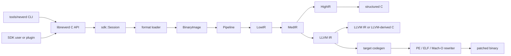

**Языки**: [English](../architecture.md) | [简体中文](../zh-CN/architecture.md) | [繁體中文](../zh-TW/architecture.md) | [日本語](../ja/architecture.md) | [한국어](../ko/architecture.md) | [Français](../fr/architecture.md) | [Deutsch](../de/architecture.md) | [Español](../es/architecture.md) | [Italiano](../it/architecture.md) | [Русский](architecture.md) | [العربية](../ar/architecture.md)

[← Индекс документации](README.md)

# Архитектура NeverD

Это руководство описывает границы производственного кода, которые нужно знать
для безопасного изменения NeverD. Оно намеренно охватывает только код NeverD;
субмодули LLVM, Capstone и Unicorn сохраняют собственную внутреннюю архитектуру.

## Граница системы

В NeverD четыре представления IR, но они не образуют обязательную цепочку из
четырёх переходов. `LowIR -> MedIR` используется совместно. Структурная
декомпиляция далее идёт по `MedIR -> HighIR -> C`, а `lift`,
`decompile --llvm` и `patch` напрямую используют `MedIR -> LLVM IR`. Режимы
patch и lift намеренно пропускают HighIR.

CLI разбирает команды в `tools/neverd`, создаёт `neverd_session_t` и вызывает
публичный API из `include/neverd/sdk/NeverDCAPI.h`. Состояние движка находится в
`lib/sdk/SessionImpl.h`; `neverd_session_load` выбирает loader и создаёт
`BinaryImage`, а операции над IR по необходимости запускают
`lib/pipeline/Pipeline.cpp`. Исполняемый файл `neverd` линкуется с
`neverd_shared`; архивы компонентов и зависимости LLVM/Capstone являются
закрытыми деталями этой разделяемой библиотеки. CLI использует LLVM Support для
интерфейса командной строки, но не обходит C API при управлении движком.

Анализ HighIR `HighSourceFlow` отвечает за рёбра потока выводимых операторов, идентичность
локальных переменных и определённость присваивания. Проверка исходного кода и удаление
неиспользуемых копий PHI используют один граф. Ограниченные разбиения на ноль/не ноль
учитывают повторные скалярные условия; запись сбрасывает факты, а переменные с утёкшим
адресом остаются неизвестными. При исчерпании лимита используется консервативный граф.
Копия PHI удаляется, только если её значение не нужно во всех допустимых контекстах.
Вызовы, чтения, записи и метки сохраняют наблюдаемое поведение.

Анализ утечки указателей у потребителей блоков также использует этот граф. Ограниченное вычисление неподвижной точки переносит идентичности указателей и частные ячейки стека через ветвления и циклы. Слияния сохраняют возможные адреса контекста; только полная перезапись удаляет их. Неизвестные рёбра, исключения и исчерпание бюджета доказательства запрещают привязку.

Факты о получателе Objective-C различают self на входе метода и точную ссылку на класс. Для установления self должны согласоваться все записи метаданных с общим входом. Копии полной ширины и сохраняемые ABI регистры передают факты через тот же анализ неподвижной точки, включая обратные рёбра ко входу. Проверка объявлений учитывает методы класса и экземпляра, записанные категории, суперклассы и принятые протоколы; для self учитываются также известные подклассы. Каталоги компилятора сохраняют владельцев и иерархию отдельно от общего согласования селекторов. Перед выдачей исходного кода SDK повторно проверяет происхождение получателя и объявления по текущему образу. Эти факты не выбирают конкретный IMP и не разрешают переписывание бинарного файла.
Если внешняя иерархия неизвестна, требуется общее согласование селекторов без сужения по получателю; явно неподдерживаемые или противоречивые объявления остаются отрицательными свидетельствами.

Ivar с явно указанным объектным типом расширяют доказательство получателя не более чем на восемь загрузок полной ширины. Каждый шаг хранит слот смещения времени выполнения, ширину и постоянное байтовое смещение из инструкции. Константа должна соответствовать текущей раскладке; ссылка времени выполнения может следовать за перемещённым полем. Загрузчик проверяет записанную цепочку классов и объявление поля. Частичные обращения, id без имени класса, блоки, типы только протокола, неоднозначное хранилище и неизвестные базовые указатели не дают фактов о классе. Проверка исходного кода повторно проверяет весь путь по текущему образу. Эти факты не доказывают идентичность объектов и не разрешают удалять операции памяти.

Загрузчик проверяет ограниченные ациклические графы константных строк, целочисленных объектов, массивов и отсортированных словарей Darwin. Каждое поле и ребро требуют неизменяемой отображённой памяти и однозначных подтверждений импорта или релокации; неподдерживаемые кодировки, циклы и неполные графы явно отклоняются. Привязки исходного кода повторно проверяют граф и входной слот указателя. Сгенерированные функции сохраняют биты целых чисел, порядок дочерних объектов и общие адреса, повторно используя идентичность строк. Слоты инициализируются один раз с публикацией acquire/release и вызовом только проверенных дочерних функций. Каждая функция содержит их объявления, позволяя независимо восстановленным методам использовать одно определение. Переносимые тесты проверяют повреждённые данные и лимиты доказательства; нативные примеры компилятора сравнивают содержимое, алиасы, идентичность копий и параллельную инициализацию с исходными методами.

## Представления и маршруты IR

Экспериментальный [этап восстановления интерпретатора](interpreter-recovery.md) специализирует строго поднятый LowIR до общей границы MedIR. Провайдер отвечает за свидетельства неизменности образа, `SymExec` — за семантику инструкций, а остаточный CFG использует обычные SSA и генераторы исходного кода. Свидетельства восстановления хранятся отдельно от свидетельств нативных экземпляров инструкций и бинарного patch.

`InterpreterSpecialization` отвечает за ограниченное обратное распространение запросов битов после неудачной попытки. Он использует общий скалярный вычислитель, не меняет факты графа и не добавляет поля управления или контексты; вся работа ограничена бюджетами, а публикация требует нового полного доказательства.

Уточнение контекста может дополнительно выдвинуть уже отслеживаемый восьмибайтовый носитель адреса, если последующее требование к памяти использует лишь часть его байтов. Исходные узкие координаты производителя остаются определяющими; ключи из доказанных констант или смещений кадра формирует только постановка в очередь.

Перебор конечных значений может наблюдать достижимые кортежи, не меняя запрос доказательства. Отказ наблюдателя возвращает неполный результат без кортежей. Кэш хранит только математические доказательства множества; сертификаты неизменяемого чтения остаются локальными до завершения перебора.

`NeverDLoader` отвечает за `PEFixedImageView` и использует общий с обычной загрузкой PE полный разбор базовых релокаций. Адаптер двоичного интерпретатора применяет проверенное представление по предпочтительному адресу для восстановления и доказательств машинного кода, не разбирая таблицы PE самостоятельно. Подготовка проверяет области записи импорта, идентичность отображений и полные исходные поля до подтверждения байтов. Представление ссылается на неизменяемый образ и не доказывает эквивалентность ASLR или инициализации.

`LowFunc::FunctionTemporaries` объявляет упорядоченные непересекающиеся диапазоны байтов без начального значения. Перед переходом конечного диспетчера через границу инструкции восстановление однократно сохраняет временную косвенную цель в зарезервированном локальном слоте функции. Общий проверяющий сохраняет только байты, действительно определённые на текущем пути; обычные машинные временные значения действуют лишь внутри инструкции. Метаданные и сохранение учитываются в бюджетах, а семантическая схема 17 связывает время жизни с сертификатом. Модель сырого состояния сохраняет побайтовую семантику; генерация исходника требует операндов размером ровно со слот и отвергает частичные псевдонимы. Индуктивная проверка сохраняет точное множество байтов, определённых проверенным входным префиксом. Явные входы и присваивания `FunctionTemporary` представляют изменяемые значения только в объявленных и определённых префиксом байтах своей стороны LowIR. Каждый параметр должен проецироваться из построенного состояния, а каждое прибытие обязано совпадать по всем значениям и определениям. Вывод группирует только реально определённые байты, включая частичные и невыровненные диапазоны; парные планы разделяют пространства имён. Машинные предложения связывают такие слоты только на стороне кандидата. Покрытие, наблюдения, ранги и бюджеты обязательны и в схеме доказательства 17. Объявления не инициализируют память и не доказывают обычный машинный ABI.

`FrameOffsets` отвечает за доказательства единственного смещения относительно входа с ограничением ресурсов. Восстановление нормализует реальные символические обращения к памяти, не меняя остаточные выражения адресов; нативные проверки сохраняют равенство адресов двух исполнений. Полная диспетчеризация выравнивания и общие бюджеты повторов принадлежат восстановлению. Агрегация доказательств разбиений native/LLVM остаётся отдельной незавершённой работой. `NativeStackControl` отвечает за внутреннюю беззнаковую 16-битную очистку при возврате; бинарный поставщик удостоверяет канонические кодировки с извлечением восьми байт.

Смещения кадра используют существующий ограниченный `FiniteQueryCache` внутри каждого проверяющего отношения. Построение ключей и хранение доказательств ограничены `MaxSymbolicNodes` словами, как при восстановлении. Ключи сохраняют полный предикат и связи относительных выражений; повторно используются только полные области или доказанная неединственность. Каждый доступ по-прежнему проверяет независимость адреса и границы кадра.

Временный индекс посещённых узлов использует плотную хеш-таблицу. Сериализация по-прежнему следует упорядоченному обходу, поэтому рост таблицы и порядок хеширования не меняют ключ, переименование переменных или учёт бюджета.

Проверяющий отношения сохраняет завершённые ответы SAT/UNSAT без модели для точной ссылки на предикат в своём фактическом неизменяемом, только дополняемом символьном контексте при фиксированных настройках решателя. Упакованная таблица использует два бита на узел в пределах `MaxSymbolicNodes` и выделяется только после второго завершённого запроса. Каждый поиск сначала проверяет предел узлов. Непосредственный повтор сохраняет прежний бесплатный быстрый путь; любое другое попадание расходует один логический запрос до пропуска кодирования и поиска. При росте старый и новый буферы могут временно сосуществовать. Ответы Unknown/Invalid, модели и изменяемое состояние поиска не сохраняются. Повторное использование заканчивается вместе с проверяющим, а независимая итоговая проверка начинает с пустого кэша. Другие предикаты по-прежнему требуют полного доказательства.

Нативное условное ветвление использует один кодировщик без модели для запросов выполнимости перехода и продолжения. Каждый запрос проверяет полный предикат с отдельными допущениями; повторное использование кодировки заканчивается на этом ветвлении. Поэтому предыдущие ветвления не накапливают клаузы для поиска в последующем. Существующая повторная попытка с новым кодировщиком учитывается в бюджете и применяется только при исчерпании лимита вентилей; исчерпание поиска и некорректные входы по-прежнему приводят к отказу. Бюджеты запросов, узлов и наблюдений сохраняются.

`FrameOffsets` перед конечным перечислением сводит бинарные сложения с постоянными или символьными слагаемыми, маски и согласованные срезы регистров к точным модульным остаткам. Для выравнивания извлекаются только удалённые младшие биты вместо битового развёртывания всего корня кадра. Символьный индекс сохраняется полностью, включая зависимость от корня или предиката пути. Оба варианта выбора операнда делят бюджет из шестнадцати посещений; новые узлы DAG учитываются в бюджете. Исходный предикат, доказательство единственного значения, границы отображения/кадра и отказ при неполных результатах сохраняются. Остаток и достижимость не предполагаются, остаточные адресные выражения не меняются.

`LowIRIndependenceFrame::EntryAlignment` задаёт необязательную входную конгруэнцию по степени двойки. Общий проверяющий пересекает её с константами, непереполняющимися границами и исключениями до исполнения и индукции, не переписывая корень. Некорректные и невыполнимые области не дают сертификата. Нативные API требуют той же опции и допустимого корня RSP. Обе новые проверки композиции LLVM сохраняют область и все обязательства по состоянию, статусу и сохранению. Семантическая схема 13 связывает наличие, выравнивание и остаток с дайджестом; объектный кэш не меняется. Доступность памяти, приватность кадра, нативный ABI и автоматическое объединение разделов не следуют из этого.

Когда обычный поиск зависимостей останавливается, восстановление может разделить одно существующее регистровое поле контекста для каждой нативной позиции и режима, кроме входа функции. Входящий домен должен быть полным, многозначным и охватывать все объявленные биты поля. Каждый реальный предшественник независимо доказывает свой текущий полный домен, сравнивает живое физическое поле и заново проецирует каждый случай. Поздние предшественники и расширенные узлы проверяются повторно; цепочка останавливается на предложенном входе. Сравнения имеют синтетическое происхождение и общие бюджеты узлов, операций, контекстов, запросов и уточнений. Частичные маски, неопределённые флаги и поля только в кадре исключены. Новых чтений гостевой памяти и предположений о вызывающем коде нет. Неполные домены сохраняют консервативное ребро; выдача требует завершения всех достижимых случаев.

Уточнение управления и условий предшествует повторным попыткам необязательного разбиения кадра; необходимые более мелкие разбиения сохраняются. Неподвижная точка каждого остатка вычисляется перед следующим, но публикация требует завершения всех допустимых остатков. Явное выравнивание пересекается с областью разбиения, диспетчер сравнивает фактические остатки. Бюджеты контекстов, операций, узлов и решателя ограничены и разделяются между попытками. Восстановление с машинным состоянием принимает `--vm-entry-alignment=A:R` как явно заданную и проверяемую область начального RSP. `A` должно быть положительной степенью двойки, а `R < A`. Другие значения возвращают статус 2 до доступа к гостевой памяти или записи состояния. Старшие биты адреса свободны; по умолчанию выравнивание не предполагается. Эта опция не удостоверяет нативную эквивалентность.

Общий запрос `SymContext::constantWindow` возвращает срез побитового выражения, только если каждый бит результата доказанно постоянен. Он проходит существующие извлечения, срезы внутри одного операнда конкатенации, нулевое расширение и побитовые операции; неизвестные входы XOR и арифметические переносы остаются непрозрачными. Результат ограничен 64 битами, рекурсия — 32 уровнями, работа — 256 единицами. Учитываются каждое посещение, отказ по глубине и проверенный операнд конкатенации; копирование константы дополнительно расходует полное число её 64-битных слов. Неполное доказательство не возвращает константу. `SymState` использует этот запрос без изменений состояния для экспорта постоянных байтов регистров и временных значений; сохранённые выражения и восстановление целых слов сохраняют исходную идентичность. Области памяти по-прежнему экспортируют только литеральные константы: раннее добавление выведенных частичных фактов может раздробить происхождение последующих входов и увеличить объём поиска управляющего состояния.

`SymState` сохраняет уже материализованные байты для одной STORE при явном контракте разделения. Настоящая STORE выполняется; остальные области, эпохи инвалидирования и неизвестные значения сохраняют состояние после записи. Отсутствующие байты не читаются и не инициализируются. `SymExec` применяет контракт только к одной обычной STORE. Восстановление отдельно сохраняет полные аффинные слоты и происхождение; слияния остаются консервативными.

`StringTransfer` отвечает за ограниченное упорядоченное скалярное понижение. Восстановление отвечает за доказательства значений, общие бюджеты и повторную сертификацию целиком скопированных указателей кадра; созданные обращения используют обычные проверки памяти.

Обход зависимостей управления сообщает о зависимостях от битов корня только после полного анализа. Восстановление может пропустить необязательное перечисление адресов образа, если у доказанного относительного адреса остаются свободными как минимум 32 старших бита корня; это не доказывает достижимость и не удаляет доступ к памяти.

Тот же анализ зависимостей корня используется при аффинной проекции управляющих значений полной разрядности. Его результат действует только для одного предиката ребра; слишком большие области значений дают неполный отказ, который не попадает в математический кеш. Узкие маски проверяются повторно. Существующая обработка выполнимости остаётся независимой; отказ от области значений не доказывает ни достижимость, ни недостижимость ребра.

Кэш конечных запросов учитывает сериализованные ключи, числовые результаты и метаданные порядка использования в одном лимите хранения. До вытеснения записей он проверяет весь кандидат и возможность разместить его отдельно. Ключами владеют стабильные узлы отображения. Попадания обновляют порядок использования и возвращают самостоятельные копии результатов, действительные после вытеснения. Объекты кэша нельзя копировать или перемещать. Замена меняет повторное использование доказательств, но не семантику запросов и не условия допуска результатов.

`InterpreterSpecialization` управляет совместными отношениями и независимыми конечными множествами полей. Проекция рёбер сохраняет только полные доказательства по столбцам; слияние пересекает маски и объединяет значения после повторного применения маски. При перестроении узла после инициализации того же символьного состояния ограничения множеств соединяются с совместным предикатом, сохраняя идентичность кадра и свободные биты. Удалять можно лишь ограничения принадлежности, следование которых подтверждено точной проверкой всех кортежей. Эта политика точности не меняет ключи контекста и проверку нативных возвратов.

`FrameEntryConstraints.h` задаёт общий предикат отсутствия переполнения для восстановления и реляционного доказательства. `InterpreterSpecialization` отвечает за ограниченное объединение однозначных переходов и подтверждённое воспроизведение. Эти параметры C++ по умолчанию отключены; сопоставление контракта и привязка дайджеста остаются в бинарном адаптере.

`modelInterpreterMachineStateX64` и исходная обёртка используют общий генератор для частей гостевых регистров, упакованных флагов, статуса профиля и потока управления. Модель заменяет только обращения к объекту состояния явными байтами регистров и отделяет статус от гостевого RAX. Семантика компилятора и политика доказательства ей не принадлежат; входная область, наблюдения, контракт кадра и полная проверка уточнения остаются обязанностью вызывающей стороны.

`NeverDLLVMInterpreterModel` отвечает за отдельный ограниченный импорт скалярного LLVM в тот же ABI сырого состояния. `modelLLVMInterpreterMachineStateX64` сохраняет настоящий статус возврата и создаёт явные проверки определённости. `llvmInterpreterMachineStateContract` задаёт полные наблюдения и сохранение нулевого монитора; домен, память и полное доказательство остаются у вызывающей стороны. Обычный лифтинг и публикация исходников не меняются; компилятор не доказывается.

`modelLLVMScalarFunction` повторно использует этот импортёр для чистых целочисленных аргументов `noundef` и целочисленного результата (`i1/i8/i16/i32/i64`). Общая модель обрабатывает граничные случаи funnel shift и проверяет ограничения переполнения умножения произведениями двойной разрядности. `checkLLVMScalarEquivalence` выполняет обе модели через `SymExec`, находит управляющие входные биты, перебирает все их сочетания и сохраняет остальные биты символическими. Все результаты должны совпадать, а все выполненные операции — быть определёнными; бюджеты разбиений, путей, узлов и суммарной работы ограничивают запрос. `SymContext::constantWindow` учитывает суммарную работу, сохраняя прежние пределы отдельного запроса. Отказ не разрешает преобразование. Этот C++-запрос только для чтения не меняет стандартную выдачу исходного кода и не предоставляет постоянный сертификат нативного ABI или компилятора.

`projectLLVMScalarResult` клонирует явно выбранное целочисленное поле возврата и битовое окно через упаковку структур/массивов `insertvalue`. Сохраняются все аргументы, поток управления, скалярные операции, аннотации и вызовы `assume`; удаляется только неиспользуемая упаковка агрегата, после чего результат проверяет общая скалярная модель. Бюджеты построения и моделирования разделены. Неизвестные контракты и исчерпание лимитов не публикуют модуль и не изменяют вход. Каждое требуемое наблюдение статуса, значения и сохранённого состояния всё ещё требует полного доказательства; выбор поля не сертифицирует вход, кадр или нативный ABI.

`projectLLVMScalarInputs` строит явный скалярный интерфейс, удаляя лишь неиспользуемые SSA-параметры и возвращая возрастающее соответствие исходных индексов. Он использует ограниченное клонирование и скалярную проверку проекции результата, затем переносит полное клонированное тело в сокращённую сигнатуру, не заменяя входы константами. Мёртвая арифметика, аннотации, assume, управление и все используемые аргументы сохраняются; удаление упаковки и перепривязка отладочных ссылок отклоняются. Построение использует общий суммарный бюджет; отказ не публикует ни модуль, ни соответствие. Это не сертификат определённости, завершения или нативного ABI: перекомпилированный кандидат нужно встроить в полную исходную сигнатуру с прежними обязательствами входа, кадра и наблюдений.

`projectLLVMScalarState` преобразует явно инициализированное состояние в скалярный интерфейс со всеми входными ячейками, масками входа и наблюдениями значений/сохранности. Общий импортёр проверяет указатели, выравнивание и контракты; внешняя память и наблюдаемые адреса состояния отклоняются. Частичные записи с масками и mem2reg сохраняют управление и скалярные обязательства. Поле ноль содержит исходный статус; диапазоны возврата становятся проверяемыми `assume` по общему правилу. Бюджеты построения и модели раздельны; отказ не меняет вход. Сейчас требуются little endian и целочисленные 64-битные указатели/индексы. Фабрика x64 использует маски владельца семантики и явное выравнивание, не выводя наблюдения или нативный ABI.

`SymKnownBits` распознаёт плоские маскированные копии при совпадении всех факторов, нерасширенной маске и нулевых отбрасываемых битах. Беззнаковые сравнения используют суммы границ непосредственных слагаемых, только если максимум не переполняется. Учёт, пределы и DAG сохраняются. LLVMC выводит `llvm.assume` без bundle как однократно вычисляемое условие с недостижимой ложной ветвью; неподдерживаемые bundle отклоняются. Схема 16 связывает обновлённый алгоритм.

`SymContext::mkConcat` приводит буквальный нулевой префикс к `ZExt` и раскрывает нулевые расширения при группировке конкатенаций. Слова, собранные после раздельной записи младшего значения и старших нулей, получают ту же форму, что и явное расширение. Неизвестные, ненулевые и внутренние старшие биты остаются наблюдаемыми. Существующее распознавание рекуррентностей видит узкие сложения без изменения бюджетов и полной проверки. Схема 16 объектного конвейера связывает эту общую нормализацию.

Логический сдвиг вправо может удалять непосредственные члены AND/OR/XOR, доказанно нейтральные во всём сохраняемом окне. Поиск ограничен восемью членами и 128 битами; запросы константных окон совместно используют 256 единиц работы. Сдвиги не распределяются, DAG не разворачивается. Неизвестные члены, полный счётчик сдвига и обязательства определённости LLVM сохраняются. Схема 16 объектного конвейера связывает процедуру с обеими идентичностями кэша.

`SymKnownBits` централизует ограниченный анализ общих символических DAG только для чтения: арифметические биты, тождества расширений и порядок сумм без переполнения. Пределы: 256 единиц работы на запрос, глубина 32, разрядность 128 и 65,536 записей кеша; попадания в кеш и поиск операндов также учитываются. Кеш каждого скалярного исполнителя ограничен неизменяемым разбиением входов и делит лимит запроса с `constantWindow`. Неизвестные операции обрабатываются консервативно; обязательства определённости LLVM остаются у импортёра. Построители выносят одинаковые нулевые расширения за побитовые операции и логический сдвиг вправо, сохраняя старшие биты констант и полную величину сдвига. Эти правила не выводят ABI; преобразования циклов по-прежнему требуют полного доказательства. Абстракция MBA восстанавливает расширенное представление AND/OR/XOR над общими непрозрачными входами, сохраняя границы узкой арифметики и побитового дополнения в существующих бюджетах.

`NeverDLLVMScalarLoopRecovery` отвечает за явно включаемое восстановление в этом скалярном домене. Клонируются только функция и необходимые объявления интринсиков; после доказательства полного управляющего домена предлагаются объединение вынесенных первых итераций, перенос состояний, удаление отдельной ветви нулевых итераций, проверки в заголовке и аффинные состояния. Фильтр с нулевыми данными охватывает управляющий домен, но может лишь отклонять кандидатов: принятие требует доказательства всей функции с остальными входными битами в символическом виде. Дополнительные управляющие биты отклоняются. Лексикографическая стоимость учитывает конечные проверки, PHI циклов и инструкции. Бюджеты построения, доказательства, кандидатов и преобразований суммируются; исчерпание не публикует частичный результат. Исходная функция неизменна. Поиск C++ предоставляет доказанные кандидаты, но не сертифицирует нативный ABI.

Восстановление условий предлагает целочисленное сравнение вместо булева PHI заголовка, только если все внешние входы имеют общий предикат и доминирующую инвариантную границу, а начальные константы соответствуют целочисленному PHI. Одинаковая ширина, нулевое и знаковое расширение проверяются раздельно; усечение границы не угадывается. Поиск входящих рёбер учитывается в бюджете. Совпадение входов не доказывает индукцию: полное доказательство исходной функции обязано сохранить все обратные рёбра, символические данные, определённость и завершение.

Сложный тест выхода может предложить равенство PHI с постоянным шагом инвариантной границе или её соседям на расстоянии шага. Поиск ограничен 32 значениями, 64 операндами в очереди и четырьмя доминирующими инвариантными листьями той же ширины; другие PHI останавливают обход. Полярность и совместные использования условия сохраняются. Зависимость не доказывает диапазон, делимость или завершение: требуется полное доказательство оригинала. Неиспользуемые параметры не занимают места кандидатов префикса, но сохраняются в сигнатуре и доказательстве по всем входам.

`recoverLLVMScalarSource` объединяет подготовку и поиск циклов в `NeverDLLVMScalarLoopRecovery`. Ограниченная очистка LLVM и предикатов создаёт отдельный кандидат; поиск начинается после доказательства эквивалентности полной исходной функции. После дальнейшего восстановления и очистки точное итоговое тело также проверяется относительно оригинала. Граничные запросы имеют отдельный лимит работы и общий суммарный бюджет доказательства. Раунды очистки и бюджеты поиска накапливаются; при исчерпании частичный модуль не возвращается. InstCombine имеет явный предел итераций: для доказанного кандидата неподвижная точка не требуется. LLVMC только находит подходящие функции и публикует общий результат. Сигнатуры и утверждения о нативном ABI не меняются.

Подготовка также предлагает подъём общих выражений LLVM и удаляет poison-флаги инструкций в частной копии перед поиском предикатов. Обход учитывается по инструкциям. Исходные флаги и мёртвые операции остаются обязательствами полного доказательства; контракты аргументов/вызовов и assume не ослабляются. Самостоятельный проход предикатов сохраняет консервативные правила для аннотированной арифметики. Успешная очистка сама по себе не разрешает публикацию кандидата.

Проверка скалярной эквивалентности сохраняет промежуточные записи символическими. Графы управления и определённости нормализуются по запросу; для возвратов сначала проверяются идентичность и ограниченные факты, затем при необходимости нормализуются их DAG. Выполняются все исходные операции, включая мёртвую арифметику и аннотации. Оба исполнения, нормализация и итоговое сравнение используют общий накопительный бюджет и локальные пределы. Меняется только планирование запросов, а не входные области, обязательства доказательства или пределы поиска циклов.

`SymSimplifyPass::simplifyFiniteValues` открывает существующую точную двухзначную фазу с учётом работы. AND может получить однобитную константную маску через не более восьми членов конъюнкции; якорем остаётся весь корневой SSA-результат с остальными операндами и зависимостями от poison. Поиск конъюнкций не пересекает OR, арифметику или PHI. Подготовка скаляров запускает фазу перед модульными предикатами в том же суммарном бюджете построения. Незавершённые срезы не дают фактов; публикацию по-прежнему разрешает доказательство полной исходной функции. Схема объектов 16 фиксирует новый общий алгоритм оптимизации.

Для более широких значений PHI/select отдельный обход замыкания проверяет не более 32 значений и 64 рёбер копирования, включая все обратные рёбра. Константы и существующие полные двухзначные границы должны вместе давать ровно две альтернативы; каждая циклическая компонента должна достигать допустимого источника. Неизвестные источники, третьи значения и циклы без источника отклоняются. Исходное слияние остаётся SSA-наблюдением с условиями и зависимостями от poison; разные наблюдения не коррелируются. Поиск и распространение источников расходуют существующий бюджет.

Постоянные маски AND для PHI заголовка цикла предлагают ноль или PHI без маски. Кандидаты начальных значений и масок используют общие пакеты до 32 элементов; неудачные пакеты делятся, а после отказа полного доказательства проверяются прошедшие предварительный отбор альтернативы. Каждая принятая комбинация по-прежнему требует полного доказательства относительно исходной функции; маска не задаёт предположение о диапазоне. Работа учитывается суммарно, при исчерпании частичный результат не публикуется.

Общие символьные конструкторы также удаляют внешнюю маску AND у OR/XOR, если каждая непосредственная константа или явно маскированный член не имеет битов за пределами маски. Проверка ограничена восемью членами и 128 битами, без рекурсивного поиска и разрастания выражений. Неизвестные биты сохраняют маску. Схема 16 объектного конвейера связывает это упрощение с обоими идентификаторами кэша.

При проверке одного и того же объекта `Function` функция `checkLLVMScalarEquivalence` импортирует одну модель и выполняет её один раз для каждого разбиения. Управление и определённость упрощаются по необходимости, без нормализации промежуточных данных ради сравнения значения с самим собой. Все операции, требования ко входам, управляющие разбиения и проверки завершения остаются обязательными в прежних пределах. Для разных функций сохраняются оба исполнения; имена и прошлые вызовы не дают повторно используемого сертификата.

Если ограниченное упрощение управления или определённости не даёт ответа, запрос итеративно нормализует нужный DAG выражений от потомков к родителям перед поиском входных битов. Используются общие символьные конструкторы и отдельный ограниченный кэш фактов; выполнение не повторяется, общие подвыражения не разворачиваются в деревья. Обход операндов, перестроение и битовые запросы расходуют общий накопительный бюджет при прежних пределах узлов и отдельных запросов. Полный пустой результат анализа зависимостей разрешает вычисление константы, но не отсутствие возврата и не пропуск обязательств. Аннотации LLVM остаются условиями, которые нужно доказать, а не предположениями.

Предложения внутренней разрядности используют наибольшую целочисленную ширину неизменного интерфейса функции. При клонировании явно отображаются битовые шаблоны констант и удаляются ставшие тождественными преобразования; сигнатуры intrinsic сохраняются. Ширина остаётся лишь предложением: полное доказательство относительно исходной функции должно сохранять старшие биты, знаковый порядок, сдвиги, определённость и завершение. Обход, отображение и очистка расходуют общий бюджет построения; невыгодные или исчерпавшие бюджет предложения не публикуются.

PHI цикла может предложить доминирующее начальное значение, только если все внешние входы передают одинаковое значение SSA. Фильтры только для отказа объединяют до 32 кандидатов; принятие группы требует полного доказательства относительно исходной функции. Неудачные группы делятся, а отвергнутые кандидаты откладываются лишь в текущем поиске. Сохраняются все обратные рёбра, одновременные PHI, определённость и завершение. `WorkLimitExceeded` отличает глобальное исчерпание работы от обычного отказа при точном бюджете или локальном пределе. Частичный результат при исчерпании не публикуется.

Общий символьный слой удаляет постоянную AND-маску, только если она меняет исключительно младшие биты, отбрасываемые логическим сдвигом вправо. Константные счётчики нормализуются после проверки полного беззнакового значения; чрезмерный арифметический сдвиг насыщается на знаковом бите. Переменные счётчики и обязательства poison LLVM сохраняются. Схема объектного конвейера 10 различает новый рецепт в обоих ключах кэша.

Кандидаты циклов также используют фактические доминирующие входные условия и их скалярные границы, включая отдельные обратные рёбра latch → header. Переполнение узкого последнего индекса не считается доказательством сохранения нулевого числа итераций. Рекуррентные переменные с единичным шагом имеют приоритет; порядок внутри групп сохраняется, линейная работа учитывается в бюджете. Границы из входных условий лишь предлагают расширение нулями или усечение; знаковые сравнения, переполнения и последнее обновление по-прежнему требуют доказательства для всей исходной функции.

LLVMC теперь автоматически вызывает восстановление скалярных циклов без проекции образа или отладки. Ограниченный обход допускает до 1024 блоков на функцию. Восстановление и очистка LLVM чередуются с общими бюджетами модуля; затем общий импортёр и SymExec доказывают точное итоговое тело относительно оригинала. Меняется только копия для вывода, с сохранением идентичности функции, атрибутов, вызывающих функций и привязок интринсиков. Конфликты символов, внешние адреса блоков, метаданные функции и исключения сохраняют прежний путь. При отказе или исчерпании бюджета промежуточное тело не публикуется; выборочный вывод нормализует лишь выбранную функцию. Нативный интерфейс и приватность памяти не выводятся.

После доказательства скалярного кандидата LLVMC повторно использует `SymSimplifyPass::simplifyPredicates` для вновь появившихся модульных условий. Существующий точный этап сохраняет проверки poison, стабильности входов и выгодности преобразования и сообщает затраты на вывод; LLVMC учитывает их в общем бюджете построения, не более 65 536 единиц на вызов. Затем InstCombine, LICM и CSE выявляют инвариантные границы и единую SSA-идентичность эквивалентных обновлений счётчика для следующего раунда восстановления. Прямые изменения IR сбрасывают кеш анализов. Этап предикатов не использует решатель; итоговое доказательство относительно всей исходной функции остаётся обязательным.

`SymKnownBits` также доказывает равенство маскированной копии исходному значению, если все удалённые биты заведомо нулевые, и равенство после прямого и обратного знакового сдвига при совпадении точного источника, множителя степени двойки и полного счётчика сдвига. Отбрасываемые биты и сохраняемый знак должны быть все нулями либо все единицами. Эти ограниченные отношения только для чтения расходуют бюджет запроса, не увеличивая DAG, не перебирая данные и не принимая флаги LLVM no-wrap как предпосылки.

`SymKnownBits` сравнивает беззнаковые скалярные кратные только при совпадении базы и доказанном отсутствии переполнения большего произведения. Равенство произведений в младшем слове собирает модульные коэффициенты и сохраняет кратность факторов через расширения, сохраняющие нужную ширину; более узкие границы переполнения остаются непрозрачными. Обе стороны вывода, ожидающие факторы и их сопоставление расходуют прежние бюджеты работы и глубины; анализ остаётся только для чтения.

Общий импортёр LLVM принимает канонические вызовы `llvm.assume(i1)` без пакетов операндов и записывает в существующее состояние определённости обязательство: при достижении вызова условие должно быть истинным. Скалярные доказательства и доказательства состояния машины проверяют его, не сужая область входов и не считая условие уже доказанным фактом. Дополнительные контракты вызова/объявления и undef/poison по-прежнему отклоняются; входной IR и бюджеты доказательства сохраняются. Это не сертификация нативного ABI.

Импортёр принимает корректный `llvm.loop.peeled.count` как беззнаковый счётчик i32 истории оптимизации. Он никогда не служит границей числа итераций, ограничением входов или фактом завершения/определённости. Проверяются идентичность цикла и число операндов свойств; неверные или неизвестные свойства остаются неподдерживаемыми, а обход метаданных расходует существующие бюджеты.

Модель LLVM проверяет контракты параметра `initializes`. Она повторно использует проекции указателей состояния и выполняет ограниченный побайтовый анализ гарантированной инициализации до обычной скалярной генерации, не вводя второй вычислитель значений.

`NeverDInterpreterLLVMRefinement` объединяет доказательства от нативного кода до LLVM. Компонент заново строит обе модели и обязательные контракты, проецирует флаги только на входе по единому профилю и повторно проверяет обе предпосылки. Клиент может предложить план циклов, но не заменить модели, наблюдения или свидетельства. Модели копируют только исполняемый граф и объявленные корни; обратные рёбра ко входу отклоняются, чтобы состояние не инициализировалось повторно.

Необязательный запрос `InterpreterLLVMRefinementPreservation` добавляет сохранение байтов GPR к обеим новым проверкам. Подготовка выполняет ограниченную бюджетом валидацию, объединяет пересечения и делит диапазоны по границам слов; обязательные наблюдения состояния, определённости и кадра сохраняются. `NativeState` передаётся только нативному проверяющему: `SelectedWitness` поддерживается, `AllUndefinedChoices` отклоняется. Свидетельства связывают действующие контракты; пустой запрос сохраняет прежние настройки.

C API v3 и CLI передают бюджеты полей, уточнений и запросов общему специализатору. Адаптер проверяет размеры структур и reserved до чтения расширений; раскладки v1/v2 и значения по умолчанию сохраняются. Рост бюджета не меняет контракт исполнения или критерии публикации.

Восстановление также поддерживает `--vm-chain-transfers=N` (по умолчанию 0) и `--vm-no-control-discovery`. Цепочки сохраняют символические связи между переходами с доказанной единственной целью; при достижении лимита возвращаются обычные границы CFG. В режиме машинного состояния `--vm-entry-frame=begin:end` объявляет не проверяемый при исполнении диапазон смещений от входного RSP без циклического переполнения. Точная числовая предпосылка сохраняется в C и отчёте, не разрешая доступ к памяти и не доказывая эквивалентность.

Крупные восстановленные функции, превышающие лимит построения SSA, могут использовать `--llvm` с ограниченным контрактом изменяемого скалярного хранилища. Входы, переносимые между итерациями значения и результаты прежних чтений сохраняют смысл. Неподдерживаемое неявное состояние, параметры в векторных регистрах, релокации образа, неоднозначное хранилище и некорректный поток управления вызывают явную ошибку; HighC отклоняет этот запасной путь. Вывод следует прежнему контракту машинного состояния и не добавляет сертификат эквивалентности.

`analyzeMedMutableSource` отвечает за проверку нормализованного CFG, идентичности хранилищ и консервативных требований к входным байтам. Эти требования ограничивают чтения сверху и не доказывают наблюдаемость. LLVM проверяет их до обходов модуля и повторно использует план для однократной инициализации входов. Произведение числа блоков и значений и объём распространения ограничены отдельно. Подстановка в C использует для каждого чтения точную предшествующую запись того же типа без частичных алиасов; слияния между блоками сохраняют явное хранилище.

Для проверенных тел функций с изменяемыми переменными LLVM передаёт точные значения частных ячеек только внутри блока с добавлением инструкций в конец и сохраняет последние записи. Инициализация входа и границы блоков, функций и модулей остаются раздельными. Обращения программы к памяти сохраняются явно. Вывод C ограничивает раскрытие скалярных выражений и работу по свёртке констант, сохраняя именованные промежуточные значения. Сворачиваемые константные выражения используют целевую компоновку LLVM; неподдерживаемые выражения приводят к явной ошибке. Назначенные изменяемые возвращаемые значения, включая ноль, не превращаются в возврат void.

Изменяемое подмножество допускает скалярное хранилище на 8/16/32/64/128 бит; входы подсчёта битов ограничены 64 битами. Нестандартные и большие разрядности требуют отдельного контракта исходного кода.

Архитектурный lifter транзакционно управляет сопутствующими метаданными неопределённых выходов: перед каждой попыткой удаляет прежние свидетельства и публикует эффекты только для точно соответствующего успешного подъёма. `Missing` означает отсутствие свидетельств, а не пустое описание `Complete`. Обычный LowIR сохраняет выбранные детерминированные значения. `LowIRUndefinedIndependence` отвечает за ограниченное реляционное доказательство для предоставленного полного ациклического графа LowIR, разделяя обычные входы и сохраняя связи вновь созданных неопределённых значений. Оно привязано к полным границам инструкций и хешам операций; неполные доказательства отклоняются. Общая сертификация нативных графов, инварианты циклов и эквивалентность нативного кода C остаются отдельными задачами за пределами описанной ниже области конечных нативных путей.

`Decoder` исправляет известную ошибку ширины disp32 при префиксе операнда x64 до проверки формы и сопоставления релокаций. Границы ModRM/SIB, полное поле, знаковое смещение, операнды памяти и последующие непосредственные поля должны совпадать. Полное декодирование, декодирование для лифтинга и облегчённое декодирование с деталями используют общую нормализацию. Меняются только метаданные ширины; настоящие i386 disp16, disp8, moffs и декодирование без деталей сохраняют прежнее поведение.

Обычные скалярные SHL/SAL, SHR и SAR формируют зависящие от счётчика свидетельства неопределённых битов для операндов 8/16/32/64 бит. Нулевой маскированный счётчик сохраняет все флаги; ненулевой делает AF произвольным, значение больше единицы — OF, а для SHL/SHR значение не меньше ширины операнда — CF. У SAR флаг CF определён. Булевы условия используют счётчик, сохранённый до перекрывающихся записей; операции одинаковы с метаданными и без них. Непроверенные кодировки не публикуют частичные эффекты.

Обычные ROL/ROR создают новый произвольный бит OF только при архитектурно маскированном счётчике больше единицы; последующее взятие остатка по ширине байта/слова не меняет этот предикат. Нулевой счётчик сохраняет флаги. BT/BTS/BTR/BTC с регистровой базой создают четыре независимых бита (OF/SF/AF/PF); CF определён, ZF/DF сохраняются. Проверяются точные регистровые кодировки и imm8; битовые строки в памяти, LOCK, APX и вращения через перенос не входят в это расширение. Эффекты возникают после основной операции; LowIR одинаков с метаданными и без них. См. справочники Intel по [проверке битов](https://cdrdv2-public.intel.com/929353/253666-093-sdm-vol-2a.pdf) и [вращению](https://cdrdv2-public.intel.com/929354/253667-093-sdm-vol-2b.pdf).

Для регистрового XADD также выполняется точный аудит legacy-кодировок 8/16/32/64 бит: CF/PF/AF/ZF/SF/OF определяются, DF сохраняется, новые произвольные биты не создаются. Для обоих обмениваемых регистров действуют архитектурные правила частичной записи и 32-битного расширения нулями. Формы с памятью без сегментного префикса и LOCK проверяются при тех же разрядностях: ModRM/SIB, регистр-источник, смещение и детали адресации 16/32/64 бит должны точно совпадать. Чтение и запись используют исходный эффективный адрес, включая перекрытие с источником; флаги вычисляются по исходным операндам. LOCK, сегментные формы и APX остаются вне аудита. [Правило совместимости Intel](https://cdrdv2-public.intel.com/929360/253669-093-sdm-vol-3b.pdf) допускает Group 2 `/6` для C0/C1/D0/D1/D2/D3 как SAL/SHL `/4`, с теми же условиями счётчика и неопределёнными флагами. См. [справочник XADD](https://cdrdv2-public.intel.com/929356/334569-093-sdm-vol-2d.pdf).

Регистровые legacy-формы SHLD/SHRD используют точный аудит кодировки и общий проверяющий механизм производителей по маскированному счётчику. Ноль сохраняет флаги; AF произволен при ненулевом счётчике, OF — при сдвиге более одного бита. Только при 16 битах счётчик выше 16 также делает произвольными младшее слово и CF/PF/ZF/SF; ровно 16 оставляет их определёнными. DF, остальные биты и расширение нулями при записи 32 бит сохраняются. Память, APX и неаудированные префиксы отклоняются. [SHLD/SHRD](https://cdrdv2-public.intel.com/929354/253667-093-sdm-vol-2b.pdf).

Явный контракт `DeferNativeConditionalEdges` для нативных доказательств собирает условные переходы после проверки равенства управления и выполнимости. По умолчанию обе ветви проверяются заранее. Для пропущенных ветвей не заявляется инвентарь инструкций; достижимые входы сохраняют проверки байтов, отображения, границ, эффектов, перекрытий и бюджетов. Неизвестный ответ решателя не удаляет ребро. Сертификаты связывают политику семантической схемой 17. Статические LowIR API без нативного провайдера отклоняют её; каждый индуктивный сегмент должен проверить всю свою область; уточнение остаётся относительным к свидетелю.

Неизменяемые нативные чтения также допускают полностью доказанные конечные множества адресов с пределом `MaxImmutableLoadAddresses`. До перечисления проверяется равенство адресов двух исполнений. Каждый кандидат требует неизменяемых байтов, свидетельства отображения и отсутствия пересечения с изменяемым кадром; выбор значения остаётся зависимым от входа. Отсутствующие кандидаты, изменяемые или релокированные данные и исчерпание бюджета исключают сертификат. Свидетельства чтений и предел адресов входят в его привязку. Динамические смещения кадра и произвольная внешняя память не поддерживаются.

Следующее поведение использует строгий контракт аудита по умолчанию. `checkBinaryUndefinedIndependence` проверяет полные конечные пути исполнения исходных инструкций x64 для заявленных наблюдений, собирая обе стороны прямых ветвей до отсечения невыполнимых путей. Физический near CALL помещает в стек фактический адрес продолжения; внутренний RET читает текущее слово стека, включая изменённые адреса возврата. Для косвенных целей требуются исчерпывающий конечный перебор и доказательство равенства в двух исполнениях до ограничения пути. Точные чтения неизменяемых данных требуют свидетельств и доказанного отделения от изменяемого кадра. Для каждой собранной инструкции, включая непройденные ветви, нужны неизменяемые исходные байты; кроме описанных ниже терминальных границ строго поднятых `INT3`/`UD2` и проекции RDSSP/INCSSP с явным профилем, каждая инструкция также требует полных архитектурных метаданных. Строго поднятые `INT3`/`UD2` могут сохраняться как границы `Terminator` со всеми исходными байтами и дайджестом операций LowIR, без повышения статуса sidecar неопределённых выходов с `Missing` до `Complete`. Сертификат может сохранять такие ловушки только после доказательства их недостижимости символическим исполнением; любой выполнимый путь к ловушке возвращает `ContractViolation`, без сертификата и остаточного кода. Это правило не моделирует продолжение после ловушки или возврат из исключения, не использует эвристику `codeFollowsTrap` и не расширяет поддержку статического API LowIR. Сертификат связывает байты, отображения, эффекты, свидетельства чтения, профиль и бюджеты. Явный профиль нормального выполнения без сбоев и с отключённым CET исключает все отображения образа из входного кадра. Каждый выполнимый путь должен завершиться внешним возвратом, сохраняющим входной RSP и исходную ячейку возврата до нативного pop; незавершённый префикс ничего не доказывает. Прямые и косвенные циклы требуют полного конечного развёртывания; незавершающиеся пути, превышение бюджета и другие непроверенные эффекты исключают сертификат. `specializeBinaryInterpreterWithIndependence` доказывает перед восстановлением и при отказе не возвращает остаточный код. Обычное восстановление не включает эту проверку по умолчанию; инварианты циклов, исключения, выполнение с CET и эквивалентность нативного кода C остаются вне сертификата.

Нативный сбор рассматривает продолжение CALL как сохранённое значение возврата, а не непосредственное ребро. Прямые цели вызова и обе ветви условия по-прежнему проверяются заранее; фактические цели RET собираются после полного конечного перечисления. Для пропущенных встроенных байтов не заявляется доказательство инструкций. Достигнутые ошибки декодирования, ловушки, неполные цели, незавершающиеся циклы и исчерпанные бюджеты по-прежнему препятствуют сертификации.

Явная опция `RetainUnauditedNativeBoundaries` добавляет границы отказа в конечные нативные доказательства независимости и конечные или индуктивные уточнения до LowIR. Допускаются только строго декодированные и поднятые инструкции с покрытием `Missing`, пустыми эффектами и совпадающим непустым дайджестом операций. Все проверки структуры, управления, перекрытий, профиля и ресурсов сохраняются. Останавливается лишь сбор преемников этой границы; другой переход к последующим байтам собирается независимо. Любое достижение по выполнимому пути отклоняется до исполнения; неизвестный результат решателя или исчерпание бюджета ничего не доказывают. Сертификаты связывают типизированные записи с версией, точной границей и дайджестами нативных байтов и операций, не меняя `Missing` на `Complete`. Несобранные суффиксы не объявляются проверенными. Независимость охватывает все произвольные выборы; уточнение с выбранными значениями доказывает недостижимость лишь для заявленного свидетеля. Статические LowIR и точные LLVM API не включают эту опцию. Доказательство и вывод циклов с нативным провайдером поддерживают её; каждый сегмент должен доказать недостижимость своих границ отказа.

`AllowOverlappingNativeInstructions` — отдельный параметр, отключённый по умолчанию, для конечных нативных доказательств независимости и уточнения в LowIR. Каждый вход декодируется и проверяется независимо; перекрывающиеся байты должны совпадать со всеми предыдущими свидетельствами инструкций и неизменяемых чтений, включая чтения кандидата. Адреса LowIR кандидата остаются метками, а не свидетельствами байтов. `MaxNativeInstructionBytes` по умолчанию равен 1048576 и до сравнения учитывает полный размер каждого нового входа, включая повторные байты. Исчерпание бюджета или противоречивые байты запрещают сертификат. Параметр и предел связаны с хешем доказательства. Статический LowIR, индуктивные доказательства циклов и вывод планов отклоняют параметр даже при пустом плане; точный LLVM API и CLI сохраняют прежние значения по умолчанию.

Нативное доказательство упакованных флагов требует `X64FlagsProfile = UserX64NoFaultV1` и в опциях, и в контракте; прежние логические опции его не включают. Канонические общие входные флаги и сохраняемые системные флаги используют тот же скалярный переход PUSHFQ/POPFQ, что и исходная обёртка состояния машины, включая маски CPL3/IOPL0. Для каждого POPFQ необходимо доказать нулевые TF/AC в обоих исполнениях, а не принять это как предположение. Итоговые системные флаги сравниваются всегда, даже без наблюдений регистров или записанного кадра. Сертификаты связывают версию профиля и точные дайджесты переходов. В этом явном профиле с отключённым CET независимо проверенные канонические байты RDSSPD/RDSSPQ допускают точную проекцию NOP с типизированной записью; исходные метаданные остаются `Missing`, а 32-битный приёмник сохраняет весь регистр. Канонические INCSSPD/INCSSPQ сохраняются как зависящие от профиля границы #UD с записью исходной недостижимой инструкции; любой допустимый проход нарушает безошибочный контракт даже при нулевом операнде. Другие инструкции CET, исполнение с CET и профиль через статический API LowIR не поддерживаются. Каждый проход конечного цикла сохраняет состояние и создаёт новые неопределённые значения; инвариант этим не доказывается.

`checkLowIRRefinement` и `checkBinaryLowIRRefinement` проверяют отдельное конструктивное уточнение относительно детерминированного кандидата LowIR. `LiftedBits` выбирает биты, вычисленные исходным лифтером при каждом появлении неопределённого значения; `ZeroBits` выбирает ноль только при выполнении проверенного условия. Каждое динамическое появление записывается; копии и сохранения в стек удерживают один выбор. Программы используют общий исполнитель скалярных операций, физического стека, памяти и флагов и единый входной снимок. Все допустимые пути должны завершаться, покрывать всю входную область и выполнять условия сохранения. Сравниваются операнды RETURN, указанные регистры, обязательные системные флаги и объединение записанных байтов кадра. Бюджеты общие, дополнительно действует `MaxTerminalPairs`. Сертификаты связывают кандидат, исходные свидетельства, политику выбора и лимиты. Неудача одного выбора не исключает другие. Конечное развёртывание не доказывает инвариант цикла, равенство для конкретного CPU или эквивалентность C-бэкенда и не заменяет проверку независимости. Оба API отклоняют входные временные значения, пересекающие служебную область временной памяти проверяющего. API двоичного уточнения требует совпадающих профилей `UserX64NoFaultV1` в параметрах и контракте наблюдений.

`LowIRUndefinedIndependence` связывает каждую необязательную повторную попытку с полным исходным запросом и его областью входов. `CompleteModel` проверяет полные назначения значений; `CompletedTargetFacts` сохраняет лишь единственные значения после завершённого перечисления. `ConditionalImplication` управляет ограниченными преобразованиями и кодировками до поиска для одного контекста, области и полной политики решателя; каждая новая цель требует доказательства. `DomainCoverage` доказывает импликации множителей и каждую булеву или основанную на равенстве часть разбиения. Повторы сохраняют общие пределы запросов/узлов и исходные настройки; неизвестные, некорректные и неполные ответы не дают сертификата.

`checkLowIRLoopRefinement` и `checkBinaryLowIRLoopRefinement` добавляют отдельные индуктивные сертификаты. Парные точки разреза и шаблоны состояния на чистом скалярном LowIR — кандидаты для доказательства: общий исполнитель проверяет установление инварианта от реального входа, полноту сегментов, все допустимые переходы, сохранение инварианта и конечные наблюдения. На каждом переходе между точками должен строго убывать конечный беззнаковый лексикографический ранг. Обратная проекция параметров исключает сброс ранга без продвижения машины. Основа — общее входное состояние либо реально достигнутый парный префикс при `UseEntryPrefix` (`GeneralizeEntryPrefix = false`); сохранение его предиката также доказывается. В точках проверяются все изменённые регистры и весь фрейм, а конечные наблюдения учитывают записи прошлых итераций. Повторяющиеся адреса требуют явных доказанных селекторов состояния. Автоматический поиск инвариантов и рангов и произвольное сопоставление управления не входят в API. Пропущенные точки, ложные инварианты, циклическое переполнение, недоказанная завершаемость, неподдерживаемая семантика или исчерпание общего бюджета исключают сертификат. Дайджест связывает план, все машинные сегменты и исходные свидетельства. Смысл конечного уточнения и строгой независимости не меняется; C-бэкенд и выбор неопределённых битов конкретным CPU не сертифицируются.

Следующее требование сохранения предиката префикса применяется при `GeneralizeEntryPrefix = false`.

`inferLowIRLoopRefinementPlan` предлагает ограниченные шаблоны через общий символьный исполнитель. Точки разреза покрывают все циклы CFG; расширение сохраняет доказанные фиксированные биты и отбрасывает несохраняемые беззнаковые границы префикса. Наблюдаемые счётчики с единичным шагом и выведенные фазы образуют лексикографические ранги для вложенных возрастающих и убывающих циклов. `OriginalPrefix` и `CandidatePrefix` требуют `UseEntryPrefix`. Для точки за предыдущими разрезами отдельный ограниченный повтор от реального входа может получить достижимую пару префиксов. Это свидетельство не покрывает входную область: каждое прибытие должно влечь его предикат, а полное покрытие входа и переходов остаётся обязательным. `inferAndCheckBinaryLowIRLoopRefinement` требует полного восстановления и однозначно сопоставленных остаточных источников, затем независимо повторяет полную проверку оригинала и кандидата. Предложения и соответствия недоверенные; сертификат может содержаться только в `Refinement`. Вывод и доказательство сохраняют отдельные явные бюджеты. Этот C++ API не запускается автоматически с `--devirtualize`. Недостижимые префиксы, произвольное сопоставление управления, ранги вне поиска, эквивалентность C-бэкенда и выбор неопределённых битов физическим CPU не поддерживаются.

Вывод циклов повторно использует завершённые ответы SAT/UNSAT без модели только в одном символьном контексте с неизменными настройками решателя. Ключ содержит весь запрос: область и отрицание проверяемого факта. Неизвестные и некорректные ответы не сохраняются. Каждое попадание по-прежнему проверяет лимит узлов и расходует общий бюджет логических запросов; `SolverQueries` включает эти обращения, а `EntailmentCacheHits` отдельно учитывает повторное использование. Существующие лимиты также ограничивают число сохранённых записей. Независимый итоговый проверяющий модуль не получает ответы из кэша; схемы доказательства/объекта остаются 17/16.

При отсеве битовых отношений все оставшиеся кандидаты проверяются в одной входящей области, затем в следующей. Каждое сохранённое отношение по-прежнему должно пройти все полные предикаты прибытия в исходном порядке. Опровергнутые кандидаты остаются удалёнными; неизвестный результат или исчерпание бюджета прерывает вывод. Такой порядок повторно использует кодировку решателя для данной области, не меняя шаблоны состояния и не разделяя доказательства между областями.

Нативный вывод допускает повторяющиеся исходные адреса при однозначном сопоставлении каждого остаточного источника. После вывода состояний и рангов он доказывает противоположные постоянные биты на полных областях реконструированных шаблонов и предлагает маскированные селекторы Register, Frame или SystemFlags. Идентификаторы контекста и конкретные значения префикса не принимаются как предпосылки. Неразделимые области отвергаются; метаданные, просмотр битов и обход зависимостей расходуют прежние бюджеты. Независимая проверка оригинала и кандидата по-прежнему доказывает каждый допустимый путь, наблюдение и переход ранга. Схемы доказательства/объекта остаются 17/16; автоматическая композиция исходного кода и обычного ABI остаётся отдельной задачей. Однозначные нативные источники сохраняют прежний приоритет поиска; дополнительные контексты используют тот же суммарный бюджет.

После вывода нативных селекторов входы префикса, полученные из кандидата, связываются с `CandidatePrefix`. Для точек с обобщённым префиксом внутренний построитель может добавить присваивания состояния `(prefix & ~mask) | value` отдельно для каждой стороны, сохраняя невыбранные биты и все прежние предикаты, ранги, присваивания и селекторы. Если диапазоны селекторов любой стороны пересекаются с существующими присваиваниями или друг с другом, ни одна сторона этой точки не дополняется. Построение расходует общие накопленные бюджеты работы и метаданных и отклоняет переполнение временных смещений. Общий валидатор проверяет полный план до и после; независимый нативный проверяющий сохраняет все обязательства доказательства. Обычный вывод LowIR не меняется.

Даже если выбрана только одна точка с повторяющимся нативным источником, структурно известные постоянные биты её полностью восстановленного шаблона могут задавать селекторы. Несовпадающие состояния продолжают выполнение через этот адрес, включая более ранние невыбранные контексты. Временные переменные функции не могут задавать нативные селекторы; обходы расходуют существующие бюджеты выбора точек и узлов. Эти предложения остаются недоверенными: независимая проверка должна доказать покрытие от реального входа, все наблюдения состояния и каждый переход ранга.

Поиск единичных счётчиков после прежних форм целого слова и нулевого расширения распознаёт также обновления выровненных по байтам частей слова с сохранением всех остальных битов. При нескольких сечениях исключение крайних значений части слова предлагается только после доказательства на сохранённых конкретных и всех текущих входящих состояниях. Расширение удаляет неудачные условия без повторного введения и может обнаружить другую часть уже известного слова. Маски используют существующий параметр целого слова; полные ранги и наблюдения состояния сохраняются. Общие бюджеты узлов/запросов и независимая полная проверка уточнения остаются обязательными.

При нескольких сечениях за каждой неудачной попыткой наблюдаемого кортежа счётчиков следует вариант с начальной постоянной 64-битной фазой, прежде чем поиск перейдёт к следующему кортежу. Оба варианта отдельно расходуют попытки `MaxRankCandidates` и делят тот же бюджет запросов. Начальная фаза не должна возрастать ни на одном выполнимом переходе; если строгое убывание остатка кортежа не доказано, переход обязан строго уменьшать фазу. Неотрицательные разностные ограничения отвергают циклы положительного веса. Это позволяет последовательным циклам повторно использовать заново инициализированный счётчик, сохраняя обязательства прогресса внутри циклов. Имеющиеся фазы между счётчиками могут сочетаться с начальной фазой. Каждый полный кортеж проверяется под исходными полными предикатами переходов, а итоговый проверяющий уточнения независимо перепроверяет предложенный ранг. Поиск с единственным сечением не добавляет такой бесполезный постоянный префикс.

Кандидат с единственным сечением должен перекрывать все циклы первоначально достижимых блоков, включая циклы, отделённые от входа удалением сечения. Каждая проверка расходует `MaxCutpointAttempts` до символьного исполнения. Приоритет сохраняют скалярные счётчики с единичным прогрессом на каждом ребре возврата. Затем до восьми предложений кортежей наблюдаемых единичных счётчиков чередуются по одному с более общими скалярными гипотезами условий и границ. После остальных скалярных гипотез поиск кортежей продолжается без повторений. Порядок не зависит от предела бюджета. Каждая попытка кортежа восстанавливает сохранённые полную стабильную модель и переходы; неудачная проверка области отключает только это семейство. Отвергнутые скалярные условия не сужают область кортежей. `MaxRankCandidates` и бюджеты запросов, операций и путей продолжают суммироваться. Предложение по-прежнему требует полной проверки refinement. Аддитивная ветвь возврата может запускать структурное расширение, даже если соседние ветви сохраняют или сбрасывают значение; предложенная модель всё равно должна пройти все проверки входов и переходов.

`inferAndCheckLowIRLoopRefinement` ищет проверенное отношение между циклами LowIR. По порядку проверяются стандартные планы, планы всех входов ветвей и их фильтрованный вариант. Сначала сопоставляются одинаковые семейства, затем все разные пары, затем отдельные циклические сечения кандидата. Полное семейство выбирает преемников блока ветвления внутри циклической компоненты с единственным исходящим ребром. Фильтр исключает ветвь, только если все её пути сходятся в одном нетерминальном узле до достижения цели обратного ребра DFS. Учитываются все преемники, включая выходы и границы; схождение только на границе не исключает ветвь. Жадное добавление сечений по-прежнему покрывает каждый изначально достижимый цикл. Эти предложения сохраняют фазы и не требуют успешного стандартного вывода. `MaxCutSelectionWork` отдельно ограничивает анализ общих путей, включая построение и сравнение множеств; `CutSelectionWork` учитывает работу и при неудаче, расходуя также оставшийся общий `MaxSearchWork`. Стандартный и полный селекторы не меняются. Успехи и неудачи кешируются: до трёх планов на сторону, перестановки — по необходимости. Дополнительные семейства пропускают наборы сечений, уже сохранённые на той же стороне, даже если план получен семейством с большим номером. Пустые и дублирующие семейства не используют символьных запросов, но считаются попыткой. Все шесть планов делят один бюджет `MaxMetadata`; каждое построение пары ограничивается отдельно. Равенство предлагается только для входов кадра одинаковой ширины с одинаковым смещением. Переименование регистров, аффинные отношения и произвольные наборы обратных связей требуют явного сопоставления. Основной механизм сопоставления и полная проверка сохраняют исходные аудированные записи вызывающего кода, witness, входную область, наблюдения кадра и обязательства завершения. В `LowIRLoopAlignmentLimits` бюджет `MaxSolverQueries` общий для всех выводов и доказательств, включая неудачные; каждый вызов получает не больше минимума лимита этапа и общего остатка. `MaxSearchWork`, `MaxMetadata`, `MaxCandidateAttempts`, `MaxPairingAttempts` и `MaxCuts` ограничивают построение поиска и перебор. Исчерпание отдельной попытки допускает повторную; исчерпание общего бюджета останавливает поиск. `Unsupported` означает, что отношение не найдено, а не доказанную неэквивалентность. Только заново успешно проверенный `Refinement` содержит сертификат. Значения CLI по умолчанию не меняются.

`GeneralizeEntryPrefix` по умолчанию равен `false` и требует `UseEntryPrefix`. Обычный режим сохраняет предикат захваченного пути при каждом достижении. Явное обобщение рассматривает выражения префикса вне этого пути как тотальные непроверенные функции шаблона. По-прежнему нужны достижимый парный свидетель, полное покрытие входов и сегментов, равенство всех регистров и кадра, проекции параметров, нативные условия и строгое убывание ранга в расширенной области индукции. Вывод расширяет точку отсечения только при входящем состоянии вне области свидетеля, затем заново строит и проверяет все общие переходы. Первый свидетель с нулём итераций не может скрыть другой вход с циклом. Политика связана с дайджестом индуктивного сертификата.

Для вложенных циклов можно предложить строгие и нестрогие беззнаковые границы между наблюдаемыми счётчиками с единичным шагом и неизменными значениями префикса из управляющих предикатов, включая выходы по равенству. Сначала проверяются конкретные состояния; затем неверные отношения монотонно удаляются на общих входящих переходах. Обходы и запросы используют существующие явные лимиты, а итоговый проверяющий оригинала/кандидата независимо доказывает шаблоны.

При выводе вложенных циклов также предлагается равенство кэшированного операнда со счётчиком или неизменным управляющим входом, если их выражения префикса совпадают. Проверяется каждое конкретное входящее состояние; кандидаты сохраняются для кэшей, обнаруженных при последующих расширениях, а нарушенные общим входящим состоянием отношения удаляются. Каждое слово сохраняет собственный восстанавливаемый параметр; равенство остаётся проверяемым предикатом. Рекуррентные копирования могут ускорить удаление случайно фиксированных битов, но не задают предполагаемую семантику.

Вывод для вложенных циклов также ищет сохранённые сравнения равенства и неравенства в полях с не более чем 16 изменяющимися битами. Каждое отношение использует текущие значения счётчика и границы; кеш сохраняет отдельный восстанавливаемый параметр состояния. Входная проверка или свёртка начального значения в константу может скрыть сравнение до следующего расширения. Тогда допускаются новые кандидаты, но отвергнутые или удалённые не восстанавливаются. Они должны выполняться для всех сохранённых конкретных входов и текущих входящих переходов. Обходы переменных DAG кешируются для каждой точки разреза и учитываются в общем бюджете предикатов. Полное покрытие нативных путей, равенство всего состояния и строгое уменьшение ранга остаются независимыми требованиями. Поиск счётчиков продолжается после общих переходов: внешний счётчик, скрытый первым свидетельством внутреннего цикла, также получает проверенные кандидаты границ и копий операндов. Отвергнутые отношения не восстанавливаются; проверка единичных шагов учитывает бюджет символьных узлов.

Повторное исполнение входных префиксов посещает ожидающие ветви до дальнейшего разворачивания предыдущего цикла. Это позволяет найти короткий достижимый свидетель, даже если другая ветвь допускает произвольное число итераций. Вывод плана и проверка исходной/кандидатной программы используют один порядок. Вся работа по-прежнему учитывается в существующих бюджетах; свидетель префикса не заменяет полного покрытия входов, сохранения инвариантов и проверки завершения.

| Представление | Назначение | Основные определения и преобразования |
|---------------|------------|---------------------------------------|
| LowIR | Независимые от архитектуры операции `NdOp`, базовые блоки, CFG и метаданные таблиц переходов | `include/neverd/ir/low`, `lib/ir/low`, создаётся `lib/decode` + `lib/lift` |
| MedIR | Типы, ABI/соглашения о вызовах, модель памяти/стека, флаги, вызовы и SSA-подобный поток данных | `include/neverd/ir/med`, `lib/ir/med` |
| HighIR | Структурированные выражения и управление для читаемого C | `include/neverd/ir/high`, `lib/ir/high`, выводится `lib/backend/c/HighC` |
| LLVM IR | Оптимизация, C на основе LLVM, генерация целевого кода и вход переписывания бинарника | `lib/backend/llvm`, оптимизируется/координируется `lib/pipeline` |

Константы сохраняют в LowIR, MedIR и HighIR происхождение каждого вхождения как скаляра или адреса, а также владельца адреса. Совпадение числовых битов не объединяет разные источники. Символьное упрощение HighIR рассматривает идентичность адресов как непрозрачные входы; привязка исходного кода использует общую классификацию числовых операндов и по-прежнему требует привязок релокации для обращений к памяти и использования указателей.

| Пользовательский маршрут | Путь представлений | Выход |
|-------------------------|-------------------|-------|
| Дамп Low/Med | Binary -> LowIR, при необходимости -> MedIR | Диагностический текст |
| Дамп High или `decompile` | Binary -> LowIR -> MedIR -> HighIR | HighIR или структурированный C |
| `lift` | Binary -> LowIR -> MedIR -> LLVM IR | `.ll` |
| `decompile --llvm` | Binary -> LowIR -> MedIR -> LLVM IR | C на основе LLVM |
| `patch` | Binary -> LowIR -> MedIR -> LLVM IR -> codegen | Переписанный бинарник |

`lib/pipeline/Pipeline.cpp` — источник истины для выбора маршрута. Логику,
специфичную для представления, следует оставлять в принадлежащей ему библиотеке
IR или backend; pipeline должен координировать компоненты, а не поглощать их
алгоритмы.

## Контракт межархитектурной трансляции

`include/neverd/translate` определяет контрактный слой, а не backend
исполнения. `GuestState` моделирует независимое от архитектуры, видимое машине
состояние для `x86_32`, `x86_64`, `AArch64` и `ARM32`. Его каноническая
сериализация версии 1 использует little-endian поля фиксированной ширины,
стабильные идентификаторы регистров, отсортированные коллекции и fail-closed
валидацию, поэтому сохранённое состояние не зависит от C++-компоновки хоста.

Базовая схема wire v1 для `GuestState` заморожена навсегда. Состояние вне этой
схемы должно использовать ID регистра из диапазона расширений вместе с
каноническим именем в нижнем регистре либо перейти на новую версию wire с явно
заданным upgrader; изменять базовую схему v1 на месте запрещено.

Для гостя `ARM32` поле `ExecutionMode` задаёт авторитетный режим декодирования и
должно согласовываться с `CPSR.T`. Сохранённый PC всегда является каноническим
адресом инструкции с очищенным битом 0; в режиме ARM он дополнительно должен
быть выровнен по слову.

Контракт пар определяет `x86_64 -> AArch64`, `AArch64 -> x86_64`,
`x86_32 -> AArch64/ARM32` и `ARM32 -> x86_32/x86_64`.
`ContractDefined` означает, что запрос можно проверить и сохранить, а не то,
что код можно транслировать или исполнять. Политика JIT принимает только нативный
хост текущего процесса; политика AOT требует явно указать архитектуру хоста,
target triple и, если они выбраны, CPU или набор возможностей.

`ResolvedHostTarget` превращает этот выбор в конкретный результат. Разрешение
`Native` получает из текущего процесса triple, CPU и набор включённых/выключенных
возможностей. Разрешение `Explicit` проверяет и нормализует заданные вызывающей
стороной архитектуру, triple, CPU и возможности и отклоняет противоречия. Его
версионированный идентификатор кэша строится в детерминированном порядке байтов
из нормализованных параметров цели и не содержит адресов процесса или текста,
зависящего от locale.

Версионированный `TranslationExit` хранит стабильную причину остановки и
соответствующую типизированную нагрузку для системных вызовов, исключений или
сигналов, точек останова, неподдерживаемых инструкций, самомодификации, бюджетов
ресурсов, внешних вызовов, ошибок памяти и других конечных условий. Потребителю
не приходится переосмысливать нетипизированное целое в зависимости от причины.

Кроме соответствующего случая `BudgetExhausted`, указанные в результате
счётчики инструкций, blocks и сгенерированного кода не должны превышать
ненулевой бюджет запроса. Исчерпание инструкций и blocks останавливается точно
на limit. Размер созданного объекта становится известен только после неделимого
codegen, поэтому результат его исчерпания может сообщать `Observed > Limit`;
отклонённый объект никогда не линкуется, не публикуется и не исполняется. Каждая
нагрузка `BudgetExhausted` точно указывает заданный limit, а не производный или
внутренний порог реализации.

Backend-private контракт `RuntimeControlBlockV1` имеет
строго 128 байт, выравнивание 8 байт и ограничен фиксированными для v1 magic,
version, size и смещениями полей, нулевыми резервными полями и согласованными
типизированными выходами. Он не содержит контейнеров C++, указателей хоста или
псевдонимов guest-адресов. Это не C++-компоновка и не wire-формат `GuestState`;
backend, реализующий этот контракт, обязан явно преобразовывать состояние в эту
запись.

Фиксированная поверхность вызовов v1 для сгенерированного кода содержит ровно
восемь helper: `nvd_rt_v1_load8_le`, `nvd_rt_v1_load16_le`,
`nvd_rt_v1_load32_le`, `nvd_rt_v1_load64_le`, `nvd_rt_v1_store8_le`,
`nvd_rt_v1_store16_le`, `nvd_rt_v1_store32_le` и `nvd_rt_v1_store64_le`.
Имена, сигнатуры и происхождение указателей должны совпадать точно; backend
явно связывает эту конечную таблицу и никогда не переходит к фоновому разрешению
символов. Проверку generation исполняемой памяти и опрос бюджета/отмены выполняет
только доверенный dispatcher; `nvd_rt_v1_validate_generation` и
`nvd_rt_v1_poll` не являются helper сгенерированного кода. Доверенный host
dispatcher также владеет выбором blocks и не может быть вызван из
сгенерированного IR; translated blocks вместо этого возвращают типизированный
код выхода. Сгенерированный IR может напрямую читать только объявленный
runtime-slot scalar-result.

`RuntimeSymbolRegistryV1` реализует эту таблицу helper как закрытый реестр на
стороне хоста. При создании проверяются полный набор ABI-v1, точные канонические
имена, классы helper, сигнатуры и ровно один ненулевой указатель на функцию
соответствующего класса для каждой записи. Поиск принимает только точное имя,
никогда не обращается к символам окружения процесса или динамического загрузчика
и передаёт verifier объектов те же отсортированные имена как allowlist. Его
версионированная идентичность охватывает имена, классы helper и форму ABI, но
намеренно исключает нативные адреса и поэтому стабильна при ASLR.

`RuntimeCodeMemory` владеет изолированным по страницам хранилищем сгенерированного
кода и разрешает только однонаправленную публикацию `RW -> RX`. Память никогда
не бывает одновременно доступной на запись и исполнение, не открывается
повторно на запись, проверяет границы записей и точек входа и при публикации
инвалидирует кэш инструкций хоста. Нативный smoke test исполняет лишь короткую
последовательность инструкций хоста после публикации; он доказывает только эту
границу памяти W^X, а не наличие движка трансляции.

`GuestMemoryRuntime` изолирован от логического `GuestState`: при создании он
сначала проверяет состояние, затем копирует байты и метаданные регионов в
отсортированный закрытый индекс. Виртуальные guest-адреса служат только ключами
поиска и никогда не преобразуются в указатели хоста. Проверяемые скалярные
доступы сообщают типизированные ошибки ширины, выравнивания, переполнения,
отсутствия отображения, пересечения регионов, прав, записи исполняемого кода,
переполнения/несовпадения generation и нарушения policy. Бюджеты
инструкций/blocks, отмена, отслеживание generation и политики записи кода
`RejectExecutableWrites`, `InvalidateOnExecutableWrite` и
`ValidateBeforeDispatch` также создают согласованные типизированные записи, а
не неявное поведение хоста.

`TranslationObjectCompilerV1` является проверенной границей между LLVM IR и
объектным файлом. Он проверяет const входной module, клонирует его до любых
преобразований, сочетает семантическое упрощение с контролем доказательств и
оптимизацию LLVM от `O0` до `O3`, повторно проверяет финальный IR и создаёт
relocatable-объекты ELF, COFF или Mach-O для четырёх контрактных архитектур
хоста. Он канонизирует точные target-mangled manifest блоков и runtime-символов,
проверяет каждый созданный объект и возвращает identity runtime registry вместе
с версионированными cache key запроса и артефакта. При ненулевом бюджете
созданных байтов к проверке артефакта допускается только укладывающийся объект.
LLVM сначала выполняет неделимую генерацию в приватный buffer, чтобы измерить
точный размер. Слишком большой объект отклоняется до публикации и аудита, а
типизированная телеметрия сохраняет измеренный размер и точный заданный limit.
Ноль означает отсутствие ограничения со стороны вызывающей policy. Компилятор
останавливается на проверенных relocatable байтах: он не линкует, не публикует,
не передаёт их dispatcher и не исполняет, а также не предоставляет lowering
guest-инструкций.

Post-codegen verifier проверяет relocatable-объекты ELF,
COFF и Mach-O как замкнутое множество. Формат и архитектура должны точно
совпадать с выбранным хостом; неопределённые символы должны точно входить в
конечный helper allowlist, а динамические символы запрещены. Relocations
ограничены явными прямыми whitelist с проверкой encoding, ширины, выравнивания,
offset, загружаемой секции назначения и объектно-локальной non-preemptible либо
точно разрешённой helper-цели. Отклоняются W+X, метаданные
unwind/exception/initializer, TLS, IFUNC, GOT и обычная косвенность PLT,
динамические relocations, weak/preemptible или выбираемые определения,
неизвестные загружаемые секции и директивы linker. Форма `R_X86_64_PLT32`,
которую LLVM использует для hidden-вызова x86-64 ELF, допускается только когда
policy v1 доказывает sealed прямой branch к точному runtime helper; она не
разрешает путь через PLT или GOT. Артефакты ELF `ET_REL` не могут содержать
program headers или сегменты. Load commands Mach-O ограничены положительным
списком: ровно один сегмент соответствующей разрядности и не более одной symbol
table, dynamic-symbol table, platform-version и команды data-in-code с
проверкой их зависимостей. Опции linker и все прочие команды отклоняются.

`TranslationObjectRequestV1` — первая публичная, намеренно узкая стадия
преобразования guest-байтов в объект поверх этих контрактов. В опубликованном
fail-closed подмножестве v1 скалярных регистров x86-64 она принимает только
канонические кодировки без legacy-префиксов: формы `MOV`, `ADD`/`SUB` и
`AND`/`OR`/`XOR` с REX.W над полноразмерными GPR, операнды которых имеют
поддерживаемые регистровые/непосредственные формы LowIR. Арифметические формы
сохраняют соответствующее вычисление скалярных флагов; логические формы и `TEST`
вычисляют флаги, определённые архитектурой, сохраняя `AF` в модели состояния
NeverD. Схема 9 также принимает полноразмерные регистр-регистр `CMP` `39/3B`,
регистр-immediate `CMP` `81/7`, `83/7` и `3D`, полноразмерные регистр-регистр
`TEST` `85` и регистр-immediate `TEST` `F7/0` и `A9`. Канонические `C3` `RET` и
`C2 iw` `RET imm16` завершают блоки возврата; канонические прямые относительные
кодировки `JMP` `EB cb` и `E9 cd` завершают блоки прямого перехода. Опубликованная
схема lowering имеет версию 9. Канонические традиционные Jcc-переходы без
legacy-префиксов ограничены: `JO`/`JNO` короткими `70/71 cb` или ближними
`0F 80/81 cd`; `JB`/`JAE` — `72/73 cb` или `0F 82/83 cd`; `JE`/`JNE` —
`74/75 cb` или `0F 84/85 cd`; `JBE`/`JA` — `76/77 cb` или `0F 86/87 cd`;
`JS`/`JNS` — `78/79 cb` или `0F 88/89 cd`; `JP`/`JNP` — `7A/7B cb` или
`0F 8A/8B cd`; `JL`/`JGE` — `7C/7D cb` или `0F 8C/8D cd`; `JLE`/`JG` —
`7E/7F cb` или `0F 8E/8F cd`. `JRCXZ`/`JECXZ`/`JCXZ` и
`LOOP`/`LOOPE`/`LOOPNE` не опубликованы и отклоняются fail-closed.
Зарезервированная форма `F7 /1`, операнды guest-памяти, частичные регистры,
legacy-префиксы и семантически избыточные биты расширения REX также отклоняются
fail-closed.
Результатом может быть
только проверенный little-endian relocatable-объект AArch64 ELF или Mach-O.
Обычные операции с guest-памятью, формы с частичными регистрами, любая инструкция
или кодировка вне этого точного подмножества, поток управления кроме возвратов,
этих прямых переходов и опубликованных выше Jcc-переходов, а также
любая операция LowIR, не реализованная lowerer, отклоняются до генерации объекта.
Проверенное чтение адреса возврата, необходимое для `RET`,
является внутренней
частью его контракта терминатора и не публикует общее lowering guest-памяти.
Запрос заново строит и проверяет дескриптор блока, использует одну разрешённую
target machine для lowering и генерации объекта и сочетает семантическое
упрощение с контролем доказательств со стандартной pipeline оптимизации LLVM
`O2`. Эта стадия не покрывает другие инструкции x86-64, другие пары guest/host
и обратное направление AArch64 в x86-64.

Публичная C-функция
`neverd_translate_x86_64_block_to_aarch64_object_v1`, Python ctypes wrapper
`translate_x86_64_block_to_aarch64_object` и команда
`neverd translate-object` предоставляют одну и ту же границу, ограниченную
объектным файлом. Python использует `TranslationObjectFormat.ELF` или `.MACHO`.
Ошибки нативной трансляции вызывают типизированную `TranslationError` с
`TranslationErrorCode`, а локальная проверка аргументов — `TypeError` или
`ValueError`. При успехе Python возвращает принадлежащий ему неизменяемый
результат. C-результат владеет байтами объекта, стабильными cache
identity и телеметрией оптимизации; CLI записывает только выбранный ELF- или
Mach-O-объект. Все три поверхности заканчиваются до линковки, загрузки, dispatch,
исполнения и отладки; они не являются интерфейсами сессии исполнения.

`verifyTranslationLinkGraphV1` добавляет независимую вторую проверку до allocation. Он
строит временный LLVM JITLink graph из принятого объекта AArch64 ELF или Mach-O
и проверяет target, права секций, manifests block/runtime-символов, замкнутость
внешних символов, виды и цели edges. После получения не содержащего адресов
результата аудита граф уничтожается. Успешная проверка не линкует, не выделяет,
не разрешает, не загружает, не публикует, не передаёт dispatcher и не исполняет
код.

`linkTranslationObjectV1` — отдельная граница нативной линковки. Она повторно
проверяет доверенный descriptor, исходный объект и JITLink graph до и после
pruning, allocation, разрешения символов и fixup. Runtime-символы поступают
только из sealed-реестра. Credential диспетчера связывает единственную запись
manifest с её сессией, идентичностью блока, входным guest PC, поколением cache и
эпохой кода; вызов дополнительно требует совпадения runtime guest `RIP` с этим
входом. Успешная финализация публикует исполняемую память с окончательными
правами. Unload запрещает новые вызовы и ждёт завершения одного активного вызова
перед освобождением allocation. Overload без credential остаётся только для
аудита и не позволяет вызывать код.

`NativeTranslationSessionV1` объединяет эти части в экспериментальную C++-
границу исполнения x86-64 на нативном AArch64. В little-endian процессе AArch64
ELF или Mach-O она сохраняет единый проверенный runtime guest-памяти и
фиксированный guest state между несколькими блоками цикла dispatcher
compile-link-validate-invoke-unload. Канонический прямой переход продолжает
исполнение по точной статической цели. Опубликованный канонический Jcc-переход
продолжает исполнение только с successor taken или fallthrough, объявленного в
manifest блока; dispatcher отклоняет любой другой выбранный PC. Возврат завершает
исполнение. Глобальные бюджеты инструкций, блоков и байтов сгенерированных
объектов остаются точными между блоками. При успешной guest-остановке исполненное
состояние и авторитетная память коммитятся вместе. Отмена линеаризуется
относительно этого финального commit.

Это исполняемый вертикальный срез, а не полный транслятор. Пока не поддерживаются
обычные инструкции guest-памяти, частичные регистры, условный поток управления
вне точного опубликованного среза традиционных Jcc schema 9, включая
`JRCXZ`/`JECXZ`/`JCXZ` и `LOOP`/`LOOPE`/`LOOPNE`, косвенный поток управления, вызовы,
floating-point, SIMD, x87, атомарные операции, системные инструкции, общая
передача исключений, cache блоков, другие пары guest/host и обратное направление
AArch64 в x86-64. У сессии исполнения ещё нет
интерфейсов C, Python, CLI или JSON; отладка остаётся отдельной и не
поддерживается. Объектные API выше по-прежнему полезны без включения нативного
исполнения.

Контракт сгенерированного IR требует, чтобы каждый подчинённый ему translated
block был hidden и non-preemptible и использовал C ABI
`i32 (ptr state, ptr runtime)`. Blocks обнаруживаются только через закрытый
реестр, но не через фоновый поиск символов процесса; прямые вызовы между blocks
запрещены.

IR verifier также ограничивает ширину целых шириной скалярного регистра хоста,
чтобы legalization не добавляла известные compiler-runtime libcalls. Эта
проверка необходима, но недостаточна: любой backend исполнения, реализующий
этот контракт, должен точно проверять post-codegen передачи управления,
`MachineIR` и relocations целевого объектного файла по тому же конечному
runtime-symbol allowlist.

Прямые load/store в TranslationIR и значения private constants могут содержать
только одно скалярное целое не шире скалярного регистра хоста. Агрегаты должны
быть скаляризованы до границы verifier, чтобы компактный IR не вызывал
неограниченное разворачивание в backend.

ABI сгенерированного кода определён только для скалярных целых. Операции с
плавающей точкой, SIMD, x87, атомарные и системные инструкции находятся вне
этого контракта. Реализация, выбравшая `ProvenSemanticAndLLVM`, обязана выполнять
семантическое упрощение NeverD, допускающее изменения только после
доказательства, до совместной неподвижной точки с оптимизацией LLVM; сама
политика не предоставляет исполняемый backend трансляции.

## Эмуляция драйверов Windows

`lib/emulation` — необязательный компонент выполнения, включаемый через `NEVERD_ENABLE_DRIVER_EMULATION`. CLI `emulate-driver` обращается к нему через публичный C API. `DriverSession` отвечает за ограниченную инициализацию x64 WDM и необязательные последовательные вызовы create/IOCTL/read/write/cleanup/close/unload; отображение Windows использует полный `BinaryImage` существующего загрузчика, а модель Windows отвечает за гостевые объекты и семантику API. При `driver-strict` выбранный адаптер Unicorn, KVM или WHP использует единый источник общей физической памяти и адресного пространства. Возможности выбранного бэкенда различают обратные вызовы переносимого движка и предварительную проверку нативной архитектуры. Этот путь не использует экспериментальный конвейер нативной трансляции и не меняет его поддерживаемый профиль.

Unicorn настраивается один раз через `cmake/NeverDUnicorn.cmake`, совместно используется семантическими тестами и доступен при `BUILD_TESTING=OFF`. Неизвестные API и поведение окружения CPU вызывают явную остановку; возвращённая драйвером ошибка остаётся отличимой от незавершённой эмуляции. Ограничения, отчёты и неподдерживаемые операции жизненного цикла описаны в [руководстве по эмуляции драйверов](driver-emulation.md).

Исходный C API остаётся предназначенным только для инициализации. JSON сценария использует один строгий парсер тех же параметров выполнения; поля и виды запросов объявлены в списках `.def`. Запрошенное изменение базового адреса и инициализация security cookie относятся к загрузчику выполнения. Модель Windows владеет объектами IRP/позиции стека/файла и проверяет синхронное завершение или завершение ожидающего IRP рабочим элементом; сеанс задаёт последовательность обратных вызовов с общими бюджетами выполнения. Неиспользуемые неизвестные импорты связываются отложенно; их выполнение или чтение немоделируемых экспортируемых данных вызывает явную остановку.

Реестр экспортов назначает стабильные гостевые адреса как статическим импортам, так и динамическому поиску процедур. Доступность экспорта отделена от реализации: явно отсутствующий экспорт разрешается в NULL, присутствующая немоделируемая процедура связывается с ловушкой, а неопределённая динамическая доступность останавливает выполнение. Модель запросов владеет независимыми идентификаторами файлов и MDL запросов, включая права отображений и прекращение их времени жизни. Среда выполнения читает гостевые переменные аргументы через проверяемый Win64-считыватель аргументов сеанса. Ошибки бэкенда сохраняют первую структурированную причину; наблюдение и отчётность не возобновляют CPU с ошибкой и не подразумевают обработку исключений Windows.

Модель Windows также управляет автономными MDL невыгружаемого пула; освобождение MDL не освобождает исходный буфер. Цепочки MDL и привязка к IRP остаются немоделируемыми. Отдельная модель реестра управляет явно заданным деревом сценария, правами дескрипторов и временем жизни ключей и значений независимо от каталога экспортов. Предварительная проверка и выполнение используют общие правила валидации. Отчёт сохраняет конечные значения, а выгрузка проверяет оставшиеся открытые дескрипторы.

`KernelScheduler` управляет порядком готовности, идентичностью вызовов и сроками таймеров; `KernelDispatcher` владеет непрозрачными DPC, таймерами, событиями и сигналами. `KernelModel` управляет регистрацией ожиданий, временем жизни элементов/устройств и завершением IRP. `DriverSession` приостанавливает и возобновляет отдельные стеки и полные контексты CPU, включая стековые аргументы Win64, при общей памяти. По умолчанию виртуальное время продвигается на границах таймеров/ожиданий/отмены только без готовых кадров; CPU0 детерминированно и кооперативно исполняет DPC на `DISPATCH_LEVEL`, рабочие элементы на `PASSIVE_LEVEL`. Общие потоки/APC/спин-блокировки, отмена WDM/PnP за пределами описанных контрактов, произвольные параллельные публичные сценарии, полный PnP/питание и оборудование не входят в модель. Пределы IRQL заданы в `KernelAPIIRQL.def`; зависимые от аргументов правила проверяет соответствующая модель.

`KernelScheduler` владеет текущими приоритетами и общим сравнением приоритета/порядка готовности. `KernelModelThreadPriorities` проверяет объекты для `KeSetPriorityThread` и `KeQueryPriorityThread`; приоритет не копируется в сохранённые CPU-контексты. `DriverSession` проверяет готовность более приоритетного потока до синхронизации входа callback и на границах API/событий. Область поддержки и ограничения описаны в [планировании драйверов](driver-scheduling.md).

`KernelDispatcher` управляет рекурсивным владением мьютексом по логическому потоку. `KernelModel` сохраняет ожидающий поток для отложенного захвата через `KeWaitForSingleObject` и использует ту же идентичность в запросах APC и `KeReleaseMutex`; удаление вложенного стека сохраняет владение, а внешний возврат проверяет срок жизни.

`KernelModelWaits` владеет регистрацией одиночных/множественных ожиданий, ссылками на потоки, сроками и временем жизни непрозрачных блоков `KWAIT_BLOCK` вызывающего. `KernelDispatcher` проверяет весь набор перед изменением сигналов, счётчиков и mutex; `KernelScheduler` предварительно проверяет и потребляет выбранные сигналы синхронизирующих таймеров одним пакетом. `WaitRegistrations` хранит эту авторитетную запись. Каждое отложенное ожидание получает непереиспользуемый идентификатор и неизменяемый сохранённый контекст; опрос завершённого или изменённого ожидания завершается ошибкой до потребления сигналов или освобождения ссылок.

`KernelModelDeviceStack` хранит владельца-драйвер, выделение, соседей, ожидающее удаление и внутренние ссылки устройства в одной записи. Гостевой список `NextDevice` и граф присоединения модели имеют разное назначение. Разрешение имени сохраняет нижнее именованное устройство для `FILE_OBJECT` и отчётов, выбирает текущую вершину для начальной диспетчеризации и флагов READ/WRITE и удерживает весь маршрут. Отсоединение/удаление не уничтожает устройства, удерживаемые запросом или callback; `ReferenceCount` считает только открытые дескрипторы.

`KernelModelIRPStack` управляет ограниченными курсорами, точной нижней целью и разворачиванием завершения в исходном пакете. Inline-записи Copy/Skip/SetCompletion остаются источником истины. Статус диспетчеризации, управление завершением и окончательный `IoStatus` разделены; pending может передаваться после возврата. `STATUS_MORE_PROCESSING_REQUIRED` удерживает IRP/MDL/буферы до возобновлённого окончательного разворачивания, включая вложенное завершение. `KernelGuestCall` содержит подсистему-владельца и локальный token, исключая коллизии WDM/WDF; `DriverSession` сохраняет CPU-кадры и унаследованный IRQL. Один гостевой драйвер может подключаться над отдельно принадлежащими сценарию PDO; выделенные драйвером IRP не поддерживаются. WDF-присоединение/передача, расширение активного стека, отсоединение среднего слоя, смена основной функции и цели вне маршрута не поддерживаются. Каждая использованная нижняя позиция стека обнуляется перед верхним callback завершения.

`DriverPnp.h` и публичный `DeviceLifecycle.def` задают перечисления и контракты точного успеха; `devicePnpFinalStatusError` общий для preflight и конечного гостевого завершения. `KernelModelPnpDevices` владеет стабильным PDO, отдельным списком провайдера и фактическими наблюдениями AddDevice. `KernelModelPnpRequests` связывает транзакции и неизменяемую идентичность устройства/файла с существующей IRP, не создавая отказ по состоянию остановки, ожидания удаления или питания. Реальный гостевой dispatch решает, завершать, отклонять или удерживать I/O. `KernelModelPnpCompletion` управляет реальными получением/завершением шины и виртуальными сроками, используя `KernelModelIRPStack` и продолжения с владельцем. Окончательное верхнее завершение фиксирует состояние; успех требует завершённого провайдера, а ранние ошибки Start/QueryStop/QueryRemove допускают null-наблюдения шины. Stop/CancelStop/SurpriseRemoval/CancelRemove/Remove требуют ровно STATUS_SUCCESS. QueryStop STATUS_RESOURCE_REQUIREMENTS_CHANGED (0x119) отклоняется из-за отсутствия повторного запроса ресурсов. Освобождение провайдера и гостевое отсоединение/удаление независимы; утечки не очищаются молча. Все восемь основных minor-функций поддерживают описанные явные контракты шины; пакеты PnP обрабатываются последовательно, Remove требует закрытых файлов и завершённых прежних запросов. Другие PnP-операции, прочее оборудование/ресурсы и более широкий KMDF PnP за пределами описанного подмножества не поддерживаются.

`KernelRemoveLocks` единолично владеет регистрацией, точным DEVICE_OBJECT, размером, кратностью Tags и latch дренирования, отдельно от транзакций `DeviceLifecycle`. Состояние PDO и IRP-подобный Tag не задают владельца. `KernelModel` проверяет полную область расширения и непрозрачность, маршрутизирует четыре Ex и регистрирует типизированные возобновляемые RemoveLock-ожидания. Последний release фиксирует готовность до возврата callback через существующее CPU-продолжение, без синтетического callback. AndWait проверяет связанный REMOVE-маршрут и фактическое получение провайдером, не нижнее завершение или живой Tag-пакет; это не полный Driver Verifier. REMOVE сохраняет требование закрытых файлов/завершённых прежних запросов, допуская callbacks, освобождающие замки. Сессия удерживает маршрут до выхода оставшихся кадров и проверяет окончательный teardown до освобождения владельцев. Проверки получений/ожиданий предшествуют DeletePending; регистрация снимается только при физическом освобождении расширения. Drain не расходует ссылки рабочего элемента или маршрута.

`DriverResources.h` / `DriverResources.def` и `DriverInterrupts.h` / `DriverInterrupts.def` задают фиксированные назначения памяти и прерываний `register_bank`. `DriverScenario` выполняет предварительную проверку JSON/C++; `DriverResult` сохраняет исходную конфигурацию, не дублируя наблюдаемое состояние банка. Только `KernelResources` владеет упакованными исходными/преобразованными назначениями, поколениями ресурсов, физическим присутствием и питанием. `KernelMMIO` владеет постоянными значениями регистров и независимыми алиасами отображений; `KernelInterrupts` — непрозрачными подключениями, блокировками и явными импульсами. `KernelModelResources` строит пакеты START только для чтения и интегрирует фактическое завершение провайдера: успешный нижний START публикует поколение до верхних callbacks, а фактический SET устройства у провайдера меняет доступность D0/D3. Очистка при неудачном START или STOP/REMOVE проверяется до терминального завершения IRP, после возможности снять отображения и отключить прерывания в верхних callbacks, без неявной очистки. Внезапное удаление сразу запрещает доступ к оборудованию. `GuestMemory` и `UnicornBackend` проверяют целые транзакции CPU/API до эффектов MMIO и сохраняют первую ошибку. Повторный запуск с фиксированным назначением сохраняет значения банка. Произвольная RAM, перераспределение ресурсов, порты, разделяемые/уровневые/сообщаемые прерывания и другие интерфейсы DMA остаются неподдерживаемыми.

`DriverDMA.h` / `DriverDMA.def` централизуют явные возможности каждого PDO и независимые внешние транзакции. `KernelPhysicalMemory` регистрирует точные живые выделения RAM, назначает общие идентификаторы страниц и фиксирует диапазоны байтов; MDL — представления этого единого состояния, а не копии. `GuestMemory` / `UnicornBackend` дают доступ ко всему диапазону памяти в обход прав CPU без их изменения, запрещают MMIO, доступ при выполнении, повторный вход и обращения после ошибки, сохраняя неожиданные сбои backend. `KernelDMA` владеет независимыми логическими доменами, методами конкретного адаптера, отображениями common/SG, допуском регистров отображения и ссылками callbacks; `KernelDMAEvents` разрешает захваченную эпоху PDO при фактической доставке. `KernelModelPhysicalMemory`, `KernelModelDMA` и `KernelModelDMATransfers` соединяют исходное владение памятью/MDL с настоящими косвенными callbacks гостя. Доступные ресурсы SG допускают вызов внутри API; очередь резервирует идентичность и ёмкость до продвижения FIFO. Время жизни отображения и callback разделено: Put может снять фиксацию данных/дескриптора до возврата callback, а удержание callback не продлевает жизнь завершённых IRP. `DmaWritable` хранит намерение блокировки независимо от прав отображения CPU. В один момент публикация провайдера предшествует эффектам RAM DMA, затем определяется возможность доставки прерываний. Эпохи, присутствие и питание принадлежат только `KernelResources`; DMA не угадывает регистры производителя, не выдаёт IRQ, не завершает IRP и не создаёт второй жизненный цикл. Логические адреса не переиспользуются, ошибки проверки транзакции сохраняют наблюдения без изменения RAM. Моделируемый интерфейс включает когерентные common buffer, SG версии один и каналы bus-master DMA с трансляцией на ограниченной RAM модели; произвольное оборудование, подчинённые контроллеры и другие интерфейсы DMA не поддерживаются.

`KernelDMAChannels` расширяет тот же распределитель доменов резервами каналов и типизированной FIFO SG/каналов. Состояние callback, сохранённые регистры и общее отображение операции разделены. Операция один раз резервирует логическое окно и на месте расширяет одно закрепление физической памяти: чередующиеся MapTransfer не копируют RAM, не списывают регистры повторно и не пересекают другие отображения. Чистые планы переноса, возврата, flush и освобождения проверяют идентичность и весь набор продвижений очереди до публикации. `KernelModelDMAChannels` декодирует косвенный ABI и фактический снимок CurrentIrp при регистрации, используя общий с SG помощник представления MDL. Отдельный вид `DMAAdapterControl` разделяет порядок DMA, ёмкость и сохранение родителя при inline-вызове; только DMA-модель интерпретирует младшие 32 бита возвращённого действия. Захваченный IRP в очереди защищён до терминального разворачивания; вход в callback снимает это входное удержание и разрешает завершение из его тела. Общий flush удаляет отображённые байты, точный FreeMapRegisters — независимый резерв. Когерентный контракт `KeFlushIoBuffers` не отменяет ни одной обязанности.

`KernelInterrupts` привязывает каждый явный импульс к токену подключения и поколению ресурсов, существующим при успешной подаче исходного запроса. `KernelModelInterruptEvents` предварительно проверяет вместимость всех производителей одного момента до продвижения часов или изменения наблюдений, включая точное число callbacks отмены framework; таймеры, завершения провайдера и отмены не могут незаметно занять место, зарезервированное для ISR. Фактическая публикация аппаратного состояния провайдера предшествует проверке допустимости импульса, а принятые прерывания — DPC и пассивным callbacks. Без `scheduling` виртуальное время движется только при отсутствии готовой работы. [Политика планирования драйвера](driver-scheduling.md) также обрабатывает сроки во время исполнения гостя; сама по себе нулевая задержка события не включает вытеснение. `KernelModelInterrupts` декодирует старый ABI из одиннадцати аргументов и выбранные поля Ex, а `KernelGuestCall` выделяет callbacks прерываний отдельного владельца/токен. ISR и callbacks синхронизации удерживают одну нерекурсивную блокировку на назначенном DIRQL; вложенные CPU-фреймы сохраняют IRQL/CR8 вызывающего, BOOLEAN использует только AL. Ручные блокировки требуют той же идентичности исполнения и сохранённого IRQL; callback не может вернуться с оставленной блокировкой. Вооружённые импульсы переживают исходный IRP; потеря подключения, недоступное поколение или D3 фиксируют явную причину недоставки и останавливают выполнение, без перепривязки или выдуманной семантики регистров enable/ack. `DriverResult.Interrupts` содержит независимые наблюдения, а не синтетические IRP или завершения NTSTATUS.

`DriverPower.def` задаёт типы/действия питания и происхождение запросов; общий `DriverPowerOperation` в `DriverPnp.h` используется сценариями и FIFO ответов каждого PDO. `KernelModelPowerRequests` владеет явными фактами пакета, удержанным маршрутом и состоянием уведомления каждого DEVICE_OBJECT. `PoSetPowerState` возвращает прежнее значение данного объекта, не меняя транзакцию жизненного цикла. `KernelModelPowerCompletion` управляет реальными детьми `PoRequestPowerIrp(Query/Set)`: отдельными IRP, строками отчёта и индексами ответа. Расходуется только совпавшая голова FIFO нужного PDO; context не определяет родителя и результат родителя не заимствуется. Вложенный dispatch и терминальные пятиаргументные void-callbacks используют продолжения с владельцем, удержанные маршруты и отдельные стеки. Снимок статуса переживает ожидания до возврата callback. Синхронный ребёнок может завершиться до возврата STATUS_PENDING, а родитель System S0 — до ребёнка D0. Окончательное верхнее завершение определяет состояние жизненного цикла отдельно от результата шины. Ограниченный профиль синтетической шины требует DO_POWER_PAGABLE без DO_POWER_INRUSH и PASSIVE_LEVEL, поддерживая Query/Set для D0/D2/D3 и Working/Sleeping3. Явный32-битный SystemContext остаётся непрозрачным. Общая политика питания, выключение/гибернация, произвольное оборудование и произвольная параллельная подача публичных сценариев не поддерживаются.

`KernelModelPowerCompletion` отправляет также нативный WAIT_WAKE без FIFO. `KernelModelPnpRequests` владеет успешным билетом START; `KernelModel::ProviderWakeIRPs` удерживает один точный нативный или framework IRP на PDO. `KernelProviderCallbacks.def` объявляет процедуры отмены поставщика отдельно от импортов. `KernelModelIRPStack` владеет завершением, MPR и конечным callback; исключать из ожидания можно лишь действительно удерживаемый незавершённый пакет. `KernelModelPowerEvents` захватывает типизированные цели framework, нативные `(PDO, START, IRP)` или PoFx. Устаревшее событие не переходит на замену; успех и отмена претендуют на одно владение. Переходы питания и распространение WDM родителю не выводятся. WAIT_WAKE принимает Working/Sleeping3 в стабильном D0 после успеха нижнего START; WAIT_WAKE требует PASSIVE_LEVEL, а нативный путь WDF отклоняется до выделения памяти.

`PowerRequestDelivery` различает Inline/Queued. `planPowerRequest` проверяет маршрут, операцию и жизненный цикл без изменений; после проверки памяти и ёмкости `commitPowerRequest` резервирует настоящий IRP, билет и ссылки. `DeviceLifecycle::validateSystemPowerRequest` разделяет проверку и предел билетов с begin. Повышенный Query/Set не запускает немедленный callback и не снижает IRQL. `WDMDispatch` помещает настоящий PC в PASSIVE FIFO; `WDMProviderDispatch` — типизированная внутренняя задача без исполняемого PC, при необходимости превращающая тот же слот в `WDMCompletion`. Они используют PowerDispatch и `ScheduledModelContinuations` без гостевого work item или нового слота. Захваченный маршрут удерживает объекты после detach/логического удаления до завершения callback.

`DriverUsbIdle.def` централизует публичные имена, `KernelUsbIdleValues.def` — ABI WDK. `KernelUsbIdle` владеет только IRP/START, заимствованием info, причинностью callback/D2 и первой причиной; IRP, топология и жизненный цикл сохраняют прежние полномочия. `KernelModelUsbIdle` проверяет реальные пакеты и полный набор участников/ёмкость до PASSIVE callback `GuestCallOwner::UsbIdle`. Отдельная отмена удаляет ожидающий callback или ждёт его возврата. `KernelModelUsbIdleReceipt` продолжает исходное получение после IoCompletion/MPR, включая задачу поставщика без FDO. Получение и аппаратное подтверждение различны; старая регистрация удаляется до гостевого завершения и не стирает повторную. Отчёты содержат факты, фаза `UsbIdleCallbackPhase`.

`KernelModelFrameworkUsbIdle` владеет хранением/освобождением настоящего пакета и info, повторно используя `KernelUsbIdle`. Native callback — типизированная привязка провайдера, а не исполняемый гостевой код. Задача `FrameworkUsbIdle` переходит в настоящий WDF callback в том же слоте; завершение D2, возврат и конец IRP сохраняют разные идентичности. Maximum использует явный DeviceWake; точные key/epoch и полная проверка составной группы предшествуют изменениям. Активность и удаление отменяют старый IRP. Прямые и перенаправленные управляемые очереди ждут настоящего подтверждения D0 и D0Entry.

`KernelFramework::Device` разделяет физический `PowerQueuesHeld` и `PoFxComponentHeld`; `queuesHeld()` объединяет лишь условия доставки. Required проверяет D0 без циклического ожидания активации, которую он разрешает. `CompletePowerNotRequired` завершает точного владельца callback PoFx после удержания USB либо явного отказа в D0; не-USB по-прежнему ждёт реального Dx. USB сохраняет IRP/START. `DispatchQueues` проверяет до публикации и захватывает очередь при `WdfDeviceEnqueueRequest`. Продолжение сохраняет маршрут и переносит настоящее владение родительским объектом. Изменения не перемещают существующих владельцев IRP. При ошибке D0/`RemovePending` реальный неудачный переход гостя в `PoFxQuiesce` и точный уже вернувшийся токен Required разрешают атомарное quiesce/подтверждение. IRP сохраняет ошибку и очистку без вымышленных F0/ActiveCondition или готовности.

`KernelFramework` управляет привязками KMDF 1.33, идентичностью таблицы, объектами и контекстами WDF, инициализаторами управляющих устройств, ручными, последовательными и параллельными очередями по умолчанию и дополнительными очередями, с ограниченным или неограниченным параллелизмом, а также дескрипторами запросов. Его типизированные интерфейсы устройств и запросов передают `KernelModel` ответственность за пространство имён WDM, память, состояние пакетов, отображения MDL и проверку завершения; ни одна сторона не создаёт дубликатов устройств или IRP. Маршрутизация очереди хранит статус диспетчеризации, принадлежащий фреймворку, отдельно от возврата гостевого callback с типом `void`. Продолжения выполняют очистку, пока буферы действительны, затем завершают исходный IRP, освобождают закреплённые страницы и делают алиасы памяти недействительными. Дочерние объекты уничтожаются, когда это допускают ссылки; внешние ссылки сохраняют только контекст WDF. Удаление ожидающих запросов отклоняется до изменения объектов-предков; автоматическая отмена и опустошение очередей при удалении не поддерживаются. `DriverSession` выполняет вложенные вызовы с общими бюджетами. `DriverImage` проверяет метаданные CFG; `GuardControlFlow` управляет объявленными целями образа/API, а адаптер CPU сохраняет состояние вызовов check/dispatch. Поддержка PnP ограничена прямой парой FDO/PDO без ресурсов либо с настроенным `register_bank`. Фреймворк владеет инициализатором AddDevice, графом объектов WDF, обработчиками PrepareHardware/ReleaseHardware, D0Entry/D0Exit, QueryStop/QueryRemove/SurpriseRemoval и ограниченными списками ресурсов. `KernelModelPnpDevices` сохраняет идентичность PDO и отвечает за освобождение поставщика. `KernelModelIRPStack` удерживает исходный PnP IRP после завершения нижней шиной до возврата упорядоченных callbacks; `KernelModelFramework` возобновляет завершение с учётом ошибок аппаратных или D0 callbacks. Другие типы ресурсов, более широкий контракт KMDF PnP, расширения классов и UMDF остаются неподдержанными.

Сценарий задаёт виртуальный срок отмены передачи через `cancel_after_100ns`. Запись каждого IRP в `KernelModel` владеет сроком и фактическим абсолютным временем `cancel_requested_at_100ns`; публичные сценарии по умолчанию последовательны, а явный `defer_callback_drain` допускает ограниченную пакетную подачу поддерживаемых запросов. `KernelModel` применяет нулевую задержку после маршрутизации и до гостевого обработчика ввода-вывода, сохраняет ранее произошедшее завершение и учитывает положительные сроки при продвижении времени простоя. `KernelFramework` управляет отметкой/снятием, состояниями очереди/доставки и внутренней ссылкой до возврата обработчика. Постановка в очередь не разрешает завершение; после доставки рабочий элемент может согласовать завершение с ожидающим обработчиком. Сохранение WDF не восстанавливает завершённый IRP. `KernelScheduler` отделяет отмену от рабочих элементов, сохраняет тип при приостановке/возобновлении и использует общие бюджеты ёмкости и диспетчеризации. Обработчики отмены исполняются на `PASSIVE_LEVEL` или `DISPATCH_LEVEL` согласно уровню выполнения очереди; блокирующее ожидание допустимо только на `PASSIVE_LEVEL`. Этот контракт управляющих устройств не предоставляет процедуру отмены WDM или общий планировщик очередей.

Прежний `WdfRequestMarkCancelable` для уже отменённого IRP использует вложенный `GuestCall` в продолжении текущего API. Отмена, очистка и окончательное уничтожение могут ожидать; вызывающая сторона возобновляется лишь после всего продолжения. Отмена после регистрации по-прежнему идёт через планировщик. `KernelFramework` владеет идентичностью WDF и определёнными нейтральными результатами getter во время/после завершения. Хост доступа передаёт исходный IRP, 64-битный Information и идентичность MDL в `KernelModel`, который также запрещает гостевое завершение WDM для IRP фреймворка. Один MDL SystemBuffer на запрос создаётся по требованию; прямые буферы сохраняют MDL, а получение не создаёт отображение. Завершение аннулирует оба вида вместе с IRP/буферами независимо от ссылок на контекст WDF.

`KernelGuestException` — типизированный результат API с 32-битным кодом состояния, отдельный от ошибок модели и сбоев бэкенда. `DriverImage` сохраняет существующие метаданные исключений загрузчика относительно предпочтительной базы. `X64SEH` строит по ним чистый ограниченный план перехода к универсальному обработчику C x64 версии один, проверяя преобразование адресов и чтение стека. Он восстанавливает поддерживаемые сохранённые невольатильные регистры общего назначения при проходе обычных вспомогательных кадров и выбирает реальный гостевой обработчик; встреченные фильтры/finally, личности GS/C++, цепочки, неполные записи, прологи и восстановление XMM отклоняются. `DriverSession` применяет проверенный план регистров только на остановке API без сбоя, оставляет результаты трассы API равными null и продолжает обработчик в том же контексте исполнения. Сохранённый сбой бэкенда никогда не очищается; раскрутка не переходит в стек другого callback. Эта граница поддерживает ExRaiseStatus/ExRaiseAccessViolation/ExRaiseDatatypeMisalignment; проверка пользовательских адресов, закреплённые пользовательские буферы и восстановление после сбоев CPU остаются отдельными задачами.

`X64SEH` хранит необязательный SSE-контекст ядра отдельно от курсора раскрутки; `DriverSession` разделяет восстановление ошибки и управляющее состояние обработчика. См. [эмуляцию драйверов](driver-emulation.md).

## Границы переписывания исключений

Mach-O compact unwind располагает строгим parser исходного
`__unwind_info`, учитывающим fixup parser сгенерированных записей
`__LD,__compact_unwind`, точным merge исходных и сгенерированных диапазонов,
детерминированным encoder регулярных страниц и транзакционным installer итоговой
секции. Installer переписывает существующую file-backed
`__TEXT,__unwind_info` in-place только если закодированная таблица помещается в её
объявленную ёмкость. Он повторно проверяет архитектуру, layout и byte preimage,
обнуляет неиспользуемый хвост, затем заново парсит результат и доказывает его
семантическую эквивалентность до единственного commit внешней Mach-O-транзакции.
Сгенерированные записи аутентифицируются точным, сохранённым compiler сопоставлением
исходной IR-функции с целевым MC owner symbol (включая private definitions, без
угадывания префиксов формата или mangling), непрозрачными ненулевыми range ID и
точными полуоткрытыми диапазонами фрагментов. Каждый сгенерированный FDE должен точно
соответствовать одному аутентифицированному фрагменту; каждый обязательный фрагмент
должен соответствовать ровно одному FDE, установленному этой транзакцией, если его
не покрывает точная и строго проверенная compact-запись не в режиме DWARF. Соседние
или разнесённые фрагменты одного owner функции могут использовать один исходный
recipe; отсутствующая, повторная, висячая, cross-owner или несовпадающая по границам
идентичность отклоняется до изменения вывода. Новый RX-сегмент фиксируется только
после доказательства единственного терминального в file/VM `__LINKEDIT`, проверенных
на переполнение сдвигов offsets и строгого replay итогового file/VM layout.
Если итоговая секция отсутствует, сгенерированные compact-записи не
устанавливаются, а транзакция может продолжиться только через описанное ниже
точное аутентифицированное замыкание DWARF-FDE; существующая, но слишком малая
или malformed итоговая секция по-прежнему приводит к fail-closed.

Внешние ссылки классифицируются по полному контракту MC fixup. Вызовы могут
выбирать только аутентифицированные callable-цели, а personality-поля созданного
compact unwind — только проверенные non-lazy pointer slots без разыменования их
содержимого в файле. TLS, authenticated pointer, вычитаемые, malformed compact
fields и неизвестные формы relocation приводят к fail-closed.

Для ARM32 compact unwind закодированные stack adjustment и GPR layout имеют
статус `Complete`. Селекторы D-register pattern от 0 до 3 также `Complete`; от 4 до
7 — `Partial`, поскольку один compact word не доказывает каждый выровненный во
время исполнения CFA-relative slot. `Partial`-запись может сохранить доказанные
идентичности регистров для анализа, но любой путь rewrite отклоняет её
fail-closed. Каждый receipt установки EH-frame точно связывает target
architecture, pointer width и byte order; compact-unwind DWARF binding отклоняет
любое несовпадение target identity receipt. Проверка native throw/catch на
слинкованном бинарном файле всё ещё не выполнена.

Верхнеуровневая транзакция секций ARM32 имеет более узкую область поддержки,
чем декодер compact unwind. Она включается только тогда, когда заголовок Mach-O
точно содержит `CPU_SUBTYPE_ARM_V7K`, а биты `N_ARM_THUMB_DEF` исходной таблицы
символов положительно подтверждают Thumb-код для каждой требуемой функции.
После этого точный triple `thumbv7k-apple-watchos` и режим Thumb остаются
связанными на всём пути code generation, а требования входного IR к features
не могут превышать предел Cortex-A7. Функции без флага или с неизвестным
режимом, общие subtypes не-v7k, режим ARM, смешанные или неизвестные внешние
цели кода, in-place entry point для ARM Mach-O и patch ARM Mach-O из C source
отклоняются fail-closed до изменения вывода. Stripped-входы, для которых
функции обнаруживаются только через `LC_FUNCTION_STARTS`, пока не
поддерживаются.

У PE, ELF и Mach-O есть отдельные форматные компоненты исключений, но NeverD
ещё не публикует сквозную pipeline переписывания для всех форматов и всех типов
исключений. Неподдерживаемый encoding или неразрешённые требования
registration/layout должны завершаться ошибкой до изменения вывода; имеющуюся
частичную поддержку форматов нельзя описывать как полное замыкание исключений.

Распознать Itanium-personality Ada или D — ещё не поддержка исключений Ada или
D. Address-form LSDA от GNAT, GDC, DMD и LDC разбираемы; слоты type-table
остаются непрозрачными (`Exception_Id` / `Exception_Data` у GNAT, `ClassInfo`
у D) и никогда не интерпретируются как `std::type_info`. Нативная реконструкция
выдаёт LLVM `personality` и address-form предложения `invoke`/`landingpad`.
Статус corpus-proven — отдельное утверждение и не следует ни из распознавания
personality, ни из нативного lowering.

## Карта компонентов

Экспериментальная мобильная CLI отвечает за запросы инвентаризации классов и
ссылок в коде APK/DEX в `tools/neverd/mobile`. Оба запроса используют то же
средство чтения оболочки DEX/MUTF-8 и тот же валидатор метаданных ZIP, что и
восстановление. Инвентаризация материализует только идентификаторы классов.
Запросы ссылок наблюдают за операндами пулов в существующем декодере инструкций,
совместно используя проверки принадлежности классов и членов и потока кода;
отдельного декодера ширины инструкций нет. В обоих режимах декодер создаёт
компактные сведения о потоке; восстановление дополнительно создаёт инструкции
с собственными данными. Проверив каждый операнд, запросы сохраняют только
выбранные операнды ссылок. Внутренние записи пулов членов заимствуют завершённые
неизменяемые таблицы идентификаторов; модели восстановления и результаты ссылок
явно материализуют собственные данные членов. Записи прототипов также заимствуют
проверенные списки типов. Оба представления используют общий канонический
форматтер идентификаторов методов и валидатор кодированных флагов доступа.
Декодер однократно переводит внутренние рёбра переходов в порядковые индексы
инструкций; публичные цели восстановления сохраняют PC в единицах кода. Запросы
повторно используют проверенные таблицы классов и собирают диапазоны элементов
по разделам карты, проверяя пересечения перед публикацией, даже когда физические
элементы поступают не по порядку.
Списание бюджета работы остаётся немедленным. Ограниченные скалярные чтения,
короткие сравнения и шаги инструкций используют общие точки проверки срока;
более крупные операции проверяют его напрямую. Потоки отладки проверяются для
кадра и протяжённости каждого элемента кода без кеширования успешного результата,
не зависящего от контекста. Компактные места ссылок повторно применяются для
каждого владельца общего физического элемента кода. Сопоставление запроса
отвечает за буквальный выбор целей, а связующий слой контейнеров — за агрегацию
между DEX и публикацию JSON, включая точные единицы UTF-16 строк.
`visitZipMembers` проверяет метаданные всех записей и полное содержимое выбранных
записей перед их обходом в памяти; `extractZip` сохраняет проверку содержимого
всего архива. Результаты запросов накапливаются перед публикацией и явно не
охватывают целостность невыбранного содержимого. Инвентаризация классов исключает
тела методов; запросы ссылок проверяют каждое определённое тело, но не заявляют
проверку аннотаций или восстановления Java. Ни один из путей не расширяет
контракт форматов нативных бинарных файлов SDK.

Каждый компонент — статический архив, созданный
`add_neverd_component_library`. В таблице перечислены важные зависимости
NeverD, но не все общие библиотеки LLVM и Capstone, добавляемые CMake helper.

| Каталог | Ответственность | Важные зависимости |
|---------|-----------------|---------------------|
| `lib/loader` | Определение формата, загрузка PE/COFF, ELF и Mach-O, нормализованный `BinaryImage`, обнаружение функций | LLVM Object API, `NeverDDigest` |
| `lib/lift` | Написанная вручную семантика инструкций x86/i386, AArch64 и ARM32 | Типы данных IR, `NeverDIRLowValidation` |
| `lib/decode` | Декодирование Capstone/native и диспетчеризация в lifter архитектуры | `NeverDIR`, `NeverDLift` |
| `lib/ir` | Общие типы и определения/преобразования LowIR, MedIR, HighIR и intrinsic | Четыре подкомпонента IR |
| `lib/pipeline` | Обнаружение функций и координация путей Low/Med/High/LLVM | IR, decode, lift, LLVM backend, debug info, проходы IR |
| `lib/backend/c` | Вывод HighIR-в-C и LLVM-IR-в-C, а также запись HighC на Rust и Go | IR |
| `lib/backend/llvm` | Lowering MedIR в LLVM | IR |
| `lib/backend/codegen` | Генерация целевого кода и patch/переписывание на месте PE/ELF/Mach-O | IR, loader |
| `lib/sdk` | Публичный C ABI, жизненный цикл session, запросы, хранение, плагины, входы lift/decompile/patch/audit/hunt | Объединяет движок в `libneverd` |
| `lib/pass` | Проходы обфускации LLVM IR и запуск проходов MIR | IR |
| `lib/debug` | Контексты отладки DWARF, PDB и linker-map | IR |
| `lib/sigs` | Разбор, базы и сопоставление сигнатур | Loader |
| `lib/libc` | Известные имена libc и поддержка модели вызовов | Самостоятельный компонент |
| `lib/safety` | Аудит жизни кучи и охота на переполнение копий на поднятом IR | Symbolic, Solver |
| `lib/support` | Общие средства загрузки двоичных файлов и независимый SHA-256 | Support: Loader; Digest: LLVM Support/TargetParser |
| `lib/translate` | Версионированные контракты guest state/policy/exit, фиксированный runtime ABI, проверяемая guest memory, аудит сгенерированных IR/объектов/LinkGraph, sealed нативная линковка и экспериментальный C++-dispatcher x86-64 в AArch64 | Контракты IR, LLVM, LLVM Object и JITLink |

`NeverDDigest` владеет существующей реализацией SHA-256 за один вызов в `lib/support`, сохраняя проверки возможностей процессора во время выполнения и переносимый резервный путь, без зависимости от Loader или IR. `loader/InputDigest.h` остаётся перенаправляющим заголовком. `NeverDIRLowValidation` владеет `lowUndefinedOperationDigest`; Lift явно связывается с ним. Идентичность v1 сохраняет домен, слова little-endian, все шесть сохранённых входных слотов, происхождение и координаты исходного кода. До 199 операций сериализуются в буфер не более 64 KiB; большие диапазоны используют прежний инкрементальный путь. Оба пути перечисляют одинаковые поля и сохраняют проверки свидетельств.

### Границы анализа и упрощения по архитектурам

| Каталог | Назначение |
|---|---|
| `lib/analysis/core` | Общий анализ, конечные области и управление реляционными доказательствами |
| `lib/analysis/llvm` | Общий импорт LLVM, скалярная эквивалентность и восстановление циклов |
| `lib/analysis/bytecode` | Проверка и понижение внешнего байткода |
| `lib/analysis/arch/x86_64` | Адаптеры x64: образ, регистры/флаги, стек, строковые пересылки и уточнение |
| `lib/analysis/arch/aarch64` | Требования к расширению ARM64; нативное восстановление ещё не реализовано |
| `lib/pass/ir/simplify/common` | Общее упрощение LLVM с явными разрядностями и компоновкой данных |
| `lib/symbolic` | Общие движки выражений, MBA, известных битов и исполнения |

Идентичности регистров, расположение флагов и распознавание нативных байтов принадлежат `arch/<isa>`. Общий слой пока вызывает явные контракты x64; для ARM64 нужны отдельный адаптер и диспетчеризация. `LLVMInterpreterModel.h` и `InterpreterModel.h` содержат общие типы моделей; адаптер x64 передаёт размер состояния импортёру LLVM. Нативные публичные заголовки находятся в `include/neverd/analysis/arch/x86_64`; старые пути сохранены как перенаправляющие заголовки.

Сервисы ОС остаются в `lib/emulation/os`. Их контракты не доказывают нативный ABI или семантику регистров. Скалярное и символьное упрощение LLVM остаётся общим; специализированный проход ISA следует размещать в `lib/pass/ir/simplify/arch/<isa>` с явной проверкой целевой архитектуры.

`ByteMemoryForwardingPass` в `lib/pass/ir/simplify/common` восстанавливает полные целочисленные чтения по последней записи каждого байта фиксированного байтового alloca в одном базовом блоке. Допускаются ширины от 8 до 128 бит, кратные восьми, и точные константные GEP внутри объекта с учётом порядка байтов цели. Немоделируемые вызовы, неизвестные записи и упорядоченные обращения сбрасывают факты. Проход выполняется между двумя SROA после существующего восстановления приватных адресов и сохраняет исходные store. Обход инструкций и адресов, отслеживаемые байты, заменяемые использования и новый IR ограничены конечными бюджетами. По умолчанию снимки не создаются; явный `AllowStoreSnapshots` один раз замораживает значение перед store и использует его во всех фрагментах. Такое необязательное уточнение LLVM не доказывает определённость нативных значений или сигнатуру функции.

Передача байтов и обратный анализ перезаписи сохраняют факты через нормально возвращающиеся intrinsic только тогда, когда LLVM не указывает обращений к памяти или других побочных эффектов и отсутствуют operand bundle и контракт convergent. Вызовы и их результаты остаются на месте. Правило действует для alloca и числовых адресов; обычные вызовы остаются барьерами даже с `memory(none)`. Оно не добавляет разделения алиасов, предположений о приватной памяти или связей между блоками.

Семантический цикл до неподвижной точки также включает `SimplifyNumericMemory`. Внутри блока целочисленные адреса integral AS0 после inttoptr должны иметь один точный корень SSA, модульные константные смещения и одинаковую ширину указателя, индекса и операнда — 32 или 64 бита. Одна последняя запись позволяет передать целое чтение либо включённую часть одним сдвигом и усечением без нового снимка. Обратный обход удаляет запись, только если последующие записи покрывают все её байты до наблюдения; покрытие может складываться из нескольких коротких записей. Чтение с тем же точным корнем исключает лишь пересекающиеся байты. Неизвестные чтения, другие корни, вызовы, исключения и упорядоченные операции остаются барьерами. Разные корни могут иметь алиасы; конечные записи остаются наблюдаемыми. Операции кеша используют общий конечный бюджет `MaxMemorySteps`. Это не доказывает приватность памяти, межблочное содержимое памяти или обычную ABI.

Доминирующее равенство с маской может доказать все биты, изменяемые адресной операцией AND, OR или XOR, и передать точное модульное смещение в тот же анализ неподвижной точки. Выбранное ребро должно доминировать над самой операцией; условие другого значения или обход проверки не даёт доказательства. Поиск графа, обход предшественников и запросы условий расходуют `MaxAddressSteps`. Фиксированное выравнивание и приватность памяти не предполагаются.

Перед локальными обходами ограниченный анализ неподвижной точки может привести полноразрядные целочисленные и указательные PHI/select к одному значению на входе функции плюс модульное постоянное смещение. Все входящие рёбра, включая обратные, должны согласовываться; позднее противоречие отменяет зависимые кандидаты до переписывания. Смещения выводятся из текущего IR, а не из сигнатуры бинарного файла. Преобразования с потерей битов и freeze не раскрываются; рёбра undef/poison и циклы без входного основания не доказывают равенство. Содержимое памяти не переносится между блоками. Работа учитывается в `MaxAddressSteps`; перед каждой заменой резервируется полный расход `MaxNewInstructions`. Незавершённый анализ не публикует частичные факты. `CanonicalizedAddresses` отменяет устаревшие результаты анализа даже без удаления чтений или записей.

Публичные заголовки отражают эти области в `include/neverd`. Не допускайте,
чтобы внутренний класс C++ случайно стал частью SDK: стабильные внешние операции
должны находиться в чистом C-заголовке и одном из специализированных файлов
`lib/sdk/NeverDCAPI*.cpp`.

## Выполнение CPU и границы нагрузок

Выполнение CPU не зависит от гостевой ОС и образа. Политика ОС и вход в процесс отделены от транспорта и ISA.

`NEVERD_ENABLE_SEMANTIC_TESTS` по умолчанию равен `ON` и управляет группой в `unittests/semantic` и её агрегатными целями. Чтобы собрать нативные тесты CPU без Unicorn, оставьте `BUILD_TESTING=ON` и задайте `NEVERD_ENABLE_SEMANTIC_TESTS=OFF` вместе с `NEVERD_EMULATION_BACKEND_UNICORN=OFF`. Нативные тесты KVM/WHP остаются доступны, в том числе для Windows ARM64/MSVC с подходящими заголовками SDK. Для Unicorn на Windows ARM64 по-прежнему требуется инструментарий ARM64 LLVM-MinGW. Это разделение сборки не подтверждает нативное исполнение ARM64.

`os/windows/driver/` отвечает за загрузку образов драйверов, сеансы, сценарии, отчёты и правила исполнения. `os/windows/kernel/` содержит модели API и объектов ядра: WDM/KMDF, жизненный цикл устройств, управление питанием, памятью и планированием; сюда относится `KernelModelPowerPolicy.cpp`. `os/windows/process/` отвечает за запуск и службы пользовательских процессов, а `os/windows/exception/` — за общий поиск обработчиков исключений и раскрутку стека. Исходники драйверов и ядра по-прежнему образуют `NeverDEmulation`: существующие вызовы и общие типы ещё не разделены на независимые библиотеки. Каждый каталог ведёт список исходников в своём `CMakeLists.txt`; совместимость публичных заголовков сохраняется.

`os/linux/process/` и `os/darwin/process/` отвечают за загрузку образов, начальные стеки и продолжение выполнения. `os/linux/kernel/` и `os/darwin/kernel/` отвечают за ABI системных вызовов, сервисы и политику памяти; компоненты `NeverDEmulationLinuxKernel` и `NeverDEmulationDarwinKernel` зависят только от базовой границы памяти/CPU и LLVM Support. `MemoryLayout` содержит политику адресов, но не исполняемые образы или ABI запуска. Android напрямую зависит от модели ядра Linux; macOS и iOS сохраняют отдельные профили. Зависимости направлены от процессов/платформ к сервисам ядра. Эти каталоги не означают поддержку загрузки ядер или драйверов Linux/Darwin. Общий словарь ОС остаётся в файлах `.def` уровня ОС.

| Компонент | Ответственность |
|---|---|
| `NeverDEmulationCore` | Память, ошибки, регистры и общий цикл выполнения |
| `NeverDEmulationNative` / `NeverDEmulationUnicorn` | Нативные транспорты KVM/WHP/HVF и переносимое исполнение Unicorn |
| `NeverDEmulationArch` | Допуск ISA, состояние архитектуры, таблицы страниц и формат FP |
| `NeverDEmulationCPU` | Конфигурация CPU и композиция бэкендов |
| `NeverDEmulationABI` / `NeverDEmulationRuntime` | Целочисленные ABI, CPU-сессии и бюджеты нагрузки |
| `NeverDEmulationImage` | Планы отображения сегментов загрузчика |
| `NeverDEmulation` | Модель Windows и жизненный цикл драйвера |

На macOS нативный транспорт [HVF](macos-hvf.md) принадлежит `NeverDEmulationNative`: ARM64 на Apple Silicon и x86-64 на Intel. ISA хоста определяет этот транспорт, но не гостевую ОС. [Профили Darwin](darwin-emulation.md) отдельно задают запуск и службы macOS, устройств iOS и iOS Simulator. Незавершённые проверки Linux ARM64 KVM и Windows ARM64 WHP отличаются от уже зафиксированных результатов macOS ARM64 HVF. Доступность и полный статус приёмки явно указаны в руководстве HVF.

Фабрика CPU и запрос возможностей используют одну `ExecutionConfiguration`; архитектура, привилегии, ширина адреса и функции проверяются до выделения ресурсов. `ExecutionBudget` владеет общим счётом инструкций/событий и абсолютным монотонным deadline на нагрузку; возобновление не пополняет бюджет. `ExecutionSession` владеет CPU, hooks и ожидающими продолжениями службы/ошибки. Сессии могут совместно использовать память и бюджет, но выполнение кооперативное, не параллельное SMP. Ожидающий запрос надо потребить ровно один раз до возобновления. Ошибки CPU выше остановки по ресурсам; необъяснимая остановка движка не означает успех.

`ImageMappingPlan` использует существующие сегменты загрузчика, не разбирает заголовки повторно и не разрешает импорты. Полные диапазоны и пересечения проверяются до публикации адресного пространства. Явный профиль `linux-elf64-v1` запускает freestanding ELF `ET_EXEC` и статические PIE `ET_DYN` для x64/AArch64 с начальным стеком, явными запросами служб и ограниченным байтовым выводом. Динамическая линковка, динамический TLS, сигналы, потоки ОС и неподдерживаемые службы завершаются ошибкой; статический TLS и ограниченный SSE/SSE2 на x64 поддерживаются; Linux не выводится из KVM, а Windows — из WHP. См. [выполнение CPU](cpu-execution.md) и [эмуляцию гостевых процессов](process-emulation.md).

`driver-strict` поддерживает KVM на совместимых хостах Linux x64 и WHP на Windows x64; `auto` выбирает этот нативный транспорт, а другая ISA использует Unicorn. Явный Unicorn и прежний API V1 сохраняют переносимый программный профиль. Нативное выполнение проверяет канонические адреса и эффекты до входа; недоступное оборудование вызывает ошибку без подмены. Неподдерживаемые инструкции и поведение OS завершаются явной ошибкой. Нативная CI для Windows x64 с отключённым Unicorn проходит все 359 обязательные проверки: 131 проверок CPU, 224 результата драйверов из 26 встроенных образов, 46 образов WDK и 40 сценарных вариантов по предпочтительным и перемещённым адресам, а также четыре проверки границ SEH ([`9d4c130c`](https://github.com/NeverSight/NeverD/actions/runs/36981864458)). Нативные свидетельства ARM64 ещё отсутствуют; совместимость произвольных драйверов или Android/Darwin не установлена.

`DriverImage.def` объявляет ограничения размера и выравнивания и диагностические сообщения строгой проверки PE; ширина указателей берётся из `DriverProfile.def`. Проверка и релокация принадлежат `DriverImage.cpp`; допустимые образы и тексты ошибок не меняются.

Выбранный профиль можно запросить через `executionCapabilities(Contract, ISA, Backend)`. `NativeLegacyX64` описывает нативное выполнение драйверов x64. `NeverDNativeDriverTests` проверяет существующий набор драйверов и работает также в сборке без Unicorn.

Checked ARM64 использует единую границу полного состояния. `Registers.def` задаёт 39 скалярных полей и 32 вектора по 128 бит; `captureAArch64State` сначала читает всё, применяет ширины и нормализацию NZCV, затем публикует один раз. Unicorn, KVM, WHP и HVF передают один набор, включая TPIDR_EL0, TPIDRRO_EL0, TPIDR_EL1, FPCR и FPSR. Нативные адаптеры включают FP/SIMD через CPACR_EL1. Ошибка чтения или отмена входа сохраняет всё состояние вызывающей стороны.

Запуск ARM64 KVM/WHP/HVF выполняет частную программу `AArch64MachineProbe.def`: NOP, сложение FP32 с округлением к положительной бесконечности и сложение SIMD в двух каналах. Каждый шаг сравнивает все 39 скалярных полей и 32 вектора, включая TLS, NZCV, обнуление верхних битов результата и сохранённое/накопленное состояние FPCR/FPSR. Проверка использует только память монитора supervisor и один общий срок. Проверки подтверждают только ограниченную инициализацию. Проверка нагрузок Linux ARM64 KVM и Windows ARM64 WHP ещё не завершена; нативные результаты macOS приведены в [руководстве HVF](macos-hvf.md). Программа также включает подпись и аутентификацию адресов возврата A/B при отключённых ключах и все четыре формы BTI на незащищённых страницах.

Проверка также дважды выполняет `MRS CTR_EL0`, затем `DC CVAU`, `DSB ISH`, `IC IVAU` и `ISB`, проверяя стабильность геометрии кэша и полное состояние. Checked EL0/EL1 допускает исходные инструкции, все именованные базовые варианты DSB и только ISB SY. CTR считывается из выбранного виртуального CPU и может различаться между транспортами. Цели должны указывать на обычную RAM, доступную для чтения с текущими правами; допустимы невыровненные адреса и алиасы, остальные цели отклоняются как неподдерживаемые. Обслуживание кэша не создаёт событий чтения/записи данных. Проекция сохраняет когерентность исполнения, не моделируя частные кэши или параллельный аппаратный SMP. `NeverDAArch64CacheTests` проверяет состояние, концы страниц только для чтения, отказы, остановки, контексты, бюджеты и обновление гостевого кода через RW/RX-алиасы на двух страницах. Недоступные KVM/WHP явно пропускаются.

Нативная инициализация x64 KVM/WHP/HVF исполняет `X64MachineProbe.def` в закрытых supervisor-страницах. Единый срок охватывает NOP, FP32-сложение с округлением к положительной бесконечности, двухполосное SIMD-сложение, загрузки FS/GS и чтения CS/SS/CR8; каждый шаг сравнивает полное скалярное состояние, XMM, физические x87 и управляющие поля. Проверки x64 и ARM64 требуют исключительного права исполнения физической памяти. `MemoryProjection` владеет идентичностью кеша (ISA, адресное пространство, поколение отображений, привилегия и вариант монитора) и историей подтверждённых корней для каждой ISA. Перед перезаписью кеш инвалидируется: неудачная замена не использует частично записанные таблицы, а вызывающая сторона не передаёт устаревшие корни. Проверки подтверждают только ограниченную инициализацию. Проверка нагрузок Linux ARM64 KVM и Windows ARM64 WHP ещё не завершена; нативные результаты macOS приведены в [руководстве HVF](macos-hvf.md).

`ExecutionBackend::x64BranchModel()` публикует неизменяемый контракт относительных переходов, а не полную идентичность CPUID. `X64MachineProbe.def` измеряет KVM/WHP до публикации машины, используя закрытые непринимаемые переходы, существующее исключительное владение памятью и срок выполнения. Проверяемое выполнение и политика драйверов Windows используют единый режим x64; код OS не выводит модель из производителя хоста. Неудачная проверка не публикует модель.

`CheckedX64Stack.cpp` управляет порядком и шириной обращений к стеку. Общий `operandAddress` вычисляет адреса относительно RIP, перенос по модулю 32 бит и базы FS/GS для обычных и стековых операндов. Процессор выполняет исходную инструкцию; отложенные наблюдатели записи получают её результат до публикации общей транзакцией RAM.

`LEAVE` читает неявный операнд RAM по полному исходному RBP с эффективной шириной операнда 16/64 бита. Префиксы размера адреса и сегмента не меняют адрес чтения. Общий слой проверяет весь диапазон до выполнения исходной инструкции процессором и обновления RSP и RBP; отказ в доступе, остановка или ошибка наблюдателя чтения сохраняют полное входное состояние.

`CheckedX64Frame.cpp` определяет порядок обращений `ENTER` и ограниченное наложение по физической идентичности для вычисления наблюдаемых значений и записей до ошибки. Успешный путь выполняет исходную инструкцию процессора. Гостевая ошибка фиксирует только завершённые записи до уведомления ОС; это явное исключение из обычного атомарного отката RAM. Наблюдатели видят исходное состояние; отмена, их исключения и ошибки транспорта отбрасывают незафиксированные эффекты. Восстановление контекста CPU не отменяет уже зафиксированные записи.

Общий декодер XSAVE различает начальное состояние SSE в стандартном и компактном форматах. При сброшенном XSTATE_BV[1] оба формата инициализируют XMM; стандартный по-прежнему читает и проверяет MXCSR, а компактный инициализирует MXCSR. `X64XsaveCases.def` содержит независимые схемы пакетов и оригинальные программы XRSTOR для хоста. `X64XsaveTests.cpp` проверяет атомарный отказ и сравнивает оба формата с реальным выполнением, сохраняя FP/SSE вызывающей стороны. При неподходящей архитектуре или отсутствии нужной функции инструкций проверка на хосте явно пропускается.

`X64FPState.def` задаёт компактные транспортные схемы AVX, AVX-512, CET_U/CET_S и AMX с выравниванием компонентов на 64 байта. Присутствующие данные расширений должны соответствовать нулевому начальному состоянию; отсутствующие компоненты и заполнение не определяют состояние. Биты схемы задают смещения; неизвестная схема, неначальные данные или неверная длина отвергаются до публикации. `CompactedOffsetsFollowLayoutRatherThanPresentBits`, `WideLayoutIgnoresAbsentComponentsAndAlignmentPadding`, `InitialCETComponentsDoNotHideFPState` и `InitialWideComponentsDoNotHideFPState` проверяют пакеты WHP на 872 и 10752 байта. Такой транспорт не разрешает выполнение инструкций расширений.

`WhpXsaveRegisters.def` дополняет полные пакеты XSAVE именованными регистрами управления x87/SSE. Последний код операции и указатели инструкции/данных явно записываются и считываются с хоста. Нулевые поля пакета можно дополнить; конфликт ненулевых метаданных или общих управляющих полей вызывает ошибку до публикации. `NamedMetadataRestoresOmittedPacketFields` проверяет пропущенные поля, сохраняя все данные FP.

Нативные `FOP/FIP/FDP` следуют правилам сохранения x87 хоста. AMD может обнулять их без ожидающего немаскированного исключения; снимки сохраняют наблюдаемые значения. `X64MachineProbe.def` и точные тесты NOP/контекста задают согласованное ожидающее исключение, чтобы сравнивать все действительные поля без маскирования различий. Эталон FXRSTOR64/FXSAVE64 в процессе хоста проверяет оба состояния; бэкенды никогда не подменяют результаты хоста входными метаданными.

Общий кодек `encodeX64XsaveState` / `decodeX64XsaveState` владеет стандартными и уплотнёнными FP/SSE-пакетами, физическим вращением TOP, начальным состоянием отсутствующих компонентов и атомарной проверкой. WHP использует полные XSAVE API, предпочитая `WHvGetVirtualProcessorState` / `WHvSetVirtualProcessorState`, а прежние XSAVE API оставляет для совместимости. Отдельные старые регистры x87 не заменяют полные пакеты. Расширенные компоненты не в начальном состоянии, неверные заголовки, управляющие значения и усечённые результаты явно отклоняются. Ошибки отображений WHP сохраняют HRESULT, GPA и размер для диагностики.

`CheckedX64Instructions.def` допускает беззнаковое `MUL` шириной 8/16/32/64 бита и `CBW/CWDE/CDQE/CWD/CDQ/CQO` через существующий транспорт CPU. `NeverDX64IntegerTests` использует независимые кодировки и ожидаемые значения из `X64IntegerCases.def` на обоих уровнях привилегий: сохранение незатронутых частей регистров, расширение нулями при 32-битной записи, обе половины произведения, определённые CF/OF и неизменность флагов при знаковом расширении. Умножение в обычной RAM сохраняет проверку прав всего диапазона и наблюдателей чтения; ошибка или остановка наблюдателем сохраняет неявные выходные регистры и PC. Операнды устройств не поддерживаются. Эти случаи также выполняются в checked Unicorn; недоступные нативные транспорты явно пропускаются.

`X64BitInstructions.def` допускает `BT/BTS/BTR/BTC` для регистров и обычной RAM разрядностью 16/32/64 бита. Регистровый индекс трактуется как знаковое значение ширины операнда и выбирает целое слово; непосредственный индекс остаётся в базовом слове. Усечение до ширины адреса выполняется перед прибавлением базы FS/GS. Процессор формирует CF и записываемые значения; `RAMTransaction` не публикует результат до принятия наблюдателями. Права проверяются для всего диапазона, включая отдельно выделенные страницы и псевдонимы. Остановка, ошибка callback или отказ в доступе сохраняют исходные CPU и RAM. LOCK требует естественного выравнивания; изменения MMIO требуют явного провайдера подготовленных атомарных операций. `X64BitStringTests.cpp` сравнивает независимые кодировки с реальным исполнением на x64 и проверяет отрицательные индексы, усечение ширины, границы страниц, отмену и недопустимые формы LOCK. См. [справочник Intel](https://www.intel.com/content/www/us/en/developer/articles/technical/intel-sdm.html).

`X64StringInstructions.def` задаёт `MOVS/STOS/LODS` для обычной RAM шириной 8/16/32/64 бита; `CLD/STD` меняет только флаг направления. Каждый элемент REP проверяет весь операнд до вызовов наблюдателей и фиксируется на границе возобновления. Последующий сбой сохраняет завершённые элементы; остановка или исключение наблюдателя не меняет текущий элемент. FS/GS прибавляется только к источнику после усечения адреса. Загрузка AL/AX сохраняет старшие биты, EAX обнуляет их. При нулевом счётчике REP и 32-битной адресации старшие биты счётчика, а для MOVS/STOS также используемых адресов, должны быть нулевыми: иначе реальные процессоры дают разные результаты. REPNE для MOVS/STOS/LODS и обращения STOS/LODS к устройствам пока не поддерживаются. `X64StringTransferTests.cpp` сравнивает ширины, направление, перекрытия и нулевые счётчики с независимыми инструкциями хоста, проверяя также права, псевдонимы, циклическую адресацию, сбои и возобновление. Оригинальный драйвер ресурсов WDK выполняет все четыре ширины STOS/LODS через `driver_resource_strings.def`.

`X64StringInstructions.def` также задаёт `CMPS/SCAS` для обычной RAM шириной 8/16/32/64 бита с `REPE/REPNE`. Каждый элемент проверяет все чтения до наблюдателей, обновляет шесть арифметических флагов и останавливается при первом условии завершения. Ошибка данных восстанавливает флаги начала непрерывного REP, сохраняя изменения указателей и счётчика завершённых элементов; публичное возобновление начинается с опубликованного состояния CPU. Остановка и исключения наблюдателей не меняют текущий элемент, досрочное завершение не читает следующий. FS/GS действует только на источник CMPS; SCAS сохраняет аккумулятор и неиспользуемый регистр источника. Устройства и неоднозначные старшие биты при нулевом 32-битном счётчике исключены. `X64StringComparisonTests.cpp` сравнивает независимые инструкции хоста, флаги, направление, псевдонимы, циклическую адресацию, права и восстановление; сигнальный тест Linux x64 фиксирует регистры реального сбоя. Оригинальный драйвер WDK выполняет оба условных повтора во всех четырёх ширинах через `driver_resource_strings.def`. См. [справочник Intel](https://www.intel.com/content/www/us/en/developer/articles/technical/intel-sdm.html). Нативный оракул Linux проверяет ошибки до и после первого элемента. Он различает восстановление исходных flags на Intel и flags последнего сравнения, наблюдавшиеся на AMD EPYC 7763 под Hyper-V ([нативные наблюдения](https://github.com/NeverSight/NeverD/actions/runs/37202522130)); неизвестный производитель CPU вызывает явную ошибку. Checked-гости восстанавливают исходные flags на всех бэкендах.

Существующие CPU WHP используют один нативный раздел; его окончательное закрытие и повторное создание защищены общей блокировкой реестра. `WhpResourceCache.h` повторно использует кооперативный VP 0; перед сменой логического CPU этот VP и его отображения удаляются. Параллельные CPU сохраняют отдельные VP и диапазоны GPA. Передача регистров, XSAVE и отмена адресуются своему VP. x64 сохраняет стандартный набор XSAVE хоста и проверяет фактическую конфигурацию через `WHvGetPartitionProperty`. По умолчанию планирование остаётся кооперативным.

`CheckedAArch64Instructions.def` и `AArch64InstructionEffects` допускают в EL0/EL1 ограниченную базовую арифметику FP32/FP64, сравнения, пересылки и SIMD фиксированной ширины. FPCR сохраняет четыре режима округления, FZ и DN; FPSR сохраняет накопленные флаги и QC. Неподдерживаемые биты отклоняются до изменений. Арифметика FP16, SVE/SME, немаскированные исключения, дополнительные расширения и неперечисленные формы явно завершаются ошибкой. Загрузка драйверов Windows ARM64 и другие среды ОС не добавлены.

`AArch64InstructionEffects` владеет скалярными и FP/SIMD диапазонами одиночных/парных операций RAM до 128 бит на операнд. Общее адресное пространство проверяет каждую страницу до входа; `RAMTransaction` публикует только полные заявленные физические записи. Наблюдатель 128-битной записи получает два упорядоченных 64-битных слова до эффектов. Остановки и ошибки сохраняют RAM, векторы и обновление адреса. Совпадение номера Xn/Vn допустимо; оборачивающиеся парные диапазоны отклоняются. `NeverDAArch64MemoryTests` использует независимые `AArch64CrossPageCases.def` и `AArch64VectorMemoryCases.def`.

KVM x64 получает реальные специальные регистры из подтверждённого синхронизированного захвата или явного чтения `KVM_GET_SREGS` и сравнивает только поля протокола из `KvmX64State.def`. `KVM_CAP_SYNC_REGS` определяет поддержку синхронизированного захвата для каждого набора регистров отдельно; неподдерживаемые наборы сохраняют явные ioctl чтения. Проекция записывается повторно при изменении CR3, CPL, TLS, CR8 или другого поля. Повторное использование состояния готовности возможно лишь после выхода пошаговой отладки с полностью считанным состоянием; после исключения, отмены или неудачного входа готовность восстанавливается. `X64StateTransition` проверяет изменения TLS, привилегий и CR8, повторные ошибки и отмену чтением на реальном CPU. KVM сравнивает общие регистры и полное состояние FP/SSE с последним подтверждённым чтением после отладки по `X64HostRegisters.def` и `X64FPState.def`, повторно задавая изменённые входные данные. Записи хоста и восстановление контекста также сравниваются; исключения, отмена и ошибки запрещают повторное использование. Пошаговый режим и чтение реального общего/FP-состояния сохраняются для каждой инструкции.

KVM x64/ARM64 использует `KvmRunControl` для подготовки, входа в `KVM_RUN` и захвата состояния на одном выделенном потоке vCPU. Подготовка выполняется один раз даже при `EINTR`; отмена и ошибка чтения запрещают публикацию. `KvmAArch64Machine.cpp` выполняет обслуживание трансляции и полные скалярные/векторные передачи с одним сроком шага. Вызывающий поток публикует после подтверждения и владеет декодированием ISA, транзакциями RAM, политикой ОС и наблюдателями. Нативные свидетельства ARM64 ещё отсутствуют.

`KvmHandoffPolicy` ограничивает каждое активное ожидание 8 μs, после двух неудач подряд переходит к блокирующему ожиданию и повторяет попытку через 256 передач. Вызывающий и рабочий потоки адаптируются независимо; вызывающий поток также соблюдает исходный срок и токен остановки. Атомарные флаги готовности служат лишь подсказками планировщику: пакеты, время жизни обратных вызовов и подтверждение отмены по-прежнему защищены мьютексом. `NeverDKvmRunTests` проверяет ограничение бесполезного опроса, восстановление, изменение задержек и отмену до повторного использования пакетов.

## Параллельные CPU и атомарные транзакции MMIO

Запрос `ExecutionFeature::ParallelCPUs` (`parallel_cpus`) включает checked x64/ARM64 на отдельных потоках хоста с KVM, WHP или Unicorn и общей физической RAM. Нативные инструкции с доказанным отсутствием записи RAM могут выполняться одновременно. Ожидающая запись запрещает новые входы и ждёт завершения читателей перед публикацией. Эффекты последовательно согласованы; ожидание можно отменить, ошибки откатываются. Изменения отображений и записи хоста запрещены до конца всех запусков. На одном объекте CPU только `stop()` допускает межпоточный вызов. Выполнение CPU по умолчанию остаётся кооперативным; [планирование OS](driver-scheduling.md) и исследование слабых моделей памяти — отдельные контракты.

Параллельные CPU WHP используют независимые VP в общем разделе: одновременно до 31 параллельного CPU плюс кооперативный VP. Частные диапазоны GPA и транспортная RAM изолируют проекции; ARM64 использует разные ASID и неглобальные трансляции. Перед каждым нативным шагом копируются код и объявленные операнды; в общую транзакцию RAM попадают только объявленные выходные байты. Наблюдатели читают авторитетную RAM. KVM и checked Unicorn работают с общей памятью напрямую. HVF и контракт `Software` Unicorn не заявляют эту возможность.

`MMIOAtomics` (`mmio_atomics`) требует `GuestMMIOCallbacks::PrepareAtomic`. Supervisor x64 поддерживает допущенные обмены, сравнения-обмены, целочисленные и изменяющие битовые операции; ARM64 — LSE, включая `CASP`. Разрешены естественно выровненные 1/2/4/8/16 байт. x64 вычисляет регистры/FLAGS исходной инструкцией в частной памяти; ARM64 использует общую семантику LSE. Подготовка не имеет эффектов; commit проверяет срок жизни/версию и публикует один раз. Остановка или ошибка до commit сохраняет CPU/устройство; успешный commit приоритетнее одновременной остановки. Подмена обычными Read+Write запрещена. Банки ядра сохраняют заявленные ширины 1/2/4 байта и отклоняют старые превью после записи того же значения, изменения питания или уничтожения владельца. Обычные передачи и эксклюзивные мониторы устройств ARM64, пользовательский MMIO и произвольное оборудование исключены.

## Контракт строгого подъёма

`Decoder` и каждый lifter архитектуры запускаются в строгом режиме. Если
Capstone может декодировать инструкцию, но выбранный lifter не имеет реализации,
он бросает `UnliftedInstruction`. Исключение хранит адрес, мнемонику и операнды;
неподдерживаемая семантика должна явно завершаться ошибкой, а не пропускаться
или угадываться.

Внутренний нестрогий путь выводит `NdOp::NOP`, но это диагностический выход, а
не приемлемая реализация инструкции. Тесты участников и CI должны оставлять
строгий режим включённым. При строгой ошибке:

1. Воспроизведите её минимальным fixture для архитектуры.
2. Добавьте недостающую семантику в `lib/lift/<ISA>`.
3. Проверьте ожидаемую форму LowIR в `unittests/lift`.
4. Добавьте дифференциальный цикл Unicorn в `unittests/semantic`, если у инструкции есть наблюдаемое поведение.

Не перехватывайте `UnliftedInstruction` только ради продолжения pipeline. Новое
намеренное приближение требует явного контракта и тестов; оно не должно
маскироваться под подъём 1:1.

## Ответственность форматов и ISA

Логика входного формата и переписывания выхода намеренно разделены:

| Формат | Загрузка, метаданные и входные relocation | Patch и выходные relocation |
|--------|-------------------------------------------|-----------------------------|
| PE/COFF | `lib/loader/COFF` | `lib/backend/codegen/COFF` |
| ELF | `lib/loader/ELF` | `lib/backend/codegen/ELF` |
| Mach-O | `lib/loader/MachO` | `lib/backend/codegen/MachO` |

Lifter архитектур находятся в `lib/lift/X86`, `lib/lift/AArch64` и
`lib/lift/ARM`. Соответствующие публичные объявления lifter/register находятся
в `include/neverd/lift`. Целевые вывод LLVM и генерация кода расположены в
`lib/backend/llvm/<ISA>` и `lib/backend/codegen/CodeGen<ISA>.cpp`.

Новые правила, специфичные для цели, в общих проходах размещаются в таблицах по
целям, а не во встроенных проверках архитектуры или формата. Факт об ISA — это
признак `TargetRegInfo`, задаваемый в её `lib/ir/TargetRegInfo<ISA>.cpp`.
Правило соглашения о вызовах — это запись `CallArgumentConvention` в отдельном
`lib/ir/med/abi/MedCallConvention<Name>.cpp`, зарегистрированная в
`MedCallConvention.cpp`. Функции, которые никогда не возвращают управление,
перечислены по средам выполнения в `include/neverd/libc` (`LibCNoReturn.inc`,
`CxxRuntimeNoReturn.inc`, `WindowsNoReturn.inc`). Поддержка новой цели тогда
добавляет файл или запись таблицы, а не ветвление в общем проходе.

Неопределённые символы перемещаемого объекта разрешаются в одном общем слое,
`include/neverd/loader/ObjectExterns.h`. Загрузчик каждого формата собирает
символы, которые называют его перемещения, достигает ли каждого из них вызов или
переход (`<Format>ObjectRelocations.def`), его common-символы и ячейки, через
которые некоторые ссылки достигают символа (элементы GOT в ELF и Mach-O,
указатели `__imp_` в COFF). Слой размещает их после секций объекта, в
записываемом сегменте `extern` и в сегменте ячеек только для чтения. Вызываемый
внешний символ становится там импортом, данные — символом; слабая ссылка адреса
не получает, поскольку проверка на null, которую делает её код, принадлежит
самой программе.

### Поддержка и глубина тестирования

Корневая матрица поддержки означает, что каждая ячейка реализована. Это не
означает, что исчерпывающе протестированы каждый opcode, граничный случай ABI,
производитель бинарника или версия ОС. Строгий режим завершает работу по
принципу fail-closed, если семантика инструкции выходит за пределы реализованного
покрытия lifter.

Все 12 ячеек формат×архитектура имеют семантическое покрытие backend
переписывания в `unittests/semantic/PatchFullSubstRTTests.cpp`. Глубина
интеграции точнее:

| Формат | x86-64 | i386 | AArch64 | ARM32 |
|--------|--------|------|---------|-------|
| PE/COFF | Слинкованный fixture | Сетка backend | Слинкованный fixture | Слинкованный Thumb fixture |
| ELF | Слинкованный fixture + семантический цикл | Объектный pipeline + семантический цикл | Слинкованный fixture + семантический цикл | Слинкованный fixture + семантический цикл |
| Mach-O | Слинкованный fixture\* | PIC/no-PIC объектный pipeline\* | Слинкованный fixture\* | Сетка backend |

- **Слинкованный fixture** проверяет loader/pipeline и patch для слинкованного
  исполняемого файла на представительных программах.
- **Объектный pipeline** проверяет загрузку, все стадии IR и декомпиляцию
  перемещаемого объекта, но не линковку на хосте и исполнение патченного бинарника.
- **Сетка backend** компилирует представительный IR через точный путь генерации
  для переписывания и сравнивает поведение в Unicorn; она не проверяет loader
  формата на слинкованном исполняемом файле.
- `*` Слинкованные Mach-O fixture зависят от toolchain хоста, способной создать
  цель. Современная macOS не линкует исторические i386-исполняемые файлы, поэтому
  используются thin-объекты PIC/no-PIC и сетка переписывания.

Ячейки со слинкованным fixture дают сильнейшее доказательство интеграции
формата для этих программ. Объектный pipeline и сетка backend имеют лишь
частичное интеграционное покрытие. Ни одна ячейка не является «полностью
протестированной» без этой оговорки и не заявляет исчерпывающего покрытия ISA.

Основные доказательства:
[`PatchFormatTests.cpp`](../../unittests/lift/format/PatchFormatTests.cpp) для слинкованных
fixture ELF и PE,
[`COFFARMFormatTests.cpp`](../../unittests/lift/format/COFFARMFormatTests.cpp) для загрузки/
декомпиляции Windows ARM,
[`MachOI386RelocationTests.cpp`](../../unittests/lift/format/MachOI386RelocationTests.cpp)
для thin-объектов i386,
[`X86_64_PipelineE2ETests.cpp`](../../unittests/lift/x86_64/X86_64_PipelineE2ETests.cpp) и
[`AArch64_PipelineE2ETests.cpp`](../../unittests/lift/aarch64/AArch64_PipelineE2ETests.cpp)
для слинкованного Mach-O и
[`PatchFullSubstRTTests.cpp`](../../unittests/semantic/probe/patchfull/PatchFullSubstRTTests.cpp)
для сетки из 12 ячеек. Команды приведены в
[руководстве по тестированию](testing.md).

## Где вносить изменения

| Изменение | Начальная точка | Минимальная целевая проверка |
|-----------|-----------------|------------------------------|
| Добавить или исправить инструкцию | Соответствующие файлы в `lib/lift/X86`, `AArch64` или `ARM`; публичный заголовок при изменении диспетчеризации | Тест архитектуры в `unittests/lift`; семантический цикл в `unittests/semantic` |
| Добавить `NdOp` | `include/neverd/ir/NdOps.h`, затем аудит Low-to-Med, emitter/renderer, verifier/emulator и дампов | `NeverDLiftTests` + подходящие случаи `NeverDSemanticTests` |
| Изменить CFG или обнаружение функций | `lib/ir/low`, `lib/loader/FunctionDiscovery*.cpp`, `lib/pipeline/PipelineFuncDetect.cpp` | Тесты lift CFG/таблиц переходов и целевой набор семантических преобразований |
| Добавить входной relocation или правило unwind PE | `lib/loader/COFF` | `COFFARMFormatTests` или новый целевой loader fixture |
| Добавить выходной relocation или правило patch PE | `lib/backend/codegen/COFF` | `PatchFormatTests`, `RewriteCodegenRTTests` и сетка backend PE |
| Изменить поведение ELF или Mach-O | Соответствующие `lib/loader/<Format>` и/или `lib/backend/codegen/<Format>` | Тесты формата плюс сетка переписывания |
| Изменить восстановление MedIR/ABI | `lib/ir/med` | Тесты lift соглашений о вызовах + межархитектурные семантические циклы |
| Изменить восстановление структурного управления | `lib/ir/high` | `NeverDCFGLoopXformTests` и тесты структурированного C |
| Добавить преобразование LLVM | `lib/pass/ir`, публичный заголовок в `include/neverd/pass/ir`, переключатель pipeline при публикации | Целевой набор преобразований + `NeverDPatchFullTests` при изменении patch-выхода |
| Добавить операцию C API | `include/neverd/sdk/NeverDCAPI.h`, целевой `lib/sdk/NeverDCAPI*.cpp`, `SessionImpl.h` только для состояния | Семантические тесты SDK/CLI; сохранить `neverd_last_error` и правила выделения |
| Добавить команду CLI | `tools/neverd/NeverDCLIOptions.cpp`, `NeverDCLI.h`, целевой `NeverDCmd*.cpp` и диспетчеризация в `neverd.cpp` | `unittests/semantic/CLIEndToEndTests.cpp` и прямой CLI smoke test |
| Изменить аудит жизни кучи или охоту на переполнение копий | `lib/safety`, `include/neverd/safety`, `include/neverd/sdk/NeverDCAPISafety.h` | `NeverDSafetyTests` и `NeverDSafetyIntegrationTests` |
| Добавить семантическую регрессию | Целевой `unittests/semantic/*Tests.cpp`; зарегистрировать новый файл в `unittests/semantic/CMakeLists.txt` | Собрать тестовый бинарник и выбрать случай через `ctest -R` |

Сохраняйте узкий объём изменений. Файлы, определяющие представление, могут
изменяться вместе с преобразованиями, но не относящиеся к задаче loader, lifter
и backend не следует менять лишь ради внешней однородности большого рефакторинга.

Объявления структур сохраняют размещение полей отдельно от классификации ABI. Darwin ARM64 поддерживает вложенные структуры с одним–четырьмя однородными полями float или double; при нехватке регистров весь аргумент передаётся через стек. MedIR связывает физические компоненты до SSA, HighIR восстанавливает единый логический параметр или результат, а C проверяет размещение. Darwin ARM64 и x86_64 также поддерживают вложенные структуры из одного или двух 64-битных целых чисел или указателей. При переносе всей структуры в стек ARM64 считает соответствующий банк регистров исчерпанным, а x86_64 сохраняет свободные регистры для следующих аргументов. Заполнение, упакованные поля, смешение целых и вещественных классов и неполные компоненты отклоняются; эти сведения не разрешают переписывание бинарного файла.

Фиксированные вызовы C в Darwin ARM64 также поддерживают результаты из трёх естественно размещённых 64-битных целых чисел со знаком через скрытый указатель x8. Классификацией владеет общий слой исходного ABI; Low→Med сохраняет указатель до вызова и записывает поля единого логического результата в память вызывающей стороны. Регистры обычных аргументов не сдвигаются, а x0 не получает результата. Анализ вызовов сбрасывает прежние сведения об этой памяти. Проекция входов и доказательства сохранения нативного состояния пока отклоняют такие результаты без отдельного доказательства работы с памятью; трёхсловные структуры с беззнаковыми полями или указателями, аргументы из трёх слов и косвенные результаты x86_64 также не поддерживаются. Косвенные результаты Objective-C по-прежнему отклоняются при поиске по всему selector и при обычном поиске по получателю, поскольку отправка сообщения nil сохраняет исходный буфер. Вызов ARM64, уточнённый по получателю, может использовать фиксированную ABI записи только тогда, когда получатель в точности является ненулевым self текущего метода, а x8 указывает на весь приватный, не ускользнувший диапазон кадра. Публикация исходника повторно проверяет вход метода, операнд self, объявление получателя, размер записи и границы кадра; отсутствующее или изменившееся доказательство оставляет сообщение неразрешённым.
Фиксированные вызовы C в Darwin ARM64 также возвращают структуры естественной компоновки ровно из шести значений double через скрытый указатель x8. Это превышает предел в четыре элемента для однородного агрегата с плавающей точкой, передаваемого через регистры. Передача таких структур по значению в параметрах в общем случае остаётся неподдерживаемой. Ограниченное исключение — точный импорт `CGContextConcatCTM` из CoreGraphics на arm64: второй физический аргумент указывает на 48 байт, которые сгенерированная вспомогательная функция копирует в передаваемый по значению C `CGAffineTransform` перед вызовом исходной функции. Привязка требует точного сильного поставщика и проверяется повторно; другие косвенные параметры структур не выводятся.

Тот же слой исходного ABI поддерживает возврат естественно расположенных шестнадцати double структуры `CATransform3D` через arm64 x8. Извлечённые компилятором объявления и точные экспорты QuartzCore связывают `CATransform3DMakeTranslation`, `CATransform3DMakeScale` и `CATransform3DMakeRotation`; понижение сохраняет все 128 байт результата. Контракт не допускает общие косвенные параметры структур, возврат матриц по ABI Swift или x86_64, а также косвенные результаты Objective-C без доказательства поведения памяти при nil. Сгенерированный C проверяется при O0/O2: все шестнадцать полей, битовые представления чисел с плавающей точкой, точные скалярные аргументы и защитные байты с обеих сторон буфера результата.

Точный сильный импорт QuartzCore `CATransform3DScale` на arm64 использует тот же ограниченный мост преобразований. Указатель на 128 байт входных данных занимает x0, три double передаются через d0–d2, а x8 указывает на результат. Перед вызовом SDK HighC копирует весь вход в настоящую структуру, передаваемую по значению, и после вызова записывает все шестнадцать полей результата. Выполнение при O0/O2 проверяет раздельные и перекрывающиеся буферы, битовые представления всех полей и защиту границ. Неверные поставщики, слабые импорты, устаревшие размеры и другие ABI отвергаются.

Точный сильный импорт CoreGraphics `CGRectApplyAffineTransform` на arm64 обрабатывает косвенный вход преобразования размером 48 байт в x0 независимо от 32-байтового прямоугольника, передаваемого и возвращаемого в d0–d3. Мост копирует все шесть полей преобразования в настоящий аргумент SDK, передаваемый по значению; размер входа никогда не выводится из размера возвращаемого прямоугольника. Выполнение с O0/O2 проверяет битовые шаблоны чисел с плавающей точкой, все четыре поля результата, буферы с наложением и защитные границы. Другие поставщики, слабые импорты, изменённые носители или размеры и x86_64 по-прежнему отклоняются.

Привязки цели и действия UIKit сохраняют объект цели, `SEL` и беззнаковый 64-битный аргумент `UIControlEvents` согласно объявлению. `addTarget:action:forControlEvents:` возвращает void, а `initWithTarget:action:` — объект. Эти сведения для arm64 требуют точного поставщика UIKit и согласованности со встроенными объявлениями. Привязка вызова регистрации не устанавливает сигнатуру обратного вызова или время жизни блока. Геттеры `images` и `viewControllers` также требуют согласованных объявлений UIKit с объектным результатом; полные AST устройства и симулятора совпадают для всех типов, объявляющих эти методы.

Каталоги вызовов среды выполнения объявляют `ReturnedArgument` только для точно установленных импортов, возвращающих исходный указатель аргумента. Анализ получателя читает объявленный физический аргумент до обычной инвалидации регистров по ABI, затем восстанавливает для результата только доказанный тип получателя. SDK повторно проверяет этот эффект; вызовы, эффекты владения и обращения к памяти сохраняются.

Каталоги фреймворков и получателей, полученные компилятором, используют общий список поставщиков: Foundation, CoreData, CoreLocation, CoreSpotlight, QuartzCore, UniformTypeIdentifiers и UserNotifications. QuartzCore использует публичный заголовок `CoreAnimation.h`; совместимые импорты других фреймворков не добавляют собственных объявлений. Оба генератора сохраняют четыре профиля препроцессора, точные идентификаторы и отрицательные свидетельства объявлений.

Типы объектных результатов расширяют то же ограниченное доказательство типа получателя на основе согласованных объявлений методов. Именованные объектные типы и связанные типы результата, объявленные компилятором, дают сведения о классе; одного id недостаточно. Чтения полей и результаты сообщений совместно ограничены восемью шагами, каждый из которых проверяется по текущим объявлениям перед публикацией исходного кода. Импортированные функции выделения с точно установленной идентичностью используют контракт результата соответствующего сообщения, сохраняя вызовы, переопределения и эффекты владения. Конфликт классов результата или неполная иерархия получателя прекращают распространение.

Привязки форматных вызовов сохраняют правила языка. Атрибуты NSString и публичные точки входа предикатов сверяются с SDK и всеми объявлениями времени выполнения. Подстановки в кавычках не выполняются; `%K` принимает объект с именем свойства. Используются общие правила продвижения скаляров и вариативного ABI Darwin. Неподдерживаемые escape-последовательности и модификаторы отклоняются. Перед публикацией исходника повторно проверяются язык, идентичность константы и аргументы; код по-прежнему вызывает парсер фреймворка.

Импортируемые функции C с фиксированными параметрами, объявленные компилятором, и сообщения Objective-C используют общие правила исходного ABI для поддерживаемых структур. Места передачи занимают только явно объявленные параметры; слой Objective-C добавляет скрытые параметры получателя и селектора. По-прежнему требуется точное совпадение идентичности экспорта и сигнатуры SDK. Ограничения скалярных обратных вызовов и вариативных аргументов сохраняются.

Объявления исходных функций сохраняют соглашение о вызовах как часть идентичности сигнатуры. Общий слой ABI поддерживает ограниченные вызовы Swift с целочисленными параметрами размером 1, 2, 4 или 8 байт и параметрами-указателями: сначала назначается банк целочисленных регистров, затем носители в стеке относительно SP при входе. Для каждого узкого носителя записывается точное правило расширения, а результат поддерживает до двух целочисленных слов или указателей, а на arm64 — ровно четыре полных слова в x0–x3. HighC сохраняет `swiftcall` в объявлениях и определениях. На arm64 параметры и результаты Swift типов float и double используют отдельный банк FP-регистров; стековые FP-аргументы и неподтверждённые Swift FP-сигнатуры x86_64 пока не поддерживаются. Наблюдаемые компилятором мосты значений Foundation могут также объявлять по одному указателю `swift_indirect_result` и `swift_context`: arm64 использует x8/x20, а x86_64 — RAX/R13; они не занимают обычный банк целочисленных аргументов. HighC сохраняет оба атрибута параметров. Импорт открытых метаданных Foundation требует согласия графов символов компилятора, IR реальных запросов метаданных и точных экспортов SDK для ARM64/x86-64 в macOS и Mac Catalyst. Один суффикс символа не определяет ABI. Обобщённые или необъявленные скрытые аргументы, типы обратных вызовов Swift и неподдерживаемые физические носители отклоняются. Объявления Mac Catalyst не подтверждают выполнение на устройствах iOS.

Генерация arm64-кода Swift 6.1 также подтверждает два ABI прямых свойств с плавающей точкой: getter расширения `Double`, возвращающий `CGFloat`, имеет сигнатуру `swiftcc double(double)`, а инициализатор свойства `Double` необобщённого вложенного типа-значения — `swiftcc double()`. Вход getter и оба результата находятся в v0. Такие объявления допустимы только при полном дереве деманглинга; публикация по-прежнему требует полного лифтинга, проверки тела исходного кода и замкнутости зависимостей. У обобщённого внешнего типа дерево инициализатора может быть таким же, но ему требуется скрытый аргумент метаданных; поэтому принимается только точный проверенный символ инициализатора.

MedIR отвечает за ограниченное распространение инвариантных констант через SSA-копии одинаковой ширины и полные PHI, в том числе в циклах. Все входящие значения должны сходиться к одинаковым битам, ширине, происхождению и владельцу адреса. Неизвестные определения, циклы без начального значения, неполные рёбра и конфликтующие константы запрещают подстановку; при исчерпании бюджета функция остаётся неизменной. Заменяются только операнды: вызовы, загрузки, записи и их эффекты сохраняются. HighIR и LLVM используют один результат.

Индекс владельцев кода в пределах одной операции также хранит точные связи основных функций и фрагментов из метаданных исполнения. Индексированный и прямой поиск используют общий обход связей, сохраняют исходные адреса входов и отклоняют ссылки без владельца или на неосновную родительскую запись. Проверка целей переходов, доказательства границ и временный групповой анализ используют один неизменяемый индекс и общий расчёт стоимости запроса. Индекс другого образа заменяется прямым поиском; исчерпание бюджета по-прежнему отклоняет неполные доказательства.

ABI исходного кода явно задаёт знаковое или нулевое расширение узких целочисленных регистровых параметров до 32 бит в Darwin ARM64 и x86_64. HighIR сохраняет эти биты при сохранении и копировании параметра, не меняя его исходный тип. Чтение за пределами 32 бит, заполнение стека и регистры, испорченные вызовом, остаются неизвестными. Это соответствует соглашениям вызова Apple для ARM64 и Intel; наблюдение младшего байта само по себе не доказывает расширение.

Загрузчик Mach-O сохраняет явную гарантию режима только для чтения после релокаций, не изменяя исходные права сегмента. Чтение байтов и указателей при восстановлении исходного кода использует общие проверки однозначного отображения файловых данных; имена секций сами по себе не доказывают неизменяемость. Обычная загрузка полной ширины может связать разрешённый локальный указатель с отдельно проверенным объектом константной строки. Связь сохраняет исходный слот для повторной проверки; псевдонимы используют одну сгенерированную идентичность целевого объекта. Изменяемая память, конфликтующие релокации, частичные или упорядоченные загрузки и адрес самого слота остаются неподдерживаемыми.

Восстановление таблиц переходов создаёт переходы к обычным блокам-преемникам, а не заново формирует их инструкции по отдельному пути. Каждый блок обрабатывается одним механизмом преобразования, включая общие ветви, цели по умолчанию и входы в циклы. Копии PHI выполняются перед соответствующим переходом с сохранением снимков для параллельных присваиваний; неполные связи рёбер приводят к явному отказу.

Структурирование циклов сохраняет точную принадлежность нативных точек входа. Оболочка с постоянным истинным условием не дублирует метку первой инструкции тела. Выход из условного обратного ребра ведёт к исходному продолжению, включая копии на рёбрах без нативного адреса. В break преобразуются только переходы к точной точке продолжения; переходы во вложенных циклах и switch сохраняют свою область управления.

Удаление мёртвых значений нормализует принадлежность нативных точек входа до удаления копий PHI на рёбрах. Общая группировка отличает вход в ветвление от его непосредственного синтетического префикса копий; несмежные и несвязанные вложенные метки остаются неоднозначными.

`scripts/collect_objc_sdk_declarations.py` собирает принадлежащие фреймворкам классы, протоколы, категории и варианты ABI методов из реальных профилей SDK для устройств, симуляторов, Mac Catalyst и настольной системы. Каждый профиль сохраняет сведения о публичных заголовках, экспортах и компиляторе, включая неподдерживаемые объявления и связанные типы возвращаемых объектов. Частичный сбор SDK фиксирует точную область охвата; ошибка профиля оставляет запись незавершённой. Артефакт CI служит входом для последующей проверки согласованности каталогов и сам не включает новые привязки исходных вызовов.

Факты о вызовах Objective-C включают ограниченные приватные слоты стека относительно SP на входе. В точках слияния CFG точные значения пересекаются, а байты, потенциально происходящие от кадра стека, объединяются: конфликтующие пути и частичные записи регистров не скрывают утечку адреса. Вызовы с объявленным ABI сохраняют только выделенную приватную память вне исходящих аргументов. Утечки, неизвестные вызовы, перекрывающиеся или атомарные записи и освобождение стека отменяют соответствующее доказательство. Обратные рёбра должны сойтись до публикации привязок.

HighC представляет частичные целые до 128 бит типами `_BitInt` точной ширины. Обычные обращения передают число байтов IR независимо от заполнения объектов C; беззнаковые операции сохраняют модульное переполнение и границы сдвига. Атомарные обращения частичной ширины отклоняются, а не расширяются.

HighIR может сузить локальную переменную исходного кода с 64 до 32 бит при тех же условиях доказательства, что и для 128-битного значения: все определения должны иметь одинаковую полную ширину и ширину младшего префикса, а каждое чтение должно явно выбирать этот префикс. Запись полной ширины, утечка значения, чтение старших байтов или побочные эффекты старшего выражения запрещают сужение. Биты заполнения параметров остаются неизвестными.
Точные копии целых переменных могут разделять это доказательство через ограниченный граф, если конструирующее определение задаёт ширину префикса. Каждая цель копирования также должна допускать сужение; использование полной ширины отменяет все исключения выше по цепочке. Циклы без установленной ширины, конфликты ширин и исчерпание бюджета сохраняют исходные значения.
Ограниченные целочисленные преобразования, срезы с нулевым смещением и расширения могут передавать доказательство, если каждая промежуточная ширина сохраняет префикс. Каждое использование проверяется относительно корня своего оператора. Два ограниченных прохода позволяют доказать более узкий префикс после удаления векторного заполнения.

Проверка исходных параметров MedIR отслеживает нужные байты в обратном направлении от объявленных результатов, потока управления, эффектов памяти и вызовов. COPY, PHI, CONCAT, извлечение и расширение сохраняют побайтовые требования; остальные операции консервативно требуют все входы. Неиспользуемые старшие части регистров с плавающей точкой не создают лишних аргументов. Наблюдаемые части, неполные графы и исчерпанный бюджет сохраняют исходный отказ. Анализ не удаляет машинные операции и не предоставляет ABI для переписывания.

При структурировании условий копии PHI пути без перехода остаются на исходном ребре. Адрес их происхождения не может стать новой целью перехода; если перемещение последовательности требует такой цели, общая часть продолжения остаётся на месте. Безусловный синтетический цикл также разделяет точку продолжения своей первой машинной инструкции, если перед точным заголовком нет операций; проверка условия и предшествующие эффекты исключают эту эквивалентность.

Вывод исходной сигнатуры нативных вспомогательных функций с помощью ограниченного анализа CFG доказывает наличие полностью вычисленного целочисленного результата на каждом машинном пути возврата. На общих выходах пересекаются факты предшественников; входные пути не позволяют неинициализированным циклам доказать себя. Вызовы и частичные записи отменяют доказательство до следующего полного вычисления. Некорректные графы, возврат только входного значения и восстановление регистров в эпилоге x86-64 по-прежнему отклоняются. Создаётся лишь кандидат сигнатуры: второй проход обязан проверить тело и замыкание зависимостей, не меняя ABI перезаписи.

## Новые границы восстановления исходного кода

- Ленивый accessor таблицы свидетелей Swift восстанавливается только после доказательства шаблона кэша `Wl`/`WL`, точного запроса к runtime и заново построенного кэша; исходный адрес кэша не копируется.
- Для непосредственно связанной пары дескриптора соответствия Swift и метаданных номинального типа обе сущности должны иметь уникальные экспорты, дескриптор должен быть неизменяемым, а деманглированные номинальные типы — совпадать; смешение импортируемого слота с прямым адресом, конфликт экспортов или разные типы отвергаются.
- Если исходный код использует адрес дескриптора соответствия напрямую, неизменяемый и уникально экспортируемый символ `Mc` связывается по имени и повторно проверяется перед выводом; исходный адрес образа не копируется.
- Если обнаруженная функция включает независимый код Swift после окончательного возврата accessor, доказательство accessor ограничивается начальной частью только при доказанном возврате всех путей и отсутствии перехода в следующий блок; последующий код сохраняет собственную диагностику.
- `Any.self` становится константой, только если точный внутренний элемент полного existential-контейнера или публичный экспорт `$sypN` доказывает идентичность метаданных.
- Ячейка ссылки на класс Objective-C сохраняет дополнительный уровень косвенности и допускается только для типизированной нативной загрузки без неоднозначных применений.
- Значения смещения ivar объединяются в CFG только при совпадении класса и ширины и наличии единственной загрузки. Once-getter двухсловной Swift-строки дополнительно требует точного контракта всех четырёх носителей.
- Сгенерированный компилятором безаргументный Swift-addressor ленивой глобальной переменной восстанавливается только тогда, когда точное семейство символов `vau`/`vpZ`/`_Wz`/`_WZ` согласуется с одной загрузкой, проверкой завершения, подтверждённым вызовом `swift_once` и возвратом одного адреса хранилища на обоих путях. Загрузка может быть отдельным оператором или быть встроена в проверку; обе формы должны сохранять одно и то же единственное чтение предиката. Инициализатор должен игнорировать побочный context и замыкаться как обычный исходный код. Проекция создаёт новые общие once-предикат и ячейку значения; их адреса и адрес инициализатора из загруженного образа не сохраняются. Его безаргументный исходный ABI вызываемой функции применяется только в местах вызова; нативный ABI входа остаётся отдельным, чтобы побочные носители context были доступны для доказательства контракта.
- Если такой инициализатор вызывает созданный компилятором accessor метаданных импортированного класса Objective-C, проекция принимает только точный шаблон с нулевым кэшем, ссылкой на класс, `objc_opt_self`, `swift_getObjCClassMetadata` и release-публикацией. Она напрямую выдаёт подтверждённый runtime-поиск и не сохраняет кэш образа.
- Именованная нативная память может проходить через точную цепочку нативных вызовов, только если каждая функция доказывает свою сигнатуру и ограниченное использование памяти.
- Ссылки и кэши конкретных метаданных Swift восстанавливаются только при согласии дескриптора, экспорта и поставщика; инициализированные указатели метаданных из образа не копируются.
- Номинальные ссылки на метаданные вложенных или локальных типов Swift требуют ограниченного пути контекста и однозначного demangle; неоднозначность отклоняется.
- Печатные имена ссылок на метаданные восстанавливаются только из полных, несимвольных и неприватных записей. Повреждённые или конфликтующие записи остаются неразрешёнными.
- Блок в стеке остаётся действительным при обычном использовании кадра. Доказательство отменяет только точно установленный потребитель, утечка или перекрывающая запись.
- Параметры блоков `noescape` из Objective-C SDK принимаются только при точном соответствии родительского объявления, получателя и позиции callback.
- Точный Objective-C stub конкретного selector может связать динамический формат при пустом хвосте, полностью доказанных указателях или по описанному ниже контракту полных 64-битных целых. Другие хвосты, неточные stub, конфликты объявлений и несовпадения физического ABI остаются неразрешёнными.

Тот же каталог хранилищ, построенный по данным компилятора, включает метаданные `ObjectIdentifier` и его свидетельство `Hashable`. Независимые проверки `.self` и ограниченного обобщённого вызова должны совпадать со всеми четырьмя профилями экспорта SDK. Они подтверждают лишь идентичность непрозрачных внешних данных, но не структуру значения и не контракт потребления входа. Текущий слот импорта локальных данных потока не может задавать обычный адрес данных Swift.

Для потребляемого входа ObjectIdentifier имеется собственное доказательство компилятора на четырёх целях: временное значение указателя, полная запись восьми байт и конец времени жизни. Общий владелец требует точную пару metadata/witness и обычные сильные идентичности GOT; перед адресом входа разрешён один дополнительный полноразрядный ADD адреса косвенного результата. Эффекты выбираются по обеим идентичностям типа, а не только по имени обобщённой функции runtime или одинаковому размеру. Каноническая публикация повторно проверяет те же отдельно удостоверенные адреса номинальных метаданных и таблицы witness. Текущий машинный код, время жизни кадра, все операнды и единственное место вызова остаются обязательными; размещение результата и обобщённый noescape не разрешаются.

Для вызовов среды выполнения с привязкой к исходному коду преобразование Low→Med переносит подтверждённую внешнюю декларацию невозвращения в эффект вызова MedIR. Импортный трамплин среды выполнения может также входить в список нативных функций. Анализ неподвижной точки для невозвращающихся вызовов сохраняет существующий машинный факт завершения лишь при согласованности проверенной привязки среды выполнения и полного набора операндов вызова; одной подсказки исходного кода недостаточно для создания такого факта. Привязка указывает на слот импорта, а вызов — на трамплин. Выведенные нативные эффекты по-прежнему пересчитываются по текущему графу, а публикация исходного кода повторно проверяет идентичность импорта.

Прямолинейный вспомогательный код ARM64 может сохранить неизменённый и полностью наблюдаемый входной контекст, если не более двух импортов Swift проверены независимо и только последний вызов завершает выполнение. Предшествующий возвращающийся вызов использует обычные правила изменения регистров. Общая проверка идентичности байтов и отсутствия утечки кадра анализирует все предшествующие операции и требует полностью записанных приватных байтов для каждого исходящего скалярного аргумента стека. Ветвления, возвраты, рёбра исключений и неизвестные вызовы по-прежнему отклоняются. Анализ входных байтов только по эффектам допускает независимо доказанные завершающие графы; обычное доказательство неиспользуемых входов всё ещё требует наблюдаемого возврата. Создаётся лишь кандидатная сигнатура, тело исходного кода и замыкание зависимостей которой должны пройти дальнейшую проверку.

Ленивый глобальный addressor Swift может предоставить ABI только для вызова при восстановлении нативного состояния лишь через контракт, заново и независимо проверенный по текущему образу и результату конвейера. Общий валидатор once перепроверяет точное тело, идентичность хранилища и инициализатора, канонический ABI обратного вызова и отсутствие использования контекста текущим инициализатором. Подсказки MedIR и сохранённых настроек не удостоверяют этот контракт. Нативный вывод сопоставляет точную прямую цель и ABI без аргументов с результатом-указателем, сохраняя полную проверку соответствия вызовов Low/Med и восстановления байтов и кадра. Обычные изменения регистров и эффекты инициализации сохраняются; контракт не объявляет вызов только читающим или завершающим и не подтверждает полноту тел и зависимостей.

Обычный вызов ARM64 принимает выровненный восьмибайтовый скалярный аргумент стека, только если все байты записаны в выделенный частный кадр в том же блоке LowIR и ни один байт не получен из адреса кадра. ABI и каждое нативное вхождение вызова по-прежнему проверяются независимо. AAPCS64 разрешает вызываемой функции перезаписывать область аргументов, поэтому после вызова вся область исходящих аргументов, включая выравнивающие байты, теряет факты до проверки следующих аргументов или восстановления регистров. Повторное использование требует новой полной записи. Межблочные определения, частичные слова, хвостовые вызовы и x64 исключены; обычные проверки изменений регистров и восстановления на каждом выходе сохраняются.

Для скомпонованного кода Mach-O ARM64 LowIR может следовать исходному безусловному B в общий эпилог, весь диапазон которого расположен перед входом текущей функции. Ограниченная форма содержит только полноразмерные восстановления x19–x30 инструкциями LDP из SP, ровно одно положительное выровненное освобождение стека и конечную инструкцию RET X30 либо переход к зарегистрированному исполняемому импорту. Для точного ребра проверяются однозначно отображённые неизменяемые байты, отсутствие исправлений и внутренних входов функций. Обе проверки входа CFG используют это доказательство ребра; BL, условные переходы и последовательное выполнение сами по себе не разрешают декодирование за входом функции. Декодированный блок сохраняет всех физических предшественников CFG. Исходные загрузки, изменение стека и возврат либо внешний переход сохраняются в LowIR; общая функция по-прежнему поднимается отдельно, а восстановление исходного кода определяет существующее доказательство кадра. Общие блоки с меньшими адресами не увеличивают размер основной функции.

Дополнительный контракт динамического формата для arm64 допускает непустой хвост 64-битных целых только тогда, когда все достигающие определения восходят к актуально проверенному объявлению Objective-C с одним и тем же полным целым типом результата. Целочисленные преобразования равной ширины сохраняют носитель; необработанные загрузки, неподтверждённые параметры, константы, циклы, вещественные или узкие промежуточные значения и противоречия знаковости остаются неподдерживаемыми. Перед связыванием полная машинная ABI должна совпасть с общим распределением вариадических аргументов Darwin; публикация повторяет проверку значений и объявлений. Текст формата во время выполнения не угадывается, его анализатор не меняется: сообщения сохраняют фиксированный префикс, настоящее многоточие и исходные биты аргументов.

При передаче фактов потока исходного кода стековых блоков собственное выходное состояние временно обменивается с локальным рабочим состоянием. Это устраняет два полных копирования локальных и побайтовых фактов на узел, сохраняя правила слияния, лимиты работы и памяти, доказательства успеха и диагностику отказов.

Сохранение нативного состояния проверяет каждый регистровый компонент аргумента-структуры через общее проверенное отображение ABI, включая однородные агрегаты с плавающей точкой ARM64. Обычные вызовы с кадром стека и хвостовые вызовы без кадра проверяют все компоненты на утечку адресов кадра. Заимствование кадра остаётся привязанным к исходному индексу скалярного параметра и не разрешает отдельные поля структуры; структуры в стеке и косвенное хранилище результата по-прежнему требуют отдельных доказательств. Изменение дополняет только доказательство сохранения состояния, не меняя ABI вызываемой функции и требования к замыканию зависимостей исходного кода.

Для ограниченной фабрики классов Objective-C на ARM64 SDK доказывает все пять инструкций вызывающей функции и девять инструкций общего тела до проекции этого вызова. Вызывающая функция задаёт счётчик профилирования и аксессор метаданных; общее тело увеличивает тот же счётчик, косвенно вызывает аксессор, восстанавливает кадр и выполняет завершающий вызов подтверждённого преобразования класса Swift. Геттеры суперкласса и фабрики используют общее доказательство текущего аксессора класса из восьми инструкций. Исходный косвенный вызов LowIR сохраняет независимо проверенный ABI и полное доказательство восстановления кадра. Вспомогательный исходный код использует существующее хранилище профилирования всей секции, сохраняет беззнаковое 64-битное переполнение и порядок вызовов, сохраняет зависимости аксессора и повторно проверяется при публикации. Другие вызывающие функции и общий native ABI не меняются.

Восстановление нативного исходного кода ARM64 может рассматривать кандидат Float64 только после того, как прежний целочисленный результат не прошёл проверку определённости носителя. Предназначенное только для восстановления исходного кода доказательство SSA требует полной локальной записи младших восьми байтов результата на каждом обычном выходе и достижимого вызова Float64 с актуальной привязкой к исходному коду в их происхождении. Все входы PHI должны быть определены, определения должны доминировать над использованиями, а каждому циклическому компоненту необходимо действительное внешнее начальное значение. На первом этапе обратные рёбра во входной блок отклоняются. Частичные перезаписи при вызове отслеживаются по текущему CallSiteId и записанному PreservedInput для восьмибайтового префикса, сохраняемого целевым ABI; устаревшие узкие псевдонимы эту запись не заменяют. Одни лишь константы, загрузки, арифметика и неизвестные возвращаемые значения не доказывают Float64. Прежние проверки актуальных вызовов, definedReturnPaths, нативного состояния, повторного лифтинга и окончательных привязок остаются обязательными; общий вывод типов Med не меняется.

Доказательство обычного кадра ARM64 может также учитывать точный выход через `__stack_chk_fail`, подтверждённый текущей привязкой вызова загрузчика и сильным импортом `___stack_chk_fail` из `/usr/lib/libSystem.B.dylib`. Объявление должно описывать не возвращающийся вызов `void` без аргументов. Только этот последний вызов может завершить блок без преемников и восстановления регистров; все предшествующие проверки памяти и аргументов сохраняются. Требуется хотя бы один достижимый обычный возврат, и каждый обычный возврат должен полностью восстанавливать сохраняемое состояние машины. Отдельное доказательство терминальных точек входа сохраняет прежние правила.

LowIR отвечает за точную идентичность места вызова: адрес инструкции, порядковый номер операции, код операции и статическую цель. Доказательства нативного состояния и результата исходного кода используют эту идентичность совместно, сохраняя раздельные разрешения. Доказательство однобитного результата ARM64 проверяет каждый достижимый путь, прежде чем считать обнуление битов 63:1 ненаблюдаемым; разрешённое вызову изменение регистра не доказывает, что вызываемая функция действительно перезаписала эти биты. Если различие достигает вызова, после него может отличаться каждый изменяемый ABI байт регистров общего назначения, векторных регистров и флагов; сохраняемые байты удерживают прежние факты. Обычным вызовам по-прежнему нужны независимо установленные полные ABI. Отдельно аутентифицированный кандидат сравнения Swift фиксирует исходный однобитный результат компилятора и точного поставщика импорта; сам по себе он не публикует объявление с байтовым результатом и не разрешает проекцию исходного кода.

HighC выводит обычные записи в память через функции побайтового копирования с точной шириной значения. Машинный адрес не доказывает выравнивание или эффективный тип в C. Операторы записи, выражения записи и присваивания через память используют один путь: адрес и значение вычисляются по одному разу, а записанное значение возвращается как результат выражения.

Проверка логического результата Swift объединяет текущий входной ABI Objective-C, неизменяемые прямые вызовы, точный сильный импорт и полное доказательство потребителей LowIR. Другим вызовам нужны текущие ABI каталога, полное доказательство восьмиинструкционного аксессора класса либо точный сильный импорт вызова super, полный скалярный ABI которого повторно проверяет общий механизм деклараций селектора или получателя. Публикация сохраняет проверки нативных зависимостей, получателя super и кадра. Недоказанные нативные или динамические вызовы и повторные места отклоняются; сами эти факты не публикуют исходный код и не объявляют ABI с байтовым результатом.

Нативный вход с символом функции по точному адресу в образе может временно считать наблюдаемым только полное слово x0. После связывания полного входного ABI выводом исходного кода публикация повторяет то же доказательство LowIR с этим ABI; временное допущение само по себе не устанавливает привязку исходника или ABI с байтовым результатом. Вывод параметров из сохраняемых регистров может использовать такой булев вызов только после повторной проверки его точного вхождения в LowIR с текущим входным ABI. Доказательства входных байтов и полного восстановления состояния по-прежнему определяют, становится ли наблюдаемый сохраняемый регистр параметром. Связанный двухсловный нативный результат расширяет наблюдение до x0/x1 только после доказательства обеих возвращаемых частей; перед принятием булева вызова публикация заново выводит полную пару. Связанные нативные скалярные результаты используют ширину 1, 2, 4 или 8 байт, уже проверенную общим `SourceABI`. Нативный вывод по-прежнему доказывает все пути возврата, а публикация заново выводит полный текущий ABI перед повторной проверкой LowIR и аргументов исходного кода. Сужение результата вызывающей функции не делает определённым ни один неизвестный бит сырого результата `i1` среды выполнения.

Точные импорты libswiftCore для начального значения Hasher, String.hash(into:) и Hasher.finalize могут заимствовать 72 байта частного кадра ARM64 через проверенный аргумент Swift ABI. Доказательство состояния после вызова аннулирует каждый заимствованный байт и отвергает пересечение с сохранёнными регистрами или утечку кадра; совпадение имени без актуального доказательства импорта и ABI не разрешает заимствование.

Клиентский IR Swift 6.1.2 также задаёт точному импорту libswiftCore `_DictionaryStorage.allocate(capacity:)` указатель в результате, целочисленную ёмкость и метаданные словаря в `swiftself` на ARM64 и x64. Этот проверенный ABI связывает вызов, сохраняя эффекты выделения памяти; сам по себе он не восстанавливает вызывающую функцию или другие зависимости словаря.

Swift 6.1.2 также определяет точные импорты libswiftCore `_DictionaryStorage.copy(original:)` и `resize(original:capacity:move:)` как вызовы, возвращающие указатель и принимающие метаданные конкретного словаря в `swiftself`. Resize дополнительно передаёт целочисленную ёмкость и байт Bool. Доказательство сохраняет вызовы и эффекты выделения памяти, проверяет поставщика и полный ABI и не публикует вызывающие функции с другими неразрешёнными зависимостями.

Точный импорт libswiftCore `KEY_TYPE_OF_DICTIONARY_VIOLATES_HASHABLE_REQUIREMENTS` принимает один указатель на метаданные типа и никогда не возвращается, как объявлено в Swift 6.1.2. Этот контракт завершения применяется только к проверенным поставщику и ABI; исходный вызов и ловушка остаются в пути исходного кода. В обычно возвращающейся функции ARM64 именно этот вызов может завершать исключительную ветвь без преемников, в том числе с немедленной ловушкой. Каждый обычный возврат по-прежнему требует полного доказательства состояния.

Доказательство восьмиинструкционного аксессора класса ARM64 имеет единого владельца. Проверяются неизменяемые инструкции и сильный импорт `objc_opt_self`: входные аргументы не используются, а все восемь байтов результата поступают из этого вызова. Эти факты не доказывают идентичность класса или замкнутость исходного кода. Super-геттеры и фабрики метаданных сохраняют независимые проверки класса, конвейера, кадра и зависимостей. Проверка структурного unwind также общая; частичное декодирование и диспетчеризация языковых исключений остаются неподдерживаемыми.

Доказательства нормализации логических результатов считают SP неявным входом каждого вызова, включая вызовы без аргументов или только с регистровыми аргументами. Различающийся SP отклоняется до вызова: последующее восстановление SP не отменяет обращений вызываемой функции к стеку.

Доказательство булева результата отслеживает различающиеся биты при постоянных целочисленных сдвигах влево, логически и арифметически вправо в пределах ширины операнда, а также при усечении побитового результата. Это поддерживает проверки битов ARM64 без признания ненаблюдаемых битов заполнения определёнными. Переменный сдвиг или SELECT допускается лишь тогда, когда все входы одинаковы в обоих исполнениях. Переменные сдвиги с различающимися входами, постоянные сдвиги за пределами диапазона и биты заполнения, влияющие на ветвление, аргумент, запись или возврат, по-прежнему запрещают нормализацию.

Выведенный нативный 64-битный целочисленный результат можно сузить до младших 32 бит, если все возвраты допускают такую проекцию и хотя бы один явно содержит неопределённое старшее заполнение. Требуется согласованность полного потока управления исходного кода и всех локальных определений. Неизвестные младшие байты, циклические определения, пропущенные ветви и старшие выражения с побочными эффектами отклоняются. Кандидат повторно поднимается с новой исходной ABI. Вызывающие функции, читающие отброшенное старшее слово, сохраняют неразрешённые значения и не могут публиковаться как восстановленный код.

Константные массивы и словари Objective-C могут сохранять точно импортированные булевы синглтоны CoreFoundation как элементы. Каждое ребро требует сильной привязки данных SDK с нулевым смещением в однозначном неизменяемом файловом хранилище без перекрывающихся релокаций. Помощники возвращают адрес импортированного объекта, сохраняя идентичность повторных элементов без копирования представления. Адрес слота импорта не равен загруженному объекту; булевы импорты не становятся строковыми ключами. При публикации повторно проверяется весь граф.

Рецепты ссылок на типы Swift AArch64 также принимают точный номинальный дескриптор `_ContiguousArrayStorage`, экспортируемый `libswiftCore`, на основании сохранённых экспортов SDK устройства и симулятора. Требуются сильный импорт с нулевым слагаемым в однозначной неизменяемой области и существующие проверки кэша, ссылки и кодированного имени. Генерируемый C сохраняет идентичность дескриптора, относительные ссылки и общий изменяемый кэш без копирования байтов дескриптора. Точный дескриптор `_DictionaryStorage` также принимается только тогда, когда связанный образ подтверждает сильную привязку без смещения к `libswiftCore`. Другие дескрипторы стандартной библиотеки пока не поддерживаются.

Точные адреса неизменяемых самоссылочных глобальных указателей используют ту же восстановленную область размером с указатель, что и чтение их значений. Начальный указатель ссылается на саму эту область, сохраняя идентичность непрозрачного ключа и содержимое указателя. При публикации прямых адресов повторно проверяются уникальность отображения, локальная саморелокация и неизменяемость; изменяемые, перекрывающиеся, усечённые или конфликтующие области остаются неразрешёнными.

Восстановление исходного кода может проецировать ограниченную локальную листовую функцию AArch64, содержащую только полные копирования регистров и `RET x30`. Загрузчик проверяет неизменяемые байты скомпонованного Mach-O, локальное связывание и точное исходное вхождение BL; операнды платформенного, кадрового, связующего и нулевого регистров, эффекты памяти и прочие инструкции отклоняются. Последовательные копирования нормализуются к значениям на входе в листовую функцию; каждый потребитель читает все источники до записи назначений. Преобразование MedIR, факты о получателях и кадрах Objective-C и восстановление нативного состояния используют этот перенос, сохраняя реальную запись BL в регистр связи. Исходный LowIR и обычные операции подъёма и патчинга не меняются. MedIR и HighIR сохраняют согласованные свидетельства, повторно проверяемые по текущим байтам и границам инструкций вызывающей функции перед публикацией. Отсутствующие, повторные, противоречивые или устаревшие свидетельства остаются неразрешёнными; вынесенным помощникам с эффектами памяти требуется отдельное доказательство. Запись в регистры, которые должна сохранять вызываемая функция, также запрещает объявлять листовую функцию обычной функцией C.

Эта проекция листовой функции только для исходного кода также допускает `ADRP` и последующий 64-битный `ADD` без сдвига для полных адресов объектов константных строк. Значения регистров явно различают входные значения и адреса объектов. Страничные значения остаются внутренними; оставшаяся при возврате страница, переполнение или непроверенный объект отклоняют всю проекцию. Вычисление использует PC инструкции вызываемой функции. `readObjCConstantString` проверяет каждый объект и содержимое, сохраняя их в свидетельстве для повторного сравнения. MedIR помечает полный объект как `DataAddress` с самим объектом в качестве владельца; публикация по-прежнему требует обычного связывания исходного кода. Запись константы аннулирует перекрывающиеся факты о получателе, входном регистре и байтах кадра, сохраняя остальные регистры и память. Те же эффекты управляют выводом нативных входов и запретом частных выходов.

Отдельное свидетельство обычного вызова охватывает локальный геттер класса `ADRP x8; LDR x0,[x8,#imm]; RET x30`. Общая проверка загрузчика подтверждает исходный BL, полную листовую функцию, неизменяемый слот импорта класса и точное соответствие класса и библиотеки SDK. Перенос фактов Objective-C использует доказанное отсутствие входов для сохранения приватности кадра и восстановления получателя класса, не отменяя прежнее ускользание. CALL сохраняется и требует независимо связанной нативной сигнатуры и полных исходных зависимостей. MedIR и HighIR хранят одинаковые свидетельства; публикация повторно проверяет текущие байты, идентичность импорта и единственный обычный вызов. Только специальная проверка импорта класса допускает соответствующие метаданные; обычные правила чтения сохраняются.

Проецируемая листовая функция также может выполнить ровно один `STR Xn,[SP,#0]` с заново подтверждённым адресом константной строки. Свидетельство хранит исходную инструкцию и значение в момент записи отдельно от итоговых регистров. Перенос фактов и сохранение байтов требуют известного текущего SP с выравниванием 16 байт и полного восьмибайтового участка в выделенном частном кадре; перезаписанные факты и область исходящих аргументов стека аннулируются. Утёкший кадр не становится частным вновь. Каждая публикуемая функция с таким эффектом, включая Objective-C и уже типизированные native-функции, обязана пройти полное доказательство состояния кадра с согласованными явными входными ABI Med/High. Запасной путь без кадра и обычный самостоятельный ABI помощника запрещены.

Та же единственная запись через SP может использовать значение регистра на входе листовой функции, зафиксированное до итоговых записей в регистры. Любой байт, происходящий из кадра, отклоняется; все перезаписанные факты заменяются, но запись не определяет неизвестные биты. Только объявленный исходящий аргумент, потребляющий восемь полных последовательных входных байтов, доказывает использование регистра; неиспользованное сохранение не создаёт параметр. Objective-C сохраняет лишь доказанные скалярные факты, получателей и параметры и отвергает известные идентичности скопированных блоков. Полные проверки определённости, ABI, кадра и замыкания зависимостей остаются обязательными.

Непрозрачный прямой нативный вызов может участвовать в доказательстве булевой нормализации, только если в этой точке все физические регистры и флаги побитово совпадают в обоих выполнениях. Доказательство по-прежнему отклоняет различающиеся наблюдения памяти, сохраняет различия временных значений и повторяет проверку на обратных рёбрах циклов. Это не задаёт ABI, определённость результата или привязку исходного кода вызываемой функции. Для публикации исходный вызов и его зависимости должны быть независимо привязаны. Распознаваемые импортные переходники без актуального ABI и недействительные существующие привязки по-прежнему отклоняются.

Геттеры ленивых объектов Swift также допускают отдельно проверенный `swift_retain`, за которым следует `objc_autoreleaseReturnValue`. Оба вызова и фактическая цепочка их результатов сохраняются. Необязательная пустая метка перед инициализацией не должна содержать выражений, вложенных операторов или эффектов памяти. Удаление случайного контекста once по-прежнему требует независимого доказательства, что инициализатор не использует контекст, и повторной проверки при публикации.

Кандидат сравнения Swift `NSObject` использует ABI `swiftcc i1(ptr, ptr, ptr swiftself)`, независимо проверенный для устройства и симулятора: объекты передаются в x0/x1, метаданные — в x20. Требуются точный сильный импорт из `libswiftObjectiveC`, неизменяемое хранилище и существующее полное доказательство нормализации вызывающей стороны. HighC выводит прототип `_Bool` и параметр `swift_context` из единого канонического контракта входов; один поиск символа не публикует ABI с байтовым результатом.

Фиксированный getter объекта Objective-C без аргументов может участвовать в этом доказательстве нормализации только как непрозрачный вызов с идентичным состоянием. Должны совпадать все 20 неизменяемых байтов текущего selector stub, ссылка selector, сильный импорт `objc_msgSend` и точный указательный ABI SDK; неудачное доказательство `__objc_stubs` не может откатиться к неизвестному нативному вызову. Это не даёт фактов о clobber, результате или привязке исходного кода, поэтому в точке вызова все физические регистры, флаги и наблюдения памяти уже должны быть одинаковыми.

## Оценка кандидатов MBA и выборочная проверка

Упрощение MBA использует кэшированную оценку вывода: сначала сравнивает число развёрнутых операторов и листьев, а при равном размере — число операций. В ассоциативных цепочках считается каждый напечатанный бинарный оператор. Знаковые литералы являются листьями; константа из единичных битов опускается только как неявный отрицательный единичный коэффициент. Вычитание поглощает унарный знак члена, а `Not(Eq)` выводится одним неравенством. Принтер и оценка используют одинаковые правила знака и первого члена. Общие поддеревья учитываются при каждом появлении: меньший DAG не оправдывает большее печатное дерево, а насыщенный размер не разрешает рост. Кэш растёт геометрически и посещает каждый добавленный узел и ребро один раз, не разворачивая общие деревья в строки. Публичные счётчики размера показывают первую компоненту; переписывание того же размера может улучшить вторую. Напрямую сравнивать их со старыми версиями нельзя. Если оба плана и все переменные контекста помещаются в 64 бита, выборочная проверка повторно использует машинно-словный путь скомпилированного вычислителя. Граничные присваивания и поток случайных чисел не меняются; для более широких входов остаётся вычисление с произвольной точностью.

## Режим ARM32 и межархитектурное продвижение значений из кадра

Режим кода ARM32 в ELF определяется по заданным исполняемым символам функций, символам разметки ARM/Thumb и исполняемой точке входа до нормализации меток Thumb-адресов. Сейчас BinaryImage хранит один режим для всего образа; поддерживаются однородные ARM- или Thumb-образы. Разные области дают явные метаданные смешанного режима с сохранением доступа к символам и релокациям; противоречивые свидетельства по одному адресу отвергаются. Декодирование, лифтинг и переписывание требуют одного поддерживаемого режима. Загрузка смешанных метаданных в существующий сеанс SDK удаляет прежний декодер. Символы данных и посторонние имена режим не выбирают. Для interworking нужен контракт режима по каждому адресу на этапах поиска, декодирования и переписывания.

До алгебры HighIR продвижение приватных значений кадра использует идентичности локальных переменных после переименования и общий доказанный адрес кадра в разрядности цели. Точные целочисленные чтения в прямолинейной функции могут повторно использовать записанное значение, пока его входы и байты не меняются. Неизвестные и перекрывающиеся записи сбрасывают факты; вызовы, упорядоченная память, некорректные графы и слияния потока управления запрещают доказательство. Повторяемые операции должны быть тотальными и явно типизированными; усечение store/load сохраняется, а бюджет учитывает повторные рёбра общего DAG. Это применимо к 32- и 64-битным целям. На границе памяти MedIR/HighIR беззнаковый адрес разрядности цели восстанавливается только из явного нулевого расширения до VA-носителя LowIR. Прочие широкие выражения и знаковые расширения сохраняются. Последующее текстовое продвижение HighC отслеживает имена определений, используемых кешированными значениями, для анализа живости и инлайнинга.

На AArch64 только приватный дескриптор Darwin `os_unfair_lock_s` может быть преобразован из прямой символьной ссылки `0x01` в общедоступное текстовое имя типа. Проверяются неизменяемые флаги, родительский модуль, имя, аксессор и уникальные локальные символы. Другие прямые ссылки и недоказанные приватные контексты остаются неподдерживаемыми.

В 64-разрядных образах AArch64 и x64 непосредственно записываемая целочисленная константа уже указателя остаётся числом, если скалярное происхождение доказано для её точного вхождения в IR, даже когда биты совпадают с отображённым адресом образа. Значения шириной с указатель, неизвестное или адресное происхождение, использование как адреса и значения с типом указателя по-прежнему требуют перемещаемой привязки.

Общее доказательство адреса приватного кадра в HighIR принимает оба порядка операндов при целочисленном сложении разрядности цели, если один операнд — доказанная база кадра, а другой — ограниченное постоянное смещение. Вычитание остаётся зависимым от порядка. Это позволяет повторно проверять сохранённые в стеке аргументы Objective-C со сторожевым nil, не принимая недоказанные адреса кадра.

При привязке исходника AArch64 полноразрядная запись, чьи скалярные биты совпадают с адресом образа, остаётся числовой только если точная локальная последовательность команд создаёт полезное слово из W-регистра с нулевым расширением и канонический встроенный тег Swift String, а затем записывает оба соседних слова одной командой STP. Байты команд и отсутствие релокации проверяются повторно; неполная пара или недоказанное происхождение остаются неразрешёнными.

Временная память доступа Swift имеет общий явный контракт времени жизни. Загрузчик проверяет исходный ARM64 BL, сильный импорт libswiftCore и текущий полный ABI. Побайтовое доказательство принимает точные флаги Read/Modify `0`/`1` и отслеживания `32`/`33`. Отслеживание удерживает 24-байтовую запись в TLS до соответствующего `swift_endAccess`. Наборы активных записей должны совпадать на всех входящих путях; перед возвратом, хвостовым вызовом или освобождением кадра все записи должны быть завершены. Перекрывающиеся записи, повторная инициализация, пропущенное или повторное завершение отклоняются. Вложенные записи можно завершать в любом порядке: удаление одной может изменить другую активную запись. Поэтому содержимое остаётся непрозрачным и может включать указатели на частный кадр. Такая возможная принадлежность сохраняется после завершения, частичных записей, потенциально пишущих вызовов и повторного использования кадра, пока определённые записи не заменят каждый байт. Обычные заимствования не допускают чтения такого помеченного содержимого. Запрос префикса отклоняет ещё удерживаемые записи, не предполагая будущего завершения. Без отслеживания `swift_beginAccess` остаётся синхронным и допускает отсутствие завершения; вызов завершения требует инициализации на всех путях. Вывод скалярного результата повторяет проверки. Обнаружение конфликтов и завершение runtime остаются наблюдаемыми. ([runtime Swift](https://github.com/swiftlang/swift/blob/swift-6.1.2-RELEASE/stdlib/public/runtime/Exclusivity.cpp), [флаги доступа](https://github.com/swiftlang/swift/blob/swift-6.1.2-RELEASE/include/swift/ABI/MetadataValues.h)).

Объединённый Swift-сеттер `@objc` `CGFloat` после оптимизации всего модуля и профилирующей инструментализации использует C ABI с параметрами self, selector, значением double, указателем на смещение ivar и указателем на счётчик. ABI с пятью параметрами назначается только при точном манглированном имени и подтверждённых чтении, увеличении и записи счётчика через x3 на входе; без инструментализации у функции четыре параметра. Тело исходного кода, привязки данных и замыкание зависимостей по-прежнему требуют обычных доказательств.

Приватные метаданные структуры или перечисления Swift, используемые кодом свидетеля значения, могут сохранить идентичность в связанном образе через единственный экспортируемый аксессор метаданных. Привязка исходного кода принимает только соответствующий неизменяемый приватный дескриптор номинального типа и неизменяемую листовую функцию AArch64 `ADRP x0; ADD x0, x0, #offset; MOV x1, #0; RET`, которая вычисляет точный адрес приватных метаданных. Созданный код вызывает этот аксессор, а перед публикацией повторно проверяются байты, релокации, символы и экспорты.

Нативная вспомогательная функция AArch64 может связать полный 16-байтный вход в `q0` или последующем регистре `q` с передаваемым по значению вектором C только при наблюдении всех 16 входных байтов, непрерывном занятии предыдущих регистров `q` более ранними аргументами с плавающей точкой и наличии обычных доказательств вызова, возврата и состояния стека. HighC преобразует биты на границах исходного кода; 128-битное целое в `x0`/`x1` использует другой ABI. Частичные полосы, пропуски в последовательности регистров с плавающей точкой и ненативные объявления не поддерживаются.

При анализе вложенных стековых блоков Objective-C класс получателя метода передаётся дочернему блоку только тогда, когда текущий результат конвейера доказывает сильный захват в родительском блоке и полную копию того же поля с владением в дочернем. Анализ достигает ограниченной неподвижной точки внутри этого результата; при следующем запуске конвейера цепочка доказывается заново. Селектор, нетипизированный `id` или потребитель блока без уточнённого получателя сами по себе не устанавливают класс получателя, ABI вызова или время жизни блока. Копирование 16 байт контекста сохраняет это доказательство только для точной восьмибайтной полосы, целиком лежащей в каждом проверенном литерале родительского блока; частичные или переставленные полосы его не сохраняют.

Вызов блока, связанный с дескриптором, может записывать поле сильно захваченного получателя, только если текущий план блока доказывает его происхождение, а `objcReceiverIvarStorageSize` повторно проверяет иерархию классов, точный слот смещения и ширину чтения, полную кодировку типа поля и записанные границы памяти. Анализ выхода адресов сохраняет эти факты при точных копированиях, сохранениях в частном стеке и слияниях согласующихся путей управления. Чтение смещения во время выполнения и исходная запись сохраняются. Числовые преобразования с плавающей точкой, частичные указатели, произвольная адресная арифметика, слишком широкие записи и сохранение частных адресов контекста или кадра не получают разрешения на поле. Разметки с неизвестным размером во время выполнения по-прежнему не поддерживаются. `ObjCBlockSources` и `ObjCCallHints` проверяют скалярные поля и поля с плавающей точкой, устаревшие метаданные, преобразования и противоречащие пути.

Локальный мост освобождения ARC для ARM64 связывается с `objc_release`, только если все восемь неизменяемых байтов подтверждают `MOV x0, x19..x28`, за которым следует `B` к проверенному импортному переходнику. `objcRuntimeSourceCallHint` требует локальное связывание и точный сильный импорт из libobjc, сохраняет исходное расположение аргумента в сохраняемом регистре и повторно проверяет мост при публикации исходного кода. Сгенерированный C выполняет настоящее освобождение этого аргумента ровно один раз. Частичные копии и копии со сдвигом, дополнительные эффекты, слабые или конфликтующие импорты, релокации и изменения машинных байтов отклоняются. `SourceObjCRuntimeTail` проверяет эти случаи и выполняет сгенерированный C при O0/O2.

Проверенный дескриптор блока может задать ABI вызова invoke до принятия тела функции; вызовы потребителей используют захваты получателя из того же проверенного плана блока, а публикация по-прежнему требует независимых доказательств тела и времени жизни.

## Нативные синхронные исключения x64

Checked x64 выполняет `DIV`/`IDIV` с реальными результатами процессора и `#DE`. KVM использует закрытые supervisor IDT/IST, WHP — явную маску исключений; исходный контекст и доступные коды отделены от ошибок транспорта. ОС получает восстанавливаемое событие перед установкой продолжения. Windows-драйверы преобразуют деление на ноль и переполнение частного в `STATUS_INTEGER_DIVIDE_BY_ZERO`, выполняя настоящие SEH-фильтры, `__finally` и повтор инструкции. `NeverDX64ExceptionTests` собирается без Unicorn; `DriverWDMCPUException` проверяет исходные WDK-примеры. Недоступные ARM64-хосты явно пропускаются.

## Подготовленные эффекты RAM

`RAMTransaction` сохраняет только физическое объединение заявленных диапазонов записи инструкции под блокировкой выполнения. До вызова наблюдателей результата исходная RAM восстанавливается; отмена, ошибка транспорта или исключение наблюдателя не публикуют частичные изменения RAM и регистров. Для инструкций с атомарными эффектами RAM ошибки CPU сохраняют архитектурное состояние исключения после отката RAM. Одиночные и парные записи ARM64 используют тот же механизм. x64 выполняет `XCHG`, `XADD` и `CMPXCHG` шириной 8/16/32/64 бит; формы с LOCK или неявной блокировкой требуют естественного выравнивания. `NeverDRAMTransactionTests` сравнивает результаты с CPU хоста и проверяет откат, алиасы и права; недоступные платформы явно пропускаются. Атомарные устройства используют отдельный провайдер. Снимки CPU не откатывают уже подтверждённую RAM.

`CMPXCHG8B` и `CMPXCHG16B` исполняют исходные инструкции в KVM, WHP и checked Unicorn в профилях драйвера и пользователя. При любом результате сравнения нужны права чтения и записи; ошибки доступа классифицируются как запись. `CMPXCHG16B` проверяет выравнивание на 16 байт до обращения к памяти и при нарушении сообщает `#GP(0)`. Два уведомления о результате принадлежат одной транзакции RAM: остановка или исключение в любом из них не публикует изменения регистров и памяти. `CMPXCHG8B` без блокировки может пересекать страницы; заблокированные операнды по-прежнему требуют естественного выравнивания. `X64WideAtomicTests.cpp` сравнивает исходное исполнение на хосте и прямые аппаратные ошибки, проверяет псевдонимы, префиксы, адресацию, исправление и отмену. Собственные фикстуры драйвера Windows и PE ring3 исполняют обе ширины; фикстура WDK также исполняет `_InterlockedCompareExchange128`. Модель CPU должна поддерживать `CMPXCHG16B`.

## Полное состояние x87

`NeverDEmulationArch` владеет контрактами ISA, таблицами страниц и форматом FP, общим для нативных транспортов и Unicorn. Контексты x64 сохраняют управление, статус, TOP, физические теги, код операции, указатели инструкций/данных и восемь 80-битных регистров. `FP0`–`FP7` используют `RegisterValue`; скалярный доступ отвергает усечение. `FPTag` — физическая маска непустых регистров. `NeverDX64FPTests` проверяет все TOP, точные операции по FXSAVE/FXRSTOR хоста и восстановление. Это не разрешает инструкции x87 в checked и не доказывает всю семантику округления. Недоступные нативные хосты явно пропускаются.

Проверенный x64 также допускает маскированные legacy-формы `SS`, `SD`, `PS`, `PD` инструкций `ADD`, `SUB`, `MUL`, `DIV`, `SQRT`, `MIN`, `MAX`. `X64SSEInstructions.def` централизует ширины, выравнивание и допуск. `MaskedSSEArithmeticMatchesIndependentHostExecution` сравнивает регистры/RAM с независимым эталоном CPU хоста: четыре режима округления, FTZ, знаковые нули, субнормальные числа и NaN. `SSEMemoryObserverStopsBeforeResultAndStatusChanges` проверяет остановку до эффектов. Немаскированные исключения, x87 и AVX остаются исключёнными.

`X64PackedIntegerInstructions.def` допускает 45 упакованных целочисленных операций legacy SSE2: модульное сложение/вычитание и операции с насыщением, сравнение, умножение, средние значения, экстремумы, разности байтов, упаковку и распаковку. XMM и выровненные 128-битные источники RAM используют общий checked-путь KVM, WHP и Unicorn. FLAGS и MXCSR не меняются; сбои и отмена наблюдателем сохраняют состояние. MMX, VEX/EVEX и операнды устройств исключены.

`X64PackedShiftInstructions.def` допускает десять упакованных сдвигов legacy SSE2. Поэлементные сдвиги принимают счётчик imm8 или XMM/выровненный m128, побайтовые — только imm8. Переменный счётчик использует младшие 64 бита без знака и без скалярной маски; старшие 64 бита игнорируются. Даже при нулевом или слишком большом счётчике требуется чтение всех 16 байт памяти. FLAGS и MXCSR не меняются; MMX, VEX/EVEX и операнды устройств исключены.

`X64VectorOperands.def` задаёт полные формы операндов для классических переносов, вычислений, сдвигов, преобразований и масок SSE. `MOVMSKPS`, `MOVMSKPD` и `PMOVMSKB` извлекают знаковые биты XMM в r32/r64 и обнуляют остальные биты результата. KVM, WHP и checked Unicorn используют общие правила допуска; FLAGS, MXCSR и исходные регистры сохраняются. Операнды масок в памяти, MMX и формы VEX/EVEX не поддерживаются.

`X64ShuffleInstructions.def` добавляет `PSHUFD`, `PSHUFHW`, `PSHUFLW`, `SHUFPS` и `SHUFPD`. `X64VectorOperands.def` требует полную форму из трёх операндов: результата XMM, источника XMM или выровненного m128 и imm8. Исходные инструкции выбирают биты элементов без изменения FLAGS и MXCSR. Формы с памятью проверяют все 16 байт; ошибка выравнивания предшествует наблюдению данных. KVM, WHP и checked Unicorn используют общие правила. Тот же перечень допускает `UNPCKLPS`, `UNPCKHPS`, `UNPCKLPD` и `UNPCKHPD` ровно с двумя операндами. Они чередуют исходные биты элементов результата и источника. Аппаратура может читать только выбранные 64 бита; checked RAM проверяет выровненный операнд m128.

`MOVLPS`, `MOVHPS`, `MOVLPD` и `MOVHPD` передают ровно восемь байт RAM без требования выравнивания. `X64VectorInstructions.def` задаёт записываемую половину; `X64VectorOperands.def` требует пару XMM/m64. Загрузка сохраняет остальные 64 бита, а наблюдатели записи старшей половины получают старшие биты. KVM, WHP и checked Unicorn используют общую проверку прав на весь диапазон и откат RAM. Регистровые формы `MOVHLPS`/`MOVLHPS` сохраняют отдельную семантику.

`CVTSI2SS` и `CVTSI2SD` преобразуют знаковые 32/64-битные целые с округлением MXCSR и сохраняют статус точности. Общее правило `IntegerSource` допускает только назначение XMM и источник r32/r64 либо m32/m64. Legacy-формы сохраняют старшие 96/64 бита назначения; память проверяется по ширине целого. KVM, WHP и checked Unicorn исполняют исходную инструкцию. Немаскированные исключения, MMX и VEX/EVEX остаются вне контракта.

`CVTSS2SI` и `CVTSD2SI` через общее правило `IntegerResult` получают знаковые 32/64-битные целые с округлением MXCSR; `CVTTSS2SI` и `CVTTSD2SI` всегда округляют к нулю. При маскированных исключениях NaN или выход за диапазон дают целое неопределённое значение и статус недопустимой операции; допустимый неточный результат устанавливает статус точности. Накопленные биты, FLAGS и источники XMM сохраняются. Результат r32 обнуляет старшую половину GPR. Ширина чтения RAM определяется плавающим источником независимо от назначения; FTZ не отбрасывает субнормальные входы. Правила общие для KVM, WHP и checked Unicorn.

`COMISS`, `COMISD`, `UCOMISS` и `UCOMISD` сравнивают скалярные XMM или m32/m64 по общему правилу `Source`. Они задают CF/PF/ZF, сбрасывают OF/SF/AF и сохраняют другие FLAGS и источники. COMIS сообщает Invalid для любого NaN, UCOMIS только для сигнальных NaN; обработка NaN приоритетнее статуса денормального операнда. Накопленные биты MXCSR сохраняются; округление и FTZ не меняют сравнение. KVM, WHP и checked Unicorn используют общие точные проверки памяти. Функции сравнения закреплённой версии Unicorn используют существующую классификацию денормальных входов.

`CMPSS`, `CMPSD`, `CMPPS` и `CMPPD` выполняют восемь классических предикатов на KVM, WHP и checked Unicorn. Общее правило `Source` принимает декодированные псевдонимы; зарезервированные управляющие значения исключены. Скалярные формы сохраняют старшие полосы и читают m32/m64; упакованные требуют выровненный m128. FLAGS и прежний статус MXCSR сохраняются, Invalid/Denormal накапливаются по активным полосам. Capstone отвечает за ID семейств и условия SSE, заменяя исправление ID только в lifter. Unicorn классифицирует денормальные входы внутри каждой функции сравнения.

`CVTSS2SD`, `CVTSD2SS`, `CVTPS2PD` и `CVTPD2PS` преобразуют точность классического SSE через общее правило `Source`. Скалярный результат сохраняет старшие 64/96 бит. Упакованное расширение читает m64 и записывает два double; сужение читает выровненный m128, записывает два float и обнуляет старшие 64 бита. Оригинальные инструкции на KVM, WHP и checked Unicorn сохраняют FLAGS и накапливают маскированный статус MXCSR согласно округлению и FTZ. Unicorn классифицирует каждый активный денормальный вход в функциях преобразования. Немаскированные исключения и VEX/EVEX исключены.

`CVTDQ2PS` и `CVTDQ2PD` преобразуют упакованные знаковые 32-битные целые через `Source`. Одинарная точность читает выровненный m128 с округлением MXCSR; двойная читает даже невыровненный m64 и даёт точный результат. Всё целевое XMM заменяется; FLAGS и накопленный MXCSR сохраняются, неточный одинарный результат добавляет флаг точности. KVM, WHP и checked Unicorn исполняют исходные инструкции. Unicorn распознаёт оба упакованных расширения и читает восемь байт. Немаскированные исключения, MMX и VEX/EVEX исключены.

`CVTPS2DQ` и `CVTPD2DQ` используют округление MXCSR; `CVTTPS2DQ` и `CVTTPD2DQ` усекают к нулю. `Source` требует выровненный m128 или XMM. NaN или выход за диапазон в полосе даёт signed32 indefinite и флаг недопустимой операции; другие допустимые неточные полосы независимо добавляют флаг точности. Одинарные входы дают четыре целых, двойные — два с обнулением старших 64 бит. FLAGS и накопленный MXCSR сохраняются; FTZ не отбрасывает субнормальные входы. KVM, WHP и checked Unicorn исполняют исходные инструкции. Немаскированные исключения, MMX и VEX/EVEX исключены.

`X64AlignmentTests.cpp` проверяет, что невыровненные операнды разрешённых инструкций aligned SSE сообщают восстанавливаемый или терминальный `#GP(0)` до наблюдателей данных, проверки прав и вызовов устройства. Полный публичный контекст регистров x64, PC и RAM сохраняется. Усечение по ширине адреса предшествует добавлению FS/GS; исправление адреса позволяет повторить исходную инструкцию. Прямые машинные тесты KVM/WHP независимо проверяют аппаратную границу. Windows ring3 доставляет классифицированные ошибки `operand_alignment`; другие причины `#GP` пока не поддерживаются.

Проверенный Unicorn использует `MachineRunControl`: один временной допуск охватывает обслуживание ARM64, выполнение гостя и полный захват состояния. `UC_HOOK_CODE` проверяет заимствованный токен остановки и срок на входе в инструкцию. Синхронный вызов движка освобождает ссылку hook перед возвратом, но машинный шаг сохраняет управление до публикации. Unicorn и WHP сначала сохраняют полное состояние CPU приватно и проверяют тот же контроль перед публикацией успешного шага. WHP создаёт допуск один раз до подготовки. Подтверждённое исключение CPU x64 имеет приоритет над остановкой во время захвата. Проверенная транзакция RAM отбрасывает спекулятивные записи при отмене захвата; неограниченный программный контракт не меняется. `MachineInterruptedError` отличает подтверждённую отмену от ошибки хоста или захвата. Общая проверенная CPU возвращает `Stopped` или `Deadline`, сохраняет CPU/RAM и допускает повтор; реальные ошибки остаются `BackendFailure` даже при одновременной остановке.

`RunDeadline::invoke` отклоняет остановленный или просроченный вход WHP до вызова хоста, сохраняет фактический результат хоста при отмене и подтверждает завершение обработчиков прерывания до освобождения заимствованного токена остановки. KVM и WHP проверяют полностью считанное закрытое состояние в вызывающем потоке, владеющем правом исполнения, до классификации одновременной остановки или истечения срока. Реальные ошибки хоста или чтения состояния и подтверждённые исключения CPU x64 сохраняют приоритет. Обычный успешный результат остаётся закрытым до окончания проверки отмены; подтверждённое прерывание отбрасывает спекулятивные эффекты CPU/RAM и разрешает повтор. Подготовка, нативное исполнение и чтение состояния используют единый допуск на шаг. Управление отменой кооперативное и не гарантирует жёсткую границу реального времени.

Частные номинальные дескрипторы Swift в рецепте конкретных метаданных доступны через метаданные полей однозначно экспортированного дескриптора класса. Доказательство проходит три неизменяемые знаковые относительные ссылки: дескриптор полей класса, ссылку на тип в точной 12-байтовой записи поля и её символическую ссылку на дескриптор, прямую или через подтверждённый локальный GOT. Проверяются границы, флаги, идентичность символов и полное кодированное имя пары кэш/ссылка; бюджеты сканирования экспортов и полей разделены. Сгенерированный C следует ссылкам от загруженного экспорта и сохраняет указатель на исходный дескриптор в восстановленном рецепте, без поиска частного текстового имени и копирования дескриптора. Изменения ссылок, экспортов или памяти отменяют привязку и генерацию. Нативный эталон Swift проверяет идентичность дескриптора и метаданных Optional при O0/O2 наряду с модельными тестами AArch64/x64.

Поле может оборачивать тот же дескриптор другим обобщённым рецептом. Ограниченный обход проверяет полную ссылку поля и следует только к точному исходному дескриптору; последний переход через GOT также требует неизменяемой памяти разрешённого локального указателя. Импортированные оболочки C typedef требуют необобщённого дескриптора внешней структуры версии ноль, модуля `__C`, совпадающего ABI-имени и полной информации пространства имён импорта `St`. Несколько одноимённых импортированных дескрипторов допустимы лишь потому, что доказанный путь поля выбирает исходный адрес. Изменённые ссылки или идентичности импорта запрещают публикацию. Идентичность дескриптора и метаданных словаря нативного Swift проверяется при O0/O2.

Рецепты конкретных типов Swift используют одинаковую проверку стабильной идентичности для прямых ссылок на дескриптор и локальных ссылок через GOT. Косвенная ссылка сначала требует полного восьмибайтового указателя в однозначно отображённой неизменяемой памяти, точно разрешённого цепочечного rebase и правильного владельца целевого диапазона, без конфликтующих импортов и перекрывающихся релокаций. Полученный дескриптор по-прежнему должен пройти существующие проверки регистрации, модуля, контекста, имени и категории типа либо проверку импортированного типа блокировки. Сгенерированный рецепт и новый кеш совпадают с прямой формой; байты закрытого дескриптора не копируются. Тесты AArch64 и x64 охватывают классы, структуры, перечисления, вложенные рецепты, устаревшие подсказки публикации и 21 некорректный вариант памяти или идентичности.

Рецепты конкретных типов AArch64 подтверждают идентичность дескрипторов стандартной библиотеки Swift по полностью деманглированному объявлению номинального типа или протокола верхнего уровня модуля `Swift` и точной сильной привязке без добавки к `/usr/lib/swift/libswiftCore.dylib` в однозначной неизменяемой памяти импорта. Это заменяет список отдельных имён и охватывает скаляры, перечисления, классы, протоколы и смешанные обобщённые рецепты. Полное совпадение типов кеша и ссылки, проверки релокаций и повторная проверка при публикации обязательны. Аксессоры, значения метаданных, вложенные или сторонние объявления, слабые импорты и конфликтующая память отклоняются. Имя дескриптора не используется для вывода ABI вызова или расположения экземпляра.

Для полного 14-байтового рецепта обобщённого типа Swift с двумя дескрипторами и первым аргументом `String` согласованность кэша и ссылки проверяется сравнением ограниченных деревьев деманглированных типов, если индексы подстановки отдельных дескрипторов отличаются от индексов охватывающего типа. Проверяются вид обобщённого типа, типы обоих аргументов, каждый модуль и вложенное объявление, а также весь текст и индексы узлов в соответствии с подтверждёнными дескрипторами. Созданные символические ссылки сохраняют исходную идентичность. Другие типы, лишние аргументы, некорректные рецепты и устаревшие доказательства дескрипторов по-прежнему отклоняются; нативное выполнение Swift при O0/O2 проверяет идентичность полученных метаданных.

То же ограниченное сравнение поддерживает полные 12-байтовые рецепты кортежа из двух номинальных типов без меток элементов. Оно проверяет идентичность обоих элементов и их порядок, даже если имя кеша использует подстановки модулей. Это правило требует ровно два элемента без меток; метки, дополнительные элементы и другие деревья типов ему не соответствуют. Аутентификация дескрипторов, исходная идентичность во время выполнения, новые общие кеши и повторная проверка при публикации остаются обязательными. Также поддерживается полный 19-байтовый рецепт номинального контейнера с одним таким кортежем в качестве аргумента: внешний дескриптор и дескрипторы обоих элементов проверяются независимо, затем сверяются вид контейнера, число аргументов и порядок элементов.

На AArch64 нативная вспомогательная функция с не более чем восемью объявленными регистровыми параметрами может передавать несколько пар метаданных конкретных типов. Ограниченный обход всего типизированного тела требует, чтобы каждый параметр кэша или ссылки на тип сохранял значение и использовался только в прямых вызовах существующей функции инстанцирования, при совпадении ABI и идентичности кода. Переприсваивание, арифметика, утечки адресов, конфликтующие роли, косвенные цели, неполный поток управления и исчерпание лимита исключают доказательство. Привязка сохраняет отдельную пару для каждой позиции аргумента и применяет ту же проверку к локальным переменным вызывающей функции с единственным определением; другие скалярные аргументы не наследуют её даже при одинаковых битах. Сгенерированные без изменений функции инстанцирования, передачи и обработки массива выполняются с нативными буферами кортежей Swift при O0/O2.

Сгенерированный каталог внешних данных Swift включает дескриптор соответствия Foundation `String: CVarArg` только при согласовании всех четырёх профилей компилятора Darwin и экспортов SDK. Отдельная проба Foundation не позволяет объединению функций компилятором заменить требуемый прямой обобщённый вызов косвенным переходником. Извлечение по-прежнему требует точного объявления дескриптора вне TLS, метаданных String, ленивого доступа к witness и кэша с записью release. Привязка исходного кода сохраняет адрес импортированного дескриптора и при публикации повторно проверяет поставщика, символ и сильную привязку с нулевым смещением; это не определяет ABI членов witness или структуру дескриптора.

Генератор внешних данных Swift также обрабатывает дескрипторы соответствия, чьи метаданные типа создаются из обобщённой записи. Он полностью сравнивает вспомогательные функции конкретных и абстрактных метаданных, запрос метатипа, ограниченный обобщённый вызов и оба пути ленивого кеша свидетельств; допускаются только переименование SSA и меток и подсказки компилятора без семантического эффекта. Все использования должны ссылаться на одну непрозрачную запись типа, а четыре профиля компилятора и экспорта должны совпадать. По этому пути обрабатывается дескриптор Combine `CurrentValueSubject: Publisher`. При публикации заново проверяются точный сильный поставщик и адрес дескриптора; размещение дескриптора, ABI членов свидетельства, замена аргументов времени выполнения и эффекты кадра стека не добавляются.

Отдельная обобщённая проба компилятора Swift доказывает, что `CurrentValueSubject: Publisher` не использует третий аргумент `swift_getWitnessTable` для любых допустимых `Output` и `Failure: Error`. Все четыре профиля компилятора и экспорта должны совпасть. Проекция может выбрать ноль только для отдельного восьмибайтового `undef` при точном сильном импорте дескриптора и полной ABI runtime с тремя указателями. Дескриптор должен происходить из текущего импорта либо единственного полностью присвоенного локального определения с нераскрытым адресом. Частичные записи, неоднозначные определения и изменённые импорты отклоняются; публикация повторяет проверки. Выражение метаданных, вызов runtime, кеш и эффекты сохраняются; контракты чистоты, размещения или кадра стека не добавляются. [Runtime Swift](https://github.com/swiftlang/swift/blob/swift-6.1.2-RELEASE/stdlib/public/runtime/Metadata.cpp) может использовать этот аргумент для условных требований и специальных функций инстанцирования, поэтому правило не является общим.

Та же проверка конкретного дескриптора охватывает `Range<Bound: Comparable>: RangeExpression`. Полная обобщённая проба передаёт метаданные `Bound` и witness `Comparable` без изменений в аксессор метаданных `Range`, выбирает указательный член двухсловного ответа и передаёт те же метаданные, точную конформность и `undef` в `swift_getWitnessTable`. Четыре профиля компилятора и экспортов подтверждают внешний дескриптор в `libswiftCore`. Изменённые обобщённые входы, типы или члены ответа, ABI вызовов и неполный поток отвергаются; проверка доказывает только внешнюю идентичность и неиспользование третьего аргумента.

Идентичность номинального дескриптора `String.Index` также получена из компилятора. Полный запрос метатипа `Range<String.Index>` должен сохранять косвенную символическую ячейку дескриптора, девятибайтовый рецепт, запись метаданных и полный runtime helper; четыре профиля компилятора SDK и экспортов должны совпасть. Существующий связыватель рецептов типов повторно проверяет точный сильный неизменяемый импорт `libswiftCore` на ARM64 и x86-64 и создаёт новое хранилище кеша и ссылки. Этот конкретный вложенный дескриптор не разрешает чужую раскладку или другие вложенные runtime-типы.

Точные сильные импорты `URL.path` и `String.count` также требуют согласия всех четырёх профилей компилятора Swift 6.1.2 и экспортов SDK. Getter пути читает непрозрачный URL через `swiftself` и возвращает два слова String; подсчёт символов принимает эти слова как обычные аргументы и возвращает одно целочисленное слово. При публикации повторно проверяются текущие импорты и полные ABI, без предположений о размещении значений, чистоте или заимствовании кадра. Сгенерированный C и исходные вызовы ARM64 сравниваются при O0/O2 с реальными операциями Foundation/Swift, включая графемы Unicode, мостовые строки и время жизни результатов URL.

Точный сильный импорт `AnyHashable.init<T: Hashable>` также требует согласованных результатов четырёх профилей компилятора и экспортов SDK Swift 6.1.2. Полный Swift ABI содержит адрес непрозрачного косвенного результата, затем адрес потребляемого значения, метаданные типа и таблицу соответствия Hashable; ни один аргумент не является `swiftself`. Общий владелец деклараций Swift сохраняет все четыре физических аргумента, а при публикации повторно проверяются текущий поставщик и полный ABI. Компилятор помечает `nocapture` только адрес результата; эта декларация не задаёт контрактов заимствования входа, размещения значений, эффектов кадра стека или чистоты. Сгенерированный C сравнивается при O0/O2 с исходными вызовами ARM64 и реальными операциями Swift для конструирования, владения и хеширования.

SwiftConsumedInputEffects отдельно доказывает контракт точного входа UInt, потребляемого конструктором AnyHashable. Четыре реальных профиля компилятора и экспортов SDK подтверждают восьмибайтовую временную переменную UInt, полную инициализацию, точные аргументы метаданных и таблицы соответствия и немедленное завершение срока жизни. Проверка текущих ARM64/LowIR подтверждает сильный импорт runtime и обе загрузки неизменяемых импортов. Общий анализ кадра требует инициализации всех восьми байтов, запрещает прежнюю утечку адреса и последующее чтение до гарантированной перезаписи, сохраняя все эффекты вызова. ABI по-прежнему содержит четыре непрозрачных указателя. Перед публикацией ограниченная линейная функция с одним вызовом заново декодируется каноническим конвейером; вход выводится повторно, а текущий MedIR, сохранённый и публикуемый HighIR сравниваются по каждой инициализации, эффекту памяти, аргументу и единственному выполнению. Удаление свидетельства или изменение обеих сохранённых форм не заменяет текущую проверку. Общие права noescape, раскладка результата и чистота не предоставляются. Полный UInt-wrapper из 17 инструкций и неизменённый связанный C сравниваются с настоящим Swift при O0/O2, включая переполнение счётчика, повторное использование стека и защитные области.

Проверка состояния потребляемого входа UInt применяется только к текущим удостоверенным местам вызова UInt. Использование того же обобщённого конструктора AnyHashable не даёт другим типам этот эффект и не должно блокировать обычный вывод их внутреннего ABI. До вывода все доказательства UInt восстанавливаются из текущего LowIR: удаление доказательства, определённый скалярный результат или изменение ABI не позволяют обойти проверки инициализации и времени жизни потреблённого значения. Типизированное внутреннее тело ещё не означает успешной публикации исходного кода.

SwiftSDKDeclarations задаёт полный ABI сырого хеша AnyHashable: обычный seed и непрозрачный Swift self. Владелец Boolean отдельно удостоверяет сравнение с двумя обычными непрозрачными входами и настоящим результатом swiftcc i1, который нельзя объявлять полностью определённым байтом. Обе декларации подтверждены четырьмя конфигурациями компилятора и экспортов SDK. При публикации повторяется преобразование текущего MedIR, сверяется каждый аргумент Boolean и сохраняется единственное исходное место вызова, включая существующие операции String и NSObject. Компоновка значений, заимствование частного стека, noescape и чистота не выводятся. Полные ABI-обёртки из пяти инструкций хеширования и шести инструкций сравнения проверяются с неизменённым связанным C и настоящим Swift при O0/O2: биты seed, типы значений и ссылок, входы с алиасами и защитные области. Это не удостоверяет целые словарные функции WMF.

SourceFrameAnalysis отделяет полное входное значение регистра общего назначения от состояния, которое необходимо восстановить. Анализ отслеживает входные байты регистров, которые может изменять вызываемая функция, через вызовы, точные сохранения в закрытом кадре стека и слияния CFG, сохраняя прежние требования к восстановлению сохраняемых регистров, кадра и регистра возврата. Изменение вызовом, частичная запись и противоречащие пути уничтожают идентичность; для циклов требуется сходимость состояний. Перед добавлением нативного параметра MedIR также должен независимо наблюдать все восемь байтов. Так сохраняется адрес результата ARM64 x8, напрямую переданный вызову, без предположений о внешнем ABI входа или новых разрешений на эффекты кадра. Полный вызывающий код из пяти инструкций и неизменённый C, полученный из выведенной сигнатуры, сравниваются с настоящей средой Swift при O0/O2.

Вывод нативных входов также учитывает неявные целочисленные аргументы размером в полное слово у связанных вызовов. LowIR перечисляет только цель, без аргументов ABI, поэтому прямой хвостовой вызов может потерять сохраняемый контекст. Существующее доказательство нативного состояния должно сопоставить каждый вызов, проследить все восемь входных байтов через записи, изменения при вызовах и память кадра и доказать восстановление состояния; MedIR должен независимо подтвердить наблюдение того же полного входного слова. Частичные, перезаписанные, неоднозначные и несвязанные значения не создают параметры. Тесты конвейера ARM64 и x86_64 требуют повторного подъёма и полной проверки исходного кода. Исходные хвостовые инструкции ARM64 и неизменённый сгенерированный C сравниваются при O0/O2 с инструментированной вызываемой функцией, проверяющей оба входа и оба возвращаемых слова; тест изолирует передачу и не выполняет реализацию словаря.

Привязка исходного кода ARM64 распознаёт двенадцать глобальных ключей атрибутированного текста UIKit, когда полные декларации SDK устройства и симулятора подтверждают внешнее хранилище `NSString *const` без TLS, а обе таблицы экспорта UIKit — точные идентификаторы компоновщика. Сохраняются внешний адрес и все нативные чтения; содержимое строк и значения объектов не подставляются. Неверные фреймворки, изменённые символы, слабые импорты, ненулевые добавки и устаревшие доказательства публикации отклоняются; дополнение не включает привязки x86_64.

Закрытые таблицы witness Swift также могут использовать внутренний протокол со стабильным зарегистрированным именем. Общая проверка идентичности типа сверяет дескриптор, полный контекст модуля и все прямые записи `__swift5_protos`; дублирующиеся идентичности, отсутствующие регистрации и неподдерживаемые флаги по-прежнему отклоняются. Допускаются только обычные протоколы без сигнатур требований и ассоциированных типов. Сгенерированный C находит простые экзистенциальные метаданные, проверяет их вид и расположение единственного протокола, получает исходный дескриптор протокола и затем запрашивает соответствие исходного класса. Записи witness не воссоздаются, а неэкспортируемые дескрипторы не используются как символы компоновки. Публикация и генерация повторяют проверку идентичности по текущему образу.

Рецепты конкретных типов повторно используют это доказательство идентичности зарегистрированного внутреннего протокола для прямых ссылок и проверенных локальных ссылок GOT. Они восстанавливают стабильное имя объявления, сохраняя собственные операторы экзистенциального типа, Optional или массива, а затем требуют совпадения с полным типом кеша. Они не ссылаются при компоновке на закрытый символ протокола и не копируют его дескриптор. Отсутствующие регистрации, сигнатуры требований, ассоциированные типы, неполные записи и устаревшие идентичности по-прежнему отклоняются.

Доказательство для вызова super сохраняет неопределённые биты заполнения узких результатов и проверяет каждый аргумент. Агрегатные, вариадические, устаревшие и неоднозначные декларации по-прежнему не поддерживаются. Точные полные адреса классов и метаклассов в значениях шириной с указатель используют то же доказательство идентичности объекта, что и прямые получатели, включая запись в `objc_super`. Ячейки ссылок на классы, скалярные константы, частичные адреса и противоречивые метаданные такой привязки не получают. При публикации идентичность исходного класса проверяется повторно.

Геттеры и сеттеры `contentEdgeInsets`, `imageEdgeInsets` и `titleEdgeInsets` класса UIButton сохраняют 32-байтовую структуру `UIEdgeInsets`: верхний, левый, нижний и правый отступы имеют тип double и передаются через d0–d3 на arm64. Полные объявления SDK устройства и симулятора совпадают; Apple Clang независимо воспроизводит все шесть кодировок. Поиск получателя сохраняет анонимную категорию UIButton и иерархию UIButton → UIControl → UIView. Конфликтующие объявления времени выполнения, другие получатели, методы класса, неверные библиотеки-поставщики и архитектуры без соответствующих доказательств по-прежнему не поддерживаются.

`windows-pe64-v1` поддерживает ограниченные консольные процессы Windows x64/ARM64 с PEB/TEB, статическим и динамическим TLS, `DllMain`, именованными Win32 API и явно заданными ациклическими графами DLL. Поддерживаются импорты кода/данных по имени и ординалу, DIR64, перенаправленные экспорты и реальные списки загрузчика. `LoadLibraryA` / `LoadLibraryW`, `FreeLibrary` и `GetProcAddress` используют настроенный каталог. CRT/GUI, SEH ARM64 на основе кадров стека, потоки и общая совместимость с Windows не завершены; нативных свидетельств ARM64 KVM/WHP пока нет.

`readPEProgramExports` владеет исходными экспортами и диапазонами чтения; `WindowsProcessModules` — графом и общими шлюзами API по поставщику/имени. `VirtualMemory` резервирует все образы до отображения; `AddressSpace` владеет страницами и правами. PEB/LDR содержит реальные образы; список инициализации сохраняет порядок регистрации загрузчиком отдельно от порядка вызовов attach по зависимостям. `GetModuleHandleW` принимает NULL либо базовое ASCII-имя, игнорирует регистр и добавляет `.dll` при отсутствии расширения. Пути, не-ASCII и завершающая точка пока не поддерживаются. Отсутствие имени даёт ошибку 126; успех сохраняет LastError. Модели API не являются установленными DLL.

`WindowsProcessLifetime` выполняет TLS и затем `DllMain` DLL в порядке зависимостей, после чего TLS и вход EXE, на одном CPU с общим бюджетом. Каждый модуль получает отдельный индекс TLS и выровненный блок из перемещённого, связанного образа в общей области 64 KiB. Резервный аргумент TLS равен нулю; `DllMain` при запуске/завершении процесса получает непрозрачное ненулевое значение. Явный выход отсоединяет успешно инициализированные DLL в обратном порядке списка загрузчика, затем TLS EXE, даже до инициализации EXE. Начальный `DllMain(FALSE)` завершает процесс с `0xc0000142` без detach. Ошибки и исчерпание бюджета не имитируют очистку. Возврат из PE-входа с гостевыми DLL требует неподдерживаемого завершения потока и явно останавливается. Ненулевой `SizeOfZeroFill` пока не поддержан; нулевые байты фактического TLS-шаблона поддержаны. DLL без входа получают TLS attach, но не уведомления process detach.

`WindowsProcessExports` использует единое разрешение имён/ординалов для статического импорта и `GetProcAddress`, включая код, данные, псевдонимы и цепочки перенаправлений. Только используемые стартовые перенаправления добавляют модули каталога и зависимости инициализации; остальные не загружают файлы. Имена чувствительны к регистру; отсутствующее имя возвращает NULL/ошибку 127, непосредственно запрошенный отсутствующий ординал (включая пробелы таблицы) NULL/ошибку 182, а аргумент запроса NULL — ошибку 87, успех сохраняет LastError. Неизвестные дескрипторы модулей не поддерживаются. Точные API-входы поставщик/имя резервируются один раз по ограниченному реестру. Проверяются текущие PE-заголовки и метаданные экспорта каждого образа; изменения и нечитаемые байты отклоняются. Цепочки ограничены 64 элементами, используют остаток общего бюджета метаданных и общий срок выполнения. Перенаправление на пустой элемент возвращает базу целевого образа и сохраняет LastError; на нулевой ординал — ошибку 87. База является адресом данных и не даёт права выполнять заголовки образа. Перенаправления во время исполнения могут загружать настроенные модули и завершать инициализацию до возврата результата. Изменение активных таблиц экспорта не поддерживается.

`WindowsProcessLoader` загружает базовые ASCII-имена DLL из `windows.modules` и управляет явными ссылками, общими зависимостями и удержанием стартовых модулей. Повторные запросы перенаправлений не добавляют ссылок. При повторной загрузке слот каталога получает новое поколение резидентности. TLS и `DllMain` исполняются на том же CPU ниже приостановленных кадров API; восстановление регистров сохраняет записи гостя и использует текущий адрес возврата. Резервные указатели динамических attach/detach равны нулю. Неудачный attach при явной загрузке возвращает 1114 после очистки, сохраняя успешные независимые вложенные загрузки. Выгрузка освобождает образ и TLS, повторная загрузка восстанавливает исходные байты. Внешние изменения списков загрузчика и указателей TLS явно отклоняются. Бюджеты файлов, образов и метаданных остаются накопительными после ошибок и перезагрузок. Системные поставщики используют базы отображённых PE как дескрипторы модулей. Поиск файлов, пути не ASCII, флаги `LoadLibraryEx`, циклы и повторный вход для переходов того же инициализируемого или выгружаемого модуля не поддерживаются.

`GetEnvironmentVariableW`, `SetEnvironmentVariableW`, `GetEnvironmentStringsW`, `FreeEnvironmentStringsW`, `ExpandEnvironmentStringsW` используют текущий блок окружения гостя из параметров процесса PEB. Имена ASCII сравниваются без учёта регистра; значения представлены в UTF-16. Перед изменением проверяются входные данные, ёмкость и права записи. Снимки не зависят от последующих изменений и освобождают гостевую память. Модель ограничивает блок 64 KiB; строки и подстановка ограничены по размеру и проверяют срок выполнения. Неизвестная принадлежность указателей, некорректные блоки, кодовые страницы ANSI и перекрывающиеся буферы подстановки не поддерживаются. `WindowsEnvironmentTests.cpp` сравнивает оригинальные фикстуры x64/ARM64 на доступных бэкендах; CI требует независимый нативный оракул Windows.

`WindowsProcessHeap` управляет выделением, изменением размера, освобождением и запросом размера для кучи процесса и ограниченных частных куч. Перемещённый блок сохраняет владельца. `HeapDestroy` освобождает только блоки указанной частной кучи и аннулирует её дескриптор; другие кучи и снимки окружения сохраняются. Неизвестные или аннулированные дескрипторы, уничтожение кучи процесса и операции через чужую кучу отвергаются до изменений. Частные кучи поддерживают рост с начальным размером не более страницы; фиксированные максимумы и больший начальный объём не поддерживаются. Лимит четырёх куч учитывает только живые кучи, поэтому уничтожение разрешает новые создания, не оживляя старые дескрипторы. Дескрипторы являются непрозрачными идентификаторами модели; нативные заголовки распределителя не создаются. `HeapReAlloc`: Изменение размера сохраняет байты и соблюдает `HEAP_ZERO_MEMORY` и `HEAP_REALLOC_IN_PLACE_ONLY`; ошибка возвращает NULL и `ERROR_NOT_ENOUGH_MEMORY` (8). Сокращение, освобождение и уничтожение возвращают ёмкость страниц и учитывают срок исполнения. `WindowsHeapTests.cpp` проверяет обе ISA, владение, оборот жизненного цикла, атомарность ошибок и независимый нативный oracle Windows.

`windows.peb_version` явно задаёт поля PEB `major`, `minor`, `build` и `platform`. Обязательны все четыре беззнаковых целых: `build` имеет ширину 16 бит, остальные — 32 бита. При отсутствии параметра поля версии профиля остаются нулевыми. Их инициализацией на x64 и ARM64 владеет `WindowsProcessEnvironment`. Параметр не выбирает номера системных служб и не подтверждает совместимость с указанной версией Windows. Байты окружения, от которых зависит сохранённый код, должны совпадать при захвате и нативном выполнении.

`WindowsSystemModules` создаёт ограниченные модельные PE64-образы `ntdll.dll`, `kernelbase.dll` и `kernel32.dll` для обеих ISA. ASCII-запросы `GetModuleHandleA` / `GetModuleHandleW`, `LoadLibraryA` / `LoadLibraryW` и `GetProcAddress` используют общие отображённые базы; PEB/LDR и `MEM_IMAGE` описывают те же образы. Статические импорты, поиск по имени и гостевые перенаправления используют единые API-переходы и разрешение экспортов. Поставщики закреплены в памяти, не имеют гостевых обработчиков инициализации и не мешают возврату из точки входа после выгрузки обычных гостевых DLL. Изменение заголовков или метаданных экспортов останавливает поиск. Неизвестные системе модели имена и ненулевые системные ординалы явно отклоняются; отличие только регистра известного имени и пустое имя возвращают ошибку 127, NULL-запрос — 87. Созданные байты и адреса определяет модель; расположение конкретных версий Windows, нативные ординалы и межмодульные псевдонимы не воспроизводятся. `WindowsSystemTests.cpp` сравнивает оригинальные x64/ARM64 EXE с нативным Windows, включая восемь независимых наблюдений возврата начального потока.

`WindowsNativeServices` владеет явным каталогом номеров модели. Нумерованные псевдонимы Nt/Zw используют общий вход, упорядоченный по номеру из пролога. Нативная граница x64 читает первый аргумент из R10 и сохраняет кадр заглушки Win64: аргументы начиная с RSP + 0x28 и выравнивание входа. Возврат продолжает следующую инструкцию, сохраняет RSP и применяет изменения RCX/R11 от SYSCALL. Скопированные и встроенные входы получают `direct_service_number`, но не подтверждают вызов экспорта. Неизвестные номера и нереализованные службы явно останавливают выполнение; номера модели не описывают произвольную версию Windows. [Nt/Zw](https://learn.microsoft.com/en-us/windows-hardware/drivers/kernel/using-nt-and-zw-versions-of-the-native-system-services-routines). Внутренние точки наблюдения подтверждают исполнение обеих инструкций пролога перед признанием вызова экспорта. Переход внутрь сохраняет зависимость от номера даже при равных RCX и R10. Наблюдение работает и без наблюдателя вызывающей стороны и не вызывает обратных вызовов вне запрошенных ею диапазонов.

`WindowsProcessFiles.cpp` владеет дескрипторами `ZwOpenSection` закреплённых провайдеров с определённым содержимым в `KnownDlls`. Полные представления с автоматическим адресом и нулевым смещением используют неизменяемые байты загрузчика; `VirtualMemory` хранит принадлежность `MEM_IMAGE`, а `AddressSpace` — права страниц. Закрытие дескриптора не освобождает представления. Неизвестные пространства имён, запись, частичные/фиксированные представления и исполнение без существующего API-шлюза не поддерживаются. `IntegerABI` находит два последних аргумента x64/ARM64; неопределённые старшие биты ULONG игнорируются. Класс потока `0x11` хранит состояние скрытия с точными длинами; класс `4` пересекает запрошенную привязку с маской процесса и возвращает `STATUS_INVALID_PARAMETER`, если не остаётся ни одного процессора. Дескрипторы секций только для чтения возвращают `STATUS_ACCESS_DENIED` при запросе `PAGE_READWRITE`, не создавая представление. Класс `0x11` сохраняет порядок проверок Windows: непустой буфер установки требует выравнивания ULONG, а буфер запроса — начиная с четырёх байтов. При установке с нулевой длиной входной указатель игнорируется.

Критические секции текущего потока используют общие состояния инициализации, рекурсивного входа, попытки входа, парного выхода и удаления в Kernel32 и ntdll. `DeleteCriticalSection` и `RtlDeleteCriticalSection` требуют инициализированный объект без владельца; после удаления допустима повторная инициализация. Неинициализированные, повторно инициализируемые, уничтоженные и повреждённые состояния отклоняются до записи. Инициализация Rtl возвращает NTSTATUS ноль, а вариант BOOL со счётчиком ожидания — истину. Однопроцессорный профиль сохраняет нулевой счётчик и не моделирует конкуренцию потоков.

`WindowsProcessExceptions` реализует `AddVectoredExceptionHandler`, `RemoveVectoredExceptionHandler` и `RaiseException` на одном CPU с общим бюджетом процесса. Упорядоченные обработчики могут менять регистрации, вызывать вложенные исключения, модельные API, загрузку DLL и завершение процесса. Нарушения доступа к данным x64/ARM64 и ошибки целочисленного деления x64 допускают продолжение после проверки изменений гостя в `CONTEXT`; сохраняются общие регистры, SIMD и поддерживаемое FP-состояние. Программные исключения продолжаются через настоящую инструкцию возврата модельного поставщика. Пределы: 128 сохраняемых регистраций и 16 вложенных кадров. Неверные результаты, изменённые указатели, неподдерживаемые поля и превышения явно отклоняются. SEH/раскрутка ARM64 по кадрам стека, отладчик и ошибки исполнения/защитных страниц не поддерживаются. `WindowsExceptionTests.cpp` сравнивает оригинальные EXE/DLL с нативным Windows; нативных доказательств ARM64 KVM/WHP пока нет. Записи программных исключений содержат `EXCEPTION_SOFTWARE_ORIGINATE` (`0x80`) независимо от переданного вызывающей стороной флага запрета продолжения; исходный исполняемый файл Windows проверяет точные значения флагов программных и аппаратных исключений.

`os/windows/exception/X64SIMDException` классифицирует коды и параметры Windows для реального x64 `#XM` по сохранённому MXCSR и наблюдаемому нативному приоритету. Пользовательская диспетчеризация требует согласованных метаданных и включает `{0, MXCSR}` в запись исключения; накопленные флаги сами по себе не доказывают сбой. Описания маскированных инструкций x64 задают переносимую основу. KVM/WHP добавляют `precise_simd_exceptions` для `driver-strict`, `checked-x64-v1` и `checked-user-x64-v1`: нативная проверка запуска подтверждает точный `#XM` и оба повтора до разрешения немаскированных записей MXCSR, `LDMXCSR` и восстановления Windows `CONTEXT`. Выбор принадлежит `ExecutionProfiles.def`; `supportsSIMDExceptions` сообщает возможность экземпляра. Checked Unicorn сохраняет маскирование; ARM64 и HVF здесь не получают новой поддержки исключений.

`AddVectoredContinueHandler` и `RemoveVectoredContinueHandler` ведут отдельный упорядоченный список; обе группы обработчиков делят предел в 128 сохраняемых регистраций. После согласия векторного обработчика исключения на продолжение обработчики продолжения получают ту же изменяемую запись исключения и `CONTEXT`. Итоговая проверка контекста выполняется после этих вызовов, включая вложенные исключения и уведомления DLL. Удалять дескрипторы через API другой группы нельзя. `WindowsContinuationTests.cpp` сравнивает собственные EXE с нативным Windows: порядок, досрочное завершение, изменение регистраций, восстановление контекста, вложенность, вызовы загрузчика и выход процесса. Проверенный векторный путь Windows x64 допускает продолжение при `EXCEPTION_NONCONTINUABLE`; это не доказывает поведение SEH по кадрам стека. Нативное исполнение ARM64 ещё не проверено.

`RtlCaptureContext` доступен через `kernel32.dll` и `ntdll.dll` для x64 и ARM64. Общие `WindowsProcessContext` и `IntegerABI` сохраняют PC/SP вызывающего кода, не меняя состояние CPU и LastError. Нативные наблюдения Windows подтверждают флаги x64 `0x10000f`, сохранение незаписываемых областей home/отладки/векторов и старые 32-битные поля адресов x87; ARM64 копирует LR в PC и обнуляет X0/LR в записи. Регистры, SIMD и управление плавающей точкой берутся у гостя; селекторы x64 и маска возможностей MXCSR соответствуют настроенному гостевому CPU. Некорректные, невыровненные или частично недоступные буферы отклоняются до записи. `WindowsContextTests.cpp` проверяет прямой импорт, поиск у поставщика, вызовы VEH, запись через границу страниц и атомарность ошибок. `scripts/check_windows_context.py` запускает оригинальную программу в Windows x64/ARM64 и отдельный нативный оракул непустого состояния x87. Эти наблюдения ARM64 API не доказывают нативное выполнение KVM/WHP. Восстановление контекста, обход стека и динамические таблицы функций остаются отдельными задачами. `WindowsProcessServices.def` задаёт точные ограничения по модулям: поиск в `kernelbase.dll` возвращает `ERROR_PROC_NOT_FOUND` (127), как и в нативных наблюдениях, без добавления несуществующего экспорта. [RtlCaptureContext](https://learn.microsoft.com/en-us/windows/win32/api/winnt/nf-winnt-rtlcapturecontext).

`WindowsProcessSEH` использует общий `X64SEH` в `os/windows/exception/` (`NeverDEmulationWindowsException`, доступен без драйверов) для x64 `__C_specific_handler` и UNWIND_INFO V1. После поиска VEH поддерживаются фильтры, finally, нелокальный переход к обработчику, вложенная/конфликтующая раскрутка и перемещённые кадры EXE/DLL с сохранением сохраняемых GPR/XMM. Продолжение из фильтра вызывает VCH с тем же `CONTEXT`. `WindowsSEHTests.cpp` сравнивает 23 собственных сценариев с нативным Windows; KVM/WHP/Unicorn используют общую семантику. Бюджет процесса ограничивает повторную проверку поколений образов, заголовков, байтов раскрутки/областей, кода языкового обработчика и привязок IAT. Изменённые метаданные или выгруженные удерживаемые образы явно отклоняются. Кадровый SEH ARM64, C++ EH, динамические таблицы функций, общие RtlUnwind/NtContinue и раскрутка через границы вызовов загрузчика/VEH/VCH пока не поддерживаются.

Для `EXCEPTION_NONCONTINUABLE` возврат `EXCEPTION_CONTINUE_EXECUTION` из фильтра x64 вызывает `STATUS_NONCONTINUABLE_EXCEPTION` (`0xc0000025`, флаги `0x81`, связанная запись null) с новым контекстом. VEH запускается повторно перед поиском по сохранённому логическому стеку; порядок finally, идентичность кадров EXE/DLL и бюджеты глубины и исполнения сохраняются. Из 23 нативных сценариев 21 завершается успешно, а два приводят к прекращению процесса: согласие VEH/VCH продолжить вторичное исключение оставляет его необработанным даже после восстановления исходного `CONTEXT`. Модель сообщает об ошибке выполнения. Адрес программного исключения совпадает с сохранённым PC; внутренние адреса диспетчера и раскладка регистров определяются моделью. [Windows x64 CI](https://github.com/NeverSight/NeverD/actions/runs/37141166235).

Виртуальная память Windows поддерживает `VirtualAlloc`, `VirtualFree`, `VirtualProtect`, `VirtualQuery` и `FlushInstructionCache` для текущего процесса. Уровень ОС управляет резервированием; `AddressSpace` остаётся единственным владельцем отображений подтверждённых страниц, прав доступа и физической памяти. Тесты проверяют изменение кода, ошибки доступа и повторное использование лимита памяти.

`WriteProcessMemory` воспроизводит измеренное на x64/ARM64 поведение страниц в состоянии MEM_COMMIT при записи до 4 КиБ в текущий процесс. Сохраняются защита каждого региона, скопированные префиксы, число байтов и LastError, включая `ERROR_NOACCESS`, `ERROR_PARTIAL_COPY` и успешный результат после префикса RX. `WindowsMemoryWriteTests.cpp` проверяет все 25 пар защиты; `check_windows_memory_write.py` проверяет тот же оригинальный исполняемый файл в CI на настоящей Windows. Целевые страницы без MEM_COMMIT явно не поддерживаются.

`NeverDEmulationWindowsProcess` → `os/windows/process/`; `NeverDWindowsProcessTests` + `NeverDProcessPublicTests`: [windows-pe64-v1](process-emulation.md#windows-pe64-profile).

Политикой времени процессов Windows владеет `WindowsProcessTime.cpp` в `os/windows/process/`. `std::chrono` разделяет реальное время хоста и монотонный счётчик, а `WindowsProcess.def` задаёт единицы времени гостя и конечный предел ожидания. CPU-транспорты не содержат политики времени Windows.

`lib/unpack` восстанавливает упакованные образы в четыре слоя. `core` отвечает за оркестрацию и реестр форматов. `format/pe` проверяет контейнер и восстанавливает наблюдавшуюся память, импорты и метаданные; `PETLS.cpp` проверяет заменённые записи TLS по выделению загрузчика и наблюдавшимся callbacks. Реестр протекторов и статические сигнатуры заглушек не выбирают вход. `dynamic` наблюдает за гостевым процессом через `observeProcess`: `Observation.def` сопоставляет каждому контейнеру и набору инструкций профиль процесса и задаёт для каждого набора инструкций указатель стека и окно инструкции. Новая цель — это строка таблицы и каталог модуля, а входной файл без строки отклоняется поимённо. `ExecutionSession` владеет наблюдениями за выполнением; `ProcessObserver` читает остановленный процесс и выбирает следующую остановку, но не может изменить состояние гостя. Слою эмуляции известен только `defer_unmodeled`, который связывает немоделируемые импорты с непрозрачными точками входа, останавливающими выполнение при вызове. См. [распаковку](unpack.md). Отложенная загрузка допускает исполняемые цели callbacks и входа в изначально нулевой памяти, код которой создают предыдущие инициализаторы. Массивы callbacks и метаданные выделения TLS по-прежнему требуют проверенных файловых данных; строгая загрузка сохраняет проверки. Модель ОС сообщает принадлежность вызова и уведомляет наблюдателя при подготовке вызова или восстановлении приостановленного вызывающего кода. На этих границах наблюдение за передачами включается заново, в том числе когда callback и созданный вход находятся на одной странице.

`WindowsLibraryHost.cpp` строит DLL-хост; загрузчик Windows владеет обычным циклом загрузки/выгрузки. `ProcessView::inputModule()` отделяет наблюдаемый вход от EXE-хоста и допускает поздний начальный снимок. `ProcessView::callFrame()` читает целочисленные аргументы и данные возврата через `IntegerABI`. `dynamic/ProcessTransfer` владеет доказательством совпавших продолжения и стека. Только `PETLS.cpp` решает, завершён ли callback присоединения к процессу.

`ProcessView::heapAllocations()` предоставляет при остановке список живых выделений Windows `Services`, не читая гостевые указатели и не меняя состояние. `dynamic/ProcessTransfer.cpp` проверяет список и записывает консервативные совпадения адресов в образе и TLS; только `core/Unpack.cpp` выбирает `unsupported_state` или явно запрошенный `snapshot`. Запись PE не угадывает релокации кучи или семантику запуска.

`PEDelayImports.cpp` отвечает за восстановление отложенной загрузки в новом процессе и исключение её метаданных. Загрузчик COFF устанавливает `Import::IsDelayImport` по происхождению дескриптора; Windows сравнивает только обычные импорты. Проверенные дескрипторы разрешают повторную привязку точных разрешённых ячеек; внутренние неразрешённые переходники сохраняют отложенное разрешение. Независимые таблицы поиска задают число привязок и сохраняют следующие ячейки. Недопустимое состояние явно отклоняется.

`ExportObserver` также наблюдает исполняемые экспорты резидентных гостевых зависимостей; моделируемые поставщики наблюдаются при диспетчеризации служб. Собственные экспорты входа исключены. Изменения модулей обновляют остановки, а каждая правка требует текущей идентичности экспорта. Записи ограничены объявленным пределом импортов. DLL-тесты исправляют помощники системных API и зависимостей; нативная загрузка проверяет отсутствие остаточных эмулированных адресов.

`MemoryProjection` владеет инвалидацией записей физической RAM, а `ExecutionSession` — остановленным продолжением. Построитель таблиц x64 применяет временную защиту от записи для прямого выполнения без политики образов или протекторов. Наблюдение Windows перепроверяет записи служб перед возобновлением. Только `dynamic/ProcessTransfer` классифицирует поколения по реально декодированным байтам инструкций и продолжает наблюдать смешанные страницы.

`arch/x86_64/X64Watch.cpp` отвечает за план потока управления и возобновление с учётом флагов; `X64PageTables.cpp` и `X64WatchTables.cpp` — за построение проекции и обновление прав наблюдения. Транспорты устанавливают остановки и получают фактическое состояние CPU. Наблюдатель переходов повторно использует поколение инструкции только в наблюдаемой начальной точке, пока все декодированные байты совпадают. Запись операндов и запись через границу страницы снова включают наблюдение; возврат к старому коду отменяет прежние доказательства исполнения.

Передача управления после остановки по наблюдению предоставляет `ProcessView::watchedMemoryUnchanged()` только при гарантии неизменности памяти в предыдущих диапазонах наблюдения за записью. Службы ОС и продолжения исключений или вызовов консервативно снимают эту гарантию. Наблюдатель переходов повторно использует проверенные снимки при неизменной памяти, однако впервые посещённая страница по-прежнему обновляет возможный хвост инструкции на следующей странице. WHP сохраняет реально захваченный устойчивый статус отладки между подтверждёнными одиночными шагами и сбрасывает его перед свободным выполнением, устраняя лишнюю установку регистров для каждой проверяемой инструкции без ослабления проверки частных остановок.

`arch/X64Imports.cpp` отвечает за декодирование и выдачу инструкций импорта x64. `dynamic/ProcessImports.cpp` доказывает чистые вызовы экспортов и результаты загрузок адресов наблюдением процесса только для чтения; модуль записи PE использует эти доказательства, не дублируя правила инструкций.

Адрес экспорта принадлежит одному запуску процесса. Доказательство поведения помощника хранит модуль и имя либо порядковый номер экспорта, разрешённые в проверяющем запуске; PE-запись сравнивает эти идентификаторы по значению. Обнаруженный адрес может связываться после точки входа, но исправление разрешает только его текущая экспортная идентичность.

`ProcessObserver::exporting` получает идентифицированный экспорт и необязательный адрес возврата ABI до эффектов API или остановки на непрозрачном экспорте. Отсутствующий возврат остаётся отсутствующим; неизвестные сигнатуры и результаты не придумываются. Ошибки наблюдателя прекращают диспетчеризацию до эффектов API.

Поиск нативных зависимостей следует косвенному вызову ARM64 только тогда, когда текущий полный LowIR и неизменяемые инструкции доказывают точный слот разрешённого цепочного указателя на код. Отдельное средство чтения проверяет уникальную область только для чтения, конфликтующие исправления адресов и текущую точку входа функции; границы чтения указателей на данные сохраняются. Ограниченная трассировка остаётся в одном базовом блоке и требует текущую ABI среды выполнения или нативной функции для сохранения регистра через вызов, включая импорты ARC с выделенным регистром аргумента. Повторные загрузки из кадра стека, неизвестные вызовы и неполные доказательства остаются неразрешёнными. Список зависимостей сохраняет исходное место косвенного вызова и сам по себе не связывает его ABI и не разрешает публикацию исходного кода.

То же доказательство неизменяемой цели нативного вызова теперь связывает полную текущую скалярную ABI `NativeAnalysis` до SSA, сохраняя исходную косвенную операцию и её позицию в LowIR/MedIR. Анализ нативного состояния заново строит доказательство по текущему LowIR; обычные правила изменения регистров и проверки кадра остаются в силе. HighIR проецирует только доказанное вычисление неизменяемой цели на выбранное исходное определение. Публикация отдельно требует согласованности текущих LowIR, MedIR, HighIR и принятых аудитов вызывающей и вызываемой функций, повторно проверяет слот, инструкции и ABI и требует ровно одного вычисления каждого исходного связанного вызова. Сохранённые подсказки и перечни зависимостей не разрешают публикацию. Отсутствующие, устаревшие, дублирующиеся или противоречивые доказательства не поддерживаются; каждой вызываемой функции по-прежнему нужны полное исходное тело и проверенное замыкание зависимостей.

`SourceFrameEffects` объединяет для загрузчика и конвейера ограниченные синхронные заимствования кадра стека и возможный псевдоним возвращаемого значения, указывающий на кадр либо внешнюю память. Проектор буфера Swift ARM64 требует полного неизменяемого тела, исходного вызова BL/LowIR, текущего нативного ABI с двумя параметрами и сильного импорта `swift_makeBoxUnique`. Сведения о трёх словах буфера консервативно сбрасываются. Результат может указывать на начало буфера или внешнюю память, но не доказывает тождество сохранённых байтов. Копирования и слияния сохраняют возможное происхождение из кадра. Последующие заимствования должны оставаться в действующих границах; частичные указатели, утечки, завершённые кадры и восстановление через неопределённый результат отклоняются. Вывод скалярного результата также повторяет проверку. Выделение памяти, копирование через свидетели значений и освобождение остаются наблюдаемыми согласно [контракту Swift 6.1.2](https://github.com/swiftlang/swift/blob/swift-6.1.2-RELEASE/stdlib/public/runtime/HeapObject.cpp). Это не доказательство чистоты или полного замыкания экзистенциальных вызовов.

`SourceFrameAnalysis` централизует в IR идентичность байтов LowIR, проверки утечки адресов кадра, эффекты вызовов и слияния CFG; pipeline сохраняет адаптеры MedIR. Ограниченный запрос загрузки ARM64 возвращает исходное полное восьмибайтовое определение LowIR и смещение в кадре. Все входящие пути должны сохранять те же упорядоченные байты. Для циклов требуется сходимость всех входных состояний; если управление может вернуться к запросу, учитываются и эффекты после загрузки. Источник определения должен находиться в ациклическом входном префиксе: повторное выполнение инструкции не доказывает равенства значений. Обход записи, частичные записи, недействительные слоты, прежние утечки кадра и незакрытые удерживаемые scratch по-прежнему отклоняются; условия доступа Swift сохраняются. Вызовы, не достигающие запроса, не требуют контракта. Динамическое выделение стека всё ещё требует отдельного доказательства. Результат не разрешает адреса, указатели кода или публикацию: потребитель повторно проверяет исходные инструкции, CFG, слоты и вызываемые функции. Исходные циклы ARM64 сравниваются с неизменённым сгенерированным C при O0/O2.

Трассировка сохранённых в стеке свидетелей значений Swift на ARM64 использует тот же компонент loader `AuthenticatedSourceFrameLoads`, что и неизменяемые цели нативных вызовов. IR отвечает за достигающие байты, утечки адресов и эффекты вызовов, а loader заново проверяет текущие машинные инструкции и рёбра CFG. Старый независимый поиск сохранённых значений остаётся только для x64 до появления машинного адаптера. Свидетельство из кадра обозначает лишь исходное место косвенного вызова. Нативный вывод повторяет доказательство даже при скалярном результате; публикация также повторяет каноническое преобразование Med-to-High и проверяет полную ABI, динамическую цель, метаданные, остальные аргументы и ровно одно вычисление каждого вызова. Расширение не разрешает динамическое выделение стека или новые эффекты памяти и noescape для свидетелей. Требование возврата из тела функции относится только к вызовам, полученным из кадра стека. Свидетель из регистров может предшествовать невозвращающемуся вызову или ловушке; повторное построение текущих привязок LowIR по-прежнему обнаруживает удалённое свидетельство кадра.

Контекстные thunk-функции Objective-C ARM64 используют общую модель эффектов кадра. Полное неизменяемое чтение контекста и хвостовой переход должны вести к заглушке селектора с сильным связыванием и согласованным текущим объявлением; каждый передаваемый физический аргумент должен соответствовать полной нативной ABI. Необязательное изменение счётчика ограничено однозначно отображённой записываемой памятью образа. Доказательство разрешает только синхронное заимствование первых восьми байтов без сохранения их адреса. Вызывающая функция по-прежнему не может записывать адреса своего частного кадра в эти байты или другую память, поэтому прочитанный получатель также не может передать такой адрес наружу. Сообщения, эффекты объектов и счётчиков остаются наблюдаемыми. Прямые BL и неизменяемые косвенные вызовы повторно проверяются по текущему LowIR, включая вывод скалярного результата; последующие загрузки таблиц и очистка экзистенциальных значений требуют отдельных доказательств.

`immutableNativeCallTargets` использует общий запрос к кадру для доказательства полной повторной загрузки баз таблиц ARM64. Сначала неизменяемые инструкции заново переводятся каноническим декодером; проверяются текущий LowIR и каждый закодированный преемник CFG, включая операнды STORE/LOAD. Затем исходное определение проходит существующие проверки ADRP/ADD и ячеек указателей на код. Ограниченные монотонные раунды используют только ранее доказанные цели и текущие полные ABI. Общие эффекты доступа Swift, буферов значений и контекстов Objective-C сохраняют условия, правила алиасов и обязательства времени жизни. Порядок блоков не служит доказательством. Вызовы сохраняют исходные позиции косвенных вызовов; публикация по-прежнему требует текущего аудита callee и независимых доказательств последующей очистки.

Операции LowIR прямых хвостовых вызовов имеют единственное определение на уровне IR — `directTailCallOperations`, общее для построения CFG и повторной проверки неизменяемого машинного кода. На ARM64 принимается только исходная безусловная инструкция `B`, цель которой является подтверждённой на текущий момент точкой входа функции вне всех принадлежащих ей блоков. Затем в пределах ограниченного бюджета сравниваются все канонические операции `CALL + RETURN`, границы инструкций и преемники CFG. Изменённые байты, операнды или сведения об управлении, внутренние цели, косвенные переходы и неполное покрытие отклоняются. Это доказывает лишь машинную эквивалентность и не задаёт ABI скрытых параметров, динамические цели, эффекты кадра стека или разрешение на публикацию исходного кода. Для фиксированных исходных объявлений без отдельного отладочного объявления HighC до анализа тела назначает каждому безымянному параметру уникальное отображаемое имя. Определение, обращения к параметрам и исключение из локальных объявлений используют одну таблицу; исходный ABI и первоначальные имена HighIR не меняются.

Объединённые сеттеры Objective-C BOOL проецируются только для хвостовых вызывающих функций с независимо подтверждёнными типами. Полные неизменяемые инструкции вызывающей функции, helper и аксессора, текущий LowIR, проверки конвейера, объявления селектора, идентичность класса и общее хранилище счётчиков должны согласовываться. Определённый байт BOOL и два скрытых адресных аргумента выводятся из этих доказательств, а не из объединённого символа Swift. `ObjCMergedSetterSources` сохраняет исходный порядок: фактический результат аксессора, чтение селектора, результат retain, сообщение суперклассу, обновление счётчика, динамический вызов masked-isa и release. `SwiftVirtualSlot` предоставляет полное объявление слота void/swiftself и нативным вызовам, и проекциям. Существующий анализ кадров IR проверяет синхронное заимствование 16 байт objc_super и восстановление состояния. При публикации заново проверяются доказательства, содержимое хранилища, точные исходные параметры, зависимость аксессора и однократное вычисление helper; HighC выводит объявление до использования. Глобальная ABI helper, фиксированная виртуальная реализация и общие разрешения frame/noescape не выводятся.

Привязка свидетелей значений Swift различает буквальные адреса метаданных и указатели метаданных, загруженные из глобальных данных образа или слотов импорта. Для буквального адреса по-прежнему требуется точный префикс таблицы свидетелей в образе. Идентичность загруженного указателя определяется значением, полученным при конкретной загрузке; поиск свидетеля и аргумент метаданных должны использовать это же значение на всех входящих путях. Содержимое глобальной переменной не фиксируется. Отдельные загрузки, значения, затёртые вызовами, частичные носители и повторные наблюдения в циклах не доказывают равенство. Эта проверка предоставляет только существующий ABI вызова; перемещаемые объявления данных и ограниченные эффекты на кадр стека требуют отдельных доказательств.

Виртуальные вызовы нативных классов Swift используют общий полный классификатор ABI методов в loader. Ограниченный анализ происхождения регистров по всем входящим путям CFG и повторный лифтинг каноническим декодером подтверждают входной `swiftself`, маскированный isa, исходную точку косвенного вызова и соответствующее объявление слота void. Значимые циклы, частичные значения, затирание регистров, противоречивые метаданные и устаревшие инструкции отклоняются. При публикации заново проверяются текущие LowIR/MedIR/HighIR и аудиты вызывающей функции, сохраняются точная динамическая SSA-цель и входной аргумент self; каждая точка вызова должна вычисляться ровно один раз. Реализацию по-прежнему выбирает действующая виртуальная таблица. Нормализация Boolean использует эти ABI и текущее согласие объявлений Objective-C для селектора, включая сообщения void с указательными параметрами. Общее IR-доказательство учитывает всю динамическую цель и аргументы, сохраняя настоящий контракт Swift `i1`. Новых разрешений на заимствование кадра или noescape оно не даёт.

Функции CoreText `CTFontGetSize` и `CTFramesetterCreateWithAttributedString` используют существующий каталог объявлений C, полученных из компилятора. Все четыре профиля препроцессора macOS/iOS должны совпадать, а точный поставщик CoreText должен экспортировать символ. Обе функции принимают один непрозрачный указатель; первая возвращает восьмибайтовое число с плавающей точкой, вторая — непрозрачный указатель. При связывании и публикации повторно проверяются полная ABI архитектуры и идентичность импорта; эти объявления не добавляют эффектов памяти, времени жизни или отсутствия утечки адреса.

Точный сильный импорт инициализирующего конструктора Combine `CurrentValueSubject` использует ABI Swift 6.1.2, наблюдаемую на ARM64 и x86-64 в macOS и Mac Catalyst. Адрес потребляемого непрозрачного значения передаётся в обычном регистре аргумента, выделенный экземпляр — в `swiftself`, а указатель результата — в целочисленном регистре возврата. При публикации повторно проверяются поставщик и полная ABI. Это объявление не выводит размещение обобщённого значения и не разрешает заимствование частного кадра стека.

Точный сильный импорт перегрузки Combine `Publisher.sink(receiveValue:)` с `Failure == Never` получает пять указателей: код и контекст замыкания, метаданные и таблицу свидетельств Publisher, а также непрозрачный адрес Publisher в `swiftself`; возвращается указатель `AnyCancellable`. `AnyCancellable.store(in: Set<AnyCancellable>)` получает адрес изменяемого Set и объект в `swiftself` и возвращает void. Оба объявления основаны на результатах компилятора Swift 6.1.2 для ARM64 и x86-64 в macOS и Mac Catalyst; при публикации повторно проверяются текущий поставщик и полная ABI. Эти объявления не выводят размещение обобщённых типов, время жизни замыканий или эффекты заимствования частного кадра стека.

Неизменяемый статический скалярный объект Swift может сохранять единую восстановленную идентичность адреса, если ограниченное структурированное объявление хранилища соответствует полному диапазону текущего объекта. Поддерживаются номинальные контексты и необобщённые расширения. В Darwin arm64/x86_64 замороженное объявление `CoreGraphics.CGFloat` доказывает размер в восемь байт ([описание ABI Apple](https://developer.apple.com/documentation/corefoundation/cgfloat-swift.struct/nativetype)); это независимо подтверждено компиляцией для четырёх целей macOS/Mac Catalyst. `SwiftMetadata` отвечает за доказательство объявления и единственного неизменяемого хранилища, которое повторно используется при привязке и публикации исходного кода. Изменяемые, перекрывающиеся, перемещаемые, частичные, TLS-, обобщённые и неоднозначные объекты остаются неразрешёнными. Выровненный байтовый помощник сохраняет все биты и общий адрес, не выводя ABI аксессора, заимствование кадра или разрешение noescape.

Нативные методы классов Swift без явных аргументов используют единый источник полного ABI-объявления в loader и C API. Факты `NativeSwiftSelf` требуют текущего объявления точки входа, согласованных метаданных класса и канонического повторного подъёма всех машинных инструкций и рёбер CFG; копирование, перезапись и слияние используют существующий анализ регистров и байтов. Для объектного поля с пустой кодировкой ObjC компонент `SwiftMetadata` независимо сверяет ограниченную запись отражения kind-7, полный тип поля, дескрипторы класса и суперкласса, ObjC ivar, вектор смещений и точный символ смещения поля. Сгенерированный доступ читает смещение во время исполнения; начальные байты не фиксируют расположение наследуемых данных. Публикация заново строит текущие подсказки LowIR и проверяет полный ABI, принятые аудиты, канонические аргументы HighIR, точный путь self/поле и однократное вычисление. Неоднозначные записи, частичные значения, конфликтующие пути, изменённая память и устаревшие свидетельства отклоняются. Идентичность поля не разрешает память копии, заимствование кадра, noescape или чистоту; копия 128-байтового аргумента `CALayer.setTransform:` требует отдельного доказательства. Сравнения O0/O2 используют исходный ARM64 и неизменённый сгенерированный C с реальными вызовами ObjC/CALayer, изменённым смещением поля во время исполнения и значениями nil.

Косвенная диспетчеризация с несколькими конечными целями также сохраняет отложенные зависимости условий: после слияния конечное множество может включать невыполнимые ветви. Обратный поиск после ошибки проходит через условия, не дающие новых полей, контекстов или битов производителя, и ищет полезные внешние условия. Отбор и активация используют единое правило и бюджет поиска. Кандидаты не удаляют рёбра; публикация требует нового доказательства всего достижимого графа. Обход зависимостей конечной диспетчеризации начинается лишь после остановки существующих уточнений. Его включение расходует одно новое уточнение в рамках общих накопительных лимитов, поэтому посторонний селектор не опережает уже намеченное уточнение производителя или машинного условия. Исчерпание кандидатов условий не исключает отложенных производителей и другие уточнения; устранить ошибку может только новое доказательство.

Перед копированием вызова преобразование хвостов HighIR проверяет `SourceCallTypeHint::requiresUniqueSourceOccurrence`. Свидетельства булевого результата, параметра обратного вызова, неизменяемой цели, свидетеля значения в кадре, виртуальной диспетчеризации и нативного получателя Swift относятся к одному исходному машинному вызову. Преобразования хвостов возврата, переходов и вложенных выходов сохраняют общую точку вычисления даже для взаимоисключающих путей. Обычные объявления вызовов сохраняют прежние правила копирования. При публикации повторно проверяются текущий машинный код, ABI, операнды, динамическая цель и единственность вычисления в исходном коде. Тесты охватывают все виды свидетельств, вложенные выражения и обычные оптимизации, а также сравнивают полный ARM64-код общего хвоста с записью и обратным вызовом с созданным C при O0/O2.

Общий владелец `SourceABI` различает логическую запись, переданную по значению, и физический носитель её адреса. Объявления C для Darwin ARM64 с шестью или шестнадцатью double сохраняют полный тип и используют восьмибайтовый целочисленный регистр либо естественно выровненный слот стека независимо от регистров с плавающей точкой и указателя результата x8. Сравнение ABI и группировка проекций учитывают это различие, соглашение о вызовах и роли параметров. Частичные, перекрывающиеся, несовместимые или устаревшие носители отклоняются. Одного объявления недостаточно для привязки вызовов LowIR, проекции входов, генерации вызовов HighC или заимствования кадра: нужно отдельное доказательство памяти копии. Компиляторные и нативные ABI-тесты проверяют исчерпание регистров, размещение в стеке, произвольные биты double, изоляцию изменений копии и независимые косвенные результаты; это не полное восстановление `setTransform:`.

Отладочные сигнатуры называют восстановленные параметры по месту их поступления, а не по порядковому номеру. `SourceParameterPlacement` размещает каждый параметр исходного кода по обычному соглашению о вызовах цели: System V x86-64, Microsoft x64, AAPCS64 и i386 cdecl/stdcall, каждое в отдельном файле. Он возвращает регистры и слоты стека, содержащие части каждого параметра, а также скрытый указатель результата. HighC связывает восстановленный параметр с частью в его регистре или по его смещению стека на входе. Следующая часть получает имя параметра и смещение в байтах (`p_8`), а объявленный тип применяется только там, где место содержит всё значение в виде его байтов. Размещение останавливается на первом параметре, место которого правила не могут установить наверняка: запись, способ передачи которой исходный код не указывает, скаляр шире регистра, передаваемая через память запись с неизвестным выравниванием или плотная упаковка стека Apple arm64. Последующие параметры сохраняют машинные имена, а функции языков с собственными соглашениями, например Go, ничего не связывают. Загрузчик DWARF задаёт способ передачи и скалярную раскладку только типам параметров и результата: записи C передаются по значению, классы C++ — так, как указывает `DW_AT_calling_convention`, а значения `_Complex` — как комплексные числа. Записи Rust остаются неизвестными, поскольку собственный ABI Rust и `extern "C"` передают некоторые записи по-разному. Записи PDB следуют Microsoft C++ ABI: i386 передаёт их как байты, а x64 — как байты или как адрес в той же позиции. Прототипы вызовов и приведения аргументов по-прежнему берутся только из сигнатур, сопоставляемых по позиции, то есть с параметрами только целыми или только с плавающей точкой.

Общий `SourceFrameAnalysis` проверяет инициализированные частные копии, передаваемые по значению в исходной точке вызова, при наличии независимых сертификатов эффектов потребителя и каждого производителя полного косвенного результата. Проверяются все входящие пути и обратные рёбра циклов, точные активные диапазоны, алиасы других аргументов и последующие обращения. Потребление копии отменяет сведения об инициализации и идентичности сохранённых байтов; повторное чтение требует новой гарантированной записи. Возможные записи и освобождение кадра также отменяют эти сведения, сохраняя обязательства времени жизни удерживаемого Swift scratch. Запрос возвращает диапазоны параметров лишь после доказательства полного восстановления кадра; он не подтверждает машинную идентичность, эффекты SDK, привязку вызова или публикацию исходника. Тесты охватывают ветвления, циклы, частичные записи, алиасы и удерживаемый scratch. ARM64-фикстуры с настоящими ObjC/CALayer отвергают чтение потреблённых копий и принимают временные копии с независимо доказанной инициализацией.

Потребитель Objective-C связывает косвенный аргумент по значению только после общего доказательства всего срока жизни одноразовой копии в исходной точке вызова. Логический тип записи и физический указатель остаются раздельными. Требуются текущие канонические машинные инструкции/LowIR, независимые объявления входа Swift и получателя поля, ABI всех промежуточных вызовов и отдельно подтверждённые эффекты `objc_msgSendSuper2` и полных результатов матричных операций. Рекурсия и дублирование правил кадра не добавляются. При публикации доказательства проверяются заново, а всё прямолинейное тело HighIR, включая инициализацию и последующие обращения, сравнивается с канонической реконструкцией. Устаревшие или удалённые свидетельства и повторные вычисления отклоняются. HighC создаёт логическую запись одним снимком memcpy. Первый потребитель поддерживает фиксированные частные копии ARM64, но не произвольные указатели, динамические стеки или общий noescape. Нативные тесты O0/O2 сравнивают неизменённый сгенерированный C с исходным ARM64 и настоящими ObjC/CALayer, включая nil, битовые шаблоны double, динамические смещения полей и допустимую перезапись копии вызываемой функцией.

Привязки метаданных Swift проверяют вложенные кортежи с метками и их типы хранилища с одним аргументом по двум или трём символическим дескрипторам номинальных типов. Ограниченный разбор рецепта сравнивает полное дерево типов, точные метки и идентичность подстановки повторного типа; развёртывание имён дескрипторов не должно менять индексы подстановок. Буква `A` внутри метки остаётся обычным символом. Точный сильный импорт дескриптора `CoreGraphics.CGFloat` из `libswiftCoreFoundation` подтверждён четырьмя целями Swift 6.1.2 macOS/Mac Catalyst и экспортами SDK. При публикации повторно проверяются текущие дескрипторы, кэши, ссылки и байты. Созданные функции сохраняют исходный рецепт и идентичность общего хранилища; реальные запросы метаданных Swift различают метки и типы хранилища при O0/O2. Это не разрешает выводить обобщённую раскладку, реализацию value witness, ABI обратных вызовов, эффекты кадра или свойства noescape.

Тот же владелец рецептов метаданных Swift удостоверяет хранилище с двумя обобщёнными аргументами: типом ключа и значением-кортежем с метками. Каждый аргумент отдельно сравнивается с полным деревом объявленного типа, точными метками и тремя исходными идентичностями символических дескрипторов. Исходная подстановка `AC` должна указывать на третий дескриптор; совпадение имени после текстового раскрытия не заменяет доказательство. Один аргумент в виде вложенного кортежа остаётся отдельным случаем. Привязка и публикация заново проверяют неизменённые рецепт, кеш и ссылку. Четыре цели компилятора и сравнения полного исходного ARM64-помощника инстанцирования с созданным C при O0/O2 подтверждают идентичность настоящего хранилища Dictionary Swift при попаданиях и промахах кеша. Компоновка, ABI обратного вызова и эффекты над стеком не выводятся.

Пары Optional зарегистрированных номинальных типов используют то же ограниченное сравнение деревьев рецептов метаданных. В исходном символьном рецепте `Sg_ABt` повторяет тип Optional, а `Sg_AAt` — его базовый номинальный тип. Полное объявленное дерево кортежа должно соответствовать исходным подстановкам до генерации стабильного текстового рецепта. При связывании и публикации повторно проверяются зарегистрированный тип, кэш, ссылка и исходные байты; имена, совпадающие с ошибочным текстовым разворачиванием, отклоняются. Экспорт закрытых дескрипторов, компоновка, ABI и права на стек не выводятся.

Тот же владелец доказательства проверяет Optional вокруг именованного кортежа двух независимо зарегистрированных номинальных типов. До восстановления стабильного текста он сохраняет исходные ссылки и сравнивает оба типа, точные имена элементов и внешний узел Swift.Optional. Отдельные Optional-элементы, кортеж без имён, переставленные поля или дополнительный уровень Optional не могут использовать это доказательство. Ограниченный разбор имён и сравнение деревьев остаются общими с повторяющимися кортежами; публикация перепроверяет текущие идентичности и байты, не разрешая эффекты компоновки или стека.

Общий анализ кадров различает живое непрозрачное значение и память, в которой инициализирован каждый байт. Независимо подтверждённые эффекты создания, чтения и уничтожения несут ограниченные идентификатор типа и размер. Все входящие пути и обратные рёбра циклов должны согласовывать набор живых значений; перед освобождением кадра их необходимо уничтожить. Побайтовое чтение, нетипизированное заимствование, перекрывающая запись, повторная инициализация, пропуск уничтожения и неопределённые алиасы не могут использовать этот факт. Возможно перезаписанные байты заполнения сохраняют прежние признаки указателей на кадр; удалить их может только гарантированная запись. Доказательства инициализации байтов, копирования по значению и сохранения регистров остаются отдельными. Реальные witnesses копирования Swift AnyHashable оставляют часть заполнения неизменной; это подтверждено исходными ARM64 helpers и неизменённым сгенерированным C при O0/O2. Протокол IR не идентифицирует эти helpers и не разрешает эффекты кадра или публикацию исходника. Потребителю в loader по-прежнему нужны независимые подтверждения текущего машинного кода, типа, ABI и времени жизни.

`SwiftOpaqueValueEffects` независимо подтверждает ограниченные эффекты копирования, сравнения и уничтожения AnyHashable. Четыре профиля компилятора/SDK доказывают типизированный временный объект размером 40 байт, его копирование, заимствование, уничтожение и конец времени жизни; заполнители остаются неопределёнными. Loader повторно проверяет полный текущий машинный код ARM64, LowIR и CFG вызывающей и вызываемой функций, каждую инструкцию helper и физический ABI, требуя точные сильные импорты метаданных и runtime в неизменяемых обычных слотах GOT. Копирование создаёт типизированное значение, сравнение читает его, уничтожение завершает жизнь; возвращённые адреса сохраняют лишь возможные алиасы кадра. Динамическая диспетчеризация value witness и настоящий результат `swiftcc i1` сохраняются. Владелец IR проверяет инициализацию, утечки адресов, алиасы, все пути и обратные рёбра циклов. Нативный вывод теперь использует того же владельца с текущим LowIR вызываемых функций и полными аудитами. LowToMed сохраняет исходные места вызовов, а преобразования — однократное вычисление. Перед публикацией ABI вызываемых функций и входа независимо восстанавливаются из текущего образа; полностью сравниваются канонические MedIR/HighIR и связанный исходный код, включая ветви, обратные рёбра поиска коллизий, все аргументы и эффекты памяти. Удаление свидетельства или определённый скалярный результат не обходят проверку времени жизни. Первый ограниченный потребитель принимает полные группы копирования/сравнения/уничтожения; другим вызовам нужна отдельная интеграция. Циклы не разворачиваются в прямую последовательность, а padding не считается инициализированным.

`SymSimplifyPass` также с ограниченным бюджетом вычисляет целочисленные фрагменты, входы которых происходят от одного SSA-значения с не более чем двумя возможными конкретными значениями. Булевы значения, однобитовые маски и извлечение знака задают полные области без выборки. Все промежуточные операции должны быть определены для обоих значений, включая аннотации переполнения, точного сдвига, непересекающегося OR, сужения и знака. Замена сохраняет исходное значение, учитывает только действительно удаляемые инструкции и обязана уменьшать число инструкций LLVM. Независимые входы, неполная область, явные undef/poison и исчерпанный бюджет не разрешают переписывание. `MaxFiniteValueWork` ограничивает этот этап вывода; ноль отключает его. Бюджет входит в идентификатор кеша трансляции; процедура оптимизации использует схему конвейера 7. Приватность памяти, инварианты циклов и исходный ABI не выводятся.

`SymSimplifyPass` выводит точные модульные множества истинности для сравнений и AND/OR знакового бита форм одного SSA-значения со сдвигом на константу или сменой знака. Переписывание разрешают только точные пересечения и объединения интервалов; несвязные множества и аннотации, порождающие poison, не аппроксимируются. Исходная зависимость сохраняется, независимые чтения/freeze различаются; скрытые undef/poison на слияниях запрещают замену. Константный результат не удаляет зависимость от poison. Число действительно удаляемых инструкций должно строго уменьшаться с учётом общих использований. `MaxPredicateWork` (по умолчанию 262144, ноль отключает) ограничивает взвешенную по разрядности алгебру, обход, подсчёт использований и изменения; свыше 512 бит или 128 уровней рекурсии анализ консервативно прекращается. Бюджет входит в идентификатор кеша; схема конвейера 7 обозначает обновлённую процедуру. Допустимость путей, инварианты циклов, приватная память и обычный ABI не доказываются.

LLVMC сохраняет одновременное обновление PHI на рёбрах, устраняя ненужные локальные копии. Порядок вычисления правых частей сохраняется; запись откладывается только тогда, когда последующее выведенное выражение читает старое значение переменной. Токены идентификаторов проверяются после подстановок и встраивания; для нераспознанного имени назначения временная переменная сохраняется. Циклы зависимостей и обмены используют необходимые копии, независимые обновления — прямые присваивания. Меняется только вывод C, а не семантика LLVM или вывод ABI.

Общий `SourceABI` различает логический указатель на ячейку ошибки Swift и физический входной/выходной носитель значения: x21 на ARM64 и R12 на x86-64 после параметра контекста Swift. Первая проекция вызова принимает только точный сильный импорт `swift_willThrow` через обычную неизменяемую GOT с полной текущей ABI. Данные компилятора и среды выполнения Swift 6.1.2 доказывают неизменность ячейки ошибки; атомарное чтение обработчика и возможный обратный вызов сохраняют наблюдаемые эффекты. HighC использует отдельное имя вспомогательной функции и настоящий атрибут `swift_error_result`, создавая логическую ячейку без совпадения с символом среды выполнения. Привязка и публикация отвергают неполные носители, устаревшие объявления, неподдерживаемые выходы ошибки и произвольные проекции входа; преобразования хвостов сохраняют единственное вычисление в исходном коде. Общих разрешений frame, noescape или чистоты нет. Компиляторные проверки охватывают четыре цели macOS/Mac Catalyst; неизменённый сгенерированный C и полный ARM64-тест вызова сравниваются при O0/O2 с настоящей средой Swift, включая отсутствие и смену обработчиков, идентичность ошибки и защиту стека.

HighIR однократно фиксирует входное значение регистра ошибки Swift и записывает текущее значение в логический слот ошибки при каждом обычном возврате. HighC повторно проверяет захват, записи при возврате и полную ABI, используя одинаковые атрибуты ролей параметров в определениях, внутренних предварительных объявлениях и вызовах. Ограниченный прямой нативный вызов с целым результатом или указателем размером в полное слово сохраняет результат и x21/R12 в одной внутренней записи до SSA. Созданный C выполняет один вызов с отдельным логическим слотом и возвращает оба значения. Узкие, вещественные, агрегатные, косвенные и недоказанные результаты ошибки остаются неподдерживаемыми. Для точно совпадающего thunk инициализатора `NSRegularExpression(pattern:options:)` есть свидетельства объявления компилятора на Darwin arm64/x86_64, но тело и замыкание зависимостей по-прежнему требуют обычных доказательств публикации. Эти правила не дают полномочий для кадров, noescape, чистоты или переписывания бинарного кода.

Для этой декларации компилятора повторяющиеся записи символов загрузчика должны совпадать по полному имени, адресу, размеру, флагу функции, происхождению границы и происхождению имени. Настоящие псевдонимы или противоречивые поля запрещают кандидата. Строгий запрос уникального символа для других доказательств не меняется; одинаковые записи не доказывают тело или принадлежность инструкций. Снимки входного значения ошибки остаются живыми на всех этапах очистки исходного представления, даже если каждый путь заменяет входное значение.

Автоматический вывод для вызывающей функции распознаёт оба полных слова результата одного вызова и повторно проверяет текущий аудит цели, полный ABI, захват входного значения и записи при возврате. Общий механизм проверки неизменяемых инструкций повторно поднимает исходные операции ARM64/x64; он не предоставляет эффектов CFG, кадра или noescape. Необязательные отладочные данные не могут заменить связанную исходную конвенцию или роль параметра.

Общий анализ кадра считает носитель ошибки Swift выходом вызова, даже если его регистр входит в набор callee-save платформы. Обычный вызов аннулирует тождественность входному значению; полное сохранение в частном кадре и восстановление остаются допустимыми. Исключение для неизменного значения удостоверяет только единый владелец проверки текущего импорта `swift_willThrow`, неизменяемого переходника и полного ABI. Pipeline и loader используют это доказательство для обычных и хвостовых вызовов, слияний и обратных рёбер циклов. Логический указатель на слот ошибки не разрешает заимствование памяти через физическое значение ошибки. Публикация общих throwing-входов и результатов по-прежнему требует независимой поддержки; доказательство состояния и декларация выходного параметра её не заменяют.

Привязка исходного кода ARM64 также удостоверяет `UIContentSizeCategoryLarge` как внешнее хранилище указателя без TLS по сохранённым полным объявлениям устройства и симулятора, текущим проверкам компилятора Mac Catalyst и точным экспортам UIKit. Сохраняются адрес хранилища и загрузка объекта во время выполнения; содержимое не подменяется, класс, размещение и эффекты кадра не предполагаются. Дополнительные глобальные данные фреймворков используют существующий отказ для TLS совместно с хранилищем Swift; при публикации повторно проверяются текущий импорт и полный ABI адреса.

Перед генерацией C `LLVMCCommonBranches` объединяет одинаковые целочисленные проверки выхода в двух ветвях с единственным входом. Вызовы и обращения к памяти выбранной ветви сохраняются; явные PHI в точке слияния сохраняют значения для каждого преемника. Изменяется только копия IR для вывода исходного кода. Размер графа, работа с PHI и число преобразований ограничены. Разные сравнения, дополнительные предшественники и функции с отображением исключений сохраняют исходный поток управления.

`LLVMCLoopPhases` объединяет одинаковую всюду определённую целочисленную операцию на всех входящих рёбрах PHI цикла в одну операцию в заголовке. PHI операндов сохраняют каждое ребро и значение предыдущей итерации; одинаковые кортежи входов могут использовать существующий PHI. Только инвариант, доступный до цикла, обходит этот выбор. Общие корни, частичные или порождающие poison операции, ограниченные вызовы и функции с отображением исключений сохраняются. Планирование ограничено и транзакционно, меняется только копия для вывода исходного кода; это не объединяет отделённые области управления и не восстанавливает исходные параметры.

`LLVMCScalarRegions` сначала планирует полный целочисленный CFG, затем выводит вложенные циклы с выходом из заголовка и условные ветви. План должен охватывать все достижимые блоки и рёбра; память, EH, неприводимые и неподдерживаемые области сохраняют прежнее представление. Пределы: 1024 блока, 16384 инструкции и 64 уровня вложенности. Анализ живости реально выводимых операндов объединяет только неконфликтующие PHI, сохраняя параллельные копирования и ещё нужные внешние значения. Счётчик с постоянным начальным значением и единственным блоком обратного перехода может выводиться как `for`; общие значения шага остаются материализованными, а эффекты заголовка выполняются при каждой проверке. Воронкообразные сдвиги с операндами-листьями и единственным использованием в том же блоке могут встраивать типизированные функции, определённые для всех входов. IR вызывающей стороны и контракт восстановления или ABI не меняются.

Скалярные регионы также допускают единственный внутренний выход при единственном блоке обратного перехода. `while (1)` сохраняет точки исполнения; параллельные PHI-присваивания выходного ребра предшествуют условному `break`, а присваивания продолжения остаются на своём ребре. Вложенные выходы из заголовка и тела не перемещают вызовы наблюдения. До публикации полный план блоков и рёбер должен уложиться в прежние пределы. Несколько выходящих блоков, даже с общим назначением, и неполные регионы раннего продолжения сохраняют полный резервный вывод. Переписывание LLVM и доказательства нативного ABI не добавляются.

`LLVMCScalarExpressions` отдельно отслеживает разрядность LLVM, тип выражения C и приоритет операторов в допущенных скалярных областях. Он убирает избыточные беззнаковые приведения, сохраняя переполнение узких целых по модулю, знаковую интерпретацию, расширенную арифметику и сдвиги на полной разрядности. Нужные целочисленные повышения, включая узкое умножение и усечение широкого значения до логического, остаются явными. Пределы — 128 посещённых значений и 32 уровня рекурсии; неподдерживаемые выражения обрабатывает прежний генератор. Проекции с отладочными данными, образом или составным текстом требуют отдельных доказательств типов и исключены из этого пути. IR вызывающей стороны и контракты ABI не меняются.

В допущенных скалярных областях LLVMC именует общую возвращаемую PHI-группу по роли результата. Счётчик объявляется в `for`, только если все члены объединённой группы и все встроенные использования остаются внутри цикла. Материализованные значения сохраняют собственное время жизни. LoopInfo существует до конца вывода; проверки области видимости имеют общий бюджет 65536. Планировщик PHI сначала выбирает снимки старых значений, затем допускает составные присваивания и инкременты. Логические маски, узкое умножение, обратное вычитание, выходящие из цикла счётчики и зависимости от старых значений сохраняют нужную форму. Имена ролей также резервируют C-идентификаторы генератора вызовов, чтобы не скрывать внешние и рекурсивные функции.

В допустимых скалярных областях ветви select с нейтральным элементом могут стать условными обновлениями сложения, вычитания или побитовой операции. Изменённая основа присваивается до проверки только тогда, когда условие и добавляемое выражение не читают старое значение целевого объекта C; неизменная основа не требует присваивания. Материализованные условия сохраняют снимок, а планирование параллельных PHI по-прежнему выполняется первым. Проверки на ноль сохраняют нормализацию узких целых. Возвращаемую переменную можно объявить с начальным значением лишь на доминирующем прямом входном ребре, при единственном владельце объявления и неизменном листовом значении. Зависящие от ветвей начальные значения сохраняют общую область видимости. Эти ограниченные правила вывода исходного кода не дают новых доказательств восстановления или ABI.

Общий `SourceABI` представляет один ограниченный смешанный результат Swift как плоскую логическую запись: три поля Float64 и непрозрачный указатель. Независимые физические результаты занимают d0–d2 и x0 на ARM64 либо xmm0–xmm2 и rax на x86-64; эта форма x86-64 также допускает до трёх обычных входов double. Назначение и проверка используют единое отображение. LowIR/MedIR, типизированные записи HighIR и HighC сохраняют все поля и однократное вычисление вызова. Обычная классификация C/Objective-C, смешанные параметры и другие смешанные размещения не поддерживаются. Контракт не подтверждает размещение номинального типа, конструктор, владение callback или нативный вход. Проверки компилятора для четырёх целей macOS/Mac Catalyst и нативные тесты O0/O2 с настоящим Swift runtime охватывают все биты чисел, nil и идентичность объектов, защитные области и число вызовов.

`SwiftMetadata` объединяет проверку идентичности зарегистрированных внутренних номинальных типов и протоколов для рецептов исходного кода и ограниченных запросов к размещению. Один запрос подтверждает фиксированную структуру размером 32 байта: три поля Double/CGFloat и сильную ссылку на локальный класс без Optional. Полная регистрация, владелец отражения, точный обычный неизменяемый импорт CGFloat, смещения, единственный объект метаданных и полное неизменяемое размещение value witness должны совпадать. Все восемь указателей кода остаются динамическими; доказательство не предоставляет эффектов witness, ABI конструктора или callback, доказательства входа, прав на стек или публикации исходного кода. Прежнее восстановление скалярных объявлений Swift остаётся консервативным. Компиляция для четырёх целей и значения Swift при Onone/O независимо проверяют размещение, биты чисел, идентичность ссылок, изоляцию копий и уничтожение. Записи регистрации и структуры должны находиться в обычном неизменяемом хранилище; подмены TLS отклоняются и при публикации рецептов.

`SwiftMangledValueConstructorABI` независимо удостоверяет ограниченную декларацию конструктора значения по текущему зарегистрированному хранилищу фиксированной записи. Полное дерево декларации должно совпасть с четырьмя метками полей, тремя аргументами Double/CGFloat, необязательным thick callback `(Bool) -> Void` и результатом структуры-владельца. Общий `SourceABI` назначает все пять входных и четыре выходных носителя. Пара code/context callback отличается от сохранённой сильной ссылки на delegate. Конфликтующие символы, устаревшие записи полей и другие формы отклоняются. Запрос даёт только декларацию; текущему телу, вызывающей стороне, владению callback и публикации нужны отдельные доказательства. Компиляция для четырёх целей и контролируемые вызовы конструкторов Swift при O0/O2 проверяют все биты чисел, nil и callback с захватами, время жизни ссылок и все возвращаемые поля, не разрешая публикацию исходного тела конструктора.

`SwiftMangledValueConstructorABI` теперь проверяет полный текущий машинный код и LowIR конструктора перед автоматическим выбором входной декларации. Каждый исходный вызов сохраняет свидетельство `SwiftValueConstructor`, пять входов и четыре результата; удаление свидетельства или замена результата скаляром не обходят повторную проверку. Публикация независимо запускает ограниченный канонический конвейер и вывод деклараций/native, затем сравнивает воспроизведение текущего MedIR, сохранённый HighIR и окончательно связанное структурированное тело. Первый потребитель ограничен 256 инструкциями конструктора, 1024 инструкциями вызывающей функции, 32 функциями и 32 вызовами без новых эффектов кадра, обратного вызова или времени жизни. Прежние правила остаются отдельными. Нативные тесты O0/O2 сравнивают все 64 исходные инструкции с неизменённым сгенерированным C на контролируемом настоящем классе Swift/Objective-C: изменённые динамические смещения ivar, super и фактически возвращённый объект, захваты, биты чисел, счётчики и защитные области. Это не доказывает замкнутость всего исходного метода Lottie. Первый потребитель текущего машинного кода поддерживает только ARM64; декларации x64 не обходят существующую границу повторной проверки.

Локальные переменные метаданных могут иметь несколько константных определений, если общий CFG исходного HighIR доказывает каждую достигающую пару cache/reference, включая ветвления, goto, switch и обратные рёбра циклов. Ограниченный анализ сохраняет связанные состояния, не перемножая независимые множества адресов. Он отслеживает только аргументы подходящих вызовов, отвергает отсутствующие определения и непарные чтения и требует полного потока без диагностик. Каждое определение связывается со своей текущей парой; выбор ветви и указателя значения во время исполнения сохраняется. Пределы — 64 значимые переменные и 16384 посещения узла/состояния. Кэш, запись ссылки и полный рецепт должны каждый лежать в единственной обычной секции regular; TLS, разделённые и перекрывающиеся области отвергаются при связывании и публикации. Доказательства ABI, кадра стека, времени жизни и единственности вызова не меняются.

Публикация конструктора может независимо проверять обычные заглушки селекторов Objective-C с результатом void и только параметрами self и command. Существующий loader проверяет неизменяемую заглушку, точный сильный обычный импорт, исходную ссылку на селектор и его полное неизменяемое имя; это доказательство не фиксирует SEL во время выполнения. Каждому исходному вызову LowIR должны соответствовать один полный вызов MedIR и один оператор HighIR. Ограниченное каноническое воспроизведение по-прежнему сравнивает получателя, селектор, все выражения и эффекты новых, сохранённых и связанных тел. Отсутствующие маркеры, копирование или удаление вызовов, устаревший ABI, изменённые машинные байты и конфликты хранения отклоняются. Динамическая диспетчеризация и побочные эффекты сообщений сохраняются; новые разрешения для класса получателя, кадров, escape или чистоты не выдаются.

Уточнение скалярных возвратов и MedToHigh используют общее представление результатов вызова из `SourceABI`. Знаковое целочисленное объявление сохраняется, а пониженный вызов переносит беззнаковые машинные биты той же ширины. Существующий ограниченный анализ выбирает определённое младшее слово только тогда, когда все возвраты допускают такую проекцию и хотя бы один явно содержит неизвестное старшее заполнение. Повторный лифтинг и полная проверка публикации обязательны; старшие байты не изобретаются. Вещественные значения, указатели, неверная ширина и устаревший ABI не дают этого целочисленного доказательства. Чтение неизвестного старшего слова вызывающей стороной по-прежнему отклоняется.

Нативную ARM64-проекцию с одним результатом double можно уточнить до записи из двух double, если вызывающая сторона читает все младшие восемь байтов второго регистра возврата, а оба вычисленных результата проходят общий анализ всех путей возврата. Целочисленные и вещественные пары используют один анализ; неизменённое входное значение не доказывает вещественный результат. Старшие половины регистров Q не входят в контракт результата. Перед публикацией кандидат требует повторного запуска конвейера и полных проверок привязок исходного кода, инициализации, кадра стека, времени жизни и замыкания зависимостей. Это не выводит исходное объявление Swift и не расширяет поддержку вещественных записей x64. Регрессии охватывают слияния, обратные рёбра, перезапись вызовами, частичные значения и устаревшие объявления. Проверки O0/O2 сравнивают неизменённый сгенерированный C с исходной ARM64-обёрткой и внутренней функцией на контролируемых объектах Objective-C: оба поля, порядок сообщений, nil и алиасы, счётчики и время жизни объектов. Понижение скалярных вещественных результатов и полей записей теперь использует общее объединение младшей части: неизвестный векторный суффикс каждого вызова сохраняется, без добавления архитектурной записи, обнуляющей старшие биты.

Вложенные обратные вызовы Swift once используют общий анализ живости HighIR, чтобы отличать PHI-копии только для передачи контекста от наблюдаемых входов. На этапе обнаружения проверяется временное представление, исключающее лишь позиции контекста в подтверждённых вызовах once; оно не разрешает ABI обратного вызова или публикацию. Каждый потомок должен независимо подтвердить, что не читает контекст. Итоговая проекция заново строит текущие привязки и повторяет ту же очистку. PHI-копию неизвестного скалярного значения можно удалить, только если ни один достижимый исходный путь её не читает, сохранив метки, ветвления, вызовы и эффекты памяти. Использование в возвратах, записях, условиях или целях косвенных вызовов остаётся наблюдаемым; неизвестным битам не присваивается значение.

Обычные импортные переходники ARM64 с известным результатом типа однородного агрегата с плавающей точкой (HFA) сохраняют полную запись SDK и ABI аргументов. Загрузчик повторно использует текущий декодер переходников, проверки неизменяемого кода и памяти импорта, точное объявление сильного импорта с его поставщиком и канонический фиксированный ABI. Кандидат точки входа должен пройти повторный лифтинг и обычные проверки публикации; общее скалярное выведение не заменяет запись. Верхние части векторных регистров остаются неизвестными. Изменённые байты, доступная для записи или противоречивая память, слабые импорты или отсутствующие поставщики, неподдерживаемые объявления и неполный аудит не позволяют принять кандидата. Перед именованием локальных переходников генератор C резервирует и псевдоним вызова, и точное имя связывания Darwin, чтобы импортный вызов не связывался рекурсивно с созданной обёрткой.

Аутентифицированные вложенные обратные вызовы Swift once возвращают void. Поэтому проекция исходного кода может удалять сложение и вычитание 64-битных целых чисел, используемые только как возвращаемые значения, после ограниченной проверки. Каждый операнд и скалярное представление должны быть свободны от вызовов, чтения памяти, упорядоченных обращений к памяти, косвенных целей и неизвестных входных значений. Это доказательство не устанавливает границы частного кадра и не меняет нативный ABI функции. Проверяются все вложенные возвраты; исходные инструкции, ветвления, записи и отдельно аутентифицированные эффекты retain сохраняются. Текущие привязки дочерних обратных вызовов и полная проверка публикации исходного кода остаются обязательными. Обычные вызывающие функции once с установленными типами используют то же полное доказательство для дочерних обратных вызовов. Вызовы и чтения, вычисляющие игнорируемый контекст, сохраняются в вызывающей функции: независимость от контекста не разрешает удалять эффекты его вычисления.

`SwiftMetadata` также проверяет нативные классы Swift, чьим суперклассом Objective-C служит импортированный из среды выполнения `_SwiftObject`. Текущий дескриптор, имя класса, заголовок метаданных и запись Objective-C должны согласоваться с единственным сильным импортом класса из `libswiftCore` без добавочного смещения в двухуровневом пространстве имён. Проверка исходного слота импорта использует те же проверки уникальности памяти и перекрывающихся релокаций, что и неизменяемые импорты, но допускает записываемые декларации. Это не доказывает стабильность указателя во время выполнения, расположение экземпляра, возможность копирования объекта или фиксированные смещения полей. Слабые, конфликтующие, отсутствующие привязки и неверные поставщики остаются неподдерживаемыми; нативные поля kind-1 не получают отдельное доказательство для полей Objective-C kind-7.

`swiftFixedRootClassStorage` отдельно доказывает ограниченную область хранения зарегистрированного корневого класса Swift с полями `String?`, `String??` и `Bool?`. Полная рефлексия kind-1, объявления смещений полей, неизменяемые ячейки смещений, вектор метаданных и ivar Objective-C должны согласовываться по каждому полю, размеру экземпляра и выравниванию. После этого привязка исходного кода может сохранить конкретный статически инициализированный объект, вынесенный компилятором, включая нулевой once token, заголовок объекта, зависящие от архитектуры значения nil и заполнение. Размер области следует из доказанной раскладки, а не из расстояния между символами. Первая реализация проверки места вызова поддерживает только ARM64: текущие неизменяемые инструкции и структурированный исходный код должны передавать фактический результат соответствующего средства доступа к метаданным сильному импорту `swift_initStaticObject`. Перед публикацией доказательства хранения и аргументов проверяются повторно. Наблюдаемые эффекты `objc_opt_self`, инициализации, счётчиков и записи результата сохраняются; это доказательство не устанавливает алиасы времени выполнения, чистоту, более широкую ABI или замкнутость зависимостей вышестоящих вызывающих функций. Нативные проверки O0/O2 сравнивают неизменённый сгенерированный C-код инициализатора с исходной последовательностью ARM64, перенаправленной на контролируемую память и настоящий класс Swift, проверяя optional-поля, изменения, повторную инициализацию, переполнение счётчика и защитные значения.

Каталог C для Darwin включает `sysctl`, `sysctlbyname` и `sysctlnametomib` после согласования деклараций между профилями препроцессора macOS/iOS для ARM64 и x86-64 и проверки точных экспортов SDK. Знаковый 32-битный результат, параметры-указатели и 64-битные значения `size_t` сохраняют полный исходный ABI. Эти декларации не доказывают границы буферов, заимствование кадра, отсутствие утечки указателей или чистоту; вызывающим функциям по-прежнему нужны независимые доказательства памяти и публикации.

Выбор точек входа ограничивает набор поднимаемых тел, но не удаляет границы других функций, подтверждённые символами. Общее построение LowIR использует одинаковый набор символьных точек входа при полном и выборочном анализе Mach-O, ELF и COFF. Независимо вызываемые точки входа остаются разделёнными внутри общего диапазона раскрутки стека, включая взятие адресов и хвостовые вызовы. Нефункциональные символы, предполагаемые границы заполнения и неклассифицированные внутренние указатели на код не доказывают точку входа функции.

Адресные аксессоры Swift once могут завершаться досрочно, если предикат указывает на завершённую инициализацию. Доказательство требует, чтобы оба выхода возвращали одну и ту же точно установленную область хранения, а единственный вызов `swift_once` находился только на пути инициализации. При публикации повторно проверяются текущее тело, предикат, инициализатор, параметр контекста и ABI; прежний план обнаружения не разрешает изменённые возвраты или дополнительные эффекты.

`LLVMMemoryAnalysis` объединяет разложение целочисленных смещений-констант и контракт intrinsics, не влияющих на память, для побайтовой передачи и проекции приватного кадра. `projectLLVMPrivateFrame` получает явное числовое значение на входе, относительные границы и действительные объекты, не пересекающиеся с кадром. Он выводит фактический диапазон обращений и доказывает инициализацию каждого читаемого байта на всех предшественниках и обратных рёбрах перед созданием локального хранилища. Числовые адреса и скалярные инструкции сохраняются; внешние объекты могут пересекаться между собой и остаются наблюдаемыми. Неизвестные эффекты, упорядоченная память, метаданные, неразрешённые адреса, неполная инициализация и исчерпанные пределы вызывают отказ без изменений. Приватность, отсутствие сбоев исходных обращений, незамкнутый диапазон адресов и ненаблюдаемое конечное содержимое кадра — предпосылки вызывающей стороны. Общий API LLVM для 32/64 бит даёт условную проекцию для определённых выполнений, но не доказательство native ABI или определённости. Обычный декомпилятор не выводит и не применяет этот контракт.

Проекция допускает только `ctpop`, `ctlz`, `cttz`, `bswap`, `bitreverse`, `fshl` и `fshr` по общему контракту; наблюдение стека или адреса возврата запрещено даже без обращения к памяти.

Точные сильные импорты libswiftCore `Array._allocateBufferUninitialized(minimumCapacity:)` и `String._fromUTF8Repairing` требуют совпадения объявлений Swift 6.1.2 и экспортов SDK для ARM64/x86-64 в macOS и Mac Catalyst. Выделение массива принимает ёмкость и метаданные элемента как обычные аргументы и возвращает указатель. Исправление UTF-8 принимает два целочисленных слова и возвращает полную запись `{i64, ptr, i1}`. Общий `SourceABI` отличает настоящий `_Bool` от восьмибитного целого: результаты занимают x0/x1/бит 0 регистра x2 либо RAX/RDX/бит 0 регистра RCX. Логическое хранилище занимает 24 байта, включая семь неопределённых байтов заполнения. Понижение сохраняет оба слова String и зависимость остальных битов булева регистра от неизвестного значения, оставленного вызовом; объявленный возврат кортежа наблюдает только бит 0. При связывании исходного кода заново проверяются текущая библиотека-поставщик и полный ABI. Другие схемы кортежей, обычная классификация C и параметры-кортежи не поддерживаются. Эти объявления не предоставляют гарантий компоновки массива, границ буфера, заимствования кадра, владения или чистоты.

Вывод нативного двухсловного результата проверяет полное объявление вызова и обе соответствующие операции извлечения. Он может сохранить два слова String из более крупного результата Swift, не сокращая объявление вызываемой функции и не определяя дополнительные булевы биты. Пакеты проекции ABI также различают `_Bool` и байтовые типы внутри указателей и сигнатур обратных вызовов.

Имена анонимных записей C учитывают знаковость и ширину каждого целочисленного поля, а также полный тип полей-указателей, включая сигнатуры функций обратного вызова. Записи с одинаковым расположением байтов, но разными типами полей получают отдельные объявления при любом порядке функций. Исполняемые проверки O0/O2 охватывают указатели, знаковые и беззнаковые слова и типизированные указатели в обоих порядках.

`ByteCellScalarizationPass` работает в общем неконсервативном конвейере LLVM после SROA и побайтовой передачи значений. Не утекающие статические массивы байтов разбиваются по каждой границе константного целочисленного доступа; покрытые интервалы представлены ячейками 8/16/32/64 бит. Отдельная копия памяти для составного доступа сохраняет порядок байтов и однократное использование записываемого операнда, не добавляя `freeze` и не предполагая инициализированность или определённость входа. Затем SROA поднимает ячейки через слияния и обратные рёбра. Динамические или утекающие использования, упорядоченные доступы, метаданные, отладочные записи и вызовы вне общего арифметического контракта intrinsic обрабатываются консервативно. Лимиты работы, ячеек и построения проверяются до изменения функции; нативный кадр и ABI не выводятся. Схема 16 объектного конвейера обозначает новый порядок оптимизации в обоих ключах кэша.

Точные привязки SDK также охватывают `StringProtocol.components(separatedBy:)` из Foundation и `_SetStorage.allocate(capacity:)` из Swift. Вывод компилятора и экспорты поставщика должны совпадать во всех четырёх профилях macOS/Mac Catalyst. Components сохраняет адрес разделителя, оба указателя метаданных, обе таблицы соответствия протоколу и получателя `swiftself`, возвращая полный указатель массива. Выделение Set различает ёмкость и метаданные хранилища в `swiftself`. Эти объявления не устанавливают размещение контейнера, границы памяти или полноту инициализатора once.

Объявление обратного вызова Swift once имеет единый источник ABI: C `void(void *)`. Нормализация логического результата требует полного актуального доказательства LowIR и соответствия неизменяемым машинным инструкциям; сама подсказка ABI не является разрешением. При публикации связи once определяются заново: контекст должен быть неиспользуемым, прямая ссылка должна проходить через актуальный veneer `swift_once` с сильным импортом из `libswiftCore`, а память предиката должна быть проверена. Именованные массивы встроенных ASCII String, выделенные компилятором из once-инициализаторов классов, сохраняют общую память для базового адреса, заголовка и данных. Повторно проверяются нулевой заголовок once/кучи, ограниченное число элементов, удвоенное слово ёмкости, полные данные, идентичность инициализатора, релокации и точная граница. Массивы пар сохраняют отдельную раскладку. Это не доказывает общую раскладку контейнеров или полное восстановление вышестоящих вызывающих функций.

Полные адреса статических массивов сохраняют происхождение при целочисленном сложении/вычитании и динамических загрузках; скалярные константы с теми же битами остаются скалярами. Повтор машинных инструкций использует классификацию завершающих ловушек канонического декодера, не предоставляя контрактов эффектов памяти или исходной семантики. Только слой доказательства булева результата явно включает такое сопоставление с декодером; анализ эффектов кадра и получателей по-прежнему исключает непрозрачные выходы.

Доказательство булева результата сохраняет сведения о байтах литерала в снимках COPY внутри одной инструкции, используемых арифметическими флагами AArch64. Записи нелитеральных значений аннулируют сведения о затронутых байтах, а новая инструкция очищает их полностью. Различающиеся входы по-прежнему означают возможное различие всего результата флага.

Нативные вызывающие функции Swift сохраняют полный машинный ABI, даже если параметр используется только как доказанно игнорируемый контекст once. После проверки всех текущих тел проекция исходного кода распространяет это локальное доказательство независимо от порядка адресов функций. Параметр вызываемой функции должен быть удалён из вызова once на основании подтверждённого доказательства и не иметь других использований; прямой вызов должен сохранять актуальную допустимую привязку. Замена чтения скалярной локальной переменной требует полной проверки всех определений и зависимостей копирования. Отсутствующие определения, вызовы, загрузки, выходы встроенных операций, упорядоченные обращения к памяти и исчерпание бюджета запрещают изменение. Общий анализ живости удаляет только ставшие ненужными чистые определения, сохраняя остальные наблюдаемые использования. Актуальные доказательства производителей и всё тело вызывающей функции проверяются повторно. Все нативные зависимости остаются в графе замыкания, поэтому локально допустимая вызывающая функция с невосстановленным потомком по-прежнему не может быть опубликована.

Конкуренция за `pthread_mutex_lock` в Android API 28 использует кооперативный планировщик `GuestThreads`. Bionic управляет байтами блокировки, рекурсией и владельцем; планировщик сохраняет контекст CPU и исходное событие импорта. Пробуждение разрешает новую попытку с повторной проверкой состояния и прав. Результат публикуется только после захвата; повторное ожидание сохраняет событие. PI, тайм-ауты блокировок и внешние процессы не поддерживаются.

Структурирование if/else сначала обходит существующие дочерние списки операторов, а затем преобразует родительский список. Стабильный родитель больше не повторяет полный обход потомков. Вновь собранные ветви и изменённые списки по-прежнему проходят ограниченный вложенный проход; учитываются также изменения при очистке предикатов и сохранении меток переходов. Лимиты проходов, проверки принадлежности преобразуемых областей, ограничения ABI и текущие проверки публикации исходного кода сохраняются. Та же политика применяется к телам блоков, циклов, switch и обработчиков исключений.

Валидаторы публикации непрозрачных значений Swift и конструкторов значений используют общий ограниченный просмотр всех тел инструкций, включая ветви исключений, для поиска свидетельств текущих вызовов. Если тело не содержит свидетельств, относящихся к валидатору, у него нет обязательств по доказательству; обычные проверки исключений и привязки вызовов по-прежнему определяют возможность публикации. Тела, сочетающие соответствующие свидетельства с ветвями исключений, остаются неподдерживаемыми этими потребителями. Скрытые или некорректные свидетельства, повторные вычисления и исчерпание пределов глубины или работы приводят к отказу. Успешный пустой просмотр не дает разрешений на обработку исключений или время жизни.

Доказательства раннего возврата для геттеров Swift once, помощников копирования и Objective-C thunk могут использовать ограниченное представление общего хвоста только при полном совпадении выражений, порядка памяти, загрузок, записей, вызовов retain и возвращаемых значений в обоих хвостах и в том же порядке. Предикат, хранилище, инициализатор и ABI по-прежнему проверяются по текущему телу; публикация сохраняет исходные ветви. Для once-callback с подтверждённым результатом void перед общим анализом живости PHI отбрасываются только чистые представления регистра результата, включая ранние выходы. Загрузки, вызовы и явное чтение параметров в выражениях возврата требуют независимых доказательств эффектов и контекста.

Дублирование коротких хвостов возврата и перехода использует общий список начал меток всей функции. У назначения должна быть единственная группа-владелец; первый дочерний оператор с адресом родителя принадлежит родителю. Повторение адреса в более позднем вложенном или соседнем блоке не может предоставить другой хвост. Области защиты и лимиты копирования остаются обязательными.

Корни Objective-C once thunk и общие геттеры используют одно ограниченное доказательство текущей цепочки вложенных инициализаторов. Каждый потомок должен независимо игнорировать переданный контекст; обычные прямые вызовы по-прежнему исключают роль callback. Недоказанный корень может лишь запустить анализ зависимостей, не предоставляя ABI callback или разрешение на публикацию. Изменение потомков делает доказательство прежнего плана недействительным.

Swift CoreGraphics `CGContext.move(to:)` и `addLine(to:)` сохраняют исходные импортированные точки входа Swift. Клиентский IR Swift 6.1.2 для arm64 и x86_64 передаёт две координаты double, затем `swiftself`, и возвращает void. Это объявление получают только точно совпадающие сильные импорты из CoreGraphics framework или overlay-библиотеки; полные доказательства вызывающей функции, кадра и публикации остаются обязательными.

Общая декларация методов классов Swift также поддерживает полный тип экземпляра arm64 `void(CGContext, CGRect, swiftself)`. Обычный графический контекст занимает x0, прямоугольник — d0–d3, получатель — x20. Открытые и закрытые методы используют одну декларацию; обёртки Objective-C, изменённые типы, суффиксы специализации и x86_64 исключены. Поиск получателя, проверка машинного кода/MedIR и публикация сохраняют фактический логический параметр self и повторно проверяют зарегистрированную идентичность класса. Графический контекст не может заменить self. Декларация не разрешает эффекты стекового кадра, владение, замыкание зависимостей или публикацию.

Строгие декларации SDK CoreImage сохраняют результат `CIImage` для `imageWithCGImage:` и `imageByApplyingTransform:`. Последняя различает логический `CGAffineTransform` из шести double и физический указатель в x2 на частную копию из 48 байт на ARM64. Метод Objective-C может связать эту копию лишь после подтверждения входной ABI текущими метаданными и проверки общим анализом кадра всех инициализаций, входящих путей, промежуточных эффектов и последующих использований по неизменяемым машинным командам и LowIR. Перед публикацией ограниченная группа зависимостей независимо восстанавливается каноническим конвейером; сохранённый HighIR, повторная генерация из MedIR и весь публикуемый код сравниваются с новым результатом. Сохранённые значения аргументов не могут подтвердить сами себя. Другим свидетельствам времени жизни или виртуальных вызовов нужна отдельная интеграция. HighC делает ровно один снимок memcpy в логическую структуру SDK. Поддерживается только ARM64; неподдерживаемые поставщики, слабые импорты, устаревшие декларации и недоказанное хранилище копии отклоняются.

`darwinMatrixSourceFrameEffects` также удостоверяет точные сильные импорты `CGAffineTransformMakeRotation` и `CGAffineTransformConcat` в скомпонованных образах Darwin ARM64. Текущие объявления SDK подтверждают запись полного 48-байтового результата без указателей через x8. Concat требует два инициализированных частных 48-байтовых входа через x0/x1 и консервативно допускает запись в оба; после вызова их содержимое считается недействительным. Общий анализ кадра проверяет границы, сохраненные регистры и последующую инициализацию. Публикация CoreImage по-прежнему требует независимого восстановления всего тела. Этот контракт не предоставляет эффекты другим производителям записей или вызовам блоков в стеке.

Тот же владелец эффектов кадра отдельно проверяет точный сильный мост `CGRectApplyAffineTransform`: инициализированное 48-байтовое преобразование является логическим параметром 1 в x0, а прямоугольник и результат занимают d0–d3. Разрешенные записи входа делают копию недействительной; следующему потребителю нужна новая полная инициализация. Запись косвенного результата не предоставляется. Поиск копий Objective-C и проверка нативного кадра используют этого владельца для HFA и косвенных результатов.

`AuthenticatedSourceFrameLoads` может пересекать вызов доступа к метаданным через `swiftMetadataAccessorSourceCallHint`. Оба пути объявления используют существующий каталог с доказательствами компилятора, точного поставщика сильного импорта и полную Swift ABI запроса и ответа метаданных. Сохраняются ответ в двух регистрах и обычное уничтожение значений volatile-регистров; частные spill по-прежнему требуют общего доказательства достигающих байтов. Это не даёт схемы значения, эффектов памяти witness, заимствования кадра или модели динамического выделения стека.

`AArch64ExclusiveInstructions.def` задаёт допустимые кодировки; `AArch64ExclusiveExecution` обновляет регистры и монитор под блокировкой физической памяти. `RAMReservation` удерживает идентичность выделения и получает уведомления о подтверждённых записях хоста, удерживаемых представлений, `RAMTransaction`, строковых инструкций и частичных записей `ENTER` до ошибки. Временные записи и откат не сбрасывают резервирование. Непрозрачное выполнение сбрасывает существующие резервирования; выполнение с объявленными записями отслеживает реально опубликованные диапазоны. Ошибки гостя, сервисные ловушки и привязка адресного пространства очищают локальный монитор. Исходные пути `LDAR[B/H]` и `STLR[B/H]` сохраняют контракт естественно выровненной RAM. Программный адаптер Unicorn консервативно сбрасывает резервирования в хуках перед записью после разрешения наблюдателей. После эксклюзивной записи он удаляет трансляции всех исполняемых псевдонимов до продолжения того же запуска. `AArch64AtomicAccess` выбирает выравнивание: FEAT_LSE2 для checked и модель движка для программного Unicorn. Сопоставляются одинаковая разрядность и физическая гранула.

`AArch64AtomicInstructions.def` отвечает за допуск LSE, `AArch64AtomicExecution` — за атомарное завершение. `AArch64AtomicMemory` разделяет правила выравнивания и типизированных сбоев с эксклюзивными операциями; checked и программный мост Unicorn используют общие реализации.

`objcNonEscapingBlockSourceFrameEffects` подтверждает синхронное заимствование стековых блоков через общий запрос `sourceFrameCallArgumentStorage`. Повторно проверяются исходные инструкции, текущая типизированная диспетчеризация, сильный импорт, полные заголовок и дескриптор, ABI callback и достигающие байты. Дескриптор ограничивает запись; заполнители не считаются инициализированными. Типы полей захвата и тела callback требуют независимых доказательств. Циклические наблюдения и захват указателей на частный кадр отклоняются; зависимости используют завершённые раунды доказательства.

Построение исходного кода подтверждает временную копию значения, не пересекающуюся с block, тем же повторным анализом текущих машинных инструкций и полных Low/Med/High IR, что и публикация. Итоговая публикация независимо доказывает построение block и время жизни захватов, затем сравнивает всё тело после проекции block и привязки обычных ссылок. Чтение приватных векторов разной ширины сохраняет лишь непрозрачные скалярные байты, инициализированные на всех входящих путях и не содержащие идентичности указателя; изменяемые заимствования удаляют прежние факты инициализации. Константные строки по-прежнему подтверждает существующий слой проверки ссылок; доказательство block и копии не разрешает слабый импорт константного объекта.

Общая проекция геттеров суперкласса также принимает текущую декларацию Darwin ARM64 `CGRect` с четырьмя носителями результата double. Она независимо проверяет полное тело из 15 машинных инструкций, аксессор класса, ячейку селектора вызывающей функции и ABI метода, согласованный между всеми декларациями. Результаты Boolean и CGRect одного машинного входа используют отдельные исходные вспомогательные функции. Публикация повторно проверяет текущий ABI вызывающей функции, тип результата, позицию инструкции и поставщиков; косвенное хранилище результата не разрешается. Формы деклараций определяются в `ObjCSourceDeclarations` и совместно используются проекцией исходного кода и эмиттером HighC.

Наблюдаемые единичные обновления с расширением нулями сохраняют маску узкого поля. Для нескольких точек разреза исключение крайних значений предлагается только после проверки всех сохранённых конкретных приходов и текущих входящих состояний; отвергнутые при расширении условия не восстанавливаются. Поиск кортежей добавляет маскированные счётчики после прежних кандидатов полного слова и инвертирует только выбранные биты. Полное слово остаётся параметром состояния и наблюдением: проекция ранга не отбрасывает старшие байты. Каждый переход должен уменьшать ранг при полном стабильном предикате; окончательная проверка заново доказывает покрытие входов, полное состояние и завершение с отдельными бюджетами.

`DarwinSourceDeclarations` отдельно подтверждает типы внешних записей `CGSizeZero` (16 байт) и `CGAffineTransformIdentity` (48 байт). Генерируемый каталог сохраняет кодировки типов, размеры, выравнивание по восемь байт и точных поставщиков экспортов CoreGraphics после согласования профилей macOS и iOS для ARM64 и x86-64. Каждый запрос заново проверяет текущие сильные импорты, неизменяемые обычные слоты импорта, поставщика и необходимые библиотеки, затем разбирает полный тип и сравнивает его структуру с данными компилятора. Существующая привязка адреса и реальные загрузки сохраняются. Эти объявления не подтверждают содержимое объекта, инициализацию байтов, эффекты кадра или ABI входа/вызова нативной функции; косвенные нативные результаты требуют отдельного доказательства.

Предлагаемые границы сравнивают одно наблюдаемое поле текущего счётчика и сохранённого слова префикса. Поиск сохраняет полное расположение и повторно использует уже учтённые в бюджете ссылки на предикаты, когда поздний обобщённый переход выявляет новое поле. Каждая пара расположение границы/маска проверяется один раз на счётчик, без восстановления отвергнутых или удалённых связей. Новые строгие и нестрогие беззнаковые границы предлагаются по всем сохранённым конкретным приходам. После добавления до сходимости обязательны новые обобщённые переходы из обновлённых шаблонов. Все входящие состояния и независимое окончательное доказательство должны подтверждать полную связь состояний.

Кандидаты для сохранённых битов сравнения могут использовать наблюдаемые поля счётчика. Фильтр зависимостей читает соответствующее подслово границы, а идентификатор кандидата включает маску. Начальное предложение, выражения шаблона и удаление сравнивают одинаково маскированные текущие значения; все сохранённые конкретные и текущие входящие состояния должны подтверждать связь. Каждая комбинация бита, счётчика, границы, полярности и маски проверяется один раз. Полное состояние, независимые доказательства и существующие бюджеты не меняются.

Кандидаты сохранённых битов также включают беззнаковое сравнение текущий счётчик < текущая граница и его отрицание, для целых слов или наблюдаемых полей. Идентификатор включает вид сравнения. Выходы по порядку моделируются прямо, без предположения равенства при недоказанной границе. Начальный кандидат, шаблон и удаление используют одно сравнение; все сохранённые/текущие приходы и независимый проверяющий сохраняют обязательства и бюджеты.

Поиск границ также проверяет уже представленные позиции префикса. Слово может меняться, пока поле границы остаётся постоянным. Границы счётчика используют сохранённые значения префикса, а кэшированные сравнения — текущие значения. Каждое отношение проходит начальную проверку, отбор и независимое доказательство; равенство двух состояний не предполагается.

Ручные планы допускают для каждой стороны конъюнкции маскированных равенств Register, Frame относительно входного корня или нативных SystemFlags. Общий проверяющий доказывает формат, согласие управления, выполнимую непересекаемость и начальный селектор шаблона. Невыбранные состояния продолжают исполнение, неизвестные ответы отвергаются. Действуют прежние бюджеты и схема доказательства 17; непроверенные нативные границы проверяются раньше. Сопряжение самостоятельных планов с уникальными адресами сохраняет и учитывает обе стороны. Повторяющиеся адреса при сопряжении пока не поддерживаются.

Общий слой эффектов матриц Darwin также подтверждает `CGAffineTransformMakeScale` как операцию, полностью записывающую косвенный результат размером 48 байт. Два аргумента double сохраняют отдельные регистры с плавающей точкой; текущие сильные импорты CoreGraphics, поставщики, необходимые библиотеки и полный ABI SDK должны совпадать. Доказательство частного кадра независимо проверяет весь диапазон результата, инициализацию и сохранение состояния. Этот эффект вызова не разрешает проекцию возврата на нативном входе или произвольный входящий буфер `x8`.

Общий анализ кадра может передать неизменённый входной адрес ARM64 x8 проверенному производителю косвенного результата, если текущая ABI входа объявляет его обычным восьмибайтовым скалярным параметром. Все восемь байтов должны сохранять входную идентичность. Внутренняя проекция void использует явный адрес вывода; реальные чтения и записи результата сохраняются при понижении вызова. Это не разрешает логический возврат записи на входе, инициализацию частного кадра или предположения о содержимом буфера.

Полный HFA-результат вызывающей функции из четырёх double может предложить нативный результат размером 32 байта, если d0–d3 без изменений достигают возврата после прямого вызова. Затем общее доказательство путей возврата требует вычисления всех четырёх младших полос на каждом пути вызываемой функции. Только входные значения и неизвестные старшие полосы Q не служат доказательством результата. По-прежнему нужны повторный лифтинг, проверка текущей ABI, публикация тела и замыкание зависимостей.

Авторитетный аффинный мост Darwin также обрабатывает `CGAffineTransformInvert`: полный физический вход в 48 байтов через x0 и адрес хранения результата через x8. Текущие сильные импорты CoreGraphics, поставщики, необходимые библиотеки и объявления SDK должны совпадать. Общий владелец эффектов кадра требует полной инициализации входа и проверяет весь диапазон результата. HighC делает снимок входа до вызова и сохраняет все шесть записей результата.

Тот же аутентифицированный контракт аффинного кадра распространяется на `CGAffineTransformTranslate`. Полная 48-байтовая входная копия в x0 должна быть инициализирована; разрешённые записи аннулируют эту копию, а результат использует x8. Два скаляра double сохраняют независимые носители d0/d1. Существующий мост копирует все шесть входных полей до вызова и сохраняет все шесть выходных полей. Этот контракт SDK не удостоверяет произвольный нативный выходной буфер и не разрешает публикацию зависимого тела функции.

Общая проверка нативного результата с плавающей точкой также распознаёт полное восьмибайтовое поле double, извлечённое из текущего логического результата вызова C HFA с двумя–четырьмя doubles. Полная раскладка, FP-носители, экземпляр вызова, ширина определения и доминирование должны совпадать. Это лишь кандидат скалярного типа, без определения верхних полос, эффектов нативного выходного буфера или разрешения публикации. Текущая аутентификация вызова, сохранение кадра, повторный лифтинг и замыкание зависимостей остаются отдельными требованиями.

Явное вытеснение CPU0, виртуальное время и ограничения описаны в [планировании драйверов](driver-scheduling.md).

Доказательства Objective-C-геттеров со Swift once допускают чтение хранилища отдельным присваиванием либо непосредственно в операнде проверенного retain после свёртки хвостов возврата. Обе формы требуют тех же точных идентичностей хранилища, предиката и инициализатора, текущего поставщика и ABI, возвращаемого значения и независимости от контекста. Совмещённый Objective-C retain/autorelease и отдельные Swift retain и Objective-C autorelease сохраняются как явные эффекты. Ранний и последующий хвосты должны совпадать до проекции контекста; свёртка выражений не отменяет проверку тела callback или замыкания зависимостей.

SourceFrameAnalysis отдельно ведёт доказательства полной записи нативных выходных байтов и требования инициализации входов. Проекция AArch64 C void с одним обычным указателем и скалярными аргументами double должна полностью записывать ограниченный непрерывный префикс на каждом достижимом нормальном возврате без утечки адресов кадра или выхода. Перед выдачей InitializesFrameParameters конвейер повторно проверяет текущие неизменяемые машинный код и CFG, полный ABI вызываемой функции и текущие экземпляры вызовов SDK. Вызывающая функция принимает только точный выровненный частный диапазон, проверяет перекрытия с другими заимствованиями и живыми значениями, отбрасывает прежние факты записи и отмечает инициализированными только сертифицированные байты. Сертификат не задаёт структуру записи, идентичность значений байтов, проекцию возврата точки входа или разрешение публикации исходного кода.

Поиск параметров с плавающей точкой следует текущим SSA-рёбрам сохраняемых вызовом префиксов в том же графе использования байтов, что COPY и PHI. Каждое ребро требует единственного возвращающегося вызова, совпадающих идентификатора и ширины регистра до и после вызова, разных версий SSA и префикса, определённого архитектурой и форматом. Изменяемые верхние байты, отсутствующий или неверный владелец вызова, самообнуляющиеся и ненаблюдаемые пути не доказывают входной параметр. Скалярная ширина и логические результаты по-прежнему требуют независимых доказательств входных байтов и возврата, повторного лифтинга и обычных проверок публикации и замыкания зависимостей.

Отслеживание адресов частного кадра для динамического форматирования и NSFastEnumeration использует ограниченный граф всех текущих локальных определений. Цикл сам по себе не создаёт адрес кадра; достижимый синтетический входной SP по-прежнему означает происхождение из кадра. Исчерпание ограничений глубины или объёма работы отклоняет доказательство. Загрузки и результаты вызовов остаются отдельными значениями; точные записи, все входящие пути, полный поток исходного кода и актуальные эффекты SDK остаются обязательными.

Каталог Swift SDK подтверждает обобщённый инициализатор Foundation NSRange с шестью обычными указателями для диапазона, строки, двух метаданных и двух таблиц соответствия, а также полным результатом из двух слов. Объявления Swift 6.1.2 и экспорты SDK совпадают на ARM64/x86-64 для macOS и Mac Catalyst. Допускаются только два экспортированных имени установки Foundation; непрозрачным указателям не приписываются контракты расположения, заимствования или отсутствия утечки.

Тот же контракт дескриптора охватывает фиксированное соответствие `String: StringProtocol`. Четыре полных запроса компилятора сохраняют метаданные String, дескриптор и кеш с начальным null. Функция проверяет кеш, вызывает runtime с тремя указателями и undef в третьем аргументе, публикует таблицу с порядком release и возвращает соответствующий PHI. Изменение памяти, ABI, ветвей, входов PHI или дополнительные эффекты отменяют контракт. Проецируется лишь undef; наблюдаемые входные аргументы и выражения с эффектами сохраняются.

Каждая проверка отношения владеет одним `FiniteDomainEncoding`, связанным с её контекстом и неизменными настройками решателя. Проекции смещений кадра и нативных косвенных целей с одинаковым полным предикатом используют общую кодировку до поиска; другой предикат заменяет этот единственный шаблон. Каждая проекция получает независимую копию, а блокирующие дизъюнкты, выученное состояние и модели остаются локальными для запроса. Полное конечное перечисление, заключительная проверка UNSAT, логический учёт запросов и все прежние ограничения остаются обязательными.

Запросы смещения кадра один раз подготавливают полный, независимый от контекста ключ конечного доказательства для поиска и последующей вставки. Перемещаемый токен сохраняет точную структуру DAG и ширины проекций, но не символические ссылки или неполные результаты. Пока токен существует, к памяти кэша добавляется один ограниченный временный ключ. Проверка результата, вытеснение, полное перечисление и все бюджеты решателя остаются прежними.

Преобразования CGPoint в методах экземпляра Swift используют два входа double, два результата double и swiftself. Четыре конфигурации SDK Swift 6.1.2 подтверждают одну декларацию для обычных и обобщённых классов. Общий слой ABI поддерживает полную форму на ARM64 и x86-64; точная импортированная декларация CGPoint используется при выводе нативных типов и привязке получателя. Thunk, async, throws, inout, optional и другие номинальные типы исключены.

Фиксированный SDK-контракт `MainActor: Actor` использует единый полный анализатор вывода компилятора для каталогов данных и witness. Все четыре цели должны сохранять ответ метаданных и одну публичную статическую таблицу; функция метаданных, связанный дескриптор conformance и таблица должны экспортироваться из `libswift_Concurrency`. Статические и независимые от обобщённых аргументов пути Swift 6.1.2 не используют аргумент инстанцирования 2 вызывающей стороны. Сохраняются ABI с тремя указателями, вход метаданных и эффекты публикации кеша. Контракт не распространяется на другие Actor conformance, размещение значений или эффекты кадра стека.

Аксессоры enclosing-instance для Published в Swift SDK сохраняют четыре указателя: непрозрачный косвенный результат getter либо адрес потребляемого значения setter, затем owner, wrapped key path и storage key path. Четыре профиля компиляции и экспортов Swift 6.1.2 для macOS/Mac Catalyst подтверждают точные символы и поставщиков Combine. Обобщённые метаданные и swiftself не добавляются; владение ссылками, непрозрачное размещение значений и обязательства кадра остаются у прежних владельцев.

Точный SDK-getter `MainActor.shared` возвращает указатель на объект и получает метатип через swiftself (`x20` на ARM64, `r13` на x86-64). Четыре профиля компиляции и экспорта Swift 6.1.2 для macOS/Mac Catalyst подтверждают полную ABI и поставщика сильного импорта `libswift_Concurrency`. Владение ссылками, планирование исполнителей и анализ частных кадров стека сохраняют существующие контракты.

`LinuxPriority` управляет явным состоянием nice каждой задачи в `LinuxServices` той же нагрузки. Сырые ловушки приоритета x64/AArch64 используют номера из `LinuxValues.def` и идентичность текущего потока, управляемую OS. Проверенные `LinuxPriorityOptions` предоставляют наблюдения тестовых задач и полномочия CAP_SYS_NICE/RLIMIT_NICE вызывающего; неизвестные состояния и выбор по группе/пользователю не поддерживаются. Чтение сохраняет кодирование ядра, ошибки доступа не меняют состояние задач. Поля JSON и диагностика объявлены в существующих `.def`-файлах процесса и Linux.

`LinuxUnavailableSyscalls.def` управляет публичными идентификаторами наблюдаемого отсутствия, именами ввода, номерами архитектур и фиксированным числом аргументов выбранных необязательных вызовов ядра. `LinuxKernelOptions` — явное наблюдение теста; общий слой Linux возвращает ENOSYS лишь при объявленном отсутствии. Каталог не реализует вызовы и не выводит доступность из уровня API Android. Проверка JSON и допустимости профиля выполняется до загрузки; не перечисленные и доступные, но не моделируемые вызовы остаются неподдерживаемыми.

Ключи доказательств смещений кадра нормализуют верхнеуровневую сумму исходного 64-битного адреса: удаляют постоянное смещение и вычитают тот же корень входного кадра. Первое доказательство сохраняет полный предикат и существующее выражение остатка. Из доказанных значений перед сохранением вычитается смещение, а при попадании в кэш добавляется смещение текущего запроса; модульное переполнение, пустые области и неединственность сохраняются. Ключ строится по исходному адресу, поэтому переход от бинарной суммы к сумме многих операндов при ограниченном преобразовании остатка не меняет идентичность доказательства. Все новые узлы учитываются в действующем лимите.

## Контракты выпущенных ядер Android GKI

`LinuxGKIKernels.def` владеет идентификаторами выпущенных GKI, масками `pidfd_open`, ошибками не-лидеров и политикой импорта iovec по версии. JSON/C++ выбирают явно, без вывода из уровня API Bionic. `LinuxServices` распределяет общие вызовы; `LinuxFiles` совместно владеет файлами, потоками и pidfd-дескрипторами. `LinuxOutput` применяет импорт и порядок ошибок версии к захваченному выводу и перед отсутствующей операцией записи pidfd. `LinuxKernelOptions` также владеет необязательным фиксированным каталогом дополнительных живых гостевых задач. Закрытый каталог позволяет установить отсутствие; без него чужие цели не поддерживаются. Общая проверка до загрузки отвергает противоречивые приоритеты и кооперативные потоки Android. `LinuxPIDFD` проверяет класс цели до резервирования дескриптора и сохраняет ошибки не-лидеров каждой версии. Нет поиска хостовых процессов или параллельного пространства дескрипторов. См. [контракты выпущенных GKI](../android-gki-kernels.md).

`LinuxCPUClock` декодирует CPU-идентичность, проверяет задачи GKI и разрешает алиасы текущей группы и внешних лидеров до вывода. `LinuxClock` нормализует образцы и отклоняет дубли алиасов. При простое движутся только объявленные настенные часы; CPU-образцы фиксированы, без часов хоста или неявного учёта.

`LinuxPoll` использует владельца дескрипторов `LinuxFiles` для pidfd-запросов с нулевым тайм-аутом. Тайм-аут и метаданные импортируются до выбора готовности, проверяется объявленный предел, затем общая пользовательская копия фиксирует только упорядоченные `revents`. Фиксированные живые наблюдения не выводят выходы, блокирующие ожидания, временные маски или готовность других типов.

## Сборка мобильных исходников

Экспортёр исходников Objective-C отключает `CEmitterOptions::EmitRecordGuards` и `CEmitterOptions::UseUnalignedPointers` для полной нативной единицы и каждой единицы метода. Побайтовое копирование точной ширины сохраняет семантику невыровненного доступа к памяти и исключает сгенерированные макросы из входа мобильного парсера; условные директивы и директивы изменения макросов по-прежнему отклоняются.

## Ограниченные групповые атрибуты каталога

DarwinFiles владеет общим импортом, действительностью имени/stat и кодированием записей. DarwinDirectory владеет группами, разрешением объекта и состоянием итерации/курсора/EOF описания, разделяя проекцию текущих потомков с getdirentries64. dup использует одно описание, нулевой seek сбрасывает контракт. JSON задаёт явную политику; диспетчер не выдумывает наблюдения файловой системы.

Если восстановленная точка входа DLL отличается от исходной точки PE, адаптер направляет уведомление о подключении процесса в выбранную точку, а отключение и уведомления потоков — в исходную исполняемую точку, сохраняя очистку внешней оболочки. Недоступность исходной точки приводит к отказу перестроения. `entry_rva` по-прежнему обозначает выбранную точку; заголовок PE может указывать на адаптер. Независимый тест DLL проверяет очистку на обеих эмулируемых архитектурах и в Windows.

## Сохранение непрозрачного нативного состояния

Необязательный контракт C++ `NativePreservedState` запрашивает замкнутое множество `LegacyIntegerOpaqueV1`: векторные контейнеры 0–31, биты `[0,512)`; APX R16–R31, `[0,64)`; управляющее слово x87, `[0,16)`; определённые биты MXCSR, `[0,16)`. XMM/YMM обозначают младшие 128/256 бит каждого 64-байтного контейнера. Необязательные компоненты охватываются только при их архитектурном наличии. MXCSR имеет отдельный идентификатор компонента. Моделируемые GPR, флаги, память, стек, маски, прочее состояние x87, CET и все неуказанные компоненты исключены.

Новое строгое декодирование x64 даёт независимый аудит форм, связанный с исходными байтами, полными операциями LowIR и версией семантики. Отсутствия записей или полноты метаданных неопределённых выходов недостаточно. Исполнитель проверяет каждую достигнутую инструкцию, внутреннюю часть группы и внутренний вызов до точек разреза или эффектов. Квитанции физических CALL/RET связывают исходные и развёрнутые последовательности; специальный аудит даёт только владелец точного профиля RDSSP с отключённым CET. До публикации должны завершиться все исходные сегменты, переходы, наблюдения и проверки ранга. Дополнительная проверка метаданных расходует существующие лимиты; устаревшие свидетельства или сбой последнего сегмента исключают сертификат.

Конечная независимость выводит `AllUndefinedChoices`; конечное и индуктивное уточнение выводит только `SelectedWitness` и отвергает универсальный запрос. Проверка обоих именованных свидетелей не расширяет область доказательства. Статические API LowIR не разрешают нативное сохранение. Без запроса сохраняются поведение и схема 17; запрос связывает схему 18 и сводку исполнения. Это необязательное условие не сертифицирует обычный ABI, неопределённые выборы физического CPU или стандартный вывод C.
