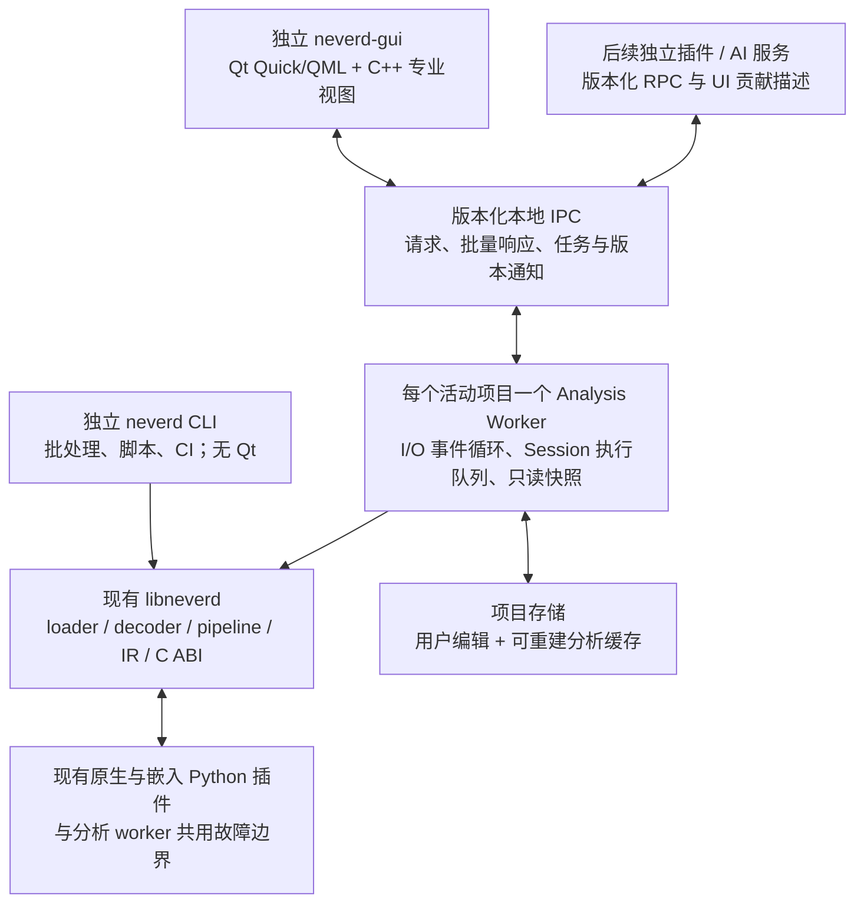

# NeverD 高性能 GUI 架构设计（中文）

日期：2026-09-09。状态：供设计评审；没有实施 GUI，也没有实测框架间性能排名。

## 1. 推荐决定

推荐 **独立 CLI + 共享 C++ 引擎 + 独立分析 worker + Qt 6 Quick/QML 工作台与 C++ 专业视图**。外观保持 VS Code Dark+，内部采用 IDA/Binary Ninja 式分析布局，突出 NeverD 的多级 IR 与源码恢复能力。

本轮明确区分 Qt Widgets 与 Qt Quick：前版首选是 Widgets；结合用户对界面迭代便利性、自定义风格和跨平台的要求，主选调整为统一 Qt Quick/QML。Widgets 保留为专业文本/桌面交互的对照与备用路线，不默认混用两个 UI 栈。CLI 独立是产品边界，不能由它推导出必须选择某个 GUI 框架。

这是根据现有 C++ 引擎、专业桌面交互需求及可控制的数据路径作出的工程判断。没有覆盖 NeverD 负载的横向实测，不能保证 Qt 在所有指标上都最快。先完成同负载性能验证，再锁定渲染实现。

需求优先级：后台分析时输入响应、可见视图帧时间、跳转延迟、内存随数据规模的增长，其后是启动和包体积，再后是开发速度。当前按 Windows x64、Linux x64、macOS arm64 设计；操作系统版本、最低硬件与团队规模在实施阶段确认。

## 2. 主流路线比较

调研覆盖主流桌面工具路线，未把 GitHub star、安装包大小或通用演示当成性能排名。

| 路线 | 适合之处 | NeverD 的主要成本 | 决定 |
|---|---|---|---|
| VS Code 扩展 | 使用已有编辑器、命令、侧栏及扩展分发 | 专业视图仍需开发；复杂 UI 进入 Webview，受宿主 API 约束 | 后续配套入口 |
| VS Code fork | 获得完整 IDE 工作台 | 上游合并、裁剪、专业视图开发同时存在；并不能自动得到分析器性能 | 主产品不采用 |
| 独立 Electron + Web UI | 统一 Chromium 版本，成熟 Web 工具链 | 浏览器运行时、IPC、前端数据与渲染优化 | Web 路线的有效对照 |
| Tauri 2 + SolidJS | 沿用原构想、细粒度 UI 更新、使用系统 Webview | Rust/C++/TS 三层，跨 Webview 验证，批量数据编解码 | 开发效率候选 |
| Qt 6 Quick/QML + C++ | 声明式布局、自定义主题、scene graph、C++ 数据模型；与当前界面方向吻合 | 专业文本交互、docking 集成、多窗口与输入法需验证 | 当前主选 |
| Qt 6 Widgets + C++ | 传统桌面控件、QDockWidget、成熟文本输入，贴合现有引擎语言 | 复杂定制外观的迭代较手工；图形仍需专用实现 | 文本/停靠交互对照及备用 |
| Dear ImGui | 轻量工具面板、直接输出渲染数据 | 完整国际化和无障碍存在官方明确的能力缺口 | 内部调试工具可用 |
| GPUI / 自研 GPU UI | GPU UI 方向有吸引力 | 需要额外验证控件、跨平台与扩展体系；GPUI 官方仍说明与 Zed 紧密关联 | 暂不作为主底座 |

VS Code 官方说明扩展不能访问宿主 DOM，Webview 有较高资源成本；这是 API 与资源模型事实，不是 NeverD 性能测试结果。[扩展能力](https://code.visualstudio.com/api/extension-capabilities/overview)、[Webview](https://code.visualstudio.com/api/extension-guides/webview)。Electron 允许将重计算放到 utility process；Tauri 采用系统 Webview，因此不能把 Tauri 包小推导为三平台均比 Electron 快。[Electron 进程模型](https://www.electronjs.org/docs/latest/tutorial/process-model)、[Tauri 进程模型](https://v2.tauri.app/concept/process-model/)。

同类产品提供了适配参考：Binary Ninja 官方 UI 插件文档使用 Qt6 Widgets，IDA 9.2 发布说明明确迁移到 Qt 6.8。它们证明 Qt 可支撑此类工作台，不证明具体产品间性能高低。[Binary Ninja 插件](https://docs.binary.ninja/dev/plugins.html)、[IDA 9.2](https://docs.hex-rays.com/release-notes/9_2)。Dear ImGui 的能力范围与 GPUI 的项目定位见各自一手资料。[Dear ImGui](https://github.com/ocornut/imgui)、[GPUI](https://gpui.rs/)。

### QML 是否方便，何时换栈

QML 用组件、属性绑定和声明式布局组织界面，适合快速迭代主题、菜单、设置、分栏和状态反馈。Qt Quick Controls 可在现有控件模板上定制外观，Dark+ 不需要自研全部基础控件。函数表、反汇编、Hex、图与跨视图选择属于专业能力，任何路线都需要相应实现；QML 不直接提供 Monaco 级代码编辑器。[QML 最佳实践](https://doc.qt.io/qt-6/qtquick-bestpractices.html)、[自定义 Controls](https://doc.qt.io/qt-6/qtquickcontrols-customize.html)、[Qt UI 技术比较](https://doc.qt.io/qt-6/topics-ui.html)。

SolidJS 是 Web UI 框架，可以放在 Electron 或 Tauri 内；它和桌面壳不是同一层。细粒度响应式能减少不必要的 UI 更新，但不会自动解决海量文本、图布局、数据复制或原生引擎耗时。对于已有 Web 团队，Web 控件与开发工具链可能缩短实现时间；对于当前 C++ 引擎和专用视图，Qt Quick + C++ 是更直接的候选。这是开发成本判断，P0 要记录实际投入。

如果转 Web，先用 **Electron + SolidJS** 验证同一专业视图，利用随应用固定的 Chromium 减少浏览器版本变量；再将同一 Web 视图装入 **Tauri + SolidJS**，检验系统 Webview 是否满足三平台一致性与资源预算。Tauri 使用 Windows WebView2、macOS WKWebView、Linux WebKitGTK；安装包较小不能证明交互更快或总内存一定更低。[Electron 性能指导](https://www.electronjs.org/docs/latest/tutorial/performance)、[Tauri Webview](https://v2.tauri.app/reference/webview-versions/)。

更换条件是同功能证据：Qt Quick 的必要桌面交互难以在约定投入内完成，或正确分页与优化后仍不满足预算；同时替代方案满足相同的文字质量、输入法、无障碍、三平台和性能要求。若问题主要是现成桌面控件缺口，先验证全 Widgets；若 Web 实现效率有明确优势，再选 Electron/Tauri。不为框架流行度重写工作台。

## 3. 仓库已经具备什么

以下结论来自当前工作目录的只读检查。行号是本次检查的位置，实施前应复核。

| 能力 | 当前证据 | 接入决定 |
|---|---|---|
| 共享引擎 | `lib/sdk/CMakeLists.txt:43`，目标 `neverd_shared` | worker 复用现有动态库 |
| CLI 接入 | `tools/neverd/CMakeLists.txt:92` | 使用 C API，不解析 CLI 文本 |
| Session、load/analyze、错误与内存释放 | `include/neverd/sdk/NeverDCAPISession.h:39` | 保留 C ABI；外部服务增加任务协议 |
| 函数、字节、反汇编、反编译、IR | `include/neverd/sdk/NeverDCAPIDisasm.h:39` | 作为首版数据来源 |
| CFG、调用图、xrefs、搜索 | `include/neverd/sdk/NeverDCAPIQuery.h:40` | 增加分页/索引适配，不重写分析语义 |
| 原生与 Python 插件 | `include/neverd/sdk/NeverDPlugin.h:35`，`docs/python-plugins.md` | 保留分析插件，新增 UI 贡献协议 |
| 注释与重命名持久化 | `include/neverd/sdk/NeverDCAPIPersist.h:39` | 兼容 JSON sidecar；项目数据库是后续新能力 |

最关键的缺口：`lib/sdk/capi/SessionImpl.h:298` 的 `ensurePipeline()` 同步运行整个 image 的 pipeline。`lib/sdk/capi/NeverDCAPIDecompile.cpp:34` 的单函数接口先调用它，不能当作已有的函数级增量分析。native 反汇编已有地址窗口；EVM/SBF 的查询存在先触发 pipeline 的路径，必须分别展示能力与等待状态。

当前 Session 存在可变 LLVMContext、Decoder、结果、函数表及错误状态；没有查到统一快照并发契约。公共 analyze 的线程注释不等于任意查询可同时执行。大部分表格返回整段 JSON；尚未发现通用公共进度、取消、优先级、稳定 revision、游标分页、完整项目恢复及 undo/redo 契约。

## 4. 进程和数据边界

### 独立命令行与交互式产品

| 产物（新名称为设计约定） | 责任与依赖 |
|---|---|
| `neverd` / `neverd.exe`（现有） | 独立命令行入口，批处理、脚本与 CI；保持现有参数、输出、退出码，链接共享引擎，无 Qt/QML 依赖 |
| `libneverd` / 对应 DLL（现有 `neverd_shared`） | 共享分析语义和 C ABI，不依赖 GUI、docking 或翻译资源 |
| `neverd-worker` / `neverd-worker.exe`（拟新增） | 无界面的持久分析进程，持有 Session、任务、项目写入和快照；通过 C ABI 复用引擎，不依赖 Qt |
| `neverd-gui` / `neverd-gui.exe`（拟新增） | Qt Quick/QML 工作台、C++ 视图与协议客户端；不加载引擎 DLL、不链接 LLVM；按需启动 worker |

关系可类比编译器、语言服务与编辑器：CLI 负责可组合的命令行任务；worker 为 GUI 保留长期交互上下文。clangd 官方设计也说明其保存解析结果与索引来回答编辑器查询；这里只借鉴持久服务边界，不照搬 LSP 表达二进制地址、CFG 和 IR。[clangd 设计](https://clangd.llvm.org/design/)。

CLI 可单独构建、安装和运行；GUI 为可选构建目标，拟用 `NEVERD_BUILD_GUI=OFF` 保持默认无 Qt，GUI 关闭时不能触发 Qt 查找。GUI 安装包附带匹配的 worker 与引擎；headless 包不附带 GUI 运行时。共享同一核心的实现不要求 CLI 和 GUI 同时启动，也不要求分成多个 Git 仓库。GUI 可独立发布，但连接前必须协商协议版本和能力，不能把任意 PATH 中的引擎当作兼容版本。

GUI 每个活动项目按需启动一个 worker，不注册系统常驻服务，不在每次跳转或刷新时启动一次 CLI，不解析面向人的 stdout。CLI 保留直接调用引擎的短路径；未来如果需要让 CLI 连接已打开项目，应增加显式协议客户端模式，不能让所有现有命令都依赖 GUI/worker。

GUI 不链接 LLVM 或私有 Session 头，也不在绘制函数中调用引擎。worker 通过 C ABI 链接 `neverd_shared`；保持该库内部的 LLVM 链接边界，避免再次引入仓库已记录的 macOS LLVM registry/AnalysisKey 问题。

GUI 自身拆成 QML 展示层、C++ 工作台状态/导航、C++ 分页模型与缓存、C++ IPC 客户端。QML 不导入 SDK，不持有全量分析结果；替换 UI 框架只需要重写展示层和客户端适配，不改变引擎、CLI、项目语义或线上的协议。Qt 模型与渲染代码是 Qt 专用代码，不宣称换 Web 时也可原样复用。

worker 的 I/O 事件循环和 session 执行线程分开，防止同步 pipeline 阻塞取消请求的接收与心跳。一个 Session 由一个执行队列持有，修改和旧 C API 查询串行；NeverD 内部仍可并行计算。GUI 从上一次已发布、不可变的快照读取内容。新结果准备完毕后发布 revision，绝不向读者暴露半完成结构。

“独立进程”用于故障隔离，不自动等于权限沙箱；同进程原生插件仍能影响分析 worker。进程隔离增加 IPC 和部分内存成本，收益必须同时通过交互和总内存指标评估。

### 数据协议

- 首版通过父子进程 stdin/stdout 管道传输带长度上限的消息；Qt GUI 使用异步 QProcess，worker 使用无 Qt 的 C++ 传输适配。stdout 只放协议帧，日志走 stderr；首版不需要端口、全局服务或远程连接。协议 schema 不含 Qt 类型，未来可替换为本地 socket。GUI 的 I/O、帧解码与页转换在独立客户端线程，QAbstractItemModel 更新通过有界队列回 GUI 线程。
- 在加载引擎/插件前保留专属协议输出句柄，并将普通 stdout 写入重定向到诊断通道，防止第三方 print 污染帧；stdin 由传输层独占。客户端持续读取并限量保留 stderr，不能因日志管道写满阻塞分析。传输测试覆盖原生/Python 风格普通输出与协议响应同时出现的情况。
- 首帧协商 `protocol_major / protocol_minor / engine_version / capabilities / project_schema`；不兼容时在打开项目前给出可理解的错误。GUI 首选随安装包附带的 worker，通过明确路径启动，不靠 shell 拼接命令；保留工具链切换作为后续设置。
- 请求字段包括 `protocol_version / request_id / project_id / expected_revision / operation / payload`；任务另有 `job_id`。资源 ID 替代跨进程指针。
- 分页响应带 `revision / next_cursor / complete / status`。状态区分成功空集、尚未分析、不支持、取消、失败和受预算限制，不把错误显示成“没有函数”。
- 图或表格完整快照可以分页运输，但分页完成前不能宣称获得完整关系。保留既有精确性和预算语义。
- 所有地址在 C++ 内部用 uint64；JSON、QML 属性与 Web 边界用十六进制字符串/不透明地址 ID。QML 的 JavaScript 同样不能用普通 number 计算完整 64 位地址，地址比较、加减和格式转换交给 C++。VA、RVA、文件偏移必须明确区分；未映射区域与 BSS 有单独状态。
- UI 取消旧跳转、丢弃不匹配的 request/revision；队列有数量与字节上限。优先处理当前视口，其次相邻预取，再次后台任务。
- 首版控制帧用带长度与上限的 JSON；反汇编/表格以结构化页返回，原始字节用二进制块。临时适配器可在 worker 内解析旧 JSON 一次后缓存，不把整个 JSON 原样转发给每个视图。
- 共享内存仅在 profiling 显示大块复制是瓶颈后引入。届时定义不可变块、字节序、大小/偏移校验、映射生命周期、引用租期与 worker 崩溃回收；不能把“共享内存”直接宣传为端到端零拷贝。

现有同步 pipeline 暂无通用协作取消时，只能立即反馈“正在取消”，并在安全阶段退出；必要时重启可恢复的 worker。必须明确区分“请求已收到”与“计算已停止”。提交用户编辑期间遵循事务边界，不能依赖强杀保证保存。

## 5. 工作台与渲染设计

### 布局

内部排版采用 **Binary Ninja 的并排分析窗思路，结合 IDA 式的函数导航与底部停靠区**。Dark+ 负责统一颜色，主要空间用于同时查看原始指令和恢复结果；工作台无需沿用 VS Code 的宽活动栏。Binary Ninja 官方说明其分析窗支持拆分、同步以及不同表示同时显示，这里借鉴该交互模式，具体布局由 NeverD 定义。[Binary Ninja 并排分析窗](https://docs.binary.ninja/guide/index.html#tiling-panes)。

| 区域 | 默认内容与行为 |
|---|---|
| 顶部窄工具区 | 文件、架构、地址/符号跳转、历史；下方是可导航的模块/函数概览条 |
| 左侧窄导航区 | 函数列表，名称/地址为主要列；下方收纳当前函数信息、段和符号 |
| 中央分析窗 | 反汇编默认可见，可独立切为 CFG 或 Hex；保留当前函数和地址锚点 |
| 右侧分析窗 | 伪代码默认常驻；顶部切换 C / LowIR / MedIR / HighIR / LLVM IR，与中央窗同步选择 |
| 底部停靠区 | 交叉引用与输出分标签展示，后续加入任务、日志和插件输出；点击引用跳转 |
| 状态栏 | 当前地址、表示、分析状态；保持 Dark+ 蓝色与简洁的信息密度 |

大窗口初始采用“左导航 + 反汇编 + 伪代码”的三列布局，两张分析窗共同占主要宽度。图形阅读模式切换为“左导航 + CFG + 伪代码/IR”。每个分析窗独立选择表示、固定函数或加入同步组，正式产品支持拖动分隔条、停靠和布局恢复。窄窗口允许把分析窗垂直排列或临时聚焦单窗，不靠缩小代码字体塞入内容。类型、注释和 AI 等附加信息按需打开，不常驻占用默认右分析窗。

### NeverD 的界面特征

- **表示切换直接可见**：把已有 LowIR / MedIR / HighIR / LLVM IR 与 C 源码恢复放在同一函数的阅读路径中。切换表示保留源地址选择；尚未产生的结果显示明确状态。
- **指令到源码的联动选择**：选择指令、基本块、IR 对象或代码范围时，高亮其他视图的对应范围；同一高亮语义贯穿图、文本和底部引用。映射以 source address/object identity 与 revision 为依据，允许一对多、多对一及缺失映射，不把相同行号当作语义对应。
- **紧凑地址概览**：显示实际模块/函数索引及当前位置，可点击跳转；它是导航信息，不能把示意分段长度当作实际文件占用或分析覆盖率。
- **独立阅读、统一上下文**：伪代码与 IR 切换只改变右窗表示，中央窗保持当前位置；用户能锁定一个函数与另一个函数对照。草图使用标明的示例数据，正式产品依赖引擎输出，不伪造“恢复成功”或精确性状态。

同步组共享一次版本化查询与有界结果缓存，更新只影响需要刷新的可见区域。隐藏标签暂停绘制，概览条不扫描整个 IR，后台分析不因打开多个表示而重复调度。

### 视觉主题与国际化

初始设计固定采用 **VS Code Dark+** 配色，内部结构按上面的专业分析工作台布局组织：紧凑平面布局、细分隔线、矩形标签页、单色线框图标、等宽代码字体、蓝色状态栏与选中反馈。启动时保持 Dark+，不随系统主题自动变亮；支持高 DPI 和可配置快捷键。

| 区域 | Dark+ 色值 |
|---|---|
| 编辑器 / 正文 | `#1E1E1E` / `#D4D4D4` |
| 侧栏 / 活动栏 | `#252526` / `#333333` |
| 活动标题栏 / 非活动标签页 | `#3C3C3C` / `#2D2D2D` |
| 状态栏 / 活动列表选中背景 | `#007ACC` / `#04395E` |
| 函数 / 类型 / 变量 | `#DCDCAA` / `#4EC9B0` / `#9CDCFE` |
| 关键字 / 控制流 | `#569CD6` / `#C586C0` |
| 字符串 / 数字 / 注释 | `#CE9178` / `#B5CEA8` / `#6A9955` |

颜色按 VS Code 官方 Dark+ 及其继承主题、工作台默认值核对；图节点和反汇编 token 使用同一套语义色。[Dark+](https://github.com/microsoft/vscode/blob/main/extensions/theme-defaults/themes/dark_plus.json)、[基础主题](https://github.com/microsoft/vscode/blob/main/extensions/theme-defaults/themes/dark_vs.json)、[工作台颜色](https://github.com/microsoft/vscode/blob/main/src/vs/workbench/common/theme.ts)、[列表颜色](https://github.com/microsoft/vscode/blob/main/src/vs/platform/theme/common/colors/listColors.ts)。

GUI 支持与项目一致的全部 **11 种语言**，以 `README.md:1` 和 `scripts/check_docs_i18n.py` 的语言矩阵为依据：`en` English、`zh-CN` 简体中文、`zh-TW` 繁體中文、`ja` 日本語、`ko` 한국어、`fr` Français、`de` Deutsch、`es` Español、`it` Italiano、`ru` Русский、`ar` العربية。首次启动默认 **English（`en`）**，不根据系统语言自动改变；设置和命令面板提供运行时语言切换，选择写入用户配置，重启恢复。

产品 UI 字符串使用英语源文与 Qt TS/QM 翻译资源，通过 `QTranslator` 切换，再调用 `QQmlEngine::retranslate()` 更新翻译绑定，C++ 提供的展示字符串发送对应变更通知；不重建分析 Session。缺失译文回退英语。插件贡献以命名空间隔离翻译键，附带同一 locale 约定的语言资源并接收语言切换通知。分析协议保留稳定字段和错误码，显示文本在 GUI 本地化；地址、指令、符号、原始字符串、代码和用户注释保留原文。默认内置全部语言包，无需下载；复数、占位符和区域化格式通过统一资源处理。CI 对照项目 locale 清单，检查翻译键覆盖、占位符一致和未完成译文；运行时英语回退不代替发布前的完整翻译验收。[Qt 翻译机制](https://doc.qt.io/qt-6/qtranslator.html)、[QML 重新翻译](https://doc.qt.io/qt-6/qqmlengine.html#retranslate)。

阿拉伯语界面支持 RTL 和双向文本，代码、反汇编、Hex、地址输入与 CFG 技术内容保持 LTR；本地化标签与这些内容分开排版。搜索和注释编辑验证中日韩 IME、阿拉伯语字形连接、字体回退、组合字符及复制粘贴；长译文允许弹性宽度和省略提示。首版验收覆盖全部语言切换、偏好持久化、缺失译文回退和阿拉伯语布局。[Qt 国际化与书写系统](https://doc.qt.io/qt-6/internationalization.html)。

同步导航携带来源，避免两个视图互相广播导致循环跳转；历史保存地址、视图类型、滚动位置与项目 revision。

### 文本、Hex、表格

QML 用于布局和轻量交互，C++ 保存数据与计算。函数、字符串和引用表采用 C++ `QAbstractItemModel` + Qt Quick `TableView/ListView`，复用可见 delegates；`data()` 只读本地页缓存，缺页异步请求。排序、过滤、页转换在 C++/worker 内完成，不把百万函数复制成 QML JavaScript 数组。模型通知在 GUI 线程批量提交。[TableView 虚拟化](https://doc.qt.io/qt-6/qml-qtquick-tableview.html)、[Qt Model 线程边界](https://doc.qt.io/qt-6/qabstractitemmodel.html#thread-safety)。

反汇编、Hex、IR 使用同一 C++ 地址/行模型。P0 先测只创建可见行的轻量 QML 文本实现；高密度视图以 C++ `QQuickItem` 为专用视口，缓存可见文本布局和选择几何，通过公开 scene graph API 绘制。只有基准表明逐行组件是瓶颈才扩大自绘范围，避免一开始自研完整文本编辑器。禁止每个历史 token 长驻一个 QML 对象、按字节建立控件或将整个文件塞进 TextEdit。

指令有变长边界，页游标必须来自有效解码边界；跨页选择和跳转使用地址锚点。超大逻辑行数使用 64 位 C++ 内部索引，滚动位置映射到局部窗口；不能依赖超高像素 contentHeight 或 QML 浮点值保存全局地址。字符串、token、字形和行布局按 revision 缓存；只刷新脏区域。C/IR 首版按函数加载，超大函数按行块显示并保留明确的未加载状态。

重命名、搜索和注释编辑复用标准 `TextField/TextInput/TextArea` 的 IME、光标和选择能力；分析文本首版以阅读、选择、复制、跳转为主。专业自绘视图必须提供键盘导航、可访问文本/动作和高 DPI 行为。P0 以可选择的 TextEdit/QPlainTextEdit 小文档基线检查文字与输入，基线不嵌入发布的 Quick 工作台。[TextInput](https://doc.qt.io/qt-6/qml-qtquick-textinput.html)、[Quick 无障碍](https://doc.qt.io/qt-6/accessible-qtquick.html)。

### CFG 和调用图

布局与渲染分开：后台计算节点位置、边路径与空间索引，GUI 仅绘制可见数据。缩放平移不重新布局，使用视口裁剪、细节层次、节点折叠、边聚合、命中索引。大调用图先展示聚合概览或当前函数邻域；展开后仍能追溯原节点与边。

默认采用 C++ `QQuickItem` + 公开 `QSGNode/QSGGeometryNode` 等 scene graph 接口，缓存节点/边几何和文字，只更新受影响部分。Qt Quick 通过平台图形后端呈现，验证 macOS Metal、Windows Direct3D、Linux 实际选用后端，并记录真实 render loop；独立渲染线程并非所有环境的保证。scene graph 不自动帮应用筛掉所有离屏分析对象，C++ 仍须做可见性筛选。[Qt Quick scene graph](https://doc.qt.io/qt-6/qtquick-visualcanvas-scenegraph.html)、[renderer](https://doc.qt.io/qt-6/qtquick-visualcanvas-scenegraph-renderer.html)。

首版不直接依赖 QRhi 私有接口或自写三套图形后端。若未来有必要，renderer 作为内部替换点，固定 Qt 版本后单独验证。性能对照使用独立 Widgets/QPainter 小原型，上传、合成与文字质量一起计量；软件渲染兼容路径单独验证并声明能力限制，不能假设自定义 GPU 材质在软件后端自动工作。

### 停靠、跨平台与开发边界

工作台统一用 `QQuickWindow/ApplicationWindow`、Quick Controls Basic 定制组件与 C++ 命令/布局状态。高级停靠首选验证 KDDockWidgets 的 QtQuick 前端，复用标签、拆分、拖出窗口和布局恢复；锁定版本前核对功能和分发许可适配。业务模型只认识 `panel_id / view_id / sync_group`，不将第三方 dock 类型写入分析协议。QML 本身的 SplitView 只解决分栏，不能把它当成完整 docking 系统。[KDDockWidgets 架构](https://docs.kdab.com/kddockwidgets-manual/latest/architecture_and_concepts.html)、[QtQuick 示例](https://docs.kdab.com/kddockwidgets-manual/latest/examples_qtquick_full.html)。

不默认在 QWidget 外壳中给每个面板嵌一个 QQuickWidget：Qt 文档明确其至少多一个离屏渲染阶段，并禁用 threaded render loop。选择统一 Quick 才能按其实际渲染模型验证；如果 P0 选择 Widgets，后续需形成完整 Widgets 方案，不能宣称两种路线优势可以无成本叠加。[QQuickWidget 性能](https://doc.qt.io/qt-6/qquickwidget.html#performance-considerations)。

跨平台采用同一套 QML/C++ 源码、按平台构建和打包。Qt 提供部署机制，但不会免除原生菜单/快捷键、标题栏、文件对话框、字体、输入法与多显示器差异。P0 必测窗口拖出/回停靠、不同 DPI 跨屏、屏幕移除后恢复布局、macOS 菜单键位，以及 Linux X11/Wayland 下的浮动行为；固定支持的 Qt/OS 版本。发布阶段分别检查 Windows 运行时、macOS 应用包和 Linux 插件依赖。[QML 部署](https://doc.qt.io/qt-6/qtquick-deployment.html)。

## 6. 引擎交互与项目状态

交互式分析分步演进：先加载元数据与可独立解码的字节，再调度分析；随后增加结果分阶段发布、当前函数优先和依赖感知的函数缓存。部分架构暂不支持快速路径时诚实展示等待状态。函数优先必须复用全局 ABI/类型/调用依赖的语义，不把一个函数硬切出来运行后直接当成完整分析结论。

新增只读分页和索引接口，避免函数列表每项多次 FFI/IPC，避免每次 xref 查询扫描全 IR。地址/符号索引的结果需保留候选/确定等现有语义，不能因加索引扩大分析能力声明。

新增版本化 C API 只做必要扩展：不透明任务/快照 handle、结构体 size/version、明确所有权/free、稳定错误码、页游标与能力位。保留旧 JSON API，供 CLI 和现有插件兼容。不可变块可结构共享；revision 变化不等于复制整个分析内存。

项目目录格式暂命名 `*.ndproj/`（新格式草案）：SQLite 保存用户命名、注释、书签、布局和事务日志；分析结果用可重建分块缓存。用户编辑与缓存失效分离，不因重算删除编辑。现有 sidecar 首次导入后记录来源，项目内部以一处数据为准，显式导出 sidecar，避免双写互相覆盖。

worker 是打开项目的唯一写入者，GUI 通过命令提交编辑；CLI 若操作同一项目也必须遵循项目锁或显式只读快照，不能与 worker 各自覆盖文件。现有 CLI 对普通输入/sidecar 的用法保持兼容，项目锁要求在新增项目格式落地时实施。GUI 布局属于界面状态，不进入分析缓存身份；worker 退出不应丢失已确认持久化的用户编辑。

缓存身份包含输入内容哈希、引擎版本、schema、架构/分析选项、调试符号和插件依赖。大文件哈希放后台；未校验完成前不复用可能陈旧的持久缓存。输入变更时使旧分析快照失效，并要求明确映射用户注释，不能仅凭文件路径认定同一项目。

## 7. 插件与 AI

### MCP：对外提供能力，GUI 内连接服务

MCP 是正式产品需求，包含两个方向：NeverD 提供 MCP Server 给外部 agent；GUI 作为 MCP Host，通过 MCP Client 连接 NeverD 及用户配置的其他服务器。MCP 负责工具、资源与提示模板的互操作，不代替模型提供商 API，也不自动执行 skill。skill 由外部 agent 或 GUI 内单独设计的工作流层解释。该分工依据 [MCP 架构](https://modelcontextprotocol.io/specification/2025-06-18/architecture)；实施时锁定明确的协议/SDK 版本并做兼容测试，不将不同版本的握手、取消和传输规则混用。

| 使用方式 | 设计行为 |
|---|---|
| 外部 agent + skill + CLI | 直接调用现有 neverd 命令；不依赖 GUI 或 MCP |
| 外部 agent + NeverD MCP | 独立 `neverd-mcp` 适配进程提供服务；GUI 未启动时可连接自有 headless worker |
| 外部 agent + 当前 GUI 项目 | GUI 显式启用当前会话连接后，MCP 适配器附着现有 worker，读取同一 revision；不得重新打开项目形成第二写入者 |
| GUI 内使用 MCP | 连接管理器管理本地/远端服务器，AI 面板展示可用工具、资源、调用参数、结果与错误；模型连接单独配置 |

`neverd-mcp` 是无 Qt 的独立适配层，转换 MCP 请求与领域查询，不复制引擎业务逻辑。GUI 的 MCP Client/模型网络请求在后台执行，QML 只显示连接和调用状态。用户打开 GUI 时不会自动启动模型请求或连接全部外部服务。

首版服务聚焦项目元数据、已发布函数/反汇编/IR/引用快照的分页读取，以及 GUI 当前选区资源和显式导航/高亮；附着 headless 会话时 GUI 专属能力明确不可用。工具描述和 schema 使用稳定英文名称，结果带 project/revision 与原始地址；界面说明覆盖全部11语言。大结果返回资源引用、页游标与截断状态，避免一次工具调用复制整个分析结果。MCP 不作为逐帧绘制或滚动取页通道，GUI 继续使用专用批量 IPC。

首版不将所有现有 C ABI 或插件命令机械暴露为 MCP tools。工具访问按用户配置的项目范围和读写类别管理；后续注释/重命名等编辑复用工作台命令、revision 校验和撤销历史。外部资源和工具结果作为内容处理，不能变成宿主系统指令；模型请求携带的项目上下文在发送前受用户设置约束。

外部本地 agent 优先使用标准 MCP stdio；GUI MCP Client 支持 stdio 与 Streamable HTTP，HTTP 连接遵循所选协议的认证规则。MCP stdio 使用所选标准的消息格式，不能直接复用内部带长度头的 worker 帧格式。[MCP 传输参考](https://modelcontextprotocol.io/specification/2025-11-25/basic/transports)。

为附着已打开的 GUI 项目，增加用户启用的本机会话 broker：通过受操作系统访问控制与会话凭证保护的命名管道/Unix domain socket，将适配器请求路由到 GUI 当前 EngineClient 和同一 worker。broker 是新增的可选入口，保留 GUI→worker 父子管道，不要求改成全局常驻服务；GUI 关闭后附着连接明确结束，不自动转成新的项目会话。MCP connection ID 与领域 project/session ID 分开，不把 HTTP 连接生命周期当作项目生命周期。

MCP 在 P0 冻结边界与传输预算，P1 完成 headless server、GUI 附着及 Client 连接管理的最小闭环，P2 扩展视图资源与 AI 面板联动。P1 增加了实质工作，原工期需在细化该独立子项目后重新估算。

保留现有 native/Python 分析插件，在 worker 内加载并沿用 C ABI。当前 Python 是嵌入 CPython，GIL 不能代替 session 串行规则。兼容旧插件并不自动实现独立插件进程。

增加 GUI 贡献协议：`command / menu / panel / table / decoration / navigation`，以插件命名空间和稳定 ID 注册。注册信息是可查询的持久状态，事件仅报告更新；前端重连时重放 registry，不能依靠一次 `add_panel` 事件维持布局。卸载时统一撤销命令、监听器和数据租期。

新脚本扩展可运行在独立进程，通过 RPC 获取只读快照和提交命令；不传 `neverd_session_t` 指针。首版 UI 插件通过描述式贡献使用宿主组件，不让分析插件直接操作 QML 对象树。任意自定义 QML/C++ UI 扩展只作为明确受信任、与产品版本绑定的后续高级能力，会共享 GUI 故障边界；首版不需要这个入口。

AI 先提供用户主动触发的解释、摘要、候选注释，结果标为建议。上下文绑定函数和 revision，流式输出有界；后台任务不占用 UI 线程。重命名、编辑或导出由可审阅的命令执行并支持历史记录。第一版不引入插件市场、远程调试器或自动执行分析动作的 AI 工作流。

如果最终选回 Tauri：仍保留相同的 worker/查询契约。Events 仅传少量状态，Channels/commands 承载适合的数据流；大响应按官方二进制接口验证，不能声称零拷贝。SolidJS 只管理可见 UI 状态，不把整个分析图放进响应式对象树。[Tauri Events/Channels](https://v2.tauri.app/develop/calling-frontend/)、[Tauri 二进制调用](https://v2.tauri.app/develop/calling-rust/)、[Solid 响应式机制](https://docs.solidjs.com/advanced-concepts/fine-grained-reactivity)。

## 8. 性能验收与选择依据

以下是建议目标，不是测量结果。P0 固定硬件、OS/驱动、Qt/Webview、Release 配置、DPI、窗口大小和数据版本后，才能确认正式门槛。

| 场景 | 建议门槛 / 记录方式 |
|---|---|
| 缓存命中时滚动与 CFG 平移 | 60 Hz：实际显示帧间隔 p95 ≤16.7ms、p99 ≤33.3ms；120 Hz 以 p95 ≤8.3ms 为提升目标 |
| UI 每帧应用侧工作 | 以 ≤4ms 为起始预算，布局、解码和同步 IPC 不得挤占预算；记录 CPU/GPU 时间及掉帧 |
| 已缓存地址跳转 | 输入到内容显示 p95 ≤50ms |
| 未缓存页但分析已完成 | 输入到页显示 p95 ≤200ms；与首次分析耗时分开报告 |
| 后台分析时交互 | 命令反馈 p95 ≤100ms，同时报告引擎吞吐，避免靠严重降速伪造流畅 |
| 取消 | 请求状态反馈 ≤100ms；协作取消阶段目标 ≤2s。没有 checkpoint 的旧调用单独记录实际停止时间 |
| GUI 数据缓存 | 起始可配置预算 256 MiB，含 CPU/GPU 数据缓存；与 Qt 基础内存、worker 分开列账 |
| 启动/打开/重开 | 记录冷/热启动、元数据首屏、反汇编首屏、首次反编译、项目缓存恢复，各自 p50/p95 |
| 内存 | 同时记录 GUI、worker、插件及进程树；RSS 求和注明共享页重复计量，并尽可能补充私有驻留/PSS |

参考数据：100MB/1GB/5GB 文件；10万函数主测试、100万函数压力测试；1000万条逻辑行的按需模型；1000和10000节点 CFG。大型图另记录可见节点数、边数和 LOD，不能把“完整绘制所有文本”与“缩略概览”混成同一成绩。文件大小和完整分析时间没有线性或即时完成保证。

两类测试必须分开：冻结分析快照的前端测试，隔离 UI/IPC/渲染成本；真实 PE/ELF/Mach-O 端到端测试，暴露 loader/pipeline 瓶颈。EVM/SBF 单独列出当前快速浏览能力。使用自编译样例与可公开分发的 fixture，保持字体、视口、像素密度、数据内容及后台计算预算一致。

默认 Qt Quick/QML + C++。P0 先验证 Quick 双窗与停靠/文字交互，按具体未决问题启用 Widgets 或 Web 小原型，不同时建设四套完整工作台。如果 Web 候选在同等功能下满足全部交互与内存预算，且有明确开发效率收益，可以更改 ADR。任何候选未达标时先定位引擎、IPC、布局、文本或 GPU 的具体瓶颈，不以“换框架”代替诊断。

## 9. 交付分期

估算前提：两名熟悉 C++/桌面开发的工程师、已有可用三平台构建与测试设备。以下是排期预算，P0 后重估，不是承诺。

| 阶段 | 可评审交付 | 参考用时 |
|---|---|---|
| P0 | Quick/C++ 双窗、停靠与文字验证；按需启用 Widgets/Web 同数据对照，明确 ADR | 首轮 1–2 周；若需 Web 对照再估算 |
| P1 | 独立 GUI/worker 构建与发布边界、Dark+ Quick 工作台、导航与函数/反汇编/Hex；英文默认及全部11语言切换、可恢复任务状态 | 2–3 周 |
| P2 | 并排伪代码/IR/反汇编窗、选择映射、底部xrefs、CFG、后台图布局、分页与缓存 | 2–4 周 |
| P3 | 项目保存恢复、注释/命名撤销重做、UI 插件注册 | 2–3 周 |
| P4 | 三平台发布包、性能回归、全语言与RTL回归、输入法/无障碍、多显示器、可选 AI | 2–4 周 |

基础分析 GUI 预计 P1/P2 形成可用版本。P0 后若确认需要重构 pipeline 才能实现当前函数优先与阶段取消，另设 3–6 周研发预算，并依据真实依赖调整；不能把它塞进普通 UI 接口包装任务。达到 IDA/Binary Ninja 的完整产品深度不属于上述工期。

各子项目单独细化实施计划，依赖顺序为：性能证据 → worker 与版本契约 → 核心视图 → 持久化/扩展 → 产品化。当前只交付设计与第一阶段验证计划。
