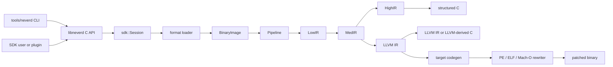

**语言**: [English](../architecture.md) | [简体中文](architecture.md) | [繁體中文](../zh-TW/architecture.md) | [日本語](../ja/architecture.md) | [한국어](../ko/architecture.md) | [Français](../fr/architecture.md) | [Deutsch](../de/architecture.md) | [Español](../es/architecture.md) | [Italiano](../it/architecture.md) | [Русский](../ru/architecture.md) | [العربية](../ar/architecture.md)

[← 文档索引](README.md)

# NeverD 架构

本指南说明贡献者安全修改 NeverD 所需了解的生产边界。内容有意仅涵盖
NeverD 自有代码；LLVM、Capstone 和 Unicorn 子模块维护各自的内部架构。

## 系统边界

NeverD 有四种 IR 表示，但它们并非一条必须经过四跳的序列。`LowIR -> MedIR`
为共享部分；结构化反编译随后采用 `MedIR -> HighIR -> C`，而 `lift`、
`decompile --llvm` 和 `patch` 则直接走 `MedIR -> LLVM IR`。尤其是 patch 与
lift 模式会有意跳过 HighIR。

CLI 在 `tools/neverd` 中解析命令，创建 `neverd_session_t`，并调用
`include/neverd/sdk/NeverDCAPI.h` 中的公共 API。引擎状态位于
`lib/sdk/SessionImpl.h`；`neverd_session_load` 选择 loader 并构造
`BinaryImage`，基于 IR 的操作则按需运行 `lib/pipeline/Pipeline.cpp`。
`neverd` 可执行文件链接 `neverd_shared`；组件归档以及其 LLVM/Capstone
依赖是该共享库的私有实现细节。CLI 使用 LLVM Support 构建命令行界面，
但不会绕过 C API 驱动引擎。

HighIR 的 `HighSourceFlow` 统一管理输出语句的控制流边、局部变量身份和确定赋值分析。
源码验证与无用 PHI 复制消除共享这张图。有界划分跟踪局部标量之间及与零的重复等值比较；
交换操作数和保持位宽的整数视图共享条件事实，写入任一操作数都会使其失效。
地址逃逸的变量保持未知，位宽不一致时拒绝推断，划分超限时退回保守控制流图。
仅当标量值在所有可行上下文中都不会被使用时，才删除 PHI 复制。
调用、加载和存储保留可观察行为，删除复制也保留源码标签。分析之前，HighIR 会把同一局部变量
的相邻字节切片简化为连续切片，并保留结果类型；这一恒等变换不会合并独立的加载或调用。

Block 使用方的逃逸分析也使用这张图，以有界不动点分析跨分支和循环传播指针身份及私有栈槽信息。合流保留可能的上下文地址，只有完整覆盖才能清除。未知跳转、异常控制流和证明预算耗尽都会拒绝绑定。

源代码调用发现以有界前向不动点传播寄存器事实。普通控制流合流仅保留所有已到达前驱一致的选择器、导入槽或数字地址。
独立入口和异常入口从未知状态开始；循环回边收敛后才发布调用绑定。物理寄存器别名写入、未知调用和指令内临时量
不会把过期事实带到后续基本块。非法边或计算预算耗尽会拒绝这项证明。

必需的 Swift 值见证操作使用独立且不依赖符号的调用证明。有界反向追踪必须证明间接目标取自
该操作规定的 `metadata[-1][slot]` 表项，并且同一 metadata 值位于其规范 Swift 参数载体。
当前支持 `destroy` 和 `initializeWithCopy`。所有前驱都必须一致；损坏的 CFG 边、部分写入、
有序加载、调用破坏或预算耗尽都会拒绝绑定。生成的 C 通过实时 metadata 重新读取该表项，
不会保留被分析镜像中的见证函数地址。

Objective-C 属性元数据提供独立于方法实现的访问器声明，支持动态属性、只读属性和自定义访问器。
加载器验证类、分类或协议记录的布局，再通过共享编码解析器和 Darwin ABI 层生成标量或指针签名。
调用绑定要求所有匹配的属性、方法、协议及已启用 SDK 声明一致；属性记录不会创建原生函数，
也不会增加运行时方法总数。64 位记录布局依据
[Apple 运行时 ABI](https://github.com/apple-oss-distributions/objc4/blob/main/runtime/objc-runtime-new.h)，
分类中可选的类属性字段还需要
[镜像布局标志](https://github.com/apple-oss-distributions/objc4/blob/main/runtime/objc-abi.h) 才能读取。
不支持的属性编码和损坏的属性列表会保留明确诊断。

Objective-C 接收对象事实区分方法入口的 self 与确定的类引用；只有共用入口的所有元数据记录一致时，才建立 self 类型事实。完整宽度复制和 ABI 规定保留的寄存器通过同一不动点分析传播事实，入口回边也参与合流。声明检查区分类方法与实例方法，并纳入已记录的分类、父类链和协议继承；入口 self 还需考虑已知子类声明。编译器目录分别保留声明所属对象和继承关系，以及全局选择器一致性信息。发布源码前，SDK 会依据当前镜像重新验证接收对象的来源及适用声明。这些事实不会选择具体 IMP，也不授权二进制重写。
外部继承信息缺失时，必须改用全局选择器一致性检查，不能缩小到接收对象范围；明确不支持或冲突的声明仍保留为否定证据。

带明确对象类型的成员变量可通过最多八次完整宽度读取延伸接收对象证明。每一步记录运行时偏移槽、偏移值宽度，以及机器访问中使用的固定字节偏移。固定偏移必须仍与当前布局一致；运行时偏移引用则可以跟随字段移动。加载器核对已记录的类继承链和具体字段声明。部分读取、裸 id、Block、仅协议类型、歧义存储和未知指针基址都不能产生类事实；源码验证会依据当前镜像重新检查整条路径。这些事实描述声明类型，不代表对象身份，也不允许删除内存操作。

加载器验证 Darwin 常量字符串、整数对象、数组和有序字典组成的有界无环图。容器字段和每条边都需要不可变映射存储，以及无歧义的导入或重定位证据；不支持的编码、循环和不完整对象图会明确失败。源码绑定重新验证对象图及传入指针槽。生成的辅助函数保留整数位模式、子对象顺序和共享地址，并复用已有字符串身份。容器槽通过 acquire/release 发布机制只初始化一次，初始化仅调用已验证的子对象辅助函数。每个辅助函数自带子函数声明，使独立恢复的方法可以共用同一定义。可移植测试覆盖损坏输入和证明预算；原生编译器样例对照原始方法检查内容、别名、复制身份和并发初始化。

## IR 表示与路径

| 表示 | 用途 | 主要定义与转换 |
|------|------|----------------|
| LowIR | 架构无关的 `NdOp` 操作、基本块、CFG 和跳转表元数据 | `include/neverd/ir/low`、`lib/ir/low`，由 `lib/decode` + `lib/lift` 生成 |
| MedIR | 类型、ABI/调用约定、内存与栈模型、标志、调用和类 SSA 数据流 | `include/neverd/ir/med`、`lib/ir/med` |
| HighIR | 用于可读 C 的结构化表达式与控制流 | `include/neverd/ir/high`、`lib/ir/high`，由 `lib/backend/c/HighC` 发射 |
| LLVM IR | 优化、LLVM 派生 C、目标代码生成和二进制重写输入 | `lib/backend/llvm`，由 `lib/pipeline` 优化/编排 |

常量在 LowIR、MedIR 和 HighIR 中保留每次出现时的标量/地址来源及地址归属。数值位相同不会合并不同来源。HighIR 符号简化将地址身份作为不透明输入；源码绑定使用共享的数值操作数分类，并仍要求内存和指针使用完成重定位绑定。

| 用户路径 | 表示路径 | 出口 |
|----------|----------|------|
| Low/Med dump | Binary -> LowIR，可选 -> MedIR | 诊断文本 |
| High dump 或 `decompile` | Binary -> LowIR -> MedIR -> HighIR | HighIR 或结构化 C |
| `lift` | Binary -> LowIR -> MedIR -> LLVM IR | `.ll` |
| `decompile --llvm` | Binary -> LowIR -> MedIR -> LLVM IR | LLVM 派生 C |
| `patch` | Binary -> LowIR -> MedIR -> LLVM IR -> codegen | 重写后的二进制 |

`lib/pipeline/Pipeline.cpp` 是路径选择的事实来源。特定表示的逻辑应留在其
所属 IR 或 backend 库中；pipeline 应编排这些组件，而不是吸收它们的算法。

## 跨架构翻译契约

`include/neverd/translate` 定义的是契约层，而不是执行后端。`GuestState`
为 `x86_32`、`x86_64`、`AArch64` 和 `ARM32` 建模架构无关的机器可见状态。
其规范的版本 1 序列化采用固定宽度的小端字段、稳定的寄存器 ID、有序集合和
失败即关闭的验证，因此持久化状态不依赖宿主 C++ 布局。

`GuestState` 的 wire v1 基线永久冻结。基线以外的机器状态只能使用扩展区间内的
extension-register ID，并配套规范的小写名称；否则必须采用新的 wire 版本并提供
显式 upgrader，禁止原地改变 v1 基线。

对于 `ARM32` guest，`ExecutionMode` 是权威解码模式，并且必须与 `CPSR.T`
一致。保存的 PC 始终是清除 bit 0 后的规范指令地址；ARM 模式还要求按字对齐。

架构对策略定义 `x86_64 -> AArch64`、`AArch64 -> x86_64`、
`x86_32 -> AArch64/ARM32` 和 `ARM32 -> x86_32/x86_64`。
`ContractDefined` 表示请求可以验证和持久化，并不表示代码已经可以翻译或执行。
JIT 策略只接受运行中进程的本机宿主；AOT 策略则要求显式给出宿主架构、目标
triple；若选择了 CPU 或特性集合，也必须显式给出。

`ResolvedHostTarget` 将该选择解析为具体结果。`Native` 解析从当前进程取得 triple、
CPU 以及启用/禁用的特性集合；`Explicit` 解析验证并规范化调用方提供的架构、triple、
CPU 和特性，并拒绝互相冲突的输入。其带版本的缓存标识按确定的字节顺序从规范化目标
输入构造，不包含进程地址或依赖 locale 的文本。

带版本的 `TranslationExit` 记录稳定的停止原因及其匹配的类型化载荷，覆盖系统
调用、异常或信号、断点、不支持的指令、自修改、资源预算、外部调用、内存故障
以及其他终止条件。使用方无需再根据停止原因重新解释一个无类型整数。

除与对应预算匹配的 `BudgetExhausted` 外，结果报告的指令数、block 数和生成代码量
都不得超过请求中的对应非零预算。指令与 block 耗尽会精确停在 limit。生成目标文件
大小只能在不可分割的 codegen 完成后精确测量，因此该预算耗尽结果可以报告
`Observed > Limit`；被拒绝的目标文件绝不会被链接、发布或执行。每个
`BudgetExhausted` 载荷都必须精确标识请求的 limit，不能报告推导值或实现私有阈值。

backend-private `RuntimeControlBlockV1` 契约固定为 128 字节、8 字节
对齐，并以固定的 v1 magic、version、size、字段偏移、全零保留字段和自洽的类型化
退出记录加以约束。它不包含 C++ 容器、宿主指针或 guest 地址别名，也不是
`GuestState` 的 C++ 布局或 wire 格式；实现该契约的后端必须显式把状态转换到该记录。

固定的 v1 generated-code 调用面只包含八个 helper：
`nvd_rt_v1_load8_le`、`nvd_rt_v1_load16_le`、`nvd_rt_v1_load32_le`、
`nvd_rt_v1_load64_le`、`nvd_rt_v1_store8_le`、`nvd_rt_v1_store16_le`、
`nvd_rt_v1_store32_le` 和 `nvd_rt_v1_store64_le`。名称、签名和指针 provenance
必须精确匹配；后端必须显式绑定这个有限表，绝不能回退到环境符号解析。可执行内存
generation 验证和预算/取消轮询只由受信任 dispatcher 执行；
`nvd_rt_v1_validate_generation` 和 `nvd_rt_v1_poll` 均不是 generated-code helper。
受信任宿主 dispatcher 还负责选择 block，生成 IR 不能调用它；translated block
只返回类型化退出码。生成 IR 只能直接读取声明过的 scalar-result runtime slot。

`RuntimeSymbolRegistryV1` 将该 helper 表实现为封闭的宿主侧注册表。构造过程验证完整的
ABI-v1 集合、精确的规范名称、helper class、签名，以及每项唯一一个非空且与 class
匹配的函数指针。查找只接受精确名称，绝不查询进程环境或动态加载器的符号，并向目标
文件 verifier 提供同一组有序名称作为 allowlist。其带版本的标识覆盖名称、helper
class 和 ABI 形状，但有意排除本机地址，因此不受 ASLR 影响。

`RuntimeCodeMemory` 管理按页隔离的生成代码存储，只允许单向 `RW -> RX` 发布转换。
内存不会同时可写和可执行，发布后不能重新开放写入；写入和入口偏移均经过边界检查，
发布时还会刷新宿主指令缓存。本机 smoke test 只在发布后执行一小段宿主指令；它证明的
仅是这个 W^X 内存边界，而不是翻译引擎。

`GuestMemoryRuntime` 与逻辑 `GuestState` 隔离：构造时先验证状态，再把内存区域的
字节和元数据复制到有序的私有索引。guest 虚拟地址只作为查找键，绝不会转换为
宿主指针。受检标量访问会以类型化形式报告宽度、对齐、溢出、未映射、跨区域、
权限、可执行写入、generation 溢出、generation 不匹配和策略故障。指令/block
预算、取消、generation 跟踪以及 `RejectExecutableWrites`、
`InvalidateOnExecutableWrite`、`ValidateBeforeDispatch` 三种代码写入策略同样生成
自洽的类型化记录，而不是隐式宿主行为。

`TranslationObjectCompilerV1` 是经过验证的 LLVM IR 到目标文件边界。它先验证 const
输入 module，在任何变换前完成 clone，将证明门控的语义化简与 LLVM `O0` 至 `O3`
优化组合，再次验证最终 IR，并为四种契约宿主架构发射 relocatable ELF、COFF 或
Mach-O 目标文件。它规范化精确的 target-mangled block/runtime 符号 manifest，审计
每个发射结果，并返回 runtime registry identity 以及带版本的请求和制品 cache key。
生成字节预算非零时，只有满足它的目标文件才能继续进入制品验证。LLVM 先向私有缓冲区
完成一次不可分割的发射以取得精确大小；超限目标文件会在发布和制品审计前被拒绝，类型化
遥测保留实际大小与请求的精确 limit。零表示调用方策略不设上限。编译器止步于已审计的
relocatable 字节：它不负责链接、发布、分派或执行，也不提供 guest 指令 lowering。

post-codegen verifier 把 relocatable ELF、COFF、Mach-O 目标文件作为
闭集审计。格式和架构必须与选定宿主精确匹配；未定义符号必须精确属于有限 helper
allowlist，动态符号一律禁止。relocation 采用显式直接白名单，并检查 encoding、
width、alignment、offset、可加载目的节，以及目标是否为目标文件内
non-preemptible 定义或精确获准的 helper。verifier 拒绝 W+X、异常/展开与初始化
元数据、TLS、IFUNC、GOT 与普通 PLT 间接机制、动态 relocation、weak/preemptible
或可选择定义、未知 allocated section 和 linker directive。只有当 v1 policy 证明
LLVM 隐藏的 x86-64 ELF `R_X86_64_PLT32` 是指向精确 runtime helper 的 sealed direct
branch 时才允许该拼写；它不会放行 PLT 或 GOT 路径。ELF `ET_REL` 制品不得包含
program header 或 segment。Mach-O load command 采用正向白名单：必须且只能有一个
位宽匹配的 segment，symbol table、dynamic-symbol table、platform-version 和
data-in-code command 各至多一个，并检查相互依赖；linker option 和其他所有 command
均拒绝。

`TranslationObjectRequestV1` 是建立在上述契约上的首个公开、且有意收窄的
guest 字节到目标文件切片。在当前发布的失败封闭 x86-64 v1 标量寄存器子集中，它只
接受无 legacy prefix 的 canonical 编码：采用受支持寄存器/立即数 LowIR 形状的
REX.W 全宽 GPR `MOV`、`ADD`/`SUB` 与 `AND`/`OR`/`XOR`。schema 9 还接受全宽
寄存器/寄存器 `CMP` 编码 `39/3B`、寄存器/立即数 `CMP` 编码 `81/7`、`83/7` 与
`3D`、寄存器/寄存器 `TEST` 编码 `85`，以及寄存器/立即数 `TEST` 编码 `F7/0` 与
`A9`。算术形式保留相应的标量 flags 计算；逻辑形式和 `TEST` 计算架构定义的 flags，
并在 NeverD 状态模型中保持 `AF`。canonical `C3` `RET` 和
`C2 iw` `RET imm16` 终止返回 block；canonical `EB cb` 与 `E9 cd` 直接相对 `JMP`
编码终止直接分支 block。当前公开 lowering schema 为 9。canonical、无 legacy prefix
的传统 Jcc 仅支持以下形式：`JO`/`JNO` 的短形式 `70/71 cb` 或近形式 `0F 80/81 cd`；
`JB`/`JAE` 的 `72/73 cb` 或 `0F 82/83 cd`；`JE`/`JNE` 的 `74/75 cb` 或
`0F 84/85 cd`；`JBE`/`JA` 的 `76/77 cb` 或 `0F 86/87 cd`；`JS`/`JNS` 的
`78/79 cb` 或 `0F 88/89 cd`；`JP`/`JNP` 的 `7A/7B cb` 或 `0F 8A/8B cd`；
`JL`/`JGE` 的 `7C/7D cb` 或 `0F 8C/8D cd`；`JLE`/`JG` 的 `7E/7F cb` 或
`0F 8E/8F cd`。`JRCXZ`/`JECXZ`/`JCXZ` 与 `LOOP`/`LOOPE`/`LOOPNE` 仍未发布，
并以 fail-closed 方式拒绝。保留的 `F7 /1`、guest-memory 操作数、部分寄存器形式、
legacy prefix 和语义冗余的 REX 扩展位同样以 fail-closed 方式拒绝。输出仅限经过审计的
little-endian AArch64 ELF 或 Mach-O relocatable 目标文件。普通 guest 内存操作、部分
寄存器形式、该精确子集外的任意指令或编码、返回、这些直接跳转和上述已发布 Jcc
分支以外的控制流，以及 lowerer 尚未实现的任何 LowIR 操作都会在目标文件生成前被拒绝。
`RET` 所需的受检返回地址读取属于其 terminator 契约的内部
行为，并不发布通用 guest 内存 lowering。请求会重新构建并验证 block descriptor，
lowering 与目标文件生成共用同一个已解析 target machine，并将证明门控的语义化简与
LLVM 默认 `O2` 优化流水线组合。该切片不代表支持其他 x86-64 指令、其他 guest/host
组合或反向 AArch64 到 x86-64 翻译。

公开 C 入口 `neverd_translate_x86_64_block_to_aarch64_object_v1`、Python ctypes wrapper
`translate_x86_64_block_to_aarch64_object` 和 `neverd translate-object` 命令暴露同一个
仅生成目标文件的边界。Python 使用 `TranslationObjectFormat.ELF` 或 `.MACHO`；原生库
报告的翻译失败会抛出携带 `TranslationErrorCode` 的类型化 `TranslationError`，本地
参数验证则抛出 `TypeError` 或 `ValueError`。成功时返回由 Python 拥有的不可变结果。
C 结果拥有目标文件字节、稳定 cache identity 与优化遥测；CLI 只写出选定的 ELF 或
Mach-O 目标文件。这些 C、Python 与 CLI 对象接口都止步于链接、加载、分派、执行和
调试之前；它们不是执行 session 接口。

`verifyTranslationLinkGraphV1` 增加第二道独立的 allocation 前审计。它从已接受的
AArch64 ELF 或 Mach-O 目标文件建立临时 LLVM JITLink graph，并检查 target、section
权限、block/runtime 符号 manifest、外部符号闭包以及 edge 类型与目标。产生不含地址的
审计结果后即销毁 graph。通过该审计不等于链接、分配、解析、加载、发布、分派或执行代码。

`linkTranslationObjectV1` 是独立的原生链接边界。它在裁剪、分配、符号解析和 fixup
前后重新审计可信 descriptor、原始对象和 JITLink graph。runtime 符号只能来自 sealed
注册表。dispatcher credential 将唯一的 manifest 条目绑定到对应 session、block identity、
guest 入口 PC、cache generation 与 code epoch；调用时 runtime guest `RIP` 还必须匹配
该入口。成功 finalize 后以最终权限发布可执行内存；unload 会撤销新调用，并等待一个
正在进行的调用结束后再释放 allocation。无 credential 的 overload 仍仅用于审计，不能调用。

`NativeTranslationSessionV1` 将这些组件组合为实验性的 C++ x86-64 到原生 AArch64
执行边界。在 little-endian AArch64 ELF 或 Mach-O 进程上，它在 compile-link-validate-
invoke-unload dispatcher 循环中跨 block 保持同一个受检 guest-memory runtime 和固定
guest state。canonical 直接跳转会在其精确静态目标继续执行。已发布的 canonical
Jcc 分支只能在 block manifest 声明的 taken 或 fallthrough successor 继续；dispatcher
拒绝其他任何选定 PC。返回会终止执行。全局指令数、block 数和生成对象字节数预算在多个
block 间保持精确；guest 成功停止时，已执行状态与权威内存一并提交。取消操作与最终提交
线性化。

这是一个可执行的纵向切片，而不是完整翻译器。它尚不支持普通 guest-memory 指令、
部分寄存器、上述精确 schema-9 传统 Jcc 切片之外的条件控制流（包括
`JRCXZ`/`JECXZ`/`JCXZ` 与 `LOOP`/`LOOPE`/`LOOPNE`）、间接控制流、
调用、浮点、SIMD、x87、原子操作、系统指令、
通用异常传播、block cache、其他 guest/host 架构对或反向 AArch64 到 x86-64。执行 session
尚无 C、Python、CLI 或 JSON 接口，调试仍是独立且不受支持的能力。上述对象 API 无需
启用原生执行仍可单独使用。

生成 IR 契约要求受该契约约束的每个 translated block 都是 hidden、non-preemptible，
并采用 C ABI `i32 (ptr state, ptr runtime)`。runtime 只能通过私有注册表发现 block，
不能依赖进程环境的符号查找；禁止 block 之间直接调用。

IR verifier 还将整数宽度限制在宿主标量寄存器宽度以内，以避免 legalization 引入
已知 compiler-runtime libcall。该检查只是必要条件：任何实现该契约的执行后端都
必须依据同一有限的 runtime-symbol allowlist，对 post-codegen 控制转移、`MachineIR`
和目标文件 relocation 进行精确审计。

TranslationIR 的直接 load/store 以及 private constant 保存的值，只能包含单个、不宽
于宿主标量寄存器宽度的标量整数。聚合值必须在 verifier 边界前完成标量化，避免紧凑
IR 触发后端无界展开。

generated-code ABI 只为标量整数定义。浮点、SIMD、x87、原子操作和系统指令均在
该契约之外。选择 `ProvenSemanticAndLLVM` 策略的实现必须运行 NeverD 现有的证明
门控语义简化，并与 LLVM 优化共同达到不动点；该策略本身不提供可执行翻译后端。

## Windows 驱动模拟

`lib/emulation` 是由 `NEVERD_ENABLE_DRIVER_EMULATION` 启用的可选执行组件。`emulate-driver` CLI 通过公共 C API 访问该组件。`DriverSession` 负责有界的 x64 WDM 初始化，以及可选的串行 create／IOCTL／read／write／cleanup／close／unload 调用；Windows 映像映射使用现有加载器提供的完整 `BinaryImage`，Windows 模型负责来宾对象和 API 语义。Unicorn 适配器负责 CPU 执行，并持有来宾内存的权威状态。此路径不使用实验性的原生翻译流水线，也不改变其支持范围。

Unicorn 通过 `cmake/NeverDUnicorn.cmake` 统一配置一次，与语义测试共享，并在 `BUILD_TESTING=OFF` 时仍可用。未知 API 和 CPU 环境行为会明确停止；驱动返回失败与模拟未完成始终保持区分。限制、报告及不支持的生命周期操作见[驱动模拟](driver-emulation.md)。

原有 C API 仍仅执行初始化。场景 JSON 在相同执行选项上使用统一的严格解析器，字段与请求类型通过 `.def` 目录声明。请求的基址重定位和安全 cookie 初始化由执行加载器负责。Windows 模型负责 IRP／栈位置／文件对象，并验证同步完成或工作项驱动的待处理完成；会话在共享执行预算下按顺序调用回调。未使用的未知导入采用延迟绑定；执行它们或读取未建模的导出数据时会明确停止。

导出注册表为静态导入及动态例程查找分配稳定的来宾地址。导出可用性独立于实现：显式不存在的导出解析为 NULL，存在但未建模的例程绑定到陷阱，动态可用性未指定时停止。请求模型管理独立文件身份及请求拥有的 MDL，包括映射权限和失效时机。运行时通过会话中经过检查的 Win64 参数读取器读取来宾变参。后端故障保留首次结构化原因；观察和报告不会恢复已故障的 CPU，也不代表支持 Windows 异常处理。

Windows 模型还管理独立的非分页池 MDL；描述符释放不会释放底层缓冲区。独立注册表模型管理显式场景树、句柄权限和键值生命周期，与静态导出目录分开。场景预检与执行使用同一注册表验证规则，报告保留最终键值；卸载检查遗留句柄。

`KernelScheduler` 管理就绪队列顺序、回调身份和定时器期限；`KernelDispatcher` 管理不透明 DPC、定时器、事件及其信号。`KernelModel` 管理等待登记、工作项／设备生命周期和 IRP 完成。`DriverSession` 保存并恢复各回调的独立栈及完整 CPU 上下文，包括 Win64 栈参数，来宾内存保持共享。虚拟时间在定时器／等待边界推进；CPU0 以确定性的协作调度执行 `DISPATCH_LEVEL` 的 DPC 和 `PASSIVE_LEVEL` 的工作项。这不提供通用线程／APC／取消／自旋锁调度、并发 IRP、完整 PnP／电源或硬件。 API 的 IRQL 上限来自 `KernelAPIIRQL.def`，参数相关限制由所属模型检查。

`KernelFramework` 管理 KMDF 1.33 绑定、函数表身份、WDF 对象与上下文、控制设备初始化记录、顺序默认队列和请求句柄。其类型化设备与请求宿主接口将 WDM 命名空间、存储、数据包状态、MDL 映射及完成验证交给 `KernelModel`；双方均不创建重复的设备或 IRP。队列路由将框架拥有的分派状态与返回类型为 `void` 的来宾回调返回分开记录。完成续接流程先执行清理和子对象销毁，再释放 IRP；外部引用仅保留 WDF 上下文。在取消和队列排空尚未建模时，删除待处理请求会在修改祖先对象之前被拒绝。`DriverSession` 在共享预算下执行嵌套回调。`DriverImage` 验证 CFG 元数据；`GuardControlFlow` 管理已声明的映像／API 目标，CPU 适配器保留检查／分派调用状态。PnP 设备、通用队列与取消、类扩展及 UMDF 仍不受支持。

## 异常重写边界

Mach-O compact unwind 当前具备原始 `__unwind_info` 的严格 parser、生成
`__LD,__compact_unwind` 记录的 fixup-aware parser、原始/生成区间的精确 merge、
regular page 的确定性 encoder，以及事务式最终 section installer。installer 仅在已有、
file-backed 的 `__TEXT,__unwind_info` 能容纳编码结果时原位重写；它会重新校验架构、布局
和原始字节，清零未使用尾部，并在 Mach-O 外层事务单次提交前重新解析结果、证明语义等价。
生成记录通过编译器精确记录的 IR 源函数到目标 MC owner symbol 映射（包括私有定义，且不
猜测对象格式前缀或改名规则）、opaque 非零 range ID 和精确半开片段区间进行认证。每个生成
FDE 都必须精确匹配唯一认证片段；每个必需片段也必须精确匹配该事务安装的唯一 FDE，除非它
由一条精确且经过严格 encoding 校验的非 DWARF compact 记录覆盖。同一函数拥有的相邻或
不相邻片段可以复用同一源 recipe；缺失、重复、悬空、跨 owner 或边界不一致的身份都会在
修改输出前失败。新增 RX segment 只有在证明 `__LINKEDIT` 唯一且位于 file/VM 末端、所有
offset relocation 均经过溢出检查，并严格回放最终文件与虚拟地址布局后才会提交。最终
section 缺失时不安装生成 compact 记录，且仅在通过上述精确、已认证的 DWARF-FDE 闭环时
才可继续事务；已有最终 section 容量不足或格式错误时仍会 fail closed。已链接的原生
throw/catch 证明仍未完成。

外部引用依据完整的 MC fixup 契约分类。call 只能选择经过认证的可调用目标；生成的
compact-unwind personality 字段只能选择经过校验的 non-lazy pointer slot，且绝不解引用
其文件内容。TLS、authenticated pointer、减项、格式错误的 compact 字段和未知 relocation
都会 fail closed。

ARM32 compact unwind 的已编码栈调整与 GPR 布局为 `Complete`；D 寄存器模式选择值 0 至 3
同样为 `Complete`。选择值 4 至 7 为 `Partial`，因为仅凭 compact word 无法证明每个经运行时
对齐的 CFA 相对 slot。`Partial` 条目可为分析保留已证明的寄存器身份，但所有重写路径都会
以 fail-closed 方式拒绝。每份 EH-frame 安装 receipt 都精确绑定目标架构、指针宽度与字节序；
compact-unwind DWARF 绑定会拒绝任何 receipt target identity 不匹配。

顶层 ARM32 section 事务的能力边界比 compact-unwind 解码器更窄。只有 Mach-O header
精确为 `CPU_SUBTYPE_ARM_V7K`，且原始 symbol table 的 `N_ARM_THUMB_DEF` 位对每个必需
函数都提供 Thumb code 的正向证明时，才会开放这条路径。此后，精确的
`thumbv7k-apple-watchos` triple 与 Thumb mode 会贯穿并约束整个 code generation，输入的
feature 需求也不得超过 Cortex-A7 上限。未标记或模式未知的函数、generic non-v7k
subtype、ARM mode、混合或未知的 external-code target、ARM Mach-O in-place entry point，
以及从 C source 发起的 ARM Mach-O patch，都会在修改输出前 fail closed。对于 stripped
输入，如果只能通过 `LC_FUNCTION_STARTS` 发现函数，目前仍不支持。

PE、ELF 与 Mach-O 各自具备格式特定的异常组件，但 NeverD 尚未公开覆盖所有格式、
所有异常类型的端到端重写流水线。不支持的 encoding 或未解析的注册/layout 要求必须
在修改输出前失败；现有的局部格式能力不能描述为异常重写已经完全闭环。

识别 Ada 或 D 的 Itanium personality 并不等于支持 Ada 或 D 异常。GNAT、GDC、DMD
与 LDC 的 address-form LSDA 可解析；type-table 槽位保持不透明（GNAT 为
`Exception_Id` / `Exception_Data`，D 为 `ClassInfo`），且绝不会按
`std::type_info` 解引用。原生重建会发出 LLVM `personality` 以及 address-form 的
`invoke`/`landingpad` 子句。corpus-proven 是另一层声明，不能由 personality 识别
或原生 lowering 自行推出。

## 组件映射

每个组件都是由 `add_neverd_component_library` 创建的静态归档。下表列出重要的
NeverD 依赖，不穷举 CMake helper 统一提供的 LLVM 和 Capstone 库。

| 目录 | 职责 | 重要依赖 |
|------|------|----------|
| `lib/loader` | 格式检测、PE/COFF、ELF、Mach-O 加载；规范化 `BinaryImage`；函数发现 | LLVM Object API |
| `lib/lift` | 手写 x86/i386、AArch64、ARM32 指令语义 | IR 数据类型 |
| `lib/decode` | Capstone/native 解码并分派到架构 lifter | `NeverDIR`、`NeverDLift` |
| `lib/ir` | 公共类型以及 LowIR、MedIR、HighIR、intrinsic 定义/转换 | 四个 IR 子组件 |
| `lib/pipeline` | 函数检测与 Low/Med/High/LLVM 路径编排 | IR、decode、lift、LLVM backend、调试信息、IR pass |
| `lib/backend/c` | HighIR 到 C 与 LLVM IR 到 C 的渲染 | IR |
| `lib/backend/llvm` | MedIR 到 LLVM 的 lowering | IR |
| `lib/backend/codegen` | 目标代码生成及 PE/ELF/Mach-O patch 与原地重写 | IR、loader |
| `lib/sdk` | 公共 C ABI、session 生命周期、查询、持久化、插件、lift/decompile/patch/audit/hunt 入口 | 将引擎组件聚合为 `libneverd` |
| `lib/pass` | LLVM IR 混淆 pass 与 MIR pass runner | IR |
| `lib/debug` | DWARF、PDB 和 linker-map 调试上下文 | IR |
| `lib/sigs` | 签名解析、数据库与匹配 | Loader |
| `lib/libc` | 已知 libc 名称与调用模型支持 | 独立组件 |
| `lib/safety` | 提升 IR 上的堆生命周期审计与拷贝越界猎取 | Symbolic、Solver |
| `lib/support` | 共享二进制加载 helper | Loader |
| `lib/translate` | 带版本的 guest state/策略/退出、固定 runtime ABI、受检 guest memory、生成 IR/目标文件/LinkGraph 审计、sealed 原生链接，以及实验性的 x86-64 到 AArch64 C++ dispatcher | IR、LLVM、LLVM Object 与 JITLink 契约 |

公共头文件在 `include/neverd` 下对应这些区域。不要意外让内部 C++ 类成为 SDK
的一部分：稳定的外部操作应放入纯 C 头文件及某个职责明确的
`lib/sdk/NeverDCAPI*.cpp` 文件。

## 严格提升契约

`Decoder` 和每个架构 lifter 默认以严格模式启动。如果 Capstone 可以解码一条
指令，但选中的 lifter 没有实现，lifter 会抛出 `UnliftedInstruction`。异常记录
指令地址、助记符和操作数字符串；因此，不支持的语义必须明确失败，而不能被省略
或猜测。

内部非严格路径会发射 `NdOp::NOP`，但这只是诊断逃生口，不是指令的可接受实现。
贡献者测试和 CI 应保持严格模式开启。当出现严格失败时：

1. 使用最小的架构特定 fixture 复现。
2. 在 `lib/lift/<ISA>` 中补充缺失语义。
3. 在 `unittests/lift` 中断言预期的 LowIR 形状。
4. 若指令存在可观察行为，在 `unittests/semantic` 中添加 Unicorn 差分往返。

不要仅为了让 pipeline 继续而捕获 `UnliftedInstruction`。新的有意近似需要明确契约
和测试；不得伪装成 1:1 提升。

## 格式与 ISA 所有权

输入格式逻辑与输出重写逻辑有意分离：

| 格式 | 加载、元数据与输入重定位 | Patch 与输出重定位 |
|------|--------------------------|--------------------|
| PE/COFF | `lib/loader/COFF` | `lib/backend/codegen/COFF` |
| ELF | `lib/loader/ELF` | `lib/backend/codegen/ELF` |
| Mach-O | `lib/loader/MachO` | `lib/backend/codegen/MachO` |

架构 lifter 位于 `lib/lift/X86`、`lib/lift/AArch64` 和 `lib/lift/ARM`。
相应的公共 lifter/register 声明位于 `include/neverd/lift`。目标特定的 LLVM
发射和代码生成位于 `lib/backend/llvm/<ISA>` 及
`lib/backend/codegen/CodeGen<ISA>.cpp`。

### 支持范围与测试深度

根目录支持矩阵表示每个单元格均已实现；这不代表每条 opcode、ABI 边界情况、
二进制生产器或操作系统版本都已穷尽测试。指令语义超出 lifter 已实现覆盖范围时，
严格模式会以失败即关闭方式停止。

全部 12 个格式×架构单元格都在
`unittests/semantic/PatchFullSubstRTTests.cpp` 中具有语义重写后端覆盖。
集成深度则更具体：

| 格式 | x86-64 | i386 | AArch64 | ARM32 |
|------|--------|------|---------|-------|
| PE/COFF | 已链接 fixture | 后端网格 | 已链接 fixture | 已链接 Thumb fixture |
| ELF | 已链接 fixture + 语义往返 | 对象流水线 + 语义往返 | 已链接 fixture + 语义往返 | 已链接 fixture + 语义往返 |
| Mach-O | 已链接 fixture\* | PIC/no-PIC 对象流水线\* | 已链接 fixture\* | 后端网格 |

- **已链接 fixture** 对代表性程序执行已链接可执行文件的 loader/pipeline 与
  patch 行为。
- **对象流水线** 对可重定位对象执行加载、全部 IR 阶段和反编译，但不涵盖主机
  链接及 patch 后二进制的执行。
- **后端网格** 通过精确的重写代码生成路径编译代表性 IR，并在 Unicorn 中比较
  行为；它不对已链接可执行文件运行该格式的 loader。
- `*` Mach-O 已链接 fixture 依赖能够生成所需目标的主机工具链。现代 macOS
  无法链接历史 i386 可执行文件，因此 i386 使用 PIC 与 no-PIC thin 对象加重写网格。

对于这些代表性程序，应把已链接 fixture 单元格视为最强的格式集成证据。
对象流水线和后端网格单元格只有部分格式集成覆盖。没有任何单元格能在不加限定的
情况下称为“完全测试”，也没有单元格宣称穷尽 ISA 覆盖。

主要证据包括：用于已链接 ELF 与 PE fixture 的
[`PatchFormatTests.cpp`](../../unittests/lift/format/PatchFormatTests.cpp)，用于 Windows ARM
加载/反编译的
[`COFFARMFormatTests.cpp`](../../unittests/lift/format/COFFARMFormatTests.cpp)，用于 i386 thin
对象的
[`MachOI386RelocationTests.cpp`](../../unittests/lift/format/MachOI386RelocationTests.cpp)，
用于已链接 Mach-O 的
[`X86_64_PipelineE2ETests.cpp`](../../unittests/lift/x86_64/X86_64_PipelineE2ETests.cpp) 与
[`AArch64_PipelineE2ETests.cpp`](../../unittests/lift/aarch64/AArch64_PipelineE2ETests.cpp)，
以及覆盖 12 单元后端网格的
[`PatchFullSubstRTTests.cpp`](../../unittests/semantic/probe/patchfull/PatchFullSubstRTTests.cpp)。
命令见[测试指南](testing.md)。

## 在哪里修改

| 变更 | 从这里开始 | 最小聚焦验证 |
|------|------------|--------------|
| 添加或修复指令 | `lib/lift/X86`、`AArch64` 或 `ARM` 中的相应文件；分派变化时修改公共 lifter 头文件 | `unittests/lift` 中的架构测试；`unittests/semantic` 中的语义往返 |
| 添加 `NdOp` | `include/neverd/ir/NdOps.h`，随后审查 Low-to-Med、emitter/renderer、verifier/emulator 与 dump | `NeverDLiftTests` + 相关 `NeverDSemanticTests` 用例 |
| 修改 CFG 或函数发现 | `lib/ir/low`、`lib/loader/FunctionDiscovery*.cpp`、`lib/pipeline/PipelineFuncDetect.cpp` | lift CFG/跳转表测试和聚焦的语义变换套件 |
| 添加 PE 输入重定位或 unwind 规则 | `lib/loader/COFF` | `COFFARMFormatTests` 或新的聚焦 loader fixture |
| 添加 PE 输出重定位或 patch 规则 | `lib/backend/codegen/COFF` | `PatchFormatTests`、`RewriteCodegenRTTests` 与 PE 后端网格 |
| 修改 ELF 或 Mach-O 格式行为 | 对应的 `lib/loader/<Format>` 和/或 `lib/backend/codegen/<Format>` 目录 | 对应格式测试加重写网格 |
| 修改 MedIR/ABI 恢复 | `lib/ir/med` | 调用约定 lift 测试 + 跨 ISA 语义往返 |
| 修改结构化控制流恢复 | `lib/ir/high` | `NeverDCFGLoopXformTests` 与结构化 C 测试 |
| 添加 LLVM 变换 | `lib/pass/ir`、`include/neverd/pass/ir` 中的公共头文件，暴露时添加 pipeline 开关 | 聚焦变换套件 + patch 输出变化时的 `NeverDPatchFullTests` |
| 添加 C API 操作 | `include/neverd/sdk/NeverDCAPI.h`、聚焦的 `lib/sdk/NeverDCAPI*.cpp`，仅在需要状态时使用 `SessionImpl.h` | SDK/CLI 语义测试；保持 `neverd_last_error` 与分配约定 |
| 添加 CLI 命令 | `tools/neverd/NeverDCLIOptions.cpp`、`NeverDCLI.h`、聚焦的 `NeverDCmd*.cpp`，以及 `neverd.cpp` 中的分派 | `unittests/semantic/CLIEndToEndTests.cpp` 与直接 CLI smoke test |
| 修改堆生命周期审计或拷贝越界猎取 | `lib/safety`、`include/neverd/safety`、`include/neverd/sdk/NeverDCAPISafety.h` | `NeverDSafetyTests` 与 `NeverDSafetyIntegrationTests` |
| 添加语义回归 | 聚焦的 `unittests/semantic/*Tests.cpp`；在 `unittests/semantic/CMakeLists.txt` 注册新文件 | 构建其测试二进制，再用 `ctest -R` 选择命名用例 |

保持修改范围精确。定义某种表示的文件可以与其转换一起变化，但不要仅为让大型
重构看起来统一而修改无关的 loader、lifter 和 backend。

源码记录类型独立保存字段布局。统一 ABI 层支持 Darwin ARM64 中含一至四个同类 float 或 double 成员的嵌套结构体，并在浮点寄存器不足时将整个参数放到栈上。MedIR 在 SSA 前绑定每个物理成员，HighIR 保留单个逻辑参数或返回值，C 输出校验布局。Darwin ARM64 和 x86_64 还支持由一至两个 64 位整数或指针组成的记录，包括嵌套布局。整个记录溢出到栈上时，ARM64 耗尽该寄存器组，x86_64 则保留剩余寄存器给后续参数。有填充、压缩字段、混合浮点与整数及不完整分量仍明确拒绝；这些提示不能授权二进制改写。

运行时调用目录仅在准确导入的函数明确返回原参数指针时声明 `ReturnedArgument`。接收者分析先读取已声明的物理参数，再执行正常 ABI 寄存器清除，最后仅在返回值上恢复已有的接收者类型事实。SDK 会重新验证此效果；它不允许删除调用、所有权效果或内存访问。

编译器生成的框架目录与接收者目录共享提供方列表：Foundation、CoreData、CoreLocation、CoreSpotlight、QuartzCore、UniformTypeIdentifiers 和 UserNotifications。QuartzCore 使用公共入口 `CoreAnimation.h`，其他框架的兼容性导入不提供所属声明。两个生成器均保留四种预处理配置、准确框架身份及声明的否定证据。

对象返回类型通过一致的方法声明扩展同一条有界接收者证明。具名对象返回类型和编译器声明的关联返回类型可以提供类事实；单独的 id 不可以。字段读取和消息返回共用八步预算，源码验证会根据当前声明重新检查每一步。精确绑定的分配辅助函数使用对应消息的返回类型契约，保留调用、自定义重写和所有权效果。返回类冲突或接收者继承关系不完整时停止传播。

格式调用绑定保留所属语言规则。NSString 属性和公开谓词入口均核对 SDK 声明及所有运行时替代声明。谓词不会替换单引号或双引号中的占位符，`%K` 则接收属性名对象；实参沿用统一的标量提升和 Darwin 可变参数 ABI。不支持的转义及格式修饰符明确拒绝。源码发布前重新校验语法、常量对象身份及参数证明，生成代码仍调用原框架解析器。

编译器声明的固定参数 C 导入函数与 Objective-C 消息共用受支持结构体的源 ABI 分配规则。只有显式声明的参数占用载体；Objective-C 层提供隐藏的接收者与选择器参数。仍须严格匹配 SDK 导出身份与签名。仅支持标量的回调和可变参数保留现有限制。

源函数声明将调用约定保留为签名身份的一部分。共享 ABI 层支持有明确边界的 Swift 调用，可承载 1、2、4 或 8 字节整数参数及指针参数：先分配整数寄存器组，再分配相对入口 SP 的栈载体。每个窄载体都记录精确的扩展规则，结果仍限制为最多两个整数或指针字。HighC 在声明和定义中保留 `swiftcall`。由编译器观测确认的 Foundation 值桥接还可以声明一个 `swift_indirect_result` 指针和一个 `swift_context` 指针：arm64 使用 x8/x20，x86_64 使用 RAX/R13，二者均不占用普通整数参数寄存器组。HighC 保留这两个参数属性。公开 Foundation 元数据导入必须在 ARM64/x86-64 的 macOS 和 Mac Catalyst 配置间取得编译器符号图、实际元数据查询 IR 与精确 SDK 导出的共同证明。仅凭重整符号的后缀不能确定 ABI。泛型或未声明的隐藏参数、Swift 回调类型及不支持的物理载体仍被拒绝。Mac Catalyst 声明不代表已有 iOS 设备执行验证。

MedIR 统一负责同宽 SSA 复制与完整 PHI（包括循环）的有界常量传播。所有入边值必须收敛到相同的位、宽度、来源和地址归属。未知定义、无初值循环、不完整边及冲突常量阻止替换；预算耗尽时函数保持原样。分析只替换操作数，保留调用、加载、存储及其副作用。HighIR 与 LLVM 使用同一分析结果。

单次操作内的代码归属索引也保存运行时元数据中主函数与代码片段的精确关系。索引查询与直接扫描共享同一关系遍历，保留主函数入口的原始地址，并拒绝孤立引用及指向非主函数的父引用。跳转目标验证、边界证明和临时分组分析使用同一个不可变索引及查询成本计算。其他镜像的索引回退到直接扫描；预算耗尽仍拒绝不完整证明。

源代码 ABI 显式记录 Darwin ARM64 和 x86_64 窄整数寄存器参数的 32 位符号扩展或零扩展。HighIR 在保存和复制参数时保留这些已知位，同时保持原始参数类型。超过 32 位的读取、栈填充和被调用破坏的寄存器仍为未知。这遵循 Apple 的 ARM64 和 Intel 调用约定；仅观察到原生低字节值不能证明扩展。

Mach-O 加载器保留段的“重定位后只读”保证，同时保留初始权限。源码字节与指针读取共用唯一文件映射检查；段名本身不能证明不可变性。普通全宽加载可以把已解析的本地数据指针绑定到独立验证的常量字符串对象。绑定保留来源槽以便重新验证，别名共用目标对象的生成身份。可写存储、冲突重定位、部分或有序加载以及槽本身的地址仍不受支持。

跳转表恢复只生成到普通后继块的转移，不再通过另一条路径重建块内语句。每个块只由统一流程转换一次，包括共享分支、默认目标和循环入口。分支边上的 PHI 赋值在对应转移前执行，并保留并行赋值快照；不完整的边绑定仍明确失败。

循环结构化保留原生入口的精确归属。恒真循环的包装节点保留首条循环体指令的标签，不重复创建入口。有条件的回边退出到原有后续语句，包括没有原生地址的边复制。只有精确匹配后续入口的跳转才转换为 break；嵌套循环和 switch 内的跳转保留其控制作用域。

死值消除在删除 PHI 边复制之前规范化原生入口的归属。共享的合并逻辑区分条件分支入口及其紧邻的合成边复制前缀；不连续的标签以及无关的嵌套标签仍判为存在歧义。

`scripts/collect_objc_sdk_declarations.py` 从真实设备、模拟器、Mac Catalyst 和桌面 SDK 配置中采集框架自有的类、协议、分类及方法 ABI 候选。每个配置保留公共头文件、导出和编译器证据，包括不受支持的声明及相关对象返回类型。部分 SDK 采集会记录准确范围；任一配置失败都会留下未完成的记录。CI 产物供后续声明目录一致性校验使用，本身不会启用新的源码调用绑定。

Objective-C 调用事实包含有界的、相对入口 SP 的私有栈槽。控制流汇合时，精确值取交集，可能源自栈帧的字节取并集，避免冲突路径和部分寄存器写入掩盖地址逃逸。具有明确 ABI 的调用仅保留已分配且位于传出参数之外的私有存储。地址逃逸、未知调用、重叠或原子写入以及栈空间释放会撤销相应证明。循环回边必须收敛后才能发布绑定。

HighC 使用精确位宽的 `_BitInt` 类型表示不超过 128 位的部分整数载体。普通内存辅助函数按 IR 字节数传输，不依赖 C 对象填充；无符号运算保留回绕和移位边界。不支持的部分位宽原子访问会明确拒绝，不会扩大访问范围。

MedIR 源码参数验证从声明的返回值、控制流、内存副作用和调用反向追踪所需字节。COPY、PHI、CONCAT、字节提取和扩展保持字节需求；其他操作保守地要求全部输入。未使用的浮点寄存器高位不会产生额外参数。可观察的高位、不完整的图和耗尽的分析预算仍保留原有拒绝结果。此分析不删除机器操作，也不授予重写 ABI。

条件结构化保留原有边上的落空路径 PHI 赋值。其来源地址不能成为新建的延续跳转目标；如果移动代码段需要这样的目标，共享延续路径就保留在原处。 无条件的合成循环在精确循环头之前没有任何操作时，也与体内首条原生指令共享延续入口；有条件的测试或前置副作用不具备这种等价性。

原生辅助函数的源码签名推断通过有界 CFG 分析，证明每条机器返回路径都具有完整的整数结果。共享出口汇合前驱事实，入口路径阻止未初始化的循环自证。调用和局部写入会撤销返回寄存器的证明，直到再次完整计算。畸形控制流、仅返回传入值的路径以及 x86-64 尾声恢复仍会被拒绝。这只产生候选源码签名；第二次流水线仍须验证函数体及其依赖闭包，不会改变重写 ABI。
