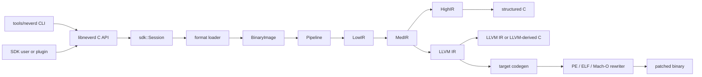

**语言**: [English](../architecture.md) | [简体中文](architecture.md) | [繁體中文](../zh-TW/architecture.md) | [日本語](../ja/architecture.md) | [한국어](../ko/architecture.md) | [Français](../fr/architecture.md) | [Deutsch](../de/architecture.md) | [Español](../es/architecture.md) | [Italiano](../it/architecture.md) | [Русский](../ru/architecture.md) | [العربية](../ar/architecture.md)

[← 文档索引](README.md)

# NeverD 架构

本指南说明贡献者安全修改 NeverD 所需了解的生产边界。内容有意仅涵盖
NeverD 自有代码；LLVM、Capstone 和 Unicorn 子模块维护各自的内部架构。

## 系统边界

```mermaid
flowchart LR
  CLI["tools/neverd CLI"] --> CAPI["libneverd C API"]
  SDKUser["SDK user or plugin"] --> CAPI
  CAPI --> Session["sdk::Session"]
  Session --> Loader["format loader"]
  Loader --> Image["BinaryImage"]
  Image --> Pipeline["Pipeline"]
  Pipeline --> Low["LowIR"]
  Low --> Med["MedIR"]
  Med --> High["HighIR"]
  High --> HighC["structured C"]
  Med --> LLVM["LLVM IR"]
  LLVM --> LLVMOut["LLVM IR or LLVM-derived C"]
  LLVM --> Codegen["target codegen"]
  Codegen --> Rewriter["PE / ELF / Mach-O rewriter"]
  Rewriter --> Patched["patched binary"]
```

NeverD 有四种 IR 表示，但它们并非一条必须经过四跳的序列。`LowIR -> MedIR`
为共享部分；结构化反编译随后采用 `MedIR -> HighIR -> C`，而 `lift`、
`decompile --llvm` 和 `patch` 则直接走 `MedIR -> LLVM IR`。尤其是 patch 与
lift 模式会有意跳过 HighIR。

CLI 在 `tools/neverd` 中解析命令，创建 `neverd_session_t`，并调用
`include/neverd/sdk/NeverDCAPI.h` 中的公共 API。引擎状态位于
`lib/sdk/SessionImpl.h`；`neverd_session_load` 选择 loader 并构造
`BinaryImage`，基于 IR 的操作则按需运行 `lib/pipeline/Pipeline.cpp`。
`neverd` 可执行文件链接 `neverd_shared`；组件归档以及其 LLVM/Capstone
依赖是该共享库的私有实现细节。CLI 使用 LLVM Support 构建命令行界面，
但不会绕过 C API 驱动引擎。

HighIR 的 `HighSourceFlow` 统一管理输出语句的控制流边、局部变量身份和确定赋值分析。
源码验证与无用 PHI 复制消除共享这张图。有界划分跟踪局部标量之间及与零的重复等值比较；
交换操作数和保持位宽的整数视图共享条件事实，写入任一操作数都会使其失效。
地址逃逸的变量保持未知，位宽不一致时拒绝推断，划分超限时退回保守控制流图。
仅当标量值在所有可行上下文中都不会被使用时，才删除 PHI 复制。
调用、加载和存储保留可观察行为，删除复制也保留源码标签。分析之前，HighIR 会把同一局部变量
的相邻字节切片简化为连续切片，并保留结果类型；这一恒等变换不会合并独立的加载或调用。

HighIR 可以在严格证明下把 64 位源码局部变量缩窄为 32 位，沿用 128 位载体的规则：所有定义的载体宽度和低位宽度必须一致，所有读取必须显式选择低位。完整宽度存储、逃逸、高位读取或高位表达式的副作用都会阻止缩窄。源码参数的填充位仍保持未知。
精确的整变量复制可以通过有界图共享这一证明，但必须先由构造值的定义确定低位宽度。每个复制目标都必须满足缩窄条件；完整宽度的消费者会使所有上游豁免失效。没有宽度依据的循环、宽度冲突或预算耗尽时保留原值。
有界整数转换、零偏移切片和扩展也可传递这一证明，但每个中间宽度都必须保留所需低位。每次使用都按其所属语句的表达式根分别检查。最多两轮有界分析可在移除向量填充后继续证明更窄的低位。

当后续常量掩码完全不会观察完整低位操作数以上的任何位时，HighIR 还可以从重建整数中丢弃
未定义高位。低位可以来自直接 `CONCAT`、有界整数转换或零偏移 `SUBBYTES` 视图；替换结果
使用显式零扩展，并保留原掩码。高位表达式必须有界且可安全丢弃；调用、加载、有序访问、可能陷阱、
畸形位宽以及触及任一高位的掩码都会保留原未知值。

Block 使用方的逃逸分析也使用这张图，以有界不动点分析跨分支和循环传播指针身份及私有栈槽信息。合流保留可能的上下文地址，只有完整覆盖才能清除。未知跳转、异常控制流和证明预算耗尽都会拒绝绑定。

精确的零偏移 `SUBBYTES` 视图可以从更宽的物理寄存器视图中保留完整低位指针字。栈帧、context 与 invoke 指针的部分视图会保留来源身份及字节区间；只有同源、连续、顺序正确并覆盖完整指针的 `CONCAT` 才能恢复地址。其他部分视图继续携带污点，一旦进入内存、调用、控制流、存储或可观察返回就会被拒绝。位模式相等的普通标量绝不会取得指针身份。
当精确源码 ABI 声明窄标量返回值时，显式 `CONCAT` 可以提供未定义的物理返回高位填充。逃逸分析会完整检查声明的低位结果，只忽略这种结构化高位填充；任何可观察返回字节中的 context 指针仍会被拒绝。

Block invoke 只有在自己的新建栈帧中尚未保存 context、invoke、ISA 或其他已证明的指针身份时，才能把该栈帧中的地址传给已绑定调用。一旦保存了任一此类身份，无边界的栈地址参数会再次被视为逃逸。这样可以区分错误结果槽等普通回调局部变量与 Block context，同时不放松 context 逃逸证明。

栈 Block 构造在把调用解释为 Block 使用方之前，会区分精确的 literal 基址与其他栈参数。因此普通栈数组可以在构造前传给调用；宽栈初始化会保留为毒化的字节覆盖，不能用来满足 Block 头或具有所有权的捕获字段。一旦 ISA 身份仍然存活，其他栈参数会继续被拒绝，直到已声明的复制型或非逃逸使用方使 literal 存储失效。这样既允许之后不相关的栈调用，又不会忘记任何到达路径上仍然存在的 Block 身份。

无捕获的全局 Block literal 可以共享同一个编译器 descriptor。源码依赖和生成 helper 只跟随当前源码闭包实际引用的 literal；共享该 descriptor 但未被引用的 literal，不会增加 invoke 依赖，也不会进入生成存储。descriptor 仍然共享，同一个原始 literal 在不同方法中继续使用同一个共享生成身份。

Block 回调参数的具名对象类只来自编译器签名。源码计划先证明 literal 的 descriptor 与 invoke 入口对应，并要求共享该入口的所有 literal 对参数类达成一致；调用分析才沿接收者复制传播这个声明类。发布源码时重新读取 descriptor 并核对最终计划。裸 `id`、冲突的 descriptor 和无关 invoke 都不获得类限定，动态消息派发保持不变。
invoke 函数体中的内层 Block 尚未通过验证时，不会抹除已经独立验证的外层 literal 参数声明；下一轮流水线可能需要该声明才能证明内层使用方。
已验证的 `NSArray` 快速枚举调用可以在另一个 Block 仍存活时借用 invoke 栈帧中的 `NSFastEnumerationState`（64 字节）及对象缓冲区（`count * 8` 字节）。两段范围必须位于已恢复的栈帧内，并与完整的已验证 Block literal 及所有私有 context 身份字节不相交；未知长度、接收者或调用绑定仍会导致捕获证明失败。

Darwin Block 使用方由加载器统一拥有回调和生命周期契约。生成的目录区分编译器声明的 `noescape` 参数与已审计的运行时复制型使用方。后者目前仅包括 `dispatch_async` 和 `dispatch_barrier_async`，其 SDK 契约规定复制并释放 Block。两类契约都要求导入及提供者身份精确、四种编译器配置一致，并且完整回调 ABI 匹配。源码发布仍会证明栈 Block 头、已初始化捕获、复制/析构 helper 和 invoke 依赖。两类使用方在调用后都会使调用方的构造事实失效；复制型使用方绝不会被报告为非逃逸。未标注的 Block 参数不会授予任何生命周期权限。

Objective-C SDK 的 `noescape` Block 参数使用同一个加载器边界。只有当前消息仍具有精确的 SDK 父方法 ABI 与参数位置、Block descriptor 具有精确的编译器回调 ABI，并且任何已限定接收者都能通过完整且无冲突的类层级到达声明所有者时，目录条目才会生效。未限定选择器只有在所有匹配条目对同一个回调契约达成一致时才能使用。该证明只覆盖调用方生命周期：动态派发保持不变，不选择任何实现地址；没有进入目录的 `noescape` 声明仍会拒绝栈 Block 逃逸。

源代码调用发现以有界前向不动点传播寄存器事实。普通控制流合流仅保留所有已到达前驱一致的选择器、导入槽或数字地址。
独立入口和异常入口从未知状态开始；循环回边收敛后才发布调用绑定。物理寄存器别名写入、未知调用和指令内临时量
不会把过期事实带到后续基本块。非法边或计算预算耗尽会拒绝这项证明。

Objective-C 的全局选择器查找通常要求完整的本地方法、协议、属性和已启用 SDK 声明全部一致。
当完整声明仅在返回合同上冲突时，调用后对标量返回寄存器的精确读取可以缩小候选，但必须只有一个
声明的返回载体能定义该观察。整数观察可以读取完全已定义的子区间，包括带明确扩展规则的窄结果；
浮点观察必须与声明的寄存器、偏移和宽度完全一致，不能用四字节读取把声明的 double 位模式解释成
float。完整宽度复制可以传递该证据。已认证的运行时调用只能保留 ABI 明确保护的别名，包括
AArch64 `Q8`–`Q15` 的低 64 位前缀。未知调用、重叠写入、未使用结果、不完整声明或多个匹配载体
都会保持未解析。选中的载体范围随源码调用提示保存，并在发布时依据当前镜像重新验证，因此局部
数据流观察不能绕过全局声明检查。

必需的 Swift 值见证操作使用独立且不依赖符号的调用证明。有界反向追踪必须证明间接目标取自
该操作规定的 `metadata[-1][slot]` 表项，并且同一 metadata 值位于其规范 Swift 参数载体。
当前支持 `destroy` 和 `initializeWithCopy`。所有前驱都必须一致；损坏的 CFG 边、部分写入、
有序加载、调用破坏或预算耗尽都会拒绝绑定。生成的 C 通过实时 metadata 重新读取该表项，
不会保留被分析镜像中的见证函数地址。

编译器生成的 Swift 协议见证访问器使用另一套精确证明。loader 将 `Wl` 代码符号与匹配的可写、
零初始化 `WL` 缓存配对，然后验证缓存加载、以精确一致性描述符和类型 metadata 对象调用
`swift_getWitnessTable`、release store 以及两条返回路径。调用点取得零参数、指针结果的 callee
合同，但不会改变访问器自身由机器事实推断的入口签名。生成的 C 重建新的共享缓存并重新执行
运行时查询；不会发布已捕获进程中的缓存或见证指针。

直接链接的 Swift 一致性描述符和名义类型 metadata 也可用于此访问器。两者必须各自唯一导出，描述符必须不可变，且 demangle 后的名义类型必须一致。导入槽与直接地址混用、导出冲突或类型不匹配时拒绝绑定。当源码直接使用一致性描述符地址时，只通过唯一导出且不可变的 `Mc` 符号重建其身份，并在输出前重新验证；不会复制原镜像地址。
若检测到的函数在访问器最终返回后还包含独立 Swift 代码，只有证明所有入口路径均返回且不会跳入后续块时，才把访问器证明限定在前段；后续代码仍保留原有诊断。

标准 Swift metadata 存储地址由编译器生成的 `.self` 查询证明；标准 Hashable 见证存储则由
编译器生成的受约束泛型调用中的直接见证参数证明。两者都要求 ARM64/x86-64 macOS 与
Mac Catalyst 的 SDK 导出一致。`Any.self` 是唯一支持的完整存在类型例外：编译器 IR 必须
返回外部导出 `%swift.full_existential_type` 中偏移恰好为八字节的内部 metadata 成员，目录
记录并重建其所属的 `$sypN` 存储基址。这不会授权其他内部指针，也不会从修饰名推断完整存在
类型布局。只有直接、外部、非 TLS 全局量符合条件；加载器会先认证符号和提供方，再绑定其
运行时地址。这些证据既不提供 metadata/见证布局，也不提供访问器、见证成员或任意修饰符号的
调用 ABI。

同一编译器证据目录也包含 `ObjectIdentifier` 元数据及其 `Hashable` 见证。独立的 `.self` 查询和受约束泛型调用探针必须与四组 SDK 导出证据一致。它们只证明不透明外部数据的身份，不提供值布局或消耗输入契约。当前线程局部导入槽不能提供普通 Swift 数据地址。

ObjectIdentifier 消耗输入有独立的四目标编译器证明，覆盖指针值临时量、完整八字节存储及寿命结束。共享所有者要求精确 metadata/witness 对及普通强 GOT 身份，允许输入地址前多一条完整宽度的间接结果地址 ADD。作用按两个类型身份选择，不能只按泛型 runtime 名称或相同大小选择。规范发布重验分别认证的同一本地元数据和 witness 表地址。当前机器、帧寿命、全部操作数及唯一发生位置仍不可省略，不授予结果布局或泛型输入 noescape。

Objective-C 属性元数据提供独立于方法实现的访问器声明，支持动态属性、只读属性和自定义访问器。
加载器验证类、分类或协议记录的布局，再通过共享编码解析器和 Darwin ABI 层生成标量或指针签名。
调用绑定要求所有匹配的属性、方法、协议及已启用 SDK 声明一致；属性记录不会创建原生函数，
也不会增加运行时方法总数。64 位记录布局依据
[Apple 运行时 ABI](https://github.com/apple-oss-distributions/objc4/blob/main/runtime/objc-runtime-new.h)，
分类中可选的类属性字段还需要
[镜像布局标志](https://github.com/apple-oss-distributions/objc4/blob/main/runtime/objc-abi.h) 才能读取。
不支持的属性编码和损坏的属性列表会保留明确诊断。

Objective-C 接收对象事实区分方法入口的 self 与确定的类引用；只有共用入口的所有元数据记录一致时，才建立 self 类型事实。完整宽度复制和 ABI 规定保留的寄存器通过同一不动点分析传播事实，入口回边也参与合流。声明检查区分类方法与实例方法，并纳入已记录的分类、父类链和协议继承；入口 self 还需考虑已知子类声明。编译器目录分别保留声明所属对象和继承关系，以及全局选择器一致性信息。发布源码前，SDK 会依据当前镜像重新验证接收对象的来源及适用声明。这些事实不会选择具体 IMP，也不授权二进制重写。

没有源码声明但身份已验证的 `objc_msgSend` 只在完整的被调用方保存寄存器中保留已声明对象参数的来源；未知参数和栈帧事实不会因此保留。
编译器共享的 native thunk 可能接收已验证 Objective-C 类引用槽的地址，而不是槽中保存的类对象。
源码恢复会为每个原始槽重建独立单元，并通过 `objc_getClass` 或 `objc_getMetaClass` 初始化，从而
保留这一层额外间接关系。只有精确匹配且具有完整类型的 native 依赖证明该参数仅发生完整宽度
读取，且没有写入、偏移、逃逸或不支持的内存效果时，才能建立绑定。裸槽地址仍不能充当消息
接收者，也不能取得类对象身份。
外部继承信息缺失时，必须改用全局选择器一致性检查，不能缩小到接收对象范围；明确不支持或冲突的声明仍保留为否定证据。

带明确对象类型的成员变量可通过最多八次完整宽度读取延伸接收对象证明。每一步记录运行时偏移槽、偏移值宽度，以及机器访问中使用的固定字节偏移。固定偏移必须仍与当前布局一致；运行时偏移引用则可以跟随字段移动。加载器核对已记录的类继承链和具体字段声明。部分读取、裸 id、Block、仅协议类型、歧义存储和未知指针基址都不能产生类事实；源码验证会依据当前镜像重新检查整条路径。这些事实描述声明类型，不代表对象身份，也不允许删除内存操作。

当控制流从多个已认证的 Objective-C 成员变量偏移槽中选择时，源码绑定可以在各前驱边上取得运行时偏移值，再合流这些值，而不是合流槽地址。所有可达叶节点必须属于同一类并使用相同载体宽度；地址链只能包含同宽局部变量或 SSA 别名，合流后的地址也只能供一次完整宽度加载使用。类或宽度不一致、算术、写入、逃逸以及额外加载都会保留未解析地址诊断。

共享 Swift once getter 只有满足一种精确的四载体契约时，才能公开 `String` 的两个机器字：谓词、初始化器和两个顺序存储字。getter 必须恰好进行一次已认证的 `swift_once` 调用，把两个未修改的字传给精确的 Swift `String` 到 `NSString` 桥接，并且每个地址参数只能通过纯同宽别名和已证明的加载使用。调用方必须传入同一具名、可写 16 字节对象中相邻的两个字。回调及其全部依赖仍必须按普通源码闭包完成；存储证明不能授权跳过初始化器或臆造内容。

编译器生成的零参数 Swift 延迟全局 addressor 只有在精确的 `vau`/`vpZ`/`_Wz`/`_WZ` 符号族与一种规范结构完全一致时才会重建：一次加载、一次完成状态检查、一次已认证的 `swift_once` 调用，以及两条路径返回同一存储地址。该加载可以是独立语句，也可以内联于检查，但必须保留同一次谓词读取。初始化器必须忽略附带的 context，并像普通源码一样完成依赖闭包。投影会新建共享 once 谓词和数值槽，不保留已加载镜像中的谓词、数值或初始化器地址。它的零参数源码被调用方 ABI 只应用于调用点；原生入口 ABI 保持独立，使附带的 context 载体仍可用于契约证明。

已认证的 `dispatch_once_f` 调用也可以重建其谓词与本地回调地址。加载器必须证明精确的 libdispatch 导出、完整的可写谓词单元、没有普通直接调用方的唯一代码目标，以及公开的 `void (*)(void *)` 回调 ABI。回调会按该契约重新提升，并继续作为普通源码依赖。生成单元使用新的共享谓词存储和已恢复的回调定义，不保留两个原始镜像地址。未知提供者、未经证明的存储、非代码目标和冲突调用 ABI 均保持未绑定。

如果该初始化器调用编译器生成的导入 Objective-C 类元数据访问器，投影只接受零值缓存、类引用、`objc_opt_self`、`swift_getObjCClassMetadata` 和 release 发布完全吻合的精确模板。投影直接发出已认证的运行时查询，不保留镜像缓存。

Swift 具体类型元数据的缓存/引用对只有在零值缓存、不可变元数据引用记录、每个相对描述符槽和精确的 `MR`/`Md` 符号拼写全部一致时，才能重建其重整类型引用。类型引用仅由可打印重整字节和最多八个符号上下文描述符组成；展开全部描述符后必须精确还原完整符号名，而且该符号名本身必须通过有界 Swift 类型反重整。导入的名义类型描述符需要有界反重整，并且提供者必须是由所声明模块推导出的精确系统框架安装名。本地协议以及有界的模块/类/结构体/枚举名义路径必须通过已解析的只读重定位指向唯一数据符号，并且恰好存在一个匹配导出。在 AArch64 上，只有经过不可变标志、父模块、名称、访问器及唯一局部符号验证的 Darwin `os_unfair_lock_s` 私有描述符，才可将直接 `0x01` 引用转换为其公共文本类型重整名。其他直接 `0x01` 或符号引用、缺少注册名称或字段引用路径证明的私有上下文、弱提供者或不匹配的提供者、畸形记录以及歧义符号仍不受支持。

精确的具名存储参数证明可以沿直接原生调用链传播，但每条边都必须具有完整且一致的源码 ABI，并且只能原样转发同一个指针参数，不能进行算术。末端被调用方仍只能用该参数进行有界、完整宽度访问。普通加载和存储可以接受；可写缓存还可以使用一次精确的 release 存储，因为生成的依赖会保留该原子顺序。只读类引用槽仍拒绝所有写入。间接或 ABI 不匹配的调用、其他原子顺序、逃逸、循环、深度或证据预算耗尽都会失败关闭。

加载器验证 Darwin 常量字符串、整数对象、数组和有序字典组成的有界无环图。容器字段和每条边都需要不可变映射存储，以及无歧义的导入或重定位证据；不支持的编码、循环和不完整对象图会明确失败。源码绑定重新验证对象图及传入指针槽。生成的辅助函数保留整数位模式、子对象顺序和共享地址，并复用已有字符串身份。容器槽通过 acquire/release 发布机制只初始化一次，初始化仅调用已验证的子对象辅助函数。每个辅助函数自带子函数声明，使独立恢复的方法可以共用同一定义。可移植测试覆盖损坏输入和证明预算；原生编译器样例对照原始方法检查内容、别名、复制身份和并发初始化。

## IR 表示与路径

实验性的[解释器恢复阶段](interpreter-recovery.md) 在共用的 MedIR 边界之前，对严格提升后的 LowIR 进行特化。provider 负责不可变映像的证据，`SymExec` 负责指令语义，残余 CFG 复用普通 SSA 与源码后端。恢复证据与原生指令实例及二进制 patch 证书保持分离。

`InterpreterSpecialization` 负责失败尝试后的有界反向位需求传播。它复用标量求值器，不改写图中的事实，也不增加控制字段或上下文；全部工作仍受预算约束，发布必须经过全新的完整证明。

如果后续内存需求只涉及字节片段，上下文细化可额外提名已跟踪的完整八字节地址载体。原有窄生产者坐标仍是权威依据；只有入队逻辑才能根据已证明的常量或帧偏移形成键。

有限值枚举可观察可行元组，但不改变证明查询。观察者拒绝时返回不完整结果，且不含元组。缓存只保留地址域的数学证明；不可变读取证书在枚举完成前仅存于局部状态。

`NeverDLoader` 负责 `PEFixedImageView`，并与普通 PE 加载共用完整的基址重定位解析器。二进制解释器适配器在恢复及原生证明中使用认证后的首选基址视图，不自行解析 PE 表。准备阶段先验证导入写入范围、映射身份和完整原始字段，再认证字节。视图借用保持不变的映像，不宣称 ASLR 或初始化等价性。

`LowFunc::FunctionTemporaries` 声明按偏移排序、互不重叠且入口未绑定的字节范围。恢复器在有限分派跨越指令边界前，将临时目标只捕获一次到保留的函数局部槽。共享关系检查器只保留当前路径实际定义的字节，普通原生临时值仍在每条指令结束后失效。范围元数据和快照构建仍计入预算，证书语义模式 17 绑定这些生存期。原始状态模型保留字节语义；源码降级要求操作数精确对应整个槽，拒绝字节别名。归纳循环检查保留真实入口前缀中精确的已定义字节集合。显式 `FunctionTemporary` 输入和赋值可以表示变化的值，但仅限对应 LowIR 一侧已经声明、且在前缀中已定义的字节。每个参数必须从构造状态中投影回来，每次到达都检查全部值和定义状态。推断只组合实际定义的字节，包括部分和非对齐范围；配对方案保留两侧独立命名空间。原生方案仅在候选侧绑定这些槽。证明语义模式 17 继续要求覆盖、观察项、排名和预算检查；声明不能初始化存储，也不建立普通原生 ABI。

`FrameOffsets` 统一负责有预算的入口相对位移单值证明。恢复器归一化实际符号内存访问，保留残余地址表达式；原生检查仍验证两次执行的地址相等。穷尽对齐分派和共享重试预算由恢复器负责。原生／LLVM 分区证明聚合仍是尚未完成的独立工作。`NativeStackControl` 负责内部无符号 16 位返回清理，二进制提供器认证弹出八字节的规范编码。

关系检查器的栈偏移证明复用已有的有界 `FiniteQueryCache`。与恢复阶段相同，键构造和保留证明最多占 `MaxSymbolicNodes` 个字。键保留完整谓词和相对表达式关系，仅复用完整域或已证明的非唯一性。每次访问仍检查地址独立性和帧边界。

临时已访问节点索引使用稠密映射。序列化仍遵循有序遍历，因此表扩容和哈希顺序不会改变查询键、变量重命名或预算计费。

关系检查器在实际的不可变、仅追加符号上下文和固定求解设置中，按精确谓词引用保存已完成且无模型的 SAT/UNSAT 答案。紧凑表在 `MaxSymbolicNodes` 范围内每节点使用两位，只在第二个查询完成后才分配。每次查找前都检查节点上限；紧邻重复保持原有不计费快路径，其他命中均先消耗一次逻辑查询，再省去编码与搜索。扩容时新旧分配可能短暂共存。不保存 Unknown/Invalid、模型或可变搜索状态。缓存随检查器销毁，独立最终检查器从空缓存开始；不同谓词仍须完整证明。

同一个原生条件分支的跳转与顺序执行可行性查询共享一个不生成模型的编码器。每次查询都以独立假设检查完整谓词，编码复用随该分支结束，使先前分支的子句不会累积到后续分支的搜索中。既有的新编码器重试仍计费，且仅适用于编码门数耗尽；搜索预算耗尽或输入畸形仍拒绝。查询、节点与观察预算继续生效。

`FrameOffsets` 在有限枚举前，将含常量或符号加数的二元加法、掩码及匹配的拆分寄存器切片化为精确的模运算余项。对齐证明只提取被清除的低位，避免对整个帧根进行位展开。符号索引完整保留，包括对根或路径谓词的依赖。两个操作数的尝试共享十六次访问的检查预算，新 DAG 节点仍计入预算。原始路径谓词、单值域证明、映射／帧边界及不完整结果拒绝规则仍必需。改写不假定余数或可达性，也不改变残余地址表达式。

`LowIRIndependenceFrame::EntryAlignment` 声明可选的二次幂入口根同余条件。共享关系检查器在两侧执行和归纳之前，将低位条件与入口常量、不回绕范围及排除范围求交，不改写入口根。非法或无解域不产生证书。原生 API 要求恢复选项具有完全相同的可选对齐条件和有效 RSP 根。原生到 LLVM 的组合在两次重新检查的关系中保留同一帧域，以及全部状态、状态码和保存义务。公共证书摘要以语义版本13绑定条件是否存在、对齐值和余数；对象缓存配方不变。此契约不赋予内存可访问性、帧私有性、原生 ABI 或自动分区聚合。

通常的依赖发现停滞后，恢复器可以对每个非函数入口的原生位置及指令模式，按一个现有寄存器上下文字段分区。传入值域必须完整、有多个值，并覆盖字段声明的全部位。每个实际前驱独立证明当前完整值域，比较仍有效的物理字段，并按各个条件重新投影。后续前驱和变宽后的节点必须重新检查；串接在被提名的入口停止。比较节点具有合成来源，并共用节点、操作、上下文、查询和细化预算。部分掩码、未定义标志和仅位于栈帧的字段不符合条件。不增加客户内存读取或调用方假设；值域不完整时保留保守边，仍须所有可达情况完成才能发布。

控制和守卫精度细化优先于可选帧分区重试，必要的更细分区仍可使用。恢复先完成一个余数的不动点，再开始下一个，但只有全部允许余数完成后才发布结果。显式入口对齐与分区域取交集，分派比较实际余数。上下文、操作、节点和求解器预算仍有界，并在各次重试间共享。 机器状态恢复支持用 `--vm-entry-alignment=A:R` 声明并检查入口 RSP 同余域。`A` 必须是正的二次幂，且 `R < A`。其他入口在客体访存或状态写入前返回状态 2。根地址高位仍自由，默认不假定对齐；此选项不提供原生等价认证。

共享的 `SymContext::constantWindow` 只在结果每一位都已证明为常量时返回位运算窗口的值。证明可沿已有提取、完全位于一个拼接操作数内的窗口、零扩展和位运算进行；未知 XOR 输入与算术进位保持不透明。结果最多 64 位，递归最多 32 层，总工作预算为 256。每次节点访问、深度拒绝及拼接操作数检查都计费；复制常量还按其完整的 64 位字数计费。证明不完整时不返回常量。`SymState` 用这项只读查询导出寄存器和临时空间的常量字节；存储表达式与完整字重组保留原有身份。内存区域仍只导出字面常量字节：提前加入推导出的部分内存事实，可能拆散后续输入的来源并增加控制状态发现的工作量。

`SymState` 统一管理显式分离契约下单次 STORE 对已有字节事实的保留。真实 STORE 仍执行，其他内存区域、失效代次及未知值默认状态保持写入后的状态，不读取或初始化缺失字节。`SymExec` 仅对一次普通 STORE 应用契约；恢复层另行保留范围内完整仿射槽和来源事实，汇合仍保持保守。

`StringTransfer` 负责有界、有序的标量展开。恢复层负责值证明、共享预算及完整搬运指针的重新认证；生成的访问复用常规内存检查。

控制依赖遍历仅在分析完整结束后报告根地址的位依赖。当已证明的相对地址仍保留至少 32 个自由高位时，恢复层可以省略可选的映像地址枚举；这不证明可达性，也不会删除内存访问。

完整位宽的仿射控制投影复用根变量依赖分析。分析结果仅限当前边谓词；过大的值域产生不完整的拒绝结果，不进入数学证明缓存。窄掩码仍会重试。既有的可行性处理保持独立；值域拒绝本身不能证明边可达或不可达。

有限查询缓存用同一存储上限核算序列化键、数值结果和使用顺序元数据。淘汰任何记录前，必须完整验证候选并确认其单独可容纳。键由稳定的映射节点持有；命中更新使用顺序，并返回独立拥有数据的结果副本，淘汰后仍然有效。缓存对象禁止复制和移动。替换策略只改变证明复用，不改变查询语义或结果准入条件。

`InterpreterSpecialization` 同时负责联合控制关系和独立的有限字段值域。边投影只记录完整的单列证明；合流时对字段掩码取交集，并对重新应用掩码后的值取并集。重建节点时，在同一符号状态完成播种后，将这些值域与联合谓词合取，保留帧身份和未约束位。只有精确检查所有联合元组均已满足成员约束，才能省略该约束。这项精度策略不改变上下文键或原生返回认证。

`FrameEntryConstraints.h` 统一拥有恢复与关系证明共用的不回绕谓词。`InterpreterSpecialization` 负责有界的唯一转移串接和已提交序列重放。这些 C++ 选项默认关闭；证明合同匹配及摘要绑定仍由二进制适配层负责。

`modelInterpreterMachineStateX64` 与源码包装器共用同一生成器，统一处理客体寄存器分片、打包标志、执行配置状态和控制流。模型只把状态对象访问改为显式寄存器字节，状态码与客体 RAX 分开。它不负责编译器语义或证明策略；入口域、观察项、栈帧契约和完整精化检查仍由调用方负责。

`NeverDLLVMInterpreterModel` 负责独立、有界的标量 LLVM 导入，使用同一原始状态 ABI。`modelLLVMInterpreterMachineStateX64` 保留真实状态码返回，并生成显式语义有效性检查。`llvmInterpreterMachineStateContract` 提供完整观察项及零监视字节保持义务；入口域、内存与完整证明由调用方负责。LLVM 导入不改变普通提升或源码发布，也不证明编译器。

共享 LLVM 模型通过计费的字节提取和平衡拼接支持规范的标量 `llvm.bswap`，限于 i16、i32、i64。其他位宽、向量和不支持的调用契约仍明确拒绝。机器状态、标量及原生到 LLVM 使用同一语义所有者；字节交换不会消除先前的定义性义务，也不建立原生 ABI。

LLVM 导入器将每次实际执行的 guest load/store 中大于一的对齐要求，转为针对其真实 64 位地址的累积语义有效性义务。访问宽度及内存效果不变；掩码、比较和累积操作使用既有构造预算。文本省略对齐时采用解析后的 ABI 对齐；`align 1` 不生成检查。这不会增加入口假设或可访问字节。状态对象访问仍遵守独立的八字节对齐契约，atomic/volatile 访问仍不受支持。

`modelLLVMScalarFunction` 复用同一导入器，接受纯 `noundef` 整数参数和整数返回值（`i1/i8/i16/i32/i64`）。共享模型处理漏斗移位的端点，并以双倍位宽乘积检查乘法溢出约束。`checkLLVMScalarEquivalence` 通过 `SymExec` 执行两份模型，发现控制输入位，穷尽它们的全部组合，其余位保持符号化。每个返回值必须相同，每条已执行操作必须有定义；分区、路径、节点和累计工作预算限制查询。`SymContext::constantWindow` 提供累计查询计费，同时保留原有单次查询上限。拒绝结果不允许改写。这一只读 C++ 查询不改变默认源码输出，也不提供持久化的原生 ABI 或编译器证明。

`projectLLVMScalarResult` 通过结构体或数组的 `insertvalue` 包装克隆显式指定的整数返回字段及位窗口。它保留全部参数、控制流、标量运算、注解和 `assume` 调用，仅移除无用的聚合包装，并交给共享标量模型验证。构造预算与建模预算分开；不支持的契约或预算耗尽时不发布模块，也不修改输入。状态码、值及保留状态的每个必要观察项仍须完整证明；选择字段不建立入口、帧或原生 ABI 契约。

`projectLLVMScalarInputs` 仅删除未使用的 SSA 参数，并返回递增的原始参数索引映射，形成显式标量接口。它复用返回投影的有界克隆和标量准入，将完整克隆函数体移入精简签名，不用常量替换省略输入。死算术、注解、assume、控制流及每个使用中的参数均保留；拒绝包装删除和调试引用重绑定。构造共用累计预算，拒绝时不发布模块或映射。这不是定义性、终止或原生 ABI 证书：回编译候选必须重新嵌入完整原始签名，并保留已有入口、帧及观察项义务。

`projectLLVMScalarState` 将显式初始化的状态对象转换为保留全部输入单元、入口掩码及值/保留状态观察项的标量接口。共享导入器负责指针、对齐和源契约准入；外部内存及可观察的状态地址均被拒绝。带掩码的局部写入和 mem2reg 保留控制流与标量义务。原状态码位于字段零；返回范围通过共享规则转换为必须证明的 `assume`。构造与建模限额独立，拒绝时不修改输入。当前要求小端及整数型 64 位指针/索引。x64 工厂从机器状态权威层取得标志掩码，并接收显式入口对齐；两个接口都不推断观察项或原生 ABI。

`SymKnownBits` 仅在因子完全一致、掩码没有放宽且丢弃位已知为零时识别展平的掩码副本。无符号比较可累加直接操作数的范围，前提是最大值不会回绕。两项规则保留查询计费与限额，不改变 DAG。LLVMC 将无 operand bundle 的 `llvm.assume` 输出为求值一次、假分支不可达的条件表达式；不支持的 bundle 显式失败。对象管线 schema 16 绑定更新后的配方。

`SymContext::mkConcat` 将字面零前缀规范化为 `ZExt`，组合拼接时展开已有零扩展。分别写入低位值和高位零后重建的字，与显式零扩展共用表示。未知、非零及内部高位仍可观察。现有循环递推匹配因此能够识别窄位加法，推断预算与完整检查器不变。对象管线 schema 16 绑定这项共享规范化配方。

逻辑右移还可删除在全部保留位窗口上已证明为中性值的直接 AND/OR/XOR 项。检查最多八项、128 位字，所有常量窗口查询共用 256 单位预算，不分配右移到各项，也不展开 DAG。未知事实保留操作数；完整移位计数及 LLVM 定义性义务不变。对象管线模式版本 13 在两种缓存标识中绑定该配方。

`SymKnownBits` 统一负责共享符号 DAG 的有界只读事实：算术位、扩展恒等关系和不回绕加法的大小关系。单次查询上限为256工作单位、深度32、位宽128，缓存最多65,536项；命中缓存和搜索操作数也计费。每个标量执行器的缓存仅属于当前不可变输入分区，并与 `constantWindow` 共用单次查询上限。未知操作保持保守，LLVM 定义性义务仍由导入器提供。符号构造器将同宽来源的零扩展移到位运算和逻辑右移之外，同时保留常量高位与完整移位计数。这些规则不推断 ABI，循环改写仍需完整证明。 MBA 抽象在共享不透明输入之上恢复扩宽后的 AND/OR/XOR 视图，并在现有预算下保留窄算术与按位取反的边界。

`NeverDLLVMScalarLoopRecovery` 负责此标量域内显式启用的循环重构。它仅复制目标函数与必要的内建函数声明，证明完整源控制域，再提出首轮前缀/携带值重排、零次循环区域合并、循环头判断和仿射携带值候选。数据置零的筛选覆盖源控制域，但只能拒绝候选；每个接受结果仍须通过其余输入位全部保持符号化的整函数证明。需要额外控制位的候选被拒绝。按末尾判断、循环 PHI、指令数的字典序成本选择更小候选。构造、证明、候选数和变换数预算累计计费，耗尽时不发布部分函数；源程序保持不变。C++ 搜索提供已证明的候选，但不认证原生 ABI。

循环条件恢复仅在所有外部入口具有相同谓词、支配循环头的不变边界值，且常量初值与整数循环头 PHI 匹配时，才为布尔 PHI 提议整数比较。同宽、零扩展和符号扩展分别提出候选，不猜测边界值截断；每次入边查找均计费。入口一致不构成归纳证明：替换前仍须完整原始函数证明保留所有实际回边、符号数据、有定义性及终止性。

复杂退出条件可提议将常量步长的循环头 PHI 与不变边界值或其前后一步值作相等比较。发现阶段至多遍历32个值、64个入队操作数，选取最多4个同宽且支配条件的不变叶节点；遇到其他 PHI 停止遍历。候选保留分支极性，同时替换共享条件的所有使用。依赖关系不提供范围、整除性或终止性事实，仍须完整原始函数证明。前缀恢复分配候选位置时跳过未使用参数，保留原签名及全部输入的证明。

`recoverLLVMScalarSource` 在 `NeverDLLVMScalarLoopRecovery` 中组合准备阶段与循环搜索。有界 LLVM 和谓词清理先生成私有候选，再对照完整原始函数证明，才允许搜索该候选。继续恢复及清理后，最终函数体仍须对照原始函数证明。边界查询具有独立的单次工作上限，所有查询共享总证明预算；清理轮次和搜索预算累计，耗尽时不返回部分模块。InstCombine 使用明确的迭代上限，提案不必达到不动点，但必须证明。LLVMC 仅负责筛选函数和发布共享结果；函数签名和原生 ABI 声明不变。

源准备还会提议 LLVM 公共表达式提升，并在私有克隆中移除指令 poison 标志后再发现谓词；标志扫描逐指令计费。完整原始函数的证明仍检查原始标志及死操作，不放宽参数/调用契约或 assume。独立谓词 pass 对带注解算术仍采取保守规则，LLVM 清理或标志移除成功本身不能发布候选。

标量等价检查保留中间写入的符号数据。控制与定义性仍按需规范化其 DAG；最终返回值先检查同一性和有界事实，必要时才规范化返回 DAG。全部源操作仍会执行，包括死算术及注解。两边执行、规范化和最终重试共用原累计预算及局部上限。这改变查询时机，不改变输入域、证明义务或循环搜索限额。

`SymSimplifyPass::simplifyFiniteValues` 以工作计费接口开放已有的精确两值化简。AND 可在最多八个合取项内继承单比特常量掩码，完整根 SSA 值仍作为锚点，保留其他操作数及 poison 依赖；合取项发现过程不跨越 OR、算术或 PHI。标量源准备在模谓词化简前执行此阶段，扣减同一累计构造预算。未完成切片不提供事实，发布仍由完整原始函数证明授权。对象管线 schema 16 绑定共享优化配方的变化。

对于较宽的 PHI/select 值，独立闭包最多遍历 32 个值和 64 条复制边，并检查每条回边。常量及已有的完整两值边界合并后必须恰有两种可能；每个循环分量都必须能追溯至获准的产生节点。未知来源、第三个值或无初始来源的循环均被拒绝。原始合并值继续作为 SSA 观测，保留条件及 poison 依赖，不关联不同观测。发现和初始来源传播计入已有有限值预算。

循环头 PHI 的常量 AND 掩码可提出零值或未掩码 PHI 候选。入口值与掩码候选共享最多32项的批次；失败批次会拆分，完整数据证明拒绝首选值后会重试已通过筛选的替代值。每个获准组合仍须通过相对原始整函数的完整证明；掩码本身不提供范围假设。所有工作累计计费，耗尽时不发布部分结果。

共享符号构造器还可移除 OR/XOR 外层的 AND 掩码，条件是每个直接常量或显式掩码项在外层掩码之外都没有置位。检查最多8项、128位字，不递归发现关系，也不展开表达式；未知位保留掩码。对象管线 schema 16 在两种缓存标识中绑定此化简配方。

对同一个 `Function` 对象进行自等价查询时，`checkLLVMScalarEquivalence` 只导入一个模型，并在每个分区执行一次。控制与已定义性按需化简，无须为比较同一值而规范化中间数据。每条操作、输入约束、控制分区和终止性仍须在现有上限内检查。不同函数仍分别执行；名称和此前查询均不提供可复用证书。

控制或已定义性的有界折叠仍未知时，查询先以迭代方式从子节点到父节点规范化所需表达式 DAG，再发现输入位。它复用共享符号构造器和独立的有界事实缓存，不重放执行，也不把共享项展开成树。操作数访问、重建和位查询使用同一累计工作预算，并保留节点和单次查询上限。完整依赖结果为空时允许常量求值，不能当作缺失返回或跳过证明义务。LLVM 注解始终是待证明的约束，不能作为假设。

内部位宽候选取不变函数接口中的最大整数宽度。克隆显式映射整数常量的位模式，并删除变成恒等的转换；intrinsic签名保持不变。这个宽度只用于提议，仍须对完整原函数证明高位、有符号次序、移位、定义性和终止均保持。扫描、映射及清理计入共享构造预算；没有收益或预算耗尽时不发布候选。

循环 PHI 只有在所有外部入口提供同一 SSA 值且该种子支配它时，才能提出种子替换候选。仅用于拒绝的筛选将最多 32 个候选分组；接受整批仍需对原始完整函数证明。失败批次分拆，失败槽位只在本次搜索中暂缓重试。所有回边、并行 PHI、定义性和终止性仍是证明义务。`WorkLimitExceeded` 区分全局工作量扣费失败、精确预算处的普通拒绝及单次查询上限；耗尽预算不发布部分结果。

共享符号层仅在常量 AND 掩码只改变逻辑右移丢弃的低位时消除它。常量计数先检查完整无符号值，再统一表示；算术右移超限时饱和到符号位。变量计数和 LLVM poison 义务保留原有含义。对象管线模式版本 13 在两种缓存标识中区分新的化简配方。

循环候选还可取自实际支配入口的条件及其标量边界，并处理独立 latch 到 header 的回边。窄位宽末索引的回绕不能被假定为保持零次循环行为。单位步长递推优先作为基准，同组保持源码顺序，线性工作量计入预算。由入口条件提取的边界仅提出零扩展或截断候选；有符号或回绕比较以及最后一次更新仍须通过原始完整函数证明。

未请求映像或调试信息投影时，LLVMC 现在自动调用标量循环恢复。有界扫描限制每个函数最多 1024 个块。恢复与 LLVM 清理在模块共享预算内迭代，最后通过共享导入器和 SymExec，将最终函数体对照原始函数重新证明。发布只修改输出器的副本，保留函数身份、属性、调用者和内建函数绑定。符号冲突、外部保留的块地址、函数元数据及异常映射保留既有路径；拒绝或预算耗尽时不发布中间函数。单函数输出只规范化所选目标。这不推导原生输入接口或内存私有性。

标量候选证明通过后，LLVMC 复用 `SymSimplifyPass::simplifyPredicates` 处理新暴露的模算术条件。现有精确阶段保留 poison、输入稳定性和收益检查，并报告推导工作量；LLVMC 将其计入累计构造预算，每次调用最多 65,536 单位。随后 InstCombine、LICM 和 CSE 暴露循环不变量边界，并让等价的计数器更新共用一个 SSA 身份，再进入下一轮恢复。直接修改 IR 后会使缓存分析失效。谓词阶段不使用求解器，最终仍必须证明与完整原函数等价。

`SymKnownBits` 还可证明原值与掩码副本相等，前提是所有被丢弃位均已知为零；也可证明有符号移位往返相等，要求源值身份、二的幂因子和完整移位量匹配，且被丢弃位与保留的符号位全部为零或全部为一。这些有界只读关系计入查询工作量，不扩展 DAG、不枚举数据，也不把 LLVM 无回绕标记当成假设。

`SymKnownBits` 只在基值匹配且证明较大乘积不会无符号回绕后，比较标量倍数的大小。低字乘积相等关系收集模系数，并跨保留所需位宽的扩展检查因子及其重复次数；更窄的溢出边界保持不透明。两侧推导、待处理因子和匹配均计入现有工作量与深度预算，分析保持只读。

共享 LLVM 导入器接纳规范且不带操作数 bundle 的 `llvm.assume(i1)` 调用，将“执行到此处时条件必须为真”记入既有定义性状态。标量和机器状态证明检查这项义务，不缩小输入域，也不将其视为已经成立的事实。额外调用/声明契约及 undef/poison 仍被拒绝，输入 IR 与证明预算保持不变。这不构成原生 ABI 认证。

导入器接纳格式正确的 `llvm.loop.peeled.count`，将其视为无符号 i32 优化历史计数器，不将它用于循环次数上限、输入限制或终止性/定义性事实。循环标识与属性操作数数量会被检查；畸形或未知属性仍不受支持，元数据遍历消耗既有预算。

LLVM 模型负责验证 `initializes` 参数契约，复用状态指针投影，并在普通标量生成前执行有预算限制的逐字节必然数据流分析，不引入第二套值求值器。

`NeverDInterpreterLLVMRefinement` 负责组合原生到 LLVM 的证明。它重新构建两侧状态模型和强制契约，通过权威执行配置生成只在入口执行的标志投影，并重新检查两个前提。调用方可提交循环候选方案，但不能替换模型、观察项或证明凭据。分析模型只复制可执行图和声明入口；入口回边会被拒绝，避免重复初始化状态。

可选的 `InterpreterLLVMRefinementPreservation` 请求向两段全新证明添加 GPR 字节保存义务。准备层统一负责有预算的校验、重叠并集和按字拆分；完整状态、定义性与栈帧观察项仍然强制保留。`NativeState` 只传给原生检查器，支持 `SelectedWitness`，拒绝 `AllUndefinedChoices`。子凭据绑定各自的有效契约；空请求保持原有默认行为。

`InterpreterLLVMNativeCollection` 将两项默认关闭的收集选项仅传给全新原生证明。保留的审计边界必须在所选 witness 下不可达；延迟收集的分支仍须为每条可行路径提供完整语义。原生凭据绑定这些选项，源码假设、观察项和证明预算保持不变。

恢复 C API v3 与 CLI 将显式字段、细化和求解查询预算传入共享特化器。适配层先检查结构大小与 reserved 字段，再读取扩展；v1/v2 布局和默认值保持稳定。提高预算仅改变允许的工作量，不改变执行契约或结果发布条件。

恢复还提供 `--vm-chain-transfers=N`（默认 0）和 `--vm-no-control-discovery`。串接在已证明唯一目标的控制转移之间保留符号关联；达到上限后回到普通 CFG 边界。机器状态恢复可通过 `--vm-entry-frame=begin:end` 声明未经运行时检查、不会回绕的入口 RSP 偏移范围。精确数值前提会写入生成的 C 和报告；它不授予内存访问权限，也不构成等价证明。

超过 SSA 构建限制的大型恢复函数可通过 `--llvm` 使用有界的标量可变存储契约。入口输入、循环携带值和较早读取的语义得到保留。不支持的隐式状态、向量寄存器参数、映像重定位、歧义存储和畸形控制流会明确失败；HighC 拒绝此回退路径。源码输出仍遵循现有机器状态契约，不新增等价证明证书。

`analyzeMedMutableSource` 统一负责规范化 CFG 验证、存储身份和保守的入口字节需求。这些需求是读取范围的上界，不能作为正向可观测性证据。LLVM 在模块扫描前验证，并复用该计划，仅初始化入口值一次。块与值数量的乘积、传播工作量分别受限。C 转发针对每次读取使用类型匹配且无部分别名的确切先前写入；跨块汇合保留显式存储。

对于已验证的可变变量函数体，LLVM 仅在按顺序追加指令的同一基本块内转发私有槽位的确切值，并保留最后的写入。入口初始化以及块、函数和模块边界保持独立，客户程序的内存访问仍显式保留。C 输出限制标量表达式展开和立即数折叠的工作量，保留必要的具名中间值。可折叠的常量表达式使用 LLVM 的目标布局；不支持的表达式明确报错。已指定的可变返回值（包括零）不能被改成 void 返回。

该可变子集接受 8/16/32/64/128 位标量存储，位计数输入最多为 64 位。非标准位宽和更宽存储需要单独的源码契约。

架构 lifter 负责事务式的未定义输出附属元数据：每次尝试前清除旧证据，只为精确对应的成功提升发布效果。`Missing` 表示证据缺失，不等于空的 `Complete` 描述。普通 LowIR 保持确定的选定值。`LowIRUndefinedIndependence` 负责对传入的完整无环 LowIR 图进行有界关系证明，共享普通输入，并保留新产生未定义值的来源关联；它绑定完整指令边界和操作摘要，拒绝不完整证明。超出下述有限原生路径范围的一般原生图认证、循环不变量及原生代码到 C 的源码等价证明，仍属于独立工作。

`Decoder` 在指令形式审核和重定位匹配之前修正 x64 操作数前缀导致的 disp32 长度误报。ModRM/SIB 边界、完整字段、有符号位移、内存操作数及尾随立即数布局必须一致。完整解码、提升解码和启用详细信息的轻量解码共用此规范化。它只修改编码长度元数据；真正的 i386 disp16、disp8、moffs 及无操作数详细信息的解码保持原有行为。

传统标量 SHL/SAL、SHR、SAR 为 8/16/32/64 位操作数提供随次数变化的未定义位证据。掩码后的次数为零时保留所有标志；非零时 AF 任意，大于一时 OF 任意，SHL/SHR 次数达到操作数位宽时 CF 任意；SAR 的进位仍有定义。指令内布尔守卫使用目标重叠写入前保存的掩码次数，无论是否请求元数据，都生成相同操作。未审计编码不会发布部分效果。

传统 ROL/ROR 仅在体系结构掩码后的计数大于一时产生新的任意 OF 位；随后对字节或字宽取模不改变此条件。零计数保留标志。以寄存器为位基址的 BT/BTS/BTR/BTC 产生四个相互独立的任意位（OF/SF/AF/PF），CF 有明确定义，ZF/DF 保持不变。审计精确的寄存器及 imm8 编码；内存位串、LOCK、APX 和带进位旋转不在此次新增范围内。效应在核心指令完成后生效，请求或不请求元数据时生成的 LowIR 相同。参见 [Intel 位测试参考](https://cdrdv2-public.intel.com/929353/253666-093-sdm-vol-2a.pdf)和[旋转参考](https://cdrdv2-public.intel.com/929354/253667-093-sdm-vol-2b.pdf)。

传统寄存器 XADD 也具有精确的 8/16/32/64 位编码审计：定义 CF/PF/AF/ZF/SF/OF，保留 DF，不产生新的任意位。两个交换寄存器均遵循体系结构的部分写入及 32 位零扩展规则。无段前缀、无 LOCK 的内存 XADD 已覆盖相同运算宽度，并精确检查 ModRM/SIB、源寄存器、位移及 16/32/64 位地址细节。加载和存储共用入口有效地址，包含源寄存器与地址重叠的情况；标志计算使用原始操作数。LOCK、带段前缀及 APX 内存形式仍未审计。[Intel 兼容规则](https://cdrdv2-public.intel.com/929360/253669-093-sdm-vol-3b.pdf) 将 C0/C1/D0/D1/D2/D3 的 Group 2 `/6` 视为 SAL/SHL `/4`，复用相同的计数守卫及未定义标志。参见 [XADD 参考](https://cdrdv2-public.intel.com/929356/334569-093-sdm-vol-2d.pdf)。

传统寄存器 SHLD/SHRD 使用精确编码审计及共享的掩码计数生成点检查。计数为零时保留标志；非零计数下 AF、多位移位下 OF 为任意位。仅在 16 位运算中，计数大于 16 还会使低 16 位结果及 CF/PF/ZF/SF 未定义；计数恰为 16 时这些输出有定义。DF 和未受影响的寄存器位保持不变，32 位写入仍执行零扩展。内存、APX 及未审计前缀继续拒绝。 [SHLD/SHRD](https://cdrdv2-public.intel.com/929354/253667-093-sdm-vol-2b.pdf).

显式原生证明 `DeferNativeConditionalEdges` 契约在双执行控制一致性及可行性检查之后收集条件后继。默认仍预先审计两侧。跳过的分支不声明指令清单证据；每个可达入口仍执行字节、映射、边界、效果、重叠与预算检查。求解器返回未知不能丢弃边。证书以语义模式 17 绑定此策略。没有原生提供器的静态 LowIR API 拒绝该选项；每个归纳片段必须检查完整输入域；选值精化仍相对于其见证。

原生不可变读取还支持经过完整穷举证明的有限地址集合，由 `MaxImmutableLoadAddresses` 限制。枚举前必须证明两次执行的地址相等；每个候选都必须具备不可变字节、映射证据及与可写栈帧分离的证明，读取值保留对输入选择的依赖。候选缺失、可写或重定位数据、枚举预算耗尽都会拒绝证书。证书绑定读取见证与地址上限；动态栈帧偏移和任意外部内存仍不支持。

以下行为采用默认的严格审计契约。`checkBinaryUndefinedIndependence` 按声明的观察项检查完整、有限的原生 x64 执行路径，在可行性剪枝前收集原始直接分支的两侧。物理 near CALL 压入真实后继地址；内部 RET 读取当前栈字，包括被改写的返回目标。间接目标必须完成有限全集枚举，并在约束路径前证明两次执行的目标相等。精确的不可变加载需要读取证据和与可变栈帧分离的证明。所有收集的指令，包括未执行分支，都须具有不可变原始字节；除下述严格提升的 `INT3`/`UD2` 终止边界和显式 RDSSP/INCSSP 环境投影外，每条指令还须具有完整架构元数据。严格提升的 `INT3`/`UD2` 可作为 `Terminator` 边界保留，并绑定完整原始字节及 LowIR 操作摘要，但不将未定义输出附属元数据从 `Missing` 提升为 `Complete`。只有符号执行证明陷阱不可达时，证书才能保留它；任意可行路径到达陷阱均返回 `ContractViolation`，不产生证书或残余代码。此规则不建模陷阱后的顺序执行或异常恢复，不使用 `codeFollowsTrap` 启发式，也不扩展静态 LowIR API 的支持范围。证书绑定字节、映射、效果、读取见证、执行配置及证明预算。显式的正常、无故障且禁用 CET 的配置将全部映像映射排除在入口栈帧之外。每条可行路径都须到达外层返回，并在原生弹栈前保持入口 RSP 和原始返回地址槽；预算耗尽的执行前缀不能作为证明。直接与间接循环只有完整有限展开后才能获证；不终止、超预算的路径及其他所有未审计效果都被拒绝。`specializeBinaryInterpreterWithIndependence` 先证明再恢复，失败时不返回残余代码。普通恢复默认不启用此门禁；循环不变量、异常分派、启用 CET 的执行和原生代码到 C 的等价性仍不在证书范围内。

原生收集将 CALL 后的地址视为保存的返回值，而非立即可走的边。直接被调用目标和条件分支两臂仍提前审核；实际 RET 目标在完整有限枚举后收集。跳过的内联字节不附带指令证据声明。可达的解码失败、陷阱、不完整目标集、不终止的循环及预算耗尽仍会阻止认证。

显式选项 `RetainUnauditedNativeBoundaries` 为有限原生独立性证明及有限或归纳的原生到 LowIR 精化证明增加拒绝边界。只有严格解码并提升、覆盖状态为 `Missing`、效果为空且非空操作摘要匹配的指令才符合条件。结构、控制、重叠、执行配置和资源检查仍全部执行。仅停止该边界后继的收集；其他边进入后续字节时仍独立收集。任何可行路径到达边界都会在执行前拒绝；求解未知或预算耗尽不能证明不可达。成功证书绑定带类型和版本的记录，包含精确边界、原生字节摘要和操作摘要，不会将 `Missing` 改为 `Complete`。未收集的后缀不具备审计结论。独立性证明覆盖所有任意选择；选定值精化仅证明声明见证下的不可达性。静态 LowIR 和精确 LLVM 接口不启用此选项。有原生提供器的循环证明及推断支持它，每个片段都必须证明其拒绝边界不可达。

`AllowOverlappingNativeInstructions` 是默认关闭的独立选项，用于有限原生独立性证明及原生到 LowIR 的精化证明。每个入口都独立解码和验证；交叠指令字节必须与此前所有指令及不可变读取证据一致，包括候选程序的读取。候选 LowIR 地址只是标签，不是字节证据。`MaxNativeInstructionBytes` 默认为 1048576，每次取得新入口时，在比较前按完整指令长度扣账，包括重复的交叠字节。预算耗尽或字节冲突均拒绝证书。选项及额度绑定到证明摘要。静态 LowIR、归纳循环证明和推断拒绝此选项，空循环计划也不例外；精确 LLVM 接口和 CLI 保持原有默认行为。

原生打包标志位证明要求选项和契约同时指定 `X64FlagsProfile = UserX64NoFaultV1`，已有执行布尔选项不会自动启用它。规范化的共享入口标志与持续保存的系统标志使用和机器状态源码包装器相同的 PUSHFQ/POPFQ 标量转换，包括 CPL3/IOPL0 掩码。每次 POPFQ 都须证明两次执行中的 TF/AC 为零，不能把此条件当作假设。即使关闭寄存器或已写栈帧观察，仍须比较最终系统标志。证书绑定环境模型版本和精确转换摘要。在该显式 CET 关闭环境下，独立核验的规范 RDSSPD/RDSSPQ 字节可投影为精确 NOP，并记录带类型的凭据；原始 `Missing` 元数据保持不变，32 位目标也保留整个寄存器。规范 INCSSPD/INCSSPQ 保留为依赖环境模型的 #UD 边界，并记录原始不可达指令的凭据；任意可行访问都违反无故障契约，即使操作数为零。其他 CET 指令、CET 开启执行及静态 LowIR API 的环境模型仍不支持。有限循环每次访问均保留状态并产生新的未定义选择，不代表循环不变量证明。

`checkLowIRRefinement` 和 `checkBinaryLowIRRefinement` 提供面向确定性 LowIR 候选的独立构造性精化证明。`LiftedBits` 在每次未定义值产生时选择原提升器计算的位；`ZeroBits` 仅在审计过的条件生效时选择零。证书记录每个动态出现，复制和溢出保留同一个选择。两边复用标量、物理栈、内存和标志位执行器，并共享入口快照；所有可行路径必须终止并覆盖全部允许的入口域，比较 RETURN 操作数、声明的寄存器、原生系统标志，以及两边已写栈字节的并集，同时满足入口位置保留约束。执行与关系检查共用预算，另设 `MaxTerminalPairs` 上限。证书分别绑定候选、原始证据、见证策略及预算。某个见证失败不排除其他见证；有限展开不证明循环不变量，也不证明具体 CPU 相等性或 C 后端等价性，更不会替代未定义状态独立性证明。两类关系接口都拒绝与证明器内存临时区重叠的输入临时量。 二进制精化 API 要求选项与观察契约同时使用 `UserX64NoFaultV1`。

`LowIRUndefinedIndependence` 将每次可选重试绑定到完整的原始查询及其输入域。`CompleteModel` 验证完整候选赋值；`CompletedTargetFacts` 仅保留完成穷举的单值结果。`ConditionalImplication` 管理有界重写和属于同一上下文、输入域及完整求解器策略的未搜索编码，每个新目标仍需证明。`DomainCoverage` 证明因子蕴含关系以及每个等值或布尔分区。重试保留共享查询/节点上限和原始求解器设置；未知、畸形或不完整结果不能授予证书。

`checkLowIRLoopRefinement` 和 `checkBinaryLowIRLoopRefinement` 提供独立类型的归纳证书。配对切点和纯标量 LowIR 状态模板只是证明候选；共用执行器检查真实入口初始化、片段完整覆盖、所有可行后继、不变量保持及最终观察项。每条切点间边都必须使有限无符号字典序排名严格下降，参数反向投影检查防止模板在机器状态没有进展时重置排名。模板以公共入口状态为基底，或通过 `UseEntryPrefix` (`GeneralizeEntryPrefix = false`) 使用实际到达的配对前缀，并同时证明该前缀谓词保持。切点检查所有修改的寄存器和整个栈帧，最终观察保留先前迭代的内存影响。重复地址要求显式且经过证明的状态选择条件；自动发现不变量、排名及任意控制流对齐不在此 API 范围内。遗漏切点、错误不变量、回绕、未证明的终止性、不支持的语义或共享预算耗尽均拒绝获证。摘要绑定计划、所有原生片段及原始证据。有限精化和严格独立性语义保持不变；归纳精化仍不证明 C 后端或具体 CPU 的未定义位选择。

以下前缀谓词保持要求适用于 `GeneralizeEntryPrefix = false`。

`inferLowIRLoopRefinementPlan` 复用符号执行器，在预算内生成模板。反馈切点覆盖 CFG 的每个环；拓宽保留已证明的固定位，并淘汰无法保持的无符号前缀边界。观察到的单位步长计数器与推导出的阶段常量组成字典序排名，支持递增或递减的嵌套循环。`OriginalPrefix` 和 `CandidatePrefix` 要求 `UseEntryPrefix`。位于其他切点之后的切点可从真实入口单独进行有界重放，取得可行的成对前缀证据。该证据不代表入口域覆盖：每次实际到达都必须蕴含其谓词，完整入口与转换路径覆盖仍是必要条件。`inferAndCheckBinaryLowIRLoopRefinement` 要求完整恢复及唯一映射的残余来源，再独立重跑完整原程序／候选程序检查器。候选方案和来源映射均不可信；只有 `Refinement` 可以包含证书。推导与证明保留各自的显式预算。此 C++ API 不会随 `--devirtualize` 自动运行。不可达前缀、任意控制流对齐、搜索范围外的排名类型、C 后端等价性及物理 CPU 的未定义位选择仍不受支持。

循环推断仅在同一符号上下文和固定求解器配置内复用完整、无需模型的 SAT/UNSAT 答案。键包含整个“域与事实取反”的查询，未知或无效答案不入缓存。每次命中仍检查节点上限并消耗共享的逻辑查询预算；`SolverQueries` 包含这些请求，`EntailmentCacheHits` 单独报告复用次数。已有预算限制缓存条目数。独立最终检查器不接收缓存答案，证明／对象 schema 保持 17／16。

位关系剪枝在一个入边域下检查所有尚存候选，再处理下一个域。每个保留关系仍须按原入边顺序通过全部完整到达谓词。被反例否定的候选保持删除；未知结果或预算耗尽仍中止推断。这种顺序复用已有的按域求解编码，不改变状态模板，也不跨域共享证明。

原生循环推断也接受重复的原始地址，但每个残余来源必须有唯一映射。在状态与排名推断之后，它在完整重建的候选模板域上证明相反的常量位，并提出寄存器、帧或 SystemFlags 的掩码选择条件。上下文标识和具体前缀值均不作为假设；无法区分的域会被拒绝。元数据、位扫描及依赖遍历计入现有预算。独立的原程序／候选程序检查器仍需证明所有允许路径、状态观察和排名转换。证明／对象模式保持 17／16；自动源码及普通 ABI 组合仍是独立工作。 唯一原生来源保留原有搜索优先级；新增上下文共用同一累计搜索预算。

原生选择条件推断完成后，来自候选程序的前缀输入绑定到 `CandidatePrefix`。对于使用泛化前缀的切点，内部构造器可追加各自侧的 `(prefix & ~mask) | value` 状态赋值，保留未选中位及全部旧谓词、排名、赋值和选择条件。若任一侧的选择条件范围与旧赋值或彼此重叠，该切点两侧均不追加。构造消耗累计工作量及元数据预算，并拒绝临时变量偏移溢出。共享验证器在构造前后检查完整计划；独立原生检查器保留全部证明义务。普通 LowIR 推断保持不变。

同一原生地址有多次出现、但只选中一个切点时，也可以从完整重建模板中结构上已知的常量位提出选择条件。不匹配的状态会继续越过该地址，包括先前未选中的上下文。函数临时量不能提供原生选择条件；扫描计入现有切点选择及节点预算。这些仍是不可信提案：独立检查器必须证明真实入口覆盖、全部状态观察及每条排名转换。

单位步长计数器发现还支持按字节对齐的局部更新，要求更新区间之外的所有位保持不变，并优先尝试原有的整字及零扩展形式。多个切点的窄位端点排除条件，只有在保存的真实到达状态和全部当前入边状态上得到证明后才会被提出。拓宽会删除失败条件且不重新播种；某个字已被识别为计数器后，仍可发现另一个窄位区间。掩码复用现有整字参数，整字排名与完整状态观测均保留。所有候选仍受共享节点／查询预算限制，并须通过独立的完整精化检查。

有多个切点时，每个未成功的可观测计数器元组都会先尝试带前置 64 位常量阶段的变体，再转到下一个元组。两个变体分别计入 `MaxRankCandidates`，共用原有查询预算。前置阶段必须在每条可行转移上非增；若无法证明剩余元组严格下降，该转移就必须严格降低阶段值。非负差分约束拒绝正权环，因此顺序循环可在重新初始化后复用计数器，循环内部仍须满足实际进展义务。原有计数器之间的阶段可以与前置阶段组合。每个完整元组都在原始完整转移谓词下检查，最终精化检查器还会独立复核所提议的排名。单切点搜索不添加这种无效的常量前缀。

单切点候选必须覆盖所有原先可达块中的每一个循环，包括移除该切点后与入口断开的循环。每次覆盖检查都在符号执行前消耗 `MaxCutpointAttempts`。在每条返回边上均以单位步长进展的标量计数器仍优先尝试。随后，最多八个已观察到的单位计数器组合候选，与更广泛的单个标量保护条件或边界假设交替尝试；剩余标量假设完成后，组合搜索从暂停处继续，不重复候选。这个顺序与预算上限无关。每次组合尝试都恢复保存的完整稳定模板及转换边；组合域检查失败只禁用该候选族。失败的标量保护条件不能缩小组合域。 `MaxRankCandidates`、查询、操作和路径预算持续累计。候选计划仍须通过完整的 refinement 检查器。 即使其他分支停留或重置，一条返回切点的加法递推分支也可触发基于结构的扩大；提出的模板仍须通过全部入口和转换检查。

`inferAndCheckLowIRLoopRefinement` 搜索经过验证的 LowIR 循环关系。 它依次尝试默认、完整分支入口和过滤分支入口三类计划，先配对相同候选族，再尝试所有跨族配对，最后逐个尝试候选侧循环切点。完整分支入口方案选取循环分量内分支块的后继，要求该后继只有一条出边。过滤方案仅在每条路径都先于 DFS 回边目标到达同一个非终结节点时，才去掉该分支的入口切点。判断包含全部后继、退出路径和边界；仅在边界汇合的分支仍保留。贪心补点仍须覆盖原本可达的每个周期。这些方案保留动作阶段，不要求默认推断先成功。`MaxCutSelectionWork` 单独限制可选的共同路径分析，包括集合构造与比较；`CutSelectionWork` 即使失败也记录已做工作，并累计扣除全局剩余 `MaxSearchWork`。默认与完整分支选择器保持原有行为。成功和失败均缓存，每侧最多保留三个计划，切点排列按需枚举。可选候选族跳过同侧已保留的相同切点集合，即使已有计划来自编号更后的候选族。空候选族或重复候选族不消耗符号查询，但仍计入候选尝试次数。全部六个保留计划共用一个 `MaxMetadata` 池，每次配对构造另受同一上限约束。 默认 `MaxRankPairingAttempts = 0` 保留原有提案顺序和计费，仅为偏移相同、宽度相同的栈帧输入提出相等关系。显式启用后，每次普通配对失败后依次尝试直接秩输入配对，以及该配对与兼容栈帧配对的并集。两侧非空秩元组必须等长；每个分量必须以完整 `NdVar` 身份精确对应唯一的 `Original` 输入，两侧位置各不重复，宽度非零且相等。不会猜测常量、表达式、前缀输入或宽度转换。并集保留秩配对，跳过任一端位置冲突的栈帧配对。与普通提案或仅秩提案重复的配对集合在再次完整检查前跳过。已进入的可选尝试，包括不合格和重复提案，同时消耗 `MaxRankPairingAttempts` 与全局 `MaxPairingAttempts`；扫描、比较和存储计入 `MaxSearchWork`，两个工作配对向量共用一次尝试的 `MaxMetadata` 额度。仅可选次数耗尽时，仍可在剩余全局预算内继续普通配对并取得证明。仿射关系和任意反馈切点集合仍需显式配对。权威配对器和完整检查器保留调用者的原始审计记录、witness、入口域、栈帧观测及终止性义务。`LowIRLoopAlignmentLimits` 的 `MaxSolverQueries` 在全部推断和证明尝试间共享，失败尝试也扣账；每次调用最多获得阶段上限与剩余总额的较小值。`MaxSearchWork`、`MaxMetadata`、`MaxCandidateAttempts`、`MaxPairingAttempts` 和 `MaxCuts` 限制搜索构造和枚举。单次预算耗尽可以重试，全局预算耗尽则停止。`Unsupported` 表示未找到关系，不表示程序不等价。只有重新验证成功的 `Refinement` 包含证书。CLI 默认行为不变。

`GeneralizeEntryPrefix` 默认为 `false`，且要求 `UseEntryPrefix`。默认模式下，每次到达都必须保持捕获路径的谓词。显式泛化模式则把前缀状态表达式视为该路径之外的全域、不可信模板函数，仍要求可行的成对见证、真实入口与片段完整覆盖、全部寄存器／栈帧相等、参数投影、原生执行约束，以及扩大归纳域上的严格排名下降。推断只在传入状态超出见证域时扩大切点，再重建并检查所有一般转换。首个见证零次迭代不能掩盖另一入口的循环。策略绑定到归纳证书摘要。

嵌套推断可在观察到单位步长的计数器与控制谓词引用的未修改前缀值之间生成严格或非严格的无符号边界候选，包含等值退出条件。先检查具体入口／传入状态，再在一般传入转换上单调淘汰不成立的关系。谓词遍历和求解器工作均计入既有显式推断预算；最终原程序／候选程序检查器独立证明模板。

嵌套循环推断还可在前缀表达式相同时，提出缓存操作数与计数器或未改变控制输入的相等关系。它检查每个具体入边状态，保留候选以供后续放宽时发现的新缓存使用，并在任一一般入边状态违反关系时将其剪除。每个已表示的字仍使用各自可恢复的参数；相等关系只是受检查的谓词。复制递推可加快丢弃偶然固定位，但不会提供假定语义。

嵌套推断还会在至多有 16 个变化位的字段中搜索计数器相等或不等的缓存关系。关系使用当前计数器和边界值，缓存保留独立且可恢复的状态参数。入口守卫或常量折叠的初始化可能让比较在后续扩宽时才显现；这时可提出新候选，但不会重新加入被拒绝或剪除的候选。候选必须在保存的全部具体到达和当前输入转换中成立。变量 DAG 扫描按切点缓存，并计入共享谓词预算。完整原生覆盖、完整状态相等和严格秩检查仍须独立通过。 计数器发现会在一般转换后继续：被最初内层循环见证隐藏的外层计数器仍可获得经过校验的边界和操作数复制候选。被拒绝的关系不会恢复，单位步长探测也受符号节点预算限制。

入口前缀重放先访问已排队的分支，再继续展开较早的循环，因此另一分支允许任意迭代次数时，仍能找到较短的可达见证。推导阶段与原始／候选程序检查器共用此调度规则。全部工作仍计入既有预算；前缀见证不替代完整入口覆盖、不变量保持或终止性检查。

| 表示 | 用途 | 主要定义与转换 |
|------|------|----------------|
| LowIR | 架构无关的 `NdOp` 操作、基本块、CFG 和跳转表元数据 | `include/neverd/ir/low`、`lib/ir/low`，由 `lib/decode` + `lib/lift` 生成 |
| MedIR | 类型、ABI/调用约定、内存与栈模型、标志、调用和类 SSA 数据流 | `include/neverd/ir/med`、`lib/ir/med` |
| HighIR | 用于可读 C 的结构化表达式与控制流 | `include/neverd/ir/high`、`lib/ir/high`，由 `lib/backend/c/HighC` 发射 |
| LLVM IR | 优化、LLVM 派生 C、目标代码生成和二进制重写输入 | `lib/backend/llvm`，由 `lib/pipeline` 优化/编排 |

常量在 LowIR、MedIR 和 HighIR 中保留每次出现时的标量/地址来源及地址归属。数值位相同不会合并不同来源。HighIR 符号简化将地址身份作为不透明输入；源码绑定使用共享的数值操作数分类，并仍要求内存和指针使用完成重定位绑定。

| 用户路径 | 表示路径 | 出口 |
|----------|----------|------|
| Low/Med dump | Binary -> LowIR，可选 -> MedIR | 诊断文本 |
| High dump 或 `decompile` | Binary -> LowIR -> MedIR -> HighIR | HighIR 或结构化 C |
| `lift` | Binary -> LowIR -> MedIR -> LLVM IR | `.ll` |
| `decompile --llvm` | Binary -> LowIR -> MedIR -> LLVM IR | LLVM 派生 C |
| `patch` | Binary -> LowIR -> MedIR -> LLVM IR -> codegen | 重写后的二进制 |

`lib/pipeline/Pipeline.cpp` 是路径选择的事实来源。特定表示的逻辑应留在其
所属 IR 或 backend 库中；pipeline 应编排这些组件，而不是吸收它们的算法。

## 跨架构翻译契约

`include/neverd/translate` 定义的是契约层，而不是执行后端。`GuestState`
为 `x86_32`、`x86_64`、`AArch64` 和 `ARM32` 建模架构无关的机器可见状态。
其规范的版本 1 序列化采用固定宽度的小端字段、稳定的寄存器 ID、有序集合和
失败即关闭的验证，因此持久化状态不依赖宿主 C++ 布局。

`GuestState` 的 wire v1 基线永久冻结。基线以外的机器状态只能使用扩展区间内的
extension-register ID，并配套规范的小写名称；否则必须采用新的 wire 版本并提供
显式 upgrader，禁止原地改变 v1 基线。

对于 `ARM32` guest，`ExecutionMode` 是权威解码模式，并且必须与 `CPSR.T`
一致。保存的 PC 始终是清除 bit 0 后的规范指令地址；ARM 模式还要求按字对齐。

架构对策略定义 `x86_64 -> AArch64`、`AArch64 -> x86_64`、
`x86_32 -> AArch64/ARM32` 和 `ARM32 -> x86_32/x86_64`。
`ContractDefined` 表示请求可以验证和持久化，并不表示代码已经可以翻译或执行。
JIT 策略只接受运行中进程的本机宿主；AOT 策略则要求显式给出宿主架构、目标
triple；若选择了 CPU 或特性集合，也必须显式给出。

`ResolvedHostTarget` 将该选择解析为具体结果。`Native` 解析从当前进程取得 triple、
CPU 以及启用/禁用的特性集合；`Explicit` 解析验证并规范化调用方提供的架构、triple、
CPU 和特性，并拒绝互相冲突的输入。其带版本的缓存标识按确定的字节顺序从规范化目标
输入构造，不包含进程地址或依赖 locale 的文本。

带版本的 `TranslationExit` 记录稳定的停止原因及其匹配的类型化载荷，覆盖系统
调用、异常或信号、断点、不支持的指令、自修改、资源预算、外部调用、内存故障
以及其他终止条件。使用方无需再根据停止原因重新解释一个无类型整数。

除与对应预算匹配的 `BudgetExhausted` 外，结果报告的指令数、block 数和生成代码量
都不得超过请求中的对应非零预算。指令与 block 耗尽会精确停在 limit。生成目标文件
大小只能在不可分割的 codegen 完成后精确测量，因此该预算耗尽结果可以报告
`Observed > Limit`；被拒绝的目标文件绝不会被链接、发布或执行。每个
`BudgetExhausted` 载荷都必须精确标识请求的 limit，不能报告推导值或实现私有阈值。

backend-private `RuntimeControlBlockV1` 契约固定为 128 字节、8 字节
对齐，并以固定的 v1 magic、version、size、字段偏移、全零保留字段和自洽的类型化
退出记录加以约束。它不包含 C++ 容器、宿主指针或 guest 地址别名，也不是
`GuestState` 的 C++ 布局或 wire 格式；实现该契约的后端必须显式把状态转换到该记录。

固定的 v1 generated-code 调用面只包含八个 helper：
`nvd_rt_v1_load8_le`、`nvd_rt_v1_load16_le`、`nvd_rt_v1_load32_le`、
`nvd_rt_v1_load64_le`、`nvd_rt_v1_store8_le`、`nvd_rt_v1_store16_le`、
`nvd_rt_v1_store32_le` 和 `nvd_rt_v1_store64_le`。名称、签名和指针 provenance
必须精确匹配；后端必须显式绑定这个有限表，绝不能回退到环境符号解析。可执行内存
generation 验证和预算/取消轮询只由受信任 dispatcher 执行；
`nvd_rt_v1_validate_generation` 和 `nvd_rt_v1_poll` 均不是 generated-code helper。
受信任宿主 dispatcher 还负责选择 block，生成 IR 不能调用它；translated block
只返回类型化退出码。生成 IR 只能直接读取声明过的 scalar-result runtime slot。

`RuntimeSymbolRegistryV1` 将该 helper 表实现为封闭的宿主侧注册表。构造过程验证完整的
ABI-v1 集合、精确的规范名称、helper class、签名，以及每项唯一一个非空且与 class
匹配的函数指针。查找只接受精确名称，绝不查询进程环境或动态加载器的符号，并向目标
文件 verifier 提供同一组有序名称作为 allowlist。其带版本的标识覆盖名称、helper
class 和 ABI 形状，但有意排除本机地址，因此不受 ASLR 影响。

`RuntimeCodeMemory` 管理按页隔离的生成代码存储，只允许单向 `RW -> RX` 发布转换。
内存不会同时可写和可执行，发布后不能重新开放写入；写入和入口偏移均经过边界检查，
发布时还会刷新宿主指令缓存。本机 smoke test 只在发布后执行一小段宿主指令；它证明的
仅是这个 W^X 内存边界，而不是翻译引擎。

`GuestMemoryRuntime` 与逻辑 `GuestState` 隔离：构造时先验证状态，再把内存区域的
字节和元数据复制到有序的私有索引。guest 虚拟地址只作为查找键，绝不会转换为
宿主指针。受检标量访问会以类型化形式报告宽度、对齐、溢出、未映射、跨区域、
权限、可执行写入、generation 溢出、generation 不匹配和策略故障。指令/block
预算、取消、generation 跟踪以及 `RejectExecutableWrites`、
`InvalidateOnExecutableWrite`、`ValidateBeforeDispatch` 三种代码写入策略同样生成
自洽的类型化记录，而不是隐式宿主行为。

`TranslationObjectCompilerV1` 是经过验证的 LLVM IR 到目标文件边界。它先验证 const
输入 module，在任何变换前完成 clone，将证明门控的语义化简与 LLVM `O0` 至 `O3`
优化组合，再次验证最终 IR，并为四种契约宿主架构发射 relocatable ELF、COFF 或
Mach-O 目标文件。它规范化精确的 target-mangled block/runtime 符号 manifest，审计
每个发射结果，并返回 runtime registry identity 以及带版本的请求和制品 cache key。
生成字节预算非零时，只有满足它的目标文件才能继续进入制品验证。LLVM 先向私有缓冲区
完成一次不可分割的发射以取得精确大小；超限目标文件会在发布和制品审计前被拒绝，类型化
遥测保留实际大小与请求的精确 limit。零表示调用方策略不设上限。编译器止步于已审计的
relocatable 字节：它不负责链接、发布、分派或执行，也不提供 guest 指令 lowering。

post-codegen verifier 把 relocatable ELF、COFF、Mach-O 目标文件作为
闭集审计。格式和架构必须与选定宿主精确匹配；未定义符号必须精确属于有限 helper
allowlist，动态符号一律禁止。relocation 采用显式直接白名单，并检查 encoding、
width、alignment、offset、可加载目的节，以及目标是否为目标文件内
non-preemptible 定义或精确获准的 helper。verifier 拒绝 W+X、异常/展开与初始化
元数据、TLS、IFUNC、GOT 与普通 PLT 间接机制、动态 relocation、weak/preemptible
或可选择定义、未知 allocated section 和 linker directive。只有当 v1 policy 证明
LLVM 隐藏的 x86-64 ELF `R_X86_64_PLT32` 是指向精确 runtime helper 的 sealed direct
branch 时才允许该拼写；它不会放行 PLT 或 GOT 路径。ELF `ET_REL` 制品不得包含
program header 或 segment。Mach-O load command 采用正向白名单：必须且只能有一个
位宽匹配的 segment，symbol table、dynamic-symbol table、platform-version 和
data-in-code command 各至多一个，并检查相互依赖；linker option 和其他所有 command
均拒绝。

`TranslationObjectRequestV1` 是建立在上述契约上的首个公开、且有意收窄的
guest 字节到目标文件切片。在当前发布的失败封闭 x86-64 v1 标量寄存器子集中，它只
接受无 legacy prefix 的 canonical 编码：采用受支持寄存器/立即数 LowIR 形状的
REX.W 全宽 GPR `MOV`、`ADD`/`SUB` 与 `AND`/`OR`/`XOR`。schema 9 还接受全宽
寄存器/寄存器 `CMP` 编码 `39/3B`、寄存器/立即数 `CMP` 编码 `81/7`、`83/7` 与
`3D`、寄存器/寄存器 `TEST` 编码 `85`，以及寄存器/立即数 `TEST` 编码 `F7/0` 与
`A9`。算术形式保留相应的标量 flags 计算；逻辑形式和 `TEST` 计算架构定义的 flags，
并在 NeverD 状态模型中保持 `AF`。canonical `C3` `RET` 和
`C2 iw` `RET imm16` 终止返回 block；canonical `EB cb` 与 `E9 cd` 直接相对 `JMP`
编码终止直接分支 block。当前公开 lowering schema 为 9。canonical、无 legacy prefix
的传统 Jcc 仅支持以下形式：`JO`/`JNO` 的短形式 `70/71 cb` 或近形式 `0F 80/81 cd`；
`JB`/`JAE` 的 `72/73 cb` 或 `0F 82/83 cd`；`JE`/`JNE` 的 `74/75 cb` 或
`0F 84/85 cd`；`JBE`/`JA` 的 `76/77 cb` 或 `0F 86/87 cd`；`JS`/`JNS` 的
`78/79 cb` 或 `0F 88/89 cd`；`JP`/`JNP` 的 `7A/7B cb` 或 `0F 8A/8B cd`；
`JL`/`JGE` 的 `7C/7D cb` 或 `0F 8C/8D cd`；`JLE`/`JG` 的 `7E/7F cb` 或
`0F 8E/8F cd`。`JRCXZ`/`JECXZ`/`JCXZ` 与 `LOOP`/`LOOPE`/`LOOPNE` 仍未发布，
并以 fail-closed 方式拒绝。保留的 `F7 /1`、guest-memory 操作数、部分寄存器形式、
legacy prefix 和语义冗余的 REX 扩展位同样以 fail-closed 方式拒绝。输出仅限经过审计的
little-endian AArch64 ELF 或 Mach-O relocatable 目标文件。普通 guest 内存操作、部分
寄存器形式、该精确子集外的任意指令或编码、返回、这些直接跳转和上述已发布 Jcc
分支以外的控制流，以及 lowerer 尚未实现的任何 LowIR 操作都会在目标文件生成前被拒绝。
`RET` 所需的受检返回地址读取属于其 terminator 契约的内部
行为，并不发布通用 guest 内存 lowering。请求会重新构建并验证 block descriptor，
lowering 与目标文件生成共用同一个已解析 target machine，并将证明门控的语义化简与
LLVM 默认 `O2` 优化流水线组合。该切片不代表支持其他 x86-64 指令、其他 guest/host
组合或反向 AArch64 到 x86-64 翻译。

公开 C 入口 `neverd_translate_x86_64_block_to_aarch64_object_v1`、Python ctypes wrapper
`translate_x86_64_block_to_aarch64_object` 和 `neverd translate-object` 命令暴露同一个
仅生成目标文件的边界。Python 使用 `TranslationObjectFormat.ELF` 或 `.MACHO`；原生库
报告的翻译失败会抛出携带 `TranslationErrorCode` 的类型化 `TranslationError`，本地
参数验证则抛出 `TypeError` 或 `ValueError`。成功时返回由 Python 拥有的不可变结果。
C 结果拥有目标文件字节、稳定 cache identity 与优化遥测；CLI 只写出选定的 ELF 或
Mach-O 目标文件。这些 C、Python 与 CLI 对象接口都止步于链接、加载、分派、执行和
调试之前；它们不是执行 session 接口。

`verifyTranslationLinkGraphV1` 增加第二道独立的 allocation 前审计。它从已接受的
AArch64 ELF 或 Mach-O 目标文件建立临时 LLVM JITLink graph，并检查 target、section
权限、block/runtime 符号 manifest、外部符号闭包以及 edge 类型与目标。产生不含地址的
审计结果后即销毁 graph。通过该审计不等于链接、分配、解析、加载、发布、分派或执行代码。

`linkTranslationObjectV1` 是独立的原生链接边界。它在裁剪、分配、符号解析和 fixup
前后重新审计可信 descriptor、原始对象和 JITLink graph。runtime 符号只能来自 sealed
注册表。dispatcher credential 将唯一的 manifest 条目绑定到对应 session、block identity、
guest 入口 PC、cache generation 与 code epoch；调用时 runtime guest `RIP` 还必须匹配
该入口。成功 finalize 后以最终权限发布可执行内存；unload 会撤销新调用，并等待一个
正在进行的调用结束后再释放 allocation。无 credential 的 overload 仍仅用于审计，不能调用。

`NativeTranslationSessionV1` 将这些组件组合为实验性的 C++ x86-64 到原生 AArch64
执行边界。在 little-endian AArch64 ELF 或 Mach-O 进程上，它在 compile-link-validate-
invoke-unload dispatcher 循环中跨 block 保持同一个受检 guest-memory runtime 和固定
guest state。canonical 直接跳转会在其精确静态目标继续执行。已发布的 canonical
Jcc 分支只能在 block manifest 声明的 taken 或 fallthrough successor 继续；dispatcher
拒绝其他任何选定 PC。返回会终止执行。全局指令数、block 数和生成对象字节数预算在多个
block 间保持精确；guest 成功停止时，已执行状态与权威内存一并提交。取消操作与最终提交
线性化。

这是一个可执行的纵向切片，而不是完整翻译器。它尚不支持普通 guest-memory 指令、
部分寄存器、上述精确 schema-9 传统 Jcc 切片之外的条件控制流（包括
`JRCXZ`/`JECXZ`/`JCXZ` 与 `LOOP`/`LOOPE`/`LOOPNE`）、间接控制流、
调用、浮点、SIMD、x87、原子操作、系统指令、
通用异常传播、block cache、其他 guest/host 架构对或反向 AArch64 到 x86-64。执行 session
尚无 C、Python、CLI 或 JSON 接口，调试仍是独立且不受支持的能力。上述对象 API 无需
启用原生执行仍可单独使用。

生成 IR 契约要求受该契约约束的每个 translated block 都是 hidden、non-preemptible，
并采用 C ABI `i32 (ptr state, ptr runtime)`。runtime 只能通过私有注册表发现 block，
不能依赖进程环境的符号查找；禁止 block 之间直接调用。

IR verifier 还将整数宽度限制在宿主标量寄存器宽度以内，以避免 legalization 引入
已知 compiler-runtime libcall。该检查只是必要条件：任何实现该契约的执行后端都
必须依据同一有限的 runtime-symbol allowlist，对 post-codegen 控制转移、`MachineIR`
和目标文件 relocation 进行精确审计。

TranslationIR 的直接 load/store 以及 private constant 保存的值，只能包含单个、不宽
于宿主标量寄存器宽度的标量整数。聚合值必须在 verifier 边界前完成标量化，避免紧凑
IR 触发后端无界展开。

generated-code ABI 只为标量整数定义。浮点、SIMD、x87、原子操作和系统指令均在
该契约之外。选择 `ProvenSemanticAndLLVM` 策略的实现必须运行 NeverD 现有的证明
门控语义简化，并与 LLVM 优化共同达到不动点；该策略本身不提供可执行翻译后端。

## Windows 驱动模拟

`lib/emulation` 是由 `NEVERD_ENABLE_DRIVER_EMULATION` 启用的可选执行组件。`emulate-driver` CLI 通过公共 C API 访问它。`DriverSession` 负责有界的 x64 WDM 初始化，以及可选的串行 create／IOCTL／read／write／cleanup／close／unload 调用；Windows 映像映射使用现有加载器的完整 `BinaryImage`，Windows 模型负责来宾对象与 API 语义。在 `driver-strict` 下，所选 Unicorn、KVM 或 WHP 适配器使用同一套共享物理内存和地址空间权威状态。针对后端的能力描述区分可移植引擎回调与原生架构准入检查。这条路径不使用实验性的原生翻译流水线，也不改变其支持范围。

Unicorn 通过 `cmake/NeverDUnicorn.cmake` 统一配置一次，与语义测试共享，并在 `BUILD_TESTING=OFF` 时仍可用。未知 API 和 CPU 环境行为会明确停止；驱动返回失败与模拟未完成始终保持区分。限制、报告及不支持的生命周期操作见[驱动模拟](driver-emulation.md)。

原有 C API 仍仅执行初始化。场景 JSON 在相同执行选项上使用统一的严格解析器，字段与请求类型通过 `.def` 目录声明。请求的基址重定位和安全 cookie 初始化由执行加载器负责。Windows 模型负责 IRP／栈位置／文件对象，并验证同步完成或工作项驱动的待处理完成；会话在共享执行预算下按顺序调用回调。未使用的未知导入采用延迟绑定；执行它们或读取未建模的导出数据时会明确停止。

导出注册表为静态导入及动态例程查找分配稳定的来宾地址。导出可用性独立于实现：显式不存在的导出解析为 NULL，存在但未建模的例程绑定到陷阱，动态可用性未指定时停止。请求模型管理独立文件身份及请求拥有的 MDL，包括映射权限和失效时机。运行时通过会话中经过检查的 Win64 参数读取器读取来宾变参。后端故障保留首次结构化原因；观察和报告不会恢复已故障的 CPU，也不会通过 Windows 异常机制处理这些后端故障。

Windows 模型还管理独立的非分页池 MDL；描述符释放不会释放底层缓冲区。MDL 链及 IRP 关联仍未建模。独立注册表模型管理显式场景树、句柄权限和键值生命周期，与静态导出目录分开。场景预检与执行使用同一注册表验证规则，报告保留最终键值；卸载检查遗留句柄。

`KernelScheduler` 管理就绪队列顺序、回调身份和定时器期限；`KernelDispatcher` 管理不透明 DPC、定时器、事件及其信号。`KernelModel` 管理等待登记、工作项／设备生命周期和 IRP 完成。`DriverSession` 保存并恢复各回调的独立栈及完整 CPU 上下文，包括 Win64 栈参数，来宾内存保持共享。默认配置下，仅在没有就绪执行帧时，虚拟时间才推进到定时器／等待／取消边界；CPU0 以确定性的协作调度执行 `DISPATCH_LEVEL` 的 DPC 和 `PASSIVE_LEVEL` 的工作项。这不提供通用线程／APC／自旋锁调度、超出已描述契约的 WDM／PnP 取消、任意并发公开场景提交、完整 PnP／电源或通用硬件。 API 的 IRQL 上限来自 `KernelAPIIRQL.def`，参数相关限制由所属模型检查。

`KernelScheduler` 统一持有实时线程优先级及优先级／就绪顺序比较规则。`KernelModelThreadPriorities` 为 `KeSetPriorityThread` 和 `KeQueryPriorityThread` 校验线程对象；暂停的 CPU 上下文不复制优先级状态。`DriverSession` 在回调同步入口及 API／事件边界检查更高优先级就绪线程。具体支持范围及剩余限制见[驱动调度](driver-scheduling.md)。

`KernelDispatcher` 按逻辑线程维护 mutex 的递归所有权。`KernelModel` 为延迟的 `KeWaitForSingleObject` 获取保存等待线程，并让 APC 查询和 `KeReleaseMutex` 使用相同身份；嵌套栈退役保留所有权，最外层返回仍执行生命周期检查。

`KernelModelWaits` 统一负责单对象／多对象等待登记、线程引用、截止时间及调用方不透明 `KWAIT_BLOCK` 的生命周期。`KernelDispatcher` 验证完整集合后才提交信号、计数和 mutex 更改；`KernelScheduler` 对选中的同步定时器信号整批预检和消耗。 `WaitRegistrations` 保存这一权威记录。 每次延后等待都有不复用的标识和不可变的捕获状态；轮询已完成或被篡改的等待时，会在获取信号或释放引用之前报错。

`KernelModelDeviceStack` 用单一记录管理每个设备的驱动所有者、分配、上下层邻居、待删除状态和内部引用。来宾 `NextDevice` 枚举链与宿主拥有的附着图含义不同。名称解析保留具名下层设备作为 `FILE_OBJECT` 和报告身份，选择当前栈顶进行初始派发及 READ/WRITE 缓冲配置，并保存保活整条路径的引用。拆链或删除不能使请求／回调仍持有的设备失效；公开 `ReferenceCount` 仍只计算打开句柄。

`KernelModelIRPStack` 管理原始来宾数据包的有界栈游标、确切目标派发和完成展开；内联 Copy/Skip/SetCompletion 写入仍是权威数据。派发状态、完成回调控制值和最终 `IoStatus` 分离，pending 可以在派发返回后传播。`STATUS_MORE_PROCESSING_REQUIRED` 保留数据包、MDL 和缓冲区，直到继续执行并到达最终展开边界；这也适用于嵌套完成。`KernelGuestCall` 携带子系统所有者和局部 token，防止 WDM／WDF 续接身份碰撞；`DriverSession` 保存 CPU 帧和继承的 IRQL。一个来宾驱动可附着于单独拥有的场景 PDO；驱动自行分配的 IRP 仍不支持。WDF 附着／转发、活动栈附加、中间层拆除、改变主功能及路径外目标仍不支持。 在调用上层完成回调之前，已消耗的下层栈位置会被清零。

`DriverPnp.h` 与公开 `DeviceLifecycle.def` 统一生命周期枚举和精确成功合约；`devicePnpFinalStatusError` 由场景预检与来宾最终完成共享。`KernelModelPnpDevices` 拥有稳定 PDO 身份、独立提供者驱动清单及真实 AddDevice 观测。`KernelModelPnpRequests` 将事务和不可变设备／文件身份关联到现有 IRP，不根据停止、待移除或电源状态虚构 I/O 拒绝。普通请求进入真实来宾派发，由驱动决定成功、失败或等待。`KernelModelPnpCompletion` 管理实际总线接收／完成和虚拟期限，复用 `KernelModelIRPStack` 及带所有者标记的续接。最终上层完成提交状态；成功 PnP 必须已完成总线转发，Start/QueryStop/QueryRemove 的上层早失败可保留空总线观测。Stop/CancelStop/SurpriseRemoval/CancelRemove/Remove 必须精确返回 STATUS_SUCCESS；QueryStop 的 STATUS_RESOURCE_REQUIREMENTS_CHANGED (0x119) 因资源重新查询未实现而拒绝。提供者退休和来宾拆链／删除保持独立，不会静默清理泄漏。八种常见次功能使用显式总线配置；PnP 包保持串行，Remove 前要求关闭文件并排空先前请求。其他 PnP、其他硬件／资源及超出已描述子集的广泛 KMDF PnP 仍不支持。

`KernelRemoveLocks` 是锁登记、确切 DEVICE_OBJECT 所有者、大小、Tag 多重计数和排空锁存的唯一权威，与 `DeviceLifecycle` 事务分开；PDO 状态或 IRP 形状的 Tag 都不决定身份。`KernelModel` 验证扩展完整存储及不透明访问，路由四个 Ex 导出，并登记有类型的可恢复 RemoveLock 等待。最后一次 release 在回调返回前唤醒等待者，复用 CPU 续接而非合成回调。当前 AndWait 检查关联 REMOVE 路径及实际提供者接收，不要求下层完成或 Tag 指向存活包，也不等于完整 Driver Verifier。REMOVE 入口保留关闭文件／完成先前请求的限制，但允许回调运行并释放锁。会话保留 REMOVE 路径直到剩余执行帧结束，并在释放所有权前验证最终拆除。获取／等待存储检查先于 delete-pending 修改，扩展实际退休时才注销；排空不消费工作项或路径引用。

`DriverPower.def` 定义电源类型／动作拼写和请求来源；`DriverPnp.h` 的同一个 `DriverPowerOperation` 用于场景包及每个 PDO 的响应 FIFO。`KernelModelPowerRequests` 拥有显式包事实、保存的路径和每个 DEVICE_OBJECT 的通知状态；`PoSetPowerState` 返回该设备的前值，不修改生命周期事务。`KernelModelPowerCompletion` 管理真实 `PoRequestPowerIrp(Query/Set)` 子请求，每个都有独立 IRP、报告行和响应索引；只消费匹配的 PDO 队首，不从 context 猜父请求，不借用父报告。嵌套派发及最终五参数 void 回调复用带所有者的续接、保留路径和独立回调栈；状态快照跨等待有效到回调返回。同步子请求可先于 API 的 STATUS_PENDING 返回完成，System S0 父请求也可先于 D0 子请求完成。最终上层完成控制生命周期观测，与总线结果分开。当前有界范围要求 DO_POWER_PAGABLE 且无 DO_POWER_INRUSH、PASSIVE_LEVEL 派发，只支持 D0/D2/D3 和 Working/Sleeping3 的 Query/Set；显式32位 SystemContext 保持不透明。不提供通用电源策略、关机／休眠、通用硬件或任意并发公开场景提交。

`KernelModelPowerCompletion` 也创建不使用响应 FIFO 的原生 WAIT_WAKE。`KernelModelPnpRequests` 拥有真实成功的 START 票据；`KernelModel::ProviderWakeIRPs` 每个 PDO 只保留一个精确原生或框架 IRP，框架策略身份另存。`KernelProviderCallbacks.def` 声明提供方专属的原生取消例程，与内核导入分开。`KernelModelIRPStack` 保持普通完成、MPR 和最终回调所有权；只有实际保留且未完成的包可停车。`KernelModelPowerEvents` 捕获带类型的框架、原生 `(PDO, START, IRP)` 或 PoFx 目标。过期原生事件不能绑定替代包；成功与取消竞争同一提供方所有权。唤醒不提交设备／系统电源转换，也不推断 WDM 父传播。原生 WAIT_WAKE 在下层 START 成功后的稳定 D0 接受 Working/Sleeping3；WAIT_WAKE 提交仍要求 PASSIVE_LEVEL，经 WDF 路径的原生提交在分配前拒绝。

`PowerRequestDelivery` 区分 Inline／Queued。`planPowerRequest` 纯验证路径、操作和生命周期；空间及调度容量预检后，`commitPowerRequest` 才保留真实 IRP、电源票据和路径引用。`DeviceLifecycle::validateSystemPowerRequest` 与 begin 共用校验并预检票据上限。提升 IRQL 的 Query/Set 不立即创建来宾回调，也不降低调用方 IRQL。`WDMDispatch` 在 PASSIVE 工作队列执行真实 PC；`WDMProviderDispatch` 是无执行 PC 的带类型内部任务，必要时把原调度槽转换成真实 `WDMCompletion`。两者复用 PowerDispatch 与 `ScheduledModelContinuations`，不伪造来宾工作项或第二完成槽。捕获路径在解除附加／逻辑删除后继续保活至派发和回调结束。

`DriverUsbIdle.def` 统一角色／原因／字段拼写，`KernelUsbIdleValues.def` 统一 WDK ABI。`KernelUsbIdle` 只拥有注册协议、精确 IRP／START 身份、信息借用、回调／D2 因果和首个完成原因，复用原 IRP、拓扑及生命周期权威。`KernelModelUsbIdle` 验证内核包并调度 `GuestCallOwner::UsbIdle` 的 PASSIVE 回调，组合成员与完整调度容量均在提交前预检。取消使用专用 provider 例程，进入前撤销队列，进入后延后至真实返回。`KernelModelUsbIdleReceipt` 在嵌套 IoCompletion／MPR 后恢复原 provider receipt，也支持排队的仅 provider 电源任务；收到与硬件确认保持独立。旧注册和借用先于来宾完成释放，避免清除重新注册。报告只记录真实证据，回调阶段为 `UsbIdleCallbackPhase`。

`KernelModelFrameworkUsbIdle` 拥有真实框架包／info 存储和回收，复用 `KernelUsbIdle` 协议权威。原生回调身份由类型化 provider 绑定校验，不冒充可执行来宾代码。`FrameworkUsbIdle` 调度任务在同一槽位转为真实 WDF 回调；D2 完成、回调返回、包完成各保留独立身份。策略从显式 DeviceWake 解析 Maximum，记录精确 USB key／epoch，在活动或拆除前取消；组合成员整体预检。直接及转发到受管队列的请求使用同一活动语义，真实 D0 确认及 D0Entry 才允许投递。

`KernelFramework::Device` 将物理 `PowerQueuesHeld` 与 `PoFxComponentHeld` 分开，`queuesHeld()` 仅组合投递条件。Required 确认检查真实 D0 就绪，不循环等待由该确认触发的组件激活。`CompletePowerNotRequired` 在保留 USB 包或于 D0 明确拒绝后，校验并结束精确 PoFx 回调所有权；非 USB 空闲仍等待真实 Dx 完成。USB 许可保留精确 IRP／START 身份。`DispatchQueues` 拥有按类型路由，校验先于发布；`WdfDeviceEnqueueRequest` 捕获当时队列，续体保留该已接收路由并转移真实对象父子所有权。映射变化只影响新到达请求，不迁移保留请求或复制 IRP 所有者。 `RemovePending` D0 失败凭 `PoFxQuiesce` 中真实失败的来宾转移与精确已返回 Required token，原子执行 quiesce／确认。原 IRP 保留失败及剩余硬件清理，不伪造 F0／ActiveCondition 或成功就绪。

`DriverResources.h`／`DriverResources.def` 与 `DriverInterrupts.h`／`DriverInterrupts.def` 定义固定的 `register_bank` 内存及中断分配。`DriverScenario` 负责 JSON／原生预检，`DriverResult` 记录初始配置，不复制观测到的寄存器银行状态。`KernelResources` 独占紧凑布局的原始／转换后分配、资源代次、物理存在及电源状态。`KernelMMIO` 管理持久寄存器值及独立映射别名，`KernelInterrupts` 管理不透明连接、锁及显式脉冲。`KernelModelResources` 构造只读 START 包并接入真实提供者完成：下层 START 成功后，在上层回调前发布资源代次，提供者设备 SET 实际完成时更新 D0／D3 可访问性。失败 START 或 STOP／REMOVE 的拆除检查在最终 IRP 完成前进行，上层回调可先取消映射及断开连接，不会隐式清理。突然移除立即拒绝硬件访问。`GuestMemory` 与 `UnicornBackend` 在 MMIO 产生效果前验证完整 CPU／API 事务，并保留首次故障。固定分配的重启保留寄存器银行值。任意 RAM、资源重平衡、端口、共享／电平／消息中断及其他 DMA 接口仍不支持。

`KernelInterrupts` 将每个显式脉冲绑定到源请求成功提交时的连接令牌和资源代次。`KernelModelInterruptEvents` 在推进时钟或修改观测前，预检同一时刻所有生产者的容量，包括精确的框架取消回调数量；定时器、提供者完成和取消不能悄悄占用 ISR 所需空间。提供者先发布实际硬件状态，再判定脉冲是否可递送；已接纳的中断先于 DPC 和被动级回调执行。未配置 `scheduling` 时，虚拟时间仅在空闲时推进。启用[驱动调度策略](driver-scheduling.md)后，来宾执行期间也会处理到期事件；仅将事件延迟设为零不会启用抢占。`KernelModelInterrupts` 解码传统的十一参数 ABI 及选定的 Ex 字段，`KernelGuestCall` 为中断回调提供独立所有者／令牌。ISR 与同步回调在分配的 DIRQL 持有同一把非递归锁；嵌套 CPU 帧保存调用方 IRQL／CR8，BOOLEAN 只使用 AL。手动锁要求同一执行身份及保存的 IRQL，回调不能带着未释放锁返回。已登记的脉冲独立于源 IRP 生命周期；断连、不可用资源代次或 D3 状态下的递送会记录明确未递送原因并停止，不会重新绑定或虚构 enable／ack 寄存器行为。`DriverResult.Interrupts` 包含独立观测，不伪造 IRP 或 NTSTATUS 完成。

`DriverDMA.h`／`DriverDMA.def` 定义每 PDO 的显式能力及独立外部事务。`KernelPhysicalMemory` 注册确切有效 RAM 分配、分配共享页身份并固定字节范围；MDL 是该权威存储的视图，不是缓冲区副本。`GuestMemory`／`UnicornBackend` 提供整区间底层访问，在不修改 CPU 权限的情况下绕过该权限检查，拒绝 MMIO、运行中、重入或已有故障的访问，并锁存意外后端失败。`KernelDMA` 管理独立逻辑地址域、适配器绑定的方法身份、公共／SG 映射、映射寄存器接纳和回调引用；`KernelDMAEvents` 在实际递送时解析已捕捉的 PDO 资源代次。`KernelModelPhysicalMemory`、`KernelModelDMA` 和 `KernelModelDMATransfers` 将原分配／MDL 所有权接入真实间接来宾回调。SG 资源可用时允许内嵌递送；排队回调保留身份和容量直到 FIFO 晋升。映射与回调生命周期独立：Put 可在回调返回前释放数据／描述符固定引用，回调保留不会延长已完成 IRP 的生命。`DmaWritable` 独立于 CPU 映射权限记录锁定意图。同一时刻先发布提供者状态，再执行 DMA RAM 访问，最后判定中断递送资格。资源代次／存在／电源仍仅由 `KernelResources` 管理；DMA 不推断厂商寄存器、不触发 IRQ、不完成 IRP，也不复制生命周期。逻辑地址永不复用，事务验证失败保留观测且不修改 RAM。已建模接口包括有界模型 RAM 上的一致性公共缓冲区、V1 SG DMA 及经过地址转换的总线主设备通道 DMA；通用硬件、从属控制器和其他 DMA 接口仍不支持。

`KernelDMAChannels` 在同一个地址域分配器中加入通道预约及带类型的 SG／通道 FIFO，分别管理回调状态、保留的映射寄存器和每次操作的整体映射。通道操作只预约一次逻辑窗口，并原地增长一个物理固定范围，因此穿插执行的 MapTransfer 不会复制 RAM、重复占用寄存器或重叠其他映射。纯转移、返回、刷新与释放计划在发布前校验身份及完整晋升批次。`KernelModelDMAChannels` 解码间接 ABI 和注册时实际 CurrentIrp 快照，与 SG 共用 MDL 视图助手。调度器独立的 `DMAAdapterControl` 类型共享 DMA 顺序、容量及内嵌父回调保持机制，只有 DMA 模型解释回调返回值低 32 位动作。排队时捕捉的 IRP 在终端栈展开前受到保护，进入回调即释放该输入保持，因此允许在回调体内完成 IRP。整体刷新退休映射字节，确切 FreeMapRegisters 退休独立预约。`KeFlushIoBuffers` 的一致性缓存契约不履行这两项释放义务。

`KernelFramework` 管理 KMDF 1.33 绑定、函数表身份、WDF 对象与上下文、控制设备初始化记录、默认及非默认的手动、顺序、有限或无限并行队列，以及请求句柄。其类型化设备与请求宿主接口将 WDM 命名空间、存储、数据包状态、MDL 映射及完成验证交给 `KernelModel`；双方均不创建重复的设备或 IRP。队列路由将框架拥有的分派状态与返回类型为 `void` 的来宾回调返回分开记录。完成续体在缓冲区仍有效时执行清理，随后完成原 IRP、释放锁页并使内存别名失效；子对象在引用允许后销毁。外部引用仅保留 WDF 上下文。删除待处理请求会在修改祖先对象之前被拒绝；删除时自动取消或排空请求仍不受支持。`DriverSession` 在共享预算下执行嵌套回调。`DriverImage` 验证 CFG 元数据；`GuardControlFlow` 管理已声明的映像／API 目标，CPU 适配器保留检查／分派调用状态。PnP 支持无资源或配置了 `register_bank` 的直连 FDO/PDO 子集：框架拥有 AddDevice 初始化器、WDF 对象图、PrepareHardware／ReleaseHardware、D0Entry／D0Exit、QueryStop／QueryRemove／SurpriseRemoval 回调和有界资源列表；`KernelModelPnpDevices` 保留 PDO 身份及提供方回收职责。`KernelModelIRPStack` 保留总线已完成的原 PnP IRP，直到有序框架回调返回，再由 `KernelModelFramework` 继续完成并保留硬件或 D0 回调的失败状态。其他资源类型、更广泛的 KMDF PnP 契约、类扩展及 UMDF 仍不受支持。

场景通过 `cancel_after_100ns` 为传输请求设置虚拟取消期限，`KernelModel` 的独立 IRP 记录管理此期限及实际发生的绝对 `cancel_requested_at_100ns`；公开场景默认串行提交请求，显式 `defer_callback_drain` 可对受支持的请求进行有界批处理。`KernelModel` 在框架路由后、来宾 I/O 回调前应用零延迟取消，保留完成先发生的结果，并在空闲时间推进时考虑正数取消期限。`KernelFramework` 管理标记／解除标记、排队／已递送状态，以及保留到取消回调返回的内部引用。仅排队的取消回调不允许完成请求；递送后，工作项可在回调等待期间协调完成。保留 WDF 对象不会恢复已失效的 IRP 存储。`KernelScheduler` 将取消回调与工作项分开管理，在暂停／恢复时保留回调类别并共用容量和派发预算。取消回调按队列执行级别在 `PASSIVE_LEVEL` 或 `DISPATCH_LEVEL` 执行；阻塞等待只允许在 `PASSIVE_LEVEL` 进行。此控制设备契约不提供 WDM 取消例程或通用队列调度器。

旧版 `WdfRequestMarkCancelable` 遇到已取消的 IRP 时，在当前 API 续接中使用嵌套 `GuestCall`。取消、清理与最终销毁回调均可等待，整个续接结束后才恢复调用方；注册之后发生的取消仍使用调度器。`KernelFramework` 管理 WDF 句柄身份以及完成中／完成后的 getter 中性返回值。其请求访问宿主接口将原 IRP、64 位 Information 和 MDL 身份交由 `KernelModel` 管理，后者同时拒绝来宾通过 WDM 完成框架拥有的 IRP。每个请求按需创建唯一的 SystemBuffer MDL；直接缓冲区保留原描述符，获取本身不建立映射。完成操作使两种描述符与 IRP／缓冲区一起失效，不受 WDF 上下文引用保留的影响。

`KernelGuestException` 是携带 32 位状态码的类型化 API 结果，与模型错误及后端故障独立。`DriverImage` 保留加载器已有的首选基址异常元数据；`X64SEH` 在该元数据上通过受检地址转换和栈读取，生成纯且有界的 x64 版本 1 C catch-all 转移计划。它跨普通辅助栈帧恢复受支持的非易失 GPR 保存值，选择真实来宾处理器；遇到过滤器／finally、GS／C++ 异常处理例程、链式或不完整记录、序言及 XMM 恢复时明确拒绝。`DriverSession` 仅在正常 API 停止点提交已验证寄存器计划，保持 API 跟踪结果为 null，并在同一执行中继续处理器。它不会清除已锁存的后端故障，也不会展开到其他回调的栈。该边界支持 ExRaiseStatus／ExRaiseAccessViolation／ExRaiseDatatypeMisalignment；用户探测、锁定用户缓冲区及 CPU 故障恢复仍是独立的后续工作。

`X64SEH` 将可选内核 SSE 上下文与虚拟展开游标分别保存，`DriverSession` 区分故障恢复与处理器控制状态。参见[驱动模拟](driver-emulation.md)。

## 异常重写边界

Mach-O compact unwind 当前具备原始 `__unwind_info` 的严格 parser、生成
`__LD,__compact_unwind` 记录的 fixup-aware parser、原始/生成区间的精确 merge、
regular page 的确定性 encoder，以及事务式最终 section installer。installer 仅在已有、
file-backed 的 `__TEXT,__unwind_info` 能容纳编码结果时原位重写；它会重新校验架构、布局
和原始字节，清零未使用尾部，并在 Mach-O 外层事务单次提交前重新解析结果、证明语义等价。
生成记录通过编译器精确记录的 IR 源函数到目标 MC owner symbol 映射（包括私有定义，且不
猜测对象格式前缀或改名规则）、opaque 非零 range ID 和精确半开片段区间进行认证。每个生成
FDE 都必须精确匹配唯一认证片段；每个必需片段也必须精确匹配该事务安装的唯一 FDE，除非它
由一条精确且经过严格 encoding 校验的非 DWARF compact 记录覆盖。同一函数拥有的相邻或
不相邻片段可以复用同一源 recipe；缺失、重复、悬空、跨 owner 或边界不一致的身份都会在
修改输出前失败。新增 RX segment 只有在证明 `__LINKEDIT` 唯一且位于 file/VM 末端、所有
offset relocation 均经过溢出检查，并严格回放最终文件与虚拟地址布局后才会提交。最终
section 缺失时不安装生成 compact 记录，且仅在通过上述精确、已认证的 DWARF-FDE 闭环时
才可继续事务；已有最终 section 容量不足或格式错误时仍会 fail closed。已链接的原生
throw/catch 证明仍未完成。

外部引用依据完整的 MC fixup 契约分类。call 只能选择经过认证的可调用目标；生成的
compact-unwind personality 字段只能选择经过校验的 non-lazy pointer slot，且绝不解引用
其文件内容。TLS、authenticated pointer、减项、格式错误的 compact 字段和未知 relocation
都会 fail closed。

ARM32 compact unwind 的已编码栈调整与 GPR 布局为 `Complete`；D 寄存器模式选择值 0 至 3
同样为 `Complete`。选择值 4 至 7 为 `Partial`，因为仅凭 compact word 无法证明每个经运行时
对齐的 CFA 相对 slot。`Partial` 条目可为分析保留已证明的寄存器身份，但所有重写路径都会
以 fail-closed 方式拒绝。每份 EH-frame 安装 receipt 都精确绑定目标架构、指针宽度与字节序；
compact-unwind DWARF 绑定会拒绝任何 receipt target identity 不匹配。

顶层 ARM32 section 事务的能力边界比 compact-unwind 解码器更窄。只有 Mach-O header
精确为 `CPU_SUBTYPE_ARM_V7K`，且原始 symbol table 的 `N_ARM_THUMB_DEF` 位对每个必需
函数都提供 Thumb code 的正向证明时，才会开放这条路径。此后，精确的
`thumbv7k-apple-watchos` triple 与 Thumb mode 会贯穿并约束整个 code generation，输入的
feature 需求也不得超过 Cortex-A7 上限。未标记或模式未知的函数、generic non-v7k
subtype、ARM mode、混合或未知的 external-code target、ARM Mach-O in-place entry point，
以及从 C source 发起的 ARM Mach-O patch，都会在修改输出前 fail closed。对于 stripped
输入，如果只能通过 `LC_FUNCTION_STARTS` 发现函数，目前仍不支持。

PE、ELF 与 Mach-O 各自具备格式特定的异常组件，但 NeverD 尚未公开覆盖所有格式、
所有异常类型的端到端重写流水线。不支持的 encoding 或未解析的注册/layout 要求必须
在修改输出前失败；现有的局部格式能力不能描述为异常重写已经完全闭环。

识别 Ada 或 D 的 Itanium personality 并不等于支持 Ada 或 D 异常。GNAT、GDC、DMD
与 LDC 的 address-form LSDA 可解析；type-table 槽位保持不透明（GNAT 为
`Exception_Id` / `Exception_Data`，D 为 `ClassInfo`），且绝不会按
`std::type_info` 解引用。原生重建会发出 LLVM `personality` 以及 address-form 的
`invoke`/`landingpad` 子句。corpus-proven 是另一层声明，不能由 personality 识别
或原生 lowering 自行推出。

## 组件映射

实验性移动 CLI 的 APK/DEX 类清单与代码引用查询由 `tools/neverd/mobile` 负责，两者与恢复流程共用 DEX 封装/MUTF-8 读取器和 ZIP 元数据验证器。类清单只构造类身份；引用查询在现有指令解码器中观察池操作数，共用类/成员归属与控制流检查，不另设指令宽度解码器。两种模式都生成紧凑的控制流事实，恢复模式还构造拥有独立数据的指令；查询在校验所有操作数后只保留选中的引用。

私有成员池借用已完成且不可变的标识符表，原型条目也借用已验证的类型列表。恢复模型和查询结果显式构造拥有自身数据的成员，共用规范的方法身份格式化和编码访问标志验证。解码器只将私有分支边解析为指令序号一次，公开恢复目标仍保留代码单元 PC。查询复用已验证的类表，按映射节记录项目范围，即使物理项目乱序，也在发布前检查重叠。工作量立即扣除；有界标量读取、短比较和指令步骤共用超时检查点，大操作直接检查。

调试流按每个代码体的帧和范围验证，不缓存与上下文无关的成功标志。共享物理代码的紧凑引用位置会对每个所属方法回放。查询匹配负责字面目标选择，容器衔接层负责跨 DEX 聚合及 JSON 发布，包括无损 UTF-16 单元。`visitZipMembers` 在内存访问前验证所有成员元数据及选中载荷，`extractZip` 保留整个归档载荷验证。查询累积全部结果后才发布，明确不校验未选中的载荷。类清单不验证方法体；引用查询校验每个已定义方法体，但不声称完成注解或 Java 恢复验证。两种操作均不扩展原生二进制 SDK 的格式约定。

每个组件都是由 `add_neverd_component_library` 创建的静态归档。下表列出重要的
NeverD 依赖，不穷举 CMake helper 统一提供的 LLVM 和 Capstone 库。

| 目录 | 职责 | 重要依赖 |
|------|------|----------|
| `lib/loader` | 格式检测、PE/COFF、ELF、Mach-O 加载；规范化 `BinaryImage`；函数发现 | LLVM Object API, `NeverDDigest` |
| `lib/lift` | 手写 x86/i386、AArch64、ARM32 指令语义 | IR 数据类型, `NeverDIRLowValidation` |
| `lib/decode` | Capstone/native 解码并分派到架构 lifter | `NeverDIR`、`NeverDLift` |
| `lib/ir` | 公共类型以及 LowIR、MedIR、HighIR、intrinsic 定义/转换 | 四个 IR 子组件 |
| `lib/pipeline` | 函数检测与 Low/Med/High/LLVM 路径编排 | IR、decode、lift、LLVM backend、调试信息、IR pass |
| `lib/backend/c` | HighIR 到 C 与 LLVM IR 到 C 的渲染，以及 HighC 的 Rust、Go 写法 | IR |
| `lib/backend/llvm` | MedIR 到 LLVM 的 lowering | IR |
| `lib/backend/codegen` | 目标代码生成及 PE/ELF/Mach-O patch 与原地重写 | IR、loader |
| `lib/sdk` | 公共 C ABI、session 生命周期、查询、持久化、插件、lift/decompile/patch/audit/hunt 入口 | 将引擎组件聚合为 `libneverd` |
| `lib/pass` | LLVM IR 混淆 pass 与 MIR pass runner | IR |
| `lib/debug` | DWARF、PDB 和 linker-map 调试上下文 | IR |
| `lib/sigs` | 签名解析、数据库与匹配 | Loader |
| `lib/libc` | 已知 libc 名称与调用模型支持 | 独立组件 |
| `lib/safety` | 提升 IR 上的堆生命周期审计与拷贝越界猎取 | Symbolic、Solver |
| `lib/support` | 共享二进制加载辅助函数及独立 SHA-256 | Support：Loader；Digest：LLVM Support/TargetParser |
| `lib/translate` | 带版本的 guest state/策略/退出、固定 runtime ABI、受检 guest memory、生成 IR/目标文件/LinkGraph 审计、sealed 原生链接，以及实验性的 x86-64 到 AArch64 C++ dispatcher | IR、LLVM、LLVM Object 与 JITLink 契约 |

`NeverDDigest` 在 `lib/support` 中负责现有的一次性 SHA-256 实现，保留运行时特性检查与可移植回退，不依赖 Loader 或 IR。`loader/InputDigest.h` 保留为转发头文件。`NeverDIRLowValidation` 负责 `lowUndefinedOperationDigest`，Lift 显式链接该组件。v1 身份保持原有域、小端字、全部六个已存储输入槽、来源信息和源码坐标。最多 199 个操作使用不超过 64 KiB 的序列化缓冲，更长跨度使用原增量路径；两条路径枚举相同字段并保留证据检查。

### 分析与化简的架构归属

| 目录 | 职责 |
|---|---|
| `lib/analysis/core` | 共享分析、有限域和关系证明编排 |
| `lib/analysis/llvm` | 共享 LLVM 导入、标量等价与循环恢复 |
| `lib/analysis/bytecode` | 外部字节码校验与降低 |
| `lib/analysis/arch/x86_64` | 原生 x64 映像、寄存器/标志位、栈、字符串传送与精化适配器 |
| `lib/analysis/arch/aarch64` | ARM64 扩展要求；尚无原生恢复实现 |
| `lib/pass/ir/simplify/common` | 依赖显式位宽和数据布局的通用 LLVM 化简 |
| `lib/symbolic` | 共享表达式、MBA、位事实与执行引擎 |

原生寄存器身份、标志位布局和指令字节识别归 `arch/<isa>`。共享核心目前调用显式的 x64 契约；接入 ARM64 需要独立适配器和分派，不能直接改名复用这些契约。`LLVMInterpreterModel.h` 与 `InterpreterModel.h` 保存共享模型类型；x64 适配器向 LLVM 导入器传入自己的状态尺寸。原生公开头文件位于 `include/neverd/analysis/arch/x86_64`，旧包含路径保留转发头文件。

OS 服务继续归 `lib/emulation/os`，其环境契约不能证明原生 ABI 或寄存器语义。LLVM 标量与符号化简保持共享；未来确有 ISA 专属化简时，放入 `lib/pass/ir/simplify/arch/<isa>`，并要求明确的目标架构证据。

`lib/pass/ir/simplify/common` 中的 `ByteMemoryForwardingPass` 在单个基本块内，根据固定字节 alloca 每个字节的最后一次写入重建完整整数读取。它按目标端序处理 8 至 128 位、宽度为整字节的访问，只接受对象内的精确常量 GEP。未知调用、未知写入和有序内存会清空记录。流水线在既有私有地址恢复后、两次 SROA 之间运行此 pass，并保留原始 store。指令扫描、地址遍历、跟踪字节、替换用途和新增 IR 均有有限预算。默认不引入快照；显式启用 `AllowStoreSnapshots` 后，在原 store 前仅 freeze 一次，并让写入与所有片段共享该值。这种可选 LLVM 精化不证明原生值已定义，也不恢复函数签名。

字节转发和反向覆盖分析仅在 LLVM 确认 intrinsic 无内存访问、无其他副作用、可正常返回，且没有 operand bundle 或 convergent 契约时保留字节事实。调用及其结果仍留在原处。此规则同时适用于 alloca 和数值地址内存；普通调用即使标注 `memory(none)` 仍是边界。它不增加别名分离、私有内存假设或跨块关系。

语义不动点流水线还会启用 `SimplifyNumericMemory`。它在块内识别 integral AS0 的整数转指针地址，要求指针、索引及操作数同为 32 或 64 位，具有相同的精确 SSA 根及模运算常量偏移。单个最后写入者可直接提供完整整数读取，或通过一次移位和截断提供包含的子字，无须新增快照。反向扫描只在后续写入于观察前覆盖全部字节时删除旧写入，多个较小写入可以共同构成覆盖。同一精确根的保留读取只使重叠字节失效；未知读取、不同根、调用、可能抛异常及有序操作仍是屏障。不同根仍可能别名，最终写入仍可观察。字节缓存操作共用有限的 `MaxMemorySteps` 预算。这不证明内存私有、跨块内存内容或普通 ABI。

当具有支配关系的掩码等式证明所有变化位时，位运算地址也可保持仿射关系。选定分支边必须支配运算本身；其他值的条件或绕过检查的路径不提供证明。AND、OR、XOR 随后把精确模偏移交给同一不动点。图发现、前驱遍历和条件查询计入 `MaxAddressSteps`。这仅证明地址算术，不硬编码对齐量，也不假设内存私有。

块内扫描之前，有界不动点可将完整位宽的整数和指针 PHI/select 归一化为同一函数入口值加模运算常量偏移。包括回边在内的所有入边都必须一致；后来出现的冲突会在改写前撤销相关候选。偏移来自当前 IR，不是二进制签名。分析不穿透丢位转换或 freeze；undef/poison 入边及没有入口锚点的环不能证明相等。内存内容不跨块传播。证明工作计入 `MaxAddressSteps`，每次地址改写预留完整的 `MaxNewInstructions` 成本；不动点未完成时不发布部分事实。仅地址变化也通过 `CanonicalizedAddresses` 使旧分析失效。

公共头文件在 `include/neverd` 下对应这些区域。不要意外让内部 C++ 类成为 SDK
的一部分：稳定的外部操作应放入纯 C 头文件及某个职责明确的
`lib/sdk/NeverDCAPI*.cpp` 文件。

## CPU 执行与工作负载边界

CPU 执行独立于来宾 OS 和映像。OS 策略与进程入口同传输层、ISA 分离。

`NEVERD_ENABLE_SEMANTIC_TESTS` 默认为 `ON`，控制 `unittests/semantic` 中的测试组及其聚合运行目标。构建不依赖 Unicorn 的原生 CPU 测试时，保留 `BUILD_TESTING=ON`，同时设置 `NEVERD_ENABLE_SEMANTIC_TESTS=OFF` 和 `NEVERD_EMULATION_BACKEND_UNICORN=OFF`。原生 KVM/WHP 测试仍可构建，包括具有对应 SDK 头文件的 Windows ARM64/MSVC 配置。在 Windows ARM64 上启用 Unicorn 仍需 ARM64 LLVM-MinGW 工具链。这项构建解耦不等于 ARM64 原生运行验证。

`os/windows/driver/` 负责驱动映像加载、执行会话、场景、报告及执行策略；`os/windows/kernel/` 负责内核 API 与对象模型，包括 WDM/KMDF、设备生命周期、电源策略、内存和调度，`KernelModelPowerPolicy.cpp` 归属此处。`os/windows/process/` 负责用户进程启动与服务，`os/windows/exception/` 负责共享的异常搜索与展开。驱动与内核源码仍组成 `NeverDEmulation`，现有调用和共享类型尚未形成独立库边界。各目录用自己的 `CMakeLists.txt` 维护源码清单，公共头文件保持兼容。

`os/linux/process/` 和 `os/darwin/process/` 负责映像装载、初始栈及执行续接。`os/linux/kernel/` 和 `os/darwin/kernel/` 负责系统调用 ABI、服务及内存策略，分别构建为 `NeverDEmulationLinuxKernel` 和 `NeverDEmulationDarwinKernel`，仅依赖核心内存/CPU 边界与 LLVM Support。其 `MemoryLayout` 契约只含地址策略，不包含可执行映像或启动 ABI。Android 直接依赖 Linux 内核模型；macOS 和 iOS 保留独立平台配置。依赖方向从进程/平台指向内核服务。这些内核目录不代表已支持 Linux/Darwin 内核映像或驱动加载。共享 OS 词汇保留在 OS 层 `.def` 文件中。

| 组件 | 职责 |
|---|---|
| `NeverDEmulationCore` | 内存、故障、寄存器与共享执行循环 |
| `NeverDEmulationNative` / `NeverDEmulationUnicorn` | 原生 KVM/WHP/HVF 传输与可移植 Unicorn 执行 |
| `NeverDEmulationArch` | ISA 准入、架构状态、页表和 FP 状态布局 |
| `NeverDEmulationCPU` | CPU 配置及后端组合 |
| `NeverDEmulationABI` / `NeverDEmulationRuntime` | 整数 ABI、CPU 会话与工作负载预算 |
| `NeverDEmulationImage` | 加载器分段映射计划 |
| `NeverDEmulation` | Windows 模型与驱动生命周期 |

macOS 的原生传输 [HVF](macos-hvf.md) 归 `NeverDEmulationNative` 所有：Apple Silicon 使用 ARM64，Intel 使用 x86-64。宿主 ISA 决定该传输的选择，不决定来宾 OS；[Darwin profile](darwin-emulation.md) 独立定义 macOS、iOS 设备和 iOS Simulator 的启动与服务。仍待完成的 Linux ARM64 KVM、Windows ARM64 WHP 验证不能与已有的 macOS ARM64 HVF 证据混为一谈。原生可用性和完整验收状态以 HVF 指南为准。

CPU 工厂与能力查询共用 `ExecutionConfiguration`；分配前验证架构、特权、地址位宽和功能。`ExecutionBudget` 为每个工作负载持有共享指令／事件计数和绝对单调 deadline；恢复执行不会重置预算。`ExecutionSession` 管理 CPU、hooks 及待处理的服务／故障续接。会话可共享内存和预算，但采用协作调度，不是并行 SMP。恢复前必须恰好消费一次待处理请求。CPU 故障优先于资源停止；无法解释的引擎停止不代表工作负载成功。

`ImageMappingPlan` 使用加载器已有分段，不重新解析 header，也不解析 imports；在发布地址空间前验证完整范围和重叠。明确的 `linux-elf64-v1` 配置以初始栈、显式服务请求和有界字节输出运行 x64/AArch64 freestanding ELF `ET_EXEC` 与静态 PIE `ET_DYN`。动态链接、dynamic TLS、信号、OS 线程和不支持的服务会失败；静态 TLS 与有限的 x64 SSE/SSE2 可用；不会从 KVM 推断 Linux，也不会从 WHP 推断 Windows。详见[CPU 执行](cpu-execution.md)与[来宾进程模拟](process-emulation.md)。

`driver-strict` 支持匹配的 Linux x64 主机上的 KVM 和 Windows x64 主机上的 WHP；`auto` 选择对应原生传输，跨 ISA 执行选择 Unicorn。显式 Unicorn 和原有 V1 API 保留可移植软件配置。原生执行在进入 CPU 前检查规范地址和指令效果；硬件不可用时明确失败且不回退。未支持的指令及 OS 行为仍明确报错。Windows x64 原生 CI 在关闭 Unicorn 的配置下通过全部 359 项必跑检查：131 项 CPU 检查、26 个内置映像与 46 个 WDK 映像及 40 个场景组合在首选和重定位地址产生的 224 项驱动结果，以及 4 项 SEH 边界检查 ([`9d4c130c`](https://github.com/NeverSight/NeverD/actions/runs/36981864458)). 原生 ARM64 的实机证据仍待补充，这不表示兼容任意驱动或 Android/Darwin 环境。

`DriverImage.def` 集中声明严格 PE 校验的大小、对齐限制及诊断文本；指针宽度来自 `DriverProfile.def`。`DriverImage.cpp` 负责校验与重定位，可接受的映像和错误消息保持不变。

使用 `executionCapabilities(Contract, ISA, Backend)` 查询所选后端的能力配置。`NativeLegacyX64` 描述原生 x64 驱动执行；`NeverDNativeDriverTests` 验证原有驱动集，也可在关闭 Unicorn 的构建中运行。

Checked ARM64 使用统一的完整状态提交边界。`Registers.def` 定义 39 个标量字段及 32 个 128 位向量寄存器；`captureAArch64State` 暂存全部读取、应用声明位宽及 NZCV 规范化，最后一次提交。Unicorn、KVM、WHP 和 HVF 传递相同清单，包括 TPIDR_EL0、TPIDRRO_EL0、TPIDR_EL1、FPCR 和 FPSR。原生适配器通过 CPACR_EL1 开启 FP/SIMD 访问。任一标量或向量读取失败、进入取消，都会保留完整调用方状态。

ARM64 KVM/WHP/HVF 初始化执行私有 `AArch64MachineProbe.def` 程序：NOP、向正无穷舍入的 FP32 加法和双通道 SIMD 加法。每步比较全部 39 个标量字段与 32 个向量，包括 TLS、NZCV、目标寄存器高位清零及保留和累积的 FPCR/FPSR 状态。自检只使用特权级监控存储，共享一个总截止时间。自检仅证明有界初始化。Linux ARM64 KVM 和 Windows ARM64 WHP 的工作负载验证仍待完成；macOS 原生结果记录于 [HVF 指南](macos-hvf.md)。 程序还包括密钥关闭时的 A/B 返回地址签名和认证，以及非防护页上的四种 BTI 指令。

自检还执行两次 `MRS CTR_EL0`，以及 `DC CVAU`、`DSB ISH`、`IC IVAU` 和 `ISB`，核对缓存几何信息稳定及完整状态。Checked EL0/EL1 接纳原始指令、所有具名基线 DSB 选项及 ISB SY。CTR 来自选定虚拟 CPU，不同传输可以不同。缓存目标必须在当前权限下指向可读普通 RAM，允许非对齐地址和别名；其他目标明确报未支持。维护操作不产生数据读写观察事件。投影保证指令执行的一致性，不模拟私有缓存内容或并行硬件 SMP。`NeverDAArch64CacheTests` 检查完整状态、只读页尾、拒绝项、停止、上下文、预算，以及通过跨页 RW/RX 别名更新 guest 代码；不可用的 KVM/WHP 主机明确跳过。

x64 KVM/WHP/HVF 原生初始化在私有 supervisor 页面执行 `X64MachineProbe.def`。一个时限覆盖 NOP、向正无穷舍入的 FP32 加法、双通道 SIMD 加法、FS/GS 加载及 CS/SS/CR8 读取；每一步比较完整的标量、XMM、物理 x87 和控制状态。x64 与 ARM64 自检都必须取得物理内存的独占执行租约。`MemoryProjection` 统一保存缓存身份（ISA、地址空间、映射代次、权限及监控变体）和各 ISA 已提交的页表根历史。构建器在改写私有字节前使缓存失效；失败的重建不能复用部分写入的页表，调用者也不能传入过期页表根。自检仅证明有界初始化。Linux ARM64 KVM 和 Windows ARM64 WHP 的工作负载验证仍待完成；macOS 原生结果记录于 [HVF 指南](macos-hvf.md)。

`ExecutionBackend::x64BranchModel()` 发布不可变的相对分支契约，不代表完整 CPUID 身份。`X64MachineProbe.def` 在发布 KVM/WHP 机器前，使用私有、不跳转的指令测量行为，并沿用已有内存租约和截止时间。检查模式执行与 Windows 驱动策略共用 x64 解码模式；OS 代码不根据宿主厂商推断模型。探针失败时不发布模型。

`CheckedX64Stack.cpp` 负责栈传输的访问顺序和宽度。共用的 `operandAddress` 为普通操作数和栈操作数计算 RIP 相对地址、32 位截断及 FS/GS 基址。处理器执行原始指令；延迟写入观察器读取实际结果，随后由共用 RAM 事务统一发布效果。

`LEAVE` 通过原始完整 RBP 读取隐式 RAM 操作数，宽度由有效的 16/64 位操作数前缀决定。地址宽度和段前缀不会改变该读取地址。共用层先验证完整范围，再由处理器执行原始指令并更新 RSP、RBP；访问被拒绝、读取观察器停止或失败时，保留完整的入口状态。

`CheckedX64Frame.cpp` 统一管理 `ENTER` 的访问顺序，通过有界的物理别名覆盖层计算观察值及故障前的写入值。成功路径执行原始处理器指令；访客故障则在通知 OS 前仅提交此前已完成的写入，这是普通原子 RAM 回滚规则的明确例外。观察器看到入口状态；取消、观察器异常或后端传输失败会丢弃未提交效果。恢复 CPU 上下文不会撤销已提交的写入。

共享 XSAVE 解码器区分标准格式与压缩格式的 SSE 初始状态。XSTATE_BV[1] 清零时，两种格式都初始化 XMM 寄存器；标准格式仍读取并校验 MXCSR，压缩格式才初始化 MXCSR。`X64XsaveCases.def` 提供独立的数据布局和原创主机 XRSTOR 程序。`X64XsaveTests.cpp` 检查拒绝状态的原子性，并以真实主机执行对照两种格式，同时保留调用方 FP/SSE 状态。主机架构或所需指令功能不可用时，对照测试明确跳过。

`X64FPState.def` 声明压缩 AVX、AVX-512、CET_U/CET_S 和 AMX 传输布局，包括分量的 64 字节对齐。存在的扩展数据必须符合架构的全零初始状态；缺席分量的数据与对齐填充不定义状态。偏移由布局位决定，未知布局、非初始数据或错误长度会在发布前失败。`CompactedOffsetsFollowLayoutRatherThanPresentBits`、`WideLayoutIgnoresAbsentComponentsAndAlignmentPadding`、`InitialCETComponentsDoNotHideFPState` 和 `InitialWideComponentsDoNotHideFPState` 覆盖 872 字节及 10752 字节 WHP 数据包。这项传输支持不准入上述扩展指令。

`WhpXsaveRegisters.def` 使用具名 x87/SSE 控制寄存器补充完整 XSAVE 数据包。最后操作码及指令/数据地址会显式写入并从主机回读；可补齐数据包中的零值字段，但非零元数据冲突或共有控制字段不一致时，会在发布状态前失败。`NamedMetadataRestoresOmittedPacketFields` 验证字段缺失场景，并保留完整 FP 数据。

原生 `FOP/FIP/FDP` 遵循宿主 x87 保存、恢复规则。没有未屏蔽的待处理异常时，AMD 可能清零这些字段；快照保留实际观测值。`X64MachineProbe.def` 与精确 NOP/上下文测试使用一致的待处理异常状态，确保每个字段有效并逐项比较，不屏蔽差异。宿主进程 FXRSTOR64/FXSAVE64 参考程序覆盖两种状态；后端不会用输入元数据替代宿主结果。

共享的 `encodeX64XsaveState` / `decodeX64XsaveState` 编解码层拥有标准及压缩 FP/SSE 数据包、物理 TOP 轮转、缺失组件的初始状态和原子校验。WHP 使用完整 XSAVE API，优先选择 `WHvGetVirtualProcessorState` / `WHvSetVirtualProcessorState`，旧 XSAVE API 作为兼容路径。单独的旧 x87 寄存器接口不能替代完整数据包。非初始扩展组件、畸形头部、非法控制位和截断捕获明确失败。WHP 映射错误保留 HRESULT、GPA 和大小以便诊断。

`CheckedX64Instructions.def` 通过既有 CPU 后端准入 8/16/32/64 位无符号 `MUL` 和 `CBW/CWDE/CDQE/CWD/CDQ/CQO`。`NeverDX64IntegerTests` 使用独立的 `X64IntegerCases.def` 编码和预期值，在两种特权级验证部分寄存器保留、32 位零扩展、乘积高低两部分、已定义的 CF/OF 结果及符号扩展不改变标志位。普通 RAM 乘法保留完整访问范围的权限检查和读观察回调；故障或观察回调中止会保留隐式输出寄存器及 PC。设备操作数仍不支持。这些用例也在 checked Unicorn 上运行；不可用的原生后端明确跳过。

`X64BitInstructions.def` 支持 16/32/64 位寄存器及普通 RAM 的 `BT/BTS/BTR/BTC`。寄存器位索引按操作数宽度解释为有符号数并选中完整数据字；立即数索引限制在基址的数据字内。地址宽度截断先于 FS/GS 基址相加。CF 与写入值由处理器提供；`RAMTransaction` 在观察回调接受前保留私有执行结果。完整范围权限检查覆盖独立页面分配和别名。停止、回调失败或页面权限不足均保留原始 CPU 和 RAM。LOCK 要求自然对齐；修改型 MMIO 操作要求明确的预备原子事务提供方。`X64BitStringTests.cpp` 使用独立编码与 x64 本机实际执行对照，检查负索引、宽度截断、跨页访问、取消及非法 LOCK 形式。参见 [Intel 指令参考](https://www.intel.com/content/www/us/en/developer/articles/technical/intel-sdm.html)。

`X64StringInstructions.def` 统一管理普通 RAM 上 8/16/32/64 位的 `MOVS/STOS/LODS`；`CLD/STD` 只改变方向标志。每个 REP 元素在观察回调前验证整个操作数，并在一个可恢复边界提交。后续故障保留此前完成的元素；取消或回调异常不改变当前元素。FS/GS 仅作用于源地址，且在地址宽度截断之后相加。AL/AX 加载保留高位，EAX 加载零扩展。32 位地址模式的零次 REP 要求计数高位为零，MOVS/STOS 还要求参与的地址寄存器高位为零，否则不同真实 CPU 实现会产生不同结果。MOVS/STOS/LODS 的 REPNE 形式及 STOS/LODS 设备操作数仍不支持。`X64StringTransferTests.cpp` 用独立的主机指令对照宽度、方向、重叠和零次数，并分别检查权限、别名、回绕、故障和恢复。原创 WDK 资源驱动通过 `driver_resource_strings.def` 执行四种宽度的 STOS/LODS。

`X64StringInstructions.def` 还统一管理普通 RAM 上 8/16/32/64 位的 `CMPS/SCAS` 及 `REPE/REPNE`。每个元素在观察回调前验证全部读取操作数，更新六个算术标志，并在首次满足终止条件时退出。数据故障恢复本次连续 REP 执行开始时的标志，同时保留已完成的指针和计数更新；公开接口恢复执行时，以已发布的 CPU 状态重新开始。停止和观察回调异常不改变当前元素，提前终止也不会读取下一个元素。FS/GS 仅影响 CMPS 源地址；SCAS 保留累加器和未使用的源寄存器。设备操作数及有歧义的 32 位零次数高位状态仍不支持。`X64StringComparisonTests.cpp` 用独立主机指令对照标志、方向、别名、回绕、权限和恢复，并通过 Linux x64 信号测试读取真实故障时的寄存器。原创 WDK 资源驱动通过 `driver_resource_strings.def` 执行四种宽度的两类条件重复形式。参见 [Intel 指令参考](https://www.intel.com/content/www/us/en/developer/articles/technical/intel-sdm.html)。 Linux 原生验证覆盖首元素执行前后发生的故障，并区分 Intel 恢复入口 flags 与 Hyper-V 下 AMD EPYC 7763 保留最后一次比较 flags 的行为（[原生观测](https://github.com/NeverSight/NeverD/actions/runs/37202522130)）；未知 CPU 厂商会明确失败。所有后端的 checked 来宾仍统一恢复入口 flags。

存活的 WHP CPU 共享一个原生分区；最终关闭与重新创建由同一注册表锁串行保护。`WhpResourceCache.h` 复用协作式 VP 0；切换逻辑 CPU 前先销毁该 VP 并撤销其映射。并行 CPU 保留独立 VP 和私有 GPA 区间。寄存器、XSAVE 和取消请求均指向各自的 VP。x64 保留宿主默认 XSAVE 功能集，并通过 `WHvGetPartitionProperty` 验证实际分区配置。默认调度仍为协作式。

`CheckedAArch64Instructions.def` 和 `AArch64InstructionEffects` 在 EL0/EL1 接纳有界的基础 FP32/FP64 算术、比较、移动和定宽 SIMD 运算。FPCR 支持四种舍入模式、FZ 和 DN；FPSR 保留累积状态及 QC。未支持的控制位和状态位在修改前拒绝。FP16 算术、SVE/SME、未屏蔽异常、可选扩展及未列出的形式明确失败。这些 CPU 能力不代表已经支持 Windows ARM64 驱动加载或新增 OS 环境。

`AArch64InstructionEffects` 负责标量及 FP/SIMD 的单次、成对 RAM 访问范围，单个操作数最大 128 位。共享地址空间在进入 CPU 前验证每一页；`RAMTransaction` 只提交完整声明的物理写入。128 位写观察器在生效前按顺序收到两个 64 位字。停止和故障保留 RAM、向量和地址写回。Xn/Vn 的编号重叠合法；发生地址回绕的成对访问被拒绝。`NeverDAArch64MemoryTests` 使用独立的 `AArch64CrossPageCases.def` 与 `AArch64VectorMemoryCases.def` 编码。

KVM x64 从已确认完成的同步捕获或显式 `KVM_GET_SREGS` 读取中取得实际特殊寄存器，只比较 `KvmX64State.def` 中的协议字段。`KVM_CAP_SYNC_REGS` 分别确定各寄存器集合是否支持同步捕获；不支持的集合保留显式读取 ioctl。CR3、CPL、TLS、CR8 或其他字段变化时重新写入投影。仅完整捕获的单步调试退出允许复用可运行状态；异常、取消或进入失败后都重新建立该状态。`X64StateTransition` 通过真实 CPU 读取验证 TLS、权限级和 CR8 变化、重复异常及取消。KVM 根据 `X64HostRegisters.def` 和 `X64FPState.def` 将通用寄存器及完整 FP/SSE 状态与上次确认完成的调试退出状态比较，只重新安装变化的输入。宿主写入和上下文恢复也参与比较；异常、取消及失败会使复用失效。每条指令仍启用单步并读取真实的通用及 FP 状态。

KVM x64/ARM64 通过 `KvmRunControl` 在同一专用 vCPU 工作线程上准备状态、进入 `KVM_RUN` 和读取状态。`EINTR` 重试只准备一次；取消进入或读取失败不能发布状态。`KvmAArch64Machine.cpp` 在该线程上执行地址转换维护及完整标量、向量传递，并共用一次单步期限。调用线程只在确认完成后提交；ISA 解码、RAM 事务、OS 策略和观察器仍属于调用线程。ARM64 原生运行仍缺少实机证据。

`KvmHandoffPolicy` 将每次轮询等待限制为 8 μs，连续两次未命中后改用阻塞等待，并在 256 次交接后重试。调用线程和工作线程分别自适应；调用线程同时遵守原始期限和停止标记。原子就绪标记只提示调度：数据包、回调生命周期和取消确认仍由互斥量管理。`NeverDKvmRunTests` 检查无效轮询的上限、恢复、对端延迟变化及数据包复用前的取消确认。

## 并行 CPU 与设备原子事务

KVM、WHP 和 Unicorn 的 checked x64/ARM64 可请求 `ExecutionFeature::ParallelCPUs`（`parallel_cpus`）。独立 CPU 可在不同宿主线程上共享物理 RAM；已证明不写 RAM 的原生指令可重叠执行，待处理写入阻止新指令进入，等待读取结束后再发布。指令效果采用顺序一致性，支持等待取消和回滚。所有运行结束前，映射修改与宿主写入仍被禁止。同一 CPU 对象只有 `stop()` 支持跨线程调用。默认 CPU 执行仍为协作式；[OS 调度](driver-scheduling.md)和弱内存模型探索属于独立契约。

并行 WHP CPU 在一个共享分区内使用独立 VP，最多同时保留 31 个并行 CPU，另加协作式 VP。私有 GPA 区间和传输 RAM 隔离各自投影；ARM64 使用不同 ASID 和非全局地址转换。每次原生执行前复制代码及已声明的操作数，只有已声明的输出字节进入共享 RAM 事务。观察者读取权威 RAM。KVM 和 checked Unicorn 直接使用共享后备内存。HVF 和 Unicorn 的 `Software` 契约不声明此能力。

`MMIOAtomics`（`mmio_atomics`）要求设备明确提供 `GuestMMIOCallbacks::PrepareAtomic`。checked supervisor x64 支持已接纳的交换、比较交换、整数更新和修改型位操作；ARM64 支持包含 `CASP` 的 LSE。操作数须自然对齐，宽度限于 1/2/4/8/16 字节。x64 在私有临时页执行原指令，保留精确寄存器与 FLAGS；ARM64 复用统一 LSE 语义。准备阶段无设备副作用，提交验证生命周期和版本并只生效一次。提交前停止或失败保留 CPU/设备状态，成功提交优先于同时到来的停止。禁止退化成普通 Read+Write。内核寄存器库仍使用声明的 1/2/4 字节宽度，并拒绝同值写入、电源变化或所有者销毁后留下的旧预览。ARM64 普通设备访问、设备独占监视器、用户态 MMIO 和任意真实硬件不在此能力内。

## 严格提升契约

`Decoder` 和每个架构 lifter 默认以严格模式启动。如果 Capstone 可以解码一条
指令，但选中的 lifter 没有实现，lifter 会抛出 `UnliftedInstruction`。异常记录
指令地址、助记符和操作数字符串；因此，不支持的语义必须明确失败，而不能被省略
或猜测。

内部非严格路径会发射 `NdOp::NOP`，但这只是诊断逃生口，不是指令的可接受实现。
贡献者测试和 CI 应保持严格模式开启。当出现严格失败时：

1. 使用最小的架构特定 fixture 复现。
2. 在 `lib/lift/<ISA>` 中补充缺失语义。
3. 在 `unittests/lift` 中断言预期的 LowIR 形状。
4. 若指令存在可观察行为，在 `unittests/semantic` 中添加 Unicorn 差分往返。

不要仅为了让 pipeline 继续而捕获 `UnliftedInstruction`。新的有意近似需要明确契约
和测试；不得伪装成 1:1 提升。

## 格式与 ISA 所有权

输入格式逻辑与输出重写逻辑有意分离：

| 格式 | 加载、元数据与输入重定位 | Patch 与输出重定位 |
|------|--------------------------|--------------------|
| PE/COFF | `lib/loader/COFF` | `lib/backend/codegen/COFF` |
| ELF | `lib/loader/ELF` | `lib/backend/codegen/ELF` |
| Mach-O | `lib/loader/MachO` | `lib/backend/codegen/MachO` |

架构 lifter 位于 `lib/lift/X86`、`lib/lift/AArch64` 和 `lib/lift/ARM`。
相应的公共 lifter/register 声明位于 `include/neverd/lift`。目标特定的 LLVM
发射和代码生成位于 `lib/backend/llvm/<ISA>` 及
`lib/backend/codegen/CodeGen<ISA>.cpp`。

共享 pass 中新增的目标专属规则应放在按目标划分的表中，而不是内联判断架构或格式。ISA 的事实是一个 `TargetRegInfo` 特性，在该 ISA 的 `lib/ir/TargetRegInfo<ISA>.cpp` 中设置。调用约定规则是一个 `CallArgumentConvention` 条目，定义在独立的 `lib/ir/med/abi/MedCallConvention<Name>.cpp` 中，并在 `MedCallConvention.cpp` 中登记。永不返回的函数按运行时分别列在 `include/neverd/libc` 下（`LibCNoReturn.inc`、`CxxRuntimeNoReturn.inc`、`WindowsNoReturn.inc`）。这样支持新目标只需新增文件或表项，而无需在共享 pass 中加分支。

可重定位目标文件中未定义符号的解析由一个共享层负责：`include/neverd/loader/ObjectExterns.h`。各格式的加载器收集重定位所引用的符号、是否有调用或分支到达每个符号（`<Format>ObjectRelocations.def`）、其 common 符号，以及某些引用经由其到达符号的单元（ELF 与 Mach-O 的 GOT 项、COFF 的 `__imp_` 指针）。该层把它们放在目标文件各节之后：一个可写的 `extern` 段和一个只读的单元段。被调用的外部符号在那里是导入，数据则是符号；弱引用不分配地址，因为代码对它所做的空值判断属于程序本身。

### 支持范围与测试深度

根目录支持矩阵表示每个单元格均已实现；这不代表每条 opcode、ABI 边界情况、
二进制生产器或操作系统版本都已穷尽测试。指令语义超出 lifter 已实现覆盖范围时，
严格模式会以失败即关闭方式停止。

全部 12 个格式×架构单元格都在
`unittests/semantic/PatchFullSubstRTTests.cpp` 中具有语义重写后端覆盖。
集成深度则更具体：

| 格式 | x86-64 | i386 | AArch64 | ARM32 |
|------|--------|------|---------|-------|
| PE/COFF | 已链接 fixture | 后端网格 | 已链接 fixture | 已链接 Thumb fixture |
| ELF | 已链接 fixture + 语义往返 | 对象流水线 + 语义往返 | 已链接 fixture + 语义往返 | 已链接 fixture + 语义往返 |
| Mach-O | 已链接 fixture\* | PIC/no-PIC 对象流水线\* | 已链接 fixture\* | 后端网格 |

- **已链接 fixture** 对代表性程序执行已链接可执行文件的 loader/pipeline 与
  patch 行为。
- **对象流水线** 对可重定位对象执行加载、全部 IR 阶段和反编译，但不涵盖主机
  链接及 patch 后二进制的执行。
- **后端网格** 通过精确的重写代码生成路径编译代表性 IR，并在 Unicorn 中比较
  行为；它不对已链接可执行文件运行该格式的 loader。
- `*` Mach-O 已链接 fixture 依赖能够生成所需目标的主机工具链。现代 macOS
  无法链接历史 i386 可执行文件，因此 i386 使用 PIC 与 no-PIC thin 对象加重写网格。

对于这些代表性程序，应把已链接 fixture 单元格视为最强的格式集成证据。
对象流水线和后端网格单元格只有部分格式集成覆盖。没有任何单元格能在不加限定的
情况下称为“完全测试”，也没有单元格宣称穷尽 ISA 覆盖。

主要证据包括：用于已链接 ELF 与 PE fixture 的
[`PatchFormatTests.cpp`](../../unittests/lift/format/PatchFormatTests.cpp)，用于 Windows ARM
加载/反编译的
[`COFFARMFormatTests.cpp`](../../unittests/lift/format/COFFARMFormatTests.cpp)，用于 i386 thin
对象的
[`MachOI386RelocationTests.cpp`](../../unittests/lift/format/MachOI386RelocationTests.cpp)，
用于已链接 Mach-O 的
[`X86_64_PipelineE2ETests.cpp`](../../unittests/lift/x86_64/X86_64_PipelineE2ETests.cpp) 与
[`AArch64_PipelineE2ETests.cpp`](../../unittests/lift/aarch64/AArch64_PipelineE2ETests.cpp)，
以及覆盖 12 单元后端网格的
[`PatchFullSubstRTTests.cpp`](../../unittests/semantic/probe/patchfull/PatchFullSubstRTTests.cpp)。
命令见[测试指南](testing.md)。

## 在哪里修改

| 变更 | 从这里开始 | 最小聚焦验证 |
|------|------------|--------------|
| 添加或修复指令 | `lib/lift/X86`、`AArch64` 或 `ARM` 中的相应文件；分派变化时修改公共 lifter 头文件 | `unittests/lift` 中的架构测试；`unittests/semantic` 中的语义往返 |
| 添加 `NdOp` | `include/neverd/ir/NdOps.h`，随后审查 Low-to-Med、emitter/renderer、verifier/emulator 与 dump | `NeverDLiftTests` + 相关 `NeverDSemanticTests` 用例 |
| 修改 CFG 或函数发现 | `lib/ir/low`、`lib/loader/FunctionDiscovery*.cpp`、`lib/pipeline/PipelineFuncDetect.cpp` | lift CFG/跳转表测试和聚焦的语义变换套件 |
| 添加 PE 输入重定位或 unwind 规则 | `lib/loader/COFF` | `COFFARMFormatTests` 或新的聚焦 loader fixture |
| 添加 PE 输出重定位或 patch 规则 | `lib/backend/codegen/COFF` | `PatchFormatTests`、`RewriteCodegenRTTests` 与 PE 后端网格 |
| 修改 ELF 或 Mach-O 格式行为 | 对应的 `lib/loader/<Format>` 和/或 `lib/backend/codegen/<Format>` 目录 | 对应格式测试加重写网格 |
| 修改 MedIR/ABI 恢复 | `lib/ir/med` | 调用约定 lift 测试 + 跨 ISA 语义往返 |
| 修改结构化控制流恢复 | `lib/ir/high` | `NeverDCFGLoopXformTests` 与结构化 C 测试 |
| 添加 LLVM 变换 | `lib/pass/ir`、`include/neverd/pass/ir` 中的公共头文件，暴露时添加 pipeline 开关 | 聚焦变换套件 + patch 输出变化时的 `NeverDPatchFullTests` |
| 添加 C API 操作 | `include/neverd/sdk/NeverDCAPI.h`、聚焦的 `lib/sdk/NeverDCAPI*.cpp`，仅在需要状态时使用 `SessionImpl.h` | SDK/CLI 语义测试；保持 `neverd_last_error` 与分配约定 |
| 添加 CLI 命令 | `tools/neverd/NeverDCLIOptions.cpp`、`NeverDCLI.h`、聚焦的 `NeverDCmd*.cpp`，以及 `neverd.cpp` 中的分派 | `unittests/semantic/CLIEndToEndTests.cpp` 与直接 CLI smoke test |
| 修改堆生命周期审计或拷贝越界猎取 | `lib/safety`、`include/neverd/safety`、`include/neverd/sdk/NeverDCAPISafety.h` | `NeverDSafetyTests` 与 `NeverDSafetyIntegrationTests` |
| 添加语义回归 | 聚焦的 `unittests/semantic/*Tests.cpp`；在 `unittests/semantic/CMakeLists.txt` 注册新文件 | 构建其测试二进制，再用 `ctest -R` 选择命名用例 |

保持修改范围精确。定义某种表示的文件可以与其转换一起变化，但不要仅为让大型
重构看起来统一而修改无关的 loader、lifter 和 backend。

源码记录类型独立保存字段布局。统一 ABI 层支持 Darwin ARM64 中含一至四个同类 float 或 double 成员的嵌套结构体，并在浮点寄存器不足时将整个参数放到栈上。MedIR 在 SSA 前绑定每个物理成员，HighIR 保留单个逻辑参数或返回值，C 输出校验布局。Darwin ARM64 和 x86_64 还支持由一至两个 64 位整数或指针组成的记录，包括嵌套布局。整个记录溢出到栈上时，ARM64 耗尽该寄存器组，x86_64 则保留剩余寄存器给后续参数。有填充、压缩字段、混合浮点与整数及不完整分量仍明确拒绝；这些提示不能授权二进制改写。

Darwin ARM64 的固定 C 调用还支持通过隐藏的 x8 指针返回由三个有符号 64 位整数构成的自然布局记录。共享源码 ABI 层负责分类；Low→Med 在调用前保存该指针，将一个逻辑记录结果逐字段写回调用者存储区，普通参数寄存器保持原位，x0 不被视为返回值。调用提示分析会使结果存储区中的旧事实失效。入口投影和原生状态保存证明尚无对应存储证明，继续拒绝此类返回；含无符号或指针字段的三字记录、三字参数和 x86_64 间接记录返回仍不支持。 Objective-C 间接返回在全局选择器查询和普通接收者查询中仍会拒绝，因为 nil 消息分发保留原结果缓冲区。仅当接收者精确等于当前方法的非空 self，且 x8 指向完整、未逃逸的私有栈帧范围时，按接收者限定的 ARM64 调用才可使用固定记录 ABI。发布源码时会重新验证方法入口、self 实参、接收者声明、记录大小和栈帧边界；证据缺失或变化时，消息仍保持未解析。
Darwin ARM64 的固定 C 调用也可通过隐藏的 x8 指针返回由恰好六个 double 构成、自然布局的记录。它超过浮点同类聚合在寄存器中传递的四成员上限。六 double 记录的值传递参数通常仍不支持。精确导入的 arm64 CoreGraphics `CGContextConcatCTM` 是受限例外：第二个物理参数指向 48 字节存储，生成的辅助函数先复制为按值传递的 C `CGAffineTransform`，再调用原函数。绑定要求精确的强提供者并在发布时重新验证；不据此推断其他间接记录参数。

同一源码 ABI 权威层也支持自然布局的十六 double `CATransform3D` 通过 arm64 x8 返回。编译器提取的声明与精确 QuartzCore 导出共同绑定 `CATransform3DMakeTranslation`、`CATransform3DMakeScale` 和 `CATransform3DMakeRotation`，降低过程保留结果的全部 128 字节。此契约不支持通用间接记录参数、Swift 或 x86_64 矩阵返回，也不支持缺少 nil 存储证明的 Objective-C 间接结果。生成的 C 在 O0/O2 下验证全部十六个字段、浮点位模式、精确标量参数及结果缓冲区两侧的保护字节。

精确的 arm64 QuartzCore 强导入 `CATransform3DScale` 使用同一有界变换桥接。128 字节输入指针位于 x0，三个 double 使用 d0–d2，x8 指向结果。HighC 在调用 SDK 前将完整输入复制为真正按值传递的记录，调用后写入全部十六个结果字段。O0/O2 执行覆盖输入与结果缓冲区分离及重叠两种情况、全部字段的位模式和边界保护。错误提供者、弱导入、失效宽度及其他 ABI 均被拒绝。

精确的 arm64 CoreGraphics 强导入 `CGRectApplyAffineTransform` 将 x0 指向的 48 字节间接变换输入，与 d0–d3 中 32 字节的矩形输入和结果分别处理。桥接将变换的全部六个字段复制为真正按值传递的 SDK 参数；输入范围不会取自矩形结果的大小。O0/O2 执行验证浮点位模式、四个结果字段、别名缓冲区和边界保护。其他提供方、弱导入、被修改的载体或宽度以及 x86_64 仍被拒绝。

UIKit 的目标/动作绑定按声明保留目标对象、`SEL` 和无符号 64 位 `UIControlEvents` 参数。`addTarget:action:forControlEvents:` 返回 void，`initWithTarget:action:` 返回对象。这些 arm64 事实要求精确 UIKit 提供者，并与嵌入声明一致。绑定注册调用不确立回调签名或 Block 生命周期。 `images` 和 `viewControllers` getter 同样要求一致的 UIKit 对象返回声明；完整设备与模拟器 AST 中的所有声明者均一致。

运行时调用目录仅在准确导入的函数明确返回原参数指针时声明 `ReturnedArgument`。接收者分析先读取已声明的物理参数，再执行正常 ABI 寄存器清除，最后仅在返回值上恢复已有的接收者类型事实。SDK 会重新验证此效果；它不允许删除调用、所有权效果或内存访问。

编译器生成的框架目录与接收者目录共享提供方列表：Foundation、CoreData、CoreLocation、CoreSpotlight、QuartzCore、UniformTypeIdentifiers 和 UserNotifications。QuartzCore 使用公共入口 `CoreAnimation.h`，其他框架的兼容性导入不提供所属声明。两个生成器均保留四种预处理配置、准确框架身份及声明的否定证据。

对象返回类型通过一致的方法声明扩展同一条有界接收者证明。具名对象返回类型和编译器声明的关联返回类型可以提供类事实；单独的 id 不可以。字段读取和消息返回共用八步预算，源码验证会根据当前声明重新检查每一步。精确绑定的分配辅助函数使用对应消息的返回类型契约，保留调用、自定义重写和所有权效果。返回类冲突或接收者继承关系不完整时停止传播。
对于运行时编码抹除了具名参数类的精确 WMF 方法，只有在方法身份及 ABI 与镜像重新核对后，源码声明才能建立该类事实。`saveGroupForTopRead:...` 还要求镜像内的 `WMFFeedTopReadResponse.articlePreviews` 声明明确为 `NSArray`；后续消息仍动态派发。
精确的 WMF 内容来源方法若声明 `NSManagedObjectContext *` 参数，还需同时核对镜像内方法、源码 ABI 与导入的 Core Data 声明，才能建立该参数类型。传给 `performBlock:` 的栈 Block 仍依据独立的 Core Data 复制契约验证生命周期；参数类型不会授权其他选择器。

格式调用绑定保留所属语言规则。NSString 属性和公开谓词入口均核对 SDK 声明及所有运行时替代声明。谓词不会替换单引号或双引号中的占位符，`%K` 则接收属性名对象。精确匹配的 Darwin `snprintf` 导入只有在格式串是唯一映射、不可变、无 fixup 且以 NUL 结尾的 C 字符串时，才使用其公开的固定参数原型；它的 `printf` 语法只接受受支持并完成默认提升的标量转换，拒绝 Objective-C 转换、`%n`、long double 和未支持的宽字符串形式。实参沿用统一的标量提升和 Darwin 可变参数 ABI。不支持的转义及格式修饰符明确拒绝。源码发布前重新校验语法、常量身份及参数证明，生成代码仍调用原框架或 C 运行时解析器。

精确的 selector 专用 Objective-C stub 还可以在恢复出的调用恰好止于声明的固定参数前缀，或每个可变实参都具有完整源码指针类型，或其完整定义链终止于已认证的 Objective-C 运行时指针返回调用时，绑定动态格式对象。空尾部不依赖格式内容；已证明的纯指针尾部对任意运行时格式都保留相同的提升后指针载体。生成代码把原格式对象和实参交给框架解析器，不推断转换。受限指针与整数契约之外的尾部、不精确的 stub、声明冲突及物理 ABI 不匹配仍保持未解析状态。

编译器声明的固定参数 C 导入函数与 Objective-C 消息共用受支持结构体的源 ABI 分配规则。只有显式声明的参数占用载体；Objective-C 层提供隐藏的接收者与选择器参数。仍须严格匹配 SDK 导出身份与签名。仅支持标量的回调和可变参数保留现有限制。

源函数声明将调用约定保留为签名身份的一部分。共享 ABI 层支持有明确边界的 Swift 调用，可承载 1、2、4 或 8 字节整数参数及指针参数：先分配整数寄存器组，再分配相对入口 SP 的栈载体。每个窄载体都记录精确的扩展规则，结果支持最多两个整数或指针字，以及 arm64 上由 x0–x3 返回的恰好四个完整字。HighC 在声明和定义中保留 `swiftcall`。 在 arm64 上，Swift 的 float 和 double 参数及返回值使用独立的浮点寄存器组；栈传递浮点参数和 未经验证的 x86_64 Swift 浮点签名仍不支持。由编译器观测确认的 Foundation 值桥接还可以声明一个 `swift_indirect_result` 指针和一个 `swift_context` 指针：arm64 使用 x8/x20，x86_64 使用 RAX/R13，二者均不占用普通整数参数寄存器组。HighC 保留这两个参数属性。公开 Foundation 元数据导入必须在 ARM64/x86-64 的 macOS 和 Mac Catalyst 配置间取得编译器符号图、实际元数据查询 IR 与精确 SDK 导出的共同证明。仅凭重整符号的后缀不能确定 ABI。泛型或未声明的隐藏参数、Swift 回调类型及不支持的物理载体仍被拒绝。Mac Catalyst 声明不代表已有 iOS 设备执行验证。

Swift 6.1 的 arm64 代码生成还确认了两种直接浮点属性 ABI：`Double` 扩展中返回 `CGFloat` 的 getter 为 `swiftcc double(double)`，非泛型嵌套值类型的 `Double` 属性初始化函数为 `swiftcc double()`。getter 的输入位于 v0，两者的返回值也位于 v0。只有完整的重整符号树才能提供这些声明；发布源码仍需完整提升、源码体的验证和依赖闭包。 泛型外层类型的初始化函数可能具有相同的重整符号树，却需要额外的隐藏元数据参数，因此目前只接受已核实的精确初始化函数符号。

MedIR 统一负责同宽 SSA 复制与完整 PHI（包括循环）的有界常量传播。所有入边值必须收敛到相同的位、宽度、来源和地址归属。未知定义、无初值循环、不完整边及冲突常量阻止替换；预算耗尽时函数保持原样。分析只替换操作数，保留调用、加载、存储及其副作用。HighIR 与 LLVM 使用同一分析结果。

单次操作内的代码归属索引也保存运行时元数据中主函数与代码片段的精确关系。索引查询与直接扫描共享同一关系遍历，保留主函数入口的原始地址，并拒绝孤立引用及指向非主函数的父引用。跳转目标验证、边界证明和临时分组分析使用同一个不可变索引及查询成本计算。其他镜像的索引回退到直接扫描；预算耗尽仍拒绝不完整证明。

源代码 ABI 显式记录 Darwin ARM64 和 x86_64 窄整数寄存器参数的 32 位符号扩展或零扩展。HighIR 在保存和复制参数时保留这些已知位，同时保持原始参数类型。超过 32 位的读取、栈填充和被调用破坏的寄存器仍为未知。这遵循 Apple 的 ARM64 和 Intel 调用约定；仅观察到原生低字节值不能证明扩展。

Mach-O 加载器保留段的“重定位后只读”保证，同时保留初始权限。源码字节与指针读取共用唯一文件映射检查；段名本身不能证明不可变性。普通全宽加载可以把已解析的本地数据指针绑定到独立验证的常量字符串对象。绑定保留来源槽以便重新验证，别名共用目标对象的生成身份。可写存储、冲突重定位、部分或有序加载以及槽本身的地址仍不受支持。

跳转表恢复只生成到普通后继块的转移，不再通过另一条路径重建块内语句。每个块只由统一流程转换一次，包括共享分支、默认目标和循环入口。分支边上的 PHI 赋值在对应转移前执行，并保留并行赋值快照；不完整的边绑定仍明确失败。

循环结构化保留原生入口的精确归属。恒真循环的包装节点保留首条循环体指令的标签，不重复创建入口。有条件的回边退出到原有后续语句，包括没有原生地址的边复制。只有精确匹配后续入口的跳转才转换为 break；嵌套循环和 switch 内的跳转保留其控制作用域。

死值消除在删除 PHI 边复制之前规范化原生入口的归属。共享的合并逻辑区分条件分支入口及其紧邻的合成边复制前缀；不连续的标签以及无关的嵌套标签仍判为存在歧义。

`scripts/collect_objc_sdk_declarations.py` 从真实设备、模拟器、Mac Catalyst 和桌面 SDK 配置中采集框架自有的类、协议、分类及方法 ABI 候选。每个配置保留公共头文件、导出和编译器证据，包括不受支持的声明及相关对象返回类型。部分 SDK 采集会记录准确范围；任一配置失败都会留下未完成的记录。CI 产物供后续声明目录一致性校验使用，本身不会启用新的源码调用绑定。

Objective-C 调用事实包含有界的、相对入口 SP 的私有栈槽。控制流汇合时，精确值取交集，可能源自栈帧的字节取并集，避免冲突路径和部分寄存器写入掩盖地址逃逸。具有明确 ABI 的调用仅保留已分配且位于传出参数之外的私有存储。地址逃逸、未知调用、重叠或原子写入以及栈空间释放会撤销相应证明。循环回边必须收敛后才能发布绑定。

HighC 使用精确位宽的 `_BitInt` 类型表示不超过 128 位的部分整数载体。普通内存辅助函数按 IR 字节数传输，不依赖 C 对象填充；无符号运算保留回绕和移位边界。不支持的部分位宽原子访问会明确拒绝，不会扩大访问范围。

MedIR 源码参数验证从声明的返回值、控制流、内存副作用和调用反向追踪所需字节。COPY、PHI、CONCAT、字节提取和扩展保持字节需求；其他操作保守地要求全部输入。未使用的浮点寄存器高位不会产生额外参数。可观察的高位、不完整的图和耗尽的分析预算仍保留原有拒绝结果。此分析不删除机器操作，也不授予重写 ABI。

条件结构化保留原有边上的落空路径 PHI 赋值。其来源地址不能成为新建的延续跳转目标；如果移动代码段需要这样的目标，共享延续路径就保留在原处。 无条件的合成循环在精确循环头之前没有任何操作时，也与体内首条原生指令共享延续入口；有条件的测试或前置副作用不具备这种等价性。

原生辅助函数的源码签名推断通过有界 CFG 分析，证明每条机器返回路径都具有完整的整数结果。共享出口汇合前驱事实，入口路径阻止未初始化的循环自证。调用和局部写入会撤销返回寄存器的证明，直到再次完整计算。畸形控制流、仅返回传入值的路径以及 x86-64 尾声恢复仍会被拒绝。这只产生候选源码签名；第二次流水线仍须验证函数体及其依赖闭包，不会改变重写 ABI。

对已绑定源码的运行时调用，Low→Med 降低阶段将已认证的外部不返回声明传入 MedIR 调用效果。运行时导入跳板也可能出现在原生函数清单中。只有经过验证的运行时绑定与完整调用操作数一致时，不返回固定点才保留已有的机器终止事实；仅有源码提示不能建立该事实。绑定指向导入槽，而调用指向跳板；推断出的原生效果仍从当前图重新计算，源码发布仍重新验证导入身份。

单一直线 ARM64 辅助函数在至多两个 Swift 运行时导入分别经过验证、且只有最后一个调用不返回时，可以保留未被覆盖且完整观测到的入口上下文。此前的返回调用沿用普通调用的寄存器破坏规则。同一套字节身份和栈帧逃逸证明检查此前的每个操作，并要求所有传出的标量栈参数占用已完整写入的私有字节。分支、返回、异常边和未知调用仍不支持。仅副作用的入口字节需求允许独立证明的终止控制流；默认的无用输入证明仍要求观测到返回。这只产生候选签名，源码函数体和依赖闭包仍须验证。

Swift 惰性全局地址访问器只有通过当前映像和流水线结果独立重建的契约，才能向原生状态恢复提供仅用于调用的 ABI。共享 once 验证器重新检查精确函数体、存储与初始化器身份、规范回调 ABI，并证明当前初始化器不使用上下文。已有 MedIR 或持久选项提示不能认证此契约。原生推断匹配精确直接目标和零参数指针 ABI，然后沿用完整的 Low/Med 调用对应与字节、栈帧恢复证明。调用保留普通寄存器破坏和初始化效果；此契约不声明只读或终止调用，也不闭合任何源码函数体或依赖。

普通 ARM64 调用只有在同一 LowIR 块中，已分配私有栈帧内的每个字节都已写入且不源自栈帧地址时，才能使用对齐的八字节标量栈参数。调用 ABI 与每处机器调用仍需独立验证。AAPCS64 允许被调函数改写传入参数区域，因此证明在调用后使整个传出参数区间（含填充）失效，再检查后续参数或恢复保存的寄存器。复用槽位必须重新完整写入。本次扩展不支持跨块定义、部分字、尾调用和 x64；所有普通寄存器破坏与退出恢复检查继续适用。

对于已链接的 Mach-O ARM64 代码，LowIR 可沿原始无条件 B 进入完整范围位于当前函数入口之前的共享尾块。该有界形状仅包含从 SP 恢复 x19–x30 的全宽 LDP、恰好一次对齐的正向栈释放，以及最终的 RET X30 或到已登记可执行导入的分支。系统针对该精确边验证唯一不可变字节、无重定位修正和无内部函数入口。CFG 的两个入口门控共享该边证据；BL、条件分支和顺序落入本身不能授权跨入口解码；尾块解码后保留所有真实 CFG 前驱。原始加载、栈更新和返回或外部跳转保留在 LowIR 中，共享函数仍独立提升，源码恢复仍由现有帧证明决定。较早的共享块不会扩大主函数大小。

arm64 动态格式调用还可使用独立的 64 位整数尾参契约：每个到达定义必须最终来自当前已验证的 Objective-C 声明，并返回相同的完整整数类型。等宽整数转换保留载体；原始加载、未经证明的参数、常量、循环、浮点或窄中间值，以及有符号性冲突仍不支持。绑定前，完整原生 ABI 必须与共享 Darwin 可变参数布局一致；发布时重新验证值和声明。该契约不推测运行时格式文本，也不改变解析器：生成的消息保留固定前缀、真正的省略号和原始参数位值。

栈 block 的源码控制流传递会暂时把自有输出事实交换到局部临时状态，避免每个节点重复复制全部局部值和字节事实；合流规则、工作量与存储预算、成功证据及失败诊断保持一致。

原生状态保存分析通过统一且已验证的 ABI 映射检查结构体参数的每个寄存器分量，包括 ARM64 同质浮点聚合。有栈帧调用和无栈帧尾调用都会逐分量检查栈地址逃逸。栈帧借用仍绑定原始标量参数索引，不能授权结构体成员；栈上传递的结构体和间接结果存储仍需独立证明。此变更仅补全状态保存证据，不改变被调用函数 ABI 或源码闭包要求。

对于受限的 ARM64 Objective-C 类工厂，SDK 先证明完整的五条指令调用者和九条指令共享函数体，再投影该调用者。调用者确定 profiling 计数器与元数据访问器；共享函数体递增同一计数器、间接调用访问器、恢复栈帧，最后尾调用经过认证的 Swift 类转换。父类 getter 与工厂共用当前八条指令类访问器的证明。原始 LowIR 间接调用位置保留独立验证的 ABI 和完整栈帧证明。源代码 helper 使用既有整段 profiling 存储，保留无符号 64 位回绕及调用顺序，保留访问器依赖，并在发布时重新验证。其他调用者和共享 native ABI 不变。

ARM64 原生源码恢复仅在既有整数返回未通过完整定义载体检查后，才尝试 Float64 候选。源码专用 SSA 证明要求每个正常出口所在块都完整写入返回值低 8 字节，且这些字节的来源包含一处可达、当前已绑定源码签名的 Float64 调用。所有 PHI 输入必须有定义，定义必须支配使用，每个循环分量都必须有真实的外部初值；首批不支持指向函数入口块的回边。调用部分破坏必须沿当前 CallSiteId 和记录的 PreservedInput，核对目标 ABI 保留的精确 8 字节前缀，不能用陈旧的窄寄存器别名代替。单靠常量、加载、算术或未知返回值不能证明 Float64。既有当前调用、definedReturnPaths、原生状态、重新提升及最终绑定检查仍全部必需，通用 Med 类型推断不变。

普通 ARM64 栈帧证明也可包含精确的 `__stack_chk_fail` 终止出口，但必须由当前 loader 调用绑定及 `/usr/lib/libSystem.B.dylib` 的强 `___stack_chk_fail` 导入认证。声明必须是无参数、返回类型为 `void` 且不会返回的调用。只有这个末尾调用可在没有后继块、无需恢复寄存器的情况下结束该块；此前所有内存和实参检查仍然保留。必须至少存在一个可达的正常返回，且每条正常返回路径都要恢复全部应保存的机器状态。独立的终止入口证明仍使用原有规则。

LowIR 统一管理调用点的精确身份：指令地址、操作序号、操作码和静态目标。原生状态证明与源码返回值证明共享这一身份，但各自保留独立的许可边界。ARM64 单比特结果证明会检查每条可达路径，才能认定将第 63:1 位清零不会产生可观察差异；调用可以破坏寄存器，并不证明被调用方实际覆盖了这些位。若差异到达一次调用，该调用之后所有 ABI 可变的通用寄存器、向量寄存器和标志字节都可能不同；受保护字节保留原有事实。普通调用仍需独立建立完整 ABI。单独认证的 Swift 比较候选只记录编译器的原始单比特返回值和精确导入提供方，本身不会发布字节返回声明，也不会授权源码投影。

HighC 通过按精确值宽度复制字节的辅助函数输出普通内存写入。机器地址本身不能证明 C 的对齐要求或有效类型。写入语句、写入表达式和通过内存进行的赋值共用这一输出路径：地址和值各求值一次，并返回写入值作为表达式结果。

Swift 布尔结果验证联合检查当前 Objective-C 入口 ABI、不可变的直接调用指令、精确强导入和完整 LowIR 消费者证明。其他调用必须具备当前运行时目录 ABI、完整的 8 指令类访问器证明，或精确强导入且由共享选择子或接收者声明层重新验证完整标量 ABI 的 super 调用。发布时仍需复核原生依赖、super 接收者及栈帧。未证明的原生或动态调用和重复调用点均被拒绝；这些事实本身不会发布源码，也不会声明运行时字节返回 ABI。

具有入口地址上的函数符号的原生入口可暂时只把完整 x0 字作为可观察结果。源码推断绑定完整入口 ABI 后，发布检查会用该 ABI 重新运行同一 LowIR 证明；临时假设本身不提供源码绑定或字节返回 ABI。 原生保留寄存器推断只有用当前入口 ABI 重新验证该 Bool 调用的精确 LowIR 位置后，才能使用它。入口字节与完整状态恢复证明仍决定观察到的保留寄存器能否成为参数。 已绑定的双字原生结果只有在两个返回载体均通过原生配对证明时，才能把观察范围扩展到 x0/x1；发布前会重新推断完整的双字返回，再接受该 Bool 调用。 已绑定的原生标量结果采用共享 `SourceABI` 已验证的 1、2、4 或 8 字节宽度。原生推断仍须证明所有返回路径；发布前会重新推断完整的当前 ABI，再复核 LowIR 证明与源码实参。缩窄调用方返回值不会把运行时原始 `i1` 结果中的任何未知位变成已定义位。

精确的 libswiftCore Hasher seed、String.hash(into:) 和 Hasher.finalize 导入可通过已验证的 Swift ABI 参数借用 ARM64 私有栈帧中的 72 字节区域。状态证明在调用后使所有借用字节失效，并拒绝与保存寄存器重叠或栈帧逃逸；仅名称匹配而缺少当前导入及 ABI 证明，不能授权借用。

Swift 6.1.2 客户端 IR 还表明，精确的 libswiftCore `_DictionaryStorage.allocate(capacity:)` 导入在 ARM64 和 x64 上返回指针，接收整数容量以及 `swiftself` 中的字典元数据。此经验证的 ABI 在保留分配效果的同时绑定调用；它本身并不能恢复调用者或其他字典依赖。

Swift 6.1.2 还将精确的 libswiftCore `_DictionaryStorage.copy(original:)` 与 `resize(original:capacity:move:)` 导入定义为返回指针、通过 `swiftself` 接收具体字典元数据的调用。扩容还接收整数容量和一个布尔字节。证明保留调用及分配效果，验证提供者和完整 ABI；仍有其他未解决依赖的调用者不会发布。

精确的 libswiftCore `KEY_TYPE_OF_DICTIONARY_VIOLATES_HASHABLE_REQUIREMENTS` 导入按 Swift 6.1.2 的声明接收一个类型元数据指针且永不返回。只有提供者及 ABI 均经验证时才应用此终止契约；原始调用与陷阱仍保留在源码路径中。 在通常会返回的 ARM64 函数中，只有这个精确调用可以结束无后继的异常分支，包括紧随陷阱的情况。每条正常返回路径仍须通过完整的状态恢复证明。

8 条指令的 ARM64 类元数据访问器现在由同一处机器证明验证。它检查不可变指令和 `objc_opt_self` 的强导入，证明入口参数未被使用，且返回值的全部 8 字节来自该运行时调用。这些事实不会授予类对象身份或源码闭包许可。super getter 与元数据工厂仍分别检查类身份、流水线、栈帧和依赖。结构化展开元数据的接受规则也改为共享；部分解析和语言异常分派仍被拒绝。

布尔归一化证明将 SP 视为每次调用的隐式输入，包括无参数调用和仅使用寄存器参数的调用。调用前若 SP 存在差异就必须拒绝；之后恢复 SP 无法撤销被调用方已经发生的栈访问。

布尔结果证明会逐位跟踪操作数位宽内的常量整数左移、逻辑右移、算术右移，以及截断到较小目标的按位运算。这覆盖了 ARM64 位测试谓词，同时不把未观察的运行时填充位声明为已定义。仅当两次执行的所有输入完全相同时，才允许变量移位或 SELECT；输入存在差异的变量移位、超范围常量移位，以及影响分支、参数、存储或返回值的填充位仍会拒绝归一化。

当所有返回路径都支持低 32 位投影，且至少一处明确包含未定义的高位填充时，可将推断出的原生 64 位整数返回候选缩窄为 32 位。完整源码控制流和所有局部定义必须一致；低位未知、循环定义、缺失分支和有副作用的高位表达式仍被拒绝。候选按新的源码 ABI 重新提升；读取被舍弃高字的调用者仍含未解析值，不能发布为已恢复源码。

Objective-C 常量数组和字典的元素可以保留精确导入的 CoreFoundation 布尔单例。每条边都必须来自唯一、不可变且有文件内容的存储，并具有无重叠重定位的强导入、零加数 SDK 数据绑定。生成的助手直接返回导入对象地址，保留重复元素的同一性，不复制对象表示。导入槽地址不等同于其加载的对象，布尔导入也不能充当字典字符串键；发布时重新验证完整图。

AArch64 Swift 类型引用配方还接受 `libswiftCore` 导出的精确 `_ContiguousArrayStorage` 名义类型描述符，其依据是保留的设备及模拟器 SDK 导出证据。导入必须为强绑定、零加数并位于唯一不可变存储中，同时通过既有的缓存、引用和名称编码证明；生成的 C 保留描述符身份、相对引用及共享可写缓存，不复制描述符字节。精确的 `_DictionaryStorage` 描述符也仅在链接镜像证明其由 `libswiftCore` 强绑定且加数为零时受支持；其他标准库描述符仍不受支持。

不可变自指向全局指针的精确数据地址，与读取其值共用重建后的指针宽度存储。初始指针指向该存储自身，同时保留不透明键身份与指针内容。发布直接地址时会重新验证映射存储的唯一性、本地自重定位及不可变性；可变、重叠、截断或存在冲突的存储保持未解决状态。

源码恢复可投影一个有界的 AArch64 本地叶函数，函数只包含完整宽度的寄存器复制和 `RET x30`。加载器验证已链接 Mach-O 的不可变机器码、本地链接属性以及原始 BL 的精确调用位置；平台、帧、链接及零寄存器操作数、内存效果和其他指令均被拒绝。顺序复制归一化为叶函数入口值，各使用方均先读取全部输入再写入目标。MedIR 转换、Objective-C 接收者与栈帧事实、原生状态恢复共用该变换，同时保留 BL 对链接寄存器的真实写入。原始 LowIR 以及通用提升、补丁行为保持不变。MedIR 与 HighIR 保存一致的证明记录，源码发布前重新验证当前字节和调用方指令边界。缺失、重复、冲突或过期证据仍保持未解析；含内存操作的外提辅助函数需要独立证明。 若叶函数写入被调用方须保存的寄存器，也不得将其声明为普通 C 函数。

该源码专用叶函数投影还接受 `ADRP` 后接不移位的 64 位 `ADD`，用于生成完整常量字符串对象地址。寄存器值显式区分入口输入和对象地址。页地址只作为内部中间值；返回时仍有页地址、算术溢出或对象未经验证时，拒绝整个投影。地址计算使用被调用函数中该指令的 PC。`readObjCConstantString` 验证每个最终对象及其内容，并将结果保存在证明记录中供重新比对。MedIR 将完整对象标记为 `DataAddress`，所有者为对象本身；发布仍经过常规源码绑定。常量写入清除重叠的接收者、入口寄存器和栈帧字节事实，保留未改动的寄存器与内存。原生输入推断和私有输出拒绝规则使用同一效果。

独立的普通调用证明记录支持本地 `ADRP x8; LDR x0,[x8,#imm]; RET x30` 类引用读取函数。共享加载器证明验证原始 BL、完整叶函数、不可变类导入槽及精确的 SDK 类与提供库归属。Objective-C 事实传递利用已证明的无输入行为保留栈帧私有性并恢复类接收者，绝不清除此前的逃逸。CALL 仍然保留，且必须另行取得原生签名绑定和完整源码依赖。MedIR 与 HighIR 保存一致的读取函数证明记录；发布时重新检查当前机器码、导入身份及唯一保留的普通调用。专用类导入存储检查只允许匹配的类元数据；普通字节和导入读取接口维持原有规则。

投影叶函数还可执行且仅执行一次 `STR Xn,[SP,#0]`，写入经过重新认证的常量字符串地址。凭据独立记录原始指令、写入时的值和最终寄存器值。事实传播与字节保存检查均要求当前 SP 已知且按 16 字节对齐，完整八字节槽位位于已分配的私有帧内；被覆盖的事实和调用的栈参数区域会失效。已逃逸的帧不能恢复私有性。所有包含此效果的发布函数（包括 Objective-C 和预先声明类型的原生函数）必须以一致的显式 Med/High 入口 ABI 通过完整栈帧状态证明；不得使用无栈帧回退，也不得为该辅助函数推断普通独立 ABI。

同一条 SP 存储还可写入归一化的叶函数入口寄存器值。所有消费者在最终寄存器写回前快照这一独立输入。字节保存检查拒绝任何源自当前栈帧的字节，并替换全部被覆盖的事实；槽位已写入不代表未知输入位已定义。只有已声明的出栈参数实际消费连续、完整的八个入口寄存器字节时，才可证明入口值被使用；未消费的保存/恢复溢出不能增加参数。Objective-C 传播仅保留已证明的标量、接收者或参数事实，拒绝已知复制 Block 身份，且不能恢复栈帧私有性。完整输入定义、ABI、栈帧状态与源码闭包检查仍然必需。

不透明的直接本机调用只有在该调用处两次执行的所有物理寄存器和标志位均相同时，才能参与布尔归一化证明。证明仍拒绝存在差异的内存观测、保留临时值差异，并在循环回边重新检查。这不授予被调用函数任何 ABI、返回值定义或源码绑定权限；发布仍要求原调用及依赖分别完成绑定。缺少当前 ABI 的可识别导入跳板和无效的现有绑定仍会被拒绝。

Swift 延迟对象 getter 也接受分别验证的 `swift_retain` 和后续 `objc_autoreleaseReturnValue`，保留两次调用及其实际返回值传递链。初始化前可存在一个空标签，但不能携带表达式、嵌套语句或内存效果。移除附带的 once 上下文仍须独立证明初始化器不使用上下文，并在发布时重新验证。

Swift `NSObject` 相等比较候选使用已独立验证的真机和模拟器 ABI `swiftcc i1(ptr, ptr, ptr swiftself)`：对象参数位于 x0/x1，元数据位于 x20。它要求来自 `libswiftObjectiveC` 的精确强导入、不可变存储及现有的完整调用方归一化证明。HighC 从同一规范输入契约生成 `_Bool` 原型和 `swift_context` 参数；仅查找到符号不能发布字节返回 ABI。

固定的零参数 Objective-C 对象 getter 只能作为 opaque identical-state 调用参与该归一化证明。当前 selector stub 的全部 20 个不可变指令字节、selector 引用、强 `objc_msgSend` 导入及精确 SDK 指针 ABI 必须一致；失败的 `__objc_stubs` 证据不能退回未知原生调用。该规则不授予 clobber、结果或源码绑定事实，因此调用点的每个物理寄存器、标志和内存观察都必须已经相同。

## MBA 候选评分与采样验证

MBA 简化使用缓存的渲染评分：先比较展开后的运算符与叶节点数，大小相同再比较运算次数。结合律表达式按实际打印出的每个二元运算符计数；有符号字面量是叶节点，只有隐式的负单位系数会省略全 1 常量。减法吸收该项的负号，`Not(Eq)` 记为一个不等式；打印器和评分器遵循同一符号及首项规则。共享子树按每次出现计费，不能用更小的 DAG 为更大的打印树辩护，饱和的大小也不能批准增长。缓存按几何级数扩容，每个新增节点和边只访问一次，不会展开共享树为字符串。公开的大小计数报告第一分量；等大小改写仍可改善第二分量。这些计数不能与旧版直接比较。验证采样在两个方案及所有上下文变量均适合 64 位时复用编译求值器的字宽路径；边界赋值和随机序列不变，更宽的输入仍使用任意精度求值。

## ARM32 代码模式与跨架构栈帧转发

ARM32 ELF 代码模式先从已定义的可执行函数符号、ARM/Thumb 映射符号和可执行入口确定，再规范化 Thumb 地址标签。BinaryImage 目前为整个映像保存单一模式，支持纯 ARM 或纯 Thumb 映像。不同模式的区域会产生明确的混合模式元数据，同时保留符号和重定位访问；同一地址的矛盾证据会被拒绝。解码、提升和重写要求单一受支持模式。将混合元数据加载到已有 SDK 会话时会清除旧解码器，避免沿用过期状态。数据符号和无关名称不会选择模式。支持 ARM/Thumb 互通执行仍需要发现、解码和重写全程按地址区分模式的契约。

在 HighIR 代数化简之前，私有栈帧转发使用重命名后的源码局部变量身份及目标位宽的共享帧地址证明。直线函数中的精确整数读取只有在输入与字节均未变化时才能复用存储值。未知或重叠写入使事实失效；调用、有序内存、畸形控制流图和控制流合流会阻止证明。重放的操作必须全定义且显式定型，存取截断保持不变，预算按展开的树计费，包括共享 DAG 中重复出现的边。该证明适用于 32 位和 64 位目标。MedIR/HighIR 内存边界只从显式零扩展到 LowIR VA 载体的表达式恢复目标位宽无符号地址；其他宽表达式及符号扩展保留原状。后续 HighC 文本存储转发记录缓存值引用的定义名称，使存活性分析和后续内联不会误删这些定义。

在 64 位 AArch64 和 x64 镜像中，直接存储且窄于指针的整数常量若在其精确 IR 出现位置已证明为标量，即使位模式与映射的镜像地址相同，也仍按数值处理。指针全宽值、来源未知或属于地址、作为地址使用以及指针类型的值，仍必须取得可重定位绑定。

HighIR 的共享私有栈帧地址证明在目标位宽整数加法中接受两种操作数顺序，但要求一方是已证明的栈帧基址，另一方是有界常量偏移。减法仍严格区分顺序。这样可以重新验证以 nil 结尾的 Objective-C 参数栈存储，而不会接纳未经证明的栈帧地址。

在 AArch64 源码绑定中，若全宽存储的标量位模式碰巧等于映像地址，只有精确的局部指令序列先构造由 W 寄存器零扩展的载荷及规范的内联 Swift String 标记，再用一条 STP 存储相邻两字时，才将其保留为数值。指令字节及无重定位事实会重新验证；缺少配对或来源未获证明时仍保持未解析。

Swift 访问暂存区采用显式的共享生命周期契约。加载器认证原始 ARM64 BL、强 libswiftCore 导入及当前完整 ABI。逐字节证明接受精确的 Read/Modify 标志 `0`/`1` 和受跟踪标志 `32`/`33`。跟踪会将 24 字节记录保留在 TLS，直到匹配的 `swift_endAccess`；所有到达路径必须具有一致的活跃记录，返回、尾调用或释放栈帧前必须全部结束。重叠写入、重复初始化以及缺失或重复结束均被拒绝。嵌套记录可按任意顺序结束：解绑可能修改另一活跃记录，因此记录内容始终不透明，并可能包含私有帧指针。这种可能来源在结束、部分写入、可能写入的调用和帧复用后仍保留，直到确定性存储逐字节覆盖；普通借用方不得读取这些带污点的内容。帧加载前缀查询拒绝仍被保留的记录，不能假设未来的结束调用。未跟踪的 `swift_beginAccess` 仍是同步借用，可省略结束；若调用结束，则每条路径都必须有已初始化的暂存记录。标量结果推导重复这些检查，运行时冲突检测和终止行为保持可观察。 ([Swift 运行时](https://github.com/swiftlang/swift/blob/swift-6.1.2-RELEASE/stdlib/public/runtime/Exclusivity.cpp), [访问标志](https://github.com/swiftlang/swift/blob/swift-6.1.2-RELEASE/include/swift/ABI/MetadataValues.h)).

经过性能分析插桩和全模块优化的 Swift 合并 `@objc` `CGFloat` setter 使用 C ABI，参数依次为 self、selector、double 值、实例变量偏移指针和计数器指针。只有精确的符号修饰名与入口处经 x3 执行的计数器读取、递增和写回同时成立，才赋予五参数 ABI；未插桩版本只有四个参数。候选函数仍须通过常规的源码函数体、数据绑定及依赖闭包证明。

值见证代码使用的私有 Swift 结构体或枚举元数据，可以通过唯一导出的元数据访问函数保留其在已链接映像中的身份。源码绑定只接受匹配的不可变私有名义类型描述符，以及精确计算该私有元数据地址的不可变 AArch64 `ADRP x0; ADD x0, x0, #offset; MOV x1, #0; RET` 叶函数；生成的源码调用该访问函数，发布时重新检查字节、重定位、符号和导出记录。

AArch64 原生辅助函数只有在完整观测每个向量输入的 16 个入口字节、较早的浮点参数连续占用前面的 `q` 寄存器，且常规调用、返回与栈帧证明成立时，才能把 `q0` 或后续 `q` 输入绑定为按值传递的 C 向量。HighC 在源码边界按位转换该载荷；`x0`/`x1` 中的 128 位整数属于不同的 ABI。部分通道、浮点寄存器序列中的空缺以及非原生声明仍不支持。

嵌套 Objective-C 栈 Block 只有在当前流水线结果证明父 Block 强引用捕获方法接收者、且子 Block 完整地复制并持有同一字段时，才能继承该接收者的类。发现过程在本次结果内进行有界不动点迭代；下一次流水线运行必须重新证明整条链。选择器、裸 `id` 或未限定接收者的 Block 消费者都不能单独确立接收者类、调用 ABI 或 Block 生命周期。 16 字节上下文复制只有在对应的 8 字节通道完整落入每个已验证父 Block 实体时才保留该证明；部分或重排的通道不会保留。

与描述符绑定的 Block invoke 只有在当前 Block 计划证明强引用捕获接收者的来源，并由 `objcReceiverIvarStorageSize` 重新核验类继承链、精确偏移槽及读取宽度、完整字段编码和已记录的存储范围时，才可写入该接收者的成员字段。逃逸分析通过精确复制、私有栈暂存及各路径一致的控制流汇合保留这些事实。运行时偏移读取和原始写入保持不变；浮点数值转换、部分指针、任意地址运算、过宽写入，以及写入私有上下文或栈地址，都不能获得字段写入许可。运行时大小未知的布局仍不支持。`ObjCBlockSources` 与 `ObjCCallHints` 覆盖标量和浮点字段、失效元数据、转换和路径冲突。

ARM64 本地 ARC 释放桥接只有在完整的 8 个不可变字节证明其为 `MOV x0, x19..x28` 后接跳往已验证导入桩的 `B` 时，才绑定为 `objc_release`。`objcRuntimeSourceCallHint` 要求本地链接属性和精确的 libobjc 强导入来源，保留原保存寄存器中的实参位置，并在发布源码时重新核验桥接。生成的 C 对该实参执行一次真实运行时释放。部分或移位复制、额外效果、弱导入或冲突导入、重定位及机器字节变化仍拒绝绑定。`SourceObjCRuntimeTail` 覆盖这些反例，并在 O0/O2 执行生成的 C。

已验证的 Block 描述符可以在 invoke 函数体被接受之前提供调用 ABI；消费者调用只使用同一份已验证 Block 方案中的接收者捕获证明，发布仍须独立证明函数体和生命周期。

## x64 原生同步异常

checked x64 的 `DIV`/`IDIV` 使用处理器产生的结果和 `#DE`。KVM 通过私有 supervisor IDT/IST 接收异常，WHP 使用明确的异常拦截位图；异常保留原始上下文和可用的错误码，与后端传输错误分开。OS 模型必须先消费可恢复事件，再安装明确的继续执行上下文。Windows 驱动将零除及商溢出映射为 `STATUS_INTEGER_DIVIDE_BY_ZERO`，并执行实际 SEH filter、`__finally` 和重试。`NeverDX64ExceptionTests` 可在禁用 Unicorn 时构建；原始 WDK 用例由 `DriverWDMCPUException` 验证。缺少的 ARM64 主机覆盖会明确跳过。

## 分阶段提交 RAM 效果

`RAMTransaction` 在物理执行租约内，只保存一条指令明确声明的写入范围的物理并集。结果观察器运行前恢复原始 RAM；取消、后端传输错误和观察器异常不会发布部分 RAM 或寄存器。对于 RAM 效果具有原子性的指令，CPU 异常在 RAM 回滚后保留架构异常状态。ARM64 的单次和成对写入共用该内存权威层。x64 支持 8/16/32/64 位 `XCHG`、`XADD`、`CMPXCHG`，LOCK 或隐式锁定形式要求自然对齐。`NeverDRAMTransactionTests` 将结果与独立宿主 CPU 对照，并验证回滚、别名和权限；不可用的平台明确跳过。设备原子事务使用独立提供方；CPU 快照不会撤销已提交的 RAM。

`CMPXCHG8B` 和 `CMPXCHG16B` 在 KVM、WHP 和 checked Unicorn 的驱动及用户模式中执行原始指令。比较成功或失败都需要读写权限，故障按写访问分类。`CMPXCHG16B` 在访问内存前检查 16 字节对齐，不满足时报告 `#GP(0)`。两次结果观察属于同一 RAM 事务；任一次停止或抛出异常，都不会发布寄存器或内存变化。未加锁的 `CMPXCHG8B` 可以跨页，加锁操作仍要求自然对齐。`X64WideAtomicTests.cpp` 对照宿主机原始执行结果和直接原生故障，并检查别名、前缀、寻址、修复重试和取消。原创 Windows 驱动及 ring3 PE 样例覆盖两种宽度，WDK 样例还执行 `_InterlockedCompareExchange128`。CPU 模型必须支持 `CMPXCHG16B`。

## 完整 x87 状态

`NeverDEmulationArch` 独立负责 ISA、页表及 FP 状态布局，原生与 Unicorn 传输共用该层。x64 上下文保存 x87 控制、状态、TOP、物理标签、操作码、指令／数据指针和八个 80 位寄存器。`FP0`–`FP7` 使用 `RegisterValue`，标量访问拒绝截断；`FPTag` 是物理非空位图。`NeverDX64FPTests` 覆盖全部 TOP、精确运算的宿主 FXSAVE/FXRSTOR 对照及上下文恢复。这不新增 checked x87 指令，也不证明全部舍入语义；缺少原生主机时明确跳过。

checked x64 还支持带屏蔽的传统 `ADD`、`SUB`、`MUL`、`DIV`、`SQRT`、`MIN` 和 `MAX` 的 `SS`、`SD`、`PS`、`PD` 形式。`X64SSEInstructions.def` 统一定义操作数宽度、对齐和准入规则。`MaskedSSEArithmeticMatchesIndependentHostExecution` 使用独立的本机 CPU 参照验证寄存器与 RAM 形式，覆盖四种舍入模式、FTZ、有符号零、次正规输入和 NaN；`SSEMemoryObserverStopsBeforeResultAndStatusChanges` 验证停止请求发生在效果提交之前。这不开放 未屏蔽异常、x87 或 AVX。

`X64PackedIntegerInstructions.def` 准入 45 条 legacy SSE2 packed integer 指令，涵盖回绕／饱和加减、比较、乘法、平均值、极值、字节差、打包及解包。XMM 和对齐的 128 位 RAM 源操作数在 KVM、WHP、Unicorn 上共用现有 checked 路径。FLAGS 与 MXCSR 保持不变；故障或观察器取消保留状态。MMX、VEX/EVEX 和设备操作数仍不支持。

`X64PackedShiftInstructions.def` 准入十种 legacy SSE2 打包移位。元素移位接受 imm8 或 XMM／对齐的 m128 计数，字节移位仅接受 imm8。变量计数使用无符号低 64 位，不按标量移位规则掩码；高 64 位不参与计算。即使计数为零或超出位宽，内存操作数仍须完整读取 16 字节。FLAGS 和 MXCSR 保持不变；MMX、VEX/EVEX 和设备操作数仍被排除。

`X64VectorOperands.def` 统一定义传统 SSE 搬运、运算、移位、转换和掩码的完整操作数规则。`MOVMSKPS`、`MOVMSKPD` 和 `PMOVMSKB` 从 XMM 提取符号位写入 r32/r64，并清零目标其余位。KVM、WHP 与 checked Unicorn 共用准入规则，保留 FLAGS、MXCSR 和源寄存器；掩码的内存操作数、MMX 和 VEX/EVEX 形式仍不支持。

`X64ShuffleInstructions.def` 新增 `PSHUFD`、`PSHUFHW`、`PSHUFLW`、`SHUFPS` 和 `SHUFPD`。`X64VectorOperands.def` 要求完整的三个操作数：XMM 目标、XMM 或对齐的 m128 源，以及 imm8。原始指令按位选择通道，保留 FLAGS 和 MXCSR；内存形式检查全部 16 字节，对齐故障先于数据观察。KVM、WHP 与 checked Unicorn 共用这些规则。 同一清单还允许恰有两个操作数的 `UNPCKLPS`、`UNPCKHPS`、`UNPCKLPD` 和 `UNPCKHPD`，交错原始目标与源的位模式。硬件可以只读取所选的 64 位；checked RAM 检查对齐的 m128 操作数。

`MOVLPS`、`MOVHPS`、`MOVLPD` 和 `MOVHPD` 精确传输八字节 RAM，无对齐要求。`X64VectorInstructions.def` 声明存储使用的半部；`X64VectorOperands.def` 限定 XMM/m64 操作数对。加载保留另一个 64 位半部，高半部存储观察者接收高半部数据。KVM、WHP 和 checked Unicorn 共享全范围权限检查与 RAM 回滚。仅寄存器形式的 `MOVHLPS`/`MOVLHPS` 保留各自语义。

`CVTSI2SS` 与 `CVTSI2SD` 按 MXCSR 舍入规则转换有符号 32/64 位整数，并保留精度状态。共享的 `IntegerSource` 规则仅允许 XMM 目的及 r32/r64 或 m32/m64 源。传统指令保留目的的高 96/64 位；内存检查采用整数宽度。KVM、WHP 和 checked Unicorn 执行原始指令。未屏蔽异常、MMX 和 VEX/EVEX 仍不支持。

`CVTSS2SI` 与 `CVTSD2SI` 通过共享 `IntegerResult` 规则，按 MXCSR 舍入模式生成有符号 32/64 位整数；`CVTTSS2SI` 与 `CVTTSD2SI` 始终向零截断。屏蔽异常时，NaN 或越界转换返回整数不定值并置无效状态；有效但不精确的结果置精度状态。既有粘滞位、FLAGS 和 XMM 源保持不变。r32 结果清除通用寄存器高半部。RAM 读取采用浮点源宽度，与目的宽度无关；FTZ 不丢弃次正规输入。KVM、WHP 和 checked Unicorn 共用这些规则。

`COMISS`、`COMISD`、`UCOMISS` 和 `UCOMISD` 通过共享 `Source` 规则比较标量 XMM 或 m32/m64 操作数。它们设置 CF/PF/ZF、清除 OF/SF/AF，保留其他 FLAGS 和源通道。COMIS 对任意 NaN 置无效状态，UCOMIS 仅对 signaling NaN 置该状态；NaN 处理优先于次正规状态。MXCSR 粘滞位保留，舍入和 FTZ 不影响比较。KVM、WHP 和 checked Unicorn 共用精确内存检查。固定版本的 Unicorn 比较函数复用其现有次正规输入分类逻辑。

`CMPSS`、`CMPSD`、`CMPPS` 和 `CMPPD` 在 KVM、WHP 和 checked Unicorn 上执行八种传统比较条件。共享 `Source` 规则接纳解码后的条件别名，保留控制值仍不支持。标量形式保留高位通道并读取 m32/m64，向量形式要求对齐的 m128。FLAGS 和已有 MXCSR 状态保留，无效及次正规状态按有效通道累积。Capstone 统一负责指令族 ID 和 SSE 条件，取代仅在 lifter 内修正身份的逻辑；Unicorn 在各比较函数内部分类次正规输入。

`CVTSS2SD`、`CVTSD2SS`、`CVTPS2PD` 和 `CVTPD2PS` 通过共享 `Source` 规则转换传统 SSE 精度。标量结果保留目标高 64/96 位；打包扩宽读取 m64 并写入两个双精度数，打包缩窄读取对齐的 m128、写入两个单精度数并清零高 64 位。KVM、WHP 和 checked Unicorn 执行原始指令，保留 FLAGS，并按舍入与 FTZ 控制累积已屏蔽异常的 MXCSR 状态。Unicorn 在转换函数中逐个分类有效次正规输入。未屏蔽异常和 VEX/EVEX 仍不支持。

`CVTDQ2PS` 和 `CVTDQ2PD` 通过共享 `Source` 规则转换打包的有符号 32 位整数。单精度读取对齐的 m128 并使用 MXCSR 舍入；双精度读取可未对齐的 m64，结果精确。目标 XMM 全部位被替换，FLAGS 和已有 MXCSR 状态保留，非精确单精度结果累积精度状态。KVM、WHP 和 checked Unicorn 执行原始指令。Unicorn 在选择八字节读取前识别两种打包扩宽转换。未屏蔽异常、MMX 和 VEX/EVEX 仍不支持。

`CVTPS2DQ` 和 `CVTPD2DQ` 使用 MXCSR 舍入；`CVTTPS2DQ` 和 `CVTTPD2DQ` 向零截断。共享 `Source` 规则要求对齐的 m128 或 XMM 输入。NaN 或越界通道产生 signed32 indefinite 并设置无效状态；其他有效但非精确通道独立累积精度状态。单精度输入产生四个整数，双精度输入产生两个并清零目标高 64 位。FLAGS 和已有 MXCSR 状态保留；FTZ 不丢弃次正规输入。KVM、WHP 和 checked Unicorn 执行原始指令。未屏蔽异常、MMX 和 VEX/EVEX 仍不支持。

`X64AlignmentTests.cpp` 验证已准入 aligned SSE 指令的未对齐操作数在数据观察器、权限检查或设备回调之前报告可恢复或终止性的 `#GP(0)`。故障保留完整公开 x64 寄存器上下文、PC 和 RAM；地址宽度回绕先于 FS/GS 基址相加，修复地址后重试原指令。直接 KVM/WHP 机器测试独立验证硬件边界。Windows ring3 已派发明确分类的 `operand_alignment` 故障；其他原因的 `#GP` 仍不支持。

checked Unicorn 使用 `MachineRunControl`：ARM64 维护、来宾执行和完整状态回读共用一次单步额度。`UC_HOOK_CODE` 在指令入口检查借用的停止令牌和期限；同步引擎调用返回前解除 hook 借用，而机器单步保留控制直到发布状态。Unicorn 与 WHP 暂存完整 CPU 状态，并在成功步骤发布前检查同一个控制条件。WHP 在准备前只创建一次额度。已确认的 x64 CPU 异常优先于回读期间到来的停止请求。回读取消时，checked RAM 事务丢弃推测写入；非受限软件契约不变。 `MachineInterruptedError` 区分已确认取消与主机或回读失败。共享 checked CPU 返回 `Stopped` 或 `Deadline`，保留 CPU/RAM 并允许重试；真实故障即使伴随停止请求也仍是 `BackendFailure`。

`RunDeadline::invoke` 在 WHP 入口已停止或过期时拒绝调用宿主，取消期间保留真实宿主结果，并在释放借用的停止标记前确认中断回调结束。KVM 和 WHP 在持有执行租约的调用线程上验证完整捕获的私有状态，然后分类同时到达的停止或超时。真实宿主错误、捕获失败以及经过认证的 x64 CPU 异常保持更高优先级。普通成功状态在取消检查结束前保持私有；已确认的中断丢弃推测性的 CPU/RAM 效果并允许重试。准备、原生执行和捕获共用一次单步宽限。这些控制提供协作式取消，不保证硬性墙钟时限。

具体元数据配方中的 Swift 私有名义类型描述符，可通过唯一导出的类描述符的字段元数据访问。证明沿三条不可变的有符号相对引用前进：类的字段描述符、精确的 12 字节字段记录中的类型引用，以及其中指向描述符的直接符号引用或已认证的本地 GOT 符号引用。验证覆盖记录边界、标志、符号身份和完整缓存／引用名称编码，并分别限制导出与字段扫描预算。生成的 C 从已加载的导出沿这些引用取得原始描述符指针，存入重建配方；不按私有文本名称查找，也不复制描述符存储。引用、导出或存储变化会使绑定和生成失效。原生 Swift 对照在 O0/O2 下验证描述符和可选类型元数据的身份，另有 AArch64/x64 模型测试。

字段可用不同的泛型配方包装同一个描述符。有界扫描验证完整字段引用，仅沿指向精确原始描述符的边前进；最后一步若经过 GOT，还必须证明指针存储不可变且已完成本地重定位。导入的 C typedef 包装类型必须具有版本零、非泛型的外部结构体描述符、`__C` 模块、匹配的 ABI 名称和完整的 `St` 导入命名空间信息。同名导入描述符可以有多份，但已证明的字段路径必须选中原始地址。引用或导入身份失效会阻止发布。原生 Swift 字典元数据与描述符身份通过 O0/O2 对照验证。

Swift 具体类型配方对描述符直接引用和本地 GOT 引用使用相同的稳定身份验证。间接引用首先必须证明完整的八字节指针位于唯一映射的不可变存储中，具有准确的已解析链式重定位及目标归属，且没有竞争导入或重叠重定位。解析后的描述符仍须通过原有注册记录、模块、上下文、名称和类型类别检查，或原有导入锁类型验证。生成的配方和新缓存与直接引用形式一致，不复制私有描述符字节。AArch64 和 x64 测试覆盖类、结构体、枚举、嵌套配方、失效的发布提示以及 21 种存储或身份异常。

AArch64 具体类型配方通过完整解码的 `Swift` 模块顶层名义类型或协议声明，以及唯一不可变导入存储中指向 `/usr/lib/swift/libswiftCore.dylib` 的准确、强、零附加值绑定，验证 Swift 标准库描述符身份。这取代了逐个描述符名称名单，覆盖标量、枚举、类、协议及混合泛型配方。缓存与引用的完整类型一致性、重定位检查和发布时重新验证仍不可省略。访问器、元数据值、嵌套或外部模块声明、弱导入及冲突存储不符合此约束，不从描述符名称推断调用 ABI 或实例布局。

对于首个参数为字面 `String`、包含两个描述符的完整 14 字节 Swift 泛型配方，如果独立描述符的替换索引与外围类型名称不同，缓存与引用的一致性检查会比较有界的解修饰类型树。检查涵盖泛型种类、两个参数类型、每一级模块和嵌套声明，以及与已验证描述符对应的全部节点文本和索引。生成的符号引用保留原始身份。不同类型、多余参数、畸形配方和失效描述符证据仍会被拒绝；O0/O2 下的原生 Swift 执行验证最终元数据身份。

同一有界比较还支持由两个具名类型组成、无元素标签的完整 12 字节元组配方。即使缓存名称使用模块替换，也会核验两个元素的身份及其顺序。此规则严格要求两个无标签元素；标签、额外元素和不同类型树均不能匹配。描述符验证、原始运行时身份、新建共享缓存及发布时重新验证仍为必需条件。 同样支持包含一个此类元组参数的具名容器的完整 19 字节配方，分别验证外层描述符和两个元素描述符，并核验容器种类、参数数量与元素顺序。

在 AArch64 上，最多声明八个寄存器参数的原生辅助函数可以转发多组具体类型元数据。对完整带类型函数体的有界扫描要求：每个缓存／类型引用参数保持原值，且仅用于直接调用既有的具体类型实例化器，同时调用双方的 ABI 与代码身份必须一致。重新赋值、算术运算、逃逸、角色冲突、间接目标、不完整控制流和预算耗尽均拒绝证明。绑定按参数位置分别保留配对，并对调用方具有唯一定义的局部变量使用同一证明；其他标量参数即使位值相同也不会继承绑定。原样生成的实例化器、转发调用方和数组辅助函数在 O0/O2 下使用原生 Swift 元组缓冲区执行验证。

生成的 Swift 外部数据目录仅在四个 Darwin 编译器及 SDK 导出配置一致时收录 Foundation 的 `String: CVarArg` 一致性描述符。独立的 Foundation 探针避免编译器合并把必需的直接泛型调用替换为间接跳板。提取仍要求精确的非 TLS 描述符声明、String 元数据、惰性见证访问器和 release 存储缓存。源码绑定保留导入描述符的地址，并在发布时重新验证准确的提供方、符号和强零偏移绑定；这不赋予见证成员 ABI 或描述符布局。

Swift 外部数据生成器也支持通过泛型记录实例化类型元数据的一致性描述符。它比较完整的具体和抽象元数据 helper、元类型查询、受约束泛型调用及惰性 witness 缓存的两条路径，仅允许 SSA 与标签改名以及不影响语义的编译器提示。所有使用必须共享同一个不透明类型记录，四个编译器与导出配置必须一致。Combine 的 `CurrentValueSubject: Publisher` 描述符使用此路径。发布时重新验证精确的强导入提供方和描述符地址；这不增加描述符布局、witness 成员 ABI、运行时实参替换或帧作用权限。

独立的 Swift 泛型编译探针证明：对任意合法的 `Output` 和 `Failure: Error`，`CurrentValueSubject: Publisher` 均不使用 `swift_getWitnessTable` 的第三个参数。四组编译器与导出配置必须一致。只有精确强导入的一致性描述符、完整三指针 runtime ABI 和裸八字节 `undef` 同时成立时，源码投影才可选择零。描述符必须来自当前导入或唯一定义、完整赋值且地址未暴露的局部值；部分写入、歧义定义和导入变更均拒绝。发布时重复核验，保留元数据表达式、runtime 调用、缓存操作及副作用，不授予纯函数、布局或帧契约。[Swift runtime](https://github.com/swiftlang/swift/blob/swift-6.1.2-RELEASE/stdlib/public/runtime/Metadata.cpp) 会为条件要求和自定义实例化器使用此参数，因此不能推广为全局规则。

同一描述符专属证明也覆盖 `Range<Bound: Comparable>: RangeExpression`。完整泛型探针将 `Bound` 元数据和 `Comparable` witness 原样传给 `Range` 元数据访问器，选取双字元数据响应中的指针成员，再将同一元数据、精确一致性描述符和 `undef` 传给 `swift_getWitnessTable`。四组编译器与导出配置共同认证 `libswiftCore` 中的外部描述符。泛型输入、响应类型或成员、调用 ABI 的变更以及不完整数据流均拒绝；该证明仅提供外部身份与第三个实参无关性的依据。

`String.Index` 名义类型描述符的身份也由编译器导出。完整的 `Range<String.Index>` 元类型查询必须保留间接符号描述符指针单元、九字节配方、元数据记录和完整 runtime helper；四组 SDK 编译器与导出配置必须一致。现有类型配方绑定器在 ARM64 与 x86-64 上复核精确的 `libswiftCore` 强不可变导入，并重建新缓存与引用存储。该精确嵌套描述符不授予外部布局或其他嵌套 runtime 类型的权限。

精确的强导入 `URL.path` 与 `String.count` 也要求四个 Swift 6.1.2 编译器及 SDK 导出配置一致。路径 getter 通过 `swiftself` 读取不透明 URL，并返回 String 的两个字；字符计数把这两个字作为普通参数，返回一个整数字。发布时重新验证当前导入及完整 ABI。这些声明不增加值布局、纯函数或帧借用契约。原样生成的 C 与原始 ARM64 调用在 O0/O2 下对照真实 Foundation/Swift 操作，覆盖 Unicode 字素、桥接字符串及 URL 结果生命周期。

精确强导入 `AnyHashable.init<T: Hashable>` 同样要求 Swift 6.1.2 四组编译器与 SDK 导出证据一致。完整 Swift ABI 依次包含不透明间接结果地址、被消耗的值地址、类型元数据和 Hashable 一致性表，均不使用 `swiftself`。共享 Swift 声明所有者保留全部四个载体，发布时重验当前提供方和完整 ABI。编译器仅将结果地址标为 `nocapture`；此声明不提供输入借用、值布局、帧作用或纯函数契约。原样生成 C 在 O0/O2 与原始 ARM64 调用及真实 Swift 构造、所有权和哈希操作对照验证。

SwiftConsumedInputEffects 独立负责 AnyHashable 构造所消耗的精确 UInt 输入。四个真实编译器和 SDK 导出配置证明八字节 UInt 临时存储、完整初始化、精确元数据/见证实参以及紧随调用的寿命结束。当前 ARM64 机器码/LowIR 认证强运行时导入和两个不可变导入加载；共享帧分析要求八字节全部初始化，拒绝此前逃逸及确定重写前的后续读取，并保留全部调用作用。ABI 仍为四个不透明指针。发布通过标准流水线重新解码有界、直线、单调用函数，重新推导入口，并比较当前 MedIR、已保存和待发布 HighIR 中的每个初始化、内存作用、实参和唯一发生位置。删除凭据或同时修改已保存的表示都不能代替当前证明。此契约不授予泛型输入 noescape、结果布局或纯函数权限。完整的 17 指令 UInt 包装器与原样绑定 C 在真实 Swift 上进行 O0/O2 对照，涵盖计数器回绕、栈重用和存储保护区。

UInt 消耗输入的状态检查只适用于当前已认证的 UInt 调用位置。其它类型共用泛型 AnyHashable 构造器，不会因此获得该作用，也不应阻止其普通内部 ABI 推导。推导前仍从当前 LowIR 重建全部 UInt 凭据，删除凭据、定义标量返回或改写 ABI 都不能绕过初始化与消耗寿命检查。内部函数具有类型不等于源码发布通过。

SwiftSDKDeclarations 负责 AnyHashable 原始哈希的完整 ABI：普通 seed 参数和不透明 Swift self。布尔语义所有者独立认证相等比较的两个普通不透明输入与真实 swiftcc i1 结果，不能将运行时结果声明为已定义的整个字节。四个编译器及 SDK 导出配置确立这两份声明。发布时重放当前 MedIR，核对每个布尔调用实参并保持原始调用的唯一发生位置，也覆盖既有 String 和 NSObject 操作。不推断值布局、私有帧借用、noescape 或纯函数权限。完整五指令哈希和六指令相等比较 ABI 调用器与原样绑定 C 在 O0/O2 下对照真实 Swift，覆盖 seed 位型、值与引用类型、别名输入和存储保护区；这些夹具不证明整个 WMF 字典函数。

SourceFrameAnalysis 将完整通用寄存器入口值与必须恢复的状态分开建模。它通过调用、精确私有栈保存和 CFG 合流跟踪易失入口字节，同时保留原有的被调用者保存寄存器、帧和链接寄存器恢复义务。调用破坏、部分写入和路径冲突会清除身份；循环必须达到定点。原生参数推导前，MedIR 还必须独立观察完整八字节。这样可保留直接转交给调用的 ARM64 x8 结果地址，而不猜测外部入口 ABI 或新增帧作用权限。完整五指令调用方与原样推导生成的 C 在 O0/O2 对真实 Swift 运行时进行对照。

原生输入推断还考虑已绑定调用中隐式传递的完整整数参数。LowIR 只列出调用目标，不列出 ABI 参数，因此直接尾调用可能遗漏被保存的上下文。既有原生状态证明必须匹配每个调用位置，沿写入、调用破坏和栈帧存储追踪入口值的全部八字节，并证明状态恢复；MedIR 还须独立确认同一个完整入口字被观察。部分、被覆盖、歧义或未绑定的值不能创建参数。ARM64 与 x86_64 流水线测试要求重新提升并通过完整源码验证。原始 ARM64 尾跳指令与未经修改的生成 C 在 O0/O2 下对照，使用观测被调用函数核对两个输入和两个返回字；此测试隔离验证转发，不执行字典实现。

ARM64 源码绑定新增十二个 UIKit 富文本属性键全局量，依据是完整设备与模拟器 SDK 对外部、非 TLS 的 `NSString *const` 存储声明，以及两份 UIKit 导出表中的精确链接身份。绑定保留外部存储地址和所有原生读取，不替换字符串内容或对象值。错误框架、符号变化、弱导入、非零附加值及失效的发布证据仍被拒绝；此补充目录不启用 x86_64 绑定。

私有 Swift witness 表也可使用具有稳定注册名称的内部协议。共享的类型身份证明检查描述符、完整模块上下文和所有直接 `__swift5_protos` 记录；重复身份、缺失注册和不支持的标志仍被拒绝。仅接受没有要求签名或关联类型的普通协议。生成的 C 解析其简单存在类型元数据，验证元数据种类及单协议布局，取得原始协议描述符后再查询原始类的一致性。此过程不重建 witness 条目，也不链接未导出的描述符。发布和渲染都会针对当前映像重新验证身份。

具体类型配方对直接引用及已验证的本地 GOT 引用复用这一内部协议注册身份证明。配方重建稳定的声明名称，保留自身的存在类型、可选类型或数组操作符，再要求与完整缓存类型一致。此过程既不链接私有协议符号，也不复制其描述符。缺失注册、要求签名、关联类型、不完整记录和失效身份仍会被拒绝。

super 调用证明保留窄返回值的未定义填充位并检查每个参数；聚合、可变参数、过期或歧义声明仍不受支持。物化为指针宽度值的精确完整类或元类地址，与直接接收者复用同一运行时对象身份证明，包括写入 `objc_super` 的情形。类引用单元、标量立即数、不完整地址和冲突元数据不能获得此绑定。发布时重新检查原始类身份。

UIButton 的 `contentEdgeInsets`、`imageEdgeInsets` 和 `titleEdgeInsets` 读写方法保留完整的 32 字节 `UIEdgeInsets`：上、左、下、右四个 double 在 arm64 上由 d0–d3 传递。完整的设备与模拟器 SDK 声明一致，Apple Clang 独立复现全部六种编码。接收者查找保留 UIButton 匿名分类及 UIButton → UIControl → UIView 继承关系。运行时声明冲突、其他接收者、类方法、错误提供库及缺少匹配证据的架构仍不受支持。

`windows-pe64-v1` 支持有界 Windows x64/ARM64 控制台进程，包括 PEB/TEB、静态和动态 TLS、`DllMain`、具名 Win32 API 和显式无环 DLL 图。客户模块支持按名称／序号导入代码及数据、DIR64 重定位、转发导出和真实加载器链表身份。`LoadLibraryA`／`LoadLibraryW`、`FreeLibrary` 和 `GetProcAddress` 使用配置的模块目录。CRT／GUI、ARM64 基于栈帧的用户态 SEH、线程和通用 Windows 应用兼容性仍待完成；原生 ARM64 KVM/WHP 证据仍缺失。

`readPEProgramExports` 拥有原始导出身份及有界元数据读取范围；`WindowsProcessModules` 拥有客户模块图和进程统一的精确提供方／名称 API 跳板。`VirtualMemory` 在映射前登记所有映像，`AddressSpace` 管理页面及权限。PEB/LDR 仅列出真实映像，初始化链表保留加载器登记顺序，并与按依赖计算的挂接调用顺序分别维护。`GetModuleHandleW` 接受 NULL 或 ASCII 基本名，不区分大小写，无扩展名时补 `.dll`；路径、非 ASCII 查询及末尾点规则仍不支持。名称缺失返回错误 126，成功保持 LastError。API 模型不等同于已安装的系统 DLL。

`WindowsProcessLifetime` 在同一个 CPU 和执行预算下，按依赖顺序执行 DLL TLS 回调及 `DllMain`，随后执行 EXE TLS 和入口。每个模块都有独立 TLS 索引及对齐的数据块，从完成重定位和导入绑定的映像复制，共享 64 KiB 空间。TLS 保留参数为零，启动／进程退出的 `DllMain` 接收不透明非空值。显式进程退出按加载器链表的逆序分离已完成初始化的 DLL，再执行 EXE TLS 退出回调，即使 EXE 初始化尚未运行。启动 `DllMain(FALSE)` 以 `0xc0000142` 退出，不发送分离通知。故障和预算耗尽不伪造清理。带客户 DLL 的 PE 入口返回涉及尚未支持的线程终止，明确停止。非零 `SizeOfZeroFill` 仍不支持；实际 TLS 模板中的零初始化字节受支持。 无入口 DLL 接收 TLS 挂接通知，但不接收进程分离通知。

`WindowsProcessExports` 为静态导入和 `GetProcAddress` 共用名称／序号解析，覆盖代码、数据、别名及链式转发。 只有实际引用的启动转发才引入目录中的模块和初始化依赖，未使用的转发不加载文件。 导出名称区分大小写；名称缺失返回 NULL／错误 127，直接查询缺失序号（包括空洞）返回 NULL／错误 182，查询参数为空指针返回错误 87，成功保留 LastError。 未知模块句柄仍不支持。 有界 API 清单按精确提供方／名称一次性保留调用入口。 解析检查每个查询映像的实时 PE 头和导出元数据，拒绝修改或不可读字节，转发链最多 64 项，并共享准备阶段剩余的元数据额度及执行截止时间。 转发到空洞时返回目标映像基址并保留 LastError；转发到零序号返回错误 87。 返回基址是数据地址，不授予映像头执行权限。 运行时转发可以加载配置目录中的模块，并在返回查询结果前完成初始化。仍不支持实时改写导出表。

`WindowsProcessLoader` 从 `windows.modules` 加载 ASCII DLL 基名，统一管理显式引用、共享依赖和启动模块保留。重复查询转发导出不会增加额外引用。模块目录槽位在重载时使用新的驻留代次。TLS 和 `DllMain` 在同一 CPU 上、被暂停 API 的栈帧下方执行；恢复寄存器保留客户内存写入，并使用实时返回地址。动态附加／分离的保留指针为零。显式加载期间的附加失败在清理后返回错误 1114，同时保留已成功的独立嵌套加载。卸载释放映像映射和 TLS，重载恢复原始映像内容。模型之外对加载器链表或 TLS 指针的修改会明确失败。失败和重载都不会重置文件、映像与元数据工作额度。系统提供方以已映射 PE 的基址作为模块句柄。文件系统搜索、非 ASCII 路径、`LoadLibraryEx` 标志、循环导入及正在初始化或卸载的同一模块的重入转换仍不支持。

`GetEnvironmentVariableW`, `SetEnvironmentVariableW`, `GetEnvironmentStringsW`, `FreeEnvironmentStringsW`, `ExpandEnvironmentStringsW` 共用 PEB 进程参数中的实时客户环境块。名称限 ASCII 且忽略大小写，值为 UTF-16。修改前校验输入、容量及可写内存。快照不受后续修改影响，释放时回收客户内存。模型的环境块上限为 64 KiB；字符串与展开操作有明确边界并检查工作负载截止时间。未知指针归属、格式错误的环境块、ANSI 代码页及展开缓冲区重叠仍不支持。`WindowsEnvironmentTests.cpp` 在可用后端比较原创 x64/ARM64 样例，CI 必须执行独立的原生 Windows 对照。

`WindowsProcessHeap` 统一管理进程堆和有界私有堆的分配、调整大小、释放与大小查询。分配移动后仍保留所属堆。`HeapDestroy` 只释放对应私有堆的对象并使句柄失效，其他堆及环境快照继续有效。未知或已销毁句柄、销毁进程堆及跨堆操作均在修改前拒绝。私有堆仅接受初始大小不超过一页的可增长请求；固定上限及更大的初始提交量仍不支持。四个堆的限制按存活数量计算，销毁后可继续创建，但旧句柄不会重新有效。句柄是模型中的不透明标识，不生成原生分配器头部。`HeapReAlloc`: 调整大小保留原有字节，遵守 `HEAP_ZERO_MEMORY` 和 `HEAP_REALLOC_IN_PLACE_ONLY`，分配失败返回 NULL 并设置 `ERROR_NOT_ENOUGH_MEMORY`（8）。独立页后备在缩小、释放及销毁时归还容量，操作受执行期限约束。`WindowsHeapTests.cpp` 覆盖两种 ISA、所有权、生命周期周转、失败原子性和独立原生 Windows 对照。

`windows.peb_version` 显式提供 PEB 的 `major`、`minor`、`build` 和 `platform` 字段。四个无符号整数字段必须齐全；`build` 为 16 位，其余为 32 位。省略此选项时保留配置的零填充版本字段。`WindowsProcessEnvironment` 统一负责 x64 与 ARM64 的初始化。此输入不选择原生系统调用编号，也不证明对应 Windows 版本的兼容性。捕获与原生重放必须在保留代码所依赖的环境字节上保持一致。

`WindowsSystemModules` 为两种 ISA 构造有界的 `ntdll.dll`、`kernelbase.dll` 和 `kernel32.dll` PE64 模型映像。ASCII `GetModuleHandleA` / `GetModuleHandleW`、`LoadLibraryA` / `LoadLibraryW` 与 `GetProcAddress` 共用其映射基址；PEB/LDR 和 `MEM_IMAGE` 描述同一批映像。静态导入、按名称查询和客户 DLL 转发使用相同 API 跳板与导出解析器。提供方固定驻留，不执行客户初始化回调，普通客户 DLL 全部卸载后不会阻止入口返回。头部或导出元数据改变会停止查询。未知系统导出名称和非零系统序号查询明确停止；已建模名称的大小写不匹配和空名称返回错误 127，空指针查询返回 87。生成的字节和地址属于模型策略，不复刻特定 Windows DLL 布局、原生序号或跨提供方别名。`WindowsSystemTests.cpp` 对照原始 x64/ARM64 EXE 与原生 Windows，并独立观察八次初始线程返回。

`WindowsNativeServices` 统一管理显式模型服务编号。带编号的 Nt/Zw 别名共享入口，并按序言中声明的编号排列。x64 原生服务边界从 R10 读取首参，保留 Win64 桩函数的栈布局，包括 RSP + 0x28 的栈参数及入口对齐要求。返回时继续执行下一条指令，保持 RSP，并应用 SYSCALL 的 RCX/R11 覆盖语义。复制或内联入口记录 `direct_service_number`，不构成导出函数调用证据。未知编号和未实现服务明确停止；模型编号不能代表任意 Windows 版本。 [Nt/Zw](https://learn.microsoft.com/en-us/windows-hardware/drivers/kernel/using-nt-and-zw-versions-of-the-native-system-services-routines). 内部执行观察必须见证两条入口序言指令，才认定导出函数调用。跳入入口中部即使 RCX 等于 R10，仍保留编号依赖。该观察在没有调用方观察器时也生效，且不会向调用方请求范围之外发送观察回调。

`WindowsProcessFiles.cpp` 为 `KnownDlls` 中固定驻留、非不透明的提供者管理 `ZwOpenSection` 句柄。仅支持自动地址、零偏移的完整视图，内容来自加载器的不可变映像；`VirtualMemory` 记录 `MEM_IMAGE` 所有权，`AddressSpace` 保留映像页面权限。关闭 section 句柄不会释放视图。不支持未知命名空间、写访问、部分或固定地址视图，以及没有现有 API 入口身份的执行。`IntegerABI` 统一定位 x64 和 ARM64 映射调用的两个尾部参数，ULONG 字段忽略未定义的高位。当前线程信息类 `0x11` 保存隐藏状态并严格检查缓冲区长度；类别 `4` 将请求的亲和性与模型公布的进程掩码取交集；没有可用处理器时返回 `STATUS_INVALID_PARAMETER`。 只读 section 句柄请求 `PAGE_READWRITE` 时返回 `STATUS_ACCESS_DENIED`，且不发布视图。类别 `0x11` 保留 Windows 的探测顺序：非空设置缓冲区要求 ULONG 对齐，查询缓冲区从四字节起要求同样的对齐；零长度设置忽略输入指针。

当前线程的临界区在 Kernel32 与 ntdll 调用之间共享初始化、递归进入、尝试进入、平衡退出和删除状态。`DeleteCriticalSection` 与 `RtlDeleteCriticalSection` 要求对象已初始化且无人持有；删除后可以重新初始化。未初始化、重复初始化、已销毁或损坏的状态会在写入前被拒绝。Rtl 初始化返回 NTSTATUS 零，BOOL 自旋初始化返回真。单处理器配置的自旋计数为零，不模拟线程间争用。

`WindowsProcessExceptions` 在同一 CPU 和进程预算内实现 `AddVectoredExceptionHandler`、`RemoveVectoredExceptionHandler` 和 `RaiseException`。有序处理器可注册或移除处理器、触发嵌套异常、调用已建模 API、加载 DLL 以及退出进程。x64/ARM64 数据访问异常和 x64 整数除法异常可在校验客户对 `CONTEXT` 的修改后恢复；通用寄存器、SIMD 和受支持的浮点状态会保留。软件异常经模型提供方中的真实返回指令继续执行。模型限制为最多保留 128 个注册项、嵌套 16 层。非法处置值、被修改的异常指针、不支持的上下文字段和超限均明确失败。ARM64 基于栈帧的 SEH／展开、调试器派发及执行／保护页异常仍不支持。`WindowsExceptionTests.cpp` 将原创 EXE／DLL 场景与原生 Windows 对照；原生 ARM64 KVM/WHP 证据仍待补齐。 软件异常记录带有 `EXCEPTION_SOFTWARE_ORIGINATE`（`0x80`），与调用者传入的不可继续标志分别处理；原始 Windows 可执行文件精确核对软件异常和硬件异常的标志值。

`os/windows/exception/X64SIMDException` 根据保留的 MXCSR 和原生观察到的优先级，统一负责真实 x64 `#XM` 的 Windows 状态码与参数分类。用户态分发要求故障元数据一致，并在异常记录中包含 `{0, MXCSR}`；仅有粘滞状态位不能证明发生了故障。 关于屏蔽异常的 x64 指令说明描述可移植基线。KVM/WHP 为 `driver-strict`、`checked-x64-v1` 和 `checked-user-x64-v1` 增加 `precise_simd_exceptions`：原生启动探针验证精确 `#XM` 及两种重试后，才允许未屏蔽的 MXCSR 写入、`LDMXCSR` 和 Windows `CONTEXT` 恢复。`ExecutionProfiles.def` 统一负责选择，`supportsSIMDExceptions` 提供已解析的实例能力。checked Unicorn 仍要求屏蔽；本次不扩展 ARM64 或 HVF 的异常能力。

`AddVectoredContinueHandler` 和 `RemoveVectoredContinueHandler` 管理独立的有序列表，与异常处理器共用最多保留 128 个注册项的限制。向量异常处理器接受继续执行后，继续处理器读取同一份可修改的异常记录和 `CONTEXT`；最终上下文校验在这些回调完成后进行，包含嵌套异常与 DLL 通知。两类处理器的句柄不可交叉移除。`WindowsContinuationTests.cpp` 将顺序、提前结束派发、增删、上下文修复、嵌套派发、加载器回调及进程退出的原创 EXE 场景与原生 Windows 对照。已测 Windows x64 向量处理路径允许在设置 `EXCEPTION_NONCONTINUABLE` 时继续执行；这不代表基于栈帧的 SEH 行为。原生 ARM64 执行仍未验证。

`RtlCaptureContext` 已通过 `kernel32.dll` 和 `ntdll.dll` 支持 x64、ARM64。共享的 `WindowsProcessContext` 与 `IntegerABI` 保存调用者 PC/SP，不修改 CPU 状态或 LastError。原生 Windows 观察确认 x64 标志为 `0x10000f`，未涉及的 home／调试／向量存储保持原样，x87 地址字段保留传统的低 32 位；ARM64 从 LR 保存 PC，并清零记录中的 X0/LR。寄存器、SIMD 与浮点控制来自客体；x64 选择子和 MXCSR 能力掩码遵循配置的客体 CPU。无效、未对齐或部分不可访问的目标记录在写入前明确失败。`WindowsContextTests.cpp` 覆盖静态导入、提供者查询、VEH 回调、跨页输出及失败原子性。`scripts/check_windows_context.py` 在原生 Windows x64、ARM64 上运行原创程序，并单独验证非空 x87 状态。这些 ARM64 API 观察不代表原生 KVM/WHP 执行验证。上下文恢复、栈回溯和动态函数表仍需继续实现。 `WindowsProcessServices.def` 声明精确的模块限制：模型在 `kernelbase.dll` 中查询此符号时返回 `ERROR_PROC_NOT_FOUND`（127），与原生观察一致，不凭空增加导出。 [RtlCaptureContext](https://learn.microsoft.com/en-us/windows/win32/api/winnt/nf-winnt-rtlcapturecontext).

`WindowsProcessSEH` 使用 `os/windows/exception/` 中共享的 `X64SEH`（`NeverDEmulationWindowsException`，无需启用驱动环境），处理 x64 `__C_specific_handler` 和 UNWIND_INFO V1。VEH 搜索结束后支持过滤器、finally 回调、非局部处理器跳转、嵌套／冲突展开以及重定位 EXE/DLL 栈帧，保留非易失 GPR/XMM 状态。过滤器选择继续执行时，VCH 使用同一份 `CONTEXT`。`WindowsSEHTests.cpp` 将 23 个原创场景与原生 Windows 对照；KVM/WHP/Unicorn 共用这些语义。派发在进程预算内重新校验映像代次、头部、展开／作用域字节、语言处理器代码区域及 IAT 绑定。元数据被修改或保留的映像被卸载时明确失败。ARM64 栈式 SEH、C++ EH、动态函数表、通用 RtlUnwind/NtContinue、跨加载器／VEH／VCH 回调边界展开仍不支持。

当记录包含 `EXCEPTION_NONCONTINUABLE` 而 x64 过滤器返回 `EXCEPTION_CONTINUE_EXECUTION` 时，系统使用新上下文派发 `STATUS_NONCONTINUABLE_EXCEPTION`（`0xc0000025`，标志 `0x81`，关联记录指针为空）。先重新运行 VEH，再从保留的逻辑栈重新搜索，在相同深度与执行预算内保留 finally 顺序和 EXE/DLL 栈帧身份。23 个原生场景包括 21 个成功执行和两个终止场景：即使恢复原始 `CONTEXT`，VEH/VCH 接受继续这个二次异常后，它仍未处理。模型将此结果报告为运行时失败。软件异常地址等于保存的 PC；内部派发器地址和寄存器布局由模型定义。 [Windows x64 CI](https://github.com/NeverSight/NeverD/actions/runs/37141166235).

Windows 虚拟内存新增 `VirtualAlloc`、`VirtualFree`、`VirtualProtect`、`VirtualQuery` 及当前进程的 `FlushInstructionCache`。OS 层管理预留区域，`AddressSpace` 统一管理已提交页面、权限和物理存储。测试覆盖动态代码改写、访问故障和内存额度回收。

`WriteProcessMemory` 对不超过 4 KiB 的当前进程写入，遵循 x64/ARM64 原生实测的已提交页面语义。它保留各区域的权限、已复制前缀、字节数和 LastError，包括 `ERROR_NOACCESS`、`ERROR_PARTIAL_COPY` 以及 RX 前缀写入后返回成功的情况。`WindowsMemoryWriteTests.cpp` 检查全部 25 种权限组合；`check_windows_memory_write.py` 在原生 Windows CI 上验证同一份原创可执行文件。未提交的目标区域仍明确不受支持。

`NeverDEmulationWindowsProcess` → `os/windows/process/`; `NeverDWindowsProcessTests` + `NeverDProcessPublicTests`: [windows-pe64-v1](process-emulation.md#windows-pe64-profile).

Windows 进程时间策略归 `os/windows/process/` 中的 `WindowsProcessTime.cpp` 管理。`std::chrono` 区分主机墙上时钟与单调计数器，`WindowsProcess.def` 定义客户时间单位及有限等待上限；CPU 后端不承载 Windows 时间策略。

`lib/unpack` 按职责分层恢复加壳镜像。`core` 负责编排和格式注册表。`format/pe` 校验容器并重建观察到的内存、导入和元数据；`PETLS.cpp` 依据加载器分配信息和实际观察到的回调校验替换的 TLS 记录。不使用保护器注册表或静态外壳签名选择入口。`dynamic` 通过 `observeProcess` 观察来宾进程：`Observation.def` 把每种容器与指令集映射到一个进程配置，并给出每种指令集的栈指针和指令窗口。新增一个目标只需一行表项和一个模块目录，表中没有对应行的输入会被按名称拒绝。`ExecutionSession` 负责执行监视；`ProcessObserver` 读取已停止的进程并选择下一个停止点，但不能改变来宾状态。模拟层只知道 `defer_unmodeled`，它把未建模的导入绑定到一旦执行就停止的不透明入口。参见[脱壳](unpack.md)。 延迟加载允许可执行回调或入口目标位于零填充内存，由先前的初始化器生成其代码。回调数组和 TLS 分配元数据仍要求经过校验的文件内容；普通严格加载保留文件覆盖检查。操作系统模型提供调用归属，并在准备调用或恢复挂起的调用者时通知观察器。转移监视在这些边界重新布置，覆盖回调与生成入口同处一页的情况。

`WindowsLibraryHost.cpp` 负责 DLL 宿主构造，Windows 加载器负责普通加载与卸载生命周期。`ProcessView::inputModule()` 区分观察输入与宿主 EXE，允许延后建立初始快照。`ProcessView::callFrame()` 通过 `IntegerABI` 读取整数参数和返回事实；`dynamic/ProcessTransfer` 负责匹配返回地址与栈的完成证据。仅 `PETLS.cpp` 决定该证据是否完成进程附加回调。

`ProcessView::heapAllocations()` 在停止边界提供 Windows `Services` 所拥有的存活堆清单，不读取客体指针或修改状态。`dynamic/ProcessTransfer.cpp` 验证清单，并记录捕获的镜像与 TLS 字节中的保守地址匹配；仅由 `core/Unpack.cpp` 决定 `unsupported_state` 或显式请求的 `snapshot`。PE 写出器不会猜测堆重定位或启动语义。

`PEDelayImports.cpp` 负责新进程中的延迟加载修复及元数据存储排除。COFF 加载器根据描述符来源记录 `Import::IsDelayImport`，Windows 执行准入仅比较普通导入。经过验证的延迟描述符为已解析单元的重新绑定提供准确范围，待解析的内部跳板保留按需行为。独立查找表限定绑定数量，保留后续待解析单元。无效状态明确报错。

`ExportObserver` 也观察驻留来宾依赖的可执行导出；建模提供者仍通过服务分派观察。输入镜像自身导出被排除。模块变化会刷新观察点，每次修复仍须由实时导出身份授权。发现记录不超过声明的导入上限。DLL 夹具同时要求修复系统 API 与来宾依赖的跳板，并通过原生加载验证不残留模拟地址。

`MemoryProjection` 负责物理 RAM 写入失效记录，`ExecutionSession` 负责相应的停止和续接。x64 页表构建器为直接执行施加临时写保护，不包含镜像或保护器策略。Windows 进程观察在恢复执行前重新检查服务期间的写入。只有 `dynamic/ProcessTransfer` 依据实际解码的指令字节判定代际，并保持对混合代际页面的观察。

`arch/x86_64/X64Watch.cpp` 负责控制流计划和标志敏感指令的续接；`X64PageTables.cpp` 与 `X64WatchTables.cpp` 负责投影构建和监视权限更新。传输层只安装执行停止点并保存实际 CPU 状态。 传输观察器只在已观察到的指令起点复用代际证据，并要求完整解码字节保持一致。操作数和跨页写入会重新布防；返回旧代码时会撤销上一代的执行证据。

只有前一次写监视覆盖的内存不可能发生变化时，执行观察点交接才通过 `ProcessView::watchedMemoryUnchanged()` 提供未变证据。OS 服务以及异常或调用续执行保守地撤销该保证。转移观察器在干净交接时复用已验证快照，但首次访问页面仍刷新可能跨页的取指尾部。WHP 在确认完成的单步之间保留实际捕获的粘滞调试状态，并在自由执行前重置，避免每条受检查指令都重复安装寄存器，同时保留私有停止点的认证。

`arch/X64Imports.cpp` 统一负责 x64 导入指令的解码和生成。`dynamic/ProcessImports.cpp` 通过只读进程观察证明纯导出调用和地址加载结果；PE 写入器消费这些证据，不重复定义指令规则。

导出地址只属于一次进程运行。辅助例程的证据携带证明该行为时解析出的模块和导出名称或序号；PE 写出层按身份值比较。发现阶段的地址可以在入口之后才绑定，但只有本轮运行的有效导出身份才能授权修复。

`ProcessObserver::exporting` 在已建模 API 产生效果或不透明导出导致停止之前，提供已识别的导出及可选 ABI 返回地址。缺失的返回信息保持缺失，不编造未知签名或结果。观察器报错会在 API 效果产生前停止调度。

原生依赖发现仅在当前完整 LowIR 和不可变指令共同证明精确、已解析的链式代码指针槽时，才跟随 ARM64 间接调用。独立的代码指针读取器检查唯一只读存储、冲突修正及当前函数入口；普通数据指针读取器保持原有边界。有界追踪限定在一个基本块内，跨调用保留寄存器前必须取得当前运行时或原生 ABI，包括使用特定寄存器传参的 ARC 导入。帧重载、未知调用和不完整证据仍未解析。依赖清单保留原始间接调用位置，本身不绑定其 ABI，也不授权发布源码。

同一个不可变原生调用证明现在可在 SSA 之前绑定当前完整的标量 `NativeAnalysis` ABI，同时保留 LowIR/MedIR 中原始间接调用操作码及调用位置。原生状态推导会根据当前 LowIR 重做证明，普通调用破坏规则和帧检查继续适用。HighIR 只将已证明的不可变目标求值投影为所选源码定义。发布时还要求当前调用方与被调用方的 LowIR、MedIR、HighIR 和已接受审计一致，重新验证指针槽、指令及 ABI，并确认每个原始已绑定调用恰好求值一次。保存的提示和依赖清单不能授权发布；缺失、陈旧、重复或冲突的证据仍不受支持，每个被调用方仍须通过独立的完整源码体和依赖闭合检查。

`SourceFrameEffects` 由加载器和流水线共享，描述有界、同步的栈帧借用，以及可能指向帧内或外部存储的返回别名。ARM64 Swift 值缓冲区投影器必须通过完整不可变函数体、原始 BL/LowIR 调用位置、当前双参数原生 ABI 和强导入 `swift_makeBoxUnique` 的验证。证明保守地使三个缓冲区字失效；返回值可能是缓冲区首地址或外部存储，不能证明保存字节的身份。复制和合流保留可能的栈帧来源。后续借用须位于仍存活的范围内；部分指针、逃逸、已失效的帧，以及通过不确定返回值恢复保存寄存器均被拒绝。标量返回推断也会重验此证明。依据 [Swift 6.1.2 运行时契约](https://github.com/swiftlang/swift/blob/swift-6.1.2-RELEASE/stdlib/public/runtime/HeapObject.cpp)，分配、值见证复制和释放仍是可观察效果；这不代表纯函数，也不代表完整的存在类型调用闭合。

`SourceFrameAnalysis` 在 IR 组件中统一负责 LowIR 字节身份、帧地址逃逸、调用效果与 CFG 合流，pipeline 保留 MedIR 适配层。有界 ARM64 帧加载查询返回原始完整八字节 LowIR 定义及帧偏移，所有到达路径必须保留相同的有序字节。循环必须等待全部入口状态收敛；若控制流能回到查询点，查询后的效果也参与验证。定义必须来自无环入口前缀，同一条指令的多次执行不能证明值相同。绕过存储、部分写入、过期槽位、先前帧逃逸及未匹配的保留型 scratch 仍被拒绝，Swift 访问标志条件保持生效。无法到达查询的调用无需契约；动态栈分配仍需独立证明。此结果不授予地址、代码指针或源码发布权限，镜像消费者必须重新验证原始指令、CFG、槽位与被调用方。原始 ARM64 循环及原样生成 C 在 O0/O2 进行对照。

ARM64 Swift 值见证的寄存器落栈追踪与不可变原生目标共用 loader 中的 `AuthenticatedSourceFrameLoads`：IR 负责到达字节、逃逸及调用效果，loader 重新提升当前机器指令并核验 CFG 边。旧的独立落栈扫描仅保留在 x64，等待其机器适配器。帧来源的值见证凭据仅标识原始间接调用位置。原生推导即使面对标量返回也重新证明；发布还重放标准 Med-to-High 转换，核对完整 ABI、动态目标、元数据及其余参数，并要求每个位置恰好求值一次。本扩展不支持动态栈分配，也不赋予值见证新的内存或 noescape 效果。 必须返回的函数体要求仅适用于帧来源的调用。寄存器来源的值见证可以位于不返回的调用或陷阱之前；重新构建当前 LowIR 绑定仍会检测被删除的帧凭据。

ARM64 Objective-C 上下文 thunk 复用同一帧效果模型。完整且不可变的上下文读取和尾分支必须到达强绑定的 selector stub，并取得当前一致的声明；每个转发的物理参数都须匹配完整原生 ABI。可选的计数器更新只能访问唯一映射的可写镜像存储。所得证书仅允许同步借用上下文首八字节，且不得保留其地址。调用方仍拒绝把私有帧地址写入这些字节或任何其他内存，因此读出的 receiver 不能携带这种逃逸。消息、对象效果和计数器更新保持可观察。直接 BL 和不可变间接调用位置均从当前 LowIR 重新验证，标量结果推导也不例外；这尚未证明后续表重载或存在类型清理。

`immutableNativeCallTargets` 使用共享帧查询证明 ARM64 表基址的完整重载。它先通过标准解码器重新提升不可变指令，核验当前 LowIR 与每条编码的 CFG 后继边，包括 STORE/LOAD 操作数；再由既有 ADRP/ADD 和代码指针槽证明认证原始定义。有界单调轮次只使用此前已证明的目标和当前完整 ABI。共享的 Swift 访问、值缓冲区及 Objective-C 上下文效果保留各自的条件、别名规则和生命周期义务。基本块顺序不构成证据。调用保留原始间接调用位置；源码发布仍需当前 callee 审计，以及后续清理操作的独立证明。

直接尾调用的 LowIR 操作由 IR 层唯一的 `directTailCallOperations` 定义，CFG 构建与不可变机器指令重验共用它。ARM64 重验仅接受原始无条件 `B`，且目标必须是当前已认证的函数入口，位于所有所属基本块之外。随后在有界预算内核对完整的规范 `CALL + RETURN` 操作、指令边界及 CFG 后继。字节、操作数或控制事实变化，内部目标、间接跳转及不完整覆盖均被拒绝。该证明只确认机器语义一致性，不提供隐藏参数 ABI、动态目标、帧效果或源码发布权限。 对于没有独立调试声明的固定源码声明，HighC 在函数体分析前为每个无名参数分配一个不冲突的显示名称。函数定义、参数使用和局部声明排除共用该映射；源码 ABI 与原始 HighIR 名称保持不变。

合并的 Objective-C BOOL setter 仅在独立确认类型的尾调用方中投影。调用方、helper、类访问器的完整不可变指令与当前 LowIR、流水线审计、selector 声明、类身份及共享计数器存储必须一致。BOOL 定义字节和两个隐藏地址参数来自这些证明，不从合并的 Swift 符号推测。`ObjCMergedSetterSources` 按原顺序保留类访问器的实际返回值、selector 读取、retain 返回值、父类消息、计数器更新、实时 masked-isa 虚分派及 release。`SwiftVirtualSlot` 为原生调用方和此类投影共同提供完整的 void/swiftself 槽声明。既有 IR 帧分析核验 16 字节 objc_super 的同步借用与状态恢复。发布时重新核验当前证据、存储内容、精确源码参数、访问器依赖及 helper 的唯一求值；HighC 在使用前输出对应声明。不据此推导全局 helper ABI、固定虚实现或通用帧/noescape 权限。

Swift 值见证绑定区分元数据字面地址与从镜像全局变量或导入槽加载的元数据指针。字面地址仍须具有精确的镜像内见证表前缀。加载指针以该次加载产生的运行时值为身份；所有到达路径上的见证查询和元数据实参必须共享同一值，不能冻结全局变量的内容。独立加载、调用破坏、部分载体和循环中的重复观察都不能证明相等。此证明仅提供既有调用 ABI；可重定位数据声明和有界帧效果仍须独立证明。

原生 Swift 类虚调用复用 loader 中完整的类方法 ABI 分类器。有界寄存器来源分析覆盖所有到达 CFG 路径，并通过标准解码器重新提升，认证入口 `swiftself`、掩码 isa、原始间接调用位置及匹配的 void 虚表槽声明。相关循环、部分值、调用破坏、元数据冲突和陈旧指令均拒绝。发布时重新核验当前调用方 LowIR/MedIR/HighIR 与审计，保留精确的动态 SSA 目标和入口 self 参数，并要求每个调用位置只求值一次。实际实现仍由运行时虚表选择。布尔归一化复用这些入口和调用 ABI，以及当前 Objective-C selector 全部声明的一致性，包括仅含指针参数的 void 消息。共享 IR 证明同时检查整个动态目标和实参，并保留真实 Swift `i1` 契约，不增加帧借用或 noescape 权限。

CoreText 的 `CTFontGetSize` 和 `CTFramesetterCreateWithAttributedString` 使用现有的编译器派生 C 声明目录。四个 macOS/iOS 预处理配置必须一致，且精确的 CoreText 提供方必须导出该符号。两者均接收一个不透明指针；前者返回八字节浮点值，后者返回不透明指针。绑定和发布时重新核验完整的架构专用 ABI 与导入身份；这些声明不新增内存、生命周期或不逃逸效果。

Combine 的精确强导入 `CurrentValueSubject` 初始化构造器使用 Swift 6.1.2 在 ARM64 和 x86-64 macOS、Mac Catalyst 上观测到的 ABI。被消费的不透明值地址使用普通参数寄存器，已分配的实例使用 `swiftself`，指针结果使用整数返回寄存器。发布时重新核验提供方与完整 ABI。该声明不推断泛型值布局，也不授予私有帧借用效果。

Combine 的精确强导入 `Publisher.sink(receiveValue:)` 重载在 `Failure == Never` 时传递五个指针载体：闭包代码和上下文、Publisher 元数据和见证表，以及通过 `swiftself` 传递的不透明 Publisher 地址；返回 `AnyCancellable` 指针。`AnyCancellable.store(in: Set<AnyCancellable>)` 接收可变 Set 地址和通过 `swiftself` 传递的对象，返回 void。两项声明均依据 Swift 6.1.2 在 ARM64 和 x86-64 macOS、Mac Catalyst 上的编译器证据，发布时重新核验当前提供方和完整 ABI。这些声明不推断泛型布局、闭包生命周期或私有帧借用效果。

不可变 Swift 静态标量对象只有在有界结构化存储声明与当前完整对象范围一致时，才能保留一个重建后的地址身份。支持名义类型及非泛型扩展上下文；Darwin arm64/x86_64 上，冻结的 `CoreGraphics.CGFloat` 声明确认对象为 8 字节（[Apple ABI 说明](https://developer.apple.com/documentation/corefoundation/cgfloat-swift.struct/nativetype)），另由四个 macOS/Mac Catalyst 编译目标独立核验。`SwiftMetadata` 统一负责声明和唯一不可变存储证明，源码绑定及发布复用该证明。可变、重叠、带重定位、部分、TLS、泛型或有歧义的对象仍不恢复。对齐的字节辅助存储保留完整位型和共享地址，不据此推导访问器 ABI、帧借用或 noescape 权限。

无显式参数的原生 Swift 类方法由 loader 与 C API 共用完整 ABI 声明所有者。`NativeSwiftSelf` 接收者事实要求当前入口声明、匹配的类元数据，以及全部机器指令和 CFG 边的规范重提升；复制、破坏和合流沿用既有寄存器/字节分析。对于 ObjC 编码为空的对象字段，`SwiftMetadata` 独立核对有界 kind-7 反射记录、完整字段类型、类及父类描述符、ObjC ivar、偏移向量和精确字段偏移符号。生成代码仍动态读取 ivar 偏移，不用初始字节冻结继承布局。发布时重新构建当前 LowIR 提示，验证完整 ABI、已接受的审计、规范 HighIR 参数、精确的源级 self/字段路径和唯一求值。歧义记录、部分值、路径冲突、存储变化或陈旧凭据均被拒绝。字段身份不授予副本存储、帧借用、noescape 或纯函数权限；`CALayer.setTransform:` 仍需独立证明其 128 字节参数副本。O0/O2 对照使用原始 ARM64 与原样生成 C、真实 ObjC/CALayer 调用、变化的运行时字段偏移及 nil 字段值。

有限多目标间接分派也保留延后处理的条件依赖：合流后的目标集合即使有限，仍可能包含不可行分支。失败后的反向搜索会跳过无法新增字段、上下文或生产者需求位的条件，继续寻找有用的外层条件。候选选择和激活使用同一规则及发现预算。这些候选不会删除边；发布结果仍须重新证明完整可达图。 仅在既有精度细化停滞后，才遍历有限分派的条件依赖。启用该步骤消耗一次新的细化，并沿用同一累计工作上限，避免无关选择器抢占已有生产者或原生条件的细化预算。 条件候选耗尽后，延后处理的生产者及其他精度细化仍可继续；只有新的证明才能关闭失败。

HighIR 在复制尾部调用前查询 `SourceCallTypeHint::requiresUniqueSourceOccurrence`。布尔结果、回调参数、不可变目标、帧中值见证、虚分派和原生 Swift 接收者凭据各自对应一次原始机器调用；返回尾部、跳转尾部和嵌套出口改写均保留共享求值位置，即使复制后的源码路径互斥也不复制凭据。普通调用声明继续使用原有复制规则。发布仍重新证明当前机器、ABI、操作数和动态目标，并要求唯一源码求值。测试覆盖全部凭据类型、嵌套表达式、普通调用优化，以及完整 ARM64 共享存储和回调尾部与生成 C 在 O0/O2 下的对照。

共享 `SourceABI` 所有者区分逻辑上的按值结构体与物理地址载体。Darwin ARM64 C 声明中的六个或十六个 double 保留完整结构体类型，通过八字节整数寄存器或自然对齐栈槽传参，独立于浮点参数寄存器和 x8 返回指针。ABI 相等判断与投影分组保留该区别、调用约定及参数角色，拒绝部分、重叠、不兼容或陈旧载体。仅有声明不能绑定 LowIR 调用、投影入口、输出 HighC 调用或授权帧借用，仍需独立副本存储证明。编译器与原生 ABI 测试覆盖寄存器耗尽、栈布局、任意浮点位型、副本改写隔离及独立间接返回；这不是完整 `setTransform:` 恢复测试。

调试签名按参数的到达位置而非序号为恢复出的参数命名。`SourceParameterPlacement` 按目标的普通调用约定放置每个源码参数：System V x86-64、Microsoft x64、AAPCS64 及 i386 cdecl/stdcall，各占一个文件。它给出承载各参数片段的寄存器与栈槽，以及隐藏的返回指针。HighC 把恢复出的参数绑定到其寄存器或入口栈偏移处的片段；后续片段以参数名加字节偏移命名（`p_8`），仅当该位置以原始字节承载完整值时才采用声明类型。放置在规则无法确定位置的第一个参数处停止：源码未说明传递方式的结构体、宽于寄存器的标量、对齐未知的内存传递结构体，或 Apple arm64 的栈紧凑排布。其后的参数保留机器名；Go 等自有调用约定的语言中的函数不做任何绑定。DWARF 加载器只为参数与返回类型提供传递方式和标量布局：C 结构体按值传递，C++ 类按 `DW_AT_calling_convention` 的说明传递，`_Complex` 值按复数传递。Rust 结构体保持未知，因为 Rust 自身 ABI 与 `extern "C"` 对部分结构体的传递方式不同。PDB 结构体遵循 Microsoft C++ ABI：i386 以原始字节传递，x64 则在同一位置以原始字节或地址传递。调用原型与实参转换仍只来自可按位置映射的签名，即参数全为整数或全为浮点值。

共享的 `SourceFrameAnalysis` 在独立效果凭据说明消费方及完整间接结果生产者后，可核验原始调用处已初始化的私有按值副本。分析覆盖全部到达路径和循环回边、精确活动范围、其他实参别名及后续使用。消费副本会使初始化事实和保存字节身份失效；后续读取必须先有新的确定写入。可能写入和帧释放也会清除初始化事实，同时保留 Swift scratch 的活跃生命周期义务。查询只有在完整帧恢复证明通过后才返回实参范围，不授予机器身份、SDK 效果、调用绑定或源码发布权限。测试覆盖分支、循环、部分写入、别名及保留的 scratch；真实 ObjC/CALayer 的 ARM64 用例拒绝读取已消费副本，接受独立证明已初始化且可丢弃的副本。

Objective-C 消费者仅在共享帧证明认证原始调用处整个一次性副本生命周期后绑定间接按值结构体，分别保留逻辑结构体声明与物理指针。证明要求当前规范机器码/LowIR、独立声明的 Swift 入口及字段接收者、全部中间调用 ABI，以及独立所有者提供的 `objc_msgSendSuper2` 和完整矩阵返回效果，不引入递归或重复帧规则。发布时重新检查，并将完整直线 HighIR 函数体与规范重放比较，覆盖初始化和后续使用；陈旧或缺失凭据、重复求值均拒绝。HighC 通过一次 memcpy 快照构造逻辑结构体。首个消费者仅支持 ARM64 固定私有副本，不授权任意指针、动态栈或通用 noescape。原生测试在 O0/O2 将原样生成 C 与原始 ARM64 调用方及真实 ObjC/CALayer 对照，覆盖 nil、浮点位型、运行时字段偏移及 callee 合法改写一次性副本。

Swift 元数据绑定可从两个或三个符号名义类型描述符验证嵌套带标签元组及其单参数存储类型。有界配方解析器比较完整类型树、精确标签和重复类型的替换身份；展开描述符拼写不能改变替换索引。标签中的 `A` 仍是普通字符。来自 `libswiftCoreFoundation` 的精确强 `CoreGraphics.CGFloat` 描述符导入由四个 Swift 6.1.2 macOS/Mac Catalyst 编译目标和 SDK 导出认证。发布时重新检查当前描述符、缓存、引用和字节。生成助手保留原始配方及共享存储身份；O0/O2 下的真实 Swift 元数据查询区分不同标签和存储类型。这不授予泛型布局、值见证实现、回调 ABI、帧作用或 noescape 权限。

同一 Swift 元数据配方所有者也认证具有两个泛型实参的存储：键类型和带标签元组值。它分别将两个实参与完整声明类型树、精确标签及三个原始符号描述符身份比较。原始 `AC` 替换仍须指向第三个描述符；与文本展开所得名称一致不能代替此证明。这与单个嵌套元组实参保持区别。当前绑定和发布重新核验未改写的配方、缓存和引用。四个编译目标及完整原始 ARM64 实例化 helper 与生成 C 的 O0/O2 对照确认真实 Swift 字典存储身份、缓存命中和未命中。不推断布局、回调 ABI 或帧作用。

已注册名义类型的可选元组复用同一有界元数据配方类型树比较。原始符号配方中，`Sg_ABt` 重复可选类型，`Sg_AAt` 重复其底层名义类型。只有完整声明元组与原始替换身份一致，才生成稳定文本配方。当前绑定与发布重新验证注册类型、缓存、引用及原始字节；拒绝与错误文本展开相同的名称，不推断私有描述符导出、布局、ABI 或帧权限。

同一所有者也证明由两个独立注册名义类型组成的带标签元组外层 Optional。它保留各原始描述符引用，在重建稳定文本前比较两个元素类型、精确标签及外层 Swift.Optional 节点。两个可选元素、无标签元组、字段颠倒或额外 Optional 层不能复用此证明。既有有界标签解析和类型树比较同时服务此组合与重复元组；发布重新核验全部当前身份与字节，不授予布局或帧作用。

共享帧分析区分存活的不透明值与每个字节均已初始化的存储。独立认证的初始化、读取和销毁效果携带有界类型身份及范围；所有到达路径和循环回边必须具有一致的存活值，释放帧前必须销毁。原始字节读取、无类型借用、重叠写入、重复初始化、缺少销毁及不确定别名不能使用该事实。可能被写入的填充字节保留原有的潜在帧指针污点，只有确定写入才能清除。既有的字节初始化、按值副本和寄存器保存证明仍然独立。真实 Swift AnyHashable 复制见证会保留部分目标填充字节，原始 ARM64 helper 与原样生成 C 在 O0/O2 的对照已确认这一点。该 IR 协议不识别这些 helper，也不授予帧效果或源码发布权限；loader 消费者仍需独立认证当前机器、类型、ABI 和生命周期。

`SwiftOpaqueValueEffects` 独立认证 AnyHashable 复制、相等比较和销毁的有界作用。四个编译器/SDK 配置证明 40 字节类型化临时值的复制、借用、销毁及生命周期结束，填充字节仍未指定。loader 重放当前完整 ARM64 调用方和被调方的机器码、LowIR 与 CFG，验证 helper 每条指令和物理 ABI，并要求不可变普通 GOT 槽中的精确强元数据及运行时导入。复制建立类型化值，相等比较读取值，销毁结束其寿命；返回地址只保留可能的帧别名。动态值见证分派和真实 `swiftcc i1` 相等结果保持不变。既有 IR 所有者检查实际帧初始化、逃逸、别名、每条路径及循环回边。原生推导现在使用同一所有者，并提供当前 callee LowIR 和完整审计。LowToMed 记录原始调用位置，变换保留唯一求值。发布从当前镜像独立重建 callee 和入口 ABI，再比较完整的 canonical MedIR/HighIR 与绑定后的源码，包括分支、碰撞循环回边、全部参数和每个内存作用。删除凭据或提供已定义的标量结果都不能绕过生命周期证明。首个有界消费者仅接受完整的复制/比较/销毁调用组；其它调用需要独立接入。循环不会被展开成直线，填充字节也不会被视为已初始化。

`SymSimplifyPass` 还会计算有预算限制的整数表达式片段，其输入均来自同一个至多两个可能具体值的 SSA 值。布尔值、单比特掩码和符号位提取可建立完整值域，无需采样。每个中间操作在两个值上都必须有定义，包括溢出、精确移位、不相交 OR、窄化和符号注解。替换保留原始锚点，只计算真正变成死代码的指令，并且必须减少 LLVM 指令数。不相关输入、不完整值域、显式 undef/poison 或工作预算耗尽均不能授权重写。`MaxFiniteValueWork` 限制这一推导阶段；零表示禁用。该预算纳入翻译缓存身份，优化流程使用管线模式版本 7。这不推断内存私有性、循环不变量或源代码 ABI。

`SymSimplifyPass` 从同一 SSA 值的常量平移或取负形式，推导比较及符号位 AND/OR 的精确模整数真值集合。只允许精确区间交集、并集授权重写；不对不连续集合或产生 poison 的注解作近似。保留原值依赖，独立读取和 freeze 保持不同身份；合流点隐藏的 undef/poison 会阻止重写，不用常量结果抹除 poison 依赖。替换必须严格减少实际成为死代码的指令，并计入共享用途。`MaxPredicateWork`（默认 262144，零禁用）限制按位宽计费的代数、遍历、用途计数和修改；位宽超过 512 或递归超过 128 时保守停止。预算纳入翻译缓存身份，管线模式版本 7 标识更新的优化流程。这一阶段不证明路径可行性、循环不变量、内存私有性或普通 ABI。

LLVMC 在保持 PHI 边上同时更新语义的同时，省去不必要的快照局部变量。右侧表达式保持原求值顺序；只有后面的已渲染表达式读取某个变量的旧值时，才延迟写入该目标。在内联和路径局部替换之后检查完整标识符；无法识别的目标拼写保守保留临时变量。循环依赖和交换保留必要快照，独立更新直接赋值。这只改变 C 渲染，不改变 LLVM 语义或 ABI 推断。

共享 `SourceABI` 保留 Swift 错误参数的逻辑错误槽指针与物理输入/输出值载体：ARM64 使用 x21，x86-64 使用 R12，位于 Swift context 参数之后。首个调用投影仅接受 `swift_willThrow` 的精确强、普通不可变 GOT 导入及当前完整 ABI。Swift 6.1.2 编译器与运行时证据证明该操作不改变错误槽；原子处理器查询及可选回调仍是可观察作用。HighC 使用独立辅助函数名及真实 `swift_error_result` 属性构造逻辑槽，避免与运行时符号重名。当前绑定和发布拒绝部分载体、陈旧声明、未支持的错误输出及任意入口投影；尾部改写保留一次源码求值。不授予通用 frame、noescape 或纯函数权限。编译探针覆盖四个 macOS/Mac Catalyst 目标；原样生成 C 与完整 ARM64 调用夹具在 O0/O2 对照真实 Swift 运行时，覆盖空或变化的处理器、错误身份及栈保护。

HighIR 对 Swift 错误入口只捕获一次传入寄存器值，并在每个正常返回处将当前值写回逻辑错误槽。HighC 重新验证当前捕获、返回写入和完整 ABI，并在定义、内部前置声明和调用中使用统一的参数角色属性。仅对返回一个完整整数或指针字的有界直接原生调用，在 SSA 之前用一个内部记录同时保留普通结果与 x21/R12；生成的 C 使用私有逻辑槽只调用一次并返回两个值。窄、浮点、聚合、间接和未经证明的错误结果仍不受支持。完全匹配的 `NSRegularExpression(pattern:options:)` 初始化器跳板具有 Darwin arm64/x86_64 编译器声明证据，但函数体和依赖闭包仍须通过常规发布证明。这些源码传输规则不授予栈帧、noescape、纯度或二进制重写权限。

此编译器声明要求重复的加载器符号记录在完整名称、地址、大小、函数标记、边界来源和名称来源上全部一致。真正的别名或字段冲突会拒绝候选。其他证明使用的严格唯一符号查询保持原样；相同记录不提供函数体或指令归属证明。即使每条路径都替换传入错误值，入口捕获也在所有源码清理阶段保留。

调用者自动推断识别同一次调用的两个完整字提取，并重新验证当前被调用函数的审计、完整 ABI、入口捕获及返回写入。共享的不可变指令认证重新提升原始 ARM64/x64 操作，只证明操作归属，不授予 CFG、栈帧或 noescape 效果。可选调试元数据不能覆盖已经绑定的源码调用约定或参数角色。

共享帧分析把 Swift 错误载体视为调用输出，即使该寄存器属于平台的 callee-save 集合。一般调用会使其入口身份失效；完整私有保存与恢复仍有效。只有当前 `swift_willThrow` 导入、不可变跳板和完整 ABI 的统一所有者可签发错误值不变例外，pipeline 与 loader 消费者共用该认证。普通调用、尾调用、合流和循环回边遵守同一规则。逻辑错误槽指针不授权经物理错误值借用内存。一般 throwing 入口与结果发布仍需独立支持；状态证明或输出参数声明均不能替代它。

ARM64 源码绑定还通过保留的完整设备/模拟器声明、当前 Mac Catalyst 编译探针及精确 UIKit 导出，认证 `UIContentSizeCategoryLarge` 的外部非 TLS 指针存储身份。绑定保留存储地址及运行时对象读取，不替换内容或推断类、布局、帧作用。框架补充全局量与 Swift 存储共用已有 TLS 拒绝规则，发布时重验当前导入及完整地址 ABI。

生成 C 前，`LLVMCCommonBranches` 会合并分支两个唯一入口臂中相同的整数退出判断。选中的分支保留调用与内存访问，显式汇合 PHI 保留每个后继的值。只修改用于源码生成的 IR 副本。图规模、PHI 工作量和重写次数均有上限；判断不同、分支臂存在额外前驱或函数带异常映射时保留原控制流。

`LLVMCLoopPhases` 将循环 PHI 每条入边上相同且全定义的整数运算合并到循环头。操作数 PHI 保留每条边及上一轮的值，相同入边元组可复用已有 PHI；只有循环前已可用的不变量才能跳过这一选择。共享根、部分定义或可产生 poison 的运算、受约束调用和异常映射函数保持原状。规划有预算且以完整计划提交，只修改源码副本；这不会合并剥离的控制流区域或恢复源码参数。

`LLVMCScalarRegions` 先规划完整的整数 CFG，再输出在循环头退出的嵌套循环和条件分支。所有可达块和后继边都必须纳入规划；内存、EH、不可约或不支持的区域保留既有输出方式。上限为 1024 个块、16384 条指令和 64 层嵌套。根据实际打印操作数的活跃性，只合并互不干扰的 PHI，并保留并行拷贝和仍存活的外层值。常量初始化且具有唯一回边块的计数器可输出为 `for`；共享步进值仍被物化，循环头的副作用在每次条件检查时执行。同块单次使用且参数为叶节点的漏斗移位可内联具有完整定义的带类型辅助函数。此输出过程不改变调用方 IR，也不改变恢复或 ABI 契约。

标量区域也接受具有唯一回边块、唯一内部退出点的循环。显式 `while (1)` 保留循环头和循环体指令的原有执行位置；退出边的并行 PHI 赋值在条件 `break` 之前执行，继续边的赋值仍留在对应边上。循环头退出与内部退出可嵌套组合，观察调用不会移动。只有在既有上限内完成全部块和边的规划，才发布结构化输出。多个退出块（包括共享目标的情况）以及无法完整规划的提前继续路径保留整体回退。此扩展不改写 LLVM，也不增加原生 ABI 证明。

`LLVMCScalarExpressions` 在已接受的标量区域内，分别跟踪 LLVM 位宽、C 表达式类型和运算符优先级。它去除冗余的无符号转换，同时保留窄整数回绕、符号解释、扩宽运算和完整位宽的移位。字节/字乘法以及宽整数截断到布尔值涉及的整数提升，在必要时仍显式处理。输出限制为访问 128 个值和递归 32 层；不支持的表达式使用既有打印器。调试信息、映像和组合文本投影需要独立的类型证据，不进入此路径。调用方 IR 和 ABI 契约保持不变。

在已接受的标量区域内，LLVMC 按结果角色命名共同返回的 PHI 组；只有合并变量组的所有成员及所有内联使用均留在该循环内，才把计数器放入 `for` 声明。物化值保留自己的生命周期。LoopInfo 在整个输出期间保持存活，作用域检查共享 65536 工作量上限。共享 PHI 调度器先决定旧值快照，再对允许的加减及位运算使用复合赋值或自增减。布尔掩码、窄乘法、逆序减法、逃出循环的计数器及旧值依赖保留必要形式。 角色名还会预留调用打印器的 C 被调用函数标识符，避免遮蔽外部或递归函数。

在已接受的标量区域内，带单位元分支的 select 可输出为条件加减或位运算更新。只有条件和增量均不读取目标 C 对象的旧值，才先赋予新的基础值；基础值未变时不产生赋值。已物化的条件保持为快照，并行 PHI 调度仍先于此选择。与零的比较使用带类型的真假判断，保留窄整数归一化。仅当直接入口边支配后续区域、只有一个声明所有者且初值为不可变叶节点时，才合并返回变量的声明与入口初始化；依赖分支的初值保留共享作用域。这些是有界的源码输出决策，不增加恢复或 ABI 证明。

共享 `SourceABI` 将一种有界 Swift 混合结果表示为逻辑平坦记录：三个 Float64 字段后接一个不透明指针。独立物理结果在 ARM64 为 d0–d2 与 x0，在 x86-64 为 xmm0–xmm2 与 rax；此 x86-64 形状还接受最多三个普通 double 输入。分配与验证共用同一载体映射。LowIR/MedIR 调用提取、类型化 HighIR 记录和 HighC 保留全部字段及一次调用求值。普通 C/Objective-C 分类、混合记录参数及其它混合布局仍不支持。该声明契约不认证名义布局、构造器、回调所有权或原生入口。编译器证据覆盖四个 macOS/Mac Catalyst 目标；O0/O2 原生夹具与真实 Swift 运行时对照完整浮点位型、nil/对象身份、返回保护区和可观察调用次数。

`SwiftMetadata` 统一负责源码配方和有界存储查询中的已注册内部名义类型及协议身份。一个查询认证固定 32 字节结构：三个 Double/CGFloat 字段和一个非 Optional 的本地类强引用。完整注册、反射所属类型、精确普通不可变 CGFloat 导入、字段偏移、唯一元数据对象及完整不可变值见证布局必须一致。八个见证代码指针保持动态；存储证据不授予见证作用、构造器或回调 ABI、入口证明、帧权限或源码发布。原有仅标量的 Swift 声明恢复保持保守。四目标编译记录和 Onone/O Swift 值独立验证布局、浮点位型、引用身份、复制隔离与销毁。 注册及结构记录必须位于普通不可变存储；包括配方发布重验在内，均拒绝 TLS 替换。

`SwiftMangledValueConstructorABI` 根据当前已注册的固定记录存储，独立认证一种有界值构造器声明。完整声明树必须匹配四个字段标签、三个 Double/CGFloat 参数、可选的 thick `(Bool) -> Void` 回调及所属结构体结果。共享 `SourceABI` 分配全部五个输入载体和四个结果载体。回调 code/context 对不同于存储的强 delegate 引用。冲突符号、陈旧字段记录和其它声明形状均拒绝。此查询仅提供声明；当前构造器函数体、调用方、回调所有权及发布证明仍各自独立。四目标编译证据与 O0/O2 受控 Swift 构造器调用验证完整浮点位型、nil 和捕获回调、引用生命周期及全部返回字段，不据此授权原始构造器函数体。

`SwiftMangledValueConstructorABI` 现在先认证当前完整构造器机器和 LowIR，再自动选择入口声明。调用方为原始发生位置保留 `SwiftValueConstructor` 凭据及全部五个输入、四个结果；删除凭据或改成标量结果仍须重新认证。发布独立运行有界 canonical pipeline 和声明/native 推导，比较当前 MedIR 重放、保存的 HighIR 与最终绑定后的完整结构化函数体。首个消费者最多接受 256 条构造器指令、1024 条调用方指令、32 个函数和 32 处构造器调用，不增加帧、回调或寿命效果。既有表达式身份与不透明值注解规则保持独立。O0/O2 原生对照在受控的真实 Swift/Objective-C 类上比较完整原始 64 条指令与未修改的生成 C，覆盖变化后的动态 ivar 偏移、super 分派及其真实返回对象、捕获回调寿命、浮点位型、计数器和保护区；这不证明整个原始 Lottie 调用方或方法闭合。 首个当前机器消费者仅支持 ARM64；x64 声明能力不能绕过既有机器重放边界。

metadata 局部变量可有多个常量定义，但共享 HighIR 源码 CFG 必须证明每个到达状态中的 cache/reference 配对，包括分支、goto、switch 和循环回边。有界分析保留两者的关联状态，不将独立地址集合交叉组合；只跟踪候选调用实参，拒绝缺失定义和非配对读取，并要求完整且零诊断的源码流。每处定义绑定自身当前配对，运行时分支和选中的值指针保持不变。最多允许 64 个相关局部变量及 16384 次节点/状态访问。缓存、引用记录及完整配方各须位于唯一普通 regular section；绑定和发布均拒绝 TLS、拆分及重叠存储。这只扩展地址身份，不改变 ABI、帧、生命周期或唯一调用证明。

构造器发布可独立认证只有 self 和 command 参数的普通 void Objective-C selector stub。既有 loader 负责不可变 stub、精确强普通导入、初始 selector 引用及完整不可变名称；初始指针证明不冻结运行时 SEL。每个原始 LowIR 调用必须对应一个完整 MedIR 调用和一个 HighIR 语句。有界 canonical 重放仍比较新建、保存及绑定函数体中的接收者、selector、全部表达式和作用。缺少标记、复制或删除调用、陈旧 ABI、机器字节变化和存储冲突均拒绝。动态分派和消息副作用保持，不新增接收者类、帧、逃逸或纯函数权限。

原生标量返回重推与 MedToHigh 共用 `SourceABI` 的调用结果表示。有符号整数声明保持原义，降级调用以完全同宽的无符号机器位串承载结果。既有有界返回分析仅在所有返回均支持低字投影、且至少一个返回显式含未知高位填充时选择已定义低字。仍须重新提升并通过完整源码发布检查，不生成任何高位字节。浮点、指针、错误宽度及陈旧 ABI 结果不能提供此整数证明；读取未知高字的调用方仍被拒绝。

原生 ARM64 单 double 投影可在调用方观察到第二返回寄存器完整低八字节、且两个计算结果载体都通过共享全路径返回分析时，重推为双 double 记录。整数与浮点对共用这一规则；未改变的入口通道不能证明浮点返回值。Q 寄存器高半部分不属于结果契约。候选必须重新运行流水线，并通过完整源码绑定、值初始化、帧、生命周期和依赖闭合检查才能发布。这不推断原始 Swift 声明，也不扩展 x64 浮点记录支持。回归覆盖合流、回边、调用破坏、部分通道和陈旧声明。O0/O2 对照在受控 Objective-C 对象上比较未修改的生成 C 与原始 ARM64 包装器和内部函数，检查两个字段、消息顺序、nil 与别名、计数器及对象生命周期。 标量与记录的浮点返回降低现共用低位合并规则：每次调用保留自身未知的向量后缀，不引入会清零高位的架构写入。

嵌套 Swift once 回调使用共享 HighIR 存活性分析，区分仅传递上下文的 PHI 复制和可观察输入。发现阶段只在临时视图中移除已认证 once 调用的上下文位置；该视图不授予回调 ABI 或发布权限。每个子回调都必须独立证明不读取上下文。最终投影重新建立当前绑定，并重复相同清理。只有在所有可行源码路径上均无人读取时，才可删除标量未知值的 PHI 复制，同时保留标签、分支、调用和内存效果。返回、存储、条件及间接调用目标中的使用仍属可观察行为，不会为未知位赋值。

具有已知同构浮点聚合（HFA）返回值的普通 ARM64 导入跳板，保留完整 SDK 记录及参数 ABI。加载器复用当前跳板解码器、不可变代码与导入存储检查、精确强导入提供方声明，以及规范固定 ABI。该入口候选必须重新提升并通过常规源码发布检查，通用标量推断不能取代其记录。向量高位仍保持未知。机器码变更、可写或冲突存储、弱导入或缺失提供方、不支持的声明，以及不完整提升审计，都不能建立此候选。 C 发射器在命名本地跳板前，同时保留运行时别名及精确 Darwin 链接名，防止导入调用递归绑定到生成的包装函数。

经过认证的嵌套 Swift once 回调返回 void，因此源码投影可以丢弃仅作为返回值使用、且经过有界检查的 64 位整数加减表达式。每个操作数和标量视图都必须不含调用、加载、有序内存访问、间接目标或未知输入。此证明不会确立私有栈帧边界，也不会改变原生函数 ABI。检查覆盖所有嵌套返回，并保留原始语句、分支、存储以及单独认证的 retain 副作用。当前子回调绑定和完整源码发布验证仍是必要条件。 已有类型的普通 once 调用者使用同一套完整子回调证明。用于计算被忽略上下文的调用和加载仍保留在调用者中；上下文独立性不允许移除这些求值副作用。

`SwiftMetadata` 也认证以运行时导入 `_SwiftObject` 作为 Objective-C 父类的原生 Swift 类。当前类描述符、运行时名称、元数据头和 Objective-C 记录必须与来自 `libswiftCore` 的唯一强绑定、零偏移、双层命名空间类导入一致。初始导入槽验证复用不可变导入的唯一存储与重叠修复检查，同时允许可写的声明记录；它不授予稳定运行时指针、实例布局、对象复制或固定字段偏移权限。弱绑定、冲突、缺失及错误提供方仍不受支持；原生 kind-1 字段记录不会获得独立的 kind-7 Objective-C 字段证明。

`swiftFixedRootClassStorage` 单独证明已注册原生 Swift 根类的有界存储，字段限于 `String?`、`String??` 和 `Bool?`。完整的 kind-1 反射、字段偏移声明、不可变偏移槽、元数据向量与 Objective-C ivar 必须逐项一致，并共同确认实例大小和对齐。源码绑定器随后可保留一个精确的编译器外提静态初始化对象，包括零值 once token、对象头、对应架构的 nil 编码和填充字节。存储范围来自布局证明，不能从符号之间的间距推断。首个调用点实现仅支持 ARM64：当前不可变指令和结构化源码必须将对应元数据访问器的实际结果传给强导入的 `swift_initStaticObject`。发布时重新验证存储和参数。`objc_opt_self`、初始化、计数器和结果写入均保留其可观察效果；此证明不提供运行时别名、纯函数、更广 ABI 或上层调用闭包的权限。O0/O2 原生检查将未修改的生成初始化 C 与重定向到受控存储和真实 Swift 类的原始 ARM64 指令序列比较，覆盖可选字段、字段修改、重复初始化、计数器回绕和边界哨兵。

Darwin C 目录在 ARM64/x86-64 的 macOS 与 iOS 预处理配置间核对声明，并验证精确 SDK 导出后，纳入 `sysctl`、`sysctlbyname` 和 `sysctlnametomib`。有符号 32 位结果、指针参数及 64 位 `size_t` 值保留完整源码 ABI。这些声明不提供缓冲区边界、栈帧借用、指针不逃逸或纯度事实；调用方仍须通过独立的内存和发布证明。

筛选函数入口只限制提升哪些函数体，不会丢弃其他已确认的函数符号边界。Mach-O、ELF 和 COFF 的全量分析与选定函数分析在共享 LowIR 构建中使用相同的符号入口集合。同一展开范围内可独立调用的入口保持分离，包括取址入口和尾调用。非函数符号、填充边界猜测和未分类的内部代码指针不会因此获得函数入口的证明。

Swift once 地址访问器可以在谓词表示初始化完成时提前返回。源码证明要求两个出口返回同一精确存储，并且唯一的 `swift_once` 调用只出现在初始化路径上。发布时重新检查当前函数体、谓词、初始化器、上下文参数和 ABI；旧的发现计划不能授权已变更的返回值或额外效果。

`LLVMMemoryAnalysis` 统一管理字面常量整数偏移拆分及纯 intrinsic 的内存透明契约，供字节转发和私有帧投影复用。`projectLLVMPrivateFrame` 接收显式数值入口根、相对帧边界和与帧分离的有效对象范围。它从实际访问推导范围，并在所有前驱和循环回边上证明每个读取字节已初始化，之后才创建局部存储。原始数值地址和标量指令保留；外部对象可以互相别名，其内容仍可观察。未知副作用、有序内存、元数据、未解析地址、初始化不足或预算耗尽均原样拒绝。私有性、原始访问不故障、地址范围不回绕及最终帧内容不被观察，是调用方前提。该共享 32/64 位 LLVM API 只为有定义执行提供条件内存投影，不证明原生 ABI 或定义性；默认反编译器不推断或调用这一契约。

该投影只接纳符合共享契约的 `ctpop`、`ctlz`、`cttz`、`bswap`、`bitreverse`、`fshl` 和 `fshr`；即使不访问内存，观察栈帧／返回地址的 intrinsic 仍被拒绝。

libswiftCore 的精确强导入 `Array._allocateBufferUninitialized(minimumCapacity:)` 和 `String._fromUTF8Repairing` 要求 ARM64/x86-64 macOS 与 Mac Catalyst 四个配置中的 Swift 6.1.2 声明和 SDK 导出一致。数组分配以容量和元素元数据为普通参数，返回指针。UTF-8 修复接收两个整数字，返回完整的 `{i64, ptr, i1}` 记录。共享 `SourceABI` 将真正的 `_Bool` 字段与八位整数区分：结果位于 x0/x1/x2 的第 0 位，或 RAX/RDX/RCX 的第 0 位。逻辑存储为 24 字节，其中七个填充字节未定义。降级保留两个 String 字，并使布尔寄存器的其余位依赖该调用的未知覆盖值；已声明的元组返回只观察第 0 位。源码绑定时重新核对当前提供库和完整 ABI。其他元组布局、普通 C 分类及元组参数仍不受支持。这些声明不授予数组布局、缓冲区边界、栈帧借用、所有权或纯函数权限。

原生双字返回推断会验证完整的调用声明及两个匹配的结果提取操作。它可从更大的 Swift 结果中保留两个 String 字，而不缩短被调用函数的声明，也不定义额外的布尔位。ABI 投影批次也会在指针和回调签名中区分 `_Bool` 与字节类型。

匿名 C 结构体名称包含每个整数字段的符号和位宽，以及指针字段的完整类型（包括回调签名）。字节布局相同但字段类型不同的结构体使用独立声明，不受函数输出顺序影响。O0/O2 执行检查以两种顺序覆盖指针、有符号字、无符号字和带类型指针结构体。

`ByteCellScalarizationPass` 在共享的非保守 LLVM 管线中于常规 SROA 和字节转发之后运行。对于不逃逸的静态字节数组，它按每个常量整数访问边界切分，以 8/16/32/64 位单元表示覆盖区间。复合访问使用私有内存副本，保留字节序及每个存储操作数的一次使用，不插入 `freeze`，也不假定输入已初始化或有定义。随后 SROA 在汇合点和回边上提升这些精确单元。动态或逃逸使用、有序访问、对象元数据、调试记录及共享纯算术 intrinsic 契约之外的调用均保守处理。工作量、单元数和构造上限在修改函数前检查；不推断原生帧或 ABI。对象管线 schema 16 在两种缓存键中标识新优化配方。

精确 SDK 绑定还覆盖 Foundation 的 `StringProtocol.components(separatedBy:)` 和 Swift 的 `_SetStorage.allocate(capacity:)`，要求四个 macOS/Mac Catalyst 配置的编译器输出与提供库导出一致。字符串分割保留分隔符地址、双方元数据指针、双方协议 witness 和 `swiftself` 接收者，返回完整数组指针。Set 分配区分容量与 `swiftself` 存储元数据。这些声明不提供容器布局、内存边界或 once 初始化器完整性证明。

Swift once 回调的声明由同一个 ABI 层维护，类型为 C `void(void *)`。只有当前完整 LowIR 证明与不可变机器指令一致时，回调才能使用布尔值归一化；ABI 提示本身不构成放行依据。发布时重新发现 once 关系，要求上下文未被使用、回调通过当前强绑定的 `libswiftCore` `swift_once` 跳板被直接引用，且谓词存储已验证。类 once 初始化器中具名的编译器外提内联 ASCII String 数组，为基址、对象头和载荷引用保留同一份存储。零值 once／堆对象头、有界计数、两倍容量字、完整载荷、初始化器身份、重定位记录及精确边界都必须重新核验。字符串对数组仍使用独立布局。这不证明一般容器布局，也不代表上层调用者已完整恢复。

完整静态数组地址在整数加减和动态加载中仍保留已证明的地址来源；位值相同的数值立即数仍是数值。不可变机器重放沿用规范解码器对终止陷阱的分类，不据此授予内存效果或源码语义契约。 仅布尔证明层显式启用这种解码匹配；帧效果和接收者分析仍拒绝不透明退出。

布尔结果证明还会追踪 AArch64 算术标志所用的指令内 COPY 常量快照。非字面量覆盖使对应字节的证据失效，新指令清空该证据；输入存在差异时，整个标志结果仍视为可能不同。

原生 Swift 参数仅用于已证明可忽略的 once context 时，调用方仍保留完整的机器 ABI。源码投影在检查所有当前函数体后传播这项局部证明，不再依赖函数地址顺序。被调用方必须具有经认证、已从 once 调用中移除且无其他用途的参数，调用方则必须保留当前有效的直接调用绑定。替换标量局部变量读取前，必须完整检查每条定义及其复制依赖；缺失定义、调用、加载、内建操作输出、有序内存或预算耗尽都会阻止改写。共享活跃性分析仅清理因此变为无用的纯定义，其他可观察用途仍保留。随后再次检查当前生产者凭据和完整调用方函数体。全部原生依赖仍留在闭包图中，因此局部验证通过但仍有未恢复下游的调用方依然不能发布。

Android API 28 的 `pthread_mutex_lock` 竞争复用 `GuestThreads` 的协作调度。Bionic 唯一管理锁字节、递归计数及 owner；调度器保存 CPU 上下文与原始导入事件。唤醒仅允许重试，重新检查对象和权限、真正取得锁后才发布返回值；再次竞争失败仍保留同一事件。PI、超时锁及外部进程等待不在支持范围。

if/else 结构化先遍历已有子语句列表，再改写父列表。父列表稳定时，不再重复遍历全部下游。新组装的分支和发生变化的列表仍执行有界嵌套遍历，谓词清理及保留分支标签引起的变化也会被记录。语句列表与嵌套分支的次数上限、改写归属检查、ABI 限制和当前源码发布检查均沿用原有规则。块、循环、switch 和异常体使用同一遍历策略。

`LinuxServices` 持有每个工作负载的内核状态，`LinuxMemory` 管理映射，`LinuxFiles` 管理文件、游标及描述符生命周期。线程身份按调用传入，Android Bionic 独占 errno 转换。

Swift 不透明值与值构造器发布验证器共用一次有界扫描，检查全部语句体，包括异常分支，查找当前调用凭据。函数体不含某个验证器负责的凭据时，没有该验证器负责的证明义务；能否发布仍由普通异常和调用绑定检查决定。这些消费者继续拒绝同时含有相关凭据和异常分支的函数体。隐藏或格式错误的凭据、重复求值，以及深度或工作预算耗尽都会被拒绝。空扫描通过不授予异常或生命周期权限。

Swift once getter、复制辅助函数及 Objective-C thunk 的提前返回证明，仅在两条完整尾部的表达式、内存顺序、加载、存储、retain 调用与返回值按相同顺序完全一致时，才使用有界的公共尾部视图。当前函数体仍须通过谓词、存储、初始化器及 ABI 检查；发布保留原有分支。已认证为 void 的 once 回调在共享 PHI 活跃性分析前，仅丢弃纯结果寄存器视图，包括提前退出。返回表达式中的加载、调用及显式参数读取仍须通过独立的效应与上下文证明。

小型返回尾部和跳转尾部复制共用整个函数的标签起点清单。目标必须只属于一个语句组；与父语句地址相同的第一个子语句归父语句所有。后续嵌套块或兄弟块中的同地址语句不能提供不同尾部。异常保护范围和复制预算仍须满足。

Objective-C once thunk 根节点与共享 getter 使用同一有界证明，检查当前嵌套初始化器链。每个下游节点须独立证明不观察转发的上下文；普通直接调用仍会排除回调角色。尚未证明的根节点只能提名依赖分析，不能授予回调 ABI 或发布权限。下游发生变化会使旧计划的发布证明失效。

Swift CoreGraphics 的 `CGContext.move(to:)` 和 `addLine(to:)` 保留原始导入的 Swift 入口。Swift 6.1.2 的 arm64 与 x86_64 客户端 IR 均传入两个 double 坐标和随后的 `swiftself`，返回 void。只有精确匹配的强 CoreGraphics 框架或 overlay 库导入获得该声明；调用方、栈帧和发布仍需完整证明。

共享 Swift 类方法声明也接受完整的 arm64 实例类型 `void(CGContext, CGRect, swiftself)`：普通绘图上下文位于 x0，矩形位于 d0–d3，接收者位于 x20。公开和私有成员复用同一声明；Objective-C 包装入口、类型变化、特化后缀及 x86_64 均不在此契约内。接收者发现、机器码/MedIR 校验和源码发布保留实际的逻辑 self 参数，并重新核对已注册类身份。绘图上下文不能替代 self。声明恢复不授予帧效果、所有权、依赖闭包或发布权限。

CoreImage 的强 SDK 声明保留 `imageWithCGImage:` 和 `imageByApplyingTransform:` 的 `CIImage` 结果类型。后者区分由六个 double 构成的逻辑 `CGAffineTransform`，以及 ARM64 x2 中指向 48 字节私有副本的物理指针。Objective-C 方法只有在当前元数据认证入口 ABI、共享帧分析对照不可变机器码和 LowIR 证明全部初始化、到达路径、中间效果及后续使用后，才能绑定该副本。发布时独立通过标准流水线重建有界依赖组，将保存的 HighIR、MedIR 重放和完整发布函数体与新结果逐一比较；保存的参数值不能认证自身。其他生命周期或虚调用凭据仍需独立集成。HighC 只执行一次 memcpy 快照，转换为逻辑 SDK 记录。此消费者仅支持 ARM64；未支持的提供方、弱导入、过期声明和未经证明的副本存储均被拒绝。

`darwinMatrixSourceFrameEffects` 还认证已链接 Darwin ARM64 中精确的强导入 `CGAffineTransformMakeRotation` 和 `CGAffineTransformConcat`。当前 SDK 声明证明它们经 x8 写入完整、不含指针的 48 字节结果。Concat 要求经 x0/x1 传入两个已初始化的 48 字节私有输入，保守地允许改写二者，并在调用后使其内容失效。共享栈帧分析检查所有范围、保存寄存器和后续初始化；CoreImage 发布仍须独立重建完整函数体。其他记录生产函数及栈 block 调用不会继承此契约的效果。

同一栈效果证明层单独认证精确的强 `CGRectApplyAffineTransform` 桥接：48 字节已初始化变换是经 x0 传递的逻辑参数 1，矩形及结果则占用 d0–d3。允许的输入改写会使副本失效，后续消费者必须先获得新的完整初始化；此调用不获得间接结果写入权限。Objective-C 副本发现和原生栈验证对四浮点 HFA 返回及间接返回都查询同一证明层。

`AuthenticatedSourceFrameLoads` 可通过 `swiftMetadataAccessorSourceCallHint` 跨越元数据访问器调用。两条声明路径复用已有的编译器证据表、准确的强链接 provider，以及完整的 Swift 请求和元数据响应 ABI。双寄存器响应与通常的易失寄存器破坏规则保持完整；私有 spill 仍须通过共享的到达字节证明。这不提供值布局、见证内存效应、栈借用或动态栈分配模型。

`AArch64ExclusiveInstructions.def` 统一定义独占指令的编码准入；`AArch64ExclusiveExecution` 在物理执行锁内完成寄存器及监视器状态转换。`RAMReservation` 保留分配身份，接收主机写入、保留视图、`RAMTransaction`、字符串指令及 `ENTER` 故障前部分写入的提交通知。临时写入和回滚不会使保留状态失效。不声明写入范围的执行会使已有保留状态失效；声明范围的执行按实际提交范围跟踪。客户机故障、服务陷阱和地址空间绑定会清除本地监视器。原始 `LDAR[B/H]` 和 `STLR[B/H]` 仍通过后端执行，并保留自然对齐 RAM 契约。 Unicorn 软件适配层在观察回调允许写入后，通过写入前钩子保守地使保留状态失效；独占存储完成后，会先清除所有可执行别名的翻译缓存，再继续同一次执行。 `AArch64AtomicAccess` 选择对齐策略：checked 配置采用 FEAT_LSE2，软件 Unicorn 保留引擎的特性模型；预约按相同操作数宽度及物理粒度匹配。

`AArch64AtomicInstructions.def` 负责 LSE 指令准入，`AArch64AtomicExecution` 负责原子完成，`AArch64AtomicMemory` 与独占指令共用对齐和类型化故障规则。checked 传输和 Unicorn 软件桥接共用这些实现。

`objcNonEscapingBlockSourceFrameEffects` 通过共享的 `sourceFrameCallArgumentStorage` 查询认证栈上 block 的同步借用。它重放原始机器指令、当前接收者与派发、强导入、完整头部与描述符、回调 ABI 和到达字节。描述符限定可写范围，填充字节不因此获得初始化证明；捕获字段类型与回调本体仍须独立验证。循环中的不确定观察和私有栈地址捕获会被拒绝，依赖只使用已完成的证明轮次。

来源构造复用发布阶段的当前机器指令与完整 Low/Med/High 重放，认证与 block 分离的一次性值副本。最终发布独立证明 block 构造和捕获生命周期，再比较 block 投影及普通引用绑定后的整个本体。不同宽度的私有向量读取只保留所有到达路径均已初始化、且不含指针身份的标量字节；可写借用会清除旧初始化事实。 常量字符串继续由既有引用证明层认证；block/副本证明不能授权弱导入的常量对象。

共享父类 getter 投影也支持当前 Darwin ARM64 `CGRect` 声明的四个 double 返回载体。它独立核对完整的 15 条机器指令、类访问器、调用者选择子槽和全局一致的方法 ABI。同一机器入口的布尔与 CGRect 返回使用不同的源码辅助函数。发布时重新检查当前调用者 ABI、返回类型、语句位置和提供者；不接纳间接结果存储。 声明形状统一由 `ObjCSourceDeclarations` 提供，源码投影与 HighC 输出器共同复用。

观测到的零扩展单位更新保留其窄位域掩码。多切点推断仅在检查全部已保存的具体到达状态及当前输入状态后，才提出位域端点排除约束；拓宽会永久移除失败约束。元组搜索在既有整字候选之后加入掩码计数器，只对选定位取反。整个字仍作为状态参数并接受观察，排名投影不丢弃高位字节。每条转移必须在完整稳定谓词下下降，最终检查器使用独立预算重新证明入口覆盖、完整状态及终止性。

`DarwinSourceDeclarations` 单独认证外部记录 `CGSizeZero`（16 字节）和 `CGAffineTransformIdentity`（48 字节）的类型。生成目录保留编译器编码、大小、8 字节对齐及精确 CoreGraphics 导出提供者，并要求 ARM64、x86-64 各自的 macOS/iOS 配置一致。每次查询重新检查当前强导入、不可变普通导入槽、提供者和所需库，再完整解析类型并与编译器布局事实比较。既有地址绑定和真实加载保持不变。这些声明不授予对象内容、字节初始化证书、栈帧效果或原生入口/调用 ABI；原生间接结果仍需独立证明。

计数器边界候选可在当前计数器与保存的前缀字上比较同一观测位域。边界发现保留完整前缀位置，并在后续泛化转移揭示新位域时复用已计费的谓词引用。每个计数器字的每个边界位置与掩码组合仅尝试一次，允许加入新来源而不恢复被拒绝或删除的关系。新的严格及非严格无符号边界从全部保存的具体到达状态提出；加入边界后，必须从更新的模板重新执行泛化转移才能收敛。所有输入状态及最终独立证明都必须建立所得的完整状态关系。

缓存比较位候选也可使用已观测的计数器位域。依赖过滤读取对应的边界子字段，候选身份包含掩码。初始化、模板表达式及拓宽删除过程比较同样经过掩码的当前计数器与边界值；全部保存的具体到达状态及当前输入状态都必须建立该关系。每个“位、计数器、边界、极性、掩码”组合仅尝试一次。完整字状态、独立证明义务及既有预算保持不变。

缓存位候选还包括当前计数器小于当前边界的无符号比较及其取反，可用于完整字或已观测位域。候选身份包含比较种类，直接表示缓存的大小比较退出条件，不依赖尚未证明的边界将其视为等值条件。初始化、模板构造与拓宽删除保持同一种比较；全部保存及当前到达状态和独立完整状态检查器继续承担既有证明义务与预算。

边界发现也检查已表示的入口前缀位置。完整字可以变化，而其中的边界位域保持不变。计数器边界使用保存的前缀值，缓存比较使用当前值。每项关系仍需初始化验证、拓宽删除检查和独立证明，不假定两种状态相等。

手工切点方案可在每侧使用寄存器、相对入口根的帧或原生 SystemFlags 掩码等值条件的合取。共享检查器验证格式、双执行控制一致性、可达条件互斥和模板起始选择条件；未匹配状态继续正常执行，未知结果拒绝证明。选择条件计入现有预算，并绑定证明语义模式 17；原生未审计边界检查仍先执行。唯一地址自方案配对保留两侧选择条件并计费；重复地址配对仍不支持。

共享 Darwin 矩阵效果层也认证 `CGAffineTransformMakeScale` 为完整的 48 字节间接结果生产者。两个 double 参数保持独立的浮点寄存器载体；当前 CoreGraphics 强导入、提供者、所需库及完整 SDK ABI 必须一致。私有栈帧证明独立检查整个结果范围、初始化和状态保留。此调用效果不授予原生入口返回投影，也不允许使用任意传入的 `x8` 缓冲区。

共享帧分析可以把未改变的 ARM64 入口 x8 地址传给已认证的间接结果生产函数，前提是当前入口 ABI 将它声明为普通八字节标量参数，且八个字节都保留入口身份。这允许使用显式输出地址的内部 void 投影；实际读取与结果写入仍由调用降低保留。它不授予逻辑入口记录返回、私有帧初始化或缓冲区内容假设。

调用者完整的四 double HFA 返回，可以在直接调用后 d0–d3 未被改变并到达返回时，提出 32 字节原生结果候选。共享返回路径证明随后要求被调函数在每条返回路径上计算全部四个低位通道。仅有入口值或未知 Q 寄存器高位不能作为结果证据；仍须重新提升、验证当前 ABI、发布正文并闭合依赖。

Darwin 仿射桥接的权威实现也支持 `CGAffineTransformInvert`：x0 承载完整 48 字节物理输入，x8 承载结果存储地址。当前强 CoreGraphics 导入、提供者、所需库和 SDK 声明必须一致。共享帧效果层要求输入全部初始化，并验证完整结果范围；HighC 在调用前快照输入，保留六个结果写入。

同一份已认证的仿射帧契约也覆盖 `CGAffineTransformTranslate`。x0 中完整的 48 字节输入副本必须已初始化；允许的写入会使该副本失效，结果使用 x8。两个 double 标量保留独立的 d0/d1 载体。现有桥接在调用前快照全部六个输入字段，并写入六个输出字段。此 SDK 调用契约不认证任意原生输出缓冲区，也不授予依赖正文发布权限。

共享原生浮点结果证明也能识别从当前逻辑 C HFA 调用结果中提取的完整八字节 double 字段，结果记录包含二至四个 double。完整布局、浮点载体、调用发生位置、定义宽度和支配关系必须一致。这只提供标量类型候选，不定义寄存器高位，不授予原生输出存储效果或发布权限；仍须独立认证当前调用、保留帧状态、重新提升并闭合依赖。

CPU0 显式抢占、虚拟时钟语义及当前边界见[驱动调度](driver-scheduling.md)。

Swift once Objective-C getter 证明允许存储读取独立赋值，或在返回尾部折叠后直接作为已认证 retain 的操作数。两种形式都要求相同且精确的存储、谓词和初始化器身份、当前运行时提供者与 ABI、返回值以及上下文独立性。合并的 Objective-C retain/autorelease，或分离的 Swift retain 与 Objective-C autorelease，仍保留为显式效果。投影上下文前，提前返回与后续尾部必须一致；表达式折叠不豁免回调正文或依赖闭包检查。

SourceFrameAnalysis 分别管理原生输出字节的完整写入证明和输入字节的初始化要求。对于只有一个普通指针和标量 double 参数的 AArch64 C void 投影，每条可达正常返回路径都必须完整写入有界连续前缀，且不得让栈帧或输出地址逃逸。流水线在授予 InitializesFrameParameters 前重新验证当前不可变机器代码及控制流、完整被调用方 ABI 和当前 SDK 调用实例。调用方只接受精确且对齐的私有范围，检查其他借用及存活值的重叠，废弃旧写入事实，再只标记获证字节已初始化。此证明不提供记录布局、字节值身份、入口返回投影或源码发布权限。

浮点参数识别在 COPY 和 PHI 的同一字节使用图中跟踪当前 SSA 调用覆盖记录的保留前缀边。每条边都要求唯一的正常返回调用实例、匹配的调用前后寄存器身份与宽度、不同 SSA 版本，以及架构和格式的权威保留前缀。易失上位字节、缺失或不匹配的调用归属、自抵消及未被消费的路径不提供入口参数证据。标量宽度和逻辑结果仍须经过独立入口字节及返回证明、重新提升和正常发布及依赖闭合门禁。

动态格式化和 NSFastEnumeration 的私有栈帧地址追踪使用包含当前全部局部定义的有界图。循环本身不产生栈地址；任何可达的合成入口 SP 仍将值标记为栈帧派生。深度或工作预算耗尽会拒绝证明。加载和调用结果仍作为独立值处理，精确栈槽写入、所有到达路径、完整源控制流和当前 SDK 效果仍须分别成立。

Swift SDK 目录认证 Foundation 泛型 NSRange 初始化器的六个普通指针参数（范围、字符串、两份元数据和两份见证表）及完整双字结果。Swift 6.1.2 编译器声明与 SDK 导出在 ARM64/x86-64 的 macOS、Mac Catalyst 四个配置中一致。仅接受 Foundation 导出的两个安装名称；不透明输入指针不获得布局、借用或不逃逸契约。

同一描述符契约也覆盖固定的 `String: StringProtocol` 一致性。四个完整编译器查询保持 String 元数据、描述符和初值为 null 的缓存；访问器检查缓存，以三个指针调用 runtime 且第三参数为 undef，按 release 顺序发布见证，再返回对应 PHI。存储、ABI、分支、PHI 输入变化或新增效果会使契约失效。仅投影该 undef 操作数，已观察的入口参数和有副作用的表达式保持原样。

每个关系检查器拥有一个绑定自身上下文和固定求解器设置的 `FiniteDomainEncoding`。具有同一完整谓词的帧偏移和原生间接目标投影共用搜索前编码；谓词变化时替换这一个模板。每次投影取得独立副本，阻断子句、学习状态和模型仅属于当前查询。完整有限枚举、最终 UNSAT 检查、逻辑查询计费及所有原有限额仍必须执行。

栈偏移查询为查找和后续存入只准备一次完整、独立于上下文的有限证明键。可移动令牌保留精确 DAG 身份与投影位宽，不保留符号引用或不完整结果。令牌存活期间，保留缓存之外增加一份有界临时键。结果验证、淘汰、完整枚举和全部求解器预算保持不变。

Swift CGPoint 实例变换具有两个双精度输入、两个双精度结果和 swiftself；Swift 6.1.2 的四个 SDK 配置对普通类及泛型类接收者给出一致声明。共享 ABI 层在 ARM64、x86-64 上支持这一完整形状，精确的导入 CGPoint 声明用于原生推断和接收者绑定。thunk、异步、抛错、inout、可选值及其他名义类型不属于此声明契约。

固定的 `MainActor: Actor` SDK 契约在外部数据和见证目录间共用完整的编译器读器。四种目标必须保留元数据响应并使用同一公开静态表；元数据访问器、配对的 conformance 描述符与见证表均须由 `libswift_Concurrency` 导出。Swift 6.1.2 的静态及非泛型依赖运行时路径不使用调用方的实例化参数 2。原有三指针查询 ABI、元数据输入和缓存发布副作用保持完整；此契约不提供其他 Actor conformance、值布局或栈帧效果的证明。

Swift SDK Published 的 enclosing-instance 访问器保留四个指针载体：读取器的首参是 opaque 间接结果，写入器的首参是被消费值的地址，随后依次是对象、wrapped key path 和 storage key path。四种 Swift 6.1.2 macOS/Mac Catalyst 编译器及导出配置认证精确的读写器符号和 Combine 提供方。两种 ABI 均不添加泛型元数据或 swiftself；原有引用所有权、不透明值布局及栈帧义务仍由现有层负责。

精确的 `MainActor.shared` SDK getter 返回一个对象指针，并通过 swiftself 接收元类型（ARM64 的 `x20`、x86-64 的 `r13`）。四种 Swift 6.1.2 macOS/Mac Catalyst 编译与导出配置认证完整 ABI 及 `libswift_Concurrency` 强导入提供方。所有权、执行器调度和私有栈帧分析仍由各自现有契约约束。

`LinuxPriority` 在同一工作负载的 `LinuxServices` 中统一管理显式的逐任务 nice 状态。x64 与 AArch64 原始优先级陷阱使用 `LinuxValues.def` 的编号绑定和 OS 所有的当前线程身份。经校验的 `LinuxPriorityOptions` 提供测试任务观察值及调用者的 CAP_SYS_NICE／RLIMIT_NICE 权限；未知任务状态和组／用户选择仍不支持。原始查询保留内核返回编码，权限失败不改变任务状态。JSON 字段与诊断由现有进程和 Linux `.def` 文件声明。

`LinuxUnavailableSyscalls.def` 统一声明公开的缺失观察标识、输入名称、架构编号及选定可选内核调用的固定参数数量。`LinuxKernelOptions` 是显式测试观察值；共享 Linux 内核服务仅在观察值声明调用缺失时返回 ENOSYS。目录不提供调用实现，也不根据 Android API 级别推断可用性。JSON 校验与配置准入在加载前完成；未列出及可用但未建模的调用仍明确不支持。

帧偏移证明键从原始 64 位地址的顶层和式移出常量偏置，再减去同一个入口帧根。首次证明保留完整谓词和既有余项表达式。完成域入缓存前减去偏置，命中时加回当前请求的偏置，保持模回绕、空域和非唯一性。键依据原地址构造，因此有界余项改写在二元与多元和式之间改变形状不会改变证明身份。所有新节点均计入既有节点上限。

## 已发布 Android GKI 内核契约

`LinuxGKIKernels.def` 拥有已发布 Android GKI 分支标识、随版本变化的 `pidfd_open` 标志掩码、非组首领错误及 iovec 导入策略。JSON 与 C++ 显式选择契约，Bionic API 级别不推导它。`LinuxServices` 分派共享内核调用，`LinuxFiles` 统一拥有文件、标准流和 pidfd 描述符；`LinuxOutput` 对捕获输出及 pidfd 缺少写操作之前应用所选版本的向量导入和错误顺序。`LinuxKernelOptions` 还拥有其他存活客户任务的可选固定目录。声明封闭目录后可确认查询缺失；省略目录时，其他目标仍不支持。共享准入在加载前拒绝矛盾的优先级观测和协作式 Android 线程模式。`LinuxPIDFD` 在预留描述符之前检查目标类别，并保留各版本的非组首领错误。没有宿主查询或第二套描述符命名空间。参见[已发布 GKI 契约](../android-gki-kernels.md)。

`LinuxCPUClock` 解码进程 CPU 身份并校验已发布 GKI 的任务观察值，在访问输出前解析当前任务的进程组别名及外部组首领。`LinuxClock` 规范化样本并拒绝重复别名。空闲策略只推进声明的墙钟，CPU 样本保持固定；宿主时钟和指令计量均不提供隐式观察值。

`LinuxPoll` 复用 `LinuxFiles` 的描述符所有者进行零超时 pidfd 查询；先导入超时和描述符元数据，检查声明的限额，再通过共享用户复制策略按序提交 `revents`。固定存活观察值不推断退出、阻塞等待、临时掩码或其他描述符的就绪状态。

## 移动端源码组装

Objective-C 源码导出器对完整原生单元和各方法单元同时关闭 `CEmitterOptions::EmitRecordGuards` 与 `CEmitterOptions::UseUnalignedPointers`。精确宽度的字节复制保留非对齐内存访问语义，并使生成的宏不进入移动端解析器；条件指令和修改宏的指令仍被拒绝。

## 有界目录批量属性

DarwinFiles 负责公共属性导入、名称/stat 有效性与记录编码；DarwinDirectory 负责批量分组、显式对象授权和描述对象拥有的迭代/游标/EOF 状态，与 getdirentries64 共用当前子项投影。dup 共享同一描述对象，零 seek 重置迭代契约。JSON 提供显式策略输入，服务派发不推断文件系统观察。

恢复的 DLL 入口与原始 PE 入口不同时，写入器生成加载器通知适配器：进程附加进入选定入口，卸载和线程通知进入原始的可执行入口，以保留外层包装函数的清理。原始入口不可用时重建失败。报告的 `entry_rva` 仍表示选定的程序入口，PE 头可以指向适配器。独立包装 DLL 测试在两种仿真架构和原生 Windows 上检查选定函数之外的清理。

`ProcessView::runtimeState()` 传递不可变的 OS 自有状态。`WindowsProcessState.cpp` 从权威所有者捕获资源身份、已提交内存和生命周期；`unpack/os/windows` 校验并编译初始化器；`format/pe/PERuntime.cpp` 负责布局以及导入、TLS 和展开元数据的合并。通用观察层不解释 Windows 对象布局，也不依靠整数匹配推测资源归属。

`observeImage` 按 PE 执行域选择进程或驱动环境。`observeDriver` 通过 `EmulationRuntime` 共享停止态 `ProcessObserver` 回调；内核所有权和 DriverEntry ABI 检查仍归驱动层负责。调度时间片保留调用身份。见[驱动脱壳](unpack.md)。

`support/X86Addressing.h` 统一拥有提升器和受检执行器对普通 SIB 无索引标记的位宽判定：`EIZ` 仅在 32 位地址下表示无索引，`RIZ` 仅在 64 位地址下表示无索引；二者均不能充当基址寄存器或 VSIB 向量索引。REX.X 选择的 R12/R12D 仍是真实的缩放索引。`X64Address` 回归在两种特权级比较原始处理器执行、访存观察、取消与内存故障，`X86NoIndexAddress` 则保留严格提升与畸形别名检查。

普通 RAM 的 `XCHG` 支持未对齐的 8/16/32/64 位操作数，包含显式 LOCK 前缀与隐式加锁两种形式。共享 RAM 事务保留入口有效地址、串行发布结果，并丢弃取消或故障时的写入；处理器执行原始交换指令。`X64Address` 覆盖地址与寄存器重叠、部分寄存器写入、缓存行与页面跨界、观察回调及缺页故障。MMIO 交换仍要求提供者契约和自然对齐，其他 LOCK 指令族沿用现有准入规则。
