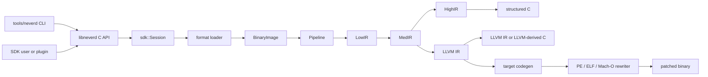

**語言**: [English](../architecture.md) | [简体中文](../zh-CN/architecture.md) | [繁體中文](architecture.md) | [日本語](../ja/architecture.md) | [한국어](../ko/architecture.md) | [Français](../fr/architecture.md) | [Deutsch](../de/architecture.md) | [Español](../es/architecture.md) | [Italiano](../it/architecture.md) | [Русский](../ru/architecture.md) | [العربية](../ar/architecture.md)

[← 文件索引](README.md)

# NeverD 架構

本指南說明貢獻者安全修改 NeverD 所需理解的生產邊界。內容刻意只涵蓋
NeverD 自有程式碼；LLVM、Capstone 與 Unicorn 子模組各自維護內部架構。

## 系統邊界

NeverD 有四種 IR 表示，但它們並非一條必須通過四跳的序列。`LowIR -> MedIR`
是共享部分；結構化反編譯接著使用 `MedIR -> HighIR -> C`，而 `lift`、
`decompile --llvm` 與 `patch` 則直接走 `MedIR -> LLVM IR`。尤其 patch 與
lift 模式會刻意略過 HighIR。

CLI 在 `tools/neverd` 解析命令、建立 `neverd_session_t`，並呼叫
`include/neverd/sdk/NeverDCAPI.h` 中的公開 API。引擎狀態位於
`lib/sdk/SessionImpl.h`；`neverd_session_load` 選擇 loader 並建立
`BinaryImage`，以 IR 為基礎的操作則按需執行 `lib/pipeline/Pipeline.cpp`。
`neverd` 可執行檔連結 `neverd_shared`；元件歸檔及其 LLVM/Capstone 相依是
該共享程式庫的私有實作細節。CLI 使用 LLVM Support 建立命令列介面，
但不會繞過 C API 驅動引擎。

HighIR 的 `HighSourceFlow` 統一管理輸出敘述的控制流邊、區域變數身分和確定賦值分析。
原始碼驗證與無用 PHI 複製消除共用此圖。重複的純量條件採用有界的零值/非零值分割；
寫入使舊條件失效，位址逸出的變數維持未知，超出分割預算時退回保守圖。
只有純量值在所有可行情境中都不會被使用時，才刪除 PHI 複製。
呼叫、載入及儲存保留可觀察行為，原始碼標籤也會保留。

Block 使用方的逃逸分析也使用這張圖，以有界不動點分析跨分支和迴圈傳播指標身分及私有堆疊槽資訊。合流保留可能的上下文位址，只有完整覆寫才能清除。未知跳躍、例外控制流和證明預算耗盡都會拒絕繫結。

Objective-C 接收物件事實區分方法入口的 self 與確定的類別參照；只有共用入口的所有中繼資料記錄一致時，才建立 self 型別事實。完整寬度複製及 ABI 規定保留的暫存器透過同一不動點分析傳播事實，入口回邊也參與合流。宣告檢查區分類別方法與實例方法，並納入已記錄的分類、父類別鏈及協定繼承；入口 self 也考慮已知子類別宣告。編譯器目錄分別保留宣告所屬物件與繼承關係，以及全域選擇器一致性資訊。發布原始碼前，SDK 依據目前映像重新驗證接收物件來源及適用宣告。這些事實不選擇具體 IMP，也不授權二進位重寫。
外部繼承資訊缺失時，必須改用全域選擇器一致性檢查，不能縮小到接收物件範圍；明確不支援或衝突的宣告仍保留為否定證據。

帶明確物件型別的成員變數可透過最多八次完整寬度讀取延伸接收物件證明。每一步記錄執行期偏移槽、偏移值寬度，以及機器存取使用的固定位元組偏移。固定偏移必須仍符合目前配置；執行期偏移參照則可隨欄位移動。載入器核對已記錄的類別繼承鏈與欄位宣告。部分讀取、裸 id、Block、僅協定型別、歧義儲存和未知指標基址都不能產生類別事實；原始碼驗證會依據目前映像重新檢查整條路徑。這些事實描述宣告型別，不代表物件身分，也不允許刪除記憶體操作。

載入器驗證 Darwin 常數字串、整數物件、陣列和有序字典組成的有界無環圖。容器欄位與每條邊都需要不可變映射儲存，以及無歧義的匯入或重定位證據；不支援的編碼、循環和不完整物件圖會明確失敗。原始碼繫結重新驗證物件圖及傳入指標槽。產生的輔助函式保留整數位元模式、子物件順序和共用位址，並重用既有字串身分。容器槽透過 acquire/release 發布機制只初始化一次，初始化僅呼叫已驗證的子物件輔助函式。每個輔助函式自帶子函式宣告，使獨立還原的方法可以共用同一定義。可攜式測試涵蓋損壞輸入與證明預算；原生編譯器樣例對照原始方法檢查內容、別名、複製身分和並行初始化。

## IR 表示與路徑

| 表示 | 用途 | 主要定義與轉換 |
|------|------|----------------|
| LowIR | 架構無關的 `NdOp` 操作、基本區塊、CFG 與跳躍表中繼資料 | `include/neverd/ir/low`、`lib/ir/low`，由 `lib/decode` + `lib/lift` 產生 |
| MedIR | 型別、ABI/呼叫慣例、記憶體與堆疊模型、旗標、呼叫和類 SSA 資料流 | `include/neverd/ir/med`、`lib/ir/med` |
| HighIR | 用於可讀 C 的結構化運算式與控制流 | `include/neverd/ir/high`、`lib/ir/high`，由 `lib/backend/c/HighC` 發射 |
| LLVM IR | 最佳化、LLVM 衍生 C、目標程式碼產生和二進位重寫輸入 | `lib/backend/llvm`，由 `lib/pipeline` 最佳化/編排 |

常數在 LowIR、MedIR 和 HighIR 中保留每次出現時的純量/位址來源及位址歸屬。數值位元相同不會合併不同來源。HighIR 符號簡化將位址身分視為不透明輸入；原始碼繫結使用共用的數值運算元分類，並仍要求記憶體與指標使用完成重定位繫結。

| 使用者路徑 | 表示路徑 | 出口 |
|------------|----------|------|
| Low/Med dump | Binary -> LowIR，可選 -> MedIR | 診斷文字 |
| High dump 或 `decompile` | Binary -> LowIR -> MedIR -> HighIR | HighIR 或結構化 C |
| `lift` | Binary -> LowIR -> MedIR -> LLVM IR | `.ll` |
| `decompile --llvm` | Binary -> LowIR -> MedIR -> LLVM IR | LLVM 衍生 C |
| `patch` | Binary -> LowIR -> MedIR -> LLVM IR -> codegen | 重寫後的二進位 |

`lib/pipeline/Pipeline.cpp` 是路徑選擇的事實來源。特定表示的邏輯應留在其
所屬 IR 或 backend 程式庫；pipeline 應編排元件，而不是吸收其演算法。

## 跨架構翻譯契約

`include/neverd/translate` 定義的是契約層，而不是執行後端。`GuestState`
為 `x86_32`、`x86_64`、`AArch64` 與 `ARM32` 建模架構無關的機器可見狀態。
其規範的版本 1 序列化採用固定寬度的小端欄位、穩定的暫存器 ID、排序集合與
失敗即關閉的驗證，因此持久化狀態不依賴主機 C++ 配置。

`GuestState` 的 wire v1 基線永久凍結。基線以外的機器狀態只能使用擴充區間內的
extension-register ID，並搭配規範的小寫名稱；否則必須採用新的 wire 版本並提供
明確的 upgrader，禁止就地變更 v1 基線。

對於 `ARM32` guest，`ExecutionMode` 是權威解碼模式，且必須與 `CPSR.T` 一致。
儲存的 PC 一律是清除 bit 0 後的規範指令位址；ARM 模式還要求按字對齊。

架構對策略定義 `x86_64 -> AArch64`、`AArch64 -> x86_64`、
`x86_32 -> AArch64/ARM32` 與 `ARM32 -> x86_32/x86_64`。
`ContractDefined` 表示請求可以驗證並持久化，不表示程式碼已能翻譯或執行。
JIT 策略只接受執行中程序的原生主機；AOT 策略則要求明確提供主機架構、目標
triple；若選擇了 CPU 或特性集合，也必須明確提供。

`ResolvedHostTarget` 將此選擇解析為具體結果。`Native` 解析從目前程序取得 triple、
CPU 以及啟用/停用的特性集合；`Explicit` 解析會驗證並正規化呼叫端提供的架構、
triple、CPU 與特性，並拒絕互相衝突的輸入。其帶版本的快取識別按確定的位元組順序
由正規化目標輸入建構，不包含程序位址或依賴 locale 的文字。

帶版本的 `TranslationExit` 記錄穩定的停止原因及其對應的型別化承載資料，涵蓋
系統呼叫、例外或訊號、斷點、不支援的指令、自我修改、資源預算、外部呼叫、
記憶體錯誤及其他終止條件。使用者不必再依停止原因重新解讀無型別整數。

除與對應預算相符的 `BudgetExhausted` 外，結果回報的指令數、block 數與產生程式碼量
都不得超過請求中的對應非零預算。指令與 block 耗盡會精確停在 limit。產生目標檔案
大小只能在不可分割的 codegen 完成後精確量測，因此該預算耗盡結果可以回報
`Observed > Limit`；被拒絕的目標檔案絕不會被連結、發布或執行。每個
`BudgetExhausted` 承載資料都必須精確識別請求的 limit，不得回報推導值或實作私有門檻。

backend-private `RuntimeControlBlockV1` 契約固定為 128 位元組、8 位元組
對齊，並以固定的 v1 magic、version、size、欄位偏移、全零保留欄位與自洽的型別化
退出記錄加以約束。它不包含 C++ 容器、主機指標或 guest 位址別名，也不是
`GuestState` 的 C++ 配置或 wire 格式；實作該契約的後端必須明確將狀態轉換到此記錄。

固定的 v1 generated-code 呼叫面只包含八個 helper：
`nvd_rt_v1_load8_le`、`nvd_rt_v1_load16_le`、`nvd_rt_v1_load32_le`、
`nvd_rt_v1_load64_le`、`nvd_rt_v1_store8_le`、`nvd_rt_v1_store16_le`、
`nvd_rt_v1_store32_le` 與 `nvd_rt_v1_store64_le`。名稱、簽章與指標 provenance
必須精確相符；後端必須明確綁定此有限表，絕不能退回環境符號解析。可執行記憶體
generation 驗證與預算/取消輪詢只由受信任 dispatcher 執行；
`nvd_rt_v1_validate_generation` 與 `nvd_rt_v1_poll` 均不是 generated-code helper。
受信任主機 dispatcher 也負責選擇 block，產生 IR 不能呼叫它；translated block
只回傳型別化退出碼。產生 IR 只能直接讀取已宣告的 scalar-result runtime slot。

`RuntimeSymbolRegistryV1` 將此 helper 表實作為封閉的主機端登錄表。建構過程會驗證
完整的 ABI-v1 集合、精確的正規名稱、helper class、簽章，以及每一項唯一一個非空且
與 class 相符的函式指標。查找只接受精確名稱，絕不查詢程序環境或動態載入器的符號，
並向目標檔 verifier 提供同一組已排序名稱作為 allowlist。其帶版本的識別涵蓋名稱、
helper class 與 ABI 形狀，但刻意排除原生位址，因此不受 ASLR 影響。

`RuntimeCodeMemory` 管理逐頁隔離的產生程式碼儲存空間，只允許單向 `RW -> RX` 發布
轉換。記憶體不會同時可寫與可執行，發布後也不能重新開放寫入；寫入與進入點偏移都
經過邊界檢查，發布時還會清除主機指令快取。本機 smoke test 只在發布後執行一小段
主機指令；它證明的僅是此 W^X 記憶體邊界，而不是翻譯引擎。

`GuestMemoryRuntime` 與邏輯 `GuestState` 隔離：建構時先驗證狀態，再將記憶體區域
的位元組與中繼資料複製到排序的私有索引。guest 虛擬位址只作為查找鍵，絕不轉換
為主機指標。受檢純量存取會以型別化形式回報寬度、對齊、溢位、未映射、跨區域、
權限、可執行寫入、generation 溢位、generation 不符與策略錯誤。指令/block 預算、
取消、generation 追蹤，以及 `RejectExecutableWrites`、
`InvalidateOnExecutableWrite`、`ValidateBeforeDispatch` 三種程式碼寫入策略同樣產生
自洽的型別化記錄，而非隱式主機行為。

`TranslationObjectCompilerV1` 是經過驗證的 LLVM IR 到目標檔邊界。它先驗證 const
輸入 module，在任何轉換前完成 clone，將證明閘控的語意簡化與 LLVM `O0` 至 `O3`
最佳化組合，再次驗證最終 IR，並為四種契約主機架構發射 relocatable ELF、COFF 或
Mach-O 目標檔。它正規化精確的 target-mangled block/runtime 符號 manifest，稽核每個
發射結果，並回傳 runtime registry identity 以及帶版本的請求與成品 cache key。產生
位元組預算非零時，只有符合預算的目標檔才能繼續進入成品驗證。LLVM 先向私有緩衝區
完成一次不可分割的發射以取得精確大小；超限目標檔會在發布與成品稽核前被拒絕，型別化
遙測保留實際大小與請求的精確 limit。零表示呼叫端政策不設上限。編譯器止於已稽核的
relocatable 位元組：不負責連結、發布、分派或執行，也不提供 guest 指令 lowering。

post-codegen verifier 將 relocatable ELF、COFF、Mach-O 目標檔視為
閉集合稽核。格式與架構必須和選定主機精確相符；未定義符號必須精確屬於有限
helper allowlist，動態符號一律禁止。relocation 採用明確直接白名單，並檢查
encoding、width、alignment、offset、可載入目的區段，以及目標是否為目標檔內
non-preemptible 定義或精確獲准的 helper。verifier 拒絕 W+X、例外/展開與初始化
中繼資料、TLS、IFUNC、GOT 與一般 PLT 間接機制、動態 relocation、weak/preemptible
或可選擇定義、未知 allocated section 與 linker directive。只有當 v1 policy 證明
LLVM 隱藏的 x86-64 ELF `R_X86_64_PLT32` 是指向精確 runtime helper 的 sealed direct
branch 時才允許此拼寫；它不會放行 PLT 或 GOT 路徑。ELF `ET_REL` 成品不得包含
program header 或 segment。Mach-O load command 採用正向白名單：必須且只能有一個
位寬相符的 segment，symbol table、dynamic-symbol table、platform-version 與
data-in-code command 各至多一個，並檢查相依關係；linker option 與其他所有 command
均拒絕。

`TranslationObjectRequestV1` 是建立在上述契約上的第一個公開、且刻意收窄的
guest 位元組到目標檔切片。在目前發布的失敗封閉 x86-64 v1 純量暫存器子集中，它只
接受不含 legacy prefix 的 canonical 編碼：採用受支援暫存器/立即數 LowIR 形狀的
REX.W 全寬 GPR `MOV`、`ADD`/`SUB` 與 `AND`/`OR`/`XOR`。schema 9 也接受全寬
暫存器/暫存器 `CMP` 編碼 `39/3B`、暫存器/立即數 `CMP` 編碼 `81/7`、`83/7` 與
`3D`、暫存器/暫存器 `TEST` 編碼 `85`，以及暫存器/立即數 `TEST` 編碼 `F7/0` 與
`A9`。算術形式保留相應的純量 flags 計算；邏輯形式與 `TEST` 會計算架構定義的 flags，
並在 NeverD 狀態模型中保留 `AF`。canonical `C3` `RET` 與
`C2 iw` `RET imm16` 會終止返回 block；canonical `EB cb` 與 `E9 cd` 直接相對 `JMP`
編碼會終止直接分支 block。目前公開 lowering schema 為 9。canonical、無 legacy prefix
的傳統 Jcc 僅支援以下形式：`JO`/`JNO` 的短形式 `70/71 cb` 或近形式 `0F 80/81 cd`；
`JB`/`JAE` 的 `72/73 cb` 或 `0F 82/83 cd`；`JE`/`JNE` 的 `74/75 cb` 或
`0F 84/85 cd`；`JBE`/`JA` 的 `76/77 cb` 或 `0F 86/87 cd`；`JS`/`JNS` 的
`78/79 cb` 或 `0F 88/89 cd`；`JP`/`JNP` 的 `7A/7B cb` 或 `0F 8A/8B cd`；
`JL`/`JGE` 的 `7C/7D cb` 或 `0F 8C/8D cd`；`JLE`/`JG` 的 `7E/7F cb` 或
`0F 8E/8F cd`。`JRCXZ`/`JECXZ`/`JCXZ` 與 `LOOP`/`LOOPE`/`LOOPNE` 仍未發布，
並以 fail-closed 方式拒絕。保留的 `F7 /1`、guest-memory 運算元、部分暫存器形式、
legacy prefix 與語意冗餘的 REX 擴充位元同樣以 fail-closed 方式拒絕。輸出僅限經過稽核的
little-endian AArch64 ELF 或 Mach-O relocatable 目標檔。一般 guest 記憶體操作、部分
暫存器形式、該精確子集外的任意指令或編碼、返回、這些直接跳轉與上述已發布 Jcc
分支以外的控制流，以及 lowerer 尚未實作的任何 LowIR 操作，都會在目標檔產生前遭到
拒絕。`RET` 所需的受檢回傳位址讀取屬於其 terminator 契約的內部
行為，並不公開通用 guest 記憶體 lowering。請求會重建並驗證 block descriptor，
lowering 與目標檔產生共用同一個已解析 target machine，並將證明閘控的語意簡化與
LLVM 預設 `O2` 最佳化流水線組合。
此切片不代表支援其他 x86-64 指令、其他 guest/host 組合，或反向 AArch64 到 x86-64
翻譯。

公開 C 入口 `neverd_translate_x86_64_block_to_aarch64_object_v1`、Python ctypes wrapper
`translate_x86_64_block_to_aarch64_object` 與 `neverd translate-object` 命令公開同一個
僅產生目標檔的邊界。Python 使用 `TranslationObjectFormat.ELF` 或 `.MACHO`；原生程式庫
回報的翻譯失敗會拋出帶有 `TranslationErrorCode` 的型別化 `TranslationError`，本機
參數驗證則拋出 `TypeError` 或 `ValueError`。成功時回傳由 Python 擁有的不可變結果。
C 結果
擁有目標檔位元組、穩定 cache identity 與最佳化遙測；CLI 只寫出所選的 ELF 或
Mach-O 目標檔。這些 C、Python 與 CLI 物件介面都止於連結、載入、分派、執行與除錯
之前；它們不是執行 session 介面。

`verifyTranslationLinkGraphV1` 增加第二道獨立的 allocation 前稽核。它從已接受的 AArch64
ELF 或 Mach-O 目標檔建立暫時的 LLVM JITLink graph，並檢查 target、section 權限、
block/runtime 符號 manifest、外部符號閉包，以及 edge 類型與目標。產生不含位址的
稽核結果後即銷毀 graph。通過此稽核不等於連結、配置、解析、載入、發布、分派或執行
程式碼。

`linkTranslationObjectV1` 是獨立的原生連結邊界。它會在裁剪、配置、符號解析與 fixup
前後重新稽核受信任 descriptor、原始物件及 JITLink graph。runtime 符號只能來自 sealed
登錄表。dispatcher credential 將唯一的 manifest 條目綁定至其 session、block identity、
guest 入口 PC、cache generation 與 code epoch；呼叫時 runtime guest `RIP` 也必須符合
該入口。成功 finalize 後以最終權限發布可執行記憶體；unload 會撤銷新呼叫，並等待一個
進行中的呼叫結束後才釋放 allocation。無 credential 的 overload 仍僅供稽核，不能呼叫。

`NativeTranslationSessionV1` 將這些元件組合成實驗性的 C++ x86-64 到原生 AArch64
執行邊界。在 little-endian AArch64 ELF 或 Mach-O 程序上，它於 compile-link-validate-
invoke-unload dispatcher 迴圈中跨 block 保留同一個受檢 guest-memory runtime 與固定
guest state。canonical 直接跳轉會在其精確靜態目標繼續執行。已發布的 canonical
Jcc 分支只能在 block manifest 宣告的 taken 或 fallthrough successor 繼續；dispatcher
拒絕其他任何選定 PC。返回會終止執行。全域指令數、block 數與產生物件位元組數預算在
多個 block 間保持精確；guest 成功停止時，已執行狀態與權威記憶體會一起提交。取消操作
與最終提交線性化。

這是一個可執行的縱向切片，而不是完整翻譯器。它尚不支援一般 guest-memory 指令、
部分暫存器、上述精確 schema-9 傳統 Jcc 切片以外的條件控制流（包括
`JRCXZ`/`JECXZ`/`JCXZ` 與 `LOOP`/`LOOPE`/`LOOPNE`）、間接控制流、
呼叫、浮點、SIMD、x87、原子操作、系統指令、
通用例外傳播、block cache、其他 guest/host 架構組合或反向 AArch64 到 x86-64。執行
session 目前沒有 C、Python、CLI 或 JSON 介面，除錯仍是獨立且不受支援的能力。上述
物件 API 不需啟用原生執行仍可單獨使用。

產生 IR 的契約要求受該契約約束的每個 translated block 都是 hidden、non-preemptible，
並採用 C ABI `i32 (ptr state, ptr runtime)`。runtime 只能透過私有登錄表發現 block，
不得依賴程序環境的符號查找；禁止 block 之間直接呼叫。

IR verifier 也會把整數寬度限制在主機純量暫存器寬度以內，以避免 legalization
引入已知的 compiler-runtime libcall。這項檢查只是必要條件：任何實作該契約的執行
後端都必須依同一個有限的 runtime-symbol allowlist，精確稽核 post-codegen 控制轉移、
`MachineIR` 與目標檔 relocation。

TranslationIR 的直接 load/store，以及 private constant 儲存的值，只能包含單一、
不寬於主機純量暫存器寬度的純量整數。聚合值必須在 verifier 邊界前完成純量化，
避免緊湊 IR 觸發後端無界展開。

generated-code ABI 只為純量整數定義。浮點、SIMD、x87、原子操作與系統指令均在
該契約之外。選擇 `ProvenSemanticAndLLVM` 策略的實作必須執行 NeverD 現有的證明
閘控語意簡化，並與 LLVM 最佳化共同達到不動點；該策略本身不提供可執行翻譯後端。

## 例外重寫邊界

Mach-O compact unwind 目前具備原始 `__unwind_info` 的嚴格 parser、產生
`__LD,__compact_unwind` 記錄的 fixup-aware parser、原始/產生範圍的精確 merge、
regular page 的確定性 encoder，以及交易式最終 section installer。installer 僅在既有、
file-backed 的 `__TEXT,__unwind_info` 能容納編碼結果時原位重寫；它會重新驗證架構、版面
與原始位元組，清零未使用尾端，並在 Mach-O 外層交易單次提交前重新解析結果、證明語意等價。
產生的記錄以編譯器精確記錄的 IR 來源函式到目標 MC owner symbol 對應（包括私有定義，且
不猜測物件格式前綴或改名規則）、opaque 非零 range ID，以及精確半開片段範圍進行驗證。
每個產生的 FDE 都必須精確匹配唯一的已驗證片段；每個必要片段也必須精確匹配該交易安裝的
唯一 FDE，除非它由一筆精確且通過嚴格 encoding 驗證的非 DWARF compact 記錄覆蓋。同一
函式擁有的相鄰或不相鄰片段可重用同一來源 recipe；缺失、重複、懸空、跨 owner 或邊界不
一致的身分會在修改輸出前失敗。新增 RX segment 只有在證明 `__LINKEDIT` 唯一且位於
file/VM 末端、所有 offset relocation 均經過溢位檢查，並嚴格重播最終檔案與虛擬位址版面
後才會提交。最終 section 缺失時不安裝產生的 compact 記錄，且僅在通過上述精確、已驗證的
DWARF-FDE 閉環時才可繼續交易；既有最終 section 容量不足或格式錯誤時仍會 fail closed。
已連結的原生 throw/catch 證明仍待完成。

外部參照依完整的 MC fixup 契約分類。call 只能選擇已驗證的可呼叫目標；產生的
compact-unwind personality 欄位只能選擇通過驗證的 non-lazy pointer slot，且絕不解參照
其檔案內容。TLS、authenticated pointer、減項、格式錯誤的 compact 欄位與未知 relocation
都會 fail closed。

ARM32 compact unwind 的已編碼堆疊調整與 GPR 版面為 `Complete`；D 暫存器模式選擇值 0 至 3
同樣為 `Complete`。選擇值 4 至 7 為 `Partial`，因為僅憑 compact word 無法證明每個經執行期
對齊的 CFA 相對 slot。`Partial` 項目可為分析保留已證明的暫存器身分，但所有重寫路徑都會
以 fail-closed 方式拒絕。每份 EH-frame 安裝 receipt 都精確綁定目標架構、指標寬度與位元組序；
compact-unwind DWARF 綁定會拒絕任何 receipt target identity 不相符。

頂層 ARM32 section 交易的能力邊界比 compact-unwind 解碼器更窄。只有 Mach-O header
精確為 `CPU_SUBTYPE_ARM_V7K`，且原始 symbol table 的 `N_ARM_THUMB_DEF` 位元對每個必要
函式都提供 Thumb code 的正向證明時，才會開放這條路徑。此後，精確的
`thumbv7k-apple-watchos` triple 與 Thumb mode 會貫穿並約束整個 code generation，輸入的
feature 需求也不得超過 Cortex-A7 上限。未標記或模式未知的函式、generic non-v7k
subtype、ARM mode、混合或未知的 external-code target、ARM Mach-O in-place entry point，
以及從 C source 發起的 ARM Mach-O patch，都會在修改輸出前 fail closed。對於 stripped
輸入，如果只能透過 `LC_FUNCTION_STARTS` 發現函式，目前仍不支援。

PE、ELF 與 Mach-O 各自具備格式特定的例外元件，但 NeverD 尚未公開涵蓋所有格式、
所有例外類型的端到端重寫流水線。不支援的 encoding 或未解析的註冊/layout 要求必須
在修改輸出前失敗；現有的局部格式能力不能描述為例外重寫已完全閉環。

辨識 Ada 或 D 的 Itanium personality 並不等於支援 Ada 或 D 例外。GNAT、GDC、DMD
與 LDC 的 address-form LSDA 可解析；type-table 槽位保持不透明（GNAT 為
`Exception_Id` / `Exception_Data`，D 為 `ClassInfo`），且絕不會依
`std::type_info` 解參考。原生重建會發出 LLVM `personality` 以及 address-form 的
`invoke`/`landingpad` 子句。corpus-proven 是另一層聲明，不能由 personality 辨識
或原生 lowering 自行推出。

## 元件對照

每個元件都是由 `add_neverd_component_library` 建立的靜態歸檔。下表列出重要的
NeverD 相依，不窮舉 CMake helper 統一提供的 LLVM 與 Capstone 程式庫。

| 目錄 | 職責 | 重要相依 |
|------|------|----------|
| `lib/loader` | 格式偵測、PE/COFF、ELF、Mach-O 載入；正規化 `BinaryImage`；函式發現 | LLVM Object API |
| `lib/lift` | 手寫 x86/i386、AArch64、ARM32 指令語意 | IR 資料型別 |
| `lib/decode` | Capstone/native 解碼並分派到架構 lifter | `NeverDIR`、`NeverDLift` |
| `lib/ir` | 共用型別以及 LowIR、MedIR、HighIR、intrinsic 定義/轉換 | 四個 IR 子元件 |
| `lib/pipeline` | 函式偵測與 Low/Med/High/LLVM 路徑編排 | IR、decode、lift、LLVM backend、除錯資訊、IR pass |
| `lib/backend/c` | HighIR 到 C 與 LLVM IR 到 C 的呈現 | IR |
| `lib/backend/llvm` | MedIR 到 LLVM 的 lowering | IR |
| `lib/backend/codegen` | 目標程式碼產生及 PE/ELF/Mach-O patch 與原地重寫 | IR、loader |
| `lib/sdk` | 公開 C ABI、session 生命週期、查詢、持久化、外掛、lift/decompile/patch/audit/hunt 進入點 | 將引擎元件聚合為 `libneverd` |
| `lib/pass` | LLVM IR 混淆 pass 與 MIR pass runner | IR |
| `lib/debug` | DWARF、PDB 與 linker-map 除錯內容 | IR |
| `lib/sigs` | 簽章解析、資料庫與比對 | Loader |
| `lib/libc` | 已知 libc 名稱與呼叫模型支援 | 獨立元件 |
| `lib/safety` | 提升 IR 上的堆積生命週期稽核與拷貝越界獵取 | Symbolic、Solver |
| `lib/support` | 共用二進位載入 helper | Loader |
| `lib/translate` | 帶版本的 guest state/策略/退出、固定 runtime ABI、受檢 guest memory、產生 IR/目標檔/LinkGraph 稽核、sealed 原生連結，以及實驗性的 x86-64 到 AArch64 C++ dispatcher | IR、LLVM、LLVM Object 與 JITLink 契約 |

公開標頭在 `include/neverd` 下對應這些區域。不要意外讓內部 C++ 類別成為 SDK
的一部分：穩定的外部操作應放在純 C 標頭及職責明確的
`lib/sdk/NeverDCAPI*.cpp` 檔案中。

## 嚴格提升契約

`Decoder` 與每個架構 lifter 預設以嚴格模式啟動。如果 Capstone 能解碼指令，
但選定的 lifter 沒有實作，lifter 會拋出 `UnliftedInstruction`。例外記錄指令
位址、助記符和運算元字串；因此，不支援的語意必須明確失敗，不能被省略或猜測。

內部非嚴格路徑會發射 `NdOp::NOP`，但它只是診斷逃生口，不是指令的可接受實作。
貢獻者測試與 CI 應保持嚴格模式開啟。出現嚴格失敗時：

1. 以最小的架構特定 fixture 重現。
2. 在 `lib/lift/<ISA>` 中加入缺少的語意。
3. 在 `unittests/lift` 中斷言預期的 LowIR 形狀。
4. 若指令有可觀察行為，在 `unittests/semantic` 中新增 Unicorn 差分往返。

不要只為讓 pipeline 繼續而捕捉 `UnliftedInstruction`。新的刻意近似需要明確契約
與測試；不得偽裝成 1:1 提升。

## 格式與 ISA 所有權

輸入格式邏輯與輸出重寫邏輯刻意分離：

| 格式 | 載入、中繼資料與輸入重定位 | Patch 與輸出重定位 |
|------|----------------------------|--------------------|
| PE/COFF | `lib/loader/COFF` | `lib/backend/codegen/COFF` |
| ELF | `lib/loader/ELF` | `lib/backend/codegen/ELF` |
| Mach-O | `lib/loader/MachO` | `lib/backend/codegen/MachO` |

架構 lifter 位於 `lib/lift/X86`、`lib/lift/AArch64` 與 `lib/lift/ARM`。
對應的公開 lifter/register 宣告位於 `include/neverd/lift`。目標特定的 LLVM
發射與程式碼產生位於 `lib/backend/llvm/<ISA>` 及
`lib/backend/codegen/CodeGen<ISA>.cpp`。

### 支援範圍與測試深度

根目錄支援矩陣表示每個單元格皆已實作；這不代表每個 opcode、ABI 邊界案例、
二進位產生器或作業系統版本都已窮盡測試。指令語意超出 lifter 已實作涵蓋範圍時，
嚴格模式會以失敗即關閉方式停止。

所有 12 個格式×架構單元格都在
`unittests/semantic/PatchFullSubstRTTests.cpp` 中具有語意重寫後端覆蓋。
整合深度則更具體：

| 格式 | x86-64 | i386 | AArch64 | ARM32 |
|------|--------|------|---------|-------|
| PE/COFF | 已連結 fixture | 後端網格 | 已連結 fixture | 已連結 Thumb fixture |
| ELF | 已連結 fixture + 語意往返 | 物件流水線 + 語意往返 | 已連結 fixture + 語意往返 | 已連結 fixture + 語意往返 |
| Mach-O | 已連結 fixture\* | PIC/no-PIC 物件流水線\* | 已連結 fixture\* | 後端網格 |

- **已連結 fixture** 對代表性程式執行已連結可執行檔的 loader/pipeline 與
  patch 行為。
- **物件流水線** 對可重定位物件執行載入、所有 IR 階段和反編譯，但不涵蓋主機
  連結及 patch 後二進位的執行。
- **後端網格** 透過精確的重寫程式碼產生路徑編譯代表性 IR，並在 Unicorn 中比較
  行為；它不會對已連結可執行檔執行該格式的 loader。
- `*` Mach-O 已連結 fixture 依賴能產生所需目標的主機工具鏈。現代 macOS 無法
  連結歷史 i386 可執行檔，因此 i386 使用 PIC 與 no-PIC thin 物件加重寫網格。

對這些代表性程式，應將已連結 fixture 單元格視為最強的格式整合證據。
物件流水線與後端網格單元格只有部分格式整合覆蓋。沒有任何單元格能在不加限定時
稱為「完全測試」，也沒有單元格宣稱窮盡 ISA 覆蓋。

主要證據包括：用於已連結 ELF 與 PE fixture 的
[`PatchFormatTests.cpp`](../../unittests/lift/format/PatchFormatTests.cpp)，用於 Windows ARM
載入/反編譯的
[`COFFARMFormatTests.cpp`](../../unittests/lift/format/COFFARMFormatTests.cpp)，用於 i386 thin
物件的
[`MachOI386RelocationTests.cpp`](../../unittests/lift/format/MachOI386RelocationTests.cpp)，
用於已連結 Mach-O 的
[`X86_64_PipelineE2ETests.cpp`](../../unittests/lift/x86_64/X86_64_PipelineE2ETests.cpp) 與
[`AArch64_PipelineE2ETests.cpp`](../../unittests/lift/aarch64/AArch64_PipelineE2ETests.cpp)，
以及涵蓋 12 單元後端網格的
[`PatchFullSubstRTTests.cpp`](../../unittests/semantic/probe/patchfull/PatchFullSubstRTTests.cpp)。
命令見[測試指南](testing.md)。

## 在哪裡修改

| 變更 | 從這裡開始 | 最小聚焦驗證 |
|------|------------|--------------|
| 新增或修正指令 | `lib/lift/X86`、`AArch64` 或 `ARM` 中的對應檔案；分派變更時修改公開 lifter 標頭 | `unittests/lift` 中的架構測試；`unittests/semantic` 中的語意往返 |
| 新增 `NdOp` | `include/neverd/ir/NdOps.h`，接著稽核 Low-to-Med、emitter/renderer、verifier/emulator 與 dump | `NeverDLiftTests` + 相關 `NeverDSemanticTests` 案例 |
| 修改 CFG 或函式發現 | `lib/ir/low`、`lib/loader/FunctionDiscovery*.cpp`、`lib/pipeline/PipelineFuncDetect.cpp` | lift CFG/跳躍表測試與聚焦語意轉換套件 |
| 新增 PE 輸入重定位或 unwind 規則 | `lib/loader/COFF` | `COFFARMFormatTests` 或新的聚焦 loader fixture |
| 新增 PE 輸出重定位或 patch 規則 | `lib/backend/codegen/COFF` | `PatchFormatTests`、`RewriteCodegenRTTests` 與 PE 後端網格 |
| 修改 ELF 或 Mach-O 格式行為 | 對應的 `lib/loader/<Format>` 和/或 `lib/backend/codegen/<Format>` 目錄 | 對應格式測試加重寫網格 |
| 修改 MedIR/ABI 復原 | `lib/ir/med` | 呼叫慣例 lift 測試 + 跨 ISA 語意往返 |
| 修改結構化控制流復原 | `lib/ir/high` | `NeverDCFGLoopXformTests` 與結構化 C 測試 |
| 新增 LLVM 轉換 | `lib/pass/ir`、`include/neverd/pass/ir` 中的公開標頭，公開時加入 pipeline 切換 | 聚焦轉換套件 + patch 輸出變更時的 `NeverDPatchFullTests` |
| 新增 C API 操作 | `include/neverd/sdk/NeverDCAPI.h`、聚焦的 `lib/sdk/NeverDCAPI*.cpp`，只有狀態需要時使用 `SessionImpl.h` | SDK/CLI 語意測試；保持 `neverd_last_error` 與配置慣例 |
| 新增 CLI 命令 | `tools/neverd/NeverDCLIOptions.cpp`、`NeverDCLI.h`、聚焦的 `NeverDCmd*.cpp`，以及 `neverd.cpp` 中的分派 | `unittests/semantic/CLIEndToEndTests.cpp` 與直接 CLI smoke test |
| 修改堆積生命週期稽核或拷貝越界獵取 | `lib/safety`、`include/neverd/safety`、`include/neverd/sdk/NeverDCAPISafety.h` | `NeverDSafetyTests` 與 `NeverDSafetyIntegrationTests` |
| 新增語意回歸 | 聚焦的 `unittests/semantic/*Tests.cpp`；在 `unittests/semantic/CMakeLists.txt` 註冊新檔案 | 建置其測試二進位，再以 `ctest -R` 選擇命名案例 |

保持修改精確。定義某種表示的檔案可與其轉換一起變更，但不要只為讓大型重構看起來
一致而修改無關的 loader、lifter 與 backend。

原始碼記錄型別獨立保存欄位配置。統一 ABI 層支援 Darwin ARM64 中含一至四個同類 float 或 double 成員的巢狀結構，浮點暫存器不足時將整個參數放入堆疊。MedIR 在 SSA 前綁定各個實體成員，HighIR 保留單一邏輯參數或回傳值，C 輸出驗證配置。Darwin ARM64 與 x86_64 也支援由一至兩個 64 位元整數或指標組成的記錄，包括巢狀配置。整個記錄溢出到堆疊時，ARM64 耗盡該暫存器組，x86_64 則保留剩餘暫存器給後續參數。有填補、壓縮欄位、混合浮點與整數及不完整分量仍拒絕；這些提示不能授權二進位改寫。

Darwin ARM64 的固定 C 呼叫也支援透過隱藏的 x8 指標回傳由三個有號 64 位元整數構成的自然配置記錄。共用來源 ABI 層負責分類；Low→Med 在呼叫前保存該指標，將單一邏輯記錄結果逐欄位寫回呼叫者儲存區，一般參數暫存器保持原位，x0 不被視為回傳值。呼叫提示分析會使結果儲存區中的舊事實失效。入口投影與原生狀態保存證明尚無對應儲存證明，仍拒絕此類回傳；含無號或指標欄位的三字記錄、三字參數與 x86_64 間接記錄回傳仍不支援。 Objective-C 間接回傳在全域 selector 查詢與一般 receiver 查詢中仍會拒絕，因為 nil 訊息分派會保留原結果緩衝區。只有 receiver 精確等於目前方法的非 nil self，且 x8 指向完整、未逸出的私有 frame 範圍時，依 receiver 限定的 ARM64 呼叫才可使用固定記錄 ABI。發佈來源碼時會重新驗證方法入口、self 運算元、receiver 宣告、記錄大小與 frame 邊界；證據缺失或變更時，訊息仍保持未解析。

執行階段呼叫目錄僅在精確匯入的函式明確回傳原參數指標時宣告 `ReturnedArgument`。接收者分析先讀取已宣告的實體參數，再套用正常 ABI 暫存器清除，最後僅在回傳值上恢復既有的接收者型別事實。SDK 會重新驗證此效果；它不允許刪除呼叫、所有權效果或記憶體存取。

編譯器產生的框架目錄與接收者目錄共用提供者清單：Foundation、CoreData、CoreLocation、CoreSpotlight、QuartzCore、UniformTypeIdentifiers 和 UserNotifications。QuartzCore 使用公開入口 `CoreAnimation.h`，其他框架的相容性匯入不提供所屬宣告。兩個產生器均保留四種前置處理設定、精確框架身分及宣告的否定證據。

物件回傳型別透過一致的方法宣告延伸同一條有界接收者證明。具名物件回傳型別和編譯器宣告的關聯回傳型別可提供類別事實；單獨的 id 不可以。欄位讀取和訊息回傳共用八步預算，原始碼驗證會依目前宣告重新檢查每一步。精確繫結的配置輔助函式使用對應訊息的回傳型別契約，保留呼叫、自訂覆寫和所有權效果。回傳類別衝突或接收者繼承關係不完整時停止傳播。

格式呼叫綁定保留所屬語言規則。NSString 屬性和公開述詞入口皆核對 SDK 宣告及所有執行期替代宣告。述詞不替換單引號或雙引號中的佔位符，`%K` 接收屬性名稱物件；實際參數沿用統一的純量提升與 Darwin 可變參數 ABI。不支援的跳脫及格式修飾符明確拒絕。原始碼發布前重新驗證語法、常數物件身分及參數證明，產生程式碼仍呼叫原框架剖析器。

編譯器宣告的固定參數 C 匯入函式與 Objective-C 訊息共用受支援結構體的來源 ABI 分配規則。只有明確宣告的參數占用載體；Objective-C 層提供隱藏的接收者與選擇器參數。仍須嚴格匹配 SDK 匯出身分與簽章。僅支援純量的回呼與可變參數保留現有限制。

來源函式宣告將呼叫慣例保留為簽章身分的一部分。共用 ABI 層支援範圍明確的 Swift 呼叫，可承載 1、2、4 或 8 位元組整數參數及指標參數：先分配整數暫存器組，再分配相對入口 SP 的堆疊載體。每個窄載體都記錄精確的延伸規則，結果仍限制為最多兩個整數或指標字。HighC 在宣告和定義中保留 `swiftcall`。經編譯器觀測確認的 Foundation 值橋接還可宣告一個 `swift_indirect_result` 指標及一個 `swift_context` 指標：arm64 使用 x8/x20，x86_64 使用 RAX/R13，兩者皆不占用一般整數參數暫存器組。HighC 保留這兩個參數屬性。公開 Foundation 中繼資料匯入必須在 ARM64/x86-64 的 macOS 和 Mac Catalyst 設定間取得編譯器符號圖、實際中繼資料查詢 IR 與精確 SDK 匯出的共同證明。僅憑重整符號後綴不能確定 ABI。泛型或未宣告的隱藏參數、Swift 回呼型別及不支援的實體載體仍被拒絕。Mac Catalyst 宣告不代表已有 iOS 裝置執行驗證。

MedIR 統一負責同寬 SSA 複製與完整 PHI（包括迴圈）的有界常數傳播。所有入邊值必須收斂到相同的位元、寬度、來源和位址歸屬。未知定義、無初值迴圈、不完整邊及衝突常數阻止替換；預算耗盡時函式保持原樣。分析只替換運算元，保留呼叫、載入、儲存及其副作用。HighIR 與 LLVM 使用同一分析結果。

單次操作內的程式碼歸屬索引也保存執行階段中繼資料中主函式與程式碼片段的精確關係。索引查詢與直接掃描共用同一關係走訪，保留主函式入口的原始位址，並拒絕孤立參照及指向非主函式的父參照。跳轉目標驗證、邊界證明和暫時分組分析使用同一個不可變索引及查詢成本計算。其他映像的索引會退回直接掃描；預算耗盡仍拒絕不完整證明。

原始碼 ABI 明確記錄 Darwin ARM64 和 x86_64 窄整數暫存器參數的 32 位元符號擴展或零擴展。HighIR 在儲存與複製參數時保留這些已知位元，同時維持原始參數型別。超過 32 位元的讀取、堆疊填補及被呼叫破壞的暫存器仍為未知。這遵循 Apple 的 ARM64 與 Intel 呼叫慣例；僅觀察到原生低位元組值不能證明擴展。

Mach-O 載入器保留區段的「重定位後唯讀」保證，同時保留初始權限。原始碼位元組與指標讀取共用唯一檔案映射檢查；區段名稱本身不能證明不可變性。普通全寬載入可將已解析的本機資料指標綁定至獨立驗證的常量字串物件。綁定保留來源槽以便重新驗證，別名共用目標物件的產生身分。可寫儲存、衝突重定位、部分或有序載入，以及槽本身的位址仍不受支援。

跳躍表恢復只產生前往一般後繼區塊的轉移，不再透過另一條路徑重建區塊內陳述式。每個區塊只由統一流程轉換一次，包括共用分支、預設目標與迴圈入口。分支邊上的 PHI 賦值在對應轉移前執行，並保留平行賦值快照；不完整的邊綁定仍明確失敗。

迴圈結構化保留原生入口的精確歸屬。恆真迴圈的包裝節點保留首條迴圈主體指令的標籤，不重複建立入口。有條件的回邊退出到原有後續陳述式，包括沒有原生位址的邊複製。只有精確符合後續入口的跳轉才轉換為 break；巢狀迴圈和 switch 內的跳轉保留其控制範圍。

死值消除在刪除 PHI 邊複製之前正規化原生入口的歸屬。共用的合併邏輯區分條件分支入口及其緊鄰的合成邊複製前綴；不連續的標籤以及無關的巢狀標籤仍判為具有歧義。

`scripts/collect_objc_sdk_declarations.py` 從實際裝置、模擬器、Mac Catalyst 和桌面 SDK 組態採集框架所屬的類別、協定、分類及方法 ABI 候選。每個組態保留公開標頭、匯出和編譯器證據，包括不支援的宣告及相關物件回傳型別。部分 SDK 採集會記錄確切範圍；任一組態失敗都會留下未完成的記錄。CI 產物供後續宣告目錄一致性驗證使用，本身不會啟用新的原始碼呼叫繫結。

Objective-C 呼叫事實包含有界、相對入口 SP 的私有堆疊槽。控制流匯合時，精確值取交集，可能源自堆疊框架的位元組取聯集，避免衝突路徑和部分暫存器寫入掩蓋位址逸出。具有明確 ABI 的呼叫僅保留已配置且位於傳出參數之外的私有儲存。位址逸出、未知呼叫、重疊或原子寫入及堆疊空間釋放會撤銷相應證明。迴圈回邊必須收斂後才能發布繫結。

HighC 使用精確位寬的 `_BitInt` 型別表示不超過 128 位元的部分整數載體。一般記憶體輔助函式依 IR 位元組數傳輸，不依賴 C 物件填補；無號運算保留環繞及位移邊界。不支援的部分位寬原子存取會明確拒絕，不會擴大存取範圍。

HighIR 可在嚴格證明下把 64 位元原始碼區域變數縮窄為 32 位元，沿用 128 位元載體的規則：所有定義的載體寬度和低位寬度必須一致，所有讀取必須明確選取低位。完整寬度儲存、逸出、高位讀取或高位運算式的副作用都會阻止縮窄。原始碼參數的填補位元仍保持未知。
精確的整變數複製可透過有界圖共享此證明，但必須先由建構值的定義確定低位寬度。每個複製目標都必須符合縮窄條件；完整寬度的消費者會使所有上游例外失效。沒有寬度依據的循環、寬度衝突或預算耗盡時保留原值。
有界整數轉換、零偏移切片與擴展也可傳遞此證明，但每個中間寬度都必須保留所需低位。每次使用都依其所屬陳述式的運算式根分別檢查。最多兩輪有界分析可在移除向量填補後繼續證明更窄的低位。

MedIR 原始碼參數驗證從宣告的回傳值、控制流程、記憶體副作用和呼叫反向追蹤所需位元組。COPY、PHI、CONCAT、位元組擷取和擴充保留位元組需求；其他操作保守地要求全部輸入。未使用的浮點暫存器高位不會產生額外參數。可觀察的高位、不完整的圖和耗盡的分析預算仍保留原有拒絕結果。此分析不刪除機器操作，也不授予重寫 ABI。

條件結構化保留原有邊上的未跳轉路徑 PHI 賦值。其來源位址不能成為新建的延續跳轉目標；若移動程式碼段需要這樣的目標，共享延續路徑就保留在原處。 無條件的合成迴圈在精確迴圈頭之前沒有任何操作時，也與內部首條原生指令共享延續入口；有條件的測試或前置副作用不具備這種等價性。

原生輔助函式的原始碼簽章推斷透過有界 CFG 分析，證明每條機器返回路徑都具有完整的整數結果。共享出口匯合前驅事實，入口路徑阻止未初始化的迴圈自證。呼叫和局部寫入會撤銷返回暫存器的證明，直到再次完整計算。畸形控制流、僅返回傳入值的路徑以及 x86-64 尾聲恢復仍會被拒絕。這只產生候選原始碼簽章；第二次管線仍須驗證函式本體及其相依閉包，不會改變重寫 ABI。

## 最近的原始碼復原邊界

- Swift 延遲 witness table accessor 只有在證明 `Wl`/`WL` 快取模式、精確 runtime 查詢及重新建立的快取後才會復原；不會複製原始快取位址。
- `Any.self` 只有在完整 existential container 的精確內部成員或公開匯出 `$sypN` 證明中繼資料身分時才會成為常數。
- Objective-C class-reference cell 會保留額外的間接層級，且只允許沒有歧義用途的具型別原生 load。
- ivar offset 只有在類別與寬度一致且僅有一次 load 時，才能跨 CFG 合併。雙字 Swift `String` once getter 還需要四個 carrier 的精確契約。
- 編譯器產生的無參數 Swift 延遲全域 addressor，只有在精確的 `vau`/`vpZ`/`_Wz`/`_WZ` 符號族符合一次 load、一次完成狀態檢查、一次已驗證的 `swift_once` 呼叫，且兩條路徑回傳同一儲存位址時才會重建。initializer 必須忽略附帶的 context，並像一般原始碼一樣完成依賴閉包。投影會新建共用 once predicate 和數值 cell，不保留載入映像中的這些位址或 initializer 位址。其無參數原始碼 callee ABI 只套用於呼叫點；原生入口 ABI 保持分離，讓附帶的 context carrier 仍可用於契約證明。
- 如果該 initializer 呼叫編譯器產生的匯入 Objective-C 類別 metadata accessor，投影只接受零值 cache、類別參照、`objc_opt_self`、`swift_getObjCClassMetadata` 與 release 發布完全吻合的精確模板。投影直接輸出已驗證的 runtime lookup，不保留映像 cache。
- 具名原生儲存只能經過精確的原生呼叫鏈傳遞，而且每個函式都必須證明其簽章及受限的儲存用途。
- Swift 具體型別中繼資料參照與快取只有在 descriptor、export 和 provider 一致時才會重建；不會從映像複製已初始化的中繼資料指標。
- 巢狀或區域 Swift 型別的 nominal metadata reference 需要有界的 context path 及唯一的 demangle 結果；歧義會被拒絕。
- 可列印的中繼資料參照名稱只會從完整、非 symbolic 且非 private 的記錄復原。畸形或衝突項目保持未解析。
- stack block 在一般 frame 使用期間仍保持有效。只有精確證明的 consumer、escape 或重疊 write 會撤銷此證明。
- Objective-C SDK 的 `noescape` block 參數只有在父宣告、receiver 和 callback 位置完全一致時才會接受。
- 精確且 selector 專用的 Objective-C stub 可在可變引數為空、全部為已證明的指標，或符合下述完整 64 位元整數契約時繫結動態 format。其他尾端引數、不精確的 stub、宣告衝突或物理 ABI 不匹配仍保持未解析。

對已繫結原始碼的執行期呼叫，Low→Med 降階會將已驗證的外部不返回宣告傳入 MedIR 呼叫效果。執行期匯入跳板也可能出現在原生函式清單中。只有經過驗證的執行期繫結與完整呼叫運算元一致時，不返回不動點才保留既有的機器終止事實；僅有原始碼提示不能建立該事實。繫結指向匯入槽，而呼叫指向跳板；推斷出的原生效果仍從目前圖重新計算，原始碼發布仍重新驗證匯入身分。

單一直線 ARM64 輔助函式在至多兩個 Swift 執行階段匯入分別經過驗證、且只有最後一個呼叫不返回時，可以保留未被覆寫且完整觀測到的入口上下文。此前的返回呼叫沿用一般呼叫的暫存器破壞規則。同一套位元組身分與堆疊框架逃逸證明檢查此前的每個操作，並要求所有傳出的純量堆疊參數佔用已完整寫入的私有位元組。分支、返回、例外邊與未知呼叫仍不支援。僅副作用的入口位元組需求允許獨立證明的終止控制流程；預設的無用輸入證明仍要求觀測到返回。這只產生候選簽章，原始碼函式主體與相依閉包仍須驗證。

Swift 延遲全域位址存取器只有透過目前映像與管線結果獨立重建的契約，才能向原生狀態還原提供僅用於呼叫的 ABI。共用 once 驗證器重新檢查精確函式本體、儲存與初始化器身分、標準回呼 ABI，並證明目前初始化器不使用內容參數。既有 MedIR 或持久選項提示不能認證此契約。原生推斷比對精確直接目標與零參數指標 ABI，再沿用完整的 Low/Med 呼叫對應及位元組、堆疊框架還原證明。呼叫保留一般暫存器破壞與初始化效果；此契約不宣告唯讀或終止呼叫，也不完成任何原始碼本體或相依性的驗證。

一般 ARM64 呼叫只有在同一 LowIR 區塊中，已配置私有堆疊框架內每個位元組皆已寫入且不源自框架位址時，才能使用對齊的八位元組純量堆疊參數。呼叫 ABI 與每處機器呼叫仍須獨立驗證。AAPCS64 允許被呼叫函式改寫傳入參數區域，因此證明在呼叫後使整個傳出參數區間（含填補）失效，再檢查後續參數或還原保存的暫存器。重用槽位必須重新完整寫入。本次擴充不支援跨區塊定義、部分字組、尾呼叫與 x64；一般暫存器破壞及結束還原檢查仍適用。

對於已連結的 Mach-O ARM64 程式碼，LowIR 可沿原始無條件 B 進入完整範圍位於目前函式入口之前的共用尾塊。此有界形狀僅包含從 SP 恢復 x19–x30 的全寬 LDP、恰好一次對齊的正向堆疊釋放，以及到已登記可執行匯入的最終分支。系統針對該精確邊驗證唯一不可變位元組、無重定位修正及無內部函式入口。CFG 的兩個入口門控共用此邊證據；BL、條件分支及順序落入本身不能授權跨入口解碼；尾塊解碼後保留所有真實 CFG 前驅。原始載入、堆疊更新及外部跳轉保留在 LowIR 中，共用函式仍獨立提升，原始碼恢復仍由既有框架證明決定。較早的共用塊不會擴大主函式大小。

arm64 動態格式呼叫亦可使用獨立的 64 位元整數尾端引數契約：每個到達定義都必須最終來自目前已驗證的 Objective-C 宣告，並傳回相同的完整整數型別。等寬整數轉換保留載體；原始載入、未經證明的參數、常數、循環、浮點或較窄的中間值，以及正負號型別衝突仍不支援。繫結前，完整原生 ABI 必須與共用 Darwin 可變引數配置一致；發佈時重新驗證值與宣告。此契約不推測執行時期的格式文字，也不改變剖析器：產生的訊息保留固定前綴、真正的省略符號與原始引數位元值。

堆疊 block 的原始碼控制流程傳遞會暫時把自有輸出事實交換到區域暫存狀態，避免每個節點重複複製全部區域值與位元組事實；合流規則、工作量與儲存預算、成功證據及失敗診斷保持一致。

原生狀態保存分析透過統一且已驗證的 ABI 對應檢查結構體參數的每個暫存器分量，包括 ARM64 同質浮點聚合。有堆疊框架呼叫和無堆疊框架尾呼叫都會逐分量檢查堆疊位址逸出。堆疊框架借用仍綁定原始純量參數索引，不能授權結構體成員；以堆疊傳遞的結構體和間接結果儲存仍需獨立證明。此變更僅補全狀態保存證據，不改變被呼叫函式 ABI 或原始碼閉包要求。

對於受限的 ARM64 Objective-C 類別工廠，SDK 先證明完整的五條指令呼叫者與九條指令共用函式本體，再投影該呼叫者。呼叫者確定 profiling 計數器與中繼資料存取器；共用本體遞增同一計數器、間接呼叫存取器、還原堆疊框架，最後尾呼叫經過認證的 Swift 類別轉換。父類別 getter 與工廠共用目前八條指令類別存取器的證明。原始 LowIR 間接呼叫位置保留獨立驗證的 ABI 與完整框架證明。原始碼 helper 使用既有整段 profiling 儲存，保留無符號 64 位元回繞與呼叫順序，保留存取器相依性，並於發布時重新驗證。其他呼叫者與共用 native ABI 不變。

ARM64 原生原始碼復原僅在既有整數回傳未通過完整定義載體檢查後，才嘗試 Float64 候選。原始碼專用 SSA 證明要求每個正常出口所在區塊都完整寫入回傳值低 8 位元組，且這些位元組的來源包含一處可達、目前已繫結原始碼簽章的 Float64 呼叫。所有 PHI 輸入必須有定義，定義必須支配使用，每個循環分量都必須有真實的外部初值；首批不支援指向函式入口區塊的回邊。呼叫的部分破壞必須沿目前的 CallSiteId 與記錄的 PreservedInput，核對目標 ABI 保留的精確 8 位元組前綴，不能以陳舊的窄暫存器別名代替。單靠常數、載入、算術或未知回傳值不能證明 Float64。既有目前呼叫、definedReturnPaths、原生狀態、重新提升及最終繫結檢查仍全部必要，通用 Med 型別推斷不變。

一般 ARM64 堆疊框架證明也可包含精確的 `__stack_chk_fail` 終止出口，但必須由目前 loader 呼叫綁定及 `/usr/lib/libSystem.B.dylib` 的強 `___stack_chk_fail` 匯入認證。宣告必須是無參數、回傳型別為 `void` 且不會返回的呼叫。只有這個末尾呼叫可在沒有後繼區塊、無須還原暫存器的情況下結束該區塊；此前所有記憶體與實參檢查仍然保留。必須至少存在一個可達的一般返回，且每條一般返回路徑都要還原全部應保存的機器狀態。獨立的終止入口證明仍使用原有規則。

LowIR 統一管理呼叫點的精確身分：指令位址、操作序號、操作碼與靜態目標。原生狀態證明和原始碼回傳值證明共用此身分，但各自保留獨立的許可邊界。ARM64 單一位元結果證明會檢查每條可達路徑，才能認定將第 63:1 位元清零不會產生可觀察差異；呼叫可以破壞暫存器，並不證明被呼叫端實際覆寫了這些位元。若差異到達一次呼叫，該呼叫之後所有 ABI 可變的通用暫存器、向量暫存器與旗標位元組都可能不同；受保護位元組保留原有事實。一般呼叫仍需獨立建立完整 ABI。個別驗證的 Swift 比較候選只記錄編譯器的原始單一位元回傳值與精確匯入提供者，本身不會發布位元組回傳宣告，也不會授權原始碼投影。

HighC 透過依精確值寬度複製位元組的輔助函式，輸出一般記憶體寫入。機器位址本身不能證明 C 的對齊要求或有效型別。寫入陳述式、寫入運算式和透過記憶體進行的賦值共用此輸出路徑：位址與值各求值一次，並傳回寫入值作為運算式結果。

Swift 布林結果驗證共同檢查目前的 Objective-C 入口 ABI、不可變的直接呼叫指令、精確強匯入與完整 LowIR 使用端證明。其他呼叫必須具備目前的執行階段目錄 ABI、完整的 8 指令類別存取器證明，或精確強匯入且具有兩個指標參數與指標回傳值的 super `init`。發布時仍須複核原生相依性、super 接收者與堆疊框架。未證明的原生或動態呼叫與重複呼叫點均被拒絕；這些事實本身不會發布原始碼，也不會宣告執行階段位元組回傳 ABI。

具有入口位址上的函式符號的原生入口可暫時只將完整 x0 字視為可觀察結果。原始碼推斷繫結完整入口 ABI 後，發布檢查會以該 ABI 重新執行同一 LowIR 證明；暫時假設本身不提供原始碼繫結或位元組回傳 ABI。 原生保留暫存器推斷只有以目前入口 ABI 重新驗證該 Bool 呼叫的精確 LowIR 位置後，才能使用它。入口位元組與完整狀態復原證明仍決定觀察到的保留暫存器能否成為參數。 已繫結的雙字原生結果只有在兩個回傳載體皆通過原生配對證明時，才能將觀察範圍擴展至 x0/x1；發布前會重新推斷完整的雙字回傳，再接受該 Bool 呼叫。

精確的 libswiftCore Hasher seed、String.hash(into:) 與 Hasher.finalize 匯入可透過已驗證的 Swift ABI 參數借用 ARM64 私有堆疊框架中的 72 位元組區域。狀態證明在呼叫後使所有借用位元組失效，並拒絕與儲存的暫存器重疊或框架逸出；僅名稱相符而缺少目前匯入及 ABI 證明，不能授權借用。

Swift 6.1.2 用戶端 IR 亦表明，精確的 libswiftCore `_DictionaryStorage.allocate(capacity:)` 匯入在 ARM64 與 x64 上回傳指標，接收整數容量以及 `swiftself` 中的字典中繼資料。此經驗證的 ABI 在保留配置效果的同時繫結呼叫；它本身無法復原呼叫者或其他字典相依項。

Swift 6.1.2 亦將精確的 libswiftCore `_DictionaryStorage.copy(original:)` 與 `resize(original:capacity:move:)` 匯入定義為回傳指標、透過 `swiftself` 接收具體字典中繼資料的呼叫。擴容還接收整數容量與一個布林位元組。證明保留呼叫及配置效果，驗證提供者與完整 ABI；仍有其他未解決相依項的呼叫者不會發布。

精確的 libswiftCore `KEY_TYPE_OF_DICTIONARY_VIOLATES_HASHABLE_REQUIREMENTS` 匯入依 Swift 6.1.2 的宣告接收一個型別中繼資料指標且永不回傳。只有提供者與 ABI 均經驗證時才套用此終止契約；原始呼叫與陷阱仍保留在原始碼路徑中。

8 條指令的 ARM64 類別中繼資料存取器現在由同一處機器證明驗證。它檢查不可變指令與 `objc_opt_self` 的強匯入，證明入口參數未被使用，且回傳值的全部 8 位元組來自該執行階段呼叫。這些事實不會授予類別物件身分或原始碼閉包許可。super getter 與中繼資料工廠仍分別檢查類別身分、管線、堆疊框架與相依性。結構化展開中繼資料的接受規則也改為共用；部分解析與語言例外分派仍被拒絕。

布林正規化證明將 SP 視為每次呼叫的隱式輸入，包括無參數呼叫與僅使用暫存器參數的呼叫。呼叫前若 SP 存在差異就必須拒絕；之後還原 SP 無法撤銷被呼叫端已發生的堆疊存取。

布林結果證明會逐位追蹤運算元位元寬度內的常量整數左移、邏輯右移、算術右移，以及截斷至較小目標的位元運算。這涵蓋 ARM64 位元測試述詞，同時不將未觀察的執行階段填補位元宣告為已定義。只有兩次執行的所有輸入完全相同，才允許變數移位或 SELECT；輸入有差異的變數移位、超出範圍的常量移位，以及影響分支、參數、儲存或回傳值的填補位元仍會拒絕正規化。

當所有回傳路徑都支援低 32 位元投影，且至少一處明確包含未定義的高位填補時，可將推斷出的原生 64 位元整數回傳候選縮窄為 32 位元。完整原始碼控制流和所有區域定義必須一致；低位未知、循環定義、缺失分支及有副作用的高位運算式仍遭拒絕。候選依新的原始碼 ABI 重新提升；讀取捨棄高字的呼叫端仍含未解析值，不能發布為已恢復原始碼。

Objective-C 常量陣列與字典的元素可保留精確匯入的 CoreFoundation 布林單例。每條邊都必須來自唯一、不可變且有檔案內容的儲存，並具有無重疊重定位的強匯入、零加數 SDK 資料綁定。產生的助手直接回傳匯入物件位址，保留重複元素的同一性，不複製物件表示。匯入槽位址不等同於其載入的物件，布林匯入也不能充當字典字串鍵；發布時重新驗證完整圖。

AArch64 Swift 型別參照配方亦接受 `libswiftCore` 匯出的精確 `_ContiguousArrayStorage` 名義型別描述符，依據為保留的裝置及模擬器 SDK 匯出證據。匯入必須為強繫結、零加數且位於唯一不可變儲存中，同時通過既有的快取、參照與名稱編碼證明；產生的 C 保留描述符身分、相對參照及共用可寫快取，不複製描述符位元組。其他標準函式庫描述符仍不受支援。

不可變自指向全域指標的精確資料位址，與讀取其值共用重建後的指標寬度儲存。初始指標指向該儲存本身，同時保留不透明鍵身分與指標內容。發布直接位址時會重新驗證映射儲存的唯一性、本機自重定位及不可變性；可變、重疊、截斷或存在衝突的儲存維持未解決狀態。

原始碼恢復可投影一個有界的 AArch64 本地葉函式，函式只包含完整寬度的暫存器複製和 `RET x30`。載入器驗證已連結 Mach-O 的不可變機器碼、本地連結屬性及原始 BL 的精確呼叫位置；平台、框架、連結及零暫存器運算元、記憶體效果和其他指令均被拒絕。循序複製正規化為葉函式入口值，各使用端均先讀取全部輸入再寫入目的端。MedIR 轉換、Objective-C 接收者與堆疊框架事實、原生狀態恢復共用此轉換，同時保留 BL 對連結暫存器的實際寫入。原始 LowIR 及一般提升、修補行為保持不變。MedIR 與 HighIR 保存一致的證明記錄，原始碼發布前重新驗證目前位元組及呼叫端指令邊界。缺失、重複、衝突或過期證據仍保持未解析；含記憶體操作的外提輔助函式需要獨立證明。 若葉函式寫入被呼叫端必須保存的暫存器，也不得將其宣告為一般 C 函式。

此原始碼專用葉函式投影亦接受 `ADRP` 後接未移位的 64 位元 `ADD`，用於產生完整常數字串物件位址。暫存器值明確區分入口輸入和物件位址。頁位址僅為內部中間值；返回時仍有頁位址、算術溢位或物件未經驗證時，拒絕整個投影。位址計算使用被呼叫函式中該指令的 PC。`readObjCConstantString` 驗證每個最終物件與內容，並保存在證明記錄中供重新比對。MedIR 將完整物件標記為 `DataAddress`，擁有者為物件本身；發布仍經過一般原始碼繫結。常數寫入清除重疊的接收者、入口暫存器及堆疊框架位元組事實，保留未修改的暫存器與記憶體。原生輸入推斷和私有輸出拒絕規則共用此效果。

獨立的普通呼叫證明記錄支援本地 `ADRP x8; LDR x0,[x8,#imm]; RET x30` 類別引用讀取函式。共用載入器證明驗證原始 BL、完整葉函式、不可變類別匯入槽及精確的 SDK 類別與提供程式庫歸屬。Objective-C 事實傳遞利用已證明的無輸入行為保留堆疊框架私有性並恢復類別接收者，絕不清除先前的逃逸。CALL 仍保留，且必須另外取得原生簽章繫結及完整原始碼相依。MedIR 與 HighIR 保存一致的讀取函式證明；發布時重新檢查目前機器碼、匯入身分及唯一保留的普通呼叫。專用類別匯入儲存檢查僅允許相符的類別中繼資料；普通位元組與匯入讀取介面維持原有規則。

投影葉函式還可執行且僅執行一次 `STR Xn,[SP,#0]`，寫入重新驗證的常數字串位址。憑據分別保留原始指令、寫入時的值與最終暫存器值。事實傳播與位元組保存檢查皆要求目前 SP 已知且按 16 位元組對齊，完整八位元組槽位位於已配置的私有框架內；覆寫的事實及呼叫堆疊參數區域均會失效。已逸出的框架不能恢復私有性。所有含此效果的發佈函式（包含 Objective-C 與已宣告型別的原生函式）均須以一致的明確 Med/High 入口 ABI 通過完整框架狀態證明；不得使用無框架後備路徑或為輔助函式推斷一般獨立 ABI。

同一條 SP 儲存亦可寫入正規化的葉函式入口暫存器值。所有消費者在最終暫存器寫回前快照此獨立輸入。位元組保存檢查拒絕任何源自目前框架的位元組，並替換所有覆寫事實；槽位已寫入不表示未知輸入位元已定義。只有已宣告的傳出引數實際使用連續完整的八個入口暫存器位元組，才可證明入口值被使用；未使用的保存與還原槽位不能增加參數。Objective-C 傳播只保留已證明的純量、接收者或參數事實，拒絕已知複製 Block 身分，且不恢復框架私有性。完整輸入定義、ABI、框架狀態與原始碼閉包檢查仍為必要。

不透明的直接原生呼叫只有在該呼叫處兩次執行的所有實體暫存器與旗標位元均相同時，才能參與布林正規化證明。證明仍拒絕存在差異的記憶體觀測、保留暫存值差異，並在迴圈回邊重新檢查。這不授予被呼叫函式任何 ABI、回傳值定義或原始碼繫結權限；發布仍要求原呼叫及相依項目各自完成繫結。缺少目前 ABI 的可識別匯入跳板與無效的既有繫結仍會被拒絕。

Swift 延遲物件 getter 也接受分別驗證的 `swift_retain` 與後續 `objc_autoreleaseReturnValue`，保留兩次呼叫及其實際回傳值傳遞鏈。初始化前可存在一個空標籤，但不能帶有運算式、巢狀陳述式或記憶體效果。移除附帶的 once 上下文仍須獨立證明初始化器不使用上下文，並在發布時重新驗證。

Swift `NSObject` 相等比較候選使用已獨立驗證的實機和模擬器 ABI `swiftcc i1(ptr, ptr, ptr swiftself)`：物件參數位於 x0/x1，中繼資料位於 x20。它要求來自 `libswiftObjectiveC` 的精確強匯入、不可變儲存及既有的完整呼叫端正規化證明。HighC 從同一規範輸入契約產生 `_Bool` 原型和 `swift_context` 參數；僅查找到符號不能發布位元組回傳 ABI。

固定的零參數 Objective-C 物件 getter 只能作為 opaque identical-state 呼叫參與該正規化證明。當前 selector stub 的全部 20 個不可變指令位元組、selector 參照、強 `objc_msgSend` 匯入及精確 SDK 指標 ABI 必須一致；失敗的 `__objc_stubs` 證據不能退回未知原生呼叫。此規則不授予 clobber、結果或原始碼綁定事實，因此呼叫點的每個實體暫存器、旗標和記憶體觀察都必須已相同。
