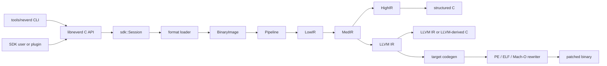

**語言**: [English](../architecture.md) | [简体中文](../zh-CN/architecture.md) | [繁體中文](architecture.md) | [日本語](../ja/architecture.md) | [한국어](../ko/architecture.md) | [Français](../fr/architecture.md) | [Deutsch](../de/architecture.md) | [Español](../es/architecture.md) | [Italiano](../it/architecture.md) | [Русский](../ru/architecture.md) | [العربية](../ar/architecture.md)

[← 文件索引](README.md)

# NeverD 架構

本指南說明貢獻者安全修改 NeverD 所需理解的生產邊界。內容刻意只涵蓋
NeverD 自有程式碼；LLVM、Capstone 與 Unicorn 子模組各自維護內部架構。

## 系統邊界

```mermaid
flowchart LR
  CLI["tools/neverd CLI"] --> CAPI["libneverd C API"]
  SDKUser["SDK user or plugin"] --> CAPI
  CAPI --> Session["sdk::Session"]
  Session --> Loader["format loader"]
  Loader --> Image["BinaryImage"]
  Image --> Pipeline["Pipeline"]
  Pipeline --> Low["LowIR"]
  Low --> Med["MedIR"]
  Med --> High["HighIR"]
  High --> HighC["structured C"]
  Med --> LLVM["LLVM IR"]
  LLVM --> LLVMOut["LLVM IR or LLVM-derived C"]
  LLVM --> Codegen["target codegen"]
  Codegen --> Rewriter["PE / ELF / Mach-O rewriter"]
  Rewriter --> Patched["patched binary"]
```

NeverD 有四種 IR 表示，但它們並非一條必須通過四跳的序列。`LowIR -> MedIR`
是共享部分；結構化反編譯接著使用 `MedIR -> HighIR -> C`，而 `lift`、
`decompile --llvm` 與 `patch` 則直接走 `MedIR -> LLVM IR`。尤其 patch 與
lift 模式會刻意略過 HighIR。

CLI 在 `tools/neverd` 解析命令、建立 `neverd_session_t`，並呼叫
`include/neverd/sdk/NeverDCAPI.h` 中的公開 API。引擎狀態位於
`lib/sdk/SessionImpl.h`；`neverd_session_load` 選擇 loader 並建立
`BinaryImage`，以 IR 為基礎的操作則按需執行 `lib/pipeline/Pipeline.cpp`。
`neverd` 可執行檔連結 `neverd_shared`；元件歸檔及其 LLVM/Capstone 相依是
該共享程式庫的私有實作細節。CLI 使用 LLVM Support 建立命令列介面，
但不會繞過 C API 驅動引擎。

HighIR 的 `HighSourceFlow` 統一管理輸出敘述的控制流邊、區域變數身分和確定賦值分析。
原始碼驗證與無用 PHI 複製消除共用此圖。重複的純量條件採用有界的零值/非零值分割；
寫入使舊條件失效，位址逸出的變數維持未知，超出分割預算時退回保守圖。
只有純量值在所有可行情境中都不會被使用時，才刪除 PHI 複製。
呼叫、載入及儲存保留可觀察行為，原始碼標籤也會保留。

Block 使用方的逃逸分析也使用這張圖，以有界不動點分析跨分支和迴圈傳播指標身分及私有堆疊槽資訊。合流保留可能的上下文位址，只有完整覆寫才能清除。未知跳躍、例外控制流和證明預算耗盡都會拒絕繫結。

Objective-C 接收物件事實區分方法入口的 self 與確定的類別參照；只有共用入口的所有中繼資料記錄一致時，才建立 self 型別事實。完整寬度複製及 ABI 規定保留的暫存器透過同一不動點分析傳播事實，入口回邊也參與合流。宣告檢查區分類別方法與實例方法，並納入已記錄的分類、父類別鏈及協定繼承；入口 self 也考慮已知子類別宣告。編譯器目錄分別保留宣告所屬物件與繼承關係，以及全域選擇器一致性資訊。發布原始碼前，SDK 依據目前映像重新驗證接收物件來源及適用宣告。這些事實不選擇具體 IMP，也不授權二進位重寫。
外部繼承資訊缺失時，必須改用全域選擇器一致性檢查，不能縮小到接收物件範圍；明確不支援或衝突的宣告仍保留為否定證據。

帶明確物件型別的成員變數可透過最多八次完整寬度讀取延伸接收物件證明。每一步記錄執行期偏移槽、偏移值寬度，以及機器存取使用的固定位元組偏移。固定偏移必須仍符合目前配置；執行期偏移參照則可隨欄位移動。載入器核對已記錄的類別繼承鏈與欄位宣告。部分讀取、裸 id、Block、僅協定型別、歧義儲存和未知指標基址都不能產生類別事實；原始碼驗證會依據目前映像重新檢查整條路徑。這些事實描述宣告型別，不代表物件身分，也不允許刪除記憶體操作。

載入器驗證 Darwin 常數字串、整數物件、陣列和有序字典組成的有界無環圖。容器欄位與每條邊都需要不可變映射儲存，以及無歧義的匯入或重定位證據；不支援的編碼、循環和不完整物件圖會明確失敗。原始碼繫結重新驗證物件圖及傳入指標槽。產生的輔助函式保留整數位元模式、子物件順序和共用位址，並重用既有字串身分。容器槽透過 acquire/release 發布機制只初始化一次，初始化僅呼叫已驗證的子物件輔助函式。每個輔助函式自帶子函式宣告，使獨立還原的方法可以共用同一定義。可攜式測試涵蓋損壞輸入與證明預算；原生編譯器樣例對照原始方法檢查內容、別名、複製身分和並行初始化。

## IR 表示與路徑

實驗性的[直譯器還原階段](interpreter-recovery.md) 在共用的 MedIR 邊界之前，對嚴格提升後的 LowIR 進行特化。provider 負責不可變映像的證據，`SymExec` 負責指令語意，殘餘 CFG 沿用一般 SSA 與原始碼後端。還原證據與原生指令實例及二進位 patch 憑證保持分離。

`InterpreterSpecialization` 負責失敗嘗試後的有界反向位元需求傳播。它重用標量求值器，不改寫圖中的事實，也不增加控制欄位或上下文；所有工作仍受預算限制，發布必須經過全新的完整證明。

如果後續記憶體需求只涉及位元組片段，上下文細化可額外提名已追蹤的完整八位元組位址載體。原有窄產生者座標仍是權威依據；只有入佇列邏輯才能根據已證明的常數或框架偏移形成鍵。

有限值列舉可觀察可行元組，但不改變證明查詢。觀察者拒絕時傳回不完整結果，且不含元組。快取只保留位址域的數學證明；不可變讀取憑證在列舉完成前僅存於區域狀態。

`NeverDLoader` 負責 `PEFixedImageView`，並與一般 PE 載入共用完整的基底重定位解析器。二進位解譯器轉接器在恢復及原生證明中使用認證後的偏好基底位址視圖，不自行解析 PE 表格。準備階段先驗證匯入寫入範圍、映射身分及完整原始欄位，再認證位元組。視圖借用保持不變的映像，不宣稱 ASLR 或初始化等價性。

`FrameOffsets` 統一負責有預算的入口相對位移單值證明。恢復器正規化實際符號記憶體存取，保留殘餘位址運算式；原生檢查仍驗證兩次執行的位址相等。窮盡對齊分派與共享重試預算由恢復器負責。原生／LLVM 分區證明聚合仍是尚未完成的獨立工作。`NativeStackControl` 負責內部無符號 16 位元返回清理，二進位提供器認證彈出八位元組的規範編碼。

一般相依探索停滯後，還原器可對每個非函式入口的原生位置及指令模式，依一個現有暫存器上下文字段分區。傳入值域必須完整、含多個值，並涵蓋欄位宣告的全部位元。每個實際前驅獨立證明目前完整值域，比較仍有效的實體欄位，再依各條件重新投影。後續前驅與放寬後的節點必須重新檢查；串接在提名入口停止。比較節點具有合成來源，共用節點、操作、上下文、查詢與細化預算。部分遮罩、未定義旗標及僅位於框架的欄位不符合條件。不增加客體記憶體讀取或呼叫端假設；值域不完整時保留保守邊，所有可達情況完成後才可發布。

控制與守衛精度細化優先於可選框架分區重試，必要的更細分區仍可使用。恢復先完成一個餘數的不動點，再開始下一個，但只有全部允許餘數完成後才發布結果。顯式入口對齊與分區域取交集，分派比較實際餘數。上下文、操作、節點及求解器預算仍有界，且在重試之間共用。 機器狀態恢復支援以 `--vm-entry-alignment=A:R` 宣告並檢查入口 RSP 同餘域。`A` 必須是正的二次冪，且 `R < A`。其他入口在客體記憶體存取或狀態寫入前回傳狀態 2。根位址高位仍自由，預設不假定對齊；此選項不提供原生等價認證。

共用的 `SymContext::constantWindow` 只在結果每一位都已證明為常數時回傳位元運算窗口的值。證明可沿既有擷取、完全位於一個串接運算元內的窗口、零擴展及位元運算進行；未知 XOR 輸入與算術進位保持不透明。結果最多 64 位元，遞迴最多 32 層，總工作預算為 256。每次節點走訪、深度拒絕及串接運算元檢查都計費；複製常數也按完整的 64 位元字數計費。證明不完整時不回傳常數。`SymState` 以這項唯讀查詢匯出暫存器和暫存空間的常數位元組；儲存運算式與完整字重組保留原有身分。記憶體區域仍只匯出字面常數位元組：提前加入推導出的部分記憶體事實，可能拆散後續輸入的來源並增加控制狀態探索的工作量。

`SymState` 統一管理顯式分離契約下單次 STORE 對已有位元組事實的保留。真實 STORE 仍執行，其他記憶體區域、失效世代及未知值預設狀態保持寫入後的狀態，不讀取或初始化缺失位元組。`SymExec` 僅對一次一般 STORE 套用契約；恢復層另行保留範圍內完整仿射槽和來源事實，匯合仍保持保守。

`StringTransfer` 負責有界、有序的純量展開。還原層負責值證明、共用預算及完整搬移指標的重新認證；產生的存取沿用一般記憶體檢查。

控制相依遍歷僅在分析完整結束後回報根位址的位元相依。當已證明的相對位址仍保留至少 32 個自由高位元時，恢復層可以省略可選的映像位址列舉；這不證明可達性，也不會刪除記憶體存取。

完整位寬的仿射控制投影重用根變數相依性分析。分析結果僅限目前邊述詞；過大的值域產生不完整的拒絕結果，不進入數學證明快取。窄遮罩仍會重試。既有的可行性處理保持獨立；值域拒絕本身不能證明邊可達或不可達。

有限查詢快取以同一儲存上限計算序列化鍵、數值結果和使用順序中繼資料。淘汰任何記錄前，必須完整驗證候選並確認其單獨可容納。鍵由穩定的映射節點持有；命中更新使用順序，並傳回獨立擁有資料的結果副本，淘汰後仍然有效。快取物件禁止複製和移動。替換策略只改變證明重用，不改變查詢語意或結果准入條件。

`InterpreterSpecialization` 同時負責聯合控制關係及獨立的有限欄位值域。邊投影只記錄完整的單欄證明；合流時對欄位遮罩取交集，並對重新套用遮罩後的值取聯集。重建節點時，在同一符號狀態完成初始值設定後，將這些值域與聯合述詞合取，保留框架身分及未受約束的位元。只有精確確認所有聯合元組均滿足成員約束，才可省略該約束。這項精度策略不改變上下文鍵或原生返回驗證。

`FrameEntryConstraints.h` 統一管理恢復與關係證明共用的不回繞述詞。`InterpreterSpecialization` 負責有界的唯一轉移串接與已提交序列重播。這些 C++ 選項預設關閉；證明契約比對與摘要綁定仍由二進位適配層負責。

`modelInterpreterMachineStateX64` 與原始碼包裝器共用同一產生器，統一處理客體暫存器分片、封裝旗標、執行設定狀態和控制流程。模型只將狀態物件存取改為明確的暫存器位元組，狀態碼與客體 RAX 分開。它不負責編譯器語意或證明策略；入口域、觀察項、堆疊框架契約和完整精化檢查仍由呼叫端負責。

`NeverDLLVMInterpreterModel` 負責獨立、有界的純量 LLVM 匯入，使用相同原始狀態 ABI。`modelLLVMInterpreterMachineStateX64` 保留真實狀態碼回傳，並產生明確的語義有效性檢查。`llvmInterpreterMachineStateContract` 提供完整觀察項與零監視位元組保持義務；入口域、記憶體及完整證明由呼叫方負責。LLVM 匯入不改變一般提升或原始碼發布，也不證明編譯器。

LLVM 模型負責驗證 `initializes` 參數契約，重用狀態指標投影，並在一般純量生成前執行有預算限制的逐位元組必然資料流分析，不引入第二套值求值器。

`NeverDInterpreterLLVMRefinement` 負責組合原生到 LLVM 的證明。它重新建立兩側狀態模型與強制契約，透過權威執行設定產生僅在入口執行的旗標投影，並重新檢查兩個前提。呼叫端可提交迴圈候選方案，但不能替換模型、觀察項或證明憑據。分析模型僅複製可執行圖與宣告入口；入口回邊會遭拒絕，避免重複初始化狀態。

恢復 C API v3 與 CLI 將明確的欄位、細化和求解查詢預算傳入共用特化器。轉接層先檢查結構大小與 reserved 欄位，再讀取擴充；v1/v2 配置和預設值保持穩定。提高預算僅改變允許的工作量，不改變執行契約或結果發布條件。

恢復也提供 `--vm-chain-transfers=N`（預設 0）和 `--vm-no-control-discovery`。串接在已證明唯一目標的控制轉移之間保留符號關聯；達到上限後回到普通 CFG 邊界。機器狀態恢復可透過 `--vm-entry-frame=begin:end` 宣告未經執行時檢查、不會回繞的入口 RSP 偏移範圍。精確數值前提會寫入產生的 C 和報告；它不授予記憶體存取權限，也不構成等價證明。

超過 SSA 建構限制的大型恢復函式可透過 `--llvm` 使用有界的純量可變儲存契約。入口輸入、迴圈攜帶值和較早讀取的語意得到保留。不支援的隱含狀態、向量暫存器參數、映像重定位、歧義儲存和畸形控制流程會明確失敗；HighC 拒絕此回退路徑。原始碼輸出仍遵循既有機器狀態契約，不新增等價證明憑證。

`analyzeMedMutableSource` 統一負責正規化 CFG 驗證、儲存身分和保守的入口位元組需求。這些需求是讀取範圍的上界，不能作為正向可觀測性證據。LLVM 在模組掃描前驗證，並重用該計畫，僅初始化入口值一次。區塊與值數量的乘積、傳播工作量分別受限。C 轉發針對每次讀取使用型別相符且無部分別名的確切先前寫入；跨區塊匯合保留明確儲存。

對於已驗證的可變變數函式主體，LLVM 僅在依序附加指令的同一基本區塊內轉送私有槽位的確切值，並保留最後的寫入。入口初始化以及區塊、函式和模組邊界保持獨立，客戶程式的記憶體存取仍明確保留。C 輸出限制純量運算式展開和立即值折疊的工作量，保留必要的具名中間值。可折疊的常數運算式使用 LLVM 的目標配置；不支援的運算式明確報錯。已指定的可變回傳值（包括零）不能被改成 void 回傳。

此可變子集接受 8/16/32/64/128 位元純量儲存，位元計數輸入最多為 64 位元。非標準位元寬度和更寬儲存需要獨立的原始碼契約。

架構 lifter 負責交易式的未定義輸出附屬中繼資料：每次嘗試前清除舊證據，只為精確對應的成功提升發布效果。`Missing` 表示證據缺失，不等於空的 `Complete` 描述。一般 LowIR 保持確定的選定值。`LowIRUndefinedIndependence` 負責對傳入的完整無環 LowIR 圖進行有界關係證明，共用一般輸入，並保留新產生未定義值的來源關聯；它綁定完整指令邊界與操作摘要，拒絕不完整證明。超出下述有限原生路徑範圍的一般原生圖認證、迴圈不變量及原生程式碼到 C 的等價證明，仍屬於獨立工作。

傳統純量 SHL/SAL、SHR、SAR 為 8/16/32/64 位元運算元提供隨次數變化的未定義位元證據。遮罩後次數為零時保留所有旗標；非零時 AF 任意，大於一時 OF 任意，SHL/SHR 次數達到運算元位寬時 CF 任意；SAR 的進位仍有定義。指令內布林守衛使用目的地重疊寫入前保存的遮罩次數，無論是否要求中繼資料，都產生相同操作。未審核編碼不會發布部分效果。

傳統 ROL/ROR 僅在架構遮罩後的計數大於一時產生新的任意 OF 位；隨後對位元組或字寬取模不改變此條件。零計數保留旗標。以暫存器為位元基底的 BT/BTS/BTR/BTC 產生四個相互獨立的任意位（OF/SF/AF/PF），CF 有明確定義，ZF/DF 保持不變。稽核精確的暫存器及 imm8 編碼；記憶體位元串、LOCK、APX 和帶進位旋轉不在此次新增範圍內。效應在核心指令完成後生效，要求或不要求中繼資料時生成的 LowIR 相同。參見 [Intel 位元測試參考](https://cdrdv2-public.intel.com/929353/253666-093-sdm-vol-2a.pdf)與[旋轉參考](https://cdrdv2-public.intel.com/929354/253667-093-sdm-vol-2b.pdf)。

傳統暫存器 XADD 也具有精確的 8/16/32/64 位元編碼審計：定義 CF/PF/AF/ZF/SF/OF，保留 DF，不產生新的任意位元。兩個交換暫存器皆遵循架構的部分寫入及 32 位元零擴充規則。記憶體/LOCK 與 APX XADD 仍未審計。[Intel 相容規則](https://cdrdv2-public.intel.com/929360/253669-093-sdm-vol-3b.pdf) 將 C0/C1/D0/D1/D2/D3 的 Group 2 `/6` 視為 SAL/SHL `/4`，重用相同的計數守衛與未定義旗標。參見 [XADD 參考](https://cdrdv2-public.intel.com/929356/334569-093-sdm-vol-2d.pdf)。

原生不可變讀取也支援經完整窮舉證明的有限位址集合，由 `MaxImmutableLoadAddresses` 限制。列舉前必須證明兩次執行的位址相等；每個候選都須具備不可變位元組、映射證據及與可寫堆疊框架分離的證明，讀取值保留對輸入選擇的依賴。候選缺失、可寫或重定位資料、列舉預算耗盡皆拒絕憑證。憑證綁定位址上限與讀取見證；動態堆疊偏移和任意外部記憶體仍不支援。

以下行為採用預設的嚴格審計契約。`checkBinaryUndefinedIndependence` 依宣告的觀察項檢查完整、有限的原生 x64 執行路徑，在可行性剪枝前收集原始直接分支的兩側。實體 near CALL 壓入真實後繼位址；內部 RET 讀取目前堆疊字，包括被改寫的返回目標。間接目標必須完成有限全集列舉，並在約束路徑前證明兩次執行的目標相等。精確的不可變載入需要讀取證據與可變堆疊框架分離的證明。所有收集的指令，包括未執行分支，都須具有不可變原始位元組；除下述嚴格提升的 `INT3`/`UD2` 終止邊界和明確 RDSSP/INCSSP 環境投影外，每條指令還須具有完整架構中繼資料。嚴格提升的 `INT3`/`UD2` 可作為 `Terminator` 邊界保留，並綁定完整原始位元組及 LowIR 操作摘要，但不將未定義輸出附屬中繼資料從 `Missing` 提升為 `Complete`。只有符號執行證明陷阱不可達時，憑證才能保留它；任意可行路徑到達陷阱均傳回 `ContractViolation`，不產生憑證或殘餘程式碼。此規則不建模陷阱後的循序執行或例外恢復，不使用 `codeFollowsTrap` 啟發式，也不擴展靜態 LowIR API 的支援範圍。憑證綁定位元組、映射、效果、讀取見證、執行設定及證明預算。明確的正常、無故障且停用 CET 的設定將全部映像映射排除在入口堆疊框架之外。每條可行路徑都須到達外層返回，並在原生彈出堆疊前保持入口 RSP 和原始返回位址槽；預算耗盡的執行前綴不能作為證明。直接與間接迴圈只有完整有限展開後才能獲證；不終止、超出預算的路徑及其他所有未審計效果都被拒絕。`specializeBinaryInterpreterWithIndependence` 先證明再恢復，失敗時不傳回殘餘程式碼。一般恢復預設不啟用此閘門；迴圈不變量、例外分派、啟用 CET 的執行和原生程式碼到 C 的等價性仍不在憑證範圍內。

明確選項 `RetainUnauditedNativeBoundaries` 為有限原生獨立性證明及原生到 LowIR 的精化證明增加拒絕邊界。只有嚴格解碼並提升、覆蓋狀態為 `Missing`、效果為空且非空操作摘要相符的指令才符合條件。結構、控制、重疊、執行設定及資源檢查仍全部執行。僅停止該邊界後繼的收集；其他邊進入後續位元組時仍獨立收集。任何可行路徑抵達邊界都會在執行前拒絕；求解未知或預算耗盡不能證明不可達。成功證書繫結帶有類型和版本的記錄，包含精確邊界、原生位元組摘要及操作摘要，不會將 `Missing` 改為 `Complete`。未收集的後綴不具備審計結論。獨立性證明涵蓋所有任意選擇；選定值精化僅證明宣告見證下的不可達性。靜態 LowIR、迴圈證明/推斷及精確 LLVM 介面均不啟用此選項。

`AllowOverlappingNativeInstructions` 是預設關閉的獨立選項，用於有限原生獨立性證明及原生到 LowIR 的精化證明。每個入口皆獨立解碼和驗證；交疊指令位元組必須與先前所有指令及不可變讀取證據一致，包括候選程式的讀取。候選 LowIR 位址只是標籤，不是位元組證據。`MaxNativeInstructionBytes` 預設為 1048576，每次取得新入口時，在比較前按完整指令長度扣帳，包括重複的交疊位元組。預算耗盡或位元組衝突均拒絕憑證。選項及額度綁定至證明摘要。靜態 LowIR、歸納循環證明和推斷拒絕此選項，空循環計畫也不例外；精確 LLVM 介面和 CLI 維持原有預設行為。

原生封裝旗標證明要求選項和契約同時指定 `X64FlagsProfile = UserX64NoFaultV1`，既有執行布林選項不會自動啟用它。正規化的共享入口旗標與持續保存的系統旗標使用和機器狀態原始碼包裝器相同的 PUSHFQ/POPFQ 純量轉換，包括 CPL3/IOPL0 遮罩。每次 POPFQ 都須證明兩次執行中的 TF/AC 為零，不能將此條件當作假設。即使關閉暫存器或已寫堆疊框架觀察，仍須比較最終系統旗標。憑證綁定環境模型版本和精確轉換摘要。在此明確 CET 關閉環境下，獨立核驗的正規 RDSSPD/RDSSPQ 位元組可投影為精確 NOP，並記錄具型別的憑據；原始 `Missing` 中繼資料保持不變，32 位元目標也保留整個暫存器。正規 INCSSPD/INCSSPQ 保留為依賴環境模型的 #UD 邊界，並記錄原始不可達指令的憑據；任意可行造訪都違反無故障契約，即使運算元為零。其他 CET 指令、CET 開啟執行及靜態 LowIR API 的環境模型仍不支援。有限迴圈每次造訪均保留狀態並產生新的未定義選擇，不代表迴圈不變量證明。

`checkLowIRRefinement` 與 `checkBinaryLowIRRefinement` 提供針對確定性 LowIR 候選的獨立建構式精化證明。`LiftedBits` 在每次未定義值產生時選擇原提升器計算的位元；`ZeroBits` 僅在已審核的條件生效時選擇零。證書記錄每個動態出現，複製與溢出保留同一選擇。兩邊共用純量、實體堆疊、記憶體及旗標執行器與入口快照；所有可行路徑必須終止並涵蓋完整允許入口域，比較 RETURN 運算元、指定暫存器、原生系統旗標及兩邊已寫堆疊位元組的聯集，並維持入口位置保留約束。執行與關係檢查共用預算，另設 `MaxTerminalPairs` 上限。證書分別綁定候選、原始證據、見證策略及預算。見證失敗不排除其他見證；有限展開不證明迴圈不變量、特定 CPU 相等性或 C 後端等價性，也不取代未定義狀態獨立性證明。兩類關係介面皆拒絕與證明器記憶體暫存區重疊的輸入暫存值。 二進位精化 API 要求選項與觀察契約同時使用 `UserX64NoFaultV1`。

`checkLowIRLoopRefinement` 和 `checkBinaryLowIRLoopRefinement` 提供獨立型別的歸納憑證。配對切點和純量 LowIR 狀態範本只是證明候選；共用執行器檢查真實入口初始化、片段完整覆蓋、所有可行後繼、不變量保持及最終觀察項。每條切點間邊都必須讓有限無號字典序排名嚴格下降，參數反向投影檢查防止範本在機器狀態沒有進展時重設排名。範本以共同入口狀態為基底，或透過 `UseEntryPrefix` (`GeneralizeEntryPrefix = false`) 使用實際到達的配對前綴，並同時證明該前綴述詞保持。切點檢查所有修改的暫存器和整個堆疊框架，最終觀察保留先前迭代的記憶體影響。目前每個切點在每側要求唯一位址；自動發現不變量、排名及任意控制流程對齊不在此 API 範圍內。遺漏切點、錯誤不變量、回繞、未證明的終止性、不支援的語義或共用預算耗盡均拒絕核發憑證。摘要綁定計畫、所有原生片段及原始證據。有限精化和嚴格獨立性的語義不變；歸納精化仍不證明 C 後端或特定 CPU 的未定義位元選擇。

以下前綴述詞保持要求適用於 `GeneralizeEntryPrefix = false`。

`inferLowIRLoopRefinementPlan` 共用符號執行器，在預算內產生範本。回饋切點涵蓋 CFG 的每個環；拓寬保留已證明的固定位元，並淘汰無法維持的無號前綴邊界。觀察到的單位步長計數器與推導的階段常數組成字典序排名，支援遞增或遞減的巢狀迴圈。`OriginalPrefix` 與 `CandidatePrefix` 要求 `UseEntryPrefix`。位於其他切點之後的切點可從真實入口另行有限重播，取得可行的成對前綴證據。此證據不代表入口域涵蓋：每次實際到達都必須蘊含其述詞，完整入口與轉換路徑涵蓋仍是必要條件。`inferAndCheckBinaryLowIRLoopRefinement` 要求完整恢復與唯一原生來源，再獨立重跑完整原程式／候選程式檢查器。候選方案與來源映射均不可信；只有 `Refinement` 可包含憑證。推導與證明保留各自的明確預算。此 C++ API 不會隨 `--devirtualize` 自動執行。不可達前綴、任意控制流程對齊、搜尋範圍外的排名類型、C 後端等價性及實體 CPU 的未定義位元選擇仍不受支援。

單位步長計數器發現亦支援按位元組對齊的局部更新，要求更新區間之外的所有位元保持不變，並優先嘗試既有整字及零擴展形式。多切點的窄位端點排除條件，僅在保存的實際到達狀態和全部目前入邊狀態上獲得證明後提出。拓寬會移除失敗條件且不重新播種；某個字已被辨識為計數器後，仍可發現另一個窄位區間。遮罩重用既有整字參數，保留整字排名及完整狀態觀測。所有候選仍受共用節點／查詢預算限制，並須通過獨立的完整精化檢查。

有多個切點時，每個未成功的可觀測計數器元組都會先嘗試帶前置 64 位元常數階段的變體，再移至下一個元組。兩個變體分別計入 `MaxRankCandidates`，共用原有查詢預算。前置階段必須在每條可行轉移上非增；若無法證明剩餘元組嚴格下降，該轉移就必須嚴格降低階段值。非負差分約束拒絕正權環，因此順序迴圈可在重新初始化後重用計數器，迴圈內部仍須滿足實際進展義務。原有計數器之間的階段可與前置階段組合。每個完整元組都在原始完整轉移謂詞下檢查，最終精化檢查器還會獨立複核提議的排名。單切點搜尋不加入這種無效的常數前綴。

單切點候選必須涵蓋所有原先可達區塊中的每個迴圈，包括移除該切點後與入口斷開的迴圈。每次涵蓋檢查都在符號執行前消耗 `MaxCutpointAttempts`。在每條返回邊上均以單位步長進展的純量計數器仍優先嘗試。隨後，最多八個已觀察到的單位計數器組合候選，與較廣泛的單個純量防護條件或邊界假設交替嘗試；剩餘純量假設完成後，組合搜尋從暫停處繼續，不重複候選。此順序與預算上限無關。每次組合嘗試都恢復儲存的完整穩定模板與轉移邊；組合域檢查失敗只停用該候選族。失敗的純量防護條件不能縮小組合域。 `MaxRankCandidates`、查詢、操作和路徑預算持續累計。候選計畫仍須通過完整的 refinement 檢查器。 即使其他分支停留或重設，一條返回切點的加法遞推分支也可觸發依結構擴大；提出的模板仍須通過全部入口和轉移檢查。

`inferAndCheckLowIRLoopRefinement` 搜尋經過驗證的 LowIR 迴圈關係。 它依序嘗試預設、完整分支入口與過濾分支入口三類計畫，先配對相同候選族，再嘗試所有跨族配對，最後逐一嘗試候選側循環切點。完整分支入口方案選取循環分量內分支區塊的後繼，要求該後繼只有一條出邊。過濾方案僅在每條路徑都先於 DFS 回邊目標抵達同一非終結節點時，才移除該分支的入口切點。判斷包含全部後繼、退出路徑與邊界；僅在邊界匯合的分支仍保留。貪婪補點仍須覆蓋原本可達的每個週期。這些方案保留動作階段，不要求預設推斷先成功。`MaxCutSelectionWork` 單獨限制可選的共同路徑分析，包括集合建構與比較；`CutSelectionWork` 即使失敗也記錄已做工作，並累計扣除全域剩餘 `MaxSearchWork`。預設與完整分支選擇器維持原有行為。成功與失敗均快取，每側最多保留三個計畫，切點排列按需列舉。可選候選族跳過同側已保留的相同切點集合，即使既有計畫來自編號更後的候選族。空候選族或重複候選族不消耗符號查詢，但仍計入候選嘗試次數。全部六個保留計畫共用一個 `MaxMetadata` 池，每次配對建構另受相同上限約束。 它只為位移相同、寬度相同的堆疊框架輸入提出相等關係；暫存器重新命名、仿射關係和任意回饋切點集合仍須明確配對。權威配對器與完整檢查器保留呼叫者的原始稽核記錄、witness、入口域、框架觀測及終止性義務。`LowIRLoopAlignmentLimits` 的 `MaxSolverQueries` 在全部推斷及證明嘗試間共用，失敗嘗試也扣帳；每次呼叫最多取得階段上限與剩餘總額的較小值。`MaxSearchWork`、`MaxMetadata`、`MaxCandidateAttempts`、`MaxPairingAttempts` 和 `MaxCuts` 限制搜尋建構與列舉。單次預算耗盡可以重試，全域預算耗盡則停止。`Unsupported` 表示未找到關係，不表示程式不等價。只有重新驗證成功的 `Refinement` 包含憑證。CLI 預設行為不變。

`GeneralizeEntryPrefix` 預設為 `false`，且要求 `UseEntryPrefix`。預設模式下，每次到達都必須保持擷取路徑的述詞。顯式泛化模式則將前綴狀態運算式視為該路徑之外的全域、不可信範本函數，仍要求可行的成對見證、真實入口與片段完整覆蓋、全部暫存器／堆疊框架相等、參數投影、原生執行約束，以及擴大歸納域上的嚴格排名下降。推導僅在傳入狀態超出見證域時擴大切點，再重建並檢查所有一般轉換。首個見證零次迭代不能掩蓋另一入口的迴圈。策略綁定至歸納憑證摘要。

巢狀推導可在觀察到單位步長的計數器與控制述詞引用的未修改前綴值之間產生嚴格或非嚴格的無號界限候選，包括等值退出條件。先檢查具體入口／傳入狀態，再於一般傳入轉換上單調淘汰不成立的關係。述詞走訪和求解器工作均計入既有顯式推導預算；最終原程式／候選程式檢查器獨立證明範本。

巢狀迴圈推斷還可在前綴運算式相同時，提出快取運算元與計數器或未變更控制輸入的相等關係。它檢查每個具體入邊狀態，保留候選供後續放寬時發現的新快取使用，並在任一一般入邊狀態違反關係時將其剪除。每個已表示的字仍使用各自可恢復的參數；相等關係只是受檢查的述詞。複製遞推可加快捨棄偶然固定位，但不會提供假定語意。

巢狀推斷也會在至多有 16 個變動位元的欄位中搜尋計數器相等或不等的快取關係。關係使用目前的計數器與邊界值，快取保留獨立且可還原的狀態參數。入口守衛或常數摺疊的初始化可能讓比較在後續擴寬時才顯現；此時可提出新候選，但不會重新加入遭拒絕或刪除的候選。候選必須在所有已保存的具體到達與目前輸入轉換中成立。變數 DAG 掃描按切點快取，並計入共用述詞預算。完整原生覆蓋、完整狀態相等與嚴格秩檢查仍須獨立通過。 計數器發現會在一般轉換後繼續：被最初內層迴圈見證隱藏的外層計數器仍可取得經過驗證的邊界與運算元複製候選。遭拒絕的關係不會恢復，單位步長探測也受符號節點預算限制。

入口前綴重放先訪問已排隊的分支，再繼續展開較早的迴圈，因此另一分支允許任意迭代次數時，仍能找到較短的可達見證。推導階段與原始／候選程式檢查器共用此排程規則。全部工作仍計入既有預算；前綴見證不取代完整入口涵蓋、不變條件保持或終止性檢查。

| 表示 | 用途 | 主要定義與轉換 |
|------|------|----------------|
| LowIR | 架構無關的 `NdOp` 操作、基本區塊、CFG 與跳躍表中繼資料 | `include/neverd/ir/low`、`lib/ir/low`，由 `lib/decode` + `lib/lift` 產生 |
| MedIR | 型別、ABI/呼叫慣例、記憶體與堆疊模型、旗標、呼叫和類 SSA 資料流 | `include/neverd/ir/med`、`lib/ir/med` |
| HighIR | 用於可讀 C 的結構化運算式與控制流 | `include/neverd/ir/high`、`lib/ir/high`，由 `lib/backend/c/HighC` 發射 |
| LLVM IR | 最佳化、LLVM 衍生 C、目標程式碼產生和二進位重寫輸入 | `lib/backend/llvm`，由 `lib/pipeline` 最佳化/編排 |

常數在 LowIR、MedIR 和 HighIR 中保留每次出現時的純量/位址來源及位址歸屬。數值位元相同不會合併不同來源。HighIR 符號簡化將位址身分視為不透明輸入；原始碼繫結使用共用的數值運算元分類，並仍要求記憶體與指標使用完成重定位繫結。

| 使用者路徑 | 表示路徑 | 出口 |
|------------|----------|------|
| Low/Med dump | Binary -> LowIR，可選 -> MedIR | 診斷文字 |
| High dump 或 `decompile` | Binary -> LowIR -> MedIR -> HighIR | HighIR 或結構化 C |
| `lift` | Binary -> LowIR -> MedIR -> LLVM IR | `.ll` |
| `decompile --llvm` | Binary -> LowIR -> MedIR -> LLVM IR | LLVM 衍生 C |
| `patch` | Binary -> LowIR -> MedIR -> LLVM IR -> codegen | 重寫後的二進位 |

`lib/pipeline/Pipeline.cpp` 是路徑選擇的事實來源。特定表示的邏輯應留在其
所屬 IR 或 backend 程式庫；pipeline 應編排元件，而不是吸收其演算法。

## 跨架構翻譯契約

`include/neverd/translate` 定義的是契約層，而不是執行後端。`GuestState`
為 `x86_32`、`x86_64`、`AArch64` 與 `ARM32` 建模架構無關的機器可見狀態。
其規範的版本 1 序列化採用固定寬度的小端欄位、穩定的暫存器 ID、排序集合與
失敗即關閉的驗證，因此持久化狀態不依賴主機 C++ 配置。

`GuestState` 的 wire v1 基線永久凍結。基線以外的機器狀態只能使用擴充區間內的
extension-register ID，並搭配規範的小寫名稱；否則必須採用新的 wire 版本並提供
明確的 upgrader，禁止就地變更 v1 基線。

對於 `ARM32` guest，`ExecutionMode` 是權威解碼模式，且必須與 `CPSR.T` 一致。
儲存的 PC 一律是清除 bit 0 後的規範指令位址；ARM 模式還要求按字對齊。

架構對策略定義 `x86_64 -> AArch64`、`AArch64 -> x86_64`、
`x86_32 -> AArch64/ARM32` 與 `ARM32 -> x86_32/x86_64`。
`ContractDefined` 表示請求可以驗證並持久化，不表示程式碼已能翻譯或執行。
JIT 策略只接受執行中程序的原生主機；AOT 策略則要求明確提供主機架構、目標
triple；若選擇了 CPU 或特性集合，也必須明確提供。

`ResolvedHostTarget` 將此選擇解析為具體結果。`Native` 解析從目前程序取得 triple、
CPU 以及啟用/停用的特性集合；`Explicit` 解析會驗證並正規化呼叫端提供的架構、
triple、CPU 與特性，並拒絕互相衝突的輸入。其帶版本的快取識別按確定的位元組順序
由正規化目標輸入建構，不包含程序位址或依賴 locale 的文字。

帶版本的 `TranslationExit` 記錄穩定的停止原因及其對應的型別化承載資料，涵蓋
系統呼叫、例外或訊號、斷點、不支援的指令、自我修改、資源預算、外部呼叫、
記憶體錯誤及其他終止條件。使用者不必再依停止原因重新解讀無型別整數。

除與對應預算相符的 `BudgetExhausted` 外，結果回報的指令數、block 數與產生程式碼量
都不得超過請求中的對應非零預算。指令與 block 耗盡會精確停在 limit。產生目標檔案
大小只能在不可分割的 codegen 完成後精確量測，因此該預算耗盡結果可以回報
`Observed > Limit`；被拒絕的目標檔案絕不會被連結、發布或執行。每個
`BudgetExhausted` 承載資料都必須精確識別請求的 limit，不得回報推導值或實作私有門檻。

backend-private `RuntimeControlBlockV1` 契約固定為 128 位元組、8 位元組
對齊，並以固定的 v1 magic、version、size、欄位偏移、全零保留欄位與自洽的型別化
退出記錄加以約束。它不包含 C++ 容器、主機指標或 guest 位址別名，也不是
`GuestState` 的 C++ 配置或 wire 格式；實作該契約的後端必須明確將狀態轉換到此記錄。

固定的 v1 generated-code 呼叫面只包含八個 helper：
`nvd_rt_v1_load8_le`、`nvd_rt_v1_load16_le`、`nvd_rt_v1_load32_le`、
`nvd_rt_v1_load64_le`、`nvd_rt_v1_store8_le`、`nvd_rt_v1_store16_le`、
`nvd_rt_v1_store32_le` 與 `nvd_rt_v1_store64_le`。名稱、簽章與指標 provenance
必須精確相符；後端必須明確綁定此有限表，絕不能退回環境符號解析。可執行記憶體
generation 驗證與預算/取消輪詢只由受信任 dispatcher 執行；
`nvd_rt_v1_validate_generation` 與 `nvd_rt_v1_poll` 均不是 generated-code helper。
受信任主機 dispatcher 也負責選擇 block，產生 IR 不能呼叫它；translated block
只回傳型別化退出碼。產生 IR 只能直接讀取已宣告的 scalar-result runtime slot。

`RuntimeSymbolRegistryV1` 將此 helper 表實作為封閉的主機端登錄表。建構過程會驗證
完整的 ABI-v1 集合、精確的正規名稱、helper class、簽章，以及每一項唯一一個非空且
與 class 相符的函式指標。查找只接受精確名稱，絕不查詢程序環境或動態載入器的符號，
並向目標檔 verifier 提供同一組已排序名稱作為 allowlist。其帶版本的識別涵蓋名稱、
helper class 與 ABI 形狀，但刻意排除原生位址，因此不受 ASLR 影響。

`RuntimeCodeMemory` 管理逐頁隔離的產生程式碼儲存空間，只允許單向 `RW -> RX` 發布
轉換。記憶體不會同時可寫與可執行，發布後也不能重新開放寫入；寫入與進入點偏移都
經過邊界檢查，發布時還會清除主機指令快取。本機 smoke test 只在發布後執行一小段
主機指令；它證明的僅是此 W^X 記憶體邊界，而不是翻譯引擎。

`GuestMemoryRuntime` 與邏輯 `GuestState` 隔離：建構時先驗證狀態，再將記憶體區域
的位元組與中繼資料複製到排序的私有索引。guest 虛擬位址只作為查找鍵，絕不轉換
為主機指標。受檢純量存取會以型別化形式回報寬度、對齊、溢位、未映射、跨區域、
權限、可執行寫入、generation 溢位、generation 不符與策略錯誤。指令/block 預算、
取消、generation 追蹤，以及 `RejectExecutableWrites`、
`InvalidateOnExecutableWrite`、`ValidateBeforeDispatch` 三種程式碼寫入策略同樣產生
自洽的型別化記錄，而非隱式主機行為。

`TranslationObjectCompilerV1` 是經過驗證的 LLVM IR 到目標檔邊界。它先驗證 const
輸入 module，在任何轉換前完成 clone，將證明閘控的語意簡化與 LLVM `O0` 至 `O3`
最佳化組合，再次驗證最終 IR，並為四種契約主機架構發射 relocatable ELF、COFF 或
Mach-O 目標檔。它正規化精確的 target-mangled block/runtime 符號 manifest，稽核每個
發射結果，並回傳 runtime registry identity 以及帶版本的請求與成品 cache key。產生
位元組預算非零時，只有符合預算的目標檔才能繼續進入成品驗證。LLVM 先向私有緩衝區
完成一次不可分割的發射以取得精確大小；超限目標檔會在發布與成品稽核前被拒絕，型別化
遙測保留實際大小與請求的精確 limit。零表示呼叫端政策不設上限。編譯器止於已稽核的
relocatable 位元組：不負責連結、發布、分派或執行，也不提供 guest 指令 lowering。

post-codegen verifier 將 relocatable ELF、COFF、Mach-O 目標檔視為
閉集合稽核。格式與架構必須和選定主機精確相符；未定義符號必須精確屬於有限
helper allowlist，動態符號一律禁止。relocation 採用明確直接白名單，並檢查
encoding、width、alignment、offset、可載入目的區段，以及目標是否為目標檔內
non-preemptible 定義或精確獲准的 helper。verifier 拒絕 W+X、例外/展開與初始化
中繼資料、TLS、IFUNC、GOT 與一般 PLT 間接機制、動態 relocation、weak/preemptible
或可選擇定義、未知 allocated section 與 linker directive。只有當 v1 policy 證明
LLVM 隱藏的 x86-64 ELF `R_X86_64_PLT32` 是指向精確 runtime helper 的 sealed direct
branch 時才允許此拼寫；它不會放行 PLT 或 GOT 路徑。ELF `ET_REL` 成品不得包含
program header 或 segment。Mach-O load command 採用正向白名單：必須且只能有一個
位寬相符的 segment，symbol table、dynamic-symbol table、platform-version 與
data-in-code command 各至多一個，並檢查相依關係；linker option 與其他所有 command
均拒絕。

`TranslationObjectRequestV1` 是建立在上述契約上的第一個公開、且刻意收窄的
guest 位元組到目標檔切片。在目前發布的失敗封閉 x86-64 v1 純量暫存器子集中，它只
接受不含 legacy prefix 的 canonical 編碼：採用受支援暫存器/立即數 LowIR 形狀的
REX.W 全寬 GPR `MOV`、`ADD`/`SUB` 與 `AND`/`OR`/`XOR`。schema 9 也接受全寬
暫存器/暫存器 `CMP` 編碼 `39/3B`、暫存器/立即數 `CMP` 編碼 `81/7`、`83/7` 與
`3D`、暫存器/暫存器 `TEST` 編碼 `85`，以及暫存器/立即數 `TEST` 編碼 `F7/0` 與
`A9`。算術形式保留相應的純量 flags 計算；邏輯形式與 `TEST` 會計算架構定義的 flags，
並在 NeverD 狀態模型中保留 `AF`。canonical `C3` `RET` 與
`C2 iw` `RET imm16` 會終止返回 block；canonical `EB cb` 與 `E9 cd` 直接相對 `JMP`
編碼會終止直接分支 block。目前公開 lowering schema 為 9。canonical、無 legacy prefix
的傳統 Jcc 僅支援以下形式：`JO`/`JNO` 的短形式 `70/71 cb` 或近形式 `0F 80/81 cd`；
`JB`/`JAE` 的 `72/73 cb` 或 `0F 82/83 cd`；`JE`/`JNE` 的 `74/75 cb` 或
`0F 84/85 cd`；`JBE`/`JA` 的 `76/77 cb` 或 `0F 86/87 cd`；`JS`/`JNS` 的
`78/79 cb` 或 `0F 88/89 cd`；`JP`/`JNP` 的 `7A/7B cb` 或 `0F 8A/8B cd`；
`JL`/`JGE` 的 `7C/7D cb` 或 `0F 8C/8D cd`；`JLE`/`JG` 的 `7E/7F cb` 或
`0F 8E/8F cd`。`JRCXZ`/`JECXZ`/`JCXZ` 與 `LOOP`/`LOOPE`/`LOOPNE` 仍未發布，
並以 fail-closed 方式拒絕。保留的 `F7 /1`、guest-memory 運算元、部分暫存器形式、
legacy prefix 與語意冗餘的 REX 擴充位元同樣以 fail-closed 方式拒絕。輸出僅限經過稽核的
little-endian AArch64 ELF 或 Mach-O relocatable 目標檔。一般 guest 記憶體操作、部分
暫存器形式、該精確子集外的任意指令或編碼、返回、這些直接跳轉與上述已發布 Jcc
分支以外的控制流，以及 lowerer 尚未實作的任何 LowIR 操作，都會在目標檔產生前遭到
拒絕。`RET` 所需的受檢回傳位址讀取屬於其 terminator 契約的內部
行為，並不公開通用 guest 記憶體 lowering。請求會重建並驗證 block descriptor，
lowering 與目標檔產生共用同一個已解析 target machine，並將證明閘控的語意簡化與
LLVM 預設 `O2` 最佳化流水線組合。
此切片不代表支援其他 x86-64 指令、其他 guest/host 組合，或反向 AArch64 到 x86-64
翻譯。

公開 C 入口 `neverd_translate_x86_64_block_to_aarch64_object_v1`、Python ctypes wrapper
`translate_x86_64_block_to_aarch64_object` 與 `neverd translate-object` 命令公開同一個
僅產生目標檔的邊界。Python 使用 `TranslationObjectFormat.ELF` 或 `.MACHO`；原生程式庫
回報的翻譯失敗會拋出帶有 `TranslationErrorCode` 的型別化 `TranslationError`，本機
參數驗證則拋出 `TypeError` 或 `ValueError`。成功時回傳由 Python 擁有的不可變結果。
C 結果
擁有目標檔位元組、穩定 cache identity 與最佳化遙測；CLI 只寫出所選的 ELF 或
Mach-O 目標檔。這些 C、Python 與 CLI 物件介面都止於連結、載入、分派、執行與除錯
之前；它們不是執行 session 介面。

`verifyTranslationLinkGraphV1` 增加第二道獨立的 allocation 前稽核。它從已接受的 AArch64
ELF 或 Mach-O 目標檔建立暫時的 LLVM JITLink graph，並檢查 target、section 權限、
block/runtime 符號 manifest、外部符號閉包，以及 edge 類型與目標。產生不含位址的
稽核結果後即銷毀 graph。通過此稽核不等於連結、配置、解析、載入、發布、分派或執行
程式碼。

`linkTranslationObjectV1` 是獨立的原生連結邊界。它會在裁剪、配置、符號解析與 fixup
前後重新稽核受信任 descriptor、原始物件及 JITLink graph。runtime 符號只能來自 sealed
登錄表。dispatcher credential 將唯一的 manifest 條目綁定至其 session、block identity、
guest 入口 PC、cache generation 與 code epoch；呼叫時 runtime guest `RIP` 也必須符合
該入口。成功 finalize 後以最終權限發布可執行記憶體；unload 會撤銷新呼叫，並等待一個
進行中的呼叫結束後才釋放 allocation。無 credential 的 overload 仍僅供稽核，不能呼叫。

`NativeTranslationSessionV1` 將這些元件組合成實驗性的 C++ x86-64 到原生 AArch64
執行邊界。在 little-endian AArch64 ELF 或 Mach-O 程序上，它於 compile-link-validate-
invoke-unload dispatcher 迴圈中跨 block 保留同一個受檢 guest-memory runtime 與固定
guest state。canonical 直接跳轉會在其精確靜態目標繼續執行。已發布的 canonical
Jcc 分支只能在 block manifest 宣告的 taken 或 fallthrough successor 繼續；dispatcher
拒絕其他任何選定 PC。返回會終止執行。全域指令數、block 數與產生物件位元組數預算在
多個 block 間保持精確；guest 成功停止時，已執行狀態與權威記憶體會一起提交。取消操作
與最終提交線性化。

這是一個可執行的縱向切片，而不是完整翻譯器。它尚不支援一般 guest-memory 指令、
部分暫存器、上述精確 schema-9 傳統 Jcc 切片以外的條件控制流（包括
`JRCXZ`/`JECXZ`/`JCXZ` 與 `LOOP`/`LOOPE`/`LOOPNE`）、間接控制流、
呼叫、浮點、SIMD、x87、原子操作、系統指令、
通用例外傳播、block cache、其他 guest/host 架構組合或反向 AArch64 到 x86-64。執行
session 目前沒有 C、Python、CLI 或 JSON 介面，除錯仍是獨立且不受支援的能力。上述
物件 API 不需啟用原生執行仍可單獨使用。

產生 IR 的契約要求受該契約約束的每個 translated block 都是 hidden、non-preemptible，
並採用 C ABI `i32 (ptr state, ptr runtime)`。runtime 只能透過私有登錄表發現 block，
不得依賴程序環境的符號查找；禁止 block 之間直接呼叫。

IR verifier 也會把整數寬度限制在主機純量暫存器寬度以內，以避免 legalization
引入已知的 compiler-runtime libcall。這項檢查只是必要條件：任何實作該契約的執行
後端都必須依同一個有限的 runtime-symbol allowlist，精確稽核 post-codegen 控制轉移、
`MachineIR` 與目標檔 relocation。

TranslationIR 的直接 load/store，以及 private constant 儲存的值，只能包含單一、
不寬於主機純量暫存器寬度的純量整數。聚合值必須在 verifier 邊界前完成純量化，
避免緊湊 IR 觸發後端無界展開。

generated-code ABI 只為純量整數定義。浮點、SIMD、x87、原子操作與系統指令均在
該契約之外。選擇 `ProvenSemanticAndLLVM` 策略的實作必須執行 NeverD 現有的證明
閘控語意簡化，並與 LLVM 最佳化共同達到不動點；該策略本身不提供可執行翻譯後端。

## Windows 驅動程式模擬

`lib/emulation` 是由 `NEVERD_ENABLE_DRIVER_EMULATION` 啟用的選用執行元件。`emulate-driver` CLI 透過公開 C API 存取它。`DriverSession` 負責有界的 x64 WDM 初始化及選用的循序 create／IOCTL／read／write／cleanup／close／unload 呼叫；Windows 映像映射使用現有載入器的完整 `BinaryImage`，Windows 模型負責客體物件與 API 語義。在 `driver-strict` 下，選定的 Unicorn、KVM 或 WHP 配接器使用同一套共用實體記憶體與位址空間權威狀態。依後端區分的能力描述涵蓋可攜式引擎回呼或原生架構准入檢查。這條路徑不使用實驗性的原生翻譯管線，也不改變其支援範圍。

Unicorn 透過 `cmake/NeverDUnicorn.cmake` 統一設定一次，與語義測試共用，並在 `BUILD_TESTING=OFF` 時仍可用。未知 API 與 CPU 環境行為會明確停止；驅動程式傳回失敗與模擬未完成始終保持區分。限制、報告及不支援的生命週期操作見[驅動程式模擬](driver-emulation.md)。

原有 C API 仍僅執行初始化。情境 JSON 在相同執行選項上使用統一的嚴格解析器，欄位與請求類型透過 `.def` 目錄宣告。要求的基底重新定位與安全性 cookie 初始化由執行載入器負責。Windows 模型負責 IRP／堆疊位置／檔案物件，並驗證同步完成或工作項目驅動的待處理完成；工作階段在共用執行預算下依序呼叫回呼。未使用的未知匯入採用延遲繫結；執行它們或讀取未建模的匯出資料時會明確停止。

匯出登錄表為靜態匯入與動態解析提供穩定的客體位址，並將可用性與實作分開處理：明確不存在的匯出解析為 NULL；存在但未建模的匯出導向陷阱；未指定可用性的動態查詢會停止。Windows 模型擁有獨立的檔案識別碼及由請求擁有的 MDL，包括對映權限及完成時的失效。執行階段 API 格式化透過經檢查的 Win64 參數讀取器存取客體參數。後端保留第一個結構化錯誤；後續觀察不會清除該錯誤，也不會繼續執行或提供 Windows SEH。

Windows 模型亦管理獨立的非分頁池 MDL；釋放描述符不會釋放底層緩衝區。MDL 鏈結與 IRP 關聯仍未建模。獨立登錄模型管理明確場景樹、控制代碼權限與機碼值生命週期，與靜態匯出目錄分開。場景預檢與執行使用相同登錄驗證規則，報告保留最終機碼值；卸載檢查遺留控制代碼。

`KernelScheduler` 管理就緒佇列順序、回呼識別與計時器期限；`KernelDispatcher` 管理不透明 DPC、計時器、事件及其訊號。`KernelModel` 管理等待登記、工作項目／裝置生命週期與 IRP 完成。`DriverSession` 儲存並還原各回呼的獨立堆疊及完整 CPU 內容，包括 Win64 堆疊參數，客體記憶體保持共用。僅在沒有就緒執行框架時，虛擬時間才推進至計時器／等待／取消邊界；CPU0 以確定性的合作排程執行 `DISPATCH_LEVEL` 的 DPC 和 `PASSIVE_LEVEL` 的工作項目。這不提供一般執行緒／APC／自旋鎖排程、超出已描述契約的 WDM／PnP 取消、任意並行公開情境提交、完整 PnP／電源或硬體。 API 的 IRQL 上限來自 `KernelAPIIRQL.def`，參數相關限制由所屬模型檢查。

`KernelModelDeviceStack` 以單一記錄管理各裝置的驅動程式擁有者、配置、上下層鄰居、待刪除狀態與內部參考。客體 `NextDevice` 列舉串列與宿主擁有的附加圖意義不同。名稱解析保留具名下層裝置作為 `FILE_OBJECT` 和報告身分，選擇目前堆疊頂端進行初始派送及 READ/WRITE 緩衝設定，並保留整條請求路徑。解除附加或刪除不會讓請求／回呼仍持有的裝置失效；公開 `ReferenceCount` 仍只計算開啟的控制代碼。

`KernelModelIRPStack` 管理原始客體封包的有界堆疊游標、確切目標派送及完成展開；內嵌 Copy/Skip/SetCompletion 寫入仍為權威資料。派送狀態、完成回呼控制值與最終 `IoStatus` 分離，pending 可在派送傳回後傳播。`STATUS_MORE_PROCESSING_REQUIRED` 保留封包、MDL 與緩衝區，直到繼續執行並到達最終展開邊界，包括巢狀完成。`KernelGuestCall` 攜帶子系統擁有者及區域 token，防止 WDM／WDF 續接身分碰撞；`DriverSession` 保留 CPU 框架與繼承的 IRQL。一個客體驅動程式可附加於獨立擁有的情境 PDO；驅動程式自行配置的 IRP 仍不支援。WDF 附加／轉送、活動堆疊附加、中間層移除、變更主要功能及路徑外目標仍不支援。 呼叫上層完成回呼之前，已消耗的下層堆疊位置會清零。

`DriverPnp.h` 與公開 `DeviceLifecycle.def` 統一生命週期列舉及精確成功合約；`devicePnpFinalStatusError` 由情境預檢與客體最終完成共用。`KernelModelPnpDevices` 擁有穩定 PDO 身分、獨立提供者驅動程式清單與實際 AddDevice 觀測。`KernelModelPnpRequests` 將交易及不可變裝置／檔案身分關聯至既有 IRP，不根據停止、待移除或電源狀態虛構 I/O 拒絕。一般要求進入真正客體派送，由驅動程式決定成功、失敗或等待。`KernelModelPnpCompletion` 管理實際匯流排接收／完成和虛擬期限，沿用 `KernelModelIRPStack` 及標示擁有者的續接。最終上層完成提交狀態；成功 PnP 必須已完成匯流排轉送，Start/QueryStop/QueryRemove 的上層早期失敗可保留空觀測。Stop/CancelStop/SurpriseRemoval/CancelRemove/Remove 必須精確傳回 STATUS_SUCCESS；QueryStop 的 STATUS_RESOURCE_REQUIREMENTS_CHANGED (0x119) 因資源重新查詢未實作而拒絕。提供者退役與客體拆鏈／刪除保持獨立，不會靜默清理洩漏。八種常見次要功能支援此處描述的明確匯流排契約；PnP 封包仍循序執行，Remove 前要求關閉檔案並排空先前要求。其他 PnP、其他硬體／資源及超出已描述子集的廣泛 KMDF PnP 仍不支援。

`KernelRemoveLocks` 是鎖登記、確切 DEVICE_OBJECT 擁有者、大小、Tag 多重計數及排空鎖存的唯一權威，與 `DeviceLifecycle` 交易分開；PDO 狀態或 IRP 形狀的 Tag 都不決定身分。`KernelModel` 驗證延伸區完整儲存及不透明存取，路由四個 Ex 匯出，並登記有型別的可恢復 RemoveLock 等待。最後一次 release 在回呼傳回前喚醒等待者，沿用 CPU 續接而非合成回呼。目前 AndWait 檢查關聯 REMOVE 路徑及提供者實際接收，不要求下層完成或 Tag 指向存活封包，也不等於完整 Driver Verifier。REMOVE 入口保留關閉檔案／完成先前要求的限制，但允許回呼執行並釋放鎖。工作階段保留 REMOVE 路徑直到剩餘框架結束，在釋放所有權前驗證最終拆除。取得／等待儲存檢查先於 delete-pending 修改，延伸區實際退役才取消登記；排空不消耗工作項目或路徑參考。

`DriverResources.h`／`DriverResources.def` 與 `DriverInterrupts.h`／`DriverInterrupts.def` 定義固定 `register_bank` 記憶體及中斷配置。`DriverScenario` 負責 JSON／C++ 預檢；`DriverResult` 記錄初始設定，不重複保存觀測到的暫存器組狀態。`KernelResources` 是緊密排列的原始／轉譯配置、資源世代、實體存在狀態與電源的唯一權威。`KernelMMIO` 擁有持久暫存器值及獨立映射別名；`KernelInterrupts` 擁有不透明連線、鎖定及明確脈衝。`KernelModelResources` 建立唯讀 START 封包並整合提供者實際完成：成功的下層 START 在上層回呼前發布世代，提供者實際裝置 SET 更新 D0／D3 可存取性。失敗 START 或 STOP／REMOVE 的清理在 IRP 最終完成前檢查，讓上層回呼有機會先解除映射及中斷連線，不會隱式清理。意外移除立即禁止硬體存取。`GuestMemory` 與 `UnicornBackend` 在 MMIO 產生效果前驗證完整 CPU／API 交易，並保留首次錯誤。固定配置重新啟動保留暫存器組的值。任意 RAM、資源重新平衡、連接埠、共用／電位觸發／訊息型中斷及其他 DMA 介面仍不支援。

`DriverDMA.h`／`DriverDMA.def` 統一管理每個 PDO 的明確能力與獨立外部交易。`KernelPhysicalMemory` 註冊確切有效的 RAM 配置、指派共用頁面身分並固定位元組範圍；MDL 是該權威的檢視，不是複製緩衝區。`GuestMemory`／`UnicornBackend` 提供整段儲存存取，繞過但不改變 CPU 權限，拒絕 MMIO、執行中、重入或已故障的存取，並鎖存非預期後端失敗。`KernelDMA` 管理獨立邏輯域、adapter 繫結方法身分、common／SG 映射、map register 配額與回呼參考；`KernelDMAEvents` 在實際遞送時解析擷取的 PDO 世代。`KernelModelPhysicalMemory`、`KernelModelDMA` 與 `KernelModelDMATransfers` 橋接原始配置／MDL 所有權與真正間接客體回呼。SG 資源可用時直接遞送；排隊回呼保留身分與容量，直到 FIFO 取得配額。映射與回呼壽命分離：Put 可在回呼返回前解除資料／描述元固定，保留回呼不會延長已完成 IRP 的壽命。`DmaWritable` 分開記錄鎖定意圖與 CPU 映射權限。同時刻提供者發布先於 DMA RAM 效果，之後才判定中斷是否可遞送。資源世代、存在狀態與電源仍由 `KernelResources` 唯一管理；DMA 不推測廠商暫存器、不引發 IRQ、不完成 IRP，也不另建生命週期。邏輯位址永不回收重用，交易驗證失敗保留觀測且不變更 RAM。已建模介面包含有限模型 RAM 上的一致性 common buffer、版本一 SG 及具轉譯的匯流排主控 channel DMA；一般硬體、從屬控制器與其他 DMA 介面仍不支援。

`KernelDMAChannels` 在同一邏輯域配置器上加入 channel reservation 與具型別的 SG／channel FIFO，分開保存回呼狀態、保留的 map registers 及每次操作的整體映射。每個操作只保留一次邏輯視窗，並原地延伸單一實體固定範圍，因此交錯的 MapTransfer 不會複製 RAM、重複扣除 registers 或重疊其他映射。純傳輸、返回、flush 與釋放計畫會在發布前驗證身分及整批佇列晉升。`KernelModelDMAChannels` 解碼間接 ABI 與實際註冊時的 CurrentIrp 快照，並與 SG 共用 MDL 檢視輔助函式。獨立的排程種類 `DMAAdapterControl` 共用 DMA 順序、容量與直接呼叫時的父框架保留；只有 DMA 模型解讀回呼返回動作的低 32 位元。排隊中擷取的 IRP 在最終堆疊展開前受保護；進入回呼後即釋放該輸入參考，容許在回呼內完成它。整體 flush 退役映射位元組；確切 FreeMapRegisters 退役獨立 reservation。`KeFlushIoBuffers` 的一致性快取契約不免除其中任何義務。

`KernelInterrupts` 將每個明確脈衝綁定至來源要求成功提交時的連線權杖及資源世代。`KernelModelInterruptEvents` 在推進時鐘或變更觀測前預檢同一時刻所有事件產生者的容量，包含框架取消回呼的精確數量；計時器、提供者完成及取消不能默默佔用為 ISR 保留的容量。提供者實際硬體狀態發布先於脈衝資格檢查，已接納中斷先於 DPC 及被動層級回呼。排程仍是合作式：虛擬時間只在閒置時推進，零延遲不代表指令搶占。`KernelModelInterrupts` 解碼傳統十一引數 ABI 及選定 Ex 欄位；`KernelGuestCall` 為中斷回呼提供獨立擁有者／權杖。ISR 與同步回呼在配置的 DIRQL 持有同一把不可遞迴鎖；巢狀 CPU 框架保留呼叫者 IRQL／CR8，BOOLEAN 只使用 AL。手動鎖要求相同執行身分與儲存的 IRQL；回呼不可帶著未釋放的鎖返回。已設定脈衝的壽命不受來源 IRP 完成影響；連線已斷開、世代不可用或 D3 下的遞送會記錄明確未遞送原因並停止，不會重新綁定或臆造 enable／ack 暫存器行為。`DriverResult.Interrupts` 保存獨立觀測，不會合成 IRP 或 NTSTATUS 完成。

`DriverPower.def` 定義電源類型／動作拼法及要求來源；`DriverPnp.h` 的同一個 `DriverPowerOperation` 用於情境封包及每個 PDO 的回應 FIFO。`KernelModelPowerRequests` 擁有明確封包事實、保留路徑和每個 DEVICE_OBJECT 的通知狀態；`PoSetPowerState` 傳回該裝置前值，不修改生命週期交易。`KernelModelPowerCompletion` 管理真正的 `PoRequestPowerIrp(Query/Set)` 子要求，每個都有獨立 IRP、報告列和回應索引；只消耗符合的 PDO 首項，不從 context 猜父要求，也不借用父報告。巢狀派送及最終五參數 void 回呼沿用帶擁有者的續接、保留路徑及獨立回呼堆疊；狀態快照跨等待有效至回呼傳回。同步子要求可先於 API 的 STATUS_PENDING 傳回完成，System S0 父要求也可先於 D0 子要求完成。最終上層完成控制生命週期觀測，與匯流排結果分開。此有限合成匯流排範圍要求 DO_POWER_PAGABLE 且無 DO_POWER_INRUSH、PASSIVE_LEVEL 派送，只支援 D0/D2/D3 和 Working/Sleeping3 的 Query/Set；明確32位元 SystemContext 保持不透明。不提供一般電源原則、關機／休眠、一般硬體或任意並行公開情境提交。

`KernelModelPowerCompletion` 也建立不使用回應 FIFO 的原生 WAIT_WAKE。`KernelModelPnpRequests` 擁有真正成功的 START 票據；`KernelModel::ProviderWakeIRPs` 每個 PDO 僅保留一個精確原生或框架 IRP，框架原則身分另存。`KernelProviderCallbacks.def` 宣告提供方專用取消常式，與核心匯入分開。`KernelModelIRPStack` 保持一般完成、MPR 及最終回呼所有權；只有實際保留且未完成的封包可停放。`KernelModelPowerEvents` 捕捉帶型別的框架、原生 `(PDO, START, IRP)` 或 PoFx 目標。過期事件不能綁定替代封包；成功與取消競爭同一所有權。喚醒不提交裝置／系統電源轉換，也不推斷 WDM 父傳播。原生 WAIT_WAKE 在下層 START 成功後的穩定 D0 接受 Working/Sleeping3；WAIT_WAKE 提交仍要求 PASSIVE_LEVEL，經 WDF 路徑的原生提交在配置前拒絕。

`PowerRequestDelivery` 區分 Inline／Queued。`planPowerRequest` 純驗證路徑、操作和生命週期；空間及排程容量預檢後，`commitPowerRequest` 才保留真正 IRP、電源票據和路徑引用。`DeviceLifecycle::validateSystemPowerRequest` 與 begin 共用校驗並預檢票據上限。提升 IRQL 的 Query/Set 不立即建立客體回呼，也不降低呼叫方 IRQL。`WDMDispatch` 在 PASSIVE 工作佇列執行真正 PC；`WDMProviderDispatch` 是無執行 PC 的具型別內部工作，必要時把原排程槽轉換成真正 `WDMCompletion`。兩者複用 PowerDispatch 與 `ScheduledModelContinuations`，不偽造客體工作項目或第二完成槽。捕捉路徑在解除附加／邏輯刪除後繼續保活至派送和回呼結束。

`DriverUsbIdle.def` 統一角色／原因／欄位拼寫，`KernelUsbIdleValues.def` 統一 WDK ABI。`KernelUsbIdle` 僅擁有註冊協定、精確 IRP／START 身分、資訊借用、回呼／D2 因果和首個完成原因，複用原 IRP、拓樸及生命週期權威。`KernelModelUsbIdle` 驗證核心封包並排程 `GuestCallOwner::UsbIdle` 的 PASSIVE 回呼，組合成員與完整排程容量均在提交前預檢。取消使用專用 provider 常式，進入前撤銷佇列，進入後延至真正傳回。`KernelModelUsbIdleReceipt` 在巢狀 IoCompletion／MPR 後恢復原 provider receipt，也支援排隊的僅 provider 電源工作；收到與硬體確認保持獨立。舊註冊和借用先於客體完成釋放，避免清除重新註冊。報告僅記錄真正證據，回呼階段為 `UsbIdleCallbackPhase`。

`KernelModelFrameworkUsbIdle` 擁有真正的框架封包／info 儲存與回收，複用 `KernelUsbIdle` 協定權威。原生回呼身分由型別化 provider 綁定驗證，不冒充可執行客體程式碼。`FrameworkUsbIdle` 排程工作在同一槽位轉為真正 WDF 回呼；D2 完成、回呼傳回、封包完成各保留獨立身分。策略從明確 DeviceWake 解析 Maximum，記錄精確 USB key／epoch，在活動或拆除前取消；組合成員整批預檢。直接與轉送至受管佇列的請求共用活動語意，真正 D0 確認和 D0Entry 才允許投遞。

`KernelFramework::Device` 分開物理 `PowerQueuesHeld` 與 `PoFxComponentHeld`，`queuesHeld()` 僅組合投遞條件。Required 確認檢查真正 D0 就緒，不循環等待由此觸發的元件啟用。`CompletePowerNotRequired` 在保留 USB 封包或於 D0 明確拒絕後，驗證並結束精確 PoFx 回呼所有權；非 USB 閒置仍等真正 Dx 完成。USB 許可保留 IRP／START 身分。`DispatchQueues` 在發布前驗證路由；`WdfDeviceEnqueueRequest` 擷取當時佇列，續體保留已接收路由並轉移真正物件父子所有權。對應變更只影響新請求，不遷移保留請求或複製 IRP 所有者。 `RemovePending` D0 失敗以 `PoFxQuiesce` 中真正失敗的客體轉移及精確已返回 Required token，原子執行 quiesce／確認。原 IRP 保留失敗與剩餘硬體清理，不虛構 F0／ActiveCondition 或成功就緒。

`KernelFramework` 管理 KMDF 1.33 繫結、函式表識別、WDF 物件與內容、控制裝置初始化記錄、預設及非預設的手動、循序、有限或無限平行佇列，以及要求控制代碼。其具型別的裝置與要求主控介面將 WDM 命名空間、儲存空間、封包狀態、MDL 對應及完成驗證交由 `KernelModel` 負責；雙方均不建立重複的裝置或 IRP。佇列路由將框架擁有的分派狀態與傳回型別為 `void` 的客體回呼返回分開記錄。完成接續流程在緩衝區仍有效時執行清理，隨後完成原 IRP、解除鎖頁並使記憶體別名失效；子物件在參考允許後銷毀。外部參考僅保留 WDF 內容。刪除待處理要求會在修改上層祖先物件之前遭到拒絕；刪除時自動取消或排空要求仍不受支援。`DriverSession` 在共用預算下執行巢狀回呼。`DriverImage` 驗證 CFG 中繼資料；`GuardControlFlow` 管理已宣告的映像／API 目標，CPU 介面卡保留檢查／分派呼叫狀態。PnP 支援無資源或設定了 `register_bank` 的直連 FDO/PDO 子集：框架擁有 AddDevice 初始設定、WDF 物件圖、PrepareHardware／ReleaseHardware、D0Entry／D0Exit、QueryStop／QueryRemove／SurpriseRemoval 回呼及有界資源清單；`KernelModelPnpDevices` 保留 PDO 身分與提供方回收職責。`KernelModelIRPStack` 保留匯流排已完成的原 PnP IRP，直到有序框架回呼返回，再由 `KernelModelFramework` 繼續完成並保留硬體或 D0 回呼的失敗狀態。其他資源類型、更廣泛的 KMDF PnP 契約、類別擴充及 UMDF 仍不受支援。

情境透過 `cancel_after_100ns` 為傳輸要求設定虛擬取消期限，`KernelModel` 的獨立 IRP 記錄管理此期限及實際發生的絕對 `cancel_requested_at_100ns`；公開情境預設循序提交要求，明確的 `defer_callback_drain` 可對支援的要求進行有界批次處理。`KernelModel` 在框架路由後、客體 I/O 回呼前套用零延遲取消，保留完成先發生的結果，並在閒置時間推進時考慮正數取消期限。`KernelFramework` 管理標記／解除標記、排入佇列／已遞送狀態，以及保留至取消回呼傳回的內部參考。僅排入佇列的取消回呼不允許完成要求；遞送後，工作項目可在回呼等待期間協調完成。保留 WDF 物件不會恢復已失效的 IRP 儲存空間。`KernelScheduler` 將取消回呼與工作項目分開管理，在暫停／還原時保留回呼類別並共用容量與派送預算。取消回呼依佇列執行層級在 `PASSIVE_LEVEL` 或 `DISPATCH_LEVEL` 執行；阻塞等待只允許在 `PASSIVE_LEVEL` 進行。此控制裝置契約不提供 WDM 取消常式或一般佇列排程器。

舊版 `WdfRequestMarkCancelable` 遇到已取消的 IRP 時，在目前 API 接續中使用巢狀 `GuestCall`。取消、清理與最終銷毀回呼均可等待，整個接續結束後才還原呼叫端；註冊之後發生的取消仍使用排程器。`KernelFramework` 管理 WDF 控制代碼識別以及完成中／完成後 getter 的中性傳回值。其請求存取主控介面將原 IRP、64 位元 Information 和 MDL 識別交由 `KernelModel` 管理，後者同時拒絕客體透過 WDM 完成框架擁有的 IRP。每個請求視需要建立唯一的 SystemBuffer MDL；直接緩衝區保留原描述元，擷取本身不建立對映。完成操作使兩種描述元與 IRP／緩衝區一起失效，不受 WDF 內容參考保留的影響。

`KernelGuestException` 是攜帶 32 位元狀態的具型別 API 結果，與模型錯誤及後端故障分開。`DriverImage` 保留載入器既有、以慣用基底表示的例外中繼資料。`X64SEH` 以這些資料建立有界且不修改狀態的 x64 第一版 C 全捕捉處理常式轉移計畫，檢查位址轉換與堆疊讀取。它在一般輔助函式框架間展開時，還原支援的已儲存非揮發性通用暫存器，並選取真正的客體處理常式；遇到篩選函式/finally、GS/C++ 處理機制、鏈結、不完整記錄、前置程式碼或 XMM 還原時明確拒絕。`DriverSession` 僅在沒有故障的 API 停止點套用已驗證的暫存器計畫，維持 API 追蹤結果為 null，並在同一執行中恢復處理常式。它不會清除後端保留的故障，也不會展開至另一回呼的堆疊。此範圍支援 ExRaiseStatus/ExRaiseAccessViolation/ExRaiseDatatypeMisalignment；使用者位址探測、鎖定使用者緩衝區與 CPU 故障復原仍屬獨立工作。

## 例外重寫邊界

Mach-O compact unwind 目前具備原始 `__unwind_info` 的嚴格 parser、產生
`__LD,__compact_unwind` 記錄的 fixup-aware parser、原始/產生範圍的精確 merge、
regular page 的確定性 encoder，以及交易式最終 section installer。installer 僅在既有、
file-backed 的 `__TEXT,__unwind_info` 能容納編碼結果時原位重寫；它會重新驗證架構、版面
與原始位元組，清零未使用尾端，並在 Mach-O 外層交易單次提交前重新解析結果、證明語意等價。
產生的記錄以編譯器精確記錄的 IR 來源函式到目標 MC owner symbol 對應（包括私有定義，且
不猜測物件格式前綴或改名規則）、opaque 非零 range ID，以及精確半開片段範圍進行驗證。
每個產生的 FDE 都必須精確匹配唯一的已驗證片段；每個必要片段也必須精確匹配該交易安裝的
唯一 FDE，除非它由一筆精確且通過嚴格 encoding 驗證的非 DWARF compact 記錄覆蓋。同一
函式擁有的相鄰或不相鄰片段可重用同一來源 recipe；缺失、重複、懸空、跨 owner 或邊界不
一致的身分會在修改輸出前失敗。新增 RX segment 只有在證明 `__LINKEDIT` 唯一且位於
file/VM 末端、所有 offset relocation 均經過溢位檢查，並嚴格重播最終檔案與虛擬位址版面
後才會提交。最終 section 缺失時不安裝產生的 compact 記錄，且僅在通過上述精確、已驗證的
DWARF-FDE 閉環時才可繼續交易；既有最終 section 容量不足或格式錯誤時仍會 fail closed。
已連結的原生 throw/catch 證明仍待完成。

外部參照依完整的 MC fixup 契約分類。call 只能選擇已驗證的可呼叫目標；產生的
compact-unwind personality 欄位只能選擇通過驗證的 non-lazy pointer slot，且絕不解參照
其檔案內容。TLS、authenticated pointer、減項、格式錯誤的 compact 欄位與未知 relocation
都會 fail closed。

ARM32 compact unwind 的已編碼堆疊調整與 GPR 版面為 `Complete`；D 暫存器模式選擇值 0 至 3
同樣為 `Complete`。選擇值 4 至 7 為 `Partial`，因為僅憑 compact word 無法證明每個經執行期
對齊的 CFA 相對 slot。`Partial` 項目可為分析保留已證明的暫存器身分，但所有重寫路徑都會
以 fail-closed 方式拒絕。每份 EH-frame 安裝 receipt 都精確綁定目標架構、指標寬度與位元組序；
compact-unwind DWARF 綁定會拒絕任何 receipt target identity 不相符。

頂層 ARM32 section 交易的能力邊界比 compact-unwind 解碼器更窄。只有 Mach-O header
精確為 `CPU_SUBTYPE_ARM_V7K`，且原始 symbol table 的 `N_ARM_THUMB_DEF` 位元對每個必要
函式都提供 Thumb code 的正向證明時，才會開放這條路徑。此後，精確的
`thumbv7k-apple-watchos` triple 與 Thumb mode 會貫穿並約束整個 code generation，輸入的
feature 需求也不得超過 Cortex-A7 上限。未標記或模式未知的函式、generic non-v7k
subtype、ARM mode、混合或未知的 external-code target、ARM Mach-O in-place entry point，
以及從 C source 發起的 ARM Mach-O patch，都會在修改輸出前 fail closed。對於 stripped
輸入，如果只能透過 `LC_FUNCTION_STARTS` 發現函式，目前仍不支援。

PE、ELF 與 Mach-O 各自具備格式特定的例外元件，但 NeverD 尚未公開涵蓋所有格式、
所有例外類型的端到端重寫流水線。不支援的 encoding 或未解析的註冊/layout 要求必須
在修改輸出前失敗；現有的局部格式能力不能描述為例外重寫已完全閉環。

辨識 Ada 或 D 的 Itanium personality 並不等於支援 Ada 或 D 例外。GNAT、GDC、DMD
與 LDC 的 address-form LSDA 可解析；type-table 槽位保持不透明（GNAT 為
`Exception_Id` / `Exception_Data`，D 為 `ClassInfo`），且絕不會依
`std::type_info` 解參考。原生重建會發出 LLVM `personality` 以及 address-form 的
`invoke`/`landingpad` 子句。corpus-proven 是另一層聲明，不能由 personality 辨識
或原生 lowering 自行推出。

## 元件對照

實驗性行動 CLI 在 `tools/neverd/mobile` 中負責 APK/DEX 類別清單和程式碼參照查詢。
兩者與還原共用 DEX 外層結構／MUTF-8 讀取器和 ZIP 中繼資料驗證器。類別清單只建立類別身分。
參照查詢在既有指令解碼器中觀察常數池運算元，共用類別／成員歸屬和程式碼流程驗證；
不存在獨立的指令寬度解碼器。解碼器在兩種模式都產生精簡的流程資訊；還原另外建立具所有權的指令。
查詢驗證每個運算元後，只保留選定的參照運算元。私有成員池項目借用已完成且不可變的識別碼表；
還原模型和參照結果明確建立具所有權的成員資料。原型項目也借用已驗證的型別清單。
兩種表示共用相同的標準方法身分格式器與編碼存取旗標驗證器。
解碼器只將私有分支邊解析為指令序號一次；公開還原目標保留原本以 code unit 計算的 PC。
查詢重用已驗證的類別表，按 map 區段收集項目範圍，即使實體項目順序不一致，也會在發布前檢查重疊。
工作量仍即時計入預算。有界純量讀取、短比較及指令步驟共用截止時間檢查點；較大的操作直接檢查。
除錯資料流針對每個 code item 的框架和範圍檢查，不快取與內容無關的成功旗標。
共用實體 code item 的精簡位置記錄會為每個擁有者重新套用。查詢比對負責字面目標選擇；
容器橋接層負責跨 DEX 彙整與 JSON 發布，包括無損的 UTF-16 字串單位。
`visitZipMembers` 先驗證所有項目中繼資料和選定內容的完整資料，再於記憶體中走訪；
`extractZip` 保留整個封存檔的內容驗證。查詢結果在發布前累積，並明確排除未選定內容的完整性。
類別清單排除方法本體；參照查詢驗證每個已定義本體，但不宣稱驗證註解或 Java 還原。
兩種路徑都不擴充原生二進位 SDK 的格式契約。

每個元件都是由 `add_neverd_component_library` 建立的靜態歸檔。下表列出重要的
NeverD 相依，不窮舉 CMake helper 統一提供的 LLVM 與 Capstone 程式庫。

| 目錄 | 職責 | 重要相依 |
|------|------|----------|
| `lib/loader` | 格式偵測、PE/COFF、ELF、Mach-O 載入；正規化 `BinaryImage`；函式發現 | LLVM Object API |
| `lib/lift` | 手寫 x86/i386、AArch64、ARM32 指令語意 | IR 資料型別 |
| `lib/decode` | Capstone/native 解碼並分派到架構 lifter | `NeverDIR`、`NeverDLift` |
| `lib/ir` | 共用型別以及 LowIR、MedIR、HighIR、intrinsic 定義/轉換 | 四個 IR 子元件 |
| `lib/pipeline` | 函式偵測與 Low/Med/High/LLVM 路徑編排 | IR、decode、lift、LLVM backend、除錯資訊、IR pass |
| `lib/backend/c` | HighIR 到 C 與 LLVM IR 到 C 的呈現 | IR |
| `lib/backend/llvm` | MedIR 到 LLVM 的 lowering | IR |
| `lib/backend/codegen` | 目標程式碼產生及 PE/ELF/Mach-O patch 與原地重寫 | IR、loader |
| `lib/sdk` | 公開 C ABI、session 生命週期、查詢、持久化、外掛、lift/decompile/patch/audit/hunt 進入點 | 將引擎元件聚合為 `libneverd` |
| `lib/pass` | LLVM IR 混淆 pass 與 MIR pass runner | IR |
| `lib/debug` | DWARF、PDB 與 linker-map 除錯內容 | IR |
| `lib/sigs` | 簽章解析、資料庫與比對 | Loader |
| `lib/libc` | 已知 libc 名稱與呼叫模型支援 | 獨立元件 |
| `lib/safety` | 提升 IR 上的堆積生命週期稽核與拷貝越界獵取 | Symbolic、Solver |
| `lib/support` | 共用二進位載入 helper | Loader |
| `lib/translate` | 帶版本的 guest state/策略/退出、固定 runtime ABI、受檢 guest memory、產生 IR/目標檔/LinkGraph 稽核、sealed 原生連結，以及實驗性的 x86-64 到 AArch64 C++ dispatcher | IR、LLVM、LLVM Object 與 JITLink 契約 |

`lib/pass/ir/simplify` 的 `ByteMemoryForwardingPass` 在單一基本區塊內，依固定位元組 alloca 各位元組的最後寫入重建完整整數讀取。它依目標位元組順序處理 8 至 128 位元、寬度為整個位元組的存取，只接受物件內精確的常數 GEP。呼叫、未知寫入及有序記憶體會清除記錄。管線在既有私有位址復原之後、兩次 SROA 之間執行此 pass，並保留原始 store。指令掃描、位址走訪、追蹤位元組、替換用途及新增 IR 均有有限預算。預設不引入快照；明確啟用 `AllowStoreSnapshots` 後，在原 store 前僅 freeze 一次，並讓寫入及所有片段共用該值。這種可選的 LLVM 精化不證明原生值已定義，也不復原函式簽章。

語義不動點管線亦啟用 `SimplifyNumericMemory`。它在區塊內辨識 integral AS0 的整數轉指標位址，要求指標、索引及運算元同為 32 或 64 位元，具有相同的精確 SSA 根與模運算常數位移。單一最後寫入者可直接提供完整整數讀取，或透過一次位移與截斷提供包含的子字，無須新增快照。反向掃描僅在後續寫入於觀察前覆蓋全部位元組時刪除舊寫入，多個較小寫入可共同構成覆蓋。同一精確根的保留讀取只使重疊位元組失效；未知讀取、不同根、呼叫、可能擲出例外及有序操作仍是屏障。不同根仍可能互為別名，最終寫入仍可觀察。位元組快取操作共用有限的 `MaxMemorySteps` 預算。這不證明記憶體私有、跨區塊記憶體內容或一般 ABI。

當具有支配關係的遮罩等式證明所有變化位元時，位元運算位址亦可保持仿射關係。選定分支邊必須支配運算本身；其他值的條件或繞過檢查的路徑不提供證明。AND、OR、XOR 隨後把精確模位移交給同一不動點。圖探索、前驅遍歷及條件查詢計入 `MaxAddressSteps`。這僅證明位址算術，不硬編碼對齊量，也不假設記憶體私有。

區塊內掃描之前，有界不動點可將完整位元寬度的整數與指標 PHI/select 正規化為同一函式入口值加模運算常數位移。包括回邊在內的所有輸入邊都必須一致；後續衝突會在改寫前撤銷相關候選。位移來自目前 IR，不是二進位簽章。分析不穿透丟失位元的轉換或 freeze；undef/poison 輸入邊及沒有入口錨點的環不能證明相等。記憶體內容不跨區塊傳播。證明工作計入 `MaxAddressSteps`，每次位址改寫預留完整的 `MaxNewInstructions` 成本；不動點未完成時不發布部分事實。僅位址變更也透過 `CanonicalizedAddresses` 使舊分析失效。

公開標頭在 `include/neverd` 下對應這些區域。不要意外讓內部 C++ 類別成為 SDK
的一部分：穩定的外部操作應放在純 C 標頭及職責明確的
`lib/sdk/NeverDCAPI*.cpp` 檔案中。

## CPU 執行與工作負載邊界

CPU 執行獨立於客體 OS 與映像。OS 政策及程序入口與傳輸層、ISA 分離。

`NEVERD_ENABLE_SEMANTIC_TESTS` 預設為 `ON`，控制 `unittests/semantic` 中的測試組及其彙總執行目標。建置不依賴 Unicorn 的原生 CPU 測試時，保留 `BUILD_TESTING=ON`，同時設定 `NEVERD_ENABLE_SEMANTIC_TESTS=OFF` 和 `NEVERD_EMULATION_BACKEND_UNICORN=OFF`。原生 KVM/WHP 測試仍可建置，包括具備對應 SDK 標頭的 Windows ARM64/MSVC 組態。在 Windows ARM64 上啟用 Unicorn 仍需 ARM64 LLVM-MinGW 工具鏈。這項建置解耦不等於 ARM64 原生執行驗證。

| 元件 | 職責 |
|---|---|
| `NeverDEmulationCore` | 記憶體、錯誤、暫存器與共用執行迴圈 |
| `NeverDEmulationNative` / `NeverDEmulationUnicorn` | 原生 KVM/WHP/HVF 傳輸與可攜式 Unicorn 執行 |
| `NeverDEmulationArch` | ISA 准入、架構狀態、頁表及 FP 狀態配置 |
| `NeverDEmulationCPU` | CPU 設定及後端組合 |
| `NeverDEmulationABI` / `NeverDEmulationRuntime` | 整數 ABI、CPU 工作階段與工作負載預算 |
| `NeverDEmulationImage` | 載入器區段對映計畫 |
| `NeverDEmulationLinux` / `NeverDEmulationProcess` | ELF 啟動、Linux 服務政策與程序報告 |
| `NeverDEmulation` | Windows 模型與驅動程式生命週期 |

macOS 的原生傳輸 [HVF](macos-hvf.md) 由 `NeverDEmulationNative` 負責：Apple Silicon 使用 ARM64，Intel 使用 x86-64。宿主 ISA 決定該傳輸的選擇，不決定客體 OS；[Darwin profile](darwin-emulation.md) 獨立定義 macOS、iOS 裝置與 iOS Simulator 的啟動和服務。尚待完成的 Linux ARM64 KVM、Windows ARM64 WHP 驗證，不應與已有的 macOS ARM64 HVF 證據混淆。原生可用性及完整驗收狀態以 HVF 指南為準。

CPU factory 與能力查詢共用 `ExecutionConfiguration`，並在配置前驗證架構、權限、位址寬度及功能。`ExecutionBudget` 為每個工作負載擁有共用指令／事件計數與絕對單調 deadline；恢復執行不會補回預算。`ExecutionSession` 擁有 CPU、hooks 與待處理的服務／錯誤續接。工作階段可共用記憶體與預算，但採合作式排程，並非平行 SMP。恢復前必須恰好消耗一次待處理要求。CPU 錯誤優先於資源停止；無法解釋的引擎停止不代表工作負載成功。

`ImageMappingPlan` 使用載入器既有區段，不重解析 header，也不解析 imports；發布位址空間前會檢查完整範圍與重疊。明確的 `linux-elf64-v1` 設定檔以初始堆疊、明確服務要求及有界位元組輸出執行 x64/AArch64 freestanding ELF `ET_EXEC` 與靜態 PIE `ET_DYN`。動態連結、dynamic TLS、訊號、OS 執行緒與不支援服務都會失敗；靜態 TLS 與有限的 x64 SSE/SSE2 可用；不會從 KVM 推斷 Linux，也不會從 WHP 推斷 Windows。詳見[CPU 執行](cpu-execution.md)與[客體程序模擬](process-emulation.md)。

`driver-strict` 支援匹配 Linux x64 主機的 KVM 與 Windows x64 主機的 WHP；`auto` 選取對應原生傳輸，跨 ISA 執行選取 Unicorn。明確指定 Unicorn 及原有 V1 API 保留可移植軟體設定。原生執行在進入 CPU 前檢查規範位址和指令效果；硬體不可用時明確失敗且不回退。不支援的指令與 OS 行為仍明確報錯。Windows x64 原生 CI 在停用 Unicorn 的設定下通過全部 359 項必測檢查：131 項 CPU 檢查、26 個內建映像與 46 個 WDK 映像及 40 個情境組合在首選和重定位位址產生的 224 項驅動程式結果，以及 4 項 SEH 邊界檢查 ([`9d4c130c`](https://github.com/NeverSight/NeverD/actions/runs/36981864458)). 原生 ARM64 實機證據仍待補充，這不表示相容任意驅動程式或 Android/Darwin 環境。

`DriverImage.def` 集中宣告嚴格 PE 驗證的大小、對齊限制及診斷文字；指標寬度來自 `DriverProfile.def`。`DriverImage.cpp` 負責驗證與重定位，可接受的映像和錯誤訊息保持不變。

使用 `executionCapabilities(Contract, ISA, Backend)` 查詢所選後端的能力設定。`NativeLegacyX64` 描述原生 x64 驅動程式執行；`NeverDNativeDriverTests` 驗證原有驅動程式集，也可在停用 Unicorn 的組建中執行。

Checked ARM64 使用統一的完整狀態提交邊界。`Registers.def` 定義 39 個純量欄位及 32 個 128 位元向量暫存器；`captureAArch64State` 暫存所有讀取、套用宣告位寬與 NZCV 正規化，最後一次提交。Unicorn、KVM、WHP 和 HVF 傳遞相同清單，包括 TPIDR_EL0、TPIDRRO_EL0、TPIDR_EL1、FPCR 和 FPSR。原生介面透過 CPACR_EL1 啟用 FP/SIMD。任何純量或向量讀取失敗、進入取消，皆保留完整呼叫方狀態。

ARM64 KVM/WHP/HVF 初始化執行私有 `AArch64MachineProbe.def` 程式：NOP、向正無窮捨入的 FP32 加法及雙通道 SIMD 加法。每步比較全部 39 個純量欄位與 32 個向量，包括 TLS、NZCV、目的暫存器高位清零及保留和累積的 FPCR/FPSR 狀態。自檢只使用特權級監控儲存，共享一個總截止時間。自檢僅證明有界初始化。Linux ARM64 KVM 與 Windows ARM64 WHP 的工作負載驗證仍待完成；macOS 原生結果記錄於 [HVF 指南](macos-hvf.md)。

x64 KVM/WHP/HVF 原生初始化在私有 supervisor 頁面執行 `X64MachineProbe.def`。單一時限涵蓋 NOP、朝正無窮捨入的 FP32 加法、雙通道 SIMD 加法、FS/GS 載入及 CS/SS/CR8 讀取；每一步比較完整的純量、XMM、實體 x87 和控制狀態。x64 與 ARM64 自檢都必須取得實體記憶體的獨占執行租約。`MemoryProjection` 統一保存快取身分（ISA、位址空間、映射世代、權限及監控變體）和各 ISA 已提交的頁表根歷史。建構器在改寫私有位元組前使快取失效；失敗的重建不能重用部分寫入的頁表，呼叫者也不能傳入過期頁表根。自檢僅證明有界初始化。Linux ARM64 KVM 與 Windows ARM64 WHP 的工作負載驗證仍待完成；macOS 原生結果記錄於 [HVF 指南](macos-hvf.md)。

共用 XSAVE 解碼器區分標準格式與壓縮格式的 SSE 初始狀態。XSTATE_BV[1] 清零時，兩種格式都初始化 XMM 暫存器；標準格式仍讀取並驗證 MXCSR，壓縮格式才初始化 MXCSR。`X64XsaveCases.def` 提供獨立的資料配置和原創主機 XRSTOR 程式。`X64XsaveTests.cpp` 檢查拒絕狀態的原子性，並以真實主機執行對照兩種格式，同時保留呼叫端 FP/SSE 狀態。主機架構或所需指令功能不可用時，對照測試明確略過。

`X64FPState.def` 宣告壓縮 AVX、AVX-512、CET_U/CET_S 和 AMX 傳輸配置，包括元件的 64 位元組對齊。存在的擴充資料必須符合架構的全零初始狀態；缺席元件資料與對齊填補不定義狀態。偏移由配置位元決定，未知配置、非初始資料或錯誤長度會在發布前失敗。`CompactedOffsetsFollowLayoutRatherThanPresentBits`、`WideLayoutIgnoresAbsentComponentsAndAlignmentPadding`、`InitialCETComponentsDoNotHideFPState` 和 `InitialWideComponentsDoNotHideFPState` 涵蓋 872 及 10752 位元組 WHP 封包。這項傳輸支援不准入上述擴充指令。

`WhpXsaveRegisters.def` 使用具名 x87/SSE 控制暫存器補充完整 XSAVE 資料封包。最後操作碼及指令/資料位址會明確寫入並從主機讀回；可補齊封包中的零值欄位，但非零中繼資料衝突或共用控制欄位不一致時，會在發布狀態前失敗。`NamedMetadataRestoresOmittedPacketFields` 驗證欄位缺失情境，並保留完整 FP 資料。

原生 `FOP/FIP/FDP` 遵循主機 x87 儲存、還原規則。沒有未遮罩的待處理例外時，AMD 可能清零這些欄位；快照保留實際觀測值。`X64MachineProbe.def` 與精確 NOP/上下文測試使用一致的待處理例外狀態，確保每個欄位有效並逐項比對，不遮蔽差異。主機行程 FXRSTOR64/FXSAVE64 參考程式涵蓋兩種狀態；後端不會以輸入中繼資料取代主機結果。

共用的 `encodeX64XsaveState` / `decodeX64XsaveState` 編解碼層擁有標準及壓縮 FP/SSE 封包、實體 TOP 輪轉、缺失元件的初始狀態和原子驗證。WHP 使用完整 XSAVE API，優先選擇 `WHvGetVirtualProcessorState` / `WHvSetVirtualProcessorState`，舊 XSAVE API 作為相容路徑。個別的舊 x87 暫存器介面不能取代完整封包。非初始擴充元件、格式錯誤的標頭、非法控制位元和截斷擷取明確失敗。WHP 映射錯誤保留 HRESULT、GPA 和大小供診斷。

`CheckedX64Instructions.def` 透過既有 CPU 後端准入 8/16/32/64 位元無號 `MUL` 和 `CBW/CWDE/CDQE/CWD/CDQ/CQO`。`NeverDX64IntegerTests` 使用獨立的 `X64IntegerCases.def` 編碼和預期值，在兩種特權級驗證部分暫存器保留、32 位元零擴展、乘積高低兩部分、已定義的 CF/OF 結果及符號擴展不改變旗標。一般 RAM 乘法保留完整存取範圍的權限檢查和讀取觀察回呼；故障或觀察回呼停止會保留隱式輸出暫存器及 PC。裝置運算元仍不支援。這些案例也在 checked Unicorn 上執行；不可用的原生後端明確略過。

`X64BitInstructions.def` 支援 16/32/64 位元暫存器及一般 RAM 的 `BT/BTS/BTR/BTC`。暫存器位元索引依運算元寬度解讀為有號數並選取完整資料字；立即數索引限制於基底位址的資料字內。位址寬度截斷先於 FS/GS 基底位址相加。CF 與寫入值由處理器提供；`RAMTransaction` 在觀察回呼接受前保留私有執行結果。完整範圍權限檢查涵蓋獨立頁面配置與別名。停止、回呼失敗或頁面權限不足均保留原始 CPU 與 RAM。LOCK 僅支援自然對齊的記憶體修改形式；MMIO 與硬體平行 SMP 仍不支援。`X64BitStringTests.cpp` 使用獨立編碼與 x64 本機實際執行對照，檢查負索引、寬度截斷、跨頁存取、取消及非法 LOCK 形式。參見 [Intel 指令參考](https://www.intel.com/content/www/us/en/developer/articles/technical/intel-sdm.html)。

`X64StringInstructions.def` 統一管理一般 RAM 上 8/16/32/64 位元的 `MOVS/STOS/LODS`；`CLD/STD` 只改變方向旗標。每個 REP 元素在觀察回呼前驗證整個運算元，並於一個可恢復邊界提交。後續錯誤保留先前完成的元素；取消或回呼例外不改變目前元素。FS/GS 僅作用於來源位址，且在位址寬度截斷之後相加。AL/AX 載入保留高位元，EAX 載入零擴展。32 位元位址模式的零次 REP 要求計數高位元為零，MOVS/STOS 還要求參與的位址暫存器高位元為零，否則不同真實 CPU 實作會產生不同結果。MOVS/STOS/LODS 的 REPNE 形式與 STOS/LODS 裝置運算元仍不支援。`X64StringTransferTests.cpp` 用獨立的主機指令對照寬度、方向、重疊和零次數，並分別檢查權限、別名、回繞、錯誤與恢復。原創 WDK 資源驅動程式透過 `driver_resource_strings.def` 執行四種寬度的 STOS/LODS。

`X64StringInstructions.def` 也統一管理一般 RAM 上 8/16/32/64 位元的 `CMPS/SCAS` 與 `REPE/REPNE`。每個元素在觀察回呼前驗證全部讀取運算元，更新六個算術旗標，並於首次符合終止條件時退出。資料錯誤會恢復本次連續 REP 執行開始時的旗標，同時保留已完成的指標與計數更新；公開介面恢復執行時，以已發布的 CPU 狀態重新開始。停止與觀察回呼例外不改變目前元素，提前終止也不會讀取下一個元素。FS/GS 僅影響 CMPS 來源位址；SCAS 保留累加器與未使用的來源暫存器。裝置運算元及有歧義的 32 位元零次數高位元狀態仍不支援。`X64StringComparisonTests.cpp` 以獨立主機指令對照旗標、方向、別名、回繞、權限與恢復，並透過 Linux x64 訊號測試讀取實際錯誤時的暫存器。原創 WDK 資源驅動程式透過 `driver_resource_strings.def` 執行四種寬度的兩類條件重複形式。參見 [Intel 指令參考](https://www.intel.com/content/www/us/en/developer/articles/technical/intel-sdm.html)。

`WhpResourceCache.h` 將邏輯 CPU 狀態與 WHP 分割區分離。執行階段保留一個作用中的原生分割區：同一 CPU 連續單步會重用它；切換 CPU 時先銷毀舊分割區，再重建映射、虛擬處理器並還原完整狀態。邏輯 CPU 保留獨立的 `MemoryProjection` 檢視和權威 RAM。取得租約遵守取消訊號和目前截止時間；銷毀非作用中 CPU 不會銷毀其他 CPU 的分割區。x64 保留主機預設 XSAVE 特性組合，並透過 `WHvGetPartitionProperty` 驗證實際分割區，不透過清除相依特性強制縮減遮罩。CPU 協作式切換不提供平行硬體 SMP。

`CheckedAArch64Instructions.def` 和 `AArch64InstructionEffects` 在 EL0/EL1 接納有界的基礎 FP32/FP64 算術、比較、移動與定寬 SIMD 運算。FPCR 支援四種捨入模式、FZ 和 DN；FPSR 保留累積狀態與 QC。不支援的控制位元及狀態位元在修改前拒絕。FP16 算術、SVE/SME、未遮罩例外、選用擴充及未列出的形式明確失敗。這些 CPU 能力不代表已支援 Windows ARM64 驅動程式載入或新增 OS 環境。

`AArch64InstructionEffects` 負責純量及 FP/SIMD 單次、成對 RAM 存取範圍，單一運算元最大 128 位元。共用位址空間在進入 CPU 前驗證每頁；`RAMTransaction` 僅提交完整宣告的實體寫入。128 位元寫入觀察器在生效前依序收到兩個 64 位元字。停止與故障保留 RAM、向量及位址寫回。Xn/Vn 編號重疊合法；位址回繞的成對存取被拒絕。`NeverDAArch64MemoryTests` 使用獨立的 `AArch64CrossPageCases.def` 與 `AArch64VectorMemoryCases.def` 編碼。

KVM x64 在每次進入前讀取實際特殊暫存器，僅比較 `KvmX64State.def` 定義的協定欄位。CR3、CPL、TLS、CR8 或其他欄位變化時重新寫入投影。只有完整擷取的單步偵錯退出允許重用可執行狀態；例外、取消或進入失敗後都重新建立該狀態。`X64StateTransition` 透過真實 CPU 讀取驗證 TLS、權限級和 CR8 變化、重複例外及取消。KVM 根據 `X64HostRegisters.def` 和 `X64FPState.def` 將通用暫存器及完整 FP/SSE 狀態與上次確認完成的偵錯退出狀態比較，只重新安裝變更的輸入。主機寫入和上下文恢復也參與比較；例外、取消及失敗會使重用失效。每條指令仍啟用單步並讀取真實的通用及 FP 狀態。

KVM x64/ARM64 透過 `KvmRunControl` 在同一專用 vCPU 工作執行緒準備狀態、進入 `KVM_RUN` 並讀取狀態。`EINTR` 重試僅準備一次；取消進入或讀取失敗不能發布。`KvmAArch64Machine.cpp` 在該執行緒執行位址轉換維護與完整純量、向量傳遞，共用一次單步期限。呼叫執行緒僅在確認完成後提交；ISA 解碼、RAM 交易、OS 策略和觀察器仍屬於呼叫執行緒。ARM64 原生執行仍缺少實機證據。

## 嚴格提升契約

`Decoder` 與每個架構 lifter 預設以嚴格模式啟動。如果 Capstone 能解碼指令，
但選定的 lifter 沒有實作，lifter 會拋出 `UnliftedInstruction`。例外記錄指令
位址、助記符和運算元字串；因此，不支援的語意必須明確失敗，不能被省略或猜測。

內部非嚴格路徑會發射 `NdOp::NOP`，但它只是診斷逃生口，不是指令的可接受實作。
貢獻者測試與 CI 應保持嚴格模式開啟。出現嚴格失敗時：

1. 以最小的架構特定 fixture 重現。
2. 在 `lib/lift/<ISA>` 中加入缺少的語意。
3. 在 `unittests/lift` 中斷言預期的 LowIR 形狀。
4. 若指令有可觀察行為，在 `unittests/semantic` 中新增 Unicorn 差分往返。

不要只為讓 pipeline 繼續而捕捉 `UnliftedInstruction`。新的刻意近似需要明確契約
與測試；不得偽裝成 1:1 提升。

## 格式與 ISA 所有權

輸入格式邏輯與輸出重寫邏輯刻意分離：

| 格式 | 載入、中繼資料與輸入重定位 | Patch 與輸出重定位 |
|------|----------------------------|--------------------|
| PE/COFF | `lib/loader/COFF` | `lib/backend/codegen/COFF` |
| ELF | `lib/loader/ELF` | `lib/backend/codegen/ELF` |
| Mach-O | `lib/loader/MachO` | `lib/backend/codegen/MachO` |

架構 lifter 位於 `lib/lift/X86`、`lib/lift/AArch64` 與 `lib/lift/ARM`。
對應的公開 lifter/register 宣告位於 `include/neverd/lift`。目標特定的 LLVM
發射與程式碼產生位於 `lib/backend/llvm/<ISA>` 及
`lib/backend/codegen/CodeGen<ISA>.cpp`。

### 支援範圍與測試深度

根目錄支援矩陣表示每個單元格皆已實作；這不代表每個 opcode、ABI 邊界案例、
二進位產生器或作業系統版本都已窮盡測試。指令語意超出 lifter 已實作涵蓋範圍時，
嚴格模式會以失敗即關閉方式停止。

所有 12 個格式×架構單元格都在
`unittests/semantic/PatchFullSubstRTTests.cpp` 中具有語意重寫後端覆蓋。
整合深度則更具體：

| 格式 | x86-64 | i386 | AArch64 | ARM32 |
|------|--------|------|---------|-------|
| PE/COFF | 已連結 fixture | 後端網格 | 已連結 fixture | 已連結 Thumb fixture |
| ELF | 已連結 fixture + 語意往返 | 物件流水線 + 語意往返 | 已連結 fixture + 語意往返 | 已連結 fixture + 語意往返 |
| Mach-O | 已連結 fixture\* | PIC/no-PIC 物件流水線\* | 已連結 fixture\* | 後端網格 |

- **已連結 fixture** 對代表性程式執行已連結可執行檔的 loader/pipeline 與
  patch 行為。
- **物件流水線** 對可重定位物件執行載入、所有 IR 階段和反編譯，但不涵蓋主機
  連結及 patch 後二進位的執行。
- **後端網格** 透過精確的重寫程式碼產生路徑編譯代表性 IR，並在 Unicorn 中比較
  行為；它不會對已連結可執行檔執行該格式的 loader。
- `*` Mach-O 已連結 fixture 依賴能產生所需目標的主機工具鏈。現代 macOS 無法
  連結歷史 i386 可執行檔，因此 i386 使用 PIC 與 no-PIC thin 物件加重寫網格。

對這些代表性程式，應將已連結 fixture 單元格視為最強的格式整合證據。
物件流水線與後端網格單元格只有部分格式整合覆蓋。沒有任何單元格能在不加限定時
稱為「完全測試」，也沒有單元格宣稱窮盡 ISA 覆蓋。

主要證據包括：用於已連結 ELF 與 PE fixture 的
[`PatchFormatTests.cpp`](../../unittests/lift/format/PatchFormatTests.cpp)，用於 Windows ARM
載入/反編譯的
[`COFFARMFormatTests.cpp`](../../unittests/lift/format/COFFARMFormatTests.cpp)，用於 i386 thin
物件的
[`MachOI386RelocationTests.cpp`](../../unittests/lift/format/MachOI386RelocationTests.cpp)，
用於已連結 Mach-O 的
[`X86_64_PipelineE2ETests.cpp`](../../unittests/lift/x86_64/X86_64_PipelineE2ETests.cpp) 與
[`AArch64_PipelineE2ETests.cpp`](../../unittests/lift/aarch64/AArch64_PipelineE2ETests.cpp)，
以及涵蓋 12 單元後端網格的
[`PatchFullSubstRTTests.cpp`](../../unittests/semantic/probe/patchfull/PatchFullSubstRTTests.cpp)。
命令見[測試指南](testing.md)。

## 在哪裡修改

| 變更 | 從這裡開始 | 最小聚焦驗證 |
|------|------------|--------------|
| 新增或修正指令 | `lib/lift/X86`、`AArch64` 或 `ARM` 中的對應檔案；分派變更時修改公開 lifter 標頭 | `unittests/lift` 中的架構測試；`unittests/semantic` 中的語意往返 |
| 新增 `NdOp` | `include/neverd/ir/NdOps.h`，接著稽核 Low-to-Med、emitter/renderer、verifier/emulator 與 dump | `NeverDLiftTests` + 相關 `NeverDSemanticTests` 案例 |
| 修改 CFG 或函式發現 | `lib/ir/low`、`lib/loader/FunctionDiscovery*.cpp`、`lib/pipeline/PipelineFuncDetect.cpp` | lift CFG/跳躍表測試與聚焦語意轉換套件 |
| 新增 PE 輸入重定位或 unwind 規則 | `lib/loader/COFF` | `COFFARMFormatTests` 或新的聚焦 loader fixture |
| 新增 PE 輸出重定位或 patch 規則 | `lib/backend/codegen/COFF` | `PatchFormatTests`、`RewriteCodegenRTTests` 與 PE 後端網格 |
| 修改 ELF 或 Mach-O 格式行為 | 對應的 `lib/loader/<Format>` 和/或 `lib/backend/codegen/<Format>` 目錄 | 對應格式測試加重寫網格 |
| 修改 MedIR/ABI 復原 | `lib/ir/med` | 呼叫慣例 lift 測試 + 跨 ISA 語意往返 |
| 修改結構化控制流復原 | `lib/ir/high` | `NeverDCFGLoopXformTests` 與結構化 C 測試 |
| 新增 LLVM 轉換 | `lib/pass/ir`、`include/neverd/pass/ir` 中的公開標頭，公開時加入 pipeline 切換 | 聚焦轉換套件 + patch 輸出變更時的 `NeverDPatchFullTests` |
| 新增 C API 操作 | `include/neverd/sdk/NeverDCAPI.h`、聚焦的 `lib/sdk/NeverDCAPI*.cpp`，只有狀態需要時使用 `SessionImpl.h` | SDK/CLI 語意測試；保持 `neverd_last_error` 與配置慣例 |
| 新增 CLI 命令 | `tools/neverd/NeverDCLIOptions.cpp`、`NeverDCLI.h`、聚焦的 `NeverDCmd*.cpp`，以及 `neverd.cpp` 中的分派 | `unittests/semantic/CLIEndToEndTests.cpp` 與直接 CLI smoke test |
| 修改堆積生命週期稽核或拷貝越界獵取 | `lib/safety`、`include/neverd/safety`、`include/neverd/sdk/NeverDCAPISafety.h` | `NeverDSafetyTests` 與 `NeverDSafetyIntegrationTests` |
| 新增語意回歸 | 聚焦的 `unittests/semantic/*Tests.cpp`；在 `unittests/semantic/CMakeLists.txt` 註冊新檔案 | 建置其測試二進位，再以 `ctest -R` 選擇命名案例 |

保持修改精確。定義某種表示的檔案可與其轉換一起變更，但不要只為讓大型重構看起來
一致而修改無關的 loader、lifter 與 backend。

原始碼記錄型別獨立保存欄位配置。統一 ABI 層支援 Darwin ARM64 中含一至四個同類 float 或 double 成員的巢狀結構，浮點暫存器不足時將整個參數放入堆疊。MedIR 在 SSA 前綁定各個實體成員，HighIR 保留單一邏輯參數或回傳值，C 輸出驗證配置。Darwin ARM64 與 x86_64 也支援由一至兩個 64 位元整數或指標組成的記錄，包括巢狀配置。整個記錄溢出到堆疊時，ARM64 耗盡該暫存器組，x86_64 則保留剩餘暫存器給後續參數。有填補、壓縮欄位、混合浮點與整數及不完整分量仍拒絕；這些提示不能授權二進位改寫。

Darwin ARM64 的固定 C 呼叫也支援透過隱藏的 x8 指標回傳由三個有號 64 位元整數構成的自然配置記錄。共用來源 ABI 層負責分類；Low→Med 在呼叫前保存該指標，將單一邏輯記錄結果逐欄位寫回呼叫者儲存區，一般參數暫存器保持原位，x0 不被視為回傳值。呼叫提示分析會使結果儲存區中的舊事實失效。入口投影與原生狀態保存證明尚無對應儲存證明，仍拒絕此類回傳；含無號或指標欄位的三字記錄、三字參數與 x86_64 間接記錄回傳仍不支援。 Objective-C 間接回傳在全域 selector 查詢與一般 receiver 查詢中仍會拒絕，因為 nil 訊息分派會保留原結果緩衝區。只有 receiver 精確等於目前方法的非 nil self，且 x8 指向完整、未逸出的私有 frame 範圍時，依 receiver 限定的 ARM64 呼叫才可使用固定記錄 ABI。發佈來源碼時會重新驗證方法入口、self 運算元、receiver 宣告、記錄大小與 frame 邊界；證據缺失或變更時，訊息仍保持未解析。
Darwin ARM64 的固定 C 呼叫也可透過隱藏的 x8 指標傳回由恰好六個 double 組成、自然配置的記錄。它超過浮點同類聚合以暫存器傳遞的四成員上限。六個 double 記錄的值傳遞參數通常仍不支援。精確匯入的 arm64 CoreGraphics `CGContextConcatCTM` 是受限例外：第二個實體參數指向 48 位元組儲存區，產生的輔助函式先複製成以值傳遞的 C `CGAffineTransform`，再呼叫原函式。綁定要求精確的強提供者並在發佈時重新驗證；不據此推斷其他間接記錄參數。

同一原始碼 ABI 權威層也支援自然配置的十六 double `CATransform3D` 透過 arm64 x8 回傳。編譯器擷取的宣告與精確 QuartzCore 匯出共同綁定 `CATransform3DMakeTranslation`、`CATransform3DMakeScale` 和 `CATransform3DMakeRotation`，降低過程保留結果的全部 128 位元組。此契約不支援一般間接記錄參數、Swift 或 x86_64 矩陣回傳，也不支援缺少 nil 儲存證明的 Objective-C 間接結果。產生的 C 在 O0/O2 下驗證全部十六個欄位、浮點位元模式、精確純量參數及結果緩衝區兩側的保護位元組。

精確的 arm64 QuartzCore 強匯入 `CATransform3DScale` 使用同一有界變換橋接。128 位元組輸入指標位於 x0，三個 double 使用 d0–d2，x8 指向結果。HighC 在呼叫 SDK 前將完整輸入複製成真正以值傳遞的記錄，呼叫後寫入全部十六個結果欄位。O0/O2 執行涵蓋輸入與結果緩衝區分離及重疊兩種情況、全部欄位的位元模式及邊界保護。錯誤提供者、弱匯入、失效寬度及其他 ABI 均遭拒絕。

精確的 arm64 CoreGraphics 強匯入 `CGRectApplyAffineTransform` 將 x0 指向的 48 位元組間接變換輸入，與 d0–d3 中 32 位元組的矩形輸入和結果分別處理。橋接將變換的全部六個欄位複製為真正以值傳遞的 SDK 參數；輸入範圍不會取自矩形結果的大小。O0/O2 執行驗證浮點位元模式、四個結果欄位、別名緩衝區和邊界保護。其他提供者、弱匯入、被修改的載體或寬度以及 x86_64 仍遭拒絕。

UIKit 的目標／動作綁定依宣告保留目標物件、`SEL` 與無號 64 位元 `UIControlEvents` 參數。`addTarget:action:forControlEvents:` 回傳 void，`initWithTarget:action:` 回傳物件。這些 arm64 事實要求精確 UIKit 提供者，且須與內嵌宣告一致。綁定註冊呼叫不確立回呼簽章或 Block 生命週期。 `images` 與 `viewControllers` getter 同樣要求一致的 UIKit 物件回傳宣告；完整裝置與模擬器 AST 中的所有宣告者均一致。

執行階段呼叫目錄僅在精確匯入的函式明確回傳原參數指標時宣告 `ReturnedArgument`。接收者分析先讀取已宣告的實體參數，再套用正常 ABI 暫存器清除，最後僅在回傳值上恢復既有的接收者型別事實。SDK 會重新驗證此效果；它不允許刪除呼叫、所有權效果或記憶體存取。

編譯器產生的框架目錄與接收者目錄共用提供者清單：Foundation、CoreData、CoreLocation、CoreSpotlight、QuartzCore、UniformTypeIdentifiers 和 UserNotifications。QuartzCore 使用公開入口 `CoreAnimation.h`，其他框架的相容性匯入不提供所屬宣告。兩個產生器均保留四種前置處理設定、精確框架身分及宣告的否定證據。

物件回傳型別透過一致的方法宣告延伸同一條有界接收者證明。具名物件回傳型別和編譯器宣告的關聯回傳型別可提供類別事實；單獨的 id 不可以。欄位讀取和訊息回傳共用八步預算，原始碼驗證會依目前宣告重新檢查每一步。精確繫結的配置輔助函式使用對應訊息的回傳型別契約，保留呼叫、自訂覆寫和所有權效果。回傳類別衝突或接收者繼承關係不完整時停止傳播。

格式呼叫綁定保留所屬語言規則。NSString 屬性和公開述詞入口皆核對 SDK 宣告及所有執行期替代宣告。述詞不替換單引號或雙引號中的佔位符，`%K` 接收屬性名稱物件；實際參數沿用統一的純量提升與 Darwin 可變參數 ABI。不支援的跳脫及格式修飾符明確拒絕。原始碼發布前重新驗證語法、常數物件身分及參數證明，產生程式碼仍呼叫原框架剖析器。

編譯器宣告的固定參數 C 匯入函式與 Objective-C 訊息共用受支援結構體的來源 ABI 分配規則。只有明確宣告的參數占用載體；Objective-C 層提供隱藏的接收者與選擇器參數。仍須嚴格匹配 SDK 匯出身分與簽章。僅支援純量的回呼與可變參數保留現有限制。

來源函式宣告將呼叫慣例保留為簽章身分的一部分。共用 ABI 層支援範圍明確的 Swift 呼叫，可承載 1、2、4 或 8 位元組整數參數及指標參數：先分配整數暫存器組，再分配相對入口 SP 的堆疊載體。每個窄載體都記錄精確的延伸規則，結果支援最多兩個整數或指標字，以及 arm64 上由 x0–x3 傳回的恰好四個完整字。HighC 在宣告和定義中保留 `swiftcall`。 在 arm64 上，Swift 的 float 和 double 參數及傳回值使用獨立的浮點暫存器組；堆疊傳遞的浮點參數和 x86_64 Swift 浮點簽章仍不支援。經編譯器觀測確認的 Foundation 值橋接還可宣告一個 `swift_indirect_result` 指標及一個 `swift_context` 指標：arm64 使用 x8/x20，x86_64 使用 RAX/R13，兩者皆不占用一般整數參數暫存器組。HighC 保留這兩個參數屬性。公開 Foundation 中繼資料匯入必須在 ARM64/x86-64 的 macOS 和 Mac Catalyst 設定間取得編譯器符號圖、實際中繼資料查詢 IR 與精確 SDK 匯出的共同證明。僅憑重整符號後綴不能確定 ABI。泛型或未宣告的隱藏參數、Swift 回呼型別及不支援的實體載體仍被拒絕。Mac Catalyst 宣告不代表已有 iOS 裝置執行驗證。

Swift 6.1 的 arm64 程式碼產生還確認兩種直接浮點屬性 ABI：`Double` 擴充中傳回 `CGFloat` 的 getter 為 `swiftcc double(double)`，非泛型巢狀值型別的 `Double` 屬性初始化函式為 `swiftcc double()`。getter 的輸入位於 v0，兩者的傳回值也位於 v0。只有完整的重整符號樹才能提供這些宣告；發布原始碼仍須完成提升、原始碼本文驗證及相依閉包。 泛型外層型別的初始化函式可能具有相同的重整符號樹，卻需要額外的隱藏中繼資料參數，因此目前只接受已驗證的精確初始化函式符號。

MedIR 統一負責同寬 SSA 複製與完整 PHI（包括迴圈）的有界常數傳播。所有入邊值必須收斂到相同的位元、寬度、來源和位址歸屬。未知定義、無初值迴圈、不完整邊及衝突常數阻止替換；預算耗盡時函式保持原樣。分析只替換運算元，保留呼叫、載入、儲存及其副作用。HighIR 與 LLVM 使用同一分析結果。

單次操作內的程式碼歸屬索引也保存執行階段中繼資料中主函式與程式碼片段的精確關係。索引查詢與直接掃描共用同一關係走訪，保留主函式入口的原始位址，並拒絕孤立參照及指向非主函式的父參照。跳轉目標驗證、邊界證明和暫時分組分析使用同一個不可變索引及查詢成本計算。其他映像的索引會退回直接掃描；預算耗盡仍拒絕不完整證明。

原始碼 ABI 明確記錄 Darwin ARM64 和 x86_64 窄整數暫存器參數的 32 位元符號擴展或零擴展。HighIR 在儲存與複製參數時保留這些已知位元，同時維持原始參數型別。超過 32 位元的讀取、堆疊填補及被呼叫破壞的暫存器仍為未知。這遵循 Apple 的 ARM64 與 Intel 呼叫慣例；僅觀察到原生低位元組值不能證明擴展。

Mach-O 載入器保留區段的「重定位後唯讀」保證，同時保留初始權限。原始碼位元組與指標讀取共用唯一檔案映射檢查；區段名稱本身不能證明不可變性。普通全寬載入可將已解析的本機資料指標綁定至獨立驗證的常量字串物件。綁定保留來源槽以便重新驗證，別名共用目標物件的產生身分。可寫儲存、衝突重定位、部分或有序載入，以及槽本身的位址仍不受支援。

跳躍表恢復只產生前往一般後繼區塊的轉移，不再透過另一條路徑重建區塊內陳述式。每個區塊只由統一流程轉換一次，包括共用分支、預設目標與迴圈入口。分支邊上的 PHI 賦值在對應轉移前執行，並保留平行賦值快照；不完整的邊綁定仍明確失敗。

迴圈結構化保留原生入口的精確歸屬。恆真迴圈的包裝節點保留首條迴圈主體指令的標籤，不重複建立入口。有條件的回邊退出到原有後續陳述式，包括沒有原生位址的邊複製。只有精確符合後續入口的跳轉才轉換為 break；巢狀迴圈和 switch 內的跳轉保留其控制範圍。

死值消除在刪除 PHI 邊複製之前正規化原生入口的歸屬。共用的合併邏輯區分條件分支入口及其緊鄰的合成邊複製前綴；不連續的標籤以及無關的巢狀標籤仍判為具有歧義。

`scripts/collect_objc_sdk_declarations.py` 從實際裝置、模擬器、Mac Catalyst 和桌面 SDK 組態採集框架所屬的類別、協定、分類及方法 ABI 候選。每個組態保留公開標頭、匯出和編譯器證據，包括不支援的宣告及相關物件回傳型別。部分 SDK 採集會記錄確切範圍；任一組態失敗都會留下未完成的記錄。CI 產物供後續宣告目錄一致性驗證使用，本身不會啟用新的原始碼呼叫繫結。

Objective-C 呼叫事實包含有界、相對入口 SP 的私有堆疊槽。控制流匯合時，精確值取交集，可能源自堆疊框架的位元組取聯集，避免衝突路徑和部分暫存器寫入掩蓋位址逸出。具有明確 ABI 的呼叫僅保留已配置且位於傳出參數之外的私有儲存。位址逸出、未知呼叫、重疊或原子寫入及堆疊空間釋放會撤銷相應證明。迴圈回邊必須收斂後才能發布繫結。

HighC 使用精確位寬的 `_BitInt` 型別表示不超過 128 位元的部分整數載體。一般記憶體輔助函式依 IR 位元組數傳輸，不依賴 C 物件填補；無號運算保留環繞及位移邊界。不支援的部分位寬原子存取會明確拒絕，不會擴大存取範圍。

HighIR 可在嚴格證明下把 64 位元原始碼區域變數縮窄為 32 位元，沿用 128 位元載體的規則：所有定義的載體寬度和低位寬度必須一致，所有讀取必須明確選取低位。完整寬度儲存、逸出、高位讀取或高位運算式的副作用都會阻止縮窄。原始碼參數的填補位元仍保持未知。
精確的整變數複製可透過有界圖共享此證明，但必須先由建構值的定義確定低位寬度。每個複製目標都必須符合縮窄條件；完整寬度的消費者會使所有上游例外失效。沒有寬度依據的循環、寬度衝突或預算耗盡時保留原值。
有界整數轉換、零偏移切片與擴展也可傳遞此證明，但每個中間寬度都必須保留所需低位。每次使用都依其所屬陳述式的運算式根分別檢查。最多兩輪有界分析可在移除向量填補後繼續證明更窄的低位。

MedIR 原始碼參數驗證從宣告的回傳值、控制流程、記憶體副作用和呼叫反向追蹤所需位元組。COPY、PHI、CONCAT、位元組擷取和擴充保留位元組需求；其他操作保守地要求全部輸入。未使用的浮點暫存器高位不會產生額外參數。可觀察的高位、不完整的圖和耗盡的分析預算仍保留原有拒絕結果。此分析不刪除機器操作，也不授予重寫 ABI。

條件結構化保留原有邊上的未跳轉路徑 PHI 賦值。其來源位址不能成為新建的延續跳轉目標；若移動程式碼段需要這樣的目標，共享延續路徑就保留在原處。 無條件的合成迴圈在精確迴圈頭之前沒有任何操作時，也與內部首條原生指令共享延續入口；有條件的測試或前置副作用不具備這種等價性。

原生輔助函式的原始碼簽章推斷透過有界 CFG 分析，證明每條機器返回路徑都具有完整的整數結果。共享出口匯合前驅事實，入口路徑阻止未初始化的迴圈自證。呼叫和局部寫入會撤銷返回暫存器的證明，直到再次完整計算。畸形控制流、僅返回傳入值的路徑以及 x86-64 尾聲恢復仍會被拒絕。這只產生候選原始碼簽章；第二次管線仍須驗證函式本體及其相依閉包，不會改變重寫 ABI。

## 最近的原始碼復原邊界

- Swift 延遲 witness table accessor 只有在證明 `Wl`/`WL` 快取模式、精確 runtime 查詢及重新建立的快取後才會復原；不會複製原始快取位址。
- 對於直接連結的 Swift 一致性描述符與名義型別中繼資料，兩者都必須唯一匯出、描述符不可變，且解碼後的名義型別相同；匯入槽與直接位址混用、匯出衝突或型別不符時拒絕繫結。
- 原始碼直接使用一致性描述符位址時，僅按名稱重新繫結唯一匯出且不可變的 `Mc` 符號，並在輸出前重新驗證；不會複製原始映像位址。
- 若偵測到的函式在 accessor 最終返回後還包含獨立 Swift 程式碼，只有證明所有入口路徑均返回且不會跳入後續區塊時，才把 accessor 證明限定在前段；後續程式碼仍保留原有診斷。
- `Any.self` 只有在完整 existential container 的精確內部成員或公開匯出 `$sypN` 證明中繼資料身分時才會成為常數。
- Objective-C class-reference cell 會保留額外的間接層級，且只允許沒有歧義用途的具型別原生 load。
- ivar offset 只有在類別與寬度一致且僅有一次 load 時，才能跨 CFG 合併。雙字 Swift `String` once getter 還需要四個 carrier 的精確契約。
- 編譯器產生的無參數 Swift 延遲全域 addressor，只有在精確的 `vau`/`vpZ`/`_Wz`/`_WZ` 符號族符合一次 load、一次完成狀態檢查、一次已驗證的 `swift_once` 呼叫，且兩條路徑回傳同一儲存位址時才會重建。該載入可以是獨立陳述式，也可以內嵌於檢查，但兩種形式都必須保留同一次述詞讀取。initializer 必須忽略附帶的 context，並像一般原始碼一樣完成依賴閉包。投影會新建共用 once predicate 和數值 cell，不保留載入映像中的這些位址或 initializer 位址。其無參數原始碼 callee ABI 只套用於呼叫點；原生入口 ABI 保持分離，讓附帶的 context carrier 仍可用於契約證明。
- 如果該 initializer 呼叫編譯器產生的匯入 Objective-C 類別 metadata accessor，投影只接受零值 cache、類別參照、`objc_opt_self`、`swift_getObjCClassMetadata` 與 release 發布完全吻合的精確模板。投影直接輸出已驗證的 runtime lookup，不保留映像 cache。
- 具名原生儲存只能經過精確的原生呼叫鏈傳遞，而且每個函式都必須證明其簽章及受限的儲存用途。
- Swift 具體型別中繼資料參照與快取只有在 descriptor、export 和 provider 一致時才會重建；不會從映像複製已初始化的中繼資料指標。
- 巢狀或區域 Swift 型別的 nominal metadata reference 需要有界的 context path 及唯一的 demangle 結果；歧義會被拒絕。
- 可列印的中繼資料參照名稱只會從完整、非 symbolic 且非 private 的記錄復原。畸形或衝突項目保持未解析。
- stack block 在一般 frame 使用期間仍保持有效。只有精確證明的 consumer、escape 或重疊 write 會撤銷此證明。
- Objective-C SDK 的 `noescape` block 參數只有在父宣告、receiver 和 callback 位置完全一致時才會接受。
- 精確且 selector 專用的 Objective-C stub 可在可變引數為空、全部為已證明的指標，或符合下述完整 64 位元整數契約時繫結動態 format。其他尾端引數、不精確的 stub、宣告衝突或物理 ABI 不匹配仍保持未解析。

對已繫結原始碼的執行期呼叫，Low→Med 降階會將已驗證的外部不返回宣告傳入 MedIR 呼叫效果。執行期匯入跳板也可能出現在原生函式清單中。只有經過驗證的執行期繫結與完整呼叫運算元一致時，不返回不動點才保留既有的機器終止事實；僅有原始碼提示不能建立該事實。繫結指向匯入槽，而呼叫指向跳板；推斷出的原生效果仍從目前圖重新計算，原始碼發布仍重新驗證匯入身分。

單一直線 ARM64 輔助函式在至多兩個 Swift 執行階段匯入分別經過驗證、且只有最後一個呼叫不返回時，可以保留未被覆寫且完整觀測到的入口上下文。此前的返回呼叫沿用一般呼叫的暫存器破壞規則。同一套位元組身分與堆疊框架逃逸證明檢查此前的每個操作，並要求所有傳出的純量堆疊參數佔用已完整寫入的私有位元組。分支、返回、例外邊與未知呼叫仍不支援。僅副作用的入口位元組需求允許獨立證明的終止控制流程；預設的無用輸入證明仍要求觀測到返回。這只產生候選簽章，原始碼函式主體與相依閉包仍須驗證。

Swift 延遲全域位址存取器只有透過目前映像與管線結果獨立重建的契約，才能向原生狀態還原提供僅用於呼叫的 ABI。共用 once 驗證器重新檢查精確函式本體、儲存與初始化器身分、標準回呼 ABI，並證明目前初始化器不使用內容參數。既有 MedIR 或持久選項提示不能認證此契約。原生推斷比對精確直接目標與零參數指標 ABI，再沿用完整的 Low/Med 呼叫對應及位元組、堆疊框架還原證明。呼叫保留一般暫存器破壞與初始化效果；此契約不宣告唯讀或終止呼叫，也不完成任何原始碼本體或相依性的驗證。

一般 ARM64 呼叫只有在同一 LowIR 區塊中，已配置私有堆疊框架內每個位元組皆已寫入且不源自框架位址時，才能使用對齊的八位元組純量堆疊參數。呼叫 ABI 與每處機器呼叫仍須獨立驗證。AAPCS64 允許被呼叫函式改寫傳入參數區域，因此證明在呼叫後使整個傳出參數區間（含填補）失效，再檢查後續參數或還原保存的暫存器。重用槽位必須重新完整寫入。本次擴充不支援跨區塊定義、部分字組、尾呼叫與 x64；一般暫存器破壞及結束還原檢查仍適用。

對於已連結的 Mach-O ARM64 程式碼，LowIR 可沿原始無條件 B 進入完整範圍位於目前函式入口之前的共用尾塊。此有界形狀僅包含從 SP 恢復 x19–x30 的全寬 LDP、恰好一次對齊的正向堆疊釋放，以及到已登記可執行匯入的最終分支。系統針對該精確邊驗證唯一不可變位元組、無重定位修正及無內部函式入口。CFG 的兩個入口門控共用此邊證據；BL、條件分支及順序落入本身不能授權跨入口解碼；尾塊解碼後保留所有真實 CFG 前驅。原始載入、堆疊更新及外部跳轉保留在 LowIR 中，共用函式仍獨立提升，原始碼恢復仍由既有框架證明決定。較早的共用塊不會擴大主函式大小。

arm64 動態格式呼叫亦可使用獨立的 64 位元整數尾端引數契約：每個到達定義都必須最終來自目前已驗證的 Objective-C 宣告，並傳回相同的完整整數型別。等寬整數轉換保留載體；原始載入、未經證明的參數、常數、循環、浮點或較窄的中間值，以及正負號型別衝突仍不支援。繫結前，完整原生 ABI 必須與共用 Darwin 可變引數配置一致；發佈時重新驗證值與宣告。此契約不推測執行時期的格式文字，也不改變剖析器：產生的訊息保留固定前綴、真正的省略符號與原始引數位元值。

堆疊 block 的原始碼控制流程傳遞會暫時把自有輸出事實交換到區域暫存狀態，避免每個節點重複複製全部區域值與位元組事實；合流規則、工作量與儲存預算、成功證據及失敗診斷保持一致。

原生狀態保存分析透過統一且已驗證的 ABI 對應檢查結構體參數的每個暫存器分量，包括 ARM64 同質浮點聚合。有堆疊框架呼叫和無堆疊框架尾呼叫都會逐分量檢查堆疊位址逸出。堆疊框架借用仍綁定原始純量參數索引，不能授權結構體成員；以堆疊傳遞的結構體和間接結果儲存仍需獨立證明。此變更僅補全狀態保存證據，不改變被呼叫函式 ABI 或原始碼閉包要求。

對於受限的 ARM64 Objective-C 類別工廠，SDK 先證明完整的五條指令呼叫者與九條指令共用函式本體，再投影該呼叫者。呼叫者確定 profiling 計數器與中繼資料存取器；共用本體遞增同一計數器、間接呼叫存取器、還原堆疊框架，最後尾呼叫經過認證的 Swift 類別轉換。父類別 getter 與工廠共用目前八條指令類別存取器的證明。原始 LowIR 間接呼叫位置保留獨立驗證的 ABI 與完整框架證明。原始碼 helper 使用既有整段 profiling 儲存，保留無符號 64 位元回繞與呼叫順序，保留存取器相依性，並於發布時重新驗證。其他呼叫者與共用 native ABI 不變。

ARM64 原生原始碼復原僅在既有整數回傳未通過完整定義載體檢查後，才嘗試 Float64 候選。原始碼專用 SSA 證明要求每個正常出口所在區塊都完整寫入回傳值低 8 位元組，且這些位元組的來源包含一處可達、目前已繫結原始碼簽章的 Float64 呼叫。所有 PHI 輸入必須有定義，定義必須支配使用，每個循環分量都必須有真實的外部初值；首批不支援指向函式入口區塊的回邊。呼叫的部分破壞必須沿目前的 CallSiteId 與記錄的 PreservedInput，核對目標 ABI 保留的精確 8 位元組前綴，不能以陳舊的窄暫存器別名代替。單靠常數、載入、算術或未知回傳值不能證明 Float64。既有目前呼叫、definedReturnPaths、原生狀態、重新提升及最終繫結檢查仍全部必要，通用 Med 型別推斷不變。

一般 ARM64 堆疊框架證明也可包含精確的 `__stack_chk_fail` 終止出口，但必須由目前 loader 呼叫綁定及 `/usr/lib/libSystem.B.dylib` 的強 `___stack_chk_fail` 匯入認證。宣告必須是無參數、回傳型別為 `void` 且不會返回的呼叫。只有這個末尾呼叫可在沒有後繼區塊、無須還原暫存器的情況下結束該區塊；此前所有記憶體與實參檢查仍然保留。必須至少存在一個可達的一般返回，且每條一般返回路徑都要還原全部應保存的機器狀態。獨立的終止入口證明仍使用原有規則。

LowIR 統一管理呼叫點的精確身分：指令位址、操作序號、操作碼與靜態目標。原生狀態證明和原始碼回傳值證明共用此身分，但各自保留獨立的許可邊界。ARM64 單一位元結果證明會檢查每條可達路徑，才能認定將第 63:1 位元清零不會產生可觀察差異；呼叫可以破壞暫存器，並不證明被呼叫端實際覆寫了這些位元。若差異到達一次呼叫，該呼叫之後所有 ABI 可變的通用暫存器、向量暫存器與旗標位元組都可能不同；受保護位元組保留原有事實。一般呼叫仍需獨立建立完整 ABI。個別驗證的 Swift 比較候選只記錄編譯器的原始單一位元回傳值與精確匯入提供者，本身不會發布位元組回傳宣告，也不會授權原始碼投影。

HighC 透過依精確值寬度複製位元組的輔助函式，輸出一般記憶體寫入。機器位址本身不能證明 C 的對齊要求或有效型別。寫入陳述式、寫入運算式和透過記憶體進行的賦值共用此輸出路徑：位址與值各求值一次，並傳回寫入值作為運算式結果。

Swift 布林結果驗證共同檢查目前的 Objective-C 入口 ABI、不可變的直接呼叫指令、精確強匯入與完整 LowIR 使用端證明。其他呼叫必須具備目前的執行階段目錄 ABI、完整的 8 指令類別存取器證明，或精確強匯入且由共用選擇子或接收者宣告層重新驗證完整純量 ABI 的 super 呼叫。發布時仍須複核原生相依性、super 接收者與堆疊框架。未證明的原生或動態呼叫與重複呼叫點均被拒絕；這些事實本身不會發布原始碼，也不會宣告執行階段位元組回傳 ABI。

具有入口位址上的函式符號的原生入口可暫時只將完整 x0 字視為可觀察結果。原始碼推斷繫結完整入口 ABI 後，發布檢查會以該 ABI 重新執行同一 LowIR 證明；暫時假設本身不提供原始碼繫結或位元組回傳 ABI。 原生保留暫存器推斷只有以目前入口 ABI 重新驗證該 Bool 呼叫的精確 LowIR 位置後，才能使用它。入口位元組與完整狀態復原證明仍決定觀察到的保留暫存器能否成為參數。 已繫結的雙字原生結果只有在兩個回傳載體皆通過原生配對證明時，才能將觀察範圍擴展至 x0/x1；發布前會重新推斷完整的雙字回傳，再接受該 Bool 呼叫。

精確的 libswiftCore Hasher seed、String.hash(into:) 與 Hasher.finalize 匯入可透過已驗證的 Swift ABI 參數借用 ARM64 私有堆疊框架中的 72 位元組區域。狀態證明在呼叫後使所有借用位元組失效，並拒絕與儲存的暫存器重疊或框架逸出；僅名稱相符而缺少目前匯入及 ABI 證明，不能授權借用。

Swift 6.1.2 用戶端 IR 亦表明，精確的 libswiftCore `_DictionaryStorage.allocate(capacity:)` 匯入在 ARM64 與 x64 上回傳指標，接收整數容量以及 `swiftself` 中的字典中繼資料。此經驗證的 ABI 在保留配置效果的同時繫結呼叫；它本身無法復原呼叫者或其他字典相依項。

Swift 6.1.2 亦將精確的 libswiftCore `_DictionaryStorage.copy(original:)` 與 `resize(original:capacity:move:)` 匯入定義為回傳指標、透過 `swiftself` 接收具體字典中繼資料的呼叫。擴容還接收整數容量與一個布林位元組。證明保留呼叫及配置效果，驗證提供者與完整 ABI；仍有其他未解決相依項的呼叫者不會發布。

精確的 libswiftCore `KEY_TYPE_OF_DICTIONARY_VIOLATES_HASHABLE_REQUIREMENTS` 匯入依 Swift 6.1.2 的宣告接收一個型別中繼資料指標且永不回傳。只有提供者與 ABI 均經驗證時才套用此終止契約；原始呼叫與陷阱仍保留在原始碼路徑中。 在通常會返回的 ARM64 函式中，只有這個精確呼叫可以結束沒有後繼的例外分支，包括緊接陷阱的情況。每條正常返回路徑仍須通過完整的狀態恢復證明。

8 條指令的 ARM64 類別中繼資料存取器現在由同一處機器證明驗證。它檢查不可變指令與 `objc_opt_self` 的強匯入，證明入口參數未被使用，且回傳值的全部 8 位元組來自該執行階段呼叫。這些事實不會授予類別物件身分或原始碼閉包許可。super getter 與中繼資料工廠仍分別檢查類別身分、管線、堆疊框架與相依性。結構化展開中繼資料的接受規則也改為共用；部分解析與語言例外分派仍被拒絕。

布林正規化證明將 SP 視為每次呼叫的隱式輸入，包括無參數呼叫與僅使用暫存器參數的呼叫。呼叫前若 SP 存在差異就必須拒絕；之後還原 SP 無法撤銷被呼叫端已發生的堆疊存取。

布林結果證明會逐位追蹤運算元位元寬度內的常量整數左移、邏輯右移、算術右移，以及截斷至較小目標的位元運算。這涵蓋 ARM64 位元測試述詞，同時不將未觀察的執行階段填補位元宣告為已定義。只有兩次執行的所有輸入完全相同，才允許變數移位或 SELECT；輸入有差異的變數移位、超出範圍的常量移位，以及影響分支、參數、儲存或回傳值的填補位元仍會拒絕正規化。

當所有回傳路徑都支援低 32 位元投影，且至少一處明確包含未定義的高位填補時，可將推斷出的原生 64 位元整數回傳候選縮窄為 32 位元。完整原始碼控制流和所有區域定義必須一致；低位未知、循環定義、缺失分支及有副作用的高位運算式仍遭拒絕。候選依新的原始碼 ABI 重新提升；讀取捨棄高字的呼叫端仍含未解析值，不能發布為已恢復原始碼。

Objective-C 常量陣列與字典的元素可保留精確匯入的 CoreFoundation 布林單例。每條邊都必須來自唯一、不可變且有檔案內容的儲存，並具有無重疊重定位的強匯入、零加數 SDK 資料綁定。產生的助手直接回傳匯入物件位址，保留重複元素的同一性，不複製物件表示。匯入槽位址不等同於其載入的物件，布林匯入也不能充當字典字串鍵；發布時重新驗證完整圖。

AArch64 Swift 型別參照配方亦接受 `libswiftCore` 匯出的精確 `_ContiguousArrayStorage` 名義型別描述符，依據為保留的裝置及模擬器 SDK 匯出證據。匯入必須為強繫結、零加數且位於唯一不可變儲存中，同時通過既有的快取、參照與名稱編碼證明；產生的 C 保留描述符身分、相對參照及共用可寫快取，不複製描述符位元組。精確的 `_DictionaryStorage` 描述符亦僅在連結映像證明其由 `libswiftCore` 強繫結且加數為零時受支援；其他標準函式庫描述符仍不受支援。

不可變自指向全域指標的精確資料位址，與讀取其值共用重建後的指標寬度儲存。初始指標指向該儲存本身，同時保留不透明鍵身分與指標內容。發布直接位址時會重新驗證映射儲存的唯一性、本機自重定位及不可變性；可變、重疊、截斷或存在衝突的儲存維持未解決狀態。

原始碼恢復可投影一個有界的 AArch64 本地葉函式，函式只包含完整寬度的暫存器複製和 `RET x30`。載入器驗證已連結 Mach-O 的不可變機器碼、本地連結屬性及原始 BL 的精確呼叫位置；平台、框架、連結及零暫存器運算元、記憶體效果和其他指令均被拒絕。循序複製正規化為葉函式入口值，各使用端均先讀取全部輸入再寫入目的端。MedIR 轉換、Objective-C 接收者與堆疊框架事實、原生狀態恢復共用此轉換，同時保留 BL 對連結暫存器的實際寫入。原始 LowIR 及一般提升、修補行為保持不變。MedIR 與 HighIR 保存一致的證明記錄，原始碼發布前重新驗證目前位元組及呼叫端指令邊界。缺失、重複、衝突或過期證據仍保持未解析；含記憶體操作的外提輔助函式需要獨立證明。 若葉函式寫入被呼叫端必須保存的暫存器，也不得將其宣告為一般 C 函式。

此原始碼專用葉函式投影亦接受 `ADRP` 後接未移位的 64 位元 `ADD`，用於產生完整常數字串物件位址。暫存器值明確區分入口輸入和物件位址。頁位址僅為內部中間值；返回時仍有頁位址、算術溢位或物件未經驗證時，拒絕整個投影。位址計算使用被呼叫函式中該指令的 PC。`readObjCConstantString` 驗證每個最終物件與內容，並保存在證明記錄中供重新比對。MedIR 將完整物件標記為 `DataAddress`，擁有者為物件本身；發布仍經過一般原始碼繫結。常數寫入清除重疊的接收者、入口暫存器及堆疊框架位元組事實，保留未修改的暫存器與記憶體。原生輸入推斷和私有輸出拒絕規則共用此效果。

獨立的普通呼叫證明記錄支援本地 `ADRP x8; LDR x0,[x8,#imm]; RET x30` 類別引用讀取函式。共用載入器證明驗證原始 BL、完整葉函式、不可變類別匯入槽及精確的 SDK 類別與提供程式庫歸屬。Objective-C 事實傳遞利用已證明的無輸入行為保留堆疊框架私有性並恢復類別接收者，絕不清除先前的逃逸。CALL 仍保留，且必須另外取得原生簽章繫結及完整原始碼相依。MedIR 與 HighIR 保存一致的讀取函式證明；發布時重新檢查目前機器碼、匯入身分及唯一保留的普通呼叫。專用類別匯入儲存檢查僅允許相符的類別中繼資料；普通位元組與匯入讀取介面維持原有規則。

投影葉函式還可執行且僅執行一次 `STR Xn,[SP,#0]`，寫入重新驗證的常數字串位址。憑據分別保留原始指令、寫入時的值與最終暫存器值。事實傳播與位元組保存檢查皆要求目前 SP 已知且按 16 位元組對齊，完整八位元組槽位位於已配置的私有框架內；覆寫的事實及呼叫堆疊參數區域均會失效。已逸出的框架不能恢復私有性。所有含此效果的發佈函式（包含 Objective-C 與已宣告型別的原生函式）均須以一致的明確 Med/High 入口 ABI 通過完整框架狀態證明；不得使用無框架後備路徑或為輔助函式推斷一般獨立 ABI。

同一條 SP 儲存亦可寫入正規化的葉函式入口暫存器值。所有消費者在最終暫存器寫回前快照此獨立輸入。位元組保存檢查拒絕任何源自目前框架的位元組，並替換所有覆寫事實；槽位已寫入不表示未知輸入位元已定義。只有已宣告的傳出引數實際使用連續完整的八個入口暫存器位元組，才可證明入口值被使用；未使用的保存與還原槽位不能增加參數。Objective-C 傳播只保留已證明的純量、接收者或參數事實，拒絕已知複製 Block 身分，且不恢復框架私有性。完整輸入定義、ABI、框架狀態與原始碼閉包檢查仍為必要。

不透明的直接原生呼叫只有在該呼叫處兩次執行的所有實體暫存器與旗標位元均相同時，才能參與布林正規化證明。證明仍拒絕存在差異的記憶體觀測、保留暫存值差異，並在迴圈回邊重新檢查。這不授予被呼叫函式任何 ABI、回傳值定義或原始碼繫結權限；發布仍要求原呼叫及相依項目各自完成繫結。缺少目前 ABI 的可識別匯入跳板與無效的既有繫結仍會被拒絕。

Swift 延遲物件 getter 也接受分別驗證的 `swift_retain` 與後續 `objc_autoreleaseReturnValue`，保留兩次呼叫及其實際回傳值傳遞鏈。初始化前可存在一個空標籤，但不能帶有運算式、巢狀陳述式或記憶體效果。移除附帶的 once 上下文仍須獨立證明初始化器不使用上下文，並在發布時重新驗證。

Swift `NSObject` 相等比較候選使用已獨立驗證的實機和模擬器 ABI `swiftcc i1(ptr, ptr, ptr swiftself)`：物件參數位於 x0/x1，中繼資料位於 x20。它要求來自 `libswiftObjectiveC` 的精確強匯入、不可變儲存及既有的完整呼叫端正規化證明。HighC 從同一規範輸入契約產生 `_Bool` 原型和 `swift_context` 參數；僅查找到符號不能發布位元組回傳 ABI。

固定的零參數 Objective-C 物件 getter 只能作為 opaque identical-state 呼叫參與該正規化證明。當前 selector stub 的全部 20 個不可變指令位元組、selector 參照、強 `objc_msgSend` 匯入及精確 SDK 指標 ABI 必須一致；失敗的 `__objc_stubs` 證據不能退回未知原生呼叫。此規則不授予 clobber、結果或原始碼綁定事實，因此呼叫點的每個實體暫存器、旗標和記憶體觀察都必須已相同。

## MBA 候選評分與取樣驗證

MBA 簡化採用快取的呈現評分：先比較展開後的運算子與葉節點數，大小相同時再比較運算次數。結合律鏈依實際印出的每個二元運算子計數；帶號字面值是葉節點，只有隱含的負單位係數會省略全 1 常數。減法吸收該項的負號，`Not(Eq)` 記為一個不等式；列印器與評分器共用符號及首項規則。共用子樹依每次出現計費，較小的 DAG 不能替較大的印出樹辯護，飽和的大小也不能允許增長。快取以幾何方式擴充，每個新增節點與邊只走訪一次，不會將共用樹展開成字串。公開大小計數回報第一分量；等大小改寫仍可改善第二分量，且不可與舊版直接比較。兩個方案及所有上下文變數都能放入 64 位元時，驗證取樣重用已編譯求值器的字寬路徑；邊界賦值與亂數序列不變，較寬輸入仍採任意精度求值。

## ARM32 程式碼模式與跨架構堆疊框架轉送

ARM32 ELF 程式碼模式先依據已定義的可執行函式符號、ARM/Thumb 對映符號及可執行進入點決定，再正規化 Thumb 位址標記。BinaryImage 目前對整個映像只保留一種模式，支援純 ARM 或純 Thumb 映像。不同模式的區域會產生明確的混合模式中繼資料，同時保留符號與重新定位存取；同一位址的矛盾證據會被拒絕。解碼、提升及重寫要求單一受支援模式。將混合中繼資料載入既有 SDK 工作階段時會清除舊解碼器，避免沿用過期狀態。資料符號與無關名稱不會選擇模式。支援 ARM/Thumb 互通執行仍需要在發現、解碼與重寫全程依位址區分模式的契約。

在 HighIR 代數化簡之前，私有堆疊框架轉送使用重新命名後的來源區域變數身分與目標位寬的共用框架位址證明。直線函式的精確整數讀取，只有在輸入及位元組均未改變時才能重用儲存值。未知或重疊寫入使事實失效；呼叫、有序記憶體、錯誤圖形及控制流程匯合會阻止證明。重播的運算必須全定義且明確定型，存取截斷保持不變，預算計入展開樹中共享 DAG 重複出現的邊。此證明適用於 32 與 64 位元目標。MedIR/HighIR 記憶體邊界僅從明確零擴充至 LowIR VA 載體的表示式恢復目標位寬的無號位址；其他寬表示式與符號擴充保持原狀。後續 HighC 文字儲存轉送記錄快取值使用的定義名稱，讓存活性分析與內聯不會誤刪這些定義。

在 AArch64 上，只有 Darwin 的私有 `os_unfair_lock_s` 描述符可將直接符號參照 `0x01` 轉換為公開的文字型別名稱。必須驗證不可變旗標、父模組、名稱、存取器及唯一的本地符號。其他直接參照與未經證明的私有上下文仍不受支援。

在 64 位元 AArch64 與 x64 映像中，直接儲存且窄於指標的整數常數若在其精確 IR 出現位置已證明為純量，即使位元模式與已對映的映像位址相同，仍按數值處理。指標全寬值、來源不明或屬於位址、用作位址，以及指標型別的值，仍須取得可重新定位的繫結。

HighIR 的共用私有堆疊框架位址證明，在目標位寬整數加法中接受兩種運算元順序，但要求一方是已證明的框架基址，另一方是有界常數位移。減法仍嚴格區分順序。如此即可重新驗證以 nil 結尾的 Objective-C 引數堆疊儲存，而不會接受未經證明的框架位址。

在 AArch64 原始碼繫結中，若全寬儲存的純量位元模式碰巧等於映像位址，只有精確的本地指令序列先建構由 W 暫存器零擴充的負載與標準的內嵌 Swift String 標記，再以一條 STP 儲存相鄰兩字時，才將其保留為數值。指令位元組及無重新定位的事實會重新驗證；缺少配對或來源未獲證明時仍維持未解析。

Swift 存取暫存區採用明確的共用生命週期契約。載入器驗證原始 ARM64 BL、強 libswiftCore 匯入及目前完整 ABI。逐位元組證明接受精確的 Read/Modify 旗標 `0`/`1` 和追蹤旗標 `32`/`33`。追蹤會將 24 位元組記錄保留在 TLS，直到相符的 `swift_endAccess`；所有到達路徑必須具有一致的活躍記錄，返回、尾呼叫或釋放框架前必須全部結束。重疊寫入、重複初始化以及缺少或重複結束均被拒絕。巢狀記錄可依任意順序結束：解除連結可能修改另一活躍記錄，因此內容始終不透明，且可能包含私有框架指標。此可能來源在結束、部分寫入、可能寫入的呼叫和框架重用後仍保留，直到確定的儲存逐位元組覆寫；一般借用者不得讀取這些受污染的內容。框架載入前綴查詢拒絕仍被保留的記錄，不能假設未來的結束呼叫。未追蹤的 `swift_beginAccess` 仍是同步借用，可省略結束；若呼叫結束，每條路徑都必須有已初始化的暫存記錄。純量結果推導會重複檢查，執行階段衝突偵測與終止行為保持可觀察。 ([Swift 執行階段](https://github.com/swiftlang/swift/blob/swift-6.1.2-RELEASE/stdlib/public/runtime/Exclusivity.cpp), [存取旗標](https://github.com/swiftlang/swift/blob/swift-6.1.2-RELEASE/include/swift/ABI/MetadataValues.h)).

經過效能分析插樁與全模組最佳化的 Swift 合併 `@objc` `CGFloat` setter 使用 C ABI，參數依序為 self、selector、double 值、實例變數偏移指標及計數器指標。只有精確的修飾符號名稱與入口處透過 x3 進行的計數器讀取、遞增和寫回同時成立，才指派五參數 ABI；未插樁版本只有四個參數。候選函式仍須通過一般的原始碼函式主體、資料繫結及相依閉包證明。

值見證程式碼使用的私有 Swift 結構或列舉中繼資料，可以透過唯一匯出的中繼資料存取函式保留其在已連結映像中的身分。原始碼繫結只接受相符的不可變私有名義型別描述符，以及精確計算該私有中繼資料位址的不可變 AArch64 `ADRP x0; ADD x0, x0, #offset; MOV x1, #0; RET` 葉函式；產生的原始碼呼叫該存取函式，發佈時重新檢查位元組、重定位、符號和匯出紀錄。

AArch64 原生輔助函式只有在完整觀測每個向量輸入的 16 個入口位元組、較早的浮點參數連續占用前面的 `q` 暫存器，且一般呼叫、回傳與堆疊框架證明成立時，才能將 `q0` 或後續 `q` 輸入綁定為依值傳遞的 C 向量。HighC 在原始碼邊界逐位轉換此資料；`x0`/`x1` 中的 128 位元整數屬於不同的 ABI。部分通道、浮點暫存器序列中的空缺及非原生宣告仍不支援。

巢狀 Objective-C 堆疊 Block 只有在目前管線結果證明父 Block 強參照擷取方法接收者，且子 Block 完整複製並持有同一欄位時，才能繼承該接收者的類別。探索程序在這次結果內進行有界不動點迭代；下一次管線執行必須重新證明整條鏈。選擇器、未標型的 `id` 或未限定接收者的 Block 消費者，都不能單獨確立接收者類別、呼叫 ABI 或 Block 生命週期。 16 位元組上下文複製只有在對應的 8 位元組通道完整落在每個已驗證父 Block 實體內時才保留此證明；部分或重排的通道不會保留。

與描述符綁定的 Block invoke，只有在目前 Block 計畫證明強參照擷取接收者的來源，並由 `objcReceiverIvarStorageSize` 重新核驗類別繼承鏈、精確偏移槽與讀取寬度、完整欄位編碼及已記錄的儲存範圍時，才可寫入該接收者的成員欄位。逸出分析透過精確複製、私有堆疊暫存及各路徑一致的控制流程匯合保留這些事實。執行期偏移讀取與原始寫入保持不變；浮點數值轉換、部分指標、任意位址運算、過寬寫入，以及寫入私有上下文或堆疊位址，都不能取得欄位寫入許可。執行期大小未知的配置仍不支援。`ObjCBlockSources` 與 `ObjCCallHints` 涵蓋純量和浮點欄位、失效中繼資料、轉換與路徑衝突。

ARM64 本機 ARC 釋放橋接只有在完整的 8 個不可變位元組證明其為 `MOV x0, x19..x28` 後接跳往已驗證匯入樁的 `B` 時，才繫結為 `objc_release`。`objcRuntimeSourceCallHint` 要求本機連結屬性與精確的 libobjc 強匯入來源，保留原保存暫存器中的引數位置，並在發布原始碼時重新驗證橋接。產生的 C 對該引數執行一次真正的執行階段釋放。部分或移位複製、額外效果、弱匯入或衝突匯入、重定位及機器位元組變更仍拒絕繫結。`SourceObjCRuntimeTail` 涵蓋這些反例，並在 O0/O2 執行產生的 C。

已驗證的 Block 描述符可在 invoke 函式主體獲接受前提供呼叫 ABI；消費者呼叫只使用同一份已驗證 Block 方案中的接收者擷取證明，發佈仍須獨立證明函式主體與生命週期。

## x64 原生同步例外

checked x64 的 `DIV`/`IDIV` 使用處理器結果與 `#DE`。KVM 透過私有 supervisor IDT/IST 接收例外，WHP 使用明確的例外攔截位圖；原始上下文與可用錯誤碼和傳輸錯誤分開保留。OS 模型先消費可恢復事件，再安裝明確的繼續執行上下文。Windows 驅動將零除與商溢位映射為 `STATUS_INTEGER_DIVIDE_BY_ZERO`，執行實際 SEH filter、`__finally` 與重試。`NeverDX64ExceptionTests` 可停用 Unicorn 建置，`DriverWDMCPUException` 驗證原始 WDK 用例；缺少 ARM64 主機時明確跳過。

## 分階段提交 RAM 效果

`RAMTransaction` 在物理執行租約內，只保存一條指令明確宣告之寫入範圍的物理聯集。結果觀察器執行前恢復原始 RAM；取消、後端傳輸錯誤和觀察器例外不會發布部分 RAM 或暫存器。CPU 例外在 RAM 回復後保留架構例外狀態。ARM64 的單次與成對寫入共用此記憶體權威層。x64 支援 8/16/32/64 位元 `XCHG`、`XADD`、`CMPXCHG`，LOCK 或隱式鎖定形式要求自然對齊。`NeverDRAMTransactionTests` 將結果與獨立宿主 CPU 對照，並驗證回復、別名和權限；不可用的平台明確跳過。裝置交易與平行 SMP 仍不在此契約內；CPU 快照不會撤銷已提交的 RAM。

## 完整 x87 狀態

`NeverDEmulationArch` 獨立負責 ISA、頁表及 FP 狀態佈局，原生與 Unicorn 傳輸共用此層。x64 上下文保存 x87 控制、狀態、TOP、實體標籤、操作碼、指令／資料指標及八個 80 位元暫存器。`FP0`–`FP7` 使用 `RegisterValue`，純量存取拒絕截斷；`FPTag` 是實體非空位圖。`NeverDX64FPTests` 涵蓋全部 TOP、精確運算的主機 FXSAVE/FXRSTOR 對照與上下文還原。這不新增 checked x87 指令，也不證明全部捨入語義；缺少原生主機時明確略過。

checked x64 亦支援帶遮罩的傳統 `ADD`、`SUB`、`MUL`、`DIV`、`SQRT`、`MIN`、`MAX` 的 `SS`、`SD`、`PS`、`PD` 形式。`X64SSEInstructions.def` 統一定義運算元寬度、對齊與准入規則。`MaskedSSEArithmeticMatchesIndependentHostExecution` 以獨立本機 CPU 參照驗證暫存器與 RAM 形式，涵蓋四種捨入模式、FTZ、有符號零、次正规輸入及 NaN；`SSEMemoryObserverStopsBeforeResultAndStatusChanges` 驗證停止請求先於效果提交。DAZ、未遮罩例外、x87、AVX 仍未開放。

checked Unicorn 使用 `MachineRunControl`：ARM64 維護、客體執行與完整狀態回讀共用一次單步額度。`UC_HOOK_CODE` 在指令入口檢查借用的停止權杖和期限；同步引擎呼叫返回前解除 hook 借用，機器單步則保留控制直到發佈狀態。Unicorn 與 WHP 暫存完整 CPU 狀態，並在成功步驟發佈前檢查同一控制條件。WHP 在準備前只建立一次額度。已確認的 x64 CPU 例外優先於回讀期間到來的停止要求。回讀取消時，checked RAM 交易捨棄推測寫入；非受限軟體契約不變。 `MachineInterruptedError` 區分已確認取消與主機或回讀失敗。共用 checked CPU 返回 `Stopped` 或 `Deadline`，保留 CPU/RAM 並允許重試；真實故障即使伴隨停止要求也仍是 `BackendFailure`。

`RunDeadline::invoke` 在 WHP 入口已停止或逾期時拒絕呼叫主機，取消期間保留真實主機結果，並在釋放借用的停止標記前確認中斷回呼結束。KVM 和 WHP 在持有執行租約的呼叫執行緒上驗證完整擷取的私有狀態，然後分類同時到達的停止或逾時。真實主機錯誤、擷取失敗以及經過認證的 x64 CPU 例外保持較高優先順序。一般成功狀態在取消檢查結束前保持私有；已確認的中斷捨棄推測性的 CPU/RAM 效果並允許重試。準備、原生執行和擷取共用一次單步寬限。這些控制提供協作式取消，不保證硬性實際時間上限。

具體中繼資料配方中的 Swift 私有名義型別描述符，可透過唯一匯出的類別描述符之欄位中繼資料存取。證明沿三條不可變的帶符號相對參照前進：類別的欄位描述符、精確的 12 位元組欄位記錄中的型別參照，以及其中指向描述符的直接符號參照或已驗證的本地 GOT 符號參照。驗證涵蓋記錄邊界、旗標、符號身分和完整快取／參照名稱編碼，並分別限制匯出與欄位掃描預算。產生的 C 從已載入的匯出沿這些參照取得原始描述符指標，存入重建配方；不依私有文字名稱查找，也不複製描述符儲存。參照、匯出或儲存變更會使繫結與產生失效。原生 Swift 對照在 O0/O2 下驗證描述符與可選型別中繼資料身分，另有 AArch64/x64 模型測試。

欄位可用不同的泛型配方包裝同一個描述符。有界掃描驗證完整欄位參照，僅沿指向精確原始描述符的邊前進；最後一步若經過 GOT，還必須證明指標儲存不可變且已完成本地重定位。匯入的 C typedef 包裝型別必須具有版本零、非泛型的外部結構描述符、`__C` 模組、相符的 ABI 名稱及完整的 `St` 匯入命名空間資訊。同名匯入描述符可以有多份，但已證明的欄位路徑必須選中原始位址。參照或匯入身分失效會阻止發佈。原生 Swift 字典中繼資料與描述符身分通過 O0/O2 對照驗證。

Swift 具體型別配方對描述符直接參照和本機 GOT 參照使用相同的穩定身分驗證。間接參照首先必須證明完整的八位元組指標位於唯一映射的不可變儲存中，具有準確的已解析鏈式重定位及目標歸屬，且沒有競爭匯入或重疊重定位。解析後的描述符仍須通過原有註冊記錄、模組、上下文、名稱和型別種類檢查，或原有匯入鎖型別驗證。產生的配方和新快取與直接參照形式一致，不複製私有描述符位元組。AArch64 和 x64 測試涵蓋類別、結構、列舉、巢狀配方、失效的發佈提示以及 21 種儲存或身分異常。

AArch64 具體型別配方透過完整解碼的 `Swift` 模組頂層名義型別或協定宣告，以及唯一不可變匯入儲存中指向 `/usr/lib/swift/libswiftCore.dylib` 的精確、強、零附加值繫結，驗證 Swift 標準函式庫描述符身分。這取代逐個描述符名稱清單，涵蓋純量、列舉、類別、協定及混合泛型配方。快取與參照的完整型別一致性、重定位檢查和發佈時重新驗證仍不可省略。存取器、元資料值、巢狀或外部模組宣告、弱匯入及衝突儲存不符合此約束，不從描述符名稱推斷呼叫 ABI 或執行個體配置。

對於首個參數為字面 `String`、包含兩個描述符的完整 14 位元組 Swift 泛型配方，如果獨立描述符的替換索引與外圍型別名稱不同，快取與參照的一致性檢查會比較有界的解修飾型別樹。檢查涵蓋泛型種類、兩個參數型別、每一級模組和巢狀宣告，以及與已驗證描述符對應的全部節點文字和索引。產生的符號參照保留原始身分。不同型別、多餘參數、畸形配方和失效描述符證據仍會被拒絕；O0/O2 下的原生 Swift 執行驗證最終中繼資料身分。

同一有界比較亦支援由兩個具名型別組成、無元素標籤的完整 12 位元組元組配方。即使快取名稱使用模組替換，也會核驗兩個元素的身分及其順序。此規則嚴格要求兩個無標籤元素；標籤、額外元素和不同型別樹均不能匹配。描述符驗證、原始執行階段身分、新建共用快取及發佈時重新驗證仍為必要條件。 亦支援包含一個此類元組參數的具名容器之完整 19 位元組配方，分別驗證外層描述符和兩個元素描述符，並核驗容器種類、參數數量與元素順序。

在 AArch64 上，最多宣告八個暫存器參數的原生輔助函式可轉送多組具體型別中繼資料。對完整具型別函式主體的有界掃描要求：每個快取／型別參照參數保持原值，且僅用於直接呼叫既有的具體型別實例化器，同時呼叫雙方的 ABI 與程式碼身分必須一致。重新賦值、算術運算、逸出、角色衝突、間接目標、不完整控制流程及預算耗盡均拒絕證明。繫結依參數位置分別保留配對，並對呼叫端具唯一定義的區域變數使用相同證明；其他純量參數即使位元值相同也不會繼承繫結。原樣產生的實例化器、轉送呼叫端及陣列輔助函式在 O0/O2 下使用原生 Swift 元組緩衝區執行驗證。

產生的 Swift 外部資料目錄僅在四個 Darwin 編譯器及 SDK 匯出設定一致時收錄 Foundation 的 `String: CVarArg` 一致性描述符。獨立的 Foundation 探針避免編譯器合併將必要的直接泛型呼叫替換為間接跳板。擷取仍要求精確的非 TLS 描述符宣告、String 中繼資料、惰性見證存取器及 release 儲存快取。原始碼綁定保留匯入描述符的位址，並在發布時重新驗證準確的提供者、符號和強零偏移綁定；這不賦予見證成員 ABI 或描述符配置。

Swift 外部資料產生器也支援透過泛型記錄具現化型別中繼資料的一致性描述符。它比較完整的具體和抽象中繼資料 helper、元型別查詢、受約束泛型呼叫及延遲 witness 快取的兩條路徑，僅允許 SSA 與標籤改名以及不影響語意的編譯器提示。所有使用必須共享同一個不透明型別記錄，四個編譯器與匯出設定必須一致。Combine 的 `CurrentValueSubject: Publisher` 描述符使用此路徑。發布時重新驗證精確的強匯入提供方和描述符位址；這不增加描述符配置、witness 成員 ABI、執行階段引數替換或堆疊框架作用權限。

獨立的 Swift 泛型編譯探針證明：對任意合法的 `Output` 和 `Failure: Error`，`CurrentValueSubject: Publisher` 均不使用 `swift_getWitnessTable` 的第三個參數。四組編譯器與匯出設定必須一致。只有精確強匯入的一致性描述符、完整三指標 runtime ABI 和裸八位元組 `undef` 同時成立時，原始碼投影才可選擇零。描述符必須來自目前匯入或唯一定義、完整賦值且位址未暴露的區域值；部分寫入、歧義定義和匯入變更均拒絕。發布時重複核驗，保留中繼資料運算式、runtime 呼叫、快取操作及副作用，不授予純函式、布局或堆疊框架契約。[Swift runtime](https://github.com/swiftlang/swift/blob/swift-6.1.2-RELEASE/stdlib/public/runtime/Metadata.cpp) 會為條件要求和自訂實例化器使用此參數，因此不能推廣為全域規則。

精確的強匯入 `URL.path` 與 `String.count` 也要求四個 Swift 6.1.2 編譯器及 SDK 匯出設定一致。路徑 getter 透過 `swiftself` 讀取不透明 URL，並傳回 String 的兩個字；字元計數以這兩個字作為一般參數，傳回一個整數字。發布時重新驗證目前匯入與完整 ABI。這些宣告不增加值配置、純函式或框架借用契約。原樣產生的 C 與原始 ARM64 呼叫在 O0/O2 下對照真實 Foundation/Swift 操作，涵蓋 Unicode 字素、橋接字串及 URL 結果生命週期。

精確強匯入 `AnyHashable.init<T: Hashable>` 同樣要求 Swift 6.1.2 四組編譯器與 SDK 匯出證據一致。完整 Swift ABI 依序包含不透明間接結果位址、被消耗的值位址、型別中繼資料及 Hashable 一致性表，均不使用 `swiftself`。共用 Swift 宣告擁有者保留全部四個載體，發佈時重新驗證目前提供方與完整 ABI。編譯器僅將結果位址標為 `nocapture`；此宣告不提供輸入借用、值布局、框架作用或純函式契約。原樣產生的 C 在 O0/O2 與原始 ARM64 呼叫及真實 Swift 建構、所有權和雜湊操作對照驗證。

SwiftConsumedInputEffects 獨立負責 AnyHashable 建構所消耗的精確 UInt 輸入。四個真實編譯器和 SDK 匯出設定證明八位元組 UInt 暫存、完整初始化、精確中繼資料/見證引數及緊隨呼叫的生命週期結束。當前 ARM64 機器碼/LowIR 驗證強式執行階段匯入及兩個不可變匯入載入；共用框架分析要求八位元組全部初始化，拒絕先前逸出及確定重寫前的後續讀取，並保留全部呼叫作用。ABI 仍為四個不透明指標。發布透過標準管線重新解碼有界、直線、單呼叫函式，重新推導入口，並比較當前 MedIR、已儲存及待發布 HighIR 的每個初始化、記憶體作用、引數及唯一發生位置。刪除憑據或同時修改已儲存表示都不能取代當前證明。此契約不授予泛型輸入 noescape、結果配置或純函式權限。完整 17 指令 UInt 包裝器與原樣繫結 C 在真實 Swift 上進行 O0/O2 對照，涵蓋計數器回繞、堆疊重用及儲存保護區。

UInt 消耗輸入的狀態檢查只適用於目前已認證的 UInt 呼叫位置。其他型別共用泛型 AnyHashable 建構器，不會因此獲得該作用，也不應阻止其普通內部 ABI 推導。推導前仍從目前 LowIR 重建全部 UInt 憑據，刪除憑據、定義純量回傳或改寫 ABI 都不能繞過初始化與消耗生命週期檢查。內部函式具有型別不代表原始碼發布通過。

SwiftSDKDeclarations 負責 AnyHashable 原始雜湊的完整 ABI：普通 seed 參數與不透明 Swift self。布林語意所有者獨立認證相等比較的兩個普通不透明輸入及真正的 swiftcc i1 結果，不得把執行期結果宣告為整個已定義位元組。四個編譯器及 SDK 匯出設定確立這兩份宣告。發布時重播目前 MedIR，核對每個布林呼叫引數並保持原始呼叫的唯一發生位置，也涵蓋既有 String 與 NSObject 操作。不推斷值配置、私有框架借用、noescape 或純函式權限。完整五指令雜湊及六指令相等比較 ABI 呼叫器與原樣繫結 C 在 O0/O2 下對照真正的 Swift，涵蓋 seed 位元模式、值與參照型別、別名輸入和儲存保護區；這些測試程式不證明整個 WMF 字典函式。

SourceFrameAnalysis 將完整通用暫存器入口值與必須還原的狀態分開建模。它透過呼叫、精確私有堆疊保存及 CFG 合流追蹤易失入口位元組，同時保留原有的被呼叫者保存暫存器、框架及連結暫存器還原義務。呼叫破壞、部分寫入及路徑衝突會清除身分；迴圈必須達到固定點。推導原生參數前，MedIR 還必須獨立觀察完整八位元組。這可保留直接轉交給呼叫的 ARM64 x8 結果位址，而不猜測外部入口 ABI 或新增框架作用權限。完整五指令呼叫端與原樣推導產生的 C 在 O0/O2 對真實 Swift 執行環境進行比對。

原生輸入推斷也考慮已繫結呼叫中隱式傳遞的完整整數參數。LowIR 只列出呼叫目標，不列出 ABI 參數，因此直接尾呼叫可能遺漏被保留的上下文。既有原生狀態證明必須匹配每個呼叫位置，沿寫入、呼叫破壞和堆疊框架儲存追蹤入口值的全部八位元組，並證明狀態恢復；MedIR 還須獨立確認同一個完整入口字被觀察。部分、被覆寫、歧義或未繫結的值不能建立參數。ARM64 與 x86_64 流水線測試要求重新提升並通過完整原始碼驗證。原始 ARM64 尾跳指令與未經修改的生成 C 在 O0/O2 下對照，使用觀測被呼叫函式核對兩個輸入和兩個回傳字；此測試隔離驗證轉發，不執行字典實作。

ARM64 原始碼繫結新增十二個 UIKit 富文字屬性鍵全域量，依據是完整裝置與模擬器 SDK 對外部、非 TLS 的 `NSString *const` 儲存宣告，以及兩份 UIKit 匯出表中的精確連結身分。繫結保留外部儲存位址和所有原生讀取，不替換字串內容或物件值。錯誤框架、符號變更、弱匯入、非零附加值及失效的發布證據仍被拒絕；此補充目錄不啟用 x86_64 繫結。

私有 Swift witness 表也可使用具有穩定註冊名稱的內部協定。共用的型別身分證明檢查描述符、完整模組上下文和所有直接 `__swift5_protos` 記錄；重複身分、缺少註冊和不支援的旗標仍被拒絕。僅接受沒有要求簽章或關聯型別的一般協定。產生的 C 解析其簡單存在型別中繼資料，驗證中繼資料種類及單一協定布局，取得原始協定描述符後再查詢原始類別的一致性。此過程不重建 witness 項目，也不連結未匯出的描述符。發布與轉譯都會針對目前映像重新驗證身分。

具體型別配方對直接參照及已驗證的本機 GOT 參照重用這項內部協定註冊身分證明。配方重建穩定的宣告名稱，保留自身的存在型別、可選型別或陣列運算子，再要求與完整快取型別一致。此過程不連結私有協定符號，也不複製其描述符。缺少註冊、要求簽章、關聯型別、不完整記錄和失效身分仍會被拒絕。

super 呼叫證明保留窄回傳值的未定義填補位元並檢查每個參數；聚合、可變參數、過期或歧義宣告仍不受支援。具指標寬度的精確完整類別或元類別位址，與直接接收者共用相同的執行階段物件身分證明，包括寫入 `objc_super` 的情況。類別參照單元、純量立即值、不完整位址與衝突中繼資料不能取得此繫結。發布時重新檢查原始類別身分。

UIButton 的 `contentEdgeInsets`、`imageEdgeInsets` 和 `titleEdgeInsets` 讀寫方法保留完整的 32 位元組 `UIEdgeInsets`：上、左、下、右四個 double 在 arm64 上由 d0–d3 傳遞。完整的裝置與模擬器 SDK 宣告一致，Apple Clang 獨立重現全部六種編碼。接收者查找保留 UIButton 匿名分類及 UIButton → UIControl → UIView 繼承關係。執行階段宣告衝突、其他接收者、類別方法、錯誤提供程式庫及缺少相符證據的架構仍不受支援。

`windows-pe64-v1` 支援有界 Windows x64/ARM64 主控台程序，包括 PEB/TEB、靜態與動態 TLS、`DllMain`、具名 Win32 API 和明確的無環 DLL 圖。客體模組支援依名稱／序號匯入程式碼與資料、DIR64 重定位、轉送匯出及真實載入器串列身分。`LoadLibraryA`／`LoadLibraryW`、`FreeLibrary` 和 `GetProcAddress` 使用設定的模組目錄。CRT／GUI、ARM64 以堆疊框架為基礎的使用者態 SEH、執行緒及通用 Windows 應用程式相容性仍待完成；原生 ARM64 KVM/WHP 證據仍缺失。

`readPEProgramExports` 擁有原始匯出身分與有界中繼資料讀取範圍；`WindowsProcessModules` 擁有模組圖和全程序精確提供者／名稱 API 跳板。`VirtualMemory` 在映射前登記全部映像，`AddressSpace` 管理頁面及權限。PEB/LDR 僅列真實映像，初始化串列保留載入器登記順序，並與依相依關係計算的掛接呼叫順序分別維護。`GetModuleHandleW` 接受 NULL 或 ASCII 基本名稱，不分大小寫，無副檔名時補 `.dll`；路徑、非 ASCII 查詢及結尾點規則仍不支援。找不到名稱回傳錯誤 126，成功保留 LastError。API 模型不是已安裝系統 DLL。

`WindowsProcessLifetime` 在相同 CPU 與執行預算下，依相依順序執行 DLL TLS 回呼及 `DllMain`，再執行 EXE TLS 與進入點。各模組具有獨立 TLS 索引與對齊區塊，從完成重定位和匯入繫結的映像複製，共用 64 KiB 空間。TLS 保留參數為零，啟動／程序結束的 `DllMain` 接收不透明非空值。明確程序結束依載入器串列的反向順序分離已完成初始化的 DLL，再執行 EXE TLS 結束回呼，即使 EXE 初始化尚未執行。啟動 `DllMain(FALSE)` 以 `0xc0000142` 結束，不發送分離通知。故障和預算耗盡不捏造清理。含客體 DLL 的 PE 進入點返回需要尚未支援的執行緒終止，因此明確停止。非零 `SizeOfZeroFill` 仍不支援；實際 TLS 範本中的零初始化位元組受支援。 無進入點 DLL 接收 TLS 掛接通知，但不接收程序分離通知。

`WindowsProcessExports` 為靜態匯入和 `GetProcAddress` 共用名稱／序號解析，涵蓋程式碼、資料、別名與鏈式轉送。 只有實際引用的啟動轉送會引入目錄模組及初始化相依；未使用的轉送不載入檔案。 匯出名稱區分大小寫；名稱缺失回傳 NULL／錯誤 127，直接查詢缺失序號（含空洞）回傳 NULL／錯誤 182，查詢參數為空指標回傳錯誤 87，成功保留 LastError。 未知模組控制代碼仍不支援。 有界 API 清單依精確提供者／名稱一次保留呼叫入口。 解析檢查每個映像的即時 PE 標頭與匯出中繼資料，拒絕修改或不可讀位元組，轉送鏈最多 64 項，並共用準備階段剩餘中繼資料額度及執行期限。 轉送到空洞時回傳目標映像基址並保留 LastError；轉送到零序號回傳錯誤 87。 回傳基址是資料位址，不授予映像標頭執行權限。 執行期轉送可載入設定目錄中的模組，並在回傳查詢結果前完成初始化。仍不支援即時改寫匯出表。

`WindowsProcessLoader` 從 `windows.modules` 載入 ASCII DLL 基底名稱，統一管理明確參考、共用相依與啟動模組保留。重複查詢轉送匯出不會增加額外參考。模組目錄槽位在重新載入時使用新的駐留世代。TLS 與 `DllMain` 在同一 CPU 上、暫停 API 的堆疊框架下方執行；還原暫存器保留客體記憶體寫入，並使用即時返回位址。動態附加／分離的保留指標為零。顯式載入期間的附加失敗在清理後回傳錯誤 1114，並保留已成功的獨立巢狀載入。卸載釋放映像映射與 TLS，重新載入恢復原始映像內容。模型之外對載入器串列或 TLS 指標的修改會明確失敗。失敗與重新載入皆不會重設檔案、映像及中繼資料工作額度。系統提供者以已映射 PE 的基址作為模組控制代碼。檔案系統搜尋、非 ASCII 路徑、`LoadLibraryEx` 旗標、循環匯入及正在初始化或卸載之同一模組的重入轉換仍不支援。

`GetEnvironmentVariableW`, `SetEnvironmentVariableW`, `GetEnvironmentStringsW`, `FreeEnvironmentStringsW`, `ExpandEnvironmentStringsW` 共用 PEB 程序參數中的即時客體環境區塊。名稱限 ASCII 且忽略大小寫，值為 UTF-16。修改前驗證輸入、容量及可寫記憶體。快照不受後續修改影響，釋放時回收客體記憶體。模型的環境區塊上限為 64 KiB；字串與展開操作有明確邊界並檢查工作負載期限。未知指標歸屬、格式錯誤的環境區塊、ANSI 字碼頁及展開緩衝區重疊仍不支援。`WindowsEnvironmentTests.cpp` 在可用後端比較原創 x64/ARM64 範例，CI 必須執行獨立的原生 Windows 對照。

`WindowsProcessHeap` 統一管理程序堆積的配置、`HeapReAlloc`、釋放和大小查詢。調整大小保留原有有效資料；`HEAP_ZERO_MEMORY` 清零新增位元組，`HEAP_REALLOC_IN_PLACE_ONLY` 禁止搬移。重新配置失敗時保留舊區塊，傳回 NULL 並設定 `ERROR_NOT_ENOUGH_MEMORY`（8），與原生觀測一致。獨立頁記憶體使縮減和釋放能歸還容量，分階段擴充及有界複製檢查工作負載期限。自訂堆積、例外產生旗標、未知歸屬及無法存取的複製或清零範圍均明確停止。`WindowsHeapTests.cpp` 涵蓋兩種 ISA、強制搬移、預算重用及失敗原子性；CI 也在原生 Windows 上執行同一原創 EXE。

`WindowsSystemModules` 為兩種 ISA 建立有界的 `ntdll.dll`、`kernelbase.dll` 與 `kernel32.dll` PE64 模型映像。ASCII `GetModuleHandleA` / `GetModuleHandleW`、`LoadLibraryA` / `LoadLibraryW` 和 `GetProcAddress` 共用映射基址；PEB/LDR 與 `MEM_IMAGE` 描述相同映像。靜態匯入、名稱查詢與客體 DLL 轉送使用相同 API 跳板及匯出解析器。提供者固定駐留，不執行客體初始化回呼，普通客體 DLL 全部卸載後不會阻止進入點傳回。標頭或匯出中繼資料改變會停止查詢。未知系統匯出名稱與非零系統序號查詢明確停止；已建模名稱的大小寫不符及空名稱傳回錯誤 127，空指標查詢傳回 87。產生的位元組與位址屬於模型策略，不重建特定 Windows DLL 配置、原生序號或跨提供者別名。`WindowsSystemTests.cpp` 對照原始 x64/ARM64 EXE 與原生 Windows，並獨立觀察八次初始執行緒傳回。

`WindowsProcessExceptions` 在同一 CPU 與程序預算內實作 `AddVectoredExceptionHandler`、`RemoveVectoredExceptionHandler` 和 `RaiseException`。有序處理器可註冊或移除處理器、觸發巢狀例外、呼叫已建模 API、載入 DLL 及結束程序。x64/ARM64 資料存取例外與 x64 整數除法例外可在驗證客體對 `CONTEXT` 的修改後恢復；一般暫存器、SIMD 與受支援的浮點狀態會保留。軟體例外經模型提供者中的實際返回指令繼續執行。模型最多保留 128 個註冊項、巢狀 16 層。非法處置值、遭修改的例外指標、不支援的內容欄位及超限皆明確失敗。ARM64 以堆疊框架為基礎的 SEH／展開、偵錯器派送及執行／防護頁例外仍不支援。`WindowsExceptionTests.cpp` 將原創 EXE／DLL 情境與原生 Windows 比較；原生 ARM64 KVM/WHP 證據仍待補齊。 軟體例外記錄帶有 `EXCEPTION_SOFTWARE_ORIGINATE`（`0x80`），與呼叫者傳入的不可繼續旗標分別處理；原始 Windows 執行檔精確核對軟體例外和硬體例外的旗標值。

`AddVectoredContinueHandler` 與 `RemoveVectoredContinueHandler` 管理獨立的有序串列，與例外處理器共用最多保留 128 個註冊項的限制。向量例外處理器接受繼續執行後，繼續處理器讀取同一份可修改的例外記錄與 `CONTEXT`；最終內容驗證在這些回呼完成後進行，包含巢狀例外與 DLL 通知。兩類處理器的控制代碼不可交叉移除。`WindowsContinuationTests.cpp` 將順序、提早結束派送、增刪、內容修復、巢狀派送、載入器回呼及程序結束的原創 EXE 案例與原生 Windows 比較。已測 Windows x64 向量處理路徑允許在設定 `EXCEPTION_NONCONTINUABLE` 時繼續執行；這不代表以堆疊框架為基礎的 SEH 行為。原生 ARM64 執行仍未驗證。

`WindowsProcessSEH` 使用 `os/windows/exception/` 中共用的 `X64SEH`（`NeverDEmulationWindowsException`，無需啟用驅動環境），處理 x64 `__C_specific_handler` 和 UNWIND_INFO V1。VEH 搜尋結束後支援篩選器、finally 回呼、非區域處理器跳轉、巢狀／衝突展開與重定位 EXE/DLL 堆疊框架，保留非揮發 GPR/XMM 狀態。篩選器選擇繼續執行時，VCH 使用同一份 `CONTEXT`。`WindowsSEHTests.cpp` 將 14 個原創情境與原生 Windows 比較；KVM/WHP/Unicorn 共用這些語意。派送在程序預算內重新驗證映像世代、標頭、展開／範圍位元組、語言處理器程式碼區域及 IAT 繫結。中繼資料遭修改或保留的映像被卸載時明確失敗。ARM64 框架式 SEH、C++ EH、動態函式表、通用 RtlUnwind/NtContinue、不可繼續的框架式例外恢復，以及跨載入器／VEH／VCH 回呼邊界展開仍不支援。 [Windows x64 CI](https://github.com/NeverSight/NeverD/actions/runs/37135388077).

Windows 虛擬記憶體新增 `VirtualAlloc`、`VirtualFree`、`VirtualProtect`、`VirtualQuery` 及目前行程的 `FlushInstructionCache`。OS 層管理保留區域，`AddressSpace` 統一管理已認可頁面、權限和實體儲存。測試涵蓋動態程式碼改寫、存取錯誤和記憶體額度回收。

`NeverDEmulationWindowsProcess` → `os/windows/process/`; `NeverDWindowsProcessTests` + `NeverDProcessPublicTests`: [windows-pe64-v1](process-emulation.md#windows-pe64-profile).

原生相依性探索僅在目前完整 LowIR 與不可變指令共同證明精確、已解析的鏈式程式碼指標槽時，才跟隨 ARM64 間接呼叫。獨立的程式碼指標讀取器檢查唯一唯讀儲存、衝突修正及目前函式入口；一般資料指標讀取器維持原有邊界。有界追蹤限定在一個基本區塊內，跨呼叫保留暫存器前必須取得目前執行階段或原生 ABI，包括使用特定暫存器傳參的 ARC 匯入。堆疊框架重載、未知呼叫與不完整證據仍未解析。相依性清單保留原始間接呼叫位置，本身不綁定其 ABI，也不授權發布原始碼。

同一個不可變原生呼叫證明現在可在 SSA 之前繫結目前完整的純量 `NativeAnalysis` ABI，同時保留 LowIR/MedIR 中原始間接呼叫操作碼及呼叫位置。原生狀態推導會根據目前 LowIR 重做證明，一般呼叫破壞規則和框架檢查繼續適用。HighIR 只將已證明的不可變目標求值投影為選定的原始碼定義。發布時還要求目前呼叫端與被呼叫端的 LowIR、MedIR、HighIR 和已接受稽核一致，重新驗證指標槽、指令及 ABI，並確認每個原始已繫結呼叫恰好求值一次。儲存的提示和相依清單不能授權發布；缺漏、過時、重複或衝突的證據仍不受支援，每個被呼叫端仍須通過獨立的完整原始碼主體和相依閉合檢查。

`SourceFrameEffects` 由載入器與管線共用，描述有界、同步的堆疊框架借用，以及可能指向框架內或外部儲存的回傳別名。ARM64 Swift 值緩衝區投影器必須通過完整不可變函式本體、原始 BL/LowIR 呼叫位置、目前雙參數原生 ABI 與強匯入 `swift_makeBoxUnique` 的驗證。證明保守地使三個緩衝區字失效；回傳值可能是緩衝區起始位址或外部儲存，不能證明保存位元組的身分。複製與合流保留可能的框架來源。後續借用須位於仍存活的範圍內；部分指標、逸出、已失效的框架，以及透過不確定回傳值恢復保存暫存器均被拒絕。純量回傳推斷也會重新驗證此證明。依據 [Swift 6.1.2 執行階段契約](https://github.com/swiftlang/swift/blob/swift-6.1.2-RELEASE/stdlib/public/runtime/HeapObject.cpp)，配置、值見證複製與釋放仍是可觀察效果；這不代表純函式，也不代表完整的存在型別呼叫閉合。

`SourceFrameAnalysis` 在 IR 元件中統一負責 LowIR 位元組身分、框架位址逸出、呼叫效果與 CFG 合流，pipeline 保留 MedIR 轉接層。有界 ARM64 框架載入查詢傳回原始完整八位元組 LowIR 定義及框架位移，所有到達路徑必須保留相同的有序位元組。迴圈必須等待全部輸入狀態收斂；若控制流程能回到查詢點，查詢後的效果也參與驗證。定義必須來自無環入口前綴，同一指令的多次執行不能證明值相同。略過儲存、部分寫入、過期儲存槽、先前框架逸出及未匹配的保留型 scratch 仍被拒絕，Swift 存取旗標條件維持有效。無法到達查詢的呼叫不需要契約；動態堆疊配置仍需獨立證明。此結果不授予位址、程式碼指標或原始碼發布權限，映像消費者必須重新驗證原始指令、CFG、儲存槽與被呼叫端。原始 ARM64 迴圈及未修改的生成 C 在 O0/O2 進行對照。

ARM64 Swift 值見證的暫存器落棧追蹤與不可變原生目標共用 loader 中的 `AuthenticatedSourceFrameLoads`：IR 負責到達位元組、逸出及呼叫效果，loader 重新提升目前機器指令並核驗 CFG 邊。舊的獨立落棧掃描僅保留於 x64，等待其機器介接器。堆疊框架來源的值見證憑據僅標識原始間接呼叫位置。原生推導即使面對純量回傳也重新證明；發布還重播標準 Med-to-High 轉換，核對完整 ABI、動態目標、中繼資料及其餘引數，並要求每個位置恰好求值一次。本擴充不支援動態堆疊配置，也不賦予值見證新的記憶體或 noescape 效果。 函式本體必須返回的要求僅適用於堆疊框架來源的呼叫。暫存器來源的值見證可以位於不返回的呼叫或陷阱之前；重新建立目前的 LowIR 綁定仍會偵測被刪除的框架憑據。

ARM64 Objective-C 上下文 thunk 沿用同一框架效果模型。完整且不可變的上下文讀取與尾端分支必須到達強繫結的 selector stub，並取得目前一致的宣告；每個轉送的實體引數都須符合完整原生 ABI。選用的計數器更新只能存取唯一映射的可寫映像儲存。所得證明僅允許同步借用上下文前八個位元組，且不得保留其位址。呼叫端仍拒絕將私有框架位址寫入這些位元組或任何其他記憶體，因此讀出的 receiver 不能攜帶這種逸出。訊息、物件效果與計數器更新仍可觀察。直接 BL 與不可變間接呼叫位置均由目前 LowIR 重新驗證，純量結果推導亦然；這尚未證明後續資料表重載或存在型別清理。

`immutableNativeCallTargets` 使用共用框架查詢證明 ARM64 表格基底位址的完整重新載入。它先透過標準解碼器重新提升不可變指令，核驗目前 LowIR 與每條編碼的 CFG 後繼邊，包括 STORE/LOAD 運算元；再由既有 ADRP/ADD 與程式碼指標槽證明認證原始定義。有界單調輪次只使用先前已證明的目標與目前完整 ABI。共用的 Swift 存取、值緩衝區及 Objective-C 上下文效果保留各自的條件、別名規則與生命週期義務。基本區塊順序不構成證據。呼叫保留原始間接呼叫位置；原始碼發布仍需目前 callee 稽核，以及後續清理操作的獨立證明。

直接尾呼叫的 LowIR 操作由 IR 層唯一的 `directTailCallOperations` 定義，CFG 建構與不可變機器指令重驗共用它。ARM64 重驗僅接受原始無條件 `B`，且目標必須是目前已認證的函式入口，位於所有所屬基本區塊之外。隨後在有界預算內核對完整的標準 `CALL + RETURN` 操作、指令邊界及 CFG 後繼。位元組、運算元或控制事實變動，內部目標、間接跳躍及不完整涵蓋均被拒絕。此證明只確認機器語意一致性，不提供隱藏參數 ABI、動態目標、框架效果或原始碼發布權限。 對於沒有獨立除錯宣告的固定原始碼宣告，HighC 在函式本體分析前為每個無名參數分配一個不衝突的顯示名稱。函式定義、參數使用及區域宣告排除共用此映射；原始碼 ABI 與原始 HighIR 名稱保持不變。

合併的 Objective-C BOOL setter 僅在獨立確認型別的尾呼叫端中投影。呼叫端、helper、類別存取器的完整不可變指令與目前 LowIR、管線稽核、selector 宣告、類別身分及共用計數器儲存必須一致。BOOL 定義位元組和兩個隱藏位址參數來自這些證明，不從合併的 Swift 符號猜測。`ObjCMergedSetterSources` 依原順序保留類別存取器的實際回傳值、selector 讀取、retain 回傳值、父類別訊息、計數器更新、即時 masked-isa 虛擬派送及 release。`SwiftVirtualSlot` 為原生呼叫端和此類投影共同提供完整的 void/swiftself 槽宣告。既有 IR 框架分析驗證 16 位元組 objc_super 的同步借用與狀態還原。發佈時重新驗證目前證據、儲存內容、精確原始碼參數、存取器相依性及 helper 的唯一求值；HighC 在使用前輸出對應宣告。不據此推導全域 helper ABI、固定虛擬實作或通用框架/noescape 權限。

Swift 值見證綁定區分中繼資料字面位址與從映像全域變數或匯入槽載入的中繼資料指標。字面位址仍須具有精確的映像內見證表前綴。載入指標以該次載入產生的執行期值為身分；所有到達路徑上的見證查詢和中繼資料引數必須共用同一值，不能凍結全域變數的內容。獨立載入、呼叫破壞、部分載體和迴圈中的重複觀察都不能證明相等。此證明僅提供既有呼叫 ABI；可重定位資料宣告和有界框架效果仍須獨立證明。

原生 Swift 類別虛擬呼叫共用 loader 中完整的類別方法 ABI 分類器。有界暫存器來源分析涵蓋所有到達 CFG 路徑，並以標準解碼器重新提升，驗證入口 `swiftself`、遮罩 isa、原始間接呼叫位置及相符的 void 虛擬表槽宣告。相關迴圈、部分值、呼叫破壞、中繼資料衝突和過期指令均遭拒絕。發佈時重新檢查目前呼叫端 LowIR/MedIR/HighIR 與稽核，保留精確的動態 SSA 目標和入口 self 引數，並要求每個呼叫位置只求值一次。實際實作仍由執行期虛擬表選擇。布林正規化共用這些入口與呼叫 ABI，以及目前 Objective-C selector 所有宣告的一致性，包括僅含指標引數的 void 訊息。共用 IR 證明同時檢查完整動態目標與引數，保留真正的 Swift `i1` 契約，不增加堆疊框架借用或 noescape 權限。

CoreText 的 `CTFontGetSize` 和 `CTFramesetterCreateWithAttributedString` 使用既有的編譯器衍生 C 宣告目錄。四個 macOS/iOS 前置處理設定必須一致，且精確的 CoreText 提供方必須匯出該符號。兩者皆接收一個不透明指標；前者回傳八位元組浮點值，後者回傳不透明指標。繫結和發布時重新核驗完整的架構專用 ABI 與匯入身分；這些宣告不新增記憶體、生命週期或不逃逸效果。

Combine 的精確強匯入 `CurrentValueSubject` 初始化建構器使用 Swift 6.1.2 在 ARM64 和 x86-64 macOS、Mac Catalyst 上觀測到的 ABI。被消耗的不透明值位址使用一般參數暫存器，已配置的執行個體使用 `swiftself`，指標結果使用整數回傳暫存器。發布時重新核驗提供方與完整 ABI。此宣告不推斷泛型值配置，也不授予私有堆疊框架借用效果。

Combine 的精確強匯入 `Publisher.sink(receiveValue:)` 多載在 `Failure == Never` 時傳遞五個指標載體：閉包程式碼和上下文、Publisher 中繼資料和見證表，以及透過 `swiftself` 傳遞的不透明 Publisher 位址；回傳 `AnyCancellable` 指標。`AnyCancellable.store(in: Set<AnyCancellable>)` 接收可變 Set 位址和透過 `swiftself` 傳遞的物件，回傳 void。兩項宣告均依據 Swift 6.1.2 在 ARM64 和 x86-64 macOS、Mac Catalyst 上的編譯器證據，發布時重新核驗目前提供方和完整 ABI。這些宣告不推斷泛型配置、閉包生命週期或私有堆疊框架借用效果。

不可變 Swift 靜態純量物件只有在有界結構化儲存宣告與目前完整物件範圍一致時，才能保留一個重建後的位址身分。支援名義型別及非泛型擴充上下文；Darwin arm64/x86_64 上，凍結的 `CoreGraphics.CGFloat` 宣告確認物件為 8 位元組（[Apple ABI 說明](https://developer.apple.com/documentation/corefoundation/cgfloat-swift.struct/nativetype)），另由四個 macOS/Mac Catalyst 編譯目標獨立核驗。`SwiftMetadata` 統一負責宣告和唯一不可變儲存證明，原始碼繫結及發布重用該證明。可變、重疊、帶重定位、部分、TLS、泛型或有歧義的物件仍不恢復。對齊的位元組輔助儲存保留完整位元模式和共用位址，不據此推導存取器 ABI、框架借用或 noescape 權限。

無顯式參數的原生 Swift 類別方法由 loader 與 C API 共用完整 ABI 宣告所有者。`NativeSwiftSelf` 接收者事實要求目前入口宣告、匹配的類別中繼資料，以及全部機器指令和 CFG 邊的規範重提升；複製、破壞和合流沿用既有暫存器/位元組分析。對於 ObjC 編碼為空的物件欄位，`SwiftMetadata` 獨立核對有界 kind-7 反射記錄、完整欄位型別、類別及父類別描述符、ObjC ivar、偏移向量和精確欄位偏移符號。產生程式仍動態讀取 ivar 偏移，不用初始位元組凍結繼承配置。發佈時重新建立目前 LowIR 提示，驗證完整 ABI、已接受的稽核、規範 HighIR 引數、精確的原始碼 self/欄位路徑和唯一求值。歧義記錄、部分值、路徑衝突、儲存變化或過時憑據均遭拒絕。欄位身份不授予副本儲存、框架借用、noescape 或純函式權限；`CALayer.setTransform:` 仍需獨立證明其 128 位元組引數副本。O0/O2 對照使用原始 ARM64 與原樣產生的 C、真實 ObjC/CALayer 呼叫、變動的執行期欄位偏移及 nil 欄位值。

有限多目標間接分派也保留延後處理的條件相依：合流後的目標集合即使有限，仍可能包含不可行分支。失敗後的反向搜尋會略過無法新增欄位、上下文或產生者需求位元的條件，繼續尋找有用的外層條件。候選選擇與啟用使用同一規則及探索預算。這些候選不會刪除邊；發布結果仍須重新證明完整可達圖。 僅在既有精度細化停滯後，才遍歷有限分派的條件相依。啟用此步驟消耗一次新的細化，並沿用同一累計工作上限，避免無關選擇器搶占既有產生者或原生條件的細化預算。 條件候選耗盡後，延後處理的產生者與其他精度細化仍可繼續；只有新的證明才能排除失敗。

HighIR 在複製尾部呼叫前查詢 `SourceCallTypeHint::requiresUniqueSourceOccurrence`。布林結果、回呼參數、不可變目標、框架中的值見證、虛擬分派和原生 Swift 接收者憑據各自對應一次原始機器呼叫；返回尾部、跳轉尾部和巢狀出口改寫均保留共用求值位置，即使複製後的原始碼路徑互斥也不複製憑據。一般呼叫宣告繼續使用原有複製規則。發布仍重新證明目前的機器、ABI、運算元和動態目標，並要求唯一原始碼求值。測試涵蓋全部憑據類型、巢狀運算式、一般呼叫最佳化，以及完整 ARM64 共用儲存和回呼尾部與產生 C 在 O0/O2 下的對照。

共用 `SourceABI` 所有者區分邏輯上的按值結構體與實體位址載體。Darwin ARM64 C 宣告中的六個或十六個 double 保留完整結構體型別，透過八位元組整數暫存器或自然對齊堆疊槽傳參，獨立於浮點引數暫存器與 x8 返回指標。ABI 相等判斷與投影分組保留此區別、呼叫慣例及引數角色，拒絕部分、重疊、不相容或過時載體。僅有宣告不能繫結 LowIR 呼叫、投影入口、輸出 HighC 呼叫或授權框架借用，仍需獨立副本儲存證明。編譯器與原生 ABI 測試涵蓋暫存器耗盡、堆疊配置、任意浮點位元模式、副本改寫隔離及獨立間接返回；這不是完整 `setTransform:` 恢復測試。

共享的 `SourceFrameAnalysis` 在獨立效果憑據說明消費方及完整間接結果產生者後，可驗證原始呼叫處已初始化的私有傳值副本。分析涵蓋全部到達路徑和迴圈回邊、精確有效範圍、其他引數別名及後續使用。消費副本會使初始化事實和已儲存位元組身分失效；後續讀取必須先有新的確定寫入。可能寫入和堆疊框架釋放也會清除初始化事實，同時保留 Swift scratch 的有效生命週期義務。查詢只有在完整框架恢復證明通過後才傳回引數範圍，不授予機器身分、SDK 效果、呼叫繫結或原始碼發布權限。測試涵蓋分支、迴圈、部分寫入、別名及保留的 scratch；真實 ObjC/CALayer 的 ARM64 案例拒絕讀取已消費副本，接受獨立證明已初始化且可捨棄的副本。

Objective-C 消費者僅在共用框架證明認證原始呼叫處整個一次性副本生命週期後，繫結間接按值結構體，分別保留邏輯結構體宣告與實體指標。證明要求目前的規範機器碼/LowIR、獨立宣告的 Swift 入口與欄位接收者、全部中間呼叫 ABI，以及獨立所有者提供的 `objc_msgSendSuper2` 和完整矩陣返回效果，不引入遞迴或重複框架規則。發布時重新檢查，並將完整直線 HighIR 函式體與規範重播比較，涵蓋初始化及後續使用；過時或缺失憑據、重複求值皆拒絕。HighC 透過一次 memcpy 快照建立邏輯結構體。首個消費者僅支援 ARM64 固定私有副本，不授權任意指標、動態堆疊或通用 noescape。原生測試在 O0/O2 將原樣生成 C 與原始 ARM64 呼叫方及真實 ObjC/CALayer 對照，涵蓋 nil、浮點位元模式、執行期欄位偏移及 callee 合法改寫一次性副本。

Swift 中繼資料綁定可從兩個或三個符號名義型別描述符驗證巢狀帶標籤元組及其單參數儲存型別。有界配方剖析器比較完整型別樹、精確標籤和重複型別的替換身分；展開描述符拼寫不能改變替換索引。標籤中的 `A` 仍是一般字元。來自 `libswiftCoreFoundation` 的精確強 `CoreGraphics.CGFloat` 描述符匯入由四個 Swift 6.1.2 macOS/Mac Catalyst 編譯目標和 SDK 匯出認證。發布時重新檢查目前描述符、快取、參照和位元組。產生的輔助函式保留原始配方及共享儲存身分；O0/O2 下的實際 Swift 中繼資料查詢區分不同標籤和儲存型別。這不授予泛型配置、值見證實作、回呼 ABI、框架作用或 noescape 權限。

同一 Swift 中繼資料配方所有者也認證具有兩個泛型引數的儲存：鍵型別和帶標籤元組值。它分別將兩個引數與完整宣告型別樹、精確標籤及三個原始符號描述符身分比較。原始 `AC` 替換仍須指向第三個描述符；與文字展開所得名稱一致不能代替此證明。這與單一巢狀元組引數保持區別。目前綁定和發布重新核驗未改寫的配方、快取和參照。四個編譯目標及完整原始 ARM64 實例化 helper 與產生 C 的 O0/O2 對照確認真正 Swift 字典儲存身分、快取命中和未命中。不推斷配置、回呼 ABI 或框架作用。

共用框架分析區分存活的不透明值與每個位元組皆已初始化的儲存。獨立認證的初始化、讀取及銷毀效果攜帶有界型別身分與範圍；所有到達路徑與迴圈回邊必須具有一致的存活值，釋放框架前必須銷毀。原始位元組讀取、無型別借用、重疊寫入、重複初始化、缺少銷毀及不確定別名不能使用此事實。可能被寫入的填補位元組保留原有的潛在框架指標汙點，只有確定寫入才能清除。既有的位元組初始化、傳值副本及暫存器保存證明仍然獨立。真實 Swift AnyHashable 複製見證會保留部分目標填補位元組，原始 ARM64 helper 與原樣產生的 C 在 O0/O2 的對照已確認此點。此 IR 協定不識別這些 helper，也不授予框架效果或原始碼發布權限；loader 使用端仍須獨立認證目前的機器、型別、ABI 與生命週期。
